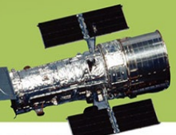
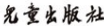

》
h 1791 the A  A

9:
ing

才才充支版社

第六版

总主编   韩启德

文 民

王朝朝
方  成
下载縣

# 十万个为什么

第六版 天文 总主编 韩启德 主 编 王绶琯 方 成 副主编 卞毓麟

## 图书在版编目(Cip)数据

十万个为什么(第六版)/韩启德总主编.-上海:少年儿童出版社,2014.1 ISBN 978-7-5324-9285-5 I.①十……II.①韩……III.①科学知识-青年读物②科学知识-少年读物 IV.①Z228.1②R-49 中国版本图书馆CIP数据核字(2013)第055411号

| 十万个为什么(第六版) 总主编 韩启德   |                    |                                        |
|----------------------------------------|--------------------|----------------------------------------|
| 出                                     | 版                 | 上海世纪出版股份有限公司少年儿童出版社 |
| 地                                     | 址                 | 200052上海延安西路1538号               |
| 发                                     | 行                 | 上海世纪出版股份有限公司发行中心       |
| 地                                     | 址                 | 200001上海福建中路193号                |
| 易 文 网                               | www.ewen.cc        |                                        |
| 少 儿 网                               | www.jcph.com       |                                        |
| 电子邮箱                               | posmaster@jcph.com |                                        |

印 刷 上海中华印刷有限公司

| 上海中华商务联合印刷有限公司 常熟市华通印刷有限公司 上海锦佳印刷有限公司 上海一众印务中心 浙江新华数码印务有限公司   |                         |                              |
|----------------------------------------------------------------------------------------------------------------------|-------------------------|------------------------------|
| 开                                                                                                                   | 本                      | 889×11941/16                 |
| 印                                                                                                                   | 张                      | 221.5                        |
| 出版日期                                                                                                             | 2014年1月第1版第1次印刷 |                              |
| 书                                                                                                                   | 号                      | ISBN 978-7-5324-9285-5/N.962 |
| 定                                                                                                                   | 价                      | 680.00元(全18册)           |
| 版权所有                                                                                                             | 侵权必究                |                              |

$${\hat{\psi}}_{\mathrm{sa}}\pm{\hat{z}}_{\mathrm{fin}}$$

韩启德

## 编辑委员

(以姓氏笔画为序)
干福熹 马宗晋 王 越 王占国 王阳元 王威琪 王振义 王恩 多 王梓坤 王绶琯 王鼎盛 韦 钰 方 成 尹文英 邓子新 邓中翰 卢耀如 叶叔华 叶铭汉 叶朝辉 付小兵 匡廷云 戎嘉 余 朱能鸿 刘嘉麒 池志强 汤钊猷 许健民 许智宏 孙 钧 孙宝国 孙晋良 孙鸿烈 严东生 严加安 李三立 李大潜 李幼 平 李载平 李家春 杨 槱 杨芙清 杨宝峰 杨雄里 杨福家 吴启迪 吴征镒 吴孟超 吴新智 何积丰 谷超豪 汪品先 沈文 庆 沈允钢 沈自尹 沈学础 沈寅初 张弥曼 张家铝 张景中 陆汝钤 陈 颙 陈 霖 陈凯先 陈佳洱 陈宜瑜 陈晓亚 陈润 生 陈赛娟 林 群 林元培 欧阳自远 周又元 周良辅 周忠和 周福霖 冼鼎昌 郑时龄 郑树森 郑哲敏 孟执中 项坤 三 项海帆 赵东元 赵忠贤 俞大光 洪国藩 洪家兴 费维扬 贺 林 秦大河 倪光南 倪维斗 郭景坤 唐孝炎 黄荣辉 黄培 康 戚发轫 崔向群 葛均波 韩启德 韩济生 程 京 傅家谟 焦念志 童坦君 曾溢滔 雷啸霖 褚君浩 滕吉文 潘云鹤 潘建 伟 潘家铮 潘德炉 戴汝为 戴尅戎

$$\mathbf{a}$$
$\ensuremath{\mathcal{A}}$
$$\pm i\hbar$$
$${\vec{D}}=\vec{D}{\vec{X}}$$
$${\overline{{\mathbf{m}}}}\|\pm i\mathbf{\hat{m}}$$
$$\hat{\vdash}\hat{\mathrm{\not\!in}}_{\mathrm{\not\!in}}\hat{\mathrm{\not\!in}}_{\mathrm{\not\!in}}$$
* [10] M. C. Gonzalez-Garcia, M. C. Gonzalez-Garcia, M.  

| 卞毓麟   | 方     | 成     | 卢昌海   | 叶泉志   | 刘     | 炎     | 刘慧根   | 汤海明   | 苏   |    |    |    |
|----------|--------|--------|----------|----------|--------|--------|----------|----------|------|----|----|----|
| 宜       | 李     | 旻     | 李剑龙   | 余       | 恒     | 邹振隆 | 张       | 旭       | 张   | 超 | 陈 | 力 |
| 陈冬妮   | 陈学雷 | 邵正义 | 林       | 清       | 赵君亮 | 施     | 韡       | 姜晓军   | 宣焕 |    |    |    |
| 灿       | 柴一晟 | 萧耐园 | 傅承启   | 谢       | 懿     |        |          |          |      |    |    |    |

$$+\,\!\uparrow\!\uparrow\!\uparrow\!\uparrow\!\uparrow\!\uparrow$$

十万个为什么 第六版 天文

$\overline{\mathbb{H}}$; . 
王绶琯 方 成 板块负责人 撰稿人员
(以姓氏笔画为序)
审稿专家 何妙福 责任编辑:卢 昱 美术编辑:张 怡 整体设计:袁银昌 李 静 版面设计:胡 斌 钟一鸣 王昊圣 科技插图:邓 君 希罗月 迢柳娟 美编助理:王安丝 范艳佳 邓 苗 余姣卓 李宇辰 李虹庆 序言

## 韩启德

经过数百位编委、作者和编辑历时三年的辛勤努力,第六版《十万个 为什么》终于与广大读者见面了。对于中国的科技界、教育界和出版界, 以及千千万万的少年儿童来说,这都是值得高兴的一件事。

《十万个为什么》是由少年儿童出版社于1961年出版的一套科普图 书。在半个世纪的岁月里,这套书先后出版了五个版本,累计发行量超过1 亿册,是新中国几代青少年的启蒙读物,在弘扬科学精神、传播科学知 识、提高全民科学素质方面发挥了巨大作用。在我国,至今还没有一套科 普读物能像《十万个为什么》那样经得起如此长时间的检验,并产生如此 巨大的社会影响。

进入21世纪以来,科学技术的发展日新月异,尤其在网络通信、低碳 环保、基因工程、航空航天、新能源、新材料等领域,研究进展更是一日 千里,乃至从根本上改变着人们的生活与工作方式。为适应科技发展带来 的深刻社会变革,提高国家的综合国力和竞争力,党和政府高度重视加强 科学技术普及,重视提高全民科学素质,并将国家科普能力建设作为建设 创新型国家的一项基础性、战略性任务,这对我国的科普出版提出了更高 的目标。

2006年,国务院正式颁布实施《全民科学素质行动计划纲要》,其中 特别强调要提升未成年人的科学素养,因为只有从青少年时期就开始养成 科学的思维方式与行为习惯,将创新精神与实践能力并重,才能最终使得 全民的科学素质得到根本性的提高。为此,编辑出版一套崭新的适应时代 发展要求的《十万个为什么》,使其在繁荣我国科普创作的进程中发挥"旗 好奇心是青少年的可贵特质,是驱使他们亲近和接受科学的动力,一 定要保护好。从50年来的经验看,"一问一答"是个好形式,也是《十万个 为什么》被大家喜爱的重要原因,在编纂第六版《十万个为什么》时我们 坚持了这一好形式,并力争在传授科学知识的同时,引导读者去思索问 题,去感受科学文化和科学精神,去体会科学探索的乐趣。

出于积极参与科学普及工作,提高全民科学素质的社会责任感,中国 科学院和中国工程院共有百余位院士应邀担任了第六版《十万个为什么》
的编委。其中20余位院士在百忙之中担任了各分册的主编,具体负责组织 相关分册的编纂工作,有40余位院士亲自撰稿。此外,还有700余位来自世 界各地、各个学科的优秀科学家和科普作家参与了新版《十万个为什么》
的编写。这么多高层次科学家参与到一套科普图书的编纂工作中来,这在 我国科普出版史上是空前的。阵容强大的编委会和作者队伍,为新版《十 万个为什么》的科学性、前沿性、权威性和可读性提供了最可靠的保证。

在此,我也谨向所有参与第六版《十万个为什么》编纂工作的编委、主 编、作者和社会各界表示衷心的感谢和深深的敬意。

第六版《十万个为什么》在总结前五版成功经验,并广泛征求各方面 意见的基础上,综合考虑时代的发展和青少年读者的实际需要,将全书分 为三大板块共18个分册。基础板块包括数学、物理、化学、天文、地球、 生命,是传统六大基础学科;专题板块包括动物、植物、古生物、医学、
建筑与交通、电子与信息,是由基础学科衍生出来的重点传统学科;热点 板块包括大脑与认知、海洋、能源与环境、航空与航天、武器与国防、灾 难与防护,则是近些年发展特别迅速,引起社会广泛关注的热点领域。在 编纂每一分册的过程中,我们根据这个学科或专题的内容,充分考虑知识 体系的完整性和科学发展的前瞻性,问题的设计和分布尽量与学科或专题 的内在结构相吻合,从而使每一分册都成为具有完整的内在知识体系的读 物。现代科学技术发展的一大特点是学科之间的交叉融合,相信小读者们 在阅读过程中也会在不同的分册中发现一些共性的问题。

第六版《十万个为什么》在形式上适应了当代青少年的阅读需求,与 国际上同类图书的最新出版潮流相接轨,首次推出彩色图文版,用大量彩 色图片向读者展示当代科技前沿的无穷魅力。内容上具有鲜明的时代特 色,从基础、前沿、关键、战略四个方面来组织问题和编写稿件,重点关 注科技发展的前沿和当代青少年关心的热点问题。尤其值得称道的是,书 中的大量"为什么"是通过各种形式向全国少年儿童征集来的,力求将当前 孩子们最关心、最爱问的问题介绍给他们。同时,新版《十万个为什么》
更加注重思考过程,提倡科学精神,引导创造探索,关注科学与人文、科 学与社会的关系,通过"微问题""微博士""实验场""科学人""关键词"等小栏 目激发青少年的好奇心和探究心理。

我们相信,第六版《十万个为什么》将以全新的问题、全新的体系、
全新的内容、全新的样式,以及数字化时代全新的技术手段,再现《十万 个为什么》每一版都曾有的辉煌,掀起中国科普出版和科学普及的又一个 新高潮。第六版《十万个为什么》的出版,必将引领更多青少年走向科 学,使共和国涌现出更多的栋梁之材。同时,这套书的出版,对于贯彻落 实《全民科学素质行动计划纲要》精神,促使当代中国广大青少年科学世 界观的形成和科学创新能力的提高,推进全社会在讲科学、爱科学、用科 学上形成更加浓厚的氛围,使全民科学素质再上新台阶,发挥不可替代的 关键作用。