# 图书在版编目（CIP）数据

十万个为什么（第六版）/韩启德总主编.-上海：少年儿童出版社，2014.1

ISBN 978-7-5324-9285-5

I.①十……II.①韩……III.①科学知识-青年读物②科学知识-少年读物IV.①Z228.1②R-49

中国版本图书馆CIP数据核字（2013）第055411号

  

  

  

**十万个为什么（第六版）**

**总主编　韩启德**

出　　版　上海世纪出版股份有限公司少年儿童出版社

地　　址　200052上海延安西路1538号

发　　行　上海世纪出版股份有限公司发行中心

地　　址　200001上海福建中路193号

易文网 www.ewen.cc

少儿网 www.jcph.com

电子邮箱　posmaster@jcph.com

印　　刷　上海中华印刷有限公司

　　上海中华商务联合印刷有限公司

　　常熟市华通印刷有限公司

　　上海锦佳印刷有限公司

　　上海一众印务中心

　　浙江新华数码印务有限公司

开　　本　889×11941/16

印　　张　221.5

出版日期　2014年1月第1版第1次印刷

书　　号　ISBN 978-7-5324-9285-5/N.962

定　　价　680.00元（全18册）

**版权所有　侵权必究**

 目录
 

[扉页](../Text/feiye.xhtml)

[版权信息](../Text/bq.xhtml)

[序言](../Text/Section0002_0001.xhtml)

[目录](../Text/TOC.xhtml)

[导言](../Text/Section0002_0002.xhtml)

[人和大海](../Text/Section0002_0002.xhtml#sigil_toc_id_2)

[海洋概论](../Text/Section0002_0003.xhtml)

[海洋是怎样诞生的](../Text/Section0002_0003.xhtml#sigil_toc_id_3)

[海就是洋，洋就是海吗](../Text/Section0002_0003.xhtml#sigil_toc_id_4)

[海洋究竟有多大](../Text/Section0002_0003.xhtml#sigil_toc_id_5)

[五大洋是怎样分开的](../Text/Section0002_0004.xhtml)

[地中海与古地中海一样吗](../Text/Section0002_0004.xhtml#sigil_toc_id_6)

[非洲西海岸线和南美洲东海岸线非常相似，是巧合吗](../Text/Section0002_0004.xhtml#sigil_toc_id_7)

[地球上是山高，还是水深](../Text/Section0002_0005.xhtml)

[为什么海洋那么深](../Text/Section0002_0005.xhtml#sigil_toc_id_8)

[太平洋真的太平吗](../Text/Section0002_0006.xhtml)

[为什么寒冷的北冰洋被称作“黄金渔场”](../Text/Section0002_0006.xhtml#sigil_toc_id_9)

[只有地球上才有海洋吗](../Text/Section0002_0007.xhtml)

[火星上有过海洋吗](../Text/Section0002_0007.xhtml#sigil_toc_id_10)

[太阳系中最大的海洋在哪里](../Text/Section0002_0007.xhtml#sigil_toc_id_11)

[海水及其运动](../Text/Section0002_0008.xhtml)

[为什么海水是蓝的，浪花却是白的](../Text/Section0002_0008.xhtml#sigil_toc_id_12)

[黄海、红海、黑海和白海的水真的是黄色、红色、黑色和白色的吗](../Text/Section0002_0008.xhtml#sigil_toc_id_13)

[为什么海水是咸的，海冰却是淡的](../Text/Section0002_0009.xhtml)

[死海淹不死人，为什么叫死海](../Text/Section0002_0009.xhtml#sigil_toc_id_14)

[海水中的盐从哪里来](../Text/Section0002_0009.xhtml#sigil_toc_id_15)

[热带大洋海面的水在哪里最热](../Text/Section0002_0010.xhtml)

[为什么说东太平洋的厄尔尼诺事件根源在西太平洋](../Text/Section0002_0010.xhtml#sigil_toc_id_16)

[厄尔尼诺事件有“孪生姐妹”吗](../Text/Section0002_0010.xhtml#sigil_toc_id_17)

[只有海面才有波浪吗](../Text/Section0002_0011.xhtml)

[在4000米的深海海底怎么会有波痕](../Text/Section0002_0011.xhtml#sigil_toc_id_18)

[海流是海里的河流吗](../Text/Section0002_0012.xhtml)

[黑潮是从哪里来的](../Text/Section0002_0012.xhtml#sigil_toc_id_19)

[大海为什么能捎信](../Text/Section0002_0012.xhtml#sigil_toc_id_20)

[为什么有些地方的海水会上升，有些地方的海水会下沉](../Text/Section0002_0013.xhtml)

[为什么渔场多建在海水上升的地方](../Text/Section0002_0013.xhtml#sigil_toc_id_21)

[为什么南大洋能吸收大量二氧化碳](../Text/Section0002_0013.xhtml#sigil_toc_id_22)

[海岸线是一条线吗](../Text/Section0002_0014.xhtml)

[为什么海边和沙漠一样也有沙丘](../Text/Section0002_0014.xhtml#sigil_toc_id_23)

[为什么入海河口几乎都有三角洲](../Text/Section0002_0015.xhtml)

[为什么河口三角洲形状不一样](../Text/Section0002_0015.xhtml#sigil_toc_id_24)

[为什么河口三角洲有那么多人口和城市](../Text/Section0002_0015.xhtml#sigil_toc_id_25)

[落潮时海边的水去了哪里](../Text/Section0002_0016.xhtml)

[为什么要到钱塘江去看涌潮](../Text/Section0002_0016.xhtml#sigil_toc_id_26)

[海洋生物](../Text/Section0002_0017.xhtml)

[为什么压力没有把深海生物压扁](../Text/Section0002_0017.xhtml#sigil_toc_id_27)

[水下几千米的深海生物吃什么](../Text/Section0002_0017.xhtml#sigil_toc_id_28)

[海洋生物会发光吗](../Text/Section0002_0018.xhtml)

[海洋生物为什么发光](../Text/Section0002_0018.xhtml#sigil_toc_id_29)

[谁是动物界的潜水冠军](../Text/Section0002_0019.xhtml)

[鲸鱼为什么会“自杀”](../Text/Section0002_0019.xhtml#sigil_toc_id_30)

[为什么鱼儿会飞](../Text/Section0002_0020.xhtml)

[飞鱼为什么要飞](../Text/Section0002_0020.xhtml#sigil_toc_id_31)

[为什么鱿鱼不是鱼](../Text/Section0002_0021.xhtml)

[鱿鱼是怎样游泳的](../Text/Section0002_0021.xhtml#sigil_toc_id_32)

[为什么渔民多在晚上钓鱿鱼](../Text/Section0002_0021.xhtml#sigil_toc_id_33)

[为什么说海豚很聪明](../Text/Section0002_0022.xhtml)

[为什么海豚会救人](../Text/Section0002_0022.xhtml#sigil_toc_id_34)

[海象的长牙有什么用](../Text/Section0002_0023.xhtml)

[海象的皮肤为什么会变色](../Text/Section0002_0023.xhtml#sigil_toc_id_35)

[海龟下完蛋后为什么会流泪](../Text/Section0002_0024.xhtml)

[海龟是怎样认识“回家”路的](../Text/Section0002_0024.xhtml#sigil_toc_id_36)

[海龟是最长寿的海洋生物吗](../Text/Section0002_0024.xhtml#sigil_toc_id_37)

[海星是怎么行走的](../Text/Section0002_0025.xhtml)

[海星是怎么吃东西的](../Text/Section0002_0025.xhtml#sigil_toc_id_38)

[为什么说鲎是海洋中的活化石](../Text/Section0002_0026.xhtml)

[鲎的血液为什么是蓝色的](../Text/Section0002_0026.xhtml#sigil_toc_id_39)

[为什么藤壶能牢牢地附着在礁石上](../Text/Section0002_0027.xhtml)

[不能移动的藤壶如何吃东西](../Text/Section0002_0027.xhtml#sigil_toc_id_40)

[海洋动物是怎么睡觉的](../Text/Section0002_0028.xhtml)

[海獭老带着块石头做什么](../Text/Section0002_0028.xhtml#sigil_toc_id_41)

[海洋中有没有森林](../Text/Section0002_0029.xhtml)

[为什么说海洋中的“隐形森林”改变了地球](../Text/Section0002_0029.xhtml#sigil_toc_id_42)

[为什么单细胞海洋生物是技艺精湛的“雕塑大师”](../Text/Section0002_0030.xhtml)

[只有头发丝几十分之一细的“象牙球”是怎样被“雕刻”的](../Text/Section0002_0030.xhtml#sigil_toc_id_43)

[金字塔是有孔虫壳堆起来的吗](../Text/Section0002_0031.xhtml)

[为什么有孔虫壳能用来研究海水的变化历史](../Text/Section0002_0031.xhtml#sigil_toc_id_44)

[海洋里数量最多的生物是什么](../Text/Section0002_0032.xhtml)

[海洋微小生物是怎样发挥巨大作用的](../Text/Section0002_0032.xhtml#sigil_toc_id_45)

[谁是地球上最小的光合自养生物](../Text/Section0002_0033.xhtml)

[谁是地球上最大的生产者](../Text/Section0002_0033.xhtml#sigil_toc_id_46)

[古菌就是古老的细菌吗](../Text/Section0002_0033.xhtml#sigil_toc_id_47)

[为什么深海也会下“雪”](../Text/Section0002_0033_0001.xhtml)

[“海雪”里藏着什么](../Text/Section0002_0033_0001.xhtml#sigil_toc_id_48)

[沸水能杀死海洋中所有的微生物吗](../Text/Section0002_0034.xhtml)

[为什么嗜热菌能耐高温](../Text/Section0002_0034.xhtml#sigil_toc_id_49)

[清澈的海水中也有病毒吗](../Text/Section0002_0035.xhtml)

[海洋中病毒是怎样进行自身繁殖的](../Text/Section0002_0035.xhtml#sigil_toc_id_50)

[海底与海洋地质](../Text/Section0002_0036.xhtml)

[地球上最长的山脉在陆上，还是在海底](../Text/Section0002_0036.xhtml#sigil_toc_id_51)

[为什么说大洋中脊是地球上最年轻的山脉](../Text/Section0002_0036.xhtml#sigil_toc_id_83)

[海底为什么会有“黑烟囱”](../Text/Section0002_0037.xhtml)

[海底“黑烟”是怎么来的](../Text/Section0002_0037.xhtml#sigil_toc_id_128)

[为什么热液温度高达300～400℃还不沸腾](../Text/Section0002_0037.xhtml#sigil_toc_id_129)

[为什么“万物生长靠太阳”的道理，到了深海就不灵了](../Text/Section0002_0038.xhtml)

[无口又无肛门的深海管状蠕虫怎么存活](../Text/Section0002_0038.xhtml#sigil_toc_id_130)

[冷泉生物群和热液生物群是一样的吗](../Text/Section0002_0039.xhtml)

[为什么说生命可能起源于深海热液](../Text/Section0002_0039.xhtml#sigil_toc_id_131)

[海底以下的地层中有生命吗](../Text/Section0002_0040.xhtml)

[为什么海底以下有长寿微生物](../Text/Section0002_0040.xhtml#sigil_toc_id_132)

[为什么说珊瑚虫是海洋中的建筑师](../Text/Section0002_0041.xhtml)

[为什么有的珊瑚礁会长成圆环形状](../Text/Section0002_0041.xhtml#sigil_toc_id_133)

[深海也有珊瑚礁吗](../Text/Section0002_0042.xhtml)

[为什么没有阳光的海底也有珊瑚生长](../Text/Section0002_0042.xhtml#sigil_toc_id_134)

[为什么海底是“漏”的](../Text/Section0002_0043.xhtml)

[海底“白烟囱”是怎么形成的](../Text/Section0002_0043.xhtml#sigil_toc_id_135)

[地幔里也有“海洋”吗](../Text/Section0002_0044.xhtml)

[海水是怎么到达地幔的](../Text/Section0002_0044.xhtml#sigil_toc_id_136)

[大洋里的水会减少吗](../Text/Section0002_0044.xhtml#sigil_toc_id_137)

[海底也有火山爆发吗](../Text/Section0002_0045.xhtml)

[为什么太平洋中的许多海山顶是平的](../Text/Section0002_0045.xhtml#sigil_toc_id_138)

[为什么太平洋周围地震最多](../Text/Section0002_0046.xhtml)

[为什么海啸能传到千里之外](../Text/Section0002_0046.xhtml#sigil_toc_id_139)

[为什么要到海底监测地震](../Text/Section0002_0047.xhtml)

[用什么办法能预警海啸](../Text/Section0002_0047.xhtml#sigil_toc_id_140)

[为什么海底会有“雪线”](../Text/Section0002_0048.xhtml)

[为什么“海底雪线”也会升降](../Text/Section0002_0048.xhtml#sigil_toc_id_141)

[“海底泥巴”里全是泥吗](../Text/Section0002_0049.xhtml)

[海底也有“泥石流”吗](../Text/Section0002_0049.xhtml#sigil_toc_id_142)

[科学家为什么要到深海海底打钻井](../Text/Section0002_0050.xhtml)

[为什么说地中海曾经干涸过](../Text/Section0002_0050.xhtml#sigil_toc_id_143)

[海洋开发](../Text/Section0002_0051.xhtml)

[海底地层中埋藏的石油是怎么找到的](../Text/Section0002_0051.xhtml#sigil_toc_id_144)

[海底石油是怎样开采出来的](../Text/Section0002_0051.xhtml#sigil_toc_id_145)

[为什么海上打井不抛锚，却能稳定井位](../Text/Section0002_0051.xhtml#sigil_toc_id_146)

[为什么有人把巴西看作“金砖四国”之首](../Text/Section0002_0052.xhtml)

[海底有这么多石油，为什么以前不去开采](../Text/Section0002_0052.xhtml#sigil_toc_id_147)

[海底石油藏在哪儿](../Text/Section0002_0052.xhtml#sigil_toc_id_148)

[怎样寻找海底热液喷口](../Text/Section0002_0053.xhtml)

[深海漏油后怎么办](../Text/Section0002_0053.xhtml#sigil_toc_id_149)

[为什么“冰”也可以燃烧呢](../Text/Section0002_0054.xhtml)

[“可燃冰”是理想的新能源吗](../Text/Section0002_0054.xhtml#sigil_toc_id_150)

[海底的“可燃冰”会“跑”出来吗](../Text/Section0002_0055.xhtml)

[海底泥火山是不是火山](../Text/Section0002_0055.xhtml#sigil_toc_id_151)

[“可燃冰”能帮我们封存大气中的二氧化碳吗](../Text/Section0002_0056.xhtml)

[为什么二氧化碳会在海底形成湖泊](../Text/Section0002_0056.xhtml#sigil_toc_id_152)

[海底为什么有裸露的金属矿](../Text/Section0002_0057.xhtml)

[为什么海底多金属结核至今尚未开采](../Text/Section0002_0057.xhtml#sigil_toc_id_153)

[海水中可以提炼哪些有价值的元素](../Text/Section0002_0058.xhtml)

[为什么说海洋是一座核燃料仓库](../Text/Section0002_0058.xhtml#sigil_toc_id_154)

[怎样利用海水发电](../Text/Section0002_0059.xhtml)

[风力发电厂造在海上好，还是造在陆上好](../Text/Section0002_0059.xhtml#sigil_toc_id_155)

[怎样“打捞”海洋中的太阳能](../Text/Section0002_0059.xhtml#sigil_toc_id_156)

[为什么要把飞机场造在海上](../Text/Section0002_0060.xhtml)

[海岸围垦造地越多越好吗](../Text/Section0002_0060.xhtml#sigil_toc_id_157)

[为什么要在海底建造隧道](../Text/Section0002_0061.xhtml)

[是什么支撑着跨海大桥](../Text/Section0002_0061.xhtml#sigil_toc_id_158)

[“海底酒店”有什么好玩的](../Text/Section0002_0062.xhtml)

[在海里建造“人工礁”有什么用](../Text/Section0002_0062.xhtml#sigil_toc_id_159)

[古代有潜水员吗](../Text/Section0002_0063.xhtml)

[人类能潜入多深的海底](../Text/Section0002_0063.xhtml#sigil_toc_id_160)

[《海底两万里》的科学幻想实现了吗](../Text/Section0002_0064.xhtml)

[深潜器能下潜到海底最深处吗](../Text/Section0002_0064.xhtml#sigil_toc_id_161)

[为什么人类要探测深海](../Text/Section0002_0064.xhtml#sigil_toc_id_162)

[滑翔机能开进海里吗](../Text/Section0002_0065.xhtml)

[登月车能用在海底吗](../Text/Section0002_0065.xhtml#sigil_toc_id_163)

[海上也有气象站吗](../Text/Section0002_0066.xhtml)

[为什么要建造海底观测网](../Text/Section0002_0066.xhtml#sigil_toc_id_164)

[为什么要在大洋海底铺设管线](../Text/Section0002_0067.xhtml)

[为什么海水也会切断海底缆线](../Text/Section0002_0067.xhtml#sigil_toc_id_165)

[能在同一时间测量全大洋的海水温度吗](../Text/Section0002_0068.xhtml)

[从卫星上能测量海面浮游生物的数量吗](../Text/Section0002_0068.xhtml#sigil_toc_id_166)

[海底地形图是怎样编制的](../Text/Section0002_0069.xhtml)

[水下作业用什么办法传递信息](../Text/Section0002_0069.xhtml#sigil_toc_id_167)

[海洋环境](../Text/Section0002_0070.xhtml)

[海平面是平的吗](../Text/Section0002_0070.xhtml#sigil_toc_id_168)

[全球变暖，为什么太平洋小岛国最着急](../Text/Section0002_0070.xhtml#sigil_toc_id_169)

[为什么2万年前，古人从上海可以步行到东京](../Text/Section0002_0071.xhtml)

[为什么说上海是泥沙堆出来的](../Text/Section0002_0071.xhtml#sigil_toc_id_170)

[为什么岛屿会“排队”](../Text/Section0002_0072.xhtml)

[为什么有些岛屿会时隐时现](../Text/Section0002_0072.xhtml#sigil_toc_id_171)

[海水真的在变“酸”吗](../Text/Section0002_0073.xhtml)

[谁是海水酸化首当其冲的受害者](../Text/Section0002_0073.xhtml#sigil_toc_id_172)

[为什么环境恶化会使得水母泛滥成灾](../Text/Section0002_0074.xhtml)

[为什么说珊瑚“褪色”是灾害](../Text/Section0002_0074.xhtml#sigil_toc_id_173)

[海洋会患缺氧症吗](../Text/Section0002_0075.xhtml)

[海底会释放出杀人的毒气吗](../Text/Section0002_0075.xhtml#sigil_toc_id_174)

[海水与河水的界线为什么会变](../Text/Section0002_0076.xhtml)

[海水会不会进到河口里来](../Text/Section0002_0076.xhtml#sigil_toc_id_175)

[为什么世界大洋的海流好像传送带](../Text/Section0002_0077.xhtml)

[深海的海水年龄是怎么测量的](../Text/Section0002_0077.xhtml#sigil_toc_id_176)

[为什么最大的冰盖在南极](../Text/Section0002_0078.xhtml)

[为什么要在南极冰盖上打钻](../Text/Section0002_0078.xhtml#sigil_toc_id_177)

[为什么南极冰盖会“走路”](../Text/Section0002_0079.xhtml)

[为什么冰盖下面还有河流与湖泊](../Text/Section0002_0079.xhtml#sigil_toc_id_178)

[为什么说北冰洋曾经是个“北极湖”](../Text/Section0002_0080.xhtml)

[为什么要用三条破冰船进行北冰洋钻探](../Text/Section0002_0080.xhtml#sigil_toc_id_179)

[北冰洋航线什么时候能够开通](../Text/Section0002_0081.xhtml)

[北极最大的资源是什么](../Text/Section0002_0081.xhtml#sigil_toc_id_180)

[冰山是从哪里来，又会到哪里去](../Text/Section0002_0082.xhtml)

[北冰洋上的冰会完全消失吗](../Text/Section0002_0082.xhtml#sigil_toc_id_181)

[为什么会形成“死亡冰柱”](../Text/Section0002_0083.xhtml)

[海上为什么会有冰灾](../Text/Section0002_0083.xhtml#sigil_toc_id_182)

[人文海洋](../Text/Section0002_0084.xhtml)

[为什么说郑和船队曾是世界上最强的水师](../Text/Section0002_0084.xhtml#sigil_toc_id_183)

[中国最早的航海家是谁](../Text/Section0002_0084.xhtml#sigil_toc_id_184)

[为什么哥伦布会把美洲当作印度](../Text/Section0002_0085.xhtml)

[美洲真的是哥伦布发现的吗](../Text/Section0002_0085.xhtml#sigil_toc_id_185)

[“泰坦尼克号”的遗骸是怎样发现的](../Text/Section0002_0086.xhtml)

[为什么要花巨额经费打捞“南海一号”沉船](../Text/Section0002_0086.xhtml#sigil_toc_id_186)

[为什么加勒比的海盗名气最大](../Text/Section0002_0087.xhtml)

[北欧中世纪的维京人都是海盗吗](../Text/Section0002_0087.xhtml#sigil_toc_id_187)

[为什么百慕大海域被称为“魔鬼三角区”](../Text/Section0002_0088.xhtml)

[大西洋上有过“大西国”吗](../Text/Section0002_0088.xhtml#sigil_toc_id_188)

[深海真的有水怪吗](../Text/Section0002_0089.xhtml)

[为什么深海动物长得特别大](../Text/Section0002_0089.xhtml#sigil_toc_id_189)

# 十万个为什么

# 第六版

# 海洋

**总主编　韩启德**

**主　编　汪品先**

**副主编　彭晓彤**

**黄　维**

十万个为什么　第六版　编辑委员会

**总主编**

韩启德

  

**编辑委员**

（以姓氏笔画为序）

干福熹　马宗晋　王　越　王占国　王阳元　王威琪　王振义　王恩多　王梓坤　王绶琯　王鼎盛　韦　钰　方　成　尹文英　邓子新　邓中翰　卢耀如　叶叔华　叶铭汉　叶朝辉　付小兵　匡廷云　戎嘉余　朱能鸿　刘嘉麒　池志强　汤钊猷　许健民　许智宏　孙　钧　孙宝国　孙晋良　孙鸿烈　严东生　严加安　李三立　李大潜　李幼平　李载平　李家春　杨　槱　杨芙清　杨宝峰　杨雄里　杨福家　吴启迪　吴征镒　吴孟超　吴新智　何积丰　谷超豪　汪品先　沈文庆　沈允钢　沈自尹　沈学础　沈寅初　张弥曼　张家铝　张景中　陆汝钤　陈　颙　陈　霖　陈凯先　陈佳洱　陈宜瑜　陈晓亚　陈润生　陈赛娟　林　群　林元培　欧阳自远　　　周又元　周良辅　周忠和　周福霖　冼鼎昌　郑时龄　郑树森　郑哲敏　孟执中　项坤三　项海帆　赵东元　赵忠贤　俞大光　洪国藩　洪家兴　费维扬　贺　林　秦大河　倪光南　倪维斗　郭景坤　唐孝炎　黄荣辉　黄培康　戚发轫　崔向群　葛均波　韩启德　韩济生　程　京　傅家谟　焦念志　童坦君　曾溢滔　雷啸霖　褚君浩　滕吉文　潘云鹤　潘建伟　潘家铮　潘德炉　戴汝为　戴尅戎

十万个为什么　第六版　海洋

**主编**

汪品先

  

**副主编**

彭晓彤　黄　维

  

**撰稿人员**

（以姓氏笔画为序）

丁平兴　于之锋　王　健　王　鹏　王吉良　毛玉娇　田纪伟　刘苍字　许　斐　孙　松　李一良　李江涛　李季伟　李春峰　李培良　杨　挺　杨守业　肖　娜　时　平　吴自军　汪品先　张　飞　张艳伟　陈多福　陈梦兰　拓守廷　范代读　罗　敏　侍茂崇　周　斌　郑　强　赵　诏　咸淑慧　姚会强　徐大鹏　郭　君　黄　维　戚心源　崔维成　彭晓彤　蒋锦刚　焦念志　谢夏冰　雷　惠　雷宗友　窦文洁　薛　梅

  

  

**责任编辑：熊喆萍**

**美术编辑：陈艳萍**

**整体设计：袁银昌　李　静**

**版面设计：胡　斌　钟一鸣　王昊圣**

**科技插图：黄　维　彭晓彤　雨青工作室　费　嘉　陈艳萍**

**美编助理：叶丹丹　陈　靖　谭晓棠　赵　诣**

**特别鸣谢：王吉良　张　飞**

# 导言

## 人和大海

你见过大海吗？

是的，你到过海边，看见过浪花的飞溅，听到过海涛的吼声；也许你还曾经跨海航行，在船上欣赏海上日出的红霞，赞叹海天一色的辽阔。但是我敢打赌：其实你并不了解海洋。你看到的只是海洋外面的边岸，海洋出露的表面，你并没有看到浩瀚大海的内部。海洋太大了，不光是你，我们整个人类其实都不大了解海洋。

长时期来，人类并不知道海洋有多大。哥伦布就不知道有个太平洋，更不知道海洋有多深；人类进入深海只有几十年的历史。世界大洋平均就有3680米深，由于隔着巨厚的水层，人类对深海海底地形的了解，还赶不上月球表面，甚至赶不上火星。现在我们知道，山高不如水深：陆地最高的珠穆朗玛峰海拔8800多米，海洋最深的马里亚纳海沟却有11 034米深。到现在为止，有3000多人登顶珠峰，400多人进入太空，12人登上月球，但是成功下潜到马里亚纳海沟最深处的，至今只有3人……

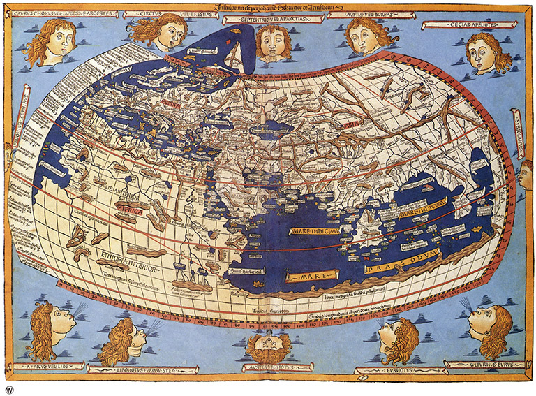
古希腊地图学家托勒玫画的世界地图是没有太平洋的（此图是1482年经过处理之后的作品）

可是不要着急，随着科学技术的进步，人和海洋的关系也在发生变化。自古以来，海洋开发无非是“渔盐之利，舟楫之便”，都是在海洋的表面利用海洋。当代的趋势，却是进入海洋内部、深入到海底去开发海洋。第一次世界大战之后，发明了用声波探测海水深度的声呐；第二次世界大战之后，又学会了用机器人和载人深潜器进入深海；到了今天，海底观测网能够将实验室送到深海海底，海洋钻探船能够穿透海水和海底上万米。“柳暗花明又一村”，在陆地上苦于资源枯竭的人类，终于在占地球表面71%面积的大海里，看到了新的前景。

现在我们知道，深海海底绝不是个没有运动、没有生命的死寂世界，那里不但有“热液”和“冷泉”喷出，繁衍着不靠光合作用的“黑暗食物链”，甚至于海底下面还存在“黑暗生物圈”，还有被喻为“海底下海洋”的水体，预示着不可估量的资源和能源的潜力。今天已经感受到的，那就是深海的石油和天然气。现在全世界开采的石油1/3以上来自海底，在价值上占据了一半以上的世界海洋经济。

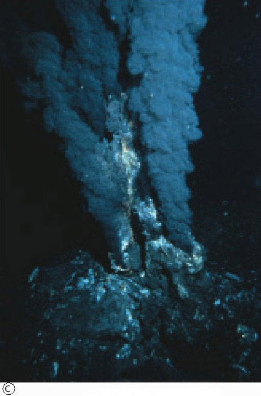
海底“黑烟囱”

海底资源的发现，催生了海上的国际之争。1994年生效的《联合国海洋法公约》，规定了200海里的“专属经济区”，海上的一个小岛，就意味着一大片海洋资源的归属权。你在新闻里天天看到的海岛权益之争，根子就出在海洋资源，第一个争夺对象就是海底的油气资源。但是一部近代史告诉你：中国在海上的国际对抗中不占优势，一二百年前中国的落后就是从海上开始的。1840年的鸦片战争、1894年的甲午战争、1900年八国联军的入侵，中国都是首先败在海上，连1937年淞沪会战的转折点也是因为在金山卫海上失守，最后导致南京大屠杀的惨剧。

但是在更早的历史上，中国曾经有过海上的辉煌；对于中国古代的航海能力，国外的评价甚至比国内高。18世纪就有英国人推论，说周武王伐商纣的时候，一大批殷人渡海逃亡，途中被暴风吹到美洲，很可能就是玛雅人的祖先；21世纪又有一位英国人，说发现“新大陆”的不是哥伦布而是中国人，因为他判断郑和的船队1421年就到过美洲。当然，传说和猜想都不见得靠谱，可是不久前出土的800年前的远洋商船“南海一号”，雄辩地证明了南宋在国际航海中的领先地位；600年前“郑和下西洋”的壮举，无疑标志着中国曾达到世界航海史的顶峰。拥有世界最强水师的中国，后来怎么会沦为海上败兵的呢？

历史的转折点发生在15世纪。郑和下西洋虽然比哥伦布发现新大陆早了90年，但是郑和之后中国自毁水师，明清两朝500年的“海禁”使得中国的船只在大海上几乎绝迹。而从哥伦布开始的“地理大发现”，却带来了一批西欧国家的“大国崛起”，从此改变了世界历史行程的轨迹。固然这里有当时的历史原因，但是更重要的是文化根源：起源于黄河中游农耕社会的华夏文明，属于大陆文化；而西欧文明的源头，却是爱琴海的海洋文化。中国几千年来的主流始终是大陆文化，海洋不在视野之内。中国的古训是“父母在，不远行”，远闯天涯去海外干什么？

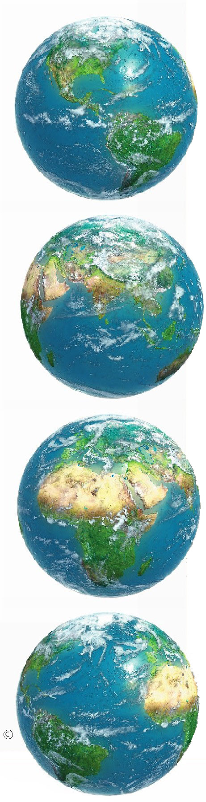
大陆文化和海洋文化各有长处，在15世纪以前无所谓优劣。但是500年来的历史却是海洋的作用越来越大，海洋文化的优势越来越强。当年产生现代科学的是海洋文化，今天统领国际潮流的也是海洋文化。华夏文明有着自己的种种优势，然而大陆文化重陆轻海的传统，长期以来影响着从政府决策到学校教育的各个层面，直到今天我们还在为此付出代价。就以教育来说，无论学生教材还是学科设置，海洋都不是重点，中国青少年对海洋的知识和兴趣，都远比不上发达国家。

值得庆幸的是，在郑和下西洋600年之后，中国第一次出现了全面重视海洋的势头，第一回吹响了建设“海洋强国”的号角。海洋太重要了，振兴华夏必须站稳海上，发展经济必须立足海洋。甚至于在精神和认知层面上，也亟待将弘扬传统的大陆文化和引进新兴海洋文化结合起来，争取成为世界创新文化中的浴火凤凰。

说到这里，我要真诚地向你祝贺：祝贺你打开了这本书。因为这本书的使命，就像是进军海洋乐队里的一支小笛，用它低微而淡雅的声音唤起你对海洋的“恋情”。书里提出的一个又一个问题，将会带你进入海洋世界，领着你探索海洋深处的奥秘，陪伴你寻求海洋奇闻的谜底。对于你看见过不知道多少遍、却不知道原因的现象，它试图告诉你答案；对于你从来没有到过，甚至没有听到过的地方，它给你的可能是难忘的故事和迷人的美丽。

亲爱的读者，祝你在我们这本书里找到快乐，找到启迪！（汪品先）

  

【微问题】　为什么深入海底比进入太空更难？

【关键词】　海洋　深海　海洋经济　海洋文化

# 序言

韩启德

经过数百位编委、作者和编辑历时三年的辛勤努力，第六版《十万个为什么》终于与广大读者见面了。对于中国的科技界、教育界和出版界，以及千千万万的少年儿童来说，这都是值得高兴的一件事。

《十万个为什么》是由少年儿童出版社于1961年出版的一套科普图书。在半个世纪的岁月里，这套书先后出版了五个版本，累计发行量超过1亿册，是新中国几代青少年的启蒙读物，在弘扬科学精神、传播科学知识、提高全民科学素质方面发挥了巨大作用。在我国，至今还没有一套科普读物能像《十万个为什么》那样经得起如此长时间的检验，并产生如此巨大的社会影响。

进入21世纪以来，科学技术的发展日新月异，尤其在网络通信、低碳环保、基因工程、航空航天、新能源、新材料等领域，研究进展更是一日千里，乃至从根本上改变着人们的生活与工作方式。为适应科技发展带来的深刻社会变革，提高国家的综合国力和竞争力，党和政府高度重视加强科学技术普及，重视提高全民科学素质，并将国家科普能力建设作为建设创新型国家的一项基础性、战略性任务，这对我国的科普出版提出了更高的目标。

2006年，国务院正式颁布实施《全民科学素质行动计划纲要》，其中特别强调要提升未成年人的科学素养，因为只有从青少年时期就开始养成科学的思维方式与行为习惯，将创新精神与实践能力并重，才能最终使得全民的科学素质得到根本性的提高。为此，编辑出版一套崭新的适应时代发展要求的《十万个为什么》，使其在繁荣我国科普创作的进程中发挥“旗帜”作用，其意义是非常深远的。

好奇心是青少年的可贵特质，是驱使他们亲近和接受科学的动力，一定要保护好。从50年来的经验看，“一问一答”是个好形式，也是《十万个为什么》被大家喜爱的重要原因，在编纂第六版《十万个为什么》时我们坚持了这一好形式，并力争在传授科学知识的同时，引导读者去思索问题，去感受科学文化和科学精神，去体会科学探索的乐趣。

出于积极参与科学普及工作，提高全民科学素质的社会责任感，中国科学院和中国工程院共有百余位院士应邀担任了第六版《十万个为什么》的编委。其中20余位院士在百忙之中担任了各分册的主编，具体负责组织相关分册的编纂工作，有40余位院士亲自撰稿。此外，还有700余位来自世界各地、各个学科的优秀科学家和科普作家参与了新版《十万个为什么》的编写。这么多高层次科学家参与到一套科普图书的编纂工作中来，这在我国科普出版史上是空前的。阵容强大的编委会和作者队伍，为新版《十万个为什么》的科学性、前沿性、权威性和可读性提供了最可靠的保证。在此，我也谨向所有参与第六版《十万个为什么》编纂工作的编委、主编、作者和社会各界表示衷心的感谢和深深的敬意。

第六版《十万个为什么》在总结前五版成功经验，并广泛征求各方面意见的基础上，综合考虑时代的发展和青少年读者的实际需要，将全书分为三大板块共18个分册。基础板块包括数学、物理、化学、天文、地球、生命，是传统六大基础学科；专题板块包括动物、植物、古生物、医学、建筑与交通、电子与信息，是由基础学科衍生出来的重点传统学科；热点板块包括大脑与认知、海洋、能源与环境、航空与航天、武器与国防、灾难与防护，则是近些年发展特别迅速，引起社会广泛关注的热点领域。在编纂每一分册的过程中，我们根据这个学科或专题的内容，充分考虑知识体系的完整性和科学发展的前瞻性，问题的设计和分布尽量与学科或专题的内在结构相吻合，从而使每一分册都成为具有完整的内在知识体系的读物。现代科学技术发展的一大特点是学科之间的交叉融合，相信小读者们在阅读过程中也会在不同的分册中发现一些共性的问题。

第六版《十万个为什么》在形式上适应了当代青少年的阅读需求，与国际上同类图书的最新出版潮流相接轨，首次推出彩色图文版，用大量彩色图片向读者展示当代科技前沿的无穷魅力。内容上具有鲜明的时代特色，从基础、前沿、关键、战略四个方面来组织问题和编写稿件，重点关注科技发展的前沿和当代青少年关心的热点问题。尤其值得称道的是，书中的大量“为什么”是通过各种形式向全国少年儿童征集来的，力求将当前孩子们最关心、最爱问的问题介绍给他们。同时，新版《十万个为什么》更加注重思考过程，提倡科学精神，引导创造探索，关注科学与人文、科学与社会的关系，通过“微问题”“微博士”“实验场”“科学人”“关键词”等小栏目激发青少年的好奇心和探究心理。

我们相信，第六版《十万个为什么》将以全新的问题、全新的体系、全新的内容、全新的样式，以及数字化时代全新的技术手段，再现《十万个为什么》每一版都曾有的辉煌，掀起中国科普出版和科学普及的又一个新高潮。第六版《十万个为什么》的出版，必将引领更多青少年走向科学，使共和国涌现出更多的栋梁之材。同时，这套书的出版，对于贯彻落实《全民科学素质行动计划纲要》精神，促使当代中国广大青少年科学世界观的形成和科学创新能力的提高，推进全社会在讲科学、爱科学、用科学上形成更加浓厚的氛围，使全民科学素质再上新台阶，发挥不可替代的关键作用。

# 海洋概论

## 海洋是怎样诞生的

从荒凉的月球表面看地球冉冉升起的刹那，对比是惊人的！相对于月球的死寂，地球是活的！这活力来自海洋，是海洋使地球在太阳系中如此独特！

地球之水哪里来？这是个古老的谜，谜底还没有完全揭开。曾经，科学家认为地球上最早的水来自地球内部火山爆发所释放的大量水蒸气。后来的研究发现，地球之水可能自天上来，即由携带大量冰块的彗星和小行星带入古大气圈。目前人们普遍相信地球上的水很可能是上述两种来源的结合。

那么，海洋又是怎样诞生的呢？这还要从地球的起源说起。大约46亿年前，太阳系中的一些尘埃、彗星、小行星以及气体等在引力作用下相互结合，越聚越大，形成最早的地球。初始的地球只是岩石和冰块的简单聚合体，随着地球自身引力不断增大，地球开始急剧收缩，同时岩石内部放射性元素不停衰变，释放出大量热能。强大的引力吸引更多的陨石和小行星像飞蛾扑火一样撞向地球，并产生无法想象的巨大热能。这些热量使铁镍等元素熔化，并使地球处于熔融状态。于是地球开始大改组，重物质下沉形成地核，轻物质上升形成地幔和地壳。

原始海洋的诞生

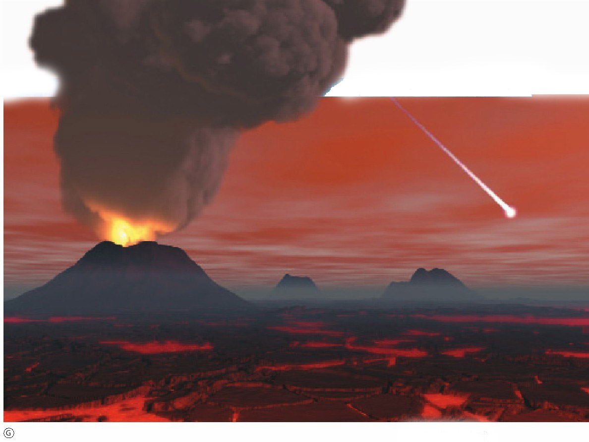
早期的地球

这个时期的地球极为动荡，地震频频，火山爆发此起彼落。火山不仅喷发岩浆，还将早先吞进“肚子”里的大量冰块以水蒸气的形式喷发出来。由于地表温度高于沸点，这些水都以蒸汽的形式存在于原始大气中，同时彗星和小行星密集闯入地球，所携带的大量冰块也顷刻化为蒸汽储存于大气中，致使天空在好几亿年中一直乌云密布，不见天日。后来撞击事件慢慢停止，地球内部温度逐渐降低，地壳终于冷却下来，于是蓄势待发的水蒸气凝结成雨水。大约在40亿年前，地球上下了一场持续1000万年之久的倾盆大雨，这场暴雨不仅使地球表面彻底冷却，也诞生了原始海洋。

由于原始大气中没有氧气，且二氧化碳、硫化氢、二氧化硫等酸性气体含量很高，所以原始海洋缺氧，呈酸性，盐分也很低。又经过亿万年的地球化学循环，比如蒸发、雨水的溶解、河流的冲刷等，海水的盐度和化学组成终于平衡稳定下来。板块学说认为，大约在38亿年前，海洋中出现了最早的蓝藻类单细胞生命。随着藻类的增多，光合作用开始给地球带来氧气。大约2亿年前，世界上只有一个联合古陆被大洋包围，也就是古太平洋。后来由于熔岩从地球内部上涌，联合古陆四分五裂，分开的地方形成新的海盆，海水涌入，成为而今的大西洋和印度洋，海洋逐渐演化成了今天的样子。（陈梦兰）

## 海就是洋，洋就是海吗

海洋，海洋，无论在口语还是在书面语中，这两个字总是难舍难分。事实上，除了少数几个内海，海与洋确实是彼此相连的水体，但它们并不是一回事。地理学家根据它们与陆地的联系将海与洋划分开来。

根据这个划分，洋是巨大的、开阔的，是海洋的主体。世界上有五个大洋，每一个都有自己的洋流和潮汐，受陆地的影响较小。洋很深，大多在3000米以上。大洋里的水纯净而少杂质，永远呈蓝色，永远不需要为自己寻找出口。

海与陆地相邻，部分或绝大部分被陆地环绕。海的面积比洋小得多，如最大的地中海面积也比最小的北冰洋小得多。海没有自己的潮汐，海的温度、盐度，海水的颜色和杂质含量等受陆地上的河流、气候和污染的影响很大。比如阿拉斯加的库克湾，由于冰川融入，海水呈乳灰色，水温和盐度都很低。中国的东海，由于长江携带大量泥沙汇入，近岸海水呈黄色。另外，海比洋也浅得多。

世界上有近50个海，如地中海、白令海、加勒比海等，它们或是边缘海或是陆间海。（陈梦兰）

## 海洋究竟有多大

海洋覆盖了地球表面的71%，由于已知地球直径，便不难算出海洋面积约为3.6亿平方千米。但是，海洋的体积要难估算得多，因为海水深浅不一，而早期的测深技术又很不准确。有了现代声学技术后，人们才探明全球海洋的平均深度是3680米，由此估算出海水总体积约为13亿立方千米。想象一下，假如地球表面是光滑平坦的球面，这么多的水足以将整个地表淹没在约2600米水深之下。

地球是一个水的星球

地球上的水97%以上都在海里，淡水只占了不到3%，其中绝大部分又以冰的形式储存在南北极。最常见的江河湖泊虽然纵横大地，却只占地球水的0.036%，与海洋一比，真是一丁点儿！

浩瀚的海洋将陆地分隔成大大小小的陆块和岛屿，而海洋本身却是相互贯通、浑然一体的，只是人们习惯以陆地或海底洋脊为界，将世界海洋分成太平洋、大西洋、印度洋、北冰洋和南大洋五个大洋。其中太平洋最大最深，占海洋总面积的46%，比所有的陆地加起来还要大！大西洋位于美洲、欧洲和非洲之间，占23%。印度洋伸展在非洲和澳大利亚——东南亚之间，占21%。南大洋是后来从太平洋、大西洋和印度洋中分出来的，它将南极洲团团围住。与此相反，最小、最浅，也最冷的北冰洋则几乎被陆地团团包围。

看一眼地球仪，你会注意到南北半球之间海洋和陆地的分配是多么不均匀！北半球海洋面积占61%，而在南半球海洋面积高达81%。尤其在南纬56°～65°之间，南大洋合抱成360°一圈，如果沿着这个纬度线航行，你将始终看不到陆地，只能感叹海洋的浩瀚无边。（陈梦兰）

  

【微问题】　太阳系八大行星，为什么只有地球上才存在海洋？

【关键词】　海洋的诞生　五大洋　海洋的面积和体积

## 五大洋是怎样分开的

中国古代神话传说认为，在天地尚未形成之前，宇宙犹如一个“大鸡蛋”，漆黑、混沌一团，里面没有光，也没有声音。这时候出现了一位盘古氏，他用神斧劈向这团混沌，轻的气向上浮，就成了天；重的气向下沉，就成了地。后来，盘古氏死了，他的身体的各个部位就变成了太阳、月亮、星星、高山、河流和草木等等。当然，这只是盘古开天辟地的神话。但是，科学家确实一直在致力于研究地球上大陆和海洋是怎样形成的。

现今地球表面总面积约为5.1×108平方千米。其中，陆地面积约占地表总面积的29%，海洋面积约占地表总面积的71%。地球上的陆地和海洋分布极不平均，陆地主要分布在北半球，约占陆地总面积的67.5%。北半球的海陆面积比约为1.5∶1，南半球则约为4.2∶1。地球从形成到现在，海洋和陆地的位置是一直不变的吗？答案是否定的。那么以前的陆地会在什么位置呢？

魏格纳（1880-1930）

1915年，德国气象学家魏格纳完成了《海陆的起源》一书，全面系统地阐述了“大陆漂移学说”。他认为，在约2亿年以前，全球各个大陆曾拼合在一起，组成了一个超级大陆——盘古大陆（Pangea，源自希腊文，意为“整个陆地”），又称为“联合古陆”或“泛大陆”。其中北面的一系列大陆包括北美洲、亚欧大陆（除阿拉伯半岛和印度半岛）等，称为劳亚古陆（Laurasia）；南面一系列大陆包括南美洲、非洲、印度、阿拉伯半岛、澳大利亚等，称为冈瓦纳古陆（Gondwana）。与现今各大陆的位置相比，盘古大陆的位置总的来说要偏南得多。而包围这个“泛大陆”的海洋被称为“泛大洋”或“古太平洋”，整个“泛大洋”在全球连成一片。在那个时候，也就是地质时期的三叠纪末期（约2亿年前），中国华北、华南等区域还没有拼合成现在的整体大陆。随后，盘古大陆分三个阶段开始解体、分离，其碎块发生漂移。第一个阶段发生在侏罗纪时期（约1.8亿年前），非洲和北美洲最先破裂，形成北大西洋。第二个阶段发生在白垩纪初（约1.4亿年前），南美洲和非洲分离，形成南大西洋；与此同时，印度、澳大利亚和南极洲分离，形成印度洋；随后，大西洋和印度洋逐渐发生海底扩张。第三个阶段即5000多万年前，澳大利亚与南极洲分离，向北漂移，北大西洋洋中脊伸入北冰洋。到距今二三百万年前，漂移的大陆形成现在的七大洲和五大洋的基本格局。（王健　李春峰）

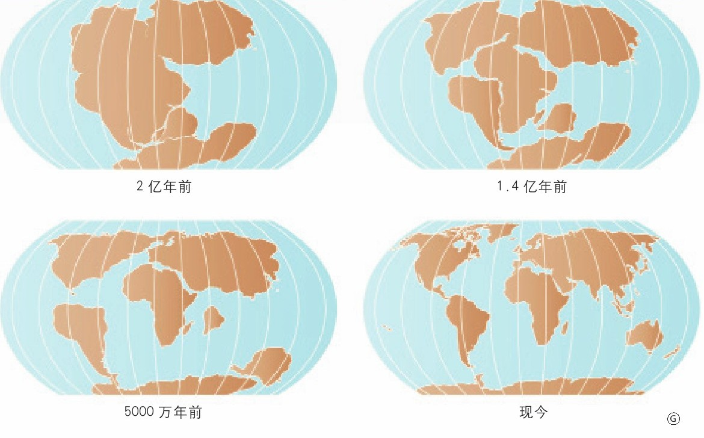
不同时期的地球海洋分布

  

**【微博士】**超级大陆和超级大洋

“天下大势，分久必合，合久必分”这句话，也适用于地球上的海陆分布。今天的七大洲，2亿年前都凑在一起，组成联合古陆，周围的超级大洋就是今天太平洋的前身。其实距今10亿年前，地球上的大陆也曾经凑在一起，叫作罗迪尼亚大陆（Rodinia，源于俄文，意为“诞生”），经过分裂和聚合才形成联合古陆；更早的联合古陆出现在距今18亿年前……可以推想，今天的七大洲在若干亿年后又会合成一个超级大陆。

## 地中海与古地中海一样吗

今天的地中海位于亚欧大陆与非洲之间，是世界上最大的陆间海，拥有许多天然良好的港口，是沟通三个大陆的交通要道。自古以来，地中海的海上贸易就很兴盛，航海业很发达。那么，古地中海和今天的地中海一样吗？

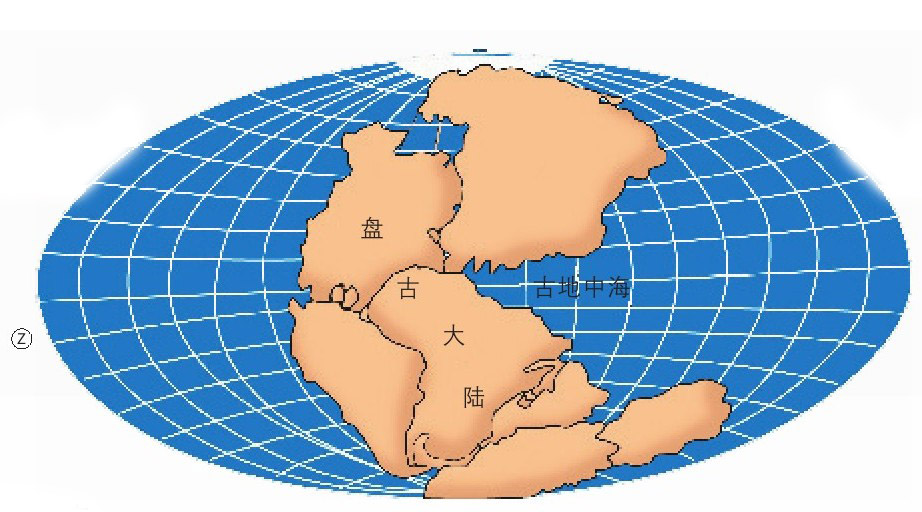
古地中海

不完全一样。在盘古大陆时期，北半球的劳亚古陆和南半球的冈瓦纳古陆之间长期存在一个喇叭形、向东开口的大海，称为特提斯海，又被称为古地中海。今天的地中海是古地中海经过长期演化后的残余部分。

古地中海面积十分辽阔，横跨欧、亚、非、南美和北美五大洲，甚至向东延伸至中国东部。当时古地中海地区的气候非常温暖，是海生动植物发展茂盛的地域，这也是今天中东地区盛产石油的主要原因之一。印度板块分离出来以后，以较快的速度向北漂移，古地中海开始缩小。到距今6500万年前的白垩纪末期，印度板块与亚欧板块发生碰撞，喜马拉雅地区开始露出水面，古地中海开始消亡。

然而，令人无法想象的是，作为古地中海残余部分的地中海在600万年前曾一度干涸过，变成了一个“沙漠”——干盐池。当直布罗陀海峡的大门重新被打开时，大西洋的海水再次注入新诞生的地中海。但是，目前直布罗陀海峡正在变浅而成为一道海槛，逐渐阻隔大西洋和地中海的连通。在未来的某一天，地中海是否会再次干涸，再次上演海洋变沙漠的奇观呢？（王健　李春峰）

今天的地中海

## 非洲西海岸线和南美洲东海岸线非常相似，是巧合吗

魏格纳的大陆漂移思想最初是从大西洋两岸轮廓的相似性中得到启发的，特别是非洲西海岸线和南美洲东海岸线看上去相互吻合。这是巧合吗？魏格纳可不这样认为，为了回答这个问题，作为气象学家的他开始研究陌生的地质学、古生物学。最终在1915年，他根据大西洋两岸海岸线吻合和前中生代地质古生物相似的特点，发表了《海陆的起源》一书，全面系统地阐述了“大陆漂移学说”。

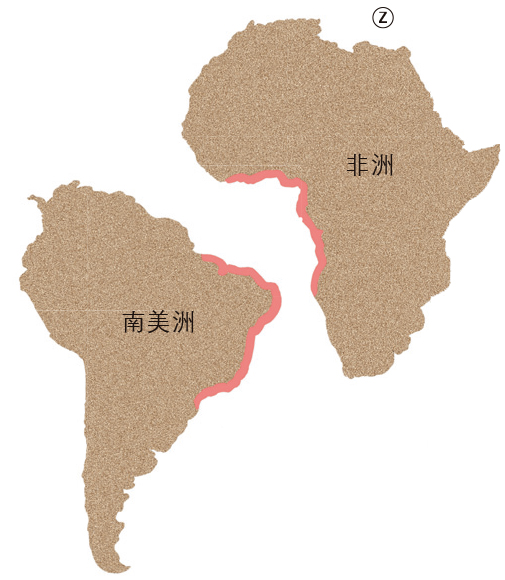
魏格纳注意到，红色部分的海岸线形状相似

第二次世界大战结束后，各种地球探测技术特别是海洋探测技术的发展，极大地推动了诸如古地磁学、地震学、海洋地质学等学科的发展。美国地质学家赫斯和海军电子实验室的迪茨于1960年和1961年相继提出“海底扩张学说”，认为地幔物质在大洋中脊上升，在其顶部产生新的洋壳，并逐渐向两侧运动而冷却。1963年，瓦因和马修斯将海底扩张与地磁场倒转联系起来，圆满地解释了海底扩张学说，因而也说明了大陆漂移的确是正在发生的事实。随后，美国科学家摩根、英国科学家麦肯齐和法国科学家勒皮雄等先后提出了“板块构造学说”，这是现代地球科学的一次革命。

根据板块构造学说，约2亿年前盘古大陆开始破裂。在白垩纪初，南美洲和非洲分裂。原先，两个大陆的大陆边缘（约1000米等深线）是拼接在一起的，现在，它们变成了非洲的西海岸线和南美洲的东海岸线，两者当然就能相互吻合了。（王健　李春峰）

  

【微问题】　为什么大陆会分分合合呢？

【关键词】　大陆漂移学说　海底扩张学说　超级大陆

## 地球上是山高，还是水深

人们往往用海枯石烂来形容历时久远，用“比天高，比海深”来形容厚重的感情。但是，海洋到底有多深呢？19世纪的时候，人们开始了探测深海的环球航行，那时候的考察船其实就是军舰，水手也就是海军士兵。他们测深的办法很简单：拿一个炮弹壳来，系在缆绳上抛入大海，等到炮弹壳碰到海底后把缆绳拉上来量长度，缆绳在水里的长度，就算是海深。这样“测量”的精度可想而知，得出的结论在今天看来也有点离谱——海底基本上是平的。真正科学测量海洋的深度是在20世纪开始的。第一次世界大战之后，德国人发明了声波测深的技术：人工制造的声波从船上射向海底再反射回来，根据声波来回的时间就可以精确测量水深。这种声呐测深的技术，一直沿用到今天。

现在我们知道：海洋的平均水深大约是3680米，水深超过2000米的深海区是海洋的绝对主角，占到海洋面积的84%。我们所熟知的浅海，比如珊瑚礁、藻林生长的区域，只占海洋面积的一小部分。与海洋相比，地球陆地的平均海拔高度大约800米，即便是著名的世界屋脊——青藏高原，面积不过240万平方千米，平均海拔不过4500米。而在海洋中，平均水深5000米的洋盆面积占地球总面积的40%，超过2亿平方千米。如果将青藏高原放到深海中，其中的绝大多数地方将被淹没在汪洋大海之中，露出水面的只有零星分布的小岛！

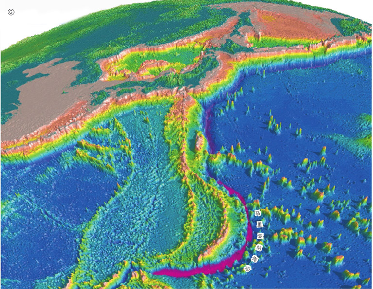
马里亚纳海沟

我们往往用高不可攀来形容高山，其实海洋更加深不可测：地球上最深的地方——马里亚纳海沟，水深竟达11 034米，如果将世界最高的山峰——珠穆朗玛峰放入马里亚纳海沟，峰顶离水面还有2000多米！

地球上是山高还是海深，你一定知道答案了吧！（王吉良）

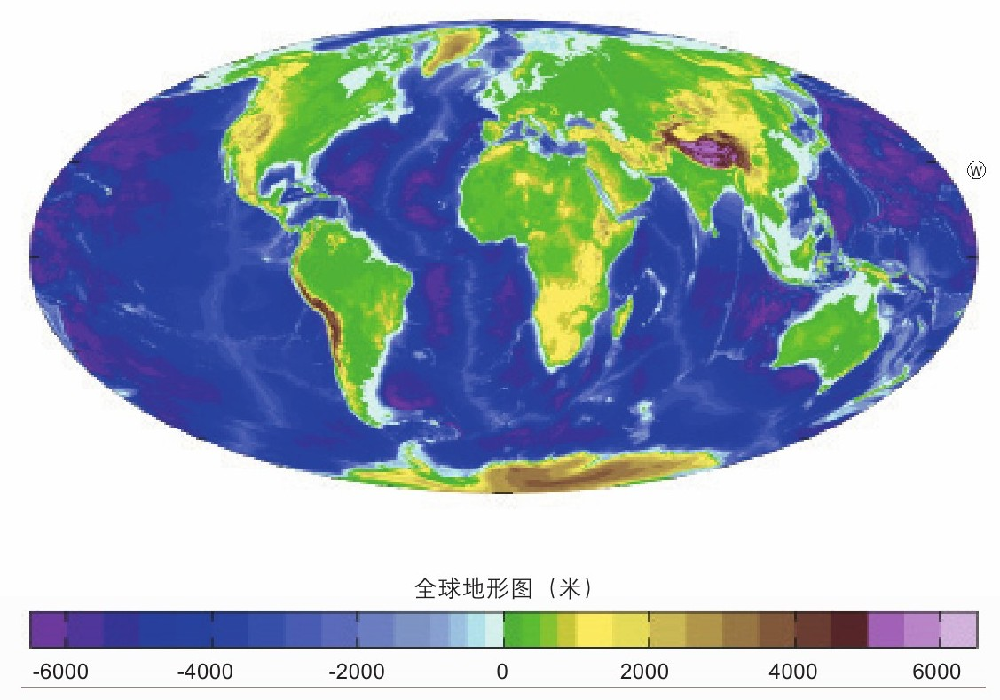
  

**【微博士】**地球上距离地心最近的地方

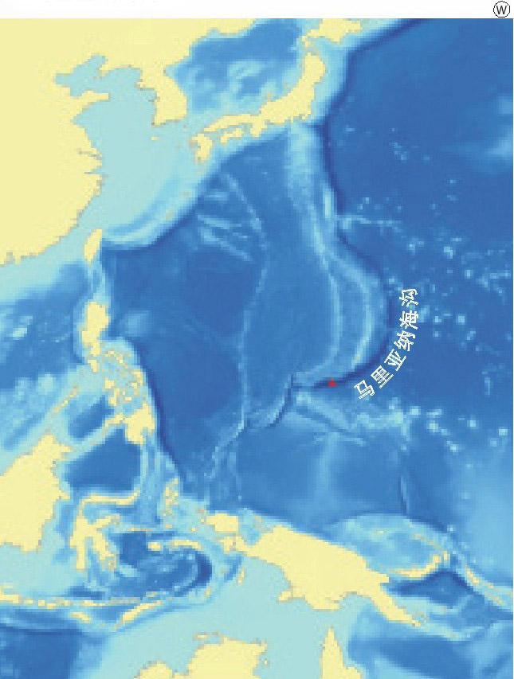
马里亚纳海沟

马里亚纳海沟是世界上最深的地方，但它却不是离地球中心最近的地方。由于自转，地球成为一个两极稍扁、赤道略鼓的不规则球体。因此，地球上距离地心最近的地方很可能在靠近北极点的北冰洋的最深处，尽管那里水深只有5450米，但离地心约6353千米，而马里亚纳海沟离地心6366千米！

**【微博士】**海洋地图，任重道远

尽管海洋就在我们身边，但人类对它的了解在一定程度上还比不上远在外太空的金星和火星。人类拍摄到的火星地图的分辨率是海洋地图分辨率的15倍！绘制一张高清晰度的海洋地图，任重而道远。

## 为什么海洋那么深

曾经有人给出了一个形象的比喻：占地球表层最多的海水，装在了地球上最大最深的盆子——洋盆里。

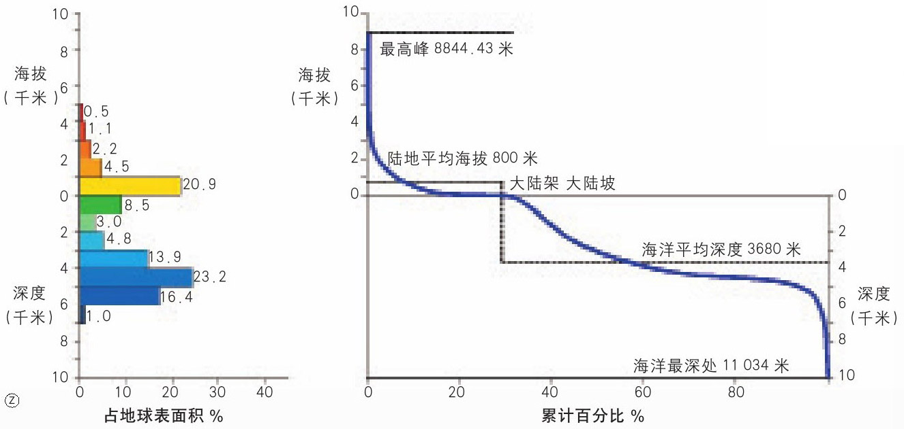
地球上陆地高度和海洋深度的统计

经过数十亿年的演变发展，现在地球表面的水总共约有13.3亿立方千米，其中海水约占97.3%的绝对优势，如果把海水平均分布在地球表面，水深大约有2600米！如果把全世界陆地的高度和海洋的深度分别统计，可以发现两者之间的分布并不连续：陆地以海拔0～100米区域为主；而海洋则以3000～6000米水深为主。海洋平均深度大约为3680米，陆地平均海拔大约为800米。为什么会出现两个不同的峰值呢？

原来地球上有两种不同成分的地壳：大洋壳和大陆壳。大洋壳主要成分是玄武岩，密度大约2.9克/厘米3；大陆壳主要成分是花岗岩，密度大约2.7克/厘米3。两者的下面都是橄榄岩成分的地幔，密度为3.3克/厘米3。依照均衡代偿的原理，重的地壳向下沉，轻的地壳向上浮，于是就有了大陆和大洋的深度差别。不但如此，重的地壳薄，轻的地壳厚，大洋壳平均厚度不到10千米，大陆壳平均厚度为33千米。而且地面的山越高，底下的“根”越深，青藏高原的地壳厚度就超过70千米！

海沟是海洋的最深处。这是因为海沟是地球上板块俯冲的地方，也就是地壳消潜、向下插到地幔里去的地方。最深的马里亚纳海沟位于菲律宾东北的太平洋底，靠近马里亚纳群岛。这条海沟全长达2550千米，平均宽度约70千米，大部分地区水深在8000米以上。经过探测，海沟最深处距离海面11 034米，它也是地球上的最深点。在海沟的最深处，压力高达1100个大气压，就好像一辆小轿车停在一枚一角钱的硬币上产生的压力！即便如此，科学家曾多次乘坐深海潜水器成功下潜到马里亚纳海沟底部进行科学考察。在这样的深海，在永恒的黑暗里，在如此大的压力下，科学家竟然还曾发现游动自如的比目鱼和小红虾！（王吉良）

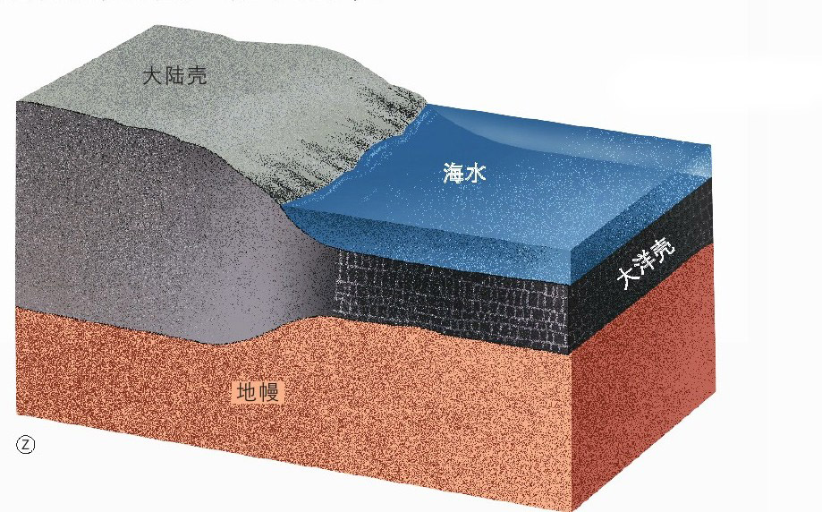
大洋壳和大陆壳

  

【微问题】　为什么海沟主要分布在太平洋西侧？

【关键词】　海沟　海深　海拔　板块运动

## 太平洋真的太平吗

世界大洋有五位“兄弟姐妹”，分别是太平洋、大西洋、印度洋、北冰洋和南大洋。它们各具风姿，脾气秉性也各不相同。在它们当中，太平洋是当之无愧的老大。它不仅拥有面积最大、水深最深、岛屿最多等炫目头衔，还以海面上常出现惊涛骇浪而闻名于世。这个并不太平的大洋为什么被称为太平洋呢？其实这里还有一段非常有趣的故事！

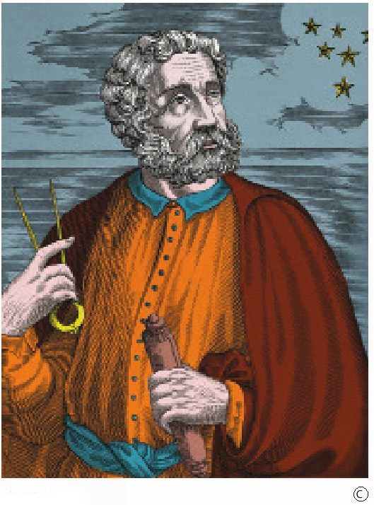
麦哲伦

16世纪初期，葡萄牙著名航海家麦哲伦组建了一支由270多名水手、5条船组成的探险队、开始了他们的首次海上环球之旅。浩浩荡荡的船队从西班牙出发，沿大西洋向南航行。一路上，海面波涛汹涌，海况十分恶劣。探险队历尽磨难，在损失过半船员和船只的情况下，才越过了南美洲最南端，进入了太平洋。又经历了3个多月的艰苦航行，他们终于越过关岛，来到了菲律宾群岛。在从关岛到菲律宾群岛的这段航程中，由于进入了赤道无风带，海面上风平浪静，船犹如在平静的湖面上航行，没有了令人难受的颠簸摇晃。如此舒服的海况，令之前饱受狂风巨浪之苦的船员十分高兴，感叹地说：“这真是一个太平洋啊！”从此，人们把美洲、亚洲、大洋洲之间的这片大洋称为太平洋。

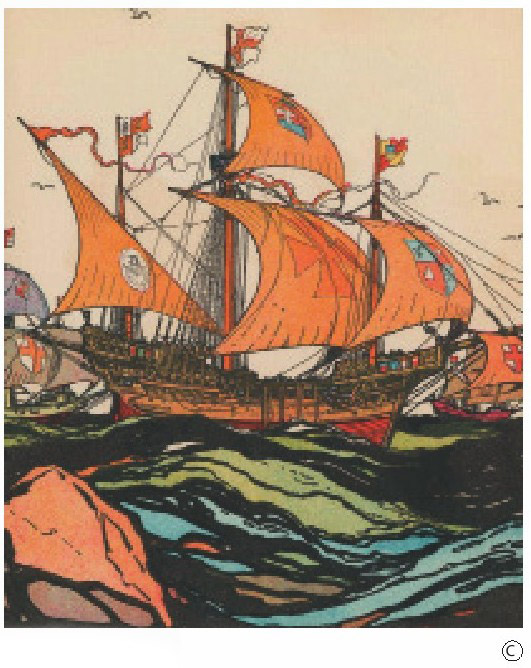
麦哲伦船队

然而，除了位于赤道无风带的海域外，大部分的太平洋海域其实并不总是那么安宁。在广阔无垠的太平洋上，还分布着能够制造风浪的信风带、西风带和极地东风带。这些风带分别位于不同的纬度，东西走向横亘在宽广的太平洋上，就像一排排巨型的鼓风机，搅动着原本平静的海面。

信风带分布在太平洋南北纬5°～25°附近。北半球盛行东北信风，南半球盛行东南信风。相对西风带而言，信风带的风力比较温和，很难掀起狂风巨浪。但你可千万别以为太平洋低纬度海域就一定是微风徐吹，巨浪绝迹了。在太平洋低纬度地区，还有另外一支自然力量可以制造出惊涛骇浪，它就是台风（强度较低的被称为热带风暴）。每年的夏末秋初，在菲律宾以东以及中国南海等低纬度海域，常会形成猛烈的台风。伴随着台风移动，海面上将会掀起滔天巨浪和狂风骤雨，十分不利于海上航行和作业。

太平洋中纬度海域（南北纬30°～60°）主要受西风带的控制。在地转偏向力的作用下，北半球盛行西南风，南半球盛行西北风。西风带风力一般比较强劲，可以在海上造成巨大的风浪。中国“雪龙号”科考船从上海出发到南极进行科学考察时，西风带是其必经的区域。尽管海况恶劣，但是科考队员每次都能战胜困难，胜利到达目的地。

极地东风带是在太平洋上营造风浪的另一支重要力量，它控制着部分太平洋的高纬度地区。特别是在冬季，极地东风带锋面十分猛烈，刺骨强劲的寒风常掀起海上大浪。（彭晓彤）

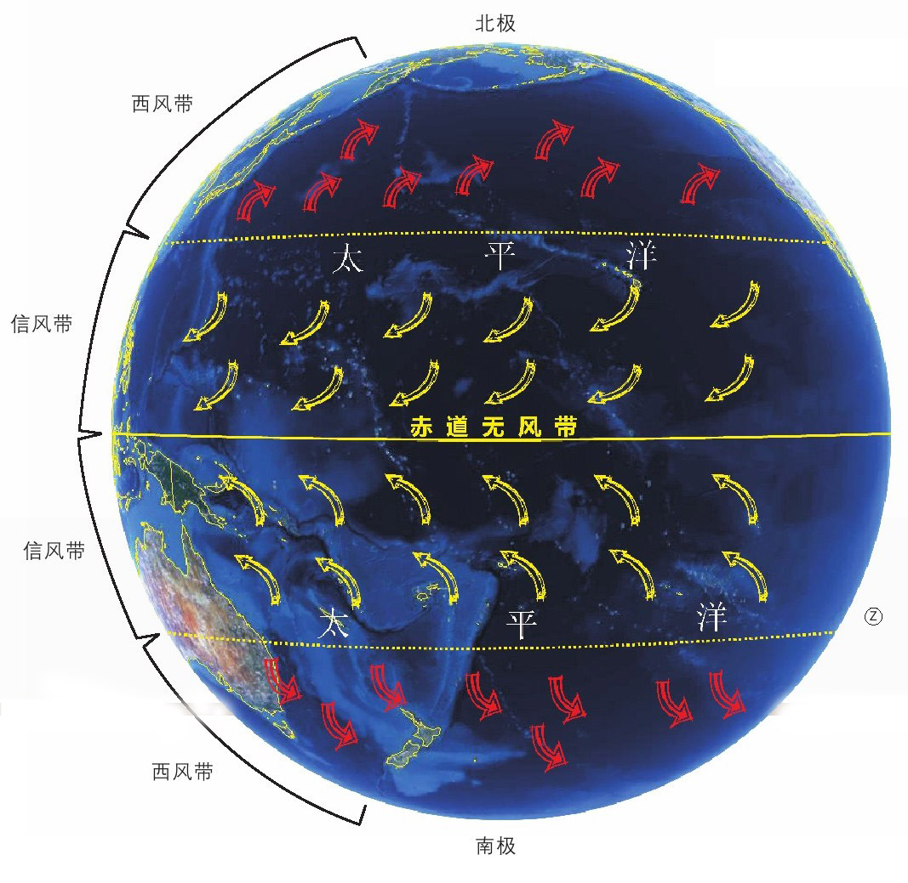
太平洋上的风带

  

**【微博士】**信风是如何产生的

在赤道地区，由于太阳长时间直射，气候炎热，海面上大量的海水被蒸发，产生旺盛的上升气流。气流升到了高空后，开始从赤道向两极扩散。当气流到达南北纬30°附近时，遇到副热带高压开始沉降，并从高纬度区向低纬度区（赤道区）回流。在地转偏向力的作用下，在北半球形成东北信风，在南半球形成东南信风。由于信风对于古代的航海贸易十分重要，所以又被称为贸易风。

## 为什么寒冷的北冰洋被称作“黄金渔场”

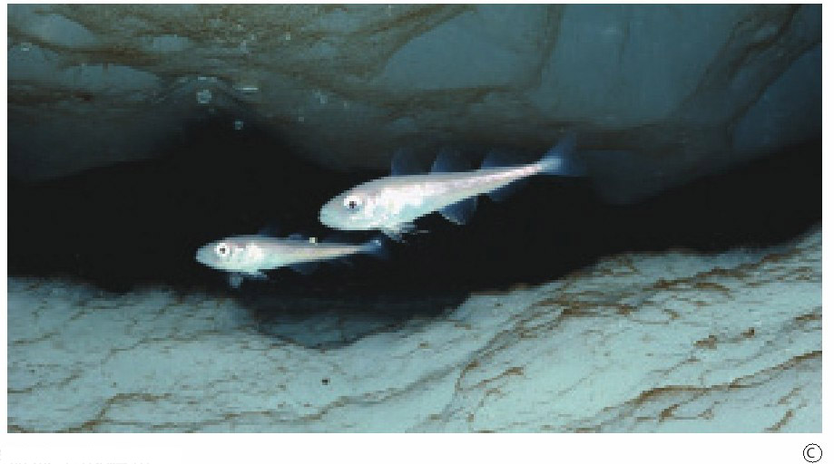
北冰洋海冰下的鳕鱼

与太平洋相比，北冰洋显得小巧玲珑。它是最小、最浅和最冷的大洋。北冰洋的水温极低，夏季也大多在10℃以下，大部分海域的冬季表层海水温度则在0℃以下。由于海水的盐度很高，海水的冰点降至-2℃，所以即使水温略低于0℃，北冰洋的海水也不会结冰。除了正常流动的海水外，在北冰洋洋面上，还大面积分布着常年不化的冰盖和浮冰。在深蓝的海水和蔚蓝的天空衬托下，北冰洋的冰雪奇景显得格外的绚丽，常常令摄影师流连忘返。

你可能会认为，在这样一个寒冷的冰水世界里，鱼的数量一定少得可怜吧！是啊，按常理推想，谁喜欢长期生活在这么冰冷的环境中呢？可事实却恰恰相反，北冰洋中鱼的种类虽然不多，但数量却很大，人们甚至将其称为“黄金渔场”。这又是怎么回事呢？原来，虽然北冰洋的海水十分冰冷，但这里的食物却一点也不缺乏。每逢春季，由南而上的北大西洋暖流为北冰洋的边缘海带来十分丰富的营养，刺激了海水中浮游生物的旺盛生长。这些微小的浮游生物直接或间接地为北冰洋的鱼类提供了丰盛的食物，使得它们可以大量地繁殖。因此，与同纬度的其他海域相比，北冰洋边缘海有着异常高的鱼类产量。

位于挪威和俄罗斯以北的巴伦支海是北冰洋以产鱼闻名的边缘海之一。它的平均水深才230米，最大水深仅450米。这里盛产鳕鱼、毛鳞鱼和鲽鱼等。它们以磷虾、冰藻、蛤、蟹或其他底栖生物为食。当然，这些鱼自己也常常成为乌贼、北极熊、海豹和鲸鱼等上层掠食者口中的美食。为了对抗冰冷的海水，有些种类的鱼已经进化出了“抗冻”蛋白。这些特殊的蛋白可以使鱼的血液即使在0℃以下也不凝固，从而保护它们不受北冰洋冰冷海水的伤害。（彭晓彤）

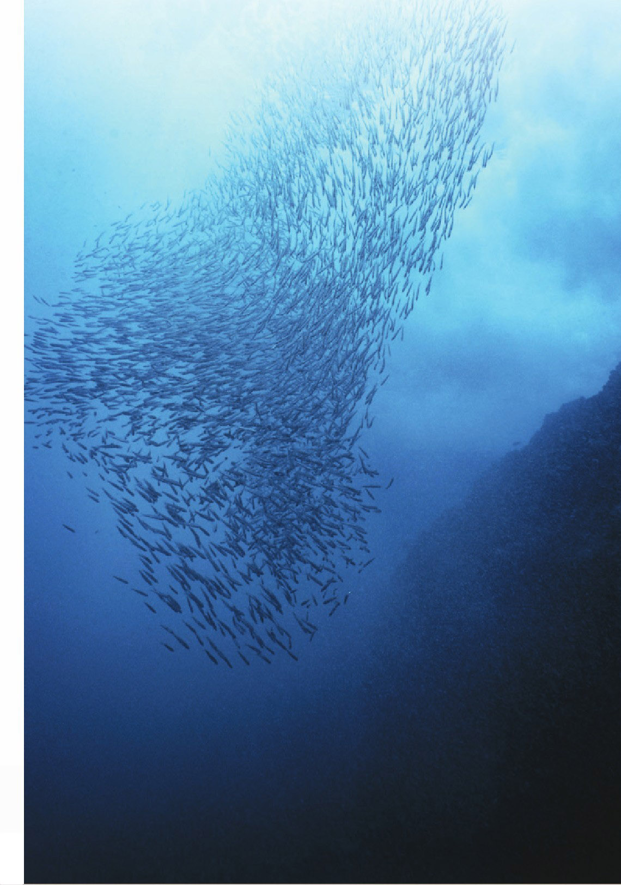
北冰洋中鱼的种类虽然不多，但数量巨大

  

【微问题】　太平洋的海水为什么比北冰洋的海水咸？

【关键词】　太平洋　五大洋　北冰洋　边缘海

## 只有地球上才有海洋吗

水是由氢和氧两种原子组成的。氢原子形成于宇宙的创生，是宇宙中最古老的元素。氧则是在中等质量恒星内部碳的燃烧中形成的。氢和氧结合形成水。

水是所有已知生命的源泉。地球最初形成时是一个炙热的火球，在其形成之后大约2亿年，最早的海洋形成，但由于频繁的陨星撞击而难以持续存在。又过了大约4亿年（约40亿年前），原始的海洋终于形成并辗转变化至今。

在太阳系中，被冰覆盖的行星和卫星是常见的，但只有液态水的稳定存在——海洋，才能孕育生命。那么，在宇宙中液态水都保存在什么地方？地球之外还有海洋吗？

就在不久之前，科学家还一直认为地球是太阳系中唯一的有液态水海洋的星球，因而认为能够保持液态水海洋的环境是异常罕见的。其实在太阳系中水的存在相当普遍，而在地球之外也有比地球上更大的海洋。现在，人类已经在太阳系之外探测到了一个有海洋的行星，也许在不远的将来，我们就会知道那里是否会有生命的存在。（李一良）

## 火星上有过海洋吗

现在的火星是一个寒冷、干燥的行星，但它曾经潮湿、温暖，甚至可能拥有海洋。

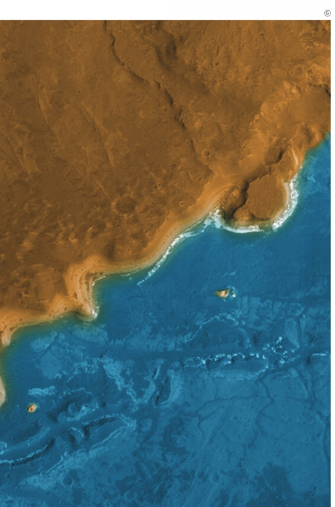
在火星形成的早期，很可能拥有海洋

在太阳系的八大行星中，火星是除了地球之外的另一个曾经拥有海洋的行星。在火星形成的早期，海洋可能覆盖其表面的大部分，这些水如果全部释放到火星的表面，可以形成一个6～300米深的海洋。由于火星表面崎岖不平，这些水在火星表面形成了巨大的表面径流。比如，在火星历史上，卡瑟伊·瓦利斯海峡的宽度达到50～150千米，最深达到18千米，其排水能力是直布罗陀海峡的2倍，是现在地球上最大的河流——亚马孙河的1万倍。但由于火星的引力比较小，加之太阳辐射的电离作用，火星上的海洋很快就消失了。

科学家推测，在火星形成之后大约10亿年，火星的表面已经没有海洋，但仍有部分地区存在泪滴状的涌流结构。在现在火星的表面，只能在两极、少数火山口和近地表的永久冻土上发现固态水（冰）的存在。根据有液态水才可能有生命的原则，只有在火星上找到液态水，才可能寻找到生命。而现在的探测结果是，只在火星地表之下2～3千米的深部地壳中可能存在液态水。（李一良）

火星上水的涌流形成的泪滴状结构

## 太阳系中最大的海洋在哪里

欧罗巴（木卫二）是木星众多卫星中的一颗，它比大多数行星要小得多（半径为1569千米），但它可能拥有太阳系最大的海洋。

20世纪90年代，伽利略空间飞船观察发现，欧罗巴存在一个只有类似导电盐水的流体才可能产生的诱导磁场，而该流体的密度与海水接近。根据目前的观察和计算，欧罗巴上的海洋深度可达75～120千米！它比地球上的海洋深许多倍！

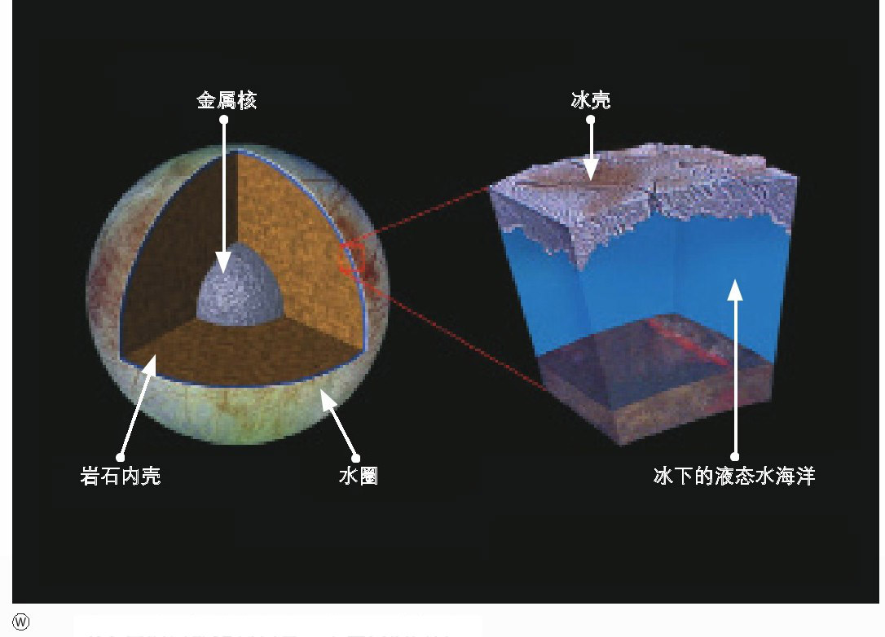
欧罗巴的内部结构包含一个巨大的海洋

而覆盖在这个海洋之上的，使之与冰冷的外部行星际空间分隔开的是一个大约12千米的纯水冰层。除了以上理论证据表明欧罗巴上可能存在海洋之外，直接的观察还显示，在其表面有小行星撞击形成的环状的裂纹，与地球上结冰的湖面被石头砸出来的裂纹的结构如出一辙。此外，欧罗巴表面广泛分布的碎冰拼接结构也表明其下存在着一个涌动的海洋。

那么，在离太阳这么遥远的极端寒冷的地方，欧罗巴怎么可能拥有一个液态水的海洋呢？

原来，木星对它的潮汐加热和来自其自身的放射性产热是其主要的热源。木星的质量是地球的312倍，它巨大的引力为欧罗巴的液态海洋提供了能量。在欧罗巴围绕木星公转的过程中，木星的引力对欧罗巴产生了巨大的引潮力。这些潮汐能会转变成热能，从而维持海水的液体状态，称之为潮汐加热。好比你不断地揉捏一个充了气的气球，一会儿气球的温度就会升高。这一事实不禁让我们产生联想：在欧罗巴巨大的海洋里，是否孕育着和地球海洋一样丰富多彩的生命呢？

这正是人类进行星空探索的一个巨大兴趣所在。目前科学家设想，发射火箭到欧罗巴的冰壳之上，让它凭借自己所产生的热量钻透冰层，进入下面的海洋进行测量和观察。欧罗巴的海洋中可能会有简单的生命，比如类似细菌的微生物，而它们很可能依靠氧化水中的化学物质来获取能量。（李一良）

  

**【微博士】**太阳系外的海洋世界

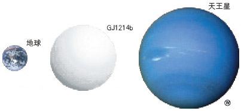
行星的大小以及与其环绕的恒星之间的距离决定了其表面是否可能存在液态水的海洋。根据现在的探测推断，在太阳系之外的恒星系统中，拥有类似地球大小的行星应该比较常见，它们即使没有来自其“太阳”的能量，来自其内部的散热和放射性产热总是有的，这些热源都可能维持一个海洋的存在。这几年探测成果显著，科学家在太阳系外发现了近700颗行星。编号为GJ1214b的行星位于40光年外蛇夫座内的一个矮星星系中，它的半径是地球的2.7倍，而质量是地球的6.6倍。根据哈勃空间望远镜的观察，GJ1214b可能拥有一个海洋和以水蒸气为主的大气层。估计它的表面温度在230℃左右，因此并不适合类似地球生命的存在。科学家相信，在不远的将来就会找到一个不仅拥有海洋，而且其表面温度也与地球类似的太阳系外的行星，这样的行星很可能像地球一样，存在一个纷繁多彩的生命世界。

【微问题】　为什么说水是生命的源泉？

【关键词】　水　海洋　火星　欧罗巴　木星　GJ1214b

# 海水及其运动

## 为什么海水是蓝的，浪花却是白的

大家都知道，水是无色透明的，可是当你漫步海边，举目所及，见到的是蔚蓝色的海水和白色的浪花，这是为什么呢？

在大多数人眼里，太阳光是白色的，其实不然。太阳光由多种光组成，包括可见光和不可见的红外线和紫外线。如果将一束太阳光射入三棱镜，就能揭开庐山真面目：在我们眼前出现的是一道美丽的彩虹，从上到下依次是红、橙、黄、绿、青、蓝、紫。可见光的颜色是由它的波长决定的，红光波长最长，紫光波长最短。

太阳光通过三棱镜后

不同颜色的光在干净的海水中被吸收、折射和散射的程度不同。在海水中，波长较长的红光穿透力强，折射和散射程度低，所以容易被海水吸收；而波长较短的蓝光和紫光穿透力差，会产生更强烈的折射和散射。尽管海水看起来非常均匀，但仍存在密度分布不均的情况，因此不同颜色的光在海水中就会发生散射现象。散射的光能量与波长的四次方成反比。因此，波长更短的蓝光和紫光容易被散射，到达我们眼中。太阳光射入海水经过散射后，到达我们眼中的红光大约只有紫光的1/12。由于人的眼睛对紫光不敏感，而对波长稍长的蓝光比较敏感，于是，我们所见到的海洋就呈现出一片蔚蓝色或深蓝色了。

而浪花的情况则不同。浪花主要是由泡沫和一些小水珠组成，泡沫的表面是水膜，小水珠则像一面面小棱镜。当光线照在浪花上时，会发生三件事情：首先，受到浪花的反射。组成浪花的泡沫和水珠的表面对各种颜色的光反射机会几乎是均等的，不是选择反射。其次，光线受到泡沫和水珠的散射。和微小的水分子相比，泡沫和水珠是“大粒子”，大粒子散射时，散射光强与波长的关系不明显。照上去是白光，回到我们眼中还是白光。第三，像三棱镜般的小水珠对光线的折射。这似乎会出现图中那样的七色彩虹，但是由于光线经过了无数水珠折射以后，会从不同方向到达我们眼睛，眼睛接收到的是七彩光的混合体，因此看到的仍是一片白色的浪花。（侍茂崇）

## 黄海、红海、黑海和白海的水真的是黄色、红色、黑色和白色的吗

地球上有四个大海是以颜色来命名的，它们是黄海、红海、黑海和白海。那么，它们的海水真的是黄色、红色、黑色和白色的吗？

黄海在很多时候确实是黄的。黄海位于中国大陆与朝鲜半岛之间，是中国主要河流的汇入之地。每年，长江、古黄河、淮河、辽河和鸭绿江及朝鲜半岛的汉江、大同江、清川江携带着大量泥沙注入黄海。特别是古黄河，在1128年至1855年的700多年间，从江苏北部沿岸流入黄海，平均每年携带泥沙约12亿吨，最高时可达16亿吨，为世界河流输沙之冠。这些泥沙如果平铺在黄海南部海底（面积约30万平方千米），可使海底增高3毫米。因为泥沙颗粒对蓝光波段有很强的吸收能力，吸收量约为红光的6.4倍，所以在蓝光减少后，海水就呈现出黄色。1855年以后，黄河改从渤海入海，但是原来沉淀在那里的泥沙，虽经浪、流的掀动和搬运，仍然有很厚的沉积物储存在海底，大浪一来，沉积物泛起，海水又变成了黄色。

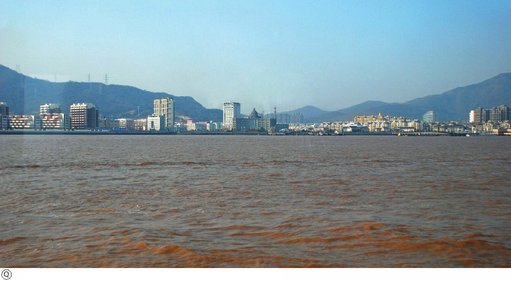
黄海的海水在很多时候都是黄色的

红海的海水一般呈蓝绿色，只有当一种叫束毛藻的海藻大量繁殖时，才变成鲜艳、独特的红褐色

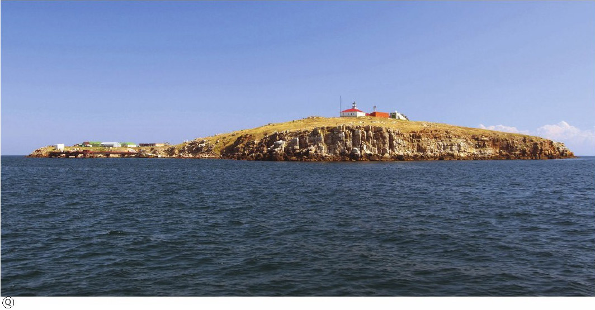
黑海因水色深暗而得名

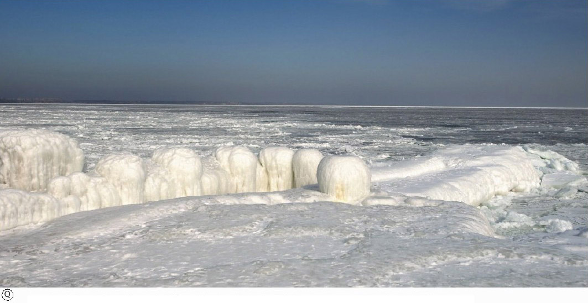
北冰洋的巴伦支海伸入欧洲的俄罗斯水域，几乎被陆地完全包围住，终年冰雪茫茫，被称为白海

位于亚洲阿拉伯半岛与非洲大陆之间的红海，是连接地中海和阿拉伯海的重要通道。它的海水一般呈蓝绿色，只有当一种叫束毛藻的海藻大量繁殖时，海水才变成鲜艳、独特的红褐色。因此，人们称其为红海。

黑海位于欧洲东南部和小亚细亚之间，是全世界最深的内海之一（最深处超过2000米），由于其水色深暗而被称为黑海。黑海是一个双层海，上层水多来自多瑙河、顿河、第聂伯河等河水的注入，表层密度较小；而深层水由于脱胎于古地中海的海盆地，因而盐度很高，密度很大，使得上下层水体难以彻底交流。上层海水中的生物分泌物和各种动植物死亡后会沉到深处腐烂发臭，使下层海水长期处于缺氧状态，导致底层海水浑浊，颜色变黑。另外，在缺氧环境下生存的厌氧生物也会释放二氧化碳和硫化氢，对海水的变色起到了推波助澜的作用。

显然，深色的海还不是黑色的海。由于黑海所处的地区容易受到暴风袭击，因此，一年中总有那么10多天，海上会刮起6级以上的大风。在大风的搅动下，下层海水会更多地翻滚上来，把海水颜色变得更暗，看上去就是名副其实的黑海了。当然，在平时的日子里，黑海的天空多为暗灰色，这种颜色衬托下的海水，看起来也是接近于黑色的。

伸入欧洲俄罗斯部分的北冰洋的巴伦支海，几乎完全被陆地包围。由于纬度高，气候严寒，终年冰雪茫茫，一年中约有200多天被雪白的冰层覆盖，阳光照到冰面上产生了强烈的反射，致使我们看到的海面是一片白色，人们于是把它称为白海。（侍茂崇）

  

**【微博士】**变成绿色的黄海

由于全球变暖和海水受到污染，以及水体富营养化等原因，黄海南部生态环境受到巨大影响，频频发生水藻勃发事件：2008年5月，黄海南部和连云港东面的大面积海面由蓝变绿，罪魁祸首是泛滥成灾的浒苔。浒苔是一种绿藻，藻体管状中空，分枝细长众多，株高可达40厘米。6月中旬，大面积浒苔开始从黄海中部海域向青岛近海漂移，距离沙滩不远处的海域，远远望去像一片浅绿色的“草地”，一眼望不到边。

浒苔成灾

【微问题】　青海是海吗？

【关键词】　海水　浪花　太阳光　黄海　红海　黑海　白海

## 为什么海水是咸的，海冰却是淡的

海冰是海水结的冰，海水是咸的，那么海冰应该也是咸的吧？可是，实际上，海冰却是淡的，或者接近于淡的。这是怎么回事呢？

原来，海冰并非都是海水结的冰，它是海水中冰体的总称，包括海水直接冻结成的冰和陆地来冰两部分。

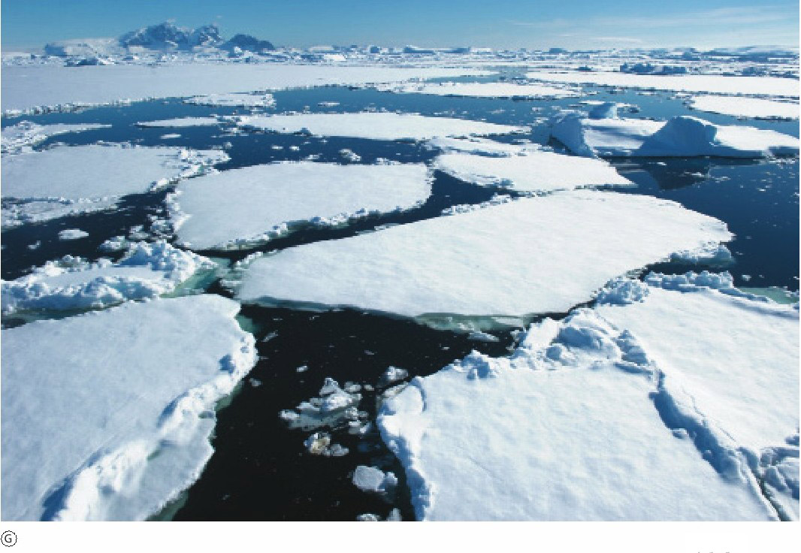
海冰

在海水直接冻结的过程中，有部分盐汁（卤水）会脱离冰晶流入海中。因此，海冰的盐度总是低于形成它的海水的盐度。如果用嘴去尝海冰，不像海水那么咸苦。但在南极大陆附近大洋中，由于温度极低，那里海冰的盐度比其他地方海冰的盐度更高。如果你也尝尝，就能感受到咸苦的味道了。

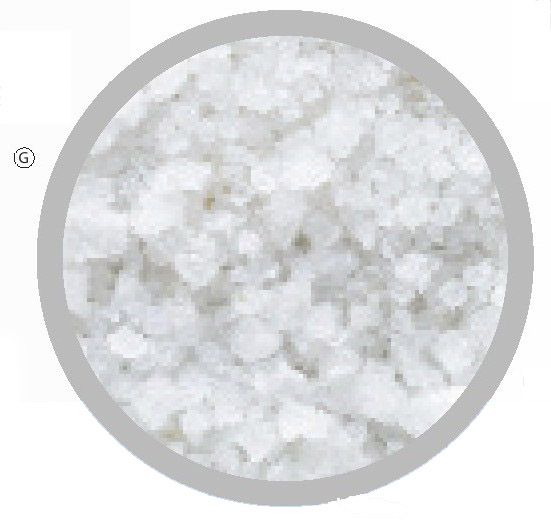
海盐晶体

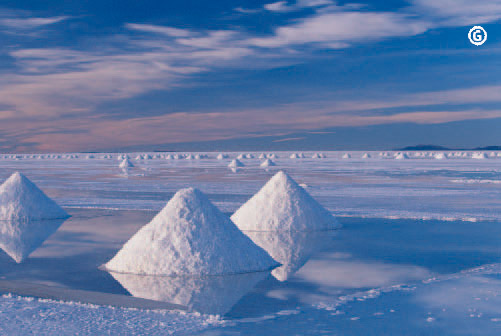
海盐

陆地上形成的冰，包括河冰和冰山。河冰是由河水冻结流入海中的，冰山是陆地冰雪堆积物滑入海中的，由于都是来自淡水、雪，它们的盐度几乎等于零，用嘴品尝，自然淡而无味。（侍茂崇）

## 死海淹不死人，为什么叫死海

从约旦的安曼向西南驱车约1小时就来到一片广阔的水域：那里不仅没有潮起潮落，更没有惊涛拍岸。在阳光的照射下，水面清澈而平静，水中看不到鱼虾，高空看不到飞鸟，岸上既拾不到多彩的贝壳，也没有苍翠欲滴的树木、花草，只有洁白如雪的盐碱和大大小小的砾石散布。这里是一个沉寂、荒凉、冷漠的世界，一个没有生命的水体。因此人们把它叫作死海。

然而自然地理环境恶劣的死海，却成了今日约旦旅游业的重要支柱。许多人慕名前来试一试“死海淹不死人”的神奇之处。刚入海的人，只觉得接触到水面的背部像是黏附着一层厚厚的“油脂”，然后不论你四脚朝天，还是盘腿打坐，在“死”气沉沉的水面上，任何姿势都不会使你下沉。死海为什么这么神奇呢？

死海

其实，死海是一个内陆盐湖，位于以色列（巴勒斯坦）和约旦之间，长67千米，宽18千米，面积810平方千米。由于地处沙漠之中，蒸发显著大于降水，淡水分子渐渐蒸发掉，盐分子却慢慢留下来了。因此，海水含盐量逐渐浓缩、增高，表层水中的含盐量是大洋的6倍，深层水含盐量甚至是大洋的10倍。在这样高盐的情况下，除极个别的微生物（如嗜盐菌），由于具备防止盐侵害的独特蛋白质可以生存外，其他生物都不能生存。死海由于盐分高，海水比重比大洋水和人体都高，人在水中自然不会下沉。有些人以为死海淹不死人，可以随心所欲地戏水。其实不然，哪怕有一小滴海水进入眼睛，都会难受得要命。要是有人不小心喝了一口，顿时胃里翻江倒海，呕吐连连；如果刚刮完胡子的人进入海里，脸颊马上就感觉到灼热刺痛难忍。

那么，死海只是内陆的一个盐湖，为什么又叫“海”呢？有学者推测，死海之名可以追溯到大约公元前323年。那时的古人对面积较大、水质咸苦的水体习惯称为“海”，对面积较小的淡水水体则称为“湖”。希伯来人在摩西带领下从埃及向东到达西奈半岛行程中经过红海，对“海”有了深刻的认识，所以在看到死海之后，自然而然将其称为“盐海”。后来又发现那里几乎没有生命存在，故又叫作死海。（侍茂崇）

## 海水中的盐从哪里来

你也许并不知道，在海洋刚形成时，海水并不像现在这么咸，它是后来慢慢地变咸的。

在地球形成初期，地球内部不断释放出大量的水蒸气。这些水蒸气在天空中遇冷凝结成雨，降落在地表，形成湍流不息的地表径流。它们穿过千山万壑，汇集到原始洼地中，形成了原始海洋。那时候，海水中的含盐量可远没有现在这么高。

然而，在漫长的地球演化过程中，地球上不断地上演着海水蒸发——降水——再蒸发——再降水的一幕。大气降水形成的地表径流一次又一次地冲刷着陆地，将陆地岩石中的大量盐分带入海洋中。日积月累，年复一年，海水中的含盐量不断地升高，原来的淡水就逐渐变成了咸水。

也有人认为，海水中的一部分盐分是从地壳深部以气体的形式释放到地表上来的。如意大利和冰岛的火山喷发时，喷出的气体中氯化钠蒸气就占全部升华物的50.29%～76.01%。这些蒸气中所含的大量盐分在喷出地表后，也会通过各种途径进入到浩瀚的海洋中。（侍茂崇）

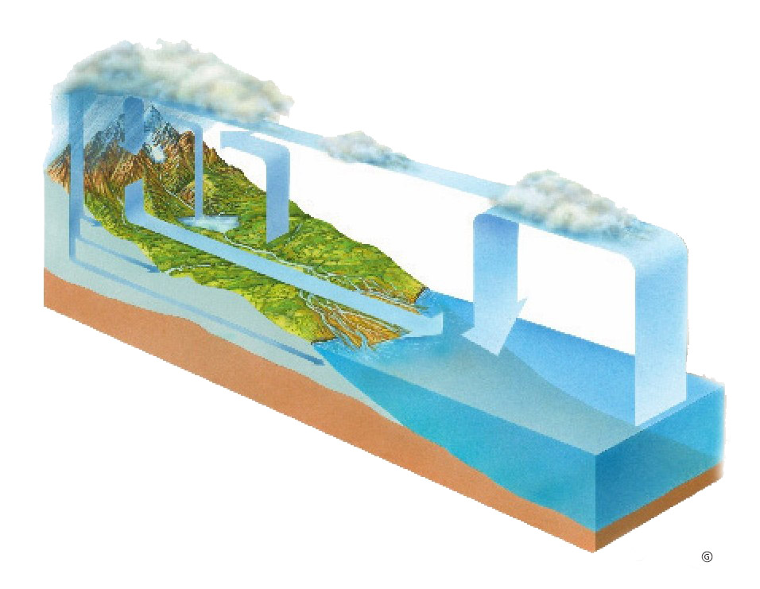
海水中盐分的由来

  

**【微博士】**海洋中的淡水井

2007年10月，在浙江舟山群岛泗礁岛北部20千米的海域，成功打出了一口淡水井，每小时淡水喷涌量达到近120吨。如果把这些淡水运往缺水的嵊泗县，将从根本上解决8万多人的用水问题。这是因为在过去的几十万年里，这里的海底数度露出水面成为陆地。陆地上众多的河流和星罗棋布的湖泊为形成地下含水层创造了有利条件，成为海底重要的淡水资源。海水又苦又咸，而淡化海水成本高昂，寻找和利用新型的海底淡水资源，是解决一些沿海地区缺水的有效方法。

【微问题】　几千万年甚至数亿年后，海水中的含盐量会不会高得使大量海洋生物难以生存？

【关键词】　海水　盐度　海冰　死海

## 热带大洋海面的水在哪里最热

热带西太平洋及印度洋东部的平均海表温度，多年来一直在28℃以上，中心温度超过29℃，是全球海洋最热的区域，又称为大洋暖池。它的总面积约占热带海洋面积的26.2%，占全球海洋面积的11.7%，东西跨越150个经度，南北伸展约35个纬度。西太平洋暖池比东太平洋高出3～9℃，暖水深达60～100米，是地球上海水与大气相互作用最强烈的地方，大气对流极其强烈，因此这里是全球热带风暴、台风形成最多的地区。

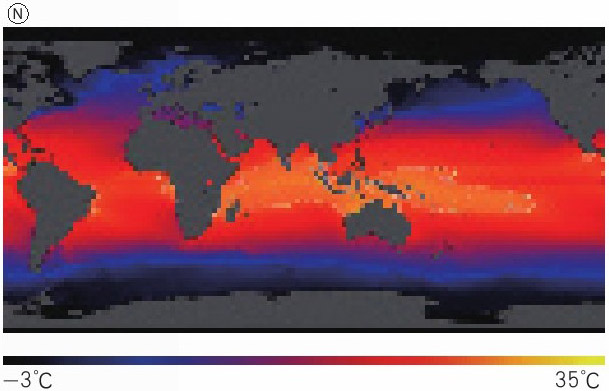
大洋暖池

为什么会出现大洋暖池？以太平洋为例：赤道太平洋盛行赤道东风，将东太平洋表面的暖水吹向西太平洋并在那里堆积，从而形成西太平洋的暖池。东太平洋表层的暖水流走后，下面的冷水会上升，补充流走的表层水，这就导致东太平洋表面海水变冷。

大洋暖池影响着亚洲、太平洋区域甚至全球气候的变化，一些重大自然灾害都与它有着千丝万缕的联系。例如，当西太平洋暖池冬季温度增高时，中国江淮大部地区6～7月降水增多，洪涝灾害也随之增加。（侍茂崇）

## 为什么说东太平洋的厄尔尼诺事件根源在西太平洋

1998年夏季，铺天盖地的暴雨笼罩着中国长江流域，使长江出现自1954年以来最大的洪水。滚滚浊流一泻千里，瞬间就把九江城防洪堤撕开60米宽的缺口！加上东北的松花江、嫩江的洪水助纣为虐，中国共有29个省、自治区、直辖市遭受了无妄之灾，受灾人口过亿，经济损失1600多亿元。究其原因，这次的洪魔肆虐和1997年出现的百年来最强的厄尔尼诺现象有着密切的关联。

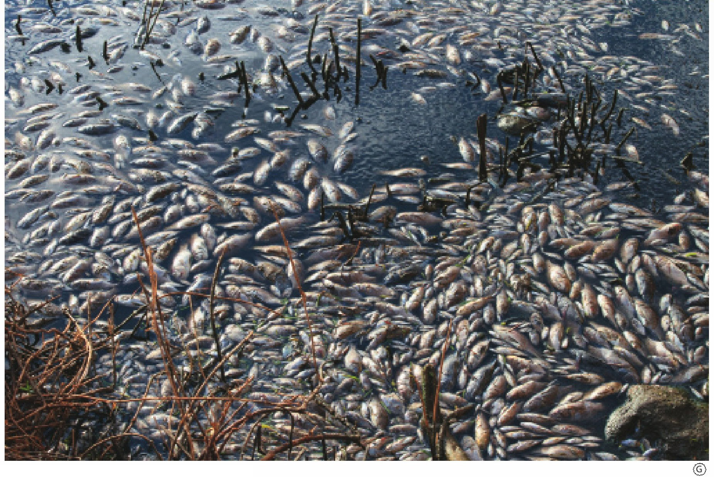
厄尔尼诺事件使得厄瓜多尔海岸的水温升高，造成生活在那里的喜欢冷水的鱼群大量死亡

在正常年份，热带西太平洋被高温（中心超过29℃）的“暖池”水覆盖，东太平洋则被温度较低（20～26℃）的“冷水”所盘踞。但这种格局每过2～7年就被打乱一次：西太平洋暖池下面100～200米水层内水温开始升高。这种持续升高的水体向赤道东太平洋流去，会引起东太平洋海面温度上升，同时那里上翻的冷水（上升流）开始减少甚至停止，又进一步加快了海水温度上升的速度。比正常年份高1～3℃的暖水沿着厄瓜多尔海岸南侵，使那里的水温也迅速升高，造成生活在那里的喜欢冷水的鱼群大量死亡，以食鱼为生的海鸟因食物匮乏而纷纷离去，渔场顿时失去生机，沿岸国家遭到巨大损失。由于这种现象最严重时往往出现在圣诞节前后，无助的渔民将其称为上帝之子——圣婴（El Niño，西班牙语）降临！这种异常的气候现象也因此被称为厄尔尼诺现象。

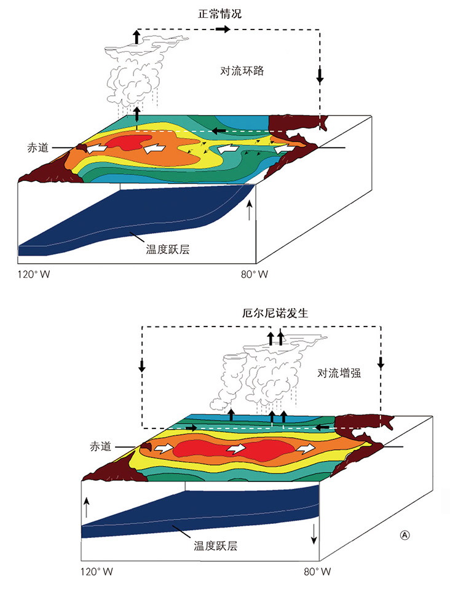
全球厄尔尼诺事件大概每隔2～7年出现一次，每次持续1～2年。由于西太平洋暖池次表层水向东移动是促使厄尔尼诺事件发生的原因，因此有人说，东太平洋的厄尔尼诺事件，根源在遥远的西太平洋。（侍茂崇）

## 厄尔尼诺事件有“孪生姐妹”吗

拉尼娜（La Niña）是西班牙语“小女孩、圣女”的意思。拉尼娜事件总是出现在厄尔尼诺事件之后，是修正厄尔尼诺事件造成的气候失衡的一种自然方式。它就像是厄尔尼诺性格迥异的“孪生姐妹”，表现为赤道东太平洋东部和中部海水明显变冷。如果将厄尔尼诺称为“暖”事件，则可相应地将拉尼娜称为“冷”事件。拉尼娜事件发生时，印度尼西亚、澳大利亚东部、巴西东北部等地有更多降水，非洲赤道地区、美国东南部等地易出现干旱，中国则易出现冷冬。

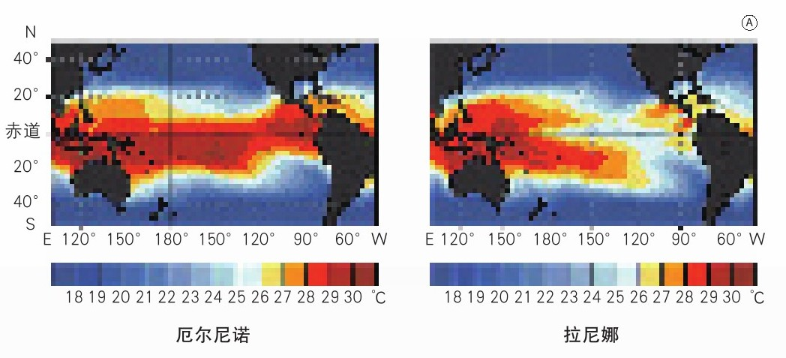
在拉尼娜事件出现的2008年1月中至2月初，中国南方地区出现了大范围持续灾害天气：江淮、江汉、江南、西南东部的最低气温降至-8～0℃。中国南方遭遇50年来最严重雪灾：公路上的冰层滑如玻璃、坚硬似铁；高压电线上面覆盖的冰超过10厘米厚，房屋冻成了“水晶宫”；广东136列火车“抛锚”京广线，湖南全省春运几近“瘫痪”。雪灾使得皖、湘、鄂、川、贵等10省份3287万人受灾，其中包括129人死亡和4人失踪。同时，在美国中部则出现了20℃的剧烈降温；中亚地区突降10毫米大雪，打破了巴格达100年未降雪的历史；俄罗斯北部边缘地区气温一度降到-50℃。（侍茂崇）

  

**【微博士】**厄尔尼诺事件与气候异常

自1950年以来，世界上共发生了13次厄尔尼诺事件，对全球气候产生了重要影响。从北半球到南半球，从非洲到拉丁美洲，气候变得古怪而不可思议。该凉爽的地方骄阳似火，温暖如春的季节突然下起大雪，雨季到来却迟迟滴雨不下，正值旱季却洪水泛滥。在厄尔尼诺事件发生年的冬季，中国往往出现暖冬；而厄尔尼诺事件发生年的夏季，长江中下游地区多雨以致洪涝，黄河流域及华北一带少雨干旱，东北地区则气温异常偏低。

【微问题】　有人称厄尔尼诺事件是海洋灾害，你同意吗？

【关键词】　大洋暖池　厄尔尼诺事件　拉尼娜事件

## 只有海面才有波浪吗

海洋表面波动起伏是司空见惯的现象，这就是波浪，主要是由于风的影响形成的表面波。通常表面波的波长约几十米，振幅从数十厘米到几米。只有在极端情况下才会形成惊涛骇浪。

其实只要流体存在分层现象，流动的空气和海水的分界面就会产生波动。海洋表面就是海洋与空气的分界面，自然容易产生波动，进而形成波浪。那么海洋内部是什么样的情况呢？随着深度增加以及海水温度、盐度、压力的变化，海水密度逐渐增大。由上至下由于密度的差异，海水被分成很多层，好比是一杯鸡尾酒，只不过层次界面不甚明显而已。大气压力、地震，甚至船舶、潜艇的运动都会对这样分层的海水形成扰动，从而在密度分层界面处形成波动，这就是海洋深处的内波。

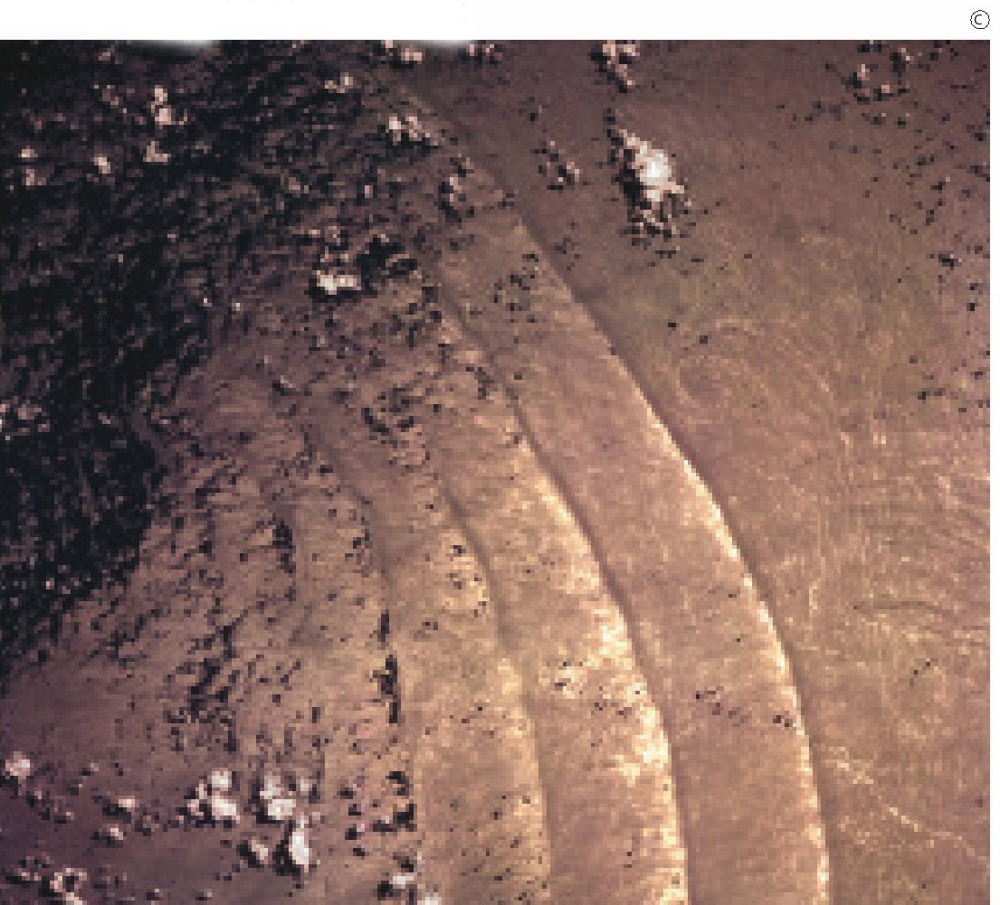
“奋进号”航天飞机探测到的苏禄海内波

内波虽然不像海洋表面波浪那样明显，但因为其隐匿在水中，暗中作祟，使得人们难以防范，因而有“水下魔鬼”之称。探险家弗里乔夫·南森1893-1896年在北极探险时，发现科考船竟然会莫名其妙地减速。经过研究，他才明白船航行时触发了海下的波浪，极大地消耗了船的动能。于是，海洋深处的内波开始引起了人们的注意。1963年，美国“长尾鲨号”核潜艇事件，则让人们认识到内波的巨大威力。中国的潜艇也曾遇到内波，在航行中突然从8米深处被拖至80米深处，险遭不测。

内波有这么强大吗？没错，内波的振幅要比海面波浪的振幅大得多，低的几十米，高的达到上百米；波长至少有几百米，甚至超过1万米。其实这也不难理解，海洋表面处海水和大气的密度差异巨大，而海洋深处分层海水的密度差则很小。根据阿基米德定律（浮力定律），在水中抬起重物比从海面抬到空气中容易得多，所以同样的外力，在海水内部产生的波动要比海面上大得多。目前发现的全球最大规模的内波，是中国台湾的科学家在南海发现的，其振幅达170米，足有50层楼高；底层强烈海流卷起的沙墙如同沙漠风暴，可以形成16米高的沙丘。

不同于海面的波浪，内波是人们无法直接观测到的，那么海洋学家是怎样研究它的呢？随着科学技术的进步，科学家可以把大量先进的仪器布放在海洋深处，观测深海中海水流速、温度、密度的变化，利用所获得的大量观测数据，通过计算机的复杂计算，就可以模拟出我们肉眼看不到的内波。

内波威力巨大，是一种重要的海水运动，既能将海洋上层能量传至深层，也能将深处较冷的海水连同其中的营养物质带到较暖的浅层，从而促进生物的生长。内波的研究对于军事更有重要的意义，虽然潜艇遭遇内波时可能非常凶险，但是内波导致的波动，也会强烈干扰声呐的功能，这样给敌方的监听造成困难，有利于潜艇的隐蔽。（张艳伟）

  

**【微博士】**“长尾鲨号”核潜艇事件

内波威力巨大，它的力量足以把海上的大船拉到海底，造成船毁人亡。曾被认为“万无一失”的美国“长尾鲨号”核潜艇就因此遭到了灭顶之灾。1963年4月10日，“长尾鲨号”核潜艇在进行下潜试验的时候突然沉没，造成潜艇上129名人员无一生还，而潜艇也成为碎片永远地沉睡在海底。经过对残骸进行分析，科学家猜测最可能的原因是“长尾鲨号”在下潜的过程中与一个强烈的内波不期而遇，内波将潜艇一下子拖曳到了海底，潜艇因无法承受海底巨大的压力而发生破裂，最终造成了惨剧。

## 在4000米的深海海底怎么会有波痕

如果你曾经赤脚在小河、海边走过，就会发现水流冲刷过的河床、海滩上有着连绵不绝的波浪状痕迹，这就是波痕。对于地质学家来说，波痕是一种重要的岩石构造，因为波痕的存在就意味着水的流动。如果在岩石上发现波痕，就说明这块岩石曾经是松软的泥沙，科学家还可以利用它判断当时水流的情况。

波浪的“化石”——岩石层面的波痕

在浅海，海底的波痕十分常见，因为海面的波浪可以搅动海底的泥沙。但在20世纪60年代，从4000米深的深海海底拍摄的照片却显示，海底也有波痕！海面的波浪是不可能影响到深海海底的，而波痕也不是内波、浊流所能形成的，因为波痕的形成需要相对“平稳”的水流。所以科学家猜测海底存在着一种特殊的海流。

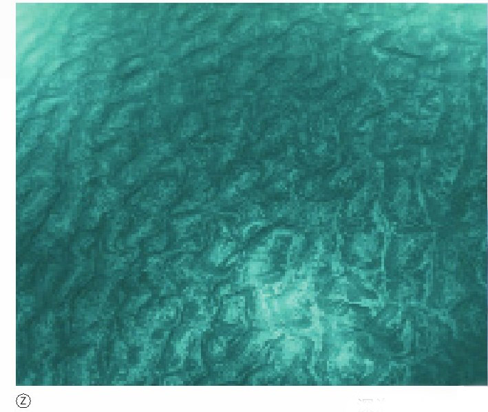
深海波痕

从1978年起，科学家在北大西洋海底进行了长达10年的现场观测，把精密的科学仪器放置在4800米深的海底，测量深海海流的变化，这就是HEBBLE计划。观测的结果证实了深海海流的存在。科学家将其称为等深流，因为它总是沿着海底地形的等深线流动。通常这种海流流速较低，一般仅为15～20厘米/秒。但是不要小看这种等深流，它可是海底最重要的“搬运工”，时时刻刻都在搬运着海底的泥沙和各种沉积物。这种看似“漫不经心”的慢动作，不停地“雕刻”着崎岖不平的海底，在海底的岩石上留下了一串串“脚印”——海底波痕。HEBBLE计划还有个重大的发现，就是观察到了深海“海底风暴”。“风暴”发生时，海底流速突然增加几倍，海底泥沙被搅动起来，混浊一片，“伸手不见五指”，就像陆地上的沙尘暴。这种现象每年发生10次左右，每次持续2～20天。“海底风暴”的形成机理目前还没有被完全了解清楚，不过深海海流的发现，已经改变了人们对深海环境的认识。（张艳伟）

  

【微问题】　俗话说“无风不起浪”，可为什么海上会“无风三尺浪”？

【关键词】　内波　海底波痕　等深流　海底风暴

## 海流是海里的河流吗

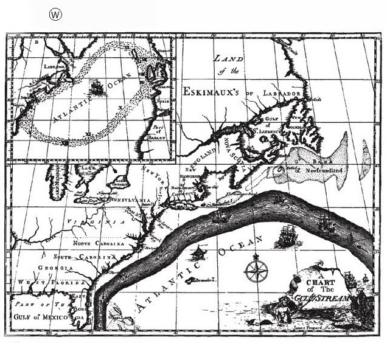
第一张墨西哥湾流图由本杰明·富兰克林绘制

哥伦布发现新大陆之后，欧美之间的往来越来越紧密，但是最初只能依靠轮船穿越几千千米宽的大西洋。18世纪60年代，著名发明家本杰明·富兰克林注意到，邮船从美国到英国比从英国返回美国快两个星期，这是怎么回事呢？经过潜心调查研究，他发现有一股强劲的海流从美洲流向欧洲沿海，推动邮船快速航行，这就是墨西哥湾流。后来，科学家们对湾流进行了更加深入的研究，结果让人惊叹：“这是海洋中的一条河流！”

墨西哥湾流是地球上最大的暖流，全长约5000千米，宽100～150千米，深度超过800米，最大流速达2.5米/秒，最大流量为1.5亿米3/秒，是全球所有江河流量总和的120倍。可见，“海洋中的河流”的气势是多么的恢弘！

在太平洋中也有一条著名的“河流”——黑潮，在西太平洋从赤道地区流向日本东北岸外。它在规模上仅比墨西哥湾流略小一些，同样是一支强大的暖流。

为什么海洋里有“河流”呢？原来，地球表面的太阳辐射不均，造成了海洋表面常年盛行行星风系，比如赤道北侧常年吹东北风，南侧吹西南风，在赤道地区形成赤道暖流，自东向西流动。流到大洋的西海岸时，不得不转向高纬地区前进，其中就包括墨西哥湾流和黑潮。这些暖流流到南北半球中纬度地区转向自西向东流动，在此过程中逐渐转变为寒流，直至北美洲西海岸的时候成为加利福尼亚寒流，再到大洋的东海岸，然后再转向流回赤道地区，这样就形成了一个环流系统。全球大洋中有很多个这样的大型环流，常年生生不息地流动，把赤道地区的能量通过暖流的形式输送到高纬度地区。

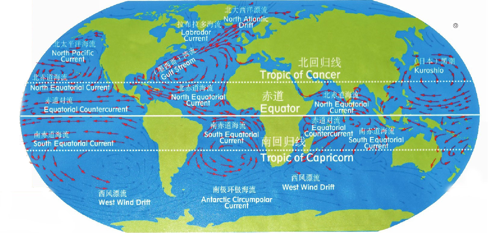
全球海流图

其实不仅表层海水奔流不息，由于不同海区海水密度的差异，大洋深处也是暗流涌动。极地地区和高蒸发量海区（如红海）的海水密度很高，能从海面下沉到洋底，然后向其他地区扩散，于是在海底产生了底层流。虽然这种密度流流速较慢，但也是全球海流系统的重要组成部分。这一系统极其复杂，就像我们身体里的动脉与静脉一样，运送物质、传递能量。科学家非常关注洋流的研究，因为它们的任何变化都可能对全球气候造成可观的影响。（张艳伟）

## 黑潮是从哪里来的

在西北太平洋，有一股强劲的海流犹如一条巨大的江河，昼夜不息地从南向北流淌，由于它远看近似黑色，因而得名黑潮。其实，黑潮不仅不黑，而且还比周围的海水更加清澈。它只含很少的杂质，生活在其中的海洋生物也很少。当太阳光照在这样透明的海面时，海水给人的视觉上呈现蓝黑色。黑潮的平均宽度约为150千米，厚度约1千米，速度最快时可达12千米/时，比普通帆船的速度还要快。科学家通过长期的观测研究发现，黑潮每秒钟输送的海水约有6000万吨，相当于1000多条长江的径流。

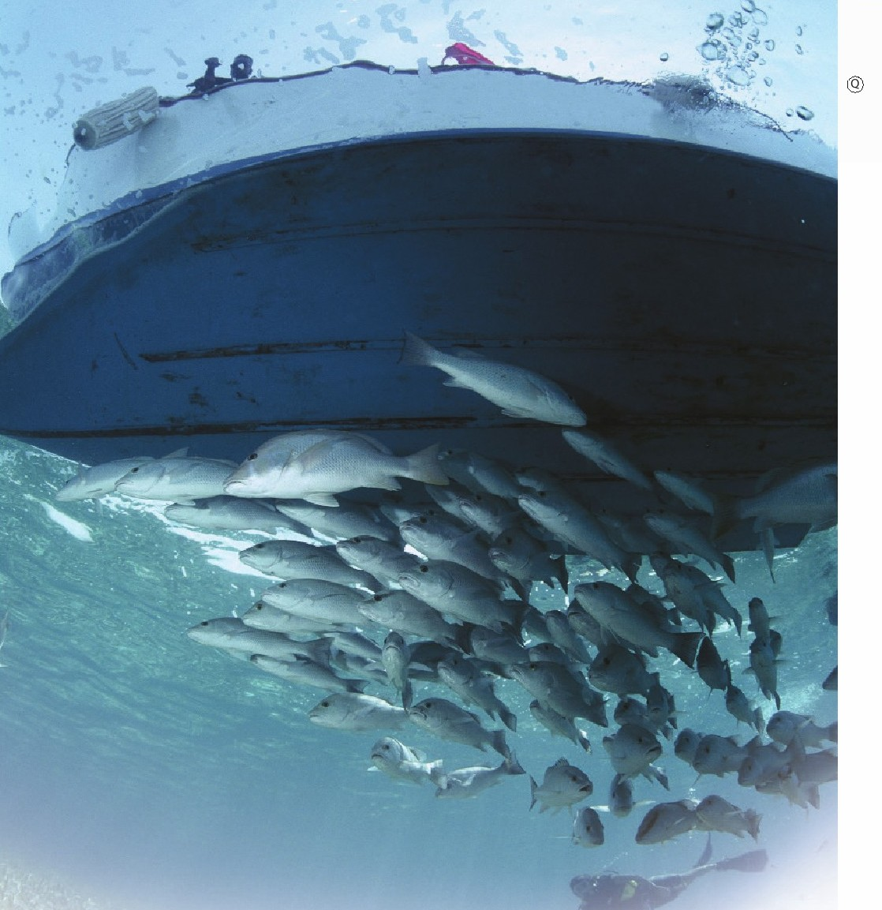
搭乘黑潮洄游的鱼群

人们很早就开始关注黑潮了。很久以前，亚洲沿海的一些渔民就发现有时会有一股强大的、温暖的、很咸的海流从南面的海域涌过来，而且流速相当快，很多鱼类搭乘这艘免费的“邮轮”进行洄游。渔民因此在黑潮流域中可以捕捉到数量可观的洄游性鱼类，以及被这些鱼类所吸引过来觅食的大型鱼类。

黑潮的温度比一般的海流高，仅次于世界第一的墨西哥湾暖流。它对东亚沿海地区的气候影响非常显著。例如，中国的秦皇岛港冬季不封冻；当上海落叶缤纷时，与其同一纬度上的日本九州依然是枝繁叶茂，都是受惠于黑潮及其分支的环绕。

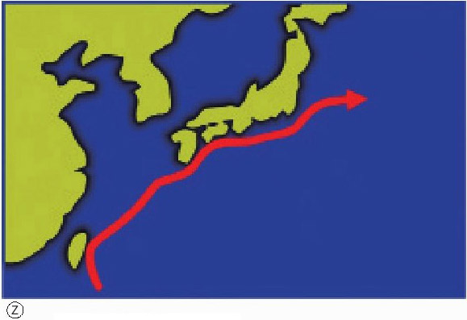
黑潮的路径

那么，黑潮的海水到底是从哪里来的呢？通过海洋卫星和浮标观测发现，黑潮源起赤道太平洋。赤道附近的海水受到强烈的太阳辐射，温度较高且蒸发较快，因此所含盐分较多。在地球自转和海表面风的共同作用下，这部分“个性明显”的海水就从赤道出发，经过菲律宾海域，从中国台湾东侧进入东海，穿过吐噶喇海峡，沿日本列岛南面的海域向东北蜿蜒，全程约4000千米。黑潮的前行路线有时会像弯弯曲曲爬行的蛇，因此被科学家称为“蛇形大弯曲”。这个“蛇形大弯曲”每年都会有不同的变化，对气候会产生不同的影响。科学家正在努力探索，以期揭开黑潮的种种谜团。（张艳伟）

## 大海为什么能捎信

你用过QQ邮箱的漂流瓶吗？通过漂流瓶发出的信件，你不知道会被谁收到，而你也会“捡”到陌生人的漂流瓶，很有趣吧！其实，漂流瓶是中世纪时跨越茫茫大海进行交流的有限手段之一，是航海时代人类文化交流的象征性符号。

古代水手把信件密装在一个个瓶子里，扔进大海，这些瓶子之后就“随波逐流”，期待被远方的亲人捡到，带给他们惊喜与祝福。这是不是很不靠谱呢？

这并不是天方夜谭，依靠大洋捎信是完全可能的。全球大洋表面的洋流是不断循环的环流系统，而大大小小的大洋环流也相互交织、彼此影响，因此漂浮在洋流中的漂流瓶就可以漂洋过海。只不过漂流瓶的旅途充满着未知的神秘气息，不知将在海洋中漂流多久、漂向何方，或许会沉入海底，或许被鲸鱼吞食，或许被冲上沙滩，曝晒终年，只有极其幸运的才能最终被人捡起，完成人们的心愿。（张艳伟）

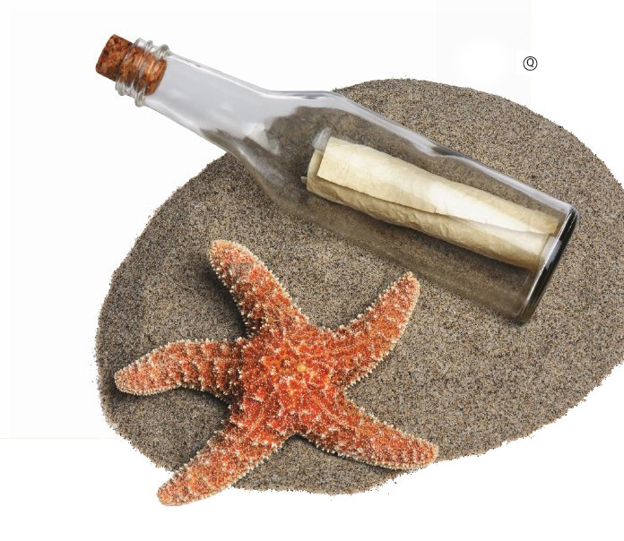
  

**【微博士】**漂流瓶之最

1492年，航海家哥伦布考察了一个美洲小岛后，担心自己无法返回欧洲，就给西班牙女王写了一封信，连同他绘制的一张美洲地图一起密封在一个瓶子里，投入大西洋，期望它漂到欧洲。结果，300年之后，这个瓶子才被人发现，真算得上漂流瓶之最了。

【微问题】　海洋对地球的气候有着怎样的影响？

【关键词】　海流　墨西哥湾　暖流　黑潮　漂流瓶

## 为什么有些地方的海水会上升，有些地方的海水会下沉

当风吹拂海面时，会驱动表层海水在水平方向上的流动。但你是否知道，其实风的能力还不止这些，它同样可以引发海水在垂直方向上的运动，造成海水在某些海域的上升和下沉，即形成所谓的上升流和下降流。这种情况在沿岸海域尤为明显，这又是怎么回事？

原来，在沿岸海域，海水的运动除了受风的驱动以外，还受另一个重要因素——地转偏向力的影响。地转偏向力是指地球自西向东旋转而产生的偏向力，它使得北半球所有移动的物体向右偏斜，而南半球所有移动的物体向左偏斜。

如果在北半球，一个人站在岸边面海而立，当风从右向左、平行于海岸较长时间地吹刮时，在地转偏向力的作用下，风会使表层海水离开海岸，这时近岸的下层海水就会上升进行补充，这样流动的海水就叫上升流。地球上很多海域都有较明显的上升流，例如北太平洋俄勒冈沿岸上升流，南太平洋秘鲁沿岸上升流，以及印度洋索马里沿岸上升流等。中国的东海舟山岛沿岸和海南岛东部沿岸也存在著名的风生上升流。

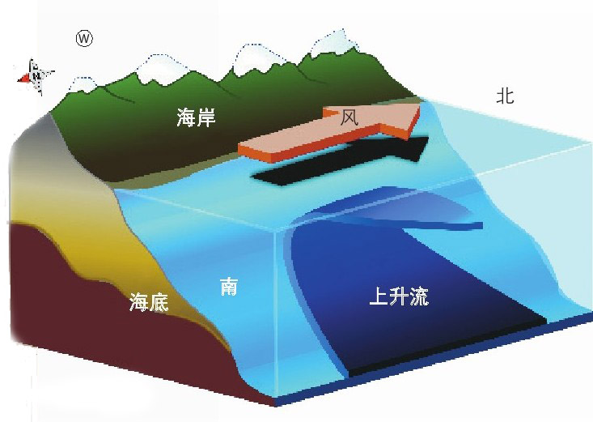
上升流

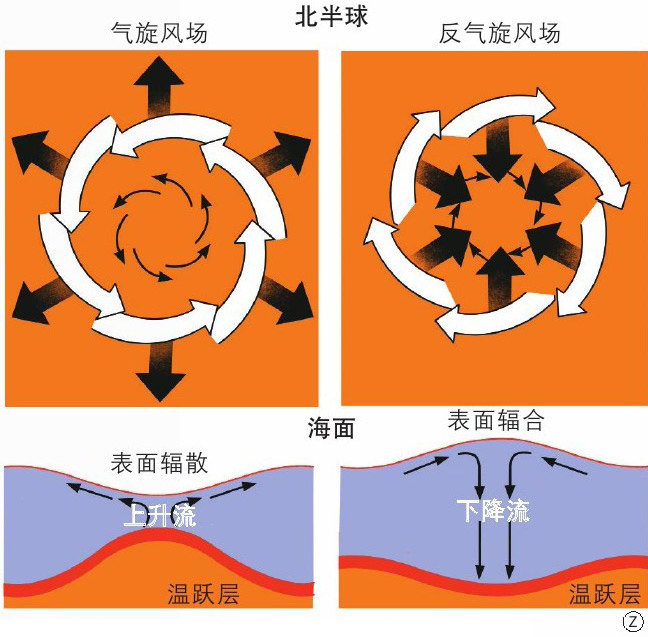
逆时针和顺时针运动涡旋，可以引起海水上升和下降

反之，在北半球，如果风从左向右吹刮，海水就会向岸堆积、下沉，就会出现下降流。例如，冬季东北风吹刮，在中国黄海、东海、南海顺岸区域都会出现下降流。

另一个引起海水上升和下沉的原因是大气涡旋。在开阔的海域，一个逆时针运动的大气涡旋，可以引起作用海域的海水上升。发生在南海巴士海峡南部靠近菲律宾群岛附近的冬季上升流就是典型的例子。与之相反，顺时针运动的大气涡旋，会引起海水下降。（侍茂崇）

## 为什么渔场多建在海水上升的地方

许多著名的渔场都建在上升流显著的海域，例如俄罗斯的千岛渔场、加拿大的纽芬兰渔场、秘鲁的秘鲁渔场和中国的舟山渔场等。这是为什么呢？

原来，上升流在将较冷的底层海水带到海表面的同时，还能把深水区大量的营养物质，如磷酸盐、硝酸盐等，带到表层，成为浮游植物的营养，造成浮游植物大量繁殖。而浮游植物的大量繁殖，又为浮游动物提供了丰富的饵料，从而吸引了更多的鱼类。

据统计，上升流区的平均初级生产量（单位时间单位面积内绿色植物通过光合作用所制造的有机质）约为300克/米2·年（碳），是非上升流沿岸区的3倍、大洋区的6倍。上升流区的浮游生物平均产量也较高，介于20～60毫克/米2·日（碳），为非上升流近岸海域的2倍。上升流区的鱼产量很高，根据估算，上升流海区的面积只占世界大洋面积的0.1%，但是渔获量却占世界海洋鱼类总生产量的一半。（侍茂崇）

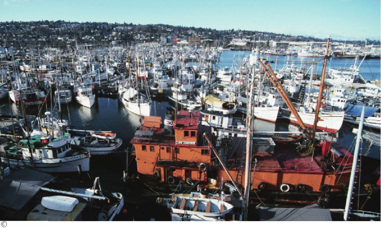
秘鲁渔场

  

**【微博士】**冷源

海南岛东部是中国有名的上升流区：上升流从4月开始出现，6～8月最强，9月减弱，10月以后消失。南到陵水、北到琼州海峡东口的长200多千米的岸外浅水区域，都是上升流区。在水深200米处温度只有15～16℃，和表层30℃水温相比，相差15℃。这是一个巨大冷源，夏季抽上来能作为空调前端冷却水，可以节省大量能源。冷却水排海后，水温仍然低于环境水温。许多珍稀品种的养殖都需要相对低温的海水，因此还可用于发展低温养殖。

## 为什么南大洋能吸收大量二氧化碳

对于二氧化碳而言，海洋是一个巨大的储库。人类活动产生的二氧化碳有1/4储存在海洋中，而其中40%又是被南大洋吸收进入海洋的。与其他大洋相比，南大洋更像一个功能强劲的二氧化碳吸收器。

那么，南大洋为什么能吸收这么多的二氧化碳？这么多的二氧化碳又是怎样进入南大洋的呢？原来，这要得益于南大洋洋面上终年盛行的西风。在南大洋，西风风力十分强劲，逐渐形成声名显赫的“咆哮西风带”。由风驱动的波浪搅动着南大洋的海面，从而不断将大气中的二氧化碳气体溶于南大洋的表层海水中。然而，尽管强劲的风浪将海洋吸收的二氧化碳总量的40%带入了南大洋，但南大洋自身水体中仅保留了总量的9%。剩下的二氧化碳究竟跑到哪里去了呢？它们又是通过什么途径在海洋中迁移的呢？

原来，溶解在南大洋表层海水中的二氧化碳，会在南大洋洋流和涡旋的共同作用下，从南大洋一直输运到亚热带海区。也就是说，大部分被南大洋吸收的二氧化碳向北输运走了。

观测发现，在南纬55°附近，南极表层水在这里下沉，将溶解在表层水中的大量二氧化碳带往1000米深处。然后，这些二氧化碳随洋流向北方前进，到达赤道附近，历时1000年左右。

除了因海水辐合而造成海水下沉之外，一种平均直径在100千米左右的、逆时针运动的涡旋，也在二氧化碳的下沉过程中起到了重要作用。它就像一个巨大的漏斗，将海洋表面的二氧化碳吸入海洋内部。（侍茂崇）

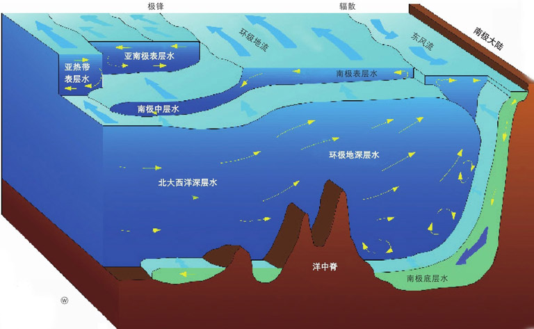
南大洋洋流分布

  

【微问题】　厄尔尼诺事件和上升流有关系吗？

【关键词】　上升流　下降流　渔场　初级生产力　地转偏向力

## 海岸线是一条线吗

当你打开地图的时候，一条在陆地与海洋之间蜿蜒曲折的蓝色线条便映入眼帘，那就是标志海岸位置的海岸线。其实，从海洋地理学的观点来看，海岸并不是一条线，而是陆地与海洋之间的过渡地带，也是陆地与海洋相互作用的地带，人们把这个地带称为海岸带。

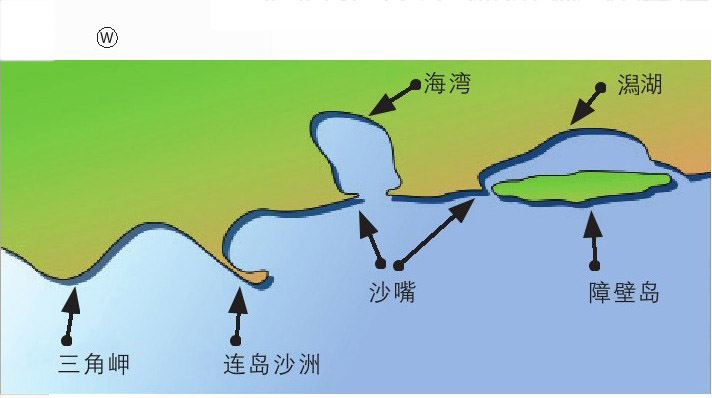
海岸带地貌

海岸带的范围一般以风暴潮或特大高潮所能波及的地方作为它向陆的界限，以正常天气条件下波浪开始作用于海底的深度（波浪基面），即相当于1/2波长的水深，作为它向海的界限，其深度通常为10～20米。根据陆海相互作用的特点和生态环境的差异，又可以将海岸带划分为三个不同的带，即潮上带、潮间带和潮下带。

淤泥质海岸的潮间带

潮上带介于风暴潮或特大高潮作用的上限与平均大潮高潮线之间，绝大部分时间暴露于地表，仅在风暴潮或特大高潮时才被海水波及。在淤泥质海岸常分布有广袤的滨海沼泽；在沙砾质海岸一般见有海蚀崖、海岸沙丘和滨岸沙坝等地貌。

潮间带介于平均大潮高潮线与平均大潮低潮线之间，是海水周期性淹没和退出的地带。淤泥质海岸的潮间带一般称潮滩，或滩涂，滩宽坡缓，潮滩宽度可达几千米，甚至超过10千米。潮滩上常见潮沟地形，栖息着许多生物；沙砾质海岸的滩坡较大，海滩宽度多在几十米至几百米之间，滩面上常见低缓的滩脊地形。

潮下带介于平均大潮低潮线与波浪开始作用于海底的水深之间。由于基本上处于海水之下，又称水下岸坡。在波浪触及海底的水深处，或波浪破碎带的海底，往往形成与海岸平行的水下沙坝与槽谷地形。

由于海岸带是岩石圈、水圈、大气圈和生物圈交汇的地带，它的生态环境十分复杂，涉及三角洲、河口湾、海湾、潟湖、海滩、海岸沙丘、滨海湿地、珊瑚礁、红树林及近岸水域，具有多种类型的自然地理环境和独特的生态系统。海岸带也是人类活动最频繁的地带，不合理的开发活动，加之全球气候变化和海平面上升，会导致海岸侵蚀加剧，滨海湿地减损，使海岸带生态环境变得十分脆弱。因此，加强海岸带综合管理，保护海岸带生态环境显得尤为重要。（刘苍字）

## 为什么海边和沙漠一样也有沙丘

海岸沙丘

在不少人看来，似乎沙丘只会出现在气候干旱的内陆沙漠地区，比如非洲的撒哈拉大沙漠、中国新疆的塔里木盆地和青海的柴达木盆地。可是你知道吗，在气候湿润的沿海地区同样也有沙丘出现，它们是海岸沙丘。实际上，在地球上除南极洲外的各大洲都有海岸沙丘存在，它们往往与沙质海岸伴生，是海岸带重要的地貌类型之一。那么，为什么海边和沙漠一样也有沙丘呢？根据科学家研究，海岸沙丘的形成常常和丰富的沙源、适宜的风况和宽广的地形空间等条件有关。

许多沿海地区都具有上述海岸沙丘发育的良好条件。首先，入海河流的输沙量较大，这是海岸带泥沙的主要来源；此外海岸侵蚀和近岸带海底冲刷也产生部分泥沙，这些泥沙在沿岸流和波浪作用下向岸运移，形成宽广的沙滩，也为海岸沙丘提供了丰富的沙源。其次，沿海地区大多属于海洋性季风气候区，一年中有几个月盛行向岸风，且风力较大，为海岸沙丘的塑造提供了强劲的动力。第三，沿海分布有许多大小不一的滨海平原和台地，为海岸沙丘的发育提供了广阔的空间。

那么，海岸沙丘又是怎样形成的呢？原来，在沙质海岸的前滨地带（潮间带），每当落潮时，海滩干出，当风速超过沙粒的启动风速时，海滩上的沙粒就被风力扬起，形成风沙流。当向岸的风沙流吹到大潮高潮线以上的后滨（潮上带）时，因地面阻力增大，首先沉积在滩脊之上，形成海岸前丘。大风时，海岸前丘上的沙在不断从海滩得到补充的同时，又不断作为“跳板”向内陆输送，在其后方形成横向沙丘、新月形沙丘、抛物线形沙丘等多种形态的沙丘，构成与海岸平行的高大沙丘带。在高大沙丘带的向陆一侧，由于风力减弱和沙量减少，形成宽广平坦或和缓起伏的沙席。此外，在一些山体临海的地方，风沙会沿坡上爬形成爬坡沙丘。

不同地区的海岸沙丘因受海岸走向与向岸风交角大小、泥沙供给数量、原始地形格局、海岸侵蚀堆积动态，以及植被覆盖度等因素的影响，在发育规模和类型上会有差异。（刘苍字）

  

**【微博士】**中国沿海的沙丘

在中国沿海广泛分布着海岸沙丘，其中以海南文昌、河北昌黎和福建长乐等地的海岸沙丘最具规模。如海南文昌的海岸沙丘带长达100千米，宽3～5千米，高10～30米（最高接近60米），面积达400平方千米。河北昌黎的黄金海岸也分布着一条长30千米，宽1～4千米，由40多列链状沙丘组成的沙丘带。置身于海岸沙丘带，一如西北大漠。绵长的金色沙丘与浩瀚的蓝色大海相映生辉，构成一幅壮丽的海岸大漠景观。

【微问题】　为什么海岸线的位置会发生变化？

【关键词】　海岸线　海岸带　海岸沙丘

## 为什么入海河口几乎都有三角洲

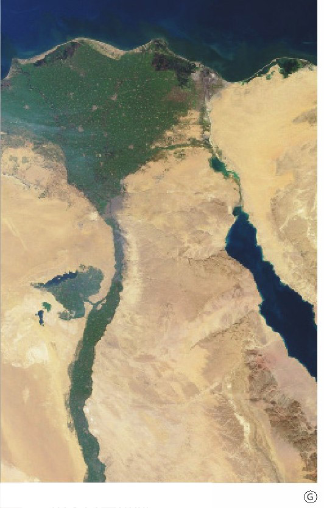
尼罗河三角洲

在非洲东北部，尼罗河穿过荒芜的沙漠注入地中海，在入海河口形成一片肥沃的土地。你也许会说那里像一枝玫瑰，不过古希腊人因其形状酷似字母“Δ”，所以称其为三角洲（即英文的delta），这个名称后来成为了河流出口处泥沙冲积而成的平原地带的地理名词。三角洲顶部指向河流上游，外缘面向大海。为什么在入海的河口会形成三角洲呢？

原来，河流入海时，一般因河口变宽以及受潮流等影响，水流逐渐分散，流速不断下降，河流携带的大量泥沙在河口段淤积，而淤积速率大于海洋动力的侵蚀速率，因而在河流入海处逐渐形成扇面状的堆积体。泥沙大量沉积的另一个原因是河流中有大量非常细的黏土，这些黏土往往以胶体状态存在，遇到海水时，在盐的作用下就会形成凝絮沉淀下来。随着堆积体逐渐露出水面，就形成了三角洲平原。世界上各大河的入海处，大都有一个三角洲，如恒河、尼罗河、湄公河、密西西比河等，中国的长江、黄河及珠江入海处，也有面积很大的三角洲。

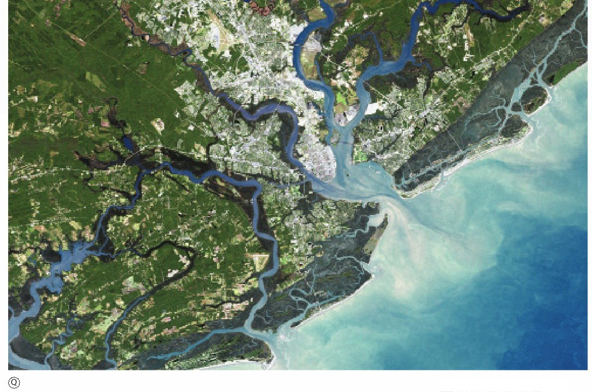
三角洲城市航拍

其实，在入海河口不仅仅有我们看得见的陆上三角洲，在水下还有面积非常大的水下三角洲，它是陆上三角洲的延续。通常我们说的三角洲，除了陆上三角洲，还包括水下三角洲。对于一些大河三角洲，它的水下三角洲的面积往往超过陆上三角洲。如长江三角洲陆上和水下面积之比值为0.78。

但是，也有极少数河流的入海口没有形成三角洲，如世界第二长的亚马孙河。由于河流含沙量低，河口水动力强，以及沿岸流的搬运，亚马孙河只在河口形成众多沙岛，未形成明显的三角洲，转而成为喇叭形状的三角港。中国因潮涌而闻名世界的钱塘江，也因水体含沙量低，入海泥沙少，河口呈非常宽阔的喇叭形。强劲的涌潮水动力致使泥沙不易沉积，只有小部分淤积在钱塘江口，难以长高，仅在水面以下形成一道沙坎，无法形成露出水面的三角洲。（丁平兴）

## 为什么河口三角洲形状不一样

虽然河流入海口几乎都有三角洲，然而世界上的“三角洲”却不一定全都是三角形状的。因为河口三角洲的形成受河流含沙量、河口水动力等多种因素的影响，所以它的大小、几何形态和岸线形状有着显著的差异。按照形状的不同，河口三角洲可分为扇状三角洲、鸟足状三角洲和尖头状三角洲等几种主要类型。

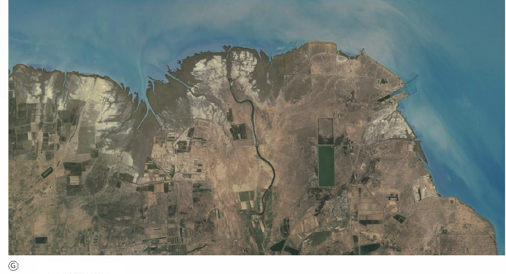
扇状三角洲

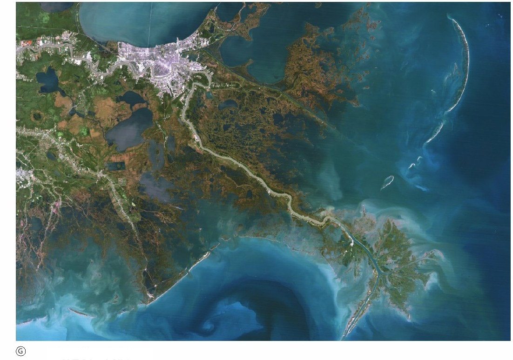
鸟足状三角洲

一些河流由于含沙量高，口外海滨水深较浅、河口区水流较弱的缘故，泥沙在河口容易迅速淤积，并形成大的河口沙嘴。沙嘴延伸至一定程度，比降（坡度）减小，水流不畅而改道入海，在新的河口又迅速形成新的沙嘴。而老河口断流后，又受波浪与海流作用，沙嘴逐渐被侵蚀后退，最后形成扇状三角洲。如非洲的尼罗河三角洲、中国的黄河三角洲就属于扇状三角洲。

还有一些入海河流虽然含沙量也很高，但是河口区水流作用较强且波浪作用较弱，因此泥沙在河口分岔堆积延伸，形成长条形的大沙嘴，以多股岔道同时入海，看上去就像是鸟的足。这种三角洲被称作鸟足状三角洲。美国密西西比河三角洲就是一个典型的鸟足状三角洲。

对于入海河流含沙量不算很高，而波浪作用较强的河口区，泥沙容易沿主流方向沉积，堆积体常呈尖形向外伸长，这样形成的三角洲称为尖头状三角洲。中国长江三角洲就属于尖头状三角洲。（丁平兴）

## 为什么河口三角洲有那么多人口和城市

世界上很多河口三角洲地区都是人口密集的地区，这是因为三角洲是河口地区的冲积平原，地势平坦，土地肥沃，气温适宜，依河临海，水路便利，非常适合人类居住、生存和繁衍。

除此以外，丰富的淡水资源、土地资源、航运资源、油气资源、生物资源、旅游资源等吸引了更多的人口向河口三角洲迁移。许多三角洲逐渐发展为人口集中的大型城市和城市群。如中国的长江三角洲居住人口有7500多万，具有以上海为龙头、22个城市组成的长三角城市群；珠江三角洲地区户籍总人口8679万，现在正在打造粤港澳世界城市群。

同时，三角洲地区的生态环境比较脆弱，极易受到流域、当地人类活动及全球气候变化的影响，所以，河口三角洲地区也成为生态危机压力最为深重的地区之一。（丁平兴）

  

**【微博士】**世界十大河口三角洲

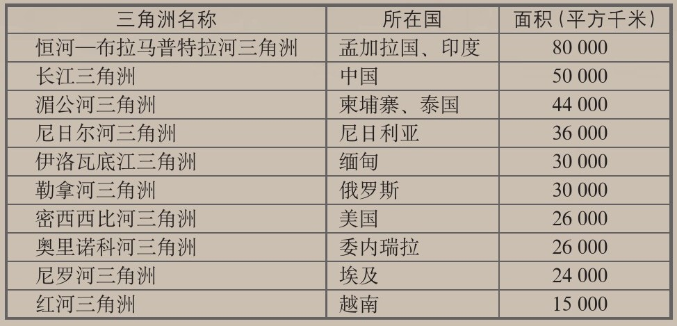
【微问题】　为什么黄河三角洲没有大城市？

【关键词】　三角洲　河口　扇状三角洲　鸟足状三角洲　尖头状三角洲

## 落潮时海边的水去了哪里

如果你去过海边，一定看到过大海涨潮和落潮的现象：涨潮时，海洋中的水会涌上岸边，淹没沿岸的滩涂和礁岩；落潮时，海水又会悄悄退去，将原来淹没的区域露出。

海水就这样周期性地涨起落下，一般一天会有两次，白天海水的涨落我们称之为“潮”，夜晚称之为“汐”，而在涨潮时被淹没、落潮时露出的地带，则称之为“潮间带”。

你一定会觉得奇怪，既然涨潮时海水明显升高，能将平时露出的地带淹没，那落潮之后，这些水跑到哪里去了呢？难道凭空消失掉了吗？

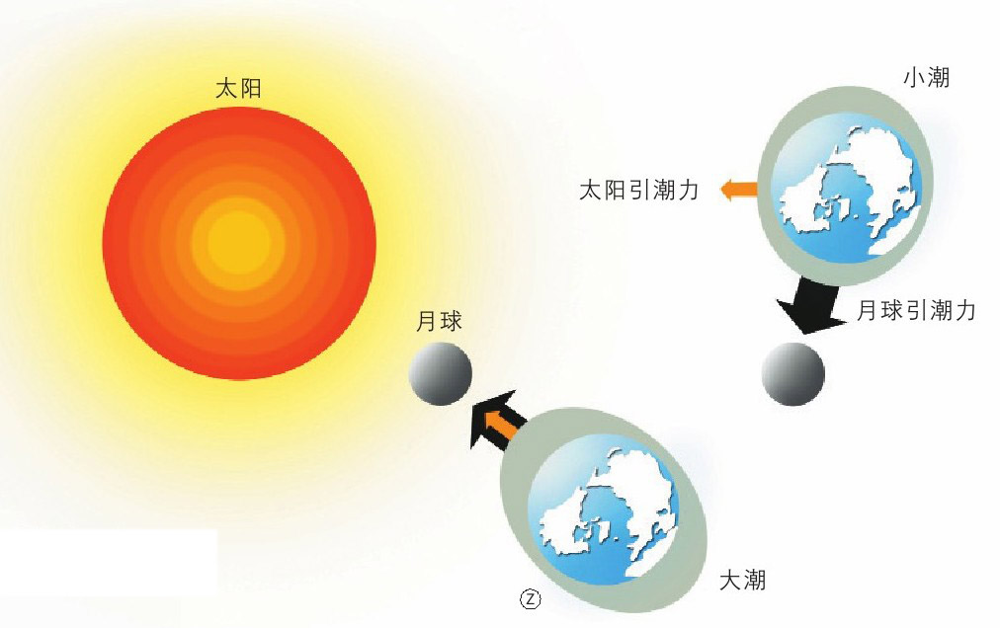
引潮力示意图

落潮

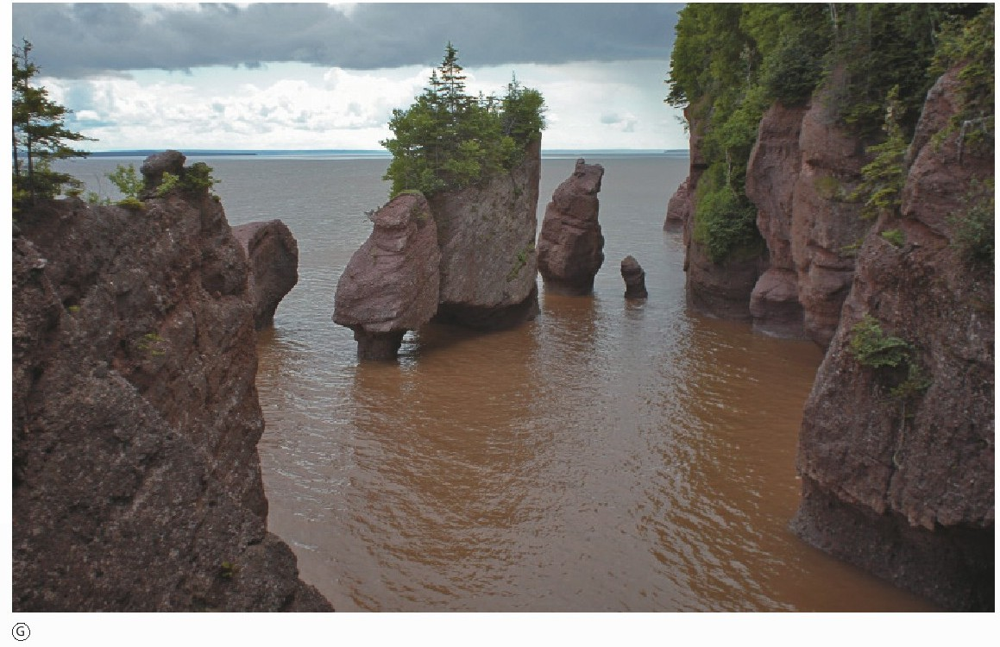
涨潮

要弄清楚这个问题，首先要知道海水为什么会发生涨落的现象。牛顿的“万有引力定律”告诉我们，天体之间是有引力的，而海水涨落的现象，就是由月球和太阳产生的引潮力引起的。在天体引潮力的作用下，全球的海面会形成长轴指向天体的椭球形。由于地球的自转，地球上某地的海面高度随着在椭球体的不同位置而变化，形成了起伏的波动状态，形成了潮汐现象。

在浅海区域，由于岸线和水深的影响，潮汐呈现复杂的波动状态，对一个地点来讲波峰对应的是高潮，波谷对应的是低潮。由于波谷和波峰存在压力的差异，所以水流从波峰区域流向波谷区域。伴随着高潮和低潮的不停变化，水就在波谷和波峰区域来回往复流动。所以，落潮时水只是暂时流向了附近低潮区域，而涨潮时又流了回来。（李培良　田纪伟）

## 为什么要到钱塘江去看涌潮

世界上许多河口都有涌潮现象，如巴西的亚马孙河、法国的塞纳河、英国的塞文河、印度恒河支流呼格里河，以及中国的长江口北支、永宁江、飞云江等河口，但无论是涌潮的磅礴气势，还是涌潮的历史文化积淀均不及钱塘江潮。

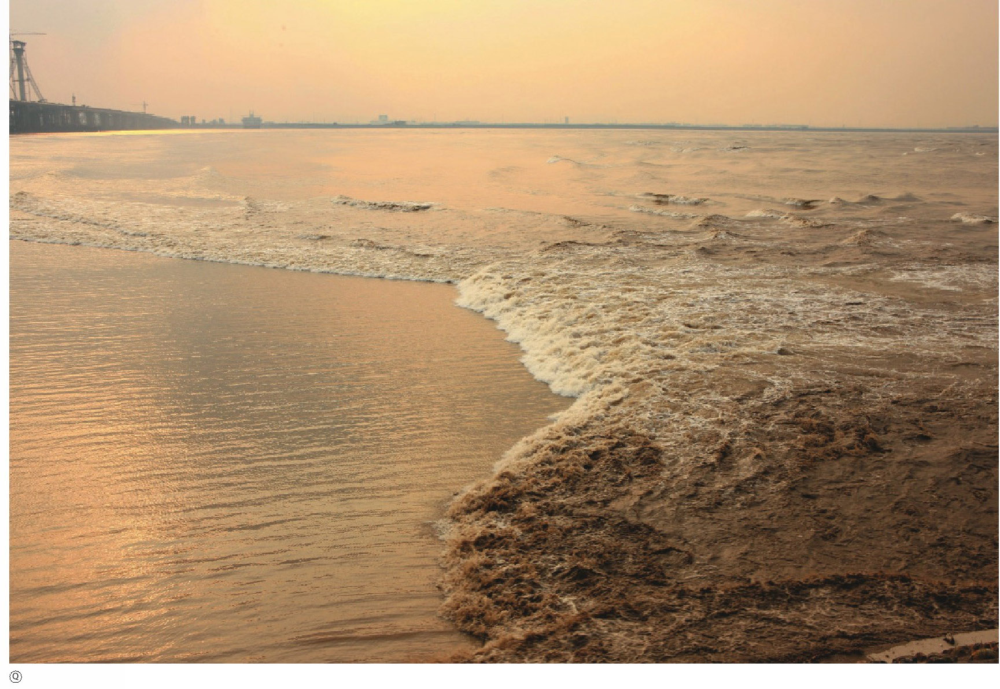
钱塘江涌潮

钱塘江涌潮四季皆有，以春、秋分时节规模较大，尤以农历八月十八前后的涌潮最为壮观。钱塘江观潮之风由来已久，历代文人墨客留下了不少关于钱塘江潮的诗赋。宋代苏东坡曾以“八月十八潮，壮观天下无”的绝句来赞誉钱塘江潮。今天，每到观潮季节，数十万人蜂拥而至，争睹钱塘江涌潮。

看过钱塘江潮的人无不为之称奇。当涌潮来临时，极目远望，一条横卧江面的白带，伴随着低沉的闷雷声飘然而来。当涌潮临近时，涛声轰鸣，白浪翻卷，一堵高2～3米、似雪崖般的水墙，犹如万马奔腾，以5～7米/秒的速度疾驰而过，与海堤碰撞，激起一二十米高的浪花，令人惊心动魄。涌潮的力量十分巨大，1953年在一次潮水越过海堤时，曾将重达1.5吨的“镇海铁牛”抛出10多米远。

钱塘江涌潮之所以如此壮观，是因为钱塘江河口具有两个特殊的地形条件：一个喇叭形的河口湾和一个长达130千米的河口沙坎。

钱塘江在澉浦注入杭州湾。杭州湾是一个典型的喇叭形河口湾。湾口宽约100千米，至湾顶澉浦缩窄为22千米，再向上到八堡的江面宽度只有2～3千米。在从澉浦向上的河床底部，又分布着一条长达130千米的河口沙坎，犹如门槛一般，使河床底部显著抬高。

当来自东海的潮波进入杭州湾后，因受喇叭状地形约束，潮水涌积，潮波变形，潮差增大，澉浦最大潮差可达9米，高出湾口一倍。当潮波继续向上传播进入沙坎河段时，在河槽急剧缩窄的同时，又遇河床的突然抬升，水深显著变浅，致使涨潮波前锋受阻，传播速度骤减。而后续的潮水因水深逐渐增大，潮波推进速度也越来越大，以致不同流速的水体层层相叠，形成后浪追前浪之势，潮波前坡也越来越陡。最终，当后浪赶上前浪，即潮峰赶上潮谷时，水位暴涨，潮波前坡陡立，便形成涌潮。钱塘江涌潮从起潮到消失，如以大尖山算起，沿江上溯的距离可达80千米。

到钱塘江观潮，不仅在盐官可以看到异常壮观的“一线潮”，在八堡可以看到两股不同方向潮水相遇形成的“交叉潮”，在老盐仓还可看到堤坝反射形成的“回头潮”，这就使得钱塘江潮格外引人入胜。（刘苍字）

  

**【微博士】**诺曼底登陆与潮汐

诺曼底登陆是第二次世界大战中盟军在欧洲西线战场发起的一次大规模攻势。该战役发生在1944年6月6日早晨，盟军选择涨半潮时机在法国西北部海岸进行登陆。这样，既可避免敌方的海滩障碍物对海军登陆艇造成的破坏，又缩短了陆军部队暴露在海滩上的时间，减少伤亡。由于不同地点涨潮的时间先后不一，指挥者按潮时确定了5个不同登陆点的抢滩时间，结果在一个半小时内先后成功登陆。诺曼底登陆作战的成功原因是多方面的，但巧妙利用潮汐无疑也是取得成功的原因之一。

【微问题】　中国历史上久负盛名的广陵涛为什么会消失？

【关键词】　潮汐　引潮力　钱塘江潮

# 海洋生物

## 为什么压力没有把深海生物压扁

海水越深压力越大，每加深10米就要增加1个大气压，2500米的深海就有250个大气压，相当于一头大象压在一个脚指头上。这么大的压力，深海生物怎么受得了？许多深海生物柔软的身体还是透明的，在高压下游泳怎么还能那样地优哉游哉？

原因很简单：这些生物里外都是液体，身体外面是海水，身体里面是体液。一个物体在流体介质里，不管是液体还是气体，只要里外的压力相同，就不会变形。深海生物身体里面的压力和海水是平衡的，所以不会被压扁。但潜水装置不同，深潜器里面是空的，它靠的是钛合金外壳来抗压。就像一个气球，在地面上因为内外压力相同，不会变形；当你一撒手把气球放到空中，气球在升到高空后，因为高空的空气稀薄，由此造成气球里面压力比外面大，当内外压力差太大的时候，气球就会爆炸。气球和深海生物经受压力的方向相反，道理却是一样的。

虽然没有被压扁，但几百个大气压，不可能不影响深海生物的生理功能，在高压下连身体里的蛋白质都不稳定，深海生物又是怎么对付的呢？虽然目前对其中的机制还不完全了解，但是生物在水里总是面临着身体内外渗透压力平衡的问题。浓度低的液体会穿过半透膜跑到浓度高的液体里去，比如淡水生物到了海水里就会失掉体液。20世纪70年代，科学家发现：海洋生物身体里有种特殊的有机质叫作渗透溶质，它不但能帮助调整体液的渗透压力，保持身体内外渗透压力的平衡，还能在高压下稳定蛋白质。所以水深越深的海洋生物身体里，渗透溶质也就越多。

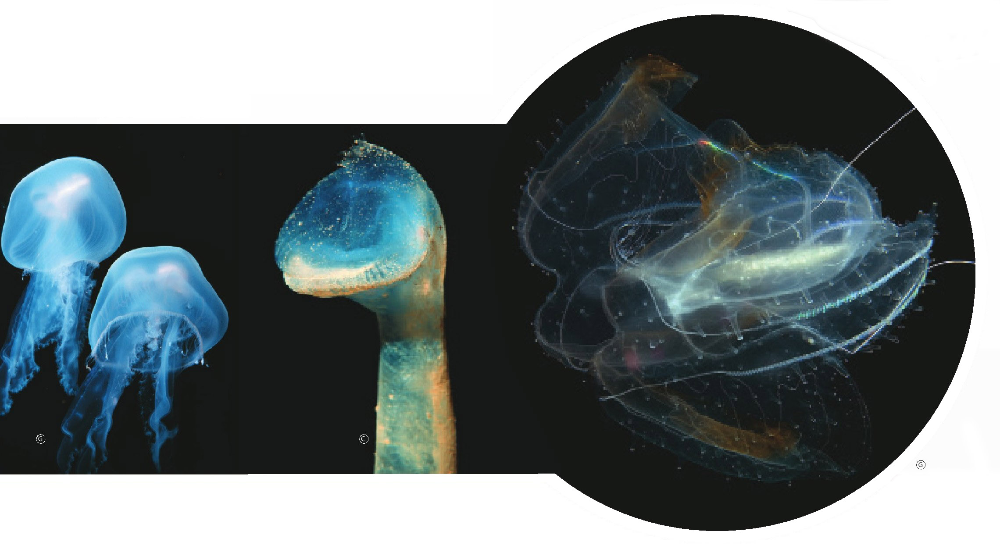
深海里生活着许多柔软而透明的动物

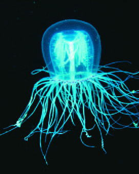
其实，海洋生物如何对付深海压力，并不仅仅是个生物化学的问题，还需要研究生物本身的活动。比如说，有些海洋动物昼夜上下迁移几百米，这其中存在着几十个大气压的差异，它们又是怎样自如地适应的呢？科学家推测，深海生物和浅海生物本身有着“亲戚关系”，它们应该是在浅海环境恶化的某个时候，转移到深海“逃难”，由此变成深海生物的。这其中的适应机制非常有意思，值得海洋生物学家好好探索一番。所以，近年来，科学家一方面用深潜器深入海底观测，另一方面还设计了“高压舱”等各种装置，把深海生物捕获到海面上进行实验，希望能够找出这里面的奥秘所在。（郭君）

## 水下几千米的深海生物吃什么

19世纪时，科学界相信只有上层海洋才有生物，大约200米以下因为没有光，也就没有植物，到600米以下连动物也没有，叫作“无动物带”。后来把跨大西洋的电缆拉上来修理时，发现沉到几千米水深处的电缆上居然长满了动物，深海“无动物带”的说法不攻自破。现在我们知道，即便在最深的1万多米的海沟里，动物仍然逍遥地生活着。但是，水深几千米的地方一片漆黑，距离有光合作用的有光带又十分遥远，那里的动物能找到东西吃吗？

深海生物分两类：一类是热液、冷泉出口处的“黑暗食物链”，这类生物能够自给自足，它们利用来自海底的物质和能量，依靠化学合成作用制造有机质，但是它们只分布在热液、冷泉的附近；另一类分布比较广泛，这类深海生物依靠海洋上层掉下来的有机质生活，不管是生物的尸体，还是动物的粪粒，都可以成为它们的食料，假如有死去的鲸鱼或者沉船的木头掉落海底，那立刻就会形成深海的繁华世界，会给许多生物带来很长一段时间的美餐。

起先，人们以为从海面掉下来“食物”是一个缓慢、均匀的长期过程，像雪花那样缓缓下降。30年前随着观测技术的改进，发现这些颗粒的沉降过程是突发性的事件，常常随着海面生物的勃发而来，而大部分时间却几乎没有“供应”。因此，深海生物通常都有相应的适应能力：胃口大，有食源的时候饱餐一顿，以迎接长期的食物短缺；运动快，能迅速投向下一个目标，决不能“守株待兔”。除了在海底上面和水层中生活之外，还有一批深海动物钻在泥里，专门吃泥里的有机物质，当然泥里的有机质归根结底也是上面掉下来的。这种钻泥的生活方式“质量”如何，人类很难客观评论，但是这种深海生物确实不需要像游泳生物那样疲于奔命了，而且，蚯蚓钻土生活，不也活得有滋有味吗？

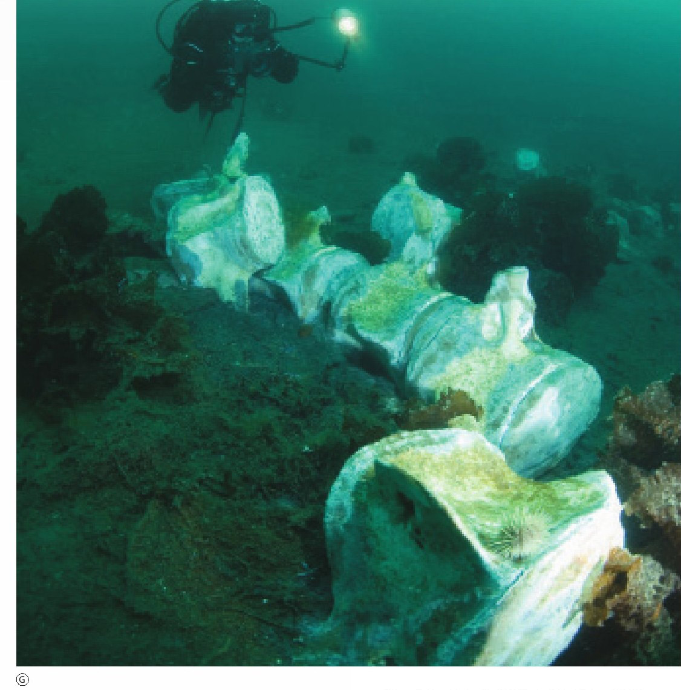
鲸鱼的尸体，是深海生物圈的“热点”

由此看来，深海生物的盛衰应当随着上层海洋生产力的变化而变化。为了追踪两者之间的关系，20年前，科学家在太平洋和大西洋分别投放了锚系和海底摄像设备，进行长期监测。结果真的发现：3000米深处的动物群也能感知春暖秋寒，也有季节变化，只是和表层海洋之间有个迟到的时间差。（郭君）

  

**【微博士】**探索海沟生物

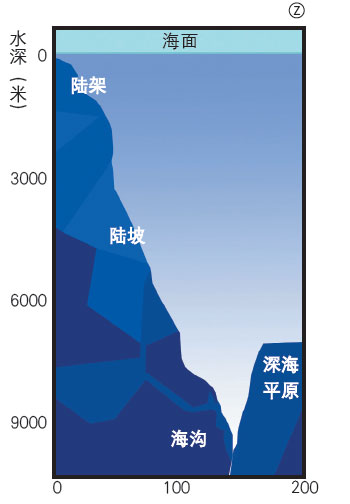
距离（海里）

世界上最深的海底，是水深6000～11100米的海沟。海沟是大洋板块俯冲到海底下面去的地方，形成狭长的V字形。3/4的海沟分布在太平洋周围，其中最深的是西太平洋的马里亚纳海沟，最深处11034米。这里有着极为独特，却又鲜为人知的生态系统。英、美、日等国的科学家决定启动“深渊生态研究”（HADES）计划，采用深潜器等新技术，从2013年起对海沟的深海生物群进行系统研究。重点探索的是V字形海沟的底部，因为从海水上层掉落的有机质，会从两坡向下在底部集中，为深海生物提供丰富的食料。

【微问题】　深海既然是黑暗的，为什么有的深海动物要长眼睛呢？

【关键词】　压力　深海生物　黑暗食物链　海沟生物

## 海洋生物会发光吗

显微镜下的夜光藻

夏夜里的萤火虫如同飘飞的点点繁星，甚是美丽。萤火虫是一种生活在陆地上的昆虫，可在马来西亚有一种“海洋萤火虫”，这是怎么回事呢？海洋中也有像萤火虫一样会发光的生物吗？

原来，马来西亚这种“海洋萤火虫”是一种名为夜光虫或者叫夜光藻的单细胞浮游生物，全世界都有分布。它身体呈圆球形，直径一般1～2毫米，其体内含有的荧光蛋白在受到外界刺激时会发出荧光。在夏秋季节，近岸海水的混合作用加剧的时候，这些漂浮生活在海水中的看不见的小家伙们受到刺激之后，就会在海面上形成星星点点的闪光，就像漂浮在海面上的萤火虫一样。

除了夜光虫外，海洋中还有很多会发光的生物存在。

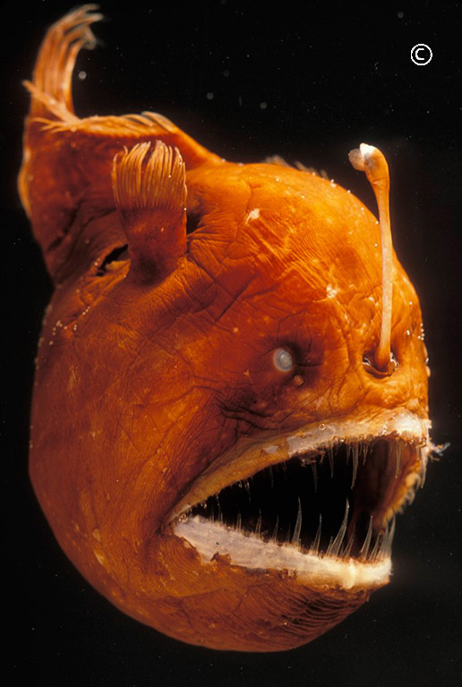
打着“灯笼”等待猎物的鮟鱇鱼

深海生活的角鮟鱇有个形象的名字叫作“灯笼鱼”。这种嘴大身小的深色怪鱼，长着寒光闪闪的尖牙利齿，头顶酷似钓竿的结构，顶端还有个会发光的“小灯泡”。它们潜伏在海底守株待兔，捕食被“灯光”吸引的鱼类或其他生物。

生活在南极附近的磷虾身体上拥有球状的发光器，它们发出幽蓝的光，使自己与周围幽蓝的海水融为一体，仿佛穿上了一件极好的“隐形衣”。同时，这种发光功能也是磷虾群体互相联系识别的重要信号，可能正是依靠这点点漂亮的荧光，磷虾才得以成千上万地集结在一起，在冰冷的南极海域形成数百米长的荧光带。

有些乌贼和章鱼等头足类动物也是海洋发光一族的重要成员。日本富士湾的萤火鱿发的光能在夜色中将海滩变得五光十色；深海生活的乌贼依靠身体表面的微小发光器发出迷人的光彩，在黑暗无光的深海中，吸引猎物的到来。

水母是海洋中最优雅美丽的生物，其中有些种类更是发光的高手。一种深海很常见的黑伞水母在受到刺激的情况下，会喷发出一层荧光的光幕来分散敌人的注意力，从而为自己赢得更多逃生时间。

发光是海洋生物对海洋黑暗环境的适应。在没有阳光的深海里，大多数生物以其他生物或者海水中的生物残渣为食，生存竞争尤为激烈。在这样的条件下，拥有特殊的发光本领能帮助海洋生物躲避敌害，以及更方便地捕食。（赵诏）

萤火鱿聚集在海湾的壮观景象

## 海洋生物为什么发光

陆地生物中发光的很少，只有萤火虫等少数几种，而海洋生物从细菌到鱼类，几乎所有的门类都有会发光的种类。那么，海洋生物为什么要发光呢？

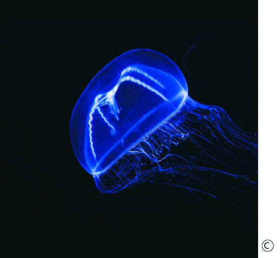
水母是海洋中最优雅美丽的生物，其中有些种类更是发光的高手

先从单细胞藻类说起。拉丁美洲波多黎各岛有个著名景点“荧光海湾”，晚上你坐船穿过红树林进入海里，只要用手搅动，水面上就会发出暗暗的荧光，搅得越快荧光就越多，连船开过的地方留下的也是一条发光的船迹，这就是单细胞植物甲藻发出的光。甲藻为什么要发光？科学家推测是为了防御：甲藻的天敌是桡足类节肢动物，也就是平时说的鱼虫或者水蚤，突然发光可以吓退它们，或者用光线把更大的动物引来，先把桡足类动物吃掉。

这种“发光退敌法”是海洋生物的常用招数，并不是甲藻的专利。棘皮动物门的蛇尾类也是这样：你突然碰它，它的腕上就会发光，以吓退来犯之敌。发光的另一种功能是误导敌人，比如：有的鱿鱼腹部发光是一种伪装，目的是和周围海水的光线相似，避免被敌人发现；有的鱿鱼在触足的末端发光，在紧急情况下可以放弃发光的触足以误导来敌，用“壮士断腕”的办法逃生。

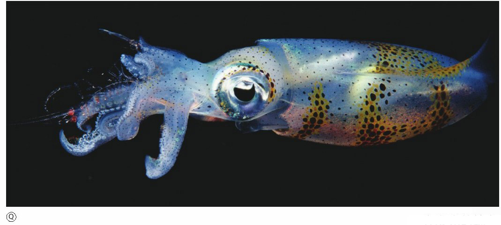
会发光的鱿鱼

当然，海洋生物发光不但是为了保护，有的把发光作为诱饵，吸引猎物上钩，这是许多食肉鱼类的常用“技术”。此外，在一片漆黑的深海里，发光还是重要的种内通信工具，一些鱼类、章鱼和介形虫都有这种功能，在交配季节依靠发光的办法“约会”。

其实我们对于海洋生物发光的道理知道得并不多。比如两类单细胞的浮游生物都有蛋白石质的骨骼，其中放射虫有能发光的类型，而硅藻就没有。再说发光的用处也有争议。有人说，有的海洋生物发光不是为了有用，而是早期演化的残留习性。比如说甲藻的演化产生得很早，那时候地球上还处在还原环境，自由氧是有害的，而发光是一种氧化作用，所以当时是消耗氧、避免伤害的一种办法，现在地球的大气圈已经氧化了，古老的性能却保留了下来。相反，硅藻演化产生晚得多，出现的时候大气已经氧化，不再需要这种办法，所以硅藻不会发光。当然，这只是一种猜想，有待今后的考证。（赵诏）

  

**【微博士】**海洋生物发光的原理

和灯泡发的“热光”不同，海洋生物发的是“冷光”。这是一种氧化发光，化学能几乎100%转变为光能，效率特高。具体说是生物形成的虫荧光素，在虫荧光酶的参与下发生氧化作用，发出荧光。大多数生物发光都是在开放性海域进化获得的，产生的光主要为蓝色，波长在475纳米附近。其次是绿色，主要在深海或沿岸附近出现。这可能与这些区域海水浑浊度偏高，对蓝光造成的散射增加，并支持更长的绿光波的形成有关。海洋生物发出紫色、红色、橙色和黄色的光较少，其原因和功能还有待研究。

【微问题】　为什么发光的生物在海洋中多而淡水里少？

【关键词】　发光生物　夜光虫　甲藻　硅藻　冷光

## 谁是动物界的潜水冠军

在赤道附近的温暖海区，有时会看到这样一场惊心动魄的恶斗：一头脑袋巨大的鲸鱼与一条大乌贼正在激烈地搏斗，有时它们会一起跃出水面，如小山般庞大的大头鲸鱼不断地撕咬着乌贼，而大乌贼也不甘示弱，奋力地用腕足缠绕着鲸鱼，并堵上它的气孔，试图使之窒息而亡。在这场决斗中，大头鲸鱼往往取胜，但有时乌贼也会凭借烟幕逃之夭夭。这种大头鲸鱼叫作抹香鲸，它最爱吃巨大的头足类动物，常常因为追捕巨型乌贼而“屏气潜水”长达1.5小时，并可潜到3000米的深海。

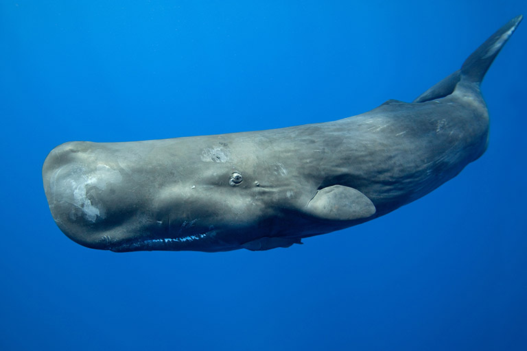
抹香鲸

抹香鲸是齿鲸类中个头最大的一种，雄性体长最大可达20米左右，雌性15米左右。远远看去，抹香鲸的身躯好似一只大蝌蚪，它的头特别大，约占体长的1/3，上颌与吻部呈桶状，下颌细而薄。与其巨大而沉重的头部相比，抹香鲸的身躯既小又轻，这种头重脚轻的体形极其适合潜水。而且抹香鲸有着巨大的肺活量，它背上的喷水孔一次可以换掉体内85%的气体。这些优势使得抹香鲸能够潜到3000米深的海中，还可在水下待上一个多小时与大乌贼搏斗。因此，抹香鲸被称为动物界的潜水冠军。（郭君）

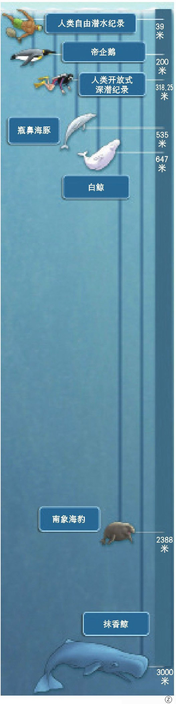
谁是动物界的潜水冠军

## 鲸鱼为什么会“自杀”

1985年12月，中国 福建省福鼎县秦屿湾有12头抹香鲸集体自杀，这是中国有记录的第一次抹香鲸集体“自杀”事件。类似的现象在其他地方也有出现，比如2009年194头抹香鲸和7只海豚在澳大利亚大陆和塔斯马尼亚岛之间的金岛沙滩上搁浅。那么，鲸鱼为什么会“自杀”呢？

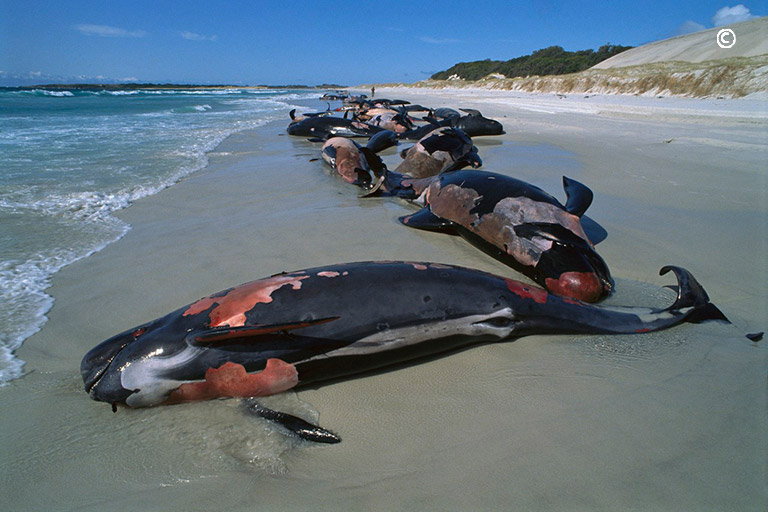
集体“自杀”的虎鲸

刚开始，人们认为鲸鱼是为情“自杀”，但是，先不考虑鲸鱼有没有如人类般丰富细腻的感情，好多鲸鱼搁浅时会发出惊恐悲戚的叫声，并不像是自寻短见。

鲸鱼的视觉极度退化，在水中主要靠类似蝙蝠的高灵敏度回声测距本领来辨认物体。它们在海中游动时，不断地向周围发射超声波，超声波遇到障碍物会反射回来，被鲸鱼接收，形成回声。鲸鱼就根据往返的时间差来准确判断自己与障碍物之间的距离。因此对鲸鱼“自杀”现象有一种说法是：鲸鱼为了追食鱼群而游进坡度平缓的海湾，在这种平缓的海滩上，回声信号会严重失真，甚至完全接收不到回声，鲸鱼因此不能准确判断方向和距离，导致搁浅身亡。但有些鲸类在回声清晰的陡峭海岸也会搁浅，因此这一说法存在漏洞。

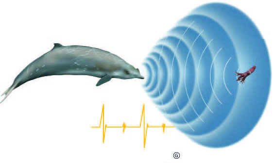
海豚的回声定位系统

另外，动物学家在搁浅的鲸鱼内耳中发现了许多圆形昆虫。他们认为，这些寄生虫可能破坏了鲸鱼的回声定位系统，使鲸鱼不能正确接收回声而迷失方向。另一些科学家发现，绝大多数搁浅死亡的鲸鱼的气腔两面红肿病变，这也支持了病变破坏定位系统导致其搁浅的观点。

英国科学家利用计算机仔细分析了鲸鱼的搁浅记录后提出，磁场导航机制出现偏差可能是鲸鱼搁浅的原因。还有一些科学家认为环境污染、地震、水下爆炸、军舰发动机和声呐的噪声等也可能引起鲸鱼的搁浅。

另外还有失常论、向导论、返祖论、摄食论等众多观点，但所有这些观点都不是特别令人信服。现在，人们依旧没有完全弄明白鲸类动物的“自杀”之谜，能做的也只是尽量营救这些搁浅的动物，使它们再次回到海中。（郭君）

  

**【微博士】**神奇的龙涎香

古时候，在海边居住的人们有时会在海滩上捡到一种灰黑色的蜡状物，这种蜡状物刚取出时有强烈的腥臭味，但干燥后却渐渐散发香气，燃烧时，更是堪比麝香，香味持久浓郁。那时候的人们不知道这种宝物从何而来，认为是海底巨龙在睡觉时流出的口水凝结而成，因此称它为龙涎香，并作为稀罕之物进贡给皇帝。

实际上，珍贵的龙涎香并不是巨龙的口水，而是海中巨兽——抹香鲸肠道的分泌物。抹香鲸以大乌贼为主要食物，大乌贼长着很多坚韧的腕足，当抹香鲸经过一轮激战把大乌贼吞到肚子里后，大乌贼的腕足在挣扎的过程中就会抓伤抹香鲸的肠道，为了伤口的快速愈合，肠道就会分泌出龙涎香。这些分泌物会随着抹香鲸的呕吐、排泄或者抹香鲸死后分解而进入海水中。由于它比海水轻，就会浮在海面上，最后漂落到沙滩上。龙涎香是珍贵香料的原料，同时也是名贵的中药。如果偶尔得到重50～100千克的一块，那可是价值连城！

【微问题】　如果是回声定位系统遭到破坏导致鲸鱼“自杀”，那么蝙蝠会由于这个原因“自杀”吗？

【关键词】　鲸鱼　抹香鲸　龙涎香　回声定位

## 为什么鱼儿会飞

海阔凭鱼跃，天高任鸟飞。鸟儿是天空的主人，它们能够在天空中自由自在地飞翔，那么，是不是只有鸟儿能够飞呢？答案是否定的，实际上，自然界里还有各种各样会飞的动物。最为常见的是长有轻薄翅膀的昆虫，比较特别的是哺乳类的蝙蝠和鼯鼠，当然还有远古时代的翼龙等。但最奇特的飞行家，却是原本应该在水中竞渡的一群鱼儿。

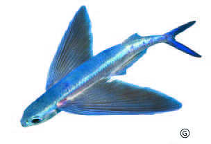
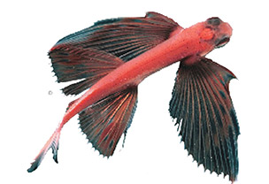
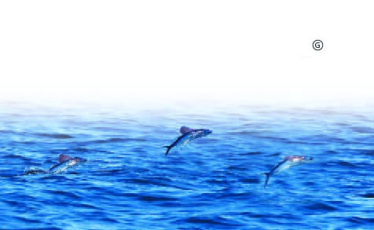
在一望无际的海面上，波光粼粼，银辉点点，一派水天一色的景象。突然，海面上跃出了成群的鱼儿，犹如群鸟一般掠过海面。它们忽而腾空跃出，在水面上划过一道优美的弧线，然后降落在队伍的前方；忽而又贴着水面疾驰一番，溅起一朵朵白色的浪花，然后又冲天而起。上百条鱼儿你追我赶，忽高忽低，场面十分壮观。这种像鸟儿一样会飞的鱼，就是海洋里闻名遐迩的小小飞行家——飞鱼。

海洋里有各式各样的鱼，为什么绝大多数的鱼都不会飞，飞鱼却能够飞起来呢？这主要得益于飞鱼特殊的身体构造。大家小时候都玩过纸飞机，纸飞机被扔出去之后，会靠着两个大大的机翼在空中滑行。飞鱼也有这么两个“机翼”——发达的胸鳍。飞鱼的身体呈长长的梭状，而它们胸鳍的长度可达到身体的2/3，展开时，就像飞机的机翼一样。飞鱼的腹鳍也比较大，可以起到辅助飞行的作用。除此之外，飞鱼还有一个有力的尾鳍，呈叉形，正是它在水中有力地拍打，才使得飞鱼能够如箭一般冲出水面，而且这个尾鳍还有利于飞鱼在水中以及空中把握方向。飞鱼的这些构造和其他鱼类大不相同，反而更接近于空中飞行的鸟儿。

曾经，人们认为飞鱼是像鸟儿那样在空中鼓动双翼飞行，但后来的高速摄影技术显示情况并非如此，飞鱼并不是真正意义上的飞，它只是像纸飞机一样在空中滑翔。在飞鱼飞行的整个过程中，它的尾鳍起到了关键性的作用。飞鱼在水面下将胸鳍与腹鳍紧紧地贴在身体上，呈现梭形，使游动的阻力降至最小，然后以一定的角度快速地游泳前行并上升。接近水面时，飞鱼猛力摆动强有力的尾鳍，使海水产生一个巨大的反向推力。一旦离开水面，立即展开它宽大的翅膀一般的胸鳍，这时飞鱼就如一支离弦之箭，冲向天空，并在空中划出一道优美的弧线。滑翔一段距离后，飞鱼通常是尾巴先入水，这时候，飞鱼如果再次发力摆动尾鳍，就能在身体完全入水之前再次冲出水面。如此反复，飞鱼就可以在海面上此起彼伏，飞出很远的距离。当然，飞鱼毕竟是用鳃呼吸的鱼类，因此，它在空中飞行一段时间后，依旧是要落到海洋里的。（郭君）

## 飞鱼为什么要飞

从飞鱼冲出水面的过程可以看出，飞鱼的游泳速度是很快的，大家可能会有疑问，既然它游得那么快，为何还要飞行呢？这就要提到它的天敌了。

飞鱼肉质鲜美，是海洋中凶猛的肉食鱼类如旗鱼、剑鱼、金枪鱼、鲨鱼等的美味佳肴。在这四大敌人中，旗鱼是海洋中公认的短距离游泳速度最快的鱼类，仿佛陆上的猎豹；剑鱼不但速度快，而且“武器”优良；而金枪鱼和鲨鱼也是当之无愧的海洋杀手。面对这样的捕食者，飞鱼只靠速度是无法保证自身安全的。于是，在漫长的生存斗争中，它们练就了一种逃避天敌的巧妙技巧——跃水飞翔。因此，飞鱼通常在遇到危险，或者受到轮船引擎扰动时才会跃出水面。另外，在活跃的繁殖期，或者心情很好、很兴奋的时候，有些飞鱼也会飞出水面。

凡事有利就有弊，飞鱼跃水飞翔这一妙招虽然能够躲避水中的捕食者，却也给空中的猎手提供了方便。从跃出海面在空中飞行到再次落入海中的整个过程中，毫无保护措施的飞鱼很容易会被空中巡视的海鸟捕获，成为海鸟的一顿美餐；有时候，还会因为没有把握好方向撞上礁石或者飞上正巧路过的轮船甲板而丧命。（郭君）

  

**【微博士】**飞鱼能飞出多远

在紧急逃命时，飞鱼的飞行速度可达50～60千米/时，并在离开水面四五米的空中持续飞跃十几秒。这样算下来，飞鱼的纵身一跃，可以飞出200多米。如果老天帮忙，风力和风向助力，飞鱼的飞行距离还会更远。

【微问题】　你能列举出除鸟类和昆虫之外的其他有飞行能力的动物吗？

【关键词】　飞鱼　飞行　胸鳍　尾鳍　天敌

## 为什么鱿鱼不是鱼

经常有人会出题：请问以下哪个不是鱼——鱿鱼、墨鱼、章鱼、鳝鱼？其实，除了鳝鱼，前面三个互相之间虽然是亲戚，但都不是鱼。那么，这些在海洋里自如游泳的家伙为什么不是鱼呢？

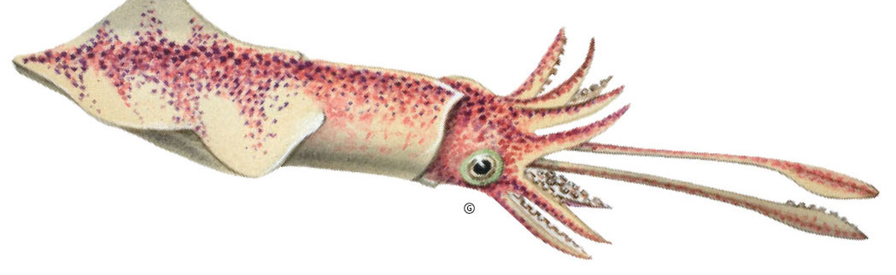
鱿鱼长着好多条带吸盘的“腿”

根据专业的学术定义，鱼指的是：终身生活在水中、用鳃呼吸、用鳍游泳的脊椎动物。而不管鱿鱼、墨鱼还是章鱼，身子光溜溜的不但没有鳞片，没有一般鱼一样的鳍，没有那根贯穿头尾的脊椎，还长着好多条带吸盘的“腿”。它们虽然是终身生活在水中的海洋动物，却既不用鳃呼吸也不用鳍游泳，所以，鱿鱼和它的这些亲戚都不是鱼。事实上，它们属于无脊椎动物中的头足类，和大名鼎鼎的鹦鹉螺倒是“师出同门”。

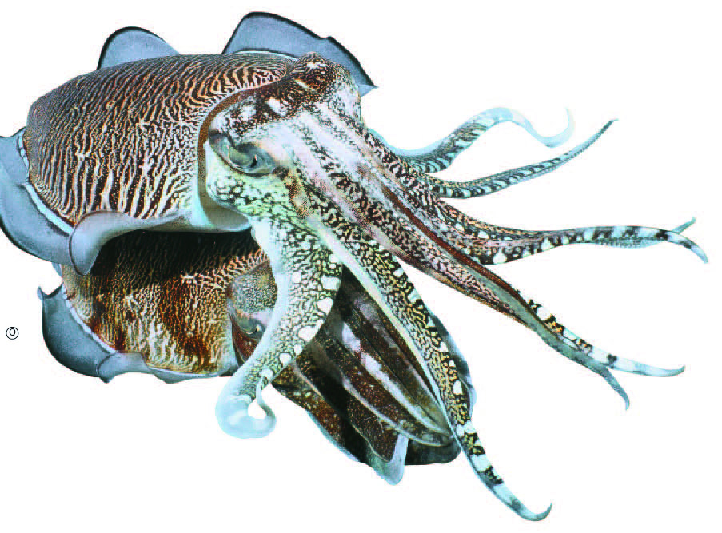
头足类动物没有鳃和鳍，它们的特征是头部外有一层厚厚的外套膜包裹，头下生长着“足”，这是它们“头足类”名称的由来。头足类动物的“足”的科学名字是腕。腕的腹面排列着威力强大的一组组吸盘，细巧的末端会做出一些蠕动的动作，不明就里的小鱼因此常常被它们所迷惑，成为鱿鱼的食物。（赵诏）

## 鱿鱼是怎样游泳的

“5、4、3、2、1，点火！发射！”一声令下，发射场上的火箭后面喷出一股浓烟，借着助推作用一路往上，直至发射至太空。长得不像鱼也根本不是鱼的鱿鱼，尖尖的脑袋长长的尾巴，是不是有点形似火箭呢？不光是外形相似，鱿鱼在海洋中的游泳方式也的确是一种“火箭式”的游泳。

前面说到，作为头足类动物的鱿鱼，有一层厚厚的外套膜包裹着自己的头部，这个外套膜与头部之间就形成了一个空腔。空腔的下部，也就是鱿鱼长着吸盘的腕足中间的部位，有一个管状的漏斗，成为空腔的进出口。因为这个空腔和漏斗的作用，鱿鱼在水中的游动如火箭发射一般：外套膜能像心脏那样收缩，从而使外套腔也如心腔一般不断地充满水又喷射而出。从漏斗口喷射出的水流，就像火箭尾部喷射出的气流一样，形成助推的力量，从而使鱿鱼在水中像一个喷射的火箭一般快速前行。此外，鱿鱼的漏斗口的另一高明之处在于，漏斗口可以自由地转向，使得水流能喷向任意的方向，从而使鱿鱼方便地向任意方向游动。

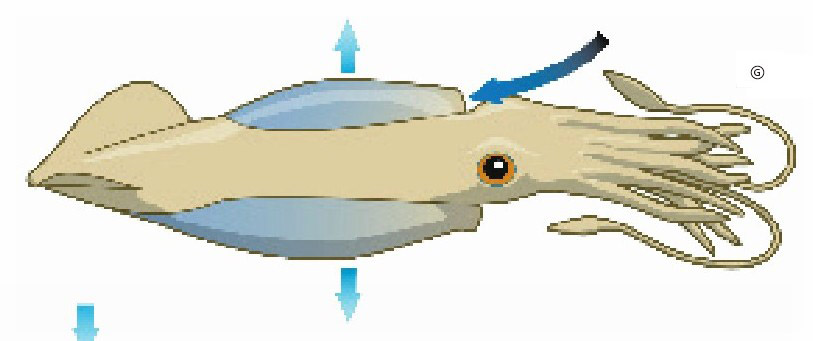
鱿鱼的外套腔充满水

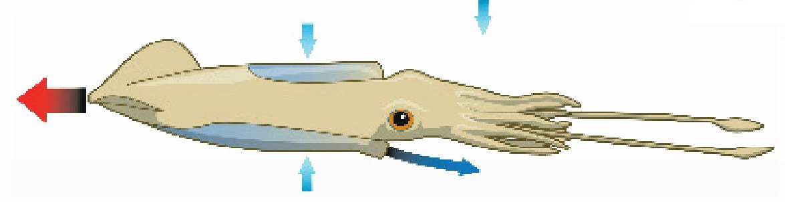
外套膜收缩，水从漏斗口喷出，助推鱿鱼前进

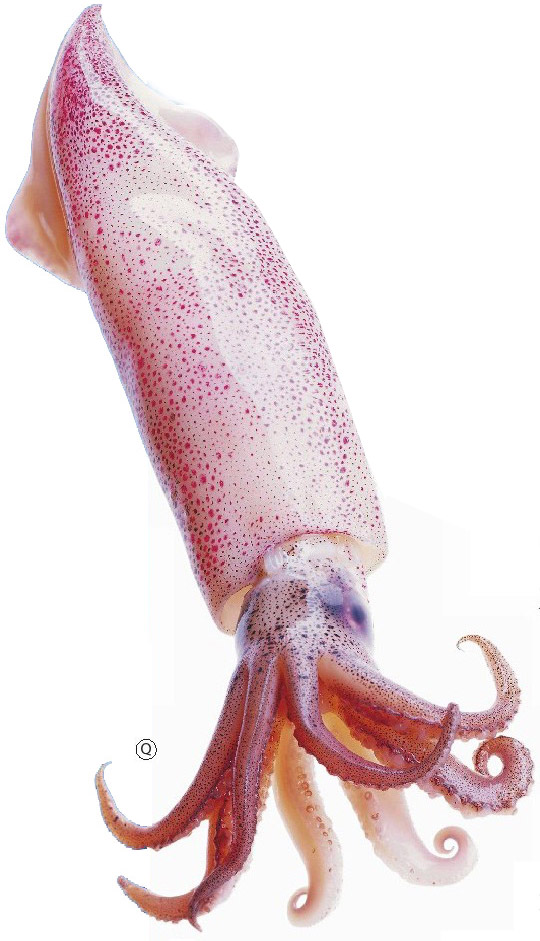
其实，鱿鱼并非没有“鳍”，大部分的鱿鱼外套膜外部的两侧也会向外突出形成像鳍一样的膜结构，叫作肉鳍。但这种结构和真正的鱼鳍是不一样的。因为大部分鱿鱼的外套膜内还有一块重量不轻的内骨骼，使得鱿鱼在进行“火箭式”游泳的时候需要消耗大量的体力。这种突出的鳍状外膜也能像鳍一样划动，从而使鱿鱼在不需要快速行进的时候，可以在水中悠闲地“散散步”。

鱿鱼的特殊身体结构使得它拥有两种快慢结合的游泳模式——“火箭式”喷射快速游动和依靠鳍状结构缓慢游动，这都是为了适应环境从而获得更有利自己的生存条件。也许正是因为这样精巧的身体构造和高明的生存策略，鱿鱼才能在海洋中广泛存在并且数量巨大吧。（赵诏）

## 为什么渔民多在晚上钓鱿鱼

钓鱼是项考验耐心而又有趣的活动。能够钓到大鱼，可不是件容易的事，需要准备好饵料，选择好地点，而且要有足够的耐心。钓鱼难，殊不知钓鱿鱼更难，因为钓鱿鱼除了上述钓鱼的条件外，还特别需要选对时间。经验丰富的渔民告诉我们：钓鱿鱼一定要在晚上，尤其是黄昏、半夜和黎明三个时间点最佳。这又是为什么呢？

头足类动物身体的另一大特征便是拥有非常发达的眼睛。研究表明，虽然身为较低等的无脊椎动物，但鱿鱼眼睛结构的复杂程度已经接近脊椎动物的眼睛。因此，海洋中生活的鱿鱼视力极佳，对光线极为敏感。

到了夜晚的海洋，特别是傍晚和黎明时分，或是半夜盈盈月光洒满海面的时候，光线变得很弱又不至于完全没有，大部分视力不佳的捕食者因为“看不见”而早早收工回家，而被捕食的小型海洋生物结束了白天胆战心惊的躲躲藏藏，也终于得见天日，出来活动活动。但是能“明察秋毫”的鱿鱼并没有休息，而是趁此大好时机准备好好地饱餐一顿。这时候，钓鱿鱼的机会就来了。渔民用准备好的假虾来迷惑饥不择食的鱿鱼，而鱿鱼也因为过于专注吃食而常常自投罗网。正所谓“螳螂捕蝉，黄雀在后”啊！（赵诏）

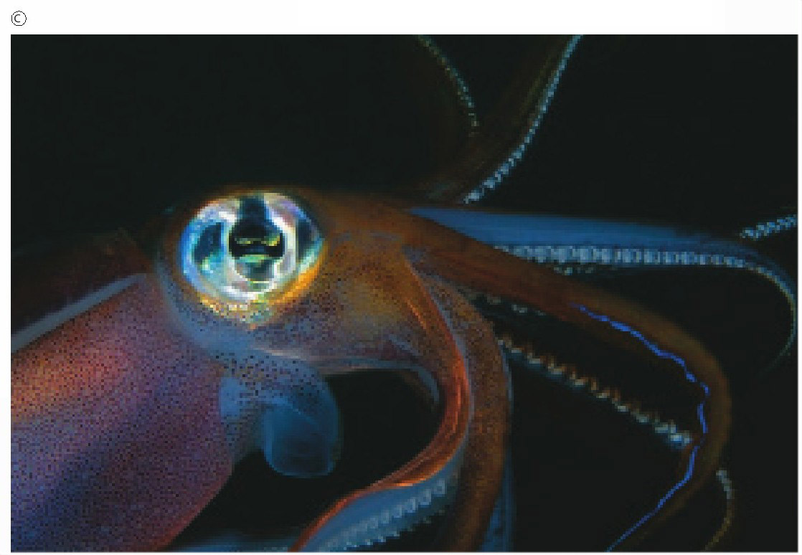
鱿鱼眼睛结构的复杂程度已经接近脊椎动物的眼睛，因此鱿鱼的视力极佳

  

**【微博士】**鱿鱼、章鱼、墨鱼，谁是谁

鱿鱼、章鱼、墨鱼，都是餐桌上的美味，名字相似，长得也差不多，常常搞得人稀里糊涂，分不清到底谁是谁。其实，这三种长着大大的脑袋、圆圆的眼睛和长长的腕足的生物，都是头足类软体动物，但分属不同的种类。章鱼又称八爪鱼，是一类学名叫蛸的软体动物，常见的种类有真蛸、短蛸和长蛸；而枪乌贼俗称鱿鱼；墨鱼也是乌贼的俗称，主要是金乌贼和无针乌贼中的种类。

这三类生物不仅名称有别，外形也很不相同。首先，最重要的一点区别就是章鱼的腕足只有八条，而鱿鱼和墨鱼有十条。其次，从头部外形和鳍的差别，也能很轻松地区别它们。章鱼的头较小，很圆；鱿鱼的头部像梭子一般，尖尖的，靠头的上部有较宽的鳍；墨鱼的头比较大，呈椭圆形，头两边有鳍，但没有鱿鱼那么大。

**【实验场】**

去市场上寻找新鲜的鱿鱼和普通鱼，仔细观察它们的鳍有什么具体的差别。

【微问题】　月色明亮或者昏暗，哪种情况下钓鱿鱼更容易得手？

【关键词】　鱿鱼　头足类　腕　吸盘　空腔　漏斗

## 为什么说海豚很聪明

在美国旧金山的海洋世界研究所里，训练员马伦为了保持水池的清洁，便训练小海豚们主动清理水池内的杂物。每当小海豚衔出池内的废纸弃物时，马伦都会奖赏它们一条鱼吃。然而渐渐地，马伦对一条名叫“斯波克”的12岁海豚起了疑心：这条海豚不断地吐出一片片湿透了的黄纸，因此一次又一次地赢得了奖赏。后来马伦终于搞清楚了——“斯波克”在水池的一角藏了一大张黄纸，而它每次仅撕下一小片以骗取训练员的奖品。我们不得不感叹，海豚的智力是多么的发达！实际上，海豚被认为是目前智力仅次于人类的、世界上第二聪明的哺乳动物。

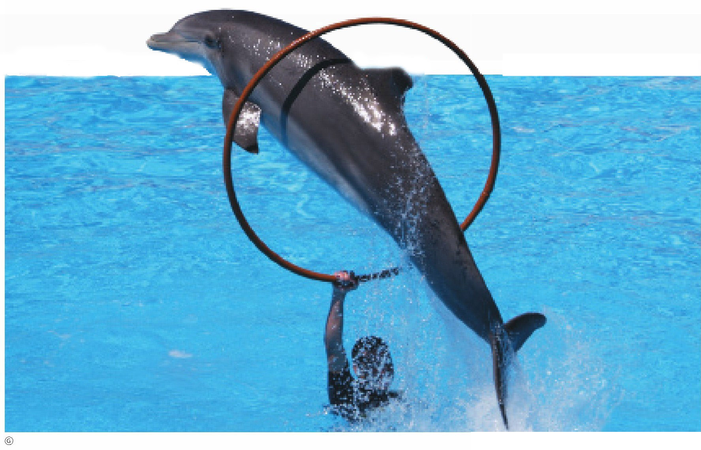
埃默里大学的海豚专家洛丽·马里诺说，如果把人类的智力评判标准应用到动物身上，那么海豚的大脑资质水平和人类的十分相近。她对海豚的大脑进行的核磁共振扫描结果显示，海豚的大脑有以下几个特点：首先，相对于它们的身体体积，海豚的脑袋很大。海豚大脑占体重的比值虽然比人类的要低一点，但超过其他灵长类动物。其次，海豚的大脑结构比较复杂，海豚大脑半球上的脑沟纵横交错形成复杂的褶皱，而且海豚大脑皮质的褶皱程度比人类的还要高，并且更为复杂。海豚大脑皮质每单位体积的神经胶原细胞和神经细胞的数目非常多，神经的分布也相当复杂。海豚的大脑由相隔开的两部分组成，这样它们便可以“一脑两用”，一部分用来进行工作，而另一部分则可以充分进行休息。

海豚的大脑非常发达

另外，海豚大脑还具有处理“复杂的情感”的结构和产生自我意识的结构。海豚可以认出镜子中的自己，这表明海豚具有自我意识，也意味着海豚能够理解人类的情感。虽然所有的动物的大脑都具备处理情感信息的能力，但是海豚大脑的这种能力特别强。也正因为如此，我们才能在水族馆中见到它们精彩的表演。（咸淑慧）

## 为什么海豚会救人

海豚是海洋中非常聪明、善良的动物，我们也常常听到有关海豚救人的一些非常神奇的故事。实际上，关于海豚救人的故事并不是人们虚构的，而是非常真实地发生在我们的身边。

2005年，在新西兰北岛，救生员罗比·豪斯和他的女儿尼基以及一些朋友准备游泳横穿海湾。在这片美丽、看似宁静的海域中生活着宽吻海豚和大白鲨。由于下水后不久，尼基不小心撞到了礁石上，她的伤口开始流血。因为伤口不大，尼基本人并没有在意，但大白鲨却凭着非常敏锐的嗅觉，很快便靠近过来，准备发动袭击。此时，在同一海域里的几条海豚注意到了鲨鱼的行动。海豚们开始朝尼基他们游去并紧紧围在他们周围，同时还发出报警信号，呼唤附近的其他海豚一起来帮忙。

海豚越聚越多，它们快速地围绕着尼基他们游动，并用力甩动尾巴向鲨鱼显示力量。就这样，由海豚组成的一道结结实实的保护墙，使得鲨鱼无计可施，最终，鲨鱼只好灰溜溜地离开。

类似这样的海豚救人的事件还有很多，人们不禁要问，为什么海豚会救助人类呢？海豚救人究竟是出于本能，还是一种经过思考的“见义勇为”的行为呢？

有的科学家认为，海豚救人是出于一种照料子女的天性。海豚是一种哺乳动物，它们虽然可以潜入水中游泳，但每隔一段时间都需要浮到水面上换气呼吸。海豚常常爱把刚出生不久的幼崽托出水面呼吸。即使是稍大一些的小海豚，虽然在一般情况下能够自己顺利到达水面，但如果遇到意外情况，海豚妈妈也会用它们的吻轻轻地托起小海豚。另外，它们还会用同样的方法来照顾生病或受伤的同伴。渐渐地，这种手段变成了海豚的一种救助天性。它们不仅会托起同类，也会托起其他动物甚至是各种无生命的、在水中不积极运动的物体。

另一方面，海豚的幼崽容易受到鲨鱼的袭击，因此海豚妈妈也会密切关注鲨鱼的动向，并把驱赶鲨鱼作为自己的天职。

还有一种解释是，海豚天性好动，喜欢在深水和浅水间来回穿梭嬉戏，并把碰上的物体当成它们的玩具，把它们托起来。如果在深水中落水的人恰巧遇见游向浅水的一群海豚，便会被这群海豚当作玩具托起带到岸边。而当遇到鲨鱼时，海豚常会认为鲨鱼是在和它们抢玩具，因此会与之格斗。

但有的科学家认为，把海豚救人的行为归为海豚的天性未免太低估动物的智商。就像我们之前讲到的，海豚大脑非常发达，而且其中有关情感的部分特别强，它们可以理解人类的情感，能够察觉到我们的害怕或惊恐，甚至会同情我们的处境，因此才会积极救助人类。（咸淑慧）

  

**【微博士】**不温和的海豚

海豚并不都是温和的，因为它们既然是食物链中的一环，就必须通过捕食来获得能量。例如，逆戟鲸，又称虎鲸，身长可达近10米，体重能达到9吨左右，是海豚家族中体形最大的种类。虎鲸长相可爱但性情凶猛，锋利的牙齿就是它们的进攻武器，企鹅、海豹等动物都唯恐避之不及，有时，虎鲸还会袭击其他鲸类甚至大白鲨。不过，虎鲸喜欢群居，因此，当它落单的时候，就变得没那么霸道了。

【微问题】　作为食肉动物的海豚，如果饥肠辘辘，会把落水的人吃掉吗？

【关键词】　海豚　大脑　智力　情感　聪明　鲨鱼

## 海象的长牙有什么用

在我们的脑海中，大象拥有柱子似的粗腿、蒲扇似的大耳朵和獠牙似的长牙，是陆地上最大的动物。那么，比陆地面积还大的海洋里面也有“大象”吗？答案是有！它们的名字就叫海象。海象属鳍脚目海象科，仅此一种，别无兄弟姐妹。海象的身躯虽然没有大象大，但在鳍脚目动物中是最大的。

海象主要生活在寒冷的北极海域，它们的身体又重又长，皮又厚又皱；它们的四肢因适应水中生活已经退化成鳍状；它们的鼻子短短的；它们的耳朵没有耳壳，看起来十分丑陋。虽然海象很丑，但却身怀绝技，主要就是靠那对长长的牙。

首先，长牙是海象自卫的武器。海象生活在高纬度地区，主要天敌是逆戟鲸和北极熊。一旦开战，海象就会亮出獠牙。当然，一般情况下海象是不会舍命和这些厉害角色斗狠的，这时候，长牙就变成了攀登者即海象“手”中的冰镐，可以帮助它们在冰面上逃命。

其次，海象的长牙是权力的象征。海象是群居动物，在海象家族中，牙的长短、粗细等决定了个体的地位，也是同类间争夺领地和“妻妾”的武器。不过，海象相互之间的打斗不算残酷，一旦一方明显占据上风，打斗便马上停止。

但是，从实用的角度来说，海象长牙的最重要用途是担当“水下耕耘者”，其作用仿佛是耕地的犁。因为海象善于潜入海底，用长牙挖取泥沙里的软体动物。海象能以长牙挖掘海底的食物得益于它是潜水能手。海象一般潜水的深度可达500米，个别可潜入1500米的深水层。海象潜入海底后，可在水下滞留2小时，一旦需要新鲜空气，只需3分钟就能浮出水面。海象之所以具有如此惊人的潜水本领，主要是因为体内含有极为丰富的血液。海象的血液占整个体重的20%左右，而人类的血液仅占体重的7%。由于海象体内血液多，体内存储的氧也多，因此在海洋中下潜的深度大、时间长也就不足为奇了。海象潜入深水区时，由于那里根本没有阳光，因此，它们就像蝙蝠和海豚一样，靠声音来定位。

海象牙工艺品

海象的食谱上有鱼、海蠕虫、乌贼、鱼、小鲨鱼、虾、蟹等，甚至有时还有海豹和独角鲸，但大多数是牡蛎。牡蛎是一种带硬壳的软体动物，但这却一点也难不住海象。一只成年海象一天能吃约7000只牡蛎，转瞬之间就能将牡蛎肉从壳中吸出。

海象的牙还具有经济价值和药用价值。早在中世纪，海象牙磨成的粉末就是十分重要的药材。但正是这种珍贵的价值，也给海象带来了灾难。200年来的捕杀使得到20世纪70年代，全世界的海象只剩下几万头。近年来采取的各种保护措施已经使海象的数量明显回升。不过随着北冰洋海冰面积的收缩，海象又遇到了新的生存危机！（谢夏冰）

海象牙工艺品

## 海象的皮肤为什么会变色

海象是在水里和陆上两头生活的动物。刚出水时，它的皮肤看上去是白色的，但时间一长，就慢慢地变深变红，这是为什么呢？

原来，海象生活在非常寒冷的北极水域，最北可达北纬82°。在这么寒冷的地方生活，海象一定会有御寒的高招，皮肤变色就透露了海象的身体秘密。

有的动物，如变色龙，皮肤变色是为了隐藏自己、迷惑“敌人”，但是海象变色可不是为了这个目的。为了抵御北极圈内异常寒冷的海水，海象的皮下脂肪层很厚。当海象逗留在冰冷的海水中时，体内的毛细血管收缩，血液只能在脂肪层下面流动。这时候再看脂肪层，就像一件白色的“棉袄”，所以海象的皮肤看上去是白色的。这件“棉袄”对海象起到了保暖作用。不过，一旦海象从水里冒出来，如果又适逢夏天转暖，海象的毛细血管便会迅速膨胀，皮肤看上去就会又深又红了。（谢夏冰）

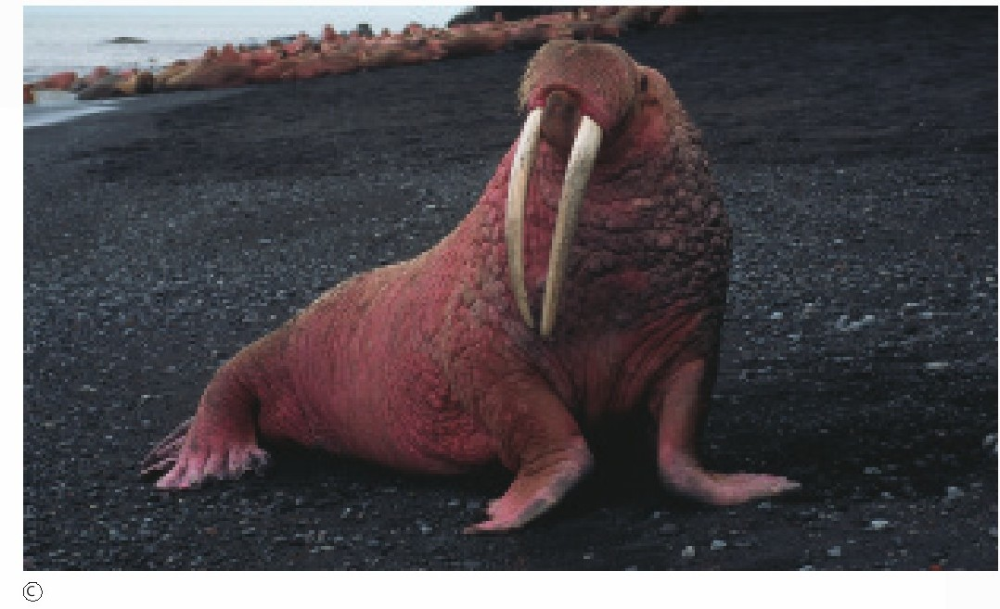

  

**【微博士】**天才音乐家

雌雄海象都能发出范围很宽的声音，比如吠叫声、敲击声、劈啪声和钟声等。在繁殖季节，雄海象通过开“独唱音乐会”来吸引雌海象，并向其他雄海象示威。不过，我们还不知道哪一种声音最能诱惑雌海象，也许“萝卜青菜，各有所爱”吧。

海象不仅是个非凡的“声乐家”，还是个优秀的“乐器演奏家”，有研究人员曾观察到，一头被捕获的海象在水池中玩一个橡胶玩具，通过在池边的挤压，让这一玩具发出号角般的声音。通过观察这种行为，其他海象也学会了如何发出同样的声音。

【微问题】　群居的海象长牙林立，为什么既不会伤及同伴，也不会伤到自己呢？

【关键词】　海象　长牙　北极　变色　脂肪层

## 海龟下完蛋后为什么会流泪

你还记不记得上次流泪是在什么时候？是因为什么事情流的眼泪？人们常常会因为喜悦、悲伤、兴奋、懊恼而流泪，也会因为眼睛里面进了一些小东西而流泪。可是你知道吗，并不是只有人类会流泪，海洋动物中的长寿者——海龟也会流泪呢！细心的人们发现，海龟尤其在下完蛋后会流眼泪，可这是为什么呢？

海龟流泪时，清清的眼泪从眼睛中缓缓流出，顺着眼角一直向下流。这是喜悦的泪水还是悲伤的泪水，抑或是海龟眼睛里面进入了小沙粒，需要用眼泪把它们冲刷出来？

随着科学的发展，海龟流泪的谜底被揭开了。原来，海龟是通过这种方式将身体内多余的盐分排到体外，进而达到体内盐的平衡。

海龟主要生活在海里，周围都是又咸又苦的海水，常吃的食物也是生存在海水环境中的小鱼、小虾、螃蟹、水母和海藻等，这些食物中都含有大量的盐分。海龟通过喝海水和吃食物，会在身体内积累大量的盐分。太多的盐分在体内积累对身体是有害的，而海龟的肾脏由于浓缩能力很差，所以能排出的盐分非常有限。幸好，它们有一种叫作“盐腺”的器官，专门负责将体内多余的盐分排出，以达到身体盐分的平衡。由于海龟的盐腺位于眼睛后部原本属于泪腺的位置，所以当盐腺在排出体内多余盐分的时候，看上去就好像在流泪一样。

海龟的一生大部分时间住在海里，只有在进行特定的生命活动，比如下蛋的时候，才会到海岸上来，这时我们才能近距离地观察到它们，这也许就是我们常认为海龟在下完蛋后会“流泪”的缘故吧。

其实，以海洋生物为食的海鸟也是需要排出盐分的，只不过这个器官在鼻腔中而已。当然，因为海鸟不会喝海水，所以我们并不能看到它们常常流着鼻涕的情况发生。（张飞）

## 海龟是怎样认识“回家”路的

海龟整天生活在海里，哪里有吃的就往哪里去，好像居无定所。可是，等到海龟妈妈要产卵的时候，它们却不约而同地来到自己出生的地方。小海龟呢？当它们从龟壳里孵化出来后，也顾不上欣赏海边的风景，而是争先恐后地爬向大海，然后各奔东西。可是过了几年，当它们要成为海龟妈妈的时候，又会从海洋的不同地方，再一次聚集到这片沙滩上，无论路途多么遥远艰辛，无论旅程多么曲折危险。那么，这些海龟是怎么认识“回家”之路的呢？

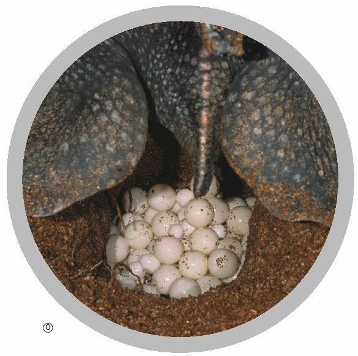
海龟在沙滩上产卵

原来，海龟具有强大的感知地球磁场的能力。地球就像是一块大大的磁铁，具有正极和负极，地球上的每一点都处在这个巨大的磁场中。地球上的位置不同，它们的磁场强度和磁力线倾角也各不相同。海龟可以通过感知地球磁场，来确定自己所处的位置。又因为海龟对于自己出生的地方有着很好的记忆，就好像随身携带了一张世界地图一样，因此，虽然会经历千辛万苦，但是始终能找得到回家的路。

通过感知地球磁场对自己定位，进而能辨别方向找到“回家路”的动物除了海龟外，还有信鸽和一些海鸟。这些神奇的动物是如何感知地球磁场的，它们感知地球磁场的器官和机理又是什么，科学界对此还没有很清楚的认识，还需要大家一起努力来解答。（张飞）

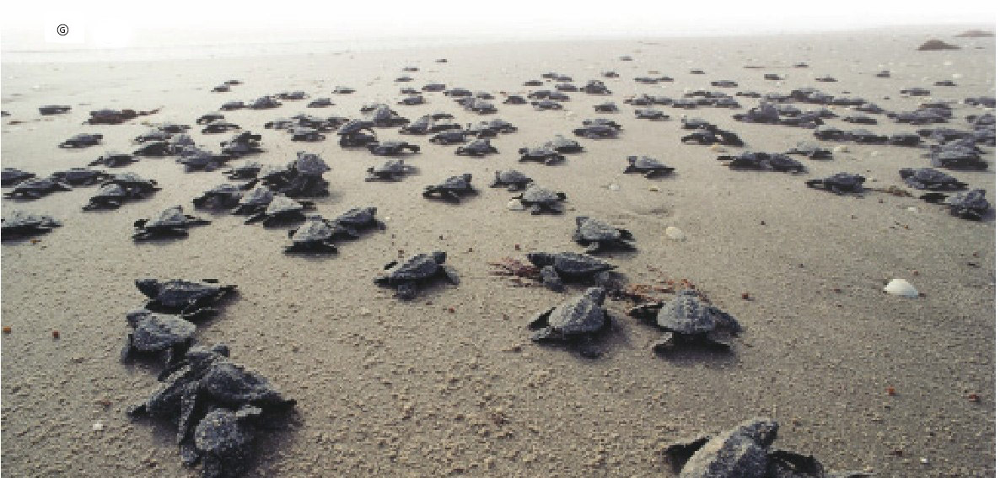
## 海龟是最长寿的海洋生物吗

中国传统文化讲究“龟年鹤寿”，在民间也流传着“万年龟”的说法，海龟也不例外。确实，相对于人类及其他常见动物的寿命来说，海龟算是比较长寿的动物了，《吉尼斯世界纪录大全》记载的最长寿海龟超过150岁。但是，海龟是最长寿的海洋生物吗？

显然不是。2007年阿拉斯加捕鲸船捕到过一条鲸鱼，骨头里居然嵌有大约1890年制造的捕鲸镖的碎片，看来这条寿星鲸鱼逃过了当年的劫难，多活了100多年。据记载，这类鲸鱼最长寿的有211岁。其实更加长寿的纪录属于寒冷海水里的贝类——冰岛北极蛤。在吉尼斯纪录里，1982年曾采到过其220岁的标本。这种动物贝壳上的生长纹像树木的年轮一样，每年长一轮。2005年，德国学者对一枚374岁的冰岛北极蛤的壳进行分析，得出了15世纪末期以来的气候变化历史，包括1550-1620年的“小冰期”，和1815年的印尼火山爆发。更加惊人的是，2006年英国科学家在大西洋北部海底捕捞到大量冰岛北极蛤，其中生长纹最多的一枚，居然已经405岁，其出生时中国还在明朝万历年间，显然已经把海龟远远甩在了后面。（张飞）

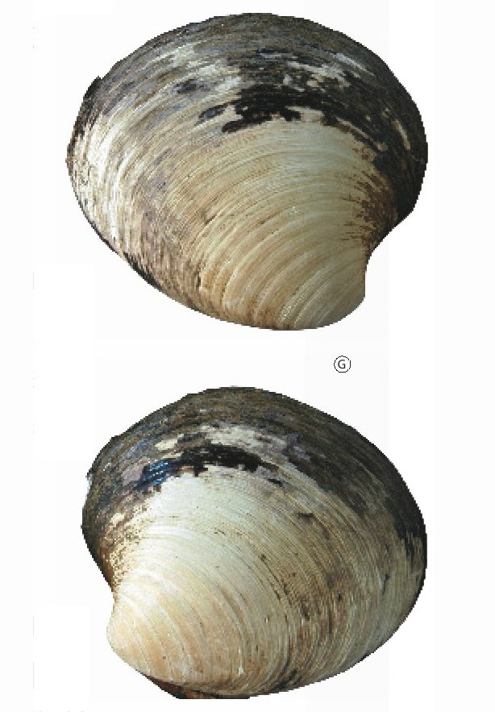
冰岛北极蛤

  

**【微博士】**海龟全是濒危动物

现存海龟有7种，分别是绿海龟、玳瑁、蠵龟、大西洋丽龟、平背龟、太平洋丽龟和棱皮龟。由于产卵孵化区遭到破坏以及盗猎活动的加剧，海龟的数量已经急剧减少，因此所有的海龟都被列入了《濒危野生动植物种国际贸易公约（CITES）》目录，不允许有任何海龟制品交易。如果你不参与海龟制品的买卖，你就是在保护它们。

【微问题】　除了海龟，你还知道什么动物会“流泪”呢？

【关键词】　海龟　盐腺　磁场　冰岛北极蛤

## 海星是怎么行走的

海星由于色彩艳丽、形状奇特而深受人们喜爱。海星的外形多数像一个扁平的五角星，因此也被称为星鱼或轮星鱼。那5只角，是海星的5个腕，从中间的体盘辐射出去。虽然大部分海星的腕的数目为5或是5的倍数，但也有一些例外，比如斑砂海星一般有6～9个腕，而多腕葵花海星有10多个到20多个不等的腕。把海星的身体翻过来，你会发现，每条腕下面有一条可见的长沟，这是海星的步带沟，每条步带沟内有2～4行管足，加起来是名副其实的“百足”动物甚至“千足”动物。管足既是海星的运动器官，也是它的感觉器官。既然海星具有运动器官，它就是会“走路”的。那么，海星究竟是如何行走的呢？

如果你仔细观察就会发现，海星的步带沟中可伸出许许多多的管足，这些管足就像是一个一个的小水泵。海星要走路的时候，这些“水泵”就不断地收缩，通过泵进和泵出水来推动身体前进。海星的管足不止负责走路，大多数个体的末端还有着非常发达的吸盘，能吸附在物体上。因此，海星用管足行走，用吸盘固定，如此就能行动自如了。

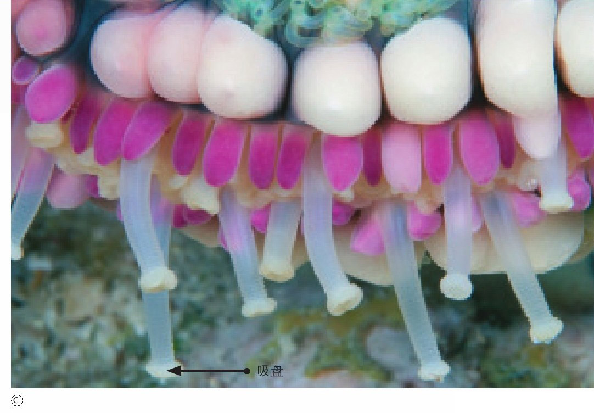
海星的管足

海星在行走时，通常用身体上的1～2个腕作为领导腕，该腕内的管足同时向相同的方向伸出或者缩回，由此来控制前进的方向。当管足伸出时，其向后泵出水的力量就可以推动身体前进。由于海星的腕是呈辐射状分布的，因此所有腕内的管足并不是总能协调一致。因而海星只能缓慢地行走，而不能跑步前进，否则就会出现“翻跟头”的情况。一旦因为着急而翻了跟头，海星就会先用1～2个腕扭转恢复到正常位置，并用吸盘吸附在地面上，然后再翻转整个身体。

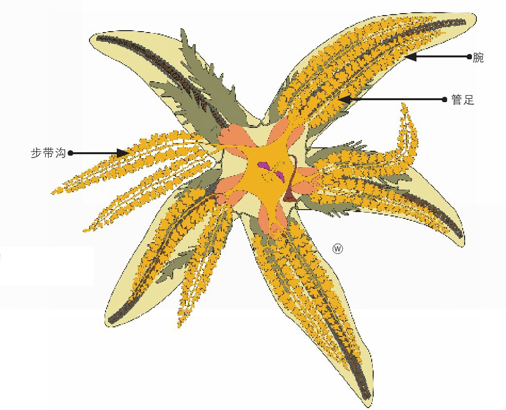
海星的解剖结构

由此可见，海星是会走路的，但是只能非常缓慢地爬行。（毛玉娇）

## 海星是怎么吃东西的

我们通常都认为，温和的动物是食草的，凶猛的动物是食肉的。那么，这些文静得几乎一动不动的海星应该更适合于吃海藻或者浮游生物吧！但事实恰好相反，海星不但是食肉动物，而且是凶狠的食肉动物。当然，它们并不会像猎豹或者鲨鱼那样以迅雷不及掩耳的速度来攻击猎物，但是，它们可以慢慢地接近对手，然后用带有吸盘的管足给对手一个亲密的拥抱。螃蟹、贝类和海胆等海洋动物常常会被海星整个裹住。那么，海星裹住它们之后，是怎样把这些食物吃掉的呢？

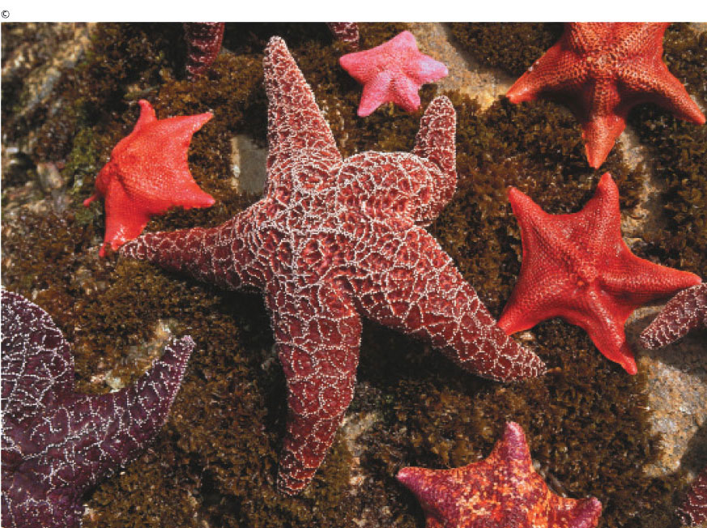
我们知道动物吃东西都是离不开口的，那么海星的口在哪里呢？把海星翻过来就可以看到，海星所有的步带沟都汇集到中间一点，这个中心位置就连着海星的口。海星的口位于体盘的正下方，口面向下，可与海星爬过的物体表面直接接触，这就为海星捕食猎物提供了条件。不过，海星吃东西，口只是一个通道，胃才是真正的“凶器”。

由于海星没有眼睛，它是靠身上的多种化学感受器来寻找食物的。当它们慢慢接近猎物，并快速地用腕上的管足捉住对手后，就会把整个身体裹上去包住猎物，然后，把自己的胃从口中吐出来。接下来，胃中的消化酶被迅速释放到猎物身上，把猎物溶解掉再吸食进去。这种消化被称为体外消化，整个过程和蜘蛛把消化液吐在食物上溶解后再吸收是差不多的。

如果猎物是一只贝壳类动物，海星就把身体固定在贝壳上方，用两腕把贝壳两侧吸住，通过管足末端吸盘的作用，将双壳类的壳硬拉开来，然后将胃从口中吐出，直接插到猎物壳的开口内。当对手的内脏和闭壳肌被消化溶解后，整个壳就自然而然被打开了，海星可以非常方便地用胃包裹食物一同吸入口内，进行最后的消化。

当然，并不是所有的海星都是这么吃东西的。一些短腕或者管足没有吸盘的海星种类，无法对抗很厉害的猎物，它们就以较小的甲壳类等动物为食，取食时将对手整个吞下去。这时候，它们的消化方式和多数种类的海星不同，它们的消化不是在体外，而是直接在胃内进行，称为体内消化。还有一些在深海生活的海星，是以身上细细的纤毛过滤食物颗粒后，直接“喝”进去吃掉的。别看海星个头不大，它们的食量却很大，一个海星幼体一天吃的食物量，要比它自身重量的一半还多。

海星的不同摄食方式是和它们的生活环境不同相关的，这就是生物适应性的表现。（毛玉娇）

  

**【微博士】**海星全身都是“监视器”

海星没有独立的眼睛器官，那么，海星是怎么识别方向和猎食的呢？一开始，人们以为海星是靠它们的多条腕来识别方向的。后来，科学家研究发现，海星全身其实都是“监视器”。在海星凹凸不平的皮肤上长有许多微小的晶体，每个微小晶体都是一个非常好的透镜，它的尺寸远比人类利用高科技制造出来的透镜要小，但是功能却十分完善。海星身上的无数个透镜都具有聚光性质，能使海星同时观察到来自四面八方的信息。

【微问题】　有些海星的腕上没有吸盘，它们是怎么固定在海里不动的呢？

【关键词】　海星　腕　管足　体外消化　体内消化

## 为什么说鲎是海洋中的活化石

在中国东南沿海生活着一种很特别的动物：扁扁的身体披满铠甲，后面却拖着细长的尾巴，这就是鲎。鲎是一种出身奇异的动物，和大名鼎鼎的三叶虫辈分相同。早在4亿年前的古生代泥盆纪，鲎就已经是“海洋居民”了。在漫长的历史进化过程中，鲎的同类或者灭绝，或者进化，只有鲎这个怪模怪样的动物，历经了沧桑生存下来，并且仍保留着原始而古老的相貌。因此，它被称为泥盆纪生物留存至今的活化石。

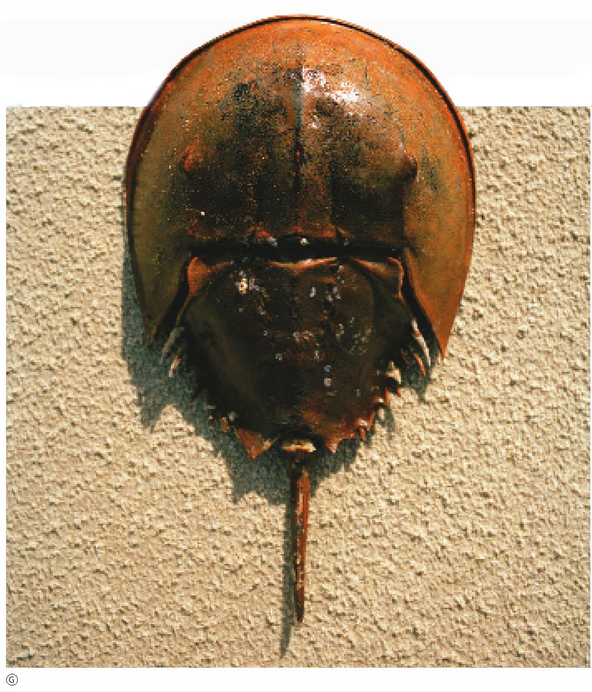
鲎也叫马蹄蟹，是肢口纲剑尾目的海生节肢动物，穴居在沙质海底，喜食蠕虫和软体动物等。全世界只有5种鲎，分布在北美洲、中美洲、东南亚以及中国的福建、广东、海南、广西和台湾等地海域。生长在中国的“中国鲎”在20世纪80年代以前，其资源量还比较稳定，后来由于海洋污染的加剧，加上大量捕捞提取鲎血等原因，鲎的资源量开始逐渐下降，被列入《广东省重点保护水生野生动物名录（第一批）》。

为什么在几亿年的时间里，鲎不改变它古老的面貌也能够生存下来呢？奥秘主要在于其身体结构功能适应性非常强，可以适应环境的变化，以及它从幼体到成体，都有极好的自我保护措施。首先，鲎的产卵数极多。春夏时节，雌鲎驮着身形瘦小的“丈夫”可以在沙滩上星星点点地挖很多个坑产卵，每个小坑就能产上百只卵。而且，大批的鲎往往聚集在一起产卵，因此，即使有一些迁徙鸟类每年都要靠吃鲎卵来补充能量也无伤大雅。其次，安全度过夏秋的幼体在严冬来临时，会一头扎进泥里。它们以泥里的沙蚕和贝类为食，“足不出户”地度过严寒，同时避免了外敌侵扰。到了成体，凭借着坚硬的外壳与锋利的脊和刺，其他动物想吃它也难以下口。再次，成体的鲎也实在不如鱼虾味道鲜美，吃了以后容易发生过敏甚至中毒。这样一来，很多动物对鲎都敬而远之。

当然，鲎还有器官功能上的生存优势。鲎的呼吸器官——鳃页，结构特殊，有大约15片鳃叶和5对透明的薄板，大的鳃叶又由更多的小叶片组成，构成一页一页就像图书一样的“鳃书”。鳃叶运动的时候，水向鳃叶方向流动，既可净化泥水，又可辅助鲎游泳。鳃叶之间还可以贮存少量的水分，来保持鲎的身体潮湿，使它在爬上沙滩进行生殖的时候，也不会因为缺氧或缺水而死亡。鲎的肝脏也很大，能够分泌大量的消化液来帮助消化食物。

各种内外因素，保证了鲎能够长期适应环境的变化，成为在自然环境中生存数亿年的活化石。（肖娜）

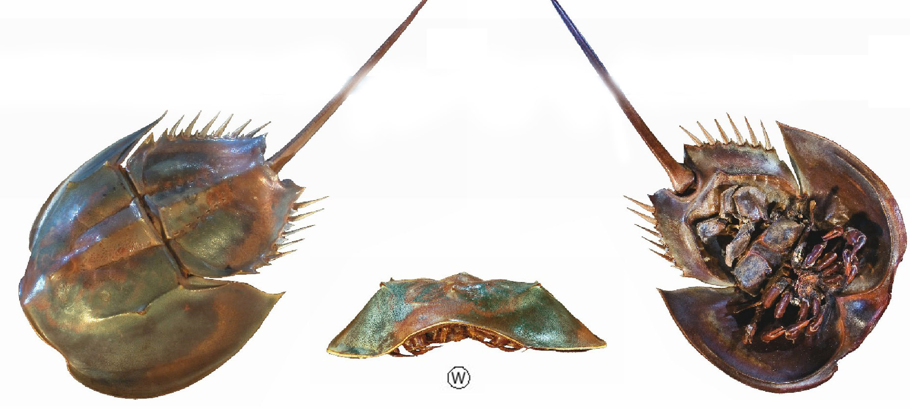
## 鲎的血液为什么是蓝色的

我们见到的动物，血液大都是红色的，而鲎的血液却是蓝色的。这是为什么呢？哺乳动物呼吸时，把氧气吸入肺里，在肺泡内和血液进行气体交换，然后，氧气由血液携带进入心脏，经过动脉流向全身，供新陈代谢使用。哺乳动物的血液携带氧，是由血液中的铁作为“运载工具”的。铁和氧结合后呈红色，所以血液就呈红色了。而在鲎等低等动物的血液中，不是靠铁来“运输”氧，而是用铜。由于含铜的蛋白质结合物是蓝色，这就使它们的血液呈现蓝色。

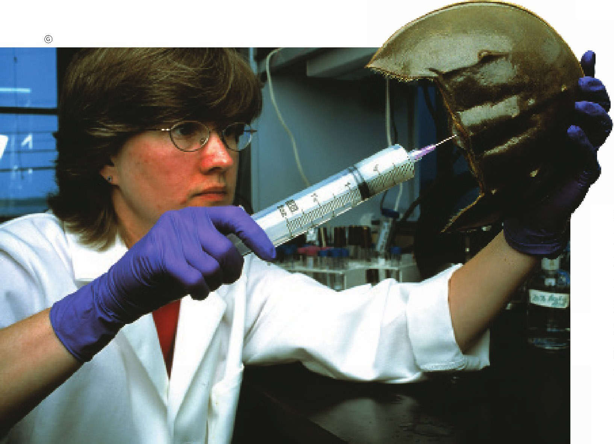
研究人员正在提取鲎血，用来制取鲎试剂

鲎的血液不仅颜色特殊，功能也很神奇。鲎的血细胞很原始，没有分工，只有一种变形细胞，但是这种简单原始的血液，却具有神奇的功能。当病菌的毒素接触到鲎的血液时，鲎血液中的变形细胞便释放出一种凝固蛋白，会导致血液迅速凝固，使病菌不能繁殖，随后，血液就会形成一道屏障，阻止其他细菌入侵。19世纪50年代，科学家在鲎的蓝色血液中提取出一种凝血剂，称为鲎试剂。这种鲎试剂不仅能马上检查出病人是否被细菌感染，为急症病人的诊治做出快速诊断，还是一种检测药品和医疗用品中是否含有病原菌的既简单又可靠的方法。我们注射的疫苗，就要通过鲎试剂的检测。在鲎试剂中滴入注射液，如果试剂立即凝固或变色，则说明注射液内含有致病的细菌内毒素；如果试剂不凝固，就说明疫苗是安全的。鲎试剂还广泛应用于检测饮用水、牛奶、罐头等食品是否受到细菌污染。（肖娜）

  

**【微博士】**海底鸳鸯

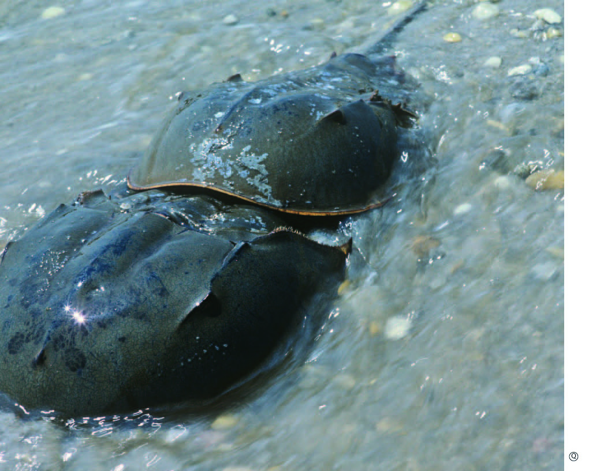
鲎有“海底鸳鸯”的美称

鸳鸯在人们的心目中象征着永恒的爱情，寓意一夫一妻，永不分离。每当春夏季节，鲎的繁殖季节到来时，发育成熟的雄鲎头胸部的第二对足末端就会长出一对弯曲的小钩，它用这对小钩“抱”住雌鲎，它们就算结成了夫妻。从此，肥大的雌鲎就常常驮着瘦小的“丈夫”，恩恩爱爱地相守一生。所以，鲎享有“海底鸳鸯”的美称。

**【微博士】**活化石

活化石是几百万年甚至上亿年的时间内几乎没有发生变化，也没有中断，现在还继续存在的生物，它们相应地延续了古老生物的特征。由于同时代的其他生物只能在化石中找到，这些仍然活着的生物就被称为“活化石”。比如，5亿年前就有的舌形贝（海豆芽），3亿年前就有的银杏（白果）树，4亿年前就有的鲎等，都属于活化石。

【微问题】　为什么三叶虫灭绝了，鲎却成了“活化石”？

【关键词】　鲎　活化石　鲎试剂　蓝色血液　海底鸳鸯

## 为什么藤壶能牢牢地附着在礁石上

当我们在海边行走时，很容易看到岩石上密布的一个个淡白色、棕褐色或灰黑色的硬硬的壳。这些东西，其实是节肢动物大家族中的成员，学名叫藤壶。藤壶是一种固着生活的动物，外形有些像一只倒扣的碗，那是身体外面包着的石灰质硬壳。藤壶并不在海洋里游泳生活，而是成群地固着在海岸、礁石、码头船坞的木桩、绳缆或船底，任凭惊涛骇浪，它自岿然不动。

藤壶为什么能牢牢地附着在岩礁和船体上呢？这是因为在藤壶和附着物之间有一层强力胶。藤壶在找到一个合适的地方后，就会分泌出一圈胶，这种透明胶刚分泌时是没有黏性的，但是渗透到附着物的空隙中后，在短时间内就会形成不透明的橡胶块。形成的橡胶块胶体主要含有蛋白质和碳水化合物，具有极强的黏着力和抗生物降解性，从而保证了藤壶极强的吸附能力。别看藤壶的个体不大，但吸附力非常强。若想用手直接把它从附着物上拔起，那几乎是不可能办到的事。在海边采集藤壶的人，通常必须借助铲子类的硬金属器材才能将它敲下来，并且附着物的表层也会一起被剥离下来。

藤壶不是一个挑剔的家伙，它们会在各种地方安家，所以附着物的类型多种多样，凡是硬物的表面，均有可能被它附着。海岸的岩礁、码头、船底等都是目标，甚至很多动物的身体表面也会被藤壶当作定居点。人们常常可以在鲸鱼、海龟、龙虾、螃蟹等的体表，发现一个或几个藤壶。（毛玉娇）

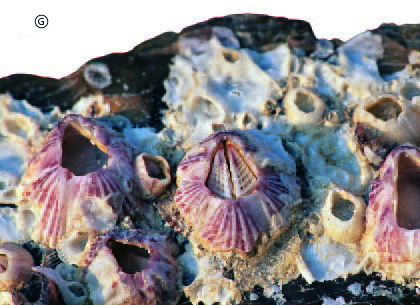
附着在岩石上的藤壶

## 不能移动的藤壶如何吃东西

成年的藤壶是节肢动物中唯一固着生活的动物。动物，顾名思义就是会动，只有动起来才能找到食物。那么，这个身体不能移动的藤壶是怎么吃东西的呢？别担心，藤壶自有诀窍。

诀窍之一是找对固着的地方。藤壶在幼体的时候，它们是漂浮在海洋里的。这种漂浮的日子会持续好几个星期，直到找到一个合适的地点。这个合适的地点通常有很多小型浮游生物经过。幼体藤壶的两对触角和尾肢是它辨别地点是否合适的装备，因为触角上有许多称为刚毛的器官，能够在粘牢自己之前，先感应周围自然界的化学物质，以及附着物表面的理化结构。藤壶尾肢同样能感应附着物结构和环境中许许多多化学物质的信息。如果定居地选择不当，那么很可能导致藤壶“饿肚子”，直至饿死。因此，寻找一块食料充足的好地方“住”下来，是藤壶能后续捕食的先决条件。

诀窍之二是藤壶的蔓足。当藤壶找到合适地点后，第一触角上的“附着盘”便和固着地（称为基质）结合，同时分泌胶质，身体就被牢牢地粘在上面。作为节肢动物，藤壶具有6对胸肢，这6对胸肢长成卷曲状，就像藤蔓一样，这就是它的蔓足。

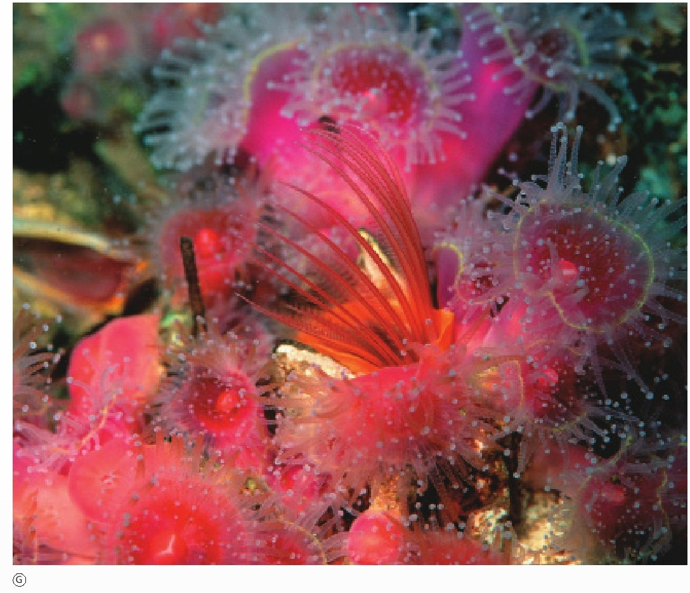
藤壶的外壳是由壳板组成的，壳顶有一个孔，孔上还有活动壳板组成的壳盖，由肌肉牵动开合。平时，藤壶的整个壳体是封闭的，当它需要觅食时，壳盖会打开，蔓足就从里面伸出来捕食。藤壶的主要食物是浮游动物中的桡足类及蔓足类的幼体。

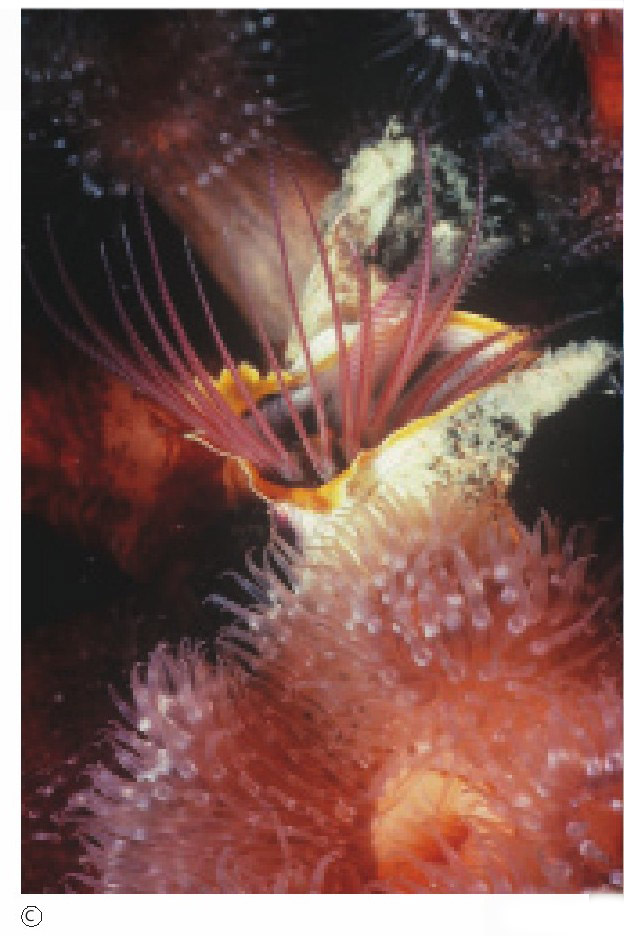
虽然这种不能移动的动物看上去很被动，但其实它们在捕食方面没有丝毫困难。别的动物要千辛万苦地埋伏、追踪、搏斗，甚至搭上自己的性命，藤壶只需张开壳盖，伸出蔓足到海水里去捞捞就可以了。而且，一旦发现危险，它们可以立即关闭壳盖，留下一个坚硬的石灰质外壳，谁吃谁倒霉。（毛玉娇）

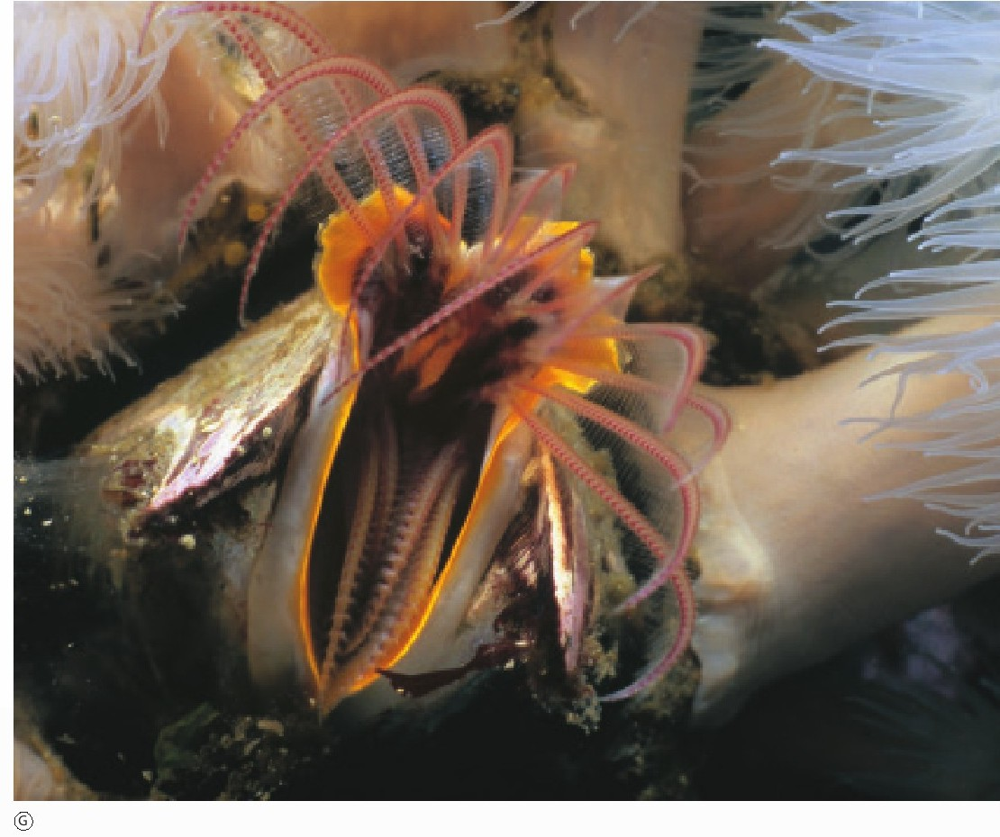
  

**【微博士】**藤壶胶的启示

藤壶之所以能牢牢地粘在礁石和船体上，要归功于它们分泌的胶体。这种被称为“藤壶胶”的黏液的黏性比我们常见的胶水强很多倍，比如，人们要想铲除钢铁上附着的藤壶就得牺牲钢铁表面的一层“皮”。基于这一点，人们开始研究藤壶胶，提取分离其组分，并进行人工合成，由此制成了特种黏合剂。这种黏合剂不溶于水、弱酸和弱碱溶液，可在0～205℃范围内使用，可以黏结钢板，因此在工业方面有广泛的用途，如船舶的水下维修和建筑材料的黏合。不仅如此，外科手术上也能用它来止血和黏合伤口。另外，一些基于藤壶胶化学组分的其他产品，如无毒防污涂料配方的研制也广受关注。

【微问题】　你还能说出哪些不需要移动身体就能吃东西的动物吗？

【关键词】　藤壶　蔓足　节肢动物　初生胶　黏性

## 海洋动物是怎么睡觉的

无论人类还是动物，都需要睡觉。如果因为外界的干扰而长时间得不到良好的睡眠，我们和动物都会身心俱疲，甚至导致死亡。人一般会躺着睡觉，而动物们的睡姿却千奇百怪——沼泽边的鹭、鹳、鹤、鹬等涉禽类动物可以单脚独立，狼、狗、豺等犬科动物需要耳贴地面，蝙蝠能够倒挂身体，蜘蛛、猴子等只要把尾巴钩住树枝就可以了……那么，海洋里的动物又是怎么睡觉的呢？

虽然海洋中的动物睡姿也是各种各样，但因为面临着呼吸和天敌的双重压力，绝大多数海洋动物的睡眠时间很短，也就难以被人类发现。

鱼类因为没有眼睑，永远不能合眼，所以它们都是睁着眼睛睡觉的。为了保持呼吸，鳃盖依然会缓慢而有节奏地扇动，偶尔也划动一下胸鳍或尾鳍，使身体保持平衡。鱼类睡觉好比人类打个盹儿，有的仅几分钟，有的甚至只有几秒钟，这主要是因为它们必须时刻保持警惕，否则就会落入偷袭者的口中。

鱼类一次睡觉的时间几分钟，甚至几秒钟

海豚似乎整天一刻不停地在水中游动，看不出有睡眠时间。其实，它们的作息时间和我们相仿。在夜里，海豚会潜入水下30米的地方，安安静静地进入梦乡，然而它的尾巴仍然会每隔30秒左右摆动一下。可是海豚属于哺乳动物，它睡觉的时候怎么呼吸呢？原来，海豚的肺活量极大，而且血液中也可以储存氧气，所以它一次呼吸后，可以在几十分钟内不再浮出水面，这段时间，足够它美美地做梦了。当然，海豚在睡觉时也会保持警觉。科学家发现，它们大脑的两个半球是交替睡眠的：当一边熟睡时，另一边处于清醒状态。过了一段时间，两者再交换一下，如果受到外界的剧烈刺激，两个半球就会同时清醒，保证它们可以快速对外界的变化做出反应。

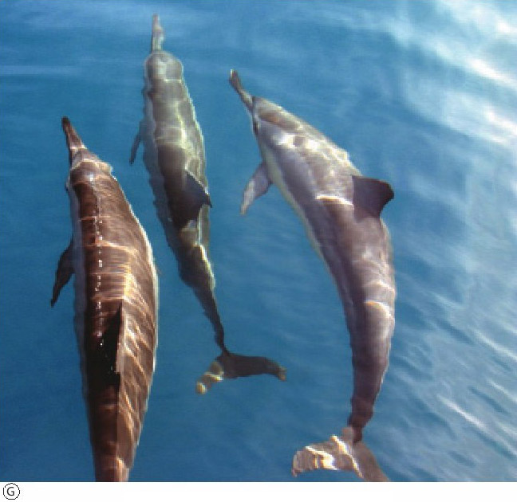
海豚睡觉时也非常警觉

海豹和海豚不一样，它们既可以在水下生活，又可以在岸上活动。如果它们选择在岸上睡觉，就和陆地动物相似；如果选择在水下睡觉，则每呼吸一次就要醒一次，虽然在我们旁观者看来很不舒服，但它们已经习惯了。

熟睡的海豹

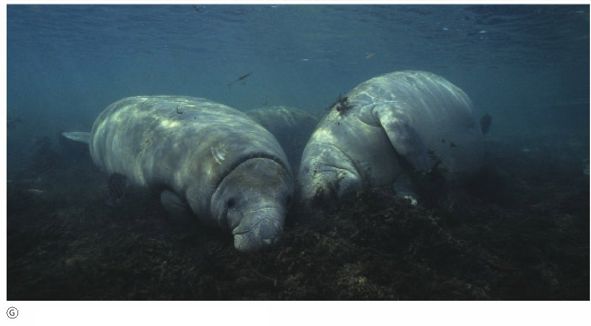
海牛喜欢在海底睡觉

章鱼在睡觉的时候，留下两只触手在身体周围不停地挠动，其余的触手都卷起来休息。如果两只活动的触手受到外界的干扰，它们就会立刻惊醒。

海牛喜欢在海底睡觉，不过它们不像海豚和鲸鱼那样可以在水下憋气很久，海牛差不多10多分钟就不得不浮出水面换口气，故而它们的“好梦”是难以连贯的。

海豹就聪明得多，它们要么在陆地上睡觉，要么睡觉时将鼻子伸出冰洞呼吸，身体则垂直浮在水中，看起来好像直立的雕塑，这样既方便透气也不耽误酣睡。

海洋动物的睡觉方式，真是各有千秋。（郑强）

  

**【微博士】**爱睡懒觉的海象

在北冰洋的楚克奇海和白令海冰雪覆盖的地方，栖息着一类身躯庞大的哺乳动物，名叫海象。海象属于哺乳纲鳍脚目，雄性体长达5～6米，体重达2000～3000千克。雌性也有3米多长，900多千克重。

海象的眼睛眯得像缺少活力的老年人那样。它们喜欢睡懒觉，一生中大部分时间是躺在冰上度过的。夏季时，它们挤在海滩上晒太阳，棕色的皮肤在阳光的照耀下，血管膨胀，竟变成了深红色。睡觉时，总是有只海象在四周巡逻放哨，一有惊动，它就会发出公牛般的叫声，海象们便从酣睡中惊醒过来，慌忙逃到海里去。

海象妈妈为了保护自己的孩子，经常奋不顾身地抵抗侵袭者。幼兽受伤了，妈妈就用鳍脚将它紧紧抱住不放，然后潜入水里，快速地游开去。别看它们一副笨重的模样，行动却非常敏捷。海象可以在波涛汹涌的嶙峋岩石间自由穿行，还可以横渡几百千米宽的海峡。

## 海獭老带着块石头做什么

在北太平洋的寒冷海域，生活着一种聪明可爱的动物。它们的长相非常像大老鼠，却和老鼠没有丝毫关系。它们的皮毛柔顺漂亮，与貂有着共同的祖先，只是在大约1万年前，才开始进入海中生活。这种动物就是海獭。

海獭的体长约1.5米，有40千克重，身后拖着一条30多厘米长的又宽又扁的尾巴。海獭头很小，身体却很结实，属于海洋哺乳动物中最小的一个种类。海獭在水里非常灵活，它们甚至经常在水面仰游。如果你仔细观察，会发现它们还带着一块石头。海獭这是要干什么？难道它们把石头作为武器，随时要和那些企图伤害它们的动物战斗吗？

当然不是。海獭是海洋动物，它们的食物大部分就是海底生长的贝类、鲍鱼、海胆、螃蟹等，偶尔也去捉几条鱼来改善一下口味。不过，海獭最喜欢吃的是海胆，但海胆有着坚硬的壳，只靠牙齿是绝对咬不开的。这可怎么办呢？

海獭想出了一个很聪明的办法：带一块石头在身上。海獭的前肢很灵活，可以方便地握住食物。当它们要吃海胆的时候，先让身体仰泳着躺在水上，这时候，腹部就是它的饭桌。它把随身携带的石头放在腹部，然后把海胆往石头上用力猛击，一旦发现壳敲破了，海獭便马上将里面的肉质部分吸食出来，壳顺手扔回大海。不仅是海胆，对那些很难下手的贝类动物，海獭也会依样画葫芦，用敲击的办法把它们紧闭的壳打开。

找到一块合适的石头也不是件容易的事，所以，吃饱之后，海獭会将石头保存起来，以便下次再用。

据统计，海獭是地球上最贪吃的动物之一，一般一天要消耗其体重的1/3那么多的食物。换句话说，一只40千克的成年个体，一天要吃10～15千克的食物。海獭的绒毛很密，每平方厘米约12.5万根，比貂皮还要密1倍，称得上兽皮之王。所以，人们曾竞相猎捕，导致其数量锐减。（郑强）

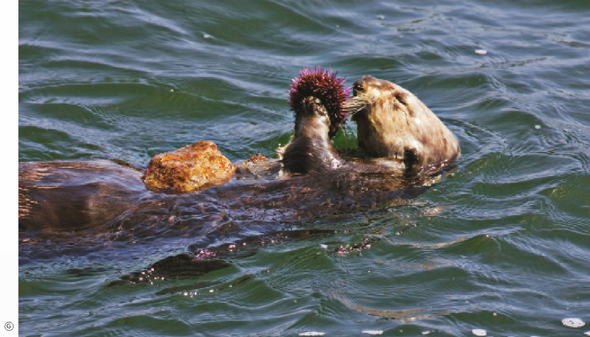
正在取食的海獭

  

【微问题】　海狸是怎样睡觉的？

【关键词】　海洋动物　睡觉　海獭　海象　鱼　海豚　章鱼　海牛　海豹

## 海洋中有没有森林

森林是陆地上面积最大、结构最复杂、生物量最多的生态系统。那么，占据地球表面积70%以上的海洋，其中生存着千千万万的生物，那里是不是也存在着森林呢？当然。海洋中不仅存在着森林，而且存在着两种森林：一种是我们看得见的森林；另一种是我们肉眼看不见，却在海洋生态系统中发挥着极其重要功能的“森林”。

“看得见的海洋森林”——海藻林

中国福建泉州的深沪湾，在潮间带和潮下带埋藏着一片7000～8000年前的古油杉林，已经发现的古树干就有60余株，这就是可见的海底古森林，旁边还有古牡蛎滩。这类淹没的森林，在欧美的海岸也早有报道。不仅如此，海水里还有现在活着的“森林”：一种是滨海泥滩上的红树林，在热带可以长到10米高，真是一片泡在海水里的森林；另一种是海带等底栖藻类所组成的海藻林，长在海岸带的石头上。这些看得见的“森林”都在近岸海边，还有更多遍布整个大洋，你肉眼看不见的森林。

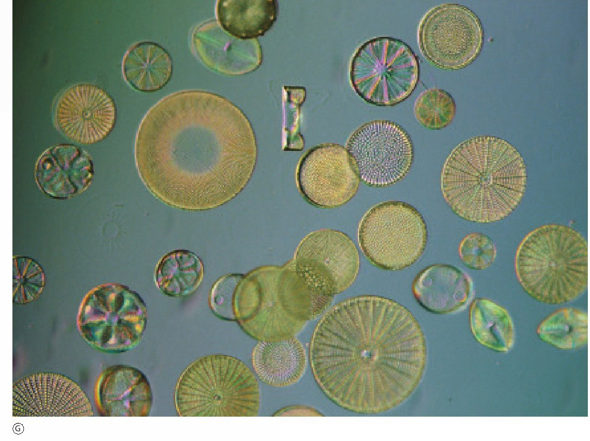
硅藻是浮游藻类的一种，它们是“海洋森林”中的重要“树种”

这就是海洋里的浮游植物——单细胞的藻类。海洋的上层100多米是有光线的，从这里你每取一滴海水，就可以找到成千上万个浮游藻。小的如蓝藻也叫蓝细菌，只有半微米到几十微米大，它们的特点和一般的细菌一样：没有细胞核，属于原核生物；大的如硅藻，像个小盒子，由上下两个壳闭合而成，有图案分明的花纹，直径从数十到数百微米。甲藻也比较大，具有羽状或角状突起，如同披上铠甲的战士，因而得名甲藻。硅藻和甲藻是近岸海洋生态系统中丰度非常高的两大类群，有海水的地方就有硅藻的踪迹，而在受到污染的海洋中，经常会出现甲藻的大量繁殖，从而导致水体呈现红色，这就是“赤潮”的来历。海洋里浮游藻类的数量极多，条件好的时候会突然间大量繁殖。这种现象叫作藻类勃发，从空中可以看见海水变色，比如颗石藻的勃发会把海水染成白色，形成“水华”。

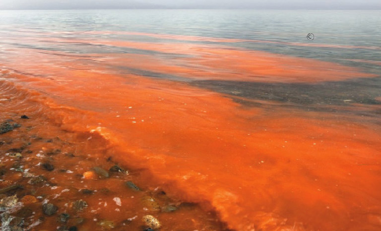
赤潮

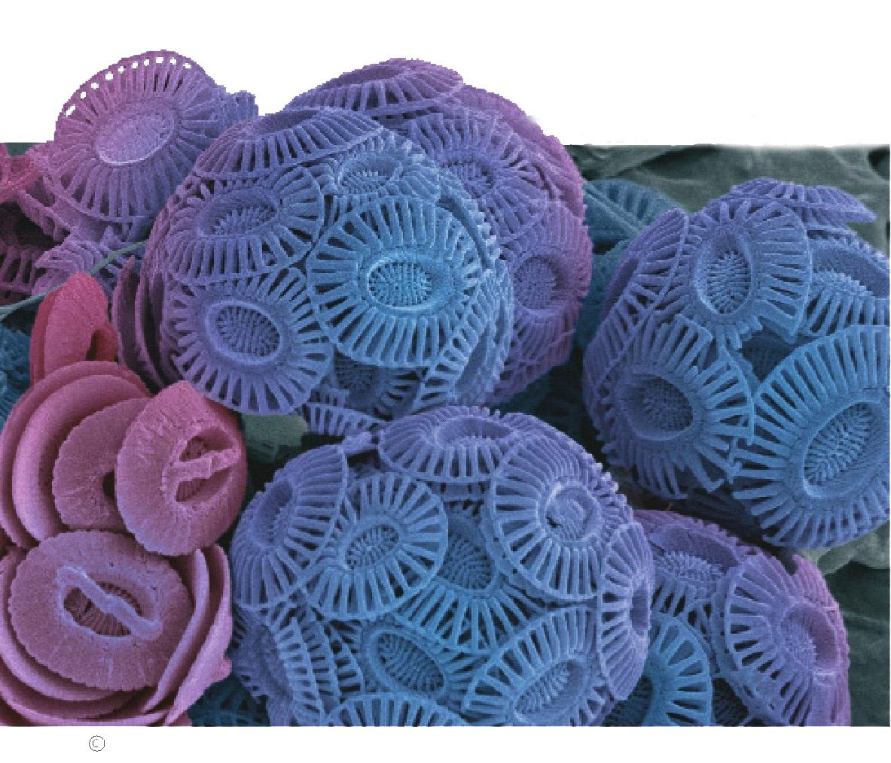
颗石藻

在显微镜发明前，人们无法想象，在每一滴来自海洋表层的水中，居然含有数千个自由漂浮的微型浮游藻。它们是一类自养的浮游生物，也就是说它们能自己养活自己。这是因为它们的细胞内含有叶绿素，有的种类还包含着其他色素。和陆地上的大树一样，具有叶绿素的浮游藻类能吸收光能和二氧化碳，通过光合作用合成养料，同时消耗二氧化碳并释放氧气，因而被喻为大海中的“隐形森林”。（毛玉娇）

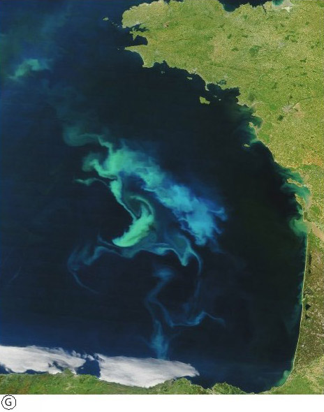
比斯开湾的卫星图像。绿色部分显示了海水中的藻类勃发

  

**【微博士】**赤潮之“毒”

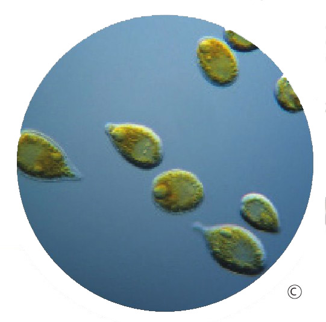
针胞藻纲卡盾氏藻为一种有毒的赤潮藻，会损伤鱼鳃，致使鱼类死亡

虽然海洋浮游藻类有着非常重要的作用，但也不是越多越好，赤潮就是一个明显的例子。

赤潮泛指由于海洋浮游藻类的过度繁殖造成海水变色的现象。发生赤潮时，海水除了会变成红色，还能变成橘红色、黄色、绿色、褐色等。有的赤潮是一种自然现象，有的是由人为因素引起。赤潮有两种，即无毒赤潮和有毒赤潮。前者是由体内不含毒素，又不分泌毒素的生物为主形成的；后者是由体内含有某种毒素或能分泌出毒素的生物为主形成的。无毒赤潮和有毒赤潮都会对海洋生态、海洋环境、海洋渔业产生不同程度的危害。这是由于赤潮生物大量繁殖和消亡这一过程会改变海水中的溶解氧含量和酸碱度，使局部海区失去自净能力，导致海洋稳定状态被破坏。赤潮发生过程中所产生的化学物质会引起一系列的恶性循环，最终彻底破坏海洋生物资源。

## 为什么说海洋中的“隐形森林”改变了地球

海洋中“隐形森林”的成员个头虽然很小，但是对地球的作用可一点也不小。假如没有它们，地球就完全不是现在这种生机勃勃的状态了。

尽管海洋“隐形森林”和陆地上的森林一样，最突出的特点是进行光合作用，把大气里的二氧化碳固定下来合成有机质。但是地球上的生物量主要集中在陆地上，海洋浮游植物的生物量只相当于陆地森林的1%，这种“隐形森林”也能和陆地上真的森林一样起作用吗？是的。近年来的观测表明：地球生物圈吸收的碳，陆地占52%，海洋占45%～50%，基本上持平。原因在于海洋藻类虽然小，其生殖、死亡的周转速率却比陆地植物快得多。陆地植物平均20年换一代，海洋浮游植物只需要一个星期。因此，海洋“隐形森林”在地球表层碳循环中的贡献，是与陆地森林处在一个水平上的。有人估算：如果把全大洋的浮游藻类全都杀死，那么不出百年，大气里二氧化碳的浓度就要增加1.5倍。

如果从地质历史上看，海洋“隐形森林”的功劳更加明显。为什么这么说呢？这是因为早期的地球是个还原环境的世界，大气中主要是二氧化碳，陆上根本没有生物能够生存。后来，在复杂多变的海洋环境中，率先出现了蓝藻。这是生物进化史上的里程碑事件，因为这些身材极小的海洋居民可以通过化学合成作用固定有机碳，后来又发展到进行光合作用。它们的光合作用消耗了大气中的二氧化碳，释放出氧气。24亿年前，大气里开始积累氧气。

大气中的氧气含量升高后，生物就能够蓬勃发展，4亿多年前陆生植物的出现，加快了大气圈的氧化，并逐渐演化出千姿百态的生物。因此说，先是海洋中的“隐形森林”，后来才是陆地上的绿色植物，改变了大气圈的成分，造就了适合人类居住的地球。（毛玉娇）

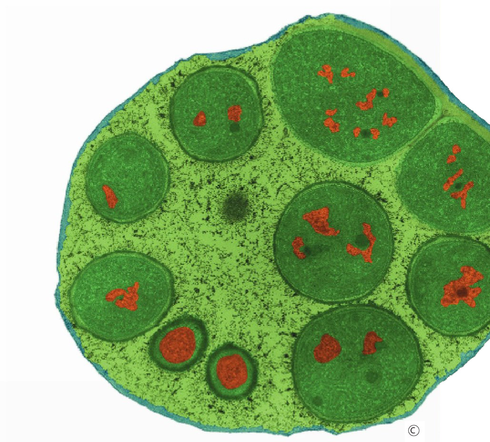
蓝藻

  

【微问题】　在世界大洋里，什么海区“隐形森林”最发达？

【关键词】　海洋　森林　微型藻类　光合作用　蓝藻　赤潮

## 为什么单细胞海洋生物是技艺精湛的“雕塑大师”

科学家在电子显微镜下发现，一些来自深海海底的软泥中，有很多玲珑剔透、千姿百态，像是生物外壳的东西。它们有着极其优美的结构，就像是一件件美轮美奂的工艺品。海洋里到底“隐居”着什么样的“雕塑大师”，能雕刻出如此精湛的作品？

它们就是生活在海洋中的单细胞浮游生物。在阳光能透过的上层海洋，每一滴海水中可能都生活着数以千计的单细胞浮游生物。虽然它们的生命非常短暂，但是在生长过程中，它们不断吸收周围海水中的矿物质建造着自己的“家”——保护自己的壳体或骨架。这些壳体或骨架的化学成分通常有两种，一种是硅质的，由蛋白石（SiO2·nH2O）组成；另一种是钙质的，由方解石或文石（CaCO3）组成。浮游生物死亡后，掉到数千米深的海底，它们的躯体很快被分解消失，壳体或骨架则在深海中形成了厚厚的深海生物软泥。这种软泥从外表上看起来就像普通的泥巴，但是在显微镜尤其是电子显微镜下，你会发现一个别有洞天的微观世界：有的像朵花，有的像串葡萄，有的像小姑娘的头饰……上面还雕琢着各种不可思议的花纹和图案，更多的造型奇特，有着复杂的结构层次，宛如一件件绝世的工艺品。

常见的海洋浮游生物的壳体或骨架有四类：硅藻的壳、放射虫的硅质壳、颗石藻和有孔虫的钙质壳。名字叫“藻”的是植物，会在水里进行光合作用，制造有机质；叫“虫”的是动物，靠吃更小的生物或者靠与藻类共生得到营养。

科学家研究最多的是有孔虫壳，因为它们在海底的软泥里面最容易找到，而且种类繁多。有孔虫大小像一粒细沙，只有几分之一毫米。地球上曾经有过6万多种有孔虫，现在存活着的至少有6000多种，大多生活在海底。生活在海洋表面的浮游有孔虫虽然种类不多，数量却多得吓人。20世纪早期美国建立了第一个有孔虫实验室，专门研究古老海底泥沙里面的有孔虫化石，用来确定地层的年龄，并在美国寻找石油的过程中立了大功。从此以后，这种要靠显微镜才能看见的化石，都称为微体化石。对微体化石的研究还成了一门专门的学科呢！

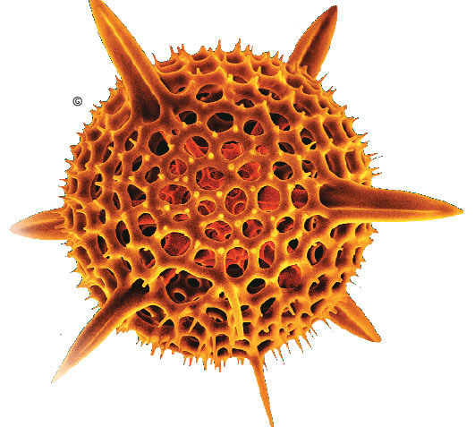
放射虫

放射虫的艺术排列

比有孔虫更加好看的微体化石，是蛋白石质地的硅藻和放射虫。硅藻的壳像只透明的水晶盒，上、下两半合起来就是它的“房子”。硅藻的壳小的只有3.5微米，大的300～600微米。壳面上有大量的细孔，形成五花八门、非常精细的纹饰图案，是显微镜下的天然艺术品。下面这幅作品，就是全部用硅藻壳排列出来的。硅藻是现在海洋里最“繁荣”的浮游植物，有10多万种，是鱼、虾等许多动物的主要食物。由硅藻堆起来形成的“硅藻土”是重要的工业原料，当年诺贝尔曾经用它制造过炸药，现代工业也用它做过滤剂和隔热、隔音材料。

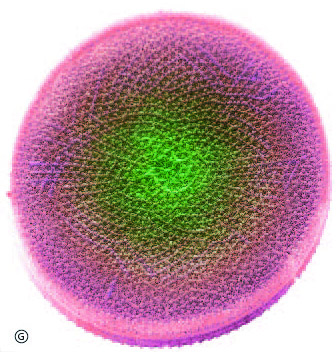
硅藻

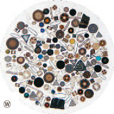
硅藻壳的艺术排列

放射虫的壳也是蛋白石质地的，但是外形常常是网状结构，有球形、钟罩形等各种各样的形状。直径0.1～1毫米，大的也会超过1毫米。和有孔虫一样，放射虫也是单细胞动物，虽然不及有孔虫那么多，但至少有6000多种。它们的壳也可以在海底形成放射虫软泥。

单细胞海洋生物的化石还是研究海洋历史的珍贵资料。这些化石能告诉我们它们生活的时代和环境，是海底寻找石油、探索海洋奥秘的宝贵证据。（黄维）

## 只有头发丝几十分之一细的“象牙球”是怎样被“雕刻”的

在中国，有一种别具风格的工艺品叫象牙球，是用整块象牙雕刻而成的。球内逐层镂空，球面上刻有精细的图案花纹。从外表看，它只是一个球，但层内有层，层层都能转动，每层上都雕刻着精美的纹饰。这种巧夺天工的雕刻技艺相当繁复，是中国象牙雕刻中的一种特殊技艺。

然而，科学家却在显微镜下发现了迷你“象牙球”，不过它们不是由象牙，而是由蛋白石构成的。虽然小到只有几分之一毫米大，却照样大球套小球、层出不穷。“雕刻”迷你“象牙球”的大师不是别“人”，而是前面提到的放射虫。可惜这种艺术品只能在显微镜底下欣赏，肉眼看不到。

这还不算小，能够生成更小“象牙球”的是比放射虫还要小的海洋生物——颗石藻，一种单细胞浮游植物。非常有意思的是，在颗石藻的全身覆盖着像鱼鳞片一样的东西，层层构建起来，变成一个个形似象牙球的镂空小球——颗石球。这些“鳞片”被称为颗石，它的成分是碳酸钙。每个“鳞片”小到只有2微米，只有我们头发丝粗细的几十分之一。但是，就是这么小的“鳞片”，居然构造复杂，像一块盾牌，边上分上下两层，中间相互连接，每一层又由几十根小棍连成环形，属于电子显微镜下的艺术品。这么微小而又精巧的“象牙球”是怎样“雕刻”而成的呢？

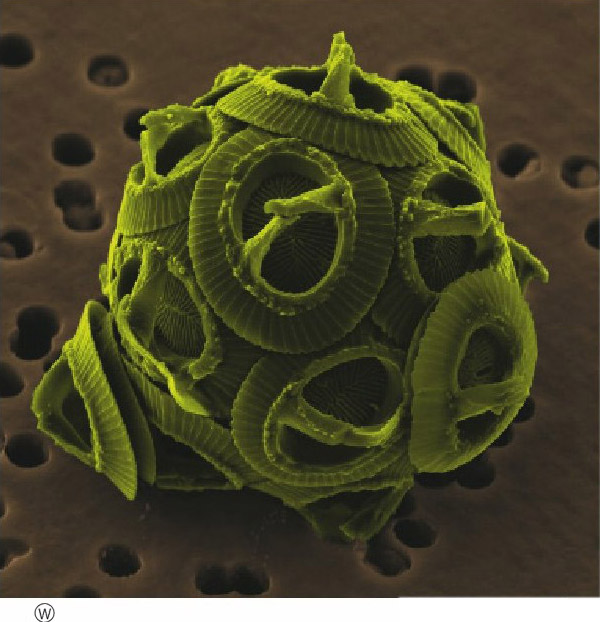
颗石球

科学家经过实验，惊奇地发现颗石是在颗石藻这种单细胞植物的身体里面形成的，然后被推到表面。就像是颗石藻里面躲藏着一位技艺精湛的雕刻大师，将雕好的一片片“颗石”组合成大小各异的颗石球，摆放在屋外的院子里，装扮美丽的家园。

颗石藻有许多种，颗石形状各异、结构不同。颗石藻的化石在海底数量巨大，不同的颗石能指示不同的年代和环境，是开展海洋科学研究的重要材料。（黄维）

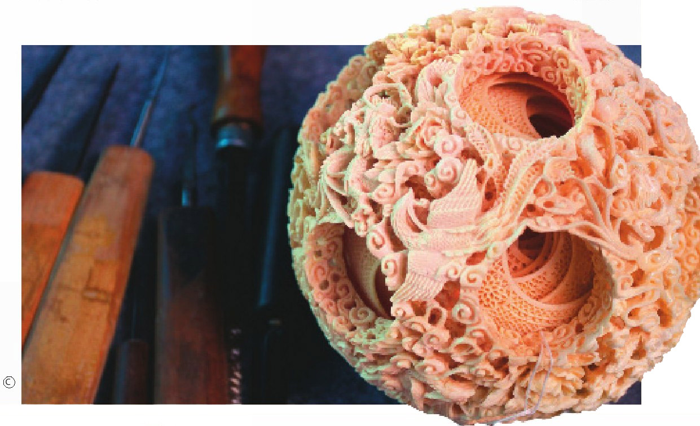
象牙球

  

**【微博士】**浮游生物造型工艺品

微小浮游生物精美的骨骼，给了艺术家们巨大的启发。例如，有些放射虫的壳，是一种玻璃状的网状结构，像个圆球，大球里又套着小球，活像象牙雕的空心球；有的像个香炉罩，有的像象牙塔……受这些精巧设计的启发，艺术家设计出了各种造型，运用在首饰、灯具和建筑艺术中，给人们一种超凡脱尘的天然美的享受。

【微问题】　除了海水里的浮游生物，海底是否也生活着单细胞海洋生物？再向下，在海底泥沙下面呢？

【关键词】　单细胞海洋浮游生物　硅藻　放射虫　颗石藻　有孔虫

## 金字塔是有孔虫壳堆起来的吗

当你走近埃及金字塔的时候，随便从地上捡一块碎石，就会看到上面有许多扁圆的小化石，它叫货币虫。堆成金字塔的石灰岩，就是四五千万年前由这类货币虫化石黏结起来组成的。它的形状、大小有点像硬币，所以叫作货币虫，其实形状更像中东盛产的绿扁豆。金字塔前也有风化掉落的货币虫化石，当年古希腊人看不懂，还以为是堆造金字塔的古人掉落的风干绿扁豆。假如你取一颗化石从中间剖开拿到放大镜下一看，里面居然有几百个精致的隔板，这到底是什么？原来这是一种单细胞动物有孔虫的壳，也就是它给自己建造的住房，它长大一点，就增加一个“房间”。有孔虫虽然个体小，却是个大门类：化石有3000多属、6万多种，存活至今的就有6000多种。货币虫是生活在热带浅海海底的一类生物，大的能用手指头捏起来，属于大有孔虫。所以，金字塔真的是有孔虫的壳堆起来的。

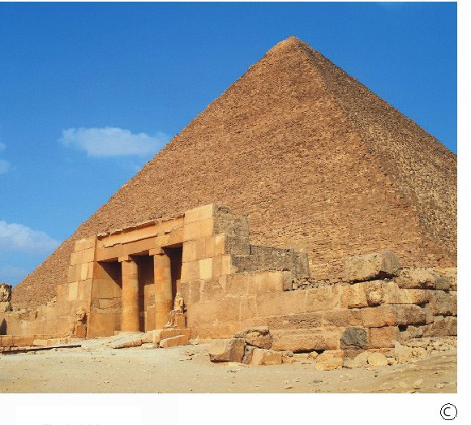
金字塔

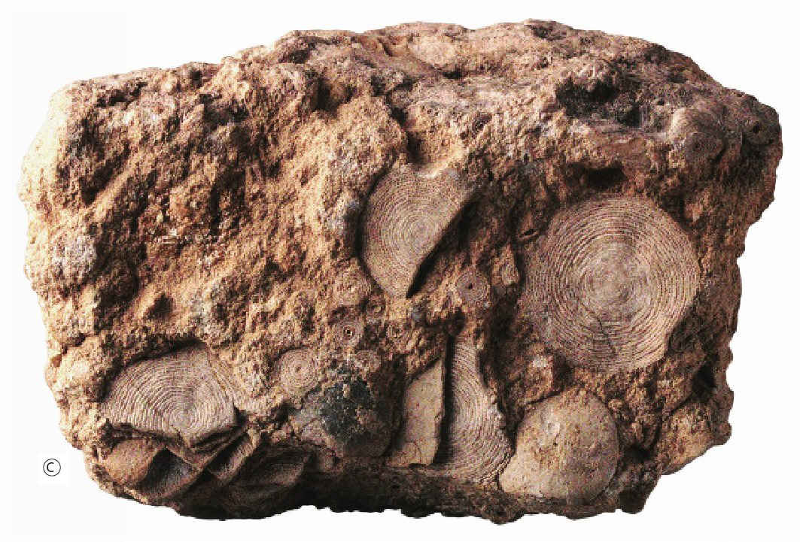
货币虫化石

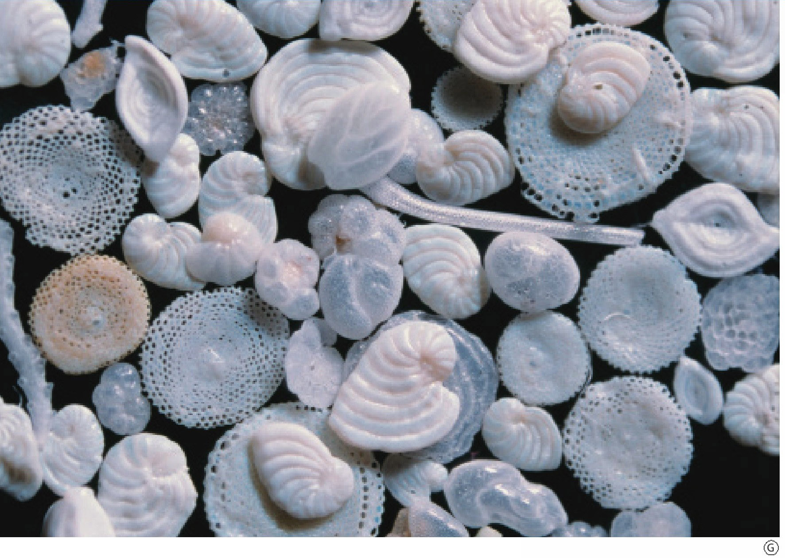
有孔虫

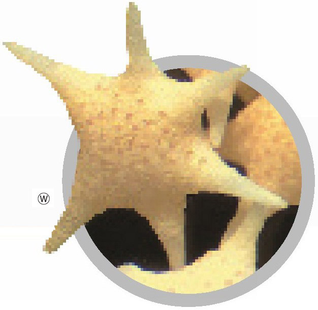
冲绳的“星砂”就是海边的大有孔虫

大有孔虫活着的就不少。如果你到冲绳旅游，最常见的纪念品莫过于“星砂”。星砂就是当地海边的大有孔虫，抓回来一漂白再装进小玻璃瓶，就成了旅游商品，物美价廉。这种大有孔虫壳上长“角”，像颗小星星，要是剖开了在显微镜底下看，也有非常复杂的内部结构。

大有孔虫在几万种有孔虫里只是很小一部分。大多数有孔虫没有那么大，要用显微镜才能看到，叫作小有孔虫，它们有的在海水上层浮游，有的在海底过底栖生活。不管是大有孔虫还是小有孔虫，不管是浮游还是底栖有孔虫，都可以成为化石保存在海底的地层里。有孔虫在地质时期进化很快，不同地质时期有不同属种的有孔虫。勘探石油的时候，关键要知道井下地层的年龄，而海相地层里多的是有孔虫，可以指示年龄。100多年前，美国人通过研究有孔虫化石在石油勘探中取得了很大成功，于是有孔虫一下子走红，出现了专门研究有孔虫的实验室、出版物、基金会。有孔虫从而成了勘探石油应用最广的化石门类之一。（徐大鹏）

  

**【微博士】**碎屑堆砌的有孔虫壳

有孔虫的壳是它的“家”，有两种办法建造：一种是自己分泌矿物，文中所说的方解石壳就是；另外一种是采集现成的矿物碎屑，黏结起来造壳，一般都是就地取材。有孔虫分泌出黏液，把身边海底的石英、黏土矿物、重矿物黏结起来，就成为自己居住的“屋子”。这种黏液如果含碳酸钙、碳酸铁之类的成分，这“屋子”就相当牢固。不过碎屑堆起来的“屋子”终究比较笨重，也不够精致，所以只有生活在海底，尤其是固着生活的有孔虫才能适用。其中有些种类的有孔虫非常挑剔，专门选择海绵骨针、颗石藻的壳体，或者暗色的重矿物建造“屋子”，其他颗粒一概谢绝。真弄不懂，小小的原生动物哪来那么大的“脾气”和本领，会在海底挑选建筑材料呢！

## 为什么有孔虫壳能用来研究海水的变化历史

世界海洋经历了巨大的变化。比如2万年前的大冰期，地球上1/3的陆地压在几千米厚的冰盖底下，海平面比现在低100多米，大陆架都露出海面；而5000万年前地球两极基本上没有冰盖，北冰洋还是温带气候，海水温度比现在高得多。但是科学家怎么会知道古老海水的变化历史呢？最重要的信息来源，在于海底泥沙里的有孔虫。

海水历史的“档案”就在海底：千万年来堆积在海底的泥沙，就是海水变迁的历史记录。有孔虫壳在海底的泥沙里到处都有，而且数目极大，每平方米的海底平均生活着上百万个底栖有孔虫，而从海面掉下来的浮游有孔虫壳更是多得数不清。浮游有孔虫活着的时候外面有很长的刺，便于漂游，死了以后掉到海底的就只剩壳体。这些壳的成分都是方解石，也就是碳酸钙（CaCO3），底栖有孔虫一般也是方解石的壳。这种壳体是有孔虫活着的时候吸收周围海水成分建造的，所以保留着古海水的信息。研究人员通过对壳体的化学分析可以获取相应的信息。比如说，壳体里碳酸钙的钙可以由镁来代替，而替代的量随着海水的温度变化而不同，所以我们测量壳体的镁与钙两种元素的比值，就可以测出古代海水的温度。再如海水里氧的同位素受到全球冰盖大小的控制，冰盖越大，海水里氧的同位素氧-18和氧-16的比值越高，而有孔虫壳体记录了当时海水的氧同位素比值，所以分析有孔虫壳体的同位素可以得出冰盖大小的变化。而冰盖的水来自海洋，冰盖长大会使海水减少、海平面下降，所以对有孔虫壳的氧同位素分析还能告诉我们海平面变化的历史。（徐大鹏）

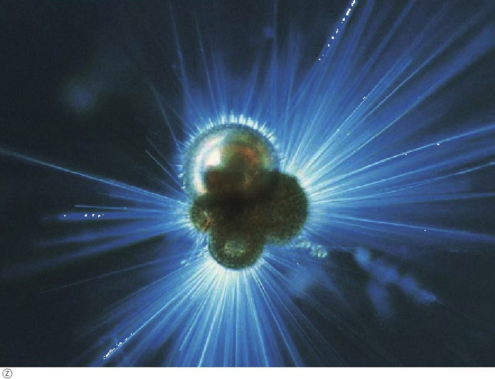
活的有孔虫

活的有孔虫

  

【微问题】　单细胞动物很多，为什么有的长壳，有的没有壳？

【关键词】　有孔虫　方解石

## 海洋里数量最多的生物是什么

浩瀚的海洋中生存着各种各样数量巨大的生物，迄今为止，科学家们也无法用确切的数字说明海洋中到底有多少生物。那么谁是海洋中数量最多的生物呢？答案不是可以自由游弋的鱼类，而是一些我们看不见的微小生物，它们的个体非常小，需要用显微镜才能看到，但它们的数量却十分惊人，平均每毫升海水中大约有100万个，包括一些微型藻类、真菌、细菌、古菌、病毒等，统称为微生物。

曾经，荷兰科学家列文虎克（1632-1723）发现微生物，轰动一时。现在看来他在显微镜下看到的还不算小，真正小的微生物要用电子显微镜才能发现。但是它们数量之多，超出一般人的想象。微生物里最大的是原生动物，虽然是单细胞但是有细胞核，和你我一样属于真核生物。如果比较在单位面积上的个体数，原生动物比哺乳类动物高12个数量级。单细胞的藻类如硅藻、颗石藻、甲藻等，都是真核生物。比它们小的是没有细胞核的原核生物，包括细菌和古菌，它们也是海洋里的生产者，能制造有机质。其中最小的如原绿球藻，连一个微米都不到，是世界上最小的自养生物。比它们还要小的是病毒，要用纳米为单位来计量大小。病毒既没有细胞结构，又不能独立繁殖，算不算生物都有争论，但它却是海洋生态系统重要的组成部分。

一种会发光的海洋细菌

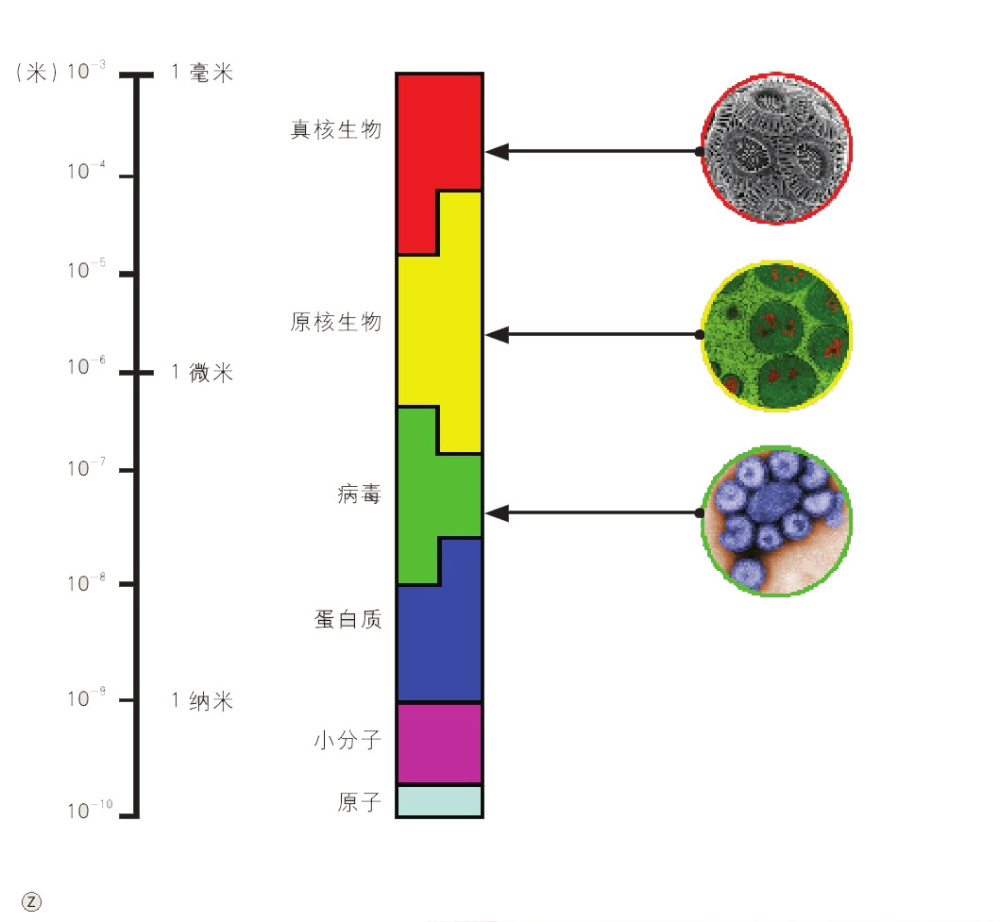
微生物的大小

培养平板上长出的细菌

海洋里微生物的数量往往和它的个头相反，越小的个头数量越多。有人比喻说，1毫升海水里平均有10个原生动物和10个真核藻类，还有100个原绿球藻、1000个细菌和1万个病毒。说到这里，我们就可以来具体回答“海洋里数量最多的生物是什么”的问题：论分量（生物量），原核类（细菌、古菌）最多，占所有微生物总量的90%，虽然个体数不到总数的10%；论个数，最多的是病毒，虽然生物量只占海洋微生物的5%，个体数却达到94%，估计全大洋有1030个病毒，连起来长度超过银河系直径的60倍！（咸淑慧）

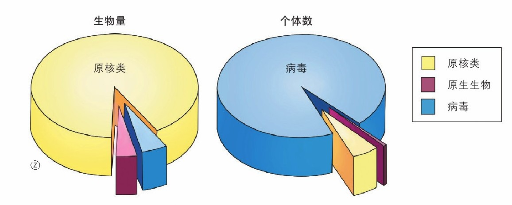
海洋里的微生物，论生物量最多的是原核类，论个体数最多的是病毒

## 海洋微小生物是怎样发挥巨大作用的

海洋中不仅生活着鱼、虾、贝类、大型藻类等各种我们肉眼可以看得见的生物，也存在着数量更为巨大的肉眼看不见的小生命，它们是在海洋生态环境中发挥着非常重要作用的一些小型浮游生物、真菌、细菌、古菌、病毒等。那么，这些微小生命是怎样发挥巨大作用的呢？

海洋中的微型藻类，如聚球藻、原绿球藻、球石藻等，可以非常高效地进行光合作用，产生的有机物通过海洋中的食物链不断传递，最后形成丰富的渔业资源。

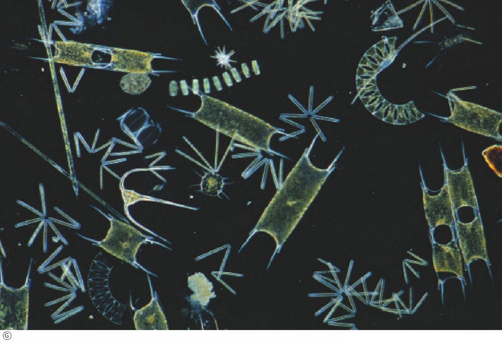
浮游植物中的硅藻和鞭毛藻

海洋中有许多极端特殊的环境，像高盐度海区、海底的热液、热泉、火山口等。在这些极端的环境中，往往生活着许多古菌，这些古菌有很多特殊的本领，如嗜热、嗜盐、能够产生甲烷、进行氨氧化作用等。当然，它们也广泛分布在普通的海洋环境中，在海洋生态环境中扮演着重要的角色。

海洋细菌是海洋生物群落的一个极为重要的组成部分。一方面，细菌作为分解者会分解水体中大量存在的有机物质，释放矿物质以供其他生物再次利用；另一方面，它们也能吸收有机物，通过食物链向上层营养级传递，形成所谓的二次生产。不仅如此，它们在海洋储碳中也起着非常大的作用，通过自身的代谢，细菌可以将一部分容易被生物利用的有机碳，转化成很难再被利用的有机碳滞留在大海中，从而形成海洋巨大的碳储存库，对缓解全球变暖有着非同小可的意义。

病毒的名字很难听，又是“病”又是“毒”的，其实它是海洋生态系统里不可缺少的必要环节。海洋浮游病毒通过对它们的主要宿主——微型生物的裂解，改变着海洋生态系统中物质流和能量流的途径，每天死于病毒之手的海洋微生物，占其总生物量的20%。比如说，海洋病毒是赤潮快速消亡的原因之一。但是我们对海洋微生物世界的了解还处于起步阶段，迫切等待更多的有志之士参加研究。（咸淑慧）

  

**【微博士】**怎样研究海洋中的微生物

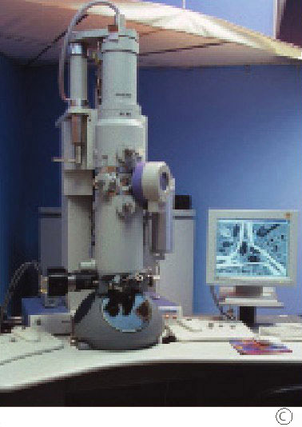
透射电子显微镜

人们对微生物的认识首先要归功于显微镜。第一个真正看见并描述微生物的人是荷兰科学家安东·列文虎克，他利用自制的显微镜发现了微生物世界。直至今天，显微技术仍然是微生物研究必不可少的手段，并且经过不断的发展，显微技术也有了极大的进步，像透射电子显微技术和表面荧光显微技术就是今天在海洋微生物研究中非常常用的手段。

20世纪80年代中期，流式细胞技术开始应用于海洋微生物的研究。它能以每秒处理成百上千个细胞的速度对微生物进行分类、定量等，使研究者可以在极短的时间里获得大量的数据。90年代以后，人们将分子生物学技术运用到了对海洋微生物的研究中，通过对环境中DNA、RNA等的提取扩增，揭示了海洋中存在的多样性极其丰富的微生物类群，使人们从分子水平上认识到微生物在海洋生态系统中的作用，同时也有了一系列新的发现，如发现海洋古菌的存在。

【微问题】　海洋中形成的铁矿是不是海洋微生物的功劳？

【关键词】　海洋微生物　古菌　细菌　病毒　分解　裂解

## 谁是地球上最小的光合自养生物

提起光合自养生物，人们一般都会想到陆地上的植物，因为植物是通过光合作用养育自身的。其实，海洋里也有大量光合自养生物，而且有着个头最小的自养生物，它就是海洋原绿球藻。这是一种非常古老的海洋生物。虽说叫“藻”，可它与一般概念中的海藻很不相同。通常所说的海藻是指多细胞的真核生物，而原绿球藻是单细胞的原核生物，所以也归为蓝细菌类群。它们个体的大小通常只有0.7微米左右，只相当于头发丝粗细的1/100。

电子显微镜下的原绿球藻

别看原绿球藻如此之小，它却拥有进行光合作用的所有器件。更独特的是，原绿球藻具有地球上独一无二的光合色素——二乙烯基叶绿素，而且有a、b两种类型。原绿球藻有一个极大的本事，可以利用海洋深处微弱的光进行高效的光合作用，来合成大量的有机物。如果科学家通过转基因工程等现代生物学手段将这种高效利用弱光进行光合作用的基因移植到经济作物上，就有可能提高这些作物的光合作用水平，进而显著提高它们生产有机物的能力。这在高温多雨、日照不足的南方地区尤其有意义。

原绿球藻的独特之处还不止这些，一般植物要进行正常的生命活动都需要氮营养，硝酸盐氮（硝态氮）就是陆地施肥最常用的化肥之一。然而，有些原绿球藻却不利用硝态氮。科学家已经查明，这是因为原绿球藻不具有编码硝酸氮还原酶的基因。这可能与原绿球藻这一古老物种起源时地球尚处在无氧状态有关。所以，原绿球藻也是研究进化的好材料。（焦念志）

  

**【微博士】**原绿球藻是怎样发现的

海洋原绿球藻的发现者——美国麻省理工学院教授萨利·瓦·切萨姆

原绿球藻的发现，那可不是一件容易的事，从发现海洋中原绿球藻的大量存在到原绿球藻的定名就花了4年时间。如果从科学家观察到原绿球藻的时候算起，到真正认识它，算起来竟然长达13年！1979年，约翰逊和西伯斯首先用电子显微镜观察到了原绿球藻。尽管他们意识到这种新发现的单细胞生物没有藻红蛋白，而藻红蛋白是聚球藻的特征色素，但由于当时受限于研究手段和知识积累，他们仍把它归类于聚球藻“Ⅱ型”。其后，间接的证据是1983年杰斯凯斯和克瑞在亚热带大西洋发现了一种未知的叶绿素a的衍生物，随后证实这种色素就是原绿球藻的特征色素——二乙烯基叶绿素。先进研究手段的发展和应用大大加深了人们对于我们世界的了解和认识。在1985年，奥森和阿姆布拉斯特利用船载流式细胞仪发现了一种发弱红色荧光的微型生物，它的数量超过所有其他微型生物的数量，而且这种生物一直分布到真光层的底部。此后，原绿球藻才引起了足够的重视。最终萨利·瓦·切萨姆等人于1988年确定，这是一个以前未发现的新种，他们在纯化培养的基础上，于1992年将其命名为海洋原绿球藻，整个过程历时13年。

## 谁是地球上最大的生产者

提到地球上最大的生产者，人们很自然地会想到陆地上的森林。其实不然，最大的光合自养物种也是生活在海洋里的原绿球藻。尽管它们的个体非常小，但它们的数量非常大，而且在适宜的环境中生长速度极快。特别是它们有利用弱光的本领，可以分布在从海面到200米深度的海水中，并且在全球海洋的北纬40°到南纬40°之间的海区中都是优势种。如果全球变暖，原绿球藻的分布范围还会进一步扩大。

可以想见，一个物种占据着如此大的空间，其总生产力有多高。事实上，每升海水里就有上亿个原绿球藻个体。此外，它们的繁殖速度也非常惊人，在适宜的环境条件下，它们的数量每天可翻一倍。所以，原绿球藻实际上是地球上单一物种生物量和生产力最高的生物。

当然，原绿球藻的数量并不会无限制地增加，因为有好多小生物要靠吃原绿球藻来养活自己。此外，海洋里有很多可感染原绿球藻的病毒，这些病毒的繁殖可以“吃掉”很多原绿球藻。（焦念志）

## 古菌就是古老的细菌吗

古菌，顾名思义似乎是指“古老的细菌”。然而，事情并非这么简单。“古老”没有错，但古菌不是细菌。虽然古菌与细菌从模样上看不出明显差别，但其细胞结构和基因却很不相同。现代分子生物学分类手段把生物界所有生物划分成三大域：古菌、细菌、真核生物各占一域。我们人类被划分在与细菌和古菌并列的真核生物范畴。古菌的发现从根本上改变了传统的分类概念。

荧光显微镜下呈绿色的海洋古菌（中国东海样品）

古菌与细菌的区别不仅在于基因组的不同、细胞膜的不同，还在于其非凡的适应能力。古菌不仅分布在土壤、湖泊、海洋等各种环境，而且在以往认为的生命禁区都有存在，比如高温、高盐等极端环境。这要归功于古菌的特殊功能。以海洋环境中古菌的分布为例，相对于细菌，古菌在表层海水中数量相对较少，而在较深的海水中相对数量反而增加。我们都有这样的常识，即随着海水深度的增加，海水中的光线越来越弱，海水的压强越来越大。那么，在那样黑暗、高压并且“可吃”的有机物稀少的环境中，为什么古菌的数量反而更多呢？原来这要归功于古菌的“特异功能”。许多古菌，比如产甲烷古菌，具有将无机物如氢气和二氧化碳作为电子供体和受体来合成甲烷并同时产生能量的本领。这些古菌具有特殊功能的酶，可以催化此类反应的发生。同时，在大洋深处尤其是地球板块活动比较活跃的海区中，常常分布着很多海底火山，这些海底火山的喷发会产生“黑烟囱”，可以将地球内部的能量释放出来，而在这些“黑烟囱”附近，也生长着大量的生物。研究表明，这些生物中有相当大一部分就属于古菌，热网菌属就是其中引人关注的一类。它们的自养固碳能力，支撑了深海或者海底环境中不依赖于太阳光合作用的所谓“黑暗食物链”。（焦念志）

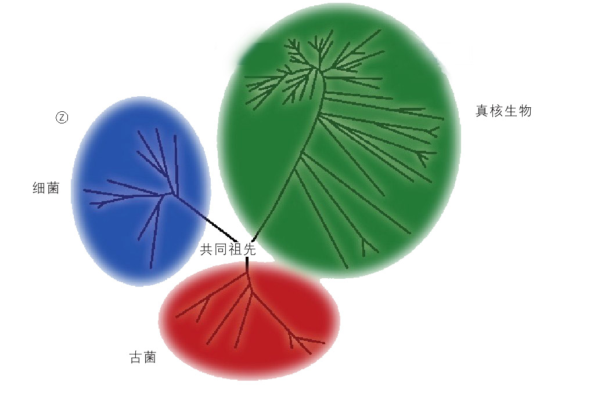
现代分子生物学把生物界所有生物划分为古菌、细菌和真核生物三大域

马氏甲烷八叠球菌

  

【微问题】　能否实现人工光合作用？

【关键词】　原绿球藻　光合作用　优势种　古菌

## 沸水能杀死海洋中所有的微生物吗

夏天一到，我们总是寻找各种方式降温，以缓解燥热的感觉。对于地球上大多数生物来说，别说身处沸水中，即便是在一般的高温下也难以生存，而神通广大的微生物总能带给我们惊讶。沸水确实能杀死大多数的微生物，却不能杀死海洋中所有的微生物，有些海洋微生物就能在沸水中繁衍生息，我们管它们叫嗜热菌。

20世纪初，在美国黄石公园的热泉里，人们蹊跷地发现里面竟然有各种各样的微生物存在。在这个接近沸点的水世界里居然有如此坚强的生命，不能不引起科学家们浓厚的兴趣。于是，大家开始四处寻找这些耐热的小家伙。1997年，人们在大西洋底部3650米深处的热液喷口处，找到了“延胡索酸火叶菌”。尽管热液喷口的温度高达113℃，它们仍能在其中“悠闲自得”地生活。人们在震惊的同时，将该温度认定为生命可承受的极限。然而，随后人们又在太平洋底部2400米深处的一个热液口发现了一种更耐热的微生物，名为“菌株121”。科学家在实验室中将“菌株121”加热到121℃，它照样生存并能繁殖后代。即使在130℃的环境中，它也能维持生命，只是不能繁衍。也许，“菌株121”并不是耐热微生物的极限，我们只能在默默的等待和探究中，感叹微生物的神奇。

“菌株121”是已发现的最耐热的菌株

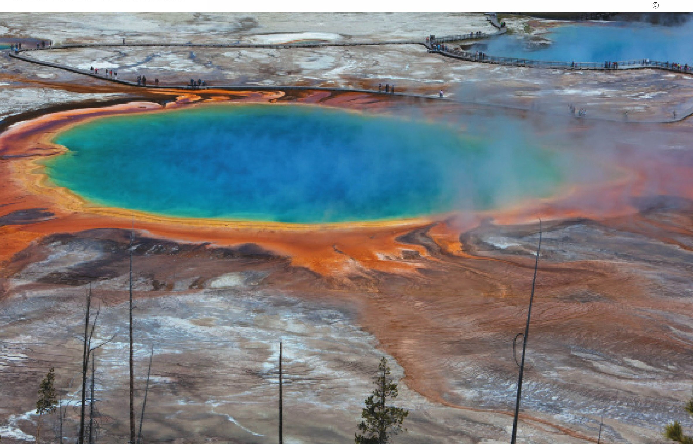
美国黄石公园的热泉里，生存着各种各样的微生物

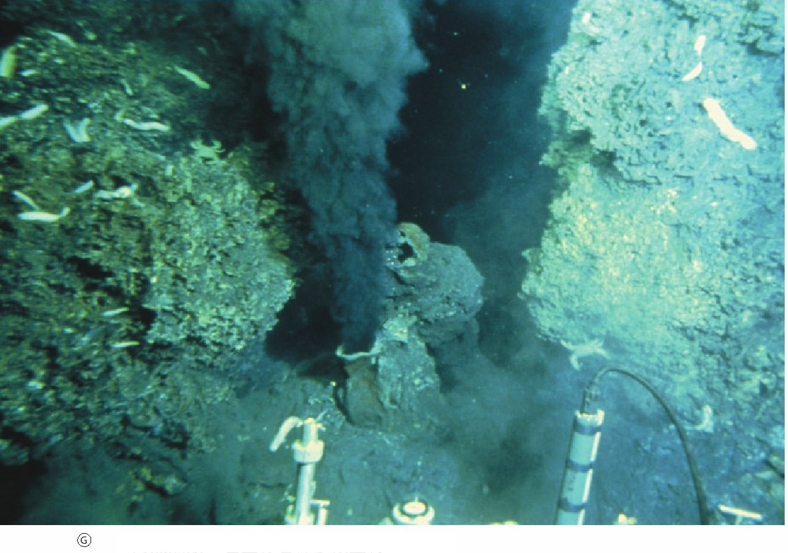
海底热液口也生存着许多微生物

一般认为，能在55℃以上的环境中生长的微生物属于嗜热菌，其中最不怕热的要数超嗜热菌了，它们竟然喜欢在80～120℃的环境中生活。高温甚至是嗜热微生物生长的必要条件，例如一种生长在大洋中脊热液口壁上的古菌，对它来说90℃太冷，它的最佳生长温度是105℃，当温度低于90℃时，它就会停止生长。（谢夏冰）

## 为什么嗜热菌能耐高温

普通的细菌喜欢生长在20～35℃的环境中，温度太高或者太低都会影响它们的生长，甚至导致它们死亡。为什么嗜热菌在高温下，甚至在沸水中都能正常生长繁殖呢？通俗点说，为什么嗜热菌不怕热呢？基于目前的研究结果，有如下几个解释。

首先，嗜热菌的细胞膜特别耐受高温。细胞膜是细菌细胞外面的一层保护膜，嗜热菌的细胞膜在高温时的组成成分更稳定。

其次，从基因角度看，嗜热菌DNA的G+C含量很高。DNA是细菌的遗传物质，由A、T、G、C四种成分构成，其中G+C含量越高，DNA越不容易被破坏。嗜热菌的G+C含量高于中温菌。一般中温菌的G+C摩尔百分比含量为44.9，而嗜热芽孢杆菌的G+C摩尔百分比含量为53.2。

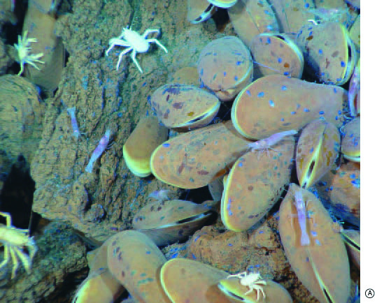
生活在海底热液口的生物

再者，嗜热菌在高温下的生命活动会加快加强，可以更快地实现新陈代谢。

最后，嗜热菌的蛋白质很耐热。蛋白质是机体的主要组成成分，鸡蛋的蛋白质在60℃时就会变性，但嗜热菌的蛋白质在高温下仍很稳定。目前科学家已经从嗜热菌中分离出多种蛋白质，它们的热稳定性高于中温型细菌的类似蛋白。

对于嗜热菌耐热“超能力”的研究还在继续，新的成果会不断呈现。从事这项研究不仅可能有利于探索原始生命，而且还可能发掘嗜热菌在现实生活中的应用价值。

今天，科学家认为生命的最高温度可能是160℃。这是因为生物的能量分子——ATP，在高于160℃时就会快速分解。此外，在某种极端环境条件下生长的微生物还身怀其他绝技，它们常常要忍受不止一种的极端环境条件。例如，生长在深海大洋中脊热液口的微生物同时也要经受极热液中高浓度的重金属和硫化物以及强酸性（pH值约2.8）的考验。（谢夏冰）

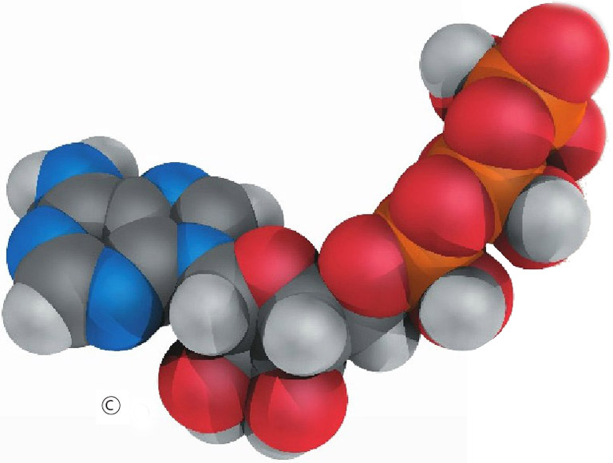
生物的能量分子——ATP

  

【微问题】　嗜热菌在常温和低温下能够生长繁殖吗？

【关键词】　嗜热菌　“菌株121”　深海热液　热液口

## 清澈的海水中也有病毒吗

清澈的海水看上去洁净而无杂质，其实，和陆地上一样，海洋中也有病毒，而且这些病毒绝大多数都漂浮在海水中，它们就是数量惊人的浮游病毒。浮游病毒主要是指一些侵染细菌的噬菌体、侵染原核藻类的噬藻体和侵染真核藻类的真核藻类病毒等。直到20世纪90年代，浮游病毒在海洋生态系统中的作用和地位才逐渐被人们所认识。海水中浮游病毒粒子的代谢十分活跃，数量十分巨大，那么我们不禁要问，这样一来海洋中的微型生物不就被病毒“吃”干净了吗？

其实不然，虽然生活在大海中，但浮游病毒和它们的宿主——细菌以及真核藻类并没有很强的自主运动的能力，都是一些“随波逐流”的小家伙，因此海洋中病毒对它们的宿主的作用是随机发生的。而且，海洋中的病毒是比较“挑食”的，它们不是遇到任何细胞都会感染的。就像陆地上感染植物的病毒不一定会使人类致病，感染一种鸟类的病毒不一定会感染另一种动物一样，海洋中的病毒也都有它们特定的宿主，比如原核蓝藻的病毒就不会感染真核藻类。

病毒是否可以感染宿主细胞，是和宿主细胞的表面是否有这种病毒的特异性受体有关。一般我们将病毒与宿主细胞表面特异受体的结合称为吸附。病毒的表面有吸附蛋白（如T-偶数噬菌体的吸附蛋白是其尾丝蛋白），而宿主细胞的表面有细胞表面受体（大多数细胞表面受体为细菌等细胞壁上的磷壁酸分子、脂多糖分子以及糖蛋白复合物），病毒与宿主细胞的吸附过程实际上就是吸附蛋白和细胞表面受体的结合过程。每类吸附蛋白的构象不尽相同，每类细胞的细胞表面受体的构象也不一样。就像不同的钥匙有着它所对应的锁一样，病毒只有遇到了“对眼”的细胞表面受体，才会和它的宿主细胞发生吸附。细胞表面受体有严格的种系特异性，因而各种病毒具有严格的宿主范围。所以尽管海水中病毒泛滥，但各种微型生物照样生机勃勃。（咸淑慧）

噬菌体

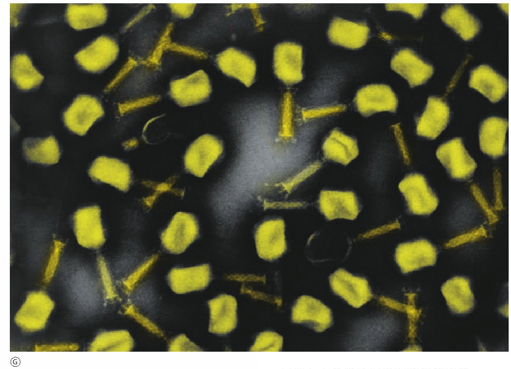
扫描电子显微镜拍摄的噬菌体图像

透射电子显微镜拍摄的噬菌体侵染细胞图

  

**【微博士】**杀死胜利者

因为海洋病毒和它们的宿主细胞都是随机发生接触的，因此病毒的感染依赖于一定的宿主密度。也就是说，当某个宿主种群数量太少的时候，浮游病毒就很难接触到它们；而当宿主数量比较多的时候，感染就相对容易些。科学家把这个现象叫作“杀死胜利者”。当一个宿主种群成为优势种群时，就很容易被易感病毒找到，并在随后的过程中被大量裂解，直到变得不再是优势种群。而当另一个种群成为优势种群时，同样的故事也会再次上演。病毒的这个“杀死胜利者”游戏，对调节群落结构和海洋生态多样性有着非常积极的作用。例如，当赤潮发生的时候，由于有害藻类的数量大量增加，其病毒也相应地大量繁殖并裂解宿主藻类细胞，这大大有利于赤潮的消失。

## 海洋中病毒是怎样进行自身繁殖的

病毒的分布十分广泛，可以说，世界上每一个有生命存在的地方都会有病毒，病毒也当之无愧是海洋里个体数最多的微生物。但是，病毒不具有细胞结构，一些简单的病毒仅由具有遗传功能的核酸和蛋白质外壳组成，所以病毒是没有办法完全依靠自身完成繁殖的。那么海洋中那么多的病毒又是哪儿来的呢？

噬菌体是海洋浮游病毒最主要的组成部分，在这里我们便以噬菌体为代表，来看看它是怎么繁殖的。噬菌体在水中与宿主细胞发生偶然碰撞后便附着于宿主细胞表面，之后它们通过尾管把自身物质注入宿主细胞内。进入到宿主细胞的核酸以自身的遗传信息为“蓝图”向宿主细胞发出指令，使宿主细胞的代谢系统转变成合成噬菌体特有的组分和“部件”。当大批成套的“部件”合成好了以后，就在细胞内进行装配，于是就产生了一大群形状、大小完全相同的子代噬菌体。之后宿主细胞发生裂解，这些“新鲜出炉”的子代噬菌体便被释放到环境中去，开始新一轮的感染过程。当然，有些噬菌体把自身的遗传物质注入宿主细胞之后，便悄悄地整合到宿主细胞的基因中，并不立即在宿主细胞内大量繁殖，这样的噬菌体叫作“温和噬菌体”。温和噬菌体自身的遗传物质会一直隐藏在宿主的遗传物质中，和宿主相安无事地共同“生活”，只有在环境发生变化或在特定的环境条件下，它们才会被诱导大量合成子代噬菌体并裂解宿主细胞。科学实验证实，通过一些特殊的方法，如紫外线照射等，可以诱导这些隐藏在宿主细胞中的噬菌体进入裂解途径。

受侵染的宿主细胞裂解并释放子代噬菌体（透射电子显微镜图）

噬菌体附着到细胞表面并将遗传物质注入细胞中

这么说，病毒是不是“很坏”啊，把宿主都给裂解了。其实宏观地说，浮游病毒是海洋生态系统中不可缺失的环节。就像老虎吃山羊一样，病毒裂解浮游生物，就是生态系统的一个组成部分，缺了它还不行呢！（咸淑慧）

  

【微问题】　假如没有病毒，海洋的碳循环会受到影响吗？

【关键词】　病毒　浮游病毒　微型生物　宿主细胞　裂解　噬菌体

# 海底与海洋地质

## 地球上最长的山脉在陆上，还是在海底

安第斯山脉是一条纵贯南美7个国家的山脉，总长度约7000千米，最宽的地方约700千米，平均海拔近4000米，很多人都认为它是地球上最长的山脉。

事实并非如此。如果我们把海洋中的水全部抽干，将会看到更为壮观的地形：贯穿地球大洋还有一条更宏大的山脉：它全长6万千米，宽达数百至数千千米，总面积竟然与陆地面积相仿！这条山脉由于分布在大洋的中央，被称为大洋中脊，也被叫作中央海岭。因此，安第斯山脉只能算是陆地上最长的山脉，而地球上最长、规模最大的山脉是大洋中脊。事实上，大洋中脊不仅称雄地球，而且在整个太阳系它都是山脉家族中的翘楚。

大洋中脊规模宏大，但并不算高，只比周围的洋盆高出1000～3000米，顶部距离海面2000多米。尽管这样的高度谈不上惊人，但是，大洋中脊的地形却极其复杂。从海底地形图上看，大洋中脊像蜿蜒的长龙贯穿海底，但从细节上看并不连续：大洋中脊像一个长条面团一样，被“锋利的刀”切成了许多段，从而导致山脊经常错开数十甚至数百千米，这就是“转换断层”。因此，山脊之间出现了一条条垂直于大洋中脊分布的大峡谷。更为壮观的是，沿着大洋中脊还有一条非常深的峡谷，地质学家称它为裂谷。尽管大洋中脊的裂谷不够连续，但它的总长度基本与大洋中脊相仿，即便是著名的科罗拉多大峡谷，以及陆地上最深的峡谷——雅鲁藏布大峡谷也相形见绌。

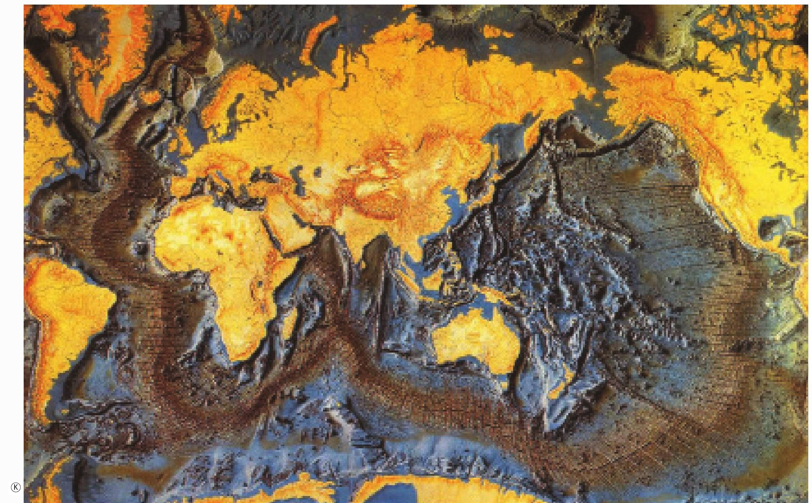
海底地形图

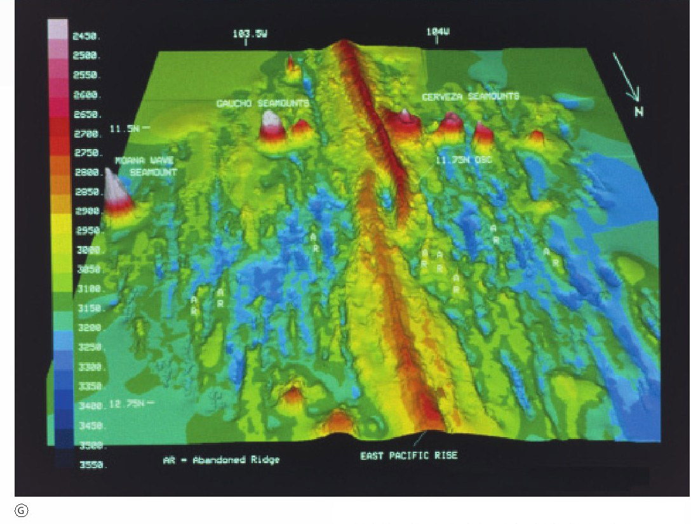
旁侧声呐绘制的东太平洋海底地形图，中间为东太平洋中脊

大洋中脊顶部崎岖不平，丘陵遍布，沟壑纵横，往往会有较小的山岭或谷地分布。这些山岭与大洋中脊平行分布，不像一般海底那样覆盖着厚厚的沉积物，往往只有薄薄的一层泥沙，许多地方裸露着坚硬的玄武岩。沿着大洋中脊向两侧延伸，泥沙厚度逐渐增大，地势变得逐渐平坦，在其最边缘地带逐步过渡为洋盆——深海平原。如果将大洋中脊拦腰切开，会发现横断面是一个平缓的等腰三角形，由中央到两侧，地形起伏渐趋平缓，再向外就是平坦且广袤的深海平原。（王吉良）

## 为什么说大洋中脊是地球上最年轻的山脉

谈起地球上最年轻的山脉，大部分人的答案是喜马拉雅山脉，也有人会说是中国台湾的中央山脉……这些答案都是错的。地球上最年轻的山脉也在海洋中，也是大洋中脊。

支持这个说法的依据是板块理论和海底扩张说。按照这些理论，地球表面覆盖着坚固的板块（地壳），这些板块以每年几厘米的速度在移动，而推动板块运动的一种动力源就是大洋中脊！

位于地壳下的地幔中的岩石，在高温的作用下被熔融为非常黏稠的物质。在地热的作用下，处于高温高压条件下的地幔物质会出现对流的现象。在这种热对流运动的作用下，地壳被撕开，岩浆从大洋中脊中部的裂谷喷涌而出。这些从地下涌出的岩浆在数千米海水的压力下，不会像陆地火山那样剧烈喷发，而是遇到冰冷的海水立即凝固，形成坚硬的玄武岩。这些玄武岩构建成为新的大洋地壳，也就形成了大洋中脊……新形成的地壳在地幔对流的作用下不断向两侧推挤，使洋壳向两侧缓慢扩张。快的像东太平洋，每年扩张10～20厘米；慢的像大西洋的中脊，一年扩张2～4厘米；更慢的是印度洋，一年还不到2厘米。在扩张的过程中，大洋洋壳不断下沉，水深也随之不断增加……在太平洋西侧，洋壳最终俯冲到密度较低的大陆板块之下从而消失。

因此，大洋中脊是一直处于新生状态的山脉，它的最中央部分几乎每天都是全新的。所以我们说，大洋中脊是地球上最年轻的山脉。（王吉良）

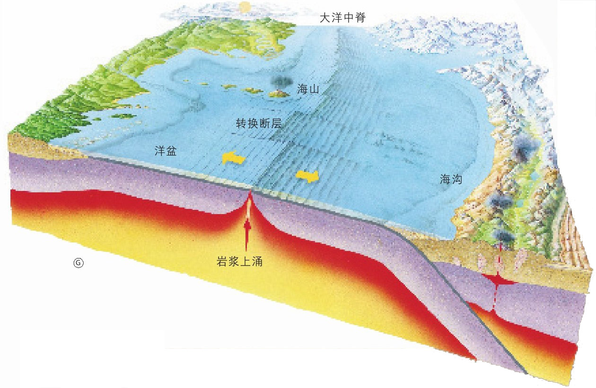
大洋中脊地形地貌结构图

  

**【微博士】**世界上地壳最薄的地方

地壳主要分为两种：大陆地壳和大洋地壳。一般来说，大陆地壳比较厚，有20～80千米；与之相比，大洋地壳比较薄，一般为5～10千米。而在大洋中脊的顶部，受地幔物质等影响，地壳最薄，只有2～4千米。不仅如此，由于这里的地壳非常新，上面覆盖的泥沙也非常少，因此大洋中脊顶部是距离地幔最近的地方。如果有人想要钻入地幔，这里可能是最好的选择。

**【微博士】**大洋中脊上的国家——冰岛

大洋中脊并非全部分布在深海中，也有一部分会露出海面，最典型的例子就是冰岛。大西洋里的大洋中脊在延伸到北大西洋的时候，部分露出水面，形成一系列火山岛，这些岛屿最终构成了冰岛。冰川与火山相伴，这是多么诱人的风景！从板块构造的角度看，大西洋的大洋中脊及其裂谷带，从西南向东北斜贯冰岛，冰岛东边是亚欧板块，西侧是美洲板块。在这里，美洲与亚欧两大板块以每年2厘米的速度扩张分离。如果潜入冰岛的辛格维尔湖，就可置身于美洲和亚欧板块之间。

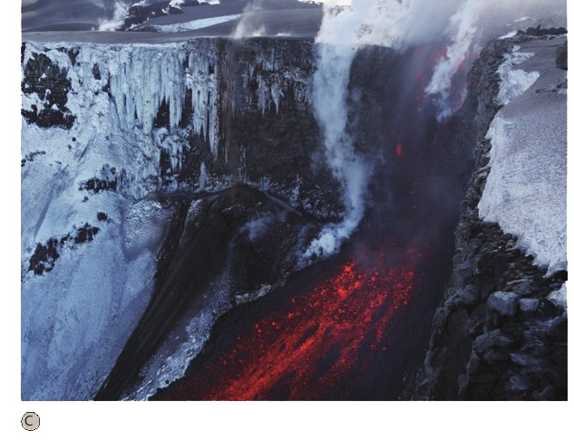
【微问题】　在地球地质史上，是否发生过“移山倒海”的神话？

【关键词】　中央海岭　大洋中脊　板块构造理论　海底扩张说

## 海底为什么会有“黑烟囱”

1977年，美国地质学家搭乘“阿尔文号”潜水器，在东太平洋洋中脊海底考察时，惊奇地发现那里耸立着一些“烟囱”，正在向外喷发滚滚“浓烟”。海底又不是工厂，怎么会有烟囱呢？难道是外星人建立的基地？更让人困惑不解的是，这些喷发着浓密“黑烟”的烟囱旁边还生长着许多奇异生物，仿佛是一个魔幻的世界。

这个奇异的现象吸引了科学家的多次造访，蒙在这个神秘海底世界的面纱逐渐被揭开。原来，“黑烟囱”里冒出的不是烟，而是高温炙热的黑色热液流体！科学家将之称为海底热液。这些“黑烟囱”正是由海底热液喷发作用形成的。如果你想用手去直接触摸它，可千万不行，因为这些“黑烟”出口处的温度高达300～400℃，轻易就能将你的手烫伤。即使是驾驶潜水器靠近它，也得小心谨慎，否则会发生机毁人亡的事故。除了温度很高以外，这些“黑烟”通常还拥有很强的酸性。一些“黑烟”的酸碱度（pH值）接近于我们平常食用的陈醋，可以达到2.8左右。

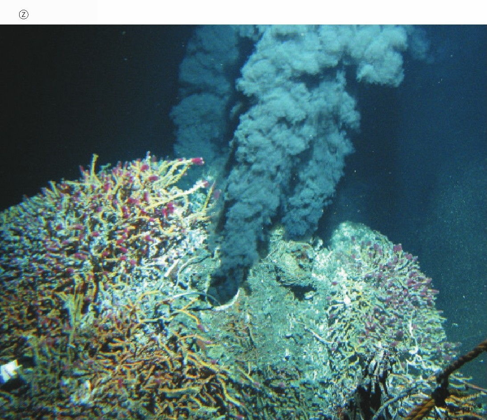
那么，深海热液为什么是黑色的呢？原来除了温度高，它里面还含有大量的有毒气体，如硫化氢、甲烷、氢气等，以及铁、铜、铅、锌等金属离子。对于陆地上大多数生物来说，这里简直就是死亡之地。“黑烟”中弥漫的有毒物质足以使它们立即死于非命！按常理来说，没有生命能在如此恶劣的环境中生存，这里应该是不毛之地。可是，“黑烟囱”附近海底的情况却恰恰相反。这里简直就是生命的“绿洲”。在1平方米的狭小面积内，蛤类等动物的数量甚至可以超过300个，用“密密麻麻”来形容毫不为过！这里同样也是各种微生物栖息的天堂，繁衍着许多靠“吃”“黑烟”中的有毒气体生活的微生物。（彭晓彤）

## 海底“黑烟”是怎么来的

漆黑的海底终年不见阳光，是一个冰冷的世界。怎么会有高温热流液体形成“黑烟”这种奇特现象呢？

问题的答案你一定想不到，“黑烟”其实是由冰冷的海水变化而来的！这是怎么回事呢？原来，海底岩石并非完全密不透水，其中散布着我们肉眼不易察觉的缝隙。当海水顺着这些缝隙向海底深部渗漏时，会与周围岩石发生化学反应。反应过程中，一些物质从海水中脱离出来，而一些来自岩石的物质则渗入到海水中。与此同时，位于海底深部的岩浆房（1200℃），就像一只巨大的火炉，不断烘烤着这些下渗的海水，使它们逐渐变成高温的热液流体。当这些高温的热液流体返身而上，从海底喷发而出时，与温度只有2℃的海水不期而遇，剧烈的混合造就了浓烟滚滚的热液喷发奇观！

那么，耸立在海底的“黑烟囱”又是如何形成的呢？其实，这也要归功于热液喷发过程中热液与海水的混合作用。由于高温热液与低温海水的混合，使热液的温度骤然降低，大量的硫化物矿物得以从热液流体中析出沉淀，在海底形成下粗上细、形态大小各异的“黑烟囱”。有的“黑烟囱”只有几厘米高，有的“黑烟囱”却高达10多米，足有几层楼那么高。一些“黑烟囱”的生长速度非常快，在18个月内能长高9米。这些主要由金属硫化物矿物组成的“黑烟囱”，富含铜、铁、铅、锌等多种金属元素。一些“黑烟囱”还含有金、银等贵重金属，简直就是一座会“喷金吐银”的宝库！

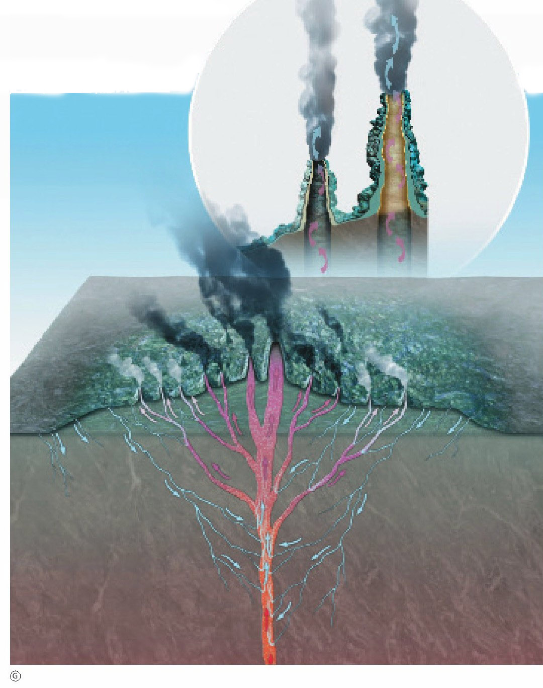
海底如此宽阔广袤，是不是遍地都是这样的宝库呢？科学家经过勘察发现，“黑烟囱”并非在海底随处可见，它们主要分布在大洋中脊和弧后盆地等海底火山活动区。这是因为，在海底火山活动区下方通常存在着高温的岩浆房，能有效地加热下渗的海水，使它们转变成高温的热液。目前，在全球大洋中脊和弧后盆地已经发现的海底热液活动点多达300多处。据初步估算，全球大洋中脊海底可能分布着1000多个热液活动点。（彭晓彤）

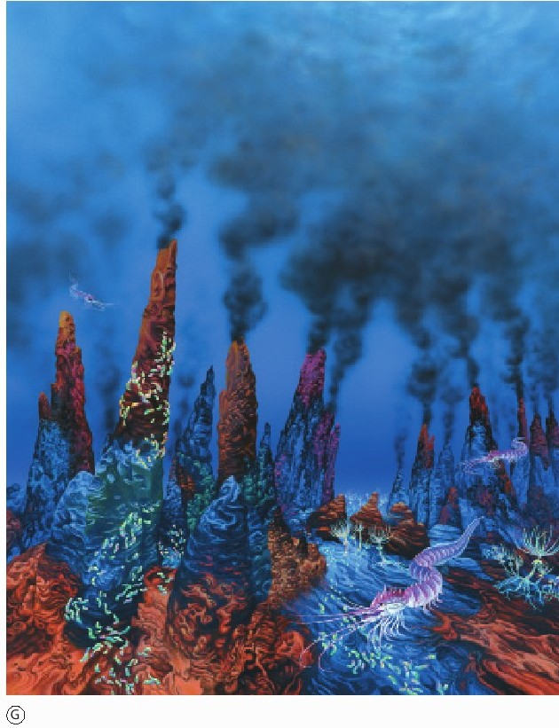
## 为什么热液温度高达300～400℃还不沸腾

一般情况下，水在100℃时就沸腾了，沸腾后水的温度就不再升高。因此，人们习惯性认为水的最高温度不超过100℃。海底热液同样是由水组成的液体，可为什么温度高达300～400℃却还不沸腾呢？

原来，水的沸点受压强的影响，压强越高，沸点就越高。在陆地的高山或高原上，大气压强不足1个大气压，因此水在珠穆朗玛峰顶上72℃就能沸腾。当压强大于1个大气压时，水就要在高于100℃时才会沸腾。

海底热液喷口通常位于2000～3000米深的深海底，承受着巨大的深水压力。按10米水深相当于1个大气压估算，海底热液所承受的压强可达200～300个大气压，这使得海底热液的沸点急剧升高，甚至能达到400℃以上。例如，在3000米水深时水的沸点就能达到410℃。在大西洋中脊发现的热液喷口，最高温度能够达到464℃，可以称得上是不折不扣的高温热水！（彭晓彤）

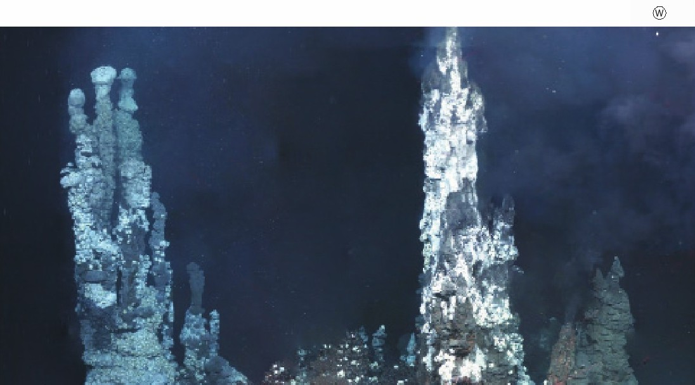
  

**【微博士】**中国的海底热液科学考察

自2003年以来，中国开展了多次以寻找海底“黑烟囱”为目标的深海热液科学考察活动。“大洋一号”科学考察船担负起了这一艰巨的任务，航迹横跨太平洋、印度洋和大西洋。2007年，中国科学家首次在西南印度洋中脊发现了新的海底热液活动点。此后，中国科学家又陆续在南太平洋劳盆地和南大西洋中脊发现了多个新的热液活动点，对世界大洋海底热液科学考察做出了应有的贡献。

【微问题】　海底热液与正常海水相比，哪一个密度更大？

【关键词】　大洋中脊　热液生物　化能自养微生物　海底热液

## 为什么“万物生长靠太阳”的道理，到了深海就不灵了

太阳是地球上最重要的能量来源。它普照大地，使我们赖以生存的地球生机勃勃，万物繁盛。太阳光的直接利用者，当属已经在地球上生息繁衍了20多亿年的绿色植物。这些绿色的生命，有的体形巨大，在地球表面形成繁茂的森林；有的却十分的微小，遨游在蓝色海洋的透光层中。它们共同的特点是能够通过光合作用，将太阳能转化为化学能，并制造出有机质。这些绿色植物可为地球上的动物所食用，构成地球食物链的基础。我们可以想象，如果地球失去了阳光的照射，绿色植物将因无法进行光合作用而迈向死亡，动物也将因食物缺乏而消失殆尽，整个地球将呈现一片死气沉沉、毫无生机的景象。由此看来，“万物生长靠太阳”，似乎是自然界牢不可破的“金科玉律”！

但这一亘古不变的道理正在受到前所未有的质疑和挑战！按照“万物生长靠太阳”的理论推测，在阳光照射不到的深海海底，由于没有浮游植物的光合作用，应该是一片冰冷、寂静的生命荒漠。可令人惊讶的是，科学家却在漆黑的深海海底发现了一些十分奇特的生物群落。这里虽然没有太阳光的照射，但生命的繁衍却丝毫不受影响，各种类型的海底生物竞相争奇斗艳，形成了另一种“世外桃源”般的生命绿洲！很显然，这里的生命并不需要太阳光，它们的生息繁衍也与绿色植物的光合作用毫无关联。那么，为什么看似普遍适用的“万物生长靠太阳”的道理，到了深海就不起作用了呢？

原来，地球上有两种能量可以支撑生命活动。一种是来自地球外部的能量，即太阳能。它们通过太阳光的形式到达地球，地球上绿色植物的生长就是依靠这种能量。另一种支撑生命活动的能量则来自地球内部。这些能量由地球内部物质的化学反应产生，同样可以被生命所吸收利用。在深海热液喷口和冷泉喷口附近，生活着大量可以从化学反应中捕获能量的微生物，科学家将它们称为化能自养微生物。它们有的喜欢“吃”甲烷，有的偏爱“吃”氢气，有的则喜好金属离子。千万别小看海底微生物的这些怪癖，它们可是微生物得以填饱“肚子”、茁壮生长的秘诀呢！化能自养微生物的大量繁殖，为深海动物提供了充足的食物来源，从而在深海形成了完全不依靠太阳光的独特生物群落。（彭晓彤）

## 无口又无肛门的深海管状蠕虫怎么存活

你可能很难想象，一种动物如果没有口，也没有肛门，还能怎样生活？没有口，意味着它们不能进食，不能从外界直接摄取营养；没有肛门，意味着它们无法将食物消化后产生的废物排出体外。这听起来有点像天方夜谭，你一定以为它们只是神话故事中才会出现的怪物。

但有一种深海动物却做到了，它们就是栖居于深海热液口附近的管状蠕虫。这种动物的身体主要由一根体管、一段缩在体管里的营养体和心脏，以及一瓣伸出体管的鳃组成。它们扎堆生活在热液喷口附近，在海流的作用下，鲜红的鳃在长长的体管上轻摇摆动，就像一朵朵迎风摇曳的玫瑰，构成了一幅鲜花盛开的美丽海底花园景象。

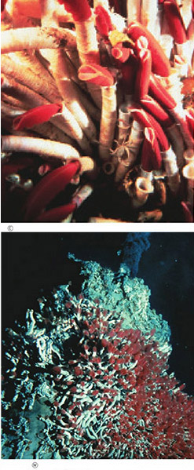
深海管状蠕虫

没有口的管状蠕虫究竟怎样进食呢？原来，它们根本就不需要亲自进食。为了获取生长所需要的营养，它们“聘请”了体内的微生物帮助它们制造有机质。这些微生物“小帮手”居住在管状蠕虫的营养体内，靠“吃”海底逸出的硫化氢气体生活。管状蠕虫红红的鳃，就是专门为它们从环境中收集硫化氢气体的器官。这些微生物“小帮手”生产出来的有机质，可以被管状蠕虫直接利用，因此管状蠕虫就不再需要进食了。当然，因为无需直接进食，自然也没有太多的废物需要排泄。它们通常将废物存储在体管以下的躯干部位，而不是排出体外。对于管状蠕虫而言，口和肛门也就成了多余的器官，自然就完全没有存在的必要了。

管状蠕虫与寄居在其体内的微生物相互协作，分工明确，构成了一种相互依赖、互惠互利的关系，科学家把这类生物称为共生生物。现在你应该明白，管状蠕虫之所以没有口，是因为它们无需进食也能长大；之所以没有肛门，是因为它们根本就不需要排泄！管状蠕虫这种奇特的生理功能，使得它们虽然没有口，却能以令人惊奇的速度飞快地生长。研究发现，有的管状蠕虫一年内可以长高0.8米！（彭晓彤）

深海管状蠕虫剖面图

  

**【微博士】**为什么热液生物不害怕有毒的硫化氢气体

你可能听说过硫化氢中毒，它是指硫化氢能优先与血液中的血红蛋白结合，从而阻止了血红蛋白与氧气的结合，导致生物无法呼吸到氧气而死亡。管状蠕虫和别的热液动物生活在热液口，而热液口会喷出硫化氢等有毒气体，为什么它们却不惧怕中毒呢？原来，这些热液生物能够适应特殊的还原环境。管状蠕虫血液中的血红蛋白十分特殊：一方面能与硫化氢结合，将硫化氢运送给体内的微生物；另一方面，还能不受硫化氢的影响而与氧气结合。通过这种特殊的血红蛋白，管状蠕虫巧妙地避免了硫化氢中毒。

【微问题】　在海底，还有哪些动物能与微生物共生？

【关键词】　化能自养微生物　深海热液　管状蠕虫　共生生物　硫化氢　血红蛋白

## 冷泉生物群和热液生物群是一样的吗

海底是“漏”的。除了冰冷的海水往下向海底的岩层或沉积物中渗漏以外，不同温度、不同成分的流体也会从海底以下的地层中向海水中喷逸。当流体成分以碳氢化合物（甲烷或其他高分子量碳氢气体）、硫化氢或二氧化碳为主，并且温度与海水相近时，就被称为冷泉；当流体富含各种金属元素和气体组分，并且温度明显高于周围海水的温度时，便是所谓的热液。有趣的是，在这些流体喷出的地方，往往发育了茂盛的冷泉或热液生物群落。然而，由于环境的制约，冷泉生物群和热液生物群既有相似之处，也有着显著的不同。

以微生物为例，生活在冷泉和冷泉环境中的微生物大多是化能自养微生物，它们依靠化学反应获取能量并合成有机质。因此，形象地说，它们都是依靠“吃”流体中的化学物质生存的。由于冷泉流体和热液流体中通常都含有大量的甲烷，因此，既能在冷泉环境也能在热液环境中发现甲烷氧化菌。有意思的是，在冷泉环境中，这些甲烷氧化菌必须与硫酸盐还原菌组成一个“共生体”才能够发挥作用，双方离开彼此均不能存活。它们或构成球状，或构成圆柱状，通常是甲烷氧化菌的细胞群被硫酸盐还原菌群完全或部分地包裹住。平均来说，甲烷氧化菌与硫酸盐还原菌数量的比例为1∶2。

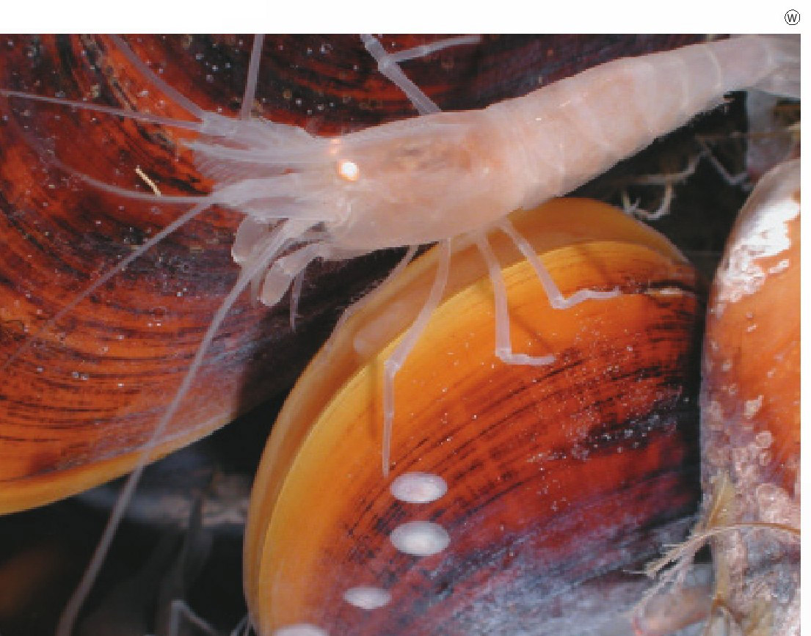
冷泉中的贻贝和虾

与冷泉流体化学组成不同的是，热液流体中富含多种金属离子或氢气等。因此，在热液环境中，很多微生物会以金属离子或氢气等为“食”，许多氢氧化菌、铁氧化菌、铁还原菌或锰氧化菌等能够在这里自在地生活。

热液中的管状蠕虫

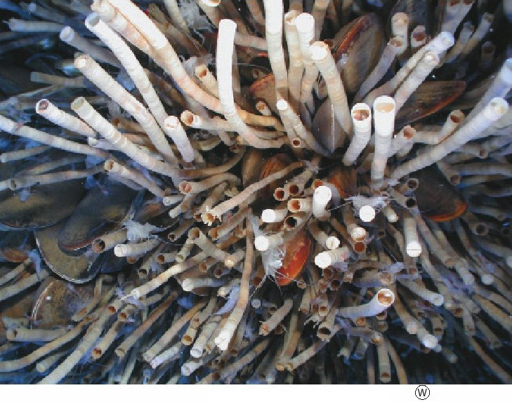
冷泉中的管状蠕虫

当然，温度也是影响热液和冷泉微生物类群差异的一个主要因素。由于高温的影响，海底热液环境中居住着许多喜好“炎热”的“居民”，它们就是人们常说的嗜热微生物和超嗜热微生物。

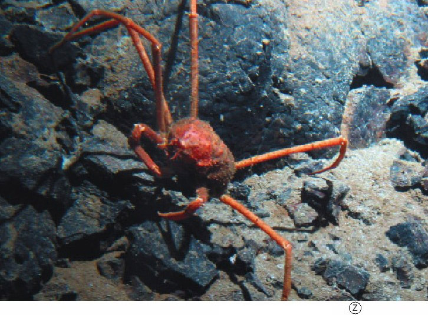
热液中的蟹

与微生物相似，冷泉动物群和热液动物群既有相似之处，也有明显的差异。目前已经发现的冷泉动物物种超过210种，而热液动物物种则更是超过了500种。其中，管状蠕虫、贻贝、帽贝、蛤、虾、蜗牛、腹足类动物等是热液或冷泉环境中常见的原住民。多毛类、螃蟹、海葵、藤壶、海绵、棘皮动物等也常栖息于热液或冷泉环境中。

尽管在热液和冷泉环境中都有管状蠕虫、贝类等动物的踪迹，但它们在生物分类学上却隶属于不同的种属，在生理特性上也有很大的差异。以管状蠕虫为例，热液环境中生活的管状蠕虫，最快每年可以长0.8米，被认为是地球上生长速度最快的动物之一，其管体的长度最长可以达到3米。相比之下，生活于冷泉环境中的管状蠕虫，则生长非常缓慢，它们要活到250岁才长到2米长！如此“高龄”，即便对于地球上其他“长寿”动物而言，也实属罕见。（李江涛）

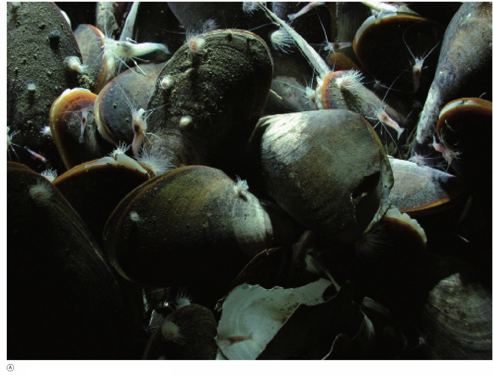
冷泉中的贻贝、虾和海葵

## 为什么说生命可能起源于深海热液

地球上的生命是从哪里来的？这个问题一直是科学家热衷研究的课题，但至今此谜仍未完全解开。

有关地球上生命起源的假说众多，比较流行的有“原始汤”起源说、“黏土矿物”产生论、“黄铁矿”起源论，以及“外来星球输入”假说等。随着对海底热液喷口及其生态系统研究的深入，科学家发现深海热液环境与地球早期的环境非常相似，热液微生物具有“不依赖于太阳光”以及“嗜热”的特性。一种新的科学假说——“生命起源于海底热液喷口”逐渐受到人们的关注。

海洋刚形成时，海底热液活动的强度是现今强度的5倍。广泛并剧烈的海底热液活动导致了地球内部热量的散逸以及大量还原性金属元素和气体的产生。因此，那个时候的海洋处于强还原环境，富含还原态的铁、铜、锌、铅、锰等金属离子，以及甲烷、氢气和硫化氢等气体，海水的温度维持在70～100℃。由于光合作用还没有出现，大气中几乎不含氧气，二氧化碳的含量很高，因而海洋呈酸性。不难看出，早期海洋所具有的环境与现代海底热液喷口周围的环境非常相似。科学家猜想，正是在早期海洋海底热液喷口周围，生命开始悄悄地萌芽了。

那么，哪些生物才是地球上所有生命的“共同祖先”呢？科学家根据“分子进化时钟”的基因测序，勾勒出了地球上所有生物的“生命进化树”。他们发现，位于“进化树”根部，代表着地球上所有生物“共同祖先”的微生物，绝大多数是从海底热液环境中分离得到的超嗜热古菌。它们的平均最佳生长温度超过80℃，能够利用热液喷口周围环境中的各种无机化学反应所释放出来的能量来维系自身的生命活动，进而支撑整个生态系统的繁荣。这些微生物完全能够适应古代海洋苛刻的环境条件，是生命起源于海底热液喷口的核心证据。（李江涛）

  

**【微博士】**生命起源的基本条件

并非任何环境中都能够产生生命，生命起源其实需要十分苛刻的条件。一般认为，生命起源需要以下5个基本的条件：液态水、各种必需的生命元素、合成有机质需要的能量、适当的环境条件和必要的时间。

【微问题】　为什么说有水就有可能存在生命？

【关键词】　冷泉生物群　热液生物群　化能自养微生物　生命起源

## 海底以下的地层中有生命吗

一直以来，人们认为地球生命的最佳栖息地是地球的表面。在地球表面的海洋、森林、草原、河流、湖泊和土壤中，孕育了无数千奇百怪的地球生命，它们共同构成了复杂而又生机勃勃的地球生态系统。如果告诉你，其实，在海底以下看似贫瘠的岩石和沉积物中同样有生命存在，而且它们的数量还很可观，你相信吗？

的确如此，在海底以下的地层中，还栖息着许多至今不为人们所知晓的生物！这些生物都是微小的单细胞生物，没有细胞核结构。它们或生活于海底沉积物的孔隙之中，或栖居在海底岩石之中。无论生存条件多么恶劣，无论营养极度贫乏，这些微生物依然在海底以下黑暗、高压的环境中，依靠着特有的生存策略繁衍生息，形成了地球上另一个独特的生命世界。科学家将这个黑暗的生命世界称为“深部生物圈”，也有人称之为“地球的地下室”。

那么，深部生物圈究竟能达到海底以下多深呢？通过海底钻探，科学家已经在海底以下1600米的地方发现了完整的微生物细胞。这些微生物细胞在温度为60～100℃的环境中，依旧代谢活跃并在分裂。在北海海底以下3000米的石油钻井岩芯中，人们也发现了超嗜热微生物的存在，它们能够在100℃的高温下生活。

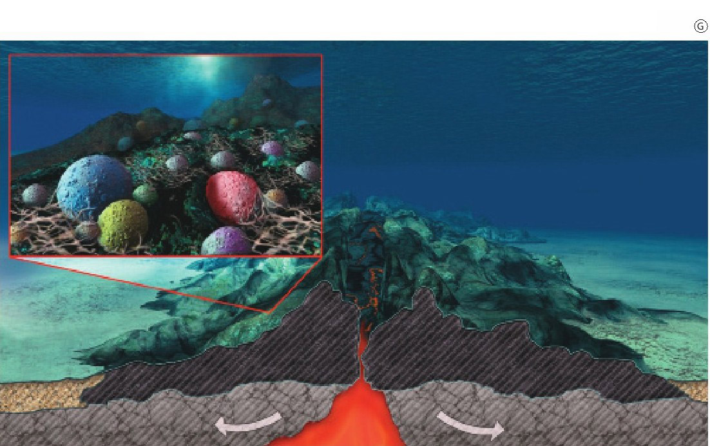
深海细菌

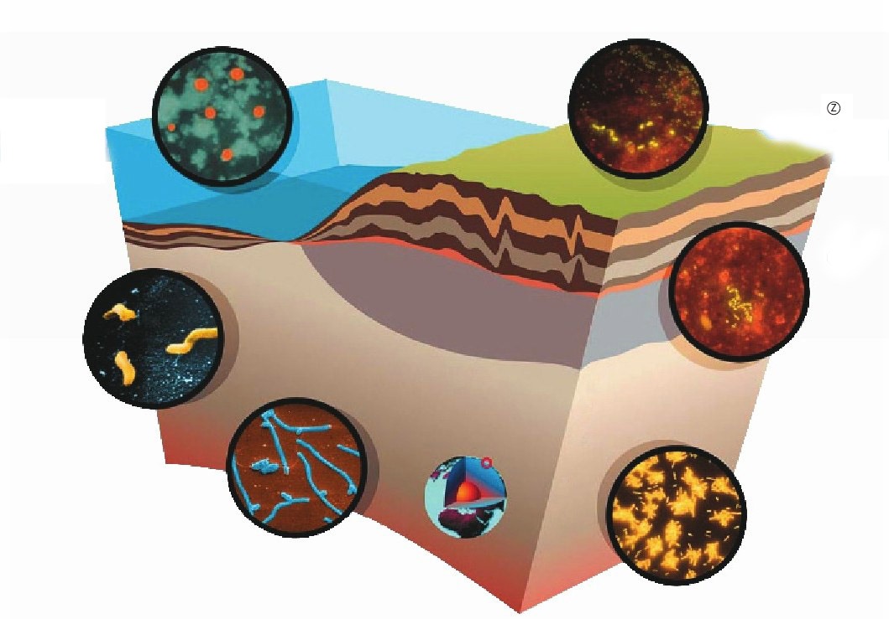
地球深部的微生物

当然，深达千米或数千米的沉积层并非深部生物圈微生物唯一喜欢生活的地方，有的微生物则更喜欢生活在坚硬的海底岩石中。科学家已经在距今34.8亿年的海底玄武岩玻璃中发现了微生物活动的直接证据。这些微生物促进了玄武岩玻璃的风化，并在玄武岩玻璃中形成了多种生物风化结构，如坑、管道和空穴等。这些结构在太平洋、大西洋和印度洋的洋壳玄武岩样品中也能被观察到。有科学家提出，海底玄武岩含水层是深部生物圈中巨大的生命孵化器。

可是，让人不解的是，海底以下生物可利用的有机物质非常少，也没有阳光可以支撑光合作用，这些微生物是怎样维持生命的呢？经过研究，科学家发现一些埋藏了1000万年的海底沉积物中的浮游生物残体仍在以极其缓慢的速度被微生物降解。由此看来，深埋沉积物中的部分微生物仍可以依靠光能合成的有机碳来维持生存。但是，还有一些深部微生物的能量来源可能完全不同，它们更依赖于来自地球内部的暗能量。例如，普遍分布于洋壳中的各种放射性元素（钍、铀、钾等），可以使水分子发生放射性水解，产生氧化剂和还原剂，并释放出可以支撑深部生物圈的能量。此外，一些深部生物圈微生物也可能利用海底以下发生的水岩反应所释放出来的能量。这些微生物的生活方式与人们以往所知道的完全不同，代表着古老而独特的生命利用地球内部能量的方式。（王鹏）

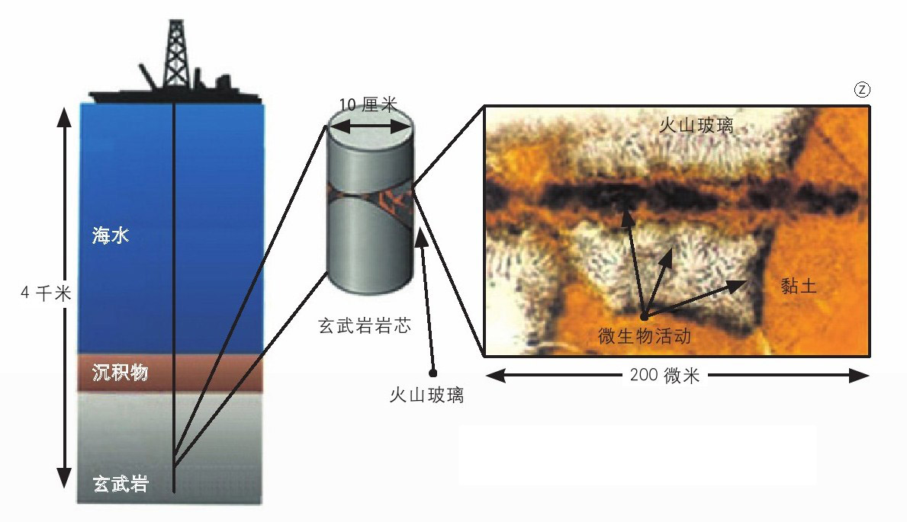
深海下的玄武岩里，也有微生物活动

## 为什么海底以下有长寿微生物

海洋中什么生物的寿命最长？是海龟，还是水母？都不是。海洋中最长寿的生物其实是原核生物。

2012年5月，科学家在太平洋的深海沉积物中发现了一种微生物，它们靠着极其微量的氧气存活，至今已经有8600万年之久。这意味着它们曾经与恐龙一起生活过，是真正的“万万岁”。研究表明，海底沉积物中有不少微生物可以存活数百万年。那么，它们为什么会有这么长的寿命呢？

原来，海底深处可供微生物消耗的有机质极度贫乏，“吃饭”也就成为微生物生存的头等大事。为了使有限的食物“吃”得更久，一些微生物“刻意”将新陈代谢活动降到最低，只要满足自己的生存需求即可。这些微生物像冬眠的棕熊一样，新陈代谢速度极其缓慢。它们几乎不运动，繁殖速度也极慢，数百年或者数千年才繁殖一次，因而具有极长的寿命。难怪有科学家说：“它们8600万年前就在这片沉积物的表面开始吃它们的‘午餐’，就好像它们在一口一口地咬一个馅饼，咬掉一半，再一半，但至今还没有吃完最后一口碎屑！”不过，这些长寿的“老家伙”，说不定很多就是地球生物祖先的近亲呢！（王鹏）

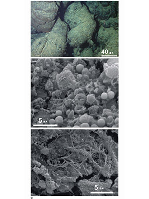
海底玄武岩（上）和其中微生物（中、下）的电子显微镜照片

  

**【微博士】**海底以下有多少微生物

深部生物圈位于海底沉积物及上层地壳中，厚度可达数千米，是一个非常广阔的生存环境。因此，虽然深部生物圈的生物密度比较低，但是总量巨大。有科学家推测，地球总生物量的50%～67%可能存在于深部生物圈。

【微问题】　微生物生存必须具备哪些条件？

【关键词】　深部生物圈　玄武岩　原核生物

## 为什么说珊瑚虫是海洋中的建筑师

在热带和亚热带海洋中，分布着许多蔚为壮观的“城市”——珊瑚礁城。它们是海洋生物的乐园，许多海洋动物和植物喜欢生活在里面。因为在那里既容易藏身，又有充足的食物。

全球珊瑚礁的总面积约60万平方千米，虽然仅占海洋总面积的0.2%，但却繁衍生息了大约1/4的海洋动物，其中包括2500多种海洋鱼类，以及数万种虾、蟹、海星、贝、螺等。

然而不可思议的是，如此庞大珊瑚礁城市的建筑师，却是一些只有米粒大小，终身不能移动的动物——珊瑚虫。

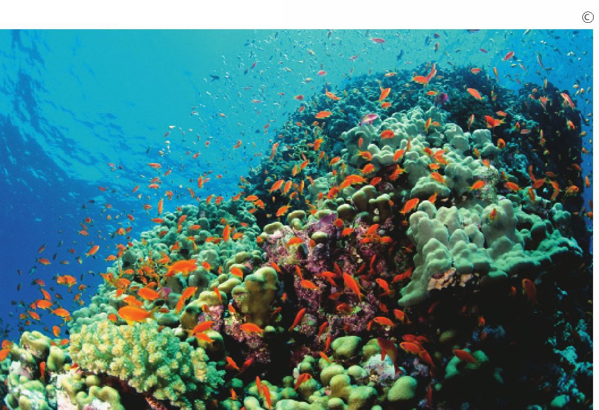
许多海洋生物在珊瑚礁区繁衍生息

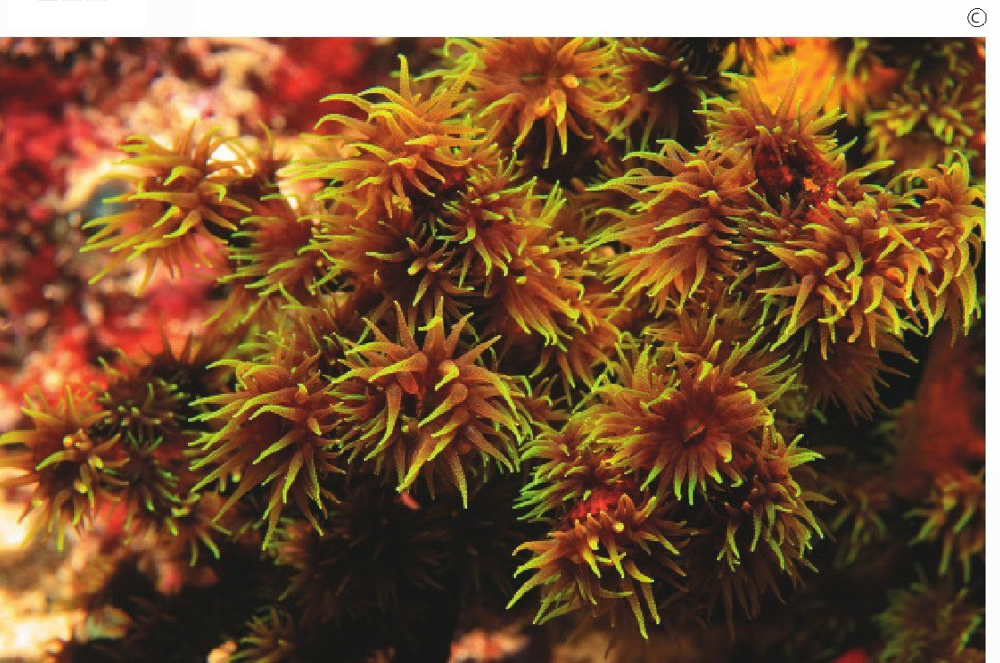
草珊瑚

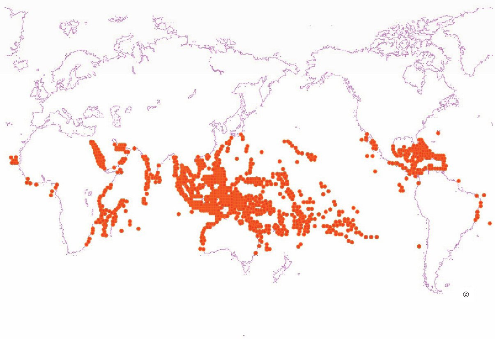
全大洋珊瑚礁分布图

珊瑚虫身体柔软，就像一朵朵盛开在海底的玲珑小花。为了保护柔弱的身体，珊瑚虫利用海洋中丰富的钙质元素，分泌出一种叫作碳酸钙的物质，为自己建造出一间间坚硬的小房子。珊瑚虫将身体隐藏在这些小房子里，伸出花瓣似的触手捕获食物和营养物质。有趣的是，这些一起生活的珊瑚虫，不仅将房子造在一起，它们的“肠道”（科学家称之为肠腔）也连在一起。所以，这些群体珊瑚虫有许多“口”，却共用一个“肠胃”。

珊瑚礁城市中的建筑多姿多彩：有的像高楼，高耸挺拔；有的像运动场，平坦延伸；有些像雕塑，呈树枝状、丫杈状、条状、螺旋状……这些极富艺术性的“建筑”是许许多多微小而柔软的珊瑚虫建造的小房子紧紧相连形成的。即便是一小块珊瑚，也是许许多多珊瑚虫集体劳作的成果。每一座“小房子”的外形、构造、功能大同小异，但彼此的联结方式不同，这就使得珊瑚有了多种多样的形式。

老一代珊瑚虫死后，会留下遗骸，新一代珊瑚虫就像树木抽枝发芽一样，会在前辈的残骸上继续发育繁衍，向高处和两旁发展。如此年复一年，日积月累，珊瑚虫分泌的石灰质骨骼，就会像树木生长一样，越来越高，越来越大。

当然，珊瑚虫也不是珊瑚礁城市的唯一建造者，还有一些像红藻、绿藻一类的植物，贝壳、海绵、微生物以及一种叫作多孔螅的动物，也在为珊瑚礁城市的建设添砖加瓦。（王吉良）

## 为什么有的珊瑚礁会长成圆环形状

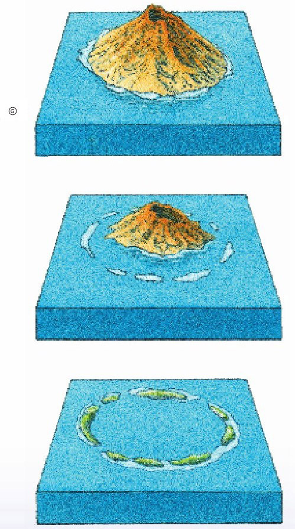
环礁的形成

当飞机航行于浩瀚的热带海洋上，蔚蓝的海面上偶尔会出现一些环形、椭圆形甚至马蹄形的小岛，这是一种特别的珊瑚礁，科学家称之为环礁。环礁四周不远处就是茫茫的深海，而中央却是一潭数十米深的蓝色海水，波澜不惊，科学家称它们为“湖”。

对环礁的形成和演变，很多科学家进行过详细的考察和研究，解释也不尽相同，但最早从事系统研究，并做出科学解释的，当属英国著名生物学家达尔文。

1831年，刚刚从剑桥大学毕业的达尔文以博物学家的身份，参加了有名的“贝格尔号”探险船的环球旅行。在5年的环球旅行中，达尔文进行了很多考察活动，环礁尤其受到达尔文的关注。达尔文发现，很多大洋中的环礁往往与火山岛相伴。一个想法在达尔文脑海中逐步成形：海底火山爆发会形成高耸出海平面的火山岛，珊瑚虫有可能定居于这些火山岛四周，建造成一个环形的珊瑚礁。然而，海洋中的火山并非静止不动，它们一直在下沉，同时周边的珊瑚却在持续向上生长。随着时间的推移，耸立出海平面的火山岛会下沉到海面以下而消失不见，但珊瑚却仍旧在建造自己的环形墙壁，这样就在中央形成一个封闭的湖。因此，每一个环礁就是一座亿万个小珊瑚虫建筑师建造的纪念碑，它表明这个地方曾经有一座火山，现在却躺卧在海面下，或埋藏在大洋深处。

达尔文的沉降学说发表后的100多年时间里，一直未得到证明。由于科技水平落后，人们还没有办法在环礁岛上钻孔，也无法了解厚厚的珊瑚礁下面的世界。直到第二次世界大战以后，美国的海军工程师才揭开了这个秘密：他们在中太平洋的恩尼维陶克环礁岛上，打了一个深孔，钻头穿过一层层老珊瑚，终于在地下1280多米的地方钻入了火山岛。由此证明，早在亿万年前，珊瑚虫已经在围绕火山岛建设珊瑚礁了。达尔文有关环形珊瑚礁形成的理论，与历经数十年才“起死回生”的大陆漂移学说一起，告诉我们，是金子总会发光的。（王吉良）

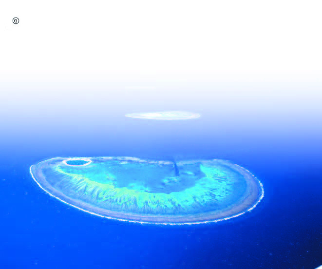
圆形珊瑚礁

  

**【微博士】**南海的珊瑚礁

南海的珊瑚礁在浅海大陆架和深水区都有。近岸浅海的珊瑚礁包括海南岛周围的岸礁，三亚鹿回头风景区就是其中之一。深水远岸的珊瑚礁非常多，南沙、西沙、中沙和东沙总共200多个岛礁，基本上都是珊瑚礁。有的珊瑚礁长在海山上，比如黄岩礁就是坐落在从前的火山链上的一个环礁，周边绕一圈将近50千米，中间是个大湖。有的珊瑚礁长在从前的大陆的碎块上，比如南沙群岛大批的珊瑚礁。不过，建造这些珊瑚礁的不只是珊瑚，被称为钙藻的藻类也是某些珊瑚礁的建筑工程师。

【微问题】　珊瑚用什么武器对付敌人？

【关键词】　珊瑚虫　珊瑚礁　环礁　火山岛　达尔文

## 深海也有珊瑚礁吗

珊瑚礁，孕育着非常丰富的海洋生物，被称为海洋中的“热带雨林”，是地球上最迷人的生态系统之一。通常，它们分布在风光秀丽、气候宜人的热带或者亚热带温暖海域，水深一般不过30米，至多不超过70米。其实深水也有珊瑚，最有名的就是红珊瑚，出产在地中海和中国台湾附近等海域水深100米以下的深水里，呈树枝状，但是生长缓慢，自古以来就是珍稀的宝物。西晋的石崇赌富时砸碎的就是红珊瑚树，清朝的二品官官帽上的顶珠也是红珊瑚。但是这种珍宝绝不会成礁。

那么，深水里就没有珊瑚礁吗？实际上，早在两个世纪之前，渔民在深海区捕鱼时偶尔会获得一些残缺不全的深海珊瑚标本。而近20年以来，科学家借助先进的潜水设备，深入到以往难以企及的深海，终于惊奇地发现，深海也有珊瑚礁。

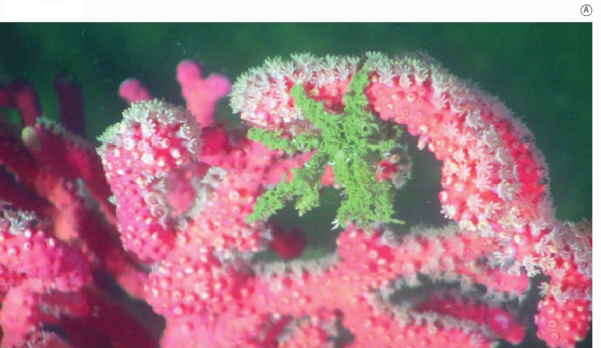
红珊瑚

和热带的珊瑚礁一样，深海珊瑚礁也是许多动物繁衍生息的地方。到目前为止，已经有超过3300种深海珊瑚被发现并鉴定，但是能够造礁的种类确实很少。当然，对深海珊瑚礁的期望不要太高：那里的珊瑚呈树枝状，没有热带那种石头模样的块状珊瑚，珊瑚骨骼在海底堆积也比较松散，有人认为叫成“珊瑚丘”也许更确切些。但是不管怎么说，这些的确是珊瑚骨骼组成的海底实体。

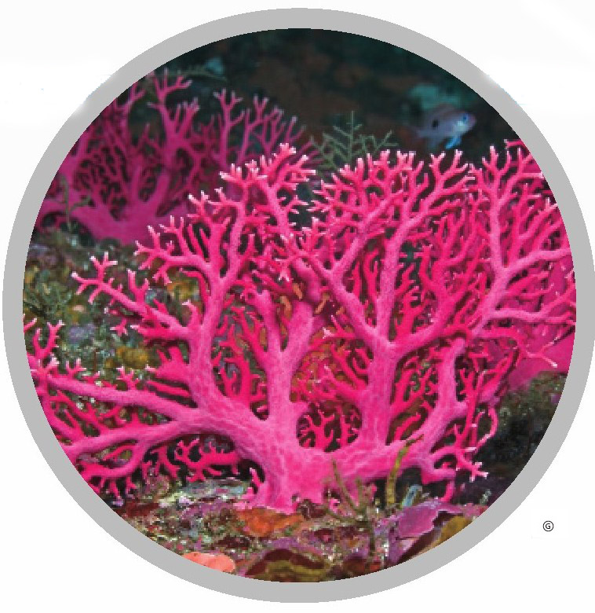
红珊瑚

深海珊瑚礁首先发现于北大西洋海域，最著名的是挪威沿岸的深海珊瑚礁。20世纪90年代，挪威科学家利用遥控水下机器人，在沿着离岸100千米的苏拉海岭250米深的海域中发现了巨大的珊瑚礁。这些珊瑚礁分布于一条连绵13千米的狭长地区，纵横交错，其中的一些高达35米，蔚为壮观。随后，人们又在挪威海岸附近发现了更为庞大的深海珊瑚礁。挪威的罗斯特岛附近的珊瑚礁被认为是目前所发现的面积最大的深海珊瑚礁，长达40千米，宽2～3千米。目前，在挪威发现的深海珊瑚礁的面积已经超过2000平方千米，主要分布于水下400米以内的范围，其生长历史可能已经超过8000年。

总的来说，绝大多数深海珊瑚礁的深度在200～700米之间，最深可达2000米，其中很多集中在400～700米深处，水温在4℃上下。由于深海珊瑚是海洋生物研究的新命题，其他海域的分布还有待陆续发现。（李江涛）

红珊瑚雕件艺术品

## 为什么没有阳光的海底也有珊瑚生长

从外观上看，深海珊瑚虫与热带珊瑚虫区别并不大，具有完全相同的个体形态，也拥有类似的斑斓色彩。但是由于深海珊瑚绝大部分生活在海面以下200米到数千米深的冷水黑暗海域，因而演化出了和热带珊瑚完全不同的生活方式来适应黑暗的生活。

热带海域的浅水珊瑚主要依赖于与之共生的藻类，因为藻类的光合作用所产生的能量可以维持其生命活动，因而它们主要分布于阳光能够穿透的从海洋表面到70米水深的海底。与热带珊瑚不同，深海珊瑚的组织中没有与之共生的藻类，也就无法进行光合作用，它们主要依赖于触手上面的刺囊细胞来从周围海水中捕食猎物。有机质碎片、浮游动物、甲壳类的小动物，甚至连磷虾都是它们的食物来源。长期处在黑暗、低温、高压的极端环境中，加上食物匮乏，深海珊瑚的生命代谢活动较热带珊瑚要慢得多，生长速度也十分缓慢，每年仅生长5毫米至2.5厘米，而热带珊瑚的生长速度可以达到每年20厘米。

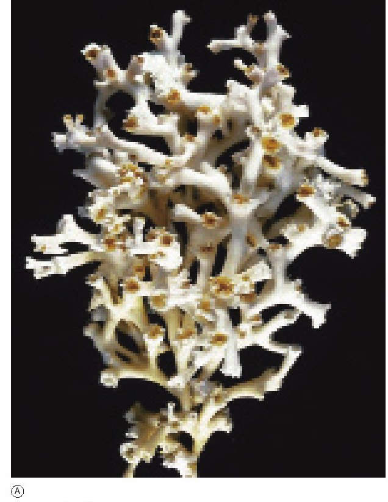
深海珊瑚

如果把海底比作田野，那么珊瑚礁就是城市，“人口”密度要高得多。那么深海珊瑚礁靠什么支撑呢？从挪威附近海域的发现来看，深海珊瑚礁的分布可能和海底油气或者“可燃冰”的烃类释放有关，海底冒上来的物质和能量可能支撑了深海珊瑚礁的形成。当然，这种假说是否成立，有待今后的研究去验证。（李江涛）

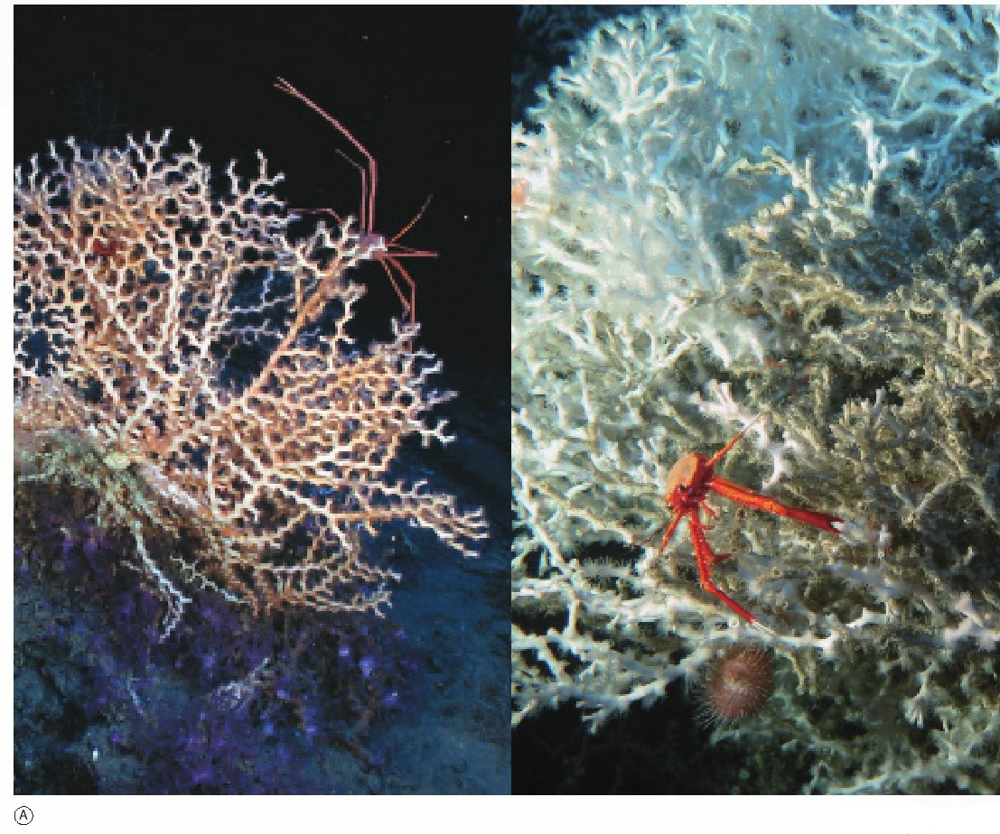
深海珊瑚

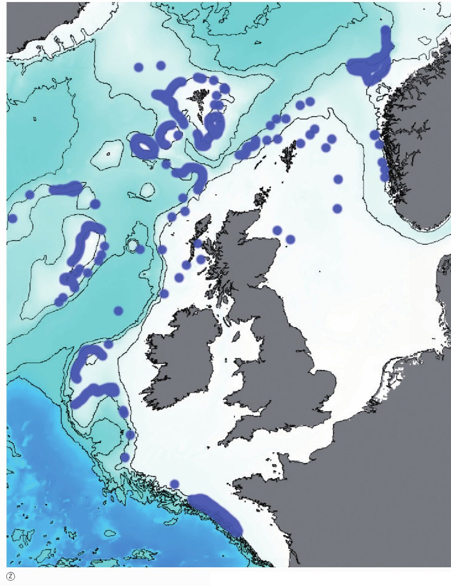
北大西洋深海珊瑚（蓝色团点表示挪威、英国岸外的深海珊瑚产地）

  

**【微博士】**亟待保护的深海珊瑚礁

联合国环境规划署在一份报告中指出，深海珊瑚的生存正面临着包括全球变暖、海洋酸化以及人类活动等在内的一系列威胁。过度捕捞和破坏性捕捞、铺设海底电缆、倾倒垃圾和工业污染等造成了大面积深海珊瑚的死亡，其中最重量级的“杀手”是深海捕捞船的贴地拖网。由于深海珊瑚礁也是众多海洋生物的栖息地，装有全球卫星定位系统和海底扫描装置的船队可以很方便地找到栖息于珊瑚礁的鱼群，在将鱼类、螃蟹和虾等一网打尽的同时，也使深海珊瑚遭到了灭顶之灾。由于深海珊瑚本身生长缓慢，所以就显得尤为脆弱，一旦破坏，几乎不可能恢复。

【微问题】　中国海域会不会有深海珊瑚礁？如果有，上哪里去找？

【关键词】　热带珊瑚　深海珊瑚　深海珊瑚礁

## 为什么海底是“漏”的

人们说海纳百川，江河的水奔流到海就到了终点；石沉大海，什么东西到了海底就等于消失，似乎海底是地球上一切活动的终结。可是近30多年来的海洋研究，却对这种认识说了“不”！海底是“漏”的，不但有水流下去，还有水从海底冒出来，带来了地球内部的能量和物质，养育着深海黑暗世界的生物！

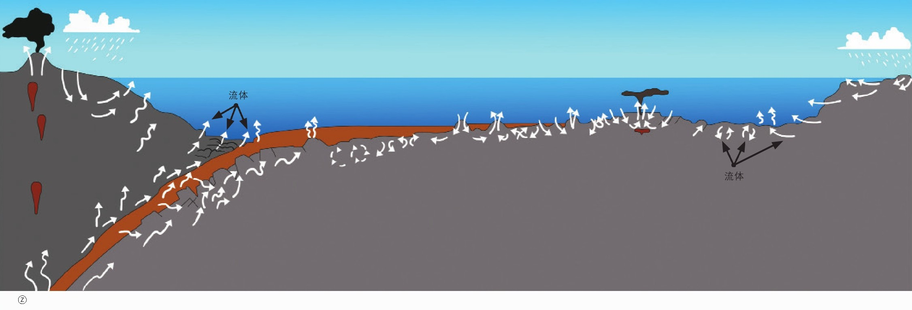
海底是漏的

20世纪70年代末海洋研究的一项惊人发现是深海热液。350℃高温的“黑水”，从2600米深的热液口喷出，冷凝成“黑烟囱”，滋养着“黑暗食物链”。这水从哪来？原来是海水沿着海底的裂隙下渗，到4～5千米的深处与熔岩接触，升温到300～400℃后再重返海底，顺便把地球深部的物质和能量带到海里。沿着全大洋约6万千米长的大洋中脊，现在已经发现的热液点就有300多处。据估算，全大洋的海水每隔500万～1100万年，要到海底热液系统里循环一周。所以，热液是海底的“第一漏”。

热液之外还有冷泉，海底冷泉有多重来源。海底沉积层里的水，占沉积层体积的50%～70%，当大洋地壳向下俯冲时，里面的水被挤出地层重返海水，这种冷泉也会带上甲烷，造成碳酸盐沉积和冷泉生物群。在比较浅的陆坡上，海底“可燃冰”分解也会形成冷泉溢出，造成碳酸盐结壳和冷泉生物群勃发，甚至出现海底泥火山。此外，海底油气矿藏、“二氧化碳湖”都会有气体溢出口，也是由冷泉造成的。因此，冷泉是海底的“第二漏”。

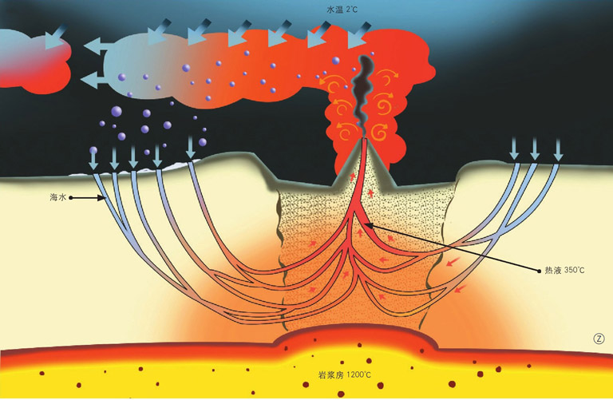
热液的循环：海水渗到深处，遇到岩浆加温后再回流上来

接下去的“第三漏”是海底的地下水。实际上，世界各地的海底都有地下水溢出。靠近岸边的海底地下水通常是淡水，大洋底下的则多是咸水。中国科研人员在舟山群岛海域海底下200多米处打出淡水井，就是一例。香港九龙的吐露港曾经闹赤潮，但一时找不到污染源。后来发现，原来污水是从海底下面冒出来的地下水。不但是近岸，大洋底下也有地下水，而且数量可观。估计大西洋海底的地下水输入量，与周边河流的输入量相当。总之，海底是漏的，海洋是一个双向系统，既有地球表层的物质自上而下沉降，又有地球内部的能量和物质从海底冒上来，在地球表层营造了一个丰富多彩、变化无穷的生态系统。（许斐）

## 海底“白烟囱”是怎么形成的

热液是名副其实的海底“第一漏”！由“漏”下去的海水形成的热液，温度有高有低，热液成分也大相径庭！有的热液在海底喷出后，并非形成我们熟知的“黑烟囱”，而是形成了洁白的“白烟囱”，这又是怎么回事呢？

原来，在一些大洋中脊海底，有大量地幔岩的出露，橄榄岩就是其中的典型代表。有趣的是，这些出露在海底的橄榄岩可以与海水发生复杂的化学反应，并产生大量的热量，从而驱动了一种新类型的海底热液喷发活动。这种特殊的热液碱度高（pH值为9～11），富含甲烷、氢气等气体，几乎不含铁、铅、锌、铜等金属元素。因此，当热液喷出海底时，形成的不是由金属硫化物组成的“黑烟囱”，而是主要由碳酸盐矿物（方解石、文石等）构成的“白烟囱”！

相比“黑烟囱”而言，这些“白烟囱”结构致密，不易坍塌，因此可以形成更为壮观的海底“白烟囱”群。在大西洋被称为“迷失之城”的热液场中，矗立着一座以海神“波塞冬”的名字命名的巨型“白烟囱”。它的高度超过60米，延伸范围接近100米，是目前已知的全球最大的海底热液活动形成的“烟囱”。

海底“白烟囱”不但体积巨大，而且形态变化多端。它们有的像宝塔、像佛手，令人联想到佛教寺庙；有的像石笋、像瀑布，犹如石灰岩溶洞的景象。更难能可贵的是，这些“烟囱”主要由洁白无瑕的碳酸盐矿物组成。雪白精致、形态各异的“白烟囱”耸立在海底，犹如大自然创造出的一件件精美绝伦的艺术珍品。

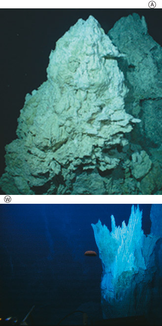
海底“白烟囱”

从海底“白烟囱”喷发出的热液流体温度并不太高（40～91℃）。这样的流体温度，为那些喜温和嗜热的微生物群落提供了极佳的生存场所。特别是在“烟囱”壁的孔隙中，栖息着各种各样的化能自养微生物。它们有的以氢气为食，有的以甲烷为食，以获取能量合成有机质。对于它们而言，这些甲烷和氢气就是其生长所需要的珍馐美味，而热液流体就是它们最喜欢的营养浓汤！（彭晓彤）

  

**【微博士】**“白烟囱”附近的动物群

如果不仔细看，你很难在“白烟囱”壁上发现动物的踪迹，可能会以为那里的动物群落远没有“黑烟囱”附近繁茂。其实，这是一个假象。“白烟囱”壁上同样栖息着大量的动物，例如线虫类和双壳类动物等。由于这些动物几乎是透明的，长度常不到1厘米，所以如果不仔细观察很难发现！除此之外，你还能发现许多形状怪异的鱼、虾、螃蟹、蜗牛等在“白烟囱”周围自在地生活。

【微问题】　为什么“白烟囱”的热液温度比“黑烟囱”的低，“烟囱”却比“黑烟囱”高？

【关键词】　“黑烟囱”　海底热液　冷泉　“白烟囱”

## 地幔里也有“海洋”吗

我们居住的地球由地壳、地幔和地核三部分组成，由液态水组成的海洋覆盖在地壳的表面。地幔位于地壳以下，厚度超过2800千米，占地球体积的84%，是地球的主体。地幔主要由固态或熔融态的物质组成，温度高达几百到几千摄氏度。如果有人告诉你，地幔里有一个巨大的“海洋”，你相信吗？

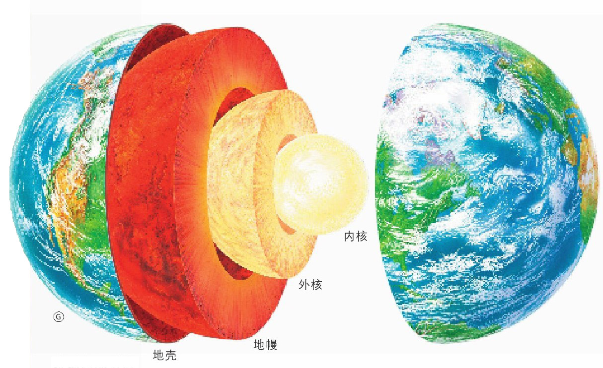
地球内部结构

这是真的。科学家发现，地幔里不但有水，而且水的数量巨大，其中可能隐藏了一个我们看不见、摸不着的巨大“海洋”。这是怎么回事呢？原来，水不但可以以液体的形式在地球表面海洋中存在，而且还可以与矿物结合，以固体矿物的形式在地幔中出现。地幔特殊的高温高压环境，使得水分子可以进入地幔矿物的晶格中，形成含水或含氢的固体矿物。由于这些含水或含氢矿物并不畏惧地幔的高温，因此水可以借此在地幔中保存下来。

科学家又是怎么知道地幔里可能含有大量的水呢？他们设计了模拟地幔高温高压环境的实验装置，在里面放置了地幔中可能存在的各种无水矿物，在与地幔环境类似的条件下研究矿物的性质。科学家发现，如果向实验装置中添加水，这些水会很快被无水矿物所吸收，并形成新的稳定的含水矿物或含氢矿物。现已证实，有10多种含水或含氢矿物（例如含水硅酸盐矿物等）可以存在于上地幔、下地幔或它们之间的过渡带之中。这些实验结果表明，地幔是一个巨大的水的储存库，可能储藏着我们意想不到的巨大水量。有科学家推测，地幔里的水有可能比地球表面海洋、湖泊、河流水量总和的5倍还要多呢！（彭晓彤）

## 海水是怎么到达地幔的

地幔中有水，那么这些水又是从哪里来的呢？答案你可能想不到！原来，大部分的地幔水来自地球表面的海洋。你也许会感到奇怪，海洋与地球内部的地幔之间相隔甚远，中间还夹着地壳，液态的海水又是怎么跑到地幔中去的呢？有关海水是怎么到达地幔中的问题，近年来激发起了科学家对地球深部水循环研究的极大兴趣！

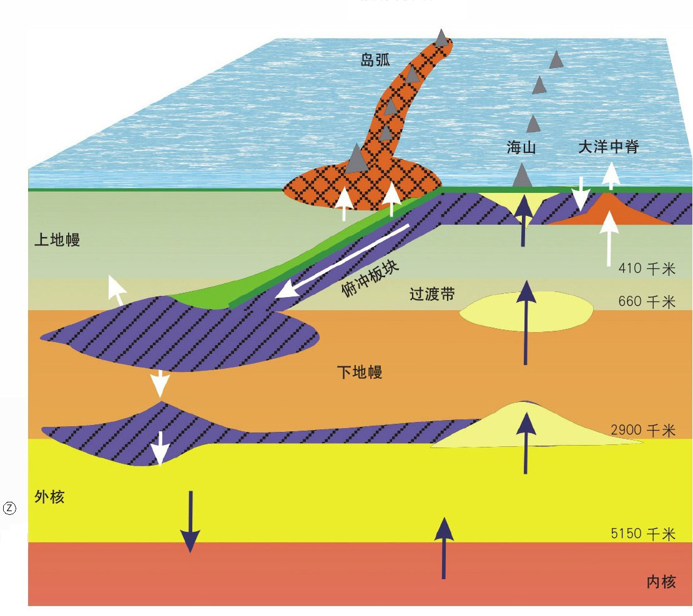
地球深部水循环（箭头代表水或氢的运移方向）

尽管我们已经知道，海底是漏的，但毫无疑问，仅仅通过海水自身的向下渗透，它们是不可能到达地幔的，地幔中也绝无水流。地球表面的水要想输运到深部地幔中，还必须在一定条件下先与各种矿物结合成含水矿物，然后再以固体矿物的形式通过板块俯冲向地球深部输送。在大洋板块向大陆板块俯冲的过程中，包含着大量含水矿物的洋壳碎块被运送到地幔深处，使得这些含水矿物能够到达地幔并在地幔中储存下来。当然，在地幔的不同区域，由于温度压力存在着差异，水与地幔矿物结合的形式也不同，这就造就了地幔中多种类型含水矿物的存在。更有趣的是，科学家通过地震波研究发现，水不仅能到达下地幔，甚至可能到达距地面约2900千米处的下地幔底部与地核的分界处呢！（彭晓彤）

## 大洋里的水会减少吗

空间探测告诉我们：火星上30多亿年前可能存在过海洋，但是后来几乎都消失了。那么地球上的水是不是也会消失呢？现在地球上的大洋约有13亿立方千米的水，但是大洋形成到现在有40多亿年，这期间，水量是在增多还是减少呢？

我们先来看，大洋的水要消失的话能跑到哪里去。蒸发到空中？如果是这样，水汽凝结成降水，早晚还是要流回到海里。真要消失就两条路：要么向上消失到太空，要么向下消失到地球内部。向上的消失，在地球演化的早期有可能，现在此路已经不通：水汽在平均1万米高的大气层里对流，到大气层顶已经没有水汽了。前面提到地幔中也有大量的水，所以大洋水最可能是向下流失，渠道是板块俯冲。海底沉积层里含有大量水，俯冲下去时一部分被挤压回海底，另一部分进入俯冲带，再通过火山或者热液活动喷发出来，形成海水在海底下面的循环。更重要的是海底俯冲的岩石里面也含水，这种结合在矿物晶格里面的水可以随着板块俯冲到地幔深处，形成地球内部的水。

地幔分成上下两部分，中间的过渡带，也就是海底下面410～670千米的深处，含水量最高，有可能占重量的0.1%～0.2%。这种地幔里的水看不见也拿不到，因为是结合在矿物里的，但是这一点点水就可以改变地幔的性质，使地幔更加容易流动、更加活跃，对于我们预测地震极为重要。

大洋里的水从俯冲带流下去，从大洋中脊和火山口流出来，但是两者并不平衡：进去的比出来的多！据保守估算，每年有约8.7×108吨水通过俯冲带进入地幔，而每年从地幔中通过岩浆活动输送出来的水只有约2×108吨。有人估计，近6亿年来大洋的水已经减少了6%～10%。假如估计基本正确，而且今后速率也不变，全球的大洋将在20亿年后干涸。（许斐）

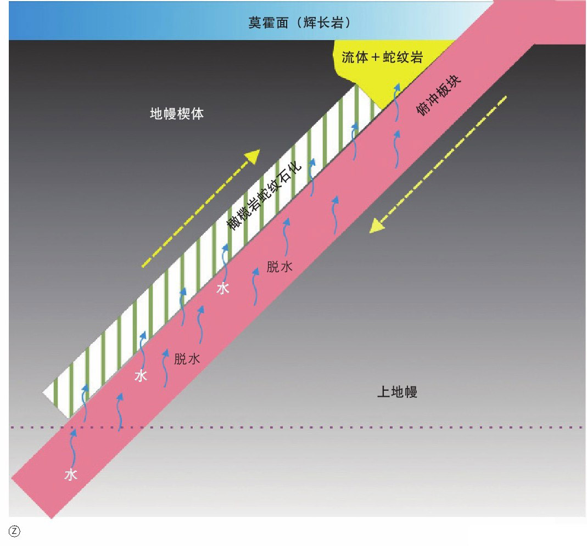
俯冲带的水循环

  

**【微博士】**橄榄岩的蛇纹石化

橄榄岩是上地幔的主要成分。在一些情况下，它也会出露在大洋海底。橄榄石与海水接触后，将发生复杂的化学反应，释放出大量热量，并形成一种新的含水矿物——蛇纹石，这一过程被称为橄榄岩的蛇纹石化。如果一块橄榄岩被完全蛇纹石化，它的体积将增加约40%，含水量增加13%～15%。由于蛇纹石等矿物是上地幔中重要的含水矿物，有科学家提出，上地幔橄榄岩蛇纹石化可能是地球表层向内部输送水分的重要过程之一。

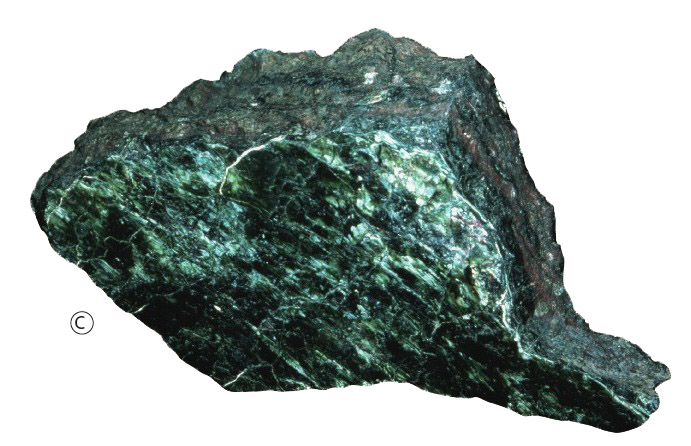
【微问题】　海底冒出来的能量和物质，人类能不能开发利用？

【关键词】　地幔　俯冲带　蛇纹石化

## 海底也有火山爆发吗

提起火山，人们会联想到陆地上许多高耸入云的火山锥，如著名的富士山。其实地球上更多的火山分布在我们看不见的海底。科学家通常认为火山分布在地壳断裂、板块碰撞或地幔热柱活跃的地方。既然海底有地球上最长的断裂带和95%的地幔热柱，而大洋边缘又往往是板块碰撞最激烈的地方，那么海底有火山爆发是无疑的。

科学家估计至少有10万座火山隐藏于海洋深处，它们多数已经沉寂或在休眠，而活火山每天都在喷涌岩浆，令海底地貌日新月异。海底最密集的火山活动发生在大洋中脊。大洋中脊是海洋中间隆起的海岭，是海洋板块张开、新的洋壳生长的地方。海岭中央贯穿了一道宽约20千米、深1000～2000米的大裂谷，地幔岩浆就从裂谷中上涌，冷却后在裂谷两侧形成火山锥。

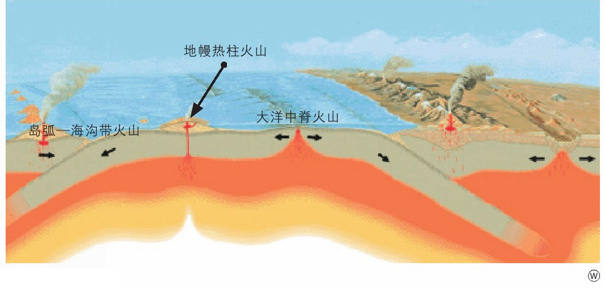
海底火山分布

20世纪60年代，科学家乘“阿尔文号”深潜器潜入大西洋中脊的裂谷中，直接观察到了谷底的火山和刚喷出不久的岩浆。它们慢吞吞像挤牙膏般挤出来，经过漫长的地质年代，挤出了地球上最宏伟的海底山脉。70年代，科学家又在东太平洋的加拉帕戈斯断裂带和北纬21°处先后发现了海底热液、“黑烟囱”和绚丽多彩的生物群落。曾经被认为是寒冷死寂的洋底，不仅有炽热的火山，还有生机勃勃的生命！

想目睹大西洋底火山活动的景象，不一定非要下潜几千米，冰岛就是大西洋中脊露出海面的一段！冰岛中央也有一条大裂谷，岛上的200多座火山和星罗棋布的温泉间歇泉，生动再现了大西洋底火山活动的许多特征。

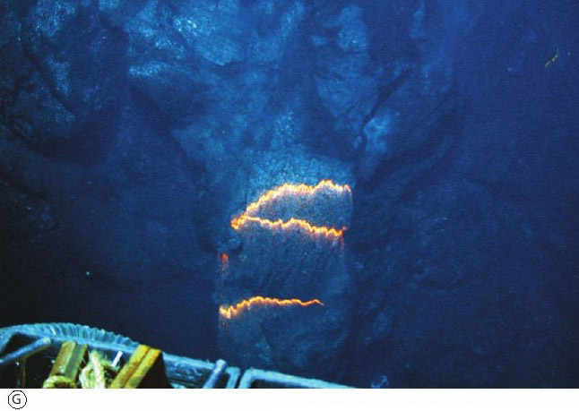
汤加海底火山爆发

大洋中脊火山具有喷发缓慢的特点，相反大洋边缘的岛弧——海沟带火山爆炸性极强，往往形成陡峭的火山锥。环太平洋一圈被称为火环，火环上的火山，有些在陆地上喷发，有些在海底喷发，太平洋西缘众多的岛弧，无一不是海底火山的杰作。比如素有“火山之国”之称的印度尼西亚，仅爪哇诸岛，火山密密麻麻竟有400座之多，其中活火山就有129座。

地幔热柱引起的海底火山不在板块边界，而是在板块内部。岩浆从地幔深处周期性上涌，板块在上方慢慢漂过，经过几千万年，形成一系列自老至新的火山链。散落于太平洋中的许多海山、平顶山和岛屿都是地幔热柱的功劳，其中夏威夷岛的马纳基火山是地幔热柱的巅峰之作，它的锥形火山口高出海平面4207米，高出海床10 203米，这样算起来比珠穆朗玛峰还高！（陈梦兰）

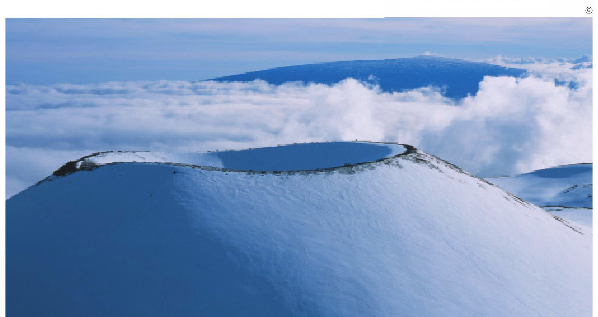
夏威夷岛的马纳基火山锥

## 为什么太平洋中的许多海山顶是平的

海底不仅像陆地上一样有广阔的平原、纵横的沟壑和连绵的群山，还有一种陆地上十分罕见的平顶山，称为盖约特，这是第二次世界大战期间美国普林斯顿大学地质系教授赫斯在太平洋中首先发现和命名的。它们或是孤峰，或成串排列，被削平的顶部直径达5～10千米，装得下一个国际机场的跑道，底部直径是顶部的两倍，你可以绕着它跑两个马拉松。

当时正处战时，谁也没工夫去深究。战争结束后，科学家在平顶山上找到大量玄武岩，证实它们是火山熔岩喷发堆积的产物。让人纳闷的是，平顶山的顶是被什么力量削平的？

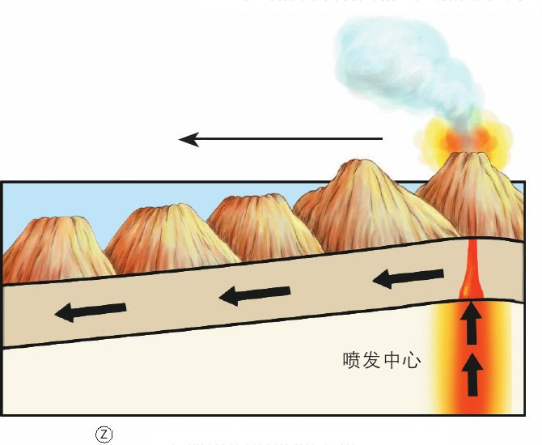
平顶山的形成和下沉

赫斯认为，平顶山曾是露出海面的火山岛，它们的顶部是被海浪长年累月侵蚀磨平的。后来人们果真从平顶山顶部找到一些圆溜溜的玄武岩砾石，证明海浪曾经的作用。赫斯假设形成平顶山的火山要不高不矮。伸出海面太高，成为岛屿，海浪力量再大也奈何它不了；低于海面太矮，则海浪作用不到。

由于许多平顶山上部覆盖了厚厚的珊瑚礁体，也有人认为，平顶山的顶部曾是接近海面的火山口，珊瑚在四周繁衍形成环礁，经过漫长岁月，死去的珊瑚堆积在火山口，最终将它填平。

无论是磨蚀还是填平，平顶山的形成必须在海面附近，可是为什么如今的平顶山大都在海面1000多米之下？赫斯后来提出了著名的海底扩张理论，不仅解释了平顶山下沉的现象，还解释了诸如“为什么海底只有薄薄一层沉积物”之类令人百思不得其解的疑问。根据这个理论，当洋壳从大洋中脊向两边扩张推移时，平顶山也一起侧移，逐渐下沉。越老的平顶山移得越远，下沉越深。比如太平洋中部较年轻的平顶山一般距海面1500米左右，而阿留申海沟附近的平顶山，已在海面2700米以下。

海底扩张理论被称为“地球的诗篇”，引起了地球科学的大变革，从此板块构造理论才开始深入人心。（陈梦兰）

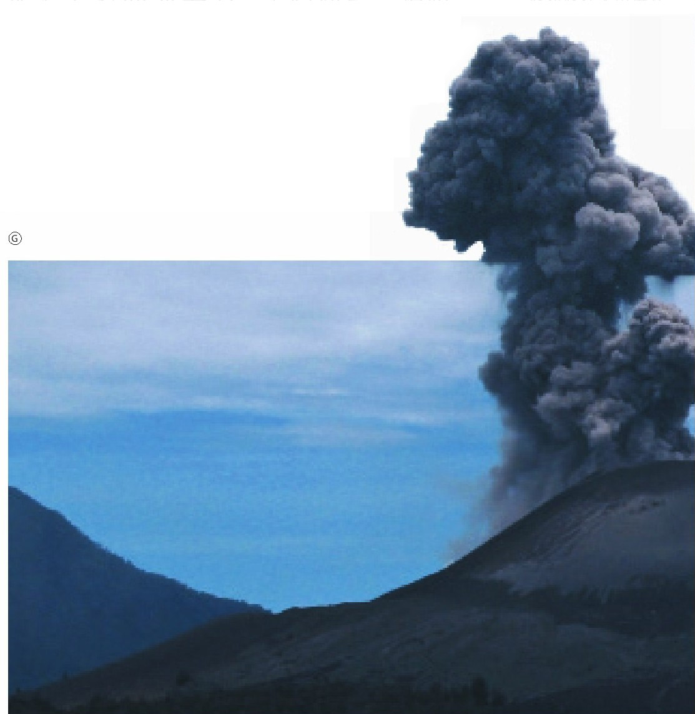
喀拉喀托火山爆发

  

**【微博士】**1883年喀拉喀托火山爆发

喀拉喀托火山爆发是环太平洋火环中惊人的一幕！该岛是爪哇和苏门答腊之间的许多火山岛之一。1883年8月27日，岛上3座火山同时爆发，熔岩和蒸汽冲天而起，灼热的火山灰和浮石如倾盆大雨而下。火山灰上升到空中，方圆百余千米范围内一片漆黑。次日火山在连续喷发19小时后突然沉寂，但疲惫的人们只喘息了2分钟，震耳欲聋的巨响紧接着响起，喀拉喀托岛的2/3被炸成碎片，巨大、通红的岩石射向空中，岛上2座火山锥顷刻间塌陷，形成一个300米深的破火山口，海水涌入火山口中立刻变成蒸汽，产生威力无比的大爆炸。最可怕的是海水移位形成40多米高的海啸巨浪，席卷了海峡两岸的城市村庄，造成36 417人丧生。

喀拉喀托火山爆炸的声音是人类有史以来听到的最响的声音，连澳大利亚西部的居民都在睡梦中被惊醒。海啸巨浪绕过好望角，涌入大西洋，使远在1.85万千米外的英吉利海峡的潮水上升了好几厘米！极细的火山灰飘到全球，使落日姹紫嫣红，这幅奇观，构成了挪威画家蒙克的经典名画《呐喊》的背景。

【微问题】　陆地上的岩石年龄可高达几十亿年，为什么海底岩石最老的不超过1.8亿年？

【关键词】　海底火山　平顶山　板块构造理论

## 为什么太平洋周围地震最多

地震就像潜伏在地球内部的一个“恶魔”，偶尔它会翻个身，以天崩地裂的形式提醒着人类它的存在。这一恶魔好像更喜欢以太平洋作为栖身之所，历史上的地震，无论是数量还是强度，都以太平洋沿岸国家居多。日本、智利、新西兰、美国的西海岸和阿拉斯加，以及中国台湾都是遭遇地震频繁袭击的国家和地区。人们不禁要问，为什么地震如此偏爱太平洋周围呢？

要回答这个问题先要了解地震发生的原因。我们知道，地球内部温度很高，因此在一定程度上，可以看成是一盆底部被缓慢加热的水，而浅层地表就像是覆盖在这盆热水之上的多块木板。底部受热会使盆里的水发生对流，导致水面上的木板变得不稳定，相互间发生碰撞和错动。地震的发生与此类似，是地球表层在内部发生缓慢对流的影响下，产生相互运动和碰撞的结果。在地质上，这些木板被称为“板块”。它们其实是厚度约为100千米的岩石层。因此不难推断，最容易发生地震的区域应该是两块木板接触的位置，也就是所谓的“板块边界”。

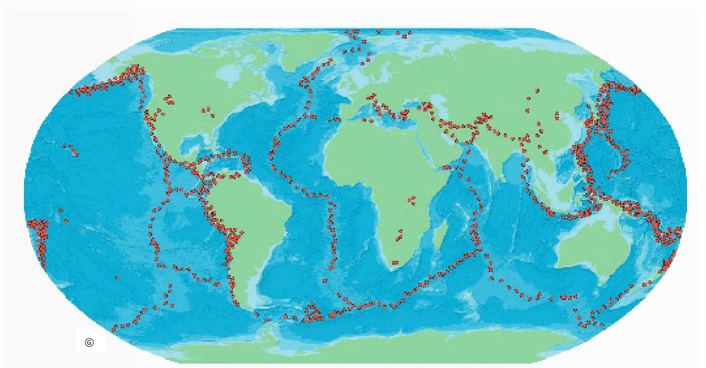
全球地震带分布

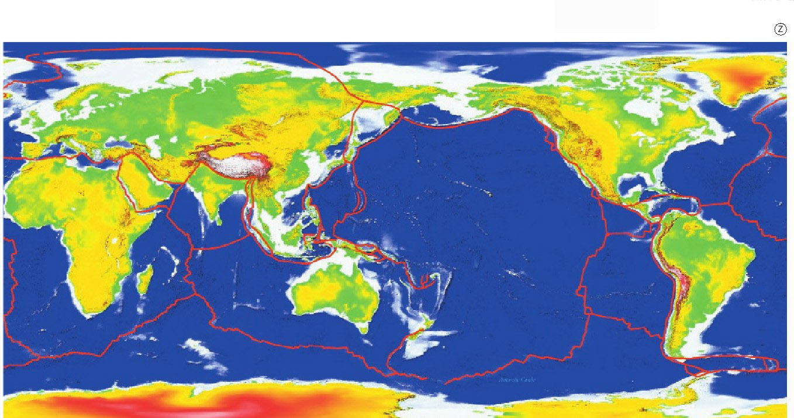
板块边界是地球上最活跃的地带，具有强烈的火山、地震

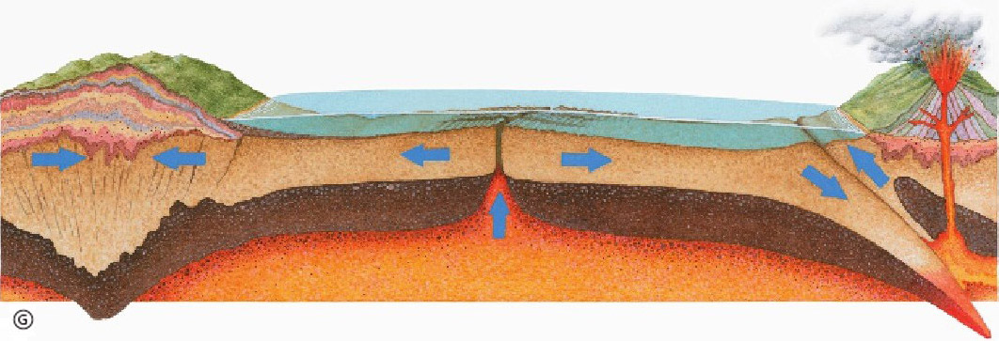
板块的运动

当然，地球上的板块与浮在热水表面的木板还是有很大不同的，最大的区别是，盆内水的对流只会造成木板发生碰撞，不会改变它们的形状和面积，而板块在大洋中的某些边界（大洋中脊）则会不断生长而变大。但是，地球是不会因此变大的，也就是说地球的表面积仍然不变。这就意味着板块另一部分会逐渐缩小。实现这一面积缩小的过程实际上是板块的一部分被拽入到另一个板块之下，并逐步进入地球内部。试想，将厚度达100千米的岩石层拽入地球内部，必然会发生很多的弯曲、挤压、拉伸、碰擦和破裂等，这些过程都会伴随着地震不断发生。太平洋周围不仅是板块边界，而且大部分都是这种叫作“俯冲带”的板块边界，在这些区域，巨大的太平洋板块被拖拽到相邻的板块之下。沿着进入地球内部的板块，从地表直至约700千米深处，大量的地震在此发生。这就是为什么许多地震发生在太平洋周围，形成所谓的环太平洋地震带。

除此以外，还有一个原因使得太平洋板块周边的地震更多，即太平洋板块在地球表面的运动速度较快。还是以上面的对流热水表面的木板为例，如果有一大块木板处在对流单元的中心，它就会以较快的速度在水面运动，也就更有可能与周围其他的木板发生碰擦。发生在美国加利福尼亚州的地震大部分就是太平洋板块与北美板块高速地相互错动引起的。（杨挺）

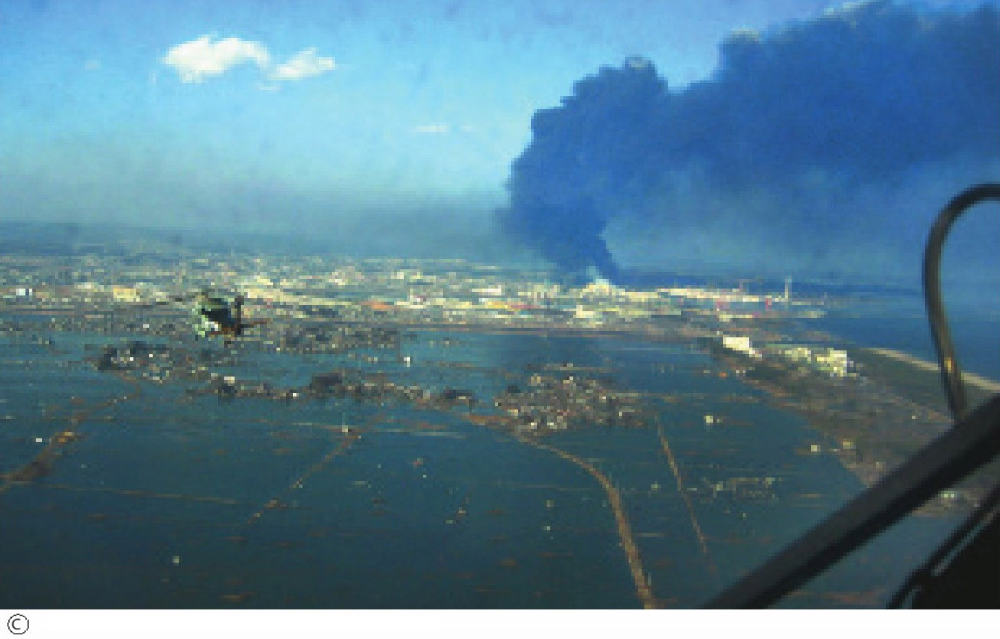
2011年3月发生在日本的地震和海啸的航拍图

## 为什么海啸能传到千里之外

发生在俯冲带的巨大地震常常会引发海啸。巨大海啸不但会对地震发生地附近的海岸造成重创，有时，它们还会远涉重洋，在几千甚至几万千米之外的大洋对岸兴风作浪。位于太平洋中心的夏威夷10年内就多次遭受来自各个方向的海啸袭击，1923年的关东大地震和1960年的智利大地震都分别给太平洋的对岸造成了很大破坏。1700年1月26日，日本曾遭受过一次被称为“孤儿”的海啸灾害。在当时及多年后，这次海啸都被认为是一次莫名其妙的袭击，因为当地并没有发生地震。300年之后，科学家根据地质沉积历史分析，才认识到这次海啸实际上源于北美西北部的卡斯卡迪亚俯冲带的一次巨大地震。

极强的台风所造成的风暴潮有时也会引发巨大海浪，但是，这种巨浪所造成的影响离开了台风中心会迅速减小，不会传播到很远的距离之外，为什么海啸在距离源区数千千米之外还有排山倒海之势呢？

相比于风暴潮或者海洋中由于风力所引起的涌波等，海啸波是一种极其特殊的波动现象。在深海中传播时，海啸在垂直方向的运动幅度比水平方向要小很多。也就是说，海水的运动方式是在做着近乎前后的运动；同时，水体的波动幅度也不像风暴潮那样随着深度的增加而迅速降低，从海面到海底的几千米范围内，海啸中海水的运动幅度几乎是一致的。海啸所产生的浪高取决于海水深度。在深海中，海啸的行进是无声无息的，没有惊涛骇浪，经过的船只甚至都感觉不到，只有到了邻近海岸线的浅水区，海啸才显现出它的威力。

然而，海啸之所以能够远涉重洋的最重要的一个原因，是海啸波的波长特别长，可以达到100千米以上。波在传播过程中的能量衰减速度与其波长成反比，波长越长，传播一定距离所消耗的能量就越小。所以，与波长较小的风暴潮等深水波不同，海啸这样的浅水波，随着传播距离的增加，水体波动的幅度变化很小，所以能够保持其能量传播到更远的范围，在几千千米之外还能够兴风作浪。（杨挺）

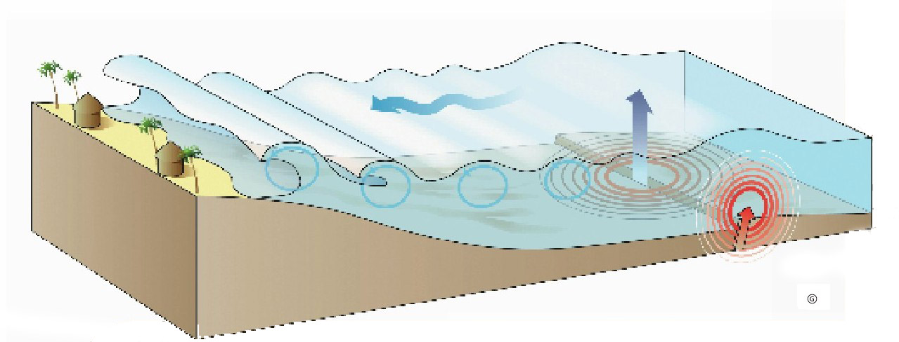
2011年3月日本东海岸发生里氏9级大地震并引发了海啸

  

**【微博士】**俯冲带的火山活动

除了地震以外，俯冲带还有另一个重要的地质活动——火山喷发。一般来说，俯冲带是温度相对较低的区域，而且，板块在向地球内部俯冲时，压强逐渐增大，岩石的熔点进一步升高，那为什么在俯冲带还会形成火山呢？这是因为板块进入俯冲带后，在高压下会释放出所携带的大量水，水进入上覆地幔岩石中，使其熔点大大降低，导致岩石熔化并喷发形成火山。

【微问题】　为什么大西洋沿岸很少有地震发生？

【关键词】　大洋中脊　俯冲带　地震　火山活动　海啸

## 为什么要到海底监测地震

从遥远的古代到发达的现代社会，地震一直给人类社会带来深重的灾难：倒塌的房屋和建筑，掩埋在废墟中的人们，以及幸存者失去亲人的痛苦……为了减少地震带来的灾害，世界各国目前在全球陆地和海底设置了大量的地震仪，这些地震仪不仅能监测到陆地上的地震，还能监测到发生在海底的地震。可是，为什么要到海底监测地震呢？

原来，发生在海底的大地震，带给人类的灾害不亚于陆地上的地震，它会引发灾难性的海啸。例如，2004年12月26日发生在苏门答腊的9级海底强震和由其引发的巨大海啸，造成了25万人丧生的惨剧！

减轻海底地震和海啸所造成的损失，就是我们去海底监测地震的主要目的之一。

海底地震仪在中国南海从投放到入水

在海底放置的地震仪能够更早地监测到海底地震产生的地震波，通过对地震数据进行实时处理，就可以估算海底地震发生的地点和强度。如果认为海底地震可能会造成危害，便可利用比地震波传播速度快得多的电磁波将地震信息发布给附近城市的居民，让人们在破坏性的地震波到达前有几秒到几十秒的时间做准备。同时，由于海啸传播的速度远远低于地震波的传播速度，因此可以根据海底地震的强度和地点来估算海啸到达沿岸各地区的时间和海浪的高度，让人们及时做好应对准备。

实际上，去海底监测地震的意义并不止于此。由于早期的地震监测主要在陆地上进行，使得我们对海底地下结构的了解远不如陆地，在海底设置地震仪填补了监测空白。此外，在海底还可以监测到在陆地上监测不到的海底小地震、零星震颤和缓慢发生的海底位移，帮助我们了解海底热液和冷泉的形成，海底的岩浆活动，以及对海底大地震的危险性进行评估。

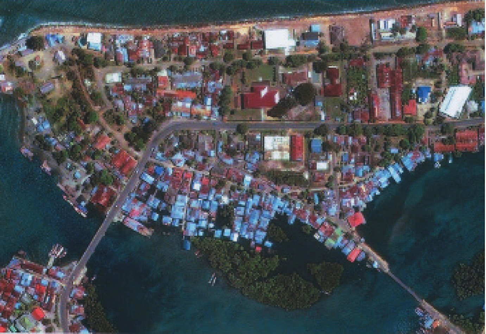

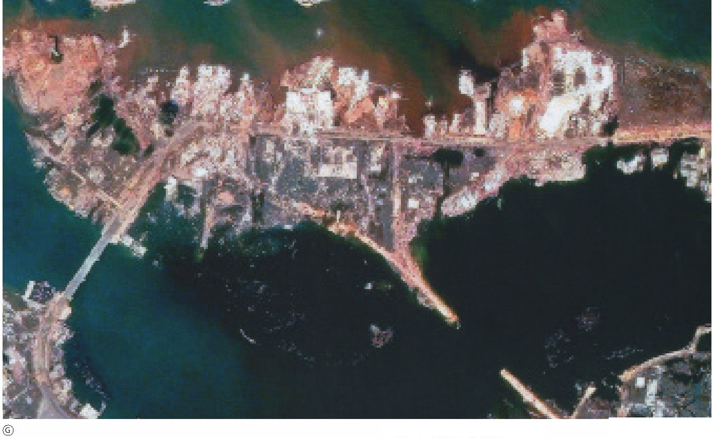
苏门答腊海啸前后

虽然到海底监测地震用处很大，但难度也很大。不仅要求地震仪在深水里也能正常工作，而且在海底布设和回收地震仪比在陆地上更困难，费用也更昂贵。如果海底地震仪不能回收，就无法获得储存在里面的珍贵的地震数据。近年来，随着海洋科技的发展和各国经济实力的增强，不少国家如中国、美国、日本等都实现了到海底去监测地震的梦想。（薛梅）

## 用什么办法能预警海啸

2011年3月，发生在日本东北部海域的9级地震引发了巨大的海啸，造成8133人死亡，12 272人失踪！而这只是海啸造成的众多灾难中的一例。海啸灾害贯穿着人类的历史。

灾难性的海啸总是与海底大地震相伴而生，但并非所有海底地震都会引发海啸，只有当地震造成海底抬升或下沉时才会引发海啸。由于海底垂向运动会引起整个水体的波动，因而其威力比局限于海面的风暴潮要大得多。在开阔的海域和深水地区，海啸掀起的海浪不高，驶过的船只甚至都感觉不到。但当海啸靠近海岸时，由于海底迅速变浅，海浪被阻挡并堆积为水墙，就可以掀起滔天巨浪，席卷并吞噬海边的一切：船只、沙滩、村庄、城市等。由于海底地震产生的地震波的传播速度要远远快于海啸的传播速度，因而可以利用地震仪接收到的地震波来确定海底地震发生的地点和震级，进而预测海啸到达沿岸各地区的时间和大小，根据浪高决定是否发布海啸预警。

最早的海啸预警中心是美国在夏威夷建立的，这也是太平洋海啸预警中心的雏形。建立该中心的触发因素是1946年发生在夏威夷群岛的海啸灾难，造成了165人死亡。到现在已经有26个国家加入了太平洋海啸预警中心，其中包括中国。自20世纪90年代后期，中国开始发展自己的海啸预警系统，目前初步具备了海啸预警的能力。

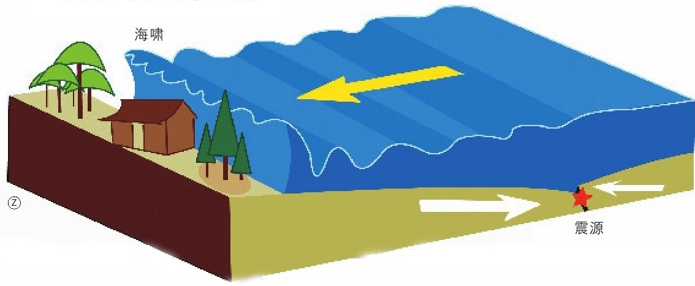
海底地震激发海啸的示意图

虽然海啸预警有效减小了海啸灾害，但是可不要认为这个系统是完美的，它也可能存在误报。无论是低估还是高估海啸，都可能造成巨大的损失。2011年3月发生在日本的9级强震，就是因为一开始低估了海底地震的震级，由此低估了海啸的大小，致使很多人以为沿岸修建的防波堤就可以保护他们，结果造成了大量人员伤亡。同样是在日本，2007年，8.2级强震突袭千岛，因为高估了海啸，政府向8.5万人发布了海啸警报和撤离通知，但灾难性海啸并未发生，而人员撤离则造成了巨大的经济损失。

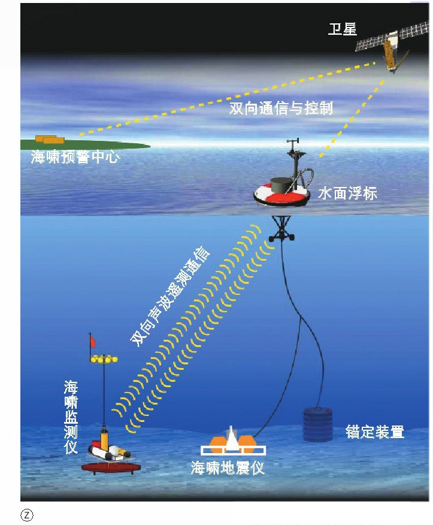
深海海啸监测系统

实际上，要做好海啸预警并不容易。不仅需要从科学层面提高海底地震和海啸预警的准确率，还要在技术层面迅速有效地实现预警。此外，在海底设置地震仪，增加对海面的实时监测点以便能及时对海啸的浪高进行修正，在容易发生海啸的地方建立防波堤并种植被称为海啸天然屏障的红树林，设置合理的避难场所，等等，都可以有效地降低海啸灾害。最后但也非常重要的一环是对民众的科普教育必须到位，比如怎样判断海啸来了，收到海啸预警时应该怎么应对等。（薛梅）

  

**【微博士】**中国会发生海啸吗

虽然中国大陆的海岸线长达1.8万千米，但是在太平洋、菲律宾海和印度洋发生的海啸对中国大陆沿岸地区的影响不大，因为大部分海啸的能量被中国东海和南海外围一系列群岛和岛礁阻挡了。即使在琉球群岛海沟发生的海底地震引发的海啸，由于东海的水深较浅、海底平坦，导致海啸衰减很大，也不太容易在中国东海沿岸引发灾难性海啸。但由于中国台湾距离琉球群岛海沟较近，附近水深较深，因而容易发生海啸灾害。另外，南海由于水深较深，如果在南海发生海底强震，还是有可能在海南、台湾和南海沿岸地区造成海啸灾害。从历史上看，汉朝就有过海啸的记录。因此，中国沿海应对海啸还是不可掉以轻心。

【微问题】　海底为什么会发生地震呢？

【关键词】　海底地震　地震仪　海啸　海啸预警

## 为什么海底会有“雪线”

深海海底是一个幽暗寂静的世界，没有阳光照射，没有冰川雪山。可奇怪的是，这里却有条泾渭分明的“雪线”。它将高低起伏的海底分成了两个不同色彩的世界。“雪线”以上呈灰色或灰白色，“雪线”以下则变成了红色或褐色。

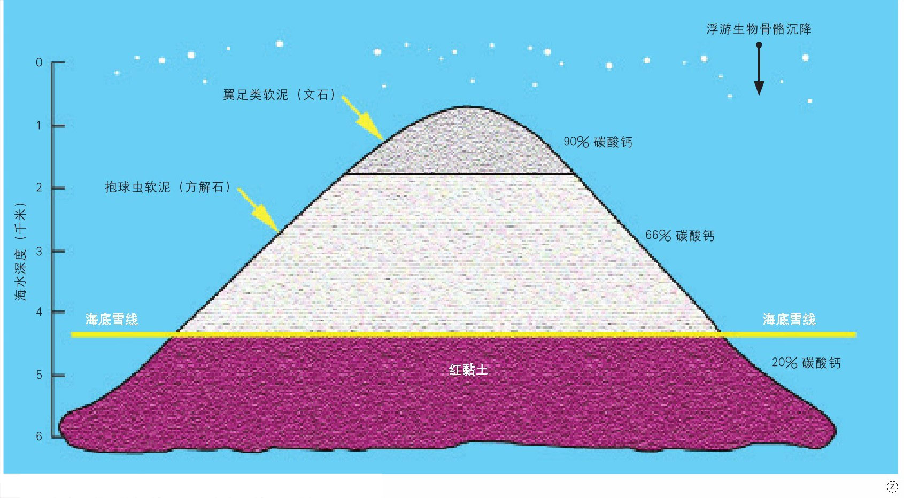
深海碳酸盐补偿线——“海底雪线”示意图

为什么海底会有“雪线”？“雪线”上下为什么会呈现出不一样的颜色呢？原来，不同的颜色其实反映了海底软泥性质上的差异。在深海海底分布着两种软泥：一种是颜色较浅，呈灰色或灰白色的生物软泥；另一种是颜色较深，呈红色或褐色的黏土软泥。颜色较浅的生物软泥含有丰富的钙质和硅质生物骨骼，来源于上部海水中沉降的浮游生物的遗骸。这些浮游生物死亡后，其白色的生物骨骼，如同天空中的雪花飘落在海底，最后堆积在海底岩石上，形成了海底世界的“雪山”。而黏土软泥的主要成分是风和江河从陆地上搬运到海洋中并沉淀下来的各种黏土和细粒矿物，以及海底火山的喷发物，其中生物骨骼很少，碳酸钙的含量非常低。这些黏土软泥由于富含红色氧化物而呈现出红色或褐色等色彩。这两类软泥是大洋海底的主要沉积物。可以这样说，海洋的岩石基底上一半被灰色的生物软泥所覆盖，另一半被红色的黏土软泥所覆盖。

那么，深海海底为什么会形成这两种性质截然不同的软泥呢？原来，这与海水对碳酸钙的溶解现象有关。在深海，随着海水深度的增加，水压加大，温度降低，水体中的二氧化碳含量就会升高，碳酸钙溶解度也相应增大。至某一临界深度时，碳酸钙溶解量与碳酸钙补给量相抵平衡，软泥中的碳酸盐物质会全部溶解于海水中。这个临界深度叫作碳酸钙补偿深度（CCD）。科学家把大洋洋底这一深度的连线称为碳酸盐补偿线，简称碳酸盐线，也就是“海底雪线”。

因此，浅于碳酸盐线的海底部分，主要由钙质生物软泥所覆盖，表现出灰色或灰白色；深于碳酸盐线的海底部分（如深海盆地），由于绝大多数碳酸钙被海水溶解了，留下非碳酸盐的黏土和硅质软泥，从而表现出红色或褐色。碳酸盐线就如同一条出现在海底的“雪线”，造就了较浅的海底泥巴为灰色，而更深处的海底泥巴却是红色的独特现象。（李季伟）

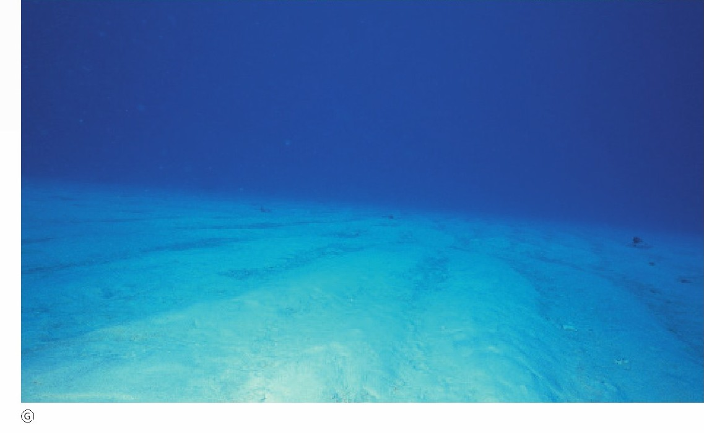
## 为什么“海底雪线”也会升降

高山上的雪线会随着一年四季变化，夏季天气炎热，雪线比较高；冬季酷寒，雪线相应下降。海底雪线在不同的时间、地区，受到海水性质、“降雪量”（生物产量）等各种因素影响，也会出现升降的变化。

“海底雪线”是海洋中重要的沉积界面，只有在界面以上的那部分海底，钙质浮游生物的碳酸盐骨骼才有机会被保留下来，形成奇特的“海底雪山”。然而，即使在“雪线”之上，海底沉积物中碳酸盐的含量在时间和空间上也有着令人惊异的变化！

随着大洋钻探计划的成功实施和大洋科考技术的发展，科学家获取了大量海底沉积物的第一手资料。他们发现，海底沉积物中的碳酸盐含量不仅在同一时期的不同海域有着差异，而且在同一海域不同时期也展现出周期性的变化规律。这种沉积物碳酸盐含量在地质时期的周期性变化被科学家称为“碳酸盐旋回”，并表现为太平洋型溶解旋回和大西洋型稀释旋回两种类型。太平洋型溶解旋回的特点是冰期碳酸盐含量高，间冰期含量低；而大西洋型稀释旋回的特点表现为冰期碳酸盐含量低，间冰期含量高。

那么，海底沉积物中碳酸盐含量的这些变化是由什么原因引发的呢？科学家经过大量调查后发现，这些变化是由碳酸盐的生产力、海水对碳酸盐的溶解作用和陆源物质的输入三大因素所造成的。其中，碳酸盐生产力是由表层海水中能够分泌碳酸盐的钙质生物量所决定的，这些碳酸盐生物量越丰富，能够提供给沉积物的碳酸盐自然越高。其次，海水对碳酸盐的溶解作用是另外一个重要因素。海水深度不同，对碳酸盐的溶解程度不一样，海水越深，溶解能力越强，所以不同深度海底的沉积物中能被保存下来的碳酸盐含量也就不一样。再次，以陆源碎屑物为主的非碳酸盐沉积物的“稀释作用”也起到了重要作用。在一些时期，由于陆地风化作用的加强，大量陆地上的风化产物被河流和风带入到陆坡和深海区，这些非碳酸盐物质的加入使得沉积物中碳酸盐的相对比例降低。

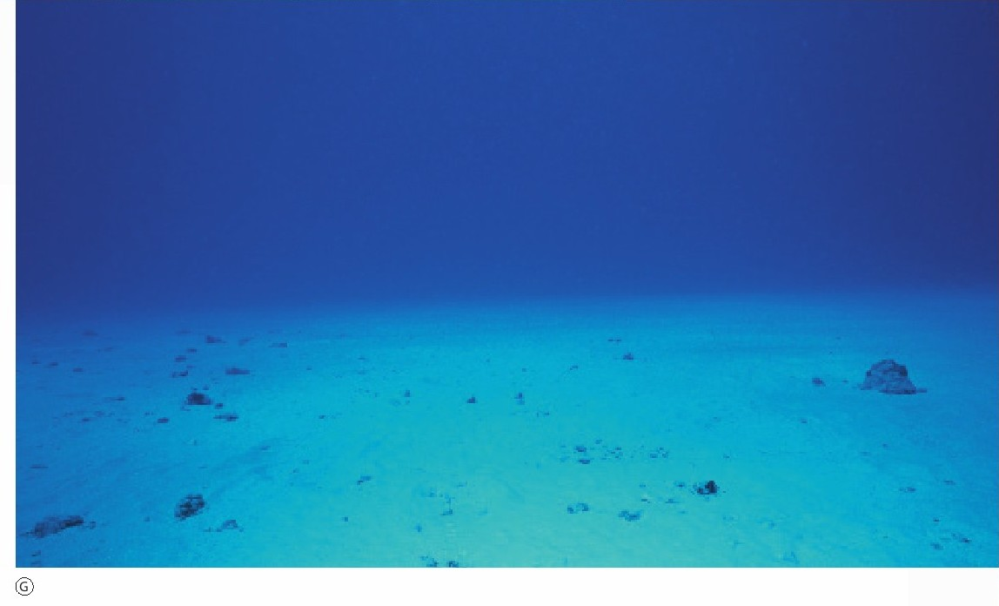
总而言之，由于气候、环境和地理条件等因素的差异，导致不同时期或不同区域的碳酸盐生产力、溶解作用以及稀释作用的强度也就不同。这种变化造成了“海底雪线”的升降：碳酸盐溶解，使“雪线”上升；碳酸盐堆积，使“雪线”下降。因此，海底沉积物中碳酸盐含量不仅在空间上有着显著差异，更在地质时期里呈现出周期性的旋回变化，“海底雪线”也就随着来回升降。（李季伟）

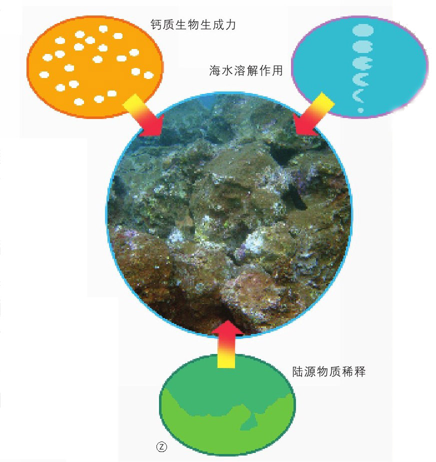
影响洋底沉积物中碳酸盐含量的三大因素

  

**【微博士】**“海底雪线”的深度

在现代海洋中，碳酸盐补偿线的深度主要受到生物生产力、钙质壳溶解速率的控制。它的深度大体随等深线发生上下变动，变化幅度在2000米左右。其中，以大西洋最深，平均为5300米，太平洋最浅，平均只有4400米，印度洋则为5000米左右。

【微问题】　在中国东海海底能寻找到“海底雪线”吗？

【关键词】　海底雪线　生物软泥　碳酸盐补偿线　碳酸盐旋回

## “海底泥巴”里全是泥吗

迄今为止，海洋的年龄已经超过40亿年了。在这漫长的地质年代里，由陆地的河流和大气搬运至海洋的物质，以及海水中自身的物质沉入海底，日积月累，已经多得无法计算了。科学家把所有这些东西统称为海底沉积物，俗称“海底泥巴”。海底沉积物虽然在全球海洋范围内的分布十分广泛，但其厚度却非常不均匀：在靠近大陆的边缘，其厚度接近2万米；而在海底裂开、扩张的大洋中脊两侧，由于形成时间较短，则几乎没有沉积物的覆盖。

尽管人们习惯于将海底沉积物都称为“海底泥巴”，但实际上它们并不全是“泥”。靠近大陆，尤其在河口外面多数是河流带来的泥沙；离岸远的地方，沙就没了，主要是细颗粒的物质。来源复杂、类型多样且成分差别巨大的海洋沉积物，既包括我们称之为“海底泥巴”的各种尚未固结的生物软泥和火山喷发物，还包含化学组成与“海底泥巴”截然不同的各种生物的遗骸和碎片、宇宙尘埃，以及海洋水体环境中各种化学反应生成的富含金属的物质。很多海区的“泥巴”由于成分特殊，还被赋予了特定的名称。

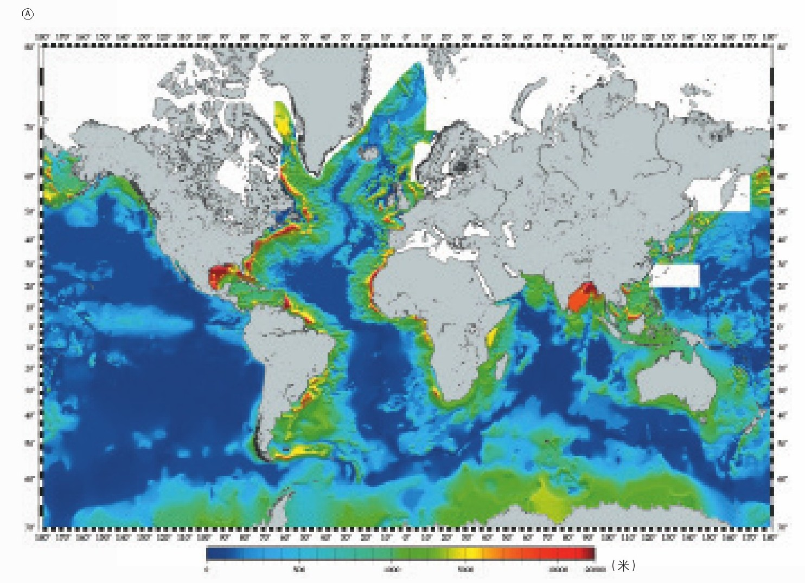
全球海洋海底沉积物厚度分布示意图（红颜色表示厚，蓝颜色表示薄）

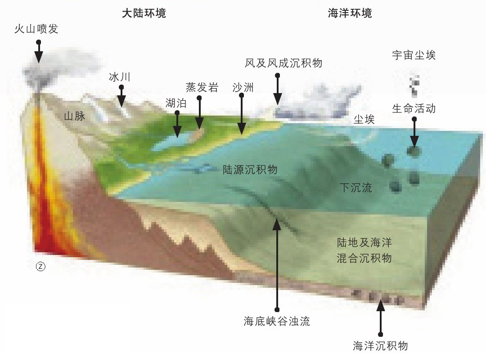
海洋沉积物的来源

生物软泥中除了“泥”之外，还含有大量在海水上层生活的浮游生物死亡以后的壳体。依据其化学成分的不同划分为钙质和硅质软泥两种类型。前者主要是由有孔虫、颗石藻和翼足类等的钙质壳体组成；而后者则主要是由硅质壳体形成，其中主要由硅藻壳体构成的叫硅藻软泥，主要由放射虫壳体组成的叫放射虫软泥。

富含铁、锰、铜、铅、锌、镍、钴、金、银等金属元素的海洋沉积物在海洋洋底也分布广泛，人们将其称为多金属沉积物，俗称多金属软泥。多金属软泥的形成与海底热液成矿作用密切相关，海水在沿着海底的裂缝向地壳深部渗透的过程中，被地壳深处的热源（岩浆）加热后，溶解了周围岩石的多种金属化合物，变成含矿溶液，再从洋底喷出，遇冷海水而凝结生成沉淀物。其主要矿物成分包括黄铁矿、黄铜矿、闪锌矿等硫化物类以及钠水锰矿、钙锰矿、针铁矿、赤铁矿等铁锰氧化物和氢氧化物。多金属软泥最初发现于红海，后来在东太平洋洋隆、大西洋中脊、印度洋中脊都有发现，分布的水深一般为800～2400米。

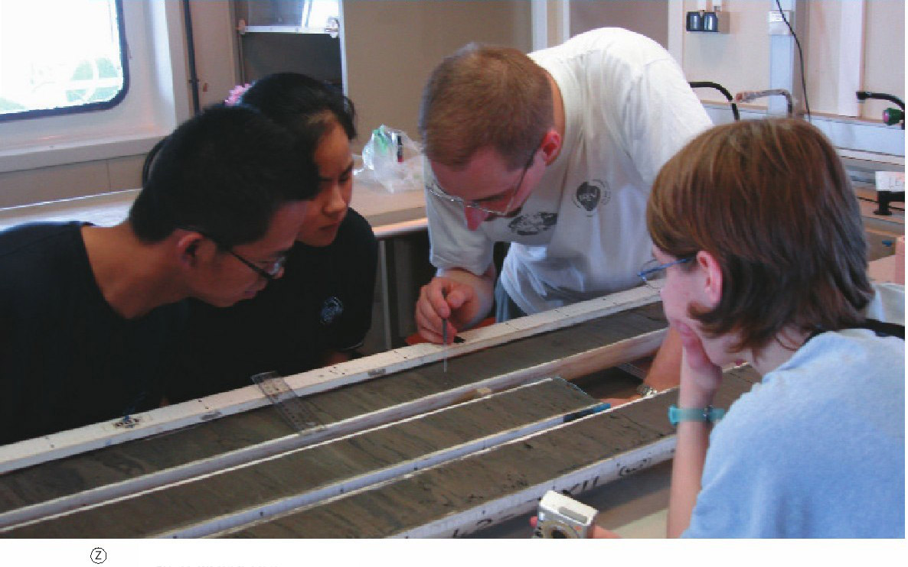
研究深海岩芯

迄今为止，红海的多金属软泥是世界上已发现的最有经济价值的热液沉积矿床，其分布面积达85万平方千米，其中锌和铜含量高达11.4%和2.22%。局部区域顶部10米厚的软泥中就含锌290万吨、铜160万吨、铅80万吨、银4.5万吨、金45吨，价值惊人！（李江涛）

## 海底也有“泥石流”吗

“山体滑坡”和“泥石流”是陆地上比较常见的地质灾害，常常会冲毁交通设施、掩埋建筑，给人类生命财产造成重大危害。同样，在海底也存在着“海底滑坡”与“泥石流”的现象，它们也是危害巨大的海洋地质灾害。

在海底，特别是斜坡地形上，那些尚未固结的松软沉积物或破裂的岩石，在重力或其他外力作用下沿斜坡中的滑脱面发生滑动而形成海底滑坡。与陆地上的滑坡相比，由于海水的浮力和海水在滑脱面上的润滑作用，大大减小了滑脱面上的摩擦力，使得海底滑坡更容易发生，甚至在坡度很小（0.1°）的海底也可能发生。通常情况下，海底滑坡一旦发生，其规模要比陆地滑坡大得多。曾经在靠近肯尼亚的海底发生的一次海底滑坡，把约1.8万平方千米的沉积物搬运到别处，滑坡体滑动的距离达800千米，扫过面积超过30万平方千米。另外，台风、风暴潮和地震等也是诱发海底滑坡的重要因素。海底滑坡还会诱发海啸，进而造成灾难性的后果。例如，1998年南太平洋岛国巴布亚新几内亚由海底滑坡导致的海啸，掀起了15米高的巨浪，席卷了20千米范围内的海岸地区，造成2200多人死亡。

海底堆积的松散沉积物在暴风浪、地震以及海底滑坡等因素的诱发下发生崩塌，能够迅速与海水混合形成泥沙混杂的海底“泥石流”，科学家将其称为海底浊流。浊流是一种载有大量悬浮固体颗粒而又十分浑浊的高密度水流，其悬浮物质包括沙、粉沙和泥，有时还携带砾石。由于浊流的密度很大，在重力驱动下成束状或面状顺坡向下流动，流速可以超过20米/秒，在平缓地带会堆积成扇形的“浊积扇”。浊流多发生于大陆边缘地区，是将陆源物质由浅海输送到深海的重要机制。由于它具有很高的密度，因此能以极快的流速和动能沿着大陆坡下滑，其巨大的能量对海底具有极强的侵蚀和破坏作用，可拉断海底的光缆，切割陆坡形成陡峭的峡谷，并形成特有的冲刷痕、沟痕和槽痕等。

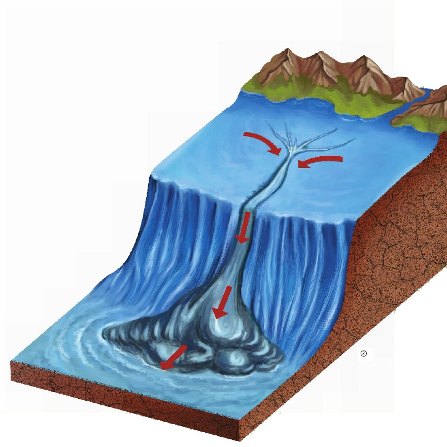
海底滑坡与海底浊流形成示意图

海底滑坡和浊流属于危害较大的海洋地质灾害，会对海下工程及钻井平台、海底铺设的输油管道和海底电缆等造成损害。因此，应当对海底滑坡的危害及预防引起足够的重视。（李江涛）

  

**【微博士】**海洋沉积物中来自宇宙的物质

地球作为太阳系中的一颗行星，每年都要接受约几千吨来自外太空的陨石和宇宙尘埃，每天约有上千万颗尘埃进入大气层，其中有2/3落入海洋。海洋沉积物中的宇宙物质主要分为三类，包括玻璃质球粒陨石，富铁、镍陨石，以及一些硅酸盐球粒矿物。

【微问题】　你还知道哪些海洋地质灾害？

【关键词】　海底沉积物　海底滑坡　海底浊流

## 科学家为什么要到深海海底打钻井

石油公司在海底打钻，为的是寻找和开发石油、天然气，而在一些没有油气资源的海底，40多年来人类也打了近2000个深海钻井，这是为什么呢？原来这是科学家为了探索深海而进行的科学研究，又叫国际大洋钻探计划。

1968年，美国“格罗玛·挑战者号”钻探船驶向墨西哥湾，揭开了国际大洋钻探计划的序幕。这是第一艘能够在水深超过6000米的深海进行钻探的船只，钻探用的钻杆是用12.5厘米口径的无缝钢管连接起来的。这艘121米长的万吨轮，最显眼的是它高出海面61米的钻塔，钻塔下面是船中央的钻井口，可直通几千米深的海底，钻取一筒又一筒的岩芯。

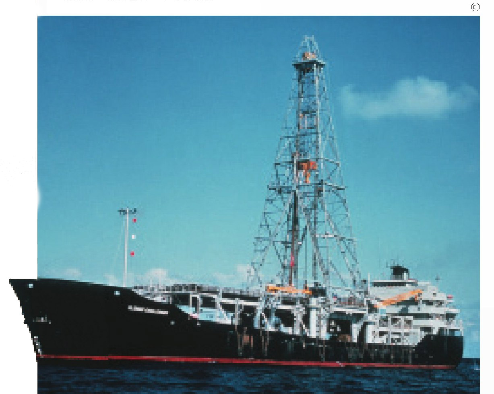
“格罗玛·挑战者号”大洋钻探船

人类“入地”的能力，远不如“上天”，如果还要在海底“入地”，更是难上加难。深海底下偏偏又是人类了解最少的地方，因而是大量科学发现的源头，于是就有了国际大洋钻探计划。比如说在1968-1969两年里，“格罗玛·挑战者号”在大西洋和太平洋打钻，取得大洋地壳的玄武岩标本，测定其年龄后发现离大洋中脊越远的地壳年龄越老，这就证明了海底扩张、板块运动的假说。而新学科“古海洋学”的诞生也和大洋钻探密不可分，这是因为海底一层层的深海沉积，就是千百万年来大洋海水变化的历史档案。通过对大洋钻探取得的岩芯进行分析，就可以知道气候变化、生物演替的详细历史。1968年以来的40多年里，国际大洋钻探计划在全球各大洋打了将近2000个钻井，取得的科学成果带来了地球科学的一场革命，是世界上历时最长、规模最大的国际科学合作项目之一。

现在，大洋钻探计划有将近30个国家参加，每年预算近2亿美元，以美国“决心号”和日本“地球号”两艘钻探船为主。2013年秋，大洋钻探将进入称为“国际大洋发现计划”的第四个阶段，计划用10年时间探索更新的领域，包括深部生物圈、板块俯冲带和海底灾害等。中国从1998年参加国际大洋钻探计划以来，研究队伍逐渐扩大。1999年在中国科学家自己的建议、设计和主持下，首次实现了南海的大洋钻探，2014年又将在南海进行第二次大洋钻探。

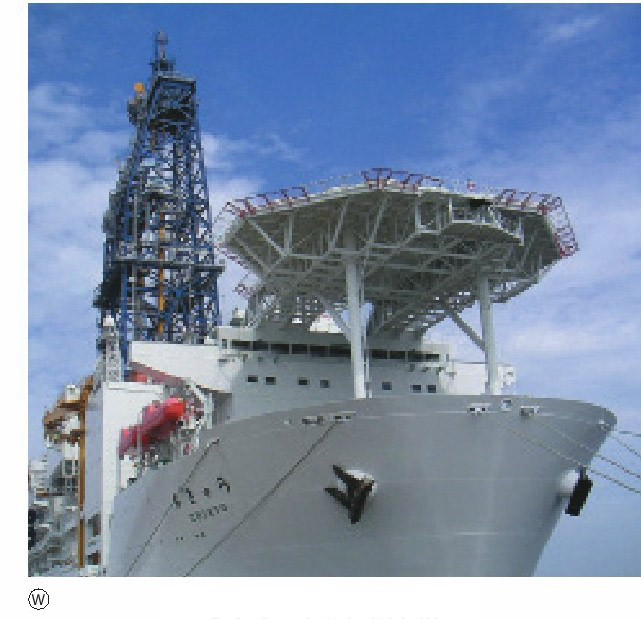
“地球号”大洋钻探船

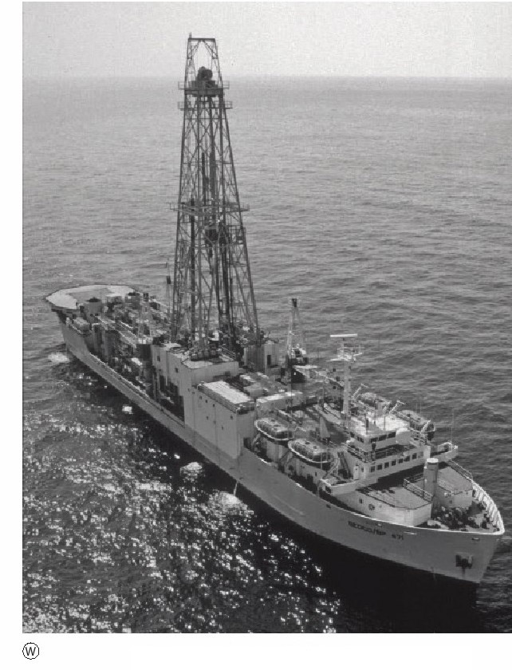
“决心号”大洋钻探船

深海是地球表面离地球内部最近的地方，地球的许多奥秘要靠在那里的钻探才能解决。如果说，地壳下面的地幔我们并不陌生，那么地幔的内部究竟是什么样的，现在还没有人知道，这个谜要到海底去钻穿地壳才能揭晓。“打穿地壳”这场60多年来的科学梦，将要在21世纪里变成现实。中国的科学界也在发力，期待着在深海探秘中做出自己的贡献。（汪品先）

## 为什么说地中海曾经干涸过

欧洲和非洲之间的地中海，是世界最大的陆间海，东西长4000千米，南北宽1800千米，水深平均1450米，最深超过5000米。这么大一个海，说它在600万年前曾经干涸过，是不是科学幻想？不，这是真的科学发现。

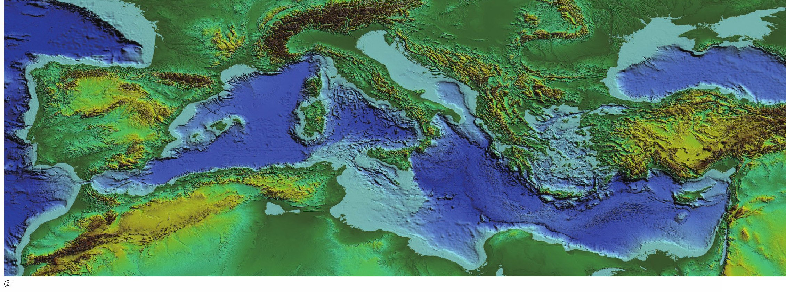
地中海

1971年和1975年，“格罗玛·挑战者号”钻探船两次进入地中海，从三四千米的深海海底取出的岩芯里，竟然发现有石膏和岩盐，地层的年龄是在距今600万年前。这些矿物都是海水或者盐湖里的卤水，经过强烈蒸发才能形成，怎么会出现在深海海底呢？这是由于地中海的相对封闭性造成的。地中海尽管深大，和大洋的连接处却特别狭窄，和大西洋之间全靠直布罗陀海峡相连。这是个西班牙和摩洛哥之间90千米长的狭窄水道，最窄的地方只有13千米，平均水深300多米。地中海直到今天还是个蒸发量大于降水量的地方，所以海水的盐度非常高。600万年前的构造运动使直布罗陀海峡水道关闭，地中海和大西洋的通道被切断，导致地中海水位越来越低，最后变成了“晒盐场”，堆积起了石盐、石膏一类的蒸发岩。这两次大洋钻探由著名华人科学家许靖华主持，是20世纪70年代震动国际科学界的重大发现。

后来的研究，进一步证明了地中海与大西洋隔断后，海面急剧下降，海底干涸的事实。海底地层面上的干裂纹和风力搬运的斜交层理，以及海岸河流的深切河谷，都是当年“古海荒漠”的证据。比如尼罗河在开罗附近下切2500米，可见当时海面下降之深。距今533万年前，直布罗陀海峡重开，大西洋海水奔腾而来，估计有今天亚马孙河1000倍的流量，在两年不到的时间里将地中海重新淹没，突发了一场超越想象的洪水。（汪品先）

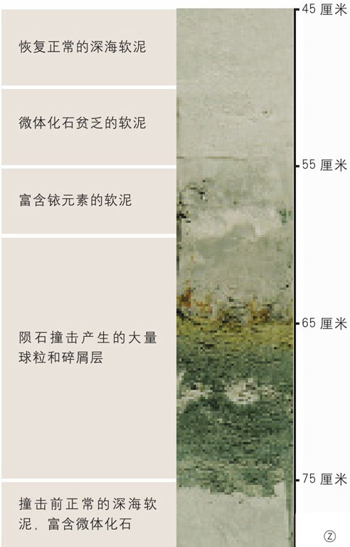
大洋钻探在大西洋取出的一段岩芯里，记录了6500万年前的小行星撞击事件

  

**【微博士】**恐龙灭绝事件的深海证据

有人提出，距今6500万年前的白垩纪末，一颗直径10千米的小行星撞击墨西哥尤卡坦半岛，形成了直径170千米的世界最大陨石坑，造成地球上的大量生物灭绝，称雄一时的恐龙也很可能因此绝迹。1997年，大洋钻探船在距离撞击坑1500千米的北大西洋打钻，从水深2600米的海底取得了这次撞击事件的证据：富含化石的正常软泥上，突然出现一个10多厘米厚的暗绿色层，其中含有大量硅质球粒和岩石碎屑，分别来自撞击的小行星和撞击坑，生动地记录了这场旷世悲剧的惨烈情景。

【微问题】　为什么大洋钻探至今还没能打穿地壳？

【关键词】　大洋钻探　“格罗玛·挑战者号”　钻探船　岩芯　地中海

# 海洋开发

## 海底地层中埋藏的石油是怎么找到的

埋在海底地层中的石油和天然气本身是很难探知的，和在陆地地层中一样，人们能够探测到的只是地下的“储油构造”。

石油的物质基础是有机淤泥——泥沙和生物尸体混在一起沉入海底的淤泥。当地壳持续缓慢沉降时，有机淤泥就会越堆越厚，深埋于地层中，并与空气隔绝。天长日久，地层深处的有机物质就会在高温、高压和缺氧的环境中，受厌氧细菌的作用转变成石油和天然气。

不过，这还只是一些分散的油滴。由于上覆地层的压力，分散的油滴会被挤到四周多孔隙的岩层中，然后，地下水浮托着油滴向着上拱岩层的顶部汇集。这上拱的岩层就像一个倒扣的大脸盆，把汇集的油气保存起来，水沉在最下面，油在当中，气浮在最上面，于是就形成了“储油构造”。勘探石油，其实就是探测储油构造。

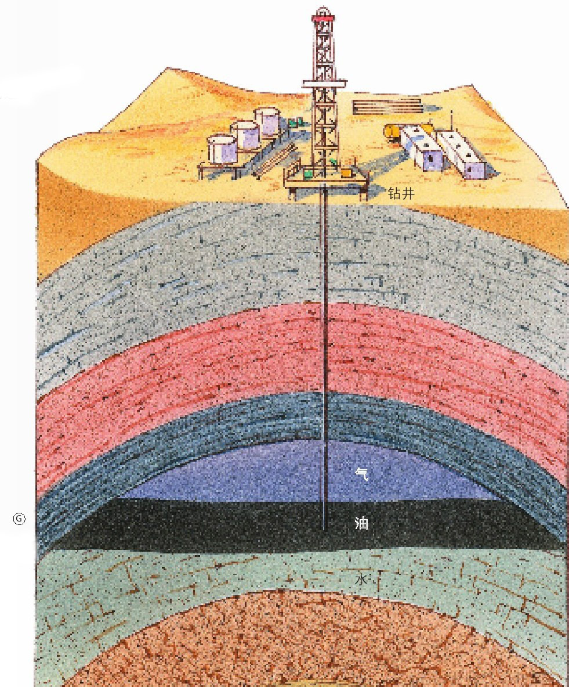
储油构造

储油构造所在的岩层，通常孔隙度大，渗透性好，这就提供了较大的储油空间，也使其中的油气易于流动。这种孔隙度大和渗透性好的岩层，与其周围的岩层的密度、磁性、弹性和电性是不同的，因而可利用其区别来判断是否有储油构造存在的条件。这就是寻找储油构造的地球物理勘探方法。

根据岩层密度差别的勘探方法叫重力勘探，根据岩石磁性差别的勘探方法叫磁法勘探，根据岩层弹性差别的勘探方法叫地震勘探，根据岩层电性差别的勘探方法叫电法勘探。

找出了海底储油构造，就要进行钻探。开始是初探，目的是对储油层的地层性质、构造类型、油气田的边界及钻井的条件作出初步评价。如果初探中钻出了油气，则立即进行试采，以便对储油气层的层数、生产能力作进一步评价。如果证实产量较高，有开采价值，就正式投产。（雷宗友）

## 海底石油是怎样开采出来的

海上油气开采比陆地上复杂得多，它需要特定的支撑设备。

人们最早使用钻井船来开采。把钻机搁在船上进行作业，船中央开一个洞，架上高高的钻塔。这种钻井船的最大缺点是受海况影响太大，风浪、潮汐、海流会使船不停地摇摆、移动，给作业带来很大困难。中国第一艘钻井船——“勘探一号”，就是用两艘货船拼装起来的。为了减少船的摇摆，需要用6只锚将其锚定。

后来，人们又发明了更好的办法——钻井平台。最早的钻井平台是“自升式平台”，即将几根钢柱插在海底，再用机械设备把平台升起来，离开海面，这样就可以防止海浪和海流的冲击，作业基本不受海况影响。这种平台的最大缺点是作业水深受到很大限制。因为桩腿的长度不能过长，否则平台就会不稳。

还有一种是“半潜式平台”，靠海面下20米左右深处的几个大浮箱支持。这是因为在海面下这个深度，风浪总是很小的，沉在那里的浮箱十分稳定，海面上的平台也不会有太大的摇摆。

随着海底采油技术的快速发展，人们现在甚至可以将原来安装在钻井平台上的井口直接放置到海底，去掉了复杂的海上平台设施，从而大大降低了海底石油的开采成本，并提高了海底石油开采的安全性。（雷宗友）

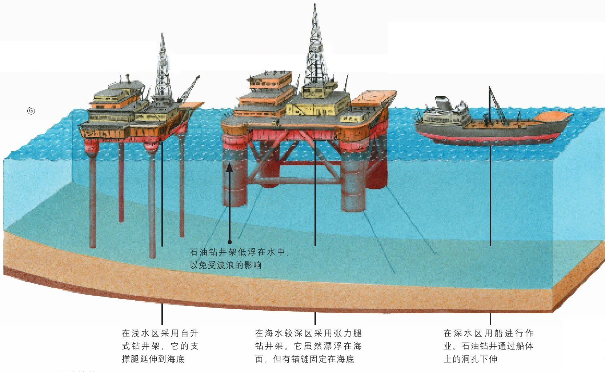
石油钻井图

## 为什么海上打井不抛锚，却能稳定井位

如果采用半潜式平台或者钻井船漂浮在海上钻井采油，底下是几百米甚至几千米的水深，怎么才能让它一动不动地固定在那里呢？也许你会说，抛几只大锚不就得了。可是这么深的水，要抛多长的锚链呀？锚链太长，又怎么才能把它拉直呢？锚链拉不直，一有风吹浪打，平台不是照样会移动吗？

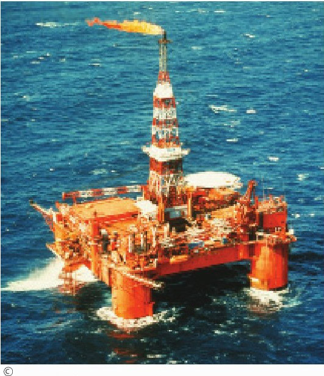
半潜式石油平台

科学家研制出了一种不用抛锚就能稳定井位的方法，那就是——动力定位！

动力定位就是在平台的前后左右安装一些推进器，这些推进器可以按照计算机的指令自动开启和关闭。在运行过程中，动力定位系统使用罗经数据控制船舶航向，使用差分全球定位系统或声呐的数据控制船舶位置。

如果没有大风大浪，平台的位置不会改变，那就可以安心打钻。要是大风把船吹向北面，离开了原先的位置，那么，计算机就会根据船位仪所测定的船位数值，自动地发出控制信号，命令推进器向南面推进，把平台推到原来的位置。一旦平台复位，命令就会停止，推进器也会停止工作。要是海流把平台推向东面，偏离了既定位置，这时计算机又会下达指令，命令推进器向西工作，让平台恢复原位。

有了这种智能的动力定位，不用抛锚，平台就能稳稳地停在预定的位置上。（雷宗友）

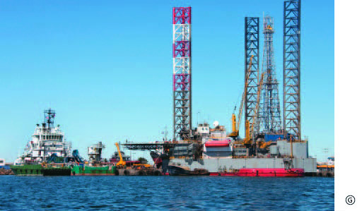
建设中的石油平台

  

**【微博士】**动力定位的精度

动力定位应用了差分全球定位系统、数字滤波技术，以及最优控制软件等先进技术，使其定位精度在几米之内，达到当今世界先进水平。该系统不仅应用于停船定位，而且还能应用于船与船间的航距固定。

**【微博士】**海洋石油981

2011年5月底，中国建造的、达到世界先进水平的第6代3000米深水半潜式钻井平台“海洋石油981”出航作业，于7月赴南海开始其深水钻探之旅，从而开启了中国深水石油天然气的勘探之路。该平台最大作业水深3050米。2012年5月9日，“海洋石油981”在南海首次开钻。这是中国石油公司首次独立进行深水油气勘探开发。

【微问题】　钻井装备是怎样抵御恶劣海况的？

【关键词】　海底石油　钻井平台　动力定位

## 为什么有人把巴西看作“金砖四国”之首

巴西（Brazil）、俄罗斯（Russia）、印度（India）和中国（China），这4个国家，如果把它们英文名称的第一个字母组合在一起就是“BRIC”，发音与英文单词“砖块”（brick）非常相似，于是人们形象地把这4个国家称作“金砖四国”。

金砖四国

然而，有人把巴西看作“金砖四国”之首，这是为什么呢？难道是因为它的实力最雄厚，还是仅仅因为巴西的英文名称Brazil的首字母也是“BRIC”的首字母吗？

其实说巴西是“金砖四国”之首，不是说它的实力最雄厚，也不是因为它的英文首字母是“B”，而是说它的海洋石油开发处在最前沿。

巴西虽然是发展中国家，却是海洋石油勘探开采技术领先的国家。早在1997年，巴西就创造了在1709米水深作业的世界纪录。到2003年，巴西的探井和开发井都达到了3000米水深以上。由于具有先进的深海勘探开发技术，巴西由原拉丁美洲最大的石油进口国转变成了重要的出口国。将来，其周围海域仍是一个非常重要的深海油气产区。

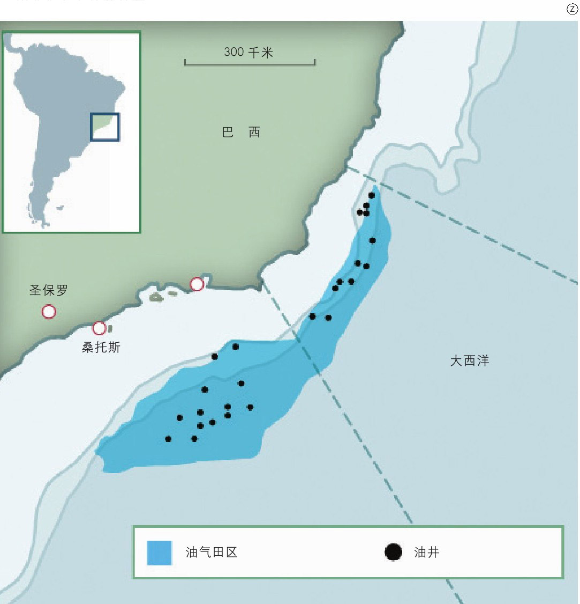
巴西近海石油井分布

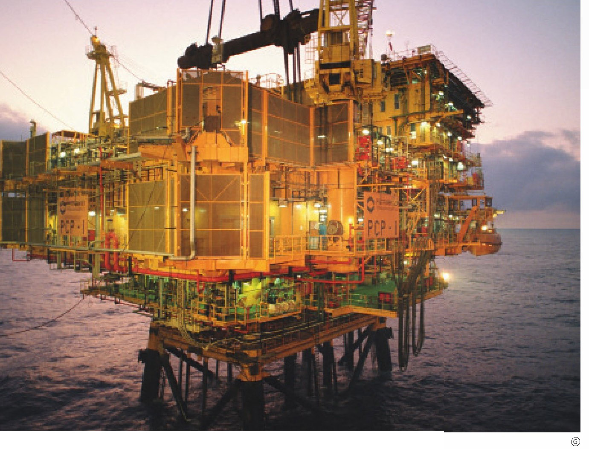
巴西的石油钻井平台

2008年，巴西又在其近海发现了巨大油气储藏，令世界石油天然气界震惊。在2008年的世界十大油气发现中，巴西就占了5个。因此，巴西石油开采出现新一轮的开发热。2011年，巴西石油产量为7.68亿桶。巴西石油公司计划到2015年，石油日产量达到455.6万桶。

由此可见，在海洋石油勘探开发方面，巴西的确可以说是“金砖四国”之首。（雷宗友）

## 海底有这么多石油，为什么以前不去开采

世界海洋石油蕴藏量十分丰富，达到1000亿吨，占世界石油总储量的34%，已探明的储量为380亿吨。目前有100多个国家在进行海上石油勘探，其中对深海进行勘探的国家超过50个。但人类大规模开采海洋石油，开始于20世纪60年代，距今只不过50多年历史。

令人不解的是，既然海底有这么多石油，为什么从前不去开采？

以前之所以没有大规模地开采海底石油：一是因为当时陆地石油的开采量基本上能满足需要，不必再去寻求更多的油源；二是开采海底石油需要高投入和高技术，许多国家无法做到；三是当时不知道海底到底有多少石油，也不知道海底哪里有石油。

20世纪60年代以来，由于工业的迅猛发展，对石油的需求日益增加，人们开始把目光从陆地转向海洋。各国全面开展了海洋石油和天然气的普查，了解到海底油气资源非常丰富。同时，由于勘探、开采技术的提高，许多国家具备了开采海洋石油的能力。于是，开采海底石油也终于水到渠成。

英国本来是个贫油国家，石油几乎全靠进口。自20世纪70年代在北海发现了一批大油气田后，只经过短短十几年的勘探开发，到1982年，每年生产的海洋石油就超过1亿吨，一下子成了当时世界5个最大产油国之一。仅1984-1985年，英国政府就从北海石油开采中获得了100亿英镑的收益，不但偿还了大量外债，还使英镑增值，挺过了30年代以来最严重的经济衰退，使其原来不景气的造船、机械、电子等行业得以蓬勃发展。

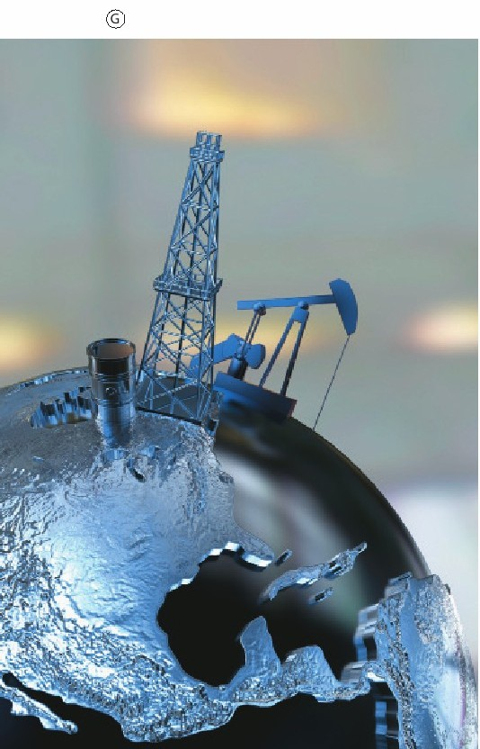
这个变化，使人们看到了开发海洋石油的光辉前景，于是，海上采油一时成为热潮。自20世纪90年代以来，超过1000米水深的勘探、钻井活动迅速增长。截至2011年，1000米以上水深海域钻井数就有200多口。专家们认为，未来的海洋石油主要来自深水和超深水区。（雷宗友）

## 海底石油藏在哪儿

海底石油的生成需要有雄厚的物质基础——有机淤泥。有机淤泥是泥沙和生物的尸体混在一起沉在海底的淤泥。大陆架有巨厚的有机淤泥层，有生成石油的良好条件，所以那里可能蕴藏着丰富的石油。

在大陆坡之外，是平缓的大陆基，虽然水深在2000米以上，但那里沉积着大量的泥沙和生物碎屑，沉积物厚达10千米，是海洋重要的沉积带。这些巨厚的沉积物，是在海底贫氧环境中堆积而成的，富含有机质，所以具有生成油气的良好条件，也是油气富集区。

科学家还发现，许多水深达4～5千米的小洋盆或边缘海，如墨西哥湾、地中海、中国南海、日本海、鄂霍次克海和印度尼西亚海域的深海部分，都蕴藏有丰富的石油资源。

现在，人们主要在墨西哥湾、委内瑞拉湾、波斯湾、几内亚湾、加利福尼亚湾、澳大利亚近海、巴西近海，以及中国的渤海、东海和南海等海域开采海底石油。（雷宗友）

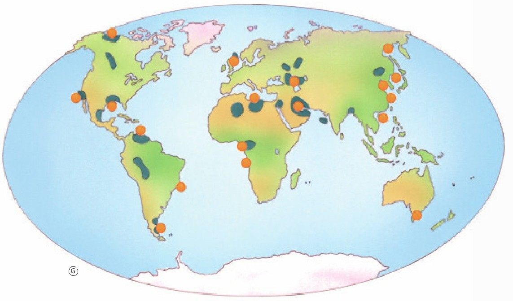
全球海上和陆地石油分布示意图

  

**【微博士】**水域的划分

2002年世界石油大会对海洋勘探、开发水深进行了如下划分：小于400米的水深称为常规水深，400～1500米的水深称为深水，大于1500米的水深叫作超深水。

【微问题】　海底石油是如何形成的？

【关键词】　海洋石油　“金砖四国”　巴西

## 怎样寻找海底热液喷口

自从海底热液活动被首次发现以来，科学家就没有停止过对海底新的热液喷口的探寻。可是，海底热液活动区域一般只有篮球场大小，要在广袤的海底发现小小的热液喷口无异于大海捞针，难度非常大。科学家是用什么办法寻找到海底热液喷口的呢？

要寻找海底热液喷口，首先要知道目标区域内是否存在热液活动的迹象。我们知道，海底热液喷发区域往往“烟雾”缭绕。这些“烟雾”是由高温的热液流体与低温海水混合后形成的。有趣的是，这些徐徐上升的“烟雾”与周边的海水性质大相径庭。除了温度、浊度明显偏高外，还含有一些化学物质，如甲烷、氢气、铁、锰等的含量偏高。因此，这些“烟雾”是海底存在热液活动的极好指示。只要寻找到了这些“烟雾”，就可以知道调查区域内是否有热液活动，并能据此判断海底热液喷口的大致位置。

于是，科学家便想方设法去精确测定那些可以反映海底“烟雾”存在的各种指标。一种办法是，先用采水器采集不同层位的海水，然后在科考船上测定海水中化学物质的含量。更为便捷的方法是，将各种传感器（温度、浊度以及化学传感器等）集成在一种被称为“水下拖体”的装置上。在科考船的拖曳下，水下拖体可以完成对目标区域海水异常的大范围探测。一旦发现可以指示“烟雾”存在的温度、浊度以及各种化学异常，便可获知海底热液喷口分布的大致范围。

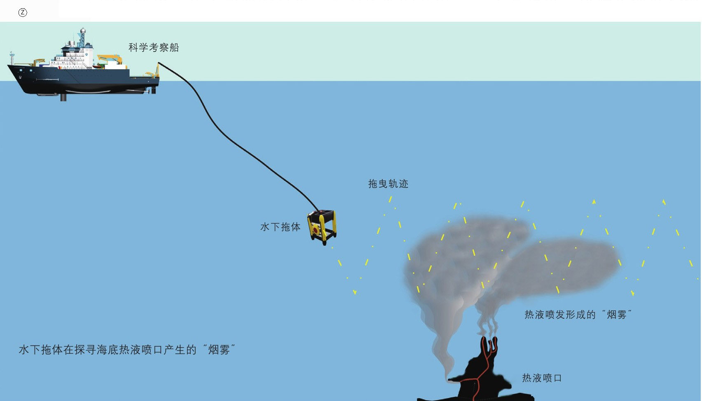
水下拖体在探寻海底热液喷口产生的“烟雾”

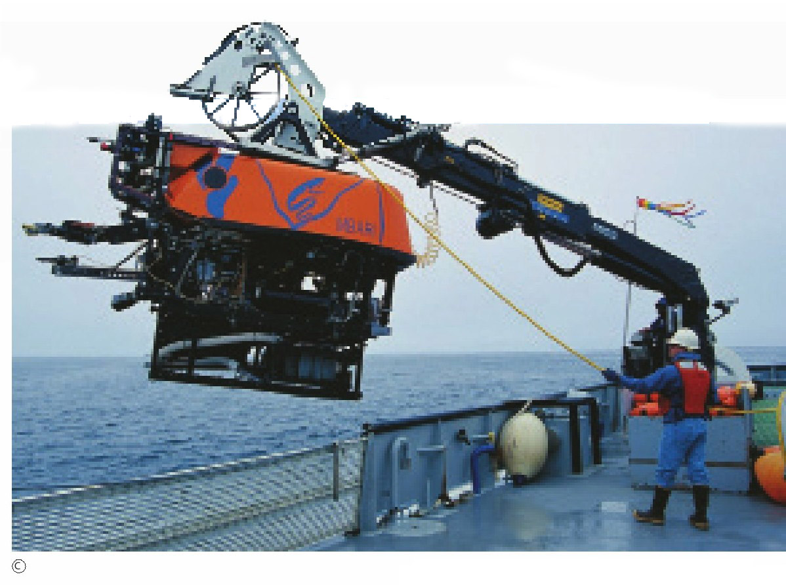
水下机器人正在被投放入水中

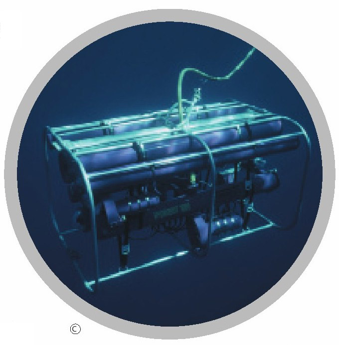
水下拖体

圈出海底热液活动分布的大致范围后，接下来是进一步确定海底热液喷口的精确位置，这时通常就需要水下机器人的帮助了。这些水下机器人常配备有各种传感器、水下摄像机和地形探测系统，可以实现百米级范围内的高分辨率探测。经过这些水下机器人在异常区的耐心搜寻，逐步筛选，就可以较容易地发现海底热液喷口了。当前，分布在全球海底的许多热液喷口就是通过这种办法寻找到的。（吴自军）

## 深海漏油后怎么办

2010年4月20日，英国石油公司位于美国墨西哥湾的一座石油钻井平台爆炸起火，引发了钻井平台沉没和11名工作人员遇难。然而，灾难并未就此结束。4天之后，钻井平台底部的油井开始不断地向外喷涌出大量原油。据估算，每天泄漏的原油最少有5000桶，有时甚至多达5万桶，在海面形成的油污带面积超过9900平方千米。如此大规模的原油泄漏事故给大量海洋生物带来灭顶之灾，被认为是美国有史以来遭受的最大生态环境灾难。

井喷漏油事故发生后，英国石油公司想了很多方法来制止漏油污染。他们最先想到的是用大型钢筋水泥罩封堵漏油：先将3个口径12米、重98吨、约4层楼高的钢筋水泥罩罩在漏油点上方，然后通过水泥罩上端的开口将漏油吸入停泊在海面上的油轮。这一计划曾被认为是短时间内最有可能止住漏油的方案。然而，由于水泥罩内部意外出现了大量结晶状气体水合物，造成堵塞，使水泥罩浮力增大，无法严密罩住漏油处，罩内收集的漏油也无法被输出，因此这一方案并没有起到预期效果。随后，一种被称为“灭顶法”的控制漏油方案付诸实施：将5000桶高密度钻井泥浆注入油井并到达一定深度，再通过增大上部压力来抑制原油上涌，最后用水泥封死漏油点。但由于海底石油和天然气喷出油井的压力太强，这种号称是封堵漏油的最佳方式最后还是彻底宣告失败。

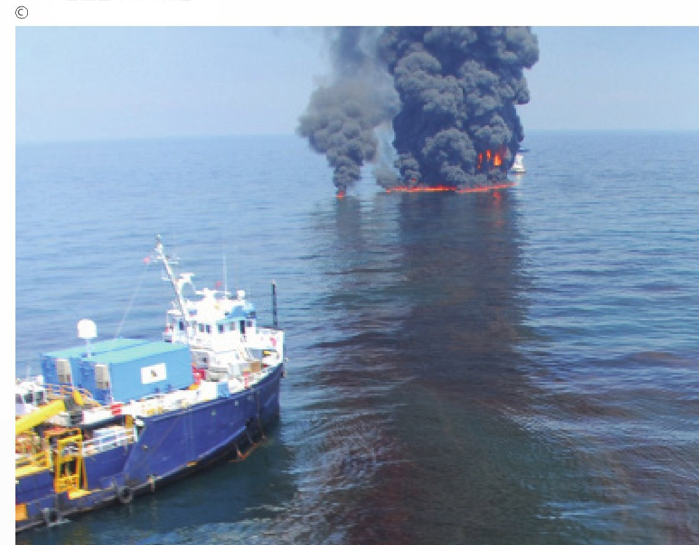
墨西哥湾石油泄漏

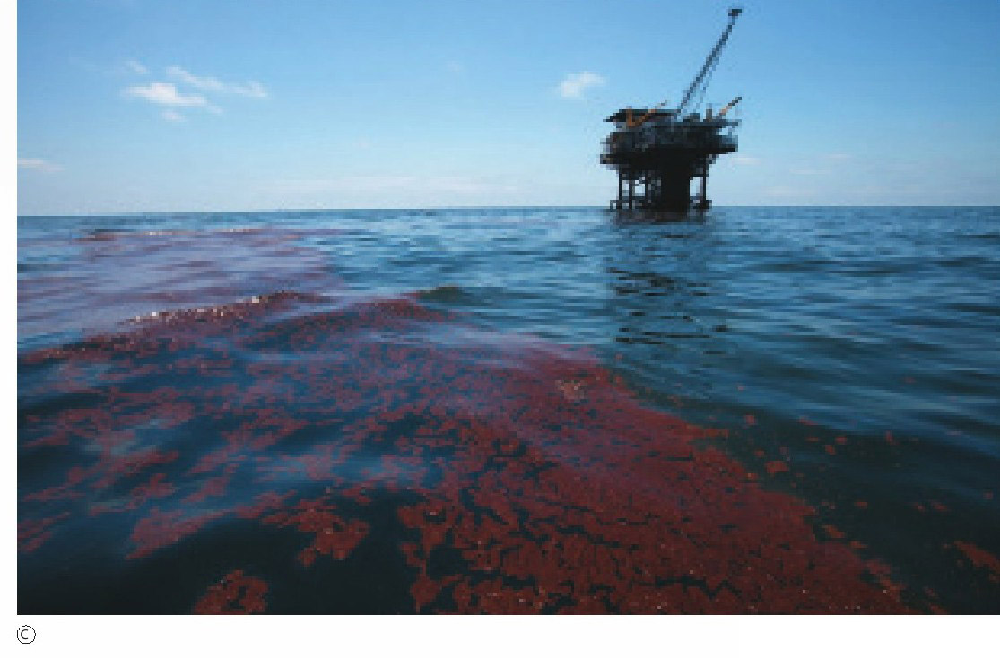
墨西哥湾石油泄漏

遭遇了连续失败后，英国石油公司拿出一个新的方案——“盖帽法”。工作人员操作水下遥控机器人将漏油处受损的油管剪断，并盖上防堵装置。防堵装置与油管相连，把漏出的石油和天然气导至油管内，再将原油输送至海面上的油轮。这种方法成功盖住了漏油油井，并将大部分泄漏的原油和天然气输送到了海面上。（吴自军）

  

**【微博士】**减压井

“盖帽法”并不是完美的堵漏方案，万一压力足够大，原油仍可从装置中漏出。从根本上阻止原油泄漏的方法是针对同一个储油层位打两口减压井。但是，钻挖减压井的工程量大、耗时长，一般要3个月的时间才能完成。这种减压井通常是大斜井，钻到一定深度后，钻头必须曲线进入漏油油井，并和这个泄漏井的井筒最终相连，这样就起到了对泄漏井的压力的分流，从而达到分压的效果，减压井打通之后，再往漏油油井注入泥浆，通过浇筑混凝土封堵漏油油井，并最终切断漏油。

**【微博士】**墨西哥湾漏油事件的“真凶”

墨西哥湾漏油事件的罪魁祸首是甲烷。海底钻井平台作业时经常碰到甲烷水合物。当压力降低，温度升高时，甲烷水合物就会分解，产生甲烷气泡。在上升过程中，一个小气泡会慢慢变大，最后变成一个相当大的气泡。大气泡就像一门大炮，威力巨大，可以突破数道安全屏障，导致钻杆剧烈喷气。当气体喷出钻井平台后，碰到易燃物，就会迅速爆炸并点燃冒上来的原油，造成漏油。

【微问题】　为什么美国总统奥巴马认为墨西哥湾漏油的影响如同“9·11”恐怖袭击？

【关键词】　热液探测　水下拖体　水下机器人　墨西哥湾　深海漏油

## 为什么“冰”也可以燃烧呢

如果说水火不相容的话，那么冰火就更不相容了。然而海洋地质学家发现，在海底蕴藏着一种可以燃烧的“冰”，这听起来似乎有点不可思议，“冰”怎么可以燃烧呢？

原来，这是与普通意义上的冰完全不同的“可燃冰”。它是一种天然气水合物，其中的主要化学成分是一种可燃气体——甲烷，所以它又被称为甲烷水合物。这种天然气水合物的外形很像冰雪，可以像固体酒精一样被直接点燃，因此，人们通俗而形象地称其为“可燃冰”。

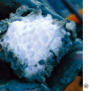
“可燃冰”

早在1965年，苏联科学家就预言，海洋底部的地表层中可能存在“可燃冰”，后来人们终于在北极的海底首次发现了大量的“可燃冰”。19世纪70年代，美国地质工作者在海洋钻探时，发现了一种看上去像冰块的东西。当把它从海底捞上来后，那些“冰”很快就成为冒着气泡的泥水。出人意料的是，这些气泡居然能被点燃。测试证明，这些气泡就是甲烷，而猜测中的“可燃冰”也由此揭开了神秘的面纱。

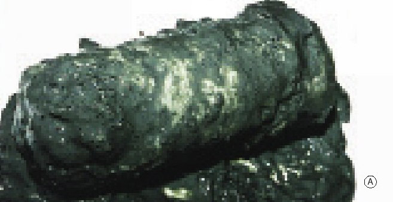
从海底取上来的含“可燃冰”的岩芯

深邃的海底怎么会形成“可燃冰”这种奇特的物质结构呢？其实，“可燃冰”的形成并不容易，至少要满足三个条件，即温度、压力和原料。首先是温度不能太高，如果温度高于20℃，它就会受热分解从而“烟消云散”，而海底温度一般保持在2～4℃，完全适合“可燃冰”的形成和保存；其次，“可燃冰”在0℃时，只需30个大气压即可生成，并且压力越大，“可燃冰”就越不容易分解，而以海洋的深度，这样的压力条件简直随处皆是；最后，埋藏在海底的生物残体和有机腐殖质经细菌分解后会产生甲烷气体，这为“可燃冰”的形成提供了充足的原料。

海底的地层是多孔介质，在温度、压力、气源三者都具备的条件下，“可燃冰”晶体就会在介质的空隙间生成。由于海底“可燃冰”依赖特厚水层的压力来维持其固体状态，其分布可以从海底表面到地表以下1000米的范围内，再往深处则由于地温较高，其固体状态易遭到破坏而难以存在。（吴自军）

## “可燃冰”是理想的新能源吗

能源危机让人们忧心忡忡，而晶莹剔透的“可燃冰”的出现就像是上天赐予人类的珍宝，它年复一年地积累，形成了绵延数千乃至数万千米的矿床。据最保守的统计，全世界海底“可燃冰”中所含的甲烷总量约为1.8×1016立方米，约合1.1×1013吨，堪称“能量宝库”。

谈到能源，人们脑海中立即想到的是煤、石油或天然气。然而，专家预测，全球蕴藏的这些化石能源消耗巨大，根据目前勘测的结果，预计在四五十年之后就会枯竭！

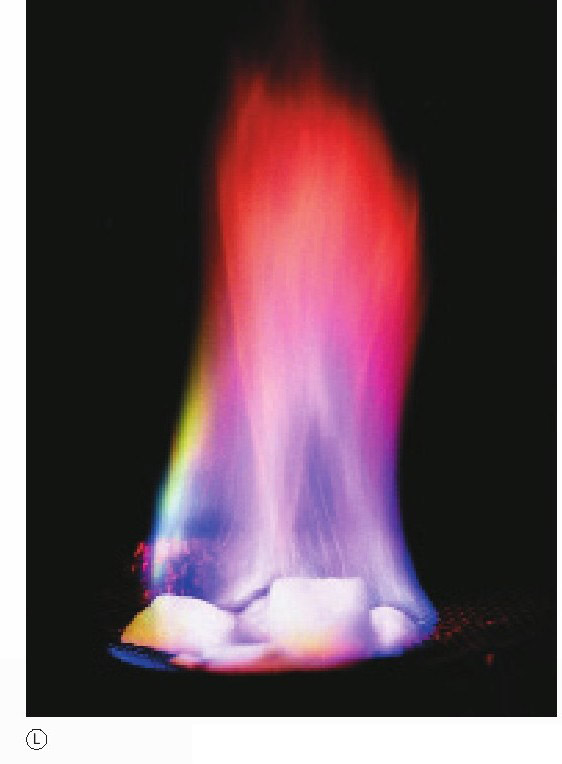
“可燃冰”燃烧的火焰

在同等条件下，“可燃冰”产生的热量比煤、石油和天然气产生的都大得多。全球海底“可燃冰”所含的有机碳总量相当于全球已知煤、石油和天然气总和的2倍以上，够人类使用很长一段时间！采用“可燃冰”作为新能源的另外一个好处是，燃烧后，仅会生成少量的二氧化碳和水，而不像其他常规化石能源那样会生成大量污染物。“可燃冰”有如此大的储量，并且清洁高效，难怪一度被视为具有良好前景的新能源。

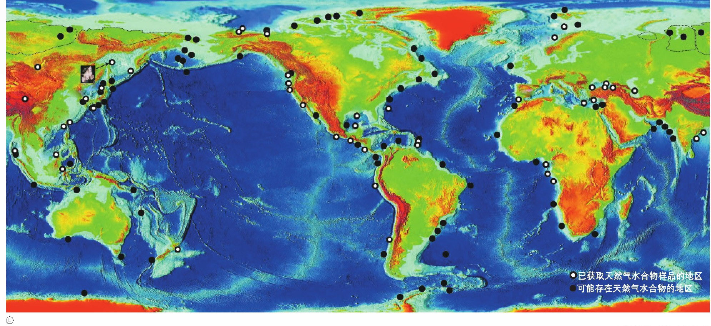
全球天然气水合物分布

自20世纪60年代以来，美、英、德、加、日等发达国家纷纷投入巨资，相继开展了本土和国际海底“可燃冰”勘探调查工作，并陆续在海洋深处发现了“可燃冰”。到1993年，在全球海底发现“可燃冰”57处，以后数年又增加到116处。1995年，国际大洋钻探计划在大西洋布莱克海海底打了一系列深海钻孔，首次证明该处海底的“可燃冰”具有商业开采价值，并初步估算出其总量达100亿吨。日本于1994年开展了对周边海域海底“可燃冰”的大规模调查，估算出调查区的资源量可满足日本100年的能源需求，并于1999年进行了钻探实验。

不过，“可燃冰”在给人类带来新的能源前景的同时，对人类生存环境也提出了严峻的挑战。我们知道，地球温室效应的“元凶”是二氧化碳气体排放，而甲烷的温室效应是二氧化碳的25倍！要知道，海底“可燃冰”中的甲烷总量约为地球大气中甲烷总量的3000倍。如果控制不好，让海底“可燃冰”中的甲烷气体逃逸到大气中去，将会加剧全球变暖和海平面上升等问题，给人类带来灾难性的后果。同时，一旦条件变化，甲烷气体从固结在海底沉积物中的“可燃冰”中释放出来，还会极大地降低海底沉积物的工程力学特性，使海底软化，从而导致大规模的海底坍塌，毁坏海底工程设施。因此，对于面临能源短缺的人类来说，“可燃冰”的勘探和开发无异于雪中送炭，但还需要解决开发成本较高和可能对环境造成的影响等许多难题。（吴自军）

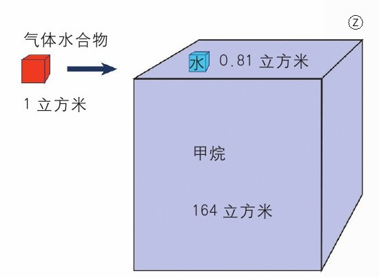
“可燃冰”不仅可燃，而且具有极高的热值。一旦“可燃冰”融化为水，气体就全部释放出来。据测试，1立方米“可燃冰”可以释放出0.81立方米的水和164立方米的天然气。“可燃冰”的能效是煤的10倍，常规天然气的2～5倍

  

**【微博士】**“可燃冰”的分子结构式

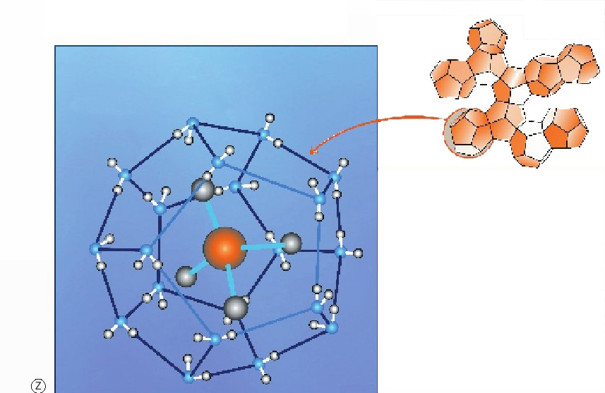
天然气水合物的分子结构图

甲烷是一种最简单的有机物，分子结构式为CH4，很难溶于水。所以，它在海底形成“可燃冰”时，并不是溶解在水中，而是和水分子“组合”起来。水分子搭成像笼子一样的多面体格架，以甲烷为主的气体分子被包含在笼子格架中，形成透明的结晶体——“可燃冰”，它的分子结构式为CH4·8H2O。

**【微博士】**“可燃冰”在中国

中国十分重视对海底“可燃冰”的调查和研究，并已取得重大进展。2007年5月，中国在南海北部神狐海域钻探取得最高饱和度的“可燃冰”样品。初步预测，中国南海北部陆坡“可燃冰”远景资源量可达上百亿吨油当量，相当于全国石油总量的一半。

【微问题】　陆地上也有“可燃冰”吗？如果有，它们分布在哪里？

【关键词】　“可燃冰”甲烷　温室效应　深海钻探

## 海底的“可燃冰”会“跑”出来吗

科学家在考察一些海底“可燃冰”分布区时，发现了一种从海底向海水渗漏气泡的奇特现象。这些气泡是什么？从哪里来，又要到哪里去呢？

原来，这些气泡是由于海底“可燃冰”分解而“跑出来”的甲烷气体。“可燃冰”一般存在于水深大于300米的深水陆坡环境，它对温度和压力条件的变化很敏感。温度的升高和压力的降低都可能导致“可燃冰”的分解，就像冰在温度高于0℃时就会融化一样。但不同的是，“可燃冰”“融化”除了释放出水，束缚在“可燃冰”中的大量甲烷气体也会“跑”出来。

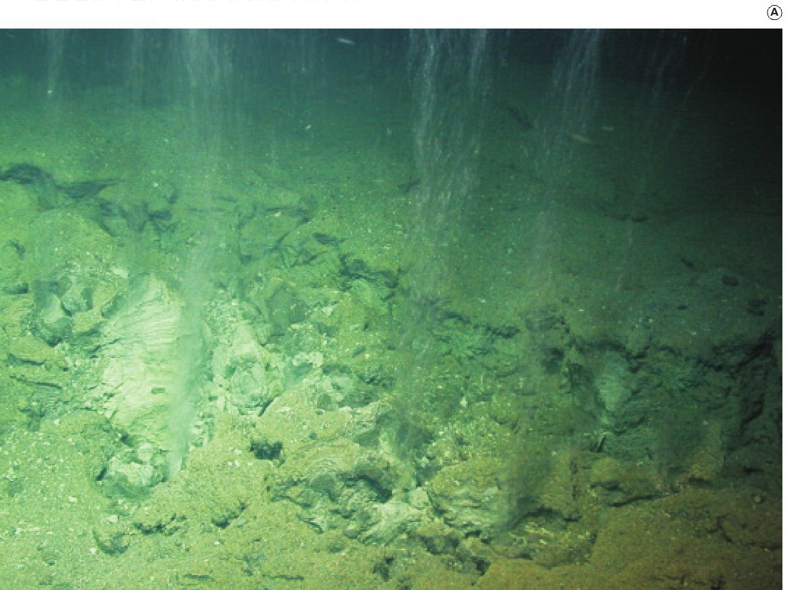
黑海海底天然气水合物分解释放的气体

令科学家感到担心的是：“可燃冰”的分解可能会破坏海底沉积物的稳定性，诱发大面积的海底滑坡。如果大量甲烷气体因为“可燃冰”的“融化”进入水体，会使海水缺氧，大量生物将因“窒息”而死亡。而且，由于甲烷的温室效应大约是二氧化碳的25倍，如果大量甲烷气体穿过海洋水体进入大气，势必会加速全球变暖，威胁到人类的生存。

其实，在地球漫长的历史中，就曾经发生过多次由于“可燃冰”分解导致甲烷释放的事件，并引发全球性气候、环境和生态的灾变，如新元古代晚期的“雪球”终结事件（约6.35亿年前）、二叠纪—三叠纪之交（约2.51亿年前）的生物大灭绝事件、古新世—始新世之交（约5500万年前）的极热事件等。其中最为典型的是发生在约5500万年前古新世—始新世之交的全球性温度急剧升高事件，大批底栖和浮游有孔虫因此灭绝。美国科学家狄金思于1995年首次证明“可燃冰”的分解是引发该次极热事件的首要因素。之后，有大批地质学家通过海底沉积物、岩石以及钻孔岩芯获得的地球化学证据，支持了“可燃冰”分解释放甲烷是引发该次极热事件的主要原因的假说。因此，深藏海底的“可燃冰”中的甲烷确实会在一定条件下“跑出来”，而且一旦大量“跑出来”，将会给地球带来灾难性的后果。（罗敏　陈多福）

  

**【微博士】**甲烷的温室效应

自从科学家宣布二氧化碳是导致全球变暖的罪魁祸首之后，人们的目光似乎就一直集中在如何减少二氧化碳排放的问题上。但随着研究的深入，科学家正提醒人们关注另一个加剧温室效应的“帮凶”——甲烷。它导致全球变暖的能力比二氧化碳强得多！二氧化碳、甲烷等温室气体在大气中含量的增多会形成一种无形的“玻璃罩”，使太阳辐射到地球上的热量无法向外层空间发散，导致地球表面温度增高。新增到大气中的每个甲烷分子都能够发挥很强的吸热能力，它引发全球变暖的能力是二氧化碳的25倍。由于大气中甲烷含量很低，所以总的温室效应没有二氧化碳强。

## 海底泥火山是不是火山

早在200多年前，科学家就在陆地上发现了泥火山。从20世纪70年代开始，随着海洋探测技术的发展，海底泥火山也陆续被发现。那么，泥火山究竟是不是火山？它与普通的火山又有什么区别呢？

其实，泥火山不能算是真正的火山。我们知道，普通火山是由深部岩浆喷发形成的。与普通火山不同，泥火山是由地下泥浆和天然气体在压力作用下喷出地表所堆成的泥丘。因为规模和外形与火山相似，所以被称为泥火山。海底泥火山分布广泛，科学家在黑海、地中海、墨西哥湾、巴伦支海、波罗的海以及中国南海等海域都发现了海底泥火山。

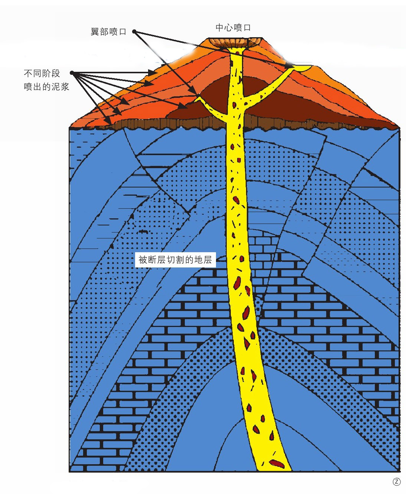
泥火山示意图

科学家研究发现，大多数海底泥火山的形成与沉积物较快的堆积速率和横向构造挤压有关。较快的沉积物堆积为形成泥火山提供了物质来源——泥和气体，横向构造挤压为泥火山的形成提供了动力来源和喷发通道。从海水中沉降并被埋藏在海底的沉积物，在被孔隙水或“可燃冰”分解释放的水“液化”后，会形成富含气体的“泥浆”。在浮力和构造挤压力的作用下，这些“泥浆”会沿通道向上运移，最终在海底发生喷发，形成泥火山。因此，泥火山被认为是海底沉积物重要的“排气口”！

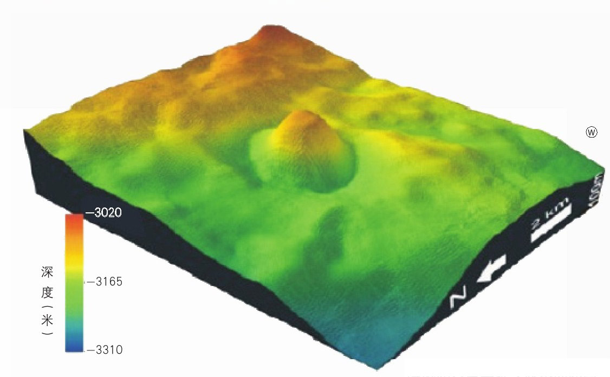
海底泥火山三维多波束测深图

对海底泥火山的研究非常重要。首先，泥火山可能是油气或“可燃冰”分解释放的气体夹杂泥浆向海底渗漏和喷发留下的痕迹，可以作为寻找海底油气及“可燃冰”资源的“窗口”。其次，科学家初步估计全球每年通过泥火山释放的甲烷气体总量为1.03×1010～1.26×1010千克，它造成的环境效应是相当可观的。此外，大陆边缘泥火山活动可能引起海底滑坡，进而可能破坏海底电缆等基础设施。所以，近年来海底泥火山成为海洋地质学家关注的热点之一。（罗敏　陈多福）

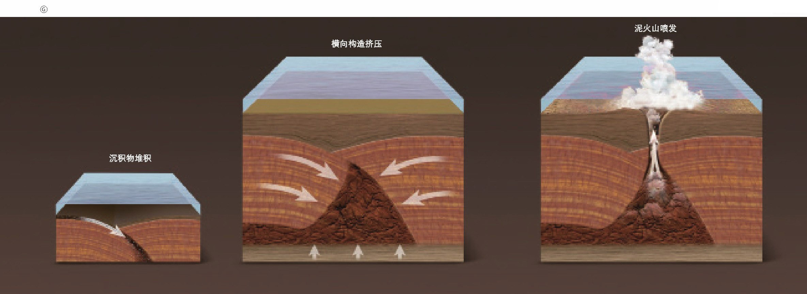
泥火山形成

  

【微问题】　海底甲烷渗漏区有哪些奇特生物？它们靠什么存活？

【关键词】　“可燃冰”甲烷释放　泥火山　全球变暖

## “可燃冰”能帮我们封存大气中的二氧化碳吗

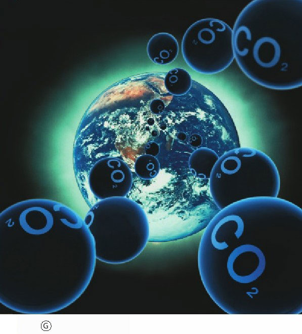
长期以来，地球大气层犹如一个巨大的废气收集袋，无条件地收纳了大量由煤炭、石油和天然气等化石燃料燃烧产生的二氧化碳气体。大气中的二氧化碳含量从工业革命前的280厘米3/米3，上升到了现在的390厘米3/米3。由于二氧化碳是重要的温室气体，它在大气中含量的升高会加剧大气的温室效应，进而导致全球变暖。据政府间气候变化专门委员会的预测，如果照此增长速度，到2100年大气中的二氧化碳含量将比工业革命前增加近一倍，达到惊人的550厘米3/米3，而全球气温也将因此升高1.4～5.8℃，并将导致海平面上升、全球气候异常等一系列严重的环境问题，甚至可能直接威胁到人类的生存。

毋庸置疑，人类面临的最迫在眉睫的任务之一，就是要想方设法减少大气中二氧化碳的含量！将工业排放的二氧化碳废气安全地封存在地球的某个角落，是达到这一目标的一种行之有效的方法。那么，将这些烦人的二氧化碳气体“关押”在哪里才比较合适呢？多年来，科学家绞尽脑汁，为这些二氧化碳气体寻找到了多个栖身之地。

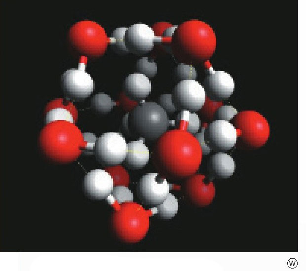
二氧化碳水合物的结构

起初，科学家发现，直接将二氧化碳气体注入废弃的煤田或油田中，将它们永久关押在地层深处，是一个不错的选择！

不过与陆地相比，海洋也许是更好的选择，特别是深海的容量极大，可以把二氧化碳直接送入深海加以封存，也可以据此想办法提高海洋的肥力，让海水吸收更多的二氧化碳。这些主意都有人在试验，但都存在争议。

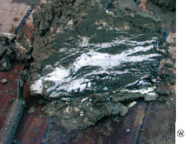
“可燃冰”

后来，在海底发现“可燃冰”，让科学家的眼前为之一亮，看到了解决大气二氧化碳问题的另一线曙光。科学家发现，二氧化碳可以像甲烷那样，与水分子紧密结合在一起，形成一种固态的“非可燃冰”，也可称为二氧化碳水合物，化学分子式为CO2·6H2O。当然，这种“冰”是不能够燃烧的。因为当它分解时，产生的是二氧化碳气体而非甲烷气体。

这种由二氧化碳和水分子形成的“冰”，可以稳定地存在于海底高压和低温环境中，因此可以帮助我们在海底封存大气中的二氧化碳。如果将二氧化碳注入数千米以下的海底地层中，周围的高压和低温将使得它们无法再以气体形式存在，而是与水分子形成固体的二氧化碳水合物，这就可以将它们封存在海底。现在，科学家已经在黑海等地试验，把开采“可燃冰”的甲烷和封存二氧化碳结合起来，一举两得。我们祝愿他们早日成功！（彭晓彤）

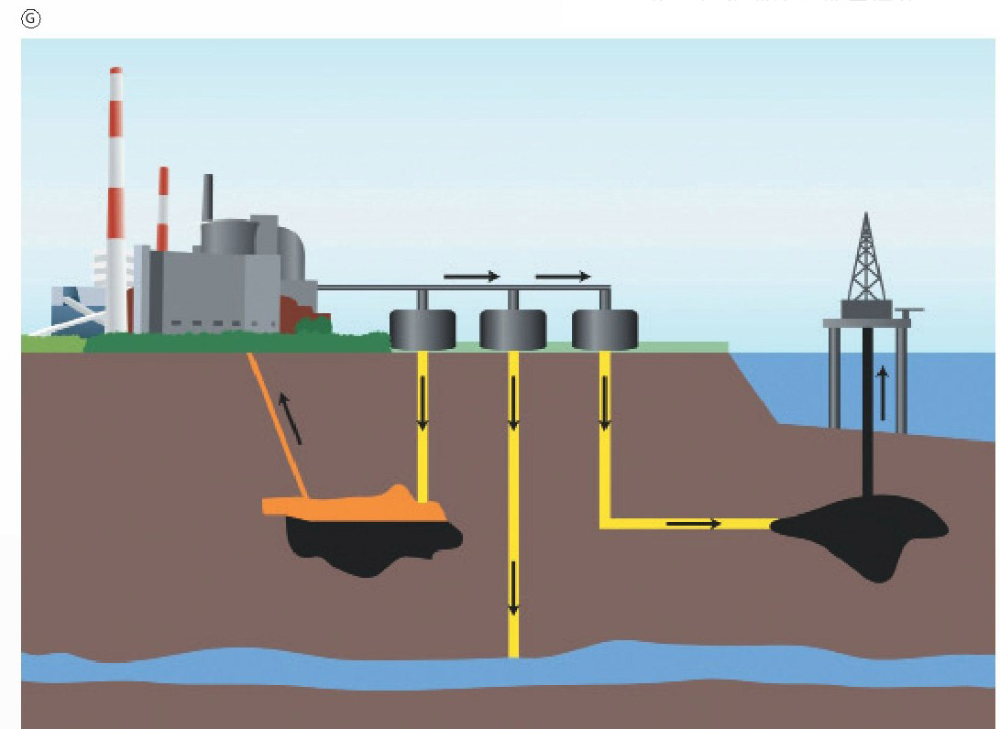
将二氧化碳注入地层深处

## 为什么二氧化碳会在海底形成湖泊

你别小瞧这些看似平淡无奇的二氧化碳分子！在海底，它们能根据周围环境变换自己的形貌，如孙大圣一般拥有百般变化的本领。它们有时变身为晶莹透亮的“非可燃冰”，现身在海底沉积地层中；有时以气体的形式逸出海底，溶解后隐身于清澈的海水之中；有时又能变化为圆圆的液体二氧化碳珠滴，聚集于海底形成独特的二氧化碳湖泊。

2006年，一支由日本和德国科学家组成的考察队，在中国台湾东部海域海底取得了一项重要科学发现。他们驾驶载人潜水器，在一个正在喷发的海底热液喷口附近，发现了一个被二氧化碳水合物所覆盖的海底湖泊！你没有听错，这确实是一个位于海底的湖泊！只是，与正常湖泊不同的是，这个海底湖泊埋在海底的地层里，而湖水竟是由液态二氧化碳组成的！

这个奇特的湖泊位于水深近1400米的海底。对科学家而言，在这里发现二氧化碳湖泊实属意外。因为在这么深的海底，二氧化碳液体的密度是小于海水的。当较轻的二氧化碳液珠从海底溢出时，将在海水中缓慢上升，最终以气泡的形式从海面进入大气。只有在水深大于3000米的深海，二氧化碳液体密度才大于海水，这时它们才能够在海底聚集停留。

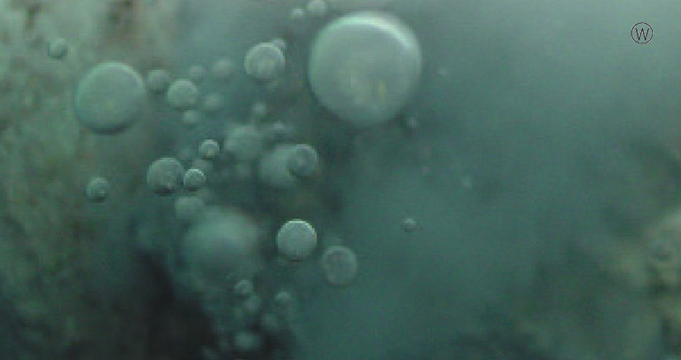
海底的二氧化碳液珠

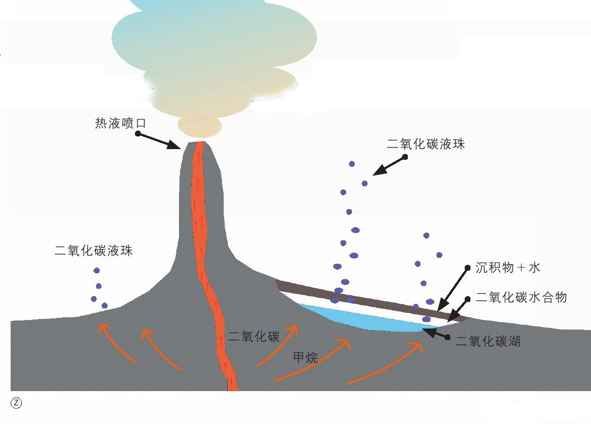
二氧化碳湖

有趣的是，二氧化碳水合物的形成，扭转了二氧化碳液珠在这一海底的上升趋势。当二氧化碳液珠从海底溢出，在海底近表面与冰冷的海水不期而遇。它们快速与海水反应，形成了似冰状的二氧化碳水合物覆盖层，使得后来溢出的二氧化碳液珠被圈闭在水合物覆盖层之下，由此聚集形成了这一独特的二氧化碳湖泊。目前，科学家在马里亚纳海沟北部，也发现了类似的二氧化碳湖泊和二氧化碳液珠溢出现象。

海底二氧化碳湖泊及其伴生的二氧化碳水合物的发现，进一步激发了人们将二氧化碳封存在海底的兴趣。有学者提出，可以将液化之后的二氧化碳直接通过管道灌注到深海海床上，任它们自由沉淀成人造的二氧化碳湖或形成二氧化碳水合物，借此将二氧化碳“关押”在深海海底。为了验证这些想法的可行性，多个国家已经开展了海底二氧化碳封存的小规模试验，并收集环境变化数据，以评价海底二氧化碳封存对海洋生态环境的影响。（彭晓彤）

  

**【微博士】**海底人造二氧化碳湖泊的寿命

人造二氧化碳湖泊形成后，并不能永远在海底存在。由于液态二氧化碳不断溶解于底层海水中，这种二氧化碳湖泊将逐渐变小，最终会完全在海底消失。据估算，海底人造二氧化碳湖泊的寿命可以达到上千年。尽管人造二氧化碳湖泊可以延缓大气中二氧化碳含量的升高，但人类至今仍然对其可能对海洋环境造成的危害知之甚少！它就犹如一柄锋利的“双刃剑”：如使用得当，可以造福人类；反之，也可能带来巨大的灾难！

【微问题】　海底二氧化碳湖泊中有生命存在吗？

【关键词】　二氧化碳　二氧化碳水合物　二氧化碳湖泊

## 海底为什么有裸露的金属矿

在太平洋、印度洋、大西洋和北冰洋的海底，科学家发现了许多大小不等（直径1～15厘米），呈椭球状或不规则状，像土豆一样的“石头”。经测定，这些“石头”里面竟然含有大量锰、铜、钴、镍等多种金属元素，科学家于是将这些“石头”命名为锰结核。后来，经进一步测定，发现其中所含金属元素种类多且含量高，又给它起了个更科学的名字——多金属结核。

让科学家感到不可思议的是：多金属结核生长速率非常缓慢，为每百万年一到数毫米，而海底沉积物的沉积速率比多金属结核生长速率高得多，即使是残余放射虫软泥，平均沉积速率也有每千年数毫米，照理多金属结核应当被埋藏在数米深的沉积物之下。然而，大多数多金属结核却位于海底沉积物之上。这是为什么呢？

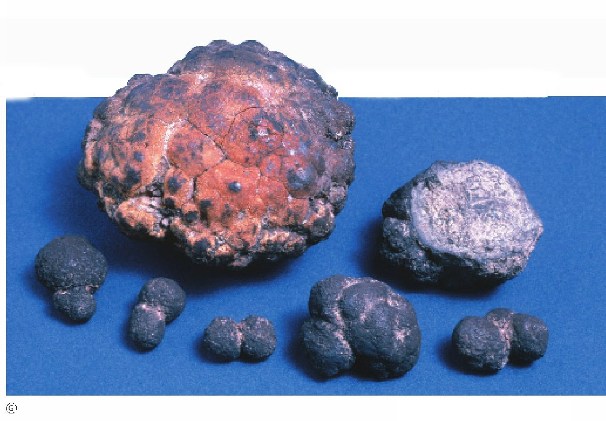
多金属结核

这种现象之所以出现，通常认为与底层流有关。流速较强的底层流使得结核表层的沉积物不断被冲刷，因此结核不易被埋藏。此外也存在一些假设。一种假设认为与生物扰动有关。上层海水中的营养物质随沉积物埋藏在海底，为海底底栖生物提供了大量的食物，底栖生物（如多毛类环节动物等）生长繁盛。这些底栖生物在觅食的过程中，会清除多金属结核表面上最新积聚的颗粒物，并将其抛在结核旁边，使得结核未被埋藏。当它们采集完多金属结核表面和结核之间沉积物表面的食物之后，会转向结核周围或者底部觅食。另外一种假设认为与沉积物和水之间的边界层有关。该边界层就像稀泥水。结核躺在这种稀泥水中，在底层流的作用下发生运动，这种运动会产生一定的上升力，使得结核不易被埋藏。（姚会强）

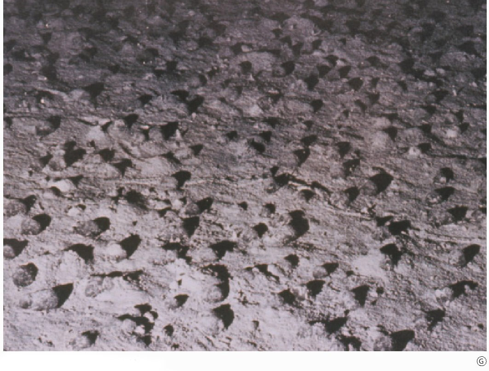
裸露于海底的多金属结核

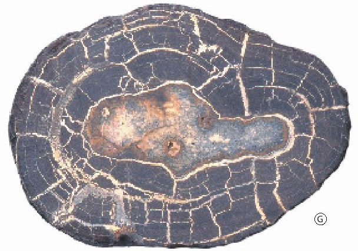
多金属结核横切面

## 为什么海底多金属结核至今尚未开采

多金属结核最早于19世纪后期（1868年）在西伯利亚的北冰洋卡拉海中发现，但是人类第一次真正认识到多金属结核应当始于英国“挑战者号”进行环球科学考察期间（1872-1876）。然而在随后的数十年间，多金属结核的调查研究未有明显的进展。直到20世纪60年代，人类才发现海底多金属结核存在着巨大的经济价值。到目前为止，俄罗斯、日本、法国、印度、中国、韩国、德国等国家先后在国际海底管理局登记成为先驱投资者，获得了具有专属勘探权和优先商业开采权的多金属结核合同区。

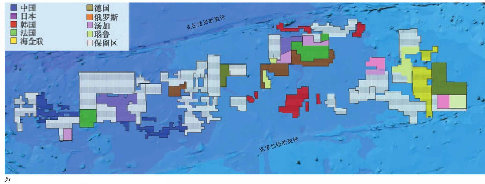
国际海底多金属结核开辟区位置图

虽然看上去万事俱备，但是至今谁也没有大规模地对其进行商业开采。这主要是由以下几个方面的原因造成的。

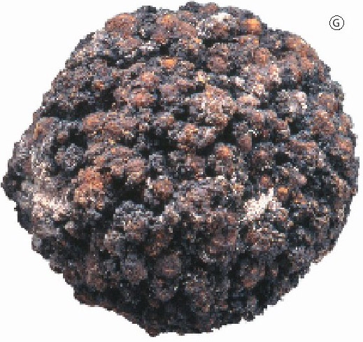
多金属结核

首先，缺少相对较成熟的开采技术。从20世纪70年代开始到现在，一些国家已经确定了初步的开采技术方案，但是这些方案尚未真正有效地投入到实际运行，限制了对开采多金属结核的经济评价。

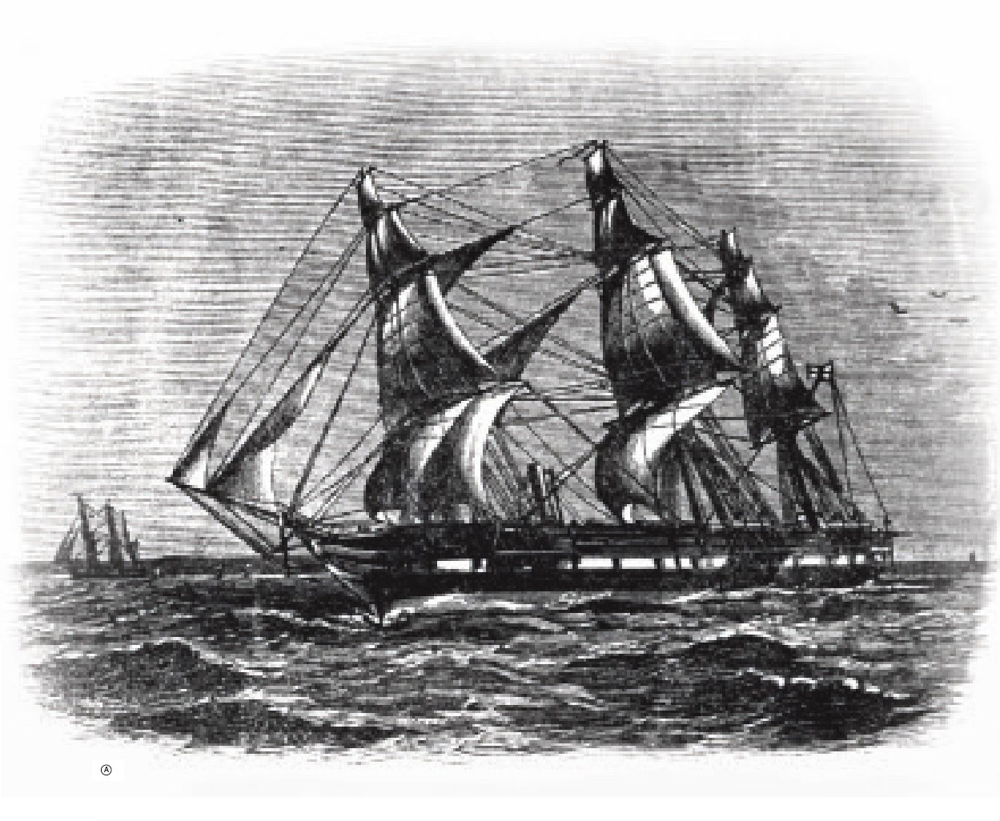
英国“挑战者号”环球考察船

其次，就目前而言，对多金属结核所富含的铜、镍、钴、锰等金属元素，全球需求程度未发生明显的变化。在目前的情况下，全球陆地矿山储量基本能够维持到21世纪前二三十年，如果考虑到技术进步和新增储量，预计21世纪前半叶的资源需求可以得到保证。

再次，多金属结核开采很可能会对深海环境带来巨大影响，势必对海底脆弱的生态环境造成破坏，尤其是底栖生物生态系统。这种影响有可能数年、数十年不能平息，甚至是不可恢复的。

此外，继多金属结核之后，人类又发现了一种深海固体矿产资源——富钴结壳。它广泛发育在海山上，水深较浅，分布相对集中，开采过程可能引起的环境影响相对较小。这个发现在一定程度上影响了对多金属结核的关注，减少了对多金属结核相关研究经费的投入。

因此，在考虑到可能对环境造成巨大影响，且在目前全球金属供给市场供需保持平衡和技术不成熟的状况下，多金属结核的开采仍要走很长的路。（姚会强）

  

**【微博士】**富钴结壳

富钴结壳是生长在海底岩石或岩屑表面的皮壳状铁锰氧化物和氢氧化物，因富含钴而得名。它主要产在水深800～3000米的海山及海台顶部的斜面上，生长速率为27～48毫米/百万年，是地球上最缓慢的自然过程之一。除钴之外，结壳中的其他金属和稀土元素的含量也较高，如钛、铈、镍、铂、锰、铊、钨、铋和钼等。结壳由于通常附着在基岩上，开采技术难度较大，目前尚处于研究的初期阶段。

【微问题】　深海海底还蕴藏着哪些矿产宝藏？

【关键词】　锰结核　多金属结核　富钴结壳

## 海水中可以提炼哪些有价值的元素

海水中含量最多的矿物质是盐，即氯化钠。人类从海洋中获取海盐已有数千年的历史。在古罗马时期，人们有时还用盐来支付部分工资。英文中薪水（salary）一词就是源于拉丁语中的“盐”（salt）。

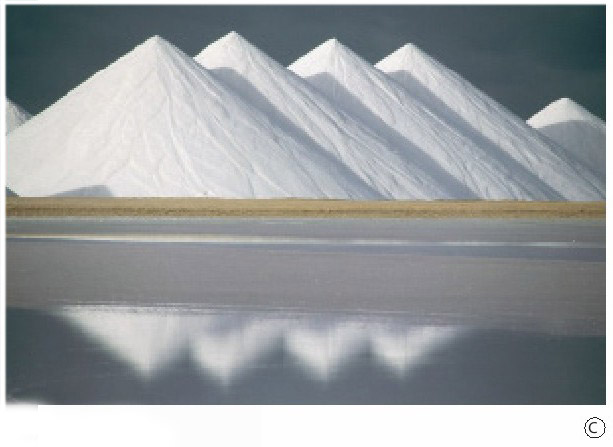
海盐

其实，除了海盐中的氯元素和钠元素，海水中还含有许多有价值的元素，如镁、溴、碘等。

飞机、舰艇、导弹、宇宙飞船的制造，无一不与金属镁有关。第一次世界大战前，全世界镁的年产量不足2万吨。战争爆发后，年产量超过20万吨，为战前的10倍，但战后又迅速降到3万吨。可见，镁的生产与战争密切相关，因而镁被人们誉为“国防元素”。

镁在海水中的含量很高，每升高达1350毫克，仅次于1.9万毫克的氯和1.05万毫克的钠。整个海洋大约含镁1000万亿吨，足够人类用上千秋万代，所以世界各国争相发展从海水中提取镁的产业。当前世界上镁的产量有60%来自海洋。

在摄影技术上立下汗马功劳的元素溴，在医药、农业、工业中也大有用武之地。它能用于制造红药水、镇静剂、安眠药；能参与青霉素、链霉素、普鲁卡因等抗生素的生产；能用于制作杀虫剂、熏蒸剂；还能用来制作抗爆剂、阻燃剂和高效灭火剂，抗爆剂加在汽油里，可以防止汽油爆炸并降低油耗。

溴的用处如此之大，需求量自然很高，可惜在陆地上却很难觅到它的踪迹。地球上99%的溴都溶解在海水里，因而人们把它称为“海洋元素”。溴在海水中的含量相当高，平均每升海水中含65毫克。所以，各国都在大规模地从海水里提取溴，并建立了许多大型工厂。

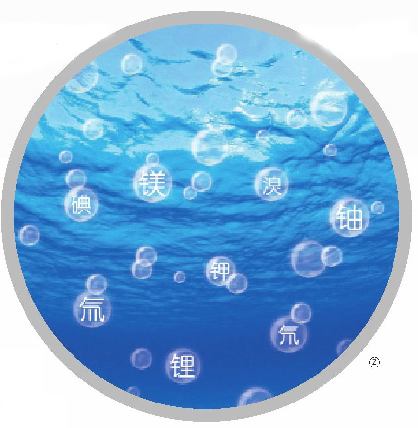
海水中含有许多有价值的元素

碘也是海水中含量丰富的一种元素。它是重要的战略物资，在国防、医药和工农业生产中有重要用途。可是陆地上的碘很少，仅能从智利硝矿、石油井水、海带和晒盐后的苦卤中提取一部分，远远不能满足需要。海水里碘的含量虽然不高，但总量巨大，达930亿吨，比陆地上多得多。所以，人们开发出许多提炼方法，直接从海水中提取碘元素。

因此，看似清澈透明的海水，实则是一个元素的宝库。至今为止，科学家已在海水中发现了80多种化学元素，其中有一些已在工农业生产和国防建设中发挥着重要作用。但遗憾的是，时至今日，这些元素大多还只能躺在海水中，因为人类还没有开发出相应的提炼技术，我们暂时只能“望洋兴叹”。（雷宗友）

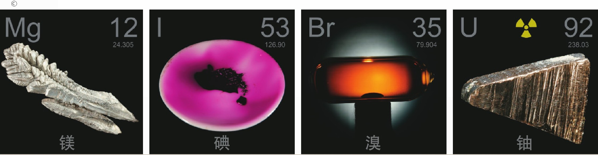
## 为什么说海洋是一座核燃料仓库

铀是重要的核燃料，它蕴含的能量十分巨大。1千克铀全部裂变所释放的能量约相当于完全燃烧2500吨优质煤所产生的能量。可见，铀是一种非常有价值且十分重要的元素。许多国家都千方百计地寻找它，但勘查结果却令人失望。目前已知的陆地上的铀储量极少，总共才不过100万吨。

于是，人们又把目光转向了海洋，因为海水里有铀，虽然其含量很低，每升不过0.003毫克，但由于海水量巨大，整个海洋的含铀总量达45亿吨，是陆地上储量的4500倍。

除了铀，海水中还含有其他核燃料——氘、氚和锂。

氘和氚都是氢的同位素。和氢原子一样，氘的原子核中有1个质子，但多了1个中子，所以氘又叫重氢。氚的原子核中除了有1个质子，还有2个中子，所以又叫超重氢。原子弹是铀裂变产生爆炸，而氢弹则是氘与氚的核聚变产生爆炸。核聚变反应时，可释放出巨大的能量。如果将海水中的重氢都用于热核反应发电，其总能量相当于把全部海水都变成石油。此外，锂也是热核反应中的重要材料。每升海水含锂0.17毫克，整个海洋中总共含锂2300亿吨。

所以，把海洋当作人类的核燃料仓库一点也不过分。难怪在石油危机发生时，有人就形象地说，海水也是可以“燃烧”的呀。（雷宗友）

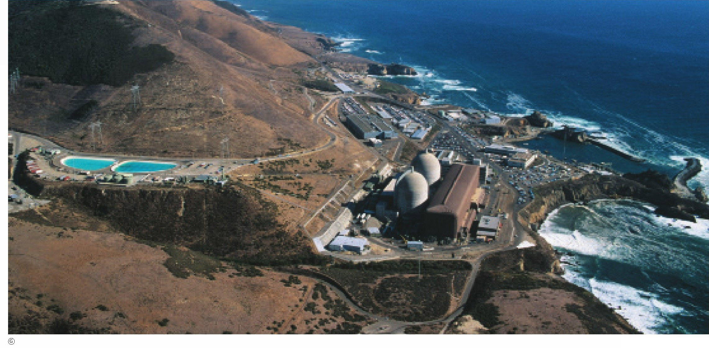
建在海边的核电站

  

**【微博士】**向海水要肥料

钾是植物生长不可缺少的重要元素，被称为钾肥。它肥效快，能被土壤迅速吸收，不易流失，而且能使作物的茎秆长得坚实，防止倒伏，促进开花结实，增强抗旱、抗寒和抗病虫害的能力。陆地上的钾储量并不少，但分布很不均匀，加拿大和俄罗斯的钾盐储量几乎占了全球陆地总储量的90%，所以，包括中国在内的许多国家都是钾肥短缺国家。不过，所幸海水中钾的含量不低，每升海水约含380毫克，是海水中少有的高浓度元素，给钾的提取创造了有利条件。

**【微博士】**水下黄金

你知道吗，每吨海水中平均含有0.02～0.06毫克的黄金。尽管海水中黄金的含量不高，但由于海水的体积很大，整个海洋中的黄金储量还是多得惊人，估计约有600万吨。不过，要在海水中提取黄金目前还不太现实，因为需要付出的代价实在太大。相信随着科学的进步，海洋里的黄金总有一天会成为人类的财富。

【微问题】　盐除了食用，还有什么作用？

【关键词】　海水化学资源　镁　溴　碘　铀　重氢

## 怎样利用海水发电

在当今这个能源日渐枯竭的时代，浩瀚的海洋却蕴藏着无穷的资源和能量。潮汐、海浪、潮流是海水的主要运动形式，人类可以利用它们发电获取能量。此外，海面热水与深处冷水间的温度差异，河海交界处的咸淡水间的浓度差异，也能利用来发电，为人类提供清洁的可再生能源。

潮汐发电是人类较早利用的海水发电方式之一。它的原理与水力发电相似，主要是建造一个蓄水库，涨潮时将海水储存在蓄水库内，以势能形式保存，然后，在落潮时放出海水，利用高、低潮位之间的落差，推动水轮机，再带动发电机发电。

潮汐能来自月球、太阳和其他天体对地球的引力。世界上第一个大规模的潮汐电站是建于1967年的法国朗斯潮汐电站。朗斯河口平均潮差8.5米，最大潮差达13.5米，是一个非常理想的建站地。电站的水坝里，装有24台可逆式涡轮机组，每一台的功率为1万千瓦，且能自由旋转，在涨潮和落潮两个不同的水流方向都能发电，总功率为24万千瓦，一年的发电量为5.44亿度。后来又增加了水泵，发电量逐步增加。目前，它发出的电力可以满足一座30万人口的城市需要。

潮流是与潮汐涨落同时发生的海水在水平方向的周期性流动。潮流也可以发电，而且潮流电站不需要建水库，直接利用水流推动安装在海底或海中的水轮机即可，不仅无污染，造价也比较低廉。全球蕴藏的可开发的潮流能总量约为30亿千瓦。

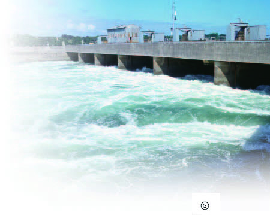
潮汐电站

2005年年底，中国在浙江岱山建成了亚洲首座潮流发电站，功率达到40千瓦。舟山群岛一带大部分海域的潮流速度在2～4米/秒之间，可开发的潮流能占全国的50%以上。因此，联合国工业发展组织对岱山潮流能发电项目十分看好，打算在此再建一座功率为120～150千瓦的潮流电站，进一步推动潮流能资源的开发。现在所建的岱山潮流电站被评为全球可再生能源领域最具投资价值的十大领先技术之一。（雷宗友）

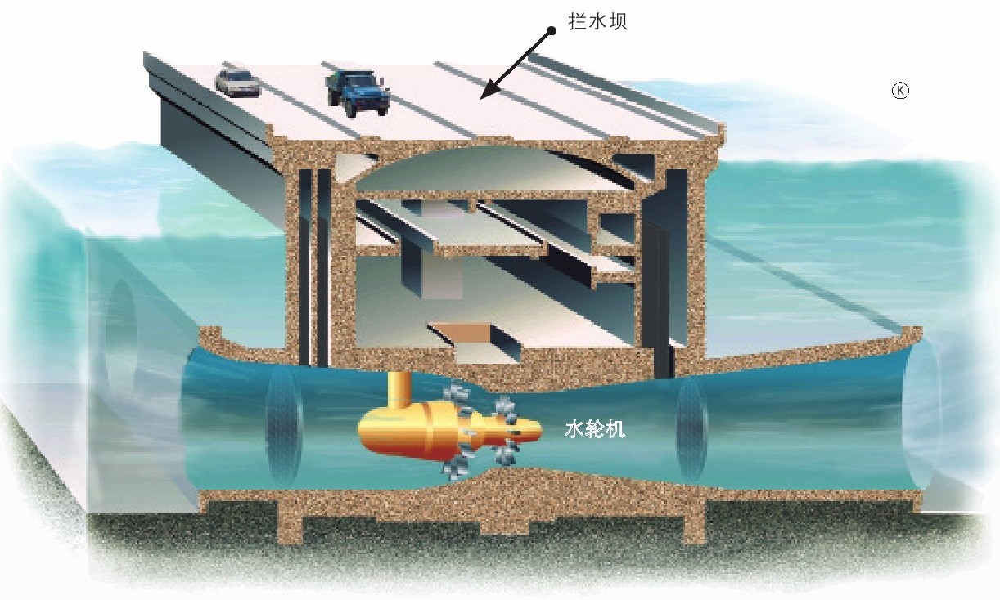
退潮时，水在拦水坝里侧仍保持高水位。当两边的水位差在3米左右时，让水从坝里泄出，流经双向发电、双向抽水、双向泄水的水轮发电机组发电，然后流入大海。再次涨潮时，水又通过拦水坝注入河口，反向推动水轮发电机组发电，直至海水达到高水位为止

  

**【微博士】**海浪发电

风力不仅可以直接用来发电，风吹起的海浪也能发电。海浪的力量十分惊人，但要把它的能量提取出来有很大的难度。直到2008年，才建立了世界上第一座商业海浪发电厂。其发电装备是由圆柱形不锈钢浮筒铰接而成的，带动水轮机发电，看上去就像蛇在海中摆动，人们形象地称之为“海蛇”。

后来，更厉害的“巨蟒”海浪发电机出现了。它比“海蛇”更长、更粗，长达200米，直径7米，捕获海浪能量的能力是“海蛇”的3倍。“巨蟒”将于2014年投入运营。

## 风力发电厂造在海上好，还是造在陆上好

自1890年，丹麦利用风能进行发电以来，100多年后的今天，风力发电已经成为风能利用的最普及的方式。

风力发电是利用风力带动风车叶片旋转，再通过增速机将旋转的速度提升，带动发电机发电。风力发电不需要燃料，不会产生污染，且取之不尽，用之不竭。对于常年风速很大的地区和沿岸海域，以及缺水、缺燃料和交通不便的沿海岛屿、草原牧区、山区和高原地带来说，利用风力发电是非常适合的。

陆上风力发电

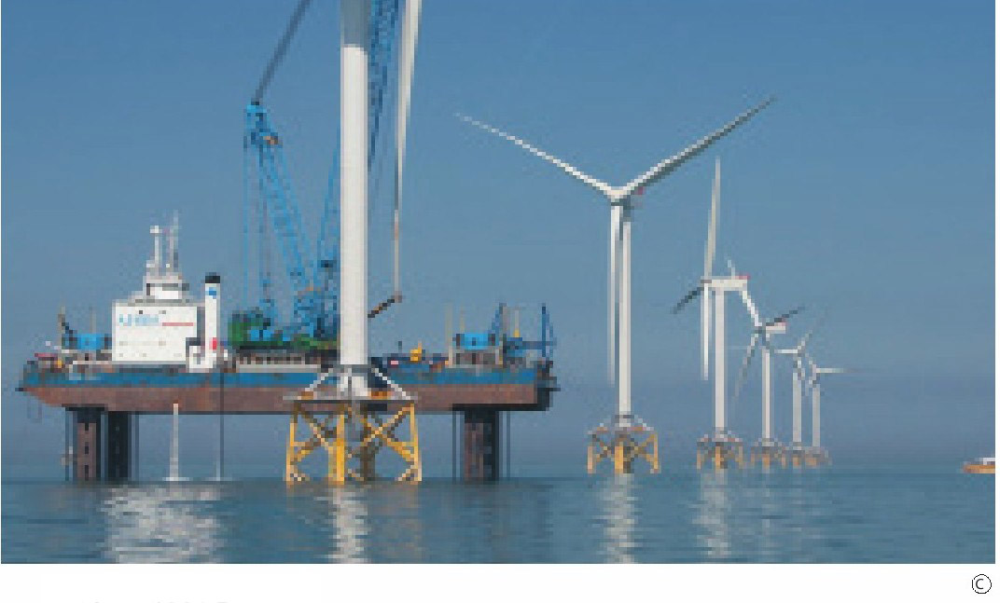
海上风力发电

陆上常年风力较大的地区，都可以建立风力发电厂，但由于风遇障碍物时会消耗其能量，所以最好建在开阔区域，但不能建在机场附近，否则会影响飞行安全。陆上建厂当然是比较容易的，但由于各国都在大力发展风力发电，导致陆地上适宜建立风电厂的地方越来越少，人们便把建厂地移到海上，所以目前大型风电厂的发展大多是以海上为主。如英国、丹麦、瑞典、德国等都建立了海上风电厂。海上风电厂不占用宝贵的陆地，且地势开阔，这是它的优点。但是，相对陆地风电厂，海上风电厂成本高，设备容易被腐蚀，养护和维修的成本也高。

所以，发电厂建在海上好还是陆上好，不能一概而论，要因地制宜。（雷宗友）

## 怎样“打捞”海洋中的太阳能

太阳赐予地球的热量，有极大部分落进了海洋的怀抱。海洋表面水深0～100米的表层部分，每天吸收着大量的太阳辐射。据估计，每秒钟落入大海“怀抱”的热量，约相当于燃烧1亿吨煤。难怪有人说，海洋是太阳能的巨大蓄存池。

面对这样巨大的能量，许多人都在苦思冥想，寻找“打捞”它的神计妙法。

一次偶然的机会，有科学家发现海水的温度会随着深度的增加而不断下降。海洋表层的温度要比海洋深处的温度高出20℃左右。面对上下海水的温差，法国科学家克劳德产生了一个奇妙的设想：如果把表层热海水全部冷却到深层海水的温度，那浩瀚的大海将释放出多大的能量呀！经过几十年的研究，1930年，克劳德在古巴的近海，利用表层温热海水和650米处的深层冷海水，建立了世界上第一座海洋温差发电站。

但是，由于发电系统的水泵等所耗电力比其所发出的电力更大，也就是用电量比发电量还要大，结果纯发电量为负值。然而，这一实验还是极大地提高了人们利用海水温差发电的信心。

目前，美国、日本等海洋资源丰富的国家，都在积极研究和开发海洋温差发电系统。相信在不久的将来，它将成为人们重要的一种能源开发选择。（雷宗友）

  

【微问题】　开发海洋能对全球的环境有没有影响？

【关键词】　海洋能　潮汐能　海浪能　海流能　温差能　盐差能

## 为什么要把飞机场造在海上

飞机是现代社会十分重要的交通工具。飞机的起降离不开机场，但对居住在机场周边的居民来说，飞机起降的巨大噪声对日常生活可不是一件美事。此外，大批飞机起降排放的废气，也严重地污染了城市的空气。那么，有没有一种可能，将飞机场建到远离城市的地方去，以尽量减少机场对城市环境的影响呢？

在远离城市的近海海面上建造机场就是一个不错的选择！和陆地机场相比，海上机场除了不会干扰居民和污染城市空气，另一个好处就是视野开阔。海上既没有高山，也没有高大建筑物阻拦视线，非常有益于飞机的起飞降落。随着世界各国航空事业的发展，飞机场的数量和面积需求也在不断增多和扩大。因此，一些沿海城市纷纷计划把飞机场建造在海上。目前，全世界已经建造了十多个海上机场呢！根据建造方式不同，海上机场可分为填海式、浮动式、围海式和栈桥式等多种类型。

数量最多的是填海式海上机场。世界上最早建造的日本长崎海上机场就属于这一类型。它坐落在长崎海滨的箕岛东侧，一部分地基利用自然岛屿，一部分填海建造。机场初建时，跑道长度是2500米，以后又向北扩建500米，现在跑道长度达3000米，填土石2470万立方米。填海造地修建的海上机场还有英国伦敦的第三机场、斯里兰卡的科伦坡机场、日本的东京国际机场、新加坡的樟宜国际机场等。

浮动式海上机场是漂浮在海面上的一种机场。目前世界上最大的浮动式海上机场是日本的关西新机场。它位于大阪湾东南部离岸5千米的海面上，面积为1.1×107平方米，分为主着陆地带、副着陆地带、海上设施带、沿海设施带、连接主副着陆带的飞机桥和与陆地连接的栈桥等部分。主着陆带总长5000米，宽510米，有一组4000米长的主跑道；副着陆带总长4000米，宽410米，设一条3200米长的辅助跑道。整个机场共分上下两层。在建造时，巨大的钢箱被焊接在许多半潜于水中的钢制浮体上，用锚链系泊于海上。钢箱高出海面的部分即成为浮动的海上机场。

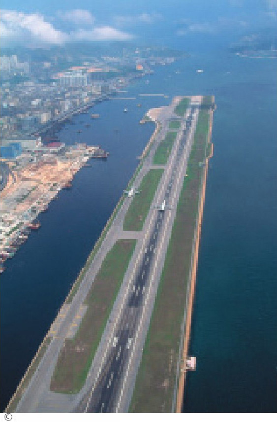
海上机场跑道

与浮动式海上机场不同，栈桥式海上机场的建造是先将钢桩打入海底，在钢桩上建造高出海平面一定高度的桥墩，然后在桥墩上建造飞机场。美国纽约的拉瓜迪亚机场就是一座典型的栈桥式海上机场。

围海式海上机场是在浅海海滩上修建闭合式的围堤，然后将堤内海水抽干，在海底修建机场。这种机场造价低于填海式和浮动式机场，但是由于低于海平面，一旦堤毁水淹，机场就会遭到灭顶之灾。因此，围海式海上机场的建造至令尚在论证之中。（崔维成　戚心源）

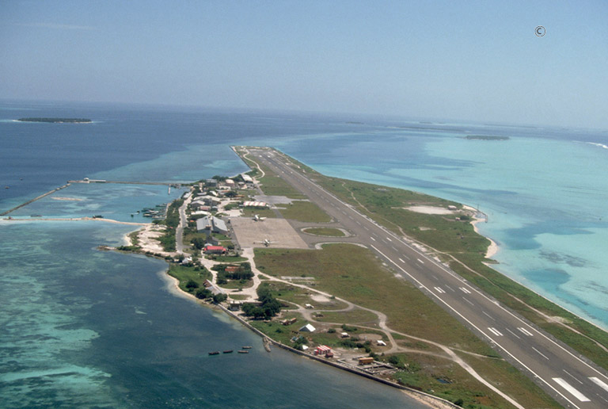
海上机场

## 海岸围垦造地越多越好吗

海岸围垦造地是在海边的滩地上圈筑围堤进行垦殖的工程。对海岸滩地的围垦又叫海涂围垦，对经常淹在水下的海湾浅滩的围垦又叫围海造田。

海岸围垦造地对沿海港口及城市的发展有着非常重要的作用，世界上许多国家和地区都以开发海岸带资源来缓解人口膨胀与土地稀缺之间的矛盾。然而，不容忽视的是，海岸围垦造地会直接改变区域的潮流运动特性，引起泥沙冲淤和污染物迁移规律的变化，减小水环境容量和污染物的扩散能力，并加快污染物在海底的积聚，对区域生态系统、防洪和航运造成不利影响。

填海历史悠久的日本就深受海岸围垦造地带来的后遗症的困扰。1945-1978年，日本全国各地的沿海滩涂减少了约3.9×108平方米，以后每年仍然以约2×107平方米的速度消失，海岸边随处可见工厂和混凝土围墙。由于自然海岸线被人工建筑所取代，使得本来可以平衡海洋生态的海洋生物无法在海岸栖息。工厂和城市长期排放的污染物，使得很多靠近陆地的水域已经没有了生物活动，有的海域则出现了严重的赤潮灾害。

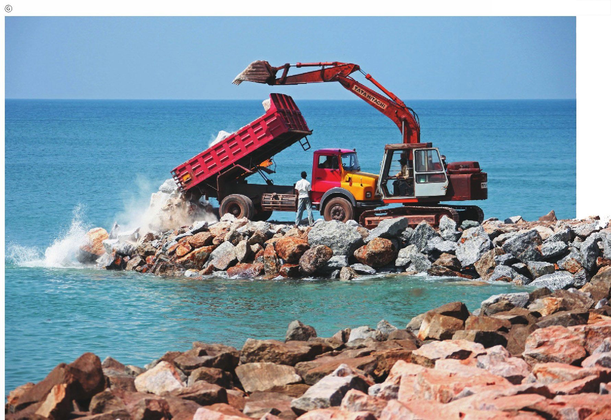
填海造地

中国沿海滩涂湿地约有2×1010平方米，曾在20世纪50年代和80年代分别掀起了围海造田和发展养虾业两次大规模的围海热潮，使沿海自然滩涂湿地总面积缩减了一半。其结果不仅使滩涂湿地的自然景观遭到破坏，重要经济鱼、虾、蟹和贝类的生息与繁衍场所消失，许多珍稀濒危野生动植物绝迹，而且大大降低了滩涂湿地调节气候、储水分洪、抵御风暴潮及护岸保田等的能力。

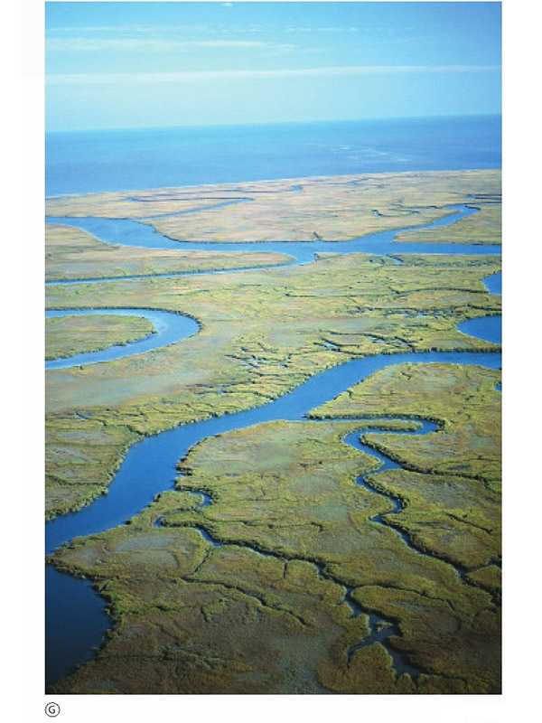
滩涂

因此，海岸围垦造地并不是越多越好，必须在搞清楚它对当地区域生态系统影响的前提下进行全面论证，谨慎实施。（崔维成　戚心源）

  

**【微博士】**海上可移动式后勤基地

美国曾研究用海上浮动机场作为军事后勤基地。1992年，美国国防部提出可移动式基地研究计划，拟建造一种多功能、可安置在近海或国际水域的可移动式军事后勤基地。该基地由多个可自航模块在海上拼装而成，可以为固定翼飞机和直升机提供跑道。可移动式后勤基地的排水量达到677 122吨。一个海上可移动式后勤基地的功能等同于几艘航空母舰。但由于缺乏经费，迄今为止还没有实际建造的报道。

【微问题】　填海造地和候鸟迁徙有什么关系？

【关键词】　海上机场　填海造地　海岸围垦造地

## 为什么要在海底建造隧道

20世纪80年代以前，隔海相望的陆地或海岛之间，只能靠船舶通行。如果遇到恶劣的海况和天气，依靠船舶穿越海峡则变得异常危险。于是，人们忽发奇想，是否可以在海底建造地下隧道，为海峡两岸的人们提供一种更快捷、更安全的通行方式呢？然而，在当时，由于海底隧道施工难度极大，且耗资巨大，这一设想只是一个梦想而已。

如今，这一看似不可能完成的任务早已成为现实！全球已经建造了20多条海底隧道，它们将大陆与大陆、大陆与海岛、海岛与海岛连接起来，给交通运输和人们的生活旅行带来了极大的便利。特别是对于一些风大浪急、距离又远的海峡，由于不方便架设跨海大桥，修建海底隧道就成为最好的选择。它既不占地，又不妨碍船只航行，而且还不受大风、大雾的影响，对生态环境的影响也较小，实在是一种非常安全的全天候通行方法。

英吉利海峡隧道内部

世界上最著名的海底隧道是英吉利海峡隧道，位于英国切里顿和法国弗雷顿之间的海底，全长50.5千米，为电力牵引双线铁路隧道，也被誉为世界七大工程奇迹之一。为了方便英国与欧洲大陆往来，英法两国在酝酿了200多年后，终于破土动工开凿英吉利海峡隧道。经过7年的艰苦施工，于1994年5月6日建成通车。

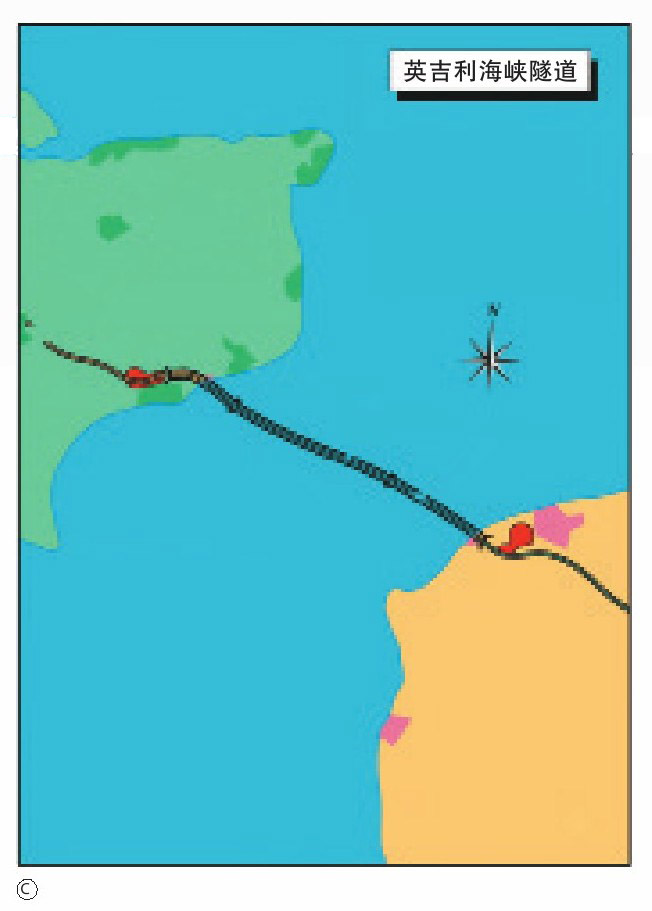
英吉利海峡隧道把孤悬在大西洋上的英伦三岛与欧洲大陆紧密地连接了起来，已经成为欧洲交通网络中非常重要的一环。它由两条主隧道和一条服务隧道组成。主隧道直径为7.6米，一条供伦敦和巴黎之间的高速火车通行，另一条供专门运载各种车辆的列车通行。服务隧道直径4.8米，建在两条主隧道当中，用于通风和维修服务，每隔一定距离有一条横向隧道与主隧道相通。过去，乘船经过海峡从巴黎至伦敦需要5小时，而现在乘坐通过隧道的高速火车仅需35分钟，大大缩短了旅行时间。目前，该隧道一年的客运量可达4500万人次，货运达到2600万吨。（崔维成　戚心源）

## 是什么支撑着跨海大桥

除了海底隧道，架设跨海大桥也是一种连接海峡以及近海岛屿之间的重要方法。与一般江河上的桥梁相比，跨海大桥的跨度要大得多，它们短则几千米，长则数十千米。桥身的跨度越长，建造的难度也就越大！那么，究竟是什么支撑着巨龙般的大桥屹立在海中央的呢？

原来，为了确保大桥的坚固，许多跨海大桥采用了桥墩加缆索共同支撑的方式。俗话说得好，“万丈高楼平地起”，要想跨海大桥经得起风浪，就必须先建好桥墩。大桥桥墩的桩基工程是建造跨海大桥的重中之重。目前，跨海大桥建设中普遍采用混凝土预制桩和钢管桩。对于后者，由于海水具有很强的腐蚀性，在使用前还必须解决抗腐蚀问题。

为了使钢管桩能抵御海水的侵蚀，桥梁设计者给钢管桩穿上了好几层厚厚的“防护衣”。例如，给钢管桩增加一层防腐蚀的涂层；进一步增加钢管桩的厚度，以提高其抗腐蚀时间；在钢管桩内部浇筑钢筋混凝土，让钢筋混凝土也能发挥桩的作用；对钢管桩实施阴极保护等。有了这些有效的防护措施，钢管桩就不再惧怕海水的浸泡了。

虽然有了桥墩，但还不足以靠它们支撑起整个跨海大桥的桥面，这时就需要缆索的帮助了。缆索的作用是拉住跨海大桥的桥面。根据缆索作用方式的不同，跨海大桥又可分为斜拉桥和悬索桥两种类型，两者各具特点。斜拉桥是由主梁、斜向拉紧主梁的钢缆索以及支撑缆索的索塔等部分组成的桥梁，每一根斜拉索都代表着一个桥墩的支点。悬索桥的主要承力部分是位于桥两端的两座塔架。悬索桥常常造得很高，以方便大船从桥洞中轻松通过。

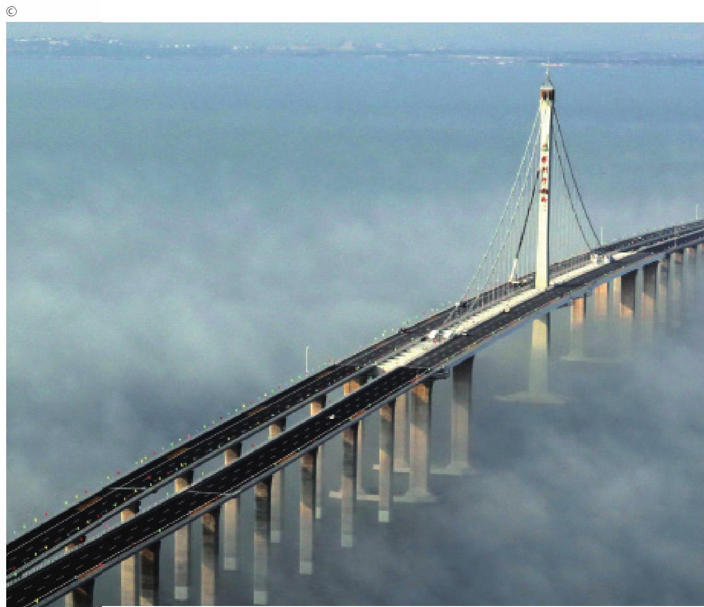
青岛海湾大桥

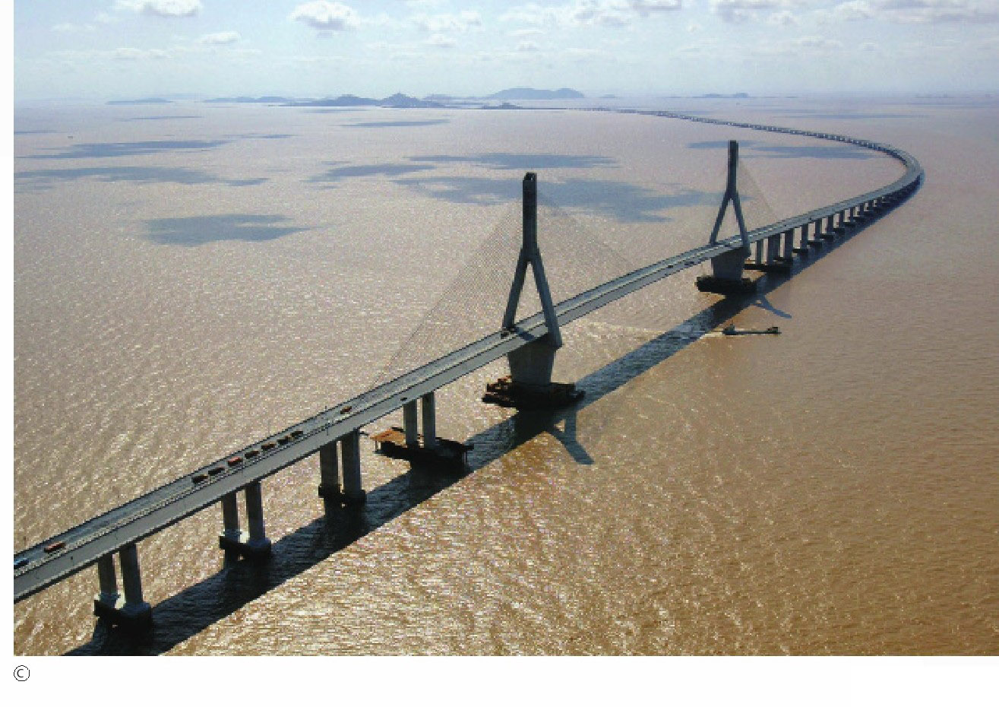
东海大桥

目前，世界上已经建成许多跨海大桥，比较著名的有巴林——沙特阿拉伯跨海大桥、美国金门大桥、土耳其博斯普鲁斯大桥、新西兰奥克兰港湾大桥和澳大利亚悉尼大桥等。中国是跨海大桥的建设强国，建造了很多著名的跨海大桥，如厦门大桥、厦门海沧大桥、厦漳大桥、青岛海湾大桥、东海大桥和杭州湾大桥等。（崔维成　戚心源）

  

**【微博士】**中国最长的海底隧道

中国最长的海底隧道——青岛胶州湾海底隧道于2011年6月30日顺利通车。这条海底隧道全长7.8千米，设双向六车道，设计车速为80千米/时。隧道经过的地质条件非常复杂，修建过程中，穿越了18条地质断层，其中海域部分13条。

**【微博士】**杭州湾跨海大桥

2008年，在中国杭州湾上，一座美丽的大桥跃海而出，它就是杭州湾跨海大桥。大桥全长36千米，是沈海高速公路的一部分。桥面为双向六车道高速公路，设有北、南两个通航孔。北通航孔可通过35000吨级船舶，南通航孔可通过3000吨级船舶。

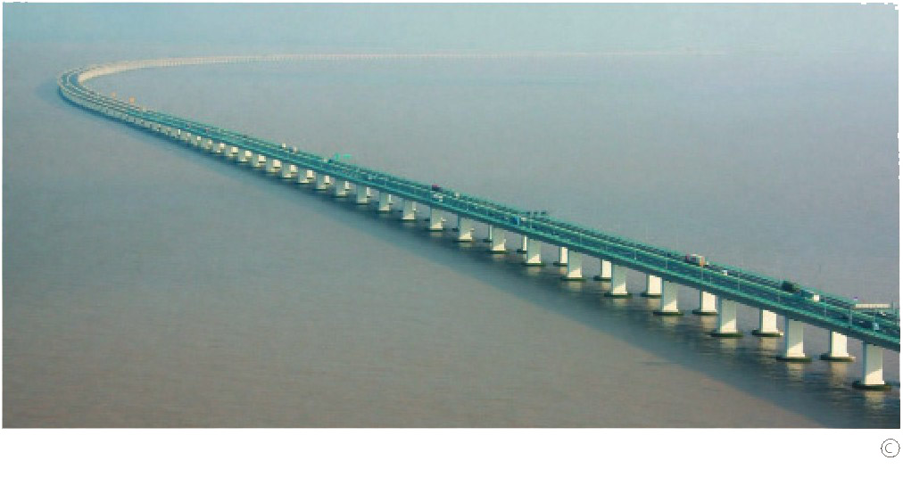
杭州湾跨海大桥

【微问题】　海底隧道和跨海大桥各有什么利弊？

【关键词】　海底隧道　跨海大桥　海峡

## “海底酒店”有什么好玩的

2007年的圣诞节前夕，美国一家公司对外宣布，将在太平洋岛国斐济的一处珊瑚礁边上，修建一座位于水下18米的度假酒店，还给酒店起了一个诱人的名字——“海神度假地”酒店。

据“海神度假地”酒店的设计者称，酒店的灵感来自20世纪的法国传奇海洋生物学家雅克·库斯托建造的一个水下实验室。客人可以通过潜水艇或连接海滩的一条隧道前往酒店。躺在酒店的床上，可以观赏到窗外游过的海豚、鲨鱼和各种千奇百怪的海洋生物，体验完全自然的海底世界。为保护海洋环境，酒店特意避开了珊瑚礁，建造在海底的沙面上。它预先在美国西雅图和新西兰组装，然后通过船只运到斐济附近的小岛。

无独有偶，在美丽的阿联酋波斯湾，也有一座超级豪华的海底酒店正在设计建造。这座名叫“水下城市”的酒店将建在迪拜酋长国境内，外形酷似一只庞大的水母，里面设有220间豪华套房。如果要想到达“水下城市”，首先需要穿越一条长约510米、直通海底酒店的玻璃隧道。在这段短短的旅途中，游客能透过40多厘米厚的树脂玻璃，欣赏到美妙的海洋奇景。“水下城市”设计了各种造型的豪华套房。比如“水泡套房”，看上去很像一个大气泡，住在里面可以通过透明的“墙壁”和“天花板”观赏五彩缤纷的海底世界。

由于“海底酒店”地处海底，必须经受住海底的高压和海水的腐蚀，因此，采用的建筑材料和陆地建筑有所不同。据悉，酒店将主要采用特别加固的树脂玻璃、钢筋混凝土等构筑而成。另外，为了防止恐怖袭击，酒店还将配备高精密度的雷达反导弹系统。万一发生险情，专门设计的防水闸门将及时把遭到破坏的设施同酒店其他部分隔开。

其实，建造“海底酒店”只是人类渴望利用海洋空间的一个设想。人类还梦想着有一天能把城市搬到海洋中去。（崔维成　戚心源）

## 在海里建造“人工礁”有什么用

在日本广岛南面的一个海湾里，有些地方平时根本捕不到鱼。可是有一天，一位渔民却碰巧在那里捕到了满满一网鱼，这使他异常惊奇，也使其他人欣喜万分，认为找到了一个新渔场，便纷纷跑到那里去捕鱼。可是好景不长，没多久，那个新渔场就消失了，和从前一样，那里再也捕不到鱼。

这实在是一个奇怪的渔场！

为了弄清真相，人们开始调查。原来，这个奇怪的渔场是一艘沉在海底的军舰带来的。后来，军舰被打捞上来，渔场也就随之消失了。

沉在海底的军舰怎么能把那么多鱼吸引过来，形成一个渔场呢？人们百思不得其解。

不久，从美国传来一个类似的消息：每当海上石油钻井平台在某个海区定位后，不到几星期，就会吸引许多鱼儿游过来；可是，等石油钻探任务完成，平台移走，那里的鱼儿也就无影无踪了。

这两件事使人们产生了联想：不光是沉在海底的军舰，就是伸向海底的石油钻井平台的桩腿，也会把鱼儿吸引过来。据此推想，军舰也好，桩腿也好，只要是沉在海底的物体，说不定都有聚鱼的作用。于是，人们开始进行实验。

美国人在墨西哥湾投下一些报废的汽车，造成一个浅滩，结果，以前一条鱼也钓不到的地方，如今竟能钓到大大小小的鲷、鲈鱼、扁毛鳞、军曹鱼等，钓鱼爱好者纷至沓来。可是过了5年，由于海水的腐蚀，汽车车体逐渐瓦解，鱼群也就消散了。后来，人们又做了许多试验，得到了同样的结果。

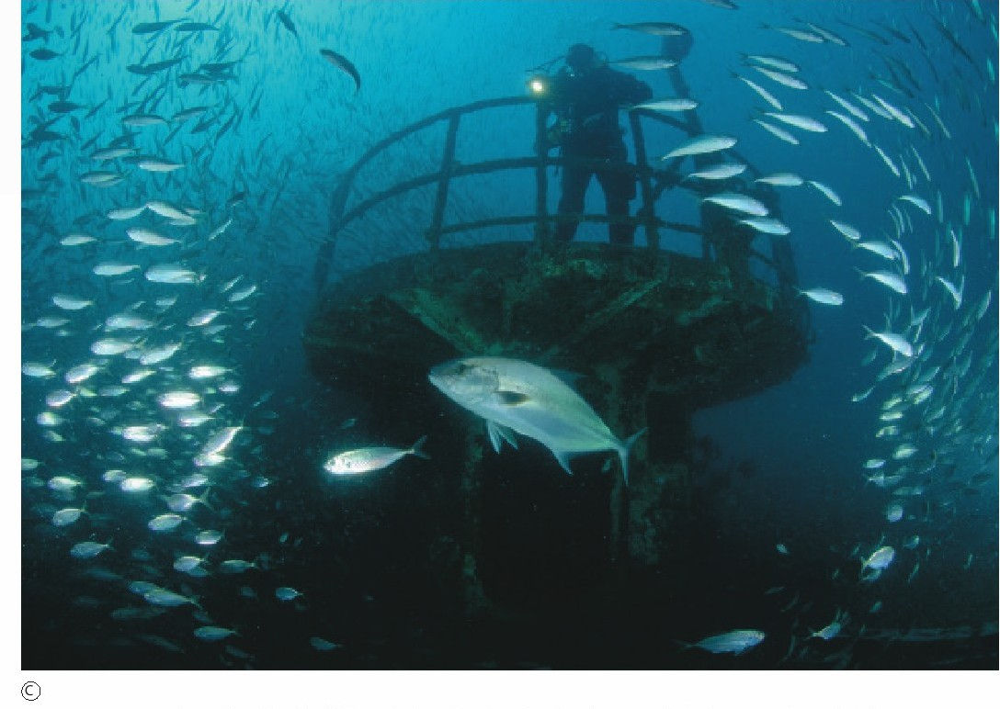
日本是一个四周环海的岛国，对渔业非常重视，所以日本人对上述试验特别感兴趣。他们把各种各样的东西，石头、水泥块、废木船、废木箱，还有废汽车、废钢铁、旧轮船、旧塑料，甚至旧火炉、废电冰箱、废发电机等，都往海里扔。结果真的取得了吸引鱼群的异乎寻常的效果。于是，人们给这些东西取了个好听的名字，叫作“人工礁”。

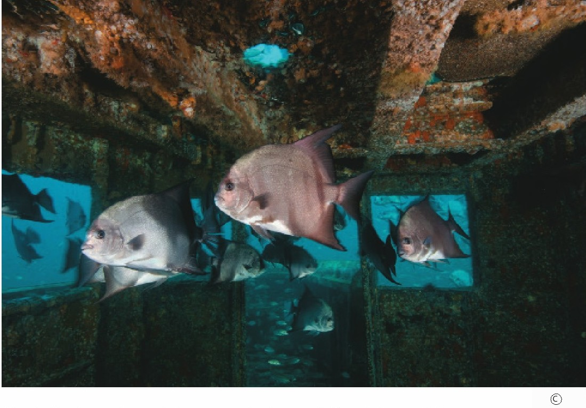
其实，这些沉入水下的物体首先吸引了多种水生植物前来定居，紧接着那些依附于水生植物的大小动物前来“捧场”，然后吸引到各种鱼类纷至沓来，最终形成一个小型的生态多样性环境。人工礁不仅能给渔民带来巨大经济效益，比如有效地保护幼鱼幼虾，提高其成活率，提升海洋的产鱼能力，等等，还可以修复海洋生态环境，比如成倍增加的海藻就起到了净化海水的作用。同时，投放人工礁还能阻止海底拖网作业，防止海底出现“荒漠化”。（雷宗友）

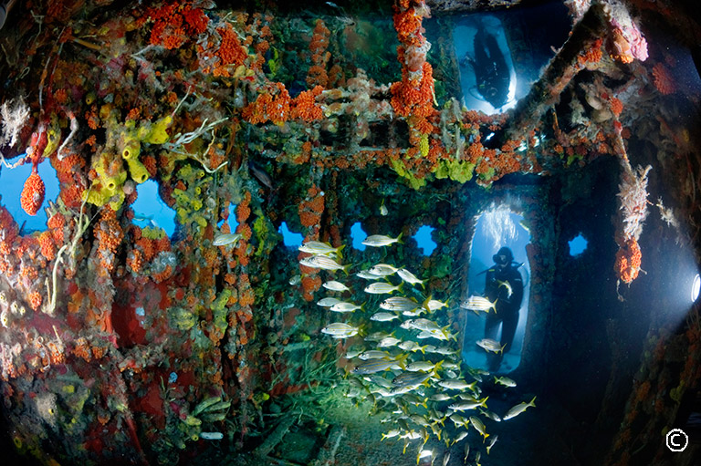
  

**【微博士】**舰船“人工礁”

将准备废弃的舰船沉入海底，是形成海底“人工礁”的一种方法。不但有快艇、登陆舰、货船被有意沉入海底，甚至还有航空母舰被特意沉入海底做人工礁。美国“奥里斯卡尼号”航空母舰废弃后就被炸沉，成为世界上最大的舰船“人工礁”。1987年，美国海岸警卫队快艇“杜安号”也被沉入基拉戈岛海域海底。如今，它的舰桥内缀满了五光十色的海绵和珊瑚，吸引了大量鱼群和潜水爱好者前来一探。

【微问题】　是不是所有构建人工礁的材料对海洋环境都有修复和净化作用？

【关键词】　海底酒店　人工礁　海洋环境的修复和净化

## 古代有潜水员吗

热爱大海的人往往喜欢潜水，像鱼儿一样游泳戏水，更希望做一名潜水员，在蓝色世界里检修管线、探索沉船……但是你可知道，是什么时候开始有潜水员的？古代也有潜水员吗？

最早的“潜水员”，是2000多年前的海底采珠人。珍珠生长在海底的蚌壳里，要靠采珠人潜入海底采集。相传中国2700多年前就有潜水捕捞珍珠的技术，日本采珠的“海女”据说也有2000年历史，古希腊还有人潜水采海绵。海底采珠技术代代相传，明朝末年宋应星著的《天工开物》，就对“没水采珠”作了介绍。近代随着珍珠养殖业的发展，珍珠大多靠人工培育，不再需要像从前那样潜海捕捞珍珠贝。但是日本的“海女”采珠，还是作为旅游表演节目保留下来。

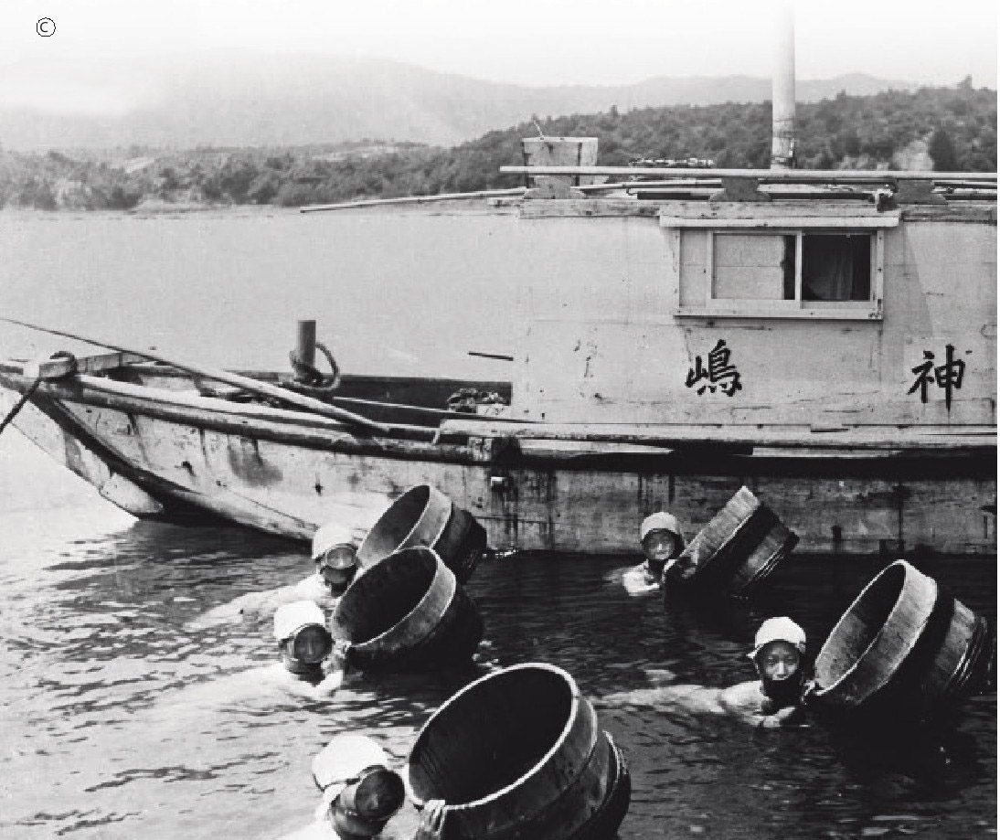
日本采珠女

京剧《廉锦枫》剧照，左边是刺蚌的“海女”廉锦枫，右边是演员扮的“海蚌”

潜水采珠，在中国古代留下了许多精彩的故事和传说。比如南北朝时北部湾的合浦产海珠，由于过度采集，珠蚌绝迹；后来孟尝来当太守，恢复生态环境，珠蚌又回来了，重新恢复了采珠业，这就是“合浦珠还”的故事。清朝《镜花缘》里有个故事讲君子国的海女廉锦枫潜水采海参供母食，被青丘国的渔民网住绑在船头出卖，来自大唐国的唐敖出银赎救。得了自由的廉锦枫当即纵身重返大海，剖开海蚌，采回明珠，报答恩人。这个故事，20世纪20年代曾被梅兰芳排演成京剧《廉锦枫》。

不过，采珠人算不上是优秀的“潜水员”：他们屏住呼吸钻入水底，一般只能在几米水深的地方待上两三分钟，效率不高。即便有特殊潜水能力的水上民族，比如马来西亚、菲律宾海岛的巴瑶人，泰国、缅甸的莫肯人，也只能下潜几十米。现在，不用呼吸装置的“自由潜水”已经成为一种体育运动，世界纪录已经超过水深100米。（崔维成　戚心源）

  

**【微博士】**海洋游牧民族——巴瑶人

“以海为家”的巴瑶人

苏禄海、苏拉威西海和班达海沿岸，生活着一个古老的“海洋游牧民族”——巴瑶族。这是一群“以海为家”的马来原住民，常被比喻为“海上吉普赛人”。他们生活在船上或者高架在海水上的简陋房屋里，据说他们的孩子在学会走路之前就先学会了游泳。他们是自由潜泳的高手，能潜到30米甚至更深的海域捕捉海鱼，寻找珍珠和海参。巴瑶人生活在东南亚6个国家的边境地带，为了避免争端和保护海洋资源，一些周边国家政府让巴瑶人上岸定居，“海洋牧民”正面临着消失的危险。

## 人类能潜入多深的海底

潜水，要解决的主要问题是呼吸。自由潜水，只要呼吸压缩后的普通空气就行。但是随着潜水深度的增大，压力随之增大，空气中的氮气会渗透到人体的中枢神经系统细胞里，引起“氮麻醉”。因此，时间较长或者深度较大的潜水，就要有专门的装备。这种装备叫水肺，它可以保证潜水员的呼吸。这种潜水方法叫水肺潜水，气瓶里装的是惰性气体氦和氧的混合气体，这是因为氦气的麻醉效应远低于氮气。

然而，潜水不光是呼吸的问题，人类潜水时面临的另一个威胁是减压病。因为海水深度每增加10米，就会增加一个大气压。随着压力的增加，人体血液溶解空气的能力随之增加。如果潜水员从水下深处回到海面减压太快，溶解在血液和身体组织里的气体就会形成气泡，阻碍血液流动，严重的甚至可以致命。因此，早期潜水员在完成潜水任务后，必须在减压舱里逐步减压，再回到海面上来。减压的时间往往比水下工作的时间还要多一倍。

解决的办法是1957年发明的“饱和潜水”技术。潜水员先在舱内加压，使得体内的气体完全饱和，然后就可以在深水的高气压下工作几天，甚至几十天，等任务完成后再一次性减压出水。这是因为如果在高压下逗留到一定的时间，人体血液和组织里所渗入的气体就会达到饱和，以后只要压力不变，即便延长逗留的时间，血液和组织里的气体含量也不会改变。

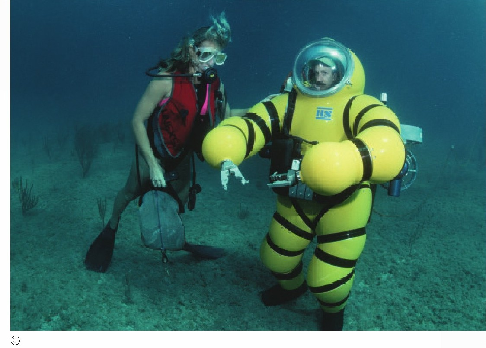
现在无论是海底救生、施工、勘探，或者进行科学考察，凡是潜水员直接暴露在水深超过100米的高压环境的水下作业，都必须采用这种饱和潜水技术。法国潜水员在地中海饱和潜水的实际作业深度达到534米，而实验深度达到701米，是当今世界最高纪录。中国12名潜水员创下了在南海上百米的深水中生活390小时、工作126小时，完成海底油管更换的纪录；作为实验，中国饱和潜水技术也已经突破了490米的深度。

潜水员还有一个保护身体和体温的重要装备——潜水服。早在500年前，达·芬奇就曾设计过皮质的潜水服。现在最先进的潜水服，又叫大气压潜水服。它其实不是衣服，而是一个小型的单人潜水器。它用金属或塑料制成盔甲的形状，肢体关节可以活动，还带有推进装置。由于潜水服里面保持一个大气压的压强，潜水员就没有了“加压”、“减压”的问题。目前最好的大气压潜水服，能够在水深超过700米的深水工作。潜水服也是科学家深海考察的武器，有“深海女王”之称的美国海洋学家西尔维·厄尔，就曾经身穿大气压潜水服，在夏威夷380米深的海底行走、观察两个半小时，创造了女子深潜的纪录。（崔维成　戚心源）

  

【微问题】　从生理学来讲，人类是“上天”难，还是“下海”难？

【关键词】　古代潜水员　采珠女　水肺潜水　饱和潜水　潜水服　巴瑶族

## 《海底两万里》的科学幻想实现了吗

19世纪法国作家儒勒·凡尔纳的科幻小说《海底两万里》，描写了尼摩船长神秘的“鹦鹉螺号”潜艇纵横世界海底，历经了美丽的珊瑚谷、凄凉的海战坟场、巨型章鱼的袭击……这种种科学幻想，现在已经变成现实了吗？

凡尔纳《海底两万里》插图：在海底步行

有的早已实现。在《海底两万里》1869年出版之前，法国就建成了当时世界上最大的潜艇，所以在海底巡弋已经不是幻想。然而观赏海底火山喷口奇景，背上氧气瓶、穿上潜水服在海底行走，都要等到20世纪方才实现。今天有一些科学考察，可以说已经超越了凡尔纳的幻想。现在科学家在几千米深的海底发现的热液、冷泉和海底生物群，连凡尔纳这么伟大的幻想家也想象不出来。如果今天有哪一位科幻作家，能把尼摩船长和阿龙纳斯教授请进中国的“蛟龙号”深潜器，创作一个“新世纪海底两万里”，那才精彩呢！（崔维成　戚心源）

## 深潜器能下潜到海底最深处吗

“下海”难，难于“上天”，其中最大的难处之一，在于压力。每增加10米水深就会增加一个大气压，一个泡沫塑料的杯子放到几千米的深水里就会缩小好几倍，所以深海潜水只能借助耐高压的潜水器，而且不能像航天员那样走出舱外。

深海的压力：一个塑料杯（右）在下到2000米水深后的遭遇（左）

1930年，美国海洋生物学家毕比和工程师巴顿乘坐潜水球下潜183米，1934年又创造了下潜914米的纪录，成为当时轰动世界的新闻，好莱坞还邀请年轻英俊的巴顿拍摄电影。但是钢制的潜水球靠吊索上下，重量太大，想要下潜几千米并不现实，需要有源头上的创新思路。1953年，瑞士教授皮卡德提出把气球的原理移植到深潜技术上，在钢球之外另加一个装有汽油的浮体，不靠吊索而是靠浮力上下，实现了技术上的突破。1960年，皮卡德教授的儿子、工程师J.皮卡德和美国海军军官沃尔什驾驶“曲斯特号”深潜器，下潜到太平洋马里亚纳海沟水深10 916米的海底，创造出至今没有被打破的世界纪录。

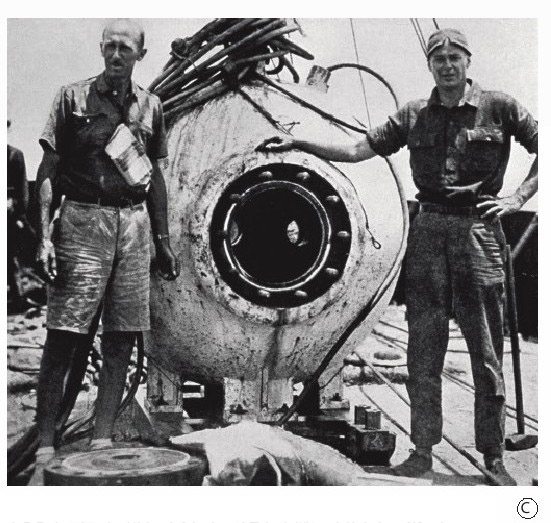
1934年毕比（左）和巴顿（右）乘坐潜水球创造了914米深潜纪录

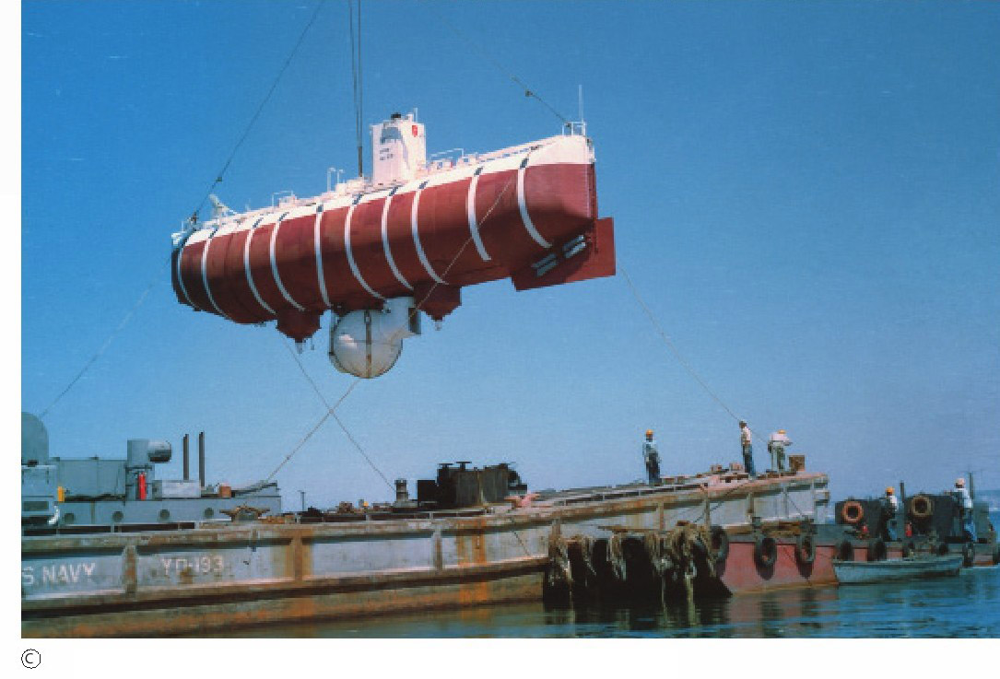
1953年的“曲斯特号”：大的是浮力舱，下面的小球才是载人的潜水球

到了21世纪的今天，深潜技术已经蓬勃发展。不光有先进得多的载人深潜器，还有不载人的深潜器——水下机器人。2012年是深潜历史上值得纪念的一年：7月，中国的载人深潜器“蛟龙号”下潜到太平洋7062米的深海海底，标志着中国进行深海探索的能力和决心；3月，电影《阿凡达》的导演卡梅隆驾驶着“深海挑战者号”载人潜水器，潜入马里亚纳海沟10 898米深水，创造了单人驾驶潜水器的新纪录。深海探险是这位名导演的爱好，他自己出钱制造的潜水器小巧玲珑，只能容纳一个人站立。（崔维成　戚心源）

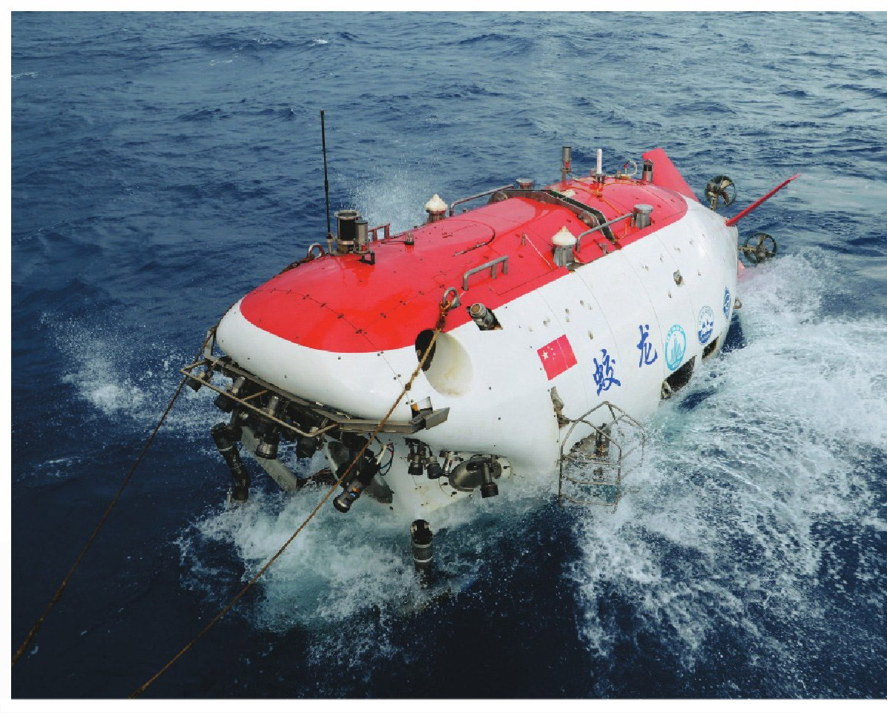
“蛟龙号”深潜器

## 为什么人类要探测深海

现在世界上拥有载人深潜器并能够探测几千米海底的国家有美国、俄罗斯、法国、日本和中国，而拥有无人深潜器（ROV）的国家就更多了。那么，为什么人类要花那么大力气制造深潜器，下潜到海底又是去做什么呢？

载人深潜器里最有名气的是美国的“阿尔文号”，从1964年启用到退役，46年里下潜了4637次，共将9270人次的科学家送到海底。“阿尔文号”最大的功劳，是1977年在东太平洋发现了深海热液和“黑烟囱”，并发现了周围的“热液生物群”；后来又在大西洋发现了深海热液区，开辟了大洋中脊研究的新方向。除了科学发现之外，“阿尔文号”还是深海打捞的先锋，刚下水不久就和无人深潜器一道，从914米深海底捞起了美军失落的氢弹；20年后又在海底勘察了沉没海底的“泰坦尼克号”。

还有许多其他载人深潜器也都是功勋卓著，无论是深海科学探测，还是调查深海金属矿产、海底生态，或者寻找海底沉船、搜索有害废料等，都起到了不可替代的作用。比如日本的“深海号”，在4146米深海底发现了古鲸遗骨和长在上面的生物群，在6000多米深海底发现了海底地震形成的深海裂缝和断层悬崖。俄罗斯的“和平号”曾经在1860米深处，为失事沉没的核潜艇进行了水下密封作业以防止核泄漏；还曾在北冰洋破冰下潜，在4000多米深海底插上了钛合金的俄罗斯国旗。深潜器在探测深海方面的用处极大，但是地球表面的一半以上都是深海，人类想了解深海，该要制造多少艘深潜器才够啊！（崔维成　戚心源）

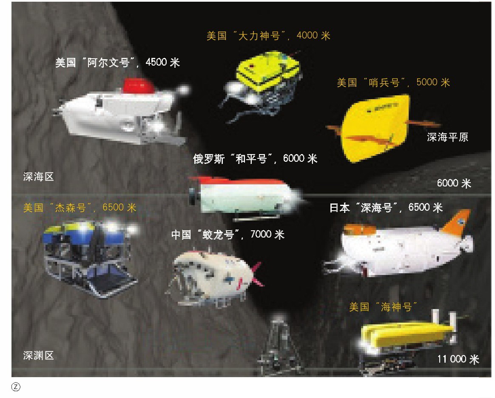
现在各国超过3000米的主要深潜器（黄字指无人，白字指载人）

  

**【微博士】**“蛟龙号”深潜器

中国“蛟龙号”载人深潜器和美国的“阿尔文号”相似，都可以乘坐三个人下潜，不过乘坐者都不能太胖，三个人体重加起来不能超过240千克。“蛟龙号”就其技术性能和下潜深度而言，远比“阿尔文号”优异，然而就应用及下潜经验而言，“阿尔文号”比“蛟龙号”要丰富得多。整个“蛟龙号”长8.2米，宽4.1米，高3.4米，重22吨，最深可以下到7000多米水下；潜水器有7个螺旋桨，可以自主运动，外面的采样篮可搭载220千克重的装备或者样品。“蛟龙号”经过试验，2011年在南海深潜到5038米，2012年在西太平洋下潜到7062米，2013年将在南海及北太平洋执行首个实验性应用航次，开展海洋生物多样性等科考研究。

【微问题】　为什么“蛟龙号”设计为三人乘坐？

【关键词】　《海底两万里》　深潜器　“蛟龙号”

## 滑翔机能开进海里吗

滑翔机是一种没有动力装置的飞机。在无风的情况下，滑翔机在下滑飞行中依靠自身重力获得前进的动力。由于它没有动力装置，起飞必须依靠其他飞机或车辆的牵引才能实现，或者借助高处的斜坡下滑到空中。

滑翔机无动力下在空气中滑行的能力吸引了海洋学家的注意。有人开始考虑，是否可以根据类似的原理，设计能在大海里自由翱翔的水下滑翔机呢？1989年，美国物理海洋学家亨利·施托梅尔突发奇想，设计了一种能够在水下做滑翔运动的浮标进行海洋环境研究，这就是水下滑翔机概念的最初构想。

天空中的滑翔机

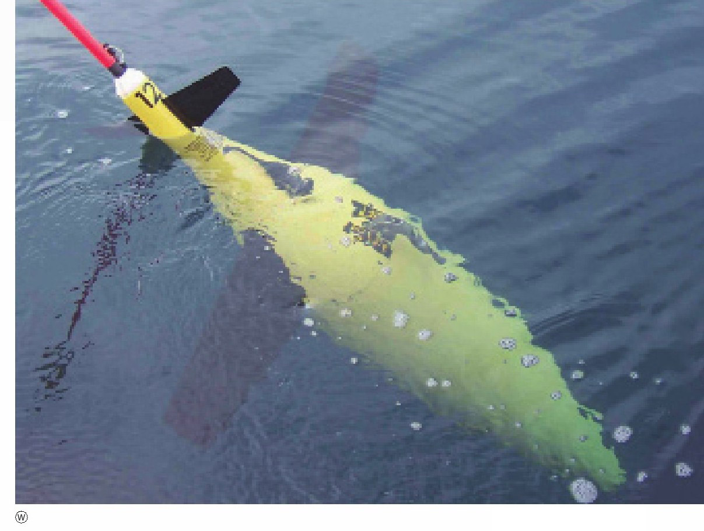
水下滑翔机

作为一种新型的水下机器人，水下滑翔机利用净浮力和姿态角调整获得推进力。它们有类似潜水艇浮箱的装置，当需要下潜的时候，可以通过增加密度来下沉；同时尾翼会控制方向，将垂直方向的下潜力变成向前的滑翔力，上浮的时候也同样利用尾翼调节来获得动力。

由于水下滑翔机仅在调整净浮力和姿态角时消耗少量能量，所以能量消耗极小，能够在海中“潜伏”数月甚至更长时间。与其他类型的水下机器人相比，其续航力大（可达上千千米）的特点尤为突出。由中国科学院沈阳自动化研究所研制的水下滑翔机曾在西太平洋超过4000米的水深处连续多次下潜，各项指标均表现正常，滑翔机在试验后被成功回收。2009年，由美国罗格斯大学研制的水下滑翔机，曾创造了充电一次就成功横渡大西洋的纪录，整个航行时间长达7个月。

水下滑翔机大部分时间在海面以下“潜行”，因此，海面上变幻无常的天气几乎不会对它们造成影响。它们目前主要的克星还是渔网和鲨鱼。一旦被渔网缠住，它们将无法脱身。此外，鲨鱼也是它们需要面对的“敌人”之一。鲨鱼常将这些形似大鱼的东西，当作美味的食物或对手进行攻击。科学家曾在执行任务归来的水下滑翔机身上，发现了被鲨鱼咬过的痕迹。

由于无动力推进，水下滑翔机滑翔时产生的噪声极低，这使得它们能在一个安静的环境背景中监听海洋中声音的变化，甚至能倾听到鱼儿的“打嗝”声。美国南佛罗里达大学的科学家发现，使用水下滑翔机可以清楚地识别西佛罗里达大陆架内鱼群发出的噪声，监测鱼群在大陆架内的分布情况。

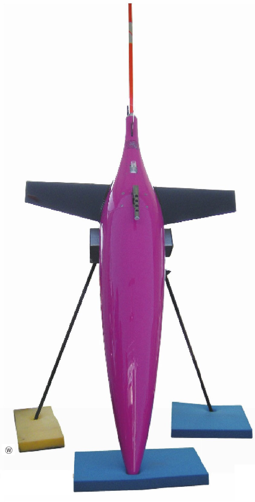
水下滑翔机

在军事上，水下滑翔机主要用于对海洋的监视和侦察。由于它们没有引擎噪声，且移动缓慢，很难被声呐探测器发现，是一种隐蔽效果极好的水下监测器。目前，美国军方已经立项开发体积更大的水下滑翔机，以便能获得更大运动能力和承载能力。也许在不久的将来，水下滑翔机将不仅能负责侦察，还将用于排雷和携带攻击性武器等方面。

当然，水下滑翔机并非万能，也有自身不可克服的缺点。单纯借助浮力和姿态调整的驱动方式，使得水下滑翔机在水下只能做锯齿形和螺旋回转轨迹的航行，航迹控制和定位精度较低，航行速度较慢。如在风浪较大的海面上停留，水下滑翔机还可能出现随波逐流的情况。（崔维成　戚心源）

  

**【微博士】**商业化的水下滑翔机

近20多年来，水下滑翔机技术发展十分迅速。据估算，目前全球海域中至少有400艘水下滑翔机在海水中翱翔。这些水下滑翔机大多由三家美国公司制造。其中喷射型水下滑翔机最大下潜深度为1500米，采用细长的低阻力流线型外壳，天线内置于飞翼中，可进一步减小阻力；而海洋型水下滑翔机属于长航程水下滑翔机，能在开阔的海洋中航行数千千米，最大下潜深度为1000米。

## 登月车能用在海底吗

提到登月车，大家一定并不陌生。这些造型别致、小巧灵活的机器，能够在月球表面行驶并完成对月球的探测、考察、收集、分析样品等复杂任务，在人类对月球的科学考察中立下了赫赫战功。

但你知道吗？其实，海洋中也有类似的能在海底行走的“登月车”。科学家通常将它们称为海底爬行车。这些海底爬行车像小型坦克一样，底部安装有履带，用于在海底爬行移动。海底爬行车上配备有摄像头和各种传感器，能够对近海环境进行原位监测和试验。

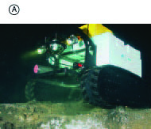
“瓦利”海底爬行车

登月车

然而，海底爬行车与登月车还是有很大的区别，特别是由于它们的工作环境条件不同：海底的压力巨大，这是登月车在月球上不可能遇到的恶劣条件。海底爬行车具有极大的抗压能力。如果把登月车放到海底，在下沉的途中就会被压得粉身碎骨。

“瓦利”是由德国不莱梅大学设计的海底爬行车，主要用于测量海底温度、盐度、甲烷含量以及沉积物特征。它通过与加拿大“海王星”海底观测网络连接，获取支撑其海底爬行的能量和传输实时监测数据。其出色的海底爬行能力，使其能够穿过海底水合物的出露层，近距离观察与海底水合物有关的冷泉生物群。

“海底漫游者”是美国蒙特雷湾水生生物研究所研制的海底爬行车，主要用于深海碳循环研究，被誉为“移动的深海实验室”。它大小如剪草机，由钛合金和塑料制成。尽管在空气中的重量超过1吨，由于车身上安装了浮力材料，它在水中的重量仅约45千克。“海底漫游者”能在6000米的深海底连续工作一年的时间。（崔维成　戚心源）

  

【微问题】　水下滑翔机与水下机器人有什么区别？

【关键词】　水下滑翔机　海底爬行车　水下机器人　登月车

## 海上也有气象站吗

说起气象站，大家可能会联想到天气预报。没错，电视和电台中播报的天气预报数据，就来自分布在全球各地的气象站。这些气象站内装备了各种气象观测仪器，能对大气温度、湿度、风向、风速、雨量、气压、太阳辐射、能见度等气象要素进行全天候监测。我们所熟知的气象站大多分布在陆地上，那么，海上也有类似的气象站吗？

其实，海洋与陆地一样，同样也有能对海洋气象进行监测的气象站。它们的功能更加全面，不仅可以观测海洋气象，而且可以对海水环境进行立体监测，人们通常将它们称为海洋观测站。海洋观测站建造的地点多样，规模各异，有的设在海岛上，有的建于岛礁上，有的位于移动或固定的船舶上，有的布设在海面的大型浮标上，还有的坐落于海洋中矗立的人造塔上。

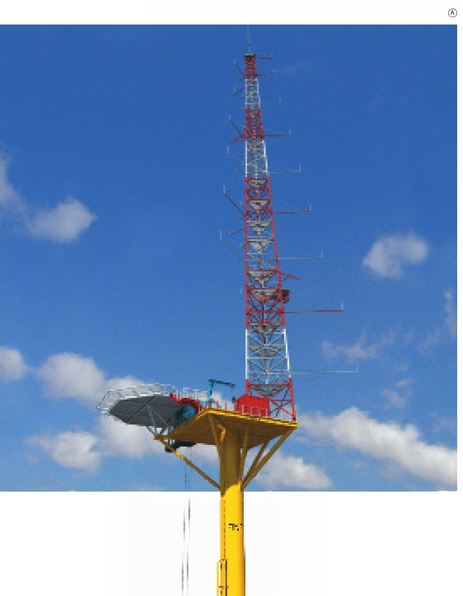
Fino1海洋观测站

这些海洋观测站常分为水上观测和水下观测两部分：水上部分的主要功能为海洋气象观测，其中安装了多种气象要素传感器，分别测量风速、风向、气温、气压和温度等气象要素，有的还配备了地波雷达，能对海浪进行大面积监测；水下部分的主要功能则是海水环境监测，其中安装了多种水文、化学和生态传感器，分别测量波浪、海流、潮位、海温、盐度、营养盐、叶绿素等多种海洋环境要素。

Fino1海洋观测站是德国在波罗的海上建造的一座海洋观测站，位于水深25米处的海域。该观测站的独特之处在于，它完全坐落在一个从海底建造的人造塔上。塔上不仅建有气象站、实验室，还建有直升机停机坪。水面以下的塔身部位则安装了各种海洋传感器，用于对海面以下环境的连续立体监测。

位于中国南沙群岛永暑礁上的南沙海洋观测站是目前中国最南端的海洋观测站。南沙海洋观测站装备了海洋环境观测系统，能够对潮汐、波浪、水温、盐度、风速、风向、气压、温度、湿度及其他气象要素进行连续观测。建成以来，该站获取了大量宝贵的海洋环境数据，在和平开发利用南沙群岛中发挥了巨大作用。（崔维成　戚心源）

## 为什么要建造海底观测网

长期以来，人们从事海洋学研究的主要手段是通过科学考察船采集样品，然后回到陆地或船上实验室分析样品，以获取对海洋现象和规律的认识。但这样做的缺陷也十分明显：不仅费时费力成本高，还受船舶航行时间和海况的限制，同时获取的数据也比较有限。那么，有没有一种办法，能让观测仪器代替科学家，长期驻留在海底，根据科学家的指令开展科研工作呢？

海底观测网肩负的正是这一使命。海底观测网是指能够对海底区域进行长期实时探测、传输数据、采集分析样品以及进行原位实验的无人海底网络系统。它很好地克服了传统调查方法的不足，可以不受船舶航行时间和海况限制，实现对海洋环境及其过程的实时、连续、高分辨观测，为人类探索和认识海洋环境及海底过程演化规律创造了新的途径。

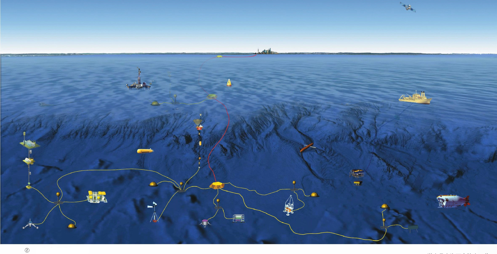
海底观测网

近年来，欧美国家及亚洲的日本等国在研制开发多种海底观测网技术和装备的基础上，纷纷投入巨资建立海底观测网。目前，国际上多个小型海底观测网已经投入运行，“维纳斯”海底观测网和“火星”海底观测网就是其中的代表。同时，一些大型的海底观测网（如“海王星”海底观测网等）也已经开始在东北太平洋海底运行。美国更是制定了雄心勃勃的海底观测网建设方案，计划建设包括区域网、近岸网和全球网三大网络的海底观测系统。

中国紧随其后，也十分重视海底观测网的建设。2009年，东海海底观测小衢山试验站成功组建运行。目前，在中国的东海和南海海域，更大规模的海底观测网络系统正在建设之中。对海底进行原位实时长期的观测，并通过与岸基联网解决系统运转的能源和数据传输等问题，极有可能在一二十年后成为海洋探测和研究的主要方式。（崔维成　戚心源）

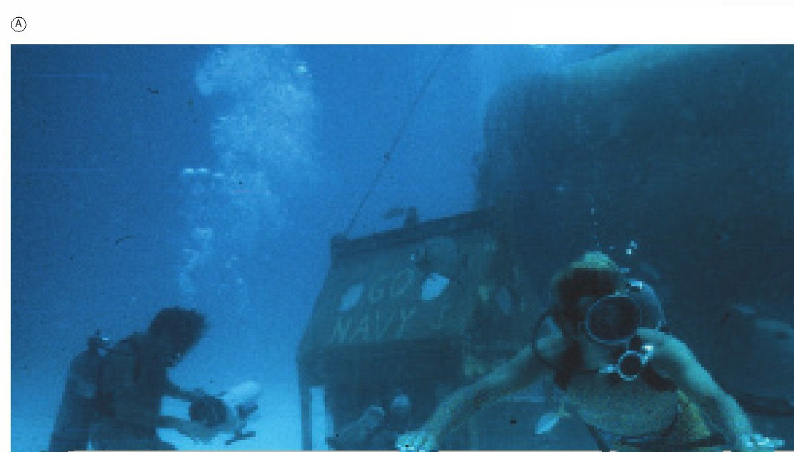
潜水员在海下实验室工作

  

**【微博士】**海下实验室

海下实验室是设置在海底供科学家和潜水员工作、休息和居住的活动设施。它通常是由补给船或补给浮标通过“脐带”供应电力、食品以及供呼吸的气体，借助于压载水舱或固体压载上浮或下沉。有的海下实验室固定在海底，有的可以自由移动。它最大的优点是不受天气变化的影响，可以在水下完成对海洋生物、地质、海洋水文、海底考古等学科的研究。

**【微博士】**海底空间站

为方便科学家长时间驻留在海底，开展各种海底科学试验，有人提出打造人类可以长期居住的海底空间站。法国建筑师雅克·罗格里是建造海底空间站的倡导者，他设计了法国首个海底空间站模型，并命名为“海洋卫星号”。目前，这座高51米的海底空间站正处于设计阶段。无独有偶，中国也正在研制“海底龙宫”海底空间站。

【微问题】　为什么说海洋是气候的调节器？

【关键词】　气象站　海洋预报　海洋观测站　海底观测网　海底空间站

## 为什么要在大洋海底铺设管线

人类改造地球的能力是惊人的！即使在几千米深处的海底，也能发现人类布设的各类海底管线。它们有些在海底连绵数千乃至上万千米，宛如一条条纽带，连接着七大洲五大洋。

这些海底管线包括铺设在海底的管道和缆线。你可别小瞧这些长长的管线，它们的用途可大呢！海底管道能远距离输送石油、天然气和水等，海底电缆能长距离输运电能和实现远距离通信，海底光缆则能帮助人们实现远距离通信。比如，我们平常打的越洋电话，很多就是通过这些海底电缆和光缆实现的！

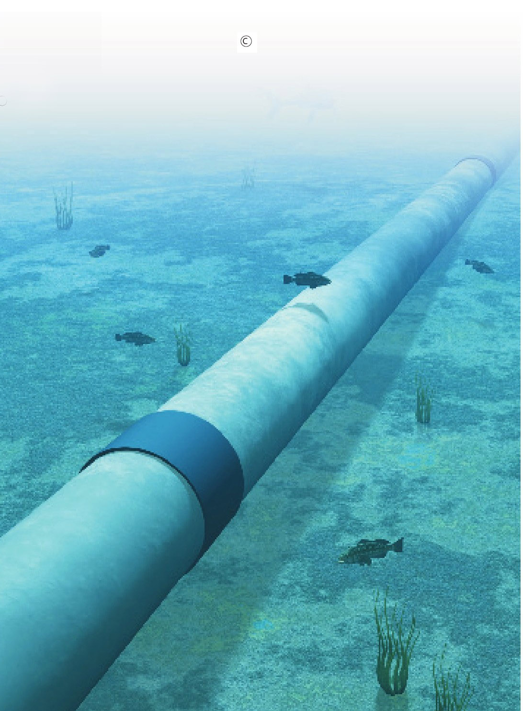
海底输油管

随着海上油气田的不断开发，海底管道已经成为一种最快捷、最安全和最有效的运输石油和天然气的手段。它可以实现连续输送，不会因海上储油设施的容量限制，以及油轮接运不及时而迫使油田减产或停产。由于铺设在海底，为保证安全，海底管道必须能耐高压、耐磨损、耐腐蚀等。根据具体的海底环境的不同，海底管道采用的材质也不一样，有的是钢质管道，有的是水泥管道，还有的是塑料管道，如聚丙烯管等。

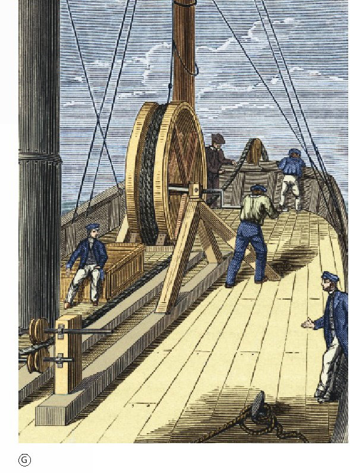
铺设多弗（加来）海峡的海底电缆

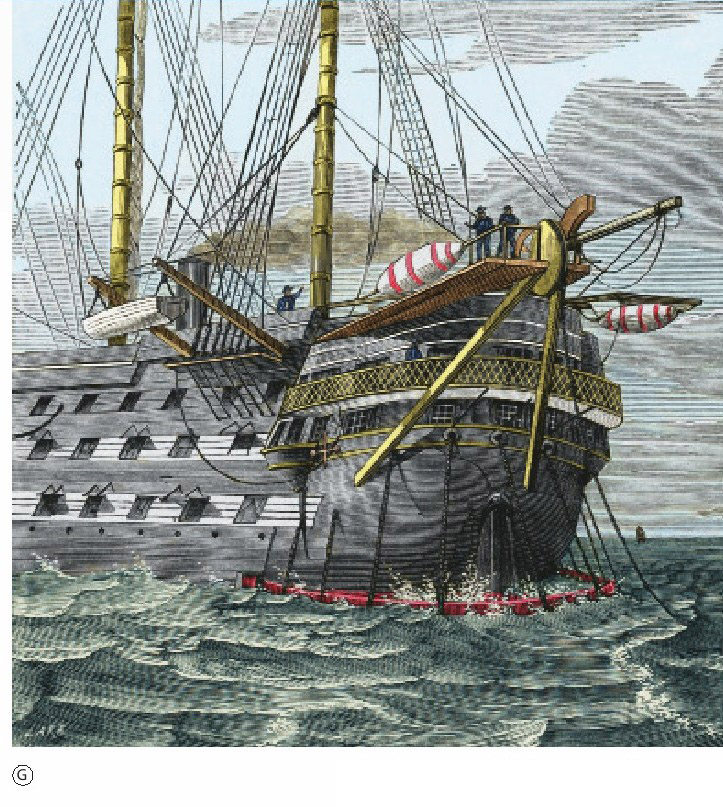
铺设跨大西洋的海底电缆

1850年，世界上第一条海底电缆在英国和法国之间建成。8年后，英国在大西洋海底又铺设了一条连接英美两国的海底电缆，实现了欧美大陆之间跨大西洋的电报通信。电话的发明进一步促进了海底电缆的建设，使得海底电缆不仅可以用来发电报，而且可以用来打电话。到1902年，环球海底通信电缆建成，使全球的沟通距离瞬间大大缩短。

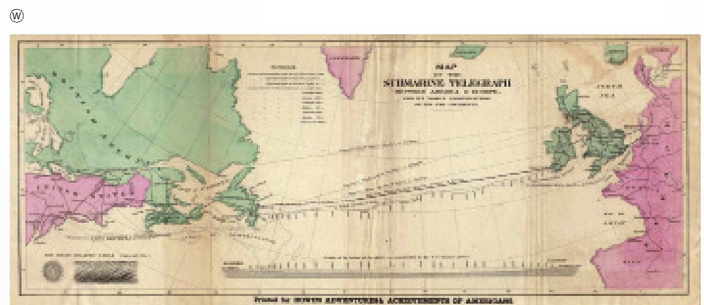
欧美大陆间跨越大西洋的海底电缆（1858年）

1960年，美国科学家发明了激光器，人们开始利用激光能在光导纤维中传输的特性来传递信息。随着互联网通信的迅速发展，海底光缆的建设也飞速发展。世界上100多个国家与地区通过海底光缆建立了最现代化的全球通信网络。全世界80%以上的通信流量都由海底光缆承担，许多海底光缆系统的长度都达到了1万千米。据不完全统计，全球海底光缆的总长度已经接近1亿千米。

海底电缆

你可能会问，这些缆线为什么不在陆地上铺设，而一定要在海底铺设？原来，在海底铺设缆线，有很多的好处。首先，在海底铺设，不需要像在陆地上铺设一样挖坑道或用支架支撑，这样铺设的成本低，投资少，建设速度也快；其次，在建成后还不易受人为的干扰和破坏。对于海底光缆而言，海水还可以防止外界电磁波的干扰，增加光缆的信噪比，提高光缆的通信质量。

如今，海底管线与人们日常生活的关系越来越密切。假如没有海底管道，海上油气的输送就可能受阻；假如没有海底光缆，就无法支持全球性的互联网，我们就不能潇洒自如地上网、打电话……除了油气和通信行业需要在海底铺设管线外，其他很多行业如海洋科学研究、海洋军事建设等均需要在海底铺设电缆和光缆。（崔维成　戚心源）

## 为什么海水也会切断海底缆线

生活中你一定有这样的体会，陆地上的缆线会因为种种原因而突然中断。例如，猛烈的台风可能会刮断电缆，厚厚的冰雪可能会压断电缆，盲目的工程施工可能会挖断地下光缆。但你可曾知道，在海底也有一种神秘的自然力量能切断海底缆线。

1929年12月，纽芬兰南部海底发生了一次7.5级地震，震中附近的海底电缆立即被切断，而分布在数百千米内的其他5条电缆也在13小时内由北向南依次被切断。

2006年12月26日，中国台湾南部海域发生7.2级海底地震，造成该海域13条海底光缆受损。一时间，互联网大面积瘫痪，1亿多中国网民一个多月无法正常上网。后来，5艘海底光缆修复船经过一个月努力，才将断裂的海底光缆修复。

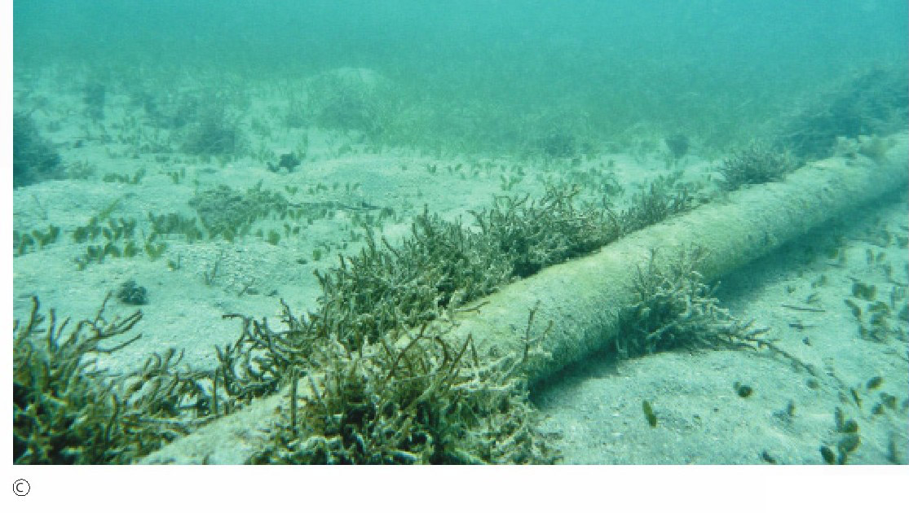
海底电缆

我们知道，地震本身并不能切断海底光缆。那么，什么是造成这次海底光缆损坏的真正原因呢？原来，真正的幕后黑手是海底地震引发的海底浊流。在大陆坡区域，由于存在一定的坡度，海底的沉积层并不十分稳定。当强烈的海底地震发生时，将引发这些沉积层失稳，发生大面积的滑坡，并由此产生威胁巨大的海底浊流。

为什么海底浊流能切断牢固的海底电缆呢？原来海底浊流是一种富含悬浮固体颗粒的高密度水流，它的密度远远大于周围海水。当挟带着大量泥沙的滚滚海底浊流，以较高速度从海底地形高处向低处运动时，能量十分巨大，往往具有摧枯拉朽的破坏力，不仅能冲断海底光缆，还能将大陆边缘的物质搬运至深海，重塑海底的地貌呢。还有科学家认为，海底电缆是一个细长的柔性构件，当受到侧面水流的作用时，在一定的流速下，会发生剧烈的摇荡，导致电缆断裂。（崔维成　戚心源）

  

**【微博士】**墨西哥湾海底管道

经过几十年的不断建设，如今在美国墨西哥湾已经建成了超过3.7万千米的海底管道网络。它将海湾内3800多座大大小小的海上钻井平台和沿岸的油气处理设施连接在了一起，为经济有效地开发墨西哥湾的石油资源，发挥了巨大作用。

**【微博士】**海底光缆的修复

海底光缆直径不到10厘米，一旦出现问题，在深达几百米甚至几千米的海底寻找断点，如同大海捞针。海缆工程师往往根据中断情况先找到断点位置，然后将其打捞上来。如果光缆在水深小于2000米的海底，可以使用水下机器人打捞。如果光缆位于水深3000～4000米的海域，常使用一种特殊的抓钩打捞。抓钩收放一次需耗费十几小时。损坏的光缆打捞上来后，重新接续好再放回海底。

【微问题】　海底光缆是怎样连接的？

【关键词】　海底管道　海底电缆　海底光缆　海底浊流

## 能在同一时间测量全大洋的海水温度吗

知道了全大洋的海水温度，可以帮助我们了解地球上海水怎么流，海鱼怎么游，海冰怎么融化，还可以预测出下一年天气的大致变化状况。可是，海洋这么大，怎么才能在同一时间测量全大洋的温度呢？

首先我们来看看有哪些测量海水温度的方法。一种是接触式的，就像用水银温度计测体温一样，直接浸入水中测量温度。这种方法开展得比较早，200多年前，英国著名的航海探险家库克船长就已开始采用这种方法测量海温。后来，这种人工观测方式逐渐被具有自动测量功能的浮标或海船上专门的温度计所替代，通过金属壳体上一种热敏材料代替传统水银球，持续地测量海水的温度。

目前，虽然已经有成千上万个浮标被放置在大洋各处，每天也有很多带有海水温度自动测量系统的海船穿梭于大洋之间，但是面对如此浩瀚辽阔的海洋，采用这种方式是不可能对全球每个地方的海水同时间进行测量的。科学家发明了另一种非接触式测量，就像孙悟空的千里眼那样，能从很高的天空直接测量海水温度。这种技术又称遥感技术。那么，这种“千里眼”是怎样测量海水温度的呢？

原来，“千里眼”是人造卫星上的一种探测器，能探测到海洋中的“热气”。这种“热气”可不像开水的水蒸气，而是一种眼不见、耳不闻的专门传送海洋表面热量的电磁波。地球上所有的人和物，都会发送这种“热辐射”的电磁波。人或物体本身的温度越高，发出的这种电磁波就越强。更有趣的是，这种电磁波可以传播千万里，一旦被高空中的“千里眼”“看见”了，就会予以接收，而且它还能根据接收到的电磁波的强弱，判断出海面的温度。人造地球卫星如孙悟空一样站得高看得远，有的卫星在几百千米的高空，一天就可以把地球表面所有的海洋“看”两遍，有的在距地3.6万千米的高空，每半小时甚至几分钟就可以“看”遍地球上的所有海洋，同时还可以把海面的温度用数字记录下来，传到地面卫星接收站。科学家将这些数据制成一张张全球海洋温度图，用不同颜色代表不同温度。别看“千里眼”远在千万里之外，但它测量的温度还很准呢，误差不会超过0.5℃，厉害吧！（周斌　蒋锦刚　于之锋）

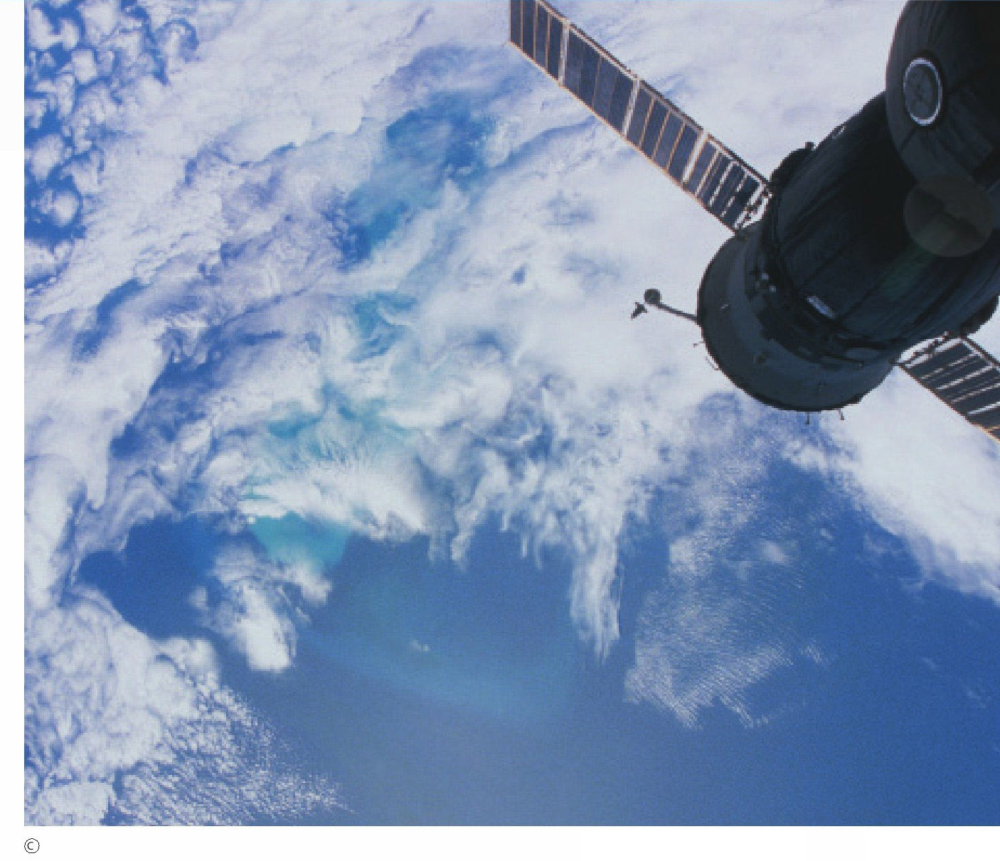
地球观测卫星

全球海洋温度图

  

**【微博士】**海表温度和海洋水温

因为“千里眼”探测器探测到的是海洋表面发射的电磁波，所以它测得的只是比一张纸还要薄（只有10微米厚）的海洋表面温度，相当于我们用温度计测了一下人脸的表面温度，却没有测到人体内的温度。要想测量海洋内部的水温，科学家还需要结合其他方法，通过海表温度计算得到不同深度海水的温度。另外，由于海洋上空经常有许多地方被云层所遮挡，而海水散发的热辐射无法穿透厚厚的云层，所以科学家又发展了微波遥感技术，专门用来穿云透雾，对海表温度进行探测。

## 从卫星上能测量海面浮游生物的数量吗

如果我们取一滴海水，放在显微镜下观察，会看到许多形状不同、种类各异的浮游生物。这些浮游生物虽然个子小，但却是海洋生物链中最基础的环节，因为它们不仅能通过光合作用释放出氧气，而且还是很多海洋鱼虾的食物。如果没有这些浮游生物，其他的海洋生物也就无法生存下去。所以，科学家都非常关心海洋里这些小家伙的数量。

虽然通过显微镜观察的方式，可以大致数出一滴海水中到底有多少数量的浮游生物。但是，面对如此浩瀚辽阔的海洋，要实现大面积海洋表面浮游生物量的观测，靠显微镜来“数”是肯定不行的。为了解决这个问题，科学家发明了一种神奇的仪器，能一边在天上“飞”，一边“数”出海面浮游生物的数量。这到底是怎么回事呢？

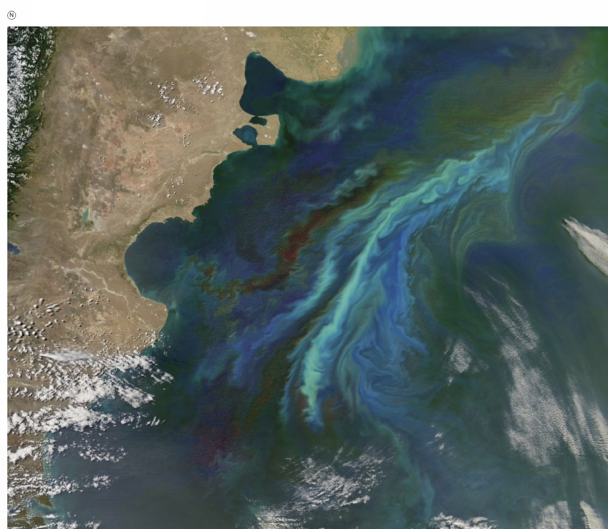
藻类勃发改变了海水的颜色

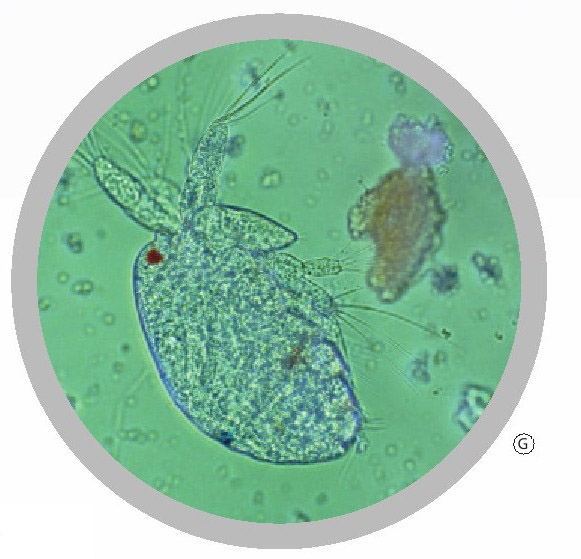
浮游生物是海洋生物链中最基础的环节

原来，海水的颜色会受浮游生物的影响。浮游生物体内存在大量的色素细胞，叶绿素a是分布最为丰富的一种色素，它比较喜欢黄色和蓝色波长的光，而不喜欢绿光。所以，当海水中存在一定数量的浮游生物时，海水就会变成绿色。此外，浮游生物在受到阳光照射后，还会发出一种红色的荧光。这种荧光是浮游生物所特有的，只要检测到这种荧光，就可以判定海水中含有浮游生物。

既然浮游生物能影响海水颜色，那么我们就能通过海水颜色判断海水中浮游生物的数量。因为浮游生物的数量越多，海水所散射出来的绿光或红色的荧光也会越多。这样，通过接收海水散射出来的绿光或红色荧光的强弱，就能测量到海洋浮游生物的数量。

前面提到的会“飞”的神奇仪器，其实就是搭载在海洋卫星上的水色传感器，专门用来接收不同颜色的海水散射光。卫星飞行的速度相当快，一天之内就能将全球海洋表面的浮游生物量“数”上一遍，有的甚至能“数”上几十遍。这样一来，科学家就能知道海洋里的浮游生物主要藏在哪里，是增多还是减少了。（周斌　雷惠　窦文洁）

  

【微问题】　为什么通过“千里眼”探测全球大洋海表温度，就可以知道地球上海水的流向呢？

【关键词】　海洋遥感　海洋卫星　海水温度　热辐射电磁波探测器浮游生物　水色传感器

## 海底地形图是怎样编制的

翻开全球海底地形图，你会发现宽阔的海底并非一马平川。那里有山脉、盆地、平原、坡地，高低起伏、错落有致，共同组成了复杂壮观的海底地貌。可是，海底被厚厚的海水所覆盖，既看不见，也摸不着，人们又是怎样知道海底地形变化的呢？

为了了解海底的地形，人们最想知道的还是海洋的深度。因为水浅的地方就是海底地形凸起的地方，而水深的地方就是海底地形低洼之处。起初，人们是用绳索绑上铅锤或炮弹沉到海底来测量水深的，但这样测得的水深数据显然不够精确。海洋的洋流会使绳索弯曲，使得测量绳索长度得到的水深数据往往大于实际的水深。此外，在深海区域，收放绳索的过程极为繁琐费时，测深效率十分低下。

1872年12月至1876年5月期间，英国皇家学会曾经组织“挑战者号”考察船，在大西洋、太平洋和印度洋进行了人类历史上第一次环球海洋科学考察，总航程超过12万千米。其间，科考队员通过绳索测量得到了约500个测深数据。到了20世纪初，通过这种方法得到的测深数据达到1.8万个。令人遗憾的是，虽然测得全球大洋的平均深度约为4000米，但却误认为洋底是十分平坦的。

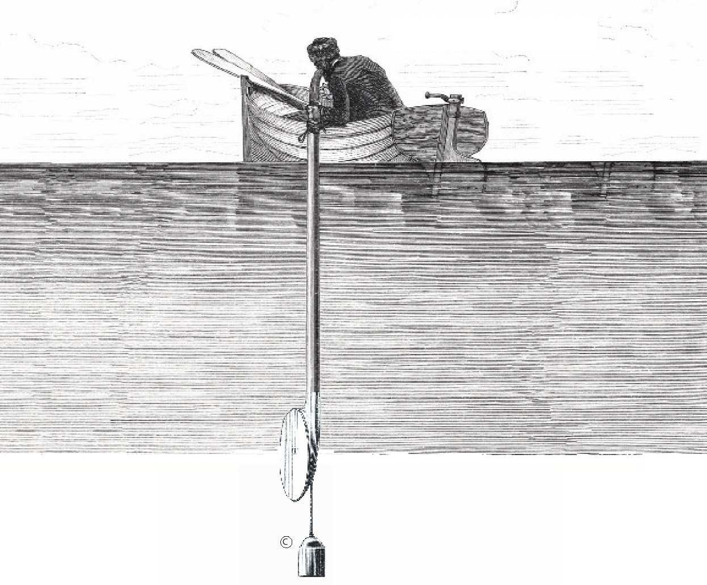
人们最早是用绳索绑上重物沉到海底来测量水深的

可见，用绳索测量水深的方法不仅费时费力，而且并不准确。那么，是否还有其他的方法来测量海水深度呢？随着新科技的出现，人们将目光转向了电磁波，试图用电磁波来测量海水深度。然而，试验结果却令大家失望，电磁波在水中衰减得非常快，根本无法完成测量，于是科学家再次转向寻觅。经过反复的试验，人们终于发现，声波在海水中能传播很远，用声波来测量海水的深度是一个不错的选择。

从船上向海底发射出的声波，遇到海底后能很快反射回来。此时，船上的回声测深仪就可以“接收”反射回来的回声。由于声音在海水中的传播速度（约1500米/秒）是已知的，只要记录下声波从船上发射到返回船上的时间差，就可以很容易地计算出水深了。

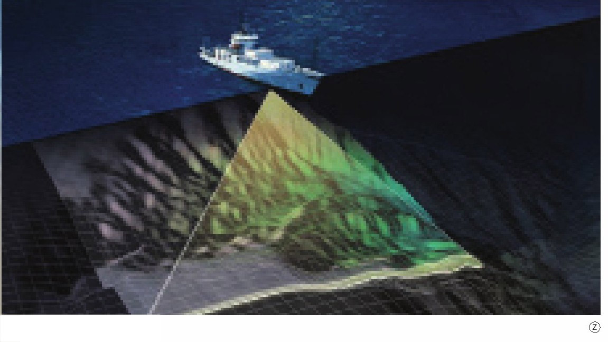
旁侧声呐

利用这种回声测深原理，人们发明了更先进的海洋测深设备，例如旁侧声呐等。旁侧声呐可利用安装于船底的声波发射器，以“扇面”形式向海底同时发射数十至数百束声波，对航线两侧一定宽度的海域进行连续扫描。由海底反射回来的声波组被船上的接收传感器接收后，再由信号处理机进一步处理，就可以绘制成详尽的海底地形图或水深图。旁侧声呐就像一台功能强大的海底“探照灯”，复杂的海底地形在它的“照射”下，一览无余地呈现在人们面前。（崔维成　戚心源）

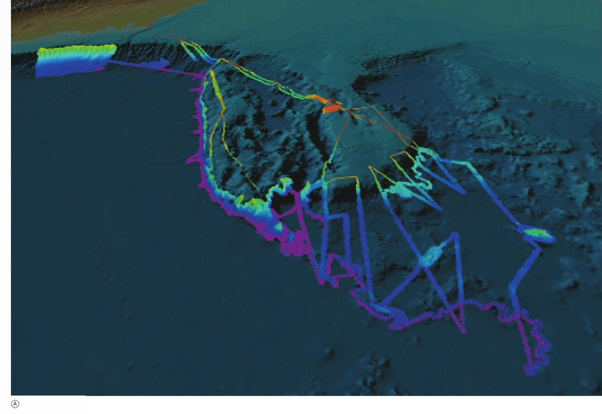
旁侧声呐高精度扫描海底地形的过程，图中的线条是考察船的航线

## 水下作业用什么办法传递信息

声波对于海洋探测而言，真是一个好东西！它不但可以用来测定水深、绘制地形图、测量海流的流速，还可用于帮助人们在水下传递信息。后者就是近年来方兴未艾、飞速发展的水声通信技术。

为什么声波能担此重任呢？原来，这与声波在海水中表现出的特性有关。声波是一种机械振动波，它依靠介质（如海水）的振动来传播能量。介质的密度越大，传播就越快，这也就是声波在海水中的传播速度要大于在空气中的传播速度的道理。声波的这种特性完全不同于在水中衰减很快的电磁波。迄今为止，声波是唯一已知的能在海水中远距离传播的能量形式。

我们平时交谈说话，声波是通过空气振动直接在人与人之间传播的，声音信号并不需要转换。在海洋中，声波需要通过海水传递信息，情况就有所不同了。如果我们在潜艇中，想要将声音通过海水传到另一艘船上，则需要一个特殊“扩音设备”的帮助。这个“扩音设备”就是水声换能器。它的神奇之处在于，可以将声能和电能相互转换。我们在潜艇里说话的声音，可以先通过它转换为电信号，再将电信号转换为超声波信号发射出去。超声波信号经过海水传播，被另一艘船上的接收器所接收，再转换成声音信号传到人们的耳朵里，这样就可以实现两者之间的通话了。当然，这种水声通信技术，也可用于潜水器与水下设备之间，水下设备与水下设备之间，以及水下设备与船舶之间的通信。

有了水声换能器，理论上我们就可以在海水中任意发射和接收不同频率、不同强度的声信号了，从而在海洋中轻易地实现各种重要信息的传递。然而，海洋并非一个安静的场所，海洋中的波浪、鱼类、船只、海上作业等均会产生各种噪声，使得海洋中的声场复杂混乱，导致接收到的信号模糊不清，造成水声通信的效果较差。消除水下通信时的多源信号干扰，目前仍是水声通信面临突破的一个技术难点。（崔维成　戚心源）

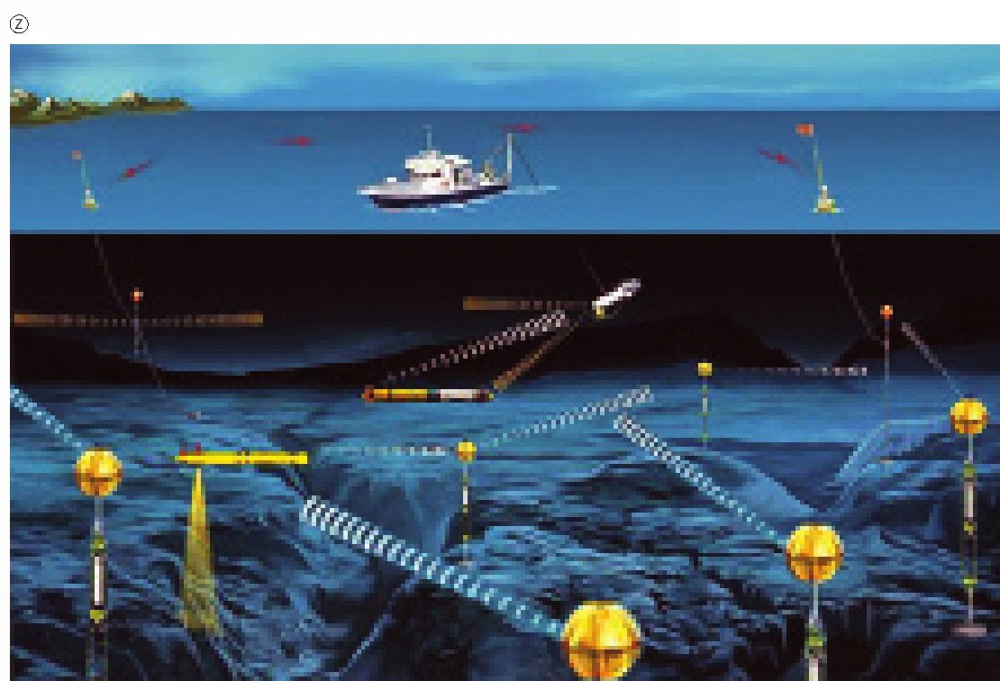
水下作业信息的传递

  

**【微博士】**卫星测高技术

卫星测高是指借助于海洋卫星上携带的测高仪，精确地测定卫星到瞬时海面垂直距离的技术。利用这种卫星测高技术，可准确测出海面的起伏变化，其精度可达厘米级。令人称奇的是，海面的起伏居然与海底地形的起伏相对应！这就意味着，只要测出海面的起伏，就能据此绘出海底地形图。这又是怎么回事呢？原来，海底地形的高低起伏反映了海底固态物质质量分布不均的状况。海山区的质量较大，引力就大，易于将周围海水“吸”向自己，海面就相对凸起；而海盆区质量较小，引力也较小，海面也就相对下凹。

【微问题】　还有其他方法可以在水下传递信息吗？

【关键词】　海底地形图　绳索测深　回声测深　旁侧声呐技术　卫星测高　水声通信

# 海洋环境

## 海平面是平的吗

正如英国诗人拜伦的诗句“唐璜站在夜的海边，平得像镜子的海面泛着月光的银辉……”，文人墨客描绘大海总会有碧波万顷如镜的想象。但是，海平面真是平的吗？如果你站在海边极目远望，远处确实平如镜面；假如你低头近观，海面上如果不是此起彼伏，也是轻波微澜。所以，海平面当然不是平的，海水时刻在运动着。

为什么海平面不平呢？这主要是由多个因素引起的。一方面，风暴、温度、气压、潮汐引力、冰川消融、河流淡水注入等因素都使海面瞬息万变；另一方面，崎岖不平的海底地形和海底地壳的重力场分布不均匀，也决定了全球海面不是一个平面，而是一个椭球面。全球不同地区大洋海面的绝对高差（相对地心的绝对距离）可达百米以上。

海平面变化其实就是海水面的升降变动，是海水总量、水圈循环、地壳运动和地球形变等的综合反映。海平面升降运动有短期的，如日变动、季节性变动、年变动和偶发性变动等，主要与波浪、潮汐、大气压、海水温度、盐度、风暴、海啸等因素有关，其升降幅度小，且常是局部的；也有长期的，即地质历史期间的海平面变动，其变动幅度大，是大区域性的，甚至是全球性的。

按观测的时间长短不同，海平面可以分为日平均、月平均、年平均和多年平均海平面。日平均海平面不但随天气状况而变化，且具有季节、半年、一年和多年的周期变化。中国边缘海的月平均海平面年较差（一年内最高值和最低值之差）为：渤海60～70厘米、黄海35～50厘米、东海30～35厘米、南海20～40厘米。（杨守业）

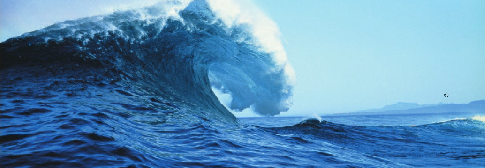
## 全球变暖，为什么太平洋小岛国最着急

科学家认为，全球变暖将会引起海平面上升。这主要有两大原因：一方面全球变暖，总热量的80%会被海洋所吸收，这些热量导致海水膨胀，可以引起海平面上升；另一方面，全球温度上升加速了大陆冰川和两极冰盖的融化，融化的冰水也造成全球海平面的上升。1961-2003年，全球海平面平均上升速度约为每年1.8毫米。1993-2003年，上升速度更快，每年大约为3.1毫米。全球海平面在20世纪的总上升幅度估计为0.17米。根据模型预测，不包括冰川以更快速度融化，到21世纪末期，海平面上升幅度将达到0.59米。而最近几年越来越多的研究证实，冰盖融化的速度正在加快，有学者预测到21世纪末，全球海平面将上升0.8米左右。但也有一些学者质疑全球变暖引起的冰川融化并不一定会导致全球海平面显著上升，因为地壳的均衡调整作用，一些地区的海平面反而会下降。

马尔代夫

海平面快速上升的严峻形势，使得世界上一些海拔比较低的岛屿国家特别着急，担心可能会从地图上消失。面临被淹没危机的国家包括从太平洋到印度洋的许多低地环礁岛国，如太平洋地区有上万个岛屿，多数平均海拔不到1米。很多低洼岛国和地区的经济不发达，科技力量薄弱，应对台风、飓风和海平面升高的能力特别薄弱，受到的影响也很大。有“人间天堂”之称的马尔代夫，平均海拔约1.2米，如果海面持续上升，不出几十年就可能消失。有专家预测，全球平均气温升高2℃，可能使菲律宾1/3的国土消失。除岛国外，从亚洲的孟加拉国、欧洲的水城威尼斯、澳大利亚的大堡礁，到美国的佛罗里达州，低洼沿海地区都有可能会被上涨的海水吞噬掉。有预测认为，到2100年，美国180个沿海城市至少有9%～10%的土地可能被水淹没。亚洲地区一些沿海城市也极有可能遭遇海平面上升带来的洪涝灾害。

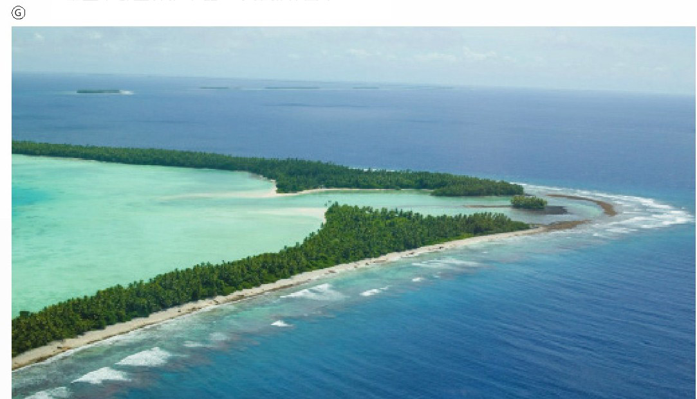
图瓦卢很可能会成为因为全球变暖、海平面上升而被海水第一个淹没的国家

当然这些都只是数值模拟的结果，而科学界对全球海平面变化的许多理论问题还在争论中，这些定量计算还只是推论。但是，低海拔太平洋小岛被淹没的危险，在大风暴的时候就可能发生。只有1万多人口的太平洋岛国图瓦卢，最高海拔只有4.5米，2000年2月19日下午，海平面瞬时升至3.2米高，图瓦卢全国几乎遭受了一次没顶之灾。也许图瓦卢就是将来第一个被淹没的国家。（杨守业）

马尔代夫

  

**【微博士】**海平面的测量

现代科学认为海平面即海拔高度的起点。它可以由人工水尺或验潮站（测量潮水位高低的观测站）的验潮仪测试每小时的潮位记录，在消除由海面风力导致的海面波浪影响后，取长期平均值得到。

【微问题】　为什么测量山的高度以海平面为标准？

【关键词】　海平面　全球变暖

## 为什么2万年前，古人从上海可以步行到东京

如果有人告诉你，在2万年前，步行就可以从上海出发前往东京，你相信吗？

你或许会说，2万年前上海还不存在呢！的确，上海是中国最年轻的大都市之一，其主体从水下长出形成陆地也不过才2000年历史，而2万年前还没有上海和东京这两个国际大都市。但是，那时的上海所在地到日本东京之间却不是滔滔海水，而是一片相对平坦的陆地。古人的确可以从今天的上海所在地步行到日本东京！这是为什么呢？

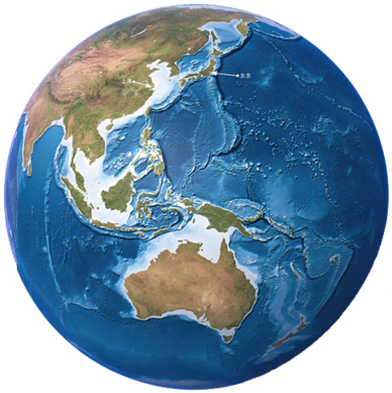
这张图上能清晰地看出上海到东京的大陆架很浅

原来，大约2万年前，地球进入末次冰期的最盛期。随着全球气候变冷，两极冰盖和高山冰川面积扩大，大量水分储积在冰川中，导致全球海平面显著下降。约2万年前的全球平均海平面比今天低120米左右。中国东部边缘海中，黄海的平均水深仅44米，最深的黄海槽在济州岛的北侧，也只有140米深。东海虽然平均水深约354米，但发育着世界罕见的宽广大陆架，平均水深仅72米，宽度超过600千米，面积约53万平方千米，占东海总面积的2/3多。大陆架坡度平缓，平均坡度不到1°。根据大陆架上的沉积特征、地貌形态和残存的古海岸线及其测年资料分析，在约2万年前，随着全球海平面下降，黄海和东海的古海岸线在现今水深120～160米的等深线附近。因此，当时黄海几乎全部暴露成陆地，而东海绝大部分的大陆架也暴露出水面。所以说，从今天上海所在地完全可以徒步行走至今天东京所在地。（杨守业）

## 为什么说上海是泥沙堆出来的

如果说上海这个高楼大厦林立的国际化大都市的地基，是泥沙堆出来的，你相信吗？这是千真万确的事情。上海的城市历史非常短暂，只有短短几百年。托起上海这座城市的土地也非常年轻，只有几千年形成史，而中国和世界上不少大城市下面的土地很古老，往往有几千万年以上的地质历史。

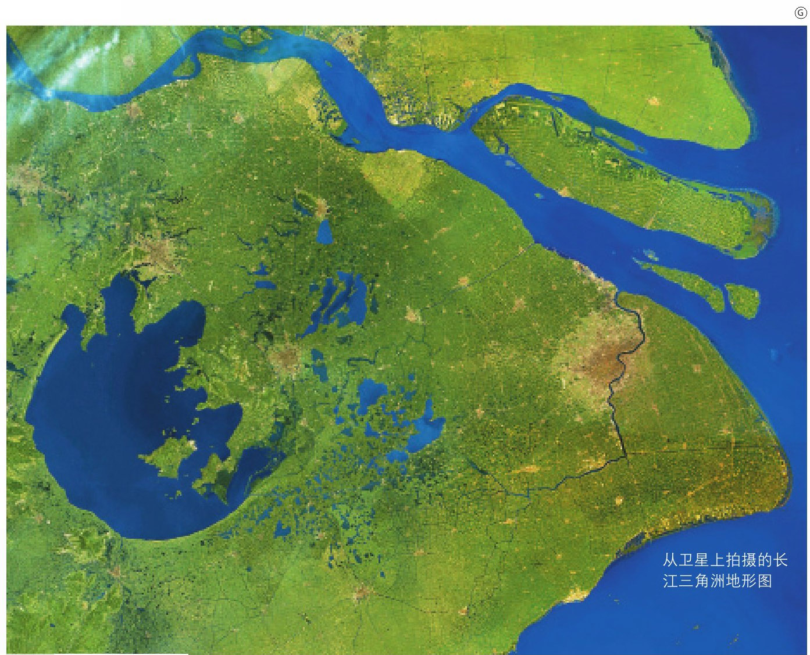
前面我们讲过，距今约2万年前的海平面比现在低120米左右，东海宽广的大陆架几乎全部暴露成陆地。到了1.5万年前，气温回暖，冰川消融，海平面逐渐上升，原本出露的大陆架又被海水淹没。距今1万年左右，海面上升至现代海平面以下约40米位置处，长江和钱塘江等河谷地区被海水淹没，上海所在地区的低洼之处也遭受海侵。距今约7000年前，全球海平面差不多上升到了最高的位置，长江口后退至今天的镇江和扬州一带，形成一个向东开放的喇叭形河口湾，就像今天的杭州湾那样，现今上海的绝大部分地区都在海水底下。长江带来的大量泥沙入海后沉降，充填了之前形成的河口湾。随着河流泥沙不断沉积，海岸线逐渐前进，河口湾转化形成了现代的长江三角洲。与此同时，潮汐也将近岸泥沙向陆地搬运，促进了三角洲沙体的堆积。随着长江泥沙源源不断地堆积，上海所在地区的海岸持续向东延伸发展，从而形成了如今上海脚下非常年轻的土地。（杨守业　范代读）

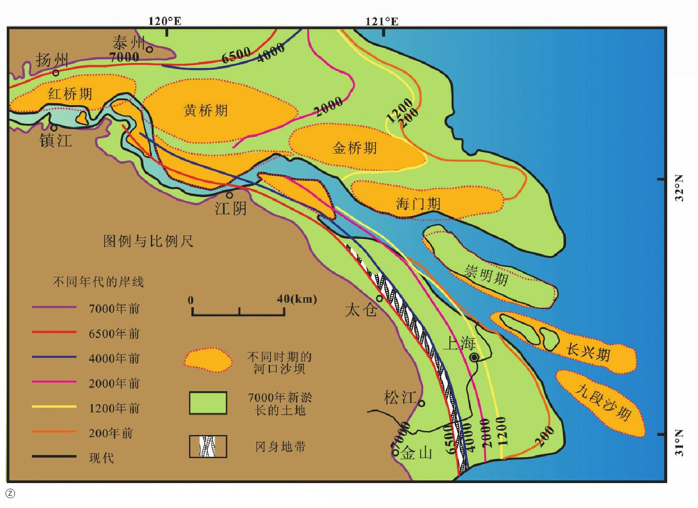
距今约1万年以来长江三角洲的岸线变化与成陆历史

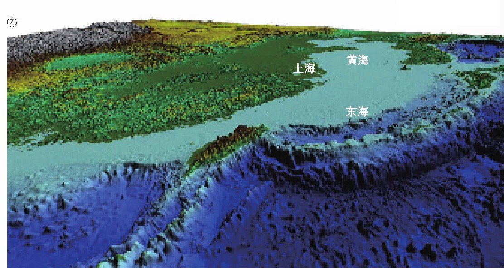
东海大陆架

  

**【微博士】**大陆架

大陆架是大陆地壳向海洋的延伸，即被海水所覆盖的大陆。大陆架的地势多平坦，坡度不到1°；大陆架海底为沉积物覆盖，它的边缘开始向深海倾斜，称为大陆坡。大陆坡比大陆架要陡些，不过平均坡度也只有3°，不会像山坡那样陡峭。大陆坡之下是大陆隆，连接深海平原。大陆架的深度一般不超过200米，但宽度大小不一。一般而言，与大陆平原相连的大陆架比较宽广，可达数百至上千千米，而与陆地山脉紧邻的大陆架则比较狭窄，可能只有数十千米，甚至缺失。大陆架上也可以发现一些丘陵、盆地，还有明显的“海底河谷（峡谷）”。这些峡谷地形多是陆上河流在海面下的“延续”，可能是冰期低海平面时期，大陆架出露，由河流冲刷而成，后来在海侵时又被淹没。比如铺在现代东海大陆架上很大面积的沙滩，就是冰期时残留的河流沉积物。

【微问题】　为什么东海大陆架有600千米宽，而智利岸外却没有大陆架？

【关键词】　大陆架　海平面　冰期　东海　长江　泥沙

## 为什么岛屿会“排队”

展开一张带有海底地形的太平洋图，最有意思的莫过于那一道道颜色最深的弧线海沟和一串串与之相伴的弧形岛屿了，它们总是亲密相伴，如影随形。从太平洋最北端的阿留申岛弧起始，沿太平洋西缘一路南下，经千岛——堪察加群岛、日本群岛、菲律宾群岛、马里亚纳群岛，又马不停蹄越过赤道，一直延伸到南太平洋的汤加——克马德克群岛。

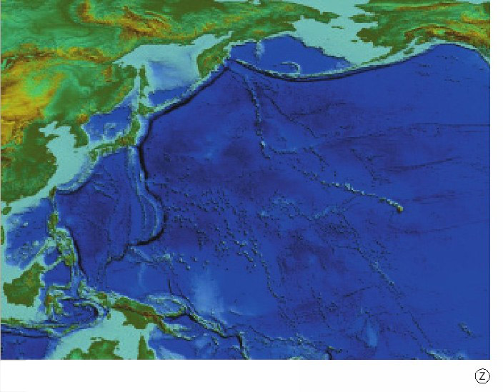
西北太平洋的岛弧和岛链

是什么自然力雕刻了如此深邃的海沟，并使岛屿们乖乖地在海沟边“排起队列”？这个谜一直困扰着科学家们，直到20世纪中叶，板块构造理论提出和被普遍接受后，才揭示谜底。

原来，地球表面并非坚如磐石静止不动，地壳漂在一层半流体状的软流圈上！大约2.5亿年前，地壳分裂成为六个大板块和十多个小板块。这些板块漂来漂去，东碰西撞，制造了地球上一系列事件，比如地震、火山爆发、新海盆的诞生、岛屿的形成、喜马拉雅山的崛起等。

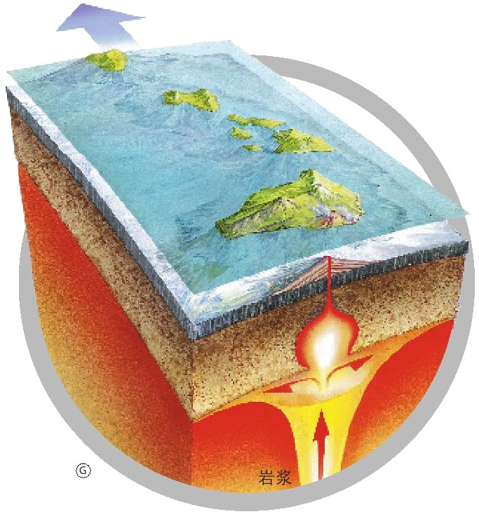
由地幔热柱形成的火山岛链

当两个板块迎头相撞时，重的海洋板块向下俯冲弯曲，插入上层板块下面。这个俯冲便形成了海沟。板块密度越大，俯冲速度越大，插入角度就越大，海沟也就越深。随着俯冲板块越插越深，温度和压力也越来越高，加上板块之间摩擦生热，致使部分俯冲板块熔化成岩浆。岩浆上升，穿透上层板块喷出，于是便产生了一串与海沟平行的弧形火山，即岛弧。其余板块继续俯冲，在岛弧后方更深的地方形成岩浆，岩浆上涌，形成凹陷的洋壳扩张带，即弧后盆地。

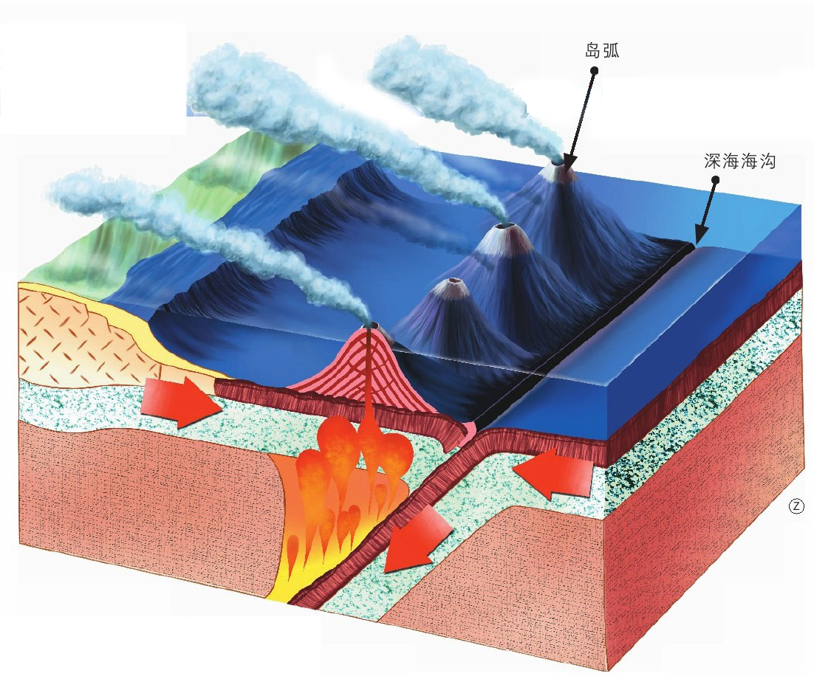
板块相撞形成海沟和岛弧

以阿留申群岛为例，它是太平洋板块向美洲板块俯冲的结果，形成了由300多个火山岛组成的岛弧，岛弧外侧是绵延3500千米、深达7180米的阿留申海沟，凹入一侧是阿留申海盆。

由于岛弧形成于两个板块边界之间，因此是地壳活动最频繁的地方。环太平洋一周，被称之为火环，世界上有一半以上的火山在此爆发，95%的地震能量在此释放。

还有一类“排着队”的岛屿主要发生在远离板块边界的地方，没有海沟相伴，与碰撞无关，而是与地幔热柱有关，它们是火山岛链。根据板块内热柱说这一假说，世界上大约有30根热柱，绝大多数在海底。它们周期性地将岩浆从地幔深处喷出来，形成火山。热柱是固定不动的，板块在热柱上方慢慢漂过，每隔一段时间就冒出一个火山岛，经过几千万年，便冒出了一串！这种火山岛链的特点是：岛屿是一个一个相继形成的。著名的夏威夷群岛和加拉帕戈斯群岛都是热柱形成的。如果热柱碰巧在两个正在分离的板块之间，涌出的巨量岩浆会使洋壳隆起变厚，形成一个露出海面的巨大平台，冰岛便是一个极端例子，它是大西洋中脊隆起的活生生的展示。（陈梦兰）

## 为什么有些岛屿会时隐时现

1963年的一个早晨，离冰岛海岸几千米处，一股黑烟腾空而起，次日凌晨，人们看见一座冒烟的小岛露出海面。此后短短几个月，海面上就耸立起一座100多米高的火山锥，岩浆不断涌出，最终扩展为一个约2.6平方千米的小岛。很快，附近又一座新火山爆发，只是形成的小岛不久便消失了。同样离奇的是，离澳大利亚3000千米的猎鹰岛，本是个平凡的小岛，1913年忽然彻底消失；13年后，海底火山爆发，小岛重新现身；23年后，这个小岛再度消失。类似这种岛屿时隐时现的戏剧性事件，在汤加海沟和阿留申海沟附近曾多次上演，人们把它们称为“幽灵岛”。

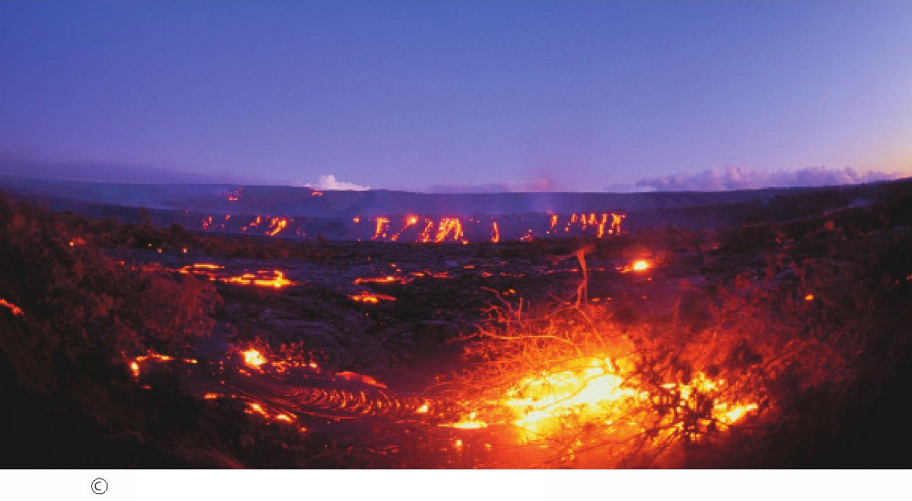
一些岛屿的时隐时现主要是由海底的火山活动引起的

科学家把“幽灵岛”的时隐时现归因于海底的火山活动。海底火山爆发，涌出的岩浆不断堆积，最终高出海平面，于是岛屿诞生。岛屿的消失有时可能是火山爆发之后内部的塌陷造成的，也可能是由于侵蚀、海流冲刷等作用，使其成为隐于海平面之下的海山；有时则是又一次的火山爆发摧毁了诞生不久的小岛；还可能是海底发生强烈地震和海啸，巨大的冲击震荡使小岛像高楼大厦那样轰然倒塌。

地质学家估计大约有10万座火山隐没于海平面之下，大多数分布在大洋中脊、海沟和地幔热柱附近。而“幽灵岛”出现的海域正是在上述这些地壳活动异常活跃的地区。

当然，这里说的只是火山形成的岛屿，也有些岛屿的出现与地壳活动无关。比如长江口的崇明岛，就是长江入海口的泥沙成年累月堆积起来的。（陈梦兰）

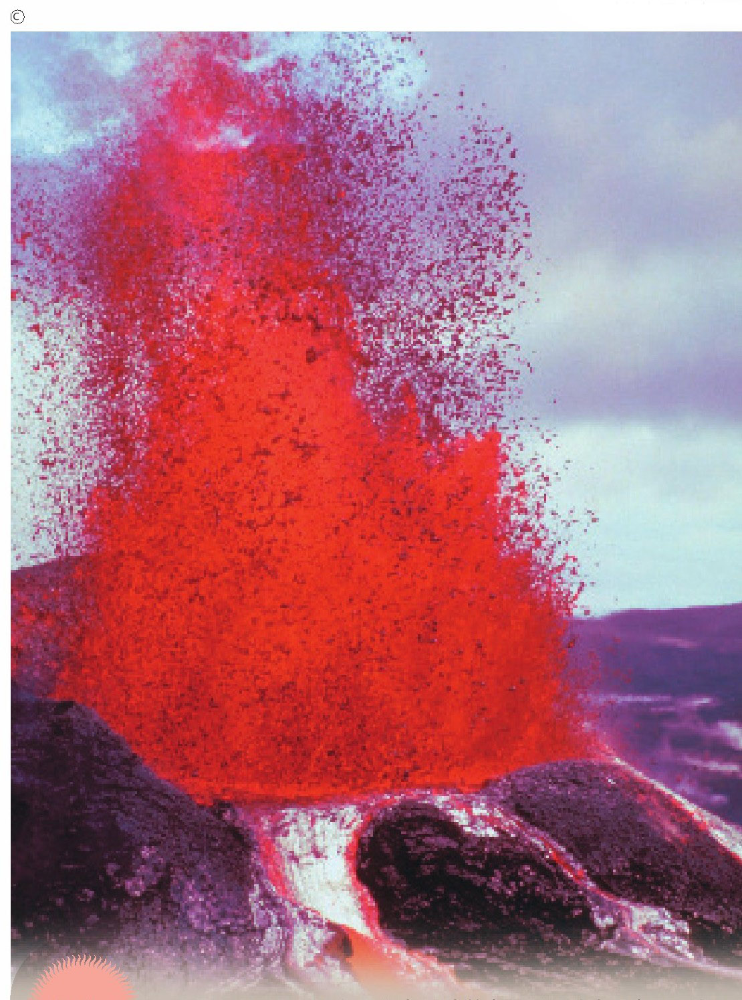
基拉韦厄火山

  

**【微博士】**夏威夷群岛

热柱形成的岛链以夏威夷群岛——天皇海山链最为著名，整个岛链由137座岛屿和海底平顶山组成，纵横6000千米，它们全是同一个热柱的功绩！最老的岛离热柱最远，已经沉寂7500万年了！更老的岛由于侵蚀早已隐入海平面，成为神秘的海底平顶山。最年轻的夏威夷岛（俗称大岛）眼下正“骑”在热柱上，由5座火山组成，其中基拉韦厄火山是目前地球上最活跃的火山。从1983年起，它每天都在喷发，向大海倾泻炽热的熔岩，向世人展示地球的奇观。

【微问题】　为什么热柱说可以测定板块漂移的速度？

【关键词】　海沟　岛弧　板块　热柱　火山岛

## 海水真的在变“酸”吗

“海水正在变酸”，这是近年来的一个热门话题。可是，海水真的在变酸吗？

要回答这个问题，先要弄清楚什么叫“酸”。水的酸碱度是用氢离子浓度来衡量的，常温、常压下pH值大于7是碱性，小于7是酸性。现在大洋的pH值平均在8.2左右，属于弱碱性。近年来的研究发现：工业革命200多年来，大洋pH值降低了0.1个单位。那么照此发展下去，海水会不会变“酸”，pH值降到7以下呢？当然不会。所以“海水变酸”的说法是一种误解。正确的说法是“大洋酸化”，也可以说“海水酸化”，含义是海水碱性的减弱，pH值的下降。

大洋酸化的原因，在于大气二氧化碳的增加。科学家监测发现，100多年来人类排放的二氧化碳约1/3被海水吸收，二氧化碳溶解在水里就会形成碳酸，使海水pH值下降。如果人类对二氧化碳的排放不加控制，预计到2100年，全球海洋水体的pH值还将再降低0.2～0.3个单位。这个数值看上去很小，但事实上，海水pH值每降低0.1，意味着氢离子浓度将增加30%！

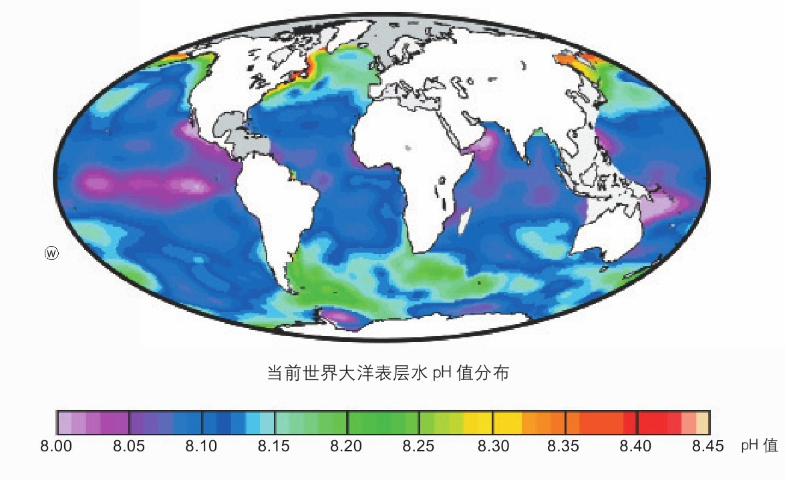
当然，海水的pH值本来并不固定，高纬度海域的pH值就比低纬度的高，表层海水中的pH值（8.2）比深层海水中的pH值（8以下）高。但从整个海洋环境来说，海水pH值的变化却是很小的，2000多万年来的变化幅度也只是在0.3上下，现在200多年就下降了0.1，岂不是可以看作一场人为的灾变！

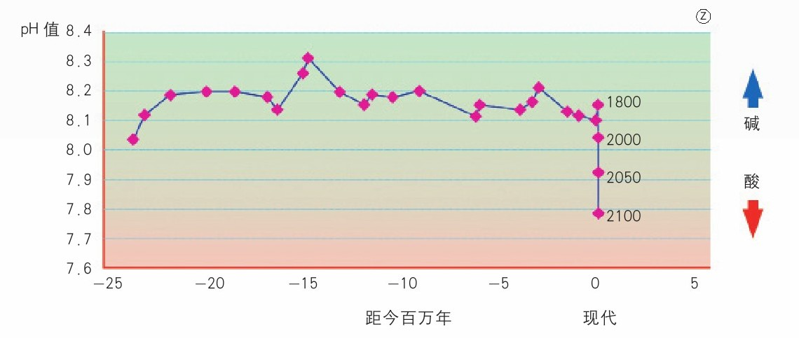
2000多万年来大洋表层水的pH值变化

海洋酸碱度的大幅度变化，地质历史上有过先例。距今5500万年前，由于海底“可燃冰”融化释放出巨量的甲烷，大气中的温室气体突然增加，在短短几千年的时间里，地球温度上升了5～7℃，大约2万亿吨的碳溶解到海洋中，整个海水的pH值下降，深海海底的碳酸盐大量溶解，导致大量海洋底栖生物灭绝。在这场劫难之后，海洋花了10万年时间方才恢复正常。事实上，地球历史上出现过的4次生物大灭绝事件，都伴随着海水酸化的现象。前车之鉴告诫我们，对于当下海水酸化的情况绝不可掉以轻心。（王吉良）

## 谁是海水酸化首当其冲的受害者

和陆地生物是空气污染的受害者一样，海洋里的生物同样是海水酸化的受害者。因为pH值下降而受害的，首先是有碳酸钙骨骼的生物。在表层海水里碳酸盐一般处于饱和状态，一些海洋生物的碳酸钙骨骼得以更好地保存。到了深水环境，由于压力增大、温度降低，碳酸盐变成不饱和，碳酸钙就会溶解。海水酸化，就是表层海水的pH值下降，使得碳酸盐饱和度下降。这一来可不得了，那些靠碳酸钙骨骼保护或者支撑的生物，就会失去生存能力。

有碳酸钙骨骼的生物很多，小的像浮游生物里的有孔虫、颗石藻，大的像海底生活的软体动物，包括有双瓣壳的瓣鳃类和有螺蛳壳的腹足类。幸运的是，它们的壳体主要是由方解石组成的，比较耐溶。碳酸钙有两种成分一样、结构不同的矿物，三方晶系的是方解石，斜方晶系的是文石。相比之下，文石比方解石容易溶解得多，所以海水酸化的受害者里，首当其冲的是有文石骨骼的生物，珊瑚就是其中的典型代表。

造礁珊瑚的骨骼主要由文石组成，海水酸化会阻碍珊瑚文石骨骼的形成。如果大气中二氧化碳的含量在工业革命前的基础上翻一番，达到560厘米3/米3，就会使珊瑚分泌文石骨骼的能力下降40%，危机将随即而至。澳大利亚大堡礁是世界上最壮观的珊瑚礁，但是从1990年至2005年的15年里，大堡礁珊瑚钙化的程度下降了14.2%。虽然目前珊瑚礁还不会消失，但是它们的钙化程度却在减弱，珊瑚种类也在减少，如果这种状况得不到改善，五彩缤纷的珊瑚礁最终将会变成单调乏味的去处。

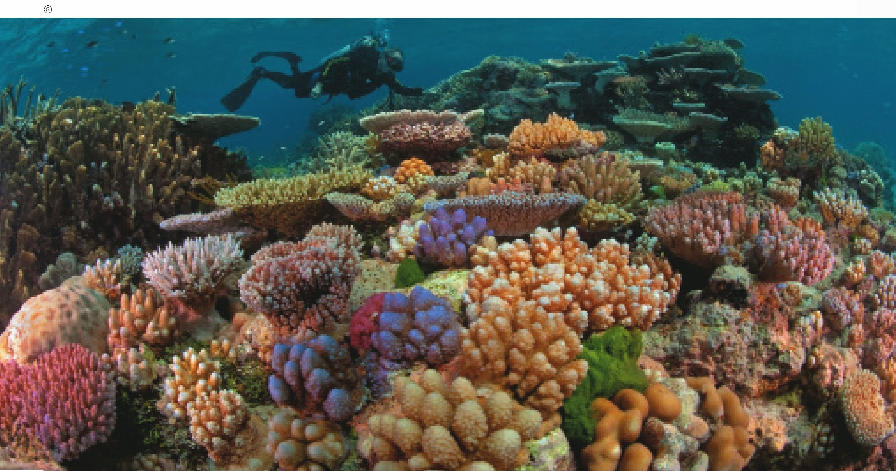
海水酸化受害更大的是浮游生物，特别是一种小型的叫作翼足类的浮游动物。它属于腹足类，和蜗牛、海螺是同一家，只是在海水里生活，叫作海蝴蝶。翼足类的壳不但又小又薄，而且是文石质的，海水酸化时比珊瑚更容易溶解，特别是在极地附近海域，文石的饱和度比热带海域更低。如果二氧化碳排放不能遏制，估计到2050年，南大洋的翼足类就会消失，从而影响到整个生态系统。

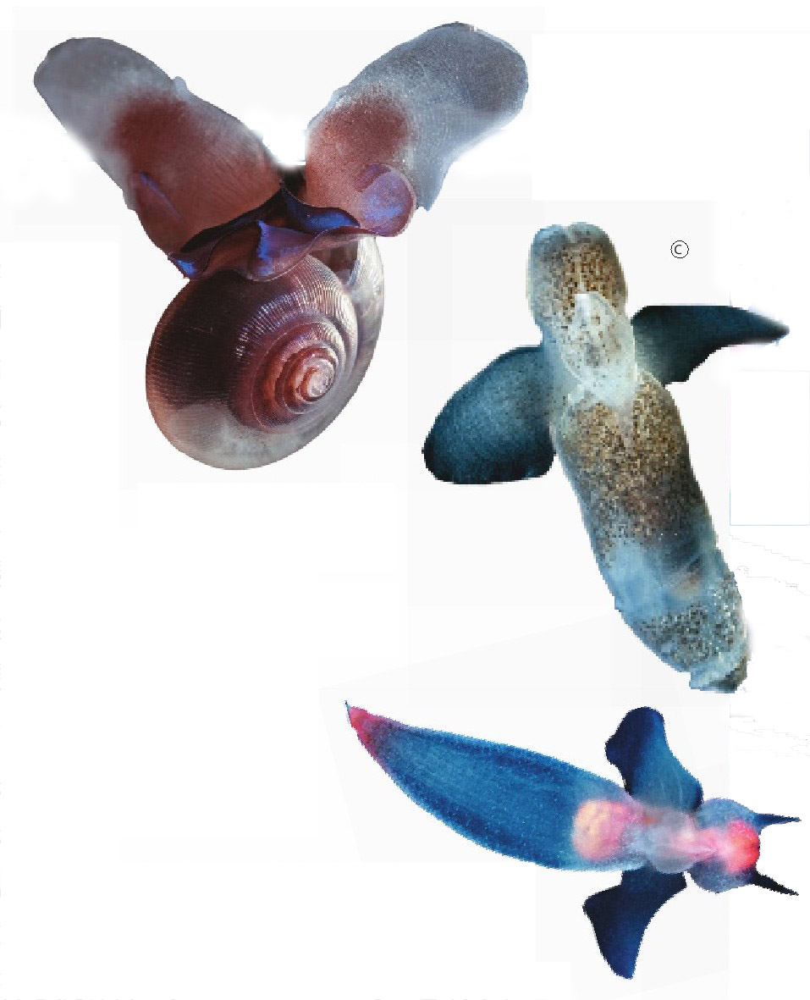
美丽的海蝴蝶很可能因为海水酸化而消失

海水酸化当然也影响着方解石骨骼的生物，比如说工业革命200多年来，南大洋有孔虫的方解石壳就减轻了30%～35%。还有实验表明，海水的pH值降低时，颗石藻的方解石骨骼会变成畸形，也说明其钙化程度下降。但是，海洋是个非常复杂的系统，海水酸化对于各类生物影响究竟如何，一时还说不清楚。同一类的颗石藻，也有迹象表明目前它们的方解石骨骼不但没有减弱，反而是在增强，因为海水变暖有利于钙化。（王吉良）

  

【微问题】　人类怎样才能阻止海水酸化的脚步？

【关键词】　化石燃料　文石　方解石　海水酸化　微体生物　海洋生态系统

## 为什么环境恶化会使得水母泛滥成灾

水母是一种美丽的海洋生物，它们在地球上已经生存了5亿多年。远远望去，它们的身影像是初夏暖阳中被微风拂开的一朵朵慵懒的蒲公英，又像是秋日雨后山林中星星点点状鲜嫩的白蘑菇。它们是海洋中的“精灵”，在大海的怀抱中轻盈而尽情地嬉戏，自由且惬意地生活。然而，水母虽然外表美丽，但是当它们在海洋中疯狂繁殖时，这些“精灵”就变得不再温柔，而成为造成海洋生态灾害的“魔鬼”。近年来，在世界各地的海域中，人们发现水母泛滥成灾的现象愈演愈烈。全球很多海域都出现水母大暴发现象，包括黑海、地中海、纳米比亚外海、美国夏威夷沿岸、墨西哥湾、白令海等。中国所在的东亚海域大型水母的暴发尤为严重。

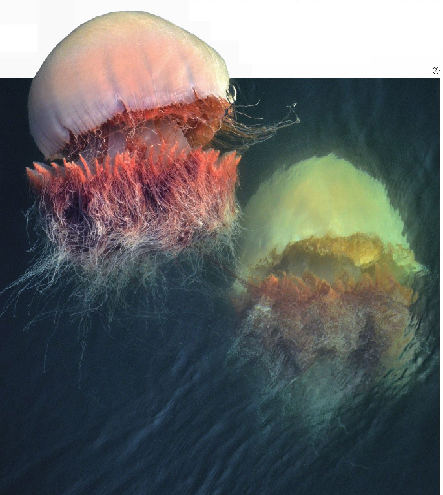
水母

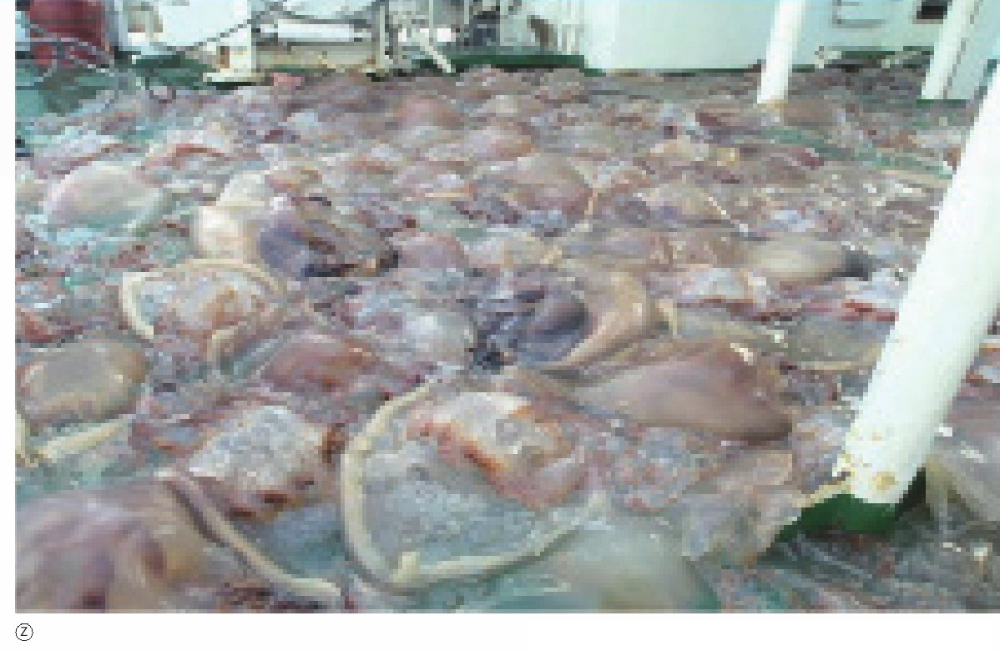
船甲板上的水母——沙海蜇

水母的暴发对沿海工业设施造成严重威胁。2011年6月，苏格兰通尼斯核电厂附近的海域出现大量水母，堵塞了海水冷却系统，导致两座核反应堆紧急关闭。水母的暴发还迫使澳大利亚和欧洲的一些海水浴场和娱乐设施关闭。每年，都会听到很多起水母伤人的报道。

那么，是什么原因导致水母在这些海域泛滥成灾的呢？主要有下面几个因素：首先是人类的过度捕捞导致渔业资源的破坏，由于水母与鱼类竞争饵料，并且很多鱼类是水母的天敌，所以鱼类减少之后，水母不仅能够获得更多的饵料，而且还减少了被捕食的危险；其次是由于海洋富营养化引起的浮游生物的大量繁殖，这些浮游生物很难被鱼类等生物利用，却能够被水母利用，富营养化导致的底层海水缺氧，影响到鱼类和一些底栖生物的生存，但水母的水螅体却能够忍受低氧环境；第三是由于全球气候变化的原因，海水温度的升高为水母的暴发提供了有利条件；此外，海洋运输活动引起的生物外来种的传播和海岸带工程等也是导致水母暴发的重要因素。所以，水母的暴发既有全球变化的原因，也与人类活动关系密切。

面对水母的大量繁殖和其他日益严峻的海洋生态问题，人类不仅需要反思，更需要共同努力，认知海洋规律，合理开发海洋资源，保护海洋环境，这才是防止水母“称霸”海洋世界最有效的办法！（孙松）

## 为什么说珊瑚“褪色”是灾害

在海洋中，珊瑚常呈现绿、蓝、黄、褐、红、紫等各种不同的色彩。这些多姿多彩的珊瑚可以作为装饰品，是大自然赋予人类的瑰宝，而其中色彩艳丽的宝石级珊瑚更是古代帝王将相的宫殿中不可缺少的珍贵藏品。古代罗马人将色泽鲜艳的珊瑚视为具有防祸消灾、启迪智慧功用的吉祥物；而印度也将美丽的红色珊瑚看作神灵的化身，是祭祀与装饰佛像的圣品。

但是，制造珊瑚的珊瑚虫实际上是白色的，那么这些璀璨夺目的美丽颜色是哪里来的呢？原来珊瑚体内通常都有大量共生的海藻——虫黄藻。在正常的生理情况下，这些共生藻密集分布在珊瑚内皮层的细胞中，每平方厘米的珊瑚组织中可能含50万～500万个共生藻细胞。这些藻类除了通过光合作用制造出自身及宿主珊瑚虫生存所需的养料外，它们体内携带的各种色素也装扮了珊瑚，因此才有了我们看到的色彩斑斓的海底珊瑚世界。

然而，近年来世界各地都出现了一种奇怪的现象——珊瑚“褪色”，即彩色的珊瑚逐渐变白，这种现象又称为珊瑚白化。这些艳丽的珊瑚为什么会卸下浓妆而失去往日的神采呢？这是因为当珊瑚遭受外部环境剧烈改变时，会把体内的共生藻类排出体外，其结果就会使珊瑚失去这些带有色素的藻类而还原为自身的白色。另外，如果珊瑚与海藻微妙的共生关系被长期破坏，珊瑚终将会因失去食物供应而丧失生命力。

那么，导致珊瑚“褪色”的外部环境因素有哪些呢？据研究，全球变暖、海水温度升高、海水酸化、海水污染、海水透明度减弱等因素，均会导致珊瑚的白化与死亡。在众多因素中，全球变暖和海洋酸化等重要因素受到了全世界的共同关注。具体来说，由于全球变暖、水温升高，使得为珊瑚虫提供营养的共生虫黄藻大量离去或死亡，从而导致珊瑚的白化和死亡。因此，珊瑚繁盛与死亡是地球环境的风向标，它的“褪色”过程指示着我们的地球正经历着严峻的环境恶化过程。为了缓解珊瑚白化的问题，人类必须大力减少温室气体的排放，从而缓解全球变暖和海洋酸化等环境问题。让全世界携起手来，共同努力恢复那五彩缤纷的珊瑚世界，重建鱼、虾、蟹等海洋动物世代栖息繁衍的生存乐园，为我们的子孙后代留下美好的明天。（李季伟）

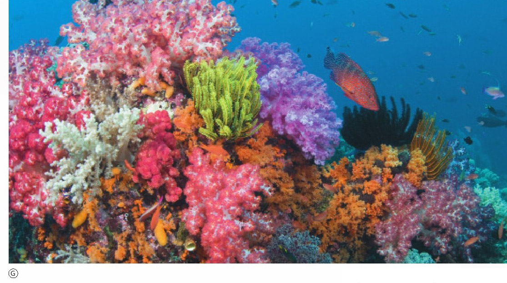
海底五彩缤纷的珊瑚世界

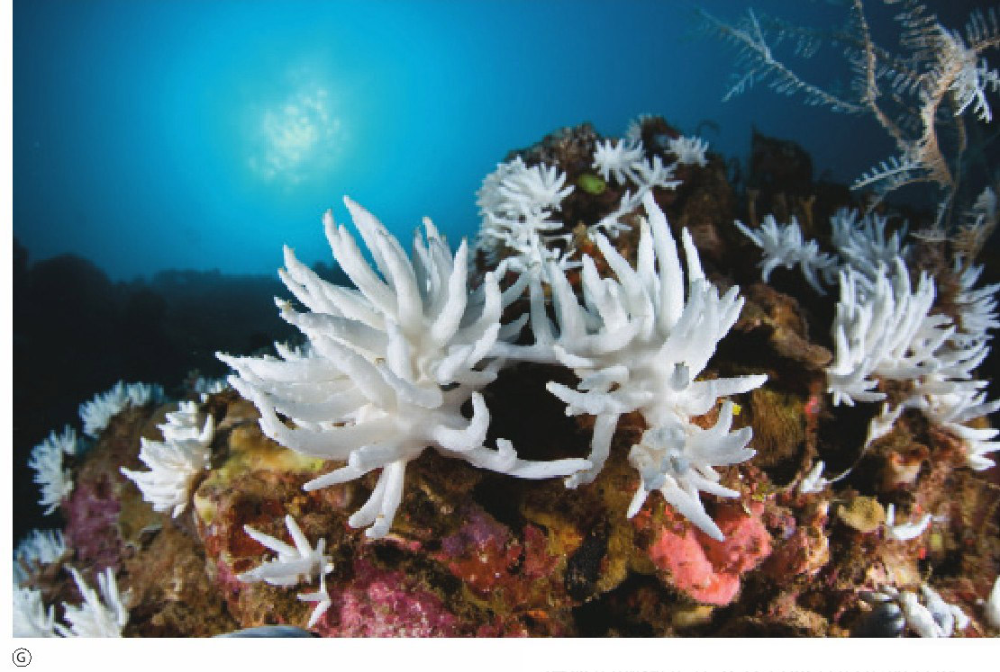
海底的珊瑚正在失去它原有的艳丽容颜

  

**【微博士】**和珊瑚共生的虫黄藻

造礁珊瑚都有虫黄藻共生。这是一种单细胞的涡鞭毛藻，能够进行光合作用，不但为珊瑚虫提供碳水化合物和氧气，还能帮助珊瑚虫建造骨骼。因为珊瑚虫新陈代谢排出的二氧化碳妨碍着石灰质骨骼的生长，而虫黄藻光合作用需吸收二氧化碳，正好促进珊瑚骨骼的形成。造礁珊瑚以捕捉浮游动物为生，而珊瑚生长的清澈海水里浮游动物不多，因此珊瑚虫单靠自身捕食是不够的。虫黄藻的存在，不但帮助珊瑚虫解决了生计问题，也为自己谋得了利益，它们是互惠共生的好榜样。

【微问题】　在海洋中，还有哪些动物能分泌固体的外壳？

【关键词】　水母　珊瑚白化　温室效应　海洋酸化　虫黄藻　共生

## 海洋会患缺氧症吗

氧气是人体呼吸不可缺少的气体。当人体的氧气供应不足时，将使身体产生各种病变，严重时甚至会导致死亡。可见，缺氧对人体而言是多么的可怕！但你可能不知道，氧气对于海洋来说也同样重要。在一些近岸海域，由于海水中的氧含量降低，各种鱼类和其他海洋动物因缺氧而大量死亡，原来生机勃勃的海域正慢慢变成一片死海！

那么，海水中的氧气是怎么来的呢？溶解在海水中的氧气主要是由大气和海洋中的浮游植物通过光合作用产生的。在一般情况下，这些溶解在海水中的氧气，足够为各种海洋动物提供呼吸所需。也正因为有了这些氧气，海洋动物才得以无忧无虑地在海洋中生活。一旦海水中的氧气大量减少，这些海洋动物将面临无氧可用的险境。氧气的缺失将使海洋动物无法呼吸，进而导致它们大量地死亡，严重地危害着海洋生态系统的安全。

原本健康的海洋，为什么会患上可怕的缺氧症呢？科学家发现，许多海水缺氧现象的发生其实与人类活动引发的环境污染密不可分。人类生产和生活活动排放出的氮、磷等污染物会通过各种途径汇入海洋。你别小瞧这些氮、磷污染物，它们含有海水中浮游植物生长所必需的营养元素。一旦增多，就好比是给海水中的浮游植物“施肥”。浮游植物在这些“肥料”的刺激下，快速生长并大量繁殖。当过度繁殖的浮游植物和以浮游植物为生的其他浮游生物死亡后，尸体会沉入海底，在微生物的作用下发生降解。在降解过程中，将消耗大量的氧气，从而造成海水严重缺氧。

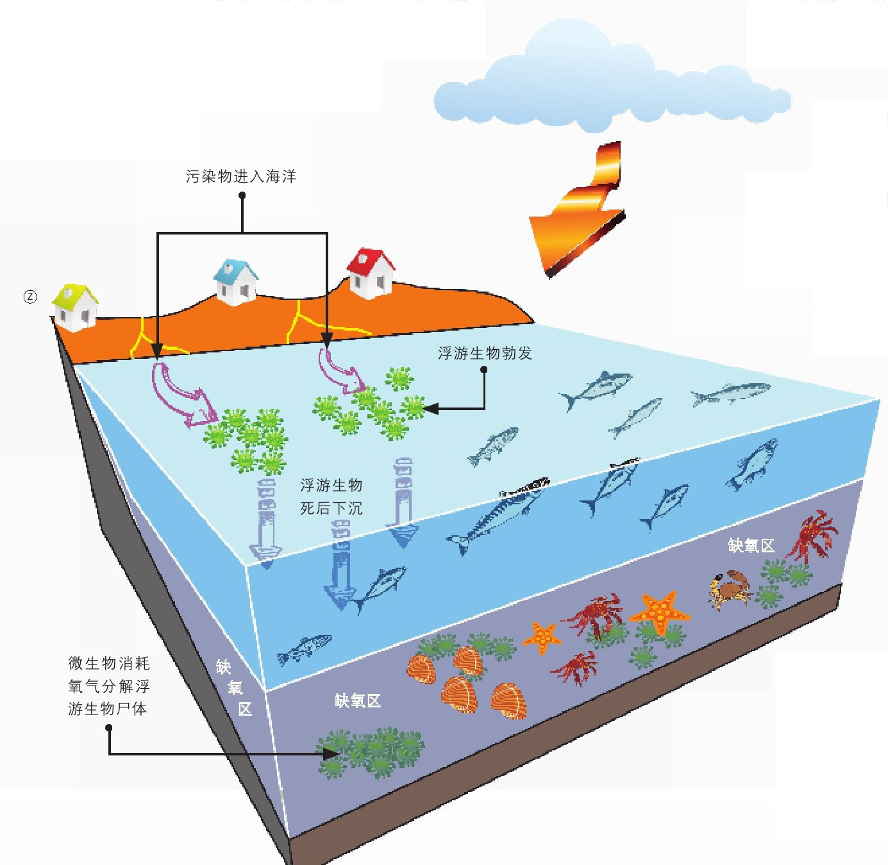
海洋缺氧形成示意图

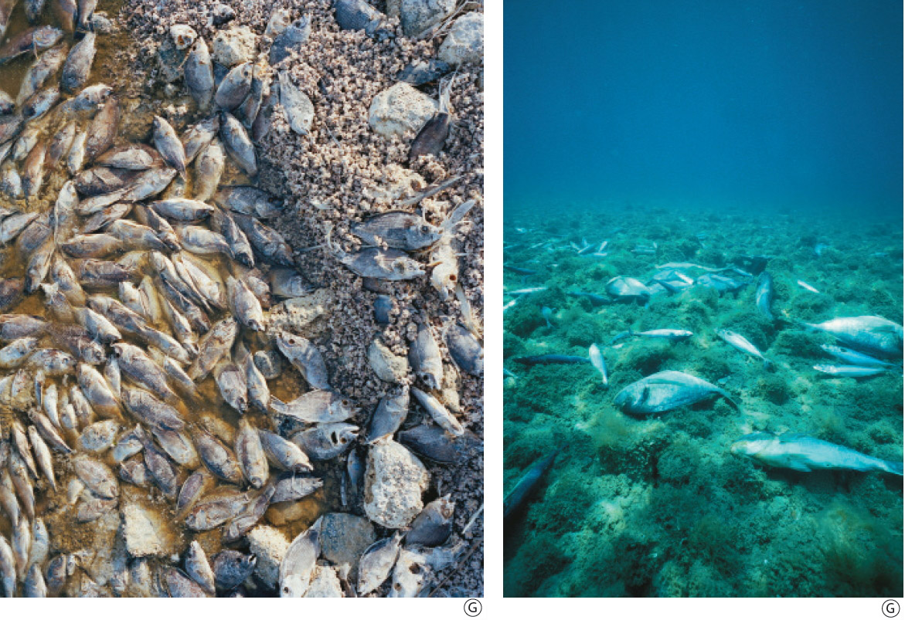
因缺氧而死亡的鱼群

目前，在世界上许多海域均发现了缺氧区或低氧区，例如黑海、墨西哥湾等。在美国长岛湾西部，底层海水中甚至不含一丁点儿氧气，表层海水中溶解氧的含量也接近于零。对于生活在海洋上层的动物而言，这样的海域无异于生命的禁区。如果不小心闯入，等待它们的将是死神的召唤。为了获取更多的氧气，很多原本生活在该水域的海洋动物不得不迁徙到氧气含量较高的其他水域。

海底缺氧，同样在中国海岸带发生，长江口外就是一例。随着营养盐浓度的增加，极易在夏季形成缺氧区。1999年8月，在长江口外海域就出现了20米厚、面积达1万多平方千米的低氧区，每升海水含氧量只有1～2毫克。（彭晓彤）

## 海底会释放出杀人的毒气吗

2003年12月的某一天，非洲纳米比亚海岸带忽然被一种神秘的有毒气体所笼罩。200多人中毒死亡，1万多人患上了各种疾病，超过25平方千米的地区受到了这种有毒气体的严重影响。人们不禁想知道，谁是制造这次灾难的罪魁祸首？这次灾难究竟是天灾，还是人祸？

原来，这些可怕的有毒气体竟然是硫化氢（H2S）。它的毒性很强，能与血液中的血红蛋白结合，破坏人体的神经系统和呼吸器官，是臭名昭著的毒气之一。让很多人困惑不解的是，这些剧毒的毒气并非是从工厂排放出来的，而是在海底自然产生并释放出来的。好比此处的海洋不经意间打了一个饱嗝，无数的硫化氢气体就从海洋的“肚子”里排放了出来。由于硫化氢气体的密度比空气大，所以从海面逸出后，它们就贴地而行，在地面上生活的生物就此遭了殃。

雪上加霜的是，硫化氢气体在海水中会很快氧化，这一过程严重消耗了海水中的氧气，从而制造出另一种成因的海水缺氧现象。在缺氧和毒气的双重打击下，这一海域的海洋动物大量死亡。如果你此时漫步在纳米比亚的海滩，会发现一些鸟类正在啄食鱼类腐烂的尸体。如果运气好的话，你还能逮到几只正在海滩上避难的大龙虾呢！

在纳米比亚海岸带海域，海底硫化氢的喷发已经成为一个寻常的事件。世代居住在那里的人们，非常熟悉硫化氢气体所特有的、令人讨厌的臭鸡蛋味。那么，这些难闻的硫化氢气体究竟是怎样在海底形成的呢？科学家发现，它的产生竟然与海底微生物的密切活动相关。在有机质丰富的纳米比亚海底，栖息着数不清的硫酸盐还原微生物。它们一方面降解有机质，另一方面还原海水中的硫酸盐。硫化氢气体就是这一生命过程的副产品。

为了了解纳米比亚海域硫化氢释放的影响范围，科学家使用海洋遥感卫星对这一海域进行了监测。监测表明，从太空中俯瞰，纳米比亚海域硫化氢的释放显然并非只局限在一个小小的范围内，它几乎影响了整个纳米比亚海岸带，一次硫化氢喷发覆盖的面积甚至可以达到上万平方千米。尽管每次硫化氢喷发持续的时间并不长，但发生的频率却较高，经常是来了又去，去了又来。（彭晓彤）

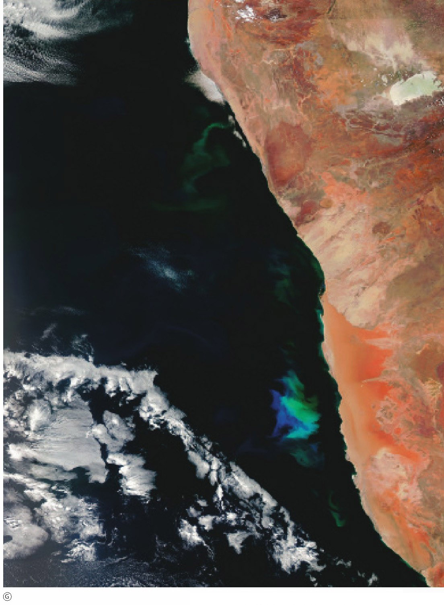
卫星遥感图像揭示海底释放出硫化氢气体（绿色）

  

**【微博士】**哪些海域最容易患上缺氧症

缺氧现象常发生于海水交换不畅的海域，如半封闭的海湾、河口、内海等。在这些海域，由于海水的停留时间较长，容易使来自陆地的输入物质发生累积，造成水体的垂直密度分层，使大气和浮游植物光合作用释放的氧气无法到达底层。一方面底层氧气得不到补充，另一方面微生物为分解浮游生物遗体，却在大肆消耗底层海水中原有的氧气，因此这类海域最容易患上缺氧症。人们将这些缺氧区形象地称为“死亡区”。目前，在全球近岸海域已经发现了375个这样的“死亡区”。它们的大量涌现，向人类敲响了保护近岸海洋环境的警钟。

【微问题】　为什么卫星能监测海水中的硫化氢气体？

【关键词】　海洋缺氧　浮游植物　富营养化　纳米比亚海域　硫化氢

## 海水与河水的界线为什么会变

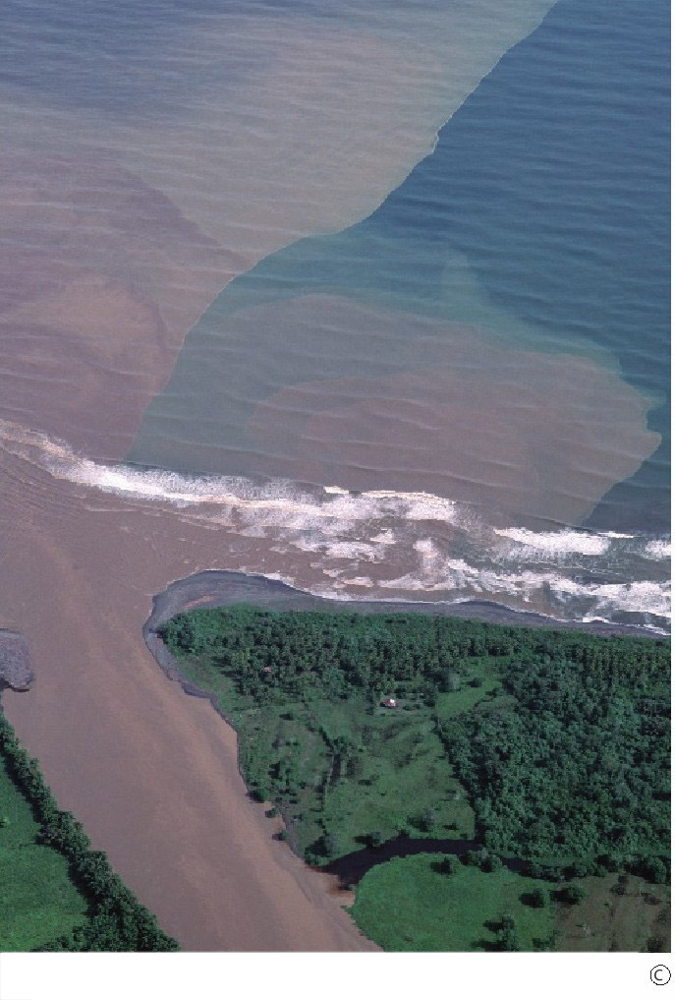
河口附近海域，往往可以看到海面上有一条不断变动的色线

当你乘船出海经过河口附近海域时，往往可以看到海面上有一条不断变动的色线。在靠近河口一侧的水体呈黄褐色，而在向海一侧的水体则呈蓝绿色，泾渭分明，成为河口附近海域特有的一种自然现象。这条分界线是怎样形成的，它又为什么始终在变呢？

大家知道，河水是淡水，海水是咸水。河流不断地将淡水输往海洋，在河口附近海域与海水混合，并因此形成低盐的河口混合水，又称冲淡水。由于冲淡水的密度小于海水的密度，它浮托于海水之上，在惯性和浮力的作用下，呈羽状流形式向海扩散。当低盐的冲淡水在上层向海扩散时，高盐的海水则以补偿流的形式从底部楔入到冲淡水层之下。由于两者的密度差异，在冲淡水与海水之间便形成一个界面。该界面向河口方向倾斜，在海面上表现为一条呈弧形分布的线，这条线大体上代表海水与河水的分界线。在界面附近的海面上经常出现泡沫线，有时还可以看到油污、塑料、木头、玻璃瓶及动物尸体等污染物和废弃物构成的碎屑线，这些成为了判别海水与河水分界线的标志之一。如在美国哈得孙河口，曾经观测到碎屑线延伸距离长达30千米以上。

河流在通过河口向海洋输出径流淡水的同时，也将泥沙、有机质及营养盐等物质携带入海。

因此，源自河流的冲淡水不仅在悬浮泥沙的含量上高于外围海水，而且因含有丰富的营养物质导致浮游植物大量繁殖，含量显著高于周边海水。不同河口的冲淡水或由于泥沙含量高，或由于浮游植物含量高，或两者兼而有之，导致水色发黄，这也就是河口附近海域色线形成的原因。

河口冲淡水与海水分界线的位置始终处于不断变化之中，主要是受径流、潮汐潮流及沿岸流的制约。首先，由于河流径流量的年际变化较大，洪季时径流量大，冲淡水扩散范围大；枯季时径流量小，冲淡水扩散范围小。如长江河口冲淡水的主体边界，洪季时一般可达东经123°附近，而在枯季时退缩至长江河口口门一带，相距近100千米。其次，冲淡水与海水的分界线会随潮周期（包括年、月和日周期）发生脉动变化，涨潮时向陆移动，落潮时向海迁移，其移动幅度随不同潮周期而变化。此外，河口冲淡水与海水分界线还受到沿岸流的影响。如长江河口冲淡水在冬季大多向东南偏转，但在夏季时因受台湾暖流的影响而有着向东北转向的趋势。（刘苍字）

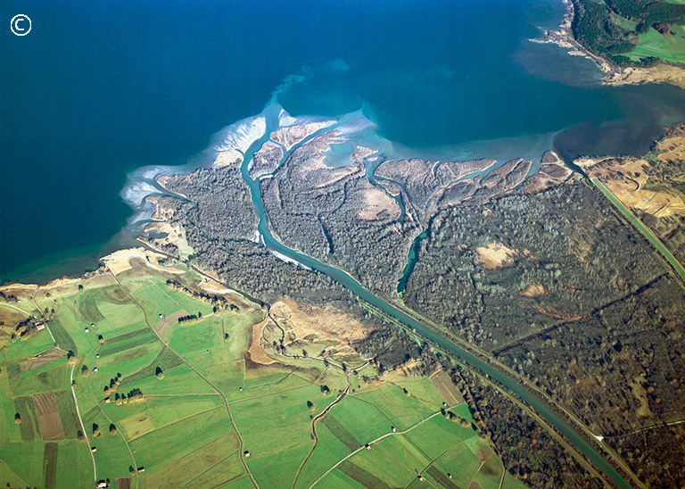
河流入海口

## 海水会不会进到河口里来

河水不会倒流，这是亘古不变的自然规律。唐代大诗人李白也曾留下了“君不见黄河之水天上来，奔流到海不复回”的千古绝唱。然而，在河流即将入海的河口段却是一个例外。那里的河水每天都会出现周期性的倒流现象。这是为什么呢？

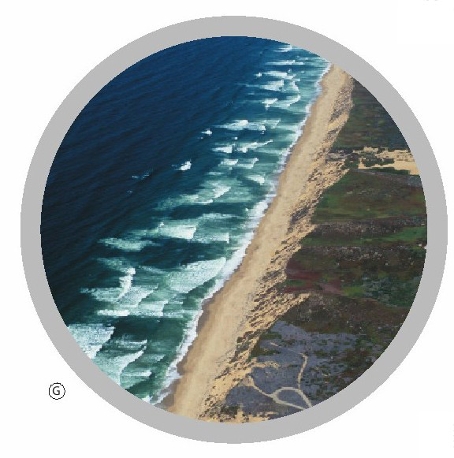
原来，河口是河流与海洋结合的地段，也是径流与潮流相互作用的地段。落潮时，河口段的水面高于口外海域，水面向海倾斜，河水下泄入海；涨潮时，当潮位上升到一定高度后，水面从向海倾斜转为向上游倾斜，河口水流即向上游流动，于是便出现河水倒流的现象。因此，是潮汐作用引起河口水流作周期性往复运动，而涨潮流是导致河水倒流的直接原因。

河口是河流淡水与海洋盐水交汇的地段，落潮时径流的淡水通过河口向海扩散，涨潮时海洋的盐水通过河口向河流入侵，由此便产生盐淡水混合现象。由于径流和潮流的强度不同，不同河口盐淡水的混合程度也不一样。在潮差较小而径流量较大的河口，比如珠江的磨刀门河口、美国密西西比河口西南水道，混合作用就弱，淡水与盐水之间存在明显的界面，盐水呈楔形插入于淡水之下，因而也称盐水楔型。如果径流和潮流都比较强，如长江河口的南支水道、美国的哈得孙河口，盐水与淡水之间的界面并不明显，属于缓混合型。在潮差大、潮流作用较强，而径流作用较弱的喇叭形河口，如钱塘江河口、英国泰晤士河口，水体上下垂向混合均匀，那就是强混合型。

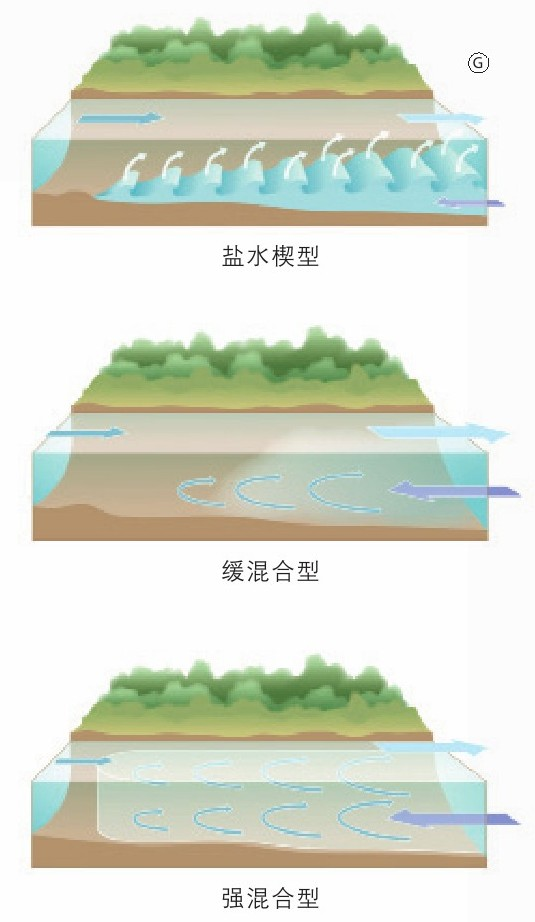
三种河口类型

盐水入侵的范围、盐淡水混合的程度主要取决于径流量的大小和潮流的强弱。径流的影响主要表现在：洪季时因河流径流量较大，海洋盐水常被拒于河口口门之外，盐淡水混合多发生在口外海域；枯季时径流量较小，海洋盐水随潮流深入河口，致使盐水入侵较烈。如长江河口枯季时的盐水入侵界线，一般可达距口门120千米的江苏常熟徐六泾附近。潮流的影响主要表现在：大潮时潮差大，进潮量大，潮流流速大，盐水上溯距离较远；小潮时潮差小，进潮量小，潮流流速小，盐水上溯距离较近。此外，涨、落潮时盐水入侵的影响也有很大差别：高潮时，涨潮流上溯最远，盐水入侵距离最长，盐度也最高；低潮时，落潮流下泄最远，盐度也最低。

盐水入侵是潮汐河口存在的普遍现象，它对河口生态环境、泥沙运动，以及生活用水和工农业用水都有十分重要的影响。（刘苍字）

  

**【微博士】**盐水入侵成灾

当进入河口的盐水与淡水混合后，其盐度超过一定标准时便形成盐水入侵灾害。如1978年冬季至1979年春季，因长江径流量很小，加上沿江各地大量抽水，长江口南支盐水上溯强度大增，同时北支盐水倒灌南支，使得整个崇明岛被盐水包围时间长达5个月之久，吴淞水厂氯化物超过饮用水标准（250毫克/升）的时间持续近3个月。其时，盐水入侵范围从河口向上延伸170余千米，直至江苏常熟的望虞河口。此次盐水入侵对上海市及江苏省部分地区的生活用水和工农业用水造成了十分严重的影响。

【微问题】　盐水在什么情况下入侵河口最严重？

【关键词】　河口　海水与河水的界线　盐水入侵

## 为什么世界大洋的海流好像传送带

大洋的海水，不但表层水在风力驱动下流动，即便几千米的深处，也有各种各样的深层流和底层流。那么，表层和深层的海流之间有没有相互联系呢？科学家发现它们不仅相互关联，而且是“全球一盘棋”，世界各大洋的海流相互间都有关系，就像是一条贯通大洋的“传送带”。

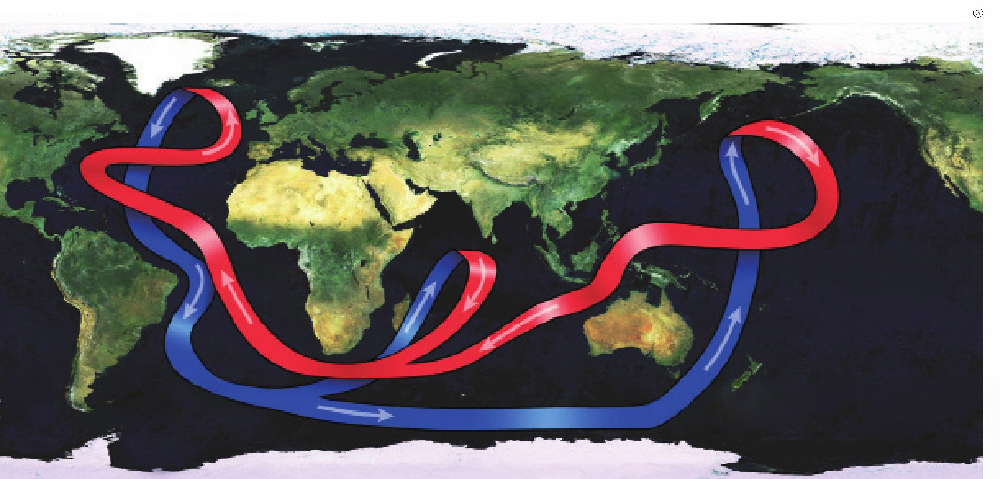
“大洋传送带”：红色指表层流，蓝色指底层流

和风力驱动的表层海流不同，“大洋传送带”的深部海流和上下之间的海流，依靠的是水的密度差异带来的驱动力，而密度差来自海水温度和盐度的高低，所以也叫“温盐流”。现代大洋温盐流主要在大西洋：高温高盐的墨西哥湾暖流沿着美国东海岸外北上（图上的红线），到了北大西洋北部温度下降，结成海冰时排出的盐分进入海水，使得又冷又咸的海水密度增高，于是在北极圈附近下沉，成为较高密度的北大西洋深层水，从深部向南回流（图上的蓝线），在南大洋又和南极附近形成的深层水汇合，最后由南向北流入太平洋（蓝线）。这幅图看起来很完美，其实还只是一种假设，尤其是太平洋的部分，太平洋表层流和深层流的连接固然使“传送带”得到闭合，但是在科学上还缺乏根据。

“大洋传送带”对当今的世界气候有重大影响，它为高纬度和低纬度海域之间的交换提供了渠道，将热带的热量和盐度带到寒冷的北方，维护着全球气候系统的平衡。但是作为一种温盐流，“大洋传送带”并不稳定，一旦某种原因使传送带切断，气候就会发生突然变化。一个例子就是在1.28万年前，地球正在大冰期后的回暖过程里，突然又发生气候恶化，在10年里平均温度下降7～8℃，直到千余年后，即距今1.15万年前，气候才突然回暖。引发这一突发事件的很可能就是“传送带”：来自美洲的淡水注入北大西洋降低了海水的盐度，使得海水密度过低而不能下沉，导致“大洋传送带”停转。类似的情况在距今8200年时再度出现，起因十分相似，但是变化幅度较小，200年后便告结束。

当然，“大洋传送带”是一种抽象的模型，用来指示全球性的格局，绝不要误会真有这么一条水质的传送带。“大洋传送带”是一种假设，虽然它成功地解释了众多的现象，但本身还没有得到观测的证实。甚至在力学上，依靠密度差能不能推动几千米深处的海流，在科学上还存在很多争论。（汪品先）

## 深海的海水年龄是怎么测量的

海水也有年龄吗？有。这里说的是海洋深部的水，从离开海面下沉算起，所谓海水年龄指的是在海洋内部的停留时间。全世界13亿立方千米的海水，只有顶上薄薄的一层能见到阳光，和大气进行交换，绝大部分海水要在暗无天日的深处度过千年长夜。深处的海水“资格”越老，从海面带来的溶解氧气越少，从海面掉下来的营养物质却越多，腐蚀性也更强，因此海水的“水龄”至关重要。

测量海水年龄的方法，是利用溶解碳里面的放射性同位素碳-14。碳-14是宇宙线撞击空气中的氮原子所产生，只有在表层的海水中才能获得。碳-14的半衰期为5700多年，进入海水内部之后，碳-14随时间逐渐减少，因此可以用海水中溶解碳的碳-14相对含量，来测定海水的年龄。

海水的碳-14年龄对深海研究有很大的用处，“大洋传送带”理论就可以用碳-14年龄来检验。如果在世界大洋各处采集3000米深处的海水，测定其中的碳-14年龄，就可以看到这条“传送带”的身影：北大西洋水的年龄最轻，只有几百岁；南大洋居中，1000多岁；流到北太平洋时已经进入“老年”，有着2000余岁的高龄。可见太平洋深部的水比大西洋老得多，这也正是太平洋海底碳酸盐保存不好，古气候研究不如大西洋的原因之一。

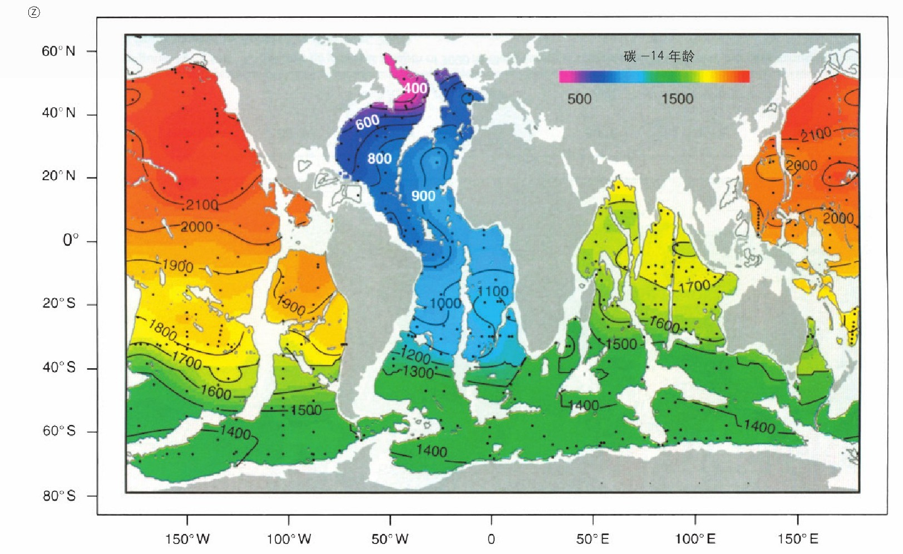
世界大洋3000米水深处的碳-14年龄

如果我们把世界大洋缩小到一个海盆，同样也有深部海水停留时间长短、海水周转速率快慢的问题。就南海来说，太平洋的海水只有从台湾和吕宋岛之间的巴士海峡才能进入，然后在南海里和河水、海水混合之后重返太平洋。现在的南海这种周转相当快，估计只有三十至五十年，这也是南海海底碳酸盐保存较好、对古气候研究比较有利的原因。（汪品先）

  

**【微博士】**美国电影《后天》

美国有许多“灾难片”，近年来一个重点主题就是气候环境的全球变化。2004年，美国推出电影《后天》，电影中古气候学家杰克认为温室效应正在引发地球的大灾难，但他的提醒并没有引起美国政府的重视。于是一切都已经太晚：飓风、冰雹、洪水、冰山融化、极度严寒，一系列地球巨变引发了一场不可挽救的灾难……电影上演后轰动一时，创造了5亿美元的票房价值。这部电影在气候学上的根据就是文中所说的“大洋传送带”，一旦传送带被切断，就会发生气候突然变化，西欧和北美会遭受新的冰期之灾。这类片子在引起人们对温室效应的关注方面能产生很大的社会效应，不过其科学性也在学术界引起争论，其中描述的“冰期”气候就是一种过分的夸大，遭到了学术界的批评。

【微问题】　在2万年前的大冰期时期，“大洋传送带”还转不转？

【关键词】　大洋传送带　海流　气候　海水年龄

## 为什么最大的冰盖在南极

地球上的水有97%以上是在海里，剩下在陆地上的其实还不全是水，因为大部分结成了冰盖，占地球水资源总量的2.2%，其余的才是我们熟悉的河流水、湖泊水和浅层地表水等。陆地上的冰在两极和高山上都有，但是极地冰盖占了97%，而且主要在南极，北极格陵兰冰盖的体积只相当于南极冰盖体积的1/10。都是冰天雪地的地方，为什么地球上最大的冰盖在南极而不在北极呢？

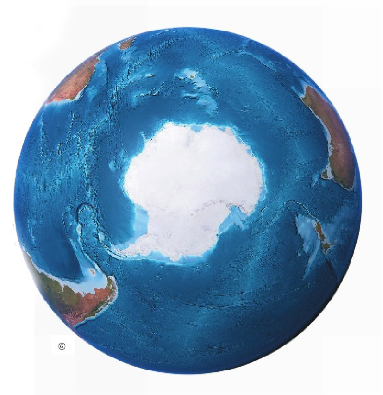
南极冰盖

一眼望去，南极和北极都被厚厚的冰体所覆盖，似乎差不多，其实它们之间存在着明显的区别。南极冰体是覆盖在南极大陆上的，而北极冰体大部分则是覆盖在北冰洋的海水之上。相比之下，大陆上的冰雪容易堆积。南极的冰雪经过3000多万年的积累，形成了平均2000多米厚的大陆冰盖；而北极的北冰洋只有几米厚的海冰，而且极不稳定，海冰覆盖面积冬季占北冰洋的4/5以上，夏季降到1/2左右。最近几年“全球变暖”，使得北极夏季海冰减少到了北冰洋面积的1/4以下。

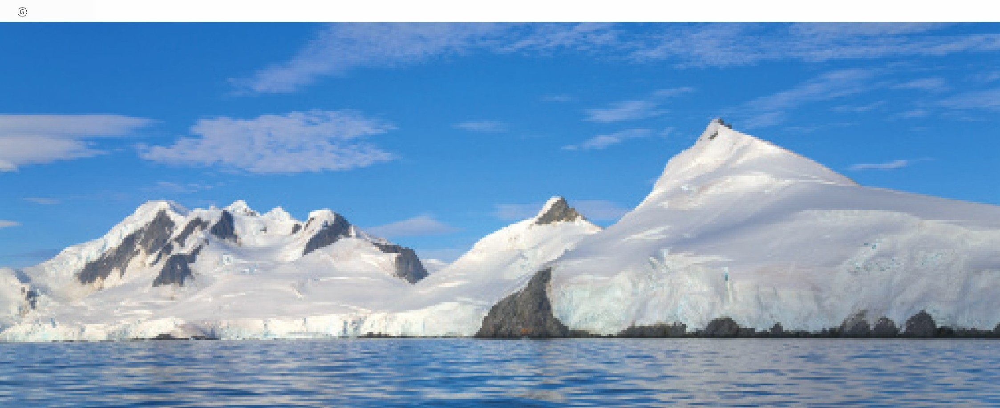
但在北极地区是否就没有冰盖分布呢？情况并非完全如此。2万年前地球处在大冰期，北美大陆和西欧大多被大陆冰盖笼罩，北半球的冰盖比南半球大得多，冰期结束后北美和西欧的大陆冰盖已经消融。现在，除了北冰洋大部分被海冰占据外，只有一处例外，那就是格陵兰岛。这座世界上最大的岛屿，约81%的面积被冰雪所覆盖。格陵兰冰盖面积约180万平方千米，平均厚度约1500米，最大厚度达3200米，占世界冰量的7%～9%。如果格陵兰岛的冰盖全部消融，全球海平面将上升7.5米呢！

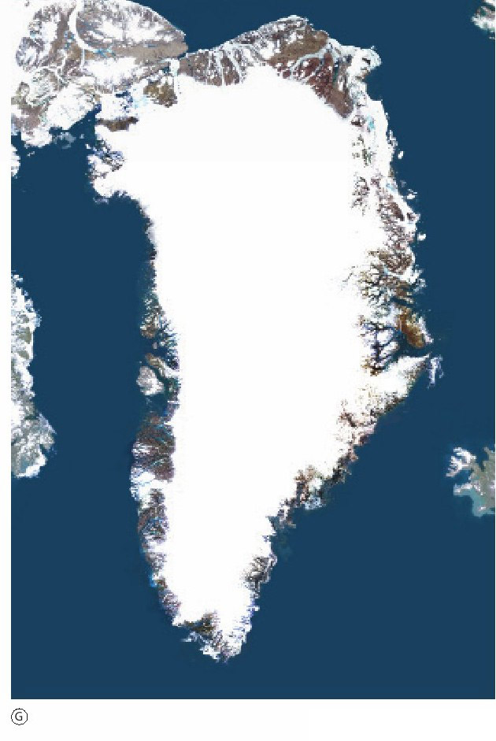
格陵兰冰盖

与巨大的南极冰盖相比，格陵兰冰盖则显得“小巫见大巫”了！南极冰盖的面积达1398万平方千米，约占南极大陆面积的98%，储藏着地球上70%的淡水资源。如果南极冰盖全部融化，全球海平面将升高约60米，陆地面积将因此而缩小2000万平方千米。可以想象，冰盖融化导致的海平面上升，将给人口稠密的低海拔地区带来巨大灾难！

然而，南极冰盖并不是自古就有的。2亿多年前的南极洲，曾经是超级大陆的中心。随着超级大陆的瓦解和板块的漂移，南极洲周围的陆地逐个离去，在距今3900万年前，南极大陆最终与澳大利亚大陆分离，而南极周围又形成了“环南极洋流”，切断了南极洲和中低纬度地区的热量交流，陷入“热孤立”的南极洲就逐步被冰盖覆盖。也有人反对这种解释，认为南极气温的骤降，可能是与大气中二氧化碳浓度变化有关。无论如何，距今约3400万年前，全球气候发生了重大的转变，南极大陆遭遇了明显的降温，从一个原本无冰的环境，在很短的时间内转变成了一个覆盖着“冰被子”的冰雪王国。

其中南极甘布尔采夫冰下山脉被认为是南极冰盖重要的起源地之一。科学家研究发现，甘布尔采夫山脉的冰川最早出现于3400万年前。自1400万年前以来，甘布尔采夫山脉的冰川快速扩张，规模不断壮大。最终，巨厚的冰盖将甘布尔采夫山脉完全覆盖并保存起来。如果通过探冰雷达，你还可以一览甘布尔采夫山脉的冰下风貌呢！（彭晓彤）

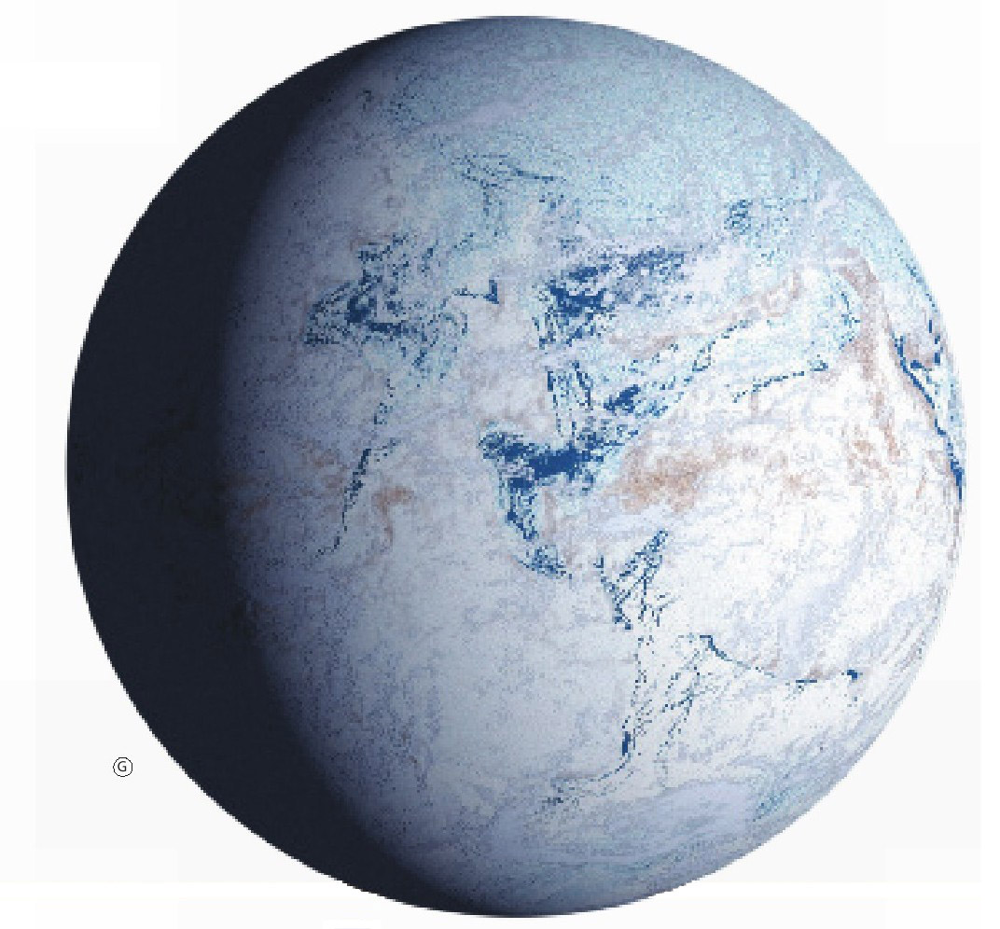
雪球地球

## 为什么要在南极冰盖上打钻

为了了解地球过去的环境和气候，科学家使用大型钻机，从厚厚的冰盖中钻取冰芯，如今已经采集到了南极冰盖几千米深处的冰芯样品。你可别小瞧这些晶莹剔透的冰芯，它们能清楚地告诉我们冰盖的年龄和冰盖形成时的古环境，精确地记录40万年以来地球环境演化的历史呢！

与黄土、深海沉积、湖泊沉积和珊瑚沉积等古环境研究对象相比，南极冰芯具有分辨率高、记录序列长和信息量大等特点，而最为宝贵的是冰芯里的气泡，因为这是古代空气的“化石”！

原来，冰盖的冰是由降下的雪堆积、压实而来，其中留下的气泡里，装的就是当时的大气。对冰芯中这些空气的化学成分进行分析，就可获知南极冰盖形成时的古大气化学成分。通过这种方法，科学家发现，从2万年前的大冰期到工业革命以前的16世纪，大气二氧化碳浓度增加了100厘米3/米3，和大气温度的变化趋势一致，有力地证明了温室气体的气候效应。现在，南极冰芯最高获得了80万年的环境变化记录，中国科学家正在努力，试图在南极打钻取得更长地质记录的冰芯。（彭晓彤）

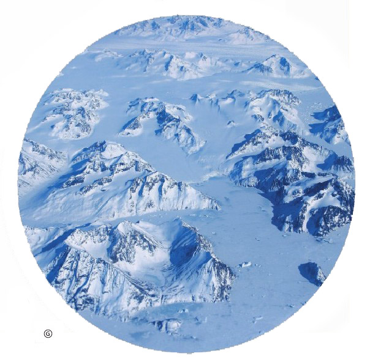
  

**【微博士】**雪球地球

你是否知道，距今8亿～6亿年前的地球，曾经是一个冰封的地球？那时的地球表面就像现在的南极，几乎完全被冰雪所覆盖，宛如一个巨大的雪球，科学家称之为“雪球地球”。这是地球在地质历史上经历的一次最严重的寒冷期。极度的寒冷使海面冻结，冰盖范围从极地扩展到了赤道地区。幸运的是，火山喷发出的二氧化碳气体，使地球逐渐回暖，将地球从此次严重的冰冻中“解救”了出来。回归正常的地球随后出现了生命大爆发，多细胞生物开始在地球上大量涌现。

【微问题】　南极冰盖如果融化了，中国版图会变成什么样？

【关键词】　冰盖　格陵兰冰盖　南极冰盖　冰芯　雪球地球

## 为什么南极冰盖会“走路”

南极冰盖面积达1398万平方千米，最大厚度超过4000米。从空中俯瞰，它就像是一座巨大的“白色高原”。如果有人告诉你，这个看似纹丝不动的白色庞然大物其实一直都在缓慢地移动着，你相信吗？

确实如此！南极冰盖正在以肉眼不易察觉的速度缓慢地移动着，移动速度为每年几米至上千米。南极冰盖为什么会流动呢？想要回答这个问题，还得从南极大陆的地形说起。南极大陆的地形总体上呈现出一种中间高四周低的趋势。越往南极内陆，地形就越高；越往南极沿海，地形则越低。因此，在重力作用下，南极冰盖就有了从中间向四周运动，即从内陆向沿海运动的势能。

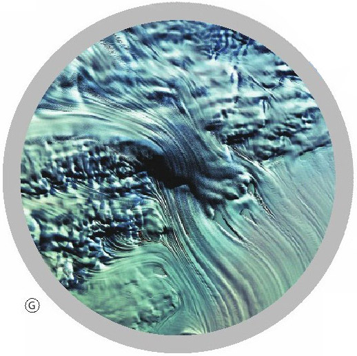
冰流

有了很好的地形条件，还不足以让庞大的南极冰盖运动起来。因为冰盖底部与地面之间存在着巨大的摩擦力，将阻止冰盖向下滑动。我们可以做个小实验，将一个铁块放在稍稍倾斜的木板上。由于铁块与木板之间存在着摩擦力，阻止了铁块向下滑动，这时的铁块是静止不动的。但如果给铁块底部涂上一层薄薄的润滑油，情况就完全不一样了。由于润滑油减少了铁块与木板之间的摩擦力，铁块将在重力作用下沿斜面向下滑动。

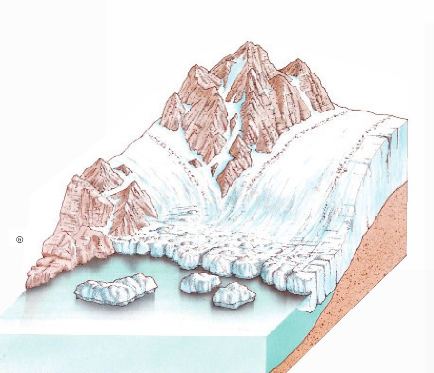
冰盖示意图

南极冰盖的运动，同样是在这样的“润滑剂”帮助下完成的。南极底部冰层融化产生的冰水，就是很好的“润滑剂”。在冰盖底部，由于受地热的影响，基底温度通常较高，有利于冰盖底层冰的融化。此外，冰盖底部由于承受了巨大的冰层自身重量产生的压力，导致冰的熔点相应降低，也促使冰盖底层冰的融化。在这些因素的共同作用下，南极冰盖底部会发生局部融化，形成了一个独特的“润滑层”，使得巨大的冰盖可以滑动起来。如果你仔细观察冰层剖面，会发现冰层基底比上层更为透明，这就是局部融化导致的结果。

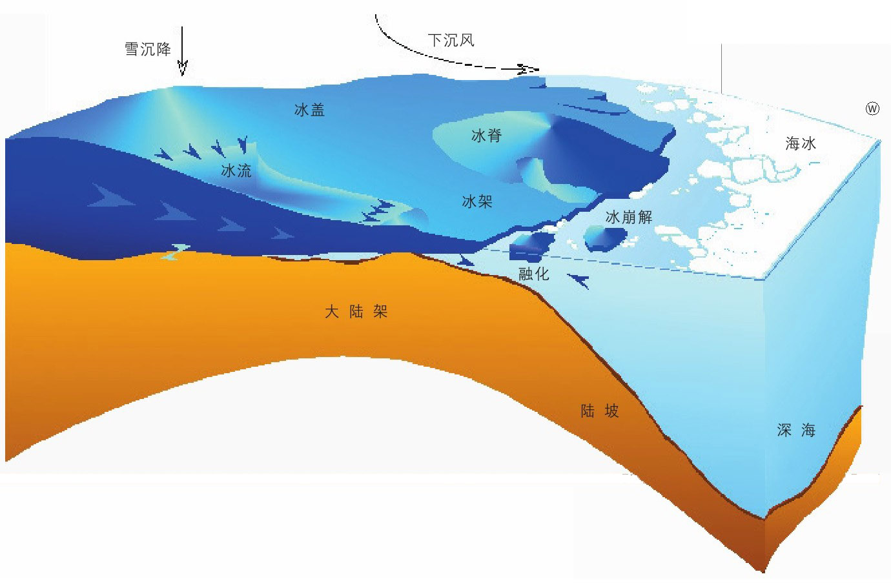
西南极冰盖构造

南极冰盖运动速度在不同区域存在着较大的差异，主要受基底温度、基底强度、冰体厚度和基底倾斜度等因素影响，一般表现为内陆部分运动速度较慢，沿海边缘部分运动速度较快。由于冰盖是从内陆向沿海运动的，它在南极沿海地区形成向海洋突出的冰架。冰架在一定的阶段会发生崩裂，形成数以亿计、大小不一、形状各异的冰山漂向大海。这些移动的冰山有的甚至连绵上百千米，犹如漂浮在海面上的巨型岛屿，10多年后才会完全融化呢！（彭晓彤）

## 为什么冰盖下面还有河流与湖泊

从表面看，南极大陆犹如一座冰雪荒漠。那里的地表没有液态水，降水量也十分稀少，空气极其干燥。令人意想不到的是：在这样一个寒冷而干燥的环境里，科学家却发现了大量的河流与湖泊！

事实上，南极大陆不仅分布着星罗棋布的湖泊，而且发育着纵横交错的河流体系。当然，这些河流和湖泊可不是分布在南极冰盖的表面，而是“躲藏”在南极冰盖的下面！南极冰盖就像一条厚厚的“冰毯”，覆盖着众多的河流和湖泊。

这个不被人们所熟知的冰下淡水世界，拥有十分宽广的河流流域，几乎覆盖了整个南极大陆。140多个大小不一的湖泊犹如明珠般点缀在南极内陆。大量湖水被河流输运到南极大陆边缘，最终汇入浩瀚的南大洋中。

那么，南极冰盖下这块巨大的“湿地”，究竟是如何形成的呢？原来，厚厚的冰盖在南极河流和湖泊的形成中起到了十分关键的作用。它就像一条巨大的保温“地毯”，严严实实地铺在南极大陆表面，一方面可使冰盖底部与南极地表寒冷的空气隔离，另一方面也可使来自地球内部的热能不易散发。这些热能使冰盖底部的冰局部融化成水，并在地形低洼处汇集成湖泊。

东方湖是在南极冰盖下发现的最大湖泊，被封存在冰盖之下约4000米处。东方湖代表着地球上另一类独特的冰下极端环境：这里湖水冰冷，水温仅-3℃；没有阳光能到达这里，永远漆黑一片；湖水中氧的含量奇高，是地表淡水湖泊的近50倍！由于东方湖封存了与地球大气至少隔绝1500万年的湖水，科学家推测里面可能孕育着独立进化的微生物，这为东方湖蒙上了一层神秘的面纱。

2012年2月，俄罗斯南极科考队经过10多年的准备和努力，终于钻穿了覆盖在东方湖上方的冰层，获取了东方湖湖水样品，这是人类首次钻开南极冰下淡水湖泊。这些稀有珍贵的古老湖水样品，为南极冰下湖泊的研究揭开了新的篇章。（彭晓彤）

  

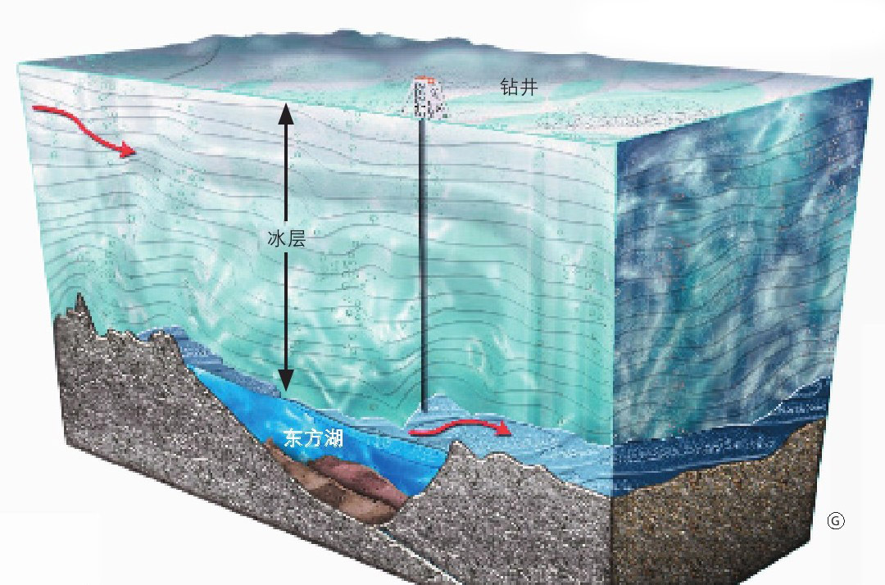
南极东方湖钻探示意图

**【微博士】**西南极洲

南极洲分东、西两部分：东南极洲是主体，冰盖平均2500米厚；位于西半球的西南极洲，面积不到东南极洲的1/4，冰盖只有1000米厚，而且是坐落在海平面以下的海底群岛之上。因此，西南极冰盖远不如东南极冰盖稳定，大约100万年前曾经完全融化，使得全球海平面上升5米。如果将来全球继续变暖，首先融化的将是西南极和格陵兰两大冰盖。

【微问题】　为什么东方湖的水温为-3℃，湖水却还不结冰？

【关键词】　南极冰盖　冰蚀地貌　东方湖

## 为什么说北冰洋曾经是个“北极湖”

北冰洋是全球五大洋中面积最小、平均水深最浅的一个。今天的北冰洋大致以北极为中心，位于亚洲、欧洲和北美洲之间，为亚欧大陆和北美大陆所环抱，面积约1300万平方千米。就是这个北冰洋，在很久以前却是一个淡水湖泊——“北极湖”，这是为什么呢？

我们知道科学家通过各项钻探技术，获得海底的沉积物和岩石，从而研究地球演化的历史。北冰洋周边的河流在入海时会带来很多泥沙，连同海洋生物的遗体一起埋藏在海底。这些沉积物就像一本历史书一样，记录着北冰洋演化的历史。因此，要了解北冰洋演化的历史，就必须研究这些海底的沉积物和岩石。迄今为止，在全球各大洋已钻井数千口，研究的结果证实了海底扩张、大陆漂移和板块构造理论，揭示了深海极端生命和资源的奥秘，极大地推动了地球科学的革命。因此，大洋钻探是破解地球演化奥秘的一个重要手段。

然而，今天的北冰洋常年为冰雪覆盖，给钻探洋底的沉积物带来了很大困难。目前世界上最先进的两艘科学钻探船——日本的“地球号”和美国的“决心号”，都因为不具备破冰能力而无法进入北冰洋钻探。如何解密隐藏在冰雪之下的北冰洋“天书”，成了困扰科学家的一个难题。

2004年8月7日，由多国科学家组成的国际团队搭乘三艘破冰船从挪威特罗姆索港出发，向北冰洋罗蒙诺索夫海脊地区进军，开始了地球科学史上的首次北冰洋科学钻探。横贯北冰洋的罗蒙诺索夫海脊，高出周围洋底近3000米，大约5600万年前由亚欧大陆的陆架分裂出来，上面覆盖着400多米厚的沉积物，详细记录了北冰洋的演变历史。三艘破冰船分工合作，花了30多天的时间，在罗蒙诺索夫海脊水深约1300米，距离北极点250千米的海区钻了4口井，其中最深的一口井打入海底以下428米，获得了大量来之不易的宝贵岩芯。随后，这些岩芯被运往德国不莱梅的研究基地，进行更详细的研究。

经过多种精密的实验室化学分析后，科学家得出了惊人的结论：5000万年前的北冰洋气候属于亚热带类型！岩芯沉积物的地球化学分析证明，在5500万年前的全球变暖事件里，北冰洋也同步变暖，海水平均表层温度从18.8℃升至23.8℃，远远高于之前的预期，呈现出亚热带的气候条件。可以想象，当时的北极地区一定是一个气候温和、适宜生活的好地方。

接下来的研究更加出人意料：北冰洋在5000万年前是个淡水湖泊！原来，科学家们在当时的地层中发现了大量的水生蕨类植物——满江红的孢子。满江红是淡水植物，不能忍耐海水的盐度。现在人们在许多暖温带到热带的淡水中还经常能看见它。这一发现说明北冰洋当时表层水至少有季节性的淡化，是个“北极湖”。后来，在同时期海区也发现了满江红的孢子，科学家推测很有可能就是从“北极湖”搬运而来的。这也表明了当时北冰洋的生产力极高。

当时北冰洋沉积物中的有机碳含量在5%，甚至高达14%。这些有机质是生成石油的重要来源。据估计，北冰洋蕴藏着超过90亿吨的油气资源，大约占世界未开发油气储量的1/4，因此成为各国竞争的热点海域。（拓守廷）

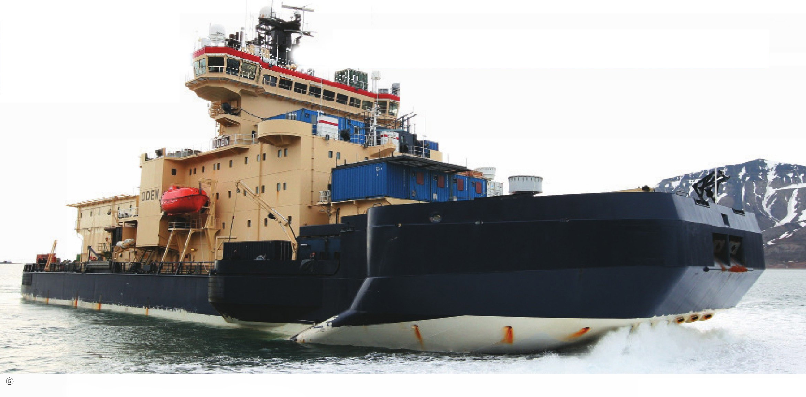
瑞典破冰船“澳登号”

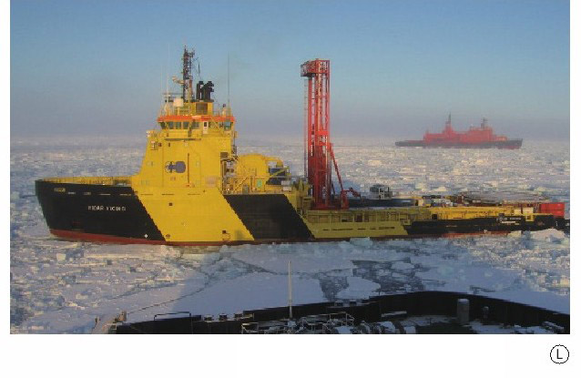
挪威破冰船“维京号”

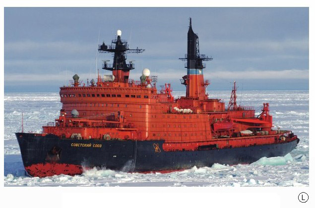
俄罗斯核动力破冰船“苏联号”

## 为什么要用三条破冰船进行北冰洋钻探

北冰洋钻探最大的困难在于不断运动的海冰。在北冰洋海区，许许多多的海冰漂浮在海面上。这些海冰以9000米/时的速度流动，会严重干扰钻机的运行。大洋钻探要求船身的位置稳定，一旦钻探船遇上冰山，不但船身难以稳定，而且很可能被撞沉——当年的“泰坦尼克号”就是撞上冰山而沉没的。

办法就是迎着海冰前进的方向，把海冰击碎。在2004年的北冰洋钻探中，科学家创造性地使用三艘破冰船协同作业：首先由俄罗斯核动力破冰船“苏联号”把大片的海冰压破开路，再由瑞典破冰船“澳登号”把破开的大冰块进一步击碎，从而保证挪威破冰钻探船“维京号”进行定位深水钻探。这场“海冰大战”终于取得圆满成功，第一次获得了记录北冰洋演化历史的长岩芯，为科学家破解北冰洋的演化奥秘提供了第一手资料。（拓守廷）

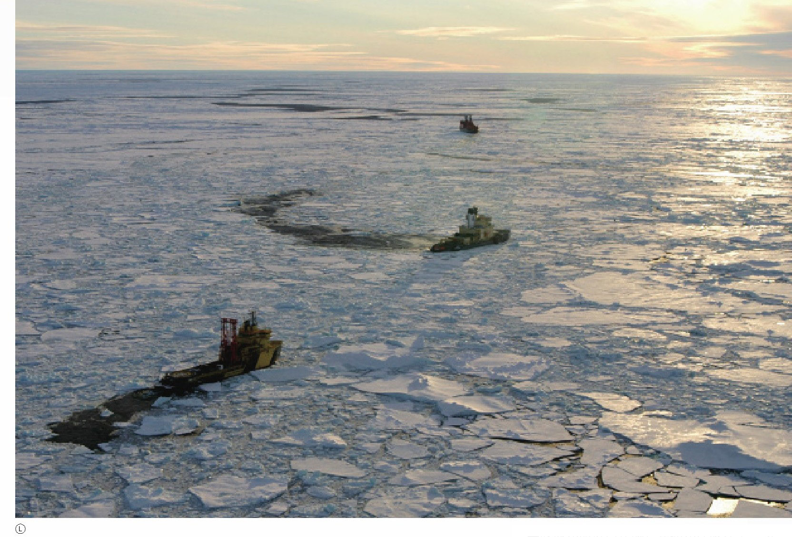
三艘破冰船协同作战，在北冰洋展开了一场“海冰大战”

  

**【微博士】**大洋钻探计划与中国

大洋钻探计划从1968年开始。中国参与这一计划是在1998年，多年来共派出数十名科学家与国际科学家一起航行在全球各大洋，通过钻探采集了大量宝贵岩芯。特别值得一提的是，1999年春在南海实现了中国海域的首个大洋钻探航次。这个航次由中国科学家设计和主持，有9名华人科学家参加，占了整个科学家团队的近1/3。航次结束后的进一步研究取得了丰硕的科学成果，使中国海洋地质学研究一举进入国际深海研究的前沿。

【微问题】　为什么南极是大陆，北极是海洋？

【关键词】　北冰洋　大洋钻探　破冰船　满江红

## 北冰洋航线什么时候能够开通

从15世纪末起，为了贸易的需求，欧洲人梦寐以求寻找到一条穿越北冰洋前往东方的捷径。为什么一定要铤而走险通过北冰洋呢？只要看一眼地球仪你就会明白：地球顶端的北冰洋具有连接亚、欧、北美三大洲的最短弧线。

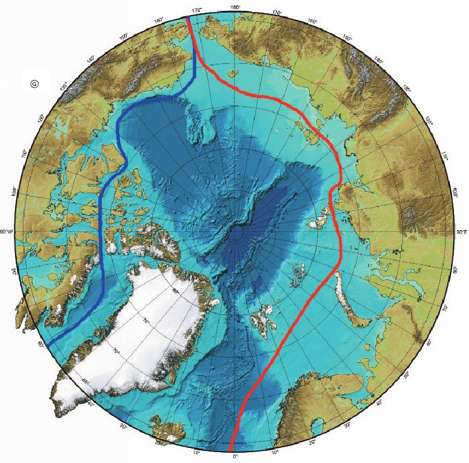
西北航道和东北航道

北冰洋航线有两条：一条从大西洋进入巴芬湾，穿过扑朔迷离的加拿大北极群岛，再从另一侧穿过白令海，进入太平洋，称为西北航道；另一条从格陵兰海进入，贴着漫长而酷寒的西伯利亚北部海岸，经白令海进入太平洋，人称东北航道。它们是连接大西洋和太平洋的最短航线。

尽管航道险峻，却有诸多好处。如果行得通，从欧洲到东亚便无须远走非洲好望角，或绕道苏伊士运河和巴拿马运河，可以缩短至少40%的航程，大大降低了运输成本。另外，上述两条运河和马六甲海峡运载能力有限，无法通行大吨位货轮，当时猖獗的海盗更使海运蒙受额外的风险。与此相反，北冰洋航线航程短、海峡深，没有海盗困扰。所以开通北冰洋航线，对全球贸易、运输和资源开发会产生巨大的经济效益。

探寻西北航道

北冰洋航线的诸多好处吸引着人们历经千辛万苦，探寻了漫长的几个世纪。直到20世纪初，西北航道才被打通。然而探险家们前仆后继打通的航道，在当时并没有商业价值。因为这是致命的航道！从大西洋进入巴芬湾后，船只就不得不在5万多座巨大冰山之间穿行，只要碰上其中一座，“泰坦尼克号”的悲剧就会重演。而前往太平洋的白令海也同样惊险万状！至于东北航道，由于冰层太厚，希望更为渺茫。

1967年，在阿拉斯加发现石油后，一艘名叫“曼哈顿号”的美国货轮在加拿大破冰船的护航下，试走了一次西北航道。航行被证明极为艰难，曾6次被困坚冰，几次不得不迂回绕道。

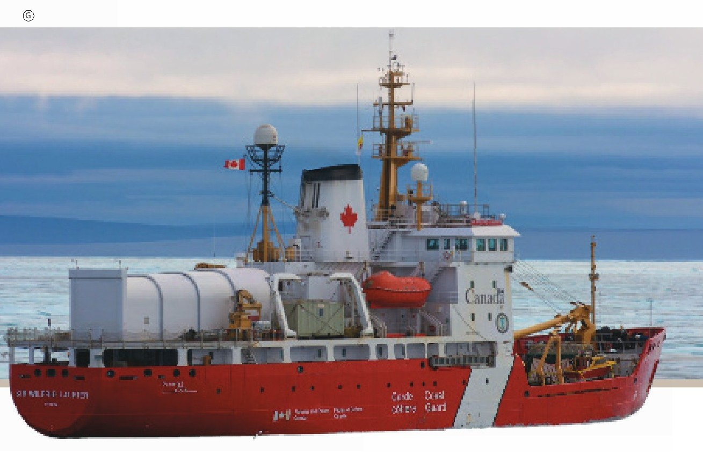

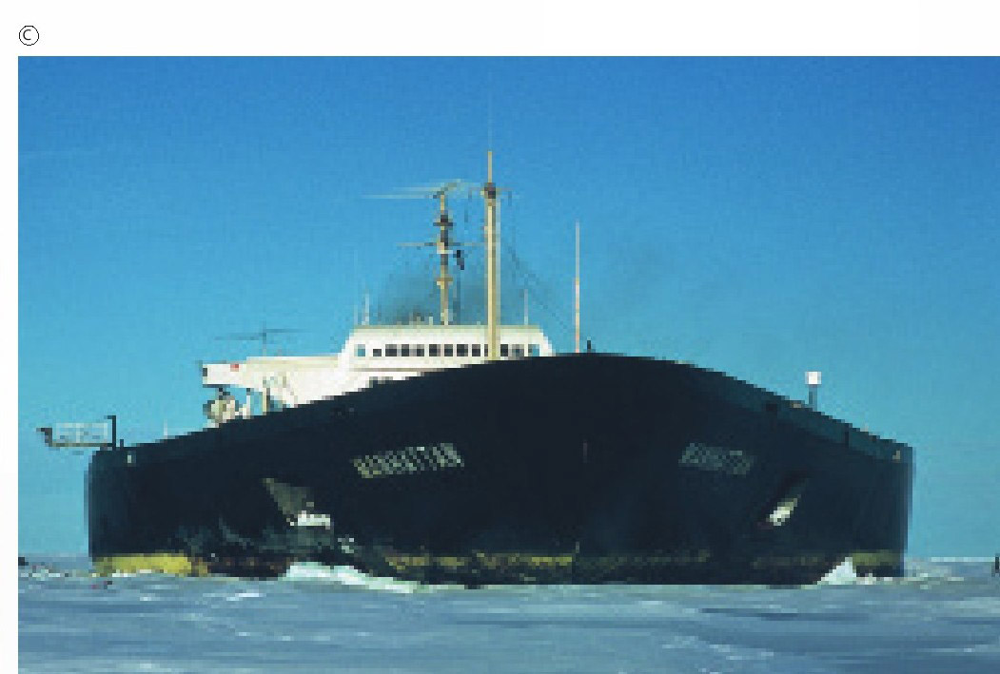
“曼哈顿号”货轮

这次航行的结果是美国决定修建阿拉斯加输油管，放弃船运输油的打算。

进入21世纪后，由于海冰消融，沉寂多年的北冰洋航线再次进入人们的视野。卫星观测显示，北冰洋海冰正以每年3%的速度融化，海冰覆盖面积每年缩小7万平方千米，冰层厚度也从20世纪80年代的4.88米降为2.75米。2007年，西北航道首次出现几天无冰期。2009年，两艘德国货轮成功穿越了东北航道。2011年，总计有34艘船驶过了东北航道。

如果全球变暖的趋势一直延续下去，预计20～30年后北冰洋将可能迎来无冰的夏季。至于北冰洋航线什么时候能成为可行的全球贸易航道，乐观的估计是40～60年后，而更多人认为现在预测仍为时过早。（陈梦兰）

## 北极最大的资源是什么

随着海冰悄悄消融，进入北冰洋正变得越来越容易，曾经在经济上不具备开采性的北极资源也浮出“冰面”。

北极被称为“第二个中东”，它的最大资源也是石油和天然气！5700万年前，北冰洋曾经气候温暖、生物繁茂。科学家曾在北冰洋底的洋脊上打钻取样，在沉积物中发现了厚厚的蕨类植物和浮游生物组成的有机层，在富含碳元素的黑色岩芯中找到大量浮游生物和其他有机物。这种富含碳元素的沉积物正是形成石油的前提。

果然，从20世纪60年代起，人们相继在北冰洋大陆架边缘海发现了丰富的石油和天然气。据美国地质调查局估计，北极拥有全球未开发石油储量的13%，可采原油约1000亿桶；天然气储量约50万亿立方米，占全球未开发天然气的30%。北极的石油主要分布在阿拉斯加北岸的波弗特海大陆架、加拿大北极群岛和亚欧大陆北岸的大陆架上，仅20世纪60年代阿拉斯加普鲁度湾油田就勘探出可开采的原油100亿桶。天然气主要分布在北极的欧洲部分，其中俄罗斯北部的天然气储量至少有13万亿立方米。

除了石油和天然气，地球上几乎一半的煤也储藏在北极！矿产方面，北极不仅拥有金刚石和金、银、铂等贵金属，以及铀、钚等放射性元素，还拥有世界上最大的锌矿和最大的铜铁镍复合矿，人们还在巴芬岛、科拉半岛、格陵兰岛发现了世界级的大铁矿。不久前在北冰洋底发现的海底热液，又为海底矿产增添了新的前景。另外，冷暖洋流交汇使巴伦支海、格陵兰海和白令海成为世界重要渔场。同时，北极巨大的淡水资源对世界也十分重要。格陵兰岛的冰盖如果全部融化，地球上7%的淡水不仅将永久流失，还会使全球海平面上升7.5米！

难怪有人说，北极资源“曝光”和北冰洋通航是全球变暖这个大灾害中的一个小收益。但是，从地球人的长远利益出发，人们应该限制对北极资源的过度开发，并尽量减少通过北冰洋新航线的航运量。（陈梦兰）

  

**【微博士】**俄罗斯海底插旗

2007年8月的一天，一支俄罗斯北极考察队抵达北极点。次日，两艘载人深潜器分别成功下潜至4261米和4302米的北冰洋底，并将一面钛合金国旗插在了北极点的海床上！这是人类第一次潜至北极点海底。考察团长兼俄罗斯议会副主席奇林加夫表示，他们不仅是要向世界展示俄罗斯开发和探测北极的能力，还希望用科学手段证明横跨北冰洋底的罗蒙诺索夫海脊是西伯利亚大陆架的延伸。“海底插旗”引起了国际社会的关注，也引发了环北极国家的资源权益之争。根据《联合国海洋法公约》，目前并没有任何证据表明哪个国家的大陆架延伸到了北极点，因此北冰洋一带属于国际海域。如果罗蒙诺索夫海脊是西伯利亚大陆架延伸的假说成立，俄罗斯将提出面积相当于整个北极圈一半的北冰洋海域的主权要求。

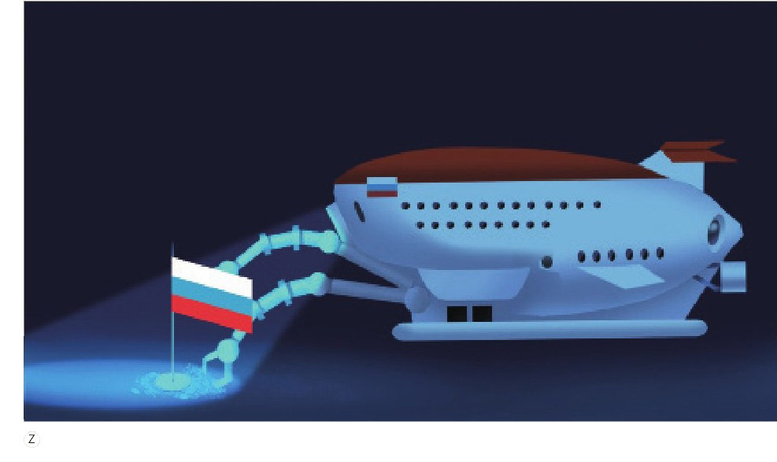
【微问题】　对北冰洋来说，全球变暖是好事还是坏事？

【关键词】　北冰洋　北冰洋航线　北极资源

## 冰山是从哪里来，又会到哪里去

北极格陵兰岛和南极大陆上终年白雪皑皑，雪厚可以达数千米。在厚雪的自身压力下，松软的雪花渐渐变成密实的冰体，然后顺着山体的斜坡向下滑动，形成冰川，最后与海水相遇。冰与海水的相互运动，使冰川或冰盖末端断裂入海成为冰山。

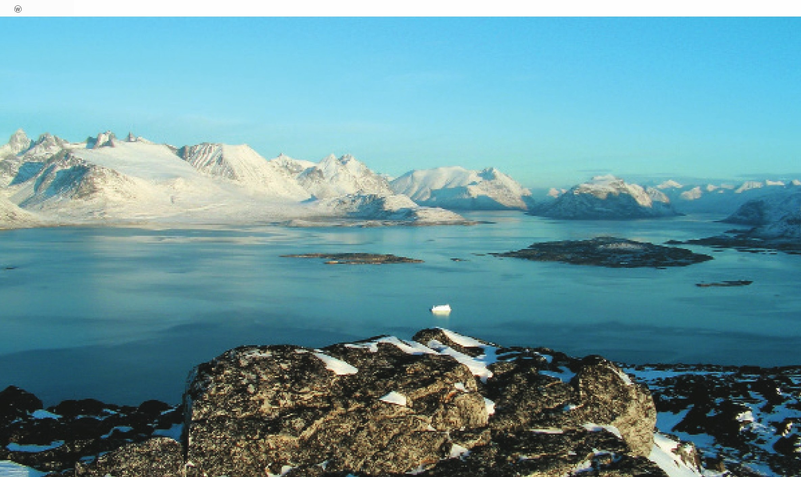
冰山在风力和洋流的推动下在海面上漂流。构成冰山的冰体寿命平均都在5000年以上。冰的密度约为0.917千克/米3，小于约为1.025千克/米3的海水密度。冰山约有90%体积沉在海水表面以下，而且非常结实，遭遇冰山是极地海洋运输的噩梦。最著名的冰山撞船事件，是1912年的“泰坦尼克号”遇难。

每年仅从格陵兰西部冰川产生的冰山就有约1万座之多。南极冰山同北冰洋冰山相比，不仅数量多，而且体积巨大，长度超过8000米的冰山并不少见。2000年3月，从南极罗斯冰架崩裂下来的一座冰山，面积达到1.1万平方千米，比北京市的面积还要大。现在已知的最大冰山生成于法国南极基地附近，面积约16万平方千米，几乎与亚洲国家文莱相当。

冰山在陆地上的温度都低于-10℃，甚至达到零下几十摄氏度，但是到了海中，海水最低温度只有-2℃左右，于是冰山开始融解。在来自北极格陵兰的冰山向南、来自南极大陆的冰山向北的漂移过程中，海水温度逐渐升高，冰山加速融解、断裂，最后变成淡水，与海水混合成一体。

冰山的寿命长短不一。长的可能漂流10年之久，短的一两年内就会没有了踪迹。冰山是极为宝贵的淡水资源，可惜目前人类还没有办法加以利用。（侍茂崇）

## 北冰洋上的冰会完全消失吗

目前北极地区的冰雪正以比原先预想更快的速度消融。从1984年和2012年的北冰洋海冰面积对比图中可以看出，海冰面积的减少是非常明显的。图中蓝色部分是海水，白色部分是海冰集中区。

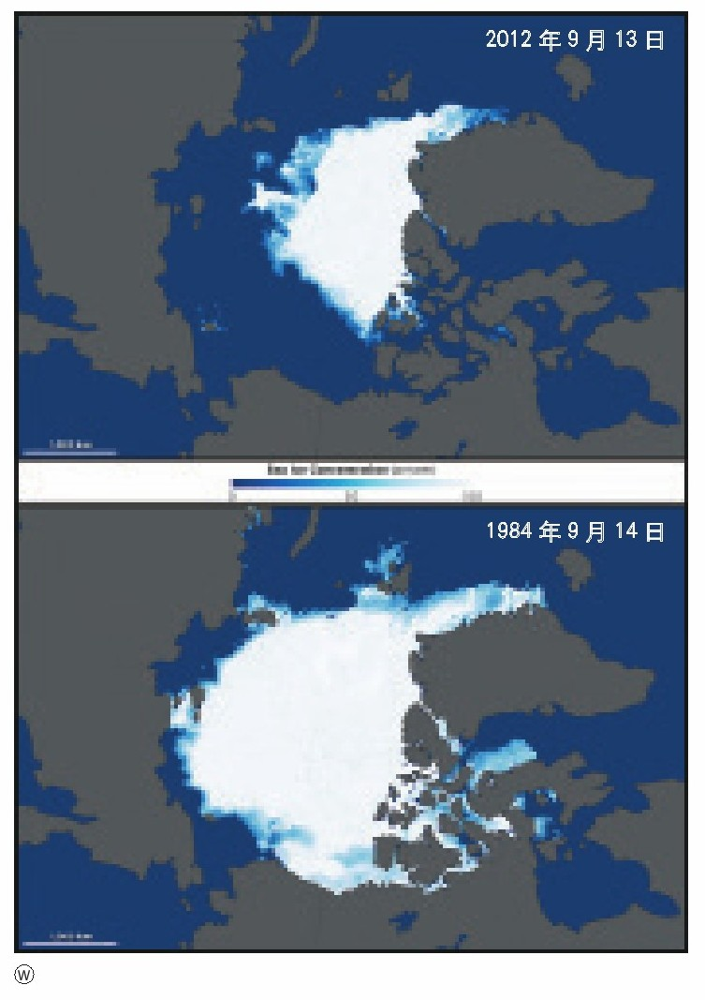
全球变暖是北冰洋海冰快速融解的罪魁祸首：自1951年以来，北极气候变暖趋势约是全球平均水平的两倍，其中格陵兰岛的平均气温升高了1.5℃，而同期全球升温平均值为0.7℃。其次，海冰厚度明显减小、冰龄年轻化、冰面融池增多等因素也会加速海冰在夏季消融期的融化。北极地区冰雪的厚度非常重要，那里的气候状态可能影响全球，有人把它称为地球的空气调节系统。随着北极圈的冰雪消融，导致了近年来亚欧大陆冬季冷冬频繁出现，加剧了东亚地区极端天气气象灾害的发生，也是引发近年来中国冬、春季节气象灾害频繁发生的主要原因之一。由于全球变暖，北极冰的面积和厚度急剧减少，依赖浮冰作为休息和捕捉海豹平台的北极熊，处境十分困难。夏季它们要游过更长的距离才能找到栖息的浮冰，常常因此筋疲力尽，体重减少，甚至溺毙。更有甚者，因为觅食无门，只好吃自己的幼崽。

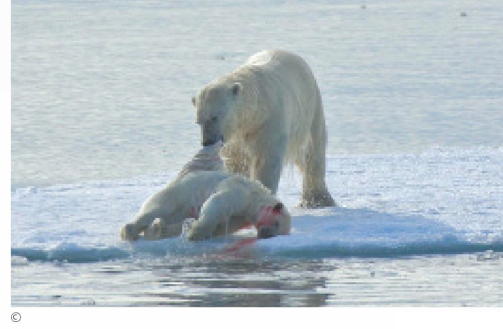
北极熊处境困难

当前，人们对于北极海冰未来的演变趋势存在两种截然不同的观点。一种观点认为，北极海冰减少的趋势是不可逆转的，到2030年夏季就将出现无冰的北冰洋。另外一种观点认为，北极海冰的消融是阶段性的，是可以恢复的。短期的海冰减少趋势是气候系统自身年代际（或多年代际）的变化造成的。现有观测资料表明，与2007年相比，2008-2010年的北极海冰面积在9月出现了连续三年的增加，但2011年又明显减少。对北极海冰演变的认识，需要继续加强监测并开展更加严谨的科学研究。（侍茂崇）

  

**【微博士】**靠冰生存的北极熊

北极熊是需要厚厚的冰层来帮助捕食的，这听上去有点不可思议。其实，冰层只是它们的一个“辅助设备”，它们在意的是冰层下面的食物——海豹。当北冰洋被大面积封冻的时候，海豹只能寻找有限的一些冰洞来透气。而在那些有限的冰洞周围，北极熊就会虎视眈眈地等在那里。可想而知，一旦冰层瓦解，不但海豹可以随便透气，北极熊也没有了“守株待兔”的地方，饿死也就不足为奇了。

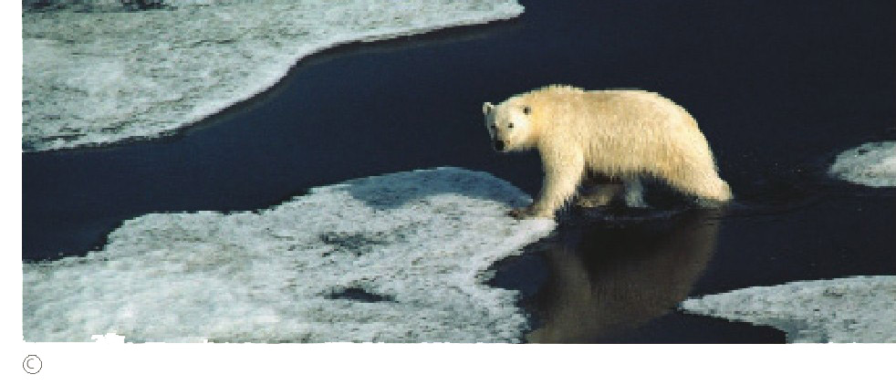
【微问题】　为解决非洲缺水问题，有人提出将南极冰山拖到热带非洲，这样做最大的问题是什么？

【关键词】　冰山　北冰洋海冰　全球变暖

## 为什么会形成“死亡冰柱”

在南极和北极的海底，常常会形成一种非常奇特的柱状海冰。这些从海面一直延伸到海底的细长冰柱，宛如神话故事里死神的白色手指一般。只要它轻轻触碰与之接触的生命，就能把对方冻死并将它们冰封在原地！在它的面前，海底生命显得是如此的脆弱和不堪一击！由于惊叹于它对海底生物的巨大杀伤力，人们形象地称其为“死亡冰柱”。

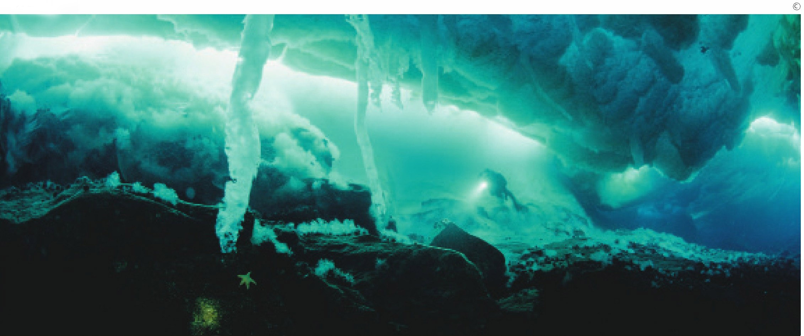
死亡冰柱

那么，如此恐怖的“死亡冰柱”到底是怎样形成的呢？它们为什么只在南、北极地区出现？原来，“死亡冰柱”的形成，与极地地区海水在遭遇极度严寒后，卤水从新形成的海冰中析出的现象有关。我们知道，卤水其实是一种富含盐分的液态水，它的密度明显大于海水，但遇冷结冰的温度要远低于海水。

在冬季，南、北极地区海面上海冰遍布。海冰以上的气温有时会低于-20℃，而海冰以下的海水温度仅为-1.9℃左右。这样，低温就由极度寒冷的空气向较温暖的海水中传递，导致新的海冰在老的海冰底部形成。由于温度十分低，卤水会从新形成的海冰中不断析出，并在海冰中汇集成一条条卤水流。

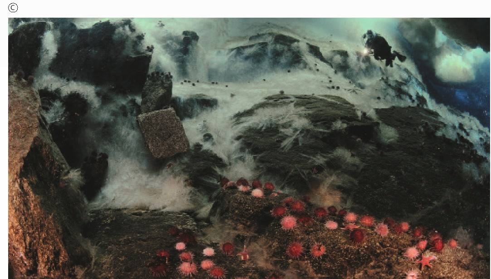

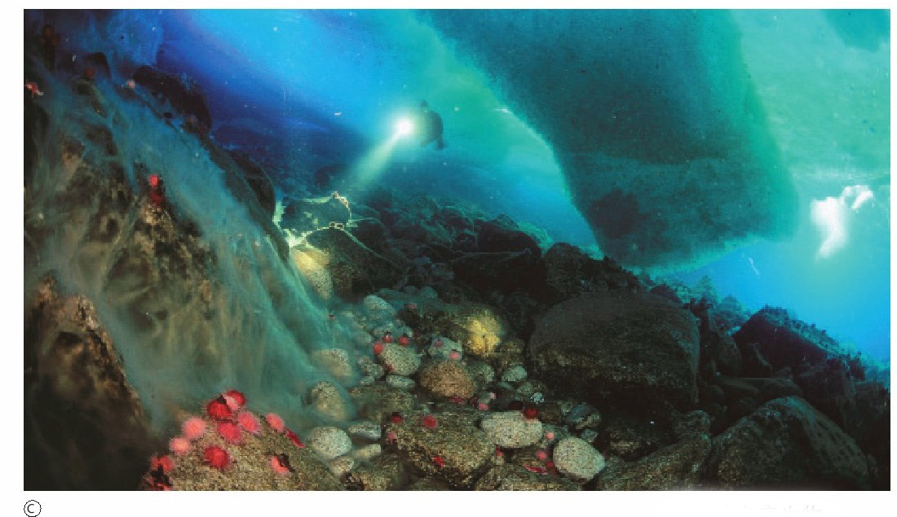
冻死的海底生物

这些卤水的密度明显大于下面的海水，使得卤水会向下沉降。在下沉过程中，低温的卤水与较温暖的海水接触，会立即使周围海水结冰，这样就形成了一个外层是海冰，中间是卤水的奇特冰管。如果这根冰管不断向下凝结延伸，最终将形成一根细长的管状冰柱，即所谓的“死亡冰柱”。当“死亡冰柱”到达海底后，会继续贴地延展。这时，它方才显露出魔鬼般的本性，朝躲避不及的海底生物痛下杀手，向世人炫耀其巨大的冰冻摧毁力！

由此可见，影响“死亡冰柱”形成的主要原因在于南、北极海面上极度寒冷的气温。“死亡冰柱”如果要不断向海底延伸生长，就必须持续地获取从海面上传递而来的低温。因此，海面源源不断的低温传导，其实是“死亡冰柱”维持其势力范围的关键。从这个角度说，“死亡冰柱”延伸的长度和直径受到海面温度的直接控制。当海面回暖后，冰柱也逐渐被海水融化而消失，这些摧残海底生命的魔爪才会被彻底斩断。（彭晓彤）

## 海上为什么会有冰灾

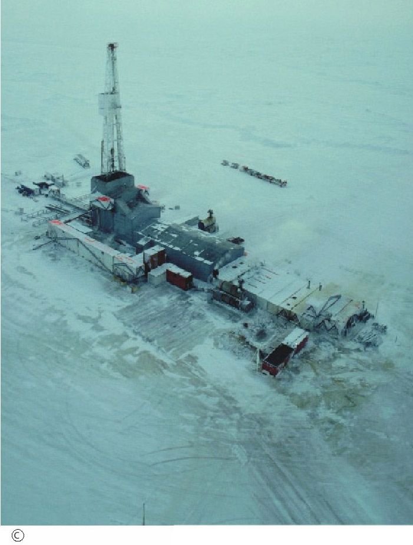
遭遇冰灾的海上石油平台

提起海洋中的自然灾害，大家最熟悉的莫过于台风和海啸了。这些在电视、电台节目中经常报道的海洋灾害，给居住在海岸带人们的生产和生活带来了巨大的影响。但恐怕很少有人会注意到，海洋也会遭遇到严重的海冰灾害的威胁。

海冰灾害是指海上连续的超低气温导致表层海水大范围封冻的现象，主要发生于内海、海湾和近海地区。海冰灾害发生时，海面被海冰所冻结，海冰厚度可达几十厘米至几米。中国的渤海和黄海北部部分海域，就曾数次遭遇过海冰灾害的袭击。

2009年12月，波澜壮阔的渤海和黄海北部在冷空气持续不断地入侵之下，陆续出现海水结冰的现象。到了2010年1月4日至8日，该海域内的海冰范围迅速扩大，发展成为30年来同期最严重的冰情，并一直持续到2010年2月。曾经汹涌澎湃的黄海和渤海沿岸刹那间由动转静，被厚厚的白色冰雪所覆盖，凝固成了“冰塑”的世界。在此次冰灾中，渤海有超过50%的海域被海冰所冻结。

无独有偶，历史上渤海曾经在1967年经历过一次更为严重的海冰灾害。在那次可怕的大冰灾中，整个渤海湾被完全冰封，海冰平均厚度超过半米。原本宽阔的海面“摇身一变”成了巨大的冰雪平原，仿佛浩瀚的渤海根本就不曾存在。被冰封的船舶孤零零地耸立在冰雪之上，凸显了海冰灾害的无情和冷酷。

幸运的是，海冰灾害并非一个频繁发生的极端海洋灾害事件。事实上，海冰灾害的形成需要较苛刻的气候条件。其中，前期持续低温、大面积降雪和极端冷空气袭击都是形成严重海冰灾害的重要条件。持续低温将降低海区海水的温度，为海冰的形成做“热身”准备；大面积降雪的发生，可提供海冰结晶所需要的凝结核，促进海冰在海面上的形成；而极端冷空气的驾临，将最终导致海冰面积迅速扩增。如果持续遭遇多股冷空气的袭击，海水温度就可能一直没有机会回暖，海冰灾情将变得越来越严重。

大范围的海冰灾害给航运、捕捞、养殖和海上石油开采等行业都造成了巨大的影响和危害。对于海洋生态系统而言，大面积的海面结冰还将导致海水缺氧和海水盐度的改变，严重时将威胁到海洋鱼类及底栖生物的生存，破坏区域生态环境平衡。（彭晓彤）

  

**【微博士】**危机四伏的海冰融化

通常来说，海冰的融化是海冰灾害消退的前奏，其实海冰融化期同样危机四伏。海冰融化过程中，将形成数量众多的堆积冰和冰排，它们在波浪、海流、潮汐等的影响下可以发展成浮冰块、流冰等。如果它们与正在航行的船舶或海上的建筑物不期而遇，将可能造成船舶沉没和建筑物坍塌事故。

【微问题】　人类活动对冰灾的形成有影响吗？

【关键词】　死亡冰柱　海冰灾害

# 人文海洋

## 为什么说郑和船队曾是世界上最强的水师

郑和铜像

郑和（1371-1433）是中国明代的航海家。1405-1433年间，他奉皇帝之命，率领一支庞大的船队七次出使海外。第一次船队从明朝首都南京出发，在长江口太仓刘家港集结，然后沿东海南下，在福建长乐太平港驻泊等候季风。一到冬季西北季风来了，船队便扬帆起航，穿过台湾海峡和南海，进入印度洋，以后最远到达过非洲东岸。郑和船队先后访问了30多个国家及地区，进行政治、经济和文化的交流，并维护着海上贸易的安全。

郑和率领的是当时世界上最强大的船队。它人数众多，有几次出使的船员都在2.7万人以上，包括使节及其随员，以及负责航海技术、贸易财经、军事、医疗、翻译等方面的人员。他们组织严密，拥有丰富的航海经验。许多外国使团访问中国也搭乘郑和的船舶往返。同时代的西方航海家哥伦布，率领的航海船队最多人数一次是1500人，达伽马航海率领的船队只有170多人，麦哲伦的船队也不过265人。

郑和航海图

郑和的船队规模非常庞大，有宝船、马船、战船、八橹船、粮船等至少10多种类型的船舶。其中，宝船是当时世界上最大的船，据史书记载，船长147米，宽60米，9桅12帆，可以搭载上千人。郑和每次出使都率领一二百艘船，最多一次达200多艘。船上还配备了当时先进的武器和通信器材。武器中除了弓、弩、刀、枪等冷兵器外，还有火枪、火铳、火炮等多种火器。

同时，船员还熟练地掌握了先进的航海技术。在茫茫的大海上，他们通过牵星板或者指南针来测定船的方位和航向，使用的牵星过洋术是那个时代世界上最先进的天文航海技术。现今存世的《郑和航海图》，全称《自宝船厂开船从龙江关出水直抵外国诸番图》，图上共记载530多个地名、50多条航线，其中记录了航行经过的南沙和西沙地名，还记录了最远到达非洲东岸的16处地名。这幅航海图是世界航海史上一项伟大的成就，反映了古代中国人具有丰富的航海经验和先进的航海技术。

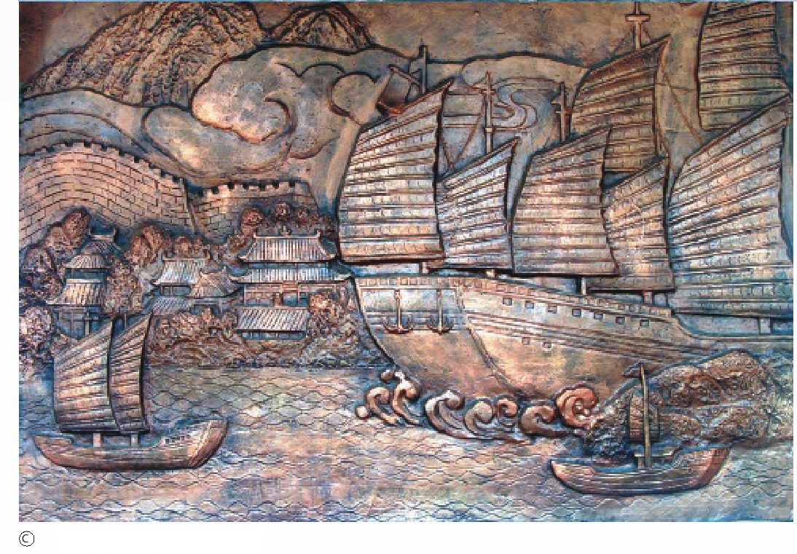
郑和宝船

郑和下西洋的船队以规模大、人数众、航程远、技术先进和装备精良而闻名于世，创造了人类航海史上的奇迹。英国著名的科学史家李约瑟博士，在他用毕生精力完成的《中国科学技术史》中，把郑和船队与同时代的世界其他国家海军作比较后，得出了一个结论：“明代海军在历史上可能比任何亚洲国家都出色，甚至同时代的任何欧洲国家，以至所有欧洲国家联合起来，可以说都无法与明代海军匹敌。”（时平）

## 中国最早的航海家是谁

徐福

据考古学家测定，2001-2002年在浙江杭州萧山跨湖桥遗址发现的独木舟，距今已经8200～7800年，说明中国至少有8000年以上的航海历史。在漫长的航海活动中，中国涌现出许多杰出的航海人物，创造了灿烂的海洋文明。在早期的航海先驱中，迄今有名可查的最早的航海家是秦朝的徐福。

史书记载，公元前219年和公元前210年，秦始皇曾先后两次派遣徐福出海寻找长生不老药。秦始皇二十八年（公元前219年），秦始皇到东方沿海郡县巡视，到达今山东琅玡郡时，身为著名方士的徐福向秦始皇上书，请求出海寻找传说中的蓬莱、瀛洲、方丈三座神山和长生不老药。在得到秦始皇支持后，徐福率领一些童男童女乘船从山东半岛出海。传说这支船队到达了朝鲜半岛西海岸，但是没有找到长生不老的仙药，无获而归。回来后的徐福非常担心秦始皇向他追问仙药，便主动拜见秦始皇，编了一个美妙的故事：说他此次出海寻找到了蓬莱仙山，山上有长生不老之药，但是需要送上更多的童男童女和各种工匠才能换回仙药。秦始皇听罢，便下令徐福率领三千童男童女和各种工匠并携带大量五谷种子出海。经过几年的筹备，公元前210年，徐福率领几十艘船，搭载童男童女和工匠，从琅玡郡等地出海东航。至今，在日本、韩国等地还发现了一些遗迹，并流传着一些传说。例如，在日本的和歌山县新宫市发现了传说中的徐福墓。

传说徐福和他的船员把当时中国先进的农耕技术、纺织术、冶炼技术等传播到日本，对日本民族和社会进步产生了重要影响。后来人们把这条海路称为“北方海上丝绸之路”。徐福大规模航海在那个时代是一个壮举，很多人把他视为中国最早的航海家。（时平）

  

**【微博士】**海上丝绸之路

海上丝绸之路是中国古代对外进行贸易和文化交流的海上航路。因汉唐时期，中国的丝绸在外国影响很大，是出口的主要货物，后来的学者就给这条连接中外的海上交通线赋予了一个美丽的名字——海上丝绸之路。海上丝绸之路是中国对外交流的重要通道。汉武帝时期就把中国的丝织品从北部湾的广西合浦和广东徐闻海运到印度洋地区，最远抵达今天的斯里兰卡。唐宋时期中国的海上丝绸之路出现了繁荣的局面，对外交流扩大，直到明清时期海上丝绸之路才逐渐走向衰弱。

【微问题】　郑和船队是怎么解决长时间远航“吃”的问题的？

【关键词】　郑和下西洋　中国最早的航海家　海上丝绸之路

## 为什么哥伦布会把美洲当作印度

1492年10月12日凌晨，哥伦布带领三艘西班牙帆船，经过70昼夜的艰苦航行，终于跨越大洋，登上了中美洲巴哈马群岛的陆地。可是，他却以为到达的是印度的岛屿，并把当地的土著居民当作印度人。所以，直到今天美洲原住民还被称作“印第安人”，这一带的岛屿，也被叫作“西印度群岛”。哥伦布活了55岁，直到1506年去世，也没有明白自己到达的是个“新大陆”。为什么这位伟大的航海家会犯低级错误，把西半球的美洲说成是东半球的印度呢？

哥伦布

请先不要责备古人，埋怨孔夫子不懂相对论。其实哥伦布的航行本来就不是去发现新大陆的。15世纪中期东罗马帝国灭亡，土耳其人和阿拉伯人控制了通往东方的商路，切断了欧洲人香料和丝绸的来源。哥伦布奉西班牙国王之命去开拓新航路，目的地是印度和中国。哥伦布相信地球是圆的，但是不知道地球有多大。当时大家都相信地球上陆地大、海洋小，反问“上帝造那么多海洋干什么”。哥伦布当时航行用的1474年的大西洋地图本身就是错的：欧洲西面跨过大西洋就是亚洲，从西班牙往西走就可以到达日本和中国，根本想不到中间还有一个太平洋和美洲。后人说，假如哥伦布当年知道了地理真相，大概是不敢去冒这个险的。

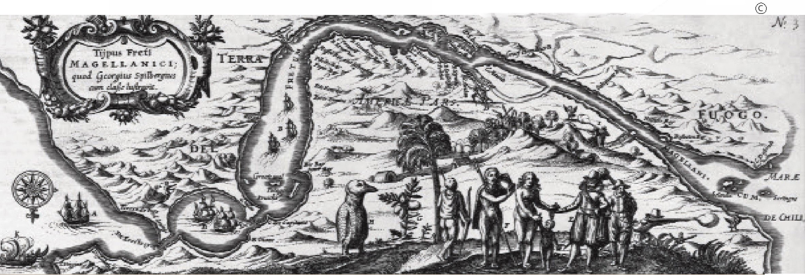
麦哲伦海峡的地图

从1492年到1504年，哥伦布一共去了4次美洲，却从来没有怀疑过这里不是亚洲。其实也难怪，他到的主要是美洲中部的一些岛屿，最后一次才到达南美大陆的一角，并没有到过北美洲大陆，更没有看到太平洋。真正发现和穿越太平洋的，是16世纪的航海家麦哲伦。

麦哲伦

麦哲伦也是奉了西班牙国王之命，1519年率领探险队横渡大西洋，沿着巴西东海岸南下，绕过南美大陆南端与火地岛之间狭窄的海峡（后来叫作麦哲伦海峡）进入太平洋，1521年3月到达菲律宾群岛，成功地穿越了太平洋。虽然麦哲伦最后死于和菲律宾土著居民的冲突中，但他的同伴继续航行，终于到达了目的地——现在属于印尼的“香料群岛”。在载满香料之后继续向西，穿过印度洋、绕过好望角，于1522年回到西班牙，完成了人类历史上第一次环球航行。有趣的是，为西班牙开拓海外领地的两位历史人物都不是西班牙人：哥伦布是意大利人，麦哲伦是葡萄牙人。（汪品先）

## 美洲真的是哥伦布发现的吗

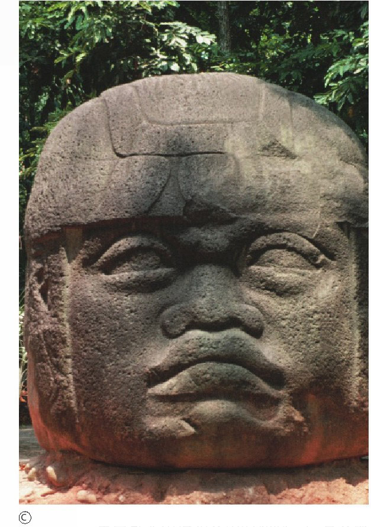
墨西哥奥尔梅克文明的标志：巨石头像

“哥伦布发现新大陆”这句话，是典型的欧洲人口气。美洲早在4万年前就有人类居住，为什么要等别人去“发现”呢？无非是欧洲人原来不知道有美洲，所以是“新发现”的大陆。前面说过，哥伦布以为到达的是亚洲，真正发现美洲是个“全新”大陆的人是哥伦布的同胞，另一位意大利航海家亚美利加。他在1502年提出哥伦布到达的并不是亚洲，而是一片原来所不知道的新大陆，后来这片新大陆也就用他的名字命名为亚美利加洲，简称就是“美洲”。假如当年哥伦布没有搞错，那么美洲就应该叫成“哥洲”，今天的美国也就成了“哥国”。

那么哥伦布是不是第一个到达美洲的欧洲人呢？看来也不是。考古学家发现：北欧的维京人早在11世纪就到过加拿大的纽芬兰，比哥伦布早了500年。但这还不算早，有一种观点认为更早到达美洲的是中国人。早在公元5世纪的南北朝时期，有位慧深和尚出海寻找净土，到过的“扶桑国”在“大汉国东二万余里”，法国学者认为这就是美洲。19世纪时，有位英国人提出“殷人东渡”的假设，说是公元前11世纪武王伐纣时，一支纣王的部队后来到了美洲，这就是公元前10世纪墨西哥奥尔梅克文明的来源，奥尔梅克文明后来又演化成玛雅文明。不信你看奥尔梅克的巨石头像，长得真像亚洲人。最新的说法也来自英国人：一位退休的潜艇船长孟席斯发表《1421年：中国人发现世界》一书，干脆说美洲是郑和船队发现的。这本书一度畅销各国，虽然缺乏立论根据，却从侧面反映出对中国古代水师的国际评价是很高的。（汪品先）

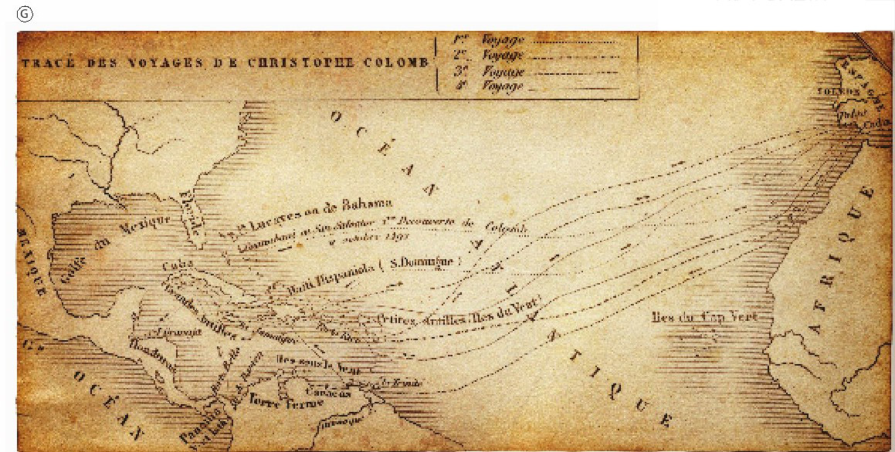
哥伦布航海图

  

**【微博士】**托勒玫地图

古代的世界地图里，最著名的是托勒玫地图。托勒玫是公元2世纪古希腊的天文学家和地理学家，他的八卷本巨著《地理学指南》总结了古希腊有关地理的知识，可惜原书早已失传。1300年，后人再造了托勒玫所知的世界地图。本书第2、第3页上的托勒玫地图是1482年的版本，代表了将近2000年前古希腊的世界观：地图西边是大西洋，最东头是中国，海洋有地中海和印度洋，既没有太平洋，也没有美洲大陆，这也就是哥伦布出航时的地理概念。

【微问题】　15世纪时，中国和阿拉伯的船队都比欧洲强，为什么发现新大陆、完成环球航行的却是西班牙的船队？

【关键词】　哥伦布　麦哲伦　亚美利加　美洲　奥尔梅克文明　托勒玫地图

## “泰坦尼克号”的遗骸是怎样发现的

20世纪初最豪华的英国皇家邮轮“泰坦尼克号”，1912年4月10日中午从英国南安普顿出发前往纽约，四天后的4月15日凌晨2点20分沉没，船上2224人中有1514人葬身海底，造成了和平时期空前的海上悲剧。“泰坦尼克号”长270米、重4.6万吨，船身巨大、装备精良，此次航行又是它的处女航。如此先进的豪华邮轮之所以会葬身海底，原因是它撞上了巨大的冰山。

1912年4月10日，“泰坦尼克号”从英国南安普顿出发，前往纽约

“泰坦尼克号”出事后，许多探险队前去寻找过船体残骸，但均告失败，原因是海水太深——船骸躺在水深3784米的海底。直到73年后，才由美国和法国的联合探测队，在北大西洋海底找到了它的残骸，最主要的“功臣”是美国伍兹霍尔海洋研究所的巴拉德教授。那么巴拉德是怎样找到“泰坦尼克号”的呢？

他们的方法是先用“旁侧声呐”，通过声波对海底的地形进行扫描，然后用水下机器人装上摄像头进行寻找。可是要在几千米的海底找到沉船，就像是“海底捞针”，希望十分渺茫。这里起关键作用的是巴拉德的科学头脑：先找碎屑后找船。当船体突然沉到几千米海底时，会因为压力剧变而发生爆炸，爆炸碎片随着海流散落在海底，可以延伸几千米长，找到了碎片就应该能够找到船身。果然，1985年9月1日的清早，巴拉德先在平坦的海底发现了麻坑，说明有东西掉落过；接着发现了碎片，然后再看到了锅炉，最后找到的船身已经“身首异处”：船头还比较完整，而600米外的船尾已经完全散架。后来，巴拉德按照这一理论又多次在别的海区发现了多艘沉船。这门学问，属于“海底考古学”。（汪品先）

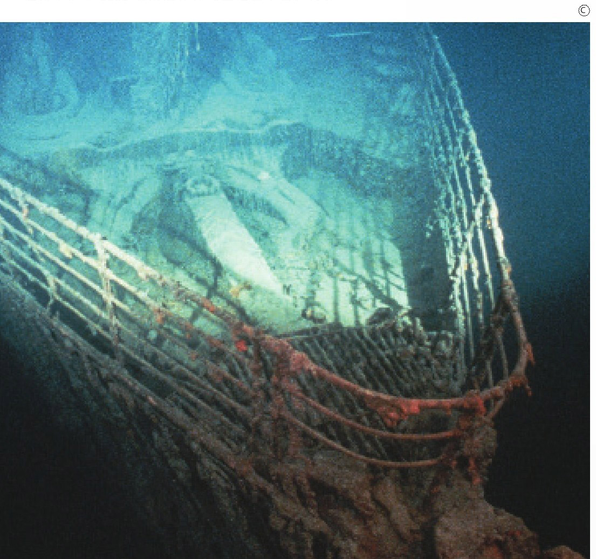
沉没在海底3700多米深处的“泰坦尼克号”船头

## 为什么要花巨额经费打捞“南海一号”沉船

2007年12月21日，一艘南宋沉船（被命名为“南海一号”）从广东阳江附近的海底被打捞出水。这艘古船沉没在水深23米的海底，上面覆盖着一两米厚的淤泥，这次采用的是整体打捞的方法：连船带泥装在钢制的沉箱里整体捞上来，总重量超过4000吨。一周以后，“南海一号”被搬进了阳江海陵岛上专门为它建造的“水晶宫”里，一边开放陈列，一边继续发掘。这样的打捞发掘，费用昂贵：光打捞就要花费1亿元以上，建“水晶宫”又要1亿多元。为了一条沉船花那么多钱，值得吗？

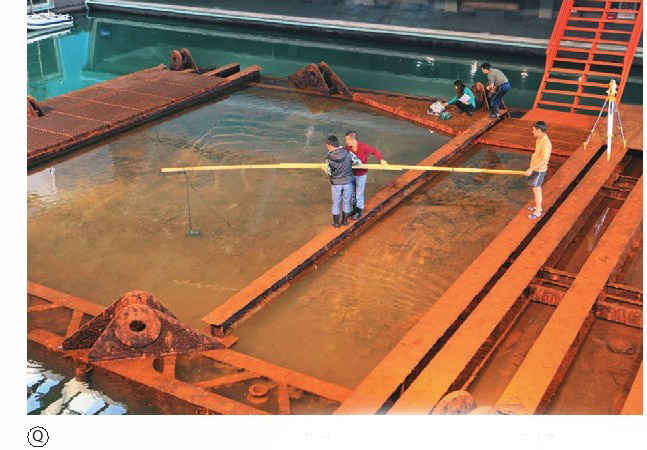
“南海一号”打捞现场

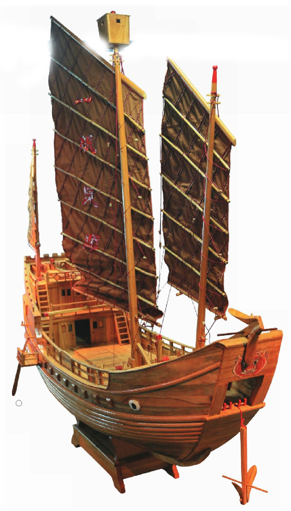
“南海一号”模型

这就要从20多年前“南海一号”的发现说起。这艘沉船是在1987年被发现的，同时打捞出一批珍贵文物。由于经费和技术条件的限制，直到2001年才进行制图调查，2002年又打捞出文物4000多件。原来，“南海一号”是800年前的大型远洋货船，船长30米、宽近10米，载重量近800吨。发现时甲板已经腐烂，但是船身其他部分尚保存完好，船体的木质仍然坚硬如新，是迄今发现的最大、也是保存最好的宋代沉船，对了解中国古代造船工艺、航海技术都有极其珍贵的价值。船载货物以瓷器和铁器为主，初步估计有6万至8万件之多，其中包括价值连城的国宝级文物。对于这项国宝的发现，采用整体打捞、室内发掘的新技术，来保证船身和物品的有效发掘和保存，是完全值得的。

“南海一号”的发掘，也为中国古代“海上丝绸之路”的研究，提供了无法估量的宝贵资料。中国古代的国际贸易航线在秦汉时期已经出现，唐宋年间更为繁荣，宋代时中国的航海技术在国际上遥遥领先。隋唐年间海上运送的主要是丝绸，到了宋元时期，瓷器渐渐成为主要的出口货物，“南海一号”就是见证。国际海底考古学历史表明，古代大型沉船常常是古文物的宝库。比如1982年打捞起的英国“玛丽·罗斯号”军舰是在1545年沉没的，从中发现的2.6万多件文物里不但有航运和军事用品，还包括医疗、木匠、宗教的用品和乐器等，对于了解英国都铎王朝的文化与生活，具有极大的历史价值。可以预计，“南海一号”也将揭示“海上丝绸之路”的细节，为重建800年前南宋的面貌，做出无价的贡献。（汪品先）

  

**【微博士】**瓦萨博物馆

世界上沉船陈列最为有名的，要数瑞典的瓦萨博物馆。它坐落在斯德哥尔摩东郊的小岛上，展示着17世纪瑞典最强大的军舰“瓦萨号”。船上数百尊装饰用的雕像，绝大部分完好如初。这艘战舰在1628年8月10日盛大的下水首航仪式后，刚离开码头不久即遇上强风，就此沉入海底，直到1956年重新发现，1961年打捞出水。“瓦萨号”设计时只是一艘单层炮舰，后来，当时的瑞典国王古斯塔夫二世嫌炮太少，下令改成双层炮舰，总共5层甲板，配备了64门炮，结果导致头重脚轻，大风一来就翻了。

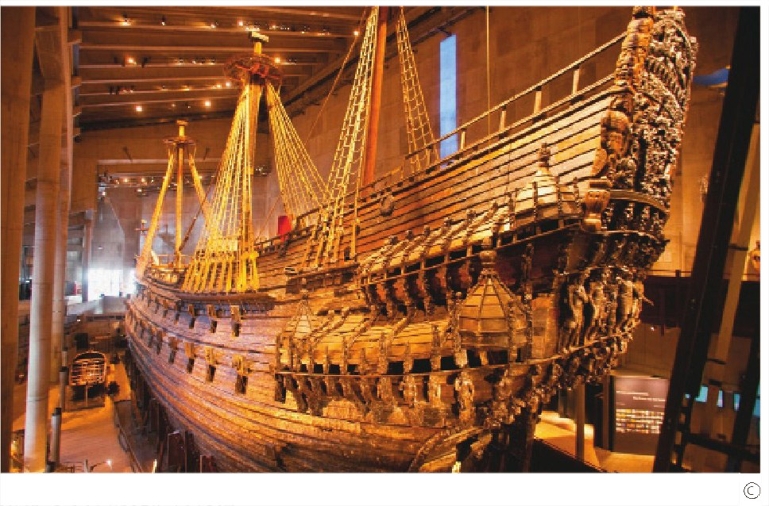
斯德哥尔摩的瓦萨博物馆

【微问题】　宋朝的远洋贸易很发达，你知道当时最主要的国际港口在哪里吗？

【关键词】　沉船　“泰坦尼克号”　海底考古学　“南海一号”　瓦萨博物馆

## 为什么加勒比的海盗名气最大

你见过海盗吗？是在电影或是动漫里见到的吧？那十有八九是加勒比海盗。其实你熟悉的海盗装和骷髅海盗旗，最早也是起源于加勒比海盗。为什么加勒比海盗这么出名呢？这要从500年前讲起。

骷髅海盗旗

加勒比海盗：“黑胡子”蒂奇

15至17世纪的地理大发现，带来了航海事业的大发展。满载着商品、黑奴和金银财宝的欧洲船只，是海盗抢劫的理想猎物。谁都不是生出来就做海盗的，最早的海盗其实就是水手。比如说船触礁了，或者被处罚丢在荒岛上了，为了活命，想办法把别人的船引过来抢劫，就此成了海盗。不过海盗能在加勒比海如此猖獗，一个重要的原因是有官方的支持。哥伦布发现的新大陆，多是加勒比海的岛屿，从此西班牙就掌握了通往美洲的航线，英国、法国、荷兰的政府要想竞争，就鼓励海盗去抢劫西班牙船只，但是不准侵犯本国的商船。17和18世纪之交，加勒比海地区出现了30年的海盗“黄金时代”，当时使用短火枪和水手弯刀的海盗群里，出现了一批“名人”，比如由富商到海军英雄最后作为海盗被绞死的“海盗王子”基德船长，一年里抢劫了50多艘船舰、28岁就葬身海底的“黑山姆”贝拉米，用四艘海盗船攻击海港的“黑胡子”蒂奇，一生抢劫470艘船的“准男爵”罗伯茨……一个个都是当时的传奇人物，也是现在许多小说、电影和动漫的主人公。

维京海盗出身的10世纪丹麦国王“蓝牙”哈拉尔

其实海盗自古就有，可以说有了商船就有了海盗。最早的海盗记录来自地中海，记载在公元前14年的黏土碑文上。后来到罗马帝国时，庞培将军率战船5000艘、士兵12万出征，方才摧毁了海盗的老窝，给了地中海一段时期的平静。和加勒比海盗一样，许多地方海盗的猖獗往往有政府支持的背景。比如16至19世纪来自北非的穆斯林海盗，在政府支持下专门抢劫基督教的船只。有些欧洲国家居然给海盗发放许可证去攻击别国的商船，作为国家海军的补充。因此在欧洲历史上，海盗、国王和探险家往往不容易区分。10世纪的丹麦国王“蓝牙”哈拉尔就是海盗出身；19世纪的海上霸主、“日不落帝国”英国，当初也是靠着海盗起家。在科学探险上，对南半球考察和海洋气象学做出巨大贡献的英国人威廉·丹皮尔，就曾是一名加勒比海盗。借其名命名南极和南美洲之间的“德雷克海峡”的弗朗西斯·德雷克，既是击败西班牙“无敌舰队”被封为英格兰勋爵的海上英雄，又是以凶恶著称的海盗。

海盗当然不只是西方才有。比如明朝潮州人陈祖义，洪武年间全家逃到南洋入海为盗，在马来半岛的马六甲，建立了当时世界上最大的海盗集团，最多时人数上万、战船近百，活动在中国台湾、南海和日本、印度洋等地，劫掠万艘以上船只，攻陷50多座城镇，在郑和下西洋时还想假投降、真抢劫，被郑和活捉押回后镇压。直到今天，东南亚马来西亚海区仍然有海盗出没。（汪品先）

## 北欧中世纪的维京人都是海盗吗

维京人是8世纪到11世纪时期北欧的海盗，侵扰欧洲沿海和英伦诸岛，也到过北极的广阔疆域，欧洲的这一时期也被称为“维京时期”。维京人和加勒比海盗不同，他们抢劫的对象主要是陆上目标，而不是过往船只。这是一个强悍的海洋民族，公元4世纪开始，他们进行过多次劫掠性的航海活动，公元8世纪在丹麦、挪威和瑞典定居下来，形成多个王国，并且把造船技术发展到较高的水平。维京探险者不仅到达了格陵兰岛，而且是最先到达美洲的欧洲人。不能简单地说维京人就是一群海盗，但是维京人的抢劫是很可怕的，堪称一批狂热的杀手。他们掠夺时，先远距离投掷长矛和发射火箭，然后用剑和战斧做近距离的攻击，要么将对方统统杀光，要么自己战死。

中世纪维京海盗对欧洲沿海和英国的抢劫，很像中国北方游牧民族入侵中原地区。不过这不是说东方就没有维京式的海盗。明朝的日本倭寇，也是一种立足海岛以城市为抢掠目标的海盗，在14至16世纪侵扰劫掠中国和朝鲜沿海。明朝实行“海禁”政策，“片板不许入海”，结果非但不能消除倭寇的威胁，反而断绝了整个海上贸易的产业链，逼迫海商变成海盗。因此倭寇并不都是日本人，其中也有不少中国人和朝鲜人，有的是“亦商亦盗”。嘉靖年间徽州的王直就是这种人，他作为倭寇的头领希望朝廷招安，希望海上贸易合法化，结果被诱捕杀害。明、清两朝的几百年“海禁”，使得中国古代的海上优势丧失殆尽。（汪品先）

维京海盗

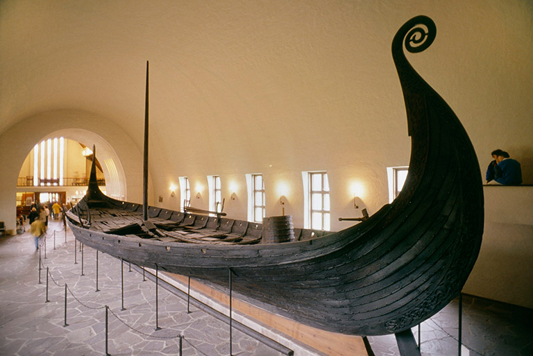
奥斯陆海盗博物馆陈列的维京船

  

**【微博士】**索马里海盗

索马里和也门之间的亚丁湾，是印度洋通往地中海和大西洋的海上咽喉，每年通过苏伊士运河的1.8万艘船只大多数要从这里经过。索马里本来就是世界上最不发达的国家之一，经过多年战乱，长期处于无政府状态，使得索马里2880千米的海岸线变成了海盗的天堂。现在这里海盗的营生已经“产业”化，绑架每艘船平均收180万美元赎金，2008年总收入达1.2亿美元，对总共1000多名海盗来说是相当不错的财源。尽管目前在亚丁湾聚集了欧盟、中国等许多国家的护航军舰约20艘，但还是难以保证航行的绝对安全。

【微问题】　为什么欧洲历史上有兼地理发现家的海盗，中国却一个也没有？

【关键词】　加勒比海盗　维京人　索马里海盗

## 为什么百慕大海域被称为“魔鬼三角区”

人类对海洋的了解，可能还不及对月球表面的了解。海洋中有着许多悬而未解之谜，其中有的已经困扰了人类数百年之久。因不知谜底，人们往往谈虎色变，心生恐惧。百慕大海域发生的各种离奇失踪事件便是其中之一。

百慕大海域位于北大西洋西部，是个由百慕大群岛、波多黎各和美国佛罗里达州南端所形成的三角区海域，面积达390万平方千米。因为这里经常发生常识不能解释的船只、飞机等诡异失踪事件，因此逐渐被妖魔化，有了“魔鬼三角区”的称谓。仿佛这里长年居住着成群的恶魔，随时会伸出魔爪，将船只和飞机拖入毁灭的深渊。据统计，百慕大海域已经发生超过150多次船舶和飞机失踪事件，共2000多人失踪。除去一些讹传和被夸大的事故以外，还有不少确有其事。在众多诡异事件中，1945年12月发生的美国5架轰炸机和14名飞行员集体失踪事件最让人印象深刻。

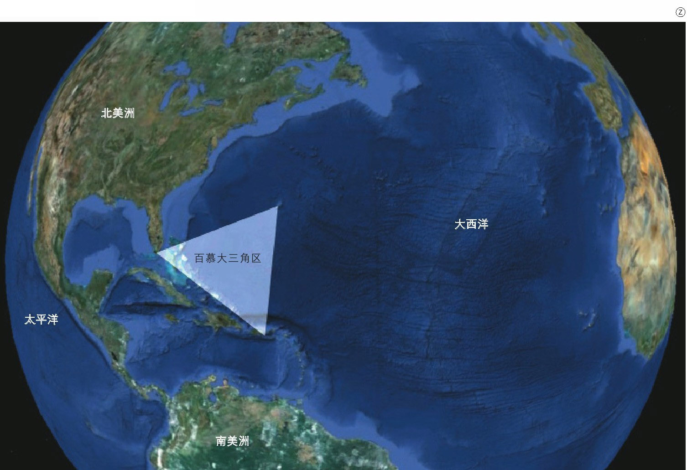
百慕大三角区的地理位置

百慕大三角区内的某些诡异事件与“马尾藻海”有关。实际上，百慕大三角区的位置大体上就是马尾藻海。马尾藻和我们吃的海带相近，都属于褐藻，但是和长在海底石头上的海带不同，马尾藻是漂浮在海面上的。马尾藻海在世界上独一无二，是个没有边界的“洋中之海”，以大量漂浮藻类为特色，那里的水也是全世界最清澈的海水。由于马尾藻海位于北大西洋环流的中央，缺乏帆船航行需要的风力，加上海面漂浮的巨量海藻，早年的航海者到了这里，很有可能就此被困住。当年哥伦布就在这里被困了三个星期，最后才得以死里逃生。

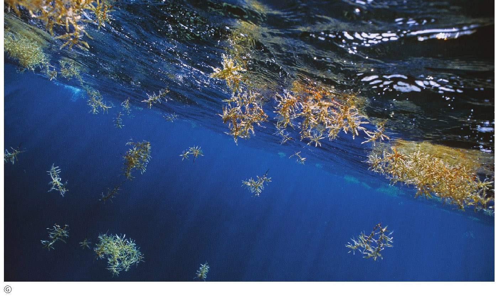
马尾藻海上漂浮的海藻

当然，现在已经不是哥伦布时代，在百慕大三角区发生的种种奇闻逸事，显然不能完全归咎于马尾藻海的海面特点。人们先后提出了各种猜测，包括海底有特殊的磁场，水下有强大的潜流，等等。近年来英国科学家还提出了“可燃冰”假说：海底的天然气水合物快速分解，产生大量的甲烷气泡升到水面后，会使海水密度降低，浮力骤减，由此导致沉船或者空难。但是种种推测，目前还都缺乏科学证据，科学家正在加倍努力。只要我们保持科学的敏感和好奇心，揭开百慕大三角区之谜只是一个时间问题。（彭晓彤）

## 大西洋上有过“大西国”吗

几千年来，海洋历来是人类的神话世界。不但先秦著作《山海经》里讲海外奇谈，400年前英国的图书《圭亚那王国的发现》，还说那里的人不长脑袋，眼睛和鼻子都在胸上。自然，深藏不露的海底就更可以幻想。2000多年以来，有关一个沉没于海底的强盛王国——“大西国”的传说层出不穷。这个传说的发起者，是古希腊大名鼎鼎的柏拉图。

公元前300多年，柏拉图在两本“对话录”里描述了大西国，说它是1.2万年前人类的超级古文明，位于非洲直布罗陀海峡以西大西洋中部的海岛上。那里草木葱郁，花果飘香，兽畜成群，资源丰富，人民生活十分富足。传说中，大西国由海神波塞冬创建，后分给他的十个儿子统治，并立长子为最高统治者。长子的名字叫阿特拉斯（Atlas），欧洲文字里的大西国（Atlantis）和大西洋（Atlantic）的名字都来自这位希腊神。

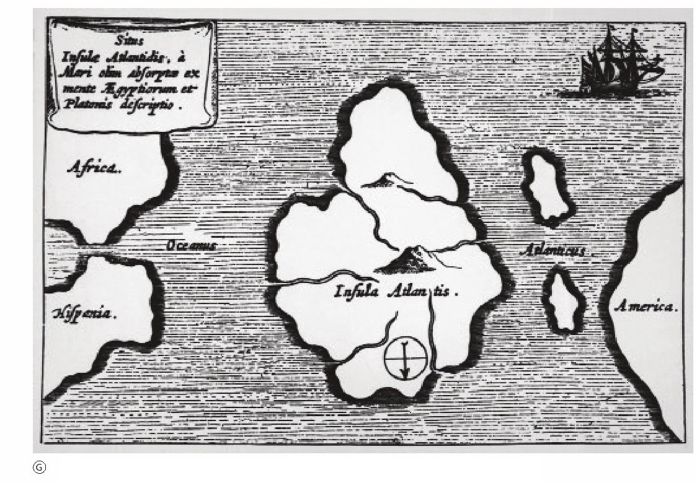
柏拉图没有留下画，这是1669年画的“大西国”地图。此图上南下北、左东右西，“大西洲”居中，右边是美洲，左边是欧洲和非洲。

传说里的大西国非常富饶，有金碧辉煌的神殿和王宫，有环绕王国的运河和道路，有先进的造船厂和完善的市政设施，并拥有十分强大的帝国军队。最初，大西国的国民十分崇尚道德，恪守道义。多年以后，大西国开始腐败堕落。据说众神之首宙斯为惩罚人们的堕落，引发了地震和洪水，仅一天一夜就将大西国沉没于海底！那么，这个传说中的大西国是否真的存在过呢？

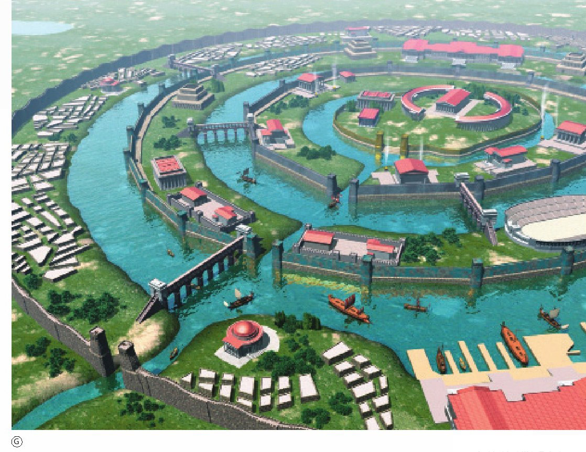
大西国假想图

柏拉图之后，关于大西国的书就出版了上千本。大西国的研究者们，查遍了各种可能的遗址，从地理学、生物学、历史学、人类学、考古学等专业角度加以论证，但至今还没有答案。有人认为它在大西洋亚速尔群岛或者巴哈马近海，甚至就在百慕大三角区底下，说不定那里发生的怪事就与古文明有关；也有人认为它在地中海的塞浦路斯或者克里特岛附近，因为附近有强烈的火山活动。但是，目前的地质记录并不支持这类假设。

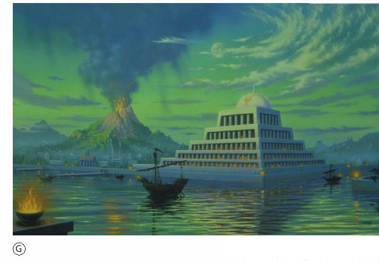
大西国假想图

总之，人类对海底的了解实在太少，“大西国”一类的科学之谜，还将长期盘旋在大洋的上空，萦绕在人们的悬念中。（彭晓彤）

  

**【微博士】**“姆大陆”

沉没大陆的猜想十分诱人，不会只是大西洋的专利，在印度洋、太平洋也有，但是它们都有一个共同的特点——缺乏证据。在各种有关沉没大陆的猜想中，口气最大的莫过于“姆大陆”。20世纪初，美国学者詹姆斯·乔治瓦特提出假设，说1.2万年前太平洋上有过比南北美洲加起来还大的“姆大陆”，也有过高度发展的“姆文明”，后来在地震中沉入了大海。可惜，这也只是一个传说。

【微问题】　中国古代的海洋神话，你能说出几个来？

【关键词】　海洋神话　百慕大　天然气水合物　古文明

## 深海真的有水怪吗

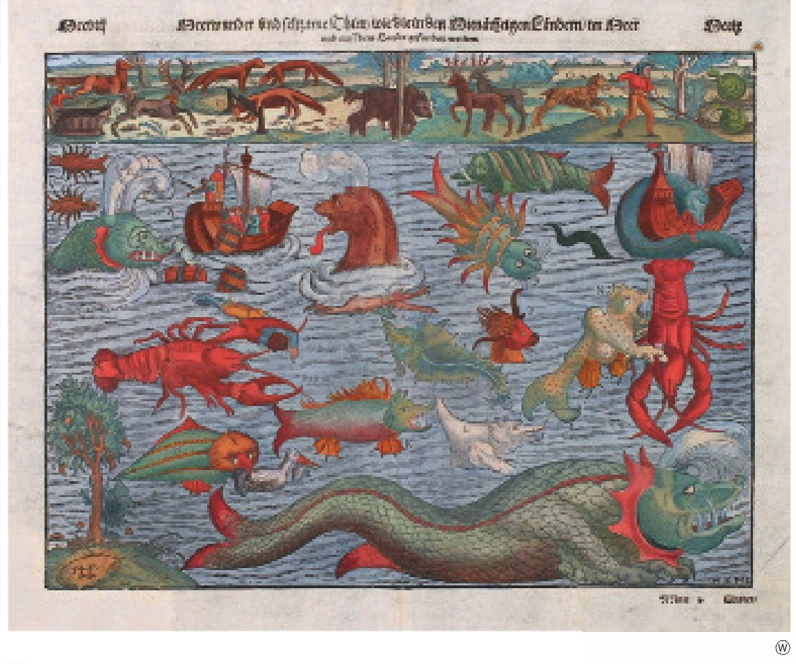
16世纪中叶，一幅著名北欧地图上出现的各种水怪

欧洲500年前的地图比现在的好看：图上不但标出海陆山河，还有许多图画，陆上画的是人和野兽，海里是船和鱼类——这可不是普通的鱼，而是水怪。这类水怪是当时的“时尚”，常常出现在欧洲旅游景点的古典雕塑上。

中国神话传说里的水怪和欧洲不同，从龙王爷到虾兵蟹将，多数是江河湖泊里淡水动物的人格化。欧洲的水怪却大都来自航海水手的传闻，最精彩的是深海水怪：有的长着狮子般的头和发光的眼睛，有的像是中国“龙”的海外版。如果要比哪种传说最多，恐怕就是超巨型的章鱼和所谓的“海蛇”。

从13世纪起，就传说挪威海深水里有种极大的水怪叫“克拉肯（Kraken）”。它偶尔才上升到水面，不动的时候像座岛屿，一动起来引起的巨浪就会把船掀翻，有时候它还会把整个船抓起来。“克拉肯”指的就是巨型的章鱼，出现在各种传说和科幻作品中，凡尔纳的《海底两万里》里也不例外。深海确实有巨大的头足类，包括章鱼和鱿鱼，不过到目前为止，已发现的鱿鱼最大14米长，章鱼最大才7米长，离“克拉肯”的传说还差得很远。神话和传说当然多数是捕风捉影、牵强附会，比如冰岛海底火山活动突然引起的急流和气泡，也被说成是“海怪”现身；有些“看到的”巨型海怪，其实是鲸鱼的尸骸或漂浮的海藻堆。

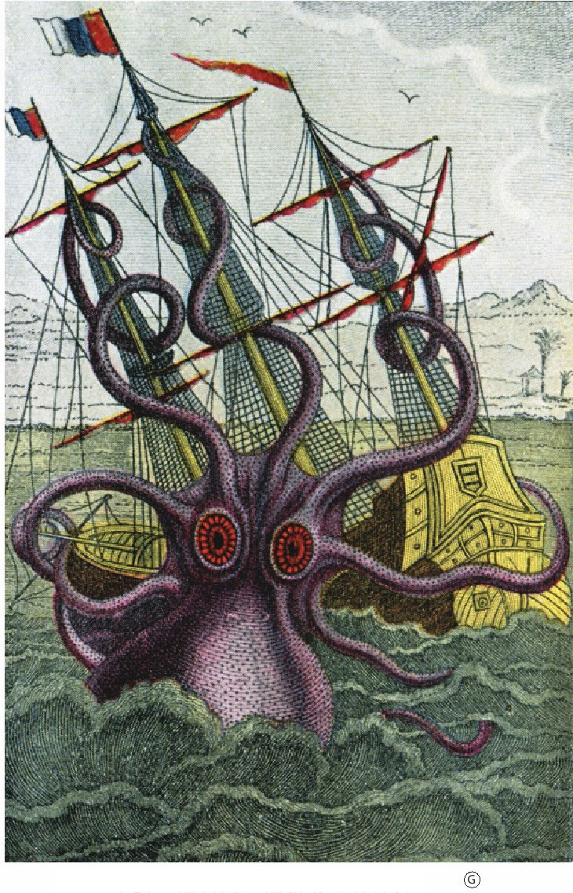
1801年的一幅名画，描绘安哥拉岸外一艘法国船遭受“克拉肯”袭击的传说

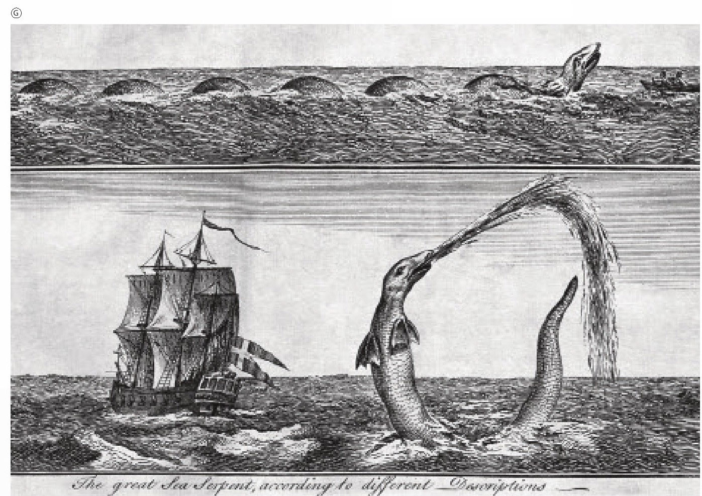
深海皇带鱼，古代航海者传说中的大海蛇可能就是它

还有一类“海怪”是指巨型的“海蛇”。18世纪时，传说在格陵兰海上出现过比桅杆还高、比船身还长的“海蛇”，而在北欧的古代传说里，“海蛇”大得居然被错认为是一串群岛。其实，被误认为“海蛇”的常常是皇带鱼——一种生活在温暖海区上千米深处的深水硬骨鱼，最长纪录达17米。但是，不能说传说中的“海蛇”都是皇带鱼，因为我们对深海生物的了解太少，不能排除深海里有更长、更大的动物。美国在太平洋里设置的监听装置，曾发现强大而奇怪的声波，不知道是来自比鲸鱼还大的海洋动物，还是来自海冰崩塌之类的自然现象。

海洋巨型生物在中国古代传说里也出现过，但只是比较空洞的想象。比如庄子《逍遥游》里讲的“鲲”，个头大得“不知其几千里也”，还可以“化而为鸟”变成大鹏，只是究竟什么模样并不具体。而欧洲的海怪传说来自航海，由于深海的神秘性，有时候科学和神话的界限不太清楚。比如：18世纪林耐建立生物命名法时，就为“克拉肯”取了学名、归入头足类，后来才被取消；19世纪末佛罗里达海岸上发现几十吨重的“海怪”尸体，后来的分析证明无非是一堆鲸鱼的脂肪。（汪品先）

## 为什么深海动物长得特别大

深海“水怪”的传说，并不都是空穴来风。许多动物，生活在深海里的种类往往比浅水里的大得多，除了皇带鱼和巨型的章鱼、鱿鱼之外，还有近4米长、将近20千克重的螃蟹，2.7米长、1.5米宽的魔鬼鱼等。连深海的虫子也大得惊人，蚯蚓之类的蠕虫通常一二十厘米长，而深海热液口的“管状蠕虫”长的可以达到两三米；我们熟悉的潮虫在地上只有一厘米大小，而深海类型的潮虫居然有76厘米长、1.75千克重！

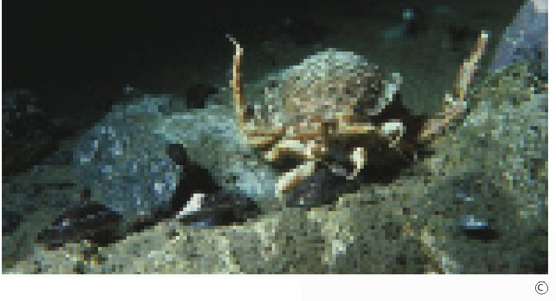
深海里的巨型“潮虫”重量超过1.5千克

为什么深海动物特别大呢？这是个还没有完全弄清楚的问题。一种说法是温度。同类动物的个体大小，往往随着温度下降而增大，海水越深温度越低，所以个体也越大。但是这些深海“巨型”动物体积增大几十倍，就很难拿温度差别来解释了。另一种说法是食性。除了热液、冷泉，深海海底动物的食物来源主要是从上层海洋掉到海底的生物骸体或者排泄物，这就是它们的“粮食”，如果一条鲸鱼尸体掉下来，那就是天赐的美餐。不过这种机会不多，只有个体大的动物才能够一次大量进食、经受长时间的饥饿，而且能够长距离转移去寻找食物。深海“巨型”动物，是不是就是对于这种“食性”的适应呢？（汪品先）

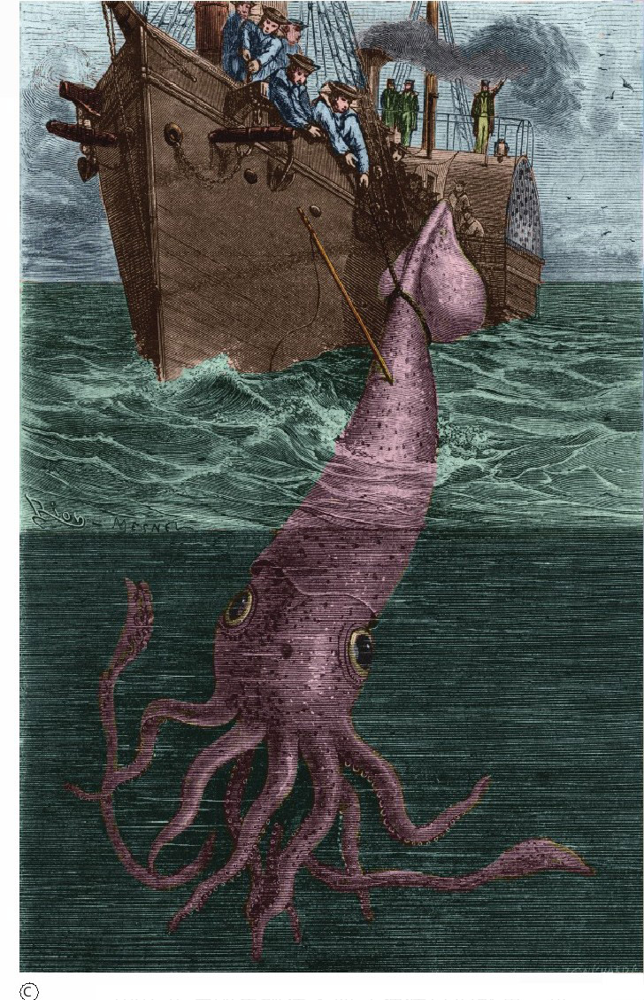
1861年法国军舰在大西洋捕获巨型鱿鱼，可惜最后只抓上来尾部

  

**【微博士】**世界最大的细菌

不但深海动物体形巨大，海洋微生物界里也有“巨型”细菌，只是我们肉眼看不到罢了。细菌一般只有几微米大，但是在非洲南部纳米比亚浅海的泥里，德国科学家发现了像串珠那样的硫细菌，每个细菌平均直径180微米，最大的有750微米，比一般细菌大100倍以上，被称为纳米比亚硫珠。那是个营养特别丰富的海区，大量的硅藻堆在泥里，巨大的硫细菌就生活在这种特殊的环境里。纳米比亚发现了世界上最大的细菌，当然也是一种荣耀，2003年该国还专门发行了纪念邮票。

【微问题】　对于海洋动物本身来说，究竟是个体大的类型有利，还是个体小的有利？

【关键词】　深海动物　水怪　海怪　鱿鱼　皇带鱼　纳米比亚硫珠

十万个为什么　第六版　出版工作委员会

  

**主　任**

李远涛

  

**副主任**

周　晴　洪星范

  

**编辑人员**

（以姓氏笔画为序）

王　音　王　慧　卢　昱　朱　机　乔馥娟　孙正凡　岑建强　沈　岩　郝思军　黄劲草　梁玉婷　韩　静　裘树平　熊喆萍

  

**设计总监**

袁银昌

  

**美术总监**

费　嘉

  

**美术编辑**

费　嘉　张　怡　陈艳萍

  

**印制总监**

张伟群

  

**技术编辑**

张伟群　吴轶伟　胡厚源　陆　赟　许　辉

  

**责任校对**

石玲凤　王　曙　黄　岚　黄亚承　沈丽蓉　陶立新

  

**特约编审**

卞毓麟　方鸿辉　王义炯　范　氾

  

**审稿、定稿、审读人员**

（以姓氏笔画为序）

王　音　王　辉　王伟海　王霞梅　叶　剑　田廷彦　乐嘉民　匡志强　乔馥娟　严　岷　李远涛　李维靖　吴延祺　岑建强　沈　岩　张　颖　张利雄　张毅颖　陆永洲　陈　浩　陈晏平　林丽成　周玉刚　郑石平　郝思军　胡　毅　洪星范　徐红宝　隋淑光　董　放　韩绍伟　曾　文　曾建设　裘树平　虞信棠　魏昌富　濮紫兰

附录　图片及辅文版权说明

**图片版权**

本书所使用的图片均标注有与版权所有者或提供者对应的标记。全书图片的版权说明如下：

高品（上海）图像服务有限公司（Corbis Images）；

华盖创意（天津）视讯科技有限公司（Getty Images）；

北京全景视觉网络科技有限公司（全景）；

维基百科（Wikipedia.org）网站；

上海科学技术出版社；

美国国家海洋和大气管理局（NOAA）网站；

美国航空航天局（NASA）网站；

P112右、P113上，美国内务部地质勘探局网站提供；P174下，航海博物馆提供；P166右两张、P167右，McInroy IODP/ECORD、Jakobsson IODP/ECORD提供。

其他图片来源：

P7左上、P7右、P36左、P62右中、P65右上、P78左下、P79右、P98、P99右下、P108左下、P133右、P142左、P143右、P169右，费嘉绘制；P9左下、P84右、P152右，王吉良提供；

P9右、P24左下、P30左上、P33右下、P63左、P88上、P88下、P93左上、P100右、P101右、P150右上，雨青工作室绘制；

P10右、P90右、P91右上、P110下、P117右上、P156左、P182左，彭晓彤提供；

P21右、P23左下、P61右上、P72-73、P82右上、P82右下、P83右、P87右下、P94左下、P101左上、P103上、P103下、P113左下、P113右下、P132左下、P137上、P149右下、P150左上、P161左上，黄维提供；P65左上，焦念志提供；

P76左、P80右下，彭晓彤摄；P96左，薛梅摄；P97左、P97右，薛梅提供；P104-105、P132右下，崔维成提供；

P115左上、P120右上、P180右下，陈艳萍绘制；P119上，姚会强提供；P149左上，范代读提供；P154左、P154右，孙松提供。

**辅文版权**

本书的“科学人”、“微博士”、“实验场”均由同页正文作者编写。

特别说明：本书中可能存在未能联系到版权所有者的图片，请见书后与上海世纪出版股份有限公司少年儿童出版社联系。

## 为什么深海也会下“雪”

在水中穿梭飞舞的“海雪”

1974年，苏联的一艘潜艇去北冰洋执行一个探测任务——探测深海水文特征。当潜艇钻进坚冰覆盖下的北冰洋，下降到一团漆黑的深海中后，艇长命令打开探照灯，用强光照射潜艇周围的海水环境。这时，潜艇舷窗外出现了一幅奇妙的景象：潜艇周围下起了纷纷扬扬的“大雪”，甚至还能看到成串的雪片在海水中飞舞，仿佛是北冰洋冰面上方正在下着的雪穿透了坚硬的冰面飘落到深水中。在像蝴蝶一样飞舞着的“雪花”中，偶尔会飘过来几个形态奇异的水母，它们有的像葵花，有的像皇冠，在“雪花”中飞舞；有时候也会有成群的鱼儿，在“雪花”丛中追逐嬉戏，然后消失在“大雪”之中。它们的出现，仿佛冬天里在雪地上玩耍的孩童，使这深海中奇妙的“雪”景更加生动活泼、绚丽多彩。

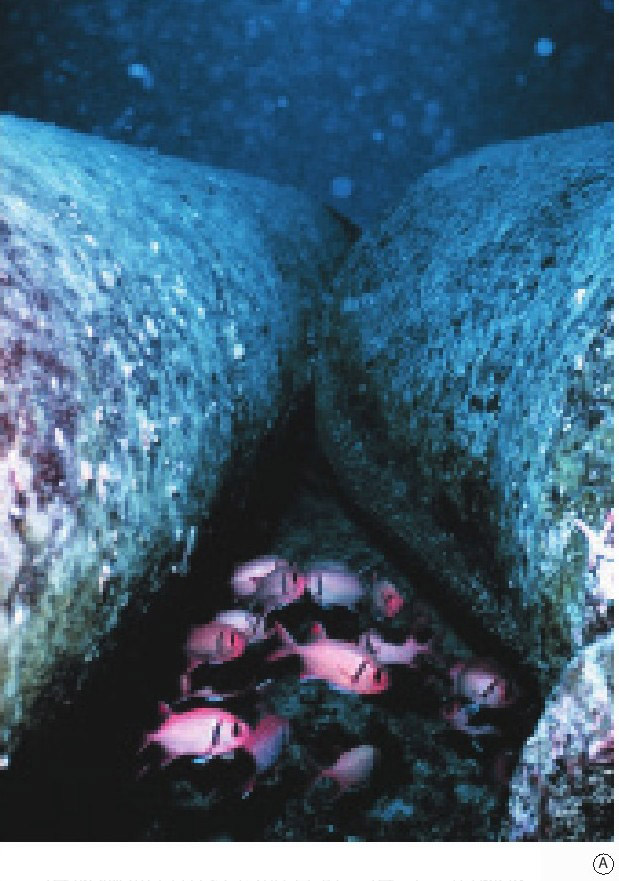
海底输油管附近也能看到“海雪”的踪迹

我们知道，雪一旦遇到水，会很快地融化，而不是在水中穿梭飘舞。何况北冰洋的深海不但与空中相隔甚远，中间还有一层坚冰阻挡，即便天空中漫天雪花，恐怕也不可能落入深海依然完好无损，那为什么还能在此处见到这样的“海雪”奇观呢？

原来，“海雪”虽然看起来很像是陆地上的降雪，但是，它与陆地上的雪完全是两码事。如果把这些“雪片”从海水中提取出来，我们会看到一些絮状松散的东西，它们既不像雪花那样洁白晶莹，也不像雪花那样美丽多姿，那它们又是什么呢？

经过研究分析，人们终于明白，在深海看到的“海雪”其实是悬浮物在水中的光学效应，它形成的道理非常简单。我们每个人都有这样的体会：如果在一间比较暗的房间里，是看不到那些飘散在空气中的细小灰尘的。可是，当明亮的阳光照进房间时，我们就可以在太阳光束中看到那些飘动着的无数闪闪发亮的灰尘。光学上把这种现象称为延德尔效应。同样道理，在漆黑一片的深海里，海水中的悬浮物在探照灯强烈照射下，也会显现出闪烁的白光。又由于光的折射作用，在水中的物体看起来比实际的要大，于是“海雪”就出现了。另外，这些悬浮物与海水比重差不多，能在海水中随着海水的流动而漂荡，这样，展现在人们面前的就是雪花飞舞的“海雪”奇观了。（肖娜）

## “海雪”里藏着什么

我们已经知道，“海雪”不是雪，而是深海中的悬浮物。那么这些悬浮物到底是些什么东西呢？

最早对“海雪”进行研究的是美国的一位生物学家，他发现，“海雪”是由浮游生物组成的絮状物，便给它取了个名字叫“浮游生物雪”。事实上，形成“海雪”的东西不仅仅是浮游生物，海水中各种各样悬浮着的大小颗粒、生物死亡分解的碎屑、生物排泄的粪便团粒、大陆水流带来的颗粒等，都可以作为海雪的原料。这些颗粒相互碰撞结合，变成较大的颗粒，然后像滚雪球一样越滚越大，直到形成雪花似的大片大片的絮状悬浮物。当这种絮状悬浮物多起来时，“深海下雪”的壮丽奇观就形成了。

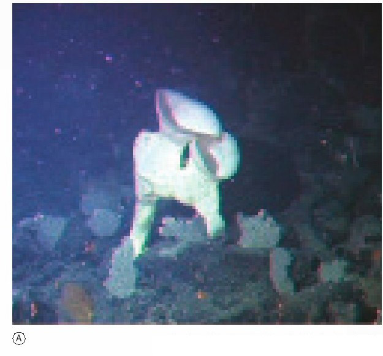
海底“暴风雪”中的大象海绵

那么，这些悬浮物是怎样结合在一起的呢？科学家经过多年的研究发现，“海雪”这种奇异的深海现象始于海水表层的黏液团。表层海水光合细胞在代谢过程中，会生成一种营养物质——黏多糖，而黏多糖常常会泄漏到外界。这种化合物拥有与蜘蛛丝类似的形态，呈线形分布并且黏度很高。因此，当它漂浮在水中时，丝状的黏多糖会粘连上许许多多的小微粒，如悬浮的球状排泄物、死亡的动植物身体组织等。随着粘连的物质越来越多，黏多糖的重量便超过海水提供的浮力，从而慢慢向海底下沉。此刻我们从深海中抬头往上方看时，就好像有大片的雪花从天空中飘落一样。而当海水表层的生产力很高时，大量的黏多糖沉降就可能在海底形成暴风雪般的壮观景象。（肖娜）

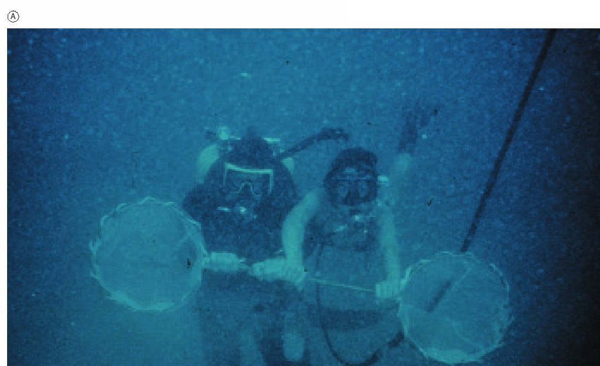
两位潜水员在采集“海雪”样品

  

**【微博士】**海洋表层黏液团

科学家在海洋表层黏液团里发现了大量细菌和病毒。如果在这种黏液团里游泳，可能会染上皮炎等皮肤病。那些别无选择，只能游过黏液团的鱼类和其他海洋动物最易遭受病菌侵袭，甚至大型鱼类也可能因此丢掉性命。这种有毒黏液团还能困住海洋生物，封住它们的鳃，使它们窒息而亡。

【微问题】　“海雪”沉降到海底对海底的生物有什么影响？

【关键词】　海雪　海洋表层　黏液团　黏多糖　延德尔效应

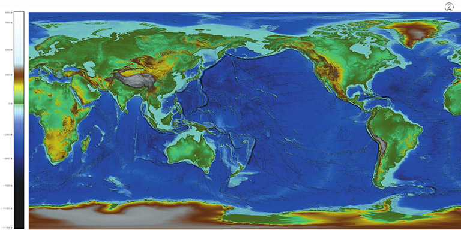
全球地形图

珊瑚礁是地球上最丰富的海洋生态系统

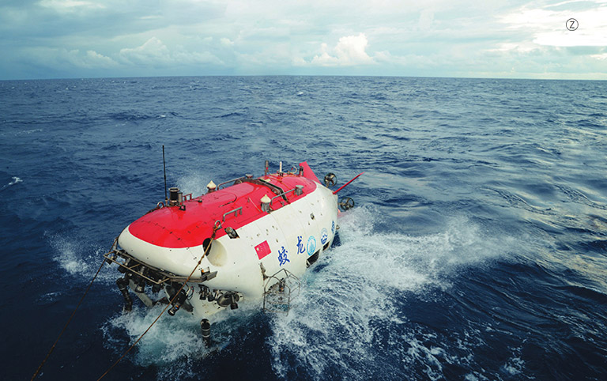
中国“蛟龙号”载人深潜器

