# 图书在版编目（CIP）数据

十万个为什么（第六版）/韩启德总主编.-上海：少年儿童出版社，2014.1

ISBN 978-7-5324-9285-5

I.①十……II.①韩……III.①科学知识-青年读物②科学知识-少年读物IV.①Z228.1②R-49

中国版本图书馆CIP数据核字（2013）第055411号

  

  

  

**十万个为什么（第六版）**

**总主编　韩启德**

出　　版　上海世纪出版股份有限公司少年儿童出版社

地　　址　200052上海延安西路1538号

发　　行　上海世纪出版股份有限公司发行中心

地　　址　200001上海福建中路193号

易文网 www.ewen.cc

少儿网 www.jcph.com

电子邮箱　posmaster@jcph.com

印　　刷　上海中华印刷有限公司

　　上海中华商务联合印刷有限公司

　　常熟市华通印刷有限公司

　　上海锦佳印刷有限公司

　　上海一众印务中心

　　浙江新华数码印务有限公司

开　　本　889×11941/16

印　　张　221.5

出版日期　2014年1月第1版第1次印刷

书　　号　ISBN 978-7-5324-9285-5/N.962

定　　价　680.00元（全18册）

**版权所有　侵权必究**

 目录
 

[扉页](../Text/feiye.xhtml)

[版权信息](../Text/bq.xhtml)

[序言](../Text/Section0002_0001.xhtml)

[目录](../Text/TOC.xhtml)

[导言](../Text/Section0002_0002.xhtml)

[我们为什么要善待动物](../Text/Section0002_0002.xhtml#sigil_toc_id_2)

[哺乳动物](../Text/Section0002_0003.xhtml)

[哺乳动物中寿命最长的是谁](../Text/Section0002_0003.xhtml#sigil_toc_id_3)

[澳大利亚的动物为什么那么怪](../Text/Section0002_0003.xhtml#sigil_toc_id_4)

[为什么哺乳动物的眼睛要长在前面](../Text/Section0002_0003.xhtml#sigil_toc_id_5)

[为什么食肉动物吃荤不发胖，而猪吃杂食却长得那么胖](../Text/Section0002_0004.xhtml)

[狮子为什么不敢单挑](../Text/Section0002_0004.xhtml#sigil_toc_id_6)

[狮虎兽到底是什么动物](../Text/Section0002_0004.xhtml#sigil_toc_id_7)

[为什么一山不容二虎](../Text/Section0002_0005.xhtml)

[为什么虎毒不食子](../Text/Section0002_0005.xhtml#sigil_toc_id_8)

[为什么会有白虎出生](../Text/Section0002_0005.xhtml#sigil_toc_id_9)

[猎豹为什么不能长时间追击猎物](../Text/Section0002_0006.xhtml)

[金钱豹为什么要将猎物拖上树](../Text/Section0002_0006.xhtml#sigil_toc_id_10)

[狼为什么爱在夜晚嚎叫](../Text/Section0002_0007.xhtml)

[美国黄石公园为什么要引进野狼](../Text/Section0002_0007.xhtml#sigil_toc_id_11)

[为什么说“猫有九条命”](../Text/Section0002_0008.xhtml)

[猫为什么要和老鼠过不去](../Text/Section0002_0008.xhtml#sigil_toc_id_12)

[狗为什么和人那么亲密](../Text/Section0002_0008.xhtml#sigil_toc_id_13)

[黄鼠狼为什么要放很臭的屁](../Text/Section0002_0009.xhtml)

[最臭不可闻的动物是谁](../Text/Section0002_0009.xhtml#sigil_toc_id_14)

[狐狸真的很狡猾吗](../Text/Section0002_0009.xhtml#sigil_toc_id_15)

[为什么吃竹子的大熊猫是食肉目动物](../Text/Section0002_0010.xhtml)

[小熊猫是不是大熊猫的宝宝](../Text/Section0002_0010.xhtml#sigil_toc_id_16)

[遇到熊装死有用吗](../Text/Section0002_0011.xhtml)

[为什么秋天的熊特别贪吃](../Text/Section0002_0011.xhtml#sigil_toc_id_17)

[不吃肉的食草动物怎么长肌肉](../Text/Section0002_0011_0002.xhtml)

[食草的牛、马为什么力气那么大](../Text/Section0002_0011_0002.xhtml#sigil_toc_id_18)

[牛为什么不停地嚼东西](../Text/Section0002_0011_0002.xhtml#sigil_toc_id_19)

[为什么骆驼能在沙漠中长途跋涉](../Text/Section0002_0012.xhtml)

[为什么圣诞老人用驯鹿拉礼物](../Text/Section0002_0012.xhtml#sigil_toc_id_20)

[为什么驼鹿的角长得这么大](../Text/Section0002_0012.xhtml#sigil_toc_id_21)

[为什么要保护大象](../Text/Section0002_0013.xhtml)

[温顺的大象为什么会复仇](../Text/Section0002_0013.xhtml#sigil_toc_id_22)

[松鼠的大尾巴有什么作用](../Text/Section0002_0014.xhtml)

[老鼠为什么要囤粮](../Text/Section0002_0014.xhtml#sigil_toc_id_23)

[老鼠为什么消灭不完](../Text/Section0002_0014.xhtml#sigil_toc_id_24)

[食蚁兽为什么能吃到洞穴中的蚂蚁](../Text/Section0002_0015.xhtml)

[穿山甲为什么能穿山](../Text/Section0002_0015.xhtml#sigil_toc_id_25)

[作为哺乳动物的蝙蝠为什么会飞](../Text/Section0002_0016.xhtml)

[蝙蝠为什么能在晚上飞行](../Text/Section0002_0016.xhtml#sigil_toc_id_26)

[蝙蝠为什么要倒挂着休息](../Text/Section0002_0016.xhtml#sigil_toc_id_27)

[河马为什么长时间潜在水里](../Text/Section0002_0017.xhtml)

[河狸为什么要修水坝](../Text/Section0002_0017.xhtml#sigil_toc_id_28)

[白鳍豚为什么找不到了](../Text/Section0002_0017.xhtml#sigil_toc_id_29)

[鸟类](../Text/Section0002_0018.xhtml)

[先有鸡还是先有蛋](../Text/Section0002_0018.xhtml#sigil_toc_id_30)

[为什么鸟要孵蛋而乌龟不用孵蛋](../Text/Section0002_0018.xhtml#sigil_toc_id_31)

[为什么小鸭子出生不久就能独自活动](../Text/Section0002_0018.xhtml#sigil_toc_id_32)

[为什么母鸡不交配就能下蛋](../Text/Section0002_0019.xhtml)

[为什么母鸡可以一直下蛋](../Text/Section0002_0019.xhtml#sigil_toc_id_33)

[鸟类为什么要在春季繁殖](../Text/Section0002_0019.xhtml#sigil_toc_id_34)

[鸟儿为什么能飞起来](../Text/Section0002_0020.xhtml)

[鸵鸟和企鹅为什么不会飞](../Text/Section0002_0020.xhtml#sigil_toc_id_35)

[渡渡鸟为何会灭绝](../Text/Section0002_0020.xhtml#sigil_toc_id_36)

[大雁如何知道几时开始迁徙](../Text/Section0002_0021.xhtml)

[大雁为什么要排成“人”字飞行](../Text/Section0002_0021.xhtml#sigil_toc_id_37)

[鸽子为什么不会迷路](../Text/Section0002_0021.xhtml#sigil_toc_id_38)

[鸟类为什么没有牙齿](../Text/Section0002_0022.xhtml)

[鸡为什么要吃小石子](../Text/Section0002_0022.xhtml#sigil_toc_id_39)

[鸟类的嘴为什么多种多样](../Text/Section0002_0022.xhtml#sigil_toc_id_40)

[鸟儿为什么喜欢整理羽毛](../Text/Section0002_0023.xhtml)

[为什么有落汤鸡却没有落汤鸭](../Text/Section0002_0023.xhtml#sigil_toc_id_41)

[丑小鸭是怎么变成白天鹅的](../Text/Section0002_0023.xhtml#sigil_toc_id_42)

[孔雀为什么要开屏](../Text/Section0002_0024.xhtml)

[公鸡的羽毛为什么比母鸡的羽毛漂亮](../Text/Section0002_0024.xhtml#sigil_toc_id_43)

[鸟巢是鸟类终生栖居的家吗](../Text/Section0002_0025.xhtml)

[为什么不同的鸟类筑的巢不一样](../Text/Section0002_0025.xhtml#sigil_toc_id_44)

[杜鹃为什么要把蛋下到别的鸟巢里](../Text/Section0002_0025.xhtml#sigil_toc_id_45)

[鸟类为什么要唱歌](../Text/Section0002_0026.xhtml)

[鹦鹉为什么会学人说话](../Text/Section0002_0026.xhtml#sigil_toc_id_46)

[鸟类有方言吗](../Text/Section0002_0026.xhtml#sigil_toc_id_47)

[为什么鸟站在树上睡觉不会掉下来](../Text/Section0002_0027.xhtml)

[麻雀为什么要跳着走](../Text/Section0002_0027.xhtml#sigil_toc_id_48)

[苍鹭为什么喜欢一只脚站着](../Text/Section0002_0027.xhtml#sigil_toc_id_49)

[有的鸟儿为什么喜欢照镜子](../Text/Section0002_0028.xhtml)

[为什么鸟会撞到玻璃上](../Text/Section0002_0028.xhtml#sigil_toc_id_50)

[鸟会主动攻击人吗](../Text/Section0002_0028.xhtml#sigil_toc_id_51)

[北极为什么没有企鹅](../Text/Section0002_0029.xhtml)

[珍稀鸟类越多越好吗](../Text/Section0002_0029.xhtml#sigil_toc_id_83)

[为什么城市里的燕子越来越少了](../Text/Section0002_0029.xhtml#sigil_toc_id_128)

[天下乌鸦真的一般黑吗](../Text/Section0002_0030.xhtml)

[为什么说乌鸦是最聪明的鸟](../Text/Section0002_0030.xhtml#sigil_toc_id_129)

[“喜鹊报喜、乌鸦报丧”有没有科学道理](../Text/Section0002_0030.xhtml#sigil_toc_id_130)

[八哥为什么喜欢站在牛背上](../Text/Section0002_0031.xhtml)

[海鸥为什么跟着轮船飞](../Text/Section0002_0031.xhtml#sigil_toc_id_131)

[为什么说燕子低飞要下雨](../Text/Section0002_0031.xhtml#sigil_toc_id_132)

[为什么说早起的鸟儿有虫吃](../Text/Section0002_0032.xhtml)

[育雏时亲鸟怎样决定该先喂哪只幼鸟](../Text/Section0002_0032.xhtml#sigil_toc_id_133)

[为什么鹭鸟的粪便是白色的](../Text/Section0002_0032.xhtml#sigil_toc_id_134)

[为什么说鸳鸯是爱情的象征](../Text/Section0002_0033.xhtml)

[鹤是最长寿的鸟类吗](../Text/Section0002_0033.xhtml#sigil_toc_id_135)

[凤凰真的存在吗](../Text/Section0002_0033.xhtml#sigil_toc_id_136)

[为什么鹰能从高空发现地面的小猎物](../Text/Section0002_0034.xhtml)

[猫头鹰为什么在夜晚活动](../Text/Section0002_0034.xhtml#sigil_toc_id_137)

[猫头鹰的头为何能转很大的角度](../Text/Section0002_0034.xhtml#sigil_toc_id_138)

[两栖爬行类](../Text/Section0002_0035.xhtml)

[为什么两栖动物的皮肤总是湿漉漉的](../Text/Section0002_0035.xhtml#sigil_toc_id_139)

[为什么蛇要蜕皮](../Text/Section0002_0035.xhtml#sigil_toc_id_140)

[为什么乌龟要长那么硬的壳](../Text/Section0002_0035.xhtml#sigil_toc_id_141)

[沙漠里为什么有两栖动物](../Text/Section0002_0036.xhtml)

[为什么海蛙能生活在海中](../Text/Section0002_0036.xhtml#sigil_toc_id_142)

[冬天的蛙都到哪里去了](../Text/Section0002_0037.xhtml)

[被“救”的蛇为什么要咬农夫](../Text/Section0002_0037.xhtml#sigil_toc_id_143)

[小蝌蚪为什么不像妈妈](../Text/Section0002_0037_0001.xhtml)

[为什么负子蟾要背着孩子](../Text/Section0002_0037_0001.xhtml#sigil_toc_id_144)

[为什么蝮蛇妈妈不生蛋](../Text/Section0002_0038.xhtml)

[为什么海龟妈妈要生那么多蛋](../Text/Section0002_0038.xhtml#sigil_toc_id_145)

[为什么树蛙产卵不在水中](../Text/Section0002_0038.xhtml#sigil_toc_id_146)

[响尾蛇为什么要摇尾巴](../Text/Section0002_0039.xhtml)

[小小的蛙为什么有大嗓门](../Text/Section0002_0039.xhtml#sigil_toc_id_147)

[青蛙为什么晚上更容易被抓住](../Text/Section0002_0040.xhtml)

[蛇为什么要吐舌头](../Text/Section0002_0040.xhtml#sigil_toc_id_148)

[蝮蛇是如何在漆黑的夜晚抓住老鼠的](../Text/Section0002_0040.xhtml#sigil_toc_id_149)

[为什么一些蜥蜴可以在水面上奔跑](../Text/Section0002_0041.xhtml)

[为什么一些蜥蜴会变色](../Text/Section0002_0041.xhtml#sigil_toc_id_150)

[龟为什么长寿](../Text/Section0002_0042.xhtml)

[怎样判断龟的年龄](../Text/Section0002_0042.xhtml#sigil_toc_id_151)

[青蛙吃东西的时候为什么紧闭双眼](../Text/Section0002_0043.xhtml)

[鳄鱼吃东西的时候会流泪吗](../Text/Section0002_0043.xhtml#sigil_toc_id_152)

[海龟为什么会吃塑料袋](../Text/Section0002_0043.xhtml#sigil_toc_id_153)

[蛙为什么要穿“迷彩服”](../Text/Section0002_0044.xhtml)

[大鲵为什么被称为娃娃鱼](../Text/Section0002_0044.xhtml#sigil_toc_id_154)

[毒蛇咬到自己会不会中毒](../Text/Section0002_0045.xhtml)

[如何分辨有毒蛇和无毒蛇](../Text/Section0002_0045.xhtml#sigil_toc_id_155)

[有没有毒蜥蜴](../Text/Section0002_0045.xhtml#sigil_toc_id_156)

[鱼类](../Text/Section0002_0046.xhtml)

[为什么黄鱼的脑袋里会长出“石头”来](../Text/Section0002_0046.xhtml#sigil_toc_id_157)

[比目鱼的双眼天生就长在同一侧吗](../Text/Section0002_0046.xhtml#sigil_toc_id_158)

[金鱼为什么不睡觉](../Text/Section0002_0046.xhtml#sigil_toc_id_159)

[鱼为什么要不停地喝水](../Text/Section0002_0047.xhtml)

[弹涂鱼为什么喜欢把尾巴伸进水面](../Text/Section0002_0047.xhtml#sigil_toc_id_160)

[为什么夏天池塘里的鱼儿爱浮头](../Text/Section0002_0047.xhtml#sigil_toc_id_161)

[为什么北极的鳕鱼冻不死](../Text/Section0002_0048.xhtml)

[为什么说金枪鱼的血是热的](../Text/Section0002_0048.xhtml#sigil_toc_id_162)

[海水很咸，为什么海鱼肉却是淡的](../Text/Section0002_0049.xhtml)

[为什么要有休渔期](../Text/Section0002_0049.xhtml#sigil_toc_id_163)

[鱼儿都是哑巴吗](../Text/Section0002_0049_0002.xhtml)

[鱼儿是怎样呼朋唤友的](../Text/Section0002_0049_0002.xhtml#sigil_toc_id_164)

[鱼儿为什么能自由上浮和下潜](../Text/Section0002_0050.xhtml)

[鲨鱼为什么不停地游泳](../Text/Section0002_0050.xhtml#sigil_toc_id_165)

[为什么鱼死后会“翻白肚”](../Text/Section0002_0050.xhtml#sigil_toc_id_166)

[沙丁鱼为什么喜欢抱成大团](../Text/Section0002_0051.xhtml)

[大马哈鱼为什么能找到回家的路](../Text/Section0002_0051.xhtml#sigil_toc_id_167)

[斗鱼为什么喜欢争斗](../Text/Section0002_0051.xhtml#sigil_toc_id_168)

[为什么没有视觉的鱼儿也能生存](../Text/Section0002_0052.xhtml)

[为什么深海里的鱼儿要挂“灯笼”](../Text/Section0002_0052.xhtml#sigil_toc_id_169)

[为什么大多数鱼都是扁的](../Text/Section0002_0052.xhtml#sigil_toc_id_170)

[为什么说矛尾鱼是活化石](../Text/Section0002_0053.xhtml)

[为什么鱼背颜色深而鱼腹颜色浅](../Text/Section0002_0053.xhtml#sigil_toc_id_171)

[鱼子酱是什么鱼卵做的](../Text/Section0002_0054.xhtml)

[为什么要给江河里的鱼儿修“台阶”](../Text/Section0002_0054.xhtml#sigil_toc_id_172)

[鳑鲏鱼为什么要把“肠子”露在外面](../Text/Section0002_0054.xhtml#sigil_toc_id_173)

[为什么鲨鱼都是“软骨头”](../Text/Section0002_0055.xhtml)

[鲨鱼为什么会“手足相残”](../Text/Section0002_0055.xhtml#sigil_toc_id_174)

[为什么鲨鱼一生都在换牙齿](../Text/Section0002_0055.xhtml#sigil_toc_id_175)

[为什么说海马也是鱼](../Text/Section0002_0056.xhtml)

[“既当爹又当妈”是怎么回事](../Text/Section0002_0056.xhtml#sigil_toc_id_176)

[电鳗的身体为什么能产生电](../Text/Section0002_0057.xhtml)

[为什么电鳗放的电不会电到自己](../Text/Section0002_0057.xhtml#sigil_toc_id_177)

[为什么鲤鱼在美国成了祸害](../Text/Section0002_0058.xhtml)

[为什么说“灭蚊英雄”是在帮倒忙](../Text/Section0002_0058.xhtml#sigil_toc_id_178)

[为什么银鱼也应该“计划生育”](../Text/Section0002_0058.xhtml#sigil_toc_id_179)

[“赤身裸体”的高山湟鱼为什么不怕冷](../Text/Section0002_0059.xhtml)

[水塘里的小鱼是怎么“长”出来的](../Text/Section0002_0059.xhtml#sigil_toc_id_180)

[昆虫](../Text/Section0002_0060.xhtml)

[苍蝇为什么让人讨厌](../Text/Section0002_0060.xhtml#sigil_toc_id_181)

[苍蝇为什么不生病](../Text/Section0002_0060.xhtml#sigil_toc_id_182)

[为什么吸血的总是雌蚊子](../Text/Section0002_0061.xhtml)

[人被蚊子叮咬后为什么会感觉痒](../Text/Section0002_0061.xhtml#sigil_toc_id_183)

[疟疾为什么与蚊子有关系](../Text/Section0002_0061.xhtml#sigil_toc_id_184)

[为什么搬新家后也会出现蟑螂](../Text/Section0002_0062.xhtml)

[为什么有人要给蟑螂平反](../Text/Section0002_0062.xhtml#sigil_toc_id_185)

[箱子里的衣服为什么会生虫](../Text/Section0002_0063.xhtml)

[房间里为什么会飞出小蛾](../Text/Section0002_0063.xhtml#sigil_toc_id_186)

[蚂蚁为什么排着队走路](../Text/Section0002_0064.xhtml)

[蚂蚁为什么总是很忙碌](../Text/Section0002_0064.xhtml#sigil_toc_id_187)

[蝈蝈为什么要不停地“唱歌”](../Text/Section0002_0065.xhtml)

[蟋蟀为什么爱打架](../Text/Section0002_0065.xhtml#sigil_toc_id_188)

[漂亮的蝴蝶怎么会变成一片“枯叶”](../Text/Section0002_0066.xhtml)

[蚱蜢的体色为什么会随季节而改变](../Text/Section0002_0066.xhtml#sigil_toc_id_189)

[丑陋的毛毛虫为什么会变成美丽的蝴蝶](../Text/Section0002_0067.xhtml)

[为什么小飞虫总爱在灯下飞来飞去](../Text/Section0002_0067.xhtml#sigil_toc_id_190)

[屎壳郎为什么喜欢滚粪球](../Text/Section0002_0068.xhtml)

[为什么独角仙头上会长角](../Text/Section0002_0068.xhtml#sigil_toc_id_191)

[蜻蜓为什么要点水](../Text/Section0002_0069.xhtml)

[水黾为什么能在水面上行走自如](../Text/Section0002_0069.xhtml#sigil_toc_id_192)

[龙虱为什么能在水中呼吸](../Text/Section0002_0069.xhtml#sigil_toc_id_193)

[蜜蜂为什么要酿蜜](../Text/Section0002_0070.xhtml)

[无花果为什么也能结出甜美的果实](../Text/Section0002_0070.xhtml#sigil_toc_id_194)

[萤火虫为什么会发光](../Text/Section0002_0071.xhtml)

[为什么萤火虫发出的光很亮，自己却不会被灼伤](../Text/Section0002_0071.xhtml#sigil_toc_id_195)

[为什么土壤中有那么多昆虫](../Text/Section0002_0072.xhtml)

[为什么在冰雪覆盖的北极仍有跳虫活动](../Text/Section0002_0072.xhtml#sigil_toc_id_196)

[叩头虫为什么要“叩头”](../Text/Section0002_0073.xhtml)

[为什么跳蚤善于跳跃](../Text/Section0002_0073.xhtml#sigil_toc_id_197)

[屁步甲为什么要“放屁”](../Text/Section0002_0073.xhtml#sigil_toc_id_198)

[地球上的动物中，为什么昆虫的种类最多](../Text/Section0002_0074.xhtml)

[昆虫为什么都是小型的](../Text/Section0002_0074.xhtml#sigil_toc_id_199)

[无脊椎动物](../Text/Section0002_0075.xhtml)

[我们的被窝里有多少螨虫](../Text/Section0002_0075.xhtml#sigil_toc_id_200)

[酒糟鼻是贪酒造成的吗](../Text/Section0002_0075.xhtml#sigil_toc_id_201)

[鼻涕虫为什么会拖“鼻涕”](../Text/Section0002_0076.xhtml)

[鼻涕虫为什么怕盐](../Text/Section0002_0076.xhtml#sigil_toc_id_202)

[为什么居然有人吃鼻涕虫](../Text/Section0002_0076.xhtml#sigil_toc_id_203)

[为什么农民喜欢蚯蚓](../Text/Section0002_0077.xhtml)

[为什么蚯蚓能在地下穿行自如](../Text/Section0002_0077.xhtml#sigil_toc_id_204)

[蜘蛛为什么能在两棵树间织网](../Text/Section0002_0078.xhtml)

[蜘蛛丝为什么那么坚韧](../Text/Section0002_0078.xhtml#sigil_toc_id_205)

[蜘蛛为什么不会被自己织的网粘住](../Text/Section0002_0078.xhtml#sigil_toc_id_206)

[蜈蚣有那么多脚，为什么不会被自己绊倒](../Text/Section0002_0079.xhtml)

[为什么说蜈蚣也是毒物](../Text/Section0002_0079.xhtml#sigil_toc_id_207)

[为什么寄生虫会钻进人脑中](../Text/Section0002_0080.xhtml)

[为什么寄生虫病难以根绝](../Text/Section0002_0080.xhtml#sigil_toc_id_208)

[螃蟹为什么吐泡沫](../Text/Section0002_0081.xhtml)

[招潮蟹为什么一个钳子大一个钳子小](../Text/Section0002_0081.xhtml#sigil_toc_id_209)

[螃蟹为什么长着一对柄眼](../Text/Section0002_0081.xhtml#sigil_toc_id_210)

[为什么水母会螫人](../Text/Section0002_0082.xhtml)

[为什么水母能预知风暴](../Text/Section0002_0082.xhtml#sigil_toc_id_211)

[为什么有些水母会发光](../Text/Section0002_0082.xhtml#sigil_toc_id_212)

[为什么蛤、蚌里会长出珍珠](../Text/Section0002_0083.xhtml)

[为什么珍珠有不同的颜色](../Text/Section0002_0083.xhtml#sigil_toc_id_213)

[许多动物都会冬眠，为什么海参却要夏眠](../Text/Section0002_0084.xhtml)

[海参失去内脏后为什么不会死](../Text/Section0002_0084.xhtml#sigil_toc_id_214)

[为什么说海百合也是动物](../Text/Section0002_0084.xhtml#sigil_toc_id_215)

[综合](../Text/Section0002_0085.xhtml)

[为什么沙漠里的动物能活下去](../Text/Section0002_0085.xhtml#sigil_toc_id_216)

[为什么寒冬的白鹭能在水中活动自如](../Text/Section0002_0085.xhtml#sigil_toc_id_217)

[为什么没有三条腿的动物](../Text/Section0002_0086.xhtml)

[两条腿跑得快还是四条腿跑得快](../Text/Section0002_0086.xhtml#sigil_toc_id_218)

[动物为什么要长尾巴](../Text/Section0002_0087.xhtml)

[人类为什么没有尾巴](../Text/Section0002_0087.xhtml#sigil_toc_id_219)

[为什么有些动物有毒](../Text/Section0002_0088.xhtml)

[为什么要对屠宰场里的猪、牛实行安乐死](../Text/Section0002_0088.xhtml#sigil_toc_id_220)

[为什么雄性动物爱臭美](../Text/Section0002_0089.xhtml)

[为什么雄性动物妻妾成群](../Text/Section0002_0089.xhtml#sigil_toc_id_221)

[动物为什么爱打架](../Text/Section0002_0090.xhtml)

[动物为什么有时对孩子很冷酷](../Text/Section0002_0090.xhtml#sigil_toc_id_222)

[动物中谁的忍饥挨饿能力强](../Text/Section0002_0091.xhtml)

[动物为什么会偏食](../Text/Section0002_0091.xhtml#sigil_toc_id_223)

[动物眼中看到的物体与人类看到的一样吗](../Text/Section0002_0092.xhtml)

[动物是如何辨别敌人、猎物和朋友的](../Text/Section0002_0092.xhtml#sigil_toc_id_224)

[动物的孩子能不能一出生就见到双亲](../Text/Section0002_0093.xhtml)

[脊椎动物中雌性长得快还是雄性长得快](../Text/Section0002_0093.xhtml#sigil_toc_id_225)

[动物为什么对不同猎物会采用不同的猎杀策略](../Text/Section0002_0094.xhtml)

[动物是不是都要咬死猎物](../Text/Section0002_0094.xhtml#sigil_toc_id_226)

[动物中有强盗吗](../Text/Section0002_0095.xhtml)

[为什么动物也要行骗](../Text/Section0002_0095.xhtml#sigil_toc_id_227)

# 十万个为什么

# 第六版

# 动物

**总主编　韩启德**

**主　编　陈宜瑜**

**副主编　金杏宝**

十万个为什么　第六版　编辑委员会

**总主编**

韩启德

  

**编辑委员**

（以姓氏笔画为序）

干福熹　马宗晋　王　越　王占国　王阳元　王威琪　王振义　王恩多　王梓坤　王绶琯　王鼎盛　韦　钰　方　成　尹文英　邓子新　邓中翰　卢耀如　叶叔华　叶铭汉　叶朝辉　付小兵　匡廷云　戎嘉余　朱能鸿　刘嘉麒　池志强　汤钊猷　许健民　许智宏　孙　钧　孙宝国　孙晋良　孙鸿烈　严东生　严加安　李三立　李大潜　李幼平　李载平　李家春　杨　槱　杨芙清　杨宝峰　杨雄里　杨福家　吴启迪　吴征镒　吴孟超　吴新智　何积丰　谷超豪　汪品先　沈文庆　沈允钢　沈自尹　沈学础　沈寅初　张弥曼　张家铝　张景中　陆汝钤　陈　颙　陈　霖　陈凯先　陈佳洱　陈宜瑜　陈晓亚　陈润生　陈赛娟　林　群　林元培　欧阳自远　　　　周又元　周良辅　周忠和　周福霖　冼鼎昌　郑时龄　郑树森　郑哲敏　孟执中　项坤三　项海帆　赵东元　赵忠贤　俞大光　洪国藩　洪家兴　费维扬　贺　林　秦大河　倪光南　倪维斗　郭景坤　唐孝炎　黄荣辉　黄培康　戚发轫　崔向群　葛均波　韩启德　韩济生　程　京　傅家谟　焦念志　童坦君　曾溢滔　雷啸霖　褚君浩　滕吉文　潘云鹤　潘建伟　潘家铮　潘德炉　戴汝为　戴尅戎

十万个为什么　第六版　动物

**主编**

陈宜瑜

  

**副主编**

金杏宝

  

**板块负责人**

计　翔　陈水华　李利珍　周保春　姜国良　刘漫萍

  

**撰稿人员**

（以姓氏笔画为序）

卜　云　于　晓　王军仁　韦正道　田　丹　冉　浩　吕秀玲　刘　晓　刘漫萍　汤　亮　严　洁　杜　云　李利珍　李银蝶　余丽江　张晓玉　陆洪良　陈　炼　陈　婉　陈水华　陈宜瑜　范忠勇　金杏宝　周　倩　周保春　孟庆国　郝小利　胡佳耀　胡超超　夏建宏　徐士霞　殷子为　高　艳　高建芳　郭　佳　黄　秦　曹文芝　曾红艳

  

**审稿专家**

黄正一

  

  

**责任编辑：岑建强　梁玉婷**

**美术编辑：费　嘉**

**整体设计：袁银昌　李　静**

**版面设计：胡　斌　钟一鸣　王昊圣**

**科技插图：费　嘉**

**图片编辑：吴青益**

**特别鸣谢：李　宏　韩智勇**

# 导言

## 我们为什么要善待动物

我们对动物并不陌生，几乎每个成人的孩提时代都有与动物亲密接触的美好回忆。在没有玩具的童年，动物不仅是我们最好的玩伴，还是引人入胜的启蒙老师。

想当年，与小伙伴们趴在石库门外的砖墙上观看蚂蚁的场景，真不亚于今天看纪实频道，每次都有新内容。除了冰雪天，蚂蚁是一直会有的。只要砖墙上有饭粒，有小虫，就会有蚂蚁来。如果谁抓到了一只大绿头苍蝇，也会特意放在砖墙的缝隙处，等待蚂蚁的到来。通常先是一只蚂蚁来，发现食物后回去报信，然后就有几只蚂蚁一起来将食物拖走。如果有一大块鱼骨或肉骨，就会有更多的蚂蚁到来，其中还有长着大牙的蚂蚁将军。春雨绵绵时节，弄堂深处被遗忘的泥坑内总会有积水，有时会出现小蝌蚪。它们很快会被小伙伴们用小勺舀进自己的小瓶里，用饭粒喂养着，一直养到蝌蚪长出四只脚后被放掉。闪亮的金龟子是活的风筝：纱线的一头绑在金龟子的头颈处，一头拽在手上，放飞者见它飞累了就让它在西瓜上休息，看着它大口大口地吃西瓜也很过瘾。这些不起眼的小动物们，给儿时的我们带来了别样的快乐。

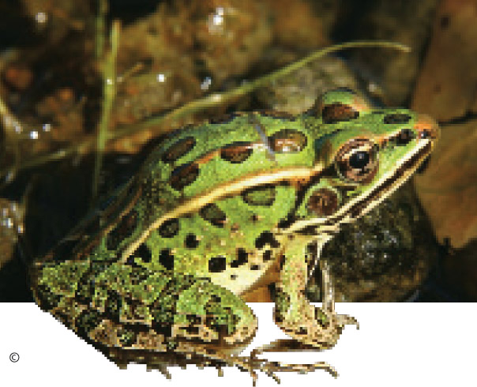
暑假寒假，最向往的是去乡下的亲戚家。清晨，公鸡清脆的“喔喔”声此起彼伏；在老黄牛的“哞哞”声和小羊羔的“咩咩”声中，灶台上大米粥的清香飘浮在晨曦中。在门前小河里淘米洗碗，便可以引来成群的小鱼、小虾。水桥的青石板四周粘满了螺蛳，只要伸手摸几下就可捞满一碗。过年时，大人们合作围捕的各种鱼虾就足够一家人过年的荤菜了，葱烤鲫鱼的鲜美让清贫的日子充满了令人难忘的味道。很难想象，如果没有了动物，我们的生活该会是怎样的乏味。

除了美丽的孔雀外，动物园的猴子是我们百看不厌的超级明星。看着猴山上依偎母猴的小猴，追逐嬉闹的顽猴，以及用双手灵巧剥开香蕉糖果的馋猴，我们无不充满惊讶：它们与我们是多么相像啊！因为追究起来，猿猴与我们其实有着共同的祖先，人类只是动物界里独特的一个物种而已。

人类属于脊椎动物亚门、哺乳纲、灵长目中的智人种。尽管全球人类的种群数量高达70亿，遍布世界的七大洲五大洋，肤色体形不同，语言民族各异，却都是这个单科单属的单一物种。我们是动物世界的另类，不及所有动物种数的百万分之一，却是名副其实的孤独的绝大多数。我们与动物同源同祖，得益于其他动物而走出丛林，生息繁衍。从茹毛饮血的游猎时代，历经采集放牧的农耕社会，集约生产的工业社会，一路走到了足以驾驭生命的当今时代。然而，我们衣、食、住、行的物质生活依然离不开动物们，我们探索未知、发展文化的创作源泉也离不开千姿百态、声色各异的动物们。当然，在局部地区的某些时段，我们还受到猛兽、鼠害及其他传病媒介的干扰，这就需要我们更好地去了解每一种动物，调控好与它们的安全距离。

我们今天纵然掌握着创造物质、复制生命的高新技术，却无法创造一个哪怕是单细胞的变形虫。地球上现存的每一种动物，都是大自然亿万年造化的结果。动物在自然界的物质循环、能量转化和生态维系中的作用不可替代。每一种动物都与我们发生着直接或间接的关联。缺失了任何一种，我们赖以生存的生态网络就会出现漏洞。

一个多世纪来，人类的种群数量以指数曲线上升，那是以包括动物在内的其他非人类物种数量的急剧下降为代价的。大量的动物栖息地被人类占领、破坏，无数像华南虎、白鳍豚、江豚这样的地域特有物种已遭灭绝或濒临灭绝。今天，还有不计其数的动物正在遭受人类的虐待、滥捕和残杀，现代文明之光依然没有照射到与人类同源同祖的动物身上。

今天，当我们真诚地为无数实验动物立下“魂归自然，功留人间”的纪念碑，为在车站坚守十年等候主人归来的日本八公犬的忠诚大义所感动，为太平洋灰鲸不记捕鲸人的伤害之仇而接纳观光者的宽容之举所震撼之时，以万物之灵自居的我们，到了反思和改变我们与动物关系的时候了。动物与我们的祖先已经共同生活了上百万年，我们与动物有着不可割裂的联系，这可以从我们的宗教信仰、神话故事、岩画图腾、建筑服饰以及各种艺术形式的文化载体中得到印证。

现代科学研究表明，不少动物具备与人类主动沟通交流的意识。不仅哺乳动物有着与我们类似的知觉和意识，一些低等动物也有着难以言状的情感，这是因为产生情感的神经物质不仅存在于大脑的皮质结构中，还存在于皮下的神经网络中。动物中还有无穷的秘密等待我们去探索，去发现，只要我们对它们持续地保持关注和观察，多问“为什么”，以科学的方法去寻求答案，就会更全面地了解动物，也能更好地了解我们自己。

如果我们对动物有更多的了解，就不会仅仅为了获得过多的牛肉而去毁林建牧场，为了制作筷子而去肆意砍伐大树，让大熊猫等一些珍稀野生动物失去祖传的家园。如果我们能知晓动物的痛楚，就不会过度而残忍地滥用动物，也能将博爱、平等的文明之举扩展到更多的动物伙伴。如果我们真是万物之灵，就必须洗心革面，以地球家园管理者的崭新姿态，承担起呵护家园中每个成员、确保每个物种生态位的神圣使命，无论是在自然保护区，还是在几乎被我们全面占领的城镇，让那些曾被我们驱逐的原住民动物重新回归城市，有尊严地活着。

除了少数伴人的宠物，绝大多数的动物并不需要依赖我们生存。没有我们，动物世界依然繁荣，而没有了动物，我们不仅是孤独的绝大多数，更可怕的人类末日就真的来了。（金杏宝　陈宜瑜）

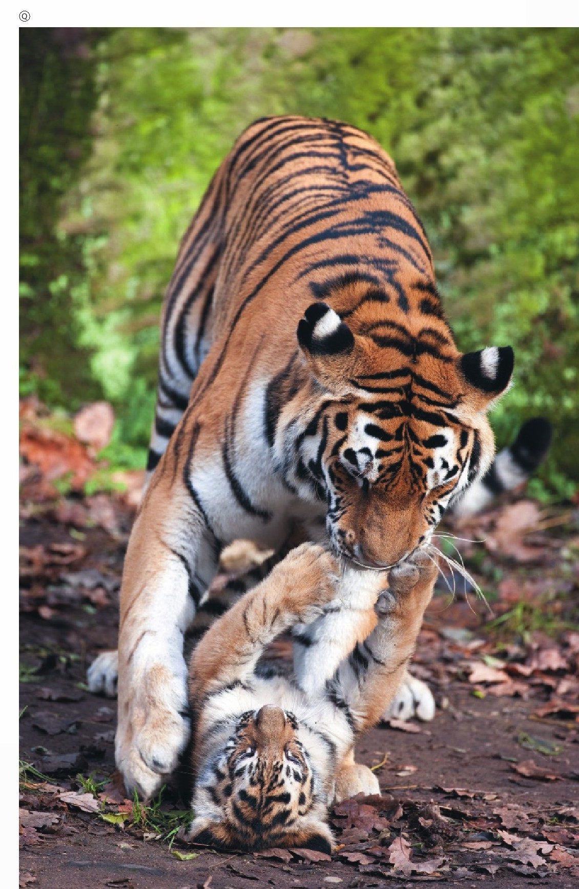
  

【微问题】动物能否离开人类生存？

【关键词】动物　人类　种群　自然界　生态位

# 序言

韩启德

经过数百位编委、作者和编辑历时三年的辛勤努力，第六版《十万个为什么》终于与广大读者见面了。对于中国的科技界、教育界和出版界，以及千千万万的少年儿童来说，这都是值得高兴的一件事。

《十万个为什么》是由少年儿童出版社于1961年出版的一套科普图书。在半个世纪的岁月里，这套书先后出版了五个版本，累计发行量超过1亿册，是新中国几代青少年的启蒙读物，在弘扬科学精神、传播科学知识、提高全民科学素质方面发挥了巨大作用。在我国，至今还没有一套科普读物能像《十万个为什么》那样经得起如此长时间的检验，并产生如此巨大的社会影响。

进入21世纪以来，科学技术的发展日新月异，尤其在网络通信、低碳环保、基因工程、航空航天、新能源、新材料等领域，研究进展更是一日千里，乃至从根本上改变着人们的生活与工作方式。为适应科技发展带来的深刻社会变革，提高国家的综合国力和竞争力，党和政府高度重视加强科学技术普及，重视提高全民科学素质，并将国家科普能力建设作为建设创新型国家的一项基础性、战略性任务，这对我国的科普出版提出了更高的目标。

2006年，国务院正式颁布实施《全民科学素质行动计划纲要》，其中特别强调要提升未成年人的科学素养，因为只有从青少年时期就开始养成科学的思维方式与行为习惯，将创新精神与实践能力并重，才能最终使得全民的科学素质得到根本性的提高。为此，编辑出版一套崭新的适应时代发展要求的《十万个为什么》，使其在繁荣我国科普创作的进程中发挥“旗帜”作用，其意义是非常深远的。

好奇心是青少年的可贵特质，是驱使他们亲近和接受科学的动力，一定要保护好。从50年来的经验看，“一问一答”是个好形式，也是《十万个为什么》被大家喜爱的重要原因，在编纂第六版《十万个为什么》时我们坚持了这一好形式，并力争在传授科学知识的同时，引导读者去思索问题，去感受科学文化和科学精神，去体会科学探索的乐趣。

出于积极参与科学普及工作，提高全民科学素质的社会责任感，中国科学院和中国工程院共有百余位院士应邀担任了第六版《十万个为什么》的编委。其中20余位院士在百忙之中担任了各分册的主编，具体负责组织相关分册的编纂工作，有40余位院士亲自撰稿。此外，还有700余位来自世界各地、各个学科的优秀科学家和科普作家参与了新版《十万个为什么》的编写。这么多高层次科学家参与到一套科普图书的编纂工作中来，这在我国科普出版史上是空前的。阵容强大的编委会和作者队伍，为新版《十万个为什么》的科学性、前沿性、权威性和可读性提供了最可靠的保证。在此，我也谨向所有参与第六版《十万个为什么》编纂工作的编委、主编、作者和社会各界表示衷心的感谢和深深的敬意。

第六版《十万个为什么》在总结前五版成功经验，并广泛征求各方面意见的基础上，综合考虑时代的发展和青少年读者的实际需要，将全书分为三大板块共18个分册。基础板块包括数学、物理、化学、天文、地球、生命，是传统六大基础学科；专题板块包括动物、植物、古生物、医学、建筑与交通、电子与信息，是由基础学科衍生出来的重点传统学科；热点板块包括大脑与认知、海洋、能源与环境、航空与航天、武器与国防、灾难与防护，则是近些年发展特别迅速，引起社会广泛关注的热点领域。在编纂每一分册的过程中，我们根据这个学科或专题的内容，充分考虑知识体系的完整性和科学发展的前瞻性，问题的设计和分布尽量与学科或专题的内在结构相吻合，从而使每一分册都成为具有完整的内在知识体系的读物。现代科学技术发展的一大特点是学科之间的交叉融合，相信小读者们在阅读过程中也会在不同的分册中发现一些共性的问题。

第六版《十万个为什么》在形式上适应了当代青少年的阅读需求，与国际上同类图书的最新出版潮流相接轨，首次推出彩色图文版，用大量彩色图片向读者展示当代科技前沿的无穷魅力。内容上具有鲜明的时代特色，从基础、前沿、关键、战略四个方面来组织问题和编写稿件，重点关注科技发展的前沿和当代青少年关心的热点问题。尤其值得称道的是，书中的大量“为什么”是通过各种形式向全国少年儿童征集来的，力求将当前孩子们最关心、最爱问的问题介绍给他们。同时，新版《十万个为什么》更加注重思考过程，提倡科学精神，引导创造探索，关注科学与人文、科学与社会的关系，通过“微问题”“微博士”“实验场”“科学人”“关键词”等小栏目激发青少年的好奇心和探究心理。

我们相信，第六版《十万个为什么》将以全新的问题、全新的体系、全新的内容、全新的样式，以及数字化时代全新的技术手段，再现《十万个为什么》每一版都曾有的辉煌，掀起中国科普出版和科学普及的又一个新高潮。第六版《十万个为什么》的出版，必将引领更多青少年走向科学，使共和国涌现出更多的栋梁之材。同时，这套书的出版，对于贯彻落实《全民科学素质行动计划纲要》精神，促使当代中国广大青少年科学世界观的形成和科学创新能力的提高，推进全社会在讲科学、爱科学、用科学上形成更加浓厚的氛围，使全民科学素质再上新台阶，发挥不可替代的关键作用。

# 哺乳动物

## 哺乳动物中寿命最长的是谁

陆地上的哺乳动物中，最长寿的动物应该是大象，它一般能活60～70岁。当然，同一个物种，野生生活状态下和人工饲养状态下的寿命是不同的，比如人工饲养下的大象就有活到100岁以上的。因为对野生的动物来说，要觅食，要争夺配偶，要抢占地盘，这些都可能带来伤害，甚至丧命。而在人工饲养条件下，由于食物充足，笼养又使个体间不会争斗，所以寿命也相对长些。在海洋哺乳动物里，蓝鲸的寿命应该最长，一般估计在几十年以上，但确切的最长寿命纪录目前还无法断定。

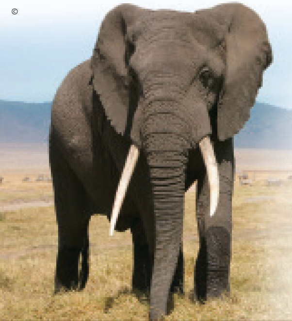
除了食物和争斗外，寿命长短到底还跟哪些因素有关系呢？

动物的寿命与它们每分钟的心跳次数，也就是心率有一定的关联。而心率又与身体大小相关联：身体大，心率相对慢一些；身体较小的，心率相对快一些。为什么心率与身体大小有关系呢？

哺乳动物是恒温动物，俗称温血动物，它们能保持恒定的体温，以满足高效率新陈代谢的需要。新陈代谢所需要的各种酶，只有在一定的温度下才能高效发挥作用。太低或太高的温度下，酶要么不起作用，要么被破坏。所以蛇类和蛙类等变温动物就要冬眠，有时还会夏眠。

哺乳动物都有一套相对有效的调节温度的系统和手段，用来保持恒定的体温。比如，皮毛可保温，汗腺可散热。恒温动物体内的细胞代谢是产热的源头。食物经过消化和代谢，变成了能量，以维持身体各个系统的功能并保持恒定的体温。恒温动物的体表是散热的场所，当哺乳动物的体温高于周围环境温度时，身体产出的能量就会变成热量，通过体表散发到周围环境中去。

动物身体体积越大，其体表面积与体积之比率则越小，维持体温的效率就越高。反之，身体体积越小，其体表面积与体积之比率则越大，维持体温的效率就越低。老鼠属于后者，所以它们比起大象来，维持体温更困难。从相对体重来计算，所需的能量更多。这样，老鼠的代谢也更旺盛，体内活动更频繁，因此，心率会更快些，消耗相对较多，所产废物也较多，导致衰败快，寿命也短。体积大的动物心率慢，代谢平稳，消耗相对较少，所产废物也较少，于是衰败也慢，寿命就长。

所以，哺乳动物中大象的寿命更长些，这也是爬行动物中龟类长寿的秘诀之一。（韦正道）

## 澳大利亚的动物为什么那么怪

我们称澳大利亚以及南美洲部分地区一些幼仔在母体育儿袋中发育的袋鼠、树袋熊、负鼠等为有袋类动物，而把其他的胚胎在母体胎盘内发育的动物称为有胎盘动物。

在欧洲、亚洲、北美洲和非洲的有胎盘动物，由于其幼仔在母体内发育完全，降生后的死亡率大大减低，所以在生存竞争中，很快就取代了出生死亡率相对较高的有袋类动物。

由于地壳运动的缘故，澳大利亚陆地板块比较早地从被称为“泛大陆”的古代大陆中分离出去，广袤的海洋成了它与其他大陆之间的天然屏障，阻止了原始的有袋类动物与进化的有胎盘动物之间的基因交流，使得该地区的有袋类动物得到了充分的发展。澳大利亚多样的森林、草原和荒漠环境，也为各类动物提供了较为丰富的栖息环境，形成了与其他大陆上的有胎盘动物相似的适应演化类群，出现了对应于食草动物的各种袋鼠、对应于食肉动物的塔斯马尼亚袋獾等许多澳大利亚特有的奇怪物种。这是地理隔离的产物。

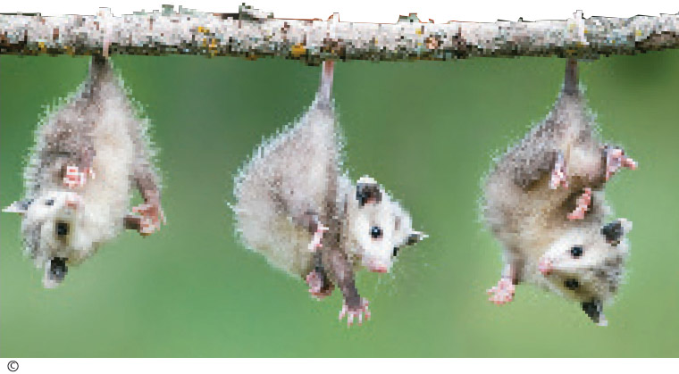
有袋类动物——负鼠

由海洋隔离形成的类似“海岛效应”也发生在非洲东海岸的马达加斯加岛，在那个神奇的地方，演化出了如狐猴、环尾獴等众多特有的动物，成为世界动物宝库中的一绝。（韦正道）

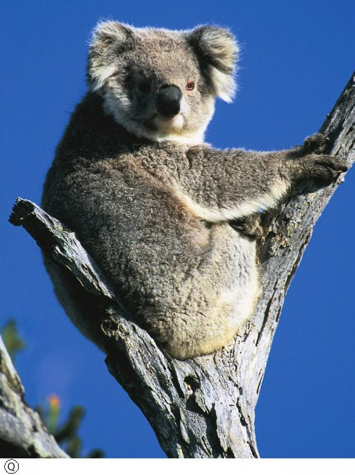
有袋类动物——树袋熊

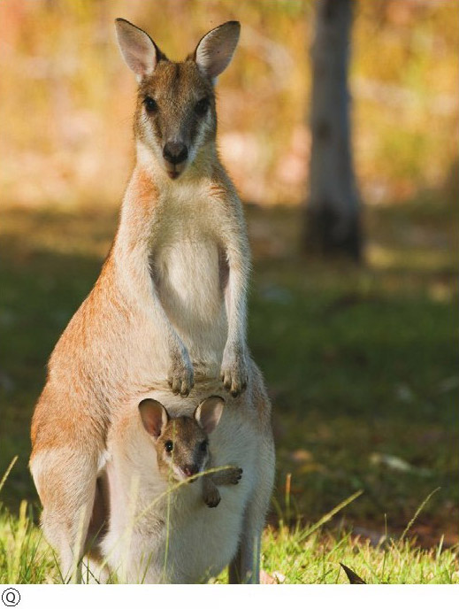
有袋类动物——袋鼠

## 为什么哺乳动物的眼睛要长在前面

哺乳动物的眼睛一般都长在头的前部，这样便于观察前方的状况，利于避开敌害或捕获食物。所以当一种动物攻击其他动物时，常常会采用在侧方或后方慢慢靠近的方式。

当然，即使眼睛长在头的前部，具体位置上也是有差异的。食肉类的眼睛在脸盘的正前方，这是为了便于观察前方的猎物，而且两只眼睛的视野交叉可以锁定目标的距离。而食草动物的眼睛，长在侧扁头颅的两侧，这是为了方便大范围地观察各个方向来的敌害。河马的眼睛，还有鼻子和耳朵，都长在头部的顶端，这样潜水就方便很多。

所以，眼睛长在前面主要是用来观察的，当然观察并不都依靠眼睛。生活在地下洞穴里的哺乳动物，由于环境微光或无光，眼睛常常长得很小，甚至完全看不见。不过，这些动物可以靠听觉、嗅觉、触觉来弥补。很多夜间活动的翼手类动物（食虫的蝙蝠）虽然有眼睛，但却是靠超声波来定位，进而发现猎物或障碍物的。（韦正道）

  

**【微博士】**哺乳动物的乳头数

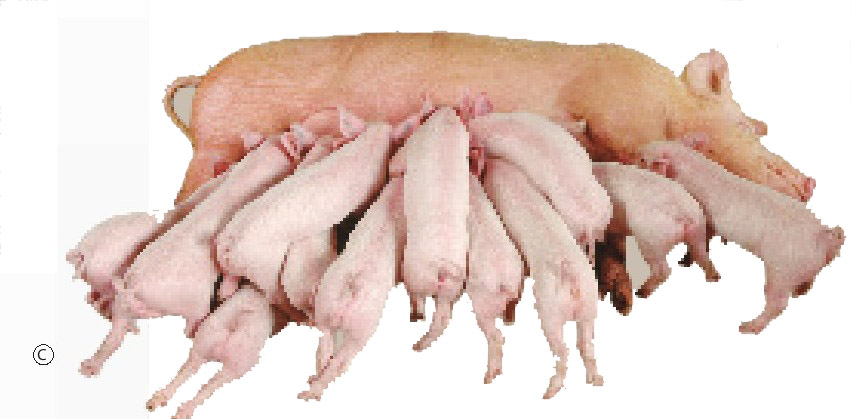
哺乳动物的乳头对数，与其每胎产的仔数相关。乳头的对数越多，一胎产的仔数也越多。如猴类、鲸类、象、海牛、马等动物只有一对乳头，一般一胎产一个幼仔；牛有两对乳头，一般产1～2个幼仔；鼠类一般有4对乳头，通常产4～6个幼仔。通常情况下，一个幼仔需一对乳头来供应乳汁，幼仔吮吸完一个乳房的乳汁后，就会转移到另一个乳房。如果幼仔数太多，必定会有一些幼仔吃不到乳汁，就可能导致饥饿而死。但也有一些例外的情况：人工饲养的大白鼠，就有一胎产出12个幼仔的例子；而野生的沟鼠，甚至有一胎产14个幼仔的情况。

【微问题】为什么南极没有“南极熊”生存呢？

【关键词】寿命　澳大利亚　有袋类　眼睛　乳头数

## 为什么食肉动物吃荤不发胖，而猪吃杂食却长得那么胖

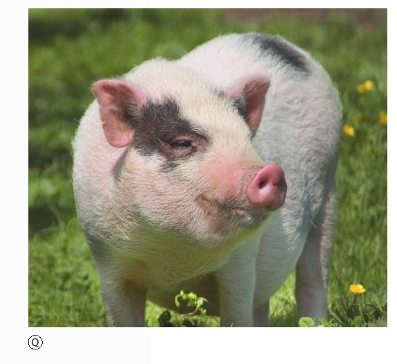
老虎、狮子等食肉动物，由于长期的进化，大多以肉食为主。它们在野外生存是很不容易的，如要捕获一只能够吃的大动物，有的需要合力围捕（如狮子），猎物由大家分食，这样大多数个体所得不会很多；有的需要守候，跟踪多时（如虎），等到捕食成功，也已饥肠辘辘了；有的需要迅速奔跑，全力追捕（如猎豹），还常常以失败告终。这些野生动物，即使啖肉啃骨，其摄入的营养所转化的能量，在捕食过程中也消耗很大，没有多少能量能转化成脂肪储存下来。所以，这些食肉动物不会发胖。

所谓胖，科学的语言就是体内脂肪积累。虎、狮等动物在寻觅猎物、围捕猎物，或守候、跟踪猎物时，消耗体能很大，所以它们不大可能大量积累脂肪。而我们所说的猪，是指饲养的家畜猪。在人类的照料下，猪们终日无所事事，食物充足，营养丰富，而且猪圈里的空间有限，活动量不大。这样，摄入营养多，身体消耗少，体内脂肪便逐渐积累起来了。现在对有些猪实行放养，体内就不会积聚大量脂肪。事实上，在野外生存的野猪就不胖。为了寻觅食物，野猪得在林子里不停地奔跑搜寻。它们在野外获得的食物有限，消耗的能量却不少，当然就没有多余的能量转化成脂肪了。（韦正道）

## 狮子为什么不敢单挑

每一个物种，都有其特定的生活方式，包括食性、活动时间、集群还是分散活动等。这些生活方式与物种所栖息的环境有关，包括物理、化学和生物环境。它是动物与环境之间，经过长期的相互作用，历经自然选择而逐渐形成的。

拿狮子来说，它生活在非洲广阔的草原上，食物是食草动物斑马、角马、野牛，甚至河马、长颈鹿等。对于这些动物来说，只有跑得快才可能逃脱狮子的追捕。而对于狮子来说，跑不过这些动物，意味着饥饿、死亡。在这种情况下，几只狮子合围捕捉就有更大的胜算。可以想象，开始的时候，狮子中有的个体是单独行动的，有的是合作捕食的。慢慢地，单独行动的个体，由于常常饥肠辘辘，并且也没有个体与它交配，就逐渐被淘汰了。而合作捕食的个体，由于食物相对丰富，营养足够，繁殖能力就强。于是，在长期的演化与自然选择下，慢慢形成了狮子集体捕猎的习性。所以，这里不存在敢不敢单挑的问题，而是不合作就会死亡的大事。另外，如果食物一时吃不完，群聚的狮子还能保护好这些食物，以免被鬣狗等抢走。

凶狠而不选择单挑的食肉动物还有很多。比如：狼要对付比它大得多的驼鹿等，也只有群狼共同围捕才成；而鬣狗在对付像角马这样的大家伙时，也需十几只个体通力合作才行。（韦正道）

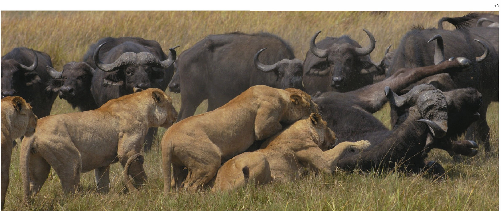
一群狮子围捕水牛

## 狮虎兽到底是什么动物

虽然老虎生活在亚洲，而狮子也曾经分布在欧洲和亚洲，并且如今在印度仍然有亚种存在，但因为这两种大型动物的生存环境基本没有交集，且性格都极其凶猛，因此它们在野外不太可能交配。但是，在动物园或马戏团里，狮子和老虎饲养在一起，太多的接触机会和相对温顺的性格让它们有了交配的可能。虽然交配的成功率非常低，但确实产生了后代。由公狮和母虎交配产下的叫“狮虎兽”，由公虎和母狮交配产下的叫“虎狮兽”。

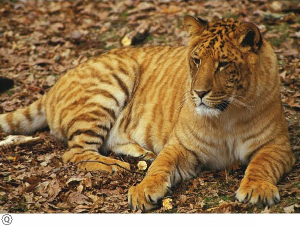
狮虎兽

那么，“狮虎兽”或“虎狮兽”能否算是一种新的物种呢？按照物种的定义，除了其他一系列条件外，最重要的一个条件是：能产出有繁殖能力的后代。动物如果能一代代繁殖下去，那么这个种就成立；如果不能繁殖，那么就不能成为一个独立的物种。骡子（不管是公驴、母马产下的马骡，还是公马、母驴产下的驴骡）因为无繁殖能力，所以不是一个生物学意义上的物种。“狮虎兽”或“虎狮兽”都尚无连续繁殖的报道，所以也不能作为一个新物种。

其实，人类对动物进行人工种间杂交已有很悠久的历史了。20世纪初出版过一本专门关于动物杂交记录的书，就收集了自灵长类（包括人类）起各种动物的杂交记录。其中，绝大部分杂交没有成功，相当一部分根本未有后代出生，一小部分虽然产出了后代，但或是形态畸形，或是内部发育不正常，大多夭折了。只有极少数的杂交后代成活下来，并生活了一段时间，但也没有形成一个新物种。（韦正道）

  

**【微博士】**瘦肉精

最为常见的瘦肉精是一类叫作盐酸克伦特罗的药物，属于非蛋白质激素，是一种β-兴奋剂，曾作为治疗“支气管哮喘”用药，后因副作用太大而被禁用。但是猪在食用后，却能促进蛋白质的合成，加速脂肪的转化和分解，由此提高了猪肉的瘦肉率，因此被称为瘦肉精。由于这种药物并不会通过消化而完全分解，使用后在猪体内，特别是在肝脏等部位会有残留，而人吃了这种肉以后，轻则出现肌肉震颤、心慌、头痛、恶心、呕吐等症状，严重的还会导致死亡。

【微问题】为什么杂交产生的动物会失去繁殖能力？

【关键词】脂肪积累　狮子　杂交　狮虎兽　瘦肉精

## 为什么一山不容二虎

在动物园里，我们会看到有几只老虎在虎山里游荡。但是在自然界里，老虎是单独生活的。“一山不容二虎”是对自然状态下单独生活的老虎的文学描述。

老虎是独居动物，只有在交配期才会与异性接触。每只虎都有自己的领地，也叫栖息地。这块栖息地有一定的范围。老虎常常将有特殊气味的液体，涂在栖息地边界的树上，来提醒或警告其他老虎：这是我的地盘。任何对手越过界线，就会遭到打击。这些液体，是由老虎身上特殊的腺体分泌的。

老虎是猛兽。在自然界里，在它栖息的地方，很少有其他动物能敌得过它。虎有敏锐的嗅觉和听觉，能识别猎物的蛛丝马迹；它的足底有柔软厚实的肉垫，能无声无息地接近猎物；它还有强有力的利爪，能让到手的猎物难以逃脱。独居生活的老虎，拥有的是一个较大的领地，也意味着拥有领地里的全部食物。

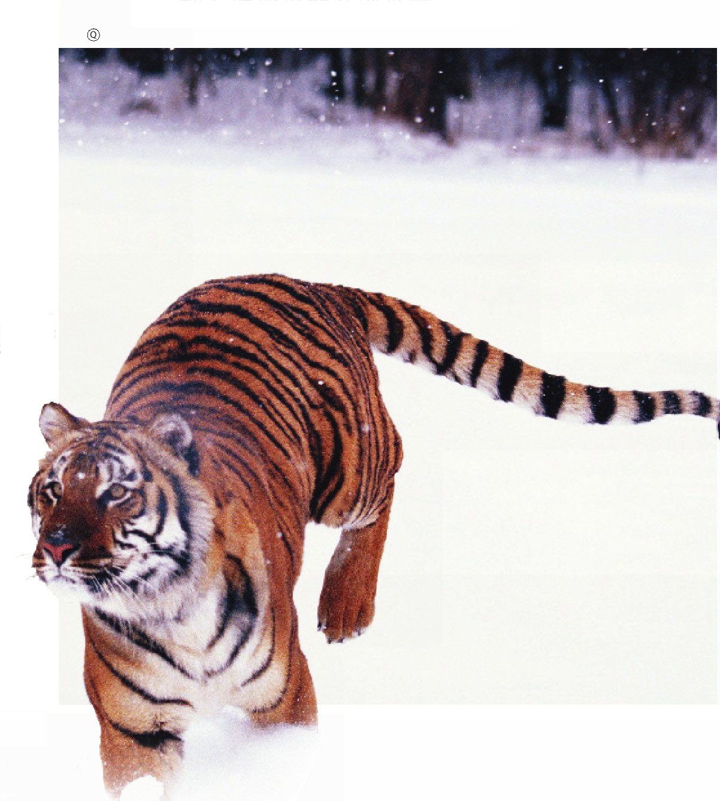
一山不容二虎有其典型的生态学意义。因为一只虎的领地要足够大，才能容纳足够多的猎物及猎物所需的食物，包括小型食肉动物、食草动物和各种植物。当然不是十分严格的一座山只能有一只老虎存在，因为一座山峰和另一座山峰之间本身是连接着的，有的山峰绵延很长距离，也可能有不止一只虎存在。

从食物链的角度来看，作为捕食者的老虎处在食物链顶端，形成一个能量金字塔。这个金字塔一般会有4～5个层次，通过捕食关系，能量自下而上地转化聚集。大量的科学实验数据表明，每一层生物中，80%～90%的生物量作为热量损耗了，用以维持自身的生长繁殖所需，仅有10%的生物量作为上一层生物的食物。因此，每一层的生物量约为上一层的10倍才可能维持上一层生物的生存。这样，一只老虎要维持生存，须有10倍于自身体重的二级捕食者或食草动物，100倍于自身体重的一级捕食者或食草动物，1000倍于自身体重的食草昆虫或食草动物，10000倍于自身体重的植物，这样巨大的生物量只有整座山才能提供！因此，占领一座山，就可以拥有足够的食物，这就是一山不容二虎的道理。

然而，由于山林被过度开发，使得原本物种丰富的原始林地，被大多单一的经济林木所替代，大量的中小型动物因为失去栖息地而离开，由此造成虎的食物十分缺乏，使得一山连一虎也难以容下。如果这种状况不能迅速改善，那么，位于生态食物链顶端的虎，惨遭灭绝将是必然的趋势。（韦正道）

## 为什么虎毒不食子

都说老虎是一种极其凶猛的动物，好像什么都吃。其实，谁都不会故意跟自己为难，如果有容易捕获的小鹿，老虎当然不会去和长着獠牙的野猪拼命。不过，即便在饥肠辘辘的情况下，虎妈妈也不会吃自己的孩子，这是一种母性的本能。

母虎在产仔后，不仅不会吃自己的孩子，还会十分尽心地保护幼仔。此时的母虎性情特别凶猛、机警。外出觅食时，它会先谨慎地把虎仔藏好，回窝时也不走原路，而是另辟蹊径，不留一点痕迹。虎仔稍大一点时，母虎便要教它们捕猎的本领。

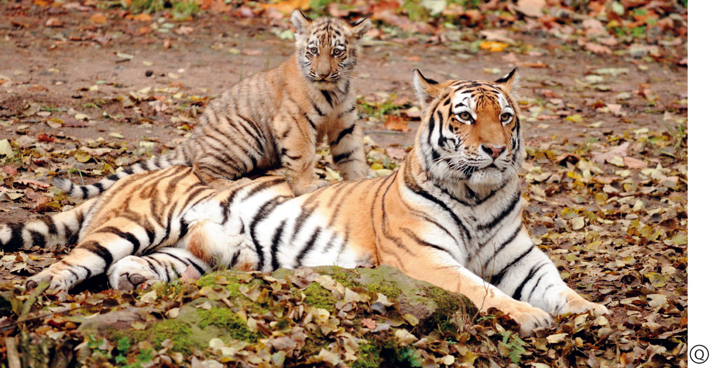
事实上，这并不是老虎特有的母性。对于许多动物来说，妈妈对自己的孩子都会爱护有加，母北极熊甚至会为了保护幼仔，不惜与更为强壮的公北极熊搏斗。通常，母兽对新出生的幼体要舔舐皮毛，一方面是将身体表面的羊水舔干，另一方面是将自身分泌的具有特殊气味的物质涂抹在幼仔身上，实际上是做了一个标记。例如猫就是这样。如果你把新生的小猫捉出窝，帮它洗洗干净再放回窝中，第二天这只小猫就可能被母猫吃掉，因为母猫已无法从气味上识别出这是它的幼仔了。（韦正道）

## 为什么会有白虎出生

我们都看到，老虎毛皮的花纹特别好看。棕黄色的底色上，布着黑褐色的条纹。但是在有的动物园里我们会看到白虎，这究竟是怎么一回事呢？

其实，白虎并不是怪胎，而是一种白化现象。根据记载，古时也曾经出现过野生的白虎。和现在的白虎一样，它们实际上就是一个小概率出现的较为特殊的后代，在自然状态下，这个概率大概在万分之一左右。从白虎的毛皮来看，它的棕黄色底色大部分白化了，仅仅在额、颊、颈部还留有淡淡的黄色，而它的黑褐色的条纹都保留着，这说明白虎的白化只是部分基因发生了突变。科学家曾经在实验室里培养出了完全白化的大白鼠，这种大白鼠连眼球里的色素都白化了，眼睛看起来也是红的。现在通常所见的白虎都是人工繁殖的，当然在白虎之间交配，后代出现白虎的几率就更高一些。

不仅是白虎，我们还可以发现白蛇、白蛙等白化动物，有的爱好者会专门收集白化动物来饲养，也算是走偏门吧。（韦正道）

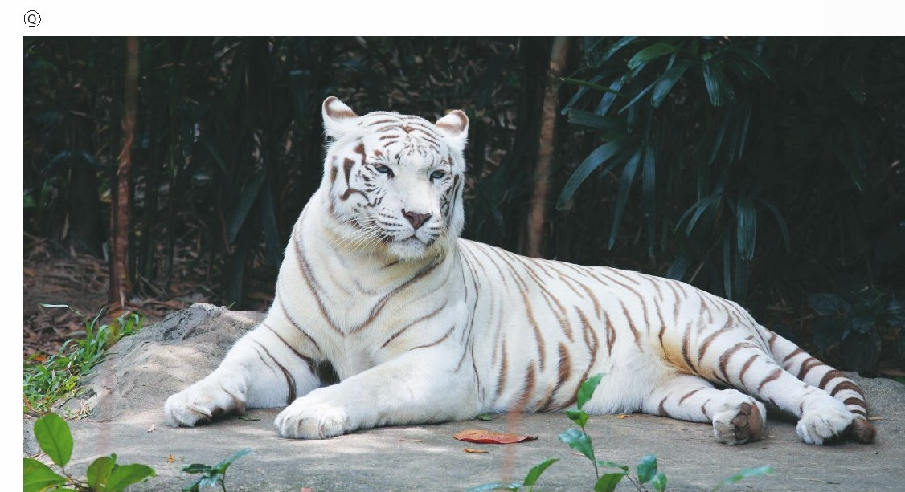
  

**【微博士】**兽王已经或濒临灭绝

全世界的虎只有一种，但有8个亚种，分别是华南虎、东北虎、印支虎、孟加拉虎、里海虎、爪哇虎、苏门答腊虎和巴厘虎。其中，里海虎、爪哇虎和巴厘虎已经灭绝，其他亚种也都岌岌可危。以华南虎为例，在过去的几十年时间里，没有在野外发现过任何华南虎，而目前动物园里的华南虎全都是20世纪50年代捕捉来的6只虎的后代。

**【微博士】**生物量

在某一个特定时间内，一个单位面积或体积内所含的生物种或一个生物群落中所有生物种的个体总量。

**【实验场】**周老虎事件

2007年10月，一个名叫周正龙的农民宣称在陕西省的镇坪县境内拍摄到了野生华南虎，并把照片公布在网络上。消息一出即遭到专家和公众的质疑。你会从哪几方面去怀疑这个新闻的真实性呢？

【微问题】游客能给动物园里的老虎投喂食物吗？

【关键词】虎　生物量　食物链　白虎　白化

## 猎豹为什么不能长时间追击猎物

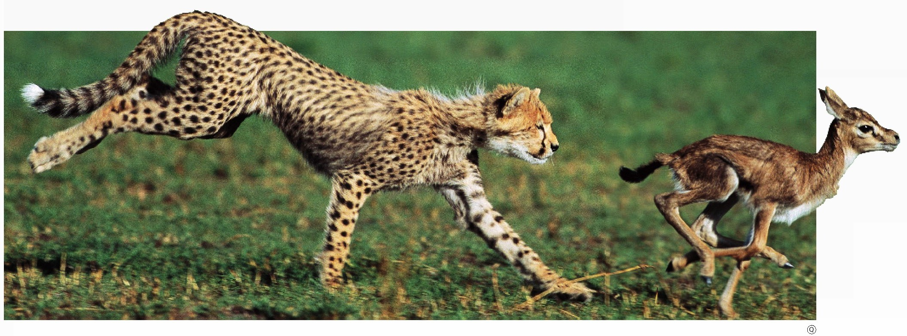
如果你看过一些有关猎豹的动物纪录片，一定会对猎豹的捕食过程印象深刻。我们常常说“动如脱兔”，其实猎豹的动作才是最令人瞠目结舌的。当它从草丛中跃起，展开四肢，如飞一般地扑向瞪羚等猎物时，常让人心中对娇小的瞪羚萌生恻隐之心。不过，猎豹的捕食成功率却并不高。在瞪羚们的闪转腾挪中，高速奔跑的猎豹经常在追击了一两分钟后就自动放弃，兀自留在原地大口喘气。显然，猎豹没有长时间高速追击猎物的本领，那么，这又是为什么呢？

据测算，成年猎豹的启动速度相当快，并能在2秒之内加速到72千米/时，并达到最高110千米以上的时速。猎豹之所以能跑得这么快，与它的身体结构有关。它有流线型的身体、修长的四肢，以及像弹簧一样柔软而易于弯曲的脊柱。同时，它那条大尾巴起到了平衡的作用，使得它在急转弯时不至于摔倒。可是，跑得这么快的猎豹，除了需要骨骼系统、肌肉系统、神经系统等的强大支持外，对身体的呼吸系统和循环系统都是一种极大的考验，因为高速奔跑就是在做无氧运动。好比一个跑1500米的运动员，无论如何是不可能像跑100米短跑的运动员一样全力冲刺的，因为那样的话，负责吸进氧气、排出二氧化碳的呼吸系统首先跟不上节奏。而一旦氧气无法及时进入身体，循环系统也就没有办法工作，猎豹就必须停下来了。

同时，在高速的奔跑中，猎豹的身体会产生大量的热量，这些热量必须及时排出体外，才不至于导致身体过热。出汗和呼气都是排热的一种方式，但却不足以快速排热。当身体中的热量积聚之后，猎豹就会因为过热而产生虚脱，因此，它必须适时停下来。

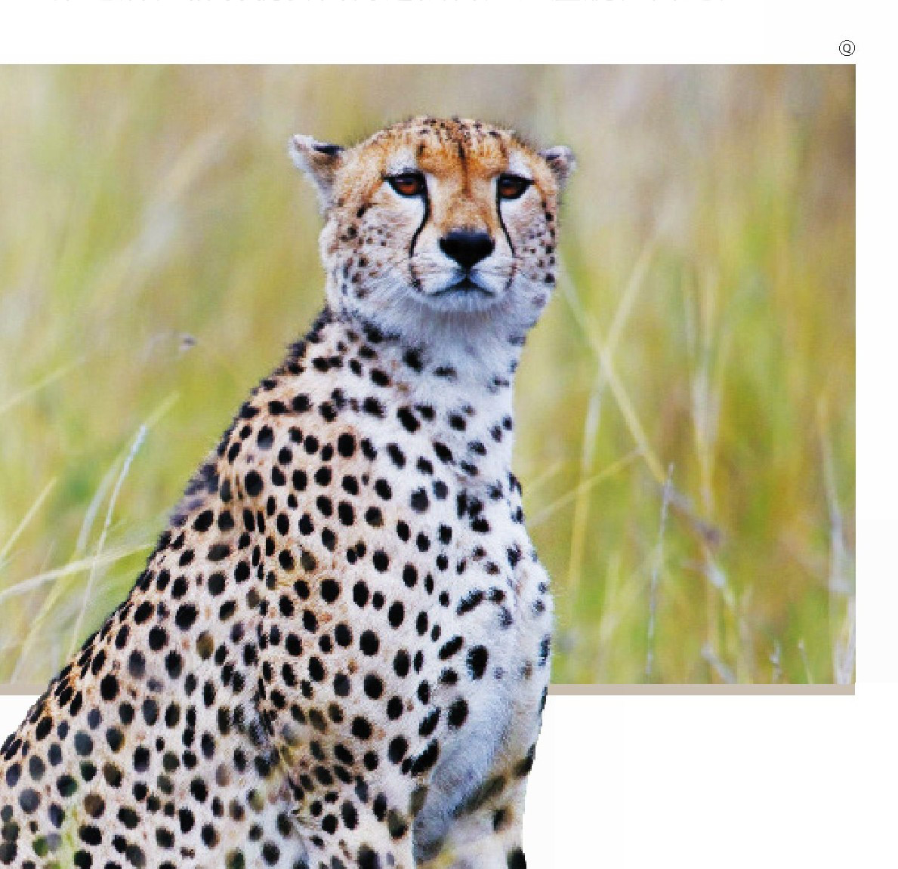
研究表明，当猎豹在追捕猎物时，其最多只能维持3分钟左右的高速奔跑。在一般情况下，它总是可以在1分钟内解决战斗。如果在这段时间内没有成功，它会根据当时的情况做出评估，选择继续追击还是放弃，而不会一味地消耗自己的体力。因此，在每6次狩猎行动中，猎豹只有1次会取得成功。在这种情况下，选择放弃也可以为下一次出击储备更多的体力。

猎豹通过高速追击捕获的猎物，有时还会被更加强大的对手乘虚而入，这些强盗就是比猎豹更蛮横的狮子或者鬣狗。由于猎豹在此时已经精疲力竭，为求自保，也只能忍痛割爱。因为一旦狮子或者鬣狗把它当作猎物，那么，它也只能束手就擒了，谁叫它不能长时间高速奔跑呢！（韦正道）

  

**【微博士】**瞪羚为什么奔跑时间更长

要么活着，要么死去，瞪羚在遭遇追击时，心境显然是不一样的，所谓“狗急跳墙”就是这个道理。当然，瞪羚的身体准备也更充分。它的鼻中隔内有丰富的血管，进入大脑的血管和流出大脑的血管在这里交叉分布，更利于进出鼻腔的气体进行热交换，也会进一步降低进入大脑的血液的温度。这种结构并不意味着瞪羚可以长时间地高速奔跑，它只是比猎豹多维持了一会儿高速奔跑的时间而已。

## 金钱豹为什么要将猎物拖上树

金钱豹，就是我们一般称为花豹、豹子的那种相对普通的豹，由于其灰黄色的身体上布满古钱状花斑而得名。金钱豹有20多个亚种，其分布范围也极其广泛，从俄罗斯到东南亚，从北非到南非，甚至中东都有它们活跃的身影。它们主要在森林的边缘地带活动，其周边环境中总离不开高低不等的树。当金钱豹狩猎成功，特别是捕杀到如斑羚、野猪、鹿等一些大型动物时，并不会像它的亲戚猎豹那样当场狼吞虎咽，而是耐心地将猎物拖回到邻近的树上，然后慢慢地享用。这是为什么呢？

你只要看一看围在树下的那些眼露凶光的动物们，就不难明白金钱豹的苦心了。原来，金钱豹的栖息环境中，总有老虎、豺、狼等更加凶猛的对手。这些家伙的狩猎本领常常比不过金钱豹，却觊觎它的猎物，希望能够从它的口中分一杯羹。

但金钱豹是不会让它们得逞的。和猎豹不同，金钱豹的爪子不但锐利，而且具有可伸缩性，爬树是它的拿手好戏。金钱豹甚至可以把比它自身体重还要重的猎物拖上树，而不论是老虎，还是豺、狼等强敌，都没有这一手本事，便只好围在树下干着急。

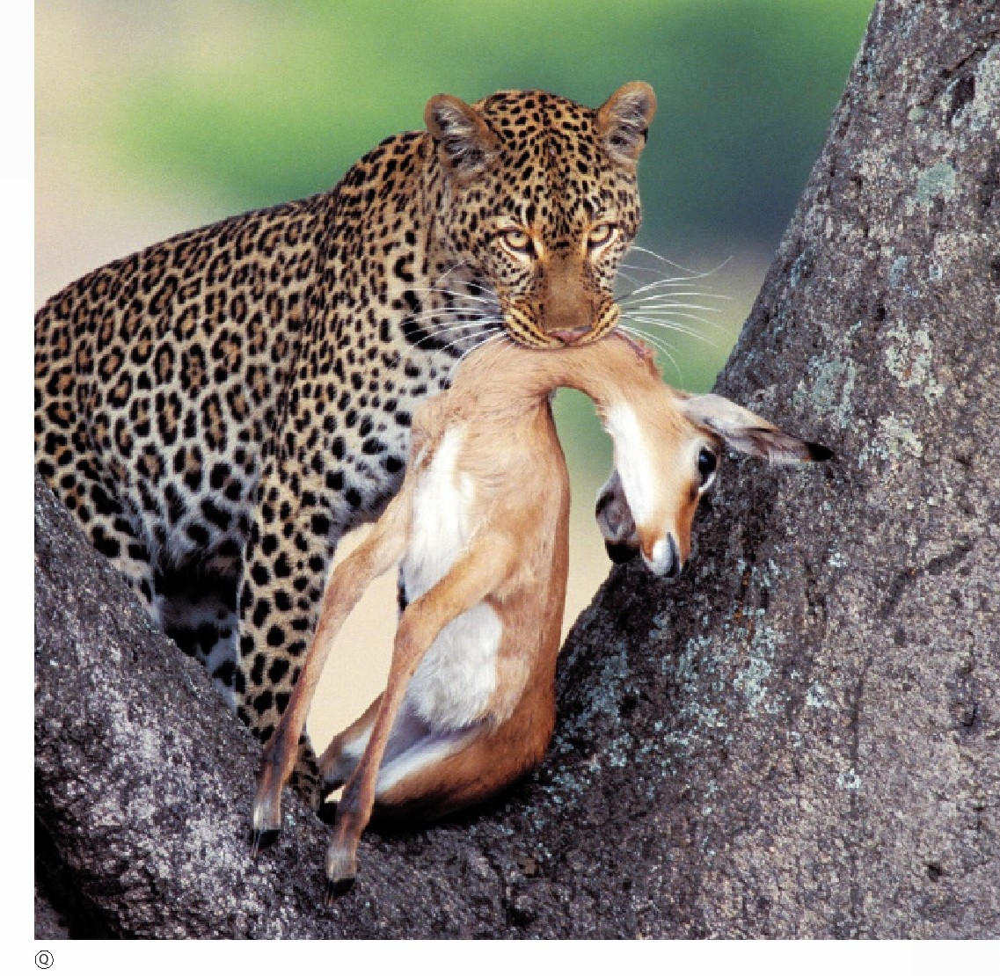
因此，金钱豹把猎物拖上树，实在也是不得已而为之，否则，它不但保不住食物，恐怕连自己的小命也难保。因为在食物链上，豹也并非是顶尖猎食者，老虎和狮子之类的猛兽，都等着拿它当晚餐呢！（韦正道）

  

**【微博士】**猫科动物走路悄无声息

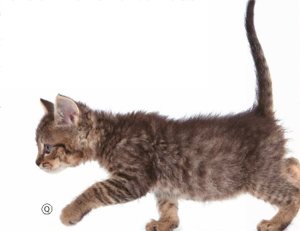
猫科动物走路，大多悄无声息。

这是因为猫科动物的足底有球形肉垫，趾端具爪，爪有伸缩性，行走时不触及地表，不会发出声音。猫科动物大多是夜行性的，夜间四周静悄悄，接近猎物时绝对不能发出声音，这样才能有效捕到猎物。当然，这种肉垫装备是猫科动物长期演化的结果。这一演化，不但使它们更易狩猎，也使它们在跳跃时能减轻震动，更好地保护自己。

**【微博士】**夜行性

夜行性是动物的一种行为。具有这种行为的动物，白天休息，夜间活动。

譬如，有些种类的昆虫为躲避鸟类的捕食，就夜间出来活动，但同时也引出了在夜间捕食昆虫的蝙蝠。田鼠多为小型个体，为避免被猎食，多在夜间出来觅食，却也养成了猫头鹰夜间出来捕食啮齿类的习性。指猴小而弱，无有效的自卫能力，夜间捕食昆虫就相对比较容易和安全。

夜行性的形成是动物生态位分化的表现。对一部分动物而言，这是一种避敌的行为；但对另一些动物来说，这是一种觅食行为。

【微问题】猎豹捕获猎物后，会不会把它拖到树上去享用呢？

【关键词】猎豹　金钱豹　猫科动物　夜行性动物

## 狼为什么爱在夜晚嚎叫

说起狼，我们首先想到的便是成群追击猎物的狼群，还有那月下对着天空的声声狼嚎，听起来非常恐怖。那为什么狼爱在夜晚嚎叫呢？

狼在分类上属于哺乳纲食肉目犬科犬属，细分起来有灰狼、赤狼（北美红狼）、胡狼、郊狼（丛林狼）等，还有一些近亲动物也往往被称为“狼”。我们通常说的狼，指的是灰狼。除个别岛屿外，灰狼曾广泛分布于包括欧亚和北美在内的北半球的陆地，也曾广泛分布于中国各省市。在人口稀少的地区，灰狼目前仍有较大的生存空间。

如果单打独斗，狼并非是最厉害的食肉动物，它们之所以在食肉动物中如此强大，全因为其团体作战的能力。狼群中的成员们共同防御敌人，合作哺育幼仔，分工捕猎食物，由此大大提高了生存能力。不过，狼群中的所有成员并不是完全平等的，它们有森严的社会等级，并派生出了一系列的交际方式，如示弱、攻击、护理、游戏等行为，当然，也少不了声音的交流。

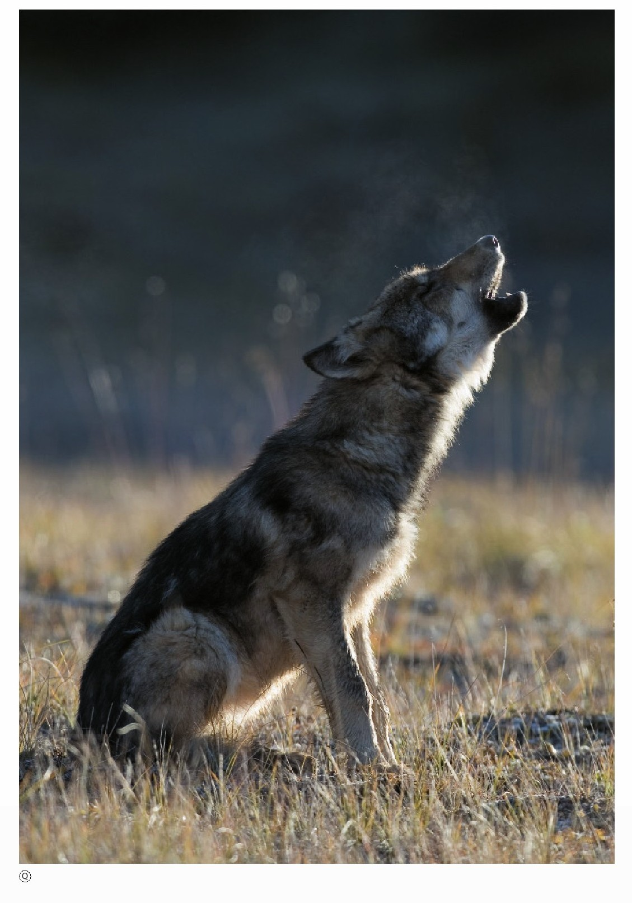
狼是一种夜行性的动物，当它们在夜晚开始集体行动时，就会遇到交流的问题。这种情况下，只有声音才是最便捷有效的沟通手段，于是我们就听到了恐怖的“鬼哭狼嚎”。狼嚎有多种作用，一头失散的独狼会通过嚎叫期待归队，一头发情的公狼会通过嚎叫呼唤母狼，一群愤怒的狼会通过嚎叫宣示主权……有趣的是，每头狼都有自己独特的声音，有自己喜欢的音域，它们似乎并不喜欢和同伴发出相同的声音。当偶尔出现相同声音时，它们便躁动起来，直到恢复到不和谐状态。这多少与“合唱”的初衷有关，它们总是希望用嘈杂的嚎叫告诉其他家族自己的存在，而不断变化的音调似乎是在制造更大的声势，使那些觊觎领地的其他狼群感受到领地主人的强大和兴盛，从而打消侵扰的念头。不过，有时这些“合唱”看起来似乎只是在百无聊赖时找点乐子呢。

现在，寻找狼群的动物学家们也学会了这一招——学狼嚎。如果附近有狼群，动物学家发出狼嚎声，它们一般都会回应的。这样，动物学家就可以循着声音，偷偷摸到狼群附近去进行观察和研究。不过，前提条件是，你要学得像哦。（冉浩）

  

**【微博士】**夜行动物的发光眼

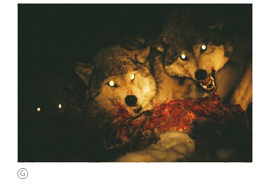
晚上漆黑一片时，很多动物的眼睛会发出幽幽的光来。这是因为晚上光线很暗，为了能在黑暗中看清物体，这些动物眼睛视网膜后面有一个镜子似的反光层，可以把光反射回视网膜，达到收集光线的作用。不仅如此，为了收集光，它们的瞳孔也会放大，这时我们就会在黑夜中看到这面“镜子”了。

## 美国黄石公园为什么要引进野狼

狼在人们心目中就是一个恶魔——凶恶、残酷、反复无常。成语中的“狼心狗肺”、“声名狼藉”等，不是在诉说它的恶毒就是在败坏它的名声，人们甚至用“狼”来形容那些忘恩负义之徒。

正因为如此，自从人类发迹以来，打狼运动几乎就没有停止过，仅美国工业大开发时期就有大约2亿头狼被打死。目前，全世界狼的分布范围急剧缩小，中国也因为连续几十年鼓励打狼，如今只在西南边陲才有一些群体。狼是少了，但问题却来了，典型的例子出现在美国黄石国家公园。

黄石公园的入口

1995年前，黄石公园的狼被消灭到几乎绝迹。没有了狼，鹿群迅速繁衍起来了。数量庞大的鹿群啃咬着树木和草地，不仅使植物损毁严重，而且导致了其他食草动物食物匮乏。同时，越来越多的鹿群本身也陷入到了饥饿和疾病的困境中。由于没有了狼的追逐，鹿群还出现了大量的“富贵病”，如肥胖症、脂肪肝、高血压和胆结石等。生态系统的扭曲促使美国人决定把狼请回来。1995年1月，14匹狼来到了黄石；一年后，又有17匹狼被运到了这里。狼群的到来使鹿的数量终于得到了控制。现在，鹿已经从2万头下降到了约1万头，与此同时，森林和草地又恢复了勃勃生机，其他食草动物的种群也慢慢地恢复起来了。

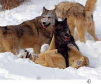
狼的捕猎可以使食草动物的数量控制在环境所能承担的最大范围之内

其实，人们对狼充满了误解，它们作为食物链中的顶级消费者，有着维持生态系统平衡的重要作用。狼主要捕猎的是那些老弱病残的动物，也就是将那些已经影响食草动物群体健康发展的个体清除掉，同时又使它们在警惕中保持活力。最重要的是，它们可以将食草动物的数量控制在环境所能承担的最大范围之内。

现在，人们的观点已经开始转变。1992年，几匹狼从意大利越境到达了法国莫康拓国家公园，法国人立刻就兴奋了。他们派出了一个工作组，主要的任务是——严密监控狼群，防止它们重新返回意大利！世界各地也相继组成了众多狼保护组织，都在为推动狼保护而努力呢。而中国也从最初的“坚决消灭狼，并给予捕杀者物质奖励”的政策，调整为“适当控制狼数量，不能乱捕乱猎”。狼被围追堵截的苦日子就要过去啦！（冉浩）

  

**【微博士】**狼人传说

传说狼人日常为人形，不管它多么善良，满月之夜，都将失去理智，变身为凶残的狼形。在中世纪的欧洲，狼人被认定为异教徒，尽管它从未真正存在过，但很多人——先天畸形、白化病患者和一些“野孩子”，被冠上这个恶名而处死，成了当时的牺牲品。

传说中古罗马创始人是一对孪生兄弟，他们是由一头母狼用乳汁喂养长大的。位于意大利中西部的古城锡耶纳到处都有“母狼哺乳孪生兄弟”的雕塑、油画等艺术品。

【微问题】你是否能接受在城市郊外有狼群活动呢？

【关键词】狼　灰狼　夜行动物　黄石公园　生态系统　狼人

## 为什么说“猫有九条命”

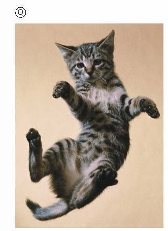
猫在半空中调整下落姿态

据说，猫有“九条命”。当然，这并不是说它死九回才算真死了，而是说猫的生存能力很强，不容易死。让我们来看看猫有哪些活命的绝招吧。

首先，猫的跑路能力超强，伤它不容易。猫、狗天生不合，狗一见到猫就视其为猎物，连叫带追，此刻，这世上就不知道有多少狗在干这事儿。但你真正见过被狗咬得死去活来的猫吗？原因就是猫能上房、爬树、翻墙，狗虽然气势大，但也只有干瞪眼的份。说实在的，在居民区，能追上一只猫的，怕也只有另一只猫了。

其次，猫会游泳，虽然技术不好，但落水死不了，紧要关头也能帮上一把。

再次，猫有一套软着陆的硬功夫，即便它从高处摔下，受伤往往也较轻，这要归功于它发达的运动神经系统和平衡能力。一旦从高空落下，不管开始是背朝下还是其他糟糕的姿势，它都能在空中完成姿态调整，接近地面时前肢就已经做好着陆准备，那一脚厚厚的肉垫子和柔韧的脊椎能有效地化解冲力。倒是有时候从低处跌落，滞留空中的时间短，猫来不及调整姿态，反而受伤会更重一些。

猫受伤后的愈合能力也很强。2009年，科学研究发现，猫体内的髓磷脂在被破坏后能自行恢复，这是人体做不到的。髓磷脂是神经元外侧的脂质，能协助神经信号的传递，损失后会导致神经失去保护，造成感官、行为、认知以及其他一些功能异常。因此，猫的神经系统在受损后具有超强恢复能力。

不仅如此，猫的战斗力和捕猎能力也都很强。猫也是尖爪利齿，在相同体形下，少有动物能够战胜猫的。而那一脚肉垫更使它们的行动悄无声息，伏击老鼠、小鸟等动物可谓得心应手，再加上一只嗅觉敏锐的鼻子和一双能夜视的猫眼，要想饿死猫，难啊！（冉浩）

## 猫为什么要和老鼠过不去

虽说老鼠爱偷吃粮食、爱啃咬各种家具，还传播鼠疫等疾病，让人痛恨至极，但从食物链的角度上考虑，老鼠不但无过，功劳簿上无论如何也得给它记上一笔——它们是食肉动物的免费午餐。因为只要稍微大一点的食肉动物，几乎没有不吃老鼠的，哺乳动物如猞猁、狐、豺等，鸟类如猫头鹰等，蛇类如蟒蛇、锦蛇等，两栖动物如牛蛙等，就连在家看门的狗狗都因为这事得了个“狗拿耗子多管闲事”的名头。那猫为啥那么喜欢抓老鼠吃呢？

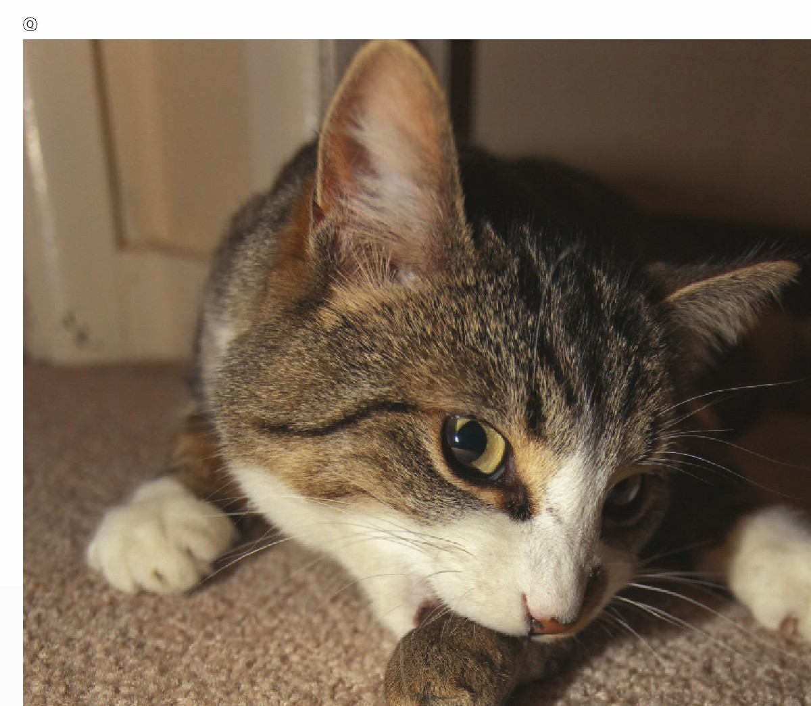

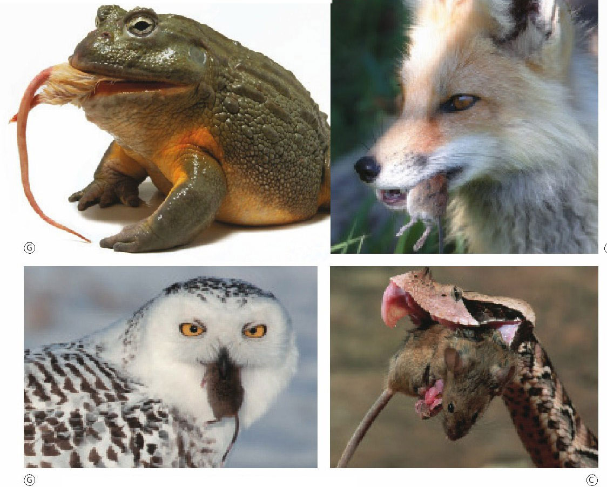
除了猫以外，狐狸、蛇、猫头鹰、牛蛙等动物也时常和老鼠过不去

那是因为对猫来说，老鼠是一道营养最全面的大餐呢！老鼠不仅蛋白质含量丰富，而且体内富含一种叫作牛磺酸的物质，这种物质猫自身不能合成，但对猫来讲还特别重要。因为一旦缺乏牛磺酸，猫在晚上的视力就会下降，长期缺乏会造成夜盲症，就不能在夜间活动了！所以，为了能在晚上有个好视力，猫要经常抓老鼠吃才行。家里养的宠物猫，因为吃不到老鼠，就应该适当补充牛磺酸含量比较丰富的食物，比如海鱼、哺乳动物的心和肝等。

当然，猫之所以养成了喜欢吃老鼠的天性，还因为这种食物多得吃不完。你瞧有那么多的天敌在吃老鼠，老鼠还能生生不息，真是自然界的一大奇迹！（冉浩）

  

**【微博士】**猫步

猫科动物走路时四足踩在中线上，姿态优雅，于是模特们也走起了猫步。猫步行进时左右脚轮番踩在两脚间中线的位置，或把左脚踩得中线偏右一点，右脚踩得中线偏左一点，这样能使身体与双臂随之扭动，产生一种体态的韵律美，也是T台上模特们的经典步法。

## 狗为什么和人那么亲密

养过狗的人都知道，狗非常亲近人。研究表明，狗对人意图的领悟能力甚至能超过黑猩猩。不仅如此，狗还是所有驯化动物中最忠诚的——警犬、军犬、导盲犬、守卫犬、伴侣犬、赏玩犬，它们神奇的天赋，以及对人类无私的爱，即使在科技发达的今天，仍是人类无法替代的得力助手。

这些都是人类长期驯化的结果。你也许还不知道吧？别看人驯化了猪、牛、马、鸡等很多动物，但第一个被驯化的野生动物却是狼，当狼遇到了人才有了狗，狼是狗的祖先！不过，狗到底是起源自一种狼还是多种狼，是在一个地区驯化后传到世界各地，还是在不同的地方先后都驯化成功过，就连进化论的创始人——达尔文也表示自己实在看不透。

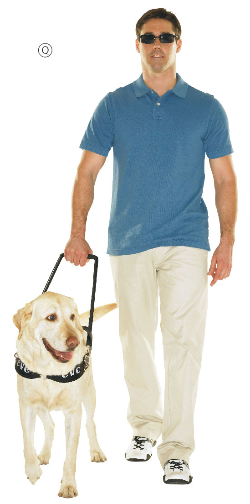
近年来，随着分子生物学的发展，事情开始有了转机。科学家分析了狗、狼、豺等线粒体DNA后发现，狗和灰狼的亲缘关系最近，表明狗最可能是由灰狼驯化来的！至于起源地点则始终争论不休。2002年，世界顶级学术杂志《科学》报道，中国和瑞典科学家在比对了世界各地狗的DNA后表示，东亚地区的狗的遗传多样性最为丰富，狗和中国的灰狼亲缘关系最近，因此，现代狗很可能是在约1.6万年前起源自中国。这一观点立刻引爆了争论的火药桶，其他科学家开始举出各种反驳证据。2010年，声名显赫的《自然》网络版发表了另一份遗传分析，认为狗和中东的灰狼关系最近，并把狗的起源地点锁定在了1.3万到1.2万年前的中东地区。不过这份研究同时也承认，少数东方狗和中国灰狼确有遗传关系。狗的起源之争，看来还要继续一段时间。

不管如何争论，狗和人类相伴超过1万年却是不争的事实。在这漫长的岁月里，有超过1亿只狗为人类服务过，由此在双方之间建立了深厚的情感。虽然狗偶尔会传染一些人犬共患病，会给人带来一些伤害，但瑕不掩瑜，它们无可争议地成为了人类最亲密的动物朋友。（冉浩）

  

【微问题】电子狗能替代真实狗吗？

【关键词】猫　猫步　老鼠　牛磺酸　狗　狼　DNA

## 黄鼠狼为什么要放很臭的屁

说起黄鼠狼的大名，可谓无人不知。它不仅号称位列仙班，而且传说最擅长装神弄鬼和蛊惑人心，还放得一手好屁，任你英雄豪杰也要被熏得晕头转向，当真了得！哎呀，它的屁怎么会那么臭？

黄鼠狼本名黄鼬，是哺乳纲食肉目鼬科动物。它通体为棕黄色或橙黄色，体态苗条，长约30厘米，耳朵和小脑袋都是圆圆的，看起来既机灵又可爱。它们分布很广，几乎遍布中国各地，生活环境也很多样，河谷、林地、沟渠、土坡、灌丛、木垛、废弃房舍等处都有它们的踪影，现在很多黄鼬更是跟着人们进了城，很多时候可能就“潜伏”在我们的身边呢。只不过黄鼠狼是夜行性动物，藏身的巢穴又很隐秘，所以平常我们很难遭遇这些精灵。以前还没有城市化的时候，夜行的人们经常会在路上遇到黄鼠狼，冷不丁会被它和它那明亮的小眼睛吓着，一来二去，黄鼠狼就得了个装神弄鬼的名头。

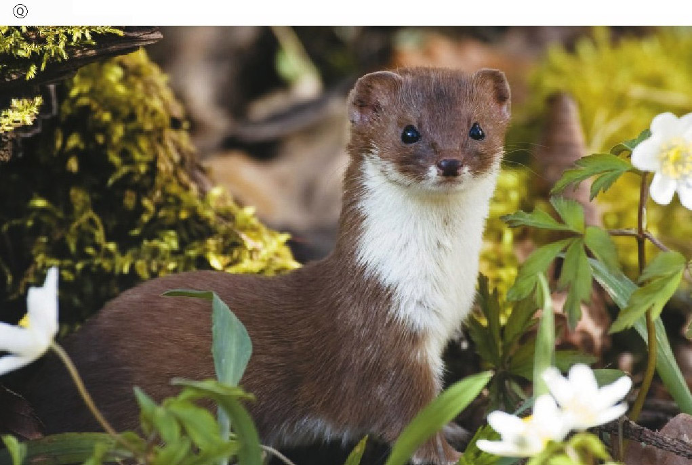
黄鼠狼性情凶猛，机智敏捷，号称最爱偷鸡，更有成语“黄鼠狼给鸡拜年”来比喻不安好心。虽然黄鼠狼往鸡窝跑肯定不打算干什么好事，但它们确实很少去，捉鸡也真不是它的专长。其实，它更喜欢的是捕鼠。黄鼠狼数量多、活动频繁的地方，鼠害都会得到抑制。据估计，一只黄鼠狼一年可以捕鼠300～400只。此外，黄鼠狼也吃兔子、鱼和小鸟等，实在饿极了才会打鸡的主意。

黄鼠狼虽然凶猛，但无奈身板不够大，有时会被它惹不起的一些大动物捕食，比如狼和狐就专门找它们的麻烦。为了更好地保护自己，除了勤挖洞、深挖洞、造迷宫外，那奇臭无比的屁也是最后的防身法宝。特别是遇到嗅觉灵敏的天敌，那真是效果绝佳的烟幕弹，对手虽不会被臭气熏倒，但肯定是逃之夭夭（屡试不爽）。黄鼠狼的臭屁是由肛门两侧的臭腺产生的，并且从肛门中喷出。臭屁的气味就像浓烈的臭鸡蛋，其成分主要是一些含硫的化合物。其实，不光是黄鼠狼，很多鼬科动物都有这一手本事，虽说不大光彩，但确实相当有效哦！（冉浩）

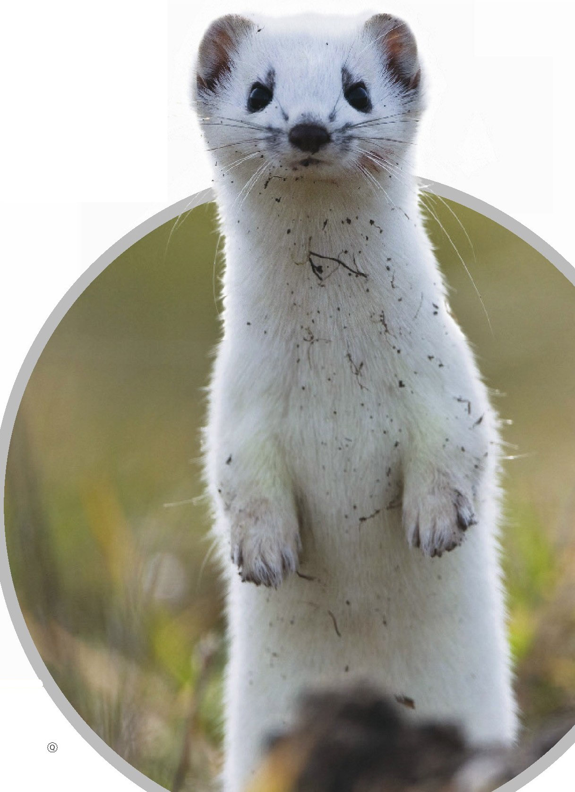
黄鼠狼的另一位“堂兄弟”——白鼬

## 最臭不可闻的动物是谁

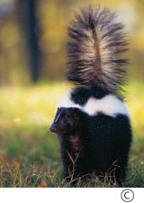
当今世上最臭的动物并非黄鼠狼，而是它的“堂兄”臭鼬。臭鼬是属于食肉目臭鼬科的哺乳动物，共3属12种，全部生活在美洲大陆。它们杂食，也喜欢昆虫、青蛙、老鼠和果实等。臭鼬的体形大小如猫，体色因种而异，在它毛茸茸的大尾巴底下，隐藏着它的武器——臭腺。

臭鼬的臭腺可比黄鼠狼厉害多了，如果说黄鼠狼见了敌人还需要逃走的话，臭鼬简直就是明目张胆大摇大摆地路过了。如果谁想打它的坏主意，它就毫不客气地转过身，翘起尾巴，将屁股对准敌人，一股臭液喷射而出，这一屁之臭，百米之外也是“回味悠长”。至于当事者，简直就是晕得七荤八素，一些嗅觉灵敏的掠食者甚至当下就会被熏昏过去！臭液如果粘到人的衣服上，臭味数月都不会消散。所以，为了防止臭鼬突然发威，动物园在饲养臭鼬的时候，往往会摘除它的臭腺。

难怪有人说，如果动物界召开一场争夺百兽之王的比武大会，笑到最后的很可能既不是彪悍的老虎，也不是威风的雄狮，说不定是这其貌不扬的臭鼬呢！因为它只用一个屁，就可以让老虎和狮子呼吸困难。（冉浩）

## 狐狸真的很狡猾吗

狐狸可是老牌动物明星了，不管是在东方还是西方，狐狸都是狡猾的代名词，而且据说越老越精，结果“老狐狸”成了一个贬义词。那么，狐狸真的很狡猾吗？

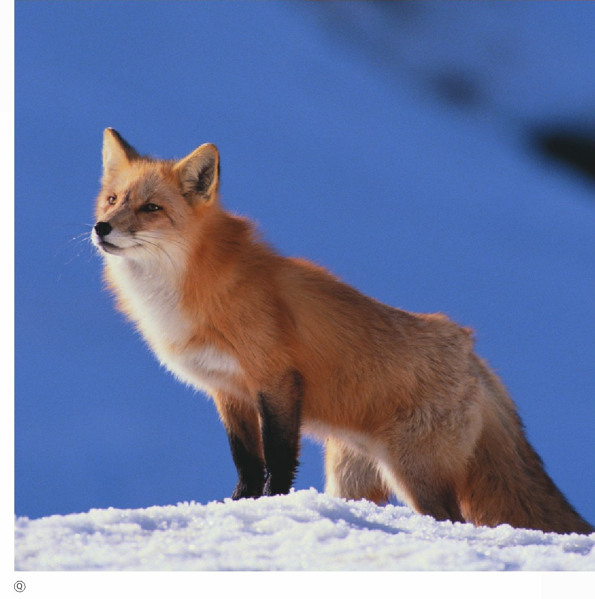
我们先要搞清楚，严格来讲狐狸不是一种动物。狐和狸是两类形态相近的动物，前者是哺乳纲食肉目犬科狐属动物，后者则是犬科貉属动物，仅貉一种，即狸。我们说的狐狸，通常是单指狐。狐的种类很多，有赤狐、藏狐、沙狐等，分布也广，人们之所以说它们狡猾，主要是因为它们的适应性强，本领多，当然，它们还多疑。

狐在食肉目动物中算是体形较小的“弱势群体”，虎、豹、狼自不必说，就是猛禽和蟒蛇也能给它造成威胁；加上狐在非生殖季节喜欢独来独往，更加势单力孤，因此，凡事都需认真观察小心行事，看上去始终都是小心翼翼的。同时，危机四伏的生活也造就了它们的一身本事。它们听觉一流，嗅觉敏锐，视力出众，有臭腺，能游泳，会装死，能模仿其他动物叫声，甚至在雪地里前行的时候还不忘用毛茸茸的大尾巴扫除掉身后的脚印。不过，狐的诸多本事和性格也是恶劣的生存环境造就的，说它们动坏心眼害人，那就有点冤枉啦。其实，狐是一类胆小、温顺、智慧的动物，它们既不帅气，也没有其他犬科动物那般霸道，只是小心翼翼地过着日子而已。（冉浩）

  

**【微博士】**位列仙班的动物们

在中国民俗传说中，有些动物是能修炼的，并通过修炼而获得异能，成为“地仙”（或者叫“草仙”），这是中国神话中最低级的仙。最常见的有北方地区的传说中的“四大仙门”，即狐（胡门）、蛇（常门或柳门）、黄鼠狼（黄门）和刺猬（白门）。这些动物无一不是生存能力强，又经常会与人相遇的，因此往往被人们寄托了情感而被“仙化”。此外，传说鼠、兔、狸、熊等也能“修仙”，而水族动物修炼后则叫“成精”。在清代文学家蒲松龄《聊斋志异》中的这些成仙和成精的动物，常常是善良和智慧的化身。

【微问题】你遇到过什么动物有特别的臭味？它们的臭味来自哪里？

【关键词】黄鼠狼　黄鼬　狐狸　臭腺　狡猾

## 为什么吃竹子的大熊猫是食肉目动物

圆滚滚胖乎乎的大熊猫最喜欢的食物就是竹子，有人由此联想：这些憨态可掬的家伙一定是世界上最可爱的食草动物了。错了！熊猫可是货真价实的食肉动物家族的一员，在分类上属于哺乳纲食肉目，是食肉动物中的素食主义者。

看大熊猫那张脸，和鹿、马那样的食草动物不一样吧？这可是一张“熊脸”！现代食肉目动物由古食肉类分两支演化而来：一支是猫形类，如虎、豹等猫科动物，以及灵猫等；另一支则是犬形类，如今天的狗、狼等犬科动物，以及熊、浣熊、鼬等，大熊猫就属于后者。从身体构造上来说，大熊猫的犬牙尖锐锋利，而且消化道也是肉食动物的构造。一般来讲，由于植物纤维类食物难以消化，为充分消化，食草动物的消化道都比较长，例如，鹿肠约是自己体长的15倍，羊肠则达到了大约25倍。但是大熊猫的肠道只有自己体长的4～6倍，而食肉动物的肠道比例一般是4～8倍。大熊猫用着食肉动物的肠道消化竹子，显然不合适，造成营养吸收率特别低，于是不得不吃下大量竹子来维持身体的能量需要，一只大熊猫在春季每天就要吃进二三十千克的竹子。所以我们看到的大熊猫，就像饥肠辘辘的饕餮之徒一样，不停地嚼着竹子。

其实，800多万年前的禄丰始熊猫是一种体形大小类似狐狸的动物，冰川时代到来后，它们和很多食肉动物一起，被寒冷驱赶到了一片很狭小的地域。面对“同行”的激烈竞争，它选择了一条捷径——“改行”吃素。大约200万年前，小种大熊猫已经是素食主义者了。这次成功“改行”后，冰川消退，熊猫大发展，体形变大，甚至出现了比今天大熊猫还要大的巴氏大熊猫。直至1.1万年前的冰期到来，熊猫体形缩小、变圆，变得适应寒冷环境，才生存至今。

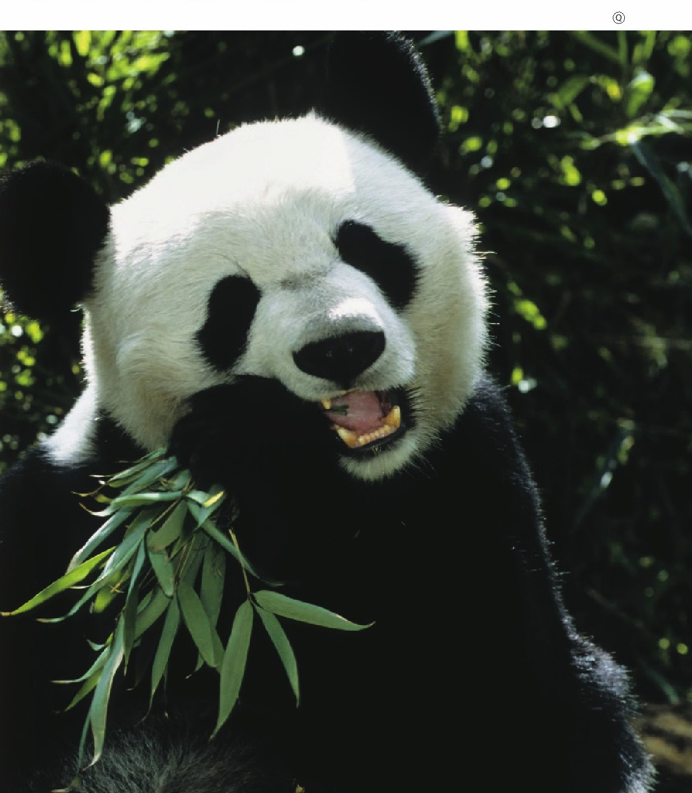
今天，大熊猫已经依赖上竹子啦，不过它们也偶尔开荤，掏竹鼠、捅鸟窝样样不少干，有时还闹闹熊脾气。1990年甚至还在四川出了一只爱吃羊肉的大熊猫，曾12次下山偷羊，共咬死山羊和绵羊20只，咬伤6只，甚至赖在羊圈中过夜！不过这家伙见人就跑，从未伤人，只是苦了当地政府为它吃喝埋单。此外，2011年还发现另一只野生大熊猫将牛羚的尸体啃得干干净净。（冉浩）

  

**【微博士】**大熊猫被发现是福还是祸

大熊猫是中国的特有动物，然而在20世纪以前却是鲜为人知的。尽管在不少古书中也提到四川的“黑白相间的熊样动物”、“白豹”等，但在作为中国画主要题材的竹林中，也从未出现过大熊猫的身影。直到1869年3月11日，法国传教士戴维德从中国猎人手中获得第一张熊猫皮，大熊猫才有了一个科学大名Ailuropoda melanoleuca，自此它们悠闲平静的生活也就结束了。农田扩张、森林锐减、食物短缺、合法与非法的捕猎、不科学的圈养等因素，造成了大熊猫野生种群数量急剧下降。随着自然保护区的扩大和科学研究的深入，人们自然保护意识的增强，大熊猫的濒危处境正在得到扭转。

**【科学人】**阿尔芒·戴维德

戴维德（1826-1900），法国人，自小热爱自然，对动物、植物、地质和古生物都怀有极大的兴趣。他在来中国之前，已当了10年的科学教师，将自己的爱好毫无保留地传给了学生，是当地最受学生欢迎的教师之一。1862年他被幸运地派往北京传教，开始了他考察异地自然、探寻他乡物种的生涯。他不仅在中国发现了大熊猫、麋鹿、珙桐树等一系列中国的特有物种，而且为巴黎的法国自然历史博物馆采集了千余种各类动物标本，其中有100多种被各门类专家定为新物种。

## 小熊猫是不是大熊猫的宝宝

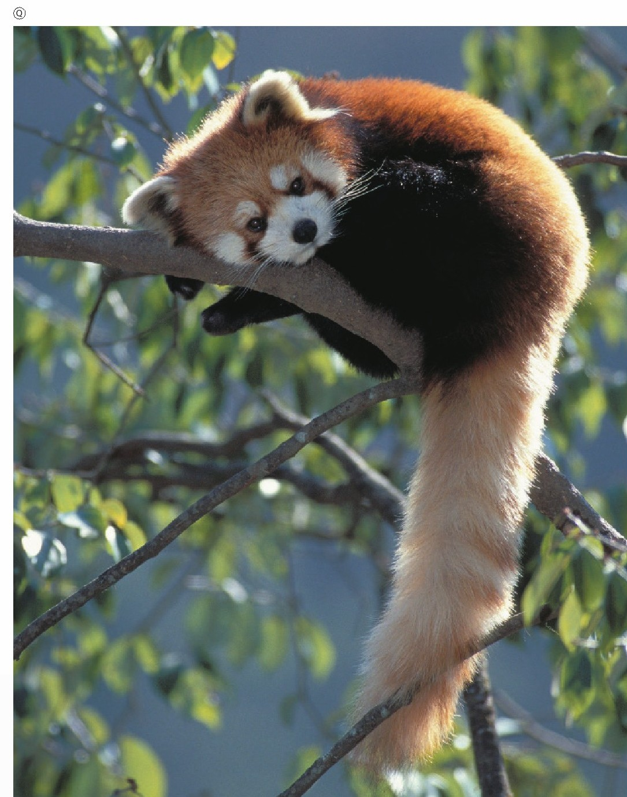
小熊猫可不是大熊猫的宝宝，而是指另一种身手敏捷的小动物。这种小动物身长50～60厘米，体重5～6千克，毛色为栗红色，也被称为红熊猫，由于尾巴上有9节黑色环纹，又得名九节狼。它们仅分布在喜马拉雅山区和横断山区的一个狭长区域，有两个亚种——喜马拉雅小熊猫和川西小熊猫，前者分布于印度、不丹、缅甸以及中国西藏，后者只分布于川西和云南西北，为中国特有。

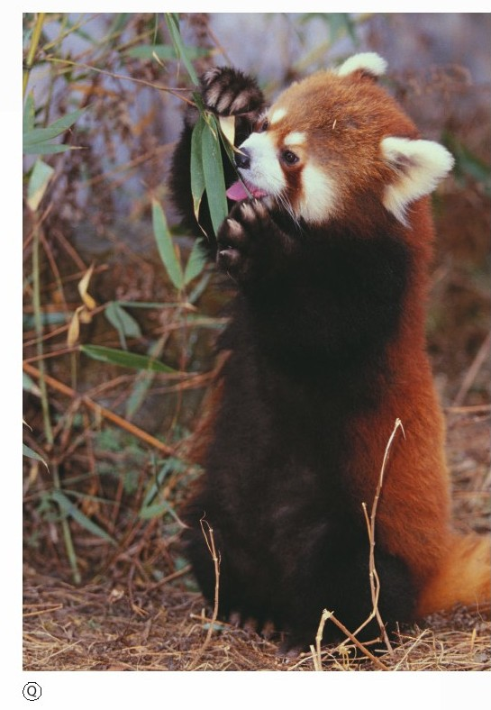
有趣的是，小熊猫和大熊猫一样，也是主要吃竹子的动物。据统计，其食谱中94%为竹子，不仅如此，它也是一种吃素的食肉动物，也仍然保留着典型的食肉动物消化道特点。和大熊猫一样，小熊猫偶尔也开荤，捕食一些昆虫、鸟类、鸟蛋，也会顺手牵羊吃上几口腐肉。不仅如此，两种熊猫的繁殖行为也接近，初生幼崽体重相似，均在100～250克；而且它们都不冬眠，都能发出高调的“吱吱”声和“咩咩”声。

但小熊猫比大熊猫更像猫，不仅体形相似，也一样具有敏捷的攀爬能力，都是晨昏活动型动物。猫咪们早上起得早，晚上睡得晚，结果被误以为是夜行性动物；小熊猫则是从黎明开始活跃，一直持续到上午7点到10点；下午从5点钟左右开始又兴奋起来，不过它们可没有猫咪那样能熬夜，大概到6点就又蔫啦。

小熊猫曾经广泛分布于中国华南地区，但随着人类的活动范围不断扩大，小熊猫栖息地被挤压，原有分布区陕西、甘肃、青海和贵州已无分布。现在的小熊猫已经成了珍稀动物，据估计，有数千只小熊猫生活在中国约3.7万平方千米的森林中，接近世界野生小熊猫数量的1/3。（冉浩）

  

**【微博士】**两种熊猫

大熊猫和小熊猫既有熊的特征，又有浣熊的特征，分类学家一直纠结于它们属于熊科还是浣熊科。也有学者提议分家单过，成立大熊猫科和小熊猫科。现代分子生物学研究显示，熊和浣熊的祖先大概在4000万年前到3500万年前分道扬镳，大熊猫是在熊家族发展过程中诞生的，而小熊猫则更接近浣熊家族。

【微问题】假如委托你照顾一天大熊猫宝宝，你会怎样招待它？

【关键词】大熊猫　小熊猫　食肉目

## 遇到熊装死有用吗

有一个流传了两千多年的寓言：两个非常要好的朋友遇到了一头熊，其中一个飞快爬上树，躲了起来，另一个逃生无望，灵机一动，躺在地上，屏住呼吸装死。熊走到他面前嗅了嗅，转身走了。那朋友从树上下来，问熊为什么走了，这人说：“熊告诉我，以后千万注意，别和那些不能共患难的朋友同行。”可是遇到熊，装死真的有用吗？

老实说，这要看熊的想法。人遇到野熊时的紧张程度可想而知，除非吓得昏死，否则想装死太难了。先不说人会不会因为紧张、害怕而发抖，但心跳至少会加快，身体也是温热的。嗅觉和感觉都十分灵敏的熊难道就看不穿吗？熊如果选择离开，只是它认为这人没威胁，自己其实也不饿，还提不起兴趣来；如果它来了兴致，就会大脑袋凑上去蹭啊蹭，用爪子把人翻来覆去地看。如果遇到这种情况，你就忍着吧，千万别睁眼乱动，不然惊到熊就麻烦了……如果它玩兴大起，一屁股坐上去歇会儿，那就自认倒霉吧……如果侥幸，熊真的对你没什么兴趣，晃一晃就走了，请多躺一会儿，等它走远……熊从来不会因为对方是死人而转身离去，因为熊对腐肉什么的并不反感，而且谁会拒绝到口的一堆肉呢？

在野外，最好分情况处理，如发现远处有熊，并且熊没有注意到人，就不要发出任何声响，慢慢地往顺风方向后退，这样可以避免气味随风传递到熊那里。不要在森林里随手丢弃空罐头、食物残渣，更不要携带气味很浓的物品，那可能吸引包括熊在内的很多动物来“拜访”哦。

熊如果从隐蔽的地方突然出现在人正面，这是示警，在它的背后可能有需要保护的食物或小熊。如果继续前进或呆在原地，它就可能发动攻击。这时不要保持直立的姿势，熊在攻击前往往会站起来，直立在熊眼里可能是一种挑衅。调整好呼吸，平静地、缓慢地面对着它向后退，不要露出畏惧，不管是人或动物都敬佩勇气。不要做多余的动作，任何无法理解的动作都将引起它的不安。小心不要摔倒，更不要掉头就跑，那样会从平等对手降级为失败者，引起它的追逐，人可能因此受伤，受伤的人又可能进一步降级为猎物。

如果熊已经决定发动攻击，那就相当危险了。假如遇到的是体形庞大的成年棕熊，你可以找棵大树迅速爬上去，然后再想办法求救。如果是体形较小的熊，它爬树的本领比人还强，你上树反而是死路。这种情况下，可以往山下逃，熊下山的速度比上山慢，但客观地说，人很多时候跑不过熊。实在跑不掉、躲不了，就只能一搏，注意保护好喉咙和脖颈，可以试着攻击它敏感的鼻子，这也是无奈之举。

最好的办法，当然是远离熊经常出没的地方，熊“非请”，你就“莫入”它们的领地。（冉浩）

## 为什么秋天的熊特别贪吃

秋天，熊的胃口可好啦，几乎见啥吃啥，吃得圆滚滚胖乎乎的。为啥秋天的熊这样贪吃呢？

熊在分类上属于食肉目熊科，在中国有3种熊——棕熊、黑熊和马来熊。棕熊分布于温带和亚寒带地区，从中国东北到西藏都有分布。它也是最大的一种熊，产在美国阿拉斯加的棕熊体长可达3米，重700千克，杂食。黑熊分布更广，北自黑龙江、南至海南岛以及喜马拉雅山南坡，胸前有一白色的“V”字形标志，杂食，但以素食为主，偶尔吃腐肉。黑熊很少主动捕食，它视力不大好，有时被叫成“熊瞎子”，但嗅觉很灵敏。马来熊在中国仅分布在云南南部，体形最小，约1.2米长，体重45千克上下，浑身乌黑油亮，胸前有一“U”形黄色纹饰，又叫太阳熊。马来熊很特殊，是一种热带、亚热带的丛林动物，栖息在树上。白天在树上搭窝睡觉，晚上才出来觅食。这三种熊，除马来熊因为处在热带，一年四季不愁吃喝外，另两种熊只能靠天吃饭，春夏秋三季还能温饱，到了冬天，天寒地冻，要吃没吃，要喝没喝，只好减少活动，找个地方睡大觉了。

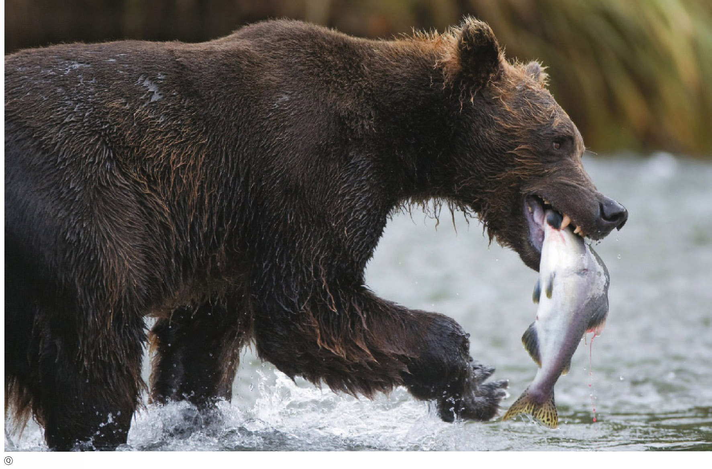
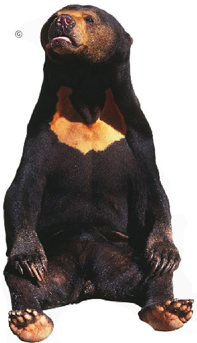
入冬前，熊钻到洞（熊仓）里，不吃不喝，体温下降，脉搏减弱，神经反应减弱，进入类似冬眠的状态。在夏季怀孕的母熊还要在此时生产并哺育幼仔，生存压力很大。要想挨过冬季，那秋天就要拼命多吃，把自己养得胖胖的；即使如此，春天“苏醒”时，仍然会瘦掉一大圈，这也是没办法的事，毕竟挨饿几十天了。当然，熊不像爬行动物那样“死睡”冬眠，它的头脑仍可保持清醒，“早睡”或“晚起”的熊也可能因为饥饿难挨而自相残杀。因此，人在秋季或早春遇到野熊是比较危险的。（冉浩）

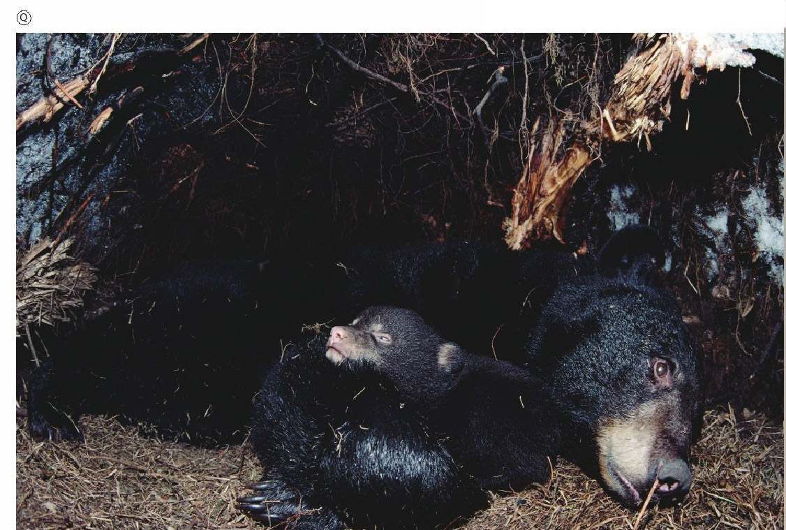
冬眠状态下的母熊和幼仔

  

**【微博士】**活熊取胆汁之争

根据中医理论，熊胆汁性寒，具有清热解毒、清肝明目的功效。熊胆汁入药在中国已有上千年的历史。过去，都是猎杀活熊取胆汁。随着现代养殖技术的发展，人们通过圈养活熊，将管子从活熊体外插入其胆囊内抽取胆汁，或“无管引流”，即通过手术将熊的胆囊牵拉到腹壁，在体表开出露口，直接将胆汁引流出来。2012年2月，当一家以活熊取胆汁为主业的药业公司欲上市之际，亚洲动物保护组织将拍摄到的大量受虐待黑熊的病态和痛苦的视频在网上公布，激起了社会舆论的强烈反对。传统的动物养殖业和现代的动物保护意识发生了激烈的冲突，促使人们对动物生存权利和福利的思考，催发着中国的动物福利法规的诞生。

【微问题】你怎样看待活熊取胆汁这个问题？

【关键词】熊　食肉目　装死　冬眠

## 为什么骆驼能在沙漠中长途跋涉

干燥酷热，大风流沙，茫茫的金色沙漠不知使多少动物有进无出。但是，经驯化的骆驼却能成为人们穿越沙漠的倚仗，更得到了“沙漠之舟”的名号。骆驼到底有何绝技在大漠中长途跋涉呢？

高耸的驼峰是骆驼的独门法宝，根据驼峰数目，骆驼可以分为单峰驼和双峰驼两种。骆驼出发前，要吃得饱饱的，营养就以脂肪的形式储存在驼峰里，一旦进入沙漠，就全靠它啦。

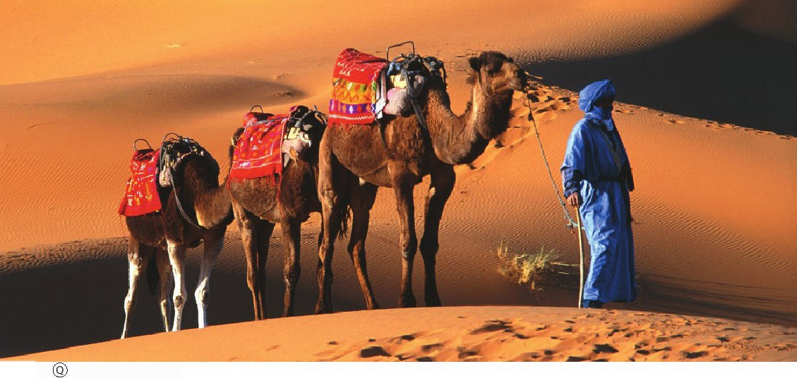
水是穿越沙漠必备之物，骆驼的耐渴绝技是一套组合拳。一是节水。骆驼的汗腺很少，几乎不出汗；粪便也比别的哺乳动物干燥；而且它还有一个强力的肾，能防止尿液中排出过多的水分。更厉害的是，骆驼连空气也不放过，呼气时，鼻孔会像一台冷凝器，将凝留在鼻孔周围的水回收，防止水分散失；到了晚上，空气湿度加大，它的鼻孔还能从空气中冷凝出水来。二是储水。如双峰驼能在10分钟内喝下114升水，当真了得！这是因为它的身体里有一个储水囊。而它的红细胞也适应了这种变化，不会在血液含水量极度变化下破裂死亡。

骆驼也有对付风沙的妙招。它睫毛长而浓密，可以阻挡风沙吹入眼睛，鼻孔中也有防沙挡风的瓣膜，就连那耳朵也生得又圆又小，还长满了耳毛，足以把风沙拒之耳外。

酷热也阻挡不住骆驼行走的脚步，在50℃高温下它们依然如故，体温还能根据气温略有变化。行走在滚烫的沙粒上，骆驼宽大的脚掌不仅耐热，而且使它不会陷下去。骆驼还能在热沙地上趴下来休息——它的胸部和膝盖生有肉垫，趴下前，它前腿用力往前推，后腿往后推，将表面的热沙推开，然后用肉垫着地。肉垫不仅隔热，而且使骆驼和地面之间有一定空间，可以通风，便于散热。

骆驼虽然拥有一身沙漠生存绝技，但遗憾的是，野骆驼在人类活动的干扰下已非常稀少。野单峰驼在至少2000年前已灭绝，野双峰驼也一度被认为已灭绝，偶尔看到的“野骆驼”被认为是家骆驼野化形成的。1999年，事情有了转机，基因检测显示，在中国新疆罗布泊发现的野骆驼与家骆驼的基因差异达到3%，已超过人和黑猩猩的基因差异。研究确认，这是当世仅存的野骆驼种群，随后成立的阿尔金山——罗布泊野双峰驼自然保护区则成了世界上唯一的野骆驼栖息地。现在，野骆驼只剩不足千头，比大熊猫还要珍贵。（冉浩）

## 为什么圣诞老人用驯鹿拉礼物

传说，每年圣诞老人都会驾着雪橇给小朋友送礼物，而且圣诞老人不是用马来拉雪橇，而是用鹿来拉的。你知道为什么用鹿拉雪橇吗？

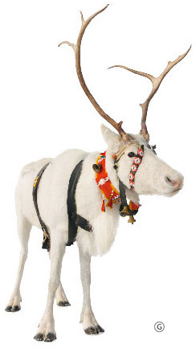
原来，传说中的圣诞老人生活在北极，那里有一种特殊的鹿——驯鹿，雌、雄鹿都长角，分枝繁复，有时超过30叉，蹄子宽大，悬蹄发达，善于行走。

驯鹿体长约1.8米，重100千克，雄鹿稍大，可以达到180千克，广泛分布于北极周围的寒带地区，中国仅存于大兴安岭西北部。驯鹿适应雪地生活，它们宽大的蹄子可以避免自己陷入雪中，还能拨开雪堆寻找食物；而且它的眼睛可以变色，避免雪地反射的强光刺伤眼睛。驯鹿是北极周围居民最熟悉的饲养动物之一，它性格温顺，易于驯养，能够轻松穿越马匹难以穿越的雪地、沼泽和森林，因此，圣诞老人才会选用驯鹿来拉雪橇。在中国，驯鹿也是鄂温克族不可缺少的交通工具和牲畜，被誉为“林海之船”。它们被用来打猎时驮运猎物，搬家时则搬运物品和供妇女小孩骑乘，下山驮运购买的粮食和日用品，现在更成了接待游客的一大亮点。（冉浩）

## 为什么驼鹿的角长得这么大

驼鹿是典型的亚寒带针叶林中的代表动物，和猛犸、披毛犀同为冰川时代的动物，是现存最大的鹿科动物，雄鹿体形大于雌鹿，肩高可以达到2米，一般体重200～300千克，最重可达700千克。它的颈、肩部肌肉发达使后背隆起，因此得名“驼”鹿。雄性的一对巨大鹿角也格外显眼，重达30千克，角成板状，分叉多，两边的角散开幅度可超过2米。

角是鹿科动物的常见特征，通常一年一换。起初是一个带皮毛的软骨组织突起，里面有血管和神经，叫“鹿茸”，可入药，但割取时需要注射麻药来减轻痛苦。鹿角长成后硬化成骨，不再有感觉。鹿角是哺乳动物中生长最快的骨骼，其中的机理还有待进一步研究。

除驯鹿的雌雄两体都有角外，一般种类只有雄鹿有角。角是雄鹿之间用于争夺领地和配偶的武器，一对巨大的鹿角也是它赖以吸引雌鹿的招牌。此外，驯鹿还会将它当铲子，从雪里挖食物吃。与其他鹿的枝状鹿角不同，驼鹿的鹿角形似手掌。研究发现，驼鹿的听力要远好于其他鹿，原来，这个巨大的鹿角“手掌”还兼有聚音功能呢。（冉浩）

  

**【微博士】**麋鹿失而复得，重归故里

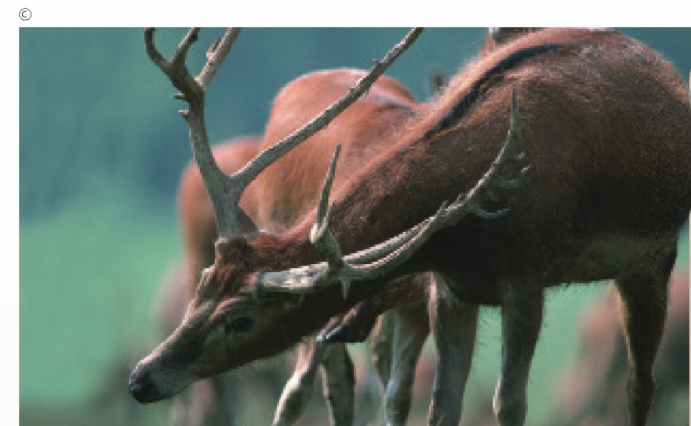
麋鹿以马脸、牛蹄、鹿角、驴尾四大特征在各种“四不像”动物中名声最大，曾是中国的特有动物，主要栖息于长江中下游的江湖滩涂和沼泽湿地。由于人类活动的干扰，适宜麋鹿栖息的大量水体和湿地丧失，麋鹿种群数量急剧下降。1900年，伴随着最后一头麋鹿被捕杀，野生麋鹿在中国彻底灭绝了。幸运的是，英国知名的野生动物蓄养者罗素公爵慷慨解囊，将流落到欧洲动物园的麋鹿重金买下，在英格兰乌邦寺精心繁育。1985年，他的曾孙亨利决定让麋鹿重归故里，于是，22头麋鹿经过精心安排回到故乡中国。今天，江苏的大丰和湖北的石首还成立了专门的自然保护区，麋鹿已在故土繁衍后代，自然放养的麋鹿数量已经有3000多头。

【微问题】你认为有必要在长江中下游的沿海城市湿地内恢复野生麋鹿吗？为什么？

【关键词】骆驼　耐旱　驯鹿　交通工具　驼鹿　鹿角

## 为什么要保护大象

大象是陆地上最大的动物，几乎没有可与之匹敌的对手。它们是素食者，也不会对其他动物造成威胁。它们庞大的躯体，虽然会对所到之处及栖息地周边的植被有所伤害，但正好也促进了植物之间更快地演替；它们在密林中踏出的象道，让很多动物有路可走，促进了动物的有效扩散；它们的粪便残渣不仅是一些昆虫如屎壳郎的美食，也吸引了食虫鸟类的光顾，粪便中的植物种子也因此得以传播。在非洲大草原的旱季，大象能够凭借超强的记忆力寻找到水源，很多动物更是跟在象群后面才避免了被渴死的命运。大象甚至当起了水源的保护神，谁要想撒野或者糟蹋宝贵的水源，它们可不答应！大象成了陆地生态系统中不可多得的重要成员。

因此，保护大象，不仅是在保护这个种族，而且是在保护一个庞大的生态系统。

大象长有一对质地致密细腻的象牙，是制作昂贵礼品的珍稀材料，这正是大象惨遭厄运的缘由。自古以来，获取象牙成了人们偷猎大象的主要理由。20世纪80年代初，全世界有大象100万头以上。仅仅过了10年，就有60万头大象被非法猎杀。尽管1989年生效的《华盛顿公约》（CITES）明确禁止了非法的象牙交易，但偷猎仍在继续。如今全世界的大象总数，已经不足40万头，其中亚洲象的数量已经降至4万头左右。仅在2011年，仍然有数以万计的非洲象惨遭杀害。

2012年9月，国际自然保护联盟（IUCN）又通过了两项动议：其一是继续保护非洲大象，其二是保护国家公园的管理员们。这一事实表明，偷猎和制止偷猎的斗争，已经到了你死我活的边缘。抵制任何象牙制品也许是我们普通人能为挽救大象所能做的事。（冉浩）

深受偷猎之苦的大象

  

**【微博士】**灵巧的象鼻

大象的“鼻子”不完全是鼻子，它没有鼻梁骨，而是由鼻和上唇构成的鼻管，大约由4000块肌肉组成，能做出各种动作，这就是象鼻为什么那么灵活的原因。大象的鼻子触觉灵敏，嗅觉也是一流。鼻甲骨上长有专用于嗅觉的感觉组织，可以轻易分辨出异性和本家成员的气味。

大象能用鼻子吸水送到嘴里而不呛水，秘密在于大象的鼻腔后面有一块特殊软骨。当大象用鼻子吸水时，水便进入鼻腔，等水快要灌满鼻腔的时候，喉咙部位的肌肉收缩，那块软骨适时地移动位置，将气管堵住，这时，呼吸道关闭，大象就憋了一口气。等大象把鼻端放到口中，软骨归位，大象呼气，水就流出来啦。

## 温顺的大象为什么会复仇

曾经有一头非常温顺的大象在伦敦动物园突然发狂，袭击了三名水手，并在转眼间杀死了其中两人，只有一人侥幸逃脱。起初，人们对大象突然发狂百思不解，后来，那位幸存者才猛然想到了事情的原委。原来三年前在马耳他的码头上，这三名水手在百无聊赖时，尽情戏弄过这头即将运往伦敦的大象。哪知道三年之后，大象仍然记得他们，并且成功地实施了复仇。

毫无疑问，大象是非常聪明的动物，这是因为大象有发达的大脑，脑容量平均重达4.8千克。它们的记忆力非常好，哪怕是分开几年以后，上百头熟悉的大象也能分辨出互相之间熟悉的声音，它们对那些让它们受过伤害的对象印象尤为深刻。

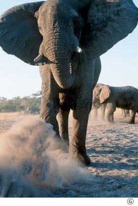
大象在中国有分布。据记载，商代时它们一度分布到黄河流域，但随着气候变化和人类活动，其分布范围逐步被压缩，现仅存于中国云南的沧源县和西双版纳州，数量仅约200头。随着人类活动的加剧以及西双版纳森林面积的减少，野象栖息地进一步受到压缩，人象之间的冲突越来越不可避免。

西双版纳勐腊县的勐醒农场就曾发生一起野象杀死女工的事。据当地人说，这一带原本是“象窝子”，开垦后大象便开始攻击人类，而且还有多次“发泄”。例如，把人们放在树上的胶碗拿下来踩入土中，或把较小的橡胶树拔倒等，后来更是见人就追。

此外，大象对人栽种的庄稼也毫不客气。过去偶尔来吃，现在经常是庄稼一成熟便来“收割”，非常及时。为了保护农田，世界自然基金会曾向西双版纳捐赠了80套电围栏，这种电围栏用太阳能充电，能在瞬间放电，但大象很快就识透了这些设备，它们推倒树木、压坏围栏，或者用象鼻卷起树枝打砸围栏，还有的趁着雨天电压降低时匍匐前进钻过去，更有甚者，干脆忍受电击硬破围栏。在人象之间的相互斗争中，彼此的怨恨不断积累，矛盾不断加剧，大象甚至把这股怨气发泄到了人们搭建的草棚上，有些大象不仅要拆毁它，还非要把木料扔入河里才算罢休。

因此，大象的复仇，来自它的自我意识和对同类的情感。它提醒我们，在人类的发展过程中，必须考虑包括大象在内的动植物的生存空间。（冉浩）

  

**【微博士】**非洲象与亚洲象

现存大象有亚洲象、非洲丛林象和非洲草原象，传统上常把后两种象归为一种，统称非洲象。非洲草原象是三种象中最重的，也是陆地上最大的动物。雄象较雌象大，体长可以达到7米多，肩高3米多，体重超过6吨。成年非洲象雌雄都有象牙突出口外，而亚洲象体形相对较小，雄象体重可以达5吨，一般只有成年雄象会露出象牙。

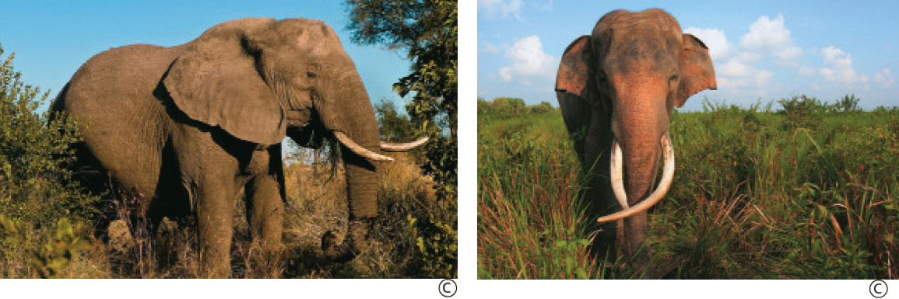
非洲象（左）和亚洲象（右）

【微问题】2012年6月27日，近1吨的象牙和象牙制品在非洲加蓬被焚毁。价值连城的象牙为什么要被付之一炬呢？

【关键词】大象　象鼻　非洲象　亚洲象　偷猎

## 松鼠的大尾巴有什么作用

小松鼠最显眼的就是有一条大尾巴，这条尾巴老是高高地翘起来，有时候甚至看起来比松鼠自己还要大一点，那松鼠的大尾巴有什么作用呢？

其实，这和松鼠的生活方式有很大的关系。常说的松鼠是栖息在树上的树松鼠家族，它们属于哺乳纲的啮齿目松鼠科。这个科还包括了巨松鼠、花松鼠、岩松鼠等亲戚，它们也被看成广义的松鼠，只是生活在地上，尾巴比树松鼠略小。树松鼠平常从一根树枝跳到另一根树杈上，在跳跃的时候大尾巴可以帮它维持平衡，并且能当作舵掌握方向，在下落的时候甚至还有滑翔伞的作用呢。炎热的夏天，尾巴可以当遮阳伞用；天冷时，这条毛茸茸的大尾巴盖在身上还能当棉被。此外，树松鼠还能利用尾巴倒挂在树上，做出各种高难度动作。

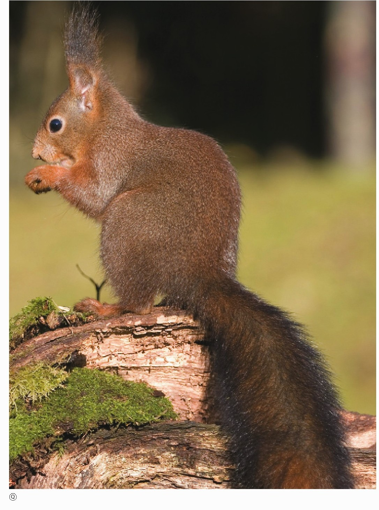
还不止于此，松鼠在搏斗的时候会把尾巴前后摆动以迷惑敌人，必要的时候尾巴还可以充当盾牌使用，而且松鼠间也爱摇摇尾巴打个招呼。在对付共同的敌人时，松鼠们会通过“尾巴语言”来协调行动。有研究发现，东美树松鼠还能用尾巴代表社会地位，更有趣的是，和大多数动物喜欢把尾巴翘上天相反，占有领地的松鼠“地主”却喜欢把尾巴放低一点，反而是那些“贫农”和“流浪汉”的尾巴举得很高。科学家半调侃半推测地表示，毕竟松鼠尾巴够大，也许把尾巴放低一点会更省力吧？

而在树松鼠的近亲——加利福尼亚地松鼠身上，科学家还发现了尾巴的另一个妙用——红外线欺诈。响尾蛇是地松鼠的天敌，为了对付蛇，地松鼠想尽了各种方法，如能一搏，则连抓带咬，打不过就向蛇的眼睛里踢沙子。更有地松鼠母亲捡来蛇蜕，嚼碎了给自己和孩子吃，混淆鼠蛇气味。当这些招数不起作用时，地松鼠母亲为了保护身后的孩子，会在蛇面前快速晃动尾巴，以加快血液流动，通过将尾巴加热来增加红外线辐射，让用红外线感知的蛇误以为对面是个大家伙而撤退。（冉浩）

## 老鼠为什么要囤粮

老鼠可不得了，不仅偷吃，吃完还不忘将食物搬回家。掏开某些老鼠如仓鼠的鼠洞，里面堆满了玉米、大米、花生、瓜子，等等，如同一个粮食铺。住在粮仓和居室里不愁吃喝的老鼠为什么要屯粮呢？

其实屯粮是包括松鼠在内的很多啮齿动物的“优良传统”。它们在丰收时把种子存起来，等到了冬天粮食物资匮乏的时候好拿来充饥。老鼠囤粮一般分为集中贮藏和分散贮藏两种形式。前者把粮食储存在几个比较集中的“粮仓”里，这样的优点是将来取食方便，缺点是很多种子要从很远的地方搬来，而且一旦被黑心的家伙偷吃，就有饿肚子的危险。而后者则把种子分批藏在不同的地方，甚至就地掩埋，比较省力，损失一些也无关大局；但是找起来实在是太难了，有些种子因为始终没有被找到而发了芽，使得“储粮”变成了“植树”。

囤粮是关乎过冬的大事，老鼠在储粮时还要认真挑拣，那些虫蛀和不饱满的种子是不要的。所谓“手里有粮，心里不慌”，有了粮食，过冬的老鼠才能过上安稳的日子。

当然，也有很多老鼠是没有囤粮习惯的，这些“不勤劳”的老鼠就不得不在严寒的冬季，冒着风雪出外觅食，有时就成了其他觅食者的口中餐。（冉浩）

## 老鼠为什么消灭不完

老鼠不仅盗粮、传播疾病，偶尔还会咬伤人，因此，大家都说“过街的老鼠人人喊打”。但是，上千年过去了，人们想尽了办法，可老鼠家族依然“人丁兴旺”。这些家伙怎么就消灭不完呢？

毫无疑问，老鼠是地球上最顽强的生物类群之一，最常见的有大（家）鼠和小（家）鼠。虽然家鼠有点近视眼而且色盲，但是说它“鼠目寸光”还是有点夸张，何况老鼠的听觉、嗅觉和味觉都相当棒，不仅可以听到超声波、尝出劣质食品，甚至食物有一点异味它们都能察觉。加之依仗洞穴保护，又胆小谨慎，要捕杀它们实属不易。更重要的是，老鼠的繁殖力超强。它们怀孕期短、产仔数多、性成熟早。以黑线姬鼠为例，怀孕21天就能产仔，产后第二天即可交配怀孕，春季出生的幼仔到了秋天就可以加入到繁殖大军中。所以，灭鼠的工作只要稍有松懈，它们很快就能卷土重来。

不过，虽然野外的老鼠难以消灭，但要把自己家里的老鼠请出去也不是没有办法。老鼠之所以住进来，是因为家里有老鼠“宜居”的环境，只要把粮食收好，把家里打扫干净，不给老鼠安家的条件，不但外来的老鼠觉得无趣，就是原来的老鼠，也会因为住不下去而迁走的。（冉浩）

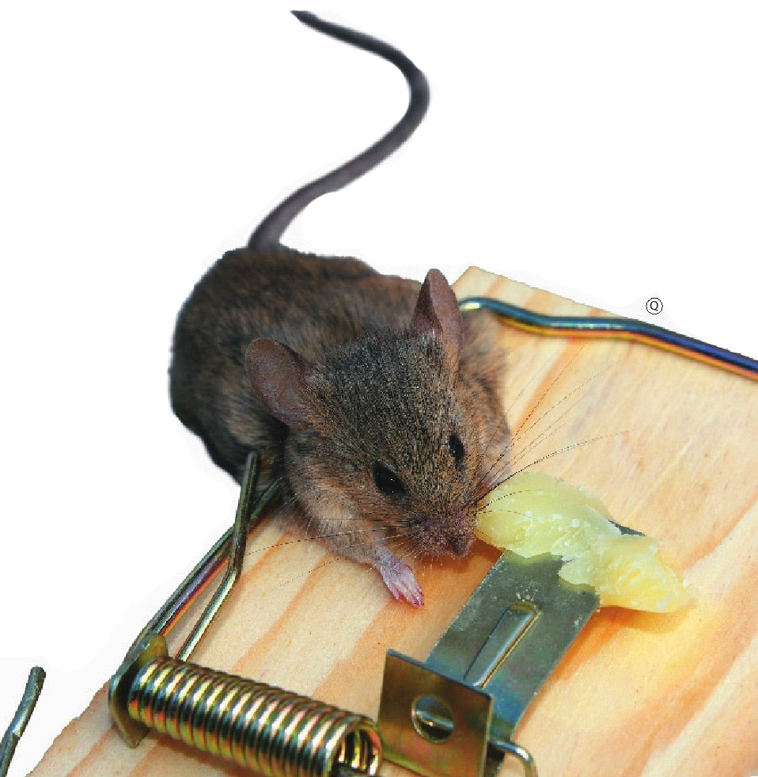
  

**【微博士】**最大的啮齿类

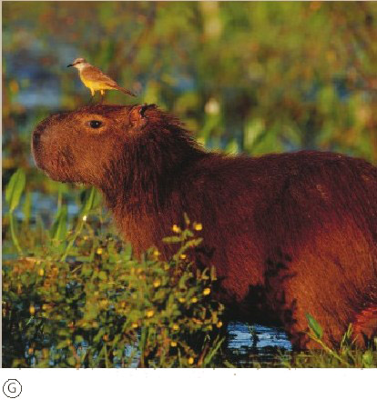
现生最大的啮齿动物是一种原产于南美的素食动物——水豚，它们善于游泳，以10～20头的小群体集聚的社会方式生存。成年水豚的平均体重约为50千克，而迄今为止记录到的最重的雌性水豚达91千克，雄性达73.5千克，可以说这种“大老鼠”和人都差不多重了。

【微问题】如果发现你家附近有老鼠活动，你有没有办法消灭它们？

【关键词】松鼠　尾巴　老鼠　囤粮

## 食蚁兽为什么能吃到洞穴中的蚂蚁

食蚁兽几乎只吃蚂蚁和白蚁，是美洲特有的动物。不过，蚂蚁和白蚁都是在地下或者树中隐藏很深的昆虫，个头不小的它们怎么能吃到呢？

食蚁兽没有牙齿，是一类非常古老的哺乳动物，现仅存大食蚁兽、二趾食蚁兽和小食蚁兽3种。其中大食蚁兽体形最大，生活在地上，全长2～2.4米，尾长接近于全长的一半，体重超过30千克；而二趾食蚁兽体形最小，只有约40厘米长，体重不足400克，生活在树上，其最主要的特征是前足仅有二趾，其余各趾均已退化，不过它的尾巴异常灵活，可以像手一样抓住树枝；小食蚁兽则介于两者之间，能地栖也能树栖。

食蚁兽是哺乳纲贫齿目蠕舌亚目仅存于世的动物，正如其名，它们的舌头可是“绝世神兵”，又细又长又柔软。以大食蚁兽来说，舌头长达30厘米，附有黏液，可以把蚂蚁和白蚁从洞里粘出来吃掉。不仅如此，食蚁兽拥有一个嗅觉十分灵敏的鼻子，可以在很远的地方就闻到蚁族的味道。它们前肢的爪很发达，大食蚁兽第三趾的长度可达10厘米，必要的时候可以强行扒开蚁巢，扫荡蚁类。

除食蚁兽，还有一些主食蚁类的动物，如澳洲的短吻针鼹、美洲的犰狳、亚洲和非洲的穿山甲、非洲的土豚等。食蚁动物大多属于较原始的哺乳动物，彼此之间的亲缘关系也很远，但它们不仅体态相似，还都有一个狭长的脑袋，都能吐出细长的舌头，前肢也都有锋利的爪子。这些可都是捕蚁的利器哟！这种因为相似的生活方式而演化出类似体态和行为的现象，在生物学上叫作“趋同进化”。（冉浩）

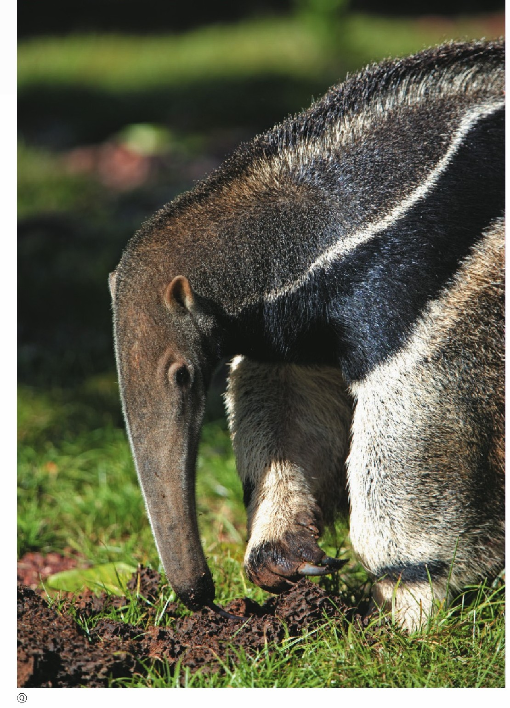
  

**【微博士】**浑身长刺的刺猬

刺猬是一种偶尔吃蚁类的小动物，属于食虫目的猬科，根据种类不同略有差别，一般体重不超过2千克，主要分布于欧亚大陆和非洲。刺猬为杂食性，取食昆虫、蚯蚓、蛙类、蛇类、鸟蛋，也吃草根和果子。刺猬行动缓慢，遇到敌害就靠一身刺皮保驾，把身体蜷缩成一团，形成一个刺球，捕食者就没法下口啦。

**【实验场】**生活在城市的刺猬

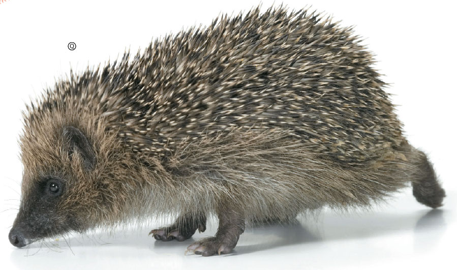
夏日，如果你有机会去郊外的农家乐或生态农庄度假，晚饭后，可以带上手电，到有灌丛、草垛或其他有隐蔽物的地方转转。如果你运气好的话，在城市中疏于管理的荒野绿地，可能会碰上晚上出来觅食的刺猬。

## 穿山甲为什么能穿山

穿山甲在哺乳动物中可以说是一个另类，大多数哺乳动物都长满毛，它却浑身披着铁甲般的鳞片，而这鳞片还能片片竖起，煞是威风！据说，穿山甲一抖神威，竟能穿山而过，这是真的吗？

穿山甲是仅存的鳞甲目哺乳动物，全球仅有7种，主要分布在亚洲和非洲南部的热带和亚热带地区。中国有两种常见的穿山甲，为国家二级保护动物，广布于中国南方各省的林间，国外见于尼泊尔及中南半岛地区。除此以外，中国云南、广西还分布有较大的印度穿山甲。穿山甲的体形因种类不同而有所差异，一般身长40～50厘米，尾巴还有大约30厘米长，体重1.5～3千克，以白蚁为主食，一餐就可以吃下500克白蚁，偶尔也吃其他昆虫。

“穿山”的说法虽然有些夸张，但穿山甲确实有土行孙一般的本领。它的爪子锋利且有力，打洞时前脚开掘，后脚往外刨土，效率相当高。有时候，它也先用前爪把土掘松，钻进去后竖起鳞甲，形成无数“小铲子”，身体一边后退，一边把土铲下，拉出洞外。前进时，这些鳞甲又成了瓦工的“抹子”，将洞壁弄得光滑又坚固。据估算，中华穿山甲1小时能挖掘3～5米，从外面看，只需一会儿工夫它就消失在洞穴里啦。虽然没“穿山”，但钻山确实不在话下。这等神通对付藏在地下的白蚁或蚂蚁可谓得心应手，剿灭整窝白蚁也毫不费力。据估计，一只成年穿山甲可以守护250亩林地不受白蚁威胁，可以说是真正的森林卫士。

穿山甲爱打洞，也爱住在洞里。它剿灭了白蚁后，总爱在那里再住上几天当临时居所。根据季节变化它也会住在不同的洞穴中：夏季住在夏洞，这种洞穴建在凉爽通风的高地，洞穴结构简单。冬天则在向阳背风的低地开掘出蜿蜒曲折的洞穴，长度可达10多米，开掘途中往往还扫荡几个白蚁巢，当作冬季的“粮食”；洞的尽头有一个巢室，里面垫着细草，是越冬的“卧室”，也是“育婴室”。

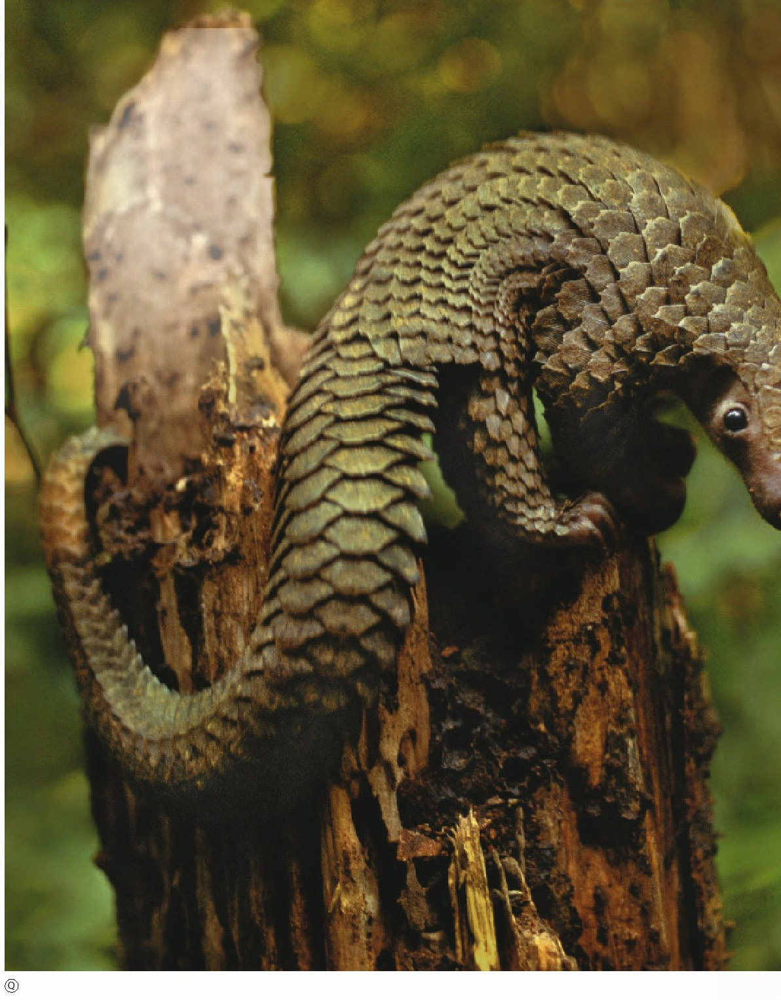
其实，穿山甲不仅“穿山”有术，上树下水也不含糊，更有一套诱捕昆虫的绝活。穿山甲有一身独有的腥臭味，它趴在地上如同腐肉一般，对贪吃的昆虫具有很强的诱惑力。成群的蚂蚁和小虫赶来“会餐”，却不料中计，被穿山甲用长长的舌头捉住吃掉。有时候它也会张开鳞甲，引诱昆虫钻进鳞甲的间隙，然后出其不意，收拢鳞甲，下到水中，张开鳞甲，让虫子们都漂到水面上，它好慢慢享用。穿山甲这身鳞甲用处够多吧？不仅如此，穿山甲在遇到敌人时，还会缩成一团，凭借这身坚硬的鳞甲抵御敌人呢。

穿山甲一身奇术，都说“艺高人胆大”，它却是胆子很小，白天藏在洞里，晚上才偷偷摸摸出来活动。（冉浩）

【微问题】穿山甲常被偷猎或走私，但缉获的活穿山甲很多并非中国物种，应如何处理它们呢？

【关键词】食蚁兽　趋同进化　刺猬　穿山甲　洞穴

## 作为哺乳动物的蝙蝠为什么会飞

蝙蝠是一类常可在城市夜空中见到的小动物，它们属于哺乳动物中的翼手目，总数超过1000种，以捕食昆虫为生，也有抓鱼、吸血或吃水果的。蝙蝠在世界绝大多数地区均有分布，是唯一征服了蓝天的哺乳动物。它们是如何飞上蓝天的呢？

化石是最好的证据。目前已知的最早的蝙蝠化石生存在大约5500万年前的始新世，那时，霸占天空的翼龙已经灭绝了，蝙蝠完全可以在蓝天中自在地觅食生存。不过，这些化石的样子非常接近于蝙蝠今天的形态，更早的蝙蝠化石一直都没有被发现。蝙蝠的祖先是什么样子的，它们又是如何完成进化的，都还是一个未解之谜。

不过，并非没有线索。从蝙蝠的骨骼特征上可以推断，它的翅膀是前肢进化来的，上臂、前臂、掌骨和指骨都特别长，它们之间有一层薄而坚韧的皮膜相连，一直延伸到体侧、后肢和尾巴，形成了独特的翼膜系统。蝙蝠的翼手和爬行动物中已经灭绝的、曾在中生代独霸天空的翼龙惊人相似。为了飞向蓝天，两类不同的生物——哺乳类的蝙蝠和爬行动物的翼龙，采取了相同的进化策略。

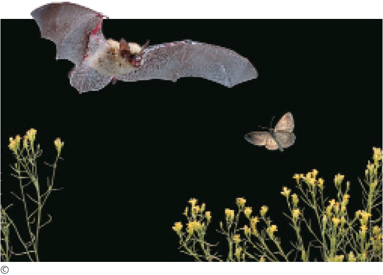
科学家们相信，掌握飞行能力不能一蹴而就。蝙蝠的先祖很可能生活在树上，为了逃避敌害或者捕食飞虫，有时候需要从一棵树迅速转移到另一棵树上。于是，在漫长的适应进化中，那些在前肢上生出了皮膜、有助于在空中滑翔的个体获得了更多的生存机会，自然选择的结果使这些有利的性状遗传到了后代，并不断得到强化，最终脱胎换骨，征服了蓝天。

当然，蝙蝠并不仅仅在身体结构上改变，它们的细胞也在发生变化。科学研究表明，在空中飞行所需的能量是在地上行走的3～15倍，因此，要想飞起来需要更强的动力。在生物细胞内有一种专门负责供应能量的特殊结构——线粒体。2010年，分子动物学家张亚平院士和沈永义博士研究发现，蝙蝠的线粒体在演化过程中变得越来越强大，显示它们细胞的能量系统也升级了。“里应外合”的全方位演化，蝙蝠飞上天空也就顺理成章了。

虽然很多蝙蝠具有相当高的飞行水准，但是和现代蓝天的霸主——鸟类相比，它们的飞行水平还是差了一大截。因此，处于劣势的蝙蝠在进化过程中尽量避免和鸟类直接竞争，它们中的大多数干脆选择在鸟类活动较少的夜晚出外捕食，白天就躲起来了。蝙蝠的这种错时出行，正是它们能生存至今的大智慧。（冉浩）

## 蝙蝠为什么能在晚上飞行

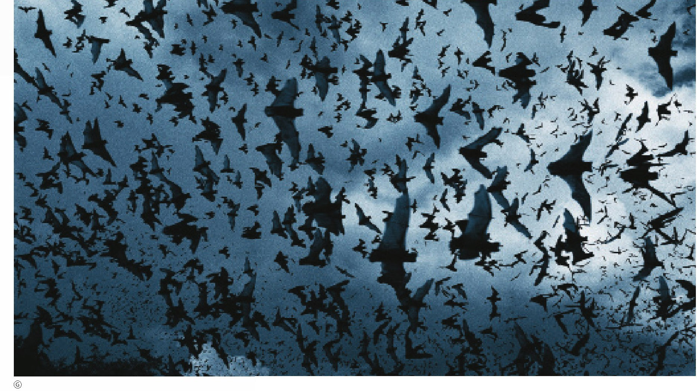
每当黄昏，我们就会看到一群一群的蝙蝠飞出藏身之所，在空中飞舞。它们这是在捕食昆虫呢！这样的“聚餐”活动，一直要持续到黎明时分。而在这个时间段内，绝大多数的鸟儿都休息了，只有少数像猫头鹰这样的夜行性鸟儿才会出来活动。可是，猫头鹰们的活跃是凭借着一双夜眼，那么蝙蝠的视力也很好吗？

蝙蝠的视力还真不算糟，大蝙蝠亚目中除果蝠属之外，都是靠视觉来定位的。但是小型蝙蝠和果蝠主要倚靠的并不是自己的眼睛，而是另一项技能——回声定位。在蝙蝠的口鼻部有着特殊的发声结构，能够发出人听不到的超声波。也就是说，这些蝙蝠其实都在不停地大声嚷嚷，只是人听不到而已。这些声波一旦遇到障碍物就会被反射，然后传到蝙蝠的大耳朵里，最后在它的大脑里加以分析，蝙蝠就知道周围的情况啦。

可是，蝙蝠往往是成群活动的，它们的声波会互相干扰吗？不会。每个蝙蝠都有自己独特的声波，它们非但可以在纷杂的声波中准确识别自己的，而且精度很高，不仅能进行飞行路线定位，还能识别出前面是不是有可口的昆虫呢。为此，那些身上长满了细细的绒毛、有利于吸收声波的蛾子，在蝙蝠的探测中可以达到“隐身”效果，避开蝙蝠的杀戮。蝙蝠和蛾子双方的适应性演化，就是当代雷达和隐形飞机的蓝本。

除了回声定位之外，蝙蝠还能感应地磁、借助磁场辨别方向。正是因为有了这些绝技，蝙蝠才能在黑夜中游刃有余地飞行。（冉浩）

## 蝙蝠为什么要倒挂着休息

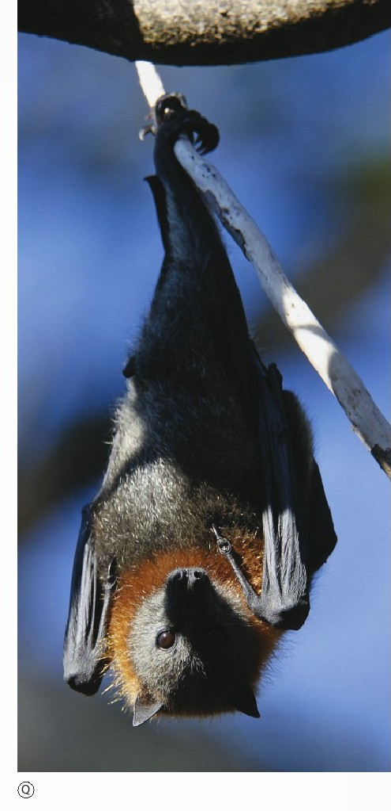
蝙蝠的休息方式在动物界可谓相当奇怪，别的动物都是正着睡，它们却是脑袋朝下，倒挂着睡。这“挂觉”有什么好处吗？

原来，蝙蝠的后肢短小，不能支撑行走，只能靠前肢爬行，而如果它们爬行的话，速度既慢又笨拙。更糟糕的是，它们的后腿也不能弹跳，不能支持它们像小鸟一样迅速地离地起飞。因此，蝙蝠在平地上飞不起来，必须要爬到高处，先滑翔一段距离才能起飞。这样的反应速度，显然是不利于保护自己的。如果蝙蝠在地上做窝，像别的哺乳动物一样在窝里趴着休息，事情就会很糟糕。因为一旦捕食者到来，跑又跑不快，飞又飞不起来，只能干等着被吃啦。

但是在高处挂着倒是一个好选择，一来视野开阔，二来一旦有个风吹草动，可以迅速起飞。还有，蝙蝠的皮肤是很敏感的，蹭到东西会很难受，倒挂就不一样了，除了脚趾抓着东西，四周都是空气，也不用担心硬物划伤了宝贵的翅膀。（冉浩）

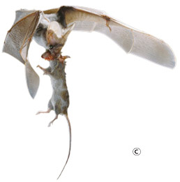
  

**【微博士】**蝙蝠与传染病

蝙蝠捕食害虫，是对人类有益的动物。不过，一些新病毒的暴发和老病毒的死灰复燃与蝙蝠有一定关系。如1994年澳大利亚暴发的亨德拉病毒，1997年澳大利亚暴发的梅南高病毒，1998年马来西亚暴发的尼巴病毒等。此外，乙型脑炎病毒、SARS病毒、埃博拉病毒等很多病毒都可以通过蝙蝠传播。因此，人类要避免与蝙蝠过度亲密的接触，保持一定的安全距离。

【微问题】都说早起的鸟儿有虫吃，为什么蝙蝠要在黄昏出来吃虫呢？

【关键词】蝙蝠　翼手目　进化　回声定位　倒挂

## 河马为什么长时间潜在水里

河马分布在非洲，是仅次于大象和犀牛的第三大陆地动物。平时，它喜欢呆在水里，只露出一个头顶在水面。为什么河马喜欢泡在水里呢？

现存河马有两种：一是普通河马，肩高约1.5米，体长3～5米，平均体重近2吨，有的能到4.5吨；另一种是倭河马，体形较小，肩高不足1米，体长不足2米，体重小于300千克，生活在丛林里，现存数量很少。两种河马都喜欢呆在水里“泡澡”，不同的是：普通河马喜欢成群泡，一般群体数量5～30头，多时可达100头，而倭河马的性格比较孤僻，喜欢独自或一对泡在一起。为了适应水里的生活，河马的五官位置发生了变化，鼻子、眼睛和耳朵都生在头脸的上部，这样泡在水里也照样能呼吸畅通，眼观四方。

河马之所以喜欢泡澡，有两个原因：一是非洲的天气实在是太热了，太阳又毒，虽然河马皮肤含有“防晒剂”类物质，但还是躲在水里凉快，也免去蚊虫叮咬之苦；二是河马身体笨重，跑不快，虽有长牙巨口可以自卫，但转动不灵活，防御鬣狗、狮群等太吃力了，呆在水里比较安全。如果想上岸吃草解馋，还是晚上偷偷跑上去吃才好。（冉浩）

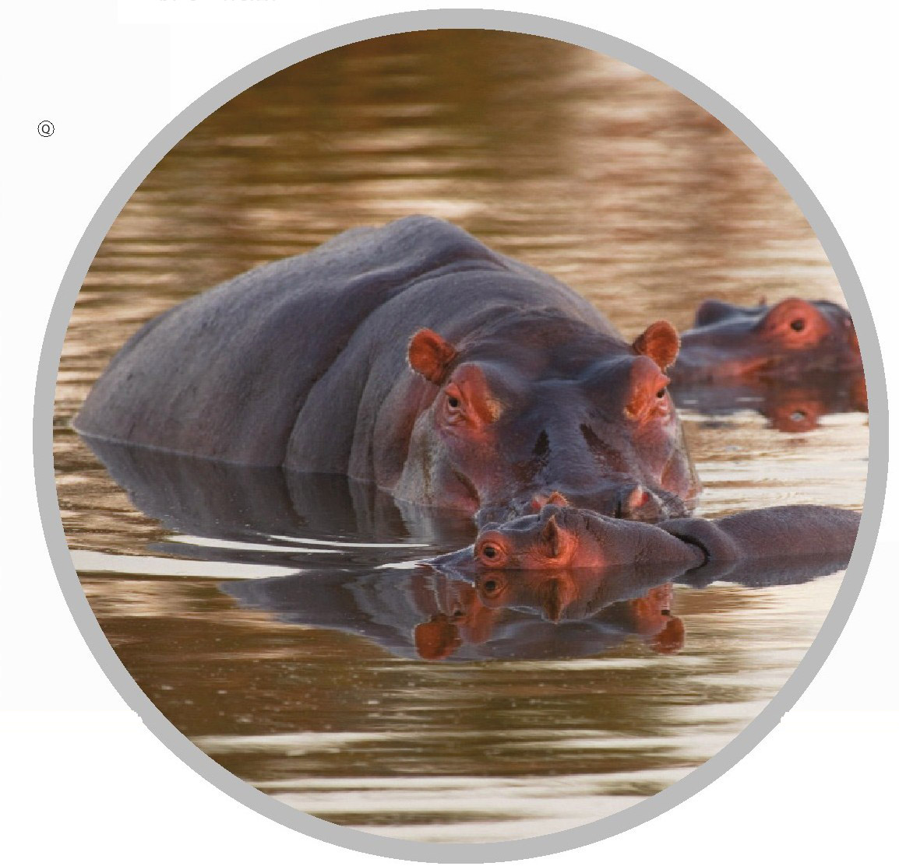
## 河狸为什么要修水坝

在有河狸出没的地方，人们常常可发现，原本畅通的河道或溪流中会冒出一些树枝堆，形成了一座可供人们步行通过的柴禾桥。是谁做的好事？没有别人，只有河狸。

河狸是半水生性植食啮齿动物，体长可达1米，体重可达30千克，产于欧亚大陆，善于用它们锋利的门齿咬断树枝，在河流中修筑水坝，被誉为“动物界的建筑师”。中国的河狸为蒙新亚种，仅分布于新疆阿尔泰地区乌伦古河水系的河谷森林中，是国家二级保护动物。

河狸以幼嫩的小树为食，以灌木和中型的乔木作为构建巢穴的材料，用来防御捕食性动物的攻击。河狸夏季分散居住，冬季则集中居于越冬巢中，还开掘暂居洞。在一个河狸家族栖居的巢穴区域内一般围绕越冬巢分布，距离越远，洞穴的数量越少。河狸筑巢在水中央，巢口一半在水上，一半在水下，这样，陆生天敌就很难接近，而自己则出入自如。有时候，因为水位上升将要淹没巢口，河狸不得不啃咬“天花板”取土，垫高巢室，结果有时会把“天花板”咬破，不得不在屋顶堆起树枝和土进行修缮，形成一个地面巢和一个新巢室，下次水位上升就直接迁至新巢室躲避。遇到大旱之年，水位下降，巢穴就有大暴露的危险，那可就非常不妙了。这时河狸又想法子啦，它们在巢穴下游筑起大坝，形成一个小型水库蓄水，来抬高水位，使洞口始终维持在水面上下。大坝由树枝和泥石分层筑成，非常坚固，可以长达10多米，人走在上面都不会有问题。

河狸在主动改变和塑造环境方面的才干，令人叹为观止。（冉浩）

## 白鳍豚为什么找不到了

白鳍豚是中国长江特有的国宝，2000多万年以来一直生活在中国的南方水系中，享有“活化石”的美誉。曾几何时，每逢天气骤变之前，气压变低，白鳍豚就会跃出水面换气，它们那美丽的身影提醒着江上渔民，暴风雨就要来啦。江民们感激而敬畏地将它视为保护神，更留下了很多传说，有“长江女神”的美名。

但近年来，白鳍豚数量锐减，20世纪80年代初有400头，1990年为200头，到1995年只有不足100头，1997年这一数字降为13头，到了1999年仅剩下5头！2002年，一头活的白鳍豚被拍摄到——这竟成为野生白鳍豚最后的真实记录。2002年7月，唯一人工饲养的白鳍豚“淇淇”病死，白鳍豚在人们的视野中消失了。

白鳍豚在短短数十年间就走到了尽头，人类有不可推卸的责任。过度捕捞使长江鱼类减少，白鳍豚食物减少，使本来就不高的繁殖率进一步降低。炸药、电击、滚钩、投毒和迷魂阵等非法捕鱼方法更使白鳍豚误伤不断：20世纪70至80年代，至少有一半的白鳍豚死亡是由滚钩和炸鱼所造成的，其中1978-1985年间就有6头白鳍豚死于炸鱼；到了90年代，有40%的白鳍豚死亡是由电动捕鱼所造成的，1990年3月发现的一头死亡雌性成年白鳍豚身上竟缠有36枚滚钩！

长江航运密集，马达的轰鸣声也干扰了白鳍豚的回声定位，造成白鳍豚搁浅不断；而转动的桨叶也如死神，死亡白鳍豚中有6%为桨叶击毙，在下游则高达32%。此外，水体污染也是重要原因，大小堤坝的修建阻断了鱼类和白鳍豚的活动。部分施工单位清理水道野蛮粗鲁，例如某部门在湖北省洪湖市燕窝镇实施爆破清理，将一个4头白鳍豚的小群体全部炸死，其中还有两头怀孕的雌豚，让人心痛不已！

2006年，六国学者进行了38天的大规模考察，悲哀的是，竟一无所获。2007年，六国科学家署名发表了《首例人为原因导致的鲸类灭绝？》一文，认为白鳍豚可能已灭绝；英国《独立报》更以《中国之魂已部分丧失》为题报道了这一事件。尽管有人认为这一说法为时尚早，但也无法回避一个事实：即使白鳍豚仍在长江流域生存，其数量也已少到不足以维持种群生存的地步，灭绝已不可避免。水生动物专家王丁说：“‘寻找白鳍豚’是一个悲壮的过程。我们不能肯定最终可以达到目标，希望小到我们不知道自己还能做什么；然而我们还是要创造希望，还是要去做，还是要尽最大的努力。”（冉浩）

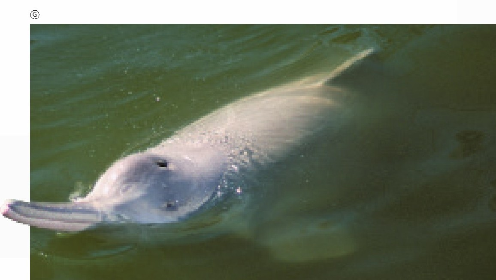
  

**【微博士】**江豚

江豚体长约150厘米，重100～200千克，在沿海和各大河口均有分布，在中国共3个亚种，长江流域为江豚扬子亚种，是长江除白鳍豚外的另一种鲸类动物，分布至长江中下游。扬子江豚已经濒危，如不采取有力措施，将于10多年后重蹈白鳍豚的覆辙。

【微问题】怎样才能唤起大家对长江生态保护的关注？

【关键词】河马　河狸　筑巢　白鳍豚

# 鸟类

## 先有鸡还是先有蛋

这是一个著名的话题。之所以著名，是因为这个问题看似简单，却很难回答。选择任一答案似乎都会陷入悖论的处境：如果是先有鸡，那么这只鸡从何而来？因为所有的鸡都是从蛋中孵化出来的，没有蛋哪来的鸡？如果说先有蛋，那么同样，这只蛋从何而来？必定要有鸡，才能产下这只鸡蛋，没有鸡哪来的蛋？这里的蛋是特指鸡蛋而言。如果没有这个界定，那这个问题有其他多种不同的解读和回答。

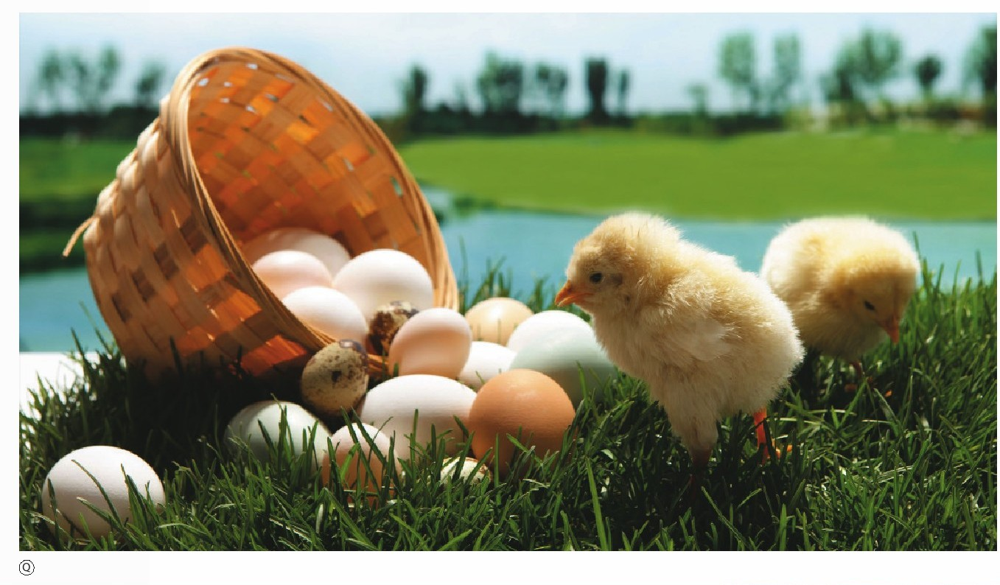
如果这儿的鸡是特指鸡或者其他鸟类，而蛋则不限于鸡蛋或者鸟蛋，而是泛指所有的蛋，那么显然是先有蛋。因为从鸟类的祖先爬行动物开始就通过产蛋繁殖，蛋出现的时间远较鸟类出现早。

如果这儿的鸡特指鸡类，而蛋是泛指所有的鸟蛋，那显然也是先有鸟蛋，然后才有鸡类。因为最早出现的鸟类就是产蛋的，而鸡类是后来才从早期鸟类中分化出来的类群。

这个问题只有表述为“先有鸡还是先有鸡蛋”或者是“先有鸟还是先有鸟蛋”时，才是一个难回答的问题。因为它既是一个科学问题，也是一个哲学问题。要回答它，既要了解物种的形成原理，也要理解量变和质变的辩证关系。

物种形成是生物进化的核心。一个新物种从旧物种中分化出来要经历三个环节：基因突变、自然选择和生殖隔离。通过基因突变和自然选择，原有物种的不同种群逐渐产生分化。这个分化是一个量变的过程，只有当分化累积到一定程度，产生了生殖隔离，也就是说两个种群间不能杂交产生可育后代之后，这两个种群就变成了两个物种，新物种就形成了。

物种形成大都需要一个长期的过程。相对于物种形成过程来说，从鸡到蛋，或者从蛋到鸡的过程是非常短暂的。从这个意义上来说，鸡和鸡蛋，或者鸟和鸟蛋几乎是同时出现的。如果非要分出先后，那要看导致物种形成的最后突变发生在哪个阶段：如果是在蛋发育到鸡的阶段，则可以说是先有蛋后有鸡，如果是在鸡产生蛋的阶段，则可以说是先有鸡后有蛋。（黄秦　陈水华）

  

**【实验场】**观察小鸡出壳

观察小鸡孵化是件很有意思的事情。在适宜的温度下，小鸡的孵化期是21天，从第20天开始，就可以听到雏鸟啄壳的声音。你会看到，蛋壳上先破了一个小洞，在之后的一天时间里，啄壳的声音会不断持续，蛋壳上的裂纹也不断增大，最后小鸡用自己身体的力量把壳挣破，孵化期才会结束。这个时候小鸡的喙还比较柔软，那它们是怎样把坚硬的蛋壳给啄破的呢？

原来，在小鸡喙部的末端，有一个坚硬的突起，称为卵齿。卵齿由角蛋白组成，在爬行动物的身上，也有类似的结构。人为帮助小鸡破壳很容易造成它的死亡，只有依靠卵齿自行将壳啄破，小鸡才能孵出，它们的存活率才较高。小鸡出生几小时后，卵齿自然脱落。

## 为什么鸟要孵蛋而乌龟不用孵蛋

在很多动物纪录片中，我们常常能看到这样的场景，亲鸟趴在窝里孵蛋，并且喂养刚出生的雏鸟直至其能独立活动；乌龟则只是把蛋产在水边的泥地里，用泥土埋起来，一段时间后，小乌龟自己会啄破壳爬出来，开始自己的生活。为什么只有鸟才需要孵蛋而乌龟不用呢？

鸟蛋和乌龟蛋的基本结构类似，形状略有不同，鸟类的蛋多为椭圆形或球形，乌龟的蛋多为长柱形（其中海龟的蛋形似乒乓球）。蛋的外层覆盖着坚硬的石灰质外壳和羊膜，羊膜里面包裹着胚胎及胚胎发育所需的营养物质，即卵白和卵黄。胚胎发育是个复杂的生理过程，需要一个适宜的环境温度。鸟类是恒温动物，可以通过新陈代谢产生热量。繁殖期的鸟会在腹部形成一块裸露的孵卵斑，亲鸟通过孵卵斑将热量传递给蛋，使其温度保持在适宜的范围。乌龟则是冷血动物，新陈代谢产生的热量极为有限，主要通过晒太阳等方式来获得热量。因为无法维持恒定的体温，乌龟当然不可能孵蛋，只能通过将蛋埋在泥土中或沙中来给胚胎提供一个较为恒定的外部环境。

其实，不只是乌龟如此，其他爬行动物也不孵蛋。孵蛋是温血动物，或者说恒温动物才有的繁殖方式。（黄秦　陈水华）

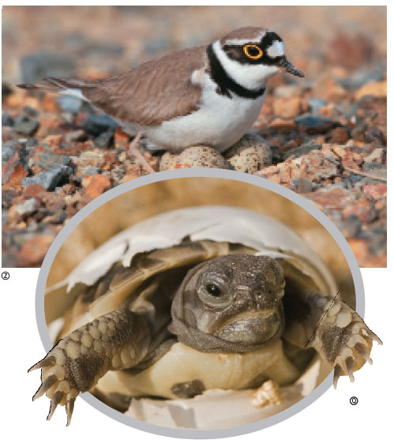
在孵蛋的环颈鸻（上）；自己破壳而出的小乌龟（下）

## 为什么小鸭子出生不久就能独自活动

在纪录片中我们可以看到这样的场景：刚刚出生的小鸭子便能跟着父母一起走路、游泳；而屋檐下的燕子，出壳后连眼睛都睁不开，要在出生10多天后才能离巢活动。鸭子和家燕都是鸟类，为什么两者的孩子差别这么大呢？

刚刚孵化出来的小鸟，依照其觅食、活动及保持身体恒温的能力，可以分为早成型和晚成型两个基本类型。早成型的鸟，出壳时眼睛就已经睁开，身体表面长有绒羽，几小时后就可以跟随父母活动取食。鸡类和鸭类就是典型的早成鸟。大部分的雀形目鸟类，如家燕，是晚成型的鸟，刚刚孵化出来的小鸟，眼睛是紧闭的，身体表面全裸，不能保持恒定的体温，食物也全靠父母提供。

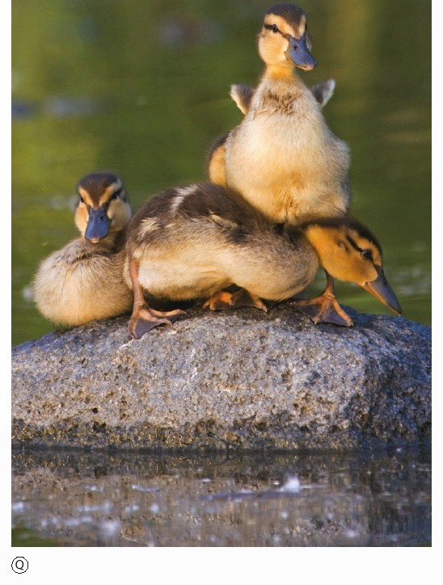
在这两种类型之间，还存在着一些过渡类型，如鸥类的雏鸟，出壳时长有稀疏的绒毛，有一定的活动能力，但基本还是留在巢的附近，属于半早成型。所以，不同的鸟儿会有不同的发育类型，这是不同物种对环境长期适应和自然选择形成的结果。（黄秦　陈水华）

  

【微问题】鸟类的体温是多少？

【关键词】鸟蛋　孵化　早成鸟　晚成鸟

## 为什么母鸡不交配就能下蛋

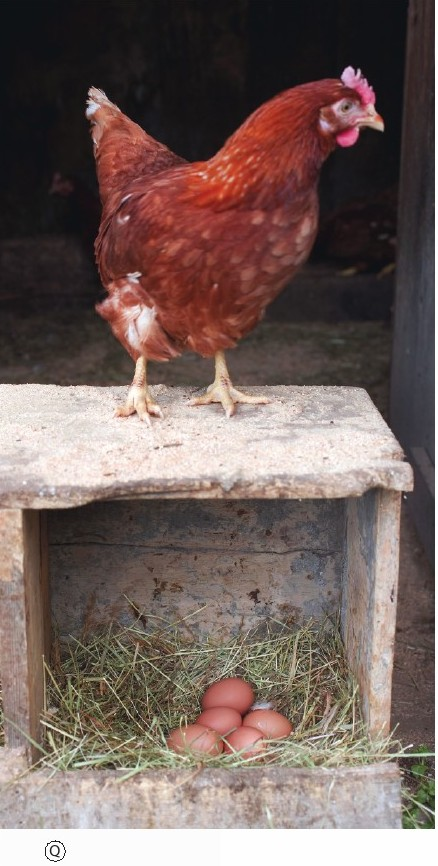
鸡蛋是人们非常熟悉的食品之一。市场上大量的鸡蛋供应，主要依靠现代化的养鸡业。我们知道，家鸡是由野生的原鸡人工驯化而来的。可是野生鸟类，往往都是交配后才会下蛋。而人工养殖的母鸡，无论散养或是笼养，都可以在不交配的情况下下蛋，这是为什么呢？

野生鸟类为适应飞行活动，在非繁殖期，其生殖器会处于显著萎缩状态，以减轻体重。进入繁殖期后，在性激素的调控下，生殖系统才会迅速发育并开始产卵。家养的母鸡，因为很少飞行，并且有充足的食物，生殖系统并不会萎缩。

母鸡的卵巢中，密布着约4000个初级卵母细胞。当小鸡长大到性成熟后，生殖系统便一直处于活跃状态。这些初级卵母细胞会逐日发育成熟，并逐个排出进入输卵管。发育成熟的初级卵母细胞在卵巢内包裹上卵黄物质，进入输卵管后再包裹上卵白、卵膜和硬质的卵壳，最后形成鸡蛋，排出体外。

母鸡产卵的现象，和雌性灵长类动物的月经周期类似，与是否和雄性交配过无关。若母鸡与公鸡交配，精子便会与初级卵母细胞结合，形成受精卵。这样产下的蛋是种蛋，能够孵出小鸡。如果母鸡未交配，则产下的是未受精蛋，是孵不出小鸡的。我们平时吃的鸡蛋，基本都是未受精蛋。

家养母鸡和野生雌鸟，只要生殖系统处于活跃状态，无论是否与雄性交配，都会产卵，只是自然界中的雌性鸟类，卵细胞只在繁殖期间发育，这就形成了母鸡不交配就能下蛋的现象。其实，自然界中的野生鸟类也会在不交配的情况下产下非受精卵，只是这种现象较为少见。（黄秦　陈水华）

## 为什么母鸡可以一直下蛋

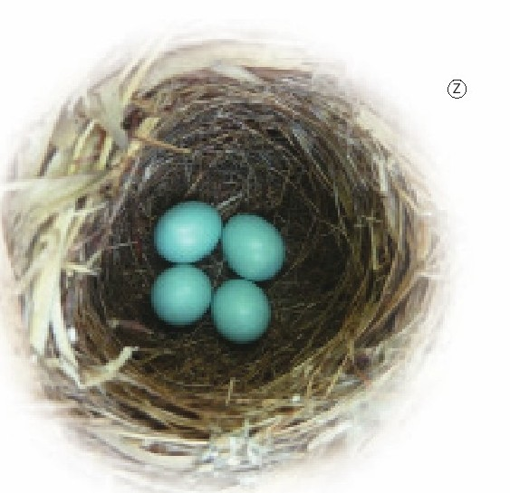
棕头鸦雀的巢和蛋。棕头鸦雀是一种有固定窝卵数的鸟类

去养鸡场参观时，我们会发现，在产蛋期，基本每只母鸡每天都能产下一枚蛋，一年下来可以产下200多枚蛋。而多数野生鸟类，每窝所产的蛋都是限定的。这又是为什么呢？

在繁殖季节，野生鸟类一窝所产的蛋的数量是相对固定的，这个数量因鸟类种类的不同而有所不同，称为窝卵数。窝卵数是在长期的自然选择中逐渐形成的。亲鸟产下的蛋过少，会影响个体基因的传递和散播。亲鸟产下的蛋过多，又超过了亲鸟的抚育能力。因此，在环境、食物等多种条件的共同作用下，每种鸟类都形成了自己相对稳定的窝卵数。

虽然鸟类的窝卵数相对稳定，但仍分为定数和不定数两类。不定数的鸟类，如雉鸡、天鹅等，它们在孵化时，如果一窝蛋中的一枚破损或被其他动物吃掉，雌鸟往往会再产下一枚，使得巢中蛋的数目保持相对恒定。如果每天从雉鸡的巢中取走一枚蛋，雌鸟就会补产一枚。不过，因为产卵要消耗很多能量和营养物质，所以野生鸟类的补卵行为有一定的限度。家鸡是在距今约8000年前，由红原鸡驯化而来，其产卵习惯也是不定数。由于在人工喂养的条件下，母鸡可以获得足够的营养，因此，在它开始产卵后，只要每天取走它产下的蛋，就能诱使母鸡不断地产蛋。这就是母鸡高产的原因。

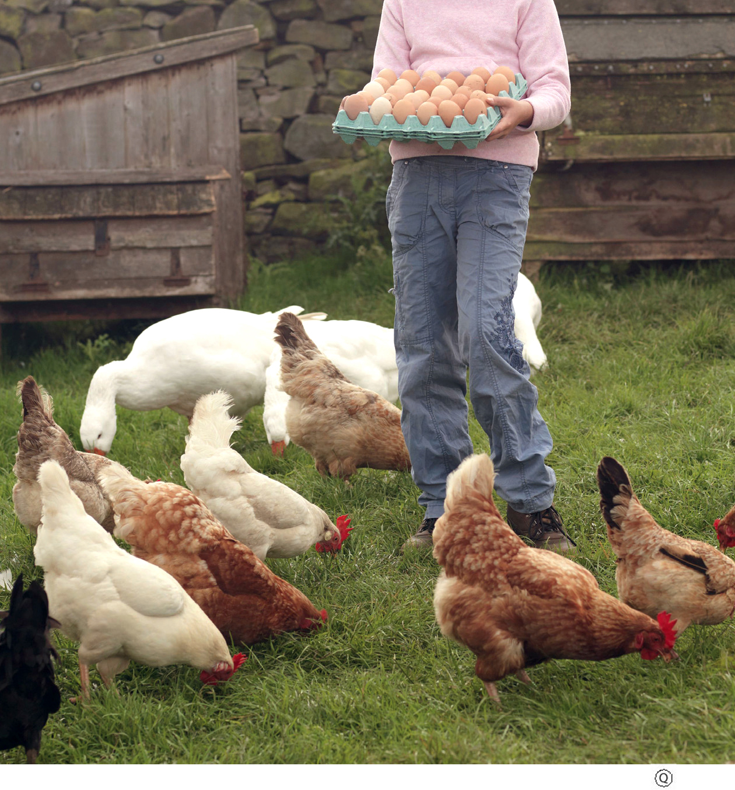
产卵定数的鸟类如金雕、棕头鸦雀等，在每次繁殖时只产固定数目的蛋，然后就开始孵化。如金雕通常产2枚，棕头鸦雀3～5枚。如果巢中的某只蛋破碎或者被捕食，这类鸟的亲鸟不会补卵，而是继续孵化其他的蛋。（黄秦　陈水华）

## 鸟类为什么要在春季繁殖

春季是生机盎然的季节，草长莺飞，草木葱茏。在温带及高纬度地区，多数鸟类会选择在春季开始繁殖。这些鸟类在繁殖时间上有着高度一致性，其内在的机制是什么呢？

其实，决定鸟类繁殖时间的主要因素是食物。野生鸟类在整个繁殖过程中，不但自身需要消耗大量的体能和营养物质，而且刚出壳的雏鸟也需要大量的食物。春天，气温开始回暖，植物的嫩芽、花汁液充足，营养丰富；各种昆虫、蜘蛛、蚯蚓和鼠类的活动也都更为频繁。不管是食草的雁类，还是食肉的猛禽，或是杂食性的白头鹎等小型雀鸟，都可以在这一时期找到丰富的食物。

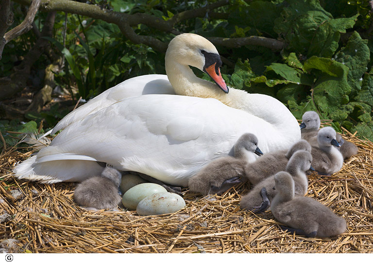
因此，绝大多数的温带鸟类选在温暖的春天开始繁殖。如果到了夏季还有足够的食物资源可以利用，有些小型的雀鸟如戴菊、家燕等会抓紧时间，繁殖第二次甚至第三次。大型的鸟类，如天鹅、白鹤、金雕等，由于体形较大，雏鸟生长发育需要的时间较长，每年只能繁殖一次。

对于那些生活在四季不分明地区的鸟类来说，一年中不同月份能够获得的食物总量基本上是一致的。因此，热带鸟类的繁殖时间相对不固定，如印度洋姐妹岛上的褐翅燕鸥，每7个月就能繁殖一次。而鸽形目的不少种类，因为雏鸟在发育初期是吃亲鸟嗉囊分泌的半固体状鸽乳长大，受食物限制因素较小。有些种类，如珠颈斑鸠，在寒冷的冬季亦会繁殖，每年的繁殖次数甚至能多达4～5次。

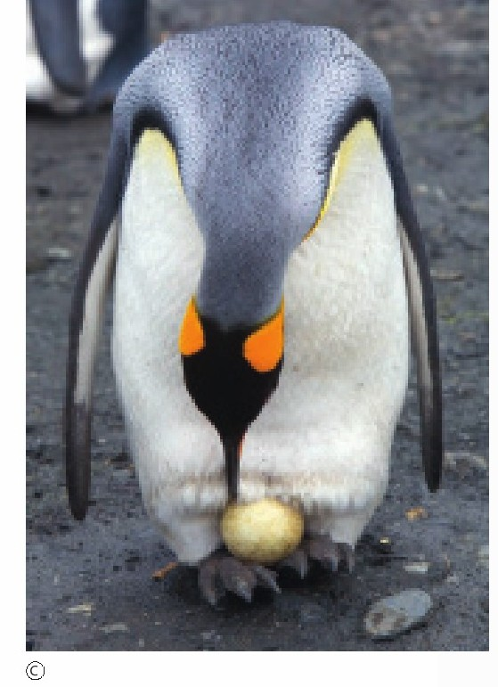
生活在南半球的帝企鹅更为特殊，繁殖期较长，它们在南极的秋末产卵，雏鸟会在下一年的春初孵化出来。到那时，它们刚好能赶上富饶的春季，生长发育就没有问题了。（黄秦　陈水华）

  

**【微博士】**孵化期

孵化期是指鸟类在繁殖时，从产下最后一枚蛋到第一只雏鸟出壳所需的时间。不同鸟类的孵化期有很大的差别。雀形目的鸟类一般都较短，如白头鹎为11天。大型鸟类，如黑眉信天翁，孵化期可达80天。家鸡的孵化期则为21天。一般来说，大型鸟类产下的蛋体积较大，发育成雏鸟需要的时间较多，其孵化期也较长，早成型的鸟类会比晚成型的鸟类需要更多的孵化时间。

【微问题】散养鸡和圈养鸡生的蛋营养价值有区别吗？

【关键词】窝卵数　食物　孵化期

## 鸟儿为什么能飞起来

飞行是一种让人类极为羡慕的能力，飞天之梦是人类最大的梦想之一。从《韩非子·外储说》中记载墨子制造“木鸢”的故事到1908年莱特兄弟实现第一次飞行，人类借助工具才实现了飞行的梦想。人类在天空中飞行不过百年时间，鸟类在空中却已经飞行了1.5亿年。鸟儿为什么能飞起来？

目前普遍认为，鸟类起源于1.5亿年前晚侏罗纪的兽脚类恐龙。由于生存的压力，如觅食和避祸，鸟类祖先的前肢结构逐渐改变，并出现了早期的羽毛，获得了滑翔的能力。新的运动方式极大地拓展了鸟类的生存空间，广阔的空中生态位优势促使鸟类向适应空中生存的方式演化，使鸟类最终飞上了天空。

飞行需要强有力的翅膀来拍击空气产生升力和推力。与昆虫、蝙蝠等其他会飞的动物不同，鸟类的翅膀由一片片排列规则的分级的羽毛组成，能通过不断改变翅的形状、大小以及翅与身体间的角度，来满足飞行的空气动力学要求。鸟的尾翼张开时如扇子，能在飞行中起舵的作用，有助改变方向、减速和着陆。

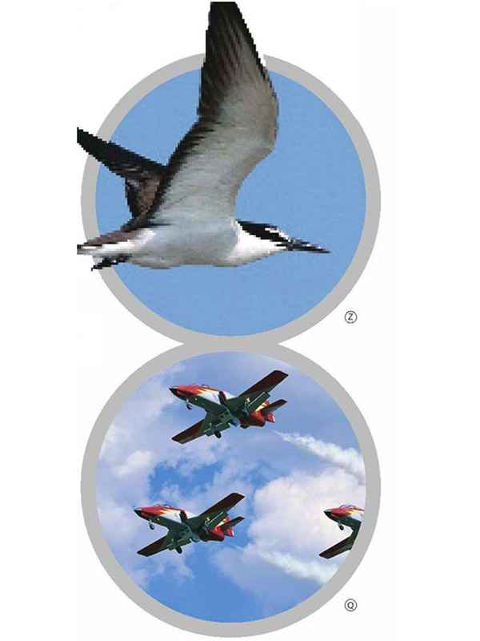
对比一下飞行中的鸟类和飞机，看起来是不是很相似呀

飞行需要减轻体重。现有会飞的鸟类身体最重的约为15千克，如大鸨、兀鹫和鹈鹕等。为了减轻体重，鸟类的牙齿消失，尾骨退化，许多部位的骨骼愈合或成中空。鸟类骨骼重量只占全部体重的5%～6%，相比之下，人类骨骼的重量要占到身体重量的20%左右。另外，鸟类的右侧卵巢和输卵管退化，连膀胱也没有了，使得粪、尿只要形成就会排出，绝不在体内停留。

飞行还需要消耗大量的能量。为了适应飞行，鸟类演化出了复杂的气囊系统与肺部连通，使得鸟类的呼吸系统非常高效。此外，心脏的容积扩大，血流迅速，新陈代谢加快，为鸟类的飞行提供了所需的能量。

鸟类飞行是长期演化和自然选择的结果，除了鸵鸟、企鹅、几维鸟、鸸鹋等，地球上现存的绝大多数鸟类都会飞行。当然，由于适应各自的环境，不同鸟类的飞行能力和飞行方式不尽相同。（黄秦　陈水华）

  

**【科学人】**达·芬奇

说起达·芬奇，都会想到著名油画《蒙娜丽莎》。这位意大利文艺复兴时期的伟大画家，同时也是一位学识渊博的科学巨匠。在天文、物理、医学等许多领域，都有杰出的建树。在航空史上，达·芬奇同样也是一位伟人。他精通解剖学，曾深入地研究过人类如何模仿鸟类飞行，设计过靠上下拍打的人工翅膀飞行的机器，这便是早期飞机的雏形——扑翼机。他实际上是降落伞和直升机的最早设计者，还设计出了许多类似今天动力航空器的装置。

## 鸵鸟和企鹅为什么不会飞

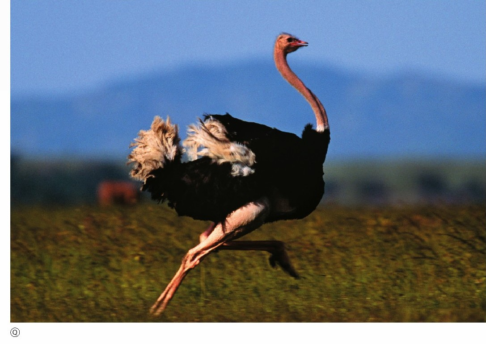
鸵鸟和企鹅，相信大家都不陌生。鸵鸟是现存体形最大的鸟类，主要生活在非洲大陆。肥硕的身体、健壮的大腿、细长的脖子和小小的脑袋给我们留下了深刻印象。企鹅主要分布在南半球，是海洋性鸟类。企鹅身体滚圆，走起路来左右摇摆，非常可爱。从外形上，鸵鸟和企鹅并没有相似之处，但它们都有一个共同的特点：不会飞行。

鸵鸟和企鹅为什么不会飞呢？化石研究表明，鸵鸟、企鹅、几维鸟、鸸鹋等大约在6500万年前至3400万年前之间，各自演化成了不会飞的鸟，这是鸟类长期适应环境的结果。

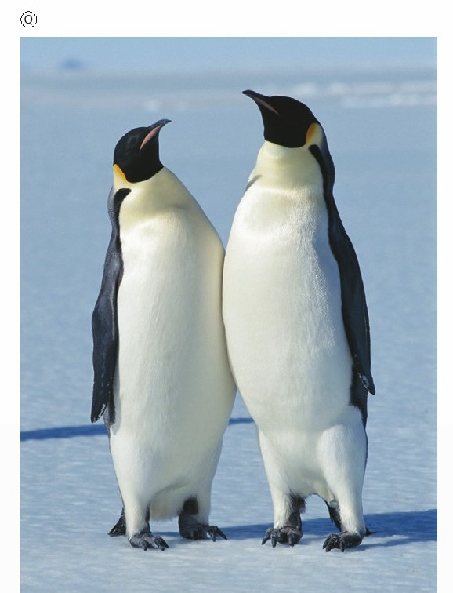
非洲鸵鸟是走禽中的代表，它们的祖先生活在非洲的草原和荒漠中，食物稀少，需要鸵鸟花大量的时间来觅食。它们的双腿变得强壮，仅有两趾的爪更适应奔跑，其中能对抗草原上的捕猎者的大型鸵鸟获得了更多的生存机会。然而硕大的体形却使飞行变得困难与不可能，翅膀变得多余而逐渐退化。失去了飞行能力的鸵鸟，体重甚至可以达到115千克。

企鹅主要分布在南极和亚南极地区，以海中的鱼虾为主要食物。为了抵御寒冷，它们的身体储存了大量的脂肪而变成椭圆的流线型，这样的体形不利于飞行，却非常适合潜水捕鱼。企鹅的翅膀也因飞行功能的丧失而退化成强壮的鳍状肢，使它们在水中可以快速游动。（黄秦　陈水华）

## 渡渡鸟为何会灭绝

渡渡鸟是一种曾经分布于印度洋毛里求斯岛的不会飞的鸟类。体形较大，可达1米多高，20多千克重，外形像鸽子，是鸽子的近亲。

1507年，葡萄牙人进入毛里求斯岛时，将这种身体肥胖、腿骨矮粗、翅膀短小的鸟，叫作渡渡鸟（dodo，在葡萄牙语中是愚笨的意思）。由于它们走路蹒跚，很容易被捕捉。1681年最后一只渡渡鸟被射杀，这一物种便从此从地球上消失。

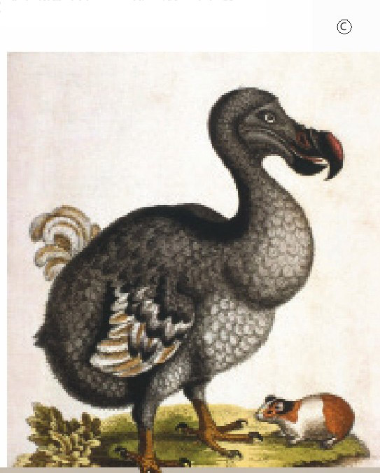
虽然导致渡渡鸟灭绝可能有飓风、水灾等多种原因，但多数研究渡渡鸟的专家认为，人类应该为渡渡鸟的灭绝负责。正是欧洲人对行动迟缓的渡渡鸟的过度捕猎，以及他们带来的猫和狗对渡渡鸟的蛋和幼鸟的捕食，才使得渡渡鸟数量在不到200年内直线下降直至灭绝。（黄秦　陈水华）

  

**【微博士】**渡渡鸟和大颅榄树

1981年，美国生态学家坦普尔来到毛里求斯研究大颅榄树，那时候这种树只剩下13棵了。坦普尔通过年轮测定发现它们的树龄是300岁，巧的是这一年也是渡渡鸟灭绝300周年。这意味着渡渡鸟灭绝可能与大颅榄树绝育相关。

坦普尔随后在渡渡鸟的骨骼化石中发现了大颅榄树的果实，这证实了他的猜想——大颅榄树种子的种皮较厚，需要被渡渡鸟取食后，种皮经过鸟的消化变薄后，随粪便排出的种子才能发芽。作为替代，坦普尔让火鸡吞下大颅榄树的果实，再将其排出体外的种子拿去栽种，这些种子最后长成了幼苗，大颅榄树得以绝处逢生。

【微问题】有永远不落地的鸟类吗？

【关键词】飞行　进化　灭绝

## 大雁如何知道几时开始迁徙

候鸟，如大雁，为了生存的需要，每年都会在繁殖地和越冬地之间来回迁徙，而且它们的迁徙具有较强的时间节律。中国古人很早就注意到候鸟迁徙与季节更迭之间的关系，“几处早莺争暖树，谁家新燕啄春泥”描写的是早春的景象，“鸿雁几时到，江湖秋水多”则预示着秋季到来。在一些偏远的农村，迁徙的候鸟对于生产劳动有着指导作用。如横断山区的苗族居民，便通过金腰燕迁徙回来的时间来决定何时插秧。那么，候鸟是如何知道几时该开始迁徙的呢？

这或许与另外一个问题密切相关，也就是鸟类为什么要迁徙？对这个问题目前还没有一个标准统一的答案。有食物的因素，也有气温的因素。对于某些鸟类来说，一个地方通常不适合它们全年的栖息，它们需要在夏季到食物资源丰富的北方繁殖，以更好地养育后代；冬季到相对温暖的更有食物保障的南方越冬。但研究人员也发现，有些鸟类的迁徙时间似乎和食物、气温的变化无关，它们远在气温和食物资源变化之前就开始了迁徙。因此有研究认为，日照时间也是影响候鸟迁徙的重要因素。春季，北半球的日照时间逐渐增长，鸟类体内的褪黑素水平会降低，性激素水平有所增加。繁殖的冲动，会促使候鸟北归。食物、气温和日照是鸟类迁徙的外在因素，其实，真正决定鸟类何时开始迁徙的是鸟类身体内的生物钟，这台生物钟千百年来受食物、气温和日照的共同调节，已经非常灵敏。

迁徙是一场与时间的赛跑，不能过早也不能过晚。研究表明，虽然雁类较早产卵的个体孵化成功率高，并能养活较多的后代，但过早迁徙对于成鸟无疑是一场冒险，在北方等待它们的可能是温和的春天，也可能还是冰天雪地。而迁徙过晚的话，雁类的雏鸟孵出时间也会较晚，则将会面临食物短缺的危险。选择一个恰当的时间开始迁徙对于候鸟来说就显得尤为重要。（黄秦　陈水华）

## 大雁为什么要排成“人”字飞行

“雁字回时”，描写的是大雁迁徙时候的经典场景：大雁从远方飞来，时而排成“人”字，时而排成“一”字。大雁为什么这样飞行，难道它们是天生的书法家吗？

对于雁类为何排成这样的队列飞行，最著名的解释是“节省能量”。“节省能量”的假说最早是由德国空气动力学家卡尔·韦斯伯格提出的。他通过简单的计算得出，雁类翅膀扇动时会在后方形成尾流涡旋，外侧的涡流方向向上，如果边上的其他大雁刚好处在涡流中，便可以节省体力。这个假说得到了观察验证，体形小巧的候鸟往往成团飞行，体形较大的雁、天鹅才会选择列队飞行，因为它们的身体重很多。

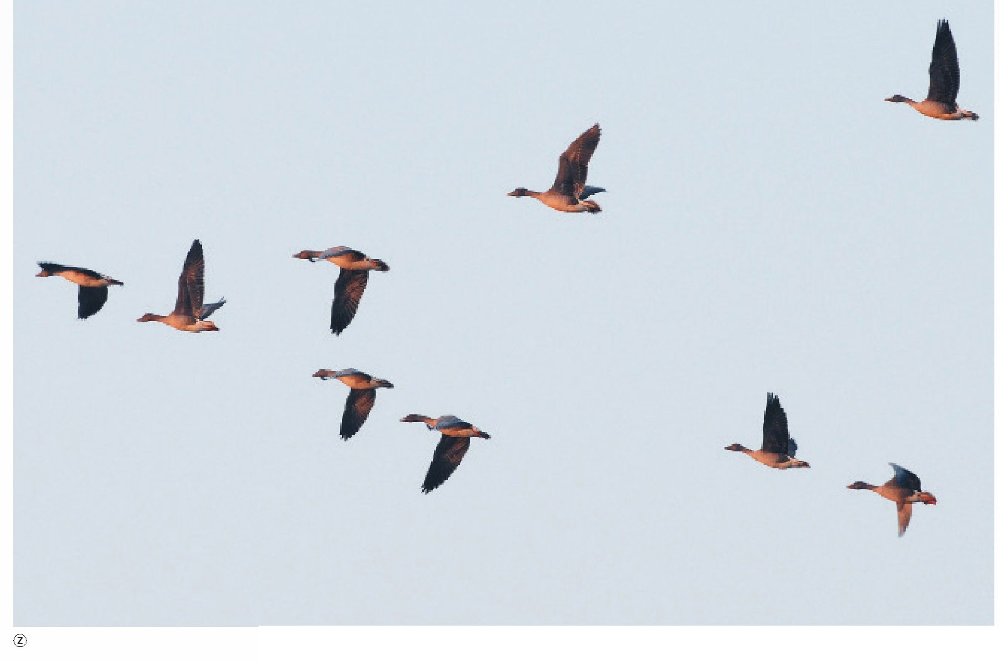
不过质疑的声音还是存在，不少研究者认为韦斯伯格的模型过于简化。即使是修正过的模型，也只考虑了静态情况，大雁在实际飞行中的情况要复杂很多。目前的动物实验也无法完全证明，这样的编队飞行能节省多少能量。但它的另外一个好处却是显而易见的：雁类的眼睛长在头部的两侧，拥有270°的视野，这样的飞行方式至少可以保证队列中的每只鸟都可以看到其他鸟，在飞行时更好地作出调整。（黄秦　陈水华）

## 鸽子为什么不会迷路

鸽子有着卓越的返巢本领，它们被带到遥远的地方放飞后，可以自己找到回家的路。从古罗马时期开始，人们就认识到鸽子的这种能力，并用它来传递信息。鸽子为什么有这种本领呢？

鸽子被带到另外一个地方放飞后，通常要先转几圈以弄清楚所处的方位，然后再朝着基本正确的方向出发。找到回家之路的关键在于脑中要有一套准确的导航系统。目前对于鸽子的导航能力有三种假说，分别是太阳导航、地球磁场导航和嗅觉导航，这三种假说都在实验中得到不同程度的验证。

鸽子在白天飞行时，主要借助太阳的位置来辨认方向。在没有太阳的阴天或者晚上，则主要依靠地球磁场来导航。鸽子的上喙和脑中都存在着磁性物质，像一个微型罗盘，可以感应地磁场的变化。而麻醉实验则表明，嗅觉在鸽子的导航中也扮演着重要的作用，但无法证明它们仅通过嗅觉即可以完成远距离的返巢。

牛津大学的科学家还发现，对于飞过的路线，鸽子可以通过记住路线上的道路和标志性建筑物来指导飞行。总的来说，鸽子可以借助多种不同的方式来找到归巢之路，更多原因还有待进一步发现和验证。（黄秦　陈水华）

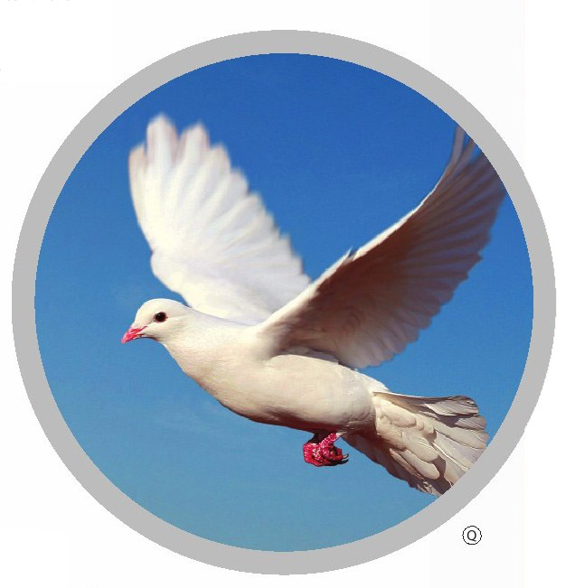
  

**【微博士】**北美旅鸽遭遇人为灭绝

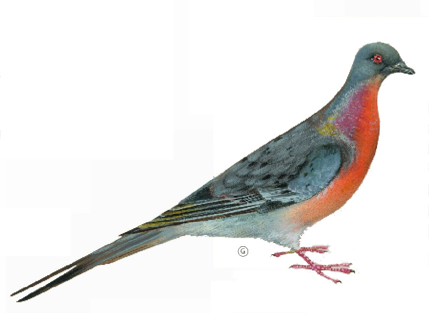
北美旅鸽曾是世界上拥有最大种群的鸟类，个体数量估计达到50亿～90亿只，占当时美洲鸟类数量的24%～40%。就是这样巨大种群的鸟类，由于欧洲人的到达，大量栖息地丧失，旅鸽被作为野味遭肆意猎杀，在短短100多年的时间内，种群数量急剧下降。最后一只北美旅鸽于1914年9月1日死于辛辛那提动物园。

**【科学人】**康拉德·洛伦茨

康拉德·洛伦茨是世界著名的动物行为学家，1903年出生在奥地利维也纳，因其对灰雁行为的研究而闻名于世。他于1973年因在动物个体及社会行为模式上的成就获得诺贝尔生理学医学奖。

除了学术成就之外，洛伦茨最为人称道的还是他的通俗科学作品。他日复一日地观察动物的生活，并将其记录下来。他的书中，描述了雁、天鹅、狗等上百种野生动物及家养动物的生活与行为习性，趣味盎然，受到世界各地人们的喜爱，其中最著名的是《所罗门王的指环》和《雁语者》。

【微问题】鸟类会在夜间迁徙吗？

【关键词】大雁　旅鸽　迁徙　导航

## 鸟类为什么没有牙齿

如果你仔细观察鸟类的取食，你会发现，不论是种子、果实，还是昆虫，鸟儿都是一口吞下，从不咀嚼。即便是一条大鱼，也是头朝里，直接塞在嘴里，顺喉咽下。对于无法吞下的大的食物，有些鸟类，比如猛禽，则会用利爪和带钩的喙撕扯成小块，再一口一口吞下。鸟类为什么不咀嚼食物？我们再进一步观察就会明白，原来鸟类的嘴里根本没有牙齿，它的嘴有一个专门名称，叫作喙。鸟喙由上下颌构成，主体部分是轻薄、坚硬而且光滑的骨骼，外面覆盖一层质地较软的角质蛋白。有些鸟类，如雁鸭类，在喙的两侧边缘有锯齿或栉状突，但那是由表面一层角质结构组成的，不是真正的牙齿。这些角质的“牙齿”有助于它们取食水草或者其他食物。

即使像鹰这样的猛禽的嘴巴也没有牙齿

鸟类既然是从爬行动物进化来的，而爬行动物普遍具有牙齿，鸟类为什么没有牙齿呢？化石资料告诉我们，最早的鸟类确实和爬行动物一样，上下颌都有完整的牙齿。但随着时间推移，这些牙齿逐渐减少，乃至消失，具有锋利牙齿的爬行动物的嘴也演变成了轻便无齿的鸟类的喙。为什么会发生这种演变，或者说这种演变对于鸟类来说有什么好处？

首先，没有牙齿也就不需要强大的颌，以及相应的肌肉，这有助于减轻鸟类头部的重量，利于鸟类的飞行，例如鸽子头骨的重量仅占其体重的0.2%。其次，鸟类过着飞行的生活，活动强度大，新陈代谢快，每天需要消耗巨大的能量。为了满足需要，它们就要不断地寻找食物，尽快加以吞食和消化，这也导致它们不可能像爬行动物那样通过细嚼慢咽来粉碎和消化食物。相应地，鸟类进化出了一套特殊的消化系统，被吞下的食物首先贮藏在发达的嗉囊中，经软化磨碎后，再由消化系统的其他部分陆续加以消化和吸收。（陈水华）

## 鸡为什么要吃小石子

鸡喜欢在地上东觅西啄，除了啄食可吃的食物之外，还常常拣沙粒或小石子吃。是鸡太饿了，还是不小心错把石子当食物了？似乎都不是，因为鸡吃饱之后，还是要寻找沙粒和小石子吃。这到底是怎么回事呢？原来，鸡是没有牙齿的，它吃东西不咀嚼，都是囫囵吞下。可是食物必须磨碎了才好消化，于是，鸡就啄食一些沙石吃进肚子里，帮助消化食物。

不只是鸡，很多鸟类都有这个“嗜好”。尤其是那些像鸡一样吃种子等坚硬食物的鸟类。它们先把食物储存在位于喉部的一个叫嗉囊的地方，然后慢慢输送到胃里，依靠小石子将其磨碎，再进一步消化吸收。多数鸟类的胃包括紧密相连的两部分：前胃和后胃。前胃较柔软，充满腺体，胃液就是在这儿分泌出来的。后胃壁较厚，附着许多肌肉，表面还有坚硬耐磨的角质层，这层东西在鸡胃里，就是我们熟悉的鸡肫内的一层“鸡内金”。后胃是包含石子磨碎食物的地方，因此也被称为砂囊。

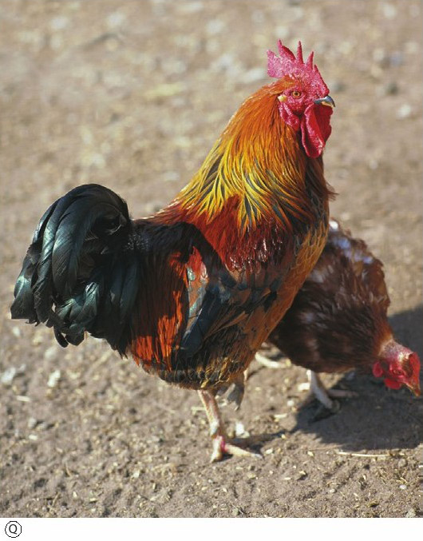
当然，也不是所有的鸟类都要依靠石子来磨碎食物，那些肉食性的鸟类，它们更多地依靠腺体和细菌来分解、消化食物。而那些吃水果的鸟类，则常常连明显的胃都没有，只有一条直直的消化管道，消化和吸收在食物通过管道的过程中就直接完成了。（陈水华）

## 鸟类的嘴为什么多种多样

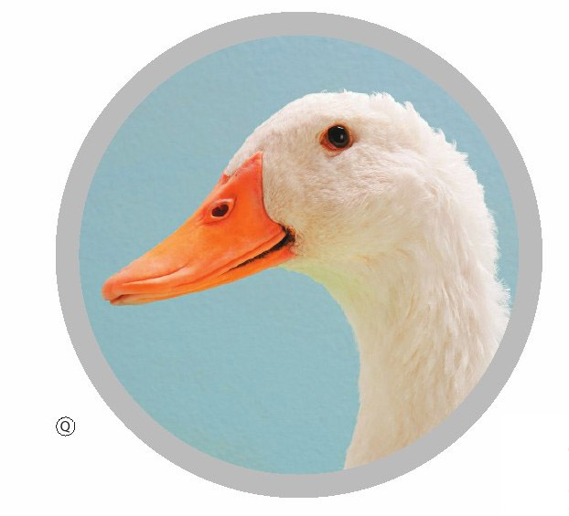
如果你喜欢鸟，你会发现鸟的嘴多种多样。如鸡的嘴短小精致，鸭的嘴扁而平，老鹰的嘴弯曲带钩，啄木鸟的嘴像一把尖锥，白鹭的嘴像一把长矛，蜂鸟的嘴酷似一条细管，火烈鸟的嘴下弯，反嘴鹬的嘴上翘，巨嘴鸟的嘴比头还大，犀鸟的大嘴上面还顶着一个盔……为什么鸟的嘴会有这么多种形态？原来，在漫长的历史演化中，随着鸟类的前肢进化成了承担飞行功能的翅膀，鸟类的嘴要做更多的事情，因而也有了更多的功能，如取食、打斗、筑巢、理羽等。尤其是鸟类多样的取食行为，是鸟类嘴形异化的主要原因。由于生活在不同的环境中，鸟类的食性也发生了分化。作为取食工具，鸟类的嘴随之发生了适应性的改变。如鸡短小有力的嘴方便啄食地上的种子；鸭子扁平的嘴适于在水中滤食水草；老鹰带钩的嘴利于撕开猎物；啄木鸟尖锥一样的嘴可以凿开树皮，寻找躲在里边的虫子；白鹭长矛似的嘴能够戳鱼；蜂鸟用细管般的嘴吸食花蜜……吃什么样的东西长什么样的嘴，火烈鸟、反嘴鹬、巨嘴鸟和犀鸟等奇形怪状的嘴也是它们适应各自栖息环境和取食行为的结果。（陈水华）

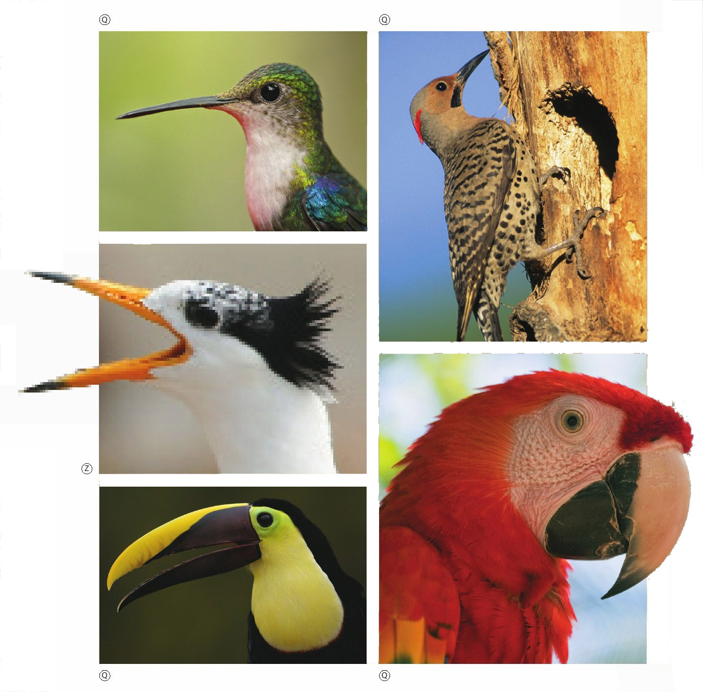
  

**【微博士】**始祖鸟

1862年，在德国南部发现一块动物化石，它长有像鸟类一样的羽毛，前肢已变为翅膀，也有像恐龙一样的长尾巴和牙齿。科学家研究后认为，这是一种生活在1.5亿年前的晚侏罗纪、介于恐龙和鸟类之间的过渡性生物，属于最早的鸟类，因而把它命名为始祖鸟。此后，相继有其他类似的标本被陆续发现，至今，共发现报道了11件始祖鸟的骨骼化石和1件羽毛化石。

**【微博士】**“达尔文雀喙”之谜

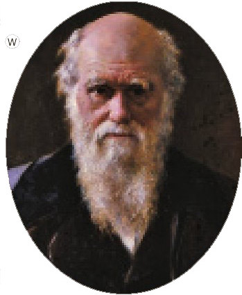
1835年9月，达尔文乘坐“小猎犬号”登上了位于东太平洋赤道附近的加拉帕戈斯群岛，发现这些岛屿上生活着一些其他地方没见过的小鸟，它们除了嘴的大小和外形略有不同外，其他都很相似。达尔文便采集了一些标本带回伦敦。经专家鉴定，这些鸟类一共有12个不同的种。后来，它们连同另外3种共计15种生活在加拉帕戈斯群岛的小鸟，被统称为“达尔文雀”。经研究发现，这些达尔文雀在嘴形上的差异典型地显示了物种的具体演化过程，因而也成了达尔文物种演化理论活生生的证据。

【微问题】犀鸟的嘴为什么这么大，它不觉得重吗？

【关键词】喙　牙齿　食物　进化

## 鸟儿为什么喜欢整理羽毛

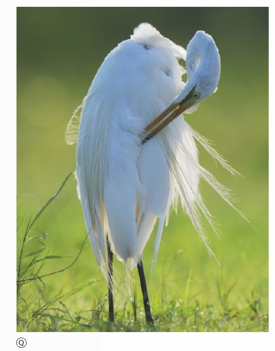
我们时常能看到，鸟类除了觅食和鸣叫之外，一停下来就不断地用嘴清理羽毛。有时也发现鸟类有一些奇怪的行为，比如在水里扑腾，在沙地上打滚。它们是在干什么呢？原来鸟类是在洗“水浴”和“沙浴”，通过“水浴”和“沙浴”来清洗羽毛上的灰尘和寄生虫。养鸟的人还知道，为了更好地保养羽毛，鸟类还常常需要日光浴。鸟类为什么这么爱惜自己的羽毛？这首先要从鸟类羽毛的结构和功能说起。鸟类的羽毛覆盖在身体表面，由表皮衍生而来，材料非常特殊，结构非常复杂。除了在早期爬行动物身上发现有类似的羽毛外，所有动物中，只有鸟类具有羽毛。独特的东西自然要倍加珍惜。当然，鸟类的羽毛并不只是一件博物馆里的展示品，它还具有多种功能。比如：翅膀上和尾羽上大大的羽毛有控制飞行的作用；具有绝缘性的羽毛有很好的保暖作用；水鸟和海鸟的羽毛有防水功能；与栖息地色彩接近的羽色有伪装作用，等等。而家喻户晓的是，鸟儿需要利用羽毛展示自己，尤其是在雌雄色彩不一样的种类中，羽毛的形态和色彩是鸟类选择配偶的重要依据。正因为羽毛对于鸟类非常重要，所以鸟类特别爱惜自己的羽毛。

此外，由于羽毛是表皮的衍生物，因此也招来了不少寄生虫。最常见的有羽虱和羽螨，它们除了吃皮肤碎屑外，还要吃羽鞘。所以鸟类要不断地清理羽毛，及时清除这些寄生虫。（陈水华）

  

**【实验场】**观察羽毛

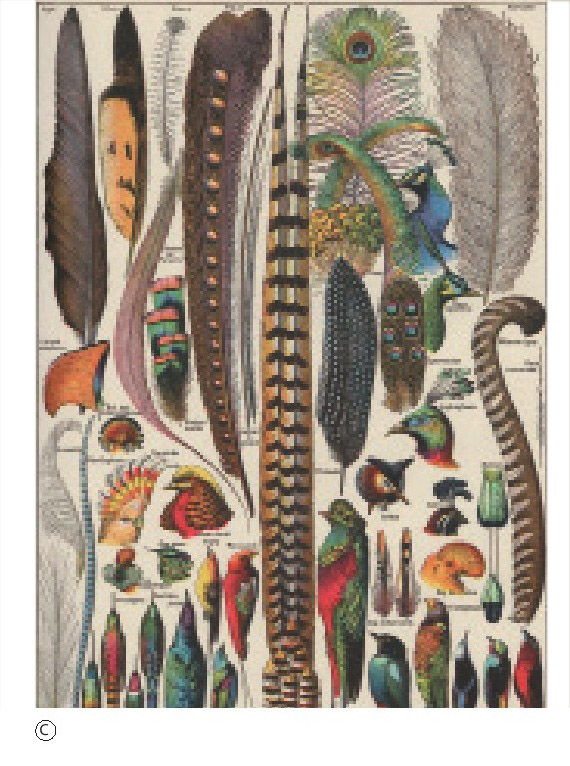
鸟类的羽毛有好几种类型，但大致可分为正羽、绒羽和纤羽三种，正羽是鸟身体外部的大型羽毛，绒羽和纤羽是内部的柔软的羽毛。你可以通过观察鸡的羽毛或者鸭的羽毛，了解羽毛的不同种类；你还可以取一片大羽毛，观察了解羽毛复杂而神奇的结构。

## 为什么有落汤鸡却没有落汤鸭

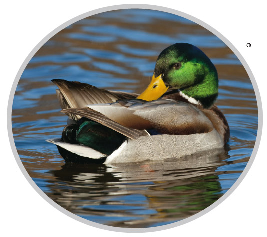
鸭子正在将尾脂腺中分泌的油脂涂抹在羽毛上

我们常把全身湿透的狼狈样子形容为“落汤鸡”，就像一只掉到水里或者被雨淋过的鸡，全身湿漉漉的羽毛都贴在身体上。但奇怪的是，鸭子在雨中从来不担心什么，走路照样慢悠悠的，再大的雨淋过，身上也不湿。而且鸭子还可以下水游泳，甚至潜水，上岸后，身子抖一抖，全身羽毛还是那么干燥。这是为什么呢？其实，不管是鸡还是鸭，它们的羽毛本身并不防水。鸭子的妙处在于其尾端有一个尾脂腺，它能分泌出油脂。鸭子经常回头梳理羽毛，其实是分成两个步骤的：第一步用又扁又大的嘴到尾部沾上这种油脂，第二步把油脂涂抹在羽毛上，这样处理过的羽毛就有防水作用了。而鸡没有这种腺体，也就无法使鸡毛具有防水功能，它一旦落水或者被雨淋，就难免成为“落汤鸡”了。（陈水华）

## 丑小鸭是怎么变成白天鹅的

《丑小鸭》是安徒生童话中为人熟知的一篇，讲了一个过程令人心酸，但结局充满温馨的故事。有一天，有个鸭妈妈孵出了一只特殊的小鸭，由于这只小鸭长得和其他鸭子不一样，长相特别丑，常常受到其他小鸭子的嘲笑和欺负。经过了诸多屈辱之后，直到第二年的春天，丑小鸭在水中看到了自己的倒影，才发现自己已经变成一只美丽的白天鹅了。这个故事给许多身处不幸的人带来了安慰。丑小鸭长成了白天鹅，这仅仅是童话吗，还是真有其事？当然，这并不是一个完全杜撰的故事。正是现实世界中天鹅在生长发育过程中从幼体到成体的神奇变化，才给了安徒生编写这个故事的灵感。

那么，这种变化是怎么产生的呢？雏鸟在发育过程中除了身体长大之外，最大的变化是羽毛的改变。从丑小鸭原来稀稀拉拉的棕灰色的雏鸟绒羽，换成了全身洁白、光滑、致密的成体羽毛。当然，雏鸟的绒羽并不会直接长成成羽，从刚出壳时的雏羽到漂亮的成羽，其间要经过很多次换羽。换羽是原来的羽毛脱落，长出新的羽毛的过程。这是鸟类一个重要的生物学现象。即便是成年之后，鸟类每年仍然要规律性地换羽，通常是一年两次。通过换羽应对日常活动中羽毛的磨损，以及满足求偶炫耀、育雏活动和迁徙飞翔的需要。

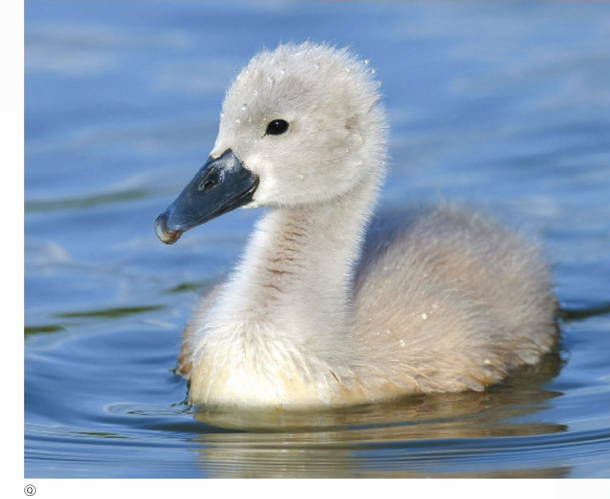
鸟类换羽有固定的规律，是逐次、有序进行的，也就是说所有的羽毛并不是同时更换的，而是一个有序的交替过程。这和常绿植物的落叶和新生有异曲同工之妙。虽然从外形上可以看到羽毛的残缺，但一般不至于影响保温、保护和飞翔的能力。当然，也有一些鸟类，如鸭子和天鹅等，飞羽在更换时同时脱落，以致在此期间丧失了飞行能力。这时它们就躲到偏僻和易于躲藏的湖泊水草之中，避免被天敌发现，以渡难关。对于天鹅来说，这样的时间大约要6周。（陈水华）

  

**【微博士】**羽绒服为什么能够保暖

羽绒是人类用来保暖的优良天然材料，它们经过洗涤、干燥、分级等工艺处理以后，被人们制成羽绒服。羽绒服之所以能保暖，原理类似于羽毛，就是在你身体周围制造一个充满空气的隔温层，让你自己产生的热量尽量不传出去，从而达到保暖的效果。

【微问题】为什么鸬鹚站在木桩上老是张开着翅膀？

【关键词】羽毛　换羽　尾脂腺

## 孔雀为什么要开屏

相信多数人都看过孔雀开屏，当孔雀把尾屏张开时，色彩斑斓，绚丽夺目。尤其是尾屏上点缀着的那一个个眼斑，随着孔雀身体的轻轻抖动，美艳绝伦，摄人心魄。无怪乎在动物园里，每当有孔雀开屏，总会引来阵阵尖叫和欢呼。

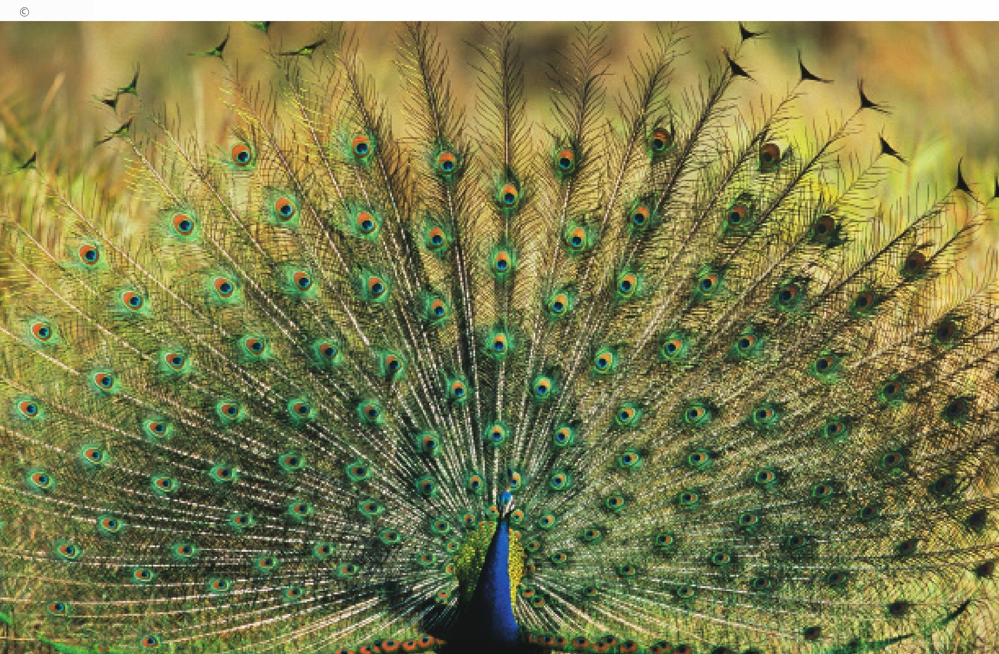
人们相信孔雀开屏是为了争奇斗艳，孔雀看到穿着色彩漂亮的美女就会开屏，或者看到七彩雨伞以及其他彩色的物体也会开屏。于是许多游客为了一睹孔雀开屏的风采，往往在孔雀面前展示漂亮的裙装，或者晃动鲜艳的雨伞。然而，结果往往令人失望。对于游客的挑逗，孔雀似乎视而不见，自顾觅食或游走。这个时候，人们就困惑，孔雀究竟在什么情况下才会开屏呢？

孔雀的尾屏是它的尾羽。绝大多数鸟类都有尾羽，但不像孔雀那么长。尤其是雄孔雀，尾羽特别长，上面还布满了耀眼的眼斑。我们看到开屏的孔雀都是雄孔雀，雌孔雀的尾羽并不长，因而也不开屏。孔雀开屏其实是鸟类中常见的求偶炫耀行为。为了求得雌孔雀的欢心，雄孔雀才打开尾屏，以此向雌孔雀炫耀。明白这个道理，我们就会理解为什么那些雄孔雀对于游人的挑逗无动于衷了。孔雀开屏也是有季节性的。我们观察到的孔雀开屏大都在春季，因为春季是鸟类，也是孔雀的繁殖季节。

在野生状态下，孔雀开屏除了求偶炫耀之外，也有震慑敌人的作用。在外敌入侵，或者遇到威胁来不及逃避时，雄孔雀也会打开尾屏，以抖动的眼斑吓唬和迷惑敌人。（陈水华）

## 公鸡的羽毛为什么比母鸡的羽毛漂亮

公鸡有高耸的鸡冠，长而飘逸的尾羽，而且身上的羽毛颜色艳丽，富有光泽。而母鸡呢，不仅个子小，毛色单调缺乏光泽，鸡冠和尾羽也远没有公鸡那么张扬，总之，长得十分低调。公鸡长得比母鸡漂亮，这是为什么呢？

我们知道，家鸡是被人类由原鸡驯化来的。野生状态的原鸡在中国云南、广西和海南一带还有分布，它们的外形与今天的家鸡基本相似。鸡类是个大家族，比较各种鸡，我们会发现，公鸡比母鸡漂亮是一个普遍现象，而其中雌雄差异最明显的要数孔雀。在鸭类这个大家族中，情况也是如此，其中又以鸳鸯的外貌特征最为典型。雄鸳鸯全身羽毛极为艳丽，尤其是背面直立于翅上的那根橘红色帆羽更是拉风。而雌鸳鸯呢，则通体灰褐色，显得特别黯淡。可见，雄鸟比雌鸟漂亮并不是个别现象，而且在这一现象的背后还隐藏着科学道理。

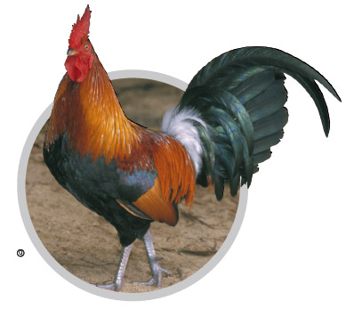

公鸡漂亮和母鸡平淡的原因各不相同，但都可以归结为是自然选择的结果。公鸡漂亮是出于求偶炫耀的需要。在配偶选择中，母鸡具有主动选择权，它们往往选择那些羽毛漂亮的公鸡作为配偶。因为羽毛漂亮的公鸡通常意味着具有优良的基因和健康的身体，它们的后代也因而有更高的成活率，让公鸡优良的遗传信息得以代代相传。母鸡的这种选择倾向经过一代又一代的强化，才出现了今天人们看到的公鸡雄壮之美。而母鸡的平淡则是出于自我保护的需要。鸡类通常在地面营巢繁殖，而且产卵后由母鸡负责孵卵。繁殖期间是它们最为脆弱的时候，为了自身的安全，并确保繁殖成功，母鸡的体色需要越接近环境越好，这样才能避免被天敌发现。这样经过一代又一代的自然选择，也就出现了今天人们看到的母鸡们低调的黯淡体色。

在鸟类中，相反的情况也存在，也就是说有些鸟类的雌鸟比雄鸟漂亮。比如水雉和彩鹬，都是雌鸟比较漂亮，雄鸟相对黯淡。这又是为什么呢？其实原理相同。这些鸟类雌和雄的角色刚好对调，即雌鸟有求偶炫耀的需要，而雄鸟具有选择权，雌鸟产卵后即离去，由雄鸟负责孵卵。当然，在鸟类中，多数是由雌雄共同孵卵和抚育后代的，这时两性的体色通常比较接近。这种情况下，炫耀的一方比的不仅是体色，更多的是其他本领，比如叫声或者捕食能力。比如在翠鸟和燕鸥中，雄鸟在婚前有捕鱼和献鱼的行为，以此证明自己具有良好的基因和养育后代的能力。（陈水华）

  

**【微博士】**园丁鸟与跳舞场

园丁鸟是一类生活在澳大利亚和新几内亚森林里的鸟类，这类鸟以独特的求偶行为而闻名。在繁殖季节，雄鸟为了吸引雌鸟，会找一块空地，从周围捡来树枝，建造一间精致的“亭子”。然后叼来各种漂亮的小物件，如蜗牛壳、羽毛、花朵或真菌类植物等装饰在周围。如果附近有人类居住，装饰品往往还包括玻璃、纸片、破布、金属丝、瓶盖等。当“亭子”建设和装饰完工后，雄鸟会带雌鸟前去参观，并且在亭子周边的场地上翩翩起舞。如果雌鸟被打动了，就会与这只雄鸟交配。交配之后，雌鸟会独自去搭建一个巢，不用雄鸟任何帮忙，并独自孵化和养育后代。而那只雄鸟则继续忙于修饰亭子，引诱别的雌鸟。

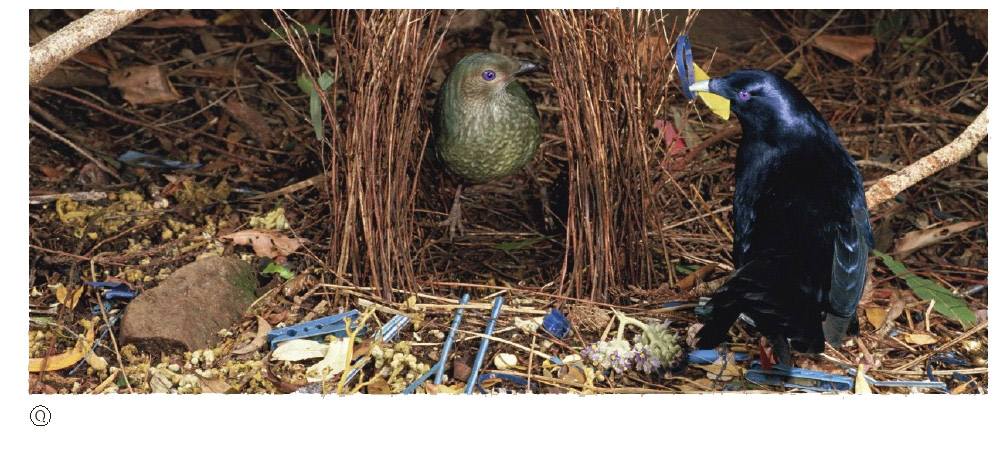
【微问题】繁殖羽是怎么回事？

【关键词】羽毛　炫耀　自然选择

## 鸟巢是鸟类终生栖居的家吗

在鸟类的繁殖季节，我们可以看到它们四处奔波，找寻材料修筑巢窝，以便产卵、孵化、育雏。于是我们就想当然地认为，鸟巢就是鸟类长期固定的栖息场所，鸟类晚上也一定会在巢中睡觉休息。实际上，这种想法是错误的。

其实，鸟巢并非鸟类一生的家，鸟巢只是鸟类用于养育后代的“产房”。一般情况下，鸟类经过求偶后，雌鸟和雄鸟会共同搭建鸟巢，然后，雌鸟在巢中产卵、孵卵，待到小鸟孵出后，鸟巢又成了亲鸟哺育小鸟的场所。随着小鸟逐渐成长、学飞离巢，并开始独自生活，鸟巢也被遗弃。当然也有些鸟类在次年继续繁殖时会利用旧巢。同样的，鸟类在非繁殖季节也不会把鸟巢作为夜晚睡觉休息的场所，多数鸟类晚上站在树枝上休息；雁鸭类晚上会把脑袋夹在翅膀之间，身体直接在水面上漂浮着睡觉。（范忠勇　陈水华）

  

**【实验场】**观察鸟类夜晚在什么地方休息

夜晚，在确保安全的前提下，带上手电，与几位同伴或家长一起在鸟类较多出没的场所，如小区绿化园林带等，寻找夜晚休息睡觉的鸟类，了解鸟类晚上休息睡觉的情况。

## 为什么不同的鸟类筑的巢不一样

鸟巢是鸟类繁殖的场所，它们在那里产卵、孵化，甚至育雏。好的鸟巢可以为鸟类繁育后代提供一个安全可靠的场所。但细观鸟巢，会发现鸟巢类型多样，五花八门。有些很复杂，如织布鸟，能用草茎、草叶和其他植物纤维在树上编织出复杂精致的鸟巢。一种群居性的非洲织布鸟，甚至可用多个巢组成公共巢，巢室可达300多个。有些则很简单，如斑鸠的巢就显得十分寒酸。斑鸠是农村和都市中常见的一种鸟类，它们的巢往往只由几根细小的树枝组成，中间再铺垫一点枯草，看上去结构极其简单。也有些鸟类基本不筑巢，如大凤头燕鸥的蛋就直接产在裸露的岩石或地面的枯草上。

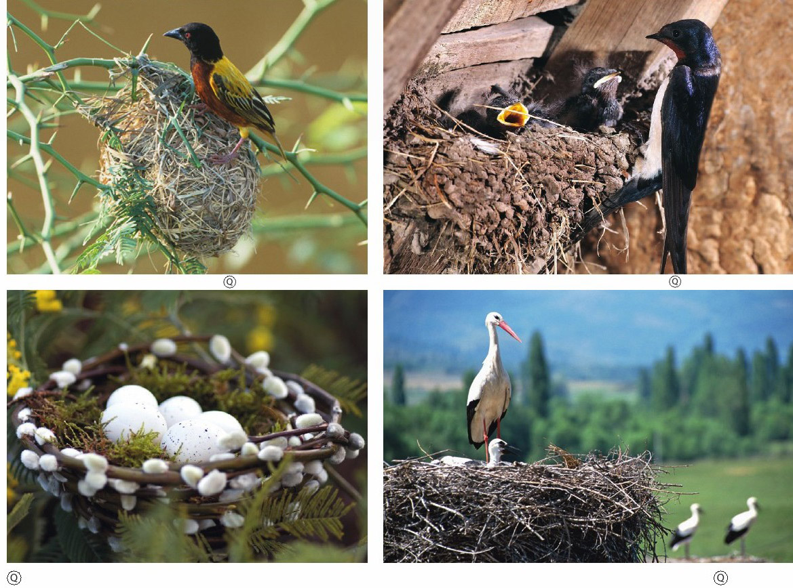
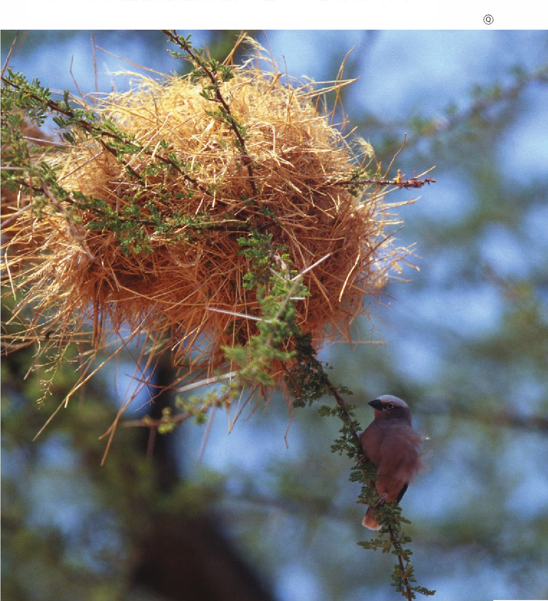
为什么不同的鸟类筑的巢很不一样呢？是不是有些鸟类聪明一些，或者勤劳一些，巢建得复杂、精巧；而有些鸟愚笨一些，或者懒惰一些，巢建得粗糙、简单呢？

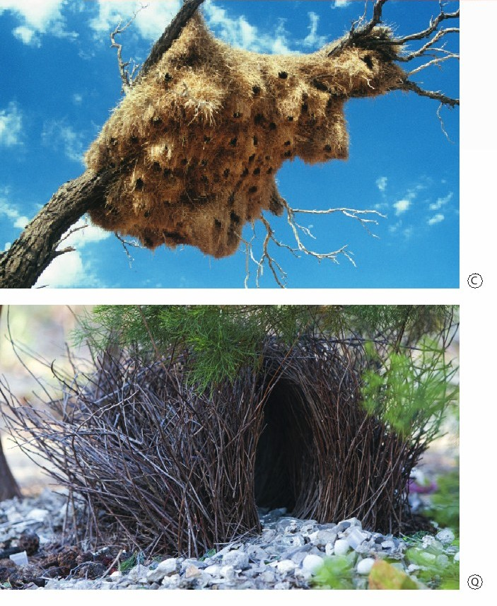
当然不是这样。对鸟类而言，建筑鸟巢毕竟是一项耗费体力的大工程。如果在筑巢上耗费了过多的能量，势必影响到整个繁殖期的能量投入。要知道，筑巢仅仅是繁殖的开始，随后还有产卵、孵化和育雏等工作，需要消耗它们很多的能量。因此鸟类在筑巢中，既要考虑尽量降低筑巢的能量消耗，又要保证繁育后代的成功率和安全性。

选择在什么地方筑巢，往往与这种鸟类的生活习性和环境有关。如在地面觅食的鸟多在地面筑巢，在灌丛和树上觅食的鸟一般也把巢筑在树上，吃鱼的鸟则会把巢筑在水边。筑巢材料则是就地取材。筑什么样的巢，很大程度上取决于所面对天敌的类型。鸟类会把巢筑在天敌不易发现，或者发现了也够不着的地方，巢的形状和复杂程度则以防止天敌进入、确保蛋的安全孵化为原则。

一般来说，地面巢相对不太安全。所以营地面巢的鸟类下的蛋大多有比较好的保护色，雏鸟也多是早成型，出壳之后就会四处走动，尽可能早地离巢生活。那些把蛋直接下在地面的燕鸥类，往往集大群一起繁殖，因为集群可以有效地抗拒天敌的靠近。（范忠勇　陈水华）

## 杜鹃为什么要把蛋下到别的鸟巢里

有些鸟自己不筑巢、不孵卵、不育雏，而是依赖其他鸟完成繁殖后代的任务，杜鹃是其中典型的代表。杜鹃会抓住机会叼走苇莺、画眉、伯劳等其他鸟巢中的蛋，并在巢内产下一枚自己的蛋，让其他鸟类代为孵化。孵出之后，不知情的亲鸟妈妈出于育雏的本能，还会不辞辛劳地给杜鹃雏鸟喂食，直到雏鸟长得比自己身体还大。杜鹃为什么要把蛋下到别的鸟的巢里？

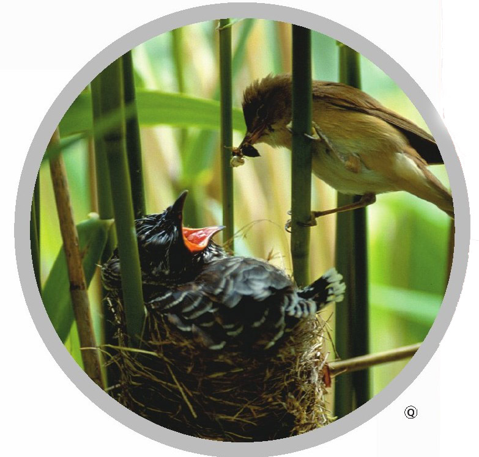
辛勤的鸟妈妈哪里知道，它所喂养的早已不是自己的孩子，而是杜鹃的雏鸟

鸟把蛋下到别的鸟的巢中，由其他鸟代为抚育，这种行为被称为巢寄生。巢寄生是怎么进化来的，目前还不得而知，但杜鹃显然从巢寄生中获得了不少好处。首先自己不用筑巢、孵化和育雏，节省了很多能量，可以有能力产更多的蛋。有研究显示，杜鹃雌鸟每年3月至7月要在不同的鸟巢中陆续寄生10多枚蛋。其次，寄生在其他鸟巢中的蛋繁殖成功率更高。杜鹃一般在一个鸟巢中只寄生一枚自己的蛋，由于杜鹃的蛋孵化期很短，往往最先孵出。出于本能，杜鹃雏鸟会将同巢的亲鸟生下的鸟卵和幼雏推出巢外，留下亲鸟独自抚养自己，这样就可以获得更多的食物，有更高的成活率。另一方面，在多个巢中寄生，也避免了常言所说的“将所有的蛋放在同一个篮子里”，幼鸟中至少有一只能够活着离巢，确保种族繁衍。（范忠勇　陈水华）

  

**【微博士】**燕窝

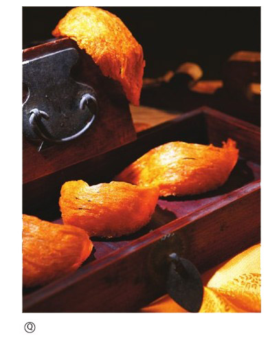
燕窝被一些人认为具有很高的食用和药用价值。其实燕窝并不是普通燕子做的窝，我们常见的燕子是广布于世界各地的家燕，属于雀形目燕科。家燕的窝是用泥土、细草等构成的，并不能被人类食用。而可以食用的燕窝指的是雨燕科金丝燕属的几种燕子做的窝，这些金丝燕将唾液和筑巢材料自然凝结起来。经分析，燕窝中的胶原蛋白含量确实较高，但却并没有很强的特殊性。

【微问题】杜鹃的巢寄生行为为什么能够得逞？

【关键词】鸟巢　求偶　孵化　巢寄生

## 鸟类为什么要唱歌

莺歌燕舞、鸟语花香等成语都是形容鸟类善于鸣叫、歌唱，那么鸟类为什么要唱歌呢？

准确地说，鸟类并不是在唱歌，它们是在鸣叫。那么鸟儿们鸣叫的目的是什么呢？

鸟类鸣叫其实是鸟类之间进行沟通的“语言”，是鸟类个体间传递信息的方式。鸟类在晨昏时分鸣叫得尤为起劲，那是它们在向其他鸟类宣示自己的领域范围，警告其他鸟类不要随意靠近或侵入。繁殖季节，雄鸟经常鸣叫不已，有的是为了向雄性的同伴示威，争夺地盘；有的则是在向雌性表达爱意，以引起“她”对自己的注意和喜爱。因此，除了鲜艳的羽毛，鸣叫常常也是鸟类进行求偶炫耀的方式。研究表明，那些鸣声嘹亮、鸣唱曲目多的雄性，具有体内激素水平高、免疫力强、身体素质好等优势，它们更能得到雌性的青睐，从而获得交配权，实现传宗接代的目的。有了这样的好处，难怪鸟儿唱得那么欢。（范忠勇）

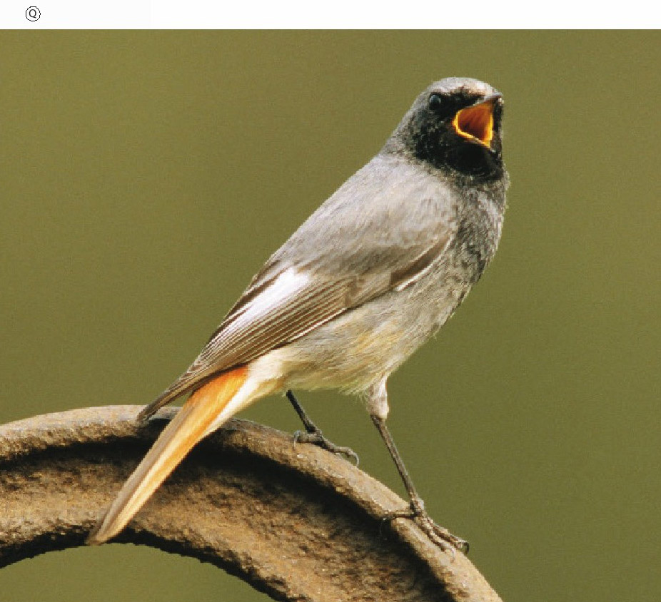

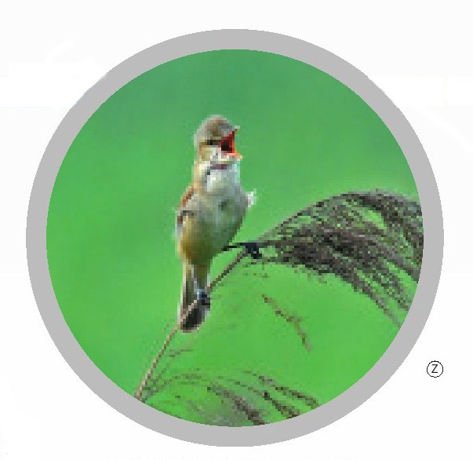
站在芦苇上鸣叫的东方大苇莺

  

**【科学人】**奥利维耶·梅西安

法国作曲家、风琴家及鸟类学家奥利维耶·梅西安（1908-1992），被公认为20世纪最具代表性的作曲家之一。以鸟声来谱曲的人世界上有不少，但梅西安用记谱的办法来记录鸟鸣，并且纯用鸟鸣来谱曲，这就很稀奇了。他创作了许多与鸟有关的音乐作品：交响诗《百鸟苏醒》、钢琴套曲《鸟图》和《异国的鸟》等。在这些作品中，我们可以听到各种各样的鸟鸣。据说，奥利维耶·梅西安从18岁起，就经常出没于山野丛林，先后记录了上千种不同鸟类的鸣声。梅西安曾说：“鸟是伟大的艺术家、伟大的音乐家。”“各种鸟类都有独自的审美观点，鸟类歌唱的时候简直都像瓦格纳一样，每当唱歌时都在阐明自己的主张……”

## 鹦鹉为什么会学人说话

你如果看过马戏团里鹦鹉的说话表演，一定会对鹦鹉惟妙惟肖、人云亦云的说话本领记忆深刻吧，“你好你好”“欢迎欢迎”之类的声音几乎能以假乱真。那么，鹦鹉为什么会学人说话呢？

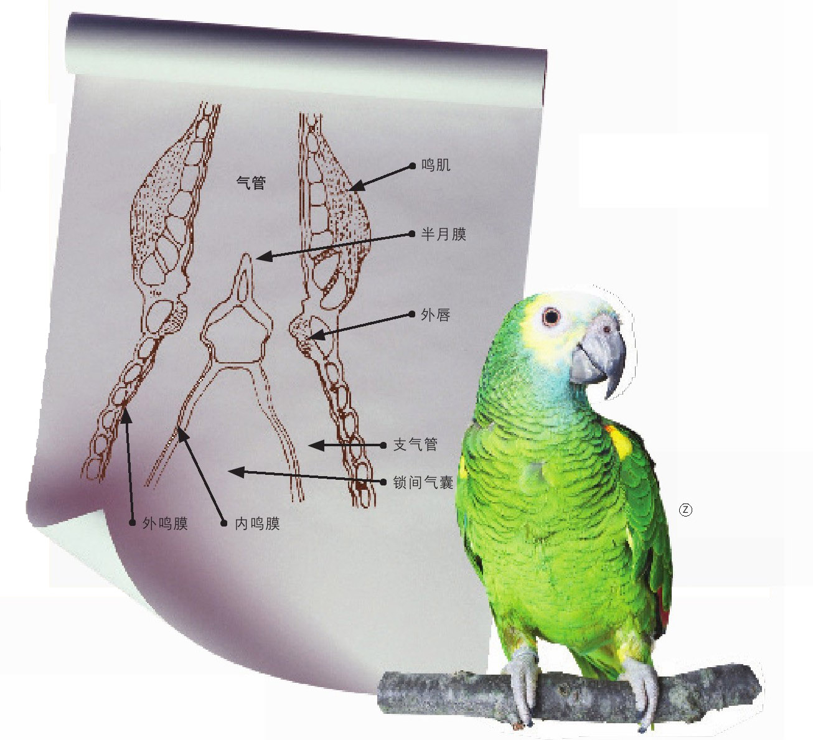
鸟类之所以能发出鸣叫声，主要依赖于它们特有的发声器官——鸣管。人类或其他哺乳动物的声带位于气管顶端，而鸟类的鸣管位于气管下端与支气管的交界处。在吸气或呼气时，鸣管壁及周围的气囊产生振动，就发出了声响。鸟类通过控制鸣管处的张力和呼吸的力度，调节鸣膜（从鸣管管壁伸展出来并具有弹性的皮褶）的松紧度，就能发出变化多端的声音。不可思议的是，鸟类中善于鸣叫的鸣禽，它们的左右鸣肌能对两边的气管分别进行控制，从而同时发出两个音，也就形成了所谓的“和声”，比如乌鸫，就是能这样随心所欲地控制声音的个中高手。

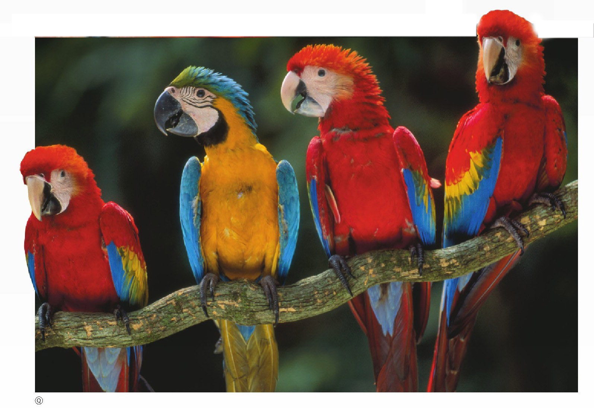
鹦鹉能学人说话，首先得归功于它特有的发声器官。鹦鹉的发声器官除了具备与其他鸟类类似的特征外，构造也比一般的鸟类更为完善，它的鸣管外面有3对发达的鸣肌。在神经系统的控制下，通过鸣肌的收缩放松，改变鸣管形状，就能发出多样的鸣叫声。此外，鹦鹉的口腔比较大，舌头也比较发达。舌头圆滑柔软而且肉多肥厚，形状与人的舌头非常相似。鸣管与舌头形成近似直角的钝角，两者的角度是决定发音的音节和腔调的关键。越接近直角，发音的音节感和腔调感就越强。因此，鹦鹉就能发出抑扬顿挫的声音和音节。

其次，鹦鹉具有较强的模仿能力。人们巧妙地利用了鹦鹉的这个特性，然后与某些特定的动作和特定的声音结合起来对鹦鹉进行反复训练。在受到不断重复的训练后，鹦鹉会将这些信号存储在记忆中，当再次遇到外界特定的刺激后形成条件反射，就会发出“你好你好”等声音了。在古罗马，鹦鹉由于善于学舌说话，它们的舌头甚至被人类残忍地割下来用作治疗“口吃”的良药。除了鹦鹉，鸟类中的鹩哥、八哥等，也是模仿人说话的高手。（范忠勇）

## 鸟类有方言吗

人类由于地理屏障造成交流不便而出现语言方面的差异，从而导致了方言的产生。方言在某种程度上妨碍了人类的交流。那么，不同地域的同种鸟类是否也像人类一样存在方言呢？答案是肯定的。

同一种鸟类具有显示其种类特征的鸣叫声，不同种的鸟类具有各自不同的鸣声。而同种鸟类的不同地理种群间有时在鸣声上也存在着一定的差异，这就形成了鸟类的“方言”。这种鸣声上的差异包括宏地理变异（距离较远，自然条件下不可能相遇的不同地理种群间的鸣声差异）和微地理变异（距离较近，且有可能交配的相邻种群间的鸣声变异）。鸟类方言的存在，在一定程度上阻隔了种群的扩散和基因交流。

有鸟类学家收集了同一城市不同区块的白头鹎的鸣声，分析发现，白头鹎在该城市市区至少有8种微地理鸣声方言，每个微地理鸣声方言都有一典型鸣句，它们在听觉、波形结构、音节组成、音节频谱特征等方面均不相同。甚至有些仅一街之隔的相邻微地理鸣声方言之间也存在着明显差异；部分区域还会出现不同鸣声混合的现象；还有的个体具有特别的语言天赋，这些个体具有“多语”功能，即同一个体能发出多种不同类型的鸣声。研究者认为，白头鹎鸣声产生微地理差异的原因，可能与鸟类个体的扩散和城市中鸟类栖息地被人为改变有关。（范忠勇）

  

【微问题】鸟类的鸣叫有特定的含义吗？

【关键词】鸣叫　鸣管　鸣肌　方言

## 为什么鸟站在树上睡觉不会掉下来

忙碌了一天的我们会迫切渴望找到一张床，躺下来舒舒服服地睡上一觉，好好地休息休息。那么你有没有想过，鸟儿们累了会在哪里休息和睡觉呢？

大多数鸟儿累了就会站在树上睡觉。也许你会问，那如果它们在睡梦中不小心没抓牢树干，会不会掉下来啊？其实，你大可不必为此担忧，因为站着睡觉是鸟儿们的一种本能，这与鸟类的肌肉结构有关。比较而言，人类实施“抓”的动作是主动行为，需要消耗能量，而鸟类“抓”的动作是被动的、不费劲的自然动作。当鸟类停在树枝上，用爪子抓握树枝时，身体的重量便集中在肌腱上，会使肌腱绷紧而将双足牢牢地抽紧，从而很自然地握紧树枝，这时它的肌肉处于松弛状态，并不需要消耗能量，因此鸟儿会很享受这样的姿势。

为适应环境，鸟类练就了高超的平衡本领。鸟类的小脑颇为发达，能有效调节运动和视觉，使它们在睡觉时保持平衡而不至于从树上摔下来。而当鸟儿要飞离树枝时，则需要费劲才能放松爪子，使全身重量不再压在肌腱上，这时爪子的相关肌肉处在紧张状态，这样双脚才能离开树枝。（范忠勇）

人睡着时连站都站不住，为什么鸟睡着了却还能稳稳地站立在树上

## 麻雀为什么要跳着走

麻雀是平日司空见惯的一种鸟，你可能对它熟视无睹，但如果你仔细观察过这种鸟，一定会对它奇特的走路姿势留下深刻印象。麻雀不像一般的鸟类迈步前行，而是跳跃着往前蹦。为什么麻雀会选择这么怪异的姿势走路呢？

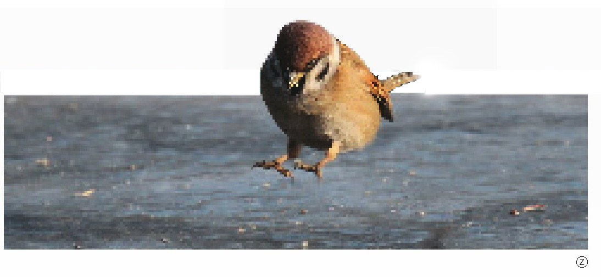
麻雀跳着走路，最根本的原因在于它的胫骨和跗骨之间的关节不能弯曲。鸟类的后肢由股部、胫部、跗部和趾部等部分组成，整个后肢肌肉都分布在股部和胫部，其他部位则全是肌腱。在长期的进化过程中，麻雀的下膝关节退化了，后肢的胫部跗骨和跗部趾骨之间没有关节臼，胫骨和跗骨之间的关节不能弯曲，所以麻雀在地面上只能跳着走路了。当然，许多鸟类是能在地面行走的，如鹭鸟，它们的股骨较长，胫腓骨和跗跖骨相对较短，这样它们就能在地面灵活地步行走动，这些地栖鸟类以走动为主。有的鸟类则又会步行又会跳跃前进，如八哥、乌鸦等。

其实，很多适应树栖生活的小型鸟类也像麻雀一样，基本上都不能左一脚右一脚行走。当它们在树上活动时，贯穿至趾端的肌腱能控制足趾的弯曲，可以同时方便地利用双脚稳稳抓住树枝，而它们一旦下到地面觅食活动时，就没有了正常的行走能力，而只能依靠较短的后肢一同快速蹦跳前行了。但树栖鸟类能在瞬间快速起飞，相对较长的胫腓骨和跗跖骨，能够很好地维持身体平衡。（范忠勇）

## 苍鹭为什么喜欢一只脚站着

在江河、湖泊和水塘等湿地，经常能看到体形瘦长成群活动的苍鹭，它们的头部、颈部、脚和嘴都比较细长，通常在较浅的水中觅食小鱼小虾等动物。苍鹭有时候会站在水中一动不动，静静地等候捕食猎物的最佳时机，而且经常是单脚站立，另一只脚收缩在腹下，有时一站就是十多分钟甚至数小时之久，也因为此，苍鹭有了个形象的外号——“长脖老等”。为什么苍鹭喜欢一只脚站着呢？它们不累吗？

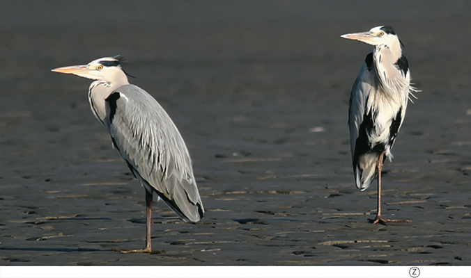
独脚站立的苍鹭

其实，不仅是苍鹭，大多数鹭、鹤、雁鸭等鸟类都有单脚长时间站立在原处的本事。与人类单脚站立费劲费力不同，单脚站立是这些鸟最为舒服而简单的休息姿势。用一只脚站立可以很好地缓解另一只脚的疲劳，交替使用两只脚“金鸡独立”，可以让它们尽可能地保持体力，得到良好的休息。它们甚至在睡觉时也会单脚独立，把头插入翅膀里，十分享受地闭着眼睛安然入睡。

另一种解释认为，在天气较冷的时候，鸟类会较多地采取单脚站立的姿势，这时候它们把另一只脚收拢在腹部，埋藏在羽毛下，可以有效地减少暴露在空气中的身体表面积，有利于鸟类节约能量，减少体温的下降。

此外，也有科学家认为，鹤类等鸟类的腿特别细长，它们的心脏需要消耗更多的能量才能把血液输送到全身各处，单脚站立可以避免在它们的脚上聚集过多的血液，影响血液循环，从而使心脏的输出压力减小。（范忠勇）

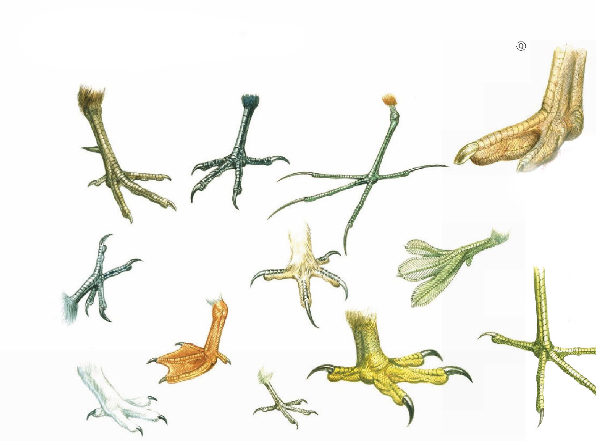
鸟类的脚为了适应各自的需求，还真是多种多样啊

  

**【微博士】**鸟类的脚趾

为了适应不同的栖息环境，满足各自生活习性的需要，鸟类的脚趾也是千差万别的。雁鸭类脚趾上的全蹼，鲣鸟、鸬鹚的半蹼或鸻鹬类的微蹼，都可以方便地划水，适于在水中游泳；鸠鸽、雉鸡等鸟类的腿和脚粗壮有力，适于在陆地奔走，以及挖土找寻食物；秧鸡类则具有分叉而细长的脚趾，能在浮水植物上疾步行走；鹰隼等捕食性的猛禽，则具有强壮有力的脚趾，捕猎时能紧紧抓握猎物。

此外，鸟类脚趾的排列形式也不尽相同，最常见的常态足多见于雀形目鸟类，第2、3、4趾向前，第1趾向后。普通翠鸟的并趾足，第2、3、4趾向前，但基部愈合。其余趾型还有离趾足（又称为不等趾型，如鹰隼等猛禽）、对趾足（如啄木鸟、鹦鹉等攀禽）、前趾足（如雨燕）等。

【微问题】如果科学家不给麻雀平反，中国的麻雀也会灭绝吗？

【关键词】脚趾　站立　趾型

## 有的鸟儿为什么喜欢照镜子

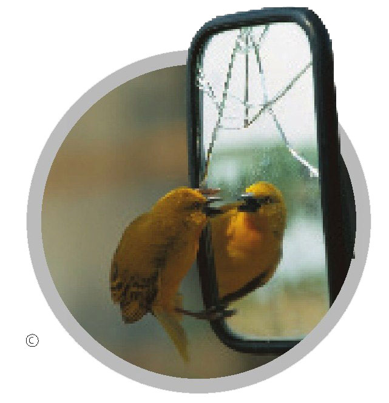
某个城市的停车场里有位不速之客总是不请自来，这位客人就是一只白头鹎，它经常对着汽车的后视镜做出各种怪异的动作，或悬停，或扑腾，有时还会喷粪便，或用嘴猛啄镜片做攻击状，忙得不亦乐乎。多数人对这种怪异行为不理解，也有人认为这不奇怪，并且说“爱美之心，人皆有之”，鸟儿也爱臭美，喜爱自恋的它是在对镜“梳妆”，顾影自怜呢。那么鸟是真的因为爱美才爱照镜子的吗？其实并非如此。

大多数鸟类并没有能力识别镜中的影像是否自身，也就是说鸟类缺乏自我识别意识，它并不明白“镜中鸟”并非别人，而是它自己。当鸟儿看到镜中自身的影像时，会误认为是同类的另外一只鸟，从而激发起它的好斗心。它在镜子前做出的走动、舞蹈、炫耀和嬉戏等试探性动作，主要是向镜中的对手宣示自己的存在，向对方发出警告，告诫对方切勿侵犯自己的领地，否则会毫不客气地予以攻击。于是啄破汽车后视镜就是鸟儿向对方屡屡警告无效后，发起攻击而留下的辉煌战果了。严重些的，有些鸟儿还会头撞南墙，碰个头破血流。尤其是在鸟类的繁殖季节，为了与同伴争夺配偶，这样“堂吉诃德式”的争斗就更容易发生。

当然，并非所有鸟类都不能辨认出镜中影像就是自己，喜鹊就是能辨认自己的聪明鸟。研究人员在喜鹊身上涂上红色或黄色标记后，喜鹊会在照镜子时反复清理梳洗涂有颜色标记的部位。这个著名的测试叫“镜子测试”，能正确辨认自己影像的动物并不多，哺乳动物中的黑猩猩、海豚做到了这一点，但猫和狗等动物就没能通过这样的测试。（范忠勇）

## 为什么鸟会撞到玻璃上

经常有媒体报道，有鸟儿因撞击到建筑物的幕墙玻璃而受伤或死亡。那么，鸟儿撞击玻璃又是什么原因引起的呢？

首先，高度透明的玻璃是罪魁祸首，飞行中的鸟对透明的玻璃毫无觉察，往往会在飞行中撞个正着。其次，由于玻璃具有很好的反射性，会对天空、河流及周边的植物等环境进行反射，飞行中的鸟儿看到玻璃中反射的影像会误以为是大自然的一部分，是真实存在的景象，而判断为安全的去处，因此会义无反顾地飞向玻璃。再者，玻璃在夜晚会反射周边较强的人工光源，在白天也会对太阳光进行强烈反射，从而形成刺眼的光斑，此时恰巧从此飞过的鸟儿因为视力突然受到强光照射，一时迷失方向，也会撞上玻璃。还有，有些鸟儿为捕食昆虫或其他猎物高速飞行时，视觉感知能力往往有所减弱，对外界环境不能及时做出准确判断，所以也容易撞上玻璃幕墙而受伤。

高速飞行中的鸟儿一旦撞上玻璃，所受到的伤害非同小可，轻者昏迷，重者因内脏出血受伤、颈椎折断致死。那些侥幸从撞击中捡回性命的鸟，也往往会因为头脑受伤、体能受损或翅膀等肢体受伤，飞行能力和辨识方向的能力大为减弱，应对外界风险的能力大大降低，很容易沦为猛禽、猫等捕食性动物的美食。

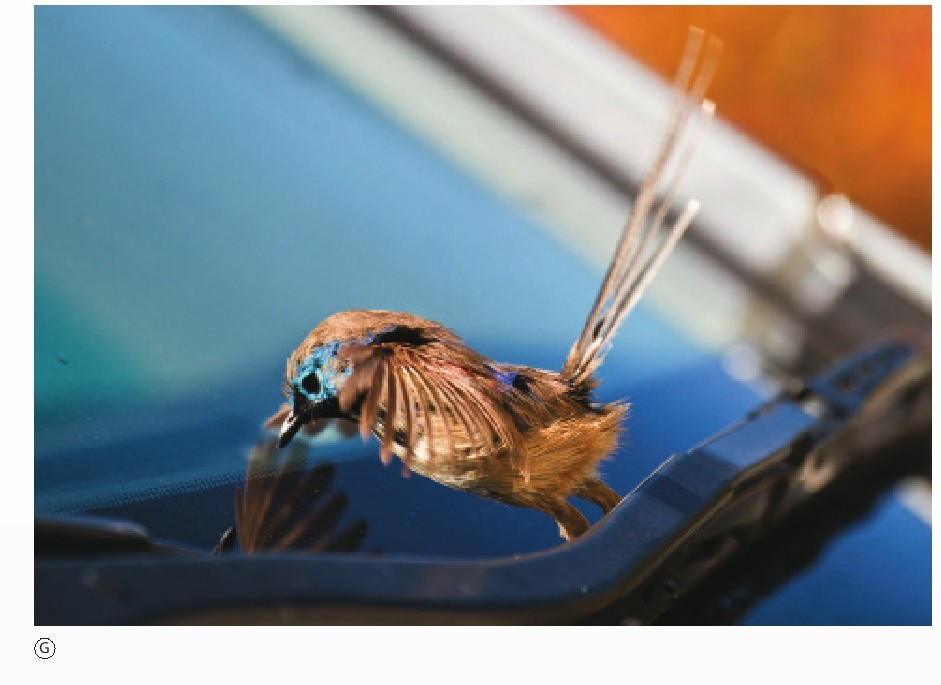
为了帮助这些鸟儿，防止它们撞到玻璃上，我们可以为它们做些什么呢？我们可以拉上窗帘或装上百叶窗，使得窗户玻璃尽可能不反光；可以为玻璃安装单边透明的薄膜，既不影响人从室内往外看，又能使鸟儿从外面无法看到室内的景物；尽量减少不必要的光源，减少光污染；可以将室内植物盆景等搬离窗户，避免鸟儿误把室内当成良好的觅食栖身场所；也可以在窗户玻璃外贴上印有猛禽图案的贴纸，对鸟儿起到警示告诫作用。（范忠勇）

## 鸟会主动攻击人吗

通常情况下，鸟类与人类和睦相处，一般不会主动攻击人类。但是如果有人在夏季走进鹭鸟集群繁殖的密林中，或贸然登上海鸟集群繁殖的海岛，这些闯入鸟类繁殖地的人，受到的待遇往往就是从天而降的“粪便雨”，这是鸟类对不速之客的回应，是被动的攻击行为。

鸟类攻击人主要是因为自身生存受到威胁，缺乏安全保障，这也是它们无计可施时所采取的被动防御措施。鸟攻击人的现象一般在鸟类繁殖季节较易发生。如果在鸟巢附近因为受到人为频繁干扰而使得鸟类无法正常进行产蛋、孵化、育雏等繁殖活动，或者鸟窝鸟蛋遭受破坏，这时，亲鸟就会挺身报复，通过啄头发、喷洒鸟粪等行为进行攻击，这些攻击行为的实施对象往往是有针对性的，但有时也会殃及无辜。（范忠勇）

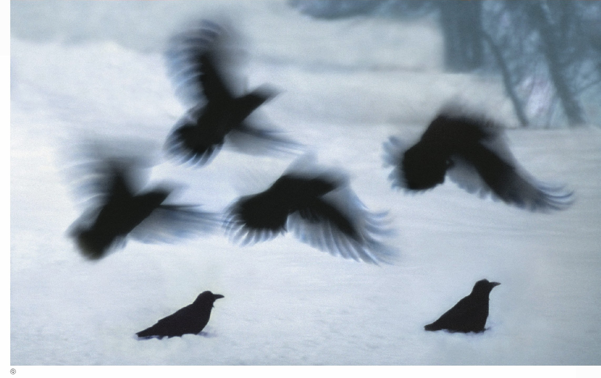
  

**【实验场】**给玻璃窗贴上鸟贴

找几张画纸，选择几种自己城市中较为常见的猛禽，参照猛禽的照片，自己动手将猛禽画下来，或直接将猛禽照片打印出来，制作成贴纸，贴在玻璃窗或幕墙上，这样也可以对飞行的鸟类起到警示保护作用，防止鸟撞的发生。

【微问题】秃鹫会主动攻击受伤的活人吗？

【关键词】行为　领域　攻击性　鸟撞玻璃

## 北极为什么没有企鹅

南极和北极位于地球的两端，都是气候酷寒、终年冰雪覆盖之地。两者的气候和环境条件似乎很相近，但是，南极生活着企鹅，而北极却没有，北极生活着北极熊，南极也没有，这是为什么呢？

要说清楚这个问题需要从历史和现实两个方面入手。

我们所说的企鹅，是动物分类上一个较大的鸟的类群，它们都不会飞行，适应水中生活，全部分布在南半球。根据化石资料，科学家认为，企鹅是在1亿年前从一种会飞的鸟演变来的，这些鸟类当时生活在现在的新西兰一带。那时，新西兰离南极的距离没有现在那么远，于是，有一部分企鹅就扩散到了南极，形成了今天常见的几种南极企鹅。另一些则扩散到温带地区，最北的乃至于分布到接近赤道的加拉帕戈斯群岛。那么，它们为什么没有越过赤道向北扩散呢？科学家认为，企鹅的身体条件适合于寒冷的环境，热带的气温和温暖的水流形成了一道物理屏障，阻挡了企鹅向北扩散。这是北极没有企鹅的历史原因。

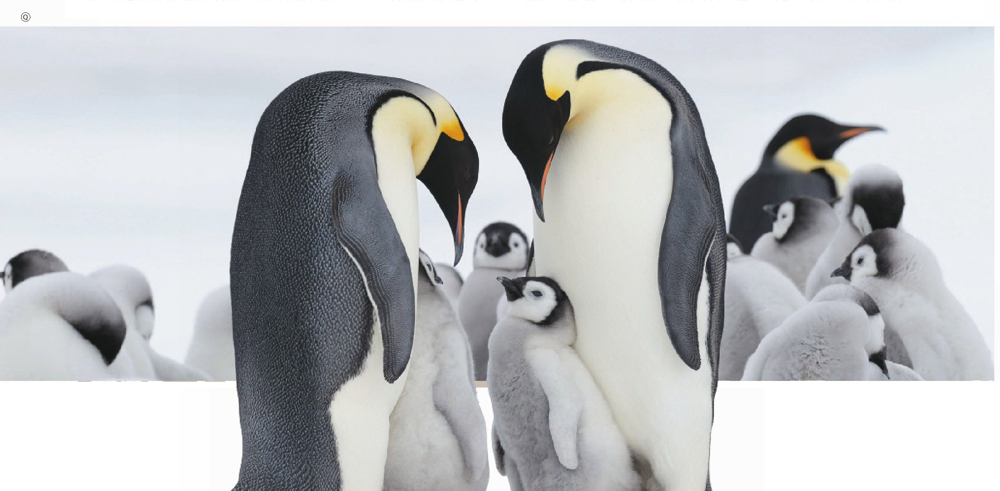
从现实来看，南极和北极虽然环境类似，但生态条件并不相同。南极是一块独立的大陆，周围被宽阔的海洋包围。这里气候严酷，只有一些原始的昆虫和苔藓类低级植物生长，因而也缺乏大型食草类动物，更没有类似北极熊这样的肉食动物。企鹅因此可以在周边的海域中获得足够的食物。由于远离大陆，也阻止了企鹅的天敌迁移到南极，从而给企鹅提供了一个得天独厚的生长和栖息环境。所以，即便忽略历史因素，我们现在人为地把企鹅扩散到北极，它们也很难在北极长久地栖息繁衍。（陈水华）

## 珍稀鸟类越多越好吗

经常看到新闻报道，说某地又发现了一种珍稀鸟类，说明当地生态环境良好，野生动物保护出色。为什么珍稀鸟类出现就说明生态环境良好？珍稀鸟类越多越好吗？

鸟类学家常说，鸟类是环境质量的指标。其中包含两层意思：一是鸟的种类多少可以基本反映生态环境状况，因为只有复杂多样、污染和干扰较少的环境才能满足多种鸟类生活的需要。二是珍稀鸟类出现多少，也可说明生态环境的基本状况，因为珍稀鸟类一般对环境更为敏感，要求更高。所以从这个意义上说，一个地区的珍稀鸟类越多越好。目前大部分的珍稀鸟类生活在各个自然保护区中就是一个明证，因为那里的环境一般是本地区最好的。

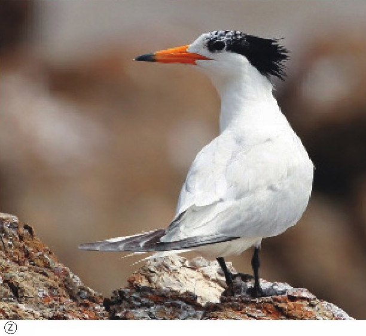
中华凤头燕鸥

当然，这种说法不是绝对的，要理解这点，需要先了解珍稀鸟类是怎么产生的。珍稀鸟类之所以珍稀，是因为它们的数量越来越少，变得很难见到了。适宜的栖息地丧失、食物资源短缺、人为捕猎、近亲繁殖导致生存能力下降等，都可导致鸟类数量减少。2004年，浙江自然博物馆研究人员在浙江沿海发现一种珍稀鸟类——中华凤头燕鸥，它因为数量稀少，踪迹神秘，被称为“神话之鸟”。进一步的调查发现，导致它们数量稀少的主要原因是渔民上岛屿捡走它们产下的蛋，而捡蛋现象在中国沿海十分普遍。如果捡蛋现象不遏止的话，不仅中华凤头燕鸥要濒临灭绝，中国沿海的其他海鸟也将逐渐变成珍稀鸟类。

所以，从小范围来说，珍稀鸟类的存在固然说明生态环境良好，但从大范围来说，珍稀鸟类增多，并不是一个好的现象，反而是应该引起警惕的事情，因为这同时说明适宜鸟类生存的栖息地越来越少，鸟类受到的威胁正在加剧。（陈水华）

## 为什么城市里的燕子越来越少了

有一回，作者在城市里做繁殖鸟类调查，碰到一位老太太在房前晒太阳。她向我抱怨说，以前常在她房前做窝的燕子，这几年再也见不到了，她不明白为什么，问我有没有办法让燕子重新回来做窝。

燕子曾经是中国老百姓最熟悉和喜爱的鸟类之一，中国古代关于燕子的诗句不计其数。这不仅由于燕子能捕食人们讨厌的害虫，其固定的南北来回迁徙的习性能准确地预示季节的更替，更在于它与普通百姓的生活十分亲近。它们常把巢筑在屋檐下，甚至是屋内梁间。燕子的呢喃声曾经是许多人记忆的背景声乃至于主旋律。然而，对于那些生活在城市里的人来说，燕子确实正离他们远去。

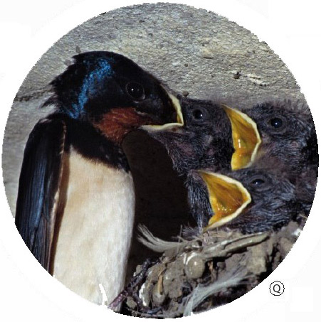
老太太的房子虽然还是老式房子，但周围已经被一座座拔地而起的高楼大厦所包围，成了名副其实的“城中村”。燕子需要在田野上觅食，尤其是小燕子孵出之后，它们需要尽快找到食物回巢，以满足小燕子生长的需要。而住在“城中村”里的人们，周边这样的田野已逐渐消失或者远去。燕子要穿过高楼大厦组成的“丛林”，找到一个适合筑巢的场所很不容易。即便找到了，身边还需要有合适的泥土供它们营巢。城市里的泥土沙子虽然很多，但缺乏黏性，巢做不牢就会掉下来。就算巢没问题，将来小燕子出来，再跑到很远的地方去找虫子，对于它们也是很辛苦的事情。所以，城市里的燕子越来越少了。（陈水华）

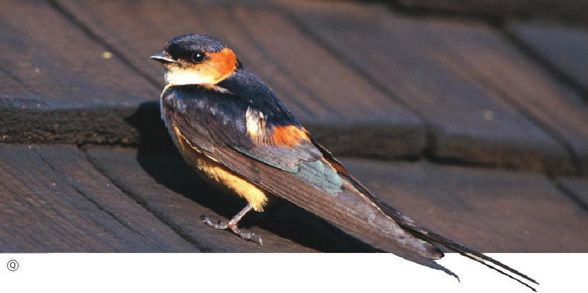
  

**【科学人】**菲比·施奈辛格

全世界有9000多种鸟，谁是世界上见过鸟的种类最多的人？美国密苏里州有一位叫菲比·施奈辛格的老太太，一生看到过8398种鸟，据说是世界上目击鸟种最多的人。菲比出生于1931年，50岁那年，她被诊断出患有晚期恶性皮肤瘤。菲比没有像许多患者通常所做的那样在家里静养休息，反而选择了到阿拉斯加观鸟旅行。这次观鸟旅行回来后，她发现皮肤肿瘤居然在消退。从此之后，菲比行走在世界的各个角落，去努力增加个人的目击鸟种数。直至1999年，菲比在马达加斯加观鸟途中翻车身亡。

【微问题】中国有蜂鸟吗？

【关键词】地理分布　珍稀鸟类　生态环境

## 天下乌鸦真的一般黑吗

“天下乌鸦一般黑”这句俗语，往往用来形容人心或社会环境的黑暗。在现实社会中，这一说法显然太过绝对，因为多元化的社会拥有不同的面相。那么在自然界中，这句俗语真的成立么？

乌鸦是广泛分布在全世界范围内的一大类鸟，它们对环境的适应能力很强。从喧闹的城市到贫瘠的高原，都有乌鸦的身影。从远古时代起，乌鸦就跟人类生活的联系十分紧密。在很多地区，都流传着跟乌鸦有关的传说，如乌鸦反哺等。

虽然乌鸦的身体以黑色为主，但并不是所有乌鸦都是全黑的。中国有9种乌鸦，泛见于全国各地，不同种类的分布范围有所不同。在北方地区和高原，常见的有大嘴乌鸦、秃鼻乌鸦和渡鸦等，它们的身体羽毛是全黑的，略带金属光泽。寒鸦见于新疆、西藏，家鸦见于西藏、云南，这两种乌鸦的背部和胸口的羽毛则都是灰色的。白颈鸦除西藏、宁夏、新疆和青海外见于各省，达乌里寒鸦除海南、西藏外见于各省。白颈鸦和达乌里寒鸦的体色更为特殊，其背部和胸口的羽毛是白色的，看上去跟喜鹊有些相似，但却是真正的乌鸦。

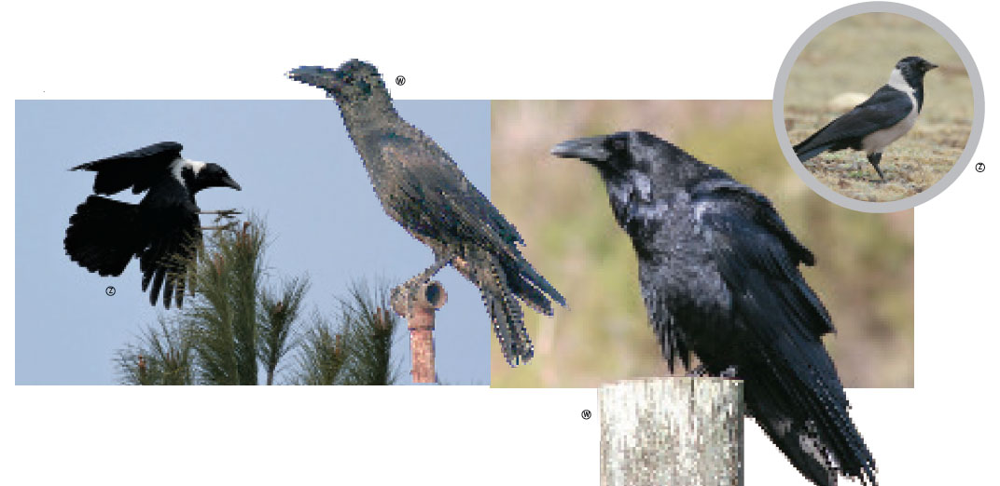
从左到右分别为：白颈鸦、大嘴乌鸦、渡鸦和达乌里寒鸦

如此看来，“天下乌鸦一般黑”这句话并不对，那这句话又是从何而来的呢？据考证，它最早出现在《红楼梦》一书中。确实，大部分乌鸦或者乌鸦身体的大部分就是黑色的，而它们喜欢腐食的特性，更是给其增添了一层神秘黑暗的色彩。乌鸦是黑色的这个观念，也因此逐渐在人们的思想中固化，这或许是“天下乌鸦一般黑”这句俗语的由来吧。（黄秦　陈水华）

## 为什么说乌鸦是最聪明的鸟

在北方的城市，很容易见到乌鸦。它们或在草坪上走动，或在树林中取食，即使看到人，也不会惊慌，而是一边叫一边镇定地飞走，给人留下深刻印象。

乌鸦是公认的最聪明的鸟，《伊索寓言》中乌鸦喝水的故事，生动地诠释了乌鸦的智慧。故事发生在公元前6世纪的希腊，一只口渴的乌鸦找到了一只装着水的大陶罐，但因为罐深水少，水位不够高，它喝不到水。陶罐的口子很小，不能飞进去，也很重，乌鸦没有足够力气把罐子推倒让水流出来。于是这只乌鸦找来很多小石块，从罐口丢进去，水位逐渐上升后，它便喝到了水。

鸟类学家还发现，新喀里多尼亚岛上的乌鸦，可以制作极为精巧的工具。它们会用弯曲的树枝做成钩子来寻找缝隙中的虫子，还会用叶脉制成小锯子来切开虫子。日本仙台的食腐鸦则找到一种敲碎坚果壳的好方法。它们衔着坚果在路边等待，在交通信号灯由绿变红的时候，它们飞下来，把核桃放在车轮前，然后飞走。当绿灯再次亮起车子开走后，坚果被压碎，它们就能吃到果仁了。

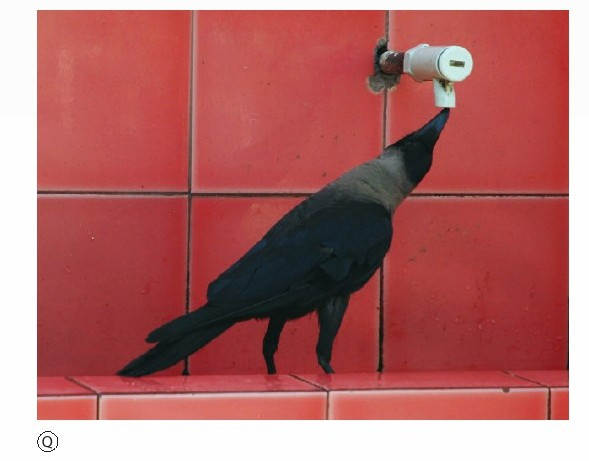
为什么乌鸦会这么聪明，有两个主要的原因。一是乌鸦的脑容量与身体的比例为鸟类之最。美洲鸦的大脑约占其体重的2.3%，而家鸡的这项指标却只有0.1%。最新的研究表明，脑容量较大的鸟较为聪明，可以更好地适应环境的改变，更容易在现代化的城市中生存。乌鸦在北方城市中的兴盛，给这一观点提供了良好的佐证。另一个原因是，乌鸦是群体性动物，寿命相较其他雀形目鸟类来说更长，可达到15～20年。它们会在群体中交流生存经验，亲鸟也会将自己的智慧传给下一代。先天的优势加上后天的学习，让乌鸦成为最聪明的鸟儿。（黄秦　陈水华）

## “喜鹊报喜、乌鸦报丧”有没有科学道理

喜鹊是一种较为常见的鸟类，在中国，除内蒙古和青藏高原的部分地区外，都可以见到喜鹊的踪影。“喜上眉梢”是中国国画中常见的主题，其中的“喜”便是指喜鹊，这也从侧面说明了中国人对喜鹊的喜爱之情。在中国文化中，喜鹊被认为是一种报喜鸟，是好事的征兆，而作为其近亲的乌鸦，则是厄运的象征，就如俗语所说的，“乌鸦叫，坏事到”。“喜鹊报喜、乌鸦报丧”反映了人们对这两种动物截然不同的看法和态度，那么这样的说法究竟有没有科学依据呢？

喜鹊和乌鸦都是雀形目鸦科的鸟类，属于鸣禽，鸣管较为发达。它们的叫声都谈不上动听，但对于它们自己及同类，却是一种非常重要的交流方式。在繁殖季节的清晨，喜鹊或者乌鸦们都会在自己领域范围内最高的树枝或者建筑物顶端鸣叫，宣示“主权”，同时向自己的配偶献殷勤。这是它们最常见的行为之一，它们的鸣叫，显然与人类的喜丧没什么关系。

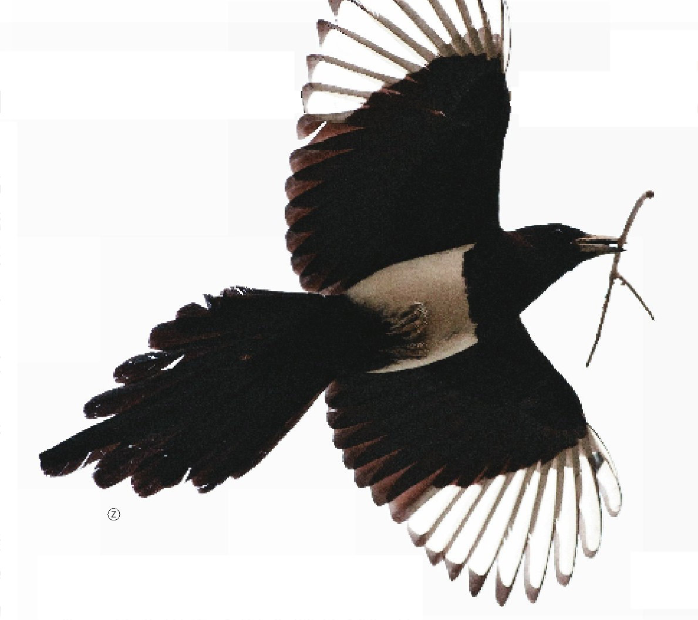
喜鹊

乌鸦被认为会报丧，可能与它们食腐的习性有关。在旧时的欧亚大陆，乌鸦常以死亡的动物尸体为食，甚至以战场上人的尸体为食，因为它们能够闻到腐肉的气味，并通过叫声召唤自己的同伴前来取食。

其实，人类对待动物的态度，往往具有地域性，大都由本民族的文化特质所决定。如在北美土著居民文化中，渡鸦有着积极的作用，被视为英雄的化身。

在农业社会，人类的死亡率很高，乌鸦可以闻到濒死之人身体发出的味道，便会飞到人类的住所附近鸣叫等待取食。所以，对于那时的人类来说，乌鸦的出现和鸣叫确实有可能是报丧。（黄秦　陈水华）

  

**【实验场】**观察喜鹊筑巢

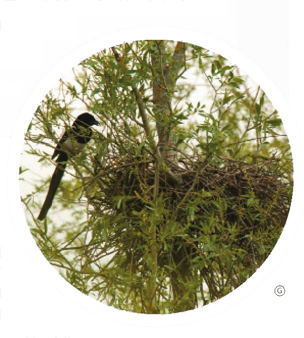
喜鹊喜欢在高树上筑巢，但在一些城市周边，常缺乏可供筑巢的大树，那么，它们会在哪里筑巢呢？观察你们家和校园周围的喜鹊，看看它们都选择在什么地方筑巢，巢有多大，什么形状，筑巢的材料又是什么。

【微问题】在七夕节，喜鹊为牛郎织女搭鹊桥的故事只是一个美丽的传说吗？

【关键词】乌鸦　喜鹊　智力　传说

## 八哥为什么喜欢站在牛背上

八哥是中国南部和东南亚地区的一种常见鸟类，羽毛以黑色为主，翅膀上有两块白斑，展开时呈“八”字，非常醒目，这也是它们名字的由来。虽然八哥貌不出众，但鸣管极为发达，叫声多变，常被人为捕捉为笼养鸟。

春耕季节，在中国南方的农田中，常可以看到如下场景：水牛在田里走动或者耕田，八哥就跟在水牛的旁边活动，或者干脆站在它们的背上。而水牛呢，对于落到身上的苍蝇总是毫不客气地用大尾巴驱赶，对于八哥这种粗鲁行为却不以为然。这到底是什么原因呢？

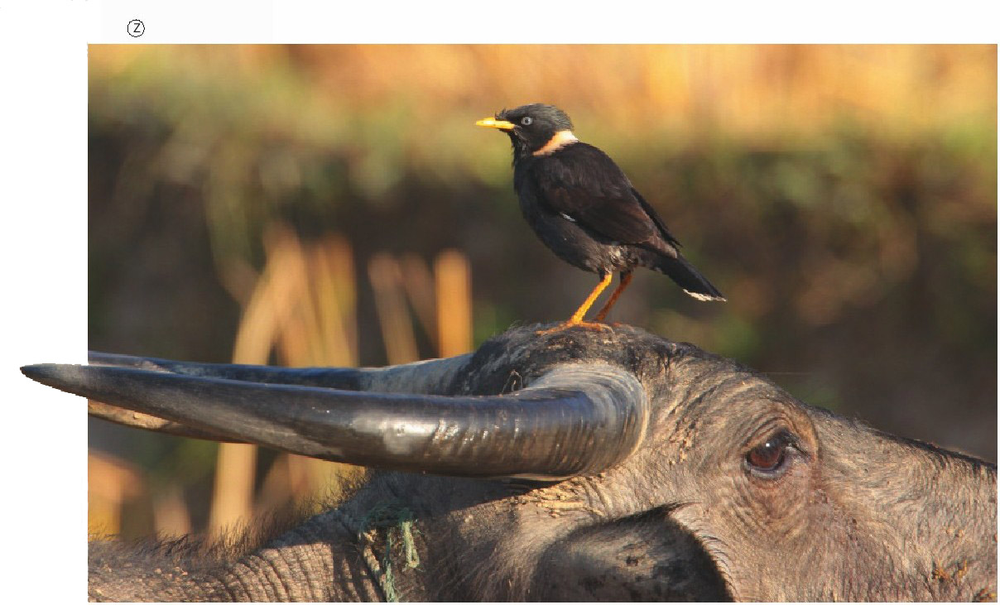
站在牛背上的白领八哥

八哥的食性较杂，主要以果实和小型无脊椎动物为食。在繁殖期，为了增加身体的蛋白质营养，动物性食物的比例会有所增加。然而，蚂蚱、蝗虫、蛾子等昆虫喜欢呆在农田或水荡中植物茂密的地方，不容易抓到。在长期的进化过程中，八哥们发现，当水牛在农田中走动时，动静往往很大，会将这些小型昆虫惊飞。八哥只要跟在水牛旁边，或站在牛背上，等待飞起来的昆虫，便可以轻松享受到丰盛的食物。八哥在取食的同时，也可以帮助水牛驱赶讨厌的蚊蝇等昆虫。因此，水牛对于站在它背上的八哥一点儿也不讨厌，因为它们之间，是一种互利共处的合作关系。

这种合作关系，在自然界较为普遍。除了八哥外，椋鸟科的丝光椋鸟、白领八哥等，以及鹭科的牛背鹭，也喜欢呆在水牛周围或站在牛背上取食。这些鸟类帮助控制了田地里的昆虫数量，也受到了农民的欢迎。（黄秦　陈水华）

## 海鸥为什么跟着轮船飞

海鸥是鸥类的统称，在中国的沿海，我们可以看到普通海鸥、黑尾鸥、银鸥等种类。鸥类的飞行能力很强，身体呈流线型，翅膀狭长，被誉为自由的飞行家。

有过海上航行经历的人都知道，海鸥喜欢跟着轮船飞。它们跟在船的尾部，追波逐浪，上下翻飞。海鸥的这个行为，为海上观察海鸥和拍摄提供了很大的便利，但也让人困惑，海鸥为什么这样呢？是它们长期在一望无际的海上飞行太寂寞，喜欢和人为伴，还是它们天性贪玩，喜欢追波逐浪？

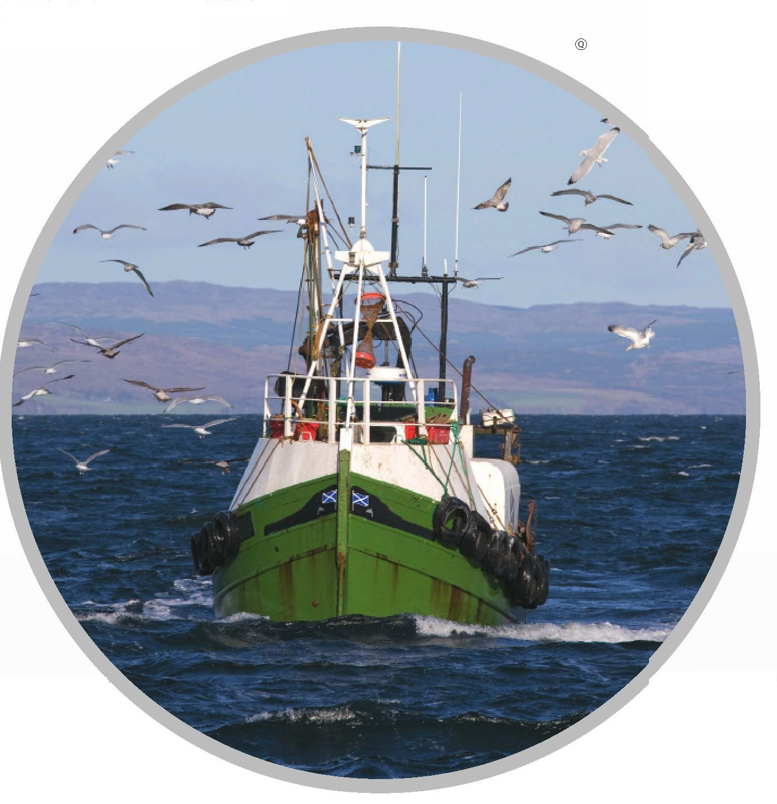
其实，鸥类喜欢跟着轮船飞行，和它们的觅食习性有关。海鸥主要以小型鱼类为食，这些鱼通常都在海洋的中下层活动，需要潜水才能捕捉到。可惜鸥类并不擅长潜水，因此它们选择跟在轮船后飞行。轮船开过时，螺旋桨会将部分小鱼打晕，从而漂到水面上来。海鸥们只要跟在轮船后面，就可以轻松地捕捉到食物了。除了在轮船后面捡拾鱼类，鸥类还发展出了多种多样的觅食方式。比如红嘴鸥会和鹈鹕、鸬鹚等鸟类联手，捕食被潜水鸟类赶到水面上的鱼类和无脊椎动物，黑嘴鸥则会在被渔民翻过的泥滩地里寻找食物。除了以上的捕食方式，大型的银鸥类还会在大型垃圾场里觅食，或者像贼鸥一样掠夺海雀等小型海鸟的蛋、雏鸟和食物……多样化的觅食方式和很强的适应能力，让鸥类成为了自然竞争的优胜者，除了南极洲和非洲内陆，其他大陆都有众多的鸥类分布。（黄秦　陈水华）

## 为什么说燕子低飞要下雨

古时不如现在，可以利用精密仪器捕捉风云变幻，进行气象预报。中国古代劳动人民在长期的生产实践中，除了观察天象，还通过观察身边的动植物来预测天气，从而总结出了大量的气象谚语。“燕子低飞要下雨”就是其中广为人知的谚语。这其中含有什么科学道理？燕子真的能够预测天气的变化吗？

燕子是在中国广泛分布的夏季鸟类，它们春天从南方飞来，秋天又飞回南方越冬。因为数量众多，且喜欢在离人很近的地方筑巢，而被人们所熟知和喜爱。燕子身体呈流线型，飞行速度较快。它们有着剪刀状的修长尾羽，可以迅速调整飞行姿势，做出各种高难度飞行动作，在空中高效率地捕捉飞行中的昆虫。

在下雨之前，由于气流作用，即将降雨区域的气压会稍稍下降。在较低的气压条件下，空气变得稀薄，含氧量也随之下降。对于这个变化，敏感的人群也仅能感觉到，但昆虫却能对此做出反应。因为含氧量的下降，使很多平时呆在半高空的小型飞虫如蜻蜓，都往地面附近聚集，燕子也随之低飞捕食。古代劳动人民经常观察到这一现象，所以总结出“燕子低飞要下雨”的气象谚语。（黄秦　陈水华）

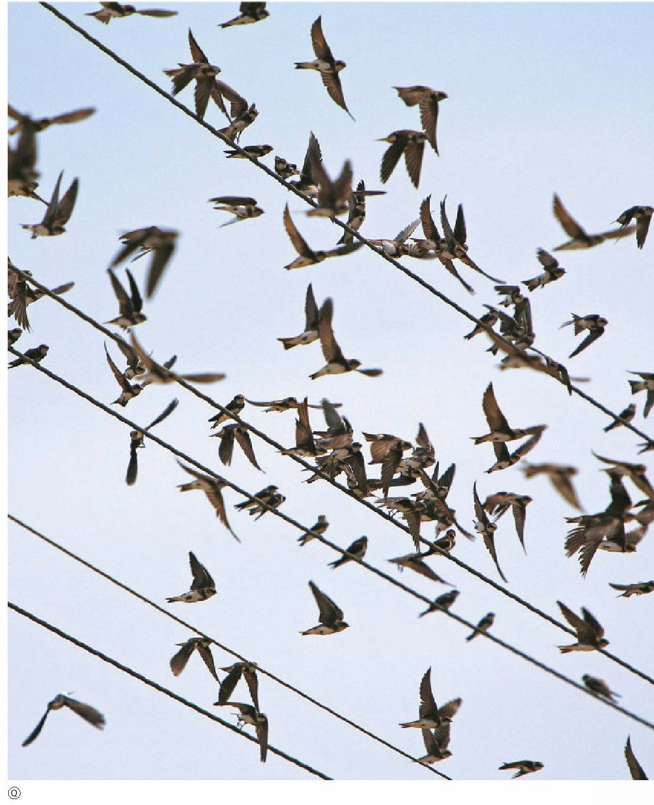
  

**【实验场】**帮助燕子安家

居住在城里的燕子有两种：家燕和金腰燕，两者体形大小相似。家燕背部蓝黑色，喉部暗红而腹部白色；金腰燕背部蓝黑色而腰部赭黄色，非常醒目，喉部和腹部都有纵纹。

在城市里繁殖的燕子如今遇到了新问题。燕子需要衔泥筑巢，而城市大部分地面被硬化或种上草坪，湿润的泥土非常少见。请你在校园花坛里或自家阳台上放置一些湿润的泥土，观察是否有燕子来衔泥。同时也可以观察它属于哪一种燕子，在哪里筑巢，巢的形状以及小鸟的孵化情况等。

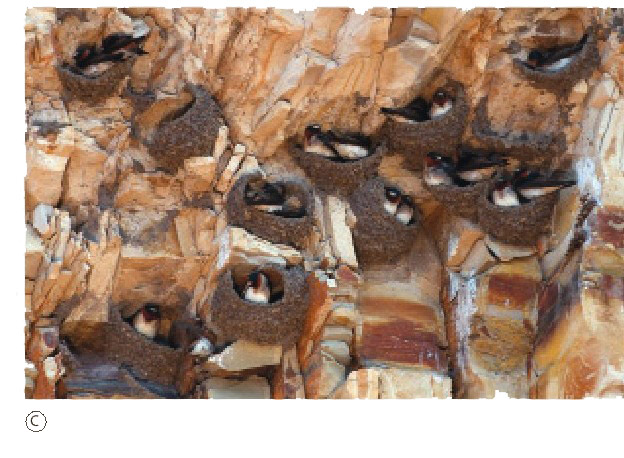
【微问题】海鸥只生活在海上吗？

【关键词】觅食　行为　气象

## 为什么说早起的鸟儿有虫吃

清晨，如果你走进森林中，鸟儿在你周围唧唧啾啾飞来飞去，忙着四处寻找食物，不一会儿，它们的嘴中就捕获了一条小虫子，吃得津津有味。这正应了一句俗语“早起的鸟儿有虫吃”，这句话的意思再浅显不过了，意在激励我们做事要趁早，早动手，早获利。你勤奋努力，多付出劳动，就容易比别人多一些成功的机会。然而，让我们回过头来，细细探究一下这个问题，为啥早起的鸟儿就能有虫吃呢，为啥它们不睡到日上三竿再捉虫呢？

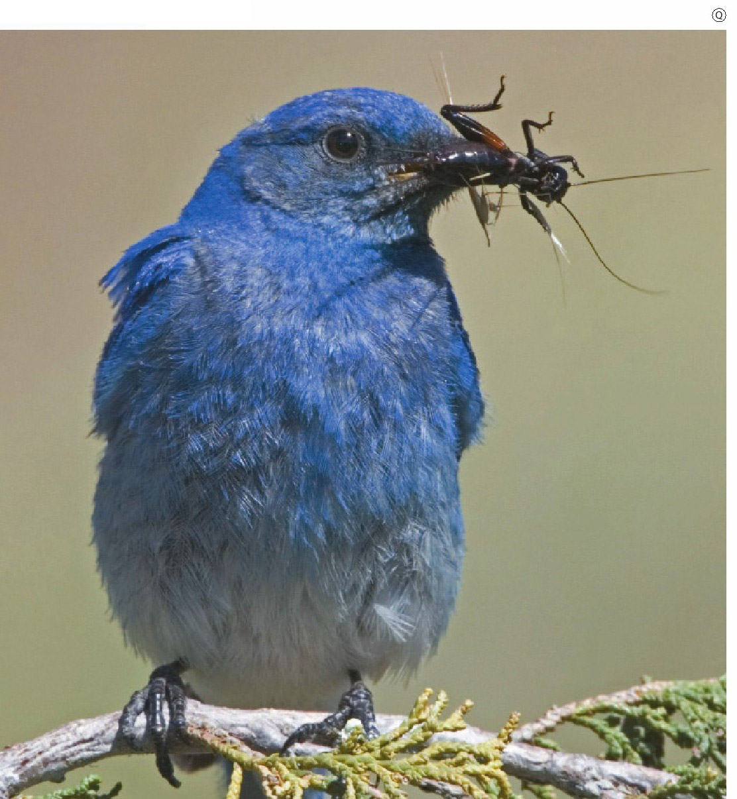
捕捉到昆虫的知更鸟

这是因为清晨太阳尚未完全出来，气温还没升高时，鸟儿的食物——昆虫，还不能很灵活地运动。这些昆虫由于前一天晚上呆在植物的花朵上、枝叶里，翅膀沾上了湿气，露珠让它们的翅膀变得沉重无比，它们自然不能飞行。这时候，这些活动能力较弱的虫儿一旦被早起觅食的鸟儿遇见，就会被逮个正着，成为鸟儿们美味的早餐了。古人在天长日久的生活经历中观察到了这种现象，从而留下了“早起的鸟儿有虫吃”的俗语。其实在气温上升后的大白天，那些以昆虫为主要食物的鸟儿也同样有虫吃，它们也还要捕食昆虫填饱肚子，无非这时候昆虫已经恢复了飞行能力，鸟儿抓起来就要多费点劲，多消耗些体能了。当然，为了减少消耗，鸟儿们也会在烈日下相应减少活动量。（范忠勇）

## 育雏时亲鸟怎样决定该先喂哪只幼鸟

人类在通常情况下，一次只生育一个孩子，所以会十分精心地进行喂养抚育。然而鸟类的情况有所不同，鸟儿因为要赶在食物最多的春夏季节集中生孩子，因此很多鸟一次并不止生育一个后代。那在同时孵化出来的宝宝中，亲鸟怎样决定该先喂哪只幼鸟呢？喂食是有次序的，还是随机的呢？

科学研究发现，鸟类对孵化出的下一代进行抚养是出于一种本能。当亲鸟衔着虫子或其他食物回到鸟巢附近时，嗷嗷待哺的雏鸟们便会伸长颈部，急切地发出求食的鸣叫，它们张着大大的嘴巴或嘴边露出特别鲜艳的红色或黄色，这些信号都强烈地刺激着亲鸟的喂食本能。此时，那些叫声特别响亮的雏鸟，通常比较容易引起亲鸟的关注，也就容易获得食物，在今后也会成长得更强壮。而那些同时呆在巢内却不张嘴或鸣叫不够响亮的雏鸟，亲鸟就不会对它们喂食。这可真算得上是“会叫的孩子有奶吃”了。反过来说，那些能通过响亮的叫声获取更多食物资源的雏鸟个体，本身先天就更健康些，而那些鸣叫声不够响亮的雏鸟，在食物资源不足的情况下，因为不能得到足够的营养，有可能会被自然淘汰或在日后更容易被捕食者捕获，这也符合优胜劣汰的自然选择规律。

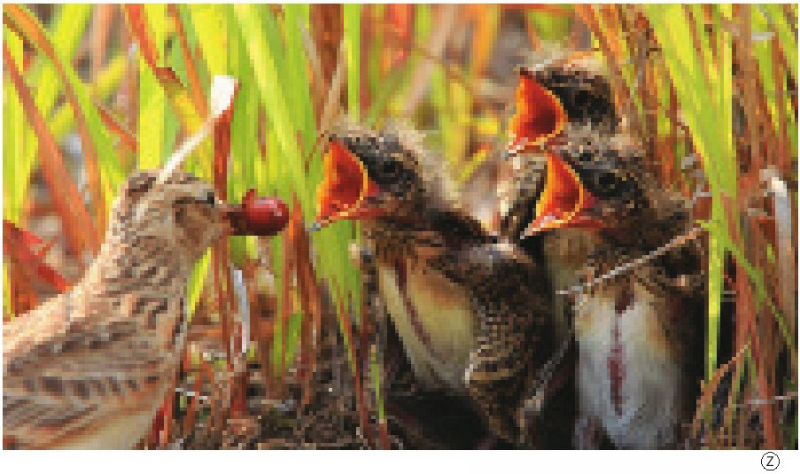
嗷嗷待哺的云雀幼鸟在向亲鸟乞食

此外，也有研究显示，幼鸟的喉部结构比较特别，幼鸟在快要吃饱时吞咽的动作便开始慢下来。亲鸟有时随便把食物塞进一只幼鸟的嘴里，然后会注意观察，假如那只幼鸟没将食物立即咽下去，亲鸟便又会把食物从幼鸟的嘴中衔出来，塞给另一只幼鸟。立即咽下食物的幼鸟，一定是肚子最饿的。（范忠勇）

  

**【实验场】**辛苦的鸟妈妈

在夏季鸟类繁殖季节，找到屋檐下或房屋横梁上一处家燕筑好的巢，仔细观察。待小鸟出壳后，在不惊扰亲鸟喂养雏鸟的前提下，统计并记录亲鸟每小时外出觅食、喂养的次数。之后每隔数天进行连续观察和统计，观察随着小鸟的长大，亲鸟外出觅食的次数和间隔时间有什么变化。

## 为什么鹭鸟的粪便是白色的

如果你有机会走进白鹭、夜鹭等鹭鸟在野外栖息的密林，你一定会对地面或树叶上白色的斑斑点点留下深刻印象，那就是这些鸟儿留下的粪便。也许你会好奇地问，为什么它们的大便是白色的？其他鸟的粪便也是白色的吗？

由于鸟类没有膀胱，进行新陈代谢就需要依靠肾脏，鸟类的肾脏相对较大，约占体重的2%（成人的肾脏仅占体重的0.4%）。鸟类不会在体内储存粪便，也不会单独排尿，尿液是和固体的粪便一起从泄殖腔随时排出的。我们看到的白鹭、夜鹭等鹭鸟粪便中，那些白色的糊状物质就是由含水分较少、不能溶化的蛋白质转化成的尿酸结晶。

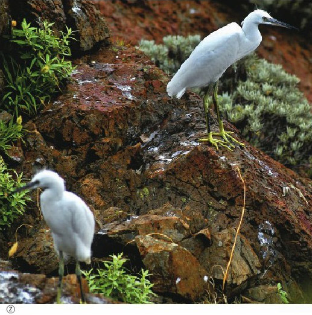
嗜食鱼类的白鹭排出的粪便是白色的

其实，并非所有鸟类的粪便都是白色的，只有那些以昆虫或鱼类为主要食物的鸟类（如鹭鸟、鸻鹬或鸥类等），因进食的这些食物中蛋白质含量较高，所以排出的粪便才呈现白色。而那些喜爱吃植物种子或果实的鸟类，它们的粪便颜色大多较深，多偏褐色和绿色；那些杂食性的鸟类，粪便颜色则介于上述两者之间。（范忠勇）

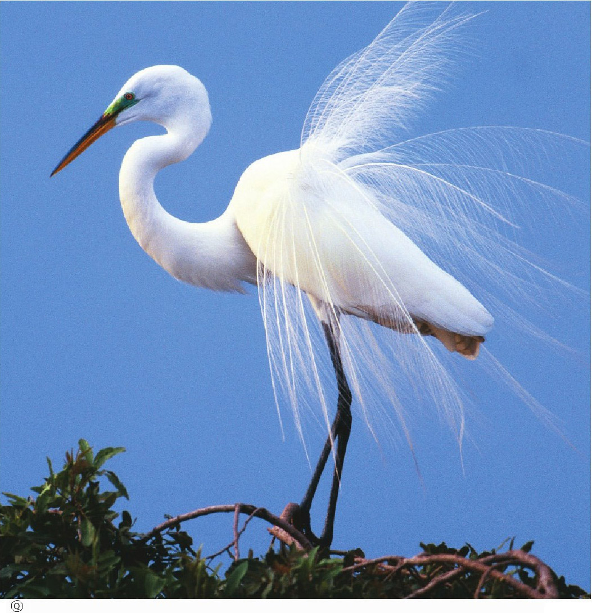
白鹭

  

【微问题】为什么清晨和黄昏鸟类特别活跃？

【关键词】食物　亲鸟　育雏　粪便

## 为什么说鸳鸯是爱情的象征

“鸳鸯于飞，毕之罗之，君子万年，福禄宜之”，这是《诗经·小雅·鸳鸯》中以鸳鸯来描述爱情的诗句。汉代乐府名作《孔雀东南飞》中，也以鸳鸯来比喻焦仲卿和刘兰芝坚贞不渝的爱情。唐代诗人卢照邻的《长安古意》一诗，更是用“得成比目何辞死，愿作鸳鸯不羡仙”来表达对爱情的期盼。中国古人为何会把鸳鸯作为爱情的象征？

鸳鸯是一种漂亮的水禽，属于雁形目鸭科。雄鸟羽毛艳丽，翅上有棕黄色装饰性帆状饰羽，雌鸟的颜色则相对黯淡，较为雅致。鸳鸯雌雄的特征非常明显，古人以“鸳”命名雄鸟，以“鸯”命名雌鸟。鸳鸯在求偶期多是一雄一雌活动，常常一起追逐飞行。雄鸟会紧紧跟在雌鸟身后，偶尔也会喂雌鸟小鱼以献殷勤。雄鸟和雌鸟亦常在一起相互梳理羽毛，看起来非常亲密。古人应该是观察到了这一鸟类出双入对的现象，因而视鸳鸯为忠贞爱情的象征。

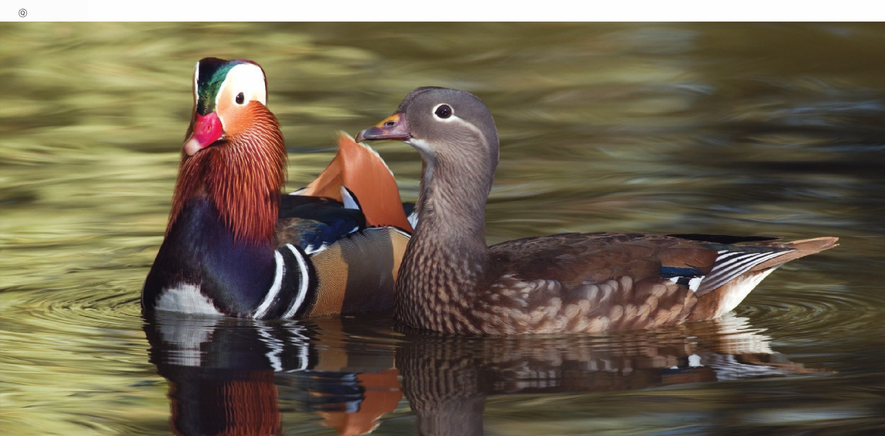
然而，近年的研究却揭示了鸳鸯一些鲜为人知的事实。其实，鸳鸯并不是严格的一夫一妻制，存在着混交的现象。雄性鸳鸯会与不同的雌性个体进行交配。因此，同一窝里的小鸳鸯，虽然是一个母亲，却可能有不同的父亲。当然，一对鸳鸯夫妇通常会保持伴侣关系长达数年，这在鸟类中应该算是不错的了，因为大多数鸟类的伴侣关系一般只维持一个繁殖季节，来年就会另觅佳偶。不过，鸟类中确有忠贞的爱情关系，比如天鹅终其一生只维持一个伴侣。但是，传说中为死亡一方守节的情况在鸳鸯中并不存在。如果有一方死亡，另一方还是会寻找新的伴侣。

虽然现实和人们的希望存在差距，但在鸳鸯的身上还是寄托着人们对爱情的美好期望。这种期望已经超越了鸳鸯本身，成为一种象征性的文化符号。（黄秦）

## 鹤是最长寿的鸟类吗

“松鹤延年”是中国国画中常见的主题。飘逸的丹顶鹤站在松树上，画面清逸，含义悠远。鹤和松树，在中国传统文化中都是长寿的象征。松树的长寿已经得到了科学家的验证，那么，鹤类是否同样长寿呢？将其作为长寿的象征合适么？

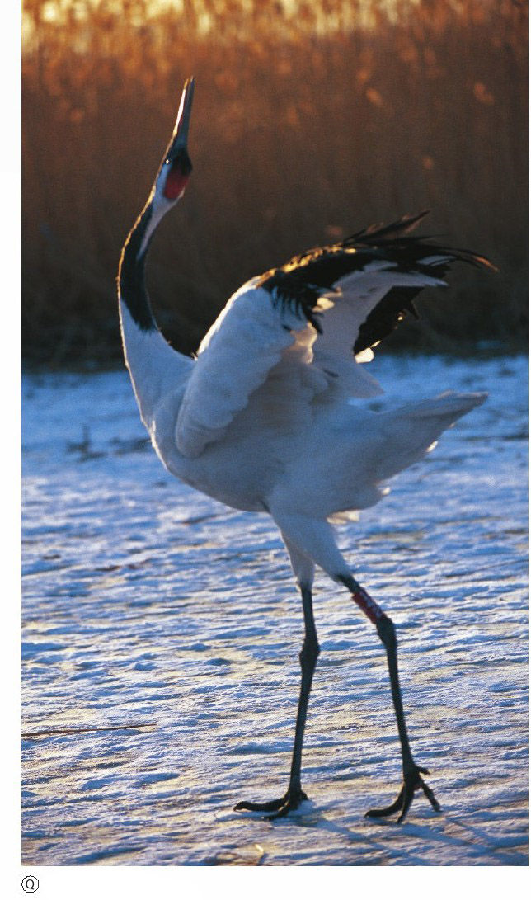
丹顶鹤

丹顶鹤是一种大型鹤类，体全长可达150厘米。它的雏鸟为早成型，出生后即可跟随亲鸟活动。因为体形较大，小鸟要到3～5年后才开始繁殖。野生丹顶鹤的寿命在20～30年之间，要短于人们所估计的50～60年，笼养状态下丹顶鹤的寿命可能会有所增长。相对于信天翁等，丹顶鹤在鸟类中并不是最长寿的。吉尼斯世界纪录表明，有不少大兀鹫的寿命可达70岁以上，而传说中的一只亚马孙绿鹦鹉则高达104岁。不过，鹤在鸟类中确实也算是较为长寿的，个别西伯利亚鹤也可以活到60岁以上。

松鹤延年的画面虽然优美，而且寓意吉祥，但并不是生活中的真实场景。因为丹顶鹤几乎不上树，因此并不会与松树相伴。它的活动环境是滩涂湿地，巢也是做在湿地的芦苇丛中的。倒是外形有些相似，但完全属于另一类群的苍鹭和东方白鹳等长腿涉禽在繁殖时会在树上做巢，松鹤延年图画的灵感很可能来源于这两种鸟类。（黄秦）

## 凤凰真的存在吗

在中国古代传说中，凤凰是一种神奇的鸟类，与龙一样，都是汉民族的图腾。凤凰是雌雄鸟的统称，雄为凤，雌为凰。它的羽毛为五彩色，非常美丽。传说中的凤凰死后，身体周围会燃起大火，并在浴火中获得重生，称之为涅槃。凤凰被尊为百鸟之王，古代帝王则宣称凤凰出现会预示着太平盛世。

科学研究表明，至少在近代，凤凰并不存在。它很可能只是存在于人们想象中的一种鸟类。郭璞先生对《诗经·尔雅》的注释，可以让我们了解到凤凰的一些信息：“鸡头、燕颔、蛇颈、龟背、鱼尾，五彩色，高六尺许。”鸡头是典型的特征，红黄二色则被认为是凤凰的主要颜色。

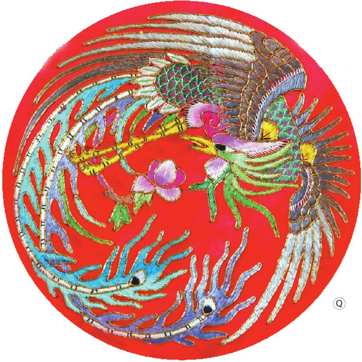
凤凰的外观特征和雉科的红腹锦鸡较为接近。红腹锦鸡是鸡形目雉科的鸟类，雄雌二色，雄鸟头部颜色亮丽，体羽有着显著的红色和黄色区块，雌鸟颜色黯淡。红腹锦鸡为中国特有的物种，主要分布在中国中西部的山西、河南、陕西、甘肃、青海和四川等地，这个分布区域与中国上古时期的文化中心相当吻合。由于在该分布区域内，红腹锦鸡较为常见，因此，古时的人们很可能以红腹锦鸡为原型，经过艺术加工和神话演义塑造出了凤凰这个华丽而高贵的形象。（黄秦）

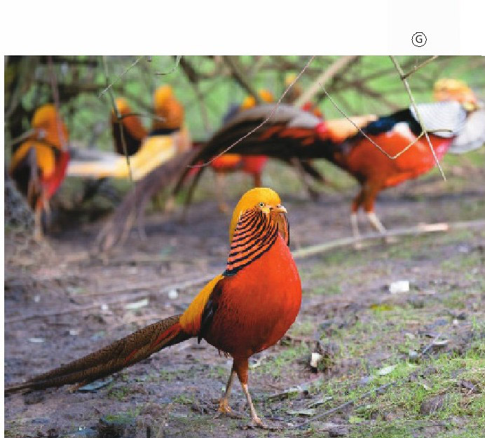
红腹锦鸡很可能就是人们塑造出凤凰形象的雏形

  

**【科学人】**徐秀娟

《一个真实的故事》是一首广为传唱的歌曲，讲述的是徐秀娟和丹顶鹤之间的故事。徐秀娟1964年出生在东北的一个驯鹤世家，父亲是黑龙江扎龙丹顶鹤自然保护区的工作人员。她自小与丹顶鹤为伴，1986年从大学进修结束后，便到盐城丹顶鹤保护区工作，研究丹顶鹤的人工繁育和盐城不迁徙种群的建立。1987年，她开始参与小天鹅的人工繁育。当年9月16日，因为寻找两只失踪的天鹅雏鸟，徐秀娟不幸溺水身亡。徐秀娟是中华人民共和国成立后有记载的首位因公殉职的野生动物保护工作者，她的离去，让我们追思缅怀，也为科研工作中的安全问题敲响了警钟。

【微问题】音乐剧《天鹅湖》中的四小天鹅的灵感来源于哪里？

【关键词】文化　鸳鸯　天鹅　丹顶鹤　凤凰

## 为什么鹰能从高空发现地面的小猎物

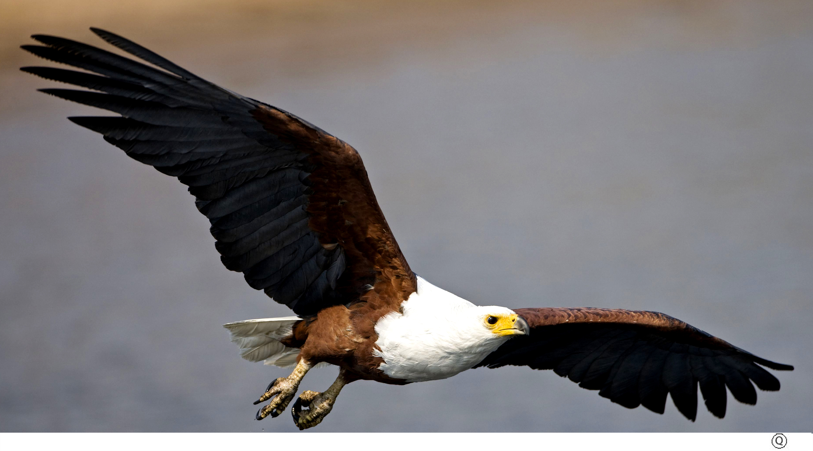
鹰是人们对隼形目鹰科鸟类的统称，如雀鹰、黑鸢、大鵟、金雕、秃鹫等。鹰是白天活动的猛禽，主要以小型鸟、兽和蛙类为食，但不同种类鹰的食物差异较大。在晴朗的天气条件下，被加热的空气会形成上升的热气流，鹰类就能够借着热气流在空中盘旋。这种热气流在山脊的位置最强，因此在郊外的山顶，我们常常能看到鹰在高空盘旋的身影，它们自由翱翔的飞行模样，令人感到非常惬意。

鹰在高空盘旋的主要目的是为了捕猎，可是，高空虽然视野开阔，但毕竟离地面很远，鹰为什么能够毫不费力地发现地面上的鼠、兔和其他小型鸟兽呢？这是因为鹰拥有特殊的视力。一个视力正常的成年人，只能分辨出100米远处10厘米以上大小的物体，而鹰的视力要比人类敏锐至少3倍，它们在离地面约1000米的高空盘旋时，也能分辨出在地面活动的小型动物。

一般来说，鸟类的视力都很不错，秘密就在于它们的眼睛。目前的研究已证明，鹰类不但看得比人类更远，而且色视觉也比人类的范围更宽，它们能看到我们看不到的紫外光。人类的视网膜每平方毫米只有几十万个感光细胞，而大型鹰类，如普通鵟，眼睛中每平方毫米的感光细胞可达100万个。更为特殊的是，鸟类眼睛通常长在头部的两侧（鸮形目的猫头鹰例外），这意味着它们有着更大的视域，部分鸟类的视域可达300°。再者，鸟类眼睛周围有着发达的肌肉组织，可以在极短的时间内改变眼球晶状体的形状，实现快速聚焦。

人类眼睛所占头部体积的比例不足5%，而鸟类可达20%～25%。作为顶级猎食者，鹰类的眼睛体积在诸多鸟类中更是突出，它们的双眼几乎与人类的一样大。大眼睛、高密度的感光细胞、超大的视域以及眼周发达的神经和肌肉组织，让鹰类拥有了超凡的视力，并使它成为空中霸主。（黄秦　陈水华）

## 猫头鹰为什么在夜晚活动

猫头鹰在民间，尤其是在西方，有着很高的知名度，更是影视、艺术和文学作品中的常客。它们外形奇特，有着圆圆的脸盘、大大的眼睛，以及圆鼓鼓、胖乎乎的身体。更吸引人的是猫头鹰的夜行特性，因此，猫头鹰几乎成为了神秘的象征。猫头鹰为什么在夜晚活动呢？关于这个问题的答案，民间传说和寓言故事给出了多个版本。其中一个版本是，猫头鹰因为觉得自己长得丑，所以只敢在夜晚活动；在另一个版本中，猫头鹰因为自私，得罪了所有的鸟类，所以不敢在白天出来。那么，科学给出的答案是什么呢？

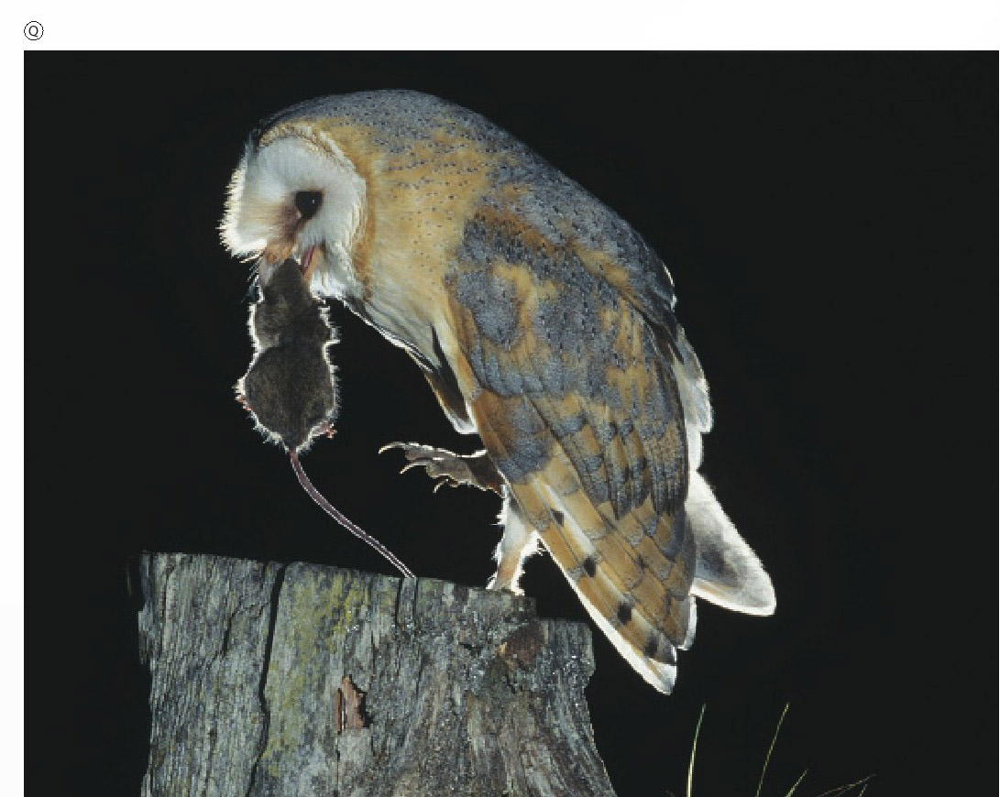
正在夜间捕食的仓鸮

猫头鹰是人们对鸮形目鸱鸮科和草鸮科鸟类的俗称。绝大多数的猫头鹰是夜行性的，有些种类只在夜晚活动，而且能够在近乎全黑的环境中捕食，如仓和鬼等。也有一些在晨昏活动，当然也有少数种类是日行性的。猫头鹰是肉食性的鸟类，它们之所以在夜晚活动，主要原因是它们的猎物在夜间出来活动。也就是说，是猎物的活动规律决定了猫头鹰的活动规律。夜行性猫头鹰的捕猎对象为鼠类和兔子等夜行性动物，而少数日行性猫头鹰捕猎的对象则多是鱼类等白天活动的动物。

为了适应黑暗中的生活，猫头鹰的身体构造发生了不同程度的特化。我们知道，视网膜上有视杆细胞和视锥细胞负责对外界物体进行感光，前者对光的敏感度高，但不能辨别颜色，对细节的分辨也差；后者对光的敏感度低，但能辨别颜色，也能分辨细节。在白天光线充足的时候，主要是视锥细胞在活动；到了晚上光线暗淡的时候，就要靠视杆细胞来辨别。猫头鹰为了夜间活动，其感光细胞几乎全变成了视杆细胞，这样一来，它们在夜间飞行自如，到了白天反而看不清了。另外，它们眼后的一对大耳孔也是秘密武器，配上那个特殊的面盘，更有利于收集声波。猫头鹰飞羽的外侧还有着特殊的结构，飞行时不会发出声音，可以悄无声息地靠近猎物，这一特点也让其夜间捕食的成功几率大大增加。出色的视觉、听觉和无声的飞行，让猫头鹰成为了夜晚工作的优秀猎手。（黄秦　陈水华）

## 猫头鹰的头为何能转很大的角度

猫头鹰的奇特之处还在于，它在背对着你的时候，不用转身，就可以把头旋转180°，从背后直接看你。如此怪异的动作，常常令初次见识的人感到惊讶。确实，如此高难度的扭头动作在其他鸟类中很少见到，我们人类更不可能。那么，猫头鹰是怎么做到的呢？

我们知道，多数鸟类的眼睛长在头部的两侧，视域可达300°以上。而猫头鹰因为有着面盘，眼睛都长在头部的正面，双眼叠加的视场范围只有150°，与我们人类接近，这给它的观察和捕猎带来了不利的影响。为了弥补这一不足，猫头鹰在长期的进化过程中形成了较长的颈椎。人和其他哺乳动物的颈椎只有7个，而猫头鹰的颈椎数则有更多，如领角鸮的颈椎就有14个。另外，猫头鹰的颈椎结构也较为特殊，颈椎两侧的韧带非常发达，使得猫头鹰的头部向两侧都可以转到270°的范围。

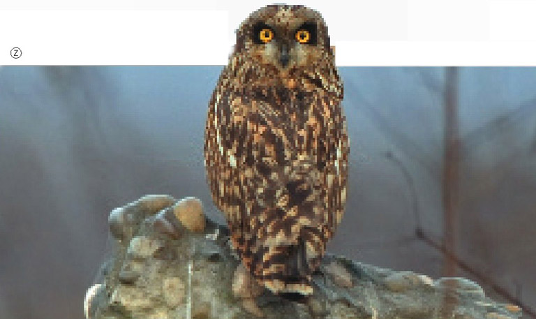
头部向后旋转的短耳鸮

发达的颈椎，使得猫头鹰向任一方向转动头部，就可以轻松地发现背后的敌人或者猎物。虽然猫头鹰的眼睛长在前面，然而它灵活旋转头部，确保了它比起那些视野开阔的同类毫不逊色，也没有什么可遗憾的。（黄秦　陈水华）

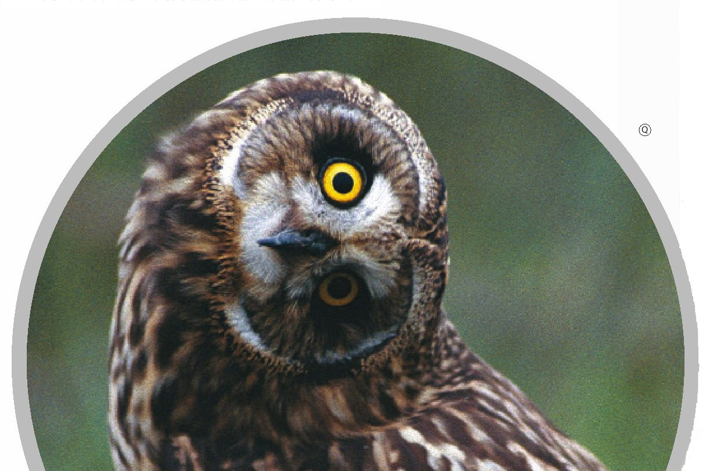
  

**【微博士】**不同文化中的猫头鹰形象

世界各地都流传着与猫头鹰有关的故事和寓言，并和本民族的文化密切相关。在中国和中东阿拉伯地区，猫头鹰被视为厄运的预兆；非洲肯尼亚的基库尤人则视之为死亡的象征；在一些美洲部落，猫头鹰常与黑暗和邪恶力量相关；而在现在的欧洲，猫头鹰则被赋予智慧的形象。欧洲的居民非常喜欢仓鸮，因为仓鸮会捕食农田和谷仓中的田鼠；北美的印第安人将雪鸮视为勇气的象征，用它们的羽毛作为帽子的装饰。

【微问题】猫头鹰在哪里筑巢？

【关键词】鹰　猫头鹰　飞行　视力

# 两栖爬行类

## 为什么两栖动物的皮肤总是湿漉漉的

两栖动物是从水生向陆生过渡的一个类群，它们源于鱼类，成功登上了陆地，却又离不开曾经养育它们的水世界。也就是说，它们具有“两种生活方式”。它们的幼体（蝌蚪）生活在水中，用鳃呼吸，有侧腺，具有尾巴，没有四肢；而成体经过“变态发育”到陆地上生活，长出四肢，用肺呼吸，尾巴和侧腺消失。这是两栖动物最显著的特征。

两栖动物皮肤裸露、具有腺体，而且皮肤上布有血管，具有呼吸功能，可以弥补发育很不完善的肺脏摄氧的不足。如果你尝试抓一只青蛙，会发现它们的皮肤不但是湿漉漉的，而且非常黏滑。这是因为两栖动物的皮肤腺主要是遍布全身的黏液腺，可以分泌黏液。湿漉漉的皮肤具有对空气和水的可透性，不但减少了体内水分的散失，而且皮肤可以帮助呼吸。此外，两栖动物通过湿漉漉的可透性皮肤进行蒸发和冷却，也是它们调节体温的一种途径。

除了以上这些作用，有些种类的两栖动物的皮肤还能分泌毒液，如箭毒蛙。当它遇到天敌时，就会分泌毒液，使天敌暂时中毒，丧失战斗力。而我们所熟知的癞蛤蟆等蟾蜍科动物，它们的耳后腺和表皮腺体的分泌物是一种有毒的白色乳状液体，经加工后，就是名贵的中药药材——蟾酥。蟾酥具有解毒、消肿、强心、止痛等作用。此外，两栖动物的皮肤具有色素细胞，它们还能以绚丽的肤色警戒敌手、保护自己。（徐士霞）

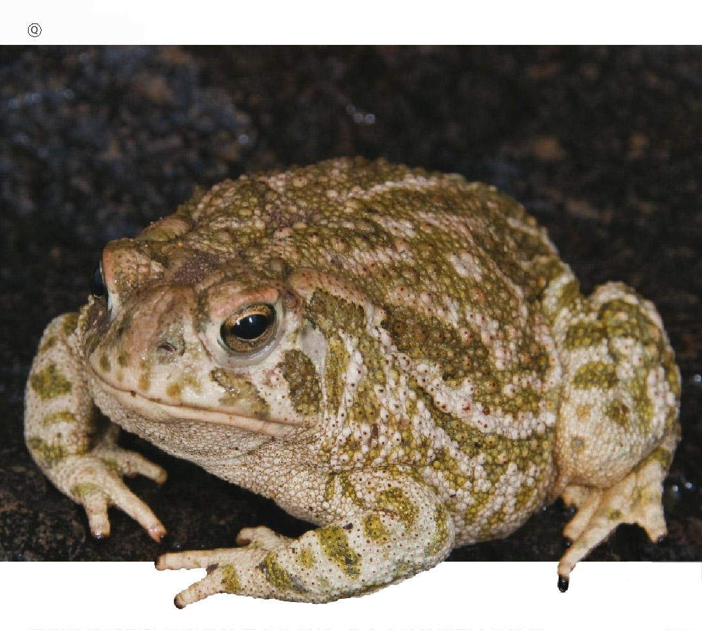
**【实验场】**

蛙的体色能随环境的变化而发生变化。准备3只空瓶和3只体色、大小差不多的雨蛙，每只瓶中先填进一些湿土，再分别放进一只雨蛙，然后将两只瓶子分别用绿、黑色纸包起来，另一只瓶子不用任何纸包，一星期后，请观察雨蛙有什么不同的变化。

## 为什么蛇要蜕皮

蛇全身都包裹着鳞片，但这些鳞片和鱼的鳞片不同。蛇的鳞片是由皮肤最外面一层角质层变成的，所以叫角质鳞。蛇鳞不仅有防止水分蒸发和机械损伤的作用，也是蛇爬行的主要工具。然而，蛇鳞外层的角质层是死细胞，如同舞蹈演员的紧身内衣，不能随着身体的长大而长大，因而当蛇长到一定的时候，没有生命的角质鳞就限制了个体的发育生长，这时只有蜕掉原来的表皮鳞被，并长出新的表皮鳞被，才能适应其不断长大的躯体，这就是蛇蜕皮的主要原因。

蛇蜕皮时，大多借助于粗糙的地面、树干、砖石瓦块、建筑物或蛇窝的拐角处，通过身体的不断摩擦而进行。先从吻端（唇部）把上下颌的表皮磨出一处裂缝，然后从头至尾逐渐向后翻蜕，直至脱去陈旧的“外套”而换上“新装”，因此我们多在石洞口或树枝上看见蛇蜕，也就是人们常说的“蛇皮”。

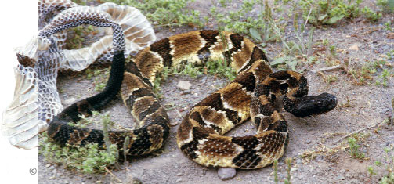
蜕皮后新产生的角质鳞要比原来的大一些，所以每蜕一次皮，蛇的身体就会长大一些。蛇的蜕皮次数与生长速度有关，次数越多，说明生长发育越快，反之则越慢。成年蛇类一般每年蜕皮3次左右；幼年的蛇类由于生长速度快，蜕皮的次数较多，一般每年可蜕皮4～5次或更多。影响蛇类蜕皮次数的因素很多，食物丰富时，其生长速度较快，蜕皮次数也多。另外，蛇类栖息处的温度、湿度及环境与蛇类蜕皮也有密切关系，如果蜕皮时环境干燥，则可能导致蜕皮无法完成。

蛇的蜕皮季节主要集中在春季和夏季，因为秋天要准备过冬，开始冬眠。当春天到来，天气暖和后，蛇开始出来活动，此时食物多，生长也快。因此，也有人认为蜕皮与蛇采食的活跃期相一致。蛇的蜕皮时间是很短暂的，一般健康的蛇蜕皮只需要几分钟即可。然而不健康的蛇或者正好怀有蛇宝宝的时候蜕皮就慢多了，有时需要几小时，甚至几天才蜕下来。（徐士霞）

## 为什么乌龟要长那么硬的壳

一提到乌龟，大家首先想到的除了它的速度慢以外，就是它背上的那个盔甲样的壳了。为什么乌龟天天背着这个硬硬的壳呀？

乌龟是特化的爬行动物，已经在地球上生活了几千万年，与恐龙是同时期的动物。乌龟硬硬的壳是与脊椎的胸骨和肋骨相融合的，由表皮的角质鳞与来源于真皮的骨板结合在一起形成的大型坚固甲板。龟壳分为上、下两半，上半部是覆盖在身体背面的背甲，下半部是托住整个腹部的腹甲，背甲与腹甲两侧相连。龟壳这样的结构，既有效地保护了乌龟柔软的躯体和重要的器官，又不妨碍它缓慢的行动。乌龟虽然四肢粗壮，但它们行动缓慢，遇到强大的天敌时，无法逃脱，只能将颈、尾、四肢尽量缩入龟壳。坚硬的龟壳就像士兵穿的盔甲一样保护自身安全，这是龟鳖类适应性进化的结果。

龟壳与龟板还是传统的名贵药材，它富含骨胶原、蛋白质、钙、磷、脂类、肽类和多种酶。据中医临床研究证实，龟板具有滋阴降火、补肾健骨等功效。目前，乌龟是较易人工饲养的爬行动物，已成为极受人们欢迎的宠物。（徐士霞）

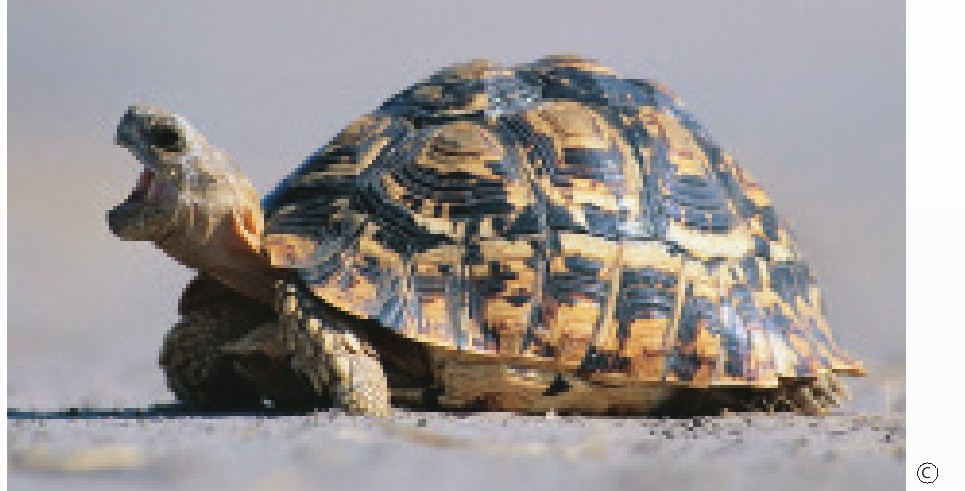
  

【微问题】在一农场内，一只拳头般大小的癞蛤蟆斗败了一只近2千克重的大公鸡，猜猜看癞蛤蟆是怎样斗败大公鸡的？

【关键词】两栖动物　皮肤　蛇　鳞片　乌龟　壳　甲板

## 沙漠里为什么有两栖动物

我们都知道，两栖动物因为潮湿的皮肤和繁殖的需要，几乎都生活在水中或靠近水体的地方。有动物学家将两栖动物的皮肤比作海绵：如果你将一块湿海绵放在窗台上，5小时后湿海绵肯定已经干了。与之类似，大多数两栖动物离开水5～10小时都会干死。可是，在全世界的干旱地区——从加利福尼亚的科罗拉多沙漠到非洲的大草原等地，都发现了蛙和蟾蜍的身影。这些顽强的两栖动物是如何在干旱的沙漠地区生存的呢？

原来，沙漠中的两栖动物进化出了独特的机制来保持自身的水分。有一种在科罗拉多沙漠里生活的红点蟾蜍，能够将水分以很稀的尿液的形式贮存起来，贮水量高达其体重的40%。如果储存的水分用尽，它们甚至能忍受失去其体内水分的40%。而我们人失去10%的体内水分即不能生存，骆驼也只能失去体内水分的20%。当然，它们也会见缝插针地在临时形成的水源处补充水分，算得上能屈能伸。

北美的一种锄足蟾更为强悍，它栖息于一年到头都没有水源的干旱地区，仅靠可怜的一点雨水过日子，但雨水是很难得降临的。为了在旱季能够生存下去，这种蟾蜍把自己深埋在地下25厘米深的砂质土壤中，且分泌黏液将自己包裹起来，以此来防止水分的散失。直到夏季夜晚的大雨降临后，它们才从地穴中爬出来，一边补充水分，一边寻找食物，并趁机迅速产卵，完成繁殖使命。它们的胃口也很奇特，一夜能吃掉相当于自身体重55%的蚂蚁。这些富含脂肪的蚂蚁足够维持蟾蜍一年多所需的能量，甚至能让它们煎熬着存活两年之久。如此既能抵抗干渴，又能抵抗饥饿，北美锄足蟾可真是顽强。

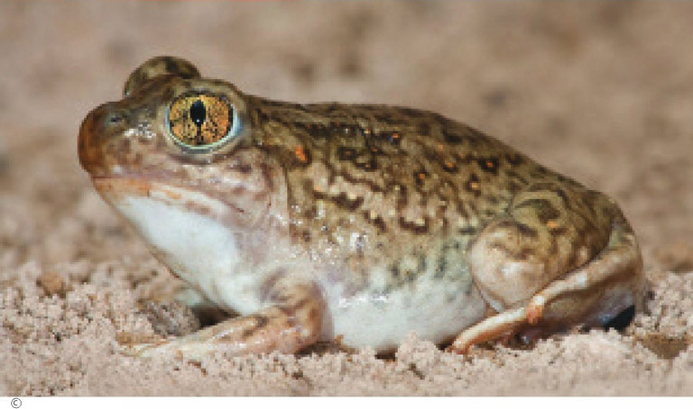
锄足蟾

在南美缺水的高温干旱地区，有一种被民间爱好者称为蜡白猴树蛙的小型两栖动物却另辟蹊径。它们会蹲在树枝上，用四肢不停地摩擦着整个身体，甚至将它们的腿互相摩擦，以确保身体的任何一部分都不漏掉。猴树蛙当然不是热衷于给自己做全身按摩，而是在给自己的全身涂抹一层蜡质的隔层来防止失水。原来，猴树蛙有一个独特的腺体，这个腺体能分泌蜡质。猴树蛙将这种蜡质涂抹全身，等到蜡质变干后，身体看起来就像是塑料做成的，类似美容用的保湿面膜。采用这种防水机制，猴树蛙能将体内水分散失的程度降低到一只沙漠蜥蜴的水平。不过这样也带来一个麻烦，它们不能像其他两栖动物一样通过皮肤吸水，而是和我们人类一样通过嘴来喝水了。

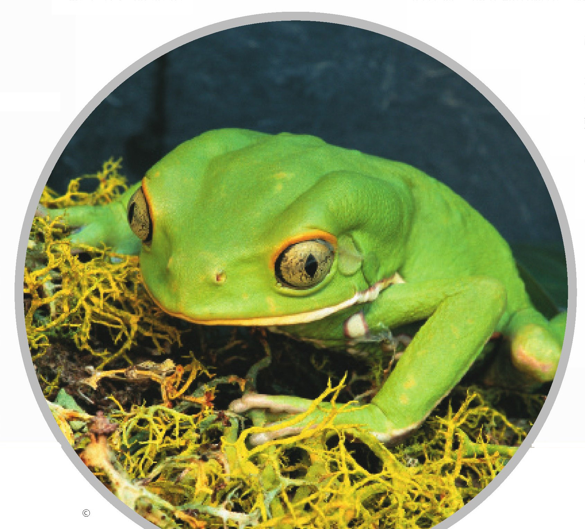
猴树蛙

沙漠中的两栖动物又是怎么繁殖的呢？原来，它们是“看天生娃”的。一旦天上下雨，它们就会迅速把卵产在雨水形成的临时性水塘和水洼中。而且，蝌蚪生长的速率比其他两栖动物要快得多，由受精卵变成小青蛙的时间很短（例如澳洲的储水蛙只需要15天左右），这样就能赶在水塘干涸之前完成变态发育了。（严洁）

## 为什么海蛙能生活在海中

两栖动物，例如常见的青蛙、蟾蜍、蝾螈等，全世界大约有3000种。它们广泛分布于水塘、溪流、田野、森林和荒漠，有些甚至能生存于几千米高的高山上。然而，在海洋里却很难找到它们的踪迹。这究竟是什么原因呢？

原来，两栖动物身体的表面是裸露的皮肤，有着呼吸和内外交流的作用。由于海水的含盐量一般超过30‰，而两栖动物的体液和血液的离子浓度与之相比要低得多，因此，两栖动物一旦进入海水里，由于渗透压平衡的原因，水分会源源不断地从低浓度的体液流向高浓度的海水，它们便很快会因为脱水而死亡。这有点类似于我们腌制咸鱼的过程。

然而世界之大，无奇不有，确实有一种蛙进入了海洋，这就是我们要介绍的厉害角色——海蛙。它是迄今为止人们所知道的唯一能在海水中生活的两栖动物。

海蛙主要分布在东南亚沿海以及中国的海南、广西和台湾等地，它们是一种专门在红树林边的海滩上吃蟹的蛙，所以当地渔民称之为食蟹蛙。海蛙白天隐伏在洞穴内或红树林的根须丛中，傍晚外出活动，捕食小型蟹类。根据渔民多年来的实践经验，海蛙完全可以进入沿岸50米之内的咸水或半咸水环境中。那么，海蛙身怀怎样的绝技才能征服海洋呢？研究发现，海蛙能够耐盐的原因是体内总是维持着比周围环境更高的渗透压（离子浓度）。它们同海洋中的软骨鱼类一样，肾脏滤出的尿素很少，大量的尿素留在血液中，结果形成了较高的渗透压。这样，在盐浓度较高的咸水环境中，海蛙体内的离子浓度更高，水分就不会向外渗透。相反，海水中的水分却能通过皮肤源源不断地渗入体内。这样一来，海蛙也就不需要喝下又苦又涩的海水解渴了。所以海蛙能在海水里生活自如，自由自在。

我们不禁要感叹海蛙的耐盐本领，其实它们的蝌蚪更厉害！海蛙在繁殖季节，常常因地制宜地将卵产在海水洼塘里。中午直晒的阳光使海水洼塘内的温度迅速升高到40℃以上。然而，海蛙的卵和蝌蚪却能忍受这样的高温曝晒，这在蛙类王国中也是绝无仅有的。不仅如此，蝌蚪的耐盐能力比成体还要强，它们在含80‰氯化钠的人工海水中生活5天后，死亡率只有33%。（严洁）

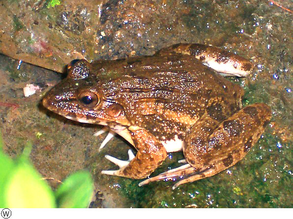
海蛙

  

【微问题】有没有冬天生孩子的两栖动物？

【关键词】沙漠　猴树蛙　蝌蚪　海蛙　两栖动物

## 冬天的蛙都到哪里去了

夏天的傍晚，如果我们去农村或者郊外，总能听见农田里、池塘边的各种蛙叫声，有的高亢激昂，有的短促低回。它们唱着歌，吃着美食——蚊子、苍蝇和蝗虫等各种小害虫，让我们羡慕不已。然而，到了冬天的时候，无论我们怎样在田间乡野苦苦寻找，却连蛙的影子也看不到。那么，冬天的蛙都到哪里去了呢？

原来，它们为了躲避冬天的低温天气，都去冬眠啦！青蛙的冬眠期大约为每年的10月末至第二年的3月中旬，相当于一年中有近一半的时间青蛙在冬眠。春天，随着气温的逐渐升高，青蛙们才会渐渐地出来活动。青蛙的活动时间与大自然的温度变化有着密切的联系。

这种联系的根源，在于生物体内一种叫作“酶”的物质。我们人类以及其他动物、植物等一切生物体的生命活动都需要酶的参与，而酶参与活动的关键在于酶是否具有活性。酶是一种很特殊的物质，只有在适宜的温度下，它的活性才能正常发挥。当自然气温较高时，蛙体内的酶活性增强，它们的活动就会非常活跃。而在适宜的温度范围之外，随着温度的下降，酶的活性便会降低，参与生命活动的能力也随之减弱，蛙就只好去睡长觉休息了。当然，过高的温度也会导致酶活性的丧失。在高温情况下，蛙也会躲到水里或者阴凉处休息。

人类是恒温动物，无论外界的温度如何变化，我们都能通过保温措施和散热途径，把身体温度维持在37℃左右。蛙属于变温动物，不能像恒温动物那样维持恒定的体温，只能适应外界环境的温度。当外界温度低于一定水平时，食物也趋于稀少，蛙们就会选择进入不吃不喝不排泄的冬眠状态。大多数蛙会在光照良好、落叶覆盖的土壤里和石头下，或者在池底的泥中进行冬眠。它们之所以这么在意冬眠的场所，除了安全的考虑之外，还有一个关键因素，就是躲避导致死亡的过低环境温度。在冬眠状态中的蛙类，整个身体的代谢处于非常低的水平，但还是需要一定的温度，所以，选择向阳面来冬眠能维持最低水平的生命活动所需的能量，也是一种自我保护。

当然，越冬之前，蛙需要摄取充足的食物来补充营养。如果营养不够的话，蛙可能挨不过漫长的冬季，而在冬眠中死去。（陈婉　胡超超）

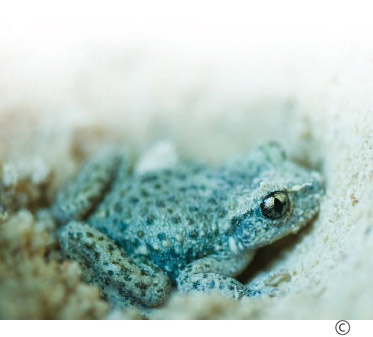
## 被“救”的蛇为什么要咬农夫

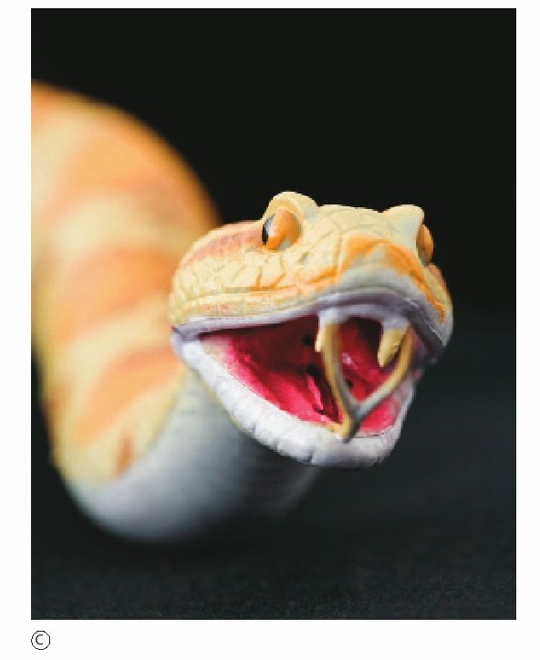
读过书的人，几乎都读过一个叫作《农夫与蛇》的故事。故事说的是很久很久以前，有一位好心的农夫看见蛇在雪地里被冻僵了，于是把它放进自己的怀里给它取暖，终于把蛇给“救醒”了。可是，醒来的蛇不但没有感激农夫，反而一口将农夫给咬死了。许多人都很同情农夫，认为蛇“知恩不报反为仇”。那么，蛇为什么如此善恶不分地要咬农夫呢？

其实，从动物学角度来看，这是一个科学问题。蛇为爬行纲中的有鳞目动物，是一种变温动物。当气温较低的时候，蛇无法维持适宜的体温，体内酶的活性就会降低，不能继续维持自身的基本生命活动，于是蛇就会进入冬眠。冬眠可以降低身体新陈代谢的速度，减少能量的消耗，同时也使蛇丧失了防御天敌的能力。

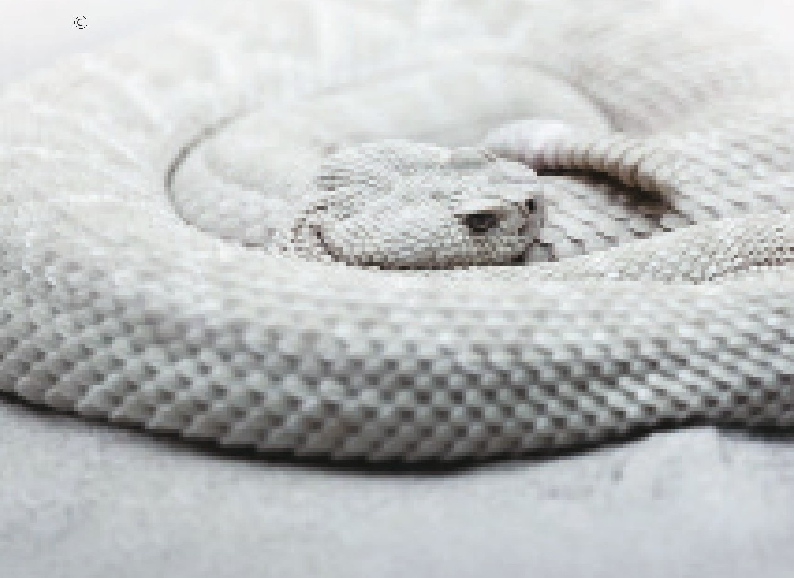
蛇在刚进入冬眠期的时候，体内有着充足的营养。而随着冬眠时间的增长，蛇体内的营养逐渐被消耗，开始处于饥饿的状态。农夫“救醒”的，正是一条处于饥饿状态的蛇。因此，蛇咬农夫是一种本能反应，可能误将农夫当成需要猎取的食物或者攻击的天敌。于是，农夫不幸成了“恩将仇报”的对象。

农夫的做法严重地违反了大自然的规律。把一条正在冬眠的蛇“救醒”，其结果反而被蛇置于死地。我们在学习和实践的过程中，不仅要知其然，更要知其所以然，即使进行善举也要遵循自然规律。（陈婉　胡超超）

蟒蛇在吞食黑斑羚

  

**【微博士】**蛇真的能吞大象吗

蛇虽然有牙齿，但是吃东西从来不咀嚼，而是囫囵吞枣地咽下去。大象是陆地上最大的动物，体重可以达到数吨。全世界大约有3000种蛇，其中要数蟒蛇的个体最大，而最大的蟒蛇也不过8米多长，直径约0.36米。这么小的蛇肚，即使再扩张也难以容纳庞然大物的大象，所以蛇吞象是不可能的。

蛇虽然吞不下大象，但它倒是可以吞下比自己头部大几倍的动物，比如兔子、鸡、小鹿、小猪甚至我们人类。这些动物的身体都比蟒蛇的头部大许多，那为什么蛇能吞下这些动物呢？原因在于蛇头部骨骼的关节处是直接由肌肉和皮肤联结的，嘴张开时最大可以达到180°，如此就能吞下比自身头部大很多的动物。

**【实验场】**冬眠蜥蜴的那泡宝贵的尿

如果你不慎弄醒了一条冬眠中的蜥蜴，会发现它很快就撒出一泡尿。其实在进入冬眠后，蜥蜴的尿液高度浓缩，且含有独特代谢产物。被迫撒尿以后的蜥蜴，很可能会因此而失去生命。因此，那泡尿是十分宝贵的！

【微问题】在同一个地方的蟾蜍和青蛙进入冬眠后，谁会先醒过来？

【关键词】青蛙　冬眠　蛇　酶　活性　蜥蜴

## 为什么蝮蛇妈妈不生蛋

在科学课上，老师可能说过，大多数蛇是卵生的。那就是说，还有蛇不是卵生的，那么它们怎么生孩子呢？原来，这些雌蛇是直接生小蛇的。不过，跟哺乳动物不同的是，在母体里的蛇宝宝，它的营养是靠那个孕育它的卵，而不是靠脐带从母亲那里吸收营养，这叫卵胎生。蝮蛇就是卵胎生的，蛇蛋在母体内孵化出小蛇后再生出来。那么，为什么蝮蛇妈妈要这样做呢？

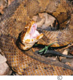
蝮蛇是中国分布较广的一种小型毒蛇。它虽然有较强的耐寒特性，但繁殖、捕食等活动都要受到温度的制约。当温度低于10℃时，蝮蛇几乎不捕食；如果温度在5℃以下，它就会进入冬眠的状态；蝮蛇最适宜捕食的温度是20～25℃；温度超过30℃，它就进蛇洞休息。这一生理特点，使得蝮蛇的生活状态比大多数蛇更为动荡。

蝮蛇喜爱生活在平原、丘陵、低山区或田野溪沟的乱石堆下或草丛中，环境相对恶劣。太阳一出，蝮蛇就会出来晒太阳。这是因为早晨的蝮蛇体温很低，需要太阳的帮忙才能提高自己的体温，以便舒展筋骨，为捕食活动积聚能量。

为了适应生活环境的变化，蛇类形成了两种不同的繁殖方式——卵生和卵胎生。生存环境相对优越的种类，选择了卵生作为繁殖的方式，而蝮蛇生活的地区都是比较恶劣的环境，卵胎生能确保小蛇的孵化及之后的存活率，避免了蛇蛋暴露在外遭捕食的危险。

其实，完全水栖的海蛇也多选择了卵胎生的繁殖方式，原因很简单，它们总不能把蛋产在海里吧。当然，个别能够爬上岸的海蛇，也会选择在海滩边产卵。（孟庆国）

## 为什么海龟妈妈要生那么多蛋

如果你在4～10月份去海边玩，在满月的夜晚，你可能有幸看到海龟生蛋的场景。海龟妈妈会笨拙地爬出水面，来到岸上，找到一个合适的地方产卵。当它们相中了某个地方后，就会用前脚飞快地挖坑，接着转过身，将后脚弯曲成勺状，把挖出来的沙土扒到边上。很快，一个既深又大的坑就挖好了。之后，海龟妈妈就开始产蛋，一个一个像乒乓球一样的海龟蛋依次在坑里叠起来。产卵完成后，海龟妈妈会再用后脚，细心地用沙土把卵坑盖好，才慢悠悠地回到海里。每个海龟妈妈每年要产卵2～3次，每次至少产60多枚蛋，多的可达100多枚。为什么海龟妈妈要生那么多的蛋呢？

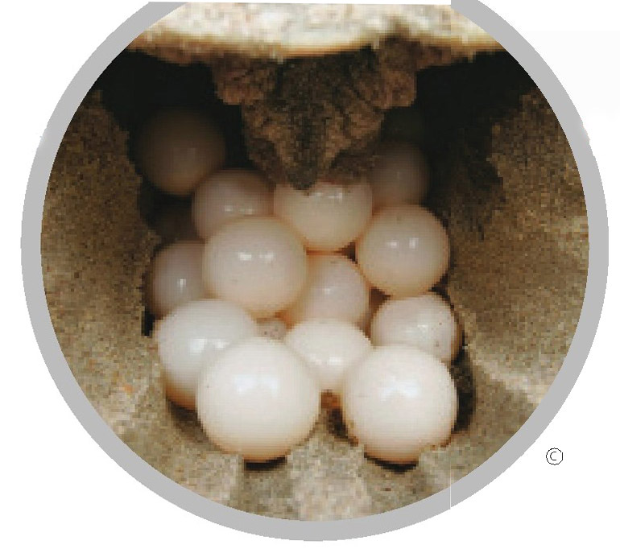
海龟产卵

海龟蛋的孵化时间会长达50～60天。在这漫长的孵化时间里，海龟蛋面临很多的危险。因为它是许多动物的美食，鼹鼠、蛇类等都会费尽心机找海龟蛋。有时，当其他雌海龟产卵时，如果碰巧找的是同一个地方，也会毁掉先前雌海龟的蛋。海龟蛋要面临多次被洗劫，能顺利孵化的就不多了。

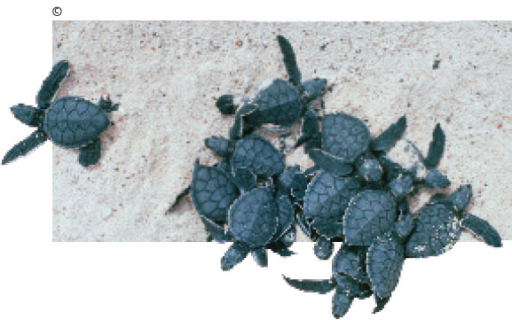
从海滩通往大海的路途上杀机重重，小海龟们只能拼命地向前爬才可能获得一线生机

幸存下来的海龟蛋在孵化成小海龟后，立刻朝着大海爬去，虽然它们的速度也不算慢，孵化坑距离大海也不算远，但小海龟在爬向大海的路上，依然会遭到很多动物的攻击，有天上的秃鹫、草鹫、海鸟等，有地上的狐狸、蜥蜴、螃蟹等。有很大一部分小海龟死在了奔向大海的途中，只有小部分的小海龟顺利回到了大海。海洋里也隐藏着各种各样的危险，要吃它们的家伙也不少。最终，能活下来长大的海龟，只有可怜的千分之一或更少。

所以，海龟妈妈只有通过生很多很多的蛋，才能在艰苦的生存环境下，确保自己的种族繁衍。（孟庆国）

## 为什么树蛙产卵不在水中

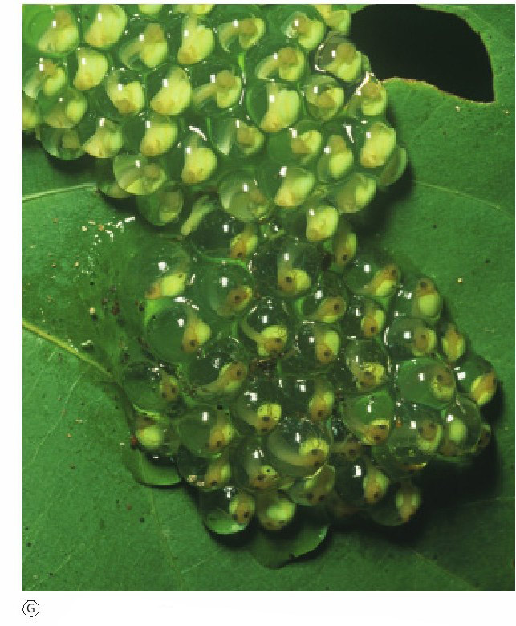
树蛙的卵

树蛙共有200多种。顾名思义，树蛙喜欢呆在树上，它甚至可以把身体紧紧贴在树干上一动不动，原因是它的脚上有很大的吸盘。树蛙不但有这样的“壁虎功”，而且它们生孩子的方式也与众不同。它们不像一般的青蛙一样把卵产在水中，而是离开水塘一段距离，最常见的就是把卵产在卵泡中，而卵泡被包裹在树叶里，悬空在水塘上方。树蛙为什么要如此别出心裁呢？

原来，树蛙的产卵数相对较少，又不喜欢集群，而在水中等着吃蛙卵的水生动物又特别多，不仅有鱼类，还有大量的水生昆虫。一般的青蛙不但产卵较多，而且大多卵集中在一起，即便吃掉一些，也不会影响它们“传宗接代”的大局。不仅如此，因为春夏季节池塘里的水生植物众多，会导致水中的氧气太少，进而影响到蛙卵的发育，所以树蛙也不肯冒险。那么，什么地方产卵好呢？很多聪明的树蛙选择了池塘上方悬空的树叶。这样，当这些蛙卵孵化成蝌蚪后，会自然而然地落下来，掉进池塘里了。多好的主意！

将蛙卵产在树叶上又不会被干死，这是雌蛙和雄蛙巧妙配合的结果。首先，它们找到一棵池塘边的树，如果树枝伸向水塘，它们就拥抱着爬过去，找到一片大树叶。雌蛙先排出一些黏液，然后用后肢搅拌成一个大大的黏液泡，接着开始把卵产在这个黏液泡中。随后，雄蛙也排出精液，让卵受精。产卵结束后，雌蛙会再用后肢，小心地把这片大树叶卷起来，这就大功告成了。蛙卵在这个黏液小房子里稳稳地孵化，等到变成小蝌蚪的时候，这个卵泡会及时地液化，小蝌蚪就掉进池塘里了。

有些树蛙也会将卵产在池塘边或陆地上的安全小坑内，靠着雨水或者小蝌蚪自己的运动脱离小水坑进入池塘。（孟庆国）

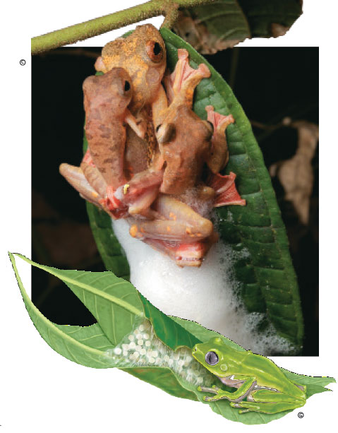
  

**【微博士】**弹琴蛙的产房

栖息在海拔较高的山区和沼泽地带的弹琴蛙体长5厘米左右，背部呈灰棕色或棕绿色。每到4～5月份时，它们会挖出一个浅泥窝作为产房，窝浅而无水。雌蛙将卵产在窝里，并铺成单层，雄蛙会呆在窝里护卵。因其有外声囊，叫时接连发出“噔、噔、噔”三声，清脆动听，好像琴上奏出的音阶，所以就有了弹琴蛙一说。

【微问题】为什么野生大鲵（娃娃鱼）的数量那么少？

【关键词】蝮蛇　卵胎生　海龟　卵生　树蛙　卵囊

## 响尾蛇为什么要摇尾巴

响尾蛇是一类毒性极强的蛇，体形中等，皮肤大多数为灰色或淡褐色，上面带有深色的钻石形或六角形的斑纹或斑点。响尾蛇经常会翘起尾巴，以每分钟40～60次的频率极快地摇动，发出“嘎啦嘎啦”的声音，在30米外都能听得一清二楚。我们都知道，蛇应该是悄无声息地潜伏或者尾随猎物，这样才能以迅雷不及掩耳之势咬住猎物。怎么响尾蛇非得与众不同呢？它为什么要摇尾巴？它摇尾巴又怎么能发出声音呢？

很多人认为，响尾蛇是在模仿潺潺的流水声，它要利用这种响声引诱口渴的小动物前来，然后对它们进行猎杀，所以它摇尾巴是一种诱捕方法。不过，也有人认为，这种声响是响尾蛇在警告周边的敌人：不要和我过不去，我可是有毒的！这和箭毒蛙披着彩色靓丽的皮肤警告对手有异曲同工之妙。此外，如果对手实在强劲，响尾蛇就要准备逃跑。这时候，对手会把不断摇动的尾巴错认为是它的头部，它就可以乘机逃之夭夭了。

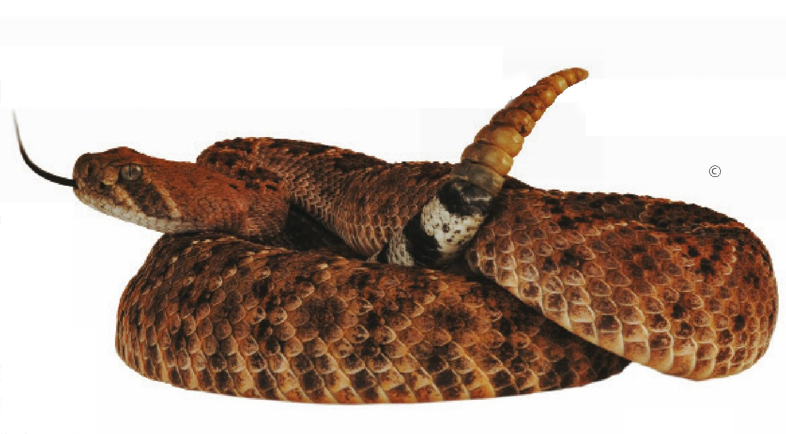
响尾蛇

响尾蛇的尾巴之所以能发声，是因为上面有一排中空的角质环，也叫响环。响环是随着蜕皮次数的增加而增加的，每次蜕皮后就会增加一个尾节，于是，响环的数目越来越多，发出的声音也越来越大。响环的发声原理和哨子差不多，只不过它尾巴的外壳不是金属，而是角质化皮肤形成的空腔。空腔内部又被角质膜隔成两个环状空泡，仿佛是两个空气振荡器。当响尾蛇的尾巴抖动起来的时候，在空泡内就形成了一股气流，随着气流一进一出地来回振荡，空泡就发出了“嘎啦嘎啦”的阵阵响声。（曾红艳）

  

**【微博士】**哑巴一样的蛇

蛇是一类让人害怕的动物，除了因为部分有毒以外，还因为蛇总是悄无声息地攻击猎物。那蛇为什么不出声呢？原来，蛇没有声带，所以它们就没办法发出声音。可是有人分明听到过蛇发出的啸声或“嘶——嘶——”的声音，这又是怎么回事呢？其实，这些声音不是蛇叫出来的，而是它的舌头与嘴唇摩擦或气流通过气管时发出的声音，因此无论在音量还是在音调方面，都是非常有限的。

## 小小的蛙为什么有大嗓门

在夏日的田野，我们总能听见各种蛙的大嗓门，尽管我们很难看清它们的藏身之处。不管是比较大的牛蛙，还是很小的姬蛙，都能扯着大嗓门叫，这些叫声与它们的个头相比，实在是太大了。那么，小小的蛙为什么嗓门那么大呢？

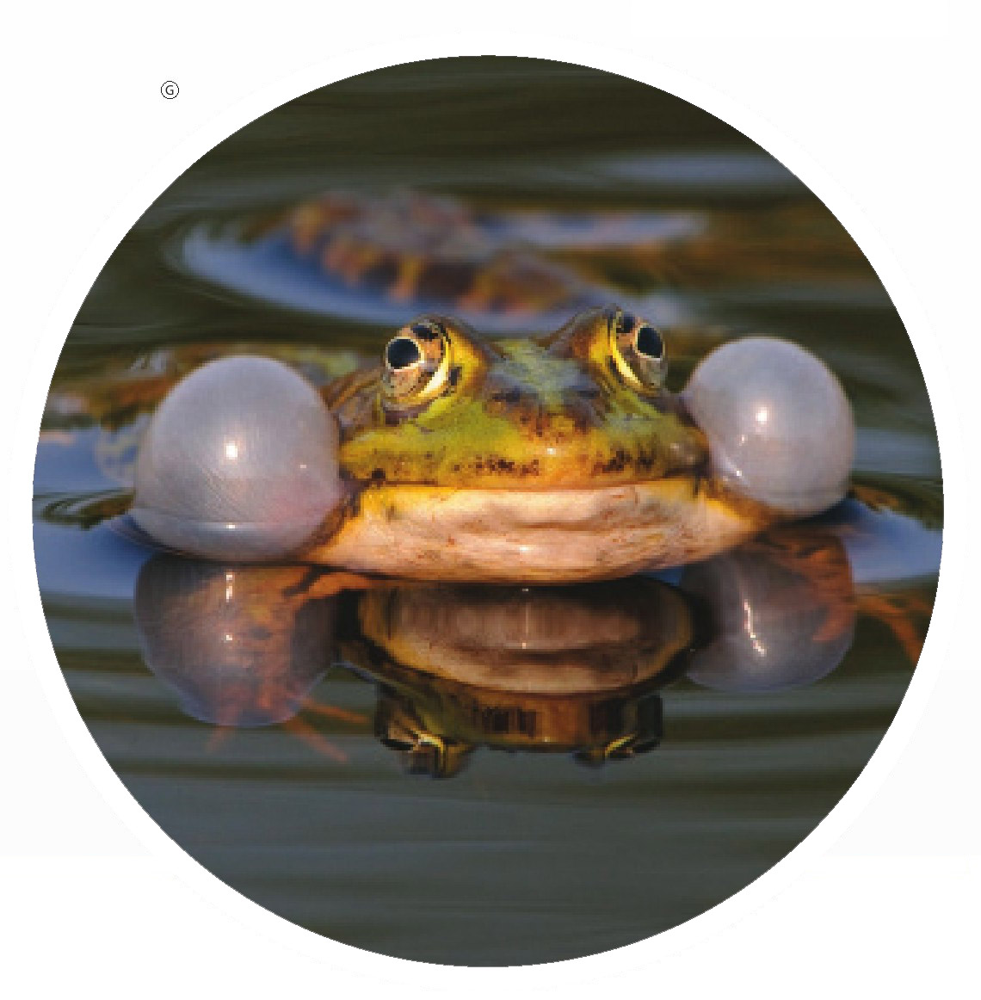
青蛙咽喉两侧的外声囊

这是因为蛙不但有声带作为发声源，而且有声囊作为放大器，使得声音就像从喇叭里放出来一样。和人一样，蛙的声带也是在喉室里，当空气急速经过时，就会振动声带发出声音。当然，这只是蛙大嗓门的发声基础。如果我们仔细看，会发现大多数蛙在鸣叫的时候，咽喉两侧会鼓出两个大泡泡，那是它的一对外声囊（有些蛙只有咽下一个外声囊，如雨蛙），这对外声囊就是它的放大器兼喇叭，使它发出的声音更加洪亮。蛙类的鸣叫过程是这样的：发音之前，雄性先吸一口气到肺部，并把肚子鼓起来，然后腹部收缩以便把里面的气体挤到咽喉，在此振动声带并发出声音。最后，声音及气体一起被送到位于喉部侧面或下方的声囊，气体将声囊鼓大成为声音的共鸣腔，以此放大声音并将其扩散出去。雌蛙因为没有声囊，所以发出的声音就像在喉咙口一样，远没有雄性那么洪亮。

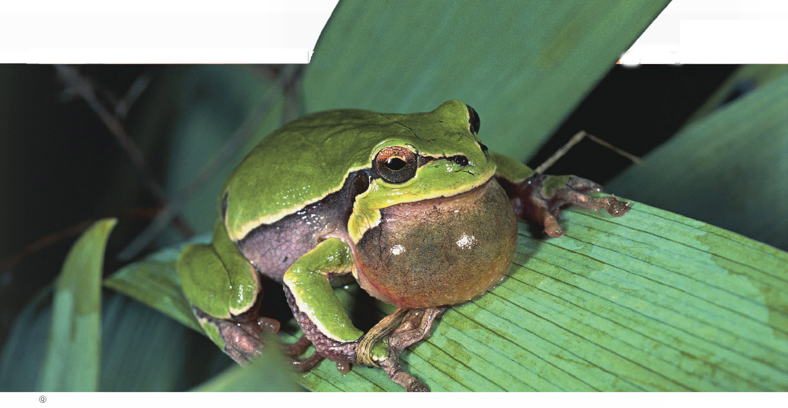
有些青蛙只有一个外声囊

蛙的叫声各种各样，也代表着不同的意思。有警告其他雄蛙不要接近其领地的叫声，有驱逐其他雄蛙或打架时遭遇对手发出的叫声，有吸引雌性的求偶叫声，有和雌性接触后的交配叫声，有被其他雄蛙或其他种蛙类错抱时要求释放的叫声，以及被天敌抓住时紧急发出来的求救叫声——叽。雌蛙一般只会发出求救叫声，也有少数种类雌蛙会发出回应雄蛙求偶的叫声。

在环境条件特别适宜的情况下，蛙也会叫。例如在夏天的夜晚，气温上升或是将要下雨的前夕或雨后，田野里蛙声此起彼伏，好像是在大合唱一样。在生殖季节里，蛙的鸣叫尤其起劲，这是为了吸引异性伙伴来进行交配。

不同种类的蛙，它们的叫声也各有特点。比如：常见的大树蛙在繁殖季节时，雄性会发出“蝈、蝈蝈蝈”的叫声；斑腿树蛙会发出“嗒嗒，嗒嗒”的连续节奏音；中国特有的凹耳蛙能发出“唧唧唧、唧唧唧”的十分清脆的叫声，还能够发出20～128千赫的高频声音。有些种类你只要听听它们的名字，就能猜到它们的声音特点，比如弹琴蛙，它们的叫声就好比姑娘在拨动琴弦。

每种蛙都能发出自己特定的声音频率，而人们听到的只是此起彼伏的喧闹声。但是，对于那些雌蛙来说，这些喧闹声不会使它们迷惑，它们只收听同类雄蛙发出的声音。如果你经常去听听这些大嗓门的声音，你也可以据此来判断蛙的种类呢！（曾红艳）

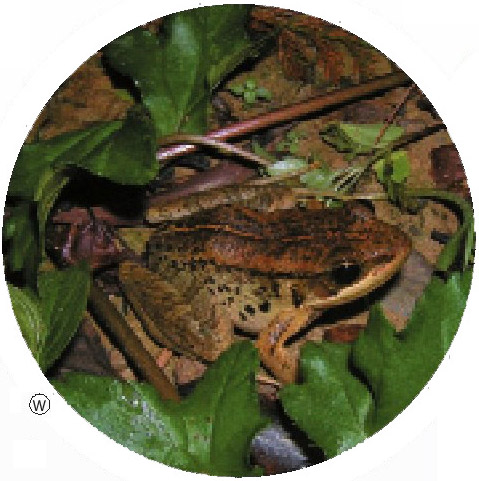
  

**【微博士】**“女追男”的蛙

在繁殖季节，通常都是雄蛙向雌蛙求爱。不过，弹琴蛙等少数种类会发生“女追男”的情况，雌蛙会主动向雄蛙发出鸣叫，以吸引对方前来约会。

峨眉弹琴蛙在交配时，雄蛙会从背部抱住雌蛙并做前后摩擦运动，以刺激雌蛙排卵。一旦雄蛙停止运动，雌蛙立即发出刺激鸣叫，直到雄蛙重新开始摩擦运动。这也是“女追男”的一个实例。

【微问题】不同种类的蛙之间语言不同，它们是怎么进行交流沟通的呢？

【关键词】响尾蛇　响环　声带　外声囊

## 青蛙为什么晚上更容易被抓住

我们知道，青蛙捕食大量的田间害虫，是丰收的卫士，也是人类的好朋友，那悦耳的蛙鸣就是永恒和谐的田野之歌。然而，就是有那么一双双贪婪的手，把它们从田野捉来，又将它们端上餐桌。这些贪婪之手是在晚上捕捉青蛙的。那么，为什么青蛙在晚上显得那么笨拙呢？难道青蛙有“夜盲症”么？

青蛙是两栖纲无尾目的动物，多生活在稻田、池塘、水沟或河流沿岸的草丛中。白天，它们躲在隐蔽之处休息，到了晚上才出来觅食。这种夜间活动的天性告诉我们，青蛙在晚上更加如鱼得水，所以不可能有“夜盲症”。不过，青蛙的视觉确实有它自己的特点。

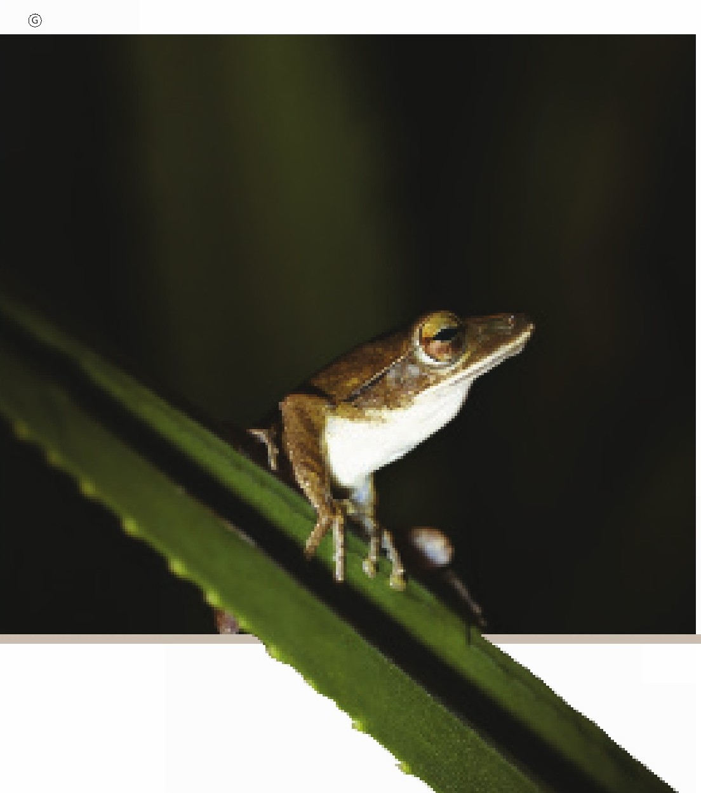
原来，青蛙头部两侧有两个略微鼓起的小包。那是它的鼓膜，青蛙可以通过它听到声音。当然，青蛙的眼睛更特别。青蛙眼视网膜的神经细胞分成五类：一类只对颜色起反应；另外四类只对运动目标的某个特征起反应，并能把分解出的特征信号输送到大脑视觉中枢——视顶盖中。视顶盖上有四层神经细胞：第一层对运动目标的反差起反应，第二层能把目标的凸边抽取出来，第三层只看见目标的四周边缘，第四层则只管目标前缘的明暗变化。这四个特征就好像在四张透明纸上画出四幅各有特点的图，叠在一起就形成了一个完整的图像。因此，在迅速飞动的各种形状的小动物里，青蛙可立即判断出它最喜欢吃的苍蝇和飞蛾，而对其他飞动着的东西实行过滤。对于静止不动的景物，更是毫无反应。

抓住了青蛙的这种特点，捕蛙人就在黑夜里出动。先是轻手轻脚地接近它们，或者惊动青蛙后静止不动，然后采用强光突然照射青蛙的眼睛，在青蛙短暂失明的一段时间内，迅速出手，将青蛙抓住。

随着青蛙大量涌上餐桌，田野里的生态平衡遭到了破坏，导致害虫泛滥。为了保证农作物的产量，农民们只好大量使用农药。这样一来，不但农作物上的农药难以避免，残存的青蛙因为吃到了一些侥幸未死的害虫，也顺便在蛙体内蓄积了农药，又转而进入了吃蛙人的体内。吃青蛙，实在是贻害农业，也贻害自己的一件事！（吕秀玲）

## 蛇为什么要吐舌头

很多人都不喜欢蛇：一方面蛇长得可怕，游走起来又悄无声息地像精灵一般；另一方面蛇老是吐舌头，怪吓人的。那么，蛇到底为什么要吐舌呢？这是它们攻击的预备动作吗？

其实，蛇的胆子很小，一般是不会主动攻击人的。所以，中国有句古话叫“打草惊蛇”，意思是只要你拿根棒子敲击地面和草丛，蛇就会闻风而逃。当然，如果你没有事先警告，意外遇见蛇的概率就很大，因为蛇的视觉、听觉都很差，味觉也不行。

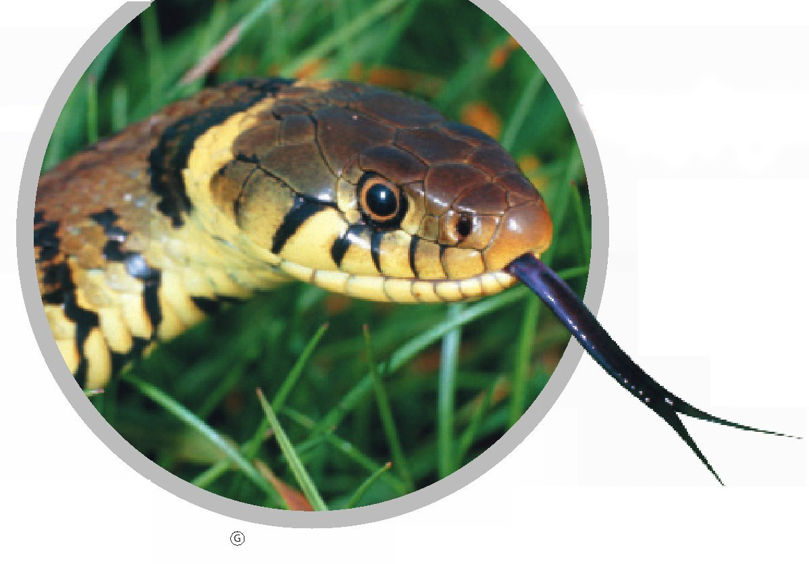
既然蛇的这么多感觉器官都不行，那么它的鼻子应该很灵吧？告诉你，也不行。不过，鼻子的嗅觉功能让另一个看似无关的器官代劳了，那就是舌头，俗称蛇信。人的鼻子之所以能闻到一种东西的气味，是因为有相关的化学分子在空气中弥漫，从而被鼻子收集到。当蛇把舌头伸出来时，这些气味的分子就被蛇的舌头收集起来，只是舌头并不能直接分辨，而是要缩回口腔处理。口腔的前上方有一对小腔，这个部位叫锄鼻器。锄鼻器由许多感觉细胞组成，如同我们人类鼻腔中的嗅觉细胞，与嗅神经相连。各种气味的分子进入锄鼻器后，就被这个嗅觉中枢接受和分析，并鉴别出其中的化学物质。蛇的这个嗅觉中枢异常灵敏，甚至连狗鼻子也不如它。

蛇吐舌头，只是为了收集气味，以此来判断周围的环境呢！（吕秀玲）

## 蝮蛇是如何在漆黑的夜晚抓住老鼠的

蛇能在夜色中准确捕获猎物，除了蛇信有收集气味作用之外，很多种类的蛇还有一个感受热能变化的装置，这就是热敏感器，我们称为颊窝，或称“热眼”。

这个“热眼”，位于两只眼睛和鼻孔之间，一般深5毫米，只有一粒米那么长，能够敏感地测到外界温度的变化。即使只有1/3600℃的差异，它也能感受到。“热眼”呈喇叭形，喇叭口斜向朝前，其间被一片薄膜分成内外两个部分。里面的部分有一根细管通向眼前角，并借助一个小孔与外界相通，所以里面的温度和蛇所在的周围环境的温度是一样的。而外面的那部分却是一个热收集器，喇叭口所对的方向如果有热的物体，红外线就经过这里照射到薄膜的外侧一面。显然，这要比薄膜内侧一面的温度高。薄膜两面形成的温差产生的生物电流，通过神经传递给蛇的大脑。蛇知道了前方什么位置有热的物体，大脑就发出相应的“命令”去捕获这个物体。

老鼠是一类喜欢在夜间出没的啮齿动物，而蝮蛇也喜欢躲在黑夜里捕猎。虽然老鼠足够狡猾，但它身上的热量却躲不开蝮蛇“热眼”的追踪，也就会被蝮蛇抓住。（吕秀玲）

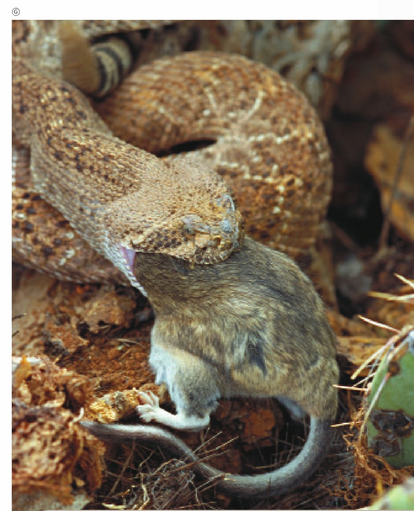
  

**【微博士】**怕蛇促进了人类的视力发展

美国趣味科学网站2012年5月29日发表文章，题目是“我们为什么怕蛇”，作者是美国康奈尔大学的人类学家梅雷迪思·斯莫尔。文章认为，世界上大多数人害怕蛇，但是令人惊讶的是，对蛇的恐惧直接导致了包括人类在内的灵长目动物的视力得到进化，在客观上推动了人类的视力发展。

**【实验场】**

请你蒙上眼睛，戴好耳塞到厨房，能知道妈妈晚餐做什么菜肴吗？感受一下，如果没有眼睛和耳朵，我们能够用什么来了解周围的环境。

【微问题】为什么我们要对捕食青蛙说不？

【关键词】青蛙　蛇　蛇信　蝮蛇　颊窝

## 为什么一些蜥蜴可以在水面上奔跑

如果你看过金庸的武侠小说，肯定对武林高手在水面上如蜻蜓般来去自如而佩服有加，继而梦想着自己有一天也能成为那样的大侠。想象一下，这种场景若是出现在现实中，是不是更让人们激动不已呢？

其实，在动物世界中真有那么一些“水上飞”，能表演这种绝技。当然，我们这里所说的不是能够“戏水”的蜻蜓、蜘蛛或者蚊子，这些动物因为个子小，体重轻，仅仅靠水表面的张力及浮力就完全可以将身体托起。我们要说的是蜥蜴——一种生活在南美洲热带雨林、被称为蛇怪蜥蜴的小动物。通常，蛇怪蜥蜴喜欢栖息在河边树枝上，当它们察觉到周围有捕食者可能对其发动袭击时，就会跳进水中，在水面上依赖后肢快速奔跑逃走。那么，为什么这种蛇怪蜥蜴能在水上自由奔跑而不会沉入水中呢？

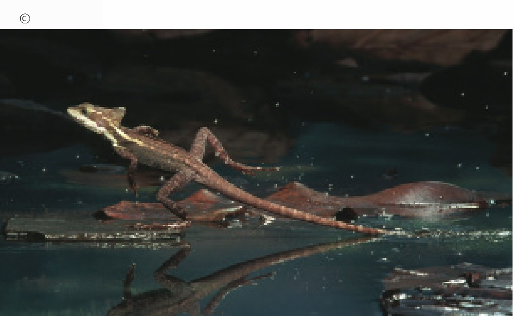
秘密首先来自它的身体结构。蛇怪蜥蜴身体细长，后肢粗壮发达，而且脚掌底部具有可张开或收拢的膜。当它在水面上奔跑时，这些膜就会张开，使脚掌与水面的接触面积大增。当然，秘密远不止于此。科学家们通过细致的观察，发现蛇怪蜥蜴在水面上奔跑时，完整的后肢运动过程包括拍击、扑打、还原三个连续动作。拍击时，后肢主要做上下运动，此时在脚的周围会形成许多气泡，这些气泡则会产生一个支撑力，将身体托起来；扑打时，后肢主要向后方运动，产生一个使身体前进的推力，与此同时，之前产生的气泡破碎并形成一股推力；在完成了上述过程后，它就立刻还原，后肢抬起脱离水面再回到下一个开始动作。蛇怪蜥蜴凭借这三个连贯而高效的动作，自由地在水上健步如飞。

其实，蜥蜴在水上奔跑的故事还远没这么简单，因为在快速运动的过程中，必然还会遇到身体如何平衡的问题。蛇怪蜥蜴在水面上奔跑时，它的后肢在快速运动的同时，会给身体中部的两侧提供一对横向的支持力，这股力量几乎与向上的支撑力一样大，这才使它不会在奔跑时摔跤。对比在地面上利用两腿行走的动物，例如人和鸟类，它们在两侧面上得到的支持力就很小，快速奔跑时的平衡能力也就弱一些。（陆洪良）

## 为什么一些蜥蜴会变色

当我们在野外游玩时，偶然间可能会发现一些小蜥蜴的体色随着环境变化而发生改变。有些蜥蜴的变色能力很强，特别是避役类，因其善于变换身体颜色而获得了“变色龙”的美名。

蜥蜴的变色功能除了能够躲避天敌外，还能“传情达意”，这是一种用于防卫的应激反应。比如：蜥蜴发现有同类进入自己的领地时，就会把身体某些部位变成红色等明亮的色彩，以此警告对手；而当它看着对手不顺眼，准备发起攻击时，又会把身体的色彩变成暗色；它在逃避天敌的侵犯或接近自己的猎物时，还会迅速改变身体的颜色，将自己融入周围的环境之中。

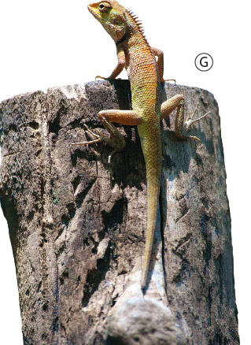
变色树蜥

那么“变色龙”变色的原理是什么呢？原来，变色龙的皮下具有呈绿色、蓝色及灰色的三种色素细胞。绿色和蓝色的色素细胞呈长纺锤形，广泛分布于皮下组织并垂直于皮肤表面；灰色的色素细胞处在绿色和蓝色的色素细胞之下，平行于皮肤表面分布。变色龙变色的原理就在于绿色和蓝色色素细胞位置的变化。当绿色色素细胞的中部膨胀时，皮肤表面就会呈现更多的绿色；当蓝色色素细胞中部膨胀时，皮肤就呈现更多的蓝色；当绿色和蓝色的色素细胞都收缩时，皮肤就失去了绿色和蓝色，露出了皮下底部的灰色色素细胞而呈现灰色。

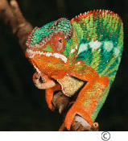
中国并没有真正的变色龙，但生活于中国南方的一些树蜥种类也具有变色能力。例如，变色树蜥在阳光照射下其身体颜色会变浅，而头颈部皮肤则会发红；当它们躲入阴暗环境后，头颈部的红色会逐渐消失，而身体颜色又逐渐变暗。蜥蜴的变色是一种非随意的生理变化，它是动物对环境光照强弱、温度高低变化的适应性反应，与动物本身的兴奋程度以及个体的健康状况有关。（陆洪良）

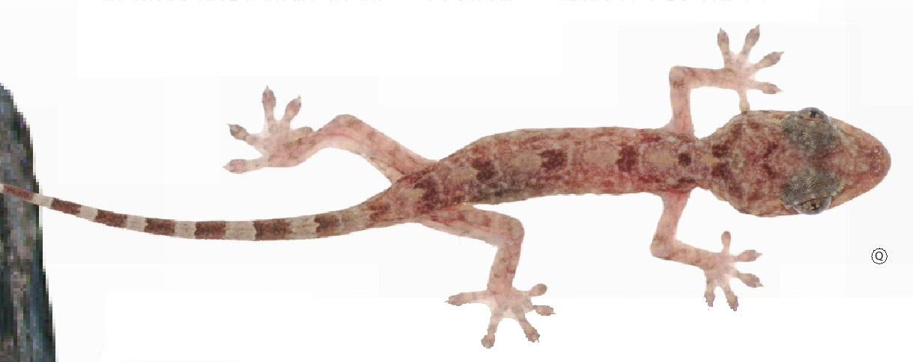
  

**【实验场】**

在老房子的屋檐下寻找壁虎，观察它们随意在墙壁上自由爬行的现象。壁虎的这种垂直爬行能力，与蛇怪蜥蜴在水上的奔跑原理是一样的吗？

**【微博士】**会发出叫声的壁虎

大多数蜥蜴是不会发声的。一些壁虎种类却是例外，蛤蚧的鸣声甚至在数米之外也能听见。壁虎的叫声并不是仅用于寻觅配偶，可能是作为警戒或占据领地的信号。

**【微博士】**能在水面上漂浮的壁虎

除了蛇怪蜥蜴之外，南美洲热带雨林中还生活着一种被称为侏儒壁虎的小动物，它们具有漂浮在水面上的能力。侏儒壁虎个头非常小，从头到脚长度只有2～4厘米，它们的皮肤具有防水功能，水的表面张力足以支撑它们的体重。在雨林中它们常常会受到雨水的袭扰，但这种特殊的本领使它们能在下雨形成的水洼表面自由行走而不被淹死。

**【科学人】**戴维·阿滕伯勒

英国杰出的自然博物学家、野生动物摄影师和生态纪录片制作人。在50多年间，他与英国广播公司（BBC）的制作团队一起，实地探索过地球上已知的所有生态环境，获得了最为广泛翔实的野生动物资料，创作了许多脍炙人口的自然历史纪录片，如《生命的进化》、《活力星球》、《自然界大事件》等，被誉为“世界自然纪录片之父”。

【微问题】人有没有可能像蛇怪蜥蜴一样在水上自由行走呢？

【关键词】蛇怪蜥蜴　变色　变色龙　色素　壁虎

## 龟为什么长寿

很多人喜欢把龟当作宠物，不仅是因为龟的饲养比较容易，它平时活动少，比较安静，更因为龟的寿命长，主人一般不用承受宠物死亡时的痛苦。那么，龟为什么会长寿呢？科学家们从龟的身体结构、生理功能、生活习性等方面给出了答案。

从身体结构来看，龟有一副坚硬的甲壳，很好地保护了身体的各个部分，既能避免身体受到外界的伤害，也能减少水分的散失。从生理功能和生活习性来看，龟非常嗜睡，大多数要冬眠；有的还要夏眠，一年的睡觉时间要占6个月左右。虽然龟在休眠的时候看上去死气沉沉的，但它可以利用这段时间躲过那些不利的环境。龟的行动缓慢，一小时最多只能爬100多米，因此体力消耗非常少。龟又是冷血动物，它们可以把体温保持在很低的水平上，新陈代谢的降低减少了能量消耗。另外，龟还是有名的“好脾气”，它们性情温和，常常持“惹不起，躲得起”的态度，表现出一副与世无争的样子。根据心理学家的分析，处世平和的人压力小，寿命也长。从这一点上来说，龟是人类学习的榜样。

当然，龟与龟之间寿命的长短也是有差异的。根据动物学家和养龟爱好者的观察和研究，发现以植物为食的龟类比吃肉和杂食的龟类一般寿命要长。例如，生活在太平洋和印度洋热带岛屿上的象龟，其食物主要是青草、野果和仙人掌等，它们的寿命就特别长，有的甚至可以活到300岁左右。

一些科学家还从细胞学、解剖学、生理学等多方面研究了龟长寿的秘密。他们发现，龟的正常细胞中存在着一个掌管细胞分裂的“时钟”，它具有限制细胞繁殖代数及其生存年限的功能。比如人的胚肺纤维细胞，在体外培养到50代时，就很难再分裂下去了，而乌龟的细胞则可以培养约110代之多。这说明细胞繁殖代数的多少与动物的寿命长短也有密切的关系。动物解剖学家还检查了龟的心脏功能，发现龟的心脏取出之后，竟然还能够继续跳动24小时之久。这表明龟的心脏功能较强，为肌体的血液流动提供了很好的动力。

象龟

从整体上来说，龟的长寿，同它们具有耐饥、耐旱的生理功能，新陈代谢较低以及缓慢而有规律的生活习性有密切关系。龟是一种可以被用来研究长寿的极好的动物模型。因此揭开龟长寿的奥秘，对研究人类的健康长寿将有很大的启示。（李银蝶）

  

**【微博士】**剧烈运动未必有助健康长寿

有人认为，剧烈运动到大汗淋漓才能达到健身长寿的目的。其实不然，剧烈运动时，心脏加速跳动，新陈代谢加快，骨骼肌会产生大量热量，从而促使体温有升高的趋势，而这些都是不利于身体健康的。适度的有节律的运动才是最正确的锻炼方式。因此，那些运动量适宜的有氧运动，如慢跑、游泳以及中国传统运动太极拳等，才是比较好的健身运动。

## 怎样判断龟的年龄

有人问你：“你几岁了？”这个问题不难回答。但是如果有人看到一只龟，问你：“这只龟几岁了？”你就很难答准确了。

一般来说，判断龟的大概年龄可以看它的背甲盾片的纹路颜色，颜色越深就越老，反之则嫩。龟的准确年龄在自然状态下并不难判断，最常用的方法是数龟的背甲盾片的同心环纹数，这和看树的年轮是一样的道理。龟在春、夏、秋季节生长较快，背甲盾片也和身体一样生长，因此形成的同心环纹圈疏松。而龟在冬天要冬眠，这时它的新陈代谢慢，背甲盾片形成的同心环纹圈就比较紧密，通过数疏密相间的同心环纹圈，就可以推断出龟的年龄——把同心环纹圈的数目再加1（幼龟破壳算一个环纹），就是龟的准确年龄。

但是，这种方法有着很大的局限性，它仅适用于背甲盾片上同心环纹清晰可见的野生龟。因为在自然条件下，龟进食少，会有规律地随季节进行生长或冬眠，且其背甲通常会因为常年在沙土中爬行而被磨得光滑齐整。而在温室或实验室中饲养的龟，不但室温恒定，而且食物充足，过度肥胖经常导致背甲盾片变形。在这种情况下，数同心环纹圈的方法就不适用了。

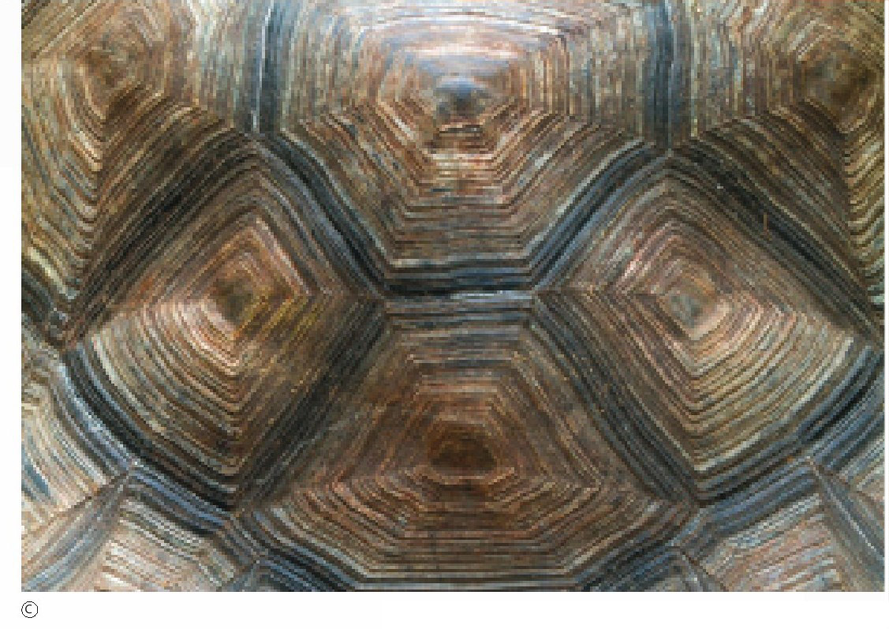
纹路清晰的背甲盾片可以帮助人们判断龟的年龄

如果熟悉龟种，我们也可以通过参考龟的重量来确定其年龄。以普通乌龟（即俗称的草龟）为例，雌龟平均生长速度为：一龄龟体重15克左右，二龄龟50克，三龄龟100克，四龄龟200克，五龄龟250～300克，六龄龟400克，相对来说雄龟生长慢一些。野生龟达到500克，其龟龄在中国南方约为20年，北方则约40年。当然，这些只是参考数值，中国地域广大，各地的气候条件不同，作为广布种的普通乌龟生长速度也不一样。另外，在不同的饲养条件下，由于温度和饲料差距极大，对龟龄的判断也会非常困难。

因此，要正确判断龟的年龄，目前还没有特别有效的方法，最好结合几种条件综合考虑，这样才能得到最接近事实的答案。（李银蝶）

  

**【微博士】**龟明星哈丽雅特

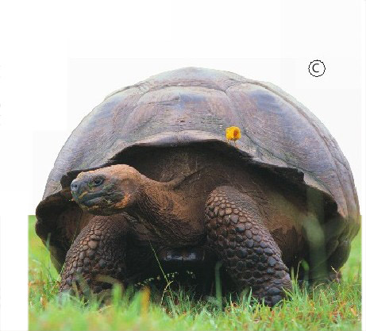
1835年，达尔文从东太平洋上的加拉帕戈斯群岛带走一批陆龟，据说其中的一只还有了一个雌性后代——哈丽雅特。当然，科学家们对哈丽雅特的身世还是有所怀疑的，因为通过对DNA的研究表明，它可能出生于1830年，并且来自一个达尔文从未踏足过的岛屿。可是，这一点也不妨碍它成为动物明星。尽管“老姑娘”哈丽雅特在近100年时间里都不曾有过一个伴侣，可它在澳洲动物园的日子却过得有滋有味。2005年，动物园还为它举行了最后一场生日会。2006年6月23日，哈丽雅特因心脏病突发而去世，它的寿命已在170岁以上了。

【微问题】动作慢的动物是不是寿命相对会长一些？

【关键词】龟　冬眠　长寿　同心环纹

## 青蛙吃东西的时候为什么紧闭双眼

如果你仔细观察过青蛙吃东西，会发现它在咽下食物的时候是闭着眼睛的。难道它是不忍心吃掉对方吗？当然不是。

我们人的嘴是负责把食物嚼碎的，但青蛙没有咀嚼食物的骨骼构造和相应的肌肉组织。它们的牙齿也不是什么利器，而仅仅是不让入口的食物掉出来，和它们同门的蟾蜍则更是“无齿之徒”。青蛙的舌头也不像哺乳动物那样固定在口腔的后端，因此青蛙不能像哺乳动物那样利用舌头的作用将食物推向胃部。这样一来，青蛙要把东西吃下去，牙齿、口腔和舌头都帮不上忙，于是只能通过吞咽的方式将猎物直接输送到体内了。

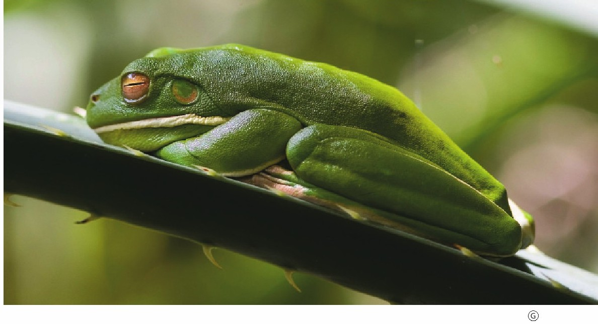
在吞食猎物的过程中，青蛙的眼睛倒是帮上了忙。这主要是由于蛙类眼球和口腔之间仅有一层皮肉的缘故，这层皮肉将眼睛和口腔隔开。当青蛙闭眼的时候眼球会向眼眶内收缩，使眼睛与口腔相隔的这层肌肉下沉，进而将食物向咽喉挤压。青蛙就是利用这种方法将食物挤入咽喉并输送到胃部的。于是我们就看到，青蛙在吞食猎物的时候紧紧地闭上了双眼。（郝小利）

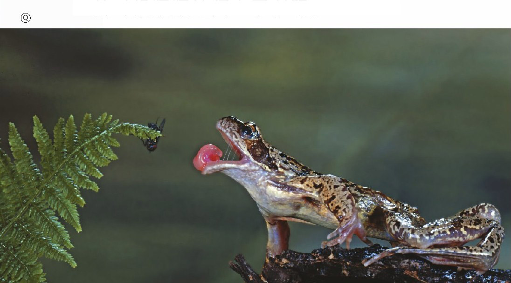
  

**【微博士】**青蛙的折叠式舌头

青蛙的舌头后端附在下颚前方，正常情况下舌头前段折叠于空腔内。舌头前端有黏性，捕食猎物时肌肉收缩将舌头弹出，把猎物粘回来。不过，它们的舌头并不算太长，大约相当于身体长度的四分之一。青蛙在捕食时舌头弹伸的速度非常快，肉眼几乎看不到它的这一动作。

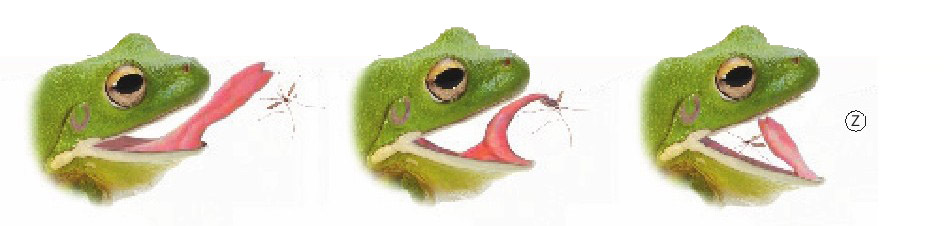
## 鳄鱼吃东西的时候会流泪吗

都说鳄鱼在吃猎物的时候会流下虚伪的眼泪，因此，人们用“鳄鱼的眼泪”来形容假慈悲。有人因此认为，鳄鱼的眼眶下方存在着和海龟一样的盐腺，通过流泪的方式向体外排放身体多余的盐分。

2007年，科学家们利用经过训练能在陆地上摄食的鳄鱼作为研究对象，发现并不是所有的鳄鱼都会在摄食时流眼泪。以中国特产的淡水生活的扬子鳄为例，在它的下眼睑后下角确实有一对小小的泪腺，但泪腺的分泌物并没有达到“流泪”的程度，至多也就算“泪眼婆娑”，因为泪腺是通过泪小管连通泪管进入鼻腔中的，一般人根本看不到扬子鳄的流泪。

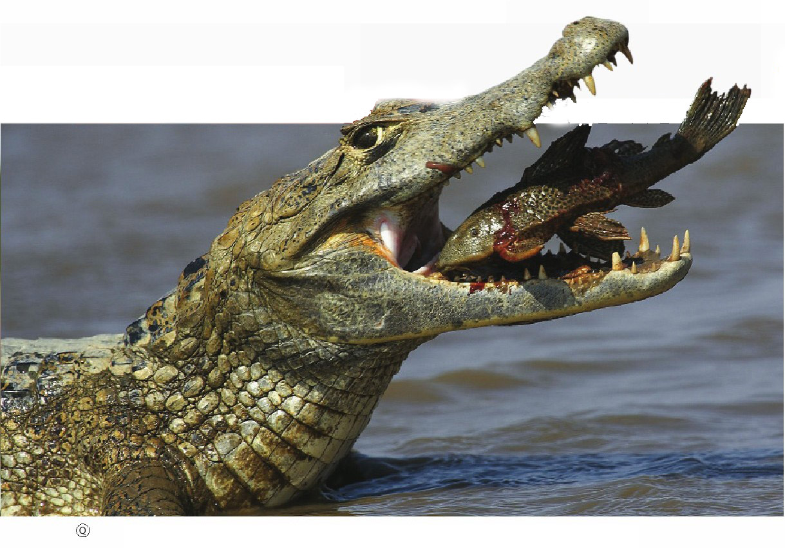
身为咸水鳄的凯门鳄并没有在吃鱼的时候流泪

对于湾鳄等咸水鳄而言，有时候它们也会“流泪”，但其原理和扬子鳄的情况是一样的。而且，由于“流泪”是为了滋润眼睛，所以鳄鱼并不会在特定的时间做这件事，当然，在上岸的时候更为需要。

可是，对于咸水鳄来说，眼泪虽然少，但有没有排盐功能呢？科学家让鳄鱼在海水中生活一段时间，然后想办法收集到它们的眼泪。结果发现，鳄鱼眼泪中的盐分浓度只是血盐的2倍左右，这个浓度虽然稍大，但仍然不足以排盐，所以，咸水鳄排盐一定另有出路。

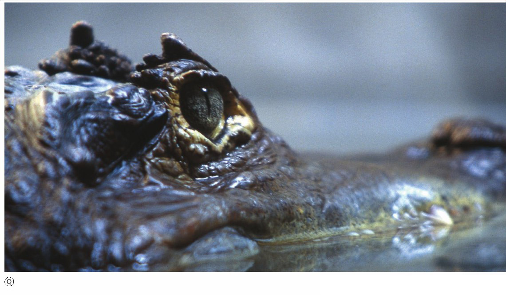
鳄鱼下眼睑的后下角长有泪腺

终于，科学家们通过刺激舌头收集其盐腺分泌物，发现分泌物中盐分浓度是血盐浓度的3～6倍。整个鳄科中，无论是海水栖息地的鳄鱼还是淡水栖息地的鳄鱼，在舌头上都存在分泌盐分的腺体。解剖鳄鱼舌头也证明了舌头黏膜上确实有盐腺，其构造和其他海洋爬行动物的盐腺相似。所以，“鳄鱼以流泪来排盐”基本上只是一个传说。（郝小利）

## 海龟为什么会吃塑料袋

近年来，在世界上的不少地方，陆陆续续发现了大量海龟的不正常死亡。通过解剖海龟的尸体，科学家发现，海龟的胃中有许多塑料袋，最多的一只海龟体内竟有15只塑料袋。正是这些塑料袋，导致了海龟无法正常取食，进而死亡。那么，海龟为什么要吃塑料袋呢？

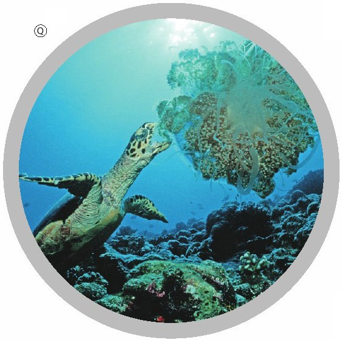
海龟正要品尝它最爱吃的水母

原来，海龟最喜欢的食物，是美味的水母。别看水母身上有许多带着毒刺的触手，能够吓退大多数敌人，但海龟却一点也不怵它。一只大海龟，一顿甚至可以吃下几十只水母。当人们把各种各样的垃圾，包括大批塑料袋扔进海洋后，漂浮的塑料袋膨胀开来，就好像水母一样。正在寻找食物的海龟，在无意中就把这些塑料袋吞了下去。塑料制品是一种非常难以分解的材料，通常需要100～200年才能分解。可以想象，这些东西到了海龟的肚子里，海龟既无法分解，又无法排出，轻则引起胃部不适、行动异常、生育繁殖能力下降，重则导致死亡。事实上，不但是海龟会误食海洋垃圾，海鸟也喜欢捕捞旧打火机和牙刷，因为这些垃圾形似小鱼，当它们用这些东西喂食幼鸟的时候，往往会将幼鸟噎死。

海洋垃圾中的80%是由于垃圾填埋和其他城市垃圾的管理不当而产生的。监测结果表明，海面垃圾主要有木块、香烟过滤嘴、罐头盒、塑料袋、瓶子、泡沫、气球和牙刷等。海中最大的塑料垃圾是废弃的捕鱼设备，如渔网、鱼线和浮标，它们对海洋生物是最危险的。废弃的渔网甚至被渔民们称为“鬼网”。在洋流的作用下，这些渔网和鱼线等垃圾会缠绕在一起，成为海洋哺乳动物的“死亡陷阱”，它们会缠住并淹死海豹、海狮和海豚等哺乳动物。每年因海洋污染物、误食和缠绕等原因，可以导致成百上千的海龟、鲸类等水生哺乳动物和上百万只海鸟死亡。而海洋生物的死亡，最终会导致海洋生态系统被打破，危及人类的生存。

因此，请做一点任何你力所能及的事情，不要随意丢弃垃圾，减少塑料制品的使用。你对野生动物和环境的爱心，最终会让你自己受用。（郝小利）

  

**【微博士】**鳄鱼为什么会潜伏在水中偷猎

科学家对6种海鳄进行了水中和陆地上的视力测试。他们将一束光射入供试鳄鱼的眼睛里，分析鳄鱼眼睛的聚焦能力。结果显示，所有鳄鱼在水中都是重度“远视眼患者”，它们在水中只能看清较远距离的物体，而对眼前的物体分辨较为模糊。因此，鳄鱼经常潜伏在远处的水中先看清猎物位置，然后再慢慢地接近对方。不过，当它们离开水之后，在陆地上的视力却非常好。

【微问题】塑料袋是如何从我们的身边进入大海的？

【关键词】海龟　塑料袋　青蛙　鳄鱼　盐腺

## 蛙为什么要穿“迷彩服”

夏秋的夜晚，当你徜徉在乡野田间，耳边传来的最嘹亮的歌声，多半是蛙的鸣叫。不过，当你循声望去，夜色中，除了混沌一片，你可能什么也发现不了。不要抱怨自己的视力不好，其实，即便是蛙的天敌，也很难发现它们的踪迹，因为蛙的身上穿着一件“迷彩服”。躲在树干上的树蛙，穿的是墨绿色的“迷彩服”；趴在稻叶上的雨蛙，穿的是青绿色的“迷彩服”；而藏身于土堆中的泽蛙，则穿着一身土黄色的“迷彩服”。夜幕下的你，又如何能分辨得清呢？

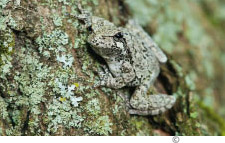
那么，蛙为什么要穿着这身“迷彩服”呢？这当然与它们的猎物和天敌有着双重关系。

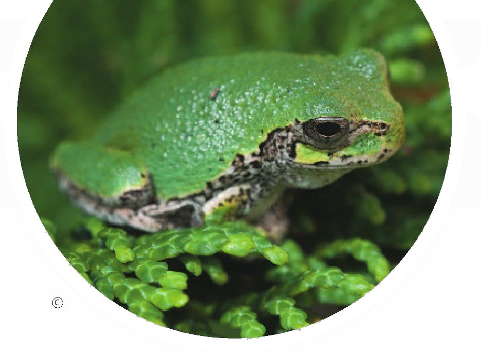
蛙的主要食物是昆虫——田野里的蝗虫、水面上的蚊子以及各种各样的飞虫，可是这些对手的动作太快，让只会跳跃的蛙难以轻松捕获。于是，蛙只好采用埋伏的办法，出其不意地攻击对方。要做好埋伏，就必须把自己隐蔽起来，让对手发现不了。就这样，在长期的生物演化中，在不同环境中穿上不同“迷彩服”的蛙再配上神奇的黏性舌头，捕捉昆虫就容易多了，它们幸存下来的机会就多了。

从另一方面来看，在自然界中，蛙属于相对弱小的一族，很多动物都可以吃它。不过，它的最主要天敌，还是得数各种各样的蛇。蛇差不多就和蛙如影相随。蛙在水边活动的时候，蛇也在水边溜达；蛙在树林里休息的时候，蛇也在树枝上盘桓；甚至蛙入土冬眠的时候，蛇也在地下抱团过冬。为了对付蛇这个天敌，蛙只好穿上“迷彩服”。非常幸运的是，大部分蛇有一个致命弱点，它们只对移动的对象有反应。于是，有时候我们可以发现，明明有一只蛙趴在近处，但游过的蛇就是没有发现。

因此，蛙身上的这套“迷彩服”，对我们来说可能是美丽的装饰，而对蛙来说，是它生存的必备武装。（周倩）

  

**【微博士】**各种动物的伪装色

蛙的“迷彩服”就是动物的保护色，在自然界中，有很多动物穿着各种各样的“迷彩服”，它们或者是为了不让凶猛的攻击者发现，或者是为了不让敏捷的猎物有机会逃跑。比如花丛中的蝴蝶就穿着花衣裳，海洋中的石斑鱼就穿着石头样的外衣。而潜伏在水中如一段烂木头一样的鳄鱼，则是为了更好地迷惑来水边喝水的牛羚、斑马等猎物。

**【微博士】**穿“迷彩服”的箭毒蛙

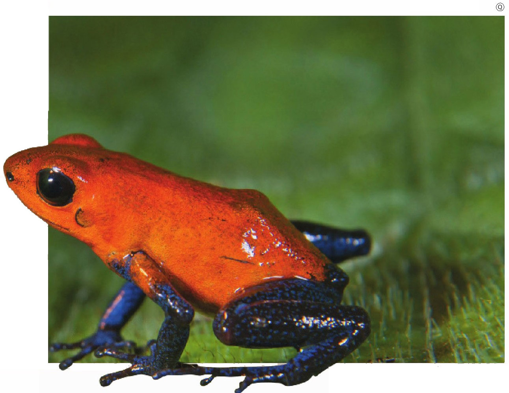
草莓箭毒蛙

在中美洲的森林里有这样一群蛙，论个头它们只是小不点，却穿着五彩缤纷的衣服招摇过市，红的、绿的、黄的、蓝的……它们似乎一点也不担心自己的安危，事实上它们确实不用担心，因为在附近路过的蛇、蜥蜴等大家伙并不理会它们。原来，这些色彩斑斓的蛙，就是大名鼎鼎的箭毒蛙。箭毒蛙的皮肤上有着非常厉害的剧毒黏液，谁吃了它，毒液就会进入对方的体内，轻则造成中毒，重则丢了性命。所以，这一身“迷彩服”，也是箭毒蛙的保护色。

## 大鲵为什么被称为娃娃鱼

说到两栖动物，我们总是想到青蛙和蛤蟆。其实，有一类最大的两栖动物，完全不像欢快跳跃的青蛙，也不似外表丑陋的癞蛤蟆，而是更像外形奇怪的鱼，它们就是大鲵，俗称娃娃鱼。大鲵属于两栖纲的隐鳃科动物，一共有3个种，一个是中国大鲵，一个是日本大鲵，还有一个是美洲大鲵。它们的头和身体扁平，有一个大大的嘴巴，体长可以达到1米以上，体重也可达50千克。那么，它们为什么被称为娃娃鱼而不是其他鱼呢？

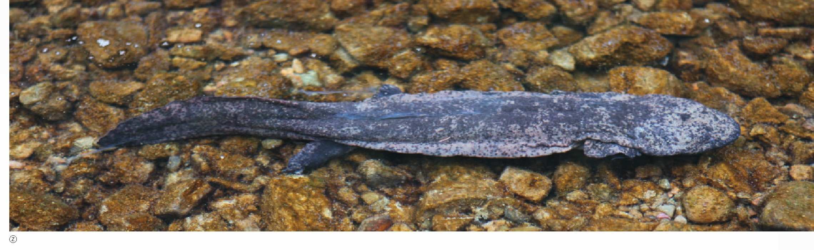
一种非常流行的说法是，大鲵的声音很像婴儿的哭声，而它的外形又像鱼，所以被称为娃娃鱼。由于大鲵对生活的环境要求很高，只存在于水质清澈的山区溪流中。它白天藏身于洞穴中，只在晚上才出来活动，身体又大多呈灰褐色，因此，过去在野生条件下，人们很难确切地听到它的声音。传说中的像婴儿一般的啼哭声，最初是来自战国时期的《山海经》，其上记载：“龙侯之山……泱泱之出水焉，而东流注于河。其中多人鱼，其状如鱼，四足，其音如婴儿，食之无痴疾。”后来，《史记》、《水经注》等也多有描述。加上民间的传说，也就慢慢流传至今。

近来，人工养殖大鲵已经在不少地方形成气候，所以，人们也有机会近距离地听一听这种珍稀动物发出的声音。根据科学家对大鲵在自然状态下的鸣叫和在电刺激中脑诱发下的鸣叫结果分析，大鲵的发声频带范围窄、基频高、谐波成分少、持续时间短，基本上比较单调，也没有婉转的声音，多集中在单音节的“唧——唧”声，在惊恐状态下，其声音持续时间会稍微长一些。进一步的研究显示，大鲵短促的声音和婴儿婉转的啼哭声在声谱的对比上差异很大，事实上，这也与大鲵发育很不完全的喉部结构相一致。

对比一下大鲵鸣叫（上）和婴儿啼哭（下）时的声波图

也有一些人认为，大头大脑的大鲵在水中的模样，似乎也有点像一个娃娃，这也是娃娃鱼俗称来源的另一个说法。事实上，世界上第一个大鲵化石于1726年被瑞士医生肖赫在德国发现时，就因为其骨骼看上去很像人类的头骨和肋骨，所以为这一化石取名“洪水证人”，以表示其与《圣经》记载的死于洪水的人类相像。（周倩）

  

**【实验场】**鲜艳的毒蘑菇

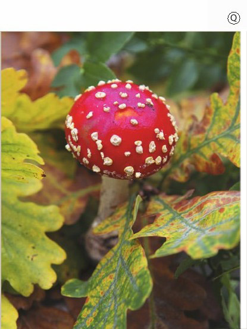
有些蘑菇也会穿上鲜艳的衣服警告对手。有机会去林子里的时候，注意观察雨后冒出地面的各种各样的蘑菇，有些色彩艳丽的蘑菇是毒蘑菇，你可要小心了。

【微问题】蛙从一种环境变化到另一种环境，它的“迷彩服”会变化吗？

【关键词】蛙　箭毒蛙　保护色　娃娃鱼

## 毒蛇咬到自己会不会中毒

一说到毒蛇，人们首先想到的是它的狠毒，很多人还会立马产生一种莫名的恐惧感。恐惧那迅雷不及掩耳的突袭，恐惧那尖利的毒牙，恐惧被毒液的注射，甚至可以想象自己扭曲的面部表情。毒蛇的毒液确实令人毛骨悚然！

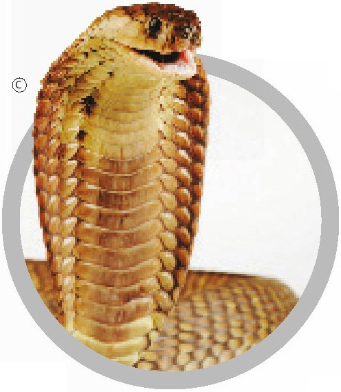
眼镜蛇

我们经常说，舌头和牙齿也要打架。也就是说，我们的牙齿是会咬到自己的。那么，毒蛇要是咬到自己，会不会也中毒呢？事实上，毒蛇很少会咬到自己，当然也不能完全排除意外。在对抗其他动物或者大小毒蛇发生遭遇战时，毒蛇也有可能会咬到自己或者被咬，但在这种情况下，大多数毒蛇仍然能转危为安，因为毒蛇在漫长的进化过程中，体内产生了特有的蛇毒天然抗性因子，可以化解不慎咬到自己或者被咬造成的后果。比如：蝮蛇血清中有磷脂酶A2抑制因子，眼镜蛇和银环蛇血清中有神经解毒因子，无毒蛇乌梢蛇的血清中有抗出血因子等。因此，毒蛇即使在非常偶然的情况下咬到自己，给自己打了一剂毒针，也会因为体内特有的解毒功能而很好地化解蛇毒。但小个体毒蛇受血液中解毒因子含量所限，如果被大个体毒蛇咬伤，可能因为无法彻底中和大个体毒蛇注入的大剂量毒液而致死。（高建芳）

## 如何分辨有毒蛇和无毒蛇

如果你在野外不慎被蛇咬了一口，你的第一个反应肯定是要弄清这是不是一条毒蛇。其实，辨别一条蛇是否为毒蛇也不是特别困难的事，既可以粗略地从它的外形和行为进行鉴别，也可以通过蛇咬伤口的特征做出准确判断。

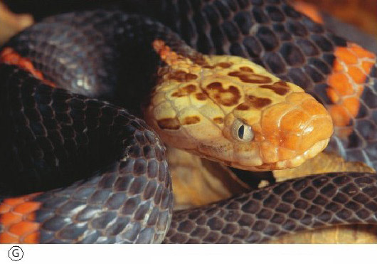
白头蝰——有毒蛇

毒蛇的头部大多呈三角形，这倒不是因为毒蛇非得长一个三角形的头，而是因为毒腺的位置大多在它的头部两侧。当毒腺中充满毒液时，头部两侧自然扩大而呈三角形，如蝮蛇和白头蝰。无毒蛇因为没有毒腺，所以头部大多呈椭圆形，如黑眉锦蛇和钝头蛇。当然，也有部分毒蛇头部并非呈三角形，如金环蛇和银环蛇，它们虽然毒性巨大，但是毒腺却很小。另有些无毒蛇的头部却呈三角形，如梭颈蛇，这就纯粹是形状使然了。

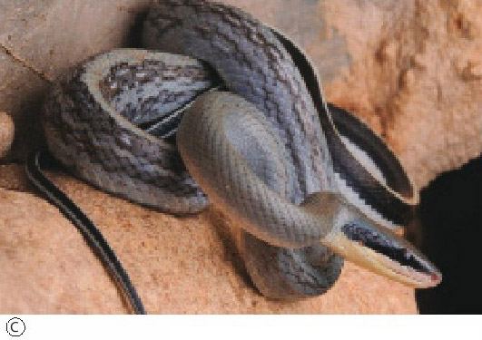
黑眉锦蛇——无毒蛇

毒蛇身体一般粗而短小，体形不匀称，尾部较短，自泄殖腔后变得细而尖，且体表比较鲜艳或者有特殊斑纹；无毒蛇身体细长，体形匀称，尾部细长，但体表斑纹不明显。另外，如果一条蛇具有颊窝，那么它肯定是一条毒蛇。

有毒蛇栖息时，常常盘成团状，爬行时动作迟缓，被激怒后比较凶猛；无毒蛇在爬行时动作迅速，多数不凶猛，且胆小怕人，遇人常常快速逃离。

有毒蛇和无毒蛇最根本的区别是有无毒牙和毒腺。一般来说，有毒蛇的上颌骨上长有一对或数对弯曲的毒牙。毒牙和毒腺相通，当毒蛇咬人时，毒腺内的蛇毒通过毒牙注入人体，就像打针一样。无毒蛇没有毒牙，牙齿细小，大小相似。无毒蛇咬人后，会在皮肤上留下一排到两排均匀而细小的牙痕，伤口浅且颜色淡。毒蛇咬人后，除了两排均匀而细小的牙痕外，还有一个以上（一般为2个）大而深的毒牙牙痕，且伤口多呈紫黑色。被毒蛇咬伤后，短时间内会出现局部或全身中毒症状；被无毒蛇咬伤后，不会出现中毒症状。

目前世界上有600余种毒蛇，除南北两极和大西洋外，各地几乎都有分布，其中南美、非洲和亚洲的蛇伤情况比较严重。一旦被咬伤，要立即用绳子等物在伤口上方处结扎，防止静脉回流、减少毒液扩散。结扎后，每隔10～20分钟放松2～3分钟，使动脉血少量通过，以免血液循环长时间受阻造成局部组织坏死。结扎好后，对伤口及时进行冲洗，可以用盐水、肥皂水、3%双氧水或0.1%高锰酸钾清洗伤口残毒。随后在伤口处切开一个“十”字切口，进行负压吸毒，口腔中无破损时可以用嘴吮吸。伤者经急救处理后，应及时送至就近医院就诊，如咬人毒蛇已被打死，应将蛇一并带至医院以便正确诊断。（高建芳）

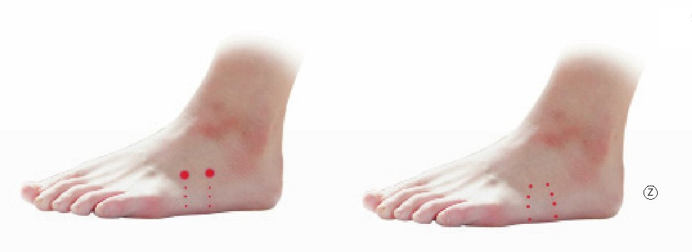
毒蛇咬伤的牙痕（左）；无毒蛇咬伤的细小牙痕（右）

## 有没有毒蜥蜴

现在有很多人喜欢养蜥蜴当宠物，一方面是因为多数蜥蜴长得比较小，看起来比蛇可爱多了，另一方面是因为它们中的很多种类是无毒的，所以也相对安全。那么是不是所有的蜥蜴都是无毒的呢？回答是否定的。

事实上，目前世界上有两种有毒的蜥蜴，分别是墨西哥毒蜥和美国毒蜥。前者有4个亚种，全长在半米以上，大的可达1米；后者有2个亚种，全长一般在二三十厘米，大的可达半米。毒蜥头大、吻圆、体形粗大壮实，行动迟缓，喜欢栖息在干旱的环境中，是卵生动物。体表由细小但不重叠的鳞片覆盖，体色深，有黄色或粉红色的斑纹。它们都是肉食性动物，吃老鼠、昆虫或者鸟蛋等。它们的毒素常用于猎食和防卫敌害，毒牙位于下颚后方的第三颗牙上。毒蜥注毒的方式和毒蛇不同，它们在猎食时会用毒牙不断在猎物身上磨出口子，然后直接通过牙槽将毒液注入伤口。人一旦被毒蜥咬伤后，往往会感到恶心、呕吐或发烧。

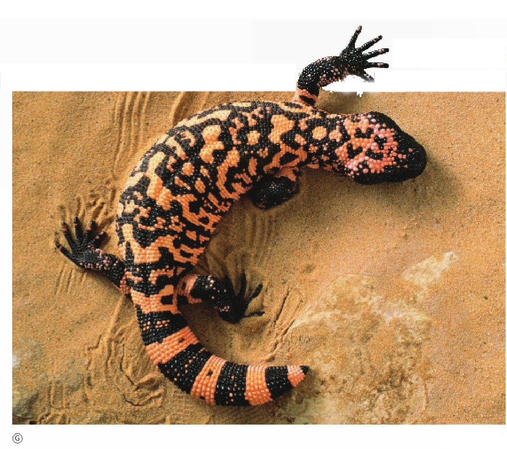
美国毒蜥

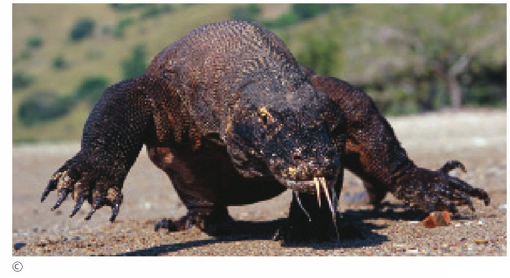
科莫多龙

此外，在印度尼西亚的小岛上分布着现存最大最古老的蜥蜴——科莫多龙（巨蜥），它的体长最大可达3.5米，重100千克以上。原来，人们认为科莫多龙捕杀猎物是凭借其口腔中大量的致病菌，猎物只是因为感染了致病菌而死亡。近年来，澳大利亚墨尔本大学弗瑞教授的研究团队推翻了这一说法，他们发现科莫多龙下颚中包含有分泌致命毒液的腺体，分泌的毒液中含有高活性的血管扩张素和抗血液凝集成分。猎物被注毒后血压会迅速降低，伤口血流不止，并在短时间内昏迷。

由于目前外来的物种流入中国非常常见，因此，如果你也喜欢饲养蜥蜴，一定要先弄清它的种类。（高建芳）

  

**【微博士】**从进食分辨毒蛇和无毒蛇

毒蛇往往用毒牙咬猎物一口，释放毒液后随即松口，等到猎物中毒昏死后再吞下去。无毒蛇咬住猎物后，或直接将它吞下去，或先用身体将它缠绕住，使其窒息而死，再慢慢吞下去。

【微问题】如果一条蛇盘着身体朝你吐信，你觉得这是毒蛇还是无毒蛇呢？

【关键词】有毒蛇　无毒蛇　血清　毒腺　毒牙

# 鱼类

## 为什么黄鱼的脑袋里会长出“石头”来

人们吃鱼时会遇到这样的情况：剥开有些鱼的脑袋，发现里面有白色的“小石头”，特别是大黄鱼和小黄鱼，“石头”不但多而且大。你是否想过，鱼的脑袋里为什么会长出“石头”来呢？

其实，那些“石头”是鱼类的“耳石”，也叫作“听石”。它们是鱼类内耳中碳酸钙的小结晶体，悬浮在内耳的内淋巴液中。跟人类一样，这些“石头”的作用是保持身体的平衡。

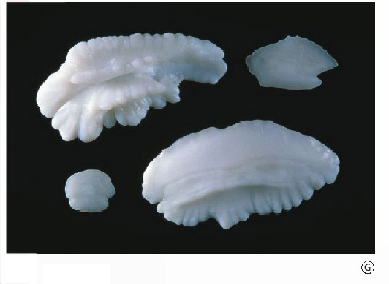
听石

在鱼类的大家庭中有这样一类鱼，它们左右内耳的球状囊彼此相连。在这个相连的球状囊中藏有很大的耳石，称为“矢耳石”。这些鱼的耳石不但大而且多，尤以鲈形目石首鱼科的耳石特别大，因此科学家把这一类鱼叫作“石首鱼”。大黄鱼和小黄鱼就属于“石首鱼”。

此外，这些“石头”还会随着鱼体的增长而长大，并出现同心圆排列的环纹，类似于鱼鳞的年轮。因此，对于石首鱼，我们还可以根据耳石环纹来推算它们的年龄呢。（刘晓　王军仁）

## 比目鱼的双眼天生就长在同一侧吗

我们见过的大部分鱼类眼睛都是长在身体两侧的，但是在水族馆却可以见到这样一类鱼，它们的眼睛长在身体的同一侧，而且这种鱼身体特别扁，两边也不对称，感觉怪怪的，我们把它们叫作“比目鱼”。是不是比目鱼的双眼生来就长在身体的同一侧，天生一副怪样呢？

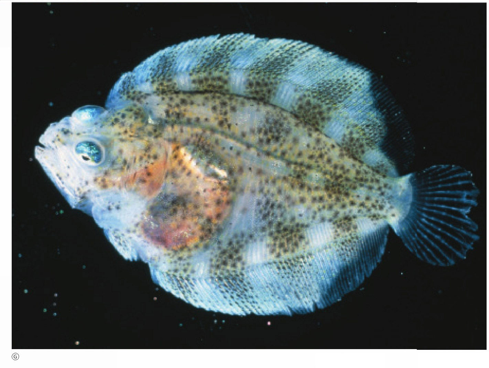
比目鱼

当然不是。比目鱼的两只眼睛长到一边，是多少年来这种鱼对环境逐渐适应的结果。当它从卵中孵化成小鱼时，它和别的小鱼一样，两只眼睛也是端正对称地长在头部左右两侧，而且这个时候它主要在水面或者接近海面上层的地方活动。但是当它长到20多天的时候，由于身体各部分发育不平衡，就逐渐地把身体侧过来游泳，于是开始侧卧在海底生活。与此同时，眼睛上方的软骨条早已被吸收，没有什么东西可以阻止眼睛的移动了。因此，它下边一侧的那只眼睛，随着眼下软带的增长，慢慢地经过头的上缘到达上面的一侧，直到与上面原来的那只眼睛并列在一起；到适当位置后，移动的那只眼睛的眼眶骨长成了，就不再移动而固定下来。至此，比目鱼的眼睛才真正长在了身体的同一侧，鱼就下沉到海底。两眼在头侧左边的统称为鲆，如牙鲆；两眼在头侧右边的统称为鲽，如木叶鲽。

比目鱼因为长期生活在海底，所以，它的两只眼睛全在上边的一侧，这对于它捕捉食物或发现敌害是很有利的。与此同时，它的皮肤也发生变化，身体下侧因长期面向海底，色泽较浅，呈淡白色，而上侧变成了接近海底土质的颜色，呈棕色，略带斑点，这种保护色既可以躲避敌害又可以方便地获取食物。（刘晓　王军仁）

## 金鱼为什么不睡觉

动物跟人一样，都需要休息，而且大部分的动物和人睡觉时都会闭上眼睛。可是，你见过金鱼闭上眼睛吗？我想肯定没见过。那是不是金鱼不睡觉呢？当然不是，金鱼和我们一样，它也会睡觉，只是我们不容易察觉而已。

其实，金鱼在水中不动时，就是在睡觉，只是因为鱼没有眼睑，所以不会闭眼，看上去就像没有在睡觉一样。

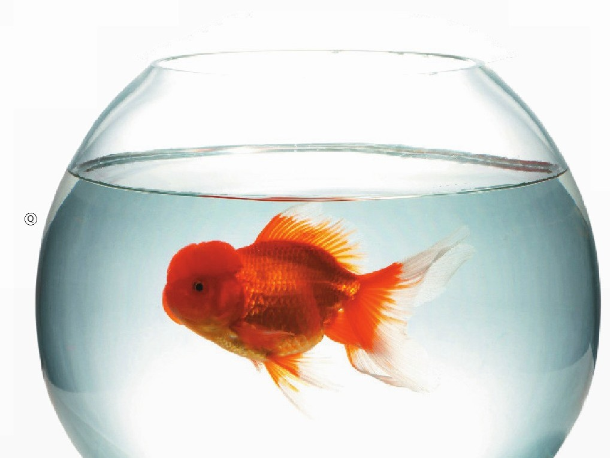
鱼也有各种各样的睡觉方法。仔细观察我们饲养的金鱼，你就会发现，它们到了夜晚，就会躲到鱼缸内的小假山、水草间等暗处一动不动，这就是金鱼睡觉时的状态。鱼不像人那样有眼睑，在睡觉时能够闭上眼睛。因此，要想看到金鱼睡觉还真不是件容易的事。

除了金鱼，人们还了解到了其他一些鱼类睡觉的状态。如花海猪鱼、细拟隆头鱼、锦鱼等，它们都在海洋底部生活，当夜色来临时，它们就会钻进沙子里，一动不动地睡大觉，这样既安静又能有效地防止天敌的伤害。还有一些鱼如裂嘴鱼、南洋鹦嘴鱼等，它们的身体会分泌一种特殊的胶状物质，要睡觉时它们就像小孩子一样吹个大泡泡，胶质的泡泡遇水后会硬化，它们就钻进那个泡泡里，只在嘴边留个小孔，就像在睡袋里一样。

在淡水里生活的鱼大多跟金鱼一样，躲在岩石后、水草间等暗处睡觉。像鲤鱼、鲫鱼会钻进水草里睡觉，而鲻鱼、鲷鱼则在岩石后面睡觉。有趣的是，还有些鱼类睡觉的时候不需要停下来，像有洄游习性的鱼就能够一边游泳一边睡觉。如金枪鱼和鲭鱼，不管白天晚上都在不停地游动，使得我们很难弄清楚它们什么时候是在睡觉，什么时候是清醒的。（刘晓　王军仁）

  

**【实验场】**观察年龄——鱼鳞

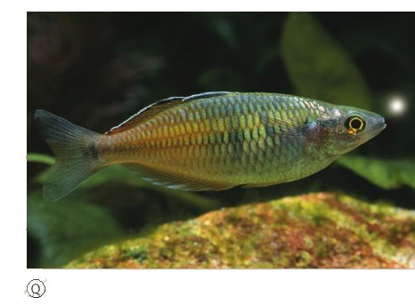
如果你仔细观察过锯断的树干，就不难发现在树干的横截面上，有一圈一圈的同心圆环纹排列在中间。这一圈圈的环纹叫作树的“年轮”，顾名思义，我们可以通过数年轮来判断树的年龄。巧的是，这个现象在鱼儿身上也能找得到，我们可以通过观察鱼类鳞片上的环纹来判断鱼的年龄。

找一片比较大的鱼鳞片，小心清洗干净，把它放在解剖镜下观察，数一数这个鳞片有几个环纹，看看你能不能知道这条鱼儿几岁了。

**【科学人】**居维叶

法国动物学家居维叶（1769-1832），比较解剖学和古生物学的奠基人。他自幼被认为是神童，4岁就能读书，14岁进入斯图加特大学。他凭借奇迹般的记忆力、极其严格的科学训练和执着的学习热情，18岁就学有所成。他提出了“器官相关法则”，认为动物的身体是一个统一的整体，身体各部分结构都有相应的联系。如牛、羊等反刍动物有磨碎粗糙植物纤维的牙齿，就有相应的嚼肌、上下颌骨和关节，相应的消化道以及相应的适于抵御和逃避敌害的洞角和肢体构造等。对鱼类而言，它们的牙齿和体长也存在一定的相关性。

【微问题】根据“器官相关法则”，如果知道了牙齿的长度，是不是就可以知道鱼体的长度呢？

【关键词】黄鱼　耳石　比目鱼　金鱼　鱼鳞　器官相关法则

## 鱼为什么要不停地喝水

你仔细观察鱼缸里的金鱼，会发现鱼儿总是在不停地喝水，有时候甚至会大口大口地喝。也许你会担心：鱼儿喝这么多水不会撑破肚皮吗？当然用不着担心，鱼儿安然无恙，依然自由自在地戏水。那么鱼为什么要不停地喝水呢？

其实，我们看到的并不是鱼儿在“喝水”，而是它在呼吸。鱼儿离不开水，就像我们离不开空气一样。可是为什么我们不用像鱼儿一样“喝水”呢？那是因为我们生活的环境里充满了空气，我们可以很轻松地呼吸到空气中的氧气，满足身体的需要。鱼就不一样了，水里面没有那么多的氧气，能供给鱼呼吸的氧气都溶解在水中，因此鱼要想呼吸就只能靠不停地“喝水”了。当然，这还得益于鱼的特殊器官——鳃。

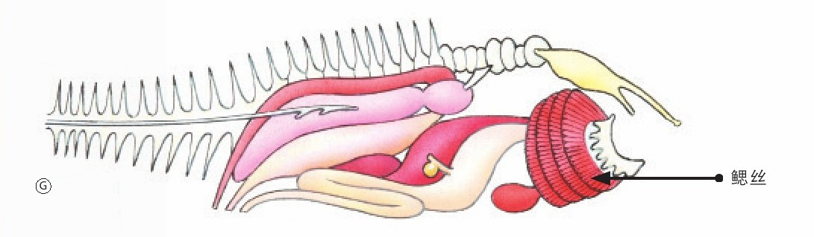
鱼的鳃就如人的肺，也是呼吸器官。大部分鱼的鳃都位于身体的两侧、眼睛的后面。鱼的鳃主要由鳃丝、鳃耙和鳃弓三部分构成。鳃丝就像梳子的齿一样，中间有很多空隙，而且每个鳃丝上都布满了鳃小片，鳃小片中包含着很多毛细血管，当水流经过鳃丝时，氧气通过鳃小片上的毛细血管被吸收，再通过血液循环来供给鱼身体的需要，水则被鳃丝滤去，又回到了鱼生活的水体中。鳃就像筛子一样，留下了有用的东西，把不用的东西过滤掉。这就是鱼的整个呼吸过程：先从口中“喝”进大量的水，然后再让水从鳃中流出，在水流经过鳃丝的时候，溶解在水中的氧气被毛细血管吸收，而水则被排出。可见，鱼儿“喝”进的表面上虽然是水，实际上却是氧气。

此外，鱼鳃还有一个很大的特点，那就是在水中时，每个鳃丝和鳃小片都充分地张开，尽可能扩大与水体的接触面积，这样就增加了鱼儿从水中摄取氧气的机会。因此，虽然水中的溶解氧含量比较低，但是鱼依然能够获得足够自身所需的氧气。

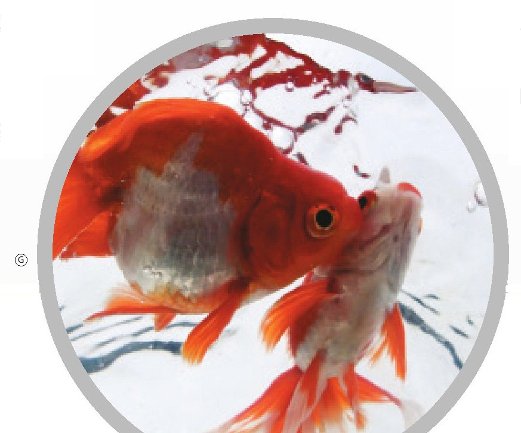
但是，鱼的鳃却只能吸收水中的氧气，所以鱼儿离不开水。这就是鱼为什么要“喝水”，而且还必须不停地“喝”的原因。当然在这个过程中我们也不难发现，其实从始至终，水并没有被鱼喝进肚子里，因此，尽管鱼儿喝了很多水，但是它的肚子却没有被撑破。（王军仁）

## 弹涂鱼为什么喜欢把尾巴伸进水面

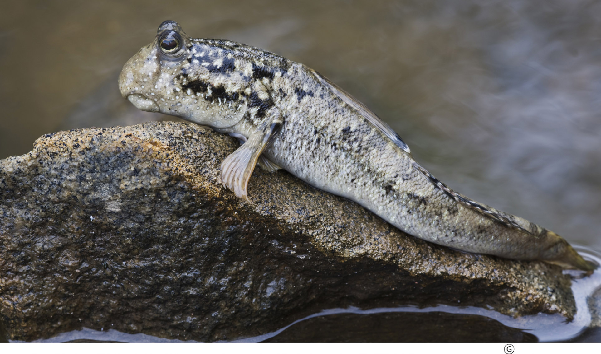
弹涂鱼

弹涂鱼是鱼类中比较特殊的一种鱼，虽然是海鱼，但它们对大海兴趣寡然。这种鱼多在咸淡水交集处或沿海有滩涂的地方出没，多见于高潮线以上的泥滩。它们喜欢在小水洼和小水坑等水深没头的地方长时间地呆着，因为在那些地方可以把肩和头露出水面，更奇特的是，它们可以离开水在陆地上进行探险。在离开水时，弹涂鱼会在嘴里含上一口水，以此延长它在陆地上停留的时间，因为嘴里的这口水可以帮助它呼吸。就像潜水员身上背的氧气罐充满了气，弹涂鱼的“气罐”则是充满了水的嘴。尽管如此，它却常常需要把尾巴留在水中，这是什么道理呢？

这是因为它还是脱离不了“鱼”的本性，它还是离不开水。当它张开嘴进食的时候，口中维持生命的含氧的水马上会流出来，而它显然是不能用嘴来呼吸的。好在弹涂鱼的身体只要保持湿润，就可以通过身体表面来呼吸，所以它必须立即通过尾巴来向身体补充水，否则就会窒息。因此，它们只要把尾巴浸在水里，就不会彻底离开水，也就能时刻保持呼吸功能。我们常常看到弹涂鱼不时地跳起，捕捉飞来飞去的小虫，其实我们仔细留意，还会发现它在做完这些动作后，会很快退回去，把尾巴重新伸进水里。（王军仁）

## 为什么夏天池塘里的鱼儿爱浮头

炎炎夏日，天气闷热时，人们总是喜欢去池塘边散步，想让池塘里的水给自己带来一丝凉意。此时，如果你留心观察，就不难发现，池塘里的鱼儿也喜欢出来透透气儿，它们常常在水面上浮头，有时候还会吐出一个个小泡泡。是不是鱼儿在夏天也怕热，所以想浮上水面来乘凉呢？

事实上，鱼儿在夏天喜欢浮头，并不是因为水中太热，而是它们想浮上水面来呼吸点新鲜空气。夏天闷热，水温也会随着外界环境温度的升高而升高，但是这并不会使鱼儿感到热，而是会让它们感到呼吸困难。为什么这么说呢？我们知道，鱼儿的生活离不开氧气，而且是通过不停地喝水来补给的，也就是说鱼儿呼吸所需的氧气主要通过吸收水中的溶解氧来提供。当水的温度升高时，水中溶解氧的含量就会降低，尽管鱼儿通过鳃来获取氧气的效率很高，但是仍然不能满足它们身体对氧气的需要，因此，它们需要浮上水面来。当鱼儿浮头的时候，它就可以通过鱼鳃表面的水分与空气接触，以增加鱼鳃表面水中的溶解氧。

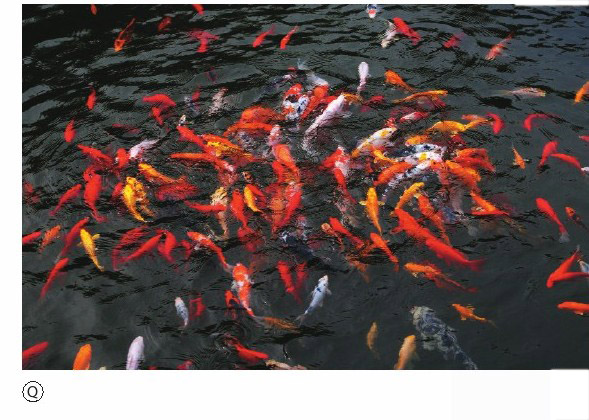
也正是因为鱼儿这个有趣的“呼吸”动作，渔业生产者就此获得了信息。有经验的渔民都很注重观察这个细节，特别是在夏天的时候，如果发现鱼儿频繁地浮上水面来“呼吸”，那就说明养殖塘里的水缺少氧气，需要及时补充氧气，否则就会使生产蒙受损失。

当然，我们还要认识到，鱼儿这种浮头甚至吹泡泡的现象虽然很有趣，但是对鱼儿却是不好的。那么，怎样才能避免鱼儿浮头呢？通常的做法就是用增氧仪向水中充入适量的氧气。如果是用鱼缸养鱼的话，也可以通过换水来增加水中的溶解氧。（王军仁）

  

**【微博士】**鱼类的辅助呼吸器官

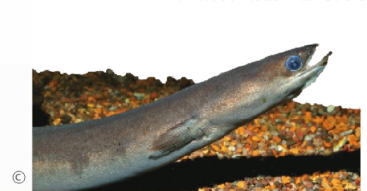
鳗鲡

生活在水环境中的鱼类，其呼吸器官在结构和功能上都与高等脊椎动物的有很多不同之处。鱼类的主要呼吸器官虽然是鳃，但为了配合其生活习性的多样化，还发展出了其他辅助呼吸器官。比如鳗鲡就可以通过皮肤辅助呼吸，鲨、魟类的辅助呼吸器官是假鳃，泥鳅、鲶用肠来辅助呼吸等。

【微问题】如果你养了一缸金鱼，有一天发现鱼儿开始急促地大口大口“喝水”，那你该怎么做？

【关键词】鱼鳃　呼吸　弹涂鱼　浮头　辅助器官

## 为什么北极的鳕鱼冻不死

你想过冬天在野外游泳吗？也许那种刺骨的寒冷早就让你却步了。那么，鱼类长期处于寒冷的水环境中，还能生存吗？事实上，大部分的鱼类在-1℃的水中就已经冻成“冰棒”了。但是有一种叫鳕鱼的鱼类，常年生活在极寒的北极，它们却能在-1.87℃的水中自如地游动。为什么北极的鳕鱼冻不死呢？

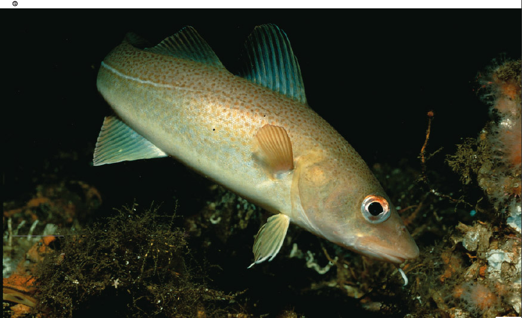
我们知道，鱼类是冷血动物，也就是说，它们的体温可以随着环境温度的变化而变化。北极鳕鱼常年生活在寒冷的水中，为了适应这种环境，它们衍生出了一系列的适应机制，其中最主要的就是在鱼体内的皮下层形成了厚厚的脂肪。脂肪对寒冷的水体具有相当好的抵抗能力，这也就是北极鳕鱼能够在极寒环境中生存的原因。而且，作为变温动物，鱼类的体温跟外界基本上是一致的，这也就节省了用来补充热量所需的能量，所以它们不但能够生存，而且还可以自如生活。

此外，近年来科学家们的研究结果表明，北极鳕鱼“冻不死”还有一个重要的原因——血清中存在抗冻蛋白。

抗冻蛋白是一种很特殊的特异性蛋白质，存在于寒冷海域的鱼类血清中。它之所以具有抗冻作用，是因为抗冻蛋白能形成一个较平坦的表面来识别冰的表面，一旦其吸附到冰晶表面，新的冰层必须沿着没有蛋白的缝隙生长，造成了冰晶弯曲的表层，局部的凝固点也就跟着下降，以此降低水的冰点，从而阻止体液的冻结。由于抗冻蛋白表面的特殊结构，无法使冰晶沿其表面生长，因此它能免于被冰晶吞噬而失去活性。北极鳕鱼的血清中，便存在着这种使它冻不死的“保护神”。（于晓　王军仁）

  

**【微博士】**抗冻蛋白

近年来，随着科学研究的不断深入，一种能够保证北极鳕鱼不被冻死的物质——抗冻蛋白被渐渐揭开了神秘的面纱。按理来说，在冰水环境中，鱼类的体液中会形成冰晶，使脆弱的细胞膜和细胞组织破裂。然而，鱼体中的抗冻蛋白会依附于冰晶的表面，起到阻遏冰晶生成的作用。计算机模拟显示，在冰的缓慢生成过程中，越来越多的抗冻蛋白会依附到冰晶表面来，使得冰没有足够的时间来“吃掉”它们，于是就不能真正结冰。

## 为什么说金枪鱼的血是热的

金枪鱼体呈纺锤形，具有鱼雷体形，适于快速游泳，一般时速为30～50千米，最高速度可达160千米/时，比陆地上“短跑冠军”猎豹还要快。它的旅行范围可以远达数千千米，能作跨洋环游，被称为“没有国界的鱼类”。不过它却是热血的鱼，体温可以达到33～35℃。鱼不是冷血动物吗？为什么金枪鱼是“热血动物”呢？金枪鱼的体温为什么会比周围水温还要高呢？

原来，金枪鱼游泳时总是张着嘴，同时张开鳃盖，使水流经过鳃部而进行吸氧呼吸。这一特性，使得它在一生中只能不停地持续高速游泳，即使在夜间也不休息，只是减缓了游速，降低了代谢。这种不知疲倦的快速游动，需要很强的肌肉收缩力量，正是这种力量使它们体温升高，并可以高于外界的水温。

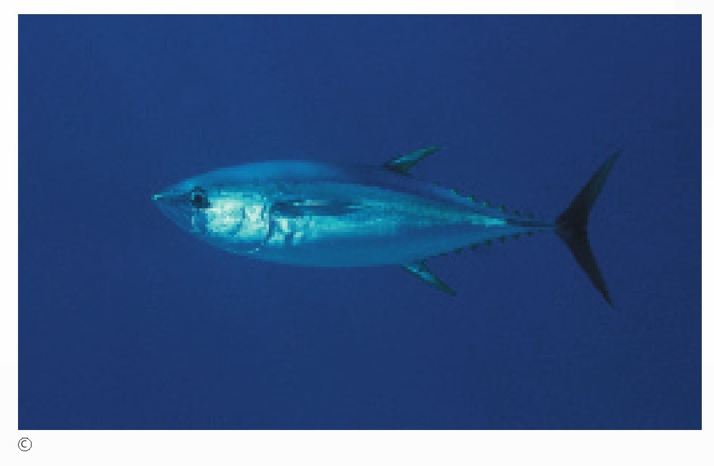
此外，金枪鱼有发达的皮肤血管系统连接在脊柱两侧的肌肉和皮肤上，形成大量的血管网丛，这些血管网丛中也有血液流动，表明这些部分的新陈代谢特别旺盛，因而，金枪鱼该部分的肉是紫红色的而不是白色的。此外在它的肝部也有相同的血管网丛。高强度的新陈代谢使得金枪鱼的血液始终维持在比较高的温度上，因而它也算得上是“热血动物”。（于晓　王军仁）

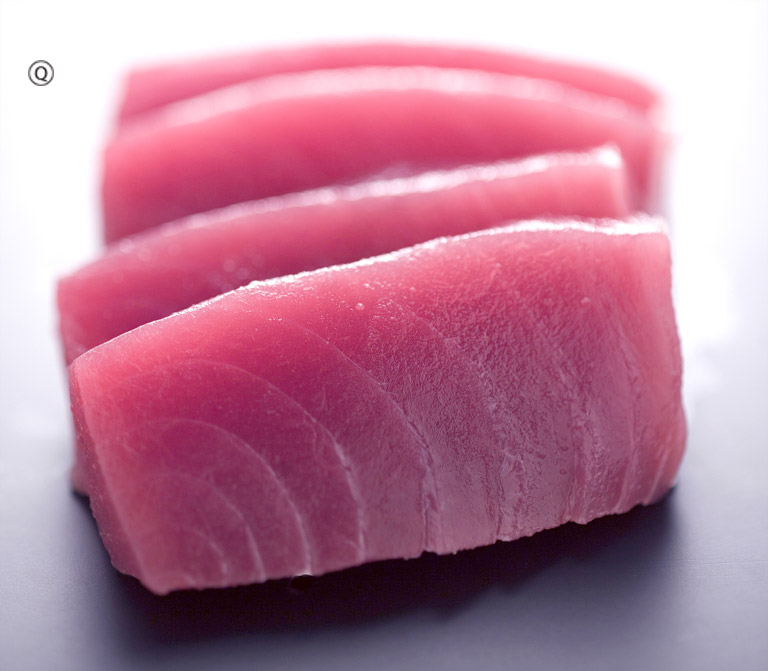
  

**【微博士】**生鱼片

生鱼片又称鱼生，古称鱼脍、脍或鲙，是以新鲜的鱼、贝类生切成片，蘸调味料食用的食物总称。生鱼片起源于中国，有着悠久的历史，后传至日本、朝鲜半岛等地。

生鱼片，在日语中叫“刺身”，是日本料理中最具特色的食品。江户时代以前，生鱼片主要以鲷鱼、鲆、鲽、鲈鱼为材料，这些鱼肉都是白色的。由于其制作过程中没有经过传统煎、炸、蒸等过程，因此保存了鱼类最原始、最富营养的成分。然而，从卫生角度讲，由于没有经过高温烹制，鱼类中的细菌、寄生虫等有害物质并没有被杀死，所以有一定的食用危险。明治以后，金枪鱼的出现，一时间使得它成为了制作生鱼片的上等材料，被奉为生鱼片的上品。其原因：一是它的肉呈鲜红色；二是它常年生活在大洋深处，体内没有寄生虫。

【微问题】金枪鱼身上哪一部分的肉是鲜红色的？

【关键词】北极　鳕鱼　金枪鱼　抗冻蛋白

## 海水很咸，为什么海鱼肉却是淡的

海水又苦又咸，生活在海洋中的鱼儿一生都在喝着这种又苦又咸的水，就像被腌在一个“大盐水缸”里，那海鱼不就都变成天然的“咸鱼”了吗？但事实上，海鱼肉本身是不带咸味的。那么海水这么咸，为什么海鱼肉却是淡的呢？

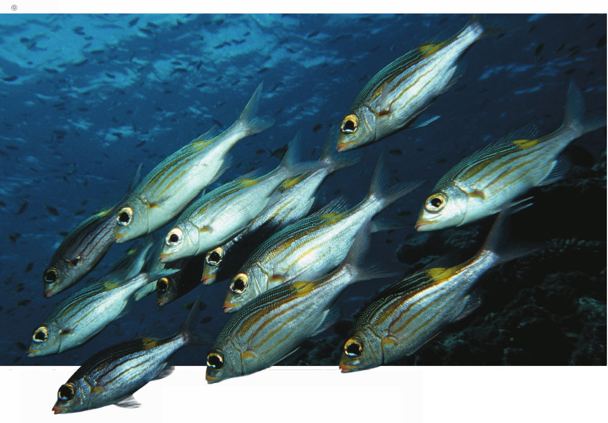
原来，生活在海洋里的鱼儿各自都有特殊的“海水淡化器”，可以将喝进去的海水盐分及时排出，从而可保持肉淡。而且不同的鱼类还有不同的“淡化器”呢。对于海洋硬骨鱼类而言，承担海水淡化功能的器官主要是由一种叫作“泌氯细胞”的结构组成的，这些器官长在鱼的鳃丝中。“泌氯细胞”就像鱼身上的一个“海水淡化车间”，能够把海水盐分的主要组成物质——氯化物排出体外。我们都知道鱼是用鳃呼吸的，当海水流经鳃部时，“泌氯细胞”就开始发挥作用，通过分泌氯化物的形式将经由血液运输而来的过多盐分排出体外。此外，由于鱼体内的盐浓度低于海水的盐浓度，即海水的渗透压高于鱼体液的渗透压，自然状态下就会使鱼体内的水分不断地流失到海水中。因此，为了保存体内的水分，鱼类还通过多喝水、少泌尿的办法来维持体内的低渗压。

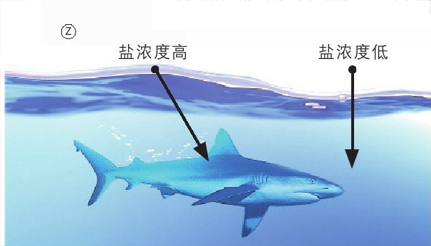
软骨鱼需要保持体液的盐浓度高于海水，才能减少体内水分的流失

而海洋中的软骨鱼类，它们保持肉淡的机制又是另一个样子。事实上，它们并不像硬骨鱼类那样拥有“泌氯细胞”，而是利用体内尿素的作用来排除盐分。它们体内尿素的含量比其他水生动物几乎高出100倍以上。这些尿素不仅能使软骨鱼类保持体液的高渗压，也就是让体内体液的盐度比外界海水的盐度高，从而减少体内水分渗透到海水中，而且还可以加速体内盐分的排泄。（王军仁）

## 为什么要有休渔期

每年的4月中旬，中国海洋与渔业部门就会给东海海域相关的部门和人员发出通知，从4月16日至7月1日，位于东海中北部近海的东海海域水产保护区核心区进入休渔期。在休渔期内，面积约2.25万平方千米的保护区中的核心区内将禁止所有渔船作业。另外，在北纬35˚至26˚30'的黄海和东海海域内，也将从6月1日12时至9月16日12时内实行伏季休渔制度。在此期间，除单层刺网、钓业外，禁止其他所有作业类型生产。不仅如此，渤海、南海，甚至淡水水域的西藏拉萨河、北京密云水库等也都在一定时间内实行休渔制度。我们都知道，渔民是靠捕鱼吃饭的，为什么在这段时间内，国家要实行休渔制度，不让大家捕鱼呢？

以东海海域水产保护区为例，每年的休渔期，正是东海带鱼的产卵和索饵高峰期，其核心区同时也是东海带鱼的洄游通道。如果在这个时候放任渔船捕鱼，不仅会将产卵的带鱼一网打尽，而且也会把那些刚刚成为幼鱼的小带鱼赶尽杀绝，其后果就是年复一年的减产，最终把东海带鱼资源消耗殆尽。而一旦建立保护区，不但使得带鱼有了喘息和恢复生机的可能，为来年的丰收创造最好的条件，还能有效带动大黄鱼、小黄鱼、银鲳等东海区其他主要经济鱼类以及中华鲟、鲸豚类等64种水生珍稀濒危动物的保护工作，算得上是一箭多雕。对拉萨河内的鲇鱼、裂腹鱼、胡子鱼等进行保护，也是同样的道理。

除了休渔期，国家还在一定海域内圈定了一些禁渔区，那是一些重要鱼类的繁殖场所和越冬场地，常年不允许捕捞。因为有了这些措施，鱼类和某些重要动物资源，才有了休养生息的机会。

休渔期制度是国家自1999年从南海开始实行的一项渔业保护制度。经过不断的完善，如今已经在各地推行，虽然还未能彻底扭转鱼类资源日渐枯竭的局面，但无疑有效延缓了其快速消亡的进程。（周倩）

  

**【微博士】**长江禁渔倡议

长江自2003年起实行4月～6月的休渔期，虽经10年的努力，情况却并没有明显改观。其主要原因是在休渔期过后，现代化的捕鱼工具在开捕后采取一网打尽的手段。为此，曹文宣院士提出真正禁渔十年的建议。不过，这一建议还面临着如何安置渔民等难题。

**【微博士】**牛鲨的双重生活

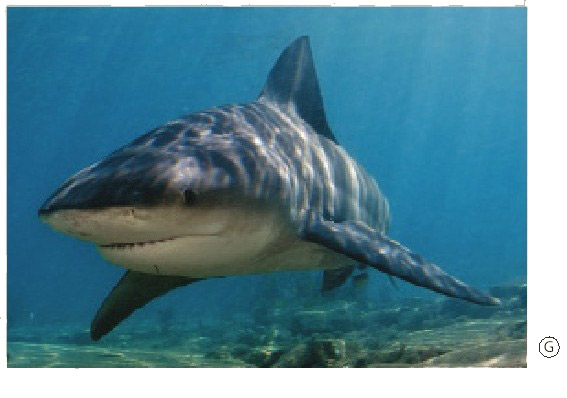
牛鲨因其壮硕如牛的外形、阔平的鼻端和具有攻击性的习性而闻名。与其他鲨鱼相比，牛鲨有一个特别的生活习性，那就是它可以在海水和淡水两种水体中生活。牛鲨这种特殊的双重生活习性与其极强的适应能力是分不开的。在漫长的进化过程中，它们发展出一套适应淡水的机制，通过调节血液里盐分及其他物质的含量，维持体内盐度的平衡。因此牛鲨可以从海洋游进淡水里，或在港口、河流入海口处流连。当然在淡水中生活一段时间后，重新回到海水中时它们也能很快适应。例如生活在密西西比三角洲的牛鲨，当迁移到佛罗里达州的珊瑚礁中过冬时，会很快适应海水中的生活。

【微问题】鲑鱼在淡水中产卵，却在海水中长大，它的身体有什么特殊的地方吗？

【关键词】海水　海鱼　休渔期　牛鲨

## 鱼儿为什么能自由上浮和下潜

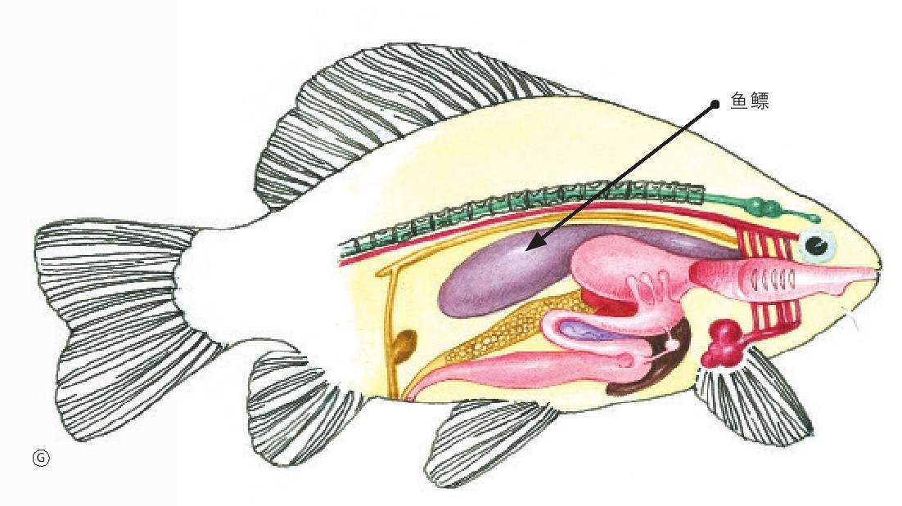
潜艇可以通过控制载水量在水中自由上浮和下潜，当它需要上浮的时候就排出一定量的水以减轻自身的重量，而需要下潜的时候则抽入一定量的水来增加重量，以这种机制来实现浮降。其实，在自然界中就有天然的潜水艇——鱼类，那鱼儿又为什么能够自由上浮和下潜呢？

原来，鱼的身体中有一种能够控制浮降的特殊构造——“鱼鳔”，鱼儿就是靠它来上浮和下潜的。

在鱼的背部，紧贴脊柱下方，有一个充满气体的囊体，那就是鱼鳔。鱼鳔能帮助鱼在不同深度的水里通过放出或吸进气体，来调节鱼身体的比重。鱼要浮上来的时候，鳔里慢慢地装满了气体，鱼鳔胀大了，就会浮上来；鱼要下潜的时候，鳔里的气就会放出来，鱼鳔缩小了，就会下沉。

鱼鳔就像气球一样，有伸缩性，在它里面可以充满或放空气体。我们都知道，充满气体的气球在水中是不会沉下去的，但是没有充气的气球会下沉。这跟鱼鳔的机理是一样的。

鱼类就是通过调节鱼鳔内的气体量来控制身体沉浮的，因此我们会看到鱼儿时而浮在水面上一动不动，时而又猛地扎进水里，游向水层深处。其实，人们正是模仿鱼类的这一机制才造出了潜艇。可见，自然界的奥妙无处不在，只要我们善于观察就会发现有用的知识。（王军仁）

## 鲨鱼为什么不停地游泳

大部分鱼儿都可以自如地在水中游动，累了就可以停留在水面上休息一会，需要觅食或者是遇到危险的时候又可以很快地消失于水面，沉到水层深处，也就是说它们可以自由地上浮和下潜。但并不是所有的鱼都可以这样，比如说鲨鱼。如果你在水族馆中仔细观察一下鲨鱼，会发现它们从来都不会停留在水中。它们总是在不停地游动，那么它们为什么要这样呢？

我们已经知道，鱼儿可以自如地在水中上浮和下潜是因为它们有特殊的“潜水器”——鱼鳔。但很可惜，鲨鱼没有这个装备。正是由于它们没有鱼鳔，不能自如地控制身体的升降，所以才需要不停地游动。

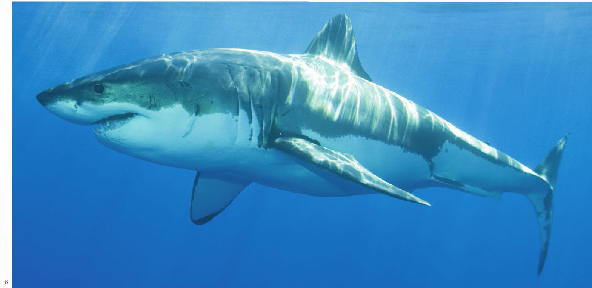
鲨鱼早在恐龙出现前的3亿年就已经存在于地球上，至今已超过4亿年，它们在近1亿年里几乎没有改变。鲨鱼，在古代叫作鲛、鲛鲨、沙鱼，是海洋中的庞然大物，所以号称“海中狼”。鲨鱼没有鳔，加上大部分的鲨鱼体形都比较庞大，所以这类动物的比重主要由肝脏储藏的油脂量来确定。而且鲨鱼的密度比水稍大，也就是说，如果它们不积极游动，就会沉到海底。因此，为了能够保证一直处于水体中，从而获得足够的食物量，鲨鱼就不得不一直不停地游动。（王军仁）

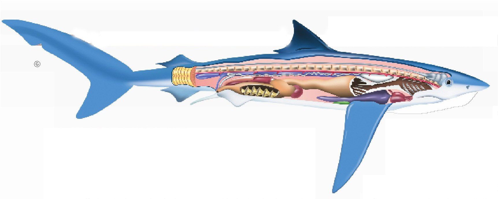
从图上不难发现，鲨鱼的体内没有鱼鳔

## 为什么鱼死后会“翻白肚”

在生活中我们肯定看到过这样一种现象，如果鱼死了，那么它肯定会是肚子朝天的。而且大部分鱼类的腹部颜色都比较浅，接近于白色，因此人们常常会说鱼“翻白肚”了。那么，为什么鱼死后总是肚子朝天呢？

其实知道了鱼类主要靠鱼鳔来调节身体的升降和平衡后，就不难解释这个问题了。大多数鱼的身体内，有一种调节身体比重的器官，叫作鳔。它可以在不同的深度通过放气或吸气来调节身体的比重，使之和周围水的比重一样，这样鱼可以不费力地停留在水中。鱼死了以后，这种调节能力自然失去，鱼鳔内也就吸满了气体，导致身体比重减小，所以鱼死了就会浮到水面上来。可是为什么鱼死了不是背部朝天呢？只要你仔细看一下鱼的身体就会明白了，因为最重的脊椎骨就长在鱼的背部，上面还附着了较多的肌肉，比重自然较大，而腹部多为内部器官，空腔大，比重较小，所以，鱼死了以后，比重小的腹部大多是向上的。

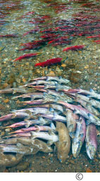
鱼肚朝上还有其他帮手，那就是鱼鳔和鱼鳍。我们已经知道，鱼鳔主要是用来调节身体比重的，而鱼鳍则是主要的运动器官，鱼靠鳍的摆动在水中游动。但是人们常常会忽略了这两个器官的另一个功能，那就是保持身体的平衡。鱼在健康的时候是利用鳔来调节密度，利用神经系统控制运动系统来调节姿势的。鱼在受伤后或感觉到水体缺氧时，神经系统会失去对运动系统的控制能力，或肌肉已经麻痹，此时保持身体平衡的鱼鳔和鱼鳍都不能发挥作用了。再借助于充满空气的鱼鳔，鱼就更容易浮到水面上来了，并且是比重较小的腹部朝上。这也是导致鱼死后“翻白肚”的另一个原因。（王军仁）

  

【微问题】没有鱼鳔的鲨鱼死后会鱼肚朝天吗？

【关键词】鱼鳔　鲨鱼　鱼鳍

## 沙丁鱼为什么喜欢抱成大团

人们在乘上拥挤的地铁或公交车时，常常会感慨：我们就像沙丁鱼一样。沙丁鱼，一种常被做成罐头的美味鱼类，体长较短的仅六七厘米。在自然界中，它们有挤在一起抱团的习性，这个习性在“大迁徙”中表现得尤为壮观。

南半球每年的冬天，沙丁鱼由南往北，沿着东部海岸开始一年一度浩浩荡荡的大迁徙。伴随着数十亿沙丁鱼大举北进，往常平静的海水翻起了无数白色的泡沫。从单位面积的生物数量来说，这种奇观可以和东非的野生动物迁徙相媲美。鱼群通常有7千米长、1.5千米宽、30米深，像一条条巨大的黑色带子一样伸展开来。这种现象常发生在冬天，很容易让人联想到“抱团取暖”。难道它们真的是为了取暖吗？它们为什么会有这样的行为呢？

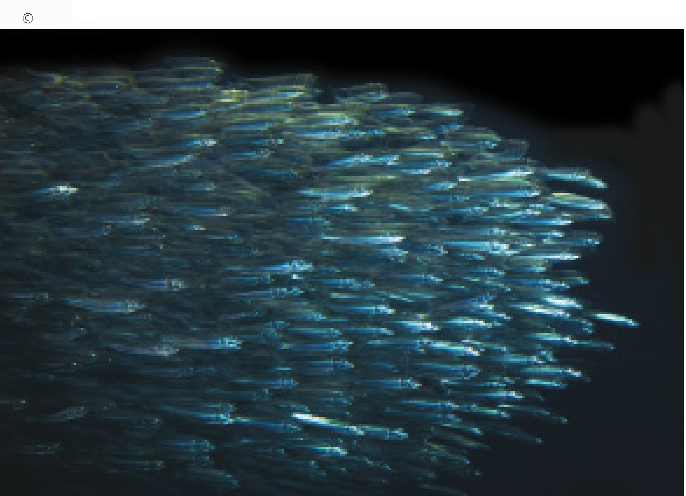
对此，科学家们有不同的解释。有人认为，这是沙丁鱼群产卵的需要，因为这种现象的出现有季节的规律；有人觉得，沙丁鱼是为了索饵，由于浮游生物大量的繁殖，它们为了追寻食物而迁徙；也有人认为引起沙丁鱼大举迁徙的主要原因可能是洋流的影响。另外，它们大量地聚集在一起迁徙还可以这样解释：大规模的移动必然会引来诸如鲨鱼、海豚以及水鸟等捕食者，为了保护较小的年幼鱼类，它们“抱团”行动就可以把小鱼围在中间。当然，也有可能没我们想象的那么复杂，它们就是为了抵抗猛烈的海流而集群的。

无论它们“抱团迁徙”是出于何种目的，这个现象都给人们带来了极大的视觉感受，特别是对于一些潜水爱好者来说，这堪称是自然界中一道美丽的风景。（曹文芝　王军仁）

## 大马哈鱼为什么能找到回家的路

远古时代，通信技术不像今天这么发达，传递信息可以通过电话或者网络在短时间内完成。过去，传递比较紧急的信息都是通过信鸽，那信鸽为什么能记住目的地的位置而不迷路呢？原来，不同动物辨别回家的路的方式是不一样的。归纳起来，动物识别路径主要依赖于两种方式：靠信号或靠记忆。所谓靠信号就是靠动物与自然界沟通的信号，比如鸽子靠地球磁场，海豚靠声波，等等。所谓靠记忆就是靠一些标记，比如狗靠自己的排泄物的气味能找到回家的路等。

在鱼类世界里，当然也不乏这样的“记忆能手”，比如大马哈鱼（又叫鲑鱼）。它大眼睛、大嘴巴，蓝灰色的外衣上缀着紫红色的斑点，有太平洋和大西洋产的不同种类。它们在河里出生，海里长大，最后又回到江河里产卵。一生中至少要往返一段长达数千千米的远航，也不会走错。虽然年幼的鱼儿可以用“顺流而下”来解释它们进入大海的行为，但成年后的鱼儿在八九月间回到自己的“故乡”产卵时，完全是逆流奋进，凭借的只是自己儿时的“记忆”，却总能找到回家的路。

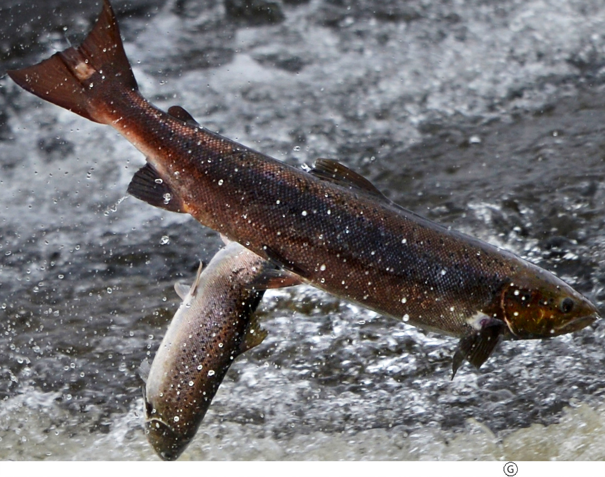
大马哈鱼

我们可以从电视镜头中看到，成年大马哈鱼在“返乡”途中，不但一路逆水前进，而且在碰上急流瀑布时，从不会退却，而是奋力跳跃，哪怕上面有灰熊等狩猎动物在蹲点，也义无反顾，有时一跃就有2米多高，只是因为这是一条回家的路。大马哈鱼的记忆力为什么这么强呢？

当然你可以说是本能，不过科学家总是想找到确切的说法。一些科学家从鸽子身上获得启发，认为大马哈鱼也是借助天上的星星或者地球磁场来导航的。也有的科学家不认同这种说法，他们直接对产自大西洋的大马哈鱼做了一组实验：将在产卵区捕捉到的大马哈鱼，分成三类：一类消除视觉，另一类消除嗅觉，还有一类消除听觉。然后将它们全部放回水里，到了下一次产卵期间，依旧在原地捕捉。结果在捕到的鱼儿中，只有那些没被消除嗅觉的鱼还在。由此他们断定，大马哈鱼是利用水的气味来确定“航路”的，嗅觉器官就是它的“指南针”。不过，太平洋产的大马哈鱼由于在产卵后都会死去，所以并没有类似的结果。（曹文芝　王军仁）

## 斗鱼为什么喜欢争斗

在鱼类世界里，有这样一类鱼儿，它们天生喜欢争斗。你总是可以看到它们在追逐打闹，更甚者会相互厮杀缠斗。因为这个习性，它们便得来一个名字——“斗鱼”。作为同类，斗鱼为什么如此喜欢争斗呢？

斗鱼常见于亚洲及非洲的淡水中。多数种类的雄鱼会构筑、保护、维持一个由黏液组成的泡沫所构成的浮水巢，因而也常被称为“筑泡巢鱼”。斗鱼约有70种，一些种类由于适合观赏，常常被饲养在水族箱里。要解释它们喜欢争斗的行为，还得从它们的求偶及交配行为说起。

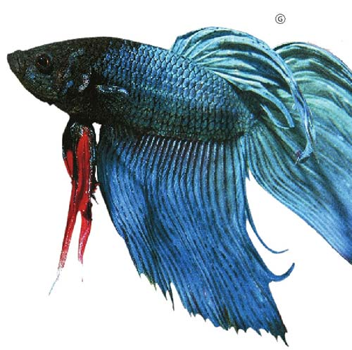
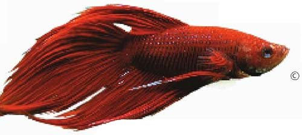
斗鱼对配偶的要求十分严格，一定要两情相悦，互相配合，才能成功交配。如果其中一方不悦，或体形上存在差异，那便会导致严重后果：轻则不能成功交配，严重的可能两败俱伤，甚至死亡。所以斗鱼交配时双方应体形相近。雄鱼的体形不应太大或太小，最合适的是比雌鱼稍微细小一些，这样雌鱼在交配期间不会因受到雄鱼的猛烈攻击而致死。在繁殖期间，雄鱼鱼体会出现平常见不到的“婚姻色”，以这种鲜艳的颜色来吸引异性的注意。雄鱼在求爱过程中，身体颜色会变得特别鲜明，身体和各鳍出现虹光样的绚烂色彩。如果雌鱼对雄鱼的求爱表现无所反应，雄鱼就会恼羞成怒，追逐雌鱼一直到它被迫跳出水面脱逃为止。

同性之间的争斗更为惨烈，有时候两条雄鱼为了争夺一条雌鱼，也会大动干戈，相互争斗，直到一方落败甚至死亡。正是这种优胜劣汰的自然选择，导致了斗鱼喜欢争斗的本性。（曹文芝　王军仁）

  

**【微博士】**嘴巴当作育婴房

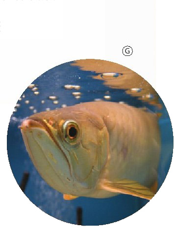
在鱼类中，有一种叫作“龙鱼”的鱼，它的奇特之处在于将小鱼放在口中孵化。龙鱼是一类古老的鱼种，当雌雄两条鱼经过追尾，在雌鱼产卵后，雄鱼就开始授精。接下来，雄鱼会把受精卵含在口里孵化和养育，这是因为龙鱼的繁殖能力很弱，为了保证种群的繁衍才演化出了这样的行为。这样做有两个好处：一方面可以保护鱼卵，避免被其他以鱼卵为食的生物吞食；另一方面，可以提供足够的氧气，帮助小鱼健康孵化。

【微问题】大马哈鱼、鲑鱼和三文鱼是同一类鱼吗？

【关键词】沙丁鱼　大马哈鱼　抱团　迁徙　斗鱼　嗅觉

## 为什么没有视觉的鱼儿也能生存

对一般动物而言，如果没有视觉就意味着它将无法生存，因为它既无法找到食物，也不能发现敌人。但是，世界上确实存在着没有视觉的鱼，而且还活得好好的，它们就是盲鱼。盲鱼大多生活在没有光线的地下洞穴或者石灰岩等岩洞里，个别的也会生活在阴暗的水沟里。那么，没有视觉的盲鱼为什么能生存下来呢？

盲鱼又名无眼鱼，它们的眼睛基本退化，甚至被一层皮肤的皱褶所覆盖。盲鱼不但分布广，而且种类多，非洲、美洲、欧洲和亚洲都有发现，中国云南、广西、贵州等地的洞穴中也不断发现有盲鱼存在。据推测，盲鱼的祖先应该也是有眼睛的，其中的一部分可能在数万年前被水流带到了只有很少光线或完全没有光线的地下水中或者洞穴内。随着漫长的岁月流逝，它们的眼睛没有了用武之地，才逐渐退化变成了今天的盲鱼。

盲鱼

这一点也可以从盲鱼刚孵出的幼鱼中得到印证，因为幼鱼是有眼睛的，只是在2个月左右时才逐步退化。由于在地下水或者洞穴中食物丰富，又没有大型食肉鱼之类的天敌干扰，所以盲鱼能活得自由自在。另外，为了更好地适应环境，盲鱼也做出了身体上的演化调整，在眼睛退化的同时，它们吻部的触须变得更加灵敏，再辅以头部或者体表的特殊感受器，使它们在黑暗中自由自在地生活。

其实，世界上还真的有完全没有眼睛的鱼，比如深海中的光头鱼的头背部就被一对很大的发光器所覆盖，只不过这对发光器除了发光，也许还有视觉的功能呢！（王军仁）

## 为什么深海里的鱼儿要挂“灯笼”

每逢春节，家家户户都会挂起各式各样的灯笼，红红火火过大年，要是赶上元宵节，还会有热闹的灯会呢。可是，你知道吗？海里有种鱼儿也会“挂灯笼”，因此人们把它叫作“灯笼鱼”。

灯笼鱼也叫灯眼鱼，是一类身体能发光的小型鱼类。它们白天躲藏于海洋中的阴暗处，晚上则出来活动，以浮游动物为食。灯笼鱼身体上的发光器官起源于皮肤，是由腺细胞变化而来的，其大小和形状差异很大，从能分泌发光液的细胞团到具有水晶体及反射组织的复杂器官都有。有些灯笼鱼的眼皮底下就挂着一盏“灯”，发出的光非常明亮，其实那是一团发冷光的细菌在起作用。那为什么深海里的鱼儿要“挂灯笼”呢？

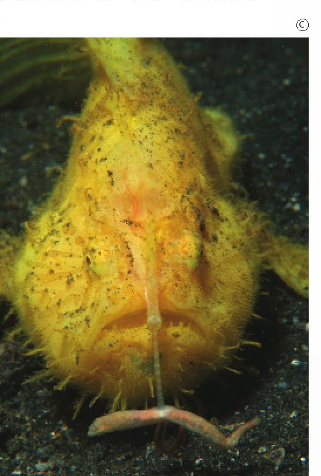
鮟鱇鱼利用它的“灯笼”成功地捕获食物

原来，它们生活在海水深处，那里光线很少或者根本就没有光线，在这样的环境中，鱼儿挂起灯笼来可是大有用处呢。其一，有些鱼可以通过自我控制来调节“灯笼”的亮灭，从而躲避敌害。如生活在印度洋中的一种灯笼鱼，它的发光器就在眼睛下面可活动的突起上，不用的时候可以缩进空腔内，这样就可以避免亮光招来捕食者。其二，由于很多浮游生物都有“趋光性”，喜欢向着有光亮的地方游动，灯笼鱼就可以靠它发出的亮光来诱捕食物，比如大家熟知的鮟鱇鱼，它的第一背鳍就变化成发光的形似鱼饵的钓竿，以吸引小鱼前来。其三，在深海中，它们同伴之间可以通过改变这种冷光的频率来相互交流。可见，动物为了适应生存的环境，真是奇招不断啊！（王军仁）

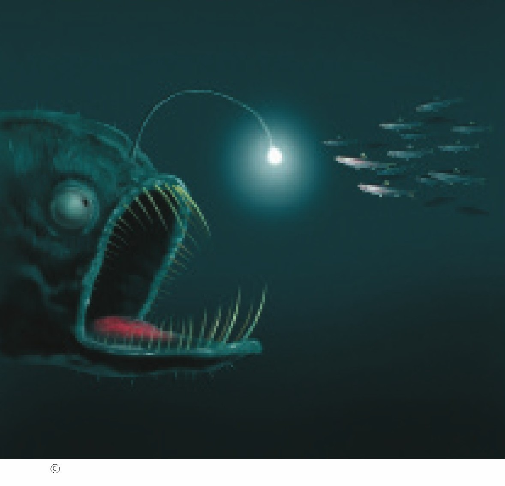
## 为什么大多数鱼都是扁的

鱼类的身体形态各种各样，有长条形，有梭形，但是你仔细观察就会发现，大部分鱼类身体都是扁的，特别是一些深海鱼类，其身体更扁，有些看上去只有薄薄的一片。是什么原因导致鱼类身体成为扁扁的呢？

原来，长期的深海环境的栖息生活，使得那些生理功能发生很大变化的鱼类生存了下来，这些变化反映在深海鱼的肌肉和骨骼上。在深海的巨大水压下，只有骨骼变得非常薄、容易弯曲的鱼类才能适应；同时，它们的肌肉组织变得特别柔韧，纤维组织变得出奇的细密。更有趣的是，鱼皮组织变得仅仅是一层非常薄的层膜，它能使鱼体内的生理组织充满水分，保持体内外压力的平衡。这些变化的综合，最终导致了大部分鱼类身体朝扁形方向发展。

潜水员曾在8000米以下的水层也发现过自由游弋的小鱼儿。假如人们不是亲眼见到这些深海生物，只听其传言，会以为这是天方夜谭。因为这些看起来十分柔弱的生命，身体居然能经受数百个大气压力的考验。也就是说，这条小鱼在人的手指甲那么大小的面积上，时时刻刻都承受着700千克的压力。这个压力，甚至可以把钢制的坦克压扁。而令人不可思议的是，深海小鱼竟能照样游动自如！（王军仁）

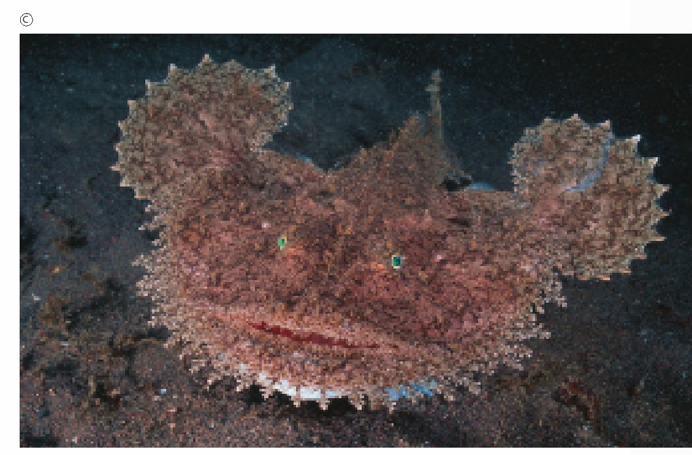
  

**【微博士】**深海潜艇“阿尔文号”

“阿尔文号”深海潜艇是目前世界上最著名的深海考察船，服务于美国伍兹霍尔海洋研究所。它是20世纪60年代初建造的。1964年6月5日下水时以伍兹霍尔海洋研究所的海洋学家Allyn Vine的姓名命名为“阿尔文（Alvin）号”。

最初下水时，它的主要部件是一个钢制的载人圆形壳体，最深可下潜到1868米处。1972年，“阿尔文号”换上了新的钛金属壳体，将下潜深度提高到了3658米。1978年它下潜到了4000米深处，1994年到达4500米。现在的“阿尔文号”可以在高低不平的海底地表任意移动，可以在水中自由漂浮，也可停留在海底完成科学和工程任务，同时可以进行摄像与拍照。

【微问题】深海鱼为什么能在巨大的水压下活动自如呢？

【关键词】洞穴　盲鱼　深海　灯笼鱼　大气压

## 为什么说矛尾鱼是活化石

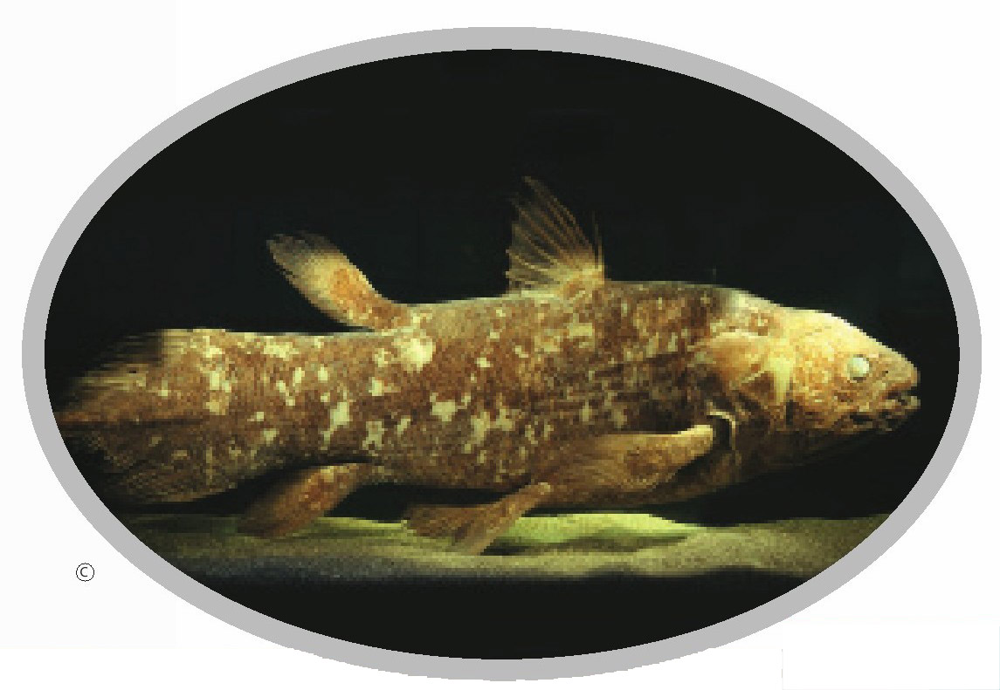
地球已经有46亿年的漫长历史了，生命自32亿年前诞生至今，已产生了难计其数的形形色色的生物，它们各自经历了长时期的进化而成为今天的样子。据研究，进化速度缓慢的生物成种率低，它们对食物来源、生活环境波动的适应性强，而同一环境下生存的新生种类可能不具备竞争能力。成种作用是生物进化的重要环节，在生活环境不变而成种率极低的情况下，这些生物在几百万年的时间内不会有什么变化。于是，就形成了一些古老的生物，同时代的其他生物早已灭绝，只有它们独自保留下来，生活在一个极狭小的区域，被称为“活化石”。

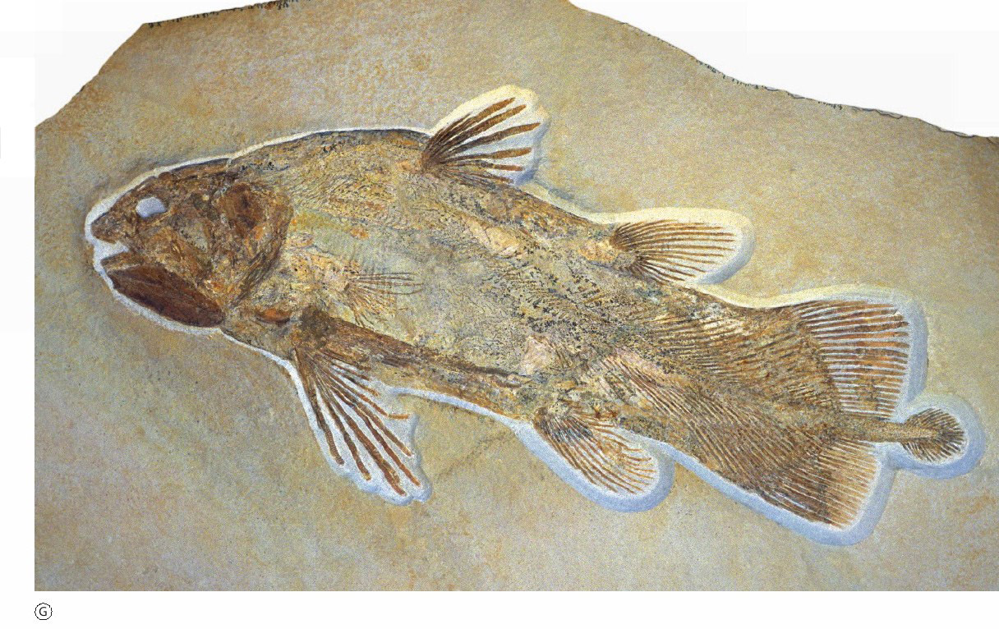
活化石物种至少已有几千万年的历史，在整个地质历史过程中保留着诸多原始特征，而未发生较大的改变，属于一类进化缓慢型生物。矛尾鱼是腔棘鱼目矛尾鱼科的唯一种，也是唯一现生的总鳍鱼类。同样是鱼，为什么把它叫作“活化石”呢？

古生物学家从化石研究中发现，距今约3.5亿～4亿年前的泥盆纪至6500万年前的白垩纪时，地球上生活着一类腔棘鱼。腔棘鱼类曾与恐龙一样广泛分布于地球上，古腔棘鱼类的典型代表是大盖鱼，当然如今这种鱼只能在化石中才能见到了。

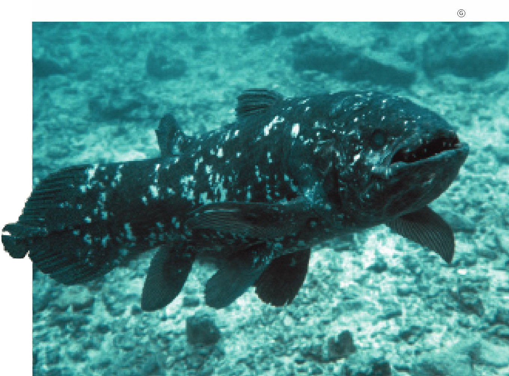
我们都知道，现在已经没有恐龙这种生物了，于是人们也就很容易联想到跟恐龙同一时代的发现矛尾鱼其他物种也已经灭绝了。腔棘鱼类应该也不例外，在白垩纪后期就逐渐销声匿迹，不知去向，而且事实上也一直没有发现白垩纪以后的腔棘鱼类化石。直到1938年12月22日，在南非的东伦敦市奇迹般地出现了一种现代人从未见过的“怪鱼”，它与远古的大盖鱼形状极其相似。这一发现震惊了科学界。由于这种鱼的尾鳍分成三叶，上叶和下叶之间，沿着体轴的中线，还有一个附加的小叶，整个尾鳍形如矛状，故中国称其为矛尾鱼。

存在于同一个时代的物种都已经灭绝，而现今发现的矛尾鱼是那个时代唯一存在的物种，跟很多化石一样已经有很久的历史了，因此，人们将矛尾鱼称为“活化石”。（王军仁）

  

**【微博士】**发现矛尾鱼

1938年12月22日，南非东伦敦市博物馆的拉蒂迈女士从入港的渔船上得到了一条长约1.5米、鱼形奇特的蓝色大鱼。将鱼带回馆内后，拉蒂迈女士查阅了许多参考资料，就是查不到这条“怪鱼”。由于当时天气炎热，冷库又不同意寄存这条有着腥味的鱼。她只好找到了当地一位泡制标本的申特先生，请他帮忙。但是申特先生只是用布将鱼一包，浸在福尔马林中，未作其他处理。

拉蒂迈女士设法联系著名的鱼类学家史密斯博士。不巧，史密斯博士出门在外，她只好画了一张图，写了一封信给他。时至12月26日，拉蒂迈女士派人来到申特先生处检查这条鱼时，发现福尔马林没有浸透鱼体内脏，鱼体已经开始腐败，无奈之下，只能让申特先生剥下一张鱼皮，余下部分丢进了垃圾箱内。到了1939年1月3日，收到信的史密斯博士大吃一惊，因为他从图上判断出，这条鱼有可能是目前仅有化石的矛尾鱼，而矛尾鱼应该存在于4亿年前。他立即发出电报说：“最重要的是保存好鱼的头骨和鱼鳃，以便进行鉴定。”申特先生和博物馆的工作人员连忙再到垃圾堆中去找头骨和鱼鳃……

就这样，经历了一波三折之后，“活化石”——矛尾鱼终于浮出水面。

## 为什么鱼背颜色深而鱼腹颜色浅

鱼的身体形态因为不同的种类有很大变化，同样它们身披的颜色也各不相同，特别是一些饲养在水族箱中的观赏鱼类，更是五颜六色。然而，如果你仔细观察就会发现，不管它是什么颜色，它背部的颜色相比腹部而言都比较深。那么，为什么鱼儿都要将自己腹部的颜色“淡化”呢？

潜过水的人都知道，在水层深处，从水面下往上看，海水的颜色会变淡，而且越是接近水面，越像是白茫茫的一片，这是由于水面光线充足。而随着水层深度的增加，水挡住了很多光线，使得光亮不能够透过水层，因此越是往下也就会变得越暗。正是这个天然存在的现象，导致了鱼儿背腹部颜色的差别。

可以想象一下，如果你从水面上往下看，是不是很容易看到水中光亮的东西，或者是颜色淡的东西呢？相反的，从水中往水面上看则更容易看到颜色暗的东西。也许鱼儿在进化之前，背腹部的颜色是一样的，有些种类通体都比较淡，这样当它处于水层下方时就很容易被上方的天敌发现，它们存活下来的机会就会大大减小；而另一些种类则是通体都比较暗，当它们处于上层水域时，容易被下方的天敌发现，同样摆脱不了被捕食的命运。所以，经过长期的自然选择，那些背部颜色深而腹部颜色浅的物种生存下来，得以延续后代。

这就是“进化”的奥妙，适者生存，优胜劣汰。只有适应了环境，才能保存自己，向着适应环境的方向发展是生物所具备的特殊能力。（王军仁）

  

**【微博士】**发现矛尾鱼

1938年12月22日，南非东伦敦市博物馆的拉蒂迈女士从入港的渔船上得到了一条长约1.5米、鱼形奇特的蓝色大鱼。将鱼带回馆内后，拉蒂迈女士查阅了许多参考资料，就是查不到这条“怪鱼”。由于当时天气炎热，冷库又不同意寄存这条有着腥味的鱼。她只好找到了当地一位泡制标本的申特先生，请他帮忙。但是申特先生只是用布将鱼一包，浸在福尔马林中，未作其他处理。

拉蒂迈女士设法联系著名的鱼类学家史密斯博士。不巧，史密斯博士出门在外，她只好画了一张图，写了一封信给他。时至12月26日，拉蒂迈女士派人来到申特先生处检查这条鱼时，发现福尔马林没有浸透鱼体内脏，鱼体已经开始腐败，无奈之下，只能让申特先生剥下一张鱼皮，余下部分丢进了垃圾箱内。到了1939年1月3日，收到信的史密斯博士大吃一惊，因为他从图上判断出，这条鱼有可能是目前仅有化石的矛尾鱼，而矛尾鱼应该存在于4亿年前。他立即发出电报说：“最重要的是保存好鱼的头骨和鱼鳃，以便进行鉴定。”申特先生和博物馆的工作人员连忙再到垃圾堆中去找头骨和鱼鳃……

就这样，经历了一波三折之后，“活化石”——矛尾鱼终于浮出水面。

【微问题】一般鱼类的鱼鳍中是不会有肌肉的，但矛尾鱼的鱼鳍中有肌肉，这是什么原因呢？

【关键词】矛尾鱼　活化石　总鳍鱼　腔棘鱼　颜色

## 鱼子酱是什么鱼卵做的

说起鱼子酱，想必你一定不会陌生。作为一种餐桌上的佳肴，对很多人来说却是可遇不可求。那么，你有没有想过鱼子酱是什么？它是从哪儿来的呢？

鱼子酱，又称鱼籽酱，意为鱼卵做成的酱。严格来说，只有鲟鱼卵才可被制成鱼子酱，其中以产于接壤伊朗和俄罗斯的里海的鱼子酱质量最佳。不过，并非所有鲟鱼卵都可制成鱼子酱。世界范围内共有20多种不同的鲟鱼，国际上比较认可的是由大白鲟、奥西特拉鲟和闪光鲟三个品种的鱼卵做成的鱼子酱，中国黑龙江水域的鲟鱼和鳇鱼也是鱼子酱的来源之一，过去都曾经作为向皇帝进献的贡品。最高级的大白鲟，一年产量据说不到100尾，而且要超过60岁的大白鲟的鱼卵才可制作鱼子酱。由此可见，鱼子酱虽然只是鱼儿的卵，却是如此难得。而由大白鲟的鱼卵制作得到的鱼子酱，真正是世间珍品。

不过，我们在市场上随处可见标有鱼子酱的产品啊！其实，有许多美其名曰“鱼子酱”的东西，根本算不得是负有盛名的品牌鱼子酱。那些东西可能出自圆鳍鱼、鲑鱼、鳕鱼，或别的鱼类家族中某位怀孕的成员。当然也是鱼卵，只是母亲完全不同。

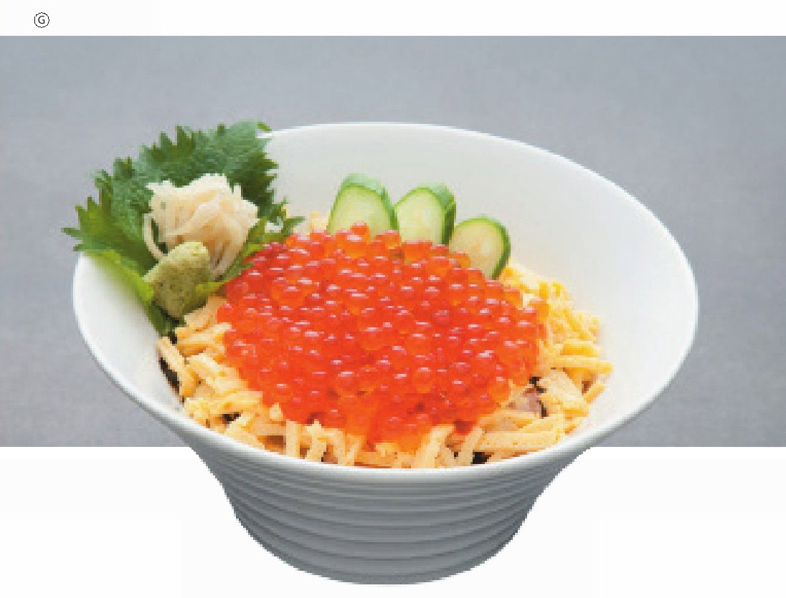
目前，由于大量的捕杀和水体污染，鲟鱼们的生存已经到了危急关头，黑龙江水域的鲟鱼和鳇鱼也早已被列入了濒危物种行列。现在地球上还找得到大量鲟鱼的水域，就只剩下里海、黑海，以及法国的纪龙德河了。其中最知名的便属大白鲟和闪光鲟两种——两者分别是鲟鱼里最大和最小的种类。

由鱼卵化身为美味的鱼子酱，加工是极其重要的一道环节，甚至可以称之为艺术。这加工需要在约15分钟之内，完成10多道手续。鱼卵只要放的时间稍长一些，便由于不新鲜而不能制作鱼子酱了。（张晓玉　王军仁）

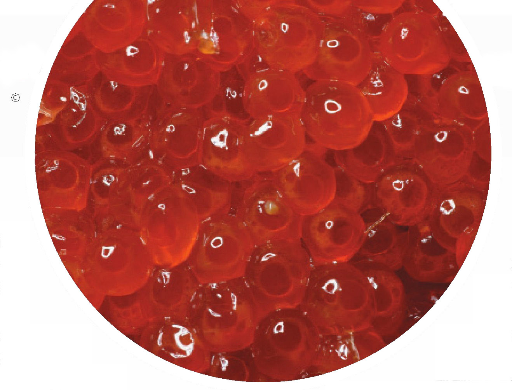
## 为什么要给江河里的鱼儿修“台阶”

你听说过生活在水中的鱼儿也会上台阶吗？随着水利发电的兴起，像三峡大坝一样的电站、水库在很多地方建成。当然在修建这些工程的时候，必然会考虑到专门为鱼类设计无障碍通道，以供它们畅游通过。这些鱼道就是“台阶”，比如美国的邦纳维尔坝鱼道、加拿大的鬼门峡鱼道等。那么，你知道为什么要给江河里的鱼儿建造这样的“台阶”吗？

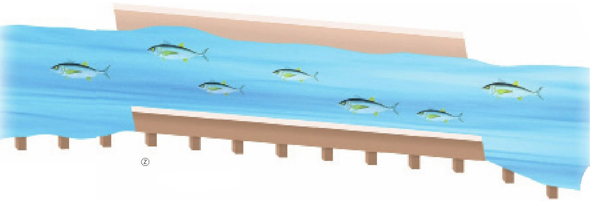
鱼道示意图

原来，在鱼类世界里有些鱼儿对产卵地有严格的要求。如北太平洋的大马哈鱼，在去往产卵地洄游时，每天顶着时速几十千米的水流上溯数十千米，溯至江河的中上游产卵繁殖。这类鱼对栖息地的生态条件，特别是水中的盐度已经形成了无可替代的特殊适应性。它们生活在海洋中，但是却一定要把鱼卵产在河流中上游，在那里繁殖，幼鱼在当年或者次年重新返回海里。

为了让这些需要溯河洄游的鱼类顺利到达目的地产卵，保证它们的生殖繁衍，维护大自然的生态平衡，因此，人们在修建水库及水坝时特意为鱼儿们建造了“台阶”。（张晓玉　王军仁）

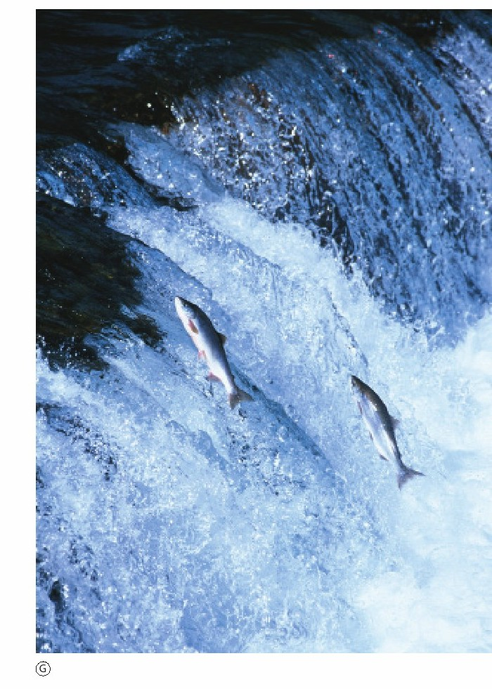
## 鳑鲏鱼为什么要把“肠子”露在外面

鳑鮍鱼为一群小型鱼类，最大个体不超过200毫米，绝大多数种类仅50～70毫米。它们生活在淡水水体中。就是这样一种不起眼的鱼类，却有一个非常有趣的特点——把“肠子”露在外面。这听起来让人难以置信，它为什么要这样做呢？

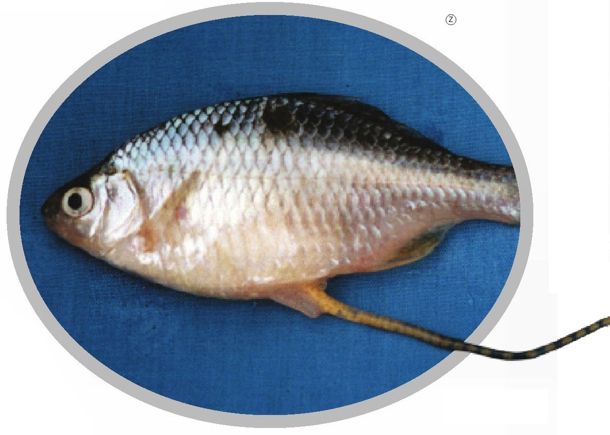
鳑鲏鱼的输卵管

其实，我们看到它拖在外面的并不是“肠子”，而是输卵管。原来，每年4～6月为鳑鮍鱼的产卵期。此时，雄鱼腹部呈橘红色，鳍呈淡红色；雌鱼的输卵管延长成产卵管，可插入淡水蚌的入水管中，把卵产到河蚌的鳃腔里。然后，当河蚌呼吸时，会把附近排有雄鱼精液的水流吸入鳃腔，精卵就得以在河蚌的体内结合。受精卵在软体动物的鳃腔中发育，约一个月后，幼鱼离开宿主，开始独立生活。

鳑鮍鱼平时生活于静水水体中，特别是水草茂盛的环境，喜群游。每当生殖季节，雄鱼艳丽的体色配上珠星，更具吸引力；而雌鱼则拖着一条长长的输卵管，在雄鱼的陪伴下更显得别具一格。（张晓玉　王军仁）

  

**【微博士】**生育冠军翻车鱼

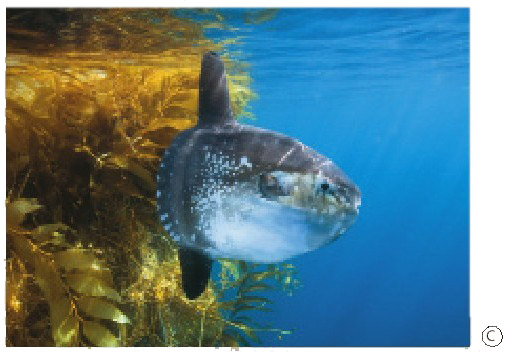
翻车鱼既笨拙又不善游泳，常常被海洋中其他鱼类、海兽吃掉。而它不至于灭绝的主要原因，就是有强大的生殖力，一条雌鱼一次可产0.25亿～3亿枚卵，在海洋中堪称最会生产的鱼类。翻车鱼的繁殖过程也非常有趣。每当生殖季节来临时，雄鱼在海底选择一块理想的场地，用胸鳍和尾巴挖开泥沙，筑成一个凹形的“产床”，引诱雌鱼进入“产床”产卵。雌鱼产下卵之后，便扬长而去。雄鱼从此就担负起护卵、育儿的职责，直到幼鱼长大。但是一部分鱼卵和孵化出来的幼鱼会被凶猛的鱼类吃掉，另一部分会在恶劣的环境下丧生，最后能长成大鱼的就很少了。一条翻车鱼所产的上亿枚卵中，只有30条左右能存活至繁殖季节。

  

**【微博士】**把丈夫像钥匙一样带在身上

雌雄鮟鱇鱼的体形相差悬殊，雌性鮟鱇要比雄性大很多，而且雄鱼是附着在雌鱼身体上的，就像是把钥匙一样被妻子带着。

鮟鱇鱼生活在水下几十米甚至几千米的海水深处。雄鮟鱇在其生命周期之初就找到了自己的雌性伙伴，并使自己的口部与雌鱼体侧的皮肤愈合，双方血肉相连，这样雄鱼就终身随雌鱼一起游动，同时由雌鱼提供营养。雄鮟鱇的许多生活器官逐渐退化，失去功能，而生殖腺却渐渐成熟。随着雌鱼的成长，雄鱼逐渐长入雌鱼体内，最后成为雌鱼体侧的一个很不明显的小隆起。这样的鱼儿“夫妻”在动物世界里是独一无二的。

【微问题】美国人一度在大河沿线造了很多水坝，后来又炸掉了一些。他们为什么要这么做呢？

【关键词】鱼子酱　鲟鱼卵　大白鲟　鳑鲏鱼　鮟鱇鱼

## 为什么鲨鱼都是“软骨头”

鲨鱼，给人印象最深刻的是它那张血盆大口和满嘴锋利的牙齿。鲨鱼性情凶猛，食肉的本性让一些人把它看作是海洋中最为凶险的动物。这样一个形象似乎表明它非常强硬，可事实上它却是“软骨头”。

当然，说它是“软骨头”，并非说它真的惧怕其他生物，而是说它全身的骨架都是由软骨构成的。那你知道为什么鲨鱼是“软骨头”吗？

鲨鱼是一种十分古老的动物，几亿年前就已经存在于地球上了，以白垩纪时期最为繁盛。经过这么多年，鲨鱼的身体形态并无大的改变，大体还是几亿年前的样貌，而那个时代正是恐龙时代。如今恐龙已经灭绝了，但是鲨鱼却生存了下来，这与它全身都是软骨是有一定关系的。

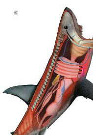
我们知道，鲨鱼是生活在海洋中的。在白垩纪以后，很多陆地上生活的物种都相继灭绝，而海中的鲨鱼却不一样。由于鲨鱼全身骨架都是由软骨构成的，而软骨比硬骨更轻、更具有弹性，这就使它可以在不利的环境下躲入深海，因为软骨更加适应在深海高压强环境中生存。可以说，鲨鱼能够在那个物种大灭绝的环境下最终存活下来，它的软骨头有着巨大的贡献。（王军仁）

## 鲨鱼为什么会“手足相残”

“血浓于水”，亲情是最为无私的感情，亲人或者同类之间应该相互关爱，即使在动物界，也有“虎毒不食子”的传说。但是，这个说法在鲨鱼间却是不存在的。为了争夺食物，鲨鱼之间从来不讲客气，甚至还会攻击自己亲生的孩子——鲨仔。如果一条鲨鱼因为和猎物搏斗受伤，或者为其他鲨鱼所误伤，那么这头伤鲨就只好自认倒霉了，因为其他的同宗兄弟一点也不会怜悯它，而是立即群起而食之。这种战争甚至还带到了鲨鱼的娘胎里，在那个原本温馨甜蜜的地方，一帮鲨仔却在打打杀杀，其中的代表种类就是护士鲨，这在其他动物中都是未曾出现过的。那么，为什么鲨鱼会“手足相残”甚至是“食子”呢？

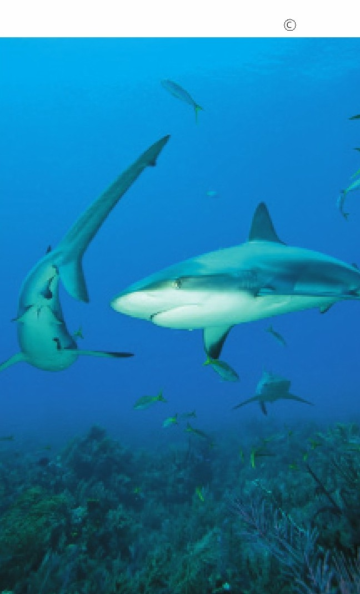
首先因为鲨鱼对气味，尤其对血腥味特别敏感，水中百万分之一浓度的血腥味都可以把同类从很远的地方招来，鲨鱼的这一本事甚至超过了狗的嗅觉；其次，受伤的鲨鱼会因为不规则的游弋导致低频振动，这种频率被远处的同类捕捉到以后，很快就会循迹而来；再次，在残酷的生存条件下，食物是动物生存的根本保障。鲨鱼由于没有鱼鳔，不能自如地控制身体的升降，因此需要不停地游动，在这种情况下，它们对食物的渴求尤为强烈。所以，为了争夺食物，鲨鱼就六亲不认，不惜自相残杀甚至是捕杀幼仔。而且，在饥饿时或者是争夺食物时，同类之间还会发生争斗，难免会造成受伤，这时候，受伤流血的个体就会变成其他鲨鱼的食物。（王军仁）

## 为什么鲨鱼一生都在换牙齿

鲨鱼，作为海洋中最凶残的动物，一生需更换成千上万颗牙齿。

很多鲨鱼包括大白鲨，口中都有成排的利齿。各种鲨鱼牙齿的形状和大小差异很大，有的呈锯齿形的锥状，有的呈扁平的三角形状。不管是哪一种类型，只要前排的牙齿脱落，后方的牙齿便会补上，而角鲨和棘角鲨等鲨鱼则会整排整排地更换牙齿。那么，鲨鱼为什么有这么大的本事，可以如此频繁地更换牙齿呢？

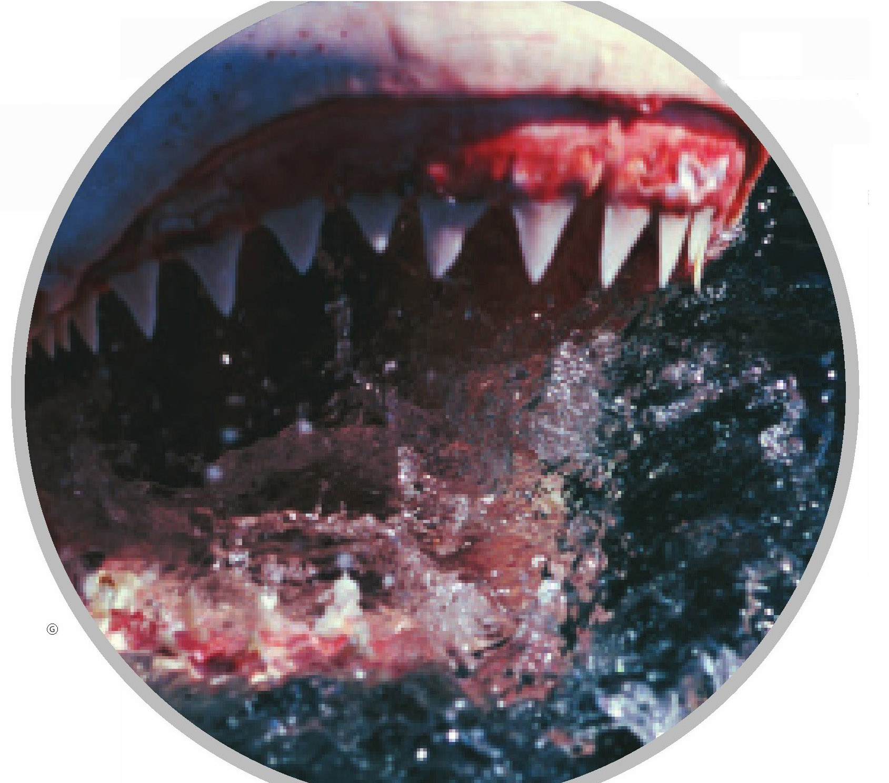
这既与它的牙齿特性有关，又与它的厮杀特点有关。

鲨鱼的牙齿不是永久齿，因此并不像大多数动物那样，只有固定的一排，而是在一排的后面还有着四五排，好比是一批随时准备上岗的替补队员。最外面的牙齿是直立的，当然发育也最好，厮杀咬打都是它们在冲锋陷阵。后面的几排牙齿都是暂时躺着休息的备用牙，一排覆盖着一排，好像屋顶上的瓦片一样。当最外面的牙齿因为撕咬或者老化脱落后，后面的“替补队员”马上向前移动，进入脱落牙齿的牙床空穴中并直立起来，迅速承担起新的角色。当然，鲨鱼在生长过程中还会产生牙齿的磨损，这些也是需要后面的牙齿及时替补的。因此，鲨鱼在一生中的牙齿更换是非常频繁的。

我们知道，鲨鱼的咬力在海洋动物中是非常强劲的，一部分鲨鱼甚至敢于挑战鲸。在这个不断厮杀的过程中，锋利的牙齿是它生存的根本保证。有了可以持续更换的牙齿，鲨鱼才可以为捕食提供强有力的保障，从而得以在自然界中生存繁衍。（王军仁）

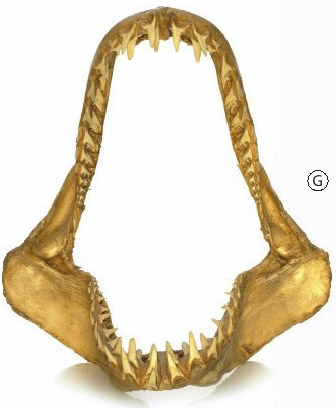
鲨鱼牙齿

  

**【微博士】**鱼翅滋补吗

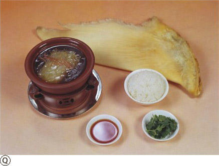
鲨鱼属软骨鱼类，鳍骨形似粉丝。所谓鱼翅，就是用鲨鱼的鳍加工而成的一种海产珍品。很多人都以为，鱼翅不仅是人间美味，而且具有滋补的作用。那么，事实果真如此吗？从现代营养学的角度看，鱼翅即软骨，并不含有任何人体缺乏或高价值的营养元素，所以吃鱼翅只是一种特有的饮食文化现象。此外，科学家通过调查研究发现，鱼翅不仅没有特别的营养价值，而且约7成的鱼翅被加工过程中的汞污染，如果大量食用可能会对健康产生危害。

**【科学人】**史蒂夫·艾尔文

他是澳大利亚赫赫有名的“鳄鱼先生”，之所以这样称呼，是因为他从小就在父母经营的动物园里抓鳄鱼玩。长大以后，他成为了全球知名的环保人士，并制作了50部纪录片，把大自然最美好的一面呈现给了全世界。

不幸的是，2006年9月，他在大堡礁拍摄一部水下纪录片时，与一条刺魟迎面相撞，被这条人称魔鬼鱼的刺魟的鱼鳍刺中胸口，因失血过多而丧生。他死后，澳大利亚举行了全国哀悼。

【微问题】为什么说“没有买卖就没有杀害”？

【关键词】鲨鱼　软骨鱼　嗜血　牙齿　鱼翅

## 为什么说海马也是鱼

海马，乍一听到这个名字，你是不是觉得它应该是马呢？不过这也难怪，它不但名字像马，而且长得也有点像马。它长着“马头”，而且还是直立的。但事实上它并不是马，而是鱼，这是为什么呢？

海马确实是鱼，虽然它看起来不太像鱼。它属于奇异的小型海栖鱼类，一般体长10厘米左右。虽然地理分布范围很广，但种类并不多，疏落而狭长地分布于沿岸水域，大多数品种主要在大西洋西部和印支太平洋地区出没。说海马是鱼，是因为除了它的头像马以外，其他部分都不像马；它有鳃，也有很小的背鳍和胸鳍，这是鱼的典型特征。如果你仔细观察一下，可以发现它的背鳍其实摆动得非常快，只不过因为它实在太小，所以这种摆动并不能让它在水中快速运动。

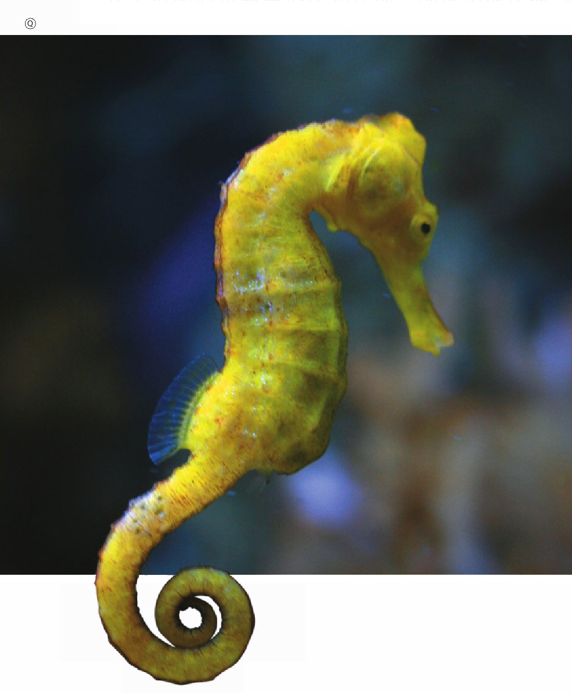
当然，海马具有不同于一般鱼类的外形，它的尾鳍完全退化，脊椎则演化成如猴子尾巴一样，可卷曲来钩住任何突出物体，以固定身体。小而几乎透明的鱼鳍虽然使劲挥动，却也不能使海马的移动速度有多快。好在海马有很好的拟态功能，可以根据环境的特点，凭借身上体色的伪装及硬化成革状的皮肤，把自己伪装成珊瑚或者海藻，从而躲避掠食者的攻击。

将海马归为鱼类，最主要的是因为它最基本的生活特征跟鱼类是一致的。它终身生活在水中，靠鳃呼吸，靠鳍游泳，有脊椎骨构成的脊柱，这些特点注定了它是鱼类家族中的一员。即使它长着“马头”也改变不了它鱼儿的身份。（夏建宏　田丹　王军仁）

## “既当爹又当妈”是怎么回事

在动物界，雌性怀孕天经地义，分娩似乎也只是母亲的天职。然而，海马却在挑战这一近乎通用的规则。在海马的世界里，怀孕和分娩是父亲的事情！迄今为止，这可能是动物界最为极端的繁殖现象了。

到了繁殖季节，雄性海马开始主动追求雌性海马，“求婚”仪式类似于芭蕾舞中的单脚旋转。与此同时，雄海马身体的颜色也会发生改变。一旦求婚成功，雌海马的卵子就与雄海马的精子结合，孕育下一代。可最不寻常的是，雌性海马把卵子产进雄海马那类似“肚兜”的育儿袋里，并在那里完成受精。出生之前，都由雄性海马独自承担孕育的重担。这种育儿袋相当于雌性哺乳动物的子宫，受精卵嵌入育儿袋的内壁并在其中完成发育。海马父亲用袋中的胎盘液洗浴胚胎，一方面为新生命提供营养和氧气，另一方面还可以除去小家伙产生的排泄物。随着怀孕的进行，育儿袋中的液体相应会发生改变，逐渐接近海水，这是为了避免有差异的渗透压给幼小的生命带来伤害。足月怀胎之后，雄海马就开始分娩，这通常发生在晚上。分娩之初就像是口吹飞镖，小海马从圆鼓鼓的育儿袋里鱼贯而出，到了后期阶段，就改为干粉灭火器般的喷射，成批的小海马就从“袋子”里被释放了出来！新生的海马是双亲的缩微版，出生之后就独立生活，包括寻找食物。

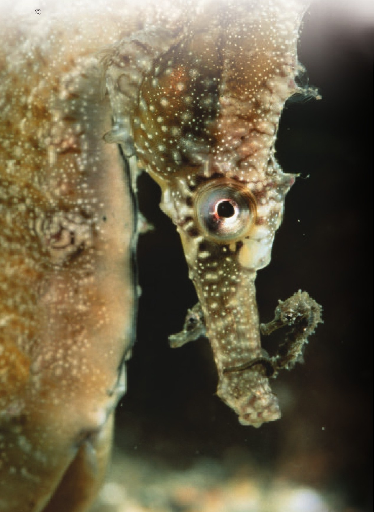
海龙也有类似于海马的“角色反串”现象。两性垂直游泳、相互靠拢，随后雌性把产卵管伸入雄性腹部的卵袋里产卵。雄海龙会把一个个还没孵化的胚胎挂在自己尾巴朝下的一面，就像一大串葡萄。

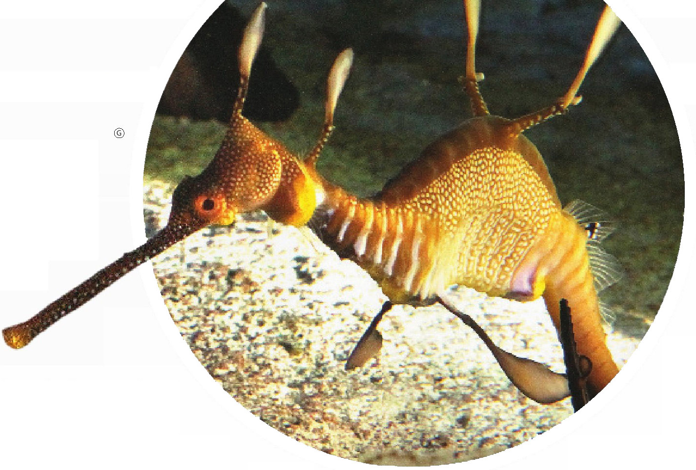
海龙

黄鳝则有另一种“角色反串”现象，这种鱼类一生中既要当回妈，又要当回爹。黄鳝第一次性成熟时是雌性，接着卵巢开始向精巢转变，雌性黄鳝随即摇身一变，成为雄性黄鳝，以自然的方式完成“变性”。在非洲的维多利亚湖，有一种丽鱼，它们过着群居的生活。族群中只有一条是雄鱼，充当“酋长”的角色。一旦“酋长”死亡或失踪，族群中最强壮的一条雌鱼的结构就会发生改变，最终演变成雄鱼，接管所有妻妾，并结束没有家长的混乱局面。（夏建宏　田丹　王军仁）

  

**【微博士】**海龙、海马——浅海生态系统的旗舰物种

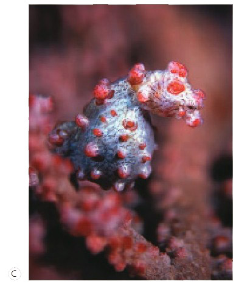
旗舰物种，指某个物种对一般大众具有特别号召力和吸引力，可促进大众对动物保护的关注，即地区保育的主题物种。

海马常以卷曲的尾部缠附于海藻的茎枝之上，有时也倒挂于漂浮着的海藻或其他物体上，随波逐流。它的游泳姿势十分优美，鱼体直立水中，完全依靠背鳍和胸鳍的高频率摆动而作缓慢的游动。海龙是海马的近亲，它的生活习性跟海马非常相似，只是喜欢生活在珊瑚礁的缓流中。它们的姿态和特性，对于人们具有独特的吸引力。很多人去水族馆，一定会去看看可爱的海马和海龙。除此之外，海龙和海马还有非常高的药用价值。由于海马和海龙在观赏和药用方面具有的重要特性，促使了人们加强对浅海生态系统的保护。因此，人们常常将它们称为浅海生态系统的旗舰物种。

**【实验场】**寻找伪装的豆丁海马

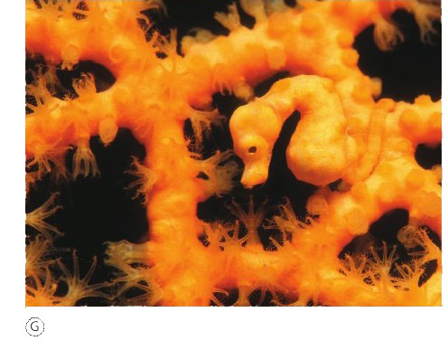
豆丁海马的身长大约1厘米，也被称之为侏儒小海马，主要分布在北纬20˚到南纬20˚之间的海域。“豆丁”是潜水员给它的昵称。目前已发现的豆丁海马只有灰紫色和黄色两种。它们的身上有肉瘤状凸起物，一般都攀附在特殊的扇形珊瑚上。豆丁海马会随时改变体色，还善于躲藏，受到惊吓就会逃得无影无踪。

现在，请你找出隐藏在柳珊瑚丛中的豆丁海马。

【微问题】海马行动非常缓慢，但却要吃活食，它是怎么做到的呢？

【关键词】海马　海龙　怀孕　繁殖　分娩

## 电鳗的身体为什么能产生电

动画片《狮子王》中有这样一个镜头，一只鬣狗在追逐年幼的辛巴时被水里的一条“怪鱼”电了一下，以至于它眼冒金星，昏倒在地……这条“怪鱼”是不是有什么魔力呢？其实不然，在自然界里真实地存在着这样一种鱼，它的名字叫作电鳗，它的身体的确可以放电，其中一些种类发出的电，电压甚至高达800伏特，可以轻易将其他的动物击晕甚至是电死。那么，电鳗到底是怎样的一种“怪鱼”呢？

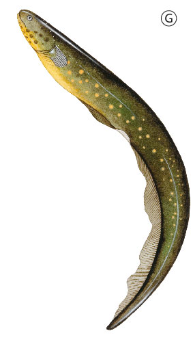
电鳗是一类行动迟缓的鳗形鱼类，栖息于温带和热带水域。它产于海中，成长于淡水中，以后再回到海中产卵。它的身体呈灰褐色的长圆柱形，表面没有鳞片，体长可达2.75米，重22千克左右。电鳗没有背鳍和腹鳍，臀鳍特别长，是它主要的游泳器官。电鳗是鱼类中放电能力最强的淡水鱼类，输出的电压可以高达数百伏特，电倒一些小型鱼类根本不在话下，甚至还可以把人击昏。因此，电鳗有水中的“高压线”之称。

单从身体形态和生活习性来看，这种“怪鱼”跟其他鱼类相比，似乎并没有什么特别之处，它的身体为什么能产生电呢？原来，它的身体后部的两侧肌肉组织内，藏着上下两个发电器官，上面一个大，下面一个小。发电器官是由成千上万枚肌肉薄片组成的，每枚肌肉薄片像一个小电池，只能产生毫伏级别的电压，但近万个“小电池”串联起来，就可以产生很高的电压。放电时，电鳗身体的尾端为正极，头部为负极，电流从尾部流向头部。电鳗在攻击对手时，会用头和尾去触及敌体，这样就能在高压状态下发出强大的电流，一下子把对手击倒。

电鳗为什么要放电呢？当然是为了自己的生存。电鳗没有尖利的牙齿，没有强悍的身体，因此捕食其他鱼类和水生生物就要有特别的手段，放电就是这样一种手段。然而，有研究表明，电鳗放电并不仅仅是为了捕获食物，相关实验结果显示，电鳗电死的鱼要远远大于它的生存所需。因此，可以推测电鳗放电还有别的一些作用，如信息传递等。（王军仁）

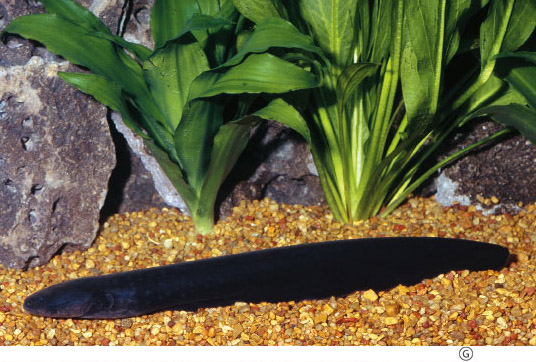
## 为什么电鳗放的电不会电到自己

我们知道，电的传导需要介质，而水也是一种导电的介质。那么，电鳗生活在水中，而且还会放出电压很高的电，它就不怕电到自己吗？

当然不会。那是因为电鳗的放电器官在身体的两侧，而它大部分的身体或重要的器官都由绝缘性很高的构造包住，在水中就像是一个大电池。我们知道，电流会由电阻最小的通路经过，所以在水中放电时，电流会经水（电阻比电鳗身体小）传递而不是经身体传递，电鳗并不会电到自己。但如果电鳗被抓到空气中，因空气的电阻比它身体的电阻更大，如果它在这时放电的话，就会电到自己了。另外，如果电鳗受伤使两侧的绝缘体同时破损的话，放电时就会像两根裸露的电线一样发生短路的现象，这个时候，电鳗再放电就会有电到自己的危险了。

可见，我们的担心是多余的。生物体在适应环境的过程中，为了更好地生存，都会演化出一些相对特别的身体构造或者是行为机制来保护自己。电鳗的身体可以放电而不会电到自己的这一事实，更加证明了这个结论。（王军仁）

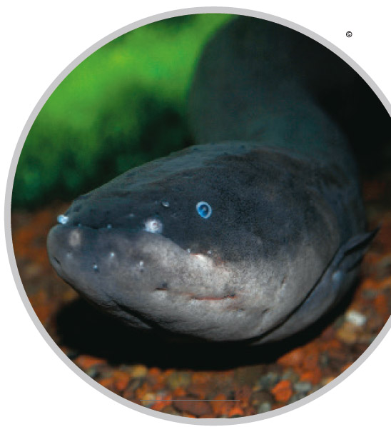
  

**【微博士】**电鳗对干电池制作的启发

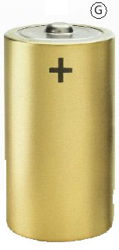
现在我们的生活已经离不开电了，但是试想一下，如果走到哪里都要靠电线来传导电是不是很不方便呢？为此，人们发明了干电池来解决这个问题。通常的干电池由三个部分构成：正极（碳棒）、负极（锌片）和电解液（以氯化铵或氯化锌等盐类水溶液作为电解液）。而电鳗在放电时刚好具备了以上三者：尾端是正极，头部是负极，躯干部规则排列的肌肉片是“电解液”。对干电池而言，很容易制作出正、负极，但是如何将电解液填充在正负极之间呢？正是电鳗的放电特性启发人们发明了正负极之间的糊状填充物，从而创造了能贮存电的电池。

**【微博士】**动物当“医生”

电鳗能伤人，却也能救人。古希腊和罗马时代的一些医生就会借助电鳗的放电来治疗风湿症和癫狂症等病。他们让患者和电鳗接触，刺激电鳗放电来进行治疗。即便到了今天，在法国和意大利沿海地区，还可能看到一些患有风湿病的老年人，会在退潮后的海滩上寻找电鳗，把它当作自己的“医生”呢。

【微问题】如果请你来捕捉一条可以发出高压电的电鳗，你会采用什么方法呢？

【关键词】电鳗　电压　电流　放电

## 为什么鲤鱼在美国成了祸害

鲤鱼是中国人最熟悉的鱼类之一，“鲤鱼跳龙门”是好运的象征，鲤鱼也是“年年有余”的形象大使。但在当今的美国，鲤鱼却被当作“垃圾鱼”甚至“害鱼”而臭名昭著，这又是为什么呢？

亚洲的大江小河、湖泊池塘是鲤鱼的故乡。由于肉质鲜嫩甚至被成功地引进到欧洲和北美，作为池塘养殖的食用鱼。后来，由于发大水，鲤鱼逃进了自然水体。鲤鱼的适应性极强，繁殖率又高，寿命也比较长，多数可以活到15岁。在美国这个崭新的环境里，鲤鱼似乎没怎么碰到对手，于是在当地快速传播开来，截至目前，已经占领了美国除阿拉斯加以外的所有州。

后来美国人发现，鲤鱼的肉里有太多的刺，吃起来很不方便，于是就开始冷落这种外来鱼。然而，鲤鱼随遇而安的性格很快就演变成贪吃、好扩张，逐渐呈泛滥成灾之势。它们为了占据生存空间而排挤美国本土的其他水生动物，还吞食美国白鲟、亚口鱼等鱼类的鱼卵，造成这些本地鱼类数量的下降。更始料未及的是，鲤鱼采食时会把水生植物连根拔起，这不仅破坏了把水生植物作为产卵场的水鸟和其他鱼类的繁殖活动，还会把水搅浑，进而影响到其他水生植物的光合作用，导致水生态系统初级生产者的产量不足，引发一系列的生态问题。于是，鲤鱼不再受美国人欢迎，在某些地区甚至成了“剿杀”的对象，被埋在花园里。

因此，鲤鱼在美国成为了一个祸害。为了控制鲤鱼，美国人动足了脑筋，捕捞、毒杀、拦网等措施都用上了，但是效果依旧不明显。（夏建宏）

## 为什么说“灭蚊英雄”是在帮倒忙

食蚊鱼又叫柳条鱼，原居美洲，是一种小型鱼类，体长不足5厘米。人们曾经认为，这种鱼喜欢吃蚊子的幼虫，所以给了它一个“食蚊鱼”的雅号。由于疟疾频发，1927年中国自菲律宾引进了食蚊鱼，试图通过生物控制的方法防治疟疾的传播者——蚊子。效果还真不错，这种看似微小的鱼特别能适应中国的水环境，食性也很宽广，生长快，繁殖力强，年产卵三次，甚至在低氧、污染的水中也能生活。与大多数鱼类相比，食蚊鱼的生殖方式比较特殊：卵在体内受精并孵化，产出的是小鱼。这种卵胎生的生殖方式可以使胚胎得到更好的保护，从而提高小食蚊鱼的成活机会。如今，这种鱼类已经广泛散布于长江以南陆地的大小水体。

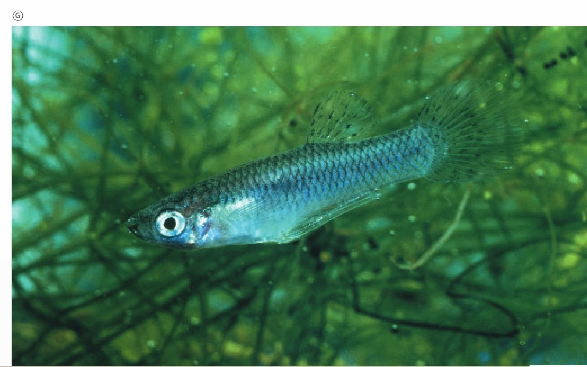
不过，食蚊鱼捕食孑孓的能力并没有想象中的那么大。相反，这种小鱼正在排挤，甚至取代南方的青鱼，原因是这两类鱼的生活环境和摄食习性接近，而在竞争中，食蚊鱼却反客为主，占了上风。生活在南方水域的国家二级保护动物唐鱼也受到了威胁，因为它的鱼卵经常被食蚊鱼吞吃。另外，食蚊鱼还是一些蠕虫的寄主，这些蠕虫会导致一些鱼类生病。食蚊鱼的大肆繁殖，也危害到了青蛙、蝾螈等两栖动物的生存。

当初，人们是为了防控疟疾而引进了食蚊鱼，如今，食蚊鱼却引发了生态安全这一新问题。不得不说，这个“灭蚊英雄”也给我们帮了倒忙，带来了新的生态问题。（夏建宏）

## 为什么银鱼也应该“计划生育”

银鱼全身又圆又细、晶莹剔透，也被称作面条鱼、玻璃鱼；由于味道鲜美，素有中国名鱼之称。太湖新银鱼原来分布在长江、淮河流域的江河湖泊，而以太湖一带最为知名。1979年，因发展渔业经济的需要，这种银鱼被引进到了云南滇池，后又放养到星云湖。

滇池、星云湖等西南高原湖泊长期封闭，缺少物种交流。当太湖新银鱼进入这些湖泊之后，迅速适应了当地的环境，加上又没有什么天敌，就开始大量繁殖，很快就成了当地鱼类中的“优势种”，这些湖泊的平静从此被打破。

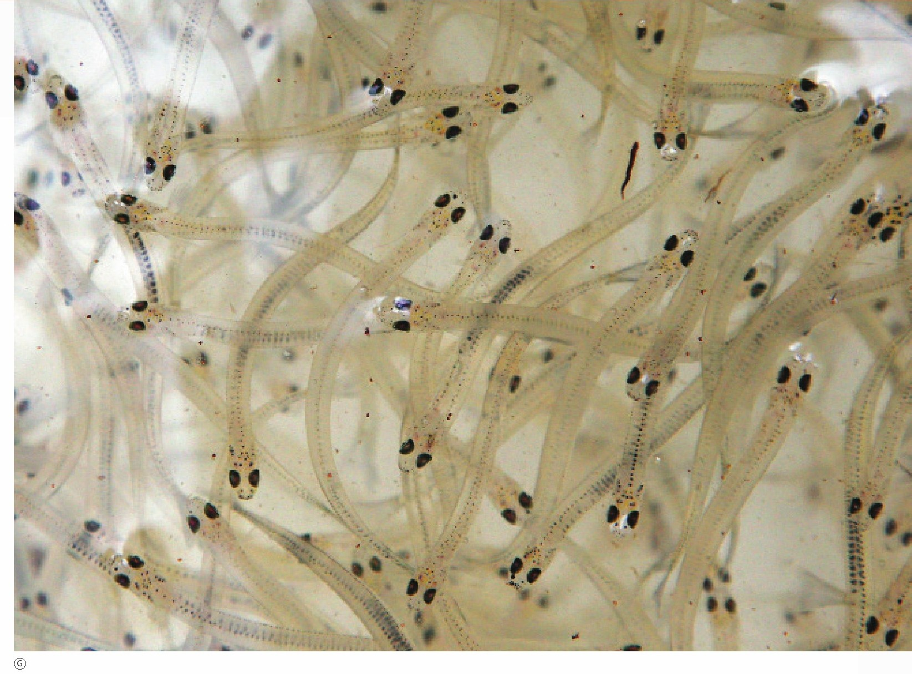
太湖新银鱼的食性很广，主食浮游动物，也摄食小虾和鱼苗，于是，当地长臂虾的幼苗遭遇了灭顶之灾。湖泊的浮游动物被大量吞食之后，浮游植物因天敌减少而数量激增，湖水呈现富营养化，导致湖内水生植物大面积消失，生态系统退化。太湖新银鱼这些占领地盘、掠夺食物和破坏栖息地的变化，给高原湖泊土生土长的鱼类带来了毁灭性的打击。20世纪90年代，这种银鱼更从星云湖蔓延到了与之相通的抚仙湖内，由于食性与抚仙湖的抗浪鱼接近，导致该湖抗浪鱼的数量急剧减少，沦落到了濒危的境地。

因此，为了保护高原湖泊的生物多样性，银鱼也有必要实行“计划生育”，如果仅从渔业发展的角度听之任之，当地的生物群落就有可能遭受毁灭性打击。（夏建宏）

  

**【微博士】**清理“清道夫”

有种鱼长着一张吸尘器一样的嘴巴，能吸食水族箱里的藻类和垃圾，所以被观赏鱼爱好者称为“清道夫”。实际上它是吸口鲶的一种，原产拉丁美洲。当“清道夫”从水族箱逃逸到野生环境之后，会大量繁殖并吞食其他鱼类的鱼卵，加之没有天敌，很容易破坏当地的生态平衡，这在珠江流域已经成为一个生态问题。在中国台湾的宜兰，这种鱼导致了当地鱼种减少，由此引发了一场清理“清道夫”的行动。

【微问题】放生是不是一件值得大力推广的善事？

【关键词】鲤鱼　食蚊鱼　银鱼　优势种

## “赤身裸体”的高山湟鱼为什么不怕冷

有登山经历的人都有这样一种体验：越到高处，感觉越冷，所以需要加穿衣服才可御寒。生活在“世界屋脊”的青海湖鲤鱼，似乎是个例外。这种鱼虽然身居高位，却“衣不蔽体”——身上的鳞片严重退化，甚至“赤身裸体”，所以被称作“青海湖裸鲤”，又称“湟鱼”。

坐落在“世界屋脊”的青海湖

湟鱼是裂腹鱼大家族的一员。这类鱼主要生活在青藏高原及其邻近地区的各类水体中，以穿“开裆裤”闻名——肛门到臀鳍的两侧分别长有一列鳞片，而且在这两列鳞片之间的腹部中线上还有一条裂缝。地质历史上，青藏高原有过三次明显的“长高”。伴随着每次长高，青藏高原产生大大小小的裂腹鱼“部落”，导致三次大规模的“分家”，而且每分一次家，就脱掉一部分装束——身上的鳞片不断退化，口角的胡须也在减少。湟鱼是在青藏高原的最后一次长高事件中分离出来的，相对年轻，身上几乎没有鳞片，口角也不长胡须。

青海湖平均海拔3200米，水温较低，是中国最大的咸水湖。湟鱼为了防止热量散失、减少游泳摩擦力，同时为了防止盐碱性湖水夺走体内的水分，以维持渗透压的平衡，体表必须分泌大量的黏液。发达的黏液在湟鱼的体表形成一道厚厚的屏障，使得原本也长在体表的鳞片没了“立锥之地”。此外，由于湟鱼喜欢生活在水底的石缝、洞穴里，为了保持身体的柔韧性和灵活性，也有必要脱下生硬的鳞片“铠甲”，换上轻便、光滑、保暖的黏液外衣。

可见，湟鱼“赤身裸体”是为了适应高寒的生活环境。（夏建宏）

## 水塘里的小鱼是怎么“长”出来的

有些水塘很小，而且很封闭，有时水位甚至无法超过人的脚面，因而往往被看作是一潭死水。由于没有与外部水体交流的入口和通道，所以多数人认为里面不应该会有鱼的存在。可是，当你凑过去仔细观察时，却能看到里面有三三两两的小鱼，在水草旁飘忽不定地游弋。运气好的话，还能够钓出一两条鲫鱼来。莫非，这些鱼是从水里“长”出来的？

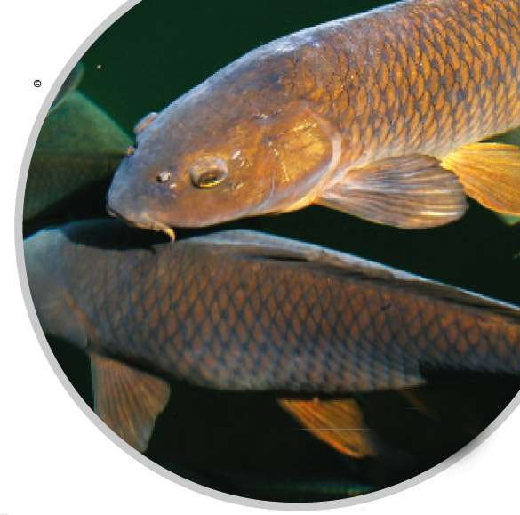
鲤鱼

事实上，鱼有着自己的生存之道，这其中也包括扩散手段和迁移通道。鲤鱼、鲫鱼是大小池塘里最常见的中小型鱼类，这也是有原因的。这两种鱼的卵带有黏性，当水鸟走过碰到这些鱼卵时，鱼卵就有可能粘在这些水鸟的脚趾上。当水鸟飞到其他水塘时，鱼卵也就跟着被带了过去，如果这是一颗受精卵，那么小鱼就有可能在新的水塘里“安家落户”。

每年的5月，雨水会很多，地面积水而产生大大小小的流水，这增加了不同水体之间的联系，鱼类趁机产卵并向新的环境扩张。鲫鱼、鲤鱼这些鱼类有顶水的习性，它们喜欢逆流而上，寻找新家园。这两种鱼类对水中溶解氧的要求不高，再加上什么都能吃，所以哪怕只是薄薄的一层水路，也值得它们去冒险一试。还有一些鳑鮍鱼，到了繁殖季节，输卵管会延长成产卵管，并通过产卵管把成熟的卵注射到邻居河蚌的壳子里。河蚌经常搬家，而且不一定每次都走水路，潮湿的陆路或者泥滩都是它们可以接受的迁移路线，搭乘河蚌“顺风车”的鳑鮍鱼卵也就有了机会进入新的水塘。另有泥鳅、黄鳝、斗鱼、黑鱼这些鱼类，它们的呼吸不完全依靠鳃。在离开水的情况下，泥鳅会利用肠道进行辅助呼吸，而黄鳝则通过含有丰富毛细血管的口腔和咽喉内壁表皮来帮助呼吸。斗鱼和黑鱼，在正常的鳃片之外，还有一个叫作“鳃上腔”的特殊结构，用作缺水条件下的呼吸器官。利用这些辅助呼吸器官，鱼类就可以克服短距离的陆地阻隔，迁向原本没鱼的其他小水塘定居。

因此，拥有以上本领的鱼儿，最有可能出现在小小的池塘里。（夏建宏）

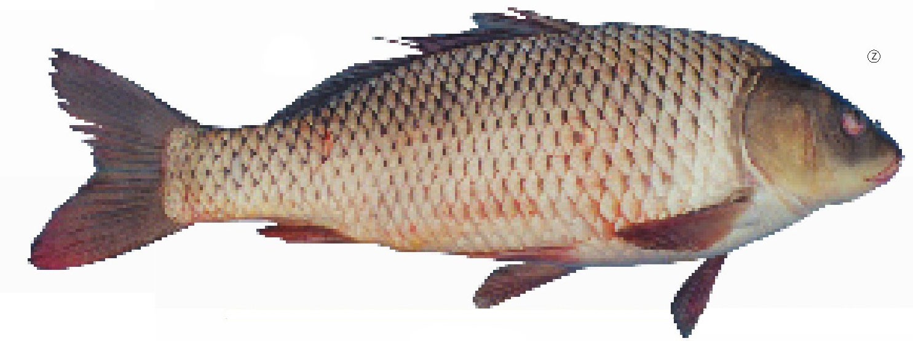
鲫鱼

  

**【科学人】**艾尔弗雷德·拉塞尔·华莱士

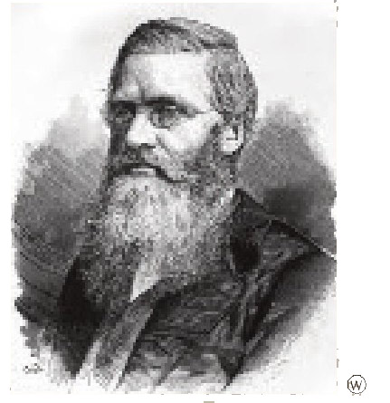
华莱士（1823-1913）是与达尔文同时代的博物学家。他在物种起源方面的观点与达尔文类似，他们各自的论文被公布在同期的伦敦林耐学会会议上，可谓异曲同工。正是华莱士的论文，促使达尔文加快了发表《物种起源》这一专著的进程。

不过，华莱士更广为人知的科学成就，是一条动物区系分界线的发现，这条分界线以他的名字命名。19世纪下半叶，他在马来群岛探险时注意到：加里曼丹岛（旧称婆罗洲）和苏拉威西岛、巴厘岛与龙目岛之间可能存在一条无形的界线，界线西侧的加里曼丹岛和巴厘岛的物种组成更像东南亚，东侧的苏拉威西岛和龙目岛的动物组成则更像新几内亚。这就是后人用以区分东洋界和澳洲界两区系的“华莱士线”，华莱士因而成为动物地理学的奠基人。

如果海平面下降120～150米，“华莱士线”就会与新海岸线一致。这说明在冰河时期，海平面大幅下降，当时的加里曼丹岛和巴厘岛都与亚洲大陆相连，而苏拉威西岛、龙目岛和新几内亚则与澳大利亚相连，而华莱士线所在位置仍有海水阻隔。后来，尽管有不少学者对华莱士线进行了延伸和修正，但是华莱士作为先驱的地位却无法动摇。

**【微博士】**动物地理学

动物地理学主要研究动物在地球表面的分布规律，是自然地理学的一个分支，也是动物学的一个重要方面。动物地理学可以进一步细分为生态动物地理学和历史动物地理学。前者的研究对象是与现代一定的自然地理条件相联系的动物整体，后者的研究对象是动物分布区和动物区系。动物地理学的基本任务是阐明地球上动物分布的基本规律，为保护和合理利用野生动物资源、恢复与定向改变动物群提供科学依据。

【微问题】人为导致的鱼类“迁移”存在危害性吗？

【关键词】高寒地区　裂腹鱼　湟鱼　扩散　迁移　动物地理学

# 昆虫

## 苍蝇为什么让人讨厌

野餐时，香喷喷的饭菜刚摆好，我们还没有动筷子，惹人讨厌的苍蝇就“嗡嗡嗡”地飞来提前享用了，赶也赶不走。回头一看，不远处的一个烂苹果上也聚集了不少大大小小的苍蝇。再往前看，好几个粪蝇、麻蝇的成虫已经孵化出来，正在往外飞。不论是香味还是臭味，哪里有味，哪里就会有苍蝇们的集结聚餐，苍蝇香臭不分的取食习性真是十分惹人讨厌。

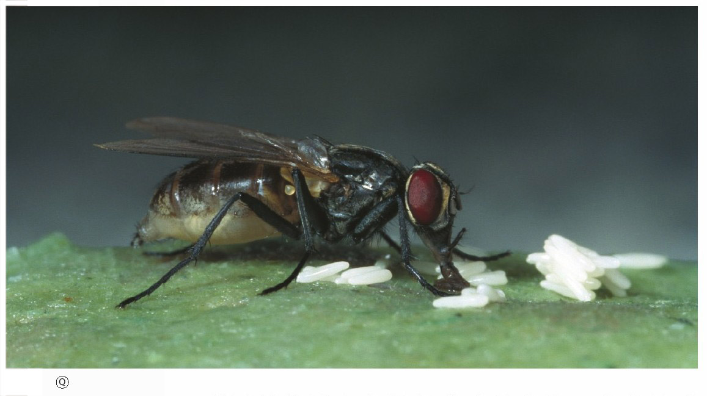
常见的苍蝇喜食松软有味的食物，尤其是动物粪便和腐败的尸体，这是与它们特化的口器结构相适应的。苍蝇不像蝗虫，没有可以咀嚼固体食物的牙齿或大颚；它们也不像蝉和蚊子，拥有可以刺吸食物汁液的口针。苍蝇的口器就像是一个专门用来吸取半流质的微型吸尘泵。取食前，苍蝇必须先将唾液吐在食物表面，然后用搓板式的唇瓣在食物表面不停地敲打。当食物和唾液混合成黏稠状的半固体时，它就可以将食物吸入口腔了。

暴露在空气中的任何食物，都会受到各种细菌、真菌、病毒和原生生物的侵蚀，其中免不了有对人体有害的致病菌，如伤寒、菌痢、霍乱等。苍蝇用来搅拌食物的唾液中，自然也会带有各种致病微生物，因此不少苍蝇成为某些疾病的传播者。还有些蝇类将卵产在动物或人体的表皮内，当这些卵孵化成幼虫后，被寄生者就会引发蝇蛆病。除此之外，有些苍蝇还有更厉害的绝招，胃蝇科的种类能寄生于动物胃内，皮蝇科的种类能寄生于动物的皮下，狂蝇科的种类能寄生于动物的鼻腔内。在非洲，还有一种叫采采蝇的吸血苍蝇，它能通过吸食哺乳动物的血液传播一种锥虫（鞭毛虫的一种）病。这种病又被称作昏睡病，患病的人或动物会昏睡不醒，最终导致死亡。苍蝇有这么多的恶习，能不让人讨厌吗？

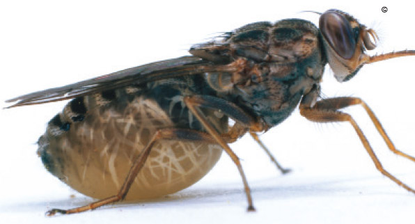
采采蝇

然而，与自然界里生存的数量庞大的蝇类相比，令人讨厌的苍蝇种类还是少数，大量的蝇类对人类无害，不少还对人类有益，甚至是可爱的，如专门捕猎蚜虫的食蚜蝇、可为植物授粉的花蝇（尽管有些种类的幼虫也是农业害虫）等。有一些蝇类还为人类破解生命遗传密码立下了汗马功劳，比如果蝇就是科学实验的理想材料。

这个地球上应该有苍蝇生存的空间，只是人类不要过于大方，让苍蝇分享我们的食物；也不要过于友善，为苍蝇营造滋生它们后代的环境。如果我们不为苍蝇提供制造麻烦的机会，苍蝇也许就不再那么让人讨厌了。（李利珍　殷子为）

  

**【微博士】**昆虫“法医”

在美国南部田纳西州的一个偏僻地方，一辆烧毁的汽车里躺着一具烧焦的尸体。汽车起火，驾驶员被烧死，看起来是一起车祸。然而细心的法医在解剖这具烧焦的尸体时，发现尸体的头颅里有被烧死的蝇蛆。这一事实表明，汽车起火前尸体已经腐烂很久，因为苍蝇都已经在上面产卵生蛆了。显然，这是一起杀人移尸案，罪犯试图焚车烧尸灭迹。后来，法医又在尸体上发现了活的蝇蛆，这是在尸体被焚后新生的蝇蛆。法医根据尸体上的死蛆和活蛆在当时当地气温下的生活周期，分析后得出结论：被害人在18天前遇害。根据这一线索，这起谋杀案最终得以侦破。

## 苍蝇为什么不生病

苍蝇出没于垃圾桶和厕所旁，与腐败食物和动物粪便为伍，浑身上下粘满了病菌，可是，它们却很少生病，这是为什么呢？

科学家研究了很长时间，一直没有答案。1972年，瑞典斯德哥尔摩大学的汉斯·博曼教授在人工诱导的天蚕免疫血淋巴中提取出了一种特殊的小分子蛋白质，这种蛋白质具有杀死病菌的作用，取名为“抗菌肽”。既然抗菌肽能够杀死细菌，那苍蝇不生病是不是和它有关呢？1982年，日本东京大学的名取俊二教授发现，被切除胸部后致伤的一种麻蝇幼虫，竟然没有任何感染细菌的现象发生。后来他又将致伤的幼虫腹部放入含有大肠杆菌的琼脂培养基中，发现大肠杆菌的数量大量减少，直至全部死亡。这说明从致伤的虫体中释放出了某种能杀死大肠杆菌的物质。这种物质就是在大肠杆菌的诱导下，麻蝇幼虫体内产生的抗菌肽，正是这些抗菌肽杀死了培养基中的大肠杆菌。

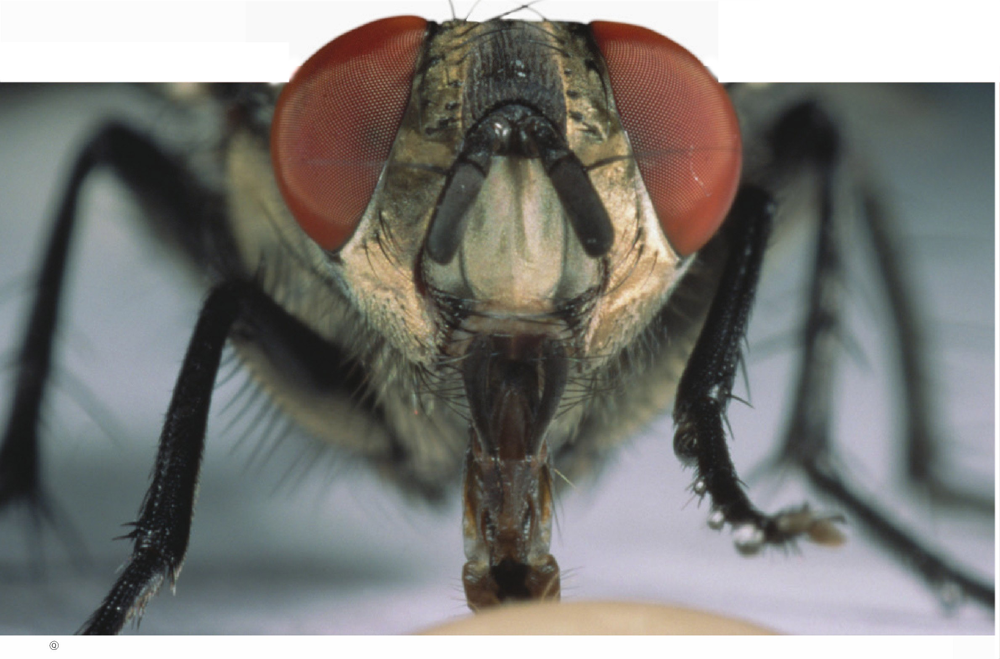
更多的研究表明，抗菌肽不仅对细菌有高效而广谱的杀伤作用，而且对真菌、病毒甚至癌细胞也有良好的杀伤效果。抗菌肽是阻挡病原微生物入侵的重要屏障，苍蝇体内能在细菌入侵时诱导产生抗菌肽，难怪它们不生病。（李利珍　殷子为）

  

**【微博士】**遗传学家和果蝇

自1908年开始，美国遗传学家摩尔根就看上了喜欢吃腐烂水果、体长不过半厘米的小苍蝇——果蝇。果蝇容易饲养，10天一代，一年可以繁殖30多代。更重要的是，果蝇幼虫的染色体简单，只有4对8条，而且形态巨大，便于观察。为了研究果蝇形态性状与染色体基因之间的规律，摩尔根和他的研究团队不断实验，屡败屡战，最后终于发现了果蝇性状与性染色体基因的“连锁与互换定律”，从而荣获1933年的诺贝尔奖。

【微问题】有人说，食堂里的苍蝇是干净的，你觉得对吗？

【关键词】苍蝇　食性　口器结构　抗菌肽

## 为什么吸血的总是雌蚊子

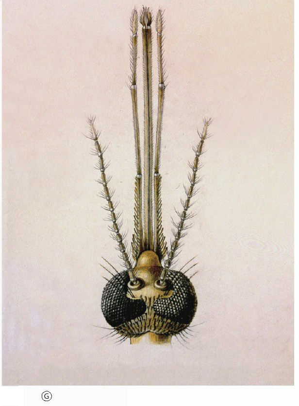
几乎每一个人都有被蚊子叮咬的经历。可是，令人不解的是，为什么吸血的都是雌蚊子？

我们知道，蚊子的卵、幼虫和蛹都生活在静止水体中，雌雄成虫都能通过吸食植物的汁液和花蜜来维持自身生存的需要。然而，这些食物中缺乏蛋白质，无法满足雌蚊子卵巢发育的营养需求。而动物血液中含有浓缩的糖、脂肪和蛋白质，血液中的血红蛋白可以促进雌蚊子的卵巢发育、卵子成熟、产卵量增加。为了繁殖后代，雌蚊子只得冒着随时被拍死的生命危险去吸食血液了。而雄蚊子不负责产卵，靠吸食花蜜或露水就能维持一周左右的生命，交配后便完成了它的历史使命，因此完全没有必要冒同样的风险去吸血补充营养。

雌雄蚊子不同的取食习性，是与双翅目蚊科昆虫的针状口器（嘴）相适应的，雌蚊子特化的口器结构完全支撑了它的吸血功能。适应吸血的口器由6根发达的口针组成，分别由一个上唇、两个上颚、两个下颚及一个舌特化而成，其中上唇口针内壁凹陷形成食物通道，中间为空心的舌口针形成唾液道。吸血时，下唇先向后弯，用其端部唇瓣握持针簇，下颚口针先刺入人的皮肤，然后其他口针交替刺入，直到伸达微血管中吸血，这种多根口针相互扶持交替工作的方式，能确保雌蚊在一刹那间深入微血管，在短时间内获取所需营养后，快速逃离。由于没有吸血的功能，雄蚊子的口针就退化了，下颚口针短小细弱，无法刺入人的皮肤。（李利珍　殷子为）

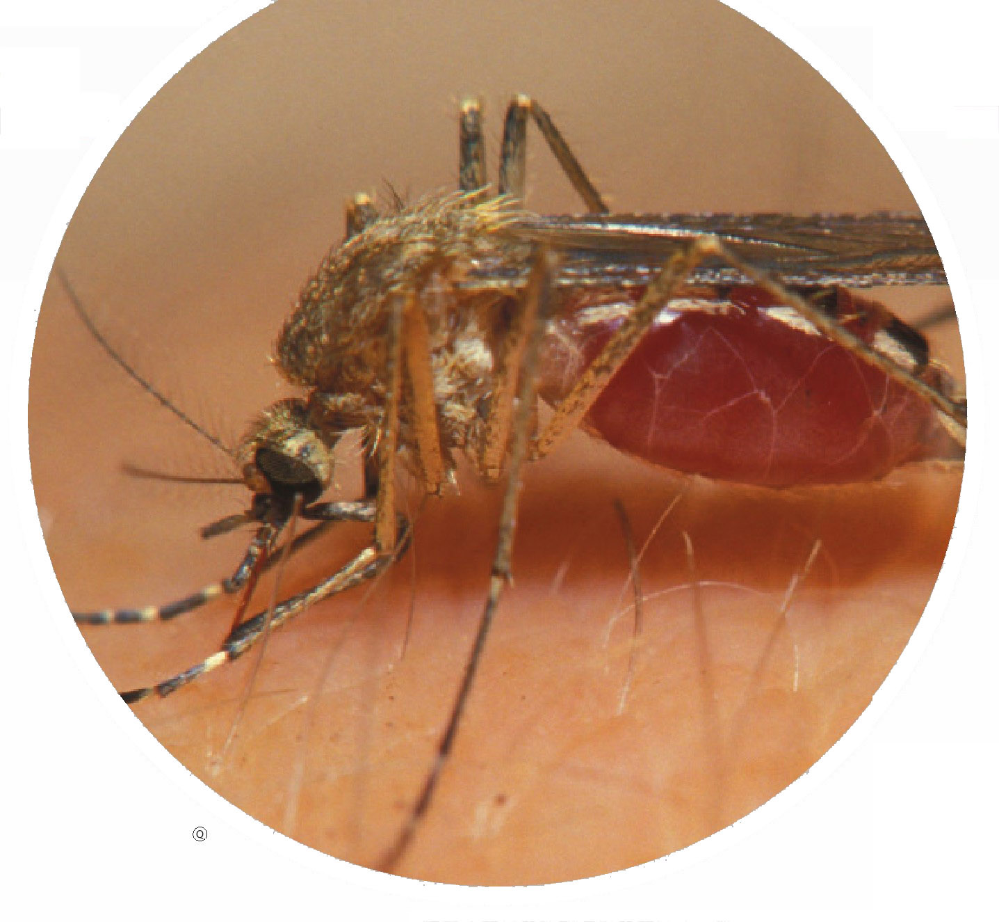
雌蚊子的口器犹如注射器的针头一般，能够帮助它刺穿皮肤并吸食血液

  

**【微博士】**什么人容易招蚊子叮咬

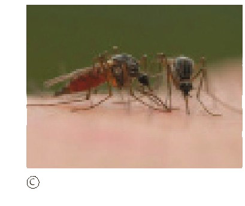
雌蚊子是借助于特殊感觉器官来发现目标的，主要是通过感知人体呼出的二氧化碳、散发的热量以及汗水中的特殊气味和信息，因此，毛孔粗糙、体温偏高以及出汗后的人群更招蚊子。相比之下，儿童比成年人、男人比女人、健康人比病人、肥胖人比瘦人、穿深色衣服的人比穿浅色衣服的人更受蚊子的青睐。

## 人被蚊子叮咬后为什么会感觉痒

大多数人，尤其是儿童和敏感者被蚊子叮咬后都会出现局部红肿，瘙痒难忍，却不感到疼。这主要是因为常见蚊子的口针非常细，远小于人体皮肤表面痛觉感受器的密度。有些个体比较大的蚊子种类，其口针也比一般蚊子粗，被这类蚊子叮咬时，人还是会有明显痛感的。

蚊子叮人时，当口针刺入人的皮肤后，并不急于吸血，而是先将唾液注入人体内。蚊子的唾液中含有一种抗凝血剂，可以阻止血液凝结。有了这个法宝，蚊子便能痛快地畅饮了。然而，当蚊子唾液作为外来物进入人体后，会刺激人体免疫系统释放出一种称为组胺的物质，用以对抗侵入人体内的异物。当血液流向叮咬处进行组织修复时，释放出的组胺会造成叮咬处周围组织的肿胀，引起过敏反应，所以人就会感觉到痒。这种过敏反应的强度也因人而异，敏感的人被叮咬后症状就很明显，不敏感的人症状则很轻微。（李利珍　殷子为）

## 疟疾为什么与蚊子有关系

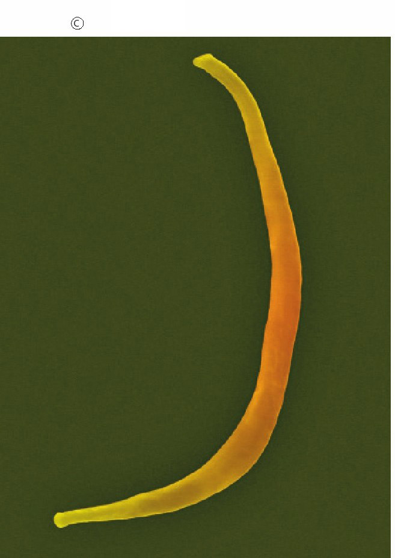
疟原虫

疟疾，俗称打摆子、冷热病。患者主要表现为周期性地全身发冷、发热、多汗，长期多次发作后，可引起贫血和脾大。该病是由疟原虫寄生于人体后引起的一种寄生虫病。能寄生于人体的疟原虫主要有4种，即间日疟原虫、三日疟原虫、恶性疟原虫和卵形疟原虫，它们都是通过一类叫作按蚊的昆虫吸血传播的，在中国能传播疟原虫的按蚊主要有中华按蚊和嗜人按蚊。当按蚊吸食疟疾患者的血液时，会把疟原虫也吸入体内。它们再去叮咬健康人时，便会把疟原虫注入健康人的体内，从而致人发病。可见，疟原虫是疟疾的病原体，是元凶，按蚊则是传播疟疾的帮凶。要防治疟疾，关键是要及时治疗疟疾患者，有效控制疟原虫对人体的危害，同时也不能忽视对传播者按蚊的有效控制。（李利珍　殷子为）

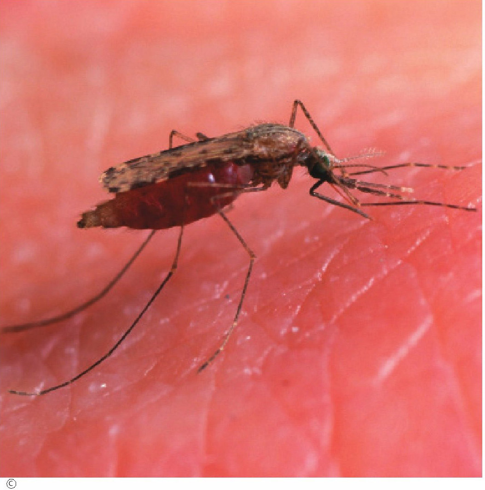
按蚊

  

**【微博士】**青蒿素与疟疾

疟疾与结核病、艾滋病被列在全球最严重传染病的名单之中，以致死率高著称。疟疾在热带及亚热带地区一年四季都可以发病，儿童发病率偏高，非洲每30秒左右就有一个幼儿因疟疾而死亡，而传统的抗疟药物奎宁因疟原虫的抗药性早已失效。由中国科学家发现和开发的“中国神药”——青蒿素复方药物，对恶性疟疾的治愈率达到97%，据此，世界卫生组织在2004年要求在疟疾高发的非洲地区采购和分发100万剂青蒿素复方药物。

**【微博士】**捕食蚜虫的蚊子——食蚜瘿蚊

食蚜瘿蚊隶属于双翅目、瘿蚊科。成虫与幼虫都是捕食蚜虫的能手，能捕食萝卜蚜、甘蓝蚜、桃蚜、豆蚜、棉蚜等60余种蚜虫。每只食蚜瘿蚊一生可杀死四五十只蚜虫，因此它们能有效地控制温室蚜虫对蔬菜的危害。

**【实验场】**止痒实验

如果你被蚊子叮了两个包，都很痒，你可以做一个比较实验：一个包不要去做任何处理（即使很痒）；另一个包用通常的方法处理，即不停地用手挠痒。然后，记录两个包止痒消肿的时间，并观察两个包的红肿减退情况，看看哪种方法效果更好。为什么？

**【实验场】**蚊子生活在哪里

夏天，取一个大口径的玻璃瓶，盛半瓶自来水后置于窗台或阳台上。6～9天后可见清澈的水中多了几个身体一伸一缩、上下翻滚的蚊子的幼虫——孑孓，再过1～2天，水面下就会出现漂浮的蛹。这瓶子里的孑孓就是吸血后的雌蚊子产卵孵化的。

【微问题】你能识别雌雄蚊子吗？

【关键词】蚊子　吸血　繁殖　抗凝血剂　疟疾

## 为什么搬新家后也会出现蟑螂

在一些老房子里，尤其是采光不好、比较阴暗潮湿的厨房里，出现蟑螂是不足为奇的。但是，刚装修的新房子，搬进去居住后不久，就发现了蟑螂的身影。它们是从哪里来的？为什么总是挥之不去？

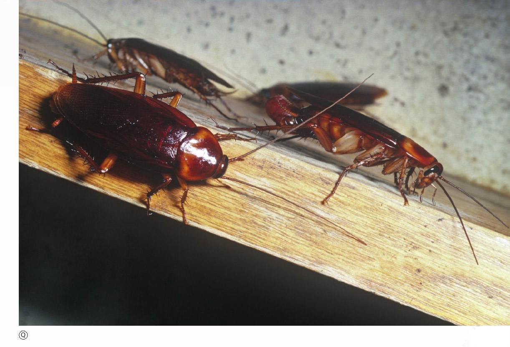
蟑螂又叫蜚蠊，昆虫纲蜚蠊目是个非常庞大的家族，全世界已知有4500余种。其中有近30种与人类生活在同一屋檐下。在中国常见的家居蟑螂有黑胸大蠊、美洲大蠊和德国小蠊。这些蟑螂都是杂食性的，从来不挑食，人类的食物它们几乎都喜欢吃，甚至一些日用物品，如肥皂、纸盒等都能成为它们的零食。人们的居所为蟑螂提供了丰富的食物来源。蟑螂通常昼伏夜出，扁平的体形能使它充分利用狭窄空间，哪怕在只有0.5毫米宽的缝隙内也能藏身。它们白天隐藏在墙缝、家具的缝隙、储物箱的角落、电冰箱底部及散热片间隙等隐蔽的地方，这些场所也是蟑螂适宜的产卵地。到了晚上则出来到处爬行，寻找水源和食物。如果我们在搬新家时没有彻底清理蟑螂的栖身场所，直接将原来在老房子中使用过的旧家具、旧冰箱、旧器具等搬入新家，就会将蟑螂或其卵鞘带入新家。蟑螂有非常惊人的繁殖能力，如德国小蠊，在适宜的条件下，一年可繁殖4代，一只雌成虫一生产卵鞘4～8个，每只卵鞘含卵约37～44粒。只要有一个蟑螂卵鞘存活下来，新家里就会很快出现蟑螂了。

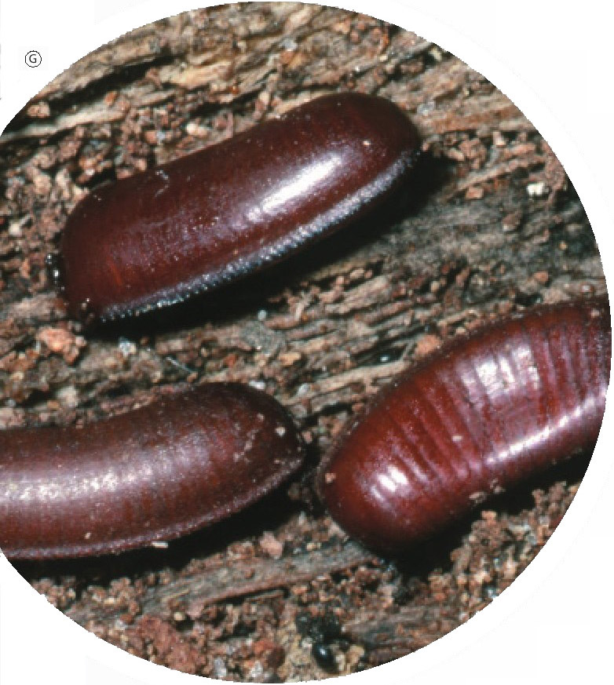
卵鞘

蟑螂虽然并不主动攻击人类，也没有传播疾病的确凿证据，然而它昼伏夜行，身上的恶臭及排出的粪便的确令人讨厌。人类想方设法要彻底消灭它们，但蟑螂的数量却似乎有增无减。这与它们有着一身趋于完美的生存本领有关，尤其是它们对变化环境的应变和适应能力。

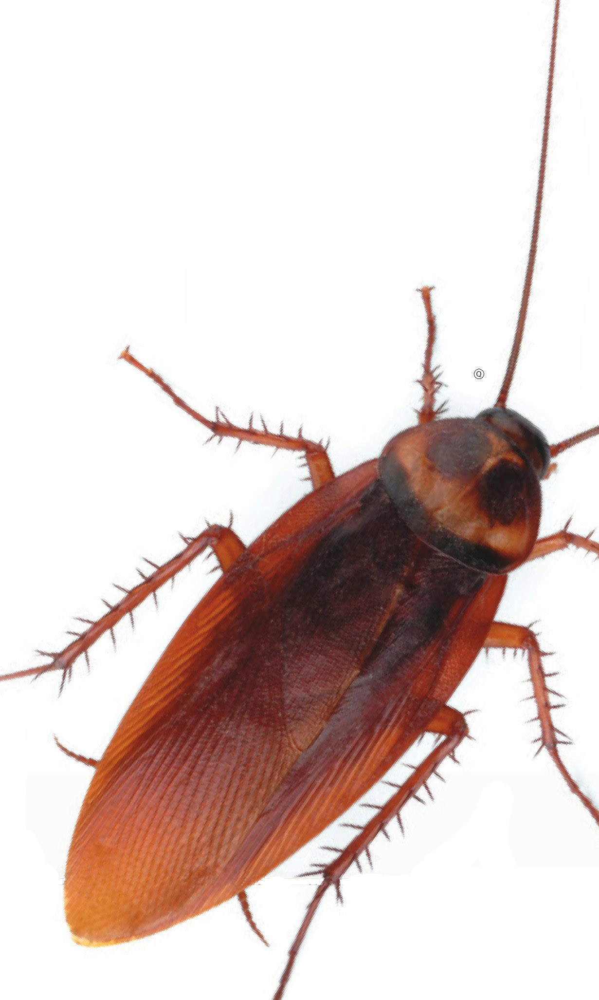
我们只有管理好自己的栖居环境，不让蟑螂有缝可躲，有机可乘，迫使它们回归自然才是上策。（汤亮　李利珍）

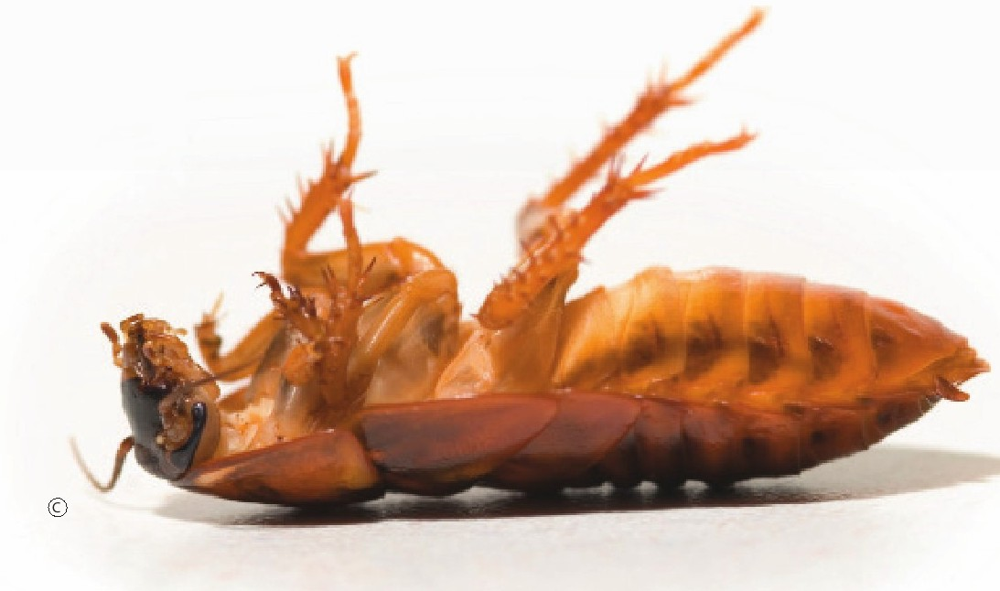
## 为什么有人要给蟑螂平反

台湾师范大学教授林金盾博士专门从事蟑螂生物学研究，他的研究揭示了蟑螂的许多鲜为人知的生存策略。

蟑螂的杂食性让它们在自然界的食物链里扮演着“清道夫”的角色，消化着其他动物不屑一顾的食物和废物，是生态系统中不可或缺的成员。蟑螂几乎吃进并磨碎任何坚硬的物品，是因为它的消化系统里有“沙囊”，这在昆虫中是唯一的。蟑螂如掉进水里也淹不死，除了它光亮的翅膀有一层“防水薄膜”外，还有10对气门，可以及时关闭气门不呼吸。蟑螂身体的绝大部分组织皆由“脂肪”构成，可以轻易地储存许多能量。如果将蟑螂的头部或肢体分离，或部分器官摧毁，蟑螂并不会马上死亡，可以赢得时间修复受到损害的器官。蟑螂的头部除了有一对复眼之外，还多了一对“单眼”，使它即使在黑暗的环境里也能保持对光的敏感。蟑螂不仅有6条灵敏的长腿，尾部还有一对敏感的“尾须”，好似汽车的尾灯，可以迅速感受到任何威胁而加速逃离。为了保持灵敏，蟑螂时时刻刻清理自己身体的各个部位，绝对是“洁身自好”之辈。依仗这些独特的技能，蟑螂在地球上生存了3亿年之久。

林教授拍摄的纪录片《蟑螂的秘密》，更让世人感知尊重地球万物的重要性。人类要消灭蟑螂的最大理由是：蟑螂身上携带有大量的病原微生物，其中有不少是可以导致人类严重疾病的病原菌。然而，不像蚊子、跳蚤等，蟑螂不主动攻击或侵犯人类。林教授认为，与当代人类每分每秒都做着污染地球的事相比，蟑螂只是躲在暗处默默地为生存而消化着人类的废物，分享着人类极小部分的食物。不管地球的环境演变得如何险恶，蟑螂则是与时俱进，不断演化，总有办法在夹缝中求生存，是人类无法消灭得了的。

蟑螂足智多谋、谦虚低调的生存之道，给人类诸多的启示，人类只要守护好自己的家门，不为蟑螂入室提供条件，蟑螂自然可以回到野外生存，我们还有剿杀它们的理由吗？（汤亮　李利珍）

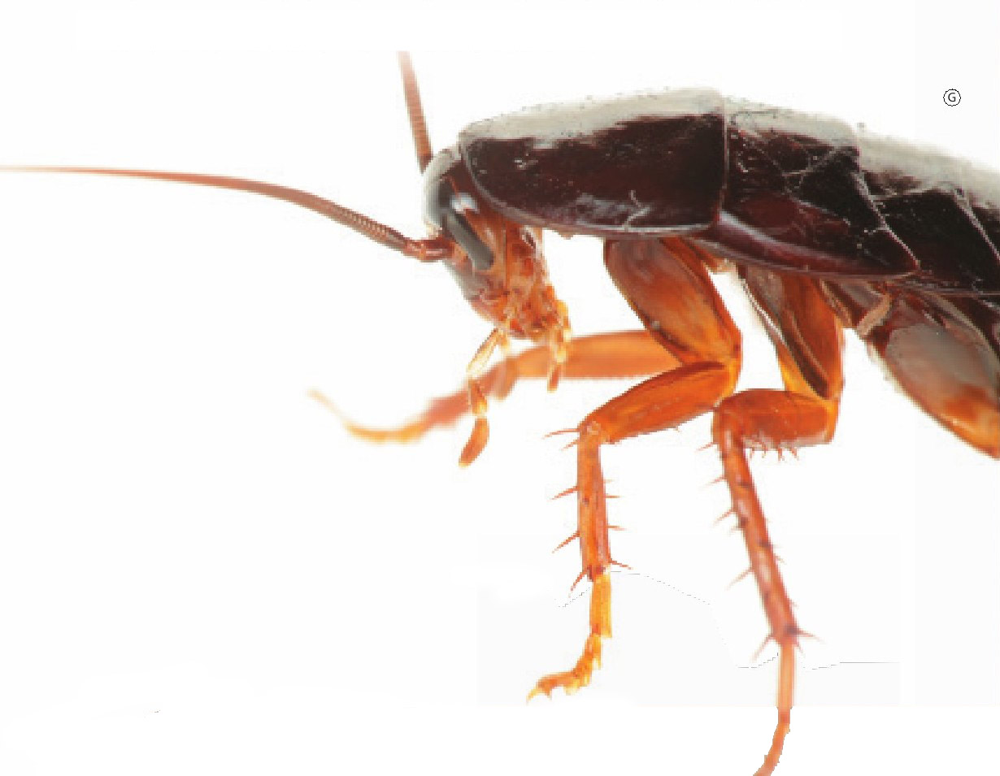
  

**【微博士】**能入药的蟑螂——地鳖

并不是所有的蟑螂都是有害的，有些蟑螂体内含有一些对人体健康有益的物质，具有较高的药用价值。如地鳖，又名土元、土鳖，属于蜚蠊目地鳖科。它形体扁平，长1.5～3厘米，棕黑色。这是一味名贵的传统中药，具有抗凝血和溶解纤维蛋白的作用，能改善和增强体内主要器官、组织及全身的血液供应，常用于跌打损伤、妇女闭经等症状的治疗。现代医学还证明，它对白血病、癌症等也有一定疗效。目前用土元配制的中成药已达200多种。药用地鳖虫共有3种，即中华地鳖（苏土元）、冀地鳖（大土元）和东方后片蠊（金边大土元）。过去只靠人工采集，不能满足需要，现已实现了人工养殖。

**【微博士】**不寻常的母爱——以血哺幼

绝大多数蟑螂生活在热带和亚热带的丛林中，担当着清道夫的角色，有着独特的生存策略。它们中有些种类能孤雌生殖，雌蟑螂不需要通过与雄性交配就能繁殖；有些能卵胎生，卵在体内孵化后再直接产下小蟑螂。有一种生活在印度丛林中的蟑螂，雌蟑螂将产下的1～2龄若虫置于自己的前翅下，让小蟑螂可以用锋利的大牙刺破母体腹背表皮，吸食血淋巴，直到小蟑螂能独立觅食。

【微问题】你认为人类应该如何面对蟑螂？

【关键词】蟑螂　生存策略　环境

## 箱子里的衣服为什么会生虫

不少人都有过这样的经历：当你从柜子里取出毛料衣服兴致勃勃换装时，却发现心爱的衣服上出现了几个小洞，很是扫兴。那么，衣服上的小洞是如何来的呢？

原来，在我们居住的屋子里，隐藏着一类害虫，它们躲在阴暗的角落里，特别喜欢蛀食毛料制品。因此，柜子里存放的毛料衣服就成了它们的美味佳肴，经常被啃咬成空洞。这类害虫常见的有鳞翅目谷蛾科的衣蛾和鞘翅目皮蠹科的几个种类。衣蛾分布极广，以幼虫取食羊毛、毛发、毛皮、羽毛制品，在博物馆里还会危害动物标本。成虫不取食，但会将卵产在皮毛等动物制品的表面，孵化的幼虫就直接危害毛料制品。而皮蠹中主要有黑毛皮蠹和钩纹皮蠹两种，它们的适应性极强，在全国各地都有分布。一般以幼虫危害各种毛纺织品、羽毛制品及兽皮等，对谷物和油料也有一定危害。幼虫怕光，所以特别喜欢在阴暗潮湿的场所活动。

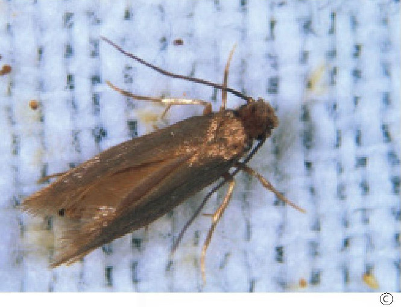
衣蛾

衣柜里的虫子究竟是从哪里来的呢？有两个途径：一是在晾晒衣服时，自然环境中的成虫寻觅到这个理想的场所，将卵产在衣服上；二是成虫自己钻进衣柜里，将卵产在衣服上。那么，有没有办法避免衣服被咬呢？当然有。首先，要把衣服洗干净，不要让衣服上带有虫卵，毛纺织品等物品要密闭储藏，以防成虫产卵。其次，衣服可以放在太阳下晒，但是要避开皮蠹或衣蛾的产卵季节（一般在四五月），以免“引狼入室”。当然，在衣箱里放些樟脑丸等防虫、防霉的用品，对这类害虫也有驱避作用。（汤亮　李利珍）

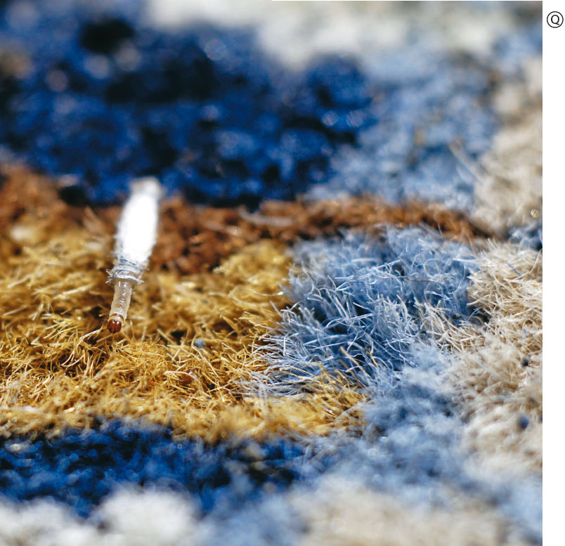
这个从卵里孵化出来的衣蛾幼虫，看似不起眼。可过不了多久，它就会长成危害衣物的“破坏狂”

## 房间里为什么会飞出小蛾

在夏季，有时房间里会出现一些不知从何处飞来的小蛾，它们白天大多静止不动，晚上飞来飞去。这种蛾子其实就是从你家的面粉、大米或其他谷物中飞出来的。蛾子种类可能是米蛾，也可能是印度谷螟等小型蛾类，具体种类要根据形态特征鉴定。

米蛾属鳞翅目蜡螟科，以幼虫危害大米、小麦、玉米、小米、花生、芝麻、干果等，是一种重要的仓库害虫，一般在南方较为常见。它的幼虫呈黄色，喜欢栖息于碎米中，并吐丝将碎米筑成筒状长茧，幼虫便潜匿在茧中。一般每年发生2～7代，以幼虫越冬，全球有分布。印度谷螟属鳞翅目螟蛾科，在中国，它分布于除西藏外的全国各地，以幼虫危害各种粮食和加工食品，如豆类、油料、花生、各种干果等，也是非常重要的仓库害虫，通常一年发生4～6代，以幼虫结茧越冬。这两种蛾子大多是在粮食收藏时期，将卵产在粮堆表面，在粮食进入仓库前混入其中的。因此，从市场买回的米面，其中多数已经带有虫卵了，只不过还没有羽化为成虫而已。一旦成熟，它们就会从粮食中飞出来。

还有一类常见的仓储害虫是豆象，属鞘翅目豆象科。从市场买回的绿豆，一粒一粒很饱满，怎么过些日子后绿豆变成空壳了？仔细观察发现，那些空了的绿豆上有个小洞，洞里有个肉乎乎的小虫，那是绿豆象的幼虫。它的成虫体长2.5～3.5毫米，赤褐色，翅膀上有灰白色和黄褐色的毛斑，一年发生4～9代，各种虫态都能在豆粒中越冬。雌成虫在田间的豆荚上或仓库内的豆粒上产卵，孵化的幼虫会蛀入豆粒中。

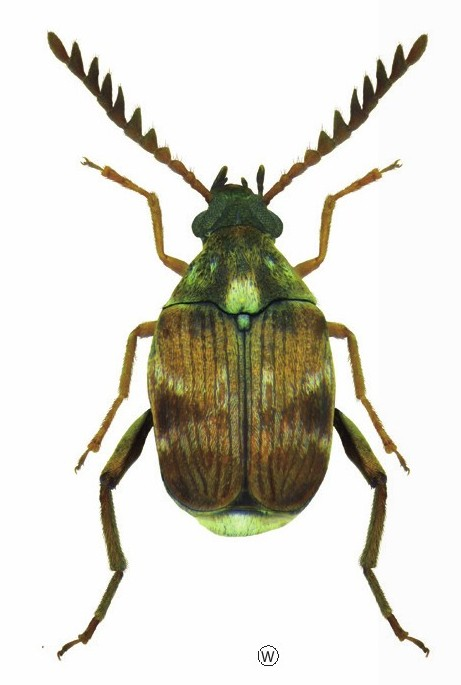
绿豆象

发现家里的米面豆类生虫了怎么办？面粉可以过筛，大米、豆类可用人工清除幼虫的方法来除虫。也可用冰箱冷冻进行低温杀虫，或用开水烫、太阳晒等高温手段处理。

如果不小心吃进了虫子，那也是一种动物蛋白喔，只要煮熟了，对人体是没有毒的，至少比吃进杀虫剂要好得多。（汤亮　李利珍）

  

**【微博士】**母爱的力量——象鼻虫的摇篮

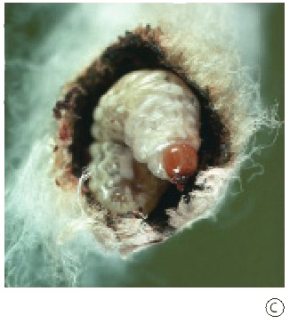
象鼻虫幼虫

一段名为“昆虫的奇妙灵光”的视频在网络上热传着，感动了无数网民。台湾知名的昆虫学者李淳阳博士，用3小时50分钟的时间，拍摄了150张照片，卷叶象鼻虫精心缝制山茶叶摇篮的全过程，在“宝宝快快睡”的温馨摇篮曲乐声中一一再现。体长不足叶片长度十分之一的雌性卷叶象鼻虫，选定不嫩不老的山茶树叶，以它微小而锋利的上颚为工具，没有黏液、丝线的辅助，硬是通过切割纤维、戳洞柔化、折叠卷曲等物理手法，巧妙营造产卵场所，为后代缝制了一个可避风遮雨、躲过天敌、饱食终日直至羽化的保险摇篮。没有别人和书本的示范，一个人要想折叠一个标准的纸鹤是很困难的，卷叶象鼻虫的这种本领则是天生的，是母爱的驱动。

**【实验场】**找一找家里的昆虫

如果发现家中米袋里有碎米筑成的筒状长茧，带虫孔的豆类，或其他讨厌的昆虫，包括从窗户飞进来的昆虫，在选择用安全的方法去除它们的同时，不妨学习一下法布尔，用各种办法收集它们，饲养它们，观察它们。有空的时候，你可以查找一些昆虫学资料，或将昆虫带到昆虫博物馆，请那里的专家鉴定一下，说不定还能有些新发现呢！

【微问题】吃了生虫的粮食对健康有害吗？

【关键词】储藏物害虫　幼虫　象鼻虫

## 蚂蚁为什么排着队走路

盛夏，如果我们把一小块食物放在户外，不一会儿便会有蚂蚁过来。一只、两只、三只……很快就会有黑压压的一群蚂蚁排着长队过来，将食物团团围住，然后，排着整齐的队伍将食物一点一点地运回自己的巢穴中。

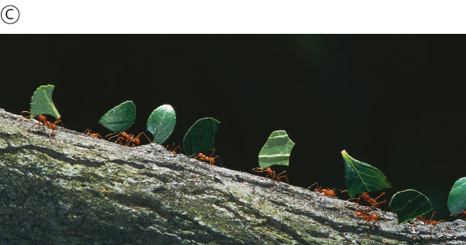
蚂蚁为什么要排着队走路呢？这要从蚂蚁的生活习性谈起。蚂蚁是一类高度进化的社会性昆虫，在这个“大家庭”中，负责外出觅食的是数量庞大的工蚁。当一只蚂蚁发现某个地方有食物时，会很快跑回去告诉别的工蚁同伴，并领着大家一起去搬运食物。工蚁是如何认路，又如何与同伴“沟通”的呢？原来蚂蚁有一套出色的导航系统，这个导航系统的最大秘密就是工蚁的肛门和腿上长有的特殊腺体，这些腺体在蚂蚁行进过程中能分泌出少量特殊的化学物质，以此来标记自己行走的路线，这类特殊的化学物质称为示踪信息素。当一只蚂蚁（侦察蚁）发现食物后，便会在回家的路上连续释放示踪信息素，形成一条特殊的蚁路。工蚁的触角上具有非常灵敏的气味感受器，尽管释放的示踪信息素的量很少，但足以被蚂蚁识别出来，并沿着这条蚁路发现食物。

如果出现交叉路口怎么办呢？不用担心，聪明的蚂蚁自有方法。先行的蚂蚁会释放一种微量的特殊气味作为路口标识，这种标识不仅能表示路口的角度，还能表示出哪条岔路有食物存在。另外，即使是同种蚂蚁，每个蚁巢的个体都有自己蚁群特定的气味，所以不必担心蚂蚁会跟错路回到别人家去。

这些微量的示踪信息素会被雨水冲掉，或被汽油掩盖吗？不用担心，蚂蚁的导航系统中除了气味记忆外，还能倚靠紫外偏振光导航。这个秘密，在很早以前就被法国昆虫学家法布尔发现了。偏振光是指只在某个方向上振动，或者某个方向振动占优势的光。太阳光本身并不是偏振光，但当它穿过大气层，受到大气分子或尘埃等颗粒的散射后，便变成了偏振光。沙漠中有一种蚂蚁，在离开自己的巢穴时，总是弯弯曲曲地到处寻找食物，可是一旦得到食物后，即使在离巢很远的地方，也会沿直线返回原地。一些在潮间带生活的蚂蚁，也会通过水面微弱的化学标记以及偏振光的导航，穿梭于水体表面往返巢穴。（胡佳耀　李利珍）

## 蚂蚁为什么总是很忙碌

通常，我们看到的蚂蚁总是在忙忙碌碌地觅食，没有一点偷懒的迹象。它们为什么如此勤劳呢？原来，在蚂蚁家族中有严格的等级制度，大家分工明确，共同维持着蚂蚁社会的和谐和稳定。在这个家族中，蚁后是最高的统治者，负责生儿育女，雄蚁仅负责与蚁后交配，兵蚁负责安全保卫工作，而外出觅食、照顾蚁后、打扫巢穴等许多任务是由工蚁来承担的。工蚁数量最多，它们的行为受蚁后分泌的信息素严格控制。在蚁后信息素的作用下，工蚁就会心甘情愿地去完成各类工作，甚至不惜牺牲自己。但是，一旦蚁后死去，又没有新的蚁后来接替，工蚁就会一改以前忙碌而有序的工作作风，变得不知所措，整个蚁群在“无政府状态”下也会变得杂乱无章。

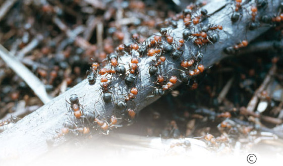
所有的蚂蚁都那么勤劳吗？有没有偷懒的蚂蚁？经过观察，科学家发现，一直被人们称赞的蚂蚁也有“偷懒”的家伙。如一种多齿蚁的工蚁，一天中有一半的时间在闲逛。但这些家伙并不是在真正地偷懒，而是作为巢群在紧急情况下“劳动力市场的预备部队”呢。（胡佳耀　李利珍）

  

**【微博士】**蚂蚁能治病

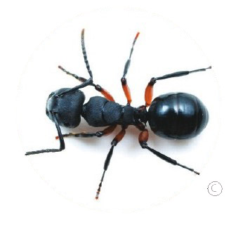
人类食用蚂蚁，或将蚂蚁作为药品和滋补品，已有3000多年的历史。1992年，国家卫生部正式将拟黑多刺蚁（鼎突多刺蚁）列为了食品新资源，此后蚂蚁的养殖和产品开发就成了一个热点。中国已知蚂蚁有400余种，其中可供药用的蚂蚁10多种，除拟黑多刺蚁外，还有红胸多刺蚁、黑山蚁、赤山蚁、赤蚁、黄蚁等。目前人工饲养的主要是拟黑多刺蚁，广泛分布于中国长江以南的地区。蚂蚁体内含有多种能提高人体免疫功能的物质，并具有抗炎、护肝、延缓衰老、治疗类风湿性关节炎等作用。有不少地方通过人工饲养蚂蚁来满足人们的需求。如果过度捕杀野生蚂蚁，将会造成森林生态的失衡，引起许多意想不到的环境问题，如某些害虫的暴发等。因此人类应该合理开发蚂蚁资源。

**【微博士】**玩蚂蚁的科学家

美国博物学家爱德华·威尔逊是一个玩蚂蚁的高手，他不但探明了蚂蚁的社会结构，发现了蚂蚁的外激素，而且从蚂蚁这种社会性昆虫的活动特性中，挖掘出了一门全新的学科——社会生物学。威尔逊除了撰写科学论文外，还热心于撰写科普作品，他写就的《蚂蚁的故事》获得了一般只授予文学作品的普利策奖。

**【实验场】**蜂蜜诱蚂蚁

在有蚂蚁出没的地方，用蜂蜜或白糖水写出一个笔画简单的汉字，如山、水等，观察蚂蚁是否会被诱集成字形。

【微问题】不同蚁群的蚂蚁相遇后会大打出手吗？

【关键词】蚂蚁　示踪信息素　蚁后　工蚁

## 蝈蝈为什么要不停地“唱歌”

生活在荒野灌木丛里的小蝈蝈，有各种鲜嫩的枝叶和美味的野果充饥解渴，偶尔还有毛毛虫可以开开小荤。随着一次次蜕皮长大，蝈蝈有了越来越健美的身材，它的两对翅膀日益健全，强壮的后腿也越来越适宜跳跃了。灌木丛里食物丰富，小蝈蝈只需伸伸腿，蹦一下，就能饱食终日了。在茂密的树叶和枝条的隐蔽下，蝈蝈几乎可以高枕无忧，只要它的动作不太大，蝙蝠和鸟儿也很难找到它。

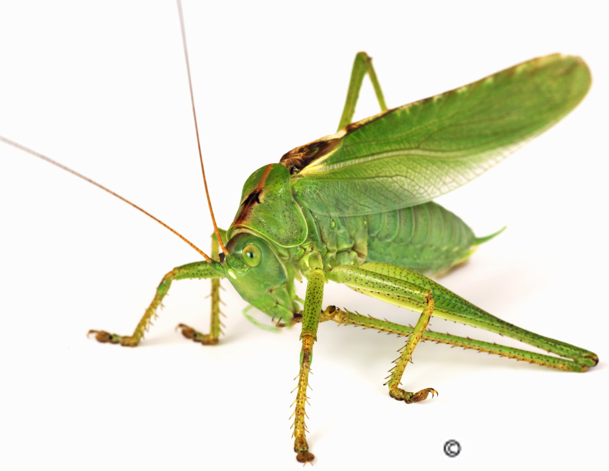
当小蝈蝈长成一只健壮的雄蝈蝈时，就要找女朋友了。茫茫林海上哪儿去找啊？雄蝈蝈有一对可以弹奏美妙乐曲的前翅，同样隐蔽的雌蝈蝈听到雄蝈蝈的求爱小调就会循声而来，哪怕是在几百米之外。对于体长一般不足40毫米的蝈蝈来说，要在密林中找到雌性，就如同我们在车站、码头的人海中寻找迷失的亲朋好友，只得求助于“广播找人”。成熟的雄性蝈蝈一旦开始“唱歌”，在没有找到雌蝈蝈之前一直会痴情地“唱”下去的。对于那些身体更小的蟋蟀、蛉虫类来说，院子角落的一堆瓦砾就是一座小山，一个草丛就是一个森林，不发声根本无法寻找知音。

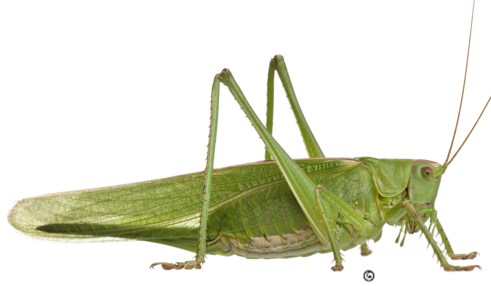
其实，蝈蝈以及其他会发声的鸣叫昆虫，如纺织娘、蟋蟀、金蛉子等都不是歌唱家，而是演奏家，它们没有嗓子或歌喉，有的是一对天生的可以用来弹奏的前翅。雌性一般不会主动“唱歌”，只有个别种类会有类似“应答”的被动发声，通常人耳无法感知。（金杏宝）

  

**【实验场】**鸣叫昆虫是如何发声的，它们的耳朵长在哪里

取一只刚死不久的蝈蝈或纺织娘，用左右手指分别轻轻捏住虫子的左右前翅，将翅膀的基部相互摩擦，会发出“咝咝”的声音；摩擦的速度越快，声音也越响。

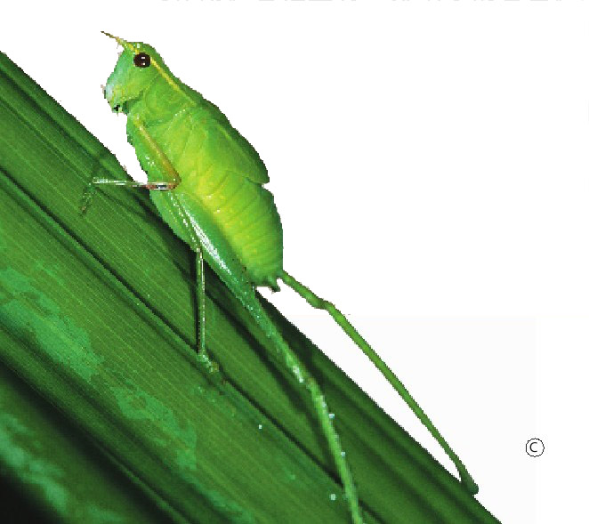
将一对前翅从基部折下，用放大镜可观察到翅脉及发音器构造。发音器由两部分组成：一个音锉和一个刮器。它们分别位于左右翅膀内侧的基部，是两根特别粗的翅脉特化而成，其下面是透明的翅窗，摩擦发声时起共鸣作用。音锉上有一排细小的音齿。摩擦发声时就如同人用指甲在梳子上快速地划过，如果能达到每秒摩擦30次以上的频率，发出的声音是相当大的。

再取下一条前腿仔细观察，能看到在大腿与小腿的连接处的膝盖两侧，各着生一个近圆形的孔，上有一层薄膜覆盖，这就是鸣虫的耳朵，称为听器或鼓膜器，可以感受空气振动的不同频率。

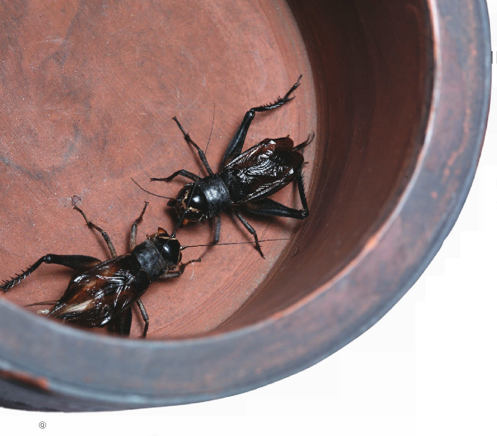
## 蟋蟀为什么爱打架

蟋蟀通常以撒落在草丛和裸地上的种子、果实为生，食物远不如生活在树林里的蝈蝈那样丰富。对蟋蟀来说，所占领的地盘越大，可能获取的食物就越多，成年后吸引异性的机会也越大。对于刚成年的雄蟋蟀来说，首要的是温饱，其次是安居和躲避天敌，最后才是寻找配偶、繁衍后代。它们通常以洪亮的鸣声告诉同类：“我在这里安家，请别打搅！”蟋蟀以叫声来圈地，通常可控制方圆几十米乃至上百米的范围。然而，对于大量讨生活的蟋蟀来说，听到其他蟋蟀的鸣声就乖乖地绕道，那就意味着自己的生存空间的缩小。因此，除了那些体形弱小者，一般的蟋蟀都会去争夺新地盘，客蟋蟀与主蟋蟀之间就免不了一场短兵相接的犬牙之战。长期的生存竞争，让那些体壮、头大、牙利的赢者生存下来，这些好斗基因通过繁殖传递到了后代，形成了特别善斗的斗蟋属。再加上喜爱斗蟋蟀者的推波助澜，更是加速了好斗基因的定向选择，于是我们常见的斗蟋都成了著名的昆虫“拳击手”。

在显微镜下我们可以发现，天生爱打架的蟋蟀的触角和尾须上都长有很多连接神经系统的刚毛，通过芡草或特制的蟋蟀须的刺激或挑逗，就如同被挠了痒痒，蟋蟀会被激怒而抗争。

我们平常所说的爱打架的蟋蟀，通常特指斗蟋属内的一些种类，有多达几十种。然而分布在中国华东、华北地区最常见的只有两种：迷卡斗蟋和长颚斗蟋。其实，善斗的蟋蟀还有许多种类，如油葫芦、棺头蟋等。由于蟋蟀的优势种类在各地分布的差异和文化习俗不同，中国各地斗蟋蟀活动所用的种类也是不同的，如在台湾地区是用体形强壮的双斑蟋蟀，又叫画镜，当地称为“乌龙仔”；而云南等南方地区则常用体形更粗壮的巨蟋，又叫花生大蟋。（金杏宝）

  

**【实验场】**如何区别蟋蟀、蝈蝈和蚱蜢

蟋蟀、蝈蝈和蚱蜢（或蝗虫）都是直翅目昆虫，蟋蟀、蝈蝈属于螽亚目，蚱蜢属于蝗亚目，两者在形态和生活习性上都是不同的。主要的区别在于：前者的触角细长，明显超过体长，后者的触角相对粗短，不及腹端。蟋蟀、蝈蝈类用前翅互相摩擦发声，蚱蜢、蝗虫类则用前翅与后腿摩擦发声。另外，蟋蟀、蝈蝈类大多是杂食性的，荤素都吃；蚱蜢、蝗虫类则是植食性，基本吃素，所以成群的蝗虫很可怕，对农作物会造成很大损失。

区别蟋蟀类和螽斯类鸣虫（蝈蝈），主要看它们翅膀的覆盖方式：蟋蟀类右翅覆盖左翅，螽斯类则左翅覆盖右翅。也可以通过观察它们停息时翅膀的状态：螽斯停息时翅膀常合拢于腹部背面呈屋脊状，蟋蟀停息时翅膀常平铺于腹部背面。

|  |  |
| --- | --- |

**【微博士】**促织与生物温度计

阿莫斯·多贝尔

蟋蟀在古时称为“促织”。蟋蟀一叫，秋天已到，冬天也不远，该是织布制衣、准备过冬的时候了。深秋时节的蟋蟀叫声与刚入秋的蟋蟀叫声很不一样，鸣声的频率明显变慢，声调也变得低沉。这一现象也被100多年前的一位美国物理学家阿莫斯·多贝尔观察到。他通过记录一种美国白树蟋（俗称竹蛉）在不同温度下每秒钟的鸣叫次数，推算出一个公式，被后人称为多贝尔定律，即用鸣叫次数（N）来推测当时当地的气温，让鸣虫充当了生物温度计。如果你有兴趣，可以试试。用当地的鸣虫，通过实验记录，推算气温与鸣声频率的关系。

【微问题】雄蟋蟀和雌蟋蟀，哪种更好斗？

【关键词】蝈蝈　前翅　蟋蟀　生存空间　蚱蜢

## 漂亮的蝴蝶怎么会变成一片“枯叶”

一只翩翩飞舞的蝴蝶，在树丛中飞呀飞，突然停息在树枝上，两对翅膀竖立起来，一瞬间，一只美丽的蝴蝶就变成了一片“枯叶”，将自己融入茫茫林海之中，让人很难发现。相信爱好蝴蝶的人一定看到过这种现象。

这是蛱蝶科的一种枯叶蝶。它的翅膀正面有鲜艳的色彩和斑纹，但在翅膀的反面却颜色暗淡，灰蒙蒙的仅见几条翅脉。当它停息的时候，总是把两对翅膀上举至身体背面，并使翅的正面重合在一起，露出反面，将自己装扮得酷似一片枯黄的树叶。枯叶蝶为什么要模仿枯叶呢？同许多昆虫一样，蛱蝶类也会遭到许多天敌的捕食，如鸟类、蛙类、蜥蜴类和蝙蝠等。而且，蝶类的寿命相对较短，必须在有限的时间内进行交配、产卵，才能完成繁殖后代的任务。因此，如何避免被捕食成了确保种族繁衍的头等大事。在长期的适应进化中，蛱蝶中那些具有颜色枯暗、形似枯叶性状的变异个体，在它们的栖息环境中得到了很好的隐避，逃脱了天敌的捕食而幸存下来。科学研究证实，这种模拟枯叶的性状由基因所控制，它们是能够遗传给后代的，存活的个体通过繁殖将枯叶性状一代代遗传下去。这种模仿生活环境中其他生物或物体的形态而使自己得益的现象叫作拟态。拟态是自然界中的一种普遍现象，如竹节虫长得像一枝细竹，尺蠖长得像一根树枝，食蚜蝇长得像蜜蜂等，这些有利于个体生存的性状，由于捕食者的不选择或逆向选择而得到强化和遗传，它是生物被自然选择的结果，是“适者生存”的生动体现。

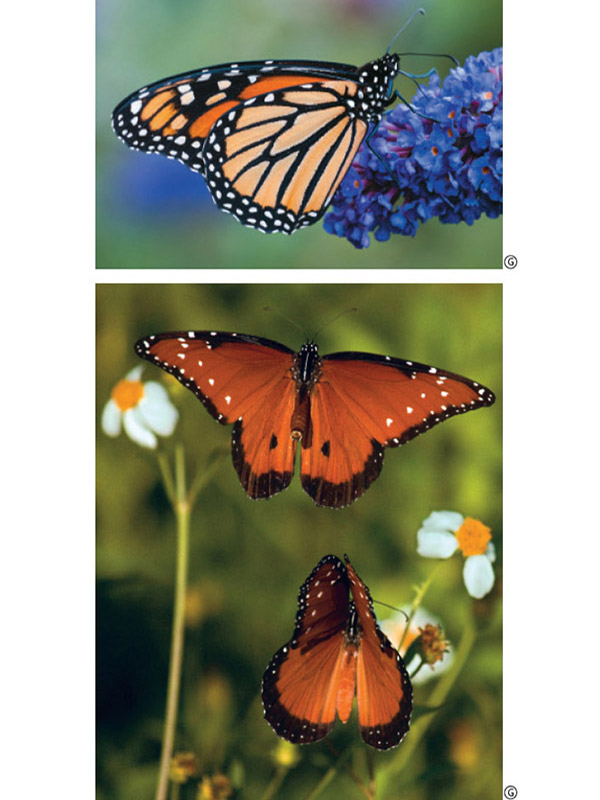
缪氏拟态——普斑蝶（上）和吉斑蝶（下）

根据产生的后果不同，拟态可分为贝氏拟态和缪氏拟态两种。前者一般是一种可食的物种（无毒）模仿另一种不可食的物种（有毒），对模仿者有利而对被模仿者不利。例如食蚜蝇模仿蜜蜂，如果捕食者一开始捕食的是食蚜蝇，会认为蜜蜂也无毒，结果增加了蜜蜂的被捕食概率，对蜜蜂不利。如果一开始捕食的是蜜蜂，则会认为食蚜蝇也有毒，对食蚜蝇有利。而后者一般是两个物种都不可食（有毒或有警戒色），捕食者捕食任何一方，都会认为另一方不可食，结果对模仿者和被模仿者都有利。如普斑蝶和吉斑蝶都是有毒不可食的，捕食者只要误食其一，以后就不会再来捕食这类蝴蝶了，结果对普斑蝶和吉斑蝶都有利，缪氏拟态降低了两者被捕食的风险。（胡佳耀　李利珍）

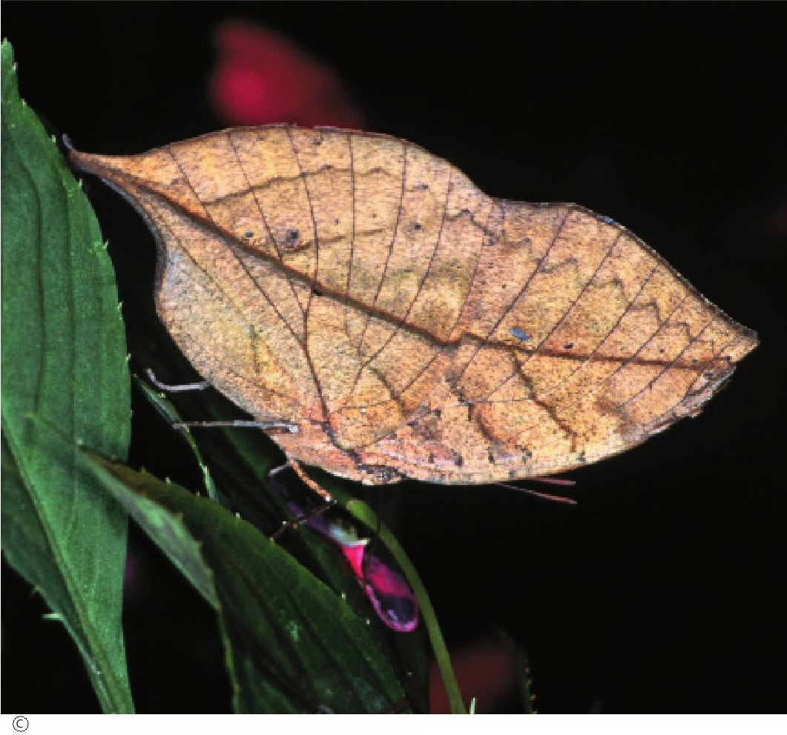
猜猜看，这究竟是枯叶还是蝴蝶

## 蚱蜢的体色为什么会随季节而改变

春夏季节，绿油油的青草上看见的蚱蜢大都是绿色的；而到了秋天，青草变得枯黄了，蚱蜢的体色也随之变成了黄褐色。难道两者之间有着什么内在的联系吗？

原来，昆虫的体色随着环境颜色的变化而变化是一种较为普遍的现象。例如有些同一种蝶类的蛹，在绿叶上化的蛹通常是绿色的，而在枯枝上化的蛹则是褐色的，这在生物学上称为保护色。昆虫有了保护色，就能与环境融为一体，有效地将自己隐藏于环境中而不被天敌发现，对自己的生存有重要意义。例如，一些在树上啃食树叶的鳞翅目幼虫常为绿色，这样可以减少被鸟类发现而捕食的概率。又如，生活在水里的蜻蜓稚虫，大多呈灰褐色（与泥土相似），以便隐藏在水底，既能躲避大鱼的捕食，又能捕食路过的小鱼虾。

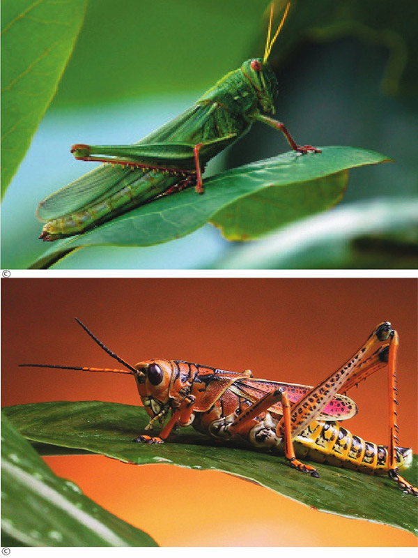
研究发现，这种随环境变化而改变体色的性状不能遗传，它受昆虫食物中的色素，栖息环境的光照、湿度、温度、种群的密度等因素的影响，与昆虫分泌的激素有关。

有的昆虫身体上有另外一类与环境颜色形成鲜明对照的色斑，这类色斑通常为红色、黄色，鲜艳夺目，这类体色叫警戒色。保护色和拟态是为了隐蔽自己，而警戒色却是为了暴露自己，让捕食者更容易发现。难道它们不怕被吃掉吗？不用担心，很多具有警戒色的昆虫并不好吃。例如瓢虫，它们的前胸会分泌难闻且苦涩的液体，鸟类如果不小心吃进嘴里，会立即吐出来。它们红色或黄色的斑点就是要警示鸟儿“别来惹我”。再如蜜蜂和胡蜂，腹部末端都有毒针，它们黑黄相间的体色就是对来犯者的一种警示。还有浑身长满毒刺和毒毛的刺蛾幼虫，也常常拥有亮丽而醒目的体色。（胡佳耀　李利珍）

  

**【微博士】**工业污染与桦尺蛾黑化

桦尺蛾是分布在欧洲北部的一种常见蛾子，夜间活动，白天通常停歇在长有苔藓的灰白色树干上。在19世纪上半叶之前，绝大多数桦尺蛾的个体是灰白色的，偶尔也有黑色的变异个体出现，但这些与背景色不一致的个体极易遭鸟类捕食，难以生存。记录显示，1848年，英国工业城市曼彻斯特所收藏的桦尺蛾标本中，黑色个体仅占1%，而50年后，当地黑色个体的比例竟然占到了99%。原来，那里的树干因布满了灰尘而发黑，几乎不长苔藓，灰白色的桦尺蛾由于与背景反差变大而遭鸟类捕食，而黑色的个体反而获得了隐蔽得以幸存。这是“工业黑化”的著名案例，也是自然选择学说的一个生动例子。

**【实验场】**你能认出是蜜蜂还是食蚜蝇吗

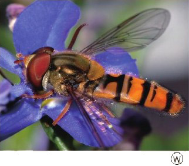
食蚜蝇

如果发现花朵上有身体黑黄相间条纹的昆虫在取食，你能确认它是蜜蜂还是食蚜蝇吗？告诉你，只要掌握几个主要特征就能区分了：（1）食蚜蝇仅有1对前翅（后翅退化成平衡棒），身体苗条；蜜蜂有2对翅，形态粗壮。（2）蜜蜂会螫人，食蚜蝇不会。（3）食蚜蝇复眼很大，几乎占据整个头宽；而蜜蜂复眼较小，约占头宽的三分之一至一半。（4）蜜蜂的触角呈丝状，较长，肉眼看得非常清楚；食蚜蝇的触角呈芒状，很短，肉眼不易看清。赶快去户外试试看！

【微问题】除了昆虫，你能说出多少具有拟态或者保护色、警戒色的动物？

【关键词】拟态　贝氏拟态　缪氏拟态　保护色　警戒色

## 丑陋的毛毛虫为什么会变成美丽的蝴蝶

蝴蝶是世界上最美丽的昆虫之一。它们种类繁多，形态各异，长久以来得到了人们的赞美和喜爱。但幼年的蝴蝶既没有那么绚丽多彩，也不能翩翩起舞。确切地说，它们是令人生厌的毛毛虫。毛毛虫是蝴蝶的幼虫，通常以植物的嫩芽和叶片为生，如菜粉蝶的幼虫菜青虫，噬食青菜、甘蓝和花椰菜等蔬菜。随着它不断地蜕皮长大，食量也越来越大，如果一直这样吃下去，菜青虫就会面临食物危机。因为随着季节的变化，蔬菜渐渐变老、抽薹、开花，鲜嫩的叶片消失殆尽，而虫体尚未成熟，还不能繁殖下一代。植物在生长变化，菜青虫也必须“随机应变”才能完成生活史。化蝶，是菜青虫在漫长进化历程中的选择结果。作为成虫的菜粉蝶，不仅具备了专门用来吸食植物花蜜的可卷曲的长喙，还长了两对可以远距离寻找蜜源的翅膀。毛毛虫和蝴蝶有着完全不同的身体外形、取食习性和栖息环境，减少了幼虫和成虫对空间和食物的竞争，提高了昆虫对不利环境的适应能力。

菜青虫和菜粉蝶的形态和结构是如此的不同，它们之间无法直接发生“突变”，必须有一个过渡的中间状态。蛹便是连接毛毛虫和蝴蝶的中间过渡阶段。当食物匮乏时，幼虫可以提前化蛹。蛹不吃不喝，表面上看起来不动声色，但实际上在身体内部进行着幼虫器官分解和成虫器官重建的剧烈变化。随着内部器官“改组”的进行，蛹壳表面也逐渐显现出成虫的复眼、触角、足以及翅膀等外部器官的痕迹。最后，蛹壳被撑破，一只美丽的菜粉蝶羽化而出。

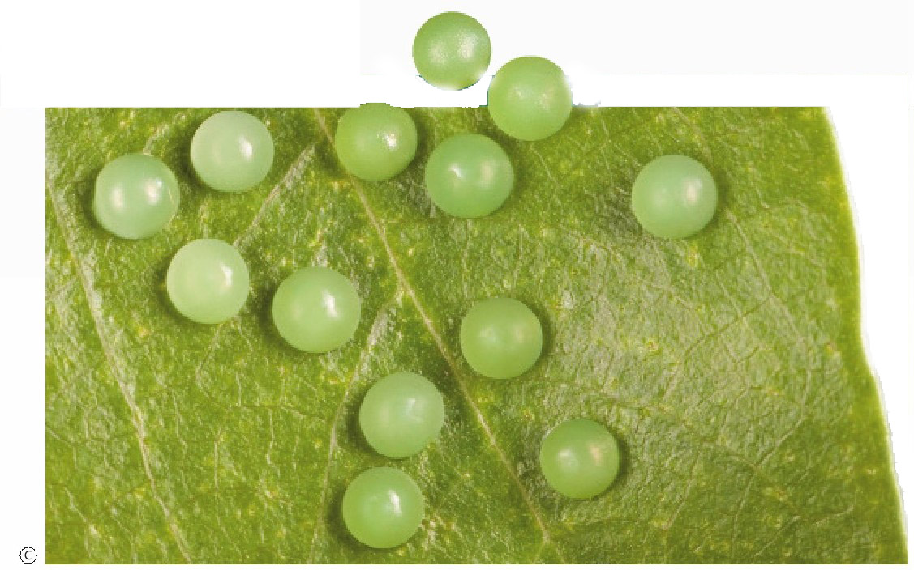

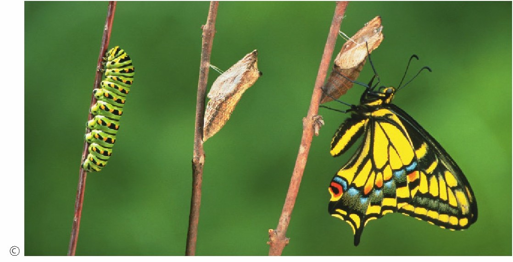
属于完全变态的蝴蝶，会经历卵、幼虫、蛹和成虫四个阶段

所有昆虫的成长都要经历在外部形态上完全不同的发育阶段，称为“变态发育”。菜粉蝶经历卵、幼虫、蛹和成虫四个阶段，称为“完全变态”。食物来源截然不同的幼虫和成虫，不必取食的“木乃伊”般的蛹，使昆虫可以避开不利的环境和时段，这也是昆虫成功进化、种类繁多的重要因素之一。所有鳞翅目如蛾类、鞘翅目如甲虫类、膜翅目如蜂类、双翅目如蚊蝇类都是完全变态昆虫。还有不少昆虫的发育只经历三个阶段，即卵、若虫和成虫，没有蛹的阶段，如蝗虫、蟋蟀、蟑螂等，这是“不完全变态”。这类昆虫的幼体与成体在外形和生活习性等方面都很近似，除了体形较小、翅膀较短、性尚未成熟外，其他方面没有明显区别。（殷子为　李利珍）

  

**【微博士】**蝴蝶的翅膀为什么绚丽多彩

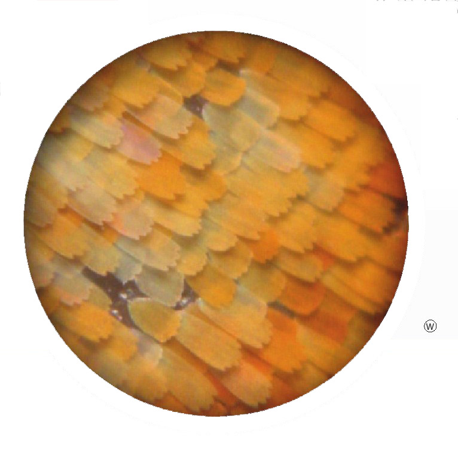
在显微镜下，蝴蝶翅膀上的鳞片犹如屋顶上的瓦片一样，有序而整齐地排列着。鳞片是由表皮细胞产生的，其表面凹凸不平，形成有一定规律的细微纹理。当光线照射在鳞片上时，自然会产生反射、折射等光学现象，从而使鳞片表现出各种不同的颜色。这种由物体表面的物理结构导致光线产生反射、折射而呈现出的各种颜色叫作结构色，结构色不会因时间的久远而褪色。当然，鳞片本身可能也含有一些色素，使鳞片自身也表现出一定的色彩，这种由色素产生的颜色叫作色素色，色素色会随时间的推移逐渐褪色。蝴蝶的色彩主要是由结构色来决定的，所以很久以前的蝴蝶标本，其色彩还是很鲜艳的。

## 为什么小飞虫总爱在灯下飞来飞去

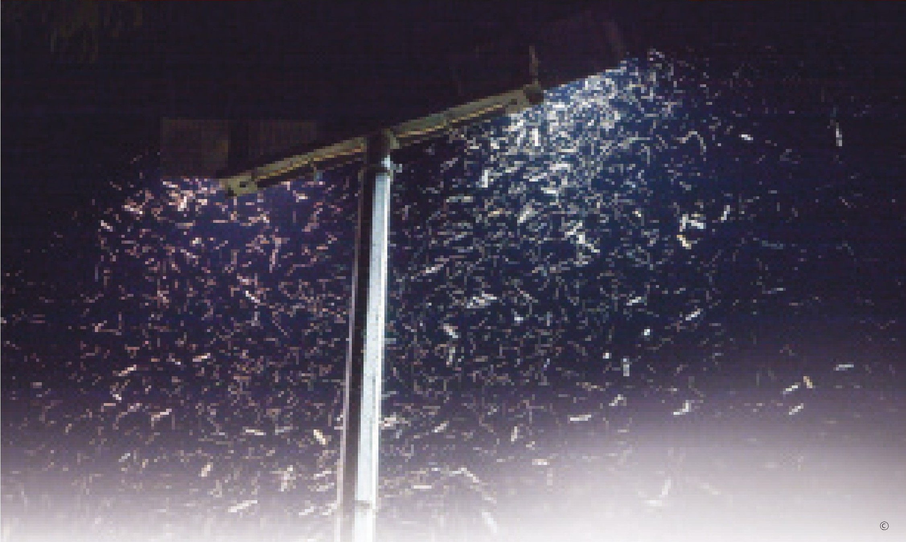
夏日的夜晚，路灯下总是有很多小飞虫飞舞，为什么小飞虫总爱在灯下飞来飞去呢？许多夜行性昆虫如夜蛾、金龟子等都具有趋光性，晚上哪里有光，它们就往哪里飞，成语“飞蛾扑火”指的就是这个现象。

对于这种现象的解释目前还没有明确的定论。通常认为，飞蛾等昆虫在夜间飞行时，是依靠月光来判定方向的，月光是夜行性昆虫夜间活动的“导航器”。当昆虫飞入人类活动的区域，遇到比月光更亮的灯光时，就会被这些灯光吸引，用这个假“月光”来辨别方向。月亮距离地球非常遥远，昆虫只要保持同月亮的固定角度，就可以使自己朝一定的方向飞行。可是，灯光距离飞虫很近，飞虫依然会本能地使自己保持着原有固定的角度飞行，于是就出现了飞虫晚上绕着光源转圈飞行的现象了。

有些人可能有这样的疑问：既然飞虫喜欢绕着灯光飞，说明它们喜欢光线，那么它们为什么不在白天出来活动呢？原来，这类似于人类中的“雪盲现象”，这与蛾类特殊的复眼结构有关。蛾类复眼的每个小眼要比蝶类的长，因此周围环境的光线在射入每个小眼的同时还可侧射或折射到邻近的小眼，从而造成小眼对光线的重复接受，过量的光线进入眼睛，反而使蛾子看不清物体。白天的光线对于蛾子实在太强了，如此一来，蛾子就不会在大白天出来活动了。（殷子为　李利珍）

  

**【实验场】**蛾子与蝴蝶

蛾子和蝴蝶都是鳞翅目昆虫，外形很相似，粗看不易识别。仔细观察，两者在身体构造和生活习性上还是有很大的区别。蝴蝶一般身体纤细，体毛少，翅膀上常有多种色彩，而蛾子体形丰满，体毛多，翅膀一般比较暗淡；蝴蝶的触角端部是膨大的（棒槌状），而蛾子的触角通常是向端部逐渐变细的（丝状或羽毛状）；蝶蛹无茧，蛾蛹常有茧，如蚕茧；蝴蝶一般在白天活动，而蛾子多在晚上活动。此外，在停息时，多数蝴蝶的翅膀竖立，而多数蛾类的翅膀则平铺。现在你能区分了吧？

【微问题】同一盏路灯下，为什么有的晚上飞虫很多，而有的晚上却很少？（提示：注意天气情况）

【关键词】变态发育　完全变态　不完全变态　飞蛾扑火

## 屎壳郎为什么喜欢滚粪球

夏秋时节，喜欢外出游玩的人们有时会看到一只或数只黑色的甲虫，头部着地，后腿上举，吃力地向后推着一个比自己身体大好多的粪球。这是什么昆虫？它们要把粪球推到哪里？原来，这就是人们常说的“屎壳郎推粪球”。

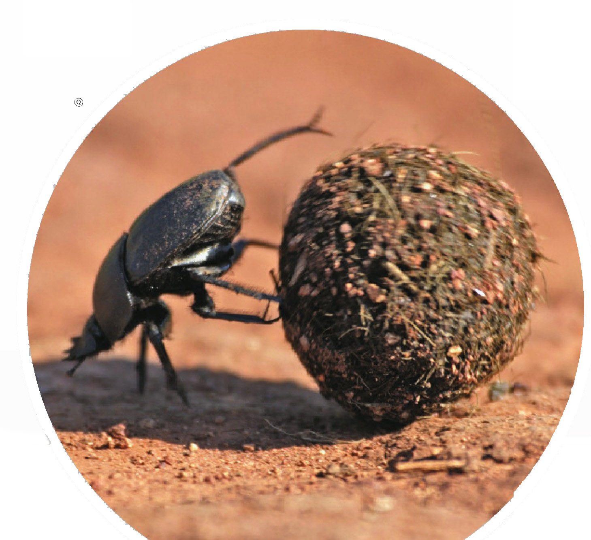
屎壳郎是鞘翅目蜣螂科昆虫的俗称，其中一些种类（如裸蜣螂属）具有滚粪球的习性。这些蜣螂具有很强的嗅觉和飞行能力，能在第一时间找到牛、马等动物的新鲜粪便，然后用强有力的铲刀状额头和3对健壮的足反复搓揉粪便。不一会儿，潮湿的粪便就被揉成一个粪球。随着屎壳郎的推动，粪球也变得越来越圆。屎壳郎推粪球时，有独自一个推的，也有雌雄配合共同推的。

屎壳郎为什么要推粪球呢？这与它们特殊的繁殖方式有密切关系。屎壳郎的幼虫需要吃粪便才能正常生长发育，成虫只有将卵产在粪便上，才能保证孵出的幼虫有可口食物。为了给自己的宝宝营造一个安全而隐蔽的场所，成虫首先需要将发现的粪便转移到一个安全地方，然后将卵产在其中，最后挖一个坑将带卵的粪便掩埋起来。这样，孵出的幼虫不仅安全，而且有充足可口的食物供给。可见，屎壳郎推粪球是为了给自己的后代准备食物。

屎壳郎把粪球推到一处安静而隐蔽的地方后，雌成虫便用头上的角突和带齿的足，把粪球下面的土逐渐挖开，粪球也随之不断下沉到土中，直到粪球完全被土掩埋。一切就绪后，雌成虫在粪球的顶端挖一小洞，并在洞中产下卵，然后沿着土洞慢慢往上爬，每向上爬一段，还要把松土踏实，直到最终爬出洞来，在洞外担负警戒任务的雄成虫见大功即将告成，也会协助雌虫一起用足蹬、用腹部压，直到洞口变得与周围土壤完全一样时，才算完成了一次生儿育女的重任。

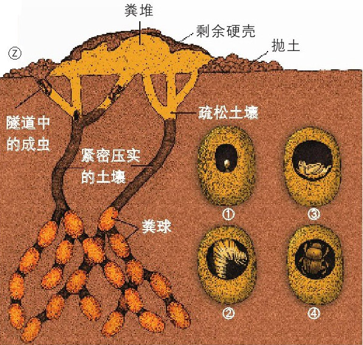
一种屎壳郎虫道

事实上，并不是所有的蜣螂都会滚粪球。自然界中，只有少数蜣螂种类进化出这项本领。绝大多数的蜣螂（如常见的神农洁蜣螂、嗡蜣螂属种类等）往往采取就地挖洞的方式，把粪便直接埋入地下，然后将卵产在其中。滚粪球的蜣螂通常都有长长的后腿，所以你只要观察一下它后腿的长短，就能知道它是不是会滚粪球的蜣螂了。

也许有人认为屎壳郎很脏，不喜欢它们，可它们却是自然界中不可或缺的清道夫。众所周知，澳洲是有袋类动物的天堂，英国殖民者到达后，把牛、羊等家畜引进了澳大利亚，并大量繁殖起来。屎壳郎虽然食粪，但对粪的口味却十分讲究。澳洲土产的屎壳郎只吃袋鼠等有袋类动物的粪便，而对牛、羊等家畜的粪便并不感兴趣。这样一来，这些家畜的粪便常臭气熏天地堆积在草场上。积累的粪便吸引了大量的蚊蝇滋生，给环境带来了很大的污染。为了解决这一问题，澳洲政府想到要从国外引进专门消化牛羊粪的屎壳郎“外援”前来帮忙。于是，连同中国的屎壳郎——神农洁蜣螂在内的数十种屎壳郎远渡重洋，在澳洲安家落户成了“移民”的甲虫，把那边的家畜粪便分解得一干二净，解决了当地一大环境难题。（汤亮　李利珍）

## 为什么独角仙头上会长角

独角仙体形庞大，头部长有犀牛角状的突起，很威武，是甲虫家族中的“巨无霸”。独角仙的名字也正是来源于雄性头部伸出的长角状突起。虽然长相勇猛，独角仙却是个纯粹的素食主义者。在野外，它们的成虫大多以树木伤口处流出的汁液或熟透的水果为食。那么，它们头上的长角有什么用处呢？原来，雄性独角仙为了争夺食物和配偶，常常会发生争斗，这些角便成为雄性独角仙打斗时的有力武器。它们会互相推搡，试图把头上的犄角插到对方的腹部下面，将对方掀翻在地。力气小的一方被掀翻后，知道实力不济，便会乖乖离开了。雄性独角仙头上的角是在长期进化过程中因激烈的种内竞争而演化出的“武器”。

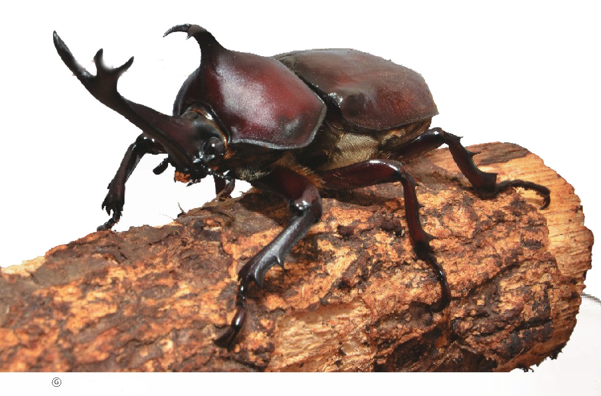
独角仙

自然界中除独角仙外，还有另一类昆虫也不能不提，那就是外表凶悍的锹甲了。锹甲是鞘翅目中的一类特殊昆虫，雄性个体的上颚大而突出，而雌性则正常。雄性强有力的上颚主要用于雄性之间的打斗，以便争夺交配权。巨大的上颚能夹住对手的身体，将其掀翻在地。野外抓到的雄性锹甲，有时背部会有齿状的伤痕，这些都是锹甲争斗时，对手留下的牙印。值得一提的是，锹甲也好，独角仙也好，它们都是植食性昆虫，性情温顺，不会对其他小型动物形成威胁，因此深受小朋友喜爱，不少人还把它们当宠物来饲养。（汤亮　李利珍）

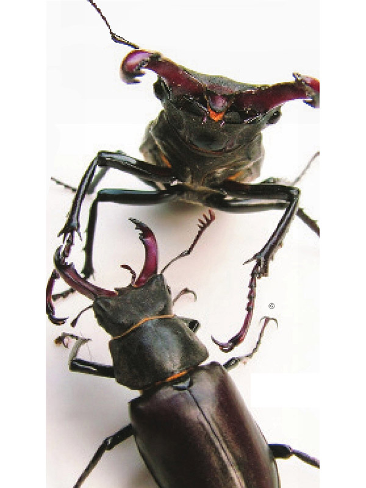
两只锹甲正在厮杀

  

**【实验场】**饲养独角仙

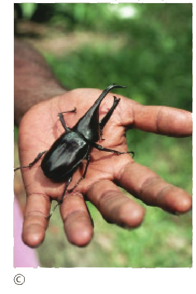
独角仙的饲养并不困难。先准备一个箱子，内铺腐殖土（即发酵木屑，网上均有其制作方法和成品出售）。腐殖土的湿度控制在用力捏后可以成形并裂开，而又不会有水滴下为好。箱子底部铺上用力压紧至约10厘米厚的土层，上部覆盖10厘米相对较松的土层。土层表面铺适量树皮、树枝，防止成虫翻倒后无法起身。可以用果冻或者局部微烂的苹果块饲喂成虫。将雌雄独角仙共同饲养几天后，即可将雄虫取出，让雌虫独处，安静地产卵。通常一个月后，就可在箱子底部观察到独角仙幼虫的活动痕迹，此后需不断补充食物。独角仙幼虫3龄时食量剧增，需减小幼虫密度，并根据粪便判断更换食物的时机，一般每隔1～2个月需更换大半箱腐殖土。幼虫化蛹时，需保持土层至少10厘米厚度，并减少干扰。待化蛹成功后，及时将蛹室上端打开观察，独角仙一般都可以顺利羽化。

【微问题】你知道还有哪些昆虫演化出了“独门武器”？

【关键词】屎壳郎　繁殖　独角仙　锹甲

## 蜻蜓为什么要点水

夏日里，我们在湖泊、溪流、池塘等有水的地方时常会看到蜻蜓在水面上缓缓飞行，还不时用尾部触及水面，激起一个又一个的小水圈，似乎玩得很开心。那么，蜻蜓为什么要“点水”呢？难道真的是为了好玩吗？这还得从蜻蜓的繁殖行为谈起。

蜻蜓属于半变态昆虫，即成体生活在陆地上，幼体生活在水中。为了区别于其他昆虫的幼虫，人们给半变态昆虫的幼体起了一个特殊的名字——稚虫。成虫和稚虫的生活环境完全不同，一个在陆地，一个在水中，因此成虫只有将卵产在水中，才能保证孵出的稚虫有一个适宜生活的环境，产在陆地上的卵是不能孵化的。我们在水边看到的“蜻蜓点水”现象，正是蜻蜓成虫的产卵行为。

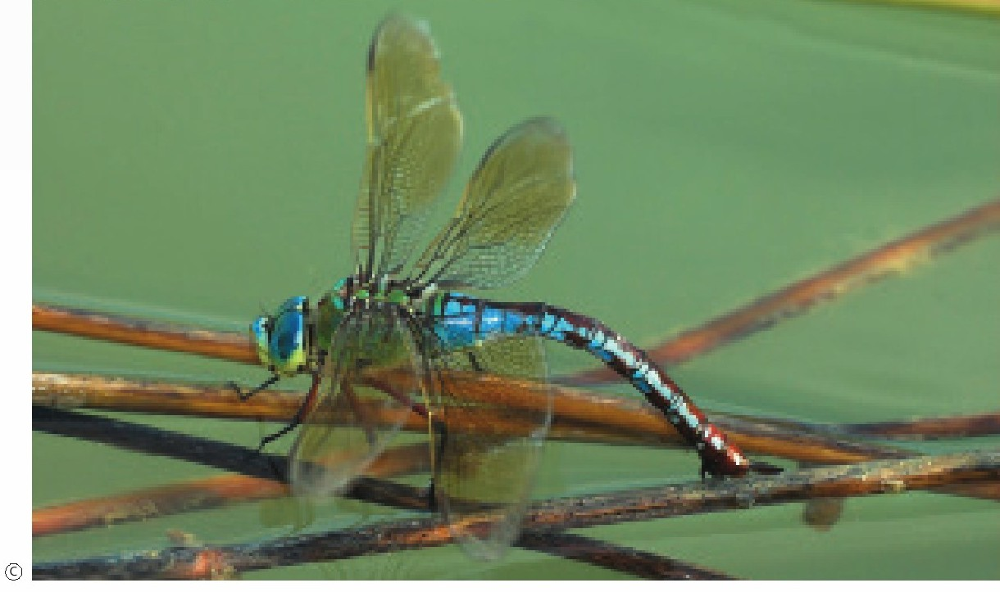

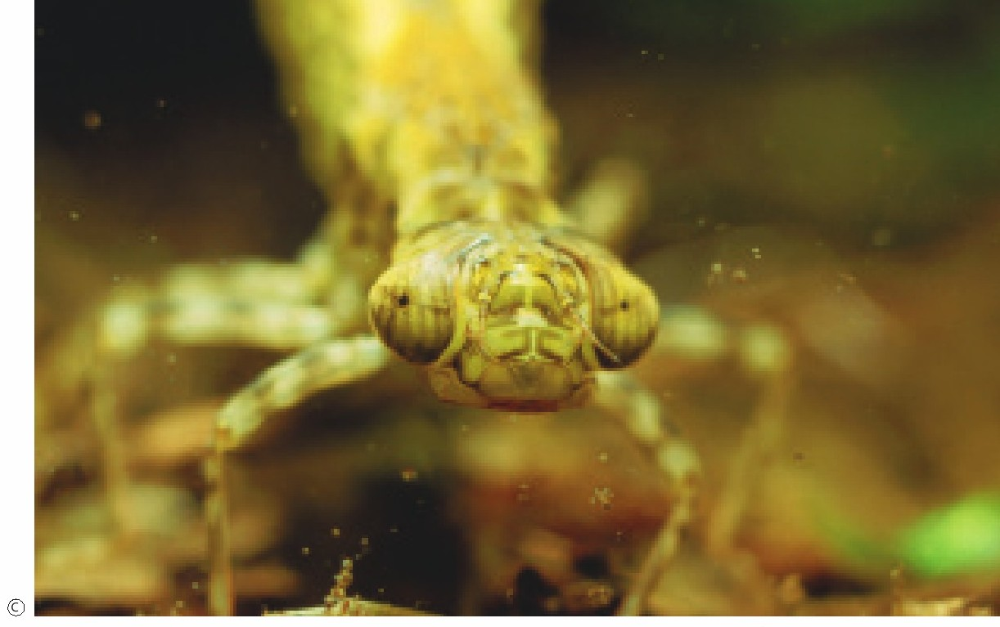
蜻蜓稚虫

蜻蜓有发达的复眼，通过观察水面形成的反光来寻找水环境，进而完成产卵。但过分依靠视觉的蜻蜓有时也会犯错，汽车外壳等光滑的物体表面有时也会产生类似于水面产生的反射光，而蜻蜓妈妈全然不知，居然也前来“点水”产卵，这些生错地方的可怜“孩子”在无水环境中自然也就夭折了。

并不是所有蜻蜓都具有点水产卵的习性，有这一行为的主要是一部分蜻科的种类，如黄蜻。其他蜻蜓则通过另外的方式将卵产在水中。常见的玉带蜻在产卵前会寻找合适的水面漂浮物，如树枝、木段等，先停息在漂浮物上，然后将卵产于漂浮物水下部分的表面。大蜓科种类采取的是另外一种产卵方式，它们常沿着林下的溪流穿梭，寻找浅水山涧，发现合适地点后，成虫便悬停在水面上，身体向下弯曲，以几乎与水面垂直的角度，将腹部反复多次插入溪流底部的泥土中产卵。雌性大蜓腹部末端具有尖锐而有力的产卵器，能轻而易举地将腹末插入水底的土表层中完成产卵。蜓科的一些种类则借助于水生植物产卵，成虫将腹部伸入水下，并刺入植物的茎干内，然后将卵产在其中。一些豆娘甚至可以潜水，沿着水生植物爬入水下，将卵产在植物的茎干中。产于美洲的瀑布豆娘甚至能够飞入瀑布，将卵产在瀑布内的石壁上。蜻蜓妈妈为了给自己的后代一个良好的水生环境，真可谓费尽千辛万苦啊！（殷子为　李利珍）

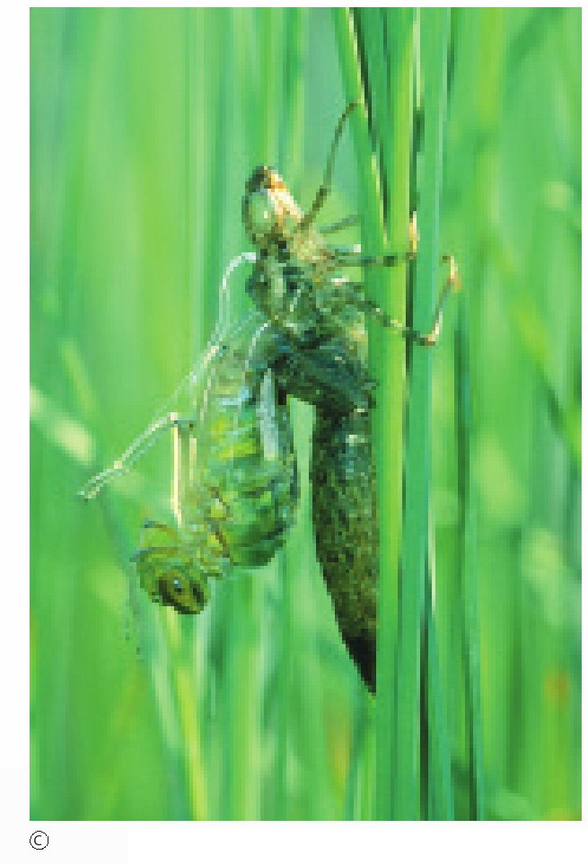
华丽的转变——从稚虫蜕化为成虫

## 水黾为什么能在水面上行走自如

公园通常是人们喜欢去的好地方，当你漫步在美丽的湖边，或是坐在湖边的长凳上与朋友呢喃细语的时候，会看到幽静的湖面上有这样一类小昆虫，它们有着苗条的身材，修长的腿脚，身穿黑褐色的“礼服”，犹如一艘艘“迷你小舟”，在水面上风度翩翩地滑来滑去。你知道那是什么昆虫吗？它们为什么能轻而易举地在水面上滑行而不会沉入水中呢？

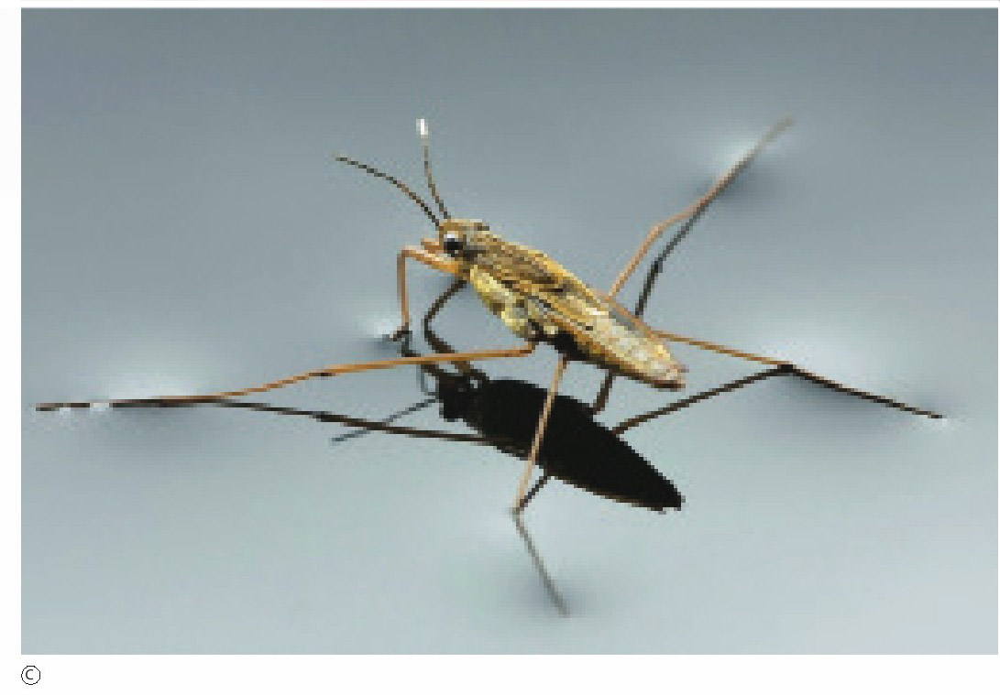
原来，那是一类专门适宜在水面上生活的半翅目昆虫——水黾。研究表明，水黾的浮力来自它们的3对特殊结构的足，在足的表面生有许多微毛，微毛表面有疏水性的油脂包裹，这种结构的足在水表面张力的作用下产生浮力，可以支撑起水黾瘦小的身体，从而使它能像船那样平稳地漂浮在水面。2004年中国科学家发表在《自然》杂志上的一篇文章提供了水黾浮力的另一种解释，即水黾的足上有数以千计分层排列的微刚毛，这些刚毛的直径小于3微米，并在表面形成螺旋状纳米结构的沟槽。这些沟槽能够吸附空气形成一层稳定的气垫，从而使水黾能够浮在水面上，即使是下雨或急速流动的水流也不会使它们沉没。水黾是肉食性昆虫，在水面上滑来滑去主要是觅食，取食在水面活动的其他昆虫或小型动物。（殷子为　李利珍）

## 龙虱为什么能在水中呼吸

我们知道，昆虫都是用气管来呼吸的，吸入空气中的氧气。可是像龙虱之类的生活在水中的昆虫是如何呼吸的呢？难道它们不是用气管呼吸而像鱼那样用鳃呼吸吗？

龙虱是鞘翅目龙虱科昆虫的统称，它们和其他陆地昆虫一样，也是用气管来呼吸的。它们之所以能在水中呼吸是因为具有特殊结构的翅膀：鞘翅完全革质化，膜质的后翅隐藏于革质的鞘翅之下。当龙虱活动至水面时，能将空气储存于鞘翅之下，形成气泡。下潜时，这些气泡随同龙虱一起被带入水中，这样龙虱便可通过获取气泡中的氧气进行呼吸。随着气泡中氧气的消耗，氧分压慢慢变低，水中的水溶性氧分子便可通过气泡膜而扩散至气泡中，这样龙虱便可继续利用气泡中扩散进来的氧气完成呼吸。通过这一机制，龙虱只需换一次气就能在水中潜伏很久。值得注意的是，龙虱只生活在含氧量高的水体中，否则非但无法将水体中的氧交换至气泡内，其自身所携带的气泡内的氧气反而会扩散到水中。除龙虱外，其他水生昆虫还采用一些别的呼吸方式，如田鳖的腹末有一条长长的呼吸管，能伸出水面吸入空气中的氧气。（殷子为　李利珍）

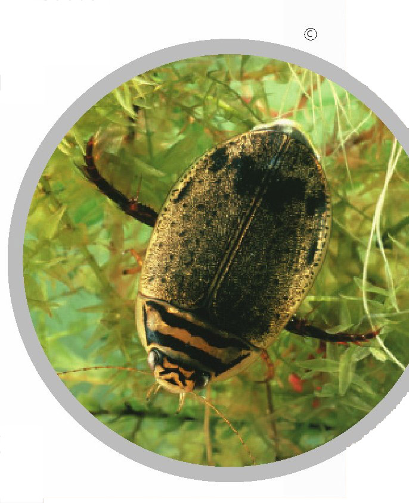
  

**【实验场】**给水黾洗脚

夏天，在池塘采集几只在水面划行的水黾，放在盛有清水的盆里，仔细观察它们是如何用长足划水的，并用放大镜观察其足底如刷子样的刚毛。用滴管将水珠滴在刚毛上，水珠马上被弹开了。用毛笔蘸上肥皂水将水黾的足洗干净，再次滴上水珠，刚毛则被粘到了一起。此时再把水黾放进水盆里，水黾很快就沉到水底。也可试试用洗涤剂、食用油、牛奶、果汁等，是否都有相同的结果。思考一下：污染的水体会对水黾产生什么后果？

【微问题】不同的水生昆虫对水质好坏的敏感程度不同，你能筛选出几种对水质污染敏感的昆虫用于水质监测吗？

【关键词】蜻蜓点水　产卵　水黾　浮力　龙虱　水溶性氧分子

## 萤火虫为什么会发光

夏季夜晚，我们偶尔会惊喜地发现在路边叶片上或在空中有数个黄绿色的光点，忽明忽暗，闪烁不停，就像星星飞到了我们身边，这些光点就是著名的萤火虫。

萤火虫通常是指鞘翅目萤科的昆虫，全世界已知2000多种。萤火虫最为著名的莫过于它们会发出光亮，不仅成虫能发光，卵、幼虫、蛹也都能发光。不同种类甚至不同性别的萤火虫发光的颜色各不相同，有绿色、黄色、橙色等，并且闪烁的频率也不一样。我们身边稍常见的萤火虫有窗萤、端萤、弩萤等。萤火虫发光的秘密在于它们身上一个特殊的构造——“发光器”。它位于萤火虫腹部末端的腹面，主要由大量发光细胞组成，还有反光细胞、神经等辅助结构。发光细胞中有两类对发光起关键作用的化学物质：一类叫荧光素，另一类叫荧光酶。荧光素在荧光酶的催化下利用萤火虫体内的能量物质（腺苷三磷酸，即ATP）与氧气发生反应，使化学能转化为光能从而激发出光子，形成肉眼可见的亮光。萤火虫的光色不同，主要是它们所含的荧光素和荧光酶各不相同。

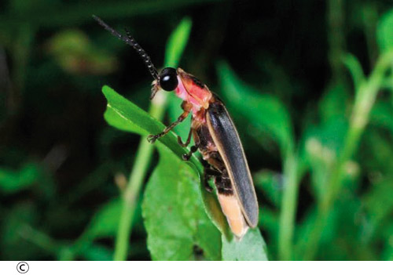
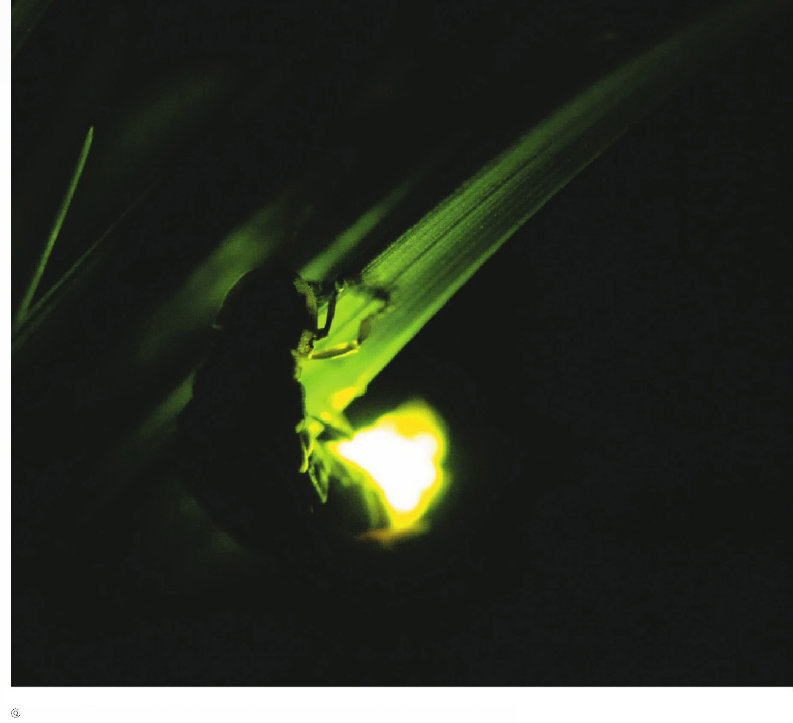
萤火虫为什么要发光呢？原来，这些闪烁的亮光是萤火虫们的特殊语言，传递着有用的信息。不同频率的信号有着不同的含义，有些可以吸引异性，有些可以在同伴间相互联络，有些则起到警告敌人的作用。

在环境较好的地区，有时能出现萤火虫极为壮观的集体发光求偶的现象：成百上千的萤火虫同时闪烁亮光。夜幕降临后，少数雄萤火虫先发出闪光信号，周围的同伴积极响应，很快附近的雄萤火虫都会加入发光队伍。而雌萤火虫在一旁静静地观看或者也发光回应。最后，通过反复发光交流，萤火虫们最终结成一对对伴侣。不同种的萤火虫发出的光以及闪烁频率是有所区别的，因而萤火虫不会找错对象，也避免了种间的杂交。不过在北美洲，有一种大型萤火虫的雌虫，可以模拟另一种小型萤火虫雌虫的光亮和频率来引诱对方的雄虫。上当的小型萤火虫雄虫兴冲冲赶来准备交配时，就不幸沦为前者的食物了。

除了萤火虫，会发光的昆虫还有不少。在澳大利亚的塔斯马尼亚和新西兰怀托摩地区的一些洞穴中，人们能有幸观察到世界上最为奇妙的奇观之一——洞穴内的“星空”。原来这些洞穴中生活着一类被称为菌蚊的昆虫。它们的幼虫会发出蓝色的荧光，当生活在洞穴顶部的幼虫一起发光时，神奇的“星空”便出现了。这些星光对人类来说是美丽的奇景，但对洞穴内生活的其他昆虫来说却是美丽的陷阱。菌蚊幼虫会分泌出很多长达30～40厘米且布满黏液的丝线。当一些趋光的昆虫被光引诱飞来时，就会被丝线牢牢地粘住而成猎物。此时的幼虫便会熄灭蓝光，饱餐一顿。

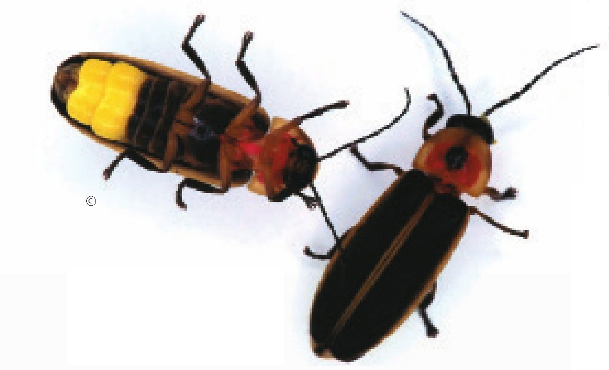
萤火虫的背面（右）和腹面（左）。从腹面，我们可以清晰地看到萤火虫发光的关键部位

热带南美洲有几类叩头甲也会发光。一类在它们的前胸背面有两个卵圆形点状发光器官，发出浅绿色的光，形似汽车前灯；另有一类则在腹部末端的腹面有一个心形发光器官，在飞行时会发出橙色亮光。此外，分布于美洲的光萤科昆虫的幼虫和雌性成虫、分布于中国和东南亚地区的光萤科昆虫的雌性幼虫也会发光。（胡佳耀　李利珍）

## 为什么萤火虫发出的光很亮，自己却不会被灼伤

萤火虫依靠发光细胞中的化学反应来发光，这种反应的发光效率非常高，可达95%。也就是说，反应中释放的能量几乎全部转换成了光能，只有极少部分以热能的形式释放。因此萤火虫发光时的温度很低，是一种天然高效的冷光源。与之形成鲜明对比的是人类使用的白炽灯，只有约10%的能量被转化为光，剩余的能量都变为热能而被白白浪费了。看来在发光问题上，人类还得向萤火虫好好学习呢！

除了萤火虫的荧光，自然界还存在一种绿色荧光蛋白（GFP）。该蛋白质最早由日本科学家下村修等人在一种水母中发现，其基因所产生的蛋白质，在蓝色波长范围的光线激发下，会发出绿色荧光。2008年，美籍华裔科学家钱永健、下村修和美国科学家马丁·查尔菲因对该蛋白的发现、研究和改造共同获得当年的诺贝尔化学奖。（胡佳耀　李利珍）

  

**【实验场】**寻找萤火虫

萤火虫的成虫是夜行性昆虫。白天喜欢躲藏在潮湿多水的地方，如溪流、小河边的草丛里，夜晚外出活动，以蜗牛等软体动物为食。它们的幼虫因种类不同而有不同的习性，有陆生的，也有水生的。在公园、城市绿地、居民小区、大学校园等处都有可能找到萤火虫。到了夏天，同学们不妨找一下，看看身边有没有萤火虫活动。

【微问题】我们该怎么做才能让萤火虫回到城市中来？

【关键词】萤火虫　发光细胞　荧光素　荧光酶　冷光源　发光菌蚊

## 蜜蜂为什么要酿蜜

蜜蜂是以取食花粉为生的昆虫，然而自然界的植物开花是有季节性的，每当冬季来临，作为蜜源的花朵就会大量减少甚至完全消失。为了在冬天不至于挨饿，蜜蜂必须把平时采集的花粉储存起来，而新鲜的花粉不可能长期存储，只有将花粉酿制成不易变质的蜂蜜储存起来，才能满足日后蜜蜂自己及繁育后代的需要，这同农家将新鲜蔬菜加工成咸菜、泡菜储存起来是一样的道理。

蜜蜂是如何采集花粉的呢？每只蜜蜂每天要外出采集花粉几十次，每次要探访几十甚至上百朵花，但采到的花粉即使装满了后足上的两只花粉篮也只够酿0.5克蜂蜜。若要酿上1千克蜂蜜，并假设蜂房距离蜜源植物为1千米的话，一只蜜蜂大约要飞行4万千米，相当于绕地球整整一圈！当一只担当侦察任务的蜜蜂发现蜜源后，它会返回巢穴，并在家门口用“舞蹈语言”告诉其他同伴蜜源植物所处的方向和距离。如果附近有食物，它会跳相对简单的“圆圈舞”；如果食物在远处，则会跳更为复杂的8字形“摇摆舞”。“舞蹈语言”传达的信息包括到达蜜源所需的能量、蜜源的性质及相对太阳位置的方向等。领会含义的工蜂随后会一起出发采蜜。蜜源越近，蜜蜂的舞蹈节奏就越快。实验观察发现，最快的工蜂可在舞蹈信息发出5分钟之后找到最近的蜜源。

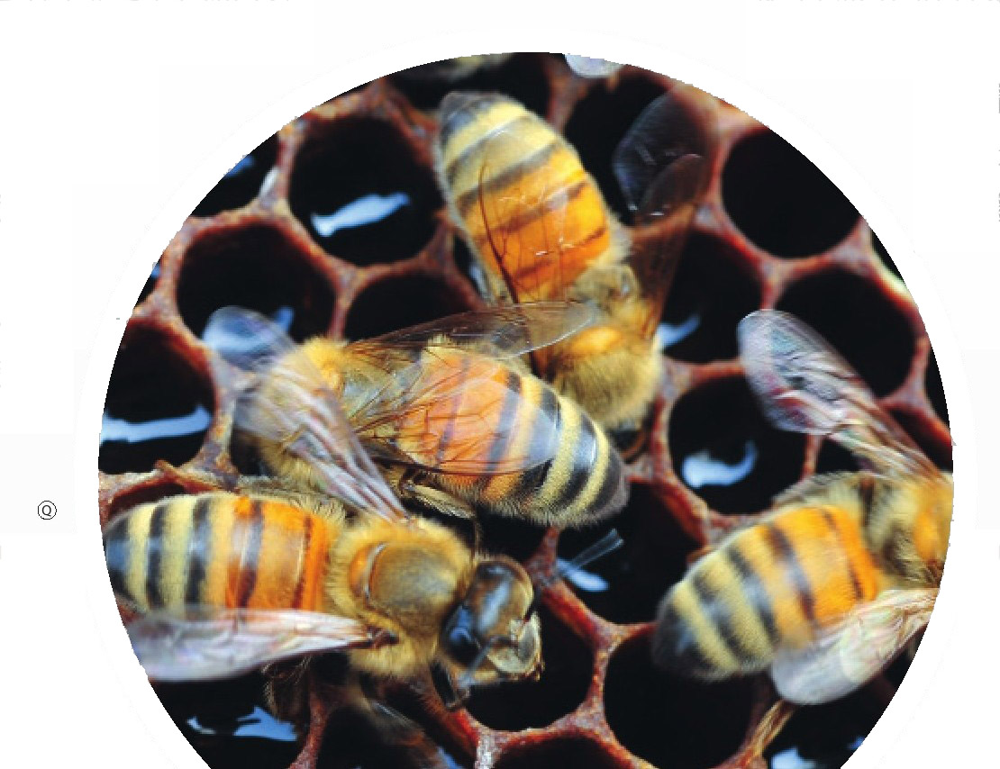
那么，蜜蜂又如何将采集的花粉酿制成蜂蜜的呢？首先，所有工蜂先把一天辛勤收集到的花粉集中在一个空的巢室中。到了晚上，工蜂们把花粉吞入胃中进行调制，然后再吐出来，再吞进去。如此反复几百次，就能将花粉酿制成蜂蜜了。人工饲养蜜蜂时，养蜂人会经常不断地从蜂巢中取走蜂蜜，造成蜂巢中的蜂蜜始终处于匮乏状态，这样，只要蜂巢周围有蜜源植物存在，工蜂就会不停地出去采集花粉，酿制蜂蜜。

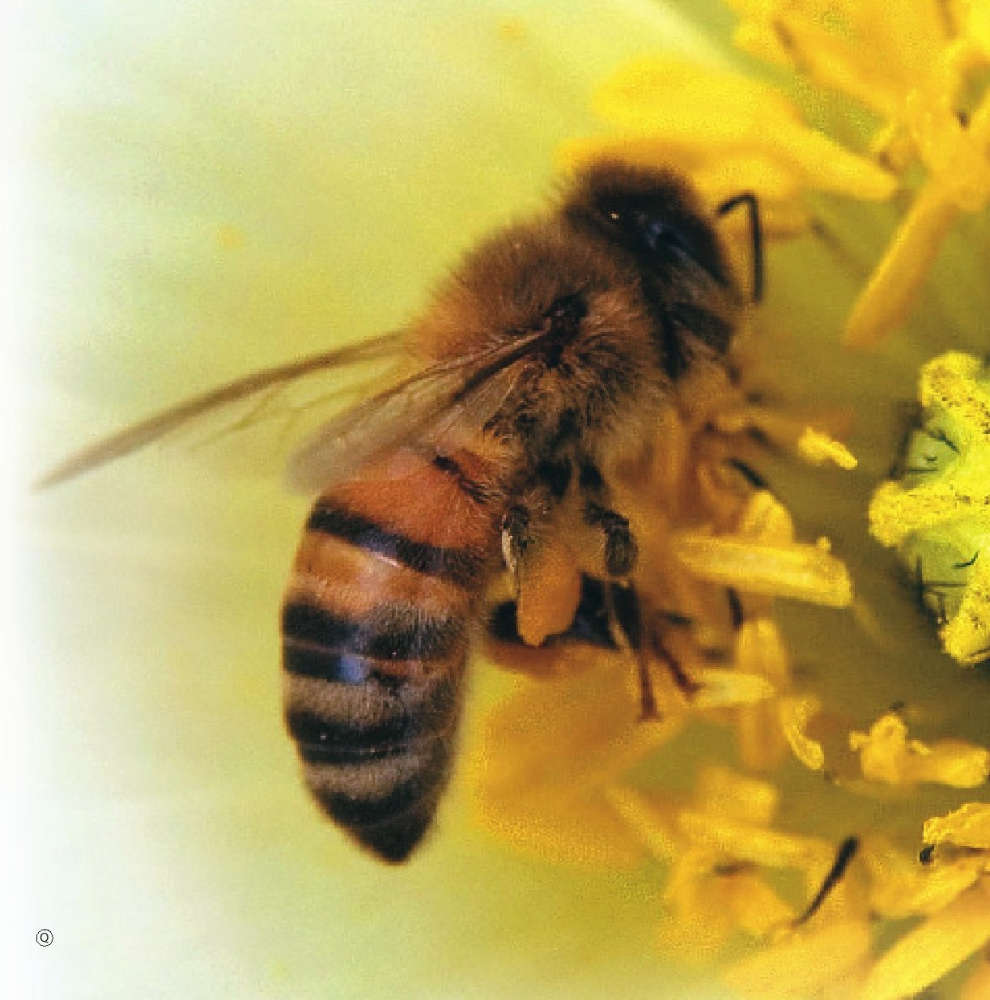
蜜蜂采集花粉主观上是为了获取食物，以满足蜜蜂自己生存的需要，但采集花粉需要在大量的花朵之间不停地穿梭，这一行为过程客观上为异花授粉的植物充当了传播花粉的使者，从而使这些植物得以正常地结出果实种子。世界上有2万多种蜜蜂，全部是喜花的。蜜蜂和花朵在长期的演化中配合默契，互利共生。依赖蜜蜂传粉的植物经常有鲜艳的（黄色或蓝色）、香甜的花，花瓣上具有肉眼看不见的蜜标线，能把传粉昆虫引导到花朵上。蜜标线只能在紫外光下可见，这是自然界物种之间协同进化的最好典范之一。

蜜蜂传粉浪费花粉少，要比风媒传粉的效率高得多，是最重要的传粉昆虫。蜜蜂酿蜜主观上不是为了“香甜满人间”，但客观上却在为人类造福。除蜜蜂之外，还有其他蜂类，如熊蜂、黄蜂，蚂蚁类，蝶蛾类，蝇类，甲虫类和蓟马类等大量昆虫也为植物提供传粉服务。据权威估计，全世界的传粉昆虫每年直接和间接为人类创造的价值高达1000亿美元！（殷子为　李利珍）

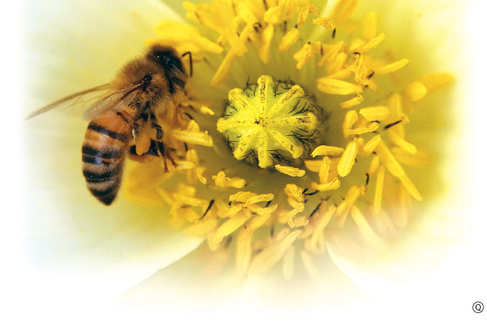
## 无花果为什么也能结出甜美的果实

我们常见的无花果是一种榕树的隐头果实。榕树虽是有花植物，但它的花很小，肉质花序轴向内卷曲成球状的花托，被称为“隐头花序”。深藏的小花，既没有艳丽的色彩，也没有芬芳的香气，而且全部被包裹在了膨大的完全封闭的花托之中，形成隐头果，无法吸引任何传粉昆虫进入其中。然而，这个看似天衣无缝的花托还是留了一个小孔与外界相通，这是为无花果的专一传粉者——榕小蜂量身定制的。

雌性榕小蜂通过小孔进入榕树的隐头果内，给位于球状腔内的雌花授粉，并在其中的一些短柱头雌花上产卵后便死亡。卵孵化出的小蜂幼虫在花的子房内与植物同步发育，形成虫瘿花；未被产卵的长柱头雌花则形成无花果种子。大约产卵后一个月，无翅的雄蜂从无花果的虫瘿中羽化，并与仍在无花果子房内的雌蜂交配。完成交配后，雄蜂死亡，雌蜂从无花果实的小孔中飞出来，离开成熟的无花果去寻找另一处适合产卵的同种榕树，生儿育女，繁衍后代。为了吸引榕小蜂入驻，需要授粉的榕树会释放一种独特的挥发性化合物，只允许大小和形态适宜的榕小蜂进入其中；而榕小蜂细扁的头胸部和长满细刺的大颚和后腿，为它钻进小孔提供了便利。经过榕小蜂的传粉，“无花”的榕树才得以结出无花果，无花果子成熟后，以它的色彩和芳香吸引食果动物，如鸟类、蝙蝠、蜥蜴和猴子等，在这些动物取食的同时，它的种子获得了传播。“一树一世界”，一棵榕树养活了众多的动物，榕树因此成为热带雨林的关键物种。（殷子为　李利珍）

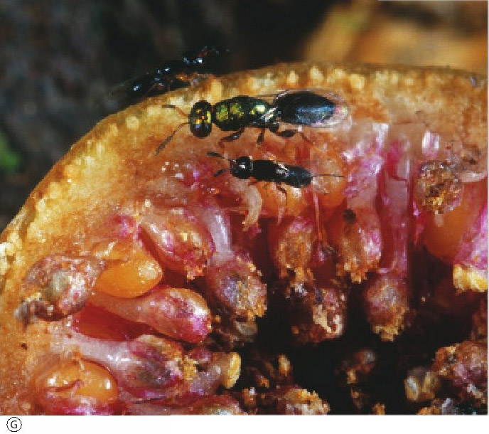
协同进化——无花果与榕小蜂

  

**【科学人】**卡尔·冯·弗里施

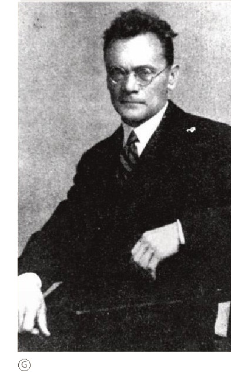
德国动物行为学家，1973年诺贝尔生理学医学奖得主。他对蜜蜂行为长达50年的出色研究，为我们揭开了蜜蜂的通信密码。

弗里施（1886-1982）博士用最直观的方法，在蜜蜂的前胸背板上作标记编码，坚持不懈地进行实验观察，并拍成黑白电影让更多的人观察，蜜蜂是如何将看不见的舞蹈语言转换成闻得着的鲜花香味。

一开始很多人都难以相信蜜蜂具有这么奇妙的沟通能力，不过，在生物界争论了约10年后，最终证明弗里施的发现是正确的。

【微问题】近十几年来，自然界的野生蜜蜂种群数量越来越少。有人说，没了蜜蜂，人类将只能存活4年。你认同这种说法吗？

【关键词】蜜蜂　酿蜜　授粉　无花果　榕小蜂　协同进化

## 为什么土壤中有那么多昆虫

土壤中生活着许多种类的蚯蚓，这是世人皆知的。但是，你也许不知道，土壤中还生活着大量的昆虫，如跳虫、原尾虫、双尾虫等形态各异、色彩斑斓的土壤昆虫。那么，为什么我们没有看到它们呢？那是因为它们的个头都很小，大多数体长只有1～2毫米，有的甚至只有半毫米长，很容易躲在土壤颗粒之间的缝隙里面，需要借助放大镜或显微镜才能看到。

土壤昆虫种类繁多，数量庞大，仅跳虫这一类，目前全世界已经发现了8000多种，在温带阔叶林，每平方米的土壤中就生活着多达10万只跳虫。它们在土壤颗粒形成的天然“走廊”里钻来钻去，发现最喜欢的真菌菌丝、凋落的树叶，就美餐一顿，有的种类还喜欢“喝”一点植物细根上的汁液。幸运的是，它们的体形都不大，食量小，不会给人们带来危害。相反，枯叶经过它们的嘴巴粉碎后，就可以加快分解，有助于增加土壤肥力。

在大雨过后，仔细查看树林中的树干或者裸露的石块，你就会发现有一些鲜红色的、橙黄色的、亮蓝色的或紫色带斑纹的白白胖胖的小虫子在上面爬动，这些小精灵就是跳虫。因为土壤里面的水太多了，为了不被“淹死”，它们只好爬到树上躲一躲，等天一放晴，又会回到地下乐土中去。

除了跳虫，原尾虫和双尾虫也是赫赫有名的土壤昆虫，它们身体细长，却都没有眼睛。原尾虫的身体微小，只有0.5～2毫米长，主要以土壤真菌的菌丝为食。双尾虫既有取食凋落枯叶的，也有捕食其他土壤昆虫的。

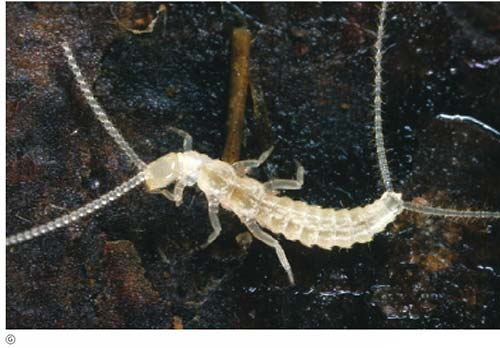
双尾虫

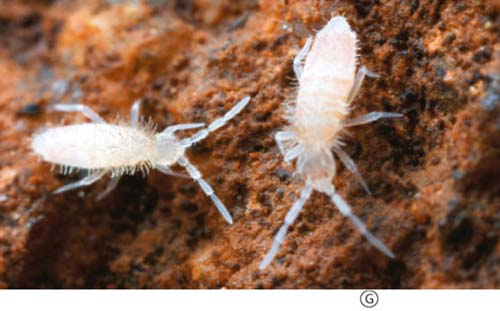
土壤中的跳虫

土壤中会有如此之多的昆虫，一个主要的原因就是昆虫的进化历史特别长。到目前为止，科学家发现的最早的一种昆虫化石，是生活在4亿年前的一种土壤跳虫。土壤环境变化多样，土壤种类、酸碱度、颗粒大小、植被、温度、湿度等细微的变化，都可以引起土壤昆虫的死亡或者改变，适应于变化环境的结果，使土壤昆虫进化出如此繁多的种类。更何况如此漫长的生命历史中，会有多少地震、山洪、冰川等的地质变化，因此就促生了种类如此繁多的土壤昆虫。（高艳　卜云）

  

**【实验场】**如何观察土壤昆虫

准备一个小筛子、一个小碗、一盏台灯和一把放大镜，你就可以轻松地观察到各种土壤昆虫了。怎么做呢？先去小区绿化带或者公园的树林里挖一小袋土壤带回来，用肉眼仔细看看，能不能看到土壤里面的昆虫，然后在小碗里加半碗水，把土放到小筛子上，再把加了土的筛子放到小碗上面，接着把碗移到台灯下面，打开台灯，让光对着土壤。过1～2小时后，拿掉筛子和土，用放大镜观察小碗的水面，是否有一些白色的小虫子在跳动。仔细观察，就可以找到土壤昆虫。

## 为什么在冰雪覆盖的北极仍有跳虫活动

在加拿大北部的冰原上，摄影家拍到很多灰黑色的小虫子。在个别温暖的天气里，它们会在阳光下跳跃，在白色的背景下特别显眼，这些小虫子也被称为“雪域跳蚤”。其实，它们不是跳蚤，而是一种在整个北美和北极地区都可以生存的土壤跳虫，能在-8℃气温下存活。2007年，科学家在这种跳虫的体内找到了两种非常特殊的抗冻蛋白，揭开了它们在北极存活的谜底。这两种抗冻蛋白含有让人纠结的结构，亲水结构和疏水结构。这两个结构，一方面想把水分子紧紧拥抱，另外一方面又想把它们远远推出，这就使得组织中的水分即使在很低的温度下也频繁活动，不至于结冰。这样就确保了跳虫的血液继续流淌，组织不结冰。这些特殊的抗冻蛋白在开发生物防冻剂，用于极端温度下的组织保存等方面，有着无限的应用潜力。（高艳　卜云）

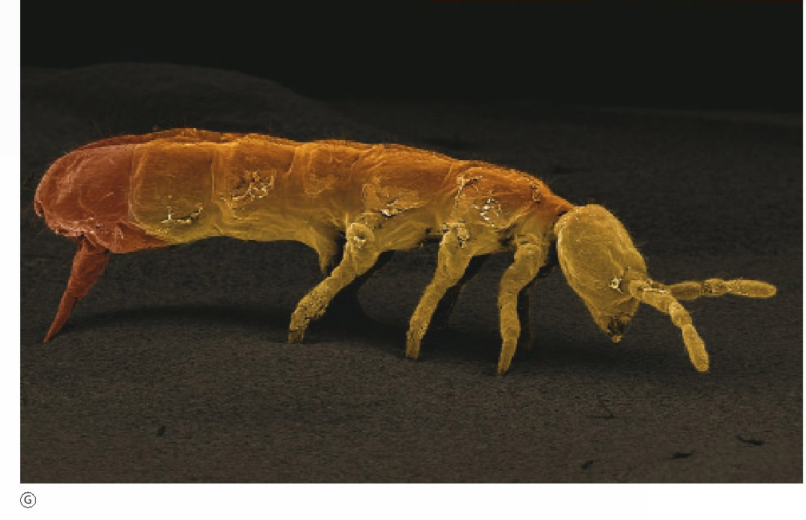
显微镜下的跳虫

  

**【微博士】**跳虫求偶时也会拥抱吗

“彼此依靠，相拥到老”是无数甜蜜恋人的美好愿望。孰知体长只有0.5～2毫米的小小跳虫，也会“相拥而笑，卿卿我我”。有些种类的雄性跳虫触角进化出特殊的抱握器，专门用于求偶时拥抱它的恋人。这些雄性跳虫发现它的心仪恋人时，就会排出精包，然后拥抱并引导恋人到达有自己精包的地方，完成交配受精。

**【科学人】**尹文英

1963年8月，从事鱼病研究的女科学家尹文英，在浙江西天目山休假。不经意中在一个砖块下发现了一些小虫，好奇的她拔下一根头发，蘸上口水，粘起这些小虫收集到指管里。她回到实验室，经过仔细研究，发现它们是国内尚无人研究过的原尾虫。从此她与这种土壤中的小虫子结下了不解之缘。在随后的50余年里，尹文英和她在上海昆虫研究所的同事们在中国发现并报道了200余种原尾虫，经过比较形态学、细胞生物学、发育生物学和分子生物学等全面的研究，建立了国际公认的原尾虫分类系统。正是因为在这个不起眼的“小虫子”的研究中取得的巨大成就，1991年尹文英被评为中国科学院院士。她也被同行赞誉为原尾虫研究中当之无愧的女爵士！

【微问题】土壤昆虫如何在黑暗的地下找到异性同伴？

【关键词】土壤昆虫　跳虫　雪域跳蚤　原尾虫

## 叩头虫为什么要“叩头”

如果你喜欢户外活动，经常参加爬山郊游，也许会在路边的树叶上或杂草中看到过这样一类小甲虫：身体扁平而瘦长，如果用手捏住它的腹部，它便会不停地“叩头”，还发出“咔咔”的响声。这是什么昆虫？它们为什么要“叩头”呢？

这就是叩头虫，属于鞘翅目叩甲科家族的成员。叩头虫之所以能“叩头”，其秘密在于它的前胸腹板向后伸出一个楔状突，中胸腹板的前方中央生有一个凹槽。当胸部肌肉收缩时，便会拉动前胸和头部向腹面弯曲，此时楔状突并没有直接插入凹槽中，而是顶在凹槽的前缘。当肌肉继续收缩时，楔状突在凹槽的边缘就会发生“打滑”现象，从而导致楔状突以很高的速度瞬间滑入凹槽中并发出响亮的撞击声，这样便完成了一次“叩头”。

那么，叩头虫为什么要叩头呢？叩头当然不是为了求饶，而是企图利用叩头的反作用力帮助自己挣脱敌手。有时候，叩头虫也经常用这个动作来翻转身体。在植株上活动的叩头虫，如果遇到危险或不小心从高处掉下来，仰面朝天躺在地上动弹不得，这是非常危险的事情，如果不能及时翻过身来逃走，就有被太阳晒死或被天敌吃掉的可能。强有力的“叩头”动作足以将它的身体弹得很高，再一次落地时也许就能幸运地背朝天了。

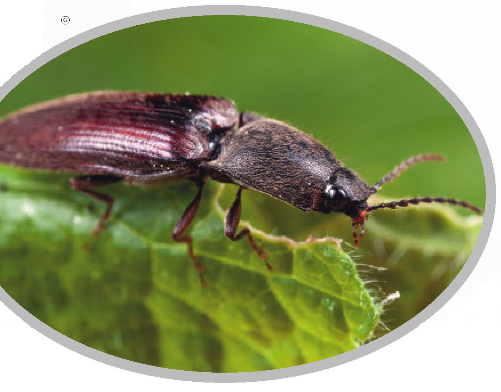
有些叩头虫的叩头绝技除了用来逃生，也是它们吸引异性的重要手段。每到求偶季节，雄性叩头虫会来到中意的对象面前拼命“叩头”，发出响亮的“咔咔”声，好像在说：“瞧，我多有力气，多强壮，嫁给我吧！”雌性叩头虫往往会选择“叩头”声最大的那位作为伴侣。（汤亮　李利珍）

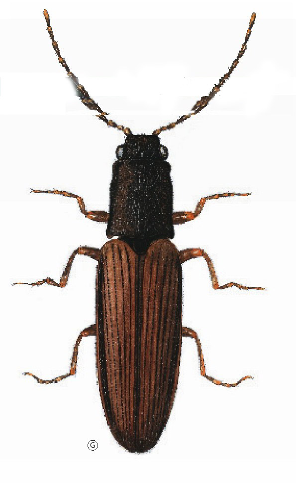
## 为什么跳蚤善于跳跃

除了叩头虫，自然界中还有一类善于蹦跳的昆虫——跳蚤。大家对大名鼎鼎的跳蚤一定不陌生，它们通常喜欢寄生在哺乳动物身上，以吸血为生。但跳蚤的出名不是因为它们吸食血液，而是因为它们有出众的跳跃能力。跳蚤的身体很小，一般只有0.5～3毫米，可是弹跳的高度却可以达到30多厘米。也就是说，它们的跳跃高度可达身长的100多倍！就好像一个人能轻易地跳上几十层的高楼。

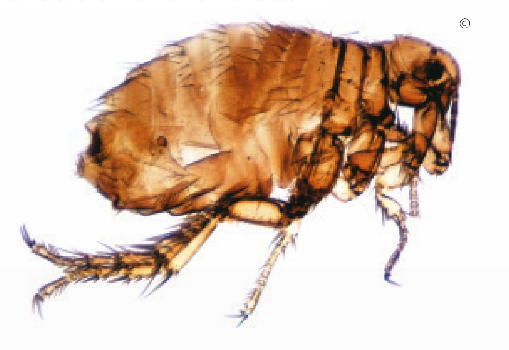
跳蚤跳那么高，掉下来会不会摔死呢？当然不会，因为跳蚤的身体非常轻巧，空气的阻力使它们落地的速度大大减小。而跳蚤的外壳又非常坚固，可以承受比体重大几十倍的重量，所以即使跳得再高，它也没有生命危险。

跳蚤怎么会有如此惊人的跳跃能力呢？原来，跳蚤的后足长度比它的整个身体还长，肌肉非常发达，而且还含有一种专门负责跳跃的蛋白质，可以促使后腿肌肉强有力地收缩，跳跃时能释放出巨大的爆发力，将整个身体弹射出去。

那么，跳蚤为什么要跳跃呢？这与它们的生活环境及行为有关，是在长期的进化过程中形成的一种本领。跳蚤大多寄生在哺乳动物多毛的体表上，高超的跳跃能力避免了它们在浓密的毛发中跋涉的艰难，从而大大增强了它们转换寄主的能力，同时还能有效地逃避寄主的抓捕。（汤亮　李利珍）

## 屁步甲为什么要“放屁”

翻起一块石头，掀起一块瓦片，忽见一只隐藏其下的身带黄色斑纹的黑色甲虫慌慌张张四处逃命。你用手试图捕捉时，突然听到“嘟”的一声，一股烟雾从甲虫的身后喷向你的手指。瞬间，你的手指发黄，好像被香烟头烫了似的疼痛难忍。这个甲虫就是人们常说的“放屁虫”——屁步甲。

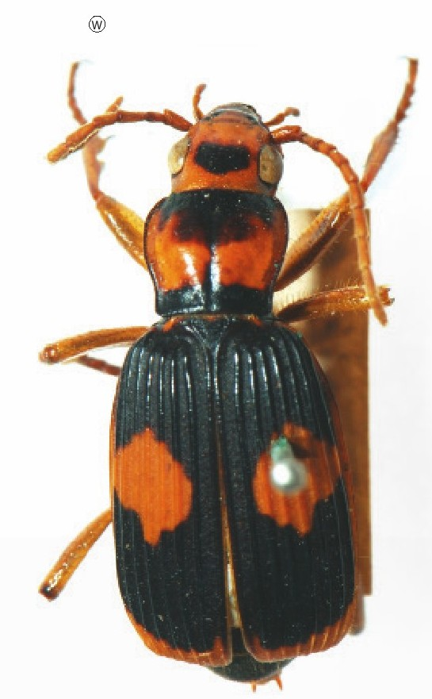
屁步甲是鞘翅目步甲科中的一类特殊昆虫，它们喜欢隐藏在砖石瓦块下或杂草丛中，以捕食其他小型节肢动物为生。屁步甲在长期的自然选择中形成了一套独特的化学防御系统，这个系统由分泌腺、贮液室和反应室三部分组成。分泌腺产生对苯二酚和过氧化氢，混合保存在贮液室内。当屁步甲受到刺激时，混合液会进入反应室，并在过氧化氢酶和过氧化物酶的作用下发生剧烈的化学反应，生成温度高达100℃的苯醌类混合液，并产生大量氧气，形成巨大的推动力，伴随响声以脉冲的形式喷射出体外，从而达到击退敌人保存自己的目的。除了屁步甲外，如拟步甲科的齿琵甲、许多种类的蝽象，遇到敌人时也会释放出难闻的臭气，用以刺激捕食者的嗅觉和味觉，达到避免被捕食的防卫目的。通常来说，它们发射的化学武器没有毒，有的还能通过稀释成为制作香料的特殊原料，如九香虫。

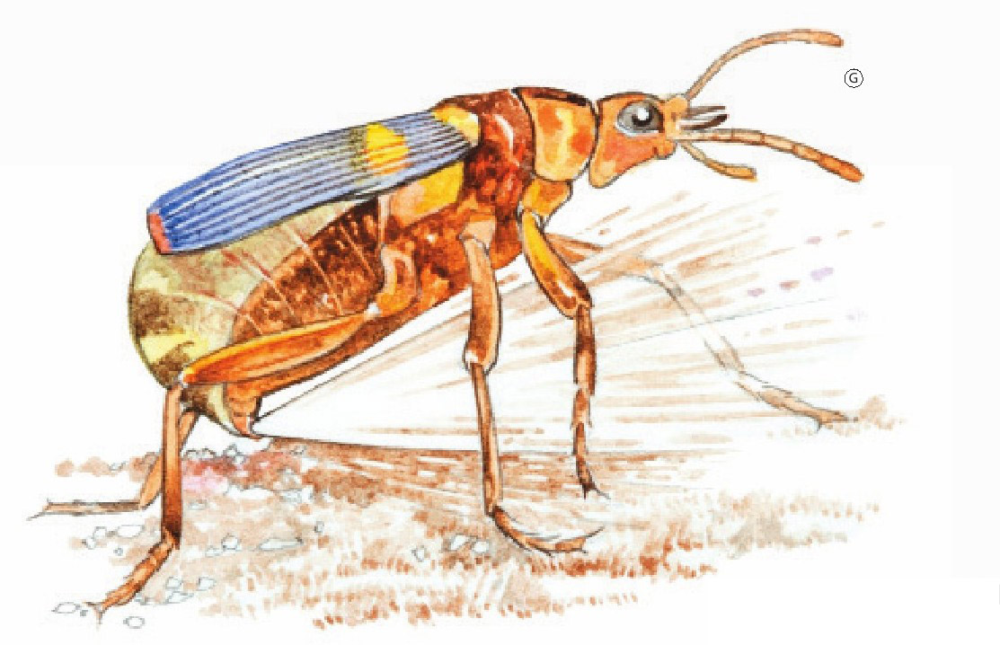
屁步甲喷射混合液的示意图

还有些昆虫，它们会释放有毒的化学物质。如鞘翅目芫菁科的斑蝥，雌虫所产的卵就含有毒性很高的斑蝥素，这样可以保护它们不受捕食性天敌的猎食。

可以说，为了生存与繁衍，这些昆虫在漫长的自然演化过程中逐渐拥有各自独特的“化学武器”，用于防卫与进攻。（汤亮　李利珍）

  

**【微博士】**守株待兔的蚁狮

一只蚂蚁经过了一天的辛勤劳动，正要返回巢穴，途中突然脚下一滑，掉进一个漏斗状的坑里。蚂蚁无论怎样用力也爬不上来，绝望之中，突然有一对强有力的大颚从坑底伸出，以迅雷不及掩耳之势把蚂蚁一口咬住，迅速将其拖进了坑底……

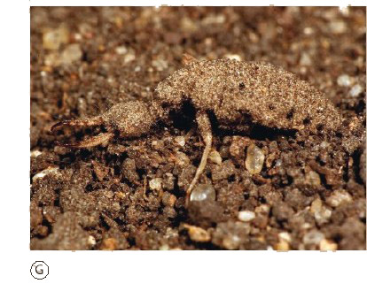
会制造陷阱偷袭蚂蚁的这类昆虫名叫蚁狮，是脉翅目蚁蛉科昆虫的幼虫。它们一般居住在沙土中，修筑漏斗状的陷阱，自己埋伏在漏斗中央的沙土中，仅将上颚露在外面。这类昆虫专门捕食不小心滑入坑底的小型节肢动物，吸食猎物的体液，然后将猎物的残骸扔到坑外。

**【实验场】**

春夏季节，注意观察公园或郊外荒野处的灌木丛，如果发现枝叶上有些白色的“唾沫”，可以用小树枝或餐巾纸将其扒开，会看到里面有虫，那是一种沫蝉的若虫。

【微问题】你还知道哪些昆虫有奇特的本领？

【关键词】叩头虫　楔状突　跳蚤　屁步甲　生存策略“化学武器”

## 地球上的动物中，为什么昆虫的种类最多

在我们的身边，总能见到昆虫的身影，如苍蝇、蚊子、蜻蜓、蝴蝶等，其实这只是昆虫中的一支“小分队”。如果你翻翻资料或上网搜索一下，很快就会发现昆虫几乎遍及地球的每一个角落，从天空到地下，从陆地到水中，从潮湿的热带雨林到干旱的沙漠，从寒冷的南北极到炎热的赤道，到处都有昆虫的足迹。几乎每种植物都会有昆虫来吃它，许多鸟类、蛙类、兽类以捕食昆虫为生。据统计，目前全世界已知的昆虫已超过100万种，占到全部已知动物种数的2/3，在种类和数量上还没有任何一类其他动物敢与昆虫比拟。那么，昆虫究竟有什么高超本领使它能如此繁荣昌盛，在地球上的各种环境中生存呢？

昆虫这种对环境的高度适应能力来自昆虫身体的一些特殊构造。

首先是昆虫体形一般都比较小，现生昆虫最大的也不过30多厘米。体小意味着食量小，只要获得少量的食物便能满足其生长发育和繁衍后代的需要。另外，体小有利于昆虫隐藏自己，遇到危险时能迅速躲避到狭小的缝隙或小洞中，从而能避免受到侵害。

其次，昆虫是无脊椎动物中唯一有翅的动物，有翅便能占领天空，在觅食、求偶、扩大分布区域和逃避敌害等多方面表现出更强的竞争力。

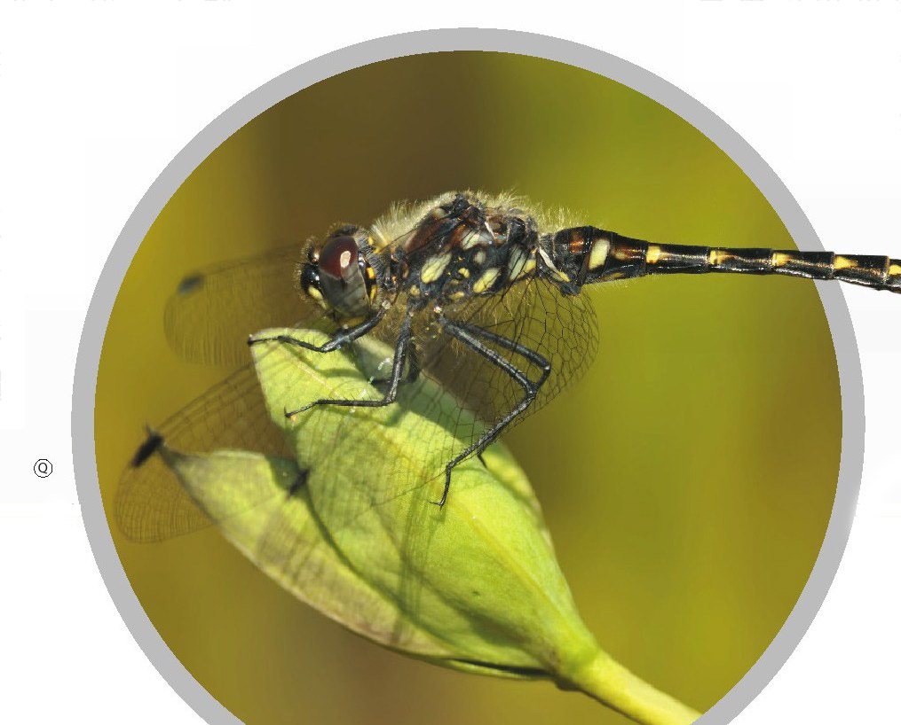
再有就是昆虫通常都有惊人的繁殖能力。一只甘蓝蚜一年能繁殖30～40代，若所有后代全部存活并一起参与繁殖的话，一年内可以繁殖出多达1.5×1027个后代。土栖白蚁的一只蚁后，在其生殖的鼎盛时期，一昼夜能产卵8000～10000粒，一生中的产卵量可高达5亿多粒。旺盛的繁殖能力保证了昆虫拥有庞大的种群数量，即使遇到恶劣环境引起大部分个体死亡，剩余的少量个体也能担负起继续繁衍后代、壮大种群数量的重任。

另一个重要原因是昆虫有了口器类型分化。在长期的进化过程中，昆虫分化出了多种不同的口器，如适宜取食固体食物的咀嚼式口器（蝗虫），适宜吸食动植物体液的刺吸式口器（蚊子），适宜吸食花蜜的虹吸式口器（蝴蝶），适宜舔食半固体食物的舐吸式口器（苍蝇），等等。不同的口器能分享不同类型的食物，从而扩大了食物来源，避免了昆虫自身发生的食物竞争。

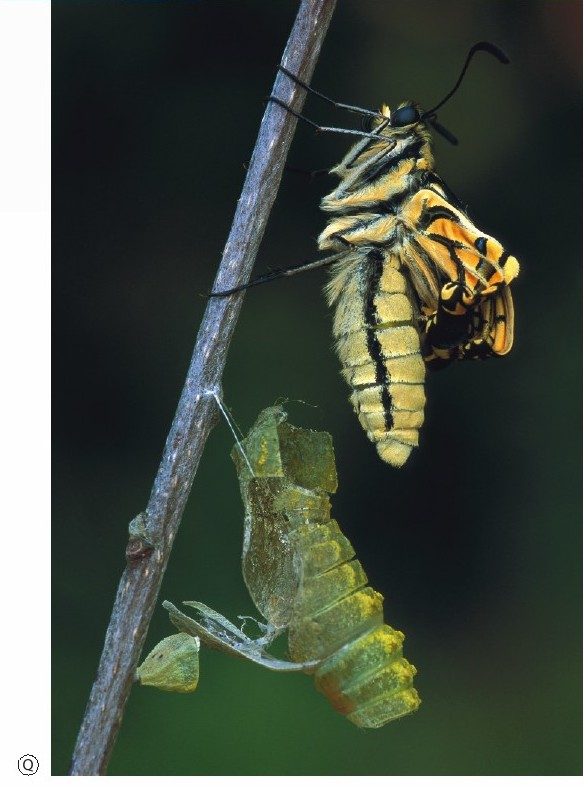
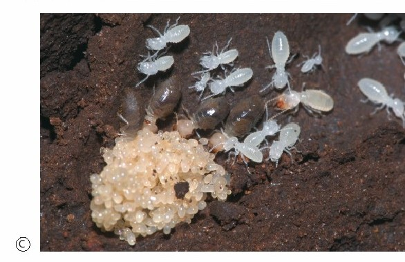
除此以外，昆虫的变态发育使它们的幼体和成体能占据不同的生存空间，取食不同的食物，有利于充分利用自然资源。如蜻蜓的稚虫生活在水中，捕食小鱼、蝌蚪和其他水生昆虫；而羽化后的成虫则飞翔在空中，捕食蚊子、苍蝇等陆生昆虫。两个虫期的食物来源和生活场所有很大的不同。

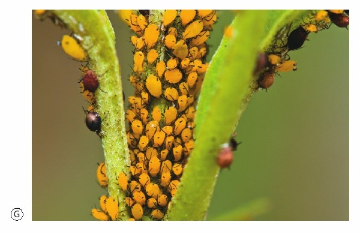
最后，还有一个重要因素是昆虫的生活周期短。昆虫一年数代，比较容易把种群发生的有益突变保存下来，以适应复杂多变的环境，提高对不良环境的适应力。如对于相对长期的不良环境，昆虫可以采用休眠、滞育或不同的生殖方式来对付，如卵胎生、孤雌生殖、幼体生殖等。

超强的生存能力使昆虫能以小取胜，以多匹敌，成为支撑地球运作不可忽略的生命之众。（胡佳耀　李利珍）

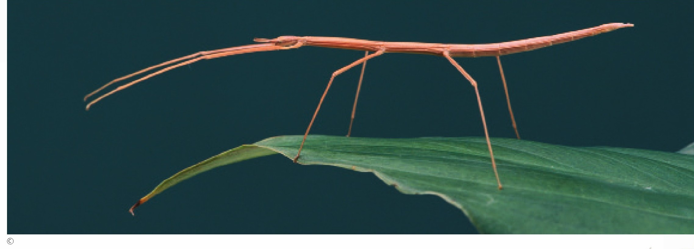
## 昆虫为什么都是小型的

除了在古生代的化石中发现有翅展宽度超过50厘米的大型蜻蜓外，现代昆虫的体形通常都比较小，最大的也不过37厘米（一种产于婆罗洲的竹节虫），与脊椎动物相比简直就是小巫见大巫。那么，昆虫为什么长不大呢？这还得从昆虫特殊的身体结构和生理功能谈起。

我们知道，与其他无脊椎动物一样，昆虫没有内骨骼，但在身体外面长有一层坚硬的几丁质外骨骼，用来支撑躯体，保持身体强度，防止体内水分蒸发，这对昆虫适应陆地环境具有非常重要的意义。但是，外骨骼是一层死的组织，它不会随昆虫身体变大而变大，必须蜕去老的外骨骼，换上一层新的更大一些的外骨骼，如同孩子在成长过程中必须换几件外套一样，否则就无法满足发育长大的需要。如果昆虫的体形巨大，外骨骼就势必需要更厚实坚固，这样在蜕皮过程中就很容易发生“卡壳现象”，出现生命危险。

另一方面，昆虫的体形较小与它的气管呼吸有关，即空气经胸腹部的气门，通过气管，扩散到各器官的组织和细胞间，与细胞内的二氧化碳直接进行气体交换。在交换过程中没有循环系统参与，气体扩散的距离非常有限，如果昆虫体形变得很大，空气就扩散不进去，呼吸就会有困难，因此现生昆虫的体形普遍都比较小。

当然，有化石证据显示，在远古时期，地球上曾经出现过翅展超过半米的巨型蜻蜓。那么，当时它们是如何解决呼吸问题的呢？推测认为，石炭纪时期地球大气层中氧气的浓度高达30%～35%，比现在的21%要高很多，氧气的分压大，沿气管扩散的距离就大，这也许就是远古时代出现巨型昆虫的原因之一吧。（胡佳耀　李利珍）

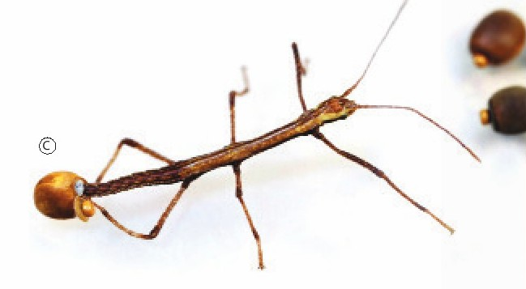
刚孵化的竹节虫和很多昆虫相比已是“巨无霸”了

  

**【微博士】**蝗虫腿断了为什么不见大出血

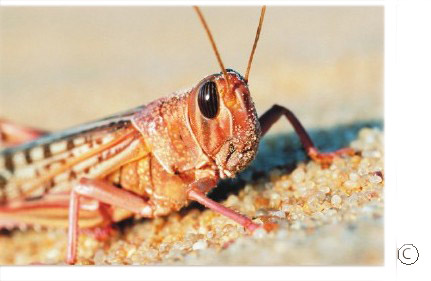
当蝗虫被抓住时，它会用力蹬腿试图逃脱，往往弃足保身。奇怪的是，蝗虫即使断了腿，也不会大出血，这是为什么呢？原来，昆虫的血液循环系统是开放式的，即仅由心脏、大动脉和血液（淋巴）组成。血液从心脏出发，沿着大动脉流到身体前端，之后就没有了血管，血液便流入体腔，整个内脏器官被浸泡在血液中。由于开放式循环系统中的血液不在血管中而在体腔中流动，流速变得很慢，血液的压力很低，甚至为负压。所以，蝗虫断腿后也就不会大出血了。

**【实验场】**蝗虫呼吸实验

从户外采集几只活的蝗虫，再取一杯自来水，然后分别将蝗虫的头部或腹部全部浸在水中。持续一段时间后，看看淹没头部的蝗虫与淹没腹部的蝗虫哪个先被淹死？为什么？

【微问题】如果地球上的昆虫突然消失了，人类还能生存多久？

【关键词】种类　适应能力　外骨骼　气管呼吸

# 无脊椎动物

## 我们的被窝里有多少螨虫

如果你以为蒙着被子睡觉就是享受，那就大错特错了。事实上，在每个晚上，都有不计其数的螨虫和我们钻在一个被窝里，它们不仅把我们身上脱落的皮屑作为大餐来享用，有时还给我们的健康带来不小的麻烦呢。

螨虫和蜘蛛是“同门兄弟”，都是节肢动物门里的蛛形纲动物。只不过螨虫个头更小，一般只有0.1～0.5毫米长，肉眼很难发现，它看上去就是一个小点。把螨虫放在显微镜底下，我们看到它的身体是半透明的，有八条长满绒毛的腿。

螨虫虽然个头小，数量却极多，几乎无处不在。人类已经发现了3万多种螨虫，其中会对人体健康造成危害的有10多种，最常见的有尘螨、粉螨、疥螨、蠕螨等。粉螨主要在人的食品中繁殖；蠕螨主要寄生在人的毛囊和皮脂腺中，它是导致酒糟鼻、脱发的元凶；疥螨主要寄生于人和哺乳动物皮肤的真皮层内，引起疥疮，也极易导致人体皮肤过敏和瘙痒症状。

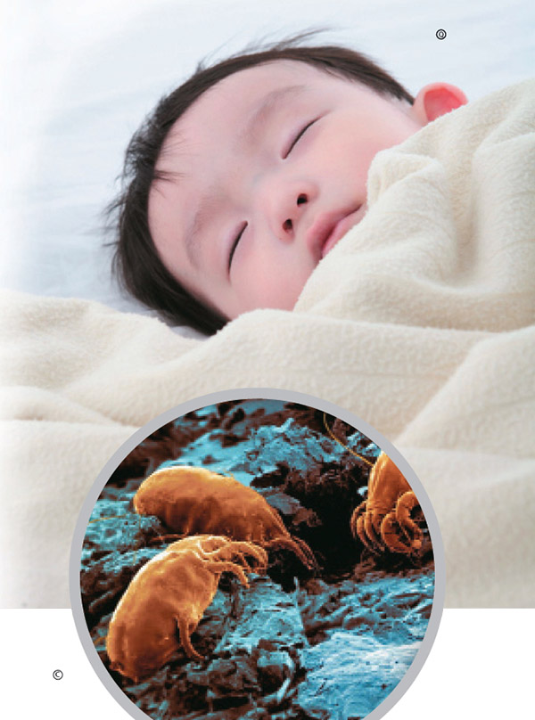
尘螨

尘螨大致分为屋尘螨、粉尘螨和欧尘螨，其中屋尘螨对人体影响最大，它们分布在毛毯、被褥、床垫、枕芯、空调、地毯、沙发等缝隙处，是我们生活中每时每刻最容易接触到的螨虫。

尘螨活跃于床上，这是因为床上每天都有人体新陈代谢下来的皮肤碎屑，这是尘螨最喜爱的食物。尘螨不咬人，偶尔会进入人的肺中引起肺螨症，但它的主要危害是由排泄物、蜕皮、尸壳形成的微粒引起的。这些微粒随屋尘飞扬于室内空气中，被过敏体质者吸入，就会引发哮喘、过敏性鼻炎等。联合国卫生组织1987年的调查统计指出，70%的哮喘都是由尘螨导致的。

人的被窝里有多少尘螨呢？为了回答这个问题，北京世纪坛医院的专家曾经对两户居民家的被褥进行过螨虫调查。不查不知道，一查吓一跳。有户人家3个月以上没洗被子，他家被子平均每4平方毫米的面积上就有约10只螨虫。这样算下来，一条被子上差不多住了100万只螨虫！而另外一家人坚持每星期洗一次被子，螨虫就少了许多，不过一条被子上仍然有大约10万只螨虫。

怎样才能清除被褥里的螨虫？除了定时清洗床单、被套外，经常晒被子和褥子是最好的办法，因为阳光中的紫外线可将螨虫杀死。专家还提醒人们，晒被褥的时候千万不要拍打表面，一旦拍打，尘螨的排泄物和尸壳就会随着粉尘飞扬出来，进入你的呼吸道，引发感染和过敏。所以正确的方法是在收被褥的时候戴上口罩，用刷子将被褥缝隙处的螨虫轻轻地刷下来就可以了。（周保春）

  

**【微博士】**搭“便车”的螨虫

2011年，英国曼彻斯特大学的科学家戴维·彭尼和菲尔·威瑟斯从琥珀中发现了一只5000万年前的螨虫的化石，并使用CT扫描呈现了这只远古生物的三维结构。这只螨虫体长只有0.17毫米，它附着在一只小蜘蛛的背上，也许那时正享受搭“便车”的愉悦呢，却一不小心被从天而降的一团黏糊糊的松香砸了个正着，一瞬间“连人带车”被永恒地定格了。

## 酒糟鼻是贪酒造成的吗

很多人都知道酒糟鼻，那个鼻子看上去又红又亮，外观粗糙不平，鼻尖还长出了小脓疮，疙里疙瘩的，犹如一块大肿瘤，好难看啊！

酒糟鼻是贪酒造成的吗？不是的。以往人们一直以为，此病主要是由于皮脂分泌量过多，面部血管运动神经失调扩张所致。近年来专家们已经认识到，寄生在人体皮肤内的蠕螨是导致酒糟鼻的主要原因。蠕螨以皮脂腺分泌物为主要食物，而人类的鼻子“油水”充足，所以就成了螨虫肆意吃喝拉撒、繁衍后代的理想之地。

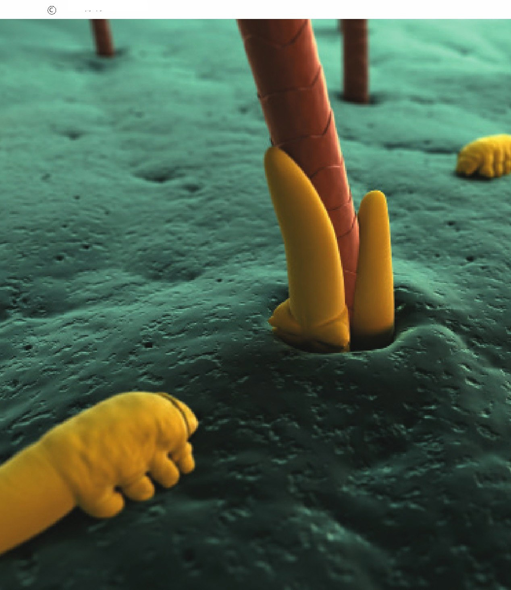
蠕螨

其实，大部分人的脸上、鼻子上都有蠕螨，它们主要寄生在毛囊的皮脂腺中。你想知道自己鼻子上有没有蠕螨吗？方法很简单：用挤压的方法从鼻子上挤出油脂粒，请专家拿到显微镜下查找就可以了。北京有位皮肤科专家曾经对随意挑选的3名志愿者（两男一女）做测试，结果从两位男士的油脂粒中分别找到十几只蠕螨，从那位女士的油脂粒中也找到了两只。

蠕螨在人的毛囊皮脂腺中尽情地吃，吃了之后还要排泄，这些排泄物就留在了人的毛囊里。久而久之，人的毛孔和毛囊就被堵塞，堵塞严重就会发生病变，造成各类皮肤疾病，包括酒糟鼻。蠕螨还会在皮肤的毛孔里进进出出，成为传播细菌的载体，造成其他皮肤疾病。

螨虫同样能使女性患上酒糟鼻，只不过比较注意个人卫生的女性的症状通常没有男性那么厉害罢了。（周保春）

  

**【实验场】**螨虫食量有多大

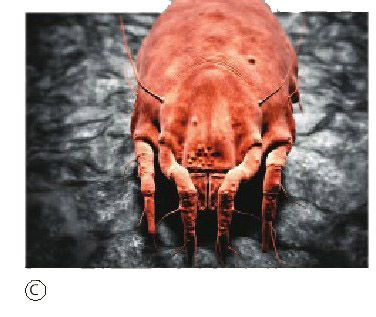
把螨虫用显微镜放大几百倍，我们就能看清它的真面目了。尘螨的口器就像是螃蟹的钳子，尘螨就是靠着这样的螯状口器，躲在人的被褥里，始终重复着一个动作，那就是切碎人的皮肤碎屑，然后拼命地往嘴里塞。

尘螨的消化系统非常发达，饱餐一顿之后，半个小时它就能彻底完成一次代谢。一只螨虫一天可以排泄出20个粪球，一个粪球就有它自身体积的十分之一大小。也就是说，一只尘螨一天排出的粪球堆在一起，能有它身体的两倍大呢，太可怕了！

  

**【微博士】**以螨治螨

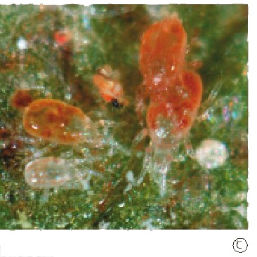
钝绥螨

螨虫不仅危害人和动物，还会危害植物。人们爱吃的橘子，近年也常受到柑橘红蜘蛛的危害，而柑橘红蜘蛛就是一种螨虫。对于这些危害植物的螨虫，很多科学家都在研究怎样控制它们。

在控制有害螨虫的工作中，科研人员发现：在螨类家族中有一些肉食性种类，专门以捕食植食性螨虫为生，比如智利螨、钝绥螨、畸螯螨等，它们是螨虫中的“小老虎”，性情凶猛，动作敏捷，食量也大。一只智利螨能完全吃掉5只叶螨在两周内产下的所有子孙，一只畸螯螨一生中可吃掉200～500个红蜘蛛幼虫。中国已经引进了智利螨，正在大力开展应用。

【微问题】晒好的被子有一股香喷喷的味道，那是螨虫的贡献吗？

【关键词】螨虫　过敏　酒糟鼻

## 鼻涕虫为什么会拖“鼻涕”

夏天，在阴暗潮湿的角落，人们有时会看到鼻涕虫。它的形态如没有外壳的蜗牛，白白胖胖的，身上覆盖着一层黏糊糊、亮晶晶的液体，像一条鼻涕，十分恶心。难怪人们叫它“鼻涕虫”呢！

鼻涕虫的正式大名叫蛞蝓。它能分泌黏液，爬行的速度非常缓慢，身后还会留下一条亮晶晶的条带。其实，这是它留下的“鼻涕”，也就是黏液变干后形成的。

鼻涕虫之所以要一边流“鼻涕”一边爬行，是因为它的身子实在太“水”、太娇嫩了，需要有黏液的保护才不至于被擦伤；同时湿滑的黏液能减小鼻涕虫爬行的阻力。鼻涕虫的黏液类似于人生病时从鼻子里流出的鼻涕，它的成分是蛋白质和糖分子的水混合物。黏液的作用就像在鼻涕虫爬行的地方铺设了一条光滑的道路，便于它巡游。

鼻涕虫的黏液还能像蛋黄酱一样，形成一种固体软胶质物，保持一定形状。当鼻涕虫不爬行的时候，这种固体黏液就可以将它牢牢地粘在物体的表面。

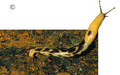
鼻涕虫是蜗牛的近亲，只不过在进化过程中它与蜗牛分道扬镳，脱去了曾经用来防御天敌的外壳。鼻涕虫与蜗牛、田螺、海螺一样，都是用肚子贴地爬行的，所以它们被统称为腹足动物。蜗牛爬行时，腹部同样会分泌黏液，以避免腹足肌肉与地面直接摩擦而受伤。靠着黏液的保护，蜗牛甚至能在刀刃上自在地游走。

蔬果是鼻涕虫的最爱，无论草莓、番茄、菠菜、莴笋等，它都不肯放过品尝的机会。有时候，人们甚至可以在买回来的蔬菜上发现躲藏着的鼻涕虫。被鼻涕虫爬过的蔬果，不仅留下了“鼻涕”，还留下了它们啃咬的窟窿。为此，鼻涕虫成了农民的仇敌，常被追杀。（周保春）

## 鼻涕虫为什么怕盐

如果你在自家厨房的水斗中发现一只恶心的鼻涕虫正在缓缓爬行，你该怎样对付它？教你一招简单易行的方法：往它身上撒盐，就能让它毙命。舀一点点盐，轻轻地抖落在鼻涕虫头上。哈，你会发现它就像人挨了当头一棒似的，立刻缩回头，蜷成一团，不停地在地上翻滚，痛苦地挣扎。不过，如果盐的剂量不够，过一会儿，它抖抖身子，又会振奋精神开始向前逃。

此时你索性舀一大勺盐，撒在它身上，让白花花的盐巴粘在它身上，它会立刻缩回头，在地上滚动起来，接着蜷缩成一团，抽动几下，便躺在那儿再也动不了了。过一会儿，它的身体表面开始发白、腐蚀、溶解，并渗出一些黏稠的液体。再过一会儿，鼻涕虫原本软绵绵、肥嘟嘟的身体将变得硬邦邦的，身下却留下一摊水。此时它已经一命呜呼了！

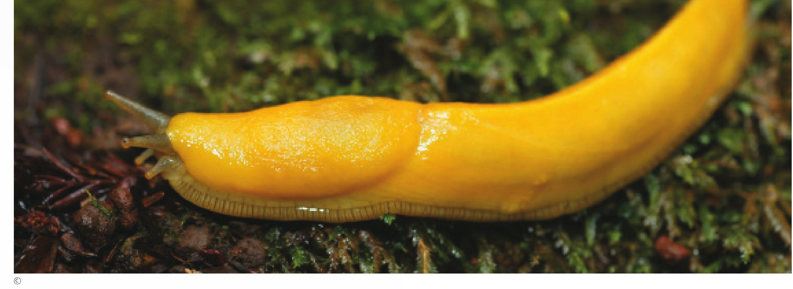
鼻涕虫为什么怕盐呢？这是因为它软绵绵的身体中含了特别多的水分，大约占身体的90%，而它的表皮只有薄薄的一层，非常容易渗透。如果往它身上撒盐，那么表皮内外的盐浓度将有巨大的差异，身体里面的水分就会透过皮肤渗出来。这一方面会造成鼻涕虫因为失水而死亡，另一方面就把鼻涕虫变成了一具干瘪的尸体和尸体下面的那摊水。这跟我们腌菜的时候把盐撒在菜上面，菜就会渗出水来是一样的道理。

鼻涕虫不仅怕盐，也怕糖。往它身上撒白砂糖，同样会让它毙命。（周保春）

## 为什么居然有人吃鼻涕虫

如果有人告诉你，这世上居然有人吃鼻涕虫，你会不会相信？实际上，中国人把鼻涕虫作为中药来使用，已经有很长的历史了，明代医学家李时珍在《本草纲目》中也对它作了记载。中医认为，蛞蝓具有清热祛风、消肿解毒、破痰通经的功效，它的用法有外敷，也有内服。

现代科学发现，鼻涕虫的营养价值与蜗牛相当。它肉质鲜嫩，含20多种氨基酸和10多种微量元素，其蛋白质含量比甲鱼、猪肉、牛肉和鸡蛋还高，而脂肪的含量却很低，真是名副其实的健康食品。国外还有人把鼻涕虫作为美食呢。据说，有个英国人在电视台的饮食节目里亮相，他把自己在花园里捉到的鼻涕虫做成汤、肉丸子和烤肉串，邀请节目主持人和在场的嘉宾与他一起享用。

不过，医学专家告诫人们，千万不要生吃鼻涕虫，因为这种动物身上可能携带各种病菌和病毒。2010年，澳大利亚悉尼市有个男子为了“练胆”，连吞两条鼻涕虫，随后病倒，在医院治疗1个多月才捡回了一条命。医生认为，他吞下的两条鼻涕虫身体中寄生有非常罕见的鼠肺蠕虫，能够引发脑膜炎。澳大利亚新南威尔士州的专家说，鼻涕虫身上的病菌、病毒以及寄生虫会引发多种症状，包括头痛、脖子僵硬、皮肤疼痛、发热、恶心呕吐等。（周保春）

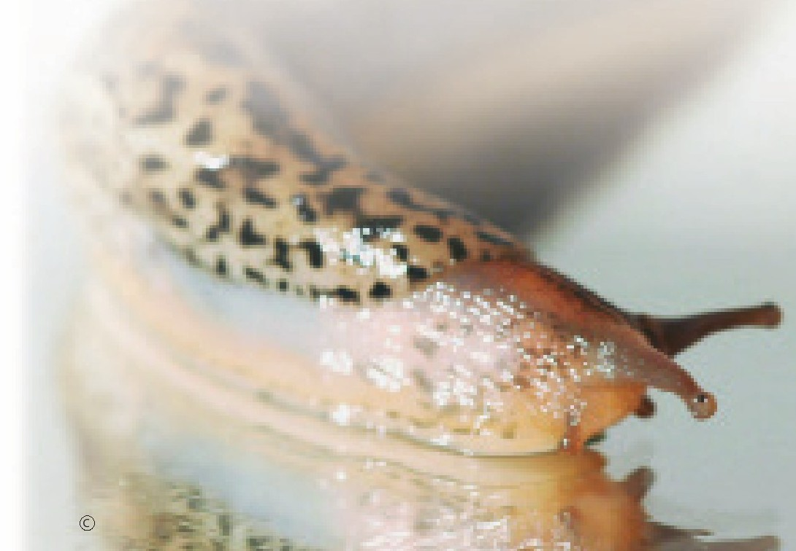
  

**【微博士】**土法驱除鼻涕虫

把生姜粉撒在鼻涕虫出没的地方，鼻涕虫对生姜的气味非常敏感，会远远走开。当鼻涕虫危害植物的时候，只要在植物根部缠上一圈细细的铜丝，也有同样的效果（鼻涕虫不喜欢铜丝散发出来的微弱的气味）。

还可以把捉到的鼻涕虫放在搅拌机里加水打成液体，加入柠檬汁，用喷壶喷在鼻涕虫出没的地方，几个月之内鼻涕虫都不会来。

**【实验场】**鼻涕虫爱吃哪种菜

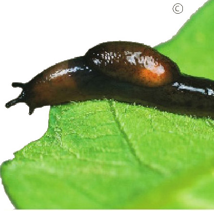
在一个容器中依次放入白菜、青菜、菠菜以及嫩树叶一类的东西，然后在每种菜上各放一只鼻涕虫。一顿饭工夫后，再打开盒子，请观察鼻涕虫是否还留在原来的地方。

【微问题】鼻涕虫为什么不像蜗牛那样背个壳保护自己？

【关键词】鼻涕虫　蛞蝓　黏液　失水　蜗牛

## 为什么农民喜欢蚯蚓

民间有条谜语：“细细长长一条龙，天天躲在沃土中，没手没脚会劳动，钻来钻去把土松。”你猜到了没有？它就是那没胳膊没腿、难分头尾，肉乎乎又滑溜溜，像一段赤裸的、蠕动着的肠子一样的动物——蚯蚓。蚯蚓又叫“蛐蟮”、“地龙”。对大多数人来说，蚯蚓是那么的熟悉和普通，当然也有不少人恶心它的蠕动，不过，我们对这个小家伙可不能等闲视之，它可是自然界生态系统中非常重要的一员大将呢！

古希腊的伟大哲学家、自然科学家亚里士多德（公元前384—前322）把蚯蚓称为“大地之肠”，指明了蚯蚓耕耘土壤的作用。经考证，早在5亿年前，蚯蚓的祖先就出现在地球上了，它们以简单的身躯、不凡的生存方式经历着地球的沧桑巨变。它们世世代代在土壤中钻来钻去，使板结的泥土疏松。土壤孔隙率的提高使外界游离的空气、肥料和水分能深入土中，更有利于微生物的增殖和作物根系的发育。远在人类出现之前，我们赖以生存的土地便早已经过蚯蚓亿万年的翻耕和改良。如果没有蚯蚓在地下纵横穿行，没有蚯蚓的胃肠对泥土的改良作用，就没有远古稳定的农业基础，更没有继之而来的人类文明。

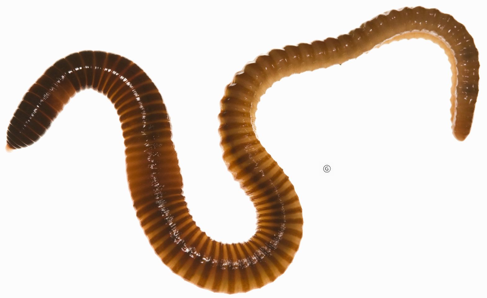
蚯蚓穴居表土，是杂食性动物，对腐殖质、动物粪便、土壤中腐烂的生物体、细菌以及这些物质的分解产物都爱吃。它们在进食的同时吞下大量的土壤、沙子及微小的石屑，再经肠道排出体外。那些看上去乱七八糟的东西，穿过蚯蚓之肠，就变成了含有多种营养成分的肥泥。

蚯蚓也常用它那张没有牙齿的小嘴，咬住落叶残枝享用，这样也加速了地表有机物质的分解，增加了土壤中的营养成分。正因为如此，农民特别喜欢蚯蚓，它们对农业生产的贡献，虽然不像化肥那样明显，但却是持续而有效的。（周保春）

## 为什么蚯蚓能在地下穿行自如

蚯蚓，这类默默无闻的环节动物，身体细长，在潮湿、疏松的土壤里穿行自如，一旦碰上坚硬的石块或树根，它们会很快地转向，绕道而过。那么，它们是怎么知道前方有障碍物的呢？

有人说，蚯蚓有眼睛，它们是靠两眼来辨别方向的；也有人说，环节动物比昆虫低等，它们的组织还没有分化出眼睛。其实，蚯蚓在长期适应穴居生活的过程中，头部已经退化，眼睛也没有了。那凸起在它身体前端的叫作口前叶，并不能看见东西。由于体腔液的压力作用，口前叶在膨胀时有摄食、掘土和类似触角的功能。

蚯蚓虽然没有眼睛，但是一点也不妨碍它探知外面的世界。它的触觉器官很发达，包括表皮感觉器、口腔感觉器、光线感觉器等，只要触及外部世界，不管是用哪种方式，蚯蚓都能敏感地洞察。

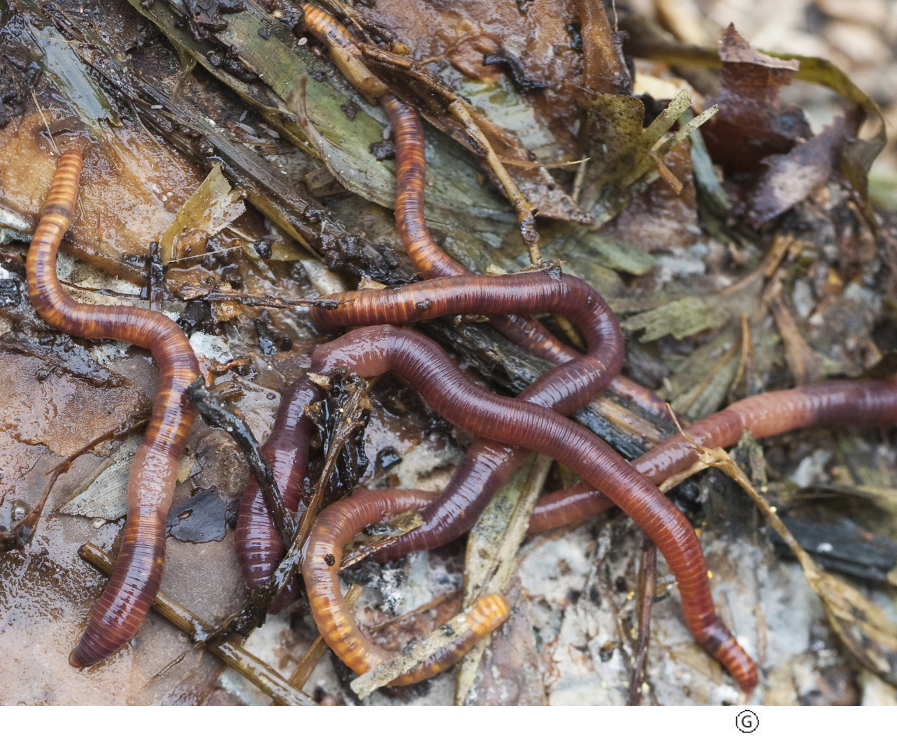
为了正确了解蚯蚓的触觉，科学家做了这样两个实验：一个是在蚯蚓行走的路上放一块铁片或一块砖头，发现当蚯蚓的皮肤接触到这些物体后，会立即转向避开；另一个是把蚯蚓放在光线强弱不同的地方，结果蚯蚓向弱光处行走。这两个实验的结果证明了，第一，蚯蚓确实是用触觉器官代替了眼睛的功能；第二，蚯蚓对光线的强弱很敏感，本能地喜欢弱光，这也间接证明了它完全适应土壤生活。（周保春）

  

**【微博士】**蚯蚓的粪便一点都不臭

蚯蚓把地下的泥土、植物碎片和有机物质吞食，再经胃肠的转化、改造后，以小土团（粪块）的形式排出体外，起到了为地表加土、施肥的效果。

蚯蚓吃进去的是乱七八糟的东西，大多是腐烂物，排出的粪便却变成了无毒无臭、不招蚊蝇，且为植物生长所需的优质肥料，不得不说真是件神奇的事情。这是因为蚯蚓粪中含有大量特别的细菌，能迅速分解恶臭剧毒的硫化物和氨气，所以蚯蚓的粪便并无臭味。

**【实验场】**蚯蚓能一分为二吗

关于蚯蚓的再生能力，一直有多种说法：有的说无论怎样切断，每一段都可再生成一条新的蚯蚓；有的说少了头的那段无法再生。其实，蚯蚓体节断裂后，不论是缺头或是少尾，都有可能长成有头有尾的个体。不过，在长成完整的个体之前，没有口腔或肛门的那段，因为无法进食，很容易在再生过程中因消耗过多能量而死去；只有年轻的或健壮的蚯蚓，才可能在断掉之后再长出完整的个体。即便一条蚯蚓同时被切头去尾或被切成数段，也有再生成功的例子。你也可以切断蚯蚓试试。

**【微博士】**蚯蚓“巨无霸”

澳大利亚墨尔本以东地区，以高落差的瀑布、肥沃的土壤和厚密的桉树林而著称，南吉普高地就位于墨尔本以东100千米的区域。1870年以来，这里被欧洲移民开发成了农场，桉树林也随之消失。接着，南吉普高地与墨尔本之间开始铺设铁路，工人在修建铁路的过程中，却有了一个意外的发现，他们在泥土中挖到了一种长达1米的巨型蚯蚓！由于此前从没见过这般“魁梧”的蚯蚓，所以工人一度把它当作了蛇。后来蚯蚓被送交墨尔本大学鉴定，并被确认为是一个新物种。由于这种蚯蚓仅见于南吉普高地，所以习惯上称之为“吉普高地大蚯蚓”。在已发现的约3000种蚯蚓中，吉普高地大蚯蚓在体形上堪称世界之最。

【微问题】既然蚯蚓这么好，农业生产为什么还要用化肥？

【关键词】蚯蚓　穴居　环节动物

## 蜘蛛为什么能在两棵树间织网

当你看到在沟溪两岸的树间，或者两个离得很远的屋角之间，结着一张蜘蛛网的时候，往往会想到一个问题：蜘蛛既不会游泳，也不会飞，它是怎样架设这张“空中罗网”的呢？

原来，蜘蛛肚子末端有前、中、后三对“纺器”，蛛丝就是丝腺生产后，从纺器的小孔中流出来的。丝腺生产框丝、纵丝、经丝、游丝、黏丝、弹性丝等不同的丝线。

蛛丝的成分是蛋白质，和蚕丝相像，刚流出来时，还是一种发黏的“胶水”，当它一接触空气，马上就凝固而成为丝了。

正如人们过河需要架桥一样，蜘蛛若要到达河对岸，它就架设“天索”。

架天索是颇有趣的。蜘蛛从它的立脚点，引出许多根长度足以到达对面的游丝，于是这些蛛丝就顺风飘呀飘的，好像几根透明的细带子飘在空中，然后，它时刻用脚去触摸蛛丝的固着点。

忽然，它发现其中有一根丝拉不动了，原来飞丝飘着的一端已被风吹到对面，而且被粘在树枝或其他东西上了。于是天索就这样架成了。

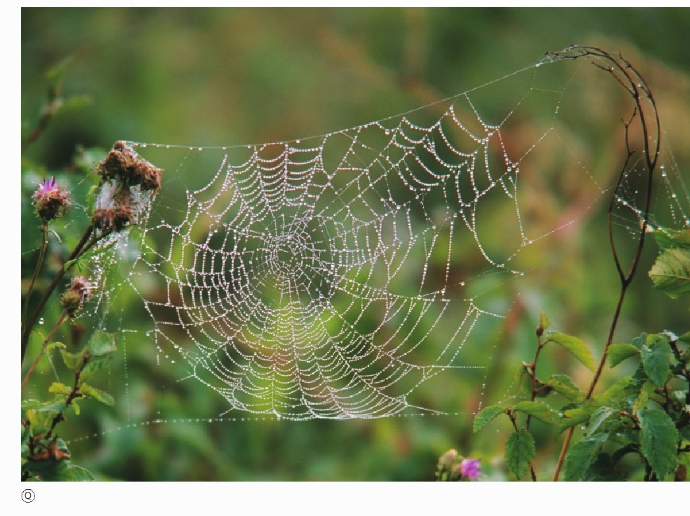
架天索的另一个办法是：蜘蛛先把游丝固着于一点，自己就吊在丝上，下垂到地面，然后肚子末端一边放丝，一边爬到对面的屋角或树枝上，待到目的地后，再用脚把丝收起来，收到刚刚长短适度时，就把丝固定在新的固着点上，这样，天索也能够架成。

如同房子的栋梁要粗些一样，蜘蛛在这条拟定作为蜘蛛网的支撑线上，来来回回再粘上几条纵丝，把它弄成一条粗“缆”；接着，又在这条粗缆下方，平行地架设第二条缆索。等两条缆索架好以后，蜘蛛就利用框丝搭出框架，再用经丝结出放射状架构，最后用黏丝和弹性丝组成网络，一张蜘蛛网就织成功了。（杜云）

## 蜘蛛丝为什么那么坚韧

和蚕丝不同，蜘蛛的丝不是从嘴里吐出来的，而是用后腿将位于腹部纺器中的黏液抽拉出来形成的。纺器是蜘蛛特有的装备，分布在腹部，共有前、中、后3对。每个纺器相当于一座工厂，里面有多个类似于车间的丝腺（分泌蛛丝的腺体）。蜘蛛体内的丝腺共有8种，分别生产不同的丝，以满足不同的用途。

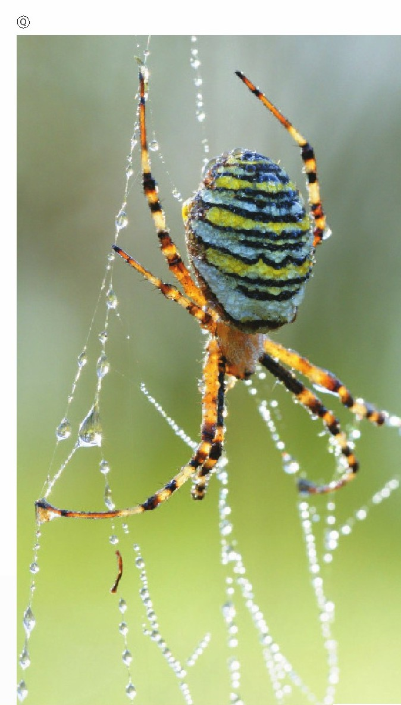
蜘蛛丝是一类特殊的蛋白纤维，人们早就知道它具有强度高、韧性好等特点。蜘蛛丝究竟有多坚韧呢？同样粗细的钢丝和蜘蛛丝一起接受试验，蜘蛛丝能够承受的重量，要比钢丝足足高出5倍以上，其伸缩率是尼龙丝的2倍。蜘蛛丝的重量还特别轻，长达数千米也不过1克重。另外，蜘蛛丝吸收冲击动能的能力也十分惊人，快速飞行的苍蝇和蝴蝶一旦撞上蜘蛛网，就像砸在一堆软软的棉花上，再也不会被弹回去了。如果用铅笔杆粗细的蜘蛛丝编织一张网，理论上它能把飞机捕捉住。

最近，美国麻省理工大学的科学家通过实验和计算机模拟，解开了蜘蛛网的更多奥秘。蜘蛛丝之所以韧性大，原因在于它能根据受力大小而自在地改变自身性质：受力较小，它就显出弹性的一面，通过延展蜘蛛丝来吸收冲击力；如果局部受力过大，那个部分的蜘蛛丝就会显示脆性的一面，变硬、断开，形成一个小孔，使蜘蛛网整体免遭毁坏。（周保春）

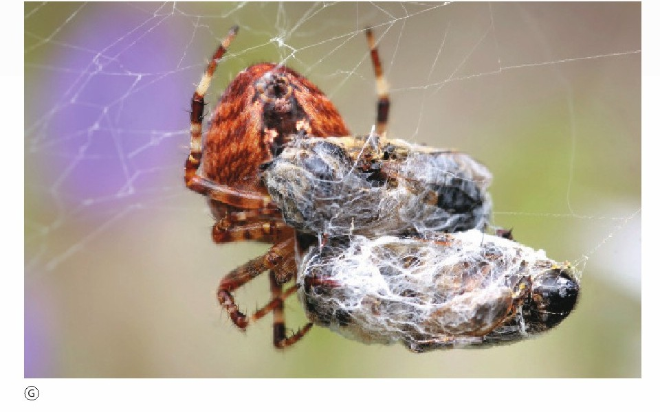
## 蜘蛛为什么不会被自己织的网粘住

把蜘蛛丝放在显微镜下观察，你就会发现这缕缕透明的蜘蛛丝，并不是单纯一根丝，而是一根根密密缠绕而成的空心细管，细管里面充满了像胶水一样的液体。这种液体从缠绕的细缝中慢慢地渗透出来，使蜘蛛丝变得非常有黏性。无论是往蜘蛛丝上放一根草或一小片羽毛，都会立刻被粘住，怪不得凡是撞到蜘蛛网上的昆虫，不管它是飞蛾还是蜻蜓，都被牢牢地粘住，再也飞不出去。

蜘蛛网有这么大的黏性，蜘蛛在自己的网上跑来跑去，为什么不会被粘住呢？这个难题早在100多年前就被法国昆虫学家法布尔解决了。在那本著名的《昆虫记》中，法布尔写道：童年时他和同学常常在假日用收集到的蜘蛛网到田里去粘金翅雀。蜘蛛网的丝很黏，于是他们就在手上抹点油，再去收集蜘蛛网，手就不会被蜘蛛丝粘住。

于是法布尔想：蜘蛛在网上跑来跑去而不被粘在网上，是不是因为它的脚上也有一层油呢？想到这里，法布尔做了一个实验，他从一只活蜘蛛身上摘下一条腿，用这条腿接触蜘蛛网，蜘蛛网粘不住它。法布尔把这条蜘蛛腿放在二硫化碳的溶液里浸泡了一刻钟。二硫化碳是溶解油脂的溶剂。他取出蜘蛛腿后又用蘸了二硫化碳的刷子将蜘蛛腿仔细地洗刷干净。完成了这些步骤，法布尔再将这条蜘蛛腿放到原来的蜘蛛网上的时候，蜘蛛腿就像小虫一样被牢牢地粘住了。

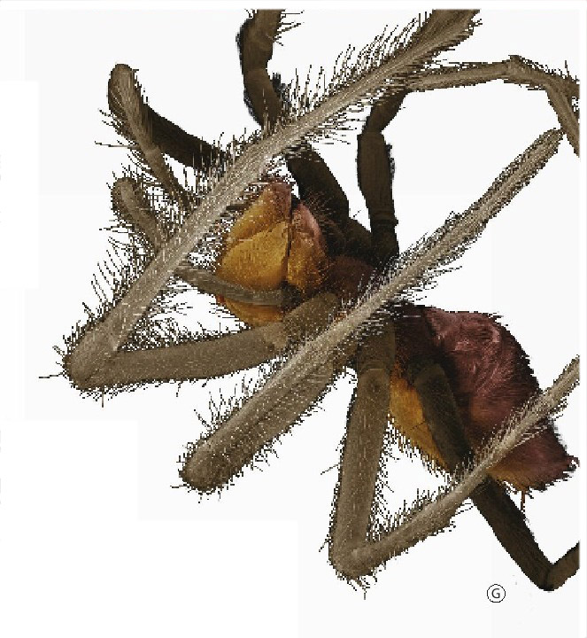
于是法布尔得出结论：蜘蛛是用一种特殊的汗，使它能在网的各部分跑来跑去而不受牵制。

法布尔的观察是正确的。后来科学家们进一步发现，蜘蛛腿里的那种液体，不但是一种能防止自己粘在蜘蛛网上的润滑剂，而且是一种“液压传动”装置。原来蜘蛛的腿里没有肌肉，只充满着那种液体，蜘蛛靠调节腿里液体的压强，使8条腿能灵活自如地运动。（周保春）

  

**【微博士】**蜘蛛不是昆虫

很多人会把蜘蛛当作昆虫，其实蜘蛛在分类学上属于专门的一大类，称为蛛形纲，它们和昆虫相比，在外形和构造上有很大的差别：蜘蛛的头部和胸部组合在一起，成为头胸部，躯干只分成头胸部和腹部两部分，而昆虫的身体明显地分为头、胸、腹3个部分；当然数脚是最容易的，蜘蛛有8只脚，而昆虫只有6只；昆虫还有翅膀和触角，而蜘蛛却没有；昆虫吃东西是囫囵吞下去再消化的，而蜘蛛却是先把猎物紧紧包起来，然后注入消化酶，把猎物液化成“奶昔”后再吸进肚子里。

**【微博士】**有些蜘蛛不结网

由于结网要消耗能量，而且“网大招风”——容易将自己暴露给天敌，所以有些蜘蛛（如跳蛛、狼蛛、盗蛛等）就放弃了结网的习性，改为游猎。还有一种蜘蛛会使“流星锤”，它的“网”只是一根丝，在这根丝的末端系上一个黏球，黏球中含有类似雌性飞蛾的性外激素，可引诱雄蛾鬼使神差般地靠近。当目标进入攻击范围后，这种蜘蛛就用“流星锤”实施攻击。

【微问题】不织网的蜘蛛怎样捕猎？

【关键词】蜘蛛　织网　蜘蛛丝　蛋白纤维

## 蜈蚣有那么多脚，为什么不会被自己绊倒

蜈蚣的身体呈扁平长条形，体长通常超过10厘米，身体由多个体节相连而成，每个体节都有一对脚，所以又叫百脚、百足虫、千足虫。蜈蚣当真有百足、千足吗？一个世纪以来，世界各地共发现蜈蚣3000余种，足的数目从15对到173对不等。所以，说蜈蚣有百只脚没错，说它们有千只脚就言过其实了。

我们人只有两条腿，但走路一不协调，也可能被自己绊倒。蜈蚣有那么多脚，为什么走路的时候不会被自己绊倒呢？难道蜈蚣的脑袋一直在掌控每只脚的位置，通过计算来决定该挪动哪只脚吗？

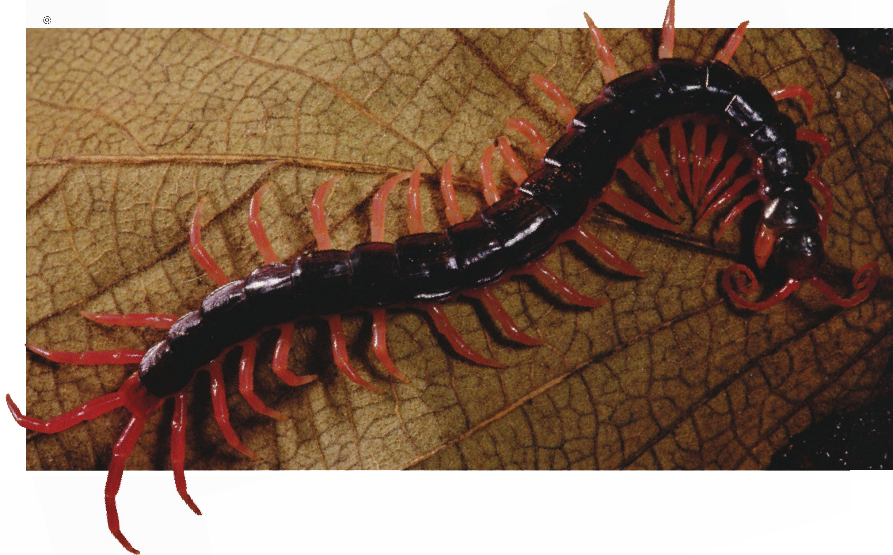
其实，蜈蚣根本不需要计算，它在爬行的时候，每只脚都遵循了同一个游戏规则，那就是“不妨碍相邻的脚”。只要满足了这个条件，蜈蚣就能有条不紊地前进，并且产生优美的节奏。这就是所谓的“系统理论”。

什么是系统理论呢？举个例子吧，如果说人是一个系统，那么心脏就是一个亚系统。心脏在跳动时，根本不需要知道整个身体的运动状况，它只要根据神经、激素水平的变化来决定跳动的快慢就可以了。如果心脏硬要多管闲事，越位去了解整个身体的状态，那反而会弄巧成拙。

同样，心脏这个亚系统的构成要素——心肌细胞在进行伸展和收缩时，也不需要知道心脏整体的状态，它只要知道心肌自身伸展了多少，有多少氧气，温度有多高等事关心肌自身的问题。也就是说，在系统理论中，每个构成要素是不需要知道系统整体状态的，只要根据与其他构成要素的关系来决定自身的行动就足够了。如果拿人类社会来打比方，那就是：每个人对自己负责、对近邻负责，社会就和谐了。

在仿生学领域，人们从蜈蚣和其他多足动物的爬行原理中获得启示，用系统理论成功解决了控制机器人行走步伐的难题。（周保春）

## 为什么说蜈蚣也是毒物

蜈蚣是十分凶残的食肉动物。说出来也许你不相信，一条体长20厘米左右、看似柔弱的蜈蚣，竟能捉住一只活蹦乱跳的小白鼠，将其死死缠住当作点心享用。其实蜈蚣吃小白鼠是小菜一碟，它还能咬死比自身大许多倍的毒蛇呢！有人拍了蜈蚣咬蛇的视频挂在网上，因为太震撼了，遭到疯狂转发。只见那只蜈蚣将多只脚紧紧缠在蛇的身体上，任凭蛇怎样挣扎，它就是不放松，并且不停地用毒牙啃咬蛇身。没过四五分钟，那蛇就痛苦得绞成一团，奄奄一息了。

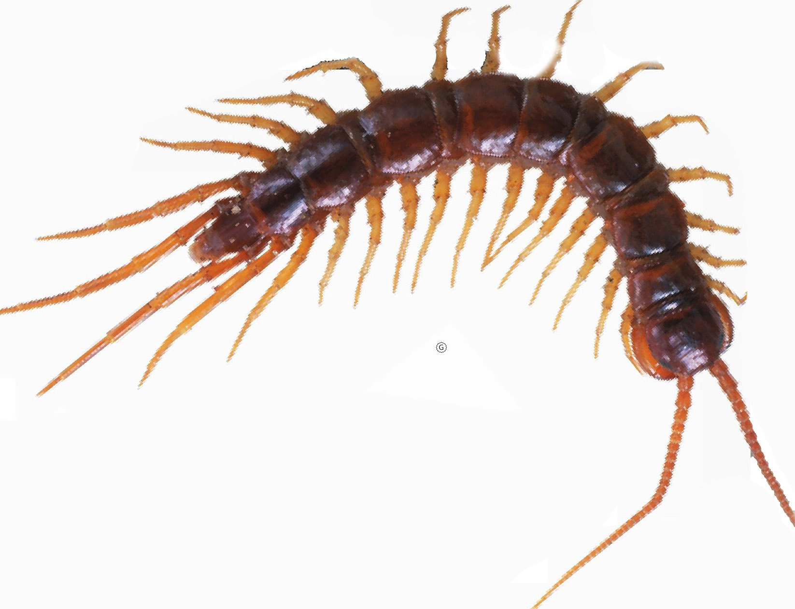

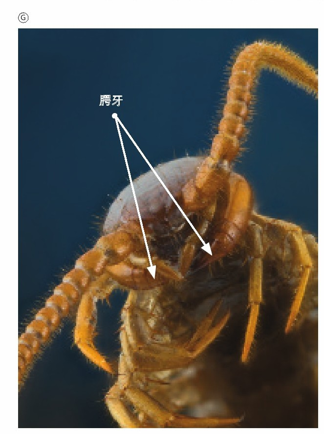
蜈蚣的一对腭牙中含有毒腺

小小的蜈蚣何以如此狠毒？原来，蜈蚣的第一对脚呈锐利的钩状，钩端有毒腺口，称为腭牙、牙爪或毒肢，能排出毒液。蜈蚣咬猎物时，其毒腺分泌出大量毒液，顺腭牙的毒腺口注入被咬者皮下而致其中毒。蜈蚣的毒液呈酸性，含有两种类似蜂毒的有毒成分，可引起局部组织破坏及淋巴管炎。蜈蚣不仅能对付昆虫、蚯蚓、老鼠之类的小动物，而且它咬人一口，也会使人产生红肿、头痛、发热、呕吐，甚至抽搐、昏迷症状。正因如此，蜈蚣与蝎子、蜘蛛、毒蛇同列动物界的毒物行列。

蜈蚣虽然狠毒，可是在比它小很多的蚂蚁面前却只有束手就擒的份儿。蚂蚁采用的是集体作战，成百上千只蚂蚁爬在蜈蚣身上一顿猛咬，蜈蚣就命赴黄泉，成了蚂蚁们的口粮啦！

蜈蚣体内富含蛋白质、各种酶和金属元素，是一味著名的中药，有祛风止痉、通络止痛、攻毒散结的功效。（周保春）

  

**【微博士】**马陆的气味

有一类动物跟蜈蚣长得非常像，它们的名字叫马陆。马陆也喜欢阴湿环境，不过它们不是肉食性的，而是以枯枝烂叶为生，生活在草坪、林子的土表和土块下面，或土缝内，常成群过着隐居生活。有时候，我们在潮湿的家中也会发现马陆，而且这家伙还有难闻的气味。为什么素食主义者的马陆身上有难闻的气味呢？原来，这是因为它的体内有臭腺，能分泌出一种难闻的臭液，由体侧的臭腺孔排出。马陆之所以要把自己“搞臭”，是为了对付贪吃的鸟儿，让它们“闻臭而退”。

**【微博士】**如何区别马陆和蜈蚣

马陆的身体呈圆管形，由黑色、棕色或橙色相间的20个体节构成，头部有一对触角，第2～4体节各有一对足，第5体节及以后每节各有两对足；而蜈蚣身体较扁，体节也较明显，常见的有21个体节，每个体节只有一对足。区别马陆和蜈蚣还有个办法：从正上方看，如果脚被身体遮住看不见，是马陆；如果看得见，则是蜈蚣。

**【微博士】**不辞辛劳，只为弄清蜈蚣有多少只脚

栖息于朽木或石隙中的蜈蚣属多足纲，体干由多个体节组成，每个体节有一对足，但不同的蜈蚣有着不同数量的足。有位名叫凯特尔的英国人是一个执着的“蜈蚣迷”，他走遍英伦三岛，收集了上千条蜈蚣标本，就是为了搞清蜈蚣究竟有几对足，又是什么原因导致各种蜈蚣足的数目不同。虽然最终他也没有弄清导致足数量不同的原因，但他发现了有偶数对足的蜈蚣，也是一大收获。因为在这之前，所有被发现的蜈蚣，无论有多少对足，它们的数量都是奇数。

【微问题】家里出现马陆怎么办？

【关键词】蜈蚣　马陆　足　系统理论

## 为什么寄生虫会钻进人脑中

多年前的一个夏天，北京发生过这么一件事儿。20多位食客在一家酒楼吃了“凉拌螺肉”，几天后便感觉双肩疼痛、颈部僵硬，两边肋部和颈部皮肤有刺痛感；接下来开始头痛、恶心，连路都不能走了。医生诊断后，发现他们患了同一种脑膜炎，是一种名叫“广州管圆线虫”的小虫子钻到他们脑中引发的。

广州管圆线虫是个啥东西？它们又是怎样钻进人脑中的呢？

很多人都见过寄生在人肠道中的蛔虫。你可以把广州管圆线虫想象为蛔虫的缩小版，它的体长在1.5～4厘米之间，宽约0.3～0.6毫米，大小与一截线头差不多。在自然界中，广州管圆线虫多寄生于陆地螺、淡水虾、蟾蜍、蛙、蛇、鼠等动物体内，而在老鼠体内它能长大并且繁殖。广州管圆线虫能穿过老鼠的肠壁进入血循环，经肝、肺、心脏到达全身各器官，其中有相当一部分会沿着颈总动脉到达脑部。

如果有人不幸吞下活的广州管圆线虫或虫卵，那他的麻烦就大了，因为这种虫子在人体中如鱼得水，经营的勾当与在老鼠体内差不多。广州管圆线虫的幼虫能在人体中移行，到达各个器官，但更喜欢钻入人的中枢神经，并在其中继续长大。这与幼虫嗜好神经细胞的特性有关。在人脑中，广州管圆线虫一边侵袭脑细胞，一边不停地繁殖，一只雌虫一天可产下1.5万枚卵。它们攻击的对象除了大脑和脑膜外，还包括小脑、脑干及脊髓等处，使人发生急剧的头痛，伴有恶心、呕吐、颈项强直、抽搐等症状，重者可发生瘫痪、死亡。在北京的这个案例中，食客是因为吃了未煮熟的福寿螺（含有虫卵或幼虫）而感染广州管圆线虫的。烹饪加热很容易杀死螺蛳体内的虫卵或幼虫，说明那家餐厅的螺肉肯定没煮透。

鞭虫

广州管圆线虫和蛔虫是同门兄弟，它们都归属于线形动物门下。蛔虫在线形动物中算是巨无霸，它们在人类肠道中能长到20厘米长。线形动物的名声很臭，因为其中有超过1.6万种的寄生虫，仅寄生人体的就有鞭虫、钩虫、蛲虫、丝虫、蛔虫及线虫。然而实际上，寄生性种类在整个线形动物中所占的比例还是不大的，该门中的大多数动物都是很本分的自食其力者。线虫在陆地和水中广泛存在，并在极端环境如南极和深海海沟都有发现。（周保春）

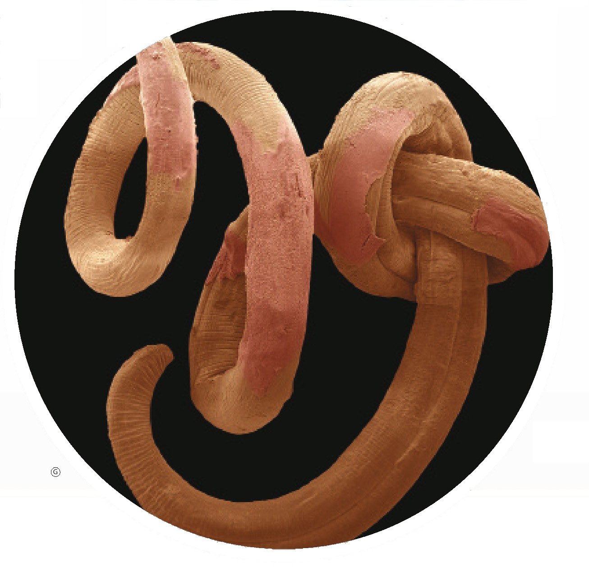
蛲虫

## 为什么寄生虫病难以根绝

在很多人眼中，寄生虫病是“贫穷”的代名词。他们认为如今生活富裕了，卫生条件改善了，寄生虫已经永远和我们拜拜了。然而事实并非如此，各种寄生虫并没有销声匿迹，它们仍然与人类相邻相伴，一有机会便向人体发动进攻。据专家统计，中国目前仍查出有64种人体寄生虫，有7亿人感染了各种寄生虫病，其中3.6亿人感染了两种以上的寄生虫病。

为什么寄生虫病难以根绝呢？

人体寄生虫门类众多，除了线形动物门中的那些种类之外，还有蜘蛛的近亲疥虫和蜱虫，扁形动物门中的血吸虫、绦虫和肝吸虫，原生动物门中的疟原虫、阿米巴原虫，等等。这些低等动物适应性强，人类是很难把它们从周围的环境中彻底驱赶出去的。

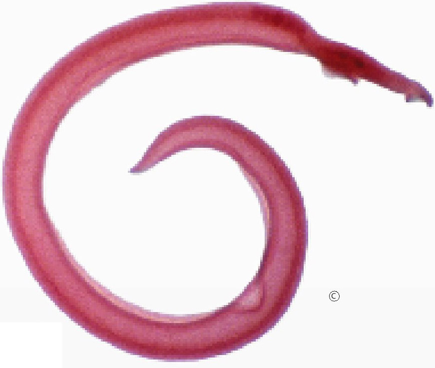
显微镜下的血吸虫形态

就拿曾经肆虐中华大地的血吸虫来说吧。中国政府于1949年后组织群众对其进行了大规模扑杀，通过消灭其中间宿主钉螺，到20世纪70年代末期，患病人数已经大大减少了。可是时至今日，局部地区仍时有感染血吸虫病的报道，有时甚至会有暴发性感染。例如2003年在四川省罗江县，血吸虫病就突然在一个只有1700人的村庄暴发了。在云南省的巍山彝族回族自治县，血吸虫病疫情也很严重，许多山窝成为农民熟知的“血吸虫窝”。因此，血吸虫病原仍存在，中间宿主钉螺仍存在，只要有机会，当虫卵在水中孵化出毛蚴，毛蚴进入钉螺体内大量增殖成尾蚴的时候，在水中的人和畜不小心就会被尾蚴侵入皮肤，成为血吸虫病的受害者。（周保春）

  

**【科学人】**悉尼·布伦纳

生物学家通过对选定的生物物种进行科学研究，用于揭示某种具有普遍规律的生命现象。此时，这种被选定的生物物种就是模式生物。秀丽隐杆线虫是分子生物学研究中常用的模式生物之一，它是南非生物学家悉尼·布伦纳在20世纪60年代选定的。

秀丽隐杆线虫是广州管圆线虫的近亲。这种长不过1毫米的微小动物生活在土壤中，以细菌为食，千百万年来过着无人打扰的幸福生活。布伦纳之所以把它选定为模式生物，是因为它是唯一一个身体中的所有细胞能被逐个盘点并各归其类的多细胞动物；而且它的生命周期很短，从出生到性成熟只需3天半，这样科学家就能不间断地观察并追踪每个细胞的演变。更神的是，人们可以把秀丽隐杆线虫冻在冰箱里储存，待其复苏之后继续研究，非常方便。

2002年，布伦纳与两位美国科学家分享了诺贝尔生理学医学奖。布伦纳的主要贡献便是确立了秀丽隐杆线虫为模式生物，并通过研究这种模式生物发现了在器官发育和“程序性细胞死亡”过程中的基因规则。

**【微博士】**古怪的绦虫减肥

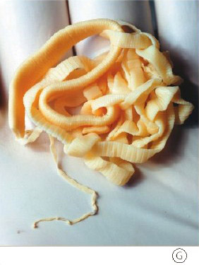
绦虫

不少人热衷于减肥，于是，一些莫名其妙、稀奇古怪的减肥方式走进了人们的生活。比如，有人就选择“绦虫减肥法”——吃夹杂绦虫的减肥药丸，因为绦虫可以贴附在人体的肠黏膜上吞食食物。

其实，绦虫减肥法并不是个新鲜玩意儿，早在20世纪初就一度十分流行。具体做法是：先吞食绦虫卵，让绦虫在人体内吸收营养以控制体重，待减重目标达到后再吃药杀死体内的绦虫。但这是一种得不偿失的减肥方式，因为绦虫在人体内会带来消化道疾病。绦虫属于扁形动物门，是一种巨大的肠道寄生虫，成虫的体长可以达到10多米甚至20米！人感染绦虫后会引发肠胃系统症状，如腹泻、腹痛、恶心呕吐、食欲不振，有时还会觉得直肠或者肛门痒。

【微问题】为什么越是看上去弱小的生物生命力越强？

【关键词】寄生虫　中间宿主　线虫　血吸虫　模式生物　绦虫

## 螃蟹为什么吐泡沫

当我们买螃蟹的时候，会看见螃蟹吐出很多白沫。这是什么道理呢？

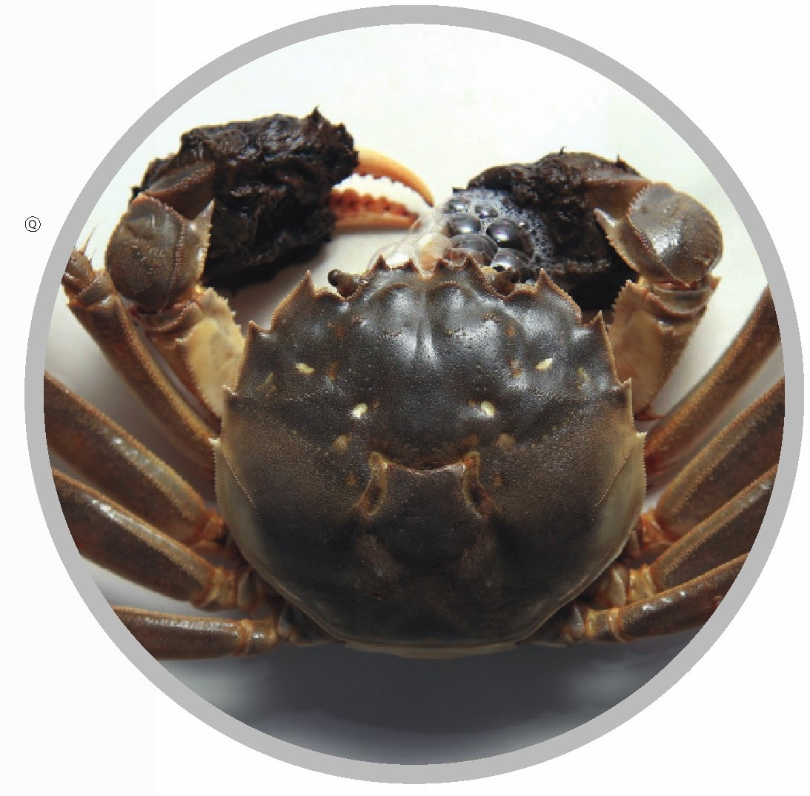
螃蟹是节肢动物门里的甲壳纲动物，和虾属于同一个类别，外面有一层硬壳。它和鱼一样，也用鳃呼吸，但是螃蟹的鳃和鱼鳃是不一样的，它们并不生在头部的两侧，而是着生在身体背面的两侧。螃蟹的鳃由很多像海绵一样松软的鳃片组成，外面覆盖着坚硬的甲壳。我们吃螃蟹的时候，剥开外面的硬壳，就能够清楚地看见两边的鳃片。螃蟹从螯足和步足基部吸进新鲜的清水，就此把水里的溶解氧带入鳃的毛细血管中。经过处理的水从鳃部流过后，再由口器的两边吐出。

鱼儿离不开水，但同样生活在水里的螃蟹却可以短暂地离开水，爬到陆地上去寻找食物，奥妙就在于螃蟹有大片海绵状的鳃片，这些鳃片里可以储存很多水分。因此，即使暂时离开水，它仍然能够在一段时间里维持正常的呼吸，只不过这时候它不是从水里吸入溶解氧，而是直接从空气中吸进氧气。由于吸进了大量空气，在接下去吐出空气的时候，螃蟹会把鳃里面本来含有的水分一起带出来，自然就形成了无数气泡。螃蟹在陆地上呼吸的时间越长，泡沫也就越堆越多，看上去就像是嘴里吐出来的一样。

显然，泡沫是由原本留在鳃片中的水和空气混合形成的，所以也不可能长时间吐不完，于是你会发现，离开水的螃蟹吐泡泡，其实是一个由少到多，再回到少的过程。（周保春）

## 招潮蟹为什么一个钳子大一个钳子小

海风在寂静的沙滩上呼啸，晨曦慢慢露出地平线。两位“武士”面对面地打着转转，将巨大的“钳子”在对方的柄眼前挥舞着，伺机进攻——这是两只张牙舞爪的招潮蟹在争夺“新娘”。但不用担心，这只是一场不流血的表演赛，双方都想给雌蟹留下深刻的印象。引人注目的是，两只招潮蟹的“钳子”都是一大一小。这是招潮蟹的共同特点，它们的雄蟹中有一半是左撇子（左钳大），另一半是右撇子（右钳大），这个巨大的蟹钳常常占了其身体一半的重量。但雌蟹对大和小的组合丝毫不感兴趣，对它来说，重要的是，谁的大钳子更大。

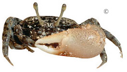
当然，招潮蟹的那只大钳子不仅仅是为了博得雌蟹的欢心。招潮蟹生活在海边泥滩上，挖小洞栖身，经常需要和“入室强盗”搏斗，这个大钳子就是雄性招潮蟹的武器，它们就用这个大家伙来打架。那么，为什么招潮蟹不生出一对大钳子，更好地打架呢？原来，它们还要保留一只小钳子，用来把食物送进自己的嘴巴，生活不能只是打架，还要吃饭呢！那种武器级的大钳子太长了，可够不着它的嘴啊。

与雄性的招潮蟹不同，雌性招潮蟹的两个蟹钳大小相等，虽然它们很适合用来夹食物送到嘴里，但打架的时候就派不上用场了。那雌性招潮蟹又是如何保护自己的“小屋”不被其他招潮蟹强占呢？原来，雌性靠的是有着大钳的雄性邻居。没准，这也是除了打架外，雄性能够俘获雌性芳心的一种手段呢！（周保春）

## 螃蟹为什么长着一对柄眼

在江南一带，大闸蟹是人们自古以来钟情的美味食物。大闸蟹的正式大名叫中华绒螯蟹，这是因为它的两只螯钳上长着细软的绒毛。仔细观察活着的大闸蟹，你会发现它的两只眼睛有时立起，有时放平，俨然一副折叠式“双筒望远镜”。原来，大闸蟹有着非常特殊的眼睛——柄眼。柄眼，顾名思义，就是眼睛是长在柄上的。不光大闸蟹长着柄眼，所有种类的螃蟹也都有柄眼，柄的基部有活动关节，使得眼柄既可以竖起，又可以倒下。

那么螃蟹为什么要长着一对柄眼呢？

首先，这与螃蟹的行走方式有关。除了少数螃蟹（如和尚蟹）能直着行走外，绝大多数种类的螃蟹都是横着走的。这时候，如果左右方向上出现敌情，等它转身的时候恐怕早已变成别人的美食了。但有了柄眼就不一样了，眼柄立起后，两个眼球就能伸向它身体的左侧和右侧前方，从而避开自己头胸部对视线的阻挡。通过发挥复眼成像广阔的优势，既兼顾正前方的视野，又使得它向左右方向甚至侧后方向移动时没有任何视线上的盲区。所以，要说螃蟹的眼神，那真是奇好无比，当你佯装进攻它的正面、侧面甚至侧后面时，它的双眼就会直直地竖起，分别伸向身体的两侧，紧紧地锁住目标，等待着向入侵者发出致命的一击。

其次，还跟它们的潜伏生活有关。比如栖息在海滨沙滩的沙蟹，有两根长长的眼柄，竖起来就像两根火柴棒。沙蟹时常把整个身体埋在泥沙里，只将两只柄眼竖起露在外面，好像潜望镜一样，警惕地观察着周围的动静。

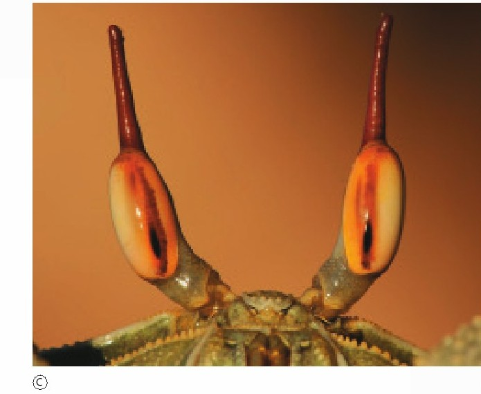
螃蟹的眼睛和昆虫一样，都是复眼结构，每只眼睛都是由很多的小眼组成的，这些小眼分别感光成像在视网膜上，最后通过视觉神经传送到大脑并最终拼接形成一个完整的图像。复眼是凸出的球面体，视野本来就比人类的单眼所能看到的范围要宽阔；再加上眼柄的帮助，真可谓是如虎添翼。眼柄竖起时，螃蟹犹如安上了两个瞭望哨，可以眼观六路；倒下时，甚至可以连柄一起藏在眼窝之中。如果由于不当心或意外事故损坏了眼睛，它还能长出新的眼睛来。要是把它的眼柄切断，那么眼窝里会长出一根很有用的触角，以弥补缺眼的不足。（周保春）

  

**【微博士】**最古老最先进的柄眼

5亿多年前，海洋中发生了惊天动地的“寒武纪生命大爆发”事件，各种类型的生物好像一夜之间从天而降，来到了我们的星球。

当时，海洋中最凶猛的猎食动物奇虾，已经拥有了先进无比的柄眼。奇虾的两只复眼长在头部侧面的肉柄上，肉柄长度约为3厘米。据科学家在2011年的研究，奇虾的每只复眼包含了16000个单眼，分辨率极高，它在捕食的过程中能够非常清晰地看清周围环境，并观察到猎物的大小、形状甚至颜色。现今的生物中，仅有少数蜻蜓的眼睛能达到这么高的分辨率。

**【微博士】**虾蟹不怕开水烫

蟹和虾是表兄弟，它们同属节肢动物门甲壳纲。它们还有一种相同的嗜好，那就是偏爱深海热液。

深海热液主要出现在超过2000米深的海底，从洋壳裂缝涌出的热水富含硫化物和各种金属元素，温度超过400℃。可是某些种类的螃蟹却能群居在热液口周围，即便外壳被烫伤也毫不在乎。

2012年初，科学家又在加勒比海5000米深的深海热液口发现了一种小虾。这种虾浑身苍白，密密麻麻地聚集在热液口“烟囱”上，密度高达每平方米2000只！

【微问题】螃蟹为什么能离开水生活？

【关键词】螃蟹　招潮蟹　柄眼　大钳

## 为什么水母会螫人

水母是一类比较低等的动物，常常漂浮在海面上，随波逐流，因为身体里含有95%以上的水分，所以看上去如同无色透明一般，显得很有趣。但是，水母绝不像它外表表现的那么柔弱，如果你用手去触摸它，会像触摸刺毛虫那样，被螫得又红又肿，疼痛难忍。

水母为什么要螫人呢？它又是怎样螫人的呢？

水母螫人或者螫其他动物，一是为了防御，二是为了捕猎。水母的身体通常分为两部分，一部分是露出水面的“伞”部，另一部分是浸没在水中的口腕部。有的水母在“伞”的周围有许多小触手，有的却在口腕处长触手。这些触手看似柔软迷人，实则暗藏机关。因为触手表面分布着无数刺细胞，里面有多个刺丝囊，刺丝囊中装备着毒液和一盘细长的刺丝。当遇到猎物或敌害时，刺丝就会像装了弹簧一样，立即翻出，如利剑般刺向对方。同时，囊里的毒液从空心的刺丝中射出，像打针那样进入对方体内。一般的对手在受到这样一次有效的攻击之后，大多中毒麻痹。厉害一点的家伙也会受惊不小，很快逃之夭夭。这种攻击手段，和毒蛇是不相上下的。

假如是一条小鱼儿，它可能会说：惹不起就躲，这总行了吧？嘿嘿！也不一定，水母的触手会主动出击。触手就像装了弹簧，进退自如，在想吃东西的时候伸得老长，非得抓住小鱼、小虾、小虫不可。等到对方中毒后迷迷糊糊了，就弄到口里吃掉。

最可怕的水母要数北极霞水母，它的“伞”径约有2米，“伞”的下缘有8组触手，每组150根，每根触手上又有无数刺细胞。更厉害的是，它的触手可以伸长到40米以上，一旦把所有触手都张开，就像布下了一个致命的天罗地网，总面积可达到500平方米。这时候，如果有人游泳不幸进入这个范围，后果简直不可想象。幸好，这种可怕的水母只分布在人迹罕至的北极海域中。（周保春）

## 为什么水母能预知风暴

出海的人，对海上的大风暴胆战心惊，一旦遇上，就可能永远回不来了。奇怪的是，每当风暴来临时，水母居然能够预知，并会迅速做出反应。那么，水母为什么能预知风暴的到来呢？

科学家发现，在狂风怒吼、海浪咆哮激起的“大海交响乐”以前，先有一种次声波（每秒8～13赫兹）传来，它比风和浪的速度更快。人类对这种次声波无动于衷，但水母却能感觉到。原来，水母的“伞”缘感觉球里有小小的听石，仿佛是水母的“耳朵”。由海浪和空气摩擦而产生的次声波会冲击听石，刺激周围的神经感受器，使水母在十几小时之前就能够捕捉到风暴的声音。于是，它们好像接受到命令似的，一下子沉入到海洋深处，以免被暴风激起的巨浪砸碎。

水母的分布受风向、风力、海流及潮流支配。平时它们聚集在海面上，绵延数海里，也会在一夜之间漂得无影无踪。在风平浪静、水色清澈、阴天或阳光不强以及平潮的情况下，水母漂浮于水域的上层或表层。每当遇有大风浪、暴雨、水质变浑、落潮或阳光过强的时候，一般就下沉到水域下层或近底层。

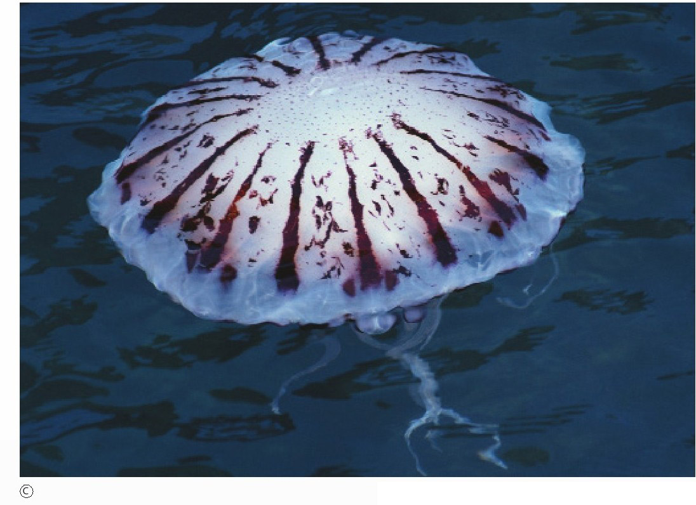
“伞”中的听石帮助水母预知风暴

人们从水母能预知风暴中受到启示，模拟它们的感觉器，成功地制成了风暴预测仪，安装在船舰的甲板上，能够提前15小时接收到海上传来的次声波，预知海上风暴来临的方向和时间。（周保春）

## 为什么有些水母会发光

在海洋中，许多水母都会发光，如栉水母能发出蓝色的光，霞水母闪耀着淡绿色的光芒。有些水母不但能发光，而且颜色多变，有的还带有彩虹般的光晕，当它们在海中游动时，就变成了一个个光彩夺目的彩球，光影随波摇曳，非常优美。

自然界中有许多动物能发光，它们大多是因为体内有荧光素或荧光酶，经过氧化作用就会发出光来。然而水母的发光系统却不同于其他动物，它是依靠一种叫作埃奎明的奇妙的蛋白质来发光的。埃奎明遇到钙离子时，就会发出强蓝光来，而钙是生物体运动必需的离子，体液和细胞中都有一定量的贮存，所以只要水母活着，就会一直发光。科学家还从埃奎明中分离出一种特殊的结构要素——氨基吡嗪环，它能吸收极短波长的紫外线，并发出可见光。水母单凭身上发出的幽光，就能毫不费力地引诱猎物自投罗网。

利用水母的发光特性，美国一家公司制作出无需通电的“水母灯具”，已经推向市场。这家公司先将自然死亡的水母尸体用液态氮冷冻，再将其放入已制成的卵形透明树脂中，然后进行全封闭加工，这样就制成了一盏盏独特的装饰灯。这种灯具不需要用电，白天它们吸收自然光，晚上则会在黑暗中发出迷人的蓝色光芒。（周保春）

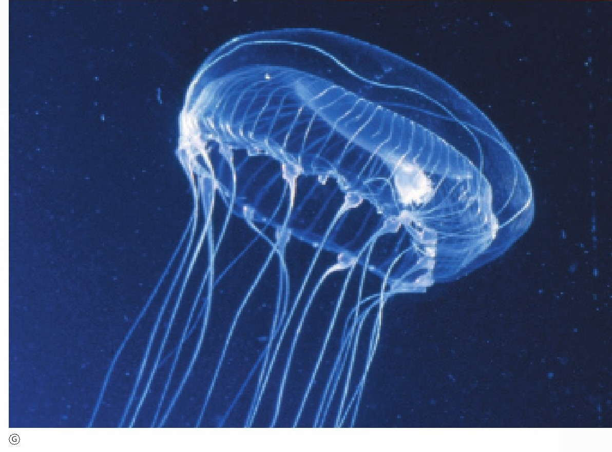
  

**【微博士】**倒过来的水母是水螅

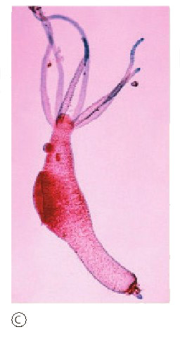
水母属于无脊椎动物中的腔肠动物门。腔肠动物依据模样分为两大类：一类叫水螅型，下面是个圆盘，固定在一个地方，上面有个口；另一类叫水母型，上面是个圆盘（“伞”部），漂浮在水面上，圆盘中央垂下来一根管子，管子的末端是它的口。水螅型的动物在口的四周有像飘带一样的触手，水母型的动物在圆盘的四周有像飘带一样的触手。这些触手，就是它们抓捕食物的工具。别被水螅型和水母型这两个陌生的名字吓住了，其实，无论把其中哪一个的身体倒过来看，你会发觉两个看上去形状都差不多。不过，水螅一般很小，只有几毫米，通常在显微镜下才能看清楚它们。2010年，科学家发现水螅体内也存在老年痴呆症基因。这表明，水螅将来可能成为研究这种疾病的模型。

**【科学人】**钱永健

美籍华裔科学家钱永健，因为研究水母的绿色荧光蛋白（GFP）而与另两位科学家共同荣获2008年度诺贝尔化学奖。借助DNA技术，钱永健把水母的GFP上不同部位的氨基酸进行重组，创造出崭新的GFP变体，使它们能发出更强、更多色彩的光，如青绿色、蓝色和黄色等。这样，研究人员就能同时给不同的蛋白质标记上不同的颜色，同时追踪多种生物细胞的变化。他的研究也为跟踪、消灭人体癌细胞提供了新的方法。

【微问题】水母从水面下潜到深海后，身体为什么不会被水压压扁？

【关键词】水母　触手　次声波　发光

## 为什么蛤、蚌里会长出珍珠

人类把珍珠作为饰物已有几千年历史。珍珠晶莹素洁、浑然天成，人们喜爱它，把它看作是上天的恩赐。我们都知道珍珠是在蛤、蚌中长成的，可是为什么其貌不扬的贝壳里能生出高贵的珍珠呢？

自然界中大约有10万种贝类，可是能长出珍珠的只有十几种，最常见的珍珠贝名叫合浦贝。我们以合浦贝为例，来说明珍珠是怎样形成的。

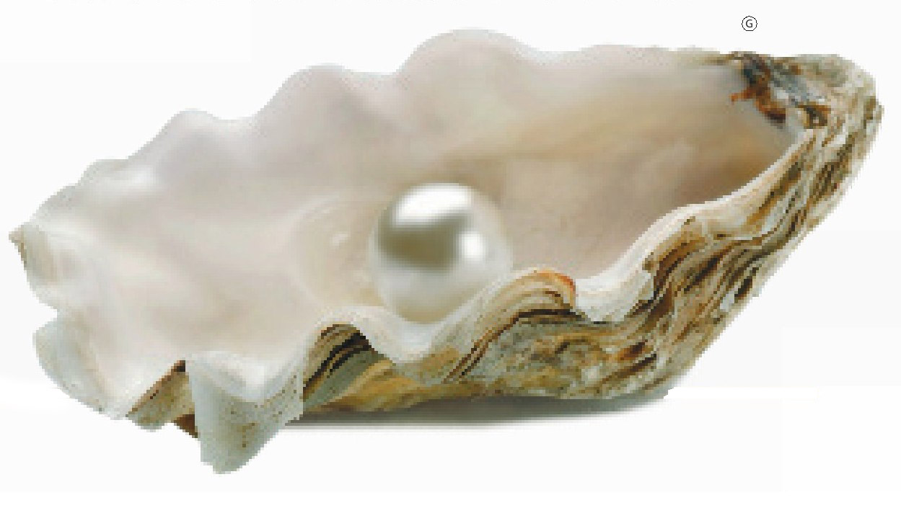
撬开合浦贝的双壳，我们能看到在它的软体中，消化器官、生殖巢还有围心腔（包括心脏在内）占据了大部分空间。这些软体部分被一层厚实的称为外套膜的肉膜包裹着。外套膜的外面就是两枚坚固的贝壳。让人称奇的是，天然珍珠不是长在贝壳上，而是在这层厚厚的外套膜中形成的。我们的祖先在掌握人工培育珍珠的技术之前，就是从海量的珍珠贝外套膜中寻找那可遇不可求的天然珍珠的。

外套膜里是如何生出珍珠的呢？为了解答这个问题，我们要先来看看外套膜平时都在做些什么。外套膜是不封口的，就像一条连衣裙，当珍珠贝滤食水中的浮游植物时，它负责调节吸入体内的海水量。不仅如此，它还在贝壳形成中发挥着重要作用。

外套膜是由内外两层表皮细胞夹着中间一层结缔组织构成的，外层表皮细胞平时和贝壳紧紧地贴在一起，并分泌富含钙质的液体。当它在贝壳的内壁上刷来刷去时，就把液体中的钙以碳酸钙结晶的形式“刷”到贝壳上了。珍珠贝内壁上那闪耀着美丽光泽的珍珠层，就是这样被“刷”出来的。实际上，贝壳能够从小到大不断成长，靠的就是外套膜不停地分泌钙质，形成碳酸钙结晶。

外套膜虽然能在贝壳内壁上刷出美丽的珍珠层，却刷不出深受人们喜爱的圆润如豆的珍珠。那为什么外套膜的那层肉中能长出珍珠呢？这是由于沙粒等异物进入外套膜组织内部而形成的。如果外套膜表皮携带异物凹陷到组织内部，运气好的话，表皮碎片不但不死，反而会继续作为表皮在组织内部继续生长，分裂出新的细胞，并逐渐把沙粒包住，然后在外面一层一层地分泌出珍珠质。圆润的珍珠就是这样逐渐形成的。

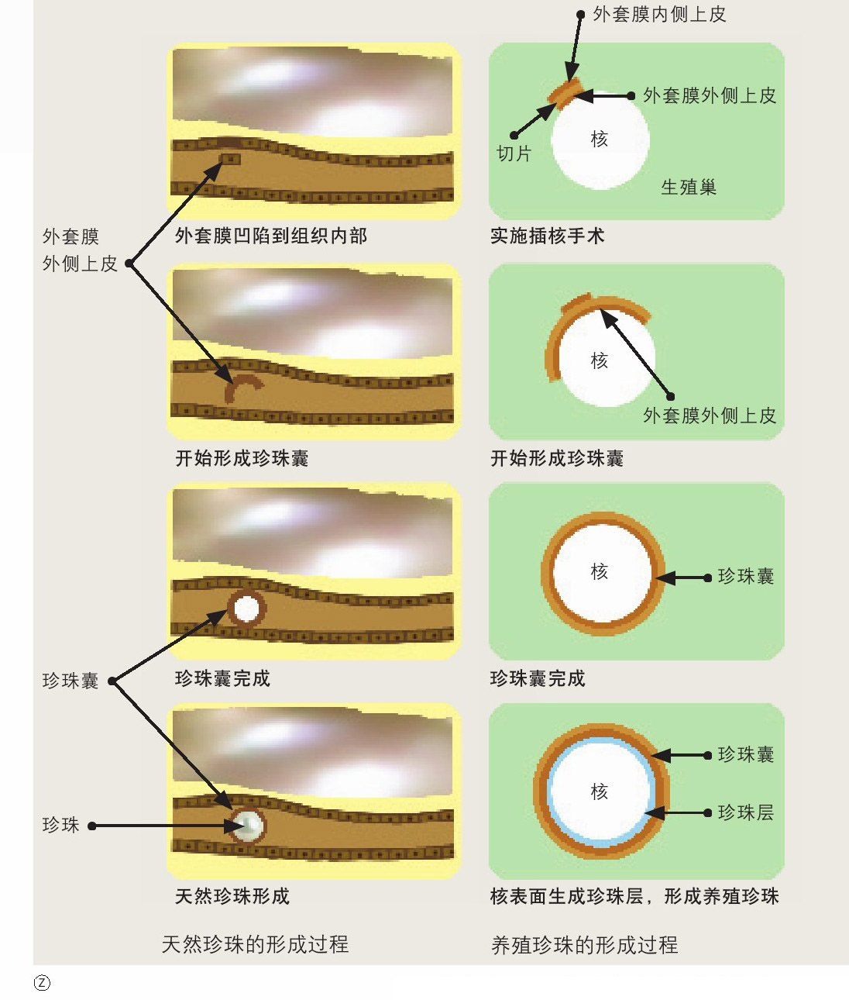
天然珍珠和人工养殖珍珠的形成过程对照

天然珍珠实在是太稀少了，今天我们看到的珍珠，绝大多数是人工培育的产品。人类经过长期的摸索，终于在20世纪初叶确立了成熟的人工养殖珍珠技术。最常用的方法是切片法，就是把外套膜的切片蒙在被称为“核”的圆珠表面，然后用手术方法把核植入珍珠贝的生殖巢中。核通常由贝壳加工而成。外套膜沿着核的表面不断生长，把核包住，并且分泌成千上万层的珍珠质，圆润的球形珍珠就大功告成了。不过，从珍珠贝的培育到施行手术，最后到珍珠采收，需要耗费长达4年时间。不仅如此，植入生殖巢中的核，最终只有不到三成能长成具有商品价值的珍珠。谁知美丽珍珠，粒粒皆辛苦！（周保春）

## 为什么珍珠有不同的颜色

珍珠高贵华美，且有不同的颜色。珍珠的颜色按照色系可分为白色、粉红色、金色、蓝色四种。那么，为什么珍珠有这么多不同的靓丽色彩呢？

珍珠的表面由成千上万层珍珠质层组成，每一层的厚度只有0.4微米左右。当光线照射到珍珠上后，从表层以及更下层的珍珠质层反射回的光线产生复杂的“多层膜干涉作用”，于是就形成了绚丽耀眼的色彩。在自然界中，孔雀羽毛、蝴蝶翅膀的色彩也是由光的干涉作用产生的。

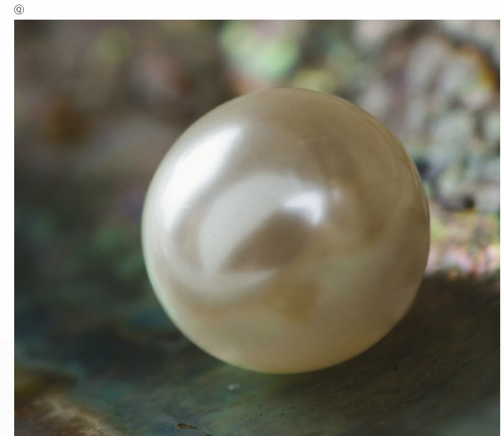
除了光的干涉之外，珍珠质层中的色素也对珍珠色彩的形成有重要贡献。例如金色系的珍珠，是由于珍珠质层之间有黄色蛋白质色素而产生的。而蓝色系珍珠的产生，则归功于珍珠质层的最下方有一层有机质。

因此，我们看到的珍珠的颜色，多是珍珠的微观结构和内部色素共同作用的结果。（周保春）

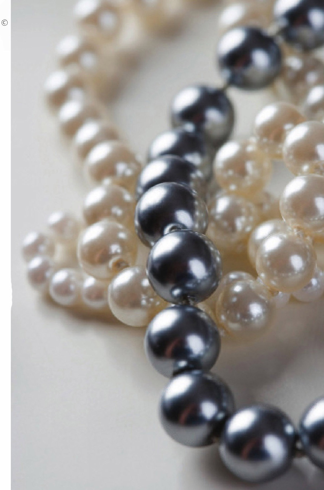
  

**【微博士】**实验室里做不出的东西

大发明家爱迪生曾经说，实验室只有两种物件是无法制造出来的，一是钻石，另一个是珍珠。可是发明人工养殖珍珠的方法，却由两位亚洲人做到了。1880年，日本的养殖家御本木幸吉采用中国古老的养珠法，开始了人工育珠的艰苦探索。1893年，他发明了半球形珍珠的养殖技术。到了1907年，日本的另一位养殖家西川藤吉先行一步，成功确立了球形珍珠的养殖技术。这两位养殖家所确立的“切片法”，至今仍是最常用的球形珍珠养殖技术。

**【微博士】**慧眼识真假珍珠

如今，市面上各种假珍珠鱼目混珠，到了以假乱真的地步。不过假货毕竟是假货，它们与真正的珍珠有诸多不同。这里教你一招识别真假珍珠的简便方法：用显微镜观察珍珠，如果看到它的表面有形似指纹的图样，那就是真的。因为指纹图样是珍珠表面处于成长过程中的印记，表明它是从活的母贝中取出的。而人造珍珠就没有这样的图样。

【微问题】根据珍珠形成的原理，天然珍珠的“内核”应该是沙粒吗？

【关键词】珍珠　贝类　合浦贝　外套膜　光干涉　人工培育

## 许多动物都会冬眠，为什么海参却要夏眠

每到冬天，不少动物由于食物短缺，就钻到树洞、地下、岩洞等处冬眠。以哺乳动物为例，就有专吃植物绿色部分的黄鼠和旱獭，以及主要靠蠕虫和昆虫来生活的刺猬等。以两栖爬行动物为例，则几乎所有的种类都在土中和水里睡大觉过冬。而拥有超大规模种类的昆虫，则会以成虫、幼虫或者虫卵的形式来避开没有食物的严酷冬季和高温难挡的仲夏。

但奇怪的是，生活在浅海之中的海参却在夏季进行特殊的夏眠，这是什么原因呢？

原来，海参喜欢栖息在海底或者岩礁的底部，吃浮游生物以及那些混在泥沙中的有机碎片。当海底食物多的时候，它自然无忧无虑，过着吃饱喝足的日子。然而，如果海底食物大量减少，它的日子就难过了。

入夏以后，上层海水由于太阳光强烈照射，水温比较高。在繁殖、摄食等多种因素的作用下，大量浮游生物上升到了海面上，而海参却对温度特别敏感，当水温超过20℃时，它就有点受不了，于是反而向水温更低的海底移动。这么一上一下，海参就和食物离得更远了。因此，没有东西可吃的海参，只好进入夏眠状态。这是生物为适应环境而养成的习惯。

不过，夏眠只是生活在浅海中的那些海参才具有的习性。全世界的海参有1000多种，从潮间带到最深的海沟（水深超过1万米）都能找到它们的踪迹。在深海中，海水的温度一年到头都很低，怕热的海参完全不用“背井离乡”，迁往陌生之地去夏眠了。（周保春）

## 海参失去内脏后为什么不会死

海参是生活在海洋中的一类小动物，但它不像鱼儿那样灵巧，不能在水中快速游动。正因为如此，当它遇到敌人追击时，常常采用“丢车保帅”的分身术，那就是突然将自己的内脏从肛门射出，分散敌人的注意力，自己则乘机逃之夭夭。说来也奇怪，失去内脏的海参并不会死去，只要以后生活安定，它又能长出新的“五脏六腑”来。

为什么人类或其他高等动物发生同样的情况会失去生命，而海参却不会呢？实际上，这是一个再生能力强弱的问题。低等动物，同时也包括植物，具有较强的再生能力，它们在受到创伤或失去身体的某一部分后，能够较快地愈合伤口，或者再生出失去的那部分躯体。海参属于低等动物，它能重新长出内脏，就是再生能力强的典型例子。而高等动物受到创伤后，由于再生能力较弱，一般只能愈合伤口，而无法再生出某一段肢体或某一个内脏器官。

低等动物的再生能力之强，有时简直令人惊讶。

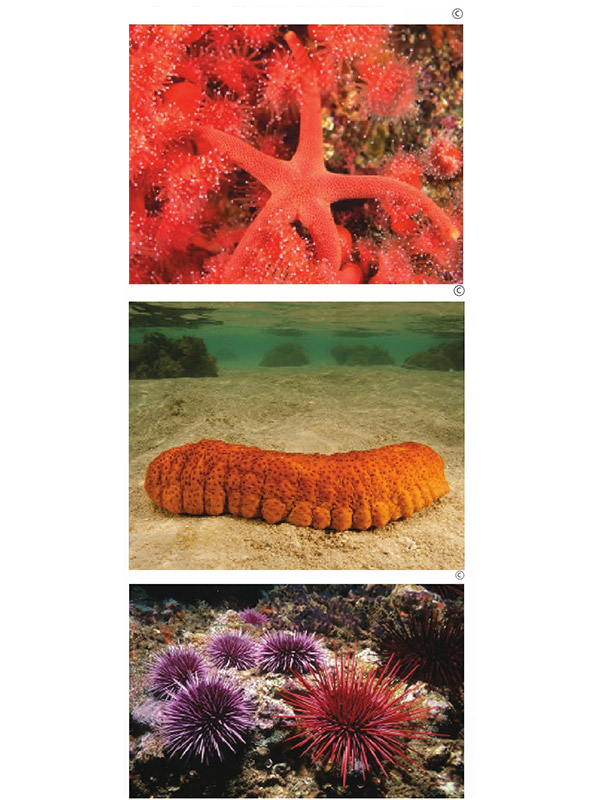
海星、海参、海胆都具有很强的再生能力

以前有个渔民，在海边养殖牡蛎和一些别的食用贝类。由于这片海域中生活着一种海星，它是牡蛎的天敌，常常把贝壳里的肉吃掉，使渔民受到很大损失。渔民为了惩罚这些可恶的家伙，只要抓到海星，就把它撕成两瓣或剁成几段，投进大海里。没想到，海星的“碎尸”不但没死去，反而每一段都成了一只完整的海星，数量变得越来越多。这场悲剧的发生，就是渔民不了解海星具有强大再生能力的结果。实际上，科学家早就知道，海参的所有近亲（海星、海胆、海百合等棘皮动物）都有很强的再生能力。

除此以外，蚯蚓被切断之后，通过再生也可以使自己重新复原；螃蟹的一只眼球如果损坏了，很快又能长出一只新的眼球。更令人惊奇的是：把一种属于腔肠动物的水螅切成几小段，不仅每段都能长出一个小水螅，而且当它的头部被切开后，居然会长成一个双头的怪水螅。（周保春）

## 为什么说海百合也是动物

在浩瀚的海洋中，水深超过200米的地方就属于深海了，那里没有光亮，是伸手不见五指的黑暗世界。不过，如果你有机会跟随海洋学家潜入几百米的深海，透过潜艇的舷窗，借助探照灯的光亮，也许会发现海底丛生着一种美丽的“花儿”——它们的根牢牢地附着在坚硬的岩石上，细弱的茎上顶着一个绚丽的花冠，随海水缓缓地摇曳，这就是海百合。海百合的姿态，恰如盛开在荒野中的百合花。可是在黑暗无光的深海中，怎会有花儿盛开呢？

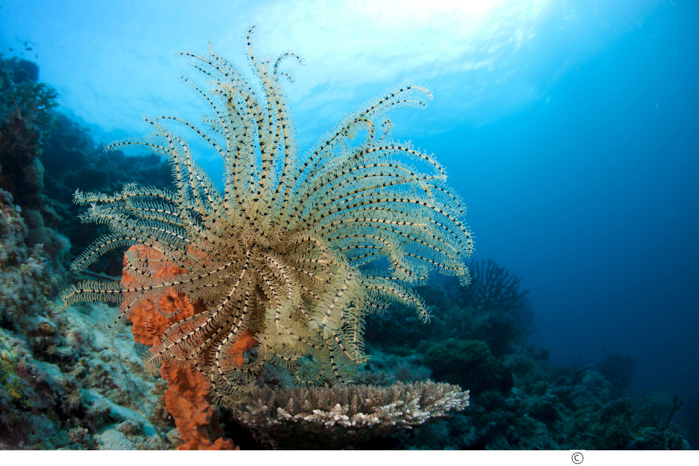
先揭开谜底吧。海百合可不是花儿，而是海参的近亲，它们同属棘皮动物。

海百合是一类古老的动物，早在5亿～2.5亿年前的古生代，它们就占领了广阔的海洋。当时，世界各地的浅海中长满了海百合，好像一望无际的花园。可是好景不长，凶猛的鱼儿和螃蟹在浅海越来越多，海百合惨遭杀戮，最后从浅海彻底消失了。好在有些海百合潜逃到天敌较少的深海中，并在那里站稳了脚跟，它们的子孙就是今天的深海海百合。最近，科学家在水深9000米的海沟中也发现了群生的海百合，可见它们耐压、耐寒冷的能力是超乎寻常的。

海百合是动物，因为它是靠摄取食物生存的，但它又是不动的动物，固定生活在海底，躯体分根、茎（柄）、冠三部分。海百合用茎托起冠，用冠过滤海中的微小颗粒，将其中的单细胞生物、生物体的碎片、有机物质颗粒作为营养吸收掉。

海百合的花冠一般由体盘和多个腕组成，体盘具口、肛门、步带沟，沟内有触手。进食时，海百合将这些腕高高举起，形成一个网，将名为“管足”的触手伸出，捕获海水中的微小颗粒。海百合中另有一类叫“无柄海百合”，它们没有柄，而是长有几条小根，口和消化管也位于花冠的中央，既可以自由游泳又可以固定在浅海礁石上。不过，无柄海百合的移动速度实在是太慢了，最多也只能从海胆这种慢腾腾的天敌的虎口中逃生。无柄海百合在水中移动，目的不是逃避天敌，而是寻找更多的食物。（周保春）

  

**【微博士】**万米深渊也有海参

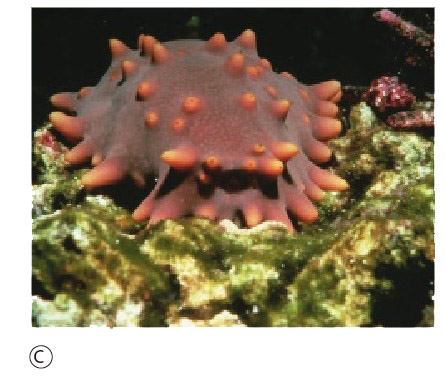
好莱坞著名导演詹姆斯·卡梅隆真是一位狂人。2012年3月，卡梅隆只身一人乘坐深潜器潜入世界海洋的最深处——位于菲律宾东北的马里亚纳海沟，并在那里呆了大约3小时。

马里亚纳海沟的最深处叫“斐查兹深渊”，那里水深达11034米，水压接近1100个大气压，温度只有几摄氏度，而且是永恒黑暗。可就在这样的地方，却生活着一种独特的海参，它们的身上长有一枚“帆”，形似张开的手掌。这种海参实在是太水嫩了，一旦离开海水，它的身体就会因自重而垮塌，变成一摊液体。

【微问题】深海中的动植物是如何抵抗高水压的？

【关键词】海参　夏眠　再生　海百合

# 综合

## 为什么沙漠里的动物能活下去

据说在19世纪，一批西方探险家在大漠里寻找“土著”动物，费了九牛二虎之力，才在他们搭建的帐篷旁找到了一只蚊子，众人欣喜若狂，可是经过仔细研究，不禁大失所望。原来，这只蚊子还是随探险队的帐篷一起从沙漠外面带进来的。从此，在他们笔下，这片地方成了“任何动物都无法生存”的“死地”。

这个故事或许有些夸大，但若我们亲身来到大漠，在如此炎热、干燥缺水的地方体验一下，恐怕连一天都不想呆下去，想必动物也是如此。不过，你可别小瞧动物们的忍受能力，即使沙漠气候条件如此恶劣，也会有不少动物，把这里当成它们赖以生存的家园。

为什么动物能顽强地生活在这里？

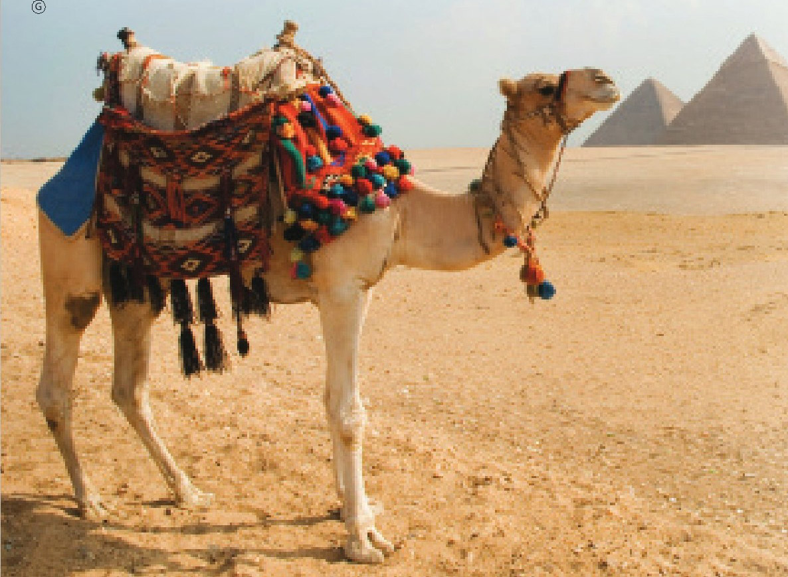
白天的沙漠，最热的时候温度可达67.2℃。虽然小动物们几乎不见踪影，但少数蜥蜴依然会比较活跃。通常，这些蜥蜴以一种独特的舞蹈对付炎热，它们会将左前腿及右后腿或是右前腿及左后腿举起，留下另外两条腿和尾巴形成三足点地的姿势。如此反复交换，蜥蜴的肢体与地表便能接触得少一些，看上去好像在手舞足蹈，非常好笑。如果这样还不能抵御炎热的话，蜥蜴就会以其强壮的四肢掘沙，把身体潜伏在其中，来躲避热浪的侵袭。随着夜幕降临，小甲虫等昆虫，沙蜥、鬣蜥以及蛇等爬行动物便慢慢地从稀疏灌木、朽木或沙层下爬了出来；跳鼠、沙鼠等啮齿类动物也从地下洞穴中探出脑袋，准备晚餐。它们的身体经不起白天高温的炎热，所以就先找个阴凉的地方躲起来，昼伏夜出也是不错的！

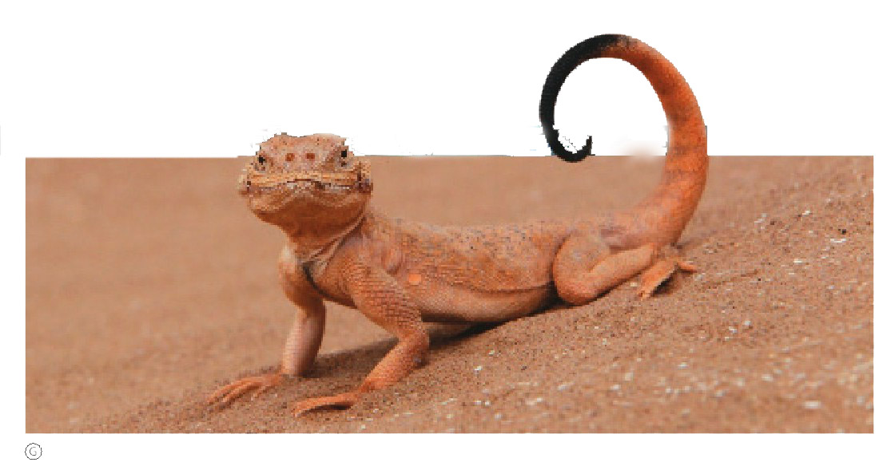
沙蜥

大动物们，譬如最负盛名的骆驼，因身形太大，难以在大树稀少的沙漠中找到躲避处，所以它们在长期的高温曝晒下慢慢改变了自己。骆驼能够不喝一滴水而生存21天，并且可以忍受很大的体温变化。一天开始时它的体温仅为34℃，随着气温越来越高，它的体温可以升到40.5℃而不“发烧”，这样就减少了出汗，从而维持住生命需求的宝贵水分。当温度继续升高到超过40.6℃，开始出现脱水现象时，骆驼能够将体重减轻24%而没有什么不良影响。还有，骆驼的肾很特别，能浓缩尿液，减少尿量，这又是一个保存体内水分的方法。

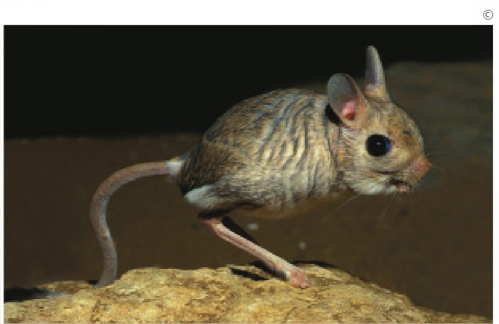
沙漠跳鼠

不过，即便是拥有最高效保水能力的动物也无法达到水分不流失。为此，动物们还必须发展出不凡的找水、储水技巧。沙漠日夜温差大，晨昏的时候，水汽会凝结在地表，也会产生雾。当雾气笼罩在沙漠中时，动物们就各显神通。如：壁虎的身体和眼睛能够聚集雾滴，而它长长的舌头可以非常灵巧地把眼睛中的水汽舔走，如同汽车前窗上的雨刮器一般；甲虫也会在清晨从沙子里采集水珠；而骆驼一旦找到水源，可以在10分钟内喝下100多升水！

就这样，沙漠的动物们采取各种技巧或武装身体，在与恶劣环境的不断较量中绵延子孙，坚强地生存下去。（余丽江）

## 为什么寒冬的白鹭能在水中活动自如

寒冬，当我们瑟瑟发抖地站在滩涂边、鱼塘旁时，水中几只裸露着长腿、浑身白色的鸟儿却优雅、不徐不疾地踱着步子。它们伸着长脖子和细长的嘴巴四处打探，不多时，其中一只夹住了小鱼，头朝上一仰吃进了肚子里。它们仿佛不知道冷似的，在水中反复做这样的动作。

这种鸟天生只吃小鱼、小虾等水里的动物，不论天气多么寒冷都要和水接触；它们的身体明显可见“三长”特点——脖子长，嘴巴长，腿长。它们的名字叫白鹭，是鹭鸟“家族”的成员之一。可是，白鹭的长腿为什么就不怕冷呢？

白鹭之所以能裸露着长腿自如地行走在冰冷的水中，是因为其腿上具有特殊的血管网络。让我们暂且将从心脏流向腿部的带有热量的血液称为“热血”，将与冷水直接接触、从腿部流回心脏的血液称为“冷血”。热血流到腿部和冷血流回心脏，都是为了维持腿部的活动，让它们不至于冻僵。不过，假如热量散失得非常快，那么白鹭在冰冷的水中也坚持不了多久。好在两股血液的管道紧密相连，在经过腿部时，紧邻的血管网络加快了“热血”的能量传递，使得“冷血”升温，这样一来，大量的热能其实会被“冷血”带回身体中，只有很少散失到冰冷的水中。所以，这个特殊的网络既能保证腿不被冻坏，又能保证大多数热量回到身体中，从而也使得白鹭能够轻松地在冬天的水中寻找食物。

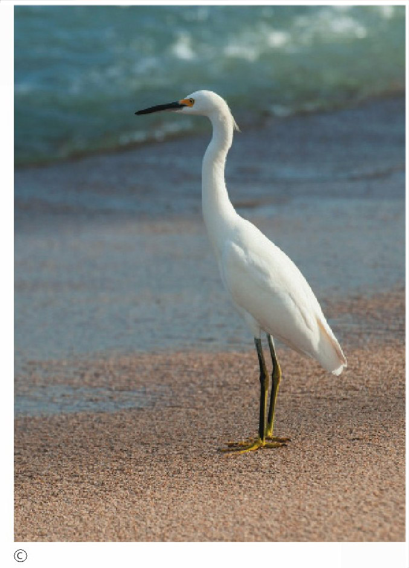
实际上，除了白鹭和鹭鸟“家族”成员以外，丹顶鹤、火烈鸟这些以水生动物为生的“三长”鸟儿也拥有这项技能。生活在水里的天鹅、大雁、鸭子也是依靠这个“法宝”抵御寒冷，只不过它们的血管网络位置稍稍变化，存在于足蹼中而已。（余丽江）

  

**【微博士】**唯一生活在水中的蜘蛛

有一种一生都生活于水下的蜘蛛，它们的交配、产卵及利用蛛网捕食都在水下进行，虽然俗称欧洲水蛛，但是在亚洲和非洲北部地区的池塘以及水流较慢的溪水中也有它的踪迹。

只有肺没有鳃的水蛛，是如何在水中自由呼吸的呢？水蛛自有妙招。它吐丝在水下构筑成一个钟罩形的空间——潜水钟，并把每次潜入水中时附着在腹部和呼吸孔周围绒毛上的许多气泡注入潜水钟内，慢慢形成一个充满空气的大气泡。这个与水隔绝的单间住所既是水蛛的餐厅、卧室，也是雌性水蛛的客厅与产房。

**【实验场】**观察一下蜗牛，看看它们是如何度过炎炎夏日的

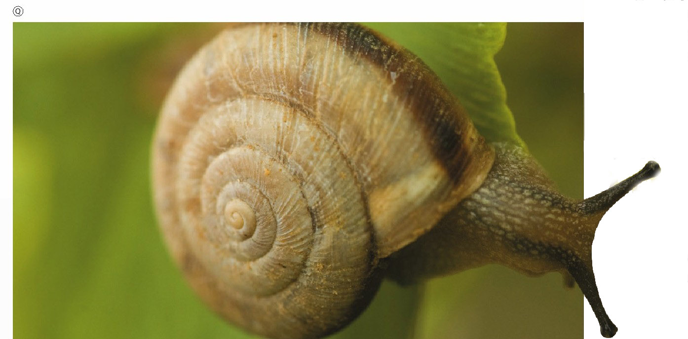
夏天到了，天气一天天热起来。请你到自家阳台、庭院或公园里，试着找找蜗牛，看看在什么环境下你能发现它们的踪迹。

如果在烈日下找到壳口封闭着的、晒干的蜗牛，试着把它带回阴凉处，滴几滴水，过一段时间再观察它有什么变化，想一想这是什么原因。

【微问题】生活在极端环境里的动物，是自己主动选择的结果吗？

【关键词】生活环境　沙漠　寒冷　骆驼　白鹭

## 为什么没有三条腿的动物

在《山海经·大荒东经》中有这样的记载：“东海中有流波山，入海七千里。其上有兽，状如牛，苍身而无角，一足，出入水则必风雨，其光如日月，其声如雷，其名曰夔。黄帝得之，以其皮为鼓，橛以雷兽之骨，声闻五百里，以威天下。”这一传说中的古代神话奇兽，居然是一种只有一条腿的动物。

腿是动物的运动器官。现实中，蜗牛依靠一条“腿”爬行，青蛙、蜥蜴、豹子、大象等利用四条腿跳跃、爬行和行走，人类、蝙蝠、鸟儿和已经灭绝的翼龙等长着两条腿。然而，任凭你绞尽脑汁，估计也没办法列举出哪一类动物长着三条腿，其原因很可能与生物的进化历程有关。

在生命诞生之初，一个细胞就是一个生命。之后，地球上开始出现了由多个细胞构成的生命，比如最原始、最低等的多细胞动物——海绵。虽然有些海绵有一定的形状和对称性，但多数是像植物一样不规则地生长，形成扁的、圆的、树枝状等不对称的身体结构。接着，水母等腔肠动物开始出现，它们体内的中央轴（从口面到反口面）有许多个切面，可以把身体分为两个相等的部分，生物学上将具有这种形态的生物称为“辐射对称生物”。它们只有上下之分，没有前后左右之分，只能在水中固定着或随水流漂浮，被动地从周围环境中摄取食物。后来，为了取得主动出击的权利，一类既适于游泳又适于爬行的动物出现了。要做到这一点，它们的身体必须明显地分出前后、左右、背腹。而在形态上，通过动物体的中央轴，只有一个对称面（或说切面）可以将动物体分成左右相等的两部分，这类动物被称为“两侧对称动物”或称“左右对称动物”。这种由不定向运动朝定向运动的转变，使得动物适应的范围更广，是一种比辐射对称更高等的进化形式。

属于两侧对称的动物有很多，如蜗牛、螺等软体动物，人类、豹子、大象等哺乳动物，鸟类，蛙、蜥蜴等两栖爬行动物，蜻蜓、蝗虫等昆虫。顾名思义，它们体现在腿的数量上时要么是1（可以一分为二），要么是2、4、6等偶数，否则在体形上就无法对称了。因此，三条腿的动物不可能存在于两侧对称的行列中。

那么，有没有可能出现在辐射对称的生物中呢？在一种被称为五辐射对称的动物中，确实有长着五条腕的海星可作缓慢移动。按此推论，你可能会提出也应该有三条“腿”的“某种海星”，可惜目前为止尚未发现。而且从根本上来说，这类固定着或漂浮着作被动运动的生物其实没有真正“腿”的结构。

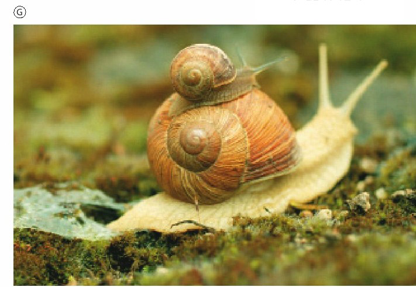
一条腿的蜗牛

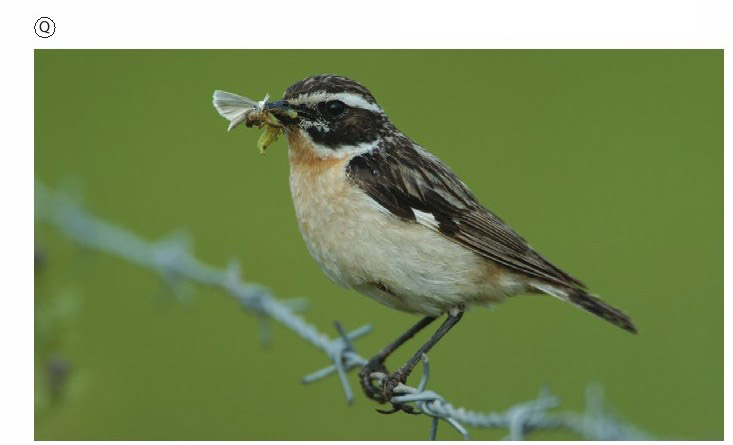
两条腿的鸟类

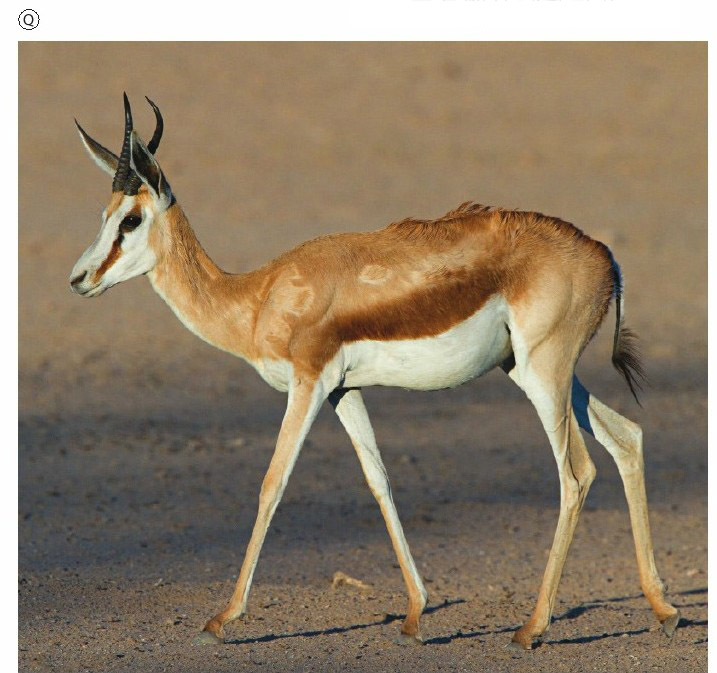
四条腿的哺乳动物

或许，在生命演化的历史长河中，曾出现过三条腿的动物。只是非常遗憾，不管是现生的还是相关的化石，都没有找到这类动物。至于新闻报道中偶见的长着三条腿的动物，那是因为环境和基因突变形成的畸形，是没有办法稳定遗传到下一代去的。（余丽江）

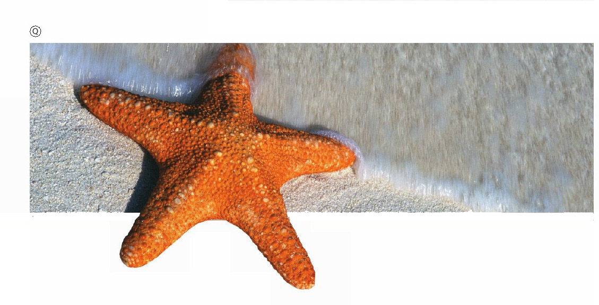
五条腿的海星

## 两条腿跑得快还是四条腿跑得快

《英国皇家学会会报》上发表过这样一篇文章，科学家们从化石的解剖组织构造着手，利用计算机模拟了一场史前和现生两腿动物间的赛跑竞赛。参赛的选手包括5种食肉恐龙、鸵鸟、鸸鹋和人，而结果出乎意料。此前被认为是跑得最快的两腿动物——鸵鸟，只排在了第二名，冠军是一种大小跟一只小猫差不多的小型食肉恐龙——美颌龙，它的奔跑速度可达64千米/时。

这是两条腿的动物比赛。如果和四条腿的动物相比呢，美颌龙还能保持第一吗？

中美洲的黑刺尾鬣蜥，奔跑速度达34.9千米/时，是全球跑得最快的蜥蜴，但也比不过美颌龙。格雷伊猎犬专用于狩猎和竞赛，速度最高可达67千米/时，已经比肩美颌龙。人类早期的代步工具——马，它的最快速度有80千米/时。在北美洲，有一种特别善于奔跑而闻名西半球的羚羊——叉角羚，最高速度可达95千米/时。叉角羚惊人的奔跑能力是在面临死亡的威胁下逐渐“苦练”出来的，只是为了从1万多年前已经灭绝的、更善于奔跑的北美猎豹的追捕下逃生。以上两种“飞毛腿”的速度，都已经超越了美颌龙。

但还有更快的！在非洲草原上生活的猎豹，最快时速达到115千米，并且可在两秒内由静止加速至时速72千米。猎豹是大自然精心设计出来的短跑机器，它拥有流线型的外形和轻盈的体态，加宽的鼻孔能够在飞奔时获取更多氧气，肺部和心脏可以应付发力奔跑时忽然增加的负荷，不能缩回的脚爪像钉鞋般增加抓地能力……而最最关键、适应高速奔跑的原因在于其拥有弹性良好的脊椎骨。

由此可见，跑得最快的动物就是猎豹这一四足动物，两条腿的动物只好甘拜下风。不过腿的数量并非是直接影响快慢的首要因素，四条腿的乌龟就是公认的慢性子。在长期的演化中，动物们只要适应了自身的生存环境，不一样的速度都有好好生活下去的理由，毕竟是适者生存嘛。（余丽江）

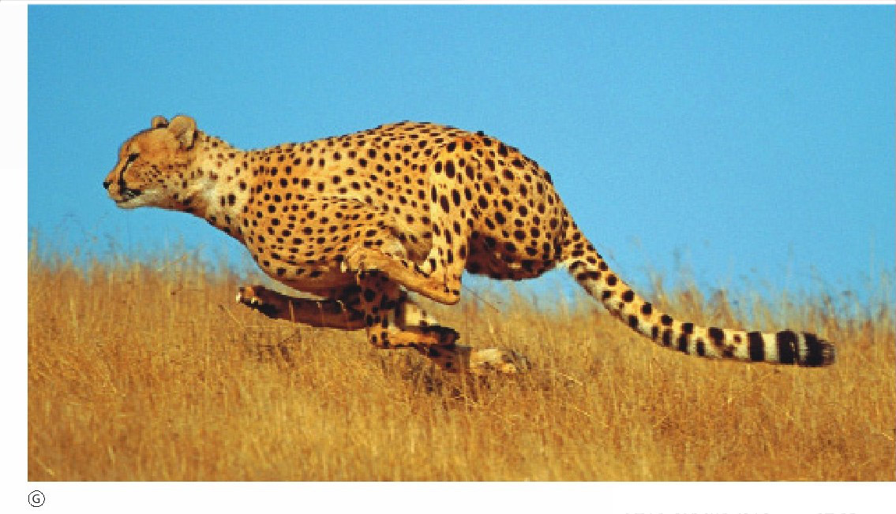
跑得最快的动物——猎豹

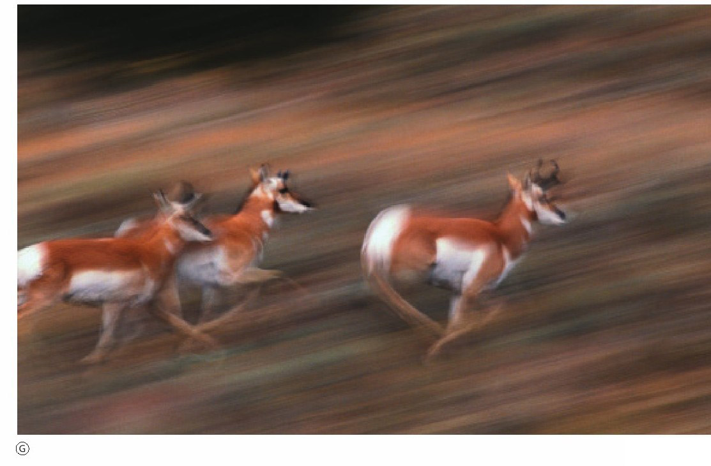
叉角羚

  

**【微博士】**从一到“无穷大”

在动物由低等向高等进化的过程中，腿从无到有，腿的数量也随物种变化而变化。陆地上，一条“腿”（腹足）的有蜗牛、田螺，两条腿的是鸟儿，四条腿的有蛙、蜥蜴和绝大多数哺乳动物，六条腿的是昆虫，八条腿的是蜘蛛，还有15对步足的蚰蜒和更多对步足的蜈蚣、马陆……从一到“无穷大”，动物并非腿越多越高等，其中的两足动物和四足动物，占据了从水域到陆地再到天空的大部分空间。

**【实验场】**看看蜈蚣、马陆和蚰蜒是如何协调行走的

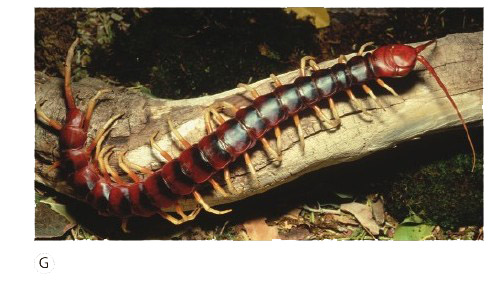
尝试用摄像机拍摄蜈蚣、马陆和蚰蜒等动物爬行的小短片，然后将小短片慢速播放，仔细观察它们行走时为什么不会后足踩前足。

【微问题】哪些地方会出现三条腿的青蛙？

【关键词】腿　进化　辐射对称生物　两侧（左右）对称生物　速度

## 为什么有些动物有毒

在海面上漂浮的晶莹剔透的水母，在泥土里蠕动的色彩斑斓的蜈蚣，在海滩上漫步的背负着美丽贝壳的芋螺，在树枝间驻足的张着神奇网络的蜘蛛……如果你不小心和这些漂亮的生物亲密接触，可能除了痛之外，还会面临生命的威胁。传说古埃及最后一位女王，也就是人们所熟知的埃及艳后，就是由一条毒蛇结束了她传奇绚丽的一生。许多美食家会“拼死吃河豚”，而被胡蜂、蜘蛛袭击致死的报道也屡见不鲜。

为什么会出现这种情况呢？那是因为自然界的许多动物都会分泌毒液。人们熟知的有蛇、蝎、蜘蛛、蜈蚣、蚰蜒、河豚、箭毒蛙、胡蜂等，不熟悉的有芋螺、海葵、水母等。一旦被这些动物刺破身体注入毒液，在没有救治的情况下，被刺者很快就会麻痹最终死亡。那么，为什么这些动物要分泌毒液呢？

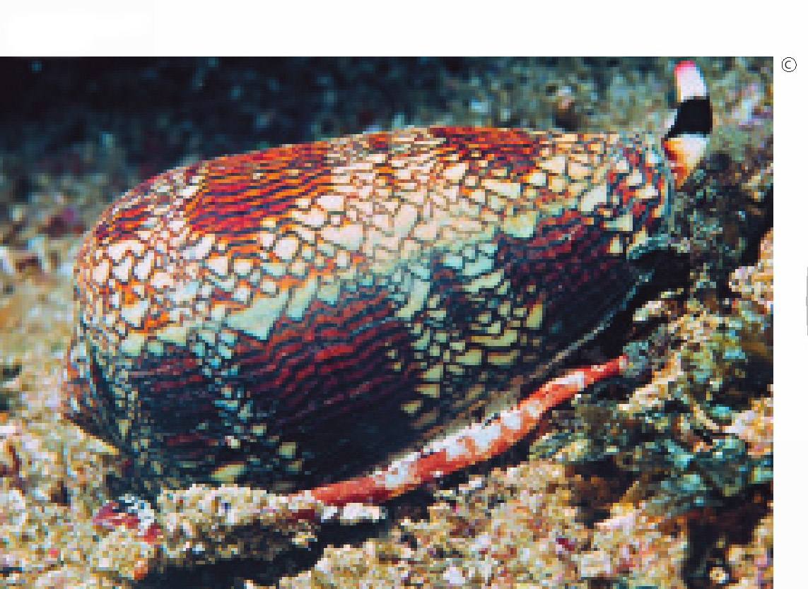
芋螺

那是动物的一种生存策略，或者是为了防御，或者是为了进攻。不论是蜈蚣、芋螺还是蝎子，毒液无一例外都是它们有力的猎食工具，正是有了这一有效的手段，这些动物才能在严酷的自然界中存活下来。从表面上看，动物分泌毒液是一种攻击手段。如海葵、水母等腔肠动物，它们在受到刺激后会射出含毒的刺丝，这种刺丝刺入敌体后，会引发剧痛、红肿、休克甚至令敌人毙命，人类仅被腔肠动物刺伤后引发的皮炎就达70种。但从本质来说，分泌毒液仍是一种防御形式。动物分泌毒液具有很强的目标性：如海葵，它对自己的食物——甲壳类具有剧毒，但对于软体动物、两栖类、哺乳类却没有致命的威胁；蜘蛛的毒液能让它的猎物难逃厄运，但真正能置人于死地的却只有寥寥几种。

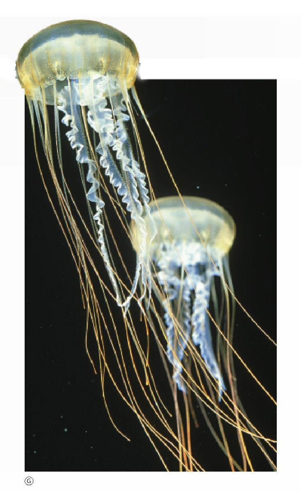

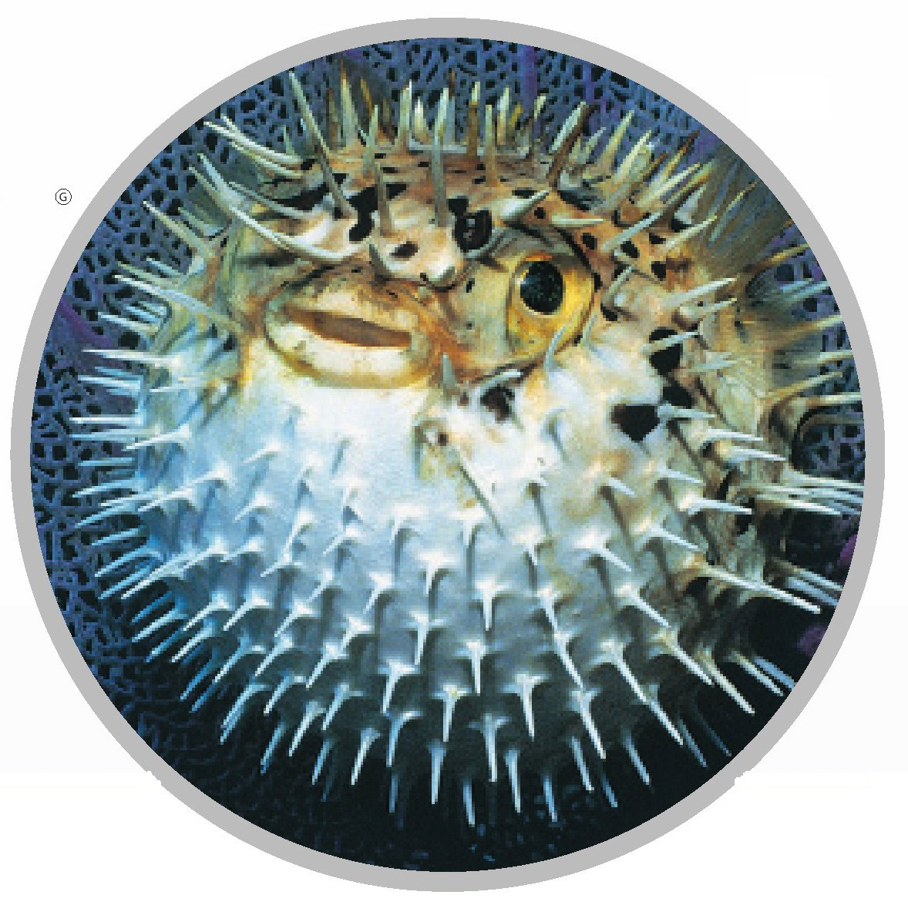
刺鲀

如果你稍留意还会发现，一般有毒的动物都是些较低等的动物，如无脊椎动物中的昆虫、腹足类、腔肠动物等，或者是鱼类和两栖类，最高等级的也不过是爬行类，而哺乳类及鸟类这些进化较高等的动物罕有含毒液的。这是为什么呢？据科学家解释说，这是因为有毒动物的毒素只针对进化更高的动物才会产生强力的作用，而对于比它进化慢的生物，毒性就要小些，甚至完全不产生作用，这也证明了动物的毒液本质上来说是一种防御手段。鸟类和哺乳类动物因为有了更多其他的生存策略，似乎也不屑于下毒这种下策了。（刘漫萍）

## 为什么要对屠宰场里的猪、牛实行安乐死

在传统的屠宰场，被屠宰动物们撕心裂肺的惨叫声令人不忍卒听。其实，人们还不知道，这些凄厉的叫声会化成一种“怨灵诅咒”，给食用它的人带来伤害。

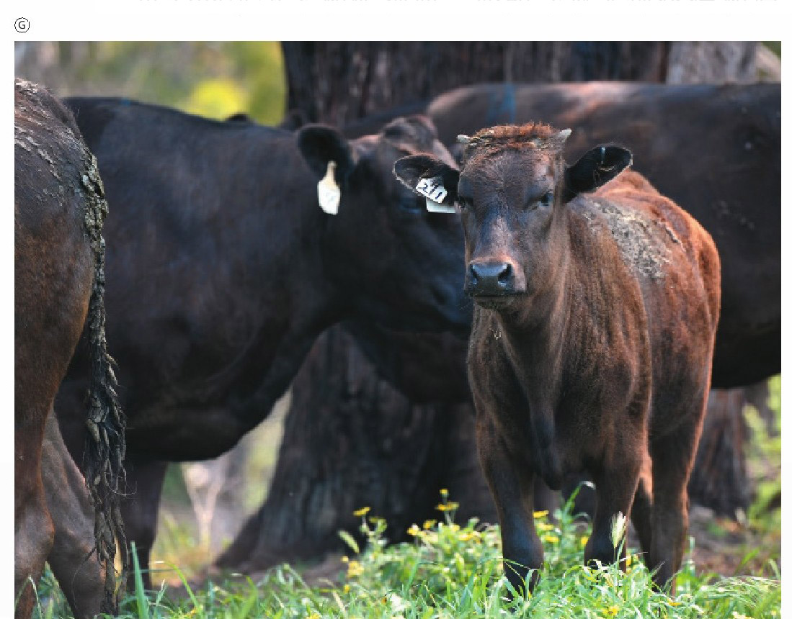
恶念杀人？这不是玄学，而是有切实的科学证据！科学证据表明，患焦虑症的人身上会携带大量的毒素，这些毒素来自未使用的激素，如皮质醇、肾上腺素和睾酮等。同样，动物在被屠宰前，亲眼见到同伴被杀戮，它们的恐惧、怨恨、悲痛、焦虑的情绪会使临死前的身体内产生各种激素，尤其是肾上腺素分泌异常。当动物死亡时，它们的排毒功能就会立即停止，导致大量的激素停留在动物的身体中。人吃了这些肉之后，这些激素就进入人的身体，并日积月累地毒化肌体。虽然肾上腺素在紧急情况下对逃生有利，但在一般情况下它对人体是非常有害的。这种激素不仅抑制人的免疫系统，削弱人的消化功能，耗尽人体内重要的维生素和矿物质，还能导致人体疼痛和僵硬，同时使人体呈酸性而导致炎症等问题发生。因此，对于人体的健康是一个不小的伤害。如果对活的牲畜进行“安乐死”，能最大程度减少动物们临死前的恐慌、痛苦，就可以减少动物体内毒素的产生，令我们吃到的猪肉、牛肉更为鲜美、健康。

其实，对屠宰场动物实施安乐死也是人类文明进步的标志。人类如何对待动物，实际上关乎人的尊严和道德感。虽然，在眼下及可预见的相当长的时间内，人类都不可能完全素食，而当杀戮动物不可避免时，作为人类也应当尽可能人道地对待动物。对猪、牛实施安乐死，就是人性慈爱的一种表现。（刘漫萍）

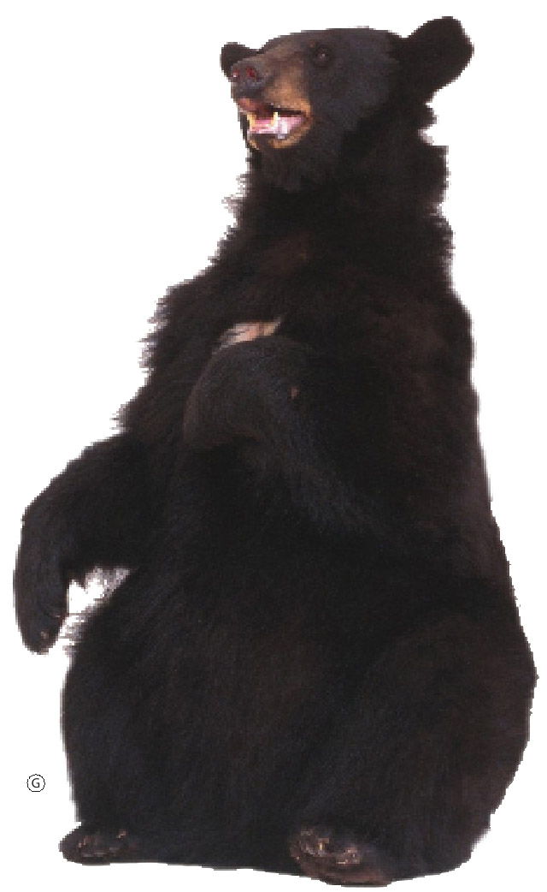
  

**【微博士】**动物如何排毒

动物的身体宛如一架精密的仪器，不仅拥有强大的免疫系统，还有自己独特的排毒功能：流浪的野猫如果吃了有毒的东西，就会马上去寻找藜芦，这种味苦有毒的草含有生物碱，吃了后可以引起呕吐；老鼠不会呕吐，它一旦觉得不舒服或吃了有毒的东西，就会吃一种黏土，这种黏土能吸附毒素；美洲大黑熊自冬眠中醒来后，总会去找点儿有缓泻作用的果实吃，从而将体内的毒素排泄出去；有的动物还会去泡温泉，利用加速血液循环的方式来排毒……

**【微博士】**为动物争取权利的人们

彼得·辛格

在漫长的人和动物相处的过程中，人类日益凌驾于其他动物之上。在许多人眼中，动物就该被人类利用，但也有一些人为动物争取最基本的权利进行了不懈的努力，如法国启蒙思想家卢梭、现代功利主义学说的奠基人边沁、德国哲学家叔本华，等等。彼得·辛格来自澳大利亚，是当代动物权利运动的精神领袖。他主张对于有感觉能力的动物，都应该给予平等的关心。他致力于改善动物们的处境，在特定环境下，同意适当将动物为人所用。在现实生活中，他倡导素食主义，并呼吁废除不必要的动物实验。著名动物学家坦普尔·格兰丁竭力主张对屠宰动物进行“安乐死”，为动物们能平静步入“天堂”进行了不懈的努力。在保护动物权利方面，中国也进行了多方努力，不仅制定了《野生动物保护法》，还有《实验动物保护条例》等法律法规。

【微问题】你觉得对流浪猫和流浪狗作怎样处理，才既符合动物伦理又不损害人的利益呢？

【关键词】毒液　生存策略　安乐死

## 动物为什么要长尾巴

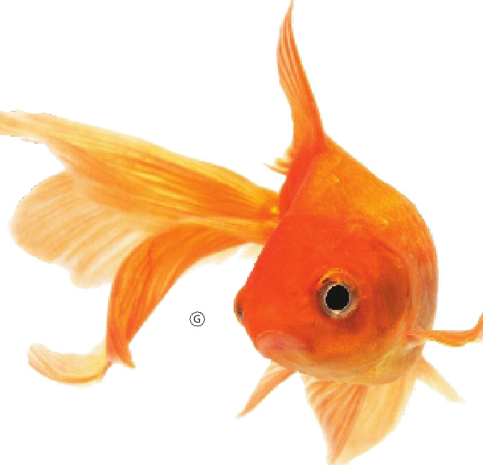
很多动物的身体后面会拖着一条尾巴，它们或长或短，或大或小，或光滑或披毛，煞是可爱。例如：金鱼在水中不停地摇动大尾巴，似空中翩翩起舞的蝴蝶；春季，雄孔雀展开绚丽的尾羽，在身后竖起一面华美的“扇屏”，那泛着黄铜色及辉蓝色的亮丽眼斑如同几十双明亮的眼睛在不停地晃动；松鼠在树上跳跃时，随之摆动的膨松大尾巴也极为好看……那么，它们为什么要长尾巴呢？

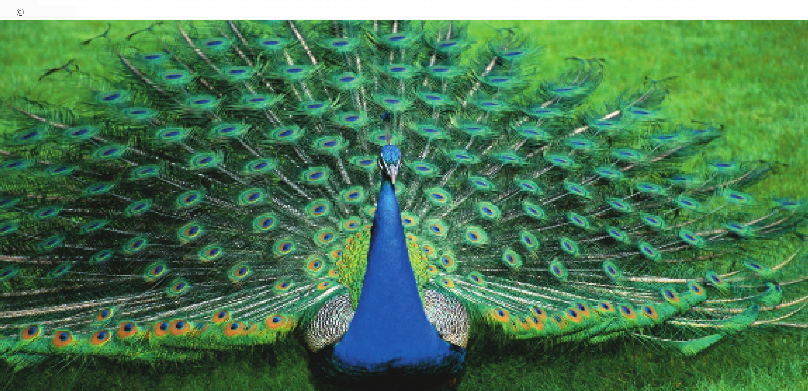
让我们先来看看动物尾巴都在干什么吧。仔细观察金鱼，你可能会发现：它随着尾巴的摆动，可以促使身体前进或转向。没错，在水中游泳的鱼儿都能借助尾巴来获得前进的力量，如果需要转弯或掉头换个方向也很容易，摆摆尾巴就能做到。企鹅、海豚、鲸鱼等虽然不是鱼类，但它们的尾巴也具有类似的功能。比较特殊的是，有些鱼儿的尾巴还有其他功能，例如一些鲨鱼就可以利用其长而强有力的尾巴驱赶鱼群，甚至将它们击晕然后饱餐一顿。

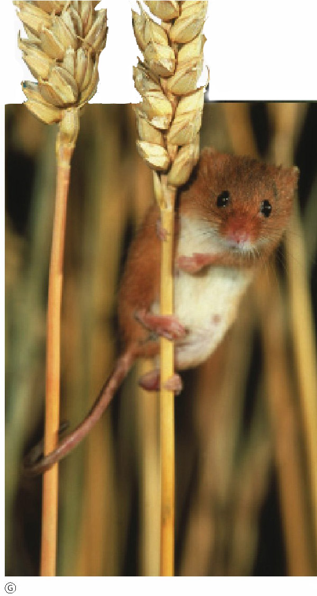
巢鼠

陆地上生活的动物也能用尾巴来完成各种任务。鳄鱼尾巴粗壮厚实，甩动起来是攻击敌人或猎物的好武器。壁虎、蜥蜴的尾巴柔韧，被捕捉时可以及时断开逃生。雄孔雀炫耀漂亮的“扇屏”，为它们赢得了雌孔雀的青睐。麻雀、斑鸠等鸟儿依赖尾巴上的羽毛掌舵，控制飞行和降落。松鼠、猫在树上灵活跳跃而不摔下来，得益于尾巴控制着平衡。擅长跳跃的跳鼠和袋鼠，得益于其长长的尾巴的帮助，停立时长尾又能作为支柱。尾巴还有类似“手”的作用。如：卷尾猴、巢鼠能将长尾缠绕在枝条上玩起倒挂；牛和斑马能把尾巴甩来甩去，赶走讨厌的蚊蝇。尾巴还能表达感情，狗就会“摇尾乞怜”……尾巴的功能已经被动物们发挥得淋漓尽致。

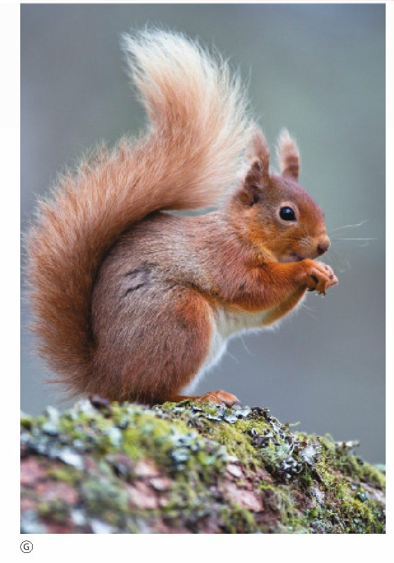
从内部解剖构造上看，动物之所以有尾巴的根本原因，在于体内有一根纵贯躯体、类似被串起的“多米诺骨牌”构成的“柱子”——脊椎，在柱子末端的多个或数十个“骨牌”即是尾巴所“依附”的尾椎骨。随着愈合或退化程度的不同，形成了现今我们可见或不可见的各种尾巴，并表现出不同的功能。因此，严格地说，尾巴这个词是相对于拥有这根“柱子”的脊椎动物而言的，而诸如蝎子之类的无脊椎动物虽然也有一条被人们称为尾巴的“尾巴”，但终究是个冒牌货。（余丽江）

## 人类为什么没有尾巴

看过《西游记》的你是否还会记得，猪八戒多次根据尾巴识别出变身后的孙猴子？没错，尾巴的存在泄露了孙悟空难以改变的身份标志。也正是尾巴的有无，可以一眼看出人类与其近亲——猴子等绝大多数灵长类动物的区别。

灵长类动物大都生活在树林中，它们利用长长的尾巴充当“手”在树上悬挂、荡秋千，或者在树间随意跳跃时保持平衡。如果人类也有这样的尾巴，岂不是会更方便！可为什么人类无法如愿拥有尾巴呢？

尾巴存在的根本是拥有尾椎骨，从这个角度说，人是有尾巴的。试试触摸你的后背中线“柱子”，大约在肛门后方的皮下位置，看看能否在最末端感觉到它的存在。但是在外观上，看不到人有尾巴，这主要与人类的进化历程有关，因为人类已经不需要发挥尾巴的功能了。自人类的祖先离开树梢适应地面生活并开始直立行走起，人类的骨骼结构也发生了变化。由于陆地生活不再需要依靠尾巴穿梭于树林间，因此尾巴就慢慢退化，直至外观不可见。这是一种对环境长期适应的结果。

还有一个证据可让我们对尾巴有迹可循，这就是人出生前的胚胎阶段。当人的胚胎在妈妈肚子里仅有2～7周的时候，身后确实拖着一条小尾巴；只是当发育至胎儿阶段，尾巴消失了。

或许你我都曾羡慕猴子自由穿梭树林、攀爬、跳跃的本领，殊不知人类自直立行走、腾出双手后，能做的事情是猴子们所望尘莫及的！（余丽江）

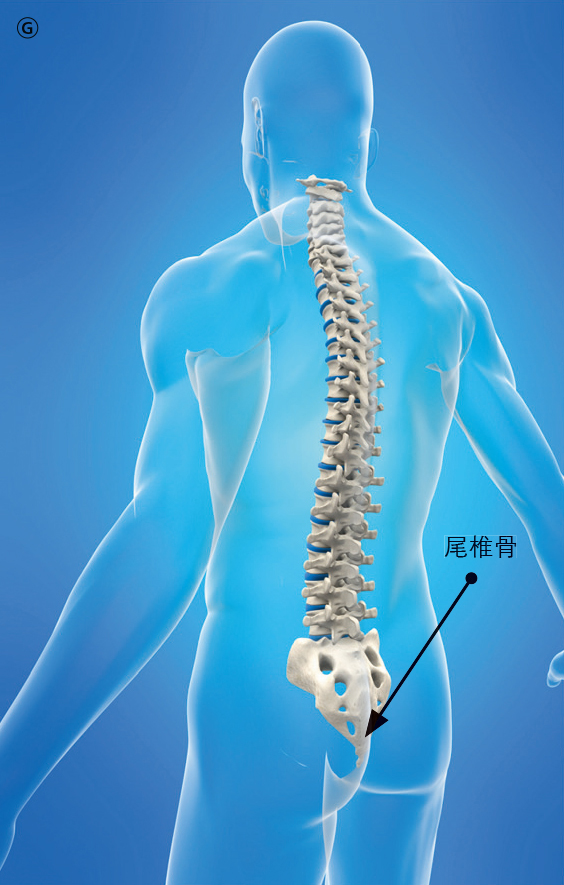
人类已经退化的尾椎骨

  

**【微博士】**长尾巴的人类

人类也能长出尾巴？这个消息令人难以相信，却真实存在。

迄今，有资料记载的长着尾巴的人不下40例，不过大多是婴儿诞生时的“软尾巴”。所谓的软尾巴，是指它不含尾椎而只有血管、肌肉与神经。极少有记录报道人的尾巴中含有软骨结构或椎骨。在现代医学程序中，是允许医师在胎儿出生后的极短时间内为这条软尾巴做去除手术的。人类纪录史上最长的尾巴，长在一个当时法属印度支那的12岁男孩身上，长度为229毫米。

人类本就存在尾椎骨，只不过在进化历程上尾巴朝着逐渐退化的方向发展而已。这种偶然出现的和祖先的某些性状相似的现象，被称为返祖现象。

**【实验场】**蟋蟀的尾须有什么作用

秋天的傍晚，到长着枯草、堆积着废弃的瓦砾的地方寻找蟋蟀，仔细观察它在活动时尾须有什么作用。如果将蟋蟀的一个或一对尾须去除，对蟋蟀的活动会有什么影响？

【微问题】鱼和鲸鱼的尾巴在运动方式上有什么区别？

【关键词】尾巴　鱼　尾椎骨　猴子　人类　返祖

## 为什么雄性动物爱臭美

“女为悦己者容”，人类的女性画唇描眉、穿衣打扮，是为了让自己看起来更漂亮，借以吸引异性的目光。有趣的是，在动物中也有这个现象，不过爱臭美的不是雌性，而是雄性。

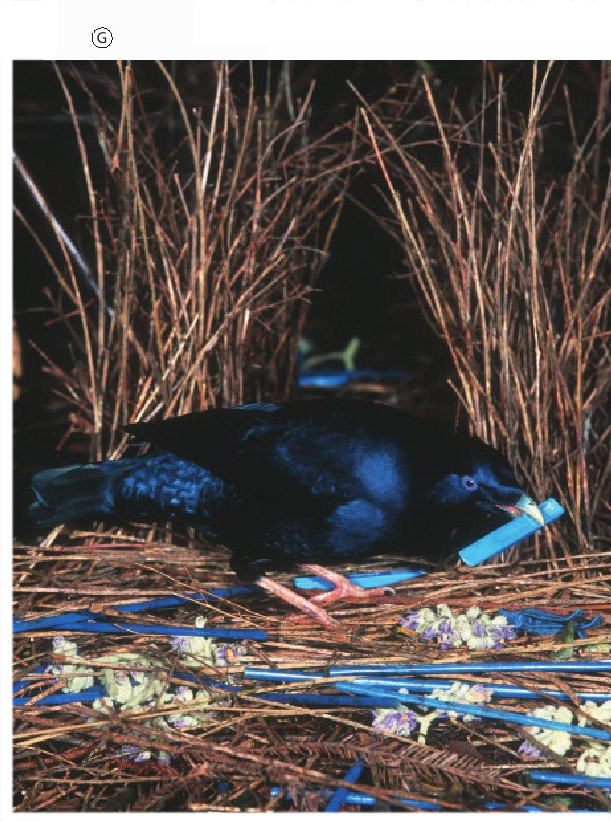
园丁鸟正在建“求婚亭”

“雄为雌性而容”存在于许多动物中，尤以鸟类为个中翘楚。雄鸟们打扮自己用得最多的手法就是有一件漂亮的婚装——色彩鲜丽的婚羽。大多数鸟类在婚羽上存在着显著的两性差异，如雉科、蜂鸟科、伞鸟科、太阳鸟科、极乐鸟科，等等。除了有漂亮的婚羽外，雄鸟们装扮自己的法宝还有眉栉、肉垂、肉冠、肉裙、肉角、喉囊等。每到求偶季节，这些部分就会变得格外醒目。如雄伞鸟在繁殖季节除了具有羽毛构成的伞以外，还有一个悬于胸部的肉垂，在求偶时可以充血膨胀到和身体等长。在爱美方面最有创意的要数园丁鸟了，这种鸟的雄鸟自身不漂亮，但它另出奇招——建一个漂亮的求婚亭。一般长得越不出色的雄鸟，搭的平台越为华丽。除了鸟类，雄性的蝶和鱼也是爱臭美的动物。许多凤蝶和鸟翼蝶的雄性都非常漂亮，而雌性则毫不起眼。许多雄鱼也会用色彩艳丽的婚装来迷倒雌鱼，如在交配时期的红尾鹦嘴鱼，雄性的体色呈华丽的绿蓝相间，鱼鳍是橘红色；而雌性则浑身淡红色，尾鳍上稍微有一点鲜黄色。

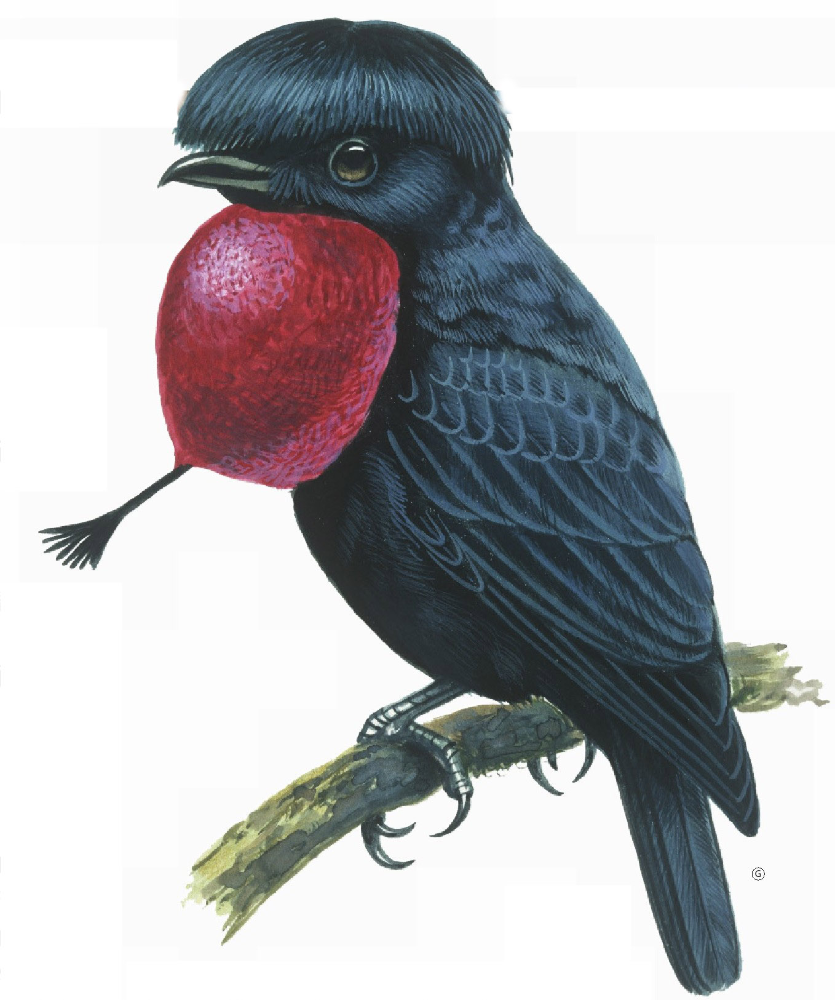
求偶的伞鸟

雄性动物之所以这么爱美，这与雌性动物的择偶标准密不可分。雌性在选择配偶时，一定会考察配偶性是否成熟、性准备状态的好坏及性功能是否健全等直接影响繁殖成败的关键因素，而雄性动物爱漂亮的行动如漂亮的婚羽、气囊，华美的求偶场所等一系列求偶炫耀的强度，一般与雄性体内性激素的水平直接相关。因此，雌鸟会选择那些性吸引特征显著、求偶炫耀富有活力并能持久的异性为配偶。这样，越爱臭美的雄性就会获得越多的雌性青睐，甚至可以一夫多妻，从而产生较多的后代，保证了后代的繁衍；而那些不受雌性欢迎的雄性就会被边缘化，甚至失去交配的机会，面临断子绝孙的危险。由此看来，雄性动物爱漂亮可不是单纯喜欢臭美，而是关系到种族繁衍的大事。（刘漫萍）

  

**【微博士】**极乐天堂鸟翼蝶

这是一种蝴蝶。之所以有这个名字，那是因为雄性鸟翼蝶长有飘带，就像极乐鸟飘逸的尾羽似的。它的前翅由亮绿色和金黄色的弧形纹组成，后翅是单一的亮黄色，整个翅面华丽娇艳，闪着迷人的光泽，美丽得仿佛来自天堂，故被称作天堂鸟翼蝶。相比之下，雌鸟翼蝶长得却大为逊色，前翅黑底白斑，后翅白底黑边，黑边内层点缀着棕黄色的环，整个翅面由黑、灰、白、棕色斑块组成，没有一点艳色，如果不是放在一起，很难让人想到这个物种的雌雄会有如此大的差异。

## 为什么雄性动物妻妾成群

在动物世界里也有雄性动物妻妾成群的现象。狮子与大猩猩过着家庭式的群体生活，谈不上真正的一夫多妻，真正的一夫多妻者以草食性兽类和海兽类居多。这些动物的雄性拥有庞大的后宫：如一头雄性红鹿拥有20～30头雌性；一头雄性驯鹿拥有40～50头雌性；一只雄性海狮拥有15只左右的雌性；一只雄性灰海豹拥有20只左右的雌性；一只雄海象则拥有10多只甚至拥有50只雌性；一只雄海狗平均也拥有15～60只雌性。除了兽类外，鸟类也有一雄多雌的现象，如极乐鸟。

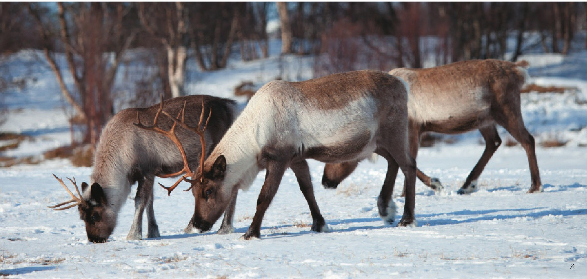
驯鹿的“婚姻”是一夫多妻制的

妻妾成群之所以存在，那是因为雄性动物不参与对后代的抚育，所有养育孩子的工作都由雌性承担，雌性具有独立的养育子女的能力，加之动物的繁殖期又十分短暂，一旦错过就失去繁衍后代的机会。在这种情况下，丈夫不需要与一个妻子维持长期的关系，繁衍众多的族群才是首要任务，这才造成了雄性动物妻妾成群的现象。当然，如前面所说，这种情况也只有强壮、漂亮，拥有更多雄性特征的个体才会有，不少雄性连拥有一个老婆也困难，这与动物要获得更好的基因以维持后代的进步是相一致的。（刘漫萍）

  

**【微博士】**忠贞的大雁

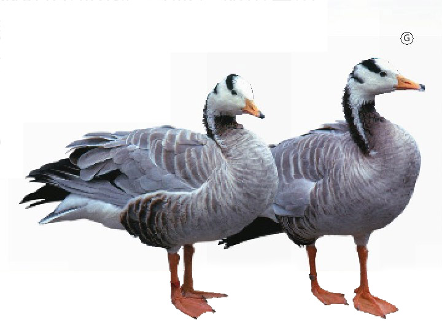
“问世间，情为何物，直教生死相许。”这句脍炙人口的名句是元代词人元遗山对大雁忠贞爱情的感叹。据词人记载，他在赶考的路上遇到一个捕雁人，捕雁人说他用网捉了一只雁并把它杀了，另一只已逃跑的雁因目睹了爱侣的惨死，悲鸣徘徊不去，最后竟从高空中投地自杀而亡。词人有感于这对大雁生死相许的爱情，遂发出了这千古一叹。是不是所有的大雁都是这么坚贞难以考证，但斑头雁的确是一种对配偶十分专一的鸟儿。一旦斑头雁结为夫妇，就一夫一妻相伴终身。像斑头雁这样专情的动物还有一些，如军舰鸟、天鹅、鹫、狼，等等。具有讽刺意味的是，被无数文人盛赞“只羡鸳鸯不羡仙”的象征爱情的鸳鸯，却不是配偶终身制，而是配偶多年婚配制。虽然这种鸟在繁殖期是一夫一妻，但繁殖期一过，鸳鸯夫妻就有可能各自另觅新欢。

**【实验场】**

观察动物园中的其他动物，看看是不是雄的总是比雌的要漂亮。

【微问题】配偶终身制的鸟儿是如何在下一个季节找到另一半的？

【关键词】爱美　雄性　配偶　繁殖

## 动物为什么爱打架

在电视、电影播放的动物世界里，我们总能看到雄性动物激烈相争的场景，无论是凶猛的虎、狼，还是温驯的食草动物，甚至平时彬彬有礼的海鸥、鸟翼蝶等，在求偶期间，这些雄性动物都会化身为好斗分子，对其他雄性大打出手。

雄性动物间的角斗，无疑是力量和耐力的大比拼，如两头美洲野牛相斗，可以大战无数次直到日落黄昏，有的个体间的战斗甚至能持续两天。芒背丝鱼到了发情期时，所有雄鱼腹侧都会变成红色。对于雄鱼来说，所有的其他雄鱼都是敌人。即使雌鱼不在身旁，这种雄鱼见到红色物体也照样攻击。科学家们还通过实验证实，在繁殖期雄性芒背丝鱼的好斗是与生俱来的。

有意思的是，雄性动物间的争斗虽然激烈，但绝大多数情况下都是点到为止，胜的留下，输的撤退，非常守信。如昆虫中的迷卡斗蟋，胜者有君子之风，而输的一方则会心服口服，甘拜下风，绝不死缠烂打；海象、狮子等雄性，争斗起来不管多猛烈，在一方认输后，另一方也绝不会赶尽杀绝。在动物看来，对手逃走即是放弃权利，无须再去追杀。不过也有例外，少数种类雄性争斗也不乏丢掉性命的，如雄性林麝因为在争偶时打斗太过激烈，往往会造成很大的伤亡。

正在搏斗的海象

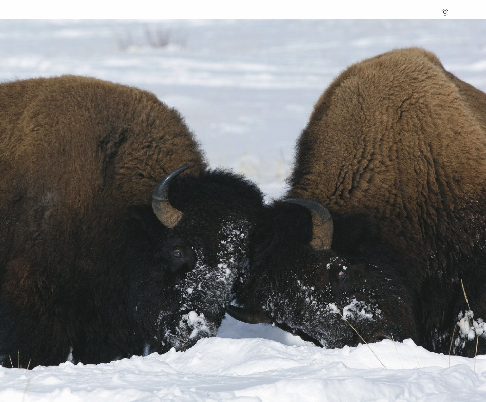
正在搏斗美洲野牛

大多数动物的两雄争斗都是同种间的生存竞争，它们为异性、领地、地位而战。为了种族繁衍，雄性使出了浑身解数，不仅通过争斗夺取拥有丰富食物来源的领地，还要直接通过角力格斗来取得雌性的青睐。争领地在某种意义上也就是争夺与雌性的交配权。在雄性不能参与育幼的情况下，雌性从有性生殖得到的唯一好处就是能够利用雄性的优质基因。因此，雌性择偶时往往选择那些具有优质基因的雄性，而优质基因往往表现在格斗中获胜的雄性身上。从这种意义上来说，雄性动物之间爱打架并非像人类那样更多的是一种炫耀，而是为了繁衍更好的后代，是神圣而必要的。（刘漫萍）

## 动物为什么有时对孩子很冷酷

一般而言，满两岁的小河狸会在春季告别父母离家独立生活，但对于仍无法独立的孩子，做父母的还是会很耐心地试着赶孩子出去，而小河狸则不明白为什么父母要赶它走。相对于生活在加拉帕戈斯群岛上的信天翁来说，小河狸无疑是幸运的。因为这种信天翁为了保险有时会产下两个卵，而孵化的时间会相差七天，如果两个卵都顺利孵化，那么对于小的那个信天翁来说就是灭顶之灾，因为大的雏鸟不但会争抢母亲哺育的食物，而且还会恶意地将小的雏鸟踢出巢外。被赶出去的小鸟，要么被炎热的太阳晒死，要么被猎食者吃掉，而这一切都发生在信天翁妈妈的眼皮底下，但它却对发生在身边的凌虐事件置若罔闻。对于鹰来说，雏鹰在学习飞翔时，如果迟迟不张开翅膀试着飞翔，亲鸟会一脚将雏鸟从高高的巢中踹下去，好像根本不顾雏鸟的死活。

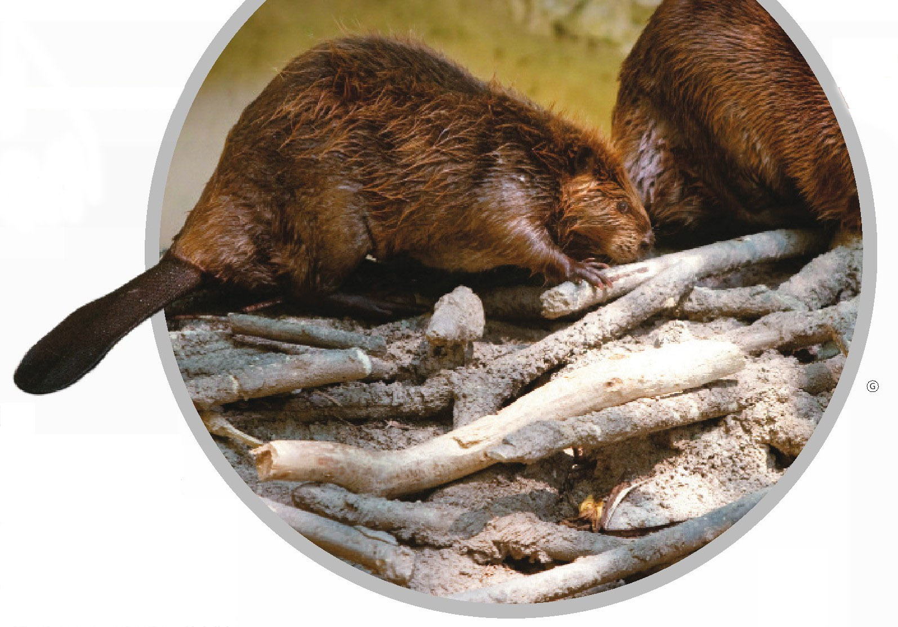
河狸

为什么这些动物对自己的孩子那么冷酷，全无做父母的爱心？那是因为在有限的生存资源下，只有集中优势资源保存最有可能存活下来的个体，才能确保动物后代的延续。在动物们的眼中，与保证动物种族的繁衍相比，那些看似狠心的举动都显得微不足道，这才有了信天翁放任另一个孩子被凌虐至死的冷酷现象发生。在严酷的自然条件下，亲鸟没有能力抚养两只雏鸟同时成长，乱发善心的结果就是两只雏鸟都可能夭折。而老鹰将雏鹰踹下巢、河狸将孩子赶出去都是为了让它们学会独立，否则等待它们的也会是死亡。这是动物在经历严酷的生存竞争后被自然所选择的一种生存方式，体现了适者生存的规律。

动物的冷酷只是为了保存优良后代的无奈之举，它们虽然残忍，但确实保证了种族优良基因的传承。（刘漫萍）

  

**【微博士】**父爱如山，母爱似海

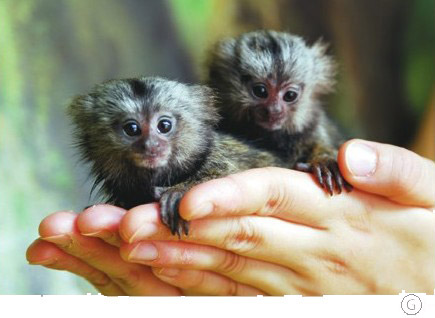
绒猴

在孩子的成长过程中，凝聚了父母深深的关爱。虽然大多数动物爸爸根本不参与孩子的抚育，但还是有不少动物有幸同时体验到了深沉的父爱和伟大的母爱。其中，堪称模范父亲的莫过于绒猴。绒猴是灵长类中最小的种类，它们生活在南美的热带雨林间。当母猴生下宝宝后，就马上交给公绒猴，由绒猴爸爸带养孩子。除了在喂奶期间交给妈妈外，其他时间绒猴宝宝都是在爸爸的照顾下度过的。吴郭鱼和海鲶也是疼爱孩子的好爸爸，它们会将雌鱼所产的卵含在口中，直到宝宝孵化。而帝企鹅爸爸在寒风中坚强孵卵数月的故事，早已经脍炙人口。

当然，动物的母爱故事更是不胜枚举，其中最令人感动的莫过于以身饲子的日本红螯蛛。这些刚孵化的小蜘蛛最初的食物，居然就是母亲的身体，俨然一曲荡气回肠的母爱之歌。

**【实验场】**

在6月的夏天，找一找水塘里的负子蝽，观察背负卵块的负子蝽爸爸。在7月底至9月初，在户外仔细找找，看看那些携带卵袋四处游走的狼蛛妈妈。

【微问题】动物中有没有“不战而屈人之兵”的好汉呢？

【关键词】打架　求偶期　生存竞争　基因

## 动物中谁的忍饥挨饿能力强

“人是铁，饭是钢，一顿不吃饿得慌。”我们人类每天都要吃两到三顿饭，少了一顿就会让人难以忍受。可在动物中，因为各种各样的原因，许多动物不能每日都有稳定和充足的食物来填饱肚子，所以它们忍饥挨饿的本领比人类可要强多了。

在抗饥饿方面，蜘蛛可是个中翘楚，即便一日无餐，蜘蛛也无所谓。大多数蜘蛛抗饿能力超过一个月甚至更长——这不仅是在冬季，即便是在活动期间也是如此。一只生长良好的捕鸟蛛，能在没有食物的情况下生存长达一年！鲨鱼、北极熊、企鹅、鲸等也都是抗饥饿的高手。大白鲨饱餐之后，也许一个月不用再捕食；而北极熊在饿着肚子的冬天，甚至还能生孩子呢！不过，在耐饥方面的冠军无疑是龟类了，有一种沼泽龟可以五年不进食，许多被压在老宅底下的乌龟在多年后还是活的。加拉帕戈斯群岛上的巨龟，与所有的龟一样，也有惊人的耐饥能力，它可以一年不吃不喝。

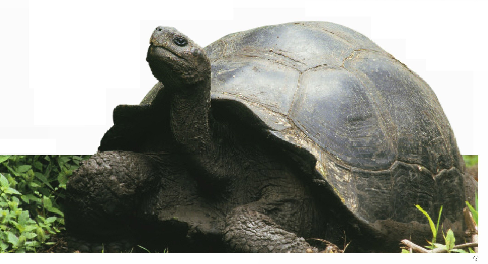
耐饥饿的象龟

动物的耐饥能力，很早就被人类发现并利用，但同时也给自身带来了灭顶之灾。如龟类能长时间在没有食物的情况下存活，在没有保鲜冷藏设备时，龟肉就成了水手、海盗们最好的鲜活食品，棱皮龟就一度被称为“活罐头”。而加拉帕戈斯群岛的象龟也因为耐饥饿的特点，使得17世纪光顾岛上的人们，无一例外都把它们的肉当作食物，那时，一批一批的海盗船、捕鲸船、军舰接踵来到这个岛上，就是为了捕捉这种巨龟当作活食储存。因为这个原因，群岛上的巨龟被捕杀的数量，累计可达数百万之多！以至于今天，有些岛上的象龟已濒临灭绝。

抗饥饿本来是动物为了生存而对自然界的一种适应，但一旦被人类利用，却成了另一种催命符了，这种策略到底是幸还是不幸？（刘漫萍）

  

**【微博士】**善于炫耀的伯劳

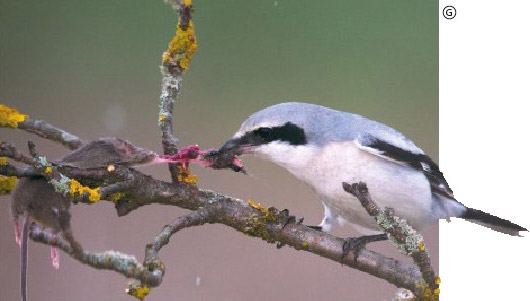
伯劳是掠食性的鸟类，常常以大型昆虫、蜥蜴、鼠和小鸟为食。别看伯劳外形粗犷，但却粗中有细，常把吃剩的东西带回家，串在附近的树枝上，形成了伯劳居家附近的独特一景——也许是一截风干的蜥蜴，也许是一只大个的蚱蜢，抑或是一只断腿的小鸟。这些被钉在尖刺上的猎物是伯劳生存能力的象征，在交配季节里，一些非常醒目但不能吃的东西，如包括羽毛在内的碎片，经常同猎物一起钉在鸟巢附近的尖刺上作为吸引雌性的装饰，装饰物越多，雄鸟获得交配的机会也越多。

## 动物为什么会偏食

“竹子开花了，咪咪躺在妈妈的怀里数星星，星星啊星星真美丽，明天的早餐在哪里？”大熊猫的食物——竹子因为开花而死亡，导致高度偏食的大熊猫面临严重的生存危机，这才出现了歌中的叹问。

和大熊猫一样，考拉也是极度偏食的哺乳动物，这种生活在澳洲的动物只吃桉树叶。不过，与哺乳动物相比，素食的昆虫更偏食，最为典型的就是鳞翅目蝴蝶的幼虫。许多蝴蝶的幼虫只吃特定类群的植物：我们最常见的菜粉蝶，它们的幼虫只吃十字花科的植物；玉带凤蝶、柑橘凤蝶幼虫，只取食柑橘类的植物；珍贵的金斑喙凤蝶幼虫只喜欢木兰科植物；世界上最著名的亚历山大鸟翼蝶幼虫却独独偏爱拟马兜铃属的植物，等等。

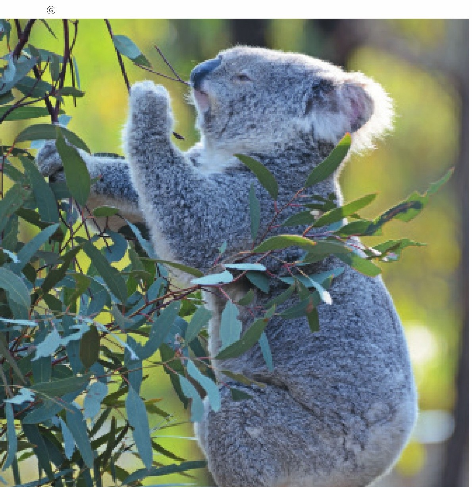
偏食是动物们在长期进化过程中的一种生存策略，这种取食策略是用尽可能少的代价去获得尽可能多的能量收益。动物在取食过程中，面临着不同种动物间和同种动物内的竞争，因此在食物的选择上，不仅要考虑营养价值和适口性，还要考虑取食所需花费的精力与时间。食物的专门化提高了效率，在资源丰富的情况下，取食所需要的时间和精力都要少许多，动物就可在避敌、求偶、占据领域、孵育后代等方面投入较多的精力和时间。但是在资源匮乏时，偏食就直接影响了动物个体的生存。如：竹林大面积开花枯萎，便会导致专吃竹子的大熊猫大量死亡；当桉树林发生灾害时，专食桉叶的考拉也会面临致命的威胁。

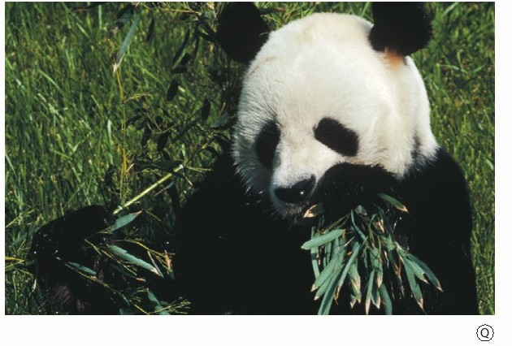
偏食对动物自身产生的不利后果，导致了有些动物在个体发育方式上的进化。如变态发育，即动物在不同的发育阶段具有不同的外部形态，以适应摄取不同的食物，从而该动物的偏食现象也只存在于生命的某个阶段。例如蝶的幼虫吃特定植物的叶，而成虫则吸食花蜜。这样，在不同时期采用不同的取食策略，在客观上就能更好地适应环境。（刘漫萍）

  

**【实验场】**观察蚕取食桑叶

给蚕宝宝喂食非桑树的植物叶片，看看即使处于饥饿状态下，蚕宝宝会不会取食那些植物。

**【微博士】**彩色蚕丝是怎样产生的

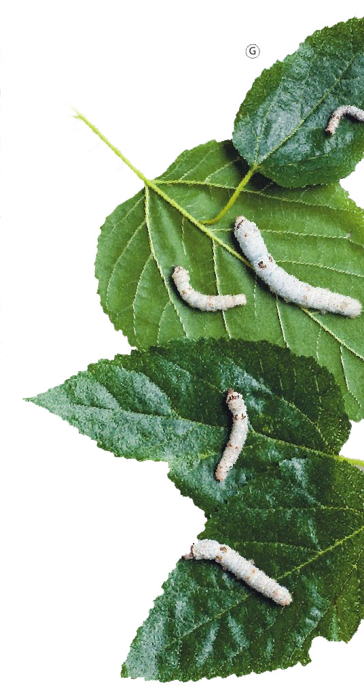
白色是人们看到最常见蚕茧的颜色，其实自然界中的蚕茧远不止这一种色彩，还有黄色、稻草色、橙红色、粉红色和绿色。为什么会有彩色的蚕茧出现呢？原来，蚕茧表现什么色彩，取决于家蚕吃桑叶时对自然色素的吸收，而吸收什么颜色主要取决于家蚕的遗传物质。例如，家蚕的黄血基因能让它们从桑叶中吸收黄色的类胡萝卜素，拥有这种基因的家蚕就能结出黄色的茧。如果家蚕的这个黄血基因发生变异，这个DNA片段没有了，发生变异的家蚕不能从桑叶中吸收类胡萝卜素，那么这种家蚕就只能结出白色蚕茧。科学家目前正在致力于家蚕色素传输系统研究，从而为蚕丝的颜色和色素比例的基因操作扫清障碍。现在，科学家已经利用转基因工程技术，对家蚕的遗传物质进行改造，未来的家蚕可以在操控下生产出人们想要的颜色，那时人们穿的丝绸就可以更加自然、环保和健康。

【微问题】离开澳大利亚的考拉怎么生活？

【关键词】耐饥能力　龟类　偏食　进化

## 动物眼中看到的物体与人类看到的一样吗

就看到的色彩来说，许多动物和人看到的是不同的。有的动物能看见比人类更广的色彩，如鸽子可看到至少5种光谱带，可分辨出数百万种不同的色彩，被认为是地球上最擅长分辨色彩的动物。但有的动物看到的色彩远远低于人类，它们看世界如同看黑白电影一样，只有黑、白、灰三种，如我们常见的马、牛、羊、狗、猫、鼠类，等等。人们常说的“牛遇红即怒”其实是个天大的误会。研究证实，大多数哺乳动物的辨色能力都很差，几乎不太会分辨颜色，在它们眼中，红色和蓝色几乎没有太大的区别。因此，在西班牙斗牛表演中，如果斗牛士用蓝色的斗篷，依然会把牛激怒，那是因为将牛激怒的不是红色，而是晃动的斗篷。

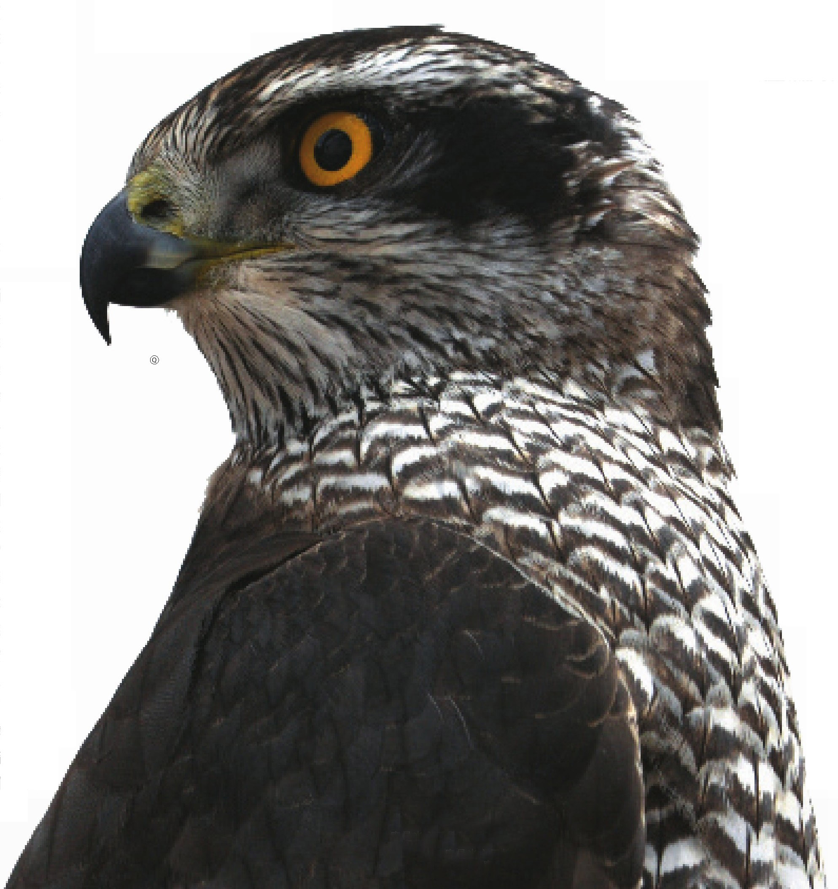
鹰是当之无愧的“千里眼”

就动物的视野来说，大多数动物的视野比人类更为宽泛。如老鹰、隼等掠食者，具有十分出色的双眼视觉和周边视力，它们能够从数千米的高空轻易地发现地面的猎物，它们有极大的瞳孔，可以让进入眼睛的光线产生的衍射干扰达到最小的程度。不仅如此，鹰眼视网膜的黄斑处有2个中央凹，比一般动物多1个，而且中央凹的感光细胞每平方毫米多达100万个，比人眼要多出6倍，这就使得鹰眼的视觉特别敏锐。不少昆虫的运动视力也非常好。如蜻蜓的大脑运转速度非常快，大部分运动图像在它眼中都成了慢动作，只需四千分之一秒的时间，蜻蜓就能分辨出图像，这也就是为什么蜻蜓能在空中准确抓捕猎物的原因。蜜蜂的视力稍微逊色一点，但它也可以在一秒钟内将300幅图像准确地区分出来，而人类每秒只能区别大约20幅图像。

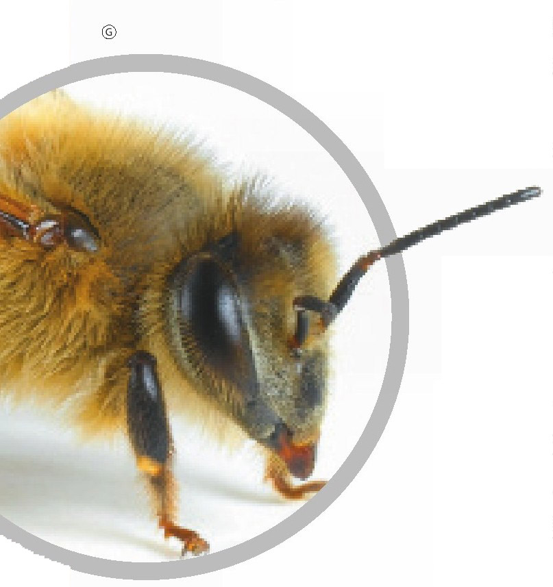
蜜蜂区分图片的能力要远高于人类

鱼类的眼神就比较差了。大多数鱼都是近视眼，它们很少能看到12米以外的物体。鱼虽然属于低等脊椎动物，但眼睛的结构却与人眼相似，所不同的是，人眼的水晶体是扁圆形，可以看到远处的东西；而鱼眼的水晶体却是圆球形，只能看见较近的物像。不过，有些鱼的眼神也让我们吃惊不小，比如射水鱼，它居然能够通过折射精确地击中水面上空的猎物，令人匪夷所思。

如果让你选择，你更愿意拥有哪种动物的视力呢？（刘漫萍）

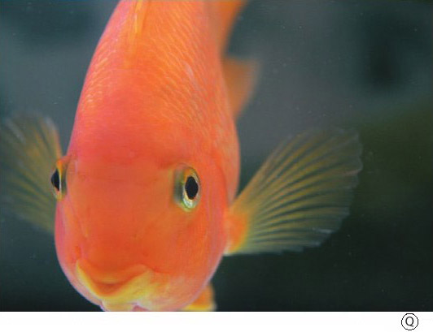
鱼的眼睛结构与人的相类似，但大多是近视眼

## 动物是如何辨别敌人、猎物和朋友的

动物在捕捉猎物和逃避敌害的时候，几乎是不假思索的。那么，它们是如何区分眼前的物体究竟是敌人，是猎物，还是朋友的呢？动物辨别敌友的方法比较复杂，一般除了视觉外，还会借助于嗅觉、听觉等其他感觉系统。

对于鸟类来说，辨别敌友首先靠视觉，也有极少数的鸟类依靠的是嗅觉。如几维鸟能嗅出地下昆虫或蠕虫而加以捕食，美洲鹫靠气味识别埋在地下的猎物，信天翁能闻出海面上散布的动物油脂气味等，后者甚至还知道要从下风口向目标逼近，以免对方也是一个“闻味而逃”的家伙。

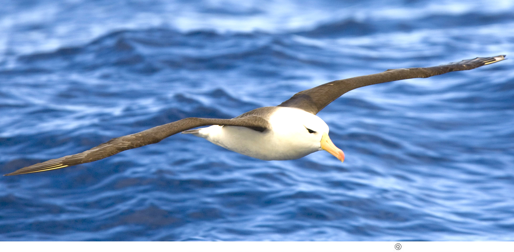
信天翁有很好的嗅觉

虽然大多数蜘蛛的视力不好，但在蜘蛛的肢体上长有许多感觉毛，能感受到空气中微小的变化。蜘蛛能根据物体跌落在蛛网上的振动频率的不同，来判断来者是敌人、朋友还是食物，抑或是风。一般掉在蛛网上的猎物，由于挣扎的原因，它们产生的振幅和频率都比较大，与风吹动蛛网所产生的振幅是完全不同的。结网蜘蛛的雄蛛来到雌蛛网上求爱时，它会用足敲打或拉动网线，以告诉雌蛛来者是爱人而非猎物或天敌。不过，蜘蛛对蛛网上不同类型振动的辨识能力并非天生，而是通过不断学习而积累的。如把澳大利亚的孔蛛引进到新加坡，由于这种孔蛛不熟悉当地结网蛛（花皮蛛）对猎物触网的反应，它必须先进行试探，通过不断改变触网的频率来等待猎物的反应，一旦找到合适的频率，孔蛛就会固定下来，直接用这种频率来诱捕花皮蛛。

化学气味在动物辨别敌友中也有重要作用。如狮子通过气味发现来者不是属于本族群的，那么即使是同类，也会被当作猎物。在社会性昆虫中，无论是蚂蚁还是蜜蜂，身体所散发的化学气味都是它们互相辨识的好办法。（刘漫萍）

  

**【微博士】**随光变化的捕猎带——金蛛的妙计

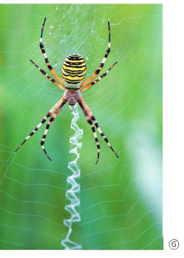
有的蜘蛛网经纬分明，有的如一团乱麻，还有的则是精心编织，以提高捕获猎物的效率。蛛网丝反射的光量可以影响蜘蛛的捕食。紫外光的反射可以吸引昆虫飞来，而可见光的反射则增加了蛛网的可见度，使昆虫容易觉察而避开蛛网。因而，蜘蛛在不同光照条件下，会调整它们的结网行为。凯氏金蛛在暗淡光线下（90勒克斯）比在较强的光线下（约700勒克斯）结的网的尺寸要大，捕捉丝也较长，并有较多的捕猎带。这是因为在亮光下减少蛛丝的量可以减少蛛网的可见度，而在暗光下安置较多的捕猎带，可以增加反射紫外线的数量而吸引昆虫。研究人员还发现，金蛛幼蛛的捕猎带多转圈，呈类似同心圆的式样；而成蛛网上的捕猎带多出自前后4对步足延伸的方向，呈4根放射形丝带，这样就把自己的身体与捕猎带连成一体，有利于成蛛隐匿于蛛网中而减少被天敌捕食的危险。

**【实验场】**

注意观察一个蜘蛛结网。当蜘蛛结的第一根经线被你多次破坏后，蜘蛛是不断地重复第一个动作，还是跳过第一个动作，从下一步开始结网。从中能否判断，蜘蛛的结网习性是先天遗传的还是后天学习所得？

【微问题】动物看到的世界是否也流光溢彩？

【关键词】视觉　色彩　嗅觉　气味　感觉系统

## 动物的孩子能不能一出生就见到双亲

人从小到大，绝大多数孩子都会在父母的精心呵护下长大。而许多动物却没有这么幸运，它们一生下来就是孤儿，在面对许多未知的风险时都需独自承担。

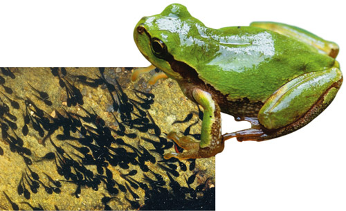
一般来说，大多数无脊椎动物或低等的鱼类、两栖类等，从一生下来就没有见过双亲，所以才会有“小蝌蚪找妈妈”的经典故事。为了在没有父母的照顾下也能存活，这些动物们的妈妈会尽可能为将要临世的孩子做好准备：如蜘蛛妈妈会巧手编织卵袋，为孩子创造一个安全温暖的孵化室；凶猛的螳螂会细心地为孩子创造一个防水、防寄生的螵蛸；姬蜂会把卵直接产在将要寄生的鳞翅幼虫身上，以便孩子们一出生就能吃到食物，等等。虽然这些妈妈们竭尽所能，为将要出生的孩子做了许多准备，但孩子们的成长过程仍充满难以预料的艰辛。为了确保种族的繁衍，这些孤儿家庭一般有一个共同特点，那就是孩子众多，是典型的广种薄收、以量取胜型，这种生殖策略叫R选择。如巨型乌贼一次能产几百枚卵，翻车鱼甚至能产上亿枚卵。这些孤儿的成活率虽然相当低，但只要有一个或者几个活下来，那就意味着整个种族得到了延续。

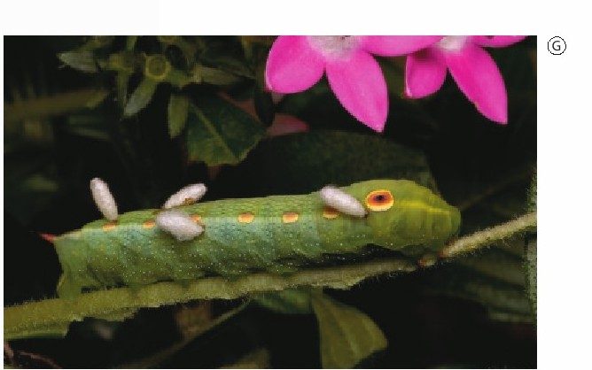
R选择——靠妈妈预存的食物（鳞翅目幼虫）过活的寄生蜂幼虫

那些有幸得到双亲照料的孩子，或者至少是在母亲精心照料下成长的动物，一般多为比较大型的动物，如灵长类、鲸、北极熊、鹰、信天翁等。这种非孤儿动物的一个共同特征是孩子量很少，父母辈要精心养育、照料孩子，直至它们能独立生活。例如：蓝鲸一次仅产一个幼崽，母亲需要照料和守护幼崽达7个月之久；长吻原海豚一次产崽一个，母亲会照料1～2年；北极熊一次产1～3个幼崽，小宝宝平均4年才离家独立……这种对后代精心呵护、倍加关爱的生殖策略叫K选择。K选择的特点是生殖的个体少，但后代能得到亲代周全的照顾，子代存活率高。这种选择通常处于稳定的环境中，并且这种生物对环境的适应良好。

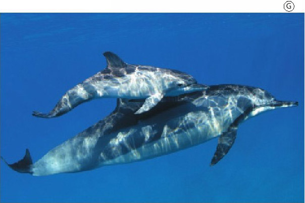
K选择——海豚妈妈会悉心照料它的孩子1～2年

无论是孤儿独自存活，还是在亲代的呵护下安全成长，每一种选择都是这些动物们在长期的进化过程中适应环境的结果，要知道在严苛的自然环境中，能存活下来的不一定是最强的，但往往是最适应的。（刘漫萍）

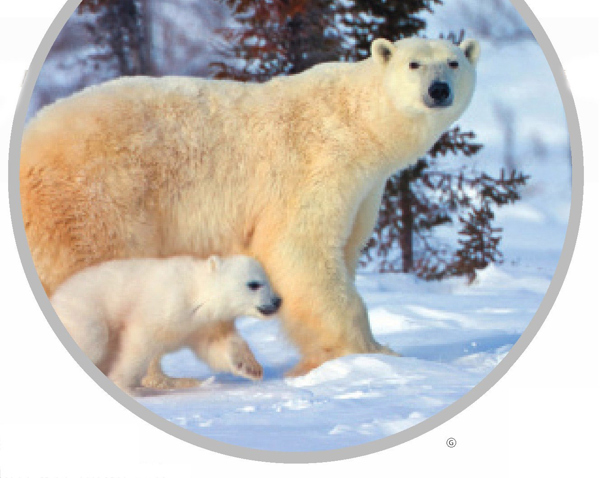
## 脊椎动物中雌性长得快还是雄性长得快

在脊椎动物中，许多种类的动物不仅在形态上存在一定的差异，而且在生长速度上也存在着差异。那么是雄性动物长得快，还是雌性动物长得快呢？

一般来说，脊椎动物中的雄性个体生长快，雌性个体生长慢。为什么会有这种差异呢？科学家们认为这主要是雌雄性个体将能量用于不同的功能而引起的。雌性个体将更多的能量用于生殖的需要，因此相应分配到生长作用的能量就较少。如西藏沙蜥的雌性个体，在繁殖后就会明显减轻体重。雌蜥对生殖能量的投入还包括怀孕期间对母体新陈代谢的影响，以及胚胎的新陈代谢等。而雄蜥对繁殖能量的投入相对较少，就更容易长个子。雌雄个体性成熟的时间不同也影响了两性的差异。如青海沙蜥的雌蜥性成熟较早，生长受繁殖的影响也较早，它们在一龄时就出现了雌雄的生长差异。而且由于雌蜥采取高投入、高风险的生殖策略，它们的生殖投入远远大于雄蜥，因此，雄蜥的生长明显快于雌蜥。

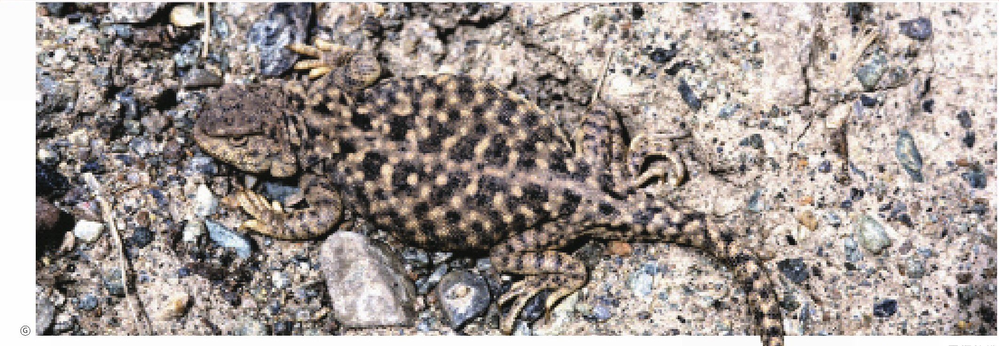
青海沙蜥

繁殖对脊椎动物雌性个体生长速度的影响一般要比雄性个体大，而且雌雄个体生长与生殖能量配置的差异是两性生长差异的重要原因之一。另外，这种差异还与动物的性成熟年龄、物种遗传、动物基因型和表现及动物体内的性类固醇激素水平的影响有密切关系，这些综合原因最终导致了脊椎动物两性之间的生长差异。（刘漫萍）

  

**【科学人】**李淳阳

为了给后代提供一个舒适安全的生活环境，卷叶象鼻虫会把叶子卷成筒状作为产卵场所，使其成为不受风雨与天敌干扰的育婴房，一直伴随幼虫孵化、长大到自己能独立觅食。这个充满爱与智慧的甲虫母亲，早在1976年就由中国台湾的李淳阳博士展现在世人面前。

李淳阳博士花费了近十年的时间，拍摄出中国台湾地区第一部昆虫生态影片，记录了众多昆虫的觅食、捕猎、求偶、自卫、成长等现象，无数令人惊叹的昆虫行为瞬间因为他的记录而定格。李淳阳博士不仅在中国，也在世界上为昆虫迷们所熟知。

**【实验场】**菜青虫的一生

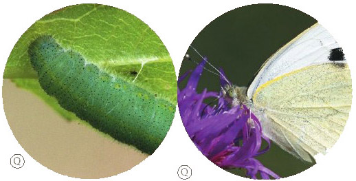
观察菜青虫的一生。去野外看看，一只菜青虫有几枚卵能活到变成蝴蝶？

【微问题】在动物界中，没爸妈的孩子是不是像根草？

【关键词】双亲照料　R选择　K选择　生长速度　生殖能量

## 动物为什么对不同猎物会采用不同的猎杀策略

一只花园蜘蛛静静地呆在网的一角，一只蛾子飞舞着撞了上去，花园蜘蛛“闻”讯后冲出来，一口咬在还在挣扎的蛾子身上。蛾子慢慢地不再挣扎后，花园蜘蛛才抽出丝来，像捆绑贼一样将蛾子死死捆住。一只蚱蜢投到了网上，花园蜘蛛也快速冲了出来，不过，它所做的第一件事不是撕咬对方，而是抽出丝来，将正在挣扎的蚱蜢的大腿紧紧缠起来，直到蚱蜢不能动弹时，它才一口咬在蚱蜢身上。

从以上例子可以看出，对不同的猎物，动物有不同的攻击策略。到底是“先咬后捆”还是“先捆后咬”，花园蜘蛛是有自己的考虑的，因为它能根据猎物在网上的不同振幅，判断出来者到底是什么。如果振动告诉花园蜘蛛来者是蛾子，它会采用先咬后捆的办法，因为蛾子身上布满了鳞片，如果先捆的话，鳞片上的鳞粉会让丝的黏性失效，使蛾子有机会脱网逃逸；如果振动告诉花园蜘蛛来者是蚱蜢，它就会选择先捆后咬的攻击策略，因为蚱蜢的腿部实在了得，一不小心就会被它踹个半死，所以得先把蚱蜢那强壮有力且多刺的腿给捆住。花园蜘蛛是个聪明的家伙，它既不会让送上门的猎物轻易逃脱，也绝对不会拿自己的小命去冒险。

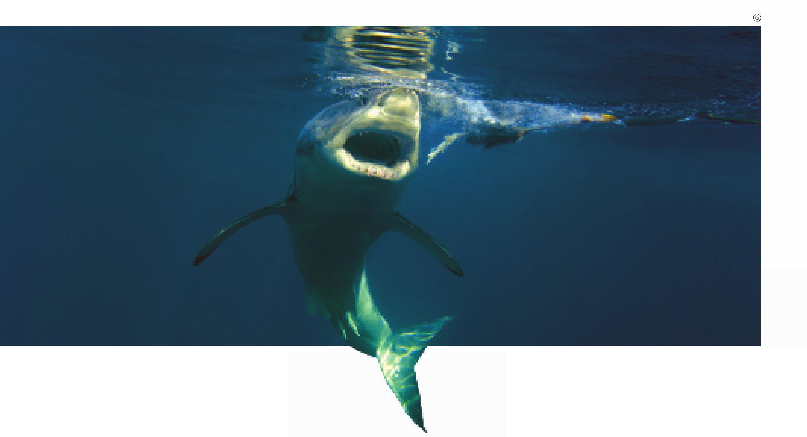
大白鲨面对不同体形的猎物，会采用不同的捕食策略

在动物界中，不少动物都会区别对待不同的猎物，即便是水中的冷血杀手大白鲨也是。在捕食小型猎物时，大白鲨会一直死死咬住对手，直至猎物死亡后再饱餐一顿，根本不给对方喘息的机会。而在捕食大型的海豹时，它就不会盲目地和对手拼命。它会采用“先咬后放”的手段，趁海豹不注意时先猛咬一口，通常是在尾部，然后在争斗中将伤口撕烂，接着就松口等在一边，等到大量失血的海豹奄奄一息或者死亡后，它再去进食。

在长期的演化过程中，自然界动物的猎食也和其他活动一样，在可能的条件下，最小限度地消耗能量，以最有效的办法、最低的代价来达到猎杀的目的。（刘漫萍）

## 动物是不是都要咬死猎物

无论是虎、狮、狼这些猛兽，还是鹰、隼、鲀这些猛禽，它们在捕捉猎物时无不追求一击而中，一招毙命。彻底制服猎物最安全的办法就是将猎物置于死地，然后将获取的猎物尽快吃完，否则食物就会烂掉。那么，有什么动物在捕获猎物后，能养着猎物每天尝鲜呢？你还别不信，真有！

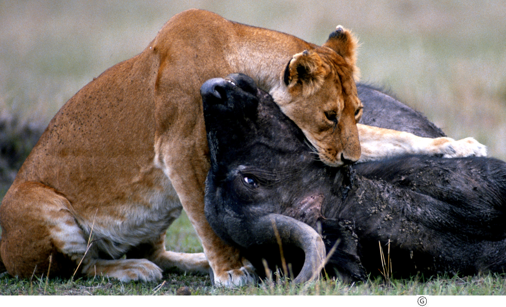
狮子捕猎追求一招毙命

在享用新鲜猎物方面，没有动物比蜘蛛、泥蜂、蛛蜂等这些无脊椎的小动物们做得更好了。这些小精灵对于捕食到的猎物并不直接处死，而是让猎物处于不能动弹却仍然活着的昏迷状态。蜘蛛每一次捕到猎物后，都会用毒牙给对方注射剂量精准的毒液，这些毒液能让动物无法动弹却并不死。这样，假如蜘蛛运气足够好，一次捉到好几只猎物的话，它就可以让猎物在瘫痪状态下贮存一段时间，待它享用时就能吃上活食了。胡蜂、泥蜂和蛛蜂等捕食性的胡蜂总科类的蜂，也都有这个特点。

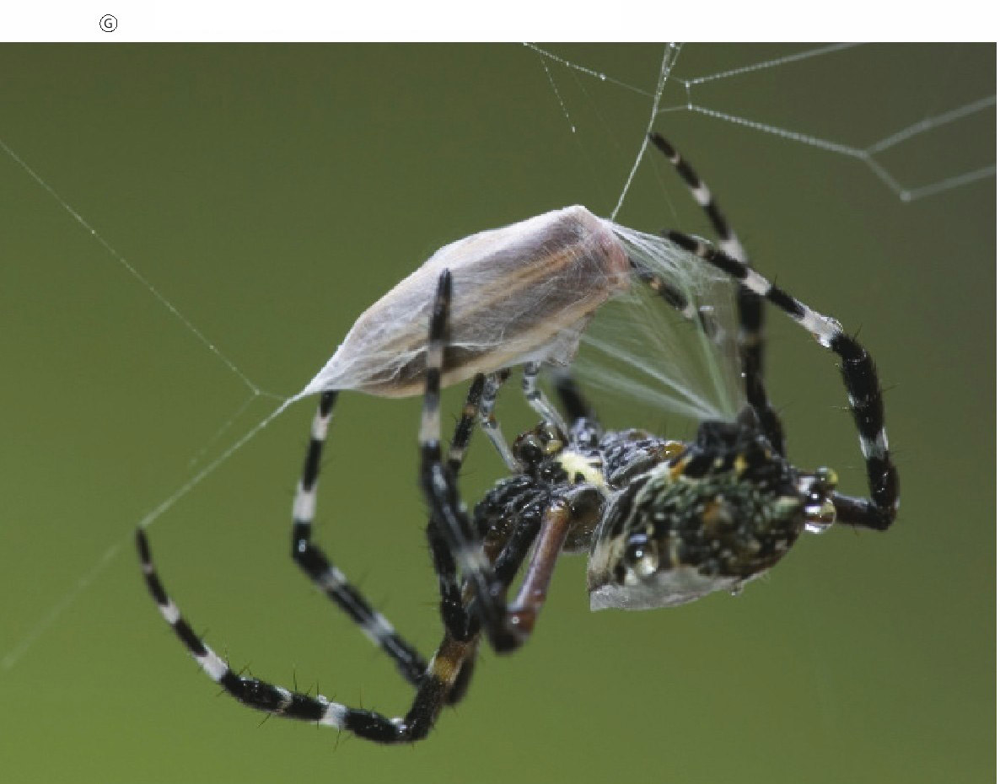
蜘蛛在对猎物进行“保鲜处理”

有趣的是，不同的蜂类在将不同的猎物做贮粮时，所使用的麻醉方法不一样，与之对应的产卵地点也会有所不同：像蜾蠃就喜欢捕食鳞翅目的幼虫给它的孩子们，为了让鳞翅目的幼虫们保持活力直到孩子们孵化，蜾蠃只是将这些毛毛虫们稍微麻醉一下，让它们能扭动但却不那么灵活。为了避免这些贮粮对卵和刚孵化的孩子们有所伤害，蜾蠃会将卵用丝悬挂于密封的巢室顶部，距贮粮稍有点距离，这样，俘虏们的挣扎就不会伤害到稚嫩的孩子。蛛蜂喜欢捕捉蜘蛛给后代当食物，但不同的是，它们却会将猎物彻底麻醉，使对方处于深度昏迷状态，再将卵产于猎物身上，这样，孵化出来的幼虫就可以直接享用鲜活的食物了。有些蜂类甚至喜欢把蟋蟀、蟑螂等作为孩子们的食物，细心的蜂妈妈们当然也会仔细考虑不同的麻醉剂量，以便使这些粮食保持应有的活性。

蜘蛛和胡蜂等这些不将猎物直接处死而保持一定活性的策略，无疑保障了它们自身及后代在自然界严酷环境中的生存，从而大大提高了存活率。（刘漫萍）

  

**【微博士】**螃蟹的“丢卒保车”

在遇到敌害时，壁虎会切断自己的尾巴，转移敌人的视线而趁机逃命。这种丢卒保车的求生方法，并不是壁虎的独门绝技。蚯蚓、海星、蜘蛛、大蚊等都会用这个保命绝招，螃蟹更是个中高手。在遇到敌害时，螃蟹会切断自身的步足来脱身，不仅如此，它还能切断自己的触角、腹肢等附肢，而且几乎不会流血。螃蟹在逃脱之后，被切断的附肢会再生出来，当然，再生的速度会因受伤部位的大小而有所不同，也跟温度、食物、龄期、蜕壳频率等有关。

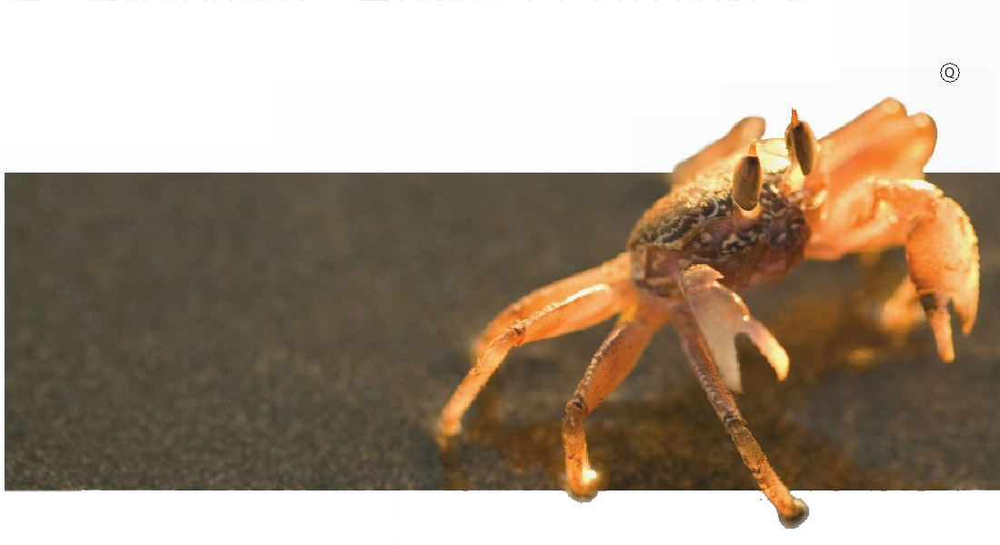
**【科学人】**陶弘景

在《诗经·小雅·小宛》中记有“螟蛉有子，蜾蠃负之”的诗句。那时人们普遍认为，有一种叫蜾蠃的蜂类，只有雄的，没有雌的，于是这种蜂只好把螟蛉衔回窝内抚养，当作义子，久而久之，这种领养的虫子就长得像蜾蠃了。后人根据这个典故，就把收养的义子称为螟蛉子。

南北朝时，名医陶弘景为了求证这个事实，就进行观察。结果他发现蜾蠃不但有雌有雄，而且它把螟蛉衔回窝中后，并没有抚养，而是用自己尾上的毒针将螟蛉麻醉，并将卵产在附近，然后密闭巢室。若干天后，从巢室里飞出了蜾蠃，陶弘景将那个泥巢打开，发现了没被吃完的螟蛉残骸。原来，蜾蠃带回螟蛉幼虫根本不是收为义子，而是作为它后代的活粮食。

**【实验场】**捕猎高手大腹圆蛛

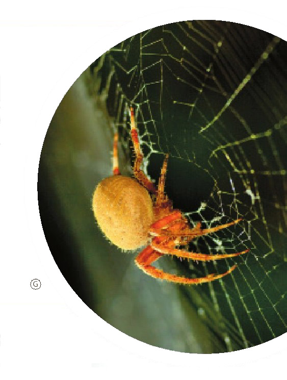
大腹圆蛛是在庭院里最常见的一种大型蜘蛛，它通常会织一个大大的圆网用于捕猎。你不妨将小蛾子和小蚱蜢分别投到大腹圆蛛的网上，观察它对这些不同的猎物是采取什么捕食策略的。

【微问题】想一想，狮子在捕杀斑马时，攻击的是对手的哪个部位？如果对手是大象呢？

【关键词】猎杀策略　花园蜘蛛　大白鲨　新鲜猎物

## 动物中有强盗吗

人类中有强盗，他们直接或间接把别人的财产据为己有。那么，动物中有没有强盗呢？或许你眼前会浮现出巢寄生的杜鹃鸟，或者半路飞抢食物的军舰鸟，甚至围着狮子嚎叫的非洲鬣狗……不过，与红色悍蚁和血红牧蚁的野蛮行径比起来，这些所谓的强盗动物简直是小巫见大巫。这两种小小的蚂蚁不仅强取豪夺，甚至还会奴役其他种类的蚂蚁，可谓是“高智商”的强盗。

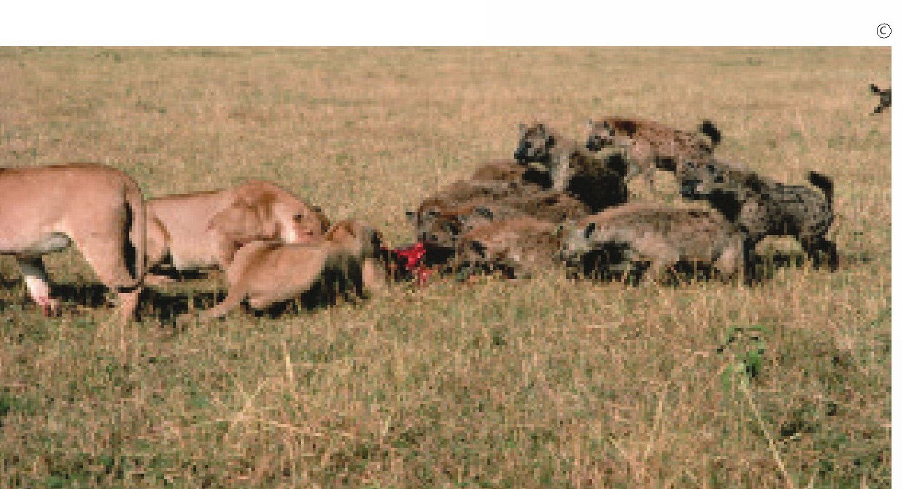
狮子们辛苦捕获的食物，却被鬣狗拦路打劫

血红牧蚁生活在欧洲，它们好斗且爱侵占领土，日子过得像奴隶主一样。这种蚂蚁常常会去袭击距它们50～100米远的其他蚁类的巢穴，如丝光褐蚁和西方红蚁。血红牧蚁会杀掉这些蚂蚁中顽强抵抗的工蚁，然后劫走巢中的幼虫和蛹，并把它们运回自己的巢穴中。当这些蚁蛹孵化长成工蚁后，就在血红牧蚁巢中干活，成了它们的奴隶。有时，在一个血红牧蚁的巢中往往会有2～3种奴隶蚁存在。不过血红牧蚁并不是完全的奴隶主，它们自己并没有失去劳动能力，在没有奴隶们做工的情况下仍然能够完成包括筑巢在内的所有事务。

最过分的强盗行径莫过于生活在欧洲和北美洲的红色悍蚁，这可是完全奴役种。红色悍蚁从来不挖掘蚁巢，也不照顾自己的孩子，甚至不能自己获取食物。它们的生活就是打架和抢劫。食物供给、修建巢穴和饲育后代等工作都由奴隶来完成，这些奴隶是它们从邻近巢穴中掠夺回来的其他种类的蛹羽化成的工蚁。离开了这些奴隶蚁，红色悍蚁的蚁后将无法生存。所以在这种混合巢群中，红色悍蚁巢穴的建筑结构类似于奴隶蚁物种巢穴的结构。无疑，在奴役现象中，红色悍蚁比血红牧蚁更为彻底和特化。

与人类中的强盗不同的是，动物界中的强盗和受害者之间居然形成了一种相互依赖、不可分离的关系。自然界的神奇在于，即使是强盗行径，也成了一种恰到好处的适应。（刘漫萍）

## 为什么动物也要行骗

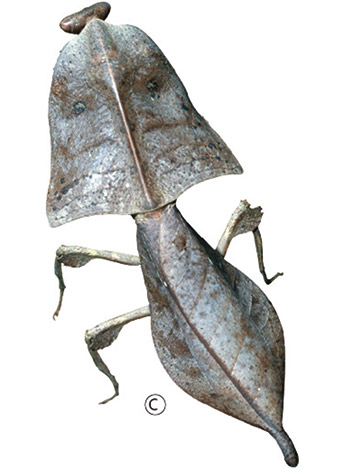
枯叶螳螂

汉语中，把那些用狡猾的手段或欺诈的做法，特别是利用别人的轻信或偏见而谋取金钱或地位的人称为骗子。在人类社会，行骗者是为了获取钱财或地位；而在动物界，动物行骗是为了生存而保护自己。动物行骗花样繁多，保护色、拟态、装死等都是最常见不过的手段。对动物来说，通过伪装来骗过天敌或猎物是生死攸关的大事，它们利用伪装逃避天敌，或步步为营地蒙骗猎物。石斑鱼能改变体色以适应环境，许多蟹身上带贝壳和海草，枯叶螳螂体似枯叶，竹节虫外形似树枝，这些动物们从形态、体色上进行伪装，是为了成功骗过它们的天敌和猎物。

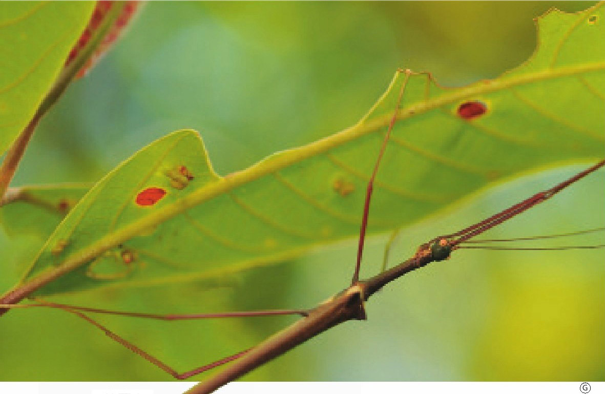
竹节虫

除了采用被动行骗外，有些动物还会采取主动行骗的办法。如鸵鸟，看到狮子临近巢穴时，为了保护雏鸟，成鸟会故意装作受伤跑不动的样子，以吸引狮子离开雏鸟。成鸟也不是傻乎乎地一个劲儿地跑，它们总是以不快不慢的速度吊着狮子的胃口，在狮子以为快得手时，又会加快奔跑的速度，就这样巧妙地引诱狮子离开巢穴。一旦到达安全地带，成鸟立刻一反受伤的样子，马上撒开脚丫子飞奔，一会儿就可以消失得无影无踪，身后留下气喘吁吁、什么也没得到的狮子。

动物行骗，是一种生存的智慧，是一种谋生的手段。仔细观察动物的行骗方法，实在是一件妙不可言的事情。（刘漫萍）

  

**【微博士】**萤火虫的光陷阱

在萤火虫的世界里，黑暗中那盏闪烁的灯往往代表着温馨、甜蜜和浪漫，因为闪光是雌雄萤火虫交流的信号。但现实有时是残酷的，这束原本传递爱意的灯光也会变成来自地狱的死亡之光。有些聪明的雌萤学会了其他种类雌萤的发光信号，就以此引诱其他雄萤。当兴冲冲的非同种雄萤冲过来的时候，就会成为雌萤的猎物。在动物行为学上，这种现象被称为攻击性拟态。

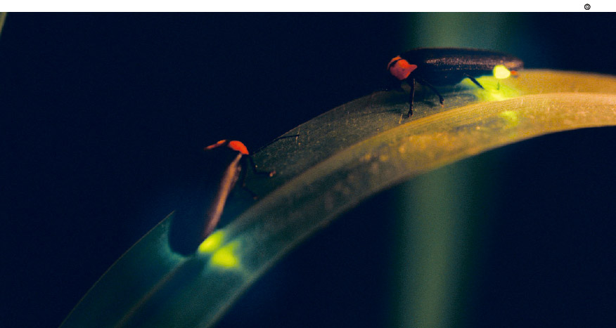
**【微博士】**易容高手

无论是在金庸、梁羽生还是古龙的武侠小说中，都会无一例外出现易容术的桥段，那种转眼之间就变成了另一个人的绝技，曾令多少人惊叹继而陷入无边的遐想。诚然，小说中的易容术被过度夸大了，但在动物世界中却真的有类似的神奇“易容术”。拥有这种绝技的动物叫剑齿鳚，它要将自己易容成裂唇鱼。裂唇鱼是一种生活在珊瑚礁中的清洁鱼，负责为其他鱼儿打扫身体。面对清洁鱼，即使珊瑚礁中最贪婪的掠食者也显得耐心十足而无意伤害。但剑齿鳚可不是为了友好相处才易容的。如果一条没有疑心的鱼游近它，试图让它代为清洁一番，就会落入它的圈套，有时甚至连鳍也会被它咬掉。剑齿鳚就靠这个独门“易容术”笑傲珊瑚礁这片“江湖”之中，虽然不那么光明正大，却也成功地存活了下来。

**【实验场】**真假蚂蚁

五六月份，在花园里观察蚂蚁群，找一找，看看有没有混在其中的蚁蛛，并说出蚁蛛和蚂蚁的最大区别。

【微问题】“鹬蚌相争，渔翁得利”体现出动物哪方面的生存策略？

【关键词】强盗　蚂蚁　行骗　生存策略

附录　图片及辅文版权说明

**图片版权**

本书所使用的图片均标注有与版权所有者或提供者对应的标记。全书图片的版权说明如下：

高品（上海）图像服务有限公司（Corbis Images）；

华盖创意（天津）视讯科技有限公司（Getty Images）；

北京全景视觉网络科技有限公司（全景）；

维基百科（Wikipedia.org）网站；

上海科学技术出版社；

其他图片来源：

P39左上，江旭东摄；P40右上，黄秦摄；P42右上、P47右上/左中、P61左上，陈水华摄；P45左、P63右上、P67右上，范忠勇摄；P54右上，宋建跃摄；P54右下、P90左下、P94右下、P102上、P117左、P144左、P176右上，费嘉绘制；P56上，朱一鸣摄；P57右、P62左1，戴美洁摄；P62右1、P71右上，董磊摄；P64左，朱英摄；P67左上，吴向群摄；P93上/中，“上海科技馆”提供；P117右上、P127左，夏建宏提供。

**辅文版权**

本书的“科学人”、“微博士”、“实验场”由同页正文作者编写。

特别说明：本书中可能存在未能联系到版权所有者的图片，请见书后与上海世纪出版股份有限公司少年儿童出版社联系。

十万个为什么　第六版　出版工作委员会

  

**主　任**

李远涛

  

**副主任**

周　晴　洪星范

  

**编辑人员**

（以姓氏笔画为序）

王　音　王　慧　卢　昱　朱　机　乔馥娟　孙正凡　岑建强　沈　岩　郝思军　黄劲草　梁玉婷　韩　静　裘树平　熊喆萍

  

**设计总监**

袁银昌

  

**美术总监**

费　嘉

  

**美术编辑**

费　嘉　张　怡　陈艳萍

  

**印制总监**

张伟群

  

**技术编辑**

张伟群　吴轶伟　胡厚源　陆　赟　许　辉

  

**责任校对**

石玲凤　王　曙　黄　岚　黄亚承　沈丽蓉　陶立新

  

**特约编审**

卞毓麟　方鸿辉　王义炯　范　氾

  

**审稿、定稿、审读人员**

（以姓氏笔画为序）

王　音　王　辉　王伟海　王霞梅　叶　剑　田廷彦　乐嘉民　匡志强　乔馥娟　严　岷　李远涛　李维靖　吴延祺　岑建强　沈　岩　张　颖　张利雄　张毅颖　陆永洲　陈　浩　陈晏平　林丽成　周玉刚　郑石平　郝思军　胡　毅　洪星范　徐红宝　隋淑光　董　放　韩绍伟　曾　文　曾建设　裘树平　虞信棠　魏昌富　濮紫兰

## 不吃肉的食草动物怎么长肌肉

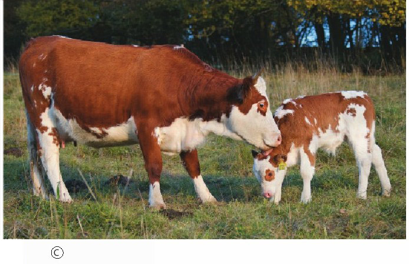
有些动物吃肉，有些动物吃草，还有些荤素都可以吃，称为杂食。对于吃肉的和杂食的动物来说，浑身肌肉还能理解，可为什么食草动物（更准确的说法是植食性动物）吃下去的是草，却也能长出肌肉来？

这当然并不能简单地用“吃什么补什么”来理解。肌肉的主要成分是蛋白质，因此，要想生出肌肉，身体必须得到足够的蛋白营养。肉、蛋、奶等食物因为富含蛋白质，当然就是最佳选择。这些食物被吃下去以后，先是在消化道中被逐渐分解成氨基酸，最终被吸收进入血液。之后，血液将氨基酸运输到肌肉细胞，并在那里重新“拼装”后，合成肌肉蛋白，便可以长出肌肉。

但是，肉、蛋、奶这三样食物没有一样是容易获得的，其中只有奶是在幼年阶段由母亲无私提供，而剩下的两样则是要猎食别的动物才能得到，那可是要玩命的。所以，只有那些凶狠的猎手才能做到。而即便是卓越的掠食者，比如狮子、虎、豹，也是饥一顿饱一顿的。于是，能力不济或者食量极大的动物就得另谋出路，寻找更容易获得的食物。权衡之下，树叶草根等植物性食物最易获取，所以，生性温顺的食草动物就选择更为稳妥的取食策略，它们就吃素啦！

植物性食物虽然营养没有肉类那么丰富，但是蛋白质、糖类、脂肪、矿物质、维生素等营养物质也是样样都不缺，只要吃得多，那也是完全够用的。所以，我们可以看到，牛、羊、鹿、马等食草动物，总是在不停地吃草，而狮子只要饱吃一顿，就可以几天不打猎。另外，一种植物的营养成分往往比较单一，氨基酸种类不全，所以很多吃素的动物需要吃多种植物才能做到营养均衡。古人说，人要吃五谷杂粮，也是这个道理。（冉浩）

## 食草的牛、马为什么力气那么大

在古代，没有电力和现代化机械，人们在日常的生产、生活中，除了依靠人力，就只能靠畜力。而牛、马体力极好，相当于好几个成年人，因此，牛、马是受社会关注的重要生产力，随意偷窃屠杀它们都是重罪。我们知道，人要有力气，就得多补充蛋白质，可是，吃草的牛、马为什么会有那么大的力气呢？

其实，虽然牛、马吃的是草，但草里的营养物质也不少，而且牛、马为了充分吸收其中的营养，消化道已经进化成很长的一根管道。另外，牛、马等食草动物还有一项特殊的本领，能将肉食性动物无法消化的纤维素分解，从而产生运动所必需的能量物质——葡萄糖。有了它，再通过呼吸作用，就可以源源不断地产生能量了。

当然，牛、马的身体也比人类大很多，如果人也像它们那样四肢着地趴着，就会发现双方有着巨大的差距。就拿水牛来说，随便一头成年牛也有半吨重，大的能有1吨多重，这可相当于将近20个成年人呢。所以，它们的力气远远超过人，也是顺理成章的。你只要随便看一下它们的一根骨头，就会心服口服。（冉浩）

## 牛为什么不停地嚼东西

一头牛，只要它清醒着，只要它没干活，它的嘴巴就没有停的时候。在草地上，它在吃草，在牛棚休息时它的嘴巴还在不停地嚼呀嚼的。它在嚼什么呢？是在磨牙么？

当然不是，它是在嚼肚子里的东西呢！牛属于哺乳动物偶蹄目中的反刍动物，和羊、鹿、羚羊等食草动物一起归入反刍亚目。反刍的意思就是把吃到肚里的东西吐出来，嚼嚼再咽回去，嗯……怎么听起来有点恶心啊……但这也是它长期进化的结果，属于不得已而为之。

因为草虽然容易获得，但里面的纤维素消化起来太难了，需要认真嚼碎才有利于分解。而牛在啃草的时候，总是多吃一口是一口，根本来不及细嚼慢咽。于是，嚼草这活儿就只能留在闲下来的时候做了。

好在哺乳动物的口腔内有三对唾液腺，其中分泌的淀粉酶可以把草料中的淀粉分解为麦芽糖。而草食动物的唾液分泌量很大，所以它们嚼起来是津津有味的。

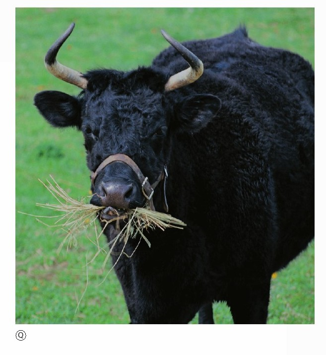
为了消化纤维素和反刍，它们的胃也与众不同。一般有四个，依次是瘤胃、网胃（蜂巢胃）、重瓣胃和皱胃。其实只有最后一个胃——皱胃才是真正的胃，它具有分泌胃液的腺体，而前面三个胃都是食管特化形成的。吃下的食物首先到达瘤胃储存起来。在前三个胃中生活着很多微生物，它们能通过发酵分解作用帮助纤维素软化分解。发酵过程中还会产生一些甲烷和二氧化碳气体，通过打嗝的方式释放出来。网胃呈网状，而且内壁突起，被碾碎的食物在此处与内壁摩擦后，上升回到瘤胃，从而刺激瘤胃产生呕吐反射，食物就回到口中被进一步咀嚼，这就是反刍。接下来，碾碎的食浆通过网胃的过滤进入重瓣胃，在那里，大量水分被吸收，食浆变稠，之后食物才被运送到皱胃，这样就不会因为水分过多而稀释皱胃里的消化液。

此外，骆驼也属于反刍动物，不过它的胃只有瘤胃、网胃和皱胃三个部分，其消化原理和牛、羊类似。

不仅如此，为了顺利消化纤维素，各种食草动物还都有自己的高招，如马和兔子可借助盲肠来分解纤维素。为了能够充分吸收食物中的营养，兔子还会把初次排出的软质粪便吃回去，再回炉，最后才排出真正的硬便。（冉浩）

  

**【微博士】**斗牛士的红布

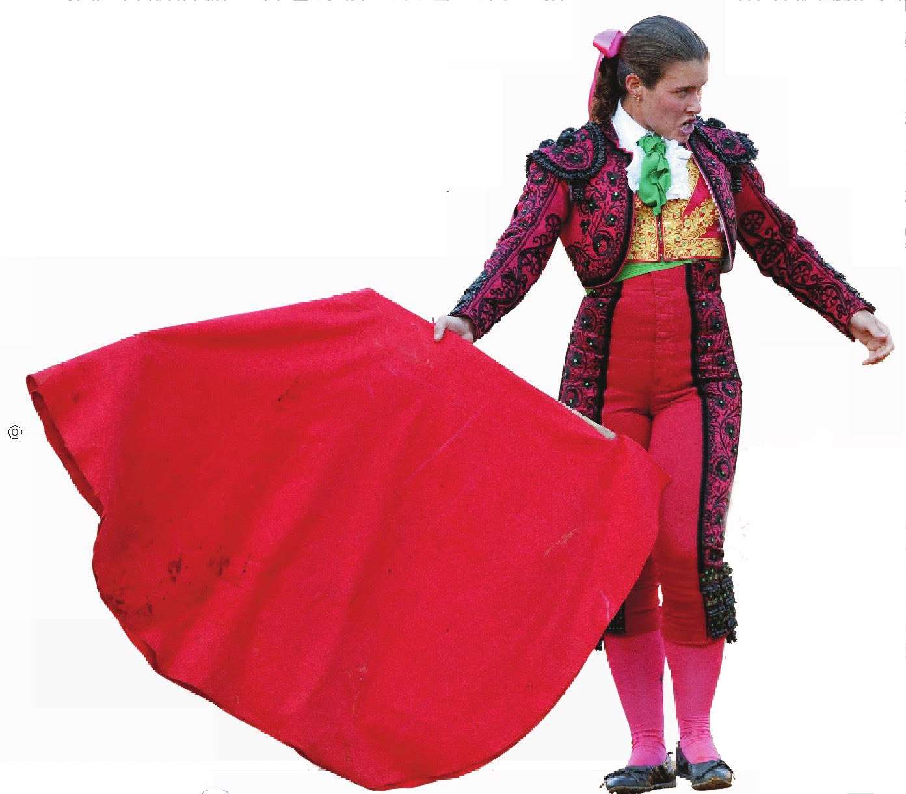
惊险、刺激的斗牛是西班牙的传统体育项目。在场上，斗牛士挥舞着红布挑逗公牛，没几下，公牛就急眼啦，它愤怒地冲过去，用角去顶红布，但斗牛士优雅地一扬手，红布撤去，牛就扑了个空。那么，是血一般的红色刺激了它吗？其实，牛是色盲，根本不能辨别出红色，使它愤怒的是那布在碍眼地抖动。而红色，其实是用来刺激观众感官的。

【微问题】你能举出一些动物例子，分别代表食草、食肉和杂食的吗？

【关键词】食草动物　食肉动物　杂食动物　反刍动物　纤维素

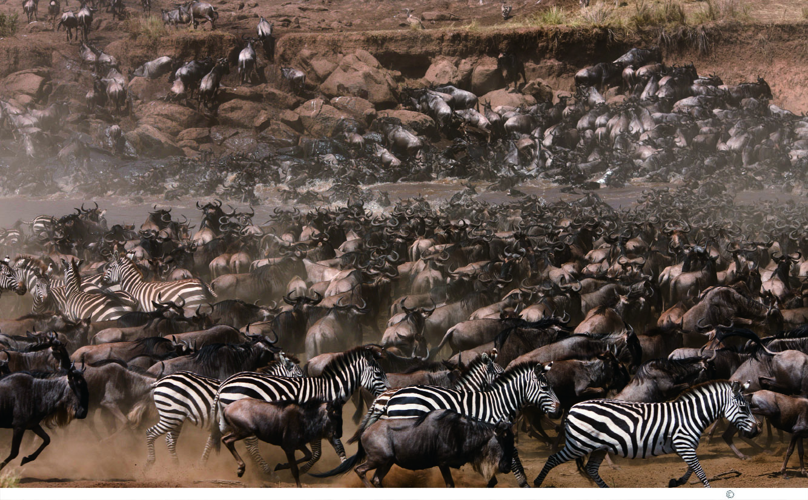
每年的七八月间，为了找寻食物，数以百万计的角马和斑马从坦桑尼亚的塞伦盖蒂出发，冲过奔腾的马拉河，来到肯尼亚的马赛马拉。这是一段生存或死亡的伟大征程

## 小蝌蚪为什么不像妈妈

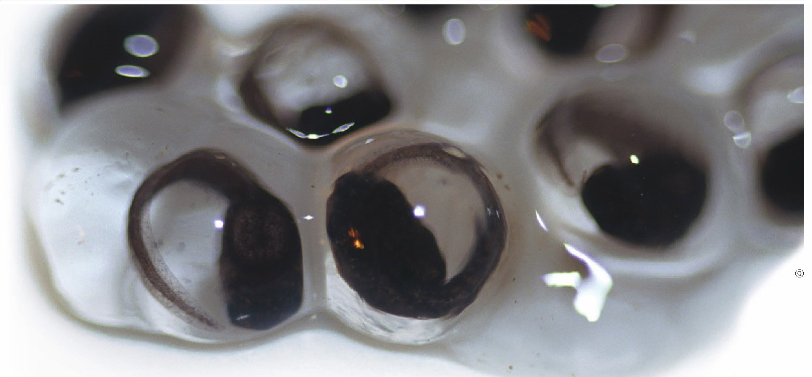
很多人在小时候看过动画片《小蝌蚪找妈妈》。故事说的是经过辛苦的寻找，小蝌蚪终于知道原来青蛙就是自己的妈妈。小蝌蚪的寻母之路之所以如此艰难，是因为它长得太不像妈妈了。妈妈有着大大的眼睛，小蝌蚪的眼睛却小得几乎看不见；妈妈有四条腿，小蝌蚪却没有腿；妈妈没有尾巴，小蝌蚪却拖着长长的尾巴；妈妈可以在陆地上和水里自由活动，小蝌蚪却只能在水里游啊游……很多动物的孩子都和它们的父母长得差不多，可是，小蝌蚪为什么长得不像妈妈呢？

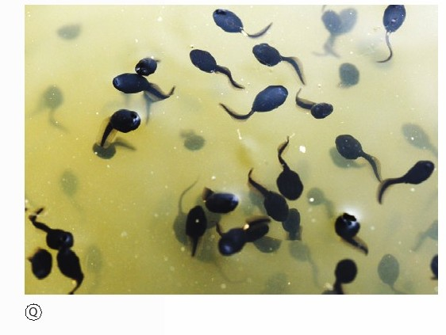
原来，两栖动物的成长需要经过一次变态发育。变态发育是指动物在胚后发育过程中，形态结构和生活习性出现截然不同的变化，这种仿佛变魔术一样的发育就叫变态发育。

青蛙的发育一共经过四个时期：受精卵、蝌蚪、幼蛙和成蛙。由受精卵变成小蝌蚪后，蝌蚪生活在水里，用鳃呼吸，以藻类为食；经过一段时间后，小蝌蚪逐渐长出了四肢，尾巴也消失了，慢慢地可以在陆地上生活，用肺和皮肤呼吸，捕食昆虫，也有了跳跃的能力，便和妈妈长得一模一样了。

青蛙为了适应陆地生活，长出了灵活的四肢和能在空气中呼吸的器官——肺，但是由于两栖动物的肺结构简单——只是一个很薄的囊，功能不够完全，因此它还需要借助皮肤来辅助呼吸。两栖动物的皮肤薄而湿润，皮表下还有许多微血管，可以与外界的氧气进行气体交换。

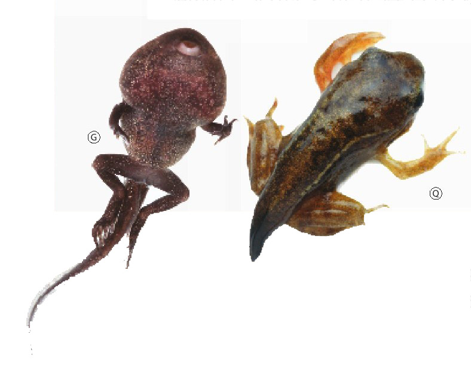
那么，小蝌蚪的尾巴又到哪儿去了呢？科学家的研究认为，蝌蚪尾部的消失是“细胞程序性死亡”的结果，是细胞按编好的“程序”主动死亡的过程。肌体在产生新细胞的同时，衰老和多余的细胞会通过程序性死亡机制被及时清除，使生命活动得以正常运行。小蝌蚪尾巴在逐渐消失的过程中，一种叫溶酶体的物质起了关键作用。在动物细胞质里的溶酶体，就像细胞的“消化车间”，含有酸性磷酸酶、糖苷酶、蛋白酶等几十种水解酶，可以分解蛋白质、核酸、脂质等多种物质，控制多种内源性和外源性大分子物质的消化。溶酶体有两个功能：一是吞噬并杀死侵入细胞的病毒或细菌等外来有害物质；另一个是溶化细胞自身产生的废物或多余的东西。小蝌蚪一开始甩着长长的尾巴游动，后来长出了腿，能靠四条腿在水里游泳了，尾巴就显得有点累赘了，没有它上岸后行动更为轻盈，失去功能的尾巴便被溶酶体逐渐溶化掉了。（郭佳　陈炼）

  

**【实验场】**

春天，在野外找一处有小蝌蚪的池塘，每天观察它们的生长状况。看一看蝌蚪是先长出“脚”，还是先长出“手”，尾巴是突然失踪的，还是慢慢变短而消失的。

## 为什么负子蟾要背着孩子

在南美洲的圭亚那和巴西的热带森林中，生活着一种有奇特繁殖方式的两栖动物——负子蟾。顾名思义，负子蟾妈妈是将自己的孩子背在身上抚育的。你见过这种奇妙的动物吗？

负子蟾进入生殖期后，雄蟾并不像其他蟾蜍一样发出“呱呱”的求偶声，而是会发出细微的嗡嗡声来吸引雌蟾；雌蟾进入生殖期后，一经入水，背部的皮肤就会变得像海绵一样松软，并且形成许多蜂窝状的小穴，数量多达几十甚至近百个。与此同时，雌蟾的泄殖腔壁外伸，形成管状产卵带，弯曲于背上。当雌蟾被雄蟾吸引过来时，雄蟾会给雌蟾一个大大的拥抱，然后爬上雌蟾的背部，在它的背上挤压产卵带，将卵挤出并且排出精子，使卵细胞受精。殷勤的蟾爸爸把受精卵一个一个地压进蟾妈妈背上的“小窝”里，并分泌一种胶状物质，把卵“封住”，防止卵滑出，蟾爸爸的任务就完成了。

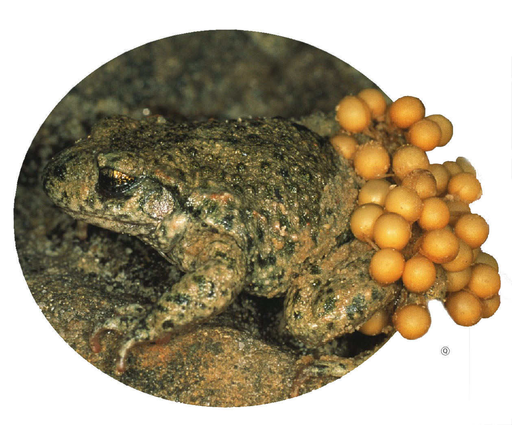
在以后大约3个月的时间里，蟾妈妈就这样一直背着小宝宝们，一点也不觉得辛苦，让孩子们在自己的背上慢慢长大。经过蝌蚪期，直到变成幼小的负子蟾（有的是蝌蚪晚期）后，蟾宝宝们就会顶开“盖子”，和满身“脓包”的蟾妈妈告别，开始在水里独立生活。等小蟾全部离开后，蟾妈妈会在树上或石头上蹭背，蜂窝状的皮肤便脱落下来，又恢复繁殖前的模样。

大多数两栖动物交配后，受精卵在水中完成发育。虽然一次可以产成百上千个卵，但是由于天敌捕食等其他因素，只有为数不多的卵可以存活下来。而负子蟾虽然每次产卵不多，但受精卵由蟾爸爸辛勤地安置在蟾妈妈的身上，又有蟾妈妈的皮肤保护着，可以避免外界环境的干扰。此外，蟾妈妈背上的“育儿室”为小宝宝们提供了生长发育所需的水分和营养物质。这种皮肤育儿法确保了负子蟾的卵能安全地变成小蟾，保证了负子蟾较高的繁殖率。而那些不幸掉入水中的受精卵，因为没有住进妈妈的爱心“小窝”，就不能发育成小蟾。

因此，负子蟾通过背着孩子，保证了宝宝们的健康成长。（郭佳　陈炼）

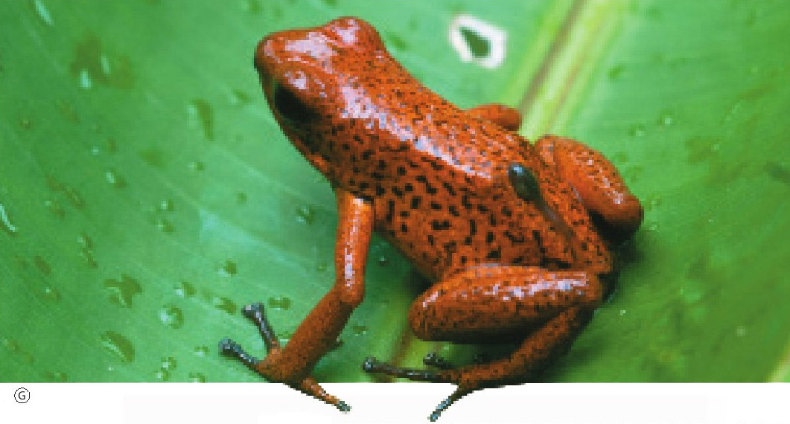
草莓箭毒蛙妈妈也会把孩子背到安全的地方去养育

  

**【科学人】**朱冼

中国著名细胞学家朱冼（1900-1962），从1951年开始在蟾蜍科动物中进行人工单性生殖（动物不经受精进行繁殖）的实验。他创立了蟾蜍卵巢离体排卵的方法，用雌性蟾蜍的卵细胞成功繁殖出了“无父”的小癞蛤蟆，其中一只“无父”癞蛤蟆（雌性），与正常的雄性蟾蜍抱对后产下卵，这些受精卵中的绝大多数又发育成了小癞蛤蟆。这些“没有外祖父的癞蛤蟆”的诞生，证明了人工单性生殖的子代具有繁衍后代的能力，这在生物学上有着重大意义。

【微问题】仔细观察大自然，你还知道哪些动物的成体和幼体长相完全不一样？

【关键词】蝌蚪　两栖动物　变态发育　细胞程序性死亡　溶酶体　负子蟾

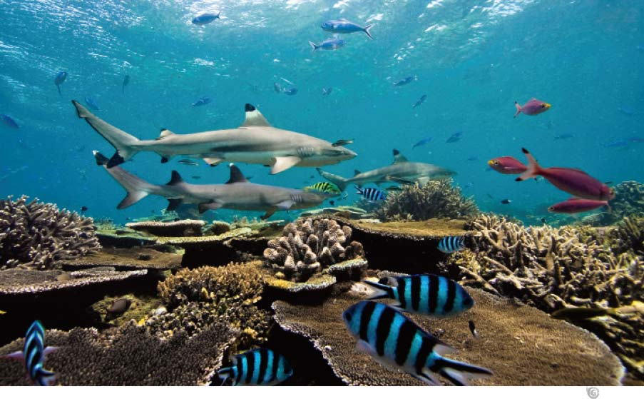
海洋是一个超级生态大系统，滋养了从原生动物到哺乳动物的所有类群，其中最负盛名的当然是鱼类。海洋鱼类的多姿多彩，衬托着地球的美丽和不朽

## 鱼儿都是哑巴吗

我们生活在一个有声有色的世界里，在周围的生活环境中有“飞禽”“走兽”，还有“游鱼”。“两个黄鹂鸣翠柳”是说会飞的鸟儿不但会“说话”而且歌声还很动听。此外，我们还可以在破晓时听到“金鸡报晓”，在夜幕降临时听到牛儿“哞……哞”叫。这些都表明：不只是我们会说话，好多动物也可以“说话”。那么你听到过家中的金鱼“说话”吗？你听到过池塘的鱼“聊天”吗？我想应该没有吧。那是不是说鱼儿都是“哑巴”，它们都不会说话呢？

当然不是。我们都知道，声音是由于物体的振动引起的，那鱼儿当然也不例外。但是鱼儿并不像我们发声靠声带振动，它发声的方法千奇百怪，有的靠压迫鱼鳔，有的靠摩擦咽喉齿，还有的靠振动肌肉……

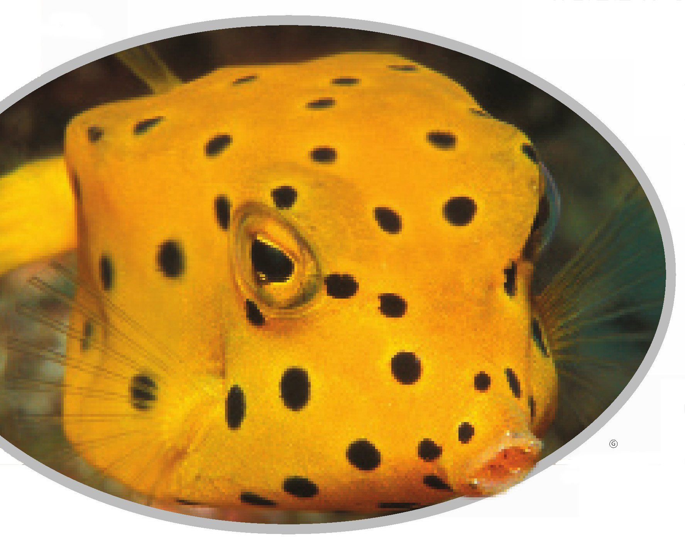
箱鲀

鲤鱼上钩时会发出“咕……咕”的声音，康吉鳗会发出“吠”音，那是鳔内的气体通过鳔管迸发出来的声音。大海里的黄姑鱼、鮸鱼能发出“咕……咕”的叫声，有时候大黄鱼也能发出这样的声音，那是鳔和它相连的肌肉产生振动发出的共鸣声。有一种叫作鲂鮄的鱼，它可以仿效雄鸡啼鸣，正是因为它有这个绝技，人们还给了它另一个名字——“海鸡”，它的声音是通过舌颌骨摩擦而来的。另外，刺鱼和鲶鱼的声音是它们的背鳍、胸鳍和腹鳍上的硬刺摩擦产生的，而鲀形目中的多种鱼如鳞鲀，是通过上下咽喉齿的摩擦而发出声音的。

另外，箱鲀能发出犬叫声；鼓鱼会发出类似打鼓的声响；鱼类能发出的声音，还真是不少呢！

既然有这么多的鱼儿会“说话”“唱歌”，那么为什么平时我们很难听到它们的叫声呢？

这是因为水的密度是空气的7500倍，所以鱼所发出的游动声、鳃盖的闭合声、鱼鳔的响亮声以及各种摩擦声都在水的介质中消失得无影无踪了。因此，要想听到鱼儿们“聊天”“唱歌”的声音，就必须借助一定的仪器——水听器。想象一下，如果我们通过这样的仪器来聆听来自水下的声音，那么肯定会感受到一场盛大的交响乐。（王军仁）

## 鱼儿是怎样呼朋唤友的

人与人之间的交流似乎非常简单，可以通过语言和手势来表达意思。可是鱼儿就不一样了，平时我们甚至都听不到它们“说话”，那么它们是不是从来都不相互交流呢？可奇怪的是，我们却常常可以看到成群的鱼儿一起嬉戏，一起寻找吃的，那么到底鱼儿是怎样呼朋唤友的呢？事实上，任何一种动物，它们之间都有自己特有的交流方式，尽管有很多方式是我们无法感知的，但是它们之间确实存在着信息的传递，当然鱼儿也在这个行列中。有些生活在热带的鱼通过改变体色来交流，比如藻躄鱼。如果它们发现了敌害，就会改变自己身体的颜色，以此来躲避敌人的攻击，同时也给同伴们传递了相应的信息，让它们提高警惕。还有些会“说话”的鱼也靠声音来交流，虽然它们只能发出简单的声音，但是却不影响它们相互间的交流，比如箱鲀。更有趣的是一些岩礁鱼类，如小热带鱼，它们会在生命受到威胁时发出声音，以吓跑来袭的鱼类。当然，除此之外，很多鱼类还可以释放一种叫作“信息素”的物质来进行交流，这种物质可以通过水来传播，让周围的同伴们感受到信号。（王军仁）

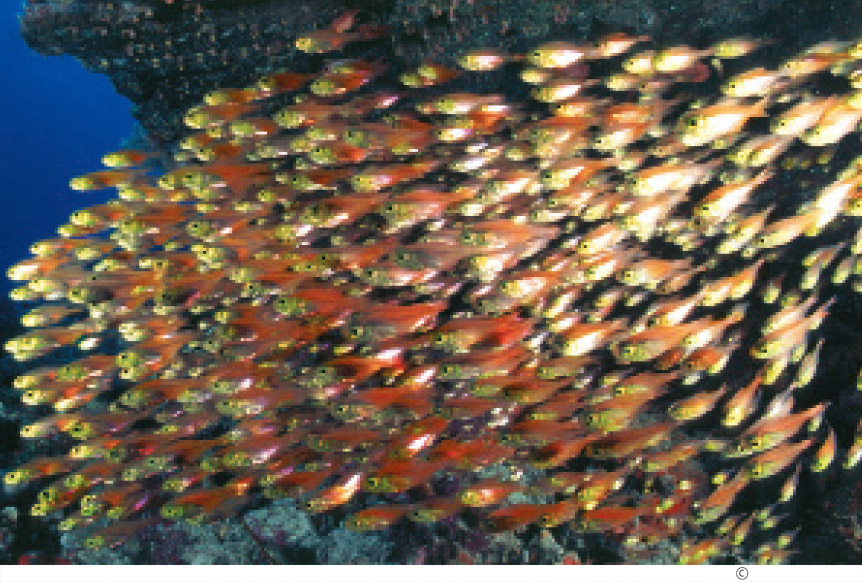
  

**【科学人】**沙赫里曼·加扎利

新西兰奥克兰大学的海洋学家加扎利发现，鱼类通过发出不同的声响互相交流，如呼噜声、唧唧声和砰砰声等。加扎利最初是把鱼放在鱼缸里，给它们几个星期的时间来适应环境，然后才开始水下录音。鱼开始发出声音时，他便试图破译声音包含的内容。他说：“我们有99%的把握确定这是鱼发出的声音，现在我们要做的是明白声音的意义。”

加扎利比较了不同鱼类的发声之后发现，鲂鱼类会发出许多不同的声响，而且喜欢喋喋不休地“说”个没完。鳕鱼则通常很安静，只有在产卵的时候才会发出声音。加扎利说：“我们猜测它们是通过声音，让雄鱼和雌鱼同时分别产下卵子和精子，进行体外受精。”

不过，如果有谁想跟自己的宠物金鱼“对话”，恐怕不太容易。加扎利说：“金鱼有非常好的听力，但听力好和发声无关，它们不能发出任何声响。”

**【微博士】**会叫的鱼儿先倒霉

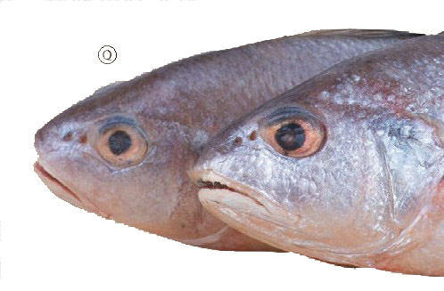
黄花鱼

石首鱼类以善叫而闻名，其声音像碾轧声、打鼓声、蜂雀的飞翔声、猫叫声和呼哨声，其叫声在交配期间特别常见，目的是为了集群。人们爱吃的黄花鱼（黄鱼）就属于石首鱼的一种，它有一副“金嗓子”，除了能发出“咕……咕”的叫声外，还能唱出“哗啦”“咯咯”“哥罗”等3种不同音符。但是，正是因为它美妙的“歌喉”，常常招致灭顶之灾。有经验的渔民根据黄花鱼所具有的特殊嗓音、音量大小、“旋律”的优美程度，就可以判断鱼群的数量和游动方向，从而把它们一网打尽。

【微问题】你在池边喂鱼时，是否发现鱼儿会游过来？它们是看见了你的影子，还是听到了你的脚步声，或是闻到了鱼食的香味？

【关键词】鱼　鱼鳔　交流　体色　声音

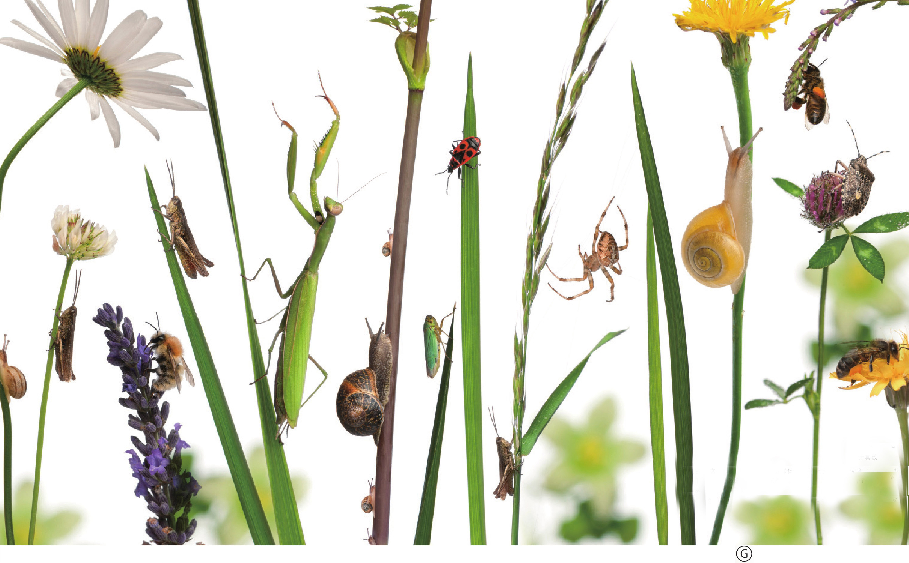
昆虫是这个世界上最大的生物群体，它们上天入地，无所不能，万千的植物都依靠它们来传花授粉。当然，植物也养育了不计其数的昆虫和无脊椎动物

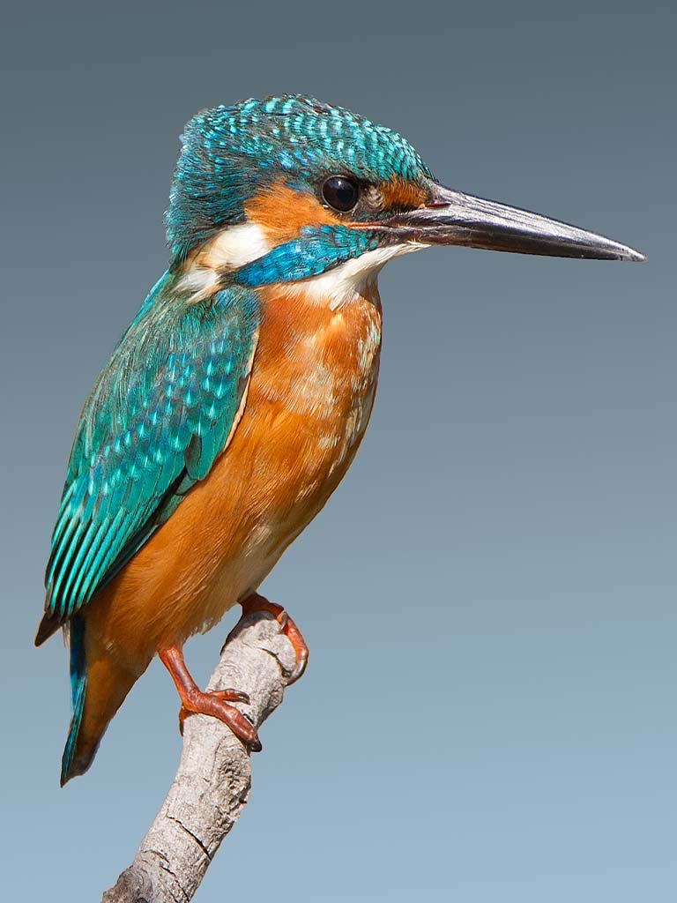
