# 图书在版编目（CIP）数据

十万个为什么（第六版）/韩启德总主编.-上海：少年儿童出版社，2014.1

ISBN 978-7-5324-9285-5

I.①十……II.①韩……III.①科学知识-青年读物②科学知识-少年读物IV.①Z228.1②R-49

中国版本图书馆CIP数据核字（2013）第055411号

  

  

  

**十万个为什么（第六版）**

**总主编　韩启德**

出　　版　上海世纪出版股份有限公司少年儿童出版社

地　　址　200052上海延安西路1538号

发　　行　上海世纪出版股份有限公司发行中心

地　　址　200001上海福建中路193号

易文网 www.ewen.cc

少儿网 www.jcph.com

电子邮箱　posmaster@jcph.com

印　　刷　上海中华印刷有限公司

　　上海中华商务联合印刷有限公司

　　常熟市华通印刷有限公司

　　上海锦佳印刷有限公司

　　上海一众印务中心

　　浙江新华数码印务有限公司

开　　本　889×11941/16

印　　张　221.5

出版日期　2014年1月第1版第1次印刷

书　　号　ISBN 978-7-5324-9285-5/N.962

定　　价　680.00元（全18册）

**版权所有　侵权必究**

 目录
 

[扉页](../Text/feiye.xhtml)

[版权信息](../Text/bq.xhtml)

[序 言](../Text/Section0002_0001.xhtml)

[目录](../Text/TOC.xhtml)

[导言](../Text/Section0002_0009.xhtml)

[为什么要研究古生物](../Text/Section0002_0009.xhtml#sigil_toc_id_52)

[化石与地层](../Text/Section0002_0002_0022.xhtml)

[化石就是石化的动物骨骼吗](../Text/Section0002_0002_0022.xhtml#sigil_toc_id_53)

[如何寻找化石](../Text/Section0002_0002_0022.xhtml#sigil_toc_id_54)

[为什么只有很少的恐龙变成化石](../Text/Section0002_0002_0022.xhtml#sigil_toc_id_1)

[为什么说化石为进化论提供了最直接的证据](../Text/Section0002_0002_0001.xhtml)

[化石如此重要，该如何保护化石](../Text/Section0002_0002_0001.xhtml#sigil_toc_id_2)

[怎样才能复原远古动物](../Text/Section0002_0002_0001.xhtml#sigil_toc_id_58)

[为什么地层学能揭示地球的历史](../Text/Section0002_0002_0002.xhtml)

[为什么说化石可以做远古的“日历”](../Text/Section0002_0002_0002.xhtml#sigil_toc_id_60)

[“大地之书”应该怎么读](../Text/Section0002_0002_0003.xhtml)

[为什么“金钉子”那么珍贵](../Text/Section0002_0002_0003.xhtml#sigil_toc_id_62)

[古生物的足迹为什么也能成为一门学问](../Text/Section0002_0002_0004.xhtml)

[为什么科学家要关注化石的埋藏情况](../Text/Section0002_0002_0004.xhtml#sigil_toc_id_64)

[为什么微生物是生命演化中的真正主人公](../Text/Section0002_0002_0005.xhtml)

[细菌可以保存为化石吗](../Text/Section0002_0002_0005.xhtml#sigil_toc_id_66)

[为什么叠层石今天不再繁盛了](../Text/Section0002_0002_0005.xhtml#sigil_toc_id_3)

[生物大分子也能保存为化石吗](../Text/Section0002_0002_0006.xhtml)

[为什么古DNA研究会吸引科学家的兴趣](../Text/Section0002_0002_0006.xhtml#sigil_toc_id_4)

[为什么古生物的软组织能够形成化石](../Text/Section0002_0002_0006.xhtml#sigil_toc_id_70)

[古生物与古环境](../Text/Section0002_0002_0006_0001.xhtml)

[除了人类，还有其他生物影响过全球环境吗](../Text/Section0002_0002_0006_0001.xhtml#sigil_toc_id_8)

[为什么化石能做地球的“温度计”](../Text/Section0002_0002_0006_0001.xhtml#sigil_toc_id_72)

[为什么科学家能知道翼龙的生活环境](../Text/Section0002_0002_0006_0001.xhtml#sigil_toc_id_5)

[为什么在青藏高原也能找到珊瑚和贝壳](../Text/Section0002_0002_0007.xhtml)

[为什么中国的海生爬行动物化石都产自南方](../Text/Section0002_0002_0007.xhtml#sigil_toc_id_6)

[为什么海相地层中会有陆生爬行动物的化石](../Text/Section0002_0002_0007.xhtml#sigil_toc_id_76)

[是什么改变了古气候](../Text/Section0002_0002_0008.xhtml)

[地球曾是个大雪球吗](../Text/Section0002_0002_0008.xhtml#sigil_toc_id_78)

[为什么可以根据地层和化石了解古气候的变化](../Text/Section0002_0002_0008.xhtml#sigil_toc_id_7)

[生命是怎样起源的](../Text/Section0002_0002_0009.xhtml)

[真核生物是怎样演化来的](../Text/Section0002_0002_0009.xhtml#sigil_toc_id_50)

[为什么寒武纪早期会发生生物大爆发](../Text/Section0002_0002_0010.xhtml)

[为什么说寒武纪的生物发展是“大爆发”](../Text/Section0002_0002_0010.xhtml#sigil_toc_id_51)

[为什么寒武纪大爆发与达尔文的进化论并不矛盾](../Text/Section0002_0002_0010.xhtml#sigil_toc_id_84)

[为什么说史前的生物大辐射惠及了所有生命](../Text/Section0002_0002_0011.xhtml)

[为什么微生物化石能提供地球发生大灾难的线索](../Text/Section0002_0002_0011.xhtml#sigil_toc_id_86)

[地球上有过几次生物集群灭绝](../Text/Section0002_0002_0012.xhtml)

[为什么有人认为现在正处于第六次生物集群灭绝](../Text/Section0002_0002_0012.xhtml#sigil_toc_id_88)

[地球深部存在另一个生物圈吗](../Text/Section0002_0002_0013.xhtml)

[环境恶化时，生物会变小吗](../Text/Section0002_0002_0013.xhtml#sigil_toc_id_90)

[古无脊椎动物](../Text/Section0002_0002_0013_0001.xhtml)

[最早出现的动物长什么样](../Text/Section0002_0002_0013_0001.xhtml#sigil_toc_id_9)

[为什么古海洋中会有“纺锤”](../Text/Section0002_0002_0013_0001.xhtml#sigil_toc_id_92)

[为什么放射虫化石能为哑地层“说话”](../Text/Section0002_0002_0013_0001.xhtml#sigil_toc_id_55)

[世界上数量最多的是哪一种化石](../Text/Section0002_0002_0014.xhtml)

[什么动物长得像杯子](../Text/Section0002_0002_0014.xhtml#sigil_toc_id_57)

[谁是古海洋中最杰出的“建筑师”](../Text/Section0002_0002_0014.xhtml#sigil_toc_id_96)

[最大的虫子有多大](../Text/Section0002_0002_0015.xhtml)

[为什么说节肢动物是演化史上最成功的动物](../Text/Section0002_0002_0015.xhtml#sigil_toc_id_98)

[三叶虫因为什么而得名](../Text/Section0002_0002_0016.xhtml)

[三叶虫时代都有些什么生物](../Text/Section0002_0002_0016.xhtml#sigil_toc_id_100)

[三叶虫家族里都有哪些明星](../Text/Section0002_0002_0016.xhtml#sigil_toc_id_59)

[三叶虫是怎样生活的](../Text/Section0002_0002_0017.xhtml)

[三叶虫是如何长大的](../Text/Section0002_0002_0017.xhtml#sigil_toc_id_61)

[昆虫是怎么飞上天空的](../Text/Section0002_0002_0018.xhtml)

[恐龙时代的跳蚤也长得很大吗](../Text/Section0002_0002_0018.xhtml#sigil_toc_id_63)

[先有花还是先有蜜蜂](../Text/Section0002_0002_0018.xhtml#sigil_toc_id_106)

[为什么盛极一时的腕足动物会衰退](../Text/Section0002_0002_0019.xhtml)

[菊石为什么能在海里自由沉浮](../Text/Section0002_0002_0019.xhtml#sigil_toc_id_108)

[人类的祖先也曾经长得像海星吗](../Text/Section0002_0002_0020.xhtml)

[古虫是最古老的虫子吗](../Text/Section0002_0002_0020.xhtml#sigil_toc_id_110)

[牙形刺是鱼牙吗](../Text/Section0002_0002_0021.xhtml)

[为什么数亿年前的岩石上会有“笔迹”](../Text/Section0002_0002_0021.xhtml#sigil_toc_id_112)

[靠皮肤“吃饭”的动物也曾繁盛一时吗](../Text/Section0002_0002_0021.xhtml#sigil_toc_id_65)

[奇虾是奇怪的虾吗](../Text/Section0002_0004.xhtml)

[什么动物全身都有“眼睛”](../Text/Section0002_0004.xhtml#sigil_toc_id_67)

[怪诞虫有多怪诞](../Text/Section0002_0004.xhtml#sigil_toc_id_115)

[古植物](../Text/Section0002_0004_0019.xhtml)

[最早出现的植物长什么样](../Text/Section0002_0004_0019.xhtml#sigil_toc_id_11)

[最常见的植物化石是什么](../Text/Section0002_0004_0019.xhtml#sigil_toc_id_117)

[为什么树木可以保存为化石](../Text/Section0002_0004_0019.xhtml#sigil_toc_id_69)

[地衣是真菌还是藻类](../Text/Section0002_0004_0001.xhtml)

[绿藻是所有高等植物的祖先吗](../Text/Section0002_0004_0001.xhtml#sigil_toc_id_71)

[植物是什么时候直立起来的](../Text/Section0002_0004_0002.xhtml)

[远古植物都有根、茎、叶吗](../Text/Section0002_0004_0002.xhtml#sigil_toc_id_73)

[植物的刺是什么时候出现的](../Text/Section0002_0004_0002.xhtml#sigil_toc_id_123)

[种子蕨是种子植物还是蕨类植物](../Text/Section0002_0004_0003.xhtml)

[最早的植物叶是怎样演化来的](../Text/Section0002_0004_0003.xhtml#sigil_toc_id_125)

[为什么同一种蕨类植物有两个不同的面貌](../Text/Section0002_0004_0003.xhtml#sigil_toc_id_75)

[最早的森林出现在什么时候](../Text/Section0002_0004_0004.xhtml)

[为什么远古的森林不是一成不变的](../Text/Section0002_0004_0004.xhtml#sigil_toc_id_77)

[为什么不是所有的古植物都能变成煤](../Text/Section0002_0004_0004.xhtml#sigil_toc_id_129)

[松树的祖先长什么样](../Text/Section0002_0004_0005.xhtml)

[为什么银杏被称为活化石](../Text/Section0002_0004_0005.xhtml#sigil_toc_id_131)

[为什么被子植物能成为演化最成功的植物](../Text/Section0002_0004_0006.xhtml)

[地质历史上最高的植物能长多高](../Text/Section0002_0004_0006.xhtml#sigil_toc_id_133)

[地球上第一朵花开在哪里](../Text/Section0002_0004_0007.xhtml)

[水稻是什么时候被驯化的](../Text/Section0002_0004_0007.xhtml#sigil_toc_id_135)

[远古植物是怎样迁徙的](../Text/Section0002_0004_0008.xhtml)

[最早的攀援植物是什么时候出现的](../Text/Section0002_0004_0008.xhtml#sigil_toc_id_137)

[最早的食虫植物是什么时候出现的](../Text/Section0002_0004_0008.xhtml#sigil_toc_id_79)

[古脊椎动物](../Text/Section0002_0004_0008_0001.xhtml)

[地球上第一条“鱼”长什么样](../Text/Section0002_0004_0008_0001.xhtml#sigil_toc_id_139)

[4亿年前的海洋中曾经生活过哪些鱼类](../Text/Section0002_0004_0008_0001.xhtml#sigil_toc_id_12)

[为什么无颌类鱼只有一个鼻孔](../Text/Section0002_0004_0008_0001.xhtml#sigil_toc_id_81)

[人类用以呼吸的鼻孔从哪里来](../Text/Section0002_0004_0009.xhtml)

[为什么“披甲戴盔”的鱼没能生存至今](../Text/Section0002_0004_0009.xhtml#sigil_toc_id_83)

[最早的颌是怎样出现的](../Text/Section0002_0004_0009.xhtml#sigil_toc_id_14)

[恐怖的史前巨鱼能长多大](../Text/Section0002_0004_0010.xhtml)

[旋齿鲨的牙齿到底长在哪儿](../Text/Section0002_0004_0010.xhtml#sigil_toc_id_15)

[骨头硬的鱼是什么时候出现的](../Text/Section0002_0004_0010.xhtml#sigil_toc_id_85)

[为什么献文鱼会有超级粗大的骨头](../Text/Section0002_0004_0011.xhtml)

[龙鱼是金龙鱼的祖先吗](../Text/Section0002_0004_0011.xhtml#sigil_toc_id_87)

[中国常见的鱼化石有哪些](../Text/Section0002_0004_0011.xhtml#sigil_toc_id_17)

[哪种现生鱼类与人的亲缘关系最近](../Text/Section0002_0004_0012.xhtml)

[人类的鱼类祖先长什么样](../Text/Section0002_0004_0012.xhtml#sigil_toc_id_18)

[鱼类是怎样为爬上陆地做准备的](../Text/Section0002_0004_0013.xhtml)

[为什么鱼类要登上陆地](../Text/Section0002_0004_0014.xhtml)

[古两栖动物长相有多奇怪](../Text/Section0002_0004_0014.xhtml#sigil_toc_id_89)

[史前最大的两栖动物有多大](../Text/Section0002_0004_0015.xhtml)

[史前海洋中有两栖动物吗](../Text/Section0002_0004_0015.xhtml#sigil_toc_id_91)

[大鲵的祖先在哪里](../Text/Section0002_0004_0015.xhtml#sigil_toc_id_21)

[恐龙时代有古蛙吗](../Text/Section0002_0004_0016.xhtml)

[为什么乳齿鲵会被称为大头鲵](../Text/Section0002_0004_0016.xhtml#sigil_toc_id_22)

[为什么说爬行动物成为了真正的陆生动物](../Text/Section0002_0004_0017.xhtml)

[为什么中生代的爬行动物体形巨大](../Text/Section0002_0004_0017.xhtml#sigil_toc_id_23)

[为什么说楔齿蜥不是蜥蜴](../Text/Section0002_0004_0017.xhtml#sigil_toc_id_93)

[乌龟的甲壳是怎么演化来的](../Text/Section0002_0004_0018.xhtml)

[水龙兽是“龙”还是“兽”](../Text/Section0002_0004_0018.xhtml#sigil_toc_id_95)

[海龙是海洋里的恐龙吗](../Text/Section0002_0006.xhtml)

[中生代的爬行动物怎样游泳](../Text/Section0002_0006.xhtml#sigil_toc_id_97)

[史前海洋里的爬行动物怎样繁殖后代](../Text/Section0002_0006.xhtml#sigil_toc_id_26)

[蛇颈龙类都有像蛇一样的长脖子吗](../Text/Section0002_0006_0001.xhtml)

[为什么长颈龙的长脖子被称为“生物力学噩梦”](../Text/Section0002_0006_0001.xhtml#sigil_toc_id_27)

[为什么说混形黔鳄不是鳄鱼](../Text/Section0002_0006_0001.xhtml#sigil_toc_id_99)

[翼龙家族的体形差异有多大](../Text/Section0002_0006_0002.xhtml)

[翼龙是恐龙吗](../Text/Section0002_0006_0002.xhtml#sigil_toc_id_101)

[翼龙是如何飞行的](../Text/Section0002_0006_0003.xhtml)

[哪里发现过翼龙化石](../Text/Section0002_0006_0003.xhtml#sigil_toc_id_103)

[为什么说翼龙不是变温动物](../Text/Section0002_0006_0004.xhtml)

[翼龙吃什么](../Text/Section0002_0006_0004.xhtml#sigil_toc_id_105)

[为什么说翼龙是卵生的](../Text/Section0002_0006_0004.xhtml#sigil_toc_id_31)

[传说中的龙是恐龙吗](../Text/Section0002_0006_0005.xhtml)

[哪些“龙”才是恐龙](../Text/Section0002_0006_0005.xhtml#sigil_toc_id_32)

[恐龙在地球上生活了多长时间](../Text/Section0002_0006_0006.xhtml)

[恐龙为什么会成为中生代的陆地霸主](../Text/Section0002_0006_0006.xhtml#sigil_toc_id_33)

[如何给恐龙起名字](../Text/Section0002_0006_0007.xhtml)

[在哪里能找到恐龙化石](../Text/Section0002_0006_0007.xhtml#sigil_toc_id_34)

[谁命名了第一种恐龙](../Text/Section0002_0006_0007.xhtml#sigil_toc_id_107)

[地球上曾经生活过多少种恐龙](../Text/Section0002_0006_0008.xhtml)

[为什么说到处都有可能发现恐龙](../Text/Section0002_0006_0008.xhtml#sigil_toc_id_109)

[恐龙为什么能长成庞然大物](../Text/Section0002_0006_0009.xhtml)

[怎样估计恐龙的体长](../Text/Section0002_0006_0009.xhtml#sigil_toc_id_111)

[最大和最小的恐龙都有多大](../Text/Section0002_0006_0009.xhtml#sigil_toc_id_37)

[恐龙能活多少年](../Text/Section0002_0006_0010.xhtml)

[恐龙会生病吗](../Text/Section0002_0006_0010.xhtml#sigil_toc_id_38)

[恐龙是怎样睡觉的](../Text/Section0002_0006_0010.xhtml#sigil_toc_id_113)

[如何计算恐龙的体重](../Text/Section0002_0006_0011.xhtml)

[如何判断恐龙的雌雄](../Text/Section0002_0006_0011.xhtml#sigil_toc_id_114)

[最聪明的恐龙是谁](../Text/Section0002_0006_0011.xhtml#sigil_toc_id_40)

[谁是长相最奇特的恐龙](../Text/Section0002_0006_0012.xhtml)

[恐龙为什么是恒温动物](../Text/Section0002_0006_0013.xhtml)

[为什么说恐龙可能是色彩斑斓的动物](../Text/Section0002_0006_0013.xhtml#sigil_toc_id_116)

[恐龙的呼吸方式为什么和人大不一样](../Text/Section0002_0006_0013.xhtml#sigil_toc_id_42)

[恐龙是怎样保护自己的](../Text/Section0002_0006_0014.xhtml)

[肉食性恐龙是怎样捕食猎物的](../Text/Section0002_0006_0014.xhtml#sigil_toc_id_43)

[恐龙会自相残杀吗](../Text/Section0002_0006_0014.xhtml#sigil_toc_id_118)

[为什么说三角龙是“角龙之王”](../Text/Section0002_0006_0015.xhtml)

[三角龙的“披风”是做什么用的](../Text/Section0002_0006_0015.xhtml#sigil_toc_id_120)

[三角龙的祖先在哪里](../Text/Section0002_0006_0015.xhtml#sigil_toc_id_45)

[为什么很多人相信霸王龙是猎食性恐龙之王](../Text/Section0002_0006_0016.xhtml)

[霸王龙的细小前肢有什么用](../Text/Section0002_0006_0016.xhtml#sigil_toc_id_46)

[霸王龙长羽毛吗](../Text/Section0002_0006_0016.xhtml#sigil_toc_id_122)

[恐龙的脚有多大](../Text/Section0002_0006_0017.xhtml)

[恐龙能跑多快](../Text/Section0002_0006_0017.xhtml#sigil_toc_id_124)

[恐龙会游泳吗](../Text/Section0002_0006_0017.xhtml#sigil_toc_id_48)

[恐龙吃什么](../Text/Section0002_0006_0018.xhtml)

[恐龙的牙齿是什么样的](../Text/Section0002_0006_0018.xhtml#sigil_toc_id_126)

[恐龙为什么要吃石头](../Text/Section0002_0006_0018.xhtml#sigil_toc_id_215)

[恐龙的家是什么样的](../Text/Section0002_0006_0019.xhtml)

[恐龙妈妈会照顾小宝宝吗](../Text/Section0002_0006_0019.xhtml#sigil_toc_id_217)

[为什么说恐龙灭绝的因素多种多样](../Text/Section0002_0006_0020.xhtml)

[恐龙可以被克隆重生吗](../Text/Section0002_0006_0020.xhtml#sigil_toc_id_219)

[恐龙的声音是怎样复原的](../Text/Section0002_0006_0020.xhtml#sigil_toc_id_128)

[为什么说鸟类是恐龙的后裔](../Text/Section0002_0006_0022.xhtml)

[为什么和恐龙同时代的一些其他生物没有灭绝](../Text/Section0002_0006_0022.xhtml#sigil_toc_id_130)

[始祖鸟是鸟类最早的祖先吗](../Text/Section0002_0006_0023.xhtml)

[中华龙鸟是龙还是鸟](../Text/Section0002_0006_0023.xhtml#sigil_toc_id_132)

[鸟类祖先是如何学会飞行的](../Text/Section0002_0006_0024.xhtml)

[为什么有些鸟类不会飞](../Text/Section0002_0006_0024.xhtml#sigil_toc_id_134)

[鸵鸟是什么时候开始出现的](../Text/Section0002_0006_0024.xhtml#sigil_toc_id_227)

[谁是最早有喙的鸟](../Text/Section0002_0006_0025.xhtml)

[谁是最早吃鱼的鸟](../Text/Section0002_0006_0025.xhtml#sigil_toc_id_229)

[远古鸟类什么时候开始吃种子](../Text/Section0002_0006_0025.xhtml#sigil_toc_id_136)

[为什么说地球上曾经出现过吃马的鸟](../Text/Section0002_0006_0026.xhtml)

[恐鸟究竟是怎么灭绝的](../Text/Section0002_0006_0026.xhtml#sigil_toc_id_138)

[古生物学家如何辨别哺乳动物化石](../Text/Section0002_0006_0027.xhtml)

[恐龙时代有哺乳动物吗](../Text/Section0002_0006_0027.xhtml#sigil_toc_id_140)

[现生哺乳动物的最原始祖先是谁](../Text/Section0002_0006_0027.xhtml#sigil_toc_id_235)

[最原始的蝙蝠是在哪儿发现的](../Text/Section0002_0006_0028.xhtml)

[猴子的祖先长什么样](../Text/Section0002_0006_0028.xhtml#sigil_toc_id_237)

[最早的老鼠生活在什么时期](../Text/Section0002_0006_0028.xhtml#sigil_toc_id_141)

[大熊猫的祖先是谁](../Text/Section0002_0006_0029.xhtml)

[为什么洞熊会以“洞”命名](../Text/Section0002_0006_0029.xhtml#sigil_toc_id_142)

[剑齿虎是如何捕食猎物的](../Text/Section0002_0006_0030.xhtml)

[鬣狗是狗的祖先吗](../Text/Section0002_0006_0030.xhtml#sigil_toc_id_143)

[大象的祖先也有长鼻子吗](../Text/Section0002_0006_0031.xhtml)

[乳齿象是如何灭绝的](../Text/Section0002_0006_0031.xhtml#sigil_toc_id_144)

[铲齿象的牙齿为什么这么特殊](../Text/Section0002_0006_0031.xhtml#sigil_toc_id_245)

[剑齿象的牙齿是如何生长替换的](../Text/Section0002_0006_0032.xhtml)

[猛犸象为什么能生活在冰雪环境中](../Text/Section0002_0006_0032.xhtml#sigil_toc_id_247)

[黄河象是怎么被发现的](../Text/Section0002_0006_0032.xhtml#sigil_toc_id_145)

[始祖马长什么样](../Text/Section0002_0006_0033.xhtml)

[谁才是现生马的祖先](../Text/Section0002_0006_0033.xhtml#sigil_toc_id_146)

[马是怎样演化的](../Text/Section0002_0006_0033.xhtml#sigil_toc_id_251)

[雷兽是凶猛的史前野兽吗](../Text/Section0002_0006_0034.xhtml)

[为什么吃草的爪兽要长爪子](../Text/Section0002_0006_0034.xhtml#sigil_toc_id_253)

[为什么说犀牛曾经十分繁盛](../Text/Section0002_0006_0035.xhtml)

[巨犀是如何生活的](../Text/Section0002_0006_0035.xhtml#sigil_toc_id_255)

[为什么说最早的披毛犀生活在高原而不是北极](../Text/Section0002_0006_0036.xhtml)

[披毛犀是什么时候灭绝的](../Text/Section0002_0006_0036.xhtml#sigil_toc_id_257)

[巨猪个头有多大](../Text/Section0002_0006_0036.xhtml#sigil_toc_id_147)

[长颈鹿的长脖子是怎样演化出来的](../Text/Section0002_0006_0036.xhtml#sigil_toc_id_259)

[鹿角、犀牛角和牛角有什么不同](../Text/Section0002_0006_0037.xhtml)

[偶蹄类为什么比奇蹄类更有竞争力](../Text/Section0002_0006_0037.xhtml#sigil_toc_id_261)

[海豹是谁的后代](../Text/Section0002_0006_0038.xhtml)

[最早的鲸类生活在陆地上还是海洋里](../Text/Section0002_0006_0038.xhtml#sigil_toc_id_263)

[古人类](../Text/Section0002_0006_0038_0001.xhtml)

[南方古猿为什么是人不是猿](../Text/Section0002_0006_0038_0001.xhtml#sigil_toc_id_49)

[为什么说人是由猿演化来的](../Text/Section0002_0006_0038_0001.xhtml#sigil_toc_id_265)

[为什么现在的猿不可能变成人](../Text/Section0002_0006_0038_0001.xhtml#sigil_toc_id_148)

[为什么说非洲是人类的发祥地](../Text/Section0002_0006_0039.xhtml)

[为什么说能人是人类的直接祖先](../Text/Section0002_0006_0039.xhtml#sigil_toc_id_149)

[为什么“人的出现”有两个不同的概念](../Text/Section0002_0006_0039.xhtml#sigil_toc_id_269)

[中国最早的古人类在哪里](../Text/Section0002_0006_0040.xhtml)

[禄丰古猿是人的祖先吗](../Text/Section0002_0006_0040.xhtml#sigil_toc_id_271)

[巨猿究竟有多高大](../Text/Section0002_0006_0040.xhtml#sigil_toc_id_150)

[北京猿人是不是现代中国人的祖先](../Text/Section0002_0006_0041.xhtml)

[北京猿人会用火吗](../Text/Section0002_0006_0041.xhtml#sigil_toc_id_151)

[为什么说中国古人类在演化上有连续性](../Text/Section0002_0006_0042.xhtml)

[为什么说中国的直立人南北有别](../Text/Section0002_0006_0042.xhtml#sigil_toc_id_152)

[谁是现代人的直接祖先](../Text/Section0002_0006_0043.xhtml)

[中国最早的现代人在哪里](../Text/Section0002_0006_0043.xhtml#sigil_toc_id_153)

[皮尔当人骗局是如何被揭开的](../Text/Section0002_0006_0044.xhtml)

[为什么说中国是古人类化石相当丰富的国家](../Text/Section0002_0006_0044.xhtml#sigil_toc_id_154)

[智人“走出非洲”的历程在世界各地都一样吗](../Text/Section0002_0006_0045.xhtml)

[古人类吃什么](../Text/Section0002_0006_0046.xhtml)

[古人类的皮肤是什么颜色的](../Text/Section0002_0006_0046.xhtml#sigil_toc_id_283)

[人类何时学会制造工具和用火](../Text/Section0002_0006_0047.xhtml)

[人类还在演化吗](../Text/Section0002_0006_0047.xhtml#sigil_toc_id_285)

[为什么有人认为现代人是“亚当”和“夏娃”的后代](../Text/Section0002_0006_0048.xhtml)

[为什么分子钟可以推测生物的起源时间](../Text/Section0002_0006_0048.xhtml#sigil_toc_id_287)

# 十万个为什么

# 第六版

# 古生物

**总主编　韩启德**

**主　编　周忠和**

**副主编　王向东  

 　　　　王　原**

  

  

  

  

# 序　言

韩启德

经过数百位编委、作者和编辑历时三年的辛勤努力，第六版《十万个为什么》终于与广大读者见面了。对于中国的科技界、教育界和出版界，以及千千万万的少年儿童来说，这都是值得高兴的一件事。

《十万个为什么》是由少年儿童出版社于1961年出版的一套科普图书。在半个世纪的岁月里，这套书先后出版了五个版本，累计发行量超过1亿册，是新中国几代青少年的启蒙读物，在弘扬科学精神、传播科学知识、提高全民科学素质方面发挥了巨大作用。在我国，至今还没有一套科普读物能像《十万个为什么》那样经得起如此长时间的检验，并产生如此巨大的社会影响。

进入21世纪以来，科学技术的发展日新月异，尤其在网络通信、低碳环保、基因工程、航空航天、新能源、新材料等领域，研究进展更是一日千里，乃至从根本上改变着人们的生活与工作方式。为适应科技发展带来的深刻社会变革，提高国家的综合国力和竞争力，党和政府高度重视加强科学技术普及，重视提高全民科学素质，并将国家科普能力建设作为建设创新型国家的一项基础性、战略性任务，这对我国的科普出版提出了更高的目标。

2006年，国务院正式颁布实施《全民科学素质行动计划纲要》，其中特别强调要提升未成年人的科学素养，因为只有从青少年时期就开始养成科学的思维方式与行为习惯，将创新精神与实践能力并重，才能最终使得全民的科学素质得到根本性的提高。为此，编辑出版一套崭新的适应时代发展要求的《十万个为什么》，使其在繁荣我国科普创作的进程中发挥“旗帜”作用，其意义是非常深远的。

好奇心是青少年的可贵特质，是驱使他们亲近和接受科学的动力，一定要保护好。从50年来的经验看，“一问一答”是个好形式，也是《十万个为什么》被大家喜爱的重要原因，在编纂第六版《十万个为什么》时我们坚持了这一好形式，并力争在传授科学知识的同时，引导读者去思索问题，去感受科学文化和科学精神，去体会科学探索的乐趣。

出于积极参与科学普及工作，提高全民科学素质的社会责任感，中国科学院和中国工程院共有百余位院士应邀担任了第六版《十万个为什么》的编委。其中20余位院士在百忙之中担任了各分册的主编，具体负责组织相关分册的编纂工作，有40余位院士亲自撰稿。此外，还有700余位来自世界各地、各个学科的优秀科学家和科普作家参与了新版《十万个为什么》的编写。这么多高层次科学家参与到一套科普图书的编纂工作中来，这在我国科普出版史上是空前的。阵容强大的编委会和作者队伍，为新版《十万个为什么》的科学性、前沿性、权威性和可读性提供了最可靠的保证。在此，我也谨向所有参与第六版《十万个为什么》编纂工作的编委、主编、作者和社会各界表示衷心的感谢和深深的敬意。

第六版《十万个为什么》在总结前五版成功经验，并广泛征求各方面意见的基础上，综合考虑时代的发展和青少年读者的实际需要，将全书分为三大板块共18个分册。基础板块包括数学、物理、化学、天文、地球、生命，是传统六大基础学科；专题板块包括动物、植物、古生物、医学、建筑与交通、电子与信息，是由基础学科衍生出来的重点传统学科；热点板块包括大脑与认知、海洋、能源与环境、航空与航天、武器与国防、灾难与防护，则是近些年发展特别迅速，引起社会广泛关注的热点领域。在编纂每一分册的过程中，我们根据这个学科或专题的内容，充分考虑知识体系的完整性和科学发展的前瞻性，问题的设计和分布尽量与学科或专题的内在结构相吻合，从而使每一分册都成为具有完整的内在知识体系的读物。现代科学技术发展的一大特点是学科之间的交叉融合，相信小读者们在阅读过程中也会在不同的分册中发现一些共性的问题。

第六版《十万个为什么》在形式上适应了当代青少年的阅读需求，与国际上同类图书的最新出版潮流相接轨，首次推出彩色图文版，用大量彩色图片向读者展示当代科技前沿的无穷魅力。内容上具有鲜明的时代特色，从基础、前沿、关键、战略四个方面来组织问题和编写稿件，重点关注科技发展的前沿和当代青少年关心的热点问题。尤其值得称道的是，书中的大量“为什么”是通过各种形式向全国少年儿童征集来的，力求将当前孩子们最关心、最爱问的问题介绍给他们。同时，新版《十万个为什么》更加注重思考过程，提倡科学精神，引导创造探索，关注科学与人文、科学与社会的关系，通过“微问题”“微博士”“实验场”“科学人”“关键词”等小栏目激发青少年的好奇心和探究心理。

我们相信，第六版《十万个为什么》将以全新的问题、全新的体系、全新的内容、全新的样式，以及数字化时代全新的技术手段，再现《十万个为什么》每一版都曾有的辉煌，掀起中国科普出版和科学普及的又一个新高潮。第六版《十万个为什么》的出版，必将引领更多青少年走向科学，使共和国涌现出更多的栋梁之材。同时，这套书的出版，对于贯彻落实《全民科学素质行动计划纲要》精神，促使当代中国广大青少年科学世界观的形成和科学创新能力的提高，推进全社会在讲科学、爱科学、用科学上形成更加浓厚的氛围，使全民科学素质再上新台阶，发挥不可替代的关键作用。

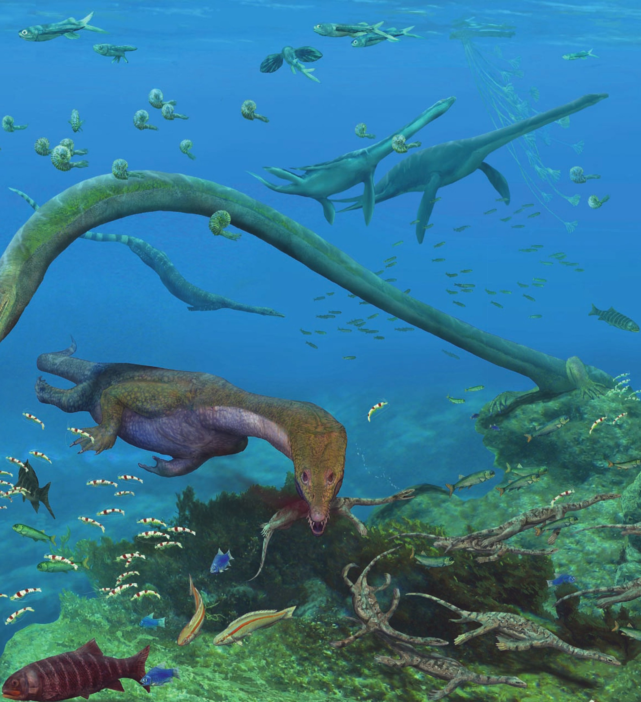
贵州兴义中三叠世贵州龙生物群

十万个为什么　第六版　编辑委员会

**总主编**

韩启德

  

**编辑委员**

（以姓氏笔画为序）

干福熹　马宗晋　王　越　王占国　王阳元　王威琪　王振义　王恩多　王梓坤　王绶琯　王鼎盛　韦　钰　方　成　尹文英　邓子新　邓中翰　卢耀如　叶叔华　叶铭汉　叶朝辉　付小兵　匡廷云　戎嘉余　朱能鸿　刘嘉麒　池志强　汤钊猷　许健民　许智宏　孙　钧　孙宝国　孙晋良　孙鸿烈　严东生　严加安　李三立　李大潜　李幼平　李载平　李家春　杨　槱　杨芙清　杨宝峰　杨雄里　杨福家　吴启迪　吴征镒　吴孟超　吴新智　何积丰　谷超豪　汪品先　沈文庆　沈允钢　沈自尹　沈学础　沈寅初　张弥曼　张家铝　张景中　陆汝钤　陈　颙　陈　霖　陈凯先　陈佳洱　陈宜瑜　陈晓亚　陈润生　陈赛娟　林　群　林元培　欧阳自远　　　周又元　周良辅　周忠和　周福霖　冼鼎昌　郑时龄　郑树森　郑哲敏　孟执中　项坤三　项海帆　赵东元　赵忠贤　俞大光　洪国藩　洪家兴　费维扬　贺　林　秦大河　倪光南　倪维斗　郭景坤　唐孝炎　黄荣辉　黄培康　戚发轫　崔向群　葛均波　韩启德　韩济生　程　京　傅家谟　焦念志　童坦君　曾溢滔　雷啸霖　褚君浩　滕吉文　潘云鹤　潘建伟　潘家铮　潘德炉　戴汝为　戴尅戎

十万个为什么　第六版　数学

**主编**

周忠和

  

**副主编**

王向东　王　原

  

**撰稿人员**

（以姓氏笔画为序）

马檠宇　王　烁　王　原　王小娟　王向东　邓　涛　卢　静　冯伟民　邢　海　刘　武　许汉奎　李　淳　 吴秀杰　吴新智　汪筱林　张蜀康　周忠和　孟　溪　贺一鸣　袁训来　徐　星　徐洪河　蒋顺兴　韩凤禄　 程　心　傅　强

**审稿专家**

王小娟　蒋　青

  

  

**责任编辑：卢　昱**

**美术编辑：张　怡**

**整体设计：袁银昌　李　静**

**版面设计：胡　斌　钟一鸣　王昊圣**

**科技插图：邓　君　希罗月　迢柳娟**

**美编助理：王安丝　范艳佳　邓　苗　余姣卓　李宇辰　李虹庆**

附录　图片及辅文版权说明

**图片版权**

本书所使用的图片均标注有与版权所有者或提供者对应的标记。全书图片的版权说明如下：

高品（上海）图像服务有限公司（Corbis Images）；

华盖创意（天津）视讯科技有限公司（Getty Images）；

北京全景视觉网络科技有限公司（全景）；

维基百科（Wikipedia.org）网站；

上海科学技术出版社；

上海科技馆；

蒋青提供；

邓涛提供；

刘武提供；

卢静提供；

王小娟提供；

王原提供；

徐洪河提供；

徐星提供；

其他图片版权所有者或提供者：P100，浙江自然博物馆；

其他图片来源。

P76右下、P79、P82、P131，Brian Choo绘制；P2、P145，赵闯绘制；P4、P10，陈敏摄；P5、P132右上，邢立达摄；P7、P21、P93、P94、P101，李淳提供；P9、P11，唐永刚摄；P12，周林摄；P15、P32、P34，傅强提供；P19，祁玉平提供；P26，陈均远提供；P27，陈均远摄；P30、P63、P109、P152、P176，迢柳娟绘制；P35左中，许汉奎提供；P35右下，罗辉提供；P41左下，陈贵英摄；P41右中，赵金良提供；P41右下，朱学剑提供；P44，黄迪颖提供；P46、P49、P50左上、P55、P76左下、P81、P88、P98、P104、P107左上、P132左下，邓君绘制；P50右下，张元动提供；P52，朱茂炎提供；P56，袁训来提供；P65，王军提供；P96、P102，李荣山绘制；P103，汪筱林、蒋顺兴绘制；P105，蓝峰绘制；P107右上，汪筱林提供；P118，董晖摄；P129，贺一鸣提供；P136，张蜀康提供；P140，曾孝濂绘制；P142、P148、P149、P151，周忠和提供；P158，卢昱绘制；P160、P161、P162、P163、P168，P172，陈瑜绘制；P175，邓涛提供；P188，吴新智提供；P189，吴秀杰提供；P192，吴秀杰摄。

**辅文版权**

本书的“科学人”、“微博士”、“实验场”除P13、P119由徐星编写，P19由傅强编写，P33由徐洪河编写，P65、P85、P117、P121、P124、P127、P155、P157、P159由王原编写，P71由王小娟编写，P109、P113、P129由徐星、孟溪编写，P115右上由邢海、张蜀康编写，P115右下由邢海编写，P121由张蜀康编写，P143由邓涛编写，P195由吴秀杰、刘武编写外，其他均由同页正文作者编写。

特别说明：本书中可能存在未能联系到版权所有者的图片，请见书后与上海世纪出版股份有限公司少年儿童出版社联系。

## 奇虾是奇怪的虾吗

奇虾不是单纯的一种动物，而是一大类动物。广义的奇虾指奇虾类，是地球上最早出现的巨型食肉动物，个体最长2米以上。而当时动物的一般体长只有几毫米到几厘米，几十厘米的都较少，相形之下，奇虾的确是庞然大物。

奇虾头的前侧有一对带柄的大眼，且具有一对攻击力很强的大型前附肢。除前附肢和口器外，它流线型的扁平身体十分柔软，善于游泳，也许可以悄悄地、快速地接近猎物，并能将较多的猎物同时通过“迫降”方式压到海底的表面。因此，奇虾类可能是寒武纪金字塔式生态系统顶端的可怕捕食者。

奇虾类分节的外形似节肢动物，但是没有头前的触须（感觉器官），也没有腿，腹部的桨状叶与真正的节肢动物（如虾）的外肢明显不同，被认为是与真节肢动物有亲缘关系、平行演化的一类动物，并非真正的虾。

奇虾捕食欧巴宾海蝎

奇虾类广泛发现于世界各地寒武纪的地层中，目前最晚的化石记录发现于摩洛哥的下奥陶统地层中。奇虾类在中国寒武纪澄江生物群、牛蹄塘动物群、关山动物群和凯里动物群中都有发现，其中澄江生物群和关山动物群中的奇虾多样性较高。澄江生物群中的奇虾类主要有三种类型，即帚状奇虾、双肢抱怪虫和云南拟背脱虾，另有一些尚未正式描述发表的种类。

狭义的奇虾专指奇虾属，其特征是：身体扁平，头上具一对带柄的巨眼，前附肢固着在口器两侧的前缘，躯干两侧具有11对桨状叶，未发现内肢；桨状叶具脉络状构造，扇尾由3对互相重叠的片状构造所组成，并有1对细长的尾叉由尾扇背中部向后伸出；口器呈圆环形，由32个外唇板所组成，可能不具内齿。

值得一提的是，奇虾家族的拟背脱虾是寒武纪海洋中个体最大的化石代表，具有大型口器，口器直径可达25厘米（由此推测拟背脱虾的体长可达2米），口内有多排环形排列的齿，具有很强的肢解能力，是当时三叶虫的天敌。（王小娟）

## 什么动物全身都有“眼睛”

在寒武纪，有一种全身都有“眼睛”的动物明星，叫微网虫。

微网虫的虫体呈圆柱形，长可达8厘米，表面具横环。背部两侧具有9对矿化骨板，骨板表面具多边网状结构，每个网眼中含有一个圆管构造，其形态类似于节肢动物复眼的每一个单眼。腹部长着10对长长的、不分节的腿，表面具有环纹，尖端有2个爪。头部呈长锥形，向前变细，口小，位于最终端。肠道直管状，从口部贯穿整个动物体到达肛门。

微网虫因其散落于世界各地早寒武世的地层中的“眼睛”——网状骨板而得名。网状骨板一般小于3毫米，骨板中有100多个多边形孔的构造，每一个孔内有一个小眼状、双突的圆柱体，与三叶虫的复眼相似。1981年这种动物建名时，其真实身份还一无所知。古生物学家甚至不知道这种微小的网状骨板到底是代表一个完整的生物个体，还是仅仅为某个生物体上的零散骨板，因而对其的离奇解释很多。诸如网状骨板是某种生物的储卵器，或者是最早的放射虫生物，等等。直到1989年，首次发现完整的微网虫化石标本，结果令人大为诧异，因为谁也没想到这种奇特的骨板竟是成对长在毛虫状动物体上的离散骨片。不过这种精致的骨板到底起什么作用还是个谜，因为其构造与三叶虫的复眼非常相似，因而被推测为一种感光器。可如果是感光器的话，为什么会长在身体的两侧而不是头部？如果这些构造与光感无关，那为什么与眼睛很像？

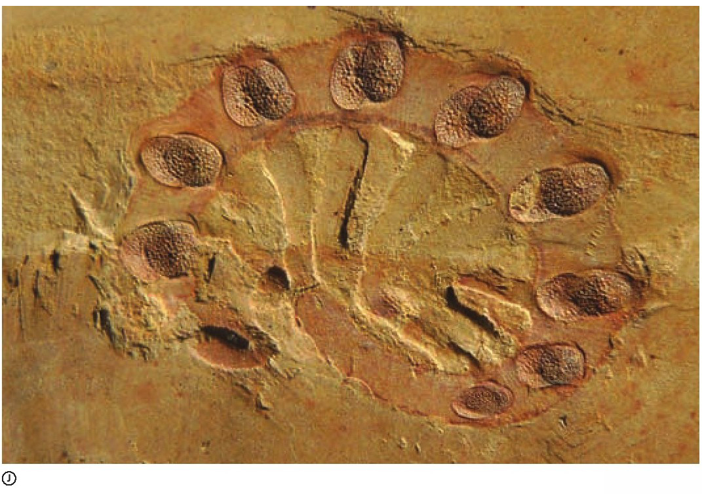
微网虫化石

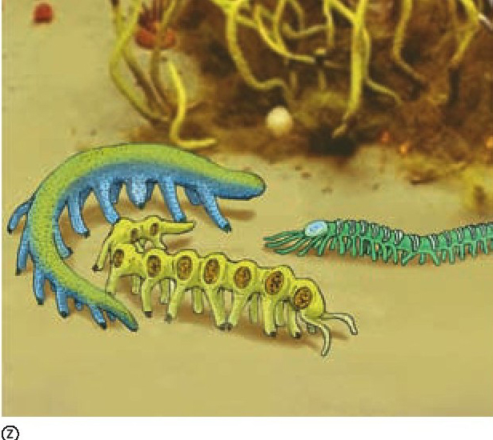
微网虫（中）

另一个曾令古生物学家困惑的问题是，微网虫的头到底长在哪一端。最初，较宽的一端被解释为头，后来发现这一解释与其他寒武纪叶足动物身体结构不符，才将细长的一端定为头。

以微网虫为代表的寒武纪长腿的蠕虫被称为多足缓步类（又叫叶足类）。有的学者认为，叶足类不仅是地球上最早的步行动物，而且可能是包括昆虫、虾、蟹等在内的节肢动物的祖先。发育生物学的证据表明，叶足动物的叶足状附肢向节肢动物具关节的附肢的转变，可能源于一种叫HOX基因的突变。在中国发现的海口神奇啰哩山虫可能是这两种动物演化的过渡类型。（王小娟）

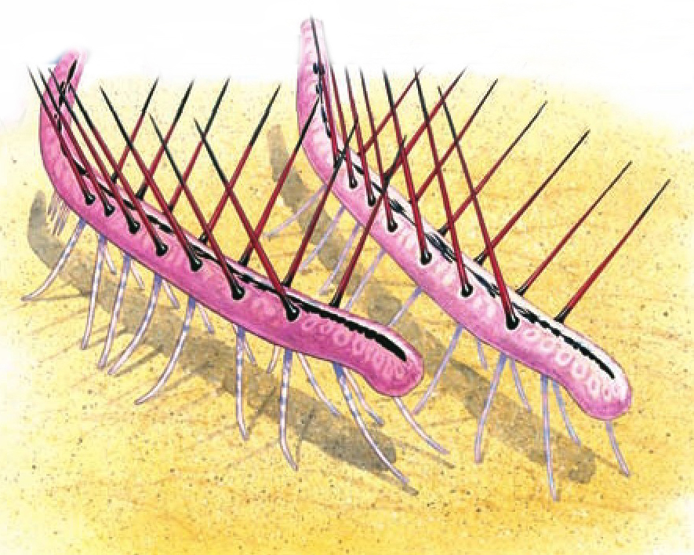
怪诞虫

## 怪诞虫有多怪诞

怪诞虫也属于叶足动物。头部呈亚球形，后端收缩成“细颈”状，“颈”有两对细长的前附肢。身体呈圆柱形，背侧具有7对长刺，腹部具有7对细长、不分节的腿，腿尖有爪。

怪诞虫的模式标本产自加拿大中寒武统伯吉斯页岩，1911年被定为多毛类，身上的刺曾被解释为多毛类的疣足。1977年，英国古生物学家莫里斯重新研究了模式标本后，为其奇怪的体形所震撼，于是将它命名为怪诞虫。其名字来源于“离奇的白日梦”，因为莫瑞斯认为，这么奇怪的生物“只有做梦才能梦到”。当时莫里斯认为怪诞虫的7对硬刺是步行器，背部长有7条飘带状的软须。这一类似于踩高跷方式在海底行走的形象，被后来的研究推翻了。其实，怪诞虫是用软须行走的，“踩高跷”是虫体背腹倒置的结果。不过在加拿大伯吉斯页岩化石群所在地菲尔德国家公园管理处前，矗立的仍是用刺行走的怪诞虫，其奇怪的形象成为公园一景。（王小娟）

  

**【微博士】**澄江生物群

澄江生物群指的是保存在云南澄江及其附近地区距今大约5.3亿年的寒武纪早期泥岩中大量栩栩如生的特异化石群，是全球寒武纪早期海洋生命景观最完美的代表。

澄江生物群在1984年由中国古生物学家发现，至今已描述的化石包括海绵动物、腔肠动物、曳鳃动物、叶足动物、节肢动物、腕足动物、软体动物、棘皮动物、脊索动物等16个门类和许多分类位置不明的动物类型，还有多种伴生的藻类。澄江生物群被国际上称为“20世纪最惊人的发现之一”，并在2012年7月1日被正式列入《世界遗产名录》。

【微问题】奇虾是怎样咀嚼的？

【关键词】奇虾　微网虫　怪诞虫　澄江生物群

云南早寒武世澄江生物群生态复原图

华南三叠纪海生爬行动物群生态复原图

## 海龙是海洋里的恐龙吗

在古生物学中，很多爬行动物的名字叫作“某某龙”，而其中有些种类听起来又与海洋有关，比如海龙类、鱼龙类、沧龙类等。因此，不少人以为，海龙就是海里的恐龙，鱼龙就是体形像鱼的恐龙。实际上，这些动物与恐龙是完全不同的动物。

与现生动物和植物一样，古生物物种是以拉丁文命名的。在这样的体系中，某种爬行动物的名字常常以saurus为结尾，这个词的本义是蜥蜴。恐龙的拉丁文名字是Dinosaurus，原意是“大得恐怖的蜥蜴”，尽管恐龙并非某种蜥蜴。出于此种考虑，加上恐龙往往体形巨大，中国的古生物学者在早年间翻译这个词时，结合中国的传统文化并参考日文翻译，将saurus翻译为龙，Dinosaurus译为恐龙。此后，约定俗成，人们便将各种带saurus的爬行动物的拉丁名翻译为“某某龙”。以鱼龙为例，其拉丁文学名是Ichthyosaurus，意思是像鱼一样的蜥蜴，实际上就是体形似鱼的爬行动物。对于这个词的中文译法，其实现在的学者中还存在不同的见解。

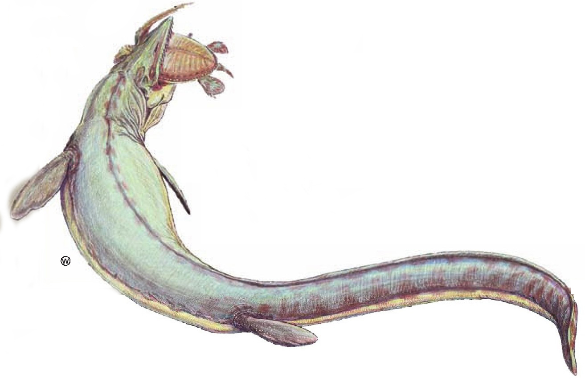
沧龙

鱼龙也好，海龙也好，其实它们都不是恐龙。那么，这些叫作“龙”的爬行动物与恐龙到底是什么关系呢？大家知道，不论是动物还是植物，现生生物也好，古生物也罢，都要把它们分类。在分类框架中，有一个等级叫作目，常见的乌龟和鳖属于龟鳖目，蜥蜴和蛇属于有鳞目，鳄类属于鳄目。古爬行动物门类更为丰富，也有更多的目：恐龙就是蜥臀目和鸟臀目的总称；鱼龙和海龙分别是鱼龙目和海龙目的简称；沧龙则是白垩纪海洋中的巨型蜥蜴，属于有鳞目中的沧龙科。

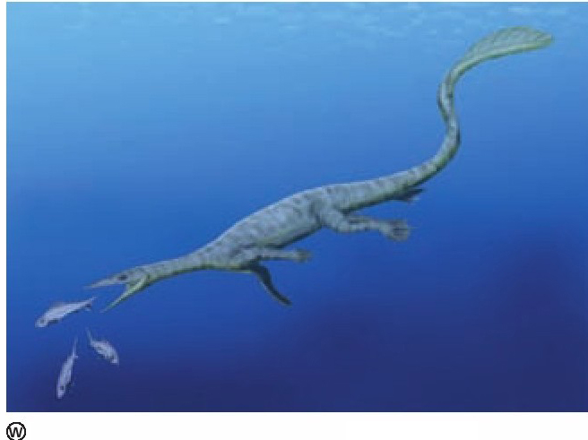
海龙

概括地讲，鱼龙、海龙、沧龙等“龙”，都是在水中生活的爬行动物，虽然它们名字中有“龙”，但与恐龙没有直接的亲缘关系，更不能说是生活在海洋里面的恐龙。除了前面提到的几个类群以外，中生代的海生爬行动物还有齿龙类、鳍龙类（如蛇颈龙、幻龙）等。生活于现在的海龟、海蛇以及部分鳄类和个别蜥蜴的祖先，也都曾不同程度地生活于远古的海洋。（李淳）

## 中生代的爬行动物怎样游泳

中生代，有很多爬行动物生活在水中，它们包括各种各样的鱼龙、沧龙、鳍龙、齿龙、海龙以及离龙。这些爬行动物在水环境中遇到的第一个问题就是该如何运动，或者说该怎样游泳。由于它们没有留下直系后代，因此只能根据化石资料和现生海生爬行动物的游泳姿势加以推断。

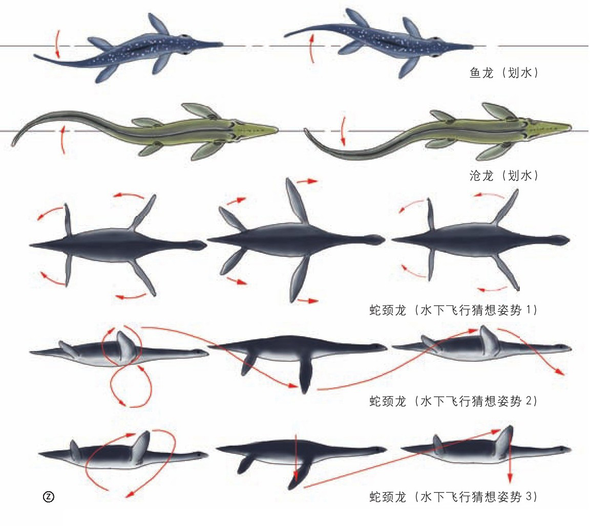
几种中生代爬行动物的游泳姿势

生活在水里的现生爬行动物中，鳄类和蜥蜴的游泳姿态是四肢紧贴身体两侧，通过尾部有力的左右摆动推进身体前行；海蛇没有四肢，但可以通过身体波浪形的摆动在水中蜿蜒前行；海龟的游泳姿态十分独特，其桨状的前肢上下拍动，仿佛鸟翼，这种优美的游泳姿态被称为“水下飞行”。目前看来，海龙、沧龙可能与现生的鳄类和个别蜥蜴一样，通过尾部的摆动游泳前行；蛇颈龙更有可能采用水下飞行的方式；离龙（比如生活于中国的凌源潜龙）有可能只在水底爬行，或采取蜥蜴的游泳姿势；而幻龙和楯齿龙的游泳方法目前尚不清楚。最为特殊的是鱼龙，顾名思义，它们的泳姿与鱼类的基本一致，也是通过半月形的尾鳍摆动进行的。这里需要注意的是，鱼龙和鱼类一样是左右摆动尾巴，而同样体形似鱼的海洋哺乳动物鲸类在游泳时则是上下摆动水平的尾叶。（李淳）

## 史前海洋里的爬行动物怎样繁殖后代

鱼龙和蛇颈龙都是远古时代生活在海洋中的爬行动物，它们的生殖方式在很长一段时期内都是一个谜。因为爬行动物的卵必须产在陆地上，一旦在水里的时间过长，其内部的胚胎就会因缺氧而窒息死亡，这就对生活在海里的爬行动物提出了挑战。它们该怎样应对呢？现生的海洋爬行动物分别以两种不同的生殖方式繁殖后代：一类爬行动物例如海龟，是在繁殖季节登上陆地产卵，卵在陆地上孵化以后，幼体再返回海洋生活；另一类爬行动物例如某些海蛇，卵在母体内孵化，幼体直接在海水里娩出。

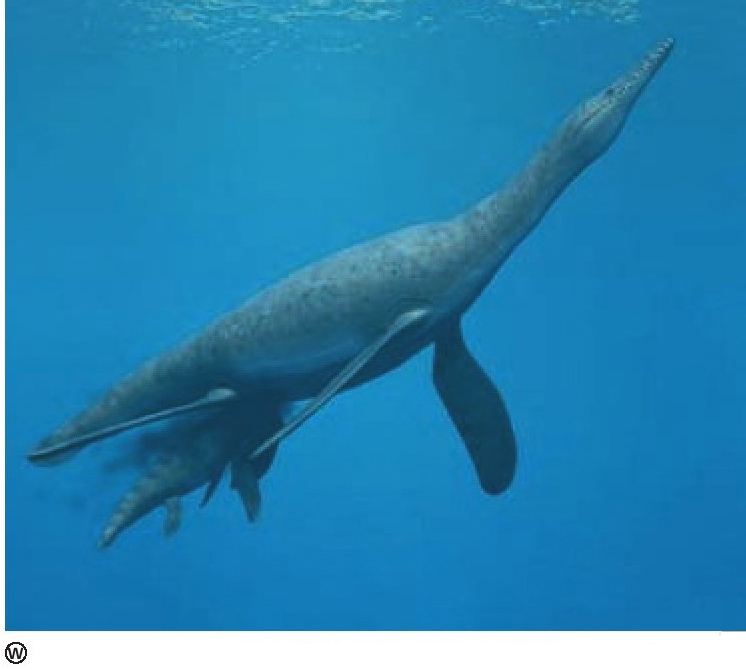
一种蛇颈龙——双臼椎龙正在分娩

那么，已经灭绝了的中生代海生爬行动物又是怎样生育后代的呢？有关于此的化石记录仅见于部分鱼龙类和鳍龙类。在德国、美国和中国等国发现了不少体内含有胚胎的鱼龙化石和鳍龙（代表了蛇颈龙的祖先类型）化石，表明这些史前海生爬行动物是以胎生的方式直接生产幼体的。英国伦敦自然博物馆甚至收藏了一块反映母鱼龙正在生产小鱼龙的化石。化石表明，小鱼龙在母亲体内生长成形，分娩的时候，就像今天的海豚一样，先娩出尾部，再娩出头部。这样，当它一离开母体，马上就可以浮出水面换气，以免因窒息而亡。（李淳）

  

**【微博士】**楯齿龙的牙齿

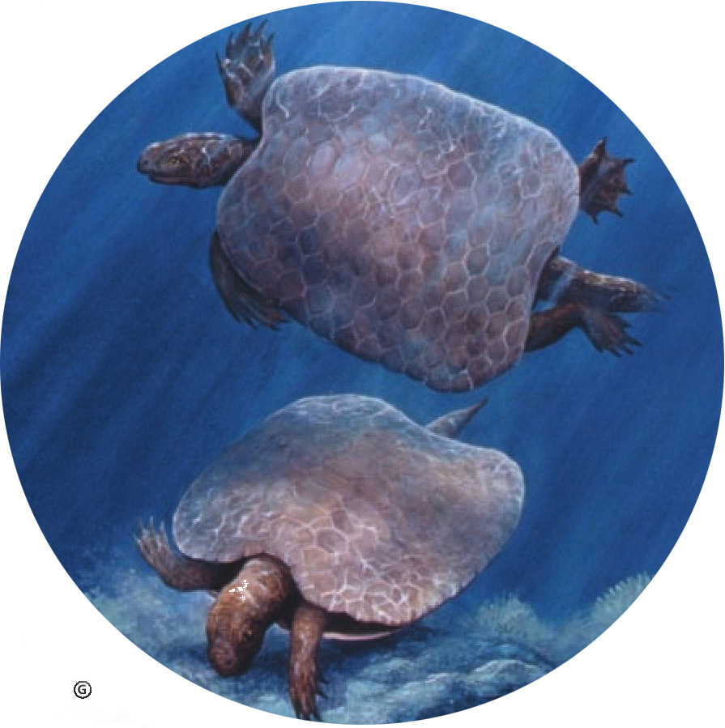
楯齿龙

楯齿龙是中生代早期（三叠纪）的一类海生爬行动物。顾名思义，这类动物的共同特点是牙齿呈盾状，也有称豆状甚至磨盘状，总之不像其他海生爬行动物那样具有尖锐的牙齿。实际上对于大多数楯齿龙类而言，这些盾状的牙齿基本分布于口腔的中后部，包括上下颌与上腭部。其吻端的牙齿较长，成凿状，但顶端也是钝圆的。古生物学家推测，这样的牙齿形态适于捕食各种附着在海底岩石上的甲壳动物，前面的凿状牙齿可以将猎物“撬”下，而后面强大的“楯齿”则能够轻易地压碎猎物的甲壳。有趣的是，现生的某些海洋鱼类，比如吃礁石上藻类的鹦嘴鱼和吃甲壳类食物的狼鳗也有类似的牙齿形态和捕食方式。

【微问题】如何把恐龙化石中的胚胎和食物分辨开来？

【关键词】海龙　鱼龙　沧龙　离龙　鳍龙　游泳　胎生　楯齿龙

十万个为什么　第六版　出版工作委员会

  

**主　任**

李远涛

  

**副主任**

周　晴　洪星范

  

**编辑人员**

（以姓氏笔画为序）

王　音　王　慧　卢　昱　朱　机　乔馥娟　孙正凡　岑建强　沈　岩　郝思军　黄劲草　梁玉婷　韩　静　裘树平　熊喆萍

  

**设计总监**

袁银昌

  

**美术总监**

费　嘉

  

**美术编辑**

费　嘉　张　怡　陈艳萍

  

**印制总监**

张伟群

  

**技术编辑**

张伟群　吴轶伟　胡厚源　陆　赟　许　辉

  

**责任校对**

石玲凤　王　曙　黄　岚　黄亚承　沈丽蓉　陶立新

  

**特约编审**

卞毓麟　方鸿辉　王义炯　范　氾

  

**审稿、定稿、审读人员**

（以姓氏笔画为序）

王　音　王　辉　王伟海　王霞梅　叶　剑　田廷彦　乐嘉民　匡志强　乔馥娟　严　岷　李远涛　李维靖　吴延祺　岑建强　沈　岩　张　颖　张利雄　张毅颖　陆永洲　陈　浩　陈晏平　林丽成　周玉刚　郑石平　郝思军　胡　毅　洪星范　徐红宝　隋淑光　董　放　韩绍伟　曾　文　曾建设　裘树平　虞信棠　魏昌富　濮紫兰

## 为什么说化石为进化论提供了最直接的证据

达尔文与他的《物种起源》

今天地球上的物种有千百万种，若包括地质历史上已灭绝的物种，那将达到亿万种以上。它们形状各异，大小悬殊，有的结构很简单，有的结构极复杂，它们不是由什么超自然的神创造的，而是从最简单的原核生物一步一步演化而来。生物的演化历程可以从化石中找到证据。

约35亿年前，地球上出现了最简单、最原始的原核细胞（由细胞膜、细胞壁和原生质组成的单细胞）生物——蓝细菌（又称蓝藻）。至25亿年前，地球地层中只发现了原核细胞生物化石。如果已发现的20亿年前地层中的真核生物（即细胞包含有细胞膜、细胞质、各种细胞器和细胞核）化石可靠，那么真核生物的出现时间应不晚于20亿年前。接着，由藻类演化而来的最原始的动物化石出现了。最早期的动物和植物区别并不大，如最早期的沟鞭藻，因体内有叶绿素，可进行光合作用，故被称为藻类；有的学者称它为沟鞭虫，因它可靠鞭毛运动，故名。

在往后的地层中，人们找到了蠕虫类化石，接下来找到了半索类或脊索类化石、属脊椎动物的鱼类化石（如中国寒武纪早期的昆明鱼化石）、两栖类化石和爬行类化石，最后找到了哺乳类（包括人类）化石及鸟类化石。在生物的每一个演化阶段都可以找到很多化石证据。所以说，化石为达尔文的进化论提供了过去生物演化独一无二的历史线索，它们聚集在一起便能够帮助科学家绘制出地质历史的“生命之树”。这样的生命之树尽管不够完整，但离开了化石，我们就无法了解过去和现在各式各样的生物是何时、如何一步步演变而来的，更无法知道谁是它们的祖先。

更为重要的是，化石还提供了了解生物演化的许多缺失环节的线索和证据，譬如带羽毛的恐龙化石、始祖鸟化石、三趾马化石、众多远古的人类化石，通过它们，我们似乎能够亲眼看到生物演化的神奇过程。因此，从达尔文提出进化论至今，化石便一直是支持这一学说最有力、也是最直接的证据。（许汉奎）

## 化石如此重要，该如何保护化石

化石是不可再生的资源，是宝贵的自然文化遗产，需要大力保护。首先，要广泛宣传化石知识，提高人们的保护意识。很多化石看似不重要，但往往能提供重要信息。比如保存了骨骼和硬体化石的岩石，动物的足迹化石、爬行痕迹化石、粪便化石等，都有研究价值。如果发现者缺乏化石保护的知识，那么这些化石就有可能被当作无用的东西而破坏、丢弃，造成无可挽回的损失。其次，化石很多时候都是破碎、分散的，而且通常和泥土、碎石混在一起，普通人很难处理，因此一般都需要专业人员来采集。第三，在一些重要化石产地要建立保护区，严禁乱挖、乱采。比如辽宁西部早白垩世的地层中，产有许多极其珍贵的身披羽毛的恐龙化石、翼龙化石、鸟类化石等，其中许多化石都是世界上从未见过的，所以每次发现这类化石都会引起世界古生物界的瞩目和兴趣。这些化石称得上是无价之宝，吸引了很多人前往挖掘。因此国家有关部门在当地设立了保护区，防止有人盗采破坏。第四，要宣传国家及地方有关保护化石的法规，如稀有的鱼类、爬行类、哺乳类、鸟类、古人类等脊椎动物化石，以及恐龙蛋等蛋化石受国家保护，盗挖者将受到法律的制裁，更不允许走私卖到国外。（许汉奎）

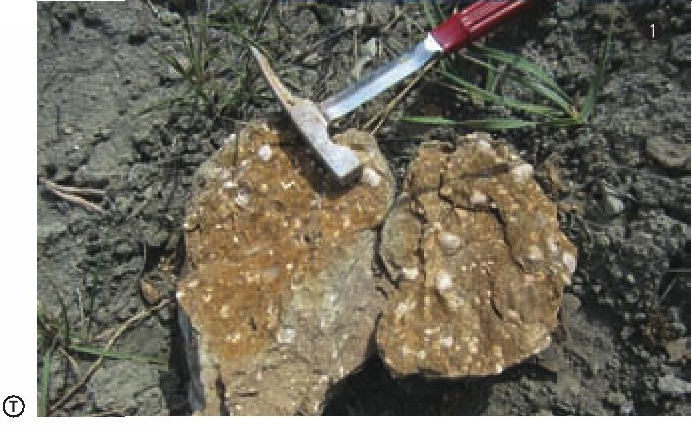
1　在合适的地层中敲开岩石，或寻找化石露头

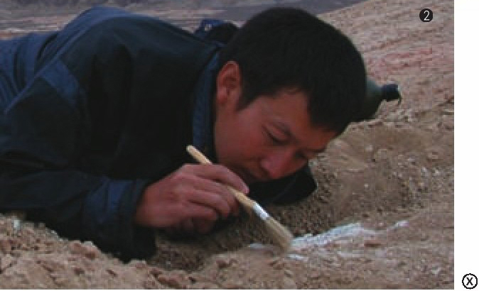
2　清理、分析露出的化石部分

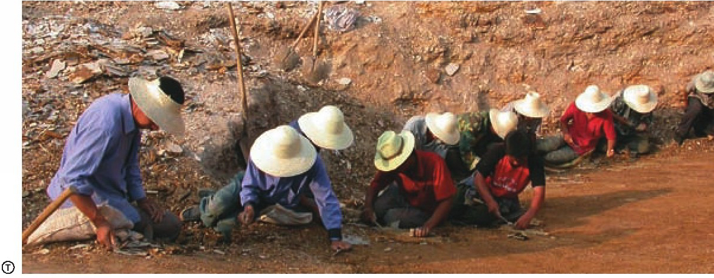
3　筛查所有可能区域，不漏过任何化石碎片

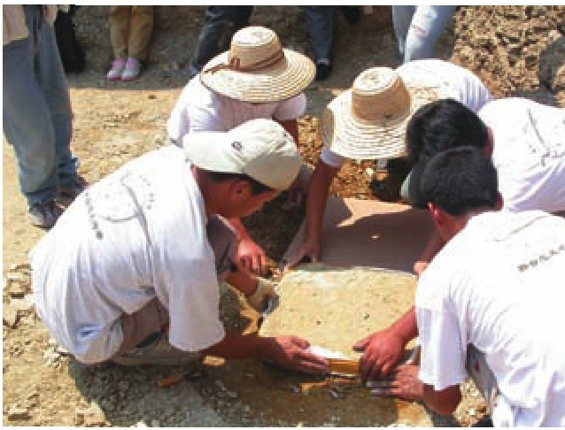
4　为防止化石在采集中损坏，先对化石采取保护措施，再采集下来

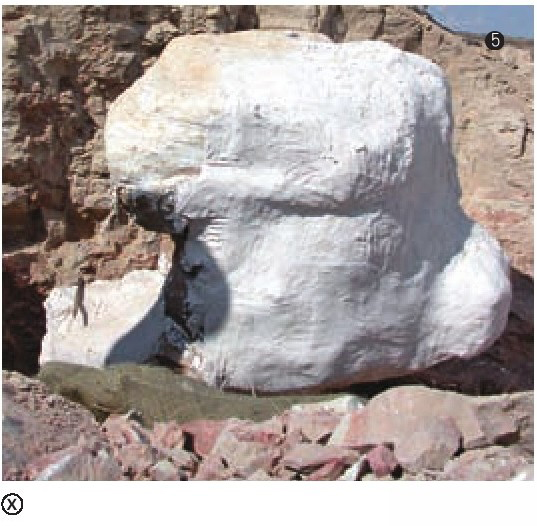
5　封装好的大块化石，可以启运

化石挖掘过程

## 怎样才能复原远古动物

要复原远古的动物，首先得有头骨化石，并掌握头骨肌肉组成的大致结构等。古生物学家根据动物的肢骨化石只能判断其大致长短和粗细，具体长得如何却无法得知。有了头骨化石就完全不同了。南方古猿、直立人、智人、现代人都属于人类，但它们的头骨构造却很不同，如南京汤山人就比北京猿人鼻子高。又如爬行动物虽然种类非常多，但只要根据头骨有无颞孔，颞孔位置在上或下，是一个或两个，就可确定它是龟，是蛇，还是恐龙。牙齿化石也很重要，依据牙齿大致可以确定其属于哪种动物。如闻名遐迩的云南元谋人，就是根据两颗门牙确定的，但没有头骨，谁也不知道它长得怎么样。很多动物的头骨由许多骨片组成，找到的头骨化石常常不完整。这些骨片中有的对复原起重要作用，有的作用则小些，所以复原的准确程度也要看找到的骨片的情况。除了头骨之外，如果要复原完整的动物，肢骨等其他骨骼也很需要，特别是复原新种类时更是如此。当然，无论是头骨还是牙齿或肢骨，古生物学家都需要进行细致的研究，才能获得尽量多的该远古动物生活习性的信息，研究的结论越准确，复原的可靠性当然也就越强了。（许汉奎）

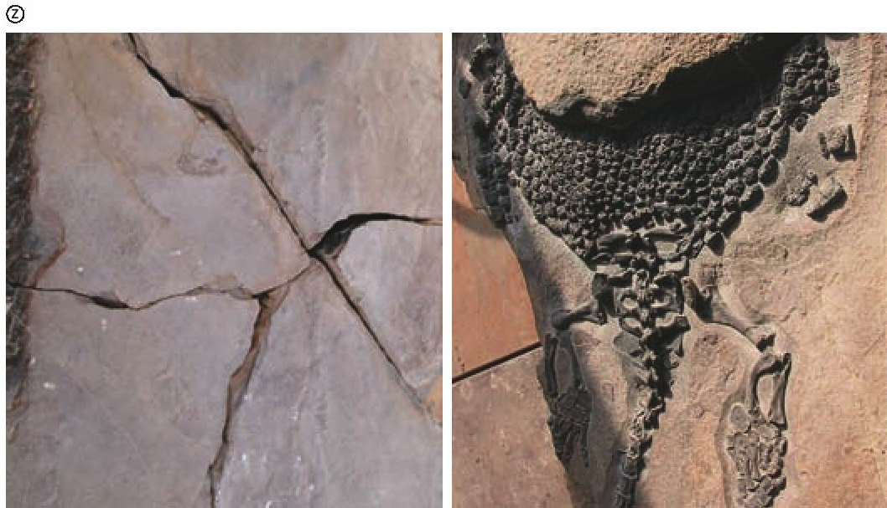

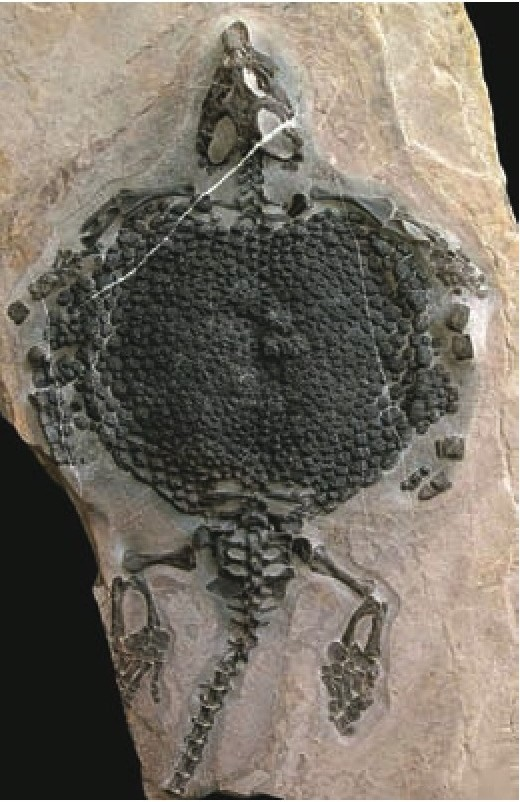
化石修理需要极大的耐心。这是一具齿龙化石从未经修理的状态到修理暴露出来的过程。修理得越仔细，得到的结构细节越丰富，据此对动物的复原就越准确

  

**【微博士】**金牛山人的发现

1984年在中国辽宁营口金牛山，人们偶然发现一小块古人类的头骨碎片，立即报告了科研人员。科研人员看后，很快把这些不起眼的碎片和大量的土一并带回实验室，仔细清洗，最后得到100多个碎片，送至中国科学院古脊椎动物与古人类研究所鉴定。该所高级技术人员经半年多的努力，终于拼合成一个较为完整的早期智人的头骨，其年代为距今约26万年。被列为当年世界十大科技进展项目之一的金牛山人就是这样被发现的。如果没有专业人员的系统发掘，很难想象这么破碎的化石能被完整地发掘出来。

【微问题】中国有哪些法律规定了对化石的保护？

【关键词】生物演化　进化论　原核生物　真核生物　化石保护　复原

## 为什么地层学能揭示地球的历史

地球形成至今已有46亿年了，地质学家是如何了解地球过去历史的？很重要的一项工作就是根据地层来分析。地层一般指地质历史中形成的层状岩石，包括沉积岩、火成岩以及由两者变质而成的变质岩。譬如，目前发现地球上最古老的沉积岩层的年代是距今39亿年，这证明至少39亿年前，地球上已存在水和大气层了，因为有水存在，风化的岩石碎屑才会在水中沉积下来。

距今39亿～25亿年间形成的地层由于年代久远，加上受到几次大的地壳运动的挤压、破坏，以及高温岩浆活动的影响，大多有些变质，即岩石结构有些变形，岩石质地较坚硬，岩石成分较复杂。这一时期常会形成一些特大型的沉积铁矿，如辽宁鞍山铁矿。这一时期的地表温度较高，大约在70℃（现在平均只有15℃），又缺乏氧气，所以不适合一般生物的生存，但却适合蓝细菌的生长，并可在地层中形成化石。但因当时蓝细菌的种类还很少，故对地层划分起的作用不大。而沉积岩层中夹有较多的火山喷发物，加上当时发生较多、较大的地壳运动，从而导致上下地层不一致，因此，只能利用地层中的放射性元素来测定年代。这一时期称为太古宙。

距今25亿～5.41亿年间，地球上的蓝细菌发展到了鼎盛时期，它们常把海里的岩屑固结在自己周围，从而形成颇为壮观的叠层石，甚至形成礁体。此外，真核细胞的藻类、多细胞的藻类也一一出现，到约6亿年前，原始的动物也出现了。但那时动物的数量和种类均很少，仅有多孔动物门的海绵类、腔肠动物门的水母类和环节动物门的蠕虫类等。由于这一时期地壳运动和岩浆活动相对较弱，所以当时形成的地层变质较少，地质学家可以从地层中获得如古气候、古地理、古环境、地壳运动、岩浆活动等更多的信息。这一时期在各个方面都与太古宙显著不同，所以古生物学家称它为元古宙。随着新技术的兴起，如古地磁技术的应用，地质学家从地层中了解到19亿年前地球大陆板块很少，且聚于北半球形成一块“泛大陆”。

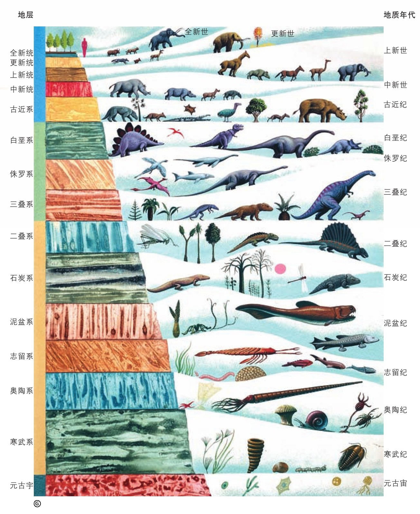
不同时期地层中的古生物种类

从距今5.41亿年以来为显生宙，此时大量生物出现了。寒武纪大爆发后，地球上出现大量的生物，在地层中形成许许多多化石，而且地层越新，就能见到越多更加复杂、多样的生物化石。科学家可以根据地层中的岩石、化石来推断当时的古生物、古气候、古地理、古环境状况，以及当时发生的地壳运动、岩浆活动、海陆变迁、沉积矿床的形成情况等，从而探知地球的历史。地层的研究与化石的研究息息相关，它是地质科学的基础，所以单独成为一门学科——地层学。（许汉奎）

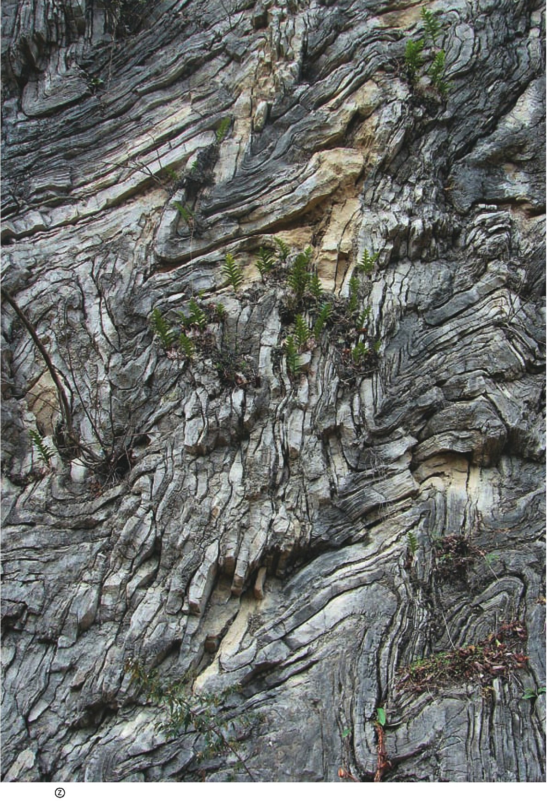
贵州产出凯里动物群的地层

  

**【微博士】**岩石的变质

岩石形成以后，可能由于物理化学条件的改变，在保持固态的同时发生矿物成分、结构构造的变化，从而变成另一种岩石，这个变化过程称为变质。如果变质前的岩石是带化石的沉积岩，变质后其中的化石也会被破坏。

## 为什么说化石可以做远古的“日历”

生物的生长受环境因素的制约。在地球绕太阳旋转的过程中，四季更替、昼夜变化、潮涨潮落，无不对生物的外壳、骨骼等的生长产生周期性的影响，这些硬体部分以生长节律特征来表现这种周期性的变化，成为远古的“日历”。

造礁珊瑚在生长过程中，通过体内的虫黄藻分泌钙质，骨骼会不断往上堆积。这个堆积速度白天快晚上慢，所以每过一天，就能形成一条细细的生长纹。由于季节的温度变化也会影响生长速度，珊瑚的钙质堆积又会出现周期性疏、密排列的变化，在化石上体现为生长环，每一个生长环代表一年。珊瑚化石的生长纹和生长环，就记录了岁月的变化。

美国古生物学家约翰·韦尔斯发现，约3.8亿年前的日射脊板珊瑚的年生长环上约有400条生长纹，就是说中泥盆世每年差不多有400天。韦尔斯还进一步列举了古生代的生长纹数据：4.5亿年前412条，3.3亿年前398条，3亿年前390条。这些数据表明地质时代越新，每年天数越少，证实了地质历史中地球自转速度逐渐减慢的规律。据计算，寒武纪每天为20.8小时，泥盆纪每天为21.6小时，石炭纪每天为21.8小时，三叠纪每天为22.4小时，白垩纪每天为23.5小时，直到现在一天为24小时。（冯伟民）

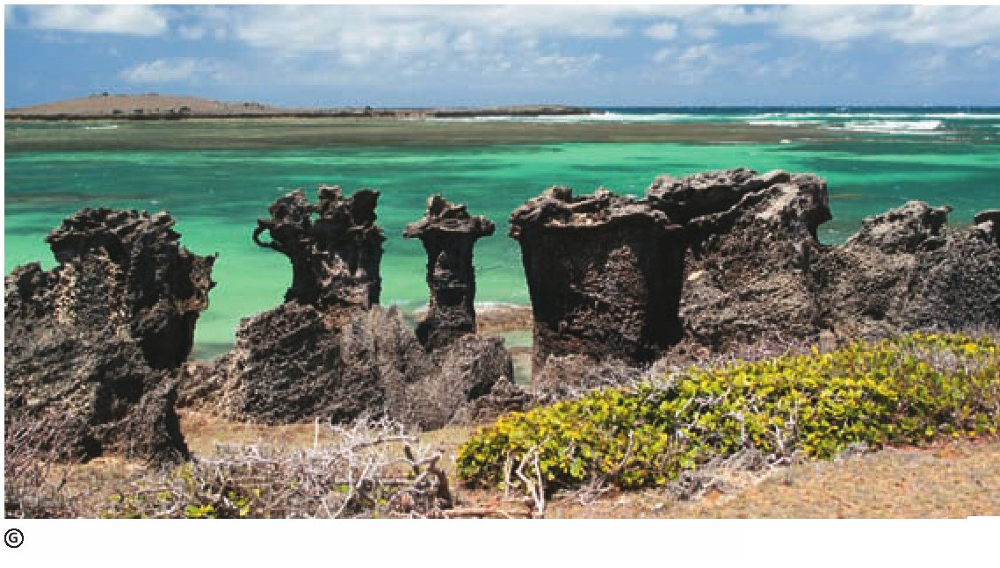
化石珊瑚岩

  

【微问题】有没有体现出每月天数的化石？

【关键词】地层学　泛大陆　珊瑚日历

## “大地之书”应该怎么读

地球上的岩石分为火成岩、沉积岩和变质岩。这些岩石经风吹、雨淋、日晒、海浪冲击等风化作用，剥蚀的碎石、砂、土被流水带入低洼的河里、湖里或海里形成沉积物。同时，河里、湖里、海里也会有诸如钙质、盐质等化学物质沉积下来。当时陆地、湖里、海里也分别生活着许许多多的动物和植物，它们死亡的遗体也会随着各种沉积物一起在水里被埋藏起来。这些沉积物和生物遗体经过长时间脱水、成岩和石化，就分别形成砾岩、砂岩、砂质泥岩、泥岩、灰岩、盐层等沉积岩层和沉积岩层里的化石。一层层沉积岩层加起来就形成了地层，就像一本书的书页一样。

世界上最古老的地层距今可能有39亿年了。如果每年沉积1～2厘米厚的地层，那么几亿年中形成的地层就在万米以上。地质学家要研究如此厚的“大地之书”，就要按地层形成的年代来划分出“章节”，这就是年代地层，它们与地质时代严格对应，同一时间内形成的地层，可归入相应年代地层单位。

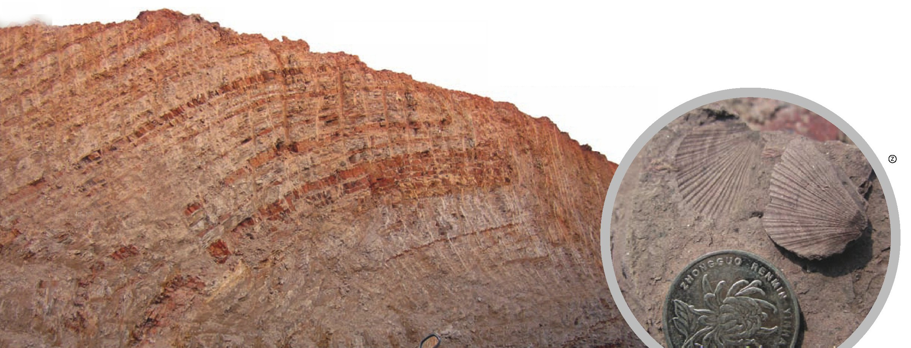
地层剖面和其中的化石

整个地球的历史分为隐生宙和显生宙，显生宙划分为古生代、中生代和新生代，古生代可划分为早古生代和晚古生代，早古生代包括寒武纪、奥陶纪、志留纪三个纪，晚古生代包括泥盆纪、石炭纪、二叠纪三个纪；中生代包括三叠纪、侏罗纪和白垩纪三个纪；新生代包括古近纪、新近纪、第四纪三个纪。纪可进一步划分为世，如三叠纪可分为早三叠世、中三叠世、晚三叠世；每个世可划分为多个期，如早三叠世可划分为印度期和奥伦尼克期。

在每一个年代所形成的地层，就按这个年代名来命名。与宙、代、纪、世、期对应的地层单位就是宇、界、系、统、阶。如显生宙对应的地层单位称为显生宇，古生代的地层单位就称为古生界，寒武纪的地层单位就称为寒武系，早寒武世、中寒武世、晚寒武世相对应的地层单元就为下寒武统、中寒武统、上寒武统，于印度期形成的地层称印度阶。

因西方国家开展地质研究较早，许多地质年代的名称都是前辈外国学者根据当地的地名起的，如寒武、奥陶、志留、泥盆等。另有些地质年代的名称根据地层特点命名，如石炭（这时期的地层含煤炭多，煤炭古称石炭）、二叠（此时期的地层明显分上、下两部分，但现在采用三分法）等。中国开展地层研究相对较晚，但中国的许多地层含化石多，地层完整，所以一些地质年代也采用中国学者的命名，如晚二叠世也称为乐平世（统），它进一步划分为长兴期（阶）和吴家坪期（阶），晚寒武世也称芙蓉世（统），其下有江山期（阶）、排碧期（阶）。（许汉奎）

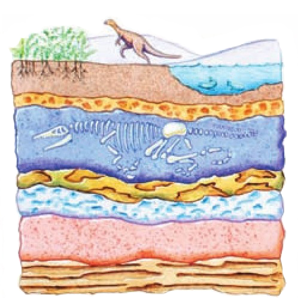
动物死亡

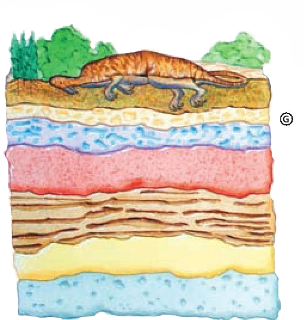
沉积物不断堆积，动物遗体形成化石

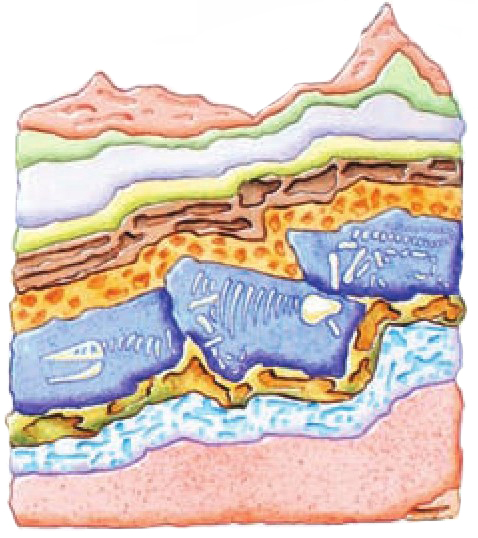
地壳运动

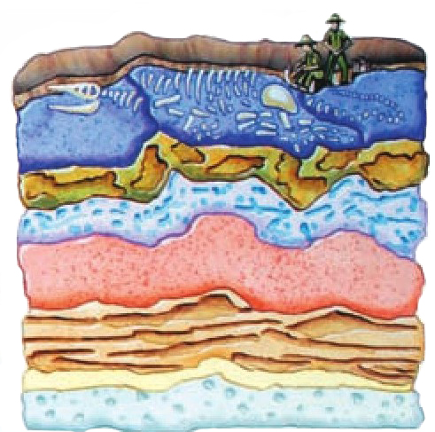
上层沉积物被剥蚀，化石显露“大地之书”成形

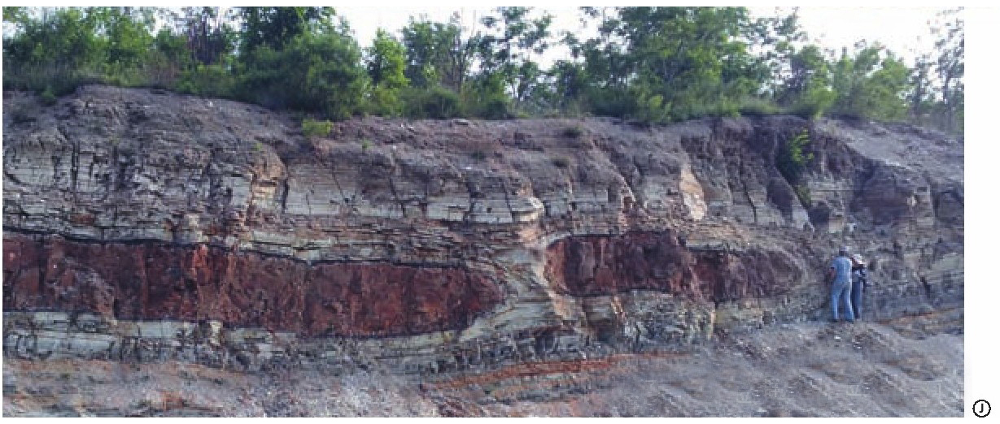
辽西热河生物群产出层位典型剖面

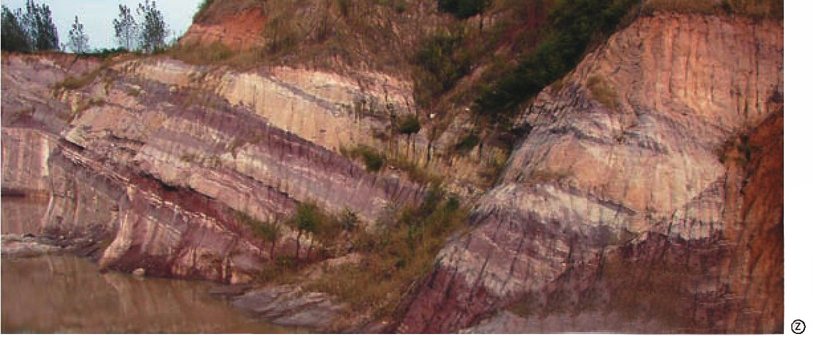
山东莱阳恐龙化石产地剖面

中国的一些著名地层剖面

## 为什么“金钉子”那么珍贵

“金钉子”实际上是全球年代地层单位界线层型剖面和点位（GSSP）的俗称，是国际地质科学联合会及国际地层委员会指定的年代地层单位界线的典型或标准。在一个特定的地点和特定的岩层序列中标出的“金钉子”，就是地质历史的“刻度”，它是确定和识别全球两个时代地层之间的界线的唯一标志。

“阶”是全球年代地层表中的基本地层单位。要建立全球统一的年代地层表，就需要建立每一个阶的全球标准，以便于按统一的时间（时代）尺度，去理解、解释、分析和研究世界不同地区在同一时间内形成的各类地质体（岩石、地层等）及地质事件。这就好比钟上有了刻度，我们才好用统一的语言来说“几时几分”。

对于某一个“阶”来说，全球都只有唯一的一个“金钉子”作为标准或样板。每一个“金钉子”的选取，都必须在全球范围内对这个时代的地层进行调查，并组织国际权威专家对所申报的“金钉子”剖面的候选者和相关研究成果进行详细研究、检验和讨论，然后由国际地层委员会下属的有关地层分会的各国专家通过投票的方式产生，最后报国际地层委员会和国际地质科学联合会批准公布。“金钉子”是全世界科学家公认的，全球范围内某一特定地质时代划分对比的标准，因此它的成功获取往往标志着一个国家在这一领域的地学研究成果达到世界领先水平，其珍贵程度不言而喻。（王向东）

浙江长兴煤山三叠系印度阶“金钉子”剖面，标志为牙形刺

  

**【微博士】**中国的“金钉子”

中国已经建立了10个“金钉子”，是目前全世界获得“金钉子”最多的国家。浙江常山黄泥塘奥陶系达瑞威尔阶“金钉子”，是中国的第一枚金钉子。其他9枚是：浙江长兴煤山三叠系印度阶“金钉子”（划分二叠系——三叠系的界线）、湖南花垣排碧寒武系排碧阶“金钉子”、广西来宾蓬莱滩二叠系吴家坪阶“金钉子”、湖南古丈寒武系古丈阶“金钉子”、湖北宜昌王家湾奥陶系赫南特阶“金钉子”、湖北宜昌黄花场奥陶系大坪阶“金钉子”、浙江长兴煤山二叠系长兴阶“金钉子”、广西柳州碰冲石炭系维宪阶“金钉子”、浙江江山寒武系江山阶“金钉子”。

国际年代地层表总共需要建立101个“金钉子”，截至2012年，已经建立了64个“金钉子”。

【微问题】为什么一个阶只有一个“金钉子”？

【关键词】地层年代　隐生宙　显生宙　金钉子

## 古生物的足迹为什么也能成为一门学问

足迹学是古生物学的分支，研究的是动物生前活动时在地层中留下的足迹。足迹虽不是遗体化石，但有时可以提供实体化石无法体现的动物活着时的情况，甚至人们可以就此推断出动物的身高、体重、奔跑速度、活动方式和生态环境等，所以足迹学研究有着重要的意义。比如过去人们曾经以为巨型的植食性恐龙多半生活在水中，靠水的浮力托起它们庞大的身躯。但陆地上大量巨型植食性恐龙的足迹证明，它们完全可用四肢来支撑身体并在陆地行走。又如，过去人们认为恐龙喜欢独来独往，但足迹却表明恐龙尤其是植食性恐龙多半过的是群居生活。又如以前人们很难推断恐龙行走的速度，但从足迹却可以准确判断恐龙步伐的跨度和奔跑的速度。

研究古生态、古生物，特别是研究海生古无脊椎动物的学者，是根据海里三叶虫、虫管等产生的足迹，来研究古海岸线的位置、形状、坡度、海水深浅、水流方向以及沉积物饱和程度的，而研究陆生动物的学者则侧重利用足迹本身来复原哺乳动物、鸟类、恐龙等动物的生活细节以及动物类群之间的关系。一些人甚至使用生物命名的双名法，为保存较好的恐龙足迹建立起科级水平的分类档案，让足迹学能在生物分类系统中占据一席之地。

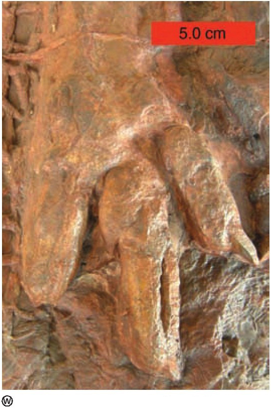
恐龙足迹化石

据统计，各地恐龙的足迹要比恐龙的化石多得多。中国科学家对恐龙足迹的研究始于1929年，当年在陕北神木侏罗纪的地层中发现了禽龙类的足迹。此后，1940年在辽宁西部朝阳发现了多达400余个恐龙足迹。1949年以后，又陆续在多个地方发现了许多恐龙足迹。特别是2001年在甘肃永靖盐锅峡2平方千米范围内共发现10个恐龙足迹化石点、数千个足迹，其规模之大，数量之多，多样化程度之高，保存之好，均为亚洲前所未见。足迹中有些大型蜥脚类恐龙一个前脚足迹就达长112厘米、宽76厘米，后脚足迹更达到长150厘米、宽142厘米，是世界上最大的恐龙足迹之一。2010年，在山东诸城人们又发现了包含3000多个恐龙足迹的一个大型化石点，足迹显示一群大型蜥脚类恐龙在进行集群迁徙，而另一群大型兽脚类恐龙在追捕一大群小型鸟脚类恐龙。这可能是世界上最大规模的恐龙追捕现场了。（许汉奎）

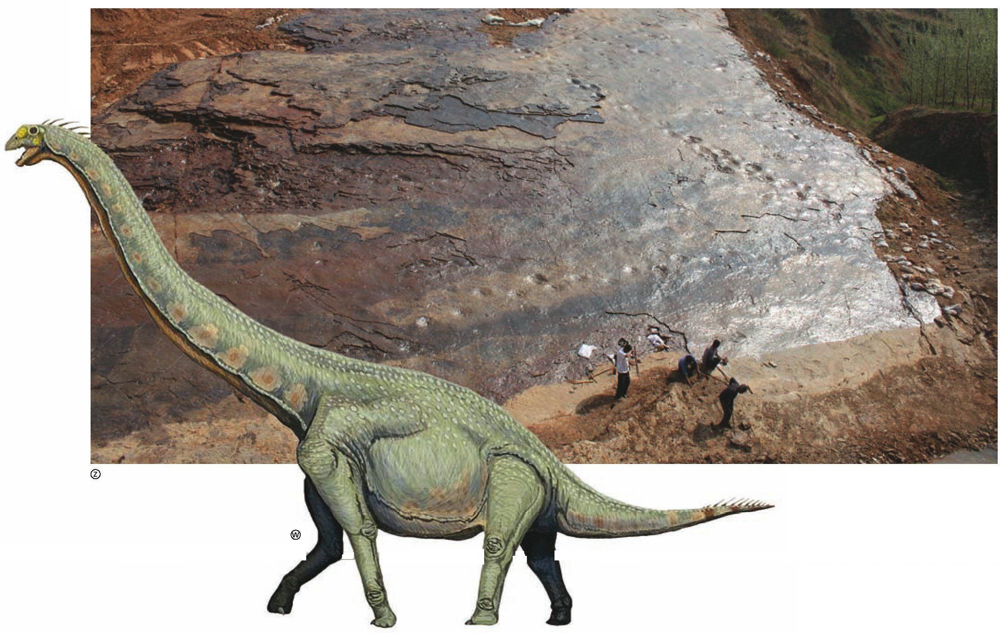
山东诸城黄龙沟恐龙足迹化石点的大足迹，可能是某种盘足龙类恐龙留下的

## 为什么科学家要关注化石的埋藏情况

埋藏学是沉积岩石学的分支，它研究动植物被埋藏以后形成化石过程中的问题，比如化石是生前被埋藏还是死后被埋藏，是原地埋藏还是异地埋藏，埋藏时的环境如何。

在中国内蒙古有一处著名的恐龙“墓地”，但在周围的同一地层中恐龙化石很少，这是为什么？“墓地”处恐龙化石虽然很多，但多半比较破碎，完整者极少，这又是为什么？还有，许多习性不同的恐龙为何都埋藏在一起？科学家发现，原来这个“墓地”的恐龙尸骨来自三个不同的地方，它们是分别被洪水搬运至此而堆积起来的。又如在江苏南京葫芦洞内，不同部位哺乳动物化石的数量差别很大，这是为什么？洞中无灰烬层和石器，即无古人类居住，为何化石如此之多？为何不居住在溶洞中的植食动物化石在此十分常见？为何只找到猿人头骨化石却无肢骨化石？原来，这些化石都是被流水携带入洞的，因而在自然形成的洞口处化石比较多，而两侧显著减少。

所以，在采集化石时首先要观察化石的埋藏情况。比如在采集蛋化石时，要观察是一个蛋还是两个蛋。如是两个蛋，它们是否紧靠在一起？如果是，就有可能是恐龙所生的蛋，因为恐龙长有双输卵管，它们一次下两个蛋。此外，还要看看蛋是如何排列的，是排成一排排，还是呈放射状排列，或螺旋状放射排列，或杂乱无章地排列……不同的恐龙，蛋的排列方式是不同的。当然还要观察化石周围的岩石特征，判断当时的埋藏环境。比如，可以看看蛋化石是产在红色砂土中还是土黄色砂土中，此处有没有伴生的其他化石，地层是水平的还是倾斜的。

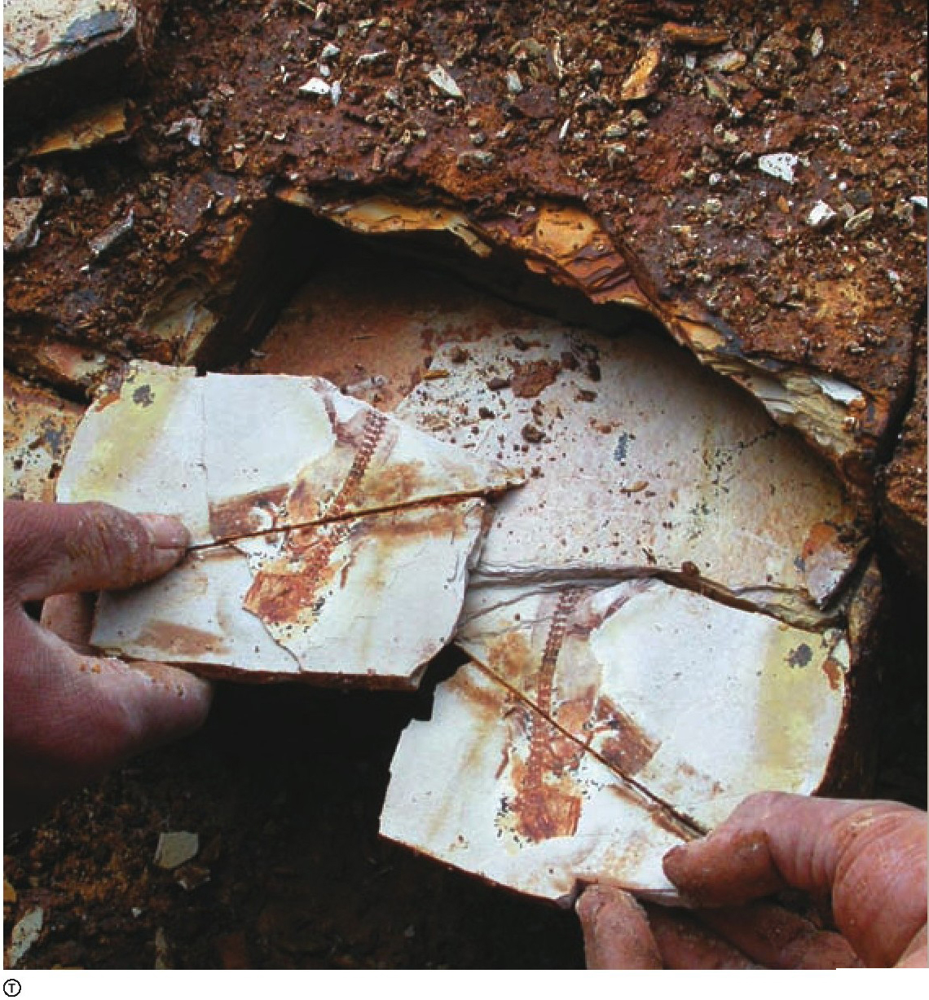
地层中的化石

当你在野外发现了珍贵的恐龙化石时，不要急着把它挖出来，而要先保护好周围的环境，最好等待专业人员来挖掘，这样才能获得最多的古生物信息。（许汉奎）

  

**【微博士】**中国恐龙足迹发现地

中国发现恐龙足迹的地方有：湖南西部，辽宁阜新，四川岳池、峨眉山、自贡，云南晋宁、楚雄，甘肃兰州，陕西北部，内蒙古，山东莒南，新疆吐鲁番，浙江，安徽，广东南雄，河北，等等。

【微问题】动物的足迹化石都是凹进岩石里的吗？

【关键词】足迹学　埋藏学

## 为什么微生物是生命演化中的真正主人公

人们常有一种误解，以为只有肉眼看得到的动物和植物，特别是人类，才是地球和生命历史中的主人公。然而，这种看法却是大错特错的。

生命诞生于大约38亿年前，在生命历史的最初30亿年中，地球上的生命体绝大多数是小小的微体生物。目前，科学家通过某种核糖核酸的序列将地球上的生物分成古细菌、细菌和真核生物三大类。在地球的漫长岁月里，前85%的时间只存在由古细菌和细菌组成的原核生物，它们分布在各种环境里。已知的动植物只是真核生物中的一部分，在演化过程中所占据的时间也只是很少的一部分，所占据的环境也只是很小的一部分。相比之下，微生物所能生存的环境范围要大得多。科学家在数千米深的海底的岩石中发现有微生物在极端严酷的条件下生存，且数量极多，据估计，其生物量相当于全球地表生物总量的1/10。

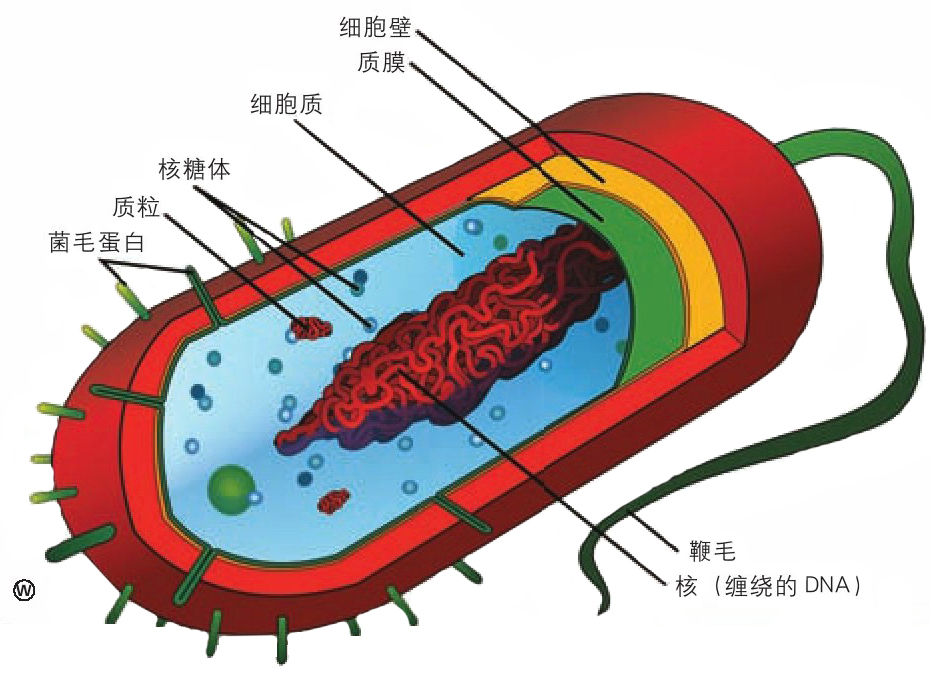
地球生命历史的大部分时间都只有结构简单的原核生物

许多人认为，包括人类在内的真核生物，其细胞是由原始真核细胞吞入细菌共生演化而来的。除此之外，包括人体在内的多细胞生物体也是一个小小世界，细菌等微生物都是重要的有机组成部分。成年人体内共有细胞约100万亿个，细菌数量则是细胞的10倍，初步测算人体内大约有500种细菌，超过1000万亿个，而这些细菌大多集中在人的消化道中。从细菌多样性程度来说，肠道内的细菌种类数量可与热带雨林的物种数量相比较。单从数量上来说，哺乳动物结肠内的细菌群落密度堪称地球之最。对于大型食草动物而言，如果没有细菌的帮忙，它们根本无法消化食物中的半纤维素、纤维素。别看牛、羊、马吃起草来津津有味，它们根本不能依靠自身的消化酶完全消化纤维食物，只能通过共生的微生物起作用，使得食物中的半纤维素和纤维素在消化道中发酵分解，最后得到利用。

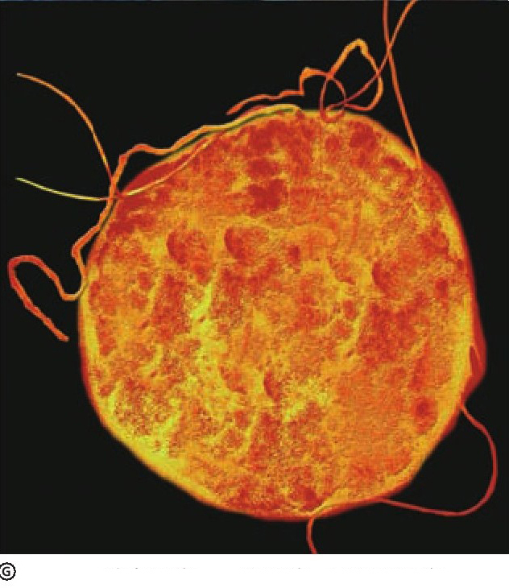
一种古细菌——硫细菌，可以在温度高于70℃和pH值小于2的环境中生存

根据生物学家的估计，地球上微生物个体总量约为1030，其中大部分是细菌。微生物是改造地球的主力军，它们的生态过程影响着化学元素周期表里几乎所有的元素。微生物又是影响生命演化历程的重要角色，它们在地球上默默无闻地“耕耘”了近40亿年，从某种意义上来说，它们才是地球真正的主人公。（许汉奎）

## 细菌可以保存为化石吗

细菌既没有坚硬的骨骼，也没有坚硬的外壳，若有细菌化石，它们是怎样形成的呢？细菌那么小，就是形成化石了又怎样才能找到它们呢？

事实上，细菌还真的能保存为化石呢。自然界里有一个特别的生命类群，被称为蓝细菌，是地球上最早的生物之一。科学家曾在35亿年前的古老地层中发现了类似蓝细菌的化石。蓝细菌比大部分细菌都大，能够分泌一层薄薄的细胞壁。最重要的是，蓝细菌能够形成大的层状结构，这种结构被称为叠层石。叠层石是以蓝细菌为主的微生物在生长和新陈代谢活动过程中，附和沉淀无机盐或捕获矿物颗粒而形成的一种生物沉积构造。如果将这种叠层石磨成薄薄的片，在其中可能发现保存精细的蓝细菌和藻类化石。在中国河北张家口宣化至赤城一线，18亿年前的早元古代晚期的地层中含有大量的铁矿石，它们构成了宣龙铁矿的主体。在宣龙铁矿的铁矿石和伴生的叠层石铁矿石中，就曾发现了6个属的化石蓝细菌。

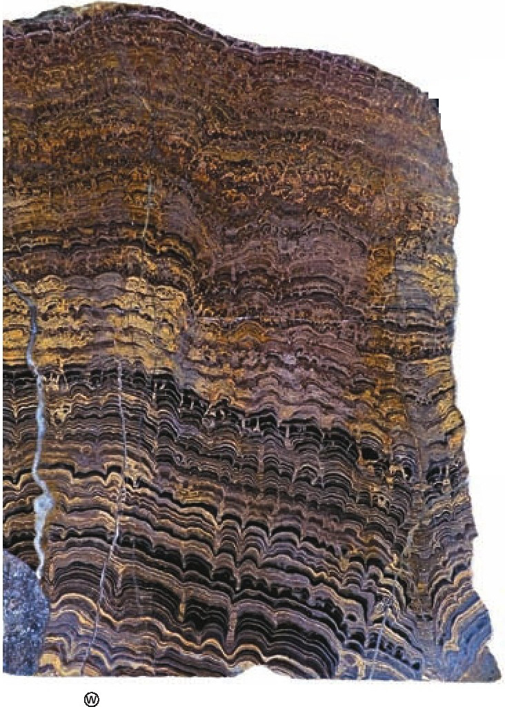
美丽的叠层石剖面

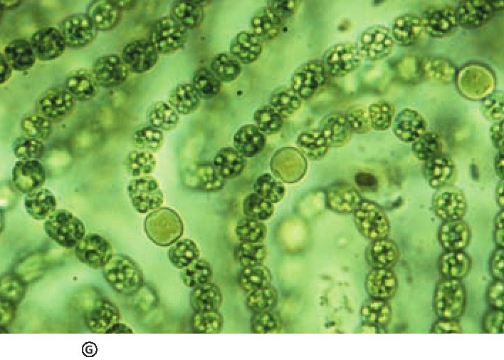
活的蓝细菌（念珠藻属）

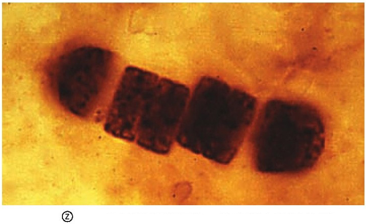
化石蓝细菌短链，产自澳大利亚的苦泉燧石中，距今10亿年。它们与今天的蓝细菌非常相似

除了蓝细菌以外，化石细菌的数量并不多。在特定的化学条件下，细菌细胞被无机盐取代后，形成活细胞的复制品或者假晶。一些细菌能够分泌铁质的外鞘，有时也能形成化石。有些细菌可以钻入动物的外壳或岩石中，在壳内或岩石中形成微小的管道，因此可以通过分析不同时期动物外壳化石的这些管道间接认识它们。另外，琥珀中通常能保存大量精美的细菌，有些细菌甚至经过亿万年之后还能存活。在一些动物骨骼化石中也可发现引发疾病的细菌，说明这些动物活着的时候曾遭受过细菌带来的病痛。最令人惊奇的化石细菌可能是磁杆菌，这类细菌能够在细胞内形成纳米大小的磁铁矿晶体。在20亿年前的古老岩石中可分辨出该细菌产生的磁铁矿晶体，其大小为几个微米，这可能是最小的化石了。（傅强）

## 为什么叠层石今天不再繁盛了

在距今26亿年的元古代，地球上的蓝细菌曾经十分繁盛。这时的蓝细菌不仅种类多，数量多，而且生长过程中可由其细胞外的灰质加上藻丝黏结周围的碳酸盐碎屑，从而共同形成藻类特有的沉积结构。这种结构不仅能帮助藻类生长，而且能增强抗海水侵袭的能力。藻类是一层层排列的，再往上生长，且在不同季节、不同年月生长速度不同，因而留下疏密、明暗不同的层理，包括弧形、锥形或平整的层状，其形成的沉积结构被称为叠层石。这个时期形成的叠层石十分繁盛，在世界各地都可以找到。

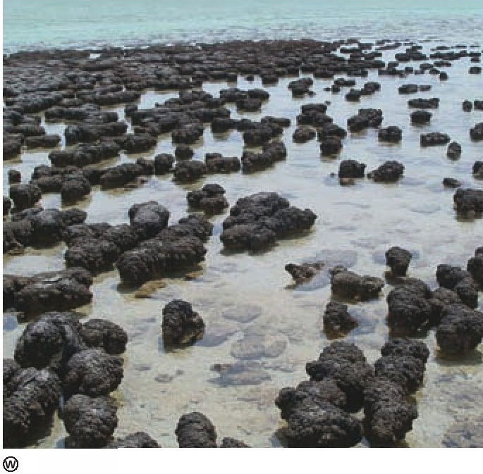
澳大利亚西部鲨鱼湾的现代叠层石

元古代结束后，叠层石逐渐衰落了。人们推测这是因为这一时期地球上出现了动物，是它们吃了这类藻类，致使其数量迅速减少，即便形成叠层石其规模已很小，而寒武纪之后的地层中叠层石更是罕见。现生的叠层石在澳大利亚西海岸以及中美洲的巴哈马群岛等地的浅海区尚有广泛分布。在其他地方的湖泊、海洋中，蓝细菌虽很常见，但大部分成为鱼虾等的口中餐，只有在水体富营养化时，它们才会暴发或迅速增殖，造成藻类泛滥成灾，但这与叠层石形成的环境已经完全不同了。（许汉奎）

  

**【微博士】**中国的叠层石

在中国北方，从元古宙的早期（距今25亿年）一直到晚期（距今8.5亿年）均有叠层石分布，所以可据此进行这一时期的地层划分。国外的叠层石多限于元古代的晚期，而中国叠层石不仅延续时代长、范围广，而且许多为极好的建筑材料。它们纹饰美丽，颜色多种，北京人民大会堂、北京西站等处的墙壁所用的石材都选用了叠层石。

【微问题】微生物也在演化吗？

【关键词】蓝细菌　叠层石　微生物

## 生物大分子也能保存为化石吗

生物大分子是指存在于生物体内的高分子量的有机分子，如蛋白质、核酸、脂质和糖类等。生物大分子是构成生命的基础物质，在生物体内具有重要的生物活性和生物学功能。其中，核酸是保存和传递遗传信息的核心载体；蛋白质则具有多种多样的功能，既可发挥催化作用参与细胞的构建，也可参与新陈代谢的调节等；糖类既是生物体的能量贮藏物质，又是保持细胞形态结构的组成成分；脂类则是组成细胞生物膜的基本单位。这些生物大分子都是由碳、氢、氧、氮等化学元素通过各种化学键结合而成的。

经过漫长的岁月，能在地质条件下保存下来的生物大分子化石，通常以类脂化合物的碳氢骨架形式构成。这些衍生物常被称为生物标志化合物或分子化石。目前，生物标志化合物的研究已涵盖了4种主要的生物化学组分——蛋白质（包括核酸）、糖类（包括几丁质）、类脂物和木质素，其中研究得最为广泛的是类脂物和蛋白质。生物标志化合物可以帮助科学家补充或完善化石记录，其中的碳、氢同位素还记录了其母体生物在古生态系统中的位置和作用，周围环境的元素化学背景，以及远古时代温度的演化史等各类信息。如今，生物标记化合物对于探索地球早期生命起源、重大地史生物事件，重建传统化石记录空白时段，都起了极其重要的作用。

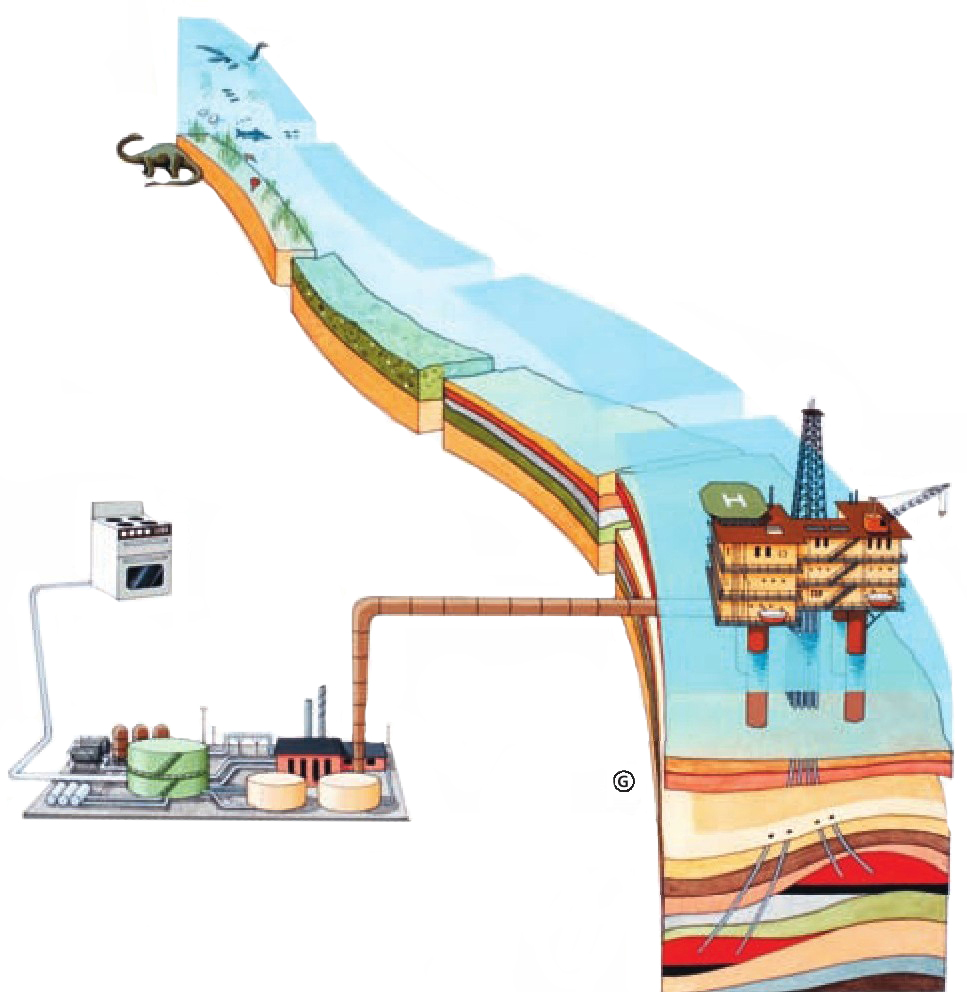
由生物形成的石油中会含有一些生物大分子化石

有些生物标志化合物与现生特殊的生物类群存在密切关系，通过对比研究，人们对这些生物的演化历史有了更深入的了解。例如，沟鞭藻和硅藻是地球上重要的氧气生产者，其最早的化石记录分别存在于中三叠世和侏罗纪。但由这些藻类衍生的分子化石，如甲藻甾类和24-降胆甾烷分别在中三叠世和侏罗纪以来的地层中显示出很高的浓度。根据三芳甲藻甾烷的分布，研究者提出，沟鞭藻的祖先最早可能出现在泥盆纪至前寒武纪。在山西永济地区中元古代晚期的地层中，发现了形态上和超微结构上与沟鞭藻相似的有机结构（有机壁），同时检测到了沟鞭藻的生物标志化合物——甲藻甾烷。这个结果将沟鞭藻分子化石的记录提前了1亿～4亿年，可能存在的实体化石记录提前了7亿～9亿年。（傅强）

## 为什么古DNA研究会吸引科学家的兴趣

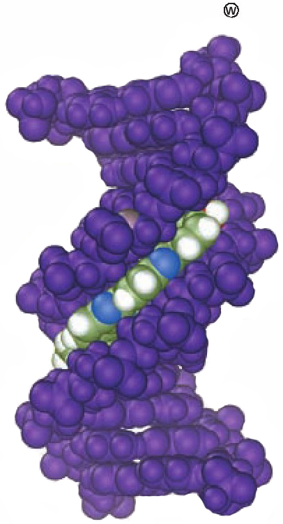
结合了荧光染料的DNA分子

古DNA，是指从古老的生物标本中提取出来的DNA分子。DNA分子在生物死亡以后极易降解，因此，样本的获取极为困难。但科学家还是努力进行了一些尝试。1980年，湖南医科大学的研究人员就从马王堆汉墓的女尸中提取出了DNA和RNA，这是世界上最早的古DNA研究。1984年，美国加利福尼亚大学伯克利分校的科学家从博物馆中保存的、已经灭绝了150多年的斑驴皮肤中提取了一些线粒体DNA序列，并通过与其近亲——马、驴和斑马的相关线粒体DNA序列进行比对，发现斑驴与斑马的亲缘关系最近，而与马或驴的较远。2年以后，德国遗传学家柏保又在死于数千年前的木乃伊中提取到了DNA。

从此，在全球范围内掀起了研究古DNA的热潮，并取得了许多重要的研究成果。

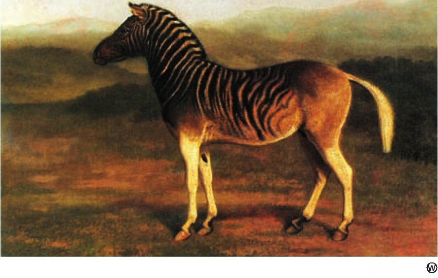
斑驴

许多有关古DNA的研究成果都涉及生物谱系关系这一主题，其中在破解尼安德特人的身份、尼安德特人与现代人的亲缘关系的谜题上发挥了重要的作用。德国科学家分别在1997年和2000年取得了尼安德特人的线粒体DNA，证明尼安德特人的线粒体DNA与现代人线粒体基因库无关，从而支持了欧洲现代人的单一地区起源学说。但是，通过新的测序技术在古DNA领域的运用，德国的研究小组从三个女性尼安德特人骨骼中获得了40亿个碱基，绘制出了尼安德特人的基因组草图。通过与来自世界5个地区的现代人基因组进行比较，他们发现现代人有1%～4%的DNA源自尼安德特人，这说明现代人走出非洲后在中东遇到尼安德特人，他们之间非常可能发生了小范围的基因交流。尼安德特人古DNA的提取和基因组序列，揭开了他们与现代人是否有基因交流的千古谜题。（傅强）

## 为什么古生物的软组织能够形成化石

化石的形成是一个非常复杂的过程。并非所有曾经生活在地球上的生物都有机会形成化石，大部分生物死后不是被其他生物吃掉，就是被微生物分解掉，因此形成化石的概率很低。正因为如此，对化石和生命演化历史有一定了解的人，一定会注意到这么一个明显而自相矛盾的现象：地球上数量最多、种类也最多的动物，例如昆虫、蜘蛛、蝎子、螨、多足类、线虫、各种各样的蠕虫，以及无数其他缺少坚硬骨骼的动物，形成化石记录的并不多。相反，化石记录中最常见的类群仅占全部生物种类的很小一部分，常见的化石有软体动物、腕足动物、珊瑚、棘皮动物、脊椎动物和其他具有坚硬外壳、骨骼或牙齿的动物，它们在今天的动物种类总数中不到20%。

我们能够认识缺乏坚硬外壳或骨骼、难以形成化石的生物，主要归功于特异埋藏的化石群。之所以称为特异埋藏，是因为这里的化石保存了丰富的生物体细微结构甚至软组织，这就不同于常见的矿化骨骼和生物外壳化石。这种化石的形成需要一些非常特殊的环境，比如生物死亡后遗体落在缺氧的水底，且往往还需要微生物的帮忙。微生物在有机物周围通过腐败作用产生了一层生物膜，膜内的化学微环境能够引导矿物的沉积，从而将没有发生腐烂的部分很好地保护起来，大大增加了形成化石的机会。（傅强）

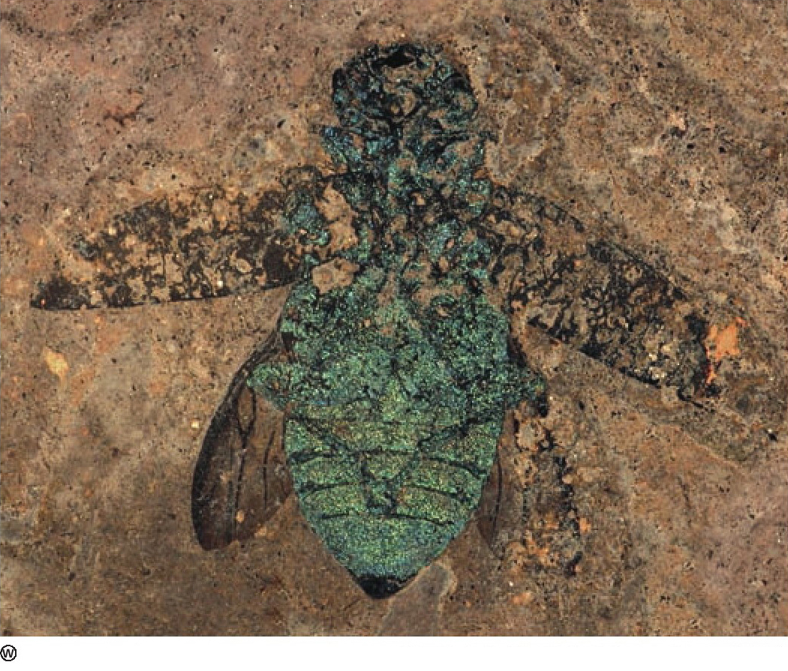
德国梅塞尔化石坑发现的甲虫化石，连甲壳的颜色都被保存下来了

  

**【微博士】**地层中的化石有机物

生物标志化合物大量蕴藏于各类沉积物中，尤其是化石燃料中。据估计，化石有机物在沉积地层中的平均含量为2%，相当于现今全世界总生物量的1000倍。

【微问题】石油是生物大分子化石吗？

【关键词】生物标志化合物　古DNA　尼安德特人　特异埋藏

## 为什么在青藏高原也能找到珊瑚和贝壳

青藏高原是地球上海拔最高的高原，被称为“世界屋脊”，而珊瑚是固着生活在海洋中的动物，为什么在青藏高原也能找到珊瑚和其他海洋贝壳化石呢？如果你了解青藏高原的地质历史，了解其海陆变迁的历史，就能回答这个问题了。

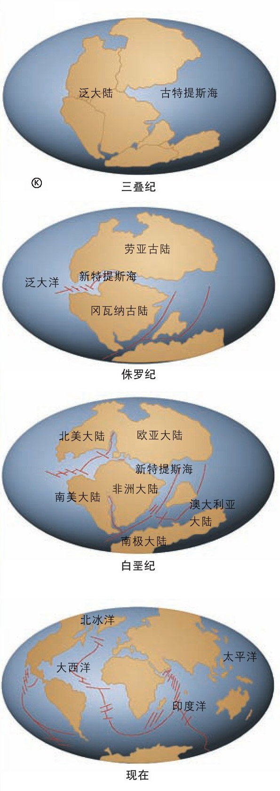
地球的海陆变迁

青藏高原是天然的地质历史演变的“实验室”，经历了从海到陆再变成现在世界上最高山脉的发展历史。青藏高原最早的海洋沉积记录可以追溯到早元古代（22亿年前），但从那时一直到奥陶纪初（4.8亿年前）的那些早期的沉积地层，已经经历了地底高温高压下的变质，所以没有化石保留下来。有确切化石证据的海洋沉积岩形成于奥陶纪的中晚期（4.6亿年前），从沉积的石灰岩中能够采集到丰富的海相珊瑚及其他海洋贝壳化石。当时的青藏高原的主体部分是一片大海，称为古特提斯海。然而，从石炭纪中期（3.2亿年前）开始到早二叠世的早期（2.8亿年前），青藏高原的海相沉积地层和化石缺失了。这是由于当时全球气温下降，大规模的冰川在南半球形成，现今青藏高原的南部当时位于南半球，也被冰川所覆盖。从早二叠世晚期开始，随着全球变暖，海水重新淹没了青藏高原的大部分地区，所以在此时形成的沉积地层中又可以找到大量的珊瑚及海洋生物。但到了二叠纪的末期（2.5亿年前），青藏高原地区经历了一次较大规模的地壳抬升运动。在早、中三叠世（2.5亿～2.2亿年前），青藏高原只有很少的地区仍然保留有海洋环境。只有北喜马拉雅呈狭窄的带状分布的石灰岩沉积地层中，还有当时新出现的六射珊瑚及其他海相化石保存。

到了三叠纪后期（2.1亿年前），由于地壳裂谷作用，沿着现今的雅鲁藏布江又出现了新的海洋，被称为新特提斯海。这个新的海洋持续了很长的时间，在白垩纪晚期（0.7亿年前）的沉积地层中，还可见到珊瑚化石及丰富的菊石、海相双壳类化石，说明当时那里气候温暖，是海洋生物繁盛的地方。一直到了古近纪的始新世中期（0.4亿年前），由于板块运动，南方大陆分离出来的印度板块以较快的速度向北漂移，并持续向北运动与欧亚板块碰撞，造成强烈褶皱、断裂和抬升，新特提斯海逐渐变成了今天的青藏高原，海水才终于完全消失。

沧海桑田的地貌变迁一直贯穿在地球的历史中，在青藏高原找到珊瑚等海洋动物化石，便是例证之一。（王向东）

  

**【微博士】**青藏高原的形成

青藏高原不是一次形成的，而是经历了几个不同的上升阶段。青藏高原上不同的山脉可能有不同的形成年代。青藏高原至今仍在上升。

## 为什么中国的海生爬行动物化石都产自南方

中国的海生爬行动物化石极为丰富，但是这类化石的产出具有一个明显的特点，就是全部都产自华南地区三叠纪的地层。三叠纪是中生代的第一个时期，也是海生爬行动物在地球上首次出现的时期。在三叠纪时，中国的南方是一片汪洋，这片海洋向西一直延伸到现在的欧洲，叫作古地中海，是现代地中海的前身。这片水域生活着大量的海生爬行动物，而同时期的中国北方则是广大的陆地，不可能存在海生爬行动物，自然也就没有此类化石留存。随着沧海桑田的地质剧变，到了侏罗纪和白垩纪，华南的古海也变成陆地，海生爬行动物便在此地区灭绝。

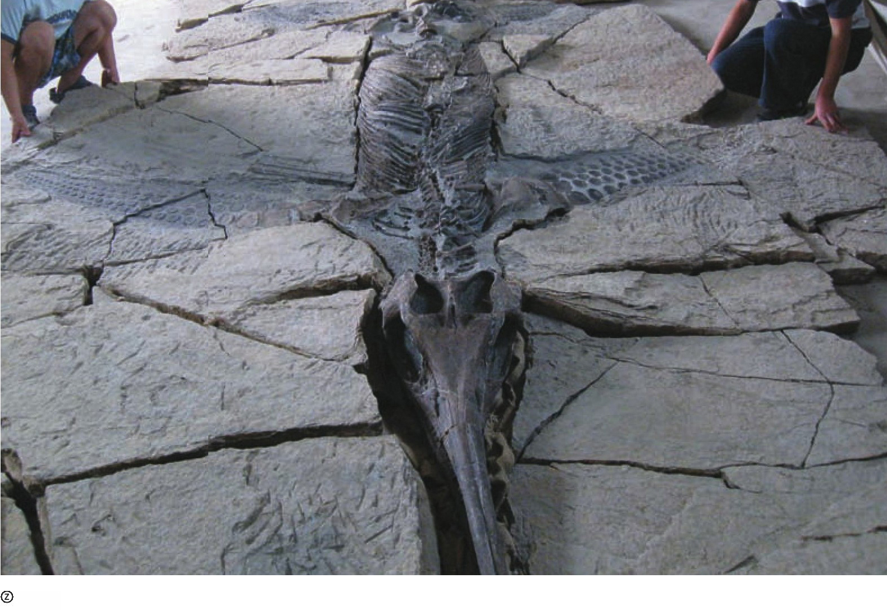
贵州发现的萨斯特鱼龙化石

中国的三叠纪海生爬行动物化石见于湖北、安徽、贵州、云南、广西和西藏，以云贵两地最为丰富。贵州西南部的关岭地区盛产大型鱼龙类和海龙类，另有少量楯齿龙类和罕见的原始龟类——半甲齿龟。云贵交界处的兴义及其周边此类化石更加丰富，除了各种鱼龙类、海龙类和楯齿龙外，还有丰富的鳍龙类和原龙类。此外，贵州的盘县和云南的罗平两地出产多种龙龟类和混形黔鳄。上述地区发现的海生爬行动物化石基本都是保存完整的骨架，说明三叠纪时期这里的海洋环境风平浪静，动物死亡以后很快就被水下的沉积物埋藏，较少受到其他生物和水流的影响和破坏。相反，在西藏的定日、聂拉木等地发现的海生爬行动物化石都是破碎的骨骼和零散的牙齿化石，说明那是一个水波动荡、暗流涌动、与云贵地区截然相反的海洋环境。（王向东）

## 为什么海相地层中会有陆生爬行动物的化石

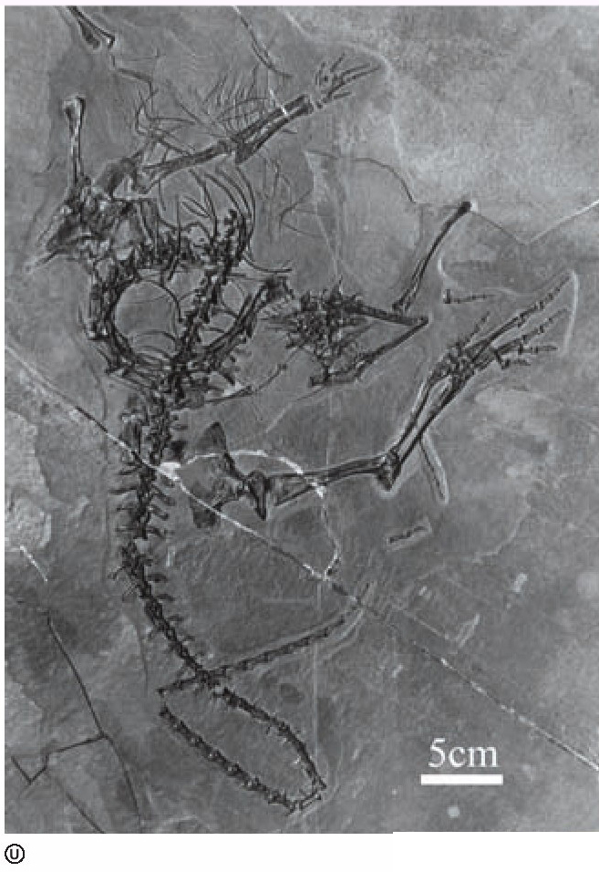
巨胫龙化石

所谓海相地层是指远古时期海洋环境及其沉积物所形成的地层，因此这种地层中所保留的化石基本是海洋生物，如海百合、海星、菊石等无脊椎动物，以及鱼类、海生爬行动物等。但是，云贵两地的三叠纪海相石灰岩中不仅埋藏着大量此类海洋生物化石，还出现相当数量的陆生爬行动物化石，例如形似蜥蜴、快速运动时甚至可以仅靠一对长而有力的后足“飞奔”的原龙类巨胫龙，外表如同小型鳄鱼的早期主龙类等，这在世界范围内都是十分罕见的现象。研究表明，这些陆生爬行动物化石十分完整，说明动物死亡以后并未经过长途的“搬运”，也就是说它们的尸体并不是从遥远的陆地被水流带到大海里的。科学家推测，在这样的地区，或许存在一些小型的岛屿，这些岛屿上生活着一定数量的陆生爬行动物，它们是海相地层中陆生动物化石的来源。（李淳）

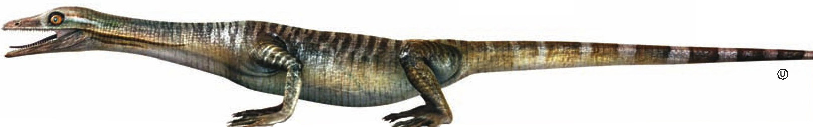
巨胫龙

  

【微问题】青藏高原会有石油吗？

【关键词】青藏高原　古特提斯海新特提斯海　海陆变迁　古地中海　海相地层

## 是什么改变了古气候

27亿年来，地球上发生了5次大冰期和4次大的暖期。为什么会这样呢？其原因尚不很清楚。有的学者认为，这与地球运行的轨道有关，当地球离太阳比较近时，接受太阳的能量多，所以气候温暖；而地球远离太阳时，接受太阳能量少，气候就寒冷。有的学者认为，这与地球上大的地壳运动有关，地壳运动造成了高山，高山上的空气稀薄，尘埃和水蒸气较少，热量容易散失，因而引起地表降温；同时，地壳运动也扩大了陆地面积，发生了海退，陆地的热容量远比海水的小，陆地扩大，海洋面积缩小，地表储存的能量就少，地表的温度容易降低而变得严寒，地史上几次大冰期，都与地质构造活跃期有关……但这些说法并未得到公认。

地球目前所处的第四纪大冰期又可进一步分为7次较冷的冰期和7次较暖的间冰期。随着科技的进步，测试方法的提高，近70多万年来的地史，就可分为7次较小冰期和7次间冰期，大致10万年就出现一次冰期和间冰期的交替。

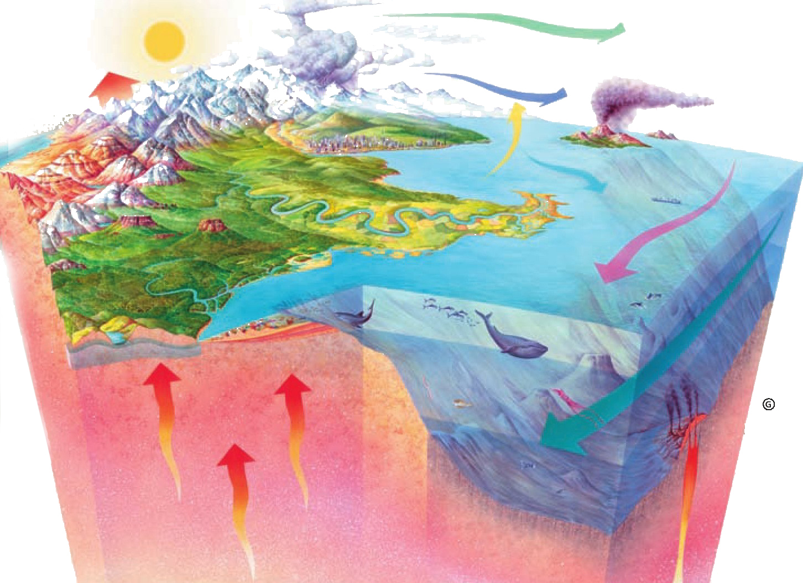
来自太阳和地球内部的能量导致地球陆地、海洋、大气中的许多自然现象的发生。这些自然现象对气候变化的影响很大

最近一次小冰期出现在1.8万年前。当时夏季海水温度比现在低2.3℃，因而海水蒸发以后，绝大部分转化成雪而被冰封在北美洲、欧亚大陆、北极和南极，故全世界海平面下降了近100米。今天的台湾海峡、东海、黄海、渤海水深100米左右，所以当时这些地方都露出了海底而成为陆地，从而中国台湾、日本都与中国大陆连在一起了。因此，渔民在渤海和台湾海峡打捞到1.8万年前陆生的犀牛化石、鹿化石等，以及日本发现这一时期的石器与中国所见的很相似，也就不足为奇了。

从1.5万年前至今，地球又渐渐变暖，进入了间冰期，许多大陆的冰又逐渐融化，海平面升高了近100米，所以台湾海峡、东海、黄海、渤海又被海水淹没了。

古气候的研究关系重大。造成地球冷暖变化的原因究竟是什么？这种变化是否有规律可循？第四纪大冰期是否会像前几次大冰期一样，持续超过1000万年？地球现在所处的间冰期什么时候会结束？新的冰期来临对人类是有益还是有害？这些问题都有待人们去探索，去研究。（许汉奎）

## 地球曾是个大雪球吗

地表能量的主要来源是太阳辐射。地球在不同时期接受的太阳能量不同，地表温度就有了冷暖的变化。当接受太阳能量很少时，地球就很冷，许多地方的雪终年不化，越积越厚、越压越紧，就变成了冰。平地的冰逐渐形成厚的冰原，比如南极洲和格陵兰的冰原。高山的冰由于受到重力的作用，会沿着山谷往下移动，像河流一样，故称冰川。地球上遍布冰原和冰川的时期就被称为冰期，以便和气候温暖的时期相区分。

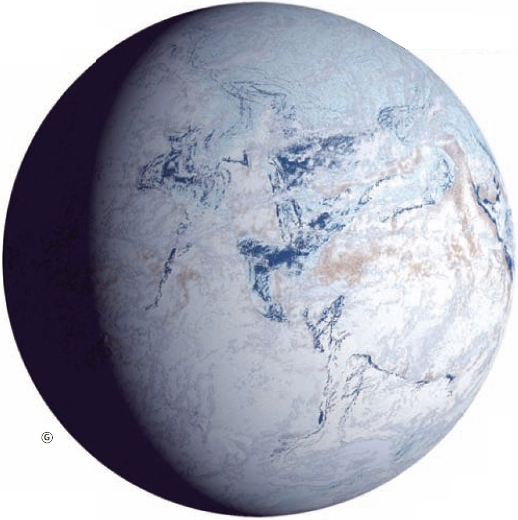
雪球地球

地史上的5次大冰期，第一次是距今24亿～22亿年的休伦冰期；第二次是距今7.5亿～6.3亿年的新元古代冰期；第三次是距今4.6亿～4.3亿年的早古生代冰期，这次冰期持续的时间较短，影响也较小；第四次是距今3.5亿～2.7亿年的石炭纪——二叠纪冰期，又称晚古生代冰期；第五次是从距今260万年至今的晚新生代冰期，或称第四纪冰期。地球现在处于第四纪大冰期的间冰期中。

在这5次大冰期中，冰期的时间有的长、有的短，相差甚大，而且冷的程度也有很大的不同。时间最长的是第一次冰期，持续了2亿年。最冷的是第二次冰期，这次冰期产生的冰像盖子一样覆盖了亚洲、欧洲、美洲、非洲和澳洲的大片地区。上述一些地方当时位于赤道的低纬度区，如果这些地区都覆盖着冰层，那么南极和北极地区更是如此。也就是说，当时地球表面基本上都被冰雪覆盖而成了一个大雪球，所以学者称这一事件为雪球事件，称当时的地球为雪球地球。（许汉奎）

## 为什么可以根据地层和化石了解古气候的变化

科学家可以从地层和化石来了解古气候。先说地层方面，如果发现地层中有很厚的冰川沉积物，就说明有冰期存在；如果发现全球大规模海平面下降，陆地大大扩大，也说明冰期的存在。气候寒冷的时候，降到陆地上的雪越来越多，且不会融成水流到大海，而海水则越蒸发越少，海平面就不断下降。据回声探测，如今南极的冰约有27×106立方千米。如此大量的海水结成冰，就会让海平面下降65～75米。此外，还可用测地层中氧碳同位素的方法来确定古气候的变化。因为气候与二氧化碳这样的温室气体有关，测地层沉积物中的氧碳同位素的组成可以了解当时的碳循环情况。极厚的黄土层、极长的钟乳石、大洋底极厚的沉积物以及南极极厚的冰芯等，系统测量它们氧碳同位素的变化，就可以掌握几百万年来古气候逐渐变化的数据。

再说化石方面，通过化石也可以了解古气候的变化。气候对生物的影响很大。一般来说，生活在热带的动物新陈代谢速度较快，个体都较小；而生活在寒带的动物新陈代谢速度较慢，且为了御寒个体都较大。有些动物只能生活于热带，有些只能生活在寒带。如在更新世中期的中国，就可以清楚地将当时的动物划分为：生活于寒冷北方的以北京猿人——肿骨鹿为代表的动物群，生活于南方热带、亚热带的剑齿虎——大熊猫动物群。又如，在奥陶纪晚期第三次大冰期来临前生长的动物个体都较小，冰期到达时，气温骤降，海平面下降了50～100米，大批动物灭绝了；在接下来很长的冰期中，许多动物慢慢适应了寒冷的气候，它们的个体都长得较大，形成了特有的冰期动物群，与冰期前的显著不同，它们的区别很容易识别。（许汉奎）

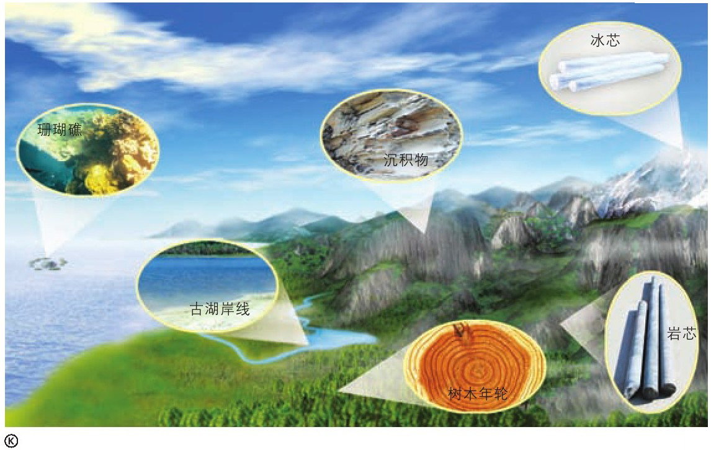
科学家研究古气候的途径

  

**【微博士】**地球的降温

地球刚刚形成时，地表的温度很高，到距今40亿～39亿年时才降至100℃左右，距今30亿年时降至70℃，以后又不断下降，这时地表的温度主要受地球内能的影响。到距今27亿年时，地表温度降至平均约20℃的范围，这时地球内能的影响已无足轻重，它仅占地表能量来源的1/5000，主要能量就来自太阳辐射了。

【微问题】人类对气候变化的影响会让地球摆脱冰期——间冰期的循环吗？

【关键词】冰期　间冰期　古气候　雪球地球

## 生命是怎样起源的

生命是地球上最复杂的一种现象。生命是怎样起源的？这是一个至今尚未完全解决的科学问题。

1924年，苏联科学家奥巴林提出了团聚体学说。团聚体是蛋白质和核酸的聚合体，它们具有类似膜的结构，并能在酶的作用下发生生成淀粉或聚合核苷酸等反应。1953年，美国科学家米勒用氢气、水蒸气、甲烷、氨等混合气体模拟远古大气进行放电，在冷凝液中发现了氨基酸等含氮小分子。这说明氨基酸等生物小分子有可能在早期地球的陆地上或空中形成，然后随流水或雨水进入海洋，聚合成蛋白质和核酸。这些聚合体与海洋中的有机物作用，产生膜的结构，最后形成了原始生命。

早期的地球面貌与现在大不相同。当时火山遍布，大气稀薄，由于缺乏氧气，也无臭氧层的保护，整个地球都暴露在强烈的紫外线之下。即使通过闪电偶然产生了氨基酸分子，它们也很容易被自然界的力量所破坏。因此，也有学者认为很可能生命物质是通过陨石撞击地面等方式从外太空被带到地球的。但是他们难以找到具有说服力的证据，因为陨石在穿越大气层的过程中要面对极高的温度，在这种情况下生命物质是难以保留的。

还有一种可能性，就是生命不是起源于地球表面，而是起源于深海。深海的“黑烟囱”喷出的甲烷、氨等物质在高温和硫化物催化剂的作用下，也可能形成嘌呤、核苷酸等有机物，进而形成团聚物甚至生命。深海的环境虽然对于今天的地表生物来说十分严苛，但环境稳定，能量和物质供应充足。生命如果在那里产生，有可能不被破坏而保存下来。目前科学家已经在深海和地底深处找到一些很像细菌的原核生物，它们生存的环境很极端（如超过100℃的高温、富硫缺氧、高盐度、强酸或强碱等），它们的分子生物学特征，如基因转录过程，与细菌的明显不同，而比较接近于真核生物。1977年，微生物学家为这类原核生物建立了一个新的类群——古细菌。它们有可能与最初的生命有较近的渊源。但对古细菌的起源与演化的研究目前仍处于初级阶段，还不能为生命的起源提供足够的证据。

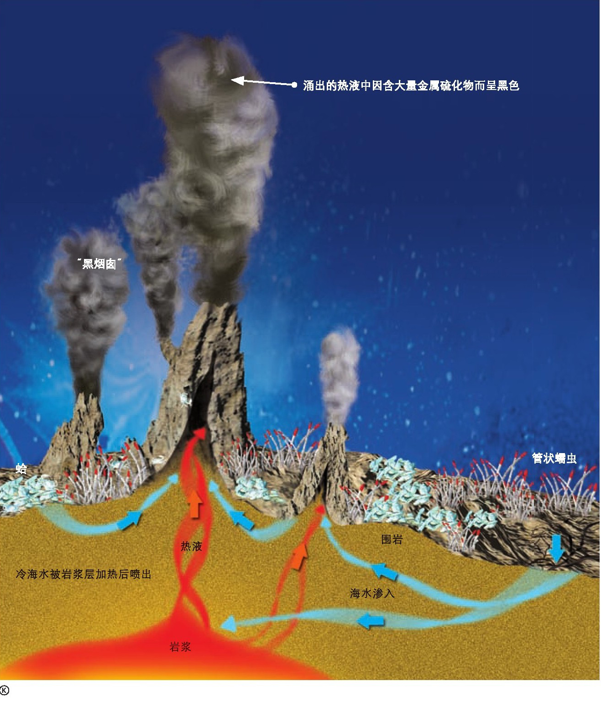
深海的“黑烟囱”

更可靠的生命起源证据来自化石记录。化石记录可以在一定程度上保留生命起源初期的形式，比如原始藻类、细菌类的化石以及沉积学等领域的一些研究。

最早的藻类化石主要是叠层石，形成这些叠层石的藻类可以追溯到距今35亿年。古生物学家曾经在火山岩石中发现了类似于细菌的丝状体化石，它们被认为是古细菌的化石，其生存年代大约也是35亿年前。理论上说，应该有更早的早期生命化石埋藏在地层中，这还有待进一步发现。

沉积学等领域的研究也对生命起源问题有一定的帮助。地球上最古老的沉积岩石之一——条带状铁层，形成的时间大部分都在20亿年前的元古宙，这些铁层是今天中国华北和俄罗斯等地供开采铁矿的重要资源，主要成分就是铁的氧化物。这些铁层的大规模沉积需要大量的氧气，氧含量的增多使得原本可溶在水中的二价铁离子被氧化成三价铁，进而形成了氧化铁沉积。早期地球氧气含量稀少，条带状铁层的大规模出现记录了地球早期最早一次大气或海水中氧气浓度的规模性上升。而地球上最早的增氧事件，可能就是由最早的生命完成的。（冯伟民）

## 真核生物是怎样演化来的

真核生物是由真核细胞构成的生物，真核细胞的特点是具有细胞核和细胞器。所有真核生物都是由一个细胞（胚或孢子）发育而来的，所以最早的真核生物应该是单细胞的原生生物。关于真核生物的起源，目前被普遍接受的内共生学说认为，真核生物的直接祖先可能是某种大型的原核生物，它们的体内有因细胞膜内陷而形成的内膜系统和原始的微纤维系统，并能够作变形运动和吞噬运动。后来，内膜系统的一部分包住了染色质，于是形成最原始的细胞核。内膜系统的其他部分则分别发展为高尔基体、溶酶体等细胞器。内共生学说也解释了线粒体的起源，认为原线粒体被原始真核生物吞噬后与宿主间形成共生关系。原线粒体可以从宿主那儿获得更多的营养，而宿主可借用原线粒体的氧化分解功能获得更多的能量。在长期的共生过程中，通过演变，形成了线粒体。能进行光合作用的蓝细菌被吞噬后经过共生演变成叶绿体。内共生学说在1970年正式提出，目前相关的理论仍在探讨中。（冯伟民）

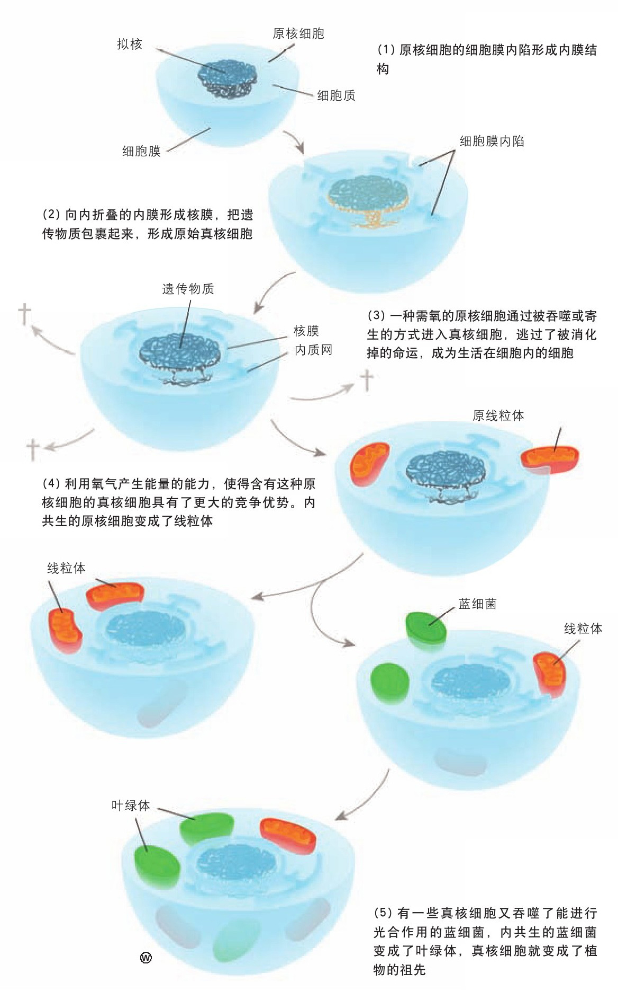
内共生学说解释的真核生物起源过程

  

【微问题】为什么说现在地球上的生命只有一个最古老的共同祖先？

【关键词】生命起源　黑烟囱　古细菌　内共生学说

## 为什么寒武纪早期会发生生物大爆发

6亿多年前，地球经历了一次寒冷的特大冰期后开始逐渐回暖，至寒武纪时已很暖和了，这有助于生物的大发展。

当时的大气环境也适宜生物大发展。藻类的光合作用已使地球上的氧气大大增加，足以满足生物对氧气的大量需求；臭氧层已经形成，保护了生物不被紫外线、宇宙线伤害。

这个时期恰好又是板块分离、火山喷发事件频繁发生的时期。这些事件也会促使生物的大发展，火山喷发会增加海水中的营养元素，板块分离会使大陆架范围大大扩大，为浅海区生物的发展提供更多的空间。

十几亿年前多细胞生物开始出现，生物的性别分化也随着演化逐渐显现和成熟。有性生殖提供了更多遗传变异性，促使新物种、新门类大量出现。

寒武纪之初出现了捕食蓝细菌等原核生物的原始动物。这些“收割者”让营养级金字塔的物种多样性迅速提高，最终导致了寒武纪大爆发。这一观点被称为“收割理论”。

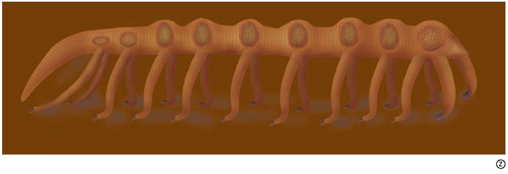
澄江生物群中的微网虫复原图

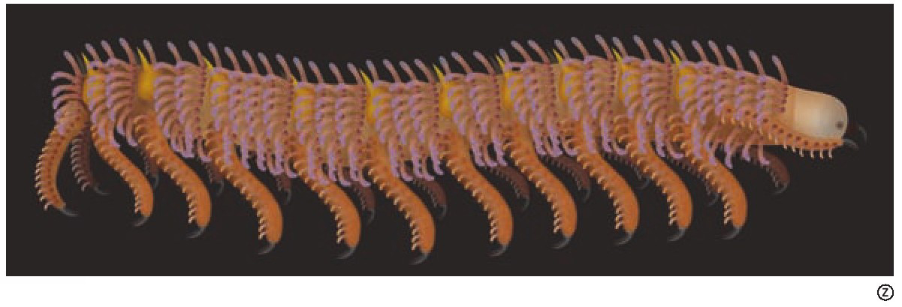
澄江生物群中的爪网虫复原图

早期的生物结构比较简单，基因较易发生突变，也较易把突变稳定下来，形成新的物种。随着生物的演化，生物的结构越来越复杂，基因突变造成新物种变得越来越难。总之，生物大爆发发生在寒武纪早期，是诸多因素共同导致的结果。（许汉奎）

## 为什么说寒武纪的生物发展是“大爆发”

寒武纪之前地球上的生物种类和数量都很少。海里除了产生一些藻类植物化石外，动物化石产生极少，即便有也都是一些找不到骨骼、壳体的遗迹化石（如水母、蠕虫等动物软躯体印在泥岩或泥质砂岩上的化石），其中以澳大利亚的埃迪卡拉地区发现这类化石最多。由于只保存了一些遗迹，它们分别是哪类动物，甚至是动物还是植物，迄今也没有完全搞清，这就是闻名于世的埃迪卡拉动物群。在其他国家，包括中国，虽也发现与此时代相当的生物群化石，但数量均很少，全世界这一时期的化石也仅包括3～5个门而已。

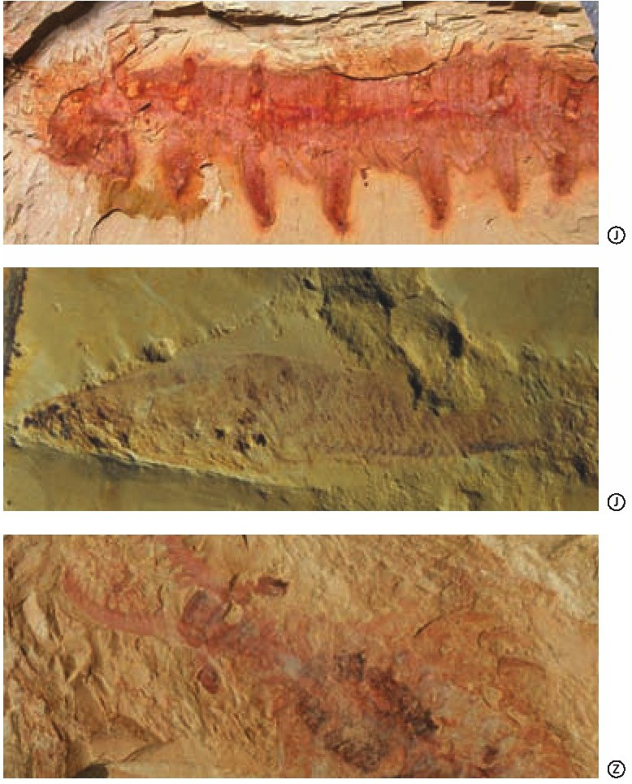
澄江生物群中的几种化石：爪网虫（上）、海口鱼（中）、奇虾（下）

但到了寒武纪，海里的动物却突然呈爆发式增多。先是在距今5.4亿年的寒武纪最早期地层出现了大量小型的（毫米尺度）、体外有壳保护的动物化石和体内有骨骼支撑的动物化石，这一时期的动物门猛增至17个。因它们有硬壳，躯体易保存为化石，故化石的数量也骤增，常常许多壳体、骨片、骨刺密密麻麻堆积在一起，被称为小壳动物群。小壳动物群在世界多地有分布，但以中国化石点分布最广，类型最全，化石最多。

20世纪80年代，在中国云南中部的澄江一带，又发现了距今5.3亿年寒武纪早期的许许多多奇形怪状的动物化石。化石大都保存在质地细腻、坚硬的泥岩中，故不仅动物的硬体部分，连软体部分也都保存下来，看上去栩栩如生，令人叹为观止。这些动物化石后来被命名为澄江生物群。这一发现使该时期的动物门猛增至30多个，比现在所有动物的门还要多，几乎现在所有动物的祖先，当时全都出现了。澄江生物群的发现揭示了寒武纪一次生物的大辐射事件，人们形象地将它喻为“生物大爆发”。它被誉为“20世纪最为重要的科学发现之一”，联合国教科文组织也将澄江化石发现地列为世界重要文化遗产地之一。（许汉奎）

## 为什么寒武纪大爆发与达尔文的进化论并不矛盾

达尔文认为，生物为了适应环境和生存竞争而改变的过程很缓慢，也许要经过许多代的努力才能获得，而且这种演化也只能一级一级往前进，如果把生物的演化路线比作一棵树，演化的过程就是由树干的一根枝条慢慢向上分叉成两根枝条，再继续分叉成四根枝条……最后形成树上许许多多的枝条。所以在寒武纪一下子冒出这许多或低级或高级的生物物种，确实是达尔文理论难于解释的。有人就据此质疑达尔文的进化论。

其实，寒武纪的生物大爆发与达尔文进化论是不矛盾的。自然选择依然是生物演化的动力，如今我们对生物产生变异和物种形成的机理的认识较过去有了很大的进步。随着20世纪分子生物学的进步，人们认识到生物的演化中，遗传物质（基因和染色体）的突变和杂交造成的基因重组（比如细菌之间互相交换遗传物质），会引起生物群体中基因频率的变化。这种变化一般是缓慢的。但在一些特殊情况，比如环境剧变、地理隔离等条件下，突变并积累突变的速度可能会突然加快，这就有可能在短时间内产生许多新的物种甚至新的大类。这就像演化树的1根枝条上分出的枝条不止2根，而是10根，但演化树的基本形式还是没变。所以，在寒武纪突然出现许多新的物种、新的门类，甚至出现比较高等的门类，与达尔文的进化论并不矛盾。这种新的更具说服力的进化论，称为“现代综合进化论”。

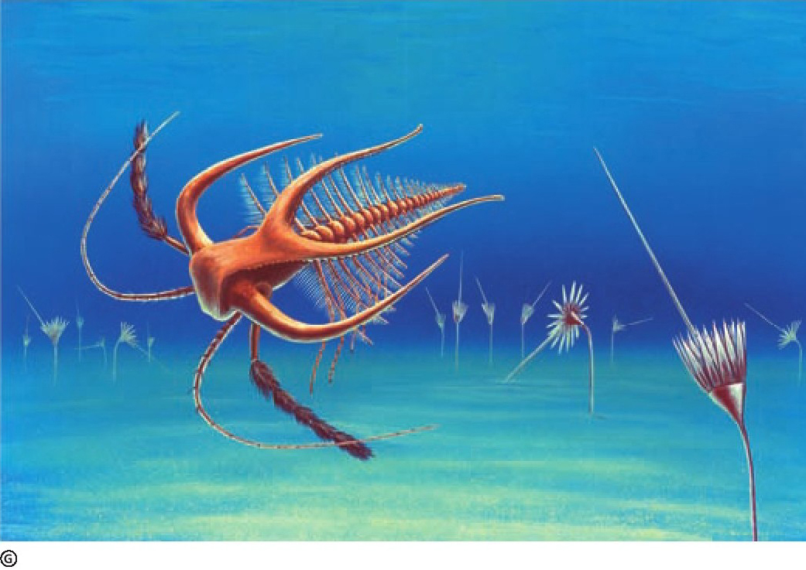
马尔三叶形虫

达尔文时期人们曾对寒武纪许多生物门类的突然出现感到困惑，一个很大的因素是化石记录不完整。如今，人们在寒武纪之前的地层中也已经陆续发现了许多生物群，如中国贵州5.8亿年前的瓮安生物群，说明通过更多的努力，我们能够找到这些突然出现的生物早期演变的线索。（许汉奎）

  

**【微博士】**小壳动物群化石

小壳动物群化石包括软舌螺类化石、环节动物化石、软体动物化石、牙形动物化石、钉形化石、托英特壳类化石、赫尔克壳类化石、棱管壳类化石、腕足类化石、球形化石等。其中最有代表性的是软舌螺类。小壳动物群的动物不一定都有壳。

【微问题】寒武纪大爆发的生物门类都有后代留存到今天吗？

【关键词】寒武纪大爆发　埃迪卡拉动物群　澄江生物群　现代综合进化论

## 为什么说史前的生物大辐射惠及了所有生命

每一次生物大辐射都是一次生物的大发展和生物多样性的快速增加过程。如发生在早志留世晚期（距今4.2亿年）的大辐射，这时由于气候转暖，形成了浅海环境，有利于生物演化，无脊椎动物中的笔石、珊瑚、腕足类都迎来大发展的机会，节肢动物、苔藓动物、双壳类、腹足类和竹节石类也得到大发展，特别是出现了带有真正颌骨的鱼类。在陆地上，原始的裸蕨类植物登陆了，地球进入了鱼类和裸蕨类植物繁盛的新时代。在早石炭世早期，这时生态环境又得到恢复，珊瑚、腕足类、菊石、牙形类、双壳类、腹足类、海百合等得到进一步发展，特别是单细胞有孔虫的类开始兴起，它们演化迅速，成为海洋中的重要角色。这时由鱼类演化而来的两栖类得到空前大发展。陆地的植物也进入了前所未有的繁盛期，高大的石松类、有节类等形成了有史以来最大的森林，规模远超现在，地球进入了两栖类和蕨类植物的新时代。到了三叠纪的早期，在经历了地质历史上最惨重的生物集群灭绝之后，地球又逐渐恢复了元气，在生态环境好转时，双壳类、腹足类、菊石类等得到大发展，陆地和海洋的爬行类得到空前的大发展，裸子植物取代了蕨类植物的主导地位，地球从此进入爬行类和裸子植物的新时代。侏罗纪的早期也有一次大辐射，在三叠纪末期的灭绝事件之后，幸存下来的恐龙得到了大发展，成为了陆地的霸主。另一次大辐射是古近纪的早期，距今6000多万年，那些白垩纪末期躲过集群灭绝的哺乳类和被子植物迅速占领了灭绝生物的空间，从而得到空前的大发展，使地球进入了由哺乳类和被子植物统治的新时代。

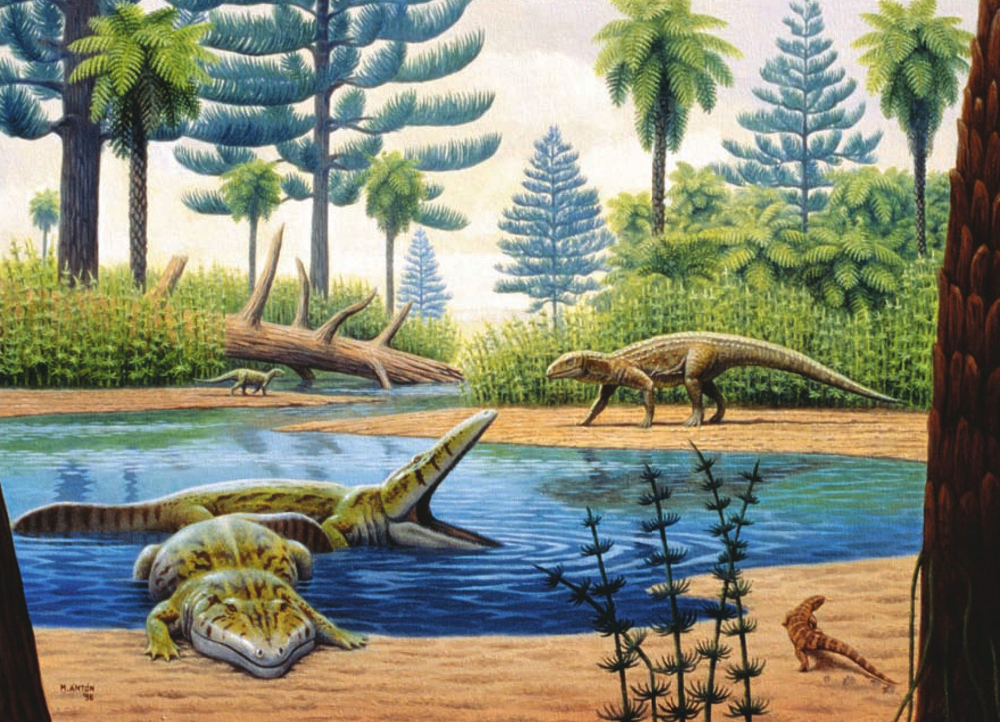
三叠纪早期生物大辐射

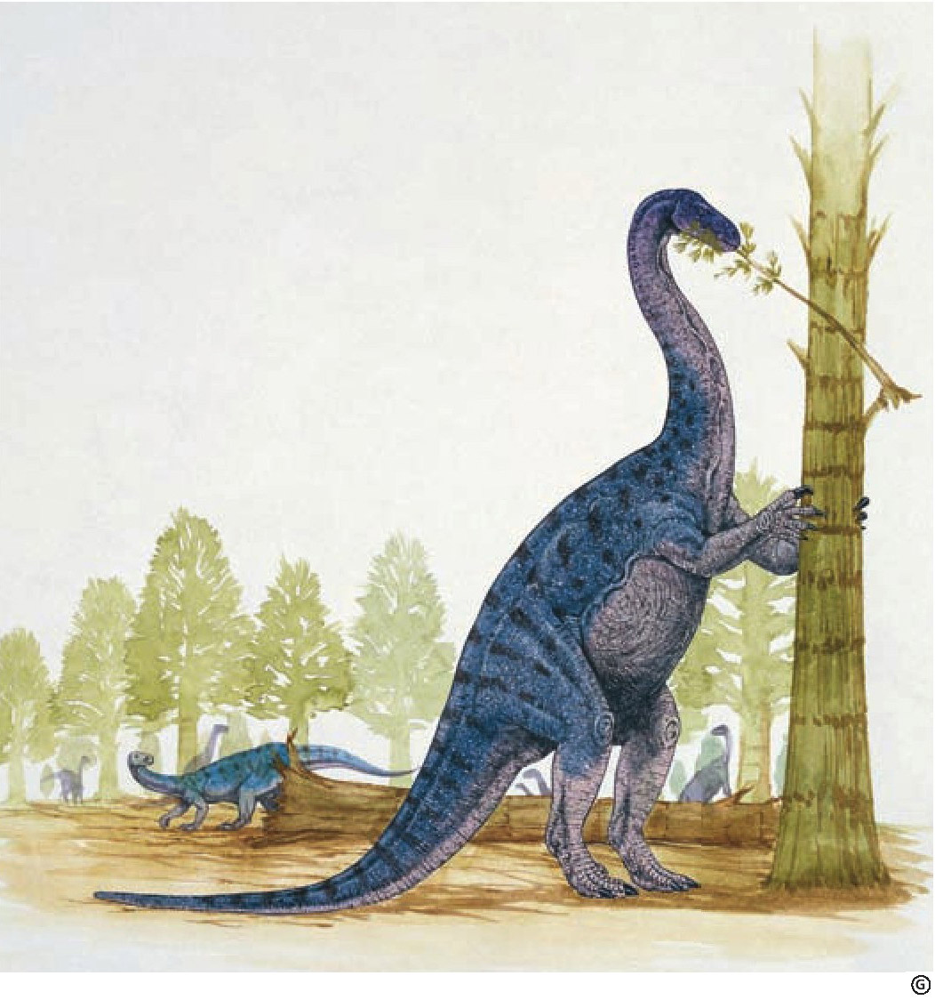
侏罗纪早期生物大辐射时的禄丰龙

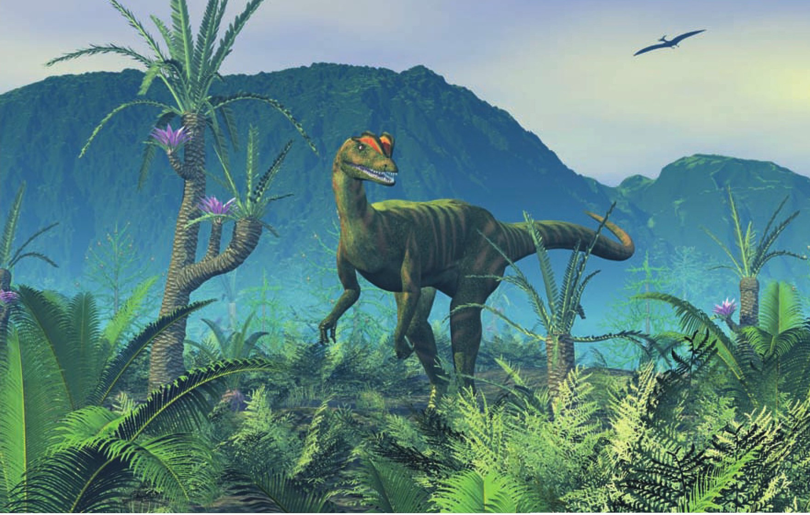
侏罗纪早期生物大辐射时的双嵴龙

总之，每一次生物大辐射都使地球上的生物得到大发展，生物物种也越来越丰富多样。更重要的是，每一次生物大辐射都使一些生物演化到一个新的高度或新的阶段。正是经过了鱼类登陆后演化到两栖类，再由两栖类演化到爬行类、哺乳类，再由哺乳类中较低等的类群演化到较高等的灵长类，人类才有可能出现。所以从这点看，生物大辐射是惠及了所有较高等的包括人类在内的生物。没有生物大辐射，就不可能有今天人类所赖以生存的全球生物多样性。（许汉奎）

## 为什么微生物化石能提供地球发生大灾难的线索

在地质历史上，生物集群灭绝事件发生后往往会出现微生物的繁盛现象，通过研究微生物岩或保存良好的微生物有机壁化石，就可以深入了解集群灭绝发生的过程。

过度繁殖的藻类

微生物岩代表了一种以蓝细菌和其他底栖生物为主体的独特生态系统，是一种沉积岩，由生活在海底的微生物群落通过生长和生理活动，引导沉积物沉淀和生物矿化作用而产生。因此，微生物岩是海洋微生物群落兴衰的直接证据。

比如，在距今约2.5亿年的二叠纪末期，地球上最严重的集群灭绝事件发生以后，全球浅海地区就广泛分布有微生物岩。而晚泥盆世的集群灭绝中，菌藻类生物也更加繁盛。在晚弗拉西斯期，刺激菌藻类生物生长的元素含量几次突然增加。这可能是因为晚泥盆世陆生植物大规模繁盛，使得生物的化学风化作用加速进行，导致地表径流向海洋输送的营养物质急剧增加，从而进一步改变了海洋化学环境，最后富营养化的海水使菌藻类生物过度繁盛，并造成其他生物灭绝。（傅强）

  

【微问题】如果现在发生生物集群灭绝，什么样的生物能从接下来的大辐射中脱颖而出？

【关键词】大辐射　微生物岩

## 地球上有过几次生物集群灭绝

生物的灭绝与新生是生命演化中的自然现象，几乎每时每刻都在发生。已有的统计数据表明，地球上的生物平均以每100万年2～5个科的速率在灭绝；地球上曾存活过10亿～40亿种动物、植物和真菌类，其中97%以上已经灭绝。在整个生命历史中，生物的更替是以不均衡的速度发生的。自显生宙以来的5.4亿年中至少发生了22次生物灭绝事件。具有全球影响的生物集群灭绝有5次，即发生在奥陶纪——志留纪、晚泥盆世、二叠纪末、三叠纪末和白垩纪末的集群灭绝。

奥陶纪——志留纪生物集群灭绝发生在距今4.4亿年，由前后两幕组成，其间相隔50万～100万年。第一幕是生活在温暖浅海或较深海域的许多生物灭绝了，灭绝的属占当时属总数的60%～70%，灭绝种数更高达80%。第二幕是那些在第一幕灭绝事件中幸存的、生活在较冷水域的生物又遭灭顶之灾。

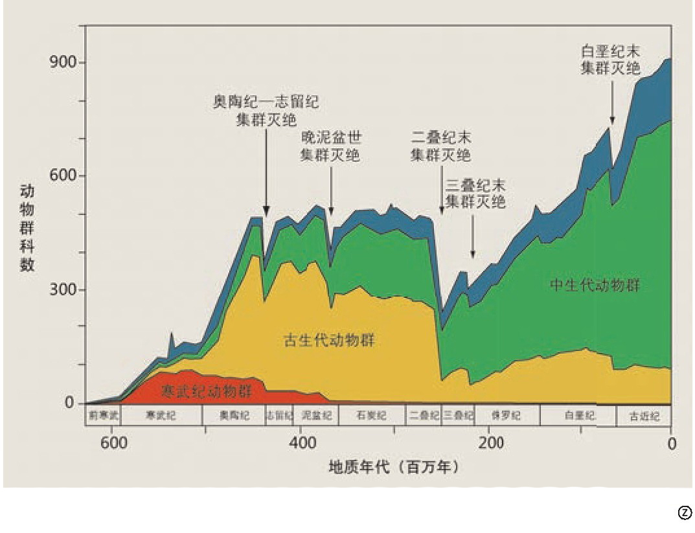
地史上的5次生物集群灭绝的时间和动物群变化，不同颜色表示相应地质时期的代表性动物，蓝色是指微体化石。数据以生物分类中的“科”为单位，一个科下包含许多属和种，故中生代代表性的一些科的属种可能在古生代就已经出现

晚泥盆世生物集群灭绝发生在3.75亿年前，其灭绝的科占当时科总数的30%，灭绝的海洋动物达70多科，陆生生物也遭受了重创。这次灭绝事件的时间较长，规模较大，受影响的门类也多。当时浅海的珊瑚几乎全部灭绝，深海珊瑚也部分灭绝，层孔虫几乎全部消失，竹节石全部灭亡，浮游植物的灭绝率也达到90%以上。

二叠纪末生物集群灭绝发生在2.52亿年前，是5次集群灭绝中规模最大的一次，造成了陆生生物大约70%的科和海洋生物95%的物种消失，繁盛于古生代早期的三叶虫、四射珊瑚、床板珊瑚、类有孔虫以及海百合等全部灭绝，生物礁生态系统全面崩溃，古生代海洋中由海百合——腕足动物——苔藓虫组成的表生、固着生物群落迅速退出历史舞台。在陆生生物中，不同气候带的特征植物群消亡，被矮小的裸子植物代替。二叠纪最有代表性的四足类的陆生脊椎动物，有63%的科迅速灭绝。

三叠纪末生物集群灭绝发生在2.08亿年前。虽然三叠纪末集群灭绝造成的影响相对轻微，是5次集群灭绝中最弱的，但也有1/3的科灭绝。其中海洋生物有20%的科灭绝，陆地上大多数非恐龙类的主龙类、兽孔目爬行动物和一些大型两栖动物都灭绝了。

白垩纪末生物集群灭绝发生在6550万年前，标志着中生代的结束。26%左右的科，超过半数的属，75%的种在这次集群灭绝中消失。称霸一时的恐龙以及菊石、双壳类中的固着蛤类完全灭绝了，一度非常繁盛的六射珊瑚、大型底栖有孔虫和超微浮游生物遭到重创。这次集群灭绝事件冲击了海洋和陆地的生态系统，此后新生代的生物面貌为之一新。（冯伟民）

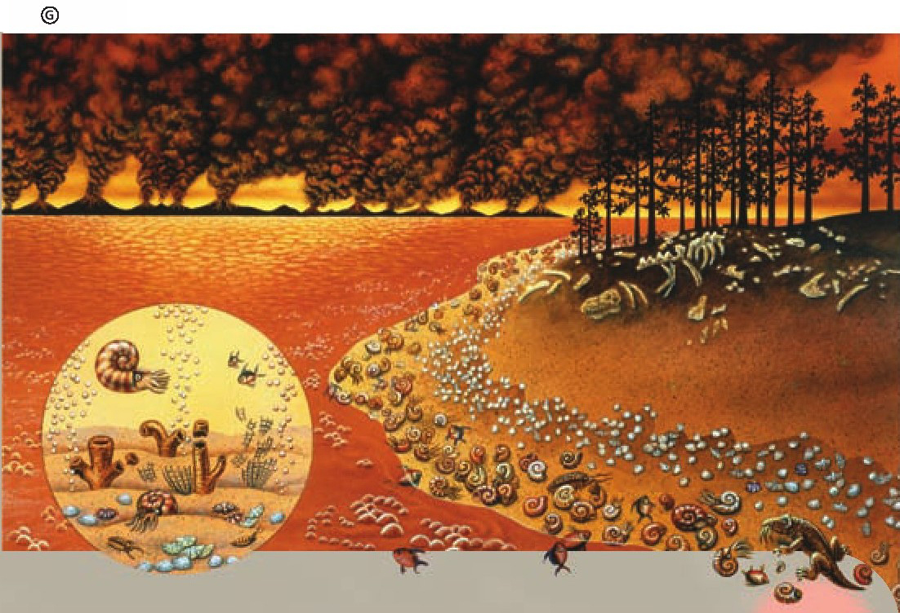
  

**【微博士】**生物集群灭绝的“元凶”

造成生物集群灭绝的原因是复杂多样的，每一次集群灭绝的原因也不尽相同。一般认为，气候变化及其相关事件是造成奥陶纪——志留纪两幕生物灭绝的主要原因。泥盆纪末的集群灭绝是一次与奥陶纪末相似的全球变冷事件，有人认为，彗星撞击事件可能是这次集群灭绝的诱因。二叠纪末集群灭绝则是大规模地下岩浆活动造成地表甲烷释放以及火山喷发等共同作用的结果。三叠纪末集群灭绝发生在气候长期变化、海平面快速波动，并伴有发生地球内外灾难的背景下。对于造成白垩纪生物灭绝的主要因素，目前人们普遍接受的是小行星撞击学说，当然也有其他不同的看法。

## 为什么有人认为现在正处于第六次生物集群灭绝

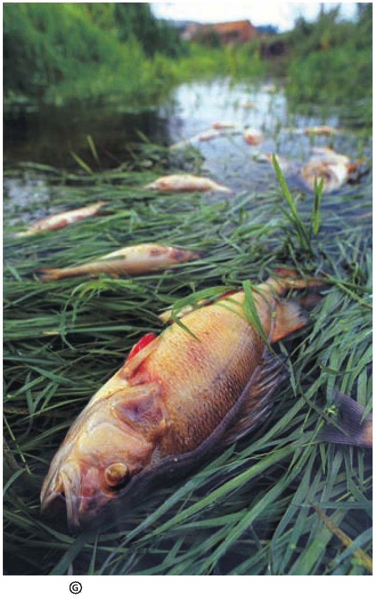
生态环境的恶化造成大量生物的死亡

第六次生物集群灭绝可能始于1.1万年前的新石器时代，那时人类已拥有较好的石器，可以较容易地猎杀野生动物。从200多年前人类的工业革命时代开始，人类生产力突飞猛进，大片森林被砍伐，大量野生动物被猎杀，大片矿山被开采，大批工厂的废气和废物被排放，地球生态环境遭到极大的破坏。

已知现存哺乳动物有5000多种，但其中1/4可能将灭绝；现有1211种鸟类濒临灭绝，占总数的1/8；全球濒临灭绝的植物种类占全部物种的47%！在以往的集群灭绝时期，平均每天也就几个种被灭绝，而如今每天被灭绝物种猛增至100个，若按此计算，100年内365万个物种将灭绝。如果全世界现有的生物有2000万种，那么不消1000年，地球上的物种将消失殆尽。1000年的时间在地质历史记录中几乎是觉察不出来的。比如泥盆纪演化速率最快的牙形刺，其最短的灭绝期也有15000年，一般的灭绝都要延续几万年以上。而今日物种灭绝的速率比史前正常情况下每年灭绝3个种要快近10000倍，比形成新物种的速率快了100万倍，这样的灭绝速率远远超过史前任何一次集群灭绝。因此在某种意义上讲，或许称之为第六次集群灭绝也不为过。

不过也有学者认为，人类对当今地球生物多样性的了解还远远不够，人类短暂的历史还无法感受生命集群灭绝的整个过程，更何况自然界自身调节的能力远比人类所认识的要强大。目前就断言正在发生第六次集群灭绝，证据似乎不够充分。（冯伟民）

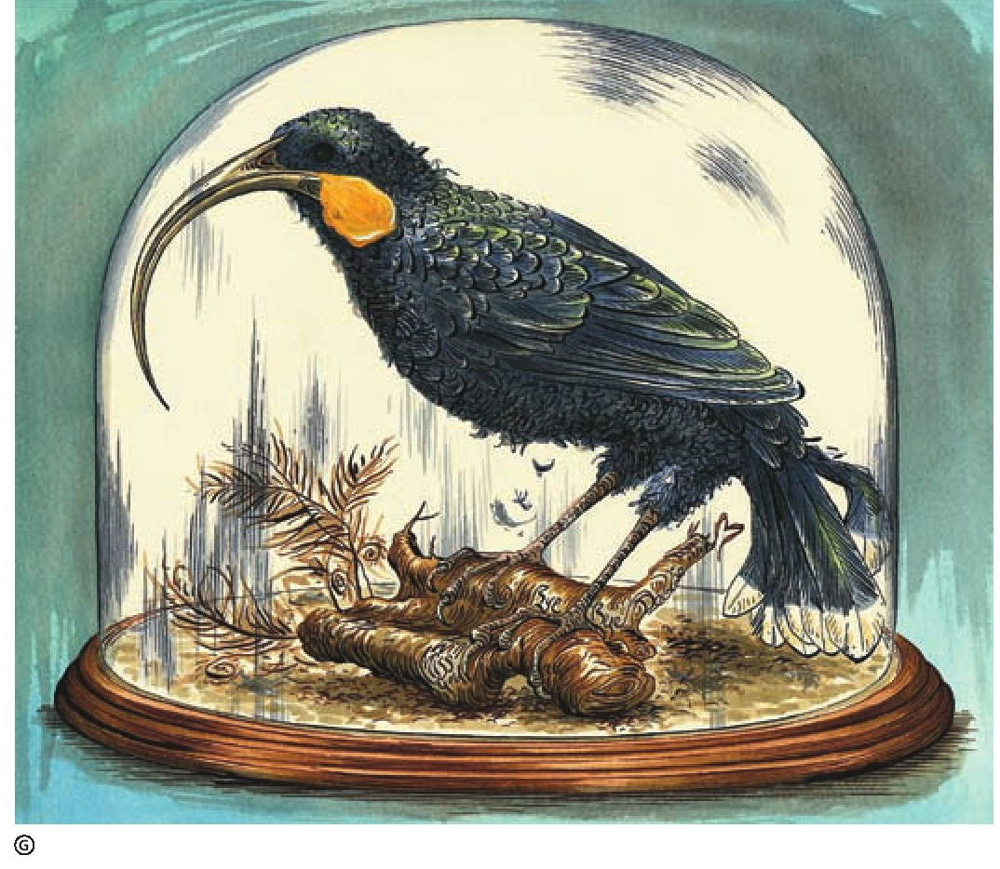
新西兰一种已于20世纪灭绝的鸟类

  

**【微博士】**生物大辐射和集群灭绝的关系

生物的大辐射和集群灭绝息息相关。当生物集群灭绝时，并非地球上的生物全都灭绝了，而总有些适应性很强的，或处在环境没有严重恶化地方的生物会幸存，并度过残存期。在集群灭绝中灭绝的大多数是适应性不强、较原始的生物。它们退出历史舞台，也就为适应性较强、较进步的生物创造了生存的空间。当地球生态环境开始好转时，这类生物会迅速活跃起来并占领灭绝生物遗留下的空间。与此同时，在新的环境下还会出现许多新的物种，使生物界逐渐进入大发展的时期，这就是所谓的生物大辐射。

【微问题】什么样的灭绝速率可以称得上集群灭绝？

【关键词】集群灭绝　生物大辐射

## 地球深部存在另一个生物圈吗

看过法国作家凡尔纳的《地心游记》的人，一定会对神奇的地底世界念念不忘，也许还幻想过自己也能进行一次这样的旅行。其实，真正的地底下并非如此。在地底下，随着深度的增加，温度会越来越高，压力也会越来越大。一般来说，从地面往下，深度平均每增加1千米，温度就会升高30℃；到35千米之下的地幔层，温度已高达约1000℃，压强也从1.1吉帕上升到了23.8吉帕。此外，在暗无天日的地下深处，没有阳光提供能量，在这种苛刻的环境下不用说是人了，几乎任何生命都难以生存。

鉴于以上种种原因，人们长期以来一直认为地球上只有一个生物圈，它位于地球表面附近，由太阳辐射提供能量。然而，1992年美国康奈尔大学天文学家托马斯·戈尔德发表了一篇文章，革命性地提出地壳中还存在一个深部热生物圈，它位于地壳深部6～10千米处，以地球深层的化学能为能量来源。在过去的20多年间，科学家用钻探的手段对大洋和大陆沉积物及岩石进行研究，揭示了地下深部真的存在一些生理和种群都非常复杂的微生物。它们存在于海底1千米以下和大陆3千米以下的地层中，大部分成员与地表生物圈中的微生物存在巨大差异。

电子显微镜下魔鬼线虫头部特写

“联合大洋钻探计划”的钻探船

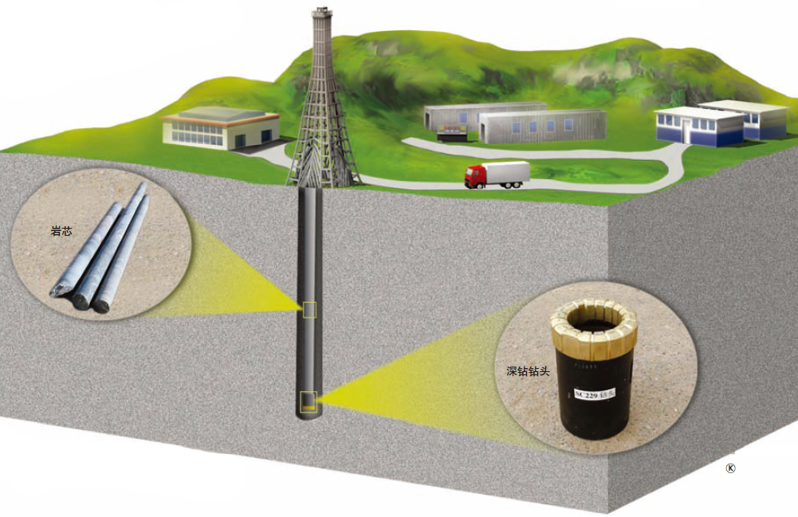
地下深钻示意图

2010年，在一项名为“联合大洋钻探计划”的国际科学考察项目中，美国科学家在大西洋海底地壳1300多米深、温度高达102℃的辉长岩层中发现了分布广泛的微生物群。这些细菌种群以甲烷和苯烃等碳氢化合物为食，与在油藏层发现的细菌类似。这是科学家首次在地壳辉长岩层中发现细菌生命，这项发现暗示生命可能存在更深处，甚至是地幔中。2011年，研究人员在南非贝娅特丽克丝金矿3000米深的水中，发现一种魔鬼线虫。在地下如此深的地方，温度超过了40℃，水也因压力大而含氧量极低，我们所熟悉的生物根本无法生存。魔鬼线虫的身长最多约半毫米，以细菌为食，通过孤雌生殖方式进行繁殖。魔鬼线虫这一名称来自中世纪神话浮士德传说中的魔鬼，意思是“不喜欢阳光的人”。这是科学家在地狱般的地底深处发现的第一种多细胞生物，对于研究宇宙生物学具有重要的价值。

目前，深部生物圈是一个充满未知的世界，它们是如何形成和演化的？它们与地表生物群存在什么样的关系？这两个生物群在演化上是否存在先后关系，两者有何功能联系，是否存在遗传物质交换……这些都有待科学家进一步探索。（傅强）

## 环境恶化时，生物会变小吗

地质历史上发生集群灭绝事件时，环境极端恶化。在这期间不仅大量的生物灭绝，幸存下来的生物也受到严重影响。在约6500万年前白垩纪末的大规模灭绝事件之后，海洋生物中出现了一个有趣现象，就是各个动物类群中大型的种类都消失了。很多生物，如浮游有孔虫、海胆、双壳类、腹足类、腕足类等个体急剧变小，其中浮游有孔虫的大小从600～800微米下降到只有约125微米。此外，集群灭绝后的海胆类比它们在白垩纪时的同类都要小。无独有偶，二叠纪末的生物集群灭绝中腕足类也出现了普遍的小型化倾向。

危机事件发生以后，残存下来的生物类群相对于事件发生前的同类体形明显变小，这种现象称为生物的小型化效应。小型化是灭绝事件后广泛发生的生物演化现象，对揭示生物应对灾变环境、认识生物集群灭绝事件的过程具有重要意义。

另外，在岛屿环境中，小型化也是大型哺乳类应对环境的重要演化响应。当一种生物迁移到岛屿上后，小型生物会变大，而大型生物则会变小，这就是著名的“岛屿法则”。其中最著名的要数西西里矮脚象和弗洛勒斯人了。

西西里矮脚象是史前西西里岛最奇特的“居民”之一，成年个体肩高只有1米左右。西西里矮脚象的祖先可能是古象，为了寻找新的栖息地，它们涉水或跨越陆桥最终来到西西里岛。由于岛上食物资源的匮乏，体形较小的古象可以更好地适应岛上的新生活。经过千百年的演化，西西里矮脚象的体重减轻到仅有100千克。

现代人

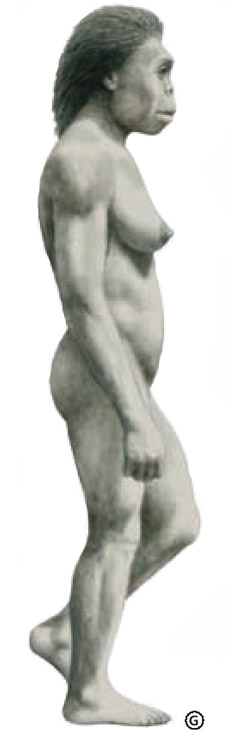
弗洛勒斯人

弗洛勒斯人是曾经生活在弗洛勒斯岛上的一种古人类，据推算，其身高仅有大约1米，和现在的三岁儿童差不多高。因为身材矮小，他们被人以曾风靡世界的电影《指环王》中的矮小民族——霍比特人相称。岛屿上的生活异常艰苦，食物供应可能短缺，而弗洛勒斯人又没有办法迁移到新的地方去，因此缩小身体减少能量的需求是明智之举。

除了食物这个限制因素外，缺乏捕食者和竞争者也是导致岛屿上生物小型化的重要因素。体形大对于抵御捕食者具有天然优势，但在缺乏捕食压力的情况下，身体变小倒可以省去维持大体形所需的大量资源。（傅强）

  

**【微博士】**三域系统

有科学家认为，原核生物应该包括两大类，即深海和地底深处的古细菌和人们平时接触到的真细菌。这两大类原核生物以及人类这样的真核生物，是从具有同一个遗传机制的共同祖先分别演化而来的。他们把生物界分成古细菌域、细菌域和真核域。域是比界更高的分类层级。

【微问题】地底深处压力巨大，生物为什么不会被压扁呢？

【关键词】深部生物圈　魔鬼线虫　小型化

## 世界上数量最多的是哪一种化石

世界上最多的化石，既不是曾经称霸地球1亿多年的恐龙化石，也不是种类繁多且在地史上繁盛一时的昆虫或三叶虫化石，而是海绵的骨针化石。为什么海绵的骨针化石会那么多呢？

海绵动物是最原始的一类多细胞动物，由单细胞动物演化而来，没有形成组织和器官，结构比较简单。组成海绵身体的细胞类似于一群分布在胶质内的细胞团，这种细胞团由钙质或是硅质骨针，或是角质海绵丝所支撑。海绵动物是一种由多细胞集合体到多细胞动物之间的过渡类型，但与其他多细胞动物不存在演化关系。它是多细胞动物演化的一个侧支，故又称侧生动物。

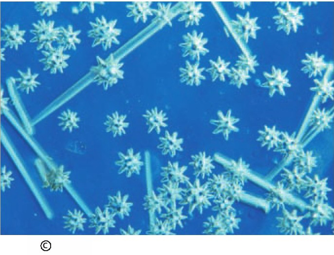
显微镜下的海绵骨针

海绵为滤食性动物，有性生殖后孵化出能在水中浮游的两囊幼虫，成年后营固着生活。海绵的身体多数是呈辐射对称的，并分单体和群体。单体的海绵可以是柱状、杯状、瓶状或球状的。群体的形态则比较复杂，常见的有块状、板状、分枝状和树丛状等。海绵的个体大小差别很大，小型种类的海绵仅高几个毫米，大型种类的海绵高度可超过1米。绝大多数海绵的身体表面都有许多大小不同的孔洞，所以海绵又被称为多孔动物。

海绵动物在寒武纪之前就已出现，曾经几度繁盛，在海洋中形成壮观的海绵礁。当海绵动物死后，如果没有被迅速埋葬，软体部分腐烂了，硬体骨骼也逐渐解体，这些散落的骨针保存下来，就会形成海绵骨针化石。它们分布在数亿年间的地层中，形态多样，数量惊人，有的地方甚至形成厚厚的海绵骨针层。只有当海绵死后被迅速埋葬了，才能在地层中完整地保存下来，形成海绵化石，而不是骨针化石。

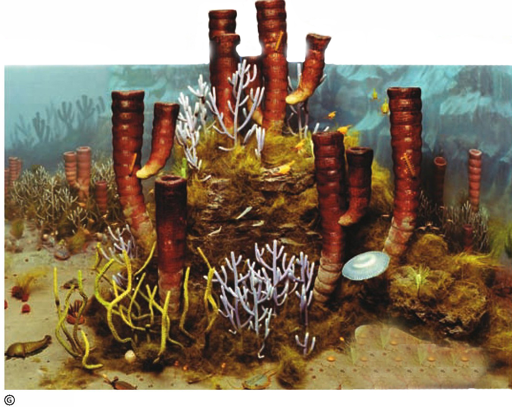
原始海洋中的海绵

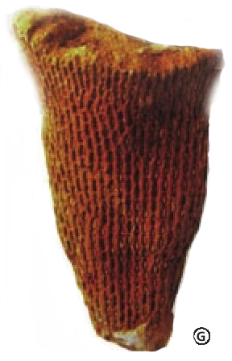
海绵化石

海绵动物大家族里，有一类动物是最近才“认祖归宗”的。那就是分类地位一直存在争议的层孔虫。层孔虫是一类已经灭绝的古生物，它曾被陆续归于腔肠动物门的水螅纲、原生动物门的有孔虫纲、藻类，而目前大多数学者赞同将层孔虫归入海绵动物门的钙质海绵类。

层孔虫的形态变化很大，常见的外形有层状、柱状、枝状等。它们的个体大小差异也很大，小的直径只有几厘米，大的直径可达数米，甚至10余米。层孔虫是重要的造礁动物，其构造骨架主要由虫体不断分泌钙质碳酸盐形成，一层骨架形成以后又继续向上生长，周而复始，常在海洋中形成奇厚无比的礁体。（王小娟）

  

**【微博士】**层孔虫的兴衰

层孔虫出现于早奥陶世晚期，在早泥盆世晚期至中泥盆世非常繁盛，但从晚泥盆世早期开始急剧衰退，自石炭纪到中三叠世的1亿多年时间里都难寻其迹。晚三叠世时层孔虫复出，不过数量较少，并在早、中侏罗世再次消失。晚侏罗世时层孔虫再度复出，属、种的数量有所发展，到了早白垩世层孔虫数量减少并最终灭绝。

## 什么动物长得像杯子

在寒武纪早期有一类海绵动物，因单体外形像杯子而被称为古杯。古杯动物兴盛于早寒武世的早中期，到早寒武世晚期已经灭绝，延续的时间不到2000万年。古杯动物在世界范围内分布广泛，地层中延续时间短，演化快，曾被国际地质古生物界公认为确定寒武系界线，以及划分早寒武世地层的标志性化石。

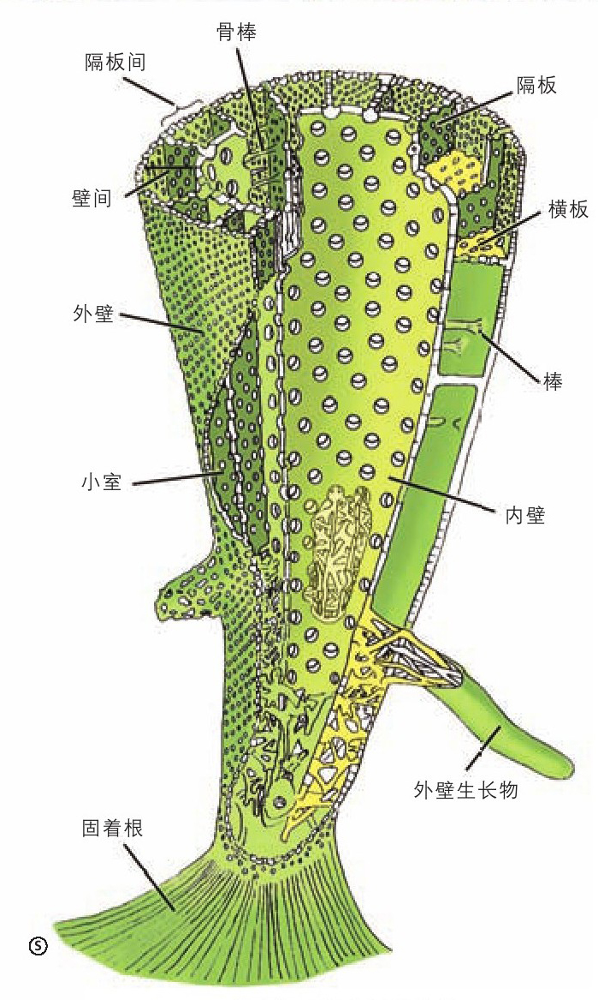
一类古杯动物的骨骼构造

古杯动物的单体形状呈杯状、锥状、圆柱状或盘状等；有时候很多古杯聚在一起组成群体，呈树丛状或链状。有的古杯杯体表面很光滑，有的杯体表面则具瘤状突起和纵向或横向的褶皱。古杯动物个体大小多半介于几毫米至几厘米之间，但大的可达几十厘米高，极少的大个子古杯化石高度竟可达1.5米，横断面的直径也有半米。

古杯动物还是地球上最早的造礁动物，其骨骼常由许多精致多孔的钙质薄板组成，并具内外两层壁。壁上有孔穿通，内壁较外壁厚，壁孔也较大，孔间有刺状构造。古杯动物的“杯底”尖端常附生各种形状的突起物，这是它们固定在海底的“根”。

古杯动物的软体组织极少能够被保存成化石，但我们可以根据软体组织的痕迹，了解到古杯动物与珊瑚等只具有外骨骼的动物有所不同，古杯很可能是具有内骨骼的动物。

古杯动物曾被归入不同的生物类群中，更多的时候，又被归为一个独立门类——古杯动物门。随着研究的深入，人们更倾向于认为古杯是在演化过程中丢失了骨针而形成钙质骨骼的海绵，因此古杯动物门被划为多孔动物门中的一个独立的纲。这已经得到越来越多的古生物学家、尤其是古杯动物专家的认可。（王小娟）

## 谁是古海洋中最杰出的“建筑师”

在古海洋里，海绵家族造礁历史悠久，可谓“人才”辈出。不过，最杰出的“建筑师”还要数腔肠动物门的珊瑚。珊瑚体的外形主要取决于它的繁殖方式和生态特征。有性繁殖产出单体珊瑚或群体珊瑚的第一个个体，即原生珊瑚个体；无性出芽或分裂繁殖则产生群体珊瑚。

珊瑚的造礁过程其实就是自身生长壮大的过程。在群体珊瑚中，成千上万的珊瑚虫，也就是珊瑚的软体生活在一起。珊瑚虫具有分泌碳酸钙外骨骼“建造住宅”的本领：先分泌石灰质的底板使自己固定下来；随着珊瑚虫不断向上生长，底板边缘也向上生长，形成钙质外壁；和外壁一样纵向排列的还有板状的隔壁。同时，珊瑚虫底部体壁分泌各种横向的板状骨骼，这些骨骼有横板和鳞板两种。珊瑚虫死后，即使软体部分腐烂了，它的硬体骨骼也能保留下来，而新的珊瑚虫又在其上开始筑“巢”，如此世代积累，珊瑚“城堡”就筑得越来越高且坚如磐石，足以抵御狂风巨浪的冲击。

自晚奥陶世开始，床板珊瑚和四射珊瑚就成为古海洋生物造礁的主角，它们成功度过了奥陶纪末和晚泥盆世的两次生物集群灭绝，缔造了志留纪和泥盆纪的动物造礁鼎盛时代，并在石炭纪得到复苏。不过，这两类重要的古生代珊瑚都在二叠纪末的集群灭绝事件中消亡了。自三叠纪中期开始，硬珊瑚类成为中生代和新生代的中坚分子，开创了新的造礁时代。（王小娟）

  

【微问题】海绵是怎样生活的？

【关键词】海绵　骨针　层孔虫　古杯　床板珊瑚　四射珊瑚

## 最大的虫子有多大

化石证据表明，产于德国西部普吕姆的3.9亿年前的巨型羽翅鲎是迄今发现的最大的节肢动物。巨型羽翅鲎的化石上保存了一只46厘米长的螯，由此推算它的身体足足有2.33～2.59米长，比一般的成人还要高。

巨型羽翅鲎属于著名的已灭绝的水生节肢动物板足鲎家族。板足鲎类的外形奇特：头胸部小，由6个体节合并组成；头胸部背面中间长着1对或1个单眼，称为中眼，两侧则生有1对肾状的大复眼；口位于头胸部的腹面，周围生有6对附肢，第一对是螯肢，中间的4对附肢叫步足，用来行走；最后1对附肢变宽似桨，可用来游泳或沿海底爬行，板足鲎因其最后1对附肢宽扁似桨而得名；腹部由12节腹节和1个尾节构成，前6节附肢的外肢特化为能开闭的板片，关闭时将水喷出，帮助身体运动。而尾节的形态，有长刺状、短棘状、钳形或扁形。

板足鲎类的身体大小不等，一般为10～20厘米长，其中的巨型羽翅鲎超过2米，是当时海洋中的霸王。板足鲎的生存时代为奥陶纪至二叠纪，以志留纪时最盛。它们可能是现生蝎子甚至蜘蛛等动物的祖先，常被称为海蝎或巨蝎。不过要注意的是，在动物分类上板足鲎属于肢口纲，而蝎子和蜘蛛属于蛛形纲。

在陆地上生活过的最大节肢动物，则是发现于德国图林根的一条大型千足虫的化石。千足虫属于节肢动物门多足纲，是世界上最古老的陆生动物之一。今天的千足虫——马陆，长不过几厘米。而这条生活在2.96亿年前的千足虫，长约2.3米，宽约0.5米，比一个成年人还要大。这样的体形仅次于巨型羽翅鲎，算是排名第二的节肢动物。

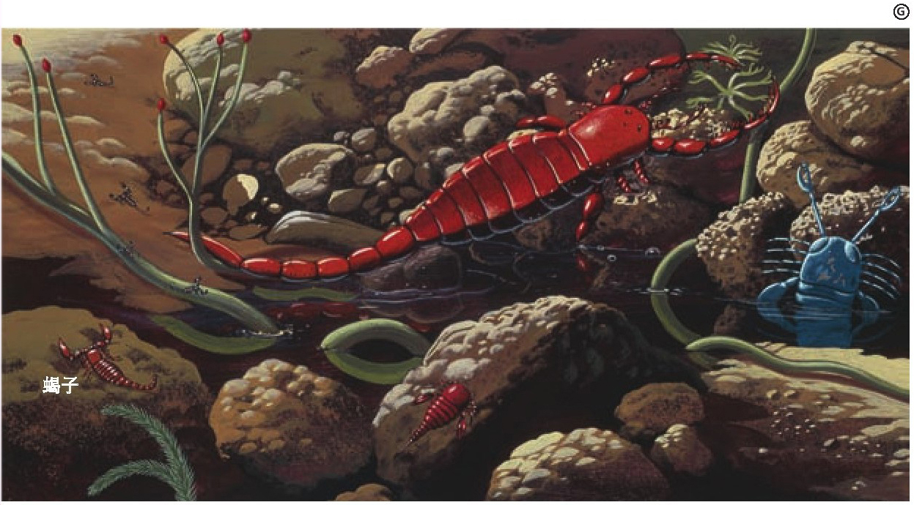
大小各异的各种板足鲎和它的“亲戚”——蝎子

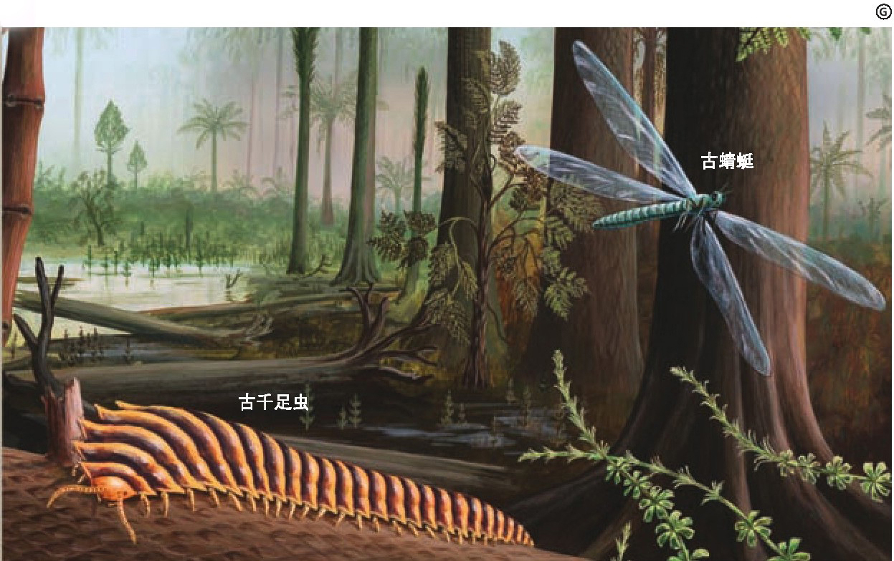
石炭纪森林中的巨型节肢动物

在空中飞行的节肢动物中，最大的是生存于距今约3亿年的石炭纪的巨型古蜻蜓。巨型古蜻蜓的形态和现生蜻蜓差不多，但块头要大很多，翅展可能有70～80厘米，和一只喜鹊差不多大。巨型古蜻蜓的化石目前已在美国、法国、英国和俄罗斯等国被发现。保存在美国哈佛大学的拟巨脉古蜻蜓标本，其翼展可达72厘米，是目前最大的巨型古蜻蜓化石。巨型古蜻蜓的翅膀上密集交错着众多起支撑作用的翅脉，这表示古蜻蜓的翅膀应该会更重，所以曾经有人认为巨型古蜻蜓只能滑翔，而不能振翅飞行。不过化石资料表明，古蜻蜓的翅膀横截面上发现了类似于现生蜻蜓翅膀的褶皱。这种褶皱在扇动翅膀时可以提高薄翅的强度和韧性。这说明古蜻蜓也可能通过扇动翅膀来飞行，只不过它扇翅膀的频率要比今天的蜻蜓慢多了，所以它们能够飞行，只是可能不会飞得很快。（王小娟）

## 为什么说节肢动物是演化史上最成功的动物

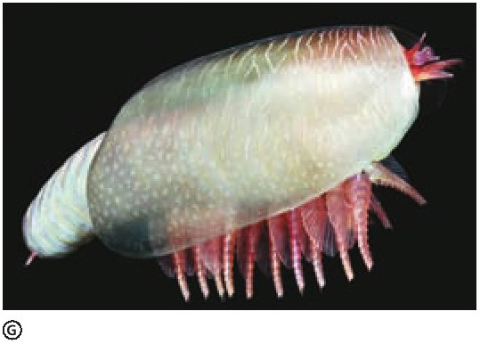
原始的节肢动物——加拿大虫

节肢动物生有带关节的附肢，是现今动物界最大的家族，人们熟悉的蜜蜂、蝴蝶、蜘蛛、蝎子、蜈蚣、虾和蟹等都属节肢动物，其物种总数约占已知后生动物总数的80%。除了物种数量多以外，节肢动物在水、陆、空几乎所有环境中都能生存，这种超强适应能力也是其他动物无法比拟的。

节肢动物的外骨骼由上角质层和原角质层组成：蜡质的上角质层具有防水和防止微生物入侵的功能；而几丁质的原角质层则为外骨骼的主要组成部分，具有高度的可塑性，为节肢动物塑型、行为和功能多样性提供了极大的潜能。

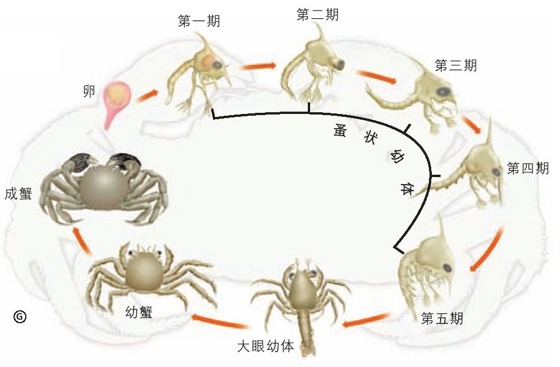
蟹的生长发育

节肢动物的外骨骼形成以后不能随生长而增大，所以在生长过程中要多次蜕去外壳，这就为个体发育过程的多态性提供了可能。比如螃蟹，从卵到成体，要经历蚤状幼体、大眼幼体和幼蟹三个中间阶段，幼体和成体的形态差异极大。蚤状幼体是刚从蟹卵中孵出的脱离母体的幼体，因外形像水蚤而得名。它分头胸部和腹部两部分，头胸部近球形，具1枚背刺、1枚额刺和2枚侧刺，1对复眼；腹部狭长，尾节还分叉。蚤状幼体营浮游生活，经5次蜕皮后变成大眼幼体。大眼幼体呈龙虾形，既可游泳，又可爬行。头胸甲上的刺全部消失，额缘内凹，眼柄生出，末端着生复眼。它体形扁平，腹部发达，不向胸下折叠，而是伸向后方；5对附肢长得几乎同成体的一样，用于游泳。大眼幼体经几次蜕皮则成为幼蟹，只能过底栖爬行的生活。至此，幼蟹的外形几乎与成蟹的相同，但甲壳并不随身体的成长而扩大，仍需蜕壳使身体继续成长。每蜕壳一次，身体会增大，体重会增加，直至长成成蟹。

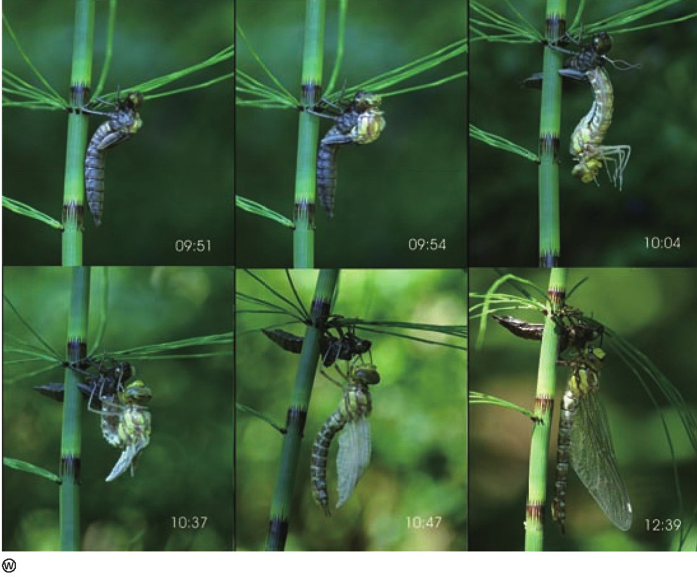
生活在水中的水虿蜕皮变成能飞行的蜻蜓

节肢动物曾经有过辉煌的演化历史：在寒武纪大爆发的序幕——小壳动物大爆发时，节肢动物的祖先就已经出现，并且有可能发生了分化；到以澄江生物群为代表的寒武纪大爆发的高潮时（5.3亿年前），节肢动物已迅速成为最庞大的动物家族，并在后来5亿多年的演化史中保持优势，不仅演化出最早会飞的动物，而且还演化出高度分工、营社会性生活的节肢动物，成为今天世界上最成功的动物类群之一。（王小娟）

  

**【微博士】**氧气浓度与节肢动物的大型化

远古的节肢动物之所以能长得十分巨大，可能和远古时大气中的氧气含量有关。石炭纪时地球大气层中氧气浓度高达35%，比现在的近21%高很多。许多节肢动物是通过遍布其机体中的微型气管直接吸收氧气，而不是通过血液间接吸氧，所以高氧气含量能促使节肢动物向大型化方向演化。而在今天氧气含量较低的情况下，节肢动物就长不大了。

【微问题】节肢动物是怎样演化来的？

【关键词】羽翅鲎　板足鲎　千足虫　巨型古蜻蜓　节肢动物

## 三叶虫因为什么而得名

节肢动物的现生代表以昆虫为主，而灭绝的节肢动物中，知名度最高的当属三叶虫了。

三叶虫是一类已经灭绝的海洋节肢动物，生活时代为寒武纪到二叠纪。三叶虫的身体分背、腹两面，背面披有矿化的背甲，腹部主要为柔软的腹膜和两排细长的附肢。三叶虫的背甲由前向后分为头甲、胸甲和尾甲三部分。背甲又被两条纵沟即背沟纵分为三个部分，即中间的中轴和两侧的两个肋部。由于背甲一分为三，就像三片并排排列的叶子，故得到三叶虫之名。

三叶虫的头甲构造最复杂。中央隆起的部分是头鞍，一般为锥形，头鞍上长有横向或斜向的头鞍沟将其分为数节。头鞍的两侧称为颊部，上面发育有眼、眼叶和眼嵴。大部分三叶虫的头甲被一对未被矿化的面线所切穿，面线将颊部分为靠近头鞍的固定颊和面线以外的活动颊。面线中部从眼与眼叶之间穿过，便于三叶虫从此处蜕皮，面线的类型是三叶虫分类的重要依据。

胸甲由许多形状相似的胸节组成，这些胸节相互连接又可以自由活动。每一胸节上都生有一对背沟，将胸节分为中央的轴节和两侧的肋节。肋节向外末端可长肋刺。

尾甲是三叶虫身体末端由若干体节愈合而成的一整块板片，形态和大小因种而异。尾甲边缘常生有各种尾刺。（王小娟）

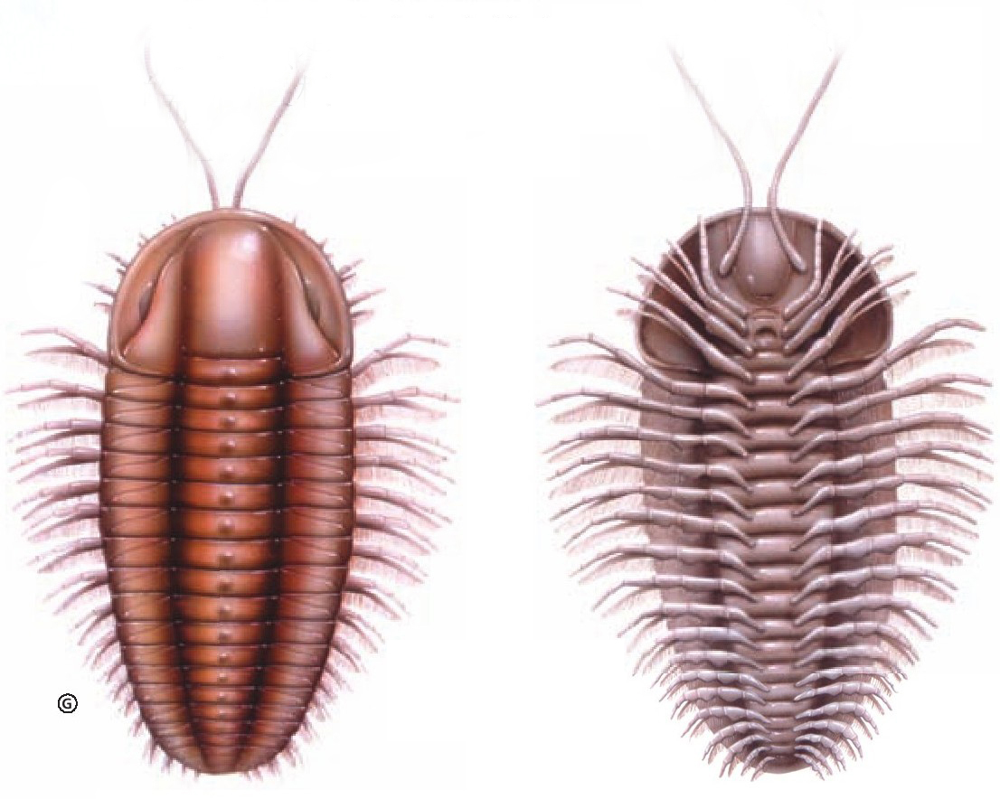
三叶虫背面（左）、腹面（右）图

## 三叶虫时代都有些什么生物

由于三叶虫是距今5.4亿～4.9亿年的寒武纪里数量和种类最多的化石，因此寒武纪又被称为三叶虫时代。

从距今约6亿年开始，地球上发生了一系列的生物辐射演化事件，至寒武纪时无脊椎动物开始异军突起。包括软体动物的单板类、腹足类、喙壳类、软舌螺类，腕足动物，以及众多分类位置难以确定的已经灭绝的门类，成为寒武纪早期的首批“过客”。其后，以澄江生物群为代表的寒武纪大爆发更是展现了生物演化史上最蔚为壮观的一幕，大多数现生动物的代表都在那时涌现出来。

总的来说，寒武纪出现的生物以海生的无脊椎动物和藻类为主。无脊椎动物中，除了三叶虫以外，还有属节肢动物的三叶形动物、原螯肢类动物，腕足动物，软体动物中的软舌螺类、腹足类、双壳类和头足类，棘皮动物中的海胆、海百合和海扁果等，笔石动物中的树形笔石类，原生动物中的有孔虫，腔肠动物中的钵水母类和水螅类，以及海绵动物中的古杯类，等等。另外还有古虫类，以及脊索动物华夏鳗，原始的脊椎动物海口鱼、昆明鱼等。寒武纪时还没有出现真正的陆生生物，陆地上一片荒芜。（王小娟）

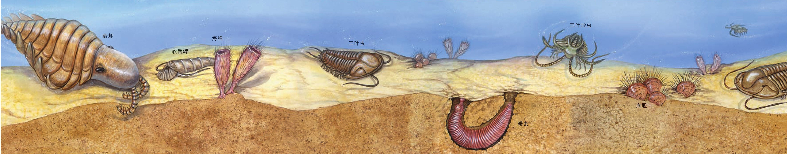
加拿大伯吉斯地区页岩中发现的大量寒武纪底栖生物

## 三叶虫家族里都有哪些明星

在个体大小方面，迄今发现的最大的三叶虫发现于葡萄牙北部4.65亿年前的奥陶系地层中，身长约90厘米；而此前发现的当时最大的、现在排名第二的三叶虫发现于4.5亿年前的地层中，体长72厘米，宽40厘米；最小的三叶虫成体只有1.07～1.50毫米长。

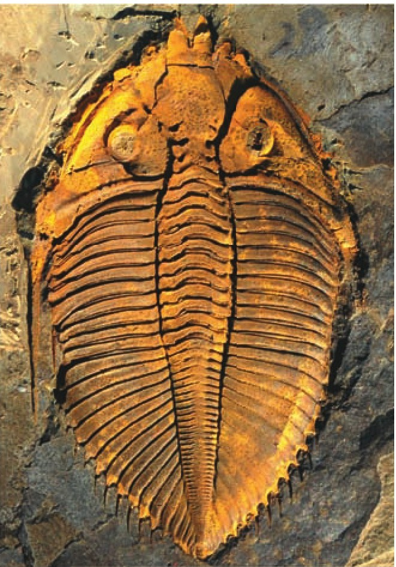
王冠虫化石

在形态方面，比较有趣的三叶虫有蝙蝠虫和王冠虫等。蝙蝠虫是产于上寒武统地层中的一种三叶虫，因尾部具一对强大的前肋刺对称生于左右两侧，使尾甲形似蝙蝠而得名。蝙蝠虫早在300年前就已被人发现。中国明代崇祯年间，一个名叫张华东的人在山东泰安大汶口发现了包埋有貌似展翅蝙蝠的怪石，便将之命名为“蝙蝠石”。20世纪20年代，中国的古生物学家经研究后发现那些“蝙蝠”其实是一种三叶虫的尾部，并把这种三叶虫叫作蝙蝠虫。

王冠虫是中国志留纪的地层中常见的一类三叶虫，体长只有几厘米，因头部边缘有一列突起的小瘤，状似王冠而得名。（王小娟）

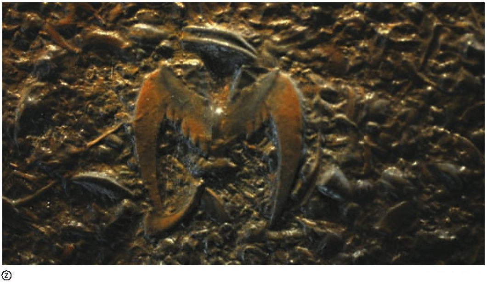
蝙蝠虫化石

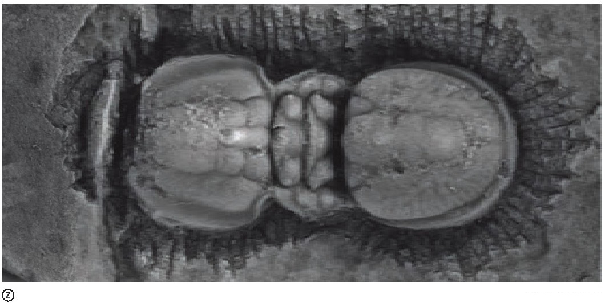
球接子化石

  

**【微博士】**头尾难分的三叶虫

球接子堪称最可爱的三叶虫，一般长度在6毫米以下；它们大多没有眼睛，头、尾又几乎等大，两者有时难以区别；一般只生2个胸节（个别的有3个）。

【微问题】三叶虫能陆上生活吗？

【关键词】三叶虫　头甲　胸甲　尾甲　蝙蝠虫　王冠虫　球接子

## 三叶虫是怎样生活的

绝大部分三叶虫在温暖的浅海地带过着底栖生活，以其扁平的身体贴伏在海底缓慢爬行，只有少数三叶虫可以在水中浮游或游泳，游泳的三叶虫都有流线型体形。科学家曾做实验将营底栖生活和游泳生活的三叶虫模型放入水槽，当底栖的三叶虫模型遇到水流时，身体周围会形成各种漩涡，说明其体形对水流存在很大的阻力，这种阻力是有碍游泳的；而游泳的三叶虫模型则因其体形呈流线型，所以在遇到水流时，水流会平滑地从它身边流过，受到的阻力相当小。

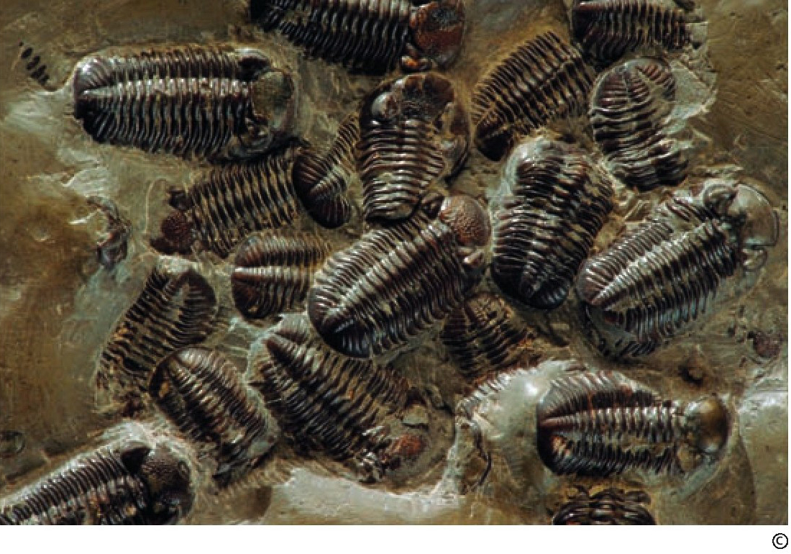
三叶虫化石

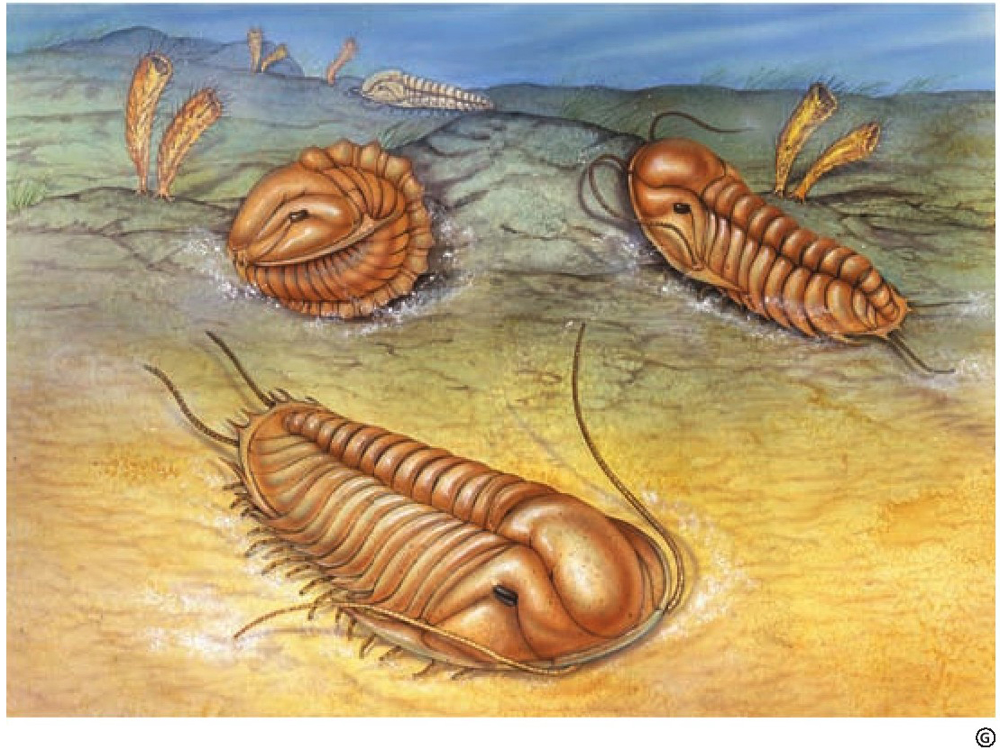
三叶虫的生活场景

因为行动迟缓，三叶虫不会主动攻击其他动物，它们可能以原生动物、海绵动物、腔肠动物和软体动物的尸体为食，也可能吃些藻类和其他小型生物。同时，三叶虫有着各种自卫的方法。它们用坚固的背甲抵御攻击能力强大的捕食者。寒武纪时期的三叶虫大多平卧在海底。从奥陶纪开始，许多三叶虫背部发育的灵活关节能卷曲，以保护腹部，有些种类甚至头部长有突起，尾部生孔，可以蜷成一个“球”。三叶虫的眼睛也许是世界上最早出现的结构精密的复眼，每只眼睛都是由许多精密的独立单元组成，可以把不同的光线组合成一个统一的影像。有些三叶虫的复眼更为精密，每个单眼都用独立的晶体来聚焦光线，这样有助于迅速发现掠食者。有些三叶虫的头部坚硬，可以钻入泥沙中生活，这类三叶虫的眼睛往往会发生退化。有些三叶虫身体虽小，但长有发达的长刺，利于在水中遇敌时起保护作用。

不过，由于三叶虫附肢未分化为强有力的螯肢和颚器，加上游泳能力也很弱，遇到肉食的鹦鹉螺类、板足鲎类和鱼类等敌害时，它们就只能卷曲起来或埋入泥中避敌。但即使这样也难免被吞食，所以自志留纪开始，三叶虫便衰落了，而二叠纪末发生的集群灭绝事件更宣告了它们王朝的终结。（王小娟）

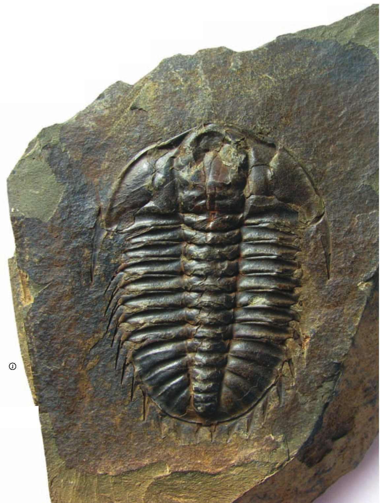
贵州凯里动物群中的拟油栉虫

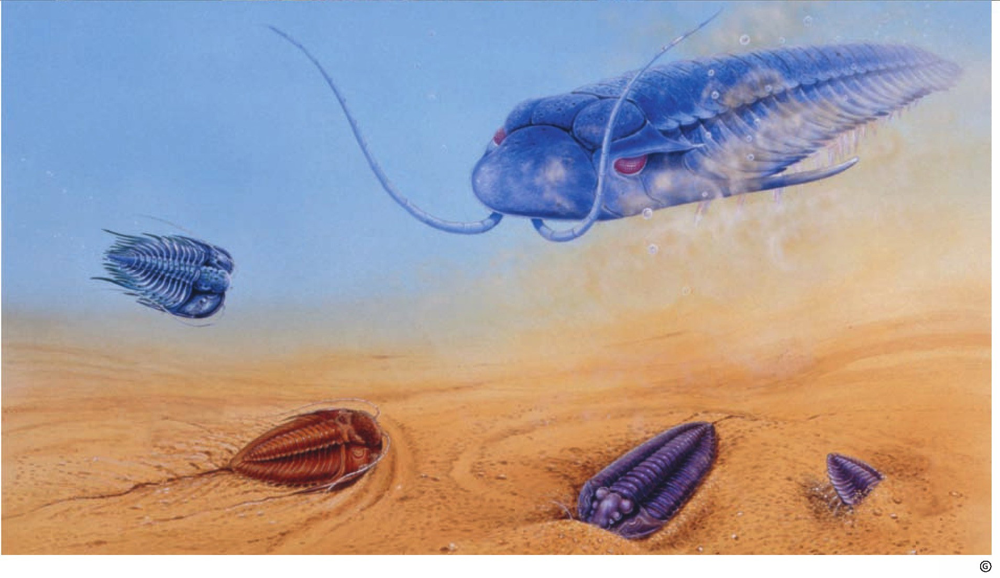
三叶虫遇险埋入泥中避敌

## 三叶虫是如何长大的

三叶虫是一种雌雄异体的动物，卵生。不过，处于卵期、卵孵化以后到初次形成坚硬背甲前这两个时期的三叶虫，至今仍未发现有化石保存下来。和其他节肢动物一样，三叶虫的外骨骼——背甲限制了它们的生长，因此要经过多次蜕壳才能长大，每蜕一次壳，都会形成一个较大的新背甲。

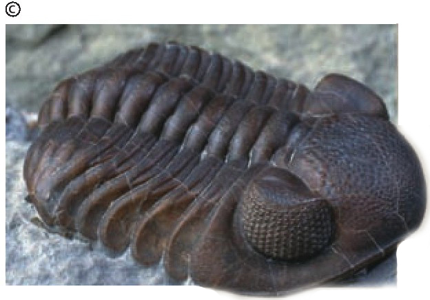
三叶虫化石上清晰的复眼

科学家将生有背甲的三叶虫个体发育过程分为三个阶段——原胎期、分节期和成虫期。处于原胎期初期的三叶虫多半呈球形或卵形，头部、胸部和尾部都还没有分化，身上只长数对向不同方向生长的粗大的刺，这种形态特征非常适合在水中浮游，这说明尽管三叶虫成虫大都生活在海底，但它们在发育的早期却是在海中营浮游生活的。分节期开始以后，三叶虫球形的外形很快就变成了扁平的圆盘形，背甲也分化为头和尾两部分，这时三叶虫也由浮游生活转变为营底栖生活。分节期的三叶虫要经历一生中最多的蜕壳次数，每蜕壳一次或几次就会长出一节新的胸节，当胸节数不再增加时，三叶虫就到了成虫期。大多数三叶虫在发育的早期阶段每蜕壳一次，躯体都有明显的长大，而到分节晚期和成虫期，这种变化不再明显。三叶虫成虫一般长3～10厘米，极少数身体巨大的，体长可达90厘米。（王小娟）

  

**【微博士】**三叶虫的眼睛

三叶虫的复眼可能是地质年代中最早出现的精密复眼。大多数三叶虫长有全膜眼，全膜眼的眼体很小且互相直接紧靠，最多时可达1.5万个，全部被一层透明的巩膜所覆盖。这类全膜眼最早见于最古老的早寒武世三叶虫身上，后来一直延续到二叠纪。少数三叶虫如镜眼三叶虫具裂膜眼，裂膜眼与全膜眼的不同之处在于小眼体为2～700个，小眼体之间有巩膜板相隔，每个小眼体各具一个巩膜。裂膜眼始见于中奥陶世的动物，而不见于现生节肢动物。长有全膜眼的三叶虫，其幼年期的眼睛很像裂膜眼，所以人们推想裂膜眼可能是因为幼态持续而由全膜眼发展而来。在寒武纪时三叶虫的眼睛四周往往存在眼缝合线，个体死亡或蜕皮时眼睛往往脱落，所以不易在化石中找到。寒武纪以后，三叶虫身上的眼缝合线消失，眼睛直接镶接在颊部上，因此能找到眼睛的化石渐渐增多。

【微问题】三叶虫的足迹有什么特点？

【关键词】底栖　蜕壳　原胎期　分节期　成虫期　复眼

## 昆虫是怎么飞上天空的

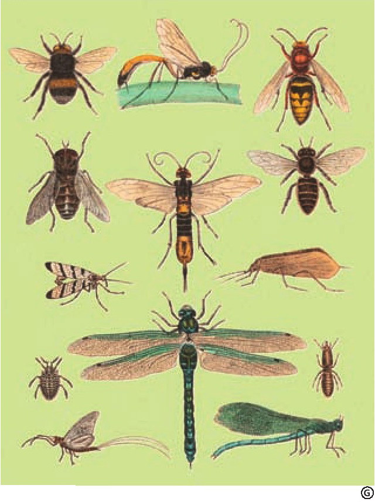
各种现生昆虫

昆虫最早发现于志留纪，它的起源现在还没有定论。昆虫可能起源于虾、蟹所属的甲壳类的原始祖先，也可能起源于蜈蚣、千足虫所属的多足类的原始祖先。目前大部分科学家认为昆虫起源于前者。它是节肢动物演化史上最成功的类型，虽然经历了数次集群灭绝事件，但还是成功地一直演绎到今天。如果仅就数量和种类而言，昆虫无疑是地球上最成功的一个类群。

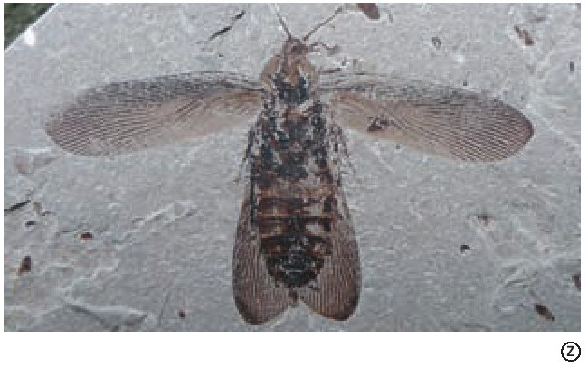
昆虫化石

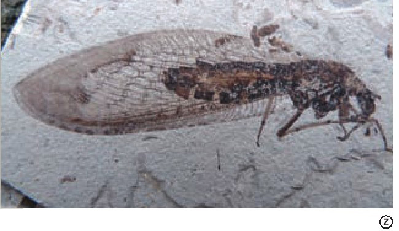
脉翅目昆虫化石

在石炭纪的谢尔普霍夫阶晚期（距今约3.2亿年），能飞行的昆虫就已大量出现；到石炭纪末期，很多现生有翅昆虫的祖先已经出现了。迄今发现的最早具有翅膀的昆虫化石，可能是产自苏格兰距今约4.1亿年的早泥盆世地层中的莱尼颚虫。不过，这个只有米粒大小的化石其实只是一只昆虫的一个前颚，无法复原其长相。莱尼颚虫上颚内侧形成了一个双凸的凹槽，这种特征只在有翅昆虫种类中出现，研究人员据此推测它可能是世界上最早的有翅昆虫。莱尼颚虫可能是靠咀嚼陆地植物的孢子和枝叶为生，但它的样子还无从知晓。

早期的大型昆虫翅膀都很长，且只能上下运动，不能折叠在身上，称为古翅昆虫。这样的翅膀不利于躲避捕猎者，在残酷的生存竞争和天敌的威胁下，这些大型昆虫最终被体形小巧、翅膀既可以上下前后灵活运动又可以向后折叠贴于腹部的新翅昆虫取代了。（王小娟）

## 恐龙时代的跳蚤也长得很大吗

蚤目是昆虫纲中一类外形高度特化的昆虫，成虫无翅，体小且侧扁。跳蚤是蚤目中的一种外寄生昆虫，吸食哺乳动物（包括人类）和鸟类的血液，通常体长只有1～3毫米。

在巨大的恐龙生活的时代，跳蚤也曾经长得很大吗？

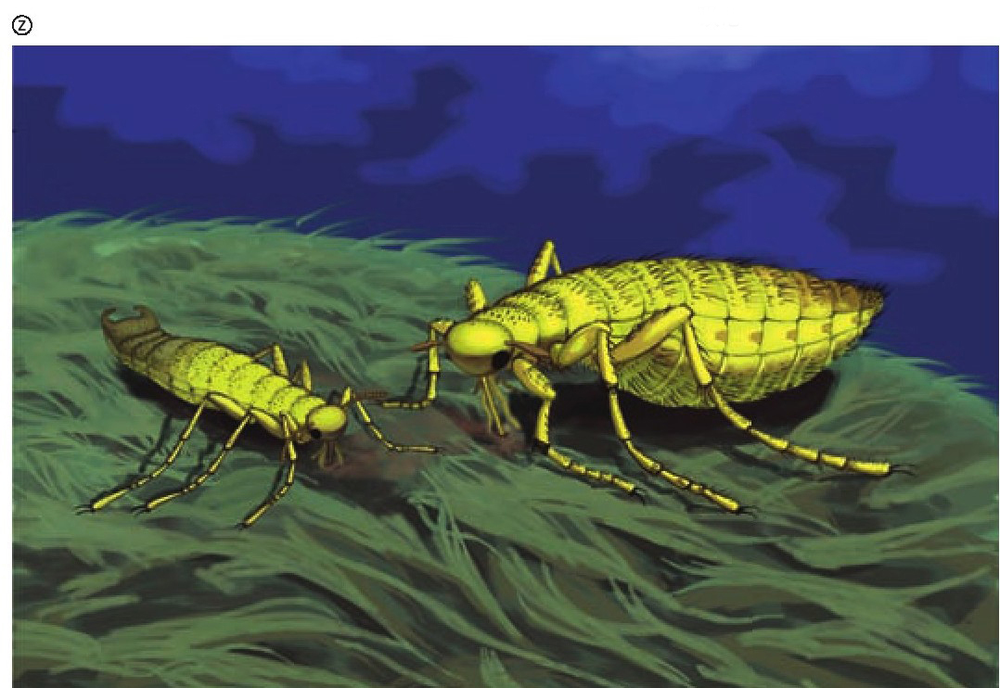
吸恐龙血的巨型跳蚤

中国古生物学家发现了内蒙古宁城中侏罗世（距今约1.65亿年）和辽宁北票早白垩世（距今约1.25亿年）的一些巨型跳蚤化石，体长约1.5厘米，有的种类甚至可超过2厘米，是迄今发现的最早的跳蚤。这些中生代的跳蚤和现生跳蚤一样无翅，且雌性个体通常大于雄性。不过，它们的体形不侧扁，而更接近于背腹扁平；触角短，却具有更多的节数（16～19节，现生种类为11节）；具有很长的刺吸式口器；足很长，生有各种栉状刚毛，但后足不像现生种类那样是跳跃型的，爪很长；胸部和腹部长有大量向后的鬃毛。

巨型跳蚤足部长有栉状刚毛，体表长有密集向后的鬃毛，表明它们适于寄生在具毛的脊椎动物体表。与这些巨型跳蚤同一时代的哺乳动物和带毛恐龙都有可能是寄主。如果寄主是哺乳动物，巨型跳蚤可能主要隐藏在寄主的巢穴中适时吸吮血液，因为那时的哺乳动物体形都很小，这么大的跳蚤难以隐藏在其体表。如果寄主是长毛的恐龙，跳蚤则可能寄生于其体表，巨型跳蚤长而尖锐且具锉状小齿的口器，可以穿透这些恐龙较为坚韧的皮肤。（王小娟）

## 先有花还是先有蜜蜂

花是蜜蜂的主要食粮，而很多植物的花又主要靠蜜蜂传粉受精。那么，这两种生物谁先出现的呢？

根据目前已发现的化石资料，是先有花，后有蜜蜂。

目前发现的地球上最早的花，是发现于辽宁北票的辽宁古果。之后在辽西地区又发现了好多朵“花”，皆产于义县组地层，其时代是距今约1.25亿年的早白垩世。

中国曾报道过发现于山东莱阳早白垩世的古蜜蜂化石和发现于辽西的早白垩世古蜜蜂化石，但都有争议。从目前的记录来看，迄今最早的可靠的蜜蜂化石发现于缅甸北部胡冈谷地的琥珀中，琥珀所在地层的时代为距今约1亿年的早白垩世末期。这只蜜蜂为雄蜂，体长约3毫米，头部呈心形，有些特征与现生肉食性的黄蜂类似，如后足较短。不过这只蜜蜂并非现生蜜蜂的直系祖先，很可能属于蜜蜂演化树中处于基干部位的灭绝成员。至于有没有更早的蜜蜂存在，还需要作进一步的研究。（王小娟）

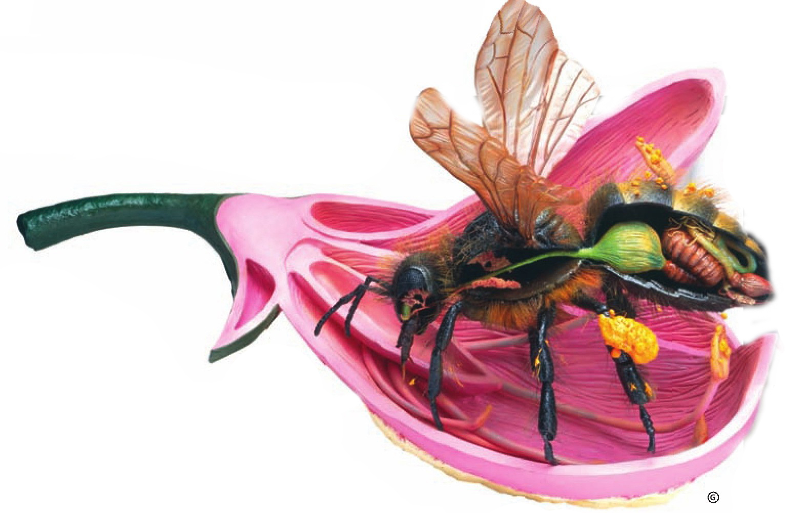
花与蜜蜂

现生角蝉

  

**【微博士】**古昆虫的翅膀

绝大部分现生有翅昆虫都是2对翅膀，分别长在胸部的第二和第三体节；而石炭纪的很多原始有翅昆虫胸部的第一体节也长着一对较小的类似翅膀的构造，共有3对“翅膀”。目前科学家已通过基因研究证实，现生角蝉的头盔并非简单的角质层，而是发生严重变形的翅膀，也就是说角蝉实际上拥有3对翅膀，控制头盔和翅膀发育生长的基因是相同的。

【微问题】巨型跳蚤能跳多高？

【关键词】莱尼颚虫　巨型跳蚤　古蜜蜂　角蝉

## 为什么盛极一时的腕足动物会衰退

腕足动物是一类生有2枚瓣壳的海生底栖动物，壳内的软体生有体腔，两侧对称，并不分节。因为最初的命名者误认为腕足动物的腕上生有足所以起了“腕足动物”这个名字，其实腕（纤毛环）只是腕足动物呼吸和摄食的器官。

腕足动物自寒武纪初就已经出现，在地史上曾一度十分繁盛。据统计，自寒武纪至第四纪已描述的腕足动物的化石类型有3万多种，不过现在却只剩下约300种。

为什么盛极一时的腕足动物会衰退呢？从外部因素来看，这是二叠纪末的集群灭绝事件造成的，但腕足动物本身也存在很大的不足。

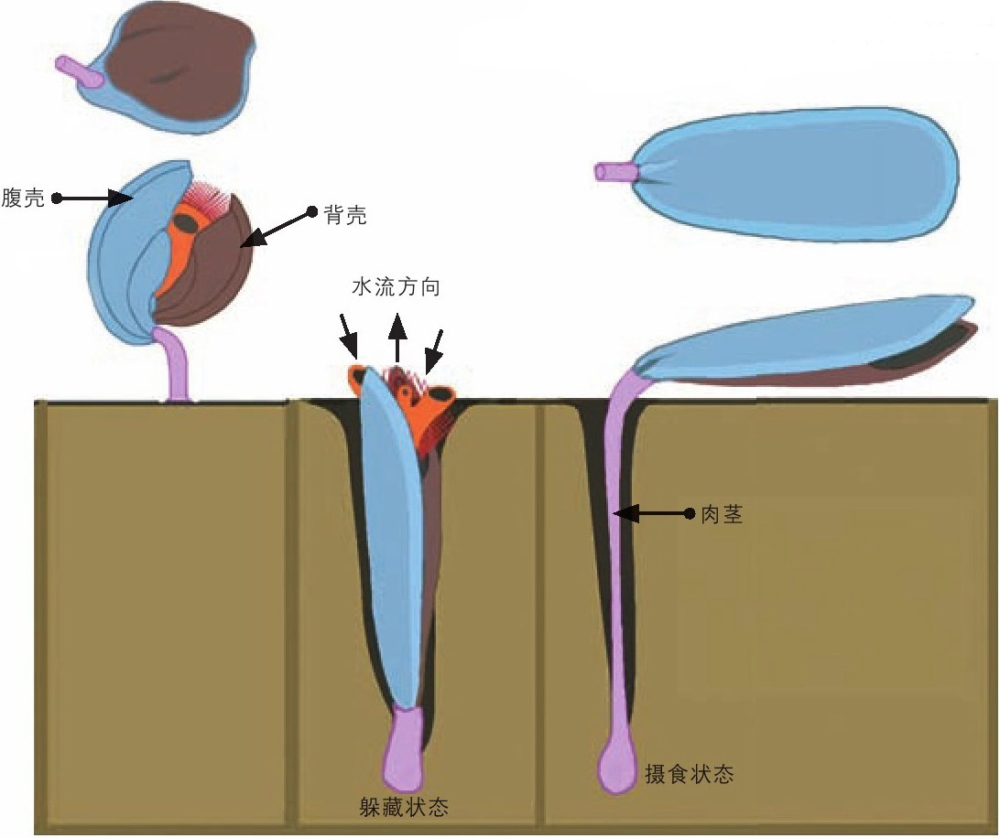
大部分腕足动物营底栖生活（左），少数营埋栖生活（中、右）

首先，腕足动物对环境的适应能力较差。腕足动物多生活在水深不到200米的温暖浅海，分布于浅海区的种类通常不低于海面以下40米，最浅可达潮间带。腕足动物对盐度十分敏感，它们只生活在盐度正常的海水中，极少种类如舌形贝在盐度有变化的潮间带可以存活。腕足动物多半生活在硬质海底，海水较浑浊或淤泥状的海底就不适宜其生存，只有个别种类如舌形贝等，可在淤泥海底中营埋栖生活。

其次，腕足动物只能固着在海底生活。绝大多数腕足动物是用肉茎使自己黏附在底质上，即使发展出多种肉茎固定或黏附的方式，但总还是牢牢扎根在某一处，根本无法逃避突如其来的灾难。这种定居方式，使得腕足动物一方面很难躲避海洋食肉动物如鹦鹉螺类、鱼类等的攻击，另一方面当生存环境发生变化，如海水淡化或盐度增加时，总是先受到伤害。

再者，腕足动物的取食方式较为原始。它们身上虽然已出现了真体腔，有了口、肠、胃等器官，但取食方式却与多孔动物相似，靠自己的纤毛环过滤水中悬浮的浮游生物、有机质碎片和细菌为食。

此外，在奥陶纪末和泥盆纪晚期的集群灭绝事件发生以后，腕足动物都能再度繁盛。然而，在二叠纪末发生的那次集群灭绝事件以后，它们却没能再度崛起。这是什么原因呢？一般认为，这与和它们具有相似生活环境的底栖双壳动物的兴起有关。

由此可见，腕足动物从兴盛走向衰败有着多方面的原因。在古生代，由于缺少天敌，腕足动物得到较快发展，完成了一种被称作“极端化”的演变，然而这种一时的优势中却潜藏着灭绝的危机。在古生物中，和腕足动物类似的演化速度快、衰落或灭绝得也快的例子还有不少，如古杯类和类等。但也存在相反的例子，比如快速演化的节肢动物和软体动物。软体动物是在数量和种类上仅次于节肢动物的第二大门类，它们的生活习性与腕足动物那种单一固着的生活方式截然不同，或底栖，或游泳，或爬行，或穴居，摄食方式也是多样化的，有肉食，有杂食，也有植食，海陆均有分布。

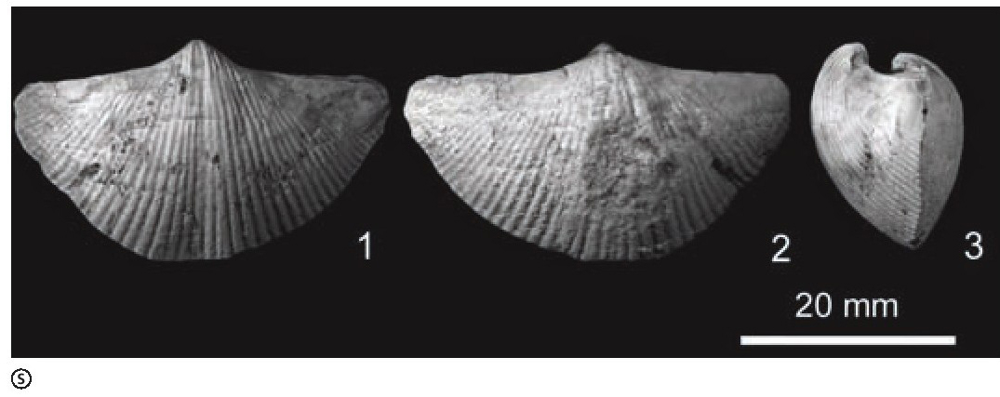
腕足动物化石

尽管现在地球上腕足动物所剩不多了，但其中的舌形贝（俗称“海豆芽”）自寒武纪开始出现，至今仍未灭绝。5亿多年来，舌形贝不仅壳的形态和结构基本上没有变化，且一直以软泥内潜穴方式生活着，故也被誉为“活化石”。（王小娟）

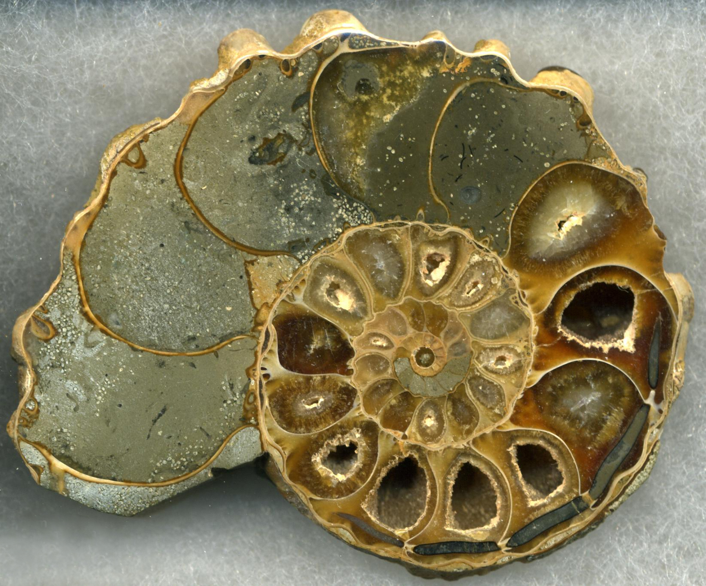
菊石化石的剖面

## 菊石为什么能在海里自由沉浮

菊石是一类已经灭绝的海生无脊椎动物，属软体动物门头足纲。它们的壳体表面通常长有类似菊花的线纹，因而被命名为菊石。菊石的祖先杆石（现在也被划为菊石类）出现在志留纪晚期，在泥盆纪初期演变出了最早的菊石。它们繁盛于中生代，到白垩纪末灭绝。

不同的菊石壳体大小差别较大，小型菊石壳的直径还不到1厘米，而巨型菊石壳的直径超过了2米。菊石的壳大多数是呈旋卷形的，有些则呈直形、螺卷形或其他不规则的形状。同样是旋卷形壳，包卷的程度也有不同，有的包卷疏松，有的则包卷紧密。菊石能在海里自由沉浮，与其壳体的构造有关。

菊石的壳由原壳、气室和住室三部分组成。原壳又称胎壳，是壳体最初形成的部分，一般为球状或桶状。随着软体的生长，壳壁也不断加长，软体后部可分泌形成坚硬的隔壁托住软体；当生长到一定程度后，软体与隔壁脱离、前移，不断这样生长，隔壁数目也在不断增加，相邻隔壁之间便形成许多空间，这种空间被称作房室。最前方软体伸出壳外的出口处的房室最大，它由菊石软体内脏等“占领”，称作住室。住室所占的空间在不同的菊石中发生很大的变化。有些菊石的壳口上还附有口盖，当软体缩入壳中时，口盖将壳口封闭以保护软体。其余房室则可充填气体和液体，被称作气室。隔壁与壳壁的接触线叫缝合线，它是非常重要的分类标志。每个隔壁有一个细小的圆形孔，那是体管所在的位置。体管常位于腹部边缘，少数菊石的体管位于背部或靠近中心的位置。专家们认为，体管能将软体与壳体联系起来，往气室中充入液体，从而调节身体在水中的比重以控制沉浮，因此菊石就能在海水中随意升降。另外，菊石的软体能将体内的水射出，以使身体向后运动。不过，人们根据现生鹦鹉螺的运动方式推断，菊石游得并不快而且运动连贯性也很差。（王小娟）

菊石可以喷墨躲避追捕

  

**【微博士】**区分腕足动物和双壳类

人们常会因腕足动物也生有两壳而把它误以为是软体动物门中的双壳类（也称瓣鳃类），其实两者除了壳内的软体结构具有很大差异以外，壳形也存在显著的区别：双壳类通常两壳大小相等，且形态完全一致，而腕足动物2枚壳瓣大小不等，但每枚壳瓣本身左右对称。

【微问题】为什么有的腕足动物能生存至今？

【关键词】腕足动物　舌形贝　菊石　气室

## 人类的祖先也曾经长得像海星吗

人类是两侧对称的高等脊索动物，人类的祖先和辐射对称的海星有什么关系呢？

海星是人们所熟悉的一种棘皮动物，形如星状，中央盘和5个（有时5个以上）腕成辐射对称状排列，这种对称方式被称为五辐对称。

辐射对称是棘皮动物的主要特征，但棘皮动物的幼体曾是两侧对称的，只是在适应海洋生活的演化过程中形成了五辐对称，这说明棘皮动物的五辐对称与腔肠动物的原始辐射对称是完全不同的。

在现生动物中，五辐对称的动物并不占主导地位，但在生物演化史上却有着重要的地位。在生物界形成以两侧对称动物为主的格局之前，辐射对称的动物曾经独领风骚。从这个角度看，辐射对称的棘皮动物（但不一定是海星）或许是两侧对称动物的祖先。

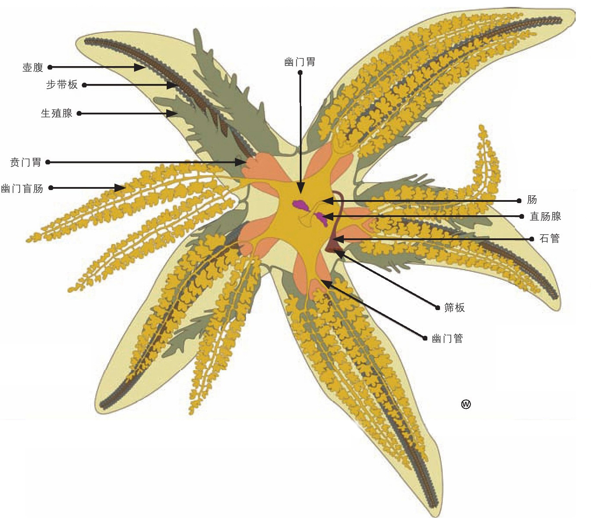
海星的解剖结构

棘皮动物是无脊椎动物中的高等类群，胚胎发育过程属于后口动物。根据现代生物学和分子生物学最新研究，现存的后口动物中只有半索动物门、棘皮动物门和脊索动物门三个门类。在中国云南著名的澄江生物群中发现的古虫动物化石，表明后口动物还包括现今已不复存在的第四个门——古虫动物门。

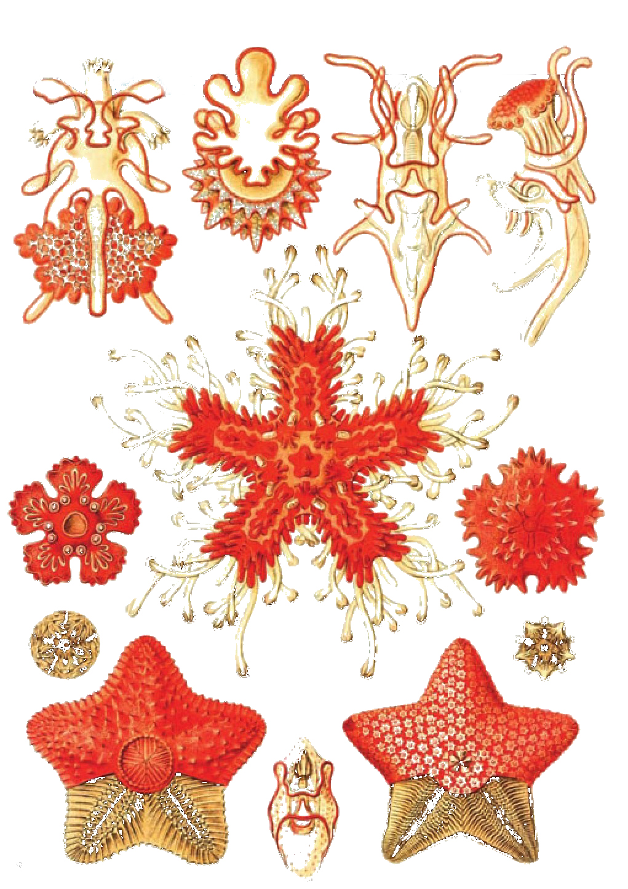
德国生物学家海克尔在《自然界的艺术形态》（第40版）中描绘的海星

棘皮动物是以体腔囊法（即体腔囊与内胚层分离后扩展成为中胚层）形成体腔的，这与一般无脊椎动物不同，但与脊索动物相类似。同时，棘皮动物的幼体——短腕幼虫，和半索动物的幼体——柱头幼虫，在形态结构上也非常近似。半索动物在动物界处于无脊椎动物与脊索动物之间的过渡地位。生物化学方面的研究也证明棘皮动物和半索动物有着较近的亲缘关系。这两类动物的肌肉中都同时含有肌酸和精氨酸，一方面显示这两类动物亲缘关系较近，另一方面也表明这两类动物是处于无脊椎动物（肌肉中仅有精氨酸）和脊索动物（肌肉中仅具肌酸）之间的过渡地位。因此，基于胚胎发育的研究，可以认为大部分两侧对称的脊索动物甚至包括人类，其远祖与辐射对称的棘皮动物关系曾经亲近。

在动物界由海绵动物、双胚层辐射对称动物（包括腔肠动物）到三胚层两侧对称动物的演化过程中，从辐射对称动物到两侧对称动物的演化，毫无疑问是生物演化过程中的一个重大事件，它意味着一系列遗传基因的重要创新，促进生命形态和行为向更加复杂的阶段快速发展。两侧对称的动物身体呈现明显的前后、左右侧和背腹面，相应地引起功能上的分工，使生物的运动由不定向运动转变为定向运动，增加了运动的速度和力量，提高了运动的准确性，由此为动物由水生生活过渡到陆生生活提供了条件。而三胚层的发育减轻了内外胚层的负担，并引起一系列组织器官分化和运动功能的增强。（冯伟民）

## 古虫是最古老的虫子吗

古虫并非古老的虫子，而是一类特殊的已灭绝动物，发现于中国的澄江生物群中。广义的古虫指古虫动物门中的所有成员，体长一般5～7厘米，最长可达20厘米，虫体由头、胸和腹组成，全身被分节的外骨骼保护。

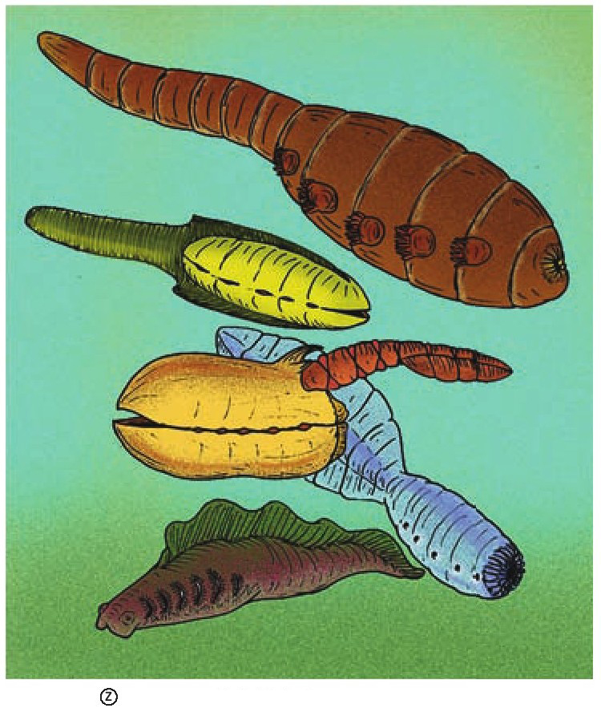
不同种类的古虫

由于古虫类身体表面的原始分节性极像原口动物亚界的节肢动物，曾被视为泛节肢动物已经灭绝了的分支。但随着它的后口动物属性——鳃裂构造的确认，古虫被归类到后口动物亚界，并独立为门。古虫动物具有双重属性：既保留原口动物亚界的原始特征——躯体呈简单分节，也具有令后口动物亚界各分支与原口动物分道扬镳的独有性状——鳃裂构造。因此学术界广泛认可它是后口动物亚界中最原始的种类。

狭义的古虫指古虫属，它们体长7～11厘米。头小，短锥形，不分节，口位于头的末端，没有眼睛。身体呈奇特的二分构型：胸区（前部）膨大，分为4～5节，每节具1对鳃裂，外骨骼由4个骨片组成；腹区（后部）呈桨状，无附肢，由数量不等的互相叠套的骨片组成。（王小娟）

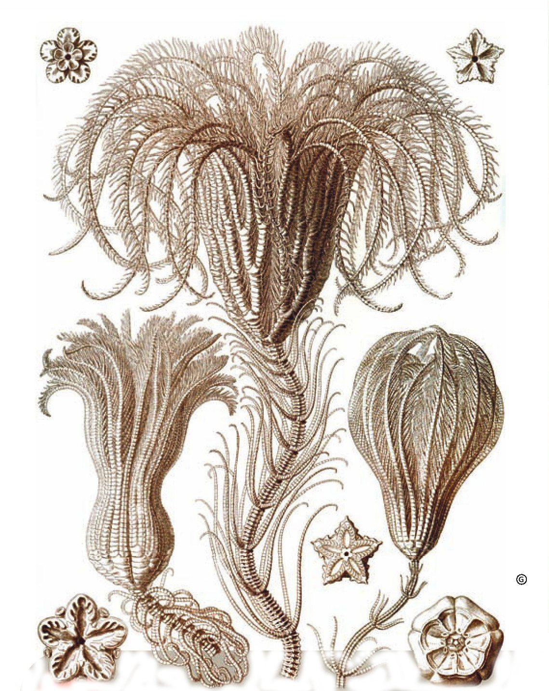
1904年出版的《自然界的艺术形态》中描绘的海百合（包括海蕾）

  

**【微博士】**海蕾是海中的花吗

海蕾虽然看起来像花蕾，但它并不是植物，而是已经灭绝的一类棘皮动物，属海百合纲。海蕾曾一度繁盛于古生代奥陶纪至二叠纪，有梨形或球形的萼，完全呈五辐对称，很像一个含苞待放的花蕾，故名海蕾。它与其他棘皮动物不同，萼部有13块碳酸钙质骨板，在其周围排列成三圈，下有茎或柄。口在萼的腹部中央，上有一个小的石灰质骨板构成圆顶。口附近有5对（或合并为5个）小呼吸孔。为固着生活的动物，靠一圆片组成的柱状茎固定于海底。常见的海蕾有五角海蕾。

【微问题】海星是怎样捕食的？

【关键词】棘皮动物　古虫　原口动物　后口动物　海蕾

## 牙形刺是鱼牙吗

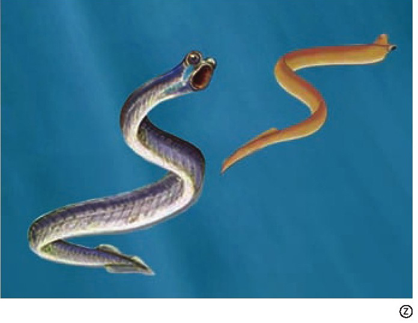
牙形动物复原图

1856年，俄国学者潘德尔在波罗的海地区发现了一种像动物的牙或刺一样的化石，把它们命名为牙形刺。牙形刺很小，一般长仅1毫米左右，最长的也不过7毫米。它的主要成分是磷酸钙，常呈琥珀光泽，颜色多变，从浅褐色一直到灰白色都有。牙形刺的形态复杂多样。有的像一颗尖牙，有的像多颗尖牙聚合在一起形成的梳子或耙子，还有的生长在一个平台上，并出现齿片、隆嵴等复杂结构。它们最早出现在大约5亿年前的海相沉积岩中，在从寒武纪到三叠纪的各种沉积岩中都广泛存在，这说明牙形刺在远古的海洋中延续了三四亿年。

牙形刺被发现以后很长一段时间，科学家都没找到拥有这些“牙”的生物的身体。所以，科学家只好根据自己的理解将其进行分类。有人认为牙形刺是鱼类的牙，有人认为它是某种节肢动物的口器，也有人认为它是环节动物的颚，甚至有人认为这是某种植物的一部分。可以说，世界上没有任何一种化石的分类位置像牙形刺那样令人感到扑朔迷离。牙形刺的主人曾经被人们归入18个不同的生物门类。20世纪80年代以前，大部分人认为它是鱼的牙齿或是环节动物的颚。

直到1983年，英国科学家布里格斯等人在苏格兰的下石炭统地层中，发现了牙形刺所属的身体的化石，牙形刺的分类位置这才变得清晰起来。原来，长牙形刺的动物是一种类似现生七鳃鳗或八目鳗那样的动物，身长4厘米左右，生有两只大眼睛，身材细长，有尾鳍和背鳍，可以快速地游泳。牙形刺就是它们的咽齿，像今天的鲤鱼一样长在咽的位置，用于切割和研磨食物。但这些动物的体内缺乏鲤鱼骨骼那样的硬骨，而只长有鲨鱼那样的软骨，因此它们的身体很难形成化石，只有坚硬的牙才保留了下来。

牙形动物可能是最早期的脊椎动物之一，但也有专家认为牙形动物还没有形成脊柱，只生有原始的脊索，属于原索动物。更多牙形刺的秘密，还有待于找到更多化石才能被揭开。（王小娟）

## 为什么数亿年前的岩石上会有“笔迹”

从5亿多年前的寒武纪到3亿多年前的石炭纪，地球上曾经生存着一类生活在海洋里的奇特动物，因其化石形态像用笔在岩石上画出的图案，故被称为笔石。如今笔石已灭绝，没有现生代表作比较，也无法用其他化石类型作参照物，所以其分类位置至今都未能完全确定。不过一些学者依据笔石和现代海洋中的杆壁虫在外形、器官特征和超微结构等方面的许多相似之处，认为笔石和杆壁虫一样属于半索动物门，但把笔石单独列为一个纲——笔石纲，而杆壁虫则属于翼鳃纲。

不同类型的笔石不仅大小差异悬殊（大的长达2米以上，小的则只有1毫米长），形态也十分独特。它们有的呈树状，有的似网兜，有的如张开的弓，有的像展翅飞翔的大雁……

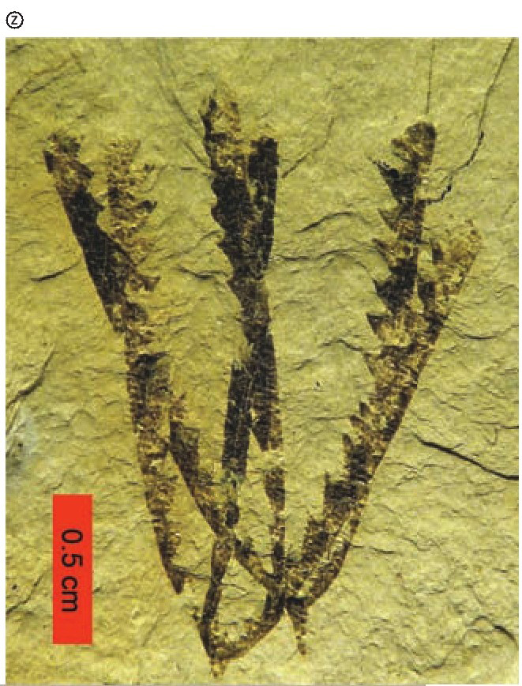
笔石化石

笔石动物的软体部分早已腐烂分解，未能变成化石，因而我们现在所见到的笔石化石都只是它的硬体部分。对这些硬体部分作超微结构分析，并将结果与现生生物类比，推测硬体的成分是胶原蛋白。这表明笔石动物身体应该很柔韧，在海水中可以随波摇摆。胶原蛋白这种成分本身很普通，因为现生动物的肌腱、软骨等都由它构成。但奇怪的是，生活在几亿年前的笔石虫体全部由胶原蛋白组成，这和其他由钙质或硅质成分组成的生物存在明显的差别。

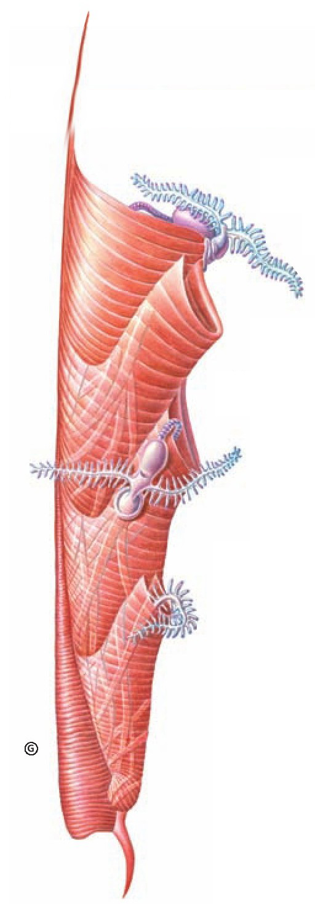
笔石胞管复原图

笔石动物是群体生物，是从一种叫胎管的圆锥体中的空腔开始逐步生长起来的。通过胎管，笔石动物长出一些分叉或不分叉的“枝条”，每一个“枝条”上通常都由一系列排列整齐、形态相近的管状体——胞管组成，笔石的虫体就生活在胞管中。胞管的形状变化很大，直的，弯的，卷曲的，喇叭状的，角状的，什么都有。笔石枝的分叉形式和空间排列方式大多因群体而异，这使得笔石的体形和形态千差万别、大小悬殊。

笔石动物是靠吃悬浮在海水中的有机质生存的，通过纤毛触手的摆动，笔石虫体的口部可以吸入海水，然后把有机质过滤以后再吐出来。化石研究表明，笔石存在两种基本的生活方式：较原始的笔石长有“根”和“茎”等构造，像树一样固着在海底生活，然后向上生长；另一类笔石在海水中过着漂浮生活，它们除了通过触手作适当摆动以推动身体前进以外，多数情况下是在随波逐流。（王小娟）

## 靠皮肤“吃饭”的动物也曾繁盛一时吗

5.65亿～5.41亿年前，地球上曾生活过一大群软躯体的谜一样的生物类群，它们的形态非常奇特：身体巨大而扁平，多半呈椭圆形或条带形，有的像海笔，有的像水母或蠕虫，但更多的和我们所熟悉的生物类型全然不同。尽管它们普遍没有骨骼，身上甚至没有任何硬体部分，但却在砂岩和粉砂岩中留下清晰的印痕。因为它们的化石首先发现于澳大利亚中南部埃迪卡拉地区，故被命名为埃迪卡拉动物群。

这些躯体柔软的动物没有嘴、头、尾、四肢和消化器官，它们靠什么为生？人们认为，它们很可能像现生的绦虫那样靠“皮肤”（体壁）来“吃饭”，氧气和食物直接从它们的体表渗透到身体的每一部分，其巨大而扁平的特化躯体形态，是为了在没有内部器官的情况下进行呼吸和摄取营养。

埃迪卡拉动物群为原始的多细胞生物集群，它们以类似气垫的方式来构建身体，每一生物由体壁所包绕的小型液腔按一定规律组合成不同形态。因此，它们和寒武纪以后的后生动物——除了原生动物门以外的所有多细胞动物，根本没有关系，很可能是一类与后生动物平行演化的、已经灭绝的动物类群。（王小娟）

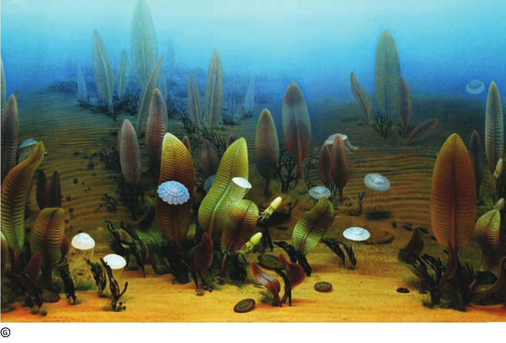
埃迪卡拉动物群的生态复原图

  

**【微博士】**作为年代和地理“指针”的笔石

笔石动物演化速度非常快，通常一个新种产生后100万～200万年就灭绝了，因此每个时期的笔石样子都不一样。此外，笔石动物可以生活在各种深度的海水中，但在不同的深度有不同类型的笔石；而在不同纬度地带笔石的样子也不一样，有些类型的笔石只生活在高纬度地区，而另一些类型的笔石只生活在赤道地区。所以通过地层中的笔石化石，不仅能够知道笔石所处地层的时代，还可以推测当时的海水深度以及笔石所在地的地理位置。

【微问题】埃迪卡拉动物群为何能留下化石？

【关键词】牙形刺　笔石　埃迪卡拉动物群

## 植物是什么时候直立起来的

陆生植物的出现是植物演化史上非常重要的事件。陆生植物改变了陆地生态系统，最终使陆地变成了适合人类居住的环境。

植物要脱离水环境就必须具有一系列适应陆地生活的组织。生活在水中的植物，可以借助水体的浮力直立生长。但脱离了水环境，陆生植物必须具有坚实的组织，才能使自身保持直立状态。即使是具有攀援习性的植物也需要自身组织的支撑才能完成直立状态，并寻找可依附的其他植物或岩石。同时，植物的生长需要水分和养料，植物体还必须具有疏导组织，以便将水分和养料运输到需要它们的各个部分。在陆生植物中，支撑和输导这两种功能是由同一种组织——维管束来完成的。

与水体环境相比，陆地环境的要求更为苛刻。陆生植物体的体表必须具备防止水分蒸发的表皮，这层表皮是植物体的保护外衣。另外，植物的表皮上还要有气孔，因为植物的光合作用离不开空气，通过气孔植物可与外界进行气体交换，即进行“呼吸”。直立的植物还应有可在空气中散播的孢子或花粉，孢子或花粉可以脱离水环境而扩散，以利于植物体的繁殖。

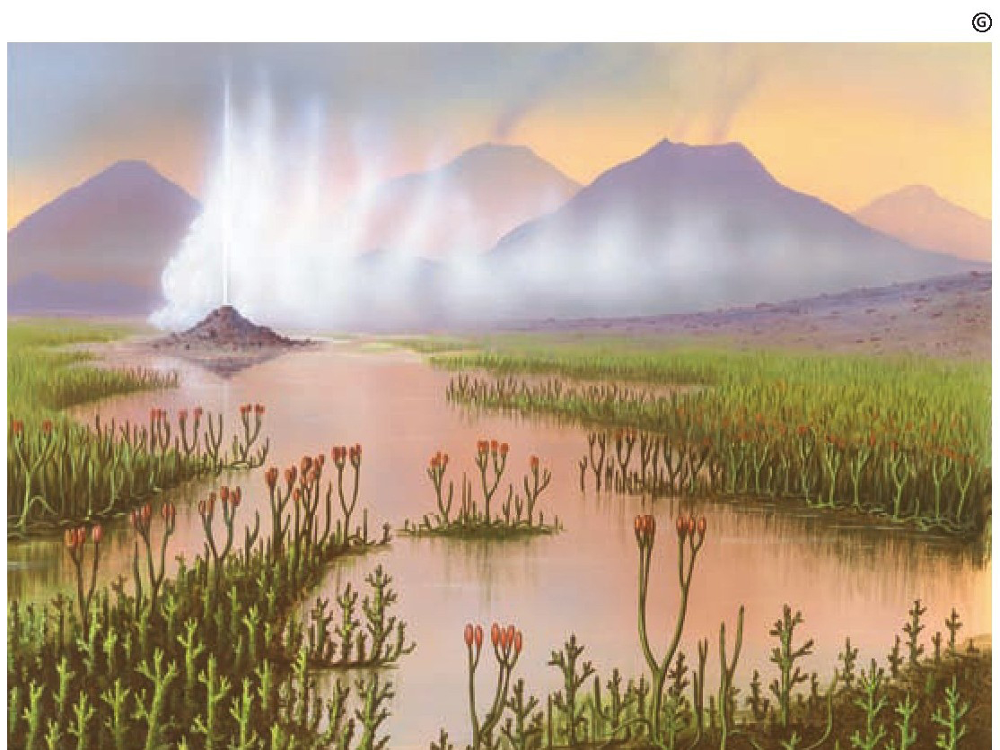
志留纪沼泽中的库克逊蕨复原图

早期陆生植物这些特征很难完全在化石记录中找到，因此古生物学家往往只能依据单方面或几方面的证据来推测陆生植物的起源。目前，陆生植物起源的具体时间与地点仍是古生物学界未解的一道难题。

化石记录表明，最早的陆生植物大化石，即肉眼可识别的植物化石，在志留纪的地层中就已经出现。那些植物都非常低矮，高度仅1厘米左右，相关的化石已在英国、非洲北部等地找到。陆生植物的微体化石，如植物表皮、孢子囊、管状体以及可支撑植物体输导水分的维管束组织等，在更早的中奥陶世的地层中也已经找到，相关的化石资料来自北非、阿拉伯地区的钻井岩芯。这些微体化石的资料似乎表明，在奥陶纪陆地上已经有了植物，但古生物学界对这个问题仍然保持谨慎的态度。对世界各地奥陶纪和志留纪的地层中的植物微体化石和大化石进行详细的研究，有望解决这个难题。（徐洪河）

## 远古植物都有根、茎、叶吗

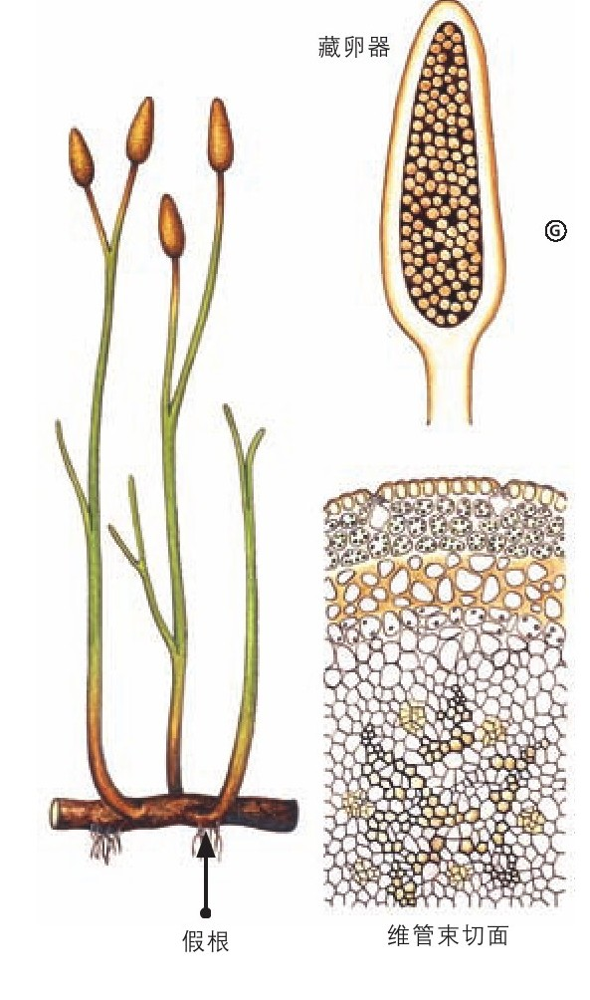
原始的瑞尼蕨

植物首次登上陆地之后，逐渐具有了功能完善的根、茎、叶等器官，但这些器官并不是同时出现的。

茎是所有陆生植物都必须具备的器官。因为茎中隐藏着维管束组织，而维管束不仅是陆生植物输导水分和营养物质的通道，还是植物的支撑器官。陆生植物如果没有维管束，就相当于人没有血管一样。任何一种陆生植物，从最古老、最原始的种类，到今天各种复杂、高等的植物，都具有茎。茎因此成为陆生植物最早出现、最不可缺少的植物体器官。

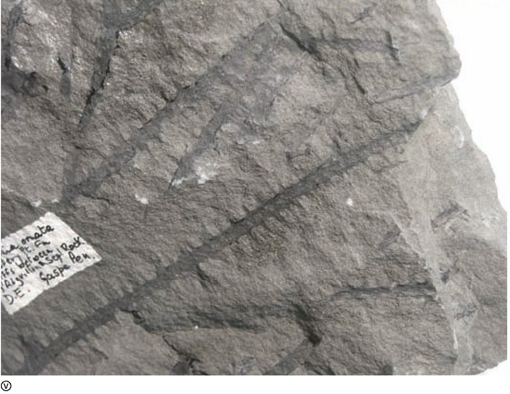
茎上见刺的沙顿蕨化石

叶是植物用来呼吸和进行光合作用的器官。通过叶子中的叶绿素，植物可以将水分、二氧化碳转化为自身需要的营养物质。但早期陆生植物并没有叶子，而是利用茎干表面的气孔进行呼吸，也通过茎进行光合作用。一般认为，陆生植物的叶由茎演化而来。

根的出现要复杂一些。根的主要功能有两个，分别是将植物固着在陆地上，以及从土壤中吸收水和营养成分。最早的陆生植物并不具有真正的根，而仅具有大部分都暴露在空气中的假根（有时被称为“气生根”，字面意思就是暴露在空气中的根）。假根依靠细小的根毛来固定植物体，一般都长在矮小的、相对原始的草本植物上。随着植物体形不断增大，需要有更加稳固、更加粗壮的根系才能保证植物体自身的支撑与营养吸收。相对而言，植物的根并不容易保存成为化石，中国云南早泥盆世的地层中的一种特殊埋藏的工蕨植物化石为人们展示了最古老的植物根系，这种工蕨植物可能是半水生的，植株整体不高。

到了中泥盆世，陆生植物演化出了复杂的根。但是值得一提的是，从目前的化石记录来看，中泥盆世具有真正根系的植物并不多见，到了更晚时期，复杂而深度延展的根系才在植物界中变得广泛起来。可见，直到早、中泥盆世，古植物才与现生植物一样，已经完全具备了根、茎、叶的分化。（徐洪河）

## 植物的刺是什么时候出现的

关于植物体表的刺的功能，主要有以下四种解释：（1）保护植物体，以防止被动物大范围咬食；（2）某些刺具有叶绿素细胞，可以进行光合作用；（3）有些生长在干旱、炎热环境中的植物，为了能够减少植物体本身水分的散失，会将水分小心地储存起来，这种植物的叶子就慢慢地越长越小，最后变成了一根根小刺，最典型的就是仙人掌，它的一根根小刺其实就是变态的叶子；（4）有些植物体长有细而致密的小刺，这些小刺可以帮助植物在夜晚气温降低的时候从空气中凝结一定的水分，帮助植物从空气中吸收水分。如某些种类的苏铁在叶的腹面轴上就生有数量众多的、纤细而短小的刺，这些刺能够帮助苏铁从空气中吸收水分。

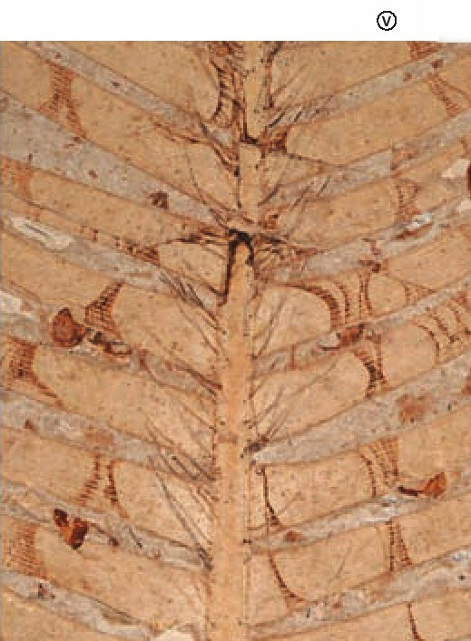
侏罗纪的苏铁叶化石，其轴上是小刺

早期陆生植物往往形态简单，叶以及刺都是陆生植物逐渐复杂化之后衍生出来的器官。从植物的化石记录来看，在植物登上陆地的早期阶段（早泥盆世），一些植物体茎上就已经具有多种类型明显的刺。该时期的植物大多还不具有发达的叶，刺的出现可能是由茎表面的一些不规则突起演化而来的，甚至有人认为，这种类型的刺经过长时间的不断演化，产生了某些形态的叶子。从比较形态学的观点来看，植物体茎干上的叶和刺其实都是茎干表面的突起，两者有一定的同源关系。当然，植物的形态多种多样，对刺与叶之间的演化关系并不应绝对地、孤立地看待。（徐洪河）

  

**【微博士】**维管束

维管束是由植物木质部和韧皮部共同组成的束状结构，分布于陆生植物的茎、叶等器官中。维管束彼此交织连接，构成植物体输导水分、无机盐及有机物的输导系统——维管系统，并兼有支持植物体的作用。

【微问题】植物登陆后长在哪？

【关键词】维管束　库克逊蕨　叶　刺

## 地衣是真菌还是藻类

地衣既不是单纯的真菌，也不是单纯的藻类，而是这两种生物组合而成的特殊共生体。它的真菌共生组分一般是子囊菌或担子菌，光合共生组分是绿藻或蓝细菌。蓝细菌过去也叫蓝藻或蓝绿藻，现在通常被视作自养型的原核细菌，但人们习惯上仍将其归入藻类。

地衣中的真菌和藻类长期互利共生。藻类娇嫩的身体在真菌的支持下，得到了更多保护。四通八达的茂密菌根从外界环境中汲取水分和无机盐，源源不断地提供给藻类。水和养料（特别是氮素）的供给，无论速度上还是数量上，绝不是非共生藻类所能比拟的。真菌的付出当然会得到回报，藻类的光合作用产物大部分都给了它。真菌在藻类的滋养下，也生活得更加轻松。

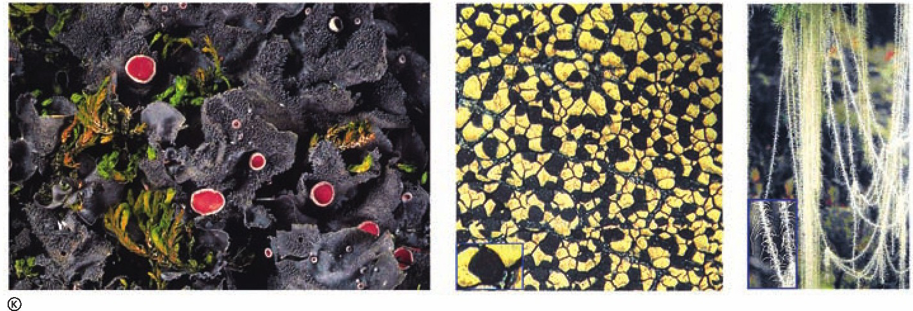
各种地衣

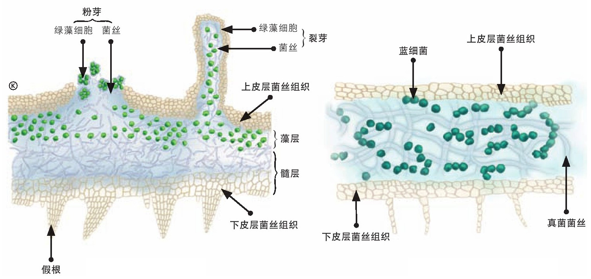
同层地衣横切面

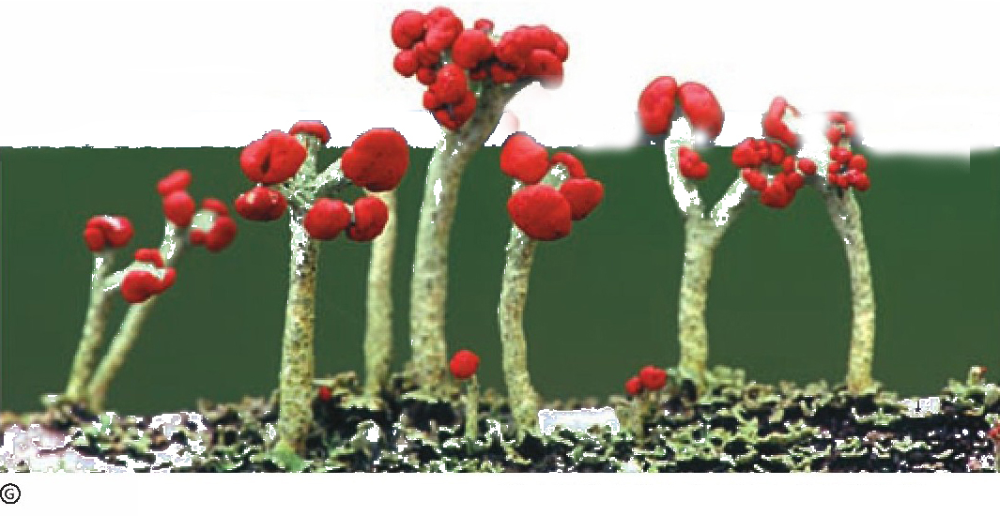
灌木状地衣的红色子囊盘像头戴红帽的英国士兵

地衣常呈现出壳状、叶状或树枝状的形态。它们虽然生长缓慢，每年只能长几厘米，却是异常顽强，又懂得把握机会。它们遇到恶劣的大旱气候，就及时休眠；得到几滴甘霖，又立刻恢复生机。所以，地衣能附在岩石、地面和树皮上生活，耐寒耐旱，绝壁大漠上都可生存。它还能深入其他植物难以涉足的严酷地带，在高山、冻土、南北极铺就广袤的苔原。因此，地衣也是生物界的“开路先锋”。它们分泌地衣酸，使坚硬的岩石变得松软，让风化作用、成土作用更加迅速，让其他植物的根系更容易抓住地面，让荒漠逐渐变成绿洲。

地衣不仅在现在生物圈的平衡发展中功不可没，在植物的演化史上也扮演过重要角色。在6.3亿～5.4亿年前的新元古代埃迪卡拉纪，高等陆生植物还没有出现，地衣就已经崭露头角了。比如中国贵州瓮安陡山沱组的岩石中有一种类似地衣的化石，科学家把它看作是绿藻、蓝细菌和真菌的综合体。而到了约4亿年前的早泥盆世，已经发展出了实实在在的地衣。从它们体内的光合组分中，能识别出应对菌根的特有共生标志。苏格兰的莱尼燧石岩中就有这类地衣的身影，它们与最早的高等陆生植物比邻而居。一些科学家认为，有了地衣中共生真菌的菌根，早期陆生植物才演化出最初的根系。

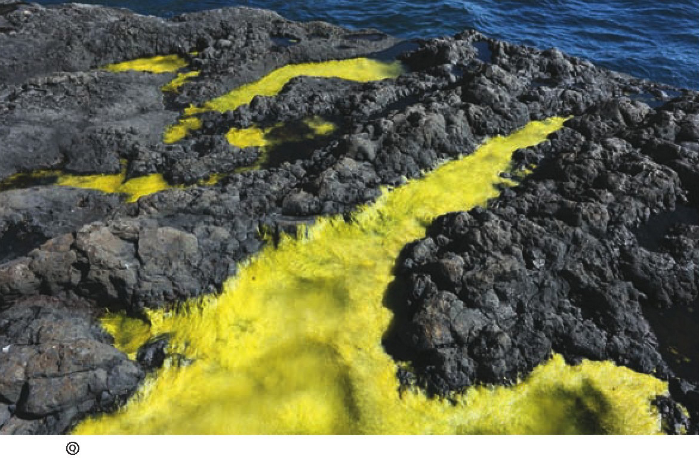
在合适的温度中绿藻会快速繁殖

令人惊叹的是，在约4亿前的早、中泥盆世，地球上生长着一种巨型的地衣。这种名叫“原拟紫杉”的生物，高2～9米，直径可达1米，与今天那些矮小不起眼的地衣不可同日而语。科学家一开始还以为它们是高大的紫杉树，便取了这么个名字，后来却发现它内部的结构与真菌相仿。于是问题就来了：在当时的地球上，高等植物还没站稳脚跟，地面还没披上厚实的绿装，陆地的生产力又非常低下，真菌不过是种异养型生物，到底是谁养活了这么大的原拟紫杉呢？最好的解释就是：它们能自力更生。原拟紫杉的体内有藻类提供食粮，而真菌共生组分则使个体努力长高，争得阳光的青睐，最终使它们成为当时陆地生态系统中最令人瞩目的成员。（徐洪河）

## 绿藻是所有高等植物的祖先吗

绿藻是一个纷繁复杂的大家庭。当今分类学家认为，广义的绿藻是指绿色植物里两大植物类群的合称，包括狭义的绿藻和轮藻，物种数可达7000种。绿藻成员中有的是单打独斗的单细胞生物（如小球藻），有的会抱团生活（如团藻），有的则直立如微型树木（如轮藻）。绿藻的生活范围非常广，在江河、湖泊、沟渠、湿润的土壤表面和浅海的岩石上都可以找到它们，甚至在墙壁、树干、花盆和冰雪之上也有绿藻的踪迹。

和其他藻类（如裸藻、红藻等）相比，绿藻与高等植物的关系要近得多，两者很可能拥有最近的共同祖先，而这个祖先的样子，正和今天绿藻中的某些类型相像，与其中的轮藻类更是酷似。因此，说绿藻是所有高等植物的祖先，一点不为过。

绿藻细胞内的一系列特征不同于其他藻类，却和高等植物的类似。比如，绿藻细胞内行光合作用的器官也由双层膜包裹，与高等植物一样同时具备叶绿素a和叶绿素b。再如，其他藻类会通过光合作用合成各种特有的淀粉、多糖等，绿藻的光合作用产物却只有直链淀粉和支链淀粉，与高等植物的基本相同。又如，绿藻细胞内的“骨架”——微管系统，具有高等植物的特征；一些种类绿藻的细胞在进行有丝分裂时还常和高等植物一样，在分裂面上形成一种叫成膜体的结构。最后，绿藻细胞壁的主要成分是纤维素，高等植物也一样。这些特征表明它与高等植物之间存在密切的关系。

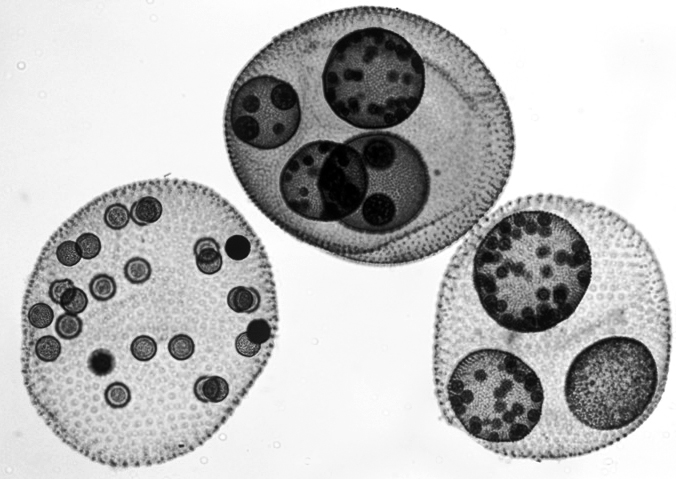
显微镜下的现生绿藻

目前已知的化石记录中，被确认为绿藻的最早种类的是发现于澳大利亚苦泉组的球形单细胞生物，有8亿年的历史。与高等植物亲缘关系更近的轮藻，化石证据出现得比较晚，最古老的记录存在于瑞典的哥得兰，有4.2亿年的历史。而科学家近年来在阿根廷找到了4.7亿年前的高等植物孢子化石，证实高等植物很早就存在了。来自分子生物学的数据暗示，绿藻和高等植物的分化时间可能远至7亿年前。（徐洪河）

  

**【微博士】**成土作用

成土作用是指岩石母质在生物作用和水力、风力等自然力的作用下，发生风化，产生肥力，从而转变为土壤的过程。生物在成土作用的初始阶段中具有决定性作用。

自养型微生物和地衣是成土作用的先锋，它们能在裸露的岩面或风化的崩解物上着生、生长、繁衍，使岩石、堆积物进一步崩解、疏松，同时积累有机质，经历复杂的物理、化学变化，慢慢形成真正具有肥力的土壤。

【微问题】原拟紫衫是怎样站立起来的？

【关键词】地衣　藻类　地衣酸　绿藻　成土作用

## 种子蕨是种子植物还是蕨类植物

在植物界漫长的演化过程中，出现过很多形态特殊、可能代表了植物演化过渡类型的植物。在晚泥盆世到二叠纪的植物化石记录中，种子蕨就是这种过渡类型的代表之一。种子蕨长有蕨类植物典型的大型羽状复叶，也有形态和功能都非常简单的种子。它们依靠种子进行繁殖，而不像蕨类植物那样依靠孢子进行繁殖。在内部结构上，种子蕨往往表现为根、茎的加粗，往径向扩展的次生生长，这与现生的裸子植物非常相似，但是却与现生的大多数蕨类植物显著不同。现生蕨类植物大多为草本类型，不具有显著的次生生长。

种子蕨利用种子进行繁殖，很可能是一种比较特殊的裸子植物。常见的种子蕨类植物有髓木和舌羊齿，这两种植物化石在石炭纪和二叠纪的地层中都很常见。

值得一提的是，由于化石植物往往难以保存，古植物学家依据不完整的植物器官建立了数量众多的形态类群或器官类群，这有点像给动物分类时，只能看到脚，就只好把单趾的都归为“马”类，把双趾的都归为“牛”类。尽管凭借这些类群很难进行严格的分类，但古植物学家仍在不断努力重建地质历史时期完整的植物形态。（徐洪河）

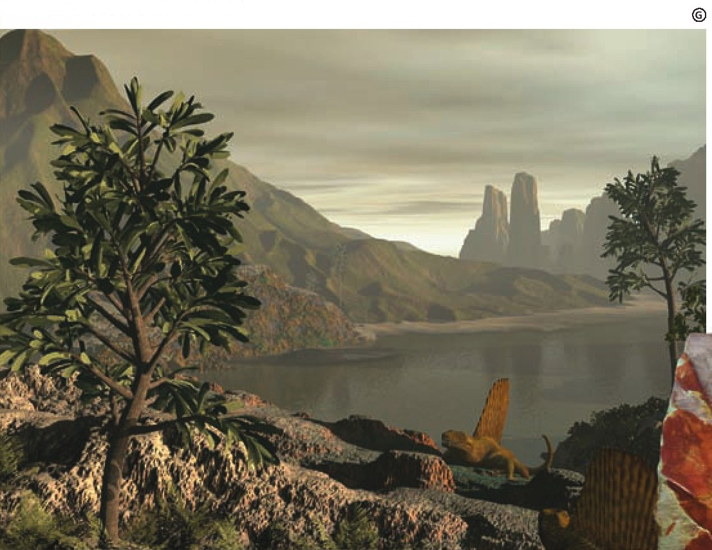
二叠纪时的种子蕨（真羊齿）

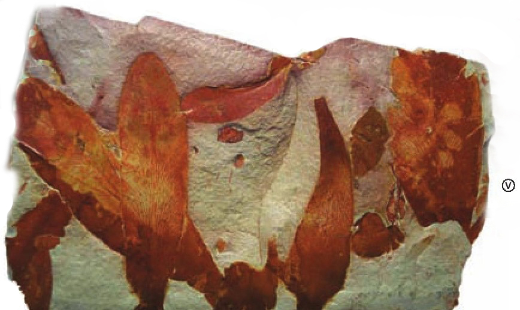
澳大利亚二叠纪的舌羊齿化石

## 最早的植物叶是怎样演化来的

叶对于植物非常重要。植物的叶含有叶绿素，是进行光合作用的主要器官，而植物的蒸腾作用大部分也是通过叶上的气孔来实现的。

从植物解剖学的角度讲，叶位于植物的茎上，因此只有维管植物才长叶，即蕨类植物、裸子植物和被子植物等植物都有叶。而苔藓植物、藻类等植物并没有叶，它们拥有的是与叶相似的器官叶状体。

最早的陆生植物还没有演化出叶，它们的光合作用与蒸腾作用很可能是通过细小的茎来完成的。关于叶的起源，比较流行的有两种看法：有人认为，叶是由茎表面的突起逐渐演化而来的，这种观点用于解释具有单一叶脉的小型叶植物如石松类叶的起源，有一定的说服力；另有人认为，随着植物末端的茎分枝复杂化、扁平化，才逐渐演化出扁化的叶，这种叶往往具有复杂的叶脉。扁平叶出现于早泥盆世。

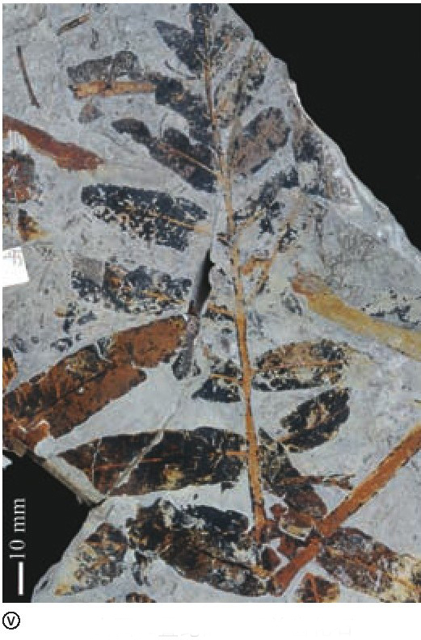
山西二叠纪的大羽羊齿化石

植物的叶子具有复杂多样的形态，而它们又易于保存为化石记录，因此叶的形态学特征往往是古植物的重要鉴别依据。最典型的是古生代出现的各式各样的蕨类植物。它们往往长有羽状复叶，即若干枚单叶交互对生，构成整体的复叶。单叶的整体形态以及叶脉样式都是鉴别古植物的重要特征。

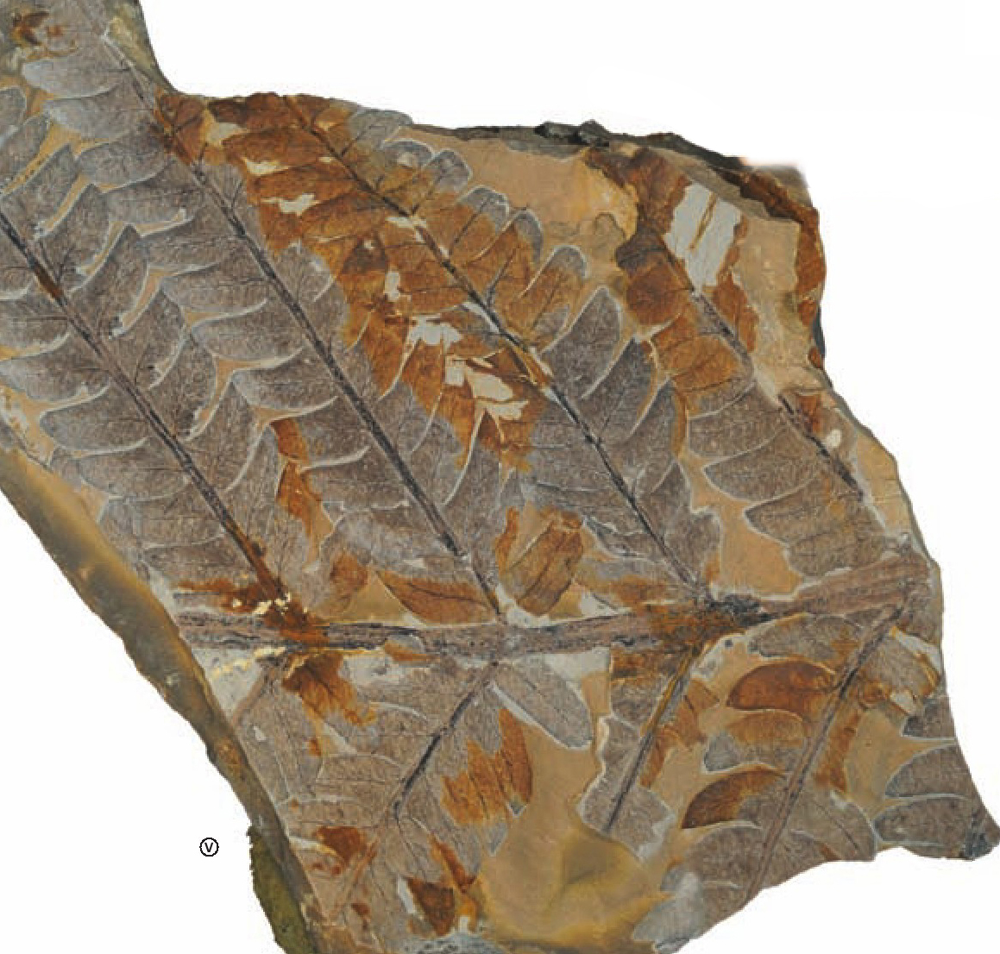
二叠纪的枝脉蕨化石

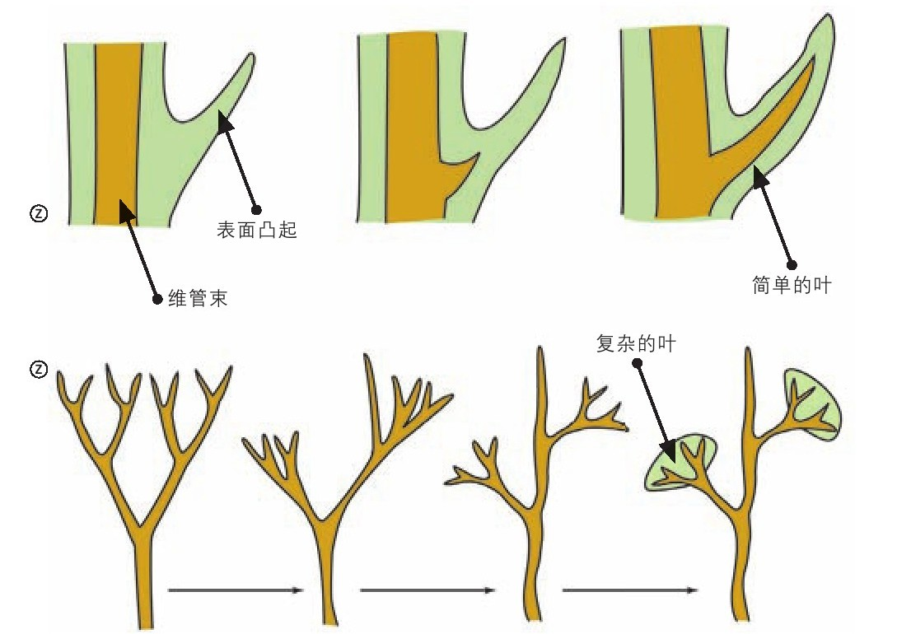
叶形成模式的两种假说

提到叶脉，有必要说一说大羽羊齿。大羽羊齿是一种已灭绝的蕨类植物，二叠纪时期分布于亚洲东部的热带地区，是中国华南二叠纪植物群的代表植物之一。大羽羊齿长有大型羽状复叶或单叶，小羽片中脉明显，羽状侧脉分为1～2级，细脉分叉组成羽状脉或单网脉，有的具有2级或3级侧脉形成网状叶脉。这是十分有趣的，因为通常来说，被子植物才具有复杂的网状叶脉，因此大羽羊齿有可能是被子植物祖先的近亲。但是，目前尚未发现二叠纪被子植物的化石记录。（徐洪河）

## 为什么同一种蕨类植物有两个不同的面貌

蕨类植物具有明显的世代交替现象。常见的蕨类植物体一般都是体积较大、拥有双套染色体的孢子体世代。但是，蕨类植物还存在体积微小、只有单套染色体的配子体世代。

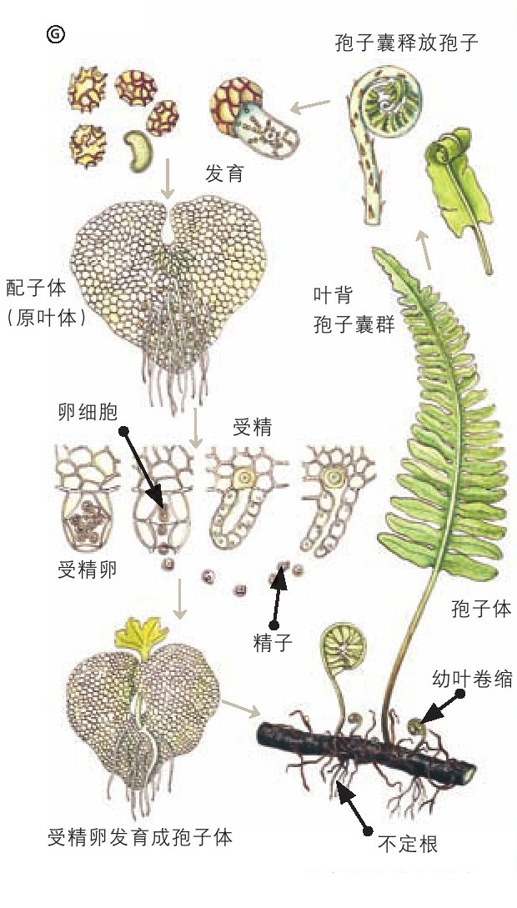
蕨类植物的生活史

蕨类植物体具有根、茎、叶、孢子囊群等结构。孢子囊中的孢子母细胞经减数分裂形成具有单套染色体的孢子。孢子成熟以后，借风力或水力散布出去，遇到适宜的环境开始萌发生长，形成指甲大小的配子体。配子体上有雄性生殖器官（精子器）和雌性生殖器官（颈卵器），精子器里的精子借助水游入颈卵器，与颈卵器中的卵细胞结合，形成具有双套染色体的受精卵，此时又进入孢子体世代。受精卵发育成胚，再由胚长成独立生活的孢子体。除极少数原始的种类长有假根以外，大多数蕨类植物长有吸收能力较好的不定根，没有真正的主根。现生蕨类植物的明显特征是幼叶蜷缩，有孢子囊群和鳞片，叶的形态差别非常大。通常在化石中如果发现了孢子囊等器官，就有可能发现蕨类植物的化石。（徐洪河）

  

**【微博士】**高等植物

今天的高等植物是苔藓植物、蕨类植物和种子植物的总称。它们在形态上已经有了根、茎、叶的分化，能够在陆地环境中生存。高等植物有性繁殖形成的合子（受精卵）在母体内发育成胚，因此也叫“有胚植物”。与高等植物相反，藻类植物如常见的海带、紫菜等，结构简单，没有根、茎、叶的分化，所以也被称为低等植物。根据目前最流行的生物分类体系，人们将有胚植物（即高等植物）与轮藻合称为链形植物，链形植物与狭义的绿藻类共同组成绿色植物。而藻类中其他同属低等植物的红藻、褐藻等，则被划入新的门。

【微问题】为什么植物的叶脉多种多样？

【关键词】种子蕨　叶　大羽羊齿　舌羊齿　高等植物

## 最早的森林出现在什么时候

距今4.2亿～3.6亿年的泥盆纪是陆生植物的大发展时期。化石记录表明，到泥盆纪晚期，除了被子植物以外所有的植物类群都已经出现。当时的植物类型也是多种多样的，从仅有数厘米高、纤细的草本植物，到高达30多米的大树；从半水生的早期蕨类植物，到具有复杂庞大的气生根和高大树冠的大型蕨类植物；从依靠孢子生殖的细小蕨类植物，到营种子繁殖的裸子植物……到了中泥盆世时期，地球上首次出现了森林。

泥盆纪时期的植物数量大，种类多，但外观却和今天的植物差别极大，看惯了现生植物的人们往往会觉得那时的植物都如同怪物。地质历史上的第一片大森林就由许许多多高大的“怪物”所组成，可以通过保存在岩石中的植物化石来推测泥盆纪时期的陆生植物世界的外貌。

构成泥盆纪森林的植物主要有三种类型，即乔木状石松类、前裸子植物类以及早期真蕨类植物。严格地说，这三种类型的植物都是依靠孢子进行繁殖的，都属于蕨类植物。裸子植物尽管在泥盆纪已经出现，但只是较低矮的植株。

石松是一种蕨类植物，它的孢子叶一般聚集成穗状，孢子囊着生在具有单叶脉的小型叶腹面上。现生石松全都是草本，分布于热带和亚热带等地区。石松植物是化石记录最长的一种陆生维管植物，早在志留纪的地层中就有石松类的化石了。石松植物最繁盛的时期是石炭纪和二叠纪，当时的石松既有草本，也有高达30米以上的大型乔木。乔木状石松类植物起源于中泥盆世时期，典型的特征是具有单叶脉的小型叶。早期的乔木状石松高度仅为3～5米，从泥盆纪中期开始，石松植物长得越来越高大。到了石炭纪，这些石松植物的最高可达30～40米。大型石松类植物是古生代森林的重要组成植物之一，当今世界部分煤田中的煤就是由这些高大的植物经成煤作用而形成的。

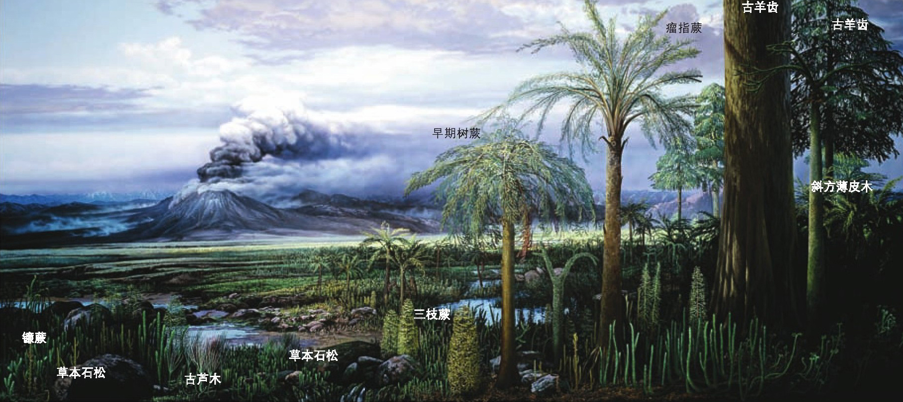
泥盆纪陆地景观重建

前裸子植物中最具代表类型的植物是古羊齿。它是最早具有现生树木外观的植物，这种树的树干与今天的松树类似，高可超过20米，其树干的化石就是最早的硅化木。古羊齿靠孢子进行繁殖，但内部的组织结构却和现生裸子植物的相似，是具有低等蕨类的外部形态和高等裸子植物的内部结构的结合体，是一种盛行于晚泥盆世早已灭绝了的古植物。

构成早期森林的真蕨类植物，化石从美国纽约中泥盆世的地层中发现，高可达5～6米。这种植物具有复杂的分枝系统，被称为枝蕨类。这种植物在生长过程中末端枝系或叶不断脱落，茎的基部膨大。（徐洪河）

  

**【微博士】**石炭纪

3.6亿～3亿年前的地质时期，地球上植物生长繁盛，气候温暖、湿润，沼泽遍布。陆地上出现了大规模的森林，给煤的形成创造了有利条件。由于该时期地层中含有丰富的煤，因而得名。石炭纪时期形成的煤约占全世界总煤储量的50%以上。

## 为什么远古的森林不是一成不变的

最早的森林出现在距今4亿年左右的泥盆纪。从那时起，在漫长的地质历史时期，随着植物演化、气候变化、海陆变迁等，森林也在不断发生改变。

古生代时期的森林主要由一些大型乔木状蕨类植物构成，这些植物包括石松类、有节类、早期真蕨类等。石炭纪的大量煤层就是古生代蕨类植物森林所形成的。值得一提的是，构成古生代森林的石松类、有节类等大型蕨类植物大部分都已经完全灭绝了，它们残留到现在的后裔仅仅是分布在热带和亚热带地区的草本类型。现生的蕨类植物往往生活在温暖湿润的地区，尽管古生代的海陆格局与现在有很大差别，古生代的蕨类森林也可能仅仅分布在距离水源较近的湿润地区。

到了中生代三叠纪以后，陆地景观发生了明显的改变，裸子植物开始成为森林中的优势类群。因此，在中生代侏罗纪的地层中，往往可以找到大量裸子植物的硅化木化石，比如南洋杉、水杉、红杉等硅化木化石。相对蕨类植物来说，裸子植物对温度和水分条件适应性更强，因此中生代以裸子植物为主的森林可能具有更为广阔的分布范围。很多中生代时期起源的裸子植物，如银杏、水杉等，其生命史一直延续到了今天。

中生代接近结束的时候，被子植物开始登上历史舞台。到了新生代以后，被子植物逐渐兴盛，并逐渐成为陆地植被中的主体和优势类群。那时的森林和草原的面貌与现在地球上的几乎一模一样了。（徐洪河）

## 为什么不是所有的古植物都能变成煤

植物成煤首先要有数量庞大的植物量，煤的主要成分是碳，而植物是煤的主要碳源，一定体积的煤通常需要几倍甚至十几倍的木材才能提供足够的碳量。因此，能够成煤的植物在地质历史时期都曾形成规模庞大的森林。其次，还要有足够的水。植物体内的有机物必须长期在水的浸泡下才能经生物化学变化转变成泥炭。要同时满足这两种条件，必须存在规模庞大的沼泽森林。这种类型的森林在石炭纪等地质时期非常普遍。在地表，常温、常压下，堆积在停滞水体中的大量植物遗体经泥炭化作用或腐泥化作用，转变成泥炭或腐泥；泥炭或腐泥被埋藏后，由于盆地基底下降而被掩埋到地下深部，经成岩作用而转变成褐煤；随着温度和压力的逐渐增高，再经变质作用转变成烟煤直至无烟煤。

古生代森林在保存成为化石的过程中，大规模地形成煤，称为成煤事件。地质历史上有三个大的成煤期：一是古生代的石炭纪和二叠纪，成煤植物主要是孢子植物，主要煤种为烟煤和无烟煤；二是中生代的侏罗纪和白垩纪，成煤植物主要是裸子植物，主要煤种为褐煤和烟煤；三是新生代的古近纪，成煤植物主要是被子植物，主要煤种为褐煤，其次为泥炭，也有部分烟煤。（徐洪河）

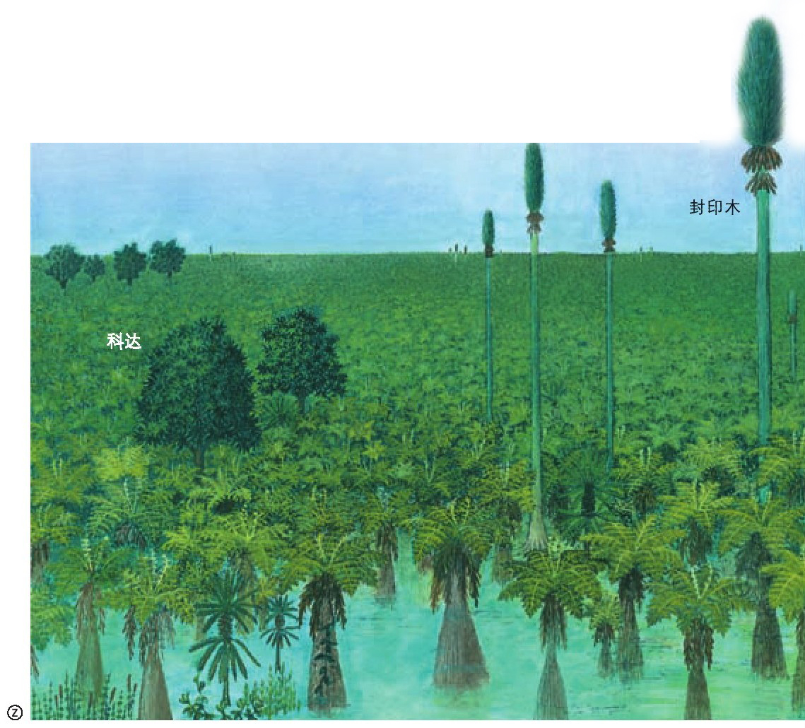
  

**【微博士】**植物“庞贝城”

它是一个位于贺兰山西北角、内蒙古乌达煤田的成煤沼泽森林，保存面积约20平方千米，距今已有2.98亿年历史。这个沼泽森林被火山喷发所埋藏，保存方式与埋藏于火山灰下的意大利庞贝古城相似，植物的枝、叶、树冠等被火山灰压断并保存于其内形成化石森林。群落的高层植被包括石松类封印木和原始松柏类植物科达。中层植被由树状莲座蕨类的若干种和分类不明的瓢叶类构成。一种较少见的楔羊齿是藤本植物。零星出现的草本植物包括对叶蕨科的镶边栉羊齿和有节类楔叶。这种沼泽森林地表多数时间被几厘米厚的水覆盖，阻止了有机质被氧化而形成泥炭。

【微问题】前裸子植物和裸子植物有什么区别？

【关键词】石松　古羊齿　成煤事件

## 松树的祖先长什么样

松树并非一种树，而是松科植物的总称，包含10多个属200多个种。它们多是高大的乔木，以其针形叶、线形叶和球果为人们所铭记。落叶松和金钱松的叶会在秋天发黄落下，其他的则挺立常青。

松树广布于北半球，经常组成密密的针叶林，是寒带、亚寒带、高山地区的靓丽风景。已知最早的松树成员是名叫新美穗的古老松科植物，2亿多年前就在今天美国卡罗来纳扎下了根。那时正值地质历史上的晚三叠世，北半球气候温和。在卡罗来纳，除了新美穗外，苏铁和蕨类也生长良好。虽然没法从化石里看出新美穗的树形，也不能确定它枝叶的样子，但它长长的果穗却清晰可辨。组成果穗的每一个鳞片里，都藏着一左一右两颗松子，与现在松球上的种鳞几乎一样。但是，新美穗只是松科的最早成员，还不是松树的祖先。

古羊齿化石

松科属于松柏纲大家族，最早的松柏纲化石是伏脂杉。伏脂杉目的成员出现在3亿多年前的石炭纪晚期，属于广义的松柏类植物。它们可以长成乔木，但远没有今天的松树伟岸；枝条有长有短，短枝上常螺旋排列着针状的叶子，与松树确实有几分神似。伏脂杉的球果不像松球的那么紧凑，显得长而松散，但却呈现出一种演化的趋势，与松球越来越像。因此，从这个意义上来说，伏脂杉很可能是现生松树最近的祖先。

古羊齿和科达

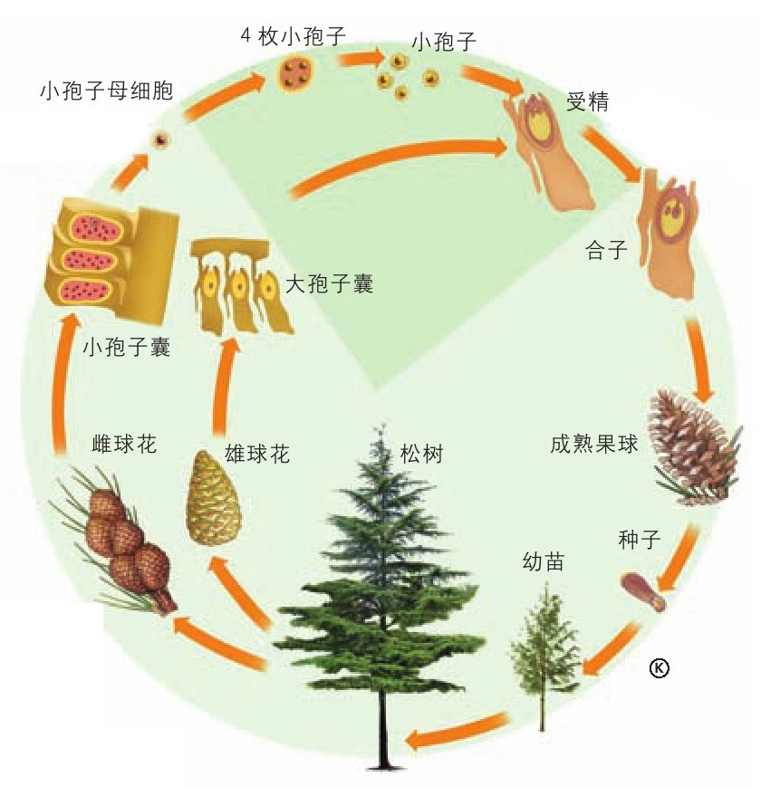
松树的生活史

再向上追溯就会发现：伏脂杉之前，还有一类叫科达的更古老的树类，科达目植物在3.8亿年前的晚泥盆世就开枝散叶了。植物学家都喜欢从花和果的结构，从木材的细节来判断植物的亲缘关系，因为这些特征不容易随环境变化而产生纷乱的变异。虽然科达树的叶子比较宽，有点儿像包粽子的芦苇叶或箬竹叶，不那么像松树叶，但它用来繁殖的部分却与伏脂杉类的勒巴杉科植物相关。此外，科达树茎干的内部构造与松树的已经有些相似，木材也比较坚实。它们既可以长成十几米高的细高乔木，也可以生得比较矮小——高不超过四五米。科达树根系垫高，通气组织发达，练就了一身沼泽地求生的本领。中国山西太原西山煤田煤核中，保存着一种约3亿年前的“中国山西木”，整体形态与科达树无异，但长有针形的叶子。这些细小叶子与其他鳞叶螺旋排布于枝上，更让人联想到松树。

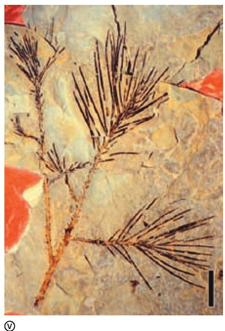
伏脂杉化石

顺着科达树的家谱再往上推，就不得不提古羊齿了。古羊齿目植物展开的枝叶一度被当成蕨类扁平的羽状叶。后来发现化石上一段与松柏类相差无几的茎干居然连着“蕨叶”，这才知道它的身体虽然像松树，枝叶却像蕨，结不出松球，只能像蕨类一样靠孢子繁殖。像古羊齿这样半松半蕨的树还有许多种，人们称它们为前裸子植物。它们很可能是松柏、苏铁、银杏这些裸子植物的最早祖先。（徐洪河）

## 为什么银杏被称为活化石

银杏叶片的形状如展开的折扇，古人觉得它们像带蹼的鸭掌，因此称之为鸭脚树。而银杏这个大名，则来源于它那覆盖着白粉的橘黄色外种皮，让种子看上去像落了银霜的杏子。去除这层有臭气的肉质外种皮后，就能看到它坚硬的白色中种皮。银杏种子也叫白果。银杏成材缓慢，爷爷种树，要到孙子辈才能吃上白果，因此它又被称作公孙树。银杏木材坚实，树龄可达千年。

银杏被人们叫作“活化石”，有好多原因。

其一，银杏属植物，从2亿年前的侏罗纪以来，样子变化非常小。银杏属的化石在中侏罗世（约1.7亿年前）已经出现，产出地在中国河南义马，名叫义马银杏。从义马银杏开始，银杏就已呈现长短枝交错，生扇形叶，有着带珠领的种子。而从义马银杏一直到现生银杏，历经1.7亿年，它们只不过叶子裂得浅了、种子结得少而长得大了而已。也就是说，从侏罗纪以来银杏就演化得非常缓慢。

其二，银杏所属的银杏目里，如今只剩下它一个种，而与它同为裸子植物的松柏目，光松科就有10属200多种。然而回首过去，就会发现银杏目中最老的成员毛状叶出现于2.7亿年前的早二叠世。2.3亿年前的晚三叠世是银杏的黄金时期，在侏罗纪至早白垩世更达到鼎盛，包括5～7个科10余属几十个种的银杏家族，是当时森林中最重要的类群之一。然而，经历了晚白垩世的大衰落后，银杏目只剩下一个银杏科，银杏科只留下一个银杏属，银杏属只有银杏一个种，成为逝去大家族中最后的遗老。

银杏枝叶

其三，现生银杏的原生种群分布区非常小，只分布在中国浙江天目山中。但在恐龙时代，银杏和它的亲戚们的身影几乎遍布全球。银杏类植物的衰落始于1.3亿年前的早白垩世，随着被子植物的兴起，它们步步退缩。至晚白垩世和新生代早期（9000万～5500万年前），银杏属尚能在欧亚大陆和北美高纬度地区环绕北极区域分布；渐新世（3400万～2300万年前）以后，它已处于灭绝过程中；中新世末（约1000万年前），银杏属退出北美森林；上新世末（约170万年前）它退出欧洲；最后，只有东亚才有银杏的踪迹。

不过，虽然目前银杏原生种群近况看似岌岌可危，但银杏本身并不是一个脆弱的物种。它抗性很强，移栽到哪里都活得有滋有味。也许，经历了其他植物的排挤、大冰期的洗礼，“避难所”里的银杏反而变得更加坚强，在这个世界上一直会顽强地生存下去。（徐洪河）

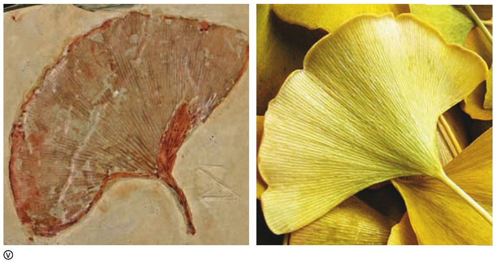
古银杏叶化石与现在银杏叶片的对比，可见变化不大

  

**【微博士】**活化石

判定一种现存的生物是否为活化石，需要符合下面三个条件：第一，现存种与某个古老物种在形态上是否相似或一样，即该种生物在地球上的生存历史长达几千万年甚至亿年以上，它们在漫长的时间中保留许多原始的特征不改变，演化缓慢甚至停滞；第二，这种生物所属的家族里，在今天仅剩下一个或很少的几个种，物种多样性很低，自身的数量也少；第三，这种生物过去可能广泛分布于世界各地，但现在的分布范围却极其有限，只在一小块区域残存。

**【微博士】**裸子植物

裸子植物是个复杂的大家族，成员包括松柏类、苏铁类、银杏类和买麻藤类四大类群。它们虽然形态各异，但繁殖方式、繁殖器官和与此相关的植物生活史却是相似的。裸子植物只结种子，而不产生被子植物（比如桃子）那样的有果皮、果肉的果实。它们的种子外面顶多有一层假种皮包裹，种子裸露，这就是裸子植物名字的来历。

【微问题】为什么松柏能耐寒冷干旱？

【关键词】松树　新美穗　伏脂杉　科达　古羊齿　义马银杏

## 为什么被子植物能成为演化最成功的植物

被子植物种类繁多、数量庞大，是当今地球上演化最成功的植物。它的成功，全赖于以下几个本领。

其一，被子植物生有极度简化的雌、雄配子体。植物从发芽、长大一直到产生下一代成熟种子的全过程，称为一个完整的有性生活史。这个过程中的某一段时间，植物体内的遗传物质会减半，此时植物便处于配子体世代，反之则处于孢子体世代。生命中的大部分时间，让抗性较强的孢子体面对风霜。参天的大树是孢子体，未抽薹的油菜也是孢子体。配子体世代是决定植物下一代质量的关键时期，配子体越简单、体积越小，本身就越安全，配子体世代也就越短越高效。陆生植物越高等，配子体世代就越简单。配子体分雌、雄。被子植物的雌配子体藏在花的胚珠珠心中，只有7个细胞，叫作胚囊；而雄配子体则是由花药播撒出去的小小花粉粒，更是只有区区2～3个细胞。

被子植物的花

其二，被子植物的胚珠有心皮包被。一朵花的中心有雌蕊，雌蕊的下部膨大，此处称作子房，内生胚珠。每颗胚珠除了包着珠被外，还裹有心皮。胚珠外裹心皮，就是被子植物名字的来历。现生的植物，除了被子植物外都没有心皮。正是这层心皮，让被子植物的后代多了一层保护。

其三，被子植物具有柱头的识别机制，落在雌蕊柱头上的花粉，只有符合柱头上的特殊蛋白的要求，才能长出长长的花粉管，让花粉内的精细胞有机会与胚珠相会，完成受精，发育成种子。不同种的植物花粉和这朵花本身的花粉都不能完成受精，而只有同种植物的不同花朵所提供的花粉才能获得成功。有了如此精巧的机制，远缘杂交和近亲交配都不可能发生。

其四，被子植物具有双受精作用。被子植物胚珠中的胚囊有7个细胞，其中5个起辅助作用，另2个都可以与外来的精细胞融合，这种融合被称为双受精现象。通过花粉管到达胚珠的精细胞有2个：其中的一个与卵细胞结合，完成传统的受精过程，孕育新的生命；另一个则与极核细胞结合成胚乳，为新生的胚提供营养。

其五，被子植物体内的导管性能优异。陆生植物的体内有一种死细胞，坚硬的外壁形成一根根细小的管道，帮植物把水分和无机盐从根运送到身体的各个部位。在蕨类植物和裸子植物等类群里，这类死细胞叫管胞。它们的外壁仍保持相对完整，各个管胞头尾尖尖，相互拼接，通过细胞壁上的叫“纹孔”的小洞运输物质。而在被子植物体内，这类细胞却叫导管，它们两端的细胞壁完全溶解，各个导管分子首尾相接，变成一根贯穿植物体的虹吸管道，与管胞相比运输效率大为提高。

其六，被子植物的筛管效率很高。植物体内起输导作用的组织，除了导管、管胞这些运输水分和无机盐的死细胞外，还有一类运输糖分的活细胞，可以为植物各部分提供能量。这类活细胞在裸子植物中叫筛胞，在被子植物中叫筛管。同样，各筛管首尾相接成为贯穿植物体上下的细长管道，它们接合处的孔洞比筛胞更大，运输糖分也就更加高效。筛管是一种极度特化的活细胞，必须依靠一种叫伴胞的细胞才能生存。

其七，被子植物生存于各式各样的环境中，传粉方式也是五花八门。除了常见的以风力传粉的风媒、由昆虫传粉的虫媒外，还有水媒、鸟媒等方式。果实、种子散布也是如此，靠风力传播者如榆钱、柳絮，靠水力传播者如莲蓬、椰子；苍耳等长了倒刺能钩住动物的皮毛，随它们走四方；好吃的樱桃被鸟儿吞下，种子随鸟的粪便飞到别处；凤仙花等的果皮像弹弓，成熟时急剧开裂把种子弹出很远。正是这些形形色色的花粉和种子的散布方式，让被子植物的生存范围变得如此之大。（徐洪河）

## 地质历史上最高的植物能长多高

越是庞大的生物，越是难以完整地保存为化石。那些高大的远古植物，人们几乎不可能发现它们的完整化石。因此若要重建古树的高度，只能通过古植物茎部化石的直径等资料来估算。有些化石植物体已经完全被压扁，这时就只能根据茎的宽度首先估算出茎的直径，然后才能进一步估算出植物的高度。具体的估算方式主要依据的是现代植物学中植物茎干和最大高度的相关性。

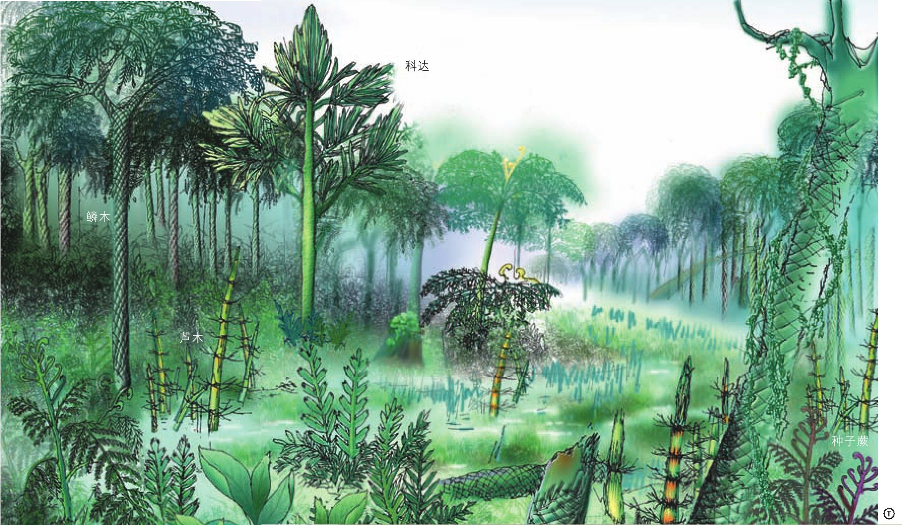
华夏植物群是石炭纪和二叠纪生长于东亚的植物化石群的总称，其中有许多高大的植物

最早的乔木状植物出现在中泥盆世，主要是一些早期石松类植物和早期真蕨类植物，树干的最大高度为4～5米。随后出现了三种类型的乔木状植物。一类是木本石松类植物，如芦木、鳞木等。它们在石炭纪非常繁盛，也是形成石炭纪煤层的主要植物，最高可达40米。还有具有裸子植物的内部结构，同时兼具蕨类植物形态学特征的前裸子植物，这类植物最早出现在晚泥盆世，在泥盆纪和石炭纪一直很繁盛，高度可达30米左右。更有古生代起源、中生代变得繁盛的裸子植物，如松树和水杉等。这些植物与现生的裸子植物很相似，在地质历史时期中它们是长得最高的树木，最高超过40米。（徐洪河）

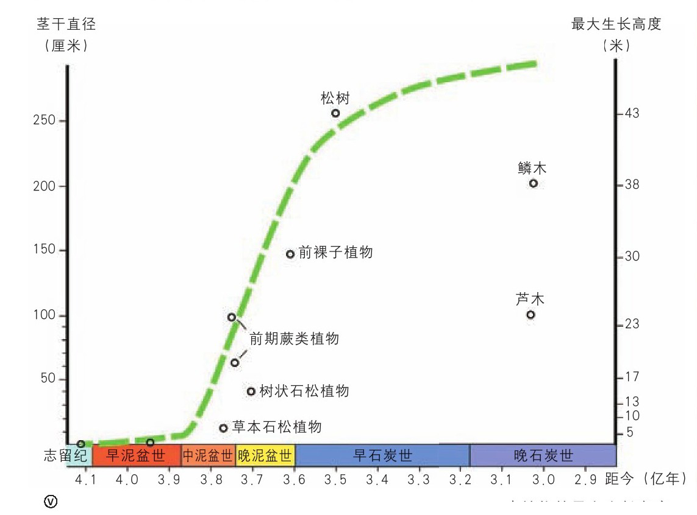
古植物的最大生长高度

  

**【微博士】**被子植物的草原

草本的被子植物比裸子植物有更强的适应力。它们更耐干旱，有很少的水就可以活下来。它们对土壤要求不高，在很薄的土层上就可以生长。它们可以通过地下茎，在短短几年内就占领一大片地区，这是松柏等生长缓慢的乔木所无法比拟的。禾本科的被子植物中还有更多的植物硅酸体，让吃它的动物牙齿迅速磨损。有的草本植物像毛茛、辣椒、荨麻，发展出了有毒的“化学武器”。于是，在距今2300万～533万年的中新世期间，全球气候变得干冷时，草本的被子植物迅速扩展，在地球上形成了大片的草原。

【微问题】被子植物的花有什么方法引诱传粉者？

【关键词】被子植物　孢子体　配子体　导管　筛管　树高　草原

## 地球上第一朵花开在哪里

被子植物会开花，是一个拥有450个科约26万种植物的大家族。在除藻类以外的所有植物中，它的种数占据了95%，因此被认为是当今世界上最成功的植物类群。不过，比起蕨类、苏铁、银杏、松柏等，被子植物只是植物大家庭中的后起之秀。世界上的第一朵花开在哪里，到现在仍是众说纷纭。相比起植物的其他组织来说，花十分娇嫩，而且花期很短。人们常说昙花一现，因为这种花开三四小时就香消玉殒。更有甚者，短命的如小麦花，开5分钟就迅速凋零。一般的植物一年开一季，花期从几天到月余不等。因此，花形成化石比其他组织要困难得多。

公认最古老的花、果化石有1.1亿～1.3亿年的历史。一些远古的花化石在葡萄牙、巴西、北美洲及中国东北均有发现，它们曾在恐龙横行的早白垩世静静开放。其中最值得一提的，是中国辽西朝阳地区产出的中华古果化石。古果的花没有娇嫩美丽的花瓣，反倒像一根长长的麦穗——底下是雄蕊，顶上是被植物学家称为心皮的雌性生殖器官，将来会发育成豌豆荚般的果实。因为古果的茎枝细长柔弱，叶子深裂，根系很浅，所以古生物学家认为它只能像水草一样生活，靠水的浮力支撑其枝叶。

中华古果复原图

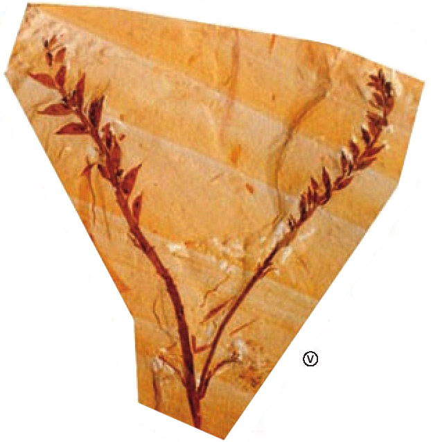
辽宁古果化石

被子植物和人一样有自己的谱系，把它们的关系画出来，就变成了一幅“演化树”图：越古老的植物越靠近“树根”，越年轻的种类越接近“树冠”。古果花形奇异，现今被子植物的任何一个类群都没法把它认作自家人，再加上它1.2亿～1.25亿年的“高寿”令人侧目，因此科学家认为它应该自立门户，在被子植物演化树上处于最靠近“树根”的枝条上。

在由岩石地层写就的“万卷书”中，被子植物的花化石其实远不及叶化石常见。怎么判断叶化石是属于被子植物的呢？被子植物的叶片有自己的典型特征，除特殊的单子叶植物外，一般都是叶脉规则分级、逐级变细、交织成网，最细的一级脉末端游离。北美的波多马克群是著名的早期被子植物化石产地，那些1.1亿～1.3亿年前的古老叶片，在岩石中一层叠一层，记录下了被子植物叶片的演化过程。在中国安徽发现的早白垩世中期新庄组的“微小双子叶植物叶”，与北美最古老的被子植物叶片非常相似，以其约1.3亿年的高龄，成为中国最早最确定的被子植物化石。

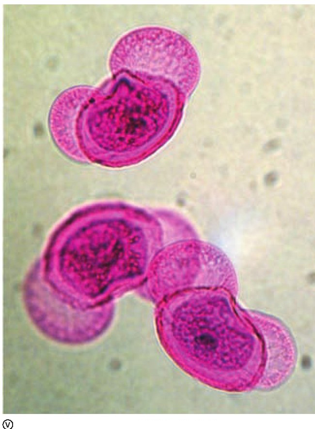
显微镜下的花粉

此外，植物身上还有一种东西比叶片更多、更容易保存为化石，这就是小小的花粉。一朵花的开放时间再短，自己的花粉也会被播撒出去。它们细若无形，却粒粒打着被子植物的烙印；它们数量庞大，在地层中，比花、叶更早一步透露了被子植物的行踪。目前，公认最早的被子植物花粉来自以色列，年代为1.34亿年前的早白垩世。英格兰南部发现的花粉略晚，但年代也达1.3亿年以上。

化石能提供的直接证据就到此为止了。令人深思的是，无论是最早的花、叶还是花粉，在早白垩世的化石植物群中都已经具备很高的多样性。也就是说，这个年代并非被子植物起步的原点。第一朵花开放的时间，应该还可以再向前推。分子生物学和现代生物学的研究，将一群被称为“ANITA”的植物确立为现生被子植物的最基本类群。通过解读这类植物的习性和生活环境，再结合地质历史上气候变化的轨迹，科学家认为第一朵花可能在2亿年前就在靠近赤道的半干旱区开放了，当时温暖的气候足够滋生新的生命形式，而缺水的环境又促使植物改造自己的身体，第一朵花可能就是在这样的环境下演化出来的，但要确定这一假说是否正确，最终还得寄希望于未来化石的发现。（徐洪河）

## 水稻是什么时候被驯化的

水稻是世界上最主要的粮食作物之一，也是东亚、东南亚和南亚诸国人民的主食。今天的栽培水稻主要分两大变种，即籼稻和粳稻。籼米窄长，黏性较小；粳米圆短，入口黏糯。目前大多数科学家认为，这两类水稻都是由野生稻经人类驯化而来的。最早的驯化野生稻的“实验田”就在长江中下游流域。在新石器时代的考古遗址中，已经有了大量与栽培水稻相关的发现。

水稻驯化的起始时间大约在公元前9000至公元前7000年间，即距今11000～9000年间。浙江浦江上山遗址出土的陶片中，就留下了稻壳的印痕，土中还残留着大量稻壳。虽然这些稻米的形态仍与野生稻相仿，但当时的人们显然已经在有意识地采集稻米，把它当作日常的口粮了。

公元前5000年至公元前4000年，居住在今天浙江宁波余姚河姆渡的人们，为扁平的骨片和木板接上手柄，制成简易的农具进行耕作。这时的水稻正处于驯化的转变期，人工选择过程已经启动。代表公元前4900年至公元前4600年间文化的余姚田螺山遗址，还出土了谷粒不易脱落的谷穗，它正是这一转变过程的一大佐证。

公元前4000年左右，水稻的驯化过程基本完成。江苏苏州唯亭的草鞋山遗址和昆山绰墩山遗址都出土了小片的稻田。绰墩山的稻米比其他更老遗址的谷粒都宽，呈现出驯化水稻的特征。

也就是说，长江中下游一带的先民，花费几千年的时间，终于在公元前4000年左右驯化出了合口的稻米。此后的2000年间，这种作物又传播到黄河流域，成为中原地区的主食，同时南下印度、东南亚，并东进朝鲜半岛和日本，开始了新的世界之旅。

如今人们栽培的水稻，与自然界中的野生稻已经很不一样了：它的谷穗少芒，谷粒较大较圆，而且成熟时不易脱落。这种变化正是人类对稻进行驯化的结果。（徐洪河）

现在人工栽培的水稻

  

**【微博士】**孢子和花粉化石

孢子和花粉（简称孢粉）化石都属于微体植物化石，虽然人们用肉眼难以看到，但它们却有重要的研究价值。孢粉化石个体微小，成分稳定，不易被破坏。利用孢粉化石组合可以恢复古地理、古生态、古环境等，还可进行地层的划分和对比。

【微问题】远古和现生植物的花粉有什么不一样？

【关键词】最古老的花　中华古果　籼稻　粳稻

## 远古植物是怎样迁徙的

蒲公英

不同类型的植物有着不同的迁徙模式。在植物登陆以前，水生植物可以借助水体的流动而完成迁徙。陆生植物则需要依靠多种策略完成迁徙。

靠风传播的小干松

在陆生植物的历史中，不同类型的植物在不同时期占据着优势。最早登陆的陆生植物是一些非常低矮的、不能完全脱离水环境的地衣和苔藓类植物，这类植物需要在有水的环境中才能进行繁殖，因此迁移的范围非常小。

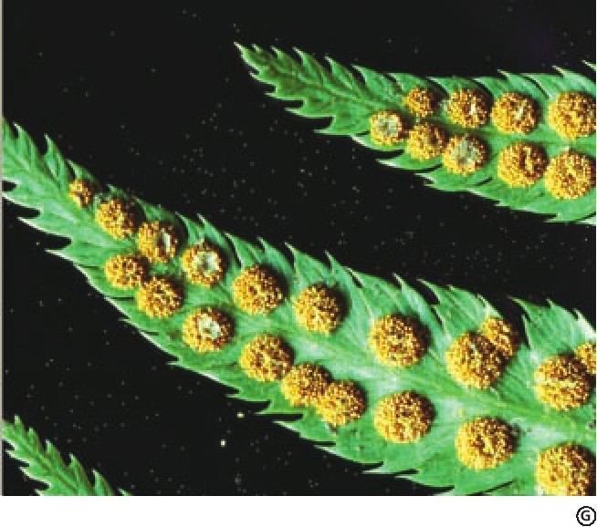
蕨类植物叶背后的孢子囊

随后出现的是依靠孢子进行繁殖的蕨类植物，在今天的植被中蕨类植物大多为低矮的草本，但是在古生代，却曾出现过草本蕨类植物、木本蕨类植物等各种各样的类型，它们是古生代占据绝对优势的植物类群。成熟的蕨类植物以散发孢子的方式进行扩散和迁徙，孢子个体微小，直径通常为40～200微米，微小的风就能把这些孢子传播到很远的地方。现生石松的孢子可以借助风力传播最远达3000千米。在古生代，风力是驱动蕨类植物孢子传播并协助这些植物迁徙的主要动力。化石记录表明，古生代有大量蕨类植物分布范围非常广阔，甚至有些还呈全球分布，这种植物地理格局就是它们借助风力驱动孢子进行迁徙的有力证明。

蕨类植物繁盛的地质时代中，还出现了同时长有两种大小不同孢子的异孢型个体，其中大孢子直径多为200微米以上，最大可达1毫米左右。异孢型蕨类植物的大孢子迁徙能力远不如只有一种孢子的同孢型蕨类植物，但它们很可能与后来出现的种子植物存在密切的演化关系。

最早出现的种子植物是不开花的裸子植物，它们是中生代的优势类群。而开花的被子植物到新生代才成为优势类群，那时的陆生植物的面貌与今天的已经相差不多。种子是一种繁殖器官，它可以借助生物、风力等多种方式散播。另外，种子植物的受精离不开花粉，而花粉则比孢子还要小一些，在空气中散播能力更强。有些裸子植物，如松树的花粉还具有专门的气囊，可以更好地借助风力进行散播。除了利用风力，花粉还可以附着在昆虫、鸟类和翼龙的身体上进行传播，使植物实现更大范围的迁徙。（徐洪河）

## 最早的攀援植物是什么时候出现的

攀援植物是指与其他植物具有依附关系的一种植物。植物在保存成为化石的过程中往往经历了一定的搬运作用，因此植物彼此间的关系很难以化石的形式记录下来。但攀援植物却不同，它们往往长有独特的攀援性器官，如钩状结构、特殊的卷须等。如果在化石记录中发现了这些特殊的攀援性器官，就能说明在当时已经出现攀援植物了。目前，古生物学家已经通过浸解石炭纪植物化石材料的方法，找到了分散保存的植物攀援性器官，证明石炭纪时期已经出现了具有攀援习性的植物。

但是，有没有更古老的攀援植物呢？答案是肯定的。

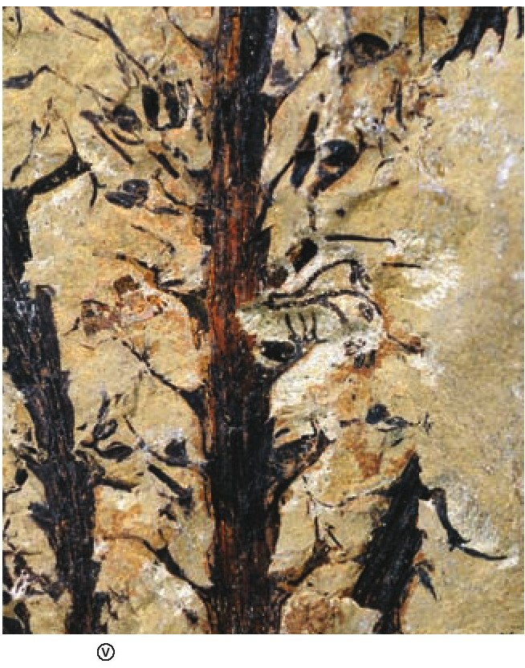
新疆发现的中泥盆纪的莱尼蕨可能具有攀援性

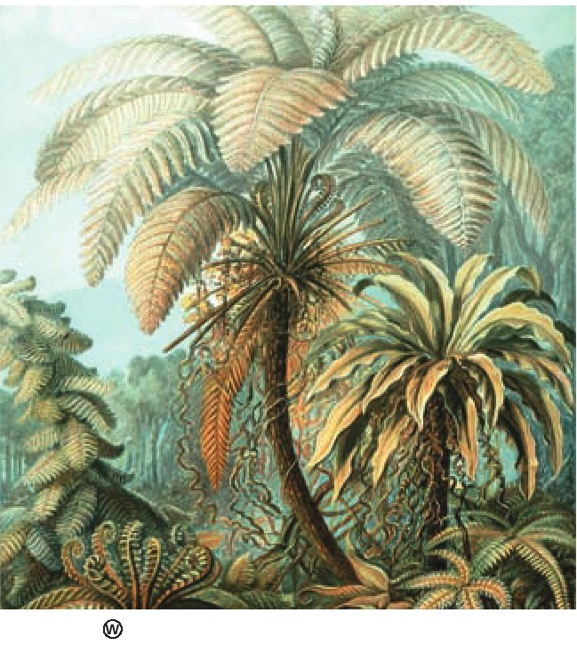
远古的攀援蕨类假想图

植物总会占领不同的生态空间。攀援植物是伴随着植物生态系统的复杂化而出现的。泥盆纪时期，地球上已经出现堪比现在的、非常复杂的生态系统，其中既有低矮的草本植物，也有高大的乔木状植物，攀援植物在这种生态系统中是有可能出现的。但是，目前仍缺乏直接的化石证据证明这一点。中泥盆世可能存在攀援植物的论证来自同时保存的两种植物的化石材料：一种植物——新疆莱尼蕨，叶末端具有钩状结构；另一种植物——丽枝蕨，末端部分恰好保存在前者的叶间。通过这些化石证据，古生物学家推测，攀援植物在中泥盆世就可能已经出现了。（徐洪河）

## 最早的食虫植物是什么时候出现的

食虫植物生活在土壤贫瘠、光照充裕的地区。这些地方的土壤里缺乏植物生长所必需的氮元素，所以植物们不得不将自己的叶片“武装”起来，捕捉飞舞的昆虫以汲取营养。

食虫植物精巧的捕虫机制，并不是从同一个祖先那儿获得的。分属于6个目的600多种捕虫植物亲缘关系很远，相似的捕虫器官只是不同植物在相同环境下迫于生计发展出的相似特征。因此，要通过今天地球上生活的食虫植物形态来推断最早的食虫植物相貌，并标定食虫习性出现的时间，实在是非常困难的。

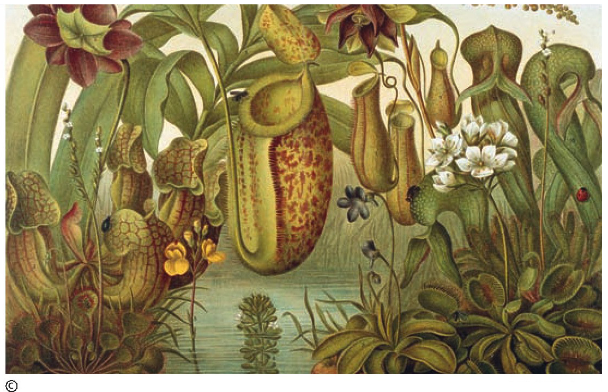
各种猪笼草

如果从化石记录上追寻，倒是存在一些蛛丝马迹。科学家在捷克南部发现过一种与今天的貉藻果实类似的化石，他们把它定名为“壮丽古貉藻”。这种植物生活在8500万～7500万年前的晚白垩世，在热带岛屿上与恐龙为伴。中国科学家在辽宁西部发现一种名叫长颈古瓶子草的化石，与今天生活在北美的食虫植物紫瓶子草长得很像。这种草生活的时代比壮丽古貉藻还要早，远至1.2亿年前的早白垩世。它们有可能是最早的食虫植物。（徐洪河）

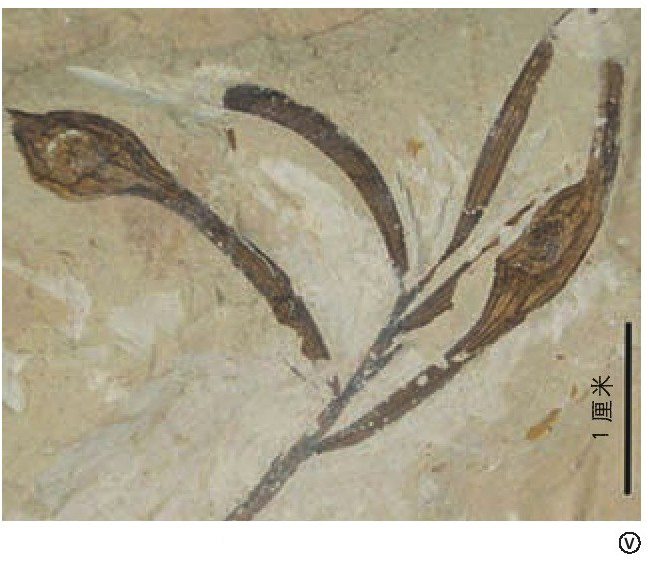
长颈古瓶子草化石

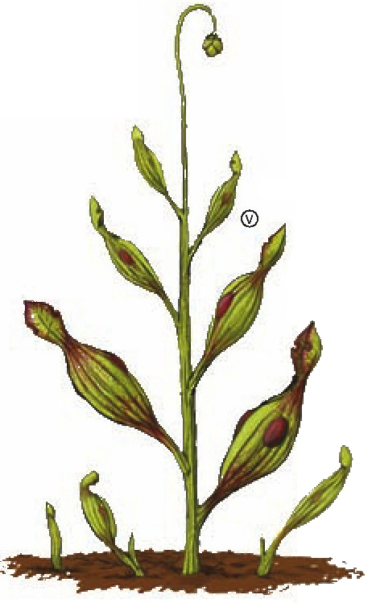
长颈古瓶子草复原图

  

**【微博士】**支持大陆漂移的舌羊齿

虽然陆生植物可以借助风力迁徙，但要越过大洋还是很困难的。大陆漂移说的提出者魏格纳曾经根据不同大陆板块上相同地质时代地层中有相同的舌羊齿化石记录，证明这些大陆板块曾经属于同一个古地理区系，以支持他的大陆漂移学说。舌羊齿主要发现于二叠纪，可能代表了一种高大的树木，树干直径可达40厘米，外形类似于蕨类植物，叶具有中脉以及细致的网状叶脉。叶子的整体呈舌状，故名。

【微问题】植物是怎样攀援的？

【关键词】植物迁徙　攀援植物　食虫植物　长颈古瓶子草

## 人类用以呼吸的鼻孔从哪里来

人类用来呼吸的鼻孔分外鼻孔和内鼻孔，这是脊椎动物在陆地上生活所必需的结构。内鼻孔的起源可以追溯到3亿多年前发生在四足动物祖先身上的一次偶然事件，那时人类的祖先还是鱼的形态，它将这偶然获得的内鼻孔保留了下来，并传给它的四足动物后裔。然而，最早的内鼻孔在什么时候出现，又是怎样出现的呢？内鼻孔到底是一个崭新的结构，还是从鱼类已有的鼻孔演化而来的呢？一条生活在4亿年前的鱼成为解答这些问题的关键所在。

四足形类又称内鼻孔类，包括了所有的四足动物以及它们已成为化石的鱼类近亲。除了这些与四足动物直接相关的化石鱼类，其他所有的鱼类都没有内鼻孔。已知最早的四足形类化石之一——肯氏鱼，发现于中国云南早泥盆世晚期的地层中，距今已有3.9亿年的历史。肯氏鱼最怪异的地方在于，它的前上颌骨跟上颌骨不像其他鱼那样连在一起，而是中间有一个缺口。这个缺口就是从头的背面向口腔里面转移来的后外鼻孔的开口。这个后外鼻孔后来就完全转移到口腔里面，彻底变成了内鼻孔。

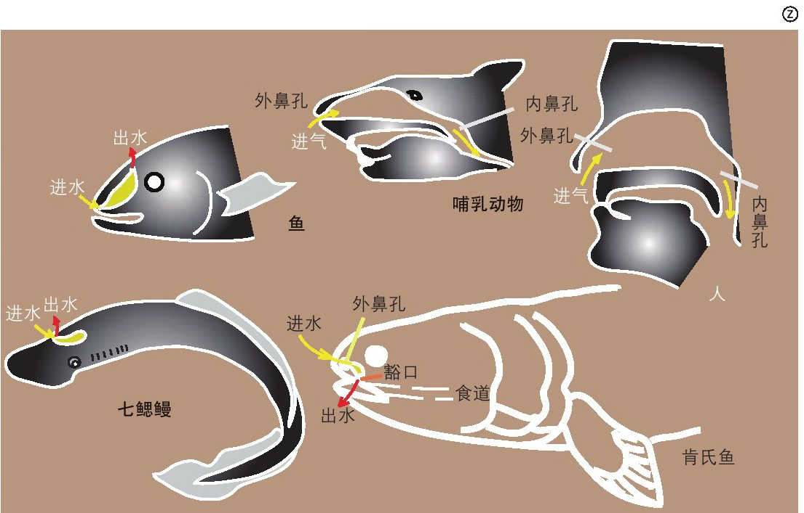
现生脊椎动物与肯氏鱼鼻孔的比较

肯氏鱼的出现，既证实了在肉鳍鱼类演化中确实存在一个后外鼻孔“漂移”形成内鼻孔的过程，也为内鼻孔跟后外鼻孔的同源关系提供了直接证据。肯氏鱼正好处于一般鱼类的两对外鼻孔（前外鼻孔和后外鼻孔）朝四足动物一对外鼻孔和一对内鼻孔过渡的关键时期。人类在胚胎发育初期，上颌同样的位置也会像肯氏鱼那样出现一个缺口。正常情况下，这个缺口会在发育的后期慢慢闭合，但是也有的胎儿发育不完整，这个缺口无法闭合，便形成了兔唇。（卢静）

## 为什么“披甲戴盔”的鱼没能生存至今

身上长满细密的鳞片，有着流线型的身体，自由地在水中遨游，这是人们对鱼类的通常印象。如果不是看到化石的话，很难想象在4亿年前，曾经有这样一群鱼占据着海洋——它们披覆着厚重的盔甲，像极了全副武装的古代战士。这群“披甲戴盔”的鱼就是古生代的无颌类和盾皮鱼类。

这些鱼长得可谓是千奇百怪：有的身披铠甲全副武装，有的头上戴着坚硬的盔胄，有的脊背上伸出一根天线似的骨刺。头甲鱼是无颌类的代表，这种身长十几厘米的鱼头上扣着大大的“头盔”，因为没有上下颌，它只能靠吸附在其他鱼身上吮吸其体液为生。头甲鱼行动笨拙，主要在水底活动，看上去就像是在爬来爬去。另一种奇特的“披甲戴盔”鱼叫作沟鳞鱼，它是盾皮鱼类一个繁荣昌盛的分支，化石几乎遍布全球。沟鳞鱼有着鱼一样的身体，却背着乌龟一样的壳，甚至鱼鳍都变成了螃蟹一样的附肢！

这些“披甲戴盔”的鱼虽然看上去咄咄逼人，但厚重的盔甲却影响了它们快速行动和主动捕食的能力。大多数时候这些鱼只能生活在水底，没有嘴的（无颌类）希望傍上个可靠的寄主，有嘴的（盾皮鱼类）则趴着等待猎物自动送上门。所以当新型的、更轻盈灵活的鱼类出现后，盛极一时的“披甲戴盔”的鱼类就开始逐渐走向灭亡，并在泥盆纪末最终灭绝。虽然现在还能在水族馆里看到一些为了适应特殊生态环境而重新披上“盔甲”的鱼类，比如俗称“清道夫”的吸口鲶，但它们跟古生代“披甲戴盔”的鱼已经没有什么血缘关系了。（卢静）

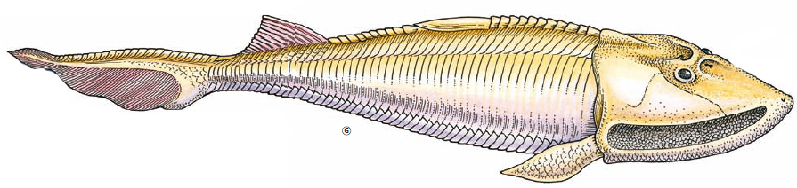
头甲胄鱼

## 最早的颌是怎样出现的

颌的起源是脊椎动物演化史上一次里程碑式的关键事件。没有颌，人们就不能咀嚼食物，更不能说话。因此，颌的出现标志着脊椎动物由被动的滤食生活向主动的捕食生活演化的巨大改变，极大地提高了脊椎动物的取食与适应能力。但颌的起源长期以来一直困扰着科学家。最早的颌是在何时出现，以及怎样出现的？这些问题很长时间都悬而未决。

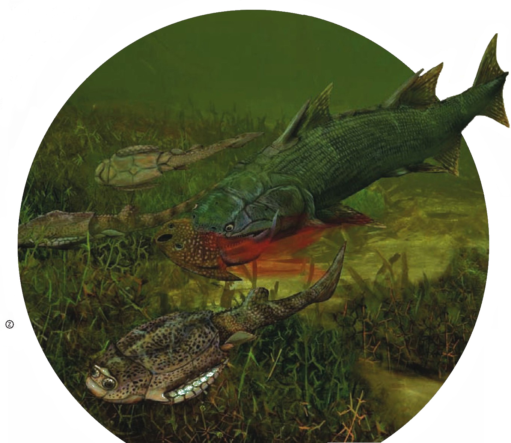
无甲的斑鳞鱼正在捕食无颌类的盔甲鱼，旁边为沟鳞鱼

2011年，英国的《自然》杂志报道了中国科学家与英、法等国科学家合作研究的有关脊椎动物颌的起源的最新成果。科学家利用最先进的同步辐射CT扫描和计算机三维重建技术，复原了一条4亿年前中国志留纪的无颌类盔甲鱼的脑、神经、血管以及内耳等器官。他们经研究发现，盔甲鱼与其他无颌鱼类不同而和有颌鱼类相似，它的鼻囊和主要负责激素分泌的垂体窝已经开始分裂。这一变化为随后有颌类颌的形成提供了先决条件。科学家为这条来自中国的盔甲鱼起了一个非常好听的名字：曙鱼，意为一条为颌的起源带来曙光的鱼。（卢静）

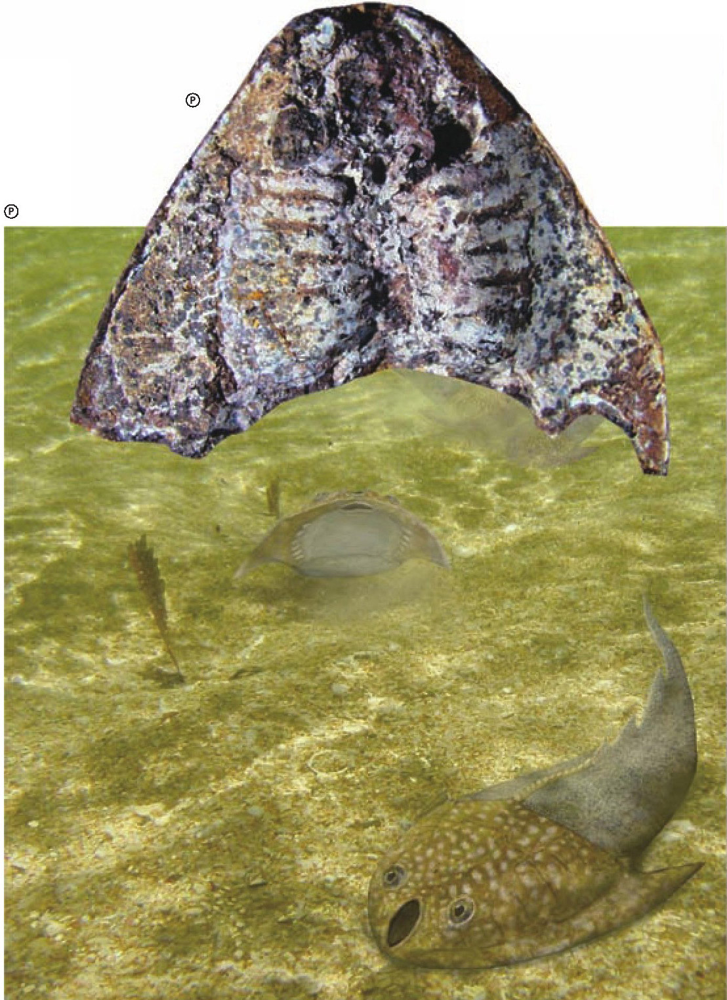
曙鱼化石（上）和复原图（下）

  

**【微博士】**最早的卵胎生脊椎动物

在距今约3.6亿年的澳大利亚晚泥盆世的地层中，人们发现一件珍贵的化石。这是一条保存完好的正处在生育过程中的雌性盾皮鱼化石，它的孩子通过一条已经矿化的“脐带”残体跟它连在了一起。这件化石是已知最古老的脊椎动物的胎生证据，也说明3亿年前的部分盾皮鱼类已经具有更为高级的繁衍后代的方式——卵胎生。

【微问题】内鼻孔和外鼻孔有什么区别？

【关键词】内鼻孔　肯氏鱼　沟鳞鱼　曙鱼

## 恐怖的史前巨鱼能长多大

200万年前，一种可怕的巨型鲨鱼曾经生活在浩瀚的大洋之中，它跟大白鲨是近亲，这就是巨齿鲨。它的拉丁文学名叫作Carcharodon megalodon，“megalodon”来自希腊语，是巨大的牙齿的意思。巨齿鲨的一颗牙齿有手掌那么大，体长可达16米，是史上最大的鲨鱼，也是地质历史上最大的掠食者之一。它的体重可达100吨，是大白鲨的30倍！这种恐怖的猎手甚至可以撕咬大型鲸类的尾部和鳍肢，猎杀庞大的巨鲸！

大白鲨是现今咬合力最强的动物之一。最大的大白鲨咬合力可以达到19600牛（相当于2吨物体的重量），这个数字是非洲狮的3倍，人类的20倍。然而，巨齿鲨的咬合力却是大白鲨的6～10倍！如此可怕的咬合力足以让巨齿鲨在动物界所向披靡，就算是曾经雄霸天下的霸王龙，其咬合力也只能达到30380牛（相当于3.1吨物体的重量）。巨齿鲨还拥有一种最致命的武器——锋利的呈锯齿状的牙齿。在巨大的咬合力驱动下，这些牙齿不费吹灰之力就能刺穿或撕开猎物的身体。另外，牙床上的轮换带也让巨齿鲨的牙齿常换常新，旧牙在变钝之前已经完全被新牙取代，使得这些“武器”永远保持锋利。巨齿鲨从2500万年前开始出现，到200万年前全部消失。当时地球上的水循环发生了大的改变，推测体形庞大的它们因找不到足够的食物而灭绝。

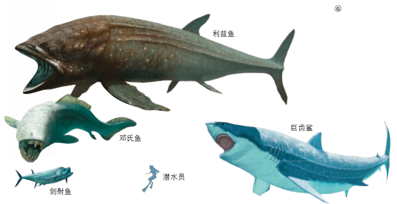
各种史前巨鱼和人的大小比例

在巨齿鲨还远未出现的洪荒时代，在3亿多年前晚泥盆世的海洋中，还曾生活过另一种海中霸王——邓氏鱼。邓氏鱼是已知最大的节甲鱼类（盾皮鱼类最繁盛的一支），是泥盆纪体积最庞大的生物和顶级掠食者，近10米的身长和3.6吨的体重令它们在当时横行海洋，是地史上仅次于巨齿鲨的第二凶猛的海生爬行动物。邓氏鱼的化石主要产自北美洲和欧洲，在中国四川龙门山附近发现的身长近1米的江油鱼和它是近亲。

由于身上披着厚重的盔甲，邓氏鱼虽异常强大但却行动缓慢。它虽然没有真正意义上的牙齿，但是那像刀刃一样锋利的铲状上下颌骨和高达49000牛（相当于5吨物体的重量）的咬合力却可以轻易将任何猎物一口咬断。现今称霸海洋的鲨鱼的祖先，当时在邓氏鱼面前简直就是不堪一击。此外，邓氏鱼还具有强劲的吸力——它能在1/50秒的时间内张开大嘴，利用强大的吸力把猎物吸进嘴里。巨大的吸力跟强劲的咬合力让邓氏鱼荣登泥盆纪海中霸王的宝座。然而，庞大的身躯和笨拙的盔甲使得它在运动速度和灵敏性上都无法与鲨鱼等更矫健的猎手竞争，最终在泥盆纪末灭绝了。（卢静）

## 旋齿鲨的牙齿到底长在哪儿

在千奇百怪的史前生物世界里，有这么一类神秘而怪异的鱼类：它们的一列列牙齿排成弧形或螺旋形，被称为齿旋，齿旋从大到小依次内卷，看起来有些像花朵，却又像铣刀一般令人不寒而栗。这类神秘的鱼类就是旋齿鲨。旋齿鲨自3亿多年前出现，到2亿多年前消失，化石在全球各地几乎都有发现，表明它们在当时分布非常广泛。

在很长一段时间内，人们都不知道如此奇怪的齿旋到底是以怎样的方式长在旋齿鲨身上的。有人认为长在背鳍上，也有人认为长在尾鳍上，又有人觉得应该长在吻部，还有不少人认为就该长在嘴里。直到发现了几件跟颌骨连在一起的旋齿鲨齿旋化石后，这个争论才算告一段落。原来，旋齿鲨的齿列和齿旋是位于上颌骨或下颌骨左右两边相连接的地方。然而，这样的螺旋状齿旋又起什么作用呢？古生物学家推测，在平时，旋齿鲨的齿旋向下弯曲成螺旋状呈休息状态；但当它在捕猎时，螺旋状的齿旋迅速展开，像鞭子一样抽打猎物，同时齿旋上带锯齿的小牙还能将猎物钩住，另外螺旋状齿旋还能伪装成当时海中常见的菊石类软体动物，引诱猎物靠近。

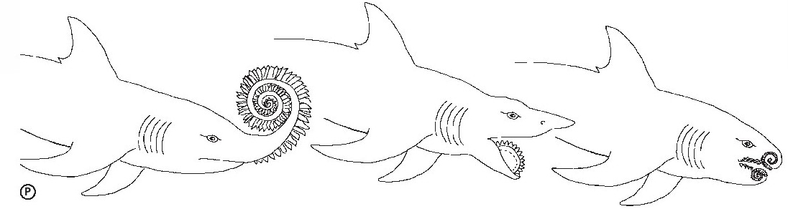
对旋齿鲨牙齿的几种设想

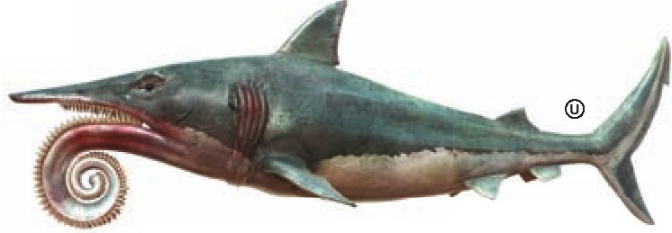
齿旋长在下颌的旋齿鲨形象

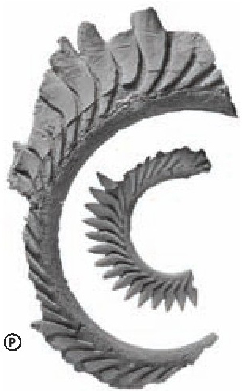
旋齿鲨牙齿化石

在中国湖北、湖南、贵州、西藏等地都发现过旋齿鲨牙齿化石，其中保存最好的当属在海拔4600米的珠穆朗玛峰三叠系地层中发现的旋齿鲨化石。这件化石除保存了弧形的齿旋外还保存了部分头骨，这在软骨鱼类中是很罕见的。通过这件保存较好的旋齿鲨标本，古生物学家可以推测出其大体形象：它的嘴巴很长，弧形旋齿长在左右两侧下颌的中间连接处，主要用来切断较大的食物；两边的碾压型的侧齿表明珠峰旋齿鲨很可能并不那么凶猛，反而主要靠吃带硬壳的无脊椎动物为生。（卢静）

## 骨头硬的鱼是什么时候出现的

骨头硬的鱼被科学家称作硬骨鱼，现生的大多数鱼都是硬骨鱼。与软骨鱼相反，硬骨鱼因为有坚硬的鳞片和骨骼，所以更容易被保存为化石。过去发现的早期硬骨鱼化石大多来自距今3.5亿～4亿年的泥盆系地层中，而且保存很不完整。在年代更为久远的志留系地层里虽也有发现，但仅局限于一些零星的鳞片。因此，对于硬骨鱼类的起源和早期演化的了解十分有限。

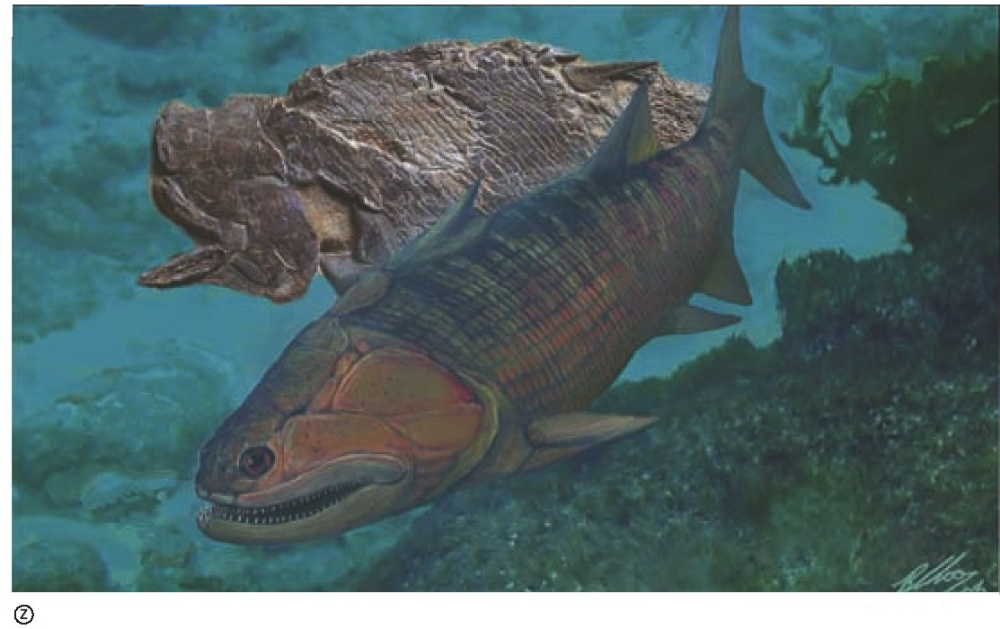
梦幻鬼鱼

2009年，中国古生物学家在中国云南曲靖志留系地层中找到了一件近乎完整的硬骨鱼化石。这个惊人的发现为研究硬骨鱼类的起源和早期演化提供了重要线索。这条不足30厘米的鱼拥有肉鳍鱼的脑袋和身体，辐鳍鱼的鳞片和纹饰，盾皮鱼和鲨鱼的背棘。它生动地展示了4亿年前的硬骨鱼长的是什么模样。这条奇形怪状的鱼被命名为梦幻鬼鱼，表示它的发现如梦似幻，如果不是真的发现了如此确凿的化石证据，任何人都将无法想象这种“四不像”的鱼的存在。

梦幻鬼鱼属于最原始的肉鳍鱼类，而肉鳍鱼只是硬骨鱼类中的一大分支，这就是说第一条硬骨鱼出现的时间还应该更早。就在第一条硬骨鱼出现后，它的后代非常快地辐射演化出了辐鳍鱼和肉鳍鱼这两大类群。但是迄今为止，辐鳍鱼的化石记录虽然可以追溯至志留纪，但在随后的早、中泥盆世时仍是大片的空白，只见有零星的鳞片化石。这与它们的姐妹群——肉鳍鱼，形成鲜明的对比。根据丰富的化石记录，后者在早泥盆世晚期就已经高度分化，繁盛一时。（卢静）

  

**【微博士】**中国的旋齿鲨

旋齿鲨化石在中国的最早报道是在1962年。标本来自浙江长兴晚二叠世的灰岩中，古生物学家将其命名为长兴中国旋齿鲨。

【微问题】史上最大的鱼是哪种鱼？

【关键词】巨齿鲨　邓氏鱼　旋齿鲨　梦幻鬼鱼

## 为什么献文鱼会有超级粗大的骨头

就在碧波浩瀚的中国青海湖旁，在上新世距今约三四百万年的地层中，古生物学家发现了一种非常奇特的鱼：它全身长着异常粗大的骨头，就连它的鱼刺也比一般的鱼类要粗10倍以上。这样的粗骨头鱼在现生鱼中是没有的，而且类似的粗骨头鱼化石记录也仅在地中海北岸中新世的地层里发现过一例。在青海湖发现的这条粗骨头鱼就是伍氏献文鱼，它是鲤科裂腹鱼亚科鱼类的化石代表。

现在青海湖中仍然有裂腹鱼类生活，但它们的骨头都十分正常。为什么它们的祖先却长了那么粗的骨头呢？经过研究后发现，伍氏献文鱼化石周围的岩石中含有大量的盐分和硫酸钙等物质，这说明当时它生活的水体又咸又碱，钙含量很高，而钙正是鱼类骨骼的主要成分。原来，水环境的高含钙量正是导致伍氏献文鱼“骨质增生”的原因。

这条“只长骨头不长肉”的鱼的发现其实反映了当时柴达木盆地的干旱化过程。在四五千万年前，印度板块与欧亚板块相撞，青藏高原开始隆升，高山阻断了来自印度洋的水汽，使得青藏高原北部气候持续变干，也令柴达木盆地慢慢蒸发成了一个个大小不一的荒漠与盐湖。

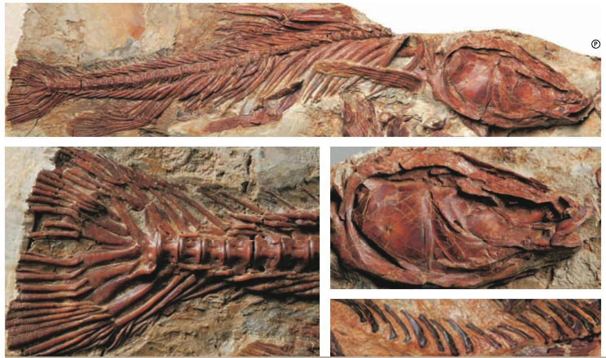
伍氏献文鱼化石

就在这样越来越咸的水中，鱼类还在顽强地生存。300万年前的伍氏献文鱼与钙含量很高的盐湖进行着斗争，天天泡着、喝着浓浓的盐碱水，骨骼也变得异常粗大，大到最后连长肌肉的地方都快没了。伍氏献文鱼也许是唯一一种见证了柴达木盆地干旱化进程的鱼类。因为在它之前，在柴达木盆地发现的所有鱼化石骨头都没有变粗的迹象；而在它之后，柴达木盆地的地层中只有厚厚的碳酸钙、硫酸钙沉积，再没有发现别的鱼化石。它成为这片日渐干涸水域中最后的守望者。（卢静）

## 龙鱼是金龙鱼的祖先吗

有一种灭绝的鱼类名字叫龙鱼，听起来和金龙鱼很接近。它们和金龙鱼是什么关系呢？

这类鱼最早被研究者翻译为“蜥鱼”，但后来因为叫起来不顺口而换成了“龙鱼”这个响当当的名字。龙鱼有一个非常长的尖嘴巴，细长的身体呈流线型，乍看跟爬行动物还真有些相似，也因此而得名。它们的身长从不到10厘米到1米多不等，化石在全球各地都有分布。最早的龙鱼化石在中国浙江长兴晚二叠世的地层中被发现，三叠纪是龙鱼大发展时期。迄今为止已确立的龙鱼类就有3属近40种。

龙鱼跟金龙鱼虽然只有一字之差，但是龙鱼并非金龙鱼的祖先，它们分别属于辐鳍鱼类两个截然不同的类群。

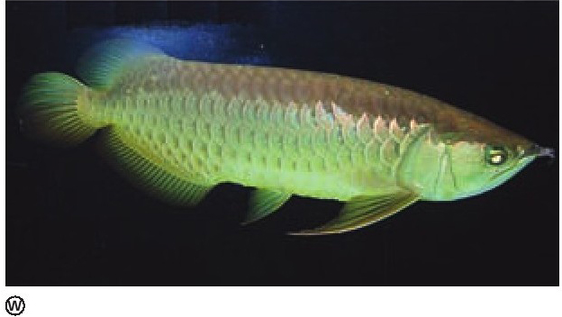
现在市场上可见到的金龙鱼

龙鱼是比较原始的辐鳍鱼类，与现生的软骨硬鳞鱼——鲟鱼的演化关系最为接近。近年来在中国云南、贵州等地中三叠统地层中发现的龙鱼类分异度很高，同一地点发现的龙鱼化石居然能够分出好几个不同的属。这在鱼类化石中是很少见的，却也说明当时龙鱼存在多样化的生态适应模式。尽管侥幸躲过了二叠纪末的生物集群灭绝事件，但所有的龙鱼在大约2亿年前的侏罗纪早期就全部灭绝了。

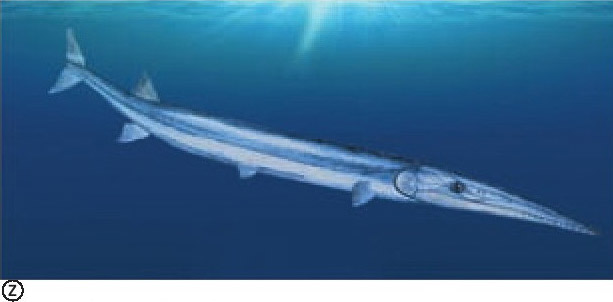
龙鱼复原图

而现在人们在观赏鱼市上见到的金龙鱼，是比软骨硬鳞鱼更进步的真骨鱼类骨舌鱼目的代表。骨舌鱼类是一支残存的古淡水鱼类，因它的舌头上长有骨质小齿而得名。最早的骨舌鱼类在1亿多年前首次出现，之后在全球都有分布。现在的骨舌鱼类主要分布在热带，因为身子侧扁像带子，所以在当地也被叫作腰带鱼。（卢静）

## 中国常见的鱼化石有哪些

中生代的狼鳍鱼是中国最常见的鱼化石，它是中生代后期（距今约1.2亿年）东亚地区特有的一种鱼类，属于较为原始的真骨鱼类，体长一般在10厘米左右，身体呈纺锤形或长纺锤形，背鳍位置靠后与臀鳍相对，牙齿呈尖锥形。有意思的是，虽然长得不太一样，狼鳍鱼跟现在水族馆中常见的金龙鱼却是近亲。

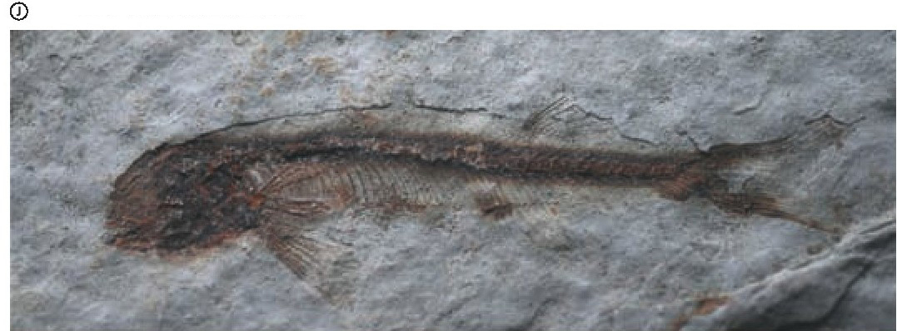
辽宁北票的狼鳍鱼化石

狼鳍鱼化石在中国辽宁、河北等地产出很多，在古玩市场上看到的鱼化石十之八九都是狼鳍鱼。狼鳍鱼化石一般保存得又完整又密集，这是因为它们跟现在的沙丁鱼一样，有集群游动的习性。和狼鳍鱼化石一起出土的还有很多珍贵的恐龙化石、翼龙化石和鸟类化石。

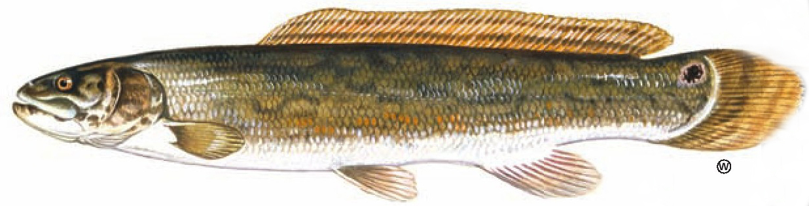
现生弓鳍鱼（上）及中华弓鳍鱼化石（下）

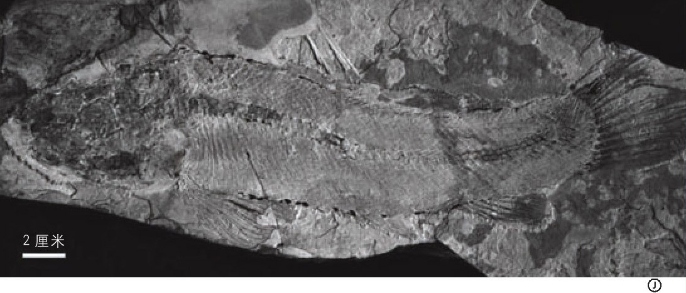
另一种著名的鱼化石是中华弓鳍鱼化石。弓鳍鱼类是侏罗纪和白垩纪繁盛的鱼类之一，曾广泛分布于全球。现在的弓鳍鱼仅生活在美国东部的湖泊和水流缓慢的河川里，被称为“活化石”。中华弓鳍鱼在中国中生代后期较为常见，在中国辽宁、陕西、甘肃、宁夏、内蒙古、安徽和浙江等地都有发现，并且都见于淡水沉积物中。中华弓鳍鱼化石在中国的广泛分布被认为与当时上述各地区的水系存在联系有关。

中华弓鳍鱼和现存的辐鳍鱼类全骨鱼次亚纲的弓鳍鱼十分相似，但比后者略为原始，它们具有相似的牙齿，推测两者的食性也应该相近。（卢静）

  

**【微博士】**辐鳍鱼类的演化

辐鳍鱼类的演化经历了三个阶段，从原始的软骨硬鳞鱼类到中间类型全骨鱼类，最后演化为真骨鱼类。辐鳍鱼类也相应地分为三大类群：软骨硬鳞鱼次亚纲、全骨鱼次亚纲，以及真骨鱼次亚纲。

**【实验场】**如何判断真假鱼化石

鱼化石是最常见的脊椎动物化石之一。对鱼化石造假最常见的当属对不完整的鱼化石进行涂色和填补。因此，在判断鱼化石真伪时首先要观察整块化石的颜色是否一致，其次观察颜色特别突出或集中的地方是否具有化石特有的突出感和骨感。

【微问题】如果吃古鱼，会吃到小刺（肌间刺）吗？

【关键词】伍氏献文鱼　龙鱼　狼鳍鱼　中华弓鳍鱼

## 哪种现生鱼类与人的亲缘关系最近

1938年12月，在南非东伦敦港附近的入海口，当地渔民捕捞到了一条奇怪的鱼。这条鱼呈蓝色，身长1.5米，重约58千克。最为奇特的是它具有肉质的鱼鳍，与化石空棘鱼长得几乎一模一样，而过去一直认为空棘鱼类在6500万前已经跟恐龙一起灭绝了。这条后来被命名为拉蒂迈鱼（又称矛尾鱼）的怪鱼正是大难不死的空棘鱼，它属于肉鳍鱼类，其肥厚的圆滚滚的肉质鱼鳍似乎正告诉人们——4亿年前的祖先长的就是这个模样。在经历了长达几亿年的演化之后，拉蒂迈鱼在外部形态特征上和它的化石祖先没有多少差别，是典型的“活化石”。

古希腊的哲人亚里士多德曾说过：“非洲总是可以发现新东西。”“起死回生”的拉蒂迈鱼很快在全世界掀起波澜，人们兴奋地把这种长“腿”的鱼当作与人类亲缘关系最近的现生鱼类。拉蒂迈鱼、化石空棘鱼的胸鳍和腹鳍鳍骨的排列，与四足动物以及四足动物的祖先鱼类的四肢骨排列十分相似。那么，拉蒂迈鱼也是最早登陆的鱼类吗？详细研究发现，尽管拉蒂迈鱼具备了完美的由水到陆的身体雏形，但是它离登陆似乎还是很远。拉蒂迈鱼的鳔内充满了液体，充满了液体的鳔是无法在陆上进行呼吸的。

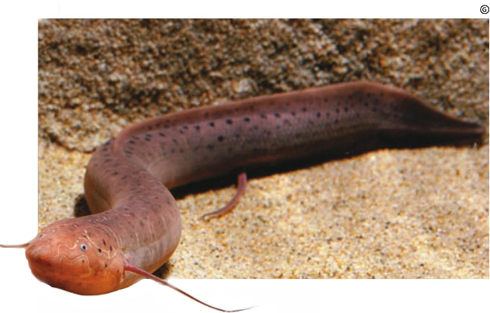
美洲肺鱼

除了拉蒂迈鱼这种空棘鱼类，今天世界上还存在另一类肉鳍鱼类，那就是肺鱼。肺鱼的鱼鳔内壁上有许多用来扩大呼吸面积的泡状囊，这与陆生动物的肺非常相似。并且，肺鱼在干旱缺水时还真的能借助它们的鳔呼吸，这种可以呼吸的器官无疑更有可能演化为真正的肺。肺鱼也因此而得名。由此看来，今天的肺鱼似乎才是人类的真正近亲。来自分子生物学的证据也显示，肺鱼与现生四足动物的DNA序列比拉蒂迈鱼与四足动物的更为相似。此外，化石证据也支持相比拉蒂迈鱼，肺鱼与人类的关系更近——在中国云南下泥盆统地层中发现的蝶柱鱼化石，同时具有肺鱼形类跟四足形类的最典型特征，它代表了肺鱼形类与四足形类的最近共同祖先，也说明肺鱼才是包括人类在内的四足动物现存最亲的“兄弟”。

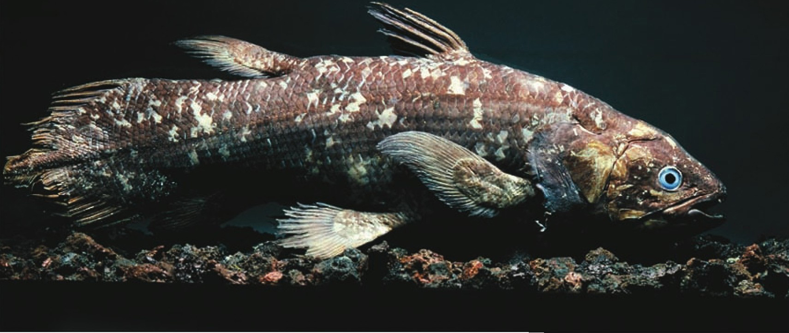
拉蒂迈鱼

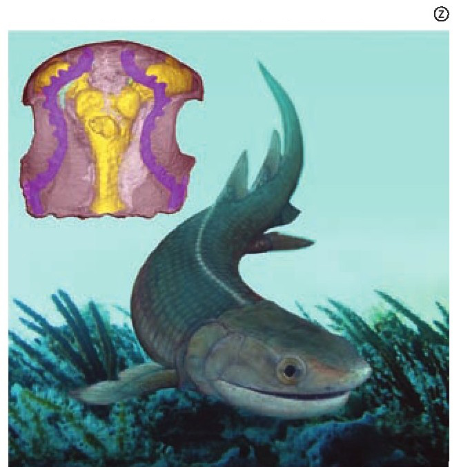
世界最早的四足动物——东生鱼，左上角是其内颅（半透明）和脑腔的三维重建

那么，今天的世界上还有没有人类的直接鱼类祖先呢？很遗憾，它们都已经灭绝了，不过还可以从化石中了解它们的形貌。最新报道的发现于云南早泥盆世中期（约4.09亿年前）的地层中的东生鱼就是四足形类的最早代表，它的发现将四足形类的演化历史前推了1000万年。通过高精度CT扫描与计算机三维重建得到的东生鱼脑腔结构，呈现出奇异的镶嵌组合形式：兼具原始有颌类的特征（如极短的嗅束与软骨鱼类、已灭绝的盾皮鱼类非常相似）与典型陆生脊椎动物的特征（如增大、加长的大脑半球等）。其他四足形类的著名代表还有在加拿大魁北克发现的真掌鳍鱼（约3.85亿年前）、在拉脱维亚发现的潘氏鱼（约3.8亿年前）和在格陵兰岛发现的提克塔利克鱼（约3.75亿年前）等。它们显示出一系列过渡型特征，身体结构也越来越像最早的四足动物——原始两栖类。（卢静）

## 人类的鱼类祖先长什么样

化石证据表明：3亿多年前的泥盆纪有一群进步的肉鳍鱼类偶然爬上了陆地，演化成像大鲵一样的古两栖类；在石炭纪末，某支古两栖类又演化出了爬行动物；这些古爬行类中的一支在距今2亿多年前成功演化出像老鼠一样的哺乳类的祖先；在白垩纪恐龙灭绝后，这些早期的哺乳动物开始兴盛，当中一支演化成猿；在大约700万年前，终于演化出人类。所以也可以说，肉鳍鱼类是人类的鱼类祖先。

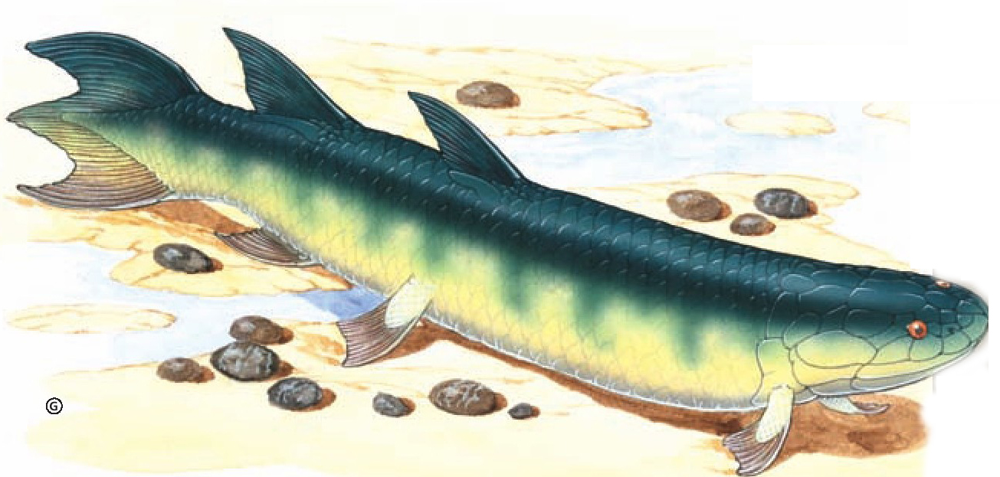
真掌鳍鱼

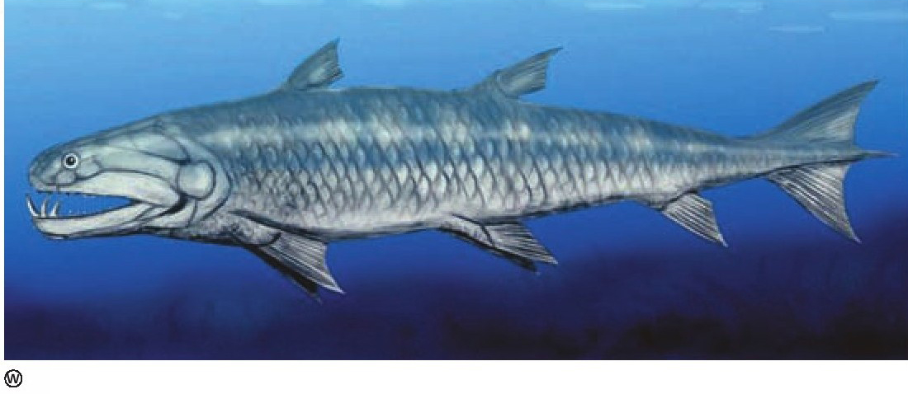
爪齿鱼

肉鳍鱼是硬骨鱼类的一支。在志留纪晚期，硬骨鱼分别演化出肉鳍鱼和辐鳍鱼两个大类。顾名思义，这两类鱼的主要区别在于它们不同的鱼鳍结构。现生的鱼类大多属于辐鳍鱼，它们的鱼鳍里面没有骨头，由辐射状的鳍条支持。而肉鳍鱼跟辐鳍鱼不一样，它们的偶鳍由一些结实的骨头和肌肉支撑着，使得它们的鳍显得肉乎乎的。人类的胳膊、腿就是从这圆滚滚的、肉乎乎的鱼鳍演化来的。

与辐鳍鱼不同，肉鳍鱼的脑壳并非铁板一块，而是分成由特殊关节连接起来的前、后两个部分，这就是肉鳍鱼特有的颅间关节。颅间关节的存在使肉鳍鱼的脑袋前、后两部分都能活动，可以更好地捕捉猎物。

最早的肉鳍鱼发现于中国晚志留世的地层中，不久就演化出四大类，即空棘鱼类、爪齿鱼类、肺鱼形类和四足形类。在整个泥盆纪中这些肉鳍鱼十分繁盛，种类之多远远超过了它的近亲——辐鳍鱼。潜伏在泥盆纪的淡水水域中的顶级捕食者往往都是一些可怕的肉鳍鱼，其中的爪齿鱼类是一类非常特化的肉鳍鱼。它们擅长守株待兔型的捕猎方式，下颌前端长着弯曲成爪状的獠牙，用以刺穿它们的猎物。进入石炭纪后，爪齿鱼类全部灭绝了，但其余的三大类肉鳍鱼都各有后代一直生活到今天，它们中的四足形类在泥盆纪后期演化成真正的长四肢的四足动物，并最终登上了陆地。（卢静）

  

**【微博士】**现存的肉鳍鱼

现存的肉鳍鱼共有8种，它们是3亿多年前盛极一时的原始肉鳍鱼祖先的后代。其中肺鱼有3属6种——美洲肺鱼、澳洲肺鱼以及4种非洲肺鱼，分别分布在南美洲、大洋洲以及非洲的淡水河湖中。而空棘鱼只有1属2种，这两种拉蒂迈鱼分别分布在科摩罗群岛附近以及印度洋东部海域。拉蒂迈鱼也是现存的唯一一类具有颅间关节的肉鳍鱼。

【微问题】为什么四足动物大多是五指（趾）？

【关键词】肉鳍鱼　拉蒂迈鱼　肺鱼　四足形类　东生鱼

## 鱼类是怎样为爬上陆地做准备的

鱼类爬上陆地，必须具备三个条件：有肺，可以在空气中进行呼吸；有四肢，可以支撑身体和运动；有能在空气中发挥作用的感觉器官，能在新环境中眼观六路，耳听八方。这一系列身体结构的变化谱写了鱼类登陆的演化史诗。

早在四足动物的祖先登陆以前，它们的感觉系统和运动器官已经逐渐呈现出一些与众不同的特征，为即将到来的陆地生活打下了基础。它们拥有能在空气中而不是水中发挥作用的听觉、视觉、神经系统以及形如四肢的鱼鳍，这些都为它们成功登上泥盆纪欣欣向荣的水岸，并在之后的3亿年中在陆地上称王称霸铺平了道路。鱼类登陆史诗中的英雄豪杰早已作古，只能通过地层中留下的蛛丝马迹拼凑起它们的残章断简。通过对一系列似鱼非鱼、似螈非螈的奇异化石的深入研究，科学家努力填补着从鱼到四足动物演化中的缺环。现在，这部演化史诗中最晦涩难懂的篇章正在缓缓展露真容。

科学家过去曾经认为，在泥盆纪炎热干旱的气候中，一部分鱼必须在水塘里的水干涸之前爬上岸转移到另一个水塘去，为了更长久、更灵活地在岸上爬行，这些鱼类中的一支演化出了四肢，变成了四足动物。然而，东格陵兰岛晚泥盆世的地层出土的早期四足动物——棘石螈，却与这一假说发生了矛盾。化石标本显示，棘石螈具有发育良好的鳃，长着8趾的桨状四肢，以及与鱼类一样的具有辐状鳍条的宽扁尾巴。所有这些都说明棘石螈是一种更加适应水中生活的动物，它虽然已经长出了真正的四肢和趾，但却用来在河湖池塘中划水游泳，而不是在陆地上踽踽而行。因此，早期四足动物的四肢与趾并不像传统观念那样，是为陆地生活而进化出来的，它们早在四足动物登陆之前就因为遗传突变和个体发育上的变化而出现了。但是，由于早期四足动物在水中就拥有了四肢等能够预先适应陆生生活的结构，一旦旧环境的改变或者新环境的诱惑驱使它们必须要登上陆地的话，那么它们就已经具备了所需的硬件条件。这就是演化生物学上所说的预适应——用人类社会的话说就是：“成功总是眷顾有准备的人。”

提克塔利克鱼

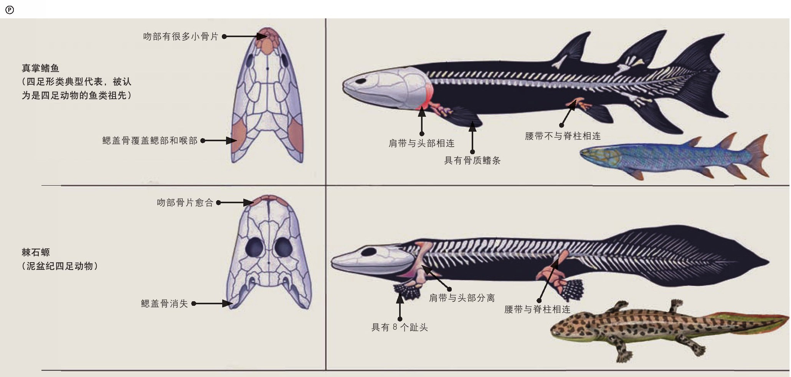

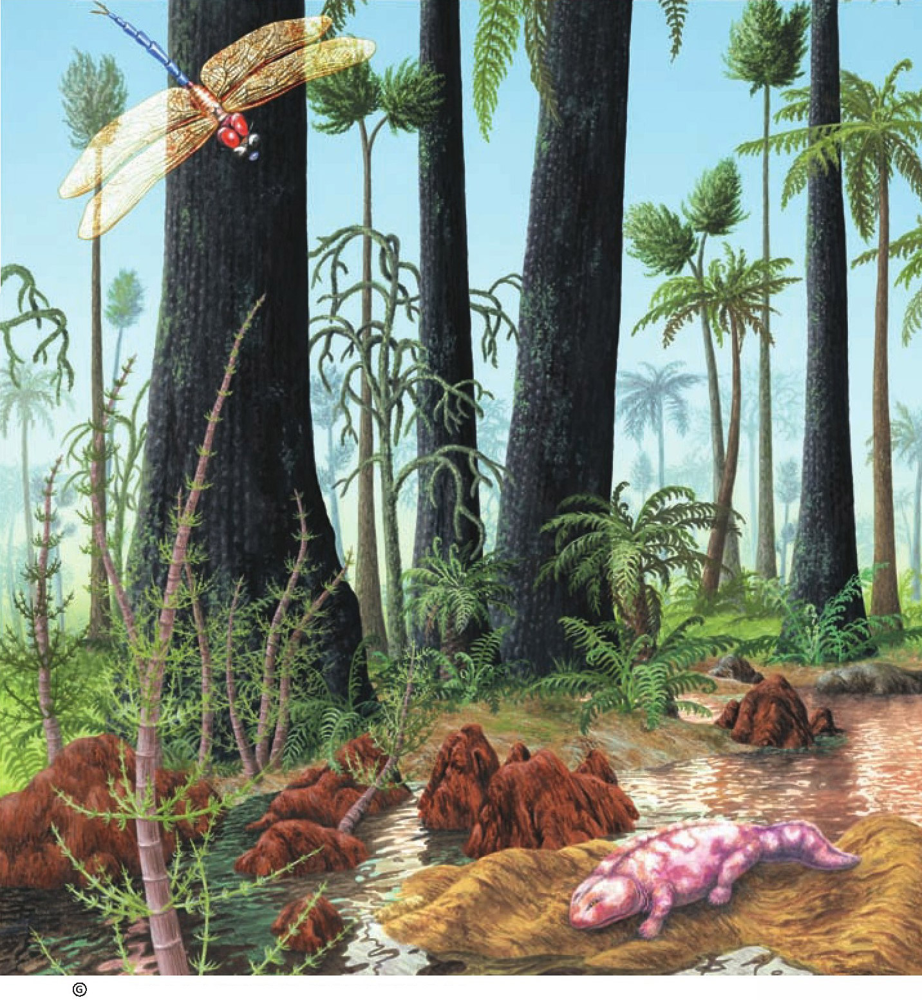
肉鳍鱼类上岸时的环境（泥盆纪晚期的森林）

棘石螈已经是真正的四足动物。那么，它的鱼形祖先又是什么动物，长什么样呢？加拿大魁北克晚泥盆世的地层中发现的真掌鳍鱼属于肉鳍鱼类中的骨鳞鱼类三列鳍鱼科，这一大类被称为四足形类，也就是与真正四足动物形态相似、亲缘关系较近的鱼类的代表。真掌鳍鱼与早期四足动物在头骨、牙齿、偶鳍和脊椎等方面非常接近，因此它被认为是四足动物的直接祖先。这一理论早在1892年就由美国古生物学家爱德华·凯普提出，并被以后大多数学者所赞同。1929年，当时已知最早的四足动物鱼石螈在北极圈附近的东格陵兰岛晚泥盆世的地层中被发现，成为真掌鳍鱼与后来的各种四足动物之间新的过渡类型。此后，比鱼石螈更早的四足动物化石又陆续在俄罗斯、苏格兰、拉脱维亚、美国等地被发现，又将四足动物的演化历史前推了1100多万年。

2006年，科学家描述了在加拿大北部的埃尔斯米尔岛发现的提克塔利克鱼，又一次填补了鱼类从水到陆演化史诗中缺失的篇章。提克塔利克鱼在因纽特语中是“一种大型淡水鱼”的意思。它像鳄鱼那样，长着扁平的头骨和锋利的牙齿，在浅水中伺机捕食水里的鱼或陆地上的昆虫。提克塔利克鱼头顶的喷水孔（后来在四足动物中进化为耳孔）很大，里面已经具有与陆生脊椎动物相似的中耳构造；它的鱼鳍里具有原始的腕骨与简单的趾头，完美地展示了从鱼鳍到四肢的中间状态，这样的鱼鳍尽管还不足以正常行走，但是已经完全可以支撑身体了。至此，人们即便尚不能自夸对鱼类登陆史诗的每一行诗句都了如指掌，至少也能说已经对它的故事主线有了提纲挈领式的总体了解。（卢静　王原）

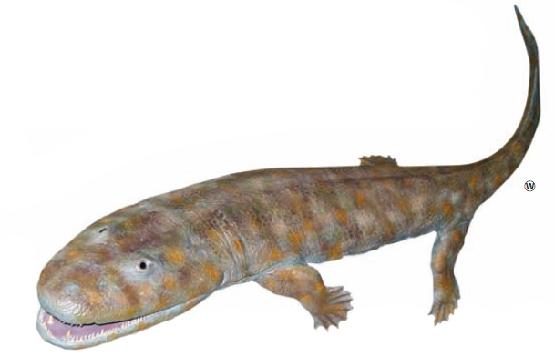
棘石螈

  

**【微博士】**预适应

预适应就是某些生物的身体结构在最初演化出来时并没有用于现在的功能，而一旦环境发生改变，这些结构就将启动新的功能并发挥重要的作用。四足动物的四肢就是这么一个很好的例子。四肢在最初演化中的主要作用是划水，但当环境变得干旱与炎热，迫使它们要登陆开拓新的生境时，这些具趾的四肢就成为在陆地上支持身体并运动的重要结构。

【微问题】最早上岸的鱼吃什么？

【关键词】登陆　棘石螈　真掌鳍鱼　提克塔利克鱼

## 为什么鱼类要登上陆地

在古生代中期，鱼类中的四足形类已经预先演化出适应于陆地生活的肺和四肢，那么是什么力量让它们义无反顾地登上陆地呢？原来，在距今三四亿年前，地球上发生了十分剧烈的地壳活动。大片陆地从海洋中升了出来，并逐渐出现了淡水湖泊或河流，也造就了各种复杂的地形和气候变化。有的湖泊、池塘在炎热干旱的气候中日渐干涸，水中的有机物腐烂使水体严重缺氧，这对于在其中生活的鱼类是严峻的考验。有些鱼类灭绝了，而预先做好登陆准备的那些四足形类则登上了陆地，演化为真正的四足动物。

目前已知的泥盆纪四足动物以及与四足动物相似的鱼类化石都发现于泥盆纪晚期。它们主要生活在当时的劳亚古陆、冈瓦纳古陆的热带以及亚热带地区，生活环境包括海洋、潮汐带以及淡水区域。其中化石最完整、了解最详尽的是发现于格陵兰东部的鱼石螈和棘石螈。最近10余年来，在英国、美国、俄罗斯、中国、澳大利亚、拉脱维亚和爱沙尼亚等地又相继发现了更多的泥盆纪晚期四足动物化石，其中包括比鱼石螈化石时代还稍早的埃尔金螈和奥氏螈化石。在中国宁夏发现的潘氏中国螈是这类动物的中国代表。这些发现表明，四足动物在泥盆纪晚期时就已经在地球的许多地方出现了。（王原）

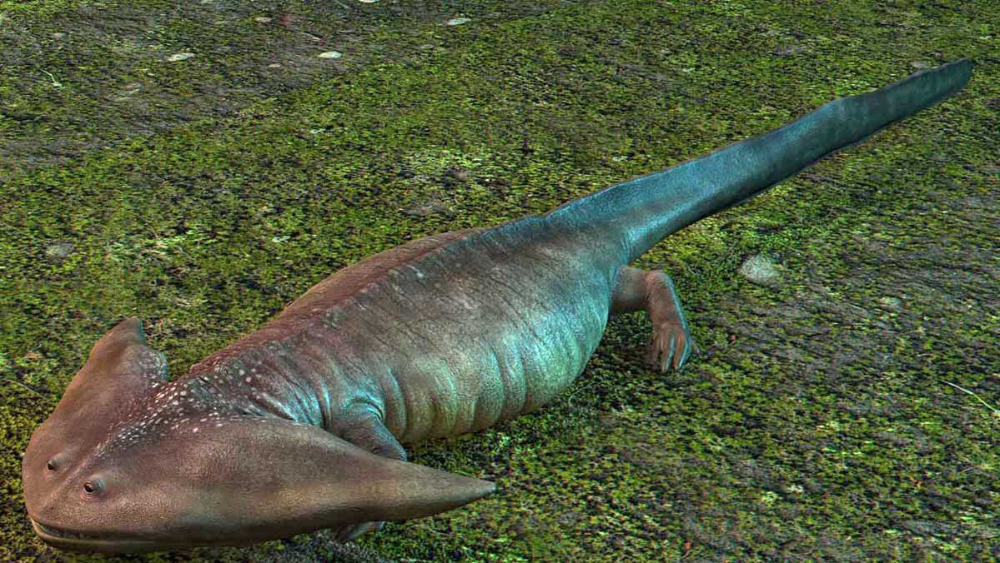
笠头螈

  

**【微博士】**两栖动物

两栖动物属于四足类脊椎动物。现生两栖类包括各种蛙、蟾蜍、蝾螈、鲵以及形似蚯蚓的蚓螈类。它们皮肤裸露，无鳞片、羽和毛发覆盖，腺体发达，但早期化石种类体表常有坚厚骨板或皮膜、鳞片等。两栖动物是脊椎动物从水生到陆生的过渡类群，其发育过程中一般经过变态，即从适应于水中生活的幼年阶段（如蛙的蝌蚪）转变为适应于陆地生活的成体阶段。在脊椎动物演化史中，由水生到陆生是一个巨大的飞跃。两栖动物出现之前，所有的脊椎动物都生活在水域中，而陆地上的生活条件远比水中的要复杂多样，登陆为脊椎动物开辟了向更复杂和多样化发展的空间。

## 古两栖动物长相有多奇怪

回答这个问题之前，先来看看现生两栖动物的情况。世界上现有6900多种两栖动物，其中既包括没有尾巴的各种蛙类，又包括有尾巴的蝾螈和无足的蚓螈。

蛙类是现生两栖动物中最大的类群，有6100多种。为了适应环境，它们演化出了各种奇怪的特征。生活在中国的髭蟾，嘴的上缘有角质的刺，好像长了半圈小胡子，外形很特别。南美洲有一种蛙叫负子蟾，身体扁平，还不如一枚1分硬币立起来那么高；它们把卵背在后背上，小负子蟾被孵化出来后，就从皮肤下钻出来。有一种生活在非洲的蛙类，身体边缘长出毛发状的突起，被形象地称为“毛蛙”，但这些突起是为了扩大皮肤表面积以帮助呼吸的结构，并不是真的毛发。

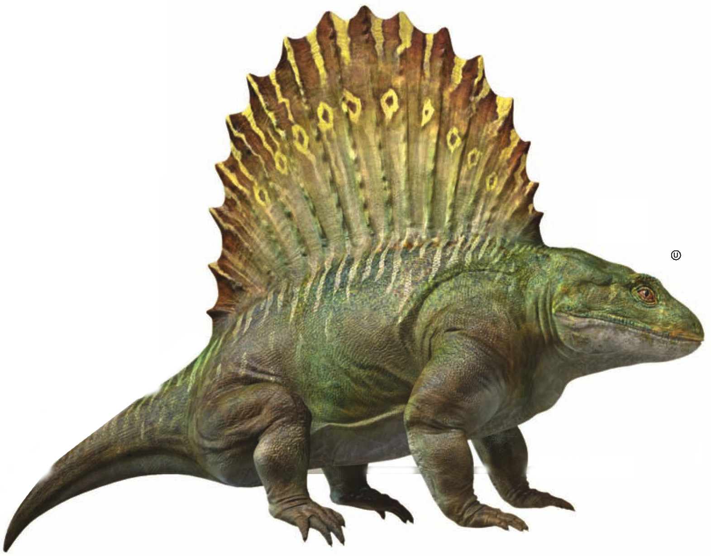
帆螈

现生两栖类中的蝾螈，外形好像蜥蜴，但与蜥蜴不同的是，它们的皮肤裸露，没有鳞片。有些蝾螈的形态很特别，比如宠物市场上常见的“六角恐龙”，其实是长着6只外鳃的蝾螈，其学名叫钝口螈，与恐龙毫不相干。有些古两栖类也有这样美丽的外腮。

现生两栖动物中最原始也是最少见的类群，是蚓螈类，全世界只有100多种，一般分布在热带，营地下穴居生活。蚓螈没有四肢，乍看好像蚯蚓。但蚯蚓是无脊椎动物，而蚓螈体内生有由脊椎构成的脊柱，是形态奇特的两栖动物，只是在演化过程中失去了四肢而已。根据化石记录，已知最古老的蚓螈类是侏罗纪早期生活在北美的曙蚓螈，它还保留了退化的四肢呢。

最早、最原始的两栖动物大部分像今天的蝾螈，或者说像长了腿的鱼，因为它们是从鱼类演化而来的，比如鱼石螈。与今天裸露皮肤的蝾螈不同的是，很多古两栖动物身上都有坚硬的骨板或角质鳞片。

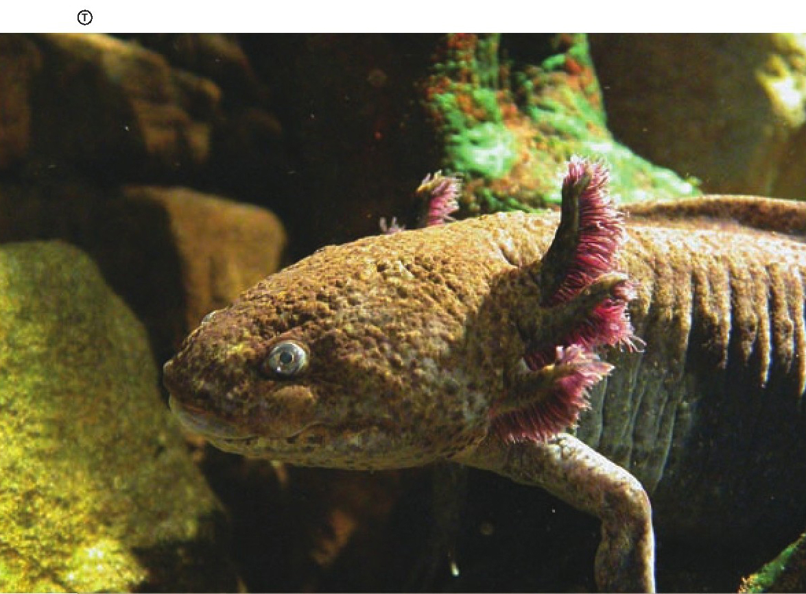
钝口螈拥有美丽的外鳃

在古生代后期，3亿年前，有一种叫帆螈的动物，体长约1米，生活在北美洲。它们后背长出一排骨棒，支撑一张扇形的、皮肤包被的背帆。帆中布满了血管，可以帮助帆螈吸收和散发热量。比如它如果觉得冷了，就会把背帆完全面向太阳，充分吸收热量；如果太热了，就会晃动背帆，好像用扇子为自己降温。

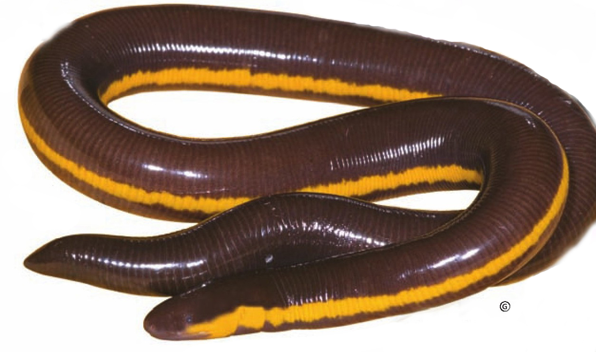
现生的蚓螈

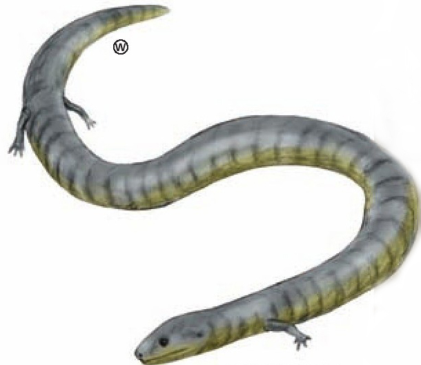
曙蚓螈复原图

2.7亿年前，地球上还曾生活着一种形态奇特的两栖动物——笠头螈。它们的身体扁平，长有一条长尾巴，头比身体宽出很多，前端生一对小眼睛，后部向两侧伸出，整个头骨的形状像一顶斗笠。这种奇怪的头形很可能与水中游泳有关，头部好像一块大的救生板，可用于保持平衡。也有人猜测，这是为了让它们的猎食者觉得不好下口，因为谁都不想咬这样一块可能把嘴撑爆的东西。（王原）

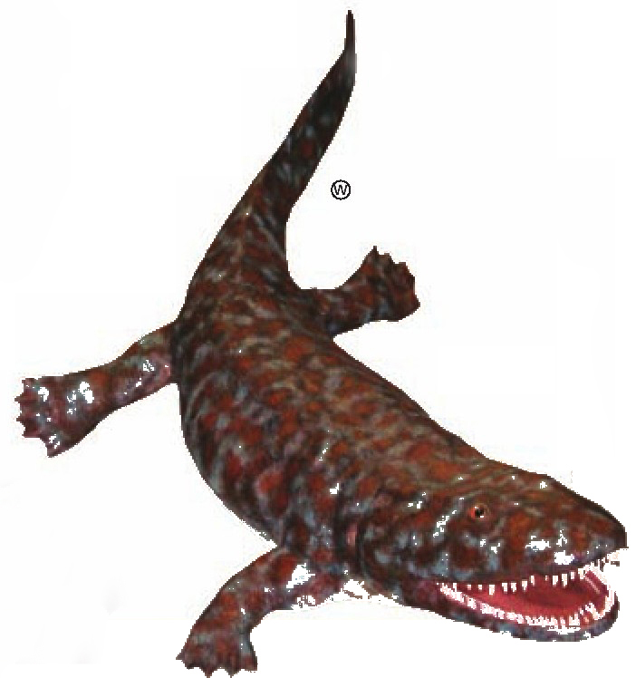
鱼石螈

  

**【微博士】**鱼石螈

鱼石螈生活在3.65亿年前，体长约1米，长有鱼形的尾部以及两栖类才有的头骨和四肢。它们的后足上的脚趾多达7个，这正是从鱼类的鱼鳍演化到四足动物的五趾型四肢的过渡特征。鱼石螈主要用肺呼吸，据推测生活在浅水或沼泽中，用四肢在水底爬行，虽然可以到陆上活动，但并不灵活。所有鱼石螈的化石都发现于东格陵兰岛，但在世界其他地区同时期的地层中也发现了鱼石螈类（与鱼石螈相似的一类动物的统称）的化石。

【微问题】巨型古两栖动物行走时，肚皮离开地面吗？

【关键词】笠头螈　帆螈　曙蚓螈

## 史前最大的两栖动物有多大

现生两栖动物中，体形最大的要数中国特有的学名叫大鲵的娃娃鱼。已知最大的大鲵体长可达2米以上。大鲵是一种既有尾巴也有腿、脚的两栖动物，属两栖纲有尾目隐鳃鲵科人尸鲵属。大鲵是现生两栖动物中的庞然大物。但是远古时代的两栖动物中，有很多都不比现生的大鲵小。比如2.95亿年前生活在美国的长脸螈，体长可达2米，重达90千克，牙齿锋利，身体粗壮，是当时地球上最凶猛的掠食者之一。又如在澳大利亚发现的库尔鲵，生活在1.2亿年前的白垩纪早期，体长4～5米，头大而圆，宽大于长，这类动物也因此被归入短头鲵类。当时的澳大利亚位于南极圈内，气候也相对较冷。库尔鲵生活在裂谷的急流中，可能像现生的鳄鱼一样，在水中用伏击的方式狩猎。

库尔鲵已经是两栖动物中的“巨人”了，但它却拿不到最终的冠军。来自巴西的发现让人们大吃一惊。在巴西东北部的帕纳巴盆地发现了一些零散的化石骨骼，科学家把它们拼接起来，发现这是一种过去未知的巨型两栖动物。它被命名为锯齿螈，身长竟达9米，生活在2.7亿年前，是已知最大的两栖动物。锯齿螈有长且呈锥形的吻部，数目众多且尖的牙齿，长长的身躯，四肢短小，它有力的尾部能为游泳提供动力。锯齿螈生活在热带潮湿的地区，外形像现在的长吻鳄，以鱼类及其他水生动物为食，是江河湖泊和沼泽中的顶级掠食者。人类应该庆幸没有生活在那个年代。（王原）

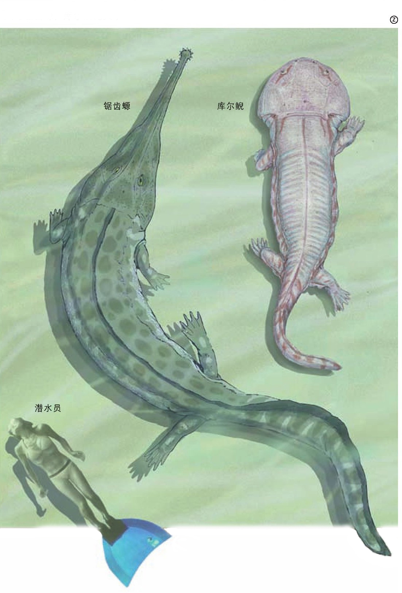
人与锯齿螈、库尔鲵比大小

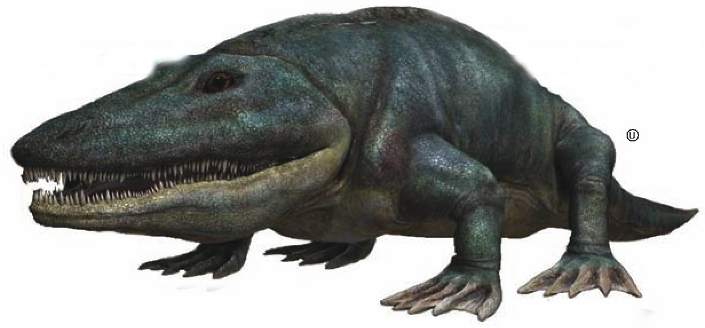
长脸螈

## 史前海洋中有两栖动物吗

现生两栖动物的皮肤裸露且有较强的渗透性，加上它们的体表并无鳞片、羽毛或毛发覆盖，所以是不适合生活在海水中的，否则高浓度的盐水会破坏它们的体液平衡而将它们杀死。但世界上的很多事情都不是绝对的。比如，在亚洲东南部，包括菲律宾、印度尼西亚等国乃至中国的海南，就有一种能生活在海水中的食蟹蛙。食蟹蛙属林蛙科，与青蛙是同一家族。但不同的是，它们生活在海边的潟湖或红树林中，能够忍受较高的盐度，是现生两栖类中唯一可以在海里游泳的种类，所以人们也称它们为“海蛙”。

那么，古两栖动物中是否也有耐盐的种类存在呢？还真有！

虽然有些古两栖动物的体内有额外的真皮骨板支持，但它们的皮肤也同样具有较强的渗透性，所以绝大多数不能生活在咸水中。然而多洞鲵却是个例外。多洞鲵因头骨上有较多的孔洞而得名，它与现生的食蟹蛙一样，具有较强的调节体内盐度的本领，所以可以在海水中生活。多洞鲵主要生活在距今2.5亿～2亿年三叠纪的德国和俄罗斯，它们具有长长的吻部和发达的尾巴，擅长游泳，以鱼虾为食，堪称海洋中的蛟龙。2004年，在中国新疆的准噶尔盆地，发现了一件产自侏罗系地层的肠骨化石（肠骨是腰部骨盆中的一块骨头）。人们惊奇地发现，它与欧洲多洞鲵的肠骨极为相似，因此被认为是多洞鲵类动物身上留下的。这一发现将多洞鲵类的生存历史延长了4000多万年，而且其地理分布也从欧洲扩展到了亚洲，让人们重新认识到这种动物不凡的生存能力和扩散本领。（王原）

## 大鲵的祖先在哪里

大鲵的学名叫“人尸螈”，这个可怕的名字是怎么来的呢？1726年，瑞士学者佘赫泽在德国发现了一件很像人类骨骸的化石。他认为那是《圣经》描述的洪水中淹死的罪人的遗骸，于是将其命名为“Homo diluvii testis”，意思就是“大洪水中的人类证据”。1811年，法国著名解剖学家居维叶重新鉴定了这件标本，认为它其实是一种大型蝾螈的遗骸。1831年，瑞士博物学家楚迪把它正式命名为Andrias scheuchzeri，合起来的中文译名就是“佘氏人尸螈”。著名的中国大鲵的学名叫“戴氏人尸螈”，与德国的化石大鲵虽然不同种，但属于同一属。

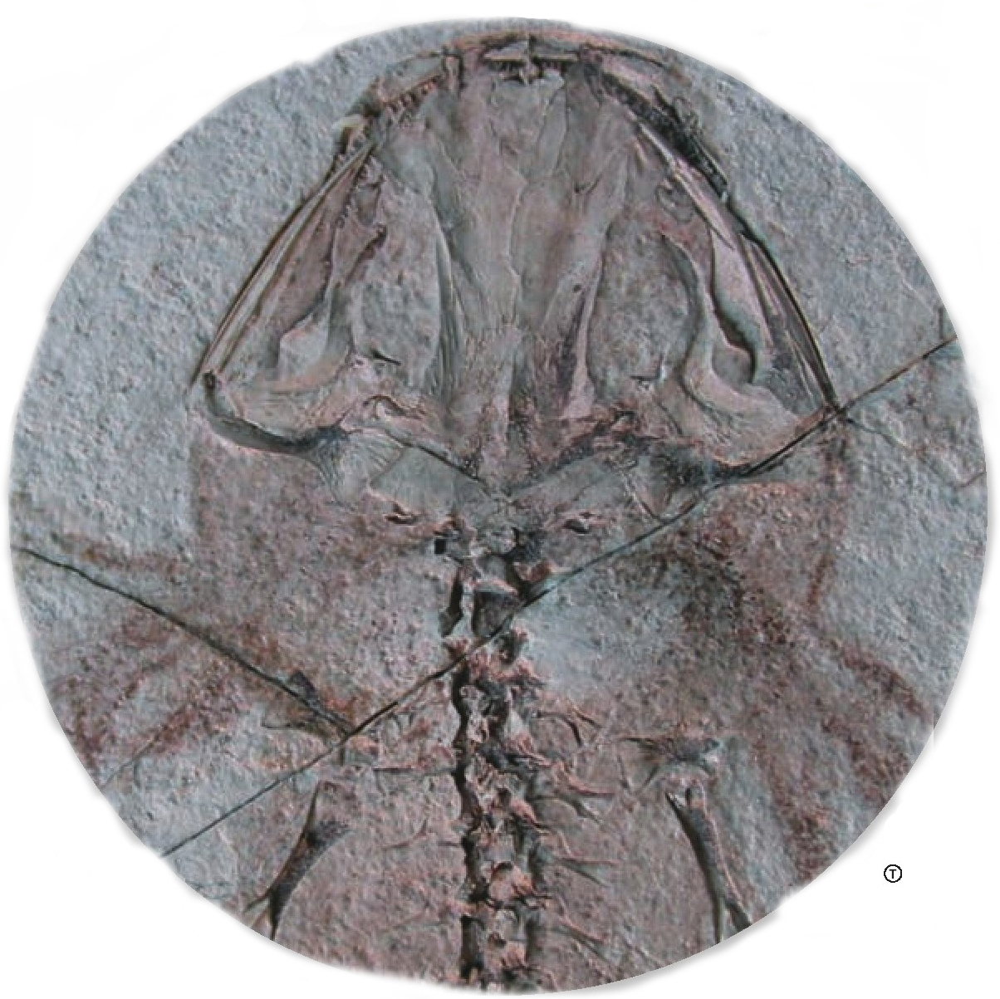
天义初螈的化石，头骨后显示外鳃印痕

大鲵的“亲戚”出现得很早，在恐龙生活的时代就已经存在了。中国科学家在内蒙古宁城的地层中就发掘出一种与中国大鲵十分相似的化石两栖动物——天义初螈。虽然它最大的个体只有40多厘米长，比中国大鲵小多了，但却是中国大鲵的老祖宗。因为天义初螈生活在中生代的侏罗纪中晚期（距今约1.6亿年），所以又被称为“中生代的娃娃鱼”。在清代皇帝曾经打猎的河北围场，中国科学家又发现了距今1.3亿年白垩纪早期的围场皇家螈。上述两种有尾两栖类动物是世界最早的隐鳃鲵类的代表，说明这类动物是起源于亚洲的，但它们的后代又是怎样扩散到欧洲和北美洲的，到现在还是一个未解之谜。（王原）

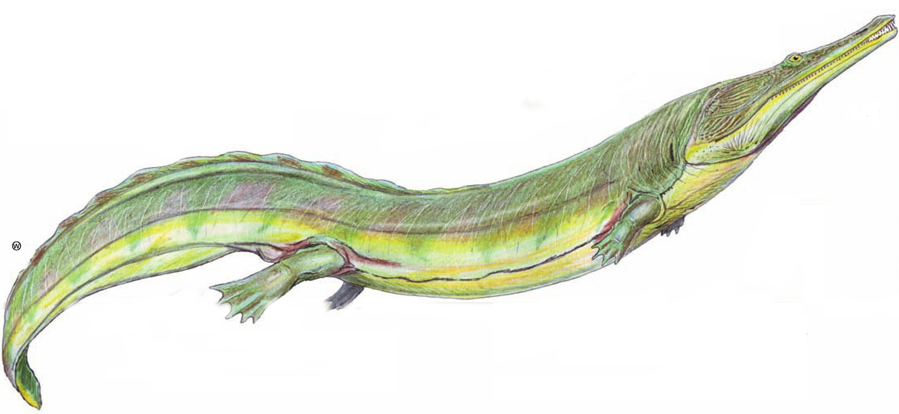
多洞鲵

  

【微问题】两栖类耐盐的诀窍在哪里？

【关键词】长脸螈　库尔鲵　锯齿螈　多洞鲵　初螈　皇家螈

## 恐龙时代有古蛙吗

恐龙时代有古蛙吗？当然有啦。

其实，在恐龙出现之前，地球上就已经出现了原始的蛙类。蛙类是两栖动物中形态比较特殊的类群，它们没有尾巴，故又称无尾类。蛙类的后肢骨骼和腰部的肠骨延长，使它们更适于跳跃。但蛙类的祖先却是长得像蝾螈的动物，身体细长，有尾巴，后肢并没有特化。从原始祖先演化到真正的蛙类，在这个过程中出现了身体缩短、尾巴缩短以至消失、后肢骨延长等变化，腰部的骨骼也在相应地发生变化。在距今约2.4亿年三叠纪早期的非洲马达加斯加，生活着一种长着尾巴的两栖动物——三叠蟾。它的骨骼特征已经向蛙类的方向演化，但还长着一条由多块脊椎骨支撑的尾巴，而不像现在的蛙类，完全失去了尾巴。在同时期的北半球的波兰，人们也发现一种名叫查特克蟾的动物。科学家把这两种两栖动物都称为“原无尾类”，它们都是现生青蛙的远祖，比恐龙还早将近2000万年诞生。

能够称为真正意义的蛙类动物最早见于美国，其代表是约1.9亿年前侏罗纪早期的前跳蟾。它的骨骼形态已经与现生的蛙类没有太大的差别了，可见蛙类的身体结构很早就被确定下来了。在那以后，南美洲的阿根廷出现了侏罗纪早中期的韦氏蟾以及侏罗纪中晚期的南蟾。直至侏罗纪中晚期，中国尚未出现蛙类，仅仅出现了初螈、热河螈等有尾类两栖动物。

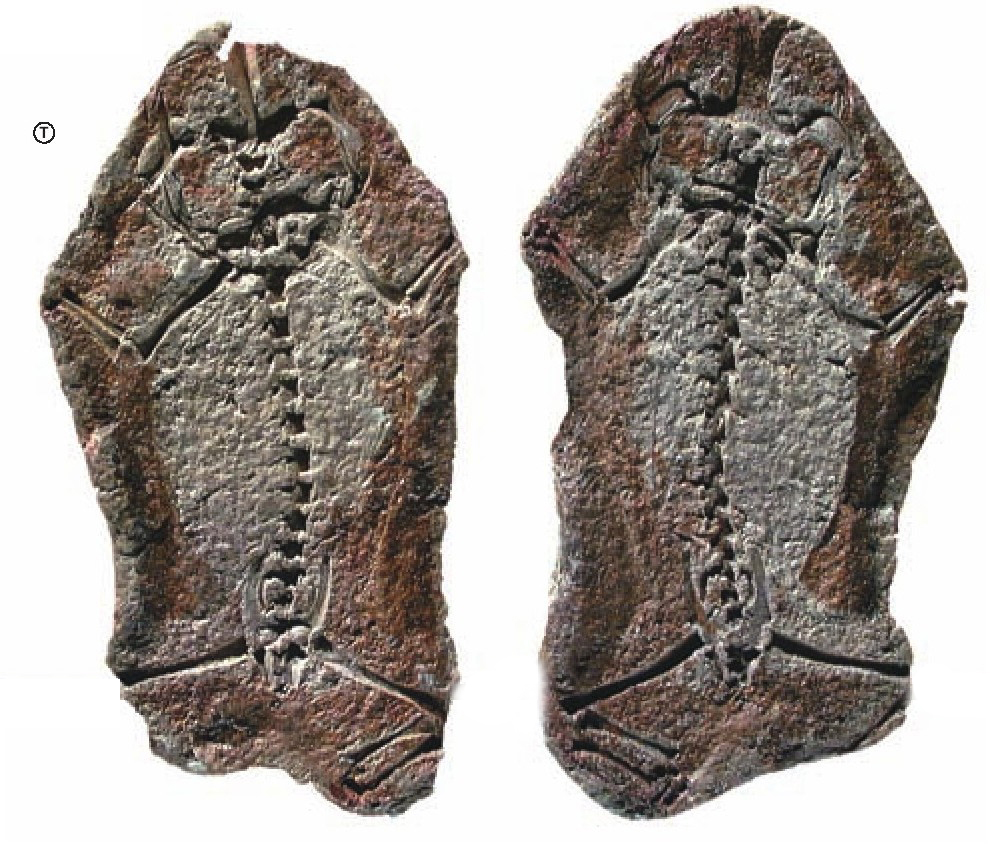
三叠蟾化石

中国已知的最早蛙类发现于辽宁西部，这些蛙类生活在白垩纪的早期，距今大约1.25亿年。根据产地，它们被命名为“辽蟾”，与它生活在一起的有小盗龙、帝龙、中华龙鸟等多种肉食性恐龙，也有像爬兽那样能吃小恐龙的哺乳动物。可以想见，辽蟾们的日子并不好过。

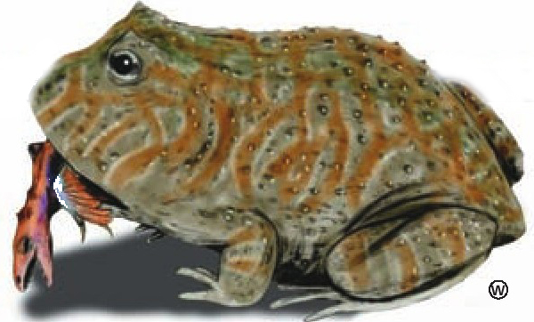
吃恐龙的魔鬼蟾蜍

然而，恐龙时代的古蛙，也不全是别的动物的口中餐。有一种叫魔鬼蟾蜍的古蛙，小恐龙们见了它也会胆寒。2008年，在非洲马达加斯加岛上发现了一种巨型的化石蟾蜍。它们生活在距今7000万年的白垩纪晚期，是目前地球上已知最大的蛙类，比现生最大的蛙类——非洲巨蛙还大。魔鬼蟾蜍最大的个体头宽超过20厘米，从头到身体末端大于40厘米。这样的身材，加上一张巨大的嘴巴，科学家估计，如果刚出生的恐龙遇到它也会被其一口吞下。研究人员给这种蛙起了个奇怪的名字“盾状魔鬼蟾蜍”，因为它的个头实在太大了，对其他小动物来说简直是可怕的恶魔。盾状魔鬼蟾蜍的头骨背面生有盾状加厚的骨片，这就使得头骨更加结实，更利于防卫和捕食。据估计，魔鬼蟾蜍的生活习性与现生的非洲巨蛙相似，都是坐等猎物上门，然后突然一张嘴，吞下任何在它们身旁晃动的东西。盾状魔鬼蟾蜍的发现还有一项特别的意义：这种生活在中生代的两栖类与现在生活在南美洲的角蛙具有密切的亲缘关系。这说明，在7000万年前，南美洲大陆和非洲的马达加斯加是连接在一起的，大陆漂移使两块陆地逐渐分离，直至现在远隔重洋。（王原）

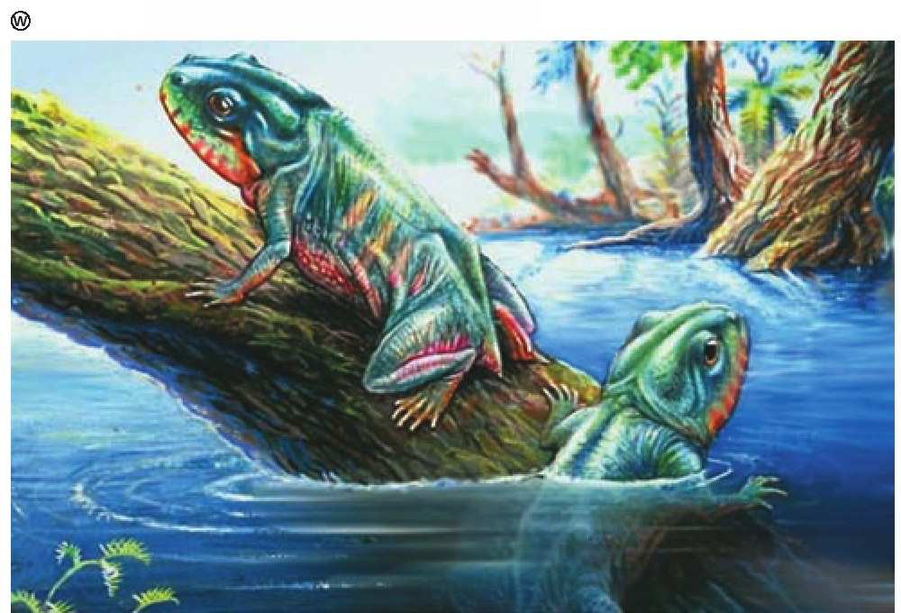
三叠蟾

## 为什么乳齿鲵会被称为大头鲵

从距今2.5亿年的早三叠世开始，地球上出现了一大类半水生或水生的两栖动物。它们一开始被发现的时候，曾被命名为乳齿鲵。但是，现在这类动物却常常被称为大头鲵。这是为什么呢？原来，这种动物拥有非常大的脑袋。有些种类的大头鲵的头骨可达1米长。另外，大头鲵还有尖利的牙齿，最大可达11厘米。有了这样的装备，它们也因此成为当时淡水水域中的凶猛掠食者。

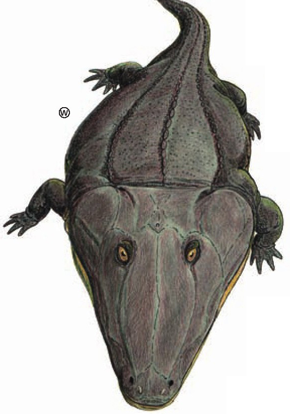
大头鲵

大头鲵是两栖动物中种类丰富、分布很广的一个类群，因为头相对较大而得名。它们见于北美洲、欧洲、亚洲、格陵兰岛和澳洲，通常个体巨大，背腹方向扁平，具有半水生乃至水生的生活习性。因为大头鲵主要生存于三叠纪且呈全球性分布，所以常被用于全球三叠系陆相地层的对比。大头鲵类在分类上属于离片椎类中的全椎类，也就是说它们的脊柱缩减成由椎间体组成的简单骨块，而椎侧体已经完全消失。虽然近来有人提出，大头鲵最早被称作乳齿鲵，应该恢复乳齿鲵这个名字，但随着美国著名古生物家罗默尔等人的大力推广，大头鲵的名字早已扬名天下，想改过来已经很难了。

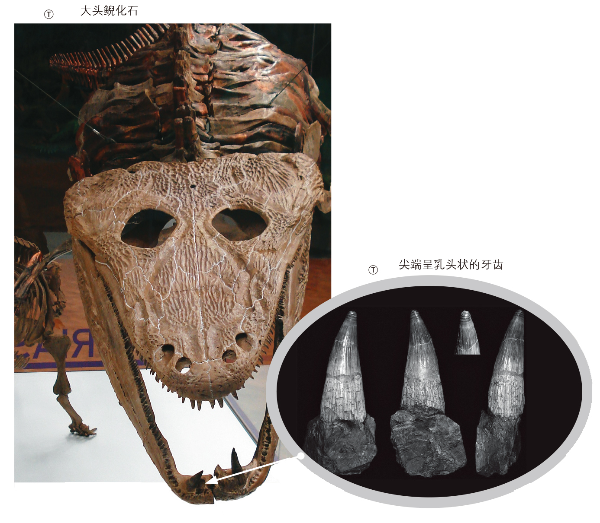

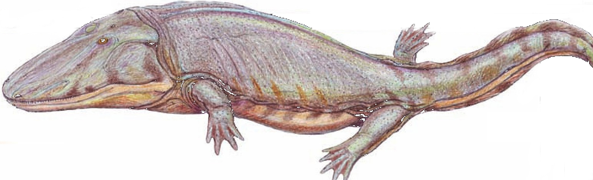
远安鲵

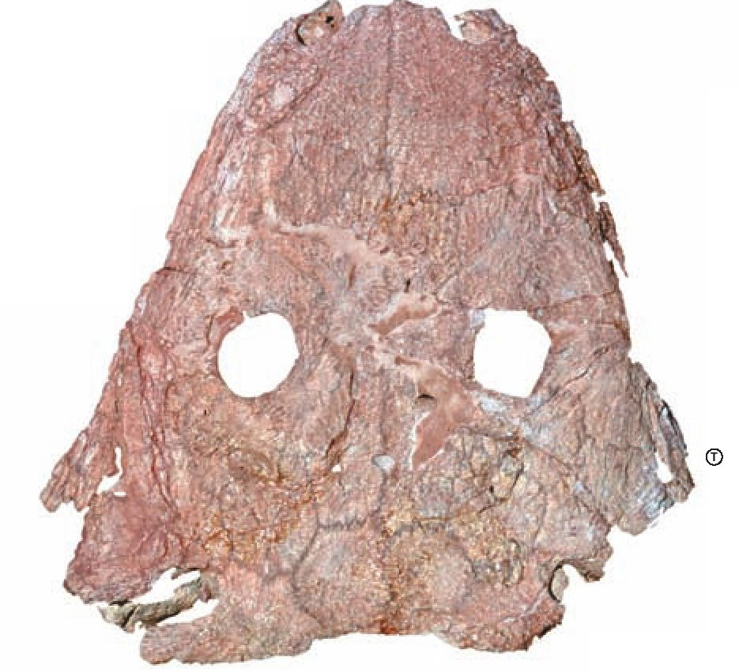
远安鲵头骨化石

中国的大头鲵化石最早发现于山西早三叠世的地层中，经初步分析，这是一种较原始的具有底栖习性的大头鲵——底栖鲵。除此以外，中国的大头鲵化石大多十分破碎，直到2005年，人们才在湖北远安的中三叠统地层中发现了一个完整的大头鲵头骨，这也是中国目前唯一一个大头鲵类的完整头骨。这种大头鲵被命名为宽头远安鲵。远安鲵的头十分宽扁，宽度大于长度。它的化石是在海相的风暴潮相沉积中被发现的，与它同一层位挖掘出的还有一种典型的陆生动物——后背长有低背帆的爬行动物芙蓉龙。芙蓉龙显然不是海生动物，所以科学家判断，宽头远安鲵应该是生活在近海的河流三角洲环境中，死后尸体才被搬运到海中埋藏。（王原）

  

**【微博士】**乳齿鲵

乳齿鲵（即大头鲵）的化石最早发现于德国，只是一枚11厘米长的牙齿，它的尖端破损了，看起来像是哺乳动物的乳头。发现者认为这可能是一种长着乳头状牙齿的蜥蜴，故命名为乳齿鲵。后来人们才发现，乳齿鲵是一种生活在水中的头很扁的两栖动物。

【微问题】有让恐龙害怕的古蛙吗？

【关键词】三叠蟾　辽蟾　魔鬼蟾蜍　乳齿鲵　大头鲵　远安鲵

## 为什么说爬行动物成为了真正的陆生动物

从两栖动物开始，脊椎动物登上了陆地，但它们还不能算是真正的陆生动物。为什么呢？什么样的脊椎动物才算是真正的陆生动物呢？

真正的陆生动物，并不仅指这种动物在陆上生活。比如，哺乳动物海豹、鲸类，史前爬行动物鱼龙、蛇颈龙，都是在水中生活的，而鸟类中的企鹅在水下的动作也比在陆上的更为灵活，但爬行动物、哺乳动物和鸟类都是真正的陆生动物（合称“羊膜动物”）。这是因为，从爬行动物开始，包括后来的哺乳动物和鸟类，它们的繁殖过程和生殖方式已经脱离水环境的束缚，完全可以在陆地上产生后代。爬行动物、鸟类产下的卵壳内和哺乳动物分娩的胚胎外，都具有一种叫作羊膜囊的特殊结构，里面充满液体——羊水，胚胎就在羊水中生长发育，因此爬行动物和鸟类可以把卵（称为“羊膜卵”）产在完全干燥的陆地上。而两栖动物就不行，它们产的卵并不具备这种结构，所以必须和鱼类一样，在水里生儿育女。

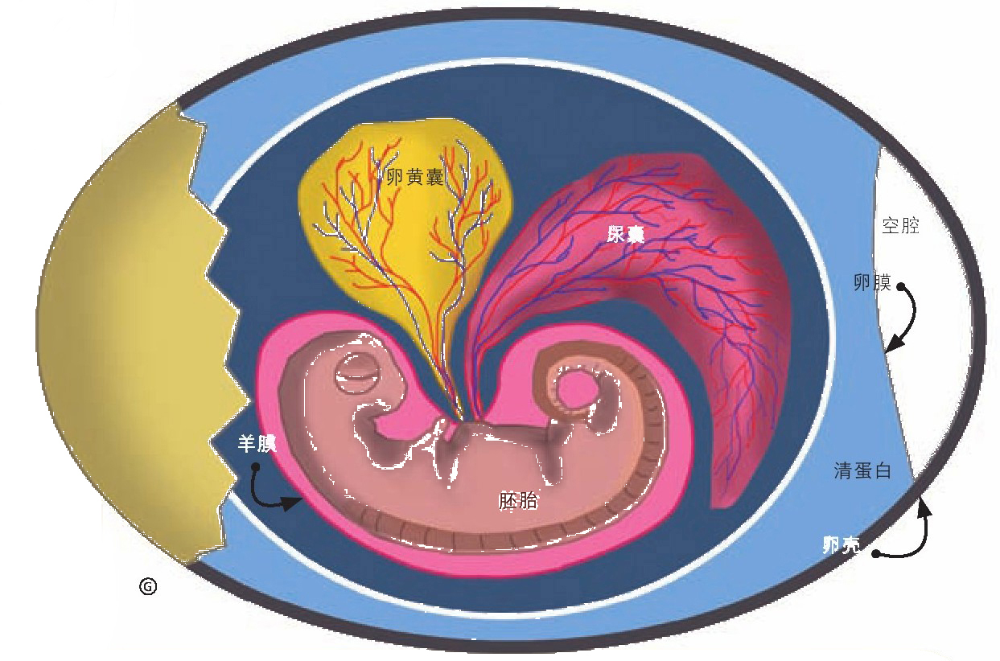
羊膜囊中的恐龙胚胎

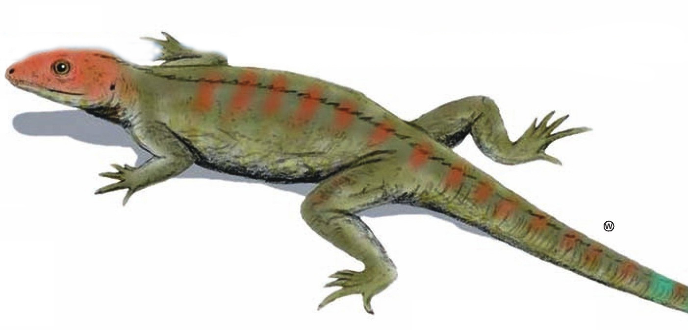
已知最早的爬行动物林龙

爬行动物是第一批真正的陆生动物。它们在2.5亿～0.65亿年前的中生代（包括三叠纪、侏罗纪和白垩纪三个时期），不仅主宰着地球上的整个陆地生态系统，还统治着海洋和天空。中生代之后，爬行动物日趋没落，其生态优势被哺乳动物和鸟类取而代之。尽管如此，不论种类和数量，还是在生态系统中的重要地位，哺乳动物和鸟类今日的辉煌仍难以与中生代的爬行动物同日而语，因此中生代又被称为“爬行动物时代”。（李淳）

  

**【微博士】**最早的爬行动物和最早的羊膜卵

林龙又叫林蜥，是已知时代最早的爬行动物，也即最早的羊膜动物。林龙化石发现于加拿大新斯科舍石炭纪晚期的地层中，距今约3.12亿年；它体长约20厘米，很像现生蜥蜴。而已知最早的羊膜卵化石直到三叠纪晚期（约2.2亿年前）才出现，化石发现于美国亚利桑那。科学家推测早期羊膜动物的卵不像今天的龟卵、鸟卵有坚硬的外壳，而是有一层坚韧但矿化很弱的外膜，所以不易保存为化石。这也是卵化石出现较晚的原因。

## 为什么中生代的爬行动物体形巨大

在现生爬行动物中，南美水蟒、科莫多巨蜥、加拉帕戈斯象龟、尼罗鳄等都是各个类群中的大个子，但是这些庞然大物与它们生活在中生代的巨型前辈相比，不过是小巫见大巫。6000万年前的泰坦蟒蛇长可达14米，重达1.25吨；更新世的古巨蜥体长可达6米；7000万年前的古巨龟长达4米，重量超过2吨，前肢展开的距离接近5米；1.1亿年前的帝王鳄，体长可超过12米，重量超过8吨；而在恐龙中，身躯庞大者就更比比皆是了。为什么1亿多年前的爬行动物会长得如此巨大呢？

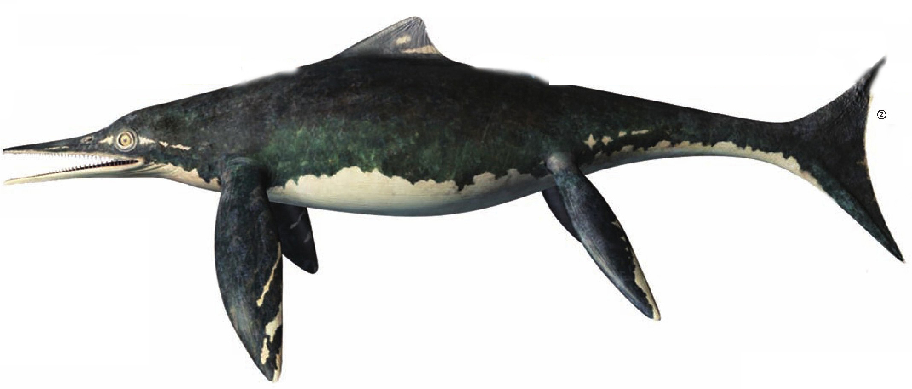
生活在中生代的萨斯特鱼龙

各种动物在演化开始时都有体形增大的趋势，达到巅峰之后又会逐渐变小，这是一个普遍规律。巨大的体形可以给动物带来不少好处。首先，巨大的身体本身是一种有效的防御工具。其次，身体越大，体表面积与体积之比就越小，也就是说大动物的体表面积相对较小，从而吸收和发散的热量也就相应减少。爬行动物是新陈代谢不稳定、体温不恒定的变温动物，大型爬行动物比小型爬行动物的体温变化更为缓慢，是非常有利的。这也意味着，大型爬行动物所需要的食物相对较少，对环境变化的适应能力也相对较高。身体的大型化和巨型化，在中生代爬行动物的多种演化方向中，是非常成功的一个方向。

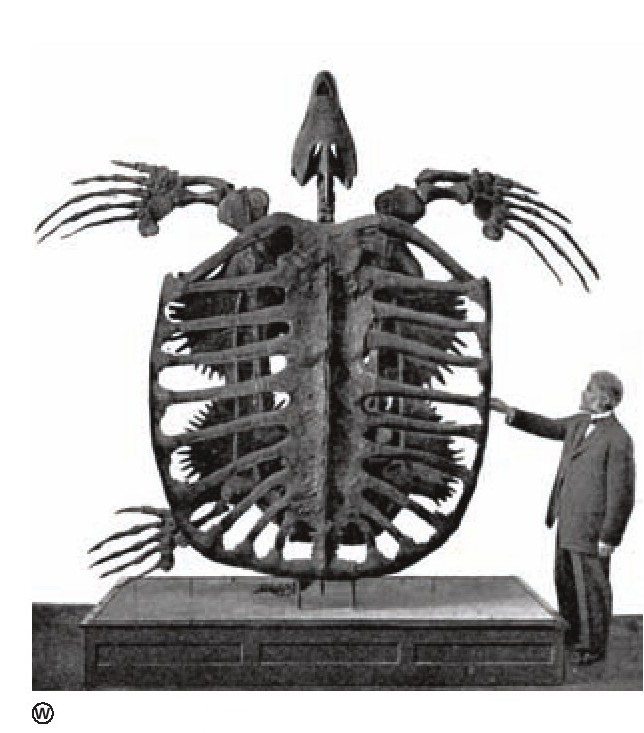
古巨龟化石

但是，在中生代时，爬行动物之所以拥有比史前其他动物更巨大的体形，最重要的原因是当时的环境有利于植物生长，爬行动物的食物充足。中生代时，地球的气候比现在更加温暖，许多陆地区域都遍布各种亚热带和热带植物，丰富的食物对于终身不断生长的爬行动物来说是有利的。在这样的环境中，通过食物链的传导，不论是植食性爬行动物还是肉食性爬行动物都可以获得增大体形的机会。（李淳）

## 为什么说楔齿蜥不是蜥蜴

蜥蜴俗称四脚蛇，和蛇类同属爬行动物的有鳞目。有鳞目动物中除了常见的蜥蜴以外，还包括各种各样的石龙子、壁虎和避役（即变色龙）等。分布于新西兰南部的珍稀动物楔齿蜥，又称喙头蜥，虽然名字中也有一个“蜥”字，但却不属于蜥蜴，而被归入爬行动物的喙头类。

楔齿蜥的外观看上去与某些蜥蜴酷似，但是骨骼结构，尤其是头骨却自有特点。楔齿蜥的头骨还保留着完整的下颞弓，而这一结构在真正的蜥蜴中已经退化和消失了。喙头类在中生代比较繁盛，现在仅剩楔齿蜥一种，是著名的“活化石”。

颞孔又称颞窝，位于爬行动物头骨的侧后方，是附着咬肌的区域。根据颞孔的有无及位置，爬行动物可以分为几个大类，其中最主要的是无孔类（没有颞孔，比如龟鳖类）和双孔类（有两个颞孔，包括现生的喙头类、鳄类、蜥蜴类、蛇类和已经灭绝的翼龙和恐龙等）。双孔类中除了楔齿蜥，其他动物在演化中都发生了不同程度的特化，比如蜥蜴只留下了一个颞孔，蛇的两个颞孔都消失了。喙头类保留着典型的两个颞孔和完整的下颞弓，说明喙头类比蜥蜴更原始。（李淳）

  

【微问题】爬行动物中有没有不通过产卵繁殖的？

【关键词】羊膜卵　喙头类　楔齿蜥　巨型化

## 乌龟的甲壳是怎么演化来的

包括乌龟、鳖在内的龟鳖类是现生爬行动物中最原始的类群，也是恐龙时代的见证者。它们在白垩纪末的集群灭绝中劫后余生，从中生代开始一直延续到现在。

关于龟鳖类的起源，古生物学领域长期以来争论不断。这个问题之所以成为积年的悬案，主要是因为龟类的身体结构过于奇特，而想要研究这种奇特构造的来源又缺乏可靠的化石记录。龟鳖类化石并不少见，但是所有这些化石类群所表现出的身体结构和现生龟类几乎毫无二致。就算曾被认为最古老的龟类化石——德国三叠纪（2.1亿年前）的原腭龟，看上去也就是一种普通的龟类。它们不仅具有和现生龟类非常近似的甲壳构造，而且与后者一样，上下颌骨都没有牙齿着生，只有像鸟类那样包裹角质外壳的喙。

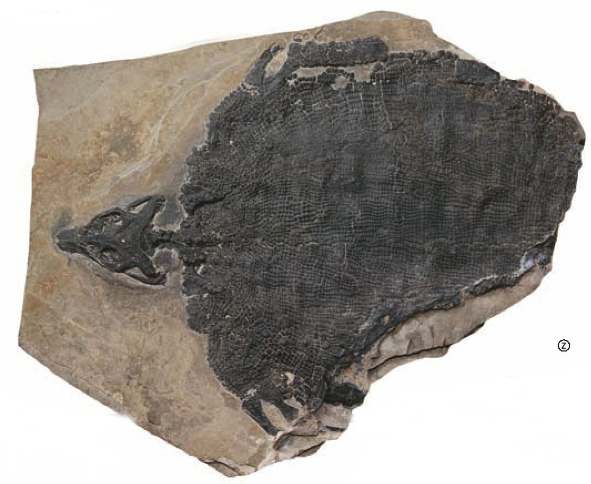
中国龙龟化石

2008年，中国古生物学家在贵州关岭距今2.2亿年的地层中找到了更为古老的原始龟类化石。这种龟类的身体结构与已知所有现生龟类或者化石龟类都大相径庭。它的上下颌骨上还长着细密的牙齿。更奇怪的是，这种龟类的甲壳十分特殊，它的腹甲已经与现生龟类的十分近似，而背甲却几乎看不到，只有脊椎两侧几对形似柳叶的宽阔肋骨。古生物学家认为，这代表了背甲形成早期阶段的雏形状态。对于龟类来说，具有牙齿和尚未成形的背甲都是十分原始的罕见特征。这种迄今最古老的化石龟类被称为“半甲齿龟”，意思就是长着牙齿，只有一半甲壳（腹甲）的龟类。

在半甲齿龟被发现之前的很长时间里，古生物学家找不到龟类起源的直接线索，特别是弄不明白龟类甲壳究竟是怎样形成的，因此便提出两种假说，设想了龟类祖先两种可能的模样。第一种是龟类祖先背部皮肤中长着大量细小的骨板，这些小骨板在后来的演化过程中慢慢相互融合，同时向皮下下沉，最终又与脊椎和肋骨愈合，从而形成了龟类的甲壳。第二种是龟类祖先的背部皮肤中并不存在那些假设的小骨板，甲壳是由它们的肋骨在漫长的演化中渐渐变宽，随后相互衔接、愈合，最终封闭形成的。半甲齿龟是第二种假说的完美体现，是否说明它代表了龟类祖先的形态呢？

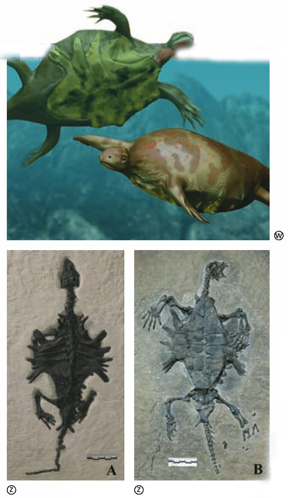
半甲齿龟复原图（上）和化石（下A、下B）

一个多世纪以前，欧洲古生物学家曾经在三叠系地层中发现另一种奇异的爬行动物化石。由于标本十分破碎，人们很难描绘这种动物的全貌，但可以肯定的是，这类动物具有加宽的肋骨和一个类似甲壳、由很多细小甲片拼合而成的身体构造。这种甲壳与一般龟类的甲壳不同，却类似于一种叫作棱皮龟的现生海龟的甲壳。鉴于此，古生物学家将这种化石命名为“Saurophagis”，sauro是指爬行动物，而phagis则是幼小棱皮龟的意思。中国科学家将其译为“龙龟”。

长期以来，龙龟类的化石极为罕见，欧洲发现了少量标本，其中一些重要的材料却又在第二次世界大战中丢失了。直到2011年，中国学者在云南、贵州地区找到了这种动物相对完整的骨骼，才得以一睹它的真面目。中国的化石标本被命名为云贵中国龙龟。云贵中国龙龟的情况非常符合前面提到的第一种假说，即龟类甲壳的背部骨板起源假说所描述的情况。地层资料表明，中国龙龟的生存年代要比半甲齿龟早2000万年左右。

中国龙龟和半甲齿龟，究竟谁是今天龟鳖类祖先的形态呢？根据现有的材料，通过复杂的古生物学方法考证，科学家认为，中国龙龟与龟类祖先无关，而半甲齿龟则代表了目前最为可靠的原始龟类。所以，目前看来龟类甲壳的形成，不是从背部的小骨板变化而来，而应该是由肋骨和腹部的骨板演化而来。

值得一提的是，三叠纪时楯齿龙类中的无齿龙，身体很宽，背部和腹部都覆盖着骨板，看起来很像今天的海龟。它们生活在浅水中，和龟鳖一样，没有牙齿而有喙，用来吃贝壳。但是它们早就灭绝了，和现生的龟鳖类没有任何关系。（李淳）

## 水龙兽是“龙”还是“兽”

史前爬行动物的命名，中文翻译多称“某某龙”，而“兽”通常是指哺乳动物。那么，水龙兽到底是爬行动物还是哺乳动物呢？水龙兽外形怪异，好像一头小河马，嘴里只有两颗大獠牙，它的拉丁文学名是Lystrosaurus，直译为“水龙”，并无兽字。可见，古生物学家起初还是将其视为爬行动物看待的。水龙兽生活于2亿多年前的三叠纪，化石分布十分广泛，几乎见于地球上包括南极在内的所有大陆，长期以来被视为大陆漂移学说的有力证据。那么，中国学者为什么给它的名字中加上一个“兽”字呢？

传统古生物学理论认为，哺乳动物是从爬行动物的分支演化而来的，这一爬行动物的特殊支系就是所谓“兽孔类”。兽孔类以爬行动物的特征为主，同时也具有一些哺乳动物的特征，因此又称“似哺乳爬行动物”，而水龙兽就是这一类群的成员。因此，为了表明这种动物及其所属类群在演化史上从爬行动物向哺乳动物过渡，形态特征上亦此亦彼的特点，中国学者便称之为水龙兽。但是，这里必须要阐明的是，水龙兽并非哺乳动物的直系祖先，只是与哺乳动物祖先同属一个大的类群——兽孔类。实际上，水龙兽仅仅是兽孔类向哺乳动物演化方向上的一个旁支，当恐龙兴起时，它们就灭绝了，没有留下后代。（李淳）

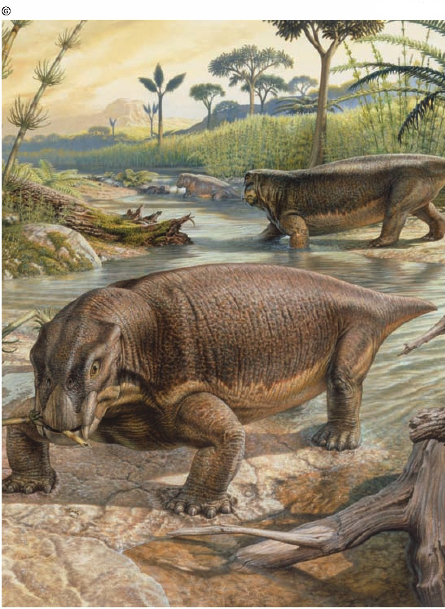
水龙兽

  

**【微博士】**蛇的“腿”和“脚”

蛇类是没有四肢的爬行动物，但它们能够凭借身体左右弯曲做“S”状摆动，再靠腹部鳞片的运动向前爬行。化石证据表明，蛇类的祖先具有四肢，很有可能是某种大型的蜥蜴。2006年在阿根廷发现的白垩纪早期蛇类化石就具有残存肢骨。现生蟒蛇的骨骼系统也保留着后肢的痕迹。

【微问题】哺乳动物是从爬行动物的哪一支演化来的？

【关键词】半甲齿龟　龙龟　水龙兽　兽孔类

## 翼龙家族的体形差异有多大

为了适应不同的生活环境，翼龙家族演化出了各种形态的种类，其中一些种类彼此之间体形相差巨大。最大的翼龙是披羽蛇翼龙（又称风神翼龙或奎兹特克翼龙），它的化石发现于美国得克萨斯与墨西哥交界处的白垩纪晚期的地层中。1971年，美国古生物学家劳森用发现地附近的墨西哥阿兹特克文明中的披羽蛇神，也就是风神奎兹特克给它命名。披羽蛇翼龙的最大翼展推测可达12米，站起来像长颈鹿那么高。但因为特殊的身体结构，比如巨大的鼻眶前孔和中空纤细的骨骼，它的身体并不是很重，可能只相当于3个成年男性（70～80千克）的重量之和。披羽蛇翼龙化石在哈萨克斯坦的侏罗系地层中也有发现。此外，德国科学家还在墨西哥发现过巨型翼龙足迹化石，推算这种翼龙的翼展可能超过18米，和一架重型战斗机的翼展差不多大，是迄今为止体形最大的会飞的动物。

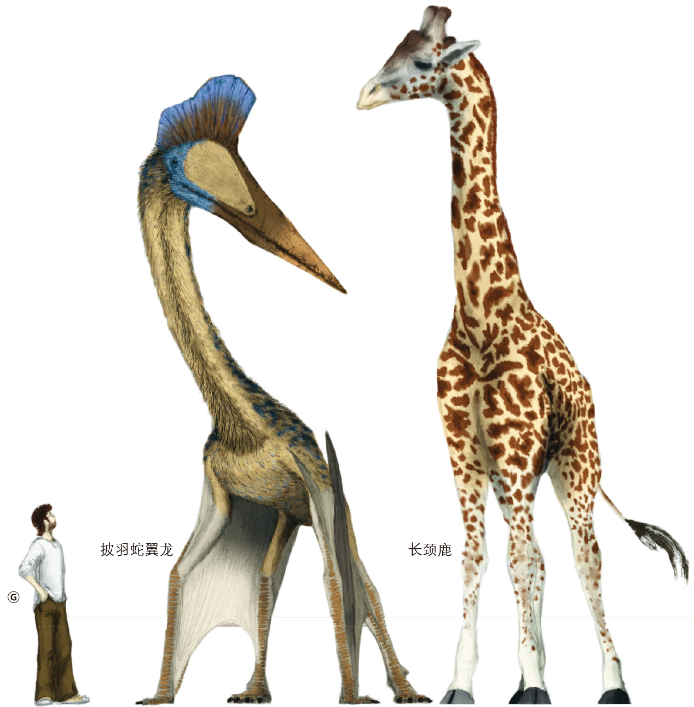

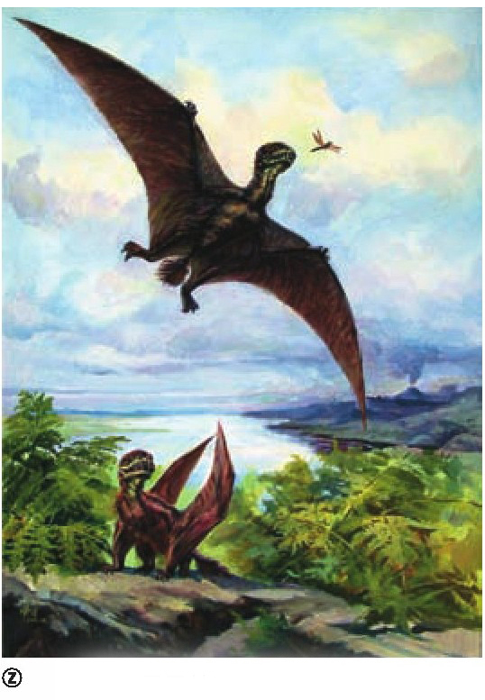
属于蛙嘴龙类的热河翼龙

至于谁是最小的翼龙，目前存在很多说法。2008年发现于中国的森林翼龙翼展仅有25厘米，比一只麻雀大不了多少，这只接近于成年的翼龙或许是目前已知最小的翼龙了。它们生活在树上，娇小玲珑的体形可以使它们灵巧地穿梭于茂密的森林环境中，以躲避大型动物的猎杀和捕食林中的昆虫。这类翼龙属于进步的翼手龙类，牙齿已经退化消失，被认为是白垩纪无齿的大型翼龙的祖先类型。除了森林翼龙外，最广为人知的小个子翼龙要算是1923年就已报道的、发现于德国南部索伦霍芬灰岩中的蛙嘴龙，它的翼展只有约50厘米。这类翼龙非常奇特，不但尾巴很短，是喙嘴龙类中唯一短尾的类型，而且其头骨也很奇特，它们长着短而宽阔的脑袋，形似蛙嘴，满口针状牙齿。古生物学家推测它可能一辈子都待在庞大的植食性蜥脚类恐龙身上，以吃这些大型恐龙身上的昆虫为生。在索伦霍芬灰岩发现的翼手龙的幼年个体虽然更小，翼展不到20厘米，但是这类翼龙长大成年后，翼展可达1米左右，因此还不能算是小个的翼龙。与蛙嘴龙同属蛙嘴龙科的蛙颌翼龙发现于哈萨克斯坦，它生活在1.5亿年前的晚侏罗世，头长4.8厘米，翼展也是50厘米左右。同样在哈萨克斯坦被发现的索德斯龙也属于喙嘴龙类，翼展只有45厘米，它有一条长长的尾巴，披着厚实的“皮毛外衣”以保持体温。此外，三叠纪末，属于喙嘴龙类中较原始种类的沛温翼龙，其翼展也大约只有45厘米。（汪筱林　孟溪　蒋顺兴　程心）

## 翼龙是恐龙吗

在许多人的印象当中，翼龙常常被归入恐龙家族，这是不正确的。翼龙是一类会飞的爬行动物，在分类上属于翼龙目。而恐龙是一类可以四肢或两后肢直立行走于陆地上的爬行动物，它们属于恐龙总目。翼龙和恐龙都属于双孔类，可能起源于同一个祖先，之后便开始了分别在天空中飞行和陆地上生活的各自独立的演化历程。而恐龙的一支后来演变成了鸟类，获得了一种全新的飞行方式。

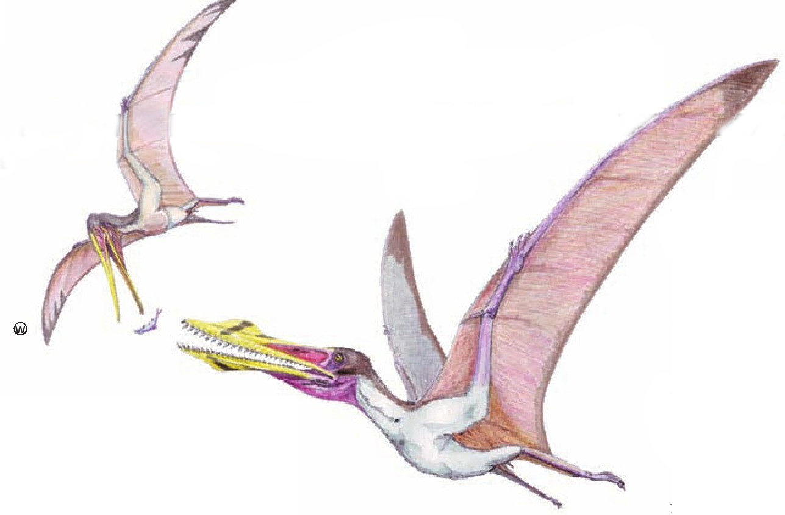
一只枪嘴龙正在被鸟掌翼龙攻击，它们都属于翼手龙类

翼龙是最早翱翔于天空的脊椎动物，比鸟类早了约7000万年。它们在距今约2.2亿年的三叠纪晚期就出现了，直至6500万年前的白垩纪末生物集群灭绝事件中和恐龙等一起从地球上消失，称霸天空约1.6亿年之久。在这期间，翼龙不断演化以适应不同的生存环境，分化出了体形和外观相差很大的不同种类。为了飞行的需要，它们发育了强壮的前肢和极长的第四翼指，支撑着类似蝙蝠皮膜一样的翼膜。它们的翼膜可能很坚韧。最新的研究发现，翼龙的翼膜中可能存在一种特有的强韧的纤维，它们以类似十字方式互相交错重叠，使得翅膀就像一些户外运动服的面料一样不容易撕裂。为了适应飞行，它们还演化出了既轻巧又坚固的中空的细长骨骼。

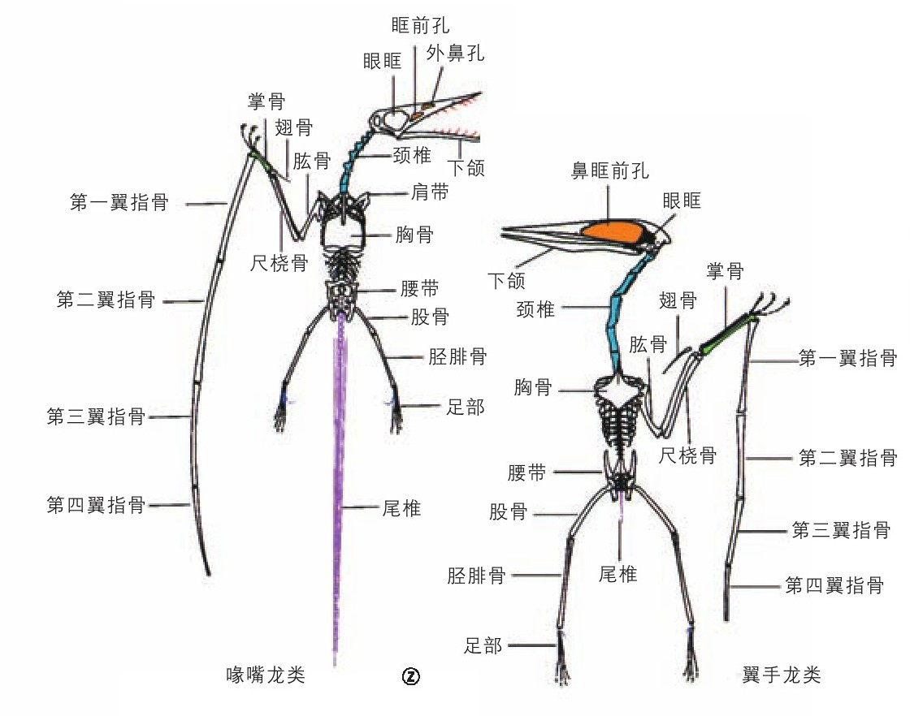
两类翼龙的骨骼比较

早在发现恐龙化石之前的1784年，科学家就已经记述了发现于德国的世界上第一件翼龙化石。目前已发现200余种翼龙化石，在全球七大洲都有它们的踪迹。对于这么庞大的家族，古生物学家将它们划分为喙嘴龙类和翼手龙类两大类。

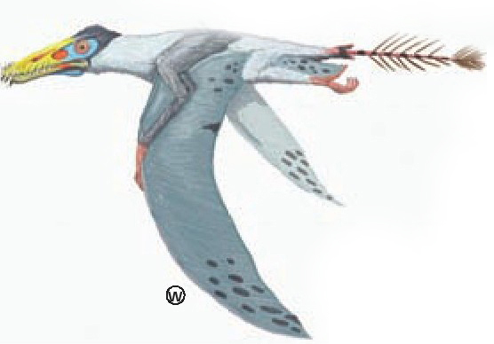
矛颌翼龙属于喙嘴龙类

喙嘴龙类代表了翼龙较原始的类群，是最先演化出来的翼龙，主要生存于晚三叠世和侏罗纪。它们满嘴都有牙齿，鼻孔和眶前孔没有愈合，脖子比较短，掌骨也短，还有长的第五脚趾和长长的尾巴。喙嘴龙类通常个体较小，被认为适于攀爬，飞行能力相对较弱。到目前为止，古生物学家发现的最早的喙嘴龙（也是最早的翼龙）是产自意大利上三叠统地层的真双齿型翼龙和蓓天翼龙（又称“翅龙”）。喙嘴龙类在早白垩世消失，被翼手龙类取代。翼手龙类是由喙嘴龙类中的一支演化而来的，是翼龙中更先进的类群，主要繁盛于晚侏罗世到白垩纪。中国辽西建昌发现的悟空翼龙代表了喙嘴龙类向翼手龙类演化的关键缺失环节。翼手龙类的牙齿出现分化，牙齿退化变少甚至全部消失，主要生长在嘴的前端，鼻孔和眶前孔愈合形成巨大的鼻眶前孔，颈椎和脖子很长，掌骨也变长，第五脚趾退化变短，尾巴也很短，多数头部发育有冠饰。翼手龙类的体形差异远大于早期的喙嘴龙类，它们具有较强的飞行能力，占据着更丰富多样的生态环境。（汪筱林　孟溪　蒋顺兴　程心）

  

**【微博士】**翼龙的翅膀

翼龙不生第五指，却有着发达的第四指（相当于人的无名指）。这第四指被称为飞行翼指，它由四节翼指骨组成，与前肢共同构成翅膀的坚固前缘，支撑并连接着身体侧面和后肢的皮膜，形成能够飞行的翼膜。翼龙的其余三指生长在翼膜的外侧，长着弯弯的利爪，用来攀爬和辅助行走。这一结构完全不同于鸟类的翅膀和蝙蝠的翼膜结构。鸟类的翅膀末端只剩下三个手指，而且指头关节的数量都很少，中间的手指与掌骨和尺骨一起附生着飞行羽毛。蝙蝠的翼膜则由四个指和掌骨做支架，就像风筝那样，骨架之间附着翼膜，而仅有第一指生长在翼膜之外。翼龙的翼膜和蝙蝠的翼膜类似，都发育有前膜（肩膀到脖子之间）、胸膜（翅膀）和尾膜（尾巴与腿之间），形成宽阔的翼膜以适应飞行的需要。不过翼龙的翼膜除了分布着纤维组织以外，没有骨骼支撑，只是腕部有腕骨演化出来的翅骨，可以协助支撑手腕部到肩膀部的前膜。

【微问题】为什么喙嘴龙类的头冠没有翼手龙类发达？

【关键词】披羽蛇翼龙　森林翼龙　翼膜　喙嘴龙类　翼手龙类

## 蛇颈龙类都有像蛇一样的长脖子吗

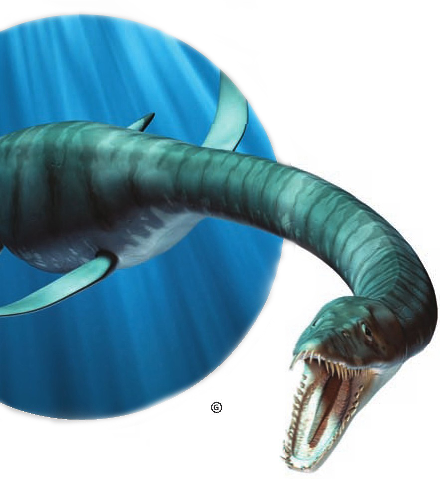
蛇颈龙

蛇颈龙是中生代中晚期生活在海洋里的大型爬行动物，具有流线型的躯干和鳍状四肢，善于游泳。在人们印象中，蛇颈龙有形似长蛇的细长颈部，这也许就是蛇颈龙名称的由来。但是，蛇颈龙是一个很大的类群，既包括长脖子的蛇颈龙亚目，也包括短脖子的上龙亚目。蛇颈龙亚目中，晚侏罗世的棱长颈龙有30节颈椎；晚白垩世的薄板龙颈椎数甚至超过70节；侏罗纪的海鳗龙有44节颈椎，脖子比身体和尾巴加起来都长。但是，上龙亚目的颈部却很短，颈椎数目也少，相比之下头骨粗壮硕大，故又被称作短颈蛇颈龙。中国重庆璧山出土的化石“璧山上龙”就属此类，它也是世界上为数不多的生活在淡水中的蛇颈龙类。侏罗纪海洋中著名的顶级杀手滑齿龙也属于上龙。它们体长可超过15米，是鱼龙和其他小型蛇颈龙的天敌。（李淳）

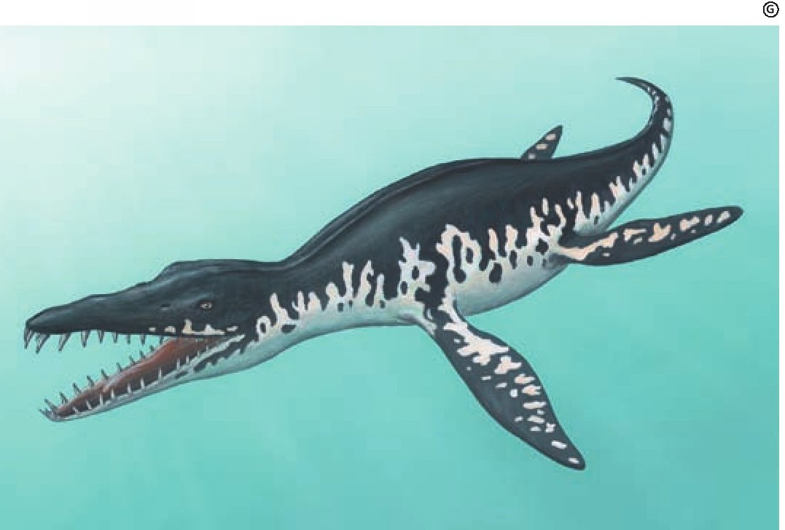
滑齿龙

## 为什么长颈龙的长脖子被称为“生物力学噩梦”

不仅是蛇颈龙，中生代的很多水生爬行动物都有一个长长的脖子，比如和蛇颈龙同样属于鳍龙超目的幻龙，还有原龙目中的长颈龙。灵活的脖子拉长了头和躯干的距离，在捕食时能很好地隐蔽自己的躯体，在较远处就可以对鱼类和菊石等猎物发起攻击。由于爬行动物的颈椎数量不固定，变异很多，因此产生了一些十分奇异的长脖怪兽。

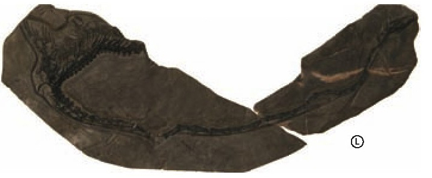
东方恐头龙化石，可见颈肋

19世纪中后期，古生物学家在欧洲的三叠系地层中陆续发现了一些奇特化石，其中一些零散的竹节状骨骼被认为是某种类似翼龙、可以飞翔的爬行动物的前肢骨。但随着更多完整标本的出现，人们惊讶地发现，竹节状骨骼化石其实是一种具有超长颈部的古怪爬行动物的颈椎。这些动物颈部的长度超过身体全长的一半，但是颈椎数量却仅有12节左右。因为生有这些细长的、没有棘突的竹节状颈椎，这种动物被命名为Tanystropheus，中文一般译为长颈龙。长颈龙体长可达6米，颈部长度超过3米。尤为奇特的是，每节颈椎上都生长着一对极为纤细的肋骨——颈肋，长度达到甚至超越2～4节颈椎。由于这些颈肋的存在，长颈龙无法像其他的长颈爬行动物一样灵活地转动脖子。而且这么长的颈部无法与全身骨骼相协调，或者说无法符合基本的物理学原理，因而被称为“生物力学噩梦”。这个噩梦就这样延续了100多年。

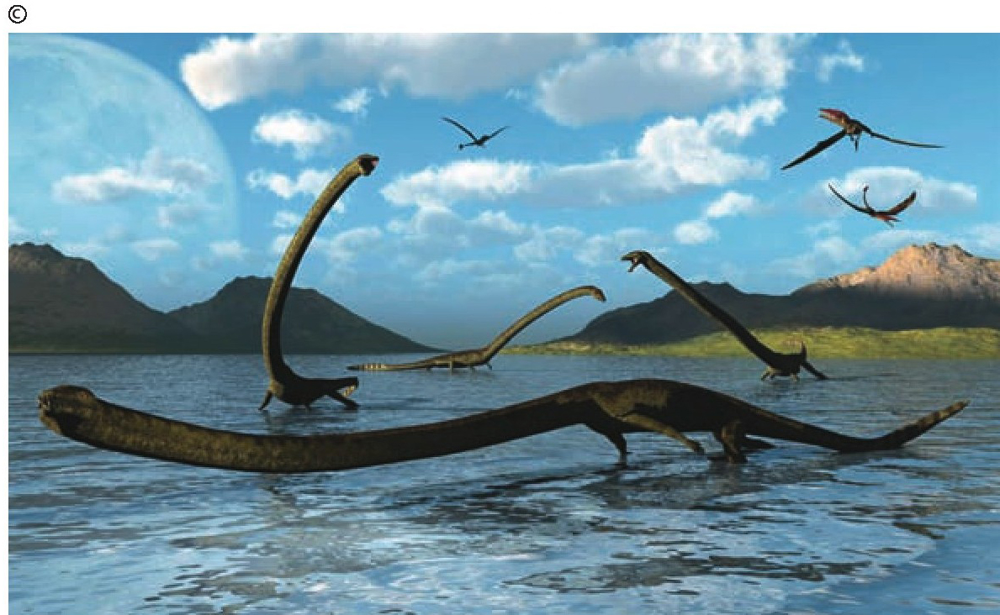
有长长颈肋的长颈龙无法弯曲脖子。它们能否像长颈鹿一样向上伸直脖子，目前还不清楚

2003——2004年，中国贵州盘县地区发现了一种与长颈龙类似的三叠纪海生爬行动物化石，由于头骨化石面目狰狞、利齿参差而被叫作东方恐头龙。东方恐头龙的颈椎数目较多，至少有25节，但是其形态以及颈肋的情况都与长颈龙的相似。通过研究，发现恐头龙是完全生活在海洋里的爬行动物，其细长的颈肋虽然极大地约束了颈椎的柔韧度和灵活性，但是可以通过特殊的运动方式使颈部瞬间膨大，在口腔处产生巨大的吸力，将猎物吸进圆柱状的脖子里。类似的捕食方式也见于硬骨鱼类和某些水生龟类。这在某种程度上给“生物力学噩梦”提出了新的解释。（李淳）

## 为什么说混形黔鳄不是鳄鱼

2006年4月，德国某著名科学类杂志以封面文章的形式报道了一种来自中国的史前爬行动物——混形黔鳄，这在国际学术界掀起了不小的波澜。一种普通的鳄为什么会引起科学家这么大的兴趣？

实际上，混形黔鳄并非我们今天所熟悉的鳄类。这种产自中国贵州盘县地区的大型肉食性爬行动物生活在2.4亿年前的三叠纪，属于一个叫作主龙类的类群，著名的恐龙（以及鸟类）、翼龙和现生鳄类都是这个类群的后代。

在二叠纪和三叠纪，各种早期的主龙类有一个通俗称谓——槽齿类，意思是这一类动物的牙齿都位于颌骨的槽洞中，而且它们大多为体形似鳄的鳄形动物。长期以来，在世界各地，绝大多数槽齿类化石都发现于陆相地层，也就是陆地环境（包括淡水环境）形成的地层中，其身体结构也都是典型陆地动物所特有的。混形黔鳄则不然，这种体长3米的巨型爬行动物化石不仅和大量的鱼龙类、鳍龙类等海生爬行动物及鱼类化石一起埋藏在海相地层中，而且本身具有很多高度适应海洋生活的身体结构特征。其中最为明显的是有一条极端侧扁的长尾巴，这是通过左右摆动推动身体前行的游泳利器，是陆生槽齿类所不具备的。有趣的是，这种动物的前肢与不少海生爬行动物具有类似的结构特征，但后肢又明显保留一定程度的陆生特征。因此，科学家将其命名为混形黔鳄，意思是在贵州发现的具有海陆双重特征的鳄形动物。混形黔鳄不是恐龙的直系祖先，但是谱系关系上可以算作恐龙的“叔辈”，因此，可以这样比喻，恐龙有一个生活在海洋里的“叔叔”。

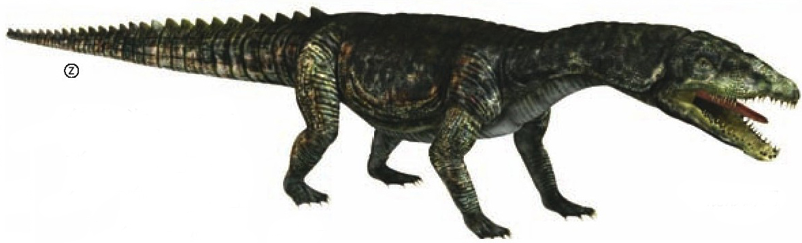
混形黔鳄

混形黔鳄是第一批探索海洋的槽齿类动物。和混形黔鳄同时代的其他多数槽齿类动物及其后代翼龙、恐龙以及原始的鳄类（原鳄），基本都在陆地上生活。一直到了晚侏罗世，鳄类的祖先才开始再次往水生方向发展。这时，距离它们的“叔祖”混形黔鳄的初次下水，时间已经过去了近1亿年。（李淳）

  

**【微博士】**爬行动物的颈肋

很多脖子长的古爬行动物，比如海洋中的蛇颈龙和陆地上的蜥脚类恐龙，在颈椎骨的关节上都长有对生的细长骨头，就像肋骨一样，被称为颈肋。颈肋常常有2倍甚至3倍颈椎长度那么长。它的作用是支持血管和神经。由于颈肋的存在，这些爬行动物的脖子无法像没有颈肋的鸟类如天鹅的脖子那样，弯曲成很大的角度。否则，颈肋就会把脖子扎穿了。蛇颈龙（鳍龙类）的颈肋都很短，颈部常复原为S状。

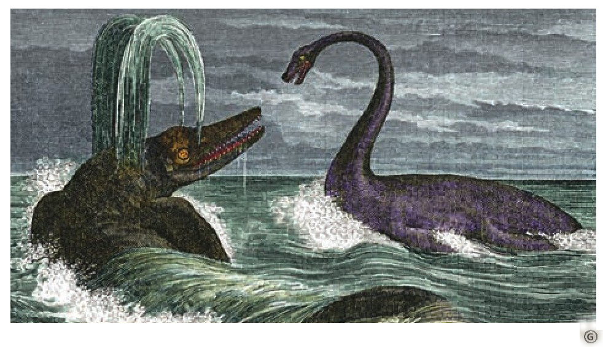
19世纪一幅描绘海生爬行动物的画

【微问题】槽齿类动物因何得名？

【关键词】长脖子　蛇颈龙　上龙　长颈龙　恐头龙　混形黔鳄

## 翼龙是如何飞行的

翼龙是第一类能主动飞行的脊椎动物，但是对于翼龙的飞行模式，古生物学界还没有最终的定论。由于没有可以参照对比的后代，科学家只能通过翼龙化石的骨骼尤其是前肢的结构，以及翼膜的附着等特征，来了解翼龙的飞行方式。

翼龙的飞行很可能包括持续的翱翔、短距离的滑翔和鼓翼飞行。有些小型翼龙体重较轻，又要去捕食行动敏捷的昆虫，所以它们很可能会进行速度较慢的鼓翼飞行。而那些大型翼龙，如披羽蛇翼龙，它们主要利用上升热气流翱翔，飞行时基本不挥动翅膀。为了进一步寻找依据，科学家还对一些翼龙头骨进行高精度三维CT扫描研究。图像显示翼龙脑中处理平衡信息的神经组织如小脑叶片相当发达，其质量占整个脑质量的7.5%，是目前已知的脊椎动物中比例最高的，被认为与较强的飞行能力有关。此外，翼龙还长有发达的肩带、中空纤细适应飞行的骨骼以及精密坚固的翼膜结构，这一切都显示它们很可能是飞行能手。已知的化石记录也显示，一些翼龙化石骨骼埋藏于距离古海岸线数百千米的沉积中，推测这些翼龙至少可以在海上飞行几百千米之遥。有的科学家甚至认为，大型翼龙如风神翼龙，可以利用气流不停歇地飞行数千千米。

那么，翼龙能像鸟一样起飞吗？人们原来认为，翼龙没有像鸟一样足够强壮的飞行肌肉，所以无法在平地上起飞，它们必须爬到较高的地方才能进行滑翔。但现在的研究表明，翼龙，特别是演化程度较高的翼手龙类（包括那些大型翼龙）在陆地上也能迅速奔走，而且前肢比后肢更强壮，具有在平地鼓翅起飞的能力。不过，翼龙在起飞时可能并不像鸟那样凭后脚蹬地的力量离开地面，而是靠四肢共同发力完成助跑加速。首先用后脚蹬地跳起，获得一个初始速度，然后借助前脚蹬地的力量获得足够的起飞速度和高度。至于着陆，有足迹化石证明，翼龙很可能和鸟类一样，在落地时是先用后肢着地，再收起翅膀，踏下前脚。（汪筱林　孟溪　蒋顺兴　程心）

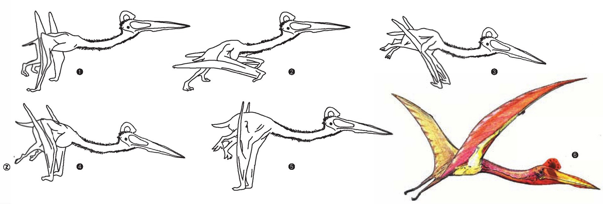
翼龙在平地上起飞

## 哪里发现过翼龙化石

迄今为止，包括南极洲在内的世界各大洲都发现了翼龙类动物的化石。其中，德国索伦霍芬，中国新疆准噶尔盆地的乌尔禾风城和辽宁西部地区，巴西东北部的阿拉里皮盆地，以及哈萨克斯坦的卡拉套山等地，都是全世界重要的翼龙化石产地。

德国巴伐利亚的索伦霍芬附近出产一种平板状灰岩，灰岩里富含脊椎动物（最著名的就是始祖鸟了）、无脊椎动物、陆生植物等晚侏罗世古生物的化石。这些化石大多保存了生物体完整的精细结构，甚至还保存了软体组织等。正是这里发现的一件具有翼膜印痕的翼龙标本，最先证实了在翼龙加长的第四飞行指与身体之间存在相连的翼膜，并构成翼龙特有的翅膀结构。

乌尔禾风城位于准噶尔盆地西缘，在白垩纪早期，这里曾经有过巨大的湖泊，湖中和岸边生活着大量翼龙、恐龙和龟鳖类等脊椎动物，其中最著名的就是中国古生物学家杨钟健于1963年研究的中国第一具较完整的翼龙化石——魏氏准噶尔翼龙。

中国的辽西及邻近地区著名的早白垩世热河生物群以及中晚侏罗世的燕辽生物群，其核心分布范围包括辽宁西部朝阳、锦州和葫芦岛地区，河北北部的承德地区，以及相邻的内蒙古东南部的赤峰等地区。在这里出露的中生代晚期火山——湖相沉积地层中，不但发现了大量保存精美的鸟类、带毛恐龙和哺乳动物化石，而且发现了大量翼龙化石。目前在这一地区发现了两个翼龙动物群，即以悟空翼龙类为代表的中晚侏罗世翼龙动物群和早白垩世热河翼龙动物群，记述了近40个属种的翼龙化石，其中包括属于原始类群的蛙嘴龙类（如宁城热河翼龙）、掘颌翼龙类（如强壮建昌颌翼龙）和属于比较进步的翼手龙类（如董氏中国翼龙、猎手鬼龙、隐居森林翼龙）。最重要的是，在这里发现的悟空翼龙类是古生物学家长期寻找却一直未找到的翼龙类型。悟空翼龙是由原始的喙嘴龙类向进步的翼手龙类过渡的中间类群，它既具有喙嘴龙类的原始特征，比如尾长、第五脚趾发达，又具有翼手龙类的特征，如愈合的鼻眶气孔、长在吻端的牙齿、较长的颈椎和相对较长的翼掌骨等。

巴西东北部的阿拉里皮盆地中出露的下白垩统地层，以数量巨大、保存精美的鱼类和翼龙类化石闻名于世。在那里的浅海沉积中发现了与中国辽西的辽宁翼龙、中国翼龙和鬼龙等十分相近的属种。两个地方相隔万里，为何存在如此相近的物种呢？科学家认为，在白垩纪早期，北方的劳亚古陆和南方的冈瓦纳古陆刚刚开始解体，欧洲、亚洲、美洲和非洲板块虽然开始相互分离，但陆地与陆地之间还没有被辽阔的海洋完全隔断。像翼龙这样具有飞行能力的动物，是完全有能力跨越当时还不算宽广的海洋障碍进行大范围迁移的。

位于哈萨克斯坦北部的卡拉套山脉是中国天山山脉向西北方向的延伸，在卡拉套地区的沉积岩中保存了精美的中生代脊椎动物等化石，其中包括翼龙化石。值得注意的是，这里的晚侏罗世陆相沉积地层中发现了掘颌翼龙类与蛙嘴龙类伴生的现象，在中国辽西和德国索伦霍芬也发现这两个翼龙类群的伴生保存。结合中国辽西热河翼龙动物群的化石组合与德国索伦霍芬、巴西桑塔纳组的翼龙化石组合的相似性，一些古生物学家认为，以辽西义县组为代表的翼龙组合可能是从欧洲晚侏罗世的海相环境的翼龙类群逐渐迁移演化而来，并在该地区的火山——湖泊——森林环境中进一步分化，一些新的类群由此出现，并随着和鸟类的竞争逐渐向外迁移，直至扩散到南美。因此，有人提出辽西地区是一些白垩纪重要翼龙类群的起源和辐射中心。（汪筱林　孟溪　蒋顺兴　程心）

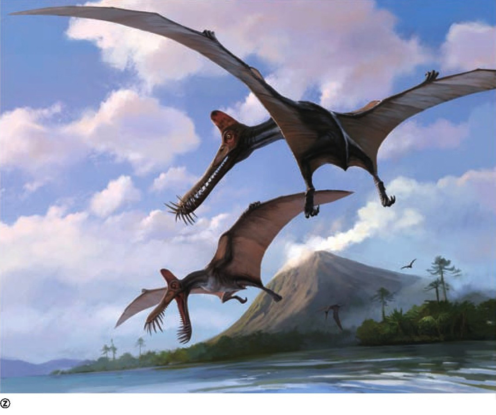
辽西发现的猎手鬼龙

  

**【微博士】**第一块翼龙化石

第一件被正式描述的翼龙化石标本来自德国巴伐利亚小镇艾希施泰特，是由意大利历史学家和自然学家科利尼在1784年通过论文的形式发表的。在论文中，科利尼对这件标本做了详细的描述并绘制了精确的素描图，但是并不知道它是哪类生物，更没有意识到这是一种能够飞行的动物，而是将其误认为是一种海洋生物。直到17年后的1801年，法国解剖学家、古脊椎动物学之父居维叶首次鉴定出这种生物是一种爬行动物，并且提出它是一种能够飞行的爬行动物。1809年，居维叶将这种生物命名为“Ptero-dactyle”，意为“飞行的手指”。这个名字被拉丁文标准化后，加以后缀成为相应的翼手龙亚目、翼手龙科和翼手龙属的名称。

【微问题】翼龙能像天鹅一样飞越高山吗？

【关键词】翼龙　飞行　翼龙产地　准噶尔翼龙　悟空翼龙

## 为什么说翼龙不是变温动物

变温动物是指冷血动物，它们的体温会随着环境温度的变化而变化。变温动物包括爬行动物、两栖动物和鱼类。恒温动物则是指热血动物，它们的体温不随环境温度的变化而变化，能调节自身的体温保持恒定，鸟类和哺乳动物都是热血动物。

那么，翼龙是变温动物吗？1870年，英国著名学者欧文在对比了英国发现的侏罗纪早期双型齿翼龙与现生的爬行动物蜥蜴、鳄类的骨骼特征后得出结论，认为翼龙是变温动物，并且认为像翼龙这样的变温爬行动物不可能像属恒温动物的鸟类那样飞翔。

然而，20世纪初，英国生物学家西利却不这么认为。他指出，翼龙应该具备快速运动的能力。翼龙像蝙蝠一样，体表长毛，生活习性与鸟类相似，因此他认为翼龙应该是恒温动物。随后，人们也的确在德国晚侏罗世索伦霍芬灰岩中发现的化石喙嘴龙身上找到了“毛”的印痕。1970年，苏联古生物学家在哈萨克斯坦晚侏罗世沉积岩中发现了一件比较完整的带“毛”的翼龙化石——索德斯翼龙。中国古生物学家在内蒙古道虎沟发现的热河翼龙化石，也同样保存有精美完好的“毛”，为翼龙是热血动物又增添了一个有力证据。关于翼龙身上的“毛”是否与同样发现于辽西的带毛小型兽脚类恐龙身上类似的原始羽毛同源，目前还不清楚。不过科学家认为，在恐龙和翼龙身上发育的这种毛状皮肤衍生物，最初的功能并不是为了飞行的需要，而是为了保温。

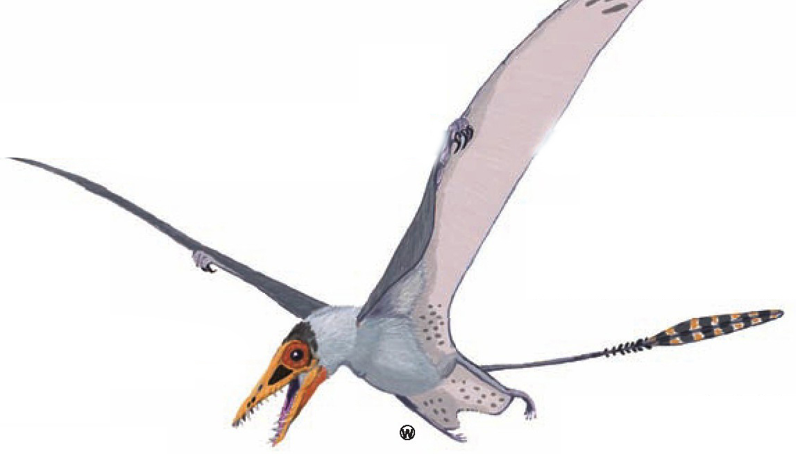
索德斯翼龙

恒温的生理机制对翼龙有好处吗？答案是肯定的，翼龙只有是恒温动物才能够实现真正意义上的自由飞行，飞行需要很高的运动效率，需要消耗更多的能量，只有具有内部发热机制、体温恒定以及新陈代谢水平较高的恒温动物才具备飞行必需的这些条件。已知的大量翼龙标本中很少有食物的残留，不像恐龙化石那样在胃部区域可以经常发现食物的残渣，这也从另外一个侧面证明了翼龙具有较高的消化能力和新陈代谢水平。当然，成为恒温动物还可以获得很多好处。比如，可以连续生长直至成年，也可以花更多的时间寻找食物和交配对象，并在较早的年龄达到成熟。

比较肯定的是，翼龙与现生变温的爬行动物肯定是有很大区别的，但要说翼龙就是像哺乳动物和鸟类那样的恒温动物，科学界还没有定论，还需要做大量的研究工作。（汪筱林　孟溪　蒋顺兴　程心）

## 翼龙吃什么

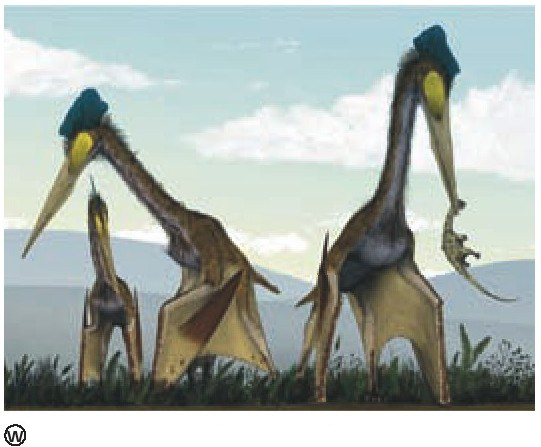
吃蜥脚类恐龙的披羽蛇翼龙

许多翼龙以鱼为食，它们长有锋利的牙齿，是技能高超的捕鱼能手。那些没牙的翼龙呢？它们同样可以像今天的海鸥一样捕食鱼类。这些翼龙会在掠过水面的时候，张开上下颌，在接触水面的一瞬间把头钻到水下，准确地咬住靠近水面活动的鱼类。人们在极少的翼龙标本的胃部发现了尚未消化完的鱼类骨骼，也在翼龙的粪便中发现鱼类骨骼碎片，这些是翼龙以鱼类为食的最直接证据。

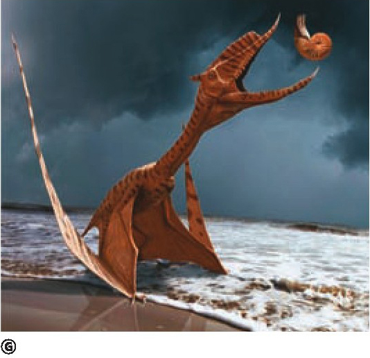
吃软体动物的准噶尔翼龙

当然，也有一些翼龙以昆虫为食，其中，蛙嘴翼龙是捕虫大王。蛙嘴翼龙的脑袋短而宽，就像青蛙的嘴一样，这样就利于在空中飞行时捕食昆虫。体形非常娇小的森林翼龙也可以灵巧地飞行于树林和灌木丛中，以捕食昆虫为生。还有一群更加特别的梳颌翼龙，牙齿细长且数目众多，它们的捕食行为就像今天的琵鹭一样，靠过滤水中细小的浮游生物和虫子为生，发现于阿根廷的南方翼龙就是它们中最典型的代表。

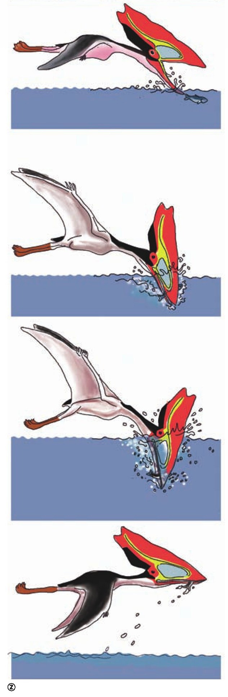
掠海翼龙捕食鱼类示意图

有些翼龙还有更奇特的捕食行为。准噶尔翼龙前端无牙并向上弯曲的嘴和后部的牙齿就是一套进食软体动物的最佳餐具。披羽蛇翼龙可能以食腐为生，或者靠挖掘泥沙下面的动物为食。最近的研究表明，它们在陆地上行走也非常灵活，这些像长颈鹿一样高的翼龙也可能会以地面上的其他爬行动物为食，甚至对幼小的霸王龙或蜥脚类恐龙也敢下手。那么有没有以植物种子为食的翼龙？虽然目前还没有发现胃部保存种子的翼龙化石，但是依据翼龙的上下颌结构，科学家认为发现于巴西、中国的古神翼龙和中国翼龙可能以采食种子或果实为食。甚至有人推测，采食种子或果实的翼龙与早期被子植物之间具有协同演化的关系，这些翼龙对种子的传播可能促进了白垩纪被子植物的繁盛。此外，一些翼龙可能是杂食性的，在不同的时期吃不同的食物。（汪筱林　孟溪　蒋顺兴　程心）

## 为什么说翼龙是卵生的

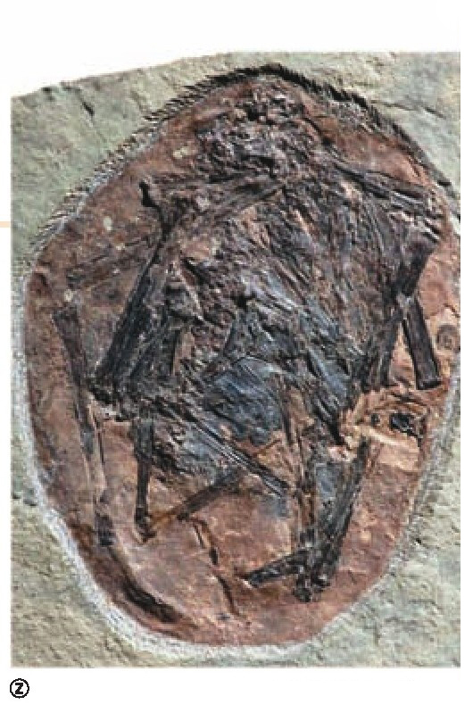
翼龙卵及胚胎

现生爬行动物都是通过产卵繁殖后代的，那么属于爬行动物的翼龙是不是卵生的呢？从一般的常识来讲，它们应该是卵生的，但是一直没有化石证据。2004年，科学家找到了确切的答案。巧合的是，这一年，世界上共有3枚含有翼龙胚胎的蛋化石得到研究和报道，其中的2枚就产自中国辽西地区。这些化石第一次证实了翼龙也像恐龙一样，采取卵生的生殖方式。依据翼龙蛋中胚胎骨骼的发育程度，科学家认为翼龙很可能像一些相对原始的鸟类如鸡、鸭、鹅一样，具有早成性胚胎发育模式，即幼年个体出生后不久就具有独立生活的能力。至于翼龙是否会像一些鸟类那样主动孵化它的卵和照顾它的幼仔，还不得而知。现生的大部分爬行动物的蛋是硬壳的，也有很少一部分爬行动物的蛋是软壳的。那么，翼龙的蛋是硬壳还是软壳的？通过已知仅有的几枚翼龙蛋的研究表明，有的翼龙蛋是硬壳的，表面还发育出微小的乳突状纹饰，而有的是软壳的。关于翼龙的蛋壳特征与结构，还有待于更多的化石发现。（汪筱林　孟溪　蒋顺兴　程心）

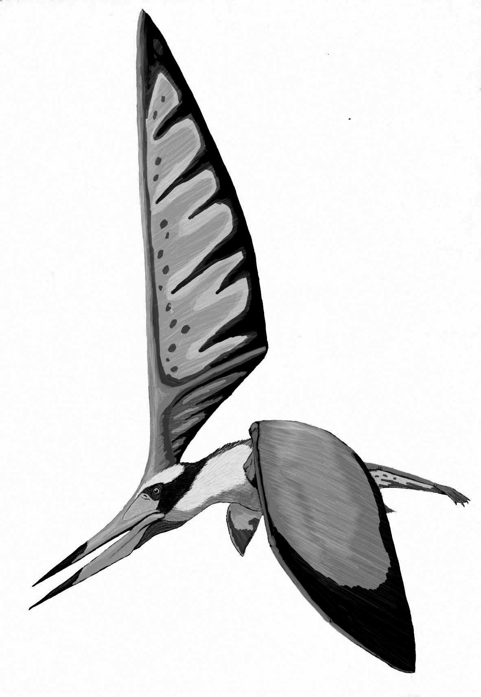
夜翼龙有巨大的头冠

  

**【微博士】**翼龙的头冠

很多翼龙，特别是那些演化程度较高的翼手龙类的头上，都有大大小小各种各样的头冠。翼龙的头冠到底起什么作用呢？首先，头冠可以调节气流，在飞行或捕食时保持身体和头部稳定，帮助翼龙在飞行和捕食中控制方向和稳定性。其次，头冠是性展示的工具，即在雄性翼龙求偶时起到炫耀作用，类似一些雄性鸟类的头冠。再者，在一些翼龙的巨大头冠上发现有很多沟槽结构，那里可能曾经布满血管。这些类似暖气片的结构，可能是翼龙调节体温的工具。

【微问题】捕鱼的翼龙不慎落水后还能飞起来吗？

【关键词】恒温动物　变温动物　头冠　卵生　热河翼龙

## 传说中的龙是恐龙吗

中国有历史悠久的龙文化。在中国，只要提到龙，人们就会联想到传说中张牙舞爪、口中喷火的龙。早在甲骨文中就有关于龙的记载；在上古社会神话传说中，龙是一种神奇的动物，是正义与勇敢的完美化身，有妖魔鬼怪的地方，只要有“龙”在，就能为人们驱魔降妖带来平安。传说中的龙和生活在亿万年前的地球陆地主宰者恐龙有关系吗？

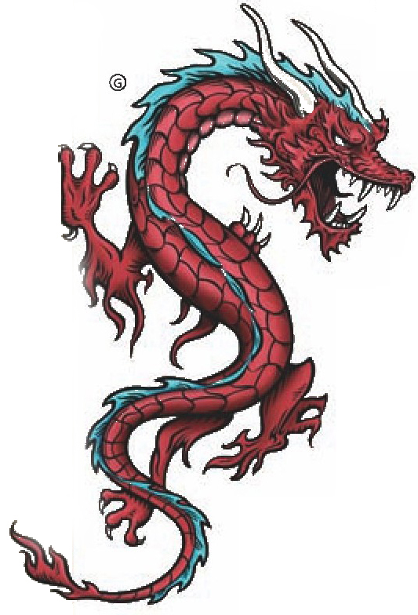
龙图腾

传说中的“龙”具有蛇身、蜥腿、凤爪、鹿角、鱼鳞、鱼尾、口角有虎须等，这种形象实际上是在上千年的历史中逐渐形成和完善的，伴随着中华民族的历史，逐渐深入到中华民族的血液中，成为民族精神的一种重要载体。作为自然界曾经存在的一类动物——恐龙，进入人类知识体系中的历史则相对短暂。第一篇有关恐龙的科学报道发表于1677年，当时英国人普洛特在他撰写的《牛津海岸的自然历史》一文中，描述了一段腿骨，这块腿骨的周长超过60厘米，明显大于现生陆地上最大的动物大象身上对应的骨头。但非常滑稽的是，他错误地认为这段腿骨属于远古的一种巨人。到19世纪早期，人们在英国等欧洲国家发现了更多的恐龙化石，发现它们属于爬行动物，但又不同于现生的爬行动物，能够直立行走，而且体形巨大。1842年，英国博物学家欧文正式命名这类爬行动物为“恐龙”。随着越来越多恐龙化石的发现，人们认识到，恐龙实际上是一个非常庞大的家族：既有一些庞大的物种，也有许多娇小的物种；既有满身鳞甲的，也有体披羽毛的；既有肉食性的，也有植食性的。

这样看来，博物馆中陈列的恐龙化石和中国传统文化中的“龙”是不同的。恐龙是在地质历史中真实存在的动物，而中国文化中的“龙”只是人们将不同动物的特点加以拼凑，想象出来的一种文化符号，实际上是中国人的一种图腾。（王烁）

普洛特

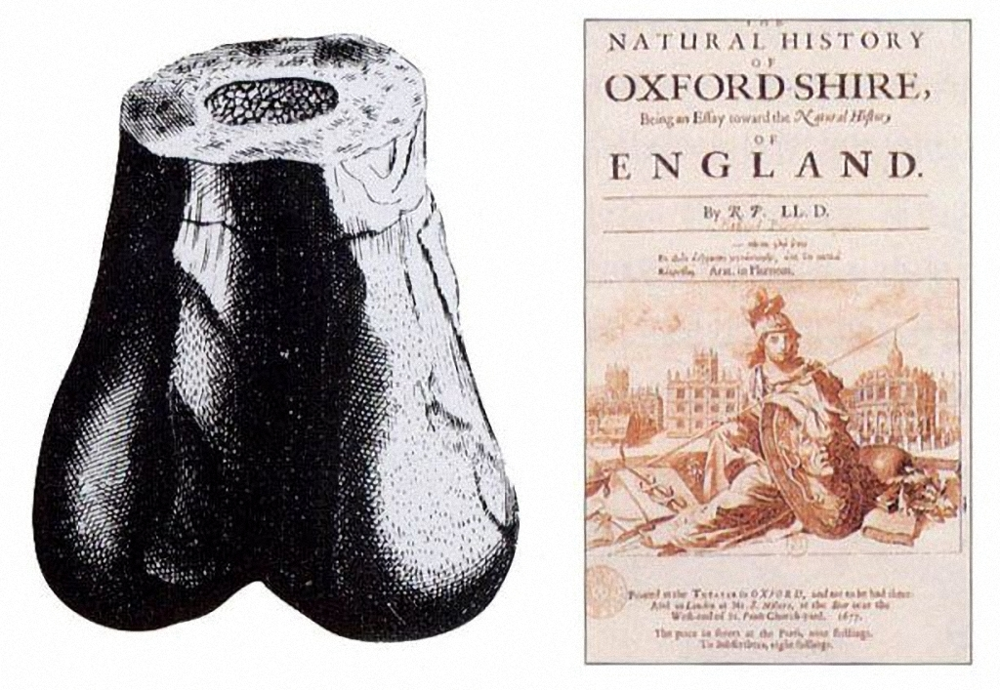
《牛津海岸的自然历史》与其描述的恐龙腿骨化石

## 哪些“龙”才是恐龙

在中生代的地球上，生活着各种各样的“龙”：有在海洋中遨游的蛇颈龙和鱼龙，有被称为天空霸主的翼龙，还有三角龙和霸王龙。这些形态各异的“龙”都属于恐龙吗？当然不是。传统意义上的恐龙是指一类生活在中生代陆地上的爬行动物，而同时代生活在水中的蛇颈龙类和鱼龙类，以及翱翔在天空中的翼龙类都不属于恐龙，同时代的其他一些爬行动物也不属于恐龙。实际上，动物名称中“龙”字的含义通常只是说明这种动物是爬行动物。

和同时代的其他爬行动物相比，恐龙家族有一些独特的地方：比如一些用于咬合的肌肉向前延伸到头顶，颈椎上出现了一些突起，附着更多的肌肉来控制脖子的运动，还有腰带上开放式的髋臼使得恐龙能够完全直立行走，等等。现在科学家认为，恐龙家族不仅包括像三角龙和霸王龙这样的陆地霸主，还包括已经灭绝的始祖鸟等，以及今天仍然生活在地球上的鸟类。

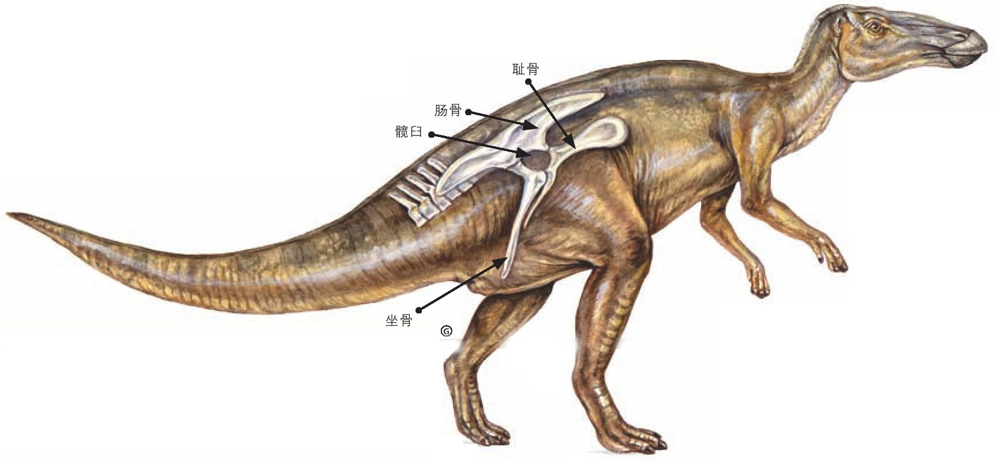
鸭嘴龙（鸟臀类）

科学家一般把各种各样的恐龙归为两大类：蜥臀类和鸟臀类。这两类恐龙有许多不同的地方，其中最醒目的不同之处在于腰带（也就是臀部骨骼）。腰带每侧有三块骨头，分别叫作肠骨、耻骨和坐骨。大多数蜥臀类的耻骨伸向前下方，类似蜥蜴，鸟臀类的耻骨伸向后下方，类似鸟类，这是两类恐龙名字的来源。不过，如果仔细观察，就会发现鸟臀类恐龙的腰带实际上和鸟类差别很大，而蜥臀类恐龙当中的一个分支（真手盗龙类）却拥有和原始鸟类最相像的腰带。蜥臀类恐龙一般分为两大类：蜥脚型类和兽脚类。前者包括原始的原蜥脚类和蜥脚类。蜥脚类恐龙的特点是体形巨大，脖子长，四肢粗壮，以及尾巴长。它们四足行走，以植物为食。兽脚类恐龙都是两足行走，大多数是肉食性动物，有着锐利的牙齿和尖锐的爪子。除了一些原始的种类（像异齿龙类），鸟臀类恐龙可以分为5类：剑龙类、甲龙类、鸟脚类、肿头龙类和角龙类。这些恐龙有些是两足行走的，有些是四足行走的，形态各异，但基本上是植食性动物。（王烁　孟溪）

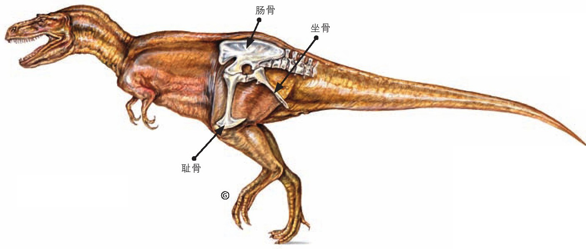
霸王龙（蜥臀类）

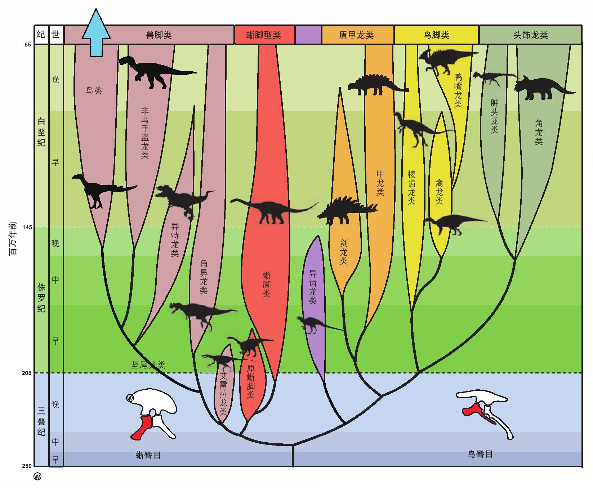
恐龙的演化

  

**【微博士】**恐龙的定义

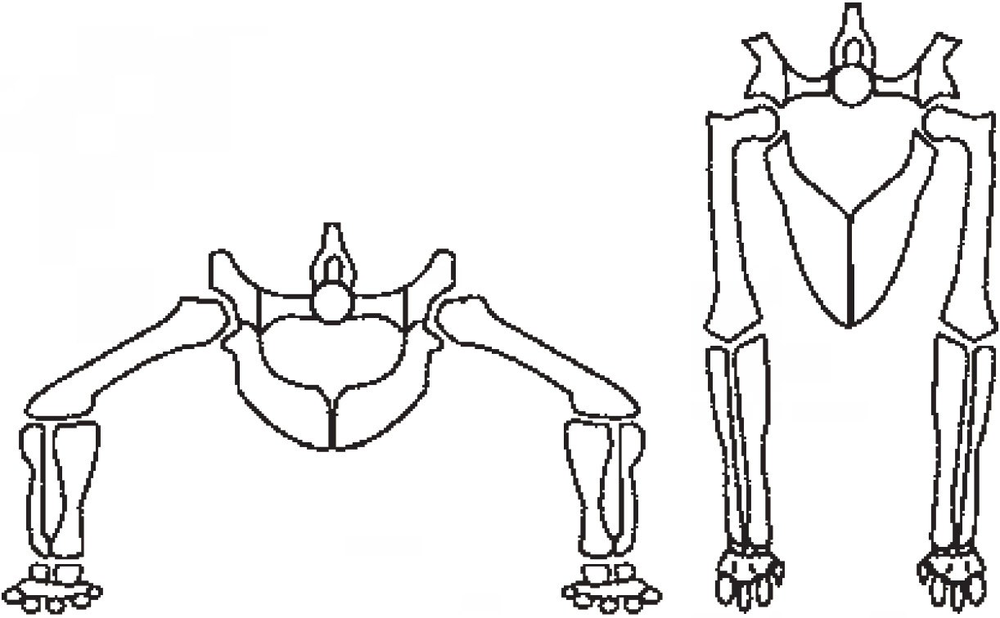
爬行（左）和直立（右）

传统上，恐龙家族是指生活在中生代陆地上的一类能够直立行走的爬行动物。由于恐龙已经灭绝了，能够用来定义恐龙的特征都来自骨骼：头骨后部的凹陷，颈椎后关节突上的突起，肱骨上很长的三角肌嵴，腰带上开放式的髋臼，股骨上不对称的第四转子以及较细的腓骨。这些骨骼特征表明恐龙有着很有效的咬合系统、灵活的脖子以及完全直立的行走方式。现在，科学家认为，恐龙家族不仅包括那些生活在中生代的物种，还包括今天地球上的鸟类。科学家在定义恐龙时，不再采用各种各样的骨骼特征，而是基于物种之间的亲缘关系。现在常用的恐龙定义为：三角龙和麻雀的最近的共同祖先及其所有后裔。

【微问题】恐龙直立行走有什么好处？

【关键词】恐龙　蜥臀类　鸟臀类　腰带　蜥脚型类　兽脚类

## 恐龙在地球上生活了多长时间

恐龙家族堪称脊椎动物当中的一个长寿家族。已知最早的恐龙骨骼化石发现在阿根廷，距今约2.3亿年。已知最早的恐龙足迹化石发现于欧洲和南美洲的一些地点，距今约2.4亿年。传统意义上的恐龙全部灭绝于距今约6500万年的白垩纪末，在此之后的化石记录当中再也没有了它们的踪迹。据此推算，传统意义上的恐龙在地球上度过了大约1.7亿年的漫长岁月。由于鸟类起源于恐龙，属于恐龙家族的一个支系，现代意义上的恐龙就包含了鸟类。这样算起来，恐龙家族在地球上生活的时间就达到了约2.4亿年。

在漫长的恐龙时代，出现过各种各样的恐龙。每个时代的恐龙种类都不同，有着强烈的时代烙印。三叠纪是恐龙演化的早期阶段，包括蜥脚型类、兽脚类和鸟臀类等恐龙的主要支系都出现了，最著名的代表包括属于原蜥脚类的板龙、属于蜥脚类的古雷龙、属于兽脚类的腔骨龙和属于鸟臀类的匹萨诺龙。这一时期的恐龙以原蜥脚类和兽脚类为主，蜥脚类和鸟臀类较少。三叠纪的恐龙体形一般相对较小，多为两足行走。

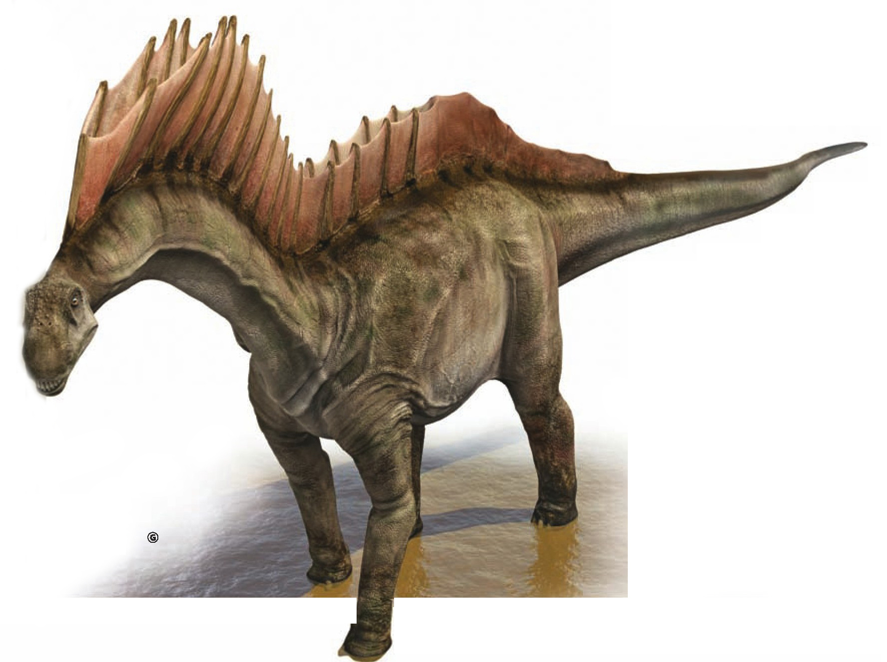
阿玛加龙

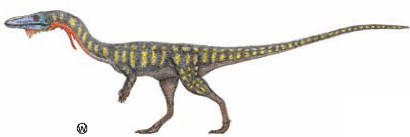
腔骨龙

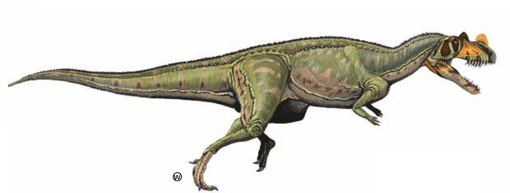
角鼻龙

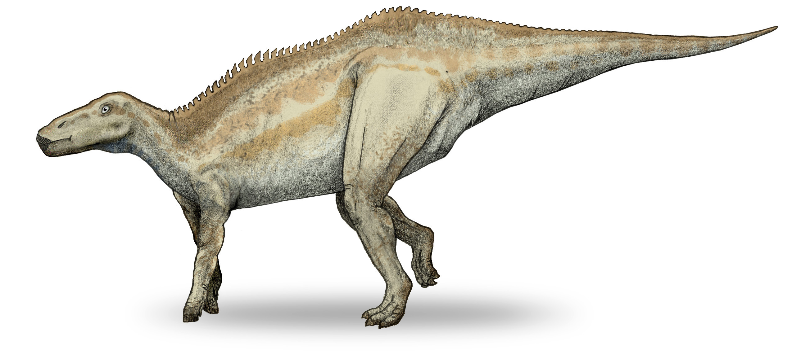
山东龙

在侏罗纪早期，由于泛大陆还没有解体，地球各个大陆上的恐龙种类非常相似。原蜥脚类依然在各地繁盛，著名代表有中国的禄丰龙和北美等地的近蜥龙；兽脚类开始分化，出现了双嵴龙类和角鼻龙类等亚类群；蜥脚类更多地出现，著名的代表有中国的珙县龙和南非的火山齿龙；鸟臀类也同样越来越多，像异齿龙类和原始盾甲龙类（剑龙类和甲龙类的祖先类群）开始繁盛。在侏罗纪中期，蜥脚类取代了原蜥脚类，占据了统治地位，著名代表有中国的蜀龙和阿根廷的南方龙等；兽脚类当中的坚尾龙类开始分化，著名的代表有中国的单嵴龙和欧洲的巨龙（又名巨齿龙）；鸟臀类中的许多亚类群也开始出现，像以中国的华阳龙为代表的剑龙类和以中国的盐都龙为代表的鸟脚类。到侏罗纪晚期，恐龙演化进入了一个鼎盛期，许多大型蜥脚类开始出现，著名的代表有中国的马门溪龙和北美的梁龙、腕龙；相应地，许多大型兽脚类也出现了，像北美的异特龙和中国的永川龙。兽脚类当中的小型种类在这一时期也异常繁盛，如早期暴龙类代表——冠龙，已知最早的阿尔瓦雷斯龙类代表——简手龙，已知最早的恐爪龙类代表——近鸟龙和晓廷龙，以及鸟类支系的最早代表——耀龙。鸟臀类的一些主要亚类群也开始出现和繁盛：像以北美的怪兽嘴龙为代表的甲龙类，以中国的沱江龙为代表的剑龙类以及以隐龙为代表的角龙类。

白垩纪时期恐龙进一步繁盛，尤其是鸟臀类恐龙中的鸟脚类、角龙类和肿头龙类。白垩纪的蜥脚类恐龙以巨龙类的繁盛为特征，著名代表有阿根廷龙等恐龙中的巨无霸；同时，梁龙类也进一步发展，著名的代表有阿玛加龙等一些非常奇特的恐龙。在白垩纪早期，鹦鹉嘴龙和辽角龙等小型角龙类非常繁盛；鸟脚类开始逐渐变大，著名的代表有欧洲的禽龙；到了白垩纪晚期，大型的角龙类、肿头龙类和鸟脚类开始繁盛，最著名的代表是鸭嘴龙类的巨无霸——山东龙，有着奇特头骨的肿头龙和见证恐龙灭绝的大型角龙——三角龙；同时，肉食龙类演化也逐渐达到了鼎盛时期，许多兽脚类中的巨无霸出现了，白垩纪最末期的霸王龙是它们当中最著名的代表。（贺一鸣）

## 恐龙为什么会成为中生代的陆地霸主

恐龙在三叠纪中期出现后，逐渐成为陆地霸主，开始了漫长的统治时代。一个非常有意思的问题是：恐龙凭什么登上霸主宝座？有人认为，恐龙家族有着同时期其他陆地脊椎动物无法比拟的身体结构和更发达的大脑，凭借更强壮的身体，更快的奔跑速度和更高的智慧，恐龙逐渐战胜了其他动物，成为了地球陆地主宰者。但后来的研究发现，这些说法站不住脚。同时期的一些陆地四足动物其实和恐龙一样，也能够直立行走，奔跑速度也不慢，从身体结构上并不比恐龙差。

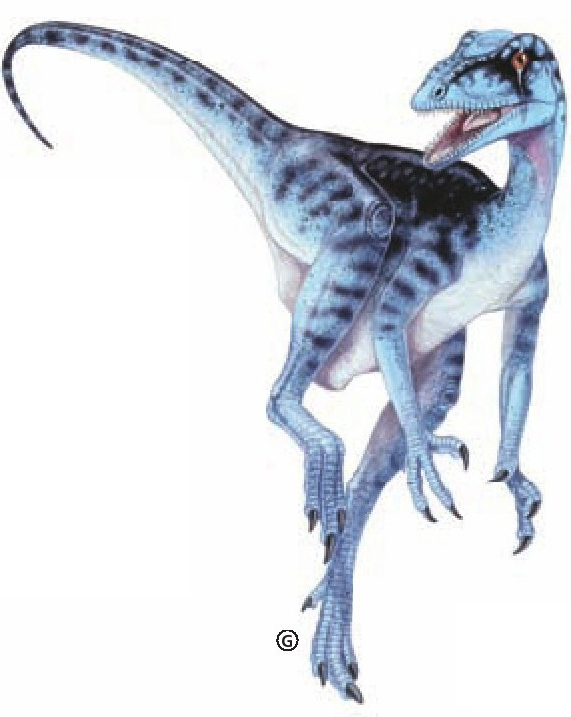
始盗龙

一些科学家提出，恐龙实际上是“机会主义者”，它们的成功主要归功于一个难得的发展机会。仔细分析三叠纪的化石记录，就会发现恐龙种类的多样性和个体数量并非随着时间的推移而呈现出稳定的增加。相反，恐龙数量是在大约2亿年前，也就是它们出现几千万年后，才急剧地增加的。恐龙在其诞生的早期，数量非常稀少，仅占陆地脊椎动物种群数的1%～2%，但三叠纪末期地球上发生了一次生物集群灭绝事件，许多动物类群退出了地球生命舞台，从而产生了很大的生存空间。恐龙家族借助这一机会，迅速发展，很快占据了陆地脊椎动物种群数的50%～90%，成为了陆地霸主。（贺一鸣）

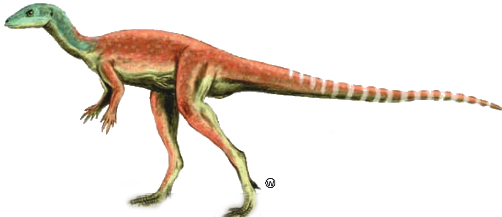
始奔龙

  

**【微博士】**最早的恐龙

最早的恐龙是何时出现的？要回答这个问题，最简单的方法是找到最早的恐龙骨骼化石。已知最早的恐龙骨骼化石发现于阿根廷，距今约2.3亿年，著名的代表包括始盗龙、始奔龙和艾雷拉龙。这些发现表明，最早的恐龙出现在至少2.3亿年前。不过，在欧洲和南美洲距今大约2.4亿年的沉积岩中，人们发现了一些足迹化石，和早期恐龙脚部形态相匹配，说明恐龙在这一时期可能已经出现了。在同一时期，和恐龙亲缘关系最近的西里龙类已经出现，这也为恐龙在三叠纪中期的出现提供了间接证据。和恐龙有关的最早化石证据来自波兰：在波兰早三叠世时期形成的岩石中，人们发现了一种小型动物的足迹，这种四足行走的小型动物应该和恐龙有着密切关系，说明恐龙这一支系可能在三叠纪早期就出现了。传统的观点认为，早期恐龙体形娇小，两足行走，但最近的研究显示，最早期的恐龙也有可能是四足行走的。

【微问题】恐龙的演化有确定的方向吗？

【关键词】蜥脚型类　兽脚类　鸟臀类　三叠纪　侏罗纪　白垩纪

## 如何给恐龙起名字

科学家发现新的恐龙化石后，会和已知的恐龙进行对比。如果确认该化石不属于已知的任何恐龙，就会给它起个新名字。当然，在这个过程中，科学家也会经常犯错误。一种情况是把不同恐龙当成同一种恐龙。比如，把在中国内蒙古毛尔图发现的一种恐龙归入吉兰泰龙，但后来发现它实际上代表一种不同的恐龙，于是重新给它起名叫鲨齿龙。另外一种更常见的情况是把同一种恐龙的不同个体当成了不同种恐龙。比如，在新疆发现的一种叫作鄯善龙的恐龙后来被发现是特暴龙的幼年个体。

像绝大多数其他生物一样，一个完整的恐龙名字由两部分组成，也就是常说的双名法。这一方法是瑞典著名的植物学家林耐在1768年出版的《自然系统》中首次提出的，一直沿用至今。每个物种名字的前一部分是属名，后一部分是种名。不过，特别需要指出的是，中文名不是正式的名字，而是从正式的学名翻译过来的。由于习惯的原因，中文名一般把种名放在前面，而把属名置于后面。在翻译过程中，还会常常出现同一个学名被翻译成不同中文名字的情况，比如“Dromaeosaurus”就被翻译为“奔龙”和“驰龙”，“Caudipteryx”被翻译为“尾羽龙”和“尾羽鸟”。一般来说，应尽量采用那些遵循原意和符合该物种演化地位的翻译名。当然，有时翻译名被广泛引用，就不好纠正了。比如“Sinosauropteryx”被翻译为“中华鸟龙”可能更妥当，而尽管“中华龙鸟”这一翻译名有些误导，但已经被广泛引用，故一般就采用了这一中文名。

恐龙研究者如果发现一个不同于已知所有属的新恐龙，就会取一个新属名和一个新种名，组合成一个新的双名；如果研究者发现一个新恐龙可以归入一个已知属，但不同于该属中的其他种，就会取一个新种名，把老属名和新种名组合起来，成为这个新恐龙的名字。不管是属名，还是种名，其来源常常有三种：一是用来纪念或表彰某个人，像对某一研究方向做出巨大贡献的学者，或者是化石的采集人；二是按照化石发现的产地命名；第三种方式是根据化石的特征命名。具体如何命名，完全由化石的研究者来决定。这里举几个例子。二连巨盗龙的种名来源于其化石发现地，属名来源于其巨大的体形；杨氏朝阳龙的种名是为了纪念中国著名古生物学家杨钟健，而属名则来源于化石发现地；多棘沱江龙的种名来源于该恐龙背部的棘板，属名则来源于其产地。在日常使用的时候，因为大多数恐龙属中只有一个种，所以人们在称呼恐龙名字的时候就常常只用属名。（王烁）

## 在哪里能找到恐龙化石

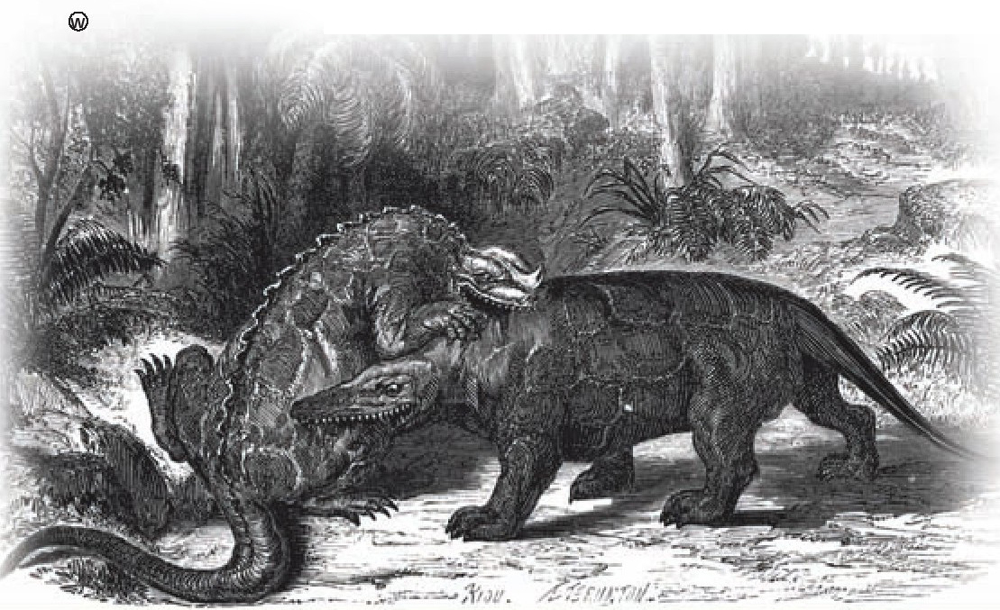
19世纪的一幅描绘禽龙和巨龙打斗的画，现在看来是不够准确的

要找到恐龙化石，必须具备几个条件：正确的地点、正确的时间和适当的运气。首先得找到可能会埋藏有恐龙化石的地层。传统意义上的恐龙生活于三叠纪中期到白垩纪末期，一般只有在这一时期的陆地上沉积形成的地层中，才有可能找到恐龙化石。即使有了正确的地点，也不一定能够找到恐龙化石，主要原因是并非所有沉积岩中都保存有恐龙化石。有些地层富含恐龙化石，有些则非常稀少，有些甚至没有保存任何化石。富含恐龙化石的地点有几种成因：恐龙骨骼被洪水携带的泥沙掩埋，比如山东诸城晚白垩世的恐龙；恐龙因火山喷发而死，并被火山灰掩埋，比如辽宁西部早白垩世的恐龙；恐龙死于沙尘暴，并被掩埋，比如内蒙古巴音满都呼地区晚白垩世的恐龙；恐龙陷入泥潭后死去和被埋葬，比如新疆准噶尔盆地侏罗纪晚期的一些恐龙。

| 陆相砂岩（山东诸城） | 风成砂岩（内蒙古乌拉特后旗） |
| --- | --- |
| 湖相页岩（辽宁北票） | 河流相的砂泥岩（新疆吉木萨尔） |

一些出产恐龙化石的岩层

一般来说，如果恐龙化石不露出地表，就是无法被发现。长期的风化作用会让恐龙化石暴露出来，这时去寻找恐龙化石，才有可能发现它们。如果去早了，化石还深藏在地下，无法看见；如果去晚了，风化作用会让恐龙化石消失殆尽。为了更利于找化石，有时还需要利用一些自然条件，如大雨、滑坡、沙暴之后，这些自然活动会有效地让化石暴露出来。

最后，在古生物学中，不得不提的就是运气。幸运之神很可能就在周围晃荡，但关键还是看是否有丰富的经验和有充分准备的头脑。（贺一鸣）

## 谁命名了第一种恐龙

巴克兰

1824年，英国牛津大学的地质学家巴克兰命名了世界上第一种恐龙：巨龙（又名巨齿龙）。巨龙的化石在1815年就发现了，但人们一直不知道这些化石属于哪类动物。1818年，法国解剖学家居维叶在访问牛津大学的时候，告诉巴克兰这些化石可能代表一种巨大的类似蜥蜴的动物。巴克兰于1824年正式发表了命名巨龙的文章，从此世界上第一种被命名的恐龙就诞生了。

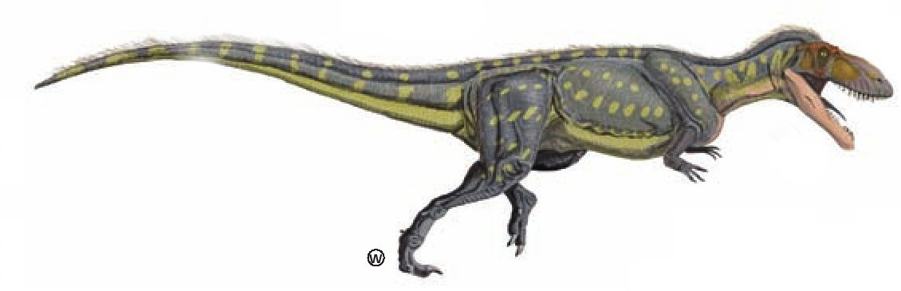
现在对巨龙的复原图

曼特尔

说到有关恐龙的最早研究，还需要提到英国乡村医生曼特尔。1822年3月，曼特尔外出行医，途经英国刘易斯地区，在妻子的帮助下他找到了一些牙齿化石。曼特尔发现这些牙齿非常特别，他将这些牙齿寄给居维叶，但居维叶认为这只是哺乳动物的牙齿。曼特尔有些怀疑，又将化石送给巴克兰鉴定。巴克兰也相信居维叶的判断。曼特尔并没有迷信权威，而是决定自己研究这些化石，一次偶然比对标本时，曼特尔发现这些牙齿化石与美洲的一种爬行动物鬣蜥的牙齿非常相似。曼特尔得出结论，认为这些牙齿不属于哺乳动物，而是一类早已灭绝的过去尚未发现的爬行动物。基于这些化石，曼特尔于1825年命名了世界上第二种恐龙，拉丁文名为Iguanodon，意思是“鬣蜥的牙齿”，中文翻译为“禽龙”。（贺一鸣　孟溪）

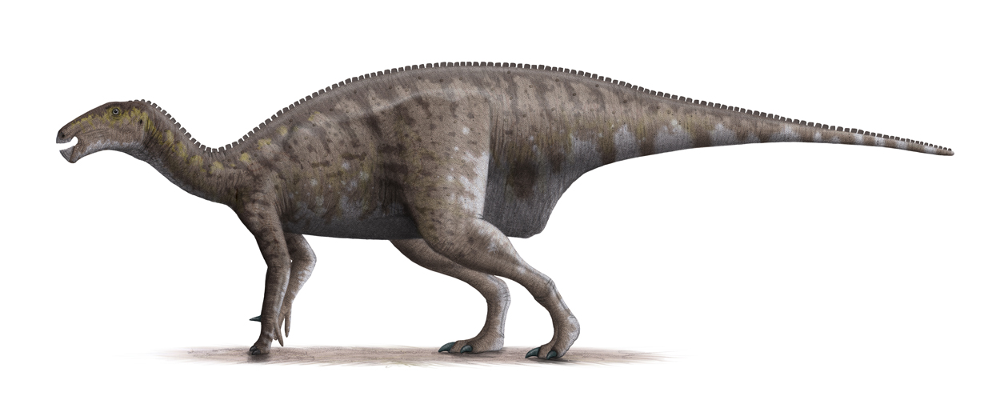
以曼特尔名字命名的曼特尔龙是一种禽龙

  

**【微博士】**动物分类系统

地球上生存着数以千万计的动物，它们千奇百怪，纷繁复杂，科学家为它们建立了一套相对简单的分类系统，用于研究工作和日常交流。常见的分类体系中，“种”是最小的分类阶元，一般也被认为是自然界当中真实存在的分类阶元。比“种”大的分类阶元是“属”，每个“属”里至少有一个种。向上以此类推，还有“科”、“目”、“纲”和“门”。从根本上讲，比“种”高级的分类阶元是人为定义的。因此，“种”应该是研究演化和分类最重要的单位。

【微问题】为什么陆上生活的恐龙也会在湖泊沉积岩层中找到？

【关键词】双名法　种名　属名　巨龙　禽龙

## 地球上曾经生活过多少种恐龙

当欧文于1842年创造“恐龙”一词的时候，全世界只命名了7个属的恐龙，至1995年，已经有775个属了。不过需要指出的是，这775个属中的大部分都是无效命名，仅有300个左右的有效属。大约15年后，也就是到2006年，全世界的恐龙已有527个有效属。据美国学者道德森等统计，发现新恐龙的速度一直在明显加快：1824——1969年间平均每年发现1.1个属，1970——1989年间平均每年发现5.8个属，1990——2006年间平均每年发现14.8个属。新发现的恐龙更多地来自像中国和阿根廷这样的新兴国家。

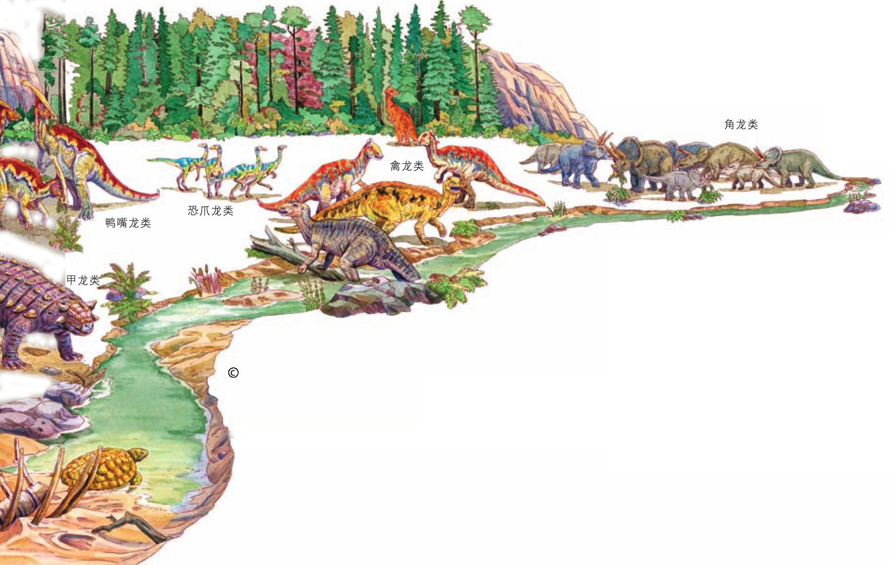
地球上曾经出现过的多种恐龙类群

令人高兴的是，这一轮的恐龙热似乎没有衰减的迹象，预计在未来的几十年中，将会有更多的恐龙被发现。科学家预测，理论上能够发现的恐龙应该有1850个属（按照现在已经命名的恐龙属和种的数量关系，种的数量应该多1倍），所以到现在为止只发现了理论预测值的29%左右。道德森等预计在未来的60～100年中这个比例能达到75%，在未来的100～140年中这个比例能达到90%。

也许有人会对已命名恐龙的数目之多感到惊讶，但其实，相对于曾经漫游于地球各大陆的恐龙，这一数字只是沧海一粟。有人推测，从三叠纪中期到白垩纪末期，可能共有50000个属近500000种恐龙在地球上生存过。当今地球霸主哺乳动物也不过几千种而已，由此可见恐龙在中生代的繁盛程度。当然对于这一估计，有人持不同意见，认为实际上并没有这么多。但不管怎么样，真正生存过的恐龙属种数目无疑远远大于已经命名的属种数目。毋庸置疑的是，数以千计的不同种恐龙曾经活跃在这个星球上。（徐星　孟溪）

## 为什么说到处都有可能发现恐龙

在人迹罕至和地貌复杂的偏远地区，人们往往会找到许多的恐龙化石。然而，恐龙化石并不是这些荒蛮地区的“特产”，很有可能在人们生活的城市中意外地发现它们。在中国湖南株洲的中心区域，人们发现了包括鸭嘴龙类、兽脚类和蜥脚类恐龙在内的许多门类的恐龙化石。这些化石的发现表明，在白垩纪晚期的时候，现在株洲天元生活着各种各样的恐龙，是一个恐龙王国。此外，俄罗斯的布拉戈维申斯克、加拿大的埃德蒙顿以及西班牙的昆卡等城市也有发掘到恐龙化石的报道。实际上，无论在城市还是野外，在一个地区是否能找到恐龙化石，取决于当地是否有露出地表的含恐龙化石的地层。

人们通常都会认为恐龙无法在寒冷的气候下生存，但在南北极地区也发现了恐龙化石，这不能不令人惊讶。一些恐龙很可能是在大陆板块漂移的过程中由低纬度地区转移到高纬度的南极地区的；在北半球，恐龙的跨大洲迁徙导致了它们向高纬度的北极地区扩散。在美国阿拉斯加、加拿大北部以及南极洲等地区，已发现了相当数量的恐龙骨骼和足迹化石，如埃德蒙顿龙、南极甲龙、冰河龙和冰脊龙。通过研究恐龙骨骼的微细结构，有科学家提出极地恐龙与低纬度地区的恐龙存在着相似的骨骼生长模式，它们可能不会季节性地冬眠。

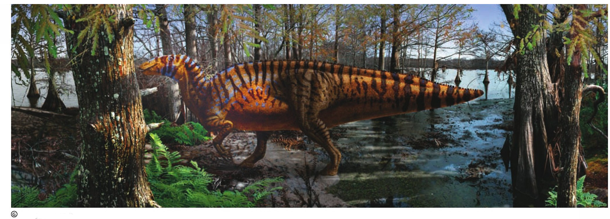
埃德蒙顿龙

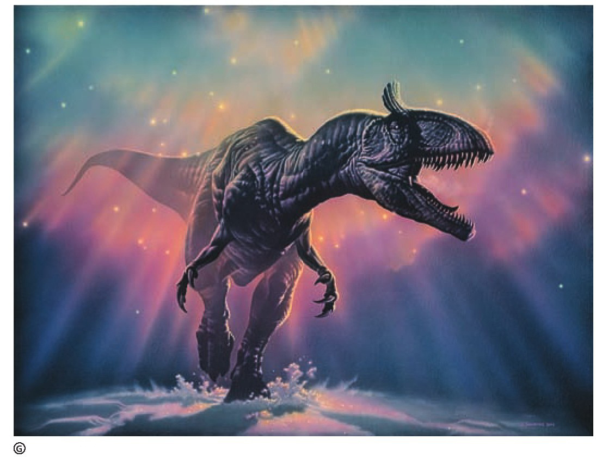
冰脊龙

最新的数据统计显示：中国已经超越美国，成为世界上发现恐龙属种最多的国家。美国是一个历史悠久的恐龙研究强国，美国的蒙大拿、犹他和新墨西哥等地区的中生代地层均蕴含着丰富的恐龙化石资源。从18世纪晚期开始，大量的恐龙化石在美国的广袤大地上被发现，其中就包括人们熟知的三角龙和霸王龙。相比之下，中国的恐龙研究起步较晚。在20世纪初，科学家在黑龙江嘉荫和山东蒙阴发掘到中国的第一批恐龙化石。到2013年7月，约188个属共计230个种的恐龙在中国的广阔大地上被发现，占世界恐龙物种总数的15%。因此，中国是名副其实的恐龙大国。（邢海　张蜀康）

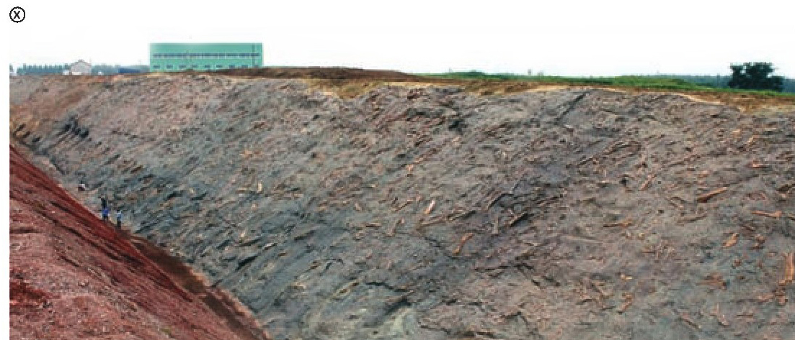
山东诸城库沟恐龙坟场

  

**【微博士】**世界上最大的恐龙坟场

世界上有许多恐龙化石富集的区域，如加拿大艾伯塔的恐龙公园、美国科罗拉多和犹他的国立恐龙公园以及中国辽宁西部。不过，就单体暴露面积最大的恐龙坟场而言，当之无愧的冠军是中国山东诸城的库沟恐龙化石点：在长近500米、宽30米的岩层面上，密密麻麻地保存着数以千计的大小不一的恐龙骨骼。库沟恐龙化石点代表世界上已知最大的恐龙坟场，形成的原因可能是发生在七八千万年前的大洪水和泥石流。

**【科学人】**杨钟健

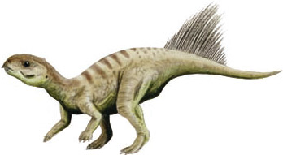
杨钟健（1897——1979），中国古生物学的创始人之一，是中国古脊椎动物学的奠基人。在其漫长的学术生涯当中，发表学术论著494篇，其中专著21部。他是禄丰龙和马门溪龙等许多重要恐龙属种的命名人，也是中国第二代恐龙学者的培养人，为中国的恐龙研究做出了巨大贡献。

【微问题】为什么发现新恐龙的速度在加快？

【关键词】属　种　库沟恐龙化石点　埃德蒙顿龙

## 恐龙为什么能长成庞然大物

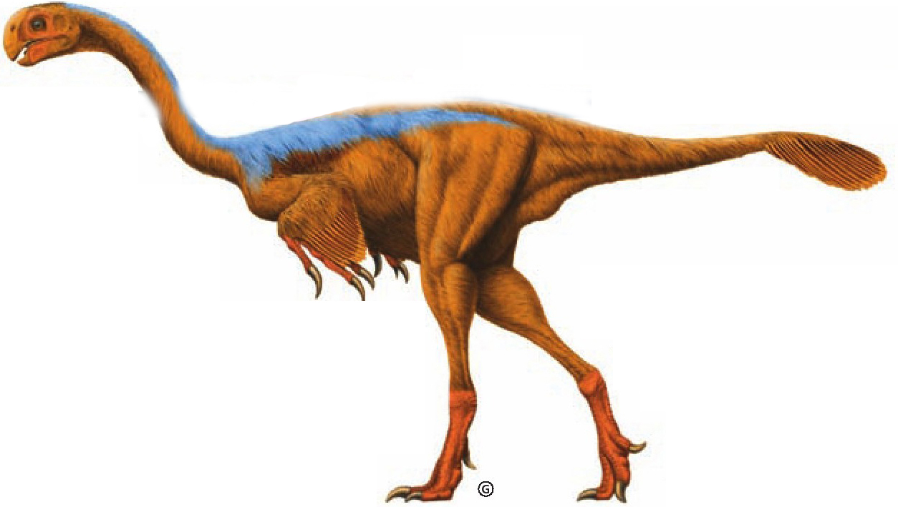
二连巨盗龙

想象一只刚出壳的小恐龙，初次面对这危险而陌生的世界，从出壳的一刻起，许多虎视眈眈的眼睛已经将它列为今晚的美餐。处于这样无助的境地，什么办法最能保证小恐龙的安全？对！就是成长！而且，尽快！

小恐龙们成长之后，就会拥有父母的一技之长，或是速度，或是防身的骨锤利刺，使自己免于成为别人的盘中餐。不过，有一些恐龙，它们的选择是长成庞然大物，大到远远超过任何捕食者，在恐龙家族中傲视同侪。

不像花了毕生的时间才缓慢长成巨怪的恐鳄，恐龙们的制胜法宝在于它们的生长速度。有些恐龙不仅生长速度快，生长期也很长，能有那么大的体形也就不足为奇了。

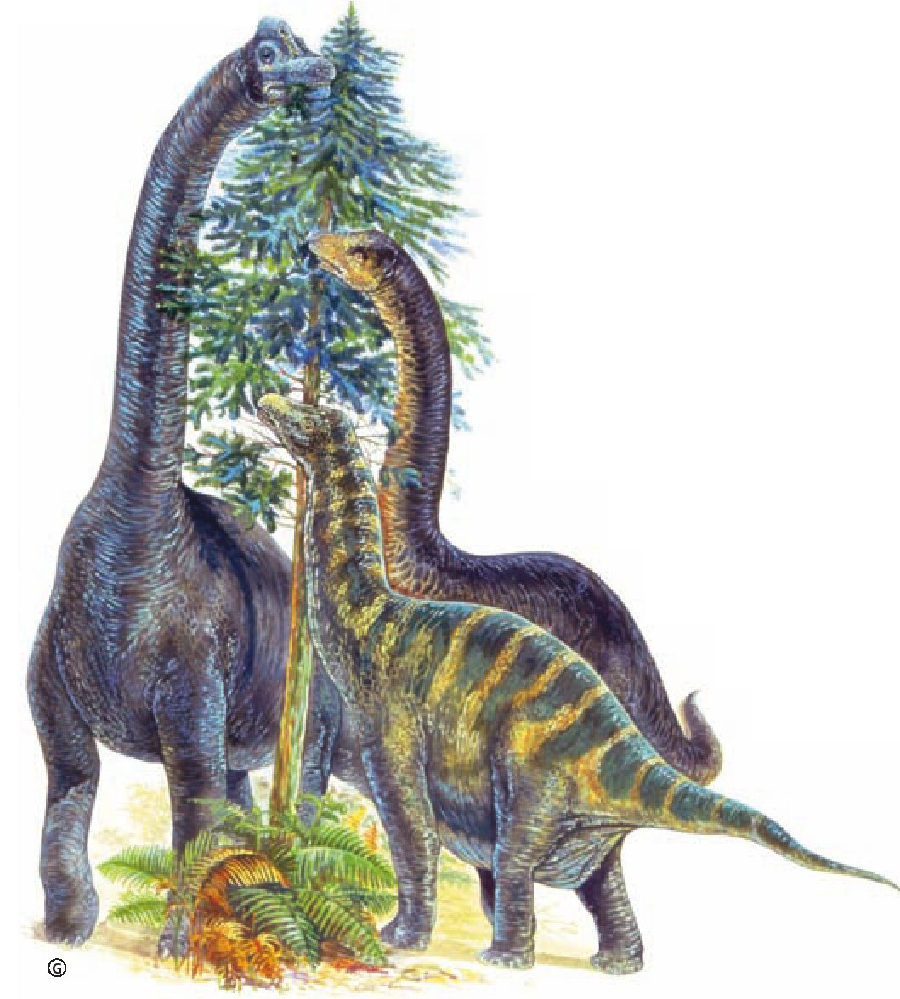
吃高处树叶的恐龙

先看看广为人知的蜥脚类恐龙，它们的体长常常超过20米，大的甚至超过40米，古往今来再没有过这么大的陆生动物了。科学家通过它们骨头的结构及其中年轮般的生长线估算它们死亡时的年龄，再通过骨头的大小推断它们身体的大小和重量。当发现了一系列处于不同年龄段的个体之后，就可以计算出这类恐龙在各个成长阶段的生长速度了。研究表明，蜥脚类恐龙在幼年期的生长速度很快，快到超过其他任何类型的恐龙；进入成年期后，生长速度放缓，但直到老年时它们才停止生长。所以，很快的生长速度和很长的生长时间保证了蜥脚类恐龙稳居恐龙家族中“头号巨无霸”的宝座，没有哪种捕食者可以威胁到成年蜥脚类恐龙的安全。

有了如此庞大的植食性恐龙，一部分肉食性恐龙们自然也不甘落后，用巨大的身体武装自己，专门对付大个头的猎物，这其中就包括最为著名的霸王龙。与蜥脚类恐龙不同的是，霸王龙在幼年期生长缓慢，大约14岁之后才突然快速生长，平均每年可增重600千克，到大约18岁之后生长速度迅速放缓，身体的大小和体重趋于稳定。这种生长模式与人类的有几分相似，能在较短的时间内长到成体的大小。

还有一些恐龙，比如窃蛋龙类，体形通常不大，一般不超过2米长，但是在中国内蒙古却发现了体长达到8米的巨型窃蛋龙类，被命名为二连巨盗龙。这只恐龙在7岁时进入成年阶段，不过还保持着一定的生长速度，直到11岁时死亡。其平均生长速度为128～140千克/年，快于多数兽脚类恐龙。这种快速的成长方式接近蜥脚类恐龙和霸王龙。（张蜀康）

## 怎样估计恐龙的体长

恐龙化石很少有完整保存的，对恐龙体长的推测往往建立在部分骨骼化石的基础上。那么，是怎样依据少量化石估计恐龙的体长呢？常见的情况有下面几种。假设找到了一块霸王龙的小腿骨，想复原这个霸王龙的整个体长。最简单的方法是：已经有一具完整的霸王龙化石骨架，而且它的小腿骨和刚发现的小腿骨一样长，这样就可以推测新发现的霸王龙应该和完整的霸王龙骨架有着一样的体长。如果新发现的小腿骨长度和完整霸王龙化石小腿骨长度明显不同，就不能直接用简单的比例关系来估算。因为恐龙不同身体部分的生长速度往往是不一样的，所以大小不同的霸王龙骨骼之间的比例关系是不同的。要解决这个问题，就需要了解霸王龙的生长发育规律，找到其小腿长度和体长在生长发育过程中的定量关系，然后依据这一关系来推测新发现的霸王龙的体长。当然，更常见的情况是没有一具完整的骨架作为对比资料，这时候就需要选择一个亲缘关系相近、又有完整骨架保存的物种，作为推测的基础，随后的过程和前面讲的就一样了。（马檠宇）

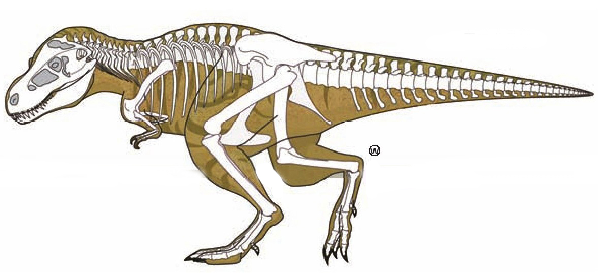
霸王龙骨架

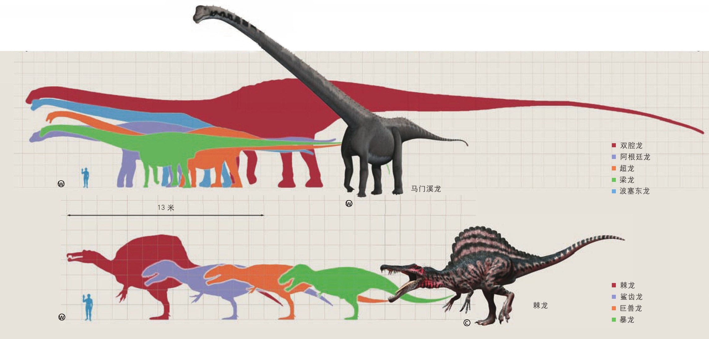
各种恐龙体形比较

## 最大和最小的恐龙都有多大

恐龙以体形巨大闻名于世，其中体形最大者都是四足行走的蜥脚类恐龙。依据2006年在新疆发现的一串马门溪龙颈椎化石，科学家估计该恐龙体长达35米，仅脖子就长15米，是世界上脖子最长的恐龙。不过，身体长度的冠军可能属于发现于美国的侏罗纪晚期的双腔龙，它的体长估计有40～60米，体重大约120吨。不过，双腔龙的化石材料非常有限，所以它到底有多大还存在争议。保存化石相对较多的最大恐龙是阿根廷龙，估计体长为30～36米，体重大约有80吨。备受瞩目的霸王龙则是最大的肉食龙之一，其成年个体可长达13米，体重约7吨。目前已知的最长肉食龙是棘龙，体长16～18米，重约8吨。

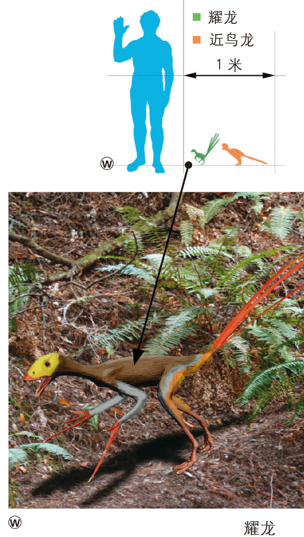
恐龙家族中不仅仅有大块头，同样也有小个子。属于兽脚类的近鸟龙和耀龙体形很小，与家养的鸡大小差不多，体长都在35厘米以下。其中近鸟龙的体重约110克，体长只有34厘米，是已知恐龙当中最小的物种。（马檠宇）

  

**【微博士】**那些比恐龙还大的动物们

蜥脚类恐龙是已知最大的恐龙，也是最大的陆生动物，所以比恐龙还大的动物得去海洋里寻找。大家熟知的鲸是最大的海洋生物，其中的佼佼者是蓝鲸。最大的蓝鲸体长约30米，虽然长度不及最长的蜥脚类恐龙，但其体重可达180吨，明显重于蜥脚类恐龙。

【微问题】为什么有的恐龙看个头就可以知道年龄？

【关键词】蜥脚类　二连巨盗龙　双腔龙　棘龙　耀龙　近鸟龙

## 恐龙能活多少年

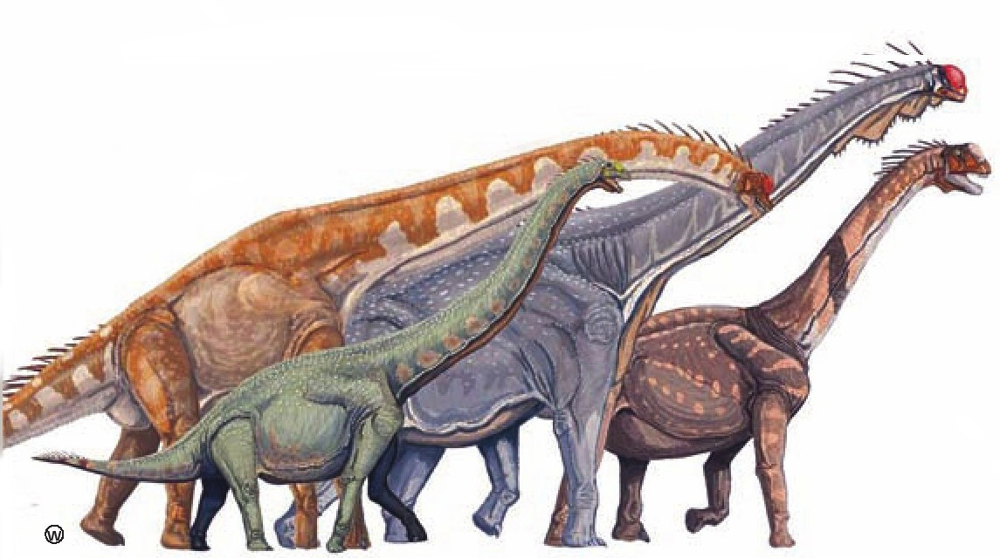
能活40～60年的蜥脚类恐龙

对于恐龙这类生活在亿万年前的动物，一个具有挑战性的问题是：它们到底能活多久？如果查阅不同的科普文章，会得到不同的答案。对于巨大的蜥脚类恐龙，有人认为它们的寿命只有几十年，但另外一些人则认为它们能活到几百岁。之所以有这样大的差距，最主要的原因在于，恐龙的寿命除了和它们体形大小有关外，还和它们的新陈代谢率有关。比如，如果恐龙是像鸟类一样的恒温动物的话，寿命会短一些；相反，如果恐龙更像鳄鱼等变温动物，就能活得长一些。通过体形大小和新陈代谢率高低来推测恐龙寿命的方法非常粗略和不精确，因为这一方法的对比资料是和恐龙有着明显差别的现生动物。那么，是否有更精确的方法来推测恐龙的寿命呢？

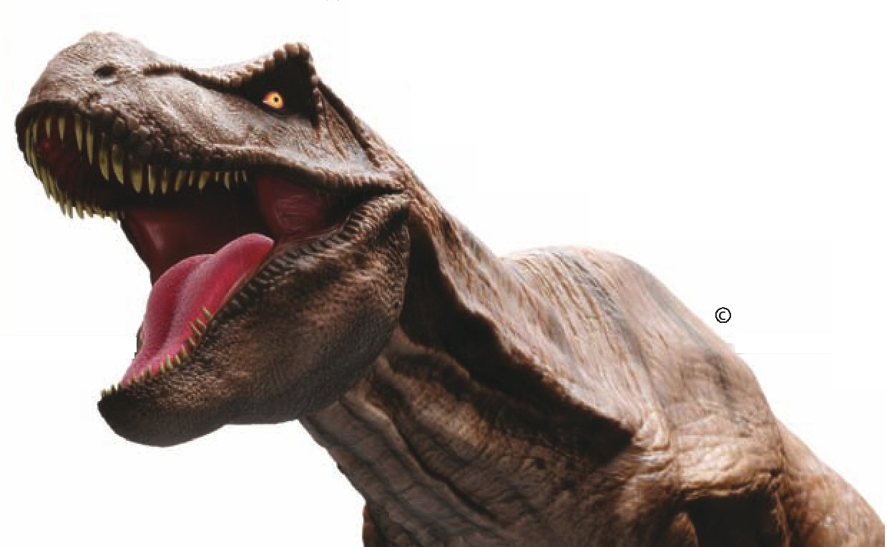
霸王龙能活到约25岁

科学家通过研究恐龙骨骼的微观结构，找到了一套相对可靠的推算恐龙寿命的方法。科学家发现，恐龙骨骼的横切面上有像树木年轮一样的结构。计算这种结构的数量，就可以推测恐龙的死亡年龄。同时，通过观察恐龙骨骼微观结构特征，还能判断出研究对象死亡时是处在幼年、青年，还是老年。结合这些信息，就能大致判断出某种恐龙的寿命了。

一般来说，蜥脚类恐龙能够活到40～60岁，也许更长；大型兽脚类恐龙，像著名的霸王龙，大约能活25岁；小型的兽脚类恐龙，像小盗龙，只能活3～4岁；同样也是小型的恐龙，属于角龙类的鹦鹉嘴龙的寿命则可超过10岁，这也许反映了角龙类和小型兽脚类恐龙有着不同的新陈代谢水平。（徐星　孟溪）

## 恐龙会生病吗

日常生活中，谁没有头疼脑热、跌打损伤等小毛病，貌似强大的恐龙也不例外。不过，绝大多数情况下，恐龙仅仅留下了它们的骨头，所以科学家只能兼任骨科大夫了。

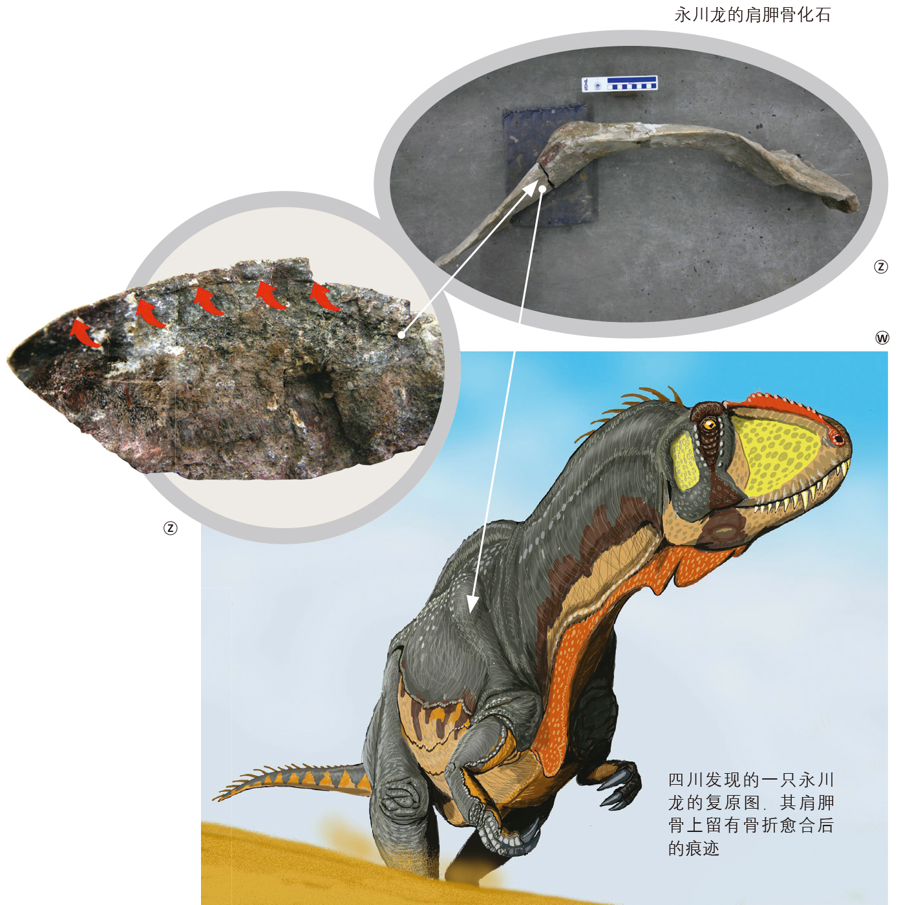
永川龙肩胛骨化石的横截面，箭头所指是正常的骨皮质，上方附着的是骨折后愈合的骨痂

有许多疾病都能在骨头上留下痕迹，最常见的就是骨折。加拿大一位古生物学家发现，鸭嘴龙的尾椎化石上有形状奇特的损伤。这块可怜的尾椎碎裂且扭曲，看上去像是被很大的重力压碎后愈合的，难道是哪只不小心的恐龙踩过这只鸭嘴龙的尾巴？同样是加拿大的鸭嘴龙，它们不少肋骨化石都存在断裂后又愈合的情况。由于这种情况相当普遍，不太可能是偶发的事故造成的。研究者认为，这些肋骨伤可能是雄性鸭嘴龙彼此格斗后留下的印记。这些看似面善的大块头为了争夺配偶和王位，打起架来可一点也不含糊。还有著名的异特龙“Big Al”，它的一生可谓坎坷：5根肋骨、5枚脊椎骨和脚上的4块骨头都有损伤，有的骨头甚至有患过骨髓炎的迹象。它右脚上的大骨瘤必定严重妨碍了它的行动，有可能最终导致它的死亡。除了骨头上的问题之外，恐龙软组织的病例也偶有发现。美国科学家曾在一只产自蒙大拿的惧龙身上发现了化石脑瘤，并认为这个脑瘤影响了这只恐龙的平衡和运动能力。（张蜀康）

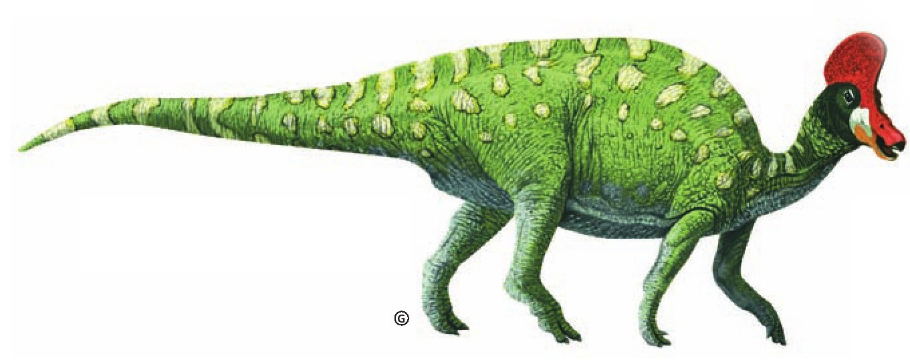
雄性冠龙很可能为了争夺配偶而剧烈搏斗

## 恐龙是怎样睡觉的

你养过鹦鹉吗？你可曾注意过鹦鹉的睡觉姿势？它们将翅膀折叠起来，头扭向后方，嘴埋在翅膀中间的羽毛里，安然入睡。这可爱的姿势都使人不忍心打扰它们。发现于中国辽宁西部的一种小恐龙拥有类似的睡姿，它因此而得名寐龙。

这只小恐龙体长不过53厘米，蜷成一团，发达的后肢折叠于身体下面，较短的前肢收在身体两侧，很像鸟类收拢的翅膀。头扭向后方，藏在前肢之下，细长的尾巴盘绕着身体。原来，浑身披羽、身姿矫健的食肉恐龙在睡觉的时候也像鹦鹉一样缩成一个小毛球。如果能把它养在笼子里该多好！那么它为什么会这样睡觉呢？参照现生鸟类的情况来看，除了安全，更是出于保暖的需要吧，因为这种睡觉的姿势可以有效地减小身体的散热面积，避免热量的流失。（张蜀康）

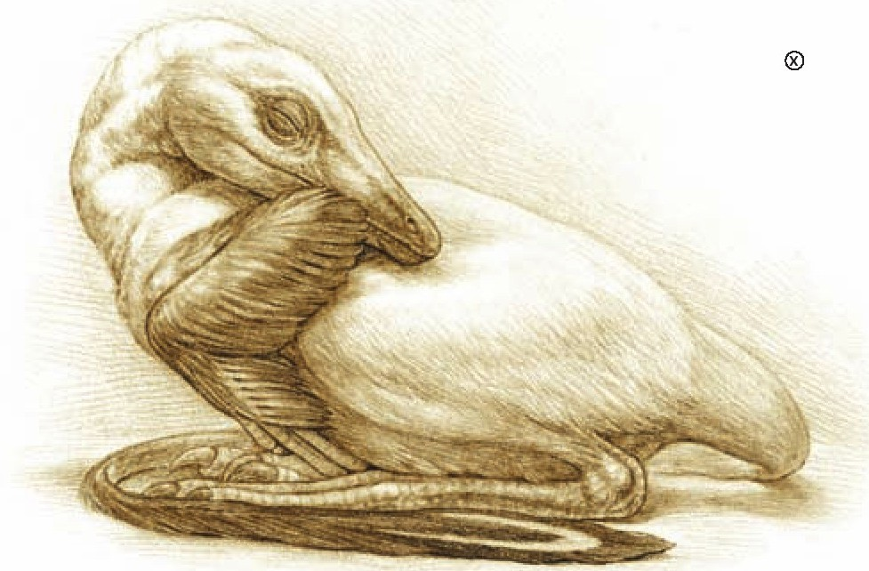
寐龙复原图

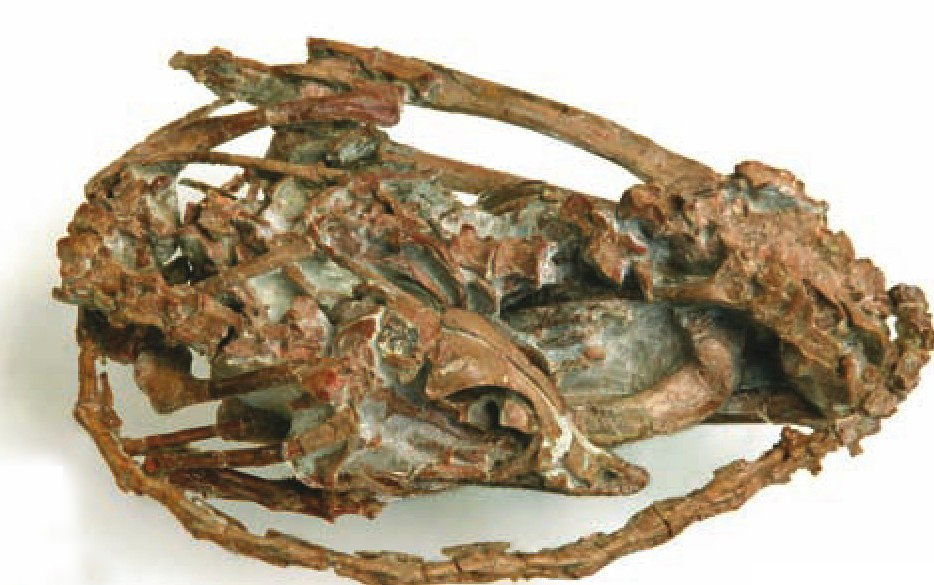
寐龙化石

  

**【实验场】**恐龙医院

科学家研究恐龙骨骼化石时，除了观察宏观形态之外，还需要对骨骼的微观结构进行研究。在研究微观结构之前，要把骨头包埋在透明的树脂中，然后切开，将切面粘在玻璃片上，并磨到透亮为止。这样一个薄薄的骨片就是恐龙的骨组织切片。把切片放在显微镜下，就能够看到骨头里生长环、血管留下的孔道等微细结构，从中可以了解恐龙的年龄、生长情况甚至性别等重要信息。

【微问题】恐龙能打疫苗防病吗？

【关键词】寐龙　寿命　骨折　生病　睡觉

## 如何计算恐龙的体重

恐龙是中生代陆地上的霸主，种类繁多，体态各异。看到博物馆中马门溪龙巨大的化石骨架，想象它们活着的时候该有多重啊？！

最初计算体重的方法很简单，人们根据足迹化石的大小及深浅来推测恐龙的重量，所依据的物理原理是压强与面积的关系，参考的动物一般是体形大的哺乳动物，如非洲象等。但是这种方法的准确度相对较低，原因在于该方法的一个重要指标是有问题的。对于这种方法，除了足迹面积，判断体重的另一重要指标是足迹深浅。足迹越深，说明恐龙的体重越重。但是，我们知道足迹深浅很大程度上受足迹形成的基底控制。对于同一恐龙个体来说，走在越软的基底上，形成的足迹就越深。因此，足迹深浅不一定和恐龙的体重有关。

另一个行之有效的测量恐龙体重的方法，是采用复原模型测量法，依据的物理学原理是质量等于体积和密度的积。首先根据待测恐龙的骨架模型，制作一个全身复原模型；然后将模型放入一个箱子中，倒入沙子或水，当填充物覆盖过模型并填满所有空隙后，记录下此时模型与填充物共同占有的体积；取出模型，倒入填充物直至前面记录的体积位置。后来添加进去的填充物的体积就是模型的体积，再根据模型与恐龙实体之间的比例关系就能计算出待测恐龙生前的体积了。为了提高准确度，降低误差，可制作不同比例的模型分别进行测量计算，然后取平均值。因为鳄类与恐龙的关系比较近，所以该方法通常采用鳄类的密度来估算恐龙的体重。但现在越来越多的证据表明，蜥臀类恐龙很可能具有和鸟类一样的气囊结构，它们的密度可能更加接近鸟类，因此用鸟类的密度来估算恐龙的体重更加准确。对于鸟臀类恐龙了解较少，已有的资料显示，它们和蜥臀类恐龙不同，可能用鳄类作参考更合适一些。

第二种方法的可行性很高，但过程相对繁琐，制作精细的微缩模型也需要很高的水平，现在很多学者更倾向于使用计算机建立三维数字模型来估计恐龙的体重。数字模型的优势在于，可以给恐龙模型的不同部分赋予不同属性，比如为骨骼和肌肉部分设置不同的密度，如此可以更加精确地估计恐龙的体重。相对于制作实体模型，使用数字模型估计恐龙的体重可以有效地减少时间和资金成本。

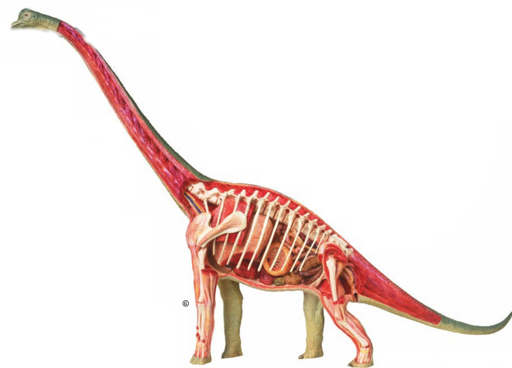
雌腕龙的内部解剖

知道了恐龙的体重，另一个相关的问题是：这些恐龙是胖还是瘦呢？一些恐龙即便体重巨大，也不见得就是一个胖墩儿，原因在于巨大的体重有可能是巨大的体形导致的。一般来说，判断同样体重的恐龙谁胖谁瘦，可以采用下面几个指标：四肢的远端骨骼长短，左右腰带之间的横向宽度，以及脊柱长短。一般来说，相对胖一些的恐龙，它们四肢的远端骨骼更短，左右腰带之间的横向宽度更大，脊柱更短。（马檠宇）

## 如何判断恐龙的雌雄

现生的脊椎动物几乎全部是通过有性繁殖来延续后代的，恐龙也是如此。那么，如何根据化石来判定恐龙的性别呢？现生动物，性别常常都有明显的外在表现，比如雄孔雀有华丽的尾羽，雄狮有很长的鬃毛，雄性麋鹿有角且体形比雌性的大。而恐龙化石大多都是骨骼化石，肌肉组织以及皮肤衍生物能保存下来的非常罕见，那么该如何判断恐龙的性别呢？首先，可以通过体形的大小来判断。同种成年恐龙体格强壮的可能是雄性，比如雄性肿头龙的头骨似乎要比雌性的重。其次，可以根据特有的身体结构来做出判断，其依据是现生的哺乳动物和爬行动物中，雄性动物通常以特殊的结构来吸引雌性，如长鼻猴的鼻子就被认为是雄性用来吸引雌性的工具。恐龙的一些结构被认为有可能是用来吸引异性的，如棘鼻青岛龙的棘鼻和五彩冠龙的冠有可能是雄性用来吸引雌性的法宝（不过，现在还没有足够的化石确认这一点）。第三，可以通过骨组织学研究方法来确定恐龙的性别。如果在恐龙骨骼的髓腔周边发现一层多孔的骨组织，则可以肯定这是一只正处于产蛋期的雌性恐龙。因为现生鸟类也拥有类似的结构，它是鸟的“钙库”，其中的钙质用于制造蛋壳。类似的情况也见于几种恐龙，研究者据此可以对恐龙的性别做出判断。（马檠宇）

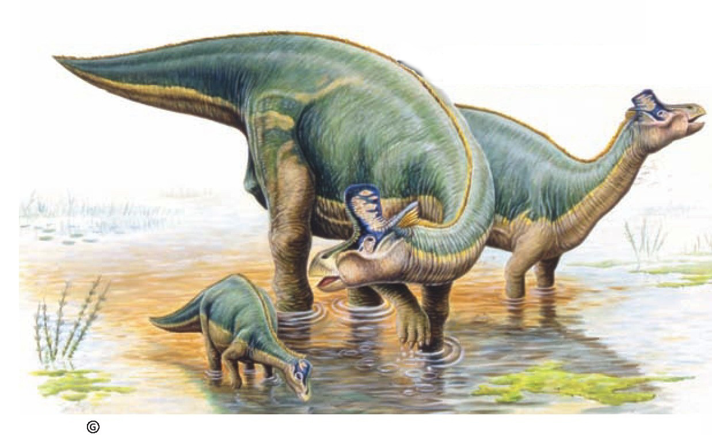
恐龙一家

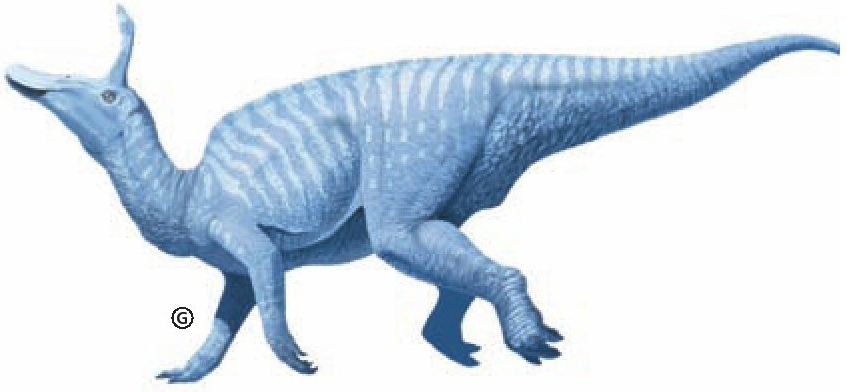
青岛龙

## 最聪明的恐龙是谁

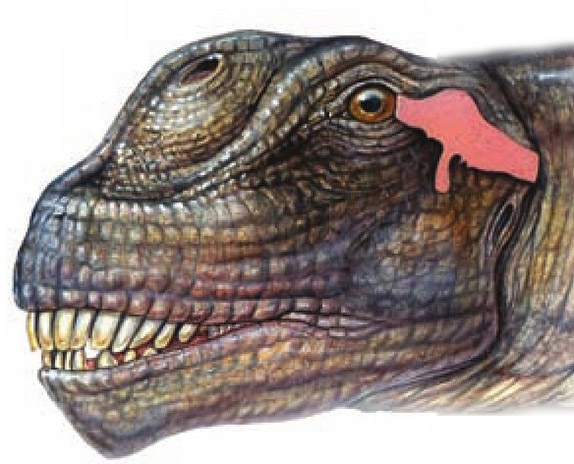
蜥脚类恐龙的脑

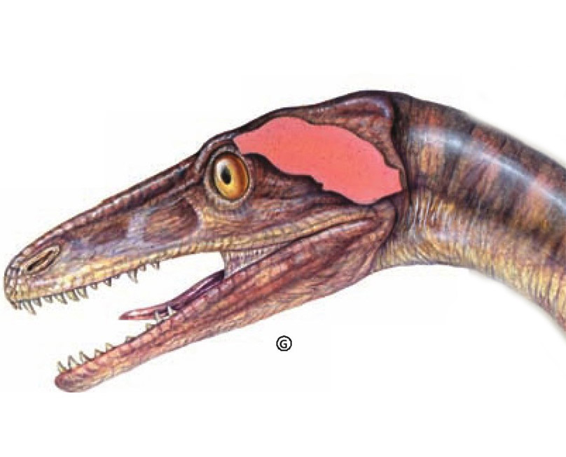
伤齿龙的脑

在人们的传统观念中，恐龙都是呆头呆脑的动物，这是因为它们的头相对于巨大的身躯来说实在是太小了。然而也有一部分恐龙，尤其是兽脚类恐龙，拥有一个聪明的大脑袋。现在公认的最聪明的恐龙是伤齿龙。袋鼠的EQ指数约为0.7，而伤齿龙的EQ指数高达5.3！它们比现生的任何爬行动物及部分哺乳动物都要聪明！有些科学家甚至认为它们的智商可能和鸵鸟相近。作为恐龙后裔的鸟类极为聪明：最聪明的鸟能在训练后学会开一些玩笑甚至模仿人类的语言，那么它们的祖先也不会逊色很多吧！加拿大古动物学家曾提出设想，如果6500万年前没有那场大灾难，迅猛龙的近亲伤齿龙就完全可能演化成为代替人类的一种动物——恐龙人，成为地球的主宰。（张蜀康）

  

**【微博士】**恐龙智商的测量

科学家用测量恐龙EQ指数（即脑量商）的方法来评估恐龙的智力水平。他们先根据比较完整的恐龙骨架化石计算出恐龙的体重，再根据现生爬行动物平均颅容量大小随身体大小的2/3次方而变化的公式得出爬行动物的平均颅容量，然后用已发现的恐龙颅容量数据除以爬行动物的平均颅容量，计算出恐龙的EQ指数。在一般情况下，EQ指数越大的恐龙就越聪明。而且，肉食性恐龙的EQ指数普遍比植食性恐龙的高，小型肉食性恐龙的EQ指数又比大型肉食性恐龙的高。例如伤齿龙和恐爪龙的EQ指数已超过5，比霸王龙的EQ指数高许多倍。蜥脚类恐龙的EQ指数只有0.2～0.35，甲龙为0.52，剑龙为0.56，而角龙则在0.7～0.9之间。

**【科学人】**欧文

英国著名的生物学家和古生物学家欧文（1804——1892），是恐龙英文dinosaur一词的创立者。他还是著名的英国自然历史博物馆的首任馆长。他在1870年发表的《中国产出的哺乳动物化石》一文，被认为是中国古脊椎动物研究真正开始的标志。遗憾的是，他作为当时最著名的古生物学家之一，却极力反对达尔文的自然选择假说，而且对同时代的英国博物学家赫胥黎提出的鸟类起源于恐龙的学术观点也持不同的意见。有趣的是，他的坐像一直占据着英国自然历史博物馆的大厅，直到2009年，这一显赫的标志才让位于200周年诞辰的达尔文。

【微问题】雄恐龙一定比雌恐龙重吗？

【关键词】体重　性别　EQ　指数

## 谁是长相最奇特的恐龙

恐龙是一个庞大的家族，在它们漫长的演化历史中，曾经出现过许多长相奇特的物种。这些物种拥有各种奇形怪状的结构，像镰刀龙类巨大的爪子、窃蛋龙类形形色色的嵴冠、棘龙类高高的背棘、赖氏龙类的各种头饰、角龙类的巨大颈盾、甲龙类的奇特尾锤以及剑龙类的各种剑板。下面来看看最怪异的恐龙到底有哪些吧。

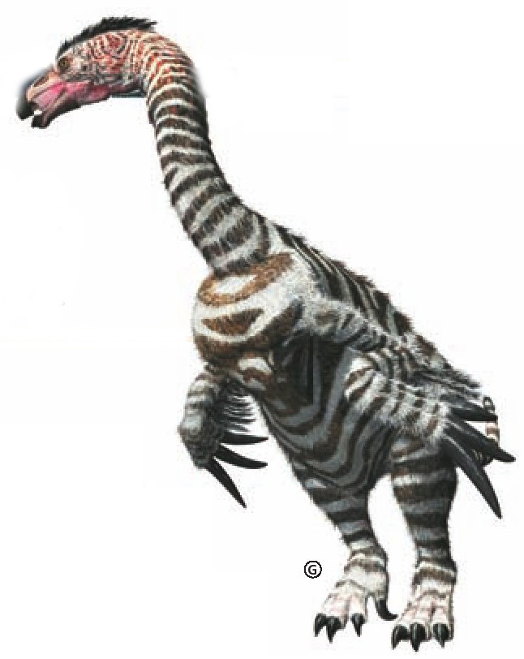
镰刀龙

棘龙是地球上体形最大的肉食性恐龙之一，其个头甚至超过了凶猛可怕的霸王龙。这种恐龙的背部非常奇特：高高的神经棘形成了一个类似于鱼类背鳍的结构，最高的神经棘高度可达2米。有人猜测，这样一种奇特的结构可能是棘龙用来吸引配偶的重要工具。

五彩冠龙是霸王龙的远祖，像霸王龙一样，它拥有锋利的牙齿和尖锐的爪子，显然是一种凶猛的猎食性动物。不过非常奇怪的是，它有一个巨大的鸡冠状的骨质头饰，又称鼻冠。冠龙的鼻冠非常脆弱，最薄的地方只有1毫米多厚。对于冠龙这样的猎食性动物来说，这无疑是一个累赘。它为什么会有这样一个结构呢？科学家猜测，冠龙的鼻冠有可能是性选择的产物，用以吸引异性。

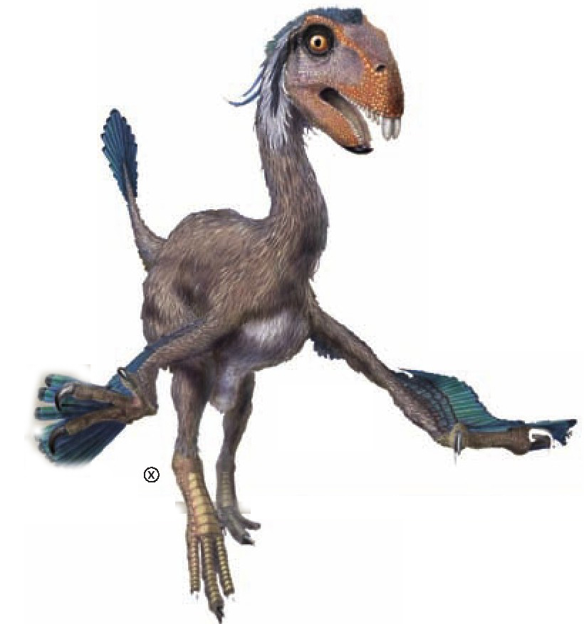
切齿龙

镰刀龙类是恐龙家族中的四不像，它们奇怪的长相让人困惑不已，以至于有科学家认为它们既不属于鸟臀类恐龙，也不属于蜥臀类恐龙。它们的嘴巴有些像吃植物的恐龙，这和长长的脖子、臃肿的身体以及短粗的后肢是相匹配的；但是它们却有着典型的肉食性恐龙的前肢和尖锐的脚爪。实际上，它们手上的爪子就像一把巨大的镰刀，和其他植食性恐龙的特征一点也不般配。不过，像北票龙这样的原始镰刀龙类，显示出更多明显的兽脚类恐龙特征，表明这一类群是兽脚类恐龙家族中的一个叛逆者。

切齿龙是一种小型窃蛋龙类，体长只有几十厘米。切齿龙最为奇特之处在于其形态多样的牙齿。大多数恐龙具有同形齿，也就是嘴里的牙齿形态大致一样，没有什么变化。但切齿龙的上颌有着三类明显不同的牙齿：最前面的两颗牙齿有些类似于老鼠扁平的门齿，远远大于其他牙齿；后面的几个前上颌齿明显小一些，外形像小锥子；再后面的牙齿更小，是叶状的。所有的牙齿上具有明显的磨蚀面，是植食性的有力证据。从某个角度上说，切齿龙就像兽脚类恐龙中的大熊猫，虽有着肉食性的祖先却演化为以植物为食了。

小盗龙是恐爪龙和伶盗龙的近亲，有着驰龙类的典型特征：棍状的尾巴和特化的后足。但是如果精确地复原其外形，就会发现它长得太奇特了：它不仅前肢像鸟翅一样长着飞羽，而且后肢也羽化为翼，是一个长有四个翅膀的动物。科学家相信，正是这奇特的四翼帮助恐龙飞上了蓝天，完成了恐龙向鸟类转化的进程。

尼日尔龙是一种短脖子的蜥脚类恐龙，也是最奇特的蜥脚类恐龙之一。它以低矮的植物为食，头总是朝向地面。

它的头骨非常纤细脆弱，有些骨片就像纸一样薄。最为奇特的是它的嘴巴：外形像一个方盒子，长有五六百颗牙齿；所有的牙齿都长在嘴的前部（其他恐龙的牙齿一般长在嘴的两侧），每颗有功能的牙齿下面最多有9颗替换齿，是恐龙当中替换齿最多的。这样一种奇特的嘴巴就像一把大剪刀，能够有效地啃食植物。

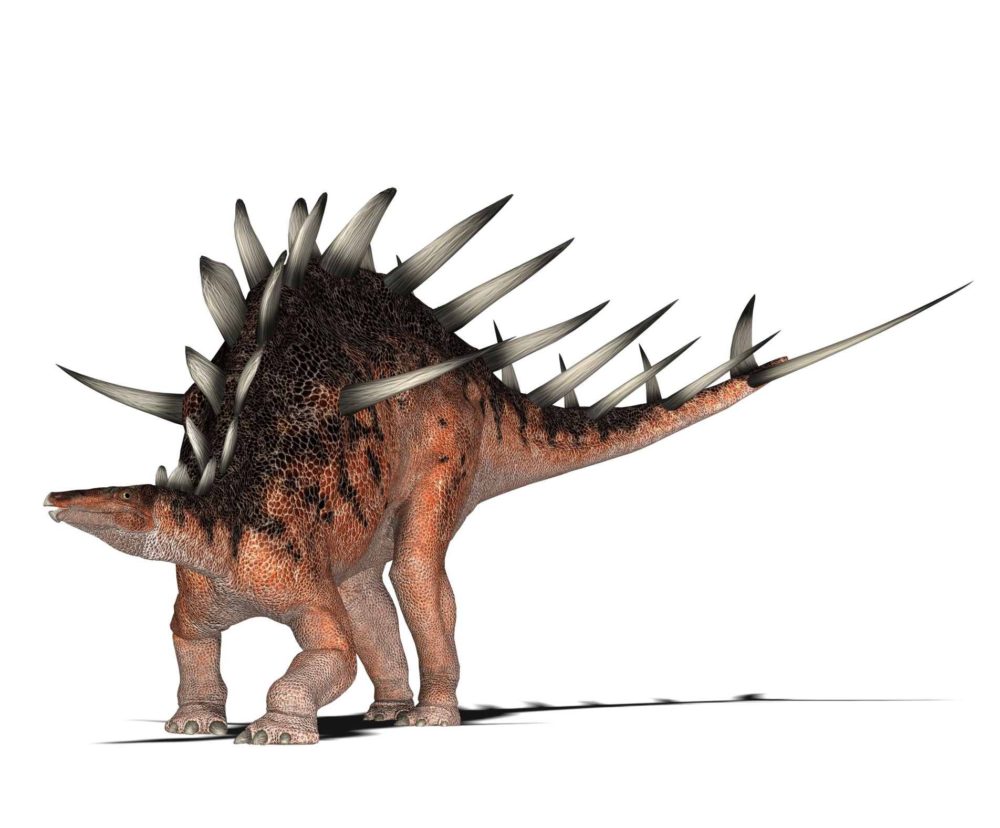
钉状龙

肿头龙

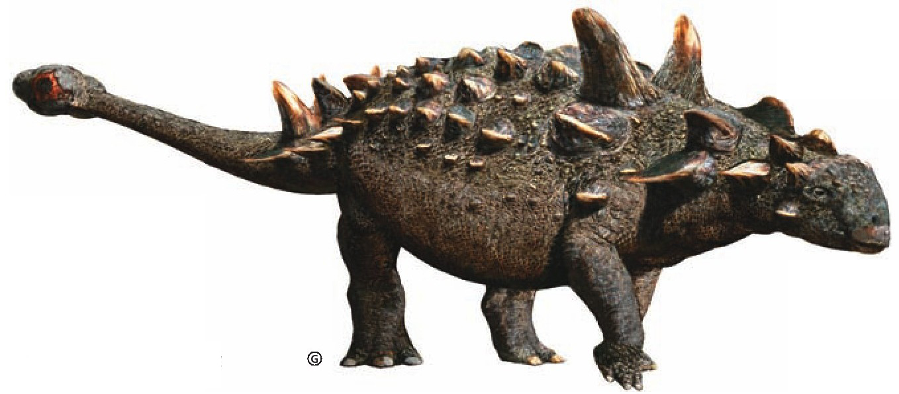
真板头龙

青岛龙是一种大型鸭嘴龙类，它最为奇特之处是一个几乎竖直的鼻骨突起。这个突起曾经引发许多问题，比如它是否在埋藏过程中因变形而造成的，到底有什么功能。这样一个棒状头饰，在以头饰著称的鸭嘴龙类家族中都独树一帜。盔龙是另外一种相貌奇特的鸭嘴龙。它的头顶有一个鸡冠状的中空头饰，其内部有一对延长的鼻通道、一对凹槽状的共鸣区和一个卵圆形的鼻腔。有科学家认为，中空头饰可以用于发声，传递交流信息。

装饰角龙是来自北美白垩纪晚期的一种大型角龙类恐龙。它是恐龙世界中的装饰冠军，没有任何一种恐龙能和它相比。它头上的复杂装饰令人眼花缭乱：在它的鼻子上面，有一个扁平的像刀刃一样的角；在眼睛上方，有2个向外侧延伸的细长而弯弯的角；在头两侧，有2个颧骨角；在头后部，有10个弯角，其中2个位于边缘的角向侧前方延伸，其余8个向前方延伸。这15个角让装饰角龙成为了当之无愧的角龙之王。

以肿头龙为代表的肿头龙类是恐龙家族的一个怪异类群。肿头龙体长近5米，但依然保留着两足行走的姿态。这种恐龙前肢短小，后肢粗壮。它最奇特之处在头骨：它的头顶就像被打肿了一样，形成一个大鼓包，头骨最厚实的地方有25厘米，头上还长着其他小突起和长钉状的犄角。一般认为，肿头龙厚实的头骨是用来在种群之内相互争斗的。

钉状龙是剑龙家族的一个小个子，来自非洲的坦桑尼亚。虽然块头不大，但它却有着奇特的长相。它的背椎特别高，尤其是神经孔，非常大。和大多数恐龙不同，它尾椎神经嵴的方向总是在变化：先是向后延伸，然后向垂直方向延伸，最后向前延伸。当然，它最奇特之处在于身体上的剑板和剑棘：身体前半部分是像其他剑龙一样的剑板，但包括整个尾巴的身体后半部分排列着两排剑棘。这么多的剑棘就像一个兵器库，足以吓退任何敌人。

甲龙家族中有许多奇特的种类，其中真板头龙是一个杰出代表。真板头龙绝对是恐龙世界的装甲车。它扁平的身体完全被骨质盾甲包裹，甚至眼睑都是骨质的。它的装甲不仅厚实，还具有攻击性：许多盾甲表面突出形成长钉状的结构，让任何猎食动物望而却步。不过，这还不是它最厉害的武器。在真板头龙尾巴的远端，有个巨大的尾锤，任何来犯者的身体都无法承受这个骨锤的一击。

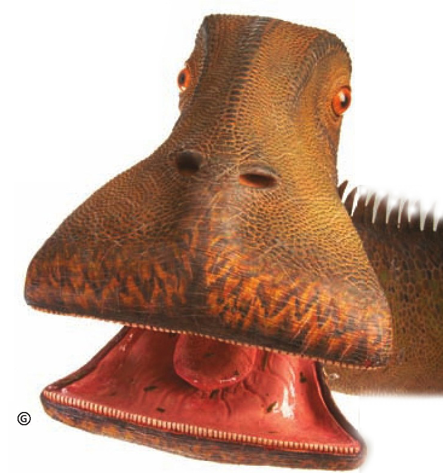
尼日尔龙

恐龙大家庭中其实还有许多相貌奇特的家伙，在这里就不再一一列举了。到底哪种恐龙长相最奇特？最好的答案其实在每个读者的心目中。（邢海　张蜀康）

  

【微问题】镰刀龙和霸王龙是亲戚吗？

【关键词】棘龙　冠龙　切齿龙　小盗龙　尼日尔龙　钉状龙　肿头龙　真板头龙

## 恐龙为什么是恒温动物

关于这个问题，科学界争论已久。现在大多数科学家达成共识：多数恐龙是恒温动物（热血动物），它们行为活跃，至少具有稳定的体温。

如何判断恐龙为恒温动物？首先要估计恐龙的代谢速率。许多研究表明，恐龙具有较高的代谢速率，与鸟类和哺乳动物的接近。

恐龙的四肢与哺乳动物的相似，直立于身体之下，使恐龙能够轻松地快速运动，从一个侧面体现出它们具有较高的代谢速率。许多恐龙骨头的断面上有大量的血管，表明骨头有很高的生长速率，而这需要较高的代谢速率才能实现。蜥臀类恐龙身上具有与鸟类相似的气囊结构，说明这些恐龙呼吸系统的效率很高，能够供应大量的氧气以维持较高的代谢速率。有科学家甚至直接测出了恐龙的体温。他们通过测量恐龙牙齿化石中碳氧同位素的含量，计算出腕龙的体温约为38.2℃，圆顶龙的约为35.7℃，竟然与人类的体温如此接近！

在澳洲东南部、南极洲和北美的阿拉斯加等地也发现了不少恐龙化石。虽然在白垩纪这些地点的气候可能没有现在寒冷，但这些地区的恐龙可能依然要面临较低的气温和长达数月的极夜。极地恐龙为恒温恐龙提供了有力证据，因为变温动物无法长期生活在低温环境中。

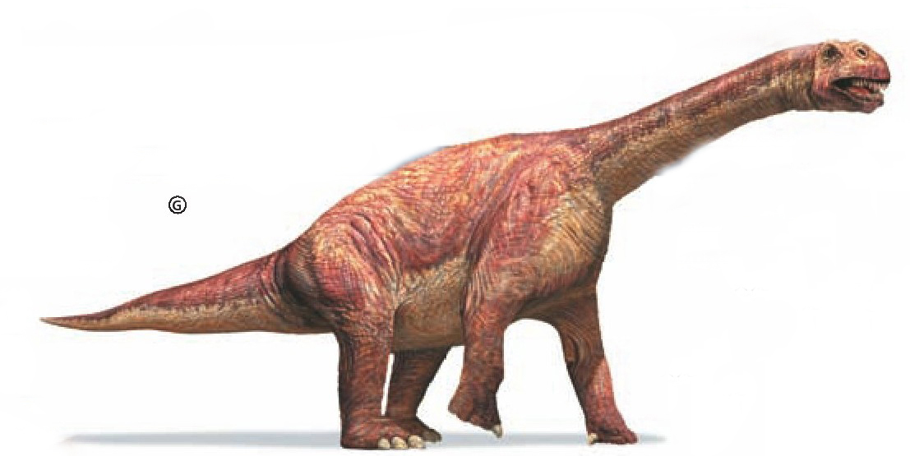
圆顶龙

中国辽宁西部的热河生物群中出产众多带羽毛的恐龙，为恐龙是恒温动物的观点增添了有分量的证据。像鸟类和哺乳动物这样的恒温动物体表往往披毛或者羽毛，以防止热量散失，来维持一个稳定的体温。带羽毛恐龙化石的发现表明，恐龙也像鸟类和哺乳动物，属于恒温动物。

不过，确实也有证据显示，恐龙的生长方式和恒温动物还是有所不同的，恐龙的代谢速率可能还没有达到真正的恒温动物的水平，因此，更多的人倾向于恐龙是一类过渡类型的动物，不是变温动物，但也不是典型的恒温动物。（王烁　张蜀康）

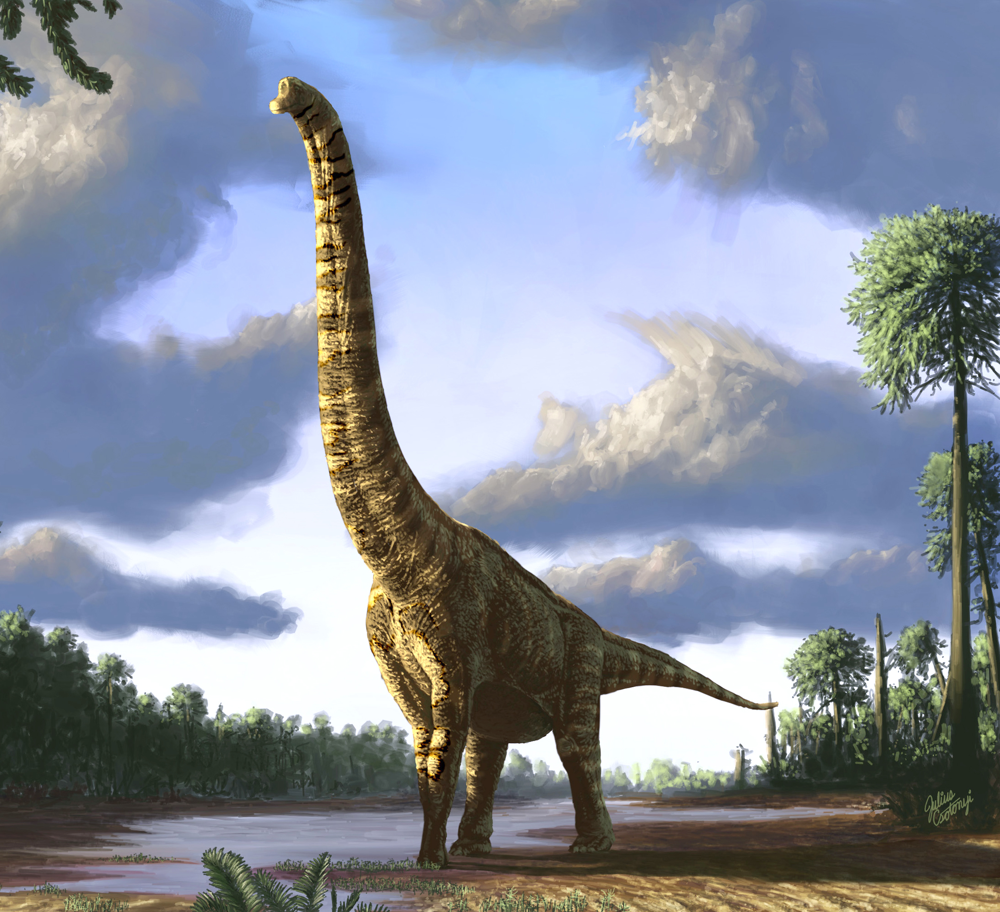
腕龙

## 为什么说恐龙可能是色彩斑斓的动物

恐龙的颜色一般是由皮肤中的色素所决定的。要了解恐龙的颜色就需要到恐龙的皮肤化石中寻找答案。虽然古生物学家发现了很多皮肤的印痕化石，但是存在于皮肤中的色素在形成化石的过程中很容易被分解掉，所以无法知道恐龙的真实颜色是什么样子的。以前的古生物学家主要将一些大型恐龙的颜色复原成灰色或者绿色，是参照现生的一些大型哺乳动物（如象）和爬行动物（如鳄类、巨蜥等）的颜色来复原的。由于鸟类起源于小型兽脚类恐龙学说的兴盛，也有人认为恐龙的颜色应该像鸟类一样五彩缤纷，而不是单一的灰色或绿色。2010年，古生物学家研究了属于美颌龙类中华龙鸟的尾部羽毛印痕化石，通过分析其中保存的黑素体（一种亚细胞结构）的形态，首次科学地推断出恐龙的颜色，确定其尾部的颜色是橘色和白色相间而成的。紧随其后，古生物学家又基于同样的方法，复原了另外一种小型恐龙——赫氏近鸟龙的羽毛颜色，发现它翅膀上的颜色是黑白相间的，头上还有漂亮的红褐色的冠，从而结束了恐龙家族的灰暗时代。最新对小盗龙的分析发现，它们的羽毛与某些现生鸟类的一样，可展现出彩虹般的光泽，颜色会随着观察者角度的变化而变化。这些研究使得人们确信，恐龙的颜色并不是单一的灰色，而是多姿多彩的。（韩凤禄）

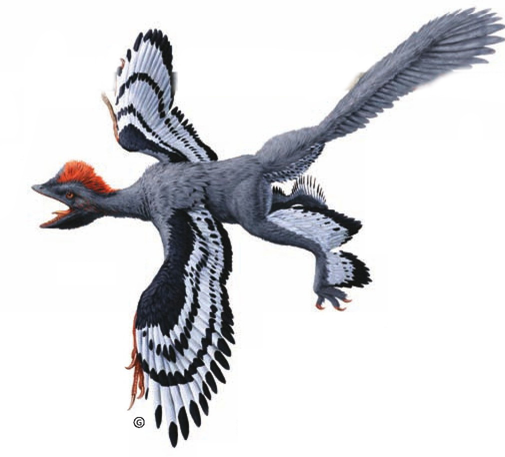
近鸟龙

  

**【微博士】**恒温动物和变温动物

恒温动物俗称热血动物，是指可以通过自身体内的代谢作用所产生的热量来调节体温，并维持体温恒定的动物。包括人在内的哺乳动物和鸟类都是恒温动物，它们有浓密的毛发或羽毛，防止热量过快散失。变温动物俗称冷血动物，是指自身不能控制体温的动物。它们的体温随环境温度的变化而变化，或通过晒太阳，或躲到阴凉处等行为来调节体温。鱼类、两栖动物和现生爬行动物都是变温动物，它们冰凉的身体就是最好的证明。

## 恐龙的呼吸方式为什么和人大不一样

每个人的生命，都在一呼一吸间延续。静下心来，感受自己的呼吸：吸气的时候，肋骨上抬，横膈膜下降，肺的容积扩大，新鲜空气进入肺中；呼气的时候，肋骨下降，横膈膜上升，肺部收缩，将废气排出。人的肺就像个大袋子，既是气体交换的场所又能储存空气，但是正因为如此，每次呼气的时候，废气不能够全部排出，占据了肺的部分容积，降低了气体交换的效率。鸟类发展出了比人类更高效的呼吸方式，它们的秘诀在于具有与肺部相连的气囊。

呼吸系统中增加了气囊之后，肺就不再储存空气，而是专门行使气体交换的功能。气囊系统主要分为前部气囊和后部气囊两部分。吸气的时候，吸入的新鲜空气有一半会直接进入后部气囊，另一半则经由肺部进入前部气囊。呼气的时候，后部气囊的新鲜空气会在肺部进行气体交换之后排出，而前部气囊的废气则不经过肺部直接排出体外。这样一来，无论是吸气还是呼气，肺部始终有新鲜空气流过，气体交换的效率就大大提高了。

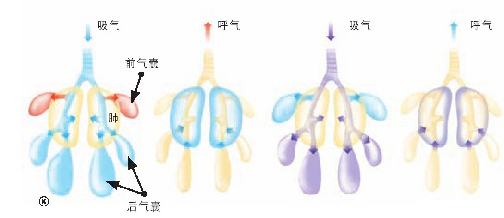
鸟的双重呼吸

鸟类具有气囊早已被人熟知，现在人们发现，鸟类的气囊结构是从它们的恐龙祖先继承而来的。人们在蜥脚类和兽脚类恐龙化石中发现了气囊存在的证据，其中气腔龙除了在脊椎骨上，还在叉骨、肠骨和腹肋等骨骼上有气囊存在的证据，显示出它具有和鸟类非常接近的气囊系统。这表明，恐龙的呼吸方式和人类不一样，除了用肺，还要借助气囊系统进行呼吸。（张蜀康）

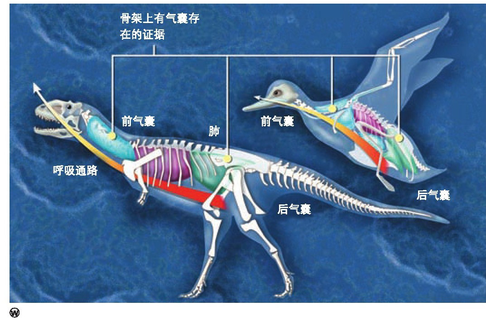
恐龙的呼吸

  

【微问题】恐龙的体温是靠什么机制维持的？

【关键词】体温　恒温动物　颜色　呼吸　黑素体　气囊

## 恐龙是怎样保护自己的

在生存竞争无比残酷的中生代，植食性恐龙是如何抵御凶残的肉食性恐龙袭击的呢？在漫长的演化过程中，植食性恐龙演化出了种种有效的防御策略，以保证自己种族的延续。

有很多化石证据显示，不少植食性恐龙都是群居动物，它们很可能以家族为单位，共同觅食、迁徙，有些植食性恐龙有庞大的数量，队伍中更有精密分工，可以有效地对可能的危险进行预警。成年恐龙及时聚在一起，保护队伍中脆弱的幼年个体。面对成年恐龙固若金汤的防御阵形，肉食性恐龙自然就望而却步了。

蜥臀类中的蜥脚类恐龙有着非常简单的防御策略：让自己长得无比庞大。慑人心魄的体形和震耳欲聋的脚步声，对大多数中小型肉食性恐龙来说，本身就是种可怕的威慑。蜥脚类恐龙的第二种防御武器是它们长长的鞭子样的尾巴。科学家计算了它们尾巴的长度和重量，并进行了相关的力学分析，认为它们在面对肉食性恐龙的进攻时，一个有效的横扫会对肉食性恐龙造成致命的打击。其中，像中国四川发现的蜀龙，其尾巴尖端还长有骨质的结节，形似流星锤，可以有效增加打击的威力。

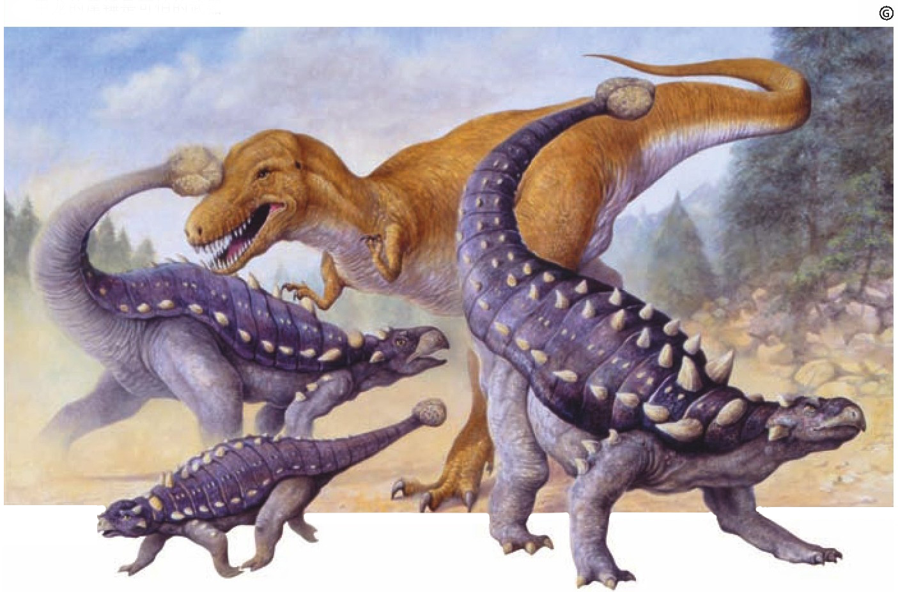
甲龙的尾锤是可怕的武器

鸟臀类中的剑龙，尾巴尖端处长有4个巨大骨刺，极有可能是用来抵御敌人进攻的，证据是科学家曾发现一段异特龙的尾椎上具有与剑龙尾刺吻合的伤痕。剑龙最具有标志性的特征是它背部一排看起来威风凛凛的剑板。科学家对这排剑板的作用意见不一，早先的观点认为这是类似装甲板一样的防御装置；后来流行的观点认为是剑龙身上的散热片；现在更多科学家倾向于认为，当剑龙遇到敌人时，这些剑板上的皮肤会充血变色，使剑龙看起来体形变得更庞大，以吓退肉食性恐龙。

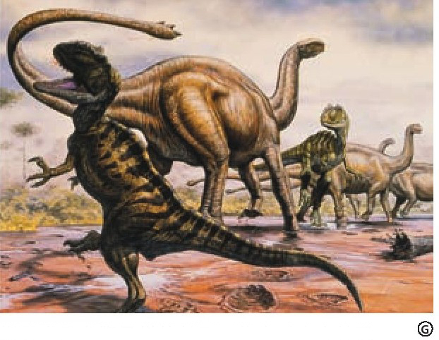
蜥臀类恐龙鞭子样的长尾可能会对肉食性恐龙造成致命打击

鸟臀类中的鸟脚类，如棱齿龙类、鸭嘴龙类等，没有演化出特别的御敌器官，但它们具有相对敏锐的视觉和听觉，这有助于它们及时发现周围可能存在的危险。

鸟臀类中将攻防一体发挥到极致的，就属甲龙类和角龙类了。甲龙类堪称恐龙中的坦克，背部披满了厚重的骨甲，部分种类还长有突出的骨刺。有一些甲龙尾部尖端具有骨质结节形成的锤状物。当甲龙遇到肉食性恐龙袭击时，如铁乌龟一般往地上一趴，时不时地挥动流星锤一般的尾巴，大多数肉食性恐龙就知趣地撤离了。角龙类，尤其是生存于北美地区的大型角龙类，与被动防御的甲龙类不同，它们普遍都长有夸张的颈盾，如披风般遮盖了自己的颈部。但由于多数角龙的颈盾结构中空，它有多大的保护作用还存在争议。科学家推测：这些颈盾上可能有鲜艳的纹饰，可能被用来吸引异性或是吓阻敌人的。大型角龙类还长有形态各异的犄角，这很有可能是作为与同类或肉食性恐龙争斗的武器。科学家曾经发现过肉食性恐龙骨骼化石上有疑似三角龙的角所造成的伤痕，间接证明了这一推测。（贺一鸣）

## 肉食性恐龙是怎样捕食猎物的

肉食性恐龙拥有强健的肌肉和发达的四肢，具备了较快的奔跑速度和强大的力量，用于捕食猎物。一般来说，锋利的牙齿和尖锐的爪是肉食性恐龙捕捉和攻击猎物的利器，但不同的肉食性恐龙在捕食方式上有所不同。它们有些可能像猎豹，在快速的奔跑中追逐猎物，利用尖锐的爪和锋利的牙齿俘获和撕咬对手；有些可能更像老虎，把自己隐藏在某个角落，慢慢地接近猎物，采用埋伏袭击的方式；另外一些兽脚类恐龙在捕食过程中，尤其是在捕猎大型植食性恐龙时，可能采取集体攻击的策略以提高成功率，就像非洲大草原的狮子集体猎杀水牛和角马一样。不同肉食性恐龙倚重的武器可能也有所不同：有些种类可能更依赖强大的头部和令人生畏的牙齿，像著名的霸王龙；还有些种类可能是手脚并用，像恐爪龙脚上巨大的第二脚爪就是一个非常有效的攻击武器；有些种类的强壮前肢可能在攻击猎物时起着重要作用，像侏罗纪的异特龙类。（邢海）

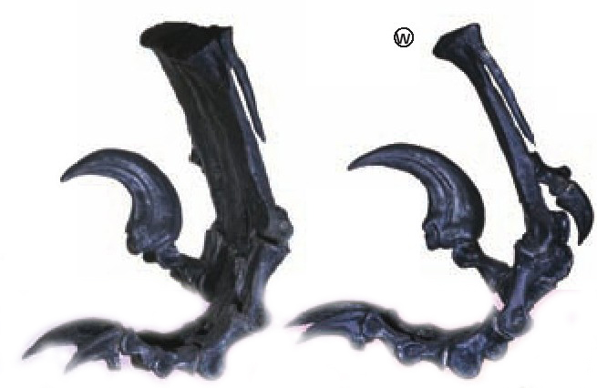
恐爪龙的爪

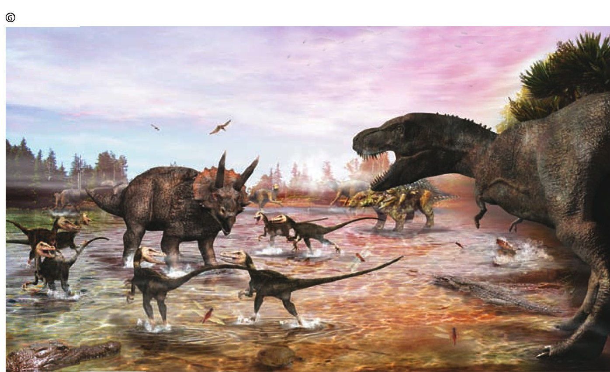
恐爪龙类集体捕食

## 恐龙会自相残杀吗

肉食性恐龙可能会在食物短缺和求偶交配时残杀同类吗？目前，还没有充分的化石证据可以证实这一假说。在美国新墨西哥发掘到的腔骨龙化石中，人们发现成年腔骨龙化石的腹部位置有一些疑似为幼年腔骨龙化石的碎片。因此，一些学者认为这一现象可能反映了腔骨龙具有自相残杀的习性。然而，最新的古生物学研究表明，那些所谓的幼年腔骨龙标本可能属于一些小型的水生爬行动物，腔骨龙自相残杀的假说并不成立。另外，一些霸王龙骨骼化石的表面具有一些较大的咬痕，这些咬痕可能是其他霸王龙所为。然而，这些咬痕也有可能不是在自相残杀过程中形成的，而是在食腐过程中形成的。从将今论古的角度推测，在极端的生存环境下，同种的肉食性恐龙之间可能会出现同类相残的现象，就像在干旱季节的非洲大草原上鳄鱼之间互相捕食一样。但是，反映这一现象的确凿化石证据还有待古生物学家去发现和继续探究。（邢海）

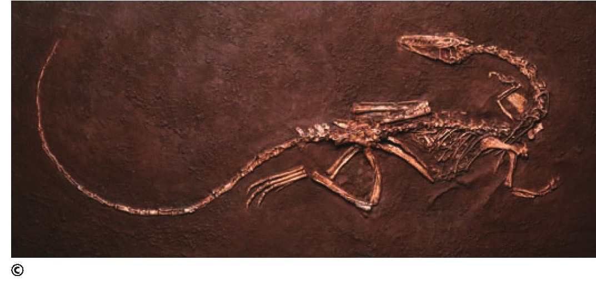
这件内有小动物骨骼的腔骨龙化石一度被认为是恐龙自相残杀的证据

  

**【微博士】**两条腿跑过四条腿

俗话说“两条腿跑不过四条腿”，因为跑得快的哺乳动物，不论是肉食性的还是植食性的，都是用四条腿奔跑的。但恐龙时代并非如此。只能以四条腿行走的蜥脚类恐龙是跑得最慢的，它们只能以庞大的体形来保护自己。小一些的鸟臀类恐龙如鸭嘴龙、禽龙，虽然平时觅食时用四条腿支撑身体，但逃命时则把前脚收起，用后腿快速奔跑。它们的捕食者如异特龙、恐爪龙等，也都是用两条后腿奔跑的。而霸王龙更是只用两条后腿跑步，前爪干脆演化得只剩很小的两根手指了。

【微问题】为什么恐爪龙只用两个趾头奔跑？

【关键词】防御　剑龙　甲龙　植食性恐龙　肉食性恐龙　恐爪龙　捕食　自相残杀

## 为什么说三角龙是“角龙之王”

三角龙是恐龙王国中的明星，它不仅是最知名的恐龙之一，还常常被认为可以用它尖锐的犄角挑战肉食性恐龙之王——霸王龙，因而代表植食性恐龙的强者。

三角龙体长能达到9米，体重最多有12吨，巨大的头部和尖锐的犄角让它拥有了恐龙家族中的“超级犀牛”的称号。最大的三角龙头骨有2.5米长，占到体长的近1/3，是一个十足的大头动物。它头上的3个犄角向前延伸，是时刻提醒对手的利器。三角龙身体非常结实，四肢粗壮，前足上有3个蹄子，后足上有4个蹄子。三角龙最突出的特征之一是它的牙齿。它最多可以有800颗牙齿，但是这些牙齿中只有小部分在使用，其余大部分则备用。有证据显示，像鹦鹉嘴龙一样，三角龙可能身体上长有原始羽毛。

三角龙以植物为食。从牙齿的磨蚀面判断，三角龙的牙齿就像一把大剪刀，能够有效地剪切植物。科学家猜测，三角龙可能以多纤维的植物为食。有人猜测它主要吃棕榈和苏铁类，也有人认为它主要吃大草原上的蕨类植物。

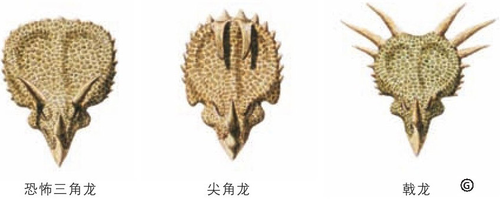
多种多样的角龙

一般认为角龙类是群居动物，但是却很少发现大量三角龙化石保存在一起，也许三角龙是角龙家族当中的一个例外。即便是独居，三角龙也不惧怕任何猎食性恐龙，包括著名的霸王龙。科学家从三角龙和霸王龙化石中发现了一些蛛丝马迹，显示这两种恐龙会进行搏斗。虽然很难猜测谁是最终的赢家，但一般而言，猎食性恐龙总是占有一定优势。三角龙的犄角不仅用于攻击霸王龙，还用于内部争斗。三角龙很可能像今天长犄角的哺乳动物一样，用犄角相互推搡和搏斗。（贺一鸣）

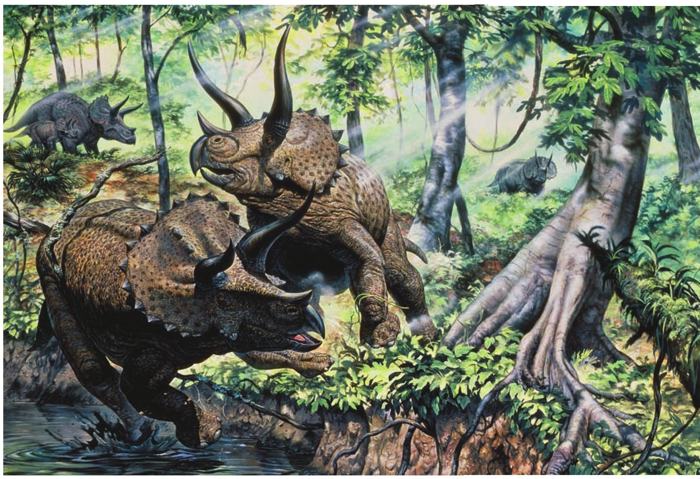
白垩纪森林中的三角龙

## 三角龙的“披风”是做什么用的

角龙类的头后部有个宽大的“披风”，其实那不是披风，而应该叫颈盾。大多数角龙类的成员，包括生活在亚洲的早期成员及后来在北美繁盛的进步成员，都有一个颈盾，进步成员的颈盾较早期成员发达，并且具有装饰。巨大的颈盾让三角龙的头骨长度剧增。这样一个巨大的颈盾到底有什么作用？不同的人有不同的看法。有人认为是附着肌肉的，有人认为是在搏斗中起保护作用的，有人认为是用来调节体温的，也有人认为是用来向异性展示的。最后一种说法得到了越来越多人的认同。不过，有人认为，三角龙的“披风”可能不同于大多数角龙类，因为两者的“披风”形态有所不同。除三角龙之外，其他角龙类颈盾剑板上左右两边各有一个大孔，称为顶骨孔。恐龙活着的时候，上面覆盖了一层皮肤，孔内则填充了大量的血管。科学家推测，大多数角龙类颈盾剑板结构较脆弱，不能用于防御，更可能是作为一种传递信号或炫耀的结构。但三角龙的颈盾很特别，它是一块完全实心的骨板，这有可能使它成为一种保护它脆弱的脖颈处的盾牌。（贺一鸣）

## 三角龙的祖先在哪里

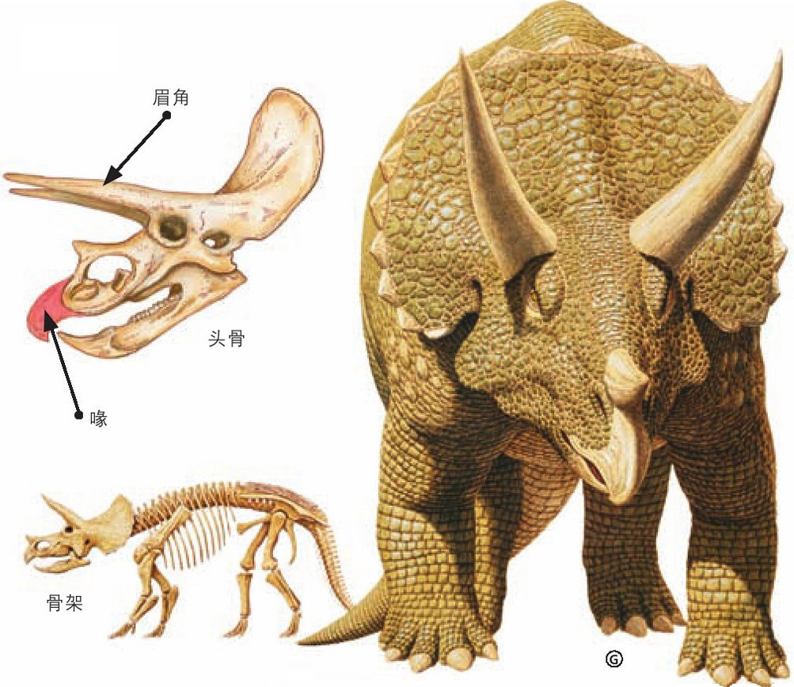
三角龙

角龙类属鸟臀类，也是整个恐龙家族中最后灭绝的类群之一。白垩纪晚期的大型角龙类以其形态各异的犄角和颈盾造型而格外引人注意，如大家熟悉的三角龙、独角龙和戟龙。从化石分布的情况来看，大型角龙类绝大部分发现于北美，但它们的祖先类群则发现于亚洲地区。其中，已知最原始的角龙是产自中国新疆准噶尔盆地晚侏罗世的隐龙，它是一种体形很小、双足行走的恐龙，头骨上没有角以及发达的颈盾，但具有所有角龙类成员都有的吻骨。在白垩纪早期的中国北方和蒙古等地，开始出现各种各样的小型角龙类，其中包括了嘴部形似鹦鹉嘴的鹦鹉嘴龙以及更加进步的辽宁角龙和古角龙等。到了白垩纪晚期，角龙类的体形开始变大，出现了具有宽大的颈盾但没有犄角的、与大型角龙亲缘关系很近的种类，如原角龙等。直到晚白垩世晚期，大型角龙类才出现。可以看出，以三角龙为代表的大型角龙类的祖先来源于亚洲，大型角龙类祖先很可能是通过白令海峡的陆桥，迁徙到了北美大陆，并逐渐繁盛起来的。（贺一鸣　孟溪）

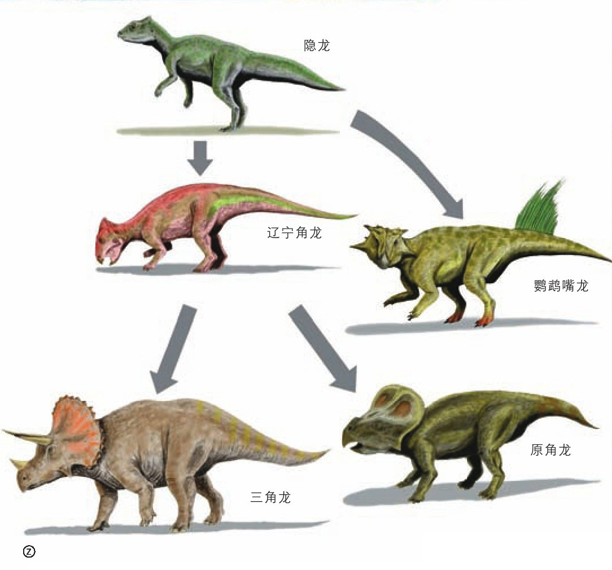
三角龙可能的演化线索

  

**【微博士】**亚洲的大型角龙

体重超过10吨的三角龙和它的近亲是角龙家族中的大块头。这些大块头的化石记录过去一直局限在北美的西部，大型角龙也被认为起源于那里。亚洲等地曾经有过大型角龙化石的报道，但发现的化石非常破碎，人们无法确认这些化石确实属于大型角龙。从化石分布的情况来看，大型角龙在亚洲的缺失是一个谜，因为除了大型角龙外，生活在北美白垩纪晚期的所有恐龙类群在亚洲都有相应的记录。2008年，人们终于在山东诸城发现了确切无疑的大型角龙化石。基于头骨化石命名的中国角龙是角龙家族中的大块头：它的头骨长度至少有180厘米，宽度至少有105厘米；后来发现的一块肩胛骨长度甚至超过了北美已知最大的角龙。和其他大型角龙一样，中国角龙也有角：头前部有一个超过30厘米长的粗壮直角；在头后缘有至少10个弯角。中国角龙是一种原始的大型角龙，它的发现暗示大型角龙可能起源于亚洲，后来迁徙到了北美。

【微问题】三角龙是聪明的恐龙吗？

【关键词】三角龙　颈盾　隐龙　鹦鹉嘴龙　中国角龙

## 为什么很多人相信霸王龙是猎食性恐龙之王

霸王龙可能是恐龙王国当中最著名的物种，也是地质历史当中最恐怖的陆地杀手。霸王龙生活在北美白垩纪最晚期，和三角龙等恐龙一道见证了恐龙家族的最后时刻。霸王龙体长达到13米，体重超过7吨，有着令人生畏的巨大头颅和尖锐牙齿，是绝对的顶级猎食者。

霸王龙的头骨有1.5米长，但这还不是最可怕的。霸王龙最可怕之处在于，头骨不仅长，而且异常粗壮，因此具有非常巨大的咬合力。科学家通过研究霸王龙在其他恐龙骨骼上留下的咬痕推测，它最大可以产生57000牛的惊人咬合力。更加恐怖的是它那异常粗壮的巨大牙齿。不同于典型的侧扁的肉食性恐龙牙齿，霸王龙的牙齿更像一个个香蕉，最大的牙齿超过30厘米长。有人猜测，霸王龙还有另外一个类似科摩多巨蜥的夺命绝招：它有具感染性的唾液，能够有效杀死猎物。

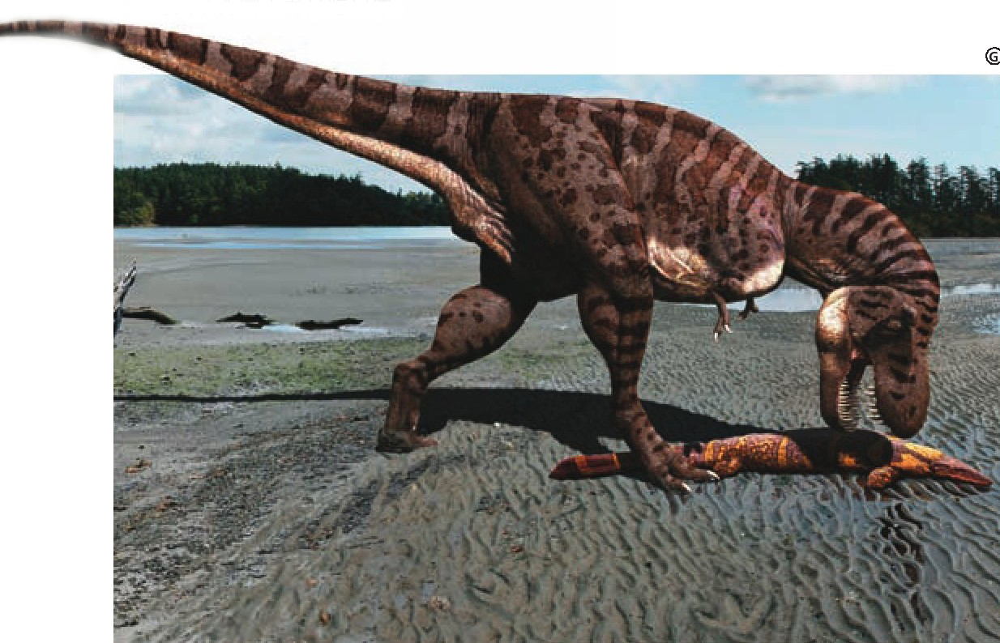
有人认为霸王龙只吃尸体

尽管霸王龙被戴上了各种各样的光环，但人们还是开始质疑霸王龙到底是不是一个顶级猎手。过去认为，霸王龙具有超强的奔跑能力，有人认为它的奔跑速度可以达到70千米/时以上。但后来的研究显示，霸王龙奔跑速度很慢，可能只有10多千米/时，最新的研究虽然推测它的奔跑速度可以达到20千米/时，但依然远远低于传统的观点。

许多人认为，霸王龙其实是一种食腐动物。他们认为，霸王龙细小的前肢不能辅助它捕食，缓慢的奔跑速度阻止了它捕食其他恐龙。不过，反对者认为，霸王龙不需要前肢来辅助捕食，霸王龙同时期的许多植食性恐龙奔跑速度更慢。其实，更多的科学家相信，霸王龙是一个积极的猎食性恐龙。比如，在同时期生活的一些其他恐龙骨骼上，曾经发现愈合的伤疤，而这些伤疤是由霸王龙造成的。这说明，这些恐龙受到了霸王龙的攻击，但受伤后依然逃脱了。（张蜀康）

## 霸王龙的细小前肢有什么用

作为史上最强的猎手，霸王龙的一切似乎都那样完美：血盆大口、弯锥般的牙齿、粗壮的颈部、发达的后肢……但是，只有一样东西看起来有点令人失望，那就是与其庞大体形不成比例的细小前肢。近13米长的硕大身躯只装配了一对1米长的前肢——只相当于成人手臂的长度，连自己的嘴都够不到。人们一度认为，这是一种退化的结构，已经没有任何实际用处了。事实果真如此吗？

科学家发现，霸王龙的前肢骨骼很结实，并且有较大的肌肉附着区，说明这对细小的前肢比看上去的强壮，应该不是已被淘汰的结构。关于霸王龙前肢的功能有以下几种假说：（1）当霸王龙伏在地上时，需要用前肢撑起前半身后才能站起来；（2）在捕猎的时候用前肢控制住挣扎的猎物；（3）在交配的时候抓牢自己的配偶。虽然不能直接观察霸王龙是如何使用前肢的，但是人们仍然通过详细的研究和合理的推测挖掘出了这对细小前肢存在的意义。

霸王龙的前肢除了短小之外，还有一大特色就是只有2根手指，这和大多数肉食性恐龙不同，因为它们有3根手指。乍一看，这有些奇怪，但仔细看看其他动物，这其实不算什么。四足动物的“手”通常有5根指头，但许多四足动物的手指会退化甚至消失，因此，四足动物大家族中既有5指的，也有4指的，还有3指的，甚至出现像霸王龙这样2指的。

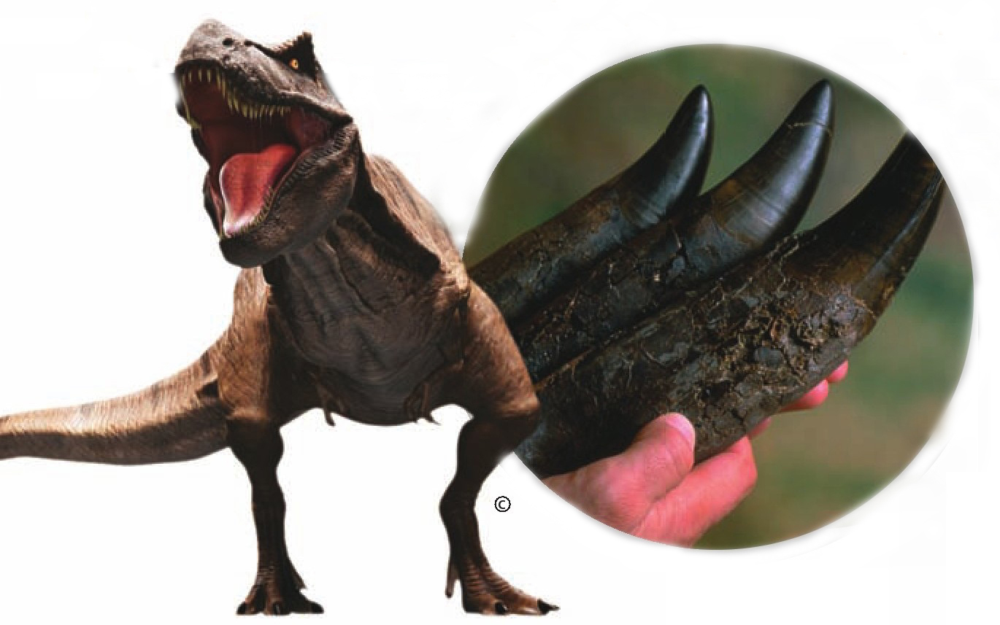
霸王龙的香蕉状牙齿

在恐龙家族中，像艾雷拉龙等非常原始的恐龙有5根手指，但更加进步的恐龙开始减少手指数量。霸王龙的近亲一般都保留着3根手指，但不知什么原因，霸王龙只有2根手指了。有人猜测，这可能是霸王龙的手失去了捕猎功能，不再需要抓握，因此就更加退化了。

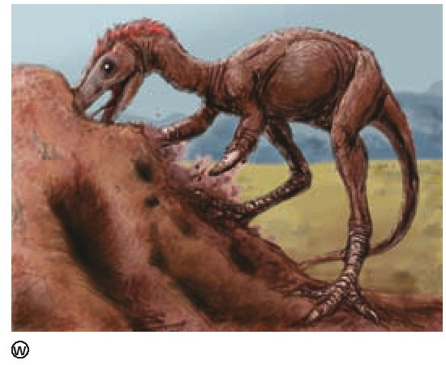
临河爪龙

不过，霸王龙还不算手指最少的恐龙。在中国内蒙古临河地区发现的临河爪龙仅保留了1根手指。科学家猜测，临河爪龙用它只有1根手指的“手”来挖掘蚁穴，获取营养丰富的蚂蚁来喂养自己。这样看来，临河爪龙虽然只有1根手指，但这根手指作用却很大，成为它取食的有力工具。（张蜀康）

## 霸王龙长羽毛吗

现在还没有哪一件霸王龙的标本上发现过长羽毛的痕迹，不过这并不能否定霸王龙长过羽毛，或长有羽毛的可能。有确切的化石证据显示，霸王龙的祖先暴龙类的早期成员奇异帝龙，身材不大，却披着华丽的羽衣来保温。科学家推测，在演化过程中，暴龙类体形增大，依靠巨大的身体就能维持体温，因此就退化了羽毛，就像现生的象一样。但是2012年报道的羽王龙却让人们大吃一惊。它堪称热河生物群中的大个头，体长在9米左右，体重超过了1.4吨。以往科学家相信，像羽王龙这样大的恐龙应该不再需要羽毛了。但令人惊奇的是，羽王龙的体表竟然有一层长长的丝状羽毛。科学家推测，这些羽毛是羽王龙厚厚的冬装，帮助它们挨过寒冷的冬天。羽王龙的发现告诉人们，在暴龙类中即使是大块头也可以长有羽毛，那么自然就不能排除霸王龙拥有迷人羽衣的可能性了。当然，由于霸王龙生活的环境似乎要远比羽王龙生活的环境温暖多了，这使得羽衣成为了累赘，霸王龙有可能像大象一样，退化掉了厚厚的羽毛。（王烁　张蜀康）

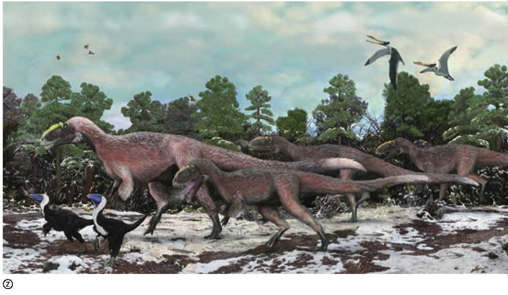
羽王龙

  

**【微博士】**霸王龙的祖先

冠龙

一提起霸王龙，人们的脑海中都会浮现出庞然大物的形象。霸王龙的一些亲戚，如艾伯塔龙和蛇发女怪龙等都超过9米长，也是不折不扣的巨型杀戮机器。但是，暴龙超科中一些原始的种类，在个头上却完全无法与它们这些伟大的后裔们相比。比如，帝龙仅1.6米长；五彩冠龙稍大一点，全长3米；雄关龙体长也不超过5米。这说明暴龙类最初是小巧敏捷的动物，在演化过程中体形不断增大，最终变为巨大的食肉恐龙。

【微问题】霸王龙是独居还是群居的？

【关键词】霸王龙　羽毛　羽王龙　暴龙超科

## 恐龙的脚有多大

对于恐龙，虽然无法直接丈量它们的脚，但可以通过恐龙化石脚部骨骼的尺寸来推测脚的形状和大小。还有一种更为直接的方法，就是从恐龙的足迹化石来判断。

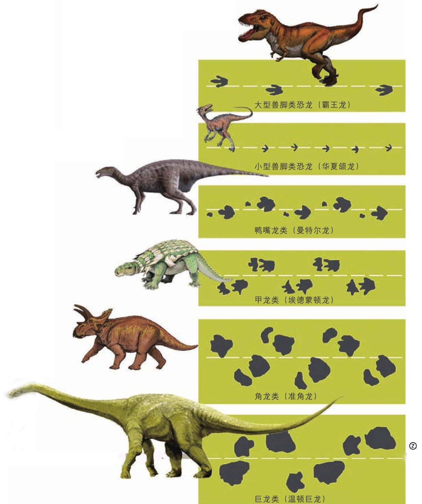
各种恐龙的足迹

大自然留下了丰富的恐龙足迹化石。不同种类恐龙形成的足迹也是不同的：有大到1.5米长的，也有小到1厘米的；有相对细窄的，也有非常宽的。这些形态不同的足迹表明，有些恐龙就像大多数动物一样，是四足行走的，而有些恐龙像人类一样，是两足行走的。

四足行走的恐龙主要包括剑龙、甲龙、进步的角龙以及蜥脚类恐龙。其中蜥脚类恐龙的足迹化石发现最多，而其他四足恐龙的足迹化石则很少见。这很有可能和它们的生活环境有关。蜥脚类恐龙体形巨大，它们的四肢粗壮，而它们的足迹是恐龙足迹中最大的，足迹的样子和其他两足行走的恐龙的足迹有很大不同。在蜥脚类恐龙中，脚掌占了绝大部分足迹的位置，脚趾比较短，相互分开，而且后脚比前脚的足迹大，有时候还会部分覆盖前脚的足迹。

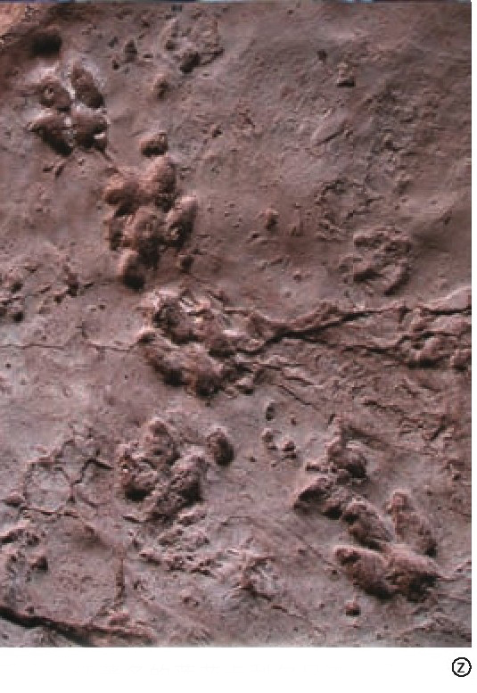
重庆綦江著名的莲花卡利尔足迹（早白垩世）可能是某种禽龙留下的

两足行走的恐龙主要包括兽脚类和鸟脚类恐龙，它们一般都用脚趾走路，就像人用脚尖走路一样。足迹化石显示的，主要是脚趾的样子，而不是脚掌。它们都有3个脚趾，中间的脚趾较长，两侧的脚趾相对较短，和鸡的足迹差不多。极少数的恐龙还可以有4个脚趾，例如古生物学家在非洲摩洛哥发现了很多具有4个脚趾的大型兽脚类恐龙足迹，并据此命名了一个新的属种。大型的兽脚类恐龙和鸟脚类恐龙的足迹化石都是脚趾宽大，它们的主要区别在于前者的爪印更深，而且足迹的后侧形状像“V”形，而后者足迹的后侧更像弧形。小型的兽脚类恐龙主要指虚骨龙类，它们的足迹化石和小型的鸟脚类恐龙的足迹化石很像，都比较纤细，趾节之间的界限也很明显。一般来说，虚骨龙类爪痕印迹比小型鸟脚类恐龙的更深一些。当然，足迹的形态和它们的保存状况有关系，有时候是很难区分的。（韩凤禄）

## 恐龙能跑多快

试想一下：如果人和恐龙赛跑，究竟谁能够胜出呢？

其实，这要看人和哪一种恐龙赛跑了。如果是体形庞大的蜥脚类恐龙，相信人肯定能赢啦！但是如果要是碰上一只体形较小、身体敏捷的驰龙呢？再或者是恐龙时代晚期的顶级统治者霸王龙呢？虽然不能像测量现生动物奔跑的速度一样来测量恐龙能跑多快，但是科学家还是能够通过恐龙化石间接地推测恐龙的奔跑速度。

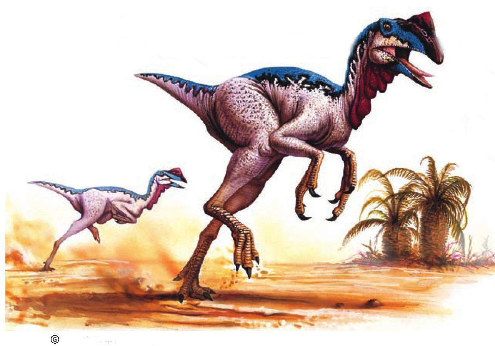
奔跑中的纤手龙

一种方法就是通过恐龙肢骨不同组成部分的相对长短来推测恐龙的奔跑能力。比如，通过观察现生动物，发现一般小腿越长的动物奔跑速度越快，这种方法也适用于估算恐龙的速度。当然，这种过于简单的方法逐渐被科学家抛弃。现在许多学者通过建立恐龙骨骼肌肉的计算机模型来推测恐龙的奔跑能力。例如，通过这种方法推测霸王龙每小时只能跑20千米。但有些古生物学家认为霸王龙的奔跑速度被低估了，根据他们所建立的骨骼和肌肉模型得出霸王龙的奔跑速度可达近29千米/时。也有人认为霸王龙其实平时并不经常奔跑，因为跑起来一旦摔倒，由于其身体过于沉重，有可能会受到致命的伤害。

另外一个方法是利用恐龙足迹化石来估算恐龙的奔跑速度。其中比较经典的方法是：先测量恐龙的步幅以及四肢的长度，再根据对现生哺乳动物和鸟类的奔跑速度与步幅、腿长的统计分析得出的等式，算出这类恐龙的奔跑速度。根据这个等式计算的结果，大型的蜥脚类恐龙以及剑龙类和甲龙类的成员是恐龙当中跑得最慢的，仅相当于人们走路的速度。跑得最快的是小型兽脚类恐龙（如驰龙）和小型鸟脚类恐龙，由于它们身体细长而敏捷，奔跑速度可以达到40千米/时，和现生鸵鸟的速度差不多。（韩凤禄）

## 恐龙会游泳吗

中生代海洋中的爬行动物虽然被称为“龙”，但并不属于恐龙。恐龙都是陆生的，迄今为止还没有证据表明有完全水生的恐龙存在，但是也有一部分恐龙会在需要的时候下水游泳。蜥脚类恐龙一度被认为是在水中生活，需要用水的浮力支撑沉重的身体，但后来的研究表明它们的四肢能够很好地在陆地上支撑身体并行走。至于它们能不能在深水里游泳，至今还是个谜。鸭嘴龙也曾经被认为是半水生的，它们宽大的尾巴可能像船桨一样推动它们在水中游泳。不过后来科学家发现鸭嘴龙的尾巴摆动并不十分灵活，更多的证据显示它们是一种陆生动物。真正能够游泳的是一些兽脚类恐龙，如有些研究表明棘龙是半水生的，就像现在的鳄类一样。另外，发现于西班牙约1.2亿年前的12个连续的“S”形弯曲的爪痕化石显示，它们很可能是一只正在游泳的兽脚类恐龙留下来的。（韩凤禄）

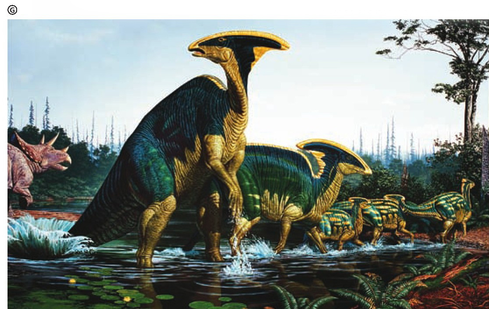
鸭嘴龙类曾被认为在水中生活

  

**【微博士】**恐龙的足迹化石

恐龙在地面上行走时的足迹在特殊的环境中被保存下来，这就是足迹化石。常见的足迹化石有两种：一种是凹进岩石里面的恐龙足迹，是由被恐龙踩出足迹的地方石化变硬而形成的；另一种是凸出于岩石表面的恐龙足迹，由于恐龙足迹被一些沉积物所覆盖，并慢慢石化，而原来形成恐龙足迹的岩层比较松软而脱落，使得恐龙足迹凸出。通过足迹化石，可以了解恐龙脚趾的样子、行走方式和奔跑速度等。恐龙足迹化石在亚洲、欧洲和北美都发现得比较多。

【微问题】在什么样的岩石中容易找到恐龙足迹？

【关键词】足迹化石　奔跑速度　驰龙　游泳

## 恐龙吃什么

现生陆生动物的食性大致可分为植食性、肉食性和杂食性三类，远古的恐龙也不例外。因为不可能直接观察恐龙是如何进食的，所以要想判断恐龙的食性，多半只能依靠一些间接的证据，即从恐龙身体的结构上找答案。

恐龙身上有机会与食物进行最亲密接触的器官是牙齿和肠胃。其中，牙齿比较容易变成化石保存下来，而研究人员就可以通过牙齿化石来判断恐龙的食性。如果一只恐龙长着匕首状的牙齿，那么它是肉食性的；如果牙齿为叶状、勺状等形状，那么这只恐龙是植食性的。不过，事情并非这么简单，恐龙家族中总是不乏另类：有一些恐龙，如许多似鸟龙类和窃蛋龙类，满口没有一颗牙齿！一些似鸟龙类和窃蛋龙类还有鸟类那样的角质喙。与牙齿相比，喙是更加多功能的取食工具，鸟类可以凭借无牙的喙既吃植物的种子又吃昆虫，食谱非常广泛，所以这些长有喙的恐龙可能是杂食性的。单爪龙类被认为是以蚂蚁为食，但还有待确认。除了牙齿以外，一些其他的骨骼结构也具有指示意义。比如植食性恐龙的头颅一般很小，而肉食性恐龙的头颅硕大；植食性恐龙的脖子一般远远长于肉食性恐龙；大多数植食性恐龙的身体相对臃肿笨拙一些；猎食性恐龙一般有尖锐的爪子，而植食性恐龙则常常有蹄状结构。

了解恐龙的食性容易，但想知道某一种恐龙具体会吃什么东西就不那么容易了，科学家只能向恐龙的肠胃要答案。幸运的是，少数几件恐龙化石中真的保存了它们“最后的晚餐”。在发现于中国辽宁的中华龙鸟化石的胃部，人们发现了小蜥蜴骨骼，说明中华龙鸟最后的晚餐可能就是这条可怜的蜥蜴。同样发现于辽宁的两件小盗龙标本，一件的胃部有一种原始哺乳动物的遗骸，一件的胃部甚至保存了一种原始鸟类的碎骨，说明小盗龙很可能在树上捕猎包括鸟类在内的小型动物。在英国的重爪龙化石的胃部发现了鱼的残骸，再加上它的上下颚和牙齿与鳄类非常相似，所以这种恐龙很可能在水边以捕鱼为生。

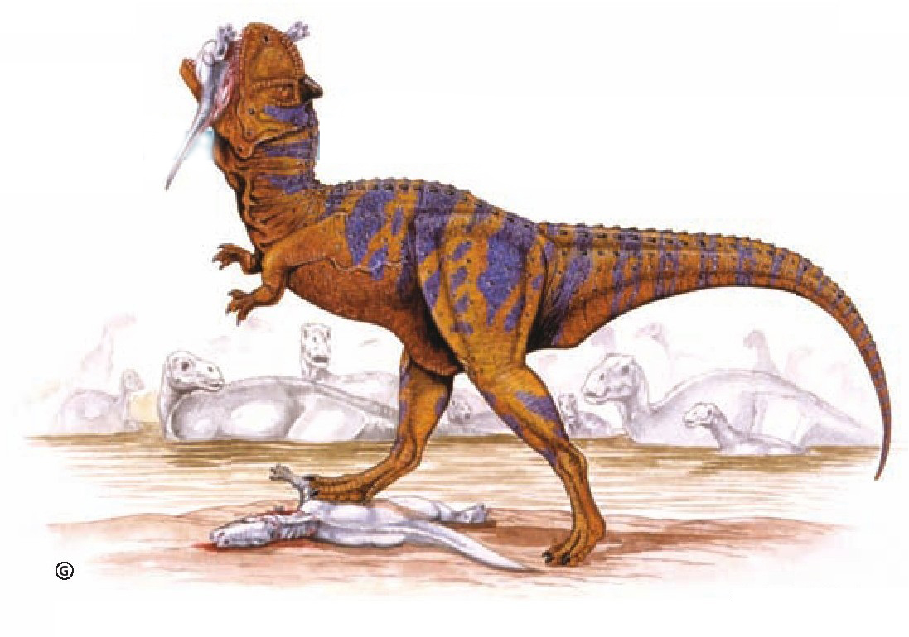
食肉牛龙捕食

除了未完全消化的食物外，恐龙的粪便也可以保存为化石，成为透露恐龙食谱的重要证据。在发现于印度白垩纪晚期的恐龙粪便化石中找到过草本植物和生长在树上的菌类化石，说明生存在这里的植食性恐龙把草和菌类作为食物的一部分。发现于北美白垩纪晚期的超大尺寸粪便化石被认为是霸王龙排泄的，指示这种恐龙不仅吃肉，还吃骨头。然而，与保存于胃部的“晚餐”不同的是，粪便已被恐龙排出体外，所以通常很难确认某一块粪便化石具体是哪种恐龙留下的。

有趣的是，还有一些意想不到的证据证明了某种肉食性恐龙会以某种植食性恐龙为食：在三角龙的头部和肠骨上，以及埃德蒙顿龙的尾部，都发现过暴龙的咬痕，说明暴龙确实会猎食这些大型植食性恐龙；蒙古的国宝——搏斗中的伶盗龙和原角龙化石，向人们展示了伶盗龙也是活跃的捕食动物，而且以原角龙为食。（王烁　张蜀康）

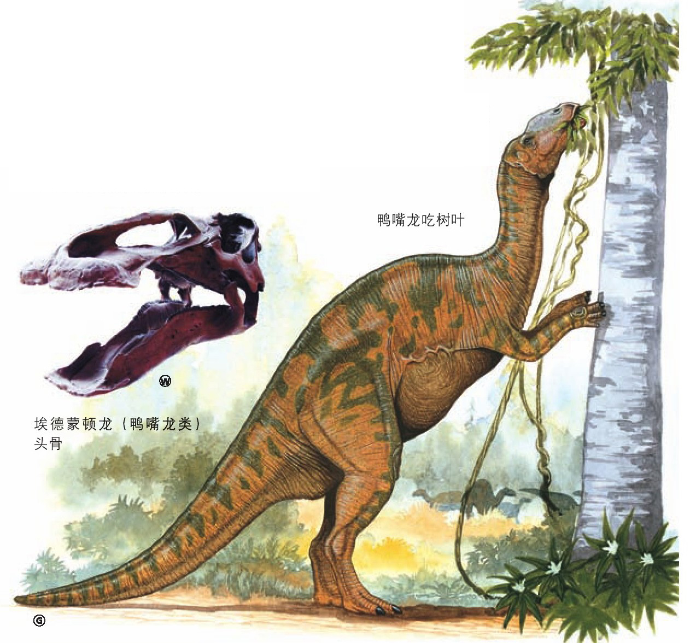
## 恐龙的牙齿是什么样的

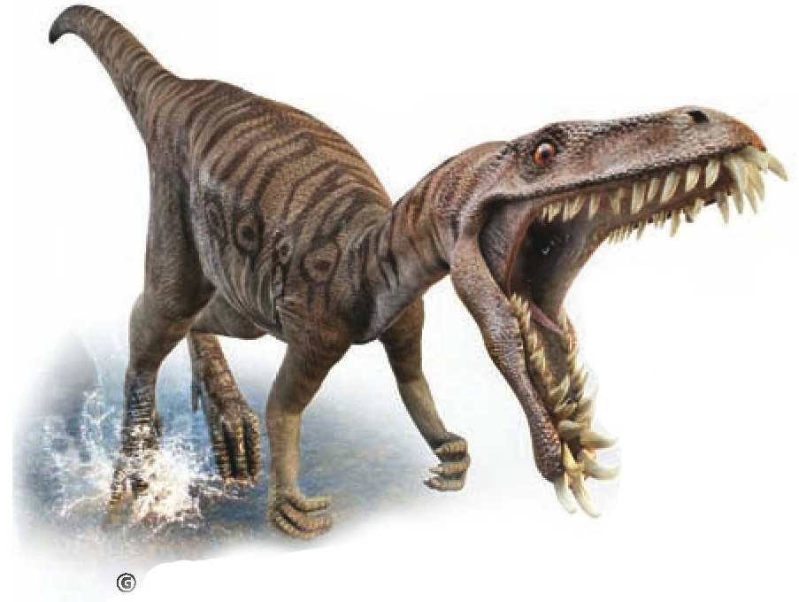
吃鱼的恐龙

吃，对任何动物来说都是生活当中最重要的事情之一。牙齿是食物进入身体后所经过的第一道关卡。都说有一副好牙口才会有好胃口，充分显示了牙齿的重要性。作为史前霸主的恐龙们，它们的牙齿也为它们成功生存上亿年立下了汗马功劳。那么，恐龙们都具有哪些形态各异的牙齿呢？

与人类以及其他哺乳动物不同，多数恐龙的嘴里都长着形态相同的牙齿，而不同种类，尤其是不同食性的恐龙，牙齿的形态则千差万别。

肉食性恐龙无论大小，牙齿差不多都是同一个样子，呈匕首状，微微弯曲，有尖锐的牙尖，边缘还有密密麻麻的锯齿。这样的牙齿显然不能用来咀嚼，它们的主要功能是刺入猎物身体，并将肉撕扯下来，这种进食方式可见于现生的鳄类。满口利刃帮助它们获得的大块美食，最终却没有过多地品尝就被囫囵吞下了。

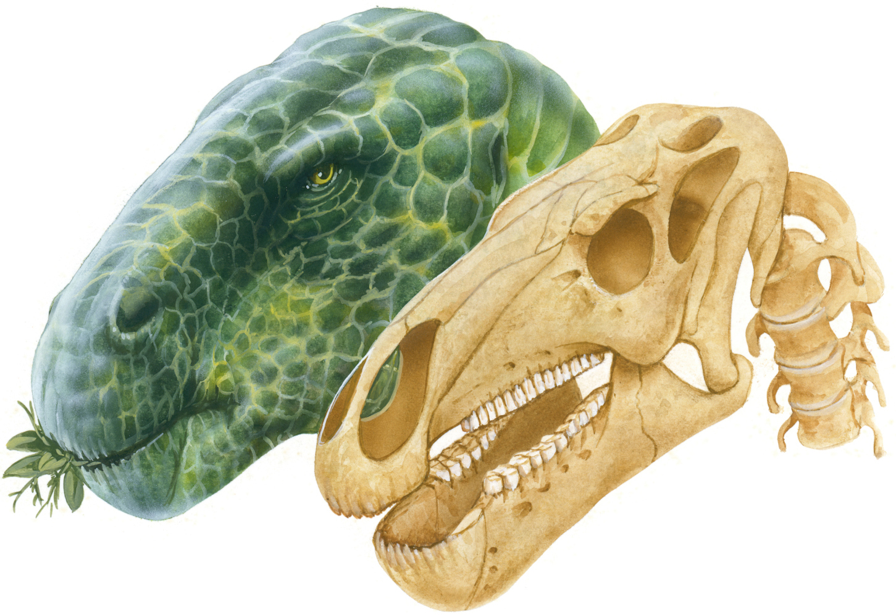
禽龙的牙齿

植食性恐龙牙齿的形态比较多样，因为不同的植食性恐龙所吃的植物种类往往也不相同。甲龙类和角龙类的牙齿形似叶片，牙冠由发育良好且排列整齐的小齿组成；蜥脚类恐龙中马门溪龙的牙齿呈勺状，明显地向内弯曲；梁龙的牙齿呈钉状，像一根根细小的棒子，整齐地排列于嘴的前部；禽龙的牙齿为菱形，边缘有细齿，中央还有突出的棱嵴；鸭嘴龙的牙齿形态与禽龙有些相似，但是数量出奇地多，每个齿骨上有相互重叠的数百颗牙齿，形成搓板状的切磨面，可以对付纤维较多的食物。

令人羡慕的是，恐龙的牙齿不像人类那样一生中只能替换一次，而是终身生长的。老的牙齿掉了或是磨坏了，新的牙齿就长出来顶替。如巴西的一种巨型肉食性恐龙有两排可替换的牙齿，有些鸭嘴龙的齿槽中有4～5个替换齿。植食性恐龙牙齿的替换速度比肉食性恐龙快，其中速度最快的是尼日尔龙，每30天就会将牙齿更新一遍。恐龙们从来不用担心年纪大了因牙齿问题而影响进食。（张蜀康）

## 恐龙为什么要吃石头

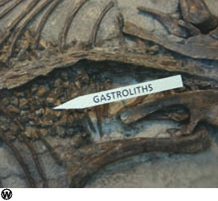
鹦鹉嘴龙腹中的胃石

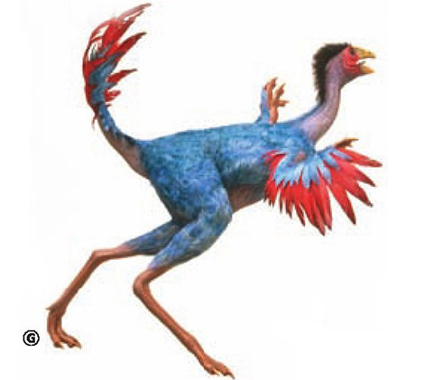
尾羽龙

某些现生鸟类会吞食一些小石头以协助消化，科学家把这些石头叫作“胃石”。当胃蠕动时，这些小石头会帮助研磨食物，加上胃液的作用，进一步分解食物便于吸收。不过不是所有的鸟类都喜欢吃石子儿，只有那些以谷类为食的鸟类才会吞食胃石。恐龙家族中，在一些蜥脚类恐龙（如萨尔塔龙和角龙类的鹦鹉嘴龙）和一些小型兽脚类恐龙（如泥潭龙和尾羽龙）的腹部，也发现有一些磨圆的光滑石子儿。因而，有科学家提出某些植食性或杂食性的恐龙也会吞食一些小石头以协助消化。由于长期摩擦，这些石子连棱角都被磨圆了，如果恐龙失去它们，一定会消化不良。可见，早在鸟类出现之前，吞食胃石帮助消化的习性就已经出现在恐龙的身上。因此，假如在博物馆里看到一只恐龙的肚子里装满了圆溜溜的石子儿，千万不要感到惊讶，那正是科学家要找的恐龙食性的证据。（王烁　张蜀康）

  

**【微博士】**恐龙的粪便化石

粪便化石即石化的排泄物。恐龙的粪便在极为特殊的条件下，通过漫长的地质作用逐步矿化，形成化石。这种化石比恐龙骨骼化石更为罕见，而且往往含有恐龙食谱的信息，因此又被称为“没有臭味儿的宝贝”。

【微问题】同是肉食性恐龙为什么有的牙齿呈锥状、有的呈匕首状？

【关键词】食性　牙齿　胃石

## 恐龙的家是什么样的

大多数的鸟将蛋产在自己精心编织的巢里，并不辞辛劳地哺育后代直至其羽翼丰满；鳄类将蛋埋在自己用植物筑成的隐蔽的掩体里，并用令人望而生畏的大嘴为后代创造安全的成长环境；海龟则不能算是合格的父母，将蛋产在自己挖的沙坑中之后就任其自生自灭。那么恐龙呢？它们是如何建造自己的家，照顾自己的后代的？

自从20世纪20年代瑞典考古学家安德森率领的中亚考察团在蒙古发现了恐龙蛋，就几乎没有人怀疑至少大多数恐龙都是用下蛋的方式来繁殖后代的。然而令人惊奇的是，恐龙在下蛋上花的心思，似乎远比现在的爬行动物要多，因而今天我们有幸能看到千奇百怪的恐龙蛋窝，一窥远古巨兽的家庭生活。

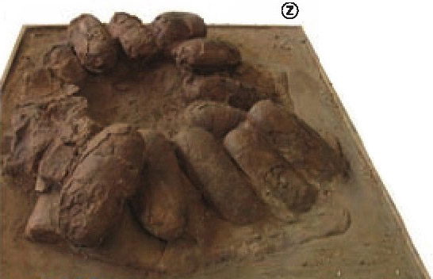
从长形蛋的排列，可知恐龙每次下2枚蛋

目前还没有任何的证据可以证明恐龙能够像鸟儿一样在树上产蛋，这很大程度上是因为蛋必须埋藏在地下才能变成化石。即使恐龙能够在树上筑巢，“覆巢之下安有完卵”，蛋也无法平安地落到地面保存下来。所以，我们看到的恐龙蛋窝，都是在地面筑巢的恐龙留下的。它们或者像海龟一样挖坑，把蛋埋起来；或者清理出一片平地，将蛋按一定的次序产在上面；或者筑起一个碗形的巢穴，将蛋产在里面（如慈母龙）；或者堆起一个小土堆，让蛋斜靠在上面（如长形蛋）。还有一些恐龙蛋，它们的埋藏方式没有什么明显的规律，以至于科学家无法推断它们的妈妈是如何筑巢的。

恐龙蛋按外观大体可分为圆形和长形两类。其中形如长条面包的这一类长形的蛋，被认为是窃蛋龙所生，现在已经找不到与之形态相似的蛋了。它们在蛋窝中的排列方式也颇为奇特：这些蛋通常围绕着一个小土堆像花瓣一样呈放射状排列，蛋斜靠在土堆上，大的一头向着圆心，小的一头向外，并且两枚两枚地配对。这些长形的蛋大小相差悬殊。较小的10～20厘米长，在窝中还堆成了2～3层，所以一窝蛋的数量可以达到20多枚；较大的40～60厘米长，只堆1层，但是由于蛋窝直径很大，所以一窝蛋的数量并不比小的长形蛋少。有些情况下这些蛋没有围成一个整圈，而是空出了一个缺口，科学家推测恐龙妈妈是蹲在圆圈中央下蛋，最后给自己留了一条出来的路。

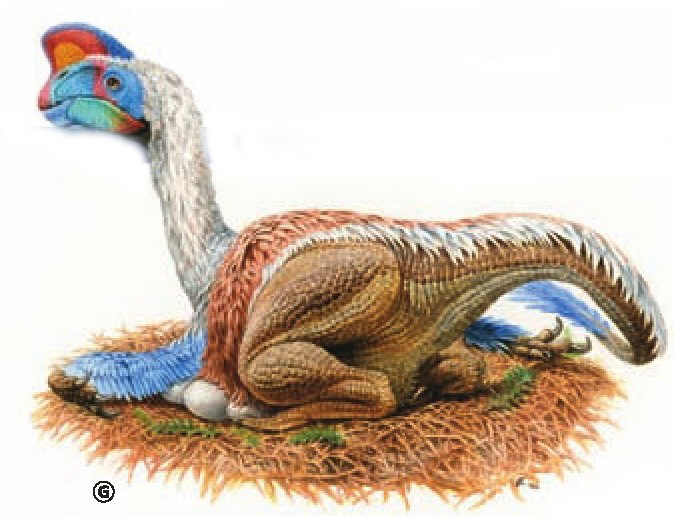
原以为窃蛋龙是偷其他恐龙的蛋，后来发现很可能是窃蛋龙自己在孵蛋

根据蛋在窝中的排列方式，科学家复原了恐龙妈妈产蛋的过程：这是一只两足行走的恐龙，它先用爪子堆起一个小土堆，然后蹲在土堆上方，每次同时产出2枚蛋，蛋便落在土堆的斜坡上；它一边产蛋一边转圈，直到产完一整圈蛋；把这一圈蛋用土盖起来后，再用同样的方法产下一圈蛋。这里还有一个问题：为什么恐龙妈妈在产蛋前一定要先做一个土堆？原来这些长形蛋的蛋壳相对于蛋本身的大小来说太薄了，如果平放在地上就很容易被压碎，有些小的长形蛋甚至是完全直立在地面上的。恐龙妈妈为了自己的宝宝能够安全地破壳而出就想出了这样一个绝妙的办法，我们是不是应该佩服它们的智慧呢？

与长形蛋相比，圆形蛋的排列方式就更加多样了。有些蛋杂乱无章地堆成一堆，可以想象它们的妈妈是像海龟一样将蛋下在坑里；有些蛋是一个一个地整整齐齐摆成一片，可见它们的妈妈在产蛋前一定有过仔细的规划；还有些蛋乍一看是随意生下的，整体上却排成了一个弧形，有可能这些恐龙也是一边下蛋一边转圈的。从一窝蛋的数量上看，圆形蛋的变化范围也更大，从将近10枚到60多枚不等。因为我们经常不能确认所看到的蛋窝是否完整，所以往往很难知道一窝蛋确切的数量。（张蜀康）

  

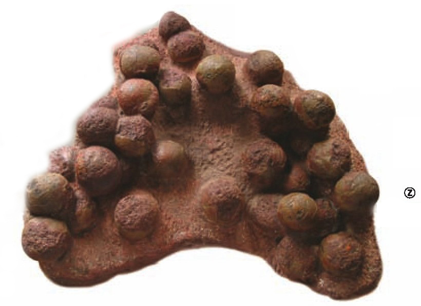
圆形蛋化石的排列方式

**【微博士】**恐龙蛋

恐龙蛋是一类特殊的化石，它并不是恐龙身体的一个组成部分，而是被恐龙排出体外的卵形成的化石。因为一般情况下无法知道具体是哪种恐龙产下了哪种类型的恐龙蛋，所以需要对恐龙蛋单独分类和命名。命名时经常根据蛋的外形或蛋壳显微结构特征来称呼某一类恐龙蛋，如长形蛋类（蛋的外形为长形）、圆形蛋类（蛋的外形为圆形）、树枝蛋类（蛋壳显微结构像分叉的树枝）等。

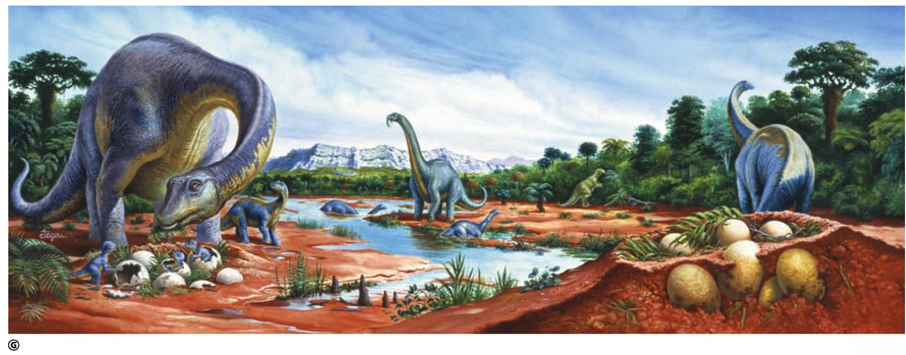
恐龙的蛋坑

## 恐龙妈妈会照顾小宝宝吗

一般来说，在脊椎动物中，亲代对子代的照顾是哺乳动物和鸟类这样的高等动物的特殊行为方式。绝大多数鱼类和两栖动物在产卵或者孵化以后就会将后代弃之不顾，任其自生自灭。而爬行动物的卵产于陆地上，环境相对复杂，它们对后代的处理方式不尽相同。龟类产卵后便万事大吉，卵的孵化以及幼龟的出生都只能听天由命，多数蜥蜴和蛇也是如此。但是有个别的爬行动物，尤其是胎生的种类，会在卵孵化以后，或者在幼体出生后，陪伴其一段时间，以确保后代在生命的最初阶段免受其他动物的攻击。雌鳄会在卵孵化以后将幼鳄转移到附近的水塘中，并照顾一段时期。这称为亲代照顾。那么，恐龙是不是也会亲代照顾呢？

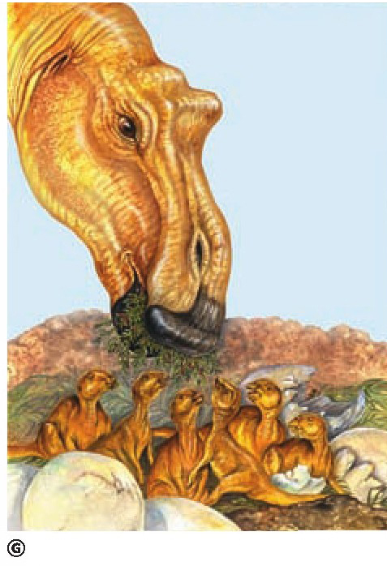
慈母龙可能会照顾刚出壳的孩子

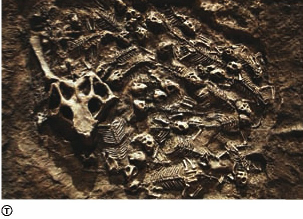
辽西发现的鹦鹉嘴龙“幼儿园”

在蒙古发现的一件窃蛋龙伏在自己蛋窝上的珍贵标本透露了这方面的信息。对于这只窃蛋龙究竟在做什么，科学家还在争论不休：有人认为它在孵蛋，有人认为它在保护自己的窝，还有人认为它也许正在生蛋。总之，大多数人都同意窃蛋龙是会照顾自己的蛋窝的。更进一步，小恐龙出壳之后的情况又是怎样的呢？一个经典的例子来自美国：1979年，两位科学家在蒙大拿某偏僻山区的一个碗形的凹坑里及其附近不远处，发现了总共15具小鸭嘴龙的骨骼，认为它们是一群嗷嗷待哺的“孩子”，由此推断它们的妈妈会给它们带来食物，直到它们能够自立。这种恐龙也因此得名为慈母龙，名字里蕴含了母爱的意思。但是，新的研究却表明这些小恐龙可能已经有能力独立生活。另外，由于慈母龙的成年个体并不是在这些小恐龙附近发现的，所以慈母龙实际上是否会照顾已出壳的孩子到目前为止还没有定论。然而，令人兴奋的是，发现于中国辽宁西部的一处鹦鹉嘴龙“幼儿园”，又为解决恐龙是否照顾孩子这一问题带来了曙光。34只小鹦鹉嘴龙和一只成年鹦鹉嘴龙被瞬间埋葬在一起，可以想象这只成年恐龙为保护孩子们所做出的各种努力。也许它是小恐龙们的妈妈，也许鹦鹉嘴龙像现在的帝企鹅一样，从群体中挑出一名“志愿者”看护整个群体中的小恐龙。但需要指出的是，现有的化石证据非常有限，成体和幼体保存在一起是否由其他原因造成的呢？期待着更多化石证据的出现，来解答这些问题。不管怎么样，来自不同恐龙类群的化石似乎表明，在自己的后代面前，恐龙很可能是充满温情的动物。（张蜀康）

  

【微问题】恐龙父母如何辨认自己的小宝宝？

【关键词】恐龙蛋　慈母龙　窃蛋龙　鹦鹉嘴龙　亲代照顾

## 为什么说恐龙灭绝的因素多种多样

白垩纪末发生了地球生命史上罕见的集群灭绝事件，恐龙家族在这次事件中遭遇灭顶之灾。人们提出了许多假说来试图解释恐龙灭绝的原因，其中最著名的就是美国物理学家阿尔瓦雷斯等人提出的“小行星撞击说”。他们认为，在白垩纪末，一颗直径约10千米的小行星与地球相撞，撞击激发出的尘埃、水蒸气等物质弥漫于大气层，阻隔了阳光，使食物链崩溃而导致恐龙灭绝。自从在墨西哥的尤卡坦半岛发现6500万年前的陨石坑以来，恐龙灭绝的问题似乎已经有了明确的答案。但是，只要人们再进一步思考，疑问就永无止境，像这样彻底扫荡式的灭绝方式，为何只杀死了包括恐龙在内的一部分生物？从另一个角度来看，如果小行星撞击的破坏作用并没有假设的那样剧烈，那么它真的有足够的能力杀死所有的恐龙吗？一些研究指出，过去认为恐龙在白垩纪最末期突然消失的现象也许不是真的，有些数据分析显示，白垩纪末，恐龙的衰落实际上经历了相当长的时间，也许有100万年，甚至更长。换言之，在小行星撞击之前，恐龙家族已经开始衰落了。情况是不是这样的呢？把所有恐龙的灭绝归咎于小行星撞击，显然还需要更多的证据。现在很多人相信，恐龙的灭绝是很复杂的原因造成的，小行星可能只是其中一个因素而已。下面再介绍几种其他的假说。

印度次大陆等地大规模的火山喷发也被认为是导致恐龙灭绝的原因。火山喷发时会产生大量的有毒气体、炽热的熔岩流、火山碎屑流和火山灰等有害物质，并且还会造成地震、海啸等次生灾害。这些因素除了可以直接杀死恐龙之外，还可对周边的环境造成长久的污染。中国学者的研究表明，这种微量元素的污染可以影响到恐龙的生殖功能，导致恐龙蛋出现病变，孵化率显著降低，恐龙就因此断子绝孙。

还有一些假说认为，恐龙可能是因为身体不能适应新出现的被子植物而被毒死，或是因为无法与崛起的哺乳动物竞争而遭到淘汰，或是不能适应降低的气温而被冻死。这些假说从各个侧面揭示了恐龙生活环境中可能存在的不利因素。但需要强调的是，任何一个假说和支撑它的证据都有适用的范围和局限性，都不能解释所有恐龙消亡的原因。所以像恐龙灭绝这样复杂的事件，也许永远无法得知它具体是怎样发生的。不过正因为如此，科学家才有不断探索的动力。（张蜀康）

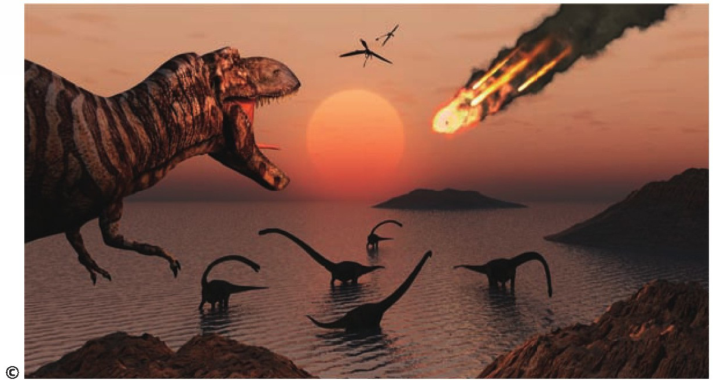
小行星撞击

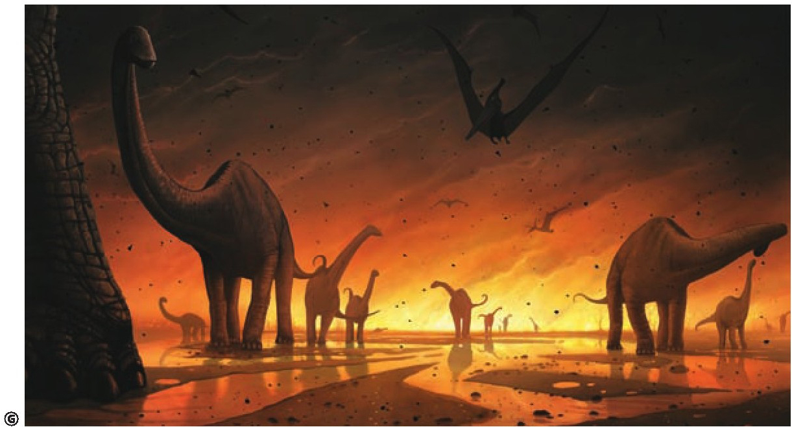
火山喷发

## 恐龙可以被克隆重生吗

在著名的科幻小说《侏罗纪公园》中，讲述了一个如何复活恐龙的故事。生活在恐龙时代的雌性蚊子吸取了恐龙的血液，并及时地被树脂所包裹，形成了琥珀化石，科学家通过提取蚊子体内的恐龙血液中的DNA，就克隆出活的恐龙来了。然而这个故事真的可信吗？

科学家已经成功地从年代较近的哺乳动物化石中（例如猛犸象）提取出了较完整的古DNA，但是要获得完整的恐龙古DNA信息是不可能的。DNA会随着时间的流逝而逐渐降解，距今已超过6500万年的恐龙DNA，不用说完整的古DNA信息，就连片段都很难保存下来。即便足够幸运找到了恐龙DNA的片段，对于克隆恐龙来说也远远不够。这就像一个完整的句子被删除了很多词汇而变得支离破碎一样，没有任何意义。

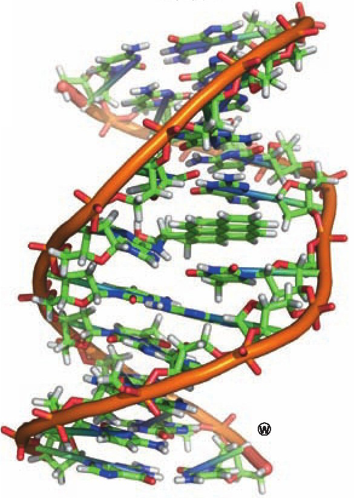
DNA结构模型

有没有办法将这个残破的句子补充完整呢？也许科学家可以通过与恐龙亲缘关系比较近的一些生物，例如鳄类和鸟类，进行比较分析而推断出失去的古DNA信息。恐龙是现生鸟类的祖先，应该共享相似的DNA信息。科学家可以修正鸟类的DNA信息，使其回到恐龙DNA所具有的状态。但是如何修正鸟类的DNA又是一个非常困难的工作，毕竟在生物的演化过程中，基因发生了很大的变化，而要寻找这种变化的轨迹几乎是不可能的。乐观地说，就算能够获得完整的恐龙DNA，离最终目标还差很远。因为恐龙的DNA需要组装成染色体，并且放入合适的细胞中才能够表达。不幸的是，我们既不清楚怎样将恐龙的DNA组装成染色体，更没有合适的细胞去容纳这些DNA。以上情况显示，以现在的技术水平是无法克隆真实恐龙的。（韩凤禄）

## 恐龙的声音是怎样复原的

与恐龙之间具有较近亲缘关系的鳄类和鸟类可以发声，所以人们推断恐龙很可能也是可以发声的。在科幻电影中，经常能听到各种各样的恐龙的叫声，如霸王龙的怒吼、鸭嘴龙的长鸣。其实这些都是人们以现生的爬行动物和鸟类为原型，并加入了一些想象成分而创造出来的。从现生的爬行动物和鸟类来看，发声的器官为软组织结构，并不能形成化石。所以，从化石中不可能准确地知道恐龙是否发声以及怎样发声。化石中唯一与发声有关的证据存在于一些鸭嘴龙中。这些鸭嘴龙头顶上有一个长的嵴冠和鼻腔连通，里面是中空的。科学家认为这种结构类似现在的喇叭，能让声音变得长而低沉，从而传播得更远。通过吹奏这些“喇叭”，也许真的能够听到鸭嘴龙们那来自远古的呼唤声。（韩凤禄　张蜀康）

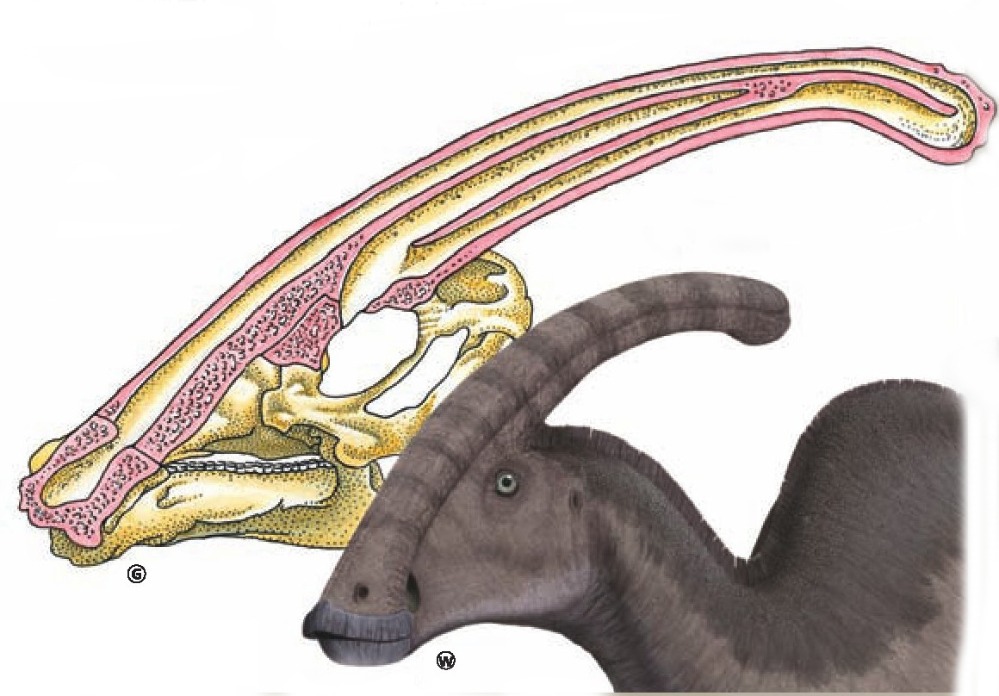
长嵴冠的鸭嘴龙类

  

**【微博士】**恐龙的皮肤化石

不仅骨骼、牙齿等硬组织能够形成化石，在一些特殊的情况下，一些软组织包括皮肤也能够形成化石。例如，在北美发现了很多鸭嘴龙的皮肤印痕化石。从已发现的恐龙皮肤化石来看，它们大多像现生的爬行动物一样，具有各种各样的鳞片。在中国辽宁也发现了很多带有羽毛印痕的恐龙化石，表明许多恐龙是体披羽毛的。

【微问题】导致恐龙灭绝的可能是彗星吗？

【关键词】灭绝　DNA　克隆　鸭嘴龙　声音　皮肤印痕化石

辽西早白垩世热河生物群生态复原图

## 为什么说鸟类是恐龙的后裔

赫胥黎

关于鸟类祖先的最早推测，恐怕已经不太容易考证。与达尔文同时代的英国科学家赫胥黎于1868年第一次正式提出鸟类起源于恐龙假说。随后的几十年间，大多数人都相信鸟类是恐龙的后裔。不过，到了1926年，一位名叫海尔曼的丹麦科学家提出：鸟类尽管和恐龙十分相像，但恐龙并不是鸟类的祖先；恐龙和鸟类具有相当近的亲缘关系，它们都是从更原始的一类被称为“槽齿类”的灭绝爬行动物演化而来的。随后大约50年的时间里，人们又普遍相信鸟类并不是恐龙的后裔。

到了20世纪70年代，伴随许多恐龙化石的新发现，鸟类从恐龙演化而来的观点卷土重来。以美国著名的恐龙学家奥斯特罗姆为代表的一批学者提出，鸟类确实就是从一类个体比较小的兽脚类恐龙直接演化而来的。有趣的是，从那时开始，古生物学家开始接二连三地发现新化石，滚雪球般地提出了越来越多的证据，有人认为“鸟类是恐龙的后裔”的理论已经到了不容推翻的地步。

说到这里，不能不说的是，最近十几年来从中国发现的许许多多精美的恐龙化石起到了最为关键的作用。1996年中国辽宁朝阳的一位农民发现了一件小恐龙化石，后来被命名为“中华龙鸟”。这就是世界上第一件带羽毛的恐龙化石。在随后的10多年内，中国科学家又从辽宁、内蒙古和河北发现了中国鸟龙、尾羽龙、小盗龙等许多带羽毛的恐龙。带羽毛的恐龙为什么那么重要呢？其实不难发现，羽毛是现生鸟类区别其他动物的最明显标志。羽毛的结构又十分复杂，很难想象恐龙的羽毛和鸟类的羽毛没有关系。既然如此，发现恐龙有与鸟类相似的羽毛，就成为支持“鸟类是恐龙的后裔”理论的最有力证据。

其实，不仅恐龙的羽毛非常重要，恐龙的骨骼也隐藏了太多的秘密。如果把最古老的鸟类——始祖鸟，和辽宁发现的近鸟龙的化石放在一起，一般人恐怕很难发现两者之间究竟有什么不同。它们嘴里都有牙齿，翅膀上都有爪子，每个翅膀上都长3指，而且每指的指节数都是一样的，尾巴都是由几十个尾椎骨组成。不少过去只在鸟类中才能发现的骨骼特征居然在恐龙中开始出现了。

除了羽毛和骨骼，古生物学家还发现了恐龙和鸟类更多的相似之处：中国辽宁发现的一件寐龙化石居然保存了和鸟类一样的睡眠姿态；蒙古发现的窃蛋龙原本不是“窃蛋的盗贼”，而是窃蛋龙在孵化自己下的蛋，这样的行为和鸟类何其相似……

一开始人们发现的许多带羽毛的恐龙化石所处时间距今只有大约1.25亿年，而最早的鸟类1.5亿年前就已经出现。少数学者提出疑问：如果鸟类是从带羽毛的恐龙演化来的，那么为什么没有比始祖鸟更早的带羽毛的恐龙发现呢？幸运的是，中国的古生物学家还确确实实发现了这样的鸟类的祖先，好几种距今大约1.6亿年的带羽毛的恐龙（如耀龙、近鸟龙）已经为这个疑问提供了几乎完美的答案。

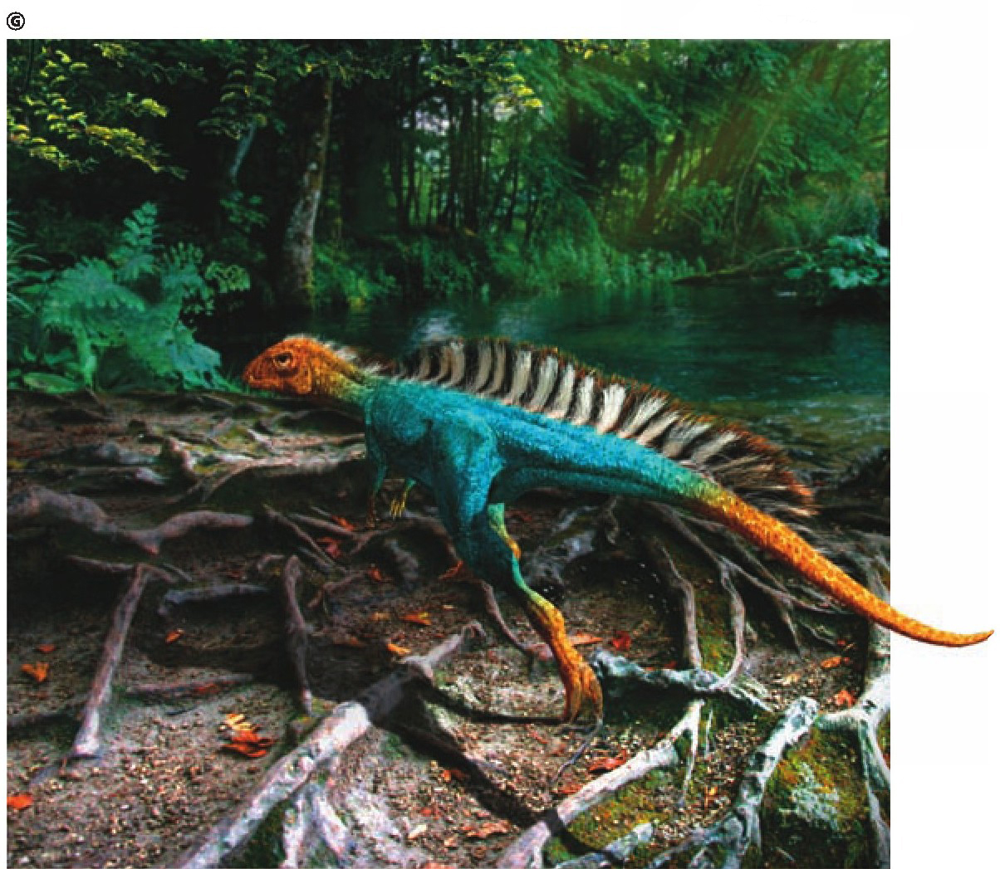
天宇龙

可以说，最近几十年古生物学家取得的一个个惊人的发现和方方面面的证据都指向一个结论：鸟类确实是恐龙的后裔。（周忠和）

## 为什么和恐龙同时代的一些其他生物没有灭绝

中生代的霸主——庞大的恐龙家族，在白垩纪的集群灭绝事件中退出了地球舞台，留下了无尽的遐想和无数的谜团。其中之一就是：在这样一个集群灭绝事件中，为什么许多其他生物却躲过了这一劫难，生存下来了？

如果回顾地球的演化历史，会发现类似的集群灭绝事件发生过多次，甚至有规模更大的集群灭绝事件。但不管多大规模的生物灭绝事件，不管发生过多大的灾难，总有生物会生存下来，否则就不会有人类，不会有今天的五彩缤纷的生物世界了。从这个角度上说，和恐龙同时代的一些生物没有灭绝是非常正常的。另一方面，从恐龙的灭绝中能否找到许多其他生物类群在这次集群灭绝事件中能幸存下来的原因呢？

坦率地说，至今没有一个很好的答案，也许永远也找不到一个确切的答案。不过，科学家还是给出了一些可能的原因。如果仔细分析，会发现一个现象：幸存下来的动物似乎有两个特点，或者是生活在水中的生物，或者是个头小的生物。这说明，白垩纪末的集群灭绝事件对于陆地生物的影响要大于水生生物，对个体大的生物的影响要大于对个体小的生物。这似乎可以从生物演化的一些规律来解释：在环境巨变的时候，水体环境要相对稳定一些；个体小的生物繁殖速度快，适应环境的能力强。不管怎么解释，归根结底，一些生物能够生存下来的原因一定是它们对环境的适应性要强于另外一些生物，恐龙显然不能适应白垩纪最末期的环境巨变，最终灭绝。但恐龙的一支——鸟类，却进入了天空，开辟了一个新的生存空间，演化成一个新的庞大家族。（徐星　张蜀康）

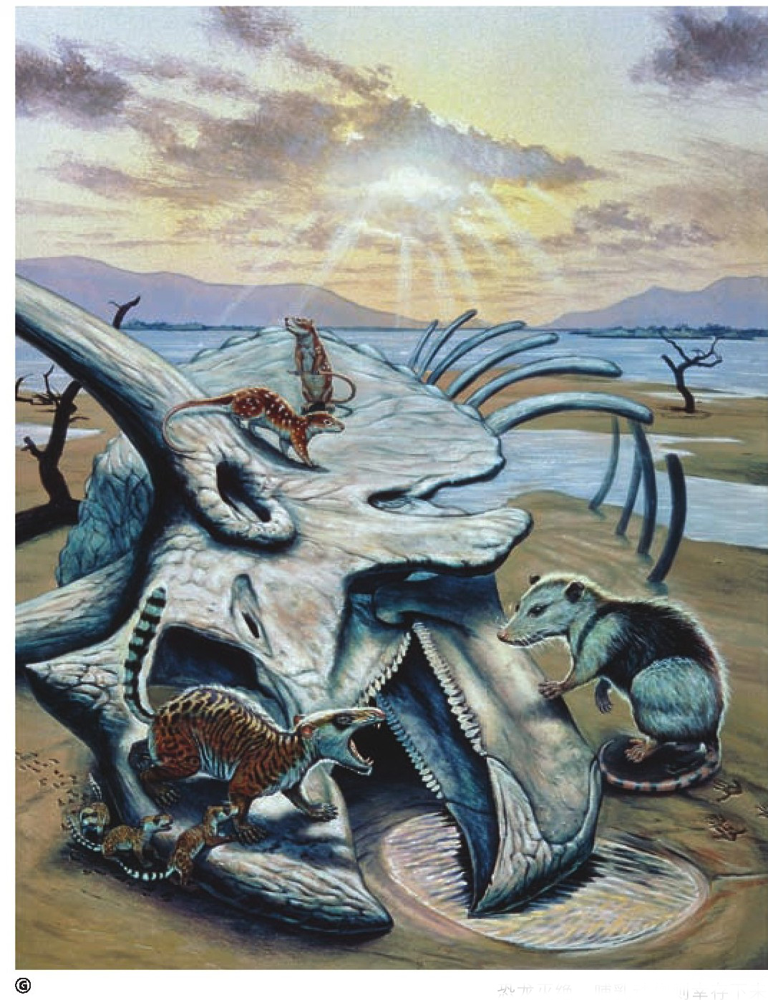
恐龙灭绝，哺乳动物则幸存下来

  

**【微博士】**吃恐龙的中生代哺乳动物

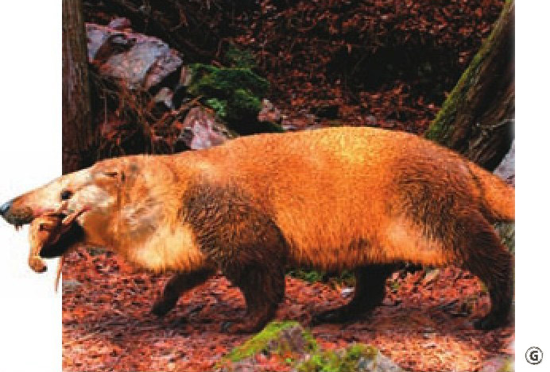
和恐龙同一时代的哺乳动物大多是体形弱小的，但也有一些例外。在中国辽宁发现的爬兽是已知中生代个体最大的哺乳动物，属于三尖齿兽类。它们的身长超过1米，体重达14千克。在爬兽的胃中，人们竟然找到了尚未消化的小鹦鹉嘴龙的骨骼残骸。这大大改变了人们的传统认识，原来中生代的哺乳动物并不都是弱小无助，生活在恐龙的阴影下，爬兽等大型肉食性哺乳动物甚至能以恐龙为食。但爬兽是主动捕食小恐龙，还是吃恐龙的尸体，目前还没有明确的答案。

【微问题】恐龙的羽毛和鸟类的羽毛一样吗？

【关键词】鸟类　中华龙鸟　恐龙　后裔　天宇龙　中国鸟龙　灭绝　爬兽

## 始祖鸟是鸟类最早的祖先吗

从1861年起至今，在德国陆续发现了12件始祖鸟的化石。这种动物的身体结构一半像鸟一半像爬行动物，它们羽毛的分布和结构同现生鸟类几乎没有两样，不过其他方面又和鸟类不太一样，例如尾骨非常长，嘴里有牙齿，翅膀上还保留了锋利的爪子，这些特征和爬行动物更加相似。于是从一开始，始祖鸟就被鉴定为爬行动物向鸟类演化的过渡类型。100多年来，科学家都已经习惯了将它作为支持达尔文进化论的最重要的过渡型生物。

那么，为什么说它是最原始的鸟呢？要回答这个问题，就要先回答什么是鸟。对于现生的动物来说，这不难回答，鸟类有羽毛，也能够飞行，与其他动物的区别一目了然。始祖鸟是有羽毛，但它会飞吗？能飞多高？尽管对此还有争论，但长期以来，大多数的科学家还是认为，不论始祖鸟的飞行本领有多大，既然有了鸟类特有的羽毛，算作最古老的鸟类也是可以的，况且分类和命名的一个最重要原则是约定俗成。再者，也没有发现比始祖鸟更古老甚至是同期的其他鸟类。所以，100多年来始祖鸟是鸟类最早祖先的地位并没有经受真正的挑战。

始祖鸟化石

2011年，中国恐龙学家在英国《自然》杂志发表了一篇文章，基于对新化石的发现和分析，认为始祖鸟其实不是鸟类的始祖，而是和近鸟龙关系最近的一种带羽毛的恐龙。这篇文章代表了对始祖鸟地位的最强烈的挑战。难道100多年来鸟类始祖的地位就此要发生动摇了吗？科学家的反应并不一致。一些国外学者发文对此提出不同的意见，他们用了不同的分析方法得出结论：始祖鸟依然是鸟类最早的祖先。

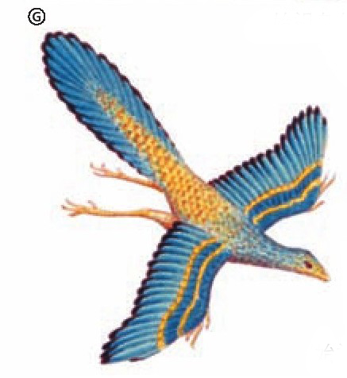
始祖鸟

其实，从20世纪90年代开始，随着中国发现了越来越多带羽毛的恐龙化石，羽毛作为鸟类的独有标志特征也随之成疑。不仅如此，许多过去认为鸟类才有的骨骼特征也在恐龙中被发现了，于是鸟类和恐龙的界线变得不再像以往那样泾渭分明了。始祖鸟还是鸟类最早的祖先吗？或许今天还不能提供十分肯定的答案，因为科学往往是在不断地争论中取得进展的。相信随着更多的研究工作的进展，科学家最终能达成比较一致的意见。（周忠和）

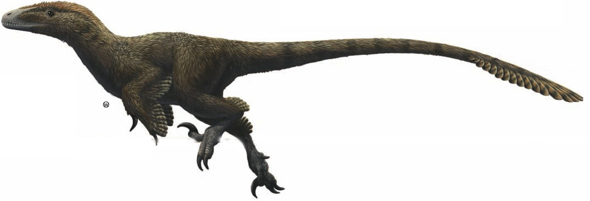
像犹他盗龙这样的兽脚类恐龙很可能身上长有羽毛

## 中华龙鸟是龙还是鸟

1996年，在中国辽西出土了一件以前从来没有发现过的奇特的动物化石，并很快轰动了世界。该动物看上去像一条小的恐龙，满嘴长有锋利的牙齿，身后还有一根很长的尾巴，但最奇怪的是身上似乎披满了一些毛茸茸的东西。难道这是羽毛吗？它是最原始的鸟类，还是带羽毛的恐龙呢？中国科学家围绕这件稀有的化石开始了紧张的研究和讨论，很快有学者在一份中国杂志上发表论文，给动物起了个名字，叫“中华龙鸟”。他们认为，该动物既然已经长了和鸟羽相似的羽毛，就应当属于鸟类，而且它应当就是鸟类的始祖。

对于该结论，大多数的科学家却持不同的看法。他们认为，该动物其实是一种新的恐龙，虽然有了原始的羽毛，但骨骼特征显示，它还不能称为鸟。不久，中外科学家经过细致的研究，在《自然》杂志上合作发表了对中华龙鸟的研究结论，认为它其实是一类小型的兽脚类恐龙，再准确一些说，它属于美颌龙科。科学家还进一步确认它拥有最原始的羽毛。因此，中华龙鸟其实不是鸟类，它和鸟类有比较近的亲缘关系，但还不是鸟类最直接的祖先。某些恐龙，如奔龙、窃蛋龙等，其实和鸟的关系都比中华龙鸟更加接近。

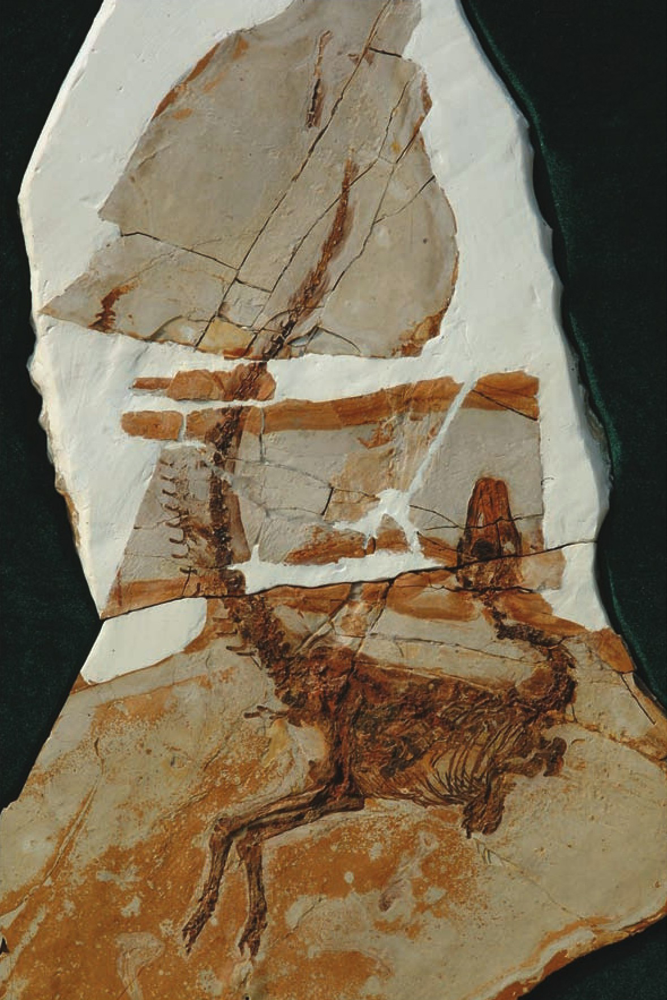
中华龙鸟化石

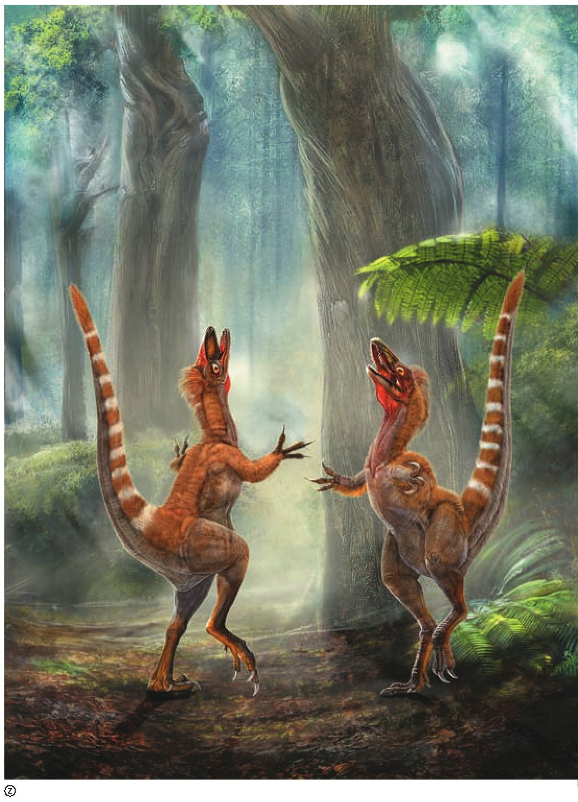
中华龙鸟

如今，中华龙鸟虽然终究没有成为鸟类的始祖，但作为第一个被发现的带羽毛的恐龙化石，它的历史地位无疑是十分重要的，可以说这一发现揭开了恐龙发现和研究历史上的一个新篇章。（周忠和）

  

**【微博士】**辽西古生物化石

1.6亿～1.2亿年前，中国的辽西地区有着大片的森林和沼泽，也有许多河流和湖泊。当时的火山活动频繁，火山的突然喷发经常会导致大量的生物死亡，很多生物落入水中，并迅速被火山灰掩埋，形成了化石。因此辽西地区得以保存很多精美的化石，成为世界级的化石宝库。辽西的兽脚类恐龙和原始鸟类化石，不仅保存了骨骼等硬体部分，还完整地保存了相当多的包括羽毛、皮肤、胃残余物和其他软体组织，为研究恐龙向鸟类演化提供了宝贵的资料，为全世界古生物学家所瞩目。

【微问题】为什么古生物的分类经常有变化？

【关键词】始祖鸟　中华龙鸟　辽西古生物化石

## 鸟类祖先是如何学会飞行的

如今越来越多的古生物学证据表明鸟类是从恐龙起源的，那么鸟类的始祖又是如何学会飞行的呢？对这个问题，科学家已经研究了很多年，然而至今仍没有取得很一致的意见。

有关鸟类飞行的起源，传统上有两种对立的假说：一种通常被称为“树栖起源假说”，该假说支持者认为，最早鸟类的飞行应当是从爬树开始的，通过在树枝间的跳跃、滑翔逐渐完善了自己的飞行器官；还有一种假说叫作“地栖起源说”，持该假说的人认为，鸟类的祖先通过在地面的快速奔跑逐渐获得了飞向蓝天的本领。持后一种假说的代表人物是从20世纪70年代开始复兴了“鸟类起源于恐龙”假说的美国古生物学家奥斯特罗姆，他甚至认为鸟类的祖先在奔跑过程中用翅膀捕捉昆虫，然后才逐渐演化出扇翅飞行的本领。

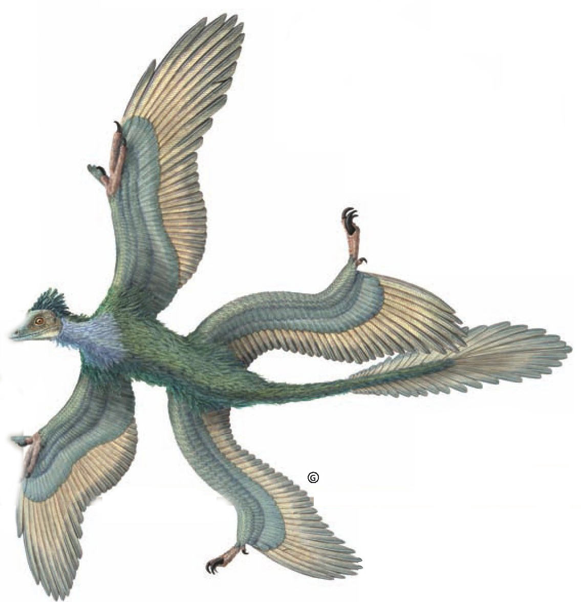
顾氏小盗龙

在中国发现了很多被认为是鸟类的恐龙祖先类型的化石，大大推动了对这一问题的研究。从2000年开始，中国古生物学家陆续发现了几种树栖型的小恐龙化石，譬如赵氏小盗龙、树息龙等化石，这表明鸟类祖先是有能力上树的。更令人惊奇的是，从2003年起，又找到了长有4个翅膀的恐龙化石，如顾氏小盗龙和近鸟龙等。这些小型恐龙的身体大小与早期的鸟类相差无几，不仅具备了爬树的本领，而且腿上拖着长长的羽毛，它们显然不可能在地面快速奔跑。因此大量中国化石的发现无疑给了“树栖起源假说”巨大的支持，也得到了越来越多学者的认同。可以想象鸟类祖先在学习飞行的过程中，曾经有过用4个翅膀滑翔的阶段，只是到了后来，才慢慢变成用2个翅膀飞行的鸟类。

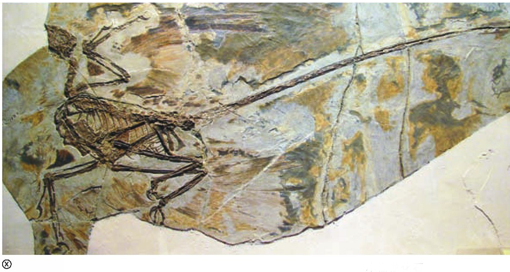
小盗龙化石

然而，关于鸟类如何学会飞行的认识和争论似乎到现在还没有结束。有人通过模拟分析后提出，像始祖鸟这样的最早鸟类在奔跑过程中，通过扇翅就能获得起飞的动力；还有人认为，无论是奔跑还是爬树，在最早鸟类的飞行学习中可能都发挥过或多或少的作用。随着对鸟类起源过程认识的不断深入，鸟类祖先学习飞行的图景也将会变得越来越清晰。（周忠和）

## 为什么有些鸟类不会飞

鸟类因为会飞翔而区别于其他现生脊椎动物，不过见过鸵鸟的人都知道，并不是所有的鸟类都会飞。那么，为什么有些鸟类不会飞了呢？远古时期是不是也存在不会飞的鸟呢？其实飞行虽然给鸟类生活带来了巨大的便利，但是飞行同样也十分耗费体能，因此一旦鸟类的生存压力减小以后，它们很容易因“偷懒”而不想飞行的。从已知的化石记录来看，早在白垩纪的晚期，就已经出现一些失去了飞行能力的鸟类。只是到了6500万年后的新生代，当传统意义的恐龙完全消失之后，地球上才出现了许多体形巨大、完全失去飞行能力的鸟类。

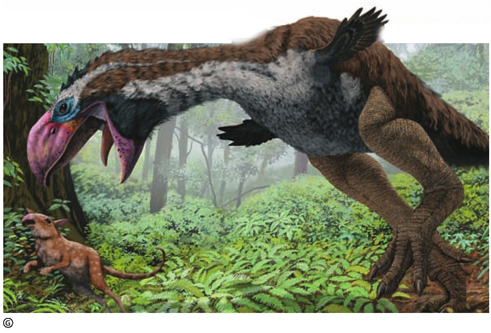
不会飞的加斯顿鸟称霸于5000万年前

5000万～4000万年前，鸟类是当时陆地上最强大的食肉动物。这一时期，大型的哺乳动物多是吃植物的，吃肉的哺乳类与这些大型的鸟类相比，还显得太小。当时称霸陆地的鸟类一般翅膀极度退化，毫无飞行能力，但双腿发达，能快速追捕猎物，通常长着大头，还长有可怕的喙。

这些令人恐怖的鸟类化石多半发现于欧洲和美洲地区，如加斯顿鸟。不过从20世纪80年代开始，中国河南也出土了一种大型肉食性鸟类的化石骨骼。科学家根据产地把它命名为中原鸟，年代约为5000万年前。这意味着在古老的中国大地上也曾经漫步着一些凶猛的大型鸟类。

不过，不会飞的鸟类也不都是凶猛的猎食者，有些巨型鸟类其实很温和。会飞和不会飞其实都是一种适应，但有一点似乎是肯定的，一旦鸟类的飞行器官退化了，想要再飞起来就没有可能了。（周忠和）

## 鸵鸟是什么时候开始出现的

鸵鸟是现存最大的鸟类。它们有长长的脖子，小小的脑袋，一双修长的腿，跑起来轻盈有力。因为翅膀退化，它们已经完全不能飞行。因为体形巨大，骨骼也比较粗壮，因此相对来说，古老的鸵鸟似乎应该比较容易保存为化石，但事实并不是这样：已发现的鸵鸟化石很少，即使保存下来也很不完整。

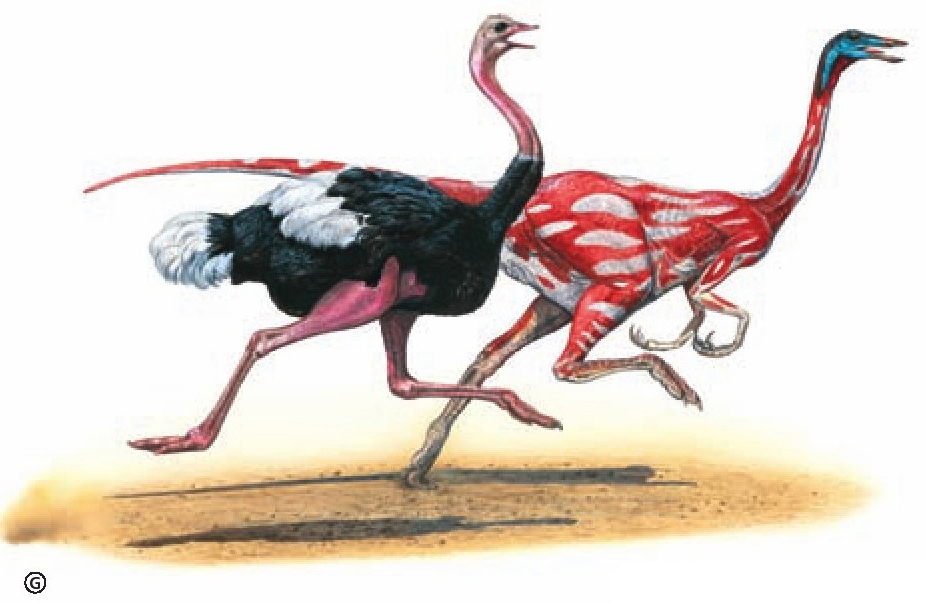
鸵鸟和似鸵龙很像，但出现要晚得多

尽管与鸵鸟相似的鸟类化石，在4000万年前的始新世就开始出现了，但一般人认为，经过确认的具有现生鸵鸟特征的化石，最早的是在非洲发现的，属于早中新世，距今大约有2000万年。但此类化石材料非常有限，且仅存少量腿部的骨骼化石。

中国甘肃和政临夏盆地发现的临夏鸵鸟，属于晚中新世，距今大约有600万年。它们生活的环境应当是广阔的湿地和草原。尽管只有腰带部分的骨骼保存下来，但这已是中国已知最早的鸵鸟化石，也是这一时期世界上为数不多、保存较好的鸵鸟骨骼化石之一。世界各地发现的600万年以来的鸵鸟化石，尽管只有蛋片和破碎的肢骨，但也足以说明，鸵鸟已经广泛分布于非洲和欧亚大陆。

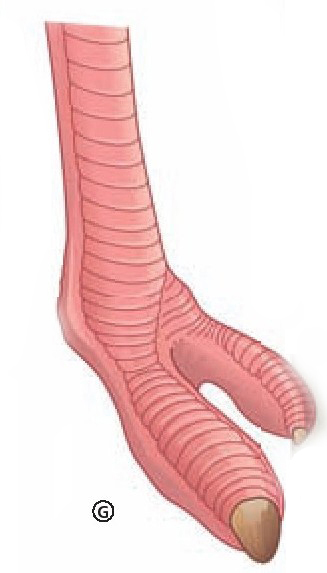
鸵鸟的趾

另外值得一提的是，在中国和蒙古，鸵鸟的蛋化石相对发现得还是比较多的。事实上，在距今约1万年的更新世晚期，中国北方地区还有鸵鸟生存。因此，在中国大陆的古人类曾和鸵鸟一起生活了很长时间，只是冰河时代的到来才最终导致了鸵鸟在中国大陆的绝迹。

最早而且可靠的鸵鸟化石发现于非洲，因此多数学者认为，鸵鸟起源于非洲，然后才逐渐扩散到了更加广泛的地区。（周忠和）

  

**【微博士】**最早的潜水鸟类

除了天空，鸟类还不断向陆地和海洋进军。距今1.2亿～1.1亿年的早白垩世很可能就是鸟类学会潜水的最早时期。在中国甘肃大约1.1亿年前的地层中发现的甘肃鸟，或许是最早能够潜水的鸟类。这一远古鸟类不仅保留了飞行能力，还具有潜水本领。有的甘肃鸟化石还保存了脚蹼，因此古生物学家推测，它可能具有水陆两栖的生活习性。

【微问题】4个翅膀的鸟类祖先怎么走路？

【关键词】飞行　小盗龙　中原鸟　鸵鸟　甘肃鸟

## 谁是最早有喙的鸟

今天所有的鸟类都已经完全没有牙齿了，取而代之的是形态各异的鸟喙。不过，鸟类的远古祖先中，却有很多满嘴长牙的成员。不仅最古老的始祖鸟嘴里有牙，而且从1.5亿年前开始一直到6500万年前这段漫长的时间内，大多数的古鸟类都还保留了牙齿，而且人们确信牙齿是从它们的恐龙祖先继承下来的古老特征。

尽管6500万年以来的所有鸟类都有了喙，但这一特征的首次出现可要早得多。1995年，中国古生物学家首次报道了孔子鸟化石的发现。虽然鸟喙是角质的，难以保存为化石，但在孔子鸟的颌骨上，有明显的鸟喙着生的痕迹。这一距今大约1.25亿年的原始鸟类，代表了当时世界上发现的最早有喙的鸟类，而且已经发现的数千件孔子鸟化石中还没有一件保留有一颗牙齿。有趣的是，生活在同一时期的古鸟类中，大多数依然保留了或多或少的牙齿。在差不多同时代的地层中，又陆续发现了好几种有喙的鸟类，如红山鸟、古喙鸟、钟健鸟等。科学家的研究还确定，这些不同类型古鸟类的鸟喙是通过多次独立的演化而获得的。

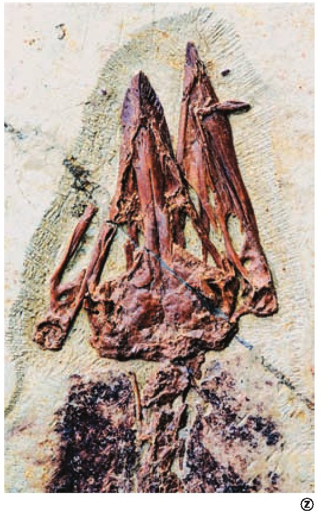
孔子鸟化石

那么究竟谁是最早有喙的鸟呢？2008年，中国学者从河北丰宁发现了一种比孔子鸟还原始的古鸟，它被命名为始孔子鸟。这一化石的时代被确定为约1.3亿年前。始孔子鸟和孔子鸟一样牙齿也完全退化了，因此它代表了目前世界上已知最早有喙的鸟类。从最早的鸟类开始，到最早的有喙鸟类的出现，经历了大约2000万年的演化过程。

虽然一般人认为，用喙取代牙齿可以减轻重量，有助于鸟类的飞行，但牙齿在脊椎动物捕食的过程中，毕竟还有鸟喙所无法取代的功能，所以牙齿并没有因为鸟喙的出现而在古鸟类群中马上消失。但经过了漫长的演化适应后，鸟类的喙“战胜”了牙齿，最终有喙的鸟类成功经受了6500万年那次生物集群灭绝事件的考验，在新生代取得了更大的发展，并一直繁衍到了今天。（周忠和）

## 谁是最早吃鱼的鸟

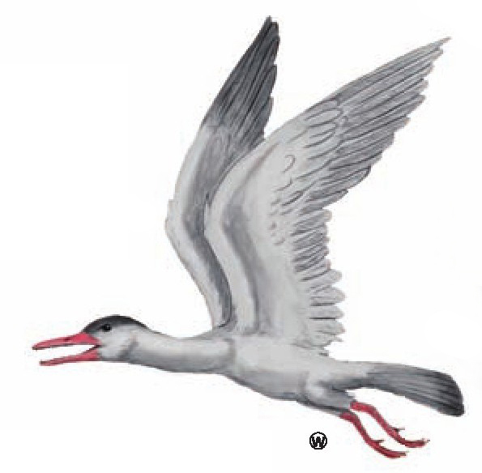
鱼鸟

现生鸟类的食性可谓多种多样，其中不乏像鱼鹰这样的捕鱼高手。有趣的是，早在大约9000万年前的白垩纪，也存在一种叫作鱼鸟的“鱼类杀手”。古生物学家之所以叫它鱼鸟，显然是认为这一和海鸥大小相近的古鸟类是以食鱼为生的。鱼鸟是白垩纪著名的已经灭绝的古鸟类。早在19世纪末，它的化石就已经被古生物学家发现了。由于化石发现处位于北美洲的海相地层中，因此人们推测，鱼鸟主要在海边活动。它们拥有强劲的翅膀和发达的胸骨，因此应当具有很高的飞行本领，再加上嘴长，口内有尖锐而弯曲的牙齿，而且它们的化石通常与大量的鱼类化石保存在一起，因而推测鱼鸟主要的食物为海洋鱼类。

生活在北美地区白垩纪晚期，距今大约8000万年的黄昏鸟，则像今天的企鹅一样，用潜水的方式捕鱼。古生物学家早在19世纪末就发现了这种约有1.5米长的大型潜水鸟类。化石证据表明，黄昏鸟嘴里还保留很多的牙齿，脚上长有叶状的蹼，翅膀已经十分退化，显然已经失去了飞行的能力，但后肢发达，很可能是在浅海中潜水、以捕食鱼类为主的鸟类。

鱼鸟和黄昏鸟并不是最古老的吃鱼鸟类。在中国距今大约1.2亿年的白垩纪早期的地层中，中国古生物学家已经发现好几种吃鱼的古鸟类化石。它们提供了古鸟类吃鱼的更加确凿的证据。

其中最有名的一种被命名为燕鸟，个头比鱼鸟要小，但也有了很强的飞行能力，牙齿非常发达。根据燕鸟的脚的骨骼特征可以推测，它们主要生活在湖边。更加有趣的是，有的燕鸟化石标本的胃部还残留了没有消化掉的鱼类残骸，有一件标本上还可见燕鸟正在吞食鱼类的情景。

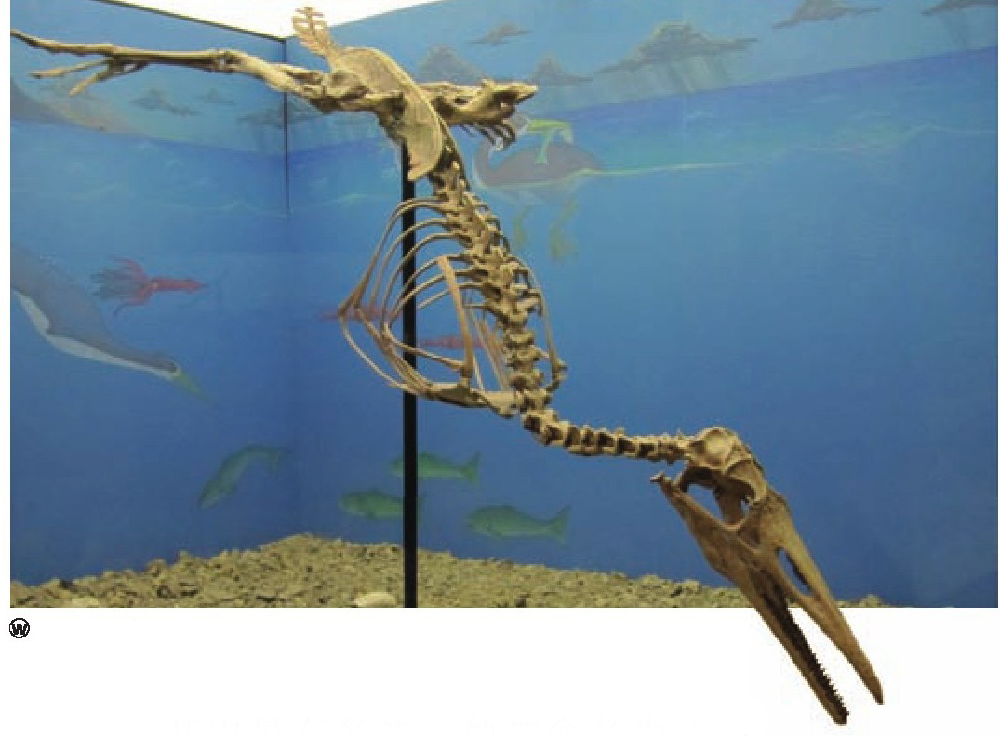
黄昏鸟化石

在鸟类的早期演化阶段，食鱼的鸟类还代表了最进步的种类，或许是因为食鱼获得的高能量有助于它们更好地飞行，最终一步步演化到了现生鸟类。（周忠和）

## 远古鸟类什么时候开始吃种子

吃种子的现生鸟类实在是太常见不过了。那么，远古鸟类是什么时候开始吃种子的？在中国东北地区距今约1.2亿年的河湖相地层中，已经发现了好几种吃种子的鸟类。其中最有名的恐怕要算是热河鸟了。在热河鸟的胃部区域，保存了50多枚植物种子，每个种子的直径大约为1厘米。不仅如此，热河鸟的喙在已经发现的早期鸟类中也非常特别，无论是上颌还是下颌都显得十分粗壮，仅在下颌中有少量残留的牙齿。这表明，热河鸟的喙能够咬开比较坚硬的果壳。原来热河鸟是一种已经非常特化的吃种子的鸟类！

此外，中国的古生物学家还幸运地发现了其他一些吃种子的鸟类（如会鸟和红山鸟），这些鸟甚至已经有了嗉囊，这可是第一次在如此古老的鸟类中发现这类结构！现生鸟类的嗉囊是食管后段的一个膨大结构，它不仅可以暂存食物，而且可以润湿和软化食物，有助消化。在这些古鸟类的胸廓前，发现了残存的球形种子团，恰巧就分布在现生鸟类嗉囊的位置。由此看来，到了这个时期，一些古鸟类不仅吃种子，而且有了专门的器官帮助储存、消化种子。

有趣的是，除了嗉囊外，会鸟、红山鸟的胃中还同时保存了胃石，这是鸟类吃种子的另外一个佐证。胃石能够进一步帮助研磨这些坚硬的食物。由此，可以想象，这些古老的鸟类几乎已经拥有了一套和现生吃种子的鸟类一样的消化系统。（周忠和）

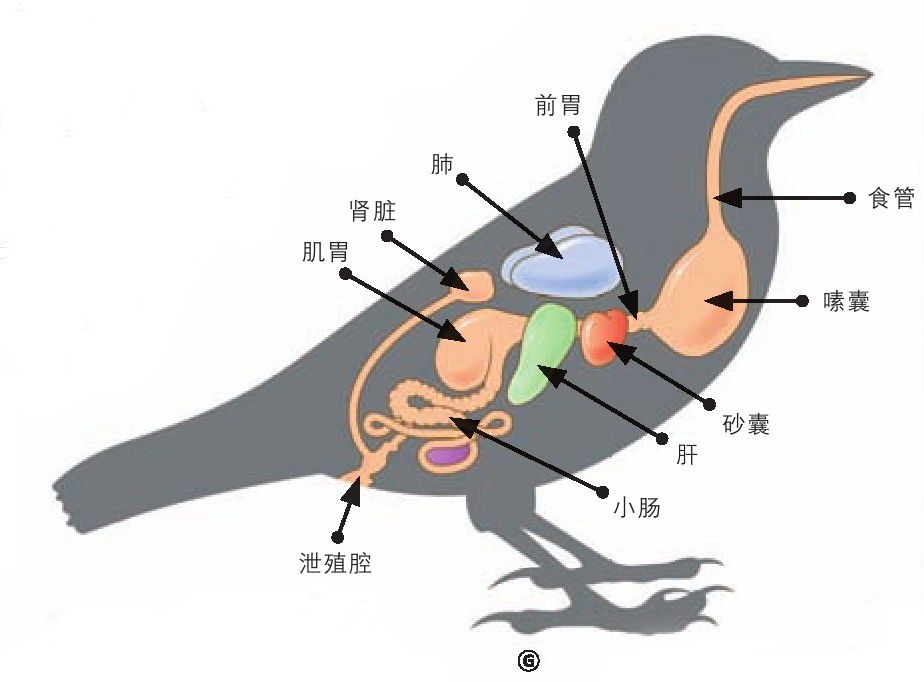
现生鸟类的消化系统

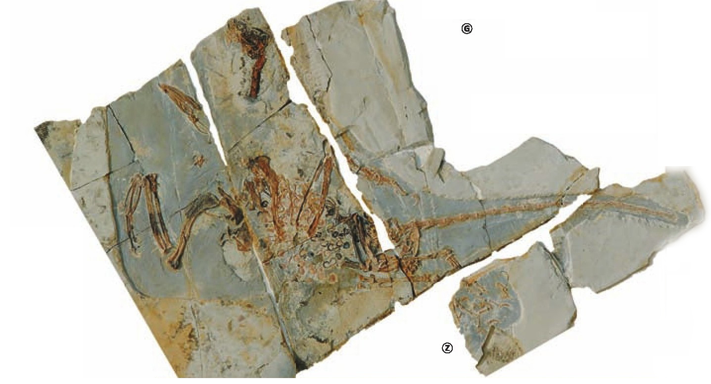
腹中有种子的热河鸟化石

  

**【微博士】**始祖鸟吃什么

如果我们没能在化石鸟类的消化道区域找到食物残余的直接证据，就只能根据鸟嘴的特征来判断它们吃什么。一般来说，长细小牙齿的鸟类主要以昆虫等小动物为主食，而没有牙齿的鸟类有可能是吃果实和种子为主的。始祖鸟虽然被发现了100多年，但迄今为止我们仍没有弄明白它们究竟吃什么，人们只是根据它们嘴的特征，推测它们可能捕食昆虫，或是吃杂食。至于始祖鸟会不会吃种子，我们也不能完全排除这种可能。

【微问题】没有牙齿的鸟类怎样防止猎物从嘴里逃脱？

【关键词】鸟喙　孔子鸟　鱼鸟　黄昏鸟　热河鸟　燕鸟　食鱼　食种子

## 为什么说地球上曾经出现过吃马的鸟

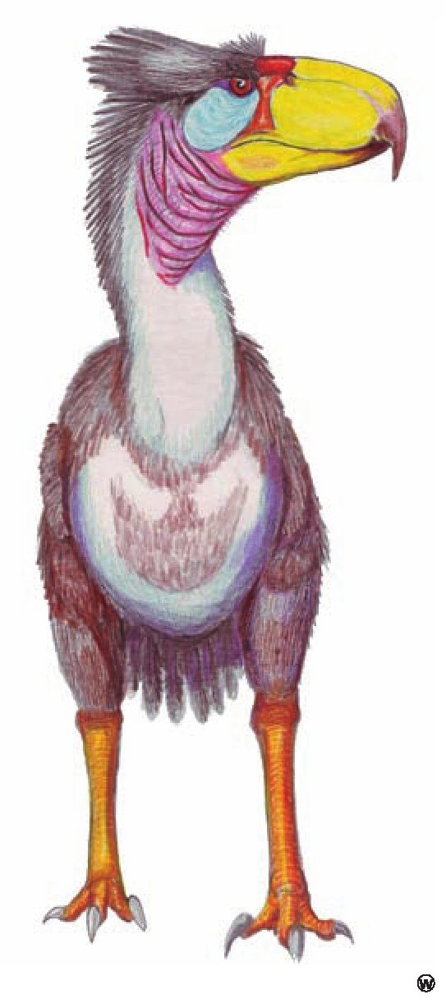
加斯顿鸟

如果说，地质历史上曾经出现过吃马的鸟，你会不会觉得这是天方夜谭呢？其实一点都不奇怪。

已知化石记录表明，早在5000万年前，现生马的祖先——始祖马就已经出现了。它们是最早的马，分布在欧洲和北美洲，脚趾的数目较多。始祖马个头很小，只比猫略大，奔跑也远不如后来的马迅速。而当时称霸陆地的加斯顿鸟（又叫不飞鸟、戈氏鸟）等古鸟类都体形巨大。如果始祖马被这些巨鸟看中，肯定是在劫难逃了。所以有人形容始祖马生活的时代，是一个鸟吃马的时代。

另一种可能吃马的鸟是发现于南美洲的恐怖鸟，生活在大约2500万年前。据估计，它的站立高度有2.5米，体重达到130千克，拥有巨大的长达46厘米的钩形喙和强壮的脚爪。这一时期生活的古马可能有渐新马、中新马等，它们的体形只比狗稍大一点，也很可能曾经是这类凶猛鸟类的猎物。遗憾的是，迄今并没有找到过鸟吃马的直接化石证据，但人们有理由期待。

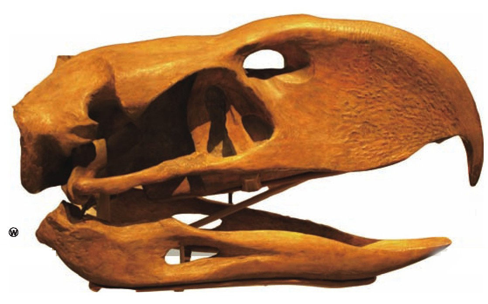
加斯顿鸟头骨

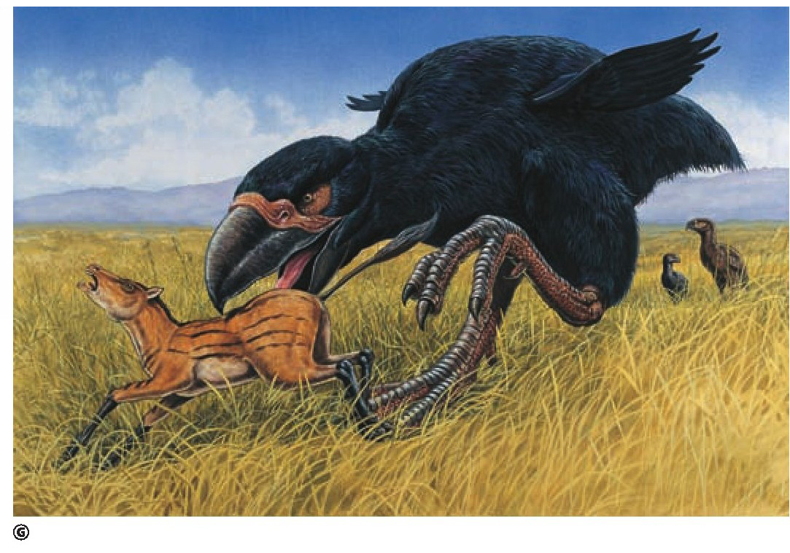
加斯顿鸟捕食

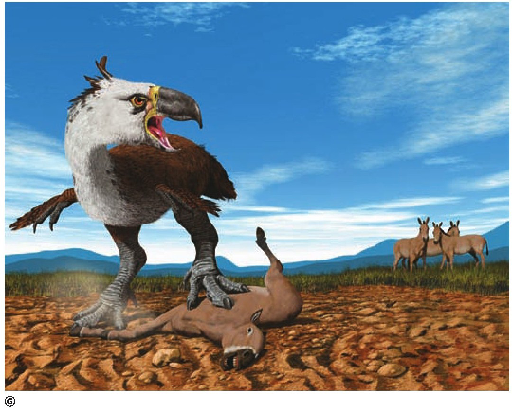
恐怖鸟捕食

恐怖鸟之后，在美洲大陆上演化的马类也遇到过其他的大鸟。比如在500万年前出现的泰坦巨鸟，身高可达2.5米，体重可达150千克，也是一种凶猛的食肉鸟类。不过，当时的马已经进化为上新马，大小和现生马相近，前后脚也已经演化为单趾，奔跑能力大大增加，因此不那么容易成为泰坦巨鸟的食物。

在恐龙灭绝之后，巨大的食肉鸟类曾经占领食物链的顶端很长时间。当时陆地上没有其他的大型掠食动物和它们竞争，哺乳动物大多是植食的，或只捕猎小型的猎物，奔跑的速度也不快，食肉鸟类因此得以显赫一时。然而好景终将不再，哺乳动物中比食肉巨鸟更聪明的大型掠食动物终于出现。它们可以合作捕猎，捕猎效率更高。而被捕食的哺乳动物也演化出了更快的奔跑速度。巨型食肉鸟类在这场生存竞争中败下阵来，永远地灭绝了。不过，地质历史上出现的植食或杂食的巨型鸟类中，还是有一直延续到了今天的，如鸵鸟。（周忠和）

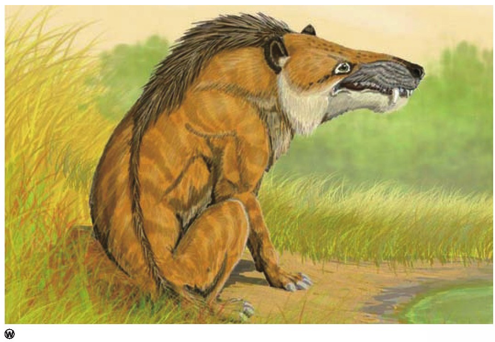
食肉巨鸟被安氏中兽这样的哺乳动物所代替

## 恐鸟究竟是怎么灭绝的

恐鸟

恐鸟可能是曾经生存于世的最大的鸟类。恐鸟的身高能达到3米多，体重约250千克，这大大超过了现在的鸵鸟。和鸵鸟一样，恐鸟的翅膀已经退化，所以完全不能飞行。它的身躯肥大，下肢粗短，因此奔跑能力远不及鸵鸟。最早给恐鸟定名的人正是最早使用恐龙一名的英国著名学者欧文。虽然恐鸟的名字中有一个恐字，但它其实是一个“素食主义者”。它们主要以植物的果实、种子和根茎为生，有时或许也吃一点昆虫。恐鸟曾经一度很繁盛，因此留下了大量的骨骼化石。

恐鸟生活在新西兰，和人类共存，直到700年前才告灭绝。人们普遍认为，很有可能是人类导致了这种缺乏自卫能力的庞然大物最终绝种。当地的土著毛利人长期以来一直把恐鸟作为主要的捕猎对象。也有人推测恐鸟完全灭绝的时间更晚，认为18世纪时欧洲人来到新西兰后不断开荒拓殖，挤压了恐鸟的生存空间，才使得恐鸟最终从地球上彻底消失。但最近科学家经研究后发现，其实早在人类来到新西兰之前，恐鸟的数量已经在减少，恐鸟的主要猎食者很可能是一种当时世界上最大的老鹰。虽然还不能说人类肯定是恐鸟走向灭绝的最主要原因，但毫无疑问，人类的活动给了恐鸟生存以致命的一击。（周忠和）

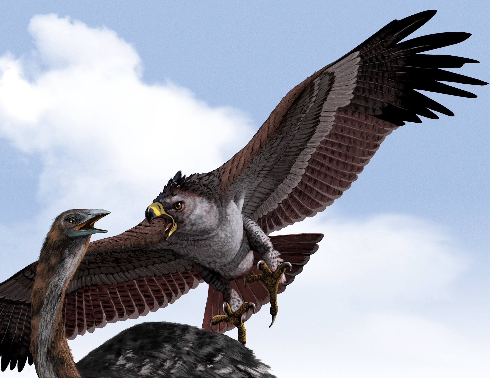
  

**【微博士】**捕猎恐鸟的巨鹰

恐鸟身高达到3米，是否除了人类，就没有什么其他动物可以伤害它呢？并非如此，在当时的新西兰，有一种翼展最长可达3米的哈斯特鹰，很可能是恐鸟的天敌。哈斯特鹰是地球历史上出现过的最大的鹰科动物，站立的高度可能达到90厘米。它们用锋利的爪子杀死恐鸟后，可以连续吃上几天。然而，随着恐鸟数量的减少，哈斯特鹰得不到足够的食物，终于也在几百年前灭绝了。

【微问题】渡渡鸟的灭绝是人类造成的吗？

【关键词】加斯顿鸟　鸵鸟　恐鸟　哈斯特鹰

## 古生物学家如何辨别哺乳动物化石

哺乳动物具有很多特点，比如它们具有很高的代谢率；体温保持恒定；四肢是向下方伸出，而不是像爬行动物或两栖动物那样向两侧伸出；有皮毛可以保持身体的温暖；胚胎在母体内发育，一直发育到相当程度时才出生；母亲用乳汁来喂养幼仔……不过，哺乳动物的上述特点大多都难以在化石中表现出来。所以，对于古生物学家来说，要判断一件化石是哺乳动物的还是爬行动物的，多数还是要靠牙齿和骨骼这些容易保存为化石的部分，比如可以通过动物头骨化石的耳区结构来区分。

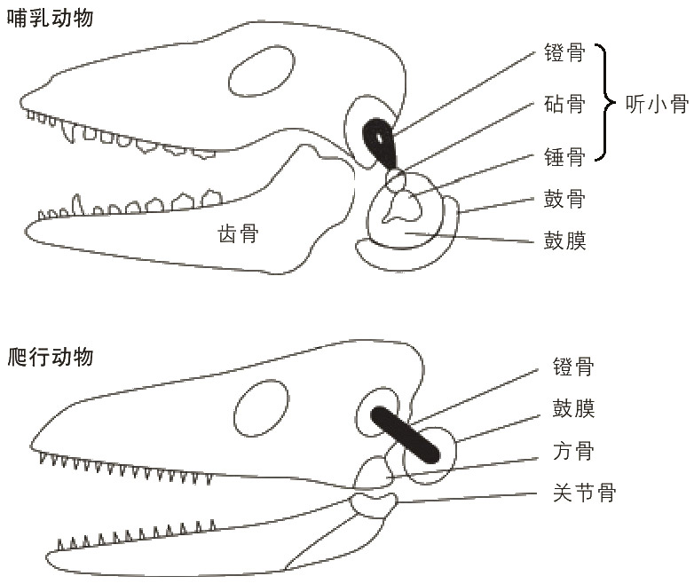
头骨的耳区结构比较

哺乳动物头骨比爬行动物头骨的骨块更少，愈合得更好，这使得哺乳动物的头骨更加坚固。爬行动物的下颌由多块小骨头组成，而哺乳动物的下颌骨只由一块叫齿骨的骨头构成。爬行动物的头骨和下颌骨之间利用方骨和关节骨相互连接，听小骨只包括一块镫骨（也称耳柱骨）。而哺乳动物的头骨和下颌骨利用鳞骨和齿骨相互连接，听小骨从外向内依次有锤骨、砧骨和镫骨三块，其中锤骨和砧骨分别由关节骨和方骨演化而来。听小骨能在耳膜与充满液体的内耳间传递声音到耳蜗，产生听觉的感知。如果一个古动物的耳区构造能够保留下来并形成化石，那么只要根据是存在一块还是三块听小骨，就可以判断它是否属于哺乳动物。

除了下颌骨和听小骨的不同，哺乳动物的牙齿形态也与爬行动物的有较大差别。多数爬行动物嘴中的牙齿是同一种形态，或者全是锥形，或者全是叶形，但哺乳动物的牙齿出现了门齿、犬齿、前臼齿和臼齿的分化，适用于不同的功能，如抓取、穿刺、切割、研磨等。由于食性和行为的差异，不同类群的哺乳动物的牙齿形态也千差万别，于是科学家仅仅通过观察研究牙齿化石，就可以推断出哺乳动物的类别甚至具体到属种的分类。（邓涛）

## 恐龙时代有哺乳动物吗

中生代是以恐龙为代表的爬行动物异常繁盛的时代，但哺乳动物的先驱已经在2.2亿年前的三叠纪晚期与恐龙一起出现在地球上。所以，即使论资排辈，哺乳动物也并不在恐龙的后面。但恐龙出现之后，很快发展为一个庞大的家族，而哺乳动物的早期演化却是不温不火。很多中生代的哺乳动物不能被归入现生哺乳动物类群，所以也被称为广义的哺乳动物或哺乳型动物。随后在侏罗纪出现了真正意义的哺乳动物，它们逐步发展，才有了今天哺乳动物的原兽类、有袋类和真兽类三大类群。中生代的哺乳动物与恐龙一路同行，经历了1.6亿多年的风风雨雨，这段时间比哺乳动物占据统治地位的整个新生代的时间都要长，所以说哺乳动物超过2/3的演化过程是在中生代进行的。因此，中生代哺乳动物虽然数量和种类不多，但却极其重要。

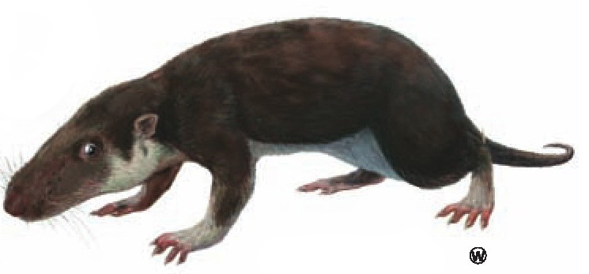
摩尔根齿兽

最早的哺乳动物起源于爬行类中的兽孔类，其代表如三叠纪晚期生活在北美洲的暗王兽，侏罗纪早期生活在中国的中国尖齿兽，但它们的化石材料都不完整。更可靠的哺乳动物标本则属于侏罗纪早期的摩尔根齿兽。它的个体很小，头骨只有2～3厘米长，整个体长不超过15厘米。与摩尔根齿兽同类的化石在欧洲、北美洲、南非和中国都有发现，如小贼兽、巨带兽和孔耐兽等，这些兽类的体形、身体比例和生活方式与现生哺乳动物鼩鼱相似，夜间攀爬在树木的小枝叶上捕食昆虫。这一类早期哺乳动物的纤细下颌骨由单一的齿骨组成，然而下颌内侧存在一条沟，其中保留着代表爬行动物特征的骨化的麦氏软骨的残余。所以，摩尔根齿兽尚不能被归入现生的哺乳动物类。

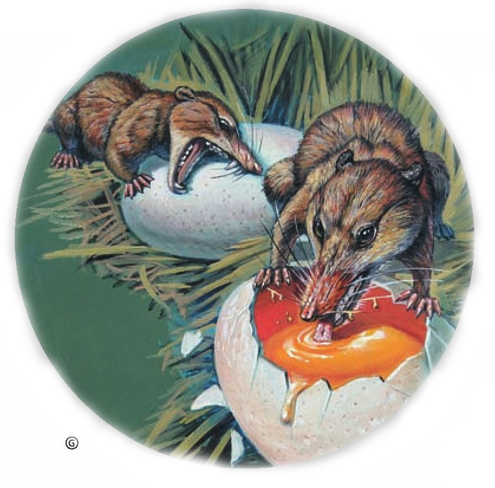
大带齿兽吃恐龙的蛋

中生代还生活着一些哺乳动物演化中的旁支生物，例如对齿兽，其牙齿的特点是臼齿齿冠上三个主要的齿尖排列成比较对称的三角形。中国辽宁早白垩世的张和兽就是一种对齿兽，它的前肢为半趴卧式姿态。现生哺乳动物的四肢直立于身体之下，而爬行动物的四肢位于身体两侧。因此，张和兽的运动方式处于从爬行动物向哺乳动物过渡的阶段，所以是一个重要的发现。可惜的是，对齿兽和现在的哺乳动物走了不同的演化道路，它们并没有留下后代。（邓涛）

## 现生哺乳动物的最原始祖先是谁

现生哺乳动物包括三个类群，即以鸭嘴兽为代表的原兽类（也叫单孔类）、以袋鼠为代表的后兽类（也叫有袋类）和以人类等其他大多数哺乳动物为代表的真兽类（也叫有胎盘类），它们最原始的祖先在中生代都已经出现了。

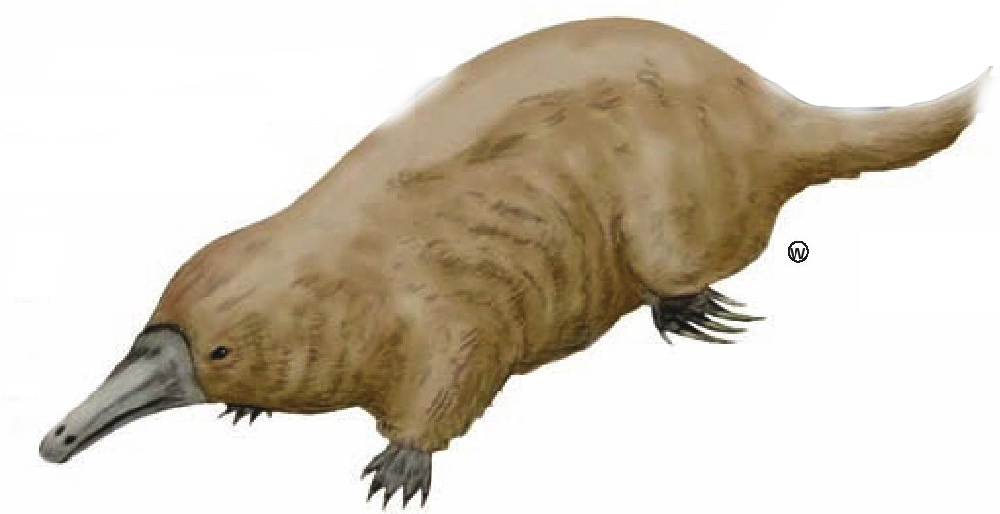
硬齿鸭嘴兽

最早的原兽类是发现于澳大利亚白垩纪早期的地层中的硬齿鸭嘴兽，起源于南方的冈瓦纳古陆。它和今天的鸭嘴兽一样通过产卵繁殖，体长40～50厘米，是那时当地最大的哺乳动物。

最古老的后兽类是在中国辽宁发现的中国袋兽，其头骨长约3厘米，体长约15厘米，体重25～40克，生活在1.25亿年前的白垩纪森林里，可能以昆虫等为食。中国袋兽的肩部、四肢和前后足有许多现生攀援哺乳动物或树栖哺乳动物特有的适应攀爬的骨骼特征，说明它们在地面上和树丛中都十分活跃。

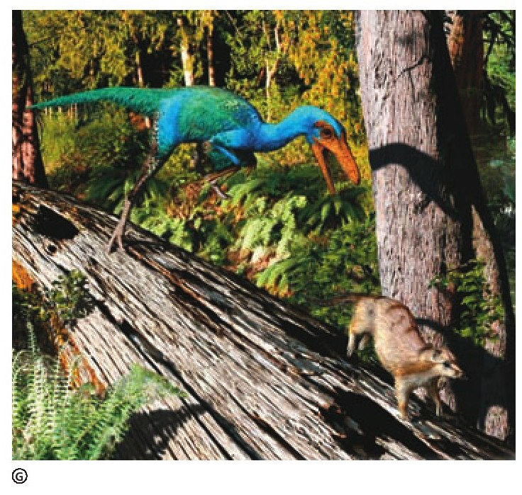
兽脚类恐龙追赶侏罗兽

最早的真兽类是在中国辽宁发现的生活在1.6亿年前侏罗纪中晚期的侏罗兽，其体长约10厘米、体重约13克，是一种在树上生活、具攀爬功能、食虫的哺乳动物。遇到危险时，侏罗兽可以爬上树逃到高处，这种能力帮助它在恐龙统治的侏罗纪生态环境中生存下来。（邓涛）

  

**【微博士】**最小的中生代哺乳动物

已知最小的中生代哺乳动物是发现于中国云南侏罗纪早期的地层中的巨颅兽。它的头长约12毫米，体重仅2克，整个身体跟回形针差不多大小。巨颅兽像一只具有长长口鼻的小老鼠，可能以小昆虫为食，具有昼伏夜出的习性。异常大的脑部和纤小的身躯暗示它的新陈代谢速度非常快，必须不断进食，才能维持自己的体温。被取名为巨颅兽是因为其头颅相对于躯体而言显得特别大，解剖特征暗示其中耳骨已经与下颌分离。巨颅兽是介于哺乳型动物和哺乳动物之间的过渡类型，是最接近狭义的哺乳动物的原始种类。但它还不属于现生的任何一种哺乳动物类群。

【微问题】哺乳动物中最原始的类群是哪一个？

【关键词】下颌骨　听小骨　摩尔根齿兽　对齿兽　张和兽　原兽类　真兽类　后兽类

## 最原始的蝙蝠是在哪儿发现的

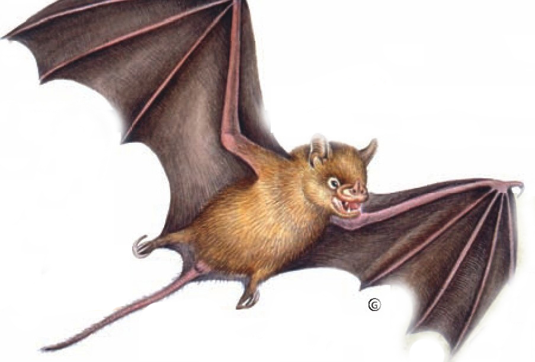
伊卡勒斯蝠的翅尖上有弯爪

蝙蝠是最古老也是演化得最成功的哺乳动物之一，它们的种类繁多，仅次于啮齿类。在地质历史上，恐龙时代结束后没多久，就出现了与现生蝙蝠形态很相似的古蝙蝠。2008年之前，最古老的蝙蝠化石是发现于美国怀俄明著名的绿河组湖相沉积物中的伊卡勒斯蝠。该蝙蝠的生活时代为距今约5200万年的始新世早期，其体长14厘米，翼展37厘米。它的命名源自希腊神话。伊卡勒斯蝠与现生蝙蝠已经非常相似，从牙齿的形状可以推测，它们与现在大多数的蝙蝠一样以昆虫为食，四肢比例也如同现生蝙蝠，有着细长的指、延长的前臂和短小的后肢，其肩胛骨、胸骨和肋骨的结构也说明其飞行能力已很出色。此外它已具备蝙蝠特有的回声定位所需的解剖构造。因此，人们认为一定还有比伊卡勒斯蝠更原始的蝙蝠存在。

果然，2008年有人报道了同样在怀俄明绿河组发现的名为芬尼氏爪蝠的蝙蝠化石。爪蝠也生活在约5200万年前，以爪蝠为名是因为它前肢的五指全都长爪，而现生蝙蝠大多只有拇指仍保留指爪，其他四指的指爪已退化成薄而灵活的细肢或结节，完全包覆在翼膜内。大多数蝙蝠有很长的前臂和短小的后肢，相比之下，爪蝠的前臂较短、后肢较长。尽管爪蝠的四肢具有较原始的结构特征，但其解剖构造又显示它已经具备飞行的能力。另一方面，爪蝠尚不具备回声定位结构，这与其他活跃于始新世的蝙蝠完全不同。由此说明，蝙蝠的演化是飞行能力在先，回声定位在后。

与其他哺乳动物相比，爪蝠的四肢比例也介于所有已知的蝙蝠（包括伊卡勒斯蝠）与依赖前肢行进的树栖哺乳动物（如树懒和长臂猿）之间。树栖哺乳动物大多以吊挂在树枝上的方式在树间攀爬，也许蝙蝠便是从具有这种行进方式的树栖祖先演化而来的。（邓涛）

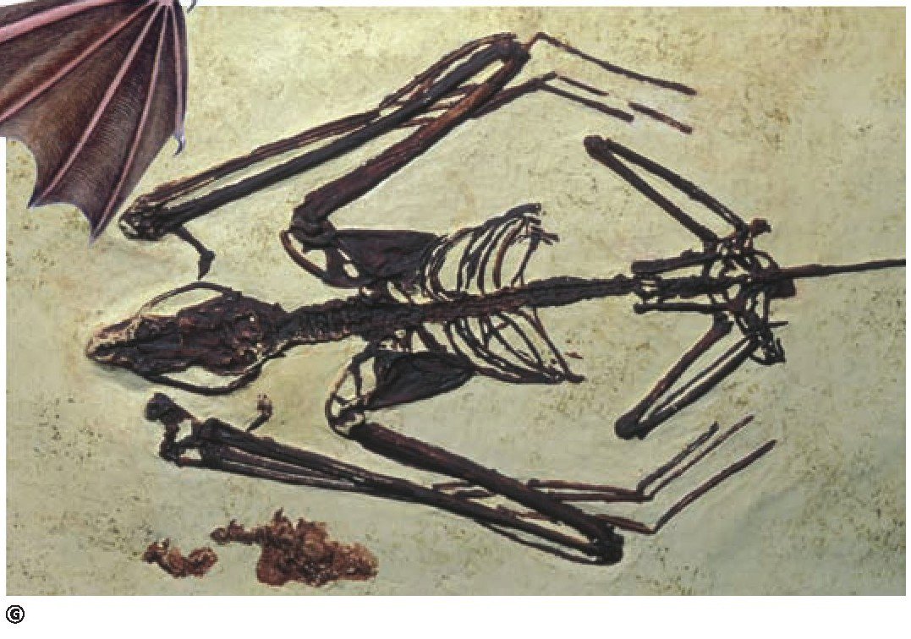
伊卡勒斯蝠化石

## 猴子的祖先长什么样

灵长目是包括人类在内的一个分类单位，之所以叫灵长目是因为人类把自己看作是演化历史的最高产物，认为人类居于生物演化阶梯的顶峰，是万灵之长，是世界的统治者。然而，灵长类是直接从原始的食虫类祖先起源的，从整个哺乳动物的演化树来看，灵长类是较早就分出的一个分支。

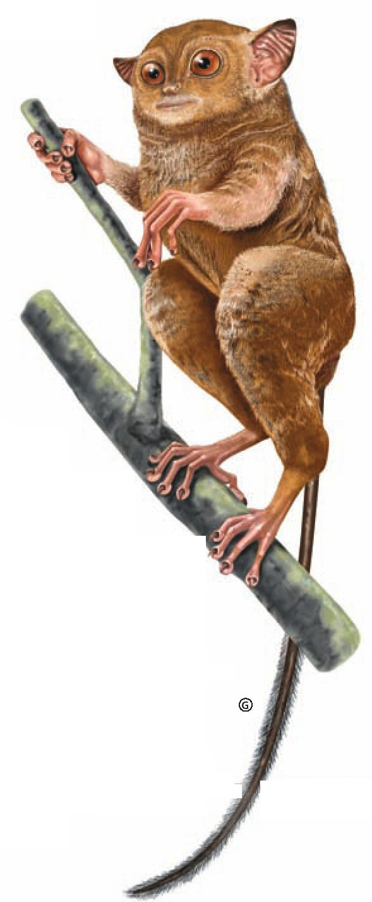
德氏猴

既然最早的灵长类是由食虫类演化而来的，那么它们应该跟某些食虫类有相似之处。今天生活在亚洲的树鼩、羽尾树鼩及其亲属在形态上与最早的灵长类相当接近。树鼩是一种只有松鼠大小的小型哺乳动物，它的头向前伸出，吻部长长的，身后拖着一条长长的尾巴。它们在分类上属于食虫类，但实际上在食物来源中果实要多于昆虫。

新生代早期，灵长类已经从类似树鼩的祖先沿不同方向发展，产生了各种分支。一支以狐猴和懒猴为代表，被称为原猴亚目；另一支以眼镜猴及后续的猴、猿和人为代表，被称为类人猿亚目。眼镜猴类在类人猿亚目中处于最原始的地位，而德氏猴则是眼镜猴中最原始的类型。可以这么说，德氏猴应该是猴子的祖先。在中国湖南衡东发现的5500万年前始新世早期的亚洲德氏猴化石，拥有近乎完整的头骨和上下牙，而以前在北美洲和欧洲发现的德氏猴化石都只是些零散的牙齿和破碎的颌骨。

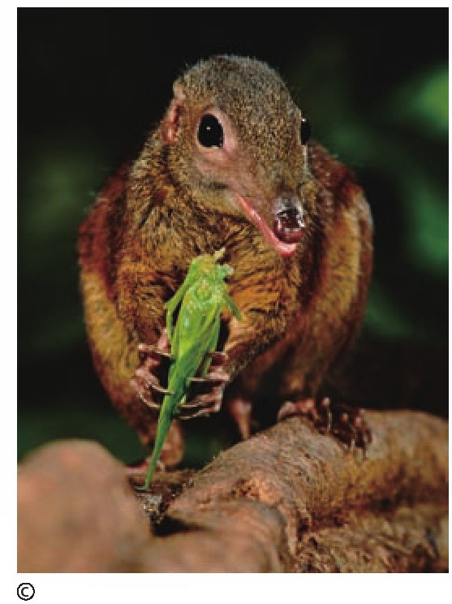
今天的树鼩

形态学和系统分类学的分析证明，亚洲德氏猴是所有已知的6种德氏猴中最原始的，也是目前发现的年代最早的灵长类动物。亚洲德氏猴的体重大约只有28克，头长不过2.5厘米，还没有一个拳头大，比现今生活在世界上的所有灵长类动物都要小得多。它具有两排细小的牙齿和相对很大的眼眶，更有一个较大的眶下孔，可供三叉神经通过，意味着存在较发达的触须。根据出土的化石推断，始新世早期的湖南衡阳盆地是一个巨大的湖泊，德氏猴就生活在湖畔的丛林中，以昆虫为食。（邓涛）

## 最早的老鼠生活在什么时期

老鼠是啮齿动物，啮齿类的一个共同特点是上颌和下颌各具有一对没有齿根、终身不断生长的门齿，它们必须通过不断啃咬来磨短这两对门齿。啮齿动物包括松鼠、跳鼠、仓鼠等各种鼠类，以及豪猪、河狸等动物。啮齿类有2/3的物种属于鼠总科。其中，鼠科和仓鼠科构成了鼠总科的绝大部分。因此，最早的啮齿动物也可以通俗地称为最早的老鼠。

已知最早的啮齿类动物是生活在北美5600万年前的古新世最晚期的副鼠。副鼠很像大松鼠，脚上有爪，会爬树，还长有一条长尾巴，用以保持身体平衡。副鼠的门齿像大凿子一般，后面长有5颗适于取食果实和种子的颊齿。

那么，副鼠的祖先又是谁？这个问题目前还没有定论。20世纪70年代，在中国安徽潜山距今6000多万年的古新统地层中发现过一种名叫东方晓鼠的动物。它有一对大门齿和退化的颊齿，还具有用门齿和颊齿在不同位置咬合的功能，简直像极了啮齿类的牙齿，因此国内外专家肯定东方晓鼠与啮齿类动物的起源有关系。虽然晓鼠不是啮齿类的直接祖先，但至少可以说，啮齿类有可能起源于晓鼠类动物的近亲。（邓涛）

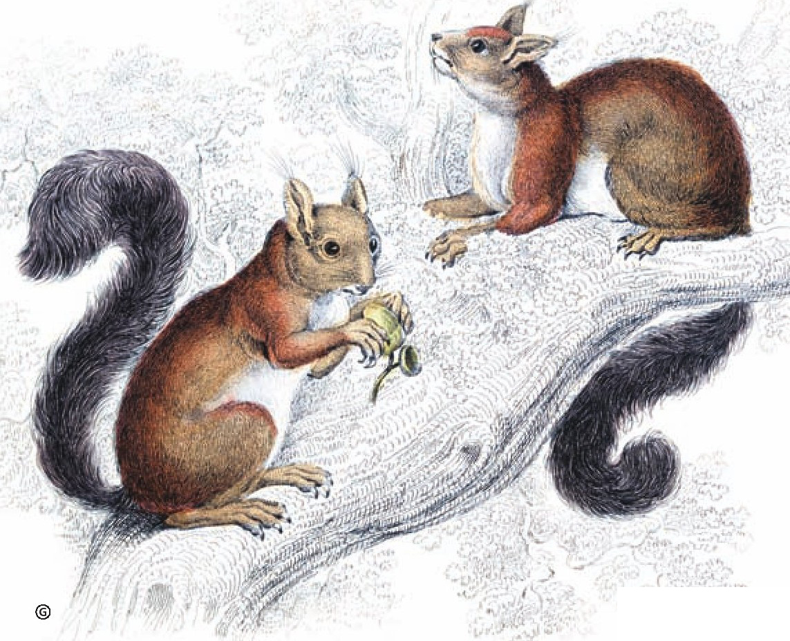
副鼠的可能形态

  

**【微博士】**哺乳动物中的“试飞员”

其实最早会飞的哺乳动物并不是蝙蝠，而是生活在侏罗纪的一位老前辈。在中国内蒙古发现了一种1.6亿年前的原始哺乳动物——翔兽，它的前肢和后肢之间有皮膜相连，形成一个滑翔用的“伞”，与现生的鼯鼠的皮膜十分相似，翔兽也因此而得名。它们虽然是世界上最早会飞的哺乳动物，但飞行装备还不很完善，只能说是哺乳动物中的“试飞员”。

【微问题】不会游泳的灵长类祖先是怎样扩散到全球的？

【关键词】爪蝠　德氏猴　副鼠　晓鼠　翔兽

## 大熊猫的祖先是谁

中国特有的珍稀动物大熊猫虽然主要吃素食，但仍属于食肉目。在外部形态和内部器官上，大熊猫既和食肉目的熊科动物类似，也具有浣熊科动物的特征，分类学家为大熊猫单独设立了一个大熊猫科。相对于其他的食肉目动物，大熊猫的裂齿发生了退化，臼齿咀嚼面也变宽，以植物为主要食物。关于大熊猫的起源及分类地位，自1869年定名以来，学术界一直争论不下。究其原因，除了现生大熊猫本身形态和构造比较特殊以外，恐怕最主要的还是缺乏化石依据。

近百年来，古生物学家在亚洲、主要是在中国发现了上百个埋藏有大熊猫化石的地点，对大熊猫200万年以来的演化历程有了一个比较明确的认识。无论是早更新世的大熊猫小种，还是中晚更新世的大熊猫巴氏亚种，除了体形不同以外，它们与现生的大熊猫至少在头骨和牙齿的形态、结构方面没有什么根本的区别。生活在200万年前的大熊猫小种只有现生大熊猫约一半大小，是大熊猫属里最原始的种。根据牙齿磨损痕迹和咀嚼特征可以推断大熊猫小种的日常饮食已基本以竹子等植物为食，说明早在200万年前，大熊猫就已经是素食主义者了。

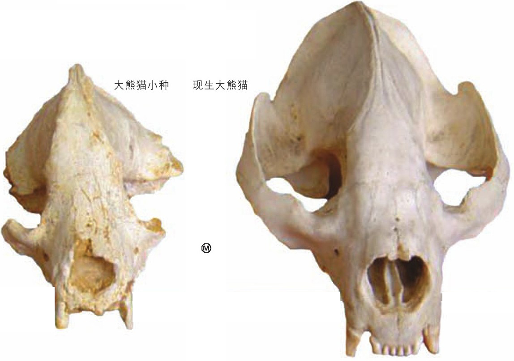
大熊猫小种与现生大熊猫的头骨比较

那么更早的大熊猫又是什么样子呢？有许多曾经生活在欧亚大陆和北美中新世、上新世的熊类动物都曾被看作与大熊猫有较直接的关系，但它们或因与大熊猫仅有极少的共同特征而被摒弃，或因本身的化石证据太少而难以令人信服。

始熊猫

中国古生物学家在云南禄丰分布的褐煤层里找到一些零星的牙齿化石，从这些牙齿的咬合面形态和结构看，牙齿主人已经具备了一些现生大熊猫的相应特征，由此他们给牙齿主人起了个名字叫始熊猫，这是世界上已知最早的大熊猫祖先，并且肯定了大熊猫与熊科的亲缘关系。在此之前，在欧洲匈牙利的褐煤层中也发现过少量的郊熊猫牙齿化石，在时代上它比始熊猫晚。但郊熊猫没有后代，难以判断它是否也是现生大熊猫的祖先。可以肯定的是，它是大熊猫一个灭绝的旁支。从化石可以知道，大熊猫在中新世晚期已分布于欧洲和亚洲，现生大熊猫分布的局限状况应从上新世开始发生。始熊猫和郊熊猫都出自褐煤层中，可见它们是生活在沼泽地带的，因此不可能以竹子为食。那么大熊猫从什么时候开始食竹的？又为什么要改食竹子呢？这些依然是谜。（邓涛）

## 为什么洞熊会以“洞”命名

洞熊是一种生存于更新世欧亚大陆北部的熊，在大约1万年前的最后一次冰期时灭绝了。因其化石多在洞穴内发现，有时甚至是整副骨骼，因此被命名为“洞熊”，例如在北京周口店的猿人洞中就曾发现过洞熊的化石。人们最早从科学上认识洞熊是在1794年，有人首次描述了在德国巴伐利亚地区发现的洞熊化石，并将其鉴定为熊属中一个已灭绝的新种。

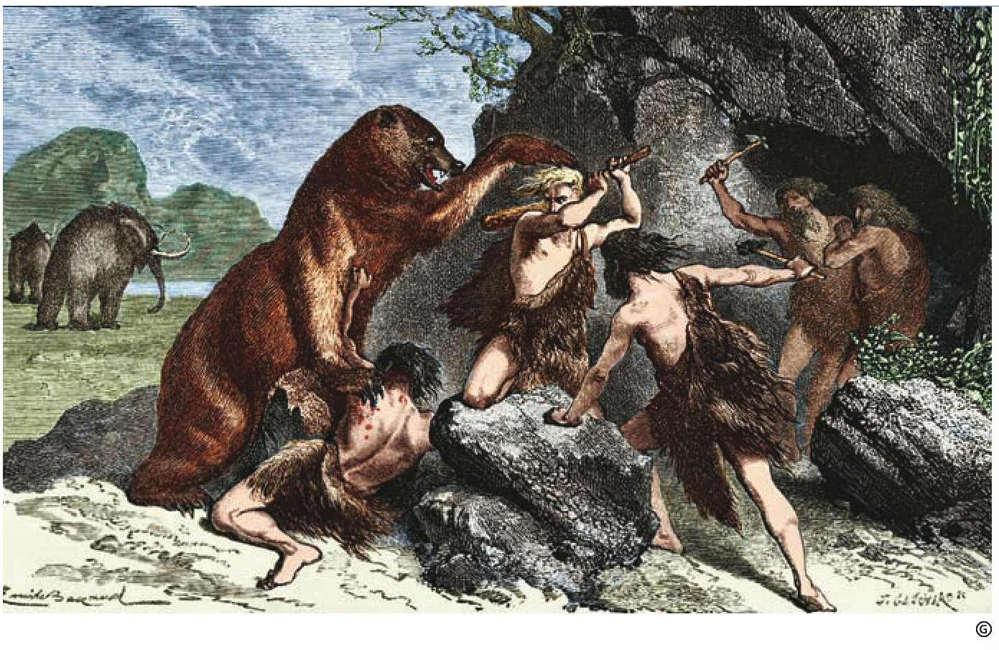
古人类与洞熊争夺洞穴

洞熊的体形巨大，雄性个体的体重可达1000千克，雌性则要小很多。现今体形最大的熊类是棕熊和北极熊，其体重可达800千克，平均体重为500千克。典型的洞熊头骨长约50厘米，而现今的熊头骨仅长20～25厘米。洞熊的寿命约为20年，是杂食性动物，主要以草及浆果为食，但有时也吃蜜糖，一些洞熊也可能是凶猛的食肉动物。

洞熊并不单独生活，而是以小型家族群体形式存在，彼此联系密切，协调能力也不错。在一些洞穴的壁上常常可清晰地辨认出洞熊的爪印，这是它们有意识为扩大自己生存空间而留下的。洞熊并不像今天的熊一样具有爬树的能力。

洞熊的化石发现于欧洲和亚洲各地，显然它是一个成功演化的物种。各个时期的化石证据表明，在距今30万～1.5万年的更新世后期，洞熊遍及欧亚大陆的各个角落；到更新世末，最后的洞熊曾生存于中欧、南欧一带；直到最后的冰期结束，它们才真正开始消失。

据研究，早在克罗马农人出现于欧洲之前，洞熊的数量已经明显呈下降趋势。这表明尼安德特人已经开始猎捕洞熊。当更进步的人类出现后，其相对先进的工具和围猎技巧，进一步加快了洞熊灭绝的速度。在欧洲早期的岩画作品中，就有古人类用长矛围捕狂怒洞熊的场面。洞熊曾经与尼安德特人和较晚期的克罗马农人在欧洲和中东共同生存，古人类也把洞熊作为重要的狩猎对象，不仅取食其肉，还把其庞大的骨骼作为建筑房屋的材料。

洞熊的消失是一个跨越数千年的渐变过程，不过，人与熊之间反复争夺洞穴的时间要比这长得多。科学家有证据表明，一些洞穴曾经被古人类和洞熊交替占领过，那时的情况可能是这样：人类趁洞熊冬眠，杀死或赶走那些萎靡不振的熊类；而春季到来后，另一些从冬眠中苏醒、腹中饥饿的洞熊又反过来袭击和猎杀人类，并重新夺回洞穴。这样的战争周而复始，持续了很久。这可能就是在欧洲无论克罗马农人还是尼安德特人似乎都积极猎捕洞熊的缘由，其人数大大超过猎捕棕熊的人数。（邓涛）

  

**【微博士】**裂齿

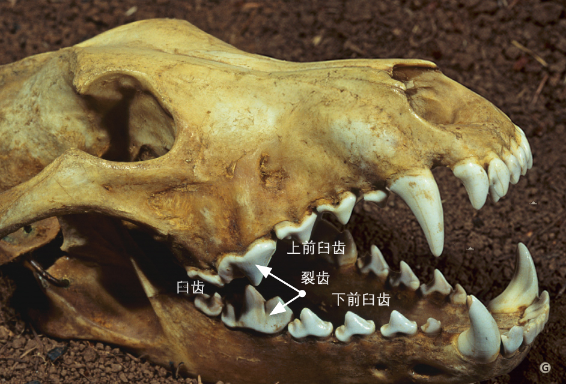
狼的裂齿

狗啃咬骨头的时候，是用前面的牙，还是用侧面的牙？答案是侧面的。它们用的主要是裂齿。裂齿是食肉类哺乳动物的一种特化的牙齿，因为牙齿侧扁，齿尖分裂而得名。裂齿明显比其他的颊齿强壮，一般由下牙的第一臼齿和上牙的第四颗前臼齿构成。所以食肉动物的口中有四颗裂齿，每侧两颗对咬，好像一个大剪刀，可以把坚硬的骨头咬碎。这就是为什么狗总是歪着头用侧面的牙啃骨头的原因。

【微问题】大熊猫有几个指头？

【关键词】始熊猫　洞熊　裂齿

## 剑齿虎是如何捕食猎物的

剑齿虎奇特的头部形态使人一眼就能看出它与现生老虎的差异，但两者又有显著的相似之处。实际上，剑齿虎代表猫科动物中一种灭绝的类型，在某个地质历史时期曾经非常繁盛，一直到距今约1万年的更新世末才灭绝。而老虎则是猫科动物的现生代表。剑齿虎与现生的狮子或豹子差不多大小，但与其他猫科动物不同的是，剑齿虎的上犬齿又长又扁，截面是菱形的，像两柄长剑，这也是“剑齿”二字的来源；而其他猫科动物的上犬齿截面是圆形的，像锥子一样。已发现的最长剑齿从齿根到齿冠竟达26厘米，最短的也有20厘米长。剑齿的前后缘形成锋利的刃嵴，有些剑齿的刃嵴上还具有发达的锯齿，在现生的动物中找不到这样的牙齿。

剑齿虎是如何使用这种匕首样的上犬齿去捕杀猎物的？这个谜题一直困扰着古生物学家。有关剑齿虎的剑齿，几乎所有能够想到的使用方式都有假说提出过。

有人认为，剑齿具有罐头刀样的开启功能，适合捕杀披有盔甲的动物，如南美洲的雕齿兽；有人认为，剑齿能像登山用的冰镐般用来帮助爬树；还有人认为，剑齿与海象的牙齿有类似功能，剑齿虎很可能也适应水生生活；更有一些人认为，剑齿可以通过紧闭上、下颌的方式来刺杀猎物；另一些人则认为，剑齿可用来切割动物肉体。不过，有人提出巨大的剑齿对于自身的进食并不利，因为大的肉块将无法通过两枚上犬齿的间隙而进入口内，剑齿虎正是由于无法获得足够的食物而导致灭绝的。在形形色色的假说中，“刺杀说”和“撕裂说”的拥护者最多。

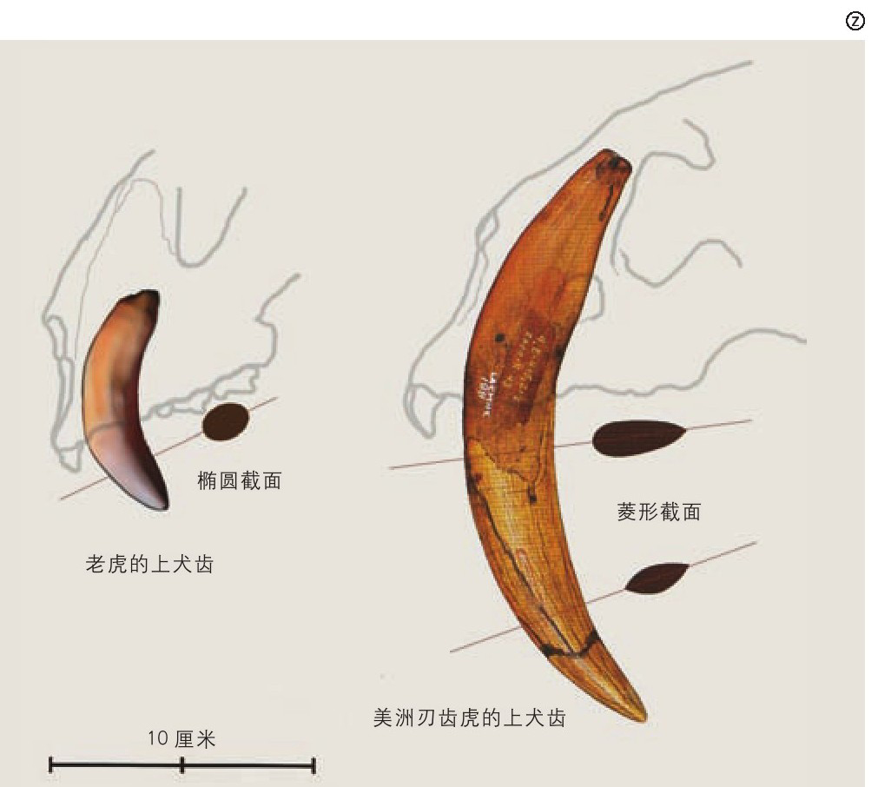
上犬齿对比

“刺杀说”认为剑齿具有穿刺的功能，是刺杀猎物的有效武器。持该假说的人详细分析了剑齿虎头骨的结构，发现它们能运用巨大的力量使上犬齿作向下的刺穿运动。剑齿虎下颌开启的角度远远大于现生的猫科动物，最大可以达到150°甚至180°，简直可以与蛇张开的大嘴相比。因此，剑齿虎可以完成完美的刺穿动作，并有效地利用自己扑向猎物时产生的动能。

持“撕裂说”的人认为，剑齿太长、过于侧扁，而且弯曲度太大，非常容易折断，因此剑齿虎应该不会采用刺杀这种高度危险的行为方式。实际上剑齿虎在运用上犬齿之前，应该与猎物搏斗并逐渐控制住猎物。在这种状况下，剑齿虎才能更好地寻找精确的刺入点，同时尽量避免因猎物猛烈抗争而导致上犬齿断裂。因此，控制猎物对剑齿虎自身安全有重要作用，而剑齿虎强壮的前肢骨和可收缩的爪子则是这种控制过程能够进行的基础。在这方面，剑齿虎的行为与现生猫科动物是一致的，即利用前肢和爪子抓握猎物，使其无法扭动和挣脱。剑齿虎上腭表面发育的沟嵴表明，它首先吸食猎物的血液，然后头部向后切割并撕裂猎物的皮肉。（邓涛）

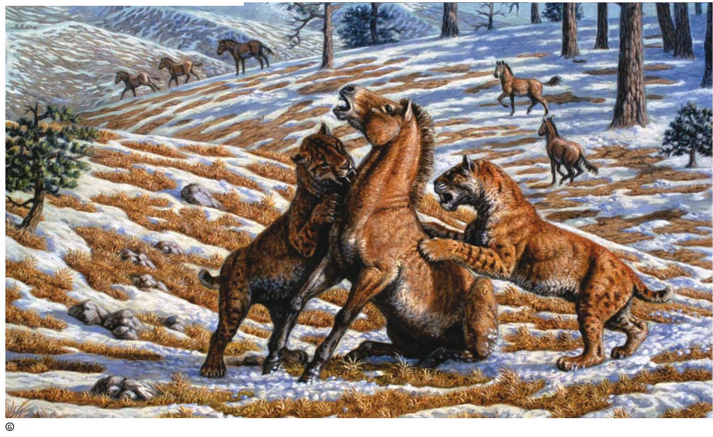
剑齿虎捕食想象图

## 鬣狗是狗的祖先吗

鬣狗因其外形像狗，颈肩部和背面长有鬣毛，所以得名。现生鬣狗只生活在非洲及南亚，因此中国人一般不太熟悉什么是鬣狗，但北京猿人在冰河时期却一直与鬣狗为邻。

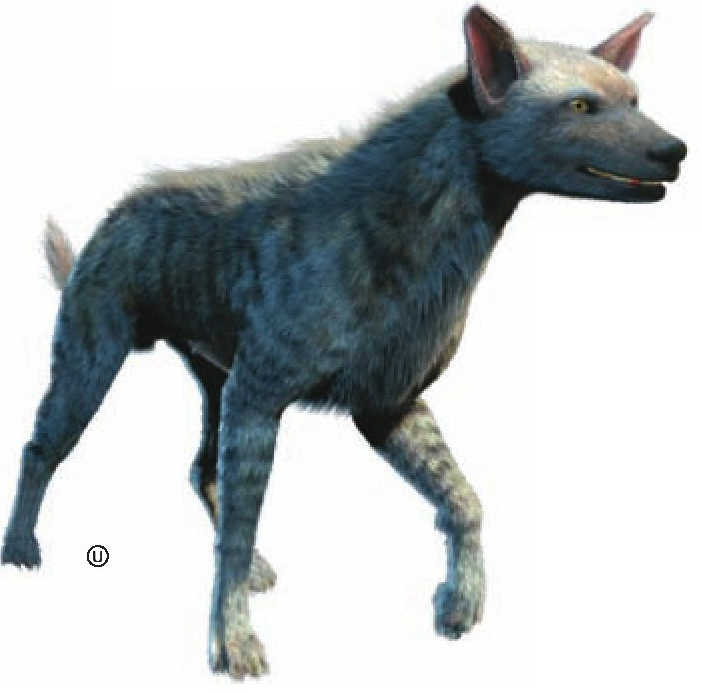
一种已灭绝的鬣狗——鬣形兽

鬣狗是中新世时期从灵猫演化的主干上分化出来的，因此，鬣狗虽然看起来有些像狗或狼，但它们不是真正的狗，与狗的亲缘关系也比较远，而与猫的关系更近。这从牙齿可以看得出来：狗有2枚发达的臼齿，而鬣狗裂齿之后的臼齿则大大退化到只余痕迹，有些类型就只剩下1枚臼齿了。因此，原始的鬣狗（如巨鬣狗）并不是狗的祖先。

在鬣狗的演化过程中，它们的四肢变长使奔跑能力变强，牙齿和颌骨增大使咀嚼能力更强。牙齿的增大尤其表现在最后2枚前臼齿，也就是第三和第四枚锥形的前臼齿上，这是鬣狗咬碎大骨头的重要工具，因为它们在习惯食腐肉的过程中必须要对付那些难啃的骨头。与此相关，鬣狗的颌和颌肌也变得非常强壮，其裂齿高度特化成具有强大剪切功能的片状。鬣狗与其他食肉类动物最大的不同之处在于其特有的粗壮的臼齿。依靠粗壮的上下颌和前臼齿，鬣狗可以轻易咬碎骨骼，从中摄取骨髓。

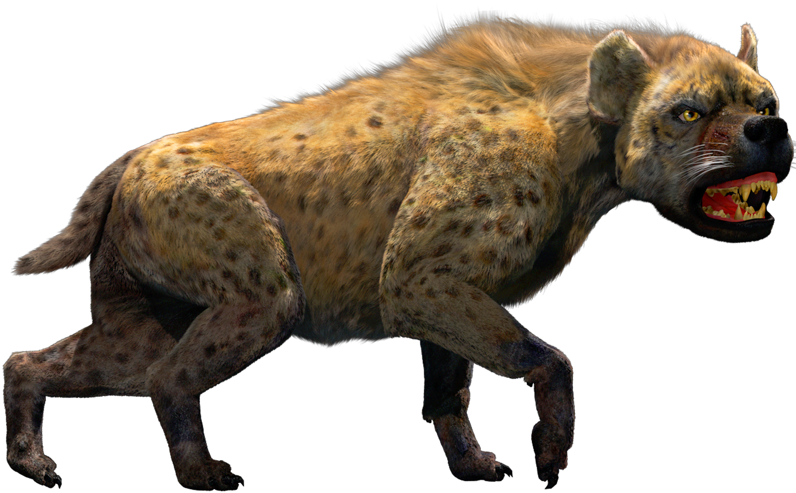
巨鬣狗

现生的鬣狗只有4个种，它们的体形均属中等，最大的斑鬣狗体重可接近90千克。但在地质历史时期，鬣狗不仅种类繁多，而且分布范围广阔，在北美洲、欧亚大陆和非洲都有大量的鬣狗化石发现。其中的巨鬣狗是已知最大的鬣狗，体重可达380千克，是现生斑鬣狗的4倍多，是现生的非洲狮体重的2倍。它们生活在1100万～900万年前的中新世晚期，化石在中国和欧洲都曾有发现。像巨鬣狗这样大的食肉类动物在任何时代都不常见，在鬣狗类群中也是绝无仅有的，它们在当时主要以捕猎几种古长颈鹿为生，也有证据表明它们可能攻击不长角的大唇犀，尤其是獠牙不发达的雌性大唇犀。（邓涛）

  

**【微博士】**食肉类动物

食肉类动物是今天的陆生食肉动物所属的类群。在动物界，它们从始新世晚期一直到现在都占据着优势。食肉类动物包括狗形类和猫形类。狗形类包括狼、熊、浣熊、熊猫、鼬、貂、獾和水獭等动物，猫形类包括灵猫、鬣狗、狮、虎、豹和猫等。食肉类动物常常具有可以咬住食物的强大门齿以及用于刺杀的发达的匕首形犬齿。它们的颊齿中具有演化成片状、上下咬合的裂齿，咬合时就像锋利的剪刀一样，很容易地把肉切割成碎片，以方便吞咽和消化。食肉类动物还具有坚强的上下颌，头骨上具有发达的矢状隆起和颧弓，以附着强大的颌肌。

【微问题】今天还有长剑齿的动物吗？

【关键词】剑齿虎　剑齿　鬣狗

## 大象的祖先也有长鼻子吗

已知最古老的象化石是大约6000万年前古新统地层中发现的初象化石，初象只比兔子略大，体重才4～5千克。更晚一些的5500万年前的磷灰象，体重已增加到10～15千克。但初象和磷灰象化石材料非常少，古生物学家对它们的身体形态和生活方式还缺乏了解。

科学家了解得比较清楚的最原始长鼻类是始祖象科的动物，它们的化石出土于埃及始新世晚期的沉积物中，代表动物是始祖象。始祖象是一种行动笨拙的动物，体形只有猪那么大，体重200多千克。始祖象的身体在比例上比今天的大象更长，其强壮的四条腿的末端生有宽阔展开的脚，脚趾的末端生有扁平的蹄子。始祖象在牙齿形态和结构上已经具有一些后来的长鼻类的特征，就是其上门齿和下门齿中的第二枚门齿增大，而今天的象牙就是特指大象极度增长的第二枚上门齿。

始祖象的外鼻孔位于头骨前端。这一点相当重要，根据解剖学上的对比，可以很清楚地知道，尽管始祖象可能长有厚厚的上唇，但尚未形成长鼻类特有的长鼻。由此判断，更原始的初象和磷灰象也是没有长鼻的。始祖象的鼻孔和嘴唇连在一起，构成了一个灵巧的肌肉器官，可以搜寻食物，这实际上是象鼻的一种雏形，因此可以断定这些温柔的食草动物是大象在远古时期的近亲。（邓涛）

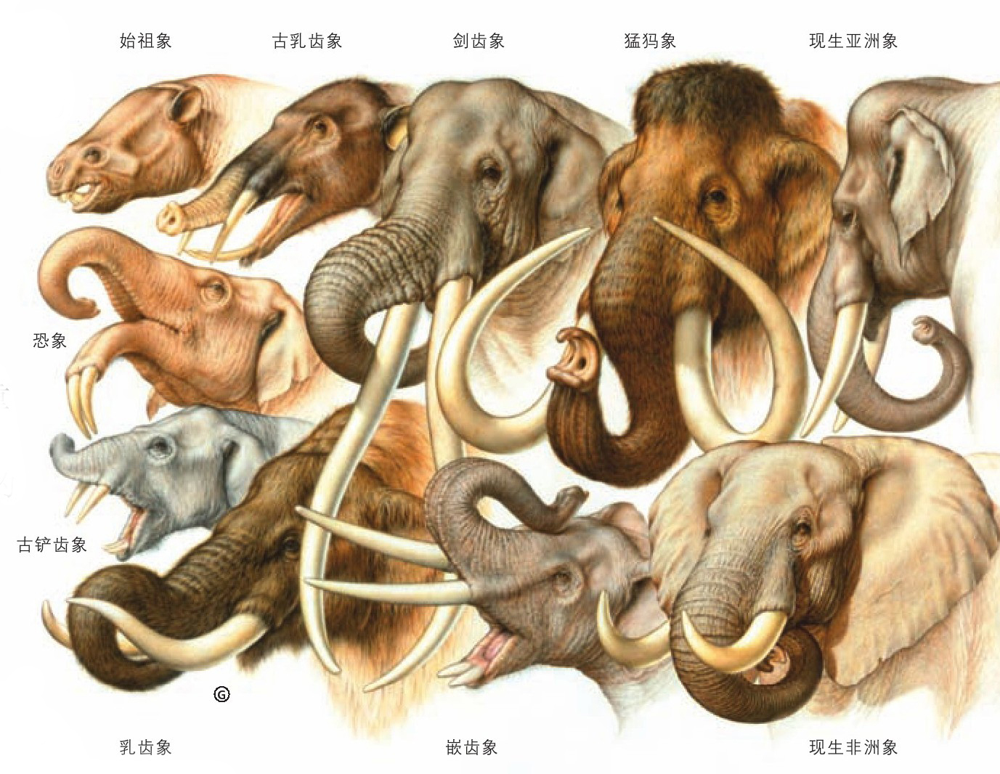
长鼻目演化过程中的大部分成员都有长鼻

## 乳齿象是如何灭绝的

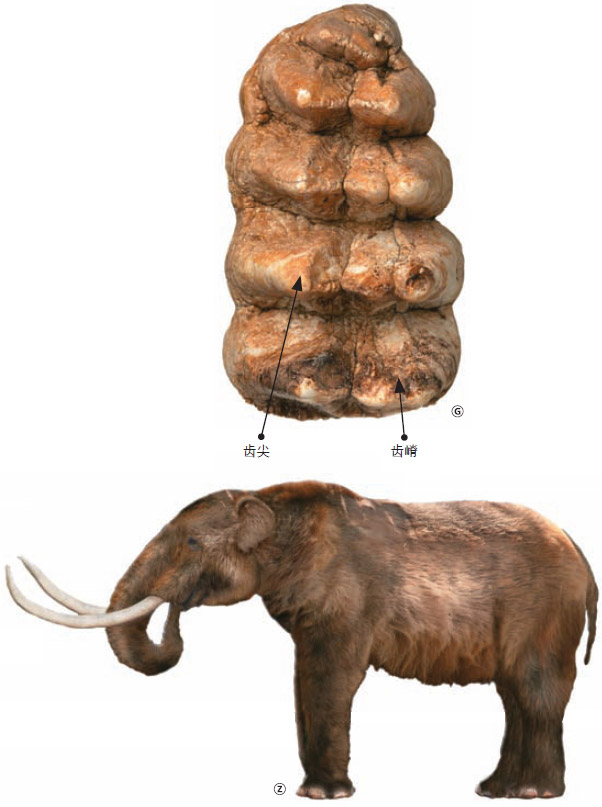
美洲乳齿象（下）及其最后一枚臼齿（上）

乳齿象的名称与它们幼年时期的乳齿并无关系，而是来源于它们的牙齿结构。乳齿象的每枚牙齿上有三排齿嵴，但最后一枚臼齿上的齿嵴更多。齿嵴由一系列不尖锐的锥形齿尖构成，齿尖呈乳状突起，这才是乳齿象名称的来源。乳齿象最早出现在渐新世早期，发现于始祖象生活的埃及地区，但已经明显比始祖象进步。例如，最早的乳齿象体形超过始祖象，其肩高可达2米多，骨骼特征已经与后期的象类动物相似，特别是长有比较长的腿。在乳齿象高大的头骨上，鼻骨急剧退缩，显示其已经具有了发达的长鼻，同时上颌的第二枚门齿增大，变成伸向前下方的象牙。一些乳齿象的下颌很长，第二下门齿向前水平伸出，这样的乳齿象看起来就有4枚长牙。早期乳齿象的颊齿是低齿冠的，即露出牙龈的齿冠低于齿根，说明它们还只能吃嫩叶，不能吃粗糙的草。乳齿象在演化中变得越来越大，比如美洲乳齿象的体长可达4.5米，肩高接近3米，这已经与现生象的大小接近了，而且它们身体骨架的结构很粗壮。

最后的乳齿象是在8000年前的美洲灭绝的，从这个时间来算，早期的印第安人曾经与它们相伴。有些科学家认为，人类捕猎是造成乳齿象灭绝的主要原因。当时，拥有丰富捕猎经验与工具的人类穿越白令海峡，很快扩散到了整个美洲大陆。包括乳齿象在内的当地庞大动物缺乏逃避人类的本能，因而被迅速猎杀殆尽。不过，也有科学家认为乳齿象的灭绝是由于自然原因，一项研究成果显示美洲乳齿象也许是因为一场结核病大传染而灭绝的。结核菌感染软组织时会在骨头上留下特殊的伤痕，科学家研究了美国卡内基自然历史博物馆收藏的48具乳齿象化石，发现其中21具化石上存在这种痕迹。研究人员猜测，结核病当时可能席卷了整个美洲乳齿象种群，使它们死亡或病弱得易于被人类猎获。（邓涛）

## 铲齿象的牙齿为什么这么特殊

铲齿象属乳齿象类中的成员，其颊齿仍然为低冠齿，说明它还只能吃嫩叶，不能吃粗糙的干草，但它的下颌特化，前端伸长变宽，一对门齿变成长板状，恰似一把大铁铲，所以得名。铲齿象生活于距今1600万～1200万年的中新世中期，主要分布于亚洲和欧洲东部，是这一地质历史时期的主要代表性动物。

铲齿象化石最初于20世纪20年代发现于格鲁吉亚的高加索地区，由俄罗斯古生物学家记述并发表。当时人们就已经注意到这类象的特殊之处：其第二下门齿变成平板状，故所创属名的原始含义即为“板齿”。同年晚些时候，美国第三次中亚考察团在中国内蒙古通古尔地区发现了更多更好的化石材料，美国古生物学家奥斯本在文章中把这类象的下颌前部和一把大铁铲的照片并排对比，给世人留下了极深的印象，从此这类象就被人们称为铲齿象了。

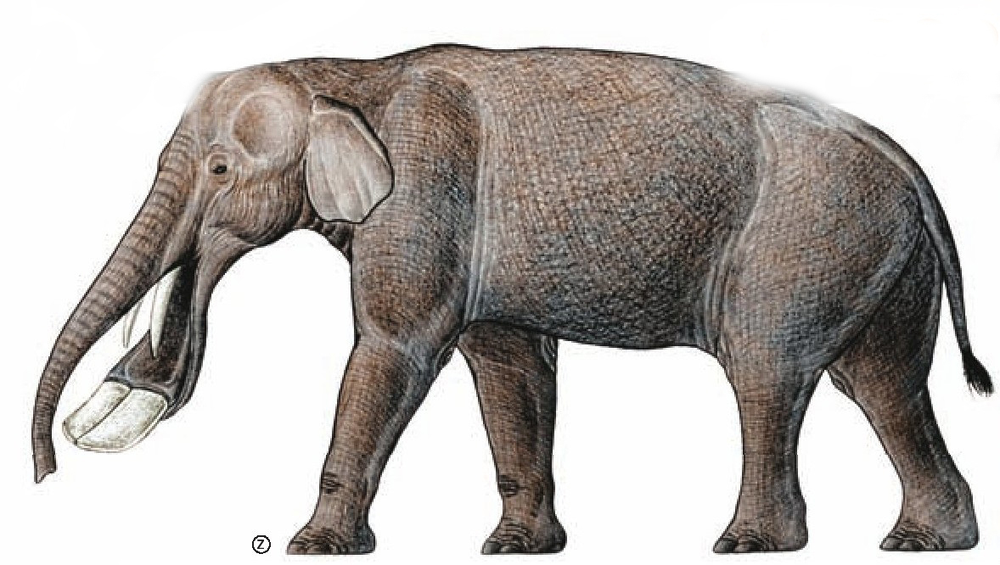
铲齿象

铲齿象奇特的头骨和下颌骨形态的功能很让人迷惑。奥斯本认为，铲齿象的铲板是用来从浅水中挖掘植物的，是为了适应水边生活演化而成的，但奥斯本把铲齿象的长鼻复原成宽扁的状态，就未必合理了。研究表明，扁平状的长鼻会压塌铲齿象的鼻孔，从而造成严重的呼吸问题。所以，铲齿象的长鼻应该跟现生的大象一样，呈圆筒状，相当灵活，可以帮助铲齿象在用铲板铲下植物后，卷送到嘴中咀嚼。

不过，也有人认为铲齿象是用其下门齿在树上剥皮，或者切割植物的。科学家通过对铲齿象门齿和臼齿上的细微磨蚀痕迹分析，证明其特点与取食嫩叶的有蹄类动物以及现生的森林象相似，而不同于生活在草原上取食粗糙禾草的非洲象和亚洲象。最近的研究还发现，铲齿象中老年个体所吃的食物比年轻个体的更加粗糙，而铲齿象的铲板应该更适合于切割植物而不是铲取食物。（邓涛）

  

**【科学人】**奥斯本

美国古生物学家奥斯本（1857——1935），毕业于普林斯顿大学，系哥伦比亚大学动物学教授，美国自然历史博物馆研究馆员，1901年当选为美国艺术与科学学院院士。1924年成为美国地质调查局的高级古脊椎动物学家，领导了在美国西南部的许多化石考察活动。他发表了大量著作，包括有关进化论的科普书籍和超过500篇的古生物学论文。曾担任美国自然历史博物馆馆长长达25年，为该博物馆建立了世界顶尖的化石收藏。他认为蒙古高原是人类起源的地方，因此三次组织远征队对中亚和中国进行考察，发现了大量珍贵化石。

【微问题】现生的大象能吃草吗？

【关键词】初象　始祖象　乳齿象　铲齿象

## 剑齿象的牙齿是如何生长替换的

剑齿象在上新世晚期就已出现，被称为真象类的最早代表。它与现生大象很相像，在旧大陆一直生活到更新世。它体形巨大，四肢较长，头骨很高，并具有又长又弯的象牙。剑齿象的颊齿伸长得很厉害，每枚颊齿齿冠上长有很多较低的横嵴，在一些晚期的剑齿象中，第三臼齿的横嵴可以多达12排或13排，说明它们已经很好地适应了粗糙的草类食物。中国南方的第四纪哺乳动物群中也存在丰富的剑齿象化石，以东方剑齿象化石为代表。东方剑齿象是中国分布最广、数量最大的一种已灭绝的象类，其模式标本采自重庆万州的盐井沟。

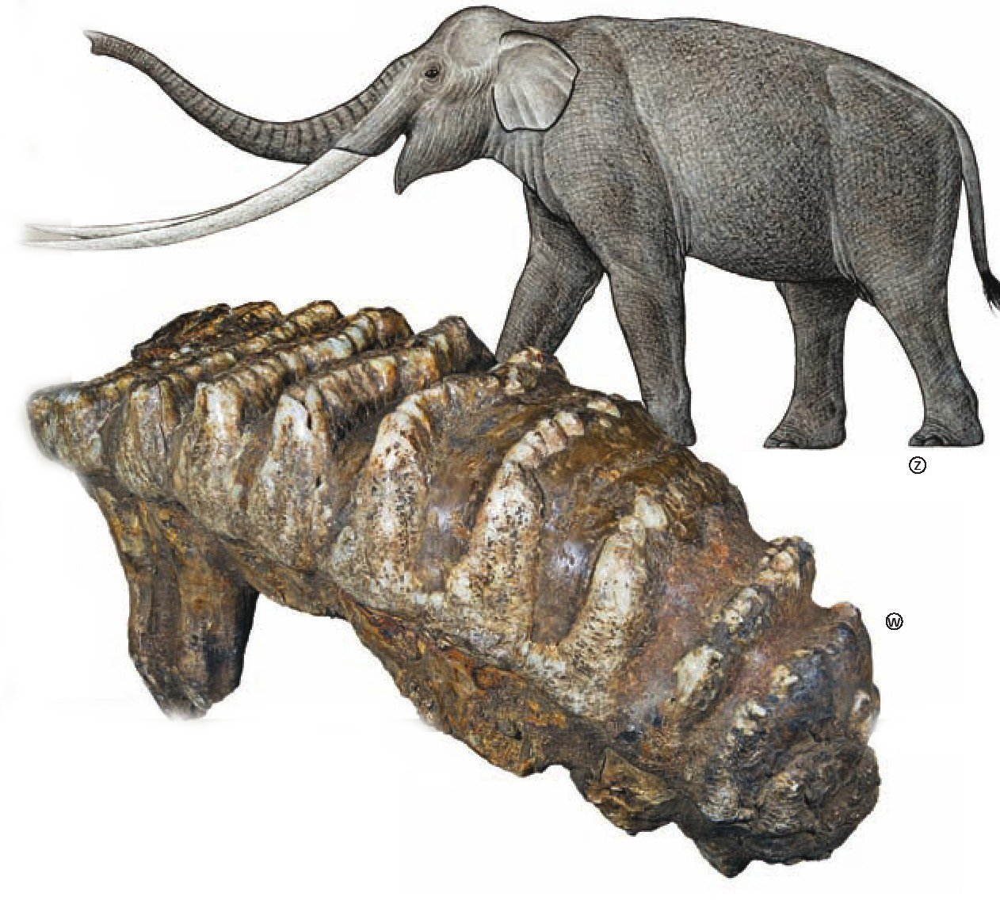
东方剑齿象及其臼齿化石

剑齿象极度伸长的颊齿，使得上下颌的牙齿排列和生长不得不以一种新的方式发展。在很多早期的乳齿象中，牙齿与大多数其他动物的一样呈直线排列，所有的前臼齿和臼齿同时出现。当长鼻类动物的牙齿增大后，在牙齿的适应演化上存在两种方式：要么是头骨和下颌变得很长，这样才能容纳一长列同时存在的颊齿；要么牙齿接力式地生长，这样只有部分牙齿同时存在。演化程度较高的乳齿象、剑齿象和其他真象类采用了后一种方式。在这些高度特化的长鼻类动物中，同时起作用的颊齿只有2个甚至1个。它们的头骨和下颌极大地增高，上颌的牙齿在齿槽后上部形成，下颌的牙齿在齿槽后稍下方形成。然后，牙齿有序地向前推出，即当后面的牙齿推进时，其前面的牙齿就被推向上下颌的前端。前牙被使用磨蚀殆尽后就被后牙挤落消失，而紧跟的牙齿又被更后面的牙齿推向颌端，接替已消失的牙齿担负咀嚼、研磨的工作。这样的更替一直到最后1枚牙即第三臼齿磨蚀到头，象的生命也就结束了。更新世的猛犸象和现生象把这种牙齿接力生长的方式发展到尽善尽美的程度，其年龄可以高达80岁以上。

不仅如此，在从剑齿象向猛犸象和现生象的演化过程中，颊齿齿冠也显著增高。剑齿象颊齿上的横嵴增高并从前向后合在一起，而在更进步的真象中横嵴则发展成高而平行的片状，从而形成了高齿冠的研磨型颊齿。从地质发展史的角度看，颊齿从低齿冠演化到高齿冠的过程是相当快的。更新世早期的剑齿象和真象的颊齿还是呈低冠状的，到更新世晚期就都演化成高冠齿了，象类的这种演化速度可与人类在更新世的演化速度相媲美。（邓涛）

## 猛犸象为什么能生活在冰雪环境中

猛犸象是更新世冰期，也就是第四纪冰期的代表性动物，其肩高可达4米或更高，它是现生的亚洲象和非洲象祖先的近亲。旧大陆是猛犸象的发源地，它们从这里经过位于今天白令海峡位置的陆桥扩散到北美。

在冰期最为严寒的气候中，猛犸象在欧亚大陆和北美洲到处漫游。它们对抗严寒的武器就是特有的蓬松皮毛，猛犸象的长毛最长可达1米，像毯子一样覆盖全身。猛犸象的皮下还存在一层10厘米厚的脂肪，能起保温作用，小小的耳朵和短短的尾巴则能防止损失过多的热量。具备了这些特点，猛犸象就能在严寒的北极地区生活了。猛犸象身体的这些特征是古生物学家从冻结在俄罗斯西伯利亚和美国阿拉斯加永久冻土中的猛犸象尸体上了解到的。

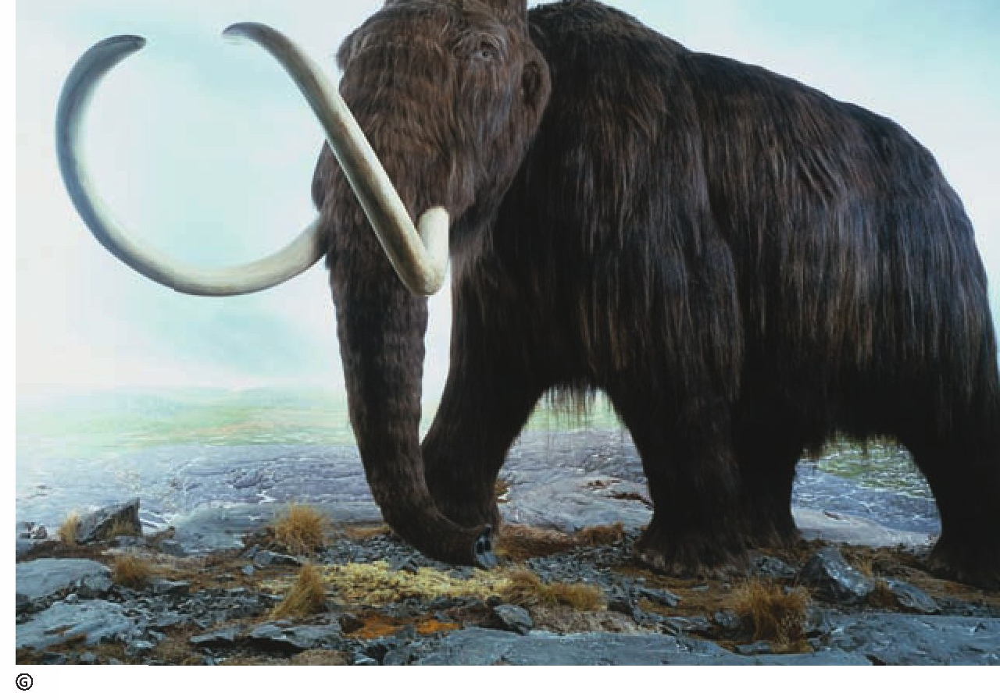
猛犸象

冬天，猛犸象会向南迁移，它们集体行动，共同抵御狮子等猛兽的袭击。常吃的食物被埋在厚厚积雪下时，它们会用灵巧的长鼻采集云杉等植物为食。春天到来，积雪融化，鲜花开放，随着气温的上升，猛犸象将脱掉冬季的长毛，只余下一层几厘米长的绒毛。然后，猛犸象将重返它们在北方的栖息地。但回程并不平静，石器时代的人类会守候在猛犸象的归途中，冒着生命危险去捕猎它们。人类不仅猎取猛犸象，还将它们画在洞穴的岩壁上，这些图像反映了猛犸象的外表形态和生活姿态。有的猛犸象前背部画有高耸的驼峰状突起，有的却没画，这很可能是代表了猛犸象在不同季节的形象，过冬前脂肪积累，肩峰高大，形成了“驼峰”现象。（邓涛）

## 黄河象是怎么被发现的

在位于北京的中国古动物馆的三层大厅中央，一副巨大的古象的骨架威严耸立。它的故事曾被写入中国小学语文教科书，课文题目就叫《黄河象》。

1973年的春天，甘肃合水的农民在一条叫马莲河的黄河支流边上挖掘沙土。他们忽然发现沙土中出现了一段洁白的象牙。这个信息传到了位于北京的中国科学院古脊椎动物与古人类研究所。很快，一支发掘队伍便开赴合水的化石地点。随着发掘的进行，化石的全貌逐渐显露出来，人们可以清楚地看到一头大象的骨架斜斜地插在沙土里，它的脚踩着石头。从它站立的姿势，可以想象出大象失足落水那一瞬间的情景；从它各部分骨头互相关联的情况，可以推知它死后没有被移动过。古生物学家详细地研究了发掘出来的化石，发现这是一种剑齿象的骨骼，由于出土于黄河的支流边上，所以将大象命名为黄河剑齿象，简称黄河象。后来的研究确认它应被归类为师氏剑齿象，生活在200多万年前的更新世早期。

黄河象的骨架高达4米，长8米，前端是3米多长的大象牙，接着是头骨和下颌，连很难发现的舌骨也保存完好。在100多块足骨中，连三四厘米长的末端趾骨也没有丢失。古黄河象的骨架能够这样完整地保存下来，在象化石的发现史上是很少见的。（邓涛）

黄河象

  

**【微博士】**长鼻类动物

很多长鼻类动物都长有由鼻和上唇构成的长鼻。它们大多是生活在森林或平原上的大型或超大型的哺乳动物。长鼻类动物臼齿发达，且齿上多横嵴，适于研磨，故可以吃坚韧的植物。在始祖象以后长鼻类分成两支，一支是恐象，另一支是狭义的象类。恐象下颌的两个大象牙不像其他长鼻类的下门齿那样向前伸，而是向下弯曲，看上去像一对大吊钩。中国古生物学家报道了产自甘肃临夏盆地的中华原恐象，这是中国发现的第一个恐象类代表。今天亚洲和非洲的大象则是象类的代表。在长鼻类已灭绝的远古亲戚中，有水生的食草动物索齿兽，以及巨大而有角的有蹄类重脚兽。大象现生的“亲戚”则是栖息在沿海浅水中的水生食草动物海牛以及看上去像啮齿动物的小型有蹄类——蹄兔。这几类动物与长鼻类动物可能起源于在北非生活的一个共同的祖先，其后在新生代时沿着不同的演化方向发展。

【微问题】剑齿象的长牙有什么用？

【关键词】剑齿象　猛犸象　黄河象

## 始祖马长什么样

1838年，一个挖土做砖的工人在英国索夫克郡发现了一枚小小的牙齿化石和一块下颌骨碎片。这些化石引起了英国博物学家欧文的注意。欧文做了初步比较、研究以后，推测化石来自一种猴子。随后几年，伦敦附近的黏土沉积中又发现了一系列类似标本，欧文这才发现先前的并不是猴子的化石。他认为这种动物和蹄兔（一种有蹄动物，大象的近亲）类似，提出将这种动物命名为蹄兔兽。后来，美国博物学家马什在美国西部发现了更完整的所谓蹄兔兽的材料，其中包括整具的骨架。马什深入研究后认为，这种动物与蹄兔并没有关系。尽管其体形如同小狗一样，但它却是今天世界上所有高头大马最早的祖先——始祖马。

始祖马出现在5500万年前的始新世早期，生活在热带的森林和沼泽地带。始祖马身体轻巧灵活，只有狐狸般大小，后脚3趾，前脚4趾，趾端有蹄。但前脚起作用的趾头也只有3个，数量为奇数，因此被归入奇蹄类动物。始祖马的四肢细长，腕部和脚踝离开地面抬起，趾头的位置几乎是垂直地面的，所以它适合奔跑。始祖马的头骨长而低，背部较弯曲，尾巴较短。它的牙冠低，具有圆锥形的齿尖，说明它只能取食矮树和灌木的嫩叶，还不能像它的后代真马那样以草本植物为主食。雄性始祖马的体形比雌性大15%，四肢更粗壮，还具有更发达的犬齿。古生物学家推断雌性始祖马会组成一个固定的群体。在群体中，雄性始祖马会为了争夺与雌性的交配权而进行激烈的争斗。（邓涛）

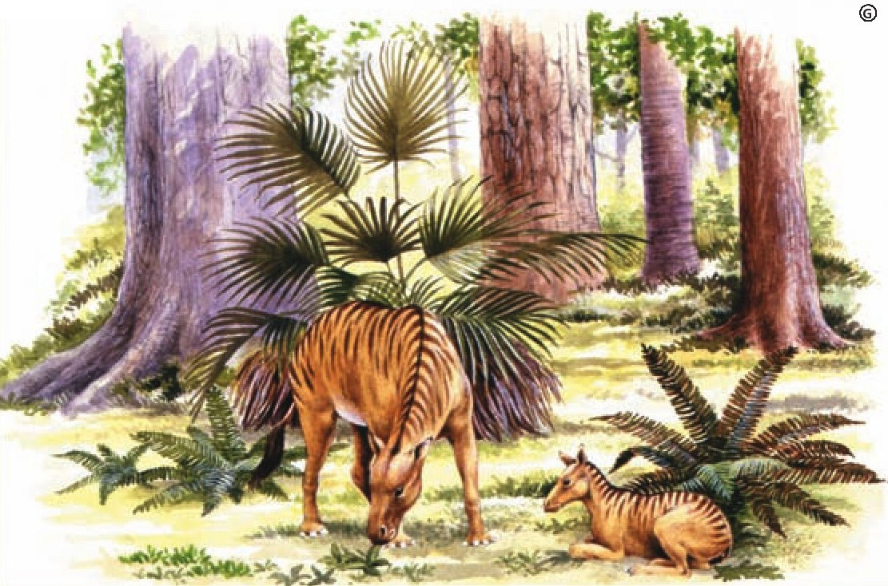
始祖马

## 谁才是现生马的祖先

始祖马的后代中有一个分支被称为三趾马。它们出现于距今1500万年的中新世中期，大小如驴，前后脚都长3个脚趾，但内外侧的趾头已脱离地面，在行走和奔跑中并不起作用，起作用的只有一个中趾。

单趾的现生马是从三趾马演化来的吗？其实并不是，因为三趾马的牙齿结构比现生马的更复杂。三趾马牙齿的珐琅质有更强烈的皱褶，而且其上牙的内侧都有一个特别的圆环。这样更复杂、更特别（称为特化）的牙齿类型，是不可能倒退回去演化为现生马那样简单类型的牙齿的，因此三趾马不是现生马的祖先。

而始祖马后代的另一个分支是出现于约500万前年的上新世时期的上新马，它才是现生马的真正祖先。上新马大小像现生普通的马，它的前后脚已演化成真正的单趾，只用粗壮的中趾行走，具有发达的蹄，而侧趾已退化到仅剩痕迹，隐藏在脚上部的皮肤里。

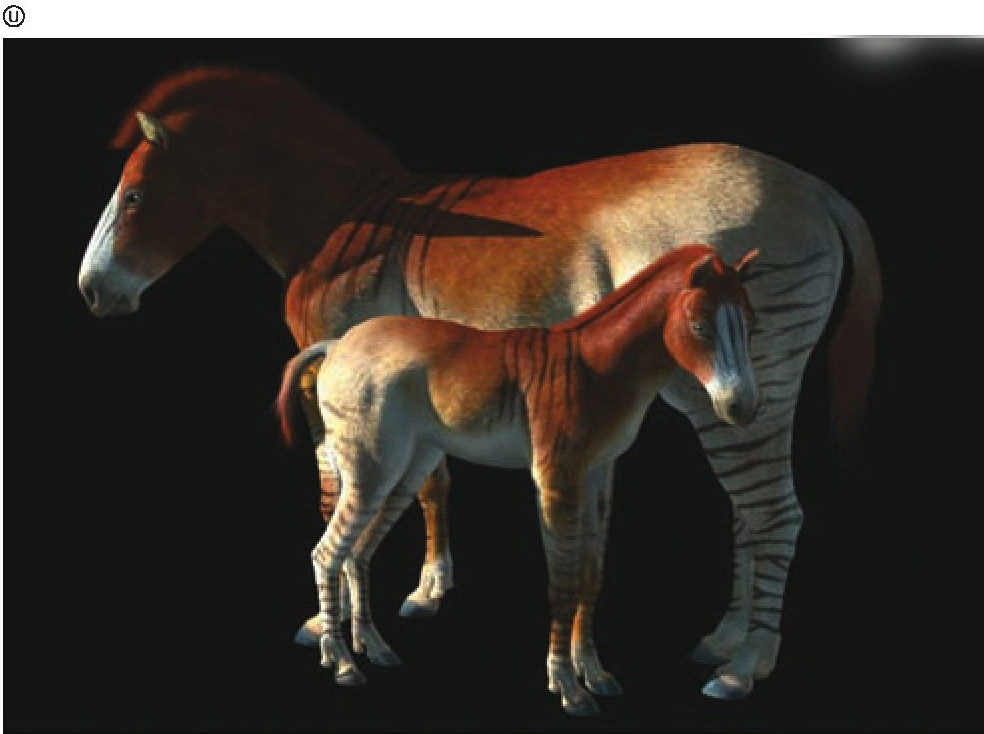
三趾马

在400万年前，上新马演化成前后脚都只剩下中趾的真马。真马在分类上属于真马属，所有现生的马科动物，包括马、斑马和驴都是真马这个属的不同种。真马的四肢高度特化，肱骨和股骨很短，桡骨和胫骨很长，尺骨和腓骨都退缩，掌骨非常长，而趾头则比较短。它的牙冠高，珐琅质皱褶细密，而最前面的一枚前臼齿已退化至很小甚至完全消失。真马在260万年前的第四纪初期从北美洲扩散到其他大陆，此后广泛分布于亚洲、欧洲、非洲和南美洲。（邓涛）

## 马是怎样演化的

从始祖马开始，马在演化过程中身体不断改变：体形越来越大，四肢变长，内外侧趾头萎缩而中趾加强；从前向后用来咀嚼的牙齿结构变得复杂，齿冠变高；“脸”越来越长，颅容量不断增大。马在新生代的地质历史中保存了丰富的化石记录，从始祖马一直延续到真马，因此成为生物演化最典型的例证之一。

始祖马的后代，4000万年前出现的渐新马，前后脚都只有3趾，中趾明显增大，但所有的趾头都与地面接触。1800万年前出现的草原古马是渐新马的后代，只依靠中趾行走，侧趾已很小，它有两种后代，即三趾马和上新马。三趾马经过几百万年的演化，在北美洲的植食动物群中占据了统治地位，同时也扩散到了亚洲、欧洲和非洲，并持续繁盛，直到50万年前的更新世中期才最后灭绝。而上新马则在北美洲最后演化成了今天的真马，并扩散到南美洲和欧亚大陆。

但到了大约1万年前的更新世末，马类在其起源演化的主战场美洲大陆走到了尽头。一直到欧洲殖民者重新将家养的马和驴带回新大陆，美洲才又出现了马类的身影。（邓涛）

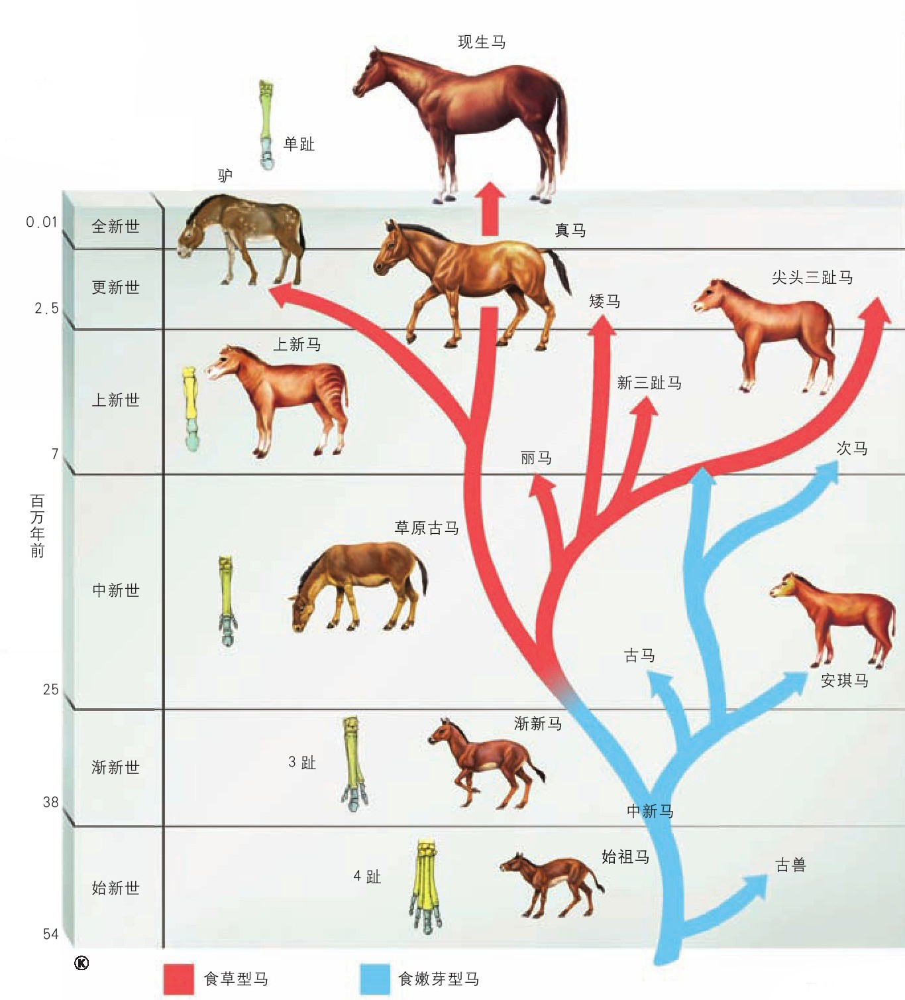
马的演化

  

**【微博士】**世界最大的马

中国第四纪的真马化石非常丰富。在甘肃临夏盆地发现的埃氏马是世界上最大的马，它们生活在距今250万年前。埃氏马长2.7～3米，高约1.8米，头骨长度可达0.7米。如果你在远古时见到它，一定会惊叹：好长的脸！

**【科学人】**马什

美国古生物学家马什（1831——1899）是北美洲的第一个古生物学教授，曾任耶鲁皮博迪博物馆馆长。在其职业生涯中，他共发表了约300篇科学论著，描述和命名了将近500个哺乳动物化石新种。通过马什的研究，人们了解了马类最早的演化线路：始祖马→渐新马→草原古马。

【微问题】蹄兔属于兔子吗？

【关键词】始祖马　渐新马　三趾马　上新马　草原古马

## 雷兽是凶猛的史前野兽吗

北美印第安人曾发现雷兽的化石。他们传说这种动物一到雷雨之后就全体出动，在北美广袤的草原上猎食野牛；又说它们吼声如雷，因而得名。那么，雷兽真是凶猛的史前野兽吗？

雷兽其实是吃植物的哺乳动物，在始新世时期非常繁盛。早期的雷兽身材小如犬，后期的则比现生犀牛还要大。雷兽的头很大，很多种类都长角。雷兽的角是由鼻额骨向外突出而形成的，看起来很可怕，但这种骨质角一般多起装饰作用，因易碎而不能用于顶撞，因此雷兽实际上并不凶猛。雷兽的牙齿属低冠的丘嵴形齿，它们脖子短，四肢粗壮，前脚4趾，后脚3趾。

雷兽与马、犀牛一样属于奇蹄目，但长得既不像马也不像犀牛。不少雷兽的身躯很庞大，北美始新世晚期的粗壮渐雷兽为雷兽中个体最大的，其肩高可达2.5米，体长约为4米。雷兽的体形是现生犀牛的2倍，但其大脑却只及现生犀牛的1/3那么大。因此，雷兽不是聪明的兽类。

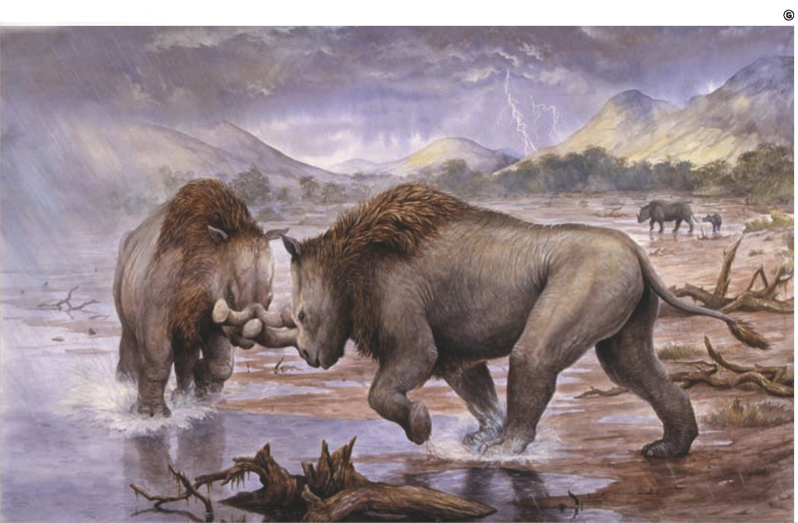
两头雷兽互相攻击的想象图，实际上它们的角经受不住猛烈的顶撞

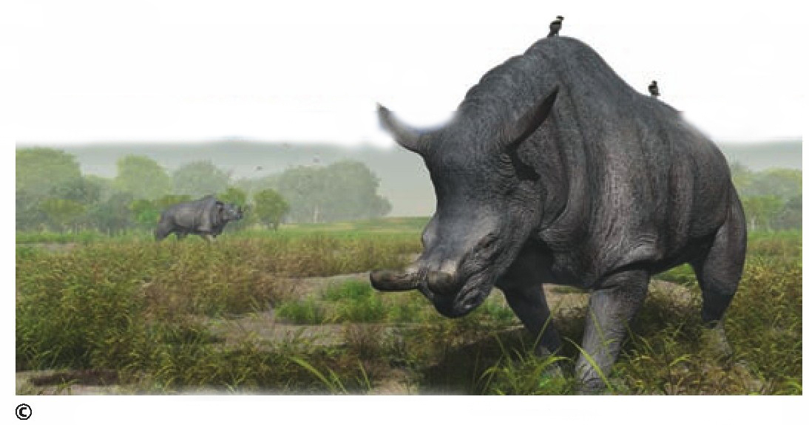
雷兽不吃肉，而主要以水草和树叶为生

雷兽起源于始新世早期，在北美洲和亚洲这一时期的很多化石地点中都发现有雷兽化石，说明雷兽曾经十分繁盛。北美洲的雷兽化石主要集中在西部地区，从始新世早期到晚期的地层中都能找到。在亚洲发现雷兽化石的地点也很多，其中以中国内蒙古的材料最丰富，从始新世中期到晚期的地层中都有发现。

早期的雷兽并不长角，直到始新世中期才第一次在北美洲出现了长角的雷兽。然而，北美洲的雷兽大多数在始新世后期就灭绝了，只有一个长角的雷兽谱系残存到了始新世的最末期，还回光返照似的又经历了一次“适应辐射”。这个时期的雷兽体形变得非常庞大，其角奇特地变为分叉的两支，颧弓也变得非常宽阔。但这只是最后的辉煌，很快雷兽就在北美洲灭绝了，亚洲的雷兽在始新世末也都灭绝了。

1959年，中国科学院古脊椎动物与古人类研究所的考察队在内蒙古发现了大量的雷兽化石。其中包括一个几乎完整的骨架，这在亚洲还是第一次发现，后来被命名为蒙古鼻雷兽。复原的鼻部结构显示，蒙古鼻雷兽可能生活在沼泽地带，当它将头埋在水中时，可以收缩鼻孔的中下部，使其闭合，防止水从鼻子进入，其上部仍然露在水面上，可供呼吸之用。头和颈都是平伸的，颊齿为低冠的丘形齿，这表明蒙古鼻雷兽可能主要吃灌木的嫩叶和沼泽中多汁的水草。

蒙古鼻雷兽的鼻骨长得与象、貘的相反，是往前凸而不是往后缩的，因此它不可能长有软的长鼻。鼻雷兽的门齿开始退化，同时犬齿和前臼齿之间的齿隙非常小，显然不允许伸出舌头进行取食。据推测，鼻雷兽的上唇可能具有较大的活动性，可以帮助取食。从四肢的比例和结构来看，鼻雷兽属于比较笨重的动物，甚至比犀牛还要笨重一些。（邓涛）

## 为什么吃草的爪兽要长爪子

爪兽是最不同寻常的奇蹄动物类群之一，它们外形很像马，牙齿与雷兽的相似，但最特别的是，它们是有蹄类动物中唯一长爪子的动物。爪兽这个特征让早期研究它的人迷惑不解——长爪的肢骨与明显具有奇蹄类牙齿的头骨之间怎么会有联系？所以，一开始古生物学家把爪兽的脚骨放在了穿山甲或食蚁兽的身上。直到1891年，才有人第一次证明了爪兽实际上是长爪的奇蹄动物。爪兽常用指关节行走，以保护长长的爪子，移动步态与大猩猩的相似。它那强有力的前肢是非常有效的防卫武器。推测爪兽像熊猫一样吃东西，它们用爪子钩下树枝，以便吃到最鲜嫩的树叶。在现生动物中与它们亲缘关系最近的种类是马。

爪兽从始新世首次出现以后一直延续到更新世，但这个类群从来没有过大发展的时期，不论何时，一直处于少数派的地位。除了在很少的几个地点有较多的爪兽化石堆积，世界上绝大多数地点发现的爪兽的化石都很少，且总是相当破碎。

关于爪兽爪子的功能，可以参考其他已灭绝的长爪的食草动物，如地懒、巨弓兽、纽齿兽和郊猪等。一些爪兽的爪子被解释为用于挖地以寻找可食用的草根，但这个解释不太可信。爪兽的前肢并没有因挖地产生的受压迫变化的痕迹，齿冠相对较低的牙齿也并不适合吃草本植物这样富含纤维和沙砾的食物。柔嫩的树木枝叶倒更适合爪兽的牙齿和颌骨形态。此外，从肢骨所反映出的特征也表明爪兽适合以后肢承重，用灵活的前肢抓取树枝和树叶来食用。一类爪兽的身体比例与大猩猩的相似，前后肢在长度上的差别很大，后肢很短，说明其奔跑能力较弱。另一类爪兽的四肢和颈部都很长，其身体比例与用四足站立取食树叶的种类，如现生霍加狓相似。此外，从前后肢的形态来看，后一类爪兽的后肢在取食时就像现生的非洲瞪羚和山羊一样有垂直站立的能力。这种直立的能力让它们能够抓取更高处的树叶，允许前肢在可能的范围内获得更多可食用的枝叶。有些爪兽的前肢非常粗壮，有人认为它能扭断树枝。所以，爪兽的前肢和爪子所起的作用，应该很像大象的长鼻和象牙所起的作用。（邓涛）

爪兽

  

**【微博士】**奇蹄类动物

奇蹄类动物包括现生的马、斑马、驴、犀牛和貘，以及已经灭绝的三趾马、雷兽、爪兽、巨犀等，除早期的类型前肢具4趾以外，前后脚的趾数通常是呈奇数的三趾或单趾，且脚的中轴通过第三趾（相当于人类的中指）。在演化中，奇蹄类动物从较小的体形逐渐向大型化的方向发展，多数种类四肢有变得细长的趋势。尺骨、腓骨退化或消失，没有锁骨，股骨具有第三转子。奇蹄类前臼齿的演化趋势是从小变大，从结构简单向结构复杂发展，变得与臼齿相似。这种现象被称为臼齿化，这是奇蹄类动物演化过程中一个最突出的特征。

【微问题】雷兽的角和牛角有什么区别？

【关键词】雷兽　爪兽

## 为什么说犀牛曾经十分繁盛

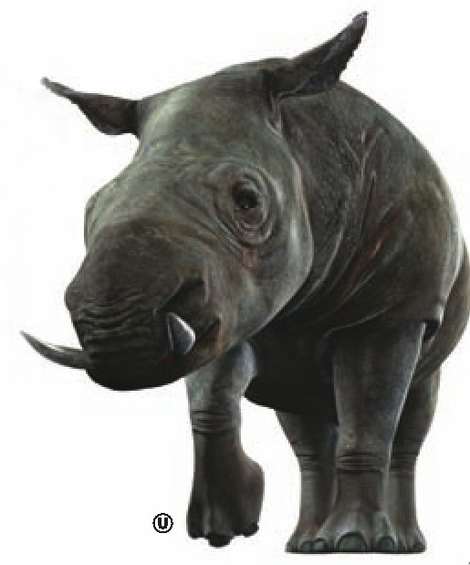
大唇犀

今天的犀牛都处于濒临灭绝的状态。然而，在地质历史中，犀牛曾经是这个星球上最成功的奇蹄目类群。从渐新世开始，北半球的大多数陆地生态系统中都有一个或更多的犀牛物种作为动物群的组成部分。几千万年前，中国也曾经是犀牛的乐园，不说遍地跑犀牛，但也绝不是罕见的动物。在不同的生态环境中，犀牛出现纷繁的分支。犀牛的化石属种远多于马类、蹄兔、貘类、爪兽和雷兽。在欧亚大陆、非洲和北美洲，犀牛在过去都大量存在。在一些地点，它们的数量比其他所有哺乳动物都要多。而且在大多数新生代动物群中，犀类常常是最大的食草哺乳动物之一。

地球上曾经活跃过的犀牛都属于犀超科，一共包括四个类群，即生活方式与河马相似的两栖犀、四肢细长的跑犀、体形巨大的巨犀以及现存的真犀。现生真犀长有一只或两只角，但历史上的很多犀牛不长角，比如无角犀。无角犀亚科包括无角犀、奇角犀和大唇犀等动物。它们体形中等，肢骨长，生有低冠的颊齿，可能还生有一个短的悬垂的软鼻，身体比例类似现生貘。无角犀以树叶为食，与貘类相似的解剖学特征说明它们具有相似的生活方式。第一种无角犀出现在渐新世晚期，开创了后来繁荣的无角犀谱系。另一个相关的无角犀谱系开始于小型短腿的奇角犀，化石最早见于德国中新世中期的地层。在中新世的中、晚期，奇角犀发展到顶峰，分布从欧洲远至印度和中国。无角犀还有一个谱系是大唇犀，大唇犀在身体比例和高冠颊齿方面都类似于河马，可能在中新世中期起源于南亚，然后迁徙到中国、中东和欧洲。

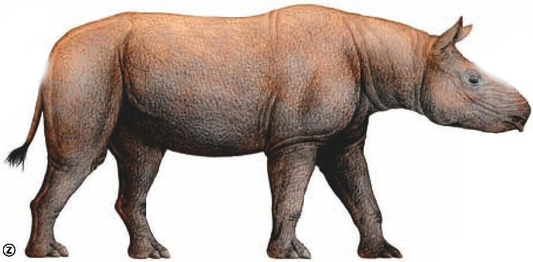
无角犀

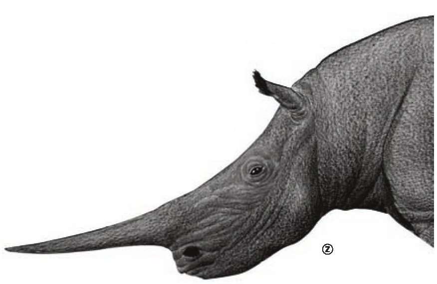
阔鼻宁夏犀

20世纪20年代，古生物学家在中国山西保德和陕西府谷发现了大量的三趾马动物群化石，其中的犀牛化石交由年轻的瑞典古生物学家林斯顿研究。在这些标本中，他惊异地发现，占统治地位的是一种奇怪的犀牛，它有2枚巨大的带锋利刃部的獠牙，而上门齿却完全退化消失，它的下颌骨吻部强烈地向侧面扩展。林斯顿给这类犀牛取名为大唇犀，表明它的上唇跟现生貘的软鼻很相似，可以将草叶卷起来在獠牙上切割。大唇犀的身体也非常奇特，四肢又粗又短，以至使肥胖的肚子几乎要垂到地面上。在中国，特别是在甘肃临夏盆地，大唇犀是三趾马动物群中最丰富的种类，简直可以因此把晚中新世的哺乳动物群叫成大唇犀动物群了。（邓涛）

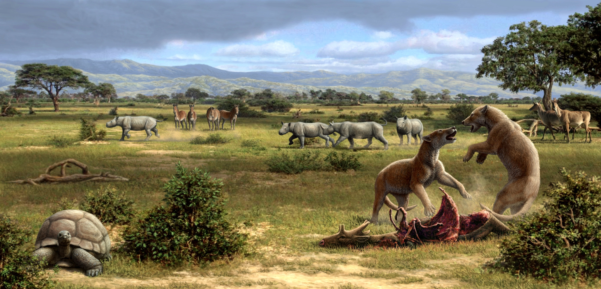
中新世稀树草原生态场景

## 巨犀是如何生活的

巨犀生活于4000万～2200万年前，只分布在亚洲东部地区，是地球上曾经存在过的最大的陆生哺乳动物。一只完全成年的雄性巨犀站起来，头部可伸到7米高，其体重根据推算可达24吨。这种庞然大物的身高超过了长颈鹿，其重量相当于8只现生犀牛体重的总和，远比非洲象更高、更大，在哺乳动物中只有海洋中的某些鲸类能与巨犀相比。

超大型的体格使巨犀不仅可以免受食肉动物的侵扰，还可以坚持几天不吃不喝而照样生存。在吃食的时候，巨犀可以够到树顶的叶子，这是身材高大的又一个优势。巨犀的怀孕期可能长达2年之久，出生以后可以活到80岁，长寿赋予了它们适应环境的独特经验。比如，在干旱的生活环境里，周围要是有水源的话，年老的巨犀肯定知道水在哪里。

巨大的体形使巨犀在开阔草原地带具有防卫优势，在渐新世时期它们的最大天敌是原始肉齿类动物中的鬣齿兽。和巨犀比起来，鬣齿兽的个子显得小得多，但是这些食肉动物也有黄牛般大小。鬣齿兽不能伤害成年巨犀，但能够轻而易举地杀死幼年巨犀，所以在受到围攻的时候，巨犀妈妈会尽可能地把孩子放到腿中间加以保护。

幼年巨犀刚一出生的体重就能达到250千克，因此它的腿还不能承受自身的重量，需要用一定的时间学习走路。这是它一生中最脆弱的时期，在至少3年时间里它将完全依赖其母亲，需要母亲的保护。新出生的幼年巨犀就已经能吃东西了，不过在第一个年头里，它还要吃母亲的奶水。但只要它能活过这个时期，世界上将没有任何食肉动物能够欺负它。

巨犀家族成员的体形虽很巨大，但并不像现生的犀牛那样笨重，可以说是一群巨大的长腿犀牛。巨犀的齿冠仍很低，构造也比较简单、原始，比以草食为主的非洲白犀的齿冠低很多，结构也简单得多，而与现生的亚洲犀牛很相似。所以巨犀在食性上很可能也与亚洲现生的犀牛一样，以柔嫩多汁的叶、茎等为食。巨犀和现生犀牛的区别还在于前者的脖子较长，而现生犀牛的脖子很短，在这一点上，巨犀与现生的马倒是比较相似。很可能巨犀在站立时，其颈部并不像现生犀牛那样是近于水平延伸的，而是像现生马那样向前上方斜伸。另外，现生犀类的桡骨与胫骨的长度相近，而巨犀的前腿明显比后腿长，特别是桡骨要比胫骨长许多。这样，巨犀在站立时，其前半身抬得明显要比后半身高。综合分析巨犀的形态特征，可以推测巨犀是吃树顶叶子的动物。

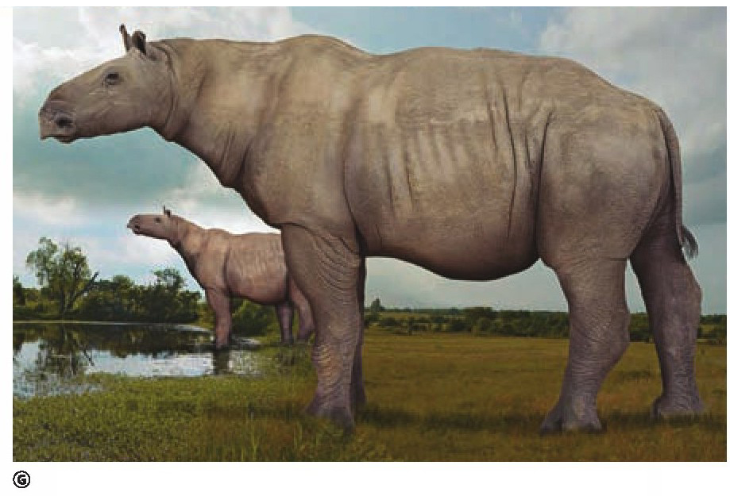
巨犀

根据现生犀牛的生态来推断，很可能巨犀也喜欢潮湿温暖的环境。在哈萨克斯坦产巨犀化石的地层中，人们发现了大量植物，证明在渐新世早期该地区有丰富的树叶供巨犀食用。但在产巨犀的渐新统晚期地层中发现的植物，则发生明显的变化：常绿植物和沼泽植物消失了，而阔叶——落叶林广泛分布，表明当时气候已变干燥。尽管如此，在那时亚洲的森林资源还是相当丰富的，因而巨犀仍能生存。但在中新世早期及其以后，干旱进一步加剧，草原更加广泛分布，树木减少了。而且，人们还发现了典型的干旱植物藜科植物的花粉，表明中亚地区在当时已局部沙漠化。在这样的环境和条件下，巨犀再也无法生存，从而在地球上完全灭绝了。（邓涛）

  

**【微博士】**巨犀的战斗

雄性巨犀间为了争夺配偶，会进行殊死的搏斗，它们会用头互相撞击，每一次撞击都势大力沉，其能量足以使石头粉碎。雄巨犀的头骨具有特殊的构造，可以承受住这种撞击。在现生动物中，长颈鹿也会用互相撞击头和脖子的方式来争夺配偶。巨犀间战斗的样子应该与长颈鹿的相似。

【微问题】为什么庞然大物大多是素食主义者？

【关键词】巨犀　真犀　跑犀　无角犀　大唇犀

## 为什么说最早的披毛犀生活在高原而不是北极

冰期动物群的扩散长期以来已被认为与更新世的全球变冷事件密切相关，冰期动物表现出对寒冷环境的适应，比如它们体形巨大，身披长毛，并具有能刮开积雪的身体构造。冰期动物以猛犸象和披毛犀最具代表性。正因为如此，披毛犀和其他已经灭绝的冰期动物曾经被假定是随着第四纪冰盖扩张演化而来的，它们很可能起源于高纬度的北极圈地区，但人们一直没有取得可信的证据。

2011年，中国科学家报道了在西藏喜马拉雅山西部高海拔的札达盆地发现的已知世界上最原始的披毛犀。这种西藏披毛犀生存于约370万年前的上新世中期，根据头骨尺寸估算其体重可达1.8吨。它具有披毛犀的一系列典型特征，包括修长的头型、骨化的鼻中隔、宽阔而侧扁的鼻角角座、下倾的鼻骨、高大的齿冠、发达的齿窝等。另一方面，它不同于其他比较进步的披毛犀，例如其鼻中隔骨化程度较弱、长度较短等。

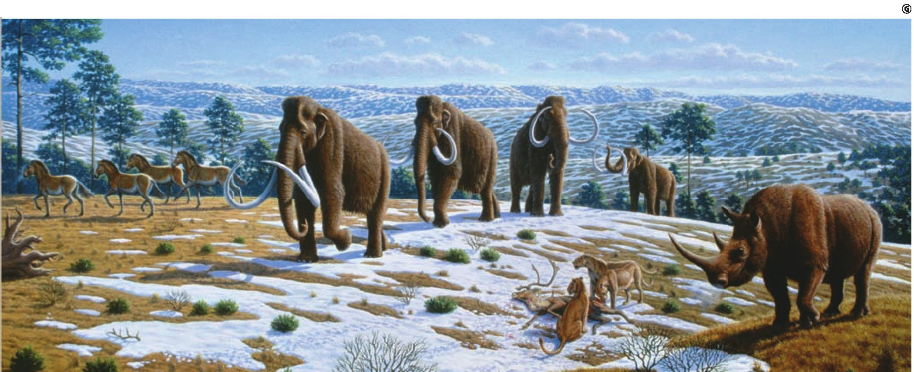
猛犸象和披毛犀是冰期动物的代表

西藏披毛犀的整个鼻骨背面都被粗糙面占据，由此表示它在活着的时候长有一只巨大的鼻角。额骨上一个宽而低的隆起，表示它还长有一只较小的额角。巨大而前倾的鼻角所具有的刮雪能力，可能是它能够适应青藏高原严酷冬季的最关键的原因，这代表了披毛犀谱系独特的演化优势。如此一个简单却重大的“创新”形成于北极永久性冰盖肇始之前，为开启披毛犀在晚更新世冰期动物群中成功的繁盛之路奠定了关键的预适应基础。披毛犀的存在说明札达盆地在上新世时的高度达到甚至高于现在的海拔，因此形成了冬季漫长的0℃以下的环境。

随着冰期在280万年前开始显现，西藏披毛犀离开高原地带，最后来到欧亚大陆北部的低海拔高纬度地区，与牦牛、盘羊和岩羊一起成为中、晚更新世繁盛的猛犸象——披毛犀动物群的重要成员。来自西藏的新化石材料证明，包括披毛犀在内的一些冰期动物群成员在第四纪之前已经在青藏高原上演化发展。冬季严寒的高海拔青藏高原成为了冰期动物群的“训练基地”，使它们完成对冰期气候的预适应，此后成功地扩展到欧亚大陆北部的干冷草原地带。这一新的发现推翻了冰期动物起源于北极圈的假说，证明青藏高原才是它们最初的演化中心。

披毛犀的所有已知种都生活在欧亚大陆尤其是西伯利亚地区的寒冷环境中，有限的几个靠南的分布地点都是高海拔地区，位于青藏高原内部或靠近其东缘，如青海共和、甘肃临夏和四川阿坝。另一方面，尽管旧大陆有着非常丰富的上新世犀牛化石记录，但此前却没有任何更新世之前的披毛犀化石发现。如此突出的动物地理分布模式和演化顺序证明随着全球气候变冷，严寒环境蔓延，披毛犀的祖先从高海拔的青藏高原向高纬度的西伯利亚迁移，最后演化为最成功的冰期动物之一。（邓涛）

## 披毛犀是什么时候灭绝的

披毛犀具有巨大的鼻角、厚重的皮毛和非常粗壮的骨架，是最著名的，也是被了解得最多的更新世动物之一。犀牛角是由与毛发、指甲成分相同的角蛋白形成，所以通常不能保存为化石，只有少数保存在冻土中的披毛犀的角是例外。在所有已发现的披毛犀鼻角标本上都发现了横向的条带，它代表了年生长带，显示披毛犀生活的干冷草原具有强烈的季节性变化的气候环境。

与猛犸象和现生牦牛的长毛一样，披毛犀的厚重毛发可以起到保温作用，明显地表示它适应于寒冷的苔原和干草原上的生活。非常宽阔的鼻骨和骨化的鼻中隔指示披毛犀长有两个相当大的鼻腔，这增加了在寒冷空气中的热量交换幅度，帮助它在呼吸时预热空气，并减少热量散失。披毛犀长而侧扁的角呈前倾状态，用以在冬季刮开冰雪，从而可以找到供取食的干草。

古生物学家对披毛犀的身体解剖结构已经了解得比较透彻，因为有一些披毛犀干尸在冻土地带或沥青沉积中被发现了，它们像毯子一样覆盖全身的厚重毛发也被保存下来。披毛犀曾经与人类的祖先共同生活在一起，原始人类把披毛犀的图像绘制在洞穴壁画上，使我们能够看到披毛犀生活时候的样子。

披毛犀在上新世起源于中国青藏高原之后，到早更新世扩散至华北地区，然后向西迁徙，倒数第二次冰期时到达欧洲。在晚更新世，披毛犀比任何已知的现生和灭绝犀牛都具有更大的分布范围，遍及整个欧亚大陆北部，从东面的朝鲜半岛一直到西面的苏格兰甚至西班牙。当1万年前末次冰期结束，随着全球暖期的到来，披毛犀适宜的气候环境消失了，它们也走向了无法挽回的灭绝之路。（邓涛）

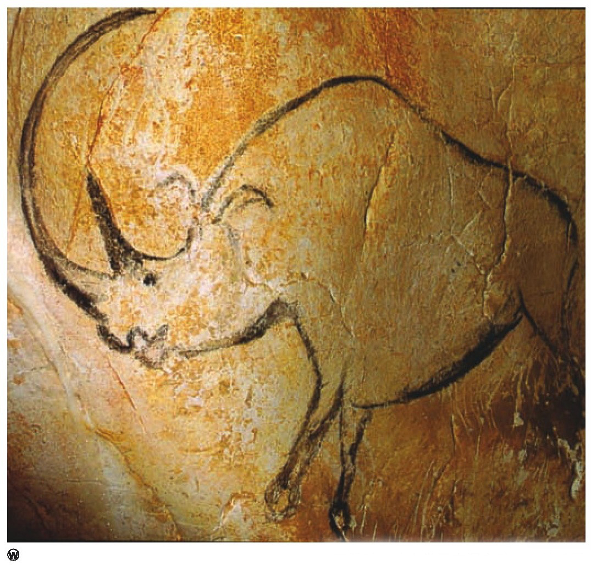
石器时代的人类画在洞穴壁上的披毛犀

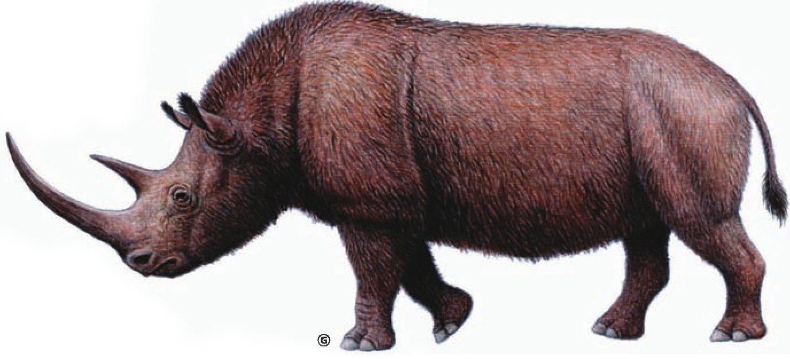
披毛犀

  

**【微博士】**一只角的犀牛

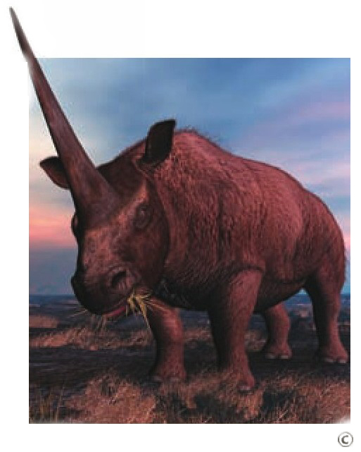
板齿犀

在冰期的欧亚大陆上有两种著名的长毛犀牛，一种是披毛犀，一种是板齿犀。它们身上都披着厚厚的长毛，从外形上看似乎很相像。但实际上，板齿犀要比披毛犀大1倍左右，肩高2米，长6米，体重5吨，和一辆卡车差不多。而披毛犀体长不到4米，体重只有2吨左右。更明显的特征是，披毛犀有2只角，而板齿犀只有1只巨大的、长度可达2米的大角。有人认为传说中的“独角兽”原型就来自板齿犀。

【微问题】披毛犀和现生牦牛有亲缘关系吗？

【关键词】披毛犀　板齿犀

甘肃和政晚中新世三趾马动物群生态复原图

## 巨猪个头有多大

今天的偶蹄类动物，既包括猪这样的不反刍动物，也包括牛这样的反刍动物，它们都源于古偶蹄类。古偶蹄类的一支在始新世或渐新世早期成为了不反刍偶蹄动物的祖先。在这些不反刍动物中，有一类被称为巨猪的怪兽，它们从始新世晚期出现，一直延续到了中新世。巨猪之所以得名，是因为它们强烈表现出体形逐渐变大的趋势，在渐新世的初期，巨猪的体形已经与现生野猪的相似，而在渐新世的末期就演化成野牛般大小。到了中新世，巨猪演化成真正的庞然大物，跟今天的犀牛一样巨大。

其实，巨猪虽然叫猪，但只是在身体的某些方面像猪，在分类学上它与现生猪分属于偶蹄目下面不同的亚目，即巨猪与古偶蹄兽一样属古齿亚目的成员，而猪却是猪形亚目的成员。巨猪在两个方面演化特征相当明显：一个是演化出适于奔跑的长腿和长脚，以及直而硬的背部；另一个是演化出相当大的头骨和相应大小的牙齿。在巨猪的腿向伸长方向演化的同时，其脚上的侧趾退化了。所以在相当早的时候，巨猪已经演化成只有2个趾的偶蹄动物，而直到今天，猪仍然长着4趾，所以仅从这一点上说，也能看出巨猪并非是猪的祖先。

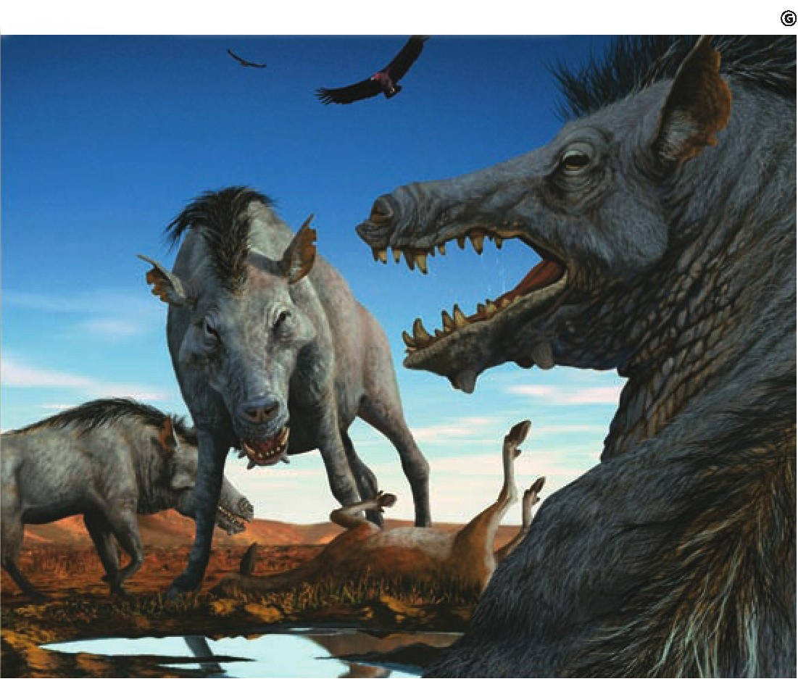
巨猪及其头骨

在北美洲和欧亚大陆都曾发现巨猪化石，在中国也能找到这一类史前怪兽的踪影。在北美洲发现的巨猪以渐新世的巨猪和中新世的恐颌猪为代表，在中国发现的巨猪则以渐新世的副狶为代表。从恐颌猪身上就可以看出巨猪头部显著增大的趋势。恐颌猪是一种体形大约与野牛相当的动物，其巨大的头骨有1米长，但恐颌猪的脑颅仍然相当小，只有橘子那么大，所以它是一种相当蠢笨的动物。恐颌猪的面部伸长成马脸状，因此眼睛的位置相当靠后。在恐颌猪的颊骨或颧弓和下颌的边缘有显著的折角或瘤状突起，这说明其头部有发达的肌肉附着。恐颌猪在齿式排列上显得相当原始，所有的牙齿都保留，特别是长有巨大的犬齿，因此样子看起来相当恐怖。

与今天的猪一样，巨猪是一种杂食性动物，这是从其丘形牙齿上判断出来的，即在巨猪的颊齿冠面上长有丘形的齿尖，上下臼齿都呈方形，这样，在每一枚臼齿上都有4个主要的齿尖。

巨猪在渐新世和中新世早期是北半球哺乳动物群中称王称霸的动物。没有什么动物看起来比巨猪更让人生厌了，但讨厌的东西总能生存。巨猪十分好斗，在交配季节，这些巨大的杂食性动物互相攻击，其可怕的牙齿咬得失败的一方遍体鳞伤，目的是建立自己在群体中的最高统治地位。巨猪最危险的敌人正是它们的同类。而对其他的动物，巨猪则是噩梦，即使是一头巨犀，它们也完全可以置之不理，因为巨犀完全是食草的动物，不会对巨猪构成威胁。相反，巨猪有时会进攻幼年的巨犀。巨猪甚至可以与同时代食肉性的鬣齿兽竞争。

无论曾经多么风光，在中新世后期巨猪就灭绝了，因为与巨猪有相似生活习性，也与巨猪存在生态竞争的猪，以及另一种名为西猯的动物，都更加聪明。尽管它们在体形上远不如巨猪，但其相对更大的脑部带来更高的智慧，使它们在竞争中战胜了巨大的对手。（邓涛）

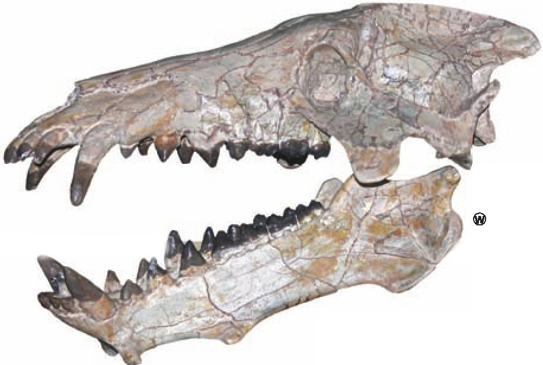
## 长颈鹿的长脖子是怎样演化出来的

长颈鹿在分类上并不属鹿类，而是和鹿分别属于两个不同的科。但它们同属于偶蹄目，有共同的祖先。长颈鹿是在中新世时期与鹿类“分家”的，从那个时候起长颈鹿就与鹿类渐行渐远，最后演化成两个有显著区别的不同类群。

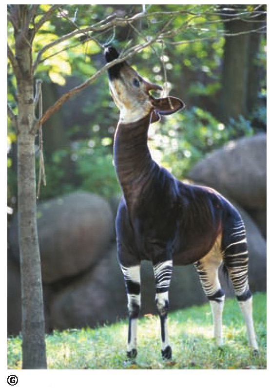
霍加狓

长颈鹿的祖先是生活在中新世和上新世时一类叫古麟的原始长颈鹿。古麟与现生生活在刚果原始森林中濒临灭绝的霍加狓十分相似。古麟中最繁盛的一支是晚中新世的萨摩麟，曾经广泛分布在欧洲和亚洲。萨摩麟是一种长两对角的古老长颈鹿，因化石首先在希腊的萨摩斯岛上发现而得名。萨摩麟的头很长，四肢更加细长，当然，最典型的还是它的长脖子。萨摩麟以及其他的长颈鹿与大多数哺乳动物一样，也只有7个颈椎，但每一个颈椎都拉长了。与今天的长颈鹿相比，萨摩麟的脖子还不算太长，只与霍加狓相似。萨摩麟不太长的脖子正是长颈鹿演化中间阶段的一个特征。

进化论的先驱、法国早期的博物学家拉马克曾提出，短脖子的长颈鹿为取食高处的树叶而努力伸长脖子，这样就逐渐演化成了现生的长颈鹿。当然，现在已经知道这只是一种朴素的演化思想。实际上，长颈鹿的脖子不是因为主动地努力伸长而变长的，而是因为自然选择淘汰了那些短脖子的个体，积累了有利的长脖子基因才实现的。

在上新世晚期和更新世时期生活在南亚次大陆的西瓦麟则是向笨重方向演化的另一类长颈鹿的代表，它的四肢比例正常，体形与牛类相似。西瓦麟最显著的特征是头骨上的角大而复杂，在两个巨大的张开的骨质角之前还生两个较小的圆锥形角。活着的时候，西瓦麟的骨质突起上可能还有硬角覆盖。几千年前两河流域的苏美尔人制作的青铜小雕像中还保留西瓦麟的形象，说明那个时候这种动物还没有灭绝。（邓涛）

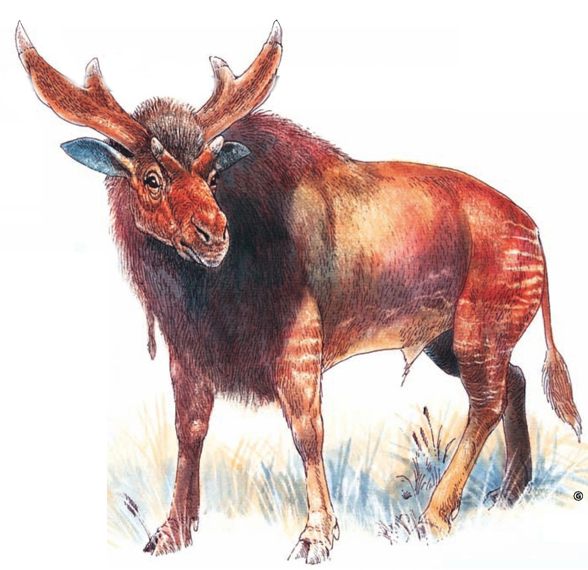
西瓦麟

  

**【微博士】**高冠齿和低冠齿

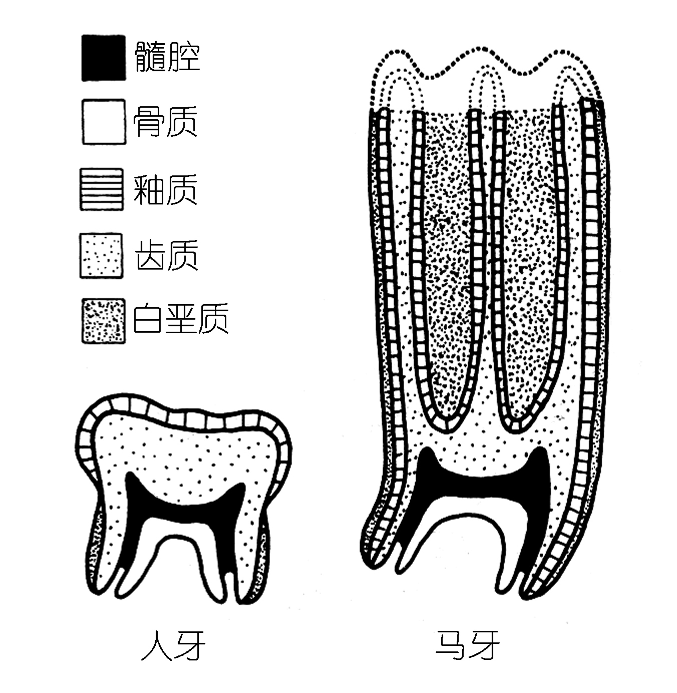
低冠齿（左）、高冠齿（右）

牙齿包括齿冠和齿根两部分，齿冠高于齿根时就叫高冠齿，反之则叫低冠齿。低冠齿适应于取食乔木和灌木的柔嫩枝叶，这些枝叶对牙齿的磨蚀作用很小；而高冠齿适合以草本植物为食，因为草籽和植物纤维对牙齿有强烈的磨蚀作用，所以必须长出较高齿冠不断接替被磨损的部分。在演化过程中，马走出森林来到草原，它的牙也相应地从适应嫩叶的低冠齿发展到了适应草本植物的高冠齿。而长颈鹿则一直保持着低冠齿，它采取的适应策略就是脖子越长越长，去吃树上的嫩叶。

【微问题】长颈鹿的颈椎骨数量比人的多吗？

【关键词】巨猪　古麟　萨摩麟　西瓦麟

## 鹿角、犀牛角和牛角有什么不同

要衡量鹿科动物演化程度的高低，最简单的方法就是看其雄性个体头上是否长有鹿角。进步的鹿科动物其雄性都有突出的鹿角。鹿角是从位于眼眶上方的额骨上长出来的，最下部就是长在额骨上的两个骨质棒，被称为角柄，活鹿的角柄外面有皮肤包裹。当鹿到成年期后，从角柄上每年长出有皮肤覆盖的新鹿角，一年比一年更大。长成完整的鹿角需要好几个月，然后覆盖在鹿角上的皮肤干枯了，鹿就在石头和树干上把干皮擦掉，鹿角就变成了坚硬和尖锐的叉刺，它是雄鹿在交配季节争夺配偶的重要武器。每年的交配季节一过，当年的鹿角就脱落了，新的鹿角又开始重新生长，就这样周而复始，交配季节好战的雄鹿年年都有新武器。然而，在新鹿角还没有长成的时候，雄鹿是有自知之明的，它们总是小心翼翼地保护着自己的鹿角，这个时期的鹿角也就是有名的鹿茸。

牛科动物最突出的特征是长在头骨上的角。与其他大多数偶蹄类不同，牛科动物常常是雌雄两性都长角。牛角是由额骨上突起的骨质形成的，它被称为角心，角心外面覆盖着非常硬的角质的套，由于中间是个空洞，故被称为洞角。除了叉角羚羊以外，牛科动物的角质套是永久存在的，角质套随着骨质角心的生长而扩大。与鹿类每年一换的鹿角相比，牛科动物一辈子不换的角为动物减少了相当大的能量消耗，牛角加上其完善的反刍消化系统使牛科动物在生存斗争中取得了最大的成功。牛角是非常有力的武器，在抵抗食肉动物的进攻上能发挥重要的作用。有些大型的牛科动物甚至自己也变成了富于进攻性的动物，看看西班牙的斗牛就可以知道牛类动物也不是好惹的。

现生的犀牛都长有一个或两个角，犀牛角是哺乳动物中唯一全部由角质构成的没有骨质角心的角。正因为如此，在化石中，鹿角和牛角中的骨质部分能保留下来，而犀牛角很少保存为化石，只有少量最晚期的披毛犀的角因为保存在冻土中而成为例外。大多数早期的犀牛都是无角的，而具有角的犀牛在头骨上与角基接触的地方形成明显的粗糙面，可以据此在化石中判断犀牛是否长角，以及该角的形状和大小。（邓涛）

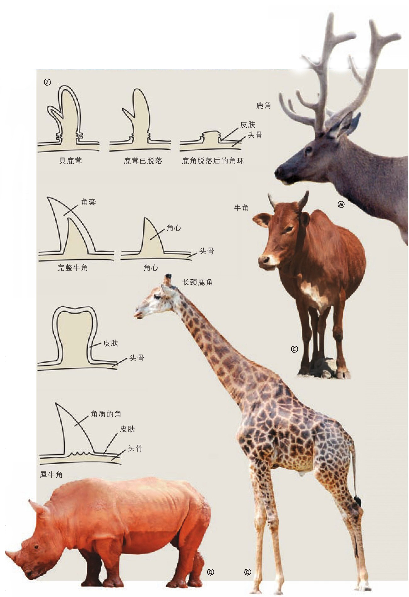
几种哺乳动物的角

## 偶蹄类为什么比奇蹄类更有竞争力

偶蹄类动物之所以被称为偶蹄类，是因为它们的趾数是偶数。也就是说偶蹄类的每只脚上要么有2个脚趾，相当于人的第三和第四趾，要么有4个脚趾，相当于人的第二到第五趾，但重心都在第三和第四趾之间。

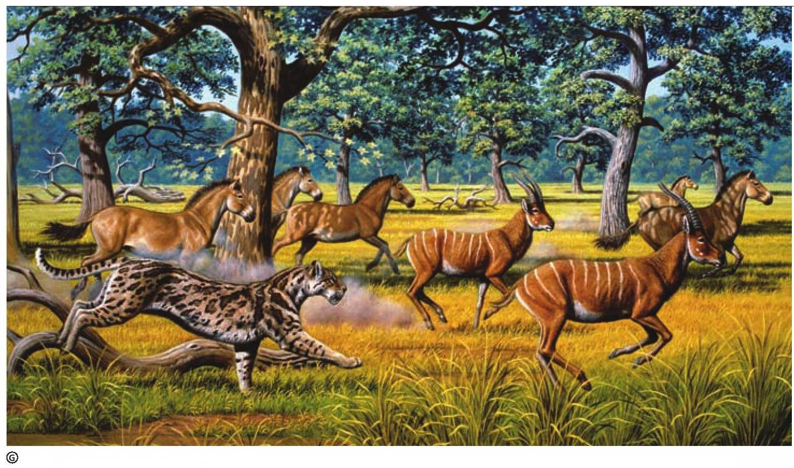
稀树草原上动物间的生存竞争

偶蹄类脚踝上的距骨是另一个最具特征的部位之一，这块骨头具有两个滑车部（也就是关节面），向上的一个滑车与胫骨连接，向下的一个滑车与脚踝的其他跗骨连接。偶蹄类的距骨完全不同于只有一个滑车的奇蹄类距骨，这种双滑车的距骨使其后肢能在很大程度上进行弯曲和伸展。正是借助于距骨的这一特点，大多数偶蹄类动物具有非凡的跳跃能力。

偶蹄类比奇蹄类演化得更为成功，其重要原因是得益于大多数偶蹄动物所拥有的特殊消化系统，它是由4个胃室组成的胃和相关的肠道系统。具有这种消化系统的偶蹄类动物被称为反刍动物。在反刍动物的取食过程中，植物性的食物在被咬碎、切断后首先进入第一个胃室——瘤胃，和第二个胃室——蜂巢胃。胃内的食物在细菌作用下被消化成软块，然后这些软块又被重新驱回口内咀嚼。这一过程就是反刍。重新入口的食物块经充分咀嚼成小食物块后，再被吞入第三和第四个胃，即重瓣胃和皱胃，被进一步消化。这种复杂的消化过程正是偶蹄类动物在生存斗争中取得优势的原因。它们可以在强敌到来之前的很短时间内匆忙吞下大量食物，然后迅速逃离险境直到一个安全的地方，这时再将食物反刍进行细致的咀嚼和彻底的消化。这种能快速大量吞下食物然后进行反刍和消化的特点，使偶蹄类在逃避大型食肉动物的追捕过程中，仍然能够得到足够的食物并进行充分的消化。偶蹄类动物的这一特点在开阔草原范围不断扩大的新生代晚期具有明显的竞争优势。因为在草原上，偶蹄类和奇蹄类虽然都取得了快速的奔跑能力，但凶猛的食肉动物同样也可以快速地进行追捕，然而偶蹄类能在逃跑之前迅速进食，为它们在与奇蹄类动物的生存竞争中取得绝对的胜利奠定了基础。

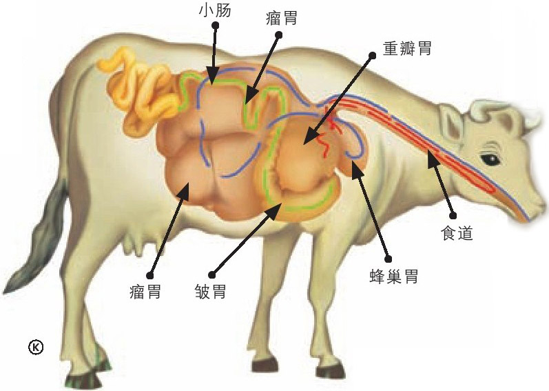
牛的消化系统

从化石记录来看，偶蹄类与奇蹄类几乎同时出现在地球上，在早期演化阶段，奇蹄类还显著占优，但随着时间的推移，奇蹄类的种类和个体数量都逐渐让位于偶蹄类，使后者在新生代晚期占据了统治地位。（邓涛）

  

**【微博士】**差异巨大的偶蹄类

偶蹄类包括了猪科、河马科、驼科、鹿科、长颈鹿科、牛科等动物，各类动物之间形态差异非常大。既有能反刍、吃粗糙禾草、生活在草原上的牛科和驼科动物，也有只能吃树上嫩叶、生活在森林中的鹿科和长颈鹿科动物，还有牙齿十分简单，吃杂食的猪科动物。陆生的古老偶蹄类中的一种动物则演化出了适于水生生活的鲸类。

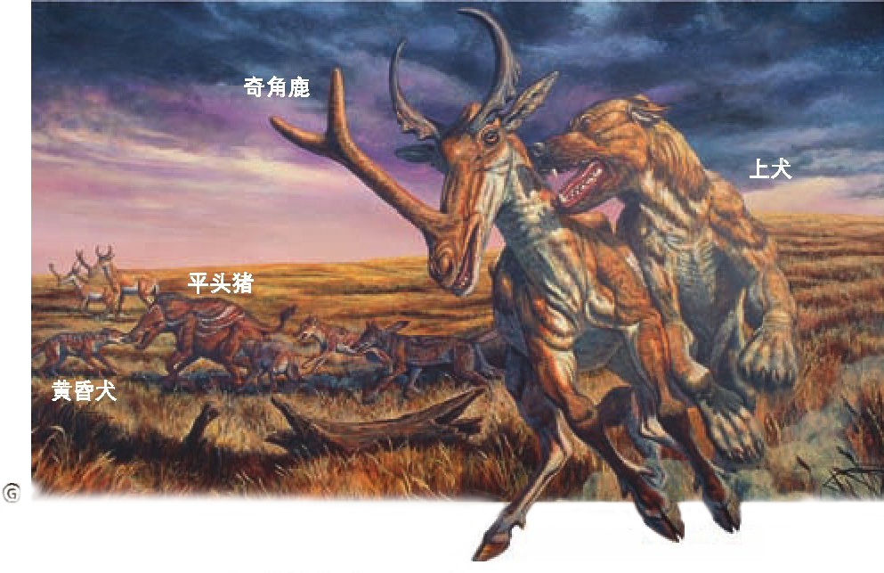
上新世的北美草原

【微问题】不反刍的偶蹄动物有几个胃？

【关键词】角　偶蹄类　距骨　反刍

## 海豹是谁的后代

现生的鳍脚类哺乳动物包括海豹、海狮和海象等海兽，它们是半水生、海生的食肉动物，其四肢已演化为鳍状肢。最早得到广泛认可的鳍脚类化石是生活在中新世北美洲西部的海熊兽化石，海熊兽与现生鳍脚类动物十分相似，是一种具有发达鳍状肢的短尾海生动物。它被认为是地球上最早的鳍脚类动物，但它与鳍脚类的陆地始祖之间却依然横着一条巨大的演化鸿沟。

2007年，在加拿大的中新世早期河流相沉积中发掘出一种全新的半水生食肉动物——海幼兽，几近完整的骨架，它充分展现了早期鳍脚类动物与其陆地始祖的联系，因而填补了这条演化的鸿沟。

海幼兽是一种熊形哺乳动物，它与演化程度更高的鳍脚动物海熊兽几乎生存于同一时代，处在其他早期海生鳍脚类动物发生重大适应辐射的前夜。据推测，海幼兽的身体全长约1.1米，保留有长长的尾巴和比例均衡的前后肢。相比现生鳍脚类动物，海幼兽更接近于现生陆地食肉类动物的形态，但具有半水生的适应性状。它没有鳍状肢，其足部可能具蹼，有长尾，其四肢比例基本上与现生水獭的相似。但海幼兽的前足较长，其前后足的大趾比第二趾以外的其他趾头要长。海幼兽的后趾比北美水獭的更长，尾部更短、更细，且趾骨远端扁平，其原因可能与趾骨间存在蹼有关。生有增大的蹼脚、强壮的前肢和未特化的尾部，表明海幼兽是以四肢来游泳的，运用其有蹼的前后足划水。相比之下，大多数现存的鳍脚类动物则采用两种形式迥异的方式来游泳：海豹使用其后足以骨盆侧向交替摆动来划水，而海狗和海狮则摆动其鳍状前肢以类似飞行的动作前进。作为一种可能是用四肢划水的动物，海幼兽的这种游泳方式也许是现今鳍脚类动物两种主要游泳模式的最初起源。

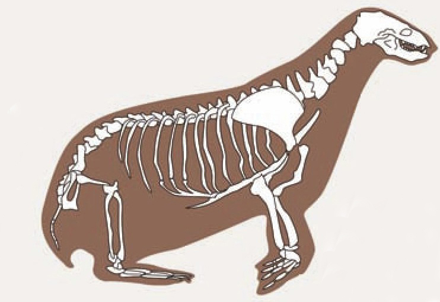
现生海狮结构（后肢能向前弯）

现生海豹结构（后肢不能向前弯）

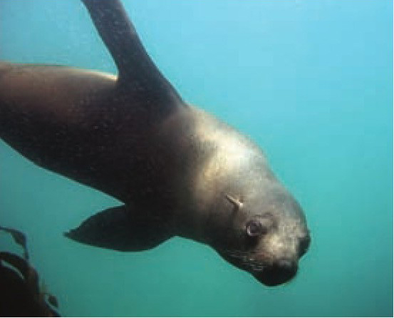
主要用前肢游泳的海狮

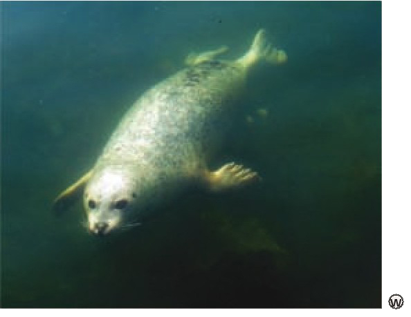
主要用后肢游泳的海豹

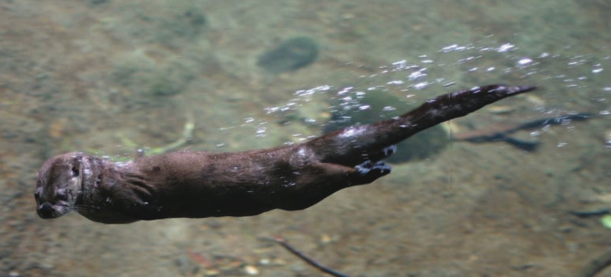
水獭用四肢和尾巴划水，可能类似于海幼兽

海幼兽与海熊兽、亚洲渐新世的半鼬等古兽构成演化谱系。半鼬是鳍脚类动物及其他所有鼬类动物的近亲类群，具有一系列相似于海幼兽的特征。如果半鼬是最原始的鳍脚类动物的话，那么这一演化谱系的起点则是在欧亚大陆的渐新世之前。

海幼兽的化石证明了鳍脚类与鼬类之间的密切联系和相似之处，显示鳍脚类的演化过程包含了一个从淡水到海洋的过渡时期，并支持了北极地区是进步鳍脚类演化早期中心的假说。海幼兽生活在寒温带，这一环境中的淡水湖泊在冬季可能会冻结。早期北极鳍脚类种群相比起南方的同类可能会更频繁地接触到海岸环境，这是因为当冬天难以进入淡水湖泊时，海洋王国却仍然向其开放，它们可以继续在此生活捕猎。（邓涛）

## 最早的鲸类生活在陆地上还是海洋里

鲸类动物是典型的水生哺乳动物，它们的身体呈流线型，很像鱼的样子，所以常被称为鲸鱼。鲸类动物是如此特化地适应于水中的生活，人们不禁会问：它们从哪里来？它们的祖先是生活在陆地上还是在海洋中？

既然鲸属于哺乳动物，它们应该跟原始的哺乳动物祖先有某种联系。然而，鲸似乎是在古近纪早期突然出现的，而这个时期的鲸所具有的基本的哺乳动物的构造已经深刻地改变，充分地适应了水中的生活方式。这个时期的化石证据显示鲸与其他哺乳动物的关系已到了相当疏远的地步，它们具有非常孤立的分类地位。古生物学家由此推断，当鲸从原始的哺乳动物祖先分化出来后就产生了快速的演变，所以到始新世中期时它们已经是典型的海洋动物了。

20世纪70年代，在巴基斯坦境内喜马拉雅山麓5000万年前始新世的地层中，人们找到一个鲸类动物头盖骨的后部化石和几颗牙齿化石。该鲸类后来被命名为巴基鲸，是已知最早的古鲸。找到的化石与一些陆生或海生的哺乳动物遗骨混杂在一起，而这个地区曾经一度位于海岸线上。这就使人想到，这种原始的鲸可能曾经是一种既可以生活在海洋又可以生活在陆地的两栖型动物。

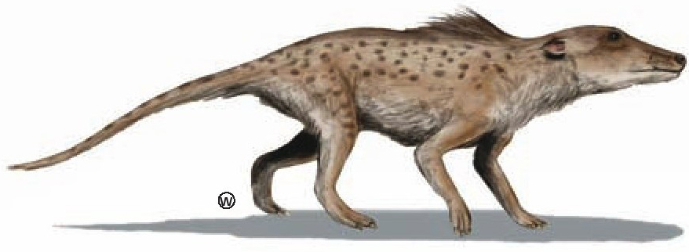
巴基鲸

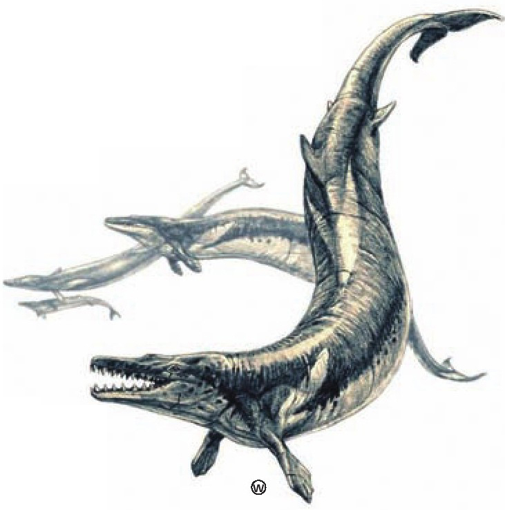
龙王鲸的后肢已基本退化

古生物学家后来又在巴基斯坦东北部发现了更多巴基鲸的化石，新材料显示巴基鲸生有四肢，其脚踝处的跗骨结构类似偶蹄动物的跗骨结构。所有头后骨骼提示巴基鲸是陆生哺乳动物，甚至还是能快速奔跑的动物，在运动时它只用脚趾接触地面。巴基鲸体长1.8～2.4米，体重180～200千克，靠猎取其他动物和鱼类为生，很可能是白天生活在海里，夜间又返回陆地。推测也许由于海洋中丰盛食物的引诱，使巴基鲸逐渐游向大海。目前，形态学与分子生物学的证据都证明鲸类动物起源于偶蹄类。最重要的证据还包括化石中跗骨的关节面形状和方向。鲸类化石的距骨上有双滑车，两个滑车分别连接胫骨和更远端的跗骨。这种距骨显示了对奔跑的适应，曾被认为是偶蹄类特有的，但现在它也出现在鲸类化石中，由此显示偶蹄类是鲸类亲缘关系最近的“亲戚”。早期鲸类的偶蹄类特征从某些方面看比任何已知的偶蹄类更加原始，因此提示鲸类很早就从一种未知的初始偶蹄类中分化出来。（邓涛）

  

**【微博士】**海兽的分类

在哺乳动物中，带“海”字的兽类不少，比如海狮、海豹、海狗、海象、海牛、海獭等。它们看起来颇为相似，其实属于不同的类群。海豹、海狮和海象属于鳍脚目，起源于古鼬类，其中海狮科又分为海狗亚科和海狮亚科。海牛属于海牛目，起源于古长鼻目，是大象的近亲。而海獭属于食肉目的鼬科，只营半水栖生活，并没有完全下海。

【微问题】早期的鲸是怎样游泳的？

【关键词】海熊兽　海幼兽　巴基鲸

## 为什么说非洲是人类的发祥地

自20世纪20年代在南非发现古人类化石以来，迄今人们已经在非洲的北部、东部、中部，以及南非的多处地点发现了大量古人类化石。其中以非洲东部的埃塞俄比亚、肯尼亚、坦桑尼亚，以及南非的古人类化石最为丰富。1959年，肯尼亚古人类学家路易斯·利基和玛丽·利基夫妇在坦桑尼亚的奥杜瓦伊峡谷发现了距今175万年的南方古猿鲍氏种和距今190万年的能人化石以及大量的石器，使得人类历史延长到200万年前。20世纪60～70年代，在埃塞俄比亚东北部的阿法地区以及肯尼亚图尔卡纳湖地区发现了大量的南方古猿和能人化石，以及相关的古人类生存证据。其中包括距今330万年的南方古猿阿法种“露西”骨架和在奥杜瓦伊峡谷附近的莱托里发现的350万年前的南方古猿阿法种足迹。

地猿始祖种

20世纪90年代以来，在非洲发现了时代更早的古人类化石。1994——2001年间，在埃塞俄比亚发现了距今440万年前的地猿始祖亚种和距今580万～520万年前的地猿族祖亚种化石。2000年，在肯尼亚发现了600万年前的土根原初人化石。由于发现在世纪之交，土根原初人又被称为“千禧人”。2001年，在乍得发现了700万～600万年前的撒海尔人。研究显示，这些新发现的700万～440万年前的化石主人已经具有了一系列人类的特征，包括直立行走的能力。

在非洲，250万～100万年前的直立人和能人化石也有大量发现，如在肯尼亚图尔卡纳湖西岸，发现了世界上最为完整的KNM-WT15000号直立人骨架、KNM-ER1470号能人头骨等。此外，在非洲还发现有年代较早的晚期智人（早期现代人）化石，包括在埃塞俄比亚赫托地点发现的16万年前的头骨化石。在非洲发现的古人类化石具有数量丰富、时代连续（从700万年前到数万年前）、种类多的特点。除人类化石外，在非洲还发现了距今250万年的人类最早制造和使用的石器工具，在动物骨骼化石表面有最早的人类屠宰切割痕迹，以及距今7万年的人类最早的装饰品。迄今为止，可靠的化石证据显示南方古猿和能人及其之前的古人类只发现于非洲，而在欧洲和亚洲尚没有早于200万年前人类存在的可靠证据。通过研究在非洲发现的古人类化石，国际古人类学界普遍认为，从猿向人的演化过渡发生在非洲。在非洲发现的地猿化石、土根原初人化石、撒海尔人化石为这个转化过程提供了有力的化石证据。

另外，化石证据也显示，在人类和猿类分开之后，人类的早期演化过程也是在非洲完成的。生活在200万年前的早期人类成员南方古猿和能人只发现于非洲，它们的后代即后来扩散到全世界的直立人很可能也是在非洲本地起源的。还有许多学者提出，现代人（现生人类）也起源于非洲。所有这些重要的古人类化石和研究证据显示：非洲是人类的发祥地。（吴秀杰　刘武）

## 为什么说能人是人类的直接祖先

1960年，人们在坦桑尼亚的奥杜瓦伊峡谷发现了一个小孩头骨的一些破片化石。这件标本的头骨较薄，但颅容量并不小，估计有650毫升。此后，人们在附近又发现了更多的人类化石。1964年，路易斯·利基等发表论文将这些化石命名为“能人”，意思是手巧的人。这个名字是根据澳大利亚古人类学家达特的建议起的。他设想能人应该是能够制造工具的人。能人在分类上属于人科人属能人种，是人属的最早成员，生活在距今250万～160万年，是最早的可以制造和使用工具的人类。现有的能人化石只发现于非洲，主要在坦桑尼亚的奥杜瓦伊峡谷和肯尼亚图尔卡纳湖东岸的科比福拉地区。1972年，路易斯·利基的儿子理查德·利基领导的考察队在科比福拉发现了一件完整的成年能人头骨——著名的KNM-ER1470号头骨。这件头骨主人生存在180万年前，颅容量为775毫升。其头骨和牙齿形态都比南方古猿的更接近现代人，所以被认为是人类的直接祖先。（吴秀杰　刘武）

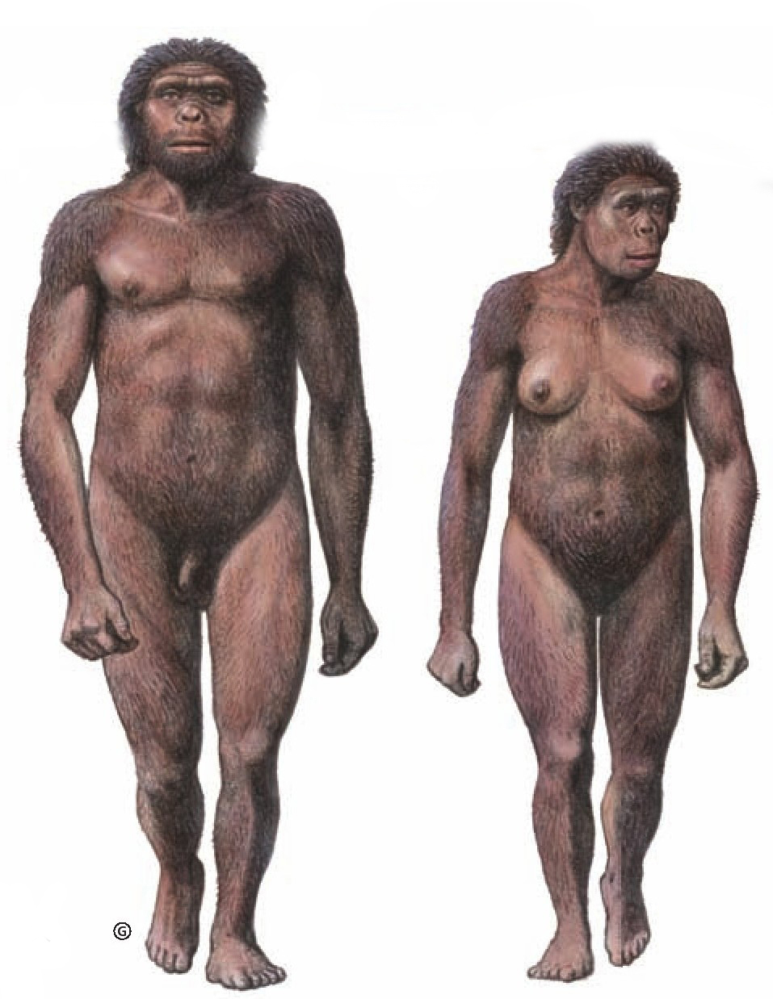
能人

## 为什么“人的出现”有两个不同的概念

“人的出现”有两种不同的概念。一种是指现生人类，即现代人的出现。现代人属于人类演化历史中最晚出现的一个种——人属智人种。人属智人种包含较原始的早期智人及晚期智人。一般认为，具有现代人解剖特征的人类应该从最早的晚期智人开始。早期人类演化为现代人的事件在世界不同地区发生的时间不尽一致。在东亚地区发生在距今约10万年。而另一种“人的出现”的概念，则是指人和猿的分离。目前的化石证据表明，人和猿的分离在约700万年前。现代人的起源和人类的起源，是两个不同的概念。（吴秀杰　刘武）

晚期智人捕鱼

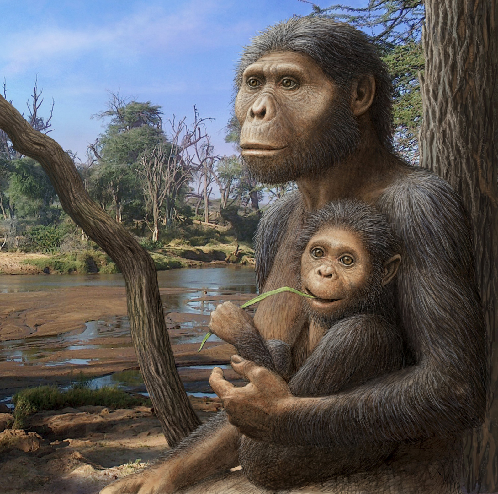
南方古猿

  

**【科学人】**利基家族

利基家族是由三代古人类学家组成的：路易斯·利基和玛丽·利基夫妇，他们的儿子乔纳森·利基、理查德·利基和儿媳米芙·利基夫妇，以及他们的孙女路易丝·利基。他们被称为“古人类学研究第一家族”。利基家族及其领导的野外考察队发现了200多件重要的人类化石及大量人工打制的石器，发表了许多有关人类起源的专著及研究报告，解决了一系列与人类起源和演化有关的重大理论问题，使得科学界普遍相信非洲是寻找人类起源证据的关键地区。他们创建的肯尼亚国家博物馆，成为全世界古人类学家和史前考古学家学者进行学术交流的中心。

【微问题】为什么根据头骨可以判断出南方古猿已经直立行走了？

【关键词】地猿　非洲　南方古猿　土根原　初人　能人　智人　现代人

## 中国最早的古人类在哪里

从1922年以来，古人类学家已经在中国100多处地点发现了生活在不同时代的古人类化石。根据对这些化石出土地层年代的测定及对化石特征的研究，古人类学家将中国的古人类化石分别归入直立人（猿人）、早期智人（古老型智人）及晚期智人（解剖学上的现代人或早期现代人）。年代测定数据显示，直立人生活在170万～20万年前，早期智人生活在30万～12万年前，晚期智人生活在11万～1万年前。因此，学术界一般认为中国最早的古人类是直立人。

在中国发现的直立人化石，有北京猿人、云南元谋人、陕西蓝田人、安徽和县人、湖北郧县人、南京汤山人、山东沂源人等。元谋人化石为2枚牙齿（上颌中央门齿）化石，1965年发现于云南元谋，年代测定数据为170万年前。元谋人的年代早于其他中国直立人，如蓝田人（生活于115万年前）、北京猿人（生活于约58万年前）等。长期以来，古人类学界都将元谋人作为中国最早的古人类，并写进了教科书。然而，古人类化石埋藏环境非常复杂，具体出土层位有时难以确定。此外，现有的年代测定技术还不是很完善，获得的数据都存在一定的误差。因此，古人类学界对一些中国直立人的年代数据还存在争议。有学者指出元谋人牙齿的出土层位不是很确定，化石的实际年代可能要晚于170万年前。

除了前面提到的这些直立人化石以外，科学家在中国还发现了一些时代较早、分类地位存在争议的人类（或似人）化石，以及一些可能的古人类生存活动证据。20世纪70年代，在湖北建始龙骨洞发现了4枚人类牙齿化石。1999——2000年，考古学家在同一地点又发现了3枚牙齿。古人类学界对建始人化石的形态特征和分类地位一直存在争议，有人认为建始人与北京猿人等中国直立人相似，也有人认为其与非洲早期人类如南方古猿相似。建始人的生存时代也存在争议，有人认为是250万～200万年前。1990年，在重庆巫山龙骨坡发现了一件190万年前的下颌骨残段化石。最初的研究指出这件下颌骨的主人具有一系列非洲直立人的原始特征，是中国最早的古人类。但后来更多学者的研究发现，巫山龙骨坡下颌骨化石的特征与猿类的化石更为接近，应该属于猿类而不属于人类。此外，人们在中国还发现了一些可能生存于200万年前的古人类活动证据，如有人在安徽繁昌发现了据称是240万年前的石器。

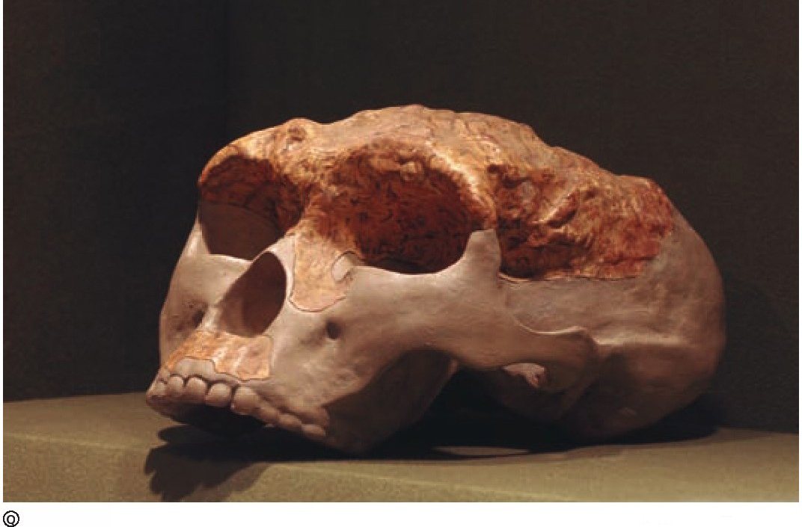
蓝田人头骨

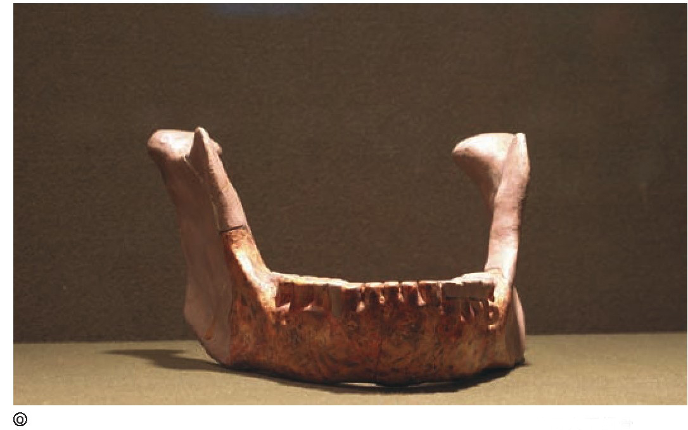
蓝田人下颌骨

古人类学家一直在中国寻找年代更早的古人类化石，试图找到人类在中国出现的最早时间。但目前古人类学界对中国是否存在早于200万年前的古人类，以及是否存在比直立人更原始的早期人类成员还存在不同意见。回答这个问题还需要更多可靠的化石证据。（吴秀杰　刘武）

## 禄丰古猿是人的祖先吗

在人类演化过程中，人和猿的分别发生在700万～500万年前，那么人猿最近的共同祖先是谁呢？1975年，在中国云南禄丰石灰坝的一个小煤矿里，人们发现了2件下颌骨化石，后来又发现了多个头骨、颌骨和肩胛骨等化石残片及1000多颗牙齿化石。

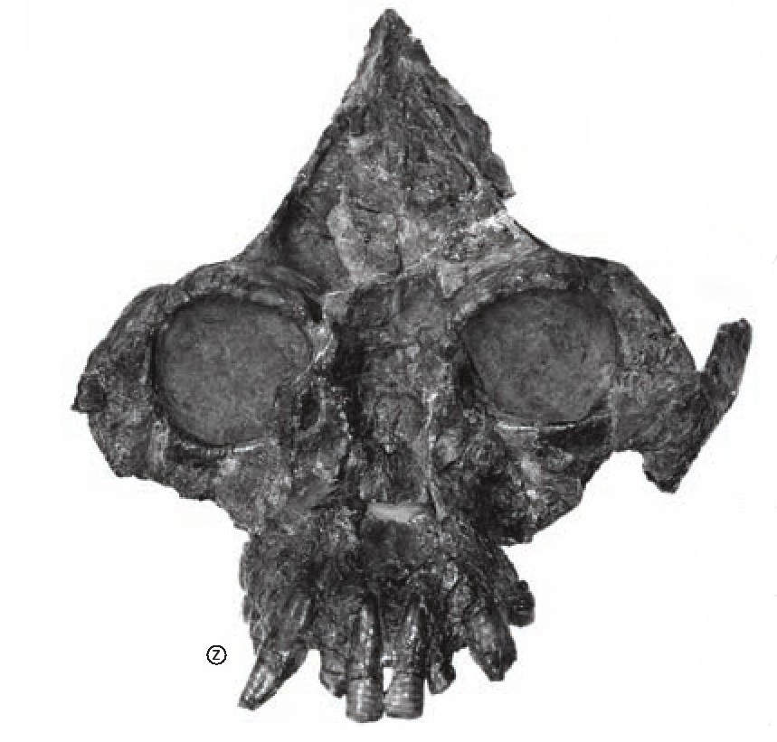
禄丰古猿头骨

初步的研究显示：化石主人是一种古猿，它与发现于巴基斯坦的拉玛古猿和西瓦古猿关系密切。经进一步研究后，科学家认为在禄丰发现的古猿属于另一种古猿，命名为禄丰古猿。禄丰古猿生活在800万年前，曾被认为可能是人类和非洲的黑猩猩、大猩猩的共同祖先。随着发现化石数量的增加和研究的深入，禄丰古猿的化石特征日趋清晰。但人们一直没找到它们两足直立行走的证据。因此，现在学术界把这种动物排除出人类的范畴，而认为它与猿类更为接近，属于人类祖先的“远房堂兄弟”或演化的旁支，并没有后代演化成今天的人类。（吴秀杰　刘武）

## 巨猿究竟有多高大

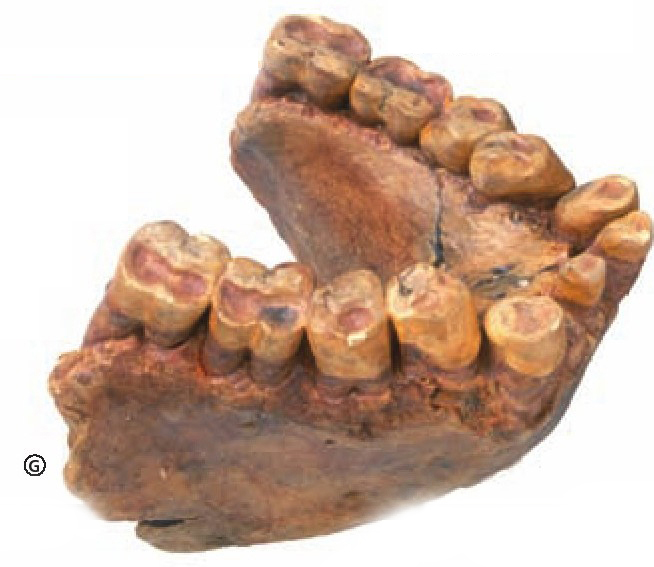
孔尼华发现的巨猿下颌骨和牙齿化石

1935年，荷兰古生物学家孔尼华在中国香港某中药铺的龙骨中发现了1枚形态特别、像人牙齿的化石，但这枚牙齿化石比人的牙齿几乎大1倍。他给这枚牙齿所代表的生物取名为“巨猿”。20世纪50年代，北京人第一件完整头盖骨的发现者裴文中带领考察队在广西大新和柳城的山洞中找到了巨猿化石的产地。经过几年的发掘，他们发现了3件巨猿下颌骨化石和1000多枚巨猿牙齿化石。后来，在广西其他地点和湖北、重庆、贵州、海南也相继发现了巨猿化石。目前比较确定的巨猿的生存年代是从200万年前到几十万年前。学术界对巨猿的演化地位还有争议，一般认为巨猿可能是灵长类演化的旁支，不是人类的祖先。迄今发现的巨猿化石仅仅包括下颌骨和牙齿，还没有发现头骨、肢骨和骨盆等化石，因而还无法确定巨猿的身高、体重和身材特征。但如果按照人类下颌骨及牙齿与身体整体大小的比例关系，可以推测巨猿的身高应该在2.5米以上。现在还不清楚巨猿的身体比例关系是否与人类的完全一致，所以想要准确知道巨猿究竟有多高大还有待于更完整的化石，尤其是肢骨化石的发现。（吴秀杰　刘武）

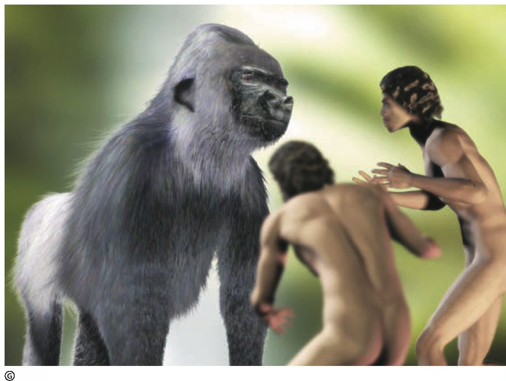
巨猿和人类对比

  

**【微博士】**龙骨

中药里的龙骨并不是恐龙的骨头，而是古哺乳动物的化石，特别是新生代的哺乳动物，如象、犀牛、牛、马、羊等的骨骼和牙齿化石。由于在药铺的龙骨中发现过重要的化石标本，还曾有“中国猿人药铺种”这样的命名。

【微问题】为什么只凭牙齿就能知道古人类的一些情况？

【关键词】元谋人　禄丰古猿　巨猿　龙骨

## 北京猿人是不是现代中国人的祖先

19世纪中叶，英国博物学家达尔文提出“从猿演化到人”的理论，向“上帝造人”的宗教观念发出挑战。但当时，他并没有直接的化石证据来支持这种观点。1891——1892年，荷兰军医杜布瓦在印度尼西亚爪哇发现1件人类头盖骨和股骨化石，根据大腿骨的形态特征，他确定曾经生存在爪哇的古人类已经能够直立行走，于是将其命名为直立猿人。但由于找不到石器等其他证据，当时学术界对其是否算人有较大争议。

20世纪20年代以来，人们在中国发现了生活在50多万年前的北京猿人化石。这些化石的发现轰动了世界，并为达尔文的理论提供了坚实的证据。北京猿人化石所代表的个体共有40多个，包括6件头骨化石、14件下颌骨化石、150余枚牙齿化石以及大量的头后骨化石。人们普遍认为，北京猿人已经具备了人的特征：其股骨的形态与现代人基本接近，已经具备了能够直立行走的特征，能制造工具，但颅容量较小，头部还保留了较多的原始特征。北京猿人被归到人科人属中的直立人种，又被称为“周口店直立人”。北京猿人是众多亚洲直立人中的一支，也是人类演化树上的重要成员。那么，北京猿人在人类演化上占有什么地位呢？

一种观点认为，北京猿人所属的直立人是一个具有地域性特征的多态种，各地区直立人之间的差异可能与当时的气候环境造成的相对隔离有关。持该观点的人认为东亚地区的直立人和非洲的直立人分别在隔离的地理条件下连续演化出了后代智人，因此北京猿人是中国智人的祖先。比如，最早负责研究北京猿人化石的德国解剖学家魏敦瑞发现，北京猿人与现代中国人有一些共同点，如出现在头骨正中央的矢状隆起、下颌圆枕、铲形门齿等形态特征。据此，他提出北京猿人与现代中国人在演化上存在密切联系的观点。中国古人类学家吴新智通过研究在中国出土的许多古人类化石，发现包括北京猿人在内的中国更新世人类连续存在一系列共同的形态特征。此外，在中国古人类化石上还发现了与欧洲古人类相似的特征，如马坝人的圆形眼眶、南京人高耸的鼻梁、柳江人枕部的发髻状隆起等。他用“连续进化附带杂交”的假说来解释中国古人类演化，认为北京猿人是现代中国人的祖先。

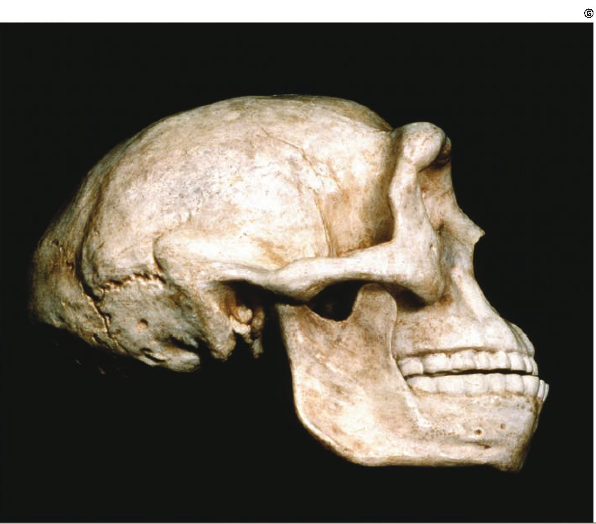
北京猿人头骨

但近年来，有许多古生物学家认为，以北京猿人为代表的亚洲直立人只是人类演化过程中灭绝的旁支，没有留下后代，而非洲直立人最终演化成了早期的智人，成了今天人类共同的祖先。这种观点被称为“近期走出非洲说”。还有人认为，所有的直立人都没有留下后代，直立人只是人类演化的旁支，智人是由能人演化而来。不过，目前的化石发现和研究积累还不足以对这些问题做出明确的结论。（吴秀杰　刘武）

## 北京猿人会用火吗

能用火，特别是能控制性用火，是人类演化上的重要事件之一。1927——1937年间，在对中国北京周口店遗址发掘的过程中，专家在伴生的人类化石和石器工具中确认有碳，又发现了大量的明显烧过的动物骨骼和灰烬层，推测当时的人类已经开始用火。20世纪80年代以来，有学者根据周口店洞穴地层埋藏环境，以及实验测试分析未发现长期燃烧产生的植物硅酸体等方面的证据，对生活在周口店的古人类——北京猿人是否真正具有控制性用火能力提出了质疑。后来有古人类学家从多方面进行综合分析论证洞中确有人类用火的证据。目前，古人类学界普遍认为北京猿人已经开始用火，但他们是否能保留火种及是否能控制性用火，对此还在研究之中。（吴秀杰　刘武）

原始人类用火想象图

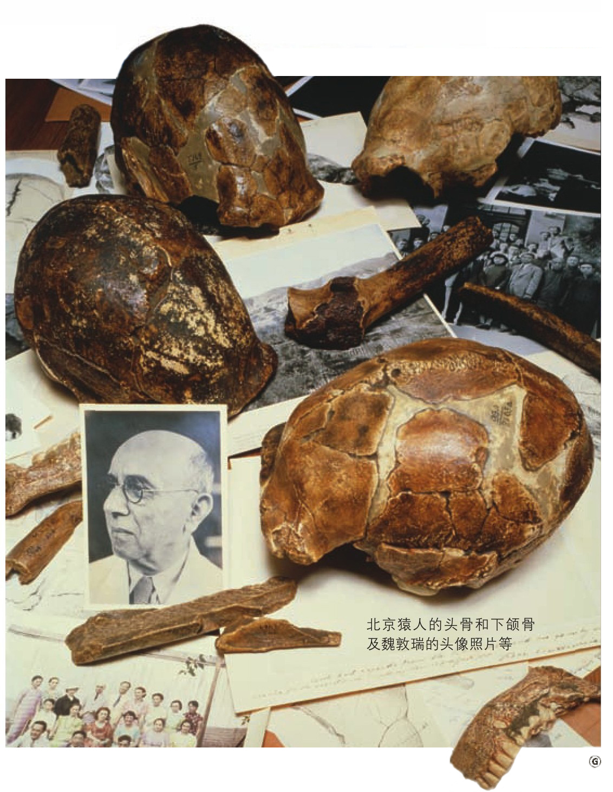
北京猿人的头骨和下颌骨及魏敦瑞的头像照片等

  

**【科学人】**魏敦瑞

魏敦瑞（1873——1948），德国解剖学家、古人类学家。在1935——1941年任中国地质调查所新生代研究室名誉主任期间，对北京猿人化石做了详尽而深入的描述，并指出了直立人的典型特征。他发表的《中国猿人头骨》、《中国猿人下颌骨》、《中国猿人之牙齿》、《猿、巨人和人》等一系列专著，至今仍是研究古人类特别是直立人化石必不可少的参考文献。当北京猿人化石于1941年12月日本侵华期间失落之后，他的那些科学描述及复原的周口店北京猿人模型便显得愈加重要。魏敦瑞后来又研究过印度尼西亚的爪哇猿人、昂栋人及华南发现的巨猿化石。魏敦瑞首先在一幅图中将所有的已知的人类化石集合在一起，并通过系统排列来表示整个人类的演化过程。

**【微博士】**亚洲直立人

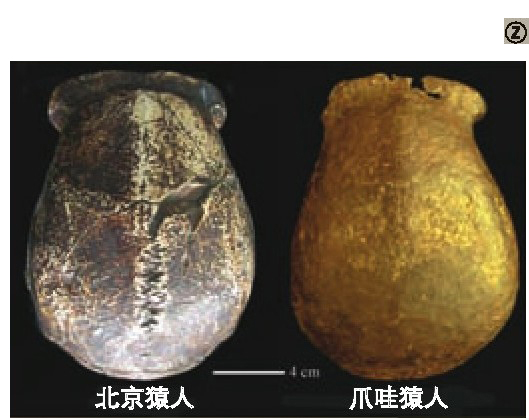
距今250万～160万年，人属的最早成员能人在非洲出现后，在大约180万年前，世界上出现了又一支能够直立行走的猿人，它们被命名为直立人。其中，有在爪哇发现的爪哇猿人，在中国发现的北京猿人、元谋人、蓝田人等，以及在亚洲其他地区发现的直立人。直立人特征：头骨的前额都很低平，眉嵴粗大连续形成眶上圆枕，骨壁较厚，颅容量较小。不同地方出现的直立人表现出变异或地区差别，比如爪哇猿人总体上就要比北京猿人粗壮。直立人除能够制造使用石器外，还具备了用火和狩猎的能力。亚洲的直立人是否留下后代，目前还在争论之中。

【微问题】北京猿人与现代人有些什么样的共同特征？

【关键词】爪哇猿人　直立人　北京猿人　连续进化　杂交

## 为什么说中国古人类在演化上有连续性

猿人在古生物学上大多被分类为人科人属的直立人种。而真正的“人”，即我们本身所处的人科人属智人种，则是在20万年前从直立人演化来的。中国的一些古人类在演化上有连续性，见证了这个从直立人到人的演化过程。

1978年，在陕西大荔发现了一件比较完整的人类头骨化石。化石的年代在距今23万～18万年之间，其所代表的古人类被称为大荔人。大荔人头骨多数特征多与早期智人相符，但还保留一些直立人的特征。在分类上，大荔人被归入早期智人，属于早期智人的较早类型，或直立人到早期智人的过渡类型。这个头骨还兼有中国的直立人和西方同时代人类的特征。

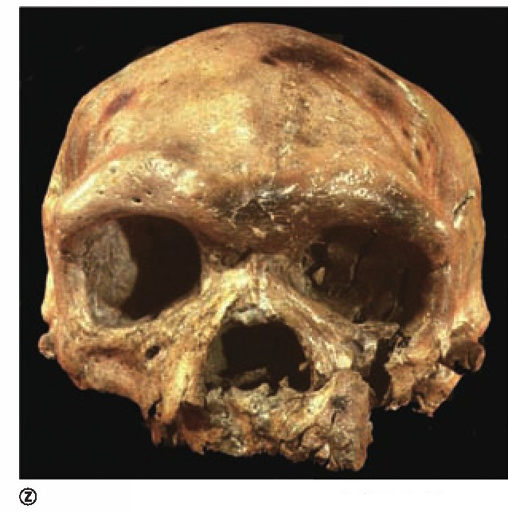
大荔人头骨

1984年，在辽宁营口金牛山的一个洞穴中，人们发现了一件基本完整的人类头骨化石以及许多身体其他部位的骨骼化石。根据这些骨骼化石的色泽、部位、组成和形态分析，发现于金牛山的人类骨骼可能属于一个女性成年个体。年代测定显示金牛山人生活在大约26万年前。金牛山人头骨显得大而粗壮，颅骨低矮，额骨倾斜，眼眶上方的骨嵴较发达，眶后缩窄，枕骨嵴明显。由于这些特征在北京猿人头骨上也能见到，有学者曾提出金牛山人在分类上属于直立人（猿人）。但该头骨多数形态特征与以北京猿人为代表的直立人头骨形态明显不同，如颅高增加，颅骨最宽位置上移，颅容量增大，颅骨厚度变薄，颞鳞部相对较高，角圆枕趋于消失，枕骨的枕平面与项平面转折处较为圆钝，面部与齿槽突出程度减弱等。而这些特征表现更接近中国早期智人代表之一的大荔人。因而，金牛山人的头骨总的形态类型应该属于早期智人。（吴秀杰　刘武）

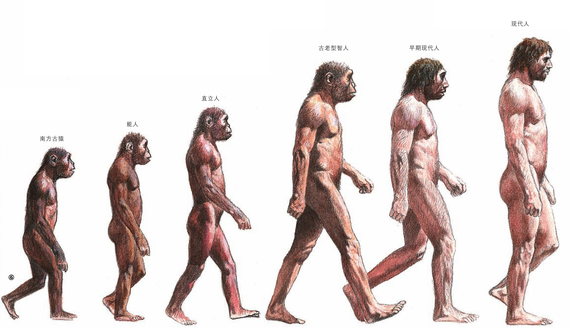
从猿到人的演化阶段

## 为什么说中国的直立人南北有别

1993年，在南京汤山葫芦洞发现了两件人类头骨化石——南京1号头骨和南京2号头骨。这两件头骨化石经过研究都被认为是属于直立人的，命名为汤山人。这是首次在中国长江东段以南发现猿人头骨化石。

两件汤山人头骨中的1号头骨，推测年代为50万～33万年前，与生活在周口店的北京猿人接近。南京汤山人化石被发现以来，古人类学家对这些化石进行了多方面的研究。这些研究深入揭示了生活在东亚大陆的直立人的形态变异，如南京汤山人与周口店等其他中国直立人之间的差别。

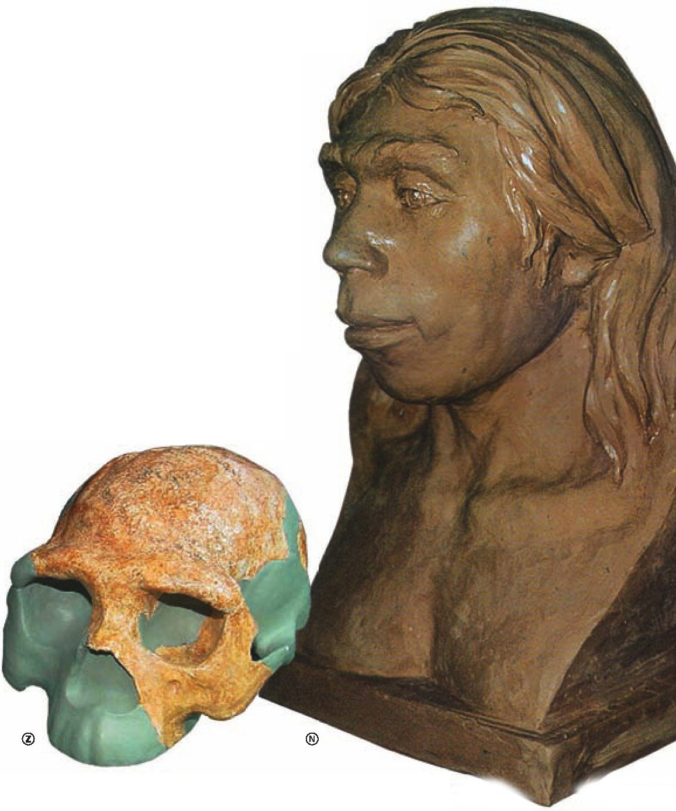
南京汤山人头骨化石（左）和复原像（右）

南京1号头骨的头骨枕部轮廓、头骨宽度、鼻梁高度等都与北京猿人有明确不同，显示出地区性的形态特征，提示了中国的人类演化早在60万年前就已经存在南北两大类型的形态差别。南京1号头骨及安徽和县人头骨可能代表一类中国南方的直立人群，其形态与以北京猿人为代表的中国北方直立人群有些不同。

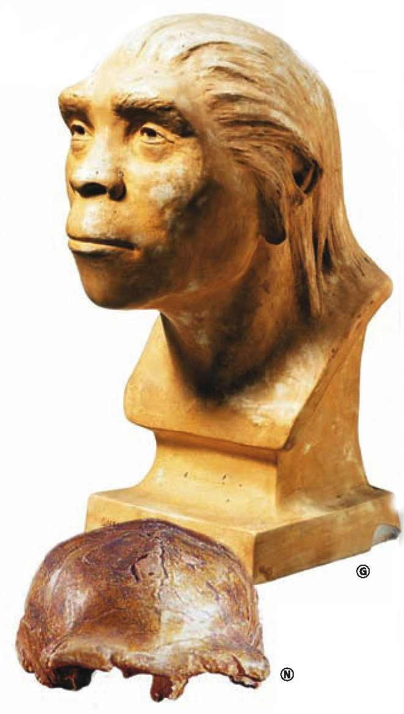
北京猿人复原像（上）及其第一个头盖骨（下）

通过对这些差别以及地理分布的分析，可以进一步探讨中国，乃至整个东亚地区直立人演化的情况。

此外，有学者通过对南京汤山人鼻骨特征的研究，提出南京汤山人可能受到与欧洲古人类基因交流的影响。但另有学者认为高耸鼻梁是适应性特征，是对寒冷或干燥气候适应的结果，并不意味着具有“西方血统”。（吴秀杰　刘武）

  

**【微博士】**柳江人

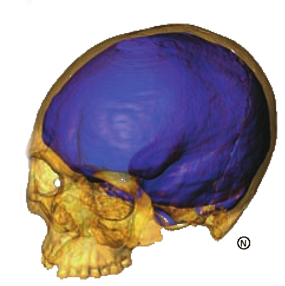
柳江人头骨CT扫描及虚拟大脑

1958年，在广西柳江通天岩一小洞中，发现了1件完整的人类头骨化石、4个完整的胸椎化石、全部5个腰椎化石及骶骨化石、右侧髋骨化石及左右股骨化石各一段。头骨、躯干骨及肢骨被同时发现，化石色泽都接近，且在同一地点没有发现重复的骨骼化石，所以这些化石很可能属于同一个体，它被称为柳江人。柳江人的年代尚不确定，有报道认为生活在6.7万年前。研究显示柳江人具有一系列与现代人接近的特征，同时已经呈现出一些现代东亚人群（蒙古人种）的基本特征。对柳江人CT扫描获得的虚拟大脑图像也显示其脑形态特征与现代人接近。对柳江人身体形状和比例的分析发现，柳江人身材纤细，反映当时的生活环境可能比较炎热。

**【微博士】**和县人

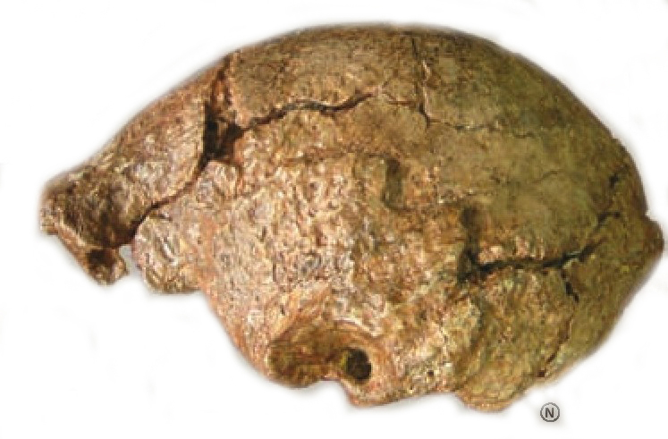
和县直立人头骨

1980——1981年，在安徽和县龙潭洞发现了1件人类头盖骨化石、1件下颌骨残段化石和9枚牙齿化石。这些化石的年代最初推测为大约20万年前，后来又推测认为66.2万～16.2万年前。研究显示，和县人化石的主要特征与北京猿人化石的相似，因而在分类上被归入直立人。然而，和县人头骨和牙齿的某些特征与北京猿人有很多差别。在这些化石特征差别中，有些特征显得比较进步，而另一些特征则较为原始，这反映了化石形态演化的镶嵌性以及地区之间的差异性。

【微问题】今天的中国人在基因上也存在南北区别吗？

【关键词】汤山人　大荔人　金牛山人　柳江人　和县人

## 谁是现代人的直接祖先

今天的人类属于晚期智人，又称为现代人。现代人最近的直接祖先是早期现代人。早期现代人是指已经具有现代人基本解剖特征，同时还保留有部分古老型智人原始特征的古人类，可以说是刚从早期智人演化过来的晚期智人。根据已经发现的化石证据，世界各地早期现代人的出现时间和生存年代不尽一致，从16万年前的中更新世晚期，一直到5万年前的晚更新世晚期。

20世纪80年代以来，对于现代人起源的研究与争论逐渐形成了“多地区演化说”和“出自非洲说”（又称取代说或夏娃说）两个假说。持前一观点的人认为，生活在世界各地的现代人起源于当地的直立人祖先，在其演化过程中接受来自相邻地区的基因贡献，在当地形成了早期现代人，最终演化成了现代人。而持后一种观点的人则主张，最早的早期现代人起源于非洲，然后向欧洲和亚洲扩散，取代了当地的古人类，成为世界各地现代人的祖先。目前，后一个假说在国际上占主导地位。

这两种学说都有各自的证据支持。支持“出自非洲说”的主要是遗传学的证据和早期现代人的化石。遗传学研究发现，现代非洲人基因的多样性，比亚洲人类的和欧洲人类的更大。这显示现代亚欧人的基因可能是从非洲人类基因库的一个分支演化来的。在化石证据方面，如在非洲埃塞俄比亚赫托发现的16万年前的早期现代人化石，比其他地区发现的早期现代人更为古老。正是基于这些证据，一些学者提出最古老的早期现代人应出现在非洲。在13万～10万年前走出非洲，向欧洲和亚洲扩散，取代了当地的古人类，成为全世界现代人的祖先。

多地区演化说的主要证据则来自人类化石，尤其是中国、印度尼西亚爪哇和澳大利亚的古人类化石。多地区演化说强调世界各地区的古人类在演化上的连续性和共同特征，比如中国古人类的化石就显示出一系列共同的形态特征，如具铲形门齿、有扁平的面部、颜面高度减小、鼻梁不高、眼眶大体上接近方形、第三臼齿先天缺失等。如果现代人都起源于非洲，这些特征为什么只在东亚地区人类中高频率地出现呢？一些中国古人类化石还呈现出镶嵌的特点，即某些常见于早期的直立人的原始特征，在后期的智人阶段也有出现。类似地，在澳大利亚蒙戈湖发现的智人头骨也显示与印度尼西亚爪哇昂栋发现的人类头骨相差较小、关系较近，而与非洲的智人头骨相差较大。因此，有可能澳大利亚的现代人起源于爪哇，而不是起源于非洲。各地区的现代人起源于当地各自的直立人祖先。但不同地区的古人类之间还存在一定程度的基因交流。

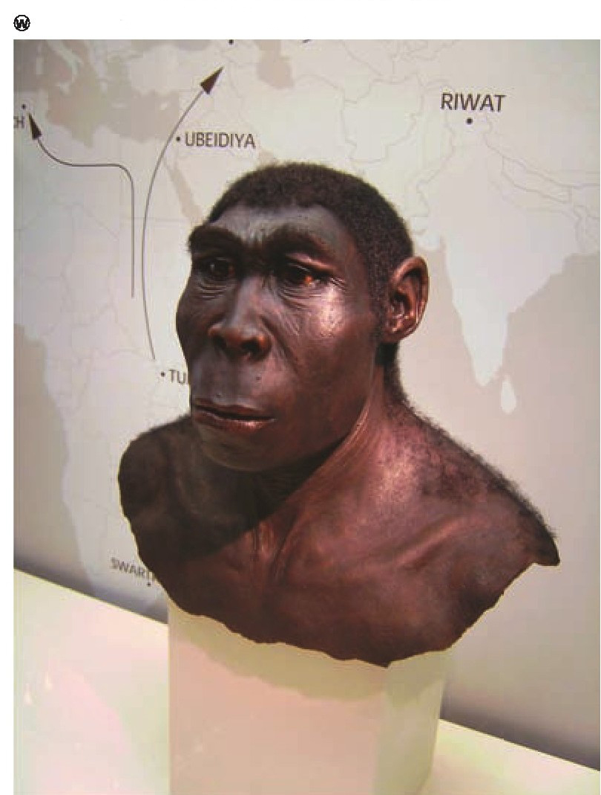
直立人复原像（背后是直立人“走出非洲”的迁徙路线图）

2007年，在广西崇左附近的木榄山智人洞发现了1件人类下颌骨化石和2枚牙齿化石，化石的年代约为11万年前，崇左人表现出直立人和智人之间的形态，表明从直立人向晚期智人的过渡过程不仅发生于非洲，也可能在东亚发生过。（吴秀杰　刘武）

  

**【微博士】**智人

智人是人属中的一个种，化石智人和现代智人都属于这一个种。“早期智人”、“晚期智人”、“早期现代人”都是根据形态特征和生存适应能力而划分的智人演化阶段。现代人属于“晚期智人”。在“晚期智人”演化阶段中，较早的“早期现代人”还保留着古老型人类的解剖特征，而较晚的现生人类则在解剖上已经和现代人没有区别了。已知最早的智人在60万年前出现在非洲的埃塞俄比亚。东亚地区的早期智人在大约30万年前出现；而明确的最早的晚期智人化石的年代是大约4万年前，早期智人向晚期智人过渡的时间大约在10万年前。

## 中国最早的现代人在哪里

山顶洞人复原像

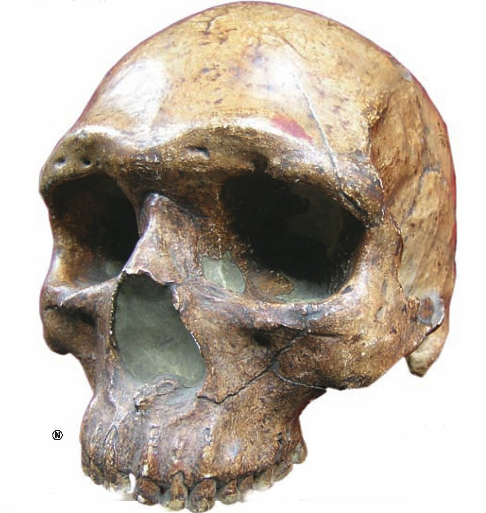
山顶洞人头骨

20世纪30年代，在中国北京周口店山顶洞发现了至少代表8个人的人类化石，其中包括8件完整的头骨。这些化石已经具有了一系列现代东亚地区人类的特征，如面部扁平、具有铲形门齿等，被认为是正在形成中的蒙古人种，或原始的黄种人。与山顶洞人化石一起，还发现了骨针、钻孔的贝壳装饰品等现代人行为的遗迹。根据放射性同位素碳-14的测定，山顶洞人生活在3.2万～2.7万年前。因为山顶洞人已经具有现代人的体质特征和现代人的行为特征，故古人类学家认为他们属于现代人。

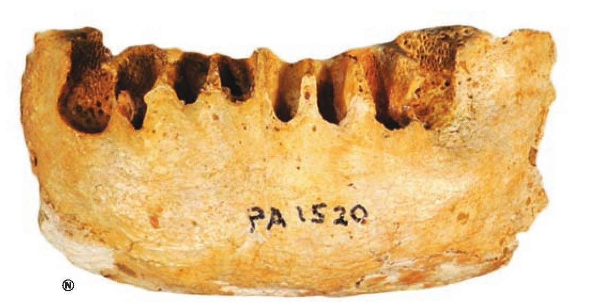
崇左人下颌骨（上）及牙齿化石（下）

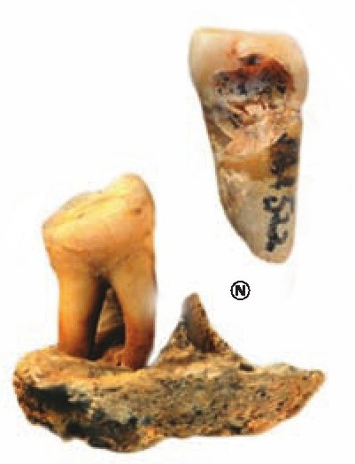
但山顶洞人还不是中国最早的现代人，2002年在周口店附近的田园洞发现了大约4万年前的人类化石，该古人类一度被认为是东亚地区最古老的早期现代人。2004年以来，又发现了一批时代更早的早期现代人化石，其中最重要的是在广西崇左和湖北郧西黄龙洞发现的人类化石。在这两个地点发现的人类化石年代都比较早，并已具有一些现代人的典型特征。崇左人生活在大约11万年前，其下颌骨中央前下部已经出现有隆起下巴这个现代人的典型特征。黄龙洞人类化石的年代在10万～7万年前，牙齿具有长铲形门齿、双铲形门齿、釉质延伸等东亚现代人群的标志性特征。这两个地点的人类化石年代比较可靠，经过细致的研究，化石上也发现了一系列现代人的标志性特征。目前古人类学界认为崇左人和黄龙洞人是中国乃至整个东亚地区最早的现代人。（吴秀杰　刘武）

  

**【微博士】**铲形门齿

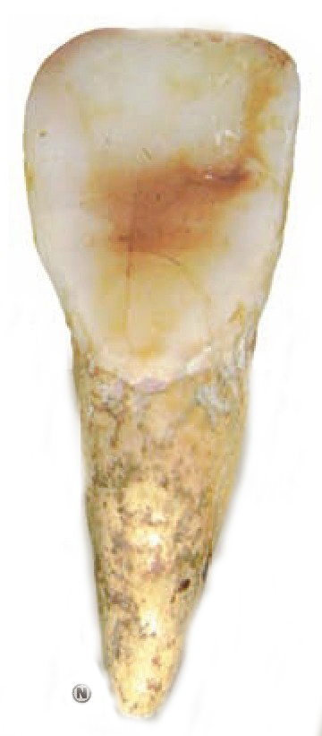
出现在上颌和下颌上的门齿所具有的舌面凹陷，两侧边缘呈嵴状隆起并向内侧卷曲的形态特征。由于这种门齿外观很像铲子，故被称为铲形门齿。研究发现铲形门齿在东亚地区的人类身上出现率很高，表现程度也显著，被认为是东亚人群或蒙古人种的标志性特征。

【微问题】为什么很少的几个古人类化石就可能改写整个人类演化史？

【关键词】早期智人　晚期智人　早期现代人　多地区演化说　出自非洲说

## 皮尔当人骗局是如何被揭开的

19世纪后期到20世纪初，古人类学界一直在争论爪哇猿人究竟是人还是猿，人类的历史到底有多长。欧洲的古人类学家在试图寻找最早的人类化石。就在这个时候，在英国东萨塞克斯一个叫皮尔当的地方的发现成为了当时科学家兴奋的焦点。

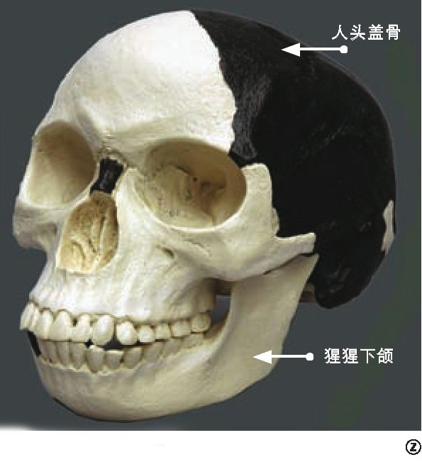
皮尔当人头骨

1908年，一名筑路工人在英国皮尔当附近取石筑路时，发现了一件形如椰子的东西，这件标本被交给了业余地质学家、大英博物馆的名誉采集员查尔斯·道森。道森认出那是人的左侧顶骨的一部分。此后几年，道森不断地前去这个地点考察。1911年，他发现了同一头骨的左眶上缘的一大块。道森把这些发现告诉了大英博物馆地质部门的负责人阿瑟·史密斯·伍德沃德和法国天主教神父、古生物学家德日进。当年5月和第二年，伍德沃德、德日进和道森三人同去皮尔当现场进行发掘，陆续发现了一些其他的头骨碎片，还发现半块右下颌骨，很像猿类的。它的颏部缺失了，下颌体上带有2枚类似人牙的臼齿。伍德沃德将这些头骨碎片和下颌骨拼接成一个头骨。他认为该头骨应属于大约50万年前人类的，该人类代表人科的一个新属，并将其定名为道森曙人，估计其颅容量为1070毫升。伍德沃德复原的头骨是人和猿的性状的奇特组合：没有隆突的眉嵴，除骨壁较厚外，明显是现代人的形态，而下颌骨则明显是属于猿类的，被塑造成从猿到人的过渡形式。

皮尔当的发现被公布以后，立即引起了激烈的争论。不仅在英国，其他许多国家的有关人员都加入了这场争论。争论的主要问题是，颅骨和下颌骨是否同一个体的？颅骨是人的，下颌骨是人的还是猿的？有人认为它是长时期来人们寻找的人和猿之间的缺环。也有学者如美国哺乳动物学家米勒、美国体质人类学家赫德利希卡，以及研究中国猿人化石的魏敦瑞认为，明显像猿的下颌骨与明显是人的颅骨结合在一起是不可理解的，两者不可能是属于同一个个体的。尽管如此，在20世纪50年代以前，许多学者还不相信皮尔当的发现是个骗局。

1953年，牛津大学的研究人员用黑猩猩下颌骨做实验，发现可以很容易地被改造和染成皮尔当下颌骨那样。他们由此联想到皮尔当标本或许是一个骗局。随后，对皮尔当人头骨和下颌骨氟含量的测试发现，颅骨和下颌骨氟含量差别很大，皮尔当颅骨的氟含量较高，而下颌骨和牙齿的氟含量却低得多。这表明下颌骨和牙齿是近乎现代的，而颅骨是较为古老的。他们还证明下颌骨是有人将现生猿的下颌骨染色，使之与头骨的颜色匹配。

1954年，这个骗局被全面揭露时，道森和伍德沃德已经去世。皮尔当的科学骗局前后持续了50年，究竟谁是这个骗局的制造者至今仍是一个谜。（吴秀杰　刘武）

## 为什么说中国是古人类化石相当丰富的国家

中国古人类化石的发现始于20世纪初。1922——1923年，法国古生物学家德日进和桑志华在中国内蒙古河套地区的萨拉乌苏发现了人类幼儿牙齿化石，化石代表的古人类被俗称为“河套人”。这是古人类化石在中国的首次发现。此后，在中国的100余处地点陆续发现了各种古人类化石。

发现早期智人的主要地点有广东马坝、湖北长阳、山西丁村、北京周口店第四地点、山西与河北交界的许家窑、贵州桐梓、贵州盘县大洞、陕西大荔、辽宁金牛山、安徽巢县等地。中国的早期智人主要生活在距今30万～12万年之间。

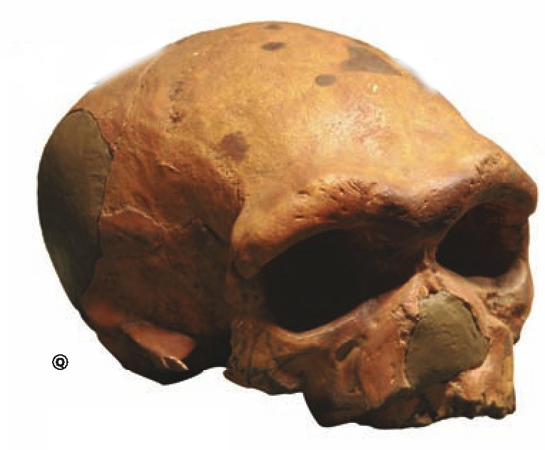
大荔人头骨

而在中国发现的11万～1万年前的晚期智人化石地点更为丰富。20世纪30年代，在对周口店的发掘过程中，发现了3.2万年～2.7万年前的山顶洞人类化石，包括完整头骨化石3件、头骨残片化石3块、下颌骨化石4件、下颌骨残片化石3块、单个牙齿化石数十枚。20世纪50年代以后，先后在四川资阳、广西柳江和来宾、辽宁建平、云南丽江、贵州穿洞、内蒙古萨拉乌苏、云南昆明龙潭山、陕西黄龙、甘肃泾川等地发现了30余处人类化石地点。近年，又在周口店田园洞、湖北郧西黄龙洞、广西崇左智人洞等地发现了11万年～4万年前的人类化石。其中，在黄龙洞和智人洞发现的大约10万年前的人类化石被认为代表了东亚地区已知最早的早期现代人。

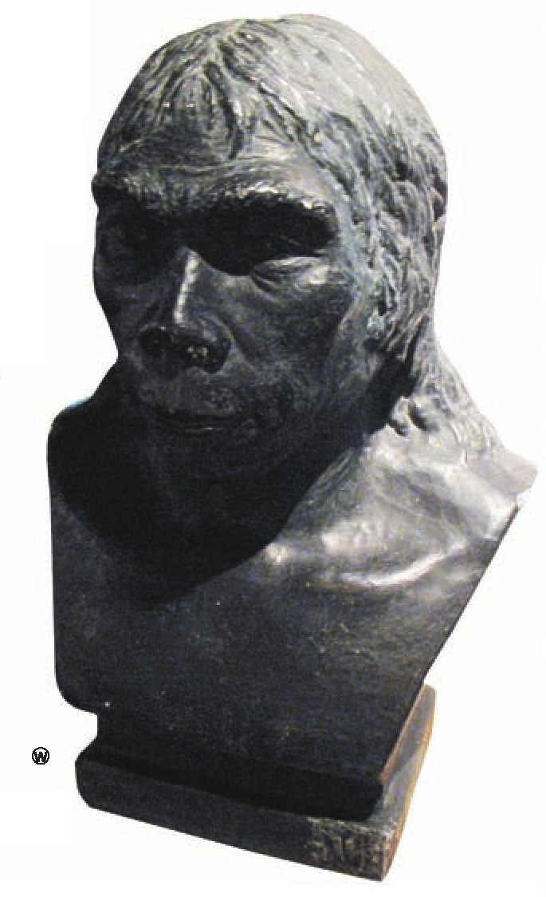
马坝人复原像

综上所述，迄今在中国发现的古人类化石的年代跨度在距今170万～1万年之间，这些古人类包括了直立人、早期智人和晚期智人。此外，在中国还发现了数量丰富的与人类演化关系密切的古猿化石和巨猿化石。因此可以说，中国是世界上古人类化石相当丰富的国家之一。（吴秀杰　刘武）

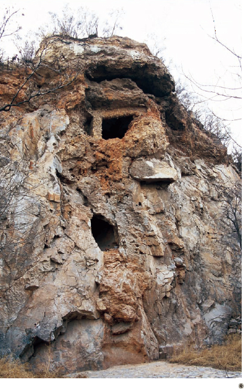
周口店猿人洞，在这里发现了北京猿人和山顶洞人的化石

  

**【科学人】**德日进

德日进（1881——1955），法国哲学家、神学家、古生物学家、地质学家。他于1923——1946年在中国从事古人类野外调查、发掘及研究工作。中国有可靠地点和地层记录的第一件人类化石就是他在内蒙古河套地区发现的。1928年在法国发表了研究中国材料的第一本专著《中国旧石器时代》。从1929年中国地质调查所新生代研究室成立起，他一直担任该室的名誉顾问。他是中国出版的第一本古人类学专著《中国原人史要》主要执笔人之一，在中国新生界地层、哺乳动物的研究、旧石器考古及周口店的发掘工作方面成绩卓越。德日进是为中国古人类学研究工作时间最长的外国专家，为中国培养了一批从事古脊椎动物与古人类的专家学者，杨钟健、裴文中和贾兰坡都曾受益于他的教导。

【微问题】为什么在规范的学术体系中很难造假？

【关键词】皮尔当人　直立人　早期智人　晚期智人　中国古人类化石

## 智人“走出非洲”的历程在世界各地都一样吗

原始的人类大约600万年前在非洲与猿的祖先分离后，经过长时期的演化，在大约200万年前演化为直立人，并从非洲向欧亚地区扩散，这个过程被认为是人类“第一次走出非洲”。有学者认为，第一次走出非洲以后，留在非洲的直立人演变为早期智人或罗得西亚人，又在20万～16万年前演化为具有现代人基本特征的比较早的晚期智人或早期现代人。这些早期现代人从非洲向欧洲和亚洲扩散，并取代了当地的古人类。这被称为“第二次走出非洲”。近来的基因研究认为在这两次之间还有若干次走出非洲，因此对于“第二次走出非洲”更确切的说法是“近期走出非洲”。

非洲演化出的早期现代人走出非洲后，在欧洲和亚洲的拓展过程一样吗？也许并非如此。

在非洲的早期现代人走出非洲之前，世界上不同地区的中更新世人已经分别演化出了各自的后代。在欧洲的海德堡人演化出尼安德特人，而在东亚，中国直立人和大荔人、金牛山人、马坝人等早期智人也演化出生活在当地的后代。

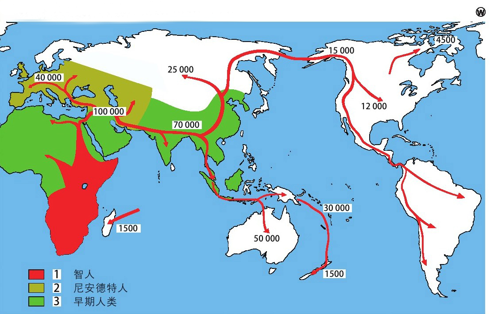
不同时期古人类的分布和迁徙路线示意图（数字表示古人类到达该地区的距今年代）

13万～10万年前，在非洲演化出来的早期现代人走出非洲，向全世界扩散。在它们扩散的过程中，距今7万～1.5万年，地球经历了一次冰期。这次冰期在世界各地产生了不同的影响。在冰期时的中国，气温虽有降低，但是东部和南方的大部分地区还是适于人类生存的，尤其是在华南，连现在生活于炎热地带的猩猩、象、犀牛、貘、灵猫等动物都连绵不断地大量繁衍，何况已能用火甚至会造火的人类。事实上，已经在许多地方发现了大量的石器，它们与中国早些时候的石器一脉相承，而与非洲同时期的石器类型不同，是中国本土演化出的智人持续存在的间接证据。当时进入中国的非洲早期现代人移民应该有很大可能会遇到当地的人类，和他们有基因上的交流。目前并没有证据表明冰期之前与之后的中国古人类身体特征有剧烈的变化，反之他们之间却有许多共同特征，中国的晚期智人呈现出中国古直立人和早期智人的一些特征。有学者认为，这些证据表明现代中国人可能主要由本地的古老人类演化而来，同时又与非洲来的早期现代人有很多基因上的交流。情况是否确实如此，相信随着更多化石证据的出现，这个谜最终会真相大白。

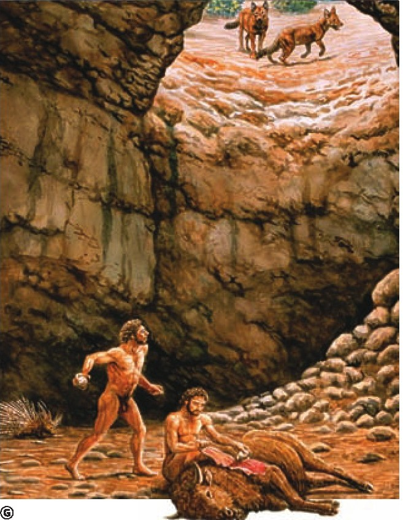
躲进洞穴的早期人类

在欧洲的尼安德特人的情况可能就不一样了。尼安德特人最早于1856年在德国尼安德山谷的洞穴中被发现。此后，这种类型的人类化石在西欧、中亚和西亚等地陆续被发现。已经发现的化石证据和相关研究显示尼安德特人主要生活在13万～3万年前。和现代人相比，他们额头平扁、下颌角圆滑，身体更粗壮、更耐寒。他们比现代人的智力低，会制造和使用石器，但不会绘画、雕塑、制造装饰品和渔叉等。早期人们认为尼安德特人在非洲早期现代人的入侵下灭绝了。当然他们的灭绝也有可能和冰期有关。在冰期时，欧洲特别是欧洲北部和阿尔卑斯地区，曾为冰雪所覆盖，冰期使得这里出现了大片的无人区。可能尼安德特人为避寒而躲进山谷，群体之间缺乏联系，近亲交配增多，最终导致了他们的灭绝。

在冰期时的欧洲，从非洲来的早期现代人在靠南的部分地区勉强生活。当间冰期到来，气候回暖，从非洲出来的早期现代人向北方扩张时，欧洲的原住民尼安德特人的密度是非常低的。这些非洲来的移民遇到尼安德特人的概率并不高，即使遇到，尼安德特人也竞争不过这些更聪明的早期现代人。尼安德特人在约3万年前消失了。欧洲的现代人与尼安德特人的解剖特征相去甚远，而与非洲来的早期现代人更近，所以可以说今天的欧洲人都是从非洲来的早期现代人的后代。但是近年有学者根据化石形态和基因的研究提出，在欧洲的尼安德特人也有可能与非洲来的早期现代人混血的过程，因而现代欧洲人也有一定比例的尼安德特人基因。

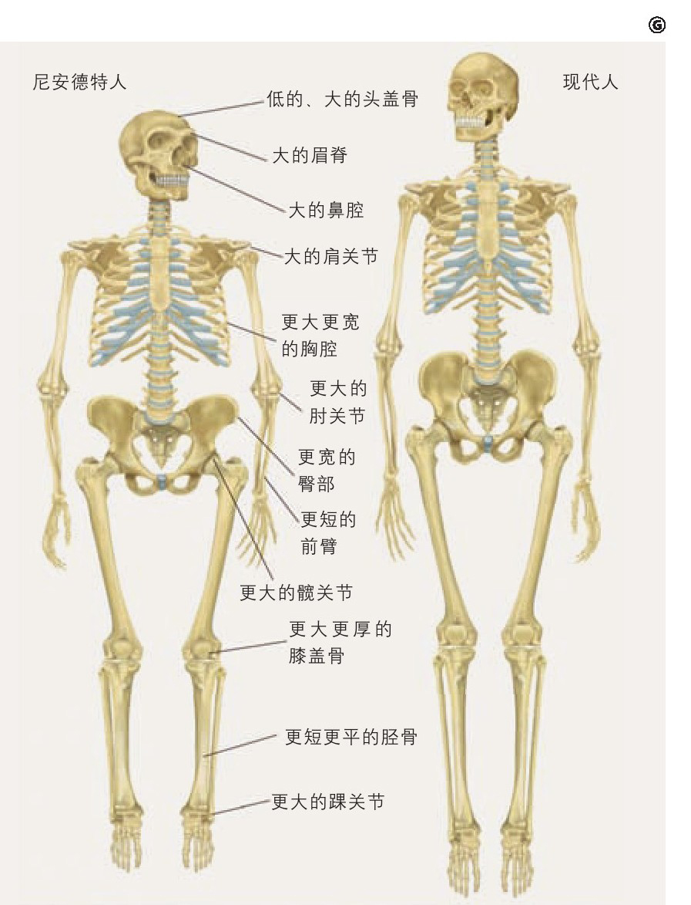
骨骼比较

不论是认为现代人完全起源于非洲，还是认为现代人完全起源于本地，试图用一种单一的模式来说明现代人起源，而且认为某种单一的演化模式在不同的地理环境中都是一样的思路，可能是太过于极端了。更加可能的情况是，不同地区的现代人起源方式不尽一致。比如现代东亚人的遗传构成中，可能既有来自非洲的早期现代人的贡献，也有东亚本地的古老人类更大的贡献。

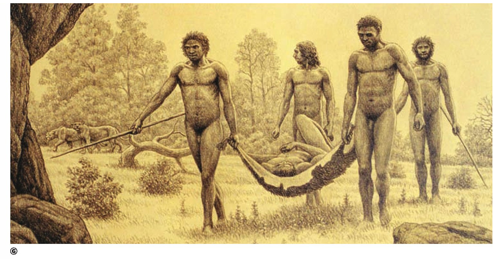
早期人类生活想象图

要说明的是，目前在古人类学研究中，分子遗传学的证据还很局限，最确凿的证据还是由化石提供。但由于古人类化石稀少，所以对古人类演化的图景很大程度上还停留在推论阶段。不过，历史上曾经有过很少的几件化石就改写了整个演化图景的先例。未来的化石发现，尤其是东亚地区的古人类化石发现，也很有可能会让现有的认识发生巨大改变。（吴新智）

  

**【微博士】**弗洛勒斯人

是指近年在印度尼西亚弗洛勒斯岛发现的一种史前人类，为人科人属的一个种，主要特征是体型小、大脑小。一般认为他们与现代人曾经生活在一个时代。他们居住在印度尼西亚弗洛勒斯岛上，直到约1.2万年前灭绝，是已灭绝人属成员中存活最久的。关于弗洛勒斯人的演化地位，在古人类学界争议较大。部分学者认为弗洛勒斯人是直立人迁移到这个岛屿后，长期在隔离环境下演化成的一个新的古人类种群。但也有学者不同意这样的观点，提出弗洛勒斯人只不过是一种病态的古人类。

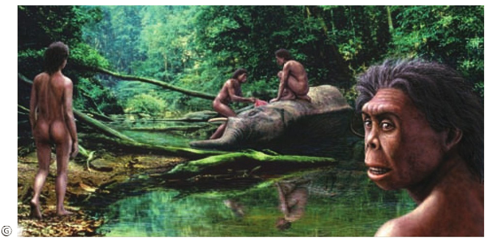
【微问题】什么样的化石特征能证明本地人类和外来人类有基因交流？

【关键词】近期走出非洲说　尼安德特人　海德堡人　弗洛勒斯人

## 古人类吃什么

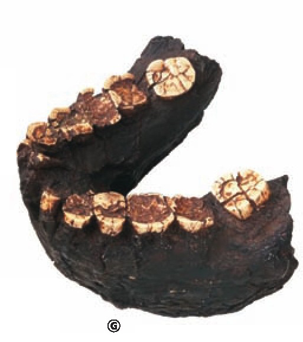
南方古猿的下颌骨和牙齿化石

人类自在地球上出现之日起，就面临着生存的竞争压力。获取足够数量营养成分的食物是古人类得以生存和繁衍的必要条件。古人类生活在久远的过去，保存下来的材料非常有限，只有他们骨骼和牙齿石化形成的化石、制作使用的工具、居住活动的遗址、生存活动的遗迹（如用火的证据、狩猎或食用动物在动物骨骼上留下的各种痕迹）等资料。这些材料或证据在每一处古人类遗址保存下来的数量和种类都不尽相同，时代越早的古人类保存下来的越少。古人类学家只能根据对这些零散材料的研究来推测当时人类的食物构成。

研究显示，在人类演化的早期阶段（南方古猿及更早的人类），人类的生存适应能力还比较弱，当时的人类还不具备制造使用工具的本领和用火的能力。因而古人类学家推测在南方古猿之前，古人类是通过采集获得食物的，食物构成以植物为主。对非洲南方古猿生活环境的研究也证实当时气候温暖湿润，森林植被茂盛。可以想象，当时的古人类应该很容易采到植物果实并将其用作食物。采用电子显微镜对粗壮型南方古猿牙齿咬合面磨耗痕迹的研究显示，南方古猿牙齿磨耗面有许多细微的纹路，这符合咀嚼植物纤维的特征。而纤巧（或纤细）型的南方古猿则是杂食的，食物中包含小动物。

大约250万年前，进入能人阶段的人类已经能够制造并使用简单的石器工具。在世界最早的石器出土地点埃塞俄比亚戈纳附近，有人发现了被砍砸和切割过的动物骨骼。专家认为，这些破碎的动物骨骼是能人敲骨吸髓的证据。但也有学者认为，这是南方古猿的一支——南方古猿惊奇种食用动物肉和骨髓遗留下的证据，因为在这里发现了他们的化石。尽管如此，专家认为采集仍然是这一时期人类获取食物的主要途径。因而，在食物构成中，植物仍应占主要部分。

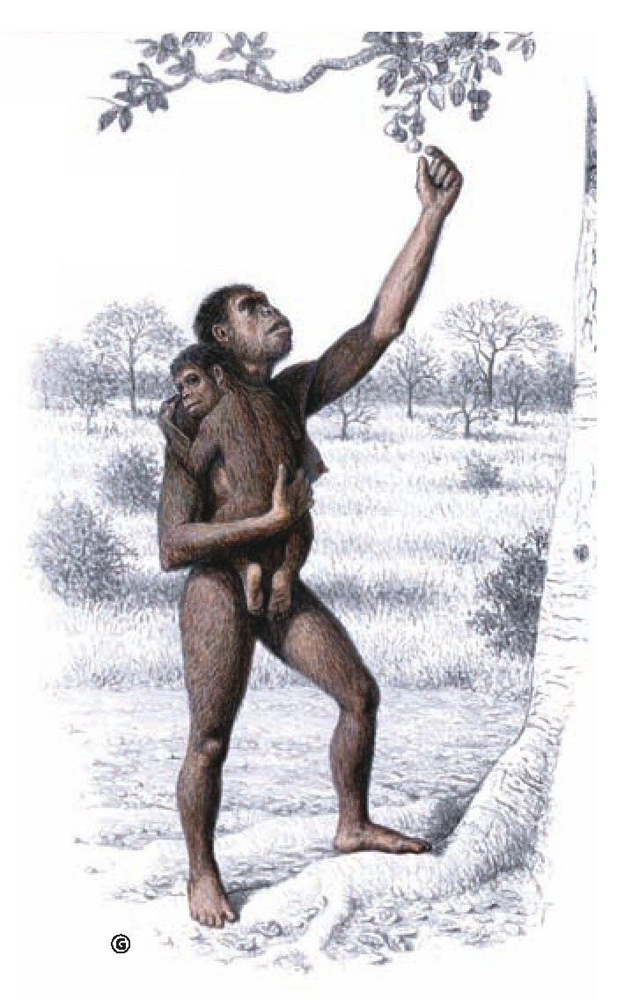
能人采集树上的果实

在大约160万年前，生活在非洲的古人类演化进入直立人阶段，生存适应能力进一步提高，已经开始制造两面加工的手斧类石器工具。研究证据显示，人类就是在直立人阶段获得了用火的能力。在非洲、亚洲和欧洲的很多直立人地点都发现了制造使用工具、用火的证据，以及人工破碎的动物骨骼。古人类学家推测，直立人的食物构成中动物性成分比例增加，很可能已经食用用火加工过的肉类。到了几万年前，人类适应环境和获取食物的能力有了飞跃性的提高。这时的人类已经能够制作复杂的工具，可以进行捕鱼和狩猎活动，估计可以进行一些烹饪加工。

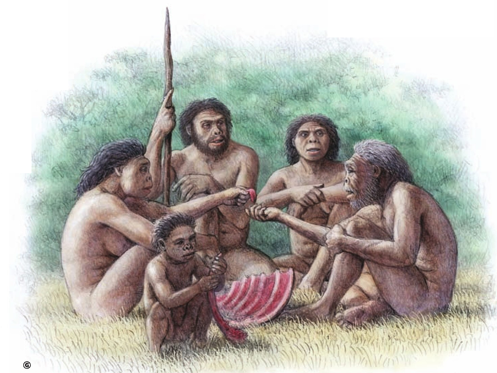
一个早期智人家庭

进入1万年前的全新世，人类开始栽培农作物和驯化家畜，食物构成发生了根本性的变化，与现代社会人类的食物日趋接近。（吴秀杰　刘武）

## 古人类的皮肤是什么颜色的

在灵长类动物中，只有人类的皮肤几乎是裸露的，并呈现不同的颜色。人类学家早就注意到人类皮肤颜色的差别具有明显的地理人群分布特点。生活区域在越靠近赤道的人群其皮肤颜色越深，而居住在靠近两极的人群皮肤呈浅色或白色。研究显示，人类皮肤的颜色呈地理分布是适应阳光紫外照射的自然选择结果。

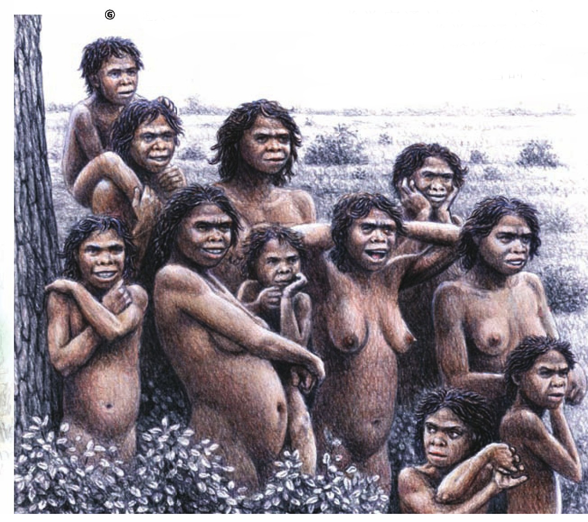
匠人

最早的人类皮肤应该呈浅色的，全身体表覆盖有毛。古人类学家推测，古人类首先脱去了毛发，没有了毛发的掩护，为了抵御阳光中的紫外线，皮肤颜色才发生变化。那么人类的毛发是什么时候开始脱落的呢？古人类学家通过对远古人类遗留下来的骨骼化石的分析，获得了有关当时人类生活方式的一些线索。300万年以前的南方古猿的生活方式估计与今天黑猩猩的相似，他们白天在4.8～6.5千米的范围内寻找食物，夜间在树丛中找一处安全的地方睡觉。大约160万年前，这样的格局发生了变化。化石的发现和研究显示，这一时期生活在非洲的直立人具有细长的腿，可以大跨步直立行走和长距离奔跑。这种比早期人类更加活跃的运动方式带来的一个挑战是，当时的直立人需要保持身体凉爽，以防止大脑过热。可能就从那个时候开始，古人类身体表面的汗腺增加了，体毛开始脱落了。一旦身体表面的毛发脱落，古人类又开始面临着身体被太阳紫外线过度照射而造成皮肤伤害的问题。黑猩猩身体上没有体毛覆盖处的皮肤内有一种细胞能够制造抵御紫外线辐射的黑素。古人类学家推测，当古人类体毛脱落后，皮肤制造黑素能力的重要性就体现了出来。黑素具有吸收紫外线辐射，分解辐射后在皮肤内产生的有害物质，进而减少辐射对身体损害的作用。古人类学家进一步推测，160万年前，生活在非洲的古人类的皮肤应该是浅色的。此后，古人类的皮肤开始变深，这种深色皮肤一直持续到大约10万年前。10万～7万年前，一些早期现代人离开非洲的赤道地区，向北迁徙。在非洲以北的地区，他们遇到的阳光照射强度开始减弱了，当然也有可能是为了抵御寒冷的气候，他们开始穿上衣物。在这样的情况下，驱使皮肤肤色变深的基因的作用开始减弱。同时，浅色皮肤可使更多的紫外线透过，促使体内制造更多的维生素D，这对身体也是有利的。因此，一些学者认为，上述两个因素产生的自然选择力量使得生活在地球北部地区的人类皮肤颜色变浅了。（吴秀杰　刘武）

  

**【微博士】**古人类的衣服

人类究竟是什么时候才开始穿衣服的？对于这个问题，在古人类学界至今还没有明确的答案。现有证据显示，当人类演化进入晚期智人或早期现代人阶段后，开始有了衣饰等现代行为特征。在一些古人类遗址中，人们发现了有可能证明当时人类开始穿衣服的证据。如在距今大约4万年或稍早的辽宁海城小孤山发现有3根制作精良的骨针。在距今约3万年的周口店山顶洞，考古学家也发现了一根精细的骨针。这些骨针是先用动物骨磨制，再用尖石挖出针眼的。据此推测，当时的人类已经会用骨针缝制兽皮，用来遮盖身体。

【微问题】衣服的发明有没有影响人类的演化？

【关键词】能人　肤色　黑素　晚期智人　早期现代人　衣服

## 人类何时学会制造工具和用火

制造、使用工具和用火是远古人类演化历史上的两个重要事件。根据已经发现的证据，人类有意识地制造、使用石器工具的历史可以追溯到大约250万年前。这个时间远远晚于最早的人类和猿类分别演化出现的时间（700万～500万年前）。学术界对远古人类什么时候开始用火还存在争议。一些学者认为，人类最早在40多万年前就开始用火；而另外一些学者则认为，人类有意识地控制用火发生在大约20万年前的中更新世时期。

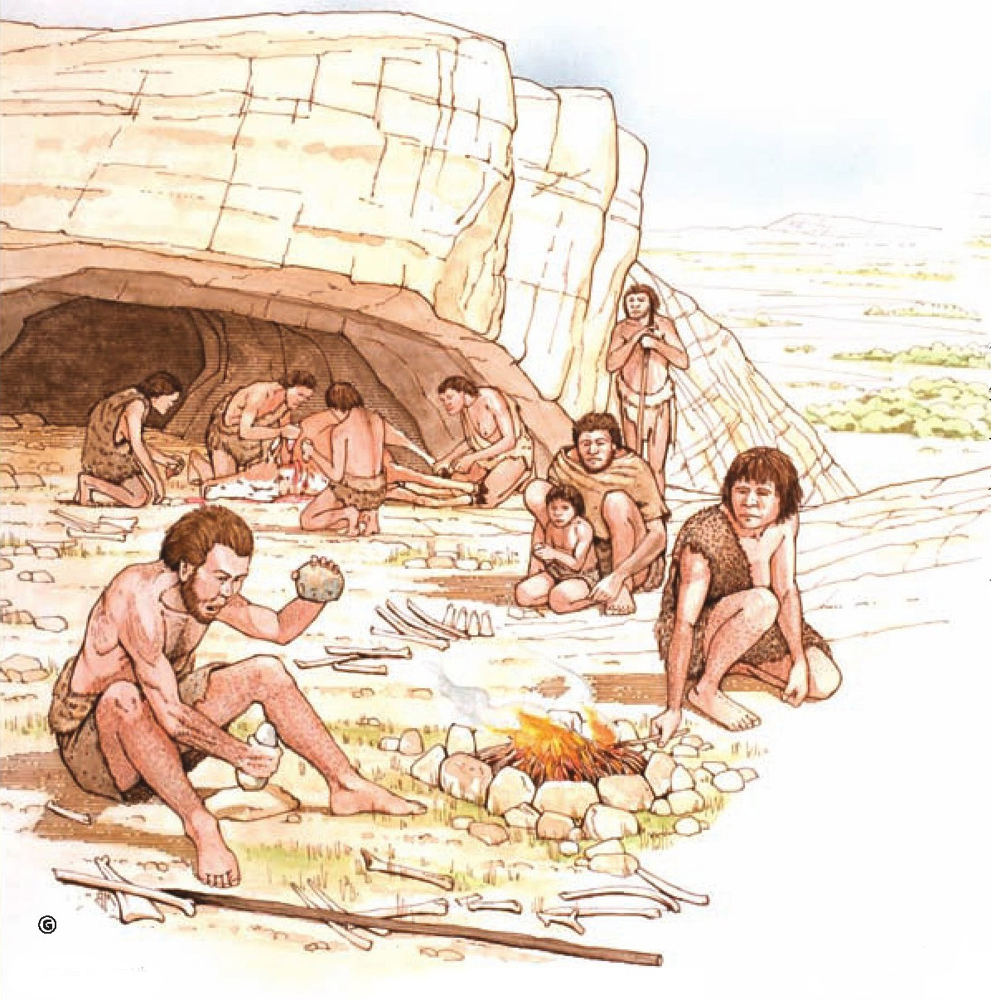
石器的打造

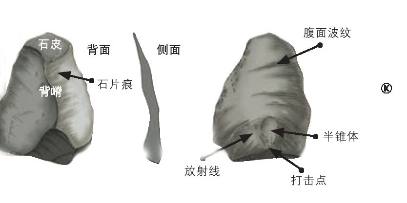
人工石片相比自然石片，破裂面上有打击点、半锥体、波纹和放射线

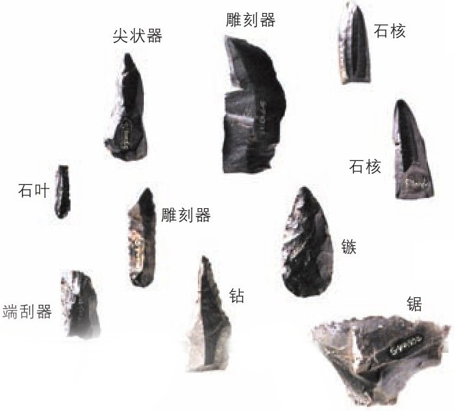
中国山西出土的旧石器时代晚期的打制石器

尽管存在这些争议，古人类学家普遍认为，制造、使用工具和用火对促进人类演化发挥了重要作用。工具的使用使古人类提高了狩猎能力，能够获取更多的动物性食物，提高了狩猎能力。而古人类用火能够驱除严寒和猛兽。同时，用火能够加工肉类食物，获取更多的蛋白质等营养成分，进而促进了大脑的演化和智力水平的提高。（吴秀杰　刘武）

## 人类还在演化吗

人类自出现在地球上以来的数百万年里，他们的体质特征发生了很大的变化：颅容量增大，身高增加，下颌骨缩小，面部趋向扁平，牙齿数量趋向减少，两性的差异缩小，上肢相对于身体的比例下降了，骨骼的粗壮程度也减弱了。从猿到人，从四足着地到两足直立行走，人类的诞生以及演化是一个漫长且充满变数的过程。我们似乎都持有这样一个疑问：在未来的岁月里，人类是否还会演化？演化的趋势又会如何？

南方古猿

多年来，专家更倾向于认为，人类在5万年前就完成了生物学上的主要演化过程。但是，要说人类已经停止演化，却又难以找到有力的科学依据。许多研究发现，近万年来，人类的体质特征仍在演化，其颅容量、身高、头骨形态特征、抵抗疾病的能力、人种间的差异程度等很多方面都发生了微小的变化。

对更新世晚期以来人类颅容量加以研究，发现这个数值仍有微小的变化，且其演化趋势并不像人们想的那样继续增加，而是向着缩小的趋势发展。非洲成年男性的颅容量在6000年中平均缩小了95～165毫升，女性缩小了74～106毫升。中国的一些学者对全新世的中国人类颅容量的变化也进行过研究，发现从新石器时代到现在，中国男性颅容量缩小了53毫升，女性颅容量缩小了74毫升。颅容量缩小了，意味着颅骨尺寸缩小了，可见人类体质特征仍在发生变化。

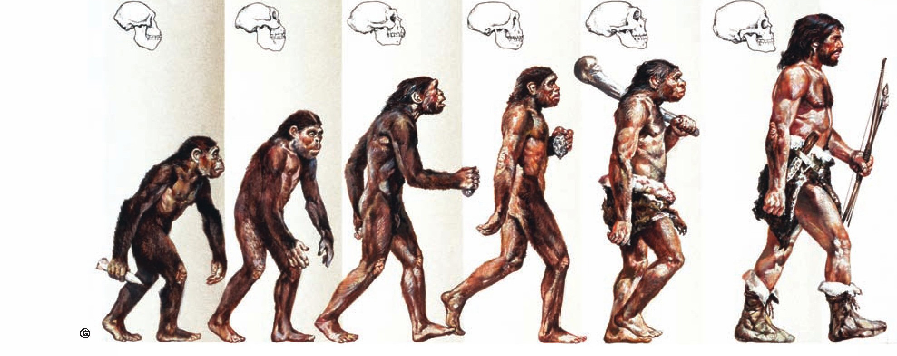
人类演化

对身高加以研究后发现，人类的平均身高也在变化。身高的数值与营养状况密切相关。有关研究显示，6000～4000年前的中国新石器时代居民，男性身高平均为1.65米，女性为1.54米。3000～1800年前的西周以及西汉时期居民，男性身高平均为1.67米，女性身高平均为1.55米。隋唐、宋及明时期，男性身高平均为1.66米，女性身高平均为1.56米。据2000年的中国国民体质监测报告，中国成年男性身高平均约为1.70米，女性身高平均约为1.58米。随着人们生活水平的提高，身高还会有一定程度的增加，但不会永远增长。

另外，人种间的差异正在缩小。约3万年前，当时的人类已经分布到非洲、亚洲、欧洲、美洲及大洋洲的广泛区域，并逐渐分化为不同区域的群体。早期人类地区间的差异很大，个体之间的差别显著。现代人按其分布区域及体质特征的不同，一般可分为三大人种类型，即蒙古人种、欧罗巴人种和尼格罗——澳大利亚人种。不同种族之间，其皮肤的颜色、头发的形状、身体各部分的相对比例、骨骼和牙齿形态、血液生化指标等都有所不同。

从生物学意义来讲，现今世界上所有的人类都属于同一个种——智人种。由于适应不同的环境条件（如日照、温度、湿度、气压等），形成了不同的亚种或地理种。但是到了青铜、铁器时代以后，人群之间的迁徙、混杂和基因交流情况日渐增多，特别是到了近代，种族之间的界限越来越模糊，并且出现了许多中间类型的种族，实际上已无一个种族能保持纯粹的血统。在不远的将来，人种的概念或许也会成为历史。

人类的演化包括更多的内涵，如智力、身体功能、基因或分子水平的变化、健康状况或对疾病的敏感度等。因此，在讨论人类是否仍在演化的问题时，需要考虑如何定义“演化”这个词。总而言之，可以得出结论：人类仍在不断演化，而且在某些方面可能是非常迅速地演化（想想电子计算机的出现怎样改变了人类的生活方式）。那么，人类将往何处去？鉴于人类演化的复杂性，目前还无法得出确切的结论。（吴秀杰　刘武）

  

**【微博士】**古人类的寿命

目前还没有可靠的证据说明远古人类的寿命到底有多长。人类演化已经有600万～700万年的历史，处于不同演化阶段的古人类的寿命应该有所差别。根据对不同演化阶段古人类化石所显示的生长发育规律以及死亡年龄鉴定的研究，古人类学家推测，时代较早的古人类平均寿命比现代人的短。

**【微博士】**古病理

远古人类保留下来的遗骸，包括了骨骼和牙齿化石，在特殊情况下保存下来的毛发，以及由软组织形成的木乃伊等。古人类生前所患的许多疾病，如关节炎、骨质疏松、梅毒、龋齿等都可能在古人类化石或其他遗骸上留下痕迹。此外，古人类受到暴力伤害或意外受伤，如骨折、外伤等愈合后也会在化石上留下痕迹。通过对远古人类遗骸上保留的各种病理痕迹和创伤痕迹的研究，可以推测当时人类的生存情况和健康情况。

【微问题】人类颅容量缩小说明人类变笨了吗？

【关键词】工具　用火　寿命　古病理

## 为什么有人认为现代人是“亚当”和“夏娃”的后代

人类和其他多细胞生物体的活细胞中，含有一种叫线粒体的细胞器，它们是细胞的能量供应中心，能产生腺苷三磷酸（ATP），为细胞提供生理反应所需的能量。一般来说，细胞中的线粒体都来自母亲的卵子。虽然父亲的精子也能够在受精时提供100个左右的线粒体，但在受精后数小时内，这些线粒体几乎全部被破坏。

线粒体与其他大部分细胞器不同，它们具有自己的遗传物质DNA，不需要细胞核遗传物质的参与就能够复制自己。因此，线粒体DNA具有相对独立性。随着时间的推移，来自同一母系祖先所有后代体内的线粒体DNA会逐渐产生差异，而且繁衍的代数越多，差异就会越大。线粒体DNA就像是一个稳定的定时器，同一个祖先的后代族群的线粒体DNA差异程度越大，就代表它们各自累积的突变越不相同。根据这种突变的差异程度，可以推论后代族群分家后独自演化的时间。

1987年，英国的《自然》杂志发表了一篇文章，报道了美国加州大学伯克利分校的科学家丽贝卡·卡恩和阿兰·威尔逊等的一项最新研究工作。他们用线粒体DNA这个计时工具，分析了从人类各个族群的女性胎盘采集纯化的线粒体DNA。通过比较这些线粒体DNA间的差别，他们绘制出了一棵显示人类线粒体之间关系的系统树。结果显示，所有女性的线粒体都是来源于同一个母亲祖先。不仅如此，他们还计算出这个最早的雌性共同祖先于15万～20万年前出现于现今埃塞俄比亚、肯尼亚或坦桑尼亚地区，这个理论被称为“走出非洲理论”。正所谓一石激起千层浪，这篇报道留下的涟漪一直持续到今天，影响范围远远超出了遗传学家和古人类学家，影响到了几乎每一个人，这个女性祖先被命名为“线粒体夏娃”。

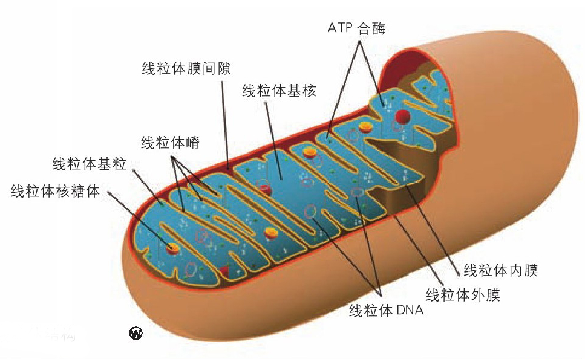
线粒体结构

无独有偶，另一些科学家认为人类有一个共同的男性祖先。他们是通过人类男性体内的Y染色体得出这个结论的。在人类的染色体中，X和Y染色体控制着人类性别，其中具有Y染色体的都是男性，而这个染色体只能由父亲传给儿子。因此，一个男性祖先的所有男性后代都会含有来自同一祖先传递下来的Y染色体。和线粒体DNA一样，随着时间的推移，不同后代间Y染色体会因为不断产生的突变而存在差异，且距离祖先越久远的后代间，差异就越大。因此，通过分析计算全球不同族群男性Y染色体的差异，就可以推测出他们的男性共同祖先生活的时间。

1995年，美国耶鲁大学的科学家阿卡西和吉尔伯特等在《科学》杂志上发表了一篇论文。他们测定了世界各地的38名男性Y染色体的ZFY基因区，结果显示这些人ZFY基因区中的DNA序列竟然完全相同！他们利用现生人类与猿类这个基因序列的差异，推算出现代人有一个共同的男性祖先，出现的年代是在大约27万年前，地点在非洲，这个共同的男性祖先被称为“Y染色体亚当”。之后，很多科学家利用相似的方法在不同的地点，进行了不同的分析和计算，最后将现代人男性共同祖先生活的时间限定在14万～6万年前之间。

需要说明的是，“线粒体夏娃”和“Y染色体亚当”只是一种昵称。这两个人类祖先并不生活在同一时代，而且人类也不只有这两个共同祖先。每个人上溯很多代，都有很多个祖先，每个祖先都给后代提供了一部分遗传物质。“线粒体夏娃”和“Y染色体亚当”就是提供线粒体DNA和Y染色体片断的祖先，但其他的祖先也对我们的基因有贡献。比如，同样也是分子生物学的研究表明，现生欧洲人基因中有尼安德特人的基因。随着研究的不断发展，相信未来能找到更多的人类共同祖先。（傅强）

  

**【微博士】**非洲血统的亚当夏娃

犹太教、基督教、伊斯兰教的经典认为所有的人类都是生活在伊甸园里的男性始祖亚当（又译阿丹）和女性始祖夏娃（又译厄娃、哈娃）的后代。许多画家都画过相应的图画。1988年，美国的《新闻周刊》的封面刊登了15世纪德国画家丢勒所描绘的《亚当和夏娃》的全新版本，在画上，《圣经》中描绘的那对金发碧眼的人类始祖被非洲血统的亚当和夏娃所取代了。

## 为什么分子钟可以推测生物的起源时间

生物体内其实也存在着另外一种计时的钟，它就是分子钟。分子钟的计时载体是位于生物体内的DNA和蛋白质等生物大分子，平时它们看不到摸不着，只有通过分子生物学的特定分析手段才能读出其中的数值。分子钟的计时单位不是分钟，也不是小时，甚至不是年，而是万年。

分子钟为什么能计时呢？因为生命会随着时间的推进而不断发生演化。生命的演化不仅体现为生物形态的变化，更重要的是体现在DNA中碱基对和蛋白质中氨基酸排列顺序的变化。1962年，美国科学家祖卡坎德尔和鲍林在对比了几种动物的血红蛋白后，发现组成这些蛋白质的氨基酸分子，会以恒定的速率进行相互置换和取代。这种取代速率在不同的生物大家族中大致相同，也就是说，在分子水平上生物演化的速度是恒定的。据此，祖卡坎德尔和鲍林于1965年提出了分子钟的假说。该假说认为，在生命演化过程中，生物体内的分子演化速率近似恒定。因此，可以据此推测生物类群的演化方向发生分歧的时间和其他演化事件发生的情况。这个假说掀起了生物学家利用大分子研究演化问题的热潮。

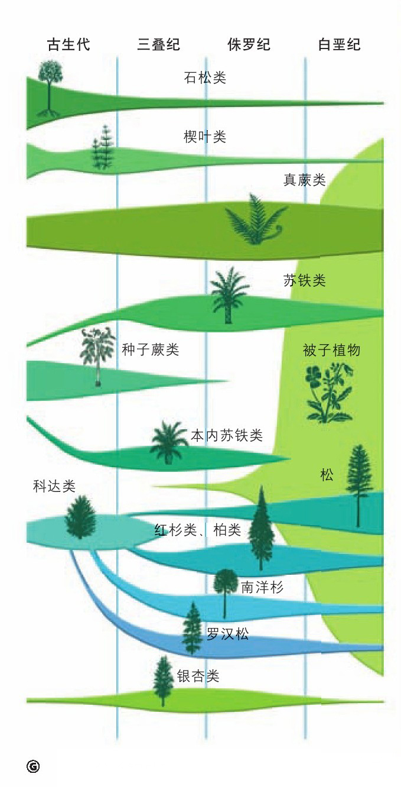
分子钟可推测生物的起源时间和相互关系

分子钟理论有一个先决条件，那就是一个特定的生物大分子（如蛋白质或DNA）在所有的物种演化过程中取代速率恒定。但在自然界中，对于蛋白质分子而言，这种速率并不总是恒定的。在物种快速形成的过程中，其演化速率可能会大大加快；物种形成之后的平衡期，其演化速率可能又会减慢。所以，以蛋白质为基础的恒定演化速率并非理想的分子钟。对于DNA分子而言，不同DNA片断的演化速率并不相同，并且同一DNA片断在不同的生物类群间可能存在显著差异。因此，目前有关分子钟的研究也面临着分子演化速率不同所带来的挑战。

尽管如此，分子钟的使用已经成为演化生物学的一个热点。大多数现代分子生物学家常用它研究分子演化机制，推断一些重要生物类群的起源时间。为了提高分子钟的准确性，科学家采取各种方式对其进行优化，借助数学方法消除分子演化速率不稳定带来的不利影响。（傅强）

  

【微问题】为什么只有很少的生物大分子才能做分子钟？

【关键词】线粒体夏娃　Y染色体亚　当分子钟

# 导言

## 为什么要研究古生物

很多人或许都曾经好奇过：人从哪里来？人是古猿变来的吗？恐龙真的灭绝了吗？最大的恐龙有多重？过去真的有过海怪吗？翼龙是天上飞的恐龙吗？鸟类是从恐龙演化而来的吗？猛犸象生活的时期是不是真的很冷？远古的地球上还生活了哪些动物和植物？它们又是如何一步步演化成今天的生物的？古生物学能够回答这样的问题。

中国战国到西汉时期的《山海经》中，开始有了关于“龙骨”的记载。早在公元前6世纪，古希腊学者就已经认识到，化石是由远古生物形成的。中国唐代的颜真卿和北宋的沈括也准确地提出，化石是远古动物和植物的遗迹。在欧洲的文艺复兴时期，达·芬奇提出了根据化石可推断地壳运动和海陆变迁的观点。到了18世纪后期，古生物学逐渐成为现代科学的一个分支，最终在欧洲发展起来，并且迅速在地质学、生物学等领域得到了广泛的应用。

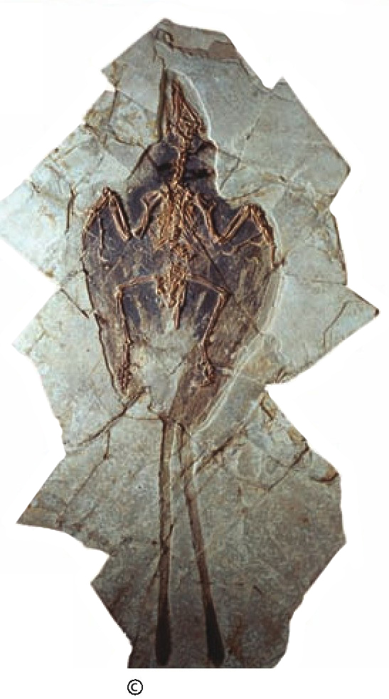
孔子鸟化石

古生物学研究的主要对象是化石。法国科学家居维叶堪称古生物学的奠基人，这和他开展的大量动物比较解剖学的工作有关。居维叶的工作还奠定了后来发展起来的生物演化理论的基础。

将古生物学知识应用到地层学和地质学的研究，离不开英国著名地质学家史密斯的卓越贡献。他在1796年提出了化石层序律：地层越老，所含的生物越简单，反之亦然；不同时代的地层，有不同的化石组合。他将这一发现广泛应用到地质填图的工作中，从此古生物学成为地层学乃至整个地质学研究的一门基础科学。可以说，地质矿产，如煤、石油的发现和研究，离不开古生物学家的卓越贡献。

古生物学作为生物学和地质学的交叉学科，其研究成果无疑为达尔文的进化论提供了强有力的证据。达尔文在撰写不朽巨著《物种起源》的时候，了解的化石数量和种类还不算丰富，但达尔文还是从中获得了许多重要的灵感和支持其理论的证据。如今，古生物学已经积累起丰硕的成果，研究者发现了许多现生生物的共同祖先，以及数不清的联系不同生物类群的过渡类型的化石，从而更加完美地证实了达尔文的理论。

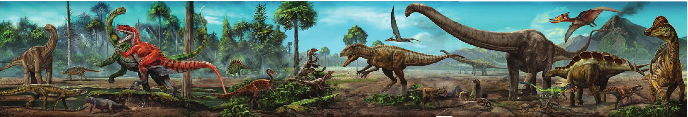
中国科学家在新疆发现的侏罗纪恐龙群，大大丰富了人们对中生代生物的认识

美国著名生物学家杰里·科因曾经这样写道：“达尔文撰写《物种起源》的时候，胚胎学的证据被用作最强有力的证据，如果换到今天，他可能会将这一荣誉交给化石。对许多人来说，化石证据在心理上比分子遗传学数据更具说服力……如果没有化石，我们对生物演化的了解只会是一个大致的轮廓。拥有了化石这双‘眼睛’，可凭借它眺望历史的深处。”或许可以说，达尔文的伟大演化理论大厦因为建立在“坚固的岩石”之上，才历经100多年而屹立不倒。

如果将地球生物演化的历史比喻为一棵从远古开始生长到现在的参天大树，那么所有现生的动物和植物只是它最新长出的树叶，而化石则代表了它的树干、树枝和已经凋零的树叶。所以，研究现生生物各个门类的起源和演化历史，自然还要依靠化石。

大约一个半世纪前，西方学者就已经开始陆续到中国来考察、采集化石。然而，中国学者从事古生物学研究还不到100年的时间。尽管如此，古生物学仍是现代中国开展比较早的自然学科之一。中国古生物学的先驱曾经创造了无数的辉煌，奠定了中国古生物学研究的基础，为中国的地质事业做出了特有的贡献。从1929年发现的轰动世界的周口店北京猿人头盖骨，到侏罗纪的自贡恐龙动物群、寒武纪的澄江生物群、白垩纪的热河生物群，一个个世界级的化石宝库在中国大地被揭开了神秘的面纱。一个个被誉为科学界“奥运金牌”的地层“金钉子”在中国确立，中国的古生物学家为编写地球演化的纪年表做出了突出的贡献。

2001年，美国的《科学》杂志以“精美的中国化石为生命史书增添了新的篇章”为标题，专题报道了中国古生物学近年来取得的耀眼的发现。同年，英国《自然》杂志特别编辑出版了一部中国古生物专集《腾飞之龙》，介绍了中国古生物研究的成就：中国古生物学家从古老的寒武系地层中发现了地球上第一条鱼，揭开了寒武纪大爆发的面纱；他们不仅发现了世界上最早的身披羽毛的恐龙，还提供了鸟类起源于恐龙祖先的最好的化石证据；他们还发现了世界上最古老的龟，最早能够滑翔和游泳的哺乳动物，最早的披毛犀，最早的树根，最早的花朵……英国《自然》杂志一位资深生物学编辑于2009年在一篇介绍中国古生物界的文章中评价道：“对外开放产生了新一代的中国研究者。在21世纪初，中国既拥有最好的古生物学家，又拥有最好的化石。”

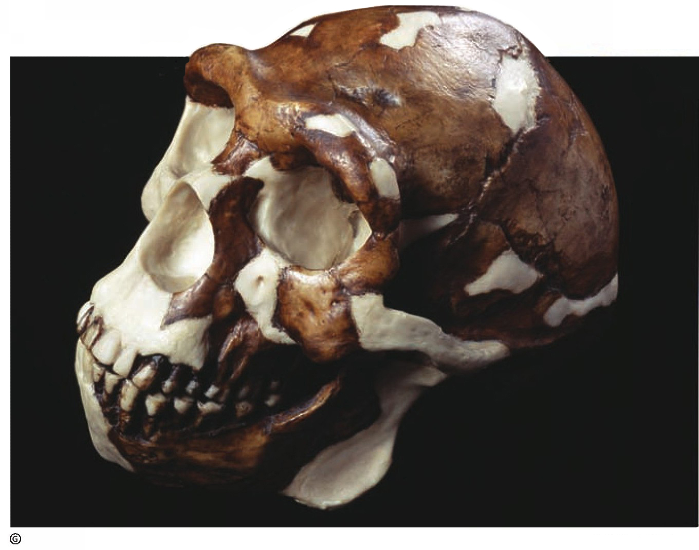
北京猿人化石

古生物学是生物演化的墓志铭。生物的演化纷繁复杂，如同一套万卷丛书，它记载的地球生命的故事就印刻在化石中。尽管这套历史之书已经被大自然“撕碎揉烂”，并“散落四方”，然而古生物学家不知疲倦地寻找着岩石中生命演化的蛛丝马迹，执著地将这些不同“章节”中的零散“段落”、“字句”拼接起来，为我们重现数十亿年来地球生物演化的故事。（周忠和）

  

**【科学人】**居维叶

法国著名的博物学家和动物学家居维叶（1769——1832），是比较解剖学和古生物学的奠基人。擅长将化石与现生动物进行比较。他因提出灾变论而闻名于世，认为主导地球和生命演化重大变革的因素是灾变事件。遗憾的是，他对同时代的拉马克等人的生物演化观点持完全批评的态度。

【微问题】古生物化石有什么实际应用？

【关键词】古生物学　化石　层序律　进化论　生命史书

# 化石与地层

## 化石就是石化的动物骨骼吗

化石是在地质历史时期保存于地层中，经石化而成的古生物遗体或遗迹。大部分化石为钙质，有少数为硅质、磷灰石质、黄铁矿质等。根据保存的特点，化石可分为5类。

第一类是实体化石，多为动物的骨骼和壳体以及植物的根、茎、叶等在地层中经石化而成，所以它们保存了生物的形态、结构和装饰等。

第二类是模铸化石，是生物遗体在地层中留下的印模，包括外模和内模。外模指生物遗体的外部形态留在地层（包括灰岩、砂岩、泥岩等）中的印模，内模指生物遗体内部形态（大多是壳体内部）在充填物上留下的印模。

第三类是遗迹化石，又可分为2类：一类是动物活动留下的痕迹，如动物的足迹、蠕虫爬过的遗迹等；一类是没有骨骼和壳体的动物，如水母等，它们的身体印在地层中（大多是砂岩、泥岩）形成的化石。

第四类是化学化石，就是在特定条件下保存下来的古生物的氨基酸、脂肪酸等分子形成的化石。

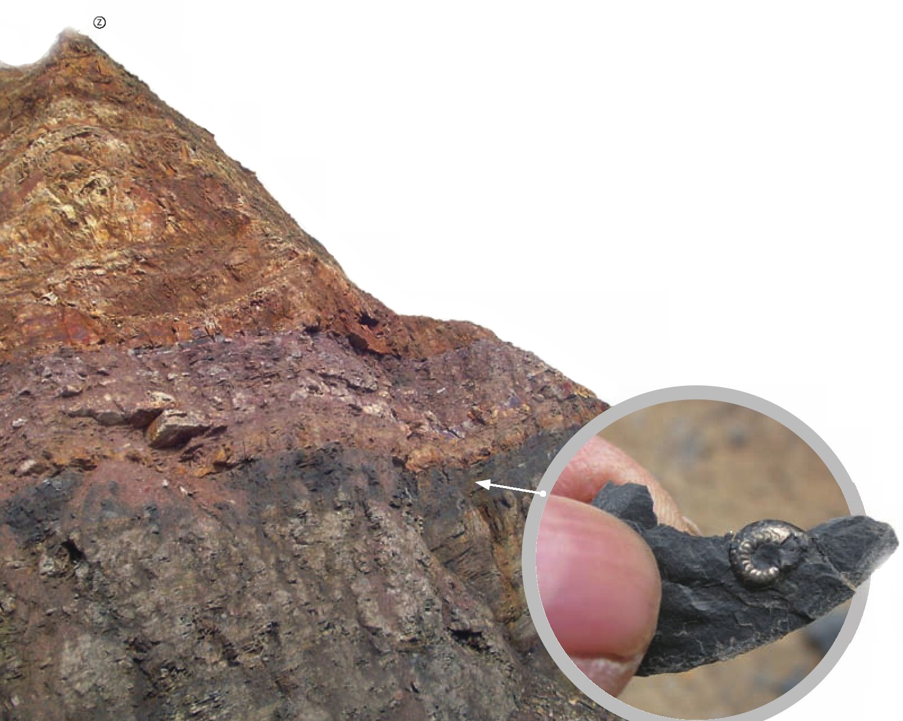
来自海相泥岩的黄铁矿化的菊石化石

最后一类是特殊化石，如琥珀和冻土中的化石等。古植物分泌出有黏性的树脂，会偶然包裹住昆虫或其他生物，由于外界空气和细菌无法入内，生物遗体不会腐烂。这些树脂后来在地层较高温度和压力作用下，就逐渐变成了琥珀，而里面的生物遗体虽然没有被石化，但也叫化石。琥珀化石多在煤矿中，中国东北的抚顺煤矿中就常有发现。常年冻土中的生物遗体，因冰冻而没被石化，也可称化石。

由此可见，化石多姿多彩，不仅仅是石化的动物骨骼。（许汉奎）

## 如何寻找化石

要寻找化石，首先得知道化石什么样。由古生物的遗体石化而成的化石，就像动物和植物的遗体，面目并不奇特。如植物化石就像植物根、茎和叶一样，只是石化而已；动物化石则比较复杂，有的保存其壳体（如蚌壳、螺蛳壳等）、硬体（如昆虫等），有的只保存其坚硬的骨头（如爬行动物、哺乳动物等），但也易于辨认。

除此以外，还要了解哪些地层会藏有化石。化石不会在火山岩中，化石通常只在沉积岩中才有保存。但不同类型的沉积岩，化石埋藏情况也很不同。如粗砂岩、砾岩、白云岩内一般不存在化石，因为它们的岩石结构、沉积环境不利于化石保存，或其形成的环境不适合生物生存。只有灰岩、泥灰岩、泥岩、砂质泥岩、粉砂岩、页岩等的岩石结构和沉积环境，才适合生物的生长和化石的保存。不同时代的地层所含的化石也完全不同。如要找三叶虫，最好在寒武纪（距今5.4亿～5亿年）地层中去找，在奥陶纪和志留纪等古生界地层中也有三叶虫化石，但地层越年轻它们就越少；若要寻找植物化石，则一定要在陆相地层中找，尤其是地层中有机质含量较高的层位，如煤系地层；恐龙化石得在中生代的陆相地层中找。也就是说，要大致了解什么时代可能有什么化石，还要确定化石是属于海相还是陆相，在陆相地层中当然不可能找到海洋生物的化石。

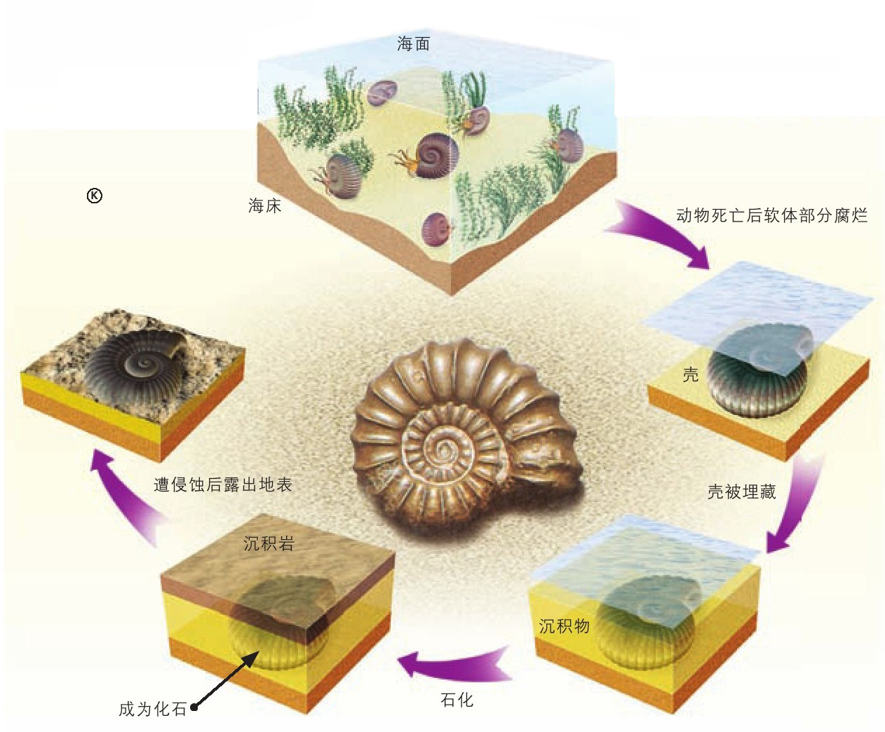
菊石化石的形成过程

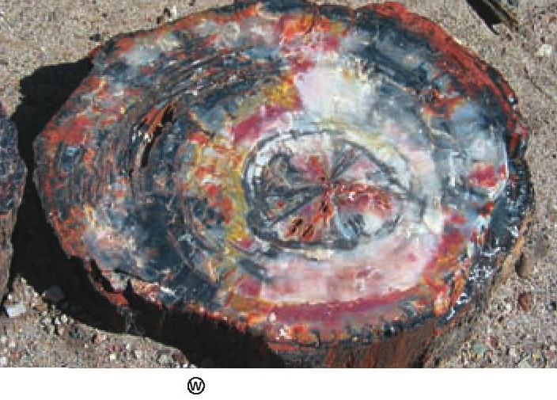
实体化石硅化木

地质情况往往千变万化，不同地方、不同时代、不同岩石往往是很不同的，但只要多寻找、多总结经验，就可以从中摸到规律。如中国辽宁西部早白垩世（距今1亿多年）的陆相地层中，在深灰色、灰白色、灰黄色的薄层泥岩中常含有鸟类、昆虫、植物、淡水鱼类以及小型恐龙、翼龙等重要化石。当地村民经常帮古生物学家寻找这些化石，久而久之，他们也都知道在哪里、在什么层位可以找到什么化石，甚至也知道在地底下几米深处可以找到什么化石。俗话说“熟能生巧”，是很有道理的。

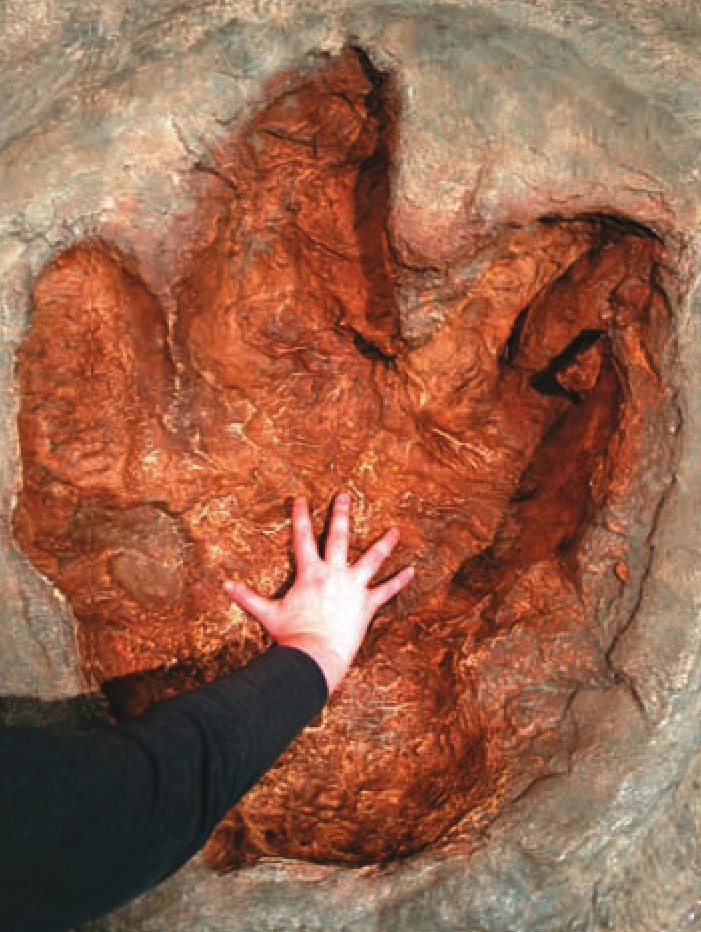
遗迹化石恐龙足迹

有些地区的地层化石很少，因此寻找化石需要有耐心，若在一个地层中很久找不到化石，不妨沿着地层延伸的方向再找找。越是难找的地方，一旦找到了化石，那将会给人们带来意想不到的收获。

值得一提的是，在个别岩石裂缝上有假化石存在，它们外表有点像植物的树干和树叶，但用放大镜仔细观察，就可以看到它们根本不是树干化石和树叶化石，而是一些黑的锰质沿着岩石裂隙面分布而成的。（许汉奎）

## 为什么只有很少的恐龙变成化石

恐龙死后，如果没有被其他动物吃掉，而是迅速被细软的沙土埋葬在地下，那么地下水中丰富的无机盐——碳酸钙、二氧化硅、黄铁矿等，与其骨骼进行化学置换，久而久之遗体内没有腐烂的骨骼就全被这些无机盐取而代之，形成了化石。

但是，满足这些化石保存条件的机会很少。动物尸体要形成化石，必须在未遭破坏的条件下迅速被掩埋。像恐龙这样的陆地动物死亡后，很容易被食腐动物吃掉。即使未被吃掉，尸体暴露在空气中也容易腐烂，骨骼也会被风化毁坏。在陆地上，只有碰巧发生沙尘暴、火山爆发等情况，恐龙被沙尘和灰土迅速掩埋，或恐龙碰巧在湖泊、河流、沼泽等埋藏条件较好的环境中死亡，由于河流湖泊的沉积作用被迅速掩埋，才会形成化石。因此，只有很少的恐龙遗体能保存为化石。（许汉奎）

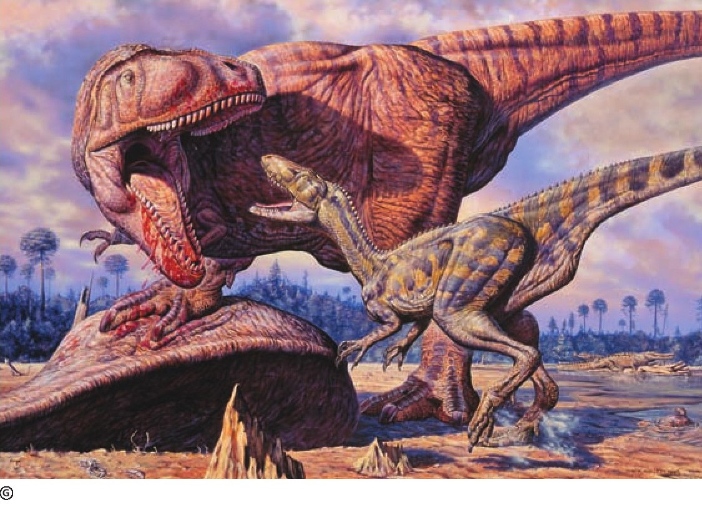
陆上生活的恐龙死后尸体往往很快被吃掉

  

**【微博士】**海相地层与陆相地层

海相地层指在海洋环境下沉积的地层。陆相地层指在陆地环境下沉积的地层。判断一个地层是海相的还是陆相的，可依据其沉积构造、岩性特征、所含化石及矿物等标志。海相地层中一般只有海生生物的化石，陆相地层中一般只有陆生生物的化石。

【微问题】今天的地球上哪些环境适合形成未来的化石？

【关键词】沉积岩　化石种类　寻找化石　海相地层　陆相地层

# 古生物与古环境

## 除了人类，还有其他生物影响过全球环境吗

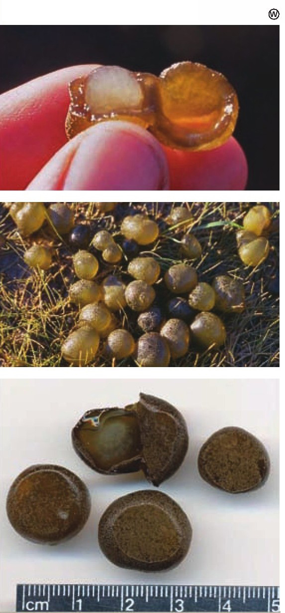
现生的蓝细菌（念珠藻属）

除了人类外，对全球环境影响最大的恐怕要算植物和那些很不起眼的藻类了。

今天的大气层中氧气含量很高，达20.94%，二氧化碳含量很少，只占0.03%。地球最早期的大气层却完全不是这样的，当时地球大气层的成分主要是氢气、水蒸气、一氧化碳、二氧化碳、甲烷、氨等，与太阳系其他星球的大气层以及地球火山喷发出的气体成分较相近。这种大气对今天的动物来说是有毒的，但是却适合某些细菌和蓝细菌的生长与繁衍。蓝细菌体内有叶绿素，可吸收大气层中的二氧化碳，在阳光的参与下进行光合作用，从而制造有机物和释放氧气。蓝细菌个体虽小，只有用显微镜才能见到，但它繁殖很快，即1个变2个、2个变4个、4个变8个地增多，20分钟就繁殖一代，所以其数量相当惊人。蓝细菌（以后还有藻类）释放的氧气使大气层中的氧气逐渐增加。氧气与一氧化碳相结合形成二氧化碳，从而使大气层中的一氧化碳逐渐减少；氧气还可与氢气结合而形成水，从而逐渐增加地球上的水的量；氧气与甲烷结合而形成二氧化碳和水，与氨结合而形成氮气和水。因为氧气消耗量很大，所以在地球早期大气层中氧气的量增加比较缓慢，到30亿年前还只及现在地球上游离氧水平的0.1%，20亿年前这个数字才增加到1%，10亿年前则增加到10%。与此相反，大气层中的氢气、一氧化碳、氨、甲烷却在不断地减少，从而大气层的成分越来越接近现在的水平。

氧气的增多，使得高空形成了臭氧层。当大气层中氧的含量达到现在大气层中氧含量的1%时，氧气就可以出现在10～50千米的高空大气层中，特别是在离地表25千米的高空。这些高空中的游离氧在太阳高能粒子流和宇宙线等的作用下形成臭氧层。臭氧层对太阳的紫外线、宇宙线等都会起屏障作用，从而保护地面的生物免受其害。臭氧层的出现，使海洋中的大量藻类可以升到海洋表面繁衍和生长，从而释放更多的氧气。

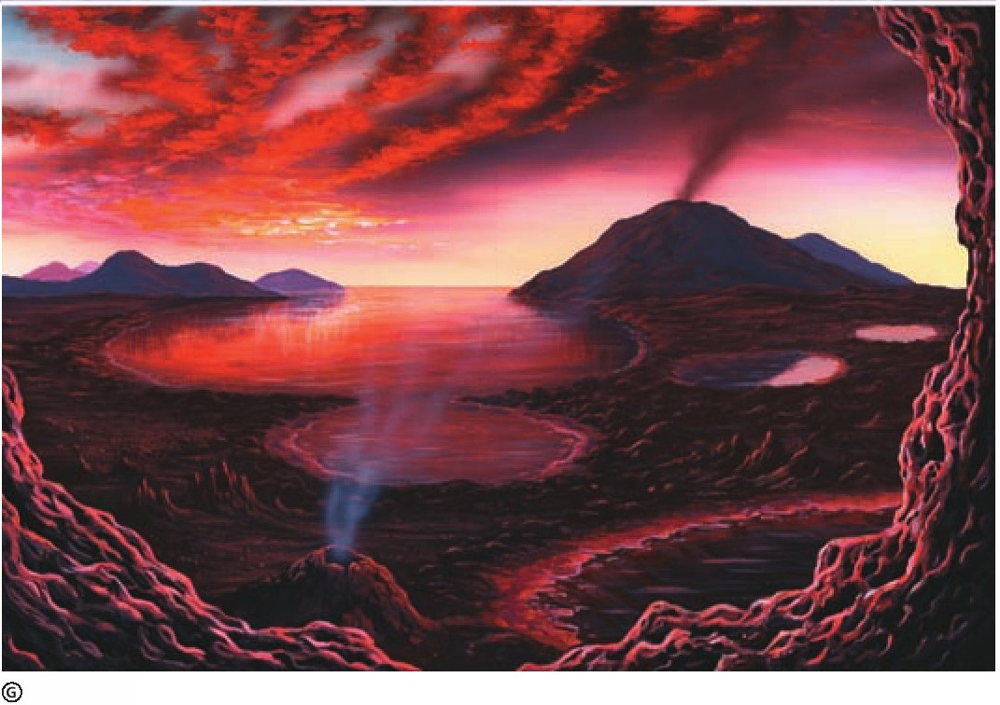
早期地球缺乏氧气，火山活动却放出大量毒气

植物和微生物会改变海水的成分。在19亿年前，海水中溶有大量的二价铁，当海水中的氧含量大增时，这些铁就被氧化为不溶于水的红色的三价铁，所以这时许多地方海水沉积物中的砂岩因含有少量的氧化铁而呈红色。当氧化铁的含量更高时，就会形成巨大的沉积铁矿，如中国东北就形成了巨大的鞍山铁矿。在澳大利亚、巴西也有这时期形成的大铁矿。氧含量的增加也使水中的二氧化碳含量增高，使海水含有较高的碳酸氢根，从而使其中的碳酸镁、碳酸钙能够沉淀下来，最终形成大量的白云岩和一些灰岩。26亿～5.4亿年前的海水中也含有较多的可溶性磷元素，它们在海水中微生物的作用下形成了巨大的不溶于水的沉积磷矿，如中国贵州和湖北都发现了巨大的沉积磷矿。

植物还使大地披上绿装，从而改善了气候环境。地球的陆地面积在4.43亿年前开始的志留纪时迅速增加。但当时的陆地光秃秃的，什么植物也没有，更不可能有动物。到了4.3亿年前的早志留世晚期，原始的裸蕨类（有假根、茎，根和叶尚未分化出来）植物开始登陆，并逐渐占领了陆地，接着动物也开始往陆地发展，从而使陆地逐渐变得欣欣向荣。尤其到石炭纪，由于气候潮湿，大多数陆地都被森林所覆盖，成为地质历史上植物覆盖最广、含氧量最高的时期。由此可见，植物对全球环境的影响有多大。（许汉奎）

## 为什么化石能做地球的“温度计”

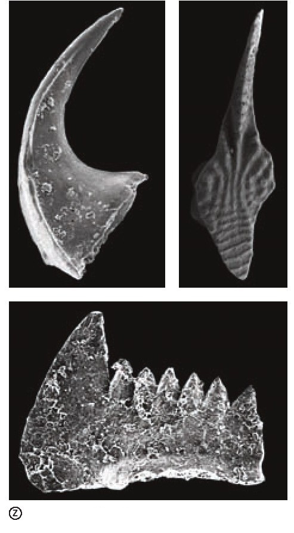
牙形刺化石

温度是对生物生长最具影响的环境因素，不仅控制着生物的纬度分布范围，而且还决定了海洋生物和陆生生物垂直方向上的分布范围。因此，生物可以划分为热带生物、温带生物和寒带生物，也可以分为喜暖生物和喜冷生物，甚至还有热泉生物和冷泉生物之分。例如，发现珊瑚化石时，无论发现地在何处，都表明该地当初曾处于温暖的海洋环境。温度的影响还记录在生物骨骼或其他硬体化石中，骨骼生长环的宽窄变化就是夏冬季节或日夜长短的标记。更有趣的是，壳体或者脊椎动物的牙齿化石的成分也清晰地记录了温度的变化。最典型的温度参数就是氧同位素氧-18与氧-16的比值。当骨骼化石中氧-16含量高时，表示当时温度上升，反之则表示温度下降。另外，锰、锶等元素也能很好地指示温度的季节性变化。

除了环境的温度，岩石的温度也可以由化石得知。有一种化石叫牙形刺，是一种蠕虫类动物的咽齿化石。它的颜色不一，从白色、琥珀色一直到黑色。不同的颜色与牙形刺中有机质变质的程度相关，而有机质的变质程度则与岩石的温度、埋藏深度以及时间都有关系。因此，牙形刺可以作为岩石的“温度计”，在勘探石油的工作中起到参考作用。（冯伟民）

## 为什么科学家能知道翼龙的生活环境

早期的翼龙化石主要被发现于意大利及德国索伦霍芬的海相灰岩中，因此，科学家曾推测这种能飞行的爬行动物像现在的一些海鸟那样生活在海边。后来，随着翼龙化石的不断发现和产地的逐渐增多，特别是在中国乌尔禾和辽西等湖相环境中发现了大量的翼龙化石，科学家渐渐改变了原有的看法。

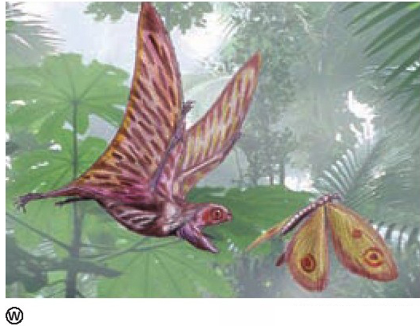
蛙嘴翼龙捕食

1.3亿～1.2亿年前早白垩世的辽西地区，遍布着大片的森林和湖泊，同时也频繁发生着火山活动。当火山爆发时，喷出的大量有毒气体和有害元素会导致包括翼龙、鸟类和带毛恐龙等在内的大量生物集群死亡，并被火山灰等沉积物快速掩埋。因此，在其他地方较难被保存下来的翼龙化石和鸟类化石等，在当地不但被大量发现，而且还常常连羽毛等软组织结构都得以保存。在湖相环境中保存下来的精美翼龙，如蛙嘴翼龙、森林翼龙等化石表明，翼龙不仅生活在海边，还生活在内陆的湖边或树林中；很多小型翼龙具有树栖的生活习性，它们就生活在树上，以森林中的昆虫等为食。（汪筱林）

  

**【微博士】**海洋中的微生物

海洋中有很多直径小于2微米的微生物，其中包括能够进行光合作用的细菌，它们在氧气含量很少的开放性海洋中可以成为放出氧气、吸收二氧化碳和制造有机物的主力军。在热带、亚热带营养比较缺乏的海域，直径仅0.4～0.8微米的原绿球菌经光合作用所产生的能量可占其总生产量的90%以上。

【微问题】动物有改造全球环境的能力吗？

【关键词】大气　氧含量　古环境　温度计　牙形刺

# 古无脊椎动物

## 最早出现的动物长什么样

地球上最早出现的动物可能是从没有细胞核的原核生物（如蓝细菌）演化来的，是单细胞的原生动物，有细胞核和细胞器，但是没有器官的分化。这些单细胞的原生动物在寒武纪之前很少有化石记录。迄今确认的最早的原生动物发现于美国科罗拉多大峡谷，是一些瓶状微体化石所代表的动物，生活时代约为7.5亿年前，形似现生的一类有骨骼的变形虫。

早期多细胞动物的化石材料则比较丰富，可以从中看出早期原生动物的形态特征。5.8亿～5.4亿年前的埃迪卡拉动物群中有软躯体动物，更早的6亿～5.8亿年前的瓮安动物群中有动物胚胎，而在6.35亿～5.8亿年前的蓝田生物群中，可以看到具有触手和类似肠道特征、形态可与现生腔肠动物或蠕虫类相比较的动物。目前发现的最早的后生动物遗骸化石，可能是产于纳米比亚7.6亿～5.5亿年前地层中的一些海绵状的化石。这种中空的花瓶状海绵化石只有一粒灰尘那么大，全身布满能控制水流的孔，其生存年代与通过分子钟计算的动物起源时间非常匹配。研究人员也曾预测，海绵体可能是地球上最早的后生动物生命的形态。

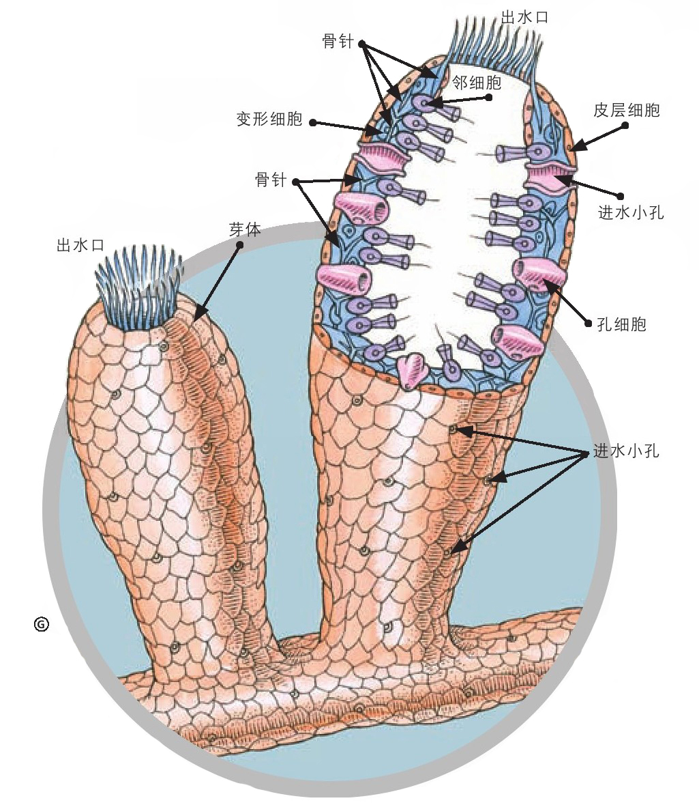
海绵的结构

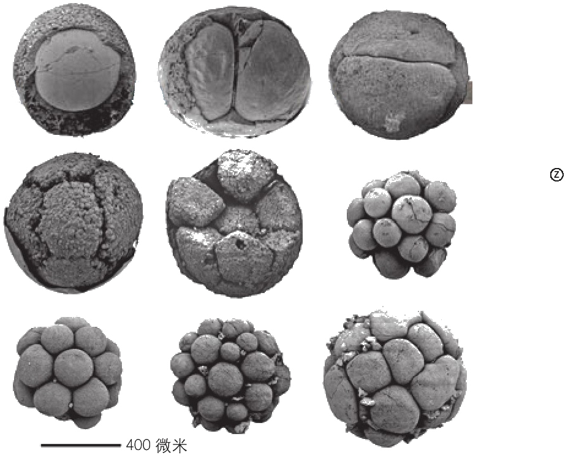
贵州瓮安动物群中的动物胚胎化石

后生动物出现以后不久就演化出了骨骼。目前公认最早的长有骨骼的后生动物化石是出现在5.48亿～5.42亿年前的克劳德管。而年代更早的，如瓮安动物群中保存的5.8亿年前的大量海绵化石、骨针化石等，都还未有定论。

到寒武纪初的小壳动物演化大辐射（距今约5.4亿年）时，涌现出大量长度多为毫米级的多门类骨骼化后生动物化石，它们包括软体动物、节肢动物、腕足动物、腔肠动物、环节动物和海绵动物等，以及一些分类位置不明的化石，这一现象称为早期后生动物骨骼化事件。

后生动物的骨骼化很可能是多种原因引起的：外因可归为大气含氧水平的提高，或者海水中钙离子浓度上升等，内因有发育受到调控机制的控制和捕食压力等。后生动物骨骼化了，就能够迅速进行辐射状的演化，并在此后的地质历史中逐渐成为生物界的主要成员。（王小娟）

## 为什么古海洋中会有“纺锤”

江苏南京明孝陵神道两旁的石兽表面上有很多米粒大小、纺锤形状的麻点。这是一些名为“”的古生物化石。属于原生动物的有孔虫类，个体只是一个细胞，但这个细胞有米粒大小，肉眼都可以看到，形态一般为纺锤形。1829年，科学家建立了的第一个属——纺锤属，就是根据其外形命名的。最早研究它的中国科学家是地质学家李四光。因形似中国古代纺纱用的筳，李四光便创造了“”字，作为这类动物的名称。

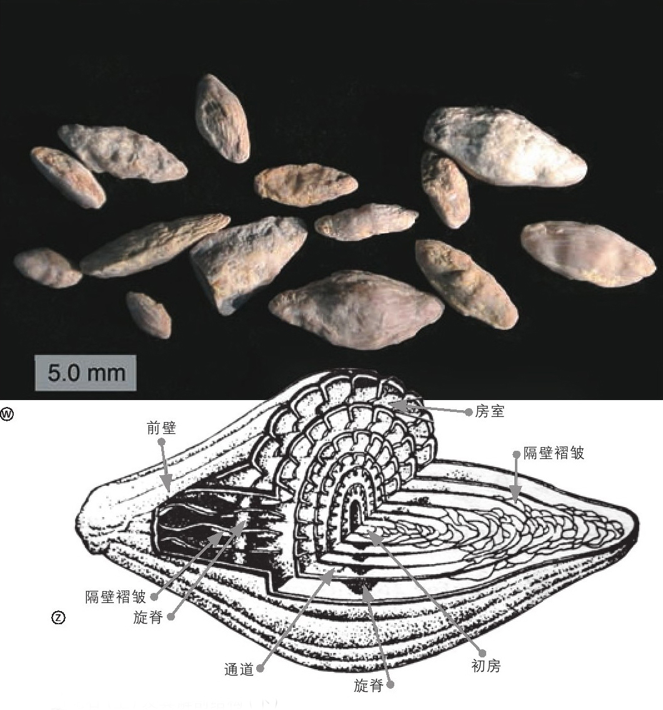
化石（上）及其解剖结构（下）

壳体一般长5～10毫米，小者不及1毫米，大者可达3～6厘米，形态除纺锤形外，还有球形、透镜形、圆柱形等。虽然是单细胞动物，却有着精细复杂的构造：初房是它最初的居室，位于壳体中央，初房上开有一圆形口子，是原生质溢出的孔道，随着的发育，原生质从初房中分泌出来形成很多壳室，并围绕一假想轴旋转生长，依次形成若干壳圈，最后把初房层层包裹在里面。因此，观察壳内部特征必须磨制壳体的各种切面。

全部生活在浅海里，绝大多数喜欢底栖，靠丝状伪足运动，行动很迟缓，少数种类的幼体也能营漂浮生活。

最早出现于石炭纪，二叠纪末期就灭绝了，在1.2亿年的时间里经历了迅速的演化，并曾遍布全世界，是当时海洋中主要的微体动物。已成为划分对比石炭系和二叠系地层的标准化石。

化石风化后往往突出于岩石层面之上，虽然只有米粒大小，但因数量多，分布集中，比较容易辨认。（王小娟）

## 为什么放射虫化石能为哑地层“说话”

放射虫是一类单细胞原生动物，因伪足和骨骼大多呈辐射状而得名。放射虫的身体虽然一般只有0.1～0.5毫米那么大小，但骨骼精致，形状更是多种多样，有球状、盘状、扇状、塔状、钟状、星射状等。所有的放射虫都生活在海洋中，如果在一个地方发现了放射虫化石，毫无疑问，那里曾经是海洋。放射虫在寒武纪时就已出现，其后一直比较繁盛，只在二叠纪和三叠纪时物种数量一度急剧减少，但在侏罗纪和白垩纪时又经历了一次大辐射，在新生代发展到鼎盛时期。

放射虫在结构上与其他原生动物不同，它们体内有一个中心囊把细胞质隔为内、外两部分，中心囊壁上的小孔使囊内外的细胞质相互沟通，囊外部的细胞质中常常形成许多空泡和脂肪粒，这样，放射虫的密度小了，就能在水中自由漂浮了。

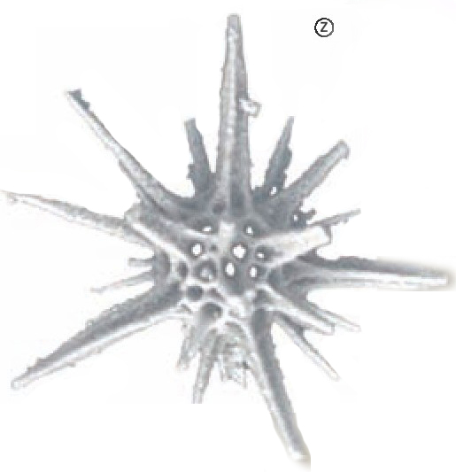
放射虫化石

在凝灰岩、硅质岩中往往难以发现肉眼可见的化石，因此被称为“哑地层”。但有一种化石却能在里面找到，那就是放射虫。放射虫营浮游生活，所以分布极广。此外，因为放射虫数量较多，其硅质壳又不易溶解，可以保存下来，因此对地层的划分和对比起了很大作用。中国古生物学家通过放射虫化石，研究和确定了云南、广西、西藏、新疆等地的古生代及中生代哑地层的时代。在放射虫化石的帮助下，哑地层似乎也能“说话”了。（王小娟）

  

**【微博士】**原生动物和后生动物

原生动物是最原始的动物，为单细胞或单细胞联合而成的集合体，没有真正的器官，但有细胞本身分化的细胞器，这些细胞器专司一定的功能。根据不同的细胞器类型，原生动物可分为鞭毛纲、肉足纲、孢子纲和纤毛虫纲，肉足纲中的有孔虫类和放射虫类化石较多，在地层划分和生态学上都起重要作用。后生动物由大量形态分化、功能分工的细胞构成，生殖细胞和营养细胞有明显的分化，不同于原生动物的细胞兼有营养和生殖功能。后生动物中的真后生动物是指所有具有细胞组织的动物，由两侧对称动物和辐射对称动物组成。

【微问题】骨骼对于早期动物有什么用？

【关键词】海绵　原生动物　后生动物　哑地层　放射虫

# 古植物

## 最早出现的植物长什么样

约35亿年前，能够进行光合作用的蓝细菌可能就已经出现在地球上，但它们只是单细胞的原核生物。在漫长的地质岁月中，能够为地球提供氧气的只有这些肉眼看不到的小家伙。人们长久以来认为，多细胞的藻类一直要到5.6亿年前的新元古代埃迪卡拉纪晚期才出现。然而最近在安徽黄山休宁蓝田的一个发现，把多细胞藻类出现的时间提早了近4000万年。在当地埃迪卡拉纪早期蓝田组的黑色页岩中，中国古生物学家发现了一些多细胞生物的化石。这些化石生物生活在6.35亿～5.8亿年前，身材不大，身长只有零点几毫米到几厘米，最大的也不过巴掌大小，但它们对生物演化的意义却很重大。根据复原的结果，科学家推测其中一些可能是呈扇状、丛状生长的海藻，也有一些可能是具有触手和“肠道”，形态接近现生腔肠动物或蠕虫的动物。它们以底栖的方式固着生活在50～200米深的安静海底环境中。其中的藻类靠上层海水中透下来的微弱阳光进行光合作用，动物则利用触手等器官获取游过身边的微体生物。这些多细胞生物在新元古代大冰期结束之后不久，就迅速从单细胞形态演化出了宏体形态。蓝田生物群的繁盛，可能和当时海洋水体中氧含量的增加有关。不过，目前尚不能肯定它们是否就是今天地球上的植物和动物的祖先。（袁训来）

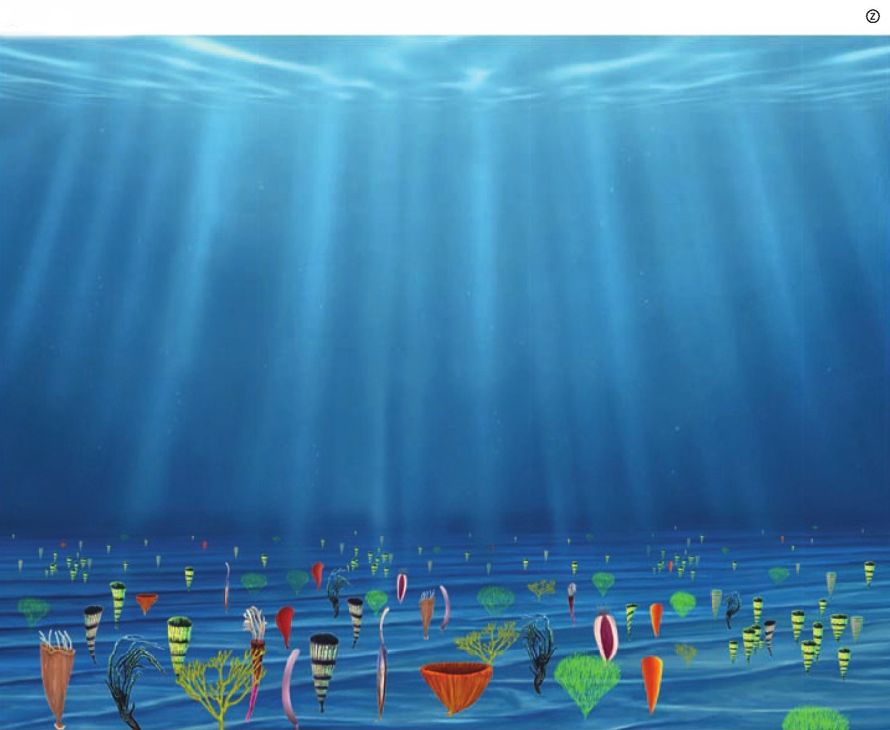
蓝田生物群复原图

## 最常见的植物化石是什么

植物保存为化石的方式多种多样，其中最常见的植物化石就是压型化石或印痕化石。

压型化石主要是指植物体（整体或局部）经过一定程度的搬运之后，与泥沙等一同掩埋，再经历地层中成岩作用和压实作用之后，植物体中大量的有机物都被降解，只有黑色的炭质成分被保留了下来。在压型化石中，植物所呈现的都是被压扁的膜状，植物体的外部形态信息虽有一定的保留，但内部的解剖结构在化石化的过程中几乎完全丧失。在某些压型植物化石中，植物体叶片或茎干表面上的某些细节，比如表皮细胞、气孔器等也有可能被保留。

压型化石是古植物学研究中的重要材料，是古植物学中进行形态对比的重要证据。但是由于可利用的资料有限，往往要利用大量的压型化石资料才能重建和复原原始植物的整体形态特征。

如果压型化石中，被压扁的炭化植物在地质变化中，或在化石暴露后被剥蚀掉了，就称为印痕化石。简单地说，印痕化石就是植物体炭化、扁化后在围岩上留下的印记。印痕化石的形成与压型化石的挖掘过程密切相关。在采集植物化石的过程中，劈开含有压型化石的围岩，往往会得到植物化石互相对开的两面，由于开裂的位置不同，黑色炭质的分布是不均匀的，因此也得到了不同形态的压型化石和印痕化石。

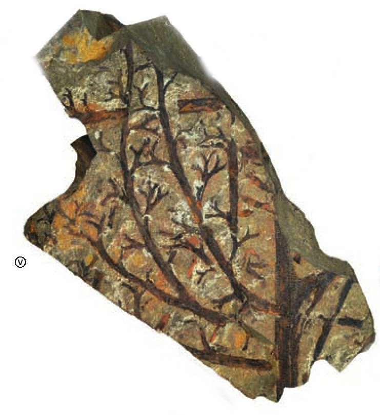
印痕化石

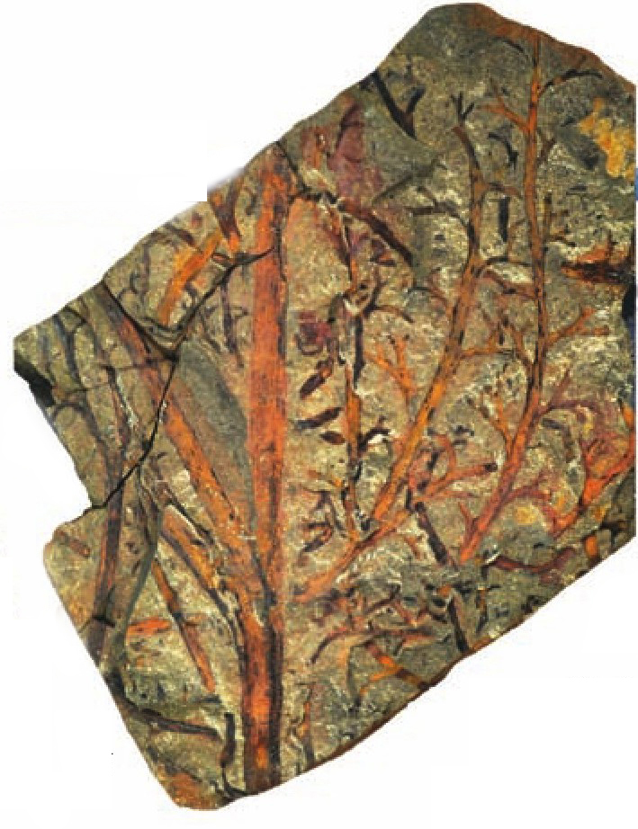
压型化石

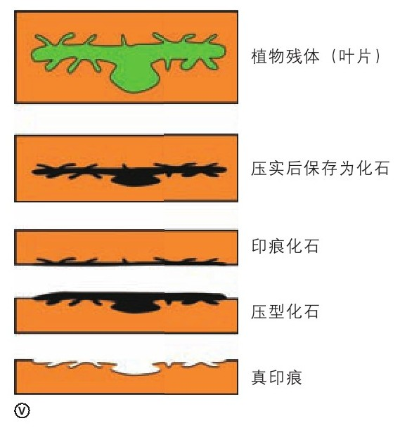
中国新疆发现的3.9亿年前古蕨无脉树化石

除了压型化石和印痕化石，如果植物在形成过程中没有被压扁，还可能形成立体的模型化石和铸型化石，但这些化石都较为少见，远不如压型化石和印痕化石常见。（徐洪河）

## 为什么树木可以保存为化石

木化石是一种矿化的植物化石，它能够完整而清晰地保存木材的结构与形态，所以它既是科学研究的良好材料，也广泛用于装饰与观赏。

能保存为木化石的植物往往都非常粗壮，并且具有大量的木质部。这是因为木质部这种组织是由厚壁细胞构成的，较容易发生矿化作用。具有大量木质部组织的粗壮植物体被泥土、沙石等掩埋之后，在被压实的环境中可能有大量的地下水活动，这些水中又溶解有大量的、供应充足的无机盐（如硅、钙等）。由于木质部细胞具有大量可填充的空间，在植物细胞还未完全降解时，含无机盐的水会逐渐渗入植物体的细胞空腔中，并固定沉淀，随后经过成岩作用，植物体就能在漫长的地质历史中保存为木化石。

如果在木化石的形成过程中，原始的植物体因空气隔绝等条件，并未发生腐化降解，所形成的木化石就能够完整地“复制”出植物体的组织结构；如果在石化的过程中植物体发生降解，所形成的木化石中植物体的组织结构就无法保存，而只剩下了植物体的外部形态。

最常见的木化石是硅化木，这是含有硅质的水在植物细胞空腔中发生结晶作用或矿化作用，形成了晶质的二氧化硅或隐晶质的二氧化硅水合物。世界上著名的硅化木产地有多处，其中主要有美国的亚利桑那、非洲的马达加斯加岛、中国的辽宁和新疆等地。这些地方以出产大量保存精美的硅化木而闻名。（徐洪河）

  

**【微博士】**最早的琥珀

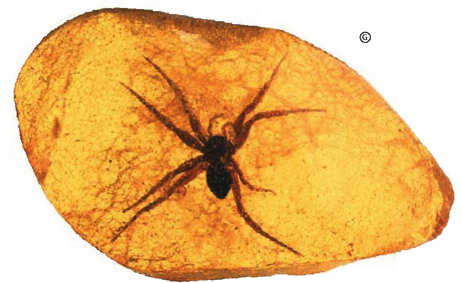
某些裸子植物，如松树，以及某些豆科植物，能够分泌出具有芳香味道的树脂。这些树脂（其中可能包裹有动物或植物的碎片）从植物体脱落后被埋藏，发生石化作用，其自身结构和特征都发生了强烈的变化。石化后的树脂经过搬运、沉积，在一定温度与压力的成岩作用下，形成了一种特殊保存形式的化石——琥珀。

琥珀大多与煤层相伴，不过不是所有的煤层里都有琥珀。最早的煤是在泥盆纪形成的，但当时的成煤植物主要是一些高大的蕨类植物，这些蕨类植物并不能分泌树脂，因此也不能形成琥珀。最早的琥珀要在裸子植物盛行的中生代才能形成，但是由于化石记录不完整，化石保存不全面，目前发现的最早的琥珀实际上来自白垩纪的地层中。白垩纪时期陆地植被中裸子植物占据优势，多样性的程度也非常高，它们是琥珀的主要来源。

【微问题】植物的模型化石和铸型化石是怎样形成的？

【关键词】压型化石　印痕化石　硅化木　琥珀

# 古脊椎动物

## 地球上第一条“鱼”长什么样

1997年8月，中国云南地质科学研究所的地质学家在云南昆明海口地区的野外考察中，在距今约5.3亿年的早寒武世的地层中找到一块长约3厘米的奇怪鱼形化石。它具有鱼类的最典型特征：有脊椎，有鳃，有明显的背鳍。鱼形动物是最早的脊椎动物，然而从未在这么早的地层中出现过。1998年12月，中国科学家在同一地区又发现了第二条来自早寒武世的鱼类化石。这两块化石将脊椎动物的最早出现时间向前推进了约5000万年，是有关寒武纪大爆发的研究中最重大的突破之一，在全世界引起了轰动。

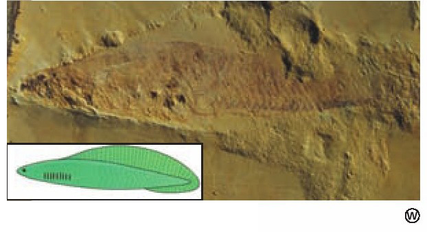
海口鱼化石和复原图

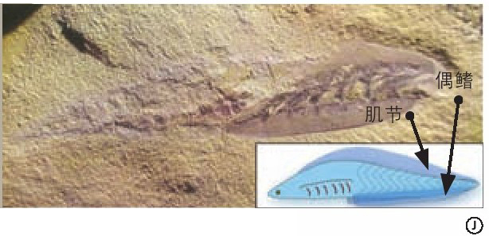
昆明鱼化石和复原图

这两条最古老的脊椎动物分别被科学家命名为昆明鱼和海口鱼。昆明鱼和海口鱼形态相似，身体皆呈鱼形，长度约3厘米。它们的头与身体已经分化，出现“之”字形的肌节，并且具有鱼类特有的鳍和典型的鳃囊。有意思的是昆明鱼和海口鱼全身裸露，没有鳞片，这些特征与其他现生无颌类（盲鳗、七鳃鳗）相似。两者相比，海口鱼的鳃囊拥有篮状的软骨支撑，并且背鳍也有鳍条的分化，这些特征都显示海口鱼比昆明鱼更为进步。（卢静）

## 4亿年前的海洋中曾经生活过哪些鱼类

4亿年前的地球上，海洋占据地球的绝大部分区域。生活在海洋里的鱼类通过演化已经分化为截然不同的5大类：无颌类、盾皮鱼类、棘鱼类、软骨鱼类以及硬骨鱼类。其中无颌类、软骨鱼类和硬骨鱼类从那时起，一直延续到今天。而盾皮鱼类和棘鱼类则已经灭绝了。这些4亿年前的鱼类都长什么样呢？

无颌类，顾名思义，就是没有上下颌的鱼类。它们最早出现于5亿多年前的早寒武世，是最早分化出来的鱼类。无颌类在当时海洋中的主要代表是甲胄鱼类。甲胄鱼身披厚重的盔甲，生活在海底，行动缓慢，靠滤食海洋中的小型生物或微生物为生，偶尔也吸吮大型动物的尸体，主动捕食能力非常差。甲胄鱼类可以分为星甲鱼类、异甲鱼类、缺甲鱼类、花鳞鱼类、骨甲鱼类、茄甲鱼类以及中国特有的盔甲鱼类。已知最早的甲胄鱼类是发现于澳大利亚、玻利维亚和阿根廷早奥陶统地层的阿兰德鱼类。甲胄鱼类在志留纪与泥盆纪时期曾经非常繁盛，但是在3.6亿年前的泥盆纪末期就灭绝了，整个无颌类家族中只有七鳃鳗和盲鳗熬过漫长的地质历史时期存活到今天。

盾皮鱼类（4.4亿～3.6亿年前）是原始的有颌鱼类，最古老的代表发现于中国志留纪早期的地层中，到泥盆纪末灭绝。盾皮鱼类身披坚硬的骨甲，头甲和躯甲多由可以活动的关节相连，具胸鳍和腹鳍，大部分家族成员营底栖生活，不擅游泳。它们数量众多，形态各异，踪迹也几乎遍及全球。盾皮鱼类是古生代鱼类中族群最为庞杂的一大类，可以分为胴甲鱼类、节甲鱼类以及瓣甲鱼类等大类。最新研究表明，包括鲨鱼、鲫鱼和人类在内，所有现生有颌脊椎动物很可能是由原始的盾皮鱼演化而来的。胴甲鱼类和瓣甲鱼类的个体一般较小，身体扁平，营底栖生活。但到泥盆纪中后期，一些进步的节甲鱼类演化成了远洋水域巡弋的掠食者，它们中最为著名的当属邓氏鱼，体长近10米，是当时海洋中的霸主。

棘鱼类（4.4亿～2.5亿年前）是另一种古老的有颌鱼类，最早出现于志留纪最早期，在泥盆纪时较为繁盛，之后逐渐衰落直至晚二叠世全部灭绝。棘鱼类跟黄花鱼长得很像，个头不大，身上长满了细小的菱形鳞片。它们的鱼鳍非常特别，除了其他鱼类也有的鳍之外，在胸鳍与腹鳍之间还有着几对有棘刺支持的附加鳍。更奇怪的是所有鳍的前方都有一根非常粗壮、长着纵向纹饰的硬棘，棘鱼的名字也由此而来。棘鱼类是有颌鱼类中较小的一个类群，可以分为栅棘鱼类、锉棘鱼类以及棘鱼类三个大类。

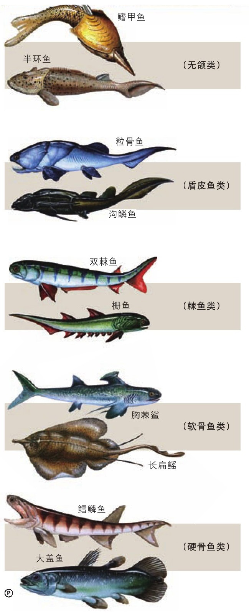
4亿年前海洋中的5大鱼类

软骨鱼类（4.4亿年前至今）是有颌类的一个支系，从志留纪一直生存至今。今天的鲨鱼、鳐鱼都属于软骨鱼类。它们的内骨骼全部由软骨构成，有5～7对鳃孔，体表被覆着楯鳞，鼻孔长在口吻部的下方。它们没有鳔，靠游动来改变深度。软骨鱼类的繁殖方式与其他鱼类的不同，是体内受精，很多种类以卵胎生的方式生育。

硬骨鱼类（4.3亿年前至今）是有颌类演化历史中最为成功的一类。最早的硬骨鱼类发现于中国云南晚志留世的地层中，而后演化出两个分支：辐鳍鱼类与肉鳍鱼类。硬骨鱼类中的辐鳍鱼类按照演化阶段可以依次分为软骨硬鳞鱼类（其现生代表有多鳍鱼和鲟鱼）、全骨鱼类（现生代表是弓鳍鱼和雀鳝）以及真骨鱼类（即现生的大多数鱼类）。其中的真骨鱼类从中三叠世起出现一直延续至今，大约从晚侏罗世它们开始逐渐取代全骨鱼类，成为今天水域的统治者。硬骨鱼类中的肉鳍鱼类可以分为空棘鱼类、爪齿鱼类、肺鱼形类以及四足形类，除爪齿鱼类在晚泥盆世几乎完全灭绝外，其余三个大类均有现生代表，即拉蒂迈鱼、肺鱼以及所有的四足动物，包括人类在内。（卢静）

## 为什么无颌类鱼只有一个鼻孔

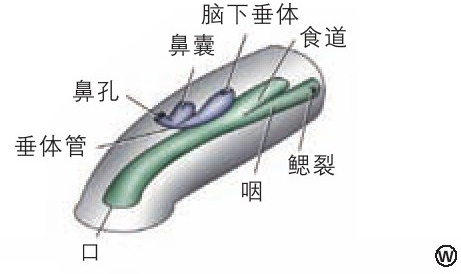
七鳃鳗的鼻垂体复合体

无颌类鱼，比如现生无颌类的盲鳗、七鳃鳗，以及所有化石无颌类，都只有一个鼻孔。在它们的颅顶，能观察到一个大的形状不一的鼻垂体窝，里面同时容纳了鼻囊与垂体。从发育上来看，无颌类的这个结构是来自中央的一块基板，即鼻垂体板。而包括人类在内的所有有颌类，都具有两个独立的外鼻孔，成对的鼻囊分别位于脑颅的两侧，并完全跟垂体分离。

七鳃鳗

为什么无颌类和有颌类会有这种鼻孔的区别呢？从2001年起，日本的分子生物学家和发育生物学家便提出有关颌起源的异位移动假说。这个理论的核心内容是：颌的起源与有颌类的双鼻孔的起源是紧密结合在一起的。在无颌类的发育过程中，神经嵴细胞向前侧方的生长是因为受到中央鼻垂体板的阻挡而无法继续发育成颌。而有颌类发育时分化出彼此分离的两个鼻囊，并从垂体系统脱离，因此神经嵴细胞得以最终发育成颌。（卢静）

  

**【微博士】**软骨鱼类的化石

尽管软骨鱼类在4.4亿年前已经出现，但有关它们的化石记录至今仍少得可怜。这是因为软骨鱼类身体除了牙齿、鳞片与背上的棘刺外，其余部分的骨骼都由软骨组成，而软骨又很难被保存为化石。不过，许多软骨鱼类在其一生中能不断地替换它们的牙齿，古生物学家可以通过研究它们掉落的大量牙齿化石，准确判断这些牙齿主人所属的类群，确定它们在软骨鱼类演化历史中所占的位置。

【微问题】无颌类鱼也有牙齿吗？

【关键词】无颌类　盾皮鱼类　棘鱼类　软骨鱼类　硬骨鱼类　昆明鱼　海口鱼

# 古人类

## 南方古猿为什么是人不是猿

1924年，在南非塔翁的一个采石场里，工人爆破时挖掘出来一块不大的头骨化石。头骨化石保存完好，生前属于幼年个体（相当于3～6岁的人类小孩）。研究表明，塔翁头骨具有许多似猿的性状，如这个幼年个体的颅容量相当于成年大猩猩的，大约为500毫升，估计成年时也不过600毫升，此外还有向前突出的上下颌骨。但它还具有人类的性状：牙齿很小，与人类的牙齿相近。尤其重要的是枕骨大孔位于颅骨下方，表明颅骨垂直于脊柱之上，显示它已能直立行走。由于它发现于非洲的最南部，因而被命名为南方古猿非洲种。

20世纪60年代以前，古人类学界一直以是否能够制造工具作为区分人和猿的标准，可是发现南方古猿的地方没有发现伴存的工具，因此人们认为化石主人是人类之前的生物。20世纪60年代，英国动物学家简·古多尔在非洲观察黑猩猩的生活时发现，黑猩猩会将草枝上的分叉和叶子摘掉做成草棍，然后插进白蚁窝，待许多白蚁爬上草棍后，便抽出草棍，放进嘴里，吃掉这些白蚁。这一发现使古人类学家意识到，制造和使用工具并不是人类独有的能力，不应继续用作区分人与猿的标准。此后，人类学家改用是否能够习惯性地两腿直立行走作为区分人猿的标准。这样，人的范围扩大了，能够习惯性直立行走但不会制造工具的南方古猿也成为人类成员了，被归入人科南方古猿属。20世纪50年代以后，更多的南方古猿陆续发现于非洲的南部和东部，如埃塞俄比亚、肯尼亚、坦桑尼亚、乍得、南非等国。这些化石的生存年代在420万～150万年前，被分类为南方古猿属下面的非洲种、粗壮种、鲍氏种、阿法种、埃塞俄比亚种、羚羊河种、惊奇种、始祖种、湖畔种、源泉种等。经研究后发现，某些南方古猿可能已经具有使用石制工具切割、砍砸动物骨骼的能力。

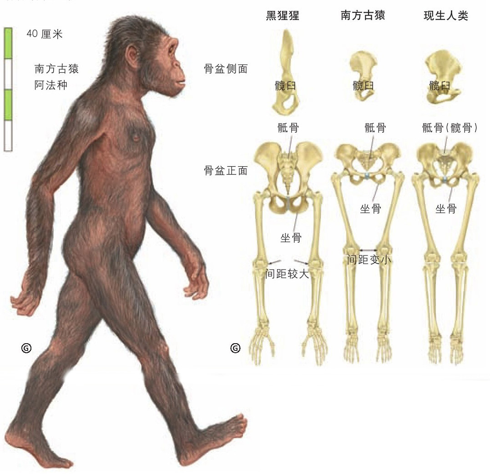
骨骼特征比较

一般人认为，南方古猿属中的一支阿法种演化为人科的后一阶段人属，其余的南方古猿则最终灭绝了。不过，根据最近在南非发现的190万年前的南方古猿源泉种化石，也有学者提出源泉种是位于南方古猿与人属之间的过渡成员。（吴秀杰　刘武）

## 为什么说人是由猿演化来的

在现生灵长类动物中，猿类的外形和身体构造与人类的最为接近。猿和人的四肢都长有5个手指或脚趾，有指甲或趾甲；拇指与其他四指可以对握，用来抓握东西；嘴和鼻子不像其他动物那样向前突出；脑也比较大，具有立体视觉；此外，人和猿类都只有一对乳房，通常一胎只生一个孩子。在现生的猿类当中，生活在非洲的黑猩猩和大猩猩与人类的亲缘关系最接近。

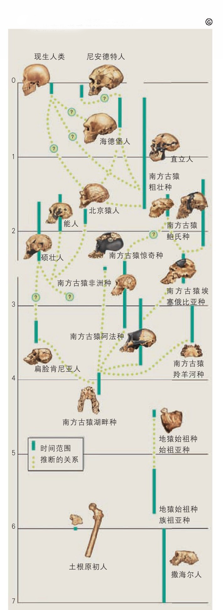
现生人类可能的演化谱系

19世纪中叶，英国学者达尔文等人根据大量的科学观察提出，人是从远古的猿类演化来的。比较解剖学研究显示，人类与猿类的身体构造，包括头骨、牙齿、脊椎、骨盆、大小脑、四肢的结构，以及身体不同部位的大小比例，都非常相似。进一步的对比发现，人类与猿类之间的差异，比人类与猴类，以及猿类与猴类之间的差异都要小，这说明人类与猿类的亲缘关系最近。人类和猿类可能拥有共同的祖先。达尔文提出，这个祖先可能生活在非洲，是一种生活在很久以前的古猿。

那么，人和猿是何时分开的呢？分子生物学家对比了现生人类和猿类体内的蛋白质、核酸等生物大分子，推测人类和猿类是在距今700万～500万年间分道扬镳的。但是在20世纪60年代以后的很长一段时间里，发现最早的人类还只是南方古猿，其化石年代还只是300万年前，这说明一定存在更早的人类祖先。20世纪90年代以来，人类寻找祖先的努力终于取得了重要突破，科学家先后在非洲发现了3批年代早于500万年前的古人类化石。这些化石分别是发现于埃塞俄比亚的地猿始祖种族祖亚种（580万～520万年前）、土根原初人（600万年前），以及乍得撒海尔人（托麦，700万～600万年前）。这些人类化石提供的人猿分离时间已经与某些分子生物学者研究推断的人猿分离时间接近，同时也使学术界意识到，人与猿实际分开后独自演化的时间可能比分子生物学研究推断的还要长。（吴秀杰　刘武）

## 为什么现在的猿不可能变成人

黑猩猩正用草棍挖白蚁吃。它们虽然能使用工具，但前肢不可能再进化成人的样子

既然人是由古猿演化来的，现在的猿还能变成人吗？答案是否定的，现生的猿是不能变成人的。人和现生猿从共同的祖先分别演化而来，一支变成了人，另一支成为现生猿更直接的祖先。现生猿的祖先长期在树林中生活，用前肢在树枝之间攀缘，像钩子那样挂在树枝上。这样，前肢变得越来越长，拇指变小，后肢变弱，不能长时间站立。而演化是不可逆转的，现生猿类遗传了其祖先的这些特征，即便其生活环境发生变化，树木变稀或消失，它们的拇指也不可能再变大，前肢也不可能再缩短，后肢也不可能变得粗壮。总之，现生猿不能习惯性地直立用两条腿走路，也不能像人一样协调使用拇指和其他手指来抓住树枝或工具作为谋生和抵御敌人的手段。它们只能适应新的环境免得被淘汰，而不能演化成人。（吴秀杰　刘武）

  

**【微博士】**撒海尔人

是指在非洲中部的乍得北部沙漠地区发现的700万～600万年前与人类相似的头骨、下颌骨及牙齿化石的主人。研究显示，撒海尔人头上呈现与猿及人类相似的混合特征：颅骨形态与猿类相似，颅容量与黑猩猩接近，宽阔的眶间距与大猩猩相似；而其面部和牙齿形态与人类相似。据此，研究者认为这些化石的主人很可能代表着人猿分别演化后出现的最早的人科成员，并将其命名为一个新属新种：撒海尔人乍得种。同时，根据当地的部落语言，取通俗名“托麦”，意思是“生命希望”。这些化石的年代与某些分子生物学研究者所推断的人猿分离的时间重合，化石又呈现人猿混合的镶嵌特征，怪不得很多人认为，这是迄今发现的年代最古老的可能位于人猿分叉位置的化石成员。

【微问题】为什么直立行走的特征在区分人和猿时这么关键？

【关键词】撒海尔人　南方古猿　直立行走　分子生物学　镶嵌特征

