# 图书在版编目（CIP）数据

十万个为什么（第六版）/韩启德总主编.-上海：少年儿童出版社，2014.1

ISBN 978-7-5324-9285-5

I.①十……II.①韩……III.①科学知识-青年读物②科学知识-少年读物IV.①Z228.1②R-49

中国版本图书馆CIP数据核字（2013）第055411号

  

  

  

**十万个为什么（第六版）**

**总主编　韩启德**

出　　版　上海世纪出版股份有限公司少年儿童出版社

地　　址　200052上海延安西路1538号

发　　行　上海世纪出版股份有限公司发行中心

地　　址　200001上海福建中路193号

易文网 www.ewen.cc

少儿网 www.jcph.com

电子邮箱　posmaster@jcph.com

印　　刷　上海中华印刷有限公司

　　上海中华商务联合印刷有限公司

　　常熟市华通印刷有限公司

　　上海锦佳印刷有限公司

　　上海一众印务中心

　　浙江新华数码印务有限公司

开　　本　889×11941/16

印　　张　221.5

出版日期　2014年1月第1版第1次印刷

书　　号　ISBN 978-7-5324-9285-5/N.962

定　　价　680.00元（全18册）

**版权所有　侵权必究**

 目录
 

[扉页](../Text/feiye.xhtml)

[版权信息](../Text/bq.xhtml)

[序 言](../Text/Section0002_0001.xhtml)

[目录](../Text/TOC.xhtml)

[导言](../Text/Section0002_0002.xhtml)

[没有植物，人类还能生存吗](../Text/Section0002_0002.xhtml#sigil_toc_id_1)

[植物进化与分类](../Text/Section0002_0003.xhtml)

[植物和动物的差别在哪里](../Text/Section0002_0003.xhtml#sigil_toc_id_52)

[为什么眼虫有两张“护照”](../Text/Section0002_0003.xhtml#sigil_toc_id_53)

[什么是植物的进化树](../Text/Section0002_0003_0001.xhtml)

[现代蕨类还能进化成种子植物吗](../Text/Section0002_0003_0001.xhtml#sigil_toc_id_54)

[苔藓植物的祖先是谁](../Text/Section0002_0003_0001.xhtml#sigil_toc_id_2)

[谁是最早“游上岸”的植物](../Text/Section0002_0003_0002_0001.xhtml)

[什么是植物的“世代交替”](../Text/Section0002_0003_0002_0001.xhtml#sigil_toc_id_3)

[雌雄异株的隐花植物如何繁衍后代](../Text/Section0002_0003_0003_0001.xhtml)

[为什么其貌不扬的隐花能够吸引榕小蜂](../Text/Section0002_0003_0003_0001.xhtml#sigil_toc_id_4)

[越鲜艳的蘑菇越有毒吗](../Text/Section0002_0003_0004_0001.xhtml)

[冬虫夏草究竟是草还是虫](../Text/Section0002_0003_0004_0001.xhtml#sigil_toc_id_5)

[为什么蕨类植物的叶片背面有很多“虫卵”](../Text/Section0002_0003_0005_0001.xhtml)

[为什么苔藓植物长不高](../Text/Section0002_0003_0005_0001.xhtml#sigil_toc_id_16)

[为什么生态系统中常用苔藓植物作为指示植物](../Text/Section0002_0003_0005_0001.xhtml#sigil_toc_id_59)

[为什么植物要有学名](../Text/Section0002_0003_0007.xhtml)

[为什么给这种植物起名“何首乌”](../Text/Section0002_0003_0007.xhtml#sigil_toc_id_60)

[为什么说银杉是植物界的大熊猫](../Text/Section0002_0003_0008.xhtml)

[谁是发现银杉第一人](../Text/Section0002_0003_0008.xhtml#sigil_toc_id_61)

[植物结构与形态](../Text/Section0002_0004.xhtml)

[水为什么能“爬上”百米高的大树](../Text/Section0002_0004.xhtml#sigil_toc_id_62)

[植物有哪些抗旱的本领](../Text/Section0002_0004.xhtml#sigil_toc_id_63)

[什么是根的作用](../Text/Section0002_0004_0001.xhtml)

[怎样识别根的“身份”](../Text/Section0002_0004_0001.xhtml#sigil_toc_id_64)

[为什么独木也能成林](../Text/Section0002_0004_0001.xhtml#sigil_toc_id_6)

[为什么有些大树基部会长板状的根](../Text/Section0002_0004_0002_0001.xhtml)

[“果实”为什么结在大树干上](../Text/Section0002_0004_0002_0001.xhtml#sigil_toc_id_18)

[热带雨林的四大奇观是什么](../Text/Section0002_0004_0002_0001.xhtml#sigil_toc_id_66)

[为什么大多数树干都是圆柱形的](../Text/Section0002_0004_0004.xhtml)

[形状古怪的茎都有特殊功能吗](../Text/Section0002_0004_0004.xhtml#sigil_toc_id_67)

[藕断为什么丝连](../Text/Section0002_0004_0005.xhtml)

[莲藕中为什么有那么多小洞洞](../Text/Section0002_0004_0005.xhtml#sigil_toc_id_68)

[为什么年轮有深有浅](../Text/Section0002_0004_0006.xhtml)

[树木能长多高](../Text/Section0002_0004_0006.xhtml#sigil_toc_id_69)

[爬山虎为什么能爬上高高的大墙](../Text/Section0002_0004_0007.xhtml)

[为什么草莓是“会爬的水果”](../Text/Section0002_0004_0007.xhtml#sigil_toc_id_70)

[荷叶上的水滴为什么会变成“珍珠”](../Text/Section0002_0004_0008.xhtml)

[王莲的叶片上为什么能载小孩](../Text/Section0002_0004_0008.xhtml#sigil_toc_id_71)

[文竹的叶片在哪里](../Text/Section0002_0004_0008.xhtml#sigil_toc_id_7)

[为什么大多数叶子呈薄片状](../Text/Section0002_0004_0009_0001.xhtml)

[为什么椰子树的叶子都聚生在树干顶端](../Text/Section0002_0004_0009_0001.xhtml#sigil_toc_id_19)

[为什么百岁兰的叶片“长命百岁”](../Text/Section0002_0004_0009_0001.xhtml#sigil_toc_id_73)

[形态各异的花是如何形成的](../Text/Section0002_0004_0011.xhtml)

[一条花枝上，为什么有的只开一朵花，有的却开多朵花](../Text/Section0002_0004_0011_0001.xhtml)

[为什么花序有多种多样](../Text/Section0002_0004_0011_0001.xhtml#sigil_toc_id_8)

[植物的花能吃吗](../Text/Section0002_0004_0011_0001.xhtml#sigil_toc_id_75)

[花都有花瓣吗](../Text/Section0002_0004_0013.xhtml)

[无花果的花在什么地方](../Text/Section0002_0004_0013.xhtml#sigil_toc_id_76)

[鲜艳的圣诞红，是真花瓣还是假花瓣](../Text/Section0002_0004_0013.xhtml#sigil_toc_id_20)

[花朵为谁而美丽](../Text/Section0002_0004_0014_0001.xhtml)

[动物分得清花朵的香臭吗](../Text/Section0002_0004_0014_0001.xhtml#sigil_toc_id_9)

[为什么金银花的花朵会变色](../Text/Section0002_0004_0014_0001.xhtml#sigil_toc_id_78)

[为什么雪松那么“浪费”花粉](../Text/Section0002_0004_0016.xhtml)

[昆虫和花朵是在公平交易吗](../Text/Section0002_0004_0016.xhtml#sigil_toc_id_79)

[花朵怎样“诱骗”昆虫传粉](../Text/Section0002_0004_0016.xhtml#sigil_toc_id_21)

[铁树开花真的很难吗](../Text/Section0002_0004_0017_0001.xhtml)

[玉兰为什么先开花后长叶](../Text/Section0002_0004_0017_0001.xhtml#sigil_toc_id_22)

[一株向日葵开几朵花](../Text/Section0002_0004_0017_0001.xhtml#sigil_toc_id_81)

[为什么说果实是种子的“保护神”](../Text/Section0002_0004_0019.xhtml)

[种子里面有什么秘密](../Text/Section0002_0004_0019.xhtml#sigil_toc_id_82)

[花生为什么要钻入地下](../Text/Section0002_0004_0019.xhtml#sigil_toc_id_23)

[植物怎样“诱惑”动物传播种子](../Text/Section0002_0004_0020_0001.xhtml)

[果实和种子怎样借风“旅行”](../Text/Section0002_0004_0020_0001.xhtml#sigil_toc_id_24)

[喷瓜的果实为什么“爆炸”](../Text/Section0002_0004_0021_0001.xhtml)

[为什么椰子树都微微向大海倾斜](../Text/Section0002_0004_0021_0001.xhtml#sigil_toc_id_25)

[孢子为什么具有超强的生命力](../Text/Section0002_0004_0022_0001.xhtml)

[“忍耐力”最强的植物是谁](../Text/Section0002_0004_0022_0001.xhtml#sigil_toc_id_26)

[植物生理与代谢](../Text/Section0002_0005.xhtml)

[为什么绿叶被称为“食物加工厂”](../Text/Section0002_0005.xhtml#sigil_toc_id_86)

[绿叶工厂内有哪些“车间设备”](../Text/Section0002_0005.xhtml#sigil_toc_id_87)

[为什么光合作用是生命发动机](../Text/Section0002_0005.xhtml#sigil_toc_id_27)

[豆科植物的根部为什么会长小瘤子](../Text/Section0002_0005_0001_0001.xhtml)

[庄稼为什么患上营养缺乏症](../Text/Section0002_0005_0001_0001.xhtml#sigil_toc_id_28)

[为什么化肥不及有机肥](../Text/Section0002_0005_0001_0001.xhtml#sigil_toc_id_89)

[食肉植物怎样为昆虫设下陷阱](../Text/Section0002_0005_0003.xhtml)

[为什么有些植物爱吃肉](../Text/Section0002_0005_0003.xhtml#sigil_toc_id_90)

[为什么捕蝇草能感觉到猎物中了“埋伏”](../Text/Section0002_0005_0003.xhtml#sigil_toc_id_29)

[植物有哪些抵抗害虫的手段](../Text/Section0002_0005_0004_0001.xhtml)

[植物被虫子伤害会发出“求救”信号吗](../Text/Section0002_0005_0004_0001.xhtml#sigil_toc_id_30)

[如何培育抗虫农作物](../Text/Section0002_0005_0004_0001.xhtml#sigil_toc_id_92)

[什么是植物生产的“副产品”](../Text/Section0002_0005_0006.xhtml)

[为什么植物会产生酸、甜、苦、辣等味道的化合物](../Text/Section0002_0005_0006.xhtml#sigil_toc_id_93)

[谁在表达植物花朵的“色彩语言”](../Text/Section0002_0005_0007.xhtml)

[打破种子休眠的“力量”在哪里](../Text/Section0002_0005_0007_0001.xhtml)

[种子为什么要休眠](../Text/Section0002_0005_0007_0001.xhtml#sigil_toc_id_31)

[谁是在春天唤醒植物的“闹钟”](../Text/Section0002_0005_0008_0001.xhtml)

[为什么千年的古莲能发芽](../Text/Section0002_0005_0008_0001.xhtml#sigil_toc_id_32)

[植物体内有多少神奇激素](../Text/Section0002_0005_0009_0001.xhtml)

[植物激素能成为除草剂吗](../Text/Section0002_0005_0009_0001.xhtml#sigil_toc_id_33)

[为什么睡莲花晚上要“睡觉”](../Text/Section0002_0005_0010_0001.xhtml)

[不同的植物，“睡相”也不同吗](../Text/Section0002_0005_0010_0001.xhtml#sigil_toc_id_34)

[花卉为什么爱把叶片伸出窗外](../Text/Section0002_0005_0011_0001.xhtml)

[为什么牵牛花生长总是右旋而上](../Text/Section0002_0005_0011_0001.xhtml#sigil_toc_id_35)

[为什么植物的根会向下长，茎会向上长](../Text/Section0002_0005_0012_0001.xhtml)

[失去重力后的植物会怎样生长](../Text/Section0002_0005_0012_0001.xhtml#sigil_toc_id_36)

[为什么有些花儿爱“追”太阳](../Text/Section0002_0005_0013_0001.xhtml)

[为什么臭菘要自备“加热器”](../Text/Section0002_0005_0013_0001.xhtml#sigil_toc_id_37)

[向日葵总是面向太阳吗](../Text/Section0002_0005_0013_0001.xhtml#sigil_toc_id_101)

[为什么跳舞草爱“翩翩起舞”](../Text/Section0002_0005_0015.xhtml)

[含羞草为什么“含羞”](../Text/Section0002_0005_0015.xhtml#sigil_toc_id_102)

[痒痒树真怕挠痒痒吗](../Text/Section0002_0005_0015.xhtml#sigil_toc_id_38)

[为什么植物的叶片会“流汗”](../Text/Section0002_0005_0016_0001.xhtml)

[怎样识别叶片上的露水和吐水](../Text/Section0002_0005_0016_0001.xhtml#sigil_toc_id_39)

[为什么说叶片上有两种“嘴巴”](../Text/Section0002_0005_0016_0001.xhtml#sigil_toc_id_104)

[沙滩上为什么出现“魔鬼亮脚印”](../Text/Section0002_0005_0018.xhtml)

[陆地上有发光植物吗](../Text/Section0002_0005_0018.xhtml#sigil_toc_id_105)

[植物生态与环境](../Text/Section0002_0006.xhtml)

[生物的种类正在逐渐减少吗](../Text/Section0002_0006.xhtml#sigil_toc_id_106)

[只有濒危物种才需要保护吗](../Text/Section0002_0006.xhtml#sigil_toc_id_107)

[为什么人工林更容易发生病虫害](../Text/Section0002_0006_0001.xhtml)

[水生植物为什么不会被淹死](../Text/Section0002_0006_0001_0001.xhtml)

[为什么说菱是“有生命的锚”](../Text/Section0002_0006_0001_0001.xhtml#sigil_toc_id_40)

[水毛茛为什么长两种叶片](../Text/Section0002_0006_0001_0001.xhtml#sigil_toc_id_109)

[阴生植物为什么不怕照不到阳光](../Text/Section0002_0006_0003.xhtml)

[为什么叶片的颜色正面比背面深](../Text/Section0002_0006_0003.xhtml#sigil_toc_id_110)

[为什么在森林中能通过看树辨认方向](../Text/Section0002_0006_0003.xhtml#sigil_toc_id_41)

[为什么高山植物的花朵特别艳丽](../Text/Section0002_0006_0004_0001.xhtml)

[植物为什么讨厌绿色光](../Text/Section0002_0006_0004_0001.xhtml#sigil_toc_id_10)

[自然界中有没有黑色的花朵](../Text/Section0002_0006_0004_0001.xhtml#sigil_toc_id_112)

[为什么仙人掌那么耐渴](../Text/Section0002_0006_0006.xhtml)

[“昙花一现”是为了自我保护吗](../Text/Section0002_0006_0006.xhtml#sigil_toc_id_113)

[仙人掌有毒吗](../Text/Section0002_0006_0006.xhtml#sigil_toc_id_42)

[高山植物为什么都爱“趴在”地面](../Text/Section0002_0006_0007_0001.xhtml)

[树木为什么变成了“旗形”](../Text/Section0002_0006_0007_0001.xhtml#sigil_toc_id_43)

[植物为什么会控制自己的体温](../Text/Section0002_0006_0008_0001.xhtml)

[有没有会自己产热升高体温的植物](../Text/Section0002_0006_0008_0001.xhtml#sigil_toc_id_44)

[树干被冻裂的树为什么还能活](../Text/Section0002_0006_0009_0001.xhtml)

[在抗冻前植物需要做哪些准备](../Text/Section0002_0006_0009_0001.xhtml#sigil_toc_id_45)

[柽柳为什么不会被咸死](../Text/Section0002_0006_0010_0001.xhtml)

[为什么胡杨被称为“沙漠勇士”](../Text/Section0002_0006_0010_0001.xhtml#sigil_toc_id_46)

[雪莲为什么不会冻死](../Text/Section0002_0006_0010_0001.xhtml#sigil_toc_id_118)

[水葫芦为什么会成为“绿色疯子”](../Text/Section0002_0006_0012.xhtml)

[薇甘菊是如何在中国泛滥成灾的](../Text/Section0002_0006_0012.xhtml#sigil_toc_id_119)

[葛藤为什么成为美国人眼里的绿色恶魔](../Text/Section0002_0006_0013.xhtml)

[为什么葛藤有可能成为荒漠先锋植物](../Text/Section0002_0006_0013.xhtml#sigil_toc_id_120)

[为什么有些植物之间会相克](../Text/Section0002_0006_0014.xhtml)

[为什么水仙和铃兰是一对“天生冤家”](../Text/Section0002_0006_0014.xhtml#sigil_toc_id_121)

[植物能不能自己生产对付昆虫的“化学武器”](../Text/Section0002_0006_0014.xhtml#sigil_toc_id_11)

[绞杀植物怎样“谋杀”大树](../Text/Section0002_0006_0015_0001.xhtml)

[寄生植物是怎样不劳而获的](../Text/Section0002_0006_0015_0001.xhtml#sigil_toc_id_47)

[小蚂蚁为什么誓死捍卫大树](../Text/Section0002_0006_0016_0001.xhtml)

[飞鼠为什么护金钗](../Text/Section0002_0006_0016_0001.xhtml#sigil_toc_id_48)

[植物有哪些自卫武器](../Text/Section0002_0006_0017_0001.xhtml)

[谁是植物界的“伪装大师”](../Text/Section0002_0006_0017_0001.xhtml#sigil_toc_id_49)

[魔草为什么成为粮食作物的杀手](../Text/Section0002_0006_0018_0001.xhtml)

[为什么有些植物放在空气中也能生存](../Text/Section0002_0006_0018_0001.xhtml#sigil_toc_id_50)

[伤害大马樱花的凶手是谁](../Text/Section0002_0006_0018_0001.xhtml#sigil_toc_id_126)

[为什么现在风吹草低见牛羊的草原很少了](../Text/Section0002_0006_0020.xhtml)

[为什么有的植物会“行走”](../Text/Section0002_0006_0020.xhtml#sigil_toc_id_127)

[温带草原上为什么很少见到大树](../Text/Section0002_0006_0021.xhtml)

[猴面包树为什么能生长在非洲大草原上](../Text/Section0002_0006_0021.xhtml#sigil_toc_id_128)

[光秃秃的裸岩上怎样长出森林](../Text/Section0002_0006_0022.xhtml)

[为什么要对发菜手下留情](../Text/Section0002_0006_0022.xhtml#sigil_toc_id_129)

[植物遗传与育种](../Text/Section0002_0007.xhtml)

[植物的特性如何代代相传](../Text/Section0002_0007.xhtml#sigil_toc_id_130)

[“遗传天书”完全决定了一个植物的生长吗](../Text/Section0002_0007.xhtml#sigil_toc_id_131)

[怎样读懂植物的“遗传天书”](../Text/Section0002_0007.xhtml#sigil_toc_id_51)

[自然界的植物是如何变异为千姿百态的](../Text/Section0002_0007_0001_0001.xhtml)

[植物“遗传天书”如何自我保护](../Text/Section0002_0007_0001_0001.xhtml#sigil_toc_id_55)

[怎样对植物的“遗传天书”进行“升级改版”](../Text/Section0002_0007_0001_0001.xhtml#sigil_toc_id_133)

[植物的遗传密码是如何工作的](../Text/Section0002_0007_0003.xhtml)

[植物的遗传密码会失效吗](../Text/Section0002_0007_0003.xhtml#sigil_toc_id_134)

[植物的遗传密码可以修改吗](../Text/Section0002_0007_0003.xhtml#sigil_toc_id_56)

[转基因植物有什么好处](../Text/Section0002_0007_0004_0001.xhtml)

[怎样知道植物中基因转移的成败](../Text/Section0002_0007_0004_0001.xhtml#sigil_toc_id_57)

[转基因植物安全吗](../Text/Section0002_0007_0004_0001.xhtml#sigil_toc_id_136)

[利用转基因技术可以获得新的植物品种吗](../Text/Section0002_0007_0006.xhtml)

[怎样才能获取有用基因](../Text/Section0002_0007_0006.xhtml#sigil_toc_id_137)

[怎样使各种有用的基因汇聚一堂](../Text/Section0002_0007_0006.xhtml#sigil_toc_id_58)

[植物也有“模特”吗](../Text/Section0002_0007_0007_0001.xhtml)

[拟南芥为什么特别受科学家青睐](../Text/Section0002_0007_0007_0001.xhtml#sigil_toc_id_65)

[怎样人工栽培拟南芥](../Text/Section0002_0007_0007_0001.xhtml#sigil_toc_id_139)

[为什么植物细胞有“全能”的本领](../Text/Section0002_0007_0009.xhtml)

[植物也能像动物一样克隆吗](../Text/Section0002_0007_0009_0001.xhtml)

[植物细胞怎样成长为完整植物体](../Text/Section0002_0007_0009_0001.xhtml#sigil_toc_id_72)

[辐射对植物会产生很大危害吗](../Text/Section0002_0007_0010_0001.xhtml)

[怎样利用辐射培育出优良植物品种](../Text/Section0002_0007_0010_0001.xhtml#sigil_toc_id_74)

[植物抗御病害的手段有哪些](../Text/Section0002_0007_0011_0001.xhtml)

[植物也有免疫能力吗](../Text/Section0002_0007_0011_0001.xhtml#sigil_toc_id_83)

[如何培育抗病农作物](../Text/Section0002_0007_0011_0001.xhtml#sigil_toc_id_143)

[植物利用与保护](../Text/Section0002_0008.xhtml)

[为什么菜粉蝶特别喜欢油菜花](../Text/Section0002_0008.xhtml#sigil_toc_id_144)

[橄榄油为什么被称为“液体黄金”](../Text/Section0002_0008.xhtml#sigil_toc_id_145)

[葡萄中有什么健康魔力](../Text/Section0002_0008_0001.xhtml)

[葡萄怎样变成红葡萄酒](../Text/Section0002_0008_0001.xhtml#sigil_toc_id_146)

[花草为什么容易使人心旷神怡](../Text/Section0002_0008_0002.xhtml)

[为什么绿色植物能吸收和抵抗有害有毒物质](../Text/Section0002_0008_0002.xhtml#sigil_toc_id_147)

[能不能给植物“种牛痘”](../Text/Section0002_0008_0003.xhtml)

[苜蓿为什么变得如此神奇](../Text/Section0002_0008_0003.xhtml#sigil_toc_id_148)

[人参真的能使人起死回生吗](../Text/Section0002_0008_0004.xhtml)

[为什么甘草被称为“百药之王”](../Text/Section0002_0008_0004.xhtml#sigil_toc_id_149)

[“植物电池”的梦想能实现吗](../Text/Section0002_0008_0004_0001.xhtml)

[为什么植物体内会带电](../Text/Section0002_0008_0004_0001.xhtml#sigil_toc_id_150)

[植物能替代石油吗](../Text/Section0002_0008_0005_0001.xhtml)

[玉米中能“流出”乙醇吗](../Text/Section0002_0008_0005_0001.xhtml#sigil_toc_id_151)

[为什么紫云英成为了“矿工”](../Text/Section0002_0008_0007.xhtml)

[紫苜蓿怎样“联手”蜜蜂提炼钽](../Text/Section0002_0008_0007.xhtml#sigil_toc_id_152)

[为什么细菌被称为“超级冶金专家”](../Text/Section0002_0008_0007.xhtml#sigil_toc_id_13)

[为什么一棵树能值20万美元](../Text/Section0002_0008_0008_0001.xhtml)

[为什么森林特别害怕酸雨](../Text/Section0002_0008_0008_0001.xhtml#sigil_toc_id_14)

[为什么要建立自然保护区](../Text/Section0002_0008_0009_0001.xhtml)

[有没有专门保护自然风景的保护区](../Text/Section0002_0008_0009_0001.xhtml#sigil_toc_id_15)

[附录](../Text/Section0002_0009.xhtml)

[图片及辅文版权说明](../Text/Section0002_0009.xhtml#sigil_toc_id_17)

# 十万个为什么

# 第六版

# 植物

**总主编　韩启德**

**主　编　陈晓亚**

**副主编　汤章城**

十万个为什么　第六版　编辑委员会

**总主编**

韩启德

  

**编辑委员**

（以姓氏笔画为序）

干福熹　马宗晋　王　越　王占国　王阳元　王威琪　王振义　王恩多　王梓坤　王绶琯　王鼎盛　韦　钰　方　成　尹文英　邓子新　邓中翰　卢耀如　叶叔华　叶铭汉　叶朝辉　付小兵　匡廷云　戎嘉余　朱能鸿　刘嘉麒　池志强　汤钊猷　许健民　许智宏　孙　钧　孙宝国　孙晋良　孙鸿烈　严东生　严加安　李三立　李大潜　李幼平　李载平　李家春　杨　槱　杨芙清　杨宝峰　杨雄里　杨福家　吴启迪　吴征镒　吴孟超　吴新智　何积丰　谷超豪　汪品先　沈文庆　沈允钢　沈自尹　沈学础　沈寅初　张弥曼　张家铝　张景中　陆汝钤　陈　颙　陈　霖　陈凯先　陈佳洱　陈宜瑜　陈晓亚　陈润生　陈赛娟　林　群　林元培　欧阳自远　　　　周又元　周良辅　周忠和　周福霖　冼鼎昌　郑时龄　郑树森　郑哲敏　孟执中　项坤三　项海帆　赵东元　赵忠贤　俞大光　洪国藩　洪家兴　费维扬　贺　林　秦大河　倪光南　倪维斗　郭景坤　唐孝炎　黄荣辉　黄培康　戚发轫　崔向群　葛均波　韩启德　韩济生　程　京　傅家谟　焦念志　童坦君　曾溢滔　雷啸霖　褚君浩　滕吉文　潘云鹤　潘建伟　潘家铮　潘德炉　戴汝为　戴尅戎

十万个为什么　第六版　数学

**主编**

陈晓亚

  

**副主编**

汤章城

  

**板块负责人**

马卫国　王生清

  

**撰稿人员**

（以姓氏笔画为序）

马卫国　马　迁　王　瑜　王生清　王牧阳　王佳伟　方玉达　邓　泓　厉新民　史　军　冯志强　冯彦淇　邬志星　刘　夙　刘培贵　汤章城　许大全　许德阳　纪再思　苏维埃　杜　云　杜盼华　李　群　杨　军　杨长青　何祖华　余千里　张　丞　张　治　陈　忠　陈　荣　陈晓亚　苗雪霞　林鸿宣　周根余　秦祥堃　徐　蕾　黄勇平　黄　海　黄继荣　蔡　可　蔡伟明　翟万银　薛红卫

**审稿专家**

钱之广

  

  

**责任编辑：裘树平**

**美术编辑：费　嘉**

**整体设计：袁银昌　李　静**

**版面设计：王　晖　王永容　董　鑫**

**科技插图：费　嘉**

**图片编辑：吴青益**

**美编助理：侯理希　裘颖莹　唐　琰**

**特别鸣谢：刘仲苓**

# 序　言

**韩启德**

经过数百位编委、作者和编辑历时三年的辛勤努力，第六版《十万个为什么》终于与广大读者见面了。对于中国的科技界、教育界和出版界，以及千千万万的少年儿童来说，这都是值得高兴的一件事。

《十万个为什么》是由少年儿童出版社于1961年出版的一套科普图书。在半个世纪的岁月里，这套书先后出版了五个版本，累计发行量超过1亿册，是新中国几代青少年的启蒙读物，在弘扬科学精神、传播科学知识、提高全民科学素质方面发挥了巨大作用。在我国，至今还没有一套科普读物能像《十万个为什么》那样经得起如此长时间的检验，并产生如此巨大的社会影响。

进入21世纪以来，科学技术的发展日新月异，尤其在网络通信、低碳环保、基因工程、航空航天、新能源、新材料等领域，研究进展更是一日千里，乃至从根本上改变着人们的生活与工作方式。为适应科技发展带来的深刻社会变革，提高国家的综合国力和竞争力，党和政府高度重视加强科学技术普及，重视提高全民科学素质，并将国家科普能力建设作为建设创新型国家的一项基础性、战略性任务，这对我国的科普出版提出了更高的目标。

2006年，国务院正式颁布实施《全民科学素质行动计划纲要》，其中特别强调要提升未成年人的科学素养，因为只有从青少年时期就开始养成科学的思维方式与行为习惯，将创新精神与实践能力并重，才能最终使得全民的科学素质得到根本性的提高。为此，编辑出版一套崭新的适应时代发展要求的《十万个为什么》，使其在繁荣我国科普创作的进程中发挥“旗帜”作用，其意义是非常深远的。

好奇心是青少年的可贵特质，是驱使他们亲近和接受科学的动力，一定要保护好。从50年来的经验看，“一问一答”是个好形式，也是《十万个为什么》被大家喜爱的重要原因，在编纂第六版《十万个为什么》时我们坚持了这一好形式，并力争在传授科学知识的同时，引导读者去思索问题，去感受科学文化和科学精神，去体会科学探索的乐趣。

出于积极参与科学普及工作，提高全民科学素质的社会责任感，中国科学院和中国工程院共有百余位院士应邀担任了第六版《十万个为什么》的编委。其中20余位院士在百忙之中担任了各分册的主编，具体负责组织相关分册的编纂工作，有40余位院士亲自撰稿。此外，还有700余位来自世界各地、各个学科的优秀科学家和科普作家参与了新版《十万个为什么》的编写。这么多高层次科学家参与到一套科普图书的编纂工作中来，这在我国科普出版史上是空前的。阵容强大的编委会和作者队伍，为新版《十万个为什么》的科学性、前沿性、权威性和可读性提供了最可靠的保证。在此，我也谨向所有参与第六版《十万个为什么》编纂工作的编委、主编、作者和社会各界表示衷心的感谢和深深的敬意。

第六版《十万个为什么》在总结前五版成功经验，并广泛征求各方面意见的基础上，综合考虑时代的发展和青少年读者的实际需要，将全书分为三大板块共18个分册。基础板块包括数学、物理、化学、天文、地球、生命，是传统六大基础学科；专题板块包括动物、植物、古生物、医学、建筑与交通、电子与信息，是由基础学科衍生出来的重点传统学科；热点板块包括大脑与认知、海洋、能源与环境、航空与航天、武器与国防、灾难与防护，则是近些年发展特别迅速，引起社会广泛关注的热点领域。在编纂每一分册的过程中，我们根据这个学科或专题的内容，充分考虑知识体系的完整性和科学发展的前瞻性，问题的设计和分布尽量与学科或专题的内在结构相吻合，从而使每一分册都成为具有完整的内在知识体系的读物。现代科学技术发展的一大特点是学科之间的交叉融合，相信小读者们在阅读过程中也会在不同的分册中发现一些共性的问题。

第六版《十万个为什么》在形式上适应了当代青少年的阅读需求，与国际上同类图书的最新出版潮流相接轨，首次推出彩色图文版，用大量彩色图片向读者展示当代科技前沿的无穷魅力。内容上具有鲜明的时代特色，从基础、前沿、关键、战略四个方面来组织问题和编写稿件，重点关注科技发展的前沿和当代青少年关心的热点问题。尤其值得称道的是，书中的大量“为什么”是通过各种形式向全国少年儿童征集来的，力求将当前孩子们最关心、最爱问的问题介绍给他们。同时，新版《十万个为什么》更加注重思考过程，提倡科学精神，引导创造探索，关注科学与人文、科学与社会的关系，通过“微问题”“微博士”“实验场”“科学人”“关键词”等小栏目激发青少年的好奇心和探究心理。

我们相信，第六版《十万个为什么》将以全新的问题、全新的体系、全新的内容、全新的样式，以及数字化时代全新的技术手段，再现《十万个为什么》每一版都曾有的辉煌，掀起中国科普出版和科学普及的又一个新高潮。第六版《十万个为什么》的出版，必将引领更多青少年走向科学，使共和国涌现出更多的栋梁之材。同时，这套书的出版，对于贯彻落实《全民科学素质行动计划纲要》精神，促使当代中国广大青少年科学世界观的形成和科学创新能力的提高，推进全社会在讲科学、爱科学、用科学上形成更加浓厚的氛围，使全民科学素质再上新台阶，发挥不可替代的关键作用。

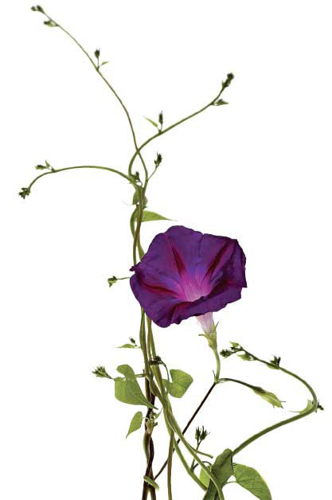
# 导言

## 没有植物，人类还能生存吗

在无边无垠的宇宙中，地球与月亮是两个相距最近的星球。地球有水，有植被，生气蓬勃；月球有海（月海）无水，有山（环形山）无树，没有生命。月球上有嫦娥、吴刚、白兔和桂花树之类的人和动植物，仅仅是人们一种美好的想象，事实上并不存在。地球与月球相比，有无“植被”是最根本的差别之一。

“植被”是覆盖在地球表面的植物的总称。在不同的季节，人们会用不同的被子，如毛巾被、丝绵被、鸭绒被等，来保护和温暖自己的身躯。植被如同盖在地球上的被子，同样保护着地球。但是，植被的作用远远不止保护的意义，它们还直接或间接地哺育着地球上的生灵，包括人在内的所有生物。生物生存的必要条件是氧气、水和食物的供应，植物恰恰是这三种必要条件的提供者和调节者，没有植物，就不会有地球上的其他生物。

地球的表层大气中大约含有25%的氧气，如果把这个含氧量当作为100%，海拔每上升1000米，空气中含氧量就下降10%。每个人都知道，没有氧气人就会窒息死亡。甚至在海拔3000米的高度，由于空气中含氧量的明显下降，有的人就会开始出现高原反应，感到呼吸困难。在海拔7000米以上的高度，一般人就已经难以忍受，会产生高原病。地球上的氧气从何而来呢？在生物进化的过程中，绿色植物得到一种本领，能利用太阳光能，把水和二氧化碳合成糖类，同时释放出氧气。在地球的演化进程中，随着绿色植物的产生和发展，地球空气中的氧气越来越丰富，达到目前这样相对稳定的平衡状态。植物在合成糖类时，所吸收的二氧化碳是来源于生命体的呼吸作用或地球上的各种燃烧过程。在地球上，植物是促使氧气和二氧化碳相互转化和平衡的关键，它的作用是无法替代的。可以说，如果没有植物，就没有人类呼吸所必需的氧气，就失去了人类生存的必要条件。

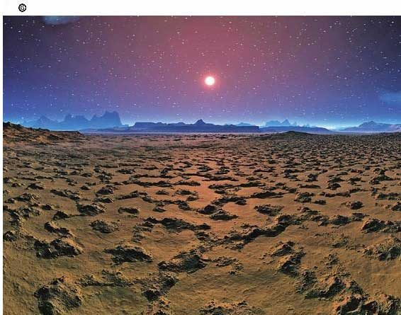

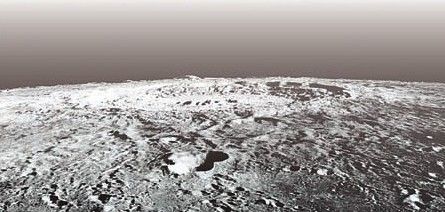
荒凉的月球表面

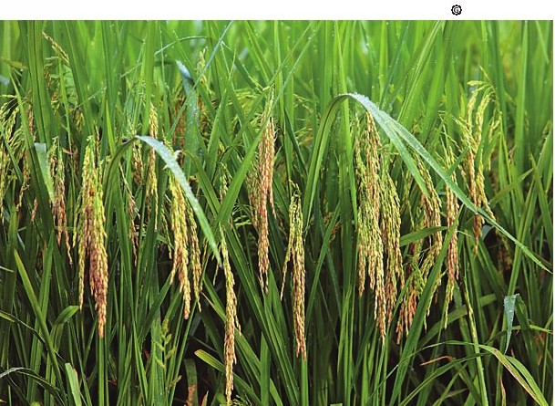
植物直接为人类提供了极为丰富的食物。例如人类每天生活所需的大米、面粉等粮食，大豆油、向日葵籽油、橄榄油等食用油，还有各种各样的蔬菜水果。所有这些都是取自植物的根、茎、叶、花、果实和种子。它们含有丰富的淀粉、蛋白质、脂肪，以及人类健康需要的各种维生素。食物除了能为人类直接食用外，棉纺织业、制糖业、木材加工业、造纸业、食品加工业等原料也来自植物。虽然人类食用的肉、乳制品来自动物，但是许许多多动物，包括家畜，如牛、羊、猪、鸡、鸭、鹅等，都是以植物为主要食源的。可见植物处于地球食物链的基础或底层，没有了植物，也就没有了人类和其他生物的食物源。

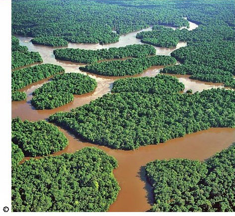
虽然人们主要不是从植物中获取大量水分，但是在食用新鲜果蔬时，也获得了一部分水，因为新鲜植物中的水分含量有90%左右。在地球上，植被在维持水的动态平衡、调节温度、保护土壤中起了关键的作用。有人把大森林比喻成大水库，一点也不夸张。例如，在没有植物的沙漠地区下一场雨，落下的雨水，一部分很快渗入地下，另一部分在强烈的阳光下会很快蒸发到大气中。如果有了植物，落下的雨水首先会被植物吸收，植物还可以遮挡阳光，防止地表层水分的快速蒸发，植物在地球表面起到了固定和储藏水分的作用。在没有植被或少有植物的坡地，一下大雨，雨水就会冲刷大地，轻者造成土壤流失，重者造成灾害性的泥石流。有了植被，植物的根就能深深地扎入土壤，牢牢地固定土壤。因此，人们需要封山育林，需要在过度开垦的地方植草种树，恢复植被。总而言之，在没有植被的地方，环境会变得非常严酷，例如寸草不生的沙漠或荒凉的戈壁。由于植物在地球上的地位至关重要，因此在维持生态平衡和维护生物多样性时，首先要考虑的因素就是植物。

植物在进化的过程中形成了许许多多巧妙的生存技能，人们通过学习和借鉴这些生存技能来造福于人类自己。模仿植物的精巧功能也就是植物仿生，已经有许多成功的例子，如大跨度的房顶结构、锯齿形的工具、尼龙搭扣等。还有许多更加复杂和深入的植物仿生尚需继续探索，例如：在能量仿生中的模仿植物高效利用太阳能；在分子仿生中的模仿植物在温和条件下固定和利用空气中的氮，巧妙地合成多种多样非常有用的有机化合物；在力学仿生中的模仿植物的坚固结构、风媒种子的灵巧飞行；等等。

植物对于人类的生存和生活是如此的重要，因此我们对植物的了解和认识也非常重要。在对植物的进化与分类、植物的结构与形态、植物的生理与代谢、植物的生态与环境、植物的保护和利用、植物的遗传奥秘等这些大的领域中，还有众多问题远远没有得到完全的认识和结论。随着现代科学技术的迅速发展，对植物的认识确实已经有了长足进展，不仅能逐步深入认识，更是可以利用一些非常先进的手段，如植物细胞工程和基因工程技术，去改造植物，以更好、更有效地服务于人类。因此人类要从孩童起就要树立认识、利用、保护植物的意识，激起研究植物的兴趣。（陈晓亚　汤章城）

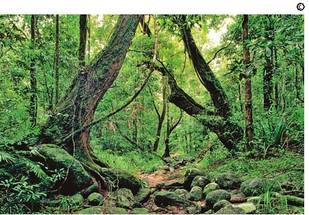
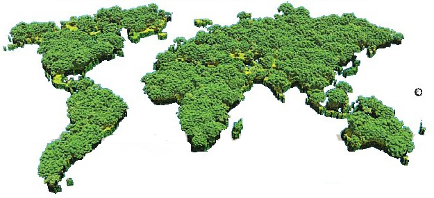
  

【微问题】除地球之外，太阳系中的其他星球是否有植物的踪迹？

【关键词】地球　植物

# 植物进化与分类

## 植物和动物的差别在哪里

自然界之所以生气勃勃，是因为具有千姿百态、多种多样的生物。但是，不管生物如何变化万千，大体上只分为两大类，即动物和植物。自古以来，人们就朴素地认为：凡是能动的生物就是动物，而固着生活的、不能移动的生物就是植物；绝大多数植物是绿色的，而动物则具有各种颜色和花纹；植物从小到大，长根长叶，开花结果，而大多数脊椎动物不论老幼，五官四肢不增不减，仅仅是体积大小的不同。不过，由于存在着诸多的例外，我们的祖先难以用简单的语句来定义什么是植物，什么是动物。

到了17世纪发明了显微镜，由于它能够观察许多肉眼无法看清的东西，人们好奇地把各种各样的物品都放在显微镜下探索，并且观察到了生物学领域中最为神奇的发现——细胞。现代科学表明，细胞是组成生物体的基本单位，通常都有细胞核、细胞质和细胞膜等结构，但是植物的细胞和动物的细胞有着明显不同，例如外表是否有细胞壁，就成为动物细胞与植物细胞的主要区别之一。因为凡是植物细胞，不管它是来自植物的根茎叶还是花朵果实，几乎都有细胞壁这个结构，而构成动物体的细胞都没有细胞壁。因此，细胞壁的具备与否，已成为现在判断动植物的主要标志。此外，成熟的植物细胞一般都有液泡，进行光合作用的细胞（一般存在于叶片和幼茎中）含有叶绿体或者载色体，这也是动物细胞所没有的。

动物和植物还有一个明显的区别，它们摄取外界物质和能量的方式不同。动物无一例外地靠摄取现成的有机物（植物或其他动物）为生，我们称之为“异养”；而大部分植物是通过光合作用，利用水和二氧化碳，合成自身所需的有机物，我们称之为“自养”。不过有少部分植物也过着“异养”的生活，如蘑菇、木耳之类的菌类以及高等植物中的寄生植物，如菟丝子、天麻、列当之类。虽然它们都不是绿色的，但是它们的细胞都具有细胞壁，说明还是属于植物。（秦祥堃）

## 为什么眼虫有两张“护照”

夏日雨后，地面常会形成一些小水塘，如果水塘持续多日，池水往往会变成绿色。如果我们取一滴绿色的水放到显微镜下观察，可以看到许多绿色的小颗粒。仔细观察，这些小颗粒原来是一些单细胞的生物，胖胖的身体前端有一根长长的鞭毛，靠着这根鞭毛的摆动，能在水中不停地欢快游动。

这种单细胞的生物究竟属于动物，还是属于植物？这个简单的问题令生物分类学家大伤脑筋。

动物学家称它是动物，理由是它们没有细胞壁这个结构，而且能自由活动，这分明就是动物。虽然它体内有叶绿体，但只能说明它是一类比较特殊的动物，是自养的动物。设想一下，如果没有这些叶绿体，谁会认为它是植物呢？因此，动物学家给它发放了动物王国的“护照”，并起了一个动物名字——眼虫。

植物学家则认为，眼虫虽然没有一般植物所拥有的细胞壁，但是它却有动物细胞所没有的液泡和进行光合作用的载色体。载色体所含有的叶绿素a和b，以及β-胡萝卜素、叶黄素等也都与高等的植物相似。虽然植物细胞通常都没有鞭毛，但是在生殖期，所有藻类植物的生殖细胞以及菌类、苔藓、蕨类，还有些裸子植物如铁树的雄性生殖细胞也都有鞭毛，能在水中游动。至于眼虫没有细胞壁，也许表明它是最原始的植物，细胞壁还没有进化形成。所以，植物学家给它发放了植物“护照”，并起了一个植物名字——裸藻。

现在，一般认为眼虫这类生物是动植物共同的祖先。（秦祥堃）

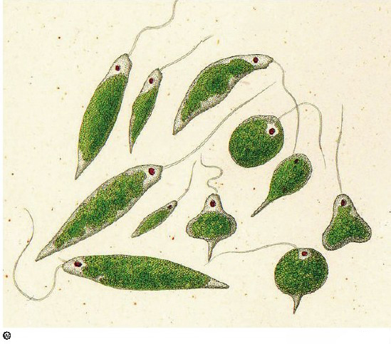
裸藻

  

**【科学人】**施莱登

1838年，德国植物学家施莱登第一个指出细胞是构成植物体结构的基本单位。同年，德国动物学家施旺在研究动物材料时也证实了施莱登的观点，指出动物和植物都是由细胞构成的，并于1839年提出了“细胞学说”。他指出，细胞是动植物的集合物，它们按照一定的规律排列在动植物体内。这一学说从理论上确立了细胞在整个生物界的重要性，并成为19世纪自然科学的三大发现之一。

**【微博士】**五界学说

1969年，加拿大学者魏泰克根据生物界的发展水平和发展方向，将生物分成五界。除了动物界和植物界外，还包括另外三界。

他增加了原核生物界：以蓝藻和细菌为代表，细胞中没有染色体，无核膜和核仁，但有核的功能，称为原核或拟核，是最原始的生物。原生生物界：大部分是单细胞生物，也有部分是多细胞的，但不具组织分化。它们常有鞭毛，能自由游动，是植物、菌物和动物的共同祖先。菌物界：它们有真核细胞，有细胞壁，但是无叶绿体，直接从外部环境吸收养料。

【微问题】病毒属于哪一个界中的生物？

【关键词】细胞壁　眼虫　裸藻

# 植物结构与形态

## 水为什么能“爬上”百米高的大树

在美国加利福尼亚州落基山山谷中，生长着一群2000多岁的北美红杉，其中最高的高度竟然达到112.7米，茎粗8米多，比30层的楼房还要高！那么高的树，水是怎么“爬上去”的？它还有可能再长高吗？

把水分从根部提升到百米高的树冠可不是件容易的事。首先，水分被根毛细胞吸收，运送到木质部的导管，再经导管输送到顶端的枝条、叶片。这个过程可以想象成树冠在用导管中的水丝进行的拔河比赛，既要从上面“拉”，中途“不断”，还要从根部“推”。

那么，百米高的大树能否产生足够的拉力呢？科学家收集了不同高度的顶部枝条来测量它们的水势（拉力），发现越高处的枝条拉力越大。中途的关键是它不能把水丝拉断，因为水丝一旦被拉断，导管中就会形成气泡，阻断水分的运输。树冠越高，水丝自身重力和导管阻力就越大，水丝所要承受的拉力就越大，被拉断的可能性也越大。所以，水丝最终能被拉多高，取决于水丝的结实程度，这一点由水分子之间的黏着力和表面张力决定。科学家发现北美红杉的导管壁很坚韧，对水的阻力也比其他树种要低。我们知道，在这样的拔河比赛中，拉力要大于水丝重力和导管阻力之和才能取胜。在水丝承受同样的拉力下，由于红杉树导管阻力较小，所以水可以被拉升得更高。

北美红杉

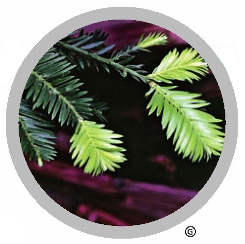
至于推力，当我们将植物幼苗的茎下部切断时，特别在闷热的天气，或夏天的清晨，往往会看到切面有液体流出，这就是根压（推力）。我们可以想象，这些百米大树有很深的根系和很大的根压。由此可见，水在大树中的运动不是一个简单的机械运动，其实，各种细胞的生命活动都起了重要作用。

在地球重力的作用下，水是有一定重量的，树木生长得越高，向顶端输送的水就越多，越重，越困难。到一定的困难程度，其顶端生长会因缺水而受到阻碍，停止继续长高。越高的枝条上长的叶子越小，112米树顶的叶片小得就像是贴在枝条上的鳞片。这些高龄的树木目前仍在长高，其速度每年约25厘米。根据测算，如果高度再增加15米，顶端树叶将会因为严重失水而完全干枯。由此得出结论：树木生长的极限高度约为122～130米，这一结论也与历史上树木的最高纪录相吻合。（苏维埃）

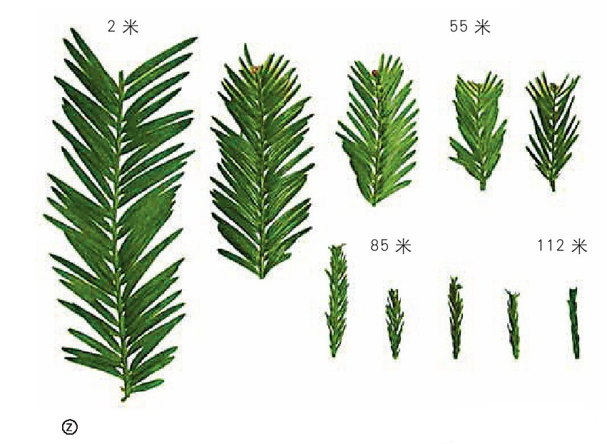
不同高度处不同大小的叶片

## 植物有哪些抗旱的本领

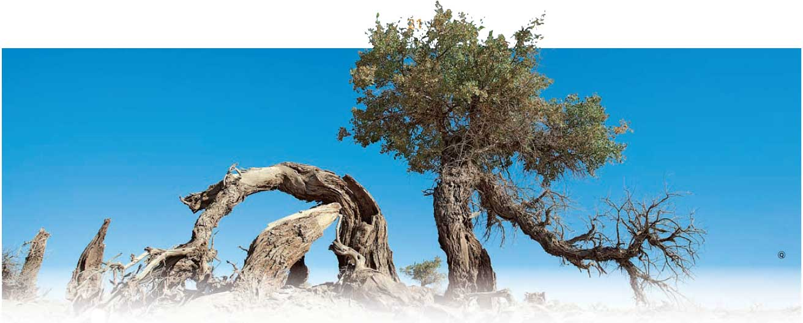
胡杨

根据植物对水的需求程度，植物可以分为水生植物、旱生植物，以及介于两者之间的中生植物。旱生植物适应极端干旱环境的本领大体有以下三种。

一是利用发达的根系从土壤深处吸收水分。许多抗旱植物虽然它们的地上部分只有一二十厘米高，但是它们的根却能生长到几米深的土壤中寻找水分。一条长长的根只有靠近根尖的根毛区才能吸收水分，要想从干旱的土壤中吸收水分，这些植物的根毛细胞液必须很浓。因此，这些植物的根毛细胞必须可以合成、积累高浓度的小分子物质，提高吸水能力。在干旱条件下，导管中往往会出现小气泡，阻断水分运输。许多抗旱植物能够迅速修复阻断的导管或再生新导管来替代。新疆沙漠里的百年胡杨就是靠不断更新导管来保障水分运输中途不断，从而适应干旱的环境。

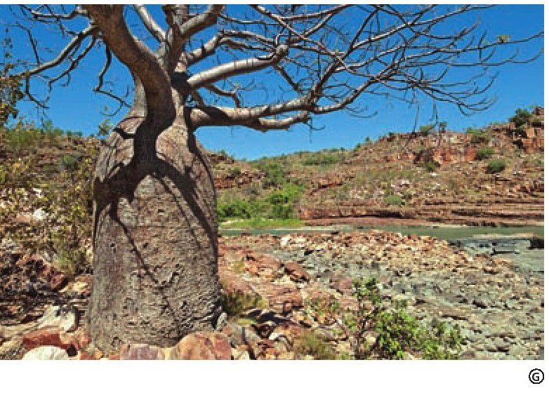
猴面包树

二是降低水分的散失。耐旱植物叶片表面往往有很厚的蜡质层，以减少水分的散失，一些植物甚至在白天把气孔关闭。但关闭气孔后如何吸取二氧化碳进行光合作用呢？原来，这些植物已进化出了一套特殊的本领，那就是在晚间温度低时开放气孔，把二氧化碳储存在体内，等白天有阳光时，再利用光能把储存的二氧化碳转化为糖。如仙人掌和菠萝都具有这种本领，即使长时间不下雨，也可生存下去。非洲的猴面包树，树身非常粗大，可以储存水分。它们在进化中干脆把叶片完全转变成了刺，最大程度地降低蒸发面积，并由绿色的肉质茎进行光合作用。

三是躲避干旱。有一些短命植物，在干旱地区短暂的下雨季节，就可以完成整个生活史。因此，沙漠中耐旱的植物不同于雨水充沛地区的植物，要么长得很慢，要么寿命很短。（苏维埃）

  

**【微博士】**植物细胞的水通道

20多年前，一位科学家在偶然的机会发现了一种蛋白可以加速水的跨膜转运，由此命名它为水孔蛋白。很快水孔蛋白在植物中到处被发现。它们是镶嵌在膜上的蛋白，在膜上形成一个直径很小的通道。计算机模拟发现水孔蛋白只能允许水分子逐个通过它在膜上形成的通道，进入膜的另一侧。它对带电荷的分子，如质子，则完全不通透。这对维持膜的电化学势能非常重要。在植物中，有些水孔蛋白在膜内侧部分有条疏水“尾巴”，在干旱情况下，这条“尾巴”可堵在水孔蛋白内侧通道上，防止水分流出细胞。另外，植物还可以通过调节水孔蛋白的合成数量及其在膜上的分布来控制水分的进出。它们参与了水分运输的“拉”、中途不断和“推”三个阶段。

**【实验场】**

找不同直径的玻璃毛细管，如1毫米、0.5毫米、0.1毫米，把它们分别插在净水中，观察水面最后能到达的高度。把这个高度与植物的高度做一个比较，光靠毛细管现象，水能到达数米、数十米甚至百米的高度吗？

【微问题】从根部吸进来的水分“爬上”百米高的树梢要花多少时间？

【关键词】北美红杉　水分输送　导管　根压　水孔蛋白

# 植物生理与代谢

## 为什么绿叶被称为“食物加工厂”

我们人类生活的地球，是一个生机盎然的星球，因为在这片大地上充满了象征生命的绿色。生命的绿色来自田野、草地和森林，由无数大小不同、形状各异的绿色叶片组成。叶片虽小，神通却广大，因为每一张小小的叶片就是一个精密复杂的“食物加工厂”。为什么这样比喻呢？因为叶片能够利用太阳的光能，加上从周围空气中吸收的二氧化碳，以及从土壤中吸收的水，经过一系列复杂的生化反应过程，最后转变成碳水化合物，同时还释放出氧气。科学家把这个无机物变成有机物的过程定义为“光合作用”。我们每天吃的米饭、面包等食物的基本成分都是碳水化合物，都来自光合作用。

当然，地球上能进行光合作用的不限于具有绿叶的高等植物，水中的低等植物藻类和蓝细菌也有这种本事。此外，绿叶的产物也不限于碳水化合物，还有由碳水化合物转化而来的氨基酸、蛋白质等多种物质。

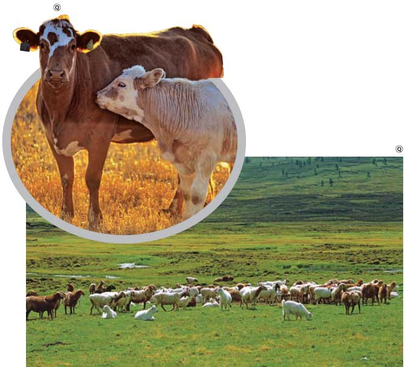
其实，地球上所有食物的“源头”都是光合作用。比如，我们经常吃的各种水果和蔬菜都是靠绿叶制造的碳水化合物等有机物生长发育起来的。又比如，鱼、肉、蛋和奶虽然不是直接由绿叶提供的，但归根结底还是来自光合作用，因为鱼必须吃水中进行光合作用的藻类、蓝细菌和水生植物才能长大，生产肉、蛋和奶的家畜猪、牛、羊，以及鸡、鸭等也必须吃植物及其产品才能生存。至于凶猛的、处于地球食物链最顶端的大型食肉动物如狮、虎、豹等，虽不以植物为食，但它们捕食的许多动物却是以植物为食的。（许大全）

## 绿叶工厂内有哪些“车间设备”

就大多数叶片来说，是那么的小，那么的薄，叶的厚度通常不足1毫米，但里面构造之精细却远胜于最现代化的工厂。要想了解叶片的内部秘密，只有借助于解剖镜、光学显微镜和电子显微镜等多种科学仪器，将其内部结构放大百倍、千倍甚至万倍之后，才能把绿叶这个神奇“食物工厂”里的“车间”、“机器”和“马达”等大致分辨出来。

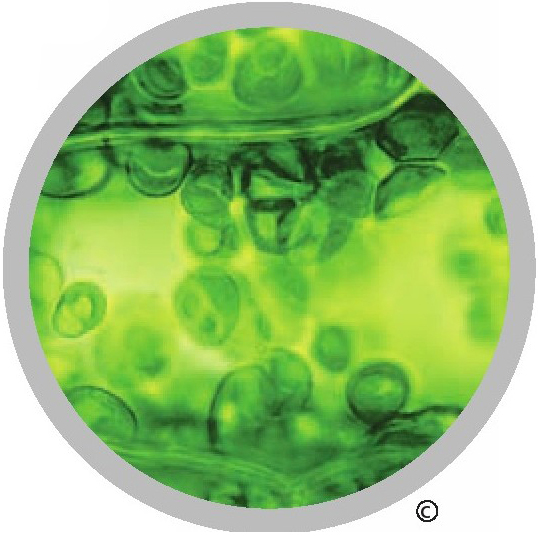
叶绿体

植物叶片大多具有类似的构造。例如扁平的叶片，外面是一层表皮，在上下表皮之间是由绿色的叶肉细胞组成的叶肉组织，其中埋藏着一些粗细不同、纵横交错、四通八达的管道（即叶脉），这些管道延伸到叶片外时汇集成为叶柄，与枝条和茎干相连接，负责与根系、花和果实等其他器官之间的物质运输和信息传递，把光合产物运出去，把根系吸收的水和营养元素运进来，同时还有支撑、调节叶片伸展取向，以便在弱光下多吸收阳光，在强光下避免光的破坏。

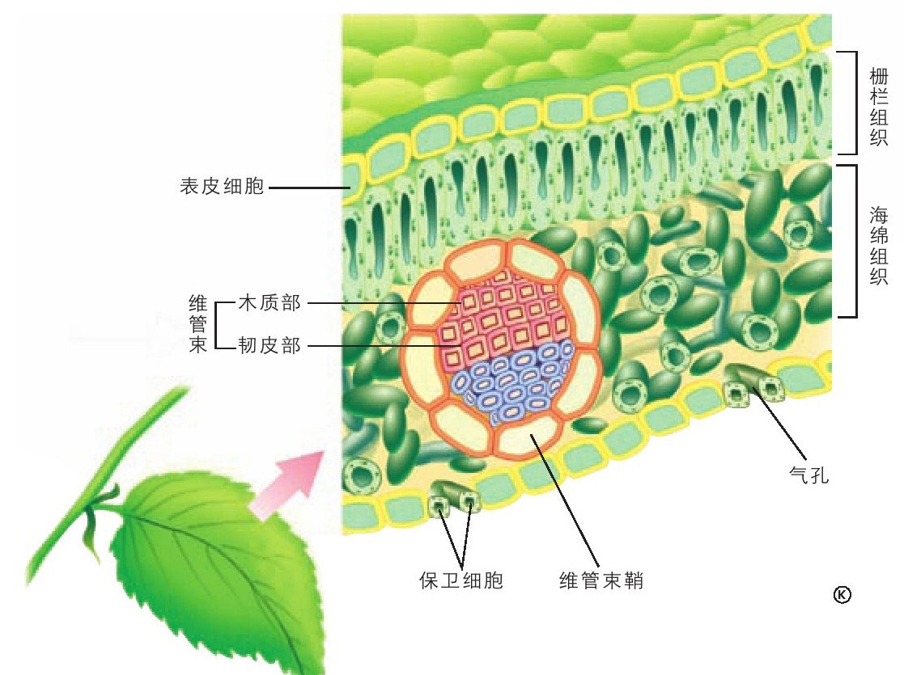
在叶片表皮上还有许多特殊的气孔，由一对半月形的保卫细胞组成。它的奇妙之处是，可以随着周围光照有和无、强和弱进行自动调节，使气孔的大小总是处于最合适的状态。如果没有叶片上的气孔，光合作用的基本原料二氧化碳就很难进入叶片，氧气和水汽也无法逸出叶片，光合作用只好停下来，因为它们是叶片与外界进行气体交换的最主要的门窗。

如果说叶片是“食物工厂”，叶肉细胞又是这个工厂里的众多“车间”，那么，叶肉细胞内众多铁饼状的叶绿体就是“车间”里的“机器”。这个“机器”中的一种重要部件是许多烧饼状的类囊体，类囊体里面含有大量善于捕捉光能的叶绿素，将捕捉来的光能送往类囊体膜上，那儿聚集着能将光能转化为化学能的反应中心和纳米“马达”等重要零件，最后，再利用这些化学能把二氧化碳变成碳水化合物。（许大全）

## 为什么光合作用是生命发动机

光合作用不仅保证植物自给自足，还为微生物、动物、人类等绝大多数生物提供能量，为它们提供生长繁殖的碳水化合物。更重要的是，光合作用还是另一意义上的生命发动机。我们知道，生命在生存过程中需要呼吸，需要进行能量转化和体内各种营养物质的转化，这一切都离不开氧气。可以这样说，氧气是生命之源，把光合作用比喻为地球上的生命发动机一点也不过分。

现在已经知道，在我们地球周围大气中，氧气是慢慢地从无到有、从少到多，直到今天大体恒定的浓度为21%左右。当生物高效率的需氧呼吸发生后，当多细胞、多组织、多器官的大型生物出现后，当可以防御太阳光中紫外线杀伤作用的高空臭氧层形成后，多种生物开始从海洋、湖泊和江河安全登陆，最后遍布地球的各个角落，逐渐形成庞大的生物圈，这一切都要归功于光合作用释放的氧气。可以毫不夸张地说，除了极少数的自养型细菌以外，一切生物都离不开光合作用。光合作用是地球生物圈形成、运转和繁荣的关键环节。（许大全）

**【实验场】**

将一盆生长良好的天竺葵或大豆放入暗室中24～48小时，使其叶片中的淀粉完全消耗；将植株的部分叶片用厚黑纸罩起；早晨将此盆放到太阳光下；中午过后摘取照光和没照光叶片各一片，投入烧杯内沸腾的80%酒精中，轻轻晃荡一段时间；当叶片中的叶绿素被完全提取到酒精溶液中、叶片变成近白色以后，取出叶片；将叶片用清水冲洗干净，投入碘化钾溶液中，照光叶片会变成蓝黑色，而没照光叶片则不变色，表明照光叶片经过光合作用积累了淀粉（碳水化合物的一种）。

如果用拍过景物的底片代替黑纸或黑布遮光，再按上面的步骤处理叶片，最后会看到什么？

注意：酒精易燃，应远离明火，可以在生物学老师指导下完成。

【微问题】人类能不能模仿叶绿体的结构，建造一座光合作用工厂？

【关键词】光合作用　叶绿体　叶绿素

# 植物生态与环境

## 生物的种类正在逐渐减少吗

我们的地球因为有了千姿百态、形形色色的各种生命，才构成了丰富多彩的生命世界。其中，每种生物都有它存在的合理性和功能，在生态系统和食物链中占有一定的位置。许许多多不同种类的生命，生活在一个地球上，它们相互交替、彼此影响，使地球的生态得到平衡，科学家将其称为生物多样性。生物多样性一般包含三个层次，即遗传多样性、物种多样性和生态系统多样性。因此，它可以大到生态系统，小到基因。

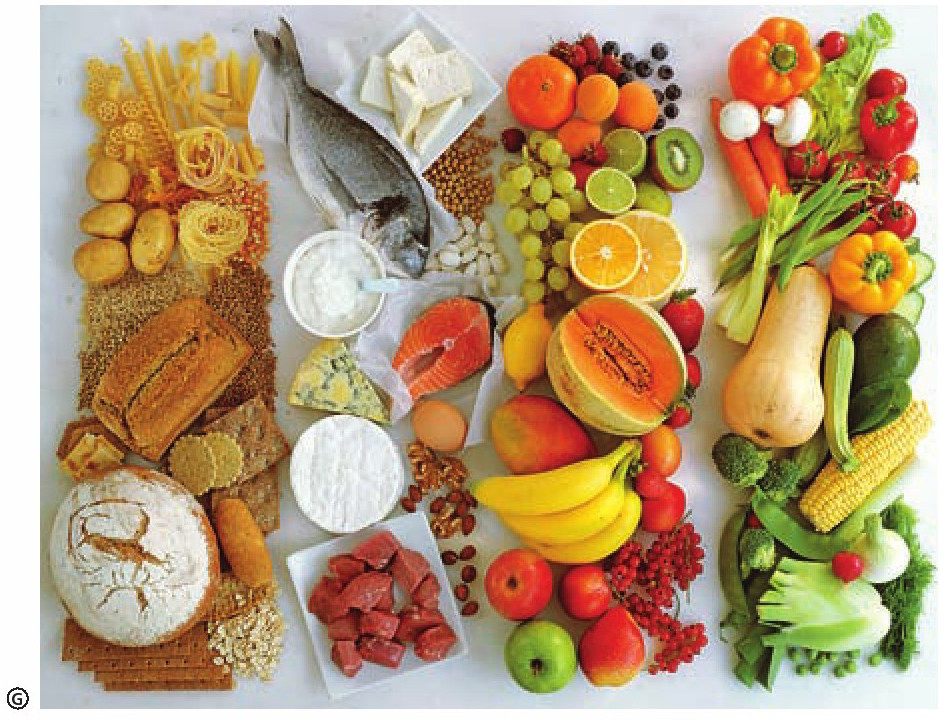
生物多样性和人类有着千丝万缕的关系，可以说，我们的衣食住行都离不开它。我们每天吃的粮食、蔬菜、水果、肉类，用来制作衣物的棉麻毛丝，都来自自然界的动植物。丰富多样的生物还为人类提供治疗各种疾病的药品，中国记载的药用植物至少有5000种，为治疗疑难病症提供了可能。

除此之外，生物多样性还有很多无形的价值是我们无法估量的。例如，植物光合作用为我们提供生存必需的氧气，各种各样的生物为我们调节地球的气候、净化水质、保持土壤发挥着极其重要的功能。

不难看出，生物多样性关系到人类的生存。可是，由于人类生产活动的过度开发，全球生物多样性正遭受前所未有的威胁，由于人为因素导致物种灭绝的速度，要比自然灭绝速度增加了1000倍！每天都会有上百种生物从地球上消失，照这样的速度，地球上的物种在100年内就会减少一半！而生物多样性中最核心的部分就是植物多样性，因为植物多样性是地球生命的基础，自然界中的生物量有95%以上是由植物的光合作用所形成的。总而言之，人和动物的生存都依赖于植物多样性。

生物多样性是如此的重要。因而，1992年联合国召开的里约热内卢“世界环境与发展”大会上正式通过了《生物多样性公约》。2001年，根据联合国大会决议，每年5月22日定为“国际生物多样性日”。到目前为止，已有100多个国家加入了这个公约。公约的目标：一是保护生物多样性及对资源的持续利用，二是促进公平合理地分享由自然资源而产生的利益。（邓泓）

## 只有濒危物种才需要保护吗

在短短的几百年里，许多珍贵的物种从地球上消失了，例如渡渡鸟、袋狼、旅鸽和亚洲狮等，许多物种的生存数量快速减少，濒临灭绝。人类渐渐意识到保护生物多样性的重要性，于是，人们开始采取各种措施保护那些濒危的物种。可是，只有濒危物种才需要保护吗？那些我们身边常见的生物就不需要保护了吗？其实，每个物种都有其存在的价值，都对生态系统有独特的贡献，缺少了任何一个物种，都会对生态系统造成损失。例如常见的中华蜣螂，就曾远渡重洋，拯救了大洋彼岸的澳大利亚一望无际的大草原。

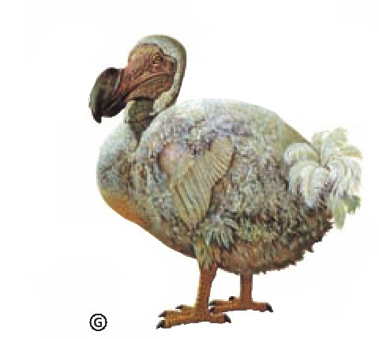
渡渡鸟

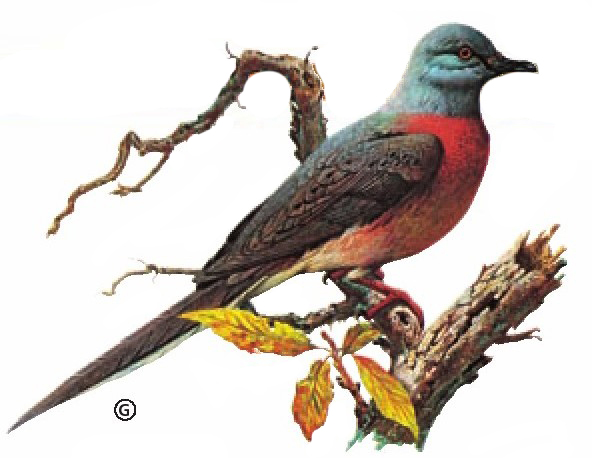
旅鸽

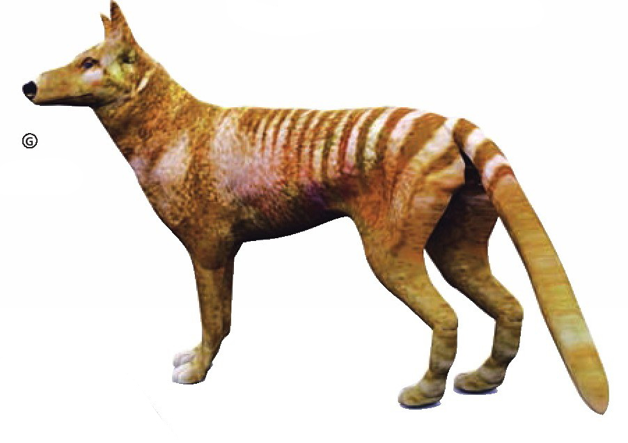
袋狼

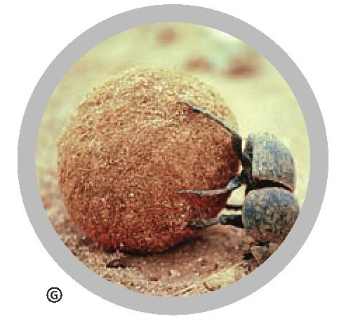
推糞球的屎壳郎

澳大利亚是个畜牧业十分发达的国家，在20世纪70年代，全国共有奶牛2800万头，数量如此庞大的奶牛给牧民们带来了很高的收入，可是牧民们却高兴不起来。原来，这么多奶牛一天生产的牛粪就超过1亿堆！巨量的牛粪堆积在草原上，不仅滋生大量的蚊蝇，更严重的是成片的牛粪覆盖在草地上，使牧草无法正常生长，甚至枯死。如此下去，整个草原都将要毁掉！后来，澳大利亚的生态学家获悉，中国有一种专门吞食牛粪的屎壳郎，即中华蜣螂，于是他们便从中国大量引进。这些屎壳郎以牛粪为食，它们将牛粪滚成小粪球，推到地下的洞穴中储存起来，给它们和它们的“宝宝”当作食物。就这样，那些堆积在草原上的牛粪就都被屎壳郎推到地下吃掉了。屎壳郎不仅解决了草原上的“牛粪危机”，还为牧草施了肥。

小小屎壳郎也能拯救大草原，看似十分渺小的生物具有巨大的作用，成为我们地球上不可缺少的一个成员。因此，我们不仅要保护那些濒临灭绝的动植物，也要保护身边各种各样的生物，千万不要等到它们变成濒危物种，将从我们身边消失的时候，才加以保护。（邓泓）

# 植物遗传与育种

## 植物的特性如何代代相传

在地球上，生生不息地繁衍着各种植被。从远古到现在，它们维持并发展了这个美丽星球的生态系统，为生活在这个星球上的动物直接或者间接地提供了绝大多数的食物和能量。

植物的繁衍是地球生态系统可持续发展的重要保障。

大自然中，植物繁衍种族的方式名目繁多，变幻无穷。可是，无论哪一种方式，新产生的个体都仍然保持了原来的特性。哪怕是把一根梨树的枝条嫁接到苹果树上，等到温暖的春天到来后，那根枝条开出的仍是雪白的梨花，秋天收获的仍是梨子，而不是苹果。植物似乎有着一种神奇的能力，能使生命世代连续，使物种稳定地延续下去。人们把这种世代间相似的现象叫作“遗传”。那么，植物到底是怎么遗传的呢？

早在19世纪人们就认识到，每一种植物都有一套决定自身特性的东西，并把这种东西叫作遗传物质。植物在传递自身特性的过程中实质上传递的是这种遗传物质。正是遗传物质决定了“种瓜得瓜，种豆得豆”。这种神奇的遗传物质到底是什么东西呢？

我们知道，植物是由细胞构成的，那么有理由认为，这些神奇的遗传物质应该就在细胞里面。在20世纪早期，科学家们发现了细胞里面有一种很微小的结构，叫作染色体，它们的各种行为很符合遗传物质的行为特征。而且，研究发现，染色体上排列着很多控制植物不同特征的遗传因子，人们把这种遗传因子叫作“基因”。

DNA双螺旋结构

既然是基因决定了植物的各种特性，那么基因本质上又是什么呢？科学家经过研究发现，染色体主要有两种成分构成：一种是蛋白质，另一种是脱氧核糖核酸（DNA）。而后来的实验证明了DNA才是遗传物质。我们都知道，植物繁衍下一代是一个复制的过程，这个过程是由细胞的分裂来实现的。植物的细胞由一个分裂成两个，那么细胞里面的遗传物质也要一分为二。既然DNA是遗传物质，人们很想知道的是，这种遗传物质到底是怎么复制的？到了20世纪中期，生命科学的研究取得了里程碑式的成果。沃森和克里克提出了DNA的双螺旋结构模型，成功阐明了有关遗传物质的核心问题——遗传物质究竟是如何复制的！现在已经知道，DNA是一种长链的大分子，由四种不同碱基组成的脱氧核糖核酸构成，这四种碱基通过不同的排列组合来形成遗传指令，写成了一部包含植物自身特性的所有密码的“遗传天书”。这部“遗传天书”博大精深，其中一些编码功能元件的片段就是基因。除了基因以外，还有大量其他内容。这样一套包含了一个物种全部遗传信息的“遗传天书”被称为那个物种的基因组。

植物在自然界中千百万年来的不停繁衍，本质上就是各自“遗传天书”的不停复制。传递、扩展自己的“遗传天书”，是每一个物种最本质的目标。（厉新民　林鸿宣）

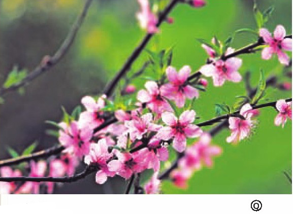
桃花

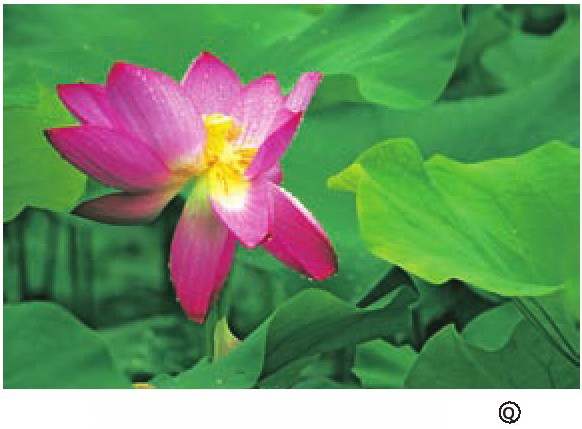
荷花

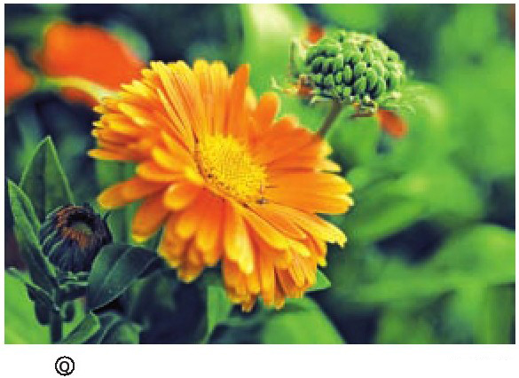
金盏菊

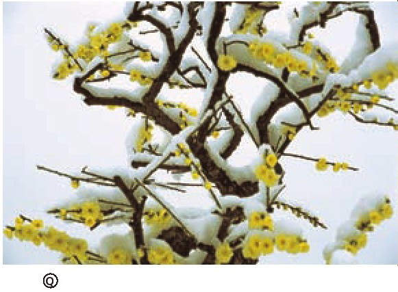
腊梅

## “遗传天书”完全决定了一个植物的生长吗

如果植物的“遗传天书”文字内容相同，是不是就生长得完全一样呢？自然界中的现象告诉我们，事实并非如此！

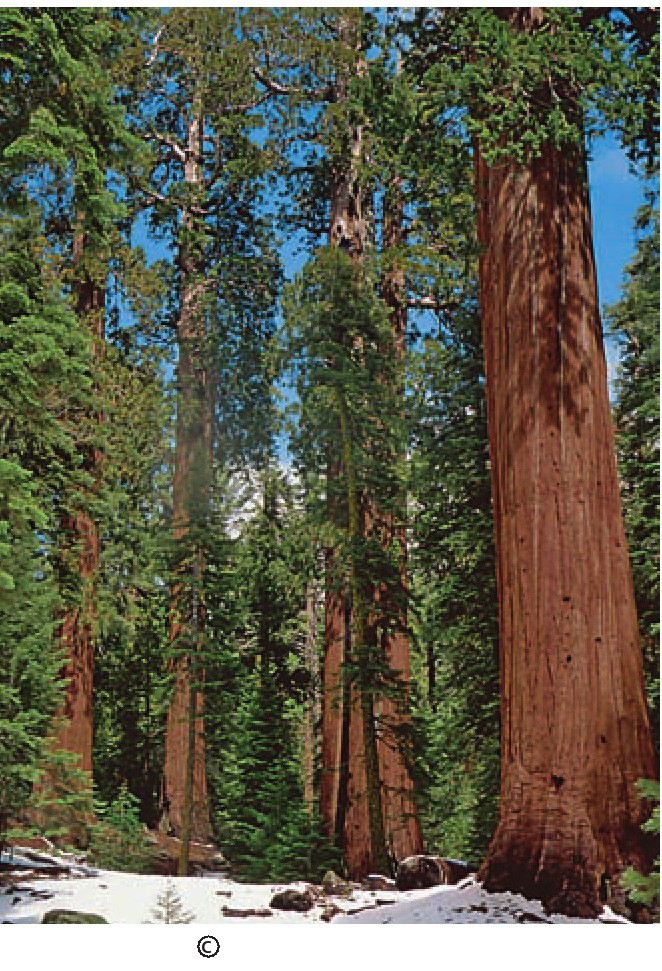
我们都知道“橘生淮南则为橘，生于淮北则为枳”的故事；也听说过“苏堤春来早”，“向阳花木早逢春”；当“人间四月芳菲尽”的时候，“山寺桃花”却因为温度较低而“始盛开”；深秋来临时，落叶纷纷，而路灯下的树木却能保持绿色的树叶。原来，植物生长除了受“遗传天书”的指令控制以外，还受环境影响。这就像同一首乐曲，在音乐厅听到和在喧嚣的菜市场听到，效果是完全不同的。

“遗传天书”中的内容不仅仅是四种碱基组成的“文字”，还有各种“标点”、“语调”、“音色”等所谓“表观遗传”内容。这些表观遗传通过对染色体上蛋白质或者DNA的各种修饰和调节，最终影响“遗传天书”的“读出效果”。就像同样是莫扎特的钢琴协奏曲，不同乐队演奏出的最终效果却不尽相同。

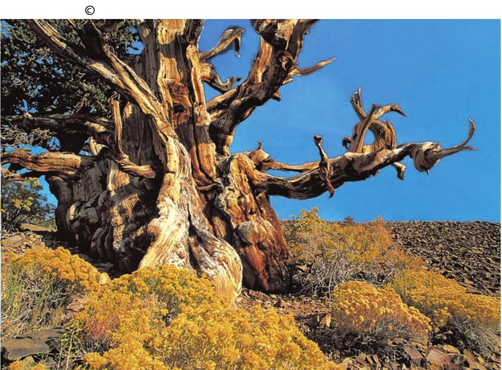
另外，研究发现在植物的遗传过程中，并非只有“遗传天书”来承载传递特性的任务，细胞中的细胞质里也有一些物质在繁衍过程中承担了各种任务。（厉新民　林鸿宣）

## 怎样读懂植物的“遗传天书”

早在19世纪，伟大的奥地利遗传学家孟德尔就利用豌豆进行杂交试验，发现了生物遗传的两条基本规律——分离定律和自由组合定律。后来美国科学家摩尔根又发现了连锁交换定律。这就是“遗传天书”的三大基本“语法”。

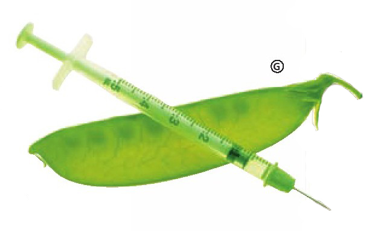
随着科学技术的进步，人们已经可以利用高通量的大型测序仪器，很快地把植物“遗传天书”的“文字内容”全部译出；也可以利用专门的仪器（PCR仪）来把某一“段落”扩增出来，单独进行研究；还可以通过遗传操作，把感兴趣的一些“段落”、“句子”删除或者添加，来观察对植物的影响。科学家按照“遗传天书”的基本语法，对一些感兴趣的植物特性进行研究，就有可能发现控制这种性状的“句子”在“天书”里是怎么写的。比如，科学家经过长时间的研究，发现水稻的谷粒宽度是由“遗传天书”（基因组）中的一段“文字”（序列）控制的，把这段“文字”删除以后，水稻的谷粒就会变得更宽。

总而言之，“遗传天书”的内容博大精深，而且植物“读取”这些遗传指令的过程很精妙。不同“文字”内容间相互联系、相互调节，各种“标点”、“语调”等精细地调控最后的“读出效果”。还有很多我们现在不能理解的奥妙，等待人们去深入研究。（厉新民　林鸿宣）

  

【微问题】不同植物的“遗传天书”文字可以交流吗？

【关键词】“遗传天书”　DNA

# 植物利用与保护

## 为什么菜粉蝶特别喜欢油菜花

在公园里，在野外，人们常常可以看到各色蝴蝶飞舞于花丛之中。尤其是春天，花朵格外鲜艳，蝴蝶也格外起劲。著名南宋诗人杨万里于菜花时节在乡村小憩之时，看着奔波于田边捕捉蝴蝶玩耍的儿童，不由得吟诵出“儿童急走追黄蝶，飞入菜花无处寻”的诗句，描述了黄色的蝴蝶在金黄色的油菜花上追逐飞舞之景。有趣的是，在自然状态条件下，红色或白色的蝴蝶往往会追逐桃花和梨花，唯有黄色的菜粉蝶特别钟爱金黄色的油菜花。除了本身色彩和花朵色彩相近有助于隐蔽自己外，更重要的是，油菜花中有些物质对菜粉蝶具有超强的诱惑力。

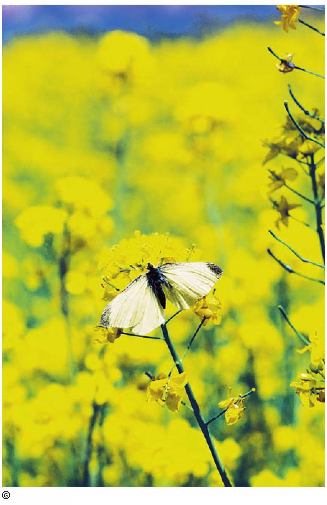

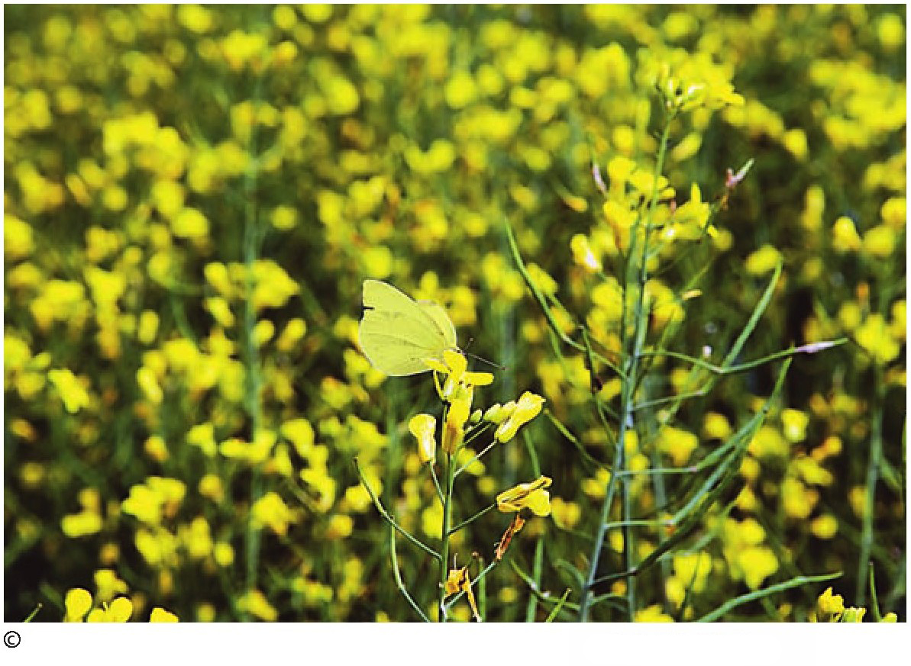
油菜花和菜粉蝶

科学家发现，油菜（包括我们吃的白菜、青菜、花椰菜、包菜和甘蓝等）能合成一种化合物，叫芥酸甘油酯，在油菜开花和结油菜籽时，这种物质的合成量会大增，并且主要储存在菜籽的油脂中。也就是说，芥酸甘油酯是菜籽油的主要成分之一。

我们知道，触角是昆虫的重要感觉器官，主司嗅觉和触觉作用，有的还有听觉作用，可以帮助昆虫进行通信联络、寻觅异性、寻找食物和选择产卵场所等活动。菜粉蝶头部的触角也不例外，只不过它的特殊之处是，比其他昆虫更能够感知空气中微量的芥酸甘油酯，更容易精确判断何处有油菜花盛开。油菜花中黄色的菜粉蝶多，除了对这种芥酸甘油酯特别敏感，与它的生活习性也有很大关系。当黄色菜粉蝶发现何处有油菜，常常就在原地产卵，第二年卵孵化出来的幼虫，又依靠吃油菜的叶片而逐渐长大，再化蛹变成成虫蝴蝶，如果这片土地第二年继续种油菜的话，黄色菜粉蝶数量多也就不难理解了。

其实，人们对黄色菜粉蝶的最爱是不是油菜的问题并非很感兴趣，了解了油菜中的这种物质后，对芥酸含量高的菜籽油是否影响人体健康才是最关心的。科学家进行了一系列实验，例如连续给动物饲喂含有超量芥酸的饲料，结果发现，芥酸能导致脂肪渗透和集聚在心脏壁上，导致血管壁不断增厚，渐渐失去弹性，甚至能引起受试动物的心肌坏死。因此，包括欧洲各国在内，世界上很多地区已不再使用含大量芥酸的食油烹饪食物。中国现在超市里也已买不到纯菜籽油了，如果有，也都是已去掉了芥酸甘油酯的菜籽油。为了防止芥酸对人体可能的损害，中国已专门选育了芥酸含量仅2%左右的油菜品种。（翟万银）

## 橄榄油为什么被称为“液体黄金”

在很长一段时间里，中国的食用油市场中几乎只能见到“四大金刚”，那就是油菜籽中的菜油、大豆中的豆油、花生油和芝麻油。但是，如今的超市里已出现很多食用油的新面孔，如玉米油、茶油、橄榄油等。尤其是被人称为“液体黄金”的橄榄油，已成为食用油中的佼佼者。

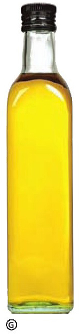
橄榄油可不是从我们平时熟悉的橄榄中提取出来的，而是来自一种叫油橄榄的植物。这种近10米高的小树会结出很多油光发亮的紫黑色果实，那就是著名的油橄榄果。由于它喜欢冬季温暖湿润、夏季炎热干旱的生长环境，因此大多生长在地中海附近，在中国比较少见。

橄榄油之所以被称为“液体黄金”，是因为它和其他食用植物油相比，含有许多对人体健康有益的物质。例如，橄榄油中有较多含量的不饱和脂肪酸以及丰富的各种脂溶性维生素。更重要的是，它几乎不含胆固醇，因而特别适合动脉硬化、高血压、心脏病患者食用。除此以外，橄榄油富含与皮肤亲和力极佳的角鲨烯和人体必需的脂肪酸，能有效保持皮肤弹性和润泽，帮助消除面部皱纹，防止肌肤衰老，因此被誉为“可以吃的美容护肤品”。科学家还发现，橄榄油中还含有其他植物油稀缺的天然抗氧化剂和ω-3脂肪酸，这些物质有助于人体对矿质营养的吸收，能促进骨骼生长。另外ω-3脂肪酸还有助于保持骨密度，减少因自由基（高活性分子）造成的骨质疏松。（余千里）

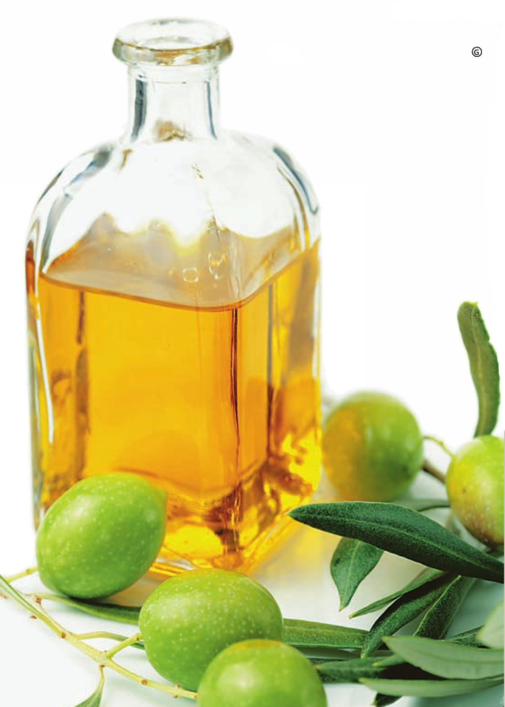
橄榄油和油橄榄

  

**【微博士】**象征和平

油橄榄除了有巨大的经济价值，还是个宣传和平的“使者”，鸽子嘴里叼着的油橄榄枝条，已成为世界公认的和平标准。

**【微博士】**如何辨识地沟油

地沟油实际上是一个泛指的概念，也就是人们在生活中对于各类劣质油的通称。它对人体健康会造成损害，长期食用甚至可能会引发癌症。鉴别油的质地可以通过看、闻两方面入手。首先，纯净的植物油呈无色透明状，如果生产过程中加入色素或杂质，颜色和透明度就会改变。其次，每种油都有独特的气味。正常的食用油只会散发出淡淡的香味，如果有一股轻微的腥臭味儿，就有可能是“地沟油”，若将油加热后发出臭味，就更可能是“地沟油”了。

【微问题】拳击场上，拳手身上涂的是什么油？

【关键词】油菜　芥酸菜　粉蝶　橄榄油

# 附录

# 图片及辅文版权说明

图片版权

本书所使用的图片均标注有与版权所有者或提供者对应的标记。全书图片的版权说明如下：

高品（上海）图像服务有限公司（Corbis Images）；

华盖创意（天津）视讯科技有限公司（Getty Images）；

北京全景视觉网络科技有限公司（全景）；

维基百科（Wikipedia.org）网站；

上海科学技术出版社；

其他图片来源。

P20右下、P106左下二图，苏维埃提供；P26左下、P28上、P56上、P58下、P84左、P108左下、P109右、P111左上、P111右上、P118右上二图、P134右下二图、P165左上，费嘉提供；P68右下，黄继荣提供；P135左下、P138下、P139左上三图，陈晓亚 杨长青提供；P143右上、P144上、P145右下，费嘉绘制。

辅文版权

本书的“科学人”、“微博士”、“实验场”由同页正文作者编写。

特别说明：本书中可能存在未能联系到版权所有者的图片，请见书后与上海世纪出版股份有限公司少年儿童出版社联系。

## 什么是植物的进化树

人类的家族有族谱，记载一个以血缘关系为主体的家族世系繁衍和重要人物事迹。如果把整个植物界看成是一个大家族，它的“族谱”，也就成为一个进化树，记载着植物大家族中的各个类群，以及它们之间的关系。科学家们依据化石资料，并结合各类植物体结构的异同，推断出它们之间的亲缘关系，并画出了树形图，这就是植物进化树，也叫植物系统树。

在距今40亿年到35亿年前，地球上出现了最早的生物，它们是细菌和蓝藻等原核生物。蓝藻和一部分有色素的细菌利用日光制造养料，并释放出大量氧气，逐渐改变大气的性质，为生物进一步的发展准备了条件。

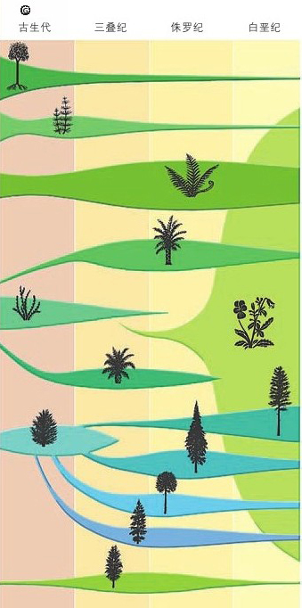
进化树

到了距今15亿年到14亿年前，开始出现了具有真核细胞的生物，它们可能是生活在水中的鞭毛生物。随时间的推移，它们朝着三个不同的方向进化：一是沿着具有光合作用的自养路线发展成为植物界；二是沿着吞噬现成营养物质的路线发展成为动物界；三是沿着吸收营养的异养路线发展成为菌物界。其中，进行光合作用的原始单细胞藻类逐渐进化出多种多样的藻类植物，而进行异养的单细胞菌类逐渐发展成各种真菌。

距今9亿年到7亿年前开始出现了多细胞藻类，各种各样的绿藻、红藻、褐藻在海洋中大量繁衍，繁盛的海藻释放出大量的氧气，一部分氧在大气层形成臭氧，阻挡了紫外线辐射，为植物登陆创造了条件。

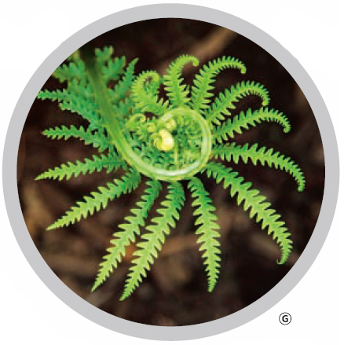
蕨类植物

距今约4亿年前，一种裸蕨植物从绿藻中进化而来并开始进入陆地，它们的后裔进一步向适应陆地生活的方向发展，之后，各种各样的蕨类植物主宰了地球长达1.4亿年之久。蕨类植物中还进化出了原始的裸子植物和被子植物，它们更能适应干旱的陆地生活。在此同时，也许是由绿藻进化而来的苔藓植物也以其独特的生活方式，成功地适应了陆地生活。

距今2.6亿年到1.36亿年前，裸子植物取代了蕨类植物成为地球上优势植物类群。距今1亿年前后，地球气候发生了变化，其后又出现了几次冰川时期，多数裸子植物逐渐消失，代之而起的是被子植物，直至今日。（秦祥堃）

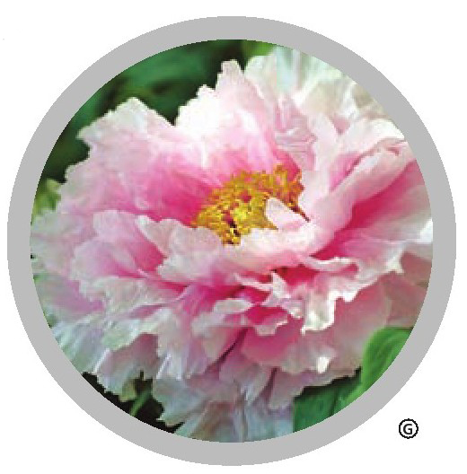
被子植物

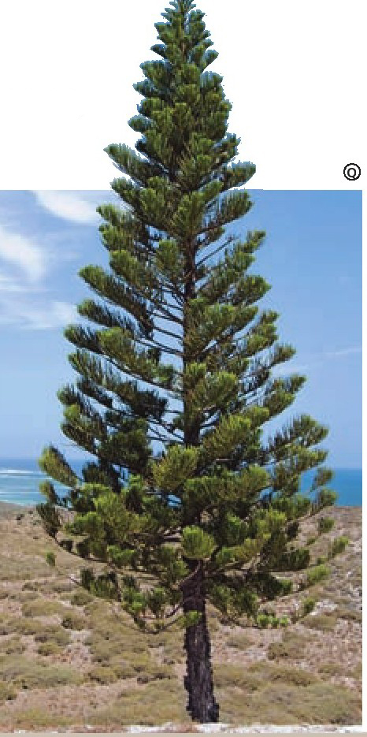
裸子植物

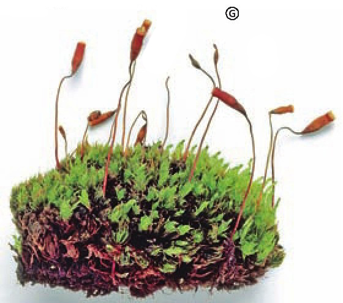
苔藓植物

## 现代蕨类还能进化成种子植物吗

在生物出现至今的40多亿年间，地球环境在不断地变化着，时而酷热，时而严寒，沧海变成高山，湿润代替干旱。在严酷的自然选择的压力下，大部分的种类不能适应这种变化被淘汰了，只有少部分种类的躯体结构在进化中变得复杂，变得对环境具有更强的适应性，并渐渐进化成新的类群，它们能更有效地利用环境资源，更多地留下后代。

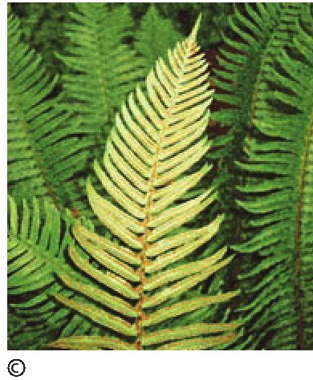
其实，在从古到今的漫长岁月中，物种的形成和灭绝从未停止过，只不过低等级的生物不会完全消失，也不会全部进化到结构更复杂的等级。所以在当今的世界上，既有低等的单细胞藻类植物，也有结构复杂的被子植物。但必须要说明的是，进化是单方向、不可逆的，已经进化的物种不可能再回到祖先的形态。某种器官一经进化，不会在其后代中恢复原样，也不会在其后代中重现。

现代的蕨类植物虽然和几亿年前的蕨类植物都属于同一类群，但是器官构造都已经有了改变，而且现在的自然条件也不是当初种子植物出现时的状况，所以现代的蕨类植物不可能进化成种子植物。（秦祥堃）

## 苔藓植物的祖先是谁

在高等植物各个类群中，苔藓植物属于一个很特殊的类群。它的配子体高度发达，承担了营养和繁殖的功能。孢子体却寄生在配子体上，不能独立生活。这种与其他高等植物迥然不同的结构，引起不少科学家的兴趣，其中，尤为关注苔藓植物是从哪里进化来的。但是到目前为止，还没有可靠的化石证据，科学家们只能根据它们的身体结构来推测苔藓植物的祖先。

许多科学家认为苔藓植物是从藻类植物直接进化而来的，理由是在现代的苔藓植物和藻类植物之间存在着某些中间类型。在苔藓植物中，苔类是比较原始的类群。而在绿藻中有与苔类结构相似的物种。同样，苔类植物中的藻苔属，其结构形态既像苔类又像藻类，它们的配子体和颈卵器结构十分简单原始，因此一般认为，藻苔属成员是藻类向苔类过渡的一个中间类型。

但是也有科学家相信，苔藓植物是从原始的蕨类植物——裸蕨进化而来的，是孢子体逐渐退化，配子体进一步复杂化的结果。裸蕨中的某些种类形态结构非常简单，很像苔藓植物，有些种类的孢子囊结构与泥炭藓、黑藓相似。而且从地质年代上看，苔藓植物比裸蕨植物晚出现数千万年，从年代上也可说明其进化顺序。

总而言之，苔藓植物已成为植物进化中的一个盲枝。它们是以配子体的独立生活为特点，而其他高等植物则趋向于孢子体越来越发达，两者的进化方向是背道而驰的。配子体是无性生殖的产物，而孢子体则是有性生殖的产物。相比较而言，后者的生命力和发展前途更加光明。事实上，在自然界中也没有从苔藓植物进化成的更高级的类群。（秦祥堃）

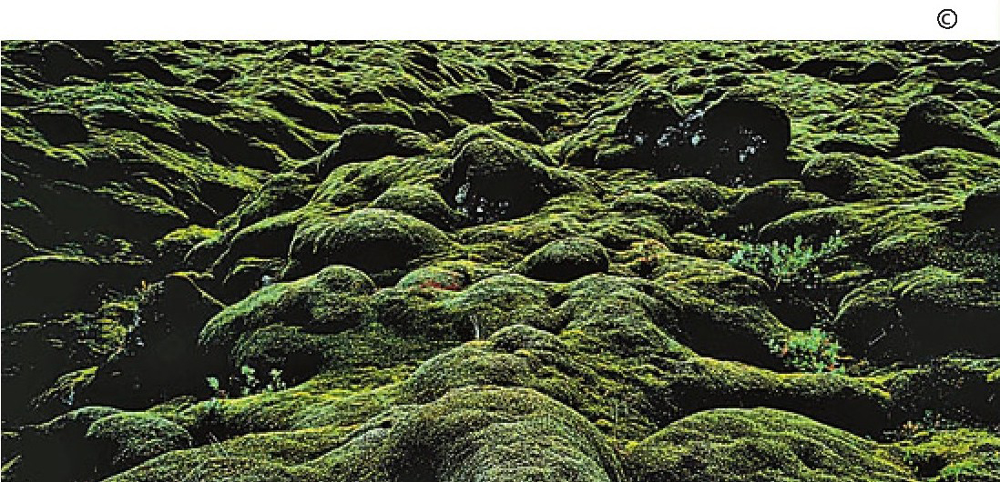
  

**【微博士】**苔藓分类

全世界约有23 000种苔藓植物，中国约有2800种。根据它们营养体的形态结构，通常分为两大类，即苔纲和藓纲。但也有人把苔藓植物分为苔纲、角苔纲和藓纲三大类。

【微问题】苔藓植物都特别矮小吗？

【关键词】植物进化树　蕨类植物　苔藓植物　藻类植物

## 为什么植物要有学名

天下万物都有名称，植物当然也不例外。很久以前，也就是人类开始和植物打交道的时候，就给每一种植物起一个名称。给人类、动植物甚至每样物品起名，是为了识别和分辨的需要，也是我们人类最早形成的社会行为之一。但是，这些习惯形成的名称也常常会给人带来困扰。

人参

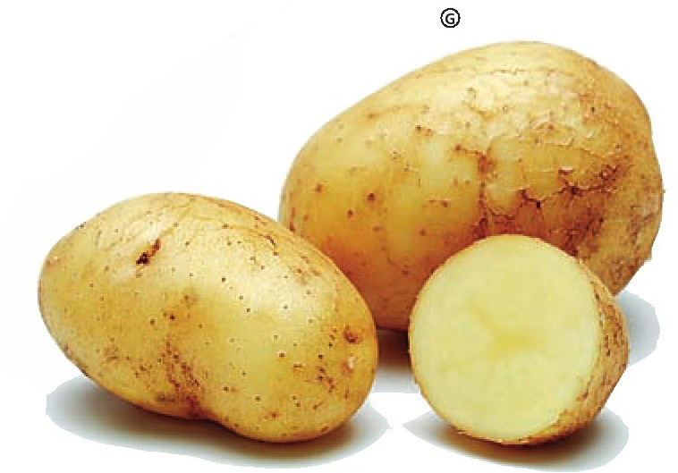
土豆

由于地理的阻隔，同一种植物在不同的地方有不同的叫法。如果你不是广州人，一定不知道薯仔是什么东西，其实它就是马铃薯。马铃薯在中国还有各种不同的称谓，北方人多称为土豆、山药蛋，南方人一般叫作洋芋。此外，还有一些特殊的叫法：如上海一带叫洋山芋，山东南部叫地蛋，意大利叫地豆，法国叫地苹果，德国叫地梨，美国叫爱尔兰豆薯，俄国叫荷兰薯等。由此可见，不仅中国各地，而且世界各国都有自己特殊的叫法和写法，可以毫不夸张地说，它也许有上百种的名称！

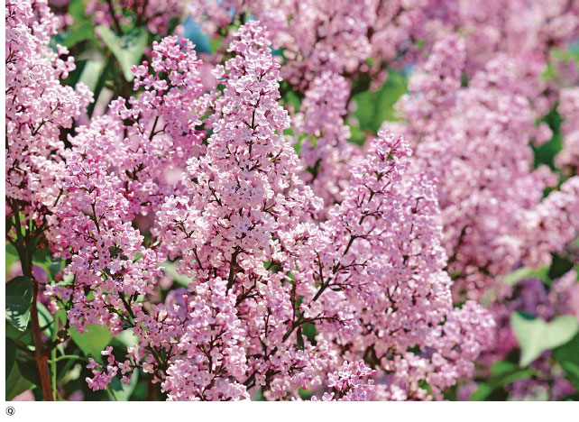

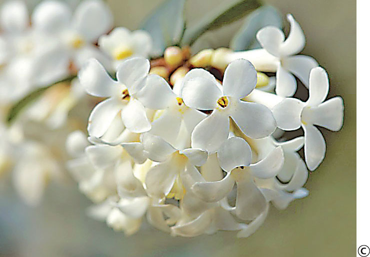
丁香

除了地理隔离会导致植物名称的不同，在不同的时期，同一种植物也有不同的叫法。比如现在人人熟悉的桂花，在明清期间称木犀，而唐宋时期却叫岩桂。

还有的时候，同一个名称则可代表不同的植物。例如说到丁香，大家会想到春天开着美丽紫花的小树，这是木犀科的一种落叶的园林植物。但是中药里说的丁香和它毫不相干，指的是茜草科的一种常绿植物。而在古代，丁香则是指瑞香科的灌木。

像这样“一物多名”和“一名多物”势必造成混乱，阻碍科学的发展。为避免这种混乱，1867年在巴黎通过了世界上第一部《国际植物命名法规》，规定了一种植物只能有一个合法的正确的名称——学名。学名使用拉丁文书写，并要符合《法规》的规定。

植物的学名采用“双名法”命名，每个学名由两个拉丁词或者拉丁化了的词组成。第一个词是属名，表明这个种所处的属，属名的第一个字母必须大写。第二个词称为种加词，通常用拉丁文形容词，表示这个种的特征，第一个字母一律小写。这两个词共同组成植物的种名，也就是它的学名。这就和中国人的姓名组成差不多，我们名字的第一个字是姓，表明我们的血统；第二个字（或两个字）是名，说明在此血统中的个体位置。姓和名合起来就成为一个人的名字，在表明身份的场合使用。同时，植物命名法规还要求在种加词之后应当加上命名人的名字或名字缩写，以示负责，并便于后人查证。比如著名中药材人参的学名为Panax ginseng C.A.Mey.。属名Panax是古代拉丁人认为可以医治百病的一种物质。这个属共有7种植物，它们的属名都是Panax，但是各自的种加词不相同。人参的种加词ginseng是拉丁化了的中文“人参”。定名人C.A.Mey.是一位俄罗斯植物学家的名字缩写。同属的植物西洋参的学名是Panax quinquefolius L。种加词quinquefolius的拉丁文意思是“五叶的”，指的是它的叶片具有五片小叶，定名人Linnaeus就是生物分类之父林耐。（秦祥堃）

## 为什么给这种植物起名“何首乌”

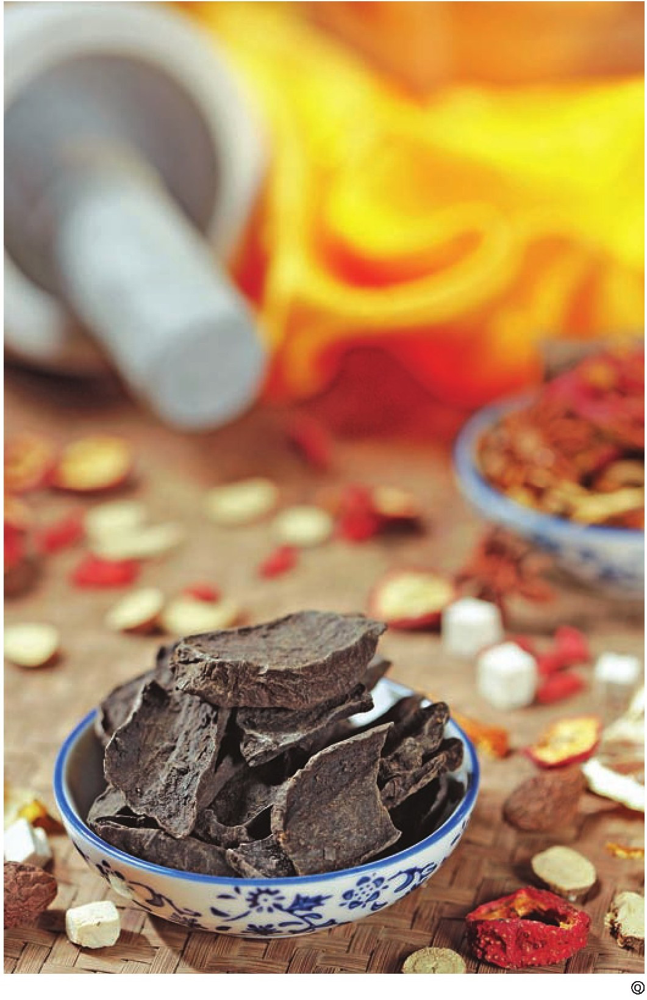
何首乌是一味常用的中药，具有补益精血、乌须发、强筋骨的功效。它的原植物也叫何首乌，为什么这种植物会有这样一个怪名字呢？

明朝李时珍的《本草纲目》记载：“何首乌出顺州南河县……此药本名交藤，因何首乌服之而得名也。”何首乌是民间传说中的一位奇人，他130岁时，仍须发乌黑油亮，如同一个年轻的小伙子，于是，这种能够防止头发变白的植物，就用奇人的姓名——何首乌来称呼了。

中国历史悠久，2000多年前的《山海经》中已经记载了200多种植物的名字。古代流传至今的植物名称多数是与人们生活息息相关的，最多的是中草药名。多数名称一看就知道是一种植物，但是像这种有些传奇色彩的名称也有不少，比如博落回、杠板归等。（秦祥堃）

  

**【微博士】**玉米的俗名

玉米是众所周知的粮食作物，几乎人人都吃过。在中国，玉米最早被称为玉蜀黍或玉麦，由于它的原产地在南美洲，是作为贡品传入中国的，因此又称为御麦。后来，玉米在中国各地广为种植，于是又出现了许多俗名，如包谷、苞米、玉茭、珍珠米、玉米棒等。

【微问题】胡椒、胡萝卜、胡瓜、胡桃等植物的名字中都有一个“胡”字，能说出这个“胡”字有什么共同含义吗？

【关键词】学名　俗名　双名法

## 为什么说银杉是植物界的大熊猫

大熊猫因为稀少而珍贵，成为动物界的瑰宝，而银杉在植物界中的地位一点也不逊色。它不仅和银杏、水杉一样，是古老的孑遗植物，而且数量非常稀少，因此身价极为昂贵，成为国家一级保护植物中的最重要成员之一，所以很多人将它称为“植物界的大熊猫”。

银杉的分布区域极为狭小，所在之地不仅千崖万壑、险峰群立、人烟罕见，而且只生长在海拔1600～2000米的山顶或悬崖上。银杉的珍贵不仅因为稀少，更重要的是历史悠久。早在2000多万年前的新生代第三纪，银杉广泛分布于北半球的欧亚大陆，但到了约200万年前的第四纪，地球气候剧变，冰川覆盖了北半球，许多动植物遭到浩劫，纷纷死亡灭绝，银杉也难逃厄运。值得庆幸的是，在中国西南山区，由于地形复杂，阻挡了冰川的袭击，再加上河谷地区受到温暖湿润的夏季风影响，在一定程度上限制了冰川活动。正因为具备如此得天独厚的自然环境，使那里成为银杉的最佳避难场所。于是，这种古老的植物才得以一代又一代繁衍至今。

| 银杉树 | 银杉树叶 |
| --- | --- |

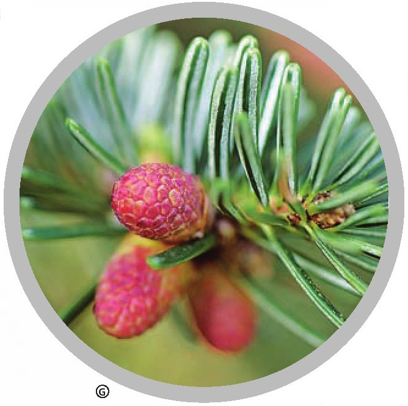
银杉的球果

银杉的发现，轰动了当时的国际生物界，引起各国植物学家的高度重视，所有人都把它视为植物界的奇珍异宝。为了使这种“植物大熊猫”能代代相传，生生不息，中国已在广西花坪和四川金佛山建立了以保护银杉为主的自然保护区，并大力开展了银杉的繁殖试验和引种工作。北京植物园的研究人员试图将它引种到北京，在采用直接引种方法连遭失败之后，另辟蹊径，根据植物对环境变化只能逐步适应的原理，将银杉从海拔1600米处渐次下移至海拔700米处，然后让它适应一段时间后再移种到北京。经过科学家的不懈努力，移种终于获得了成功，北京植物园内增加了一位新成员，它就是中国独有的“植物大熊猫”——银杉。（余千里）

  

**【微博士】**花坪自然保护区

在中国广西龙胜与临桂两县交界处，有一个总面积147平方千米的国家级自然保护区——花坪自然保护区。它是一个博大奥秘的植物宝库，因为海拔差异较大，以及河谷、山地地形气候的不同，汇聚着亚热带常绿阔叶林、落叶阔叶林、针叶林、温带植物，以及互相交混的植被类型。其中最为珍稀的是银杉，这种生长在冰川时期的植物，除了在德国还保留两块化石标本外，已被认为在世界上绝迹，因此它又被称为“活化石”植物。花坪自然保护区中还栖息着600多种珍稀野生动物，如华南虎、黑熊、金钱豹、野羊、青猴等。

## 谁是发现银杉第一人

在20世纪50年代之前，人类对银杉的了解只限于化石层面上，并将它定性为是一种早已灭绝的古代植物。

1954年，广西林学院的钟济新教授带领学生去广西桂林县，进行一年一度的教学实习。过去，人们认为桂林附近没有原始森林，但这次在老乡的指引下，他们在天平山区发现了大面积的原始森林，共有植物1100种，其中属当地特有植物达80多种，这个天然的绿色宝库，就是今天大名鼎鼎的花坪自然保护区。在考察过程中，他们发现一株幼小的苗木，粗看很像油杉属植物。但钟济新教授仔细观察后发现，它的叶较长，两端渐窄，直觉判断可能是一种未被人知晓的植物新种。为了证实自己的推测，钟教授多次进山探寻，终于在1956年春天找到了成年的银杉，并采集了一套带有雌雄球花和果实的完整标本。

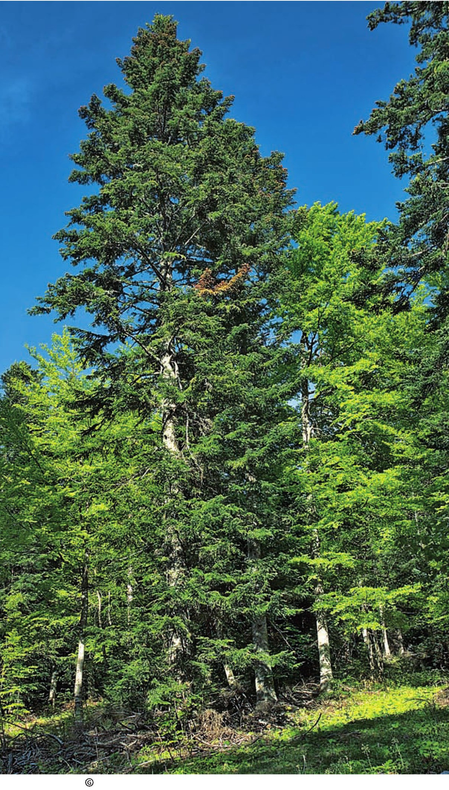
这套标本被送到北京植物研究所，由中国著名植物学家陈焕镛、匡可人两位教授鉴定。他们一致认为，从这种植物的叶、芽鳞、苞鳞、雄蕊等方面来分析，应该是松科植物的成员，但叶子扁平如线又和黄杉属植物很相似。经过了大量考证对比之后，两位学者确认它是松科植物中的一个新种，而且是自1949年新中国诞生之后在中国首次发现的松杉类植物特有种。由于它的树冠带有美丽的银白色，于是给它定名为银杉。1957年，陈焕镛教授在苏联植物学年会上宣读了他的论文《中国西南部松科新属——银杉属》，并于1958年在苏联的植物学杂志上正式发表。

自从第一株银杉问世后，植物学家在湖南新宁县的密林中，又发现了近百株银杉，其中最高的达到20米。1980年，贵州学者在杨溪乡海拔1400多米的地方，发现了成片生长的银杉林，包括幼苗、幼树和大树共900多株，而且自然更新的情况十分良好。（余千里）

  

**【微博士】**树形

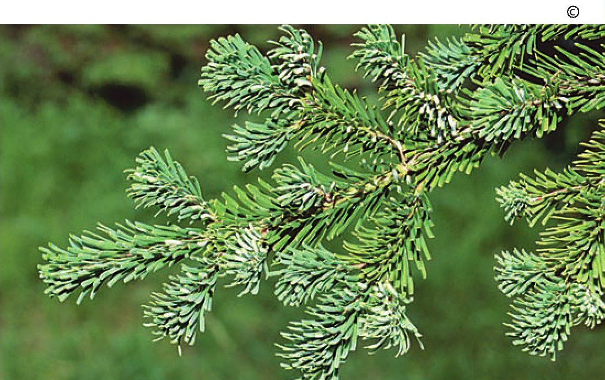
银杉树形优美，躯干笔直挺立，树冠尖尖如塔，缀满绿叶的枝条四下平展，显得刚健秀丽、仪态高雅。银杉是森林中的高个子，树梢通常超出其他树木，给人以“鹤立鸡群”的感觉。它的叶子丝丝如线，色泽暗绿，叶子下面有两条银白色的气孔带，每当微风吹拂时，枝叶随之飘荡，银光闪闪，显得格外美丽动人。

【微问题】现在，银杉是否已经被引种到世界各地？

【关键词】银杉　孑遗植物

## 什么是根的作用

根是植物的重要组成部分之一，只不过，它通常生长在地下不被人看见。潜藏在泥土中的根虽然不抛头露面，但它却无时无刻地勤奋工作，默默地为植株做出贡献。

有人把根比喻为植物伸向土壤的嘴巴。的确如此，如果你拔出一棵小草，将带出来的土壤抖落掉，就会看见小草的基部有一丛“胡子”，那就是小草的根。肉眼看去，一株小草有几十条甚至几百条根，那么，是不是意味着它有着几十张甚至几百张伸向土壤的嘴巴呢？如果这样认为的话，那就大错特错了！真正担负起吸收水分和矿质营养的植物“嘴巴”是肉眼看不见的，因为它们太小，只有在显微镜下才能清晰地见到，在每一条根的顶端部分，都长有无数细毛，植物学家称它们为根毛。根毛的数量之多达到惊人的程度。例如，在1平方毫米的豌豆根表面积上，竟然长有200多条根毛，而同等表面积的苹果根上则有300多条根毛，玉米的甚至要超过400条！那么多的根毛，就像无数张微型嘴巴，不停地吸收土壤中的水分和矿物质，提供给植株体生长的需要。

植物的根不仅有像嘴一样的吸收功能，而且还有与像脚一样的支撑功能。我们知道，人类双脚的重要作用之一是支撑躯体，而植物的根也同样具有支撑功能，成为保证植株体稳固的基础。可以想象，每一株植物都有很多粗粗细细的根，进入到土壤之中后，就像无数只脚爪牢牢地抓住地下的泥土，打下了坚实的基础。有了根的支撑固定作用，植物的躯体才能挺立起来，而且，树木越高大，根往往越粗壮，扎入土壤更深，稳定性也越大。（余千里）

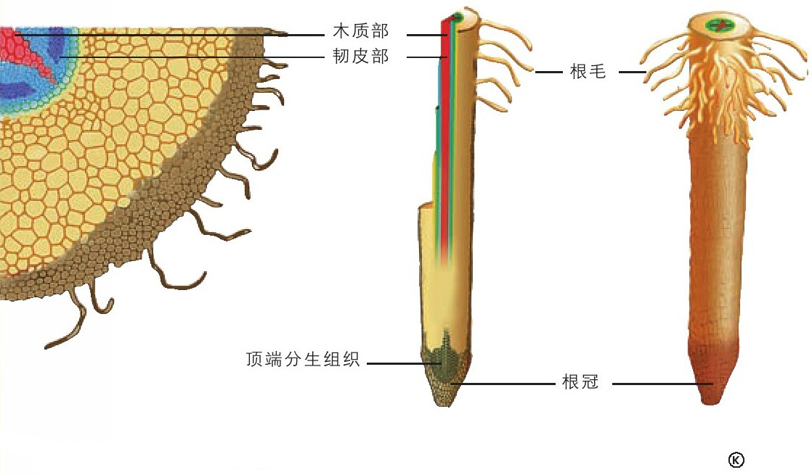
根尖的横切面、纵切面和根毛

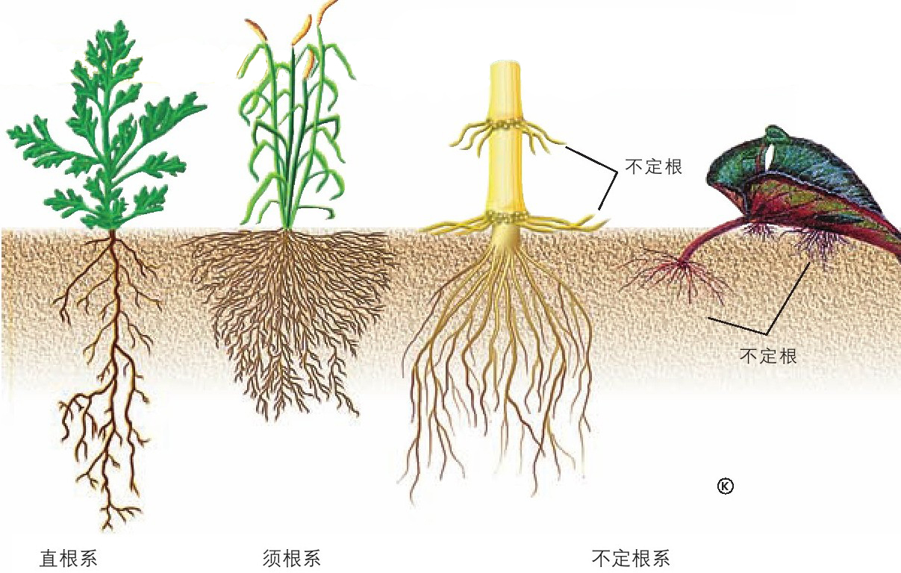
## 怎样识别根的“身份”

地球上有几十万种形态特征各不相同的植物，当然，它们的根系也各有特点。为了方便辨别它们的“身份”，植物学家把根系分为三大类型：直根系、须根系和不定根系。

顾名思义，直根系都有一根垂直向下的主根，当它长到一定长度时，会在周围萌生出许多较小的侧根，同样，侧根也可以再长出更细的小根。也就是说，直根系是由主根、侧根和小根组成的，它们有明显的主次粗细之分，例如大豆、棉花的根。须根系则恰恰相反，它们是由许多粗细大小差不多的根组成的，没有明显的主根和侧根的区别，形状就像一丛胡须，例如水稻、玉米的根。

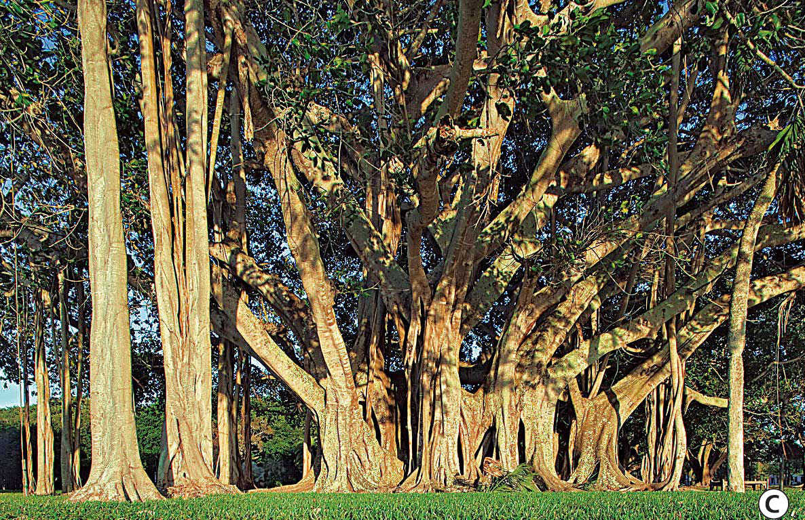
独木成林的榕树

与上述两类根系相比，不定根不仅形态多变，更主要的是没有固定的生长区域。一般来说，植物的根是由种子胚根形成的，有相对固定的生长部位，但有时候，我们能见到植物从茎、叶片或老根处也会长出根来，根的生长部位并不固定，因此，这类根就被植物学家称为不定根。例如，有一种名叫吊兰的常见观赏植物，它的叶丛中会抽出细长的枝条，枝条柔韧下垂，在顶端除了萌发出新的嫩叶外，还会在空中长出不少细根，这些根就是不定根，也称为气生根，它们甚至在空中也能长出新的植株。（余千里）

## 为什么独木也能成林

如果去孟加拉国旅游，千万别错过去杰索尔地区，因为那里能让你亲眼看到独木成林的自然奇观。那是一片占地2万多平方米的榕树林，近千根粗粗细细的树干支撑着巨大无比的树冠，郁郁葱葱，生机盎然。据说，历史上曾有一支六七千人的军队在这片树林下乘过凉，歇过脚。这片树林的最神奇之处不在于它的历史，而在于它竟然是由一株榕树造就的奇观！

为什么榕树能够独木成林？原来，榕树除了有深入地下的根之外，还有另一种奇特的根，它们能从树干或树枝上长出，越长越长，有的悬挂在半空，有的已经垂伸到土壤之中，由于这种根刚长出的时候都飘垂在空中，因此称它为气生根。一株大榕树的气生根有几百条，甚至上千条，它们垂入地下后，越长越粗，渐渐变得和树干很相似，看上去就像成百上千棵大树聚集在一起，于是就形成了独木成林的奇妙景观。孟加拉国的那片榕树林，实际上也是由一株榕树形成的，据植物学家考证，它已经有900岁了。（余千里）

  

**【微博士】**支柱根

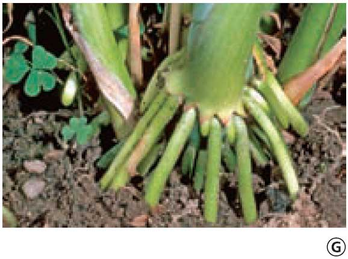
支柱根

为了加强躯体的稳固性，有些植物在茎干基部还有支柱根，它们斜着向下生长一段距离后再钻入土壤，就像给躯体安装了很多支架，使植株变得更加稳固。

**【实验场】**

任意取一条新鲜的植物细根，截取根尖的一小段，放至显微镜下观察，细根的周边是否有很多根毛？同时还可以观察，根尖顶端的细胞与其他的细胞有什么不同？

【微问题】不定根能从植物体的很多部位生长出来，那么，为什么从没见到花瓣上也能长出不定根？

【关键词】须根系　直根系　不定根　根毛

## 为什么大多数树干都是圆柱形的

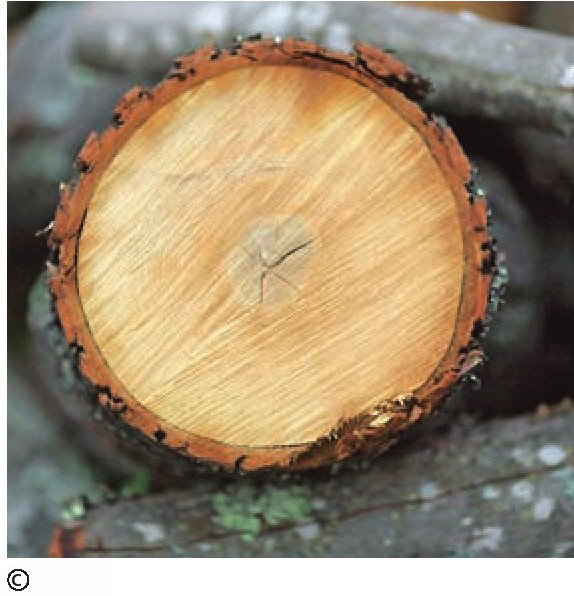
大树的树干呈圆柱形，这是一个人人都知道的普通现象。放眼望去，在我们周围，不管是乔木灌木，还是大树小树，很少能见到方形、三角形或其他特殊形状的树干。有趣的是，不同植物的叶片、花朵、果实、种子常常有很大的区别，唯独树干都保持圆柱形，几乎不发生形状上的变化。在自然界中，只要能够长期生存的物种，能够长期保留下来的形态特征，总是有它的合理性，圆柱形的树干也不例外。

我们知道，圆形是效率最高的一种形状，也就是说，在相同大小材料的情况下，圆面积是所有形状的面积中最大的。由于树干的主要作用之一是承上启下，为植物体各个部分输送水分和养料，而圆形的树干恰恰可以利用最少的材料达到最大的输送效率。其实，不仅圆形的树干如此，我们生活中常见的圆形水管、煤气管等，也都是为了达到用材少、流量大的目的。圆柱形不仅有输送效率的优势，还有支持作用的优势。可以想象，植株的地面部分有硕大的树冠，如果到了秋天，上面还要结满累累的果实，需要特别强有力的树干支撑，才能保证树木屹立不倒，而圆柱形树干的优势就是具有强大的支撑力。

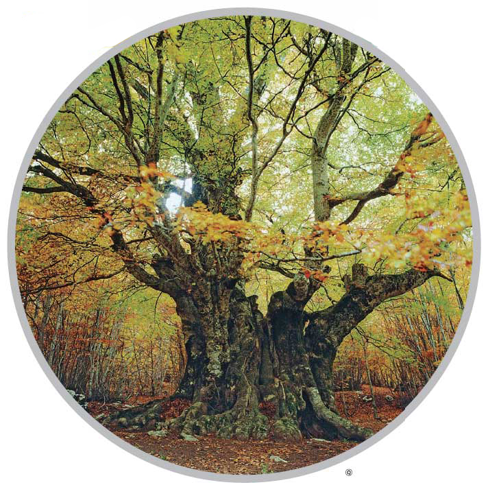
除此以外，树干呈圆柱形还会为植物体带来更大的安全和保护。我们知道，树木的营养物质是通过树皮内的皮层输送到躯体各部，如果皮层中断，必将导致树木死亡。我们常见的树木，通常是多年生乔木，在它们漫长的生命历程中，经常要遭受很多外来的伤害，特别是自然灾害的袭击。在严峻的自然环境中，如果树干呈方形、三角形、扁形或带有棱角等形状，会更容易受到外界的冲击伤害。而圆形的树干则不同，狂风卷着尘沙杂物，无论从哪个方向来，都容易沿着圆面的切线方向掠过，大大减少了受伤害程度。

总而言之，世界上所有的生物为了生存，总是朝着对环境最有适应性的方面发展的，其形态特征往往是对自然环境适应的反映，圆柱形的树干也是如此。（冯彦淇　杜盼华）

  

**【微博士】**“弯弯林”

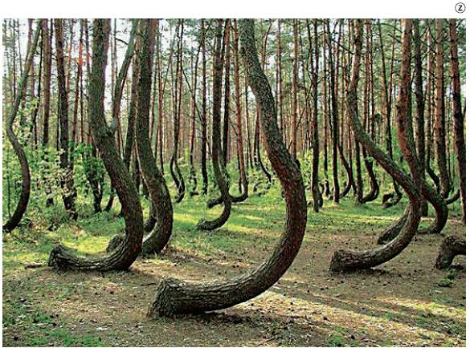
在波兰西北部城市格雷菲诺近郊，有一片神奇的松树林，大约400棵松树的树干全部向北弯曲生长，因此人们把这片松树林戏称为“弯弯林”。据猜测，这些松树种植于20世纪30年代初，在它们刚开始生长的7～10年间，身体仿佛被什么压住了一样，但后来压住松树的东西又被神秘地挪开，所以树干才变成了先弯后直，但形成“弯弯林”确凿的原因至今还未被人知晓。

## 形状古怪的茎都有特殊功能吗

茎是植物体的重要部分。普通植物的茎，挺立在地面上，茎枝上长着叶片、花朵和果实。同时，茎还是根和叶的联系通道，来回输送植物需要的水分和养料。几乎绝大部分植物的茎，都是直立向上，不管粗细、长短、软硬，都像一根根“站在”地面之上的圆圆小棍子。但也有例外，有些植物的茎发生了变态，形状变得怪模怪样，因此被称为变态茎。它们虽然失去了输送水分养料的作用，但却具备了另外一些特殊的功能。

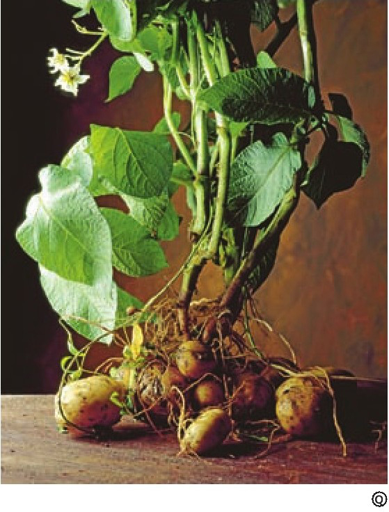
块茎

马铃薯就是变态茎中的一员。它的地上部分和普通植物一样，有直立向上的茎，但在地下它还长出了另一种圆圆的茎，外表和泥土颜色差不多，很像一块块土疙瘩，因此又被称为土豆、洋山芋、山药蛋等。马铃薯的这种变态茎的最大作用，是为植物体营造了一个个“营养仓库”。如果遇到恶劣的气候条件，地上部分虽然枯萎凋零，但地下的块茎却不会死去，它依靠内部储存的丰富营养，能够维持相当长一段时间。当气候条件变好之后，块茎上就能萌发出幼芽，诞生出新的植株。

洋葱头也是一种很特别的茎，植物分类学家给它起了一个专门的名字——鳞茎。它的身体四周包着很多层肉质鳞片叶，好像穿上了几十件衣裳。这些鳞片除了能储存养料外，还可以保护鳞茎内部的幼芽，防止水分散失。还有我们很熟悉的百合，也是一种典型的鳞茎植物。它的地下部分有个雪白的、莲花状的东西，那就是它的地下鳞茎。如果我们把外面肥厚的肉质鳞片剥去，就会看见一个受到严密保护的、圆盘状的、大大缩短的茎。

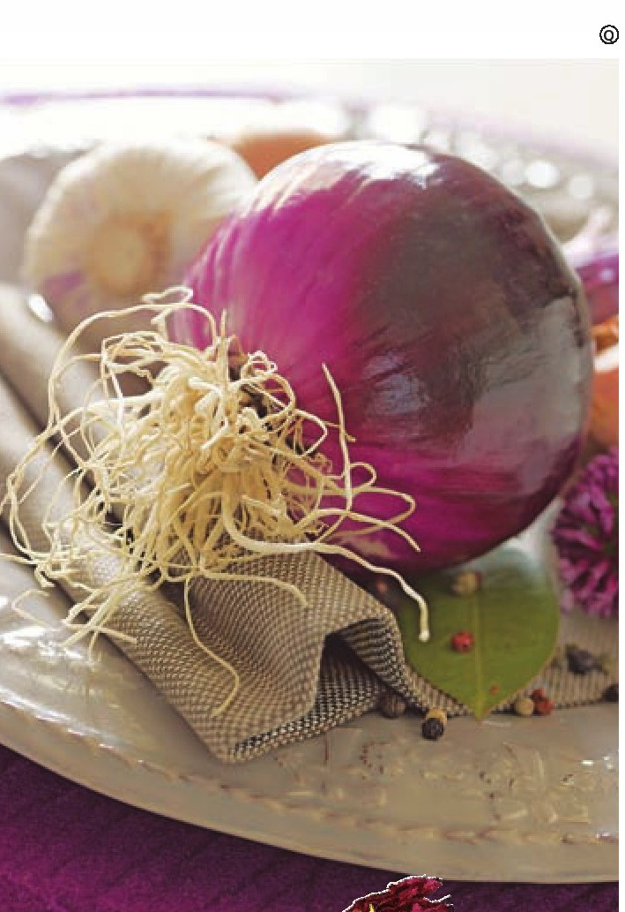
鳞茎

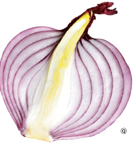

总而言之，很多植物在不同环境的自然选择下，变态出各种古怪形状的茎，其目的都是为了更好地适应环境，有利生存。（冯彦淇　杜盼华）

  

**【微博士】**球茎

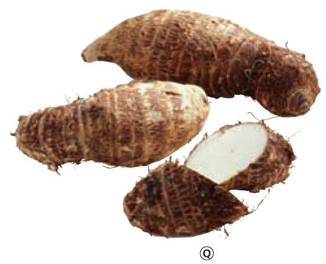
球茎也是生活在地下的一类变态茎，它常常膨大呈肉质球状或扁球状，含有丰富的碳水化合物类营养物质。球茎和块茎不同的是，前者属于节间极度短缩的直生茎，有明显的节，外面还有薄纸质的鳞叶，顶芽及附近的腋芽较为明显。典型的球茎代表植物如慈姑、荸荠、芋艿等。

【微问题】自然界中，有没有树干呈方形的树木？

【关键词】树干　块茎　球茎　鳞茎

## 藕断为什么丝连

“藕断丝连”，几乎是一个人人皆知的成语，比喻表面上断了关系，实际上仍有千丝万缕的牵挂联系。这个成语来自一个耳熟能详的自然现象，那就是当新鲜的莲藕被折断之后，虽然主体已经完全被分开，但在折断处依然有不少的细丝连在一起。这些细丝为什么能够有那么大的延展性？

如果我们将细丝放到显微镜下观察，就能发现其中的奥秘。原来，我们肉眼能够见到的每一根藕丝，并非是圆柱形的，而是扁扁平平的，它由3～8根更细的丝组成。有趣的是，每一根更细的丝就像弹簧一样螺旋状地盘卷着，有极大的伸缩性。假如我们的手可以变得足够的小，只要拉住细丝的两端，一使劲可以拉长，一松手又会缩短。

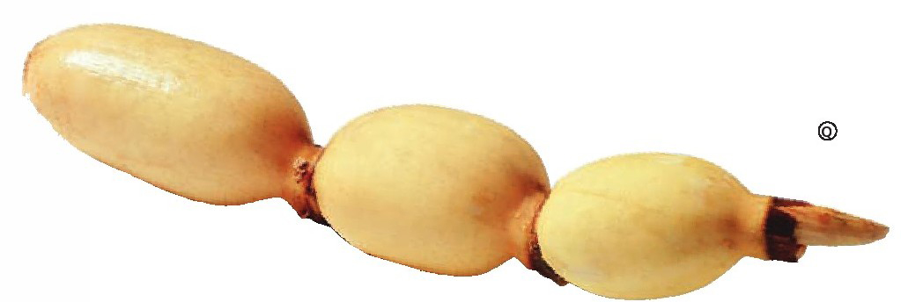
那么，充满韧性的细丝究竟是什么结构组织呢？植物学家告诉我们，那是一种叫导管的运输系统，是专门用来运送水和溶于水中的无机盐的。有时候，植物的导管内壁在某些部位会特别增厚，呈各种纹理，如环状梯形，也有的呈网形。而藕的导管壁却很特别，增厚的部位连续呈螺旋状，也就是植物学术语中的螺旋形导管。莲藕一旦被折断，导管内壁增厚的螺旋部就会脱离，形成螺旋状的细丝，其直径仅几微米。这些细丝在外力的作用下，会变成一根根被拉长的“微型弹簧”，在一定的弹性限度内不会被拉断，其极限长度可达10厘米左右。其实，不仅仅莲藕中有丝，莲的其他部分如叶片、叶柄、花梗、花瓣、莲蓬等折断以后，也有细丝相连，只不过有些细丝极其微小，无法与藕丝相比而已。

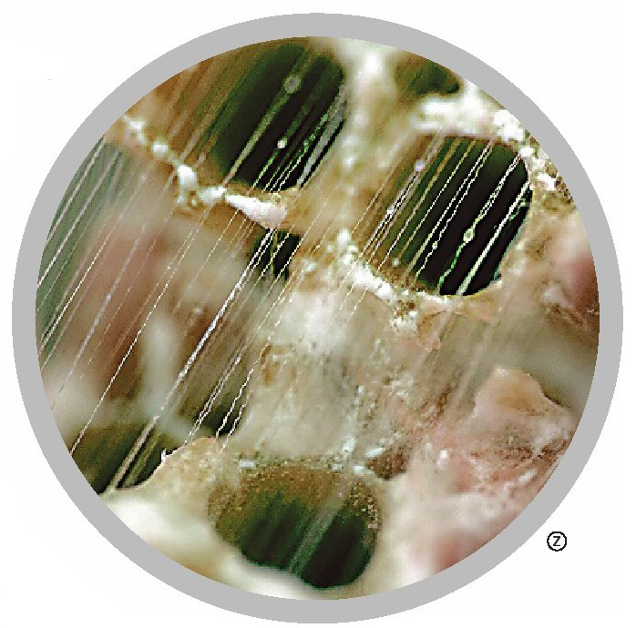
断藕处的细丝

藕断丝连的现象不禁会使人想起一种名贵的药用植物——杜仲。很多人都曾尝试过，将杜仲的树皮，甚至树叶折断之后，就会有无数强韧的白丝，呈现出“皮断丝连”或“叶断丝连”的状态。虽然它与莲藕有类似的表现形式，但内在原因却完全不同。杜仲的细丝不是导管组织，而是里面的乳汁。由于杜仲树皮中有很多乳管，乳管能分泌白色的细胞液，因为这种细胞液里含有较多的橡胶成分，因此称为杜仲胶。杜仲树皮折断后，在两个断面之间连着的就是橡胶丝。我们知道，橡胶丝充满韧性，有点像我们平日常见的橡皮筋，所以即使扯断了树皮，里面的橡胶丝还要用力才能拉断。（杜云）

  

**【微博士】**地下茎

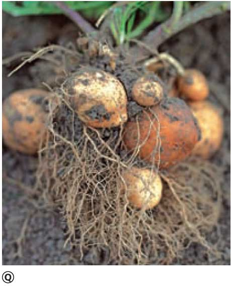
对绝大部分植物来说，根生在地下，茎长在地面之上，但也有少数植物的茎隐藏在地下，例如莲藕、竹鞭、洋葱、土豆等，这就是植物茎的一大类型——地下茎。地下茎和地下根的主要区别不是它们的外表形态，而是地下茎有芽和分节，而地下根都没有。

## 莲藕中为什么有那么多小洞洞

吃过莲藕的人都知道，切开小手臂似的莲藕，就能见到里面有很多小洞洞，只不过，在绝大多数人眼里，那就是它的特殊“生相”而已。但是，如果再细想一下，为什么大部分植物的茎内没有这种奇特的小洞洞，这些小洞洞对莲藕的生长有什么特殊生物学意义？这些问题，也许并不是每个人都能回答的。

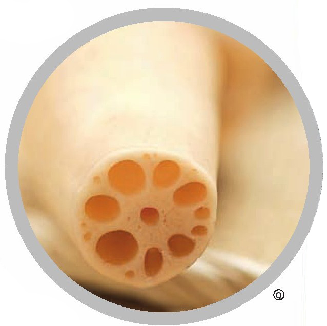
显示在藕横切面上的通气孔

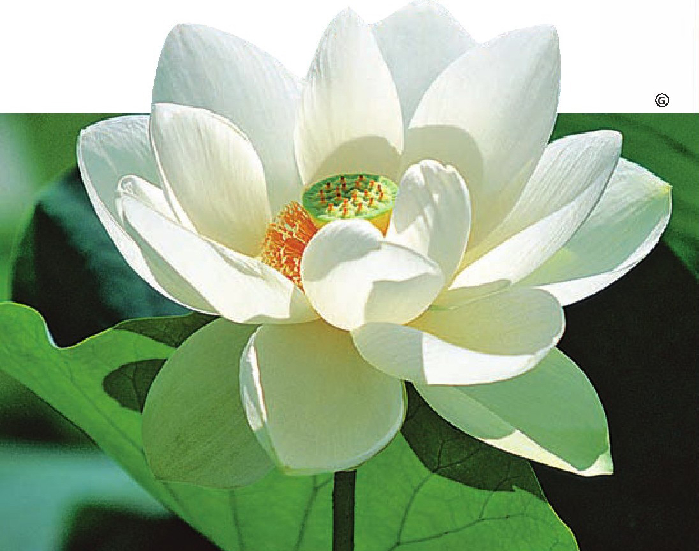
莲藕具有这种特征，主要和它的生活环境有关。熟悉荷的人都知道，荷不仅是美丽的花卉植物，也是江南水乡的特产经济植物。荷生长于淡水湖泊或池塘中，叶片挺出水面，但茎却隐藏在水下的淤泥之中。由于植物生长是需要空气的，而水下的淤泥内恰恰最缺少空气。为了适应特殊的生长环境，荷的地下茎——莲藕的内部特化出来一个个通道，横贯于每一节的首尾，植物学家把它们称为通气孔，其主要作用就是把从叶片处获得的空气输送到茎的各个部分。

无独有偶，生活在海边沼泽地的红树，也同样面临缺少空气的问题，但是它的适应方式与莲藕不同。红树为了支撑住自己的身体，大部分的根都扎入淤泥之中。但是为了获取生存所必需的氧气，红树又会将一部分根探出地面，直接从空气中呼吸氧气，因此人们就叫这种根为呼吸根。（杜云）

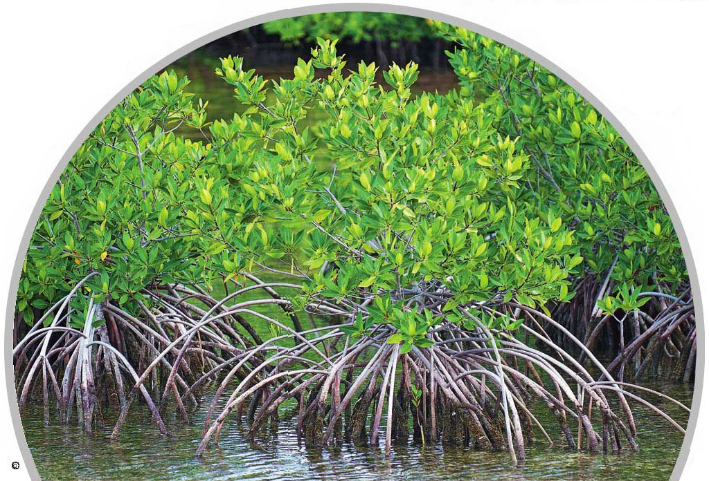
红树林

  

**【微博士】**藕的表皮

“出淤泥而不染”，是北宋时期周敦颐在《爱莲说》中赞美莲花的千古佳句，现在，人们常用它来比喻洁身自好的美德。荷花的地下茎的确是在淤泥中生长，也的确不容易受脏毒物质沾染，这是因为藕的表皮组织特别细密，并含有一种叫丹宁的鞣酸物质，具有一定的阻挡或吸收脏毒物质的能力。正因为如此，那些肮脏甚至有毒的物质通常仅仅黏附在表皮或者渗到表皮中，所以在食用藕时千万切记：一定要削去外皮。

**【实验场】**

将一小片新鲜的藕轻轻折断，控制住力度，慢慢向两边分开，见到很多依然连接的细丝后，停止用力，避免细丝断开。然后，尽量小心地将细丝放在显微镜或解剖镜（倍数较高的放大镜也可以）下，仔细观察细丝的形态结构。观察时，可以反复稍稍拉动和放松，观察细丝的形状会发生什么样的变化。

【微问题】普通的莲藕中有几个通气孔？

【关键词】莲藕　通气孔

## 为什么年轮有深有浅

当人们锯断树干时，在木材断面上可以看到许多深深浅浅的同心轮纹，这些轮纹和树木的年龄有关，每一年就增加一圈，因此称为年轮。

树干内的年轮

年轮有个很显著的特点，那就是不管粗粗细细、弯弯扭扭，总是一道深、一道浅地相间排列，为什么年轮会有深深浅浅的不同呢？我们知道，植物的生长发育都是细胞不停分裂的结果，茎干的增粗也不例外，但只限于双子叶类的多年生木本植物才能不断增粗。那是因为它们茎的树皮（韧皮部）和木质部之间有一种特殊组织，在植物学中称为形成层。形成层向外分裂的细胞形成树皮（韧皮部），向内分裂细胞形成木质部。但是，它们分裂所生成的细胞数量有很大差别，向内分裂要比向外分裂产生的细胞多得多，所以木质部不断加粗，而树皮的厚度基本保持不变。不仅如此，形成层细胞的分裂速度会受到季节影响，从而表现出周期性的变化。在春夏两季，天气温暖，雨水充沛，形成层分裂出的新生细胞又大又多，所以，这段时期所形成的木材质地疏松，颜色较浅；到夏末至秋季，气温和水分等条件逐渐不适于植物的生长，形成层的分裂速度减慢，分裂出的细胞也变得比较小，所以，这段时期所形成的木材质地紧密，颜色就较深。到了冬天，树木进入休眠状态，形成层停止了分裂，树木也停止了生长。正是因为周而复始的季节变化，导致形成层分裂速度也发生周而复始的相应变化，才使我们见到的年轮有了深深浅浅的形态。

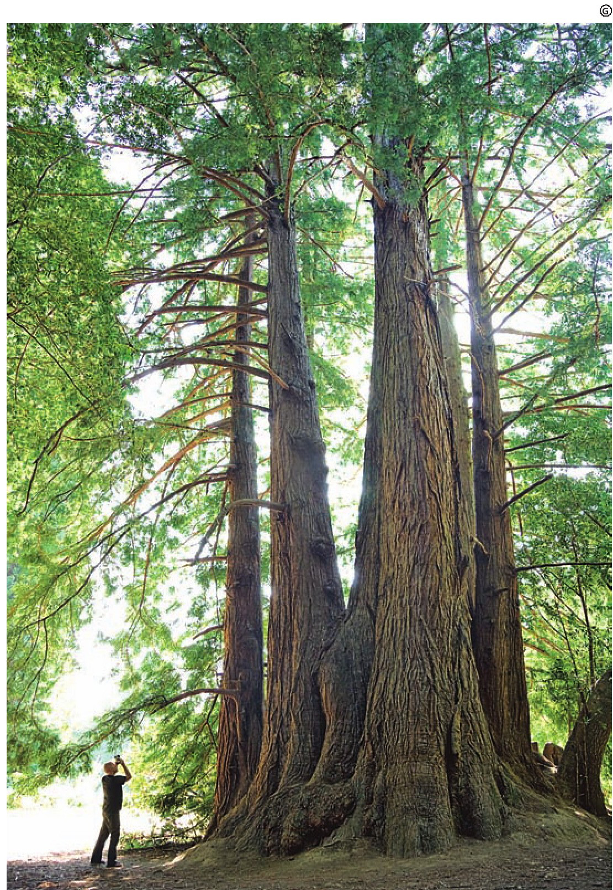
但是，并非所有的植物都有形成层细胞，都会增粗自己的“腰身”。其实在植物界中，只有裸子植物和双子叶植物才有这种形成层。例如，很多属于单子叶植物的草本植物，由于没有形成层组织，就无法增粗它们的茎干。

在深深浅浅的年轮中，还包括着很多植物学家才能解读的信息。其实，每个年轮包含一层较宽的浅色和一层较窄的深色，它们就像自然界的“特殊文字”，忠实地记录了树木生长地区的气候环境变化情况。因为，在优越的气候条件下，树木生长良好，木质部增加得多，年轮也就显得比较宽。反之，如果某一圈年轮比较薄的话，就说明那一年的气候比较差，比如寒冷、干旱、病虫害等。除此以外，我们还可以利用年轮来测定死去多年的老树的生存年代。例如，如果有连续三年的干旱，就会使得树木形成三个较狭窄的年轮，这对于同一地区同一时期生长的树木都是一样的，无论它是大树还是小树。这样，我们可以从一棵活着的树上找出干旱发生的准确年代，再从死去的老树上找出相应的年轮，这样就可以推算出老树的生存年代了。（秦祥堃）

## 树木能长多高

人类中有身高不到1米的侏儒，也有2米多高的巨人，植物王国中也同样存在只有几寸高的小草和鹤立鸡群的巨树。在中国，能位于身高前列的树种有东北原始森林中的红松，可以长到50米高，号称“木材之王”；浙江西天目山的金钱松，当地人称为“冲天树”，最高的一株达到56米；中国台湾原始森林中的台湾杉，最高的有60米；而产于云南西双版纳的望天树，最高可达80米，这是中国植物学家在1975年发现的一种龙脑香科的植物，非常稀少，现在已被列入国家一级保护植物名单。

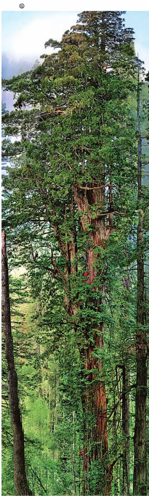
但是，它们还不是植物界中的顶级高个。现在知道，世界上个头最高的树木是一株北美红杉，身高115米左右，位于美国加利福尼亚红杉树国家公园内。其次是美国华盛顿州奥林匹克国家公园的道格拉斯黄杉，高99.4米。第三是美国国家公园的巨杉，高94.8米。位列第四的是生长在澳大利亚的一株王桉，身高92米。

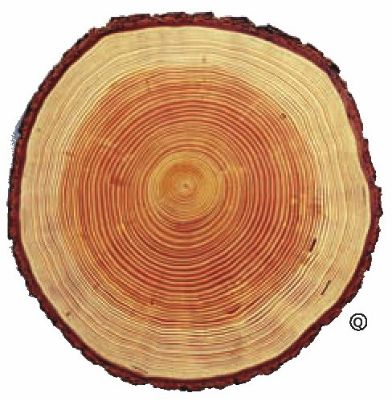
树木能长多高？这是人们感兴趣的问题。很多人以为，只要有足够好的自然条件、足够长的生长时间，在没有意外天灾人祸的情况下，树木的高度可以达到200米、300米，甚至更高。但科学家却不这样认为，因为随着树木的不断增高，水分输送就会变得越来越困难。例如一株100米高的大树，体内用来输送水分的毛细管道多得无法计数。根据估算，这样一株大树每天都要向上输送大约150千克重的水，而要把其中的一滴水从树根部运送到树顶的叶片中，大约需要24天时间！正是因为必须输送水分的原因，限制了树木不能无限长高。一些科学家认为，120米至130米是树木生长的极限高度，超过此高度，水分将无法输送到树梢。（秦祥堃）

  

**【微博士】**长寿树之王

1964年，科学家在美国加利福尼亚州的白山发现一株被锯倒的刺果松，用测定年轮的方法，证实它已经在地球上生存了大约4900年。2004年，科学家在瑞典达拉纳省境内发现的一株挪威云杉古树，虽然树干只有约4米高，和一般的云杉差不多，毫不起眼，但是它具有巨大的根系，其主根系经碳——14年代测定法鉴定及基因配对核实后，发现其寿命竟高达9550岁，远远超过了美国的刺果松。

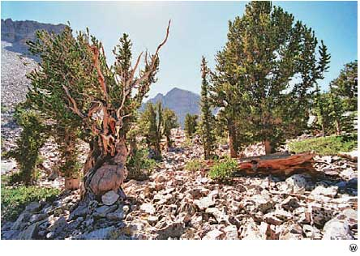
【微问题】竹子能不能长粗？

【关键词】年轮　形成层　树木高度　树木寿命

## 爬山虎为什么能爬上高高的大墙

爬山虎是一种很常见的庭院植物，最大的特点就是善于爬行，那是因为它的枝条上会长出很多“小脚”，就像有吸盘的壁虎四肢一样，只要遇到房子的墙壁，不管多高，不管多光滑，都能迈动“坚实的步伐”一点点往上爬，甚至能把几十米高的楼房四周围墙爬满，哪怕遇到大风大雨，它也不会掉下来。

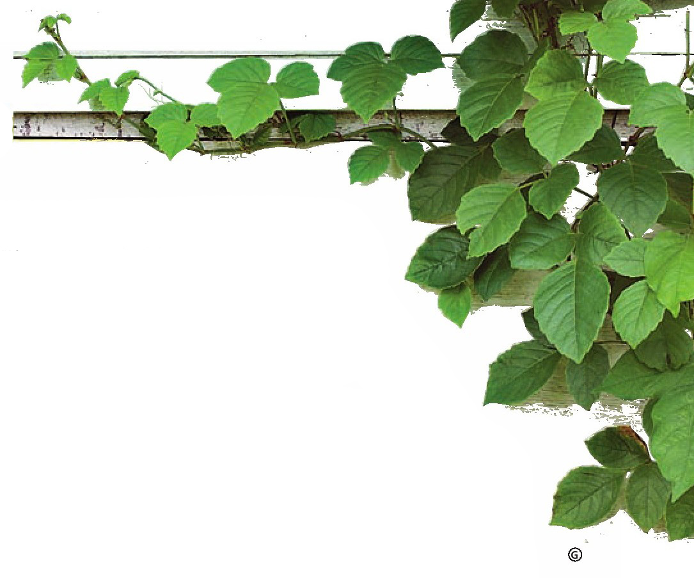
在植物学上，爬山虎的“小脚”称为吸盘，具有超强的吸附能力。根据测定，它的吸附力能够达到吸盘自身重量的200多万倍！为什么爬山虎吸盘的吸附力如此强大？科学家借助扫描电子显微镜对爬山虎的吸盘进行观察后发现，上面有许多极细微的微管和微孔，而且微孔和微孔之间还存在着公用的管壁。如果将它们放到足够大，微管之间的连接好像大城市里复杂交错的高速公路网，简直就是大自然创造出的奇迹！根据发现的海绵状微孔、微管，还有折叠状的微孔壁和微管壁，中国科学家提出假设，在爬山虎吸盘所分泌的生长素中，大部分都是弱酸性物质，当爬山虎在向上攀爬生长过程中，一旦吸盘遇到墙面，一种缓慢的化学反应开始发生，增强了吸盘与基底之间的黏附力，使吸盘“锚”住墙面。此外，随着吸盘的生长和发育，卷须尖端受到持续的接触刺激，分泌物也源源不断地产生，这样就有部分空气被“包裹”在吸盘里。在生长和发育过程中，消耗掉“包裹”在吸盘中的氧气，导致吸盘内形成负压，从而产生吸盘与墙面之间的附着力。

爬山虎

爬山虎“小脚”的超强吸力给科学家带来了美好的遐想，根据爬山虎吸盘的精妙结构，可以选择设计和合成一些优异的人造黏胶，这些具有可逆生理学作用的黏胶不仅能用在生物医学上，而且它的可逆传导作用还能用在仿生学和生物分子电子学上。除此以外，对于爬山虎的深入研究能进一步了解植物激素的分泌、积聚、传输和新陈代谢，甚至有可能对寻找纳米技术在生物遗传和进化中的应用，开辟出一个崭新的领域。（冯彦淇　杜盼华）

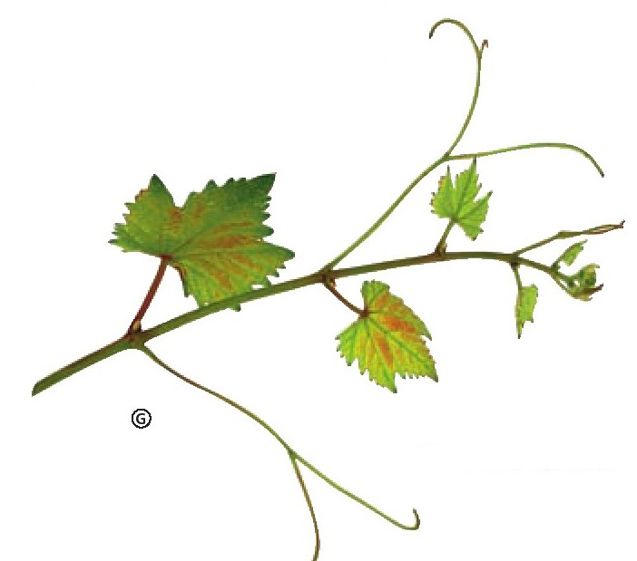
顶端有吸盘的爬山虎卷须

  

**【微博士】**爬山虎的吸附力

如果模仿爬山虎吸盘结构，仿生制作成一只“手掌”，根据保守的估计，一根手指尖（表面积大约为1平方厘米）的吸附力能承受100千克左右的重物，超过一个成人的体重！而这种仿生材料做成一个完整的手掌后，全部吸附力竟然能够承受一头重达20吨的抹香鲸！

## 为什么草莓是“会爬的水果”

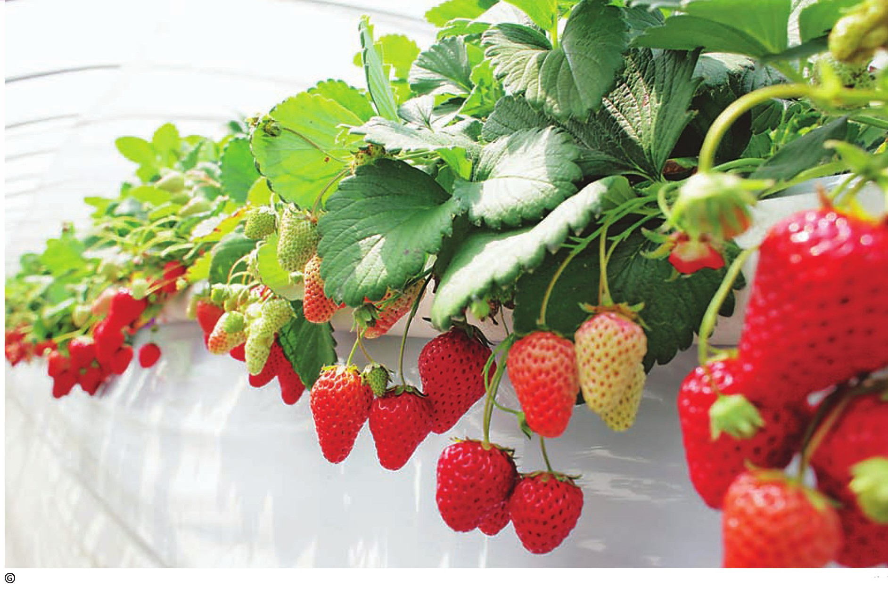
草莓

草莓是一种春天收获的水果，它与别的果树大不相同，没有高大笔直的树干枝条，属于貌不惊人、匍匐在地的小草。在自然的野外环境中，它每到5月份就开始结出一个个拇指大小的红果子，鲜艳可爱、甜美多汁，成为很多人的最爱。

栽种过草莓的人都知道，在阳光充足、疏水性好的土壤中栽培，每两株草莓可以保持足够的空间距离，彼此之间甚至可以相距半米多，看上去稀稀拉拉的，但是到了第二、第三年，地面就完全被草莓的绿叶覆盖。这是因为草莓具有会爬行的匍匐茎，能一边在地面上爬行，一边不停地长出不定根，不定根又能自己深入到土壤中，并且很快再扎根萌发出新的植物体。就这样，草莓依靠匍匐茎的“爬行繁殖”，很快会一株变两株、两株变四株……

草莓的匍匐茎实际上是一类变态茎，植物学给它的定义是：茎细长柔弱，平卧地面，蔓延生长，一般节间较长，节上能生不定根。除了草莓之外，具有匍匐茎的植物还有不少，例如红薯、蛇莓、吊兰等。（冯彦淇　杜盼华）

  

**【微博士】**草莓的种子

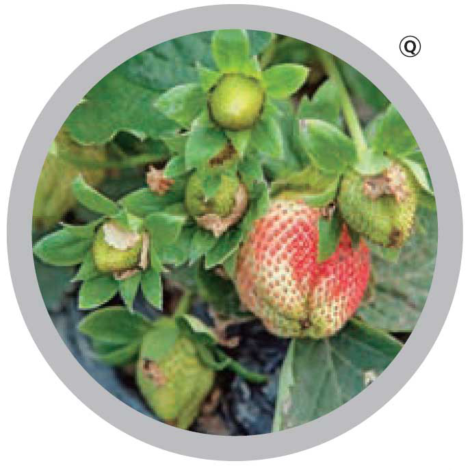
我们平时吃的草莓果实际上是由许多小果实聚在一块形成的，在它表面一粒粒的小麻点（很像芝麻，但是比芝麻更小），则是暴露在外的小种子。

**【微博士】**缠绕茎

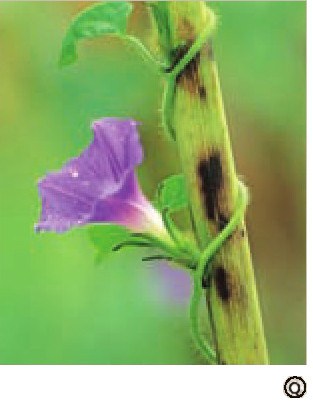
这是一类柔软的、不能直立的茎。虽然没有卷须、吸盘等特殊的附属结构，但它们的茎却有沿着其他物体呈螺旋状缠绕的本领，故称为缠绕茎。缠绕茎在幼小时期较为柔软，不能直立，依靠茎干缠绕于支持物上，才能不断向上生长，才能争夺到足够的阳光，才能保证枝叶生长良好。缠绕茎植物如离开支持物则会倒伏地面，无法正常生长。

【微问题】爬山虎的吸盘是茎的一部分吗？

【关键词】爬山虎　草莓　匍匐茎　缠绕茎

## 荷叶上的水滴为什么会变成“珍珠”

荷是生活在浅水中的观赏植物，也是具有应用价值的经济植物。它除了雍容端庄的花朵之外，叶片的美丽一点也不逊色于荷花。荷叶的叶柄很长，将叶片托出水面，好像一顶顶撑开的绿伞，给湖光山色带来一道道美丽的风景线。

说起荷叶，很多人都会注意到这样一个现象：当雨后天晴时，荷叶上的雨水总是形成一颗颗圆滚滚的水珠，好像一粒粒晶莹闪亮的珍珠在碧绿的翡翠盘中滚动。为什么水滴落在了荷叶上就变得那么美丽动人？通常的解释是，荷叶的表面有一层非常细密的柔毛，使落下来的水珠不容易散开。其实，将荷叶放到显微镜下观察后就能发现，荷叶的表面并不平滑，上面具有很多乳突结构，而且还具有一层蜡质。这两种特性的同时作用，使荷叶叶面具有极强的疏水性，洒在叶面上的水会自动聚集成水珠，水珠的滚动还会把落在叶面上的尘土污泥粘吸滚出叶面，使叶面始终保持干净，这就是著名的“荷叶自洁效应”。

科学家在进一步研究荷叶的微观结构时发现，荷叶表面除了含有蜡质成分，“荷叶效应”的产生与荷叶的两种结构有关，一种是微米级的凸起，一种是纳米级的毛状结构。含有两种结构的荷叶，水在荷叶表面的接触角为142°。如果荷叶只含有微米结构，则接触角为126°；或者荷叶仅仅含蜡质表面，则接触角为74°。科学家认为，由于荷叶有了纳米级的毛状结构，使水在叶面的接触角增加，也就是使荷叶表面的疏水性增加，而这两种结构才是产生“荷叶效应”的主要成因。

其实，类似于具有这种自洁效应的表面超微纳米结构，不仅存在于荷叶中，也普遍存在于其他植物中。它不仅有利于自洁，还有利于防止大量飘浮在大气中的有害细菌和真菌对植物的侵害。自洁效应甚至还存在于很多动物身上。例如遇到下雨，人的头发，或者猫狗身上的毛，很容易被雨水打湿，而鸭子身上的毛就不会被打湿，甚至身上被浇了水，只要一扑腾，水就被抖光了。这也是因为水在人的头发或者猫狗毛上的接触角很小，而在鸭子羽毛上的就很大。（余千里）

荷叶上的水珠

  

**【微博士】**荷叶效应

仿生学家认为，“荷叶效应”可以作为一个很好的仿生模型，在很多领域中具有广泛的应用价值。例如：如果使用具有荷叶效应的涂料，能给建筑物表面的清洁带来巨大方便；如果人们把植物的这种结构和成分用于纺织品，就有望制成能防水的民用或军用的织物和衣服。

## 王莲的叶片上为什么能载小孩

如果说植物界中谁的叶片最大，王莲的巨叶应该当之无愧。王莲是原产于南美洲热带地区的水生植物，全身上下最引人注目的部分就是它的叶片，真是大极了，每一片都像一张大型的圆桌面。它的叶子还有一条往上卷起的边，在四周围成一圈，如同一只巨大的浅底圆盘漂浮在水面上。更令人惊讶的是，王莲的巨叶竟然能像小船一样，一个孩子坐在叶面上，就像一只青蛙蹲在荷叶上那样安全，根本不会沉入水下。

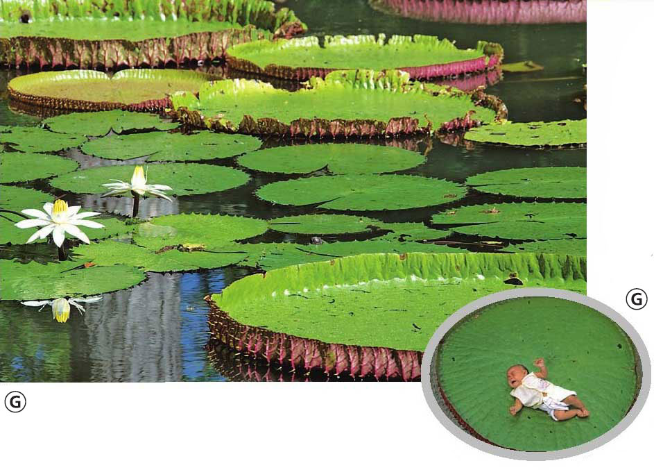
王莲

王莲的叶片为什么具有如此支撑力？大叶片与水面接触的面积大，产生的浮力当然也大。而且，王莲叶片四周向上卷起边，就像小船边上的船帮一样，大大增加了排水体积，根据阿基米德定律“浸在液体（或气体）里的物体受到向上的浮力作用，浮力的大小等于被该物体排开的液体的重力”，它的浮力等于成倍增加了。除此以外，在王莲叶片上还能发现很多小窝，里面充满了空气，这也是导致它产生巨大浮力的因素。

也许有人会提出，仅仅依靠浮力是不能够安全载重一个小孩的，因为叶片通常是植物体中较为柔软的部分，如果在某一局部支撑重物，叶片很容易发生变形，会导致浮力锐减，而实际上王莲的叶片结构却弥补了这一缺陷。如果仔细观察它的叶片，在叶片背面会见到很多粗大的叶脉，就像混凝土建筑材料中的钢筋，即使在某一局部受到较大重力，也不会轻易折断。从物理学的角度看，王莲叶片内的这种支撑结构非常符合力学原理。科学家对王莲叶片还进行了专门的测试，一张直径1.2米的王莲叶片能承重20～30千克重量，已经超出了一个小孩的体重。（余千里）

## 文竹的叶片在哪里

文竹是一种著名的观赏植物，很多人这样形容它：“文竹之美在于叶，如一片片轻柔飘逸的绿色之云……”其实，我们见到的文竹并非是它的叶片，而是它的茎枝。文竹最下面、最中间、最粗的部分，是它的主茎，主茎上面分出较细的枝条，然后再分出更小枝条，最小的细枝几乎和头发丝那样细。许许多多大小不一的枝条集合在一起，看上去就像一片片秀丽摇曳的叶片了。

既然文竹所有的部分都是茎，那么它的叶子又在哪儿呢？原来，文竹的叶子已经退化成一片片白色的小鳞片，只有芝麻般大小，有点像梳头时落下的头皮屑，在每个细枝条丛中都有一片，不注意的话根本看不见。由于文竹的叶子已经失去了绿色，里面也没有叶绿素，当然也就失去了光合作用的功能。但是，在文竹的茎和枝条内却有叶绿素，所以，文竹是依靠绿色的茎来进行光合作用的。（余千里）

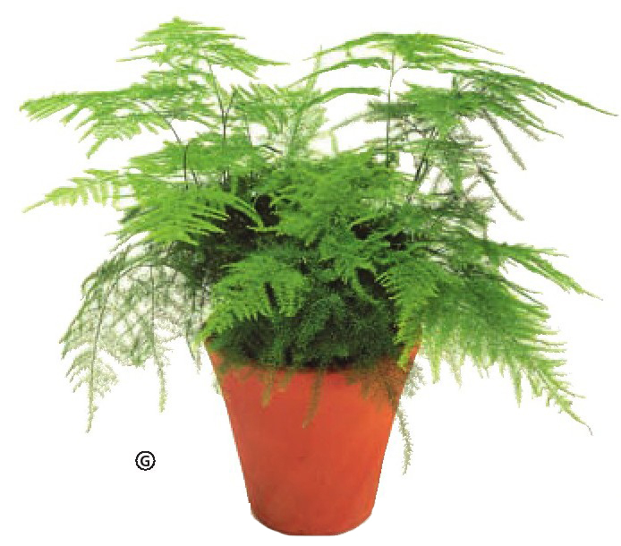
文竹

  

**【微博士】**王莲的叶脉构造

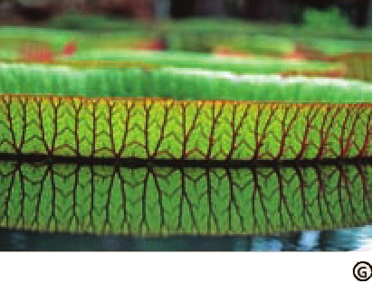
王莲叶片的巧妙结构，让世界上富有才华的建筑师都惊叹不已。据说19世纪英国有个叫约瑟的建筑师就是在仔细观察了王莲的叶脉构造以后，从中得到启示，完成了一个展览大厅的设计，工程竣工后，屋顶明亮雄伟，被誉为“水晶宫殿”。

【微问题】王莲的叶片像小船，下暴雨时，过多的雨水是怎样从叶面上排泄出去的？

【关键词】荷叶效应　王莲　文竹

## 形态各异的花是如何形成的

我们经常能见到许多颜色鲜艳、形态各异的鲜花，它们是自然界最美丽的产物，也是人们最常用来表达情感和观赏的装饰性植物。从外到内，每朵花通常都只含有萼片、花瓣、雄蕊和雌蕊四轮花器官。但是，正是这四轮花器官颜色和形状的千变万化，以及不同的组合方式，造就了大自然千姿百态、姹紫嫣红的花朵。那么，这些美丽的鲜花是怎么形成的呢？直到20世纪80年代，随着现代分子生物学和分子遗传学在植物科学研究领域的飞速发展，控制植物花发育的分子机制研究才取得突破性的进展。

在拟南芥和金鱼草等模式植物花发育异常突变体的研究中，人们发现了三类影响花器官属性发生改变的同源异型突变体，每一类突变体都会影响相邻两轮花器官的发育。第一类突变体主要影响第一、二轮花器官的发育，第一轮中的萼片转变为心皮，第二轮中的花瓣转变为雄蕊；第二类突变体主要影响第二、三轮花器官的发育，第二轮中的花瓣转变为萼片，第三轮中的雄蕊转变为心皮；第三类突变体主要影响第三、四轮花器官的发育，第三轮中的雄蕊转变为花瓣，第四轮中的心皮转变为一朵新的突变体花，而且新花的器官继续向内分化不能正常终止，形成花中有花的异常结构。

这三类突变体提示存在A、B、C三类功能基因，它们分别控制相邻两轮花器官的发育，每一轮花器官都由一类或两类功能基因控制，并在此基础上总结出控制花器官发育的ABC模型，该模型成功解释了花器官属性决定的分子机制。A功能基因主要控制第一、二轮花器官的发育，当A功能基因突变时，第一轮的萼片（花萼）转变为心皮（雌蕊），第二轮的花瓣转变为雄蕊；B功能基因主要作用于第二、三轮花器官的发育，B功能基因缺失后，第二轮的花瓣转变为萼片，第三轮的雄蕊转变为心皮；C功能基因则参与调控第三、四轮花器官的发育，当C功能基因缺失，第三轮的雄蕊转变为花瓣，第四轮的心皮转变为萼片。

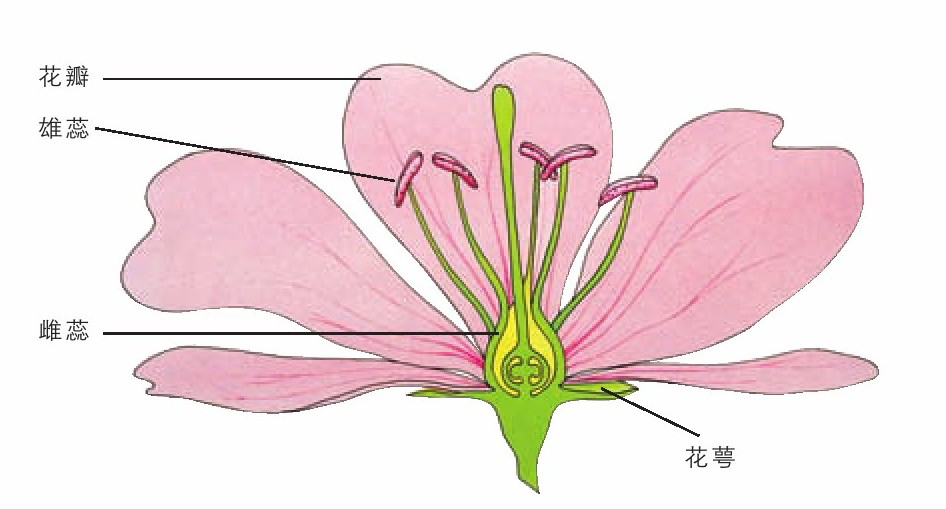

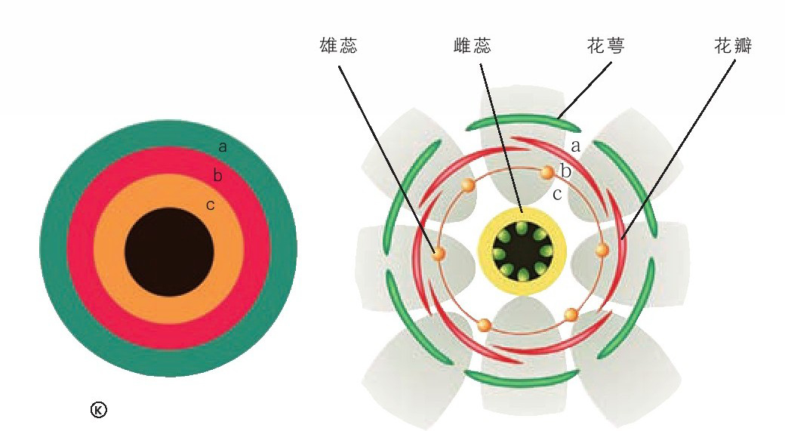
花发育的基因控制

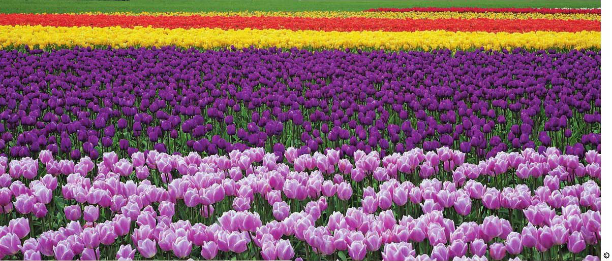
所以，第一轮花器官中，A功能基因单独起作用，决定了萼片的属性；第二轮花器官中，A和B功能基因共同作用，决定了花瓣的属性；第三轮花器官中，B和C功能基因共同作用，决定了雄蕊的属性；而在第四轮花器官中，C功能基因单独作用，在决定心皮属性的同时也终止花器官的继续分化。进一步的分析表明，A功能和C功能基因的作用区域是相互拮抗的：当A功能基因缺失时，C功能基因异位到第一、二轮花器官中起作用；而当C功能基因缺失时，A功能基因则会异位到第三、四轮花器官中起作用。而A功能和C功能都缺失时，第一、四轮器花官类似于茎生叶，第二、三轮花器官类似花瓣与雄蕊的嵌合物，说明B功能的作用区域是可以独立于A功能和C功能而存在的。

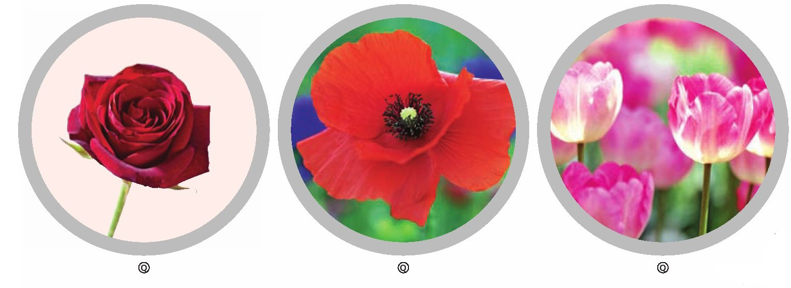
随后，还鉴定出一类新的E功能基因，它们可以与A、B、C功能基因一起协调控制四轮花器官的发育，并将ABC模型修正为ABCE“四重奏模型”。同时组成型表达A、B、C、E功能基因时，就可以把叶片转变为花器官。（杨军）

  

**【微博士】**单瓣花和重瓣花

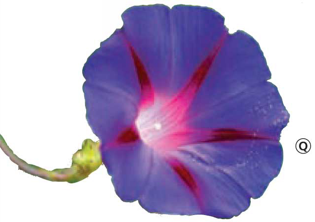
单瓣花

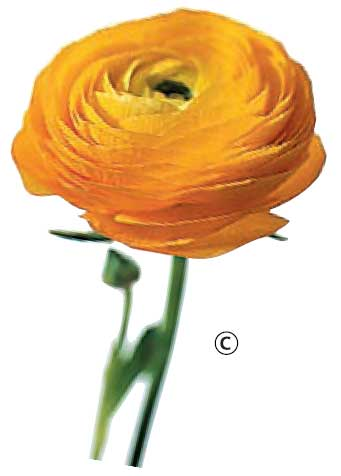
重瓣花

通常来说，大部分植物的花都只有一层花瓣，这些花称为单瓣花。但有植物的花有很多层花瓣，这些花称为重瓣花，如部分睡莲、山茶花和樱花等都可以发育出多层花瓣。重瓣花很可能是控制花发育C功能基因的突变体，按照ABC模型，C功能基因的突变导致第三轮的雄蕊和第四轮的雌蕊等组织发育成花瓣状的结构，这也是重瓣花形成的一种主要原因。重瓣花一般都有可遗传的性状，在后代中可以继续保持重瓣花的表型。重瓣花不仅具有非常高的经济价值，而且也是目前观赏花卉育种的一个主要目标性状。

**【微博士】**花的对称性

植物的花型与植物的繁衍方式密切相关，植物在进化过程中产生的独特花型通常决定其自交或异交。植物学上常用对称性的概念考察和研究植物的花型。可以依据对称性把高等植物的花型归纳为三种基本类型：多对称性花（如牵牛花，属于辐射对称花，具有多个对称面）、单对称性花（如豆科植物的花，属于两侧对称花，只有一个对称面）和无对称性花（如缬草，没有任何对称面）。两侧对称花型一般与昆虫传粉有关，是植物与昆虫协同进化的产物。两侧对称花型被认为是从辐射对称花型的祖先多次独立进化而来的，通常表现为花发育的背腹不对称和花器官平面内部不对称。

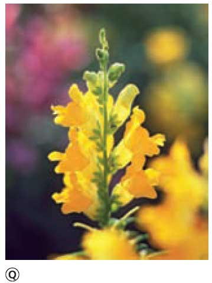
单对称花

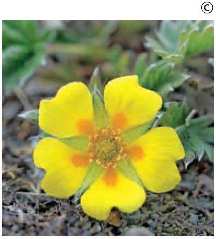
多对称花

**【实验场】**观察不同类型的花

周末或节假日，同学们可以去植物园认识和了解各种不同类型的花。在植物园中，花的旁边通常都会有一个标志牌，上面有该植物的中文名称、拉丁学名，以及一些简单的介绍。同学们有兴趣的话，可以仔细观察各种花朵的四轮花器官的数目、形状和颜色的差异，并观察它们是否有花器官的变异，花瓣是一层还是多层，以及花朵是否有对称性，最后，再通过网络或书本查找相关的知识，进一步拓展自己对该花的了解。

【微问题】牡丹花属于哪一类对称性花，多对称、单对称还是不对称？

【关键词】ABC模型　功能基因　花的对称

## 花都有花瓣吗

无论是花园中色彩鲜艳的郁金香，还是花瓶中浓香四溢的百合，或者是雍容华贵的牡丹花，最吸引人的无外乎是它们的花瓣了。那么，花瓣是不是每种花都要必备的？尤其是某些既不芬芳也不鲜艳的花朵有没有花瓣呢？

郁金香

最典型的例子是柳树和杨树的花，如果你把它们拿到放大镜下观察就会发现，怎么也找不到我们熟悉的花瓣。没错！因为它们根本就没有花瓣！杨树和柳树的花，只有几根释放花粉的雄蕊，或者是一根孤零零的雌蕊。前者是制造精子（花粉）的场所，而后者则是接受花粉的场所，下面连接含有卵子的子房。只要精子和卵子能顺利结合，就可以完成植物的生殖。如此看来，花瓣并不是花必备的结构。那么，花瓣究竟有什么作用，为什么有的花朵会将它摒弃呢？

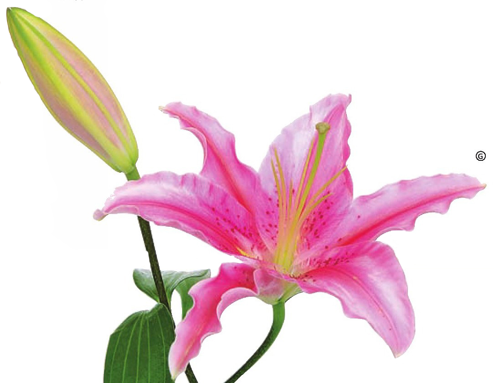
百合

简单地说，花就是植物繁育后代的场所，在这里精子和卵子相遇、结合，最终成为果实和种子，但是，这个过程并非如此简单。不管是什么种类的植物都需要一个供精子和卵子发育的场所，相对于种子来说，精子和卵子更为脆弱，只要遇到稍大幅度的温度变化，稍强的辐射、触碰、挤压，都有可能影响其正常发育。所以，最好有一个安全的育儿室。最初，藻类植物、苔藓植物和蕨类植物产生精子和卵子的器官都是生长在叶片上，对外界环境变化有较强的抗性；而像郁金香、百合这样的被子植物，它们的花粉发育需要更苛刻更稳定的条件，需要一些特殊的“叶片”将产生精子和卵子的器官包裹起来，这些“叶片”也就成了花瓣。

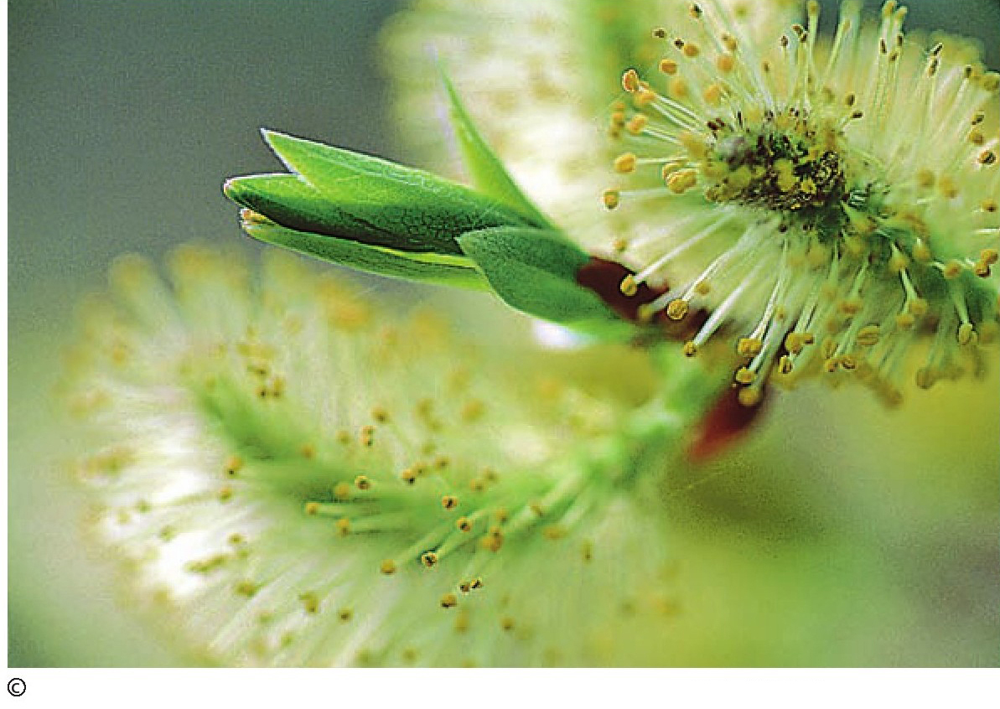
没有花瓣的花

至于像杨树、柳树这样的花朵个头都非常小，通常被“扎”在一起形成一个集体——花序，在它们的发育过程中，会有一个“大花瓣”——苞片，将整个花序包起来，如此一来也可以达到保护雌蕊和雄蕊的效果。

当然，很多植物的花瓣不仅仅是保护装置那么简单，它们会承担起更多的责任。比如，吸引昆虫来传播花粉，也是大多数鲜艳的花瓣在做的工作。有的花瓣会保留很长时间，保护小果实健康成长，扁豆等豆科植物的花就是这样的。

至于那些摒弃花瓣的花朵，是因为找到了花瓣的替代物，或者是不需要花瓣的帮助，就直接把花瓣给“解雇”了。（史军）

## 无花果的花在什么地方

之所以叫无花果，是因为它未能展现美丽的花瓣，甚至连一丝花香都没有。不过，这并不妨碍它们在一段时间后变得果实累累。熟悉无花果的人都知道，在春天它的枝头慢慢多出了一个个绿色的小果子，慢慢长大，再慢慢变成紫色或者黄色，成为很多人爱吃的香甜美味的果实。有趣的是，这些肉乎乎的“果子”内部竟然有无数朵小花！

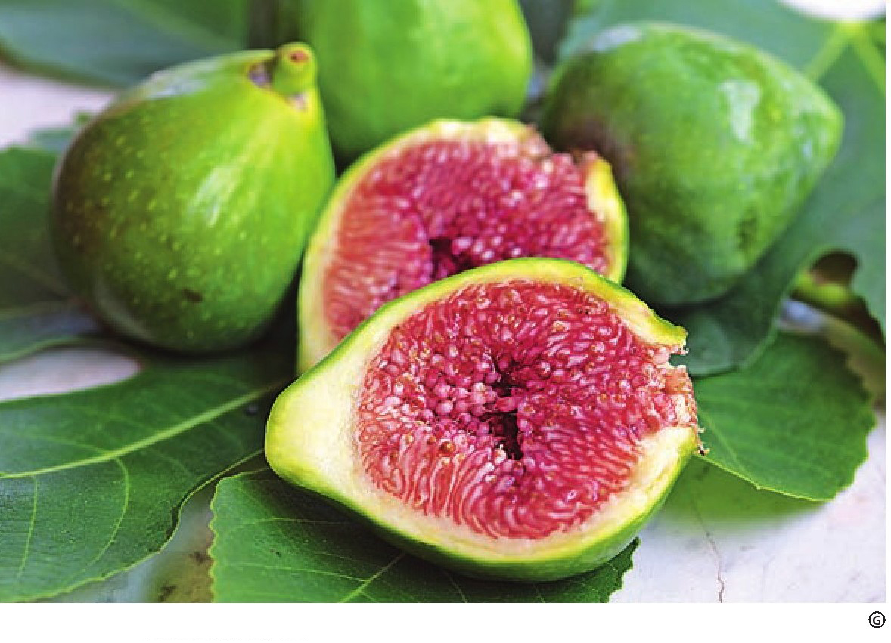
无花果花序剖面图

如果你仔细观察，会发现这些“水果”的顶端都有一个很小的孔（供传播花粉的榕小蜂进出的通道）。摘两个青涩的无花果切开，就能看到这个孔直达果实内部，并且整个“果子”的内部是完全中空的。果子里面有白色的小圆球，如果幸运的话，在一些果子的出口处能看到带有粉末的细丝。实际上，一直被我们当作无花果果肉的部分，是一个被称为花序托或者果序托的结构，那些白色的小球是它们的雌花（只产生胚珠），粉末细丝是它们的雄花（只产生花粉），而“小芝麻”才是无花果真正的种子。

由于无花果的小花都被包裹起来，而且生长期很短，能观察到雄花的时间只有1星期左右，所以一直未被世人了解。直到20世纪50年代，科学家注意到一种在无花果上逛来逛去，并为它们传播花粉的榕小蜂，才最终搞清楚无花果的开花和发育过程。（史军）

## 鲜艳的圣诞红，是真花瓣还是假花瓣

很多人都认为，圣诞红顶部那特别鲜艳夺目的部分是它的花瓣。其实，那可不是真正的花瓣，而是一些变了颜色的叶片。如果你仔细观察就会发现，它们的形状、大小甚至纹理都与同一枝条上的叶片一模一样，但它们的作用与花瓣一样，都是为了吸引昆虫传粉。圣诞红的花朵其实很小，它们借用了少数几片变色的苞叶，起到了花瓣的作用，经济而又实用。用最少的代价办最多的事，这也是自然界最重要的法则之一。

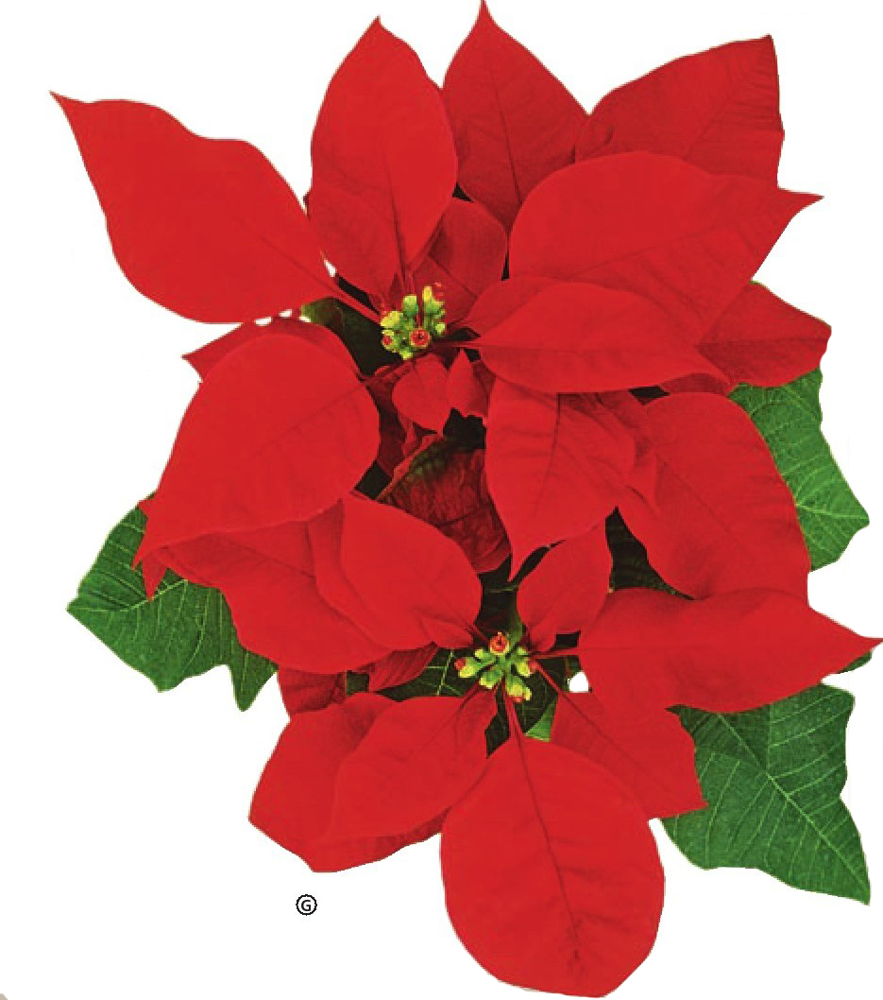
圣诞红

不过，有些花序的苞片不甘寂寞，还干起了兼职工作。最具代表性的就是马蹄莲等天南星科植物，它们的总苞卷成了一个大花瓣，不仅可以为里面的小花朵遮风挡雨，还可以招揽传粉昆虫。另外，不少天南星科植物卷成桶状的总苞还可以保持温度的恒定，一方面为花朵发育提供了适宜条件，另一方面还能吸引那些怕冷的小昆虫前来御寒。当它们把这里当作“旅馆”的时候，身上就会蹭上花粉，在下一个夜晚到其他花朵上投宿时，顺便把花粉带过去，为“房东”完成传播花粉的重任。（史军）

  

**【实验场】**

除了圣诞红和马蹄莲，我们身边还有很多长着假花瓣的植物，大家可以去寻找观察。例如，观赏花卉中常见的三角梅、红掌、玉叶金花等，看看它们是哪一部分变成了花瓣？

**【微博士】**榕小蜂

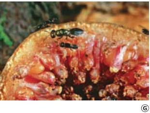
在我们喜欢吃的无花果里面，可能有数不清的虫子，你能想象吗？的确，一个无花果里面可能有成百上千只榕小蜂！特别是雄性榕小蜂从来都不离开这些果实。

【微问题】有没有既无真花瓣也无假花瓣的植物花朵？

【关键词】圣诞红　马蹄莲　无花果

## 为什么雪松那么“浪费”花粉

每年秋末的雪松林旁土地，都会被染成一片黄色。那可不是洒在地面的黄色涂料粉末，而是雪松散播出来的花粉。那么多的花粉，白白浪费难道不可惜吗？答案是不可惜，因为它的花粉传播媒介是风。

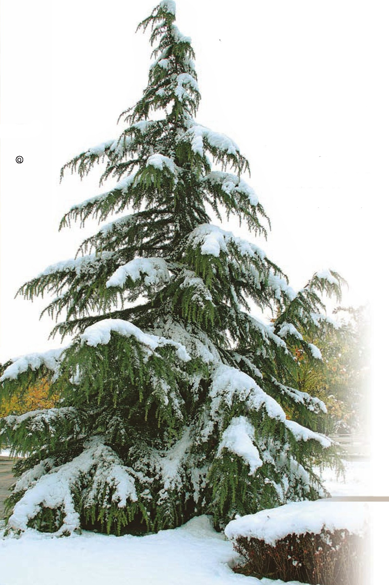
雪松

我们知道，植物要传宗接代，就必须把花粉从一朵花的雄蕊送到另一朵花的柱头上，受精后才能产生种子。裸子植物（松树、柏树等）和部分被子植物（杨树、柳树等）依靠风来传播花粉。为了提高抵达目标的效率，风媒花的花粉通常都具有两大特点：一是让自身轻一些，二是数量多一些。例如雪松的花粉上具有小气囊状的结构，能够飞得更为轻盈，到达更远的地方。一般来说，风媒植物都会生成数量巨大的花粉，希望散发出去的成千上万花粉中，有一粒能够到达雌花的柱头上。虽然这样做要耗费很多能量，但为了保证成功率，也只能出此下策了。当然，雌花为了捕捉这些花粉，在柱头处会分泌有黏性的物质，只要有花粉从身旁经过，就会一把“抓住”。尽管风媒花为了传粉做了充分准备，但风力并非完全顺着花粉的心意，最终能到达目的地的花粉寥寥无几。

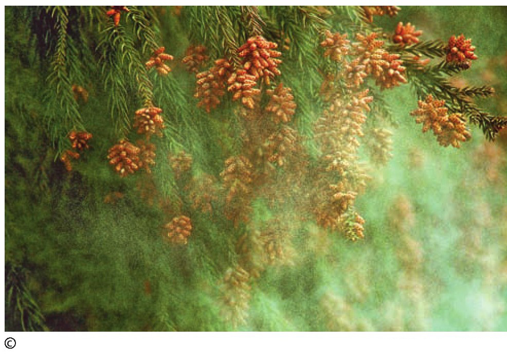
雪松散出大量的花粉

除了借助风力传播花粉，很多水生植物实际上是借助水流来传播的。比如苦草，它虽然长得像水藻，却是货真价实的被子植物。这种植物在开花时，会把花朵伸出水面，散落的花粉就开始随波逐流，一旦漂到花朵的柱头上成功授粉之后，就马上沉到水下繁育种子了。（史军）

## 昆虫和花朵是在公平交易吗

蜜蜂要采蜜，花朵要传粉，这似乎是一个很平和很美好的协作。然而事实并非如此，争夺花粉是植物与昆虫“战争”的核心，如同《变形金刚》中争夺的能量块。花朵和传粉者都有自己的小九九，“战争”自然一触即发。

最原始的甲虫传粉者，收集花粉的效率比较低，胃口也比较大。所以，像木兰这样依靠甲虫传粉的植物只有生产大量的花粉，填饱甲虫的肚皮，额外的花粉就会被送到柱头上去了。虽然花粉有所损失，但与风力传粉相比，还是节约了不少“成本”。很快，像蜜蜂这样携带高效的“花粉收割机”的昆虫出现了，它们不仅要吃，还要把花粉搬回家。蜜蜂后腿上专门配置了一个承载花粉的“花粉篮”，为了让花粉保鲜以供长期使用，蜜蜂还在这些“篮子”中抹上了抑制花粉萌发的物质。如此一来，进入“花粉篮”的花粉就等于被判了“死刑”，在这一回合中，花朵损失惨重。无奈之下，一些花朵（如姜花、凤仙花等）开始调整雄蕊的位置，尽量把花粉抹在蜜蜂的背部、胸部那些不容易被触及的地方，同时拿出点花蜜作为诱饵，使一些传粉者心甘情愿地为它们传播花粉。

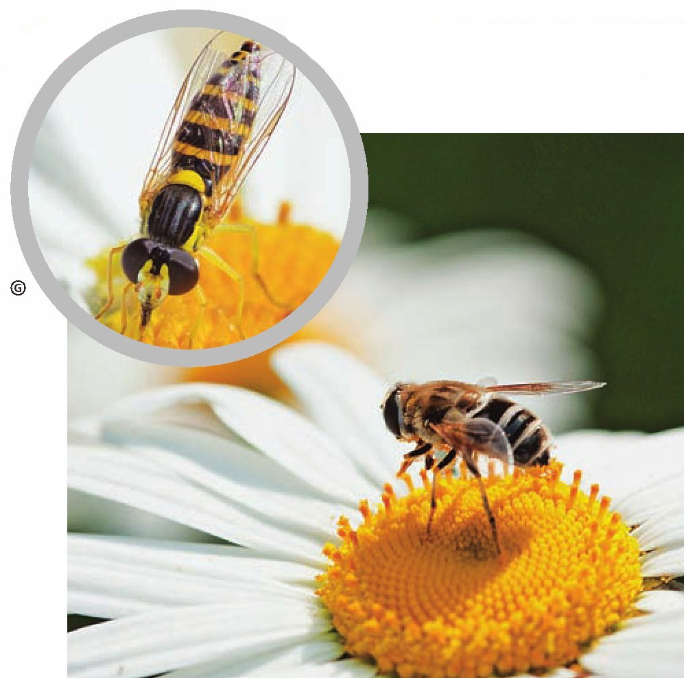
不过，这种和谐并没有维持多久。一般来说，花蜜被放置在花瓣基部，昆虫从花朵入口探身吸蜜时，花粉就被抹在它们的身上。但也有些“奸诈”的昆虫不从“大门”进去吸蜜，而是在花瓣基部开个小洞就开始畅饮花蜜，这样就不用去背那些累赘的花粉，落得一身轻松。（史军）

## 花朵怎样“诱骗”昆虫传粉

有些花朵没有花蜜，但是又需要昆虫来帮助传粉，就会采用各种各样的“诱骗”手段让昆虫义务打工。例如兰花家族的成员——蕙兰，唇瓣上长有被称为“蜜导”的深色斑点，仿佛是在告诉传粉者“此处有花蜜，请来为我传粉”。虽然蕙兰花中空空如也，却因为有了“蜜导”斑点的诱骗，使蜜蜂不辨真假地钻入蕙兰花中，结果花蜜没有吃到，反而成为无偿传粉使者了。

有些花朵还会利用昆虫爱子心切的弱点来蒙骗它们，例如大王花。这些模拟腐肉气味的花朵会吸引蝇类昆虫纷至沓来。不过，兴冲冲前来的昆虫，不仅品尝不到美味，还会被关进“监牢”，直到花粉成熟才会被释放出来。这时，又有新开放的大王花在等待这些背着花粉的虫子了。

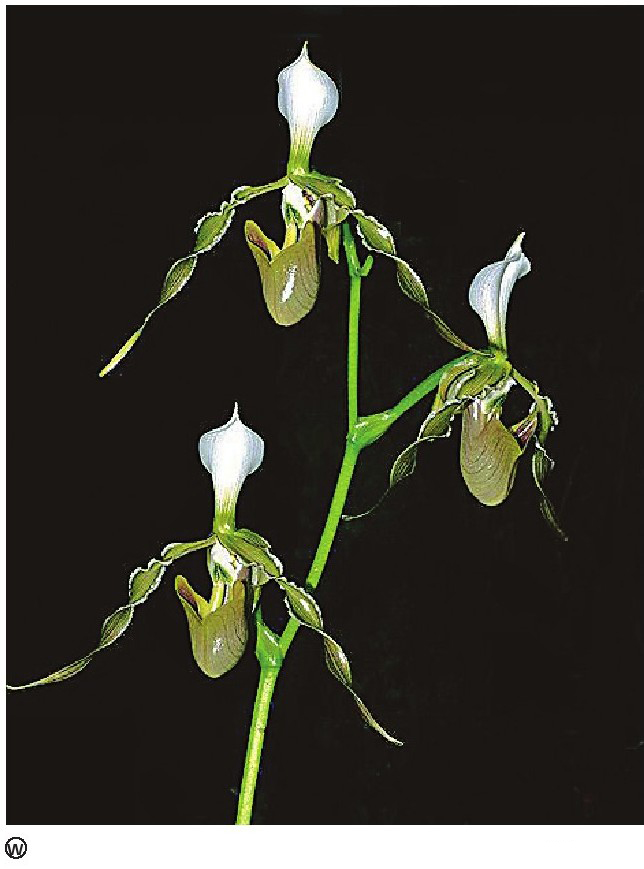
长瓣兜兰

长瓣兜兰的虚假育婴室更显狡诈，欺骗的对象是黑带食蚜蝇。黑带食蚜蝇的幼虫以蚜虫为食，但却没有远距离移动的能力。所以，雌性黑带食蚜蝇一般会将卵产在蚜虫的附近，这样食蚜蝇幼虫一出世就有充足的食物。长瓣兜兰在模拟繁殖场所上做足了文章，它的花瓣基部长了很多黑栗色的小突起，这些小突起很像蚜虫，甚至可以说模拟得惟妙惟肖。这样一来，急于产卵的雌性食蚜蝇就会被这些假蚜虫吸引来，落入长瓣兜兰精心设计的陷阱，在产卵的同时替兰花完成了传粉。（史军）

  

**【微博士】**自花授粉

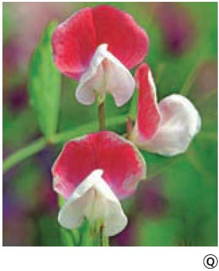
有些花朵能够进行自花授粉。例如豌豆花在开放之前，柱头上已经满满地涂上了花粉。更奇特的是，一种叫大花槽舌兰的植物，它的花粉块有个会伸长的脚（花粉块柄）。在花朵开放后，这个“脚”会一直伸长，把花粉块送到柱头腔中。这些虫媒传粉的花朵之所以有如此奇特的构造，有可能与它们所在区域缺乏传粉昆虫有关。

【微问题】花粉的寿命有多长？

【关键词】风媒花　虫媒花　花粉

## 为什么说果实是种子的“保护神”

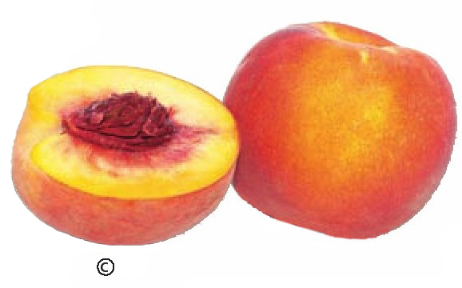
秋天，是大多数植物结出果实的季节。植物开花之后，经过传粉受精，由雌蕊的子房部分发育膨大，形成了果实的雏形。果实的外表通常有果皮包裹，在果皮里面，则是用来传宗接代的种子。有人曾经形象地比喻说：“如果把整株植物看成是一幢大厦，那么果实就像专门用来孕育新生儿的产房。”

以桃子为例，它那层毛茸茸的、薄薄的外皮是外果皮，里面那层甜美多汁的肥厚果肉是中果皮，再往里就是桃核了。千万别以为桃核就是种子，其实桃核外面那层坚硬的外壳只是果实的一部分，植物学专业名称叫内果皮。打开桃核，里面的桃仁才是真正的种子。它好像襁褓内的婴儿那样，显得娇小而又脆弱，很容易受到损伤，但外面有坚硬的内果皮保护，种子身居内室，既安全宽敞，又温暖湿润。

不仅如此，为了保证种子在里面正常生长，果实还要为它提供足够的营养物质。虽然果实本身不会生产制造营养，但每个果实的一端都有一个果柄，连接在枝条之上。果柄就像一根输送营养的哺乳管，源源不断地把茎枝里的水分和营养物质送入到果实内部，哺育着种子，让它发育成长。

其实，果实不仅保护种子的安全，为种子提供营养，还为种子的传播起到了重要作用。例如桃子、苹果、樱桃等植物，外果皮的鲜艳色彩、中果皮的甘甜多汁，都是为了引诱动物前来吞食，而坚硬的内果皮又保护种子不会在动物体内被消化。在果实的引诱和保护之下，内部藏着的种子随着动物的活动被传播到四面八方，并随着动物的粪便被排放出来，在异乡萌发出新的植株。同样，有些果实的外表长出钩钩刺刺，能粘在动物皮毛上，借助动物将种子传播到远方。还有些果实会长出翅膀或绒毛，使种子能够随风飘扬到四面八方。（王生清）

## 种子里面有什么秘密

种子是植物传宗接代的繁殖器官，由胚、胚乳和种皮三部分组成。其中，胚是种子萌发成长的“命根子”，它就像母亲肚子里面的胎儿，已经具备新生植物的雏形。而胚乳就像种子的营养仓库，它为胚的成长提供必需的营养物质。有些种子里面虽然没有胚乳，但它有和胚乳功能相似的子叶作为替代。例如，将蚕豆的种皮剥开后，就会见到两片肥厚的豆瓣，那就是蚕豆的子叶，负责为种子萌发输送营养。

种子最外面的部分是种皮，它像衣服那样，把种子紧紧包裹起来，主要起保护作用。不同植物的种皮有薄有厚，一般来说，种皮比较厚、比较坚韧的种子，对外界的抵抗力比较强，寿命也比较长。

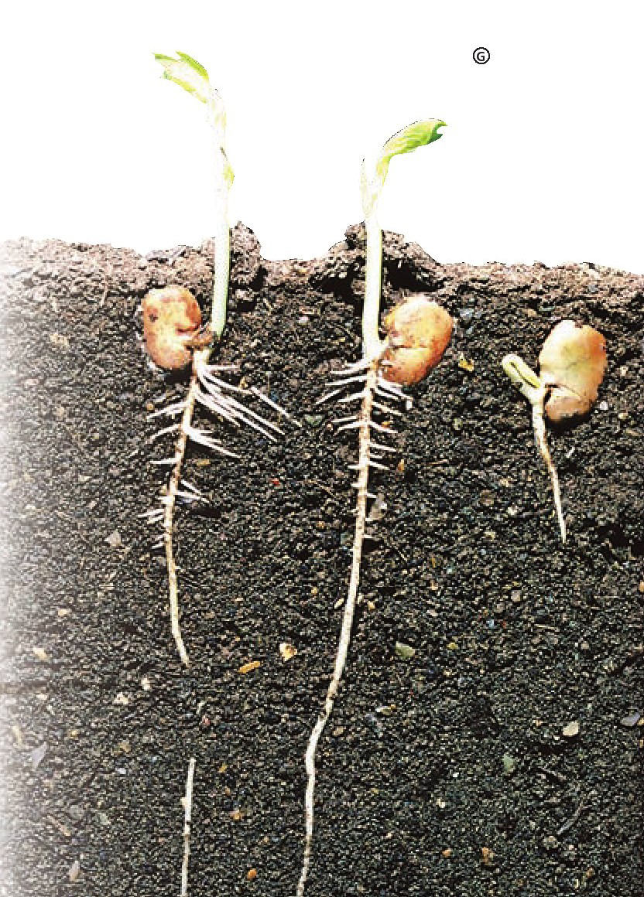
只要外界条件适宜，种子就会萌发生长。种子内部的萌发过程很有趣。起初，种子不断地吸收水分，当水分吸足之后，内部的幼胚细胞不断分裂，使幼胚越长越大。最后，强大的膨压将紧裹在外面的种皮胀破，伸出幼根和幼叶。刚刚萌发的种子，幼根朝下，幼叶向上。幼叶慢慢顶出泥土，长成一株嫩绿可爱的幼苗，开始沐浴最受植物欢迎的阳光。小生命看上去很柔弱，但它却蕴含着顽强的生命力。简单地说，种子萌发是植物的幼胚开始生长、胚根和胚芽突破种皮向外延伸的过程。当然，种子的萌发需要三个不可或缺的条件，那就是水分、温度和氧气。

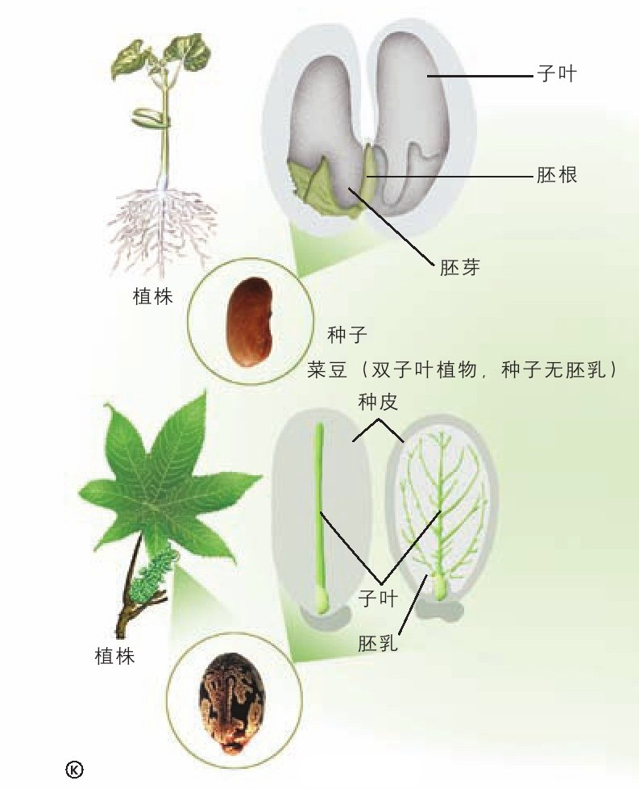
蓖麻种子

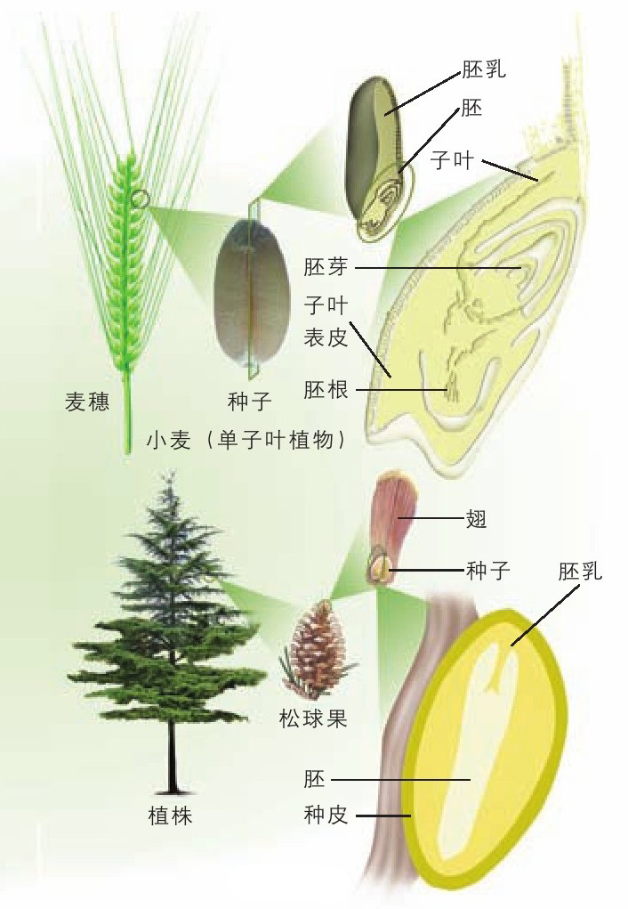
松树种子

首先是水分，种子萌发第一步需要吸收足够的水分，有的吸水量甚至超过种子自重的1倍。这时候，周围的环境温度也很重要，各种不同的种子有它自己的适宜萌发温度，例如，大多数农作物在15～20℃时能良好发芽。在萌发过程中，种子内部的呼吸作用大大增强，它们需要吸收一定量的新鲜氧气，因此，氧气也成为种子萌发过程中的一个必要条件。（王生清）

## 花生为什么要钻入地下

几乎人人都爱吃香喷喷的花生，但是，却很少有人知道它结果实过程中的一个秘密。种植过花生的人都知道，它有一个非常奇特的现象，那就是花朵开在地面上，而果实却长在地底下，这与绝大多数植物的开花结果完全两样。通常，植物开花之后，果实往往结在开花的地方，可花生却要钻入到地下结果，然后在地下正常发育成熟。

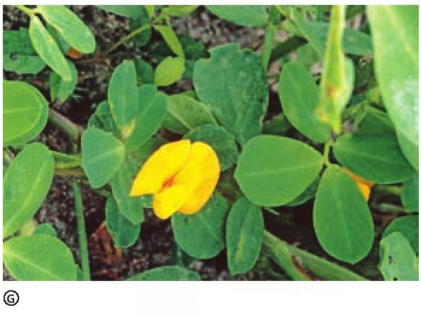
花生的地面部分

为什么花生要费尽“千辛万苦”钻到地下去呢？原来，花生在结果的过程中，必须要在没有光线的黑暗环境中进行，如果见到光亮，它就无法结出果荚中的花生仁，因此，人们给它起了一个外号叫“落花生”。由于花生有这样的怪脾气，所以特别适宜在沙质土中栽种，因为这种土壤很疏松，使花生比较容易地钻入地下。（王生清）

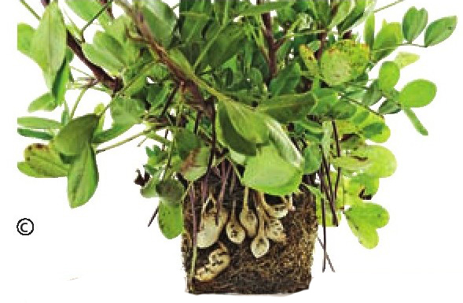
  

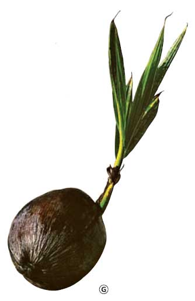
**【微博士】**种子冠军

世界上最大的种子，是一种叫海椰子的植物种子，每一个海椰子竟然达到15千克重！而有些植物的种子却小得可怜，例如班叶兰的种子，200万粒加起来才只有1克重。

【微问题】樱花和樱桃是同一种树长出来的吗？

【关键词】果实　种子　花生

## 食肉植物怎样为昆虫设下陷阱

食肉植物是植物界中的一个特殊类群，它们最大的特点就是能够捕食昆虫。由于植物不能自主运动，为了捕捉飞来飞去的昆虫，它们将自己的叶片变得千奇百怪，有的像瓶子，有的像小口袋，有的像蚌壳，还有的长满了腺毛，渐渐演变成一个个精巧的捕虫“陷阱”。

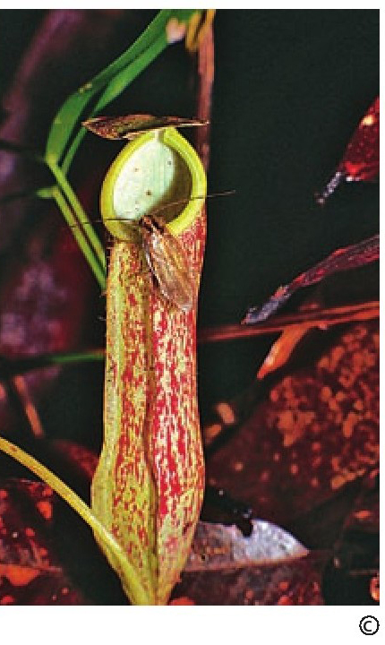
猪笼草

猪笼草是食肉植物中大名鼎鼎的成员，是一种四季常绿的小灌木。它的叶子下半部又扁又平，能进行光合作用，自己制造养料。但叶子的中部却像一根细藤，前面挂着个长长的“小瓶子”，上面还有个小盖子，乍一看，很像以前南方运猪的笼子，所以人们就给它起名叫猪笼草。

如果用放大镜仔细观察猪笼草叶片变成的“小瓶子”，就会发现“瓶盖”下面有好多蜜腺，里面能分泌出又香又甜的蜜汁，那是引诱小昆虫自投罗网的诱饵。在天空飞行的小昆虫，一旦“闻”到蜜汁的香甜味，就会忍不住飞到“小瓶子”上采蜜，结果，只要稍不留神就会从“瓶口”滑下去。由于猪笼草的“瓶子”内壁很光滑，失足落下的小昆虫一下子就滑到“瓶底”，掉入“瓶底”的液体中，这时候，进入陷阱的小昆虫无论多么能飞善跳，也不可能再逃出去了。最后，慢慢被“瓶子”底部的消化液消化掉。

还有一种常见的食肉植物毛毡苔。它是淡红色的小草，生活在沼泽地或其他潮湿的地方。毛毡苔的圆形小叶只有硬币那么大，上面长着几百根小腺毛，笔直竖立着，好像在叶片表面铺了一层毛毡。这些腺毛的顶端都有一滴“小露珠”，那是它分泌出来的黏液，黏性特别强，即使在阳光照射下也晒不干。神奇的是，腺毛上的黏液还有香味，能吸引小昆虫前来自投罗网。当小昆虫不慎落到叶片上时，黏液会将猎物粘住，而且当昆虫拼命挣扎时，附近的腺毛会主动逼近过来，像无数只小手将猎物牢牢按住。如果掉入罗网的是蚂蚁之类的小虫，几小时就能被消化掉，如果是较大的昆虫也扛不过一两天。当消化完毕后，毛毡苔的腺毛会向四周张开，让风吹走里面的昆虫残骸，并开始等待下一个“猎物”。

一只昆虫被毛毡苔捕获

水中食肉植物的捕虫叶构造更有趣，例如漂浮在水面的狸藻。它有许多细如头发丝般的叶子，叶子边长着不少卵形的小口袋，那是它专门用来捕捉水中小虫的“陷阱”。小口袋的构造很别致，有一个与外面相通的口，口上面有个向内开的小盖子，盖子上长着几根触毛。如果水中的小虫游到小口袋前面，只要轻轻一碰，盖子就会向内打开。一旦小虫随水流闯进袋子，就再也出不去了。因为，小口袋的盖子只能从外面向内打开，而不能从里面向外推开。

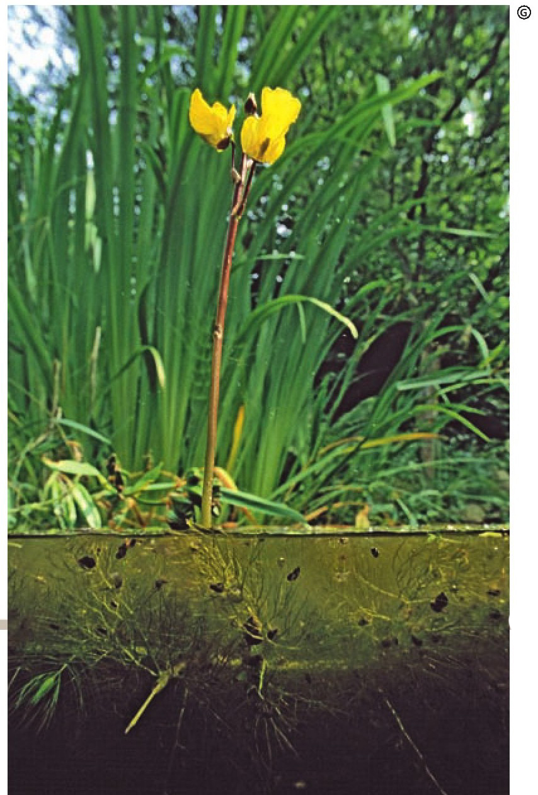
水中的狸藻

不管是在陆地还是在水中，不管是什么类型的捕虫叶，在它们设下的“陷阱”中都能分泌出各种各样的消化酶，能够将猎物的肉体消化掉。（陈荣）

## 为什么有些植物爱吃肉

我们知道，植物能进行光合作用，能够利用阳光、水和二氧化碳为自己制造“粮食”。可食肉植物为什么还要去捕捉昆虫，养成爱吃肉的习惯呢？

这个有趣的问题，同样也使科学家产生了兴趣。他们在研究食肉植物生态环境时发现，很多食肉植物的生长地都比较贫瘠，也就是说，它们常常生长在一些经常被雨水冲洗和缺少矿物质的地区，土壤中缺乏氮素养料，而氮恰恰是植物生长所必需的营养元素。有意思的是，土壤缺氮，地面之上却有取之不尽的氮素养料，原来，那儿的天空中有很多飞翔的昆虫，而所有昆虫的体内都含有丰富的氮。就是在这样特定的生态环境下，经过漫长岁月的进化，导致生长在那里的一些植物具备了捕虫习性。（陈荣）

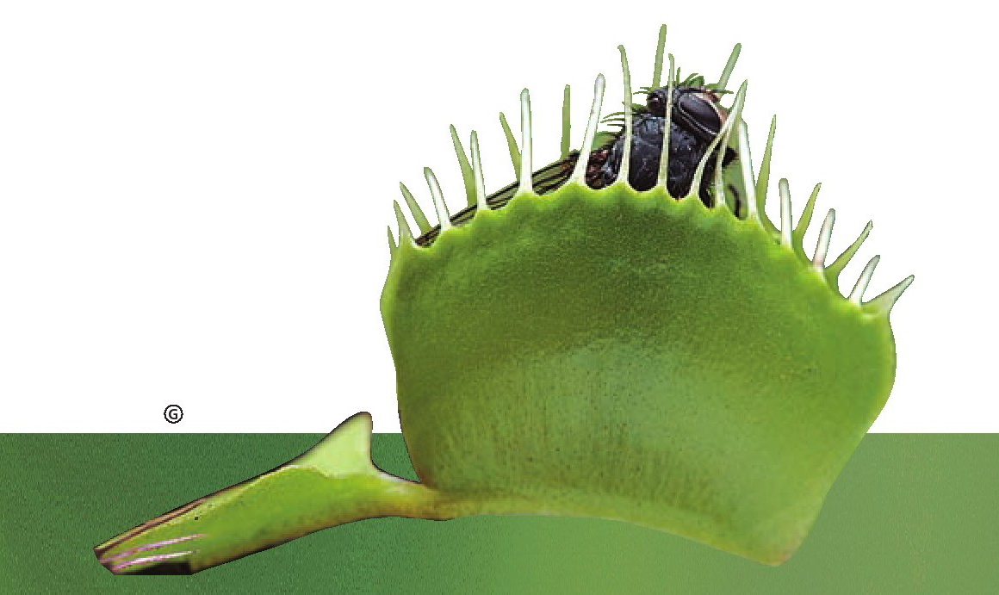
捕捉住苍蝇的瞬间

## 为什么捕蝇草能感觉到猎物中了“埋伏”

捕蝇草是一种著名的食虫植物。它的叶片很奇特，在靠近茎的部分与普通叶子差不多，但到了叶端却变得很肥厚，中间还有一条线，把叶片分为两半，就像一只半开半闭的绿色贝壳。这张模样古怪的叶片铺在地面上，可以看到上面还长着几根尖尖的感应毛，叶片边缘还有很多齿牙。捕蝇草叶片可以随意开闭，只要有昆虫飞来触动了感应毛，两瓣叶片会马上合拢，边缘的齿牙互相交错咬合，使猎物无法逃走。

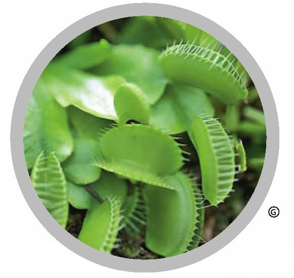
捕蝇草

植物学家在观察昆虫中“埋伏”的全过程时发现，只有当猎物碰到了感应毛，而且某两根或几根感应毛被碰压成弯曲状态时，叶片才猛然关闭，于是就大胆假设：这种行为的发生，一定是由某种信号飞快地从感应毛传送到叶片内部的运动细胞，快得就像人类神经中的电脉冲。

为此，科学家对捕蝇草的电特性进行了研究。结果，他们不仅在捕蝇草的叶片上记录到电脉冲，还在捕蝇草的感应毛内测出一些不规则的电信号。其中有一位名叫赛尔的植物学家，对植物的电信号进行了6个月的研究，发现植物有一个“化学神经系统”。这个系统的生物学意义是，当有敌人想伤害植物时，它会产生防御反应。当然，捕蝇草产生的是“进攻反应”。因此赛尔认为，植物有类似动物的感觉，两者唯一的区别是，动物能表达这种感受，而植物是用化学物质来做出反应的，这种化学反应从某种意义上说，与人类的神经系统很相似。

关于植物是否有类神经组织的问题，大多数科学家持否定态度。他们认为植物中的电信号传递速度太慢，与高等动物体内的电信号传送速度无法相提并论，因此植物体内有神经组织的说法是不妥当的。（陈荣）

  

【微问题】用一束毛发轻轻触碰捕蝇草的感应毛，看看整个关闭过程要多少时间？

【关键词】食虫植物　植物电信号　捕蝇草　感应毛

## 什么是植物生产的“副产品”

我们已经知道，绿色植物具有光合作用的能力，能够依靠自己生产的营养物质维持生存，而陆地上的动物几乎都要直接或者间接地依靠植物才能生存。据估计，每种植物能合成5000～25 000种代谢产物，而整个植物界可能产生上百万种化合物！在这些数量惊人的化合物中，绝大部分都属于次生代谢产物。那么，什么是次生代谢产物呢？

次生代谢产物是相对于初生代谢产物而言的，那些我们最熟悉的蛋白质、脂类、糖和核酸等物质，属于植物的初生代谢产物。而次生代谢产物是指那些不直接参与植物细胞生长发育和繁殖过程的化合物。植物化学家们称次生代谢产物为“天然产物”，也有人称之为“奢侈品”或者“副产品”。虽然它们不像初生代谢产物那样作为细胞的必需成分，但如果植物长期缺乏次生代谢产物也会带来严重的后果，轻者降低生长与繁殖的能力，重者甚至导致死亡。例如，当植物受到动物和病原菌威胁时，可以合成各种次生代谢产物来应对可能的伤害；当植物遭到强光胁迫时，会启动合成维生素C、胡萝卜素和叶黄素等次生代谢产物来维护光合作用的顺利进行。有趣的是，植物非常擅长储藏次生代谢产物，也就是说，通常能在特定的细胞或者器官中合成并加以储存，例如表皮、腺体和腺毛等。恰恰是这许多储藏在植物体内的次生代谢产物，成为了人体所需要的营养、药物及化工产品的重要资源。（黄继荣）

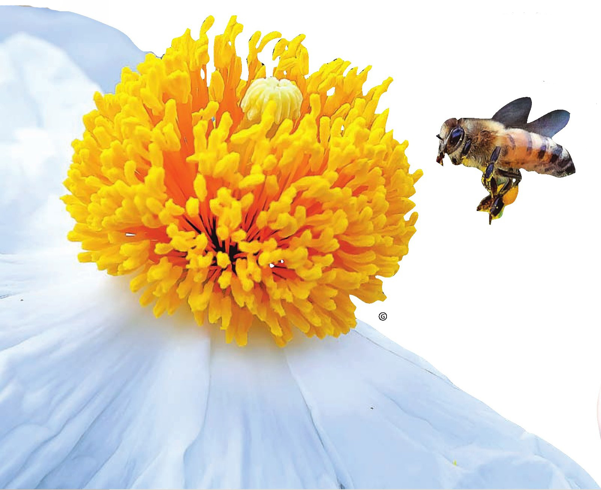
## 为什么植物会产生酸、甜、苦、辣等味道的化合物

地球上的很多动物，包括各种昆虫和大型的食草动物，都以吃植物为生。其实，植物也是很“聪明的”，为了不让自己丧生于动物之口，或者让动物少吃掉一些，各自都有不同的御敌“绝招”。植物最厉害的一招是不让敌人靠近，有一种貌不惊人的草本植物叫碰碰香，就是一个典型例子。当虫子接触植物的瞬间，覆盖在碰碰香植物表面的腺毛会立刻释放出令虫子讨厌的香茅醛挥发性气味，顿时，企图享用饕餮大餐的虫子马上失去了胃口，乖乖地自动离开。

碰碰香

值得一提的是，植物保护自己、防御动物进攻的最普遍的方法是合成一些有毒性的、味道极差或者抑制动物食物消化的化合物，例如棉花中的棉酚、十字花科植物中的硫代葡萄糖苷、蛋白酶抑制剂等化合物。当然，动物也会采取各种对策反击植物的“防御武器”。例如，动物的中枢神经系统能非常灵敏地感知食物中有毒化合物产生的极端苦味，然后就会离开这些植物。因此，苦味一般代表有毒性的化合物。大家很熟悉树上未成熟水果吃起来的味道总是很涩、很酸、很苦，也没有什么营养，其目的就是为了保护果实中的种子发育。但是，一旦水果成熟，便会积累大量的糖分和其他营养成分，变得很甜很香，主动引诱动物来吃。动物吃水果的时候，难免将种子吃下，不能被消化的种子随粪便排出体外，起到了传播种子的目的。这种植物与动物之间的良性合作关系是在长期的进化过程中渐渐形成的，生物学家将它称为协同进化。（黄继荣）

## 谁在表达植物花朵的“色彩语言”

当你仔细观察身边的植物时就会发现，并非所有植物的花都具有吸引眼球的鲜艳色彩。植物开花结果根据其授粉方式不同分为自花授粉植物和异花授粉植物。异花授粉植物必须依赖昆虫或者其他媒介来授粉，才能结出果实和种子。由于植物叶片的颜色一般都是绿色，如果花朵也是绿色，昆虫就很难将其辨认。因此，植物必须进化出区别于绿色的花朵才能吸引昆虫来授粉。由于不同的昆虫识别花朵颜色的能力不同，植物也因此而产生各种色彩的花朵。有意思的是，植物为了给昆虫丰厚的回报，花的基部往往藏有蜜腺，专门分泌昆虫最喜欢的营养物质——糖分，因为糖是动物可以直接吸收利用的、最重要的能量来源。更重要的是，能够使花朵产生鲜艳夺目色彩的神奇物质，就是植物的一种次生代谢产物——花青素，它能呈现出红色到紫色的一系列颜色。而花朵的香气则是从花瓣中的油细胞中分泌出来的芳香化合物。

因此，我们形象地将次生代谢产物描述为植物世界的“语言与武器”。不同的植物生长于不同的环境，在长期的进化过程中形成了各具特色并与其生存环境相适应的交流方式。（黄继荣）

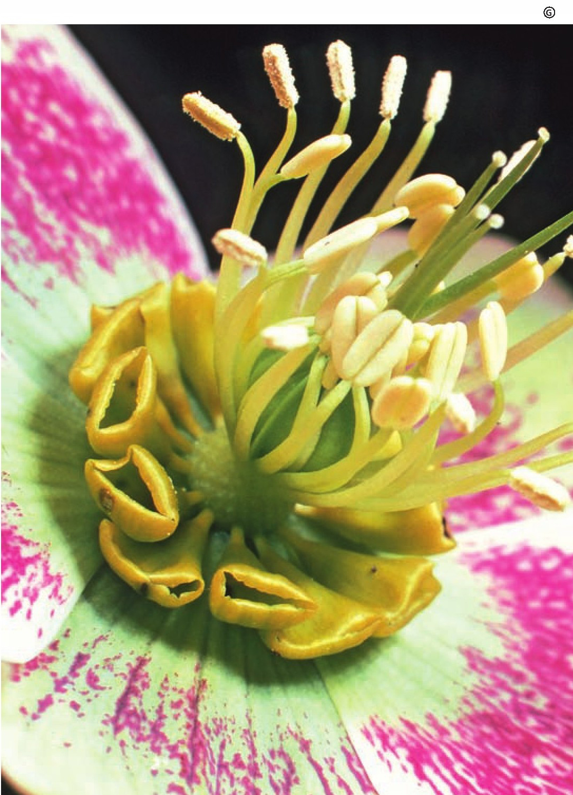
  

**【实验场】**

在家里的阳台上培养两种植物，一种为碰碰香，另一种为吊兰或者其他植物。在没有接触碰碰香叶片前，请闻一闻叶片，没有气味。然后，用手碰触叶片，再闻一闻叶片，会闻到一种气味。你喜欢这样的气味吗？另外，请你经常观察上述两种植物的叶片，哪一种叶片上经常会有小虫？

【微问题】花生油属于植物的次生代谢产物吗？

【关键词】次生代谢产物　花青素　碰碰香

## 为什么跳舞草爱“翩翩起舞”

跳舞草是一种特别有趣的直立小灌木，祖籍在印度，在中国主要分布于云贵川一带的深山老林之中，已被国家列为珍稀濒危植物而受到保护。然而，除了稀有少见之外，它的“跳舞表演”却更令人感兴趣。

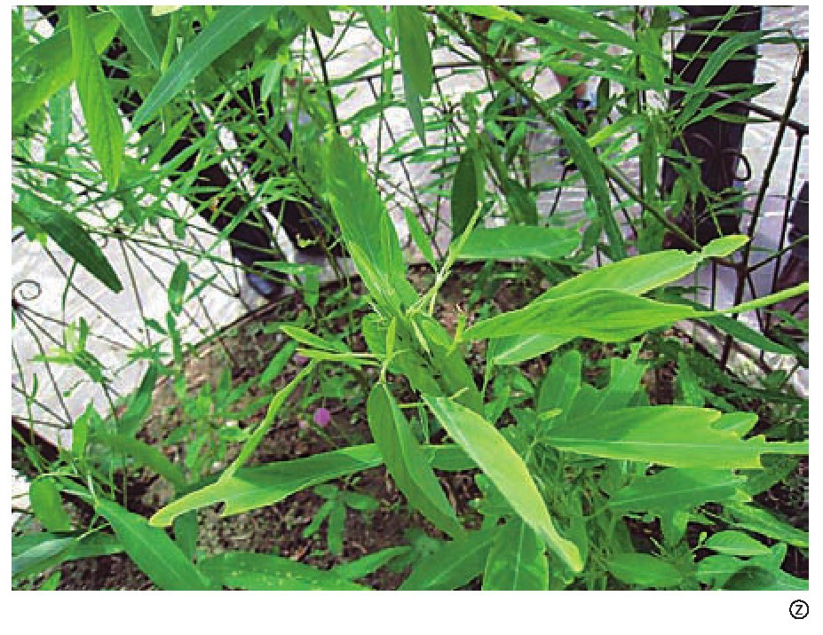
跳舞草

跳舞草具有与众不同的奇妙生理特性，因为它对外界环境变化的反应能力远远超过它的植物同类。例如，当你对着它播放一首优美的抒情乐曲时，它就会像一名能歌善舞的女子，叶片飘飘如衫袖舒展，开始在乐曲中翩翩舞动。如果你对它播放杂乱无章、怪腔怪调的歌曲，或者放声大喊大叫，它的反应是不动也不转，不仅“罢舞”，似乎还会显现出极为反感的“情绪”。

科学家通过对跳舞草观察研究后发现，它实际上是一种对一定频率和强度的声波极富感应性的植物，与温度和阳光有着直接的关系。当气温达到24℃以上，且在风和日丽的晴天，它那一对对的小叶便会自行交叉转动，分分合合、上下跳跃。而且，两片小叶的转动幅度竟然可达180°以上！当一连串动作做完之后，叶片又会回复到原处，再重复转动。当气温在28～34℃之间，尤其是在闷热阴天或在雨过天晴之际，整株跳舞草的数十对叶片时而像情人般“紧紧拥抱”，时而又像蜻蜓那样翩翩飞舞，眼花缭乱之中给人以美妙、神秘的感受。当夜幕降临时，它又会将叶片竖着贴在枝干上，紧紧依偎着，因此人们又给它起名叫“情人草”、“风流草”。

在解释跳舞草为什么爱“翩翩起舞”的现象时，科学家还没有统一的认识，各自做出的解释也各不相同。有些科学家认为，跳舞草的起舞与阳光有关，有光则舞，无光则息，就像向日葵冲着太阳转动一样。但也有的认为，“跳舞”行为是植物体内微弱电流的强度与方向的变化而引起的，或者是植物细胞的生长速度变化所致。还有一些科学家认为，跳舞草的奇妙习性是生物的一种适应性，当它跳舞时，舞动的叶片具有恐吓作用，可躲避一些昆虫的侵害。跳舞草究竟为何爱“跳舞”，仍存在着很多疑问，要解开这个谜还需植物学家继续深入探索。（杜云）

## 含羞草为什么“含羞”

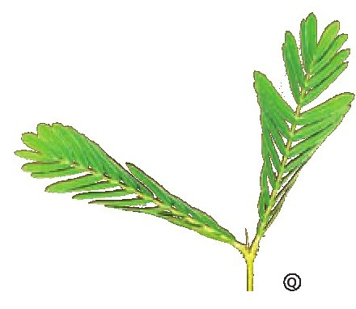
提起含羞草，许多人都知道它就像一位特别害羞的小姑娘，绿色小羽毛似的叶片只要被触碰一下，很快就会合拢，仿佛在表示害羞之态。有趣的是：碰得轻，叶片合拢就慢；碰得重，合拢就快，有时连整个叶柄都会下垂；但是过了一会儿，它又会慢慢恢复原状。含羞草这种奇怪行为是怎样产生的？原来，含羞草含有一种“运动蛋白”，又叫叶枕敏缩体，支撑叶细胞的饱满。当它需要做闭合运动时，运动蛋白的磷酸会脱落，导致细胞因为内部的细胞液跑了出去而变得瘦瘪，无法支撑住叶细胞原有的饱满度，以致产生闭合运动。我们知道，运动蛋白一般存在于动物的肌肉纤维内，与肌肉伸缩有关，而含羞草内也含有这种蛋白，这在植物界中是很少见的。

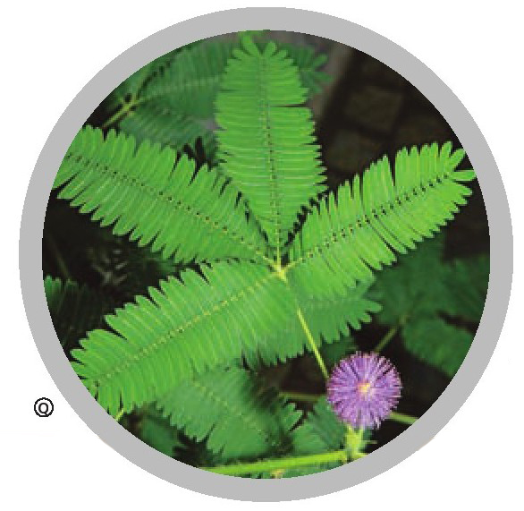
含羞草

在含羞草叶柄基部和复叶的小叶基部，都有一个比较膨大的部分——叶枕。叶枕对刺激的反应最为敏感，因为在叶枕的中心有一个大的维管束，维管束四周充满着具有许多细胞间隙的薄壁组织。当震动传到叶枕时，叶枕的上半部薄壁细胞里的细胞液，被排出到细胞间隙中，使叶枕上半部细胞的膨压降低，而下半部薄壁细胞间隙仍然保持原来的膨压，结果引起小叶片闭合，甚至于整个叶子垂下来。

了解了含羞草爱“害羞”的生理机制，那么，含羞草这种奇特的行为会给它的生存带来什么好处呢？植物学家解释说，含羞草的老家在南美洲的热带地区，那儿常有猛烈的狂风暴雨，而它的枝叶又很柔弱，在刮风下雨时将叶片合拢，就能大大减少被摧折的危险。除此以外，叶片关闭也能保护自己不易被昆虫吃掉。可以想象，当昆虫落脚在它叶片上准备大吃一顿时，叶片突然关闭，会一下子把毫无准备的昆虫吓跑。（杜云）

## 痒痒树真怕挠痒痒吗

痒痒树的学名叫紫薇，人们常常这样称呼它，是因为很多人都认为它是一种害怕挠痒的植物。

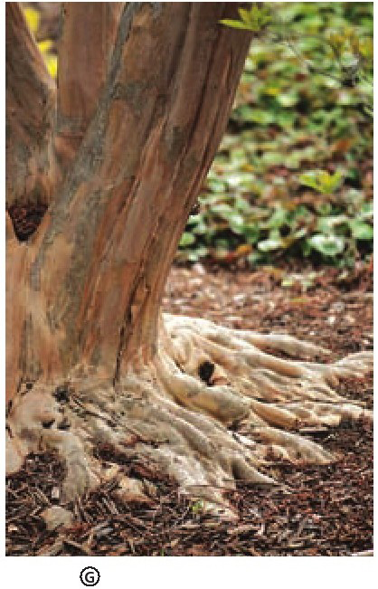
紫薇在公园中很常见，身高3～6米，树干表面特别平滑，没有高低不平的坑洼凸起，摸上去光溜溜的。到了盛夏季节，小枝条顶端会抽出一串串美丽的花朵。由于它的树干表面光滑，摸上去手感很好，所以经常有人摸紫薇的树干。有趣的是，当人的手在紫薇的树干上做挠痒痒动作时，树叶和花朵会发出一阵阵抖动，这情景就像我们人类的胳肢窝被挠了一样，一边“咯咯咯”地笑，一边因为痒而全身抖个不停。这就很容易使人联想到，紫薇的抖动是因为怕痒而引起的，痒痒树这个绰号也由此而得。其实，说紫薇怕痒是一种误解，因为它的枝条非常柔软，用手去挠树干时，枝条只要轻轻受力就会引起摇颤，看上去仿佛真是在怕痒抖动一般。还有，紫薇枝干的下部和上部差不多粗细，这有别于一般树干下粗上细的特点，也就是说，紫薇树的上部比一般的树要重些，也就决定了它容易摇晃。

紫薇

到目前为止，科学家还没有发现哪种树真的怕痒痒，也没有发现树木的表皮能像动物皮肤那样布满感觉细胞。（杜云）

  

**【实验场】**

用手以不同的力度触碰含羞草，观察叶片关闭的程度，并记录下每次关闭的时间。

**【微博士】**刺激叶片

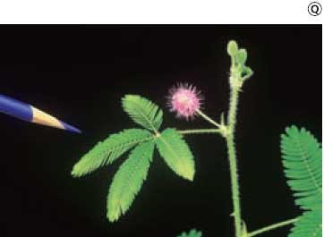
有人做过研究，含羞草在受到刺激后的0.08秒钟内，叶子就会闭合。受刺激后，传导的速度也很快，最高速度10厘米/秒。刺激之后，恢复的时间一般为5～10分钟。但是，如果我们继续逗弄，接连不断地刺激它的叶子，它就不再有任何反应，这是因为连续的刺激使得叶枕细胞内的细胞液流失了，不能及时得到补充的缘故。

【微问题】跳舞草的“舞蹈”动作是有规律的，还是随心所欲的？

【关键词】运动蛋白　跳舞草　含羞草　紫薇

## 沙滩上为什么出现“魔鬼亮脚印”

16世纪的新几内亚岛，是一块刚刚被人类发现的新地方，到处是莽莽苍苍的原始森林，只有少数土著人在那儿定居。后来，荷兰人入侵该岛，建立了殖民地，但是遭到土著人的奋力抵抗。土著人常常躲在暗处，用毒箭偷袭，使荷兰人草木皆兵。为了保证安全，荷兰人在沿海附近建立了一座城堡，取名巴博城。有一天夜晚，乌云遮月，漆黑一片，伸手不见五指。巴博城堡上执勤的荷兰士兵突然发现，海滩上出现了一个个小光点，而且光点渐渐朝城堡逼近，形成了一大串光亮的轨迹。士兵们战战兢兢地下去查看，四周空无一人，沙地上却留下一串串发光的亮脚印！

这个恐怖现象使巴博城堡的居民人心惶惶，大家一致认为，只有魔鬼才能留下这样可怕的亮脚印。正当大家为魔鬼脚印议论纷纷时，一位士兵解开了亮脚印之谜。那是在一个风雨交加的夜晚，士兵去海边查看船只是否拴好，这时，城堡上的人惊异地看到，荷兰士兵的身后居然也留下一串亮脚印！于是大家都怀疑他和鬼魂有来往，甚至嚷着要杀死他。可出人意料的是，奉命去跟踪他的其他荷兰士兵，在潮湿的沙滩上也留下闪闪发光的脚印。大家终于明白，凡是在这样的风雨之夜，无论谁在海滩上行走，都会留下亮脚印。

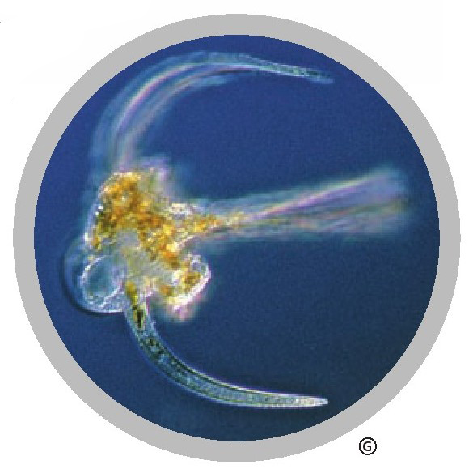
海洋中的发光生物

直到很多年后，科学家终于解开了魔鬼亮脚印的谜团。原来，在大海中生存着很多种极微小的动物和植物，它们有个与众不同的特征，那就是身体能发出荧荧的亮光，所以科学家给它们起名叫“发光生物”。通过进一步的研究后发现，发光生物的细胞内常常含有荧光素和荧光素酶，当它们遇到触动刺激时，使沙子内的发光生物一下子和外界空气接触，导致体内的含氧量陡增。一旦获得了充足的氧气后，经过一连串的氧化反应，细胞内的荧光酶被催化，并发出波长450～490纳米的蓝绿光。

大多数发光生物都需要生活在有水的环境中，大海对它们来说是最理想的乐园。海洋中最常见、数量最多的藻类植物是甲藻，它们小得肉眼看不见，有时在大海中出现神奇的绚丽光焰，就是它们的杰作。大量的甲藻被海浪抛上岸，并没有马上死去，而是静静地躺在沙地中“休息”。这时，如果有人在海滩上行走，它们受到人脚触动的刺激，并获得了较多的氧气后，就会发出光亮。于是，便在行人的身后留下一串可怕的“魔鬼亮脚印”。（马卫国）

## 陆地上有发光植物吗

在2011年上映的3D电影《阿凡达》中，展现出一幅幅森林里的奇妙美景，色彩斑斓的茂密雨林中，到处可见夜晚发光的花草、蘑菇……影片大获成功之后，导演在接受采访时说，影片中那些璀璨奇异的发光植物，其实都是根据现实生活中的植物创造出来的。

确实，发光植物不仅在海洋中有，在陆地上也能见到。例如加勒比海的沿海地区有一种俗称“夜皇后”的植物，每当黄昏降临时，它的花朵开始绽放，闪烁出星星点点的亮光。有趣的是，当黑夜逝去，花朵好像完成了历史使命，很快就凋谢了。植物学家在研究这种植物时发现，它的花瓣和花蕊中含有异乎寻常多的磷，由于磷与空气接触就会发光，遇上阵阵吹来的海风，磷光变得忽明忽暗，显得格外美丽。

在江苏省丹徒地区，曾经有一株半枯朽的柳树，每逢漆黑的夜晚就会发出蓝绿色的光芒。这个奇怪现象引起了很多迷信传说，甚至将它视为神树。后来经过专家们研究发现，原来柳树是因为受到假蜜环菌的寄生而发光。这种真菌的菌丝侵染了木材纤维以后，分泌一些能分解木材的酶，将纤维素转化为自身能够吸收的小分子物质，如葡萄糖、酚类等营养物质。假蜜环菌的菌丝细胞获取了足够的营养物质后，开始不断地繁衍、长大，同时积累大量能够用来产生荧光的物质。这些带荧光的物质在荧光酶的催化作用下进行生物氧化，并把化学能转化为光能，使它们寄生的树木成为了能够发光的“神树”。

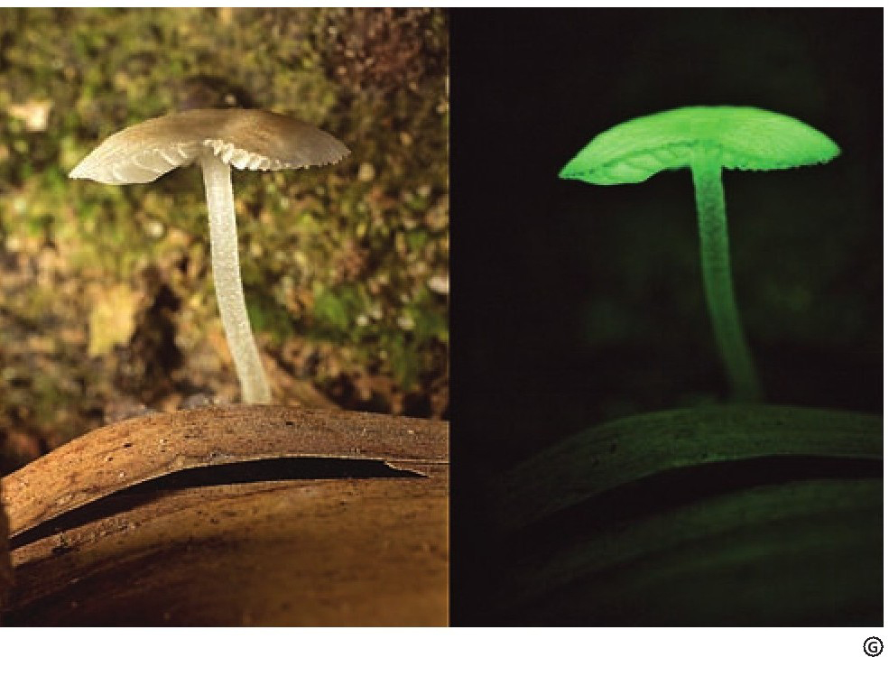
各种发光蘑菇

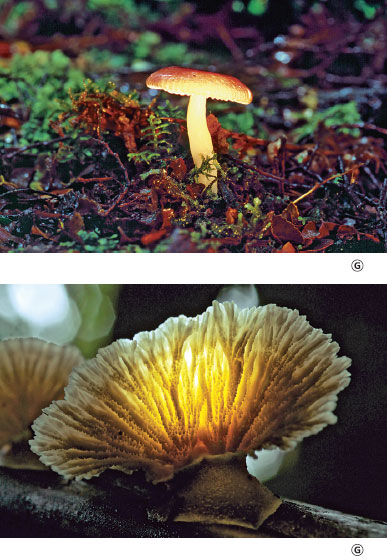
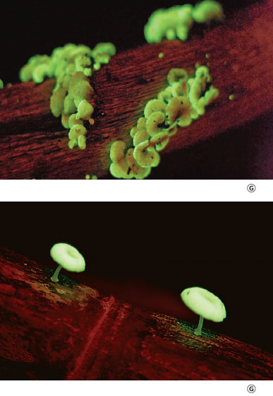
现在，不少科学家已经对发光植物产生了浓厚的兴趣，他们不仅研究自然界的发光植物，而且将精力放在如何培养人工的发光植物上，期望有朝一日在我们地球上，每一个人都能在夜晚欣赏到植物发光的奇妙景象。（马卫国）

  

**【微博士】**发光的蘑菇

发光植物中，除了水生的各种小型藻类，种类最多的是各种各样会发光的蘑菇，例如灯笼蘑菇、冷光扇菇等，就是其中的代表。

【微问题】如果用含有荧光酶的水浇灌植株，它会成为发光植物吗？

【关键词】发光植物　荧光酶

## 为什么人工林更容易发生病虫害

病虫害一直以来都是森林最危险的敌人之一，每年在中国造成的直接经济损失达数十亿元，对生态环境的破坏更是难以估量。科学家发现，经常暴发病虫害的森林都是一些人工种植林，而在一些自然形成的森林却很少发生，其中有什么奥秘吗？

原来，人工种植林大多是单一树种的纯林，如马尾松林、杉树林，一旦有树木感染了病虫害，就会在同种个体间迅速蔓延，最终殃及整片树林。而自然的森林中，植物种类有几十甚至上百种，它们共同组成了一个复杂稳定的群落。当病虫害发生时，可能只有少量树种受害，而其他种类不会受到影响。更重要的是，各种各样的树木为多种鸟类和昆虫提供了食物和栖息地，增加了害虫的天敌数量和种类，因此能够很好地控制病虫害的发生。（邓泓）

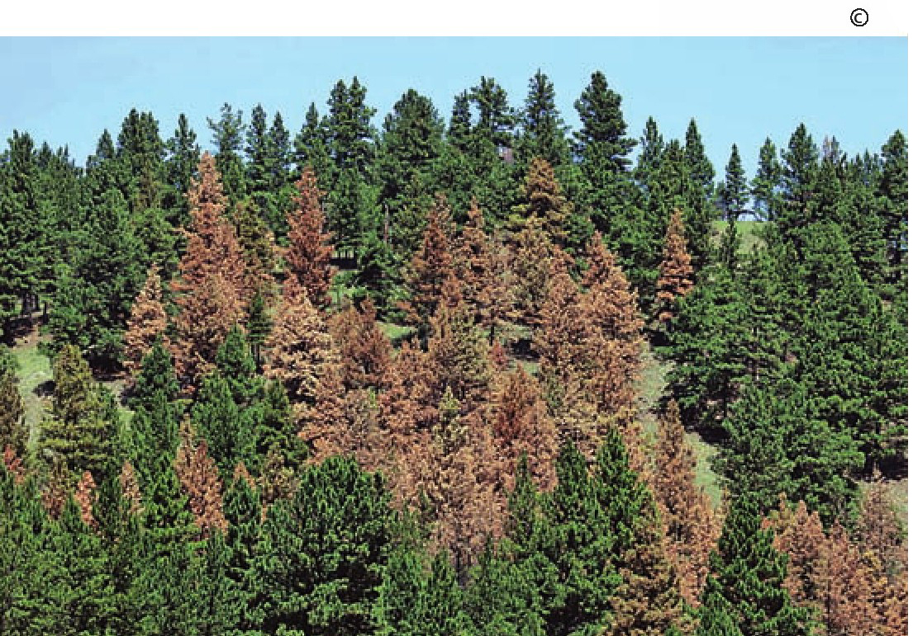
  

【微问题】地球上物种最丰富的地方在哪里？

【关键词】生物多样性　植物多样性　人工林　自然林

## 阴生植物为什么不怕照不到阳光

俗话说“万物生长靠太阳”，植物需要光合作用，那就更离不开阳光了。曾经有些业余种花者买回来吊兰，放置在阳光最充足的阳台上，而且定期浇水，精心呵护。可是，吊兰并没有长得越来越茂盛，相反叶子一天天发黄，情况变得越来越糟糕。

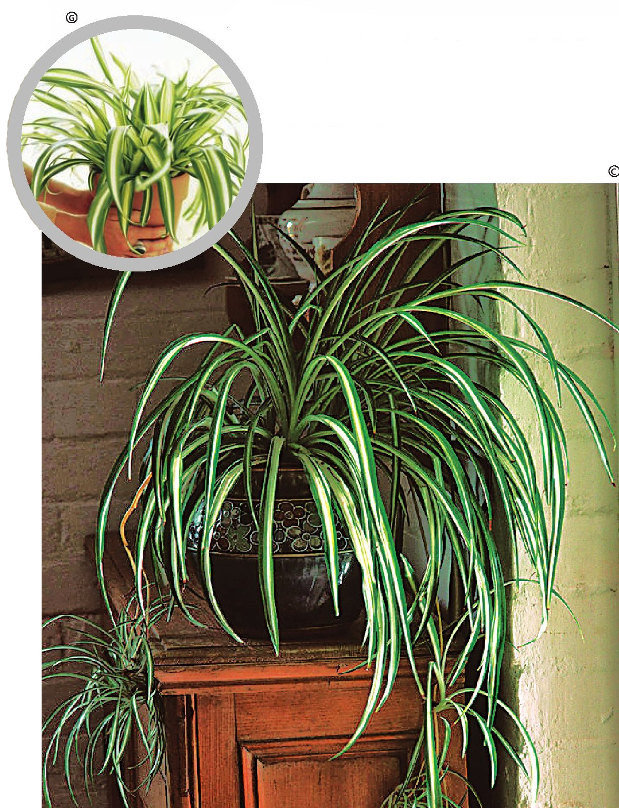
吊兰

原来，在种类万千的植物界中，有些植物喜欢“晒太阳”，有些却害怕“晒太阳”。喜欢“晒太阳”的植物需要有充足的阳光照射才能生长良好，否则就会“萎靡不振”，这类植物叫阳生植物。而那些害怕“晒太阳”的植物，只需要很少的光照就能生长，放到阳光直射的地方反而会被“晒死”，这类植物叫阴生植物。吊兰恰恰属于害怕“晒太阳”的阴生植物，将它放在光照强烈的阳台上，当然就难以长好。

如果对阴生植物叶片内的显微结构进行观察，就更能说明问题了。例如它的叶绿体通常具有较大的基粒，基粒片层数目也较多，叶绿素含量高，因此能在较低的光照条件下充分地吸收光线。而且，阴生植物叶绿素a和叶绿素b的比值小，能够强烈地利用蓝紫光。其实，肉眼也能做出大致的分辨，通常情况下，阴生植物的叶片颜色比较深绿，说明它含有较多的叶绿素，以帮助植株在相对微弱的光线下最有效地进行光合作用。

植物这种喜阴与喜阳的“性格”，并不是短时间形成的，而是经过长期适应不同环境的结果。有些植物长期生活在太阳直射、光照强烈的环境中，而有些植物，长时间生长在幽暗、“不见天日”的山谷、树林中，久而久之，植物适应了各自的生活环境，形成了喜阴或喜阳的特点。当然，阴生植物并不是一点阳光都不需要，只是相对微弱的光照就可以满足它的生长需求了。（邓泓）

  

**【微博士】**人参

大名鼎鼎的人参就是一种典型的阴生植物，只有在阴暗潮湿的树林底下才能生长。但是，由于人类的无节制乱砍滥伐和过度采挖，导致森林生态环境受到破坏，野生人参的数量急剧下降。现在，人参已经被列为中国的珍稀濒危保护植物。

## 为什么叶片的颜色正面比背面深

如果你是一个对自然现象善于观察的人，一定会注意到，几乎绝大多数绿色植物的叶片，正面和反面的颜色有明显的差别。也就是说，叶片对着阳光的一面，颜色要比背面的更深更绿。这是为什么呢？

原来，植物的叶片之所以呈现绿色，是因为里面含有叶绿素。由于叶绿素是绿色的，当叶肉细胞里含有大量的叶绿素时，叶子就呈现绿颜色，叶绿素含量越多，绿色就越深。科学家通过观察叶片的内部结构发现，叶片正面的细胞排列得非常紧密，而且十分整齐，看起来就像一排排的栅栏一样，称为栅栏组织；而植物叶片的背面，细胞排列十分松散，空隙很大，也没有规则，好像海绵一样，称为海绵组织。栅栏组织比海绵组织的细胞含有更多的叶绿素，而且细胞排列紧密，数量多，所以叶片正面的颜色就比背面更深了。

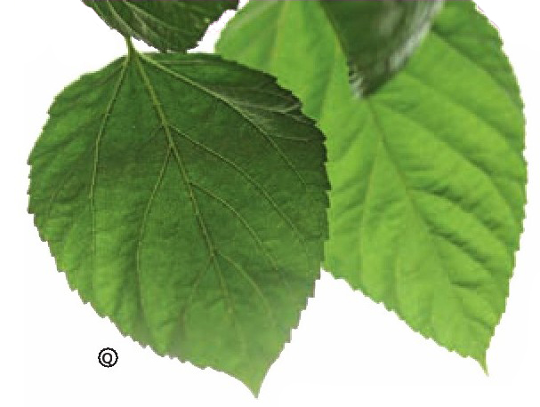
栅栏组织的细胞之所以含有更多的叶绿素是为了进行光合作用，正常情况下，叶片的正面才能接受到阳光的照射，只有含有的叶绿素多，才能制造出较多的营养物质；而背光的一面，由于很少进行光合作用，就不需要太多的叶绿素，所以叶绿素含量就少一些。（邓泓）

## 为什么在森林中能通过看树辨认方向

如果在森林里迷路了，又没有指南针，我们怎样才能迅速地分辨出东南西北呢？看太阳，观察北极星，这些都是很好的办法。可如果是阴雨天气，太阳和星星都看不见，又该怎么办？具有丰富野外工作经验的人都知道，还可以通过观察树冠来识别方向。通常情况下，枝叶茂盛的一面是南面，而枝叶稀疏的那一面则是北面。

经验之中往往包含着科学原理。由于南面的阳光通常比较充足，能够为植物提供较多的能量来进行光合作用，为了生产更多的营养物质，枝叶的生长也就比较旺盛。相对于南面，北面不容易晒到太阳，比较阴冷，朝向北面的树叶没有足够的阳光来进行光合作用，所以枝叶相对长得稀疏，叶片也比较小。除了枝叶的区别外，根据树干表面也能帮助确定方向。一般来说，树干朝南一面的树皮比较光滑，而朝北的一面则比较粗糙。如果将大树锯断，可以看到一圈圈的年轮，而向着南面的一侧，两圈年轮之间的距离要比向着北面的更宽。这些区别都是由于光照强度的不同引起的。（邓泓）

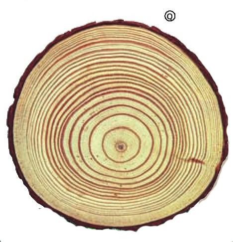
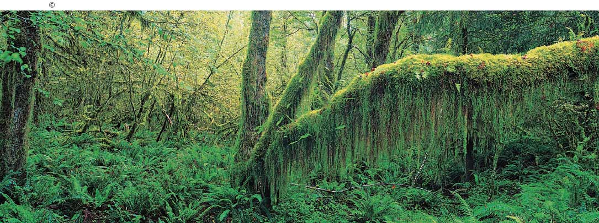
  

**【实验场】**

韭黄，是餐桌上一道非常普通的菜肴，其实它和韭菜是同一种植物。只要将韭菜种植在不透光的环境中，由于完全没有阳光的照射，叶绿素会分解，绿色的韭菜就变成了黄色，所以称为“韭黄”。可以尝试播种韭菜籽，除了遮光之外，给予合适的湿度和温度，看看长出来的是韭菜还是韭黄。

【微问题】阴生植物和阳生植物的叶片厚薄有规律性的区别吗？

【关键词】阳生植物　阴生植物　叶绿素　基粒

## 为什么仙人掌那么耐渴

仙人掌是一大类植物的统称，虽然种类繁多，但都有差不多的体态特征，几乎都是浑身长满尖刺的肉质植物，身躯肥胖，里面鼓鼓囊囊地藏着很多水分，好像一个个绿色小水库。除此以外，它们还有一个最大的特点，那就是特别能耐渴。

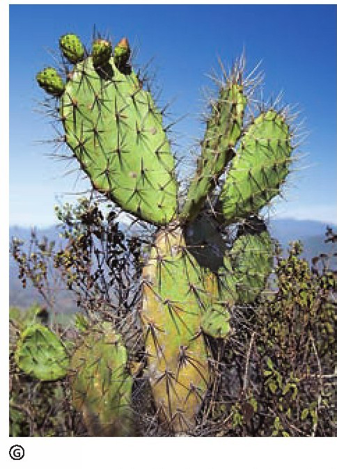
我们知道，水是植物的命根子，如果没有水，很多植物在短时间内就会渴死。在水分奇缺的热带荒漠中，为什么仙人掌能安然生存呢？原来，它们有一套节约用水的特殊本领。我们知道，植物的叶片因为面积大，体内的水分容易从叶面蒸腾出去，而仙人掌却巧妙地将叶子特化成为刺状，大大缩小了蒸腾面积，使体内的水分不容易散失。此外，仙人掌绿色的肉质茎不仅能代替叶子进行光合作用，表面还覆盖着一层不平凡的“外衣”，这层“外衣”不透水，好像涂在身体外的一层蜡，把体内的水分保护得严严实实。仙人掌能够耐渴还有重要的一点，那就是它们的身体肥胖多肉，一旦遇到下雨，就能吸收大量的水分，储存在肥胖的躯体内，好像一个能蓄水的小水库，等需要时再慢慢取出使用。

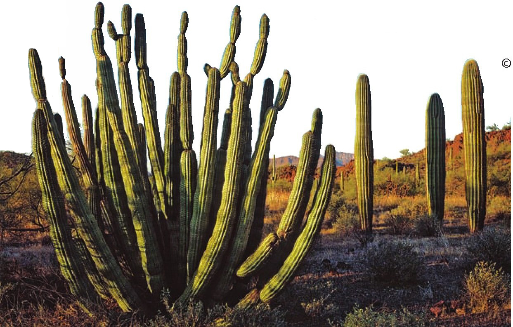
身材高大的仙人柱

还有，扁平的叶子表面通常有很多气孔，当气孔开放吸收二氧化碳进行光合作用时，也同时散发出了水分。而仙人掌却巧妙地解决了这对矛盾。它的气孔晚上开放，让二氧化碳进入植株体内，然后固定，到了白天则关闭气孔，防止水分在阳光下散失，同时依然能够利用白天的阳光和晚上进入的二氧化碳进行光合作用。因此，科学家将这类植物称为“景天酸代谢植物”。

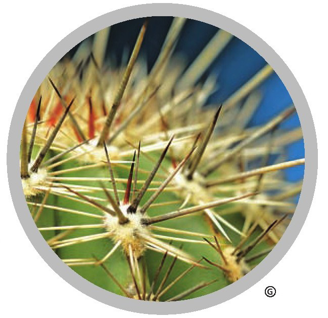
仙人球的刺状叶

仙人掌善于耐渴，但耐渴的能力究竟有多强呢？为此，有位科学家专门做了个有趣实验。他选用肉质植物家族中的一名成员仙人球作为实验对象。这株仙人球重达37.5千克，科学家将它从室外移种到室内，一直不给它浇水，整整过了6年时间，想不到仙人球依然顽强地活着。这时，再把它挖出来过秤，居然还有26.5千克的重量！也就是说，这株仙人球在6年内仅仅消耗掉11千克的水分。正是因为仙人球如此耐渴，所以人们送它一个光荣称号——节水冠军。（杜云）

## “昙花一现”是为了自我保护吗

“昙花一现”是老少皆知的成语。意思是昙花的花朵非常美丽，但开花时间只有3～4小时，与普通植物相比较，实在是太短了。所以，自古以来就用这个成语比喻美好的事物、景象或风云人物，出现了一下又很快消失。昙花的开花时间为什么那么短暂，其中有什么生物学意义呢？

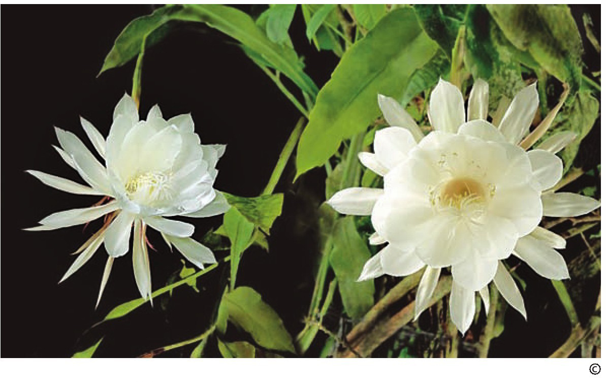
夜晚绽放的昙花

昙花属于仙人掌家族成员，但与普通的仙人掌植物相比有个很大差别，那就是全身上下没有尖刺。它的老家在干旱的热带荒漠之地，那儿的气候非常炎热，雨水稀少，而且阳光特别强烈，但昙花天生就具备忍耐高温酷热的本领，完全能够适应。可是，昙花虽然不怕烈日曝晒，但是它绽放出的花朵却很害怕火辣辣的阳光。因为热带荒漠的白天气温特别高，烈日酷热难挡，而到了晚上却一下子凉快了下去，昼夜温差相当悬殊。如果在白天开花，或者开花期较长，很容易受到曝晒灼烤，娇嫩的花朵会有灼伤晒焦的危险。根据“适者生存，不适者被淘汰”的自然选择原理，那些白天开花的种类渐渐被淘汰，而选择在夜晚开花的昙花种类则得以幸存。久而久之，“昙花一现”的特性便一代代遗传下来了。（杜云）

## 仙人掌有毒吗

有人说，仙人掌是有毒植物，但也有人说是能吃的美味佳肴，究竟谁对谁错？其实，仙人掌是一大类群的总称，共有2000多种。它们中有些种类含有毒的生物碱，例如乌羽玉属、岩牡丹属、斧突球属的一些种类，会对食用者的神经有致幻麻醉作用，严重的甚至会危及人的生命。

但是，人工种植的食用仙人掌不仅无毒，还是一种超级健康蔬菜。它除了含有高钾、高钙、黄酮类等物质，所含微量元素、维生素要比西红柿、蔬菜、水果、蛋、鱼、肉高得多。经常食用，对肥胖、高血压、高血脂、高血糖、冠心病有奇妙的改善作用。

食用仙人掌不仅有益健康，而且还有多种多样的吃法，生吃、凉拌、爆炒、煮汤、煎烤、做肉馅等均可，可以烹调出上百种美味菜肴，清香爽口，风味独特，非常符合现代人的口味。食用仙人掌榨出的汁液，还是很好的绿色饮料，长期食用能让人的肌肤白嫩而富有弹性。（杜云）

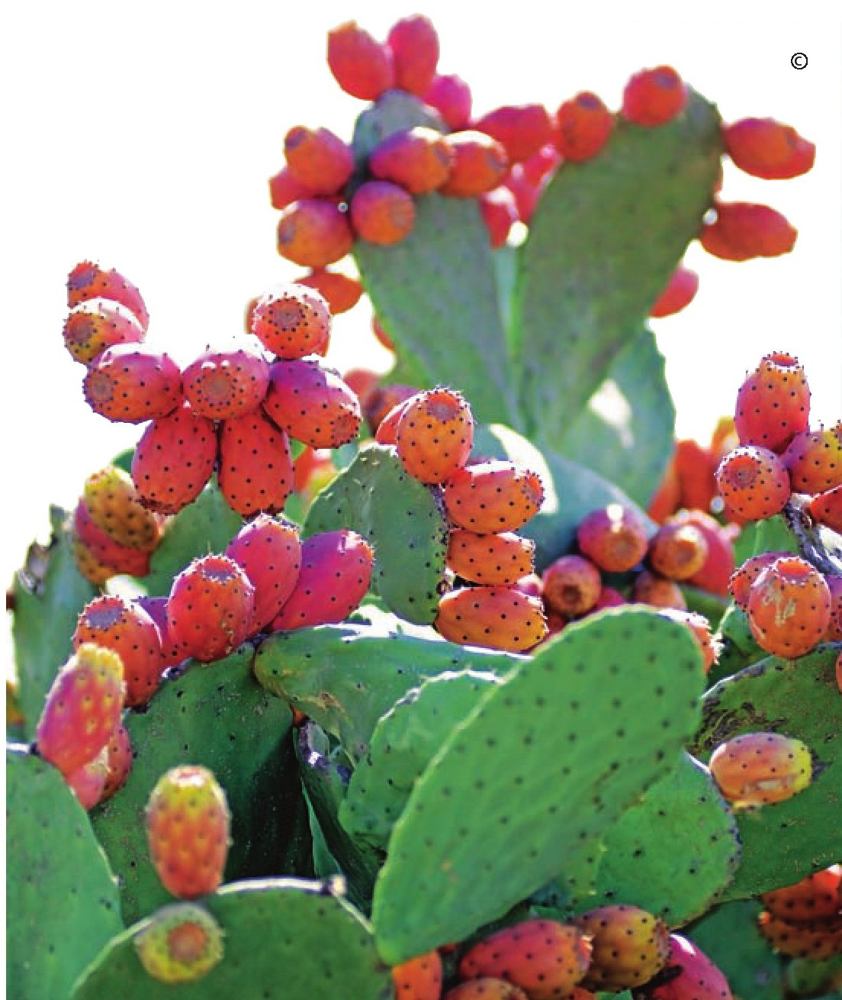
结果实的食用仙人掌

  

**【微博士】**大家族

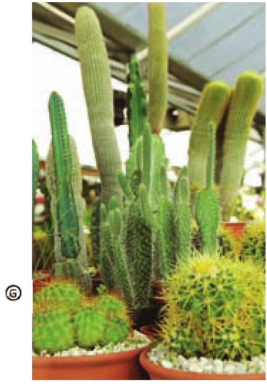
肉质植物家族中，除了仙人掌外，还有不少的“兄弟姐妹”，如仙人球、仙人鞭、仙人棒等。它们的形状多种多样，有的可以长很高，像几层楼房那样；有的却弯弯曲曲，像带刺的绿色长蛇；还有的矮矮胖胖，好像一个个不会走路的刺猬。

【微问题】仙人掌类植物浑身长刺，有没有爱吃它的食草动物天敌？

【关键词】仙人掌　昙花

## 水葫芦为什么会成为“绿色疯子”

水葫芦也叫水浮莲，中文名凤眼莲，是一种多年生的水生植物，喜欢自由漂浮于水面，淡紫色的花朵非常美丽。20世纪初，作为观赏物种被引入中国，后又作为猪饲料和净化水质植物推广种植，现在广泛分布于中国的大部分地区。它的无性繁殖速度极快，在适宜条件下每5天就能繁殖一新植株，不仅如此，在无性繁殖的同时还能开花结实进行有性繁殖，一枝花大约结300粒种子。由于水葫芦具有如此惊人的繁殖能力，因此在很多河流、湖泊、水塘中形成了单一的优势群落。根据粗略统计，一亩水面的水葫芦约有13万株，全部加起来的总重量竟达到20吨左右！水葫芦大量生长繁殖后，形成单一优势物种，致使其他水生植物减少甚至消失。它不仅能降低光线对水体的穿透能力，影响水底生物的生长，还能降低水中溶解氧的浓度，并增加水中二氧化碳的浓度，降低水产品产量，对水生动植物和水体净化都极为不利。水葫芦引入昆明滇池以后，由于滇池水质富营养化，水葫芦“疯长成灾”，以至于滇池内连绵1000公顷的水面上全部生长着水葫芦。水葫芦的泛滥强占了其他水生动植物的生存空间和生态资源，在很大程度上降低水生态系统的生物多样性，造成滇池水域面积缩小，原产于滇池中的其他十几种水生植物相继灭绝，水生动物从68种下降到30种左右。

由于水葫芦的过度繁殖，现已蔓延成灾，成了令人头痛的恶性杂草。长江、汉江遭遇到这种绿色恶魔入侵后，一些水域甚至出现了水草锁河的现象，使航运、渔业等相关水上活动受到巨大冲击。其实，水葫芦不仅给中国，也给世界各地带来无穷的灾难。早在20世纪初，美国墨西哥湾的内陆水道完全被水葫芦堵塞，使过往的船只无法通行。更糟糕的是，水中的鱼类和其他生物因为缺氧而大量死亡。后来，美国国会命令军队去疏通河道，采用炸药和火焰喷射器对付水葫芦，想不到第二年，那些被烧焦的水葫芦反而发芽更早，长势更旺。直到1951年，工兵部队使用了一种新型的水上割草机，终于在堵塞的河流上开辟出一条10多米宽的水道，并且再配合使用除草剂，才勉强控制住水葫芦的进一步泛滥成灾。现在，水葫芦已经成为世界上最令人头疼的入侵植物之一。

什么植物算入侵植物呢？科学家给它定义为：在非原生态系统进化出来的植物，通过非自然途径迁移到新的生态环境，然后定居、建群和扩散而逐渐占领该栖息地，并对生态环境或土著物种和生物多样性构成一定威胁的植物。例如祖籍在南美洲的水葫芦，就是入侵植物的典型代表，由于它们有广泛的适应性、极强的繁殖能力，所以能够对“入侵领地”的生物多样性构成严重威胁。

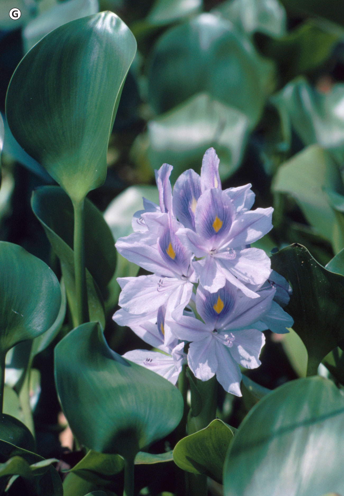

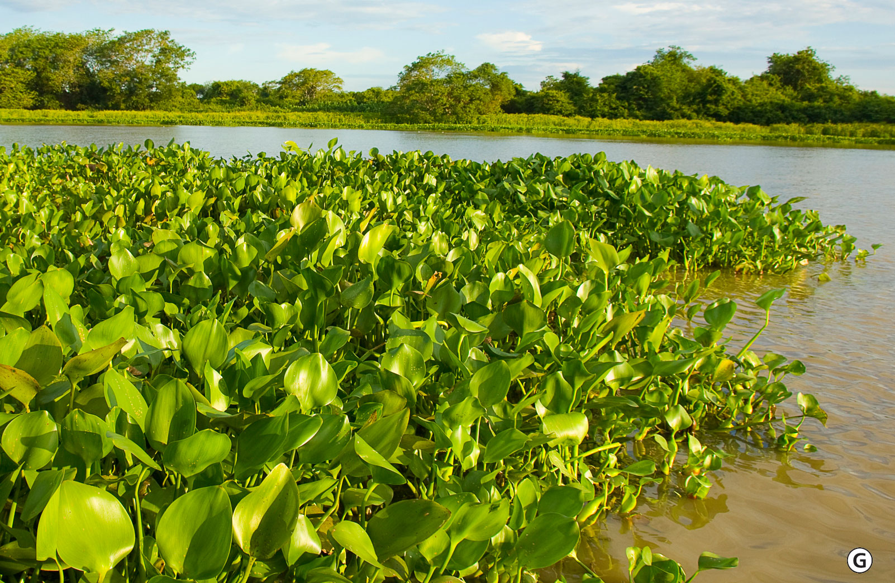
水葫芦

特别值得一提的是，外来物种一旦入侵成功，要彻底根除相当困难，代价费用极为昂贵。上述生物入侵的例子告诉我们，人类千万不要盲目地破坏经过长期自然选择和相互作用后形成的生态平衡，因为一个物种无论是灭绝或过量繁殖，都会危及与它相关的几十个物种的生存，进而引起生态平衡的失调，造成严重的社会经济损失。（张治）

## 薇甘菊是如何在中国泛滥成灾的

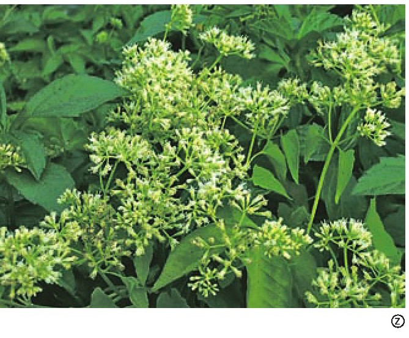
薇甘菊

薇甘菊是菊科草质藤本植物，由于其生长极为迅速，在国外被戏称为“一分钟一英里草”。中国之所以会引进薇甘菊，是看中它顽强的生命力，能为城市绿化做出贡献。可是没有想到的是，薇甘菊的生长是以吞噬本地物种为代价的。

为什么薇甘菊在原产地并没有泛滥成灾呢？原来，在它原产地的中美洲地区，有160多种昆虫和菌类天敌控制它生长，所以薇甘菊尽管强悍，但在原产地难形成非常大的规模。然而到了中国的广东，天敌没有了，它便开始肆虐。它见草粘草，见树缠树，生长速度极快，用自己的枝条织成一张大网，然后兜头兜脑地罩住其他植物，常常使成片树木枯萎死亡，可以说薇甘菊所到之处别无他草。现在，最初入侵深圳的薇甘菊正在迅速向珠江三角洲扩散，分布面积正急剧扩增，已经有大量的林地惨遭它的蹂躏。例如，深圳内伶仃岛是国家级自然保护区，岛上生长着600多只猕猴以及穿山甲、蟒蛇等重点保护动物，猕猴依赖香蕉、荔枝、龙眼及一些灌木和乔木为生，但薇甘菊的蔓延，侵吞了这些本地植物，使猕猴面临着严重的食料短缺局面。

在华南植物园，我们看到薇甘菊像厚厚的棉被一样，覆盖在一株大榕树上。工作人员已经将薇甘菊拦腰斩断，大榕树才有机会呼吸新鲜空气。如果是在野外无人看管的状态下，大榕树恐怕要被活活闷死了。

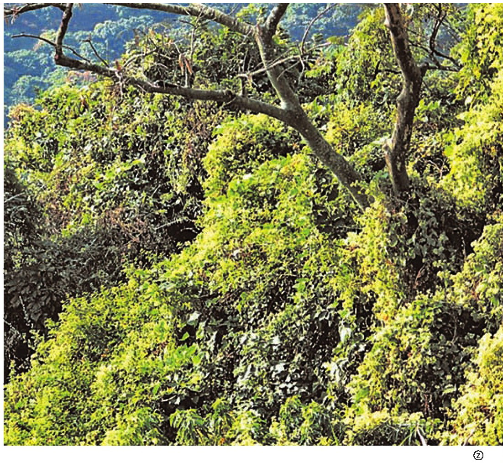
薇甘菊之所以如此肆无忌惮地残害本地植物，除了缺少天敌之外，还因为繁殖能力超强。它既可以有性繁殖，也可以无性繁殖，就算是将其折断，它的茎节也可以再次生根，每个节的叶腋又可长出一对新枝，真可谓“野火烧不尽，春风吹又生”，非常难斩草除根。而且，薇甘菊的籽特别微小，只有0.1毫克，可以随风飘散。

现在，科学家正在努力寻找控制薇甘菊的有效办法，而且将主要的方向瞄准薇甘菊天敌的引进和培育，可是，科学家为了避免重蹈覆辙，对天敌的引进极为慎重，因为谁也不愿意见到新引进的天敌再带来一场新的生态灾难。（张治）

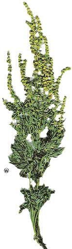
  

**【微博士】**植物杀手——豚草

豚草是中国首批公布的16种危害严重的入侵物种之一，素有“植物杀手”之称，它看似柔弱的外表背后隐藏着对人类极大的杀伤力。豚草的花粉量很大，缺乏抗体的人一旦吸入这种花粉，便会出现哮喘、打喷嚏、咽喉奇痒、荨麻疹、胸闷头昏、失眠等症状，会引发人的过敏和哮喘疾病以及家畜的中毒。同时它的侵占性非常强，常常把农作物赶尽杀绝，导致农作物减产，甚至颗粒无收。

【微问题】能不能将那些生长特别快的入侵植物作为猪、牛、羊饲料的原材料？

【关键词】入侵植物　水葫芦　薇甘菊　豚草

## 葛藤为什么成为美国人眼里的绿色恶魔

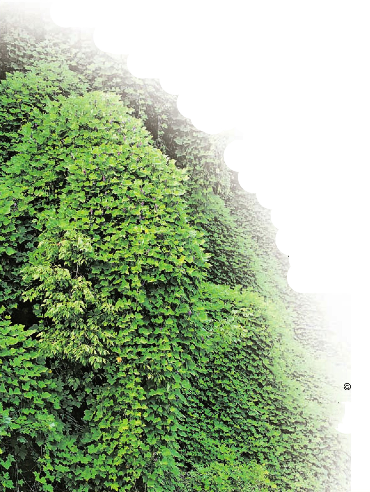
疯狂生长的葛藤

1876年，美国费城举办了建国100周年的世界博览会。这次博览会规模宏大，吸引了许多国家的代表，其中远在亚洲东部的日本，不远万里，派出代表团到美国，并带去了一种有趣的植物——葛藤。葛藤的老家在中国，后来传到日本，而位于太平洋彼岸的美国人从没见过葛藤，因此感到很新鲜。

日本人在博览会上介绍说，葛藤的块茎磨制出的葛粉，具有清热止泻的功效，能医治感冒发热和胃病；葛藤的纤维非常柔韧坚实，是编制篮筐的优良材料；葛藤叶可以作为牲畜饲料；蜜蜂采集的葛藤花蜜能酿制出味道独特的蜂蜜。这一连串的介绍令美国人大开眼界，葛藤一下子在美国风行起来。人们将它引种在庭院里，以供观赏。有个农民尝试着用葛藤的茎叶喂牛，见牛吃得津津有味，于是就大肆宣传，没过多久，葛藤又进入到了牧场。

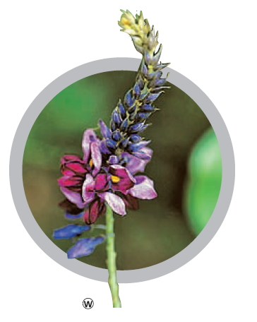
由于葛藤的生命力特别旺盛，能够在各种各样的环境中生存，土壤学家看中了这一点，决定将它种植到美国南部，解决那里严重的水土流失问题。在那儿，既可以利用葛藤的根固定土壤，还可以通过它的固氮作用，增加土壤的肥力。短短几十年后，葛藤已经在美国南部成为了最受欢迎的植物。谁知好景不长，到了20世纪60年代，深受欢迎的葛藤渐渐变成了人人憎恨的“绿色恶魔”。原因何在？原来，葛藤在亚洲会受到冬天严寒和众多病虫害的威胁，有了制约因素，它的发展就受到了节制。可是在气候湿热的美国南部，没有严寒，也没有以啃食葛藤为生的动物天敌，所以它生长特别迅速，一天竟然能长30厘米！它很快就占据了美国南部几千万公顷的农田。尤其当葛藤进入到森林后，利用善于攀援的柔软身躯，拼命往大树的高处爬，伸展出一片片大叶子，把大量的阳光遮挡掉，使土生土长的林木难以沐浴阳光进行光合作用，无法制造其生长所必需的营养物质。

到20世纪70年代，葛藤已经成为美国南部的一大祸害。为了对付葛藤的疯狂“侵略”，美国农业部和林业部不惜耗费巨资，动用大量的人力和物力，开始了一场大规模的葛藤歼灭战。当地的农业工人全部被动员起来，除了喷洒除草剂，还采用拖拉机深翻土地将葛藤连根铲除的方法；有些地方政府还颁布了专门的法律，宣布栽种葛藤是违法行为！经过长期的努力，终于暂时控制住了葛藤的蔓延势头，但科学家一点也不敢懈怠，因为他们知道，只有拿出对付葛藤的根本性办法，才能彻底制服“绿色恶魔”。

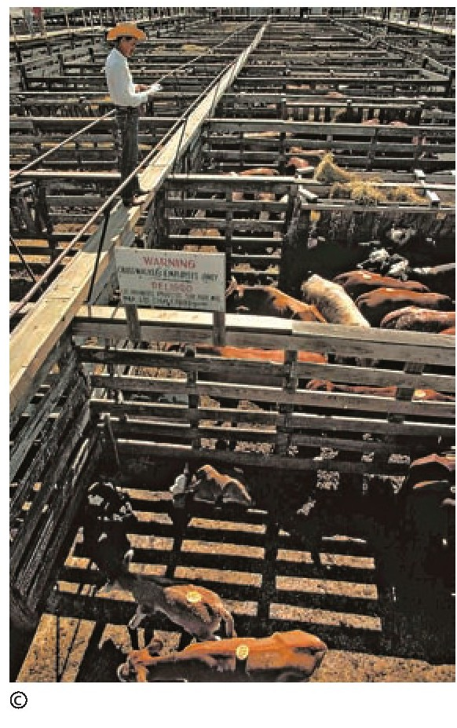
农业学家首先想到的是牛羊，他们在葛藤泛滥的地方放牧大批牛羊，试图利用牛羊爱啃食葛藤的习性将它们统统吃光，可是这方法有很大的缺陷，那就是牛羊在啃食葛藤的同时，也将很多作物吃掉了。后来，一位佐治亚州州立大学的学者提出了新思路，与其艰难地消灭葛藤，不如想方设法去利用葛藤。他提出，葛藤不仅能够作为牲畜饲料，而且是极佳的遮阴材料，让它遮蔽住宅的话，能在炎热之季大大降低屋内温度。他觉得人们利用葛藤，可省下大量的能源。但是，如果真的这样推广，也许会给葛藤更疯狂的蔓延提供方便。总而言之，人类与葛藤的战争还要持续很久，除非科学家能够拿出更好、更有效的新方法来。（马卫国）

## 为什么葛藤有可能成为荒漠先锋植物

在温暖湿润的地区，葛藤的疯狂生长特性给生态带来了巨大的危害，但如果它能生活在中国西部的荒漠之地，这个特点是否可以带来勃勃生机呢？在21世纪初，中国科学家已经对这个问题产生了浓厚的兴趣。

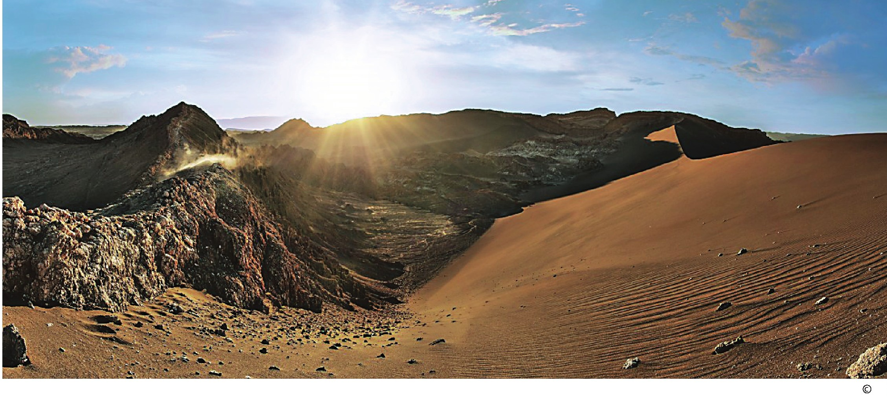
由于葛藤是强阳性植物，不怕高温的炙烤，很适合西部阳光充足的条件。可是，科学家在甘肃荒漠地区进行的栽种实验，却遭到了完全的失败。究其原因，科学家发现葛藤的种子在破土而出萌发幼苗的阶段，对外界的适应能力特别弱，很难经受环境的突变。幼苗适应能力差，但成年植株却相反，因此曾经有这样一个绰号——“带着面包和水壶去旅行的植物”，意思是，成年的葛藤在适应恶劣环境条件之前，是很不容易饿死渴死的。于是科学家另辟蹊径，将整株的成年葛藤移植到甘肃地区，并采用半室内的栽种方式，将主根部分安置在遮风挡雨、避寒、避高温的大棚里，允许枝蔓延伸到棚外去适应异地气候。

经过多年的努力，初步的尝试已经获得成功。根据甘肃天水试验记录，一株初栽成年葛藤第一年能匍匐地面2平方米，长达3米以上。由于葛藤有极强的生长性和对土地的侵犯性，一旦适应环境，必定会锻炼出更加不可思议的沙地生长的品质来。尽管目前还处于试验阶段，但科学家期待葛藤成为改良荒漠的先锋植物。（马卫国）

  

**【微博士】**原产地失控

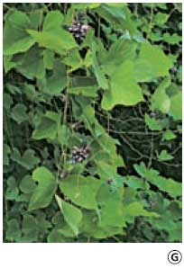
葛藤

根据2005年的生态调查，中国的温州、深圳等地区也遭受到葛藤的巨大危害。中国是葛藤的原产地，为什么在原产地它也会变成“恶魔”呢？科学家解释说，以前，葛藤在原产地受气候因素的控制，不会形成大的生态灾害。但在近些年，由于生态环境恶化，尤其是气候变暖，冬天变得不像原来那样寒冷，遏制葛藤生长的控制因素渐渐缺失，从而导致了葛藤在原产地也变成了疯狂的有害植物。

【微问题】既然葛藤的纤维非常柔韧坚实，能不能用它来代替棉麻类的纤维植物？

【关键词】葛藤　荒漠先锋植物

## 为什么有些植物之间会相克

我们知道，动物不能进行光合作用，无法自养，必须通过摄取外来的食物来维持生命。所以它们必须要有足够多的地盘，才有可能得到足够多的食物。为了争夺赖以生存的地盘，动物之间往往会发生你死我活的搏斗，最后胜者为王。而植物是依靠光合作用制造养料的，属于自养型生物，无需像动物那样去抢夺“他人嘴里”的食物。其实，植物之间也会争斗。如果说动物是为了猎物而明争，那么植物则是为了阳光、水分和养料而暗斗。

由于植物能够自养生存，而且不会运动，从诞生一直到死亡，总是固定在一个地方，它们之间是怎样进行争夺地盘的战争的呢？

20世纪80年代，一位名叫鲍德恩的美国植物学家发现，在美国西南部的干旱平原上有一种叫山艾树的植物，它的最大特点就是“孤独”，因为在它生长的地盘之内，几乎没有任何其他植物存在，甚至连一根小草也没有！这个现象引起了鲍德恩的极大兴趣，这是偶然的现象，还是山艾树的主动霸道行为？鲍德恩开始了寻找答案的第一步。他在山艾树附近种植了各种各样的其他植物，结果鲍德恩发现，这些植物没过多久都莫名其妙地先后死去，无一幸存。

那么，山艾树究竟用什么手段来攻击对方？使用的武器又是什么？为了进一步揭开其中的秘密，鲍德恩对山艾树附近的土壤进行了仔细分析，发现土壤中存在着一种很奇特的化学物质，而且越靠近山艾树植株体，土壤中该化学物质的浓度就越高，很显然，它是由山艾树分泌出来的。这种化学物质的作用和除草剂的功能有点相似，能使其他植物无法生存。答案终于清楚了，山艾树依靠自己制造出的“化学武器”，把其他植物统统驱赶出自己的“领地”。

毫无疑问，植物之间存在着争夺地盘的战争。从某种意义上说，植物之间的战争虽然没有追捕、撕咬的有形场面，但无形的战争场面要比动物之间的战争更为激烈。（王生清）

## 为什么水仙和铃兰是一对“天生冤家”

21世纪初，中国南方某城市举办了一个规模颇大的迎春花展。展览厅中，几百种花卉万紫千红、争奇斗艳，展览很成功。为了使展览更加红火，展品更加琳琅满目，展览单位决定再增加一些花卉品种，并对展品位置进行了必要的调整。由于专业人员的忽视，缺乏专业知识的工作人员在调整过程中，将铃兰搬到了水仙花的附近，结果闯下了大祸。这两种花卉成为邻居之后，很快就失去了“精神”，变得无精打采，继而又开始出现花朵凋落、叶片萎靡等症状，最后竟然双双死去。

发生这出悲剧的原因何在？原来，水仙和铃兰是一对天生的“冤家对头”，它们绽放的花朵美丽娇艳、香气袭人，但花香中所含的某种化学物质，恰恰是令对方难以承受甚至致命的。一旦彼此成为了近邻，都会受到对方花香中的“毒气”伤害，最终结果是两败俱伤。

| 水仙 | 铃兰 |
| --- | --- |

其实在植物王国中，天生的“冤家对头”还有很多。例如，将苹果树和核桃树种在一起，核桃树就会对苹果树不宣而战。由于核桃树叶分泌的“核桃醌”会随雨水流进土壤，有害于苹果树的根，引起根部细胞质壁分离，使苹果树难以成活。

又如，在葡萄园周围种上榆树，葡萄就会遭殃。在它们之间，榆树是强者，葡萄是弱者，彼此“狭路相逢”后，榆树分泌出的化学物质会向对方发起攻击。双方的距离越近，榆树分泌物的杀伤力就越大，最后导致葡萄叶片枯萎，果实稀稀拉拉，葡萄甚至就此死去。在现实生活中有时能见到这样的场景：生长在榆树附近的葡萄，枝条总是背着榆树而长，尽量躲得远远的。

根据科学研究发现，植物之间发生的“战争”，几乎都和它们的分泌物有关。植物体内分泌物的种类有很多，如有机酸、直链醇、脂肪族的醛酮酚类化合物、类黄酮、丹宁、氨基酸、多肽、生物碱，等等。它们之间还会通过叶片或枝条直接接触方式，提升对方体内酶的活性，加快产生一系列的生物化学反应，使对方的新陈代谢过程发生变化，最终影响生长发育。

如果人们能科学地掌握植物之间“互利”或“相克”的规律，就可以合理安排农作物的种植、树木的栽植，使植物之间避免内战自耗，得以快速地生长，为人类做出更多的贡献。（王生清）

## 植物能不能自己生产对付昆虫的“化学武器”

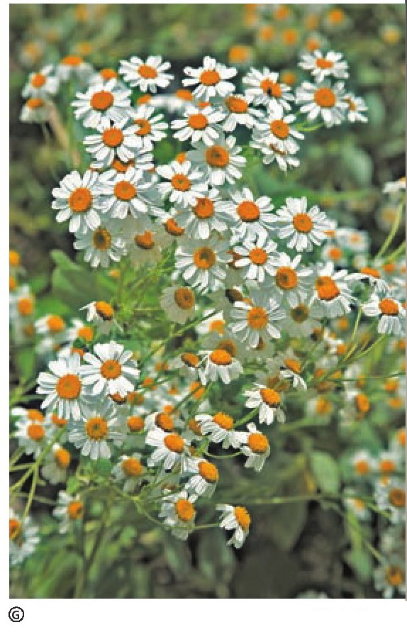
除虫菊

很多植物都会分泌出特殊的化学物质，用来对付其他的植物，简直就是“自相残杀”。如果将“化学武器”的目标对准残害植物的昆虫，那就是“正义之战”了。其中我们最熟悉的要数除虫菊，它的花序中含有大量的除虫菊素，昆虫只要接触后，很快就会出现过度兴奋、运动失调甚至全身瘫痪麻痹。

科学家已经找到不少具有应用价值的杀虫植物用来对付害虫。例如中国北方最主要的蔬菜大白菜很容易患上根腐病，但韭菜分泌出的杀菌素恰恰能杀死导致根腐病的真菌腐皮镰孢霉菌。掌握了其中的秘密就能对症下药，将韭菜作为大白菜的邻居，充当大白菜的“保健大夫”，是再合适不过的了。

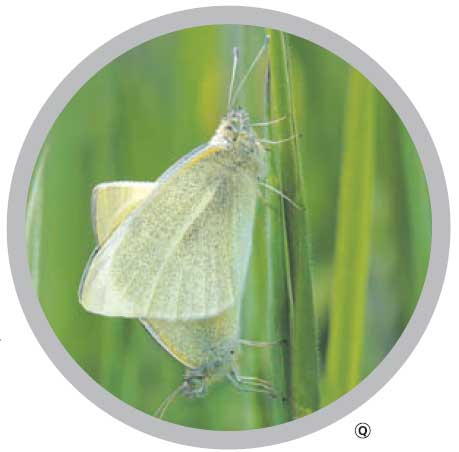
进入21世纪之后，科学家越来越重视对植物源杀虫活性天然产物的研究，并着重于植物分泌物中的生物碱类、萜烯类、酮和醌类等化学物质杀灭害虫的效果。用植物的“化学武器”对付害虫，不仅有效而经济，更重要的是，它不会像人工化学杀虫剂那样给环境带来污染。（王生清）

  

**【微博士】**莴苣的威力

蔬菜专家发现，对蔬菜危害极大的菜粉蝶特别害怕莴苣的气味，于是尝试着将莴苣和青菜种植在一起，结果，青菜遭受菜粉蝶危害的程度大大降低，因此有人还给莴苣起了个外号“活的抗虫剂”。

【微问题】除虫菊能杀死讨厌的蟑螂吗？

【关键词】相生相克　除虫菊　莴苣

## 为什么现在风吹草低见牛羊的草原很少了

说到草原，人们就会想起“天苍苍，野茫茫，风吹草低见牛羊”的千古名句，脑海中会闪现出悠闲吃草的牛羊身影被高大的草丛遮蔽，只有在风儿把草吹弯下身时才能显现出的景象。初次到草原游玩的人怀着能见到这种美景的愿望，可是真的到了草原，又不免失望：怎么这里的草如此低矮？草原上的牧草不用说高过牛羊，有的甚至仅仅只及脚踝。

其实，并不是所有的草原都生长着高大的草。地理学家把草原分为“高草草原”和“矮草草原”两类。只有在年平均降水量相对较多（一般在500毫米以上）的地方才能够形成高达1.0～1.5米的高草草原。比如中国东北平原的黑土地带，在开垦成农田之前，其天然植被就是以高草草原为主。

高大的草因为需水量较大，难以生长在年平均降水量相对较少的地方。中国大部分草原地区的年平均降水量都少于500毫米，所以矮草草原占优势。比如在内蒙古东部的呼伦贝尔、锡林郭勒地区，主要的草种是高50～100厘米的大针茅和高40～90厘米的羊草。在内蒙古西部的呼和浩特、包头地区主要的草种是高20～60厘米的短花针茅和高不到25厘米的沙生针茅。青藏高原上的主要草种是紫花针茅，高也只有20～45厘米。相比之下，成年山羊、绵羊的身高为70～90厘米，成年牛的身高为1.5米左右。显然，在矮草草原上要么只能藏住羊，却藏不住牛，要么连羊也藏不住，完全不会有“风吹草低见牛羊”的景观。

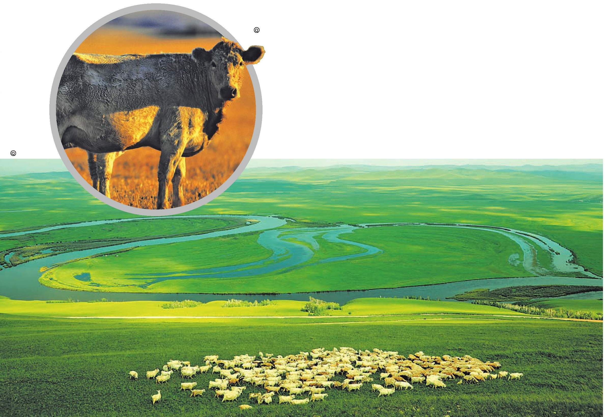
可见，“风吹草低见牛羊”的景象难得一见，是有其生态地理方面的因素。但最重要、最根本的原因是人类的破坏活动，导致草原出现大面积退化，当然这和全球气候变化也有一定关系。由于草原属于脆弱的植被，土壤又薄又贫瘠。如果盲目开荒，把草原垦殖为农田，也许开头几年还有一定收成，但几年之后就会因土壤肥力耗尽而颗粒无收。与此同时，因为土壤失去了植被的覆盖，会很快被风吹走，下面的沙子就露了出来。这时候，草原就退化成为荒漠。

即使只在草原上放牧，草原能够承载的牲畜数量也是有限的。如果放养的牲畜数量超过草原的承受能力，优质的牧草被啃食殆尽，也会造成草原退化，轻则毒草丛生，重则如同毁草开荒，植被完全被毁坏。据统计，现在中国牧区的牲畜数量已是20世纪50年代时期的3倍还多，远远超过草原的承受能力，由此导致的草原退化也就不足为奇了。更有甚者，有些地方为了开发地下矿产资源，在草原上挖掘了不少矿洞。如果对矿洞周边的草原不加保护，也将大大加快草原退化的速度。

草原退化不仅会对当地环境、经济造成损害，也会严重影响邻近地区的生产和生活。比如中国北方春季常有沙尘天气，沙尘的一大来源就是草原退化的荒漠。所以，我们要爱护草原，制止不合理的人类活动。（刘夙）

## 为什么有的植物会“行走”

一位植物学家在美国西部一个荒无人烟的地方做科学考察，离开时为了方便下次能够找到这个地方，他选了一棵比较特别的植株，并在它身上做好了标记。然而，过了几个月之后，当他再回到那里时却发现那棵植株不见了！细心的科学家认真观察了周围的情况，发现地上有一条浅浅的痕迹。顺着这条痕迹，他走了很远，终于在一个小湖泊边找到了那棵做了记号的植株。植物竟然自己会行走？

原来，这种植物在水分充足的地方能够固定在一处生长，一旦干旱缺水，它的根会离开泥土，植株体卷成一个球体。起风时会随风而动，遇到有水的地方就会停下来，将根插入泥土中，获取水和养分，开始它的新生活。由于这种植物好像能够感知周围的环境并从沉睡中苏醒过来，人们称它为苏醒树。

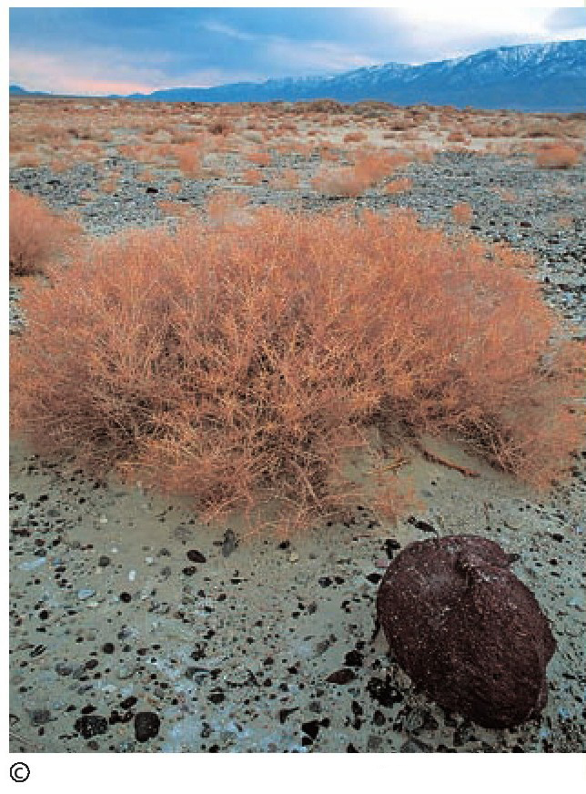
生长中的风滚草

沙漠中还有一种植物叫风滚草，它也能够在干旱的时候把根卷成一团，随风滚动，远远看去，就像一个小球在快速地翻滚。遇到有水的地方，它又会落地生根，再次生长。（邓泓）

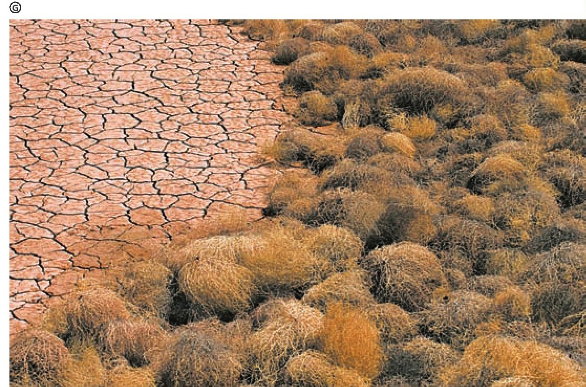
卷成一团的风滚草

  

**【微博士】**退化根源

导致草原退化的自然因素主要有长期干旱、风蚀、水蚀、火灾、沙尘暴、鼠害和虫害等，但更多的还是人为因素，如过度放牧、滥垦、过伐等。长期的不合理利用甚至掠夺式利用，不断从草原带走大量的物质，而草原却得不到补偿，这就违背了生态系统中能量与物质平衡的基本原理，导致生态系统紊乱、失调和衰退。

**【微博士】**种类

在中国的草原上，最常见的是各种各样的针茅，如大针茅、短花针茅、沙生针茅和紫花针茅等。这类草之所以叫“针茅”，是因为它们的成熟果实一端锐利如针，可以使果实方便地扎入土中生根发芽。不过，某些种类的针茅（如大针茅）的果实可以扎透羊的皮肤、舌头，对羊的健康造成损害，所以这些种类的针茅对畜牧业是有害的。

【微问题】过度放牧的草原上，动物吃完了上面的草，还会啃食地下的草根吗？

【关键词】高草草原　矮草草原　草原退化　风滚草

## 温带草原上为什么很少见到大树

如果你六七月份去内蒙古草原，会被那里的景观深深震撼：连绵不绝的青草覆盖着一望无际的大地，从脚下直抵天边；举目望去，几乎看不见一棵树，视野十分开阔，令人心旷神怡。

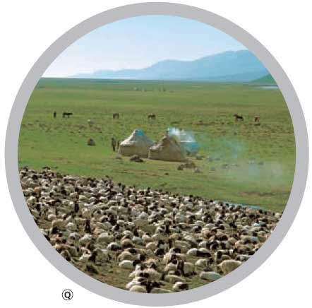
在地理学上，草原是具有多种功能的自然综合体，分为热带草原、温带草原等多种类型。如果从广义和狭义方面去理解草原，它也可以分为两大类：广义的草原包括在较干旱环境下形成的以草本植物为主的植被，主要包括热带草原（热带稀树草原）和温带草原；而狭义的草原则只包括温带草原。中国内蒙古草原属于温带草原，那儿的地面主要被草本植物覆盖，极少见到乔木，因此有人提出疑问，为什么在草原地带就长不了乔木？草原会不会演变成森林？

这是复杂的生态学问题，如果简单地回答，那就是草原地带降水比较少，年平均降水量只有150～600毫米，而且往往集中在夏季。不仅如此，那儿经常有干旱发生，每年降水量有很大波动，而乔木通常需要有较大量的、比较稳定的水分供应，这种降水量偏少又剧烈波动的特点显然不利于乔木生长，相比之下，草本植物对水分的要求就低多了。

假如一个地方降水不多，但气温较低，由于水分蒸发较少，仍然可以满足某些乔木的生长。例如俄罗斯西伯利亚地区的年降水量和草原地带差不多，但一年里最热月份的平均气温不到20℃，气候湿润，因而生长着茂密的森林。但温带草原的最热月份平均气温在20℃以上，甚至更高，降下的雨水大部分很快就蒸发掉了。在西伯利亚能生长的那些乔木，在这里就会因“口渴”而死。

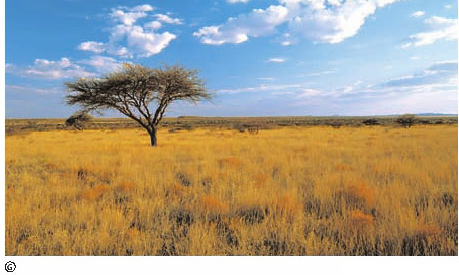
热带稀树草原

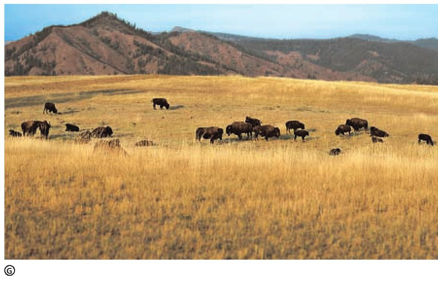
温带草原

温带草原的土壤层也是导致乔木难以生长的重要因素。在地面大约50厘米以下，有一层致密坚实的土层，因为钙含量很高，叫作“钙积层”。钙积层仿佛是在地底下涂抹的厚厚一层白灰，不光是乔木，甚至包括不少灌木的根系都很难穿透它，这就更让乔木在草原地带无法立足了。而很多草本植物的根系却主要分布在50厘米以内，不受钙积层的影响，所以才得以在草原上繁茂生长。

虽然在温带草原上一般很少见到乔木，但也不能一概而论。比如在河流两侧，因为水分条件好，有时可以形成高大茂密的河岸林。在草原中的沙地上，也常常可以见到榆树、沙地云杉、樟子松等乔木在草丛中零散生长，形成独特的沙地疏林草原景观。那儿之所以也能见到乔木，首先是因为这些乔木通常都属于十分耐旱的种类，其中像沙地云杉更是古老森林残留下来的树种，已经适应了当地下雨少、降水量波动大、蒸发量大的气候。其次，那儿的地面下不仅没有阻碍木本植物根系伸展的钙积层，而且因为沙粒之间有很大空隙，可以像水库一样积蓄降水，这就使乔木能够扎根。

非洲大草原就是这类草原的典型，草原上有大片的绿草，也有零散生长的金合欢之类的乔木。非洲大草原分布在热带地区，气候和温带草原的差别很大，在地理学上称为“热带稀树草原”，属于广义范畴内的草原。

热带稀树草原的气候虽然和温带草原差别很大，但有一点相同：因为降水量较少，气温较高，蒸发量较大，所以气候比较干旱。除了少数耐旱乔木，多数乔木不能生存，因而其植被就同样以耐旱的草本植物为主了。而且，热带稀树草原上常常发生火灾，容易使乔木辛苦多年长成的枝条毁于一旦。由于火灾几乎只发生在旱季，这时候草本植物还没有萌发，所以火灾对草本植物的影响很小。

尽管有着上述不利因素，但是热带稀树草原的土壤中并没有像钙积层那样的不利于木本植物根系生长的土层，所以一些耐旱的乔木还是可以生存的。（刘夙）

## 猴面包树为什么能生长在非洲大草原上

非洲大草原上生长着一种“大胖子树”，它的果实甘甜多汁，是猴子、猩猩最喜欢的美味，因此被人称为猴面包树。

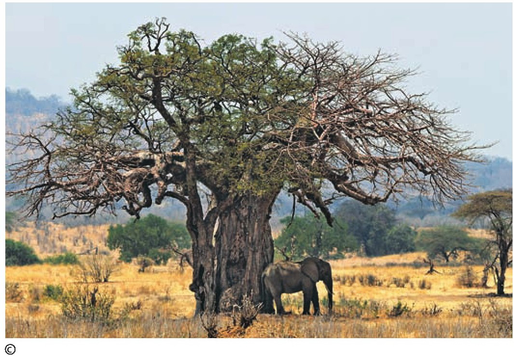
猴面包树

我们已经知道，热带草原气候炎热，有明显的旱季和雨季，尤其到了旱季，降雨量很少。那么，这种高达20米的大树是怎么生存下来的呢？原来，猴面包树为了能够顺利度过旱季，在雨季时拼命地吸收水分。由于它树干的质地很疏松，就像多孔的海绵，非常适合储存水分。据说一株猴面包树的树干能储存几千千克水！将它比喻为草原上有生命的水塔，一点也不过分。由于有了充足的水储存，就能保证猴面包树在干旱季节不会被渴死。

不仅如此，猴面包树还成了旅行者理想的水源。只要在树上挖个小孔，清新解渴的“饮料”便可源源不断地流出来，解决旅行者在茫茫荒漠中的缺水之急。由于猴面包树曾为许多在热带草原上旅行的人提供了救命之水，解救了因干渴而生命垂危的旅行者，因此又被称为“生命之树”。（邓泓）

  

**【微博士】**草原别名

就像非洲的热带稀树草原又叫“萨瓦纳”一样，不同地区的温带草原也各有各的别名。比如欧亚草原又叫“斯太普”；北美洲草原又叫“普列利”；至于南美洲阿根廷一带的草原，它的别名就是大名鼎鼎的“潘帕斯”，所以阿根廷国家足球队会有“潘帕斯雄鹰”的美称。

【微问题】为什么稀树草原上的乔木树冠都是平顶状的？

【关键词】草原　钙积层　温带草原　热带稀树草原

## 光秃秃的裸岩上怎样长出森林

从直觉上说，植物要想生长在光秃秃的裸岩上，几乎没有可能。因为，裸岩上的生存条件太恶劣！白天炙热的骄阳把它烤得火烫，夜晚的寒风又将它吹得冰凉。当倾盆大雨到来时，裸岩上一片湿漉漉的，可雨后天晴一经阳光照射，马上又变得滴水无存、无比干燥。究其原因，是因为裸岩上没有土壤，无法将水分保留住，所以，植物的种子无法在那儿安家落户、萌发生长。可情况并非如我们直觉的那样简单，如果裸岩永远保持原状态，在地球荒凉的古老岩层上，又怎么会出现一片片茂密的大森林？

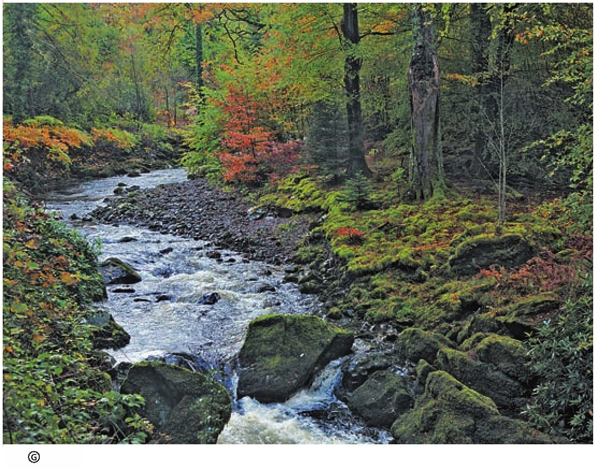
改造裸岩，为它穿上绿色“衣衫”，是一项伟大而又漫长的工程，只不过，为大工程打下重要根基的不是参天大树，而是看起来特别不起眼的低等植物。

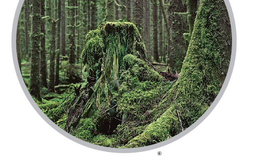
如果我们走进荒山野岭，只要注意观察就会发现，有些光秃的岩石上长着一片片的“斑块”，有灰绿色、黑褐色、橙黄色或灰白色，还有的像一层皱巴巴的硬壳或毛茸茸的绒布，它们看上去虽然貌不惊人，但最先向裸岩进军的就是这类小型植物——地衣。

地衣为什么有如此杰出的本领呢？原来，当它的碎片飘落到裸岩上后，根本不需要土壤，凭借空中的水分和光合作用制造的养料就能维持生命。地衣落脚裸岩的初期，会一边缓慢生长，向四周扩散，一边分泌出特殊的酸性物质，逐渐腐蚀裸岩的表面。日久天长，随风吹来的尘土微粒被地衣吸附，使地衣层不断增厚。随着岁月的流逝，地衣一批批生长，又一批批死亡。死去的地衣加上吸附的尘土微粒，再加上被酸性物质腐蚀软化的岩石颗粒，终于在裸岩上形成了一层很薄的土壤。

地衣是裸岩的最初开拓者，接下来，另一类小型苔藓植物登场了。苔藓的孢子很细小，随风飘散到这儿。如果这儿依然是一片完全裸露的岩石，孢子绝对无法生存萌发，但有了地衣，情况就大不一样了。尽管岩石上的土层薄得可怜，但对苔藓来说已经足够了。于是，岩石表面出现了地衣和苔藓混居的场面。

没过多久，苔藓和地衣发生了矛盾，苔藓利用它生长迅速的优势，占领了越来越多的地盘。而且，它的身体挡住了阳光，使匍匐在下的地衣不能进行光合作用，最后慢慢死去。就这样，后来居上的苔藓成了岩石表面的唯一“主人”。这时候，原先光秃秃的裸岩彻底变了样，无数苔藓植物在岩石表面连成一片，仿佛给岩石穿上了一件绿色“外衣”。苔藓接替了地衣，在岩石上开始了新的开拓。它以地衣无法比拟的快速度生长繁殖，年复一年，一代代死去的苔藓形成了更多的腐殖质，使土壤层变肥加厚。然而苔藓兴旺发展的好景不长，由于土壤已经达到了一定的厚度，引来了种子植物。

最先来的种子植物是耐旱的一年生草本，随后多年生的草本植物也接踵而至。它们的身材要比苔藓高大多了，夺走了岩石上层的大量阳光，最后把苔藓排挤出去。

以后，类似的植物演替继续进行。通过风力和动物带来的木本植物种子，代表着更强大的新生力量，它们在几代“开拓先驱”留下的土壤上生根发芽、抽枝展叶。由于上层空间几乎被木本植物占领，大部分草本植物开始走向没落衰亡。最后登上这片土地的是高大乔木，它们冲破灌木丛的封锁，在更高处展开枝叶，蔽日遮天，只留下少数的缝隙，让细碎的阳光洒落到灌木丛。这时，除少数耐阴的灌木依然顽强生存，大部分都退出了这片土地。这时，乔木大树成了这儿的主宰，用魁伟的身躯庇护着树上树下的各种动物，而且还利用纵横延伸的根系深入到岩石缝隙，使岩石开裂瓦解。

昔日光秃秃的裸岩，经过地衣、苔藓、小草和灌木的一次次开拓，终于形成了生机勃勃的森林。但是千万别忘记，在这个漫长的过程中，裸岩上的真正开拓先锋是地衣。（王生清）

## 为什么要对发菜手下留情

发菜是一种陆生蓝藻，又叫念珠藻，主要生长在干旱和半干旱地区。它的营养价值并不高，只是因为发菜的谐音为“发财”，成为餐桌菜肴中的珍品，也招引来了许多饕餮之徒。可悲的是，很多吃发菜的人竟然不知道自己已经成为破坏荒漠生态的帮凶。

植物学家告诉我们，发菜是一种能固氮的光合原核生物，能把空气中的氮气还原成氨，合成氨基酸，这对改良荒漠土壤、繁衍其他生物有重要意义。以此，发菜被誉为“开发荒漠的先锋”。发菜具有如此重要的作用，却被无知的人类大肆采挖。在中国西北和华北各地，由于对发菜进行毫无节制的掠夺性采收，已严重破坏了当地的生态环境，造成了严重后果。所以，请每一个有良知的人都向社会发出呼吁：对发菜手下留情！（王生清）

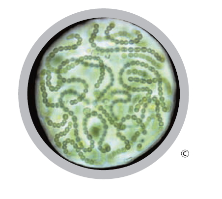
显微镜下的念珠藻

发菜

  

**【微博士】**裸岩之岛

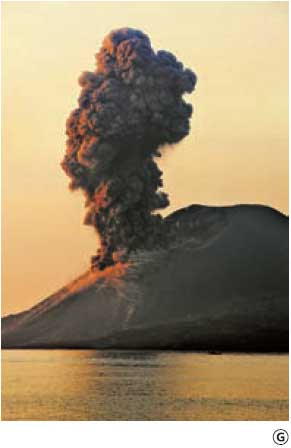
1883年8月27日，位于东南亚地区的喀拉喀托火山发生超级大爆发，它发出的震耳欲聋的声音传出数千千米之外。岛上所有的生命，不管是飞禽走兽，还是大树小草，无一幸免，成为了一个没有生命的裸岩之岛。后来，一支科学考察队登上这个被彻底毁灭的小岛，他们并非来研究火山地震，而是想了解小岛要经过多少时间才能重新出现生命。结果发现，直到火山爆发后的5年之后，才有地衣出现，再过了几十年，苔藓植物、蕨类植物以及小草和灌木才依次前往小岛“定居”。

【微问题】地球上所有郁郁葱葱的青山以前都是光秃裸岩吗？

【关键词】地衣　发菜

## 植物的遗传密码是如何工作的

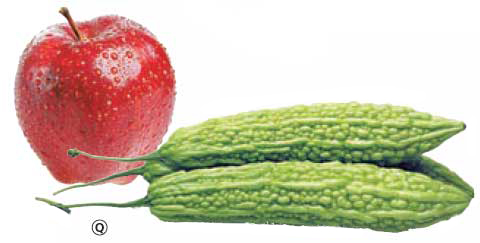
俗话说“种瓜得瓜，种豆得豆”，为什么会有这样的结果呢？其实这是对生物遗传现象的生动描述。地球上一切生物，从结构简单的病毒到有智慧的人类，都能将自身的多样性传递给后代，这是生命能够延续、种群得以繁衍的基本保证。以植物为例，自然界存在各种各样的花花草草，品种繁多，形态各异，是什么“东西”决定了每种植物能够将自己的独特特征传递给下一代呢？是“遗传因子”，也就是现在所说的基因。犹如复印机一样，通过复制，基因能把遗传信息传递给下一代，使后代出现与亲代相似的性状。

基因一说可以追溯到19世纪，并来源于植物。1865年，奥地利生物学家孟德尔通过豌豆实验，提出了生物的性状是由“遗传因子”控制的观点。1909年，丹麦科学家约翰森用“基因”这个名词代替了“遗传因子”。1926年，美国著名的遗传学家摩尔根在《基因论》中首次提出了基因学说，即基因决定着一个特定的性状，而且能发生突变和交换。现代科学家认为，基因是一种称作为DNA（脱氧核糖核酸）分子上的特定核苷酸排列，即所谓遗传密码，不同的排列代表不同的基因。染色体是装载基因的载体。

基因又是如何决定植物不同的功能和性状的呢？

先要从蛋白质说起，一方面，蛋白质是构成一切细胞和组织结构所必不可少的成分，在生命活动中无处不在。另一方面，在所有生物体内，在各种各样物质的形成过程中，称为“酶”的蛋白质是一类必不可少的化学反应促进物，又称为生物催化剂。不同的酶促进不同的反应过程及其产物，不同的反应过程和产物又决定了生物不同的特性：有的植物高大挺立，有的植物匍匐而生；有的花是红色的，有的花是黄色的；有的果实是甜的，有的果实是苦的，等等。

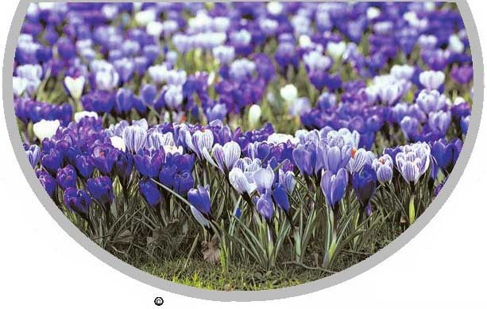
不同蛋白质或酶的生成是由谁来决定的呢？是基因，是核酸。核酸，包括DNA和RNA（核糖核酸），扮演的是遗传信息存贮和传递的角色。从植物种子萌发到开花直至死亡整个生长发育过程中，植物基因组存储着控制植物完整生命活动的全部“遗传密码”。这些“密码”在特定的时间、地点打开，将特定的遗传信息转换为表现生命活动的蛋白质，从而使植物呈现多样性。

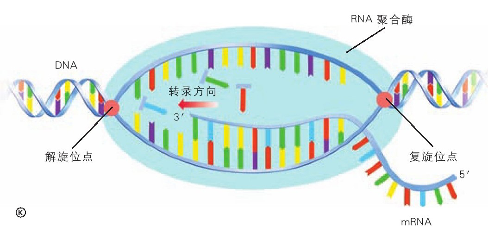
转录是在DNA指导下合成RNA的过程。DNA双螺旋在解旋位点处解旋后，以其中的一条DNA链为模板，在RNA聚合酶的作用下，合成出与其核苷酸序列互补的mRNA

总之，基因控制着蛋白质的合成，从而也决定了植物的特性和功能。从基因到蛋白质包含遗传信息的转录和翻译两个过程，即遗传信息从DNA传递给RNA的转录过程，以及再从RNA传递给蛋白质的翻译过程，这就是现代科学称作为的“中心法则”。植物的遗传密码——基因就是遵循这一生物界的法则运行操作的。（王佳伟）

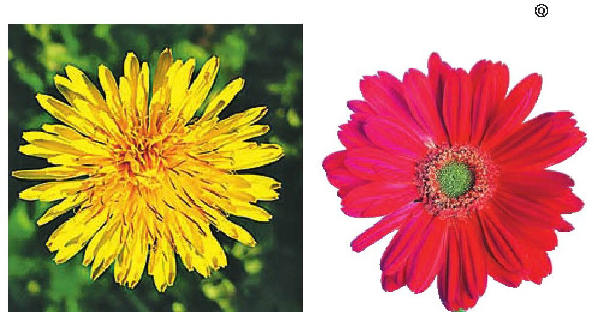
基因控制花朵颜色

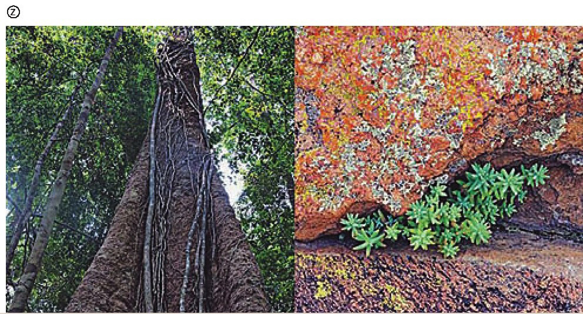
基因控制植株个体大小

## 植物的遗传密码会失效吗

在遗传中有一个现象称为“基因沉默”，这一现象最初是在植物中发现的。在对一种常见园林观赏植物矮牵牛的研究中发现：将一个能够产生色素的基因导入矮牵牛中，试图加深花朵的紫颜色。结果不但没看到期待的深紫色花朵，多数花反而呈现出花斑，甚至白色。这种现象的产生是因为导入的外源基因没有正常表达，同时与其相似的植物本身的基因表达也受到抑制。这如同输入了错误的密码后，原来的密码也打不开了。这种外源基因在转基因植物中表达量很低，甚至不表达的现象称为“基因沉默”。

基因沉默现象引起了科学家的注意。通过对这一现象的研究，科学家期望：一是帮助人们进一步揭示生物基因遗传表达调控的本质；二是使外源基因能更好地按照人们的需要进行有效表达；三是基因沉默技术从理论上分析，可以治疗各种疾病。因此，基因沉默现象在理论上是有意义的，在实践上是有潜力的。（王佳伟）

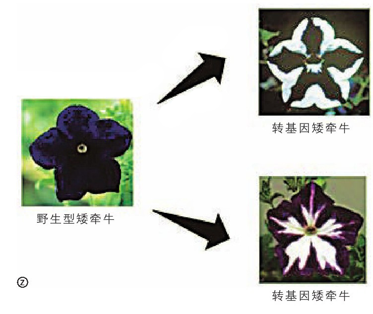
## 植物的遗传密码可以修改吗

日常生活中的许多密码是可以修改的，如开启电脑的密码、打开电子邮件信箱的密码、银行卡的密码、保险箱的密码等。植物的遗传密码也是可以修改的，“基因敲除”就是植物密码修改的技术之一。它是指将一定的基因从基因组中删除。广义的基因敲除包括某个或某些基因的完全敲除、部分敲除、基因中调控序列的敲除等。在植物中，敲除某个基因后会产生外表形状的变化，通过表型可以分析某个基因与某种性状或功能是否有关系。同时，基因敲除也为定向改造生物，培育新型生物提供了重要的技术支持。例如，某些植物必须经过低温处理才能开花，如果将控制这个过程的基因敲除了，那么这些植物不用经过低温处理就可以开花了，这大大提高了这些植物的适用范围。在常规育种中，由于上一代父本和母本整合的随意性会给后代带来不确定性，而基因敲除恰恰克服了这一缺陷，成为一种理想的修饰、改造生物遗传物质的方法。推而广之，它还可以用于人类对疾病的深刻认识和疾病的基因治疗，有着重大的理论和实践意义。（王佳伟）

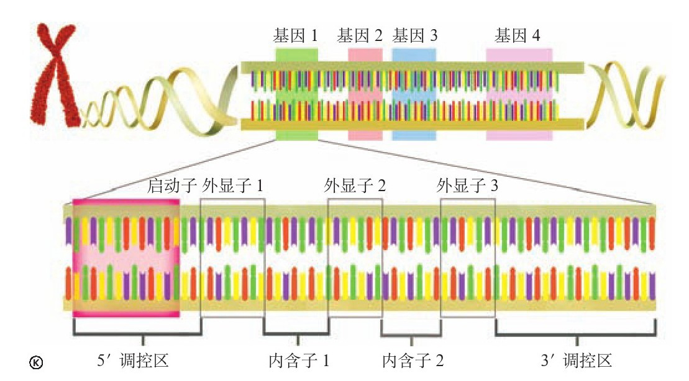
基因呈线形排列于染色体上，每个基因由调控区、外显子和内含子组成，调控区中的启动子可启动转录。原核生物的基因无内含子

  

【微问题】一个基因决定一种性状吗？

【关键词】染色体　核苷酸　酶

## 利用转基因技术可以获得新的植物品种吗

这是一个很多人关心的问题，要回答这个问题，我们先从植物育种谈起。

目前，农业育种家主要利用传统的作物育种手段进行品种改良。育种家需要从大量自然随机变异中筛选所需要的农艺性状，传统的选育技术一般只能在生物种内个体上实现。即使采用传统的杂交育种技术一般也是在生物个体上进行，所转移的基因是大量的，对后代的表现预见性差。因而传统的植物育种途径，无论是粮食作物、经济作物、观赏植物等，都有较大的盲目性，且费时费力。

随着现代科技的飞速发展，已有的农业科技研究和实践已经证明，转基因技术可以有针对性地对植物进行定向改造，使其满足我们的特殊需求。有一些性状，如抗虫、抗除草剂等，受种质资源的限制，常规育种技术难以实现，而当代发展起来的植物转基因技术完全可以打破物种间基因交流的限制，使植物迅速获得新的特性。因而，转基因技术必定是未来获得具有特定功能的植物新品种的主要手段。那么，如何来实现植物的转基因呢？

生物体的遗传物质是脱氧核糖核酸（DNA）。基因是一些具有遗传效应的DNA片段，是遗传的物质基础。这些片段大多编码的是蛋白质，也有一些编码具有调节作用的核糖核酸分子（RNA）。植物具有2万～10万个基因。这些基因在特定的时间、位置或特定环境下表达，产生的蛋白质和RNA之间发生复杂的相互作用，共同完成细胞的生命活动，从而导致生物体多种多样。

转基因技术就是通过特殊技术手段，人为地将基因导入到植物体内。这些被转移进新基因的植物就是转基因植物。导入的基因可以来源于受体植物自身，也可以来源于其他植物，或者动物、微生物，还可以是经过人工修饰甚至直接人工合成的基因。这些导入的基因会使植物获得一些原本没有的特性。例如将水母中可以发荧光的蛋白质的编码基因转移到植物中，植物在特定的条件下也就可以发出荧光；将除草剂降解相关的基因转入植物体内后，可以获得能抵抗除草剂的植物。这些具有新特性的转基因植物通常不能直接用于农业生产，而是要通过多种常规育种手段，将这些新特性转移到已有的优良品种中去，培育出可以推广应用的转基因作物新品种。（陈晓亚　杨长青）

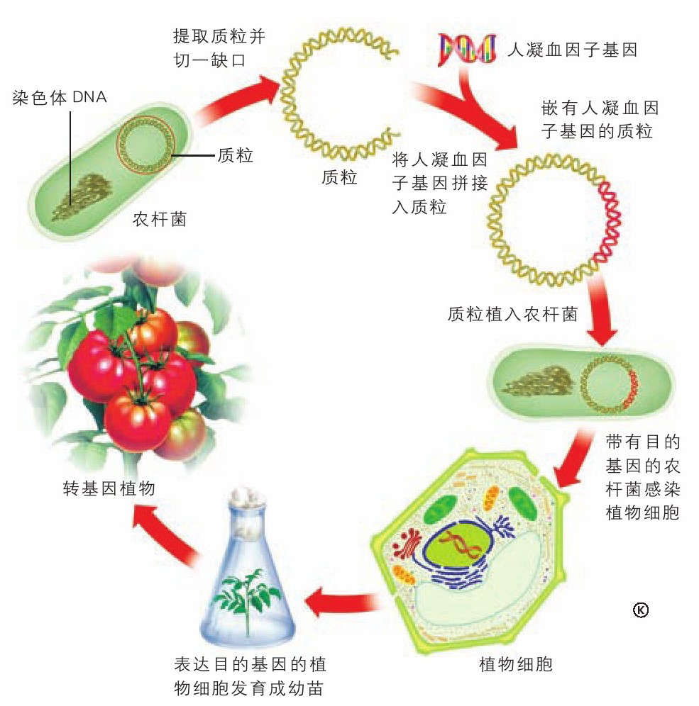
## 怎样才能获取有用基因

所谓的有用基因，若用大众语言来说就是对生物体生存有用处的基因，但科学家却有更严谨的阐述。首先，有用基因的来源是多种多样的，不同的生物都具有一些共同的维持基本生命活动必需的基因，如产生能量相关的基因、繁殖后代相关的基因等。除此以外，它们还具有一些特有的基因，使生物体具有特殊的能力，例如合成具有杀虫效果的蛋白质，合成特殊的色素或气味分子等。在查清基因位置、序列和功能的基础上，首先要利用基因的切割技术或扩增技术，把需要的特定基因从相应的生物中提取出来，然后通过现有的一些技术手段，将这些特有的基因转移到植物中去，就可能培育出具有新特性的转基因植物。关键是要确切地知道特定基因的序列和功能在整个基因组中的位置，并使其在受体植物中以预`期的方式表达并完整地行使其功能。

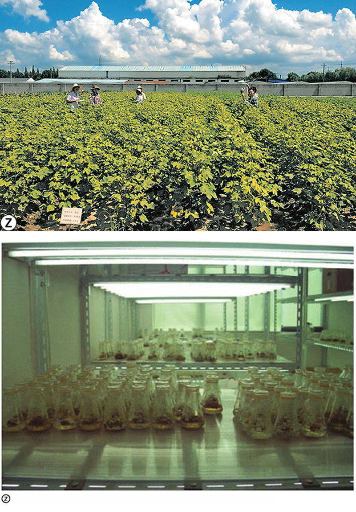
植物组织培养

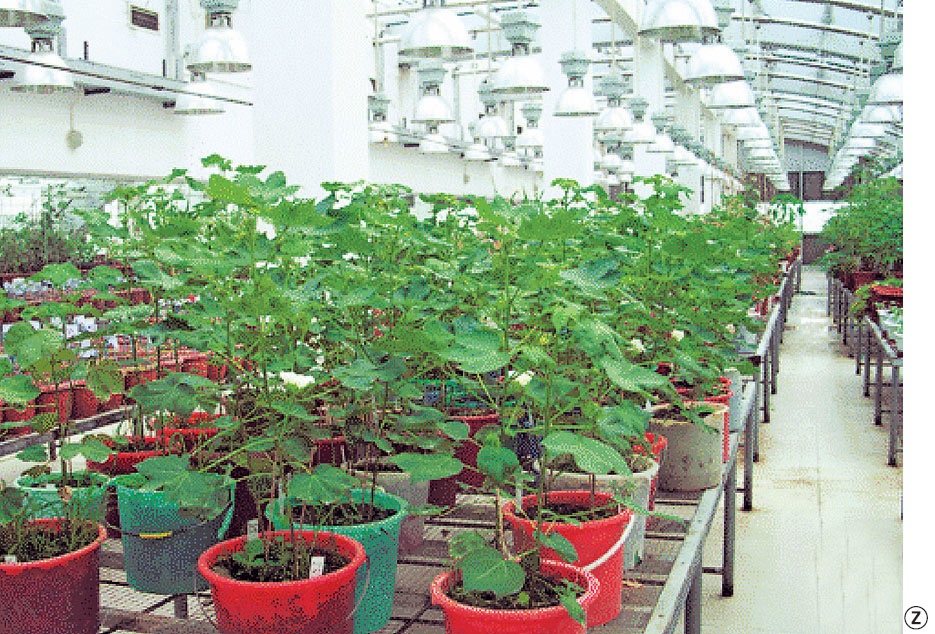
温室种植的转基因棉花

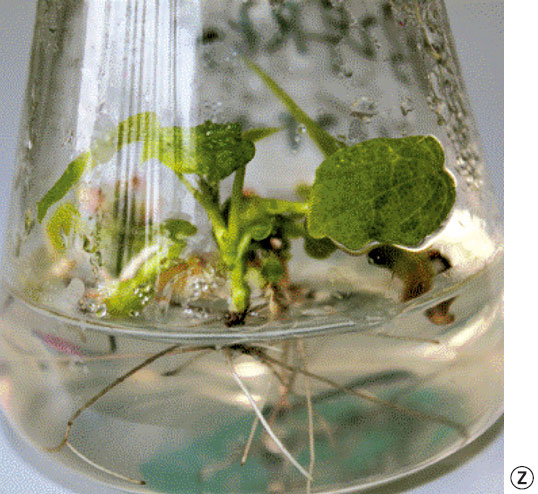
无菌条件下培育的转基因植物

随着对基因结构和功能认识的深入，科学家发现可以对自然存在的基因进行改造，在合适的位点改变基因的编码序列，就会使基因的性质和功能发生改变。新基因编码的酶可能比原来的酶活性更强，或者可以催化新的生物化学反应，得到新的化合物（代谢物），也可能对环境胁迫（如高温、干旱、施用除草剂等）具有更强的耐受性。这些人为改造过的基因也可以用于培育转基因植物。（陈晓亚　杨长青）

## 怎样使各种有用的基因汇聚一堂

以前，人们为了让有用基因聚合在一起，最常用的手段是通过品种之间的杂交。例如，一个水稻品种抗病，另一个品种高产，将两个品种杂交，则有可能会得到既高产又抗病的新品种。但是在杂交的过程中，除了目标特性相关的基因外，还有大量未知的基因也会被转移并遗传给后代。在后代的不同个体间，这些未知基因的数量、功能也是未知的，这使杂交后代的性状分析和筛选非常复杂困难。另外，通过杂交进行基因聚合仅限于亲缘关系非常近的种，如水稻与水稻杂交；对于亲缘关系较远的物种，如水稻和玉米，要想通过杂交实现优良基因的转移和聚合，在目前是不可能的。

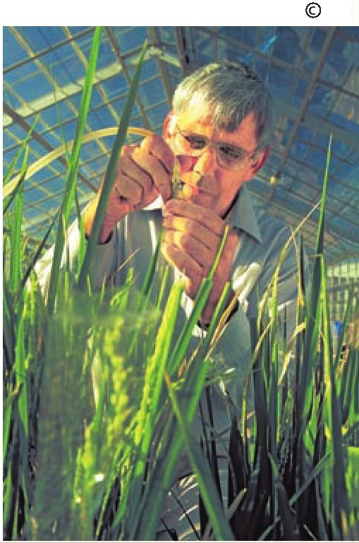
利用转基因技术，可以精确地使植物获得特定的基因，并且可以控制转入基因在基因组中的插入位置，从而实现基因功能的聚合。近年来，科学家已经实现将几个基因串联在一起同时进行转化，这样获得的转基因植物将同时获得更多新的特性。由于转入基因功能已知，表型可以预测，将极大地缩短育种时间，提高作物育种的效率。（陈晓亚　杨长青）

  

【微问题】能不能将所有最优良的基因聚集在一起，创造出一个完美理想的植物品种？

【关键词】转基因技术　有用基因

## 为什么植物细胞有“全能”的本领

随着细胞生物学的飞速发展，随着科学家对植物内在奥秘的认识越来越多，现在已经形成一种概念，不仅是植物的生殖细胞，它们的每个细胞都包含着该物种的全部遗传信息，从而具备发育成完整植株的遗传能力。在适宜条件下，植物任何一个细胞都可以发育成一个完整的新个体，这就是植物细胞的全能性。

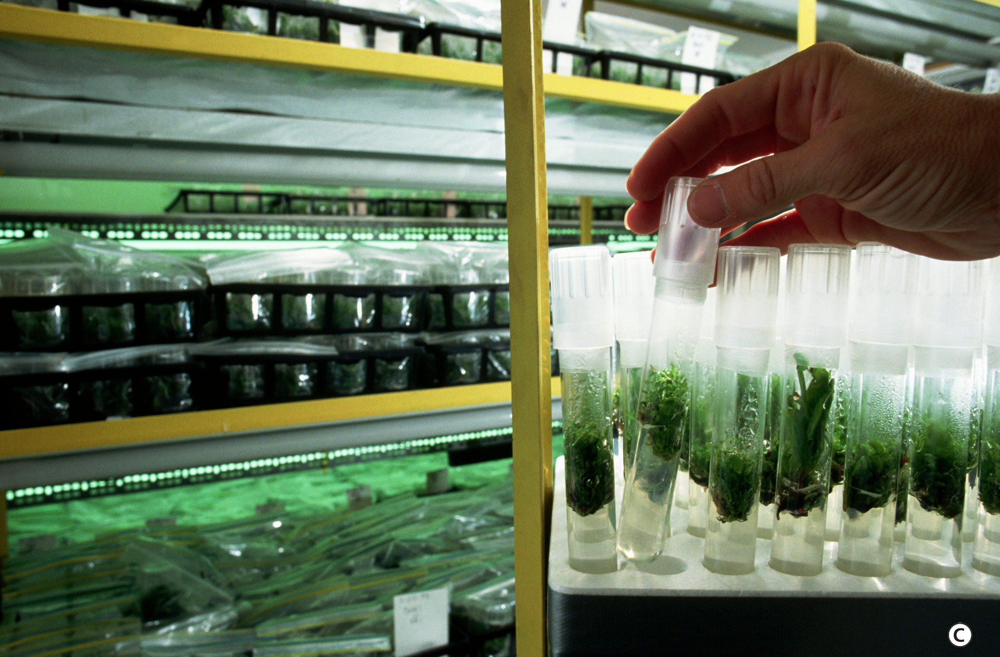
试管苗的组织培养

其实早在20世纪初，德国科学家就提出了这样一种假说。但是直到20世纪40年代末开始，才由科学家用实验不断验证、确立和充实这一假说。首先，一位美国科学家和他的中国学生利用含有不同植物激素比例的基质培养烟草茎段，人为有效地在茎段上控制了根和芽的形成，从而可以做到希望它长芽就长芽，希望它长根就长根。进而，美国和德国科学家在两地，几乎同时培养胡萝卜细胞，经过一系列的诱导操作过程，由细胞发育成完整的胡萝卜植株。这时已经到了20世纪50年代末，历时半个世纪，植物细胞全能性才从一种假说变成了得到公认的科学概念。并且，植物细胞和组织培养的研究在随后的年代中，成为植物生命科学中最为活跃、发展最为迅速的部分之一。

为什么植物细胞具有全能性呢？我们知道，一个植物体的全部细胞，都是从受精卵经过有丝分裂产生的。作为一个特异性的细胞，受精卵具有本种植物所特有的全部遗传信息。因此，植物体内的每一个体细胞也都具有和受精卵完全一样的DNA序列和相同的细胞质环境。当这些细胞在植物体内的时候，由于受到所在器官和组织环境的影响，仅仅表现出一定的形态和局部的功能。可它们的遗传潜力并没有丧失，全部遗传信息仍然被保存在DNA的序列之中，一旦脱离了原来器官组织的束缚，成为游离状态，在一定的营养条件和植物激素的诱导下，细胞的全能性就能表现出来。在组织培养的过程中，外植体（指从植物体上切下来的离体器官或组织）会进行细胞分裂，经过细胞分裂素的诱导，可以脱分化为具有分生能力的薄壁组织，进而形成植物的愈伤组织。愈伤组织在一定的培养条件下，又可进一步分化成为胚状体，再分化出幼根和芽，最终形成完整的小植株。

|  |  |
| --- | --- |

现在，植物细胞具有全能性不仅仅是一种科学概念，它已经在世界范围的生产实践中得到了广泛应用，在一些经济作物、果树和经济林木中就可见到，如甘蔗、香蕉、马铃薯、柑橘、苹果、葡萄、桉树、杨树等的脱毒和无性快速繁殖。一些植物一旦感染病毒，就会影响它们的生长和发育，严重的将大大地降低它们的品质和产量。当下，就是利用这一科学概念，通过一系列的技术操作，获得了无病毒苗，随后进行大量的快速繁殖，建立起了试管苗工厂、无菌苗圃等，大批量地供应市场，以满足生产上的需要。现在，试管苗的组织培养在中国已经显示出显著的经济效益，受到生产者的欢迎。（方玉达　薛红卫）

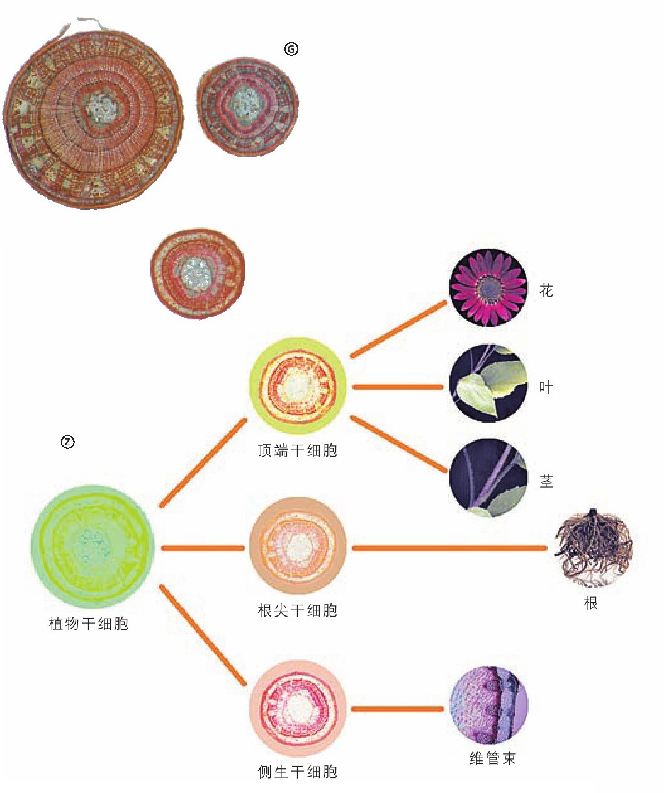

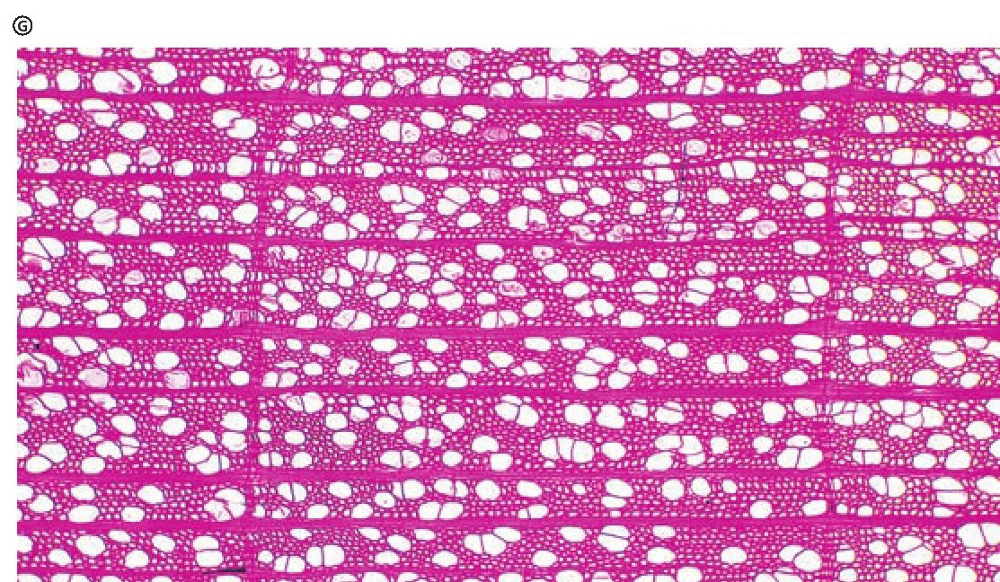
放大后的植物干细胞横切面

  

**【微博士】**植物干细胞

动物和人的干细胞，如胚胎干细胞、皮肤干细胞、肝干细胞、心脏干细胞、神经干细胞和诱导性多功能干细胞等名词及其研究成果时常出现在报纸和杂志上，人们对它们在医学上，特别是组织工程或再生医学上的应用抱有非常大的期望。那么植物是否也有像动物和人一样的干细胞呢？回答是肯定的，植物也有它们自己的干细胞！

植物细胞具有全能性是植物干细胞的基础，植物的干细胞具有很强的自我更新能力，并且可以分化成为其他类型的植物细胞，最终产生新的器官。植物的干细胞主要包括顶端干细胞（又称顶端分生组织）、根尖干细胞（根尖分生组织）和侧生干细胞（包括维管形成层及木栓形成层）。茎、叶和花这三大地上器官就是由位于顶端分生组织中的植物干细胞所产生的。而位于地下的根，则是由根尖分生组织中的干细胞分化而来。有的植物干细胞不衰老，长命千岁。例如狐尾松的树龄可达4000多年，其干细胞从种子萌发开始一直保持着生长分化的能力。

**【实验场】**植物细胞的分化和再分化

烟草组织培养是比较容易成功的，也是最经典的实验。先将烟草叶片剪切成大小均一的小方块，然后将这些小叶片组织置于含有生长素和细胞分裂素的培养基中进行培养，诱导产生烟草愈伤组织。随后将愈伤组织置于诱导出芽的培养基上培养，这种培养基中细胞分裂素的含量相对要高一些，待长出不定芽后，将不定芽剪下置于生根培养基上诱导生根，这种培养基中生长素的含量相对会高一些，最终就获得了完整的烟草小植株。整个培养时间需要3～4个月。如果有兴趣，可以到有这方面研究的大学或专业研究单位去参观，并亲自动手试一试。

【微问题】将一小块胡萝卜放在环境适宜的土壤中，能不能长出一株完整的胡萝卜植株？

【关键词】细胞全能性　愈伤组织　植物干细胞

## 葡萄中有什么健康魔力

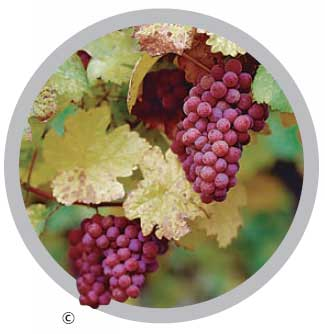
提起葡萄，人们会觉得那是令人垂涎三尺的水果。它不仅富有营养，而且被认为含有某些魔力物质，因此对人体具有非常突出的保健和美容功效。葡萄中的魔力物质究竟是什么？它藏身于葡萄的果肉或果皮中，还是果核中？

根据流行病学调查显示，西方众多发达国家的日常食物中脂肪含量很高，因而心脑血管疾病的发病率很高。可是生活在法国南部的人群虽然也吃那些食品，但发病率却奇迹般地低，这引起了很多科学家的注意，称这一现象为“法国怪象”。

在试图解释“法国怪象”原因时，科学家注意到一个现象。法国南部盛产葡萄，用葡萄酿制的红葡萄酒举世闻名，而且当地人几乎个个喜欢饮酒。也许，“法国怪象”和他们长期饮用葡萄酒有关？喝过红葡萄酒的人都知道这样一个常见现象，那就是大多数人喝一小杯干红葡萄酒之后，脸就变得发烫发红，而干红葡萄酒的酒精含量仅15%左右，远远低于白酒，其中有什么特殊原因呢？

后来科学家在干红葡萄酒中发现了一种物质，即原花青素，很多人喝一小杯就容易脸变红，正是由于干红葡萄酒中含有较多的原花青素，因为原花青素分子能够直接被吸收进入血液，并快速作用于血管壁的内皮细胞，使内皮细胞释放内皮因子，即一氧化氮。正因为原花青素有如此重要的作用，所以它成为很多速效救心药的成分。它能够迅速引起血管舒张，促进血液循环，尤其能够疏通心脑微循环和皮肤微循环，改善血液供应，缓解病情，可预防中风、老年痴呆、冠心病、动脉粥样硬化等病。例如，治疗和缓解突发心脏病的特效药硝酸甘油，就是在体内分解释放一氧化氮而实现药效的。不仅如此，它还有助于健脑益智。由此可见，葡萄内的原花青素成分的确有奇妙的保健魔力。

其实，原花青素的魔力还远不止这些。它也能促进皮肤血液循环，促进皮肤细胞代谢，带走废物。由于原花青素本身是一种强抗氧化剂，它还可以修复日光紫外线对皮肤造成的损伤，保持皮肤细胞的活力，延缓皱纹的产生，焕发脸部的青春。所以说，吃葡萄、喝干红葡萄酒能养颜，是有科学道理的。后来大量的研究显示，原花青素不仅具有抗氧化、促进血液循环的保健功效，还有抗菌、抗癌、抗炎、防治白内障等诸多药用功效，它的健康魔力真是太强了！

最后再告诉大家一个秘密，在葡萄甜美的果肉中固然含有一定量的原花青素，但在葡萄的外皮和葡萄籽中，原花青素的含量远远高出果肉中的含量。

适宜贮藏葡萄酒的橡木酒桶

当然，除了葡萄，原花青素也存在于其他植物体内。例如，在人们发现葡萄原花青素的心脑血管保护功效的同时，法国人还发现松树皮中有抗病毒、抗菌作用的有效成分，竟然也是原花青素！早在公元前300多年，欧洲人就用松树皮内层做食物充饥，预防伤口感染，治疗炎症等。在美国诞生之前，大批到美洲探索新大陆的海员、移民遭受了严重的饥饿和疾病，死去一大半。残余小部分，也是疲惫不堪，奄奄一息。幸亏得到当地土著印第安人的帮助，学会了如何使用当地的松树皮。慢慢地，这批人活了过来，才有了后来的大批移民，才有了后来的美国。此外，苹果、山楂、红色蔬菜、巧克力、枸杞、柑橘等也都含有原花青素，只是含量和原花青素分子组成、聚合度有所不同。（翟万银）

## 葡萄怎样变成红葡萄酒

在我们常喝的酿造类葡萄酒中，如果根据葡萄酒的含糖量，可分为干葡萄酒、半干葡萄酒、半甜葡萄酒和甜葡萄酒。而干葡萄酒主要有两类，一类是干白葡萄酒，另一类是干红葡萄酒。干红葡萄酒的颜色一般为紫红色，这就是原花青素的颜色，所以在酿制葡萄酒时，一般选用原花青素含量高的紫葡萄品种。

酿制时，先将葡萄果粒从枝梗上取下来，因枝梗含有特别多的单宁酸，会使酒液产生一股令人不快的味道。然后，将葡萄皮和葡萄肉同时压榨，红酒中所含的红色色素，就是在压榨葡萄皮时释放出来的。正因为如此，红葡萄酒的色泽才是红的。经过榨汁后，就可得到酿酒的原料葡萄汁。接着，葡萄汁经过发酵，里面所含的糖分会逐渐转化成酒精。因此在发酵过程中，糖分会变得越来越少，而酒精度则越来越高，酒精能溶解出葡萄皮和籽中的原花青素。所以，干红葡萄酒品质的好坏，除酒香之外，更取决于原花青素的含量、分子大小和不同大小分子的比例。

红葡萄酒

干白葡萄酒和干红葡萄酒的差别是，当葡萄榨汁后，立即将葡萄皮、葡萄籽过滤出去，仅留下葡萄汁，这样酿成的酒基本无色或呈淡黄色。然而，正是因为去掉了皮和籽，干白中的原花青素含量就不及干红了。（翟万银）

  

**【微博士】**橡木桶

大多数红葡萄酒需在橡木桶中陈酿，不仅能够赋予优良香气，还能够深刻改变葡萄酒的成分和质量。这与橡木桶对葡萄酒的氧化还原反应的调节有关。

**【实验场】**

自己也可以将吃葡萄时吐出的葡萄籽漂洗干净，晾干磨碎，加一定量白酒浸泡一段时间，滤去残渣，就可以做出殷红的葡萄酒来，只不过用什么白酒（酒精浓度），加多少量葡萄籽，泡多长时间，才能做出颜色好看又好喝的葡萄酒，需要自己积累经验。由于这种方法做出的红葡萄酒没有酿造过程，所以说是“做出”而不是“酿出”；因这种葡萄酒中还含有相当数量的糖，因此不能称作“干红葡萄酒”。

【微问题】储存葡萄酒需要恒定的温度吗？

【关键词】原花青素　葡萄酒

## 花草为什么容易使人心旷神怡

在家庭居室中种花养草，能给人带来心旷神怡的感受。大多数人认为，那是因为花草的鲜艳色彩和美丽造型而赋予的，这样的感觉没有错，但是植物学家对花草使人心旷神怡还有更进一步的解释。已经有足够的证据表明，植物对我们人类有调节情绪、减少心理压力、增加绿视率和消除疲劳的作用。

例如，植物开出的各种颜色的鲜花，是缓解人们紧张心理的良药，尤其是象征生机勃勃的绿色植物，对缓解焦虑心情、稳定烦躁情绪具有直接或间接的作用。很多人都有这样的经历，当你进入大片的绿色草地，或者开阔的葱郁树林之内，就会感到心情舒畅。植物之所以能使人心旷神怡，是因为它们在进行光合作用的同时，释放出大量氧气，而氧气充足的环境对人体的新陈代谢都是有帮助的。除此以外，植物王国中还有不少香料植物，它们释放出的芳香物质，能使人提神醒脑，精神倍增。

花朵的颜色也影响人类的精神状态。例如红色的花会使人热情奔放、兴奋，蓝色的花使人安静、清凉。现在，国内外流行的“森林疗法”、“园艺疗法”，就是提倡人们去欣赏树林花草，置身于森林树木、鲜花绿草之中，感染大自然的勃勃生机，同时还有助于增强免疫力。

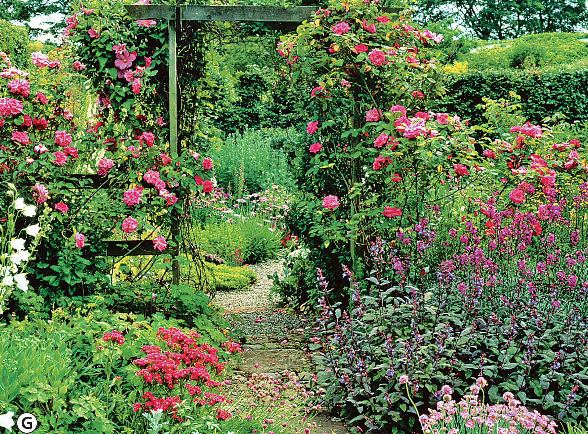
据报道，人经常与绿色打交道会使眼睛明亮，尤其当人的绿色视野率达到25%时，血压、心跳、呼吸都会十分均匀。绿色植物还会大量释放出阴离子，使人体免疫力迅速提高，因为负离子（阴离子）可改善人的情绪，使人体处在良性循环中。此外，人的眼睛多看绿色会使视网膜得到较好的调节。

许多花草能分泌出天然杀菌素，如玫瑰花香有助于治疗感冒引起的咽喉痛、扁桃体炎，桂花有助于治疗支气管炎，紫罗兰、文竹的气味能杀死结核菌、葡萄球菌。由此可见，如果限于条件不能经常到室外树林草地，可以在室内多栽培一些合适的花草，既净化了环境，又享受到心旷神怡的感觉。（邬志星）

  

**【微博士】**卧室中的花草

有些人担心卧室内放置花草会与人争夺氧气，其实，一盆花草在夜间排出的二氧化碳仅为一个人呼出二氧化碳的1/30，不会带来多大影响。当然，如果夜晚将花草搬至其他房间那就更好了。如果在客厅、走廊等地方，每15平方米面积内放上两盆中型花草或3～4盆植物，根本用不着担心它们和人类争夺氧气的问题。

## 为什么绿色植物能吸收和抵抗有害有毒物质

随着工业的飞速发展，随着汽车的大量出现，从20世纪80年代开始，中国城市中的空气污染已逐渐变得很严重了。尤其是新公寓如雨后春笋般的大量涌现，为了追求豪华美观，装修居室的化学新材料种类层出不穷，它们给人带来了表象的享受，同时也留下了可怕的后遗症。现在已经知道，过度装修新屋引发了越来越严重的居室污染。

众所周知，装修材料中含有很多有毒物质，例如甲醛、苯、氮氧化合物以及久久悬浮于空中的粉尘，严重危害了人的健康。20世纪90年代，欧美各国以及韩国、日本等国的科学家，进行了一系列利用植物来进行净化空气的实验，结果发现，植物在新陈代谢和进行光合作用时，会通过根、叶、茎吸收弥漫于空气中的各种有害物质，例如挥发性有机物、氮氧化合物、一氧化碳等。这些有害物质进入植物体之后，经过一系列的生理生化反应，最后转化为有利于植物生命所需的物质。例如吊兰的叶子吸收甲醛后会在其光合作用时，将吸收的甲醛转化成氨基酸和有机酸等有益物质。

除此以外，一些生活在土壤中的微生物会在有氧气情况下分解掉大量的有毒有害物质。从某种意义上说，绿色植物就像一部十分复杂的有生命的机器，每日24小时都在不停地运转着，在吸收各种物质来满足自身生存需要的各种营养时，也起到了清除空气中有害物质的作用。

另外，人体本身也会在新陈代谢中排出各种毒物，例如呼吸时会排出有害的丙酮、甲醇、乙醇、乙酸乙酯，而植物发出的萜类物质恰恰能去除上述毒物。（邬志星）

客厅中的肾蕨

  

**【微博士】**天然净化器

芦荟

芦荟能吸收空气中所含甲醛；吊兰能吸收空气中的一氧化碳和甲醛，铁树、常春藤、菊花、金橘、石榴、米兰等大量花草都能清除二氧化硫、氟化氢、乙醚、乙烯等有害物质。另外，不少花草还是清除灰尘的天然吸尘器，并具有降低噪声的作用。

【微问题】居室中能不能摆放有毒的植物？

【关键词】森林疗法　园艺疗法　植物净化空气

## 能不能给植物“种牛痘”

人会生病，植物也会生病，植物的病虫害会给农业、林业带来严重的危害。为了确保庄稼丰收和森林繁茂，人类发明了各种各样的化学农药。但是，化学农药在杀灭害虫的同时，也给环境带来可怕的污染，显然，这不是对付病虫害的最好方法，也不是长远和根本的方法。

众所周知，通过种牛痘的办法能使人体对天花病毒产生终身免疫力，那么，用同样的办法是否在植物身上也行得通呢？这是一个很有意思的想法，如果成功的话，会使植物得到终身免疫力。但要想达到这个目标，首先要设法将病毒抗体植入到植物体内，并能够长期存留发挥作用，或者使植物体自身产生抗体。根据这样的思路，1980年，日本的一个研究小组创造了为植物“种牛痘”的方法，它与人类种牛痘的原理有些相似。例如，科学家在西红柿遭受病毒侵袭时，先将感染植株体的烟草花叶病毒分离出来，经过反复培养，使它的毒性慢慢减弱。然后，用高压喷雾器将毒性大为减弱的病毒送入到西红柿幼苗体内，这样，就能使西红柿一生都不会感染烟草花叶病毒了。

随着现代基因工程的诞生，随着转基因技术的出现，植物疫苗的研究进入到一个崭新的阶段。转基因技术就是运用科学手段从某种生物中提取所需要的基因，将其转入另一种生物中，使其与另一种生物的基因进行重组。利用转基因技术可以改变动植物性状，甚至还能培育出新品种。

20世纪末，美国和比利时科学家利用转基因技术，成功地将一种具有抗菌能力的链霉菌基因转入到向日葵植株内，使它的抗病能力大大增强。后来，他们又对烟草、胡萝卜等植物进行了类似的实验，也获得了成功。

疫苗使植物产生了抗病能力，那么能否培育出某种植物，使它不仅自身具备免疫力，而且人吃了这种植物后，就像注射过疫苗那样，也能产生免疫能力呢？随着科学家的不懈努力，通过转基因技术培育出了“土豆疫苗”、“香蕉疫苗”，它们具有抗乙肝病毒的作用，动物或人摄入了，能促进体内的免疫系统产生出乙肝病毒抗体。但是，要想真正培育出对人体产生终身免疫能力的植物疫苗，虽然在理论上是可行的，但在实践中却存在着很多难以解决的困难。（纪再思）

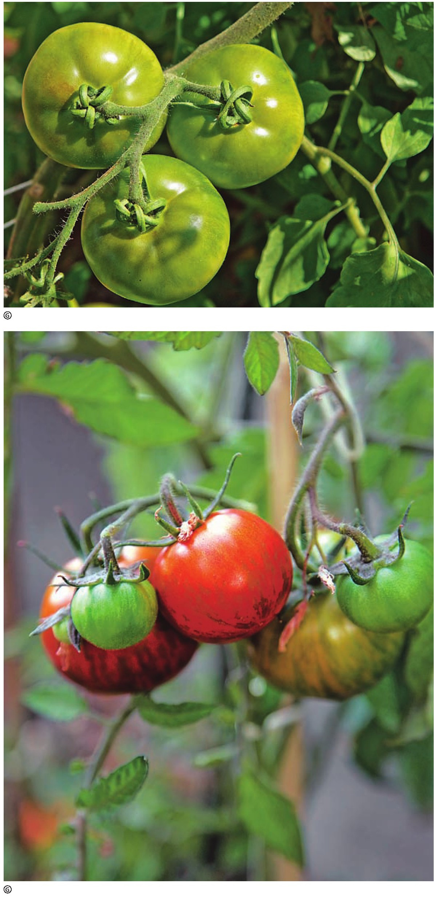
抗病毒西红柿

## 苜蓿为什么变得如此神奇

在非洲，很多人都听说过一种神奇苜蓿，它究竟神奇在哪里呢？原来，赋予苜蓿神奇作用的人是一位美国科学家，名叫米奇·海因。他在非洲考察时发现那儿霍乱横行，许多当地人由于贫穷买不起昂贵的抗霍乱疫苗，结果悲惨地死去。海因回国后，决心改变这一状况。

他首先从霍乱病菌中分离出无毒的霍乱抗原，“剪下”霍乱抗原基因，再把它“缝合”到一种细菌体内，然后让苜蓿感染这种细菌，于是霍乱抗原的基因就转移到了苜蓿体内的细菌中了。接着，他对这种苜蓿进行大规模培养，使培养出来的苜蓿具有能抵抗霍乱病菌的抗原。

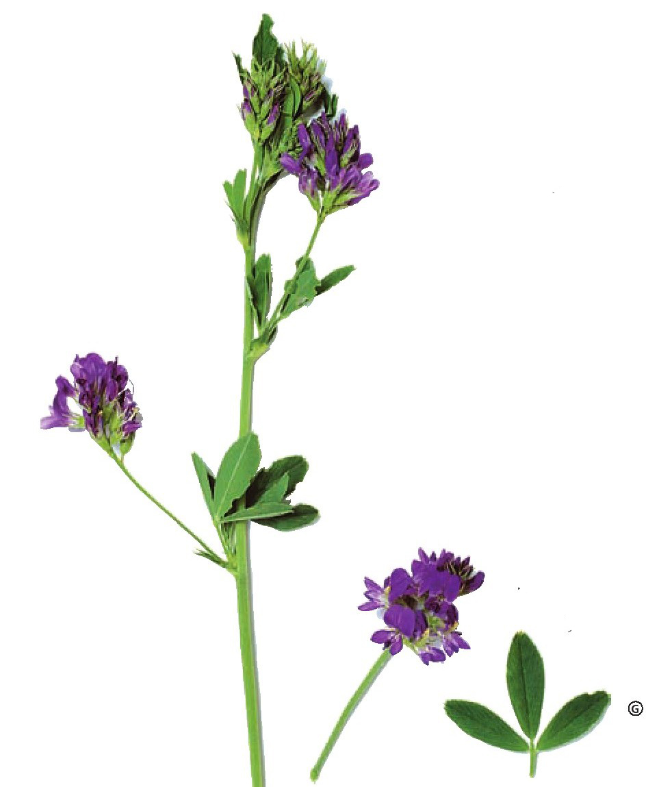
苜蓿

由于非洲的医药科学比较落后，而霍乱病菌经过很多代的变异，对青霉素、链霉素等一些普通抗生素产生了耐药性，使贫穷的患者得不到有效治疗。但是，自从有了“苜蓿疫苗”，当地人只要吃一盘可口的苜蓿色拉，就可以获得抵抗霍乱病菌的免疫力，尽管不是终身的，但作用已经足够大了。

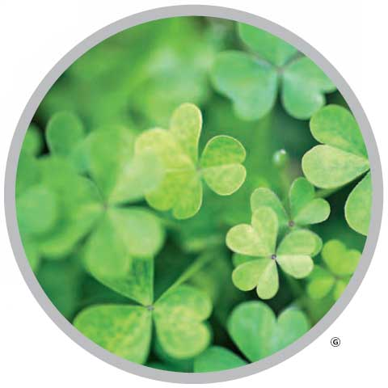
进入21世纪后，科学家正在培育预防白喉、龋齿、肝炎等疾病的“蔬菜疫苗”、“水果疫苗”。但是，这些还仅仅是实验的结果，要想把它转化为大规模生产，还有许多难以逾越的技术障碍。其中最使科学家伤脑筋的是难以控制其含量，也就是说，植物疫苗中致命疾病的抗原含量必须精准，既不能多也不能少，因为少了无法起到免疫作用，多了又会使人有患上疾病的危险。现在，科学家正在全力以赴地攻克难关，也许用不了多久，将植物变成疫苗，就会像生产抗生素那样方便。到那时候，远离大医院的乡村山区居民，只要吃一根香蕉或一只苹果，就可以预防某种疾病，那将是多么诱人的前景啊！（纪再思）

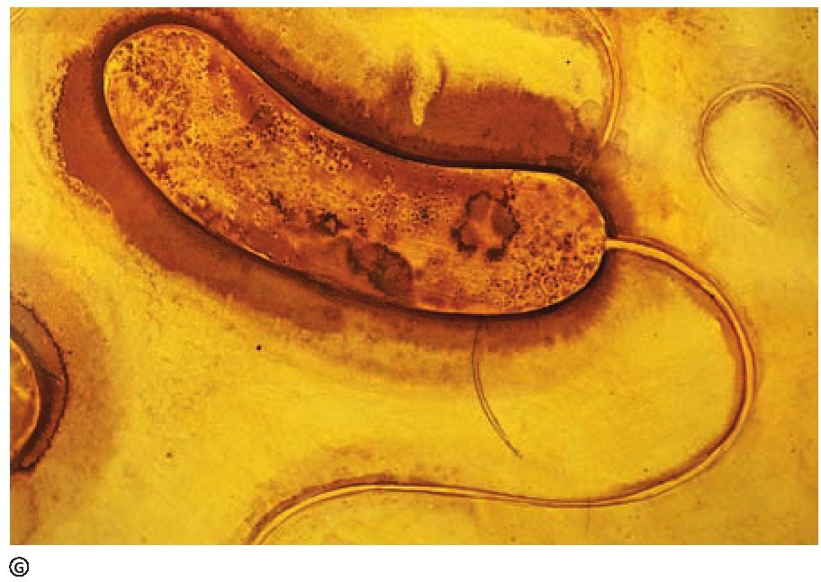
从某种生物中提取需要的基因

  

**【微博士】**转基因植物

转基因植物是指基因组中含有外源基因的植物。它可通过原生质体融合、细胞重组、遗传物质转移和染色体工程技术，获得有可能改变植物的某些遗传特性，具有高产、优质、抗病毒、抗虫、抗寒、抗旱、抗涝、抗盐碱、抗除草剂等优势。

【微问题】现在，医院中能不能配到给孩子吃的水果药物？

【关键词】植物疫苗　转基因技术　苜蓿

## 人参真的能使人起死回生吗

人参是一种名贵的中药，用它来治病健体，在中国已经有几千年的历史了。自古以来，人参往往被视作奇珍异宝，甚至被当成能起死回生、包治百病、长生不老的仙药。事实真的是这样吗？

世界上当然没有什么神仙灵药，人们过分夸大了人参的作用，主要还是因为人参确实是一种非常有用的药材，从古至今，也确实有不少靠人参挽救重症患者于濒危、濒死的事例。另外，以前人参都是野生的，不但稀少而且难以采集，物以稀为贵，故而使一些人对人参产生了迷信。

从现代医学的分析来看，人参含有多种皂苷，这是它最重要的医用有效成分。除此之外，人参还含有丰富的氨基酸、碳水化合物、维生素、有机酸、多种脂、酶、甾醇，并有几十种微量元素。正是由于有了这么丰富的成分，人参才具有了强大而广泛的药用价值。它不仅在抢救休克、脉搏微弱等急病时具有明显效果，还能协调中枢神经系统兴奋和抑制过程的平衡、调节心脏功能、保护心肌、刺激造血功能，有效降血压、降血脂，增强肝脏的解毒能力以及治疗多种消化道疾病。它在调节糖代谢方面具有神奇的“双向性”，既能在一些高血糖症时用于降血糖，又能在低血糖症时升高血糖。除了直接用于临床治疗病症外，人参的另一大功绩是滋补健体，特别是对于一些年老体弱者来说，人参能够帮助改善机体免疫力、增强记忆、消除疲劳，对于神经衰弱、失眠烦躁等症状都有明显的缓解和治疗作用。

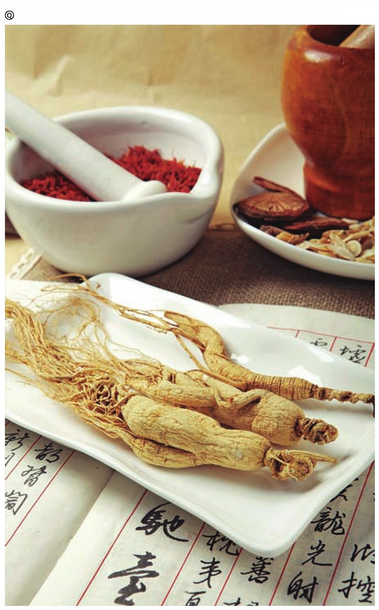
人参

人参的药用价值这么高，称它为“灵药”也不算过分。不过，人参也只是对一些病症有较好的疗效或辅助疗效，而更多的疾病还是需要采用特效药物和治疗手段来处理。许多人对人参还有一个认识上的误区，认为它是好东西，吃了以后“有百益而无一害”。其实是不对的，作为补品的人参，比较适合于体虚多病的人增强体质，而一些身体本来就比较强健的人，随意服用人参反而会破坏体质平衡，导致鼻子出血、情绪亢奋、头痛眩晕、心跳加快、血压升高、胸闷腹胀等症状，尤其是对于生长状况正常的青少年来说，更不能随意服用人参，否则轻则影响生活规律，重则影响身体发育。

总之，人参不是万能灵药，无论是把它当成一种药物还是作为补品，最好是在医生的指导下，有的放矢地服用，这样才能让这种良药真正发挥效用。（王瑜）

  

**【微博士】**皂苷

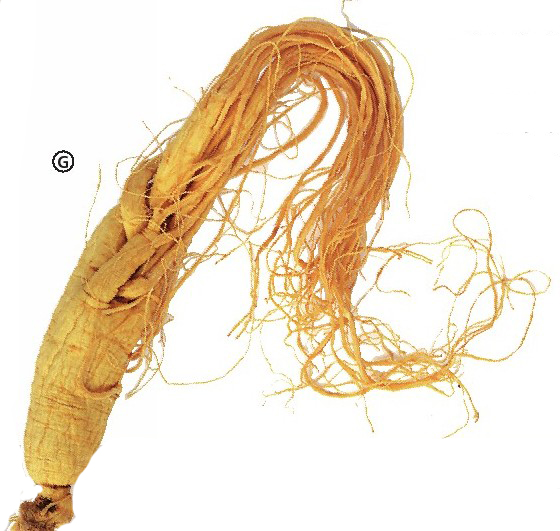
人参中最重要的药用成分就是皂苷。皂苷是一大类结构复杂的化合物的总称，广泛地存在于植物中。人参所含的皂苷总共有30多种，都属于三萜皂苷，具有很强的生理活性。

## 为什么甘草被称为“百药之王”

甘草被称为“百药之王”由来已久。明代医学家李时珍在《本草纲目》中对甘草给予了极高评价：“诸药中甘草为君，治七十二种乳石毒，解一千二百草木毒，调和众药有功，故有‘国老’之号。”其实，它的植株体相貌平平，属于豆科中的一种多年生草本植物。

根据现代科学技术的测定，甘草含有丰富的甘草酸，它的甜度是甘蔗糖的几十倍，因此被认为是不折不扣的“甜草”。难怪许多苦涩难咽的中草药中，都会加入甘草，以使药味能得到一些改善，便于入口。不过，仅仅是口味清甜，当然还不能使甘草被尊为“百药之王”。甘草最主要的功用之一，是它具有很强的解毒能力。正如李时珍在《本草纲目》中所记载的那样，甘草能够解除或缓解上千种草药和矿物药的毒性，既可以单独解毒，也可以和其他草药配合解毒，堪称中药中的“解毒圣手”。传说中，远古的神农在遍尝百草时，曾屡屡中毒，幸好有甘草来解毒，一次次化险为夷，这才为后世记下了数百种草药的药性。

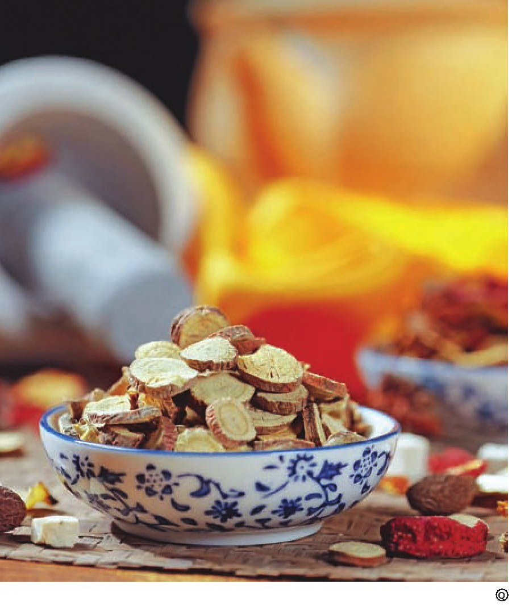
药用切片甘草

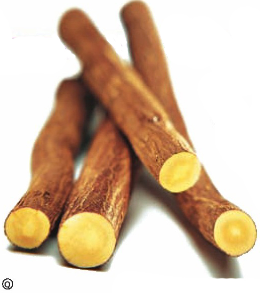
甘草

甘草本身“性情”温和，几乎没有任何毒副作用，却能够减除其他药物中的毒性。另外，医生开出的一帖帖中药往往是由多种药材配制而成的，其中一些药物之间药性相克，这就需要加入适量的甘草，因为它具有极强的调和作用，能使众多药物既发挥各自独特的药性，又不至于相互克制。当然，甘草本身也是一种用途广泛、效果显著的药材。除了解毒和调和众药的“特长”外，它还具有很好的清热润肺、祛痰止咳、止痛镇定、补脾健胃等功效，现代医学中还用甘草来降血脂，治肝炎，防止动脉硬化，甘草甚至对于治疗艾滋病也有一定的作用呢！

甘草有如此特殊而广泛的药用价值，想不成为“百药之王”也难！（王瑜）

  

**【微博士】**黄连是大树还是小草

“黄连树下弹琴——苦中作乐”，这个歇后语虽然形象有趣，却误导了不少人，以为鼎鼎大名的中药黄连是一种大树。其实，黄连树的真名叫楷木，又叫黄楝树，是漆树科的一种高大的落叶乔木，可以长到二三十米高。而作为苦味代表的黄连其实是一种草本植物，入药的部分是它的根状茎。

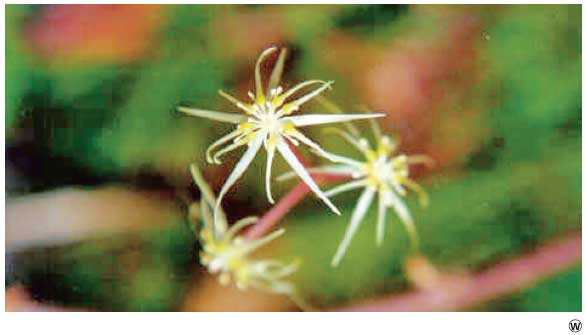
【微问题】小零食甘草话梅是用甘草和梅子做成的吗？

【关键词】人参　黄连　甘草

## 为什么紫云英成为了“矿工”

在北美洲有个地方叫“死亡之谷”。很久以前，那儿是风调雨顺、土地肥沃的好地方，引来无数欧洲移民搬迁到这个山谷中。从此，寂静的山谷出现了喧嚣的人声。人们在那儿开垦荒地种庄稼，年年都能获得丰收。可好景不长，几年之后，可怕的灾难降临到了这个山谷，谷内的居民突然流行起各种各样古怪的疾病，有的眼睛瞎了，有的头发落光了，更多的人莫名其妙地死去。没有人知道是什么原因，它就像无形的瘟疫瘴气，凡是进入谷中的人类，甚至野兽都无法幸免。从此以后，昔日生机勃勃的山谷，又回复到以前的荒凉寂寞。

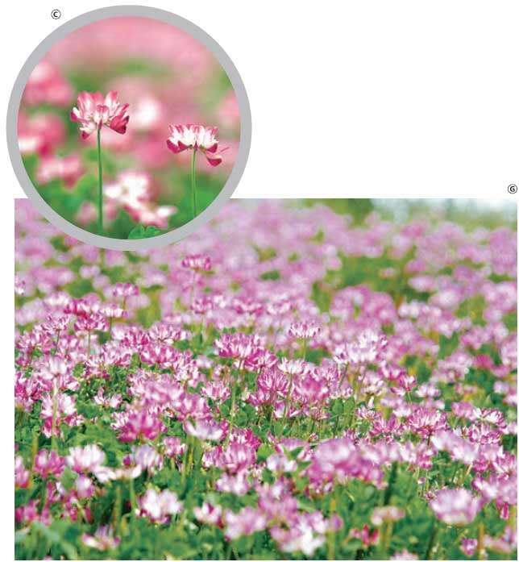
随着岁月的流逝，死亡之谷在人们的记忆中渐渐淡忘，直到20世纪50年代，地质学家来此探矿，才解开了死亡之谷的秘密。原来，山谷内的地层和土壤中含有大量的硒，而植物生长所需要的硫元素却非常稀少。山谷里的植物无法获取足够的硫元素，为了维持正常生长，只能吸收与硫元素性质很接近的硒元素，所以山谷中的植物体内都含有高浓度的硒。对人类和动物来说，体内只需要很微量的硒，如果超出一定的数量，就会引起中毒。山谷中的居民当然不知道其中的奥秘，每天都吃山谷中栽培出来的粮食和蔬菜，就等于每天摄入远远超过正常需要量的硒，久而久之，硒在居民的身体内越积越多，最终引发出各种怪病和死亡。

死亡之谷的疑团解开，给科学家提供了一条重要启示。既然植物能够吸收硒，是不是可以利用植物来“开采”硒矿呢？于是，人们便在这个山谷地区建立了一个很独特的矿场，既不用开凿矿井，也不需要采掘机械，而是在矿区大规模种植紫云英。紫云英是一种豆科植物，吸收硒的能力大大超过其他植物。就这样，每年当紫云英快开花结实的时候，也就是产量最高的时候，人们就开始收割、晒干、焙烧，最后再从紫云英焙烧出的灰烬中提炼出硒。有了紫云英这个“植物矿工”，不仅大大减少开采费用，不会污染环境，而且效率也很高，每公顷的紫云英可以提炼出2500克硒。（冯彦淇　杜盼华）

## 紫苜蓿怎样“联手”蜜蜂提炼钽

在金属元素大家族中，钽是一种很稀有的金属，提炼困难，价格昂贵。有时候，人们只能从实验室中提炼出少量的钽，供研究材料使用。后来科学家发现，有一种叫紫苜蓿的植物具有吸收钽的功能，于是就给开采钽带来了美好希望。但是，人们在实际操作过程中遇到了麻烦，因为紫苜蓿是一种优良的牧草，如果把它全部烧成灰，再从灰中提炼钽，大量的优质牧草就等于白白浪费了。为了解决这个矛盾，科学家对紫苜蓿做了进一步的研究，发现它的花粉中含钽量特别高，于是就联想到采蜜专家——蜜蜂，并设计出一套提炼钽金属的独特新流程，前提是需要动物、植物和人类携手合作，共同完成。

新思路立即被付诸实行。首先由紫苜蓿负责第一道工序，负责吸收土壤中的钽；然后在牧草区放养了大批的蜜蜂，利用蜜蜂担任炼钽的“二传手”，负责采集花粉和酿制蜂蜜；最后由人类负责第三道工序，从蜂蜜中提取出宝贵的钽。这样，紫苜蓿不用烧毁，依然能够作为牛羊的饲料，蜂蜜经过提炼依然很香很甜，依然具有丰富的营养。（冯彦淇　杜盼华）

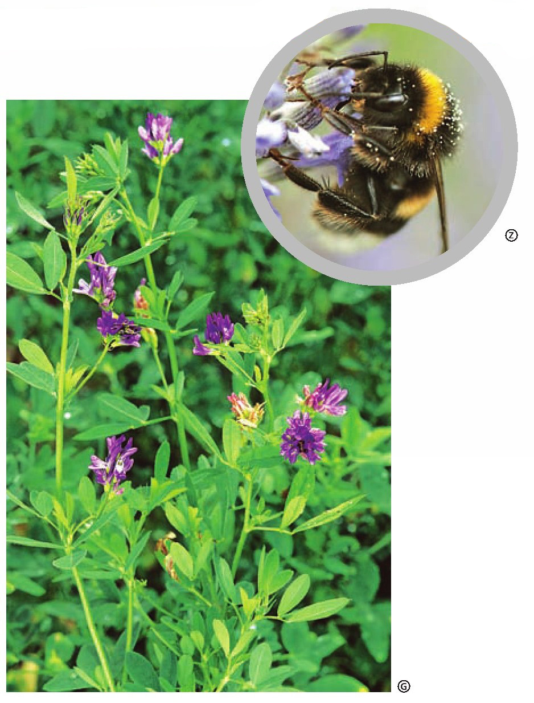
## 为什么细菌被称为“超级冶金专家”

随着越来越多能吸收金属的植物被发现，科学家也开始了对这类植物的研究，并产生了越来越浓厚的兴趣。现在已经知道，堇菜能吸收铜，三色堇能吸收锌，锦葵特别“爱吃”镍。在冶金学家眼里，它们也许已经成为高效率、低成本的“采矿设备”。

尽管如此，科学家没有忽视另一类肉眼看不见的微小生物——细菌。细菌是一个很大的家族，它们的很多成员是人体健康的敌人，但有的却是专门靠“吃”矿物为生。相比那些生长在地面上的植物，细菌采矿的本领更是惊人，现在它们已经成为冶金行业中的一种重要力量，出色地发挥出自己的独特才能，科学家亲切地称它们为看不见的“超级冶金专家”。

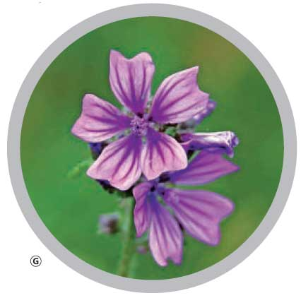
紫云英

细菌究竟是如何冶炼金属？其实说起来也不复杂。例如，有些铜矿石含铜量很少，没有提炼价值，但浪费又很可惜，而细菌在这种情况下正好有“用武之地”。人们把矿石堆积到池水中，让具备炼铜本领的细菌在池水中大量繁殖，使矿石中的铜变为硫酸铜溶液，然后再提取出铜就很方便了。目前，细菌冶炼方式已经在很多国家被采用了，中国也不例外，比如安徽铜陵的铜官山矿和湖南水口山的柏坊矿，都采用了细菌冶炼技术，并创造了很高的效益。相信在不久的将来，人类对稀有金属的需求越来越多，利用生物冶炼金属将显示出日益重要的作用。（冯彦淇　杜盼华）

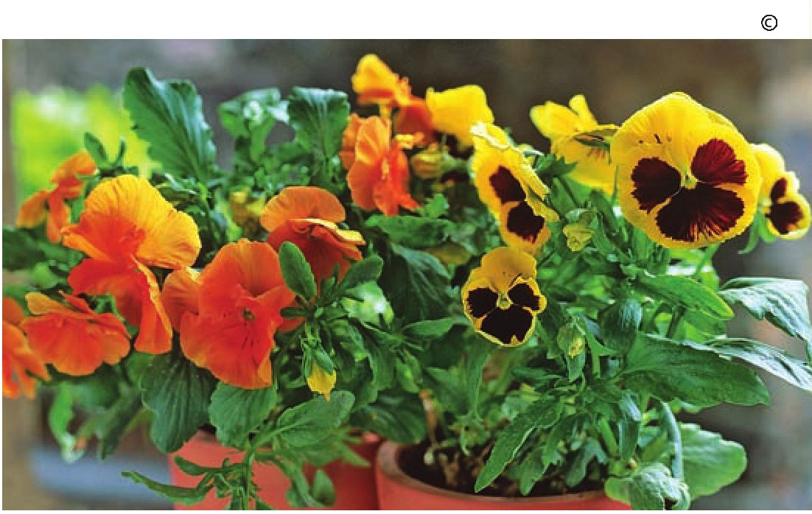
三色堇

  

**【微博士】**石松爱“吃铝”

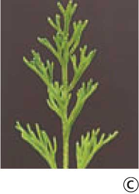
石松是几亿年前就有的古老蕨类植物，它对铝有很大偏爱，不仅能“吃”土壤中的铝元素，而且善于将铝元素保存在躯体组织中，只要将它烧成灰烬后，就能从中获得含量很高的氧化铝。

【微问题】有没有特别“爱吃”黄金的植物？

【关键词】植物采矿　植物冶炼

## 谁是最早“游上岸”的植物

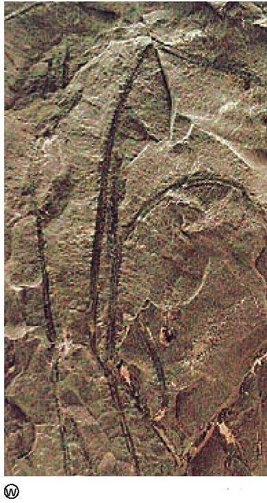
裸蕨化石

大约18亿年前的地球，陆地还是一片没有任何生命迹象的地方，但在海洋中却已经出现了藻类植物。在随后的漫长岁月里，藻类植物一直是地球上唯一的绿色植物，也就是植物发展史上的“藻类植物时代”。到了约6亿年前，藻类植物已经得到了充分发展，不但有漂浮的类型，在浅海地区，还有各种固着生长的藻类。固着生长的藻类比较高大，呈扁平状或分枝状，有效地增加了光合作用的面积，提高了生存的机会。但是，生活在浅海地区的藻类时常受到水位变化的困扰，如果长时间缺水就无法存活。在以后的漫长演化岁月中，浅海藻类中一些枝状的种类发生了变化，植株体表面产生了防止水分蒸发的角质层，这不但有效地抵抗了暂时的缺水，而且能挺出水面，接受更多的阳光和空气。以后，这些种类逐渐地进化成一类新的植物类群——裸蕨。随着北半球的造山运动，陆地升起，许多浅海地区变成了陆地，大部分藻类由于不能适应陆地生活而被淘汰，而裸蕨则在潮湿的地方幸运地生存了下来。由于没有其他竞争对手，它迅速地发展起来，在随后的2亿年间，成为了陆地植物的统治者，这也就是被植物学所称的“裸蕨植物时代”。

根据现有的化石资料，裸蕨是一类结构简单的小型草本植物，在横卧的地下茎上长有高20～50厘米的直立茎，顶端二叉分枝，孢子囊生在枝条顶端，没有叶片。茎的表面具有角质层和呼吸的气孔，内部具有支撑植物和运输水分的结构。但它的根只是吸水能力不强的假根，所以只能生活在潮湿的地方。

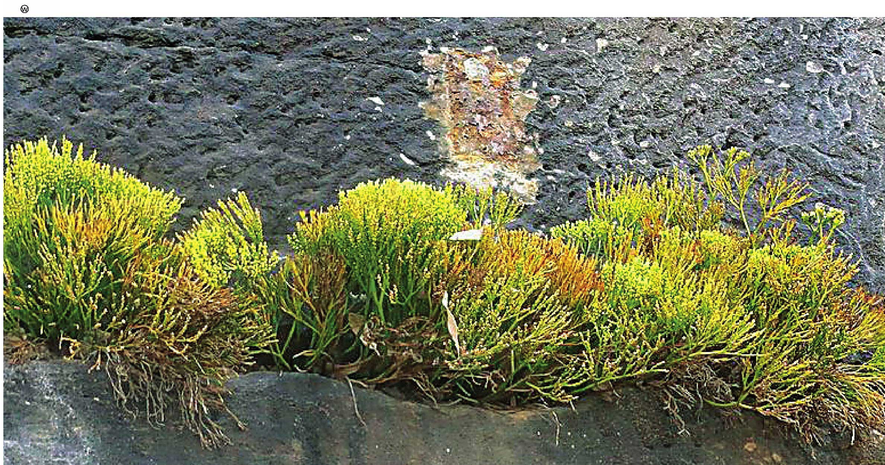
自从裸蕨成功登陆后，植物生活的领域开始由水中扩大到陆地，这是一次革命性的飞跃，进入到一个和以前历史完全不同的新阶段，也为动物的登陆创造了条件。到了3.5亿年前，发生了地壳的大变动，气候变得更加干旱，裸蕨植物慢慢趋向灭绝，而由裸蕨类植物分化而成的、结构更完善的其他高等植物逐渐成为陆生植物的主宰。现在中国南方的松叶蕨就是古老裸蕨的残存后代。（秦祥堃）

## 什么是植物的“世代交替”

夏天的海边，我们在退潮后露出水面的礁石上，可以看到许多绿色的片状的藻类，它的名字叫石莼，俗称海白菜。看起来，这些石莼的模样都差不多，但在植物学上，却是两种完全不同的植物体：一种是二倍体的个体，另一种是单倍体的个体。为什么会这样呢？

原来，石莼和其他生物一样，生命历程也是从受精卵开始，单倍体的精子与单倍体的卵子融合在一起成为二倍体的合子（受精卵），由这个合子发育形成二倍体的石莼。这和动物都一样，我们把这个二倍体称为孢子体。孢子体长成之后要繁殖后代，这时就要进行减数分裂。一般动物减数分裂直接就产生卵或精子，而石莼产生的单倍体的细胞并不能直接进行受精，还需要一个继续生长发育的过程。我们将石莼减数分裂产生的细胞称为孢子，将孢子发育成的单倍体个体称为配子体，也就是单倍体的石莼。配子体的外形、大小与二倍体的孢子体几乎完全一样。配子体随着不断长大，再产生精子或卵细胞等生殖细胞。这样，在整个石莼生活史中，出现了单倍体个体和二倍体个体交替出现的现象。从合子开始到减数分裂发生，这段时期为无性世代（孢子体世代）；由孢子开始一直到配子形成，这一时期为有性世代（配子体世代）。有性世代和无性世代的交替，即为世代交替。

其实，不光是石莼，大多数的植物都有世代交替。在藻类中，如果孢子体和配子体植物在形态结构上相同，称为同型世代交替，如石莼。同型世代交替在植物进化史上是比较低级的，由它向异型世代交替进化。异型世代交替是由两种在外部形态和内部结构不同的植物体进行交替。在异型世代交替的生活史中，有一类是孢子体占优势，如海带；另一类是配子体占优势，如礁膜、宣藻。一般认为孢子体占优势的类型比较进化。

植物登陆后，就沿着孢子体越来越发达、配子体越来越简化的方向发展。例如，蕨类植物的孢子体有明显的根、茎、叶的分化，配子体虽然也能独立生活，但只是微小的片状体，只能生活在潮湿的地方。而被子植物的孢子体不但有根、茎、叶，还出现了花、果实、种子等器官，同时配子体则进一步简化，只有几个细胞组成，并且寄生在孢子体上，不能独立生活。（秦祥堃）

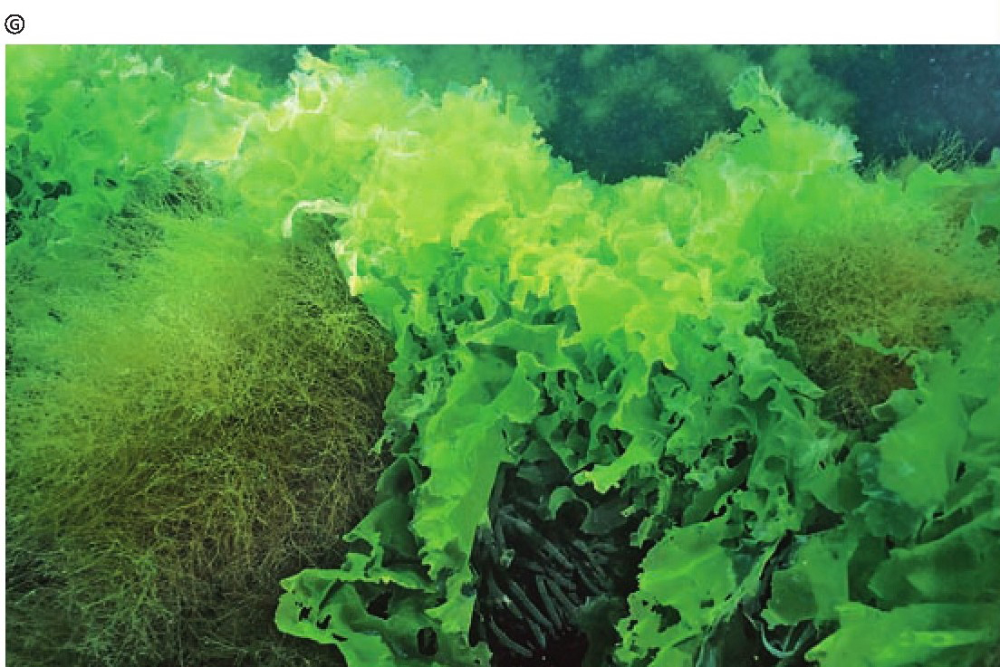
石莼

  

**【微博士】**松叶蕨

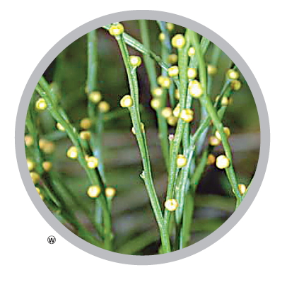
松叶蕨

中国南方有一种奇特的蕨类植物，它高约30厘米，绿色的小枝条上散布着米粒大小的黄褐色孢子囊群。仔细观察，绿色的小枝条呈三角形，上部两叉分枝；散布有约3毫米长的三角形小叶片。拔起来一看，横走的地下茎呈褐色，根非常细小。这类不起眼的小草与现今的大多数植物有很大的差异，却和已经灭绝了3亿多年的裸蕨有着密切的亲缘关系。它和裸蕨具有共同的特征：叶不发达，主要靠茎进行光合作用，茎两叉分枝，只有假根和最原始的中柱。

【微问题】植物进化从水生到陆生，那有没有从陆生朝水生进化的植物？

【关键词】裸蕨　松叶蕨　石莼

## 雌雄异株的隐花植物如何繁衍后代

雌雄异株的隐花植物，雌花与雄花分别生长在不同的植株体上，似乎很难将雄花的花粉传播到雌花的柱头上。那么，它们是怎样繁衍后代的呢？原来，它们靠的是一些与植物协同进化的昆虫。寄生在榕树上的榕小蜂与榕树之间，就是特别专一的进化关系的范例。

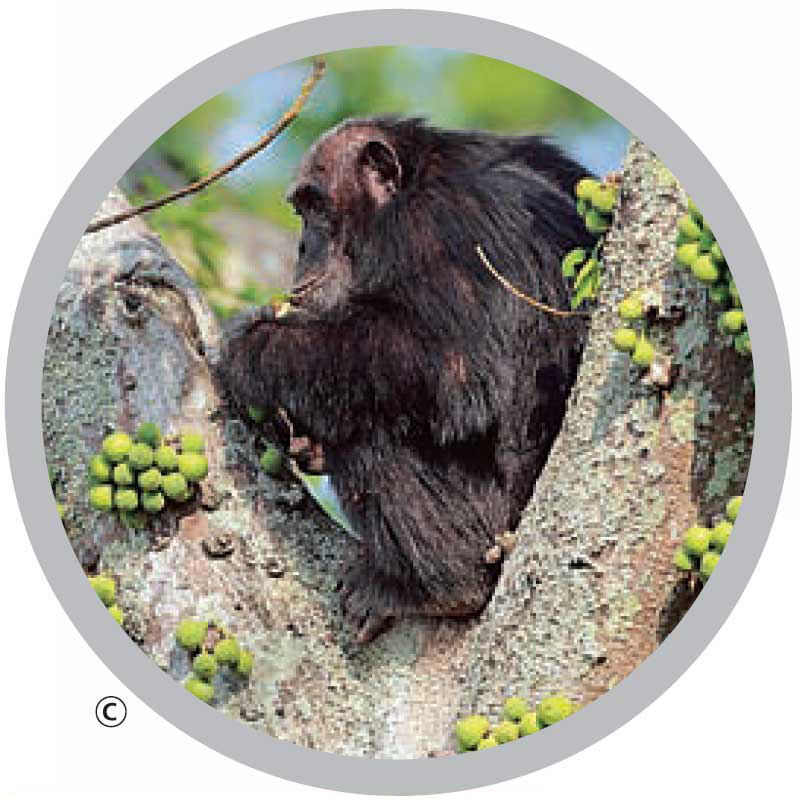
树干上的隐头花序

现在已知有98%的榕树种类，保持着一种榕树只让一种榕小蜂传粉的专一关系。而一种榕小蜂一生也仅给一种榕树传粉，它们互相之间保持着严格的一对一关系。所以，榕树与传粉榕小蜂成为科学家们研究生物互惠共生和协同进化的典型实例。

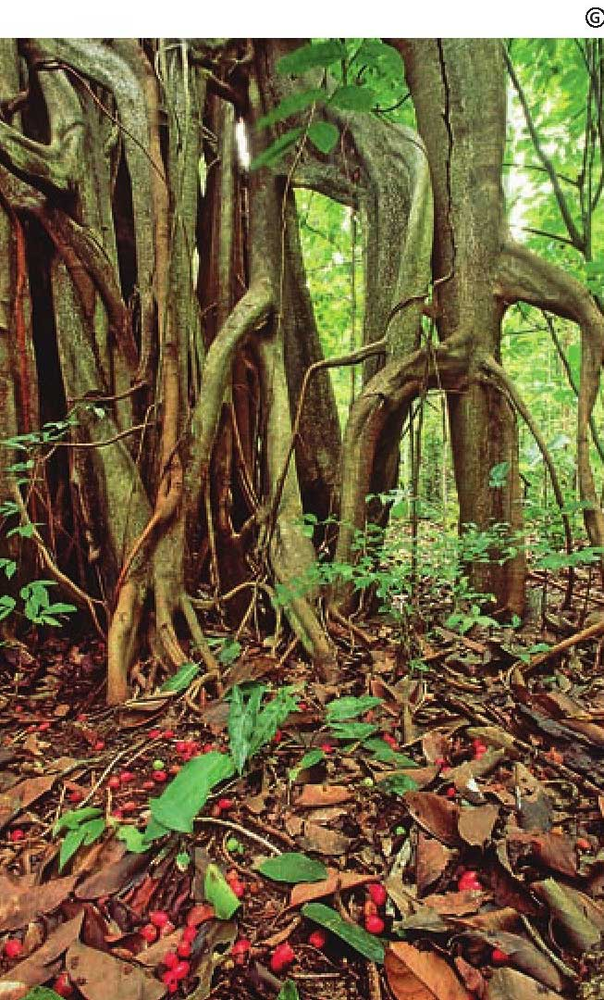
榕树

一般来说，依靠昆虫传播花粉的植物都有着美丽或香甜的花朵，这样才能引诱昆虫来为它传粉。但是，榕属的树虽然也靠昆虫传粉，却没有美丽的花朵，它的一朵花甚至比我们书本上的一个句号还要小很多。许多朵花簇生在一个膨大的花序托里面，构成一个隐头花序。由于花很小很幼嫩，容易遭到昆虫的噬咬破坏，所以经过长期的进化，榕树的花序将所有的花包裹起来，保护花朵。这在进化史上是一大进步，但同时也产生了一个问题，谁来为它们传粉？甲虫、蝇类、蝶类、蜂类和蚊类等昆虫虽然有各不相同的口器，但个体太大，都不能为其传粉。最终，一种特殊的昆虫应运而生，这就是榕小蜂。

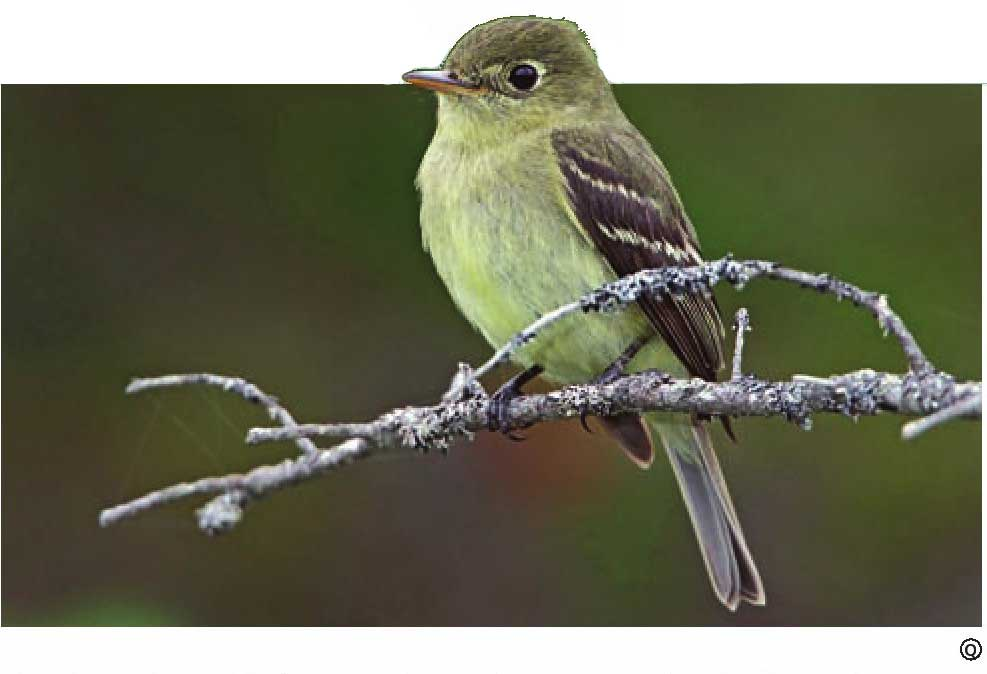
以雌雄异株的榕树为例，雌株上只有雌花，雄株上有雄花和瘿花。瘿花是雌花特化的一种中性花，不能结果，只供榕小蜂产卵。瘿花柱头很短，正好适合榕小蜂产卵器的长度，可以方便地孵化出新一代榕小蜂。榕小蜂在每个瘿花的子房里产下一个卵，经过短暂的孵化后，幼虫诞生了，它会占据瘿花子房，这时的榕树会像哺育自己的孩子一样，源源不断地向幼虫输送营养。被幼虫寄生的榕树只会开雄花不结果，几乎将光合作用产物全用来培育几十万只小蜂上。那么，榕树自身如何实现繁殖呢？也许是造化弄人，也许是自然的神机妙算，榕树的无私奉献得到了意外的收获。一些小蜂误入歧途，从雄性榕树飞到雌性榕树上，这时等待它们的只有雌花，雌花花柱很长，小蜂钻进去后由于产卵器太短，无法产卵，就在它们辗转寻找产卵地的过程中，身上的花粉无意间擦到了雌花长长的柱头，传粉便在这环环相扣的巧合中完成了。那些本来要寻找瘿花却误入歧途的榕小蜂，在耗尽体力之后死在花序内，它们虽然没有按照生物的本能完成繁衍后代的任务，却神奇地充当了植物的媒婆。最为奇妙的是，每年春季，当榕小蜂大量成熟，飞出寻找瘿花时，榕树枝头却挂满雌花序，瘿花花序不足20%，也就是说榕树以精确的时间差迫使绝大多数榕小蜂为它服务，只传粉不产卵。这似乎是一种无谓的牺牲，无偿的奉献，其实不然，榕树由于榕小蜂的传粉结出种子，历经若干年后长大的榕树又为榕小蜂的后代提供了栖息与繁育之地。

在漫长的进化过程中，榕树由雌雄同株进化为雌雄异株；雄花由分散在四周进化为集中在花序口部；雌花由既能结实又能抚育幼虫的低级阶段分化成专供榕小蜂栖息的瘿花。雄蜂由于一辈子都在密闭、黑暗的花序内生活，翅、眼和步行足退化，体色褪淡，雌蜂则产生可以削扁头部往花序里钻的结构。“榕—蜂”之间经过相互适应，相互选择，形成的一对一的专一性共生关系，使它们“合则皆旺，分则皆亡”。微小的榕小蜂和庞大的榕树互帮互助，相依为命，缺一不可。

世界上有700多种榕树，中国有100多种，它们中的每一种都有自己特有的榕小蜂，这让我们不得不感叹自然的造化！（黄勇平）

## 为什么其貌不扬的隐花能够吸引榕小蜂

通常，色彩鲜艳、外形美丽的花朵，能够吸引各种不同的昆虫来访问和传粉。而榕树则是隐头花序，毫无漂亮可言，它是如何吸引榕小蜂来为它服务的呢？分析榕树隐头花序的挥发物和榕小蜂对挥发物的行为反应，科学家发现榕树通过释放单一的不常见挥发性化合物，达到对传粉榕小蜂的专性吸引，从而确立榕树与榕小蜂间专一性的共生关系。研究发现，雌雄异株的鸡嗉子榕的开花期中，4-甲基苯甲醚占隐头花序挥发物的主导地位（94%～98%），在隐头花序授粉或寄生4天后完全消失，且不存在于其他种类榕树的花序挥发物中。生物检测进一步发现，4-甲基苯甲醚对鸡嗉子榕小蜂有吸引作用，而不含4-甲基苯甲醚的其他种类榕树的花序挥发物则没有吸引作用，正是这种不常见的榕树挥发性化合物，确定了对鸡嗉子榕传粉者的专一性吸引，建立了一种独特的榕树和榕小蜂之间的专一性共生关系。

这项结果仅仅只是一种榕树和一种榕小蜂之间的“私密话”。在其他物种之间是否也存在着类似的现象呢？答案是肯定的，这需要后继者更多的探索与发现。（黄勇平）

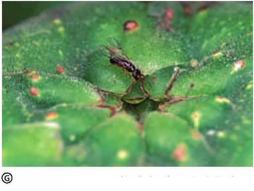
榕小蜂准备进入隐头花序内

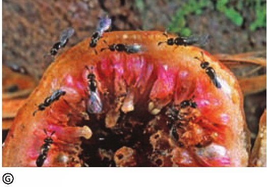
进入到隐头花序内的榕小蜂

  

**【微博士】**协同进化

大家都熟悉，植物用果实的颜色和味道诱惑鸟儿，鸟儿取食后，可以帮助植物传播种子，扩散种群；蜜蜂在采集美味花蜜的同时，帮助植物授粉、受精和繁殖后代。地球上有数百万种生物物种共同存在，物种之间既相互联系和依赖，又相互竞争和抑制，形成了复杂的食物链与食物网的关系。这种千丝万缕的关系都是物种协同进化的结果。

一般认为，协同进化是两个有关的物种在进化过程中为相互适应或利用而发生的共同进化，是一个物种受另一物种影响而发生变化的进化类型。例如一种植物受食草昆虫的影响而发生遗传变化，这种变化反过来又导致昆虫发生遗传变异。其实，前面讲到的榕树与榕小蜂之间的进化关系也是如此。

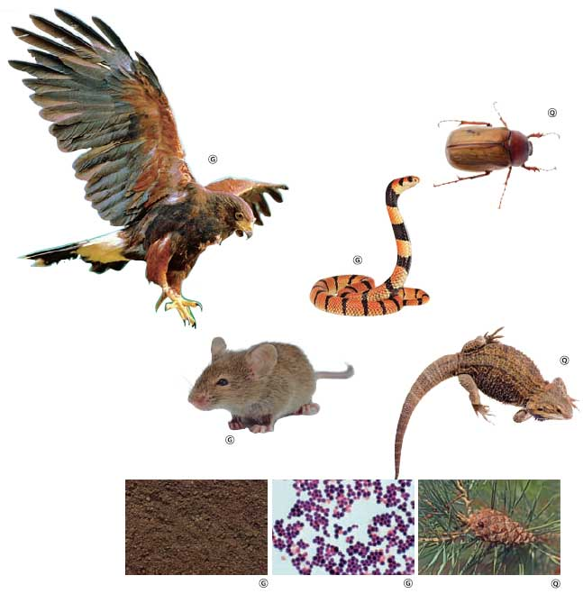
  

【微问题】有没有一种榕小蜂能为多种榕树传粉？

【关键词】榕树　榕小蜂　协同进化

## 越鲜艳的蘑菇越有毒吗

不要以为采蘑菇就像歌曲《采蘑菇的小姑娘》里面唱的那么容易，看到蘑菇就往篮子里装，那样是很危险的。因为，蘑菇虽然鲜美可口，但有少数蘑菇含有可怕的剧毒。

在我们这个地球上，各种各样的蘑菇种类有数千种之多，其中大部分无毒，少数有毒。但是，许多有毒蘑菇和无毒蘑菇的长相非常相似，其个头、形态、颜色、菌盖几乎一模一样，只有专业人员才能识别，而对普通人来说很容易发生混淆。

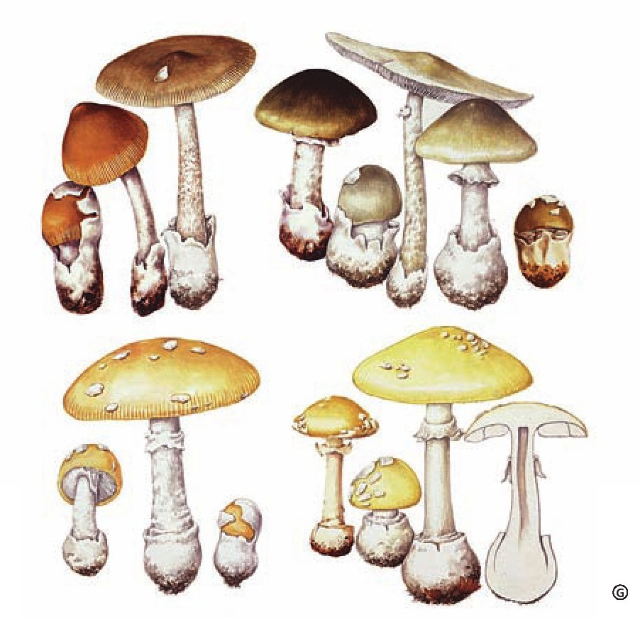
在大部分人的观念中，越是美丽鲜艳的蘑菇越有毒，尤其是在很多文学故事书中经常出现的蛤蟆菌，就是最典型的例子。其实，这种观念是靠不住的。“越是鲜艳漂亮的蘑菇越有毒，而朴实无华的蘑菇则无毒。”这种说法并不成立。因为在食用菌类中就有许多色彩艳丽的成员，例如鲜红的红菇和橙黄色的蛋黄菌，都属于可口的美味食菌；与之相反的是，外表毫不起眼的毒鹅膏菌，却具有超强的毒性。

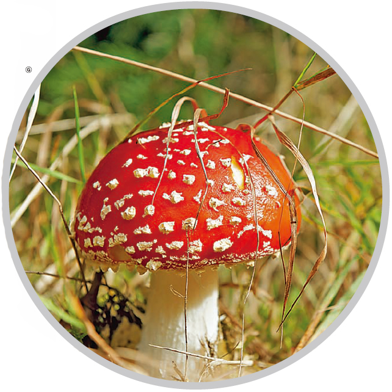
蛤蟆菌

既然不能通过色彩是否艳丽来辨认蘑菇是否有毒，那么有没有区分有毒和无毒蘑菇的识别特征呢？有经验的菌类专家告诉我们，大多数有毒伞菌，菌盖表面会有散状排列的鳞片和包被的残留物。相对而言，扁平、光滑的菌类，安全性更高，但这仅仅是经验的识别，而不是完全严格的鉴定区分。特别需要提醒的是，如果你不能确定蘑菇的种类，最好不要去吃，这是吃蘑菇不中毒的最高准则。无论在什么情况下，对采集到的菌类要保持最高警惕，如果发现手中的“美味”与你熟悉的菌种在外貌、习性、种群上有任何不符，都不能动口。其次，采集时要仔细研究蘑菇种类，除了你想要采的菌类，还要看看，它是不是有长相十分相似的“毒亲戚”。比如发光脐菇和黄丝膜菌，外形都是扁平的黄色伞菌，但前者有毒，后者可食。

不同的毒蘑菇有不同的毒性，误食之后对人体造成的伤害也不同。例如毒鹅膏菌能损害人体肝肾，人误食后出现症状较迟，发病较慢，容易被误诊而死亡。网孢牛肝菌、毒红菇等损害人体的肠胃，此类中毒情况最为常见，所幸的是病程较短，致死率也较低。小美牛肝菌、华丽牛肝菌等损害人体的神经，误食者会出现精神兴奋、精神抑制或精神错乱等神经性中毒症状，同时也会出现呕吐、腹泻、出汗、流泪、心率减慢等副交感神经症状，甚至产生幻觉，因此往往会被误诊为“精神病”而延误治疗。鹿花菌属的真菌有溶血破坏作用，误食者除了有胃肠炎型表现外，还表现为急性贫血、血红蛋白尿、尿毒症、肝肿大等症状。叶状耳盘菌、胶陀螺等会引起人体光敏性皮炎，而误食亚稀褶红菇等菌类后则会出现呼吸麻痹、中毒性心肌炎、急性肾功能衰竭等症状。（刘培贵）

## 冬虫夏草究竟是草还是虫

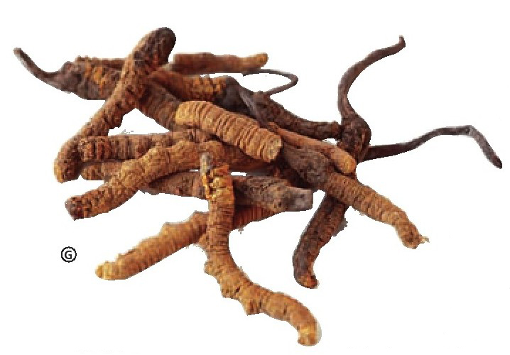
冬虫夏草

冬虫夏草又称为虫草或冬虫草，是一种珍贵的传统中药。这个名字很奇怪，听起来好像一半是虫，另一半是草。实际上，冬虫夏草既不是虫，更不是草，而是一些真菌寄生到昆虫身上后形成的虫菌结合体。

这是一种隶属于子囊菌类、麦角菌科、虫草属的真菌，喜欢寄生于一种叫作蝙蝠蛾的昆虫的幼虫体内。当春末夏初到来时，蝙蝠蛾将虫卵产在地下，随后使其孵化发育长成像蚕宝宝一般的幼虫。此时，虫草属真菌的孢子，会通过雨水而渗透到地下，一旦遇到蝙蝠蛾的幼虫，孢子就侵入幼虫体内而寄生。起初，真菌孢子对幼虫的生长妨碍不大，虫子仍然能正常生活，后来，孢子在幼虫体内萌发生出许多菌丝，拼命吸收幼虫体的营养。在虫体内菌丝繁殖成长的同时，幼虫也随着慢慢长大，钻出地表面，直到菌丝繁殖充满虫体致使幼虫体死亡，此时正好是冬天，就是所谓的“冬虫”。次年，在春夏之交气温回升后，菌丝体就会从“冬虫”的头部慢慢萌发，长出像草一般的棒状子座，称为“夏草”。

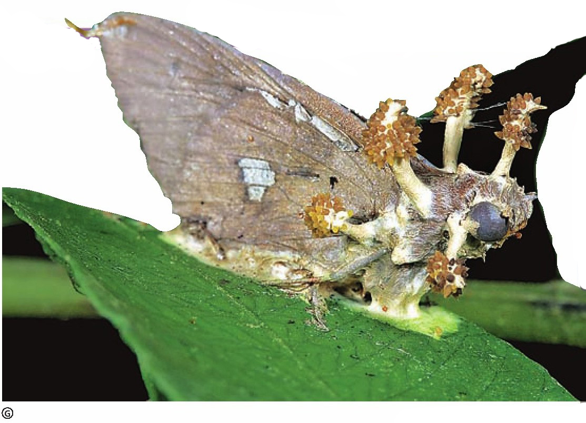
真菌寄生在成虫体内

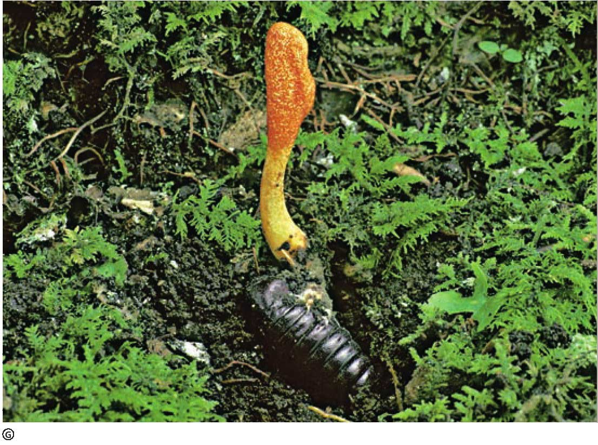
真菌寄生在蛹体内

在真菌棒状子座的头部含有子囊壳，子囊壳是由许多个子囊组成的一个壶状结构，子囊内藏有孢子。当子囊成熟时，孢子就会散出，再次寻找蝙蝠蛾的幼虫作为寄主，这就是冬虫夏草循环往复的生活史。（刘培贵）

  

**【微博士】**地下蘑菇

块菌（松露）是真菌子囊菌类的一个类群，是一类与松、栎等木本植物彼此互利互惠共生的地下蘑菇。块菌在商品贸易中被称为松露，俗名又叫猪拱菌、无娘果等。由于口味奇特，具特殊保健功能，而且生于地下，不易被人发现，属稀缺生物资源，故价格昂贵，被誉为“厨房里的黑钻石”、“地下黄金”、“上帝食物”、“国际第一名菌”等。

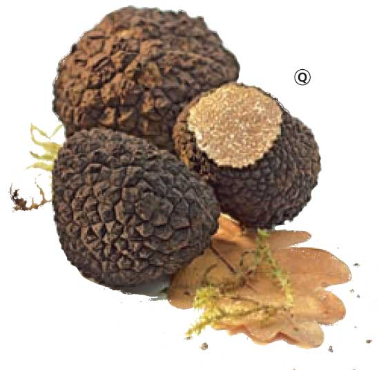
松露

【微问题】蘑菇能进行光合作用吗？

【关键词】蛤蟆菌　冬虫夏草

## 为什么蕨类植物的叶片背面有很多“虫卵”

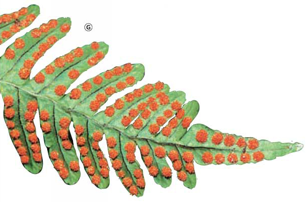
蕨类植物叶片背面的孢子囊群

蕨类植物是植物界中的一大类群，具有非常古老的历史。它们虽然属于较为原始的孢子植物，但已经有了真正的根、茎、叶的分化，植株体内也出现了较为完善的运输管道——维管束，而且，它在植物由低等向高等进化的历程中，起到了承前启后的关键作用。

现在地球上的蕨类植物有12 000多种，它们的形态奇特多样，但是大部分都有一个很有趣的特征，那就是在叶片背面经常能见到很多小点点，很像各种各样的昆虫卵，这究竟是什么东西？植物学家告诉我们，蕨类植物不会开花，也不会结果，当然也就没有用来繁殖后代的种子。蕨类植物是依靠孢子来进行繁殖的，每到夏秋季节，它们的叶片背面就会出现很多虫卵般的小点点，这种小点点的科学名字叫“孢子囊群”。每个孢子囊群由很多孢子囊组成，而孢子囊内又有无数粒孢子。蕨类植物的孢子微如粉尘，肉眼根本看不见，当它们成熟之后，孢子囊的外壳就会自动裂开，将里面的孢子弹射而出。离开了孢子囊的孢子，由于身体细小轻微，很容易随风四处飘散，如果飘落到良好适宜的环境中，孢子就能在那儿萌发，长出一株株新的蕨类植物。

大部分蕨类植物的孢子囊群的形状像小圆点似的虫卵，但也有少数种类有其他的形状，例如蹄盖蕨的孢子囊群好像弯弯的马蹄铁，铁线莲的孢子囊群都藏在叶片的边缘处，石松的孢子囊群好像一个个挺立向上的小麦穗，而鸟巢蕨的孢子囊群沿着叶脉生长变得细细长长。

总而言之，我们见到蕨类植物叶片背面的“虫卵”状圆点，其实是它的繁殖器官——孢子囊群。（秦祥堃）

## 为什么苔藓植物长不高

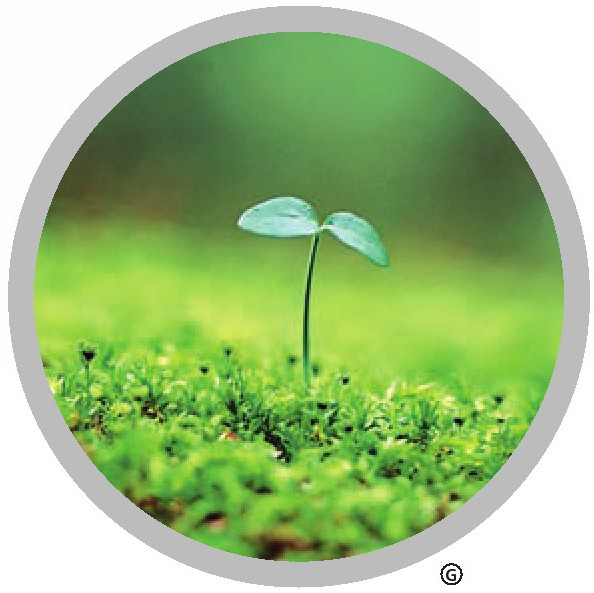
矮小的苔藓和“高大”的小幼苗

苔藓植物是一个小小的世界，因为它的成员几乎都是几厘米高的侏儒；苔藓植物又是一个大大的世界，因为它的分布区域几乎遍及陆地上的每个角落；苔藓植物既是一个大家熟悉的世界，又是一个非常陌生的世界，因为我们虽然常常接触到它，但往往又很少对它关注。可以说，几乎人人都见过这类小型植物，尤其在某些阴湿的环境中，常常能见到很多非常矮小的苔藓，它们密密麻麻地挤在一起，好像脚底下的绿色地毯。

曾经很多人都问过这样一个问题：与常见的树木、灌木甚至草本相比，苔藓实在是太矮小了，一般只有1～10厘米高，究竟是什么原因造成了苔藓植物无法长高？是魔法师施了魔咒吗？如果说真的有魔咒的话，这个魔咒就是水分输送系统。

我们知道水是生命之源，植物当然也离不开水，并且，植物所需的养分需要溶解在水中才能被植物吸收。由于树木的根系可以深入地下几米甚至十几米，能有效地从土壤中吸收水分和溶解在水中的养分，然后通过专门的维管束将水和养分运输到叶片或植物体的其他部位，供生长之需。而它们体内的维管束就像四通八达的高速公路，可以快速有效地将水和养分运输到植物体的各个部位。

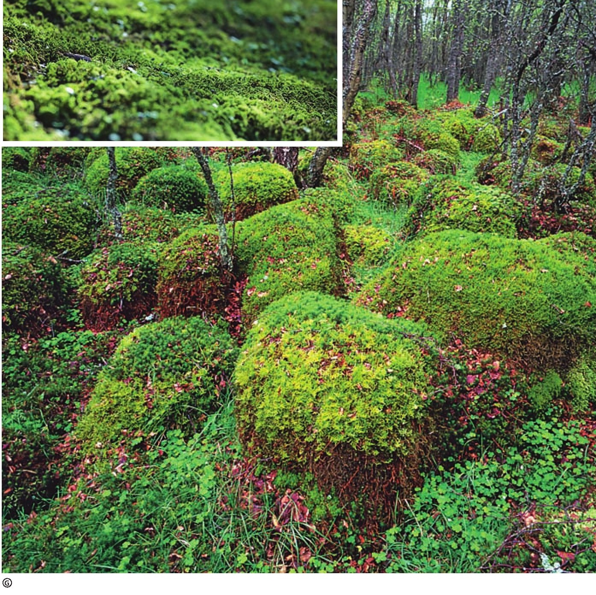
而苔藓植物因为无法合成用以形成维管束的木质素，所以不能在体内形成维管束。没有了维管束，也就没有了长距离运输水分的系统，因此，苔藓只能通过茎和叶从空气、露珠、降雨等外界环境中吸收水分和溶解在其中的养分。正是受到了水分运输的限制，才决定了苔藓植物只能是植物界的迷你小个子。（秦祥堃）

## 为什么生态系统中常用苔藓植物作为指示植物

苔藓植物的确是植物中的“小矮人”，通常只有几厘米高，它们的叶片只有单层或少数几层细胞组成，因此它与外部环境接触的表面积较大。而且，苔藓植物的茎、叶表面缺少蜡质的角质层保护，背腹两面能够直接从空气中吸收养分。正是苔藓植物的这些结构特点，导致它们对周围的环境变化非常敏感，其敏感性可达种子植物的10倍！大气稍有污染变化，比如煤燃烧产生二氧化硫，化工厂排放废气，它都能感觉到并反应出来。再加上取材容易，调查方法简便、经济，因此苔藓植物被广泛用作环境变化的指示植物，可谓监测环境变化的“预报员”。

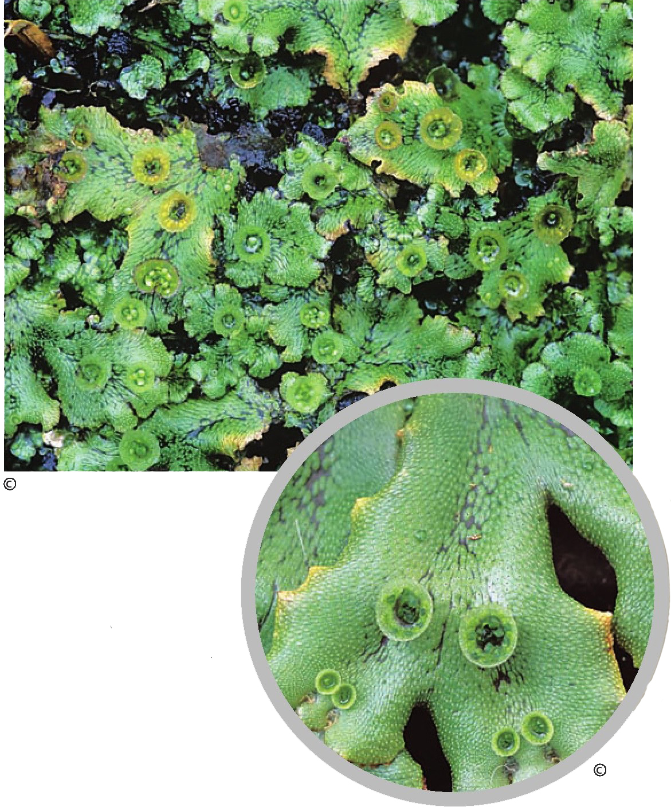
苔藓植物——地钱

1968年，在荷兰瓦赫宁根举行的大气污染对动植物影响的讨论会上，苔藓植物就与地衣一起被推荐为大气污染的指示植物。近年来，苔藓植物对大气中的二氧化硫、氯化物、臭氧等气体污染物以及一些金属离子的监测得到了广泛的认可。用生态学方法调查监测区域内的苔藓植物，尤其是调查附生在树干上的苔藓植物的种类、丰富程度、生长状况和分布等，绘制污染分级图，能清楚地显示出大气污染的程度和范围。例如在污染源附近会发现，越接近污染源，苔藓植物种类越少，甚至完全消失。（秦祥堃）

  

**【微博士】**苔藓植物可以吃吗

在各类植物中，都有可食用的种类，藻类植物中有紫菜、海带等，菌类植物中有各种食用菌，蕨类植物有蕨菜等，裸子植物有松果等，被子植物中更是不胜其数，唯独苔藓植物，至今未见有可供食用的种类。

【微问题】为什么古代的蕨类植物都是参天大树，现在的都变成了草本植物？

【关键词】蕨类植物　苔藓植物　维管束　孢子囊群　孢子囊

## 为什么有些大树基部会长板状的根

走进莽莽苍苍的热带雨林，立即就会感受到一股浓浓的气息：原始、静谧、潮湿和炎热，放眼望去，到处是参天的大树，茂密的树冠使阳光难以透进，动物种类繁多，植物不计其数。然而，热带雨林中最令人感到有趣的是一些奇特大树，在它们的树干基部，会向四周延伸出一块块奇怪的“大木板”，又厚又硬，矮的有三四米，高的有五六米，好像一堵堵有生命的围墙，它就是热带雨林的特有景观——板状根。

众所周知，植物的根都深入到土壤之中，担负着吸收水分、矿质营养和支撑植物体的作用。那么，为什么热带雨林中的大树会产生板状根呢？植物学家告诉我们，凡是具有板状根的树木都比较高大，树身通常会达到50米，甚至更高，而且大树的主干从上到下几乎差不多粗细。要支撑这样高大的身躯，尤其是遇到暴风雨时，仅仅依靠伸入土壤中的根系是不够的。举例来说，我们在城市乡村都能见到高高的电线杆，一样粗细的身躯直立于地面上，但是个子越高，稳定性就越差，所以在电线杆的四周都有支架设备，使它不在大风中倒下。而形状怪模怪样的板状根，其作用就像架在电线杆周围的支架，担负着支撑高大树干的重任，使拔地而起的参天大树能够稳稳地挺立向上。如果从这个角度说，板状根也是一种支柱根。（余千里）

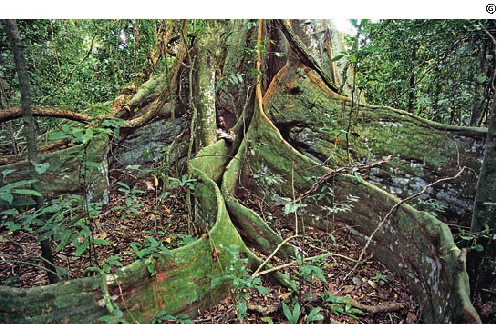
板状根

## “果实”为什么结在大树干上

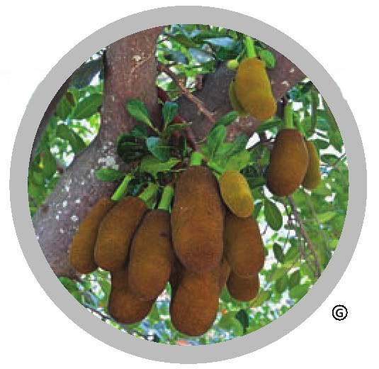
老茎生花

大家知道，植物开花结果的地方都在小枝条处。例如最常见的苹果、橘子、梨等水果，当它们成熟之后，人们会用“累累果实压弯枝头”来形容丰收的景象。但奇怪的是，如果到南方，尤其是进入热带雨林中，常常会见到有些树上的枝头不开花、不结果，却见到树干四周一个个垂挂的果实。更不可思议的是，那些树的树干上见不到盛开的花朵，果实似乎直接跳过了开花阶段而形成。这种现象似乎很不合常理，但了解了其中的秘密就不奇怪了。

原来，我们肉眼见到树干上结出的果实，其实是它的花序发育而来的，植物学上称为“隐头花序”。它的最大特点是，花序的分枝很肥，并愈合形成肉质的花座，花座上着生花朵，而且花座从四周把花包围，由此形成了隐头花序，有时也称为隐头果。这就是象征热带雨林的特点之一——老茎生花现象。

常见的老茎生花树木有菠萝蜜、可可、杨桃等。尤其是菠萝蜜，茎干上挂着一个个西瓜般大小的“果实”，如果剖开表皮，就能见到里面排列着整齐的花朵，它们才是菠萝蜜真正好吃的部分呢。

为什么老茎生花的独特生理现象在热带雨林中最多见呢？原来，那是有利于这类植物传播花粉和种子。因为在阴暗潮湿的密林中，花和果实长在茎干上，容易招引密林中的小鸟、蝙蝠、昆虫等，不仅便于它们捕食昆虫，而且还有利于传粉或传播种子。（余千里）

## 热带雨林的四大奇观是什么

在大多数人的心目中，热带雨林是一片非常炎热、充满神秘气息的地方，更是一个诱惑人类去探险的地方。但是，如果让生态学家来解释的话却不那么浪漫，答案很严谨——热带雨林是热带地区的生物群系，主要分布于东南亚、澳大利亚、南美洲亚马孙河流域、非洲刚果河流域等地。热带雨林地区长年气候炎热，雨水充足，通常年降雨量大约为2000毫米，全年每月平均气温超过18℃，几乎没有春夏秋冬的四季差，是动植物种类最丰富的地区。

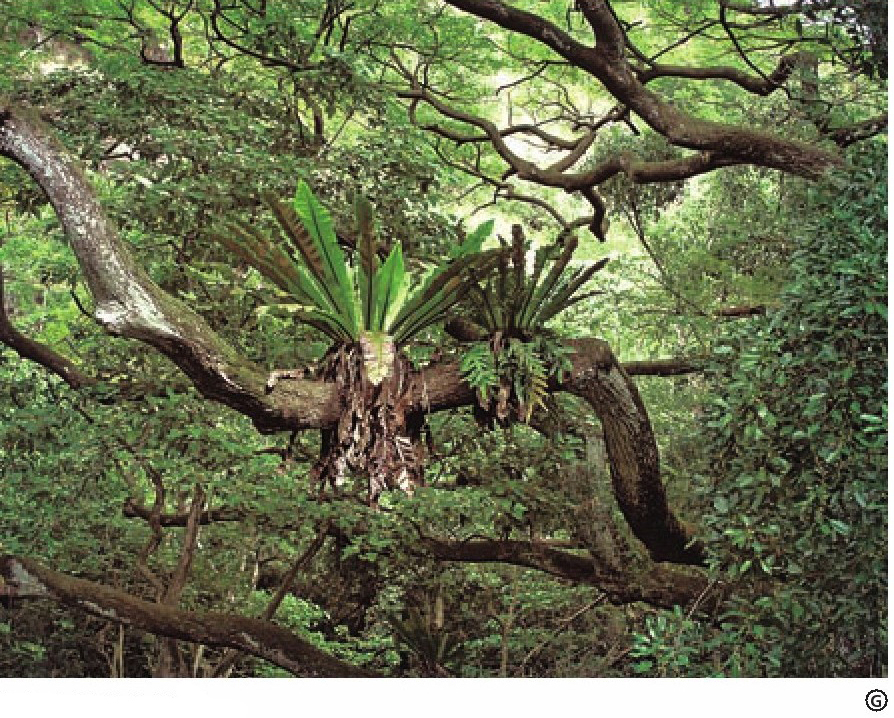
空中生长的鸟巢蕨

其实，识别热带雨林一点也不难，因为它具有与众不同的四大特点，也就是代表热带雨林特色的四大奇观。除了已经介绍过的板状根现象和老茎生花现象，另外两大奇观是空中花园现象和众多藤本植物现象。

所谓的“空中花园”又叫“树冠花园”，是指雨林中的大树上布满了各种各样的附生植物，如蕨类、苔藓、藻类以及花朵芳香四溢的兰科植物。它们生长在树干、树枝和枝丫上，好像给大树覆盖了一层厚厚的绿衣，尤其在兰花盛开的时候，在空中争奇斗艳，显得格外美丽。为什么在热带雨林才能见到如此奇景？因为那里具有既潮湿又高温的环境条件，特别适合附生植物的生长。有些附生植物是鸟类的粪便把种子带到大树上后生长发育出的，但营造出空中花园景观的另一个重要原因是因为有大量的藤本植物。在热带雨林中到处能见到长蛇似的藤本植物，它们从一棵树爬到另一棵树，从下面爬到树冠，又从树冠垂挂而下，交错缠绕，仿佛是交织在密林中一道道会开花的巨大蛛网。（余千里）

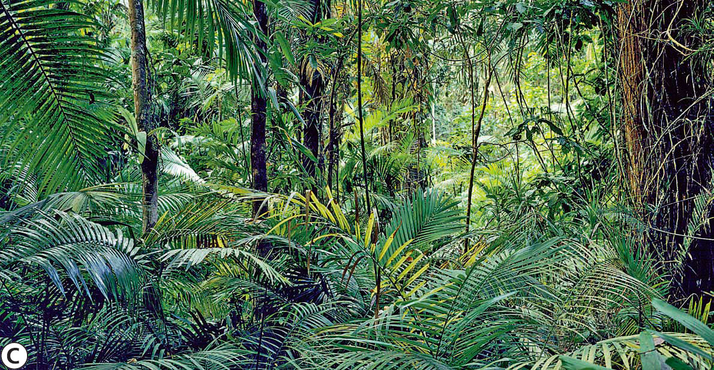
热带雨林

  

**【微博士】**滴水尖

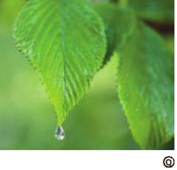
热带雨林中的很多植物叶片有个很特别的地方，那就是在叶片的顶端会拖出一根细长的尖“尾巴”，植物学家称它为滴水尖。形状特殊的滴水尖有什么特殊作用呢？原来，在热带雨林的雨季时期，由于降水量很高，林中的空气格外潮湿，雾气般的小水珠积留在叶片上，越压越重，叶片尾端有了滴水尖，积水就很容易沿着这根长“尾巴”流掉。

【微问题】人类的足迹有没有踏遍世界上所有的热带雨林？

【关键词】板状根　老茎生花　空中花园

## 为什么大多数叶子呈薄片状

植物的叶片千姿百态，种类万千，但它们有一个共同的特征，那就是绝大部分叶片的形状，均为扁扁的薄片状。这样的形状，对植物叶片来说有什么生物学意义呢？

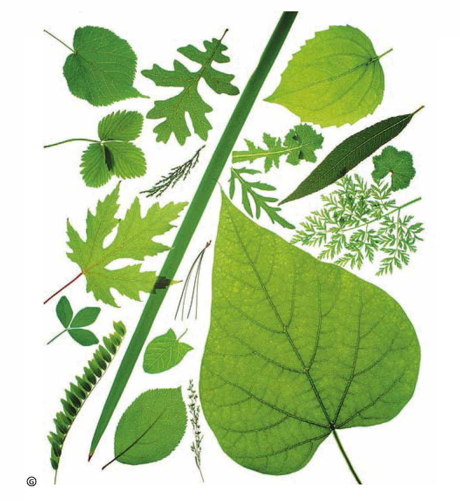

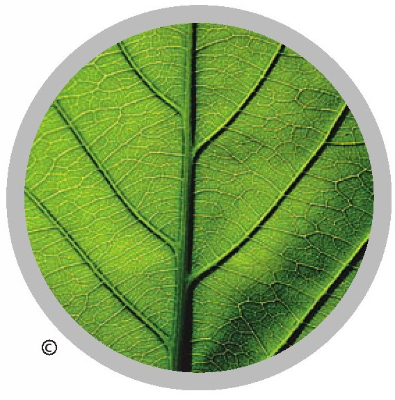
支撑叶片展开的叶脉

我们知道，叶子是植物进行光合作用的主要器官，它在阳光的照射下，利用水和二氧化碳合成碳水化合物，并释放出氧气。要有效地进行光合作用，两大要素缺一不可。一是叶片内部的叶绿素，它们就像有生命的机器设备，进行着一系列的生化反应，生产出碳水化合物以及氧气。二是生产中不可或缺的原料，那就是阳光、水分和二氧化碳。为了使叶片能够获取足够的原料，或者说尽可能多地吸收光和二氧化碳，叶子的表面积就要尽可能地扩大。谁都知道，在体积相同时球形的表面积最小，而扁平的片状物的表面积要大出许多倍。因此，叶片在能容纳下必要组织的前提下，越扁平越有利于植物的光合作用。所以，大多数植物的叶子选择了扁平状形态。

当然，植物为了适应各种特定的生活环境，叶子的形状也会有各种奇特的变化。例如，许多生长在干旱地区的植物，为了减少体内水分从叶面的蒸腾，叶子往往会变得很细小，甚至变为针状，其中最典型的代表种类就是仙人掌。更有甚者，有些植物的叶片完全退化消失，叶绿素都分布到了茎的表面，例如荒漠环境中的光棍树。（杜云）

## 为什么椰子树的叶子都聚生在树干顶端

去过海南岛的人都见过美丽的椰子树，它那笔直挺立的树干，四周没有分枝，仅仅在树干顶端有一片片几米长的大叶子，好像很多绿色的巨大羽毛四散分开。矗立在海边的椰子树，已经成为南国风光中的经典画面。人们欣赏椰子树的美丽，但很少人会知道：它的叶片生长方式为什么和普通树木不一样，都长在树干顶端呢？

椰子树

有人说，因为椰子树没有枝条，所以只能这样生长。那么，椰子树的茎干为什么不向四周长出枝条呢？植物学家告诉我们，一般树木的树皮和木质部分之间有一层分裂能力很强的细胞，植物形态学中称为形成层。它通过分裂活动，向外不断形成新的韧皮部细胞，向内形成新的木质部细胞，这样，植物的茎就不断地加粗长大，形成粗大的木材。而椰子树没有形成层，茎干由许多纤维化的维管束所组成，因此茎干从基部到顶端的粗细基本一样。由于树木的枝条都是通过侧芽萌发而渐渐形成的，而椰子树茎干的周围没有侧芽，也没有生长点，只在茎干顶端有一个生长点，因此，椰子树只能笔直向上生长，而无法向四周长出枝条。

如果再观察椰子树的整个生长历程，就能更清楚地解释整个问题了。在椰子树幼年时代，它只有一段很短的茎，虽然叶片也是在顶部，但看上去好像全身都长叶子。随着椰子树渐渐长大，茎干不断地延伸向上，变得越来越长，而且衰老的叶片不断脱落，新生的叶片不断长出，茎顶部的椰子树叶也就越来越高高在上了。其实，在每一株成年椰子树干的表面，都能见到一道道横纹，那就是老叶子脱落后留下的环状叶痕。有趣的是，这些环状叶痕正好为人们采摘椰子创造了可攀爬的“踏脚之处”。（杜云）

## 为什么百岁兰的叶片“长命百岁”

百岁兰是一种模样很奇特的植物，看上去又矮又扁，全身上下仿佛只能见到左右两片硕大的叶片。百岁兰的叶子在植物界中有“超级寿星”之称。我们知道，大多数植物的叶子到秋冬季节就纷纷凋谢脱落，哪怕是常绿树也不例外。常绿树一年四季都会落叶，特别是在春季长新叶的时候，会有大量的落叶，常绿植物的落叶似乎主要在春季。可百岁兰却不同，它的叶子和植物体寿命一样长，一起同生共死。当两片叶子长出来之后，就再也不会更换新叶，通常情况下，它们可以生存100多年！

对别的植物来说，叶子脱落是对恶劣环境的一种适应。例如，在干旱或寒冷季节落叶，能够尽量减少体内水分和能量的散失，可百岁兰为什么一生都不落叶呢？植物学家解释说，百岁兰生活在热带，没有寒冷需要抵御，不需要像温带植物那样通过脱落叶子来抵御寒冷。还有，百岁兰生长在近海的沙漠中，那里有大量的海雾，会形成重重的雾水落下来，能源源不断地为百岁兰提供水源，因此它不必为旱季缺水而担忧。除此以外，百岁兰不脱落叶子，还可以为自己节约大量的物质资源。（杜云）

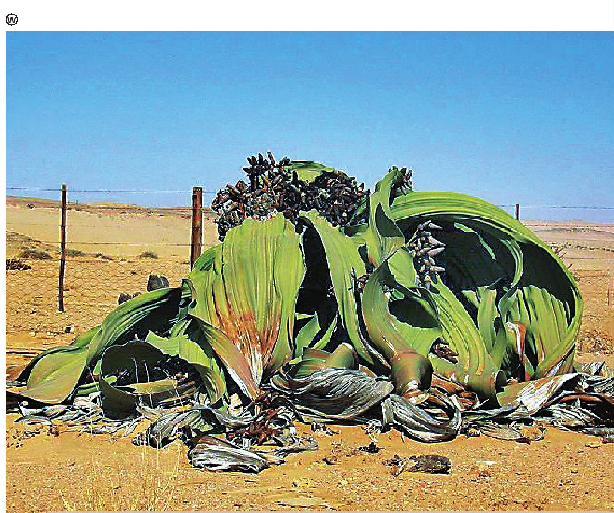
百岁兰

  

**【微博士】**巨叶短茎

百岁兰看上去似乎没有茎干，仿佛贴着地面生长，其实，它有一根直径1米多的粗大茎干，只不过茎干很短，仅几十厘米长，不容易被人看到。百岁兰的每片叶子足有两三米长，很像两条又厚又硬的宽皮带，特别引人注目。

【微问题】如果切割掉百岁兰的一片叶子，它还能长出新叶吗？

【关键词】叶形　椰子树　百岁兰

## 一条花枝上，为什么有的只开一朵花，有的却开多朵花

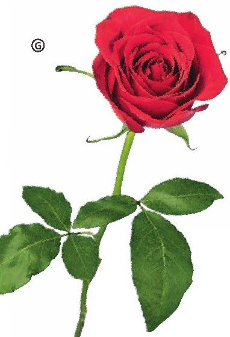
单生花

我们在赏花时，会发现有的植物一支花枝上只有一朵花，如牡丹、玫瑰和郁金香等。只有单独一朵花着生在茎的顶端或叶腋处，这类花称为单生花。但大多数植物的花枝上会着生很多朵花，如金鱼草、兰花和毛地黄等。多朵花按照一定的规律排列在花序轴上，这种着生方式的花丛称为花序。

花序发育是花发育的第一步，标志着植物的个体生长从营养生长向生殖生长转变。当进入生殖生长后，植物的茎顶端分生组织就具有了花序或花分生组织属性，从而不断分化出新的花序和花。如果植物的花序分生组织很快就转变为花分生组织，则其花枝的顶部只会有一朵花形成。但是，植物的花序分生组织如果能保持一定时间的花序分生能力，并在花序上不断分化出新的花分生组织，那么，在花枝的顶部就会有多朵花形成。植物茎顶端分生组织形成的花序可以分为有限花序和无限花序。根据分枝的多少，花序也可以分为简单花序和复杂花序。控制植物花发育的花序分生组织属性基因和花分生组织属性基因的相互作用共同决定了花序的结构。

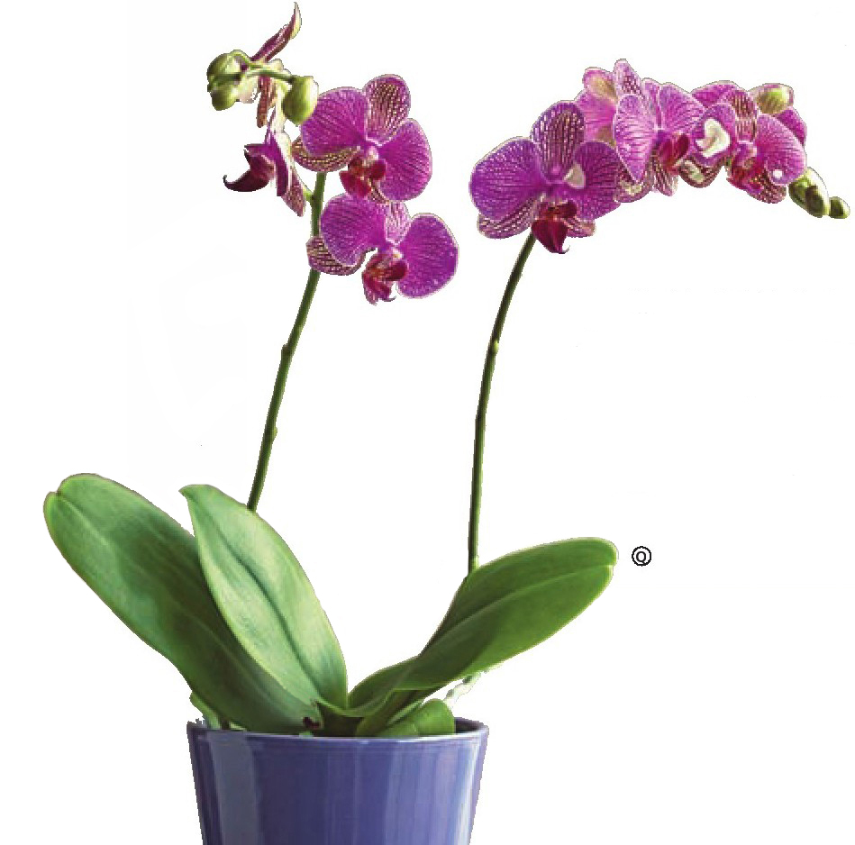
多朵花形成的花序

在无限花序的发育过程中，CENTRORADIALIS（CEN）和TERMINAL FLOWER 1（TFL1）基因的主要功能是维持花序分生组织的发育，在抑制花序分生组织的属性向花分生组织转变的过程中起着关键的作用。这两个基因突变后，植物的花序分生组织在生殖生长过程中会转变为一朵终端花，其花序会由无限花序转变为有限花序。（杨军）

## 为什么花序有多种多样

花序的形态变化非常复杂，主要表现为花序轴的长短，分枝或不分枝，有无花柄，以及花开放的顺序等。根据花序轴上的开花顺序，花序通常可以划分为有限花序和无限花序两大类。

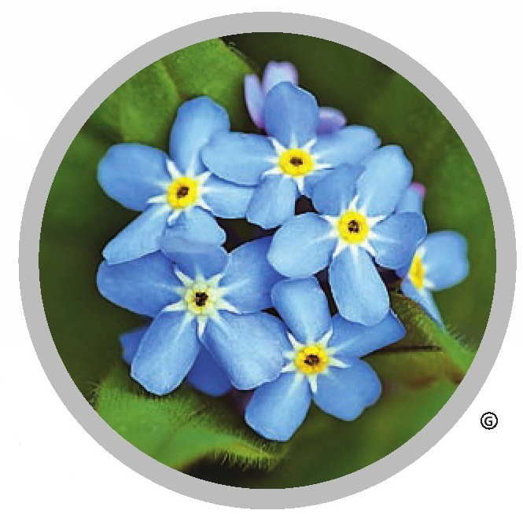
有限花序

有限花序也称聚伞花序，其主花序轴的顶端最先形成花原基，也最早开花，因此花序轴的生长受到抑制，不再继续生长，而由侧枝陆续形成新的花原基，但侧枝上也是顶花先开。正因为如此，有限花序的分枝不多，花的数目也比较少，其开花的顺序通常是顶端或中部的花先开，然后再是侧枝由内向外开花。根据主轴和侧枝发育的不同，有限花序可以分为：单歧聚伞花序、二歧聚伞花序、多歧聚伞花序和轮伞花序。

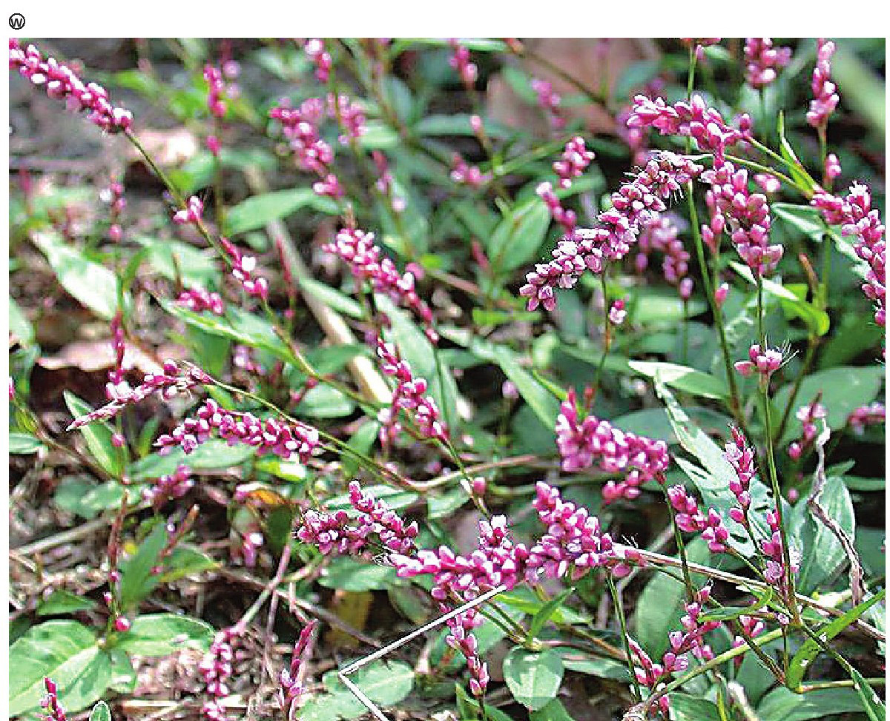
无限花序

无限花序也称总状花序，其花序分生组织可以一直保持旺盛的分生能力，不断在花序分生组织的周缘区分化产生新的花原基，或重复产生侧枝，并在侧枝上不断分化出花原基。这类花序的花一般由花序轴下部的花先开，然后逐渐往上开，同时花序轴不断增长，或者花由边缘先开，再逐渐趋向中心。无限花序可以进一步划分为总状花序、圆锥花序、穗状花序、复穗状花序、肉穗花序、柔荑花序、伞房花序、伞形花序、复伞房花序、复伞形花序、头状花序和隐头花序。

此外，有些植物以无限花序与有限花序混生在一起，这样花序轴可以无限生长，但是侧枝则成有限花序；或者花序轴顶端较快地停止生长，而侧枝可以继续生长一段较长时间。

人们对花序演化的了解所知甚少，目前被广泛接受的观点认为，单生花是被子植物演化中最原始的类型。（杨军）

## 植物的花能吃吗

绿花菜

植物的花卉除了作为观赏外，还可以食用。在中国，有很多可食用的花卉种类。例如黄花菜是一种多年生的草本植物，其花蕾不仅味鲜质嫩，营养丰富，含有丰富的胡萝卜素，而且有止血、消炎、清热、利湿、消食、明目和安神等功效，对吐血、大便带血、小便不通和失眠等有疗效。但新鲜的黄花菜中含有一种秋水仙碱的物质，它本身无毒，但经过肠胃道的吸收，在体内氧化为二秋水仙碱，则具有较大的毒性。因此，在食用鲜黄花菜前，需要用开水焯过，再用清水浸泡2个小时以上，将秋水仙碱破坏掉后才能食用。食用干黄花菜时，食用前也应用清水或温水进行多次浸泡。

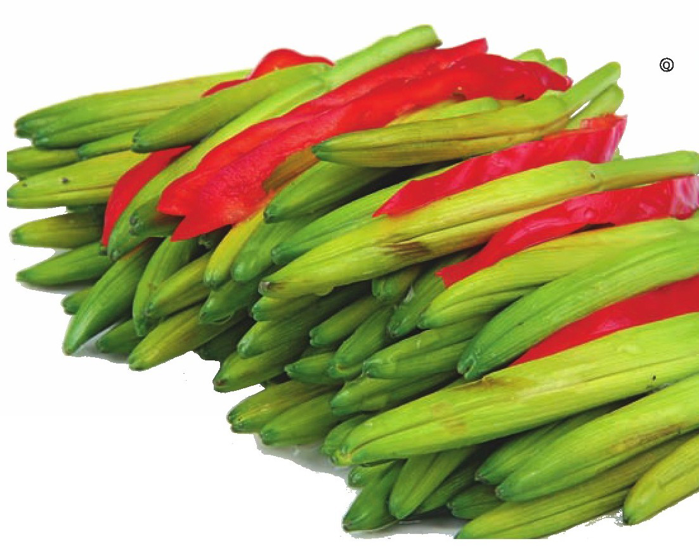
黄花菜

花椰菜也是人们所喜爱的蔬菜之一，可食用的花球是白色光滑的半球状结构，内部是短缩的分枝，表面是大量增生的分生组织。这些分生组织大多数都是早期的花序分生组织。而绿花菜的花球表面则是由大量增生的、处于分化状态但暂时不能开放的花蕾组成。有研究表明，花球的发生与BobCAL（BobCAULIFLOWER）和BobAP1（BobAPETALA1）基因的突变有关。

菊花含有丰富的维生素、菊苷、氨基酸、腺嘌吟等成分，具有去除外感风寒、解毒清热和醒脑明目的功能，可用于治疗高血压、偏头痛和急性结膜炎等疾病。洗净的菊花花瓣拌蜜糖焙制糕点，口味清雅香甜。市售的“菊花晶”则是用杭菊加工而成的饮品。

此外，梅花、白玉兰、槐花、紫藤、木槿等植物的花也都可以食用。（杨军）

**【实验场】**

我们平时见到的一朵菊花，其实是由许多舌状花和筒状花组成的复杂的头状花序。花序外层通常是称为“花瓣”的舌状花，其雄蕊退化，只具有1枚雌蕊，多不能结实。舌状花因品种不同可以有1轮至多轮，色彩美丽而鲜艳。而花序中间的“花心”是管状花，花冠合成筒状，内有1枚雌蕊和5枚雄蕊，是可以结实的两性花。大家可以将菊花全部拆解，仔细观察和了解菊花头状花序的构成，以及舌状花和管状花的区别。

【微问题】除了菊花之外，还能说出哪些植物的花是头状花序的？

【关键词】花序　无限花序　有限花序

## 为什么要建立自然保护区

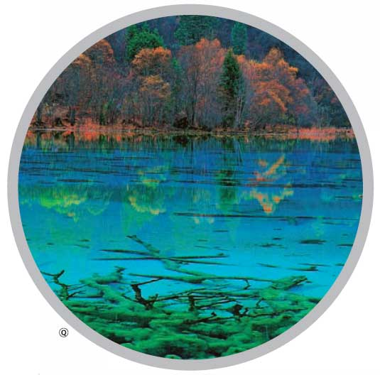
在回答这个问题之前，首先要了解什么是自然保护区。可以这样做一个简单的定义：自然保护区就是具有代表性的自然生态系统、珍稀濒危野生生物种群的天然生境地集中分布区、有特殊意义的自然遗迹等保护对象所在的陆地、陆地水体或者海域，依法划出一定面积予以特殊保护和管理的区域。如果从另一个角度理解，自然保护区是具有为了科研、监测、教育、文化娱乐目的而划分出的保护地域的总称。

很多人以为，自然保护区就是一个单纯保护物种的区域。如果这样理解，那就太片面了。其实，自然保护区作用非常广泛，除了保存、拯救各种面临濒危动物和植物，充当生物物种的贮备地和濒危生物物种的庇护所，更重要的是，它保存了完整的、未受污染的生态系统。还有，自然保护区为研究生态和环境变化的规律以及珍稀物种的繁殖驯化，提供了特别有利的条件。很多科学家都说，自然保护区就像巨大、开放、天然的实验室，为科学家从事生态学、繁衍珍稀物种的研究提供了优良场所。除了科学研究之外，自然保护区还是宣传教育的重要场所，或者说，它就是一个鲜活的、有生命的自然博物馆。除此以外，自然保护区还能在改善环境和保持生态平衡等方面起到很重要的作用，并且在保证生态环境不受损害的前提下，开放某些区域作为旅游胜地，让更多的人认识和了解保护区。

总而言之，在我们这个遭受到人类“蹂躏”的地球上，自然保护区给我们保留了一定面积的各类生态系统，也为我们的子孙后代保留了一些完全自然的区域。这些完全自然的区域将为人类今后在利用、改造自然的进程中，提供一条应该注意遵循的途径，同时还提供了客观的评价标准，甚至还能在一定程度上预见人类活动将会引起的后果。由此可见，建立自然保护区的意义是十分重大的。

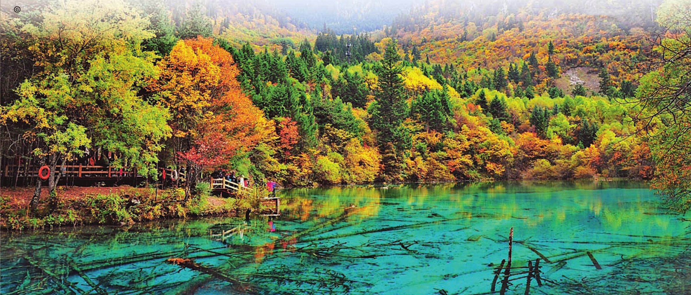
九寨沟自然保护区

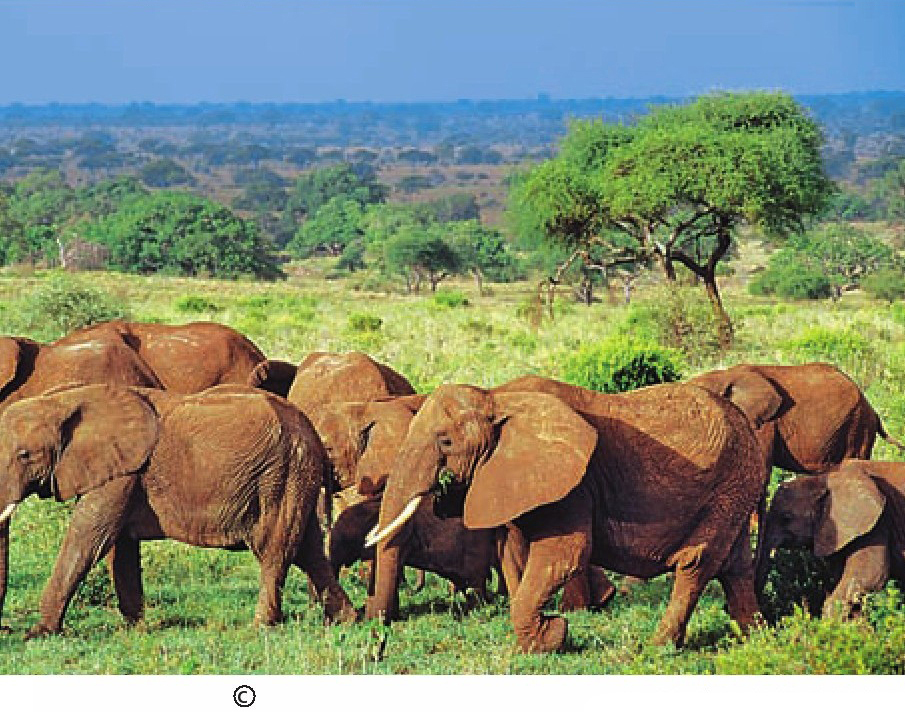
非洲马赛马拉自然保护区

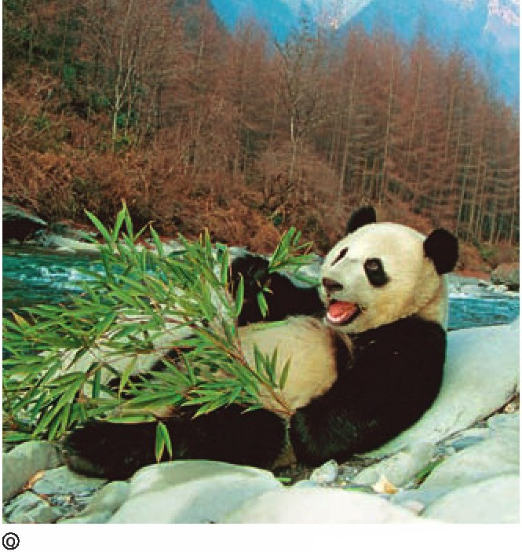
四川卧龙自然保护区

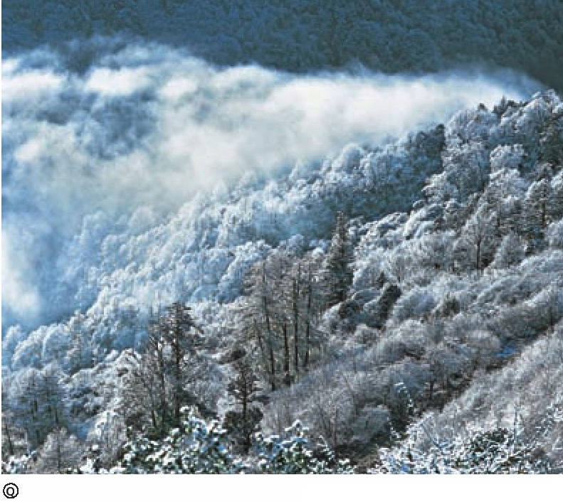
黑龙江丰林自然保护区

建立了保护区之后，怎样对它进行保护呢？

在国外，很多保护区采用原封不动、任其自然发展的纯保护方式，但中国人口众多，自然植被少，通常采取保护、科研教育、生产相结合的方式。当然，在不影响保护区的自然环境和保护对象的前提下，也可以适当与旅游业相结合。因此，中国的自然保护区内部大多划分成核心区、缓冲区和外围区3个部分。核心区是受到严格保护的地区，除极少数例外，不允许人类进入，属于几乎不受人为干扰的自然生态系统所在地。当然，也有些核心区虽然曾遭受破坏，但它的自然生态系统很有希望逐步得到恢复。缓冲区是指环绕核心区的周围地区，只允许科学家和专业人员进入从事科学研究观测活动。外围区又称实验区，位于缓冲区周围，是一个多用途的地区，允许在这个区域内从事科学试验、教学实习、参观考察、旅游，以及驯化、繁殖珍稀濒危野生动植物等活动。这样，使自然保护区不仅保护了生物资源，而且又成为教育、科研、旅游等多种目的相结合的场所。（冯志强）

## 有没有专门保护自然风景的保护区

虽然中国现在已经有几百个自然保护区，但它们各自保护的重点都有所不同，自然风景也是自然的一部分，理所当然也成为保护区大家族中的一员。其中著名的四川九寨沟、江西庐山自然保护区等，就是以保护自然风景为主的自然保护区和国家公园。

通常来说，根据所保护对象的不同，自然保护区大致可以分为6种类型。除了上述自然风景类以外，还有以保护完整的综合自然生态系统为目的的自然保护区，例如以保护温带山地生态系统及自然景观为主的长白山自然保护区，以保护亚热带生态系统为主的武夷山自然保护区和保护热带自然生态系统的云南西双版纳自然保护区等。

有些保护区以保护某些珍贵动物资源为主，例如四川卧龙和王朗等自然保护区以保护大熊猫为主。另一些则以保护珍稀孑遗植物以及特有植被类型为主要目的，例如广西花坪自然保护区以保护银杉为主，黑龙江丰林自然保护区以保护红松林为主。除此以外，还有以保护特有的地质剖面以及特殊地貌类型为主的自然保护区，例如保护近期火山遗迹和自然景观为主的黑龙江五大连池自然保护区。（冯志强）

  

**【微博士】**中国第一个自然保护区

广东省肇庆市鼎湖区，距离广州市西南100千米的鼎湖山自然保护区，是中国第一个具有现代意义的自然保护区，建立于1956年。经过50多年的发展，至2010年，中国的国家级自然保护区已经达到300多个。

【微问题】中国有没有保护土著人的保护区？

【关键词】自然保护区　生态系统

## 为什么一棵树能值20万美元

一棵树能值20万美元！为什么会有如此的天价？难道它的浑身上下都是名贵药材？或者它体内具有某些神奇物质？再或者它属于濒临绝种的稀有树种？都不是，这里说的一棵树，其实就是一株普普通通的树木。如果是一株树龄50年的普通树木，将它劈碎当柴火烧，它最多值几十美元；将它的木材、果实、种子的所有价值加起来，并完全做到物尽其用，满打满算也不会超过2000美元。但是，如果换一种计算方法，那就觉得20万美元的价格合情合理了。

印度加尔各答农业大学有一位教授，对一棵树算了两笔不同的账。第一笔账是按照通常习惯的木材价格计算，那么，一棵生长50年的普通树木也就值几百美元，充其量不超过几千美元。第二笔账是按照这棵树的综合价值计算，其价值就远远超过了第一种算法。这位教授是这样计算的：如果这棵树生长50年，每年可以生产出大约价值3万美元的氧气以及大约价值3000美元的蛋白质。同时，它还可以防止大气污染、涵养水源、促进水分再循环，加起来其价值差不多为10万美元。除此以外，树木还有防止土壤侵蚀、增加土壤肥力、为鸟类及其他动物提供栖息环境等作用，将这些作用换算成钱的话，其价值6万多美元。最后，将这些综合价值全部加在一起，就得出这棵树的价值约20万美元。

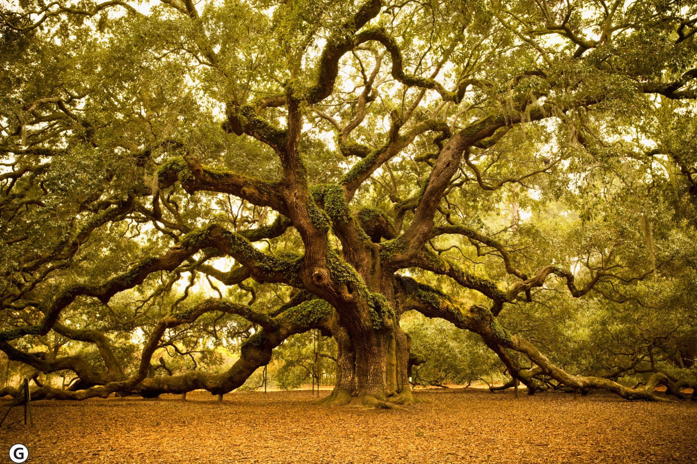
如果一株树木值20万美元，那么由很多树木组成的森林，又该价值几何呢？当然，森林的作用不能用金钱来精确衡量，但它的重要性是毋庸置疑的。

首先，森林对调节生物圈的二氧化碳和氧气的平衡发挥着无可替代的作用。生态学家曾经做过一次统计，处于生长季节的阔叶林，每公顷每天能吸收1000千克二氧化碳，生产730千克氧气。如果再进一步推算，地球上的人类若要满足自己对氧的需要，要求达到人均拥有10平方米的森林的条件。树木还是地球上最重要的空气净化使者，由于有树木的地方枝叶茂密，湿度也较高，有助于吸附空气中的油烟、灰尘以及各种有毒气体。根据测定，每公顷油松林一年可吸尘36.4吨，而且松树针叶能分泌出杀菌物质，可以杀灭白喉杆菌和结核杆菌，所以在森林内的空气中，细菌的含量肯定会大大低于城市。据测定，绿化区每立方米空气中的细菌含量仅为非绿化区的15%。

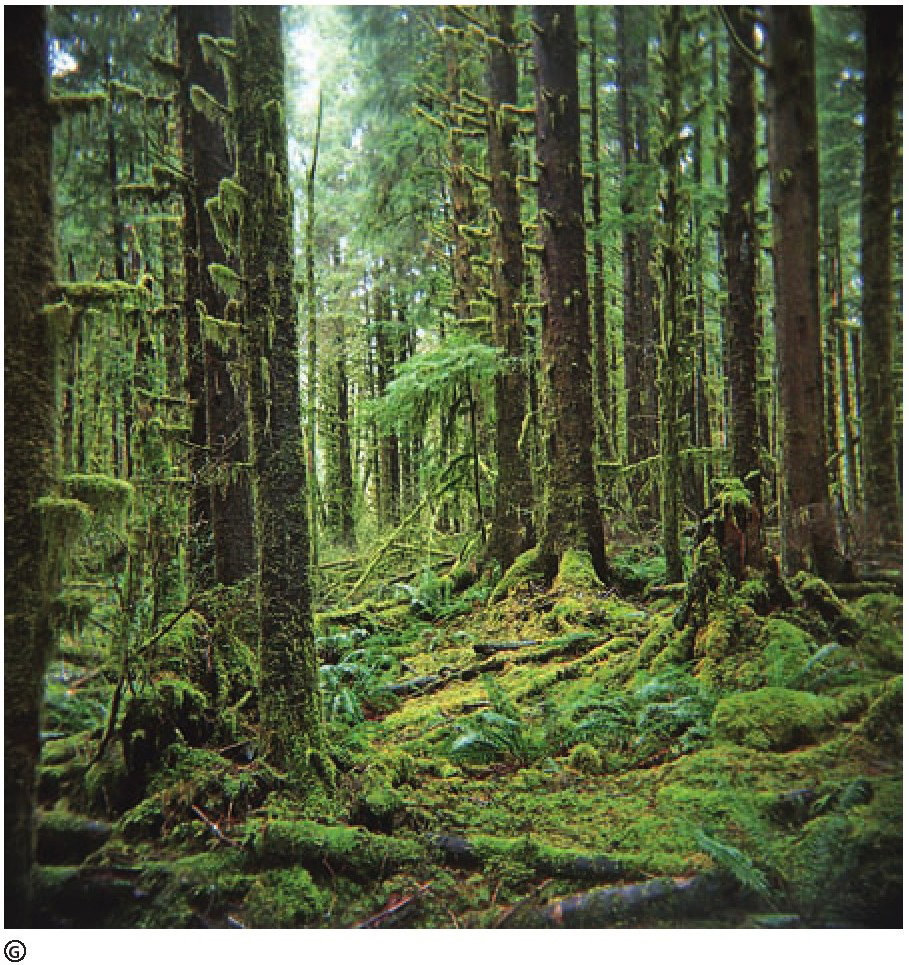
不仅如此，树木还是天然的消音器。例如，当强大的机器轰鸣声穿过一道30米宽的林木地带，就可以减低噪声6～8分贝。树木造福于我们地球还有一个重要方面，那就是涵养水源，保持水土。我们知道，茂密的林冠能截留雨水，林下的枯枝落叶层则能缓冲雨水对地表的冲击力，促进水分缓缓向地下渗透，大大减缓从地面流走的速度，这对涵养水源是极为有益的。据统计，1亩林地比裸地要多蓄水20吨，5万亩森林的贮水量相当于一座100万立方米的大水库。科学家还对森林有效减少水土流失的作用进行了测试：在一次降雨346毫米后，平均每亩林地流失土壤4千克，草地为6.2千克，农作物地为238千克，裸地则达到惊人的450千克！（冯志强）

## 为什么森林特别害怕酸雨

都知道地球上的森林正在遭受着各种各样的人为破坏，例如为了利用木材大量地砍伐森林，烧毁田地造成原生林消失，为放牧或大规模增加农田而砍伐森林，开发滑雪场等娱乐设施。但是，酸雨的危害却较少被提及，其实，它对森林的危害是相当严重的。

曾经有人对100多种植物进行过酸雨影响模拟实验，结果发现，当雨水pH值小于3.0时就能对植物叶片造成直接损害，叶片与酸雨接触时间越长，受到的损害越严重，造成大量黄叶并脱落，严重的甚至导致森林成片死亡。酸雨的影响主要是造成土壤物理化学性质的恶化，在酸雨作用下，土壤中的很多营养元素会释放出来，并被雨水淋溶掉，长期酸雨将造成土壤中营养元素严重不足，变为贫瘠。此外，酸雨还能使土壤中的铝元素从稳定状态变为活跃状态，活性铝的增加和络合态铝的减少，会严重抑制森林树木的生长。遭受酸雨侵害的森林土壤中，微生物的繁殖会受到抑制，尤其是那些有益的固氮菌、放线菌等会受到酸雨的抑制，反过来，酸雨又会导致森林内的病虫害明显增加。

正是以上原因，酸雨已经成为伤害森林的“可怕杀手”。（冯志强）

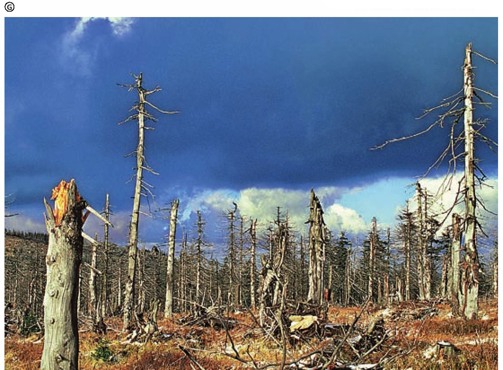
受到酸雨侵蚀后的树林

  

**【微博士】**森林减少噪声

我们知道，声音的减弱与声音传播的速度、介质有关。当声音传播遇到阻碍物，就会影响声音传播，森林恰恰就是根据这个原理来减少噪声的。可以想象，森林中许多的树木，还有更多的叶片，它们就像无数道屏障，阻拦声音的传播方向，使声音反复发生折射，从而起到降低噪声的效果。

【微问题】哪一类城市绿化树种能高效率消除空气粉尘？

【关键词】森林　酸雨

## 植物怎样“诱惑”动物传播种子

19世纪末，位于印度尼西亚北部马鲁古群岛的荷兰占领者，为了垄断肉豆蔻的生产，在种植区内颁布法令，严禁肉豆蔻的种子外传，违者将被处以死刑。可不久后，其他地区也长出了肉豆蔻，荷兰人怀疑是当地土人偷运出去的，便对他们进行了毒打和残杀，可还是无法阻止肉豆蔻外流。直到后来才发现，原来是犀鸟以及其他鸟类，吞食了肉豆蔻的果实，飞到别处，将粪便排出，粪便中的种子就在那里繁殖开了。其实，不仅是肉豆蔻，很多植物都利用果实来诱惑鸟类充当传播种子的使者。

植物的果实为了引诱动物，有的具备了鲜艳夺目的色彩，有的具备了甘甜肥美的果肉和果汁，希望动物能把自己一口吞下去。有趣的是，那些诱惑动物来吃的果实，内部都有坚硬的保护层，以防里面娇嫩的种子被动物消化掉。动物吞食了果实后，种子也就随着动物到处周游，最后随粪便一起被排出动物体外。动物不仅帮助植物传播了种子，而且排出的粪便还成了有利于种子萌发的肥料。不仅是动物，我们人类也是如此，例如在人类的粪便中，就能找到番茄和甜瓜的种子。还有一些植物果实，如桃子、李子、杏子、枣子等，人和动物吃掉了外面甜美的果肉，将果核丢弃，这也是在为植物传播下一代。

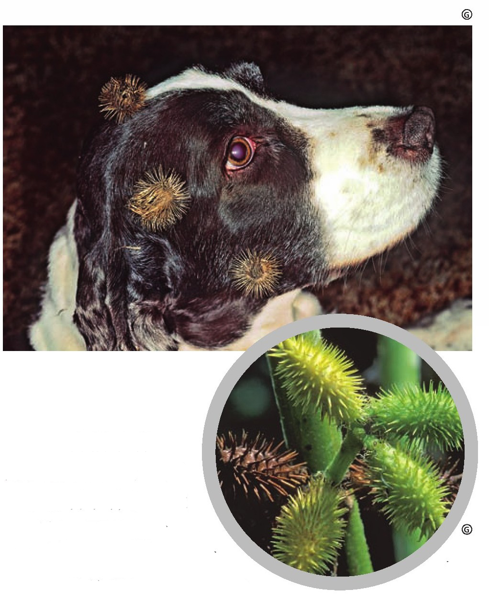
苍耳

植物的果实除了采用“诱惑”手段之外，还会利用特殊结构以“搭便车”形式进行传播。例如在秋天果实成熟季节，如果到灌木丛生的树林中转一圈，往往能在衣服上发现挂有苍耳、鬼针草、山蚂蟥等植物的果实。因为这些果实上有很多弯弯的钩刺，只要有人或动物经过碰上，就会牢牢钩在人的衣服或者动物的皮毛上，然后搭载着人和动物的“便车”，传播到很远的地方。

有一种叫豨签草的草本植物，果实上布满了钩刺，粘在动物身上很难除去。1828年，俄国骑兵从长满豨签草的克里木半岛经过，马尾巴上被粘上很多豨签草果实。这些果实随着骑兵马队旅行到拉脱维亚，后来又传到匈牙利、奥地利、法国，再后来甚至远渡重洋到了美国、澳大利亚等地，仅仅半个世纪，豨签草就传遍了半个地球。（余千里）

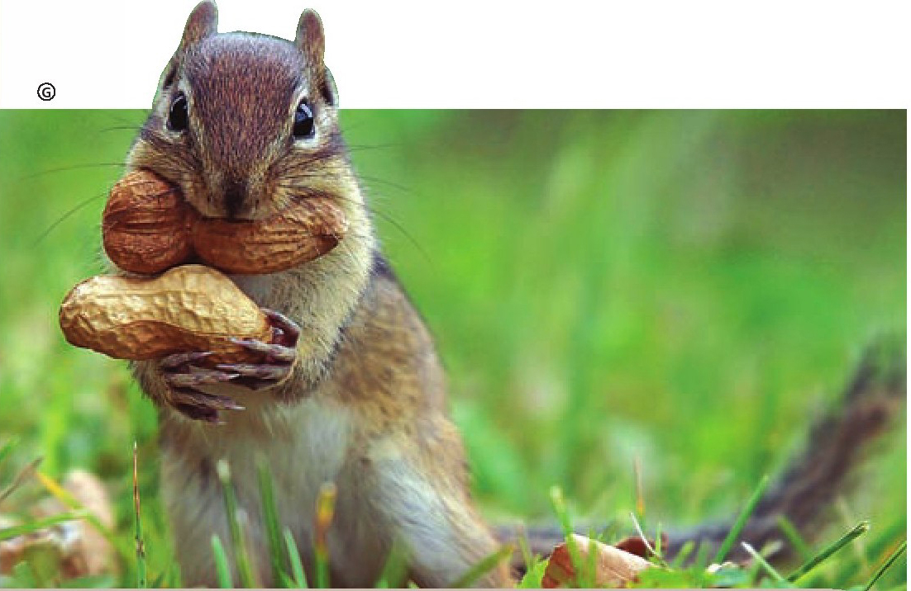
  

**【微博士】**松鼠种树

松鼠有这样的习惯，当松果成熟时，它会把采到的松子储存在临时挖好的洞穴之中，作为过冬的储备粮。但有时候因为储藏临时洞穴挖得太多，时间一久，松鼠就往往会忘记埋藏松子的地方，结果到第二年春天，在埋藏松子处就会长出很多松树苗。因此，有人给松鼠起了个外号——“动物植树员”。

## 果实和种子怎样借风“旅行”

有些植物没有甜美的果实，也没有布满钩刺的果实，当然也就没有了对动物的诱惑力，没有了“搭便车”的能力。但是，这些植物的果实能够利用风力来帮助它们传播，因为它们具备了适合风力传播的各种巧妙结构。

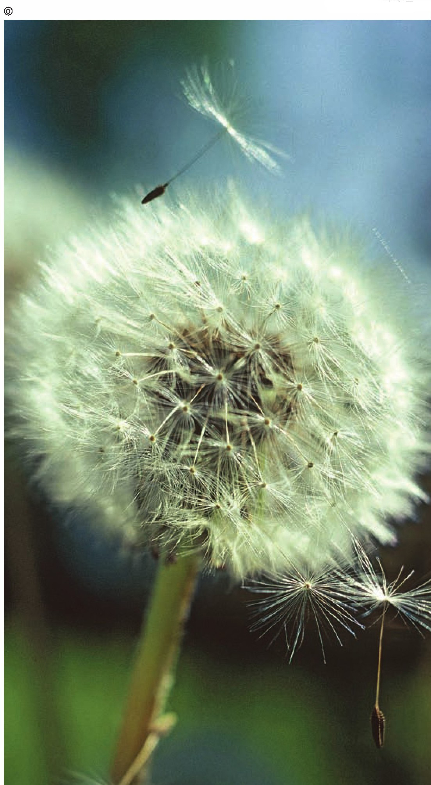
蒲公英的瘦果

利用风力传播的最典型例子是蒲公英。这是一种山野路边常见的小野草，当春天到来之后，它从身体中央抽出一根长长的花梗，开出金黄色的花朵。等到花儿凋谢后，花梗顶端聚满了很多小果实，每个果实都有一丛白绒毛，活像一群小伞兵。这时候，只要有风吹来，“小伞兵”果实就会被吹离花梗顶端，随风飘到很远的地方。

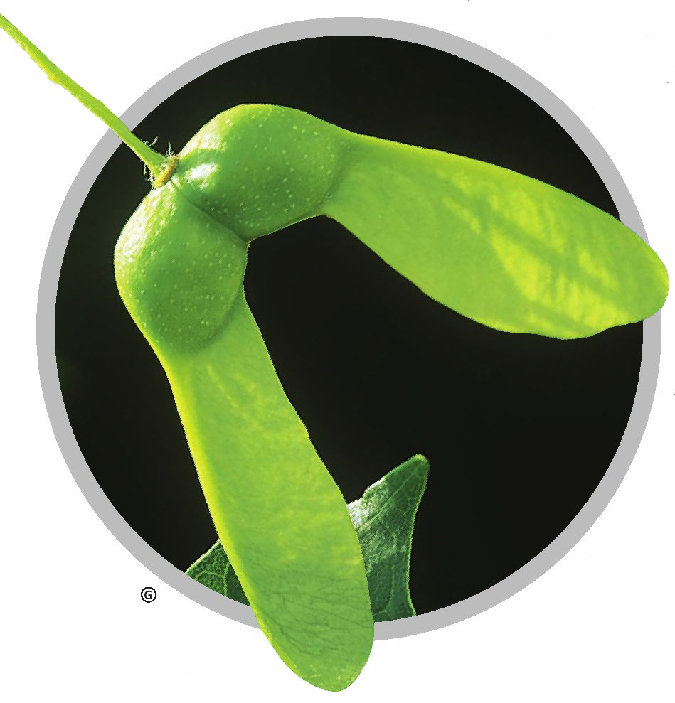
槭树的翅果

依靠风力传播的植物有很多，它们的果实种子都有各不相同的巧妙结构。例如榆树的果实外有一圈圆圆的翅膀，而槭树的果实却长着一对长长的翅膀，当它们成熟后被风一吹，就像小纸片那样在空中飘荡到远方。还有我们很常见的柳树，每当刮风时，柳絮漫天飞舞，而柳絮其实就是柳树的果实。这些植物中最有意思的是猪毛菜，它全身上下有很多细细的枝条，当种子成熟之后，植株的基部会自然断裂，被风一吹，整个植株如圆球一样在地上滚动，细小的种子就沿途撒落到地面，活像一架有生命的播种机。

还有一些适应风力传播的种子，变得特别轻而细小，只要微风就能够将它吹动。（余千里）

  

**【微博士】**鸟爪和鸟粪

进化论的创始人达尔文，曾经对鸟的爪子和喙进行过一番观察，发现它们粘带着的泥土简直就是一个种子仓库。他将一只野鸡爪子上粘着的一小块硬土保留了3年，然后用水湿润，放置到适合种子萌发的环境中，竟然培育出了82棵植株！

还有的科学家在研究时发现，鸟粪内的种子萌发率竟然超过80%！他们推测，种子经过动物胃酸的浸泡变软了，更有利于发芽。

【微问题】鲜红的樱桃是不是专门为了诱惑鸟儿来吃自己？

【关键词】风力传播　动物传播

## 豆科植物的根部为什么会长小瘤子

如果要保证植物正常生长，三大营养元素氮、磷、钾是不可缺少的。尤其是氮元素，对作物生长起着非常重要的作用。它是植物体内氨基酸的组成部分，氨基酸是构成蛋白质的成分，也是植物进行光合作用起决定作用的叶绿素的组成部分。

众所周知，在我们周围的空气中，几乎含有70%以上的氮气。这样大量的氮完全能满足植物生长的需要，可惜，绝大多数植物无法直接吸收空气中的氮气，只能依靠施氮肥才能保证作物的生长和发育之需。但有一类豆科植物却与众不同，可以直接利用空气中的氮。

我们很熟悉的黄豆、豌豆、蚕豆、扁豆等，都属于豆科植物的果实或种子。为什么豆科植物能够利用空气中的氮呢？原来，在土壤中有一类根瘤菌，它们体内存在着有生物活性的固氮酶，能将大气中的氮气还原成植物可以直接利用的氨，植物学家将这个过程称为生物固氮作用。由于土壤中的根瘤菌侵入豆科植物的根部细胞后，引起根部细胞强烈分裂和生长，从而在根部形成一个个“小瘤子”。当豆科植物和根瘤菌之间的共生关系建立后，植物供给根瘤菌生存所需要的矿质营养和能源，而根瘤菌能固定住大气中的游离氮气，为植物生长提供所需的氮元素，这是一种相互依赖的双赢关系。

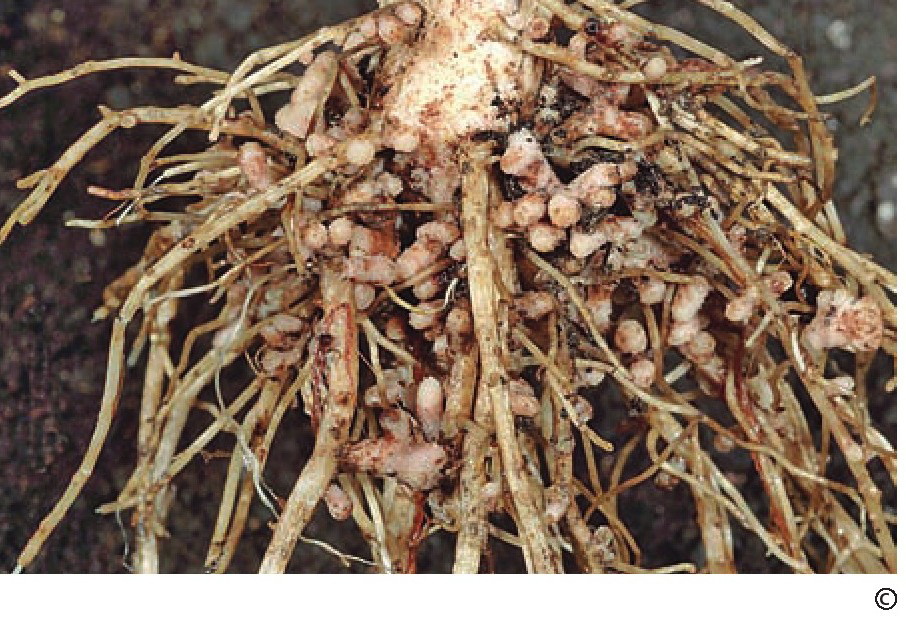
豆科植物的根瘤

其实，土壤中还有很多具有固氮作用的微生物，根据它们的习性通常分为两类：一类是在土壤中能独立生活的自生性固氮微生物；另一类是需要与植物共生的共生性固氮微生物，如与豆科植物共生的根瘤菌。

在实际的农业生产过程中，为使豆科植物多生小瘤子，可用根瘤菌制成的菌肥拌种。有时候为了提高作物产量，还可以将豆科作物与其他庄稼作物轮作，因为种过豆科植物后，土壤中可直接被其他植物利用的氮素会有所增加。值得注意的是，一种豆科植物通常只能与一种或少数几种相应的根瘤菌系共生，如豌豆根瘤内的根瘤菌只能在豌豆、蚕豆等根部形成根瘤，大豆只能从大豆根瘤中的根瘤菌形成根瘤。

生物固氮是一个重要的生命活动现象，它能在常温常压下完成固氮过程。因此，科学家都非常注重研究这一现象和机理，希望有一天能够人工模拟这一过程制造氮肥，使非豆科植物也能参与共生固氮。（蔡可）

## 庄稼为什么患上营养缺乏症

人若挑食，就会因为缺少某些营养素而患上营养缺乏症。植物也一样，除了要提供它们足够的氮、磷、钾三大元素，同样也不能缺少植物所必需的一些微量元素，如铁（Fe）、铜（Cu）、锰（Mn）、硼（B）、锌（Zn）、钼（Mo）等，因为它们在植物生活的许多关键环节中扮演着重要的角色。

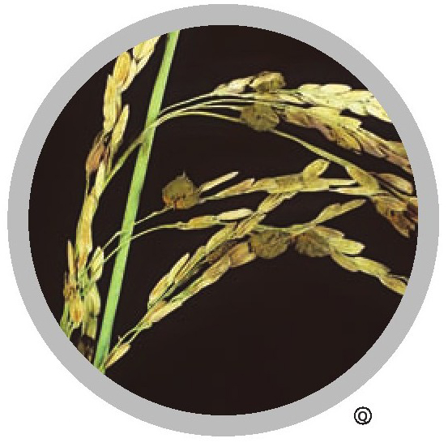
患营养缺乏症的水稻

如果缺少上述的元素，植物就会患上营养缺乏症，导致生长发育不良或受到抑制。有经验的栽培学家，往往根据外部特征就能知道它患上了什么类型的营养缺乏症。例如，当植物缺乏氮，叶面会变黄；缺少铁时，新生叶呈黄白色；缺磷时，分蘖分枝减少，幼芽、幼叶生长停滞，茎、根纤细，植株矮小，叶子呈现不正常的暗绿色或紫红色；当植株缺少钾的时候，叶片出现缺绿斑点，逐渐坏死。（蔡可）

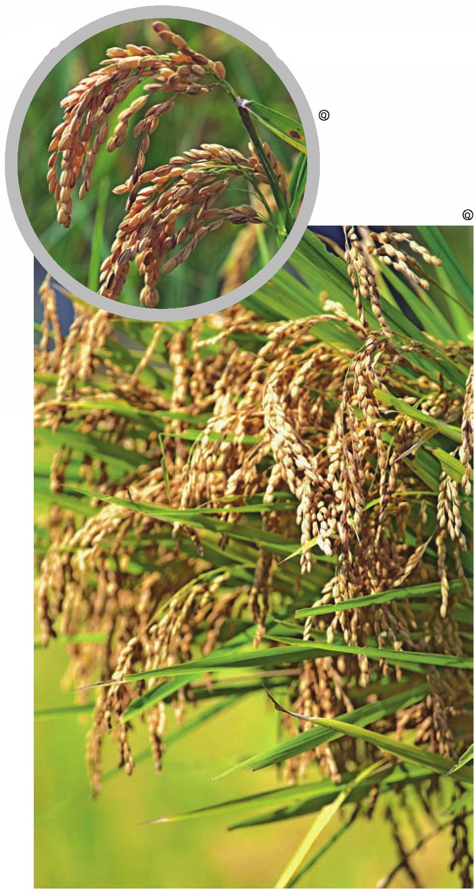
## 为什么化肥不及有机肥

农谚说“庄稼一枝花，全靠肥当家”，从这句谚语就可以知道肥料的重要性。植物生活在土壤中，虽然土壤中一般都含有植物所需要的养料，但是，由于一些地方土壤本身的贫瘠或长期的耕作，已经不能完全满足植物生长所需的养料。因此，必须采用人为的施肥措施，为土壤追加养分，而我们现在通常使用的肥料大致有两大类，那就是有机肥和化肥。

什么是有机肥呢？简单地说，是利用植物残叶、茎干和人禽畜的粪便，以及一些可以腐烂的有机物等作为原料，然后堆聚在一起让其自然发酵，再经微生物分解后形成的肥料。有机肥含有多种养料，吸收性强，肥效持续，并有改良土壤的作用，有利于土壤微生物的活动和作物的生长。施用有机肥的土壤，不仅能提高农作物产量，还能保持土壤的肥力，成为可持续性的沃土。

而化肥则完全不同，它是人工合成的肥料，例如常用的氮肥有尿素、硫酸铵，磷肥有过磷酸钙，钾肥有磷酸二氢钾等。化肥虽然使用方便、肥效较快，但经常施用化肥很容易破坏土壤结构，不利于作物生长和微生物生存。而且当氮类化肥使用过多后，可以引起作物徒长，茎干软弱，容易倒伏，造成减产和不利于收获。（蔡可）

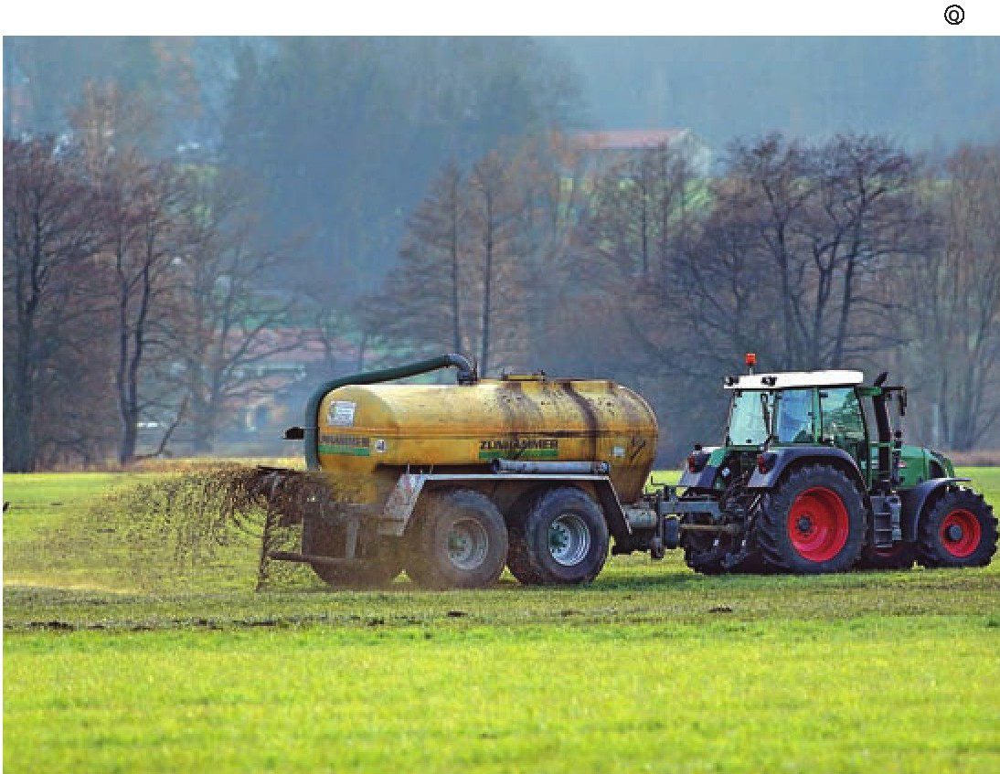
  

**【微博士】**缺钼

豆科植物虽然具有固氮作用，不会有缺少氮素的危险，但它也会患上缺少其他元素的营养缺乏症。例如，当豆科植物缺少钼元素时，会导致根瘤发育不良，颜色呈绿色或棕色而不是粉红色；叶片颜色会变淡，叶片上出现很多细小的凝点，同时叶片变厚、发皱，并向下卷曲。

【微问题】施肥太多，庄稼会肥死吗？

【关键词】食虫植物　固氮作用　有机肥　化肥

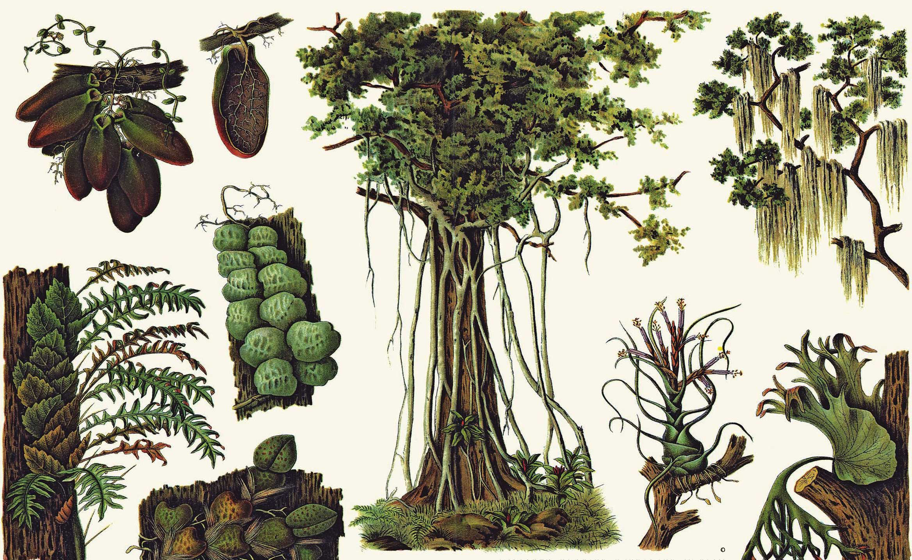
生活在南方热带地区的各种附生植物、绞杀植物和气生植物。例如附生在树干或石块上的多足蕨、鹿角蕨等；利用气生根绞杀其他树木的榕树；能够完全依靠空气为生的空气凤梨

## 为什么高山植物的花朵特别艳丽

长白山是中国东北最高的山，海拔2600多米，被称为“东北屋脊”。那儿气候寒冷，一年365天中有300天刮风，12个月内有9个月被冰雪覆盖。就在这样严酷的环境中，依然有很多不惧严寒的植物在那里生存。每年4月开始，长白山顶还是白雪皑皑时，高山杜鹃却在冰雪和寒风中坚实挺立，开始绽放出晶莹欲滴、娇嫩艳丽的花朵，殷红、鹅黄、粉白、靛紫……缤纷花海与银色世界相映成趣，令人惊叹。到了七八月间，冰雪融化，山坡、林下、谷地的鸢尾、百合、萱草、金莲花竞相开放。这些都是山下很普通的植物，但奇怪的是，当它们到了高海拔的山上，花朵的颜色要比在山下开放的花朵艳丽很多。放眼望去，漫山遍野姹紫嫣红，整个山脊好像铺上了一层厚厚的“花毯”，令人流连忘返。因此，长白山又有“天堂花园”的美誉。其实，不仅仅是在长白山，在喜马拉雅山的峡谷、青藏高原等人迹罕至的高海拔山区，花朵都特别鲜艳。

高山植物

高山植物的花卉之所以格外艳丽，其主要根源来自太阳光中的紫外线。说起紫外线，这可是植物的“杀手”。尤其高山上空气稀薄，紫外线特别强烈，对植物的杀伤力当然也更大。例如，几乎所有高山植物的个头都很矮小，其原因是因为紫外线对茎的生长有破坏作用。当然，紫外线也会危害花朵，特别是危害花瓣细胞中的染色体。高山植物的花朵为了对抗强烈的紫外线，细胞内会产生大量的类胡萝卜素和花青素，其数量远远超过正常环境中绽放的花朵。有了足够数量的类胡萝卜素和花青素，就能够吸收大部分的紫外线，使植物的花朵得到保护。高山植物花朵内大量增加的这两种物质，其实是两种色素，其中类胡萝卜素能使花瓣呈现鲜明的橙色和黄色，花青素则使花瓣呈现红色、蓝色、紫色等。这些红、黄、蓝、紫的颜色同时出现在花朵里，在阳光的照射下，就会显得十分鲜艳。海拔越高的地方，紫外线越强，花瓣里面这两种物质也越多，颜色就越丰富。另外，高山上日照强烈，被植物反射出来的光会大量增加，也使花朵看上去更鲜艳，令人感觉高山上的植物格外美丽。（邓泓）

## 植物为什么讨厌绿色光

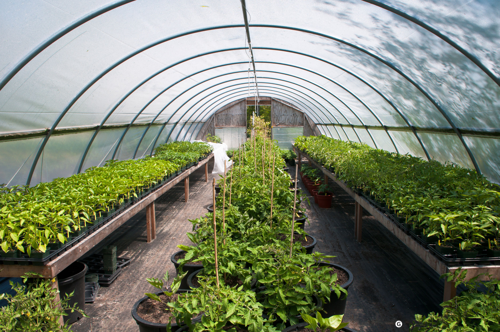
温室栽培

我们都知道，太阳光是由红、橙、黄、绿、青、蓝、紫七种颜色光组成的，而植物生长又离不开阳光，那么植物对这七色光是不是一视同仁呢？对于这个问题，很多人会不假思索地回答说：植物利用叶片进行光合作用，既然叶片是绿色的，当然也就最喜欢绿色光。这个回答恰恰大错特错了。科学家曾经设计了这样一个实验，分别用七种颜色的光来培养植物，结果发现植物最不喜欢的竟然是绿色光！因为在绿光下，植物长得“面黄肌瘦”，没多久就枯死了。而植物最喜欢的是红色光和蓝色光，在它们的照射下，结的果实又大又多。原来，植物进行光合作用需要叶绿素的帮忙，叶绿素的作用就是吸收太阳光，它们对红光和蓝光的利用效率最高。叶绿素最不能吸收的就是绿光，所以会将绿光反射回去或透射而出。我们看到叶片是绿色的，就是因为这个缘故。当然，太阳光中其他颜色的光对植物生长也有一定的作用，所以种植蔬菜的温室大都采用透明的塑料薄膜，为的是让植物能接收到阳光中各种颜色的光。（邓泓）

## 自然界中有没有黑色的花朵

五颜六色、万紫千红的花朵，红色、黄色、紫色、白色、粉红等颜色让大自然变得格外美丽，但却没有黑色的花朵。这是因为黑色能够吸收全部的太阳光，在阳光的照射下升温很快。例如我们人类在夏天就很少穿黑色的衣服。植物为了保护娇嫩的花瓣不被阳光灼伤，自然就不会形成黑色的花。而且，植物的花瓣中主要含有类胡萝卜素和花青素这两种色素，它们可以使花瓣呈现红、橙、黄、紫等色彩，却不能呈现出黑色。没有黑色素的存在，黑色的花朵当然也就没有了。也许有人会对此提出异议，认为黑色花朵虽然极为稀少，但的确存在，例如珍稀品种黑玫瑰、黑牡丹、黑郁金香等。其实，这些珍稀品种都是经过人类长期培育而成，使花朵的颜色变成很深的紫黑色，但到现在为止，还没有真正培养成能开出完全黑色花朵的植物品种。（邓泓）

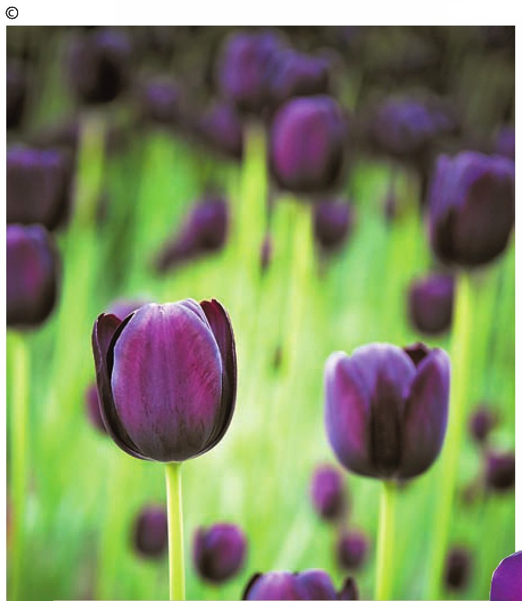
郁金香

**【实验场】**

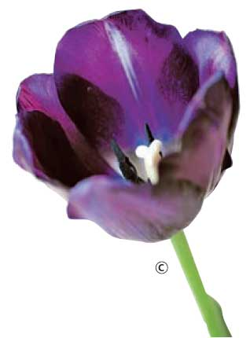
去野外采几朵红色的牵牛花，将花瓣放入肥皂水中，注意观察花瓣的颜色，红色的花瓣是不是慢慢变成蓝色了？将变为蓝色的花瓣用自来水冲洗干净，放到白醋中，花瓣是不是又重新变成红色了？这是因为牵牛花中含有的花青素遇酸变红、遇碱变蓝的缘故。

【微问题】有没有绿色的花朵？

【关键词】高山植物　花青素　类胡萝卜素

## 植物为什么会控制自己的体温

无论外界温度如何变化，鸟类和哺乳动物都能够控制自身体温，使机体始终处于最适生理状态。相比之下，夏日里的植物看起来似乎只能忍受酷日的炙烤。有人不禁想问，植物会不会调节自身温度？换句话说，烈日下植物会主动降温避暑吗？答案是肯定的。在亿万年的进化过程中，植物进化出了多种对高温的趋避和防御能力。

我们先来看看植物如何趋避高温。有一种叫沙漠薰衣草的植物生活在炎热的沙漠地区，强烈的阳光伴着高温对它构成了严峻的考验。但沙漠薰衣草完全适应了如此恶劣的环境。它的叶片表面生有一层密密的叶毛，就像涂了一层厚厚的“防晒霜”，能够有效地反射阳光，避免吸收过多的光能。另外，这层致密的叶毛还可以降低叶片表面水分的散失速率，有助于保持宝贵的水分。这对于生活在沙漠的薰衣草很重要。还有，油栎在一天中可不断改变叶片的方向，尽量使其表面与阳光平行，从而大大减少了叶片的受热面积，当然也大大降低了热量的吸收。

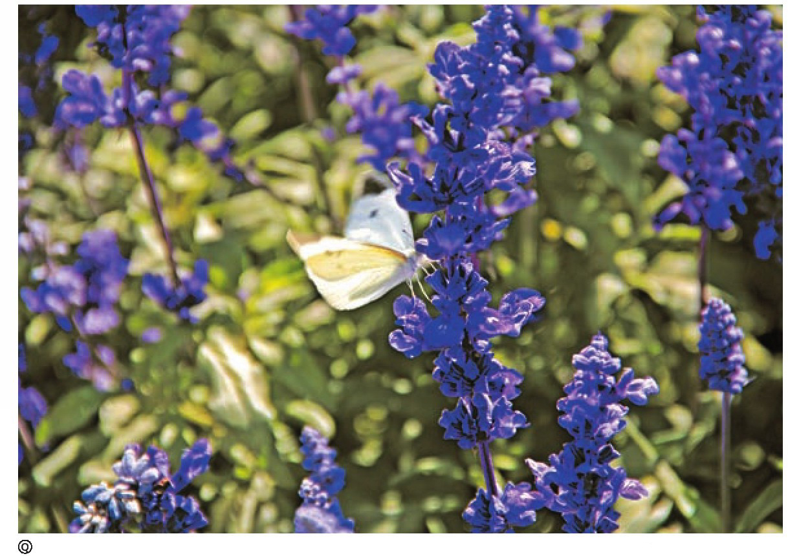
薰衣草

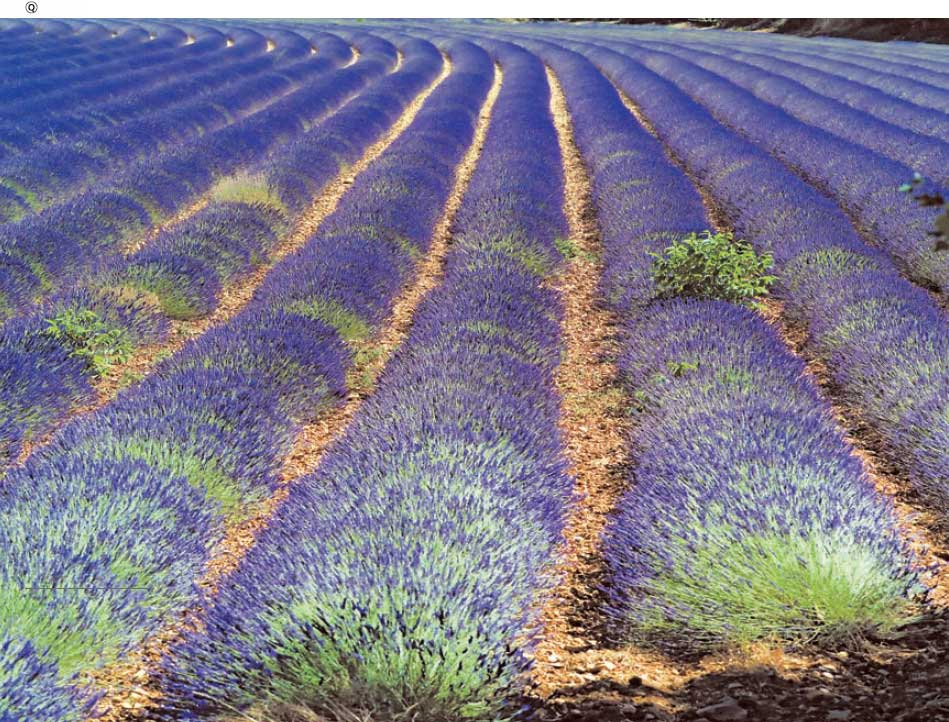
有些植物能趋避高温来防暑，还有些植物更能降温祛暑。

在炎热的环境下或剧烈活动后，我们的身体会出汗降温。同样，在高温下植物也会“排汗降温”。不同之处是植物不必把“汗液”分泌到体外，而通过气孔直接将水分以气态形式释放出去，也就是我们常说的“蒸腾作用”。与此同时，热量也伴随着水分的蒸发而被带走。科学家发现，发生迅速蒸腾作用的叶片表面温度要比环境温度低2～3℃。那么，植物怎样调节“排汗”的速度呢？原来气孔是由一对结构特殊的细胞——“气孔保卫细胞”构成，植物可以迅速调节保卫细胞内钾离子的浓度来调控气孔开放的大小。当钾离子浓度升高时，保卫细胞吸水、膨胀，气孔开放；反之，保卫细胞失水，气孔关闭。高温下，植物需要大量的水分以维持蒸腾作用散热降温。如果土壤水分不足，就会引起气孔关闭，导致植物“中暑”。所以在炎热的夏天，植物往往需要“喝入”大量的水分，然后把水分通过气态形式蒸发到周围的空间。在这个过程中，水汽带走了大量植物体内的热量，起到了防暑降温的作用。这个过程是不是像我们人类的出汗？

由此可以联想到热带地区的森林植被通常都是阔叶林，也就是说，热带植物之所以都有较大的叶片，一方面是热带雨林中光线相对昏暗，尽可能大的叶片面积有助于接收更多的阳光，有利于进行光合作用；另一方面，热带地区气温较高，植物的水分蒸腾也大大增加，与此同时，也加快了植物体内热量的散发。（陈忠）

  

**【微博士】**气体进出

气孔除了能调节水分的散失，还是二氧化碳和氧气进出叶片的门户。植物利用光能，把二氧化碳转化成糖类。如果气孔大量关闭，二氧化碳就不能迅速进入叶片，导致植物合成“食物”的速度下降，植物的生长就会受到抑制。

## 有没有会自己产热升高体温的植物

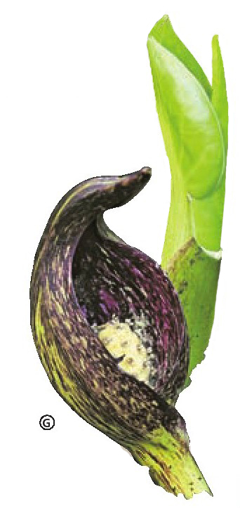
天南星科的产热植物

已经知道，植物可以通过多种途径防御高温的伤害，那么在寒冷的环境下植物会不会产热来升高体温呢？严格地讲，没有植物可以升高自身的整体温度，但自然界里有许多植物在开花期可以显著地提高花的温度。这些植物大多分布在天南星科、苏铁科、玉兰科、棕榈科和泽米科。例如，一种叫圣莲的植物在开花期能保持花朵子房的温度比周围环境高出20℃。还有一种叫臭包菜的北美植物能在春寒料峭的早春开花。它的花序通过氧化糖类产生热量，可以把整个花的温度在短时间内提高到30～45℃，足以把周围的积雪融化。

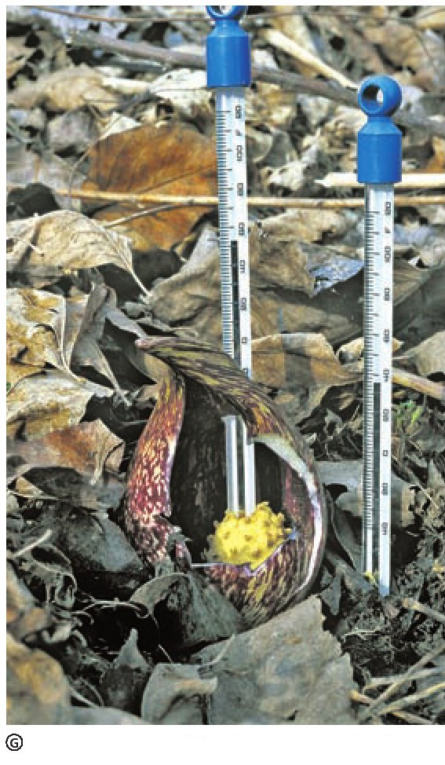
测量产热植物佛焰苞内的温度

通过产热来防御冻害的植物，臭包菜是极少数目前已经知道的种类之一。那么，其他植物的子房产热现象在进化上有什么作用呢？研究发现，花的产热现象都与提高花的授粉能力有关。温度的提高有利于花释放化学气味，吸引昆虫来帮助授粉。作为回报，昆虫在这些花中也可以享受一下温暖的小环境。这是生物在进化中产生的一种互惠现象。（陈忠）

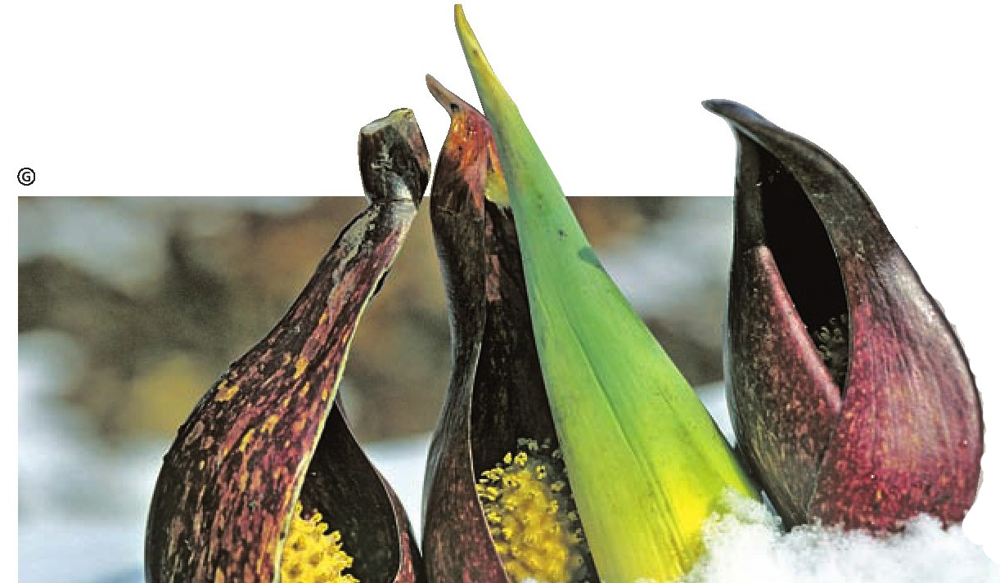
  

**【实验场】**观察叶片运动

大豆的叶片在一天之内能够不断改变方向。如果在适宜的温度和光照下，大豆叶片白天完全伸展、正对阳光，最大程度地吸收阳光进行光合作用；傍晚时分，叶片下垂，进入“睡眠”状态。若是在烈日下，大豆的叶片在中午时分则以倾斜角度朝向太阳，避免高光伤害。有兴趣的话，不妨在夏季种两盆大豆，一盆放在室外，一盆放在室内。在一天不同的时间点观察叶片的方向，并思考不同叶片位置对植物有何生物学意义。

【微问题】人体各个部位的温度有差别，那么植物体的根、茎、叶、花朵、果实和种子部位，温度也有差别吗？

【关键词】植物控制体温　保卫细胞

## 绞杀植物怎样“谋杀”大树

在气候湿热的热带雨林中，常常能见到一类残害大树的植物，植物学家给它们起名为绞杀植物。绞杀植物有的依附于其他植物体上生长，有的死死缠绕着高大的树木。许多大树看上去气势雄伟、高大魁梧，可一旦被绞杀植物缠住，身体就像被一条条绳索紧紧捆绑住，连“气”也透不过来，不管怎样反抗挣扎，很难逃脱死亡的厄运。

也许有人会问，绞杀植物没有脚，不会行走，怎么可能跑到别的大树身上？其实答案很简单，科学家在考察绞杀植物的典型代表榕树时发现，原来它有不少帮手，有的是天空飞翔的小鸟，有的是地面奔走的野兽。由于榕树的果实相当甜美可口，成熟之后对鸟兽的诱惑力极大，所以常常成为鸟兽的腹中美食。当鸟兽吃了榕树的果实后，果实里面的种子只是在肠胃中旅行了一下，根本没有被消化掉，而是随着鸟兽的粪便一起排出体外。那些榕树种子有的被排放到大树枝杈上，有的落在大树脚下。

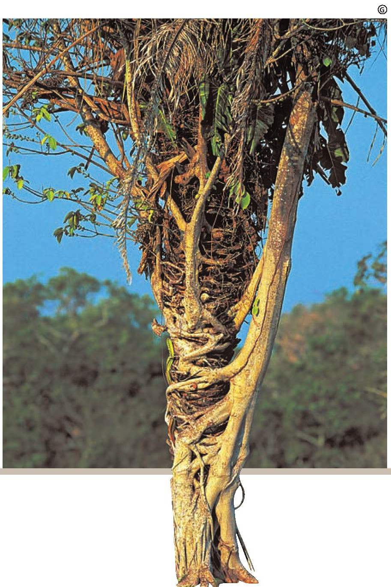
被绞杀的树木

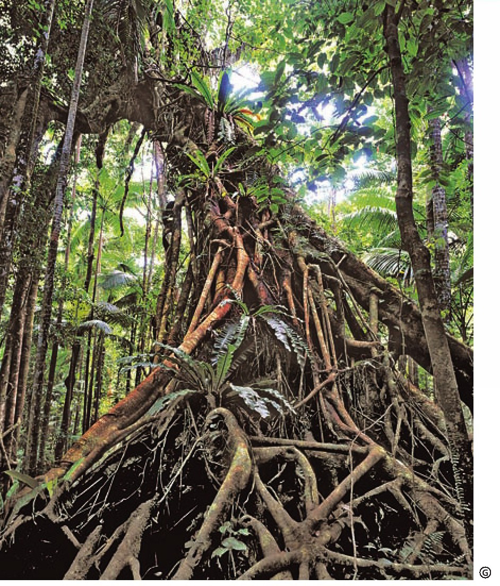
榕树种子有一个独特的看家本领：不进入土壤就可以萌发、生根。我们知道，绝大多数植物的根都需要钻入土壤，然后才能发挥出根的作用，但榕树的根与众不同，能够悬挂在空中，这种很特别的根在植物学上被称为“气生根”。

如果某一粒榕树的种子，随着小鸟粪便落到了某一株大树高高的枝杈上，然后萌发小榕树，小榕树渐渐长大后再从枝条茎干处萌发气生根，随着气生根越来越多、越来越长，并开始顺着它寄居的大树“爬行”，有的悬挂于半空，慢慢垂向地面，最后扎入到土壤之中；有的则围着树干缠绕。这时候，进入土壤中的气生根已经能够吸收养料水分，能够保证幼小的榕树不断长大。当榕树长到一定规模时，气生根已经变得相当密集粗壮，它们纵横交错，结成网状，将大树的树干、树枝紧紧包围起来，或者更形象地说是紧紧箍住。于是，榕树和它所依靠的大树之间，展开了一场你死我活的“肉搏战”。

参天大树惹上了绞杀植物榕树后，拼命想挣脱对方的缠绕网，但很难取得成功。绞杀植物就像不停念紧箍咒的唐僧，而受害的大树则像无计可施的孙猴子，毫无反抗之力。由于绞杀植物的网状气生根越长越粗，死死紧勒住大树不放，把大树勒得“喘不过气”，痛苦万分。不仅如此，绞杀植物还紧紧缠绕大树的根系，拼命抢夺大树的营养和水分。最后，绞杀植物长出了茂密繁盛的枝叶，盖过了大树的树冠，夺走了绝大部分阳光，将自己的生存建筑在大树的死亡上。

一般来说，参天大树只要被绞杀植物缠上后，结局通常是大树被弄得精疲力竭、逐渐衰亡，而绞杀植物则根深叶茂、欣欣向荣。当大树彻底被绞杀后，躯体渐渐腐烂，成为绞杀植物的营养，而绞杀植物依然停留在原地，它的网状气生根互相愈合，变成了能够独立生长的植株体。（王生清）

## 寄生植物是怎样不劳而获的

我们知道，寄生虫是人人痛恨的动物，它们寄生在人体中，吸取人体的营养，引起各种疾病。同样，植物界中也有这样的寄生者，菟丝子就是典型的代表。菟丝子是一种细藤状的植物，由于体内细胞中几乎没有叶绿体，无法自己制造出足够的营养物质，只能依靠吸取其他植物的营养生存。菟丝子身上有很多吸盘，最爱寻找的寄主植物是荨麻、大豆和棉花等庄稼作物。因此菟丝子是一种寄生植物。

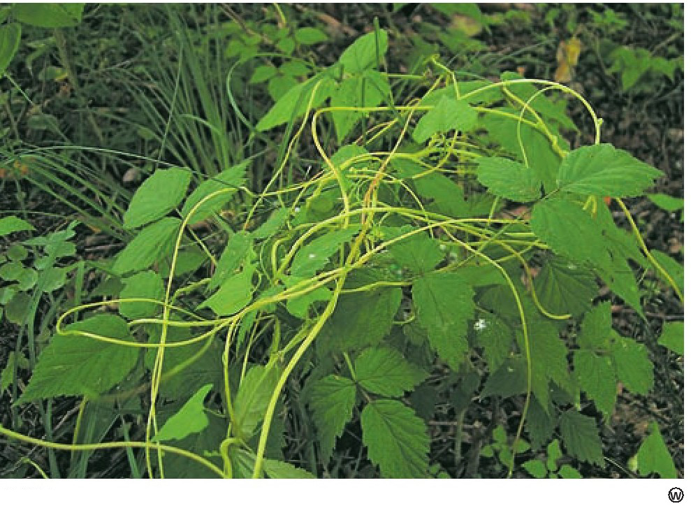
菟丝子

当温暖的春天到来后，多年生的荨麻开始萌出新苗、快速生长，但就在这时，附近的地里会钻出一条像小白蛇似的幼苗，扭扭曲曲向上爬，这就是菟丝子的幼苗。它一碰上荨麻的茎干之后，立即紧紧缠上，然后顺着茎干往上爬，并用小小的吸盘锲入到荨麻茎内，吸取里面的养分。

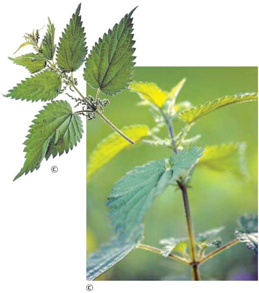
荨麻

当菟丝子和荨麻生长在一起后，完全不能和平共处。利用吸盘工具，菟丝子已经能够吸取荨麻体内的养料，自己的根和叶派不上用处了，根渐渐消失，而叶片则退化成了半透明的小鳞片。与根叶相反，菟丝子的茎却生长迅速，一个劲地抽出更多的新茎，密密麻麻地缠住荨麻。荨麻虽然满身是刺，可以对付一般小动物，但是对菟丝子却无可奈何，最终枯萎夭折，成为菟丝子的牺牲品。而这时候的菟丝子却绽放出一串串的粉红色小花，结出许多种子，撒落在地上，等到第二年春天又会繁殖出新的一代。

因此有人这样形容菟丝子：从小似根针，长大缠人身，吸了别人血，养了自家身。这几句顺口溜用来形容菟丝子的寄生特征，真是形象极了。（王生清）

  

**【微博士】**檀香树

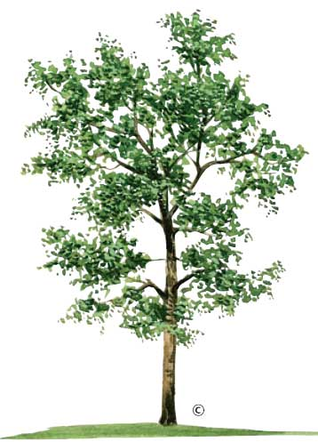
檀香树

大名鼎鼎的檀香树，不仅木材能散发出长久的香味，而且是生长最慢的树种之一，因此显得特别名贵。檀香树叶片虽然也是绿色的，但光合作用的能力比较差，制造出的养料无法满足生存的需要，只能依靠其他途径来补充。原来，檀香树的根部会长出很多蚂蟥吸盘状的“嘴巴”，紧紧吸附在其他植物的根上，抢夺别人的养料来养活自己。

【微问题】榕树会不会被其他绞杀植物绞杀？

【关键词】绞杀植物　榕树　菟丝子

## 植物也能像动物一样克隆吗

1996年，英国科学家成功培育出克隆羊“多利”成为当时一条家喻户晓的新闻，这也是生物技术发展的一个新里程碑。随后，猕猴、猪、牛、猫、鼠、兔、骡、鹿、马、狗等哺乳动物的克隆都相继成功。其实早在1963年，中国科学家童第周就成功地克隆了一条雌性鲤鱼。

什么是“克隆”呢？科学家们把人工遗传操作动物的无性繁殖过程叫“克隆”，就是从一种动物中产生出同样的复制品，复制品的外表及遗传基因与原型完全相同。

动物能克隆，那么植物是否也能克隆呢？答案是肯定的。其实，早在成功实现动物克隆之前，人类就知道许多植物具有这种克隆本领。例如在很久以前人类就发现，有些植物在合适的条件下可以通过剪取植物体上的部分器官来实现无性的扦插繁殖。扦插的器官可以是根、枝条和叶片，如紫藤根、柳树枝条、海棠叶片等。柳树枝条只要取一小段插在泥土里，过一段时间后，插在泥土里的枝条下端长根，上端长芽，渐渐长成与母本一样的植物。植物体不像动物个体那样，它是一种开放式系统，以一种开放的姿态融入大自然。整个植物体的地上部分通过茎尖，地下部分通过根尖的分生细胞区，在一定的条件下，反复进行着各种组织和器官的分化和生长，这与动物个体完全不同。

组织培养实验室

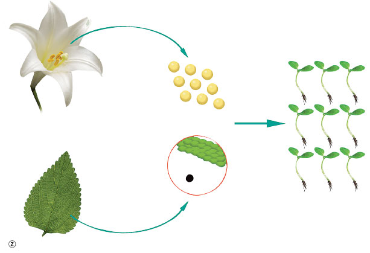
花粉和脱去细胞壁“外衣”的原生质体经过培养后成长为完整的植株

植物扦插繁殖是通过植物器官实现无性繁殖（克隆）的，那么植物的细胞是否也具有这样的功能呢？20世纪初开始，植物细胞培养的概念和技术逐步地被科学家提出和发展。直到20世纪60年代，科学家用单个分离的植物细胞培养获得了整个植株的再生，完成了从植物非生殖细胞获得整株植物的真正意义上的细胞克隆过程。至今，已有数百种植物的细胞可以培养和再生成整株植物。

在植物细胞克隆技术的基础上，科学家们建立了植物细胞工程，构建了完善的工艺流程，成为了当今生物技术中的重要组成部分之一。例如通过细胞大量培养，刺激植物细胞内某些重要产物（名贵药物、香精、色素等）的合成和积累，实现植物产品的工业化生产。直接应用于植物品种改良最早的组织培养技术是胚的离体培养，它可以克服杂交后胚的衰亡，保证种内或种间杂交的成功，或用于无性繁殖困难的植物的培养。原生质体是去掉植物细胞壁的单细胞，它是在离体培养条件下能够再生完整植株的最小单位。通过不同植物种原生质体之间的融合，克服远缘杂交障碍，从而产生杂交后代。

目前最常用，且最为有效的外源基因导入植物细胞方法之一是基因枪法。基因枪法既可以将植物愈伤组织作为受体，又可以将悬浮细胞作为受体，并且对单双子叶植物都十分有效。（周根余　张丞）

## 植物细胞怎样成长为完整植物体

植物细胞无论在什么条件下都能生长成为完整的植株吗？当然不是，植物细胞需要在特殊的生长条件下才能实现这个目标。首先，科学家们要从植物活体上取下细胞、组织或器官，这些离开植物体本身的部分称为“外植体”。然后，这些“外植体”均可以在人工控制的条件下进行培养。人工控制的条件中最重要的因素包括光照、温度、空气、水分和营养的供给，各种植物细胞对它们的要求有所不同。培养基质不仅为细胞提供水分，而且还包含植物细胞生长发育所需要的各种无机的、有机的营养成分和活性物质。在这样优越的环境条件下，植物细胞和各种微生物都能良好生长。为了有效地培养植物的离体部分，还要对植物材料、培养基质、培养用具进行消毒。整个操作过程又都需要在无菌条件下进行，这样可以避免植物自身和环境中的微生物与外植体“争夺”营养物质，或直接侵害外植体。因此，植物组织培养技术广义地可理解为植物离体部分（外植体）培养的无菌操作技术。

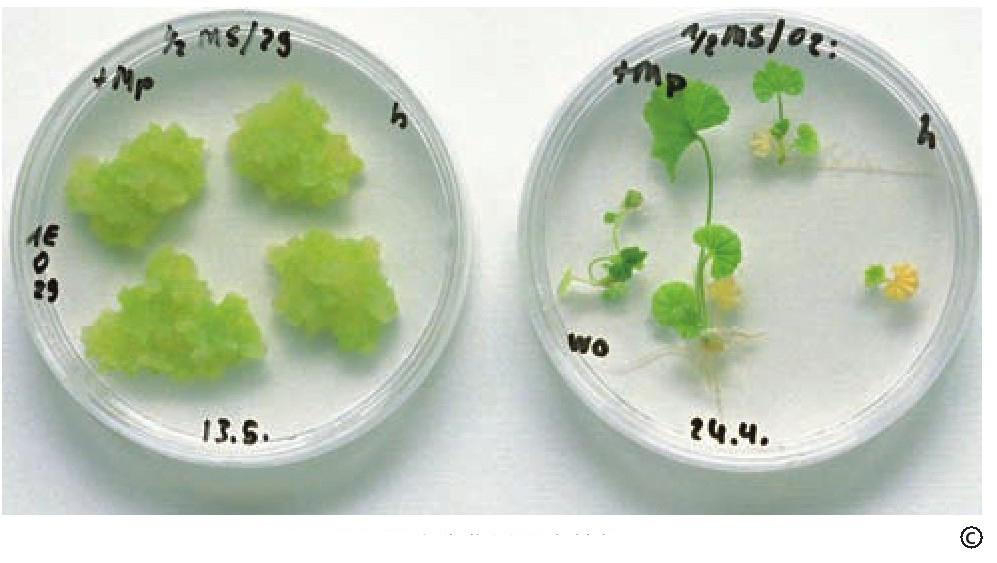
烟草叶片培养愈伤组织的形成和根芽分化以及小植株的形成

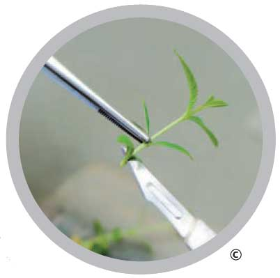
从植物活体上取下细胞、组织或器官

植物的一个离体部分在离体培养条件下，只要内外因素适宜，哪怕细胞原来的分化状态丢失了，也可使其创伤部分的细胞重新恢复分裂能力，这个过程叫作“脱分化”。例如已经分化成的叶肉细胞失去了原来所具有的形态、结构和功能，它所形成的愈伤组织能重新恢复分裂能力。在不同种类、不同浓度、不同配比的植物生长调节剂的影响下，它们可重新“再分化”成植物的芽或根，最终发育成一棵完整的植物体。

植物细胞还可通过胚胎发生途径即原胚、球形胚、心形胚、鱼雷胚、子叶胚等胚胎发生的各个阶段，生长发育成完整的植物体。例如，胡萝卜根细胞就是通过这种途径产生大量胡萝卜小植株的。

植物细胞的再生植株技术是非常有用的。可用于名优品种的快速繁殖，使许多水果实现了商品化生产。它还可以脱去植物体内的病毒，获得无病毒苗木，如苹果、草莓等。（周根余　张丞）

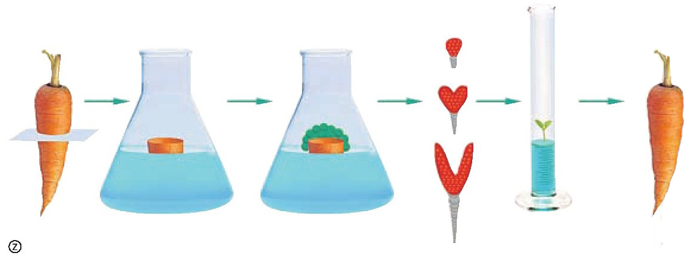
胡萝卜根细胞通过胚胎发生途径产生新的胡萝卜植株

**【实验场】**

为了加深感性认识，学生可以在老师带领下，前往开展植物科学研究的大学和研究单位联系，参观植物细胞和组织培养实验室，获得直观的知识。在有条件的情况下，可以索取少量的材料回学校继续培养，观察细胞胚胎发生的各个阶段和小植株形成。

【微问题】植物体中任何部位的活细胞都能培育出一株完整的植株吗？

【关键词】克隆　无性繁殖　组织培养

## 辐射对植物会产生很大危害吗

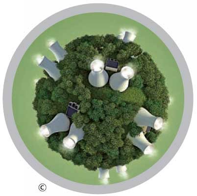
自然界中存在着各类辐射，这些天然辐射分为电离辐射和非电离辐射两大类。电离辐射是指波长短、频率高、能量高的射线，又可再分为带电粒子辐射和不带电粒子辐射，这些射线能够直接或间接地使物质发生电离；另一类是非电离辐射，又称为电磁辐射，如可见光、紫外线、声辐射、热辐射和低能电磁辐射。

自然界中的天然电离辐射主要来源于太阳、宇宙线和在地壳中存在的放射性核素，在地壳中发现的主要放射性核素有铀、钍和钋等放射性物质。

虽然自然界中到处都存在辐射，但是由于这些天然辐射的剂量非常低，一般不会对生物体造成伤害，只有达到一定剂量的辐射才会对生物体造成危害。尽管植物对辐射的耐受性比动物大得多，但即使是相对较低剂量的辐射也会对植物造成一定的伤害，而高剂量的辐射则会造成植物的死亡。辐射对植物产生的伤害主要有：影响植物生长、代谢等生理活动，引起DNA链的损伤和基因的突变，造成植物的不育，严重的可导致植物死亡。科学家发现，植物的遗传过程和生理过程对辐射的耐受性差别很大，许多生理过程对辐射的抗性很强。例如用高剂量辐射照射植物种子，种子依然能够萌发，虽然对萌发后的种子的生理活动会带来一定的影响，但依然能够进行短期的生长，植物的生理过程如光合作用、对植物激素的反应等依然能够进行，RNA的转录、蛋白质和酶的合成、光合器官等细胞器的形成等也基本不受影响，萌发后一定时期内植物的干重依然能够增加。但是，由于高剂量辐射抑制了植物的细胞分裂和DNA的合成，使得植物的生长实际上是完全依靠细胞的伸长，不能够进行细胞的分裂增殖和植株的繁殖，因此，虽然植物能够在短期内缓慢生长，但是由于不能完成正常的生命活动和繁殖后代，所以从遗传角度来说植物已经死亡了。同样道理，科学家还发现，用电离辐射照射烟草的细胞后能够形成巨大的细胞，这也表明：虽然植物的细胞分裂被抑制，但是其生理过程仍然能够进行，从而导致细胞变大。

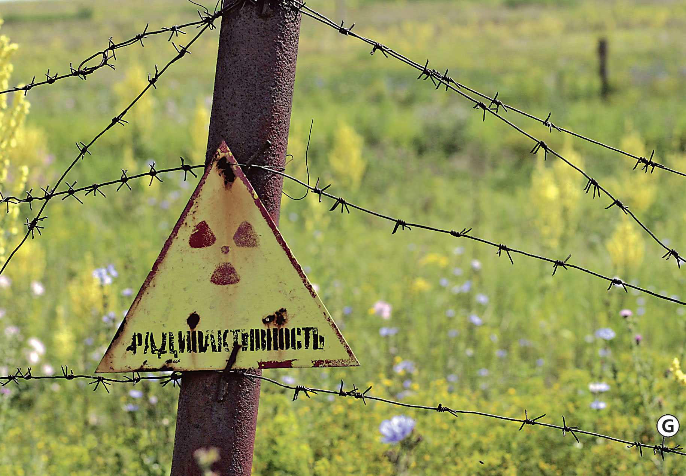
有趣的是，科学家还发现，用低于对植物产生伤害的电离辐射剂量来处理植物，不但不会对植物造成损伤，相反还对植物生长有一定的刺激作用，这种刺激作用包括打破种子休眠、促进萌发、加速生长和发育、提早开花或延长花期、诱导植物生根、增加产量、提高抗病性等。关于低剂量辐射刺激植物生长的原因，可能是由于低剂量辐射所致的轻微损伤，能够引起植物体内修复系统的启动，从而减轻伤害，而修复系统的过分活动则引起加速生长等现象。

不同的植物对辐射的耐受程度不同，有些植物比较抗辐射，有些植物对辐射就比较敏感。同一植物的不同生长发育期或不同的器官组织对辐射的敏感性也不同，例如生长旺盛时期对辐射的敏感性强，细胞分裂活动越活跃的组织对辐射就越敏感，植物的含水量也会影响到对辐射的敏感性，干种子就比生长中的植物能够耐受更大剂量的辐射。（李群）

## 怎样利用辐射培育出优良植物品种

辐射虽然对植物能造成伤害，能够引起植物生殖细胞的基因突变，但是这种突变对植物来说既有有害的一面，也有有利的一面。辐射引起植物DNA链的断裂等损伤，同时植物也会对损伤的DNA链进行修复，一部分错误能够完全修复，一部分经修复后依然无法完全纠错，于是就引起了基因的突变。植物在自然生长的环境下，受各种因素影响，基因也会发生各种自发的突变，但是这种自发突变的频率是非常低的。植物基因突变后，会对植物的正常生长产生各种影响，如果这些影响使得植物不能更好地适应环境，植物就会被环境所淘汰，有些影响甚至严重到直接导致植物的死亡。辐射引起的植物突变绝大多数是有害的，只有极少数突变能使植物更好地适应环境的变化，这种自然选择就使得植物发生了进化。但是，自然的进化是一个非常漫长的过程。

虽然辐射对植物产生的诱变绝大多数有害于植物，但也能在植物中引起有用的突变。科学家通过人工辐射的方法引起植物产生基因突变，然后筛选出对人类有用的植物突变个体，并在此基础上发展出了一个重要的研究学科——植物辐射育种学。具体来说，就是利用电离辐射处理植物种子以诱发突变，通过大规模的筛选，从中选出具有优良变异的个体，再通过一系列的育种程序，最终培育出满足农业生产需求的、具有优良性状的植物新品种。由于植物干种子可以耐受很高剂量的辐射，通过人工用高剂量辐射诱变植物种子，可以使农作物变异频率比自然变异高出几百倍甚至上千倍，而且产生的变异特性多种多样，范围非常广泛，再经过人工选择、培育、产生优良品种，缩短了育种年限，大大提高了育种效率。（李群）

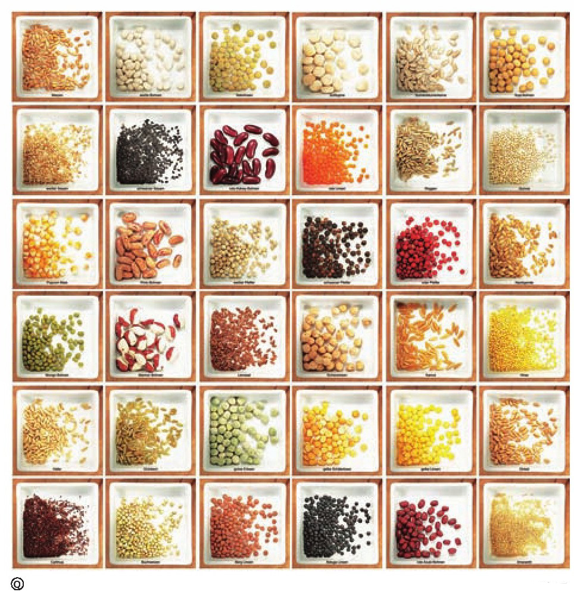
经过辐射处理后的种子

  

**【微博士】**植物体内的天然辐射保护剂

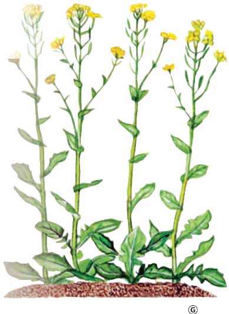
植物体内的天然辐射保护物质和辐射敏化物质能影响植物的辐射敏感性。十字花科中许多植物对辐射都有很强的抗性，中国科学家就从十字花科植物中发现了一种天然的、具有辐射保护作用的小分子防护剂——芥子碱。芥子碱不但能减轻辐射对植物萌发的伤害，还能减轻辐射对果蝇、小鼠等动物的伤害，已被证明是一种高效、无毒的植物体内的天然辐射保护剂。

【微问题】在强烈的辐射刺激下，是否会诞生出可怕的怪异植物？

【关键词】基因突变　辐射育种　植物抗辐射

十万个为什么　第六版　出版工作委员会

  

**主　任**

李远涛

  

**副主任**

周　晴　洪星范

  

**编辑人员**

（以姓氏笔画为序）

王　音　王　慧　卢　昱　朱　机　乔馥娟　孙正凡　岑建强　沈　岩　郝思军　黄劲草　梁玉婷　韩　静　裘树平　熊喆萍

  

**设计总监**

袁银昌

  

**美术总监**

费　嘉

  

**美术编辑**

费　嘉　张　怡　陈艳萍

  

**印制总监**

张伟群

  

**技术编辑**

张伟群　吴轶伟　胡厚源　陆　赟　许　辉

  

**责任校对**

石玲凤　王　曙　黄　岚　黄亚承　沈丽蓉　陶立新

  

**特约编审**

卞毓麟　方鸿辉　王义炯　范　氾

  

**审稿、定稿、审读人员**

（以姓氏笔画为序）

王　音　王　辉　王伟海　王霞梅　叶　剑　田廷彦　乐嘉民　匡志强　乔馥娟　严　岷　李远涛　李维靖　吴延祺　岑建强　沈　岩　张　颖　张利雄　张毅颖　陆永洲　陈　浩　陈晏平　林丽成　周玉刚　郑石平　郝思军　胡　毅　洪星范　徐红宝　隋淑光　董　放　韩绍伟　曾　文　曾建设　裘树平　虞信棠　魏昌富　濮紫兰

## 谁是在春天唤醒植物的“闹钟”

寒冬离去，大地迎来温暖春风的吹拂，地球上的植物开始渐渐复苏，抽枝长叶，呈现出一派生机勃勃的景象。春天是植物开始生长的季节，这是人人都知道的。但是，植物为什么要选择春天生长？问题很简单，但回答起来却未必简单，甚至对一些植物生理学家来说也会有些难度。

过去，人们理所当然地认为，植物之所以在春天生长，是由外界环境决定的，尤其是温度这一环境因素，所以一旦天气变冷，植物便进入休眠阶段，等到春回日暖后再开始重新生长。然而，随着植物生理学研究的不断深入，科学家发现，温度并不是导致植物春天苏醒的唯一因素。

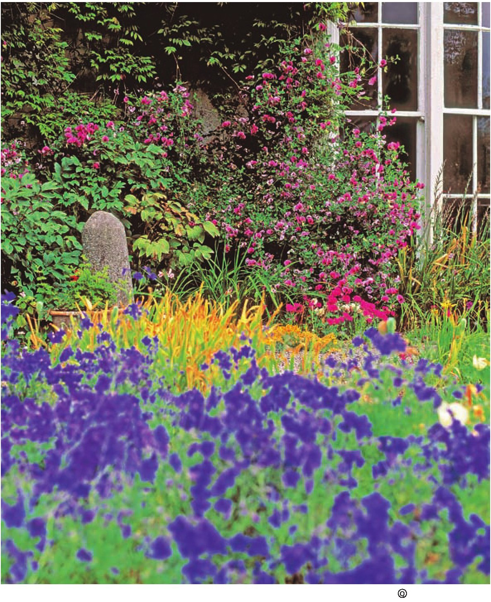
20世纪后期，美国生理学家利奥波德和澳大利亚植物生理学家克里德曼提出，日照时间的长短与植物春天苏醒有重要关系。在秋末初冬时，温带植物由于日照时间缩短，体内会产生浓度较高的脱落酸，从而抑制脱氧核糖核酸（DNA）合成核糖核酸（RNA），诱导休眠芽的形成。他们认为，长日照是使植物摆脱休眠状态的重要因素。因为，长日照会刺激休眠芽中的叶原基，促使植物体内的脱落酸水平下降，赤霉素含量增加，使一些能够打破休眠状态的酶开始合成。一旦环境的温度、水分、光照条件都符合了生长需要，植物就会从休眠中“苏醒”。

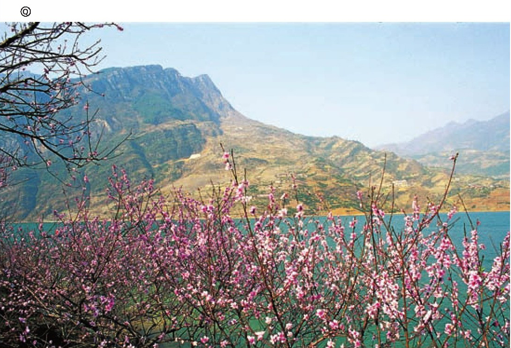
就在这个理论提出后不久，科学家在研究植物细胞物质时发现，各种植物细胞中的DNA数量存在巨大差异，而这种差异往往与它们的生长季节有联系。这个现象的本质是什么呢？有两名科学家挑选了162种植物，仔细测量了植物细胞中DNA的数量，并与这些植物生长萌发的时间进行了对照，结果发现，DNA含量大的种类往往是春天发芽较早的植物。于是他们提出一个新的假设：植物选择什么样的季节生长，会不会与植物细胞中的DNA数量多少有关？

关于植物为何选择春天生长的问题，科学家已经提出了各种解释，但是，还都有不尽完善的地方，一切有待于今后更深入的研究，才能得出完全令人信服的解释。（王生清）

  

**【微博士】**日照长短

每天日照的长短因季节和纬度而异，例如在北半球冬季日照短而夏季日照长，在南半球则正好相反。季节间日照长度的差异在赤道附近不明显，但从赤道越往高纬度处走，差异就越显著。对一定的纬度来说，日照的长度可以准确地指示季节，比日照强度和气温都更可靠。

**【微博士】**光照时间

根据植物对光照时间长短的依赖程度，植物生理学通常把它们分为三大类。一类是长日照植物，是指在日照时间长于一定量才能开花的植物，而且光照时间越长，开花越早。另一类是短日照植物，是指日照时间短于一定量才能开花的植物。第三类是介于以上两者之间的中日照植物。长日照植物一般在春末夏初开花。如果延长日照缩短黑暗时间可促进其提早开花。相反，延长黑暗时间则延迟开花或不开花。

## 为什么千年的古莲能发芽

20世纪50年代，在中国辽宁省新金县的泥炭土层中出土了一些坚硬如铁的古莲子，通过同位素测定，它们已经在地下“沉睡”了千年以上。令人惊奇的是，这些古莲子被送到大连市植物园进行培植后，竟然发芽长叶，还绽放出美丽的莲花！千年古莲开了花，立时被称为奇迹而到处传播，并引来无数市民争相观看。

更令人吃惊的是，21世纪初，俄罗斯科学家在西伯利亚一个地穴中发现一些古植物种子，它们居然是3万年之前的生命！经过精心培养，古植物种子得以萌发，还开出了白色的花朵，据植物学家鉴定，它是一种与兰花很相似的草本植物。

“沉睡”千年的古莲子为什么还能获得新生？科学家解释说，这与莲子的结构有关。莲子的外种皮坚硬致密，如同一个完全封闭的小屋子，将种子密闭在内，既不允许外面水分和空气渗入，也不允许种子内的水分和空气散失，使莲子一直处于休眠状态。此外，千年古莲依然能保持生命力，与周围的环境有关。它们的周围是厚厚的泥炭层，具有很强的吸水防潮性能，不仅如此，泥炭层的上面又有很厚的泥土覆盖，等于再增加了一层密闭防护。在这样的环境中，古莲子才有可能保存生命力。还有些学者提出，古莲子长寿的秘密与土壤辐射有关，但还没有更多令人信服的证据来支持这个假设。

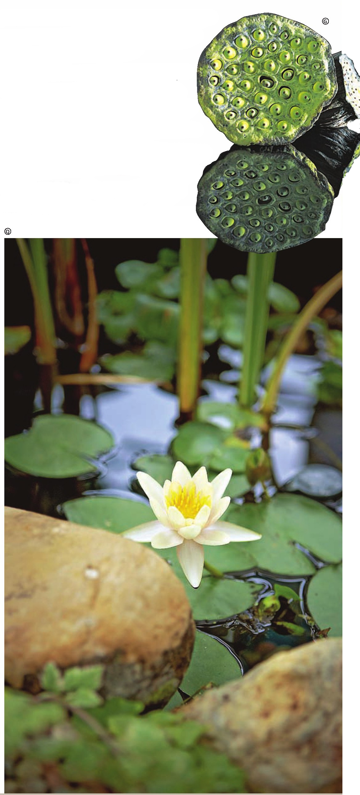
而俄罗斯科学家在解释万年种子复活的原因时说，那些种子位于西伯利亚极为寒冷的永冻层下，而且是在离地面40米深的洞穴中，那样的特殊环境不仅对古植物种子，也许对其他古生物来说，都是一个最佳的生命储藏之地。（王生清）

  

【微问题】有什么植物能在完全没有光照的环境中生活？

【关键词】植物休眠　光照周期

## 转基因植物有什么好处

众所周知，作物品种改良是提高生产力的重要途径，现有的作物在产量、品质方面与野生种相比有了很大提高，但提升空间仍然很大，如抗病、抗虫、抗逆境和提高营养价值等。利用传统的作物育种手段费时费力，而转基因技术可以有针对性地对植物进行定向改造，使植物迅速获得新的特性。

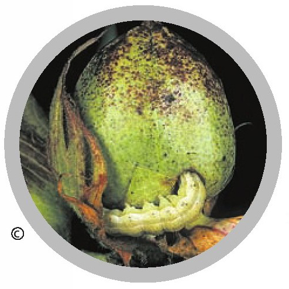
例如，棉铃虫曾经是棉花生产中最严重的虫害，它们啃噬棉花叶片和棉铃，造成棉花大幅减产。20世纪90年代初，中国棉铃虫大面积泛滥，即使大量喷洒农药也无法控制虫害，相反还造成农民中毒。90年代中后期，中国引进并培育转入杀虫蛋白的抗虫棉（又称Bt棉）。这种转基因棉花能自己合成高效的专一杀虫蛋白，棉铃虫取食后会很快死亡，但是对人畜则没有任何影响。推广抗虫棉以后，中国的棉花生产不再受棉铃虫威胁，产量逐年增加。目前中国70%以上的棉花都是转基因抗虫棉。由于农药使用量大幅减少，自然生态环境得到了保护和恢复。近几年的研究还表明，抗虫棉除了可以减少棉田的虫害，还可以减少周围其他作物的虫害，并且对于田间的生态环境也有很好的保护作用。

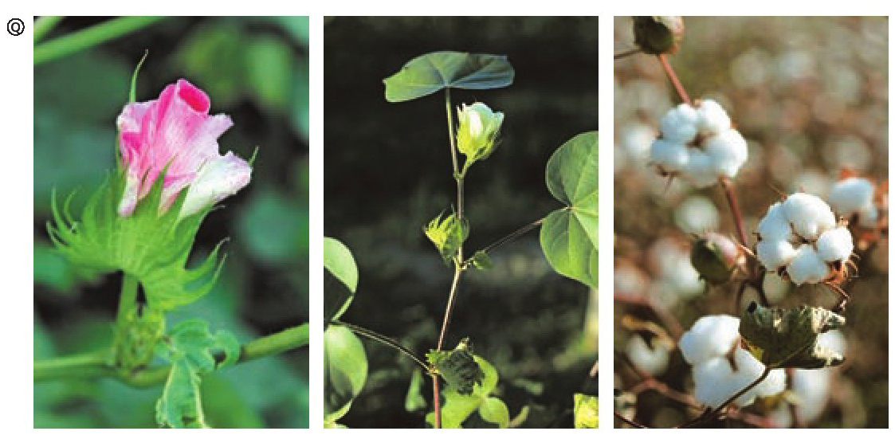
抗虫棉的各个生长阶段

除了抗虫，科学家利用转基因技术，还可以培育出抗病、耐干旱、耐盐碱胁迫的转基因植物，提高作物的产量、品质和营养水平。例如已经发现一些基因可以控制谷物的穗数量和谷粒大小，转入这些基因就可以提高作物产量；转入离子运输相关的基因，可以提高植物对盐碱以及重金属胁迫的抵抗能力；通过转基因使作物在籽粒中合成类胡萝卜素或其他维生素成分，增加了作物的营养水平；还可以利用转基因植物生产具有药用价值的蛋白质和疫苗，在医药领域具有很大的应用潜力。（陈晓亚　杨长青）

## 怎样知道植物中基因转移的成败

基因转移可以通过多种手段进行，例如可以利用特殊的微生物在感染植物的过程中将外源基因导入到植物体内；利用基因枪轰击植物组织将外源基因导入细胞；还可以通过化学试剂处理使细胞吸收外源基因。无论采用哪种手段，外源基因进入植物细胞并整合到基因组的效率是很低的，并不是每个细胞都能被导入外源基因。事实上，导入外源基因的细胞也许只占千分之一或者更少。如何从如此多的细胞中挑选出成功转基因的细胞，并培养成完整植株，是科学家面临的一个巨大挑战。

一些化学物质（如除草剂、抗生素等）可以杀死植物细胞。而自然界中也有一些微生物或植物可以合成相关的酶降解这些化合物，因此表现出抗性。科学家分离出这些与抗性相关的基因用于转基因植物筛选：在含有这些化合物的培养基质上，没有转入抗性基因的植物细胞（占大多数）将会被杀死，而转入抗性基因的细胞可以存活并增殖分化成完整的植株。当转基因植物形成后，再设法剔除这些用于筛选的标记基因。

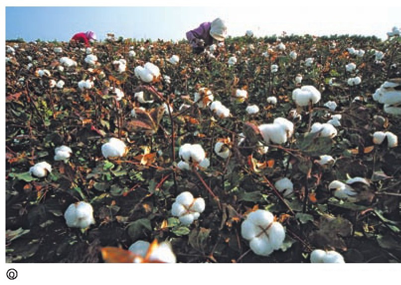
转基因抗虫棉

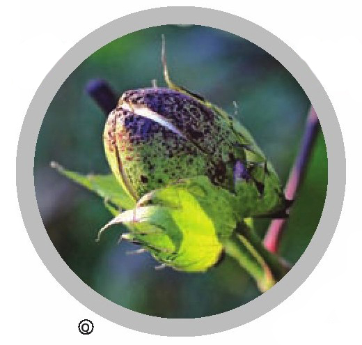
获得转基因植物后，还需要通过多种技术手段对目标基因进行分析，确认基因完整、成功转移和正常发挥功能。方法是：提取转基因植物的DNA通过聚合酶链反应（PCR）检测是否含有外源基因，并确定外源基因的插入位点；提取合适组织的RNA，检测插入的外源基因表达是否正常以及表达水平高低；通过一些针对蛋白质特性的检测方法，观察相应的蛋白质是否正常合成。当然，最重要的还是要观察转基因植物是否获得了预期的新特性。（陈晓亚　杨长青）

## 转基因植物安全吗

转基因技术和转基因植物的安全性归根到底是由转入基因的性质和功能决定的。不同基因具有不同表达模式和功能，对植物自身和环境造成的影响以及带来的安全性问题不能一概而论，需要具体情况具体分析。转基因植物的安全性包括食品安全性和生态环境安全性两个方面。当以转基因植物作为食物来源时，重点要考虑对人类健康方面的安全性；而在田间种植转基因植物时，则需要考虑对生态环境的影响。

食品安全是一个相对的概念，没有绝对的食品安全。随着科学技术的发展，一些被长期广泛食用的食物也被发现含有一些有毒物质，如大量食用发芽的马铃薯或未煮熟的豇豆都有可能引发中毒。但只要加工方式恰当，有害物质摄入量低于一定范围，这些食品仍然被认为是安全的，不会对健康产生影响。

| 转基因水稻 | 转基因玉米 |
| --- | --- |

对于转基因植物来说，有一些转基因，例如将水稻中与籽粒大小相关的基因转入玉米，培育出大粒的玉米，由于水稻和玉米都是人类的主食，这一类型的转基因通常对人和动物的健康没有太大影响。而另一些转基因，如转入微生物来源的杀虫蛋白，则需要考虑蛋白的作用机制，通过大量的实验分析对人和动物健康的影响，然后才能审批和推广应用。事实上，粮食、蔬菜在种植过程中不可避免会使用农药来降低病虫危害。据测算，现代农业生产中，如果不使用农药，粮食产量将减少30%～50%，水果蔬菜产量损失更高。如果转基因植物具有很强的抗病、抗虫能力，那么就可以减少农药使用和残留，反而提高了食品的安全性。

在生态环境方面，种植转基因植物可能会带来一定风险。例如：转入的基因通过昆虫传粉等方式，向周围非转基因作物扩散；转基因抗虫植物对害虫天敌、田间其他非靶标昆虫及相关动物多样性的影响；田间害虫对抗虫基因产生抵抗能力等。这些问题不容忽视，但也并不可怕，只是需要客观认真的对待。（陈晓亚　杨长青）

  

**【微博士】**法律监管

无论是食品安全还是生态环境安全方面，中国颁布了多个法律法规对转基因植物进行严格监管，并建立起转基因植物安全评价制度、进口许可制度、标识管理制度和加工审批制度等规章制度，为中国转基因生物安全管理工作奠定了基础。

【微问题】转基因技术最广泛应用于哪些食用植物？

【关键词】转基因植物　抗虫棉

在电子显微镜下经过特殊染色后的藤蔓植物的内部细微结构

## 花朵为谁而美丽

每到春天，万千鲜花，争奇斗艳，尽量展示出自己的美丽，以吸引小动物们来帮助自己传送花粉，完成一年一度孕育果实种子的“终身大事”。只不过，要是所有的花朵既招蜂又引蝶，传粉者身上的花粉就会混成一锅粥——油菜的花粉被搬到桃花的柱头上，而桃花的花粉又占据了苹果的柱头，不仅会发生“上错花轿嫁错郎”的闹剧，还会造成花粉和胚珠的双重浪费，那可不是植物愿意看到的结果。为了保证传粉的专一性、准确性，植物们除了错开彼此的开花时间，最重要的解决手段就是让每种植物雇用各自特定的传粉者，做到招蜂不引蝶。

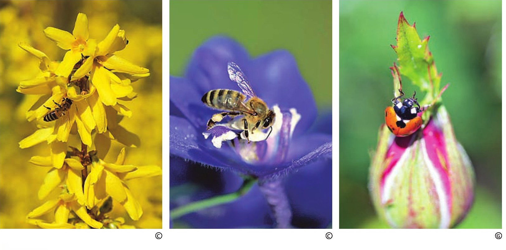
传粉中的蜜蜂和甲虫

由于不同动物对颜色的喜好不同，例如蜂类喜欢黄色和蓝色，鸟类喜欢红色，蛾类喜欢白色等，所以花朵会针对传粉者释放特定的颜色信号。不仅如此，植物还结合了一些传粉者的小嗜好，强化它们在传粉工作中的专一性。黄色的腊梅为喜欢闻香的蜂类准备了香甜气味作为导航标志；没有丝毫气味的红色的芦荟则准备大量花蜜，因为它们的鸟类传粉者需要更多的食物，但鸟儿们的鼻子却很不好用。虽然，这样的分类导航还略显粗糙，但是已经能在很大程度上保证了花粉传递的质量。

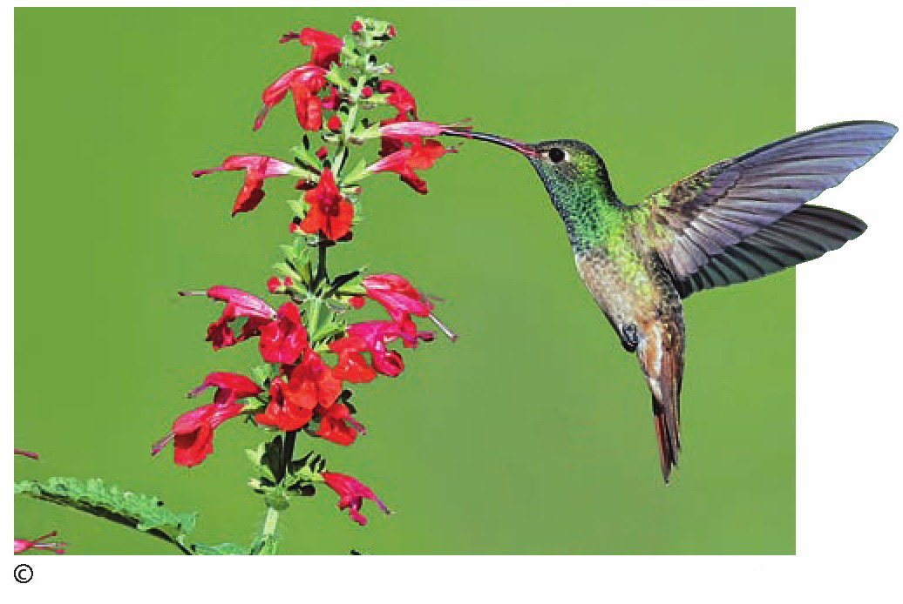
蜂鸟

虽然大多数花朵在竭力与动物套近乎，不过有些花朵却不屑和动物打交道，黑色（实际上是深紫色）的老虎须就是其中之一。这种生活在雨林中的花朵，虽然没有传粉昆虫的“怜爱”，但它却有一套完善的自花授粉机制，能独立完成把自家的花粉送入自己洞房（子房），完全依靠自力更生开花结实，倒也自得其乐。（史军）

## 动物分得清花朵的香臭吗

繁花似锦的季节里，各种花香对于我们大多数人的鼻子，就像一锅大杂烩。不过，昆虫的嗅觉可要比我们灵敏得多，不仅能够探测到细微的气味区别，还能在其中找到自己的最爱。正因如此，花朵为各自的传粉者量身定做了“香味路标”。

玫瑰、月季那种略带甜味的芳香气息是很多昆虫的所爱。在很多时候，这类气味都是以芳香的芳樟醇和安息香醛为基底，搭配特殊的酯类（如玫瑰中的乙酸香茅酯）调制而成的。虽然，不同植物的调制配方会有所差别，但是“香甜味”所表达的基本含义是相同的，都是为了诱惑昆虫前来“用餐”。对于嗜好花粉和花蜜的蜂类和蝶类，这样的气味是无法抗拒的。但也有例外，一些蝇类昆虫对香甜的气味无动于衷，而对腐烂的味道颇感兴趣。于是，那些需要蝇类传粉的植物，在花香中添加了胺类物质，将花香变成花臭，用来吸引那些昆虫中的逐臭之夫。生活在马来西亚丛林中臭气熏天的大王花，就是这类植物的代表。

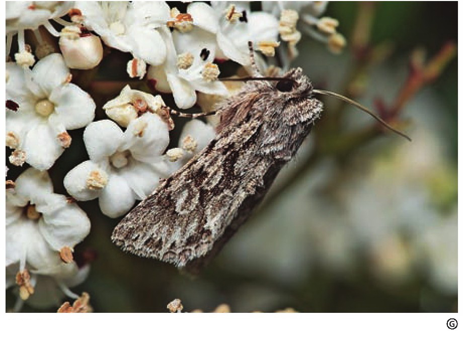
传粉中的蛾

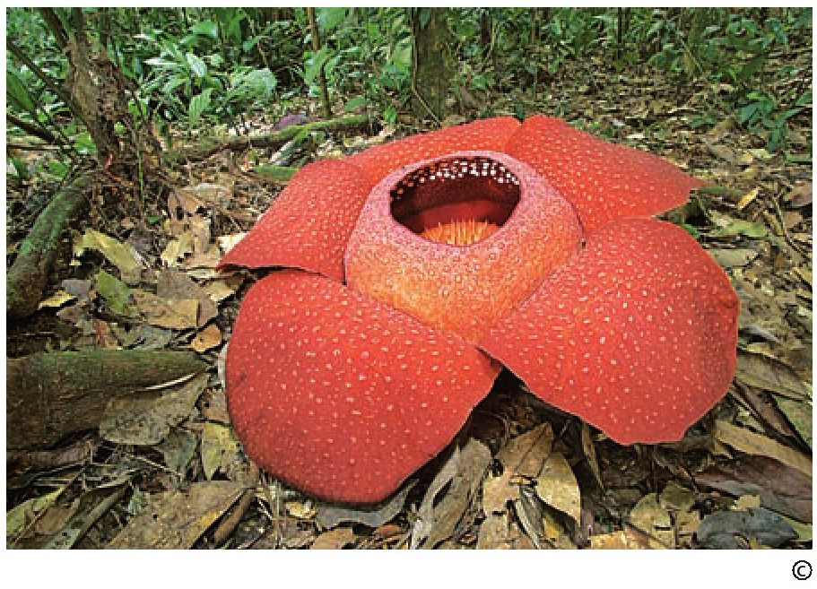
大王花

有些花朵既不香也不臭，散发的却是修剪草坪之后留下的青草味。这又是为谁准备的呢？答案是胡蜂。通常，植物在受到食草动物侵害时，会释放大量的脂肪酸衍生物，这些带青草味的化学物质会召唤胡蜂、姬蜂等肉食性昆虫前来攻击敌害，解救受害植物。还有些植物会发出假的求救信号，招引来了真的传粉者，像火烧兰这样的花朵就是如此。（史军）

## 为什么金银花的花朵会变色

金银花在开放的时候是白色的，过了几天就变成了橙黄色。看似多此一举的行为，实际上却大有用处。在开花的季节，有很多花朵同时开放，自然也会有很多蜜蜂和蝴蝶赶来采花吃蜜。为了提高传粉效率，为了让蜜蜂更容易找到适合自己的花粉花蜜，金银花发展出了一种应对措施，就是根据花朵的“年龄”来改变自己的颜色。这样，蜜蜂就知道哪朵花是刚开的，哪朵花是已经开了很久的。如此一来，既能节省传粉昆虫的力气，也能帮植物更高效地传播花粉了。

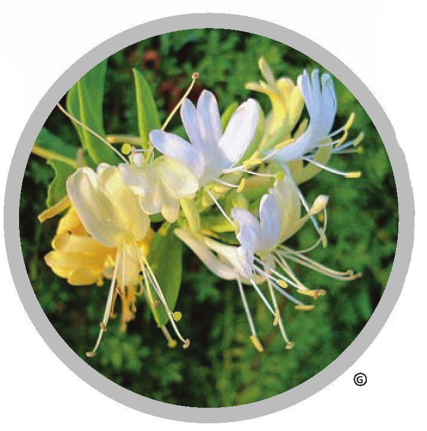
金银花

还有一种叫眉兰的植物，当它们刚刚开放时就会发出雌性胡蜂求偶的味道，引诱雄性胡蜂来传粉。而一旦授粉成功之后，它们就会换一种气味，让胡蜂退避三舍。这样的气味变化与金银花的颜色转变有异曲同工之妙。（史军）

  

**【微博士】**招揽“语言”

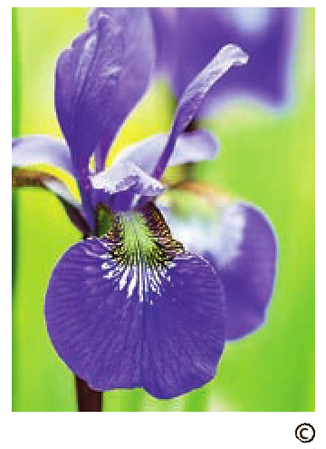
为了吸引更多的昆虫来传粉，植物都会把自己的花朵“招牌”做得越来越大。可是，面对偌大的花朵和花序，传粉昆虫从哪下脚就成了问题。如果你留意观察，在很多花的花瓣（如鸢尾、百合等）上都有或疏或密、或大或小的“雀斑”。其实，它们是花朵向传粉者传达的重要信息——“这里有蜜，请为我传粉”。在另一些花（如紫花地丁）上，“雀斑”换成了条纹或者箭头，这样更明确地为传粉者指出了花蜜的所在。

【微问题】花粉通常都是金黄色的，这是传粉昆虫最敏感的颜色吗？

【关键词】传粉　花蜜　花粉　金银花

## 铁树开花真的很难吗

铁树是很常见也是很著名的观赏植物，外形很美，一根主茎拔地而起，所有叶片都集中在茎干顶端。铁树叶片又大又坚挺，好像传说中的凤凰尾巴，所以又常常被人称为凤尾蕉。

说起铁树，就会不由自主地联想到“千年铁树开花”的俗语，意思是见到铁树开花几乎等于见到了奇迹。的确如此，很多人没有见过铁树的花朵，但一点都不用感到遗憾，因为它的花一点也不美丽。铁树的花朵分雄花和雌花两种，每株植物只能开一种花。这两种花的形状大不相同，雄花很大，好像一个巨大的玉米芯，刚开放时灰绿色，成熟后渐渐变成褐色。而雌花却像一个大绒球，也是从灰绿色渐渐变成褐色。

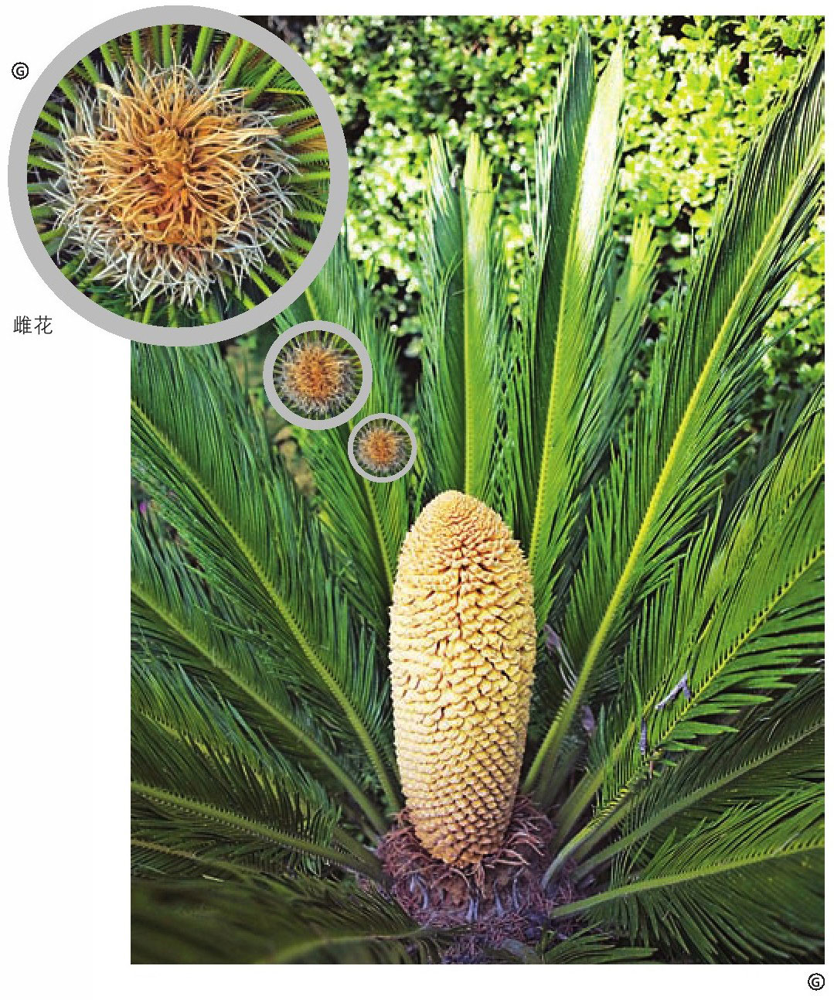
雄花

自古以来，很多人都以为铁树开花是一件了不起的大事。其实，不论哪种铁树，只要环境条件适宜就能正常开花。既然如此，为什么人们都以为铁树开花很难呢？原来，铁树的原产地在热带，它天生喜欢温暖甚至较为炎热的环境，害怕低温寒冷的气候。例如，生长在广东、海南岛等中国南方地区的铁树，年年都开花，当地人见了根本不足为奇。可是，当它来到上海、江浙一带的华东地区后，由于温度比南方降低了不少，使铁树感到不适应，虽然能够勉强生存下去，但是却无法正常开花。所以，江浙一带的人几乎见不到铁树开花，偶尔开放一次，就会有很多人争相观赏，铁树开花难的说法就这样被代代流传下来了。

如果将铁树搬迁到更冷的北方，如北京、哈尔滨等地，别说是开花，连生存都很难。当然，在温室中栽培另当别论。（余千里）

## 玉兰为什么先开花后长叶

玉兰又叫白玉兰，是城市中常见的观赏树木，还是上海市的市花。当春天到来之后，玉兰的树枝周围还依然光秃秃见不到一片叶子时，在小树枝的顶端却已经开放出一朵朵酒杯大小的玉兰花，芳香扑鼻，美丽动人。

春天是植物苏醒萌发的季节，对于树木来说，通常是先抽出嫩绿的叶子，再长出芬芳的花朵，可是为什么玉兰会先花后叶呢？

这是因为玉兰的花芽通常在前一年的秋季前已经逐渐形成，经历了由热到冷的外界环境条件的变化，花芽内部已经开始产生分化，并具备了开花的内因。当春天到来之后，随着气候的渐渐变暖，万事俱备的花芽就很快绽放了。那么，玉兰的叶子为什么不能同时或早于花萌发呢？这是由于花芽和叶芽萌发要求的条件不同，而且，不同的植物都有不同的要求。对玉兰来说，促使花芽开放的温度比叶芽的要低，所以春寒未尽，它们就开放出美丽的花朵，随着气温继续升高，叶片才开始萌发。

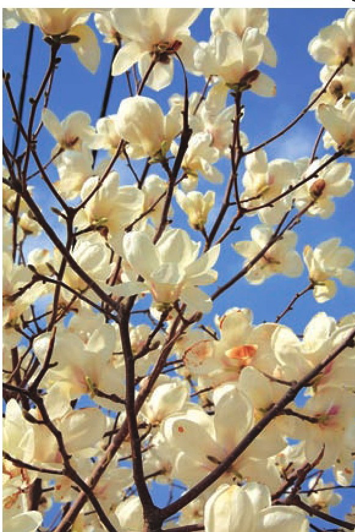
玉兰

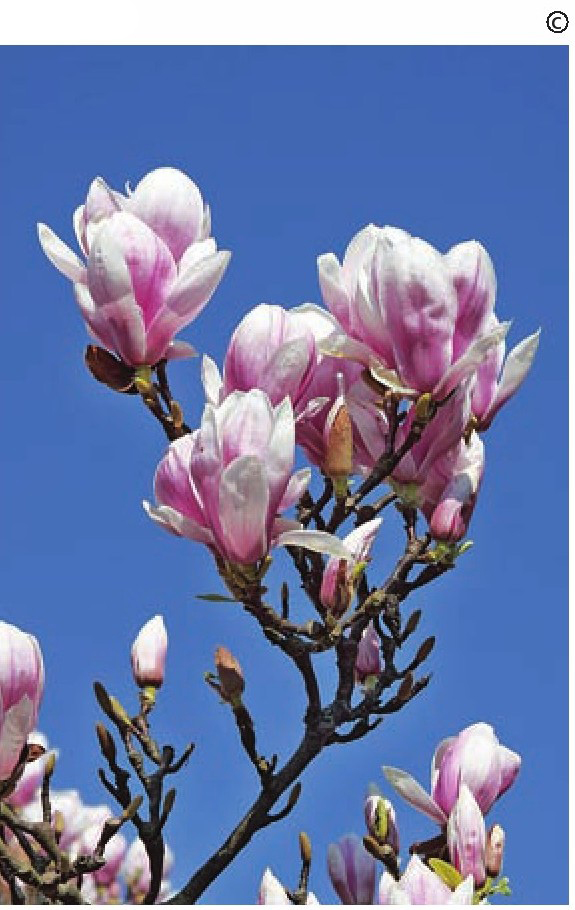
紫玉兰

对于大部分先长叶后开花的植物来说，叶芽生长所需要的温度往往比较低，初春的温度已经满足萌发生长的需要，而花芽则需要相对较高的温度，所以就在叶片长出之后才绽放出花朵。

总而言之，不管植物是先花后叶，还是先叶后花，都与植物对环境的温度条件的要求有关，也就是说，其关键因素是由花芽或叶芽对生长温度的要求不同所决定的。（余千里）

## 一株向日葵开几朵花

谁都见过向日葵，知道它身躯高大，头上顶着一个大脑袋似的花盘，很神奇，也很美丽。有人说，一株向日葵虽然只开1朵花（偶尔也有几朵的），但是它的美丽抵得上10朵花。如果这样认为，那可就大错特错了，因为向日葵的大花盘绝不是一朵花，而是由成百上千朵小花组成的。

植物形态学家告诉我们，围在花盘外面的一圈金黄色“花瓣”，其实不是花瓣，而是花朵！每一片就是一朵小花，因为它们的形状呈舌状，所以称为舌状花。而花盘当中的部分，看上去如同花蕊，其实是另一类小花，它们的形状好像一根根小管子，因此称为管状花。无数的管状花密密麻麻紧挨在一起，真有点像一朵大花中的花蕊。舌状花虽然鲜艳美丽，但却不会孕育果实种子。只有管状花才是能繁殖后代的花朵，到了秋天，每一朵管状花就能结出一粒葵花子。有人曾经对管状花进行过统计，结果发现，一个向日葵花盘中竟然有1000～2000朵花！

向日葵花盘局部特写

向日葵属于菊科家族中的一员，这是一个极为庞大的家族，菊科有2万多种，它们都具有类似向日葵花朵的特殊结构。（余千里）

  

**【实验场】**

其实，先花后叶的植物并不少见。当春天来到之际，可以到公园去进行一次实地观察，看看哪些植物是先花后叶，哪些又是先叶后花，尤其可以看看迎春花开花长叶的过程。

【微问题】有没有只开花、不长叶的植物？

【关键词】铁树　先花后叶　舌状花　管状花

## 喷瓜的果实为什么“爆炸”

植物和动物不同，没有手，没有脚，不能自主运动，从生到死都生活在固定的地方。这样，岂不是对它们的后代繁衍、生生不息带来了难题？试想一下，一株植物通常有几十粒种子，多的有几万粒、几十万粒种子，如果它们都只能停留在原地、拥挤成一堆，要想正常地萌发生长几乎不可能。而且，一旦遇到了自然灾害，如干旱、洪涝、火灾等，集中在一块就容易遭到灭绝的危险。因此，种子必须以各种方式迁移到别处安家落户，这也是长期自然选择的结果。

虽然植物不能运动“行走”，但是，它们都有各自种子传播的方式，不同的植物，种子“旅行”的办法也各有千秋。它们中有的依靠动物帮助，也有的依靠风和水的自然之力；如果没有外界的帮忙，植物只能依靠自己了，如喷瓜就是最典型的例子。

喷瓜的果实成熟后，包围种子四周的组织渐渐变成黏性液体，挤满果实内部，由内朝外地挤压着果皮。随着黏性液体越来越多，对果皮的压力也越来越大，当果实内的种子完全成熟后，这种压力达到了最大值。这时，只要受到一点点触动，甚至在完全没有被触动的情况下，果实就会“砰”的一声爆炸，其情景犹如一个充气太足的气球炸开来一样。喷瓜爆炸时发出一股很猛烈的气体，可把里面的种子及黏液喷射出六七米远。因为它的爆炸好像放炮，所以人们又叫它“铁炮瓜”。这种不依赖其他传播媒介帮助，完全靠自身能力的种子传播方式，称为自体传播。

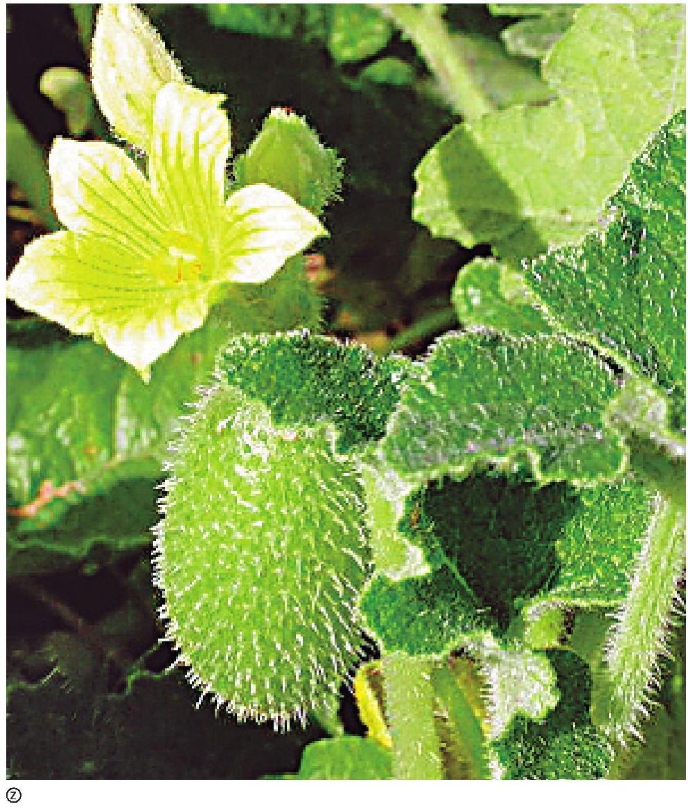
未成熟的喷瓜

除了喷瓜之外，自体传播的植物还有很多。例如我们很熟悉的大豆、绿豆、芝麻等，在种子成熟之后，包在外面的荚果会突然发生扭曲、炸裂，将里面的种子弹射出去。还有，公园中常见的观赏植物凤仙花，它的果实绰号叫“别碰我”，因为在种子成熟之际，凤仙花那个装满种子的“小口袋”只要被轻轻一碰，它马上就好像弹弓射石头那样，把里面的种子弹射向远方。结果，“小口袋”虽然碎了，但繁殖后代的任务却完成了。（余千里）

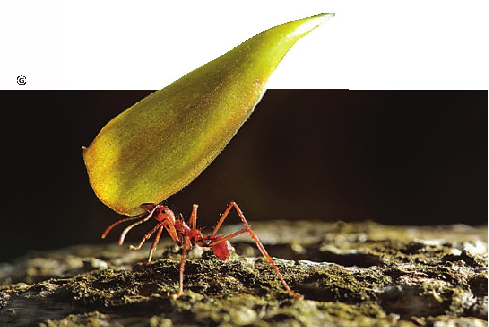
  

**【微博士】**蚂蚁传播种子

蚂蚁在种子传播中，常常扮演二次传播者的角色。例如有些鸟类粪便中有未消化的植物种子，其表面还残存一些养分可供蚂蚁摄食。这时候，蚂蚁就会把这些种子拖回地下蚁穴，充当食物之用，客观上成了植物的栽培者。

## 为什么椰子树都微微向大海倾斜

很多年前，植物学家在考察海岸植物生长情况时，发现了一个很有趣的现象：那就是自然生长状态下的椰子树（不包括人工栽培），几乎都生长在靠海的岸边，而且它们的身体都微微向大海倾斜。这样的生长方式，对椰子树有什么生物学意义呢？

植物学家解释说，椰子树躯体倾向大海，有助于果实成熟之后能直接落入到海水中。因为椰子的种子传播，需要流水来帮助。见过椰子的人都知道，它的外面包裹着一层厚厚的粗纤维组织，里面充满了空气，能够浮在水面上，随着海水漂流到远方。由于椰子的特殊结构，不仅浮力大，而且不容易腐烂，因此常常能在海中漂泊数月，然后在适宜的海滩上安家落户，发芽生根，开花结果，繁殖出新的一代。这也许就是为什么椰林大多生长在海滩上并且向大海微微倾斜的缘故。

其实，依靠水流传播种子的植物还有很多。例如荷花，它的果实，也就是莲蓬，好像一艘小船，装载着里面的种子漂浮在水面上，随波逐流，把种子带往远方。等到莲蓬腐烂之后，里面的莲子也就沉到了水底，等到第二年春天，一株新的荷花又长出来了。还有睡莲，它的果实成熟之后会沉没在水中，然后从里面“出来”很多结构很奇特的种子，种子外面包有一层像海绵似的物质，仿佛在种子外面加了一个充满空气的“救生圈”。有了“救生圈”助力，睡莲种子就能随波逐流漂向很远，直到“救生圈”里面的空气散尽，或者外种皮烂掉以后，才沉入水底，等待来年生根发芽。（余千里）

  

**【微博士】**水传播

豆科植物中的磕藤子又叫海豆，它有植物王国中最大的豆荚，豆荚里面的种子也是巨大无比，扁扁圆圆、黑黑硬硬的，每一粒种子的直径有4～6厘米！当磕藤子的种子成熟后落入河水，然后便开始了漫长的水中旅行。它先在河流中随波逐流，然后进入广阔的大海，有些甚至能越过大洋，抵达几千千米之外的大洋彼岸，如果气候适宜的话，它就能在遥远的异乡生长定居。

【微问题】西瓜成熟后会爆裂并将种子炸到远方吗？

【关键词】水传播　椰子　喷瓜

## 孢子为什么具有超强的生命力

如果有人问，地球上生命力最强的生物是什么？答案既不是兽中之王的狮虎，也不是号称万物之灵的人类，而是细菌以及某些低等植物的孢子。

我们知道，孢子有点像结构简单的种子，是生物所产生的一种有繁殖或休眠作用的单细胞，能直接发育成新个体。由于显微技术的高速发展，我们已经能够看见孢子的细微结构。细如粉尘的孢子直径只有几微米，有的甚至不到1微米！正是这些肉眼看不见的小东西，既不怕高温高压，也不怕干燥饥饿，几乎在任何恶劣的条件下都能生存，尤其在泥土中，孢子的身影处处可见。那么，孢子对恶劣环境的忍耐极限究竟有多大？其实，科学家对这个问题也颇感兴趣，并对此进行了一系列的探求。

研究中科学家发现，即使把孢子放入100℃的沸水中数秒钟，也难将它的生命力彻底杀灭。除了不怕高温，孢子还能抵御强烈紫外线和宇宙线的照射，而这些射线对其他动植物细胞来说是难以承受的。俄罗斯科学家彼得曾经对此做过一个测试实验：在实验室内模拟太空环境，用真空紫外线照射的方法研究枯草杆菌的孢子失活问题。他发现，由于孢子表面有一层薄薄的套膜，对射线有一定的抵御能力。当然，它也不能无限度地忍受射线的伤害。

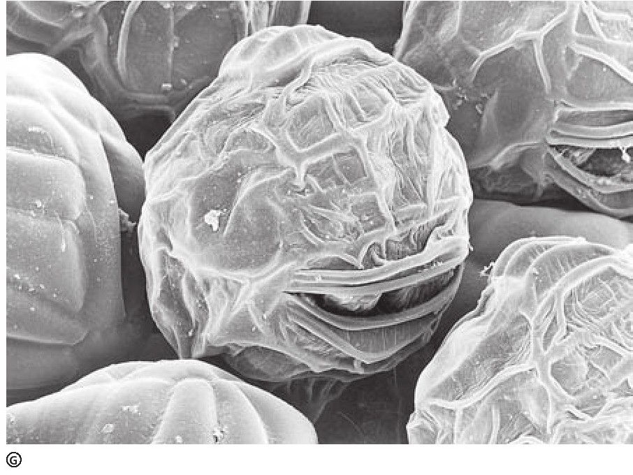
电镜下的孢子

不仅如此，科学家还发现孢子内部几乎没有能够自由流动的水，也就是说，孢子内部的水分仅仅是一些与其他物质结合后活动性很差的水。一般的细胞，其中的水分一边将其他物质溶解，一边还在流动，因此促进了物质代谢。但是，在细胞内具有丰富水分的情况下，对外界环境变化的敏感性也会变大，其稳定性就差，容易受到环境变化的影响。反之，含水量极少的孢子虽然生命活动很不活跃，却能在恶劣条件下泰然自若。

但是，以上的结论只能说是到目前为止的科学推测，关于孢子为什么具有超强生命力的问题，还有待于科学家给出更为完整的答案。（余千里）

  

**【微博士】**九死还魂草

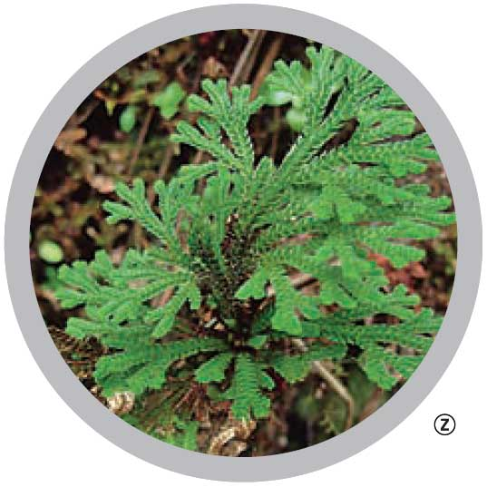
卷柏是一种矮小的蕨类植物，每到干旱缺水的旱季，它的枝叶就会卷曲成一团，看上去就像接近枯萎、毫无生机的小草，但只要一场雨露，它就会伸展开枝叶，流露出象征生命的绿色。卷柏的生命力极其顽强，它专门生长在光溜溜的石灰岩崖壁上，依靠须状的根牢牢地扒住岩石表面的一点点泥土。由于卷柏遇旱而枯，遇水而荣，枯荣相继，循环交替，于是人们送它一个绰号——“九死还魂草”。

## “忍耐力”最强的植物是谁

如果不算植物的某一部分，如孢子、种子等，就整个植物体来说，生命力最顽强，最能抵御恶劣环境的植物要数地衣。因此，地衣的足迹几乎出现在地球的任何地方。例如，在骄阳似火、干燥无水的沙漠荒原中，在冰天雪地、寒冷异常的南极北极，都能见到地衣在如此恶劣的环境中倔强生长。甚至在玻璃窗上、乌龟背上，地衣也能生长。为了测试地衣的生命力究竟有多顽强，科学家将它放置在接近于绝对低温（-273℃）的环境中，或放置在比沸水温度高一倍的温度下，它竟然也能生存！尽管是短暂的时间，但地衣的超强耐受力依然令人感到惊讶。更不可思议的是，人们曾经将地衣在真空条件下放置6年，结果它还保持着活力！

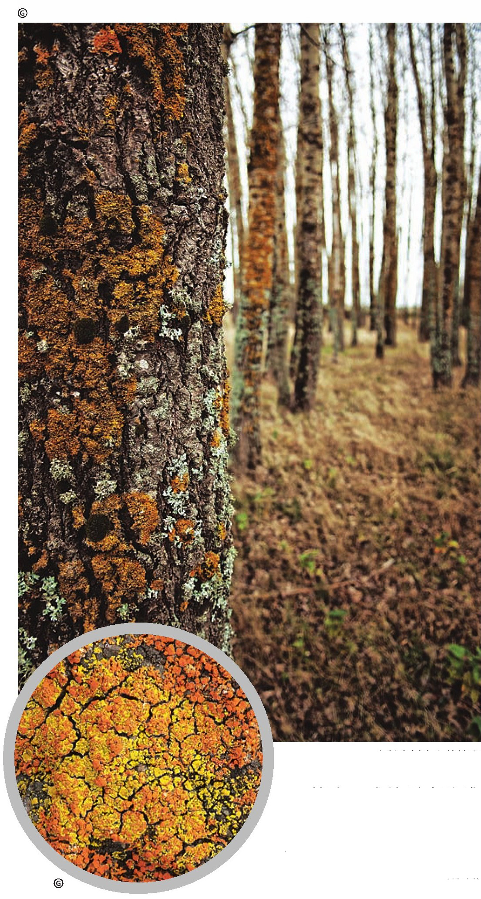
生长在树皮上的地衣

地衣为什么有如此顽强的生命力？因为它不是一种单纯的植物，而是由两类植物“共生”而成，一类是真菌，另一类是藻类。真菌的作用是吸收水分和无机物，而藻类具备叶绿素，可以利用真菌吸收的水分、无机物和空气中的二氧化碳作为原料，进行光合作用，制成养料，与真菌共同享受。这种紧密的合作形式被称为共生，也许这就是地衣生命力顽强的原因。（余千里）

生长在岩石上的地衣

  

**【微博士】**抗寒小草

紫色虎耳草是一种生长速度极为缓慢的小型草本植物，植株高还不到5厘米，只有在寒冷的北极圈地区才能见到。植物学家曾在世界第三高峰瑞士的阿尔卑斯山首次见到它，并惊讶地发现，生长在海拔高达4000多米处的紫色虎耳草，对周围极其寒冷的环境有惊人的忍耐力，一年中只要有600个小时气温高于3℃，它就能够存活！

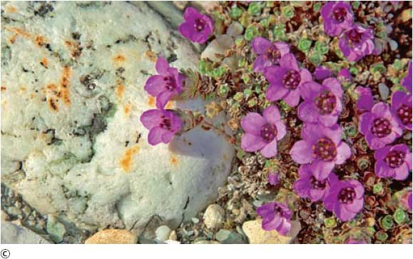
紫色虎耳草

**【实验场】**

取一只从菜市场买来的最普通的白色蘑菇，等待它完全成熟之后，也就是伞盖已经完全打开，然后轻轻敲弹蘑菇，你会见到伞盖背面黑色的皱褶中会落下一些粉尘般的细小物质，那就是蘑菇的孢子。最后，用高倍放大镜或者显微镜对孢子进行观察。

【微问题】如果孢子飘落到月球上，生命力还能长久保持吗？

【关键词】孢子　地衣

## 植物有哪些抵抗害虫的手段

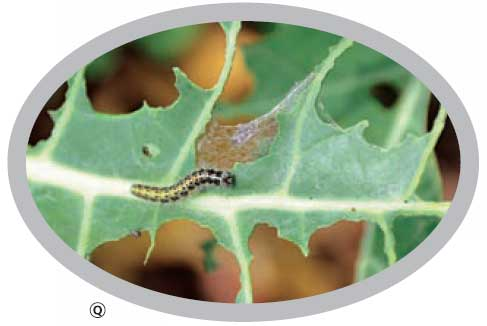
在自然界中，我们经常可以看到被虫子咬得千疮百孔的植物。面对害虫，植物难道真的只能默默地忍受伤害吗？多数人可能认为：“这很正常呀！植物又不会动，除了受害的份，哪里还有反抗的能力！”其实不然，面对各种植食性昆虫的侵害，看似被动的植物并不是毫无戒备任其取食，而是会穿上“盔甲”，拿起“武器”，奋力抵抗的。

植物的“盔甲”有很多种，当昆虫降落到某种植物上后，植物表皮上的毛、刺、蜡质、腺体以及某些骨化或硅化结构，是昆虫首先需要突破的屏障，也是植物抵御昆虫侵害的第一道防线。还有一点也很重要，很多昆虫都有“挑食”的毛病，它们对植物的大小、形状和颜色很挑剔，植物正好可以利用这一点，通过变形、变味、变色等方法来避开害虫的危害。

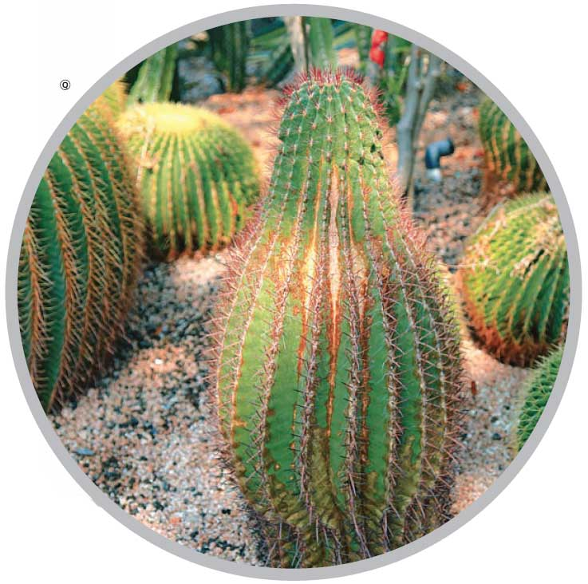
仙人球

概括来讲，植物抵抗害虫的手段可分为直接防御和间接防御。直接防御就是植物利用本身的物理屏障、体内贮存或者合成的有毒化合物直接抵抗害虫的伤害；间接防御则是植物在受到危害时合成一些化学物质，以驱赶害虫或招来害虫的天敌帮助消灭害虫。

直接防御最典型的例子就是浑身长刺的仙人掌类植物了。它们就像披着铠甲的战士，让害虫们无处下口！除此之外，植物还会利用“化学武器”。有些植物会在体内贮存一些杀虫蛋白或其他次生代谢产物，如单宁、生物碱等，昆虫取食后会出现中毒、消化不良及生长不良等现象，从而减少对植物的伤害。

有一种叫逐蝇梅的植物，它们的枝叶和花朵中能够挥发出令蚊蝇讨厌的气味，具有很强的驱逐蚊蝇的功效。如果在家里种上一盆逐蝇梅，不但驱蚊蝇的效果好，而且花朵靓艳，赏心悦目。它的花朵初开时常为黄色或粉红色，随后逐渐变为橘黄色或橘红色，最后呈红色，具有“驱蚊七变花”的美誉。具有这类功能的植物还有很多种，例如大家熟悉的七里香、夜来香、驱蚊草等。

有些植物中的物质还可以被科学家们提取出来，用来制造杀虫或驱虫的制剂。例如，农药市场中的两大杀虫剂氨基甲酸酯类和拟除虫菊酯类的开发成功，就是基于对毒扁豆和除虫菊这两种杀虫植物的研究。这也激励着科学家们一直热衷于对杀虫植物中高活性物质的探索。在自然界中，目前发现有2400多种植物能够产生控制害虫的活性成分。其实这些被科学家调查研究过的植物仅占现有植物种类的10%左右，还有大量的抗虫植物资源有待我们去发现和利用。（苗雪霞）

## 植物被虫子伤害会发出“求救”信号吗

植物除了能利用身上的刺、毛抵御害虫，利用体内挥发出的特殊气味驱赶害虫外，有些植物还能利用挥发性气味发出“求救”信号呢！荷兰科学家迪克发现，当荷兰金甲豆在遭受螨虫危害后，能够产生一种挥发性化学物质，类似一种“求救”信号，将这种螨虫的天敌吸引过来。就像我们人类生病后要请医生开药方一样，这些天敌的到来就可以杀死害虫，从而减轻害虫对植物的伤害，这就是植物采用的“间接防御”手段。而且，植物在受到不同种类的害虫危害时，会发出不同的信号，请来不同种类的天敌昆虫，就像我们人类生病要找不同的专科医生医治一样。

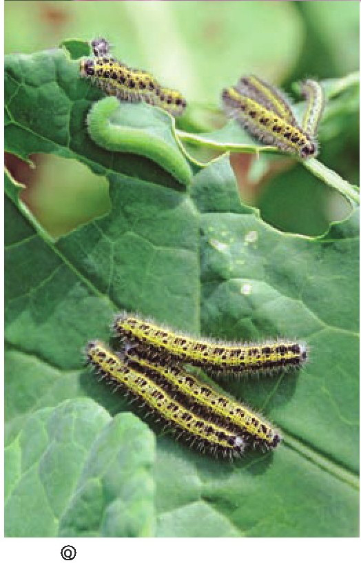
不仅如此，科学家们还发现，有些植物在受到虫子的伤害后，会产生一些化学物质，发出信号弹一样的“警示”信号，仿佛在提醒同伴：“敌人来了，提高警惕！”这时候，其他植物就会提前做好“迎敌”准备，合成一些有毒的化学物质，以减少害虫对它们的伤害。

既然植物有这么多手段可以抵抗害虫，那为什么我们看到的总是被虫子吃得惨不忍睹的植物呢？这又是另外一个非常重要的问题了，所谓“道高一尺，魔高一丈”，植食性昆虫同样在进化着各种对付植物的“反防御”手段。同时，我们人类为了生产出无毒且好吃的食物，会选择没有毒的植物来种植，或者将植物中的有毒成分去除，这也增加了植物受害的程度。当注意到这些情况后，科学家们就会努力去培育一些既好吃又抗虫的农作物品种。（苗雪霞）

## 如何培育抗虫农作物

为了预防农作物受到害虫的严重危害，种植抗虫品种是最经济、有效和环保的方法。

要想培育出抗虫的农作物，首先要有一双善于观察和发现的眼睛。各种农作物为了适应环境，也在不停地进化和适应的过程中。在大量农作物受虫子危害的田间，如果仔细观察，也许就会发现一些没有受害或者受害很轻的植物，那么这些植物很可能具有某种抗虫的成分，这是培育抗虫品种的第一步，也是最关键的一步。如果你发现的这个抗虫植物具有很好的生产性能，既高产又抗虫，又是人们喜欢吃的品种，那么将它直接用于以后的生产中就可以了。其实，这也是几千年来农民选育和保留农作物种子的有效方法。真正有目的地进行抗虫品种的培育也只有近百年的历史。

但是，多数情况下，人们发现的抗虫植物，它们的产量和品质并不符合我们人类的要求。这时就需要采用不同的杂交方式，将抗虫植物与品质优良的植物进行杂交，让它们的优良性状结合在杂交后代之中。由于杂交后代的表现不一，有的既抗虫品质又好，有的虽抗虫但品质却不好，因此还要对它们进行筛选鉴定，从中保留符合人类需要的品种。这是一个费工费时的工作，往往要花几年才能培育成一个品质优良的抗虫品种。

随着现代生物技术的发展，当科学家发现一个抗虫品种时，他们首先寻找是哪个基因使这个植物具有了抗虫性能，然后设法把这个抗虫基因克隆出来，并导入到品质优良的农作物中。这是近年来培育抗虫作物的新技术，也可能是未来培育抗虫农作物的主要手段。（苗雪霞）

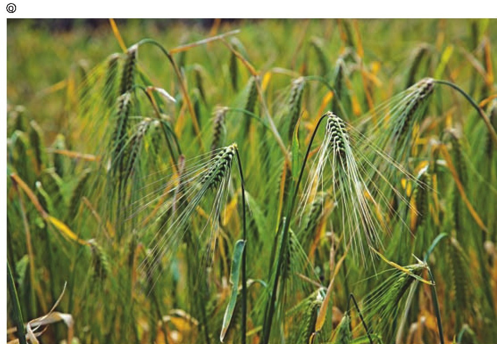
抗虫作物

  

【微问题】厨房中最讨厌的是蟑螂，能不能培育出一种既适合室内盆栽又能驱赶蟑螂的植物？

【关键词】植物抗虫　逐蝇梅　抗虫基因

## 打破种子休眠的“力量”在哪里

植物种子的萌发是植物繁衍后代的关键环节。在周围环境条件不适宜生长时，植物以种子的形式保存自己；当环境条件适宜时，种子就发芽，开始进入新的生命活动周期。那么谁来唤醒休眠的种子，告知它们可以发芽和生长呢？种子萌发首先需要三个最基本的条件：足够的水分、氧气和适宜的温度。

一般来说，处于生长状态中的植物，特别是草本植物，含水量可以达到新鲜植物体重的90%左右，而休眠种子的含水量却少得惊人，一般在10%以下。因此，种子只有吸取一定的水分，达到一定的含水量才能开始发芽。不同植物的种子，有不同的发芽最低含水量要求，例如小麦要达到60%，水稻为40%。因此在生产实践中，一些农作物的种子在播种前常常要浸泡，或播种在湿润的土壤中，就是为了让种子能够获得发芽所必需的水分。反过来，许多供人们食用的种子，为了能够存放比较长的时间，防止发芽，就需要在存放前先脱水，并保持在干燥的环境中。

种子萌发的过程是一个消耗能量的过程，这些能量来源于种子内部储存的养料的氧化，因此种子萌发时一定需要氧气。一般的作物种子发芽，要求气体环境中的含氧量达到10%以上，如果低于5%，大多数种子将不能发芽，事实上，普通空气中的含氧量通常都能达到种子发芽的要求。

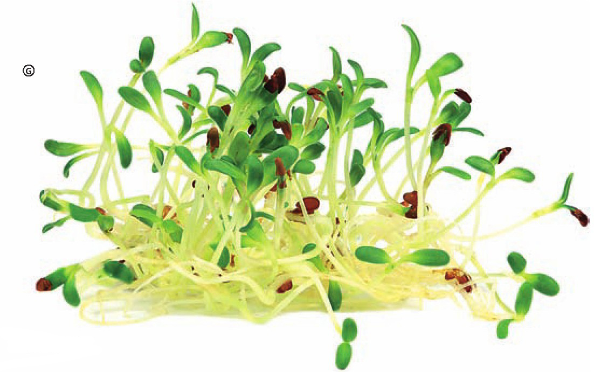
幼苗阶段

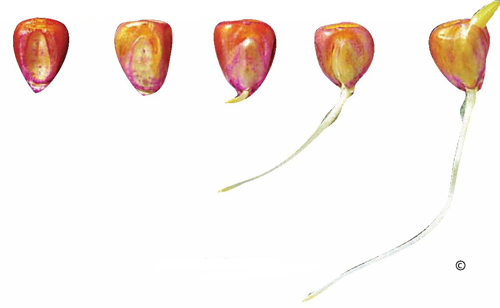
种子萌发过程

种子萌发还是一个启动许多物理和化学作用的过程，需要一定的温度。幸好，保证能够发芽的温度范围比较宽泛，上限能达到40℃。但是，对于每一种植物种子而言，都有一个适宜于自己的最佳发芽温度，通常在10～30℃之间。最适宜温度的高低又取决于植物长期生存的环境，温带植物种子的萌发最适宜温度要比热带和亚热带植物种子低。同样，为了使种子不发芽，一个非常有效的方法就是把种子放在低温中，特别是0℃以下的低温中储存。

对于有些种子来说，萌发还有一个重要条件，那就是对光的要求。例如洋葱和番茄的种子发芽时，见光就会受到抑制，称为“厌光种子”；而烟草和莴苣等植物的种子发芽需要光，称为“需光种子”。除了需光和厌光两大类种子之外，在植物界中还有很多种类的种子对光的反应不敏感。

我们知道了是谁唤醒休眠的种子，那么，为了最有效地长期保存种子，以保存物种延续，最佳方法是让种子一直处于休眠状态，也就是说，需要为种子创造一个干燥、低温、缺氧和黑暗的环境条件。（蔡可）

## 种子为什么要休眠

当严寒的冬季到来后，许多变温动物，如蛇、乌龟、青蛙等，纷纷躲入安全的环境中，开始漫长的休眠。这些动物之所以要休眠，是因为冬季温度低、寻找食物困难，而休眠可以大大降低新陈代谢的速率，减少体能的消耗，以适应环境恶劣的寒冬季节。动物要休眠，绝大部分植物也需要休眠，只不过植物休眠的主体通常是种子。

我们知道，秋季是一个收获的金色季节，许多植物的果实和种子成熟了。但秋季之后是冬季，严酷的低温不利于绝大多数植物的生长。种子的休眠恰恰是对恶劣环境的适应，选择暂时不萌发，以避免萌发后遭受不利环境条件的伤害。这种恶劣环境不仅仅是严冬，也可以是酷热、严寒、干旱等。这是一种在进化过程中形成的适应特性，有利于维持物种的繁衍。

导致种子休眠有多种因素。有些种子种皮厚，既不透水又不通气，种子不能吸水，就不能进入发芽的生理活动状态，如刺槐和羽扇豆等；有些种子中的胚尚未发育完全，一些生理过程还没有完成，只有在胚完全发育后才能发芽，如银杏和兰花等；还有些种子中的胚虽然发育完全，但是生理上尚未成熟，需要在低温下经过后熟期才能发芽，如菊花、矮牵牛和一品红等。

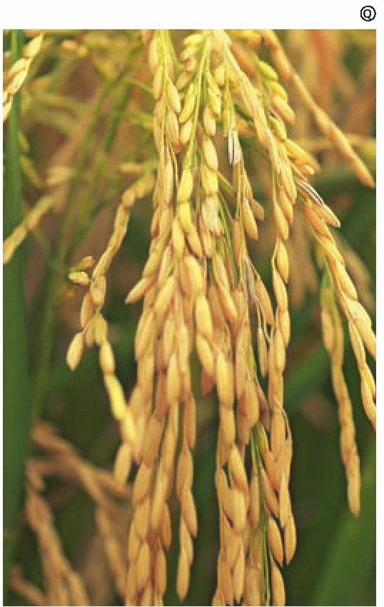
不同植物种子休眠期的长短也是不同的。有些植物的种子休眠期可以达到一年以上，还有些植物种子没有休眠期，成熟后的种子只要在合适条件下就可以萌发。例如有些水稻品种，倘若没有及时收割，同时又遇上连续阴雨和高温天气，尚在稻穗中的种子也能发芽。

根据人们的需要，科学家已经找到多种人为打破种子休眠的方法，例如层积法、湿润低温沙藏等物理方法，还有用植物激素赤霉素处理种子的化学方法。（蔡可）

  

**【实验场】**

准备若干黄豆种子、纸巾和5个玻璃瓶。1号瓶的水只能湿透纸巾，不能淹没种子，放在空气流通有阳光的地方；2号瓶的水能把种子淹没，放在空气流通有阳光的地方；3号瓶的水只能湿透纸巾，不能淹没种子，用盖子把瓶子盖上，使瓶子空气不能流通；4号瓶的水只能湿透纸巾，不能淹没种子，放在冰箱里，尽量使瓶子里的水不结冰；5号瓶不放水，放在空气流通有阳光的地方。然后对比它们的萌发情况，找出水、温度、氧气和光照对黄豆种子萌发的影响。

【微问题】有没有在0℃以下低温能够萌发的种子？

【关键词】种子萌发　休眠

## 植物体内有多少神奇激素

我们知道，人和许多动物体内有激素，它们由特定的部位分泌后运输到其他部位，并在生长发育的过程中起着重要的调节作用。一旦激素的分泌失调，就会发生疾病，甚至死亡。那么植物体内是否也有激素呢？回答是肯定的，但植物激素和动物激素有很大区别。

那么，究竟什么是植物激素，植物激素又有哪些种类，它们的作用是什么？如果用一句概括的话来解释，植物激素是指植物体内合成的、能调节植物生长和发育的、微量的生理活性物质。它们的产生虽不像在动物体内有严格的特定部位，但作用一点也不比动物激素的差。

在植物激素家族中，通常有五大类。老大是赤霉素，也就是赤霉酸（GA）的统称。只不过赤霉酸并非单独一种，到目前已经分离出130种以上的“兄弟姐妹”，植物生理学家给它们分别起名为GA1、GA2、GA3……其中最常用的赤霉素是GA3、GA4和GA7等。赤霉素最大的作用是：促进细胞生长，使植株长高；打破种子休眠，诱导种子萌发；诱导长日照植物在短日照条件下开花；诱导一些植物单性结实；等等。

植物激素的老二是生长素，它可以调节植物茎的生长，促进生根。老三名叫脱落酸，能抑制细胞的分裂和生长，促进叶片和果实的衰老和脱落，故由此而得名。老四细胞分裂素，顾名思义，植物细胞在它的帮助下能“激动”起来，就像孙悟空施展分身术那样能1变2、2变4、4变8……也就是说，它能诱导细胞分裂、芽的形成、防止叶片的衰老等。老五叫乙烯，主要本领是促进果实的成熟、器官的脱落和刺激植物体内某些物质的分泌等。

除了上述五类植物激素外，随着科学研究的发展，科学家还不断发现一些激素类物质，它们具有一定的生理调节作用，并能在植物体内产生某些生理活性，例如油菜素内酯、茉莉酸、水杨酸、多胺类等。

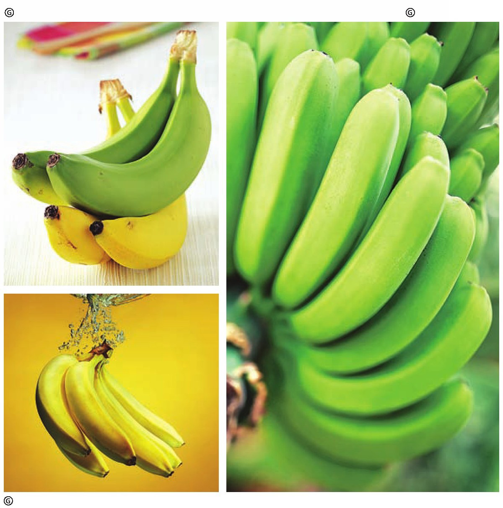
乙烯促使香蕉成熟

现在已发现越来越多的新植物激素，于是人们希望能在生产实践中利用它们，控制植物的生长和发育。但它们在植物体内的含量太少，分离提取困难，大量使用成本太高。因而，科学家采用人工合成办法生产具有类似功效的化合物，如萘乙酸、二四滴、二四五涕、乙烯利等，但它们还是有别于植物的内源激素，必须防止滥用，只能适时适量地运用。（蔡可）

## 植物激素能成为除草剂吗

杂草是庄稼的大敌，它们与农作物争夺水分、养料和阳光，还会扩散病虫害。人工除草不仅要耗费大量的劳力，而且有的杂草非常顽固，一次难以去除干净。机械化操作又受到种植条件的限制，很难大面积推广。因而，农田除草对农民来说是一个头痛的大问题。当然，利用化学除草剂是最佳方法。植物激素的功效为科学家和工程技术专家提供了启示，根据不同植物激素的特点，他们研制许多能杀死杂草的除草剂，又称除莠剂。在小片的农田中，可以用简单的喷雾法，如果在大面积种植单一作物的情况下，还可以利用飞机来喷洒除草剂，高效率地达到清除杂草的目的。

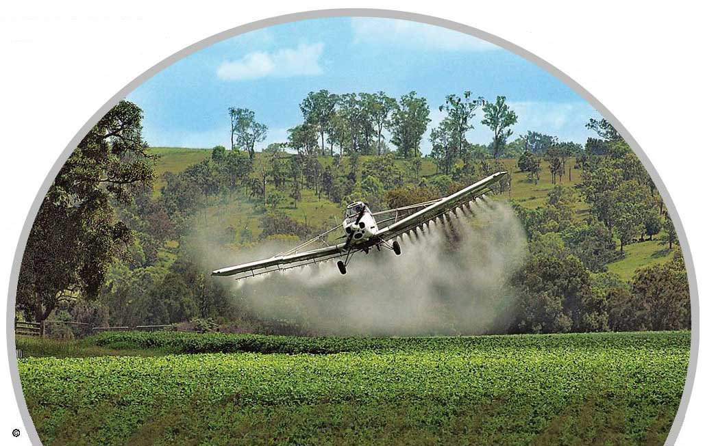
飞机喷洒除草剂

现在常用的除草剂有两大类。一类是灭生型除草剂，没有选择性，能杀死一切植物，例如五氯酚钠。因此在使用这类杀虫剂时要特别注意，必须选择播种前施用。另一类是选择型除草剂，只对某一类植物有效，例如2，4-D（二四滴）可杀死双子叶植物，而不能杀死单子叶植物，可用于水稻和麦田的除草。

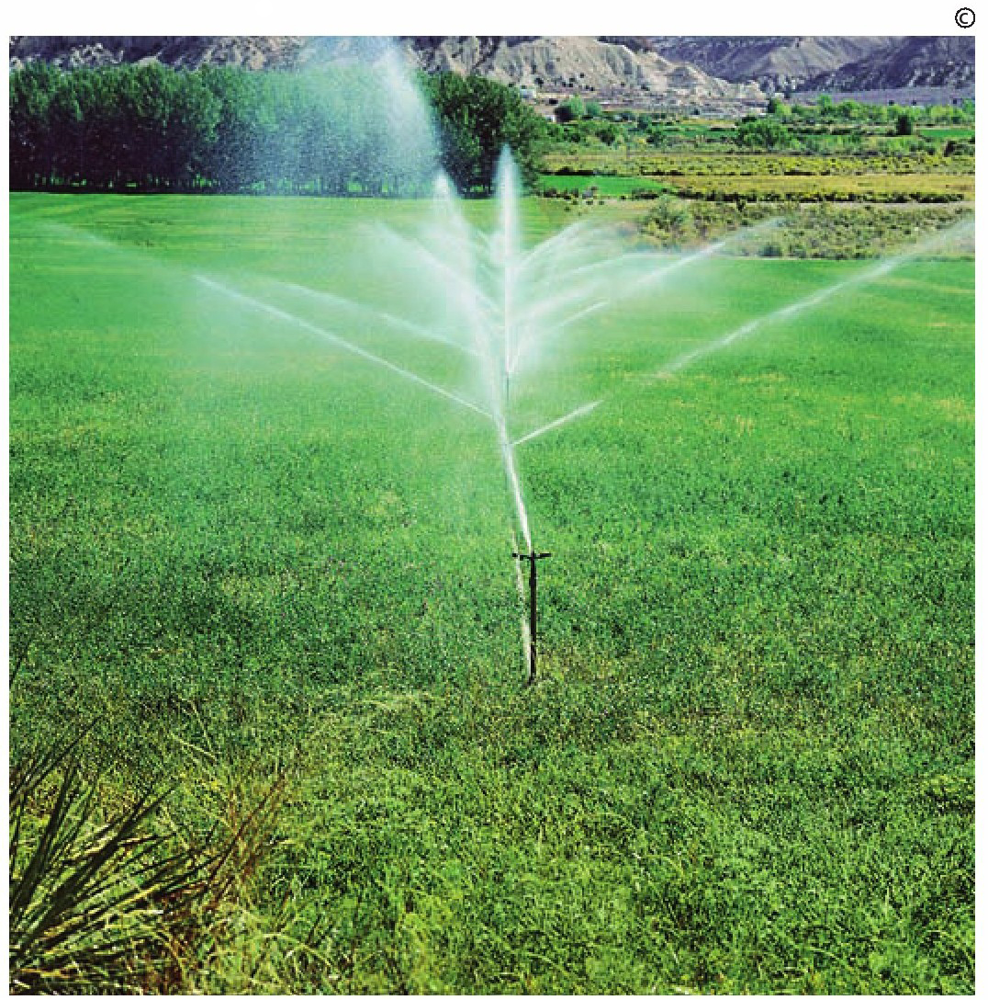
其实，植物激素之所以能够成为杀虫剂，浓度是重要的因素。例如，合适浓度的生长素在植物体内会帮助植物生长，但生长素的作用具有两重性，高浓度的生长素却会抑制植物生长。根据农作物和杂草对生长素的敏感度不同，当农田中的杂草对生长素浓度比对庄稼更敏感的情况下，用激素类杀虫剂就能杀灭杂草，同时又无害于庄稼。在通常情况下，杂草大多是双子叶植物，而双子叶植物对于激素浓度的反应程度要比单子叶植物敏感，所以选择性除草剂才有了用武之地。（蔡可）

  

**【实验场】**

准备3只小杯子。称取萘乙酸50毫克或吲哚丁酸25毫克，分别放入2只杯子中，用10～15毫升无水酒精溶解；第3只杯子中放入适量纯净水（空白对照）。将上述配好的溶液分别倒入3只大杯子中，分别再加水至100毫升，摇匀后备用。然后剪取15枝带花蕾、长约10厘米的健壮嫩枝，分3组基部浸入3种配好的溶液中，1～2分钟后取出，稍阴干后插入沙质沃土中，保持一定温度（25℃左右）和湿度（80%～85%），适当遮光。3～4天后，比较3组枝条不同的长根情况，经过生长调节剂处理过的枝条是否比对照枝条长根情况要好。

【微问题】吃了含有植物激素的食物，对身体有害吗？

【关键词】植物激素　除草剂

## 为什么睡莲花晚上要“睡觉”

我们人类每天都要睡觉，经过一天的工作学习后，只要美美睡上一觉，就能消除疲劳，精神焕发。睡眠是人类生活中不可缺少的一部分，这并不奇怪，但如果说植物也要睡眠，也许就会令很多人感到奇怪了。

其实，在我们身边周围有很多植物睡眠的现象。例如公园中很常见的睡莲，每当旭日东升之际，它的美丽花瓣就慢慢展开，似乎刚从酣睡中清醒；而到了夕阳西下时，它又会慢慢闭拢花瓣，重新进入睡眠状态。由于它这种“昼醒夜睡”的规律性特别明显，因此人们就给它起名叫睡莲。

植物的睡眠的确是一种有趣的现象，它在植物生理学中称为“睡眠运动”。那么，植物在睡眠运动中能获得什么益处呢？这也是植物学家很关心的问题，其中虽然还有很多机理尚未完全清楚，但依然对睡莲的花朵开合现象提出了假设。他们认为，睡莲的花朵在晚上合拢，也许是为了防止它那娇嫩的花蕊遭受到夜晚寒冷的冻害。因为睡莲原产于埃及，那儿属于热带沙漠气候，白天气温很高，到了夜晚骤降，昼夜温差很大，睡莲的这种习性也是对环境气候的一种适应。

其实在很早以前，提出进化论的伟大学者达尔文，就曾经做过一个关于植物睡眠运动的实验。他发现，许多植物的叶片始终处于运动状态中，当他用强迫的手段迫使叶片停止运动，并长时间保持在某一个固定位置后，叶片就很容易遭受到冻害。以后的科学家曾多次重复类似的实验，得到的结果如出一辙。科学家们甚至发现，那些叶面积满露珠的叶片要比其他的更易受到冻害。于是，大部分学者都倾向于认为，花朵或叶片的睡眠运动对植物生长有抵御冻害的好处。

以上的论点似乎有一定道理，但还缺乏足够的实验证据，所以一直没有引起人们的重视。直到20世纪后期，随着植物生理学的快速发展，科学家才开始重新研究植物的睡眠运动。美国科学家瑞恩特在进行了一系列实验后，对植物睡眠运动的机理提出新的见解。瑞恩特的实验很直观，他用一根灵敏的温度探测针，在夜间测量多花菜豆叶片的温度，结果发现，呈水平方向（不进行睡眠运动）的叶片的温度，总是比垂直方向（进行睡眠运动）的叶片温度低1℃左右。瑞恩特认为，虽然只有1℃的微小温度差别，但正是它阻止或减缓叶子生长速度的重要因素。因此在相同的环境中，能进行睡眠运动的植物生长速度较快，与那些不能进行睡眠运动的植物相比，它们具有更强的生存竞争能力。

虽然植物睡眠运动的本质在不断被揭示，但还远远不够，科学家正在这个有趣的研究领域中进行着新的研究，以求获得新的发现。（余千里）

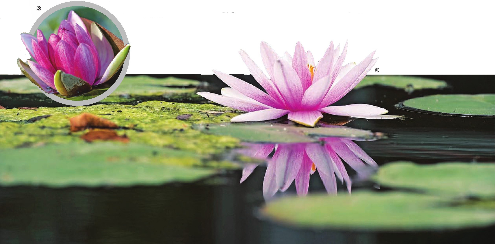
睡莲

## 不同的植物，“睡相”也不同吗

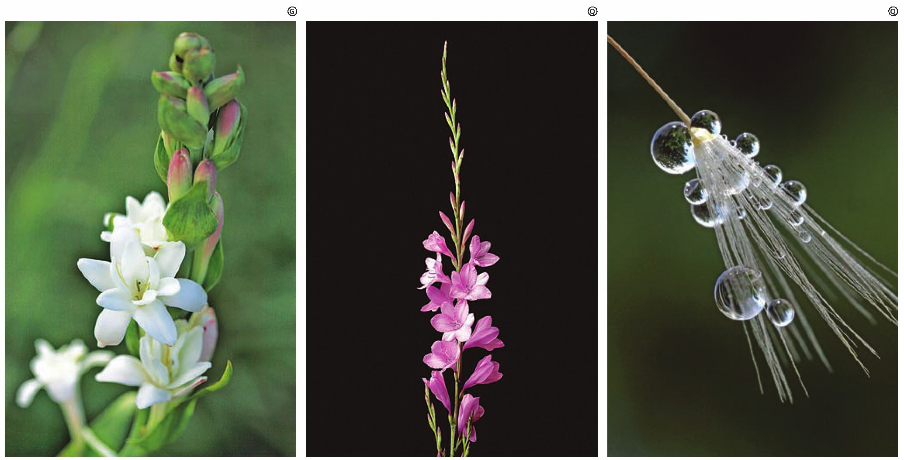
如果你有足够的耐心在夜晚观察植物的“睡相”，尤其是观察花朵的睡眠，一定会见到很多有趣的画面。各种各样的花，睡眠姿态各不相同。蒲公英在入睡时，所有的花瓣都向上竖起来闭合，看上去好像一个迷你型的黄色鸡毛扫帚；胡萝卜的花朵在睡觉时会垂下头来，好像一个正在打瞌睡的小老头。

更有趣的是，有些植物的花朵白天睡觉，夜晚开放。例如晚香玉的花，不但在晚上盛开，而且格外芳香，以此来引诱夜间活动的蛾子为它传播花粉。还有，我们平时当作蔬菜吃的瓠子，也是晚上开花，白天睡觉，以致人们就把它俗称为“夜开花”。

相对于花朵来说，植物叶片睡眠的姿势变化不大。例如，我们最熟悉的花生是一种爱睡觉的植物，它的叶片到了傍晚就开始慢慢地向上关闭，表示白天已经过去，它要睡觉了。有时候在野外看见开紫色小花、长3片小叶的红花三叶草，它在白天有阳光时，每个叶柄上的3片小叶都舒展在空中，但到了傍晚，3片小叶就紧紧闭合在一起了。（余千里）

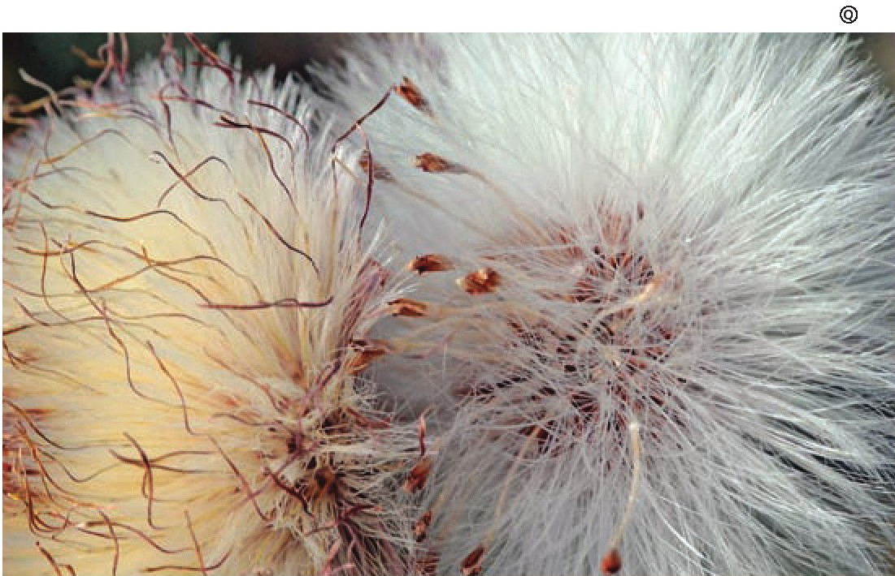
  

**【微博士】**月光理论

解释睡眠运动还有一个很流行的“月光理论”。提出这种理论的科学家认为，叶子的睡眠运动能使植物尽量少受月光的侵害，因为过多的月光照射，可能会干扰植物正常的光周期感应机制，损害植物对昼夜长短的适应。然而，使人们感到迷惑不解的是，为什么许多没有光周期现象的热带植物，同样也会出现睡眠运动呢？这一点用“月光理论”很难解释得通。

【微问题】植物的果实也会睡觉吗？

【关键词】睡眠运动　睡莲

## 花卉为什么爱把叶片伸出窗外

如果你家中种有观赏花卉，将它们放在靠近窗户的地方，你就会发现一个很有趣的现象，那就是它们的叶片都会朝向窗户方向生长，仿佛充满了伸出窗外的渴望。解释这个现象似乎并不困难，因为植物生长需要阳光，有了充足的阳光才能进行光合作用，制造出自身需要的营养物质。如果将窗外和室内相比，植物当然选择前者，因为在窗外才能沐浴到更多的阳光。可是，植物的叶片不像人的手可以随意运动，那么，究竟由谁来帮助植物叶片去追求阳光？这个问题就要科学家来回答了。

伸出窗外的枝叶

很早以前，进化论先驱达尔文就已经注意到，当室内植物的幼苗破土而出时，都朝着透光的玻璃窗那边倾斜，他觉得植物体内也许有什么东西在控制着植物的向光运动。根据直觉，达尔文认为这东西可能在植物顶芽附近，于是，他就把幼苗的顶芽削去一块，结果情况完全变了。幼苗虽然还继续朝上生长，但再也不会倾斜于阳光相对充足的窗户了。这个实验使达尔文相信，肯定有一种神奇的物质在操纵植物的生长方向。很可惜，在当时的研究条件下，还没等达尔文发现这种物质，他就与世长辞了。

直到1928年，荷兰裔美籍植物生理学家温特终于发现了这种神奇的物质。温特设计了一个很能说明问题的实验。他使植物的胚芽鞘一面受到光照，另一面对着黑暗，结果胚芽鞘的生长发生了有趣的变化，渐渐朝着有光照的方向弯曲。接下来，温特开始对胚芽鞘内的物质进行了全面分析，终于分离出一种化合物，它就是现在大名鼎鼎的植物生长素。再通过进一步研究发现，生长素具有促使植物生长的功能。当胚芽鞘受到光照时，生长素就像害怕明亮的小家伙，纷纷躲藏到遮阴的那一侧。随着生长素越来越多地聚集于遮阴一侧，使这一侧的生长速度大大加快，而受光一侧因为缺少生长素而生长缓慢，结果导致了胚芽鞘的弯曲生长。于是温特认为，植物茎或叶片的向光性弯曲生长，是生长素在组织内的分布不均匀造成的。

现在终于搞清楚了，室内花卉爱把叶片伸出窗外，原来是受到了生长素的控制。（余千里）

## 为什么牵牛花生长总是右旋而上

牵牛花又叫喇叭花，是一种大家都很熟悉的植物。它有一根又细又长的茎，看上去非常瘦弱，必须依靠缠绕在其他物体上才能向上生长。如果你能仔细观察的话，看看它缠绕在竹竿上的细茎，就会发现一个有趣的现象，那就是牵牛花都是沿着顺时针方向（右旋）向上攀爬的，而另一种缠绕植物蛇麻藤则恰恰相反，它是以逆时针方向（左旋）朝上生长的。这是为什么？这个看上去很简单的问题却很难回答。

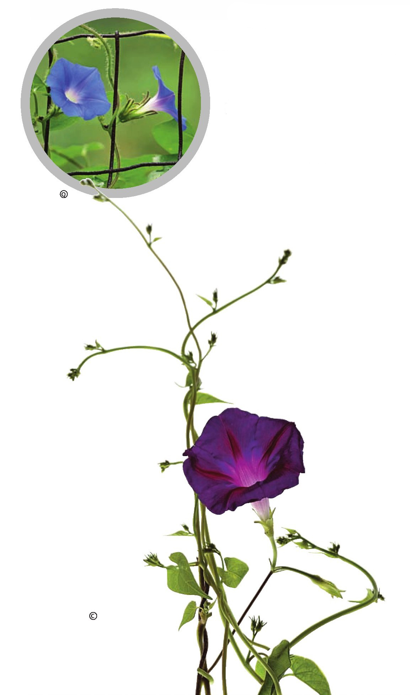
牵牛花

虽然还没有确切的答案，但已经有科学家对这种现象进行了假设。科学家推测说，我们地球上缠绕植物的祖先，一类生长在北半球，另一类生长在南半球，植物为了获取更多的阳光而跟踪东升西落的太阳，久而久之，就形成了两种相反的旋转方式。如果这种说法正确的话，一些起源于赤道附近的缠绕植物，就不可能有固定的缠绕方向。后来，科学家真的发现了左右都能旋转生长的中性植物，它的起源地就在阿根廷的赤道地区。（余千里）

  

**【微博士】**向性运动

向性运动是植物适应环境而产生的定向运动，可以分为以下几类：向光性、向地性、向水性、向化性和向触性。

叶子朝着光照条件好的方向生长，就是典型的向光性。植物的根向着地心吸力的方向生长，能深入泥土中，固着地上的植物体，并能从泥土中吸收水分及无机盐，属于向地性。植物根朝着地下较湿润处生长属于向水性。根在土壤中朝着肥料多的地方生长属于向化性。植物体的某一部分对接触做出反应，并产生生长运动，就属于向触性。例如豌豆的卷须缠绕着支持物生长，牵牛花的茎缠绕在竹竿或别的植物躯干上生长，都是向触性运动的表现。

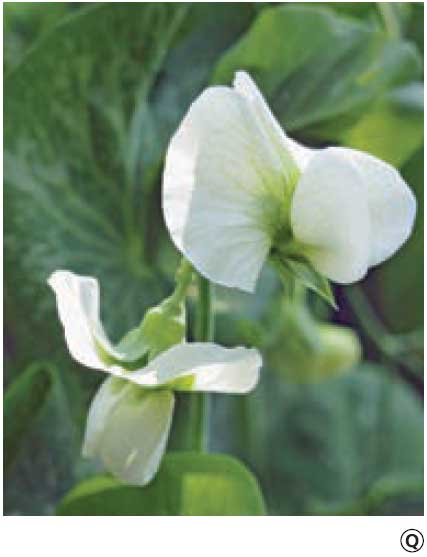
豌豆花

**【实验场】**

买一盆观叶植物滴水观音，将它放在居室内，距离阳光通透性良好的窗户0.5米左右观察，并拍摄照片存档。一星期之后，再观察这盆滴水观音的叶片发生了什么变化，是否都斜向与窗户生长？亦可再拍摄照片，与一星期前的照片进行比对。

然后，再将花盘来一个180°的大转换，就是将已经倾斜向窗口方向的那部分叶片，对着室内较为昏暗处，然后再过一段时间观察，看看那些倾斜的叶片是不是改变了生长方向？

【微问题】如果采用人工手段强行改变牵牛花最初的缠绕方向，它还会变回来吗？

【关键词】向光性植物　生长素　向性运动

## 为什么植物的根会向下长，茎会向上长

在自然进化的过程中，大多数的植物发育出了能够向上生长的茎和向下生长的根，这是大自然的杰作。

因为生长在地球上的植物，总是受到无处不在、大小和方向基本恒定的地心引力（重力）的作用，进化出了向重性的特性。早在1806年，科学家就已初步揭示了植物器官利用重力指导生长。植物的根总是朝向重力方向在土壤中生长，而芽则会向上穿透土壤使茎叶有空间展开。通过这一过程，植物在地上和地下争取生存空间，以获得赖以生存的阳光、养分和水等资源。正是由于茎的负向重性生长，植物的果实、种子才能摆脱地面潮湿环境的伤害，避免了腐烂。植物在经受狂风暴雨后，能够依靠负向重性生长而抗倒伏。

植物要完成向重性生长，就要经过4个阶段：植物感受重力作用方向刺激；将生物物理信号转化为生物化学信号；将信号从感受部位传导到发生向重性弯曲部位；不对称生长导致生长方向改变的响应行为等。

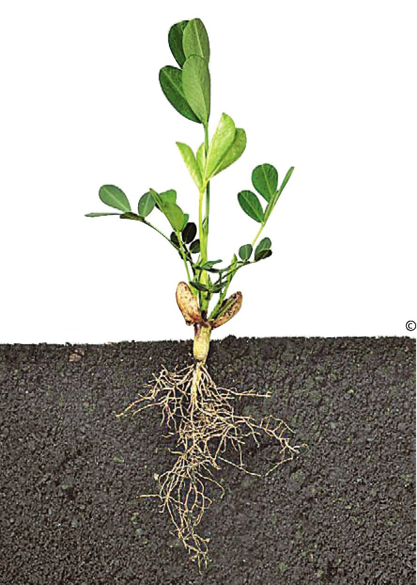
破土而出的花生植株

关于解释植物感受重力方向机制，虽有多种假说，但是早在100多年前提出的淀粉体——平衡石假说在很多植物中不断被实验所支持。植物器官是由感受敏感区来感受重力，比如在根的最前端有几层细胞组成的根冠，在茎的幼嫩组织以及其他尚未失去生长功能的节间、胚轴、花轴等。

组成根冠的柱状细胞中的淀粉体在重力作用下发生沉降，从而引导根的生长方向。这些淀粉体被命名为“平衡石”，含平衡石的细胞被称作平衡细胞。在植物茎中也有平衡细胞，它们是内皮层细胞。该假说虽然引起人们的广泛争议，但现在依然有大量新的证据支持该假说。

比如根冠切除实验，当根冠被人为切除，即使有重力刺激，根却不能向下弯曲生长。再比如，有的拟南芥突变体茎中的内皮层细胞若不能正常发育，茎的向重性弯曲也就被抑制了。

感受到重力信号以后，第二步就是将生物物理信号转化为生物化学信号。有人提出，细胞内质网参与了这一过程。内质网是内膜上封闭的网状管道系统，也是钙离子的一个贮存库。当植物受到重力刺激后，淀粉体发生位移，改变了淀粉粒对内质网的压力，诱导了钙离子从内质网流向细胞质，这样，重力的刺激就转化成钙离子的浓度变化。

第三个步骤是信号传输，将信号从感受部位传送到发生向重性弯曲部位，这个过程涉及了植物生长素的参与。生长素主要是在幼嫩茎尖部位合成的，随之被送到根尖特定的部位并富集起来。然后生长素侧向地被重新分配到其他区域并在那里调节细胞的伸长。但当植物的根受到重力刺激（改变生长方向90°）时，生长素被优先运输到根的下侧伸长区，形成一个生长素分配上的浓度梯度，并在此部位起作用，促使根尖向下弯曲。

同样有实验证明，在植物发生向重性反应部位的赤霉素也出现了不对称分布，有人用带有放射性标记的赤霉素的前体处理玉米，然后将萌发了3星期的玉米放平，12小时后，在节间和叶鞘基部等区段的下半部积累了较多的活性赤霉素，而上半部只有较少的活性赤霉素。用燕麦做的实验也发现，仅放平1小时之后，赤霉素在茎的上下两部分就发生了不均衡的分布。

植物激素的浓度差异，势必会造成细胞生长速度的不同。植物根发生向重弯曲的部位在伸长区，水平根的上部生长比下部快，从而导致根向下生长。平放茎的上半部的生长比下半部的生长慢，所以造成了茎向上弯曲生长。（蔡伟明）

## 失去重力后的植物会怎样生长

随着科学技术的发展，人类的活动扩大到了地球外的太空，那是一个微重力或零重力的环境。植物在地球引力的束缚下生长了千万年，如果离开地球进入太空，植物还能正常生长吗？

其实，植物一旦被带进微重力环境，生长就失去了重力方向的引导，如果再没有其他如光等单向外界因素的刺激，就会出现随机方向生长。这种情况和我们在地面上看到的地上部向上生长、地下部向下生长的现象大为不同。这也从一个新的角度让我们认识了植物的向重性。

现在，人类已经可以进入太空，并且利用太空的独特环境如高辐射、微重力等开展科学实验。空间站就是非常重要的空间实验基地。要在空间站开展植物生物学方面的研究，首先就要掌握在空间站里如何栽培植物。这就要建一个植物的生命保障系统。这个系统必须要提供植物赖以生存的环境。如适宜的温度、湿度、气压，充足的水分、矿质营养、用于植物光合作用的二氧化碳，还要提供植物生根的基质，提供能量的光照。在没有重力引导生长的太空，光照方向还可以被植物利用其具有向光性的能力来引导器官生长的取向。（蔡伟明）

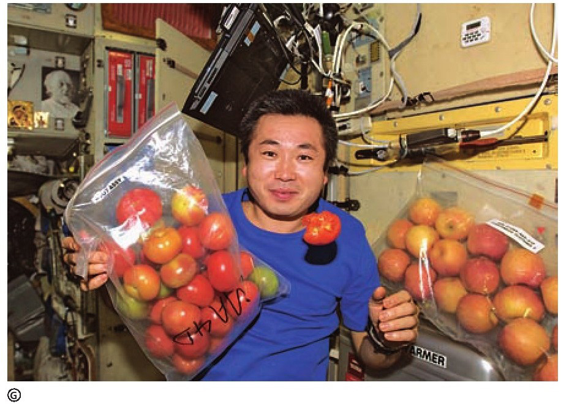
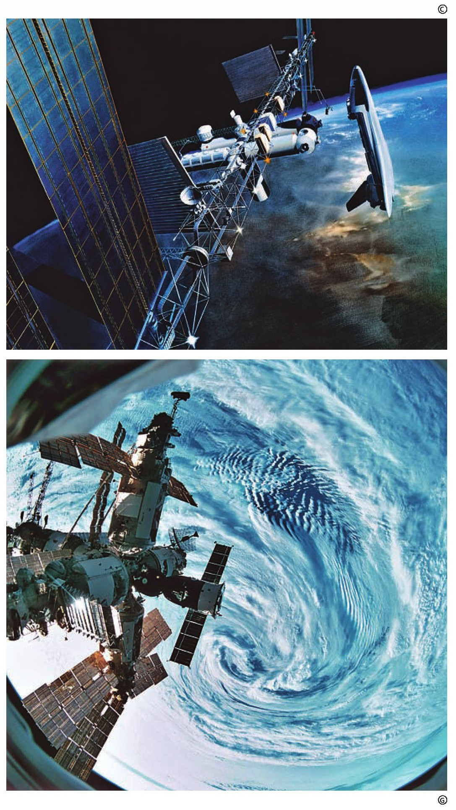
  

【微问题】在空间站生长的植物，除了失重外，还会受到什么环境因素的影响？

【关键词】植物的向重性　淀粉体——平衡石假说　生长素　太空植物

## 为什么有些花儿爱“追”太阳

“朵朵花儿向阳开”，这句话虽然最常见、最普通，但它却蕴涵着极为丰富的科学道理。我们已经知道，植物的向阳或向光运动，是受体内生长素控制的，那么，花朵追踪阳光的目的又是什么呢？

其实在我们周围，除了向日葵之外，花朵向阳运动的现象并不是很常见，但有三位研究极地植物的瑞典生态学家克捷尔伯雷、卡尔森和卡斯托森，却发现生长在寒冷极地的大部分植物花朵都擅长追逐太阳。这不由得使他们联想到，花朵追踪太阳也许与温度有关。于是，他们用仙女木花做了一个有趣的实验。他们用细金属丝固定仙女木花的花萼，强行阻止它的向阳运动，然后在花朵上安放了一个带金属探针的温差电阻，用来精确地测定温度。当太阳升起，气温增高时，被他们处理过的花朵内部温度要比普通花朵低0.7℃。于是，这几位科学家认为，极地气候寒冷，花朵的向阳运动有助于聚集阳光的热量，有利于结果和种子的孕育。

人们在研究植物花朵向阳运动时，发现许多向阳植物的地下部分虽然见不到阳光，但也能对光做出反应。这真是一个令人迷惑不解的问题。直到20世纪末，科学家发现植物体居然也能传导光线！就像现代化的通信器材光导纤维那样，植物体能把光线输送到适当的部位。如果真是这样的话，照射到地面上植物的太阳光，可以通过枝条或茎干向植物体的其他部分传送而去。但这种传播光线的方式与植物花朵追踪太阳有什么直接关系，直到目前还无法给出确切的解释。（纪再思）

## 为什么臭菘要自备“加热器”

生长在寒冷地带的植物花朵通过追踪太阳获取更多的热量，已经被大多数科学家认可。但奇怪的是，有一种生活在极地的臭菘属植物却并非如此。它有一片漏斗状的佛焰苞，把中央的肉穗花序包裹得严严实实。特别是在为期两周的开花期内，佛焰苞内的温度总是恒定保持在22℃，如果用植物向阳运动的理论，显然无法解释这个奇怪的现象。那么，臭菘花苞内的热量从何而来？就算具备足够的热量，又怎样能够恒定调节花苞内的温度？而且，花苞内的温度远远高于外界温度，又能给自己带来什么益处？

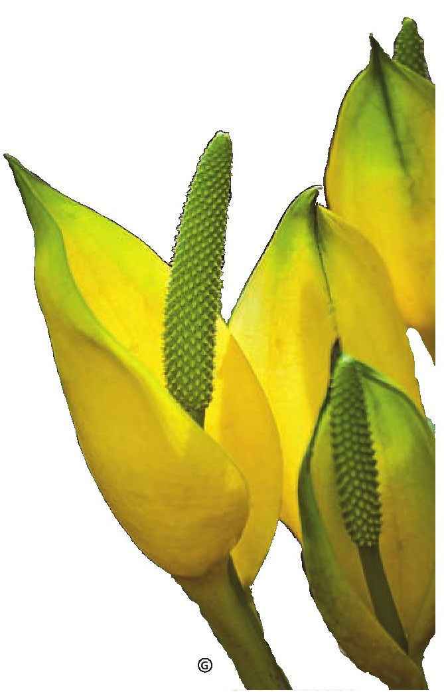
佛焰苞

面对这一系列的问题，科学家通过不懈的研究终于有了初步的解释。首先，科学家发现在臭菘体内存在着一种叫乙醛酸体的特殊结构，具有从事化学能转化的功能。当臭菘植物体内的脂肪转变成碳水化合物时，随同释放出的能量就可以被花朵中的“发热细胞”利用，并产生热量。

臭菘花朵内有了充裕的热量，就能大大加速花香四溢，对甲虫、飞蛾一类的“传粉使者”有极大的诱惑力。更重要的是，极地气候寒冷，而昆虫的肌肉在很低气温时难以正常工作，例如蜜蜂在低于15℃的环境中飞行就不太灵活。这时，发热的花朵无疑像一间间小温室，引诱昆虫前来“寄宿”。可以想象一下，每当金龟子在寒冷的夜晚蹒跚独行时，如果遇上一间“花房温室”，自然会毫不犹豫地进入。

但目前令科学家困惑的是，另外一些生长在热带地区的臭菘，也具备花朵发热的本领，它们发热的生物学意义又是什么呢？（纪再思）

## 向日葵总是面向太阳吗

在绝大多数人的概念中，向日葵总是追踪着东升西落的太阳，天天如此，周而复始。但事实果真如此吗？其实，只要你有足够的耐心，日复一日地仔细观察，就会发现一个秘密：在向日葵绽放初期，花盘的确进行着向阳运动，其叶子和花盘在白天追随太阳从东转向西。只不过，这种跟随有一定的时间差。根据测量，花盘的朝向落后于太阳大约12°，转换成时间差不多是48分钟。等到夕阳西下，向日葵的花盘又慢慢往回摆，在大约凌晨3点时，再次朝向东方等待太阳升起。

至于向日葵为什么会跟随太阳运动，植物生理学家早就给出了解释，那是它花盘中生长素分布不均匀所导致的。在阳光的照射下，生长素在向日葵背光一面含量升高，刺激背光面细胞拉长，从而慢慢地向太阳转动。在太阳落山后，生长素重新分布，又使向日葵慢慢地转回起始位置，也就是东方。

向日葵

但是，当向日葵完全盛开之后，就停止了向日运动，并且固定地朝向东方。为什么向日葵不再朝着其他方向？科学家认为，这可能是自然选择的结果。原因是向日葵的花粉害怕高温，如果温度高于30℃，就容易被灼伤，因此固定朝向东方，可以避免正午炽热阳光的直射。此外，花盘在清晨接受阳光沐浴，有助于蒸发在夜晚时凝聚的露水，从而降低霉菌侵袭的危害。还有，在清晨阳光的照射下，向日葵花盘会变得比较暖和，有助于吸引昆虫前来传播花粉。（纪再思）

  

**【实验场】**

观察一株刚刚绽开幼嫩花盘的向日葵，看看其是否有向阳运动；再观察一株花盘已经成熟的向日葵，它还会有向阳运动吗？花盘通常处于什么状态？

【微问题】寒冷地区的花朵爱追太阳，炎热地区的花朵是不是怕太阳？

【关键词】臭菘　向日葵　向阳运动

## 为什么植物的叶片会“流汗”

在夏天的清晨，如果你经过遍地小草的绿化地，时常会见到那些小草的叶片上挂满了水滴，仿佛“汗水淋淋”的样子。这种现象很普通，而且大部分人都会随口解释说：叶片上的水滴是露水。这话只说对了一半，叶片上的水滴既可能是露水，也可能是植物自己吐出来的。

叶片向外面分泌水分现象，是植物正常的生理现象，在植物生理学上被称为“吐水”。人流汗是因为太热了，需要通过汗水加速散发体表热量，而植物叶片“流汗”的原因却与根部“喝水”太多直接有关。植物吐水现象常常发生在气温较高、夜晚无风、空气中湿度接近饱和的夏季。因为叶片到了晚上，表面的气孔都关闭了，蒸腾作用受到了抑制，而根系在温热的土壤中依然不停地吸水。在水分有进无出的情况下，或者说在植物体内水分的吸入量大大超过水分的蒸腾量的情况下，体内的水分会越来越多。多余的水分无法通过气孔蒸腾而出，只能通过叶尖或叶缘的水孔分泌出去，结果就形成一滴滴晶莹的水珠。

植物吐的水并非纯净水，里面往往含有一些矿物质和简单有机物，如葡萄糖、蔗糖、有机酸等，但含量都很少，不会造成营养物质的大量流失。

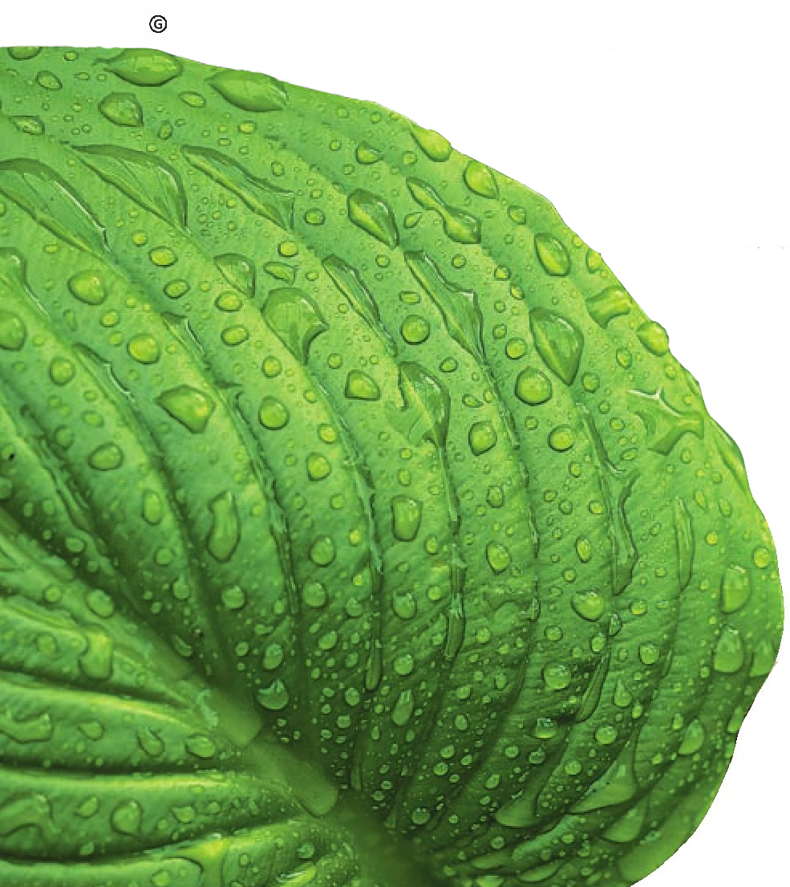
不同植物的吐水量是不同的，即使同一种植物，在不同环境中的吐水量也不一样，地下土壤越是潮湿，吐水的量越多。有些植物的吐水只有几滴，但有些植物的吐水量很大，例如爆竹柳的吐水，有时在白天也滴滴答答地流个不停。尤其在热带雨林中，植物“满头大汗”状的吐水现象随处可见，关键的原因就是雨林中湿度大、温度高。（徐蕾）

## 怎样识别叶片上的露水和吐水

我们已经知道，清晨在叶片上见到的水珠，有可能是露水，也有可能是植物自身吐出的水分，同样都是透明无色的水珠，它们有什么不同？而且，怎样才能区别它们谁是谁呢？

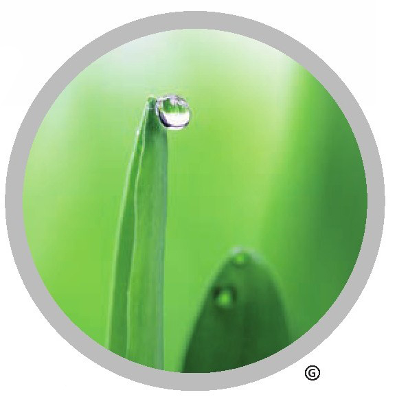
首先，让我们了解露水是怎样形成的。气象学家告诉我们，在晴朗无云的夜间，地面热量散失很快，地面气温的迅速下降使空气含水汽的能力减小，导致大气低层的水汽容易附着在小草或树叶上，并凝成细小的水珠，这就是露水。露水的形成，需要大气较稳定、风小、天空晴朗和地面热量迅速散去的气候条件。如果夜间天空有云，地面就像盖上一条棉被，热量碰到云层后，一部分折回大地，另一部分则被云层吸收，而被云层吸收的那部分热量又会慢慢地反射到地面，使地面的气温不容易下降，露水就难以形成。如果夜间风较大，风使上下空气交流，增加近地面空气的温度，同时又使水汽扩散，露水也很难形成。而导致吐水现象出现的主要条件是湿度大、温度高。

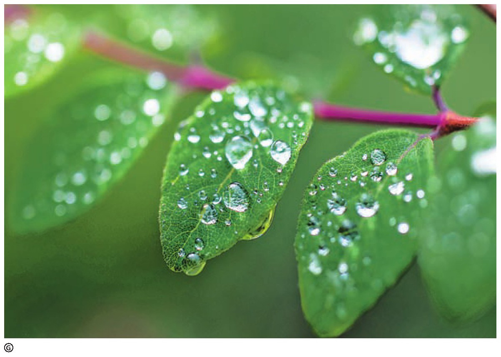
叶片表面的露水

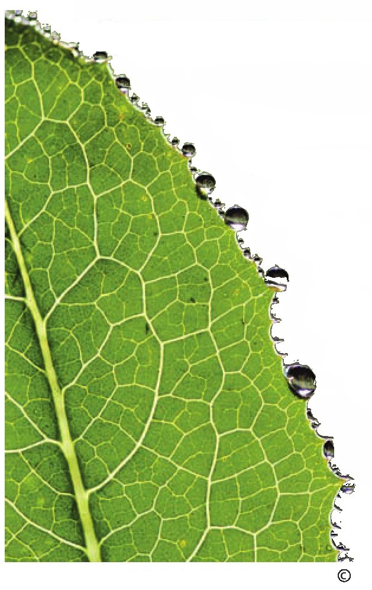
叶片内吐出的水滴

露水和吐出的水看起来很相似，但有经验的植物学家一眼就能辨别。因为露珠可以在叶面的任何地方形成，水滴很小，一年四季都会出现，尤其秋季最常见；而吐出的水珠通常只出现在叶缘和叶尖，水滴也比较大，通常出现在炎热的夏季。当然，露水和吐出的水内的所含成分也有区别，只不过用肉眼无法分辨罢了。（徐蕾）

## 为什么说叶片上有两种“嘴巴”

如果在解剖镜下观察叶片背面，一定会见到不少小孔，好像一张张小嘴巴，它们就是植物叶片与外界的通道——气孔。在有些植物中，除了气孔之外还有另一种小嘴巴似的通道——水孔。气孔和水孔有什么不同呢？它们各自能发挥什么作用呢？

植物学上给气孔的定义是：在叶片（包括茎和其他植物器官）下表皮处的许多小开孔，它是高等陆地植物表皮所特有的结构。它的形状很有意思，小孔的两边有一对半月形的细胞，既像守卫小孔外的两个哨兵，又像超迷你型的上下嘴唇，植物学家给它们起了一个专门的名字——保卫细胞。保卫细胞能随着阳光的强弱，或植物体内水分的多少，来控制气孔开放或关闭。气孔的作用很重要，它是植物体与外界气体交换的通道，也是体内水分蒸腾的出口，而且外界的一些物质也可以通过气孔进入到植物体内，例如喷洒的农药。总而言之，气孔是植物与环境之间的门户。

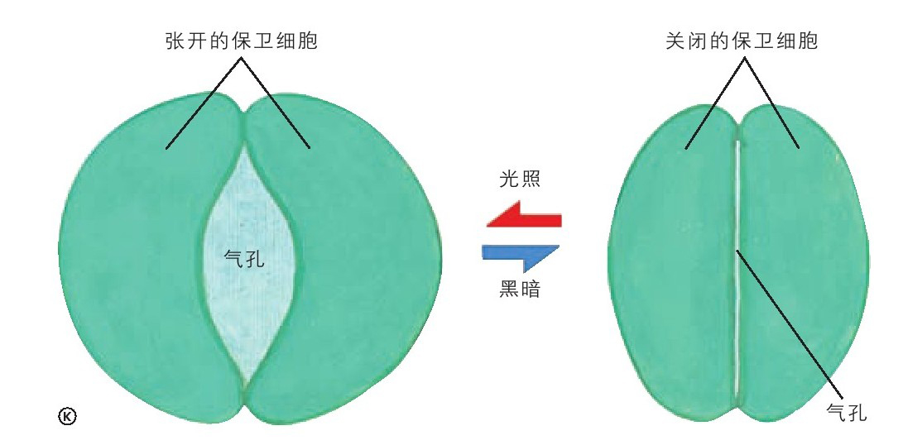

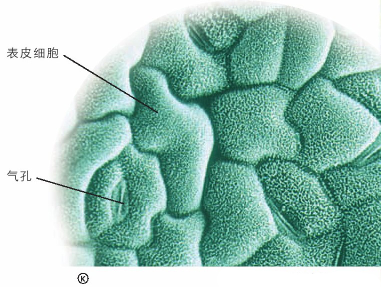
显微镜下的叶片气孔

水孔通常出现在叶缘部位。它们的结构很简单，没有保卫细胞，不会自动闭合，永远处于打开状态。所以当植物吸水过多时，虽然气孔已经关闭，但多余的水分仍能从水孔排出，于是就形成了吐水现象。（徐蕾）

  

**【实验场】**

在阳光炙热、空气相对干燥的晴天，以及在空气潮湿的阴雨天，分别采集同一种植物的叶片，放在解剖镜（高倍的放大镜亦可）下观察它们叶背面的气孔，是否有大小的差别？保卫细胞的形状有什么变化？

【微问题】生活在寒冷地带的植物有气孔吗？

【关键词】气孔　水孔　吐水现象

## 水生植物为什么不会被淹死

植物的生长离不开水，但是对很多陆地植物来说，如果水太多了也会被淹死。这是因为被水淹没的土壤中氧气不足，植物的根部无法从土壤中吸收到足够的氧气，引起缺氧，导致吸收水分和营养物质的能力大大降低，最后植物被“饿死”。但是，我们也看到有很多植物能一直生活在水中，例如出淤泥而不染的荷花，可以当作蔬菜的荸荠、慈姑、茭白，还有长在水底的金鱼藻、苦草等。这些长时间生活在水里的植物为什么不会淹死呢？

那是因为它们已经有了一套适应水生环境的本领。为了应对水中缺氧的环境，水生植物都自备了一套“充氧泵”。如果你仔细观察芦苇、睡莲等的叶柄、茎干和地下茎，会看到横切面上有许多孔，这就是专门用来运输气体的管道切面，称为“通气组织”。这些植物的叶片通常高出水面或漂浮在水面上，通过通气组织，能够使空中的氧气进入叶柄、茎干，再向下扩散到地下茎，这就保证了水生植物的根有充足的氧气进行呼吸。

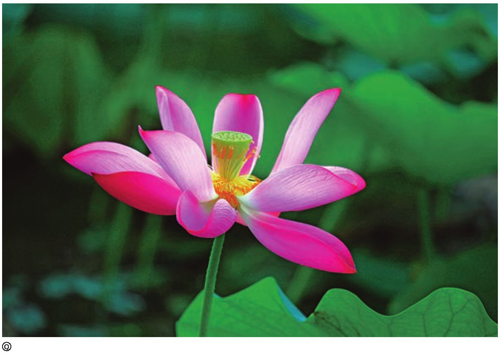
荷花

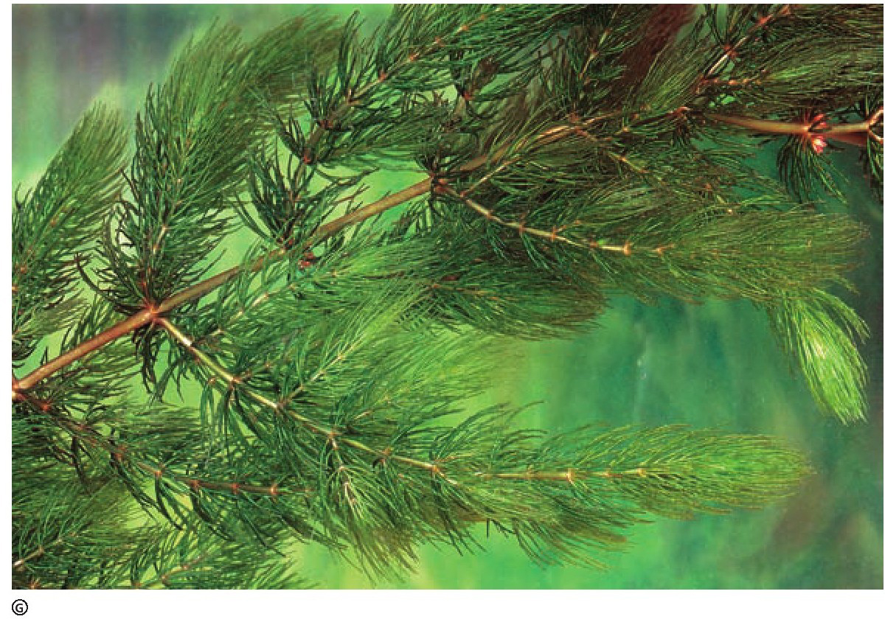
金鱼藻

在水生植物中，还有一些种类的身体全部沉在水面以下，如金鱼藻、苦草等。它们既没有高出水面的“出水叶”，也没有浮于水面的“浮水叶”，那它们又是怎样存活的呢？研究人员发现，沉水植物的叶片又细又柔软，例如金鱼藻的叶子为丝带状，宽度不足0.5毫米，这有利于它们高效率地利用水中有限的阳光和空气进行光合作用。金鱼藻的茎叶里还有许多孔洞，这些孔洞可以用来储存水中的空气，也可以存放光合作用时产生的氧气，供给植物进行呼吸和生长。（邓泓）

  

**【微博士】**姜片虫卵

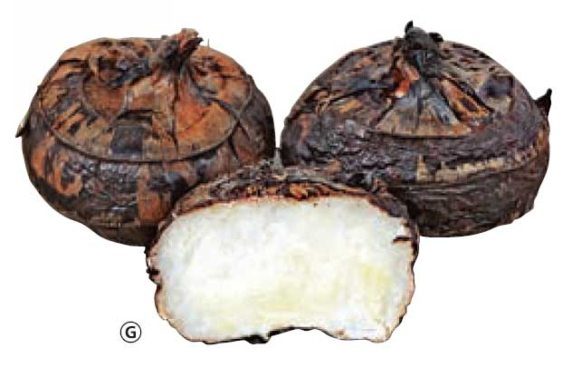
荸荠

许多可食用的水生植物中，如莲藕、荸荠，经常携带着一种叫作姜片虫的寄生虫卵。所以人们在食用这些美味的水生植物时，一定要煮熟，不能生吃，否则很容易感染姜片虫病，引起腹痛、腹泻、消化不良等病症。

## 为什么说菱是“有生命的锚”

吃过菱的人都知道，虽然里面的果肉好吃，但果肉外有一层硬壳，壳上还长着2个甚至4个锐利的尖角，“菱角”也由此而得名。有人说，菱的硬角是为了保护果实不被吞食。其实，它还有更重要的生物学意义呢。

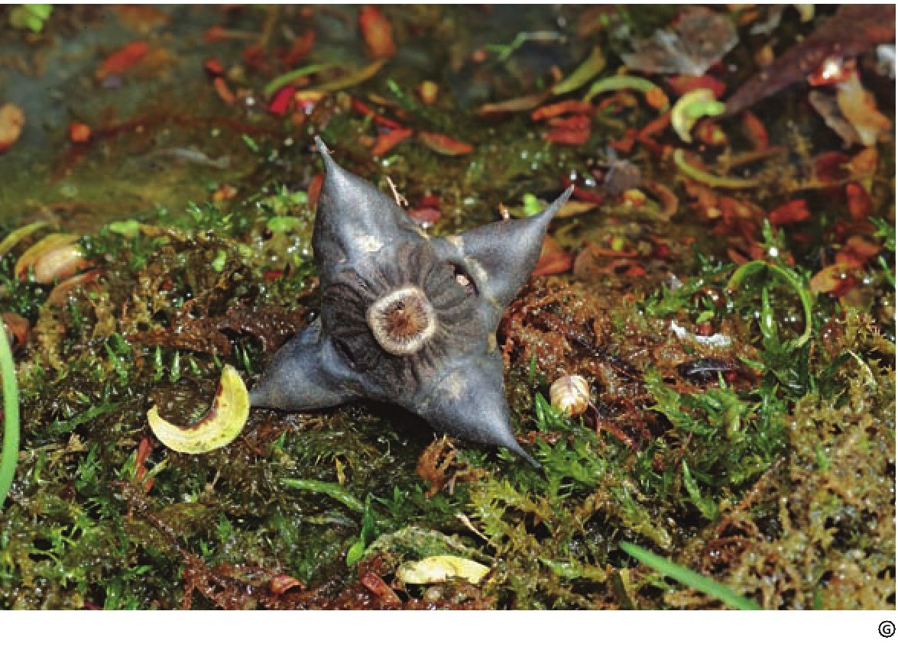
菱

每年秋季菱角成熟以后，果实就会落到水底。菱角外面的这层坚硬的壳就像盔甲一样保护着里面鲜嫩的果实，防止被鱼或水鸟吃掉，同时也能抵御病菌的侵害，这样就可以安然越冬了。硬壳外面的尖角还担负着另一重要任务，那就是固着作用。如果菱的果实没有尖角，成熟脱落后就会随着水流“四处漂泊”，没有办法找到一个稳定的“家”，这样，菱就很难生根发芽长出新的个体。而菱的果实恰恰有这些锐利的尖角，就像铁锚一样，使菱角能顺利地在底泥里“安营扎寨”，静等来年春天繁殖成新植株。所以，很多人都将菱角昵称为“有生命的锚”。（邓泓）

## 水毛茛为什么长两种叶片

哲学家莱布尼茨曾经说过：“世界上没有完全相同的两片叶子。”的确，在丰富多彩的自然界，想要找到两片绝对相同的叶子是不可能的，但对大部分植物而言，同一株个体的叶片外形上并没有多大差别。可是，自然界还存在一些“特别”的植物，在同一株植物上，会生长着两种形状完全不同的叶片！水毛茛就是这些特别植物中的一员。

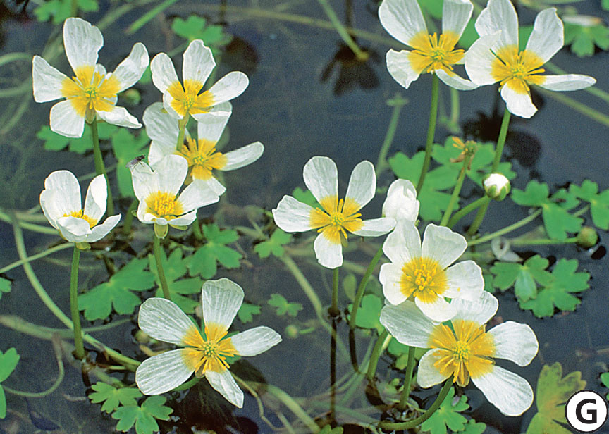
水毛茛

水毛茛是一种小型水生植物，身体半浮半沉，浮在水面上的叶子是宽阔的五边形或者手掌形，而沉在水中的叶子则变成了细细的丝状叶。为什么在同一种植株上叶子的长相差距会这么大呢？植物形态学家告诉我们，同一株水毛茛上的叶片形状出现差异是植株长期适应水上和水下两种不同环境的结果。因为水里的氧气比水面上要少得多，为了获得更多的氧气，水毛茛就将水里的叶片变异成丝带状，这样能增加叶片吸收氧气的面积，从而使生长在水下的叶片也能够正常进行光合作用。而且，开裂的丝状叶在水下也能减小对水的阻力，防止被水流冲走。（邓泓）

  

**【实验场】**

水生植物分为挺水植物、浮水植物、沉水植物三类。挺水植物的根生长在水的底泥之中，茎、叶挺出水面，例如荷花、芦苇等。浮水植物的植物体漂浮在水面之上，例如凤眼莲、浮萍等。沉水植物的植株体都在水下，例如金鱼藻、眼子菜、苦草等。观察一下周围水中生长的植物，它们分别属于哪一类。

**【微博士】**监测水污染

以色列科学家发现了一种监测水污染的新方法——“听”水生植物发出的“声音”。这种检测水质的方法原理很简单，只需用一束激光照射浮在水面的藻类，然后根据藻类反射的声波，就可以分析出水中的污染物类型以及受污染的程度。

【微问题】水生植物能在陆地上生存吗？

【关键词】水生植物　菱　水毛茛

## 高山植物为什么都爱“趴在”地面

经常登山的人会发现一个很有规律的现象，那就是越往山顶攀登，那里的植物就变得越矮小。即使是同一种植物，在山顶山脚两处也会有很大的身高差别，而山顶的必然是矮个。如果继续往上，到达海拔三四千米的高原上，那儿的景观变得更有趣，不仅见不到高大挺拔的树木，而且几乎所有的高原植物都“趴在”地面上生长，有的像莲座，有的在地面上形成半球形，有的竟像一个个伏地而卧的小乌龟。当很多“趴地”而生的植物簇拥连成一片后，远远望去就像一块毛茸茸的垫子，因此，生态学家给高山植被起名叫“高山草甸”。

高山植物之所以和地面植物有如此大的不同，当然与周围环境有很大关系。首先是阳光，不同颜色的光对植物的生长有不同的作用，其中紫外线就是抑制茎干伸长的元凶之一。我们知道，高山上空气十分稀薄，缺少厚厚的大气层当“被子”，到达地面的紫外线就特别强烈，由于日光中紫外线中的UV-B波段的光（波长275～320纳米）能严重抑制植物生长，所以高山植物变成“矮子”也就不奇怪了。

科学家在进一步解释UV-B时说，植物的光合作用不能利用光谱中所有波长的光，只有可见光区域的部分辐射可利用，它占总辐射的40%～50%。可见光中的橙红色光是被叶绿素吸收最多的成分，其次是蓝紫色光，绿光则很少被吸收。此外，蓝紫光、紫外线等短波光有利于蛋白质和有机酸的合成，促进花青素的形成，但却抑制茎的生长，因此高山植物想要长高就很困难了。

植物的生长还需要营养，而高山上土质疏松，地势陡峭，土壤中的营养物质大都被雨水冲走，植物得不到充足的养分，“营养不良”自然也会导致个头长不高。另外，气温和海拔存在着反比关系，海拔越高，气温越低，大约海拔每升高100米，气温会下降0.6℃，因此高山上的气温往往很低，低温对植物生长也是不利的，所以植物生长就非常缓慢了。

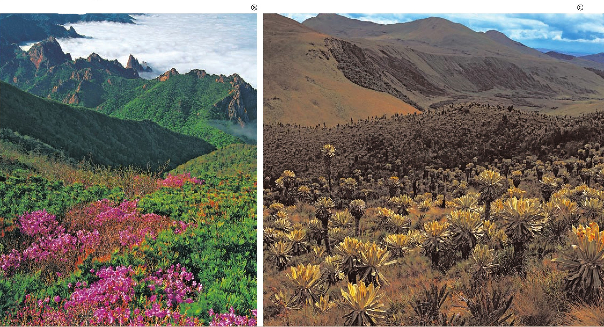
海拔3000米以上的高原植物

高山另外一个重要的特点就是风大，为了防止植物被风吹倒，植物的茎都向缩短的趋势发展，这是植物对高山环境的一种适应。在这样的条件下，即使是原本可以长得高大魁梧的植物也不得不屈服于高山的恶劣环境，委曲求全地矮化自己，以减少高山大风的侵袭危害。因此，在海拔超过4000米的高山上，大部分植物的“身高”都不足20厘米，偶尔在较深的山谷里能见到超过1米高的植物，这已经算是高山中的“巨人”了。

高山植物长得矮小并非坏事情，相反还带来不少好处。例如，低矮的植物有利于保温，许多高山植物匍匐成垫状，其实就是一种非常有效的保温办法。这些垫状的植物簇拥在一起，就像一块太阳能聚热板，直接吸收阳光中的热量，以保持体温，躲避严寒。科学家曾经测定过这些“垫子”的温度，惊奇地发现它比周围的气温高出好几度。矮小的植物使它的抗风能力也大大增强，所以尽管高山上风很大，这些植物仍能岿然不倒！（邓泓）

## 树木为什么变成了“旗形”

如果你是一个善于观察自然的旅游者，当你登上某些较高的山峰，或者来到劲风疾吹的海边，就会观察到那里树木的一个有趣现象：树木的形状怪怪的，不像正常树木那样从四周长出枝叶，组成一个圆形、椭圆形或圆锥形的树冠，而是树干的一边有正常的枝叶，而另一边则几乎没有，整株树木看上去就像一面飘扬的旗帜，因此在生态学上称为旗形树。

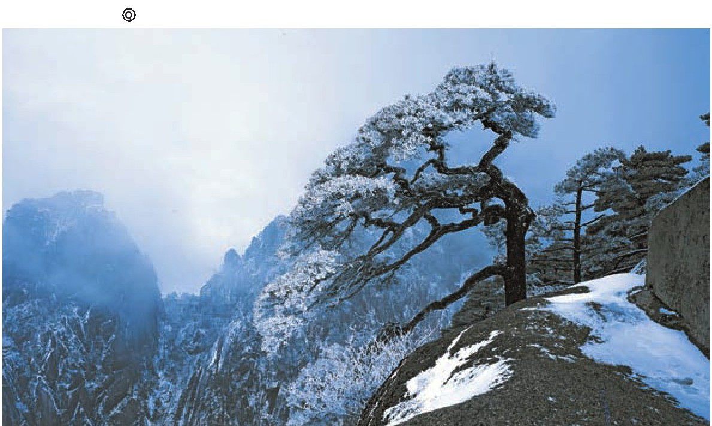
为什么旗形树形状会变得如此奇特？其实道理很简单，在一些具有固定风向的地区，如高山、海岸等，生长在那儿的一些树木由于经常遭受固定方向强风的吹袭，对着风的那一面树干的芽体受到强风吹袭而损坏，或者水分过度蒸发而导致死亡。因此，面对风向的树干部分就不容易长出枝条，而背风面的芽体则因受风的影响较小而存活较多，相对会长出多一点的枝条。

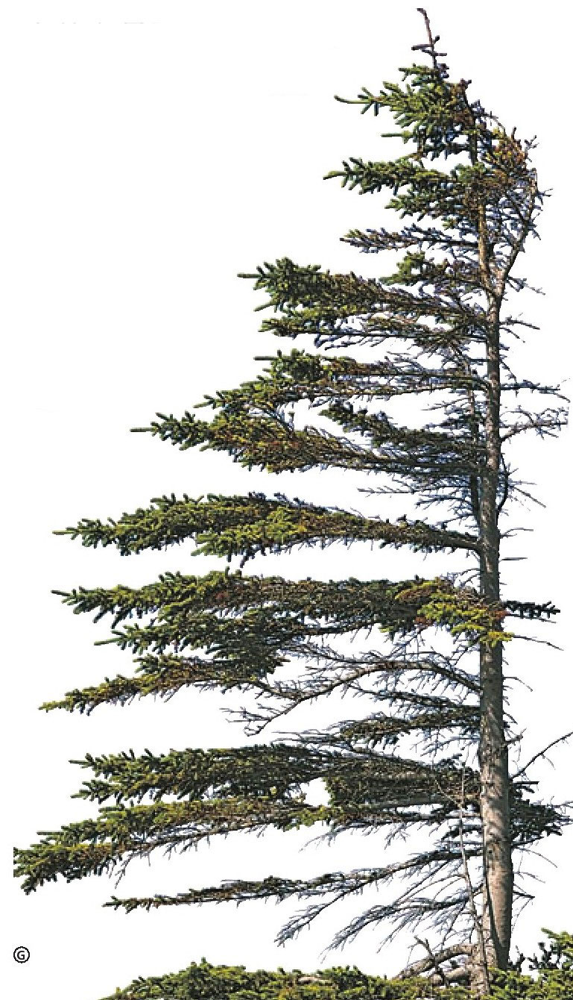
旗形树

也有的树木，它的向风面虽然能长出枝条，但这些枝条因受风的压力影响而弯向背风的一侧，使植株变成了旗形。

旗形树不仅会出现两面枝条数量不一样，就连树干也常常出现畸形。如果把旗形树的树干切出一个横切面，观察它的年轮，就能发现向风一侧的年轮间距很窄，而背风的一侧很宽。造成这种畸形是因为向风面受到的压力大，缺少树叶，营养不足；而背风面则相反。我们根据旗形树树冠的朝向，就可以知道这里的常见风是什么风向。（杜云）

  

**【微博士】**高山草甸

高山草甸又称高寒草甸。在寒冷的环境条件下，发育在高原和高山的一种草地类型。其植被组成主要是多年生草本植物，以及少量小灌木。群落结构简单，层次不明显，生长密集，植株低矮，有时形成平坦的植毡。

【微问题】植物是怎样“爬”到高山上去的？

【关键词】高山植物　旗形树　高山草甸

## 树干被冻裂的树为什么还能活

生活在北方或高寒地带的人们，常常会在冬天的早晨看到被冻裂的树干，到中午气温逐渐升高后，里面还有汁液流出。如果土壤水分状况好的话，只会短时间出现树叶萎蔫，多数树木并不会因此死亡。

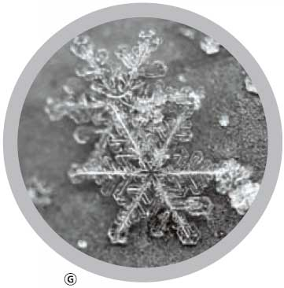
这是因为，冰只凝结在细胞之外，也就是说在细胞壁和由死细胞壁组成的输导组织中，那里汁液中的水相对自由，有毛细作用和渗透作用，但没有对流移动，而且细胞内的原生质和液泡没有冰晶形成。细胞原生质内有许多细胞器，它们都有非透水的生物膜，能将内部的水分子与外界隔开，无法自由移动。细胞的液泡内储存了许多浓度很高的亲水蛋白质、代谢物质和离子，水分子同样也受到了束缚。

看一看雪花漂亮的六角形晶体结构，就能见到其中水分子是如何排队守秩序的。在它们的中心都有一个称作晶核的杂质颗粒，它们结成冰也一样需要这样的晶核。植物细胞外汁液的水在冰点以下就会排起队来结成冰，而被生物膜隔离开的细胞质和液泡中的水分子，则已经排在了其他分子外面，也就不易结起冰来。这就是树皮韧皮部活组织的情况。

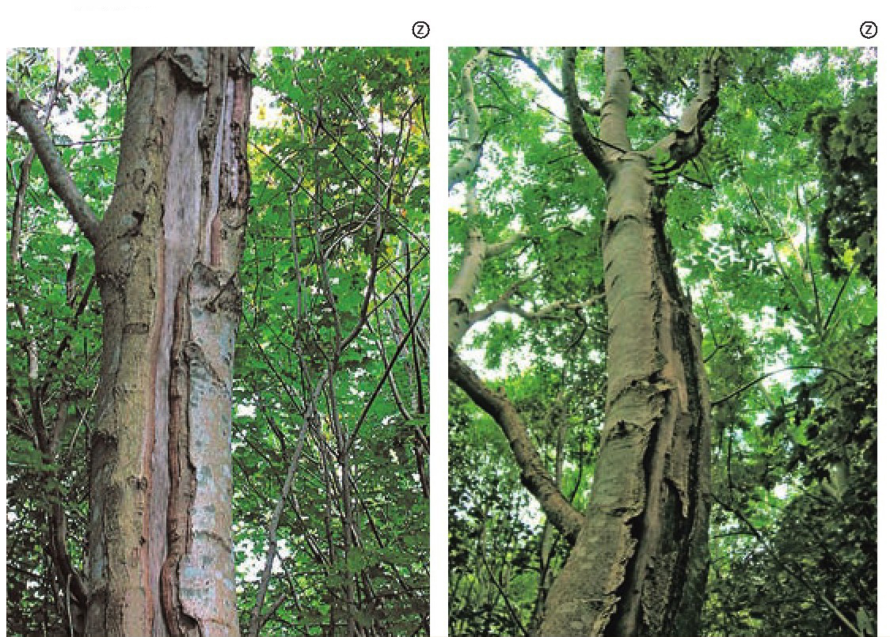
被冻裂的树干

冰晶

冬天夜间树干被冻起来的时候，细胞外汁液中的部分水分子结成了冰，留下的汁液就会变浓，引起细胞内的水分子通过细胞膜质上的水通道流向细胞外，继续参与冰晶的扩大。水分子从液泡流向细胞质，再流向细胞外，一定时间后，细胞质膜多数部位就会与细胞壁分离开来，形成质壁分离。这时细胞虽然还活着，但需要忍受特别高溶质浓度的盐害。白天升温后，细胞壁外的冰慢慢地融化，汁液被稀释，水分子就流回了细胞质，再流回液泡，不再质壁分离，恢复正常状态，而且每个昼夜都能如此循环往复。如果细胞质膜经不起这样的折腾，细胞就会被机械力撕裂而死亡。树干被冻裂后，如果根系能补充到这个过程中损失的水分，树皮活细胞可能通过代谢作用慢慢修复所产生的伤害。（苏维埃）

## 在抗冻前植物需要做哪些准备

秋天气温低于15℃时，植物启动了过冬的准备，那就是不让晶核出现和降低冰点浓度。

许多年来，农业生产中为了防止植物霜冻伤害，常采用放烟雾方法让冰晶结在空气中而不结在叶子表面，十分有效。科学家发现，植物表面普遍存在一种细菌，可以成为晶核，于是在20世纪60年代培养出一个新型变种，这个变种不会形成冰核，从而阻碍它们被当作晶核，在农业生产中大获成功。

有些植物有自己的办法，能在它们的叶面分泌一种被称为抗冻蛋白的奇妙蛋白质。这种蛋白质首先在极地海洋鱼类的血液中被发现，它不仅让水的冰点下降，还可以让水分子在它们的周围有序地排列起来，只形成二维而不是三维的冰晶。科学家猜测，这也许就是极地海洋鱼类的血液冻不起来的原因。后来，在燕麦的叶面上和植株体内也发现了有类似结构的分子蛋白，据猜测它们能阻止叶面的冰晶通过气孔扩展到叶片组织内。

有些植物为了降低细胞内外的溶液冰点，在液泡里积累较多的钾离子、钙离子、抗氧化物质、糖分、淀粉、亲水的氨基酸、亲水的蛋白质等。细胞还向细胞壁分泌很多物质，调节细胞壁中溶液状况。例如著名的加拿大枫糖，就是在秋天积累大量淀粉在树皮中防冻，到春天转化成的蔗糖。

秋天，植物也在细胞质膜和所有生物膜中增加不饱和脂肪酸的组成，改善它们的弹性和流动性，有利于经受昼夜冻融引起的质壁分离的折腾，尽管这些准备让植物付出减缓生长繁殖速度的代价。有时秋天气温冷热反复无常，在植物还未做好准备时降温冰冻突然来临，植物就会受到空前的严重伤害。

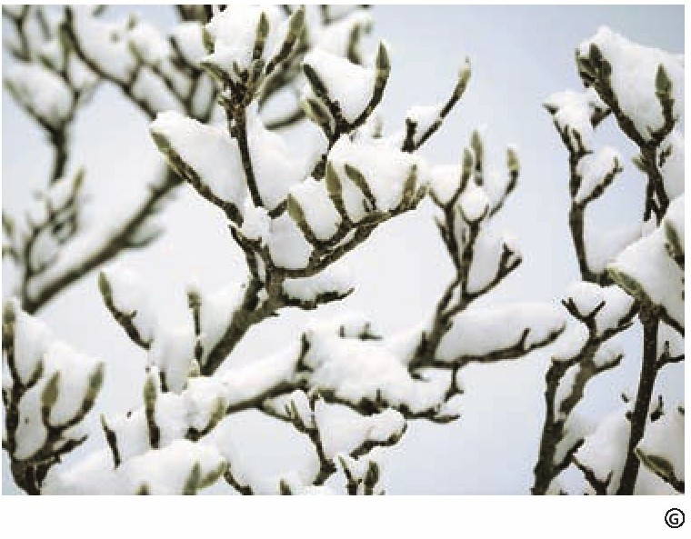
冰晶是水汽在冰核上凝华增长而形成的固态水成物，细胞外小冰晶能不能变大要看细胞壁是否可被压缩。草本植物细胞壁里纤维素多，木质素少，小冰晶很容易合并成大冰块，所以它们的抗冻能力较差。一般的北方树木，冰晶会在树皮和树芯之间合并成冰块，冰块过大可能将树皮冻裂。在西伯利亚有些树木，有特别多木质素的坚硬细胞壁，它们干脆不给小冰晶合起来冻裂树皮的机会，因此能在-60°至-50℃下生存。

此外，能在植物组织里找到冰块的地方是休眠花芽外的基部。在苹果、梨和桃树的整个休眠花芽内部的水分有耐寒的本领，在-20℃，甚至-40℃也不会形成冰晶，这被称为器官过冷现象。在严冬，树干冻裂，果树上的休眠花芽却避免了结冰的伤害，确保了来年春天树木开花结果。（苏维埃）

  

**【实验场】**观察水或溶液的过冷现象

找一个干净的饮水瓶。在盖上钻个孔插入一个能显示零摄氏度以下数字的干净温度计。用净水冲洗两次以上。用密封剂（如硅胶）密封温度计和瓶盖的间隙。在这个瓶子里倒入蒸馏水，水面浸没温度计球部。旋上盖让瓶子静止一天，轻轻地把它放到冰箱冻格里，确保可以看到温度计上的数字。在冰箱里静止几个小时，其间不时检查温度，不要以任何方式移动或搅拌瓶子。

如果一切顺利，水会冷却至低于0℃还没结冰，这也就是水过冷了。将这个瓶子取出，轻轻放上桌子，瞬间摇一下（不超过一秒钟），这时水会突然冻结成固体。

你会同时注意到，这时水温上升了。这怎么可能？为什么？

【微问题】南方的植物不能在北方生长，是不是因为它们体内缺少抗冻蛋白？

【关键词】冰核　冰晶　抗冻蛋白

## 柽柳为什么不会被咸死

中国大西北有很多盐碱地，那是令绝大多数植物感到可怕的地方。因为土壤中含有太多的盐碱，导致植物无法从盐碱土中吸收生存所必需的水分，最终将渴死；如果植物将含有大量盐碱的水分吸收入体内，最终也将被咸死。但是，盐碱地也并非不毛之地，植物界中有一类耐盐碱植物柽柳，就是盐碱地区常见的一种植物。

柽柳又叫三春柳，是一种落叶小乔木，外形和垂柳有几分相似，细软的枝条倒垂而下，但叶片却很小，如同柏树的鳞状小叶。如果你近距离观察柽柳，就会发现它的茎叶上有一粒粒白色的结晶，将结晶放入嘴里尝一尝，马上会感到又咸又苦。这些结晶究竟是什么呢？原来，柽柳的根在从盐碱土中吸水时，同时也吸入了大量的盐碱，如果这些盐碱物质都积累在体内，植株肯定受不了，但柽柳却有特殊的抗盐碱器官泌盐腺。用放大镜观察，就能发现柽柳的茎叶上密布着泌盐腺，它们是由表皮细胞和分泌细胞组成的，其主要功能就是用来排除盐分。泌盐腺可以把植株体吸入的过多盐分，通过分泌的方式排出体外，附着在茎叶表面，利用风将其吹掉，或者利用雨水冲淋，让盐分重新回到土壤中。

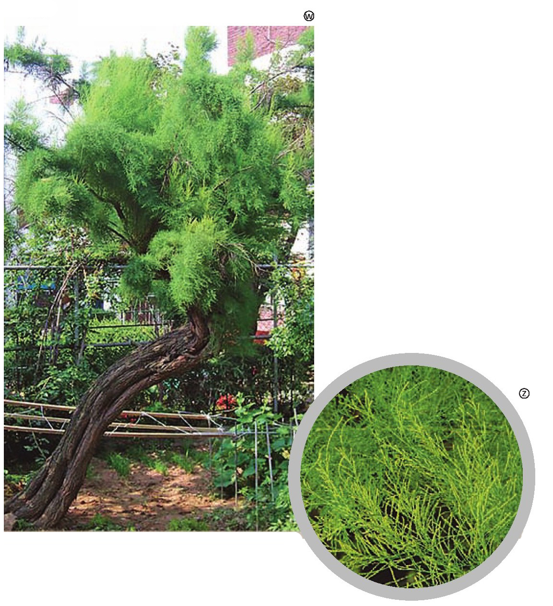
柽柳

除了柽柳之外，还有一些植物采用别的抗盐碱方式。例如盐角草细胞的原生质耐受盐的能力特别强，也就是说它的细胞质浓度特别高，能吸收土壤中高浓度盐碱含量的水分。还有一类不透盐性植物，它们的根细胞对盐类的透过性非常小，几乎不吸收或很少吸收土壤中的盐分，但这一类植物通常只生长在盐渍化程度较轻的地区。（杜云）

## 为什么胡杨被称为“沙漠勇士”

提起沙漠，有人就会联想到干燥酷热、风沙肆虐、见不到生命踪迹的景象。可是，沙漠的环境尽管十分恶劣，却也有植物能够在那里顽强地生存。

在中国西北的新疆沙漠中，生长着一种叫胡杨的神奇树木，被誉为“生后千年不死，死后千年不倒，倒后千年不朽”。众所周知，沙漠里干旱缺水，盐碱度高，早晚温差大，狂风吹过，飞沙走石，一般的植物根本无法生存。而胡杨为什么有“千年不死”的本领呢？

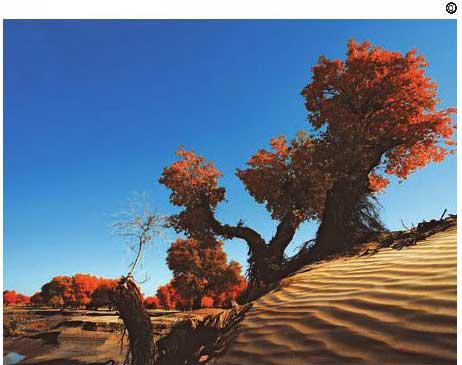
胡杨

胡杨之所以能在沙漠中生存，首先得归功于它特别发达的根系。为了获得足够的水分，胡杨的根系能深入到10米多深的地下水层。而且，胡杨树很“团结”，它们的根通常会盘根错节地连成一片，即使有的根吸收不到水分，也能从其他树木那里得到分享。胡杨还有一套储存水的本领，一旦碰上雨季，胡杨的树干可以把从根吸收上来的水贮存起来，为以后的长期干旱做准备。曾经有学者测试过，在胡杨树干上钻一个孔，就会有大量的水喷涌而出，甚至可以射出1米之外！这足以说明，它的储水能力有多强大！除了快速吸水、大量储水，胡杨还特别能“节约用水”。例如，它的细嫩枝叶上长满了毛，这样的结构可以有效地保持体内水分不易被蒸发。

另外，胡杨还有一项“绝技”，就是不怕盐碱。它能通过树干或树叶，把多余的盐碱排出来。折断胡杨的树枝，从断口处流出的树液很快会变干成为白色的固体，这就是人们常说的“胡杨泪”。

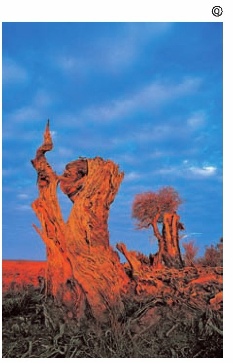
死后千年不倒的胡杨

沙漠昼夜温差大，白天太阳直射时气温达40℃以上，而夜里又降到-30℃以下，这种高温和低温相交替的环境使得胡杨的寿命比一般的树木要长，加上其惊人的抗干旱、御风沙、耐盐碱的能力，顽强地生存于沙漠之中，阻拦风沙，保护农田，像威武的勇士守卫着自己的家园，因而又被人们赞誉为“沙漠勇士”。（邓泓）

## 雪莲为什么不会冻死

在海拔4000米左右的天山上，除了终年不化的积雪，就是呼啸而至的寒风，气温终年在0℃以下。如此恶劣的环境中，几乎看不到生命的迹象，只有雪莲却能够无惧严寒酷冷。雪莲属于菊科植物，个头不高，矮矮地趴在地上，淡绿色的叶片紧紧簇拥在一起，外面还包裹着厚厚的一层白色绒毛，硕大的花朵晶莹淡雅，如莲花一般，因此人们常称它为“雪莲花”。

雪莲

为什么雪莲在终年冰雪的地方不会冻死？植物学家从形态特征和生理特征两个方面加以解释。雪莲之所以能适应高山严酷环境，首先是它的外表结构，由于雪莲浑身披着厚厚的白色绒毛，其作用如同动物的皮毛，既能防寒，又能保湿，还能反射掉一部分高山强烈的阳光辐射。除此之外，雪莲生来矮小，身高仅几十厘米，这种低矮的外形不仅使雪莲在凛冽的寒风中纹丝不动，还有利于保持体温。更重要的是，科学家发现雪莲的细胞含有高浓度的糖分、蛋白质和脂质。众所周知，液体中的糖分浓度越高，冰点便会越低，高浓度的糖分、蛋白质和脂质可以使雪莲细胞液的结冰点降低，防止雪莲被冻坏。如果温度继续下降到低于细胞液的结冰点时，雪莲又会启动另一套抗冻的办法。这时，雪莲细胞内的水分会渗透到细胞外，并结成一层薄薄的冰保护层，避免细胞受到伤害。当天气转暖时，细胞外的薄冰融化成水，细胞吸水后又恢复到原来的状态。雪莲就是靠这种抗寒的机制，能在零下几十摄氏度的严寒中傲霜斗雪、顽强生长。

目前，水果市场上出现了一种“雪莲果”，宣称地上开雪莲花，地下结雪莲果。其实，它只是从南美洲引进的一种菊科植物的块根，确切地应称为菊薯，与雪莲毫无关系。（邓泓）

  

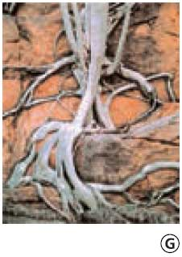
**【微博士】**树根冠军

世界上根长得最深的植物，出现在南非奥里斯达德附近的回声洞。那里有一株无花果树，估计它的根深入地下有120米！

【微问题】胡杨的抗旱本领那么大，为什么没有在沙漠中大量栽培胡杨林呢？

【关键词】柽柳　胡杨　雪莲

## 小蚂蚁为什么誓死捍卫大树

在南美洲巴西的森林里，科学家发现了一个有趣现象：在一株桑科植物上，有许多小蚂蚁穿梭不息，突然，几只个头巨大的大蚂蚁爬上了这株植物，于是，一场空前激烈的蚂蚁大战打响了。小蚂蚁虽然力小体微，但是它们个个奋不顾身、前赴后继，根本不在乎自己的生死，只是一个劲疯狂地围攻侵略者。面对如此不要命的攻击，大蚂蚁不敢恋战，只好灰溜溜地逃走。

动物之间发生战争并不奇怪，奇怪的是，小蚂蚁和大蚂蚁之间没有直接的利害冲突，或者说，没有任何迹象表明大蚂蚁对小蚂蚁的生命产生了威胁，而且小蚂蚁也没有丝毫想围捕大蚂蚁当作猎物的意思。究竟是什么原因导致小蚂蚁舍生忘死去赶走大蚂蚁侵略者呢？难道是为了地盘之争？想到这儿，一位科学家尝试着用胳膊靠了一下植株体，结果，小蚂蚁马上像发了疯似的倾巢而出，向胳膊发起猛烈进攻。

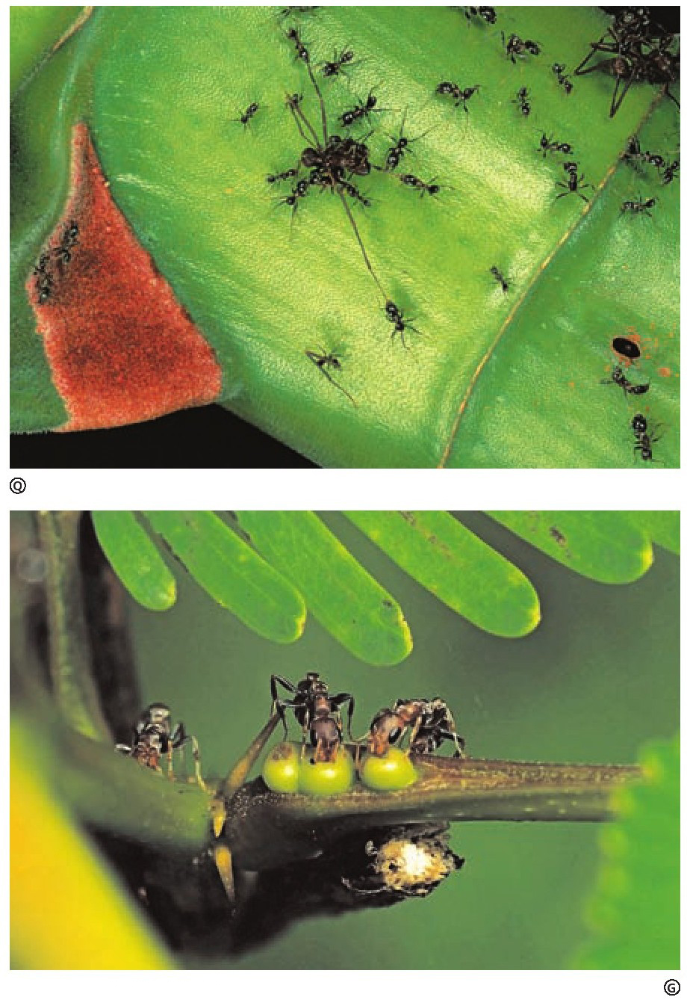
蚁栖树叶柄处的“果子”

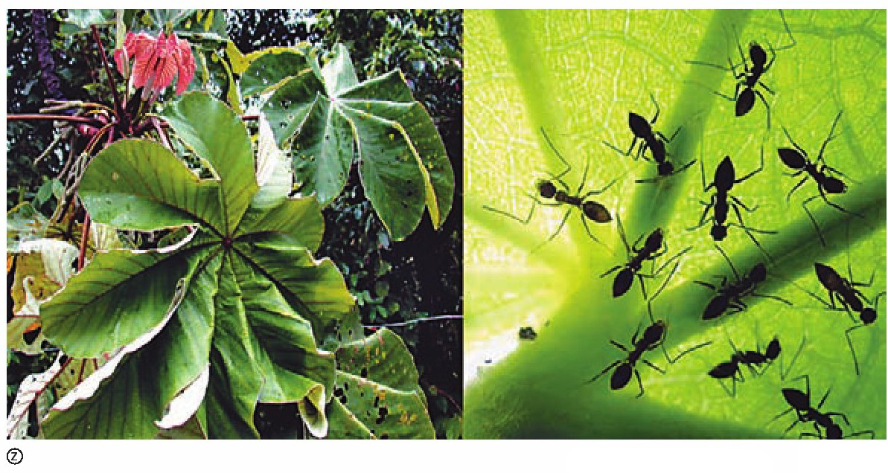
蚁栖树和树栖蚁

科学家通过对小蚂蚁长期观察研究后，终于找到了小蚂蚁誓死抵抗侵略者的原因。原来，这种小蚂蚁叫阿兹特克蚁，绰号“树栖蚁”，世世代代与一种桑科植物相依为命。有趣的是，这种桑科植物的名称和小蚂蚁的绰号三个字一样，只不过字的顺序倒过来了，叫蚁栖树。而科学家见到的那种大蚂蚁则是以树叶为生的切叶蚁，特别爱啃食树叶，如果任其大嚼大啃，蚁栖树的悲惨命运可想而知。但树栖蚁如此舍命帮助蚁栖树，它又能得到什么回报呢？答案就在蚁栖树的形态结构之中。

蚁栖树长得直而匀称，树干中空有节，像竹子一样。中空的树干简直就像是为阿兹特克蚁量身定做的绝佳住所，里面有许多“房间”和通路，能维持一定的空气流通和“室内”的凉爽。蚁栖树不仅为阿兹特克蚁提供了理想的住所，而且还为它们提供了免费的食物。原来，在蚁栖树掌状叶的叶柄下面，长着一种超迷你的微小果子，只有芝麻般大小，但小果子却富含脂肪和蛋白质，口味绝佳，营养丰富，是阿兹特克蚁最爱享用的美味。

现在一切都清楚了，蚁栖树就是阿兹特克蚁最温馨的家，不仅有舒适的居室，更有可口的食物供应。为了保卫自己的家，阿兹特克蚁勇敢地充当起蚁栖树的卫兵，昼夜不停地巡逻，帮蚁栖树赶走要命的切叶蚁，并精心地消除树上有害的毒菌，甚至还会帮蚁栖树啃掉讨厌的攀援植物。不仅如此，阿兹特克蚁的排放物和尸体腐化的养分，还能作为蚁栖树生长需要的肥料。

在阿兹特克蚁的精心保护下，蚁栖树已经丧失了同类植物所具有的生存能力，所以一旦失去阿兹特克蚁，它就无法生存下去了。蚁栖树与阿兹特克蚁的这种相依为命的关系，就是植物和动物之间的共生关系。（马迁）

## 飞鼠为什么护金钗

在湖北神农架自然保护区，流传着一个“飞鼠护金钗”的神奇故事，故事的主人公可不是江湖上的侠客和公主，而是一对相依为命的动植物朋友。

金钗又名“金钗石斛”，是一种极其名贵的中草药，因其数量稀少，而且大多生长在深山老林的悬崖峭壁上，显得越发珍贵。相传一位药农深入神农架，在翻越了几座大山后，绑上绳索沿一处绝壁攀援而下，终于发现了罕见的金钗。兴奋不已的他拿出工具刚准备采摘，突然一群飞鼠从天而降，以迅雷不及掩耳之势咬断吊绳，药农坠崖身亡。

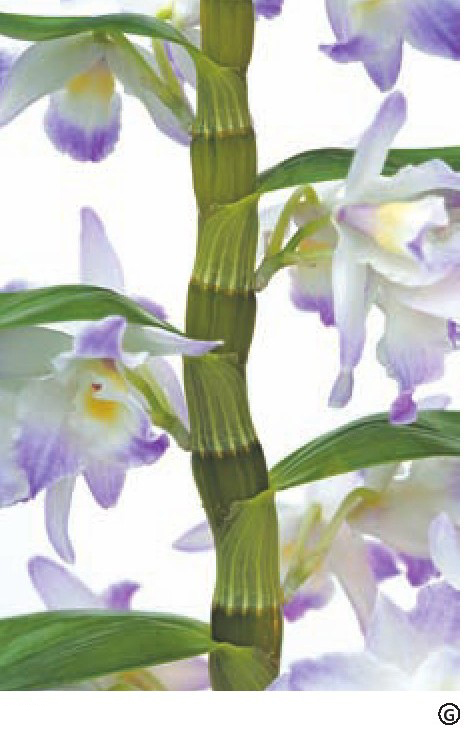
石斛

不必探究这一传说的真假，但飞鼠守护金钗石斛的现象却毋庸置疑，为什么两者之间有如此特殊的“友谊”？科学家经过长时间的观察和研究，终于解开了这个谜。原来，飞鼠的中文名叫鼯鼠，属于哺乳动物啮齿目家族的成员。它的前后肢之间有一层皮膜，当四肢展开时能像降落伞一样，使它能在高山大树间滑翔，因此被当地人俗称为飞鼠。由于飞鼠有个很特别的嗜好，那就是很喜欢金钗石斛所散发出来的气味，所以总是与金钗石斛生活在一起。而金钗石斛同样也需要飞鼠的帮助，因为金钗石斛通常生长在悬崖峭壁之上，除了通过光合作用产生的碳水化合物能量物质外，很难吸收到生长所需的其他营养物质，而飞鼠的粪便恰恰为它提供了极佳的养料。正是金钗石斛和飞鼠有了这种对双方都有利的互利共生关系，所以它们之间的“生死友谊”现象也就很正常了。

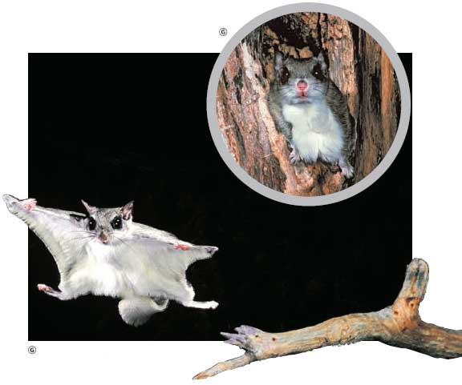
鼯鼠

飞鼠之所以拼命保护金钗石斛，除了“友谊”之外，还因为它具备保护的能力。研究啮齿目动物的专家告诉我们，飞鼠生性凶猛，具有强烈的领地意识，不允许别的动物侵入它的领地，自然更不允许药农带走它的“朋友”。而且，它们的牙齿非常锐利，即便很粗的绳索，也能被它们快速咬断。（马迁）

  

**【微博士】**自然的长笛

有一种非洲产的相思树，蚂蚁会在它那膨胀的棘刺中栖息，并在棘刺上钻出很多孔洞。当风吹过时，这些孔洞便发出悦耳的“笛声”，因此这种会发声的相思树取名叫“长笛”。

【微问题】人类也是共生生物吗？与人类共生的生物有哪些？

【关键词】阿兹特克蚁　蚁栖树　石斛

## 植物有哪些自卫武器

在地球上，各种各样的病菌、昆虫和高等动物每时每刻都在向植物侵袭，但有趣的是，地球上的植物依然郁郁葱葱。这是什么原因呢？其中一个重要的因素是：在千百年的生物进化历程中，许多植物为了能在自然界生存，进化出种种奇特的防身方法。

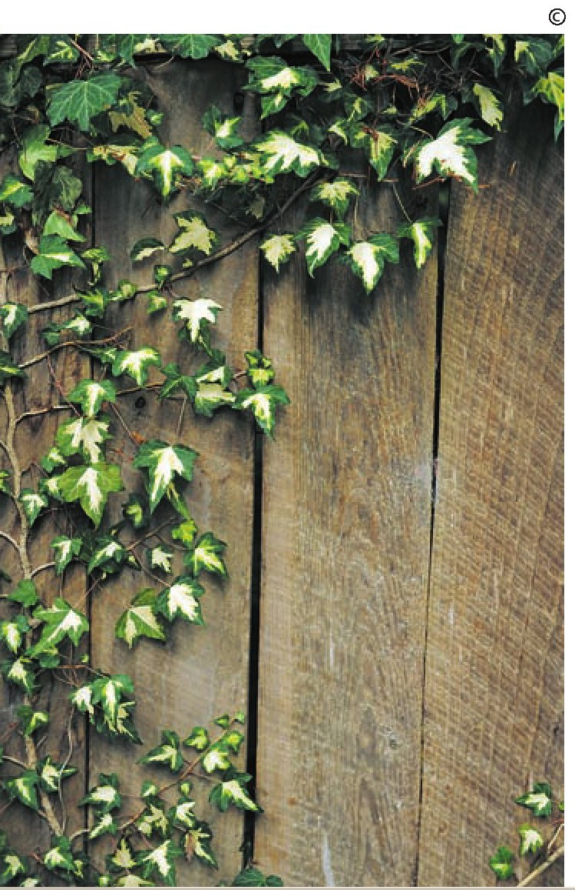
常春藤

植物防身最犀利的武器是体内产生各种各样的毒素，不明真相的动物啃咬之后会感到很难受，甚至丧命。它们的悲剧也是在告诉同伴，千万别碰这种植物。有趣的是，植物的毒素往往不是遍布全身，而常常集中在叶片、果实、花萼等容易受到动物攻击的部位。科学家对大量的植物毒素进行生化分析后发现，它们大多是生物碱或酯类等有机化合物，能给中毒动物带来各种难熬的痛苦。例如，常春藤体内的有毒生物碱，会引起动物皮肤红肿、奇痒难忍。还有亚麻叶和一些蔷薇科植物的种子中含有氢氰酸，能麻痹呼吸和血管中枢神经，动物不慎吞食后，轻度表现为异常兴奋、呼吸急促、腹泻和痉挛，严重的会出现心跳缓慢、昏迷、失去知觉，甚至死亡。金丝桃科的一些植物，还会分泌一种非常奇特的“光敏毒素”，动物一旦误食之后，在遮阴处不会有什么反应，可一到明亮的阳光下，立即就会感到难受，如果时间久了还会有性命之忧。

大王花

有些植物本身没有毒性，或者毒性很微弱，但它含有难以入口的刺激性物质，有时还会发出难闻的恶臭。这也是植物用来防守的一种方法。一旦动物尝过这种又苦又涩的味道，就会牢牢记住该植物，以后再也不会去吃了。

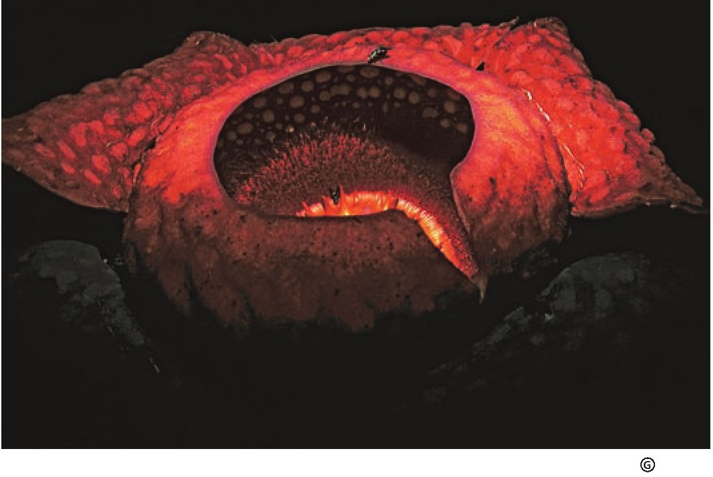
味道和气味关系密切，植物释放出各种难闻的气味，动物闻到后，还没吃就已经认为它肯定难吃。具有怪味的植物有茴香、烟草、水毒芹等。在印度尼西亚苏门答腊岛的原始森林中，有一种花朵巨大的植物叫大王花。它能散发出一种尸体腐烂般的恶臭味，人和动物闻到后，都会掩鼻躲避。有趣的是，这种臭味却能吸引小昆虫来帮它传粉。看来，大王花的臭味既能抵御食草动物，又能吸引昆虫帮助传播花粉，真是一举两得。

当然，植物最直观的武器还是锐利的尖刺和荆棘，使动物不敢贸然靠近。

能够适应恶劣环境，从某种意义上说也是对付食草动物的方式之一。例如在干旱地区，气候条件极差，食草动物稀少，但耐旱植物却能在这样的环境中生存，因为它们早已“锻炼”出一套对付干旱的本领。对它们来说，食草动物比恶劣气候更可怕。

除此之外，植物还有很多令人意想不到的御敌方法。例如有些植物的叶片边缘长有硬硬的锯齿，这能刺痛动物的嘴巴。有些植物虽然没有锯齿，但叶片中充满二氧化硅沉积物。如很多禾本科的植物叶片又粗又硬，叶缘还薄得像刀片，动物嘴巴碰上它，很容易被割得“唇破血流”。

我们了解了各种植物的自卫本领后，必须牢牢记住：植物的种种奇妙防御手段，都是在极为漫长的进化岁月中，通过遗传变异、自然选择而逐步形成的。（王生清）

## 谁是植物界的“伪装大师”

在植物界中，并不是所有植物都具备厉害的防身武器，有些植物为了对付食草动物，会采用“打不过就躲”的办法，将自己伪装起来，不让敌人看见，这就是植物的拟态。

利用变幻莫测的拟态来躲避食草动物侵害的例子，最典型的要数生石花。生石花是多年生的小型多肉植物，原产非洲南部的砾石土中。到了干旱季节，生石花进入漫长的休眠期，球状的身体渐渐萎缩埋入土中，仅留顶面露出来，酷似一块地表上的石头，因此被人称为“有生命的石头”。如果你不是从事专业研究的植物学家，不亲自用手摸一摸，很难发现它竟然是一株植物！正因为它能如此惟妙惟肖地模拟石头，所以就很少有鸟兽来吞食它了。

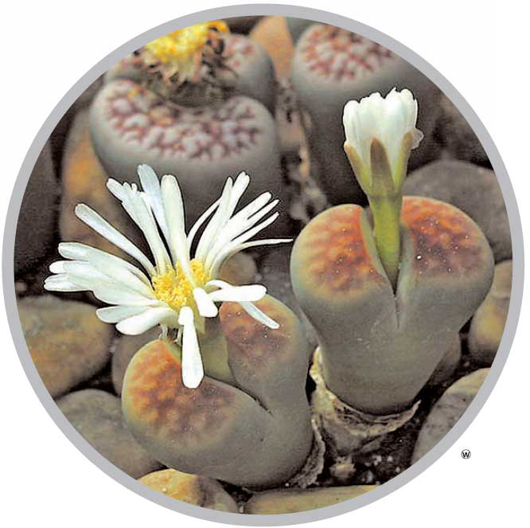
生石花

植物拟态惑敌的例子举不胜举，最神奇的是，有些植物会把自己的模样变得酷似另一种植物。例如死荨麻，它的外貌与可怕的蝎子草一模一样，虽然没有蝎子草那种厉害的毒蜇刺，但凭着拟态出来的模样，谁都不敢去惹它。（余千里）

  

**【微博士】**植物刺毛虫

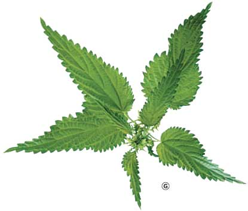
蝎子草是一种让食草动物望而生畏的植物。它的叶片上布满了毒刺，而且这种毒刺非同一般，好像人类用来打针的注射器一样，能扎进动物的皮肤中。如果谁不当心碰上了蝎子草，蜇人的毒刺就会牢牢扎在皮肤上，与此同时，储藏在尖刺基部的甲酸物质很快就注入到皮肤之内，又痛又痒，简直比刺毛虫蜇人还厉害。

**【微博士】**桃胶

见过桃树的人都会留下这样的印象：树干上会出现一团团黏糊糊的桃胶。这就是桃树对付敌人的特殊武器。原来，蚜虫喜欢吸食桃树幼嫩枝条中的汁液，当它们在向上爬行时，很容易被桃胶粘住。

【微问题】拟态植物生石花会不会开花？如果开花还能隐蔽自己吗？

【关键词】植物毒素　植物荆刺　植物拟态

## 魔草为什么成为粮食作物的杀手

独脚金，是玄参科的一种小型草本植物，更是一种非常可怕的半寄生植物。它个头不大，貌不惊人，但是对农作物却有可怕的杀伤力。它们出现在哪里，必然会引起哪里的农作物大幅度减产，当它大面积侵害农作物时，甚至还能引起灾难性的粮食饥荒，尤其在非洲地区危害更烈，因此人们给它起了一个外号叫魔草。

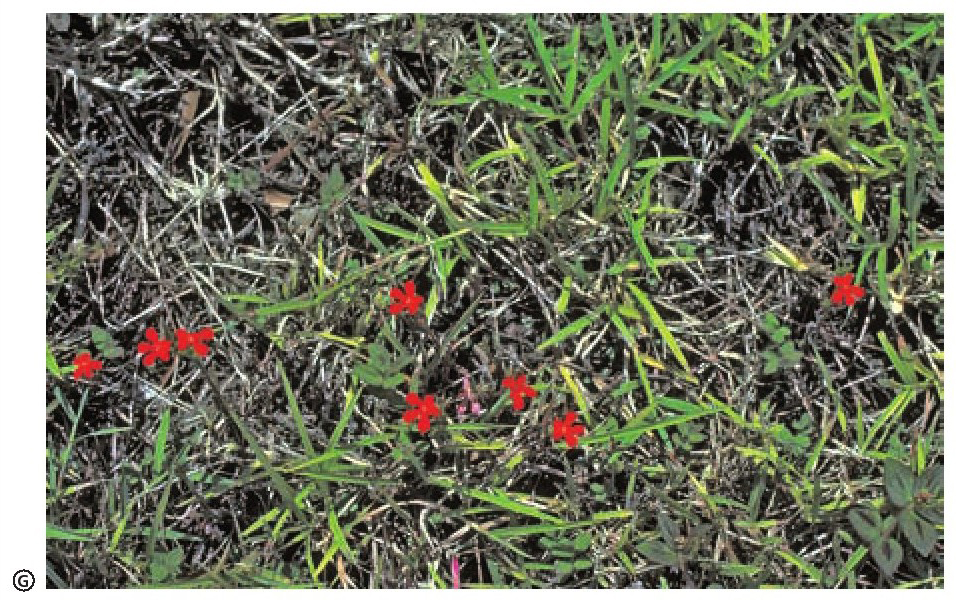
魔草的危害性固然可怕，但更令人头疼的是难以找到制服它的方法。农民在描述魔草时说，每当粮食作物播种好之后，魔草就会纷纷出现在农作物的根系部位，如同所有寄生植物那样，吸取寄主体内的营养物质，最后导致农作物枯萎而死。

为了制服魔草，科学家对它进行了全方位的研究，并注意到一个独特的现象。他们发现，在农作物没有播种时，根本见不到魔草的踪迹，但播种后没过几天，它们就像得到了准确情报那样，一下子全出现了。可以肯定，魔草一定有某种特殊的“侦查”手段，能够精确探知农作物的生长时间。通过进一步研究发现，魔草的种子内部有一种特殊的化学信息物质，它就像化学雷达那样，能够捕获外界某些特定的化学物质。当农作物进入到生长期后，就会散发出一些化学物质，而这种化学物质恰恰能被魔草的“化学雷达”发现，于是，魔草也随之破土而出，扑向它们的寄主。

由于魔草属于寄生植物，如果找不到寄主寄生，最多只能独立生存4天。科学家根据魔草的这一弱点，着手研究农作物在生长期间所散发的化学物质，不仅探明其化学结构，而且还能够进行人工合成。科学家终于有了对付魔草的特效武器，它们在农作物播种之前被喷洒到农田中，使土壤中的魔草种子接收到错误的信息，以为农作物开始生长了，纷纷萌发破土而出寻找寄主。然而，上了当的魔草根本找不到寄主，4天之后，因为无法独立生存而纷纷死去。这时候，人类才开始大规模正式播种农作物，再也不用担心受到魔草的伤害了。（杜云）

## 为什么有些植物放在空气中也能生存

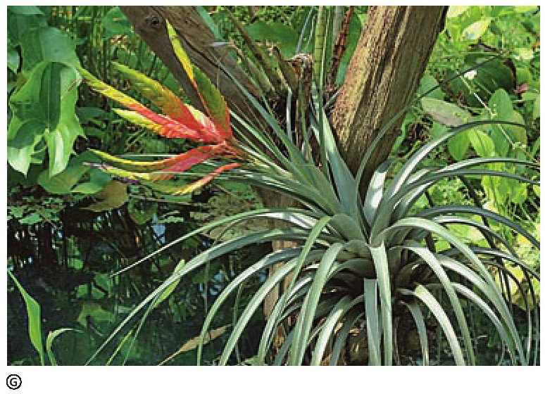
空气凤梨

画面中的这种植物，有明显的叶，却几乎没有根，如果将它种植在无土的假山上，用不着浇水，它依然能绽放出艳丽的花朵。真是太神奇了！它是怎样生存在空气中的呢？

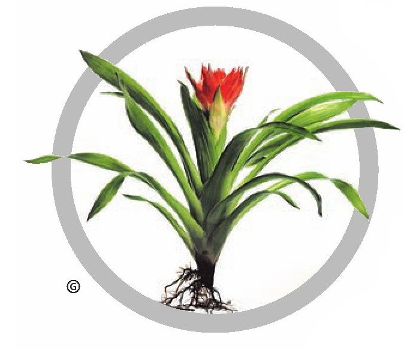
原来，这是一种气生或附生草本植物，名叫空气凤梨。空气凤梨其实是凤梨科铁兰属众多植物的统称，包含许多品种和变种，它们因为能完全生活在空气中，无需土壤而得名。空气凤梨之所以能在空气中生存，是因为它所需要的养料和水分，几乎都可以通过叶面上的银灰色绒毛状鳞片吸收。这些鳞片多呈盾形凹陷，空气中飘浮的微小水汽小滴或雨水会被凹陷处的气孔截获，经薄壁细胞渗透到植株体内。令人感到神奇的是，这些气孔在温度较高、空气干燥的白天处于半闭合状态，以减少水分蒸发；到了温度较低、空气湿度增大的夜晚则完全打开，以吸收空气中的水分。空气凤梨之所以有这种与众不同的习性，与其独特的生存环境有关。因为大部分空气凤梨原产于中南美洲的热带或亚热带地区，那儿干旱少雨，阳光强烈，昼夜温度变化大，但终年都有雾气的滋润，由于它们具备了从空气中获取水分的本领，所以不惧怕离开土壤，而常常附生在石壁、树木（甚至是仙人掌）、电线杆或半空中的电线上，给当地增添了一道独特的风景线。（马迁）

## 伤害大马樱花的凶手是谁

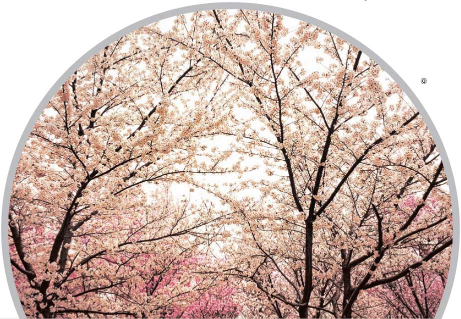
大马樱花

每年三四月间的马来西亚是赏樱的季节，许多以樱花为特色的公园便迎来熙熙攘攘的参观者和摄影爱好者。然而在2012年，马来西亚槟城的“大马樱花”竟然无花可赏，让参观者大失所望。

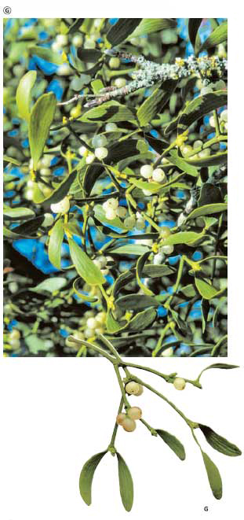
桑寄生

植物学家告诉大家，伤害大马樱花的凶手是桑寄生，并进一步解释说，当大马樱花被桑寄生“缠上”后，虽然不会马上死去，却会大大失去光彩，花朵也逐渐减少。而桑寄生则是一种寄生在其他乔木上的常绿小灌木，它利用自己特殊的果实，在动物的无意识帮助下，“缠上”了一个个受害者。每年深秋，桑寄生橙黄色的果实缀满枝头，吸引很多鸟儿前来啄食。由于果皮内有一层黏性胶质物，鸟儿一啄，果实便牢牢地粘在了鸟嘴上。为了摆脱黏附在嘴边的果实，鸟儿不得不飞到周围的树枝上又蹭又擦。就这样，黏性的果皮连同种子便粘到了树枝上。鸟儿吞下了果实，种子无法完全消化，随黏性胶质排出后便粘在鸟屁股上，鸟儿再把它蹭到树干上。就这样到了第二年，种子在温度和湿度适宜的条件下萌发，生出吸附根侵入到寄主皮层，长出茎叶，最后与寄主融为一体。（马迁）

  

【微问题】能不能用对付魔草的类似方法，去对付其他的寄生杂草？

【关键词】魔草　空气凤梨　大马樱花　桑寄生

## 自然界的植物是如何变异为千姿百态的

郁金香

虽然都是郁金香，但是它们绽放出的花朵却姹紫嫣红，五颜六色；虽然都是辣椒，但吃起来的味道却各有不同：个头大的灯笼椒不辣，体形娇小的朝天椒却辣味超强。我们把这种个体间的不同叫作变异。同样的物种为何会出现千差万别？其根源就在于，它们“遗传天书”中的某些内容发生了变化。

现在已经知道，植物的遗传特性由它的“遗传天书”来决定，但“遗传天书”并不是绝对安全的。自然界中的种种辐射、极端的高温和低温等条件，都会改变植物“遗传天书”的内容。

植物“遗传天书”的改变形式有很多种，有的是染色体层面发生了变化。由于DNA在细胞内是以染色体的形式存在的，如果把染色体比作“遗传天书”的“章节”的话，那么，染色体层面的变异，通常有以下各种情况：缺失了某一部分“章节”或者“段落”，有些“章节”或者“段落”重复了，有些“段落”的位置错了，有些“页码”颠倒了，有一些“连页”了，甚至整部“天书”多了一份或多份，等等。这些染色体层面的变异，改变的遗传信息比较多。而另一些变异是在DNA层面的，改变得较少，也就是说，后者的变化仅仅是“遗传天书”中的个别“文字”被改变了。

大自然中，“遗传天书”发生的变异有很大的随机性。有的变异给植物带来了灾难；有的对植物影响不大；也有一些变异却使植物获得了“超能力”，变得在自然界中生活能力更强。能遗传的变异会通过植物之间的杂交等发生“重组”，使得这些变异能更广泛地传播。于是，大自然中的植物就变得姹紫嫣红，千姿百态。（厉新民　林鸿宣）

## 植物“遗传天书”如何自我保护

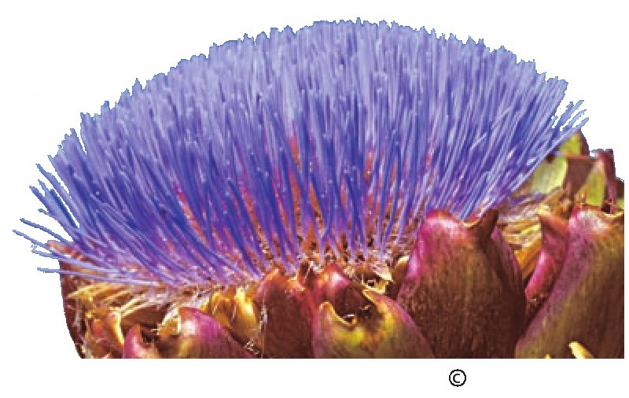
虽然植物把“遗传天书”层层包裹，并放在最安全的细胞核里，但在不断的复制过程中，其内容还是会发生错误。植物有一套很精细的校对机制，来仔细检查复制过程中有没有发生错误，一旦发现有写错的“字”，马上会“擦除”，然后重写。而且，植物对已经完成的“遗传天书”也有很多的“纠错”措施。例如，植物可以通过重新组合来把错误的内容矫正过来，还可以“切除”错误的片段再重新“写上”正确的片段。甚至连大自然中的阳光也能帮助植物修复错误的“遗传天书”呢！

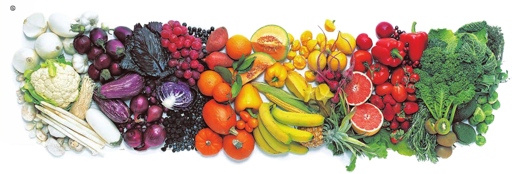
植物通过很多方法，互相补充，互相配合，来保证自己神圣的遗传特性的稳定。研究发现，植物还可以用表观遗传调控的手段来对“遗传天书”进行维护和修复。虽然我们已经对“遗传天书”有了一定的了解，但植物肯定还有很多奇妙的手段来维护“遗传天书”，这有待于我们去发现。（厉新民　林鸿宣）

## 怎样对植物的“遗传天书”进行“升级改版”

我们日常生活中离不开各种各样的植物，如高产优质的农作物、鲜艳芬芳的花卉、营养美味的瓜果等。为了使这些植物能更好地满足人们的需求，人们就想改变这些植物的特性，也就需要对它们的“遗传天书”进行“升级改版”。

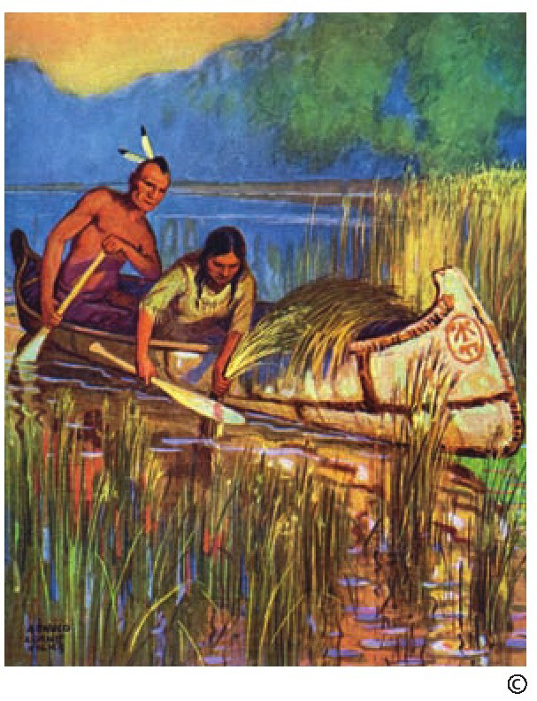
未经人工驯化的野生稻

虽然我们到现在还不能完全读懂这部“遗传天书”，但是实际上我们的祖先早就开始利用它了。人们通过选择自然界中“改版的遗传天书”，驯化了栽培作物；通过杂交培育，把不同的“版本”进行组合，来实现优势互补。比如在很久以前，水稻的祖先是像杂草一样匍匐生长的，后来有一株水稻的“遗传天书”发生了改变，使水稻变成了直立生长的模样。我们的祖先发现后，认为这种新模样的水稻更适合栽种，于是就选择这样的水稻种子，经过很多代繁殖，慢慢形成了现在种植的各种水稻。

人们随着越来越了解植物的“遗传天书”，已经可以用很多种手段直接升级改版植物的“遗传天书”。

在诱变育种的实践中，人们用很多种物理的（如各种辐射等）或者化学的（如一些能诱导DNA变异的化学药品等）方法，使植物的“遗传天书”发生变异，然后再选择出一些我们喜欢的“版本”，从而得到改版后的新品种。随着科技的进步，人们还进行了太空育种，就是利用太空中强辐射、微重力、真空等太空综合环境因素来诱导种子中的“遗传天书”发生改变，然后选出我们喜欢的新版本。人们通过太空育种，已经种出了大如南瓜的茄子和巨型南瓜等新品种。

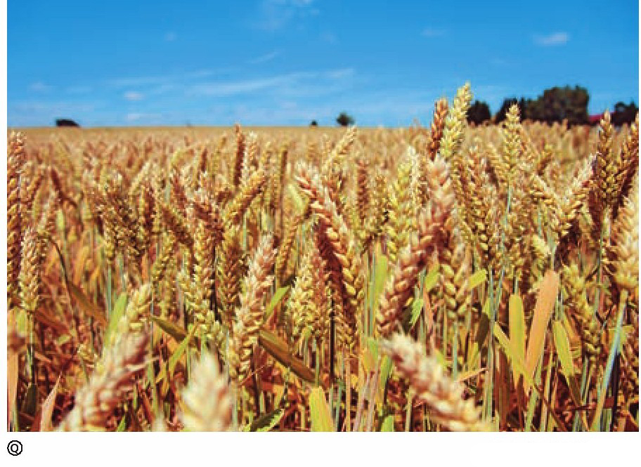
诱变育种后的小麦

人们还可以通过一些遗传工程手段来对“遗传天书”的某些特定“语句”进行有目的的“改写”。比如，人们已经成功地把一段来自微生物能够起到杀虫作用的“语句”“写进”了棉花的“遗传天书”中，从而得到了不需要施用大量农药就能抗虫的棉花品种。还有，改写大豆“遗传天书”中的某些控制种子油脂含量的“语句”，得到了种子能榨出更多油的大豆新品种。（厉新民　林鸿宣）

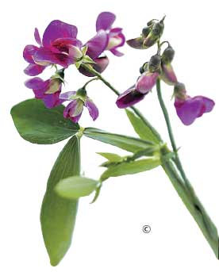
  

**【实验场】**寻找“幸运草”

自然界中有一些有趣的三叶草，它们的每一个复叶是由三片小叶构成的。但是，这个特性在自然界中有时会发生变异，生长出四片小叶的复叶。1000多年来，世界上很多地方流传着一个“幸运草”的传说：找到四叶草的人能得到幸福。实际上，这是在大自然环境中，三叶草的“遗传天书”在控制叶片生长的过程中发生了一些变异，改变了复叶的形状。

有兴趣的话，我们可以到公园或者草坪上的车轴草丛中，或者屋后田野中的酢浆草堆中找一找，幸运的话就可以从这些三叶草中找到传说中的四叶草呢！

【微问题】高原阳光中的紫外线特别强烈，那儿植物的“遗传天书”是不是特别容易“升级改版”？

【关键词】DNA变异　遗传改造

## 植物也有“模特”吗

一说起模特，人们往往会想到在T型舞台上走猫步的身材高挑的时装模特，以及在车展中的车模。有意思的是，在千姿百态的植物世界中，同样有享有盛名的植物“模特”。

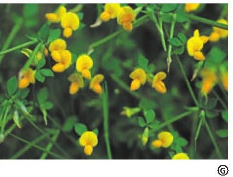
百脉根

当然，植物模特并非用来观赏，而是用于科学研究的。自然界有数十万种植物，人们从何入手来研究植物呢？幸好植物在生命活动的基本规律上有许多相似性，例如植物的外部特征和生活特性是由细胞内的遗传物质控制的，遗传控制又是通过基因实现的。这样，人们就有可能选择一些具有广泛代表性同时又便于进行各种实验的植物作为模特，通过对植物模特的研究来了解其他不同植物的生命活动规律。科学家经过长期观察和挑选，找到了一些植物界的模特，也称之为“模式植物”。通过对植物模特的细致研究，发现了一系列控制植物复杂生命活动的基本规律，为认识、利用和改良植物提供了一把金钥匙。

能够成为植物模特的标准是什么呢？首先，植物模特要有比较短的生命周期，这样的植物有利于在特定时间内进行多代遗传学分析；其次，“身材”小巧的植物更容易被科学家选中，因为这类植物便于在实验室较小的空间内进行大量的种植和培养；第三，植物模特自身的基因容易通过化学、物理方法发生改变，这样科学家就能知道每一个基因损坏后，会对植物产生什么样的影响，从而推测每一个基因在植物的生命活动中起什么作用；第四，植物模特需要具有容易转化的特点，也就是说，通过转基因操作可以很容易地将不同的外源基因导入到植物模特的体内，这样才能对导入后的基因进行功能研究；最后，植物模特还要有能力产生大量的种子，为科学研究提供丰富的材料。

| 玉米 | 苜蓿 |
| --- | --- |

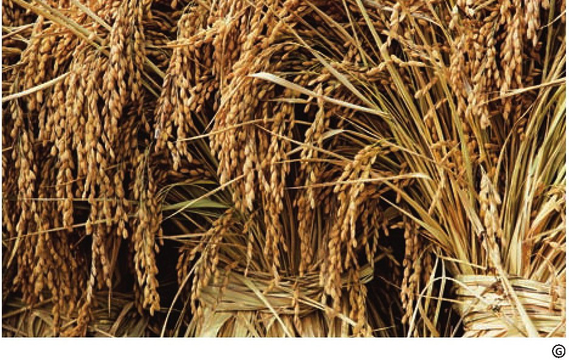
水稻

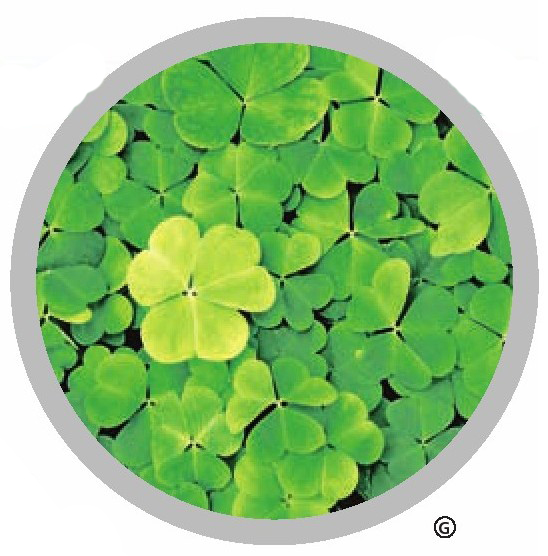
选拔植物模特的标准要比选拔时装模特和车模苛刻得多，难怪在30余万种植物中，能被科学家广泛认可的植物模特屈指可数。目前应用最多的植物模特是：十字花科的拟南芥，豆科的蒺藜苜蓿和百脉根。当然，有些植物虽然个体大了一些，但是由于经济价值重大，也被列为植物模特加以研究，例如重要的农作物水稻和玉米。以上这些被选中的植物模特中，拟南芥、蒺藜苜蓿和百脉根是双子叶植物的模特，而水稻和玉米是单子叶植物的模特。（许德阳　黄海）

## 拟南芥为什么特别受科学家青睐

在众多植物物种中，拟南芥首先被选为“模特”。成熟的拟南芥个体很小，高度约20厘米，最高的也不过40厘米。由于个头小，拟南芥可以密集地种植在实验室或者温室中，甚至可以种植在含有培养基的培养皿中，其合适大小的幼苗也能很方便地被取下加以观察研究。由于拟南芥个体小，生长环境便于严格控制，因此有助于保证实验数据真实可靠。拟南芥花轴上着生许多小花，每一朵小花有花萼与花瓣各4枚，还有6个雄蕊和1个由双心皮合生在一起组成的雌蕊。开花后能看到花瓣排列成十字形。除此以外，拟南芥完成一个生命周期仅需要6～8星期，但繁殖能力却十分惊人。据统计，在最佳生长条件下，一株拟南芥可以结出2万多粒种子。拟南芥的种子很小，种子最长和最宽处分别为0.5毫米和0.3毫米左右。

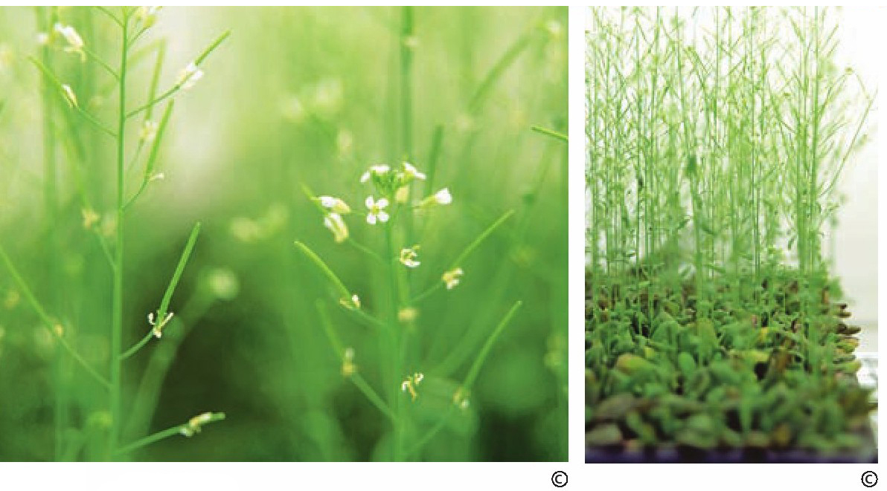
拟南芥

早在20世纪90年代，科学家就建立了简单高效的拟南芥基因诱变体系和外源基因转化体系。带有不同基因缺陷的拟南芥植物个体叫作拟南芥突变体。目前，国际上拟南芥种子资源库中储存的和不同实验室获得的拟南芥突变体数以万计，非常便于植物基因功能的研究。拟南芥不仅植株个体小，核基因组（即单倍体细胞核内的全部DNA分子）也是迄今为止已知被子植物中最小的。拟南芥整个基因组的测序工作已经在2000年年底前全部完成了。除了核基因组外，拟南芥的线粒体和叶绿体基因组（即一个线粒体或者一个叶绿体所含的全部DNA分子）也完成了测序，成为第一个三套基因组全部被破译的被子植物。所有这些特点使得拟南芥成为深受科学家青睐的植物模特。（许德阳　黄海）

## 怎样人工栽培拟南芥

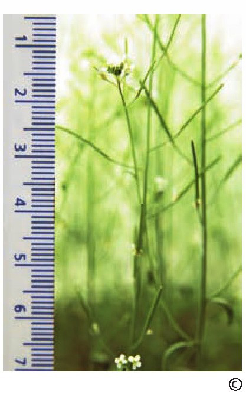
野生拟南芥在世界许多不同的地区均有分布。中国内蒙古、新疆、陕西、甘肃、西藏、山东、江苏、安徽、湖北、四川、云南等地都发现有野生拟南芥生长。在自然条件下，只有处于低温湿润的环境中，拟南芥种子才能破除休眠，开始萌芽。因此在实验室条件下种植拟南芥时，种子通常也需要首先在湿润低温的环境中进行处理。具体方法是将种子放置在2～4℃的湿润处，时间为2～4天，这个过程称为“低温层积”。经过低温处理的拟南芥种子可以撒播在湿润的土壤表面或者人工配制的各种培养基上。实验室中常用的土壤一般含腐殖质土、蛭石和珍珠岩，这三种成分按体积以3:3:1的比例混合。实验室常用的生长条件是：50%湿度，室温22℃，每昼夜18小时光照，6小时黑暗。一般在播种5天左右即可见拟南芥发芽，3星期后拟南芥开始开花，再过2星期，最早开的那朵拟南芥花已经结出了成熟的种子。（许德阳　黄海）

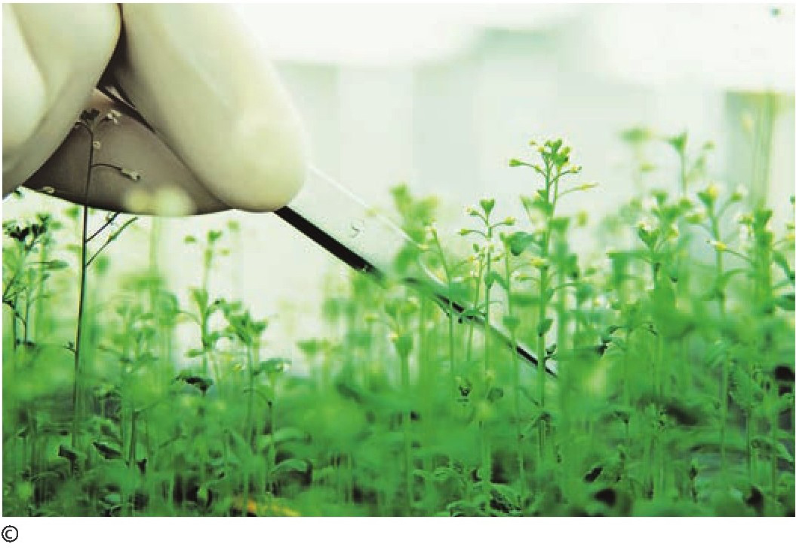
人工培养的拟南芥

  

【微问题】植物中有植物模特，动物中有动物模特吗？

【关键词】植物　“模特”　拟南芥

## 植物抗御病害的手段有哪些

植物在其一生中会受到各种各样病原菌的侵袭，包括细菌、真菌、病毒和线虫等。植物在这样的环境中生存进化，渐渐使自身获得多种抵抗病原菌入侵和限制入侵病原菌扩展的机制，从机理上可分为组成型的植物防卫系统和诱导型的植物防卫系统。

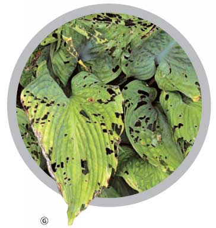
饱受害虫蹂躏的植株

组成型防卫系统包括植物表面的蜡质、角质、木质素、硅细胞、胼胝质等物理屏障，以及植物细胞中预存的一些抗菌物质和抗菌蛋白。这种防卫系统就好比是一座城市砌好了城墙、挖好了护城河，是抵御外部入侵的第一道坚固防线。

另一个系统是植物受病原菌侵染而被诱导激活的主动防卫系统，包括一系列生理生化的变化和基因水平的激发，如侵染部位的木质化、胼胝质产生、病程相关基因激活、植保素积累等。这个主动的防卫系统就好比是敌人攻进城来后遇到的城防部队，它们的职责是阻止病原菌对组织的进一步伤害。

有关植物防卫反应的研究是植物生物学的主要研究方向之一，也是进展最快的领域之一。中国每年因为病害导致的作物减产损失已经达到几百亿元，因此在植物抗病方面开展深入的研究，将对农业生产及国计民生起到非常重要的作用。（王牧阳　何祖华）

## 植物也有免疫能力吗

在与病原菌长期共进化的过程中，植物建立了一系列抵抗病原菌入侵的抗病机制。植物没有动物一样的抗体免疫系统，但存在与动物类似的、生来就有的先天免疫反应，因此，植物主要借助于先天免疫系统来产生主动的抗病性。

目前了解比较清楚的有两个先天免疫系统。其一是通过细胞表面受体系统，从某种意义上说有点像人类的触觉系统，是用来感受病原菌所共有的分子特征，这类受体称模式识别受体，有时还把这类免疫反应称为病原菌相关分子模式引发的免疫反应。其二是通过形式上更进化的抗病基因所编码的蛋白质，直接或间接地感受病原菌分泌的特异性毒性因子，激发植物的寄主专一性很强的免疫反应，因此又称效应子引发的免疫反应。这两种免疫系统都有“信息兵”来探知侵略者的存在，从而告知植物的指挥中心产生相应的抗病反应，只不过一路“信息兵”在细胞表面，另一路隐匿在细胞内部。（王牧阳　何祖华）

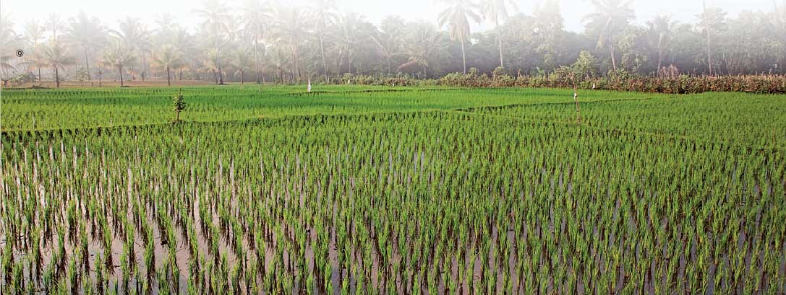
抗病虫水稻

## 如何培育抗病农作物

人在生病的时候需要吃药，植物在“生病”的时候也可以“吃药”，就是我们所熟知的农药。在20世纪中叶，少量农药的确可以直接杀死病菌，从而提高作物的产量。但是长期用药的结果使很多病害慢慢产生了耐药性，农药的剂量不得不逐年增加，直至失效。随着对植物农药使用剂量的逐年加大，一系列的副作用产生了。这些副作用包括对植物本身品质的损害，环境的污染以及作物自身农药残存对人体的伤害等。

既然“吃药”有副作用，那么提高植物自身的抗病能力就变得至关重要了。如何利用科学技术培育抗病农作物，提高农作物的产量和品质，成为许多科学家努力研究的课题。

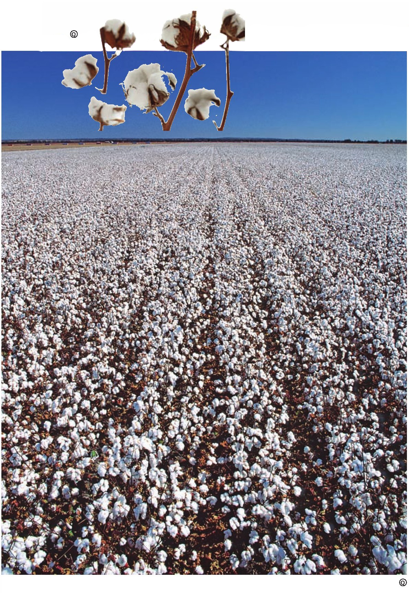
抗虫棉

利用传统育种方式培育抗病农作物，是指通过自然变异进行育种的方法，也是被应用最广泛的基本育种法。当自然界出现非常优质的变异时，我们可以直接拿来进行选择育种，简单易行。但是，这种变异出现的概率很小，在时间上和主动性上具有局限性。另一种传统育种的方式是通过杂交培育新品种，当前在中国广泛种植的许多优良农作物品种都是用这种杂交育种法培育而成。科学家可以将具有不同特性的同种作物进行杂交，来聚合对不同病原菌的抗性，从而培育出具有广谱抗性的作物新品种。但是，现在的杂交育种技术在种内比较成熟，在种间则存在诸多的困难。此外，采用杂交法抗病存在资源利用有限问题，这是它的瓶颈所在。

随着分子生物学的飞速发展，利用分子育种培育抗病农作物的方法，越来越受到科学家们的青睐。所谓分子育种是利用抗病基因的指纹，将不同抗病基因通过传统杂交的方法聚合到一个优良品种中；或者将另外植物的抗病基因通过转基因办法转到一个作物品种中，使之获得新的抗病性。现在，科学家已渐渐揭开了有关生命物质本质的神秘面纱。基因记录着生物体内的遗传密码，我们现在可以在体外将不同生物间的DNA进行重新拼接，再利用转基因等技术将外源遗传物质导入受体细胞中，从而设计出满足人们需求的新型作物品种。比如现在应用广泛的抗虫棉，就是通过基因工程技术将抗虫基因导入到普通棉花品种中，从而获得具有抗虫特性的棉花新品种，使棉花产量得到较大程度的提高，同时也大大降低农药的使用。这种技术可以跨越种属，突破种间杂交不亲和的瓶颈，并赋予生物新的遗传性状。

经过多年的辛勤工作，中国生物科学家应用现代生物技术已经培育出一大批具有抗病新特性的农作物，包括抗病虫水稻、抗虫棉等，有效地提高了这些作物的产量和品质。如何进一步完善现有的培育技术，开发新型抗病虫手段，将是生物学家今后需要继续努力的方向。（王牧阳　何祖华）

  

【微问题】通过分子育种，是否有可能将动物和植物的特性融合在一起呢？

【关键词】植物防卫系统　植物免疫力　自然变异　分子育种

## 植物能替代石油吗

今天，煤炭和石油是人类的主要能源，大约占当今世界能源的80%。但是，它们都是由古代生物转化而来的化石能源，几乎不能再生，更重要的是，它们在地球上的储量正急剧减少。根据2010年世界能源储藏量统计，按照目前的消耗速度，全世界的煤炭、石油、天然气还能维持人类需求200年左右。一旦化石能源被用完，世界将会出现怎样的局面？谁能接替煤炭、石油为人类源源不断提供能源呢？于是，人类将眼光瞄准了植物。众所周知，一切生物能都是植物通过光合作用固定下来的，那么它们中谁最合适成为煤炭和石油的替代者？

在20世纪80年代，就有科学家为此而开始了这方面的努力。美国科学家卡尔文认为，植物通过光合作用将太阳能转变成化学能，以碳水化合物的形式储存在体内。碳水化合物中含有碳、氢、氧三种元素，其中碳和氢可组成烃，而烃恰恰就是石油的主要成分。从理论上说，应该找出一种能够直接生产出烃的植物。根据这个思路，卡尔文带领一个研究小组，终日风尘仆仆穿行在密林中，对几千种植物进行了严格测试，终于找到一种能生产出烃的植物。这种名叫续随子的植物是大戟科中的一员，茎叶中充满白色的乳汁，乳汁的含烃量接近30%。他将乳汁中的烃提炼出来加工成植物柴油，也能使汽车发动！由此开始，寻找植物能源的热潮愈演愈烈。

经过几十年的努力，现在已经发现越来越多的能源植物，它们大体上可以分为三大类。一类是含有丰富烃的石油植物，例如续随子、绿玉树、巴西橡胶树等。它们体内的乳汁与石油成分很相似，而且含量也比较高。第二类是富含碳水化合物的乙醇植物，利用它们可以提炼出的最终产品是乙醇。这类植物种类多，且分布广，如木薯、马铃薯、甘蔗、高粱、玉米等农作物都是生产乙醇的良好原料。第三类是富含油脂的能源植物，这类植物既是人类食物的重要组成部分，又是工业用途非常广泛的原料。对富含油脂的能源植物进行加工，是制备生物柴油的有效途径。它们的特点是含油率很高，如樟科植物黄脉钓樟的种子含油率竟然高达67.2%。这类植物的有些种类存储量很大，如种子含油达15%～25%的苍耳子广布于华北、东北、西北等地，资源丰富，仅陕西省的年产量就达1.35万吨。

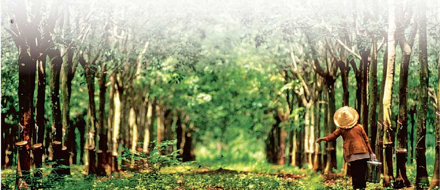
随着越来越多的国家采取鼓励可再生能源的政策和措施，可再生能源的生产规模和使用范围正在不断扩大，中国也确立了到2020年使可再生能源占总能源的比重达到15%的目标，这就意味植物能源将会占据越来越重要的位置。尽管前景很光明，但是面临的问题也很多，其中最突出的就是性价比问题。也就是说，如果通过种植绿色能源植物，再从它们中提炼出“石油”，要比钻井开采出来的石油昂贵很多，也许这个难题要等到栽种产量的进一步提高，提炼技术的进一步完善，才能达到真正可行的使用价值。（陈荣）

## 玉米中能“流出”乙醇吗

如果没有汽油，汽车就无法启动，这对现代社会来说是无法想象的。近年来，随着石油能源的日益短缺，它的衍生品汽油、柴油自然也遇到同样的情况。于是，人们就考虑用乙醇来替代汽油，因为在我们这个地球上，大量的植物都能作为生产乙醇的原材料，这正是科学家们最感兴趣的关键之处。

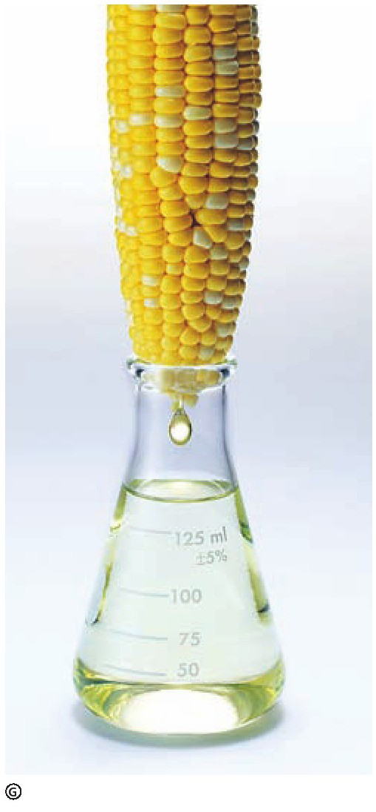
美国是开始研究和应用植物能源最成熟的国家，所选用的主要对象是高产量的转基因玉米。玉米转变成乙醇的过程并不很复杂，首先将玉米粒粉碎、碾磨，然后加入大量的水和酶，玉米中的淀粉在酶作用下转变成糖，然后进行发酵，最后将糖类转化成乙醇。这种方法在技术工艺上已经获得了成功，而且玉米乙醇也能作为混合燃料的一部分带动汽车飞驰。但玉米是人类的主要粮食之一，将它变为乙醇，反过来又会导致粮食的短缺，这是一对难以解决的矛盾。那么，如果用玉米秆，或者其他大型草本植物的秸秆，能从中获取乙醇吗？从理论上也可行，而且也获得实验室范围的成功，但秸秆中有大量的纤维素，而目前，尚没有找到能够高效水解纤维素的酶，也没有培育出能高效转化木糖的发酵菌种，这将成为现在尚未突破的两大瓶颈。

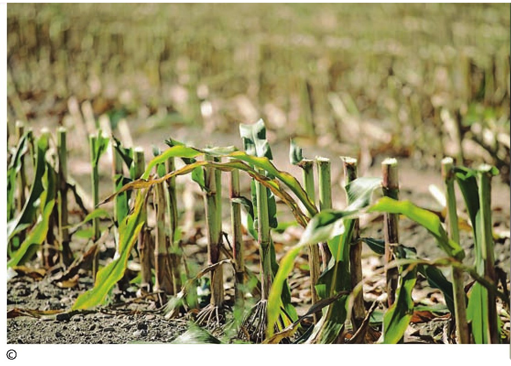
玉米秸秆

但不管怎样，当科学家克服了眼前的困难之后，大量经济便宜的植物，甚至被丢弃的秸秆中，就能“流出”汽油的替代品——乙醇。（陈荣）

  

**【微博士】**甘蔗和木薯

| 甘蔗 | 木薯 |
| --- | --- |

巴西由于盛产甘蔗，所以开始了“甘蔗乙醇”的研究，并有了一整套成熟且具有应用价值的生产工艺。中国则将更多的目光投注到“木薯乙醇”中，因为木薯成本低廉，且效率更高，极具经济性。

【微问题】从植物中提取乙醇的原理是不是和酿酒差不多？

【关键词】化石能源　生物能源　玉米乙醇　木薯乙醇

## “植物电池”的梦想能实现吗

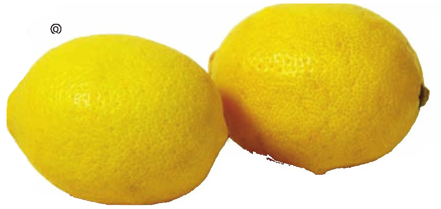
柠檬

1981年，有一位英国钟表匠做了个很简单的实验。他在柠檬上插入两个电极，然后将电极与小型钟表发电机的电路连接，结果令人吃惊的现象出现了，钟就像连接上电源那样，指针开始正常走动了！因此他提出了一个大胆设想：用植物发电！钟表匠的实验证明，植物中蕴含着电能，一个柠檬就像一个“植物电池”。虽然这种方法没有实际应用意义，但它是使用“植物电池”的最初尝试，同时也使许多科学家投入到这方面的研究之中。

科学家最初的设想是，在工业生产上，若从水中提取氧气和氢气需要耗用大量的电能，而植物的绿叶可以利用阳光将水分分解成氢气和氧气，如果制造出一种能利用太阳能的“电子叶”，不就等于找到了一个不可估量的发电厂吗？

根据以上设想，科学家们设计了这样一套程序：用氧化铁粉制成催化板，然后掺入一些特殊杂质到催化板中，再分别用镁原子和硅掺杂形成“PN”型半导体结盘形板，然后将它浸入到可导电的硫酸钠溶液中。当阳光照射时，两极之间就会产生电流，并开始将水分解成氢和氧。但是这种方法存在巨大的缺陷，那就是催化板的使用寿命极短，因此还是没有应用价值。

以后，科学家又从另一个角度进行探索。他们将植物的活细胞成分和人工合成的生化制品合起来，制成一种巨大的特殊“叶细胞”。这是一个极为复杂的过程，他们先从叶绿体中分离出需要的活体物质，然后制成以植物为基础的“光电池”，再根据叶绿体进行光合作用的原理，制成以完整叶绿体为基础的“植物电池”。在以上一系列过程中，科学家把叶绿体物质涂到微型过滤薄膜上，用这种薄膜来分隔两种溶液。一种溶液中含有释放电子的化学物质，另一种溶液中则含有电子受体。当光线通过电子受体溶液照射到叶绿体物质上时，两者都受到激发，电子通过叶绿体物质进入到电子受体溶液中，引起叶绿体物质产生电压。这种在实验室中能够成功的方法，同样也没有应用价值，因为根据覆盖在薄膜上的叶绿体物质的面积，计算出总光能在立即转化为电能的效率还不到3%！

玉米电池

用“植物电池”生产电，在理论上可行，但要进入到实际应用却还差得很远。首先，要精确测出叶绿体物质对电池的效率究竟起多大作用极为困难，因为“植物电池”中的生物系统和化学系统需要协同作用，单个系统效率的简单叠加，根本无法变为同比增加的整体效率。“植物电池”的研究虽然困难重重，但它的优越性是不言而喻的，所以在今天，已经有越来越多的科学家投身于这个研究领域之中。（陈荣）

## 为什么植物体内会带电

千万别以为电只存在于非生命的物体中，其实，在我们人体中，甚至在植物体中都带有电，这也就是平时所说的生物电。

很多人都会好奇地问，植物怎么会生电呢？其实原因是多方面的。首先从植物的吸收来说，它的根部细胞每时每刻都在吸收矿质元素，当这些吸入植物体的元素离子分布不均匀时，就会引起植物带电现象。还有，当植物进行光合作用，并在产生碳水化合物时，也会将水分子中的氢和氧分解出来，在一定时期内，氢会形成带正电和负电的粒子，这样就使植物体带电了。通常情况下，空中的大气带阳电，地面则带阴电，而植物是长在地面上的，于是，植物体就成了特殊的天线，从大气中收集到无数带电粒子，结果造成植物带电。

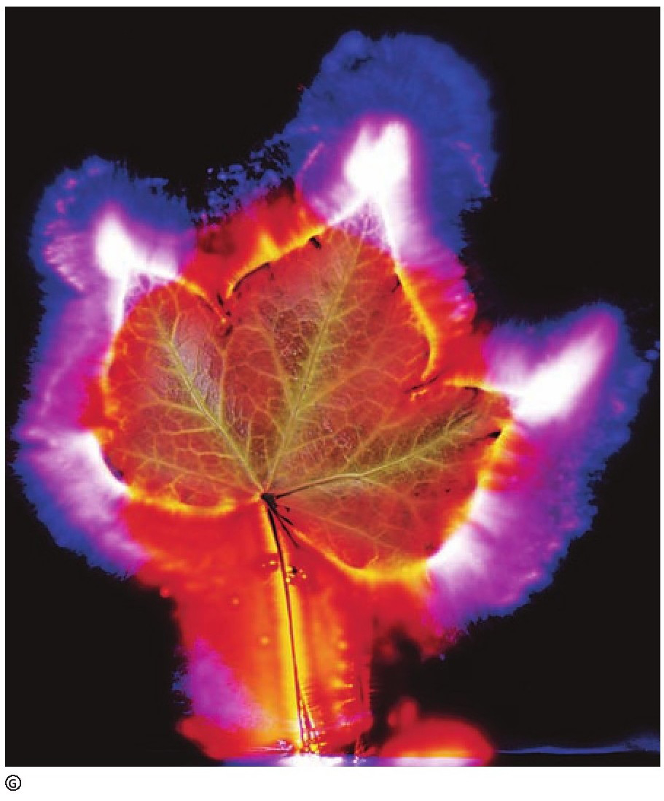
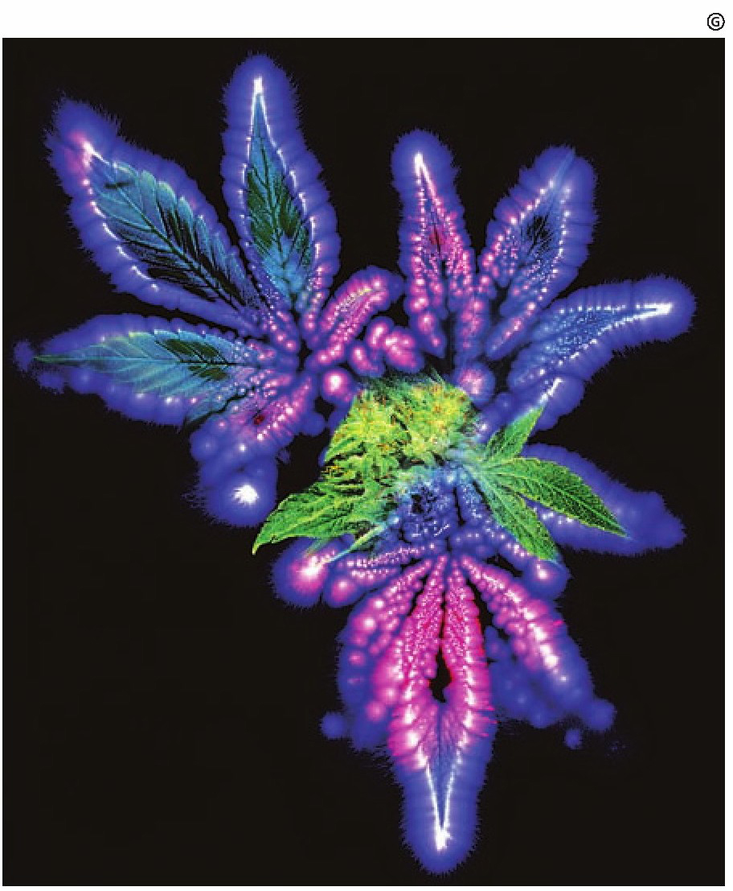
当然，植物体内的电是极为微弱的生物电，于是有科学家试着给植物通电，看看植物会发生什么情况？结果发现，植物体在外来电的作用下，体内的有机物质分子和水分子会发生电化学变化，并产生出高能量的游离分子和离子，加速了植物体内的生化反应，增强了新陈代谢。显然，这对经济作物的增产有着重要的意义，通过进一步实验后发现，对黄瓜和燕麦植株进行通电之后，黄瓜的产量和麦穗的重量都比未通电之前有大幅度增加。当然，植物之所以能和外界电流相呼应，其实也从另一个角度证明：植物体内的确带电。（陈荣）

  

**【微博士】**生物电化学

电与植物乃至其他生物的关系如此密切，促成了一门新的学科诞生——生物电化学。这是20世纪70年代由电生物学、生物物理学、生物化学以及电化学等多门学科交叉形成的一门独立学科。是用电化学的基本原理和实验方法，在生物体的整体以及细胞和分子两个不同水平上，研究电荷（包括电子、离子及其他电活性粒子）在生物体系及其相应模型体系中分布、传输、转移及转化的化学本质和规律的一门新型学科。

【微问题】地球上有没有依靠放电来御敌的植物？

【关键词】植物电池　生物电化学

