# 图书在版编目（CIP）数据

十万个为什么（第六版）/韩启德总主编.-上海：少年儿童出版社，2014.1

ISBN 978-7-5324-9285-5

I.①十……II.①韩……III.①科学知识-青年读物②科学知识-少年读物IV.①Z228.1②R-49

中国版本图书馆CIP数据核字（2013）第055411号

  

  

  

**十万个为什么（第六版）**

**总主编　韩启德**

出　　版　上海世纪出版股份有限公司少年儿童出版社

地　　址　200052上海延安西路1538号

发　　行　上海世纪出版股份有限公司发行中心

地　　址　200001上海福建中路193号

易文网 www.ewen.cc

少儿网 www.jcph.com

电子邮箱　posmaster@jcph.com

印　　刷　上海中华印刷有限公司

　　上海中华商务联合印刷有限公司

　　常熟市华通印刷有限公司

　　上海锦佳印刷有限公司

　　上海一众印务中心

　　浙江新华数码印务有限公司

开　　本　889×11941/16

印　　张　221.5

出版日期　2014年1月第1版第1次印刷

书　　号　ISBN 978-7-5324-9285-5/N.962

定　　价　680.00元（全18册）

**版权所有　侵权必究**

 目录
 

[扉页](../Text/feiye.xhtml)

[版权信息](../Text/bq.xhtml)

[序 言](../Text/xy.xhtml)

[目录](../Text/TOC.xhtml)

[导言](../Text/Section0002_0001.xhtml)

[为什么要开展航空航天活动](../Text/Section0002_0001.xhtml#sigil_toc_id_10)

[航空技术](../Text/Section0002_0002.xhtml)

[乘坐热气球能环游世界吗](../Text/Section0002_0002.xhtml#sigil_toc_id_13)

[飞艇还能东山再起吗](../Text/Section0002_0002.xhtml#sigil_toc_id_16)

[谁是第一个开飞机上天的人](../Text/Section0002_0003.xhtml)

[为什么飞机不像鸟儿一样扇翅飞行](../Text/Section0002_0003.xhtml#sigil_toc_id_19)

[纸飞机怎么能飞得又高又远](../Text/Section0002_0003.xhtml#sigil_toc_id_20)

[为什么飞机能飞上天](../Text/Section0002_0004.xhtml)

[为什么有些“飞机”能贴着水面飞行](../Text/Section0002_0004.xhtml#sigil_toc_id_24)

[真的有人造出过飞碟吗](../Text/Section0002_0004.xhtml#sigil_toc_id_25)

[飞机是怎么控制方向的](../Text/Section0002_0005.xhtml)

[为什么飞行服没有纽扣](../Text/Section0002_0005.xhtml#sigil_toc_id_28)

[飞机的失速是怎么回事](../Text/Section0002_0006.xhtml)

[为什么飞机不能做太急的转弯](../Text/Section0002_0006.xhtml#sigil_toc_id_29)

[为什么有的滑翔机要驾驶员躺着驾驶](../Text/Section0002_0006.xhtml#sigil_toc_id_30)

[为什么看外形就可以猜到飞机的用途和性能](../Text/Section0002_0007.xhtml)

[机翼的面积越大越好吗](../Text/Section0002_0007.xhtml#sigil_toc_id_1)

[为什么机翼要由很多块板组成](../Text/Section0002_0008_0001.xhtml)

[为什么老式飞机有好几对机翼，而现在的战斗机只有一对](../Text/Section0002_0008_0001.xhtml#sigil_toc_id_36)

[为什么有的飞机机翼两端要伸出两只“小手”](../Text/Section0002_0008_0001.xhtml#sigil_toc_id_39)

[为什么有的机翼在机身上方，有的机翼在机身下方](../Text/Section0002_0008_0001.xhtml#sigil_toc_id_41)

[为什么飞机的“嘴”长得不一样](../Text/Section0002_0009.xhtml)

[飞机的发动机装在哪里](../Text/Section0002_0009.xhtml#sigil_toc_id_44)

[为什么飞行时飞机的“翅膀”会变形和抖动](../Text/Section0002_0009.xhtml#sigil_toc_id_47)

[为什么大部分飞机的“翅膀”要向上翘](../Text/Section0002_0010.xhtml)

[为什么有些飞机必须由计算机辅助才能操控](../Text/Section0002_0010.xhtml#sigil_toc_id_56)

[为什么飞机可以自动驾驶](../Text/Section0002_0010.xhtml#sigil_toc_id_68)

[为了适应超声速飞行，飞机进行了怎样的“变身”](../Text/Section0002_0011.xhtml)

[为什么说发动机是飞机的“心脏”](../Text/Section0002_0012.xhtml)

[为什么有的喷气飞机也有螺旋桨](../Text/Section0002_0012.xhtml#sigil_toc_id_74)

[飞行员是怎么知道飞机所处的高度和速度的](../Text/Section0002_0013.xhtml)

[为什么飞机起落架也有那么多讲究](../Text/Section0002_0013.xhtml#sigil_toc_id_80)

[靠旋翼上天的都是直升机吗](../Text/Section0002_0014.xhtml)

[为什么说直升机的旋翼和电扇叶片不一样](../Text/Section0002_0014.xhtml#sigil_toc_id_82)

[为什么直升机可以横着飞，也可以后退飞行](../Text/Section0002_0014.xhtml#sigil_toc_id_94)

[为什么直升机旋翼的叶片在停着的时候总是耷拉着](../Text/Section0002_0014.xhtml#sigil_toc_id_102)

[为什么直升机的尾巴上要装一个“风扇”](../Text/Section0002_0015.xhtml)

[为什么直升机飞行员要用脚镫来控制转向](../Text/Section0002_0015.xhtml#sigil_toc_id_104)

[为什么直升机飞不快](../Text/Section0002_0015.xhtml#sigil_toc_id_119)

[为什么直升机飞行时不收起落架](../Text/Section0002_0016.xhtml)

[为什么有的直升机身上有一对“小翅膀”](../Text/Section0002_0016.xhtml#sigil_toc_id_121)

[为什么有些“直升机”的旋翼不动也能飞](../Text/Section0002_0016.xhtml#sigil_toc_id_127)

[有没有可以垂直起降的飞机](../Text/Section0002_0017.xhtml)

[为什么不少直升机都有两台发动机](../Text/Section0002_0017.xhtml#sigil_toc_id_155)

[空中加油时，直升机的旋翼不会打到加油管吗](../Text/Section0002_0017.xhtml#sigil_toc_id_156)

[“背包”也能把人带上天吗](../Text/Section0002_0018.xhtml)

[为什么降落伞能精确地把人和货物送到目标点](../Text/Section0002_0018.xhtml#sigil_toc_id_157)

[飞机可以不落地吗](../Text/Section0002_0019.xhtml)

[为什么同一航线往返飞行时间会不一样](../Text/Section0002_0020.xhtml)

[为什么机场要有专用的雷达](../Text/Section0002_0020.xhtml#sigil_toc_id_158)

[坐飞机也会有高原反应吗](../Text/Section0002_0020.xhtml#sigil_toc_id_159)

[为什么新型飞机上天前要进行风洞试验](../Text/Section0002_0021.xhtml)

[为什么工程师要把好好的飞机弄坏](../Text/Section0002_0021.xhtml#sigil_toc_id_160)

[为什么试飞员要故意制造“事故”](../Text/Section0002_0021.xhtml#sigil_toc_id_161)

[运载火箭](../Text/Section0002_0022.xhtml)

[从哪里开始算是太空](../Text/Section0002_0022.xhtml#sigil_toc_id_162)

[为什么直到20世纪人类才进入太空](../Text/Section0002_0022.xhtml#sigil_toc_id_163)

[现代火箭是如何发展起来的](../Text/Section0002_0023.xhtml)

[为什么要采用多级火箭](../Text/Section0002_0023.xhtml#sigil_toc_id_164)

[为什么火箭都是圆筒状的](../Text/Section0002_0024.xhtml)

[为什么古代火箭飞不远](../Text/Section0002_0024.xhtml#sigil_toc_id_165)

[为什么火箭要垂直起飞](../Text/Section0002_0024.xhtml#sigil_toc_id_166)

[“神舟”飞船发射时航天员位于火箭的什么部位](../Text/Section0002_0025.xhtml)

[为什么载人火箭顶部有一个尖尖的塔](../Text/Section0002_0025.xhtml#sigil_toc_id_167)

[为什么火箭不怕热](../Text/Section0002_0025.xhtml#sigil_toc_id_168)

[为什么火箭会有这么大的“力气”](../Text/Section0002_0026.xhtml)

[火箭都采用哪些推进剂](../Text/Section0002_0027.xhtml)

[固体火箭和液体火箭哪一种更好](../Text/Section0002_0027.xhtml#sigil_toc_id_169)

[为什么火箭发射时会往下掉东西](../Text/Section0002_0028.xhtml)

[为什么火箭发射时会形成大量白色烟雾](../Text/Section0002_0028.xhtml#sigil_toc_id_170)

[为什么火箭发射怕雷雨和刮风](../Text/Section0002_0028.xhtml#sigil_toc_id_171)

[火箭为什么能“指哪打哪”](../Text/Section0002_0029.xhtml)

[为什么火箭上天后不会偏离弹道](../Text/Section0002_0029.xhtml#sigil_toc_id_172)

[火箭上天后怎么跟它联系](../Text/Section0002_0030.xhtml)

[火箭发射窗口是怎么确定的](../Text/Section0002_0030.xhtml#sigil_toc_id_173)

[哪一种火箭威力最大](../Text/Section0002_0031.xhtml)

[火箭发射后下次还能用吗](../Text/Section0002_0031.xhtml#sigil_toc_id_174)

[为什么研制火箭既要有总设计师又要有总指挥](../Text/Section0002_0031.xhtml#sigil_toc_id_175)

[世界论箭，中国“长征”火箭实力如何](../Text/Section0002_0032.xhtml)

[怎样才能让航天器飞得更远](../Text/Section0002_0032_0001.xhtml)

[人造卫星](../Text/Section0002_0033.xhtml)

[为什么需要造卫星](../Text/Section0002_0033.xhtml#sigil_toc_id_177)

[中国的第一颗人造卫星是什么时候发射的](../Text/Section0002_0033.xhtml#sigil_toc_id_178)

[为什么人造卫星能按预定的轨道运行](../Text/Section0002_0034.xhtml)

[为什么有的人造卫星会掉下来](../Text/Section0002_0034.xhtml#sigil_toc_id_179)

[为什么人造卫星的轨道有各种形状](../Text/Section0002_0035.xhtml)

[卫星升空之后多久才算进入最终的工作轨道](../Text/Section0002_0035.xhtml#sigil_toc_id_180)

[卫星通信是如何实现的](../Text/Section0002_0036.xhtml)

[什么人常用卫星电话](../Text/Section0002_0036.xhtml#sigil_toc_id_181)

[为什么支个“锅”，就能看到丰富多彩的电视节目](../Text/Section0002_0036.xhtml#sigil_toc_id_182)

[为什么导航卫星能够指路](../Text/Section0002_0037.xhtml)

[为什么中国要建立自己的“北斗”卫星导航系统](../Text/Section0002_0037.xhtml#sigil_toc_id_183)

[为什么人造卫星能够看清地面上的人和汽车](../Text/Section0002_0038.xhtml)

[为什么有的人造卫星要返回地球](../Text/Section0002_0038.xhtml#sigil_toc_id_184)

[人造卫星上能做什么实验](../Text/Section0002_0039.xhtml)

[人造卫星如何测地球重力场](../Text/Section0002_0039.xhtml#sigil_toc_id_185)

[为什么人造卫星在太空还能听从地面的指挥](../Text/Section0002_0040.xhtml)

[为什么人造卫星在太空不会随意翻滚](../Text/Section0002_0040.xhtml#sigil_toc_id_186)

[人造卫星在太空会不会被冻“感冒”](../Text/Section0002_0041.xhtml)

[人造卫星“生病”了怎么办](../Text/Section0002_0041.xhtml#sigil_toc_id_187)

[人造卫星上主要采用什么电源](../Text/Section0002_0042.xhtml)

[人造卫星上有化学电池吗](../Text/Section0002_0042.xhtml#sigil_toc_id_188)

[为什么目前人造卫星很少使用核电源](../Text/Section0002_0042.xhtml#sigil_toc_id_189)

[航天器的研制过程是怎样的](../Text/Section0002_0043.xhtml)

[为什么航天器在上天前要进行环境模拟试验](../Text/Section0002_0043.xhtml#sigil_toc_id_190)

[航天器总装时对厂房有什么特殊要求](../Text/Section0002_0043.xhtml#sigil_toc_id_191)

[为什么太空中存在垃圾](../Text/Section0002_0044.xhtml)

[太空垃圾有什么危害](../Text/Section0002_0044.xhtml#sigil_toc_id_192)

[怎样发现太空垃圾](../Text/Section0002_0045.xhtml)

[如何应对微小太空垃圾的威胁](../Text/Section0002_0045.xhtml#sigil_toc_id_193)

[如何清理太空垃圾](../Text/Section0002_0045.xhtml#sigil_toc_id_194)

[载人航天器](../Text/Section0002_0046.xhtml)

[苏联的“航天之父”是谁](../Text/Section0002_0046.xhtml#sigil_toc_id_195)

[第一位航天员是怎么飞上太空的](../Text/Section0002_0046.xhtml#sigil_toc_id_196)

[为什么飞船要在太空进行交会对接](../Text/Section0002_0047.xhtml)

[为什么飞船能够从太空安全回家](../Text/Section0002_0048.xhtml)

[在飞船上遇到紧急情况如何逃生](../Text/Section0002_0049.xhtml)

[地面控制中心怎样用无线电波控制飞船](../Text/Section0002_0050.xhtml)

[为什么要建造航天飞机](../Text/Section0002_0051.xhtml)

[为什么航天飞机要垂直发射](../Text/Section0002_0052.xhtml)

[为什么航天飞机被淘汰了](../Text/Section0002_0052.xhtml#sigil_toc_id_197)

[为什么要建设空间站](../Text/Section0002_0053.xhtml)

[空间站怎么进行补给](../Text/Section0002_0053.xhtml#sigil_toc_id_198)

[为什么“国际空间站”要多个国家联合建设](../Text/Section0002_0054.xhtml)

[为什么中国要建设自己的空间站](../Text/Section0002_0054.xhtml#sigil_toc_id_199)

[为什么美国商业公司也能发射飞船](../Text/Section0002_0054_0001.xhtml)

[为什么太空旅游的船票那么贵](../Text/Section0002_0054_0001.xhtml#sigil_toc_id_201)

[未来我们可以坐电梯上太空吗](../Text/Section0002_0055.xhtml)

[怎样保证太空电梯的稳定](../Text/Section0002_0055.xhtml#sigil_toc_id_202)

[太空电梯的前景如何](../Text/Section0002_0055.xhtml#sigil_toc_id_203)

[为什么很多民用技术来自航天工程](../Text/Section0002_0056.xhtml)

[哪些民用产品上可以看到航天技术](../Text/Section0002_0056.xhtml#sigil_toc_id_204)

[航天产品都是最新最好的产品吗](../Text/Section0002_0056.xhtml#sigil_toc_id_205)

[航天员](../Text/Section0002_0057.xhtml)

[航天员的门槛有多高](../Text/Section0002_0057.xhtml#sigil_toc_id_206)

[航天员考试有几门课](../Text/Section0002_0058.xhtml)

[为什么航天员的太空行走训练要在水下进行](../Text/Section0002_0058.xhtml#sigil_toc_id_207)

[什么是航天员最发怵的训练](../Text/Section0002_0058.xhtml#sigil_toc_id_208)

[航天员上班时都做哪些工作](../Text/Section0002_0059.xhtml)

[航天员在太空怎样吃饭](../Text/Section0002_0059.xhtml#sigil_toc_id_209)

[航天员在太空怎样喝水](../Text/Section0002_0060.xhtml)

[航天员在太空如何处理个人卫生](../Text/Section0002_0060.xhtml#sigil_toc_id_210)

[航天员在太空会做梦吗](../Text/Section0002_0060.xhtml#sigil_toc_id_211)

[航天员在太空会生病吗](../Text/Section0002_0061.xhtml)

[为什么航天员在太空要每天锻炼身体](../Text/Section0002_0061.xhtml#sigil_toc_id_212)

[为什么航天员在飞行前和返回后要进行隔离](../Text/Section0002_0061.xhtml#sigil_toc_id_213)

[为什么航天员要穿那么臃肿的航天服](../Text/Section0002_0062.xhtml)

[航天服怎么穿](../Text/Section0002_0062.xhtml#sigil_toc_id_214)

[为什么航天员要到舱外工作](../Text/Section0002_0063.xhtml)

[航天员在太空如何“行走”](../Text/Section0002_0063.xhtml#sigil_toc_id_216)

[在太空发生火灾怎么办](../Text/Section0002_0064.xhtml)

[航天史上多少位航天员牺牲了](../Text/Section0002_0064.xhtml#sigil_toc_id_218)

[航天员在太空中能看见长城吗](../Text/Section0002_0065.xhtml)

[月球探测](../Text/Section0002_0066.xhtml)

[为什么要探测月球](../Text/Section0002_0066.xhtml#sigil_toc_id_220)

[为什么月球上的地名与地球上的地名如出一辙](../Text/Section0002_0066.xhtml#sigil_toc_id_221)

[人类探测月球走过了怎样的历程](../Text/Section0002_0066.xhtml#sigil_toc_id_222)

[为什么月球探测的方式多种多样](../Text/Section0002_0067.xhtml)

[无人月球探测器有哪些代表作](../Text/Section0002_0067.xhtml#sigil_toc_id_223)

[为什么先有月面软着陆后有载人登月](../Text/Section0002_0068.xhtml)

[为什么月球车的设计有许多特殊要求](../Text/Section0002_0068.xhtml#sigil_toc_id_224)

[为什么说阿波罗登月是人类历史上的伟大创举](../Text/Section0002_0069.xhtml)

[为什么苏联人没能登上月球](../Text/Section0002_0069.xhtml#sigil_toc_id_225)

[为什么阿波罗计划不是骗局](../Text/Section0002_0070.xhtml)

[中国探月工程的具体计划是什么](../Text/Section0002_0071.xhtml)

[为什么“嫦娥”探测器要拍摄全月图](../Text/Section0002_0071.xhtml#sigil_toc_id_226)

[“嫦娥一号”和“嫦娥二号”现在何处](../Text/Section0002_0071.xhtml#sigil_toc_id_228)

[为什么“嫦娥”远在天边仍可与地面联络](../Text/Section0002_0072.xhtml)

[“嫦娥”探月取得了哪些科学成果](../Text/Section0002_0072.xhtml#sigil_toc_id_230)

[为什么21世纪“探月俱乐部”那么热闹](../Text/Section0002_0073.xhtml)

[月球基地何时建成](../Text/Section0002_0073.xhtml#sigil_toc_id_231)

[深空探测](../Text/Section0002_0074.xhtml)

[火星探测取得了哪些成果](../Text/Section0002_0074.xhtml#sigil_toc_id_232)

[是谁在开火星车](../Text/Section0002_0074.xhtml#sigil_toc_id_233)

[为什么要模拟飞往火星](../Text/Section0002_0075.xhtml)

[人类什么时候能够登上火星](../Text/Section0002_0075.xhtml#sigil_toc_id_234)

[为什么探测器去水星那么难](../Text/Section0002_0075_0001.xhtml)

[金星的“迷雾”是如何揭开的](../Text/Section0002_0075_0001.xhtml#sigil_toc_id_238)

[有哪些探测器拜访过巨行星](../Text/Section0002_0076.xhtml)

[人类今后还会继续探测巨行星吗](../Text/Section0002_0076.xhtml#sigil_toc_id_239)

[人类能阻止小行星撞击地球吗](../Text/Section0002_0077.xhtml)

[人类能利用小行星上的资源吗](../Text/Section0002_0077.xhtml#sigil_toc_id_240)

[怎样飞出太阳系](../Text/Section0002_0078.xhtml)

# 十万个为什么

# 第六版

# 航空与航天

**总主编　韩启德**

**主　编　欧阳自远**

**副主编　朱毅麟  

 　　　　程不时**

# 序　言

韩启德

经过数百位编委、作者和编辑历时三年的辛勤努力，第六版《十万个为什么》终于与广大读者见面了。对于中国的科技界、教育界和出版界，以及千千万万的少年儿童来说，这都是值得高兴的一件事。

《十万个为什么》是由少年儿童出版社于1961年出版的一套科普图书。在半个世纪的岁月里，这套书先后出版了五个版本，累计发行量超过1亿册，是新中国几代青少年的启蒙读物，在弘扬科学精神、传播科学知识、提高全民科学素质方面发挥了巨大作用。在我国，至今还没有一套科普读物能像《十万个为什么》那样经得起如此长时间的检验，并产生如此巨大的社会影响。

进入21世纪以来，科学技术的发展日新月异，尤其在网络通信、低碳环保、基因工程、航空航天、新能源、新材料等领域，研究进展更是一日千里，乃至从根本上改变着人们的生活与工作方式。为适应科技发展带来的深刻社会变革，提高国家的综合国力和竞争力，党和政府高度重视加强科学技术普及，重视提高全民科学素质，并将国家科普能力建设作为建设创新型国家的一项基础性、战略性任务，这对我国的科普出版提出了更高的目标。

2006年，国务院正式颁布实施《全民科学素质行动计划纲要》，其中特别强调要提升未成年人的科学素养，因为只有从青少年时期就开始养成科学的思维方式与行为习惯，将创新精神与实践能力并重，才能最终使得全民的科学素质得到根本性的提高。为此，编辑出版一套崭新的适应时代发展要求的《十万个为什么》，使其在繁荣我国科普创作的进程中发挥“旗帜”作用，其意义是非常深远的。

好奇心是青少年的可贵特质，是驱使他们亲近和接受科学的动力，一定要保护好。从50年来的经验看，“一问一答”是个好形式，也是《十万个为什么》被大家喜爱的重要原因，在编纂第六版《十万个为什么》时我们坚持了这一好形式，并力争在传授科学知识的同时，引导读者去思索问题，去感受科学文化和科学精神，去体会科学探索的乐趣。

出于积极参与科学普及工作，提高全民科学素质的社会责任感，中国科学院和中国工程院共有百余位院士应邀担任了第六版《十万个为什么》的编委。其中20余位院士在百忙之中担任了各分册的主编，具体负责组织相关分册的编纂工作，有40余位院士亲自撰稿。此外，还有700余位来自世界各地、各个学科的优秀科学家和科普作家参与了新版《十万个为什么》的编写。这么多高层次科学家参与到一套科普图书的编纂工作中来，这在我国科普出版史上是空前的。阵容强大的编委会和作者队伍，为新版《十万个为什么》的科学性、前沿性、权威性和可读性提供了最可靠的保证。在此，我也谨向所有参与第六版《十万个为什么》编纂工作的编委、主编、作者和社会各界表示衷心的感谢和深深的敬意。

第六版《十万个为什么》在总结前五版成功经验，并广泛征求各方面意见的基础上，综合考虑时代的发展和青少年读者的实际需要，将全书分为三大板块共18个分册。基础板块包括数学、物理、化学、天文、地球、生命，是传统六大基础学科；专题板块包括动物、植物、古生物、医学、建筑与交通、电子与信息，是由基础学科衍生出来的重点传统学科；热点板块包括大脑与认知、海洋、能源与环境、航空与航天、武器与国防、灾难与防护，则是近些年发展特别迅速，引起社会广泛关注的热点领域。在编纂每一分册的过程中，我们根据这个学科或专题的内容，充分考虑知识体系的完整性和科学发展的前瞻性，问题的设计和分布尽量与学科或专题的内在结构相吻合，从而使每一分册都成为具有完整的内在知识体系的读物。现代科学技术发展的一大特点是学科之间的交叉融合，相信小读者们在阅读过程中也会在不同的分册中发现一些共性的问题。

第六版《十万个为什么》在形式上适应了当代青少年的阅读需求，与国际上同类图书的最新出版潮流相接轨，首次推出彩色图文版，用大量彩色图片向读者展示当代科技前沿的无穷魅力。内容上具有鲜明的时代特色，从基础、前沿、关键、战略四个方面来组织问题和编写稿件，重点关注科技发展的前沿和当代青少年关心的热点问题。尤其值得称道的是，书中的大量“为什么”是通过各种形式向全国少年儿童征集来的，力求将当前孩子们最关心、最爱问的问题介绍给他们。同时，新版《十万个为什么》更加注重思考过程，提倡科学精神，引导创造探索，关注科学与人文、科学与社会的关系，通过“微问题”“微博士”“实验场”“科学人”“关键词”等小栏目激发青少年的好奇心和探究心理。

我们相信，第六版《十万个为什么》将以全新的问题、全新的体系、全新的内容、全新的样式，以及数字化时代全新的技术手段，再现《十万个为什么》每一版都曾有的辉煌，掀起中国科普出版和科学普及的又一个新高潮。第六版《十万个为什么》的出版，必将引领更多青少年走向科学，使共和国涌现出更多的栋梁之材。同时，这套书的出版，对于贯彻落实《全民科学素质行动计划纲要》精神，促使当代中国广大青少年科学世界观的形成和科学创新能力的提高，推进全社会在讲科学、爱科学、用科学上形成更加浓厚的氛围，使全民科学素质再上新台阶，发挥不可替代的关键作用。

十万个为什么　第六版　编辑委员会

**总主编**

韩启德

  

**编辑委员**

（以姓氏笔画为序）

干福熹　马宗晋　王　越　王占国　王阳元　王威琪　王振义　王恩多　王梓坤　王绶琯　王鼎盛　韦　钰　方　成　尹文英　邓子新　邓中翰　卢耀如　叶叔华　叶铭汉　叶朝辉　付小兵　匡廷云　戎嘉余　朱能鸿　刘嘉麒　池志强　汤钊猷　许健民　许智宏　孙　钧　孙宝国　孙晋良　孙鸿烈　严东生　严加安　李三立　李大潜　李幼平　李载平　李家春　杨　槱　杨芙清　杨宝峰　杨雄里　杨福家　吴启迪　吴征镒　吴孟超　吴新智　何积丰　谷超豪　汪品先　沈文庆　沈允钢　沈自尹　沈学础　沈寅初　张弥曼　张家铝　张景中　陆汝钤　陈　颙　陈　霖　陈凯先　陈佳洱　陈宜瑜　陈晓亚　陈润生　陈赛娟　林　群　林元培　欧阳自远　　　周又元　周良辅　周忠和　周福霖　冼鼎昌　郑时龄　郑树森　郑哲敏　孟执中　项坤三　项海帆　赵东元　赵忠贤　俞大光　洪国藩　洪家兴　费维扬　贺　林　秦大河　倪光南　倪维斗　郭景坤　唐孝炎　黄荣辉　黄培康　戚发轫　崔向群　葛均波　韩启德　韩济生　程　京　傅家谟　焦念志　童坦君　曾溢滔　雷啸霖　褚君浩　滕吉文　潘云鹤　潘建伟　潘家铮　潘德炉　戴汝为　戴尅戎

十万个为什么　第六版　数学

**主编**

欧阳自远

  

**副主编**

朱毅麟　程不时

  

**板块负责人**

周　武　庞之浩　肖志军　石　磊　陈昌亚

  

**撰稿人员**

（以姓氏笔画为序）

马檠宇　王　烁　王　原　王小娟　王向东　邓　涛　卢　静　冯伟民　邢　海　刘　武　许汉奎　李　淳　 吴秀杰　吴新智　汪筱林　张蜀康　周忠和　孟　溪　贺一鸣　袁训来　徐　星　徐洪河　蒋顺兴　韩凤禄　 程　心　傅　强

  

**审稿专家**

石　磊

  

  

**责任编辑：王　音　孙正凡**

**美术编辑：张　怡**

**整体设计：袁银昌　李　静**

**版面设计：王　晖　王永容　董　鑫**

**科技插图：张　怡**

**美编助理：戴书尧　施　菁　赵　诣　余姣卓　王安丝　李宇辰　李虹庆**

附录　图片及辅文版权说明

**图片版权**

本书所使用的图片均标注有与版权所有者或提供者对应的标记。全书图片的版权说明如下：

高品（上海）图像服务有限公司（Corbis Images）；

华盖创意（天津）视讯科技有限公司（Getty Images）；

北京全景视觉网络科技有限公司（全景）；

美国航空航天局（NASA）网站；

维基百科（Wikipedia.org）网站；

《太空探索》杂志；

其他图片版权所有者或提供者；

P10、P12，《航空知识》杂志；P18，美国空军（www.af.mil）；P79，北斗网（www.beidou.gov.cn）；P85、P89右下、P90、P91，《国际太空》杂志；P86，波音公司（www.boeing.com）；P89左上，劳拉太空系统公司（www.ssloral.com）；P113，《少年科学》杂志；P120、P121、P125、P133，中国航天员科研训练中心；P143、P147、P152、P153、P154、P155，中国科学院国家天文台月球与深空探测科学应用中心；P160，欧洲航天局（www.esa.int）；

其他图片来源。

封面，喻京川绘制；P10、P12、P33、P74、P76、P95、P112、P144、P164，张怡绘制； P24、P25，张翔宇摄；P50，秦宪安摄；P153，刘蔚绘制。

**辅文版权**

本书的“科学人”、“微博士”、“实验场”由同页正文作者编写。

特别说明：本书中可能存在未能联系到版权所有者的图片，请见书后与上海世纪出版股份有限公司少年儿童出版社联系。

十万个为什么　第六版　出版工作委员会

  

**主　任**

李远涛

  

**副主任**

周　晴　洪星范

  

**编辑人员**

（以姓氏笔画为序）

王　音　王　慧　卢　昱　朱　机　乔馥娟　孙正凡　岑建强　沈　岩　郝思军　黄劲草　梁玉婷　韩　静　裘树平　熊喆萍

  

**设计总监**

袁银昌

  

**美术总监**

费　嘉

  

**美术编辑**

费　嘉　张　怡　陈艳萍

  

**印制总监**

张伟群

  

**技术编辑**

张伟群　吴轶伟　胡厚源　陆　赟　许　辉

  

**责任校对**

石玲凤　王　曙　黄　岚　黄亚承　沈丽蓉　陶立新

  

**特约编审**

卞毓麟　方鸿辉　王义炯　范　氾

  

**审稿、定稿、审读人员**

（以姓氏笔画为序）

王　音　王　辉　王伟海　王霞梅　叶　剑　田廷彦　乐嘉民　匡志强　乔馥娟　严　岷　李远涛　李维靖　吴延祺　岑建强　沈　岩　张　颖　张利雄　张毅颖　陆永洲　陈　浩　陈晏平　林丽成　周玉刚　郑石平　郝思军　胡　毅　洪星范　徐红宝　隋淑光　董　放　韩绍伟　曾　文　曾建设　裘树平　虞信棠　魏昌富　濮紫兰

# 航空技术

## 乘坐热气球能环游世界吗

18世纪，法国造纸商蒙戈尔菲耶兄弟因受碎纸屑在火炉中不断升起的启发，用纸袋聚集热气做实验，发现纸袋确实能够随着热气流不断上升。1783年6月4日，第一只热气球升到空中。它在10分钟内飞行了约2千米。它的发明者蒙戈尔菲耶兄弟——约瑟夫和艾蒂安成了名人。1783年11月21日，人类驾驶的第一个热气球正式飞行了。它在巴黎上空飞行了25分钟，飞行距离约9千米。那次飞行比莱特兄弟的飞机飞行整整早了120年。

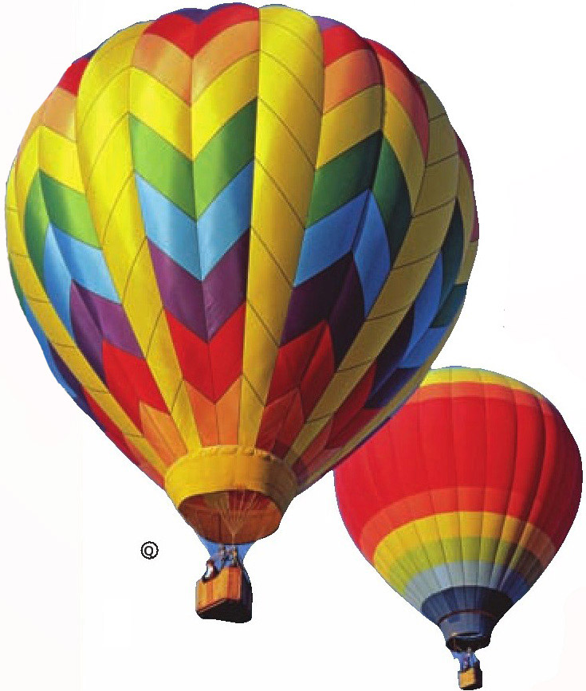
热气球的诞生，实现了人类飞行的愿望。从那以后，热气球运动一直兴盛不衰。近些年来，甚至有人尝试乘坐热气球环游世界。

那么，热气球是否能环游世界呢？热气球的唯一飞行动力是风。若要乘热气球完成环球飞行，必须选择速度和方向都合适的高空气流，并随之运动。热气球飞行的高度通常要达到几千米，为了搭乘不同的气流，飞行员所要做的就是调整高度。看来，这在理论上是可行的，而具体实践呢？

1999年3月，瑞士的皮卡尔和英国的琼斯驾驶“轨道飞行器3号”热气球，花了近20天，完成了第一次不停歇的热气球环球飞行。

2002年7月，美国人福塞特乘坐热气球，完成了单人不间断环游世界的壮举。为了完成这个梦想，他进行了5次尝试，终于在第6次取得成功。他花了13天时间，乘坐他的高科技热气球——“自由精神号”环游了世界！

2012年12月，美国航空航天局的“超级虎”气球在南极洲的美国麦克默多科考站升空。在3.87万米的高空飞行55天1小时34分钟后，它满载着需要科学家分析处理整整两年的数据着陆了，创下了气球飞行时间的最新纪录。这个庞大气球的体积足有110万立方米，里面可以放得下200只小型飞艇。它携带的有效载荷超过2700千克，飞行高度约是普通商业客机的4倍。这个科考气球属于无人驾驶氦气充气型，这种气球由塑料薄膜制成，其厚度不超过常规食品袋。（陈丽）

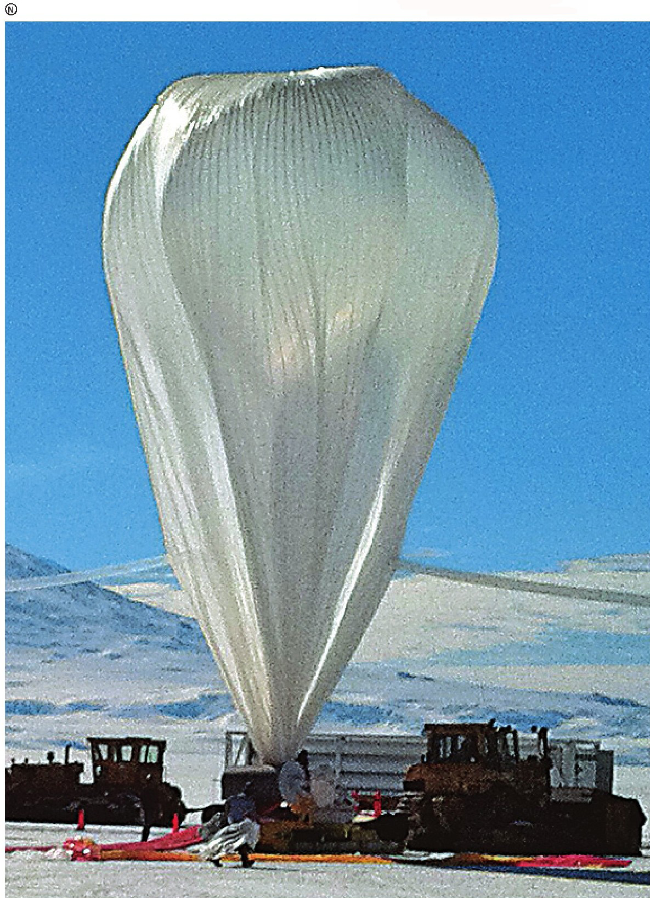
“超级虎”气球

  

**【微博士】**气球飞行的高度

1961年5月4日，美国人罗斯和普罗泽从美舰“安蒂特姆号”甲板上乘坐气球升空，在墨西哥湾上空创造了34668米的载人气球升空最高纪录。1972年10月，在美国加利福尼亚州，一个143万立方米的巨大气球，一直飞到51815米的高度，创造了不载人气球最高升空纪录。2005年11月26日，印度富翁辛加尼亚在印度孟买乘4.53万立方米热气球飞至21290米的高空，创造了新的载人热气球升空最高纪录。

## 飞艇还能东山再起吗

世界上第一艘能够实现实用化操作的飞艇是法国人吉法尔于1851年制造的。它长约44米，由功率约2.21千瓦的蒸汽机带动三叶螺旋桨驱动，外形好似一支雪茄烟。1852年9月24日，吉法尔以氢气为填充气体，驾驶飞艇从巴黎郊外跑马场起飞，以10千米/时的速度飞行了27千米，创造了世界上飞艇首次飞行的纪录。

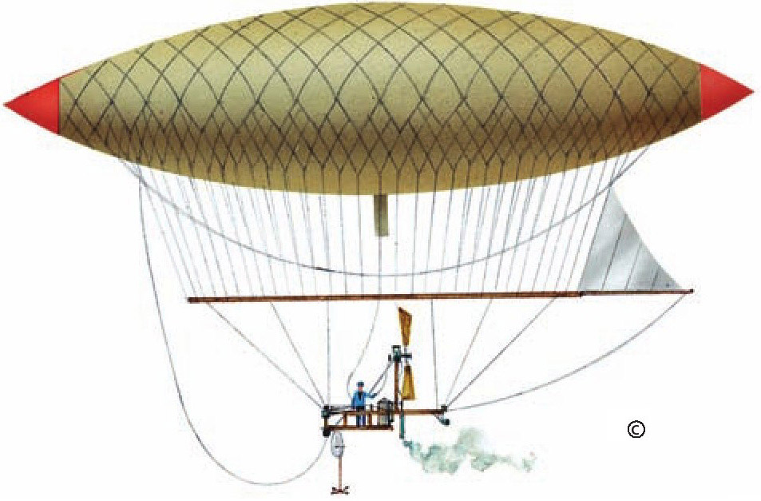
吉法尔飞艇

世界上第一艘真正实用的硬式飞艇是由德国的齐伯林伯爵于1900年制造的。该艇长约128米，直径约12米，框架为木质，外面蒙有防水布，有16个气囊，由2台约11千瓦的发动机驱动前进。齐柏林后来又与他人合作，在20多年的时间里制造了129艘各式飞艇，大大加强了德国的军事力量。但是，氢气飞艇非常不安全。在第一次世界大战中，作为新技术之一的飞艇主要用于军事侦察、炮火定位、海岸巡视等方面。后来，相对于飞速发展的飞机性能，飞艇的缺点越来越突出，逐渐被挤出了空中舞台。1937年5月，德国约245米长的巨型飞艇“兴登堡号”在飞抵美国准备停泊时，尾部突然起火并引燃了填充气囊的氢气，飞艇焚烧殆尽，约36人不幸遇难。

近年来，飞艇又以近地空间浮空器的形式东山再起。近地空间通常是指高20～100千米的空域，介于传统航空器和航天器活动范围之间。在近地空间区域底部，20～30千米高度范围内风速较低，特别是在20～24千米附近，平均风速低于9米/秒，对能源系统的要求较低，非常适合低速航空器实现持久的区域停留。

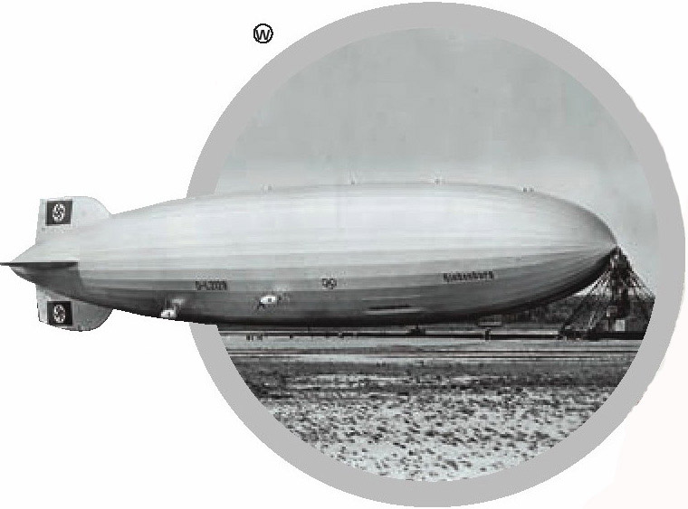
“兴登堡号”飞艇

目前，世界各国对近地空间飞行器的研究热点集中在平流层飞艇、浮空气球和高空长航时无人机上。它们可以作为卫星和飞机的有效补充。其中，平流层飞艇在通信、导航、大气监测、商业旅游等活动中具有潜在的应用前景。（陈丽）

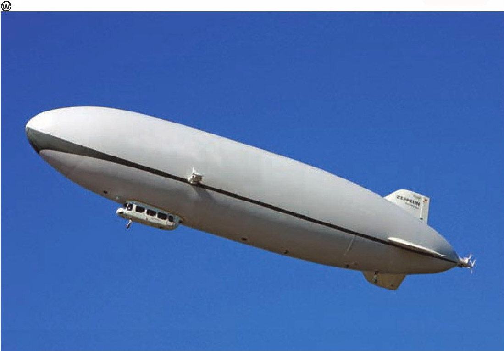
现代飞艇

  

**【微博士】**浮空器

浮空器指的是轻于空气的航空器。其气囊内充以密度比空气小的浮升气体（氢气或氦气），借以产生浮力使之升空。根据是否具备推进装置，浮空器分为气球和飞艇两种。气球是不带推进装置的，通过自带的加热器加热空气或充入氢气或氦气产生浮力升空，并通过配重和充放气来实现升降。飞艇则是一种装有安定面、方向舵和升降舵的流线型气球，并有发动机带动螺旋桨产生推进力，它可以按既定的航线飞行。

【微问题】飞艇曾因为安全性问题而退出空中舞台，那现在的飞艇如何解决这一问题？

【关键词】热气球　飞艇

# 导言

## 为什么要开展航空航天活动

在浩瀚的宇宙中，我们目前知道唯有太阳系中的地球，蓝天碧海，气象万千，生机勃勃，物种繁茂。地球是宇宙的骄子，是各种天缘巧合、奇迹汇聚的行星。地球自46亿年前形成以来，早期经历过严酷的演化过程。大约在38亿年前，地球上诞生了最原始的生命。生命在海洋中繁衍进化，逐渐向陆地延展。地球上的物种经历过多次灭绝性的大劫难，但生命演化的链条始终得以延续和发展。大约300万年前，地球上诞生了人类。经历从猿到人的艰难演化过程，随着科学技术的进步和生产力的发展，人类建立了高度文明的社会。

起初，人类栖息在陆地上，但星罗棋布的河流湖泊，一望无际的海洋，激励着人类去拓展自己的生存空间，获取更多的生活资源。在开发海洋的过程中，人类逐步建立了与社会发展相适应的航海体系。

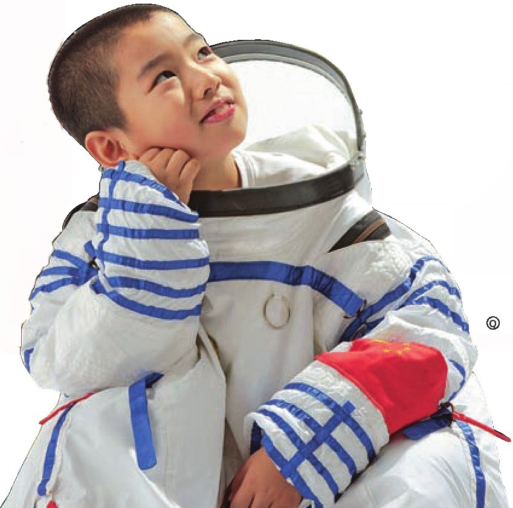
人类更期望能翱翔天空，遨游宇宙。在生产力和科学技术水平低下的时代，这些都只能停留在幻想的期盼中。18世纪的热气球升空，20世纪初具有动力装置的飞机短暂飞行，使人类在大气层中的飞行成为现实，取得了在低层大气层内活动的自由。20世纪50年代中期，在火箭、电子和自动控制等技术突飞猛进发展的基础上，1957年10月4日苏联成功发射了第一颗人造地球卫星，人类的空间时代开始了！1959年苏联发射了“月球1号”探测器，这是人类首个抵达月球附近的探测器。1961年，苏联航天员加加林实现了108分钟的太空旅行，这是人类历史上第一次载人航天飞行。1969年美国航天员阿姆斯特朗在月球上留下了人类的第一个足印，开启了载人登月的新纪元。

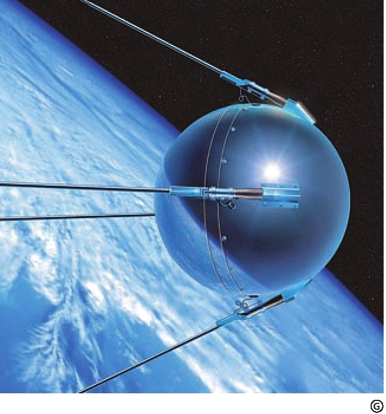
世界上第一颗人造地球卫星

人类活动范围的每一次飞跃，都大大增强了认识和适应自然的能力，拓展了生存与发展的空间，改善了生存环境，带动了科学技术的创新与进展，促进了生产力的发展和社会进步，体现了人类探索未知世界的永恒追求。

航空航天活动是推动科学技术创新发展的强大引擎，对促进国民经济发展和社会进步发挥了巨大作用。航空航天活动对提高全民科学素养、激励青少年的探索精神也具有重大意义。

航空是指飞行器在地球大气层内的航行活动。人类对航空的探索经历了艰难曲折的历程，从气球、飞艇到具备动力和可操纵的飞机，从突破“音障”和“热障”到超声速飞行时代，人类的航空活动形成了一个技术先进、应用广泛、安全、快速和舒适的体系。

航天是指飞行器在大气层外超高真空的太空中的航行活动。人类当前的航天活动大致划分为3个领域：（1）人造地球卫星与卫星应用，包括近地卫星、中高轨道卫星、静止轨道卫星和卫星星座等；（2）载人航天，包括载人飞船、空间实验室和空间站等；（3）深空探测，当代的深空探测也就是太阳系探测，探测太阳系的各层次天体、太阳和太阳系空间。

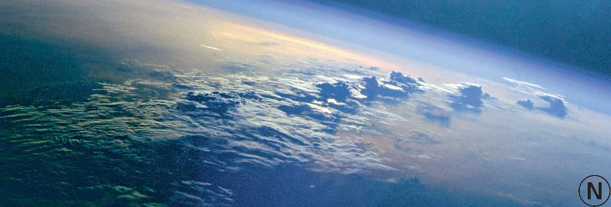
从“国际空间站”上看到的美丽地球

航空航天技术是现代科学技术高度综合集成的体系，如阿波罗计划是人类有史以来规模最大、耗资最多的科技项目之一。参加阿波罗计划的有2万余家企业、200多所大学、80多个研究所，总人数超过40万。阿波罗计划的实施，促进了20世纪60年代到70年代的巨型火箭、微波雷达、无线电制导、合成材料、计算机、电子技术、自动控制、真空技术、低温技术、半导体技术、制造工艺等一大批高技术领域的发展。阿波罗计划产生了3000多种新技术，推动了科技的进步和工业的繁荣，获得了巨大的经济效益和社会效益。

航空航天活动推动了一系列高新技术的诞生、成长、推广和应用，催生了一大批新学科的形成、创新、开拓和发展。

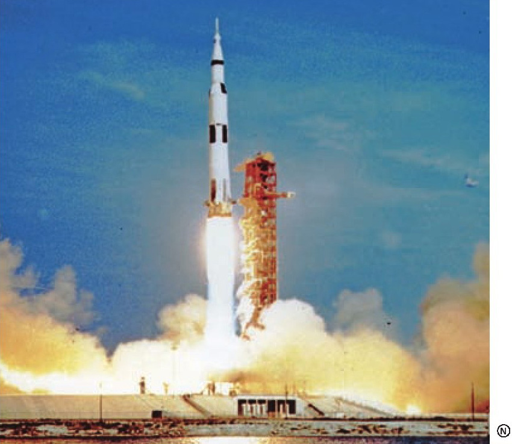
阿波罗计划的火箭“土星5号”

航空航天活动对国民经济和社会生活的许多方面都产生了重大影响，改变了世界的面貌。航空的发展不仅改变了交通运输的结构，还广泛应用于空中摄影、大地测绘、地质勘察、资源调查、播种施肥、除草灭虫、森林防火和环境保护等方面，对传统生产方式的变革产生了深远影响。

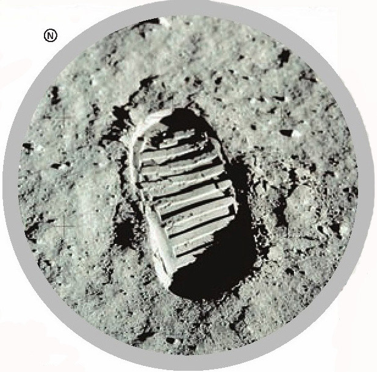
人类在月球上留下的足印

航天技术直接服务于国民经济的众多领域，卫星通信、卫星广播与电视、卫星气象预报、卫星导航、卫星资源勘查、灾害预报和环境监测等改变了人们的生产和生活方式，产生了巨大的经济效益和社会效益；各种科学探测卫星、天文观测卫星和科学实验卫星的应用，拓展了人类的视野，获得了大量的新发现，更新了人类对地球空间、太阳系和整个宇宙的认识，产生了一系列的新兴学科。航天器为人类创造了一个具有众多特殊环境的实验平台，开展在高真空、微重力、超低温、强辐射太空环境中新材料、生物制品和新工艺的综合研究。深空探测的开展能带动一系列先进新兴技术的突破与发展，并为人类社会的可持续发展提供支撑与服务。它带动了人类对生命的起源、太阳系的形成与演化的研究，使比较行星学兴起与成长，还推进了太阳活动与小行星撞击对地球的灾害性影响、对地外资源与能源的开发利用、建立月球与火星基地拓展人类生存与发展的空间等领域的进展。深空探测还有助于我们了解并保护地球。

航空航天活动已经成为衡量一个国家科学技术、国防建设和国民经济现代化水平的重要标志。航空航天活动始终不渝地追求和平开发利用空间，造福全人类的崇高目标，是人类在探索未知世界中成就辉煌而又最令人激动鼓舞的领域；航空航天活动展示出人类最新科技成就的综合、集成、交汇与创新的完美融合，集中体现了人类探索未知、不畏风险、献身科学、勇往直前的精神风貌。因此，普及航空航天知识，弘扬航空航天的科学精神与科学思想，发扬“两弹一星”和载人航天精神，对于提高全民科学素养，激励青少年热爱科学、探索未知的精神都会发挥重大作用。（欧阳自远）

  

【微问题】目前为止，人类制造的飞得最远的探测器是哪一个？

【关键词】航空　航天

## 谁是第一个开飞机上天的人

对于这个问题，大多数人都会回答：莱特兄弟！是他们发明了飞机！

1903年12月17日，莱特兄弟在美国北卡罗来纳州的基蒂霍克试飞了自己制造的“飞行者1号”。弟弟奥维尔·莱特通过掷硬币赢了自己的哥哥威尔伯·莱特，首先驾驶“飞行者1号”，在12秒之内飞了36米的距离。当天的最后一次试飞由哥哥驾驶，飞行距离为260米，空中时间为59秒。在同时期发明的飞机中，“飞行者1号”的外形最接近现代飞机。

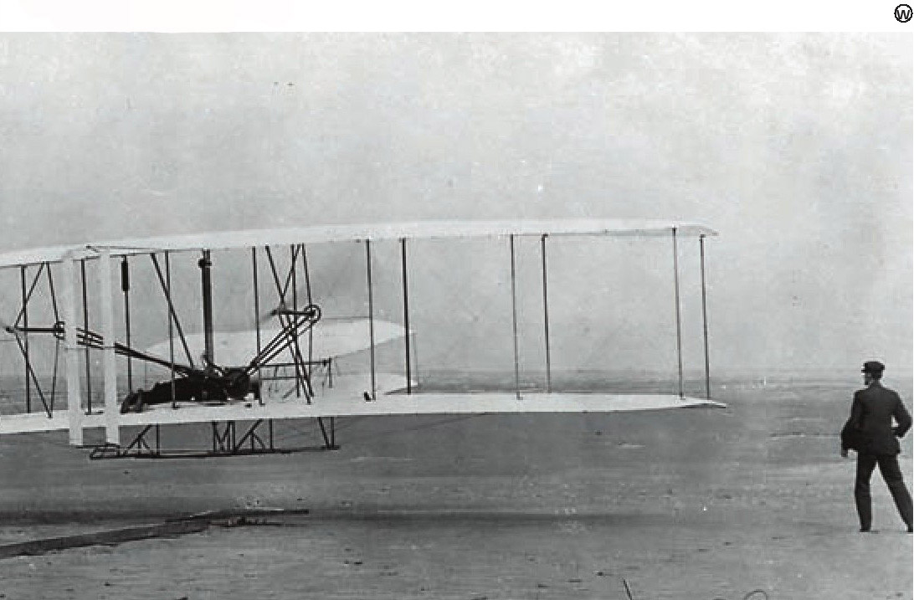
莱特兄弟的第一次飞行

但是，如果你问一位巴西人：“是谁最先发明飞机的？”他一定会回答：“是巴西人杜蒙特！”杜蒙特生于巴西，后侨居当时航空活动非常流行的法国。1906年，他研制成一架名为“双14”的飞机，同年进行了试飞，成为在欧洲驾驶动力飞机飞行的第一人。杜蒙特还在1908年制造了最早的超轻型飞机“蜻蜓号”，这架飞机翼展5米，长8米，重110千克。因此，他被誉为“现代超轻型飞机之父”。

另外一个被认为首先发明了飞机的人是法国电器工程师阿代尔，他制造了一架外形与蝙蝠类似的飞机——“风神”。1890年10月9日，阿代尔试飞了“风神”，离地高度约为20厘米，在没有控制的情况下飞行了约50米。阿代尔的发明引起了法国军方的注意，资助他进行飞机的研制。1897年，阿代尔制造出了“飞机3号”，但由于操控问题而没有试飞成功。后来军方停止了资助。由于涉及军事秘密，这项没有成功的研究直到1910年才公之于众，而那时莱特兄弟已经向全世界宣布了他们的发明。

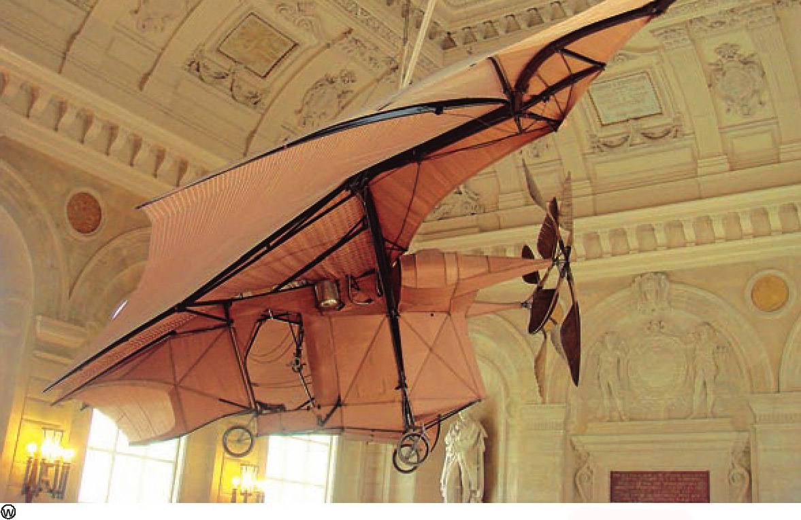
“飞机3号”

目前，“飞行者1号”的试飞是世界公认的最早的动力飞机飞行。但是，19世纪末到20世纪初涌现了一批勇于进行航空探索和实践的科学家、工程师，飞机在这一时期被发明是有其必然性的。莱特兄弟的成功正是建立在无数人不断探索和辛勤工作的基础上的。（于哲峰）

## 为什么飞机不像鸟儿一样扇翅飞行

人类看到飞翔的鸟类和昆虫后才有了飞行的向往，所以一开始人们认为只有模仿鸟类那样扇动翅膀才能飞行。达·芬奇、阿代尔等都进行过扑翼机的研究，但首先飞上天并进入实用阶段的不是扑翼机而是固定翼飞机。时至今日，人们仍然没有制造出实用的载人扑翼机。

大型飞机使用固定翼并靠发动机来获得动力。通过固定翼能产生较大的升力，从而实现高效的飞行，如果采用扑翼形式必须要使用足够结实的材料并解决操纵控制问题。目前有较好实用性的扑翼机还都是微型的飞行模型，主要用于执行在狭小空间内的飞行任务，如复杂地形和建筑物内的侦查、监视，危险环境探测等。世界上多个国家都在进行扑翼机的研究，如美国加州理工学院与航空环境公司合作研制的“微型蝙蝠”，其机翼模仿蝙蝠的翅膀，由钛合金骨架和复合材料薄膜制成，重约12.5克；德国费斯托公司的“智能鸟”，大小与海鸥相当，无论外形还是飞行动作都酷似真鸟，重450克。中国也有一些机构和大学在进行扑翼机的研制，如南京航空航天大学制造了一种形似鹰的扑翼机，能穿越狭窄的空间，进行空中盘旋，可用于侦察和机场驱鸟。（于哲峰）

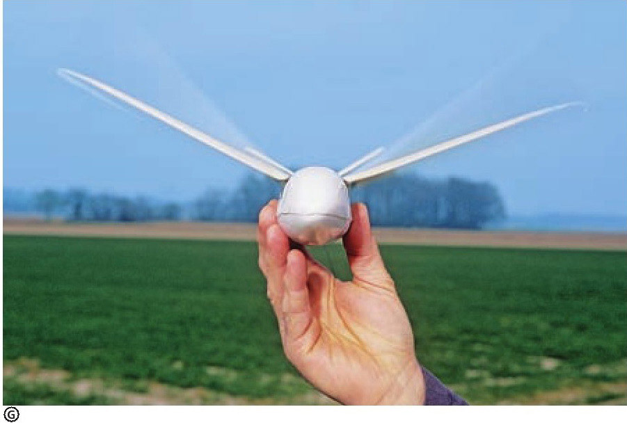
## 纸飞机怎么能飞得又高又远

2009年4月，日本折纸飞机协会的主席户田拓夫，创造了纸飞机飞行时间的新世界纪录：27.9秒，比原纪录长0.3秒。2012年2月，美国纸飞机大师约翰·柯林斯设计的纸飞机飞出了69.14米，创造了纸飞机飞行距离的新纪录。那么，怎样才能让纸飞机飞得又高又远呢？

纸飞机的飞行过程是先被“发射”到一定的高度，然后滑翔飞行。所以，尽管是由一张纸折成，但纸飞机在本质上是一个滑翔机模型，需要良好的空气动力性能，其设计中包含了相当的科学原理。

我们折纸飞机时，首先要想到，要让它在相同的速度条件下，能获得较大的升力和较小的阻力。那么，机翼面要模仿真实的飞机，具有一定的弧度，就像拱桥一样中间略高，并在保持机翼形状的情况下，使前端略上翘，与机身有约5°的夹角。细长的机翼可以使阻力有所降低，但受纸质强度的限制，机翼过于细长不利于它的高速投出。模仿波音747-400，在翼尖折出一个上翘的小翼，可以达到减小阻力的效果。另外，为了获得合适的气动性能，可以用剪刀在机翼后缘剪出一些小缺口，并试着变换一下角度。

要保证纸飞机的稳定性，我们可以让机翼有一定的上反角，即在保持已有的机翼形状下，让其以翼根为转轴，微微上翘。而如果你追求的是留空时间而非滑翔距离，那么应该在不影响投掷发力的情况下，尽量增大机翼的面积，而减小机身重量。

当然，投掷纸飞机的技术也有讲究，投掷的角度和速度都直接影响飞行成绩。为了投远，需要同时保证竖直和水平的投掷速度；而为了增加留空时间，投掷方向应在与垂直方向成10°夹角的范围内，也就是说尽量向上掷出。（于哲峰）

  

【微问题】谁是第一个驾驶飞机升空的中国人？

【关键词】莱特兄弟　扑翼机　纸飞机

## 飞机是怎么控制方向的

汽车在地面运动时，只需要用方向盘控制方向就可以了。飞机在飞行时则靠空气流的升力托举，没有地面的支撑，因而飞机方向的控制要比汽车更加复杂。

具体说来，飞机飞行时的方向控制有3种方式：（1）飞机的低头和抬头，叫作俯仰；（2）飞机机头向左偏转或向右偏转，叫作偏航；（3）飞机绕机身纵轴向左倾斜或向右倾斜，叫作滚转。飞行员是通过驾驶杆和脚镫来控制飞机的这些运动的。

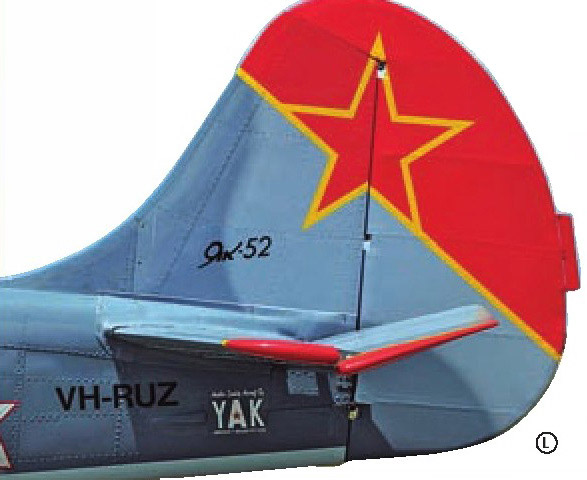
YAK-52教练机的升降舵向上偏转

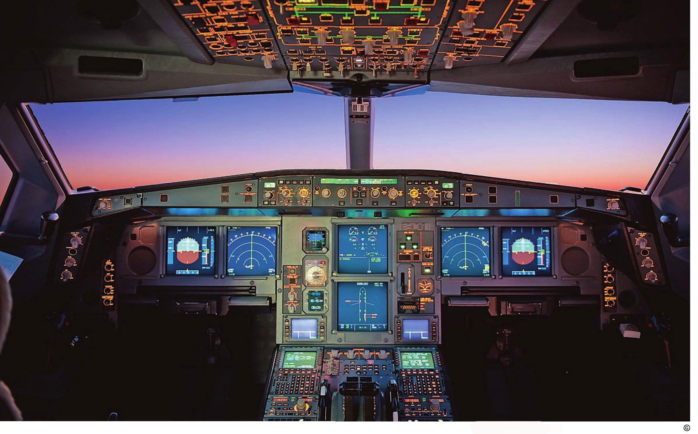
现代化的飞机驾驶舱

首先，我们来了解一下飞机俯仰方向的控制。一般我们常见的飞机，尾部有一对小的水平方向的翼面，叫作水平尾翼（简称平尾）。在水平尾翼的后缘，各有一个可上下活动的舵面，叫作升降舵。升降舵有控制飞机俯仰的作用。在飞行时，飞行员向后拉驾驶杆，升降舵会向上偏转，使气流对水平尾翼产生向下的力，将飞机尾部下压，于是飞机就会抬头向上飞行。

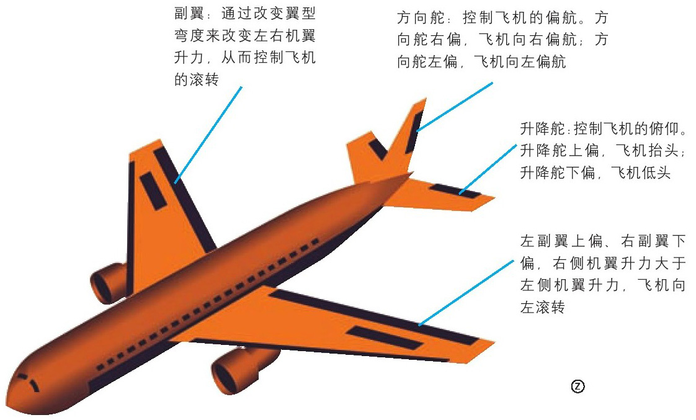
同理，飞行员向前推驾驶杆，升降舵会向下偏转，气流对水平尾翼产生向上的力，使机头下沉，飞机就会低头向下俯冲飞行。

再看飞机偏航方向的控制。常见飞机尾部的尾翼中间，有一个垂直方向的翼面，叫作垂直尾翼（简称垂尾）。它对飞机向左或向右的偏转起着稳定性作用。垂直尾翼的后缘也有一个可活动的舵面，叫作方向舵。它控制着飞机偏航的方向。飞机在飞行时，飞行员向右蹬脚镫，方向舵会向右偏转，使气流对垂直尾翼产生向左的力，从而使得机头向右偏转，飞机就会向右产生偏航。同理，飞行员向左蹬脚镫，方向舵向左偏转，飞机就会向左产生偏航。

最后了解一下飞机滚转方向的控制。飞机左右机翼后缘外侧各有一个活动的舵面，叫作副翼。副翼控制着飞机向左或向右倾斜，倾斜的角度即坡度。在飞行时，飞行员向左压驾驶杆，飞机右侧的副翼就会向下偏转，使得右侧机翼弯度增大，升力增大。同时，左侧的副翼向上偏转，使得左侧机翼弯度变小，升力减小。这样，左右的升力差使得飞机向左滚转。同理，飞行员向右压驾驶杆，左侧的副翼向下偏转，右侧的副翼向上偏转，飞机向右滚转。（张首智）

  

**【微博士】**开汽车时，控制方向盘的力基本不变，驾驶飞机也是一样吗

我们驾驶汽车时，控制方向盘的力基本不会随着速度变化而变化。但驾驶飞机可不是这样的，飞行员用于驾驶杆的力会随着速度的变化而变化。飞机的速度越快，气流的冲击力也就越大。此时要操纵飞机，控制飞机的翼面摆动，就需要更大的力。这一点在低速飞机上还不明显，但到了高速的喷气式飞机上，飞行员的力量已不足以控制飞机，人们不得不设计助力系统，放大飞行员的控制力才能控制住高速飞行的飞机。

**【微博士】**飞机的机头总是朝着前进方向吗

一般情况下，飞机的机头都和前进的方向一致，但有时也会偏离前进的方向，这种情况就叫侧滑。侧滑能力和改出侧滑的能力是飞机操纵品质优劣与否的重要指标。先进的军用飞机几乎可以像螃蟹一样“横”着身子向前飞行，利用这种高机动性，它可以轻松地锁定目标。而飞机在降落时如果发现没有对准跑道，或者发现受到风的影响发生偏航，也可以利用侧滑的方法回到正确的航线上。控制侧滑是一个比较复杂的操纵过程，需要方向舵、副翼和升降舵的共同作用才能完成。

## 为什么飞行服没有纽扣

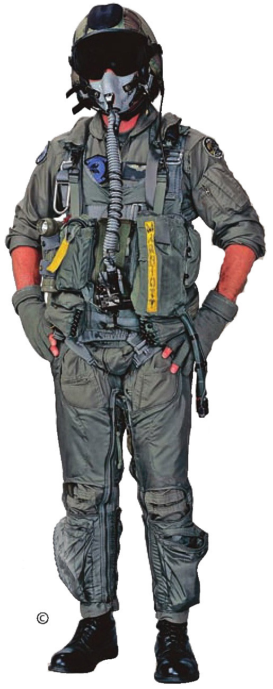
飞行服是专供飞行人员在空中执行任务时穿的特殊服装，整套装备包括飞行头盔、围巾、外衣裤、内衬衣裤、手套、飞行靴等。飞行服可在飞行中的各种极端条件下保障机上人员的正常作业能力和维持生命安全。

以前的飞行服上是有纽扣的，但一颗纽扣引发的灾难，彻底改变了这一切。20世纪50年代北约的一次军事演习中，某国一架最先进的战斗机，由经验丰富的飞行员驾驶做飞行表演时，飞机刚升空不久就坠毁爆炸。经过严密的调查分析，最后的结果让人大吃一惊：是飞行服上脱落的一颗纽扣掉入机内，导致了设备故障，使得飞机失控坠毁。此后，各国空军吸取教训，去掉了飞行服上所有的纽扣，改用拉链和尼龙搭扣。

其实不光是纽扣，任何掉入飞机内的异物（或称为多余物，如零件碎片、紧固件、维修检测工具等）都非常危险。当飞机做剧烈的机动动作时，这些异物会导致机件卡滞、电器短路、仪器设备失灵等故障，严重威胁飞行安全，甚至直接导致机毁人亡。因此，飞机座舱（机舱）内部对异物控制非常严格：不仅飞行员，地勤、机务人员的服装也没有纽扣；每次检修完飞机后要认真清点核对备件与工具数量，以防遗落于机内；飞行员不得携带无关细小物品登机飞行。（石坚）

  

【微问题】为什么民航飞机的驾驶员不需像战斗机驾驶员那样穿上飞行服？

【关键词】飞机的方向控制　飞行服

## 飞机的失速是怎么回事

飞机的升力由机翼在空气中运动产生，也就是说要有气流流过机翼才有可能产生升力。当大于一定速度的气流平滑地流过机翼时，会在机翼的上表面和下表面产生不同的压力，上下表面的压力之差就产生了升力。如果飞机的速度不够，机翼上下表面没有足够的压力差，也就产生不了足够的压力。这种情况就叫“失速”。

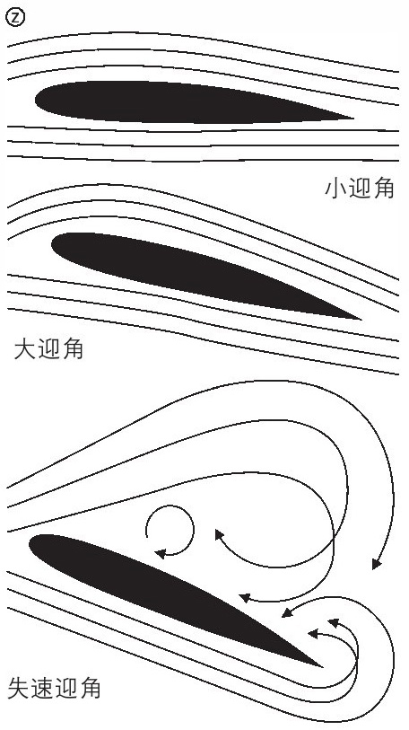
除了速度之外，机翼的迎角，即机翼与气流方向的夹角也会对机翼的升力产生影响。一般来说，迎角越大，机翼所产生的升力也就越大。但是当机翼迎角大于一个临界值以后，机翼上表面的气流会发生严重分离。产生的升力也迅速降低，这同样被称为失速。

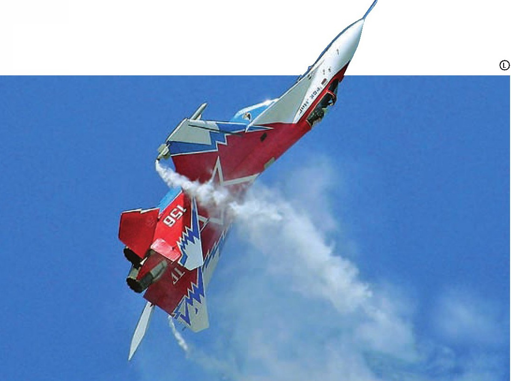
米格-29战斗机在做“眼镜蛇机动”动作，此时的迎角已超过90°

失速对于飞机来说是非常危险的。一旦发生失速，飞机就会马上往下掉。这时飞行员可以通过压下机头以减小迎角，同时俯冲增加速度的方式来摆脱失速状态。一般的飞机都会尽量避免失速。不过也有一些飞机特别是战斗机会在一些特殊的情况下刻意进入失速状态。比如著名的俄罗斯苏-27战斗机的“眼镜蛇机动”，就是飞机在合适的高度和速度下，人为地进入失速状态，最后从失速状态中恢复。这个动作可以让飞机的速度瞬间从400千米/时降到100千米/时，甚至更低，以便在战斗中占据有利位置。（张首智）

## 为什么飞机不能做太急的转弯

飞机的转弯通常是通过操纵副翼和升降舵进行的。如果飞机转弯的半径大，转得和缓，只需要压驾驶杆使飞机产生坡度，再稍微拉一点升降舵就可以了。如果转弯半径小，转得急，则需要产生更大的坡度，并且需要更大的拉杆量来完成。战斗机在做大过载转弯时，坡度接近90°。

理论上讲，当飞机水平转弯时，飞机坡度越大，转弯时的向心力越大，作用在机翼上的气动力也就越大。因为机翼能够承载的载荷是有限的。如果飞机转弯过急，作用在机翼上的载荷就会超过限值，容易对机翼结构造成破坏，导致飞行事故。因此，飞机不能做太急的转弯。（张首智）

## 为什么有的滑翔机要驾驶员躺着驾驶

滑翔机是一种重于空气的固定翼航空器，可以不用动力飞在空中。在无风的情况下，滑翔机通过降低高度来获得速度，把重力势能转化成前进的动能，这种从高到低的无动力下滑飞行称为“滑翔”。在上升气流中，滑翔机可以像老鹰那样平飞或爬高，通常称为“翱翔”。滑翔和翱翔是滑翔机的基本飞行方式。无动力的滑翔机可以由飞机拖曳起飞，也可以由绞盘车或汽车牵引起飞，还有的可利用从山坡等有高度差的地形起飞。动力滑翔机则可以依靠动力装置自行起飞，飞到一定高度再开始滑翔。

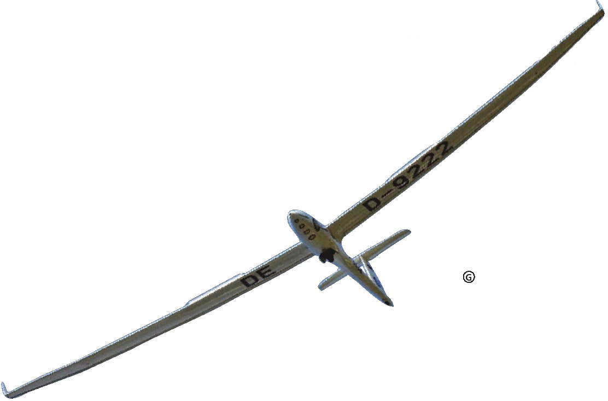
滑翔机都有狭长的机翼

滑翔机的飞行特点要求其飞行时要尽可能减小飞机的飞行阻力、提高飞机的升力。升力与阻力之比称为升阻比。现代高级滑翔机的升阻比最高已超过50（也就是产生50牛升力的同时，仅有1牛的阻力）。

为了保证好的升阻比，滑翔机在设计时，趋向于让驾驶员躺卧舱中，以便减小机身的截面积，并且表面光滑，甚至打蜡，以减少阻力。同时，滑翔机的机身往往很细长，呈流线型，并且具有与普通飞机显著不同的狭长机翼，因为这样的机翼阻力较小。

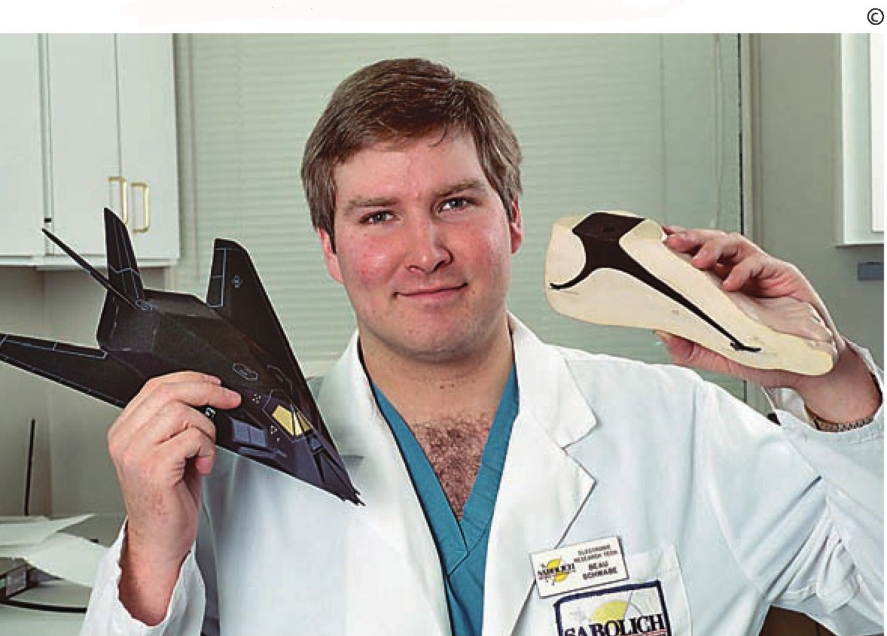
除了用于造飞机，碳纤维复合材料还能用于制造假肢

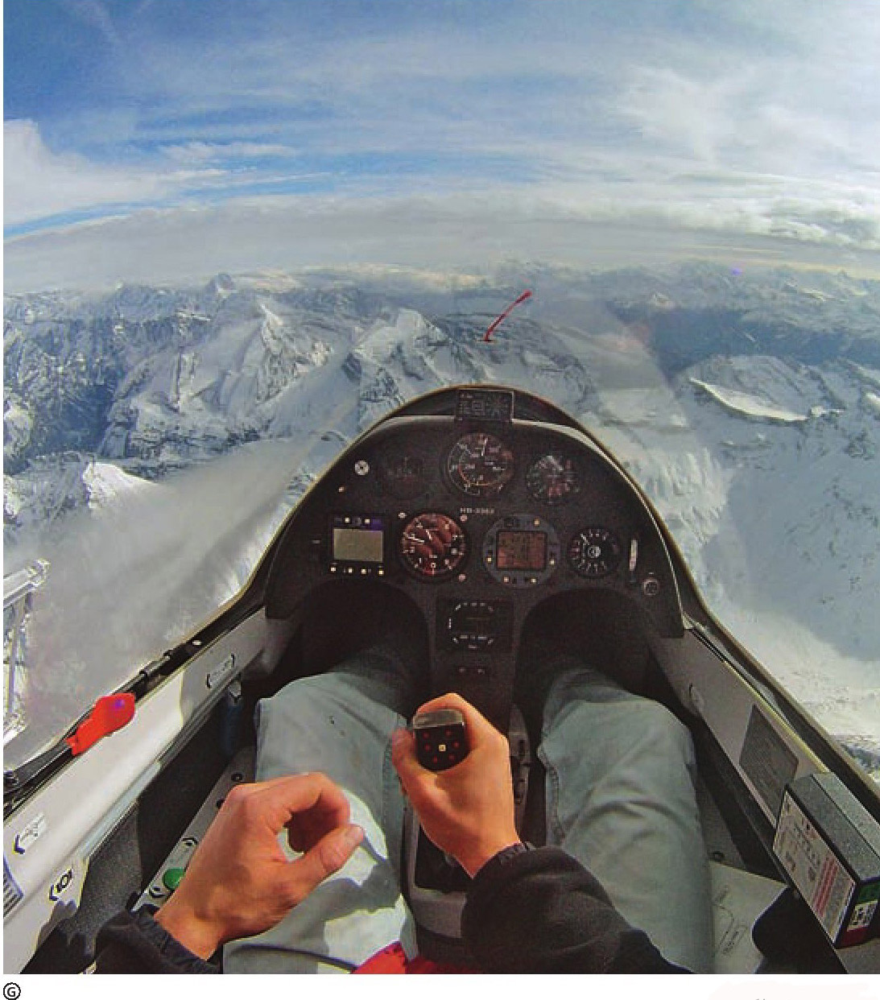
滑翔机驾驶舱

现代滑翔机采用强度高、重量轻的材料制造，主要结构材料有：木材、航空层板、合金材料、复合材料等。20世纪70年代以后，出现了用碳纤维复合材料造的高级滑翔机。越轻的滑翔机飞得越远。

人们常用滑翔比（滑翔中前进距离与下降高度之比）来衡量滑翔性能的优劣，现代高级滑翔机的滑翔比可高达50：1：即在无风条件下，滑翔机每下降1米的高度就可在水平方向上滑翔50米的距离。这相当于从安徽的黄山顶上起飞，可以一直飞到浙江的淳安县，约100千米！如果遇到上升气流，这样的滑翔机甚至可以一整天都不会落到地面！（张首智）

  

**【微博士】**展弦比

机翼的翼展和机翼的弦长（大致可以看作机翼的宽度）之比称为展弦比。展弦比越大，机翼就越细长，阻力就越小。但跨声速飞行时，大展弦比飞机的激波阻力就会增加。所以，亚声速飞机一般选用大展弦比机翼，高级滑翔机的展弦比可达30以上，大大减小了飞行时的阻力，而超声速战斗机的展弦比一般为2.0～4.0。

【微问题】除了滑翔机，碳纤维复合材料还被应用在哪些领域？

【关键词】失速　升阻比　滑翔比

## 为什么飞机能飞上天

与气球、飞艇等利用空气浮力升空的飞行器不同，飞机是密度大于空气的飞行器，其主要的升力来源是机翼在空气中运动所产生的动力。在了解飞机升力的产生之前，我们需要认识空气流动的特性，即空气流动遵循的两个定理：连续性定理和伯努利定理。

人们假设空气的流动是在一个个看不见的管道中进行的，这些管道被称为“流管”。所谓连续性定理，即当空气在流管流动时，同一时间内，流经各个截面的空气质量是相同的。伯努利定理则说的是：空气在流管中流动时，流速大的地方压强小，流速小的地方压强大。

切出机翼的横截面，我们可以发现其上表面的弯曲程度要比下表面的大。气流流过机翼时，空气在前缘被分为两部分，分别从机翼上下表面流过。根据连续性定理，在某一瞬间分离的空气，又会同时到达机翼的后缘，汇合后继续向后方流去。由于机翼上表面向上弯曲，空气流动的空间缩小，速度就加快。而机翼下表面空气流动的空间扩展，速度变慢。再根据伯努利定理，上表面相对较快的气体对机翼的压强会小于下表面较慢的气体对机翼的压强，综合的效果就使机翼受到了一个向上的合力（升力），使飞机凌空而起。（颜思铭）

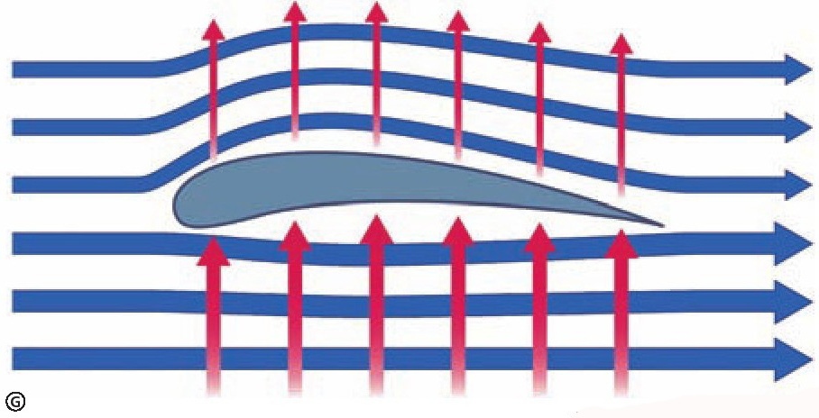
机翼受到的升力示意图

  

**【实验场】**吹口气，验证伯努利定理

用双手各拿一张纸，并以较近的距离平行垂下。从上方向两张纸中间吹气，两张纸就会向中间靠拢。这就是由于纸中间的空气流动速度大，压强低；纸外侧空气相对静止，压强大，从而产生向内的压力使它们靠近。

## 为什么有些“飞机”能贴着水面飞行

在各种类型的飞行器中，有一种飞行器可以贴着水面飞行，这就是“地效飞行器”。地效飞行器的机身与船相似，但其运行速度远高于船，而且可以离开水面上升到一定高度，这是一般的船无法做到的。

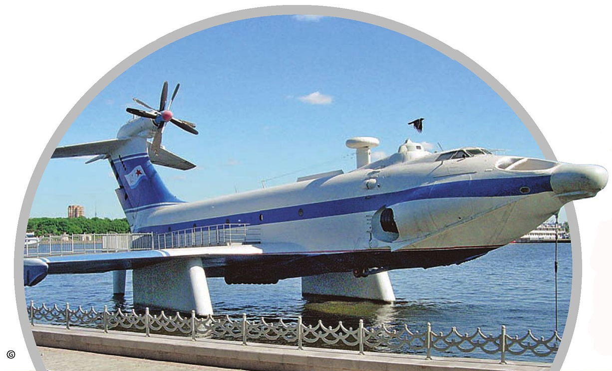
里海怪物

地效飞行器利用的是一种叫作“地面效应”的原理：当飞行器在贴近地面或水面飞行时，飞行器机翼的上下压力差显著增大，使升力大幅增加。对普通飞机来说，离地面最后十几米范围内，也可能因为获得地面效应而使升力得到增加。

苏联是研制地效飞行器种类较多的国家。在20世纪80年代，美国间谍卫星发现苏联正在里海秘密试航一种既像飞机又像船的奇怪东西。与水上飞机不同的是，它几乎只贴着水面高速航行，因此西方国家把它叫作“里海怪物”。后来，随着资料解密，大家才知道所谓里海怪物是一种地效飞行器。它的尺寸和载重量非常惊人：长达106.1米，翼展40米，有一个操场那么大，起飞重量达到495吨，有100只大象那么重，比一般飞机的运载能力大得多。

不过，地效飞行器通常只贴近地面或水面飞行，很少飞到高空。如果到了高空，空气密度变小了，飞行器的升力会下降，而无法维持与载重的平衡。（颜思铭）

## 真的有人造出过飞碟吗

人们常把碟状的飞行物简称为飞碟。奥运会上的飞碟射击项目所射击的对象就是用石灰石、沥青等制成的飞碟。但它们是由机器掷出的。有没有靠自己的力量飞起来的飞碟呢？

20世纪50年代，加拿大阿弗罗公司为美军研制开发了一款名为“阿弗罗轿车”的垂直起降航空器，以帮助美国空军及陆军研制更先进的战斗机。这款“概念机”的外形就很像飞碟。

“阿弗罗轿车”是用来验证一种叫“附壁效应”的空气动力学效应能否用于航空器。这种效应在水或空气流经平滑凸起的物体表面时会出现。比如把一个球放在水龙头下面，你会发现水流过球的上半球后不会竖直流下，而是被球“吸引”，沿着球的下表面流动。利用这种效应，“阿弗罗轿车”用一个风扇把空气从中心向外吹，气流在圆盘边缘被引导着向下排出，使得它能够垂直起降。但是在飞行测试中，“阿弗罗轿车”暴露出在推力和稳定性方面存在一系列问题：它只能在离地一米左右的空中颤抖着悬停。最终，这个计划失败了。

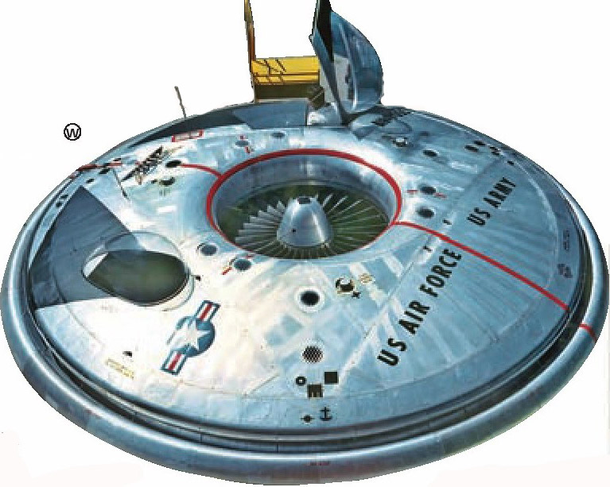
“阿弗罗轿车”

不过，人们把附壁效应运用到其他的一些航空器上却获得了成功。比如安-74飞机，就把喷气式发动机装到机翼上方，借附壁效应使气流沿机翼表面流动，防止气流产生分离，以提高升力。（颜思铭）

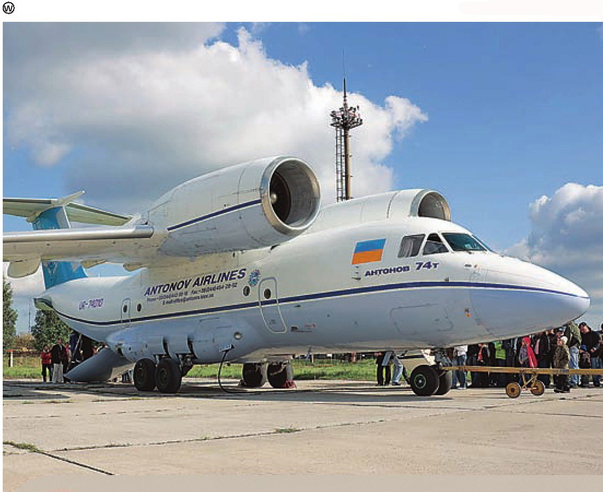
安-74飞机

  

**【微博士】**附壁效应

附壁效应是罗马尼亚发明家亨利·科安德首先发现的。为此，他与同事进行了20多年的相关研究。科安德是航空先驱之一，“现代喷气式飞机之父”。1910年，他设计建造并且试飞了第一架喷气式飞机“科安德—1910”。他还想到了利用附壁效应来制造垂直起飞的航空器。科安德的发明还涉及装饰材料、石油勘探、海水淡化等众多领域。

【微问题】如果把飞机放在一个快速转动的跑步机上，飞机轮子在跑步机上滚动以保持机身静止，飞机能飞起来吗？

【关键词】连续性定理　伯努利定理　地面效应　附壁效应

## 为什么看外形就可以猜到飞机的用途和性能

飞机大都由机身、机翼和尾翼构成。根据飞机的外形，就可以知道它的大体用途和性能。这是为什么呢？

因为飞机的机翼和尾翼如何放置，关系到飞机的飞行特征及性能，与飞机所受到的空气动力密切相关，这被称为飞机的“气动布局”。下面我们就来看看各种不同气动布局飞机的用途和性能。

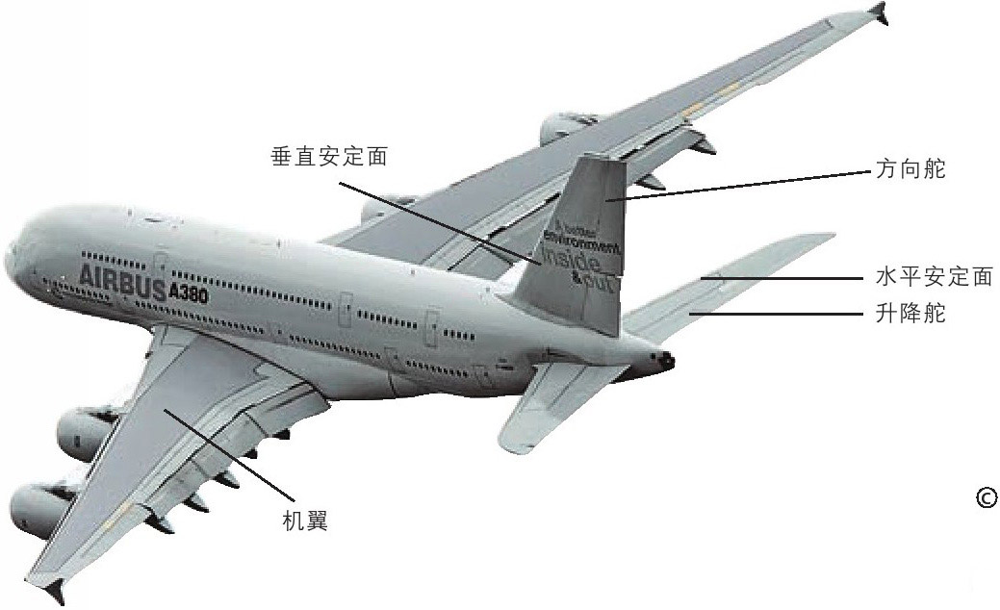
空中客车A380

人们最常见的民用客机采用的是常规布局：一对大大的机翼在机身的两侧，尾部有一到两个垂直尾翼和一个水平尾翼。垂直尾翼一般由垂直安定面和方向舵组成，主要用来控制飞机的航向。水平尾翼一般由水平安定面和升降舵组成，主要用来控制飞机的俯仰。

这种机翼在机身两侧、水平尾翼和垂直尾翼都放在机翼后面的布局是飞机发明以来采用最多的布局，故称为常规布局，也是人们常见的飞机外形。大型的运输机和民用飞机大都采用常规布局。

有些战斗机为了提高操纵效率和机动能力，会将水平尾翼移到主机翼之前，布置在机头两侧，称为前翼。早期采用这种前翼布局的飞机形似鸭子，所以称为鸭式布局，前翼也就被称为鸭翼。现代很多战斗机使用鸭式布局，如中国的歼—10、法国的阵风战斗机等。莱特兄弟的“飞行者1号”也是前翼布局。

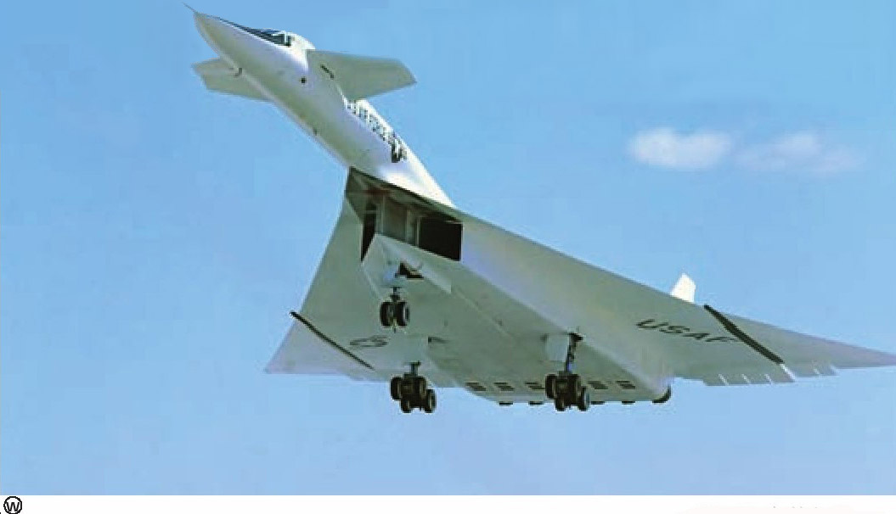
XB-70轰炸机

前翼布局对后掠翼飞机很有好处。因为后掠翼飞机的机翼伸向后方，空气升力在机翼上的作用点往往位于飞机重心之后，因此会使飞机产生“低头”的力矩。如果使用常规布局，在平直飞行时为了平衡这个力矩，往往要使尾翼产生向下的气动力。显然，这个向下的力对飞行是不利的，减小了飞机的总升力。而使用前翼来平衡低头力矩时，其气动力是向上的，有助于提高飞机的升力。

三翼面布局就是在常规布局的飞机主翼前面再增加一对鸭翼。这种布局的好处是飞机在跨声速和超声速飞行时的机动性都比较好，但其缺点是阻力和重量增大，操纵系统也会复杂一些。俄罗斯的苏-33、美国的F-15S/MTD/ACTIVE试验机、日本的T-2CCV试验机、德国的F-104CCV试验机等都采用这种布局。

无尾布局指的是飞机上既没有水平尾翼也没有鸭翼，只有一对机翼。这种布局飞机的俯仰是靠机翼后缘的副翼来完成的。取消平尾后机身载荷减小，结构质量减小，降低了成本。但由于副翼与飞机重心的距离远远小于常规布局中水平尾翼与飞机重心的距离，所以要控制飞机的俯仰，副翼偏转的角度要很大才行，这样产生的配平阻力明显增大。又由于机翼后缘被副翼占据，没有了常规机翼后缘用来增加升力的襟翼，因此起降性能较差。为了改善无尾布局的控制性能，无尾飞机通常采用很大的三角形机翼，使后缘距离飞机重心较远，获得更大的配平力矩，可以降低配平阻力。同时机翼面积增大，可以获得较大的升力，克服了起降能力差的弱点，也可提高盘旋能力，增强了机动性。采用无尾布局的往往是对机动性要求较高的战斗机，比如法国的幻影2000战斗机、瑞典的萨伯35“龙”战斗机等就采用了无尾的三角翼布局。

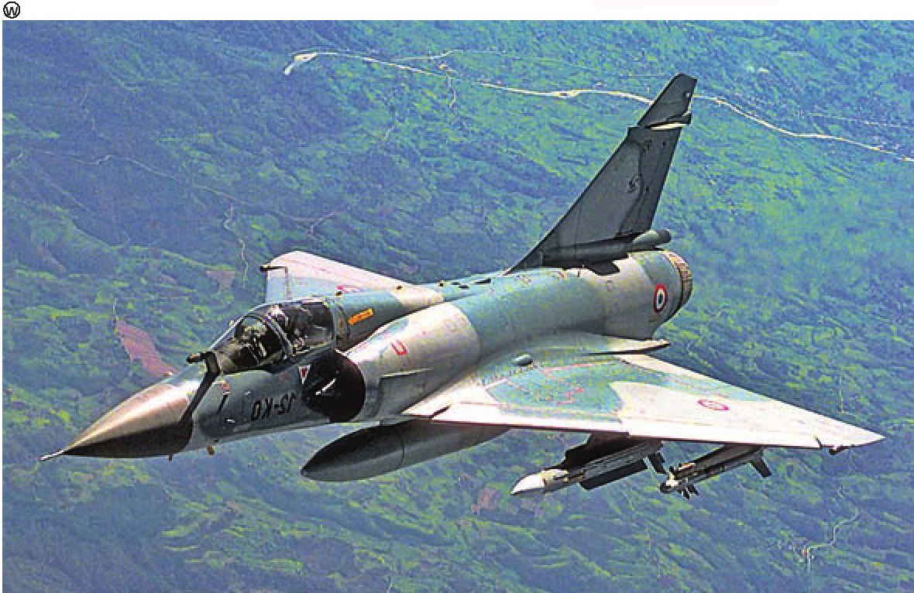
幻影2000战斗机

如果无平尾的飞机连垂直尾翼也去掉，然后将机翼加大、加厚，最后把机身都包裹起来，就成为一架飞翼布局型的飞机，也称全翼机。飞翼布局型飞机所有结构都是机翼，因此空气动力效率最高，在低速下空气阻力最小。但是由于机翼较厚的部位在接近声速时会产生巨大的阻力效应，所以飞翼布局不适合高速飞机。因为没有了水平尾翼和垂直尾翼，机身与机翼之间没有了突兀的接缝，因此飞翼布局反射的雷达波较弱，适用于隐身飞机。但是飞翼布局的控制能力较差。飞翼飞机控制航向往往只能通过增大单侧机翼的阻力来获得偏航力矩。使用飞翼布局的往往是需要隐身的军用飞机。比如，美国的B-2隐身轰炸机和X-47B隐身无人战斗机等都采用飞翼布局。（于哲峰）

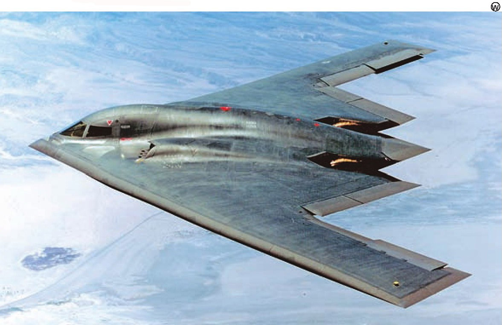
B-2隐身轰炸机

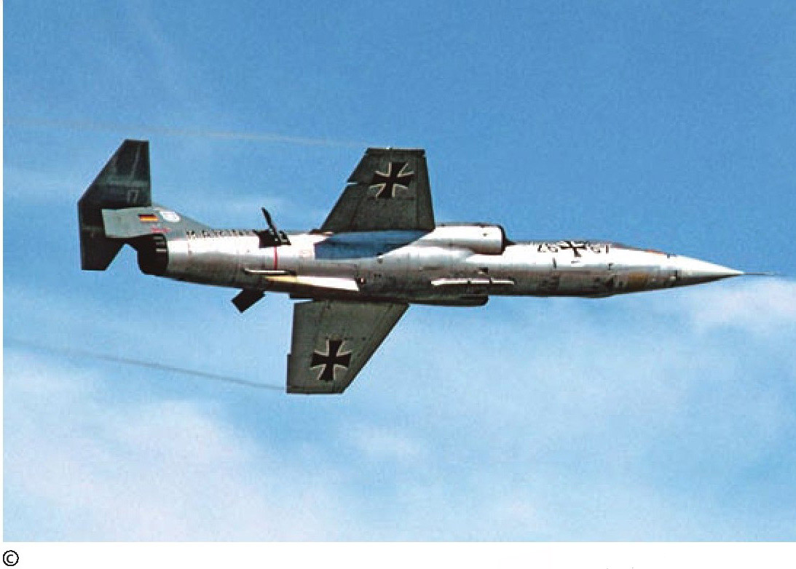
F-104“星战士”战斗机

## 机翼的面积越大越好吗

要回答这个问题，首先要了解一个名词——翼载。翼载是指飞机的满载重量和飞机的机翼面积的比值。简单地讲，机翼面积越大，翼载就越小；而翼载小，升力相对就大，可起飞距离就短，失速速度降低，盘旋半径变小。然而，较大机翼不利于飞机高速飞行，所以在飞机设计时要综合多种因素来确定翼载。

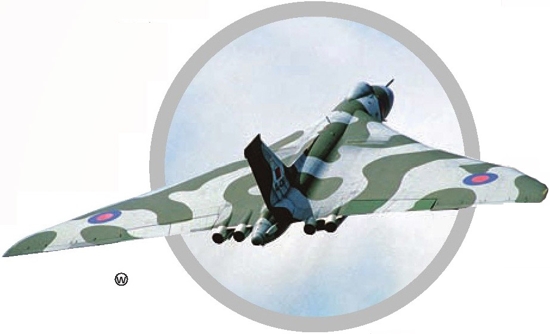
“火神”轰炸机

战斗机的飞行速度通常较高，因此一般选用较小的机翼面积，因而翼载较大。典型大翼载飞机当属形似火箭的美国洛克希德·马丁公司F-104“星战士”战斗机，而美国的V-173，英国的“火神”等飞机则拥有夸张的大机翼，属于小翼载飞机。（于哲峰）

  

【微问题】为什么采用鸭式布局能提高飞机的操纵效率和机动能力？

【关键词】气动布局　翼载

## 为什么飞机的“嘴”长得不一样

喷气式飞机发明以来，飞机的动力结构就是用前方的“嘴”（即进气口）来吸气，用后方的“屁股”（即喷气口）来喷气。

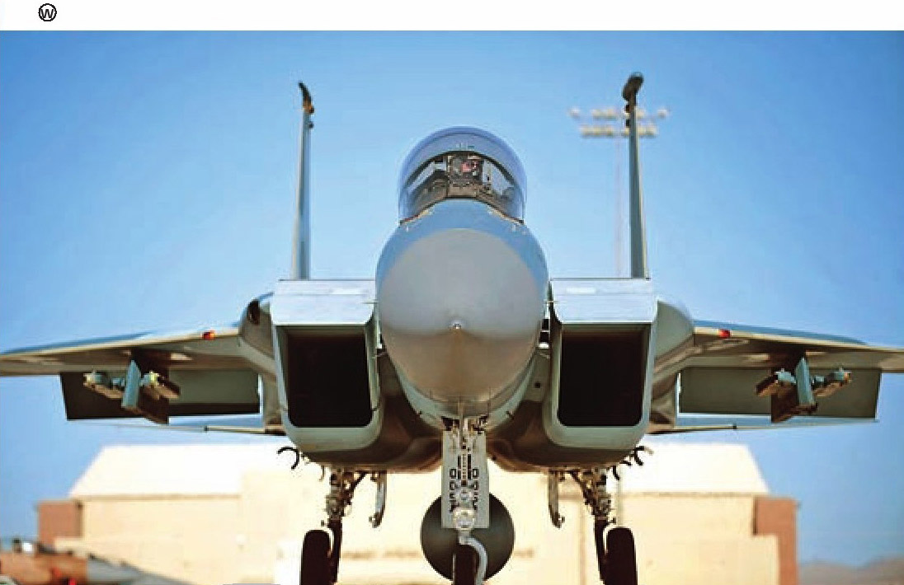
进气口在两侧

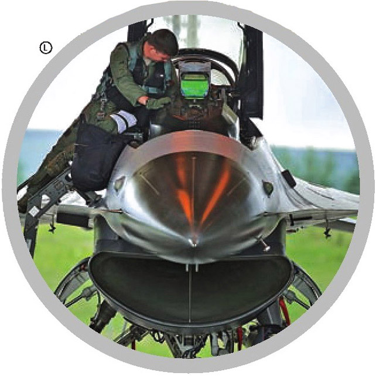
机腹部进气口

飞机进气口的形状千奇百怪，有圆形、半圆形、方形、平行四边形等。进气口的形状取决于飞机的总体设计要求。例如，可调式进气道一般采用方形或平行四边形的进气口，因为平板状物体更容易调节。而轻型的单发动机飞机不需要较大的进气口，就可以采用半圆形，以使其与机身外形较为贴合，减小飞行阻力。大部分客机采用的是圆形进气口，以获得最大的进气量。

由于喷气式发动机正常工作要求吸入的气流小于声速，因此不论哪种样子的进气口，都需要将速度过快的气流减速至亚声速，同时加大气流的压强。因此，进气口后面一段的管道（称为进气道）往往是逐渐收缩的。（颜思铭）

## 飞机的发动机装在哪里

飞机发动机的安装位置有很多种，具体选择哪一种与发动机的种类以及飞机的需要有关。

对于螺旋桨飞机来说，发动机直接为螺旋桨提供动力。由于螺旋桨最好安装在飞机前气流不受阻挡的地方，因此单发螺旋桨飞机的螺旋桨一般都安装在机身头部；多发螺旋桨飞机的螺旋桨则安装在机翼上，与机身相隔一定距离。螺旋桨飞机的发动机也随着螺旋桨被安装于飞机前部或机翼上。

目前，大部分民用客机和货机将发动机安装于机翼下方，或安装在机身尾部的外置短舱中。发动机若安装于机翼下方，其维护较为便利，修理人员不需要站到很高的梯子上面就可以展开工作；同时，机翼前方的气流很“干净”，发动机可以在没有干扰的条件下工作。

有些飞机，如MD90客机或一些小型的客机，只采用2台或3台发动机。此时，发动机就可以安装于机身尾部的短舱中。这样的发动机设置可以减小飞行阻力。同时，没有翼下发动机舱的干扰，流经机翼的气流比较稳定，有利于提高机翼的升力。但这样的话，工作人员需要站到与机身一样高的地方进行维护，不便于开展修理工作；另外，发动机的进气效率受流经机身的气流干扰会有所降低；且发动机的重量集中在飞机尾部，使飞机的重心调配产生一定困难。

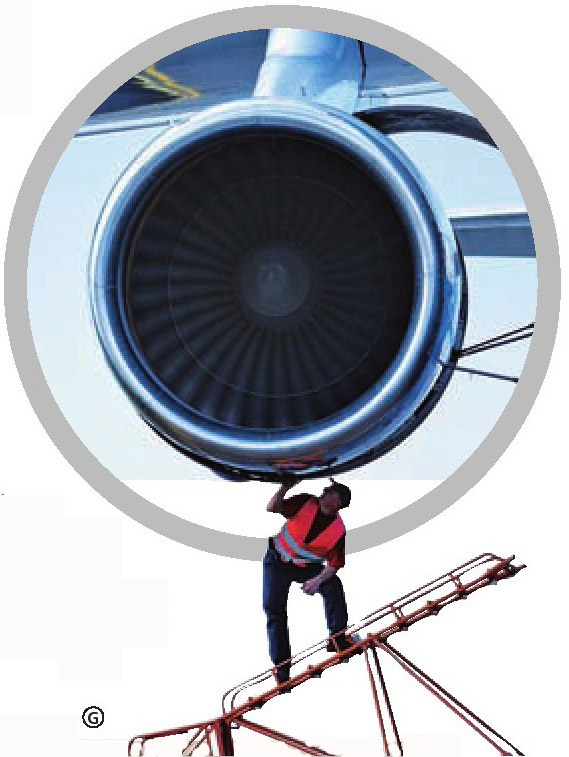
军用战斗机对动力要求非常高，因此整架飞机的身体大部分为发动机所占据。对于这样的结构，理论上用机头进气的方式阻力最小。因此，早期很多飞机都采用机头进气的布局。后来雷达的使用越来越普及，而安装雷达的最佳位置就是机头，这里雷达的视野不受遮挡，再加上越做越大的雷达天线占用了机头的大量空间，于是进气道就移到了两侧或腹部。

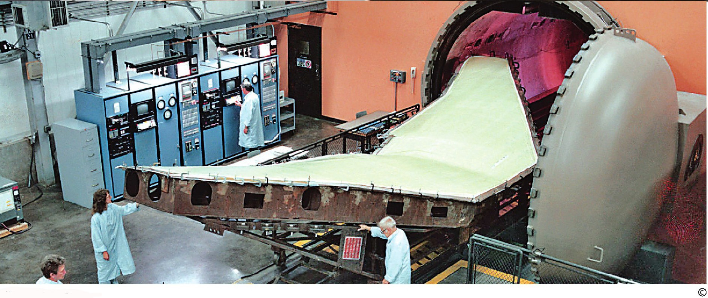
制造中的机翼蒙皮

飞机在设计完成后，发动机的位置就不能更改。因此，设计师需要从飞行性能、安装维护等多种因素进行全面考虑，才能对发动机安装的位置做出最优的选择。（颜思铭）

## 为什么飞行时飞机的“翅膀”会变形和抖动

常乘飞机的人会有这样的经历：遇到强气流时，飞机会出现颠簸。细心观察的人还会发现，此时飞机的“翅膀”也在抖动，甚至有点变形。于是有人担心，这种抖动会不会使飞机出现故障呢？

其实不用担心。因为飞机并不是一个硬邦邦的刚体，而是有一定弹性的，特别是机翼。在地面时，机翼只受到自身的重力，往往是平的甚至是往下垂的。而到了天上，空气的升力要通过机翼把几十吨重的飞机抬起来，机翼往往就变得向上翘了。但是这种变形是飞机设计时已经充分考虑到的，不会影响飞机的安全。当受到气流干扰时，机翼还会发生振动，但通常振幅会很快衰减，不至于造成大的影响。

当然，有些情况下会使得机翼的振动无法衰减。一旦出现这种情况，机翼的抖动就会不断增大，最终导致破坏。因此在飞机设计和使用中必须重视这些情况，尽量予以控制或避免，否则会导致部件乃至整个飞机遭受破坏。

除了大的振动，机身和机翼的小振动也可能导致飞机被损坏。这种损坏的过程称为结构部分疲劳，即完好的结构部件在交变载荷作用下，长时间工作后会产生微小的裂纹，然后裂纹会逐渐扩展，致使部件损坏。飞机在一个起降中，机翼从地面停放状态到飞行中承受很大升力，再到降落，回到停放状态，这个过程相当于给机翼施加了一个周期性的交变载荷。在飞行过程中，机翼也承受各种变化的载荷，尽管幅值较小，但也可以将它们看作是幅值和周期不同的交变载荷。对飞机的其他部件，也是如此。飞机在长期使用中所受的疲劳载荷就是由诸如此类的交变载荷组成的。因此，飞机设计时必须对这些载荷进行统计，帮助确定飞机的使用寿命。对于超出使用寿命的飞机或其部件，要及时更换或者报废，以免造成事故。（于哲峰）

  

**【微博士】**机翼材料的演变

20世纪初期，低速飞机的机翼主要以木头为骨架，以布为蒙皮。随着飞机速度的提高、翼载的增大，这种强度低、气动效率差的机翼逐步被淘汰。20世纪中叶开始，机翼主要用金属制成。今天的机翼则使用多种材料制造。根据受力程度的不同，机翼各部分所用材料是不同的。翼梁是机翼的主要受力件，一般采用硬铝合金、钢和钛合金；由于机翼上下表面蒙皮受力情况不同，所以相应的材料分别采用抗压性能好和抗拉性能好的硬铝合金；机翼的副翼、襟翼等附件不承受主要载荷，所以，为了减轻重量，在一些飞机上采用玻璃钢或铝蜂窝夹芯结构。随着对飞机重量控制程度的加强，碳纤维复合材料逐步用于机翼的主承力部件，如壁板、翼梁、中央翼等。

【微问题】飞机发动机和汽车发动机有什么不同？

【关键词】进气口　发动机位置　机翼变形抖动　交变载荷

## 为什么大部分飞机的“翅膀”要向上翘

在航站楼等候登机时，如果位置合适的话，从飞机的前面看过去，很多飞机的机翼基准面并不是水平的，而是与水平面有一个夹角。当机翼上偏时，这个夹角被称为“上反角”；当机翼下偏时，则被称为“下反角”。为什么要这么设计呢？

机翼的上反角有助于改善飞机的横向稳定性，就是说当飞机受到扰动产生滚转时，有上反角的机翼会产生“抵抗”滚转的力矩。这是怎么实现的呢？假设碰到右侧的阵风使飞机往左倾斜，左机翼下沉。此时两个机翼升力的合力与重力的共同作用就产生了一个让飞机向左边运动的力。在这个力的作用下飞机开始向左边侧滑，机头不再和前进的方向一致，从飞机的运动方向看去，此时的飞机是向左偏转。这样的一种角度使得飞机左机翼的迎角增大，导致升力增大；同时，右机翼刚好相反，迎角减小，升力减小。这就产生向右倾斜的修正力矩，从而使飞机摆正。因此，上反角有利于增加飞机的横向稳定性，但增加的横向稳定性也让飞机的滚转变得困难。所以，对稳定性要求比较高的飞机（客机），往往采用上反角。而下反角的情况则相反，它可以减小飞机的横向稳定性，却增强滚转机动的能力。所以，对灵活性要求比较高的飞机（战斗机），就有很多采用下反角。

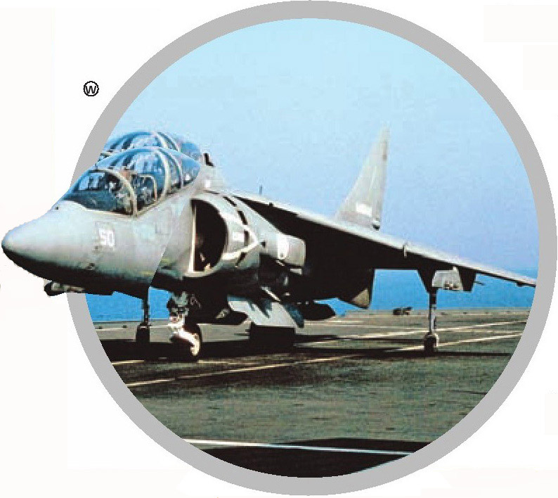
鹞式战斗机

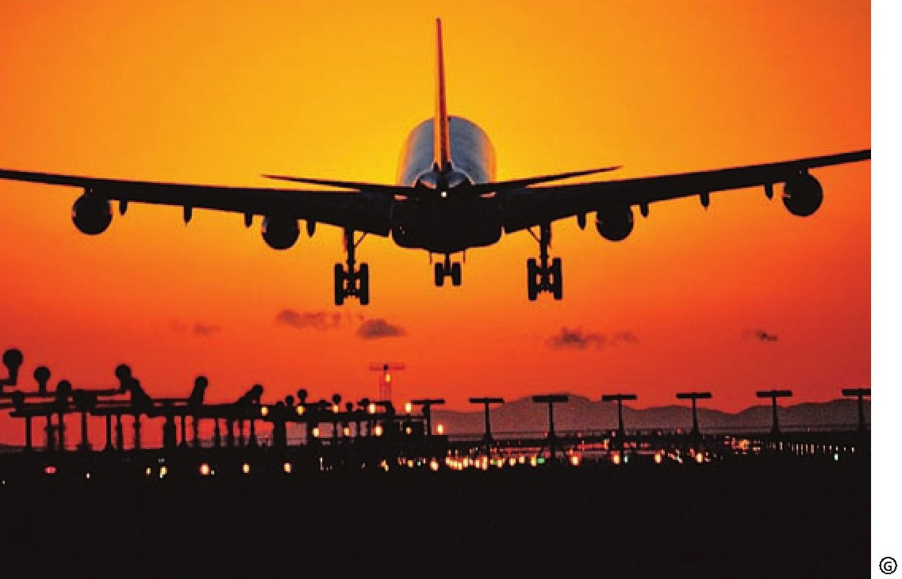
除此之外，机翼采用上反角还是下反角，还要按机翼相对机身的垂直位置来确定。

有些飞机受到功能要求和环境限制需要采用上单翼布局，因此这些机翼可以采用下反角来增强滚转的机动性，如有些军用运输机。大型客机等一般有大后掠机翼，稳定性较好，本来应采用下反角，但因采用下单翼，为防止翼尖及翼后发动机在飞机起降时触地，故往往采用上反角。（颜思铭）

## 为什么有些飞机必须由计算机辅助才能操控

飞机的飞行特性一般包括两个方面：稳定性与操纵性。

飞机的稳定性指在改变飞行姿态时飞机“自动复原”的能力。比如，上反角的机翼结构，飞机向左偏斜后所产生的力会让飞机自动回复，这样的飞机稳定性就好。而下反角的机翼结构一旦开始向左偏斜，产生的力就会让飞机越来越向左偏，这样的飞机稳定性就差。

飞机的操纵性则是说飞机对飞行员的操纵动作的响应能力和对机动动作的完成能力。比如，飞行员向后轻轻拉一下驾驶杆，机头就向上昂起，这样的飞机操纵性很好。如果飞行员要很用力拉杆机头才能向上抬一点点，这样的飞机操纵性就不好。操纵性好的飞机往往具有较强的机动性能。

飞机的稳定性与操纵性常常是相互矛盾的，提高飞机的稳定性虽然可以得到较好的安全性，但会对操纵性有影响，使得飞机难以做出机动动作。所以，在设计飞机时，人们经常耗费大量时间和精力去协调这两种相互制约的性能，使飞机既具有足够的机动性，而自身的稳定性也不至于过小。

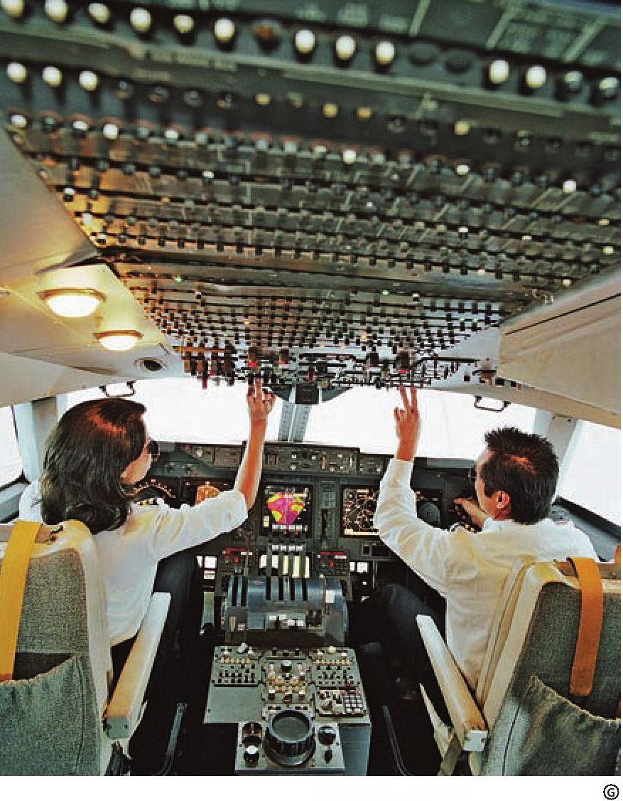
飞行员在驾驶舱内操作控制飞机

随着对飞机性能要求的进一步提高，通过减小飞机自身的稳定性来提高机动性的方法已经走不通了，这就需要“人工增稳系统”。

人工增稳系统通过在飞机上的传感器，察觉飞机受扰动后飞行状态的改变，然后计算机程序就自动控制舵面偏转来恢复飞机的飞行状态。这样，在飞行员不干预的情况下也能使飞机的飞行状态可以抵抗一定程度的干扰，相当于“增加”了飞机的稳定性，这就是“增稳”。这种增稳系统与飞行员的驾驶杆是互相独立的，增稳系统的工作不影响驾驶员的操纵，飞行员拉动操纵杆改变姿态的动作也不会被增稳系统所抵消。

有了这样的系统，人们在设计飞机时就可以放心地设计飞机气动布局，可以将飞机本身的稳定性设计得较小，使飞机可以顺利完成剧烈的机动动作，同时用人工增稳系统来增强飞机在正常飞行中的稳定性。这样的飞机就必须依靠计算机的帮助才能稳定飞行，而一旦计算机出现故障，飞机就可能变得很难稳定飞行，甚至完全无法飞行。所以，这种飞机一般都装有备份系统，以保证计算机在出现故障时可以使用备份系统继续飞行。（颜思铭）

## 为什么飞机可以自动驾驶

现代飞机往往都装有自动驾驶系统，以便在情况允许时由机载计算机控制飞机自动飞行，使飞行员不会过于疲劳。

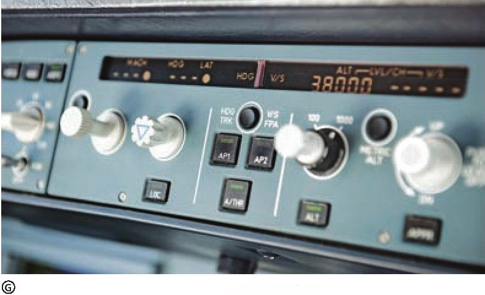
空中客车A330的自动驾驶面板

早在几十年前，人们就发明了自动驾驶仪。当时的自动驾驶仪比较简单，由陀螺仪、加速度计、高度表等检测飞机状态信息的设备和简单的电路构成。当飞机在正确的航线上飞行时，陀螺仪在预定的参数下工作；而当飞机偏离航线时，陀螺仪的参数发生改变，与之相连的电路就产生电信号，使得操纵飞机的舵面偏转，让飞机回到原来的方向上。同理，飞行速度和高度也可以使用加速度计和高度表来实现控制。这就是最早的自动驾驶仪，不需要使用计算机就可以工作，当然其精度较差，经常需要飞行员去校正飞机的飞行状态。

现代飞机的自动驾驶仪也是使用陀螺仪和加速度计等去感知飞行状态，只是设备更为精密复杂，飞机只要有一点状态的改变就可以察觉出来。其主要的进步是利用计算机产生精确的信号，自动控制飞机准确飞行，同时，飞机航线的校正由卫星定位系统（如GPS）来完成，无需飞行员人工干预。

当然，在有些情况下，由于计算机的应变能力不如人类，还需要采用人工操作。例如，在飞机降落时，虽然现在的技术可以使飞机自动完成降落，但那只是在没有任何特殊情况下才有保证。为了保证飞行安全，飞机还是由飞行员来操纵降落，不采用计算机进行自动控制。（颜思铭）

  

【微问题】飞机“翅膀”上翘的原理是否可以用到纸飞机上？如何用？

【关键词】上反角　下反角　人工增稳系统　飞机自动驾驶

## 为了适应超声速飞行，飞机进行了怎样的“变身”

飞行中的飞机与空气作用，会导致空气的振动。空气振动就像水中的涟漪一样，一圈圈传播开去，传播的速度就是声速。当飞机的速度和声速一样快时，飞机引发的前一圈空气振动“涟漪”还来不及传递开去，就被机身扰动的后一圈“涟漪”追上。这样振动的叠加就会产生一种叫“激波”的剧烈振动。激波在产生巨大飞行阻力的同时，还会使飞机抖动、失控，甚至空中解体。在第二次世界大战后期，一些速度较快的活塞式战斗机在加速俯冲速度达到约0.9倍声速时，就会碰上这种情况，有的飞机因此机毁人亡。这些现象使当时的飞机难以突破声速，因此人们将这种现象称之为“音障”，意思是飞机在接近声速时，就像撞到墙一样，使飞机难以逾越。

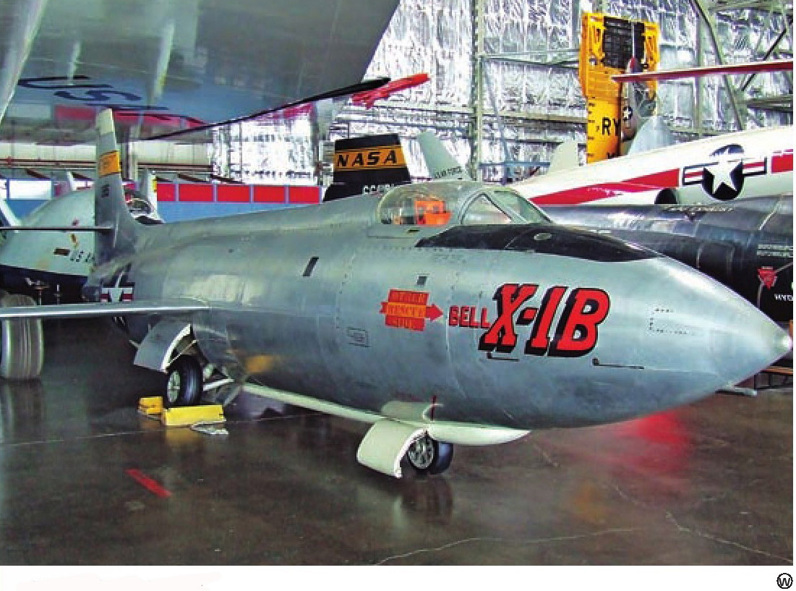
X-1火箭动力验证机

1947年，美国空军试飞员耶格尔驾驶X-1火箭动力验证机达到了1.06倍声速。这是人类首次突破音障。不过，X-1火箭动力验证机采用的是平直翼和流线机身，相当于用火箭发动机的“蛮力”将飞机“硬推”过声速。要真正解决音障问题，根本出路还在于减小飞机的阻力。

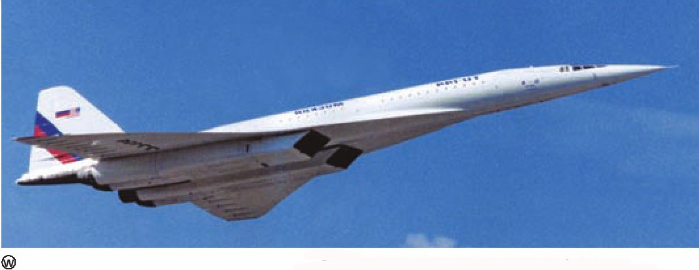
图-144是目前仅有的两种超声速客机之一

随着研究的深入，人们发现了适合超声速的翼型（即机翼的横截面形状）。一般亚声速飞机的机翼都采用圆头、两侧有较厚凸起的翼型，这种翼型在跨声速和超声速飞行时阻力变得很大。要减少超声速的阻力，最好采用菱形的翼型。不过，由于飞机需要在低速到高速的整个范围内使用，翼型的选用必须兼顾高、低速特性，所以大多数超声速飞机仍采用前缘圆头的翼型，只是圆头的曲率比较小。

除了改变翼型，飞机突破音障的最大“功臣”是后掠翼的采用。后掠翼的设想是20世纪30年代末开始提出的。人们发现，机翼上出现激波时的气流速度并不是飞机飞行的速度，而是机翼前缘垂直方向上的气流速度。如果飞机采用后掠翼，其垂直机翼前缘的气流速度分量就会低于飞行速度。因此与平直机翼飞机相比，在更高的速度下才会出现激波，从而推迟了激波的产生。即使在后掠翼的机翼上出现了激波，其压缩性效应也没有平直机翼上激波的压缩性效应那样强烈。

不过，后掠翼虽然阻力小，但由于气流在机翼垂直方向上的分量速度低，使后掠翼在低速飞行时存在升力不足的缺点。而且后掠角越大，越容易造成升力不足，降低了飞机在低速飞行时的性能。因此，现在的战斗机采用了各种手段改进飞机的低速性能。

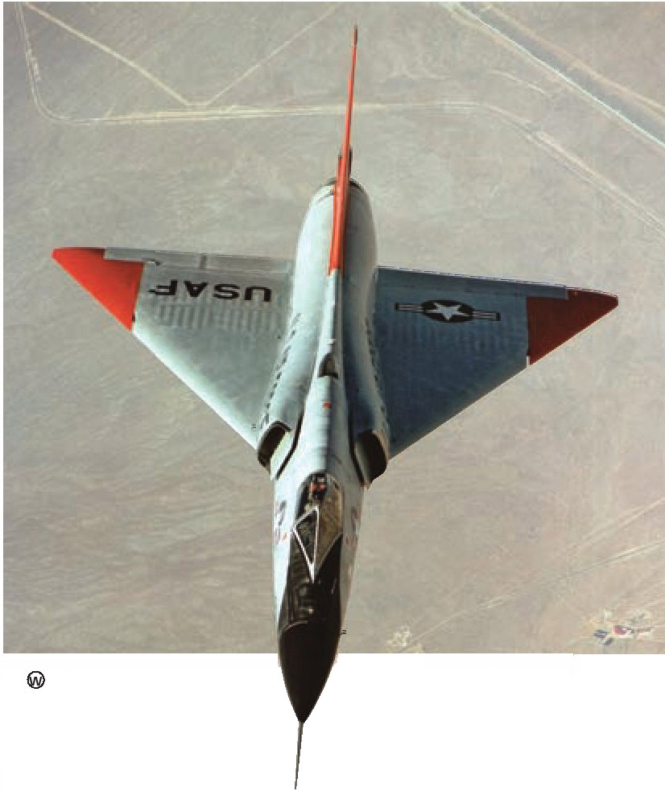
美国F-102战斗机，三角翼

在后掠翼的基础上，人们又设计出三角翼。顾名思义，三角翼就是机翼平面形状是三角形的机翼，其优点是机翼刚性好，内部空间大等。在飞行性能上，三角翼基本与大后掠角的后掠翼的优缺点相同。为了使三角翼扬长避短，现在的战斗机很多采用中等后掠角的切尖三角翼。

飞机要突破音障，在机翼方面做的改动就是采用后掠翼或三角翼，而在机身、发动机等方面同样需要改动。

在机身方面，人们通过调整飞机的截面积分布以降低阻力。由于激波常常发生在机体截面积发生明显变化的地方，因此保证机体各处的截面积一样，就可以有效减少阻力。因此在机翼、尾翼与机身连接区的机身往往做成向内凹的形状，俗称“蜂腰”。这种设计可以在机翼截面积大的地方减少机身截面积，保证飞机的截面积基本保持不变。中国的歼-8Ⅱ战斗机就有蜂腰设计。

美国F-15鹰式战斗机，切尖三角翼

在发动机方面，超声速飞机放弃了阻力较大的涡轮螺旋桨发动机，而采用阻力小、动力强劲的喷气发动机。超声速飞机的进气道和尾喷管也都按超声速飞行所需的特性进行优化。

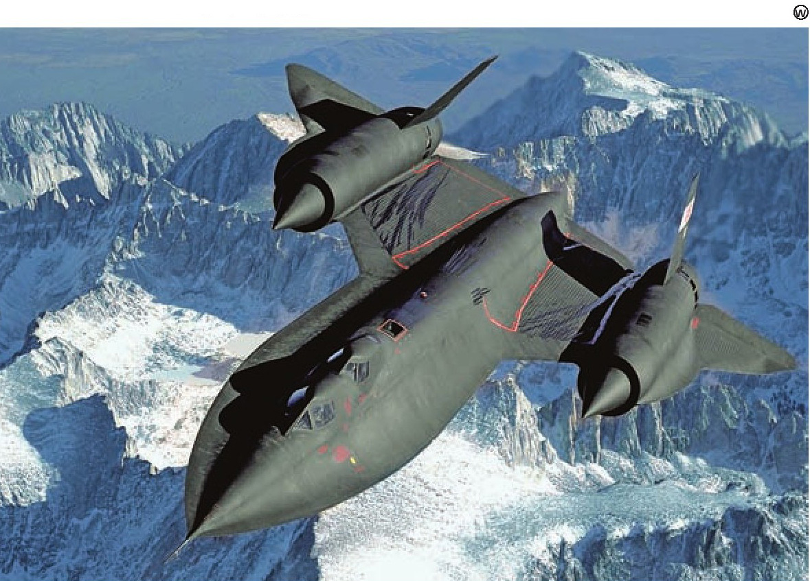
SR-71“黑鸟”侦察机

突破声速后，如果再向上提高飞行速度，就会碰到另一个障碍，即“热障”。如果飞机飞行速度超过2.2倍声速，由于空气在机身、机翼的前缘被剧烈压缩而导致强烈的气动加热，会产生高达数百摄氏度的高温，从而对机体材料产生很大的影响。一般飞机都是用铝合金做蒙皮，在飞行速度小于2.2倍声速时，铝合金的强度尚可维持，但超过这个速度，达到3倍声速后，铝合金就不能满足要求了。因此可按热障速度飞行的飞机要采用其他的耐高温材料，如美国的SR-71“黑鸟”采用钛合金作为结构材料，苏联的米格-25采用不锈钢。

同时，飞行速度超过3倍声速时，普通喷气发动机的工作效率已不能满足要求，需要采用其他的发动机。例如，“黑鸟”在飞行速度达到3倍声速时，其发动机就通过某种机构变化使其变成冲压发动机，以保证高速飞行时的效率。（颜思铭）

  

**【微博士】**音爆

飞机在超声速飞行时，会在机头和机尾形成两道激波，激波后面空气的压强、密度等都有明显变化。当这两道激波扫过地面时，人耳听到的就是两声雷鸣般的巨响。这种响声就是“音爆”。

【微问题】目前为止，有哪些超声速客机投入使用？

【关键词】超声速飞机　后掠翼　三角翼　蜂腰

## 为什么说发动机是飞机的“心脏”

鸟类飞行靠的是翅膀，翅膀扇动时，可以同时产生向前的推力和向上的升力。人类的早期飞行实践就是模仿鸟类制造扑翼机，希望用与鸟类相同的办法飞上天空，但当时类似的尝试都失败了。

因此，人们改变了思路，把产生向前推力和向上升力的部件和动作分开，不再使用同一个部件、用一种动作（扇动“翅膀”）来同时完成这两个任务。采用这个思路的结果，就是利用螺旋桨推动空气或利用喷气的反作用力来产生向前的推力，使飞机产生速度。由此产生的气流流过机翼形成压力差，来产生向上的升力。

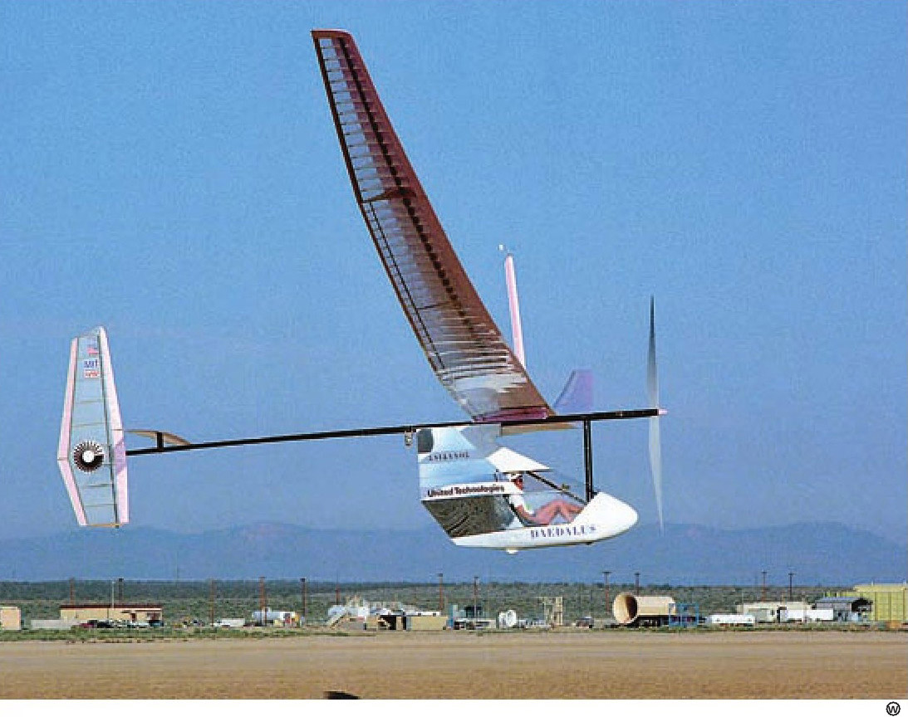
飞过115千米的人力飞机“代达罗斯”

这是个很聪明的办法，它大大降低了飞机飞行时所需要的动力。有科学家计算过，如果人类要用鸽子一样的方式靠自己的力量飞上天空，那么我们的胸肌要有一米厚。而如果人坐在一个固定机翼的飞行器中，靠人力驱动一个螺旋桨来提供推力，那么这样的人力飞机已经可以飞行超过100千米。通过把推力和升力的产生机制分开的方式，大大提高了飞行的效率。

在一定的速度范围内，飞机发动机的动力越强劲，速度越快，升力也就越大。发动机不仅为飞机提供速度，也是产生升力的源泉。飞机飞行性能的好坏也与发动机有着直接的关系，只有优秀的发动机才能使飞机具有优良的性能。这一切如人类的心脏，所以人们常说飞机发动机是飞机的“心脏”。（颜思铭）

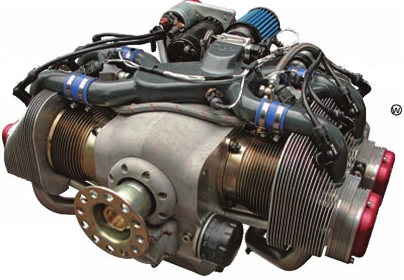
UL260i航空发动机

## 为什么有的喷气飞机也有螺旋桨

一般人印象中的喷气飞机机身上是没有螺旋桨的。但是，有些飞机在飞行时发动机在向后喷气，同时还装有螺旋桨。这是什么原因呢？

我们先来看一下空气喷气发动机的工作原理。空气流入喷气发动机后，先经过很多叶片组成的压气机。空气被压气机压缩后，形成高压空气进入燃烧室，与燃料混合燃烧，成为具有很大能量的高温燃气并向后喷出。这些高温高压气体喷出时，会推动一级或多级涡轮高速转动，同时也会带动压气机转动。流过涡轮的高温高压气体从尾喷管高速向外喷出。向后喷出的气体会对发动机产生向前的推力，这就是目前的“涡轮喷气发动机”（简称涡喷发动机）的工作原理。

为了进一步提高喷气发动机的效率，有人在涡喷发动机的前面加了一个直径较大的风扇，形成“涡轮风扇发动机”（简称涡扇发动机）。通过风扇的空气有一部分从压气机、燃烧室等部件的外侧通道流过，称为“外涵气流”；一部分空气则照常流过压气机和燃烧室进行燃烧并向后高速喷气，这部分空气称为“内涵气流”。外涵气流与内涵气流的流量比值，被称为“涵道比”。涵道比小的涡扇发动机主要用于轰炸机和攻击机，涵道比大的涡扇发动机主要用于客机和运输机。

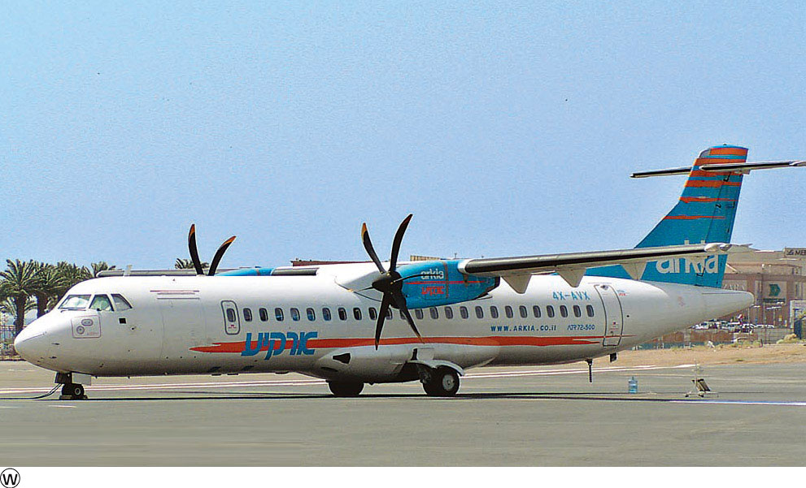
ATR-72是典型的涡轮螺旋桨飞机

涡扇发动机喷出的气流速度和温度都相对较低，有助于改善低速飞行时的效率，并降低耗油量。因此，现在的飞机基本都采用涡扇发动机。但飞机在高速飞行特别是超声速飞行时，涡扇发动机的效率变差。因此，战斗机的涡扇发动机都安装加力燃烧室来解决这个问题，而民用飞机由于一般无需超声速飞行，所以不必安装加力燃烧室。

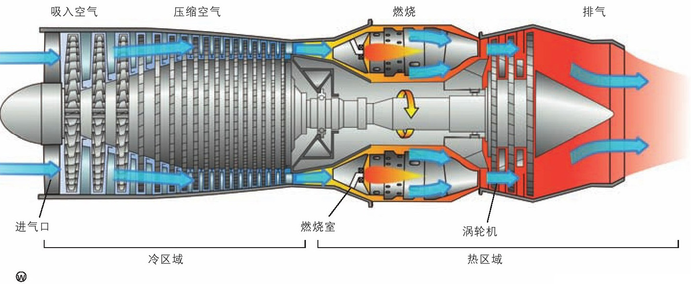
轴流式涡轮喷气发动机

如果在涡喷发动机的前面再加一个由涡轮机带动的螺旋桨，就成了“涡轮螺旋桨发动机”（简称涡桨发动机）。这种发动机一般安装于对速度要求不高（一般为400～800千米/时）而对低油耗要求较高的飞机上。它和传统的螺旋桨飞机不同，本质上还是由涡轮带动的，烧的是煤油；而传统的螺旋桨飞机则由活塞式发动机带动，烧的是汽油。

除了上述几种喷气发动机以外，还有一种不需要压气机和涡轮的喷气发动机，那就是“冲压发动机”。飞机在高速飞行时，流经发动机的空气速度很快，已经具有较强的压力。因此，直接利用进气道对空气的压缩就可以得到具有足够压强、直接进入燃烧室做功的空气，而无需使用压气机。这种发动机的好处是由于不采用复杂的压气机而使其结构简单，缺点是这种发动机必须在2倍声速以上的高速时才能工作，因此首先要采用其他手段使飞机达到所需的飞行速度。（颜思铭）

  

**【微博士】**飞机喝什么

有些小型飞机仍采用传统的活塞式发动机，以航空汽油为燃料。而采用喷气发动机的飞机的燃料主要是航空煤油。煤油的燃烧性能平稳，储运相对安全，雾化后与空气充分混合则猛烈燃烧。工程师们也正在探索甲烷、液氢等高能量燃料，使发动机达到更好的性能。但这些燃料挥发性太强，很难运输和储存，危险性较大，目前还不实用。

【微问题】飞机发动机和火箭发动机有什么明显的区别？

【关键词】涡喷发动机　涡扇发动机　涡桨发动机　冲压发动机

## 飞行员是怎么知道飞机所处的高度和速度的

大家知道，飞机在飞行时，飞行员可以通过读取飞机上飞行仪表的数据，知道飞机所处的高度和速度。那么，你知道这些数据是怎么测出来的？

我们都有坐车的经验：车速越快，迎面吹来的风越就越大。根据这个原理，人们制成了测量飞机速度的空速管。它是一根前方开孔的管子，管子的后方连着一个空心的圆形盒子，称为膜盒。飞机的速度越快，冲进管子的气流压力就越大，膜盒就越鼓。膜盒带动一套指针，就可以显示出飞机的速度。

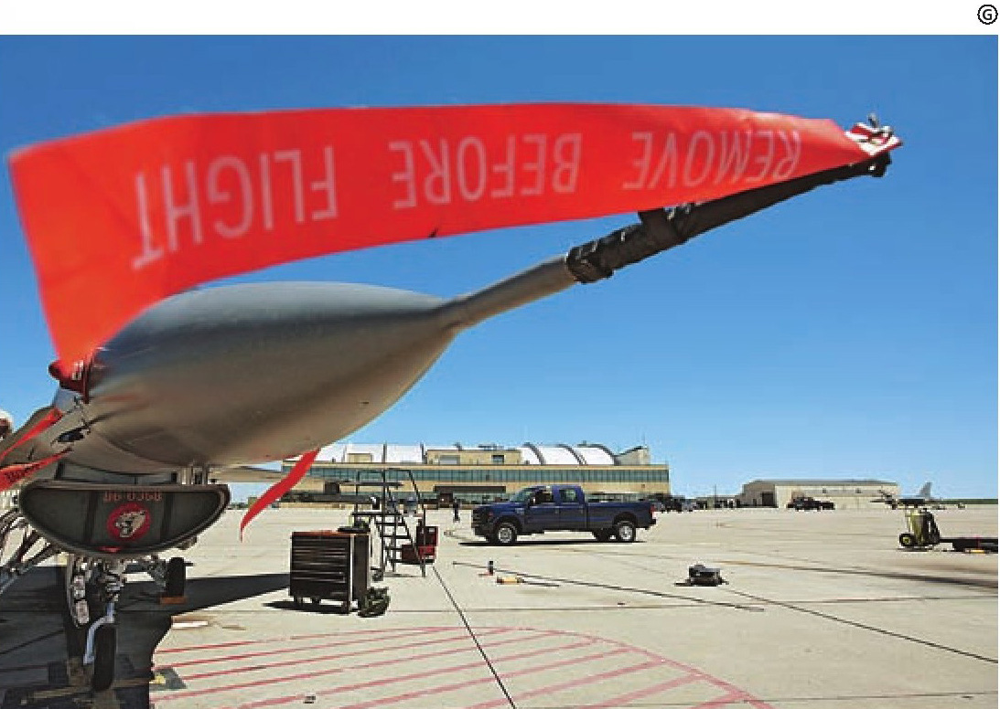
F-16战斗机的空速管

如果膜盒不与外界连通，而是完全密封，里面始终保持地面空气的压强。当飞机飞到高空中时，气压下降，膜盒便会鼓起来。这时测量膜盒的变形即可测得飞机高度。这种高度表称为气压式高度表。

除了气压式高度表外，飞机上还装有无线电高度表（又称雷达高度表）。这是一种根据无线电波反射原理测量飞机距离地面实际高度的设备。飞机不断向地面发射无线电波，根据地面反射回来的回波和发射电波的时间差，就可以测得飞机的高度。

另外，在现代化的空中交通管制（空管）系统中，飞机的位置、速度、高度等空情信息可通过导航或雷达设备获取，飞行员可借助与空管系统的语音通话或数据通信，间接获得相关数据。（石坚）

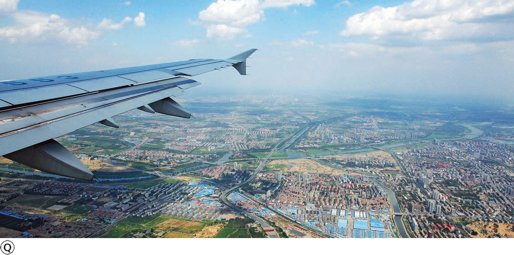
## 为什么飞机起落架也有那么多讲究

起落架是飞机非常重要的部件，其作用是在地面（或水面）停放、滑行、起降滑跑过程中，支撑飞机的重量，吸收撞击的能量。由于起降场地的不同，起落架的滑行装置差异很大。

在水面起降的水上飞机，其滑行装置有两种——船身式机身和舟状浮艇（形状像一艘小划艇的密封浮筒）。有些船身式水上飞机在机翼下还配置有两个辅助的小浮艇，起平衡作用。部分水上飞机还带有可收放的机轮，除了可以在水面滑行外，还可使用机轮在地面滑行。

滑橇式滑行装置主要用于可在冰雪场地起降的飞机，其起落架的机轮下配有滑橇，或干脆以滑橇代替机轮。也有飞机使用过履带式的起落架，以适应不平的地面，但因存在很多技术问题，没有得到广泛使用。

不过，大部分在陆地起降的飞机采用的是机轮式起落架。机轮主要包括轮胎、轮毂和刹车装置等，其作用是减小飞机在地面滑行的阻力，吸收着陆触地和地面滑行时的撞击能量，并利用刹车装置缩短飞机着陆的滑跑距离。很多机轮式起落架都做成收放式的，可以在飞行时收起来，以减少飞行时的阻力。收放式起落架收放的动力主要有液压、压缩空气和电动，其中液压收放式应用最广。为保证安全，起落架除了主收放操纵系统外，还备有应急放下系统。应急放下系统可利用起落架自身的重量、迎面气流吹击或其他方式将起落架放下，保证飞机安全着陆。

根据起落架在机身上的设置类型，可以分为前三点式、后三点式、自行车式等。早期飞机大多采用后三点式起落架：把两个大轮设置在两侧机翼上，再在尾巴上设置一个小轮。这种方式结构简单，落地时三组机轮可以同时着地，但是难以对准跑道。所以，今天大部分客机都采用了前三点式起落架：在机头下方设置一组机轮，再在两侧机翼上设置两组机轮。这种方式使飞机在起落时较容易保持水平，飞行员的视野也比较好。自行车式起落架的两个主机轮设置在飞机腹下，前后排列，就像自行车一样。有时在两个机翼上也会设置两个小轮以辅助飞机平衡。这种起落架多在军用飞机中使用，以增加机腹的空间，用来装载武器弹药。

起落架看起来只是一个带轮子的杆，其实远没有那么简单。为了缓冲起落架在起降时的冲击，很多起落架都有缓冲装置。比如，由套筒和活塞杆套连接起来的套筒式减震装置，以及通过摇臂与减震器组成的摇臂式减震装置。有一些舰载飞机的起落架上还要安装牵引钩，以便挂到弹射器的滑块上。

在飞机着陆和起飞时，机轮的速度会在瞬时从零加速到几百千米每小时，因此对轮胎的质量要求非常高。这种轮胎一般由优质橡胶与坚韧的纺织品交织而成，质地坚固而耐磨。即便如此，它仍会在偶然情况下遭受损伤。2000年7月25日，法国航空公司的一架“协和式”超声速客机在巴黎机场起飞时，左侧主起落架机轮被跑道上的异物刺破爆胎，高速的轮胎破片击穿了油箱引发大火，导致该机在几分钟内爆炸坠毁于机场附近。“协和式”客机受此惨痛事故的影响，最终于2003年10月全部退出了商业飞行。因此，及时清扫跑道上的杂物，也是机场地面人员的一项重要工作。美国海军的航空母舰每次起飞作业前，全体甲板人员都要肩并肩排成几排，沿飞行甲板“地毯式”搜索、清理一遍，以避免异物造成飞行事故。（石坚）

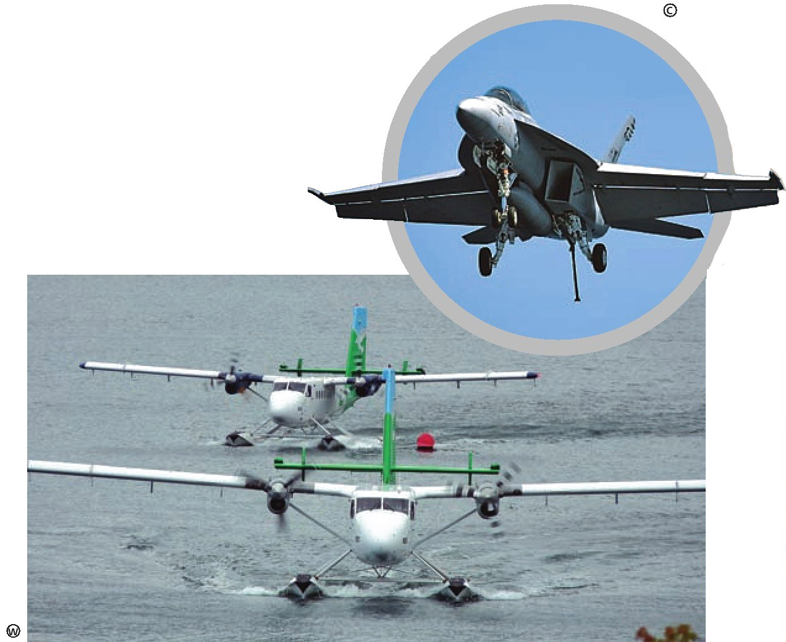
由于起降场地的不同，起落架的滑行装置差异很大

  

【微问题】飞行员如何与空管系统联络？

【关键词】空速管　高度表　起落架

## 靠旋翼上天的都是直升机吗

旋翼飞行器是靠旋翼产生升力飞行的航空器的总称。直升机就是我们最熟悉的旋翼飞行器。但还有一些有着旋翼的航空器，它们也靠旋翼飞上天空，但并不属于直升机。它们与直升机有什么不一样呢？

原来，直升机的旋翼是由发动机带动的，发动机直接驱动旋翼旋转。而旋翼机的旋翼则是由迎面而来的气流吹动，旋翼主轴不连接发动机，是自由旋转的。

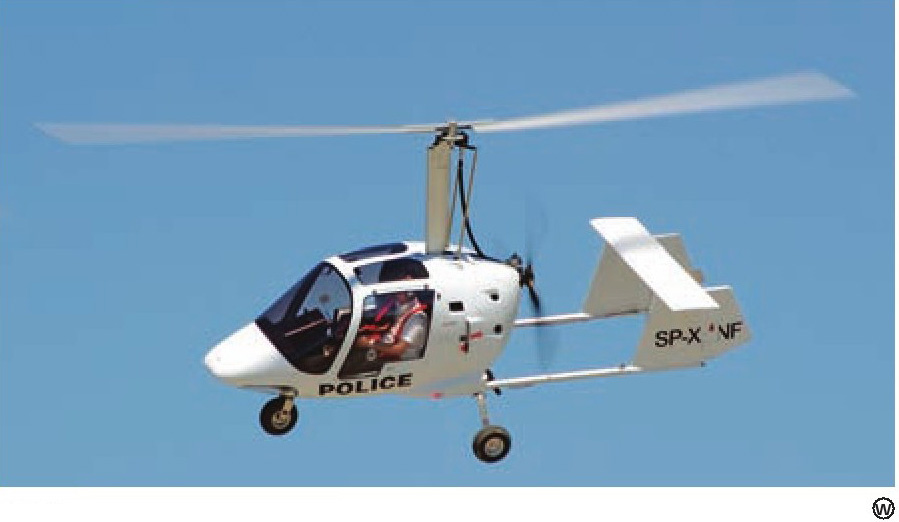
旋翼机

旋翼机的发动机只用于推动机身前进。发动机往往带动的是一个螺旋桨，以产生前进的推力。这个推力让旋翼机向前运动，由此产生的气流吹动机身顶部的自由旋翼，使其旋转。当旋翼的旋转达到一定速度后，产生足够的升力使旋翼机升空飞行。旋翼机比直升机结构简单、成本低廉，也比较安全，但只能前飞而不能悬停、后飞，飞行的灵活性不如直升机。（张首智）

## 为什么说直升机的旋翼和电扇叶片不一样

直升机旋翼和电扇叶片，都是由几片叶片组成的，旋转的时候会推动空气产生气流。当我们感觉电扇的风小了，可以把风扇的转速开得快一点，吹来的风就会变大。那么，如果发现直升机往下掉了，是不是也只要加快旋翼的转速，就可以让它升起来呢？

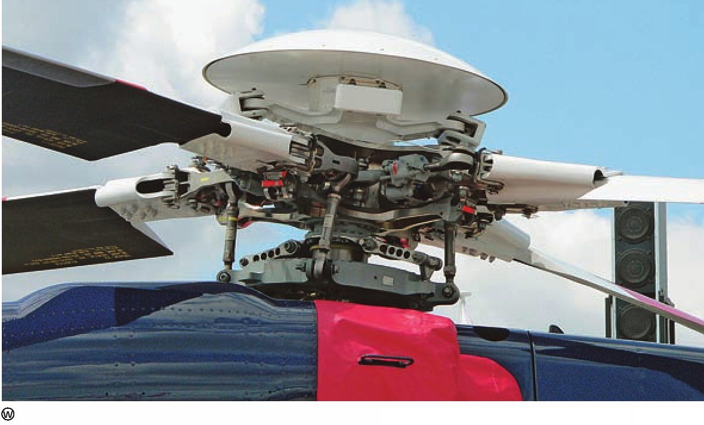
西科斯基S-29直升机桨毂

其实并非如此。直升机不论上升还是下降，主要不是靠调节旋翼的转速，而是靠调节旋翼的迎角。在一定的角度范围内，旋翼的迎角增大，所产生的升力也随之增大。这个力就是直升机升力的来源。

那么，如何来控制直升机旋翼的迎角呢？人们发明了一个装置，叫作“倾斜器”。它是由两个紧密贴合的圆环组成。上面的环随着直升机旋翼转动，并且有铰接装置与旋翼相连。下面的环不转动，但是可以上下运动，也可以倾斜，由几个连杆调节。

当直升机需要上升时，飞行员通过驾驶杆控制连杆，把两个环都往下推，连接旋翼的铰接装置会把旋翼的迎角调大，就能产生更大的升力。相反，当直升机需要下降时，飞行员就把两个环都往上推，连接旋翼的铰接装置就会把旋翼的迎角调小，旋翼产生的升力减小，直升机就下降了。

通过倾斜器，直升机不仅能产生向上的升力，还能产生向下的推力呢。当连杆把两个环都推到顶上时，直升机旋翼的迎角就变为负值。如此产生的力量就是向下的推力。这时直升机就会加速下降。如果这个推力足够，直升机还可以旋翼朝下倒着飞呢。（张首智）

## 为什么直升机可以横着飞，也可以后退飞行

我们从影视作品中看到的直升机都是来去自如，上下方便，还可以横着飞，甚至后退飞行。你知道，直升机为什么能这么随意地飞吗？

这还是要归功于倾斜器。在驾驶杆的控制下，倾斜器的圆环可以向一边倾斜。这时，直升机旋翼的迎角就会在旋转的过程中发生周期性的变化。当旋翼转到圆环最低点时，连在旋翼上的铰接装置会把旋翼的迎角变得最大，于是朝着圆环最低方向上的升力就大；而旋翼转到圆环最高点时，连在旋翼上的铰接装置会把旋翼的迎角变得最小，于是朝着圆环最高方向上的升力就小。这样，旋翼偏向哪里，直升机就向哪里偏。于是，直升机就可以随心所欲地向任何方向偏转，也就可以向前或向后飞行了。（张首智）

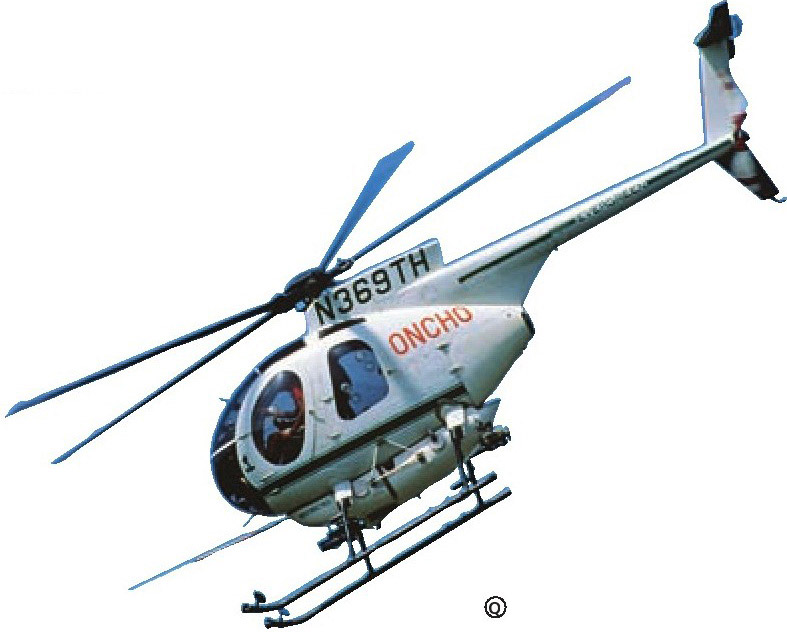
直升机前飞姿态

## 为什么直升机旋翼的叶片在停着的时候总是耷拉着

当我们注意观察地面上停着的直升机时，往往会发现它们旋翼的叶片是耷拉着的，而飞上天空以后，这些叶片又抬起来了。这是为什么呢？

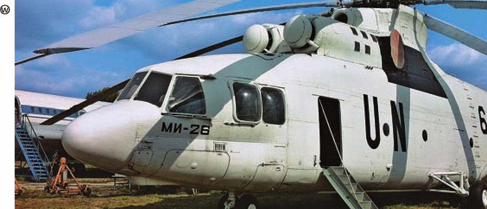
原来，直升机的旋翼在转动中，会受到气流的升力。这个升力往往在不同的情况下并不一样。如果把直升机的旋翼做成柔性的，可以上下挥舞，则旋翼的旋转平面就可以向不同的方向偏转了。

比如，直升机往前飞的时候，由于倾斜器的作用，旋翼转到后方时迎角大，升力大，所以上抬幅度大；而转到前方时迎角小，升力小，所以上抬幅度小。这时旋翼旋转的平面就向前倾，升力在前进的方向上产生一个分量，这就是驱动直升机前飞的力。

而直升机要向左横移的时候，旋翼转到左边时升力小，偏转幅度小；转到右边时升力大，偏转幅度大，旋翼平面就向左偏，气流向右吹，就可以加大向左的力量。

有了可以上下挥舞的旋翼，直升机的旋转轴不需要倾斜就可以实现前后左右的运动了。

可以上下挥舞的旋翼还有另一种作用。直升机在向前飞行时，由于机体本身有向前的速度，这个速度和旋翼速度叠加，导致旋翼向前挥动时速度大，升力大，向后挥动时速度小，升力小。这就会造成一个力矩，让直升机向一边倾转。有了可以上下挥舞的旋翼，升力大的时候叶片上挥，升力小的时候叶片下挥，就可以抵消由旋转速度不同造成的倾转扭矩。（张首智）

  

**【微博士】**第一架载人直升机

1907年11月13日，世界上第一架载人的直升机由保罗·科尔尼在法国卡尔瓦多斯省的利雪进行了首次飞行。这次飞行载着科尔尼在30厘米高的地方停留了20秒。不过，这架直升机更多的只是验证直升机的原理。

1936年，德国工程师亨里希·福克研制成功FW-61型直升机。它采用固定翼飞机的机身和方向舵、双旋翼横列布局、单台前置发动机。该机打破了当时垂直航空器速度、高度和持续飞行时间的全部纪录，是公认的世界上第一架实用的载人直升机。

【微问题】直升机倒飞时，飞行员如何观察后面的环境？

【关键词】旋翼机　直升机旋翼

## 为什么直升机的尾巴上要装一个“风扇”

单旋翼直升机在飞行时，发动机带动旋翼向一个方向高速旋转。由于“角动量守恒”的原理，旋翼向一个方向的转动会导致发动机向反方向转动，从而带动直升机机身向相反方向旋转。这就好像你两脚离地坐在可以转动的转椅上，上半身向一个方向转动，下半身必然带着椅子向另一个方向转动。而且直升机的旋翼在产生升力的同时也产生阻力。每片旋翼产生的阻力加在一起，也会产生一个力矩。因此，当直升机的主旋翼顺时针转时，机身就会逆时针转。

为了克服这种转动，最常见的措施是在直升机尾部加装“风扇”——尾桨，通过尾桨的推力产生顺时针的力矩来抵消旋翼的反扭力矩，以保证直升机机身不转动。

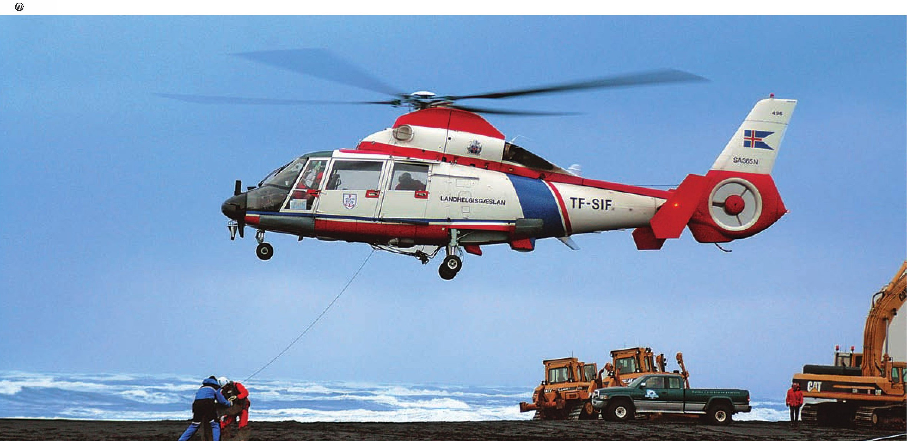
另一类方法是在直升机上安装两套大小相等、旋转方向相反的旋翼，以抵消单旋翼的反扭力矩。根据两套旋翼在直升机上安装位置的不同，直升机有不同的布局形式。较为典型的构型有：共轴双旋翼，即两套旋翼同轴上下层布置，如俄罗斯的直升机卡-50、卡-31等；串列双旋翼，即两套旋翼前后布置，如美国的CH-47“支努干”直升机；并列双旋翼，即两套旋翼左右布置，如俄罗斯的米-12直升机；交叉双旋翼，即两套旋翼交叉布置，如美国的H-43直升机。

还有的直升机，把发动机装在旋翼的末端，靠发动机喷气直接推动旋翼转动，或者在翼尖上装一个喷嘴，往外吹压缩空气。这样，旋翼与机身间只有上下方向的提拉作用，而没有水平面上方向相反的扭矩，因此不需要尾桨也能稳定地飞行。（张首智）

## 为什么直升机飞行员要用脚镫来控制转向

如果给你一架直升机，你知道怎么驾驶吗？在你左手边，有一个控制杆，叫作总距操纵杆（简称总距杆）。它可以控制直升机旋翼的迎角，从而实现直升机上升或下降。在你两腿之间有一个周期变距操纵杆（简称驾驶杆）。它可以控制直升机的周期变距，从而让直升机的旋翼向前后或左右偏转，控制直升机向前后或左右运动。

那么，如何控制直升机的机头向左或向右转向呢？这就可以通过控制尾桨进行。在你的脚下，有两块踏板（脚镫），可以把尾桨的桨距变大或变小（通过改变桨叶的迎角而实现）。这会导致直升机尾桨的推力变大或变小，于是直升机就会绕着旋翼的旋转轴发生转动，机头也就相应地向右或向左转动了。

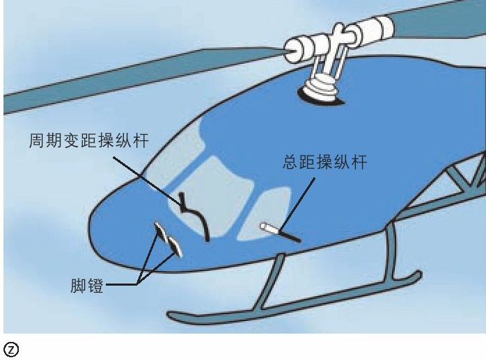
所以，直升机驾驶员往往一手握住总距杆，一手握驾驶杆，两只脚还分别踩住两个脚镫，没有足够的反应能力，还真不行呢。（张首智）

## 为什么直升机飞不快

直升机在向前飞行时，与空气有一定的相对速度。这个速度叠加到直升机的旋翼旋转速度上，就会导致向后挥的桨叶变慢，而向前挥的桨叶变快。当直升机的水平前飞速度到达一定值时，前行桨叶相对空气的速度过高，会因局部超声速而产生激波，导致气动阻力大增；而后行桨叶相对空气的速度过低，桨叶表面的气流会发生分离，导致桨叶失速，升力剧减。上述两种影响均会造成直升机飞行状态的不稳定。因此直升机的前飞速度受到一定的限制。

直升机的驾驶杆上布满了控制按钮

直升机理论上的极限前飞速度是桨尖的线速度，因为只有桨尖线速度超过前飞速度才能产生托起直升机的升力。因此理论上传统布局的直升机极限速度只有420千米/时。但实际情况下，直升机极限前飞速度受前面所述原因的限制并不很严重。通过适当改进旋翼的设计，可以较大提高前飞速度。例如，英国“山猫”直升机旋翼的翼尖采用复杂的后掠角设计，同时桨叶的厚度也从翼根到翼尖逐渐变薄。这样的设计与大后掠角和薄翼型的超声速固定翼飞机机翼类似，可以有效延迟前行桨叶激波的产生。（张首智）

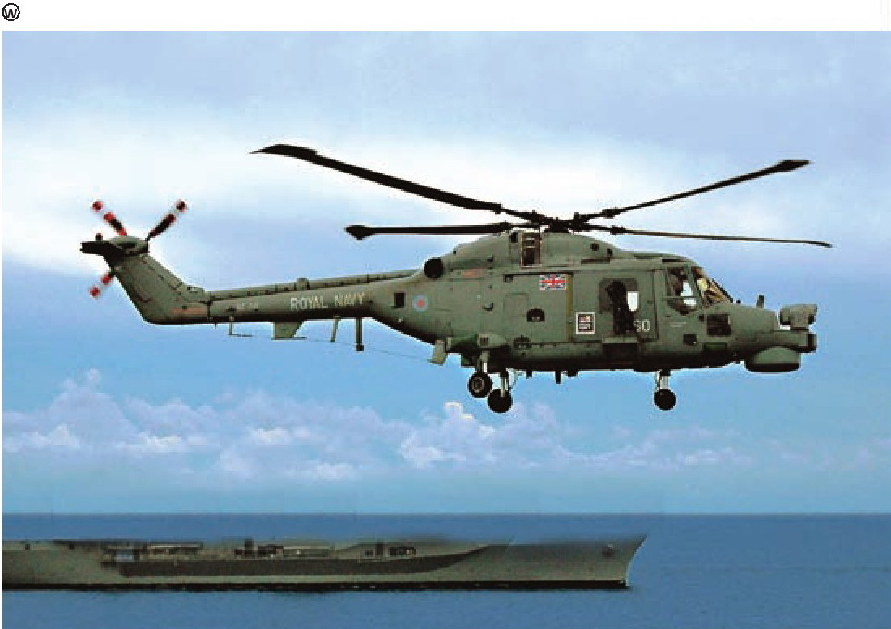
“山猫”直升机的旋翼翼尖形状十分独特

  

**【微博士】**飞得最快的直升机

2010年7月，美国西科斯基飞机公司的X2技术验证机在试验飞行中飞出了417千米/时的速度，打破了由“山猫”直升机保持的400千米/时的直升机速度纪录。2010年9月，X2技术验证机又飞出了463千米/时的速度。能达到这么高的速度，归功于其特殊的结构：尾部的螺旋桨加上共轴式刚性旋翼。这样的结构可使直升机前飞时，总有一边的桨叶具有足够的速度产生升力，消除了桨叶的失速现象。

【微问题】目前在中国，哪种直升机飞得最快？

【关键词】尾桨　脚镫　旋翼翼尖

## 为什么直升机飞行时不收起落架

固定翼飞机的起落架在飞行的过程中往往是收起的，但直升机的起落架往往固定在机身下。为什么直升机的起落架不采用收放式的呢？

这是因为直升机飞行速度比较低，外露的起落架产生的气动阻力不是很大。所以，大多数的直升机都采用了固定式起落装置。这样的装置可以简化起落架结构，减轻重量，节省宝贵的机上空间，同时提高了起落架的可靠性，降低了维护保养的工作量。

另外，固定式起落架非常有利于直升机的抗坠毁性。抗坠毁性是指当飞机或直升机发生坠机事故撞击地面时，可以保证有一个比较高的机上人员生存率和机上设备完好率。由于直升机的飞行速度慢，飞行高度低，很难采用固定翼飞机的逃生方式，所以其抗坠毁性就显得特别重要。而与可收放式起落架相比，固定式起落架在衰减与吸收撞击能量方面具备相当的优势。

随着第二代涡轮轴发动机的问世，直升机的飞行速度得以提高，部分型号的最大飞行速度超过了350千米/时。这么高的速度飞行时，起落架的阻力就不可忽略了。因此，部分先进的直升机采用了可收放式起落架设计，如直9、S-76c、AW139、EH101、卡-50等。（石坚）

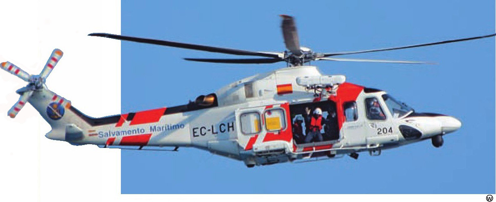
可收放的起落架

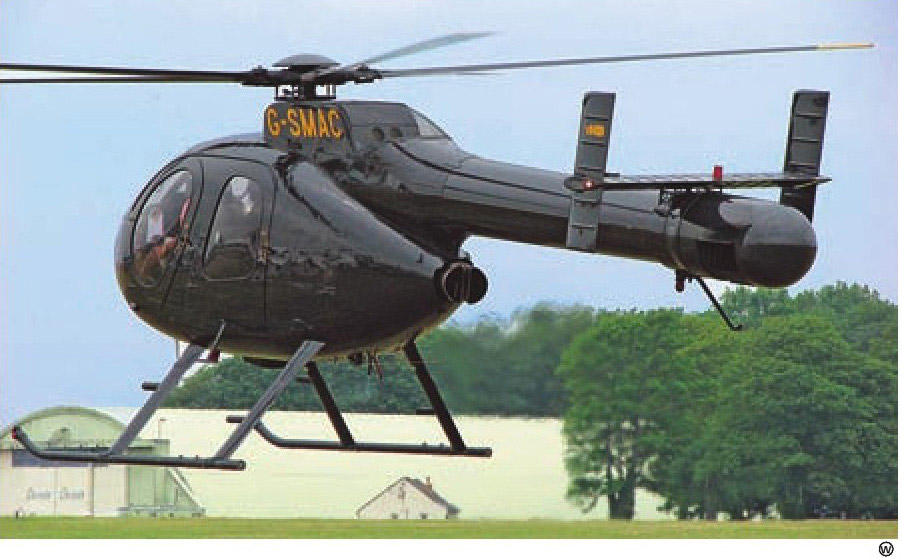
橇式起落架

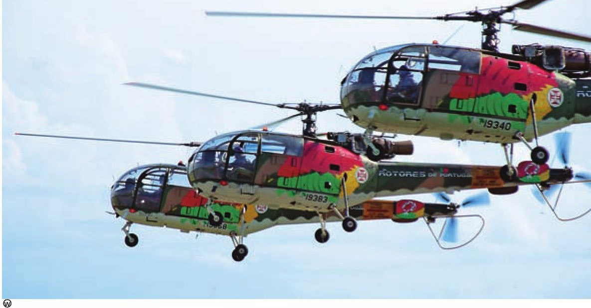
轮式起落架

## 为什么有的直升机身上有一对“小翅膀”

大部分直升机主要靠旋翼提供升力，但有些直升机也加了像固定翼飞机的机翼一样的短翼，如苏联的米-6、米-24，美国的AH-64“阿帕奇”等。这是为什么呢？

米6直升机的主起落架撑杆上方装了一对长长的短翼，其翼展达15.30米。在米-6前飞时，大型短翼像固定翼飞机的机翼一样，可以提供总升力的20%，减轻了旋翼的负载。在执行某些任务时，如果短翼会产生不利影响，也可以拆除。米-6曾在1964年创造过340.15千米/时的速度世界纪录。作为一架起飞重量超过40吨的重型直升机，能飞得这么快，其大型短翼功不可没。

对于武装直升机来说，短翼还是提供武器挂架的好地方。直升机机体很窄，里面放不下弹舱，也没有像固定翼飞机一样的机翼来外挂武器。因此，武装直升机一般都装有短翼，用来挂载武器。例如，米-24武装直升机的短翼下有3个外挂点，再配上复合挂架可以挂装大量武器。

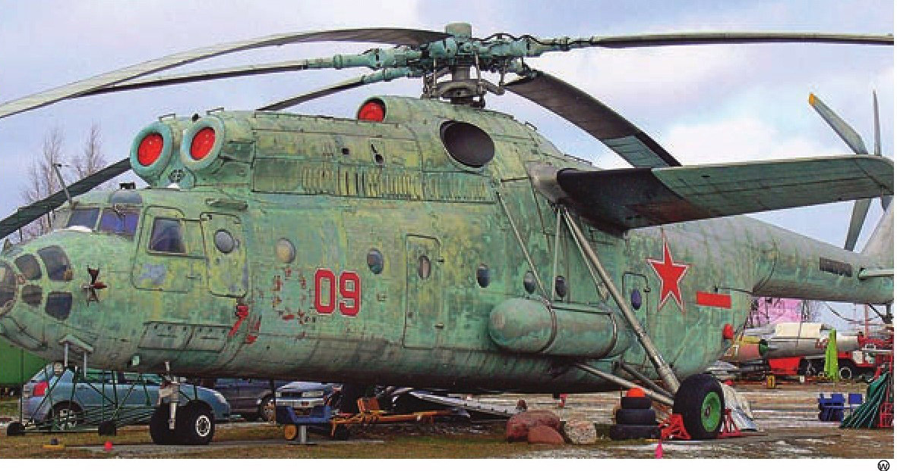
米-6直升机

但是，直升机的短翼也会带来很多问题。除了增加了结构重量以外，其最大的问题就是遮挡了旋翼的下洗气流，降低了旋翼产生升力的效率。虽然在前飞时短翼可以产生升力，但在悬停或在进行直升机特有的机动时，短翼就成了影响旋翼升力的累赘。

直升机最主要的性能优势就是悬停和非常规机动。因此，目前除需要挂装大量武器的武装直升机以外，军用和民用直升机几乎都不采用短翼，以保持直升机的特有性能。（颜思铭）

## 为什么有些“直升机”的旋翼不动也能飞

大部分利用旋翼起飞的直升机，在飞行时其旋翼都是高速旋转的，因为这是其升力的源泉。但是正由于旋翼的旋转，使直升机无法飞得像固定翼飞机那样快。目前，常规直升机的速度都很难超过300千米/时，这速度相比固定翼飞机显得很慢，限制了直升机的使用。

因此，人们便有了这样的想法：飞行器的旋翼在起飞和降落时旋转，以使飞行器垂直起降；而在平飞时旋翼固定在某个角度，由专门的推进发动机提供向前的动力，这时旋翼变成“固定翼”，像固定翼飞机那样提供升力。

20世纪70年代，西科斯基飞机公司研制了一架X翼的S-72飞机，这架飞机有一个X形的旋翼，旋转时可产生升力，在平飞时则锁定角度变成固定翼。它的设计飞行速度约800千米/时，在试飞中速度超过了480千米/时。但是由于一些问题，该机型虽然名噪一时，未能继续发展下去。

21世纪初，波音公司也制造了两架X-50A“蜻蜓”无人旋翼机进行相关试飞实验。按计划，该机的旋翼在起飞时像直升机一样旋转；在起飞后，其发动机产生的推力从旋翼转向飞机后部，飞机的旋翼被锁定。但是，试飞的两架X-50A相继坠毁。

S-72和X-50的技术困难都来自于起飞后转换期间的升力和飞行控制问题。看来，要把直升机变成固定翼飞机，还有很长的路要走呢。（颜思铭）

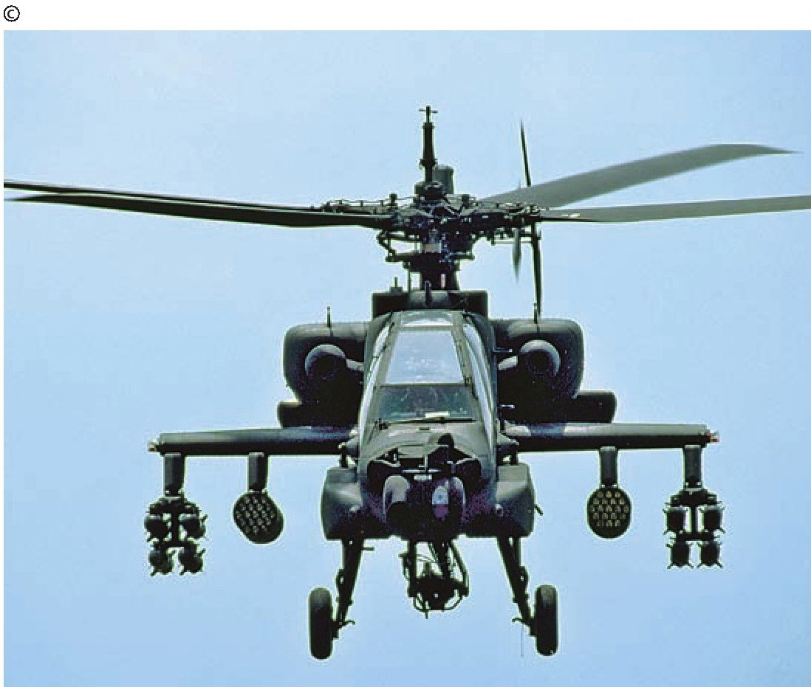
AH-64“阿帕奇”武装直升机

  

**【微博士】**直升机的特技

直升机实施机动飞行时，按其飞行轨迹可分为水平面内的机动、铅垂面内的机动、空间立体机动等，这些动作都属于简单特技。水平面内的机动有加速、减速、盘旋、转弯、水平“8”字机动、蛇形机动等；铅垂面内的机动有急速跃升和俯冲；盘旋下降、战斗转弯，跃升中的回转和转弯等属于空间立体机动。属于复杂特技的有筋斗、横滚、莱威斯曼（跃升倒转）、倒飞等。

另外，按照直升机运动的特性，机动飞行分为稳定机动飞行和不稳定机动飞行两种。加速度保持不变的称为稳定机动飞行，如稳定盘旋；加速度改变的，则称作不稳定机动飞行。

【微问题】直升机水平转弯时，驾驶员需要注意些什么？

【关键词】直升机起落架　短翼

## 有没有可以垂直起降的飞机

直升机可以垂直起降，对场地要求不高，灵活方便，由此得到了人们的青睐。那么，除了直升机，有没有可以垂直起降的飞机呢？人们进行了很多尝试。

有的人直接把发动机的喷气口朝下安装，比如美国威廉姆斯国际公司研制的X-Jet和希勒飞机公司研制的VZ-1“波尼人”单人飞行器就采用了这样的方式。这样的方式虽然可以实现垂直起降，但水平方向的运动速度却提不上去。于是有的人想到了让飞机垂直起降时发动机吹出的气流向下，等飞上天后再转成水平飞行，如美国康维尔公司研制的XFY-1。这种飞机的飞行员起飞时必须躺着，等到水平飞行时才能坐起来。为了消除旋翼产生的扭矩，XFY-1采用了两个反方向旋转的螺旋桨。

由于面朝上躺着的飞行员很难看清下方的情况，因此这种垂直起降方式在降落时就很难控制。那么，如果飞行员在起飞时可以站着呢？美国航空航天局正在研制的一种叫“海鹦”的电动垂直起降飞机就解决了这个问题。这是一种单人飞行器，飞行员在垂直起降时站着，可以看清地面的情况，平飞时就俯卧着，可以看清前方和下方的情况。它的速度预计有241千米/时，航程预计在80千米左右。有了它，就不怕塞车了。

飞机在起飞和降落的时候会放下襟翼，这不仅可以增大机翼面积，也可以把发动机的气流偏转向下，飞机就能获得更大的升力。于是有人想到了加大襟翼来垂直起降的方法，欧洲赖安航空公司研制的VZ-3就是这样一种飞机。它在垂直起降时把巨大的襟翼放下，可以获得足够的升力。

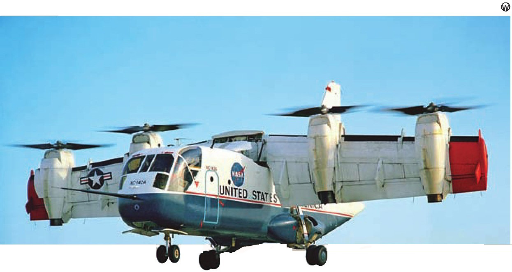
LTV XC-142飞机

BA609飞机

这么巨大的襟翼，已经和机翼本身差不多大了。那么，能否干脆把机翼也做成可以偏转的呢？希勒X-18和LTV XC-142这两种飞机就进行了这样的尝试，在垂直起降时把机翼偏向下方，在平飞时再把机翼转到水平。

与偏转机翼类似的另一个思路是把发动机偏转。美国贝尔直升机公司生产的BA609就是这样的一种飞机。垂直起降时发动机向下吹气，而到水平飞行时发动机转到水平方向，向后吹气，就可以实现垂直起降和水平飞行的切换。垂直起降的喷气式战斗机则往往不偏转发动机，而是利用可偏转的喷管，把发动机喷出的气流导向下方，来实现垂直起降。

虽然垂直起降技术复杂、昂贵、容易发生故障，但是由于其巨大的应用价值，因此对相关技术的研究一直方兴未艾。不过，目前能够达到适航要求且可以批量生产的垂直起降飞机型号并不多，因此直升机依然稳坐垂直起降航空器的头把交椅。（石坚）

## 为什么不少直升机都有两台发动机

不少直升机装有2台发动机，重型直升机和不少中型直升机还装备了3台发动机。由于活塞式发动机功率有限，要靠增加发动机台数来提高飞行速度、载重量等性能。因此，早期的直升机采用双发或多发配置主要是弥补发动机动力的不足。

一般情况下，采用双发或多发配置的直升机，更多的是基于可靠性和安全性方面的要求。直升机一旦因自身故障或作战损伤失去动力后，发生坠机灾难的概率要远大于固定翼飞机。因此，双发直升机的安全性比单发直升机要高很多，可以保证在一台发动机失效时，直升机能继续飞行或安全返航。直升机发动机的性能指标中，除了最大持续功率、起飞功率外，还有最大应急功率，以在起飞、降落、悬停等情况下发生单发失效时维持直升机安全飞行。

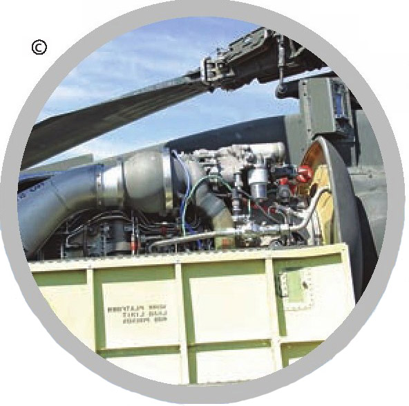
AH-64“阿帕奇”直升机由2台发动机提供动力

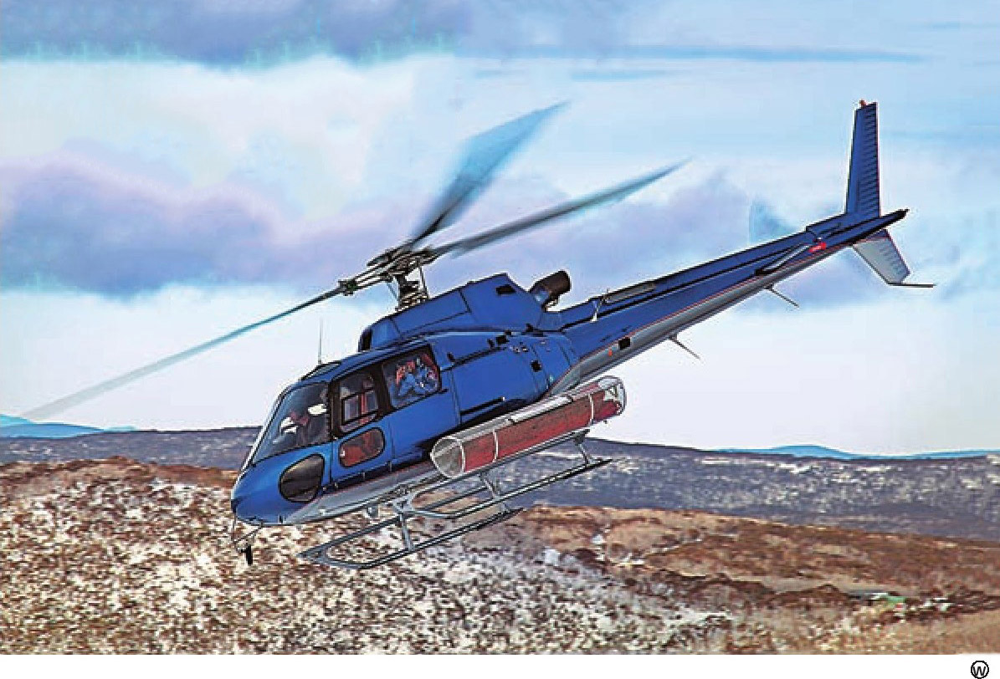
AS-350轻型直升机

采用双发动机的军用直升机具有更好的战场适应性；相关适航条例也规定，在人口稠密区域飞行的直升机必须为双发配置，以最大限度避免因坠机事故造成人员伤亡。至于采用3台发动机的中型和重型直升机，由于单发失效时剩余功率大，安全性比双发直升机更高。

随着推力更大的涡轮轴发动机的问世，单台发动机的性能已足够满足轻型直升机的需求。考虑到结构简单和经济性等方面的要求，部分直升机采用了单发的动力配置方式，如UH-1、AS-350、EC130、AC301/AC311等轻型直升机。（石坚）

## 空中加油时，直升机的旋翼不会打到加油管吗

直升机在执行任务中，有时需要在空中加油。那么加油时，加油管会不会被直升机正在旋转的旋翼的桨叶刮到呢？

的确，直升机在飞行时，其旋翼的桨叶处在旋转中，而且桨叶的旋转面会在一定范围内发生变化。不过，桨叶旋转面的变化范围是有限的，如果在这个范围之外加油，就可以保证安全。因此，为防止空中加油时旋翼打到加油软管，直升机的受油杆常设在远离旋翼桨叶的机身下部，并设计成可伸缩式或尽量长一些，部分机型的受油杆伸展长度几乎伸到了旋翼旋转面的水平投影面外。采取了这些措施后，正常情况下，空中加油时就不会因旋翼打到加油软管而发生事故了。（石坚）

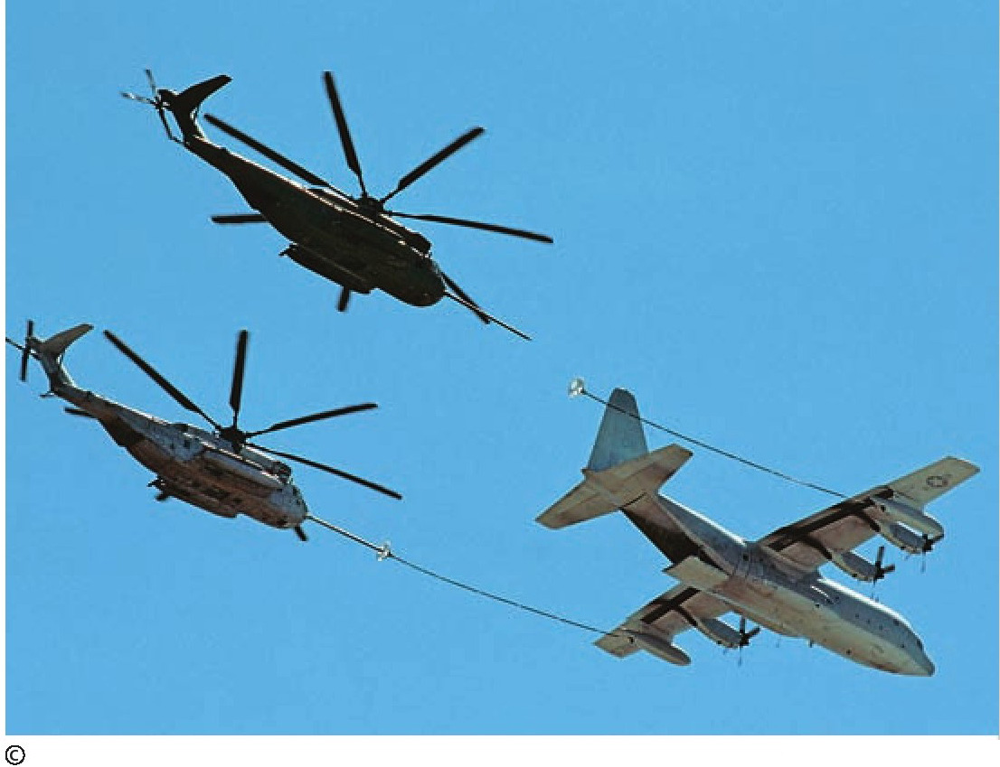
直升机空中加油

  

【微问题】直升机发动机是如何将燃气产生的能量转换为带动旋翼旋转的动力的？

【关键词】垂直起降　直升机空中加油

## “背包”也能把人带上天吗

飞机虽快，但是使用起来比较麻烦。有没有可以穿在身上的飞行器，像背包一样一背就可以飞上天呢？

现实生活中还真有这样的“背包”。最早的背包式个人飞行器要数20世纪60年代，由贝尔直升机公司研制的火箭背包了，它是用浓度为90%的过氧化氢液体驱动的。飞行员将它背在身后，启动喷射开关，过氧化氢就会经过喷嘴上的含银过滤网，分解成蒸汽和氧气，形成高速喷射的气流，从背囊底部的喷嘴喷射而出，形成极大的推力，将人体托离地面，推向空中。它因曾出现在007系列影片《雷霆万钧》中而家喻户晓，1984年洛杉矶奥运会上还被用来点燃奥运火炬。但贝尔火箭背包因工作时间短（20～30秒）、飞行成本高（飞一次要2000美元），未能得到推广。

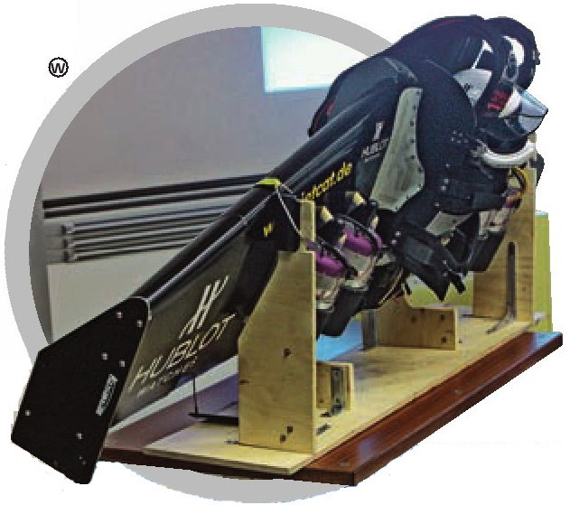
伊夫·罗西的火箭动力翼

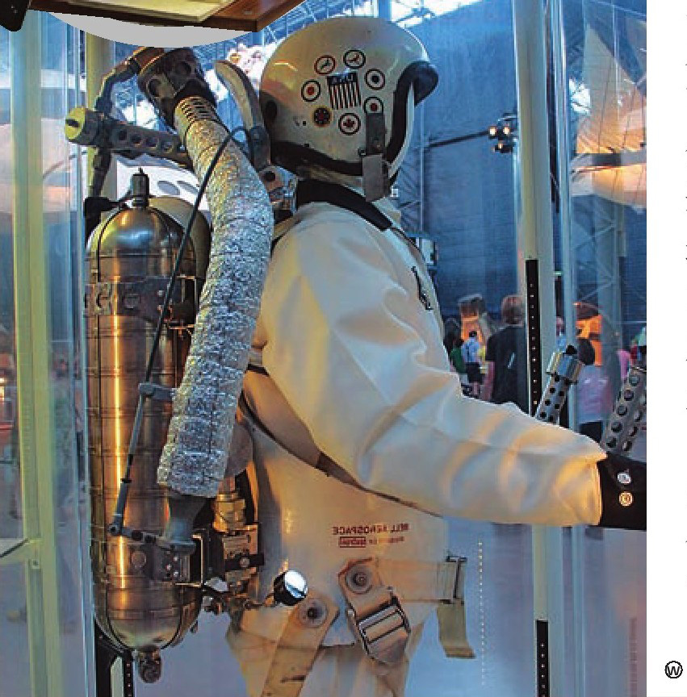
贝尔火箭背包

21世纪初，美国千年喷气机公司研制了SoloTrek XFV垂直起降飞机。它采用一台涡轮轴发动机提供动力，续航时间可以达到90分钟，航程长达238千米，最大速度为128千米/时，用来上下班肯定是足够了。

目前，最出名的飞行背包当属瑞士“火箭人”伊夫·罗西的火箭动力翼。罗西也是第一个利用背部的飞行背包（包括固定翼和喷气装置）实现长时间持续飞行的人。罗西利用火箭动力翼完成了飞越阿尔卑斯山、英吉利海峡、美国大峡谷等挑战性的任务。

罗西研制的火箭动力翼的主体是可折叠的碳纤维刚性机翼，翼展长约2.4米，动力装置是4个安装在机翼上的喷气发动机。整套飞行装置重55千克，包括13升燃油和增加表演效果的发烟筒等装备，飞行时，全重145千克。其他飞行装备还包括带安全高度警告装置的头盔和F1赛车防火服。每次飞行时罗西都从空中的小型飞机跳下，利用俯冲增速，最大飞行速度能达到300千米/时。飞行时的安全高度一般为800米，飞行结束时采用降落伞着陆。除了喷气发动机的油门外，动力翼没有其他任何控制装置，飞行中只能依靠身体的转动来控制升降、偏航和俯仰。想要驾驭火箭动力翼的人，除了要有丰富的飞行经验外，还需具备优异的身体素质、过人的胆量和勇敢的冒险精神。罗西是战斗机飞行员出身，当过民航机长，平时酷爱各种极限运动，还真是火箭动力翼的最佳人选。

另一款具备实用性的个人飞行器是新西兰航空设计师格伦·马丁发明的喷气背包。马丁的喷气背包采用147千瓦的汽油发动机驱动两副升力风扇，发动机、燃料箱和飞行员位于两副升力风扇中间偏下方的位置，使得整个飞行器的重心低于升力中心，有利于稳定飞行。喷气背包有左右两个向前伸出的控制杆，由飞行员双手握持。左手控制杆用来控制涵道风扇向前后及两侧倾斜，右手控制杆可控制汽油发动机的油门。整个喷气包重约115千克，最大飞行速度101千米/时，最大飞行高度可达2400米。经过几年的飞行测试与改进，喷气背包的性能已经相当完善，并开始了商业化运作，每具喷气背包的售价为5万英镑。

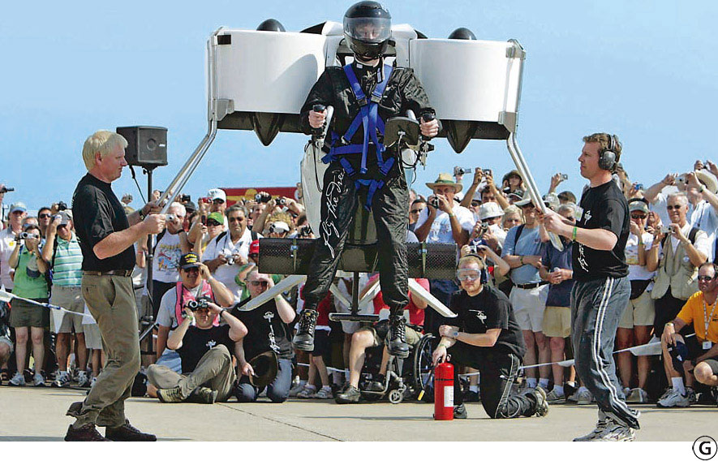
马丁喷气背包

随着科技的进步，未来会有更多实用的个人飞行器面世。（石坚）

## 为什么降落伞能精确地把人和货物送到目标点

降落伞是由柔性织物制成的一种展开式气动力减速器。它在空气中展开以增大运动阻力，使人或物减低速度、稳定姿态，并从空中安全降落到地面。降落伞主要用于空投空降、航空航天救生、跳伞运动、飞行器减速和回收等。

降落伞通常由引导伞、伞衣套、主伞、伞包和背带/捆带等组成。降落伞伞衣完全张开并稳定下落一段时间后，其下降速率将为定值。在无风且降落伞系统具备较好稳定性的理想条件下，根据飞机的飞行速度和高度，可以计算出空投人员和货物的降落点。

受实际气象条件和降落伞技术的影响，早期使用的平面圆形伞在空投空降时的准确性并不很高。每次空投空降只能划定一块大致的目标区域。即使这样，空投空降的人员和物资仍然会有很大的散布，甚至有些伞兵与空投物资会被气流吹落到很远的地方。第二次世界大战中的几次大规模空降作战，空降兵集结与装备集中都十分困难。《最长的一天》、《遥远的桥》等战争影片对此都有真实的描述。

为适应军事斗争与科技发展的需要，世界各国加强了对降落伞的科学研究。目前，已经在充气特性控制、新材料应用、稳定下降、安全着陆等降落伞技术上取得了很大进展。再加上空投空降技术的改进（低空跳伞、中空跳伞——低空开伞、超低空降落伞牵引空投等），使得空投人员和物资的准确性大为提高。尤其是具有水平滑翔功能的翼型降落伞的出现，使得空投空降的准确性上升到了一个新的高度。

翼型降落伞又称冲压式翼伞（简称翼伞）。其伞衣呈翼形而不是传统的圆形，用不透气织物制造上下翼面，中间用具有翼形的肋片连接，前缘开有切口以便于空气进入，使降落伞充气后形成机翼形状。翼伞在滑翔中能产生升力，可操作性和降落性能良好。训练有素的运动员或伞兵，能操纵翼伞飞越危险区，躲避障碍，并精确地降落到指定的目标点。目前正在研制的自动空投系统，如加拿大米斯特机动集成系统技术公司研制的“雪雁”和“夏尔巴人”，利用GPS卫星定位的翼伞，可以自动把货物送到几十千米之外的地方，着陆精度可达100米左右。翼伞是当前降落伞领域中最有发展前途的高性能伞，在跳伞运动、空投空降、航空救生、飞行器回收等应用领域已取得重大进展。（石坚）

翼伞的伞衣呈翼形

  

【微问题】除了背包式个人飞行器，穿上特制的翼装飞行服进行滑翔也能使人飞起来。你知道这种飞行方式是模仿哪种动物的吗？

【关键词】背包式个人　飞行器　空投落点

## 飞机可以不落地吗

想象一下，一架飞机一直在天上飞行，从来都不落地，是不是很酷？当然，这并不是一件容易的事情。想要让飞机长时间不落地，就要保证有足够的燃料补给，也就是能量来源。

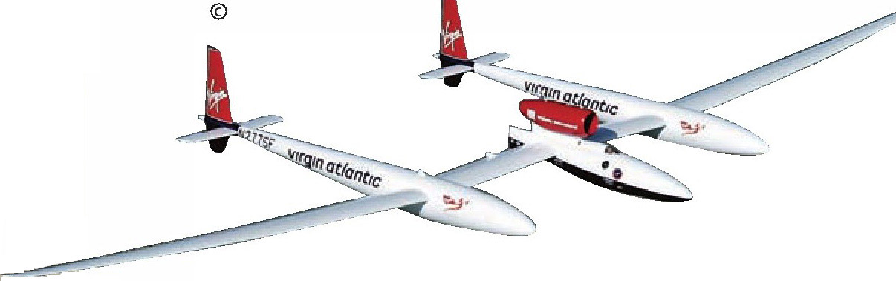
2006年2月，史蒂夫·福塞特驾驶“环球飞行者号”喷气式飞机创造了不间断不加油飞行的世界纪录：76小时45分钟，42469千米

有一种飞机是靠接收微波来开动的，叫作微波动力飞机。微波就是微波炉里用来热饭菜的电磁波，它携带着能量，因此既可以加热饭菜，也可以给飞机提供动力。微波动力飞机不带燃料，只有一台直流电动机和微波接收整流装置。起飞时由蓄电池为电动机供电，待升高到空中后，电池关闭，地面上的微波发生器通过碟形天线发射微波，飞机上的特殊天线接收到微波并将其变成直流电，驱动电动机带动飞机螺旋桨旋转，这样飞机就靠微波作动力飞行了。这种飞机的飞行高度与地面微波的功率有关。

微波动力飞机重量轻，工作效率高，由于飞机所需的电能是由地面供给，因此它在空中飞行可不受燃料的限制而长时间飞行。它在军事上可作为预警机使用。在民用方面，这种飞机可用来进行农业监测、天气预报等，还可以装上雷达和通信设备，作为广播、电视、通信的天上中转站。但是目前微波飞机的能量传输效率还比较低，还处于实验阶段。

另一种不落地飞机的构想就是使用太阳能。从理论上说，只要能追上地球自转的速度，使自己永远暴露在阳光照耀下，太阳能飞机就能永久飞下去，直到部件达到寿命极限。但实际上，飞机要跟上地球的脚步，需要以接近2倍声速飞行，这只有在已经退役的“协和”超声速客机上才能体验到。因此，现实的太阳能飞机还必须面对黑夜的挑战。太阳辐射的能量密度很小，为了获得足够的能量，飞机上应有较大的接受阳光的表面积，以便铺设太阳能电池。因此太阳能飞机的机翼面积较大，重量也较重。

2003年，瑞士探险家贝特朗·皮卡尔提出了太阳能飞机环球飞行构想，计划经过5次起降实现环球昼夜飞行。皮卡尔的团队制造了一架“太阳驱动号”太阳能飞机，其细长的翼展有63.4米，上面装了大约1.2万块太阳能电池片。这些太阳能电池不仅要为飞行提供动力，还要给400千克的锂电池充电，以使飞机在夜间正常飞行。整架飞机重1.6吨，相当于一辆中型轿车。

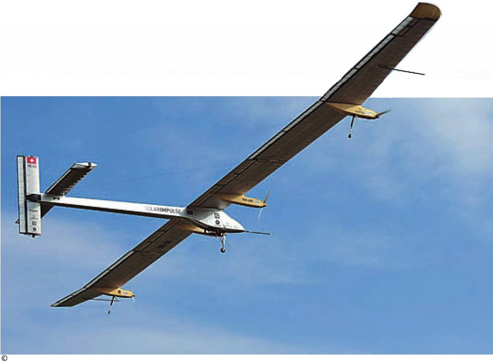
“太阳驱动号”太阳能飞机

2010年4月7日，“太阳驱动号”首飞成功。2010年7月，“太阳驱动号”成功实现了24小时不间断飞行。2012年6月，它完成了首次洲际飞行，从欧洲飞到非洲。到目前为止，太阳能飞机最长连续飞行时间的纪录由“太阳驱动号”创造，它在9千米的高空飞行了26小时10分19秒。

2013年5月初，“太阳驱动号”从美国西海岸的旧金山附近起飞，开始向东跨越美国的飞行。2015年，“太阳驱动号”将尝试环球飞行。

不过，虽然飞机可能长时间不落地，但飞行员却不能永远不回家。为了满足人们对于不落地飞机的需求，世界各国普遍发展了长航时无人机。

美国的“全球鹰”属于典型的长航时无人机，它可以轻松执行12小时以上的超长任务。由于取消了飞行员，与人相关的设备都可以取消，从而大大减轻了飞机的重量。例如，不用带氧气，也无需设置增压座舱，环境控制系统只需要考虑设备要求。而且，无人驾驶飞机不必承担损失飞行员的风险。

在总体布局上，几乎所有的长航时飞机都采用细长的平直机翼。这种机翼虽然不适合高速飞行，但在低速状态下却拥有很高的升阻比，并且十分适合高空长时间飞行。除此之外，长航时无人机还广泛采用复合材料，以求降低飞机重量，延长飞行时间。

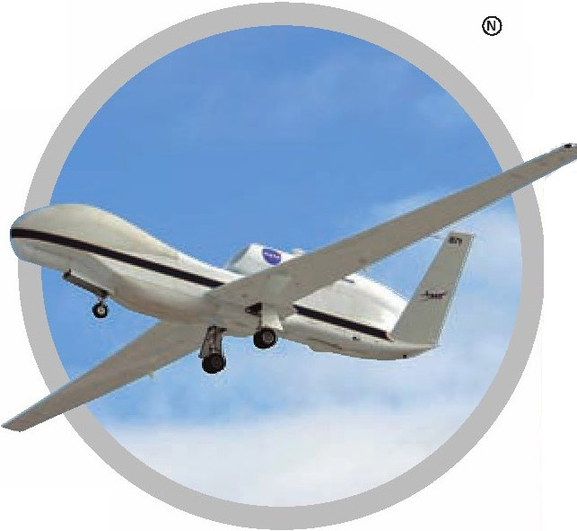
“全球鹰”长航时无人机

保证长航时飞行的另一个要点是提高载油系数，即燃料重量占飞机起飞重量之比。事实上，美国航空航天设计师鲁坦20世纪80年代在设计“航海家”飞机时，为了实现历史性的不加油环球飞行，就采用了极端高的载油系数。这架飞机最大起飞重量中超过72%是燃料。“全球鹰”也采用了类似的设计，而且由于不载飞行员，可以载更多的燃料，其载油量在6.5吨左右，载油系数大约是63%。目前，空中自动加油技术还在完善过程中，“全球鹰”没有配备相应的设备。为进一步提高航时和航程，美国未来很可能会给“全球鹰”这样的无人机增加空中加油能力。一旦具有了这样的能力，“全球鹰”有望在空中逗留3天以上。

为了能够更有效地利用燃料，“全球鹰”还采用了高性能的小型涡扇发动机。该发动机具有很高的可靠性和燃油经济性。在上述气动布局、高载油系数和高性能发动机的保证下，“全球鹰”的最大航程可超过25900千米，自主飞行时间长达约42小时，可以完成洲际飞行。2001年4月，“全球鹰”完成了从美国到澳大利亚的越洋飞行创举，表现了非常强劲的洲际侦察能力和自动部署能力。（肖刚）

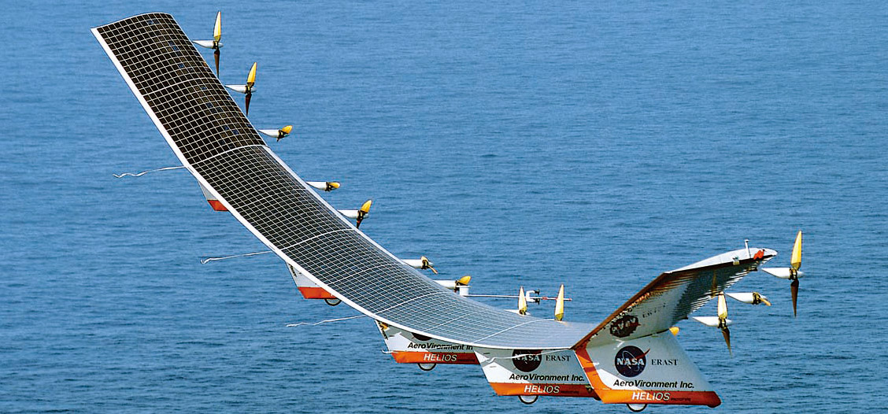
美国航空航天局的“太阳神号”太阳能飞机

  

【微问题】太阳能飞机进行环球航行，要解决的最关键的问题是什么？

【关键词】太阳能飞机　长航时无人机

## 为什么同一航线往返飞行时间会不一样

乘飞机旅行时，我们往往会发现往返所需时间不一样。造成这种情况的原因通常有两个：风的影响和航路的差异。

风的影响是最主要的原因。飞机是在大气中飞行的，飞机的速度指的是空速，即相对空气的速度。空气也是在运动的。也就是说，在顺风中飞行时，飞机的实际速度就是空速加风速，逆风时候恰好相反。所以，相同距离的飞行，顺逆风情况下所需的时间相差很多。

从更大的范围来讲，太阳辐射和地球自转造成了大气环流现象，在不同纬度和不同季节，风向、风速各不相同。中国所处的中纬度地区风向一般是自西向东，风速冬春大，夏秋小。所以，在冬季往返西部和东部地区尤其是跨国跨洋飞行时，同一航线往返飞行的时间差尤其明显。

另外一个原因就是往返航路不一样。当代民航业发展很快，空中飞行的飞机越来越多，密度越来越大。为了安全间隔，飞机之间除了有高度差和时间差外，在水平方向上也要拉开差距。此外，飞机在空中飞行的时候有可能遇到雷雨、浓积云等特殊天气情况，要采取绕道飞行以避开可能出现的危险。（肖刚）

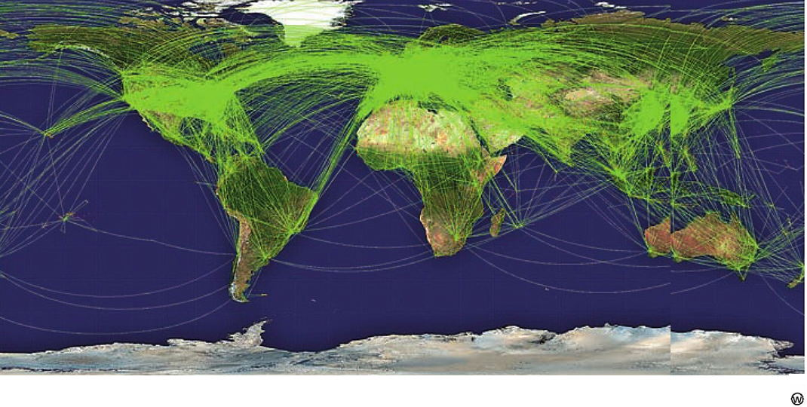
当代民航业发展很快，空中飞行的飞机越来越多，密度越来越大

## 为什么机场要有专用的雷达

所有的雷达都有一个共同的作用，即发现目标。民航飞机上装载雷达，观测的是雷雨、飞机、障碍物等目标，以防止误入雷雨区，避免与其他飞机和地面障碍物相撞。飞机场也有雷达。机场雷达除了观测云雨等气象变化外，主要探测的目标是飞机，目的为了管制交通，指挥航空运营。空中交通管制部门利用地面设置的精密进近雷达系统，引导航站区域内的飞机依次对准着陆航迹下降着陆。精密进近雷达系统包括机场监视雷达和精密进近雷达两部分。

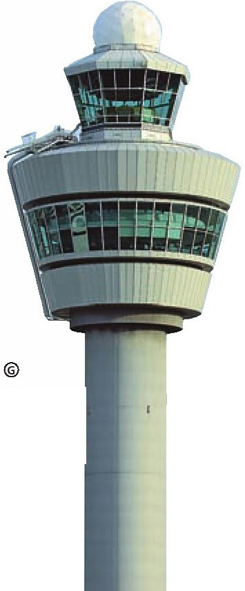
机场塔台

机场监视雷达用于探测1000千米范围内活动的飞机，雷达荧光屏上显示每架飞机的位置。空中交通管制员可根据飞机的方位和距离，引导飞机对正跑道中线延长线，从而下降着陆。不过，机场监视雷达只能探测飞机的方位和距离，不能显示飞机的高度。

精密进近雷达探测的范围要比机场监视雷达短得多，只用于探测在最后进近阶段直至着陆的飞机，并跟踪其航迹。它们一般都被设置在跑道入口以内915～1200米、偏于跑道中线一侧120～185米的位置上，用两副天线对着陆飞机分别发射方位和高度两条波束。进入着陆的飞机对两条波束的回波显示在两个荧光屏上，一个荧光屏显示飞机的方位和距离，另一个荧光屏显示飞机的高度和距离。雷达管制员观测飞机回波影像，指挥飞机沿正确的航迹和下滑路线下降着陆。（肖刚）

## 坐飞机也会有高原反应吗

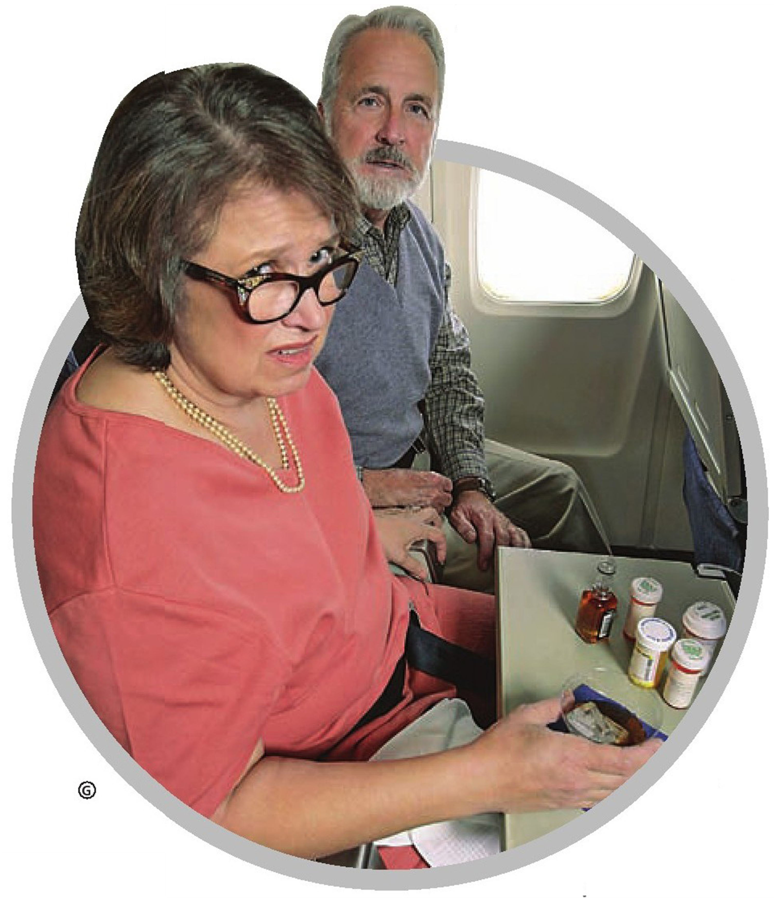
飞机经常在相当于高原的高度飞行。随着飞行高度逐渐增加，周围的空气越来越稀薄，气压下降，温度也下降。在海拔4000米高空，人就有较严重的缺氧表现。到了海拔6000米的空中时，机外温度下降到-24℃，空气密度仅为地面的53%。此时，人能维持有效知觉的时间仅为15分钟。早期的飞机，驾驶员靠穿上厚厚的皮制飞行服来抵御寒冷，但没有办法防御低气压。后来，飞机上添置了制氧设备或氧气瓶等。但这些也只能在应急或特殊情况下使用，不能根本解决问题。所以早期的飞机“高原反应”还是挺严重的。因此，1945年以前，运输机的飞行高度都被限制在海拔6000米以下，通常只在海拔600～4000米的区间飞行。

1947年，涡轮压气机被装进了飞机，它可以源源不断地给客舱提供相当于80%正常大气压的空气。增压后的气压相当于在海拔2400米高度的大气压。这种客舱叫增压座舱。从此，客机的飞行高度突破海拔6000米的禁区达到10000米以上。那为什么不把座舱内的气压调整到和海平面的气压一样呢？这是因为座舱内部的压力越高，飞机升到高空以后，机内机外的压力差也就越大，飞机结构所承受的压力也越大。目前客舱内设定的这个气压对于一般人来说没有不舒服的感觉，但飞机结构受力却大为减轻，可以减轻飞机的结构重量。在飞机起飞和降落时，由于存在着相当于近2400米高度差所导致的气压变化，乘客会感到耳朵内鼓膜轻微的疼痛不适。此时，乘客可以靠反复张嘴闭嘴的动作或者嚼点口香糖，使鼓膜内外的气压平衡，以减轻症状。

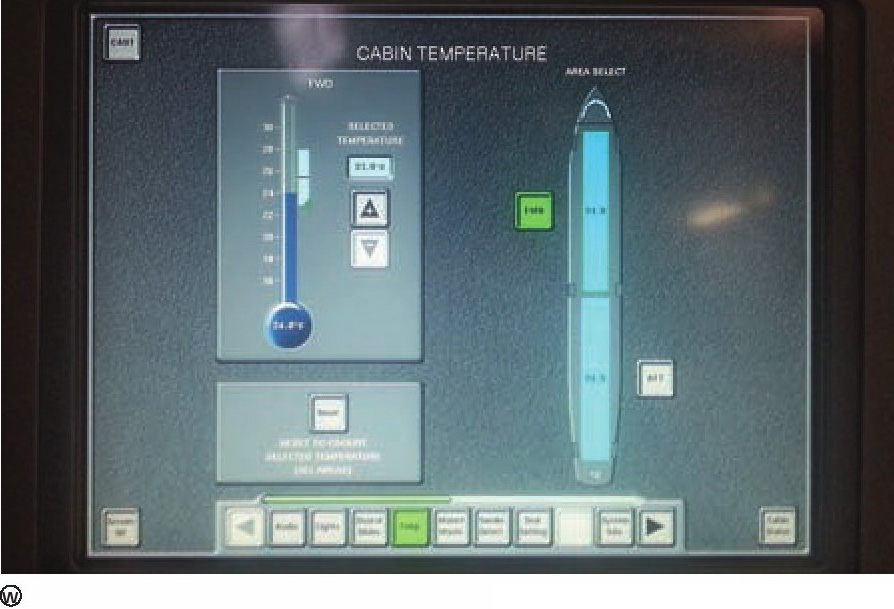
空中客车A319机舱控制系统

客舱内空调系统的温度通常也都调到使人感到舒适的程度。在每个座位的上方，还有可调节的送风口，旅客可以按照自己的需要小范围地调节周边的温度。

飞机就以上述方法在客舱内形成一个小气候，尽管飞机外空气稀薄，温度在零下几十摄氏度，机内却空气新鲜，气压合适，温暖如春。

现代客机的客舱壁板内还加有隔音材料，使舱内的噪声一般都保持在70分贝以下，即使旅客彼此低声谈话都能听得很清楚。总之，现代大中型客机给客舱中的旅客提供了尽可能舒适、宁静的飞行环境。

所以，现代飞机在高空飞行中乘客已经不会产生高原反应。在现代科技提供的各种技术保障下，即使在高空，坐在飞机里仍然感觉像待在地面一样舒适。（肖刚）

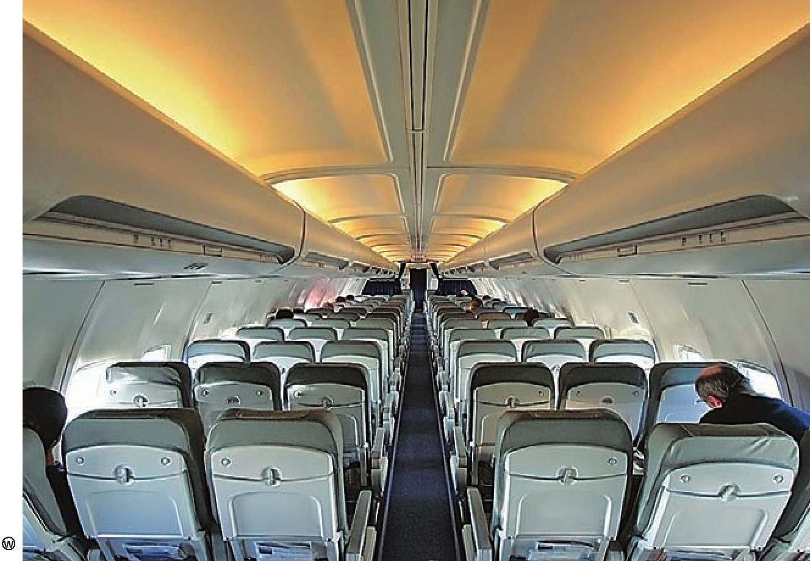
现代飞机舱内非常舒适

  

【微问题】飞行员如何保护他们的鼓膜？

【关键词】飞行时间　机场雷达　舱内环境

## 为什么新型飞机上天前要进行风洞试验

完成一架飞机的设计必须要弄清楚飞机的动力学性能，需要进行反复测试。如果一架根据理论设计的样机直接飞上天空，危险性很大。所以从莱特兄弟开始，飞机设计师们就充分利用风洞进行地面测试，在飞机上天之前尽量弄清其性能。

风洞是一种产生人造气流的管道，用来研究物体在气流中所产生的气动效应以及进行耐热抗压实验等。世界上公认的第一个风洞是英国人韦纳姆在1871年建成的，其目的是为了测量物体与空气相对运动所受到的阻力。1901年，莱特兄弟为了得到正确的飞行资料，也利用风洞进行了200多个机翼模型的测试。根据模型测试的结果，他们不仅建成了当时最大的双翼滑翔机，而且在1903年发明了世界上第一架带动力的飞机。

与试飞时飞机在空气中运动正好相反，风洞试验把飞机、机翼或模型固定在管道中，用风扇、高压存贮气体释放等手段产生人造气流，通过准确地控制气流的速度、压力、温度等实验条件，可以高效地模拟飞机在各种复杂飞行状态下的空气动力学特征。风洞试验几乎是飞行器研发中不可或缺的环节。

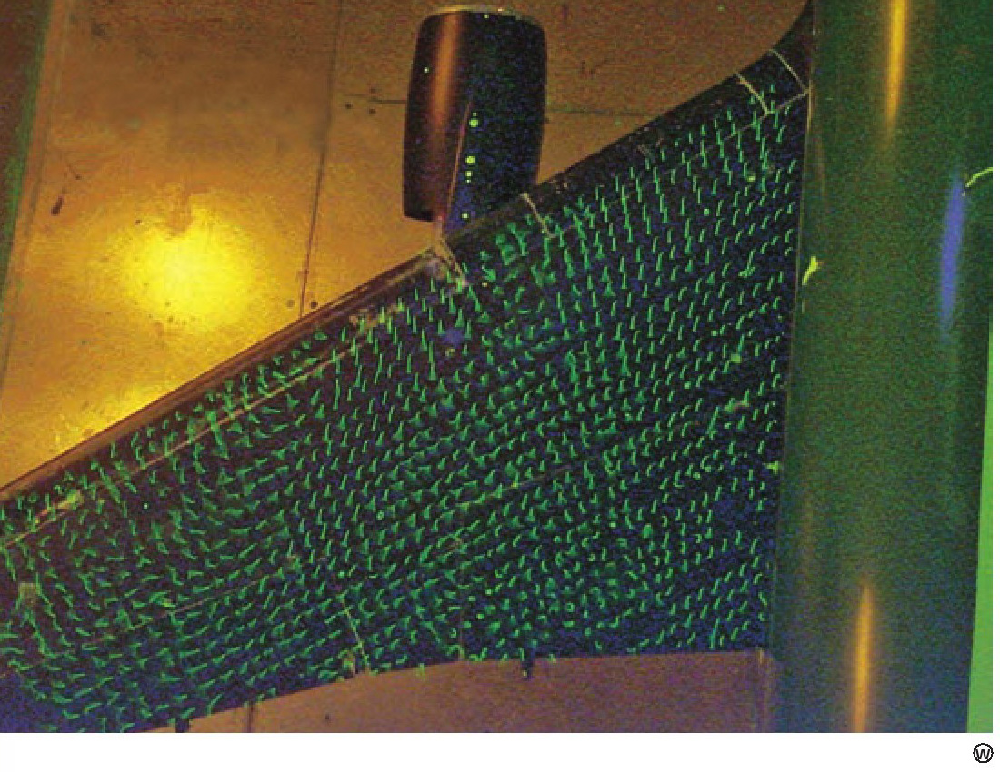
在风洞中利用荧光毛线显示机翼上气流的变化

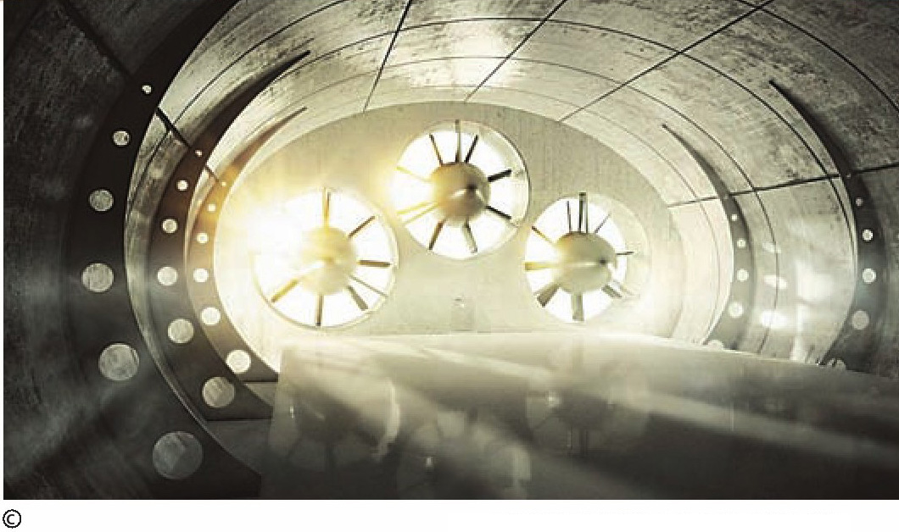
风洞能根据需要产生各种人造气流

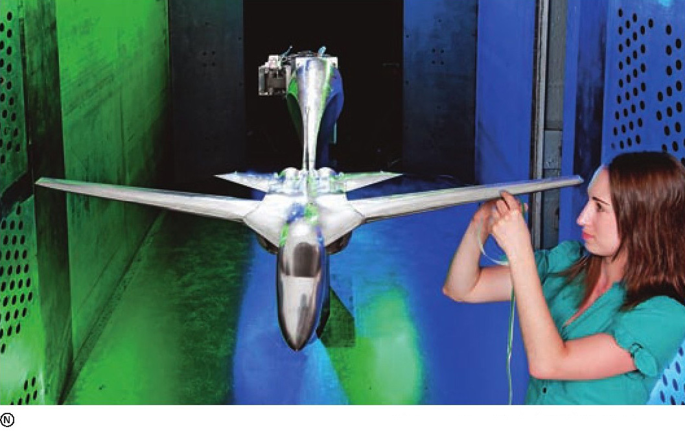
科研人员在风洞中安装实验模型

风洞种类多种多样，按气流速度可分为亚声速、跨声速、超声速、高超声速等类型；在直径尺寸上，小到几厘米，大到可容纳整架飞机。

但风洞试验并不是完美的，它毕竟只是一种模拟实验，有其局限性，如气流会受到边界、模型支架的干扰，风洞中的气体参数不能完全替代真实情况等。因此，通过风洞试验的飞机还必须到真实环境中进行反复测试和验证。（于哲峰）

## 为什么工程师要把好好的飞机弄坏

在飞机刚诞生的时期，为了验证飞机结构的强度，工程师们常把一些沙袋放到飞机上加力，以了解飞机在什么负载下会发生破坏。这称为地面静力试验。如今的试验已经不再使用沙袋，而是使用液压作动器进行加力，由计算机控制精确地实现自动加载和数据采集，直到飞机破坏。飞机结构破坏时的载荷称为极限载荷，它通常是使用载荷的1.5倍。因此，通过这个实验可以验证飞机的使用载荷是否符合设计要求。

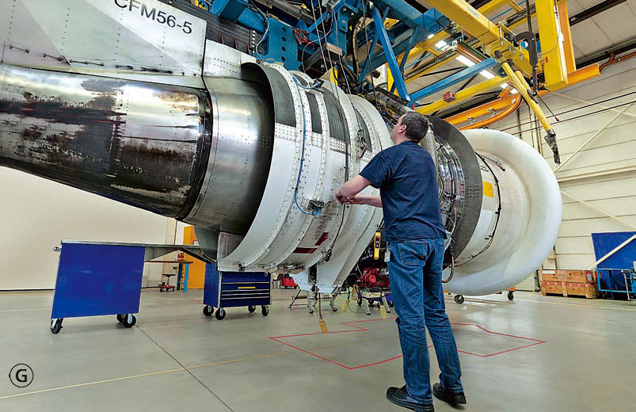
飞机发动机在试验台上进行测试

其实，在飞机研制过程中，从很小的零件到机翼这样的大型部件都要进行结构试验。飞机零件的设计要求是保证飞机在所能遇到的最大载荷（使用载荷）的作用下，不会发生永久的变形。虽然在飞机设计过程中，这些零件已经过很严格的计算，但最终还是要通过地面静力试验来验证计算的准确性。

除了地面静力试验外，还要进行疲劳试验。疲劳试验的载荷要小得多，但载荷大小或方向反复变化，以检验飞机及其部件的抗疲劳能力。为了解飞机的使用寿命，疲劳试验最终也会将飞机结构破坏。

工程师破坏飞机的目的，是为了让飞机的设计更合理、更可靠，从而保证在实际飞行中更安全。正因为以这么多的破坏为代价，飞机才成为相对来说最安全的交通工具。（于哲峰）

## 为什么试飞员要故意制造“事故”

一种新飞机诞生后，首先要进行试飞。试飞的项目非常多，其中一项就是考查飞机的操纵性。

操纵性也称飞机操纵品质，是指飞机对飞行员所做的控制动作的反应程度。飞机对控制的反应不宜过于敏感。过于敏感的飞机在很小的操纵力下就会发生很大的反应，不仅难于精确控制，而且反应量过大也容易产生失速或结构损坏等问题。飞机的反应也不宜过于迟钝。过于迟钝的飞机，在很大的操纵力下反应还是很小，容易使飞行员产生错误判断，也可能造成飞机的大幅度振荡运动，同样会导致失速或结构破坏。如果飞机在作机动飞行时，不需要飞行员进行复杂的操纵，驾驶杆力和位移都适当，并且飞机的反应不过快，也不过慢，那么就认为该飞机具有良好的操纵性。

为了验证飞机的操纵性，试飞员常常需要做一些非常规的动作，甚至是一些“事故”。比如，急转弯、尾旋、失速等正常飞行时不太遇到的动作。这些动作有时会使试飞员处于危险的境地。这就需要试飞员不仅有普通飞行员那样良好的身体素质和过硬的心理素质，还应具备相当的理论基础和分析能力，能够对空中出现的情况做出科学理性的判断，以便设计和制造人员更好地改进飞机。（于哲峰）

  

**【微博士】**战斗机的超灵敏性从何而来

现代先进战斗机为了获得优良的机动性，常常做得非常灵敏，这导致飞行员的操纵难度增大，甚至根本无法实现对飞机的稳定控制。这就要求配置由计算机控制的增稳系统。这种系统能根据传感器反馈的飞行状态，自动计算所需控制量，控制舵机的偏转，实时地保持飞机的稳定。

【微问题】除了飞机，风洞试验还被运用在哪些产品的设计中？

【关键词】风洞试验　结构试验　试飞

# 运载火箭

## 从哪里开始算是太空

“太空”一词在中国古已有之，是指极高的天空。究竟高到什么程度算极高，至今还没有明确的数据。但从定性的角度，我们可以把太空定义为地球大气层之外的空间。再严格一点说，太空是指地球稠密大气层以外的空间。

但大气层和太空之间并没有像地面和大气层之间，或陆地和海洋之间那样明确的界限。从地面往上，大气越来越稀薄，密度逐渐减小……体哪里开始可以算稠密大气层以外的空间呢？联合国和平利用外层空间委员会认为，目前还不可能提出确切和持久的科学标准来划分外层空间（即太空）和空气空间的界限。一般情况下，我们以人造地球卫星离地面的最低高度（100千米）作为太空的最低界限。

在科学技术领域，长期使用“空间”一词来表示太空，如空间物理、空间科学、空间站等。但这个词不太准确，因为空间有其固有的含义，即“物体存在的一种客观形式，由长度、宽度和高度表现出来，是物质存在广延性和伸张性的表现”。简单地说，凡是可以利用的地方就是空间。因此，国际上将“地球大气层以外的空间”定名为“外层空间”，简称“外空”。联合国和平利用外层空间委员会就是联合国下设的专门协商和推进各国航天活动的机构，而外层空间法、外空武器、外空军备竞赛等也分别指约束各国太空活动的国际法、部署在太空中的武器和在太空中的军备竞赛。（赵洋）

  

**【微博士】**什么叫航天

“航天”是指在太空中的航行。这个词是比照航海（在海洋上航行）、航空（在空气中航行）发展出来的。更确切地说，航天是指载人或不载人的航天器在太空的航行活动，过去也称为“空间飞行”或“宇宙航行”。但因为“空间”含义不确切，“宇宙”又太大（上下四方曰宇，古往今来曰宙），所以用“航天”取代了这两个词。

航天的目的是探索、开发和利用太空以及地球以外的天体。中国科学家钱学森在20世纪60年代曾经对航天一词有过定义：航天包括环绕地球的航行和到太阳系其他天体的航行（包括环绕天体运行、从近旁飞过或在其上着陆），而飞出太阳系的恒星际航行则称航宇。

**【微博士】**“天”“空”有别

“太空”，又简称“天”，以区别于“空”——大气层，如现在常称天基系统、天基平台。所以，请注意不要把“天”和“空”混为一谈。

## 为什么直到20世纪人类才进入太空

从远古时代开始，人类就对头顶上的太空充满好奇，产生了许多原始的飞天神话，如女娲补天、夸父追日、嫦娥奔月、牛郎织女等。直到20世纪中期，人类才真正跨入太空时代：1957年10月4日，苏联成功发射了第一颗人造地球卫星，开启了人类的太空时代。1961年4月12日，加加林乘坐“东方1号”飞船完成了世界上首次载人太空飞行，实现了人类进入太空的梦想。

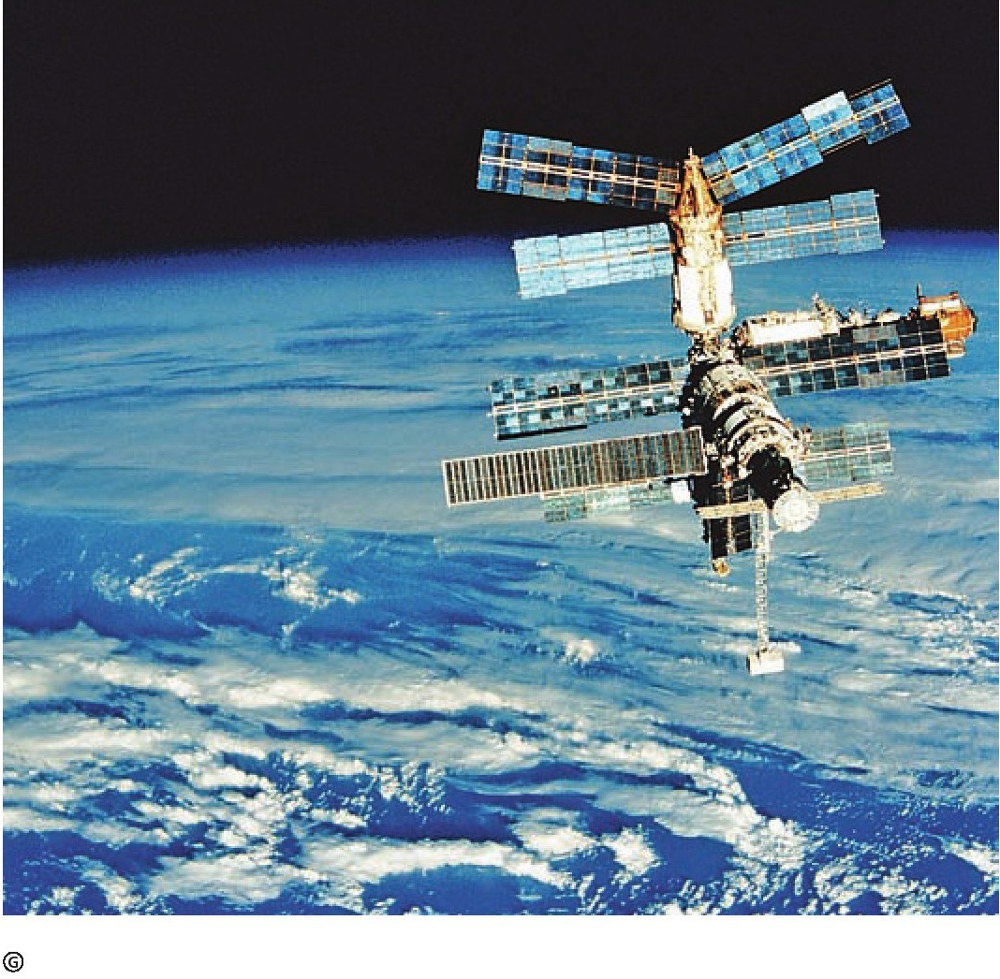
苏联“和平号”空间站

为什么人类直到20世纪才进入太空？中国发明火药和火箭都有上千年历史了，为什么没有最早飞上太空呢？

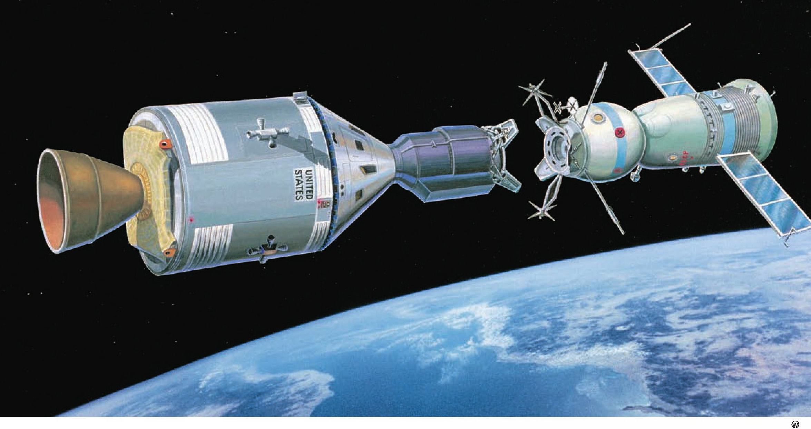
“阿波罗”飞船与“联盟”飞船对接示意图

这是因为进入太空需要系统而复杂的航天技术作为保证。现代火箭是航天技术中最重要的环节，而它所需要的理论和技术，直到19世纪末至20世纪初才出现。

火箭能飞向太空，关键在于能产生足够大的推力，使得火箭的速度达到第一宇宙速度，而古代的黑火药所能提供的推力是远远不够的。合适的火箭推进剂的研究和开发，都在19世纪末随着物理和化学方面的众多进展才得以实现。

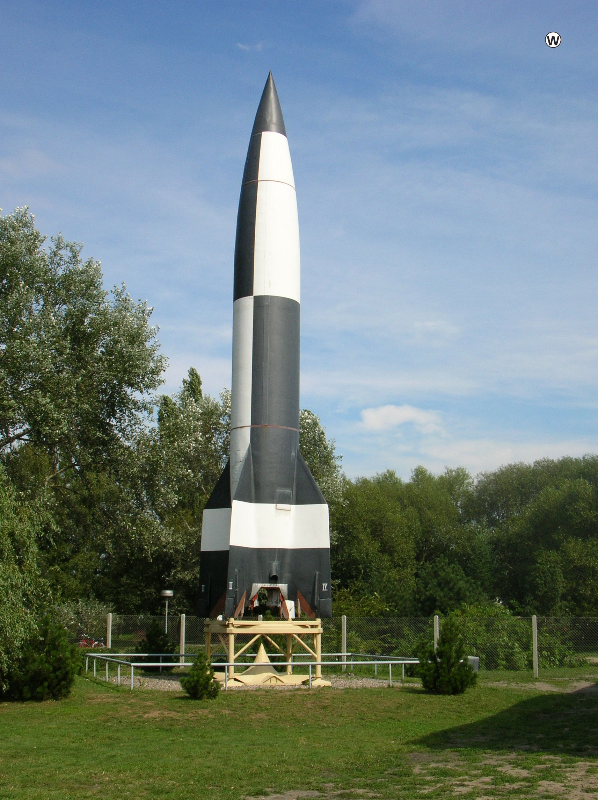
V-2火箭

火箭从试验走向应用的另一个重要保证是控制技术的发展。20世纪30年代末至40年代初形成了经典控制技术，为德国研制V-1和V-2火箭的控制提供了基础。但是V-2火箭从地面飞出大气层，其特性参数变化很大，经典控制技术并不适用于这样的系统，因此导致火箭发射精度不高。从20世纪40年代到50年代末，经典控制技术的发展与应用使整个世界的科学水平出现了巨大飞跃，在工业、农业、交通运输和国防建设的各个领域几乎都广泛采用了自动化控制技术。

20世纪60年代产生的利用现代数学和计算机来分析、综合的现代控制技术，非常适用于飞行器及其控制系统，从而使飞行器控制系统的性能达到新的水平。从20世纪60年代“阿波罗”飞船登月，70年代“阿波罗”飞船与“联盟”飞船对接，直到80年代航天飞机的成功飞行，都与现代控制技术和计算机的应用分不开。

所以，航天技术的成熟包括“软”和“硬”两方面。“硬”的方面涉及火箭的结构、材料、燃料、低温等技术，以保证火箭有能力飞出大气层；“软”的方面涉及火箭的现代控制技术、系统工程、计算机技术等，以保证火箭不会走偏。20世纪这两方面的技术都趋于成熟，才有了人类进入太空的壮举。这是对人类生存疆界的极大拓展，使人类文明在更大空间得以延续。（高云峰）

  

【微问题】为什么大气层和太空之间没有明显的界限？

【关键词】太空　火箭推进剂　控制技术

## 现代火箭是如何发展起来的

早在17世纪，牛顿就设想过物体如何绕地球做圆周运动：在高山上架设一尊威力无比的大炮，如果炮弹的速度足够快，它就不会落下来，而是围绕地球做圆周运动甚至可以飞出地球。牛顿还计算出来：大炮射出的炮弹要想不落地而围绕地球做圆周运动的话，速度必须达到7.9千米/秒，这就是第一宇宙速度；而要飞出地球，就必须达到11.2千米/秒，即第二宇宙速度。

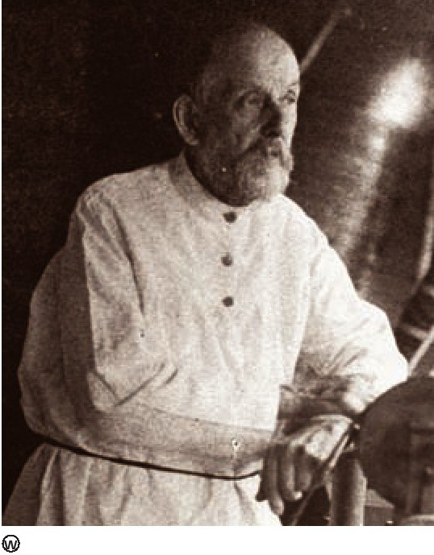
齐奥尔科夫斯基

奠定航天理论基础的是俄国科学家康斯坦丁·齐奥尔科夫斯基。他10岁时因患猩红热而听力受损，念完小学三年级就被迫辍学了。通过自学，他于1878年考取了中学教师资格，后担任中学数学教师直到退休。

在教学之余，齐奥尔科夫斯基醉心于各种科学研究和计算，特别是关于宇宙航行和火箭推动力的理论研究。1903年，他发表了《利用喷气工具研究宇宙空间》这本现代航天史上划时代的著作。书中提出了火箭飞行速度同火箭发动机喷气速度、火箭质量、燃料质量关系的公式——齐奥尔科夫斯基公式。从人类发射第一枚火箭到现在，世界各国每一枚火箭的设计制造都离不开这个公式的指导。

齐奥尔科夫斯基认为，要想克服地球引力进入环绕地球的轨道，需要使用液氢和液氧作为推进剂的多级火箭，才能达到必须具备的速度。火箭的推进剂经过燃烧室燃烧之后，产生高温高压气体，经过喷管加速喷出，产生反作用力推动火箭前进。这就像用水管喷水或枪炮射击时产生后坐力一样。齐奥尔科夫斯基不仅设计了火箭推进器、多级火箭方案，还提出了密封舱和空间站的设想，以及在太空生存必需的密封生态循环系统、为航天员提供氧气和食品等设想。

如果说齐奥尔科夫斯基解决了火箭的理论问题，戈达德和冯·布劳恩则解决了火箭的技术问题。

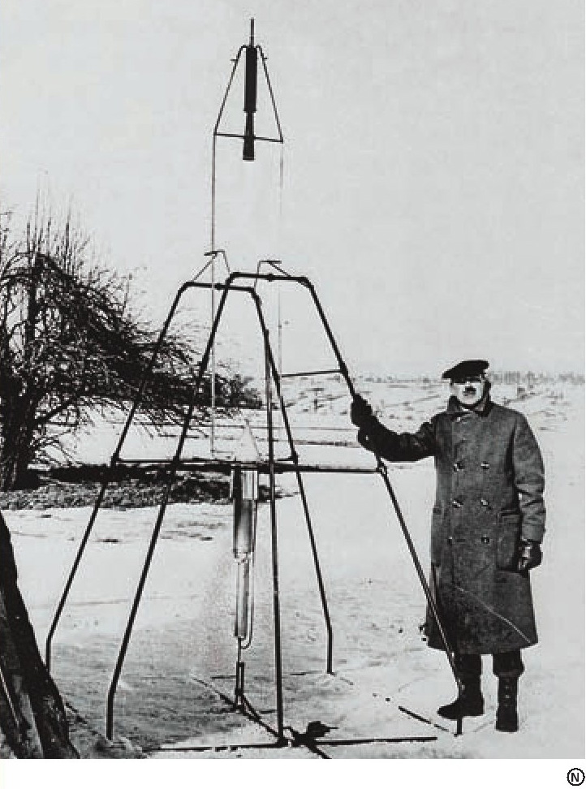
戈达德成功发射了第一枚火箭

罗伯特·戈达德是美国最早的火箭科学家，1909年开始进行火箭动力学方面的理论研究。3年后，他点燃了一枚放在真空玻璃容器内的固体燃料火箭，证明火箭能在真空中工作。1919年，他发表的报告《到达极大高度的方法》阐述了火箭飞行的基本数学原理。1926年3月，戈达德成功发射了第一枚火箭：用汽油和液氧作为推进剂，长约3.4米，发射质量为4.6千克，飞行延续了约2.5秒，最大高度为12.5米，飞行距离为56米。这枚火箭证实了液体推进剂的可行性，成了现代火箭的鼻祖。到1945年去世之前，戈达德进行了34次火箭发射，但大多以失败告终，也没能获得官方资助。后来，为纪念这位火箭科学的先驱，美国航空航天局将位于美国东部马里兰州格林贝尔特的大型研究中心命名为“戈达德太空飞行中心”。

与戈达德比起来，冯·布劳恩要幸运得多。他1912年出生于德国，16岁时看到了德国航天先驱、火箭专家赫尔曼·奥伯特的著作《飞向星际空间的火箭》，从此迷上了星际旅行。1930年，布劳恩在柏林工业大学参加了奥伯特发起的德国空间旅行学会，协助奥伯特进行液体火箭测试。他的毕业论文详细论述了液体火箭发动机的理论和实验，被评为特优论文。第二次世界大战期间，他领导了德国V-2火箭的研制工作。V-2火箭以酒精和液氧为推进剂，全长14米，发射质量13吨，弹头1吨，飞行弹道最高为80～100千米。第二次世界大战后，冯·布劳恩到了美国，领导美国的航天事业。1946年，美国发射了一枚V-2火箭。这枚飞到80千米高空的火箭是用来进行太阳紫外线观测的，它开启了太空科学的新篇章。（高云峰）

  

**【实验场】**气球的反冲力

把气球吹起来后，先用手捏住出气口，然后一松手，你会发现气球向后退。这个简单的试验说明：由于气球内的气体从出气口向前喷出，产生反作用力，推动气球向后退。气体向前喷出产生的推力，就是反冲力。

## 为什么要采用多级火箭

你可能注意到了，V-2火箭虽然可以达到近100千米的高空，实际上还没有飞出大气层。它只是单级火箭，效率不高，但在工程技术上实现了航天先驱者的飞天设想，成为航天史上的重要里程碑。

齐奥尔科夫斯基早已指出，想要进入太空，必须使用多级火箭才能实现。拖累V-2火箭的，是火箭外壳自身的质量和地球厚厚的大气层所产生的阻力。火箭发动机喷出的气体速度、携带燃料与自身质量的比例直接影响了火箭的最终速度。所以要进行太空航行，达到或超过第一宇宙速度，必须提高发动机的喷气速度，并尽可能用又轻又薄的壳体，装入更多的燃料，以提高燃料质量与火箭壳体质量的比例。

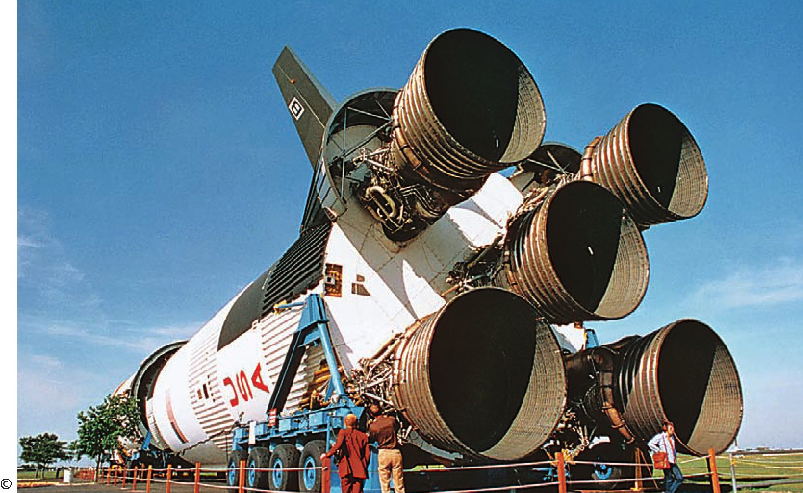
美国“土星5号”运载火箭的第一级喷管

长期以来，单级火箭在空气阻力、重力的影响下，始终达不到第一宇宙速度。解决的方法是将多级火箭串在一起。这样，在第一级火箭的燃料用完后，它的外壳已经没有用了，火箭就可以将其扔掉，轻装前进，自然有利于提高第二级火箭的飞行速度。而单级火箭不管燃料剩多少，都要带着巨大的壳体飞行，速度自然就受限制。看看下图中美国“土星5号”运载火箭的第一级发动机的喷管，与参观者的大小比较一下，你就可以想象在第一级火箭燃料用完后，扔掉这样巨大的空壳，将减轻第二级火箭多少负担！

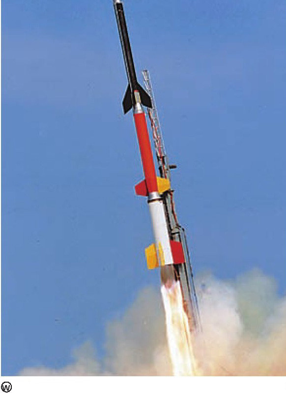
进行探测和科学试验的探空火箭

不过，由于火箭的级数越多，结构就越复杂，控制系统的风险也越大，所以现代运载火箭一般采用二级或三级。（高云峰）

  

【微问题】如果火箭速度介于第一和第二宇宙速度之间，它在太空会如何飞行呢？

【关键词】运载火箭　多级火箭

## 为什么火箭都是圆筒状的

全世界运载火箭的形状都差不多，都是细细的圆筒状的。为什么火箭要做成这种圆筒状呢？

这是为了减小火箭飞行中的空气阻力。速度越快，空气阻力越大。你迎风跑步的时候肯定能体会到这一点。人跑步的速度只有几千米每小时，而火箭入轨点时速度高达7.5千米/秒——相当于1秒钟内沿北京长安街从建国门到复兴门。因此，火箭在大气层中飞行时的阻力非常大，从头到尾都要采用减小阻力的流线型“身姿”。

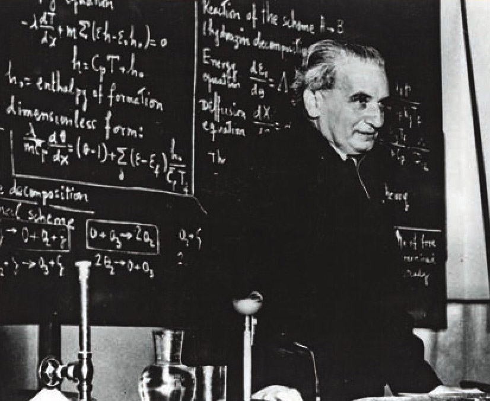
冯·卡门

位于火箭顶端的整流罩的形状是减少阻力的关键之一。整流罩一般为圆锥形，能使罩内的飞船或卫星免受气动力和气动热损伤。发射“天宫一号”目标飞行器的“长征二号FT1”火箭首次采用了冯·卡门曲线（由著名的美国科学家冯·卡门发现）头锥。这种看起来就像蒙古包穹顶的前锥段设计，不仅能够减小空气阻力和脉动压力，还能增加整流罩内的容积，为有效载荷（卫星或飞船等航天器）提供了更大空间。“长征二号F”火箭的整流罩长10.7米，最大直径3.8米，经过改进的“长征二号FT1”火箭的整流罩长度为12.7米，最大直径为4.2米。（周武）

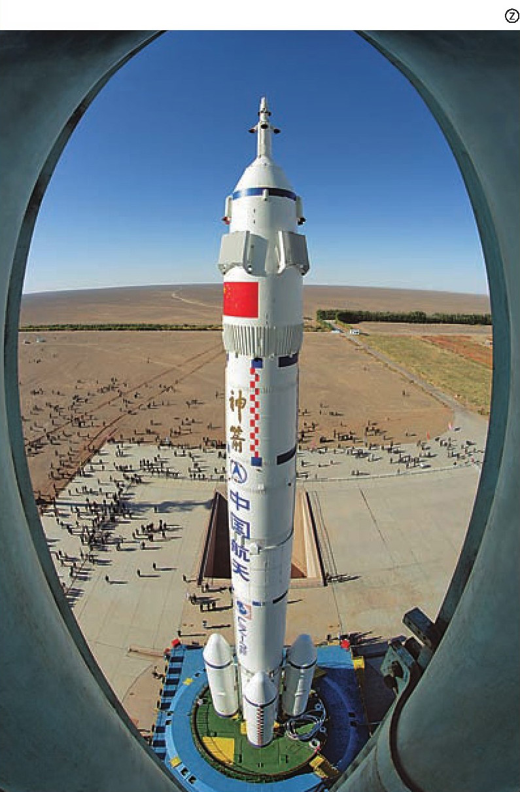
“长征二号F”运载火箭的整流罩“棱角分明”

## 为什么古代火箭飞不远

世界公认火箭是由中国人发明的。中国古代火箭的外形图，首次记载于公元1621年茅元仪编著的《武备志》中。古代火箭有箭头、箭杆、箭羽和火药筒四大部分，包含了现代火箭的所有基本元素。不过古代火箭携带的火药量少，火药燃烧产生的气体压力小，而且后端只有一个小喷射口，气体产生的推力不够大，所以箭体飞不远。

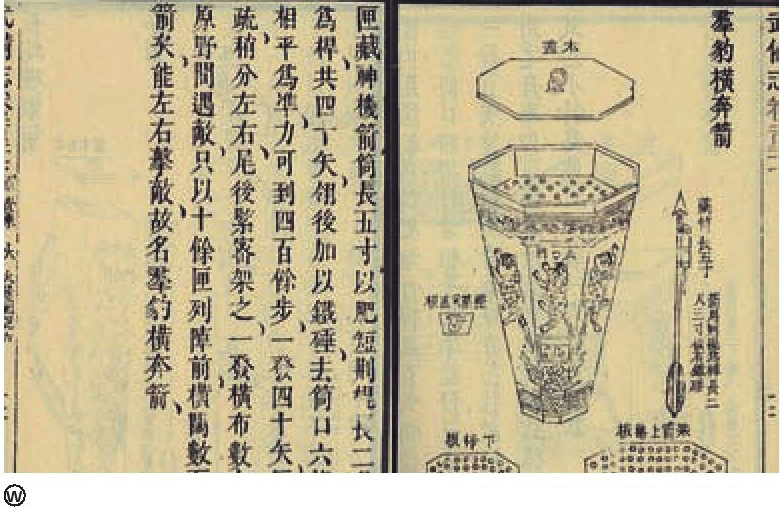
有关中国明代群火箭的文献

19世纪末，瑞典人拉瓦尔发明了在蒸汽涡轮机上应用的“拉瓦尔喷管”，后来，这种喷管应用到了航空航天领域，提高了火箭（包括飞机）的推力，实现了超声速飞行。

拉瓦尔喷管由两个锥形段构成，前半部由大变小向中间收缩至一个喉部，叫作收缩段；喉部之后由小变大向外扩张至箭底，叫作扩张段。箭体中的气体受高压流入喷管的前半部，穿过喉部由后半部喷出。这一结构可使气流的速度随喷管截面积的变化而变化，使气流从亚声速到声速，甚至超声速。在收缩段中，燃气运动遵循的原理是：截面小处流速大，截面大处流速小，因此气流不断加速。当到达喉部时，流速已经超过了声速。超声速流体运动时遵循的原理恰恰相反，截面越大，流速越快。在喷气口处，燃气流的速度被进一步加速到2～3千米/秒，相当于声速的7～8倍。气流喷射速度越快，反作用力也越大，这样就产生了巨大的推力。（周武）

## 为什么火箭要垂直起飞

火箭通常采用垂直发射，这是因为垂直发射时支撑点位于发射台上，发射装置的结构简单、稳定，而且这种姿态有利于火箭的加速和能量的利用，既经济又简便。

运载火箭的体形庞大，长达十几米至几十米，直径几米至十几米，如果倾斜发射就得有一条比箭体更长的滑行轨道。这种滑轨不仅相当笨重、稳定性差、移动困难，而且发射时所产生的振动，势必影响火箭的入轨精度。何况放置滑轨就得有一个很开阔、很平坦的发射场。同时，火箭点火启动时尾部会喷射出高温、高压和高速的燃气流，若火箭处于倾斜状态，就需要有一个相当长的安全区。采用垂直发射可以简化发射设备，能够很方便地使竖立在发射台上的火箭在360°的范围内转动，并保证火箭的稳定性和射向精度。火箭垂直放置发射台上，发射时只要推力稍微超过起飞重量，火箭就可以腾空而起。

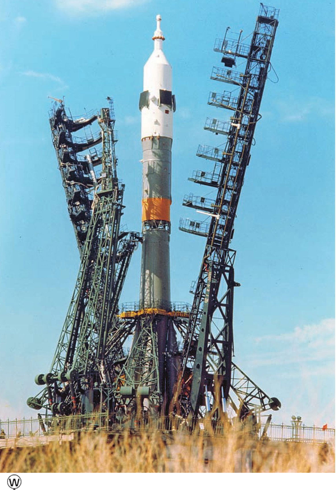
“联盟号”运载火箭从哈萨克斯坦的拜科努尔发射场发射

垂直发射还有利于火箭迅速穿过大气层，减少因空气阻力而造成的飞行速度损失。但是，垂直飞行的时间不宜过长。因为垂直飞行时，火箭因重力造成的飞行速度损失较大。所以，目前运载火箭的垂直飞行段一般为4～10秒。

此外，大型运载火箭所用的推进剂一般都是液体的，垂直状态发射便于推进剂的加注或泄出。垂直发射还有利于精确地确定火箭初始位置。（周武）

  

**【微博士】**为什么有的火箭要在海上发射

从海上发射火箭，主要是从安全角度考虑。火箭发射存在一定的危险性，发射场应远离人口稠密的地区，火箭飞行轨迹应在人口稀少的地区上方。海洋面积广阔，被抛弃的火箭空壳击中舰船的概率极小。另外，由于地球自西向东自转，赤道上旋转速度最大，借助于这种惯性，在此向东发射能得到额外的发射速度增量，还可节省进入地球静止轨道改变轨道面所需要的燃料，从而提升运载能力。另外，在广阔的海面便于选择与航天器轨道倾角相等的地理纬度向正东方向发射，能增加火箭有效载荷并减小发射成本。当然，由于发射场需要配置各种复杂的发射装置，并要考虑到气象环境因素，所以在海上也不是任何地点都可以建立发射场的。

【微问题】火箭发射场的选择有哪些要求？

【关键词】火箭的外形　古代火箭　垂直发射

## 为什么火箭会有这么大的“力气”

在发射“神舟九号”的电视直播中，大家肯定注意到，随着“点火”口令下达，发动机会发出震耳欲聋的声音，推举总质量为480吨的火箭和飞船组合体冉冉上升。为什么火箭会有这么大的“力气”？

“长征二号F”火箭点火时，一级火箭和4个助推器的8台煤油液氧YF-100型发动机同时工作，每台发动机的推力是75吨，加在一起600吨。这么大的推力能把重达480吨的火箭抬起推向太空。

火箭飞行速度取决于火箭发动机的喷气速度和火箭的质量比。发动机的喷气速度越大，火箭飞行的速度越快；火箭的质量比越大，火箭飞行能达到的速度就越大。其中，火箭发动机的喷气速度，由发动机的设计水平和推进剂的比冲决定。发动机的设计水平越高，所获得的能量效率越高，火箭发动机的喷气速度越大。 推进剂的比冲越高，发动机的喷气速度就越大。火箭的质量比是火箭起飞时的质量（含推进剂）与发动机关机（熄火）时刻的火箭质量（推进剂燃烧尽）之比。质量比越大，火箭的结构质量就越小，所携带的推进剂越多。

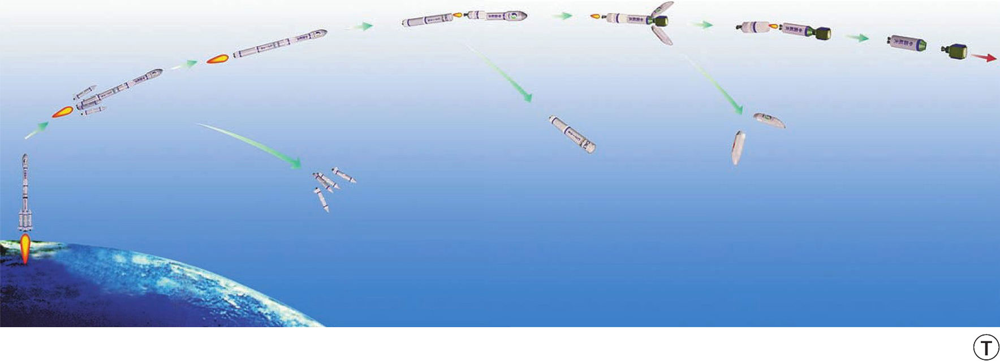
随着推进剂质量的减少，助推器和各级火箭的脱落，火箭质量越来越小，速度越来越快，最终，载荷被送入预定轨道

当第一级火箭的发动机点燃后，火箭就开始脱离发射架上升。几秒后，火箭完全通过发射塔。在离开地面后的几秒内，火箭一直保持垂直飞行。之后，为了保证按合适的方位飞行，发动机喷管的万向节按预定程序旋转，产生横向推力，使火箭从垂直角度稍微倾斜，但基本还是垂直向上飞行的。火箭一开始的加速过程不十分明显，因为整个火箭的质量大得惊人。在第一级推进剂烧完时，重力使火箭缓慢地从微倾斜角度转入水平方向的飞行。这一过程被称为“重力转弯”，帮助火箭从以上升为主转向向前推进，以提高所需的速度。

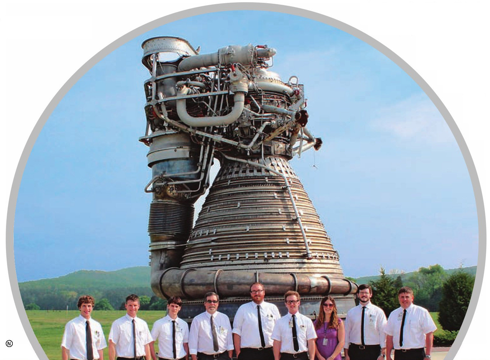
“土星5号”运载火箭的发动机

第一级火箭的推进剂烧完后，爆炸螺栓使其与火箭的其余部分分离。这时，第二级火箭开始点火，继续加速飞行。此时，火箭已飞行2～3分钟。因为火箭卸掉了第一级火箭的结构和推进剂，质量大大减轻，所以即使第二级火箭产生的推力不如第一级大，火箭加速也要比先前快很多。在高度达到150～200千米/时，火箭已飞出稠密大气层，有效载荷不再需要整流罩来防护空气动力的作用，按预定程序抛掉整流罩，进一步减轻火箭发动机加速的质量负担。

有些火箭的第二级推进剂，常常在火箭快接近轨道速度时燃烧完毕，爆炸螺栓使第二级火箭与有效载荷分离。这时，有效载荷上的推力器将把它送入最终的轨道。同时，第二级火箭落入大气层。最终，靠空气摩擦使它燃烧，变成灰烬。这样的处理方式，可以避免使第二级火箭的空壳留在太空，成为太空垃圾。如果这些垃圾不巧进入某个卫星的轨道，那将是极大的威胁。

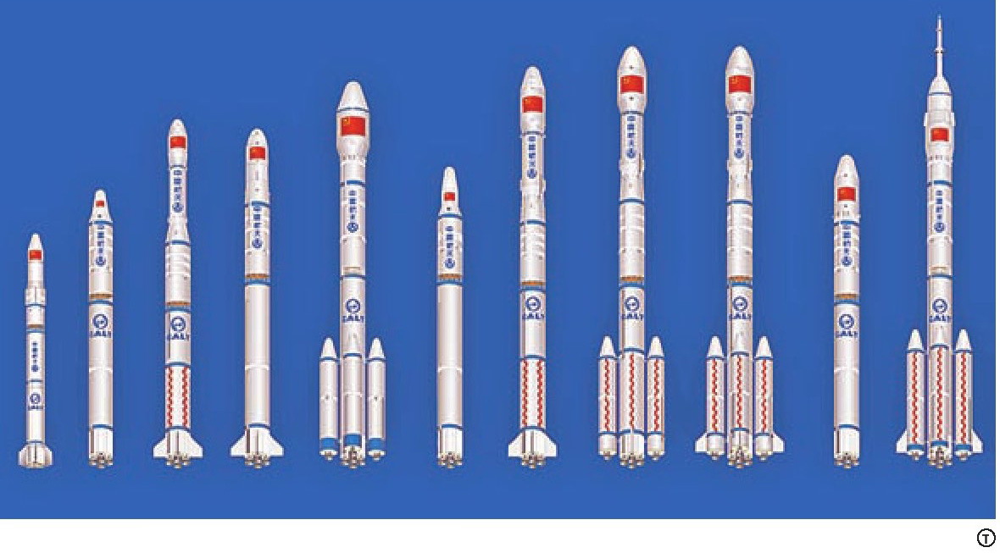
“长征”系列运载火箭

对于低轨道（通常指300千米的高度或更低）的航天器而言，这时火箭就完成了运送任务。但对于发射轨道高度在1000千米以上的航天器或发射行星际探测器，还需要有第三级火箭。在第二级火箭脱离后，火箭在地球引力作用下，开始进入航天技术中称为惯性飞行段的过程，一直到与预定轨道相切的位置。稍后，第三级火箭发动，进入最后加速段飞行，当加速到预定速度时，第三级火箭发动机关机，有效载荷与火箭分离，进入最后的、较高的轨道，或者前往另一行星的轨道。（周武）

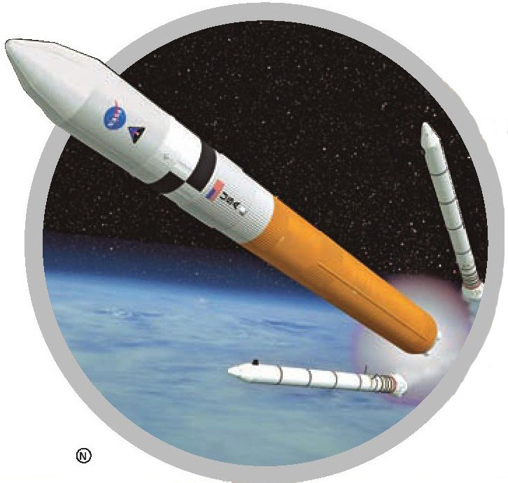
美国正在研制的新一代运载火箭“战神”示意图

  

**【微博士】**推进剂的比冲

比冲是火箭发动机的推力与推进剂单位时间质量消耗量之比（习惯用秒来表示），被用来衡量火箭发动机的能量利用效率。典型的固体火箭发动机的比冲可以达到250～300秒，液体火箭发动机的比冲最高可达500秒。

**【微博士】**火箭的串联和并联

火箭的串联和并联都是指多个火箭的连接方式。串联就是将多个火箭通过级间连接/分离机构连成一串。并联就是将多个火箭并排地连接在一起，中央的称芯级火箭，周围的是助推火箭。一般情况下，助推火箭先工作（也有同时点火工作的），工作完毕后被抛弃，中央芯级火箭接着工作。以这种方式连接的多级火箭又称为捆绑式火箭。如果芯级火箭本身是串联式多级火箭，这种形式就是串并联。在长征系列火箭中，“长征二号E”、“长征二号F”、“长征三号乙”和“长征三号丙”是串并联式火箭。

**【微博士】**火箭的可靠性和安全性

“长征二号F”火箭是中国航天史上技术最复杂、可靠性和安全性指标最高的运载火箭。它的可靠性为0.97，安全性为0.997。0.97的可靠性，是指100次发射里，只有3次火箭可能出现问题；0.997的安全性是指火箭上出现的1000次问题里，可能有3次会危及航天员的生命安全。这是对载人火箭的高要求。一般商用火箭可靠性为0.91～0.95。

【微问题】火箭在飞行中，万一出现故障怎么办？如何避免它落到地面？

【关键词】比冲　多级火箭

## “神舟”飞船发射时航天员位于火箭的什么部位

“神舟”飞船发射时，航天员都坐在返回舱内。返回舱在火箭里的什么位置？其实很好辨认，在火箭的整流罩外面有一面国旗，国旗的上面就是返回舱所处的位置。

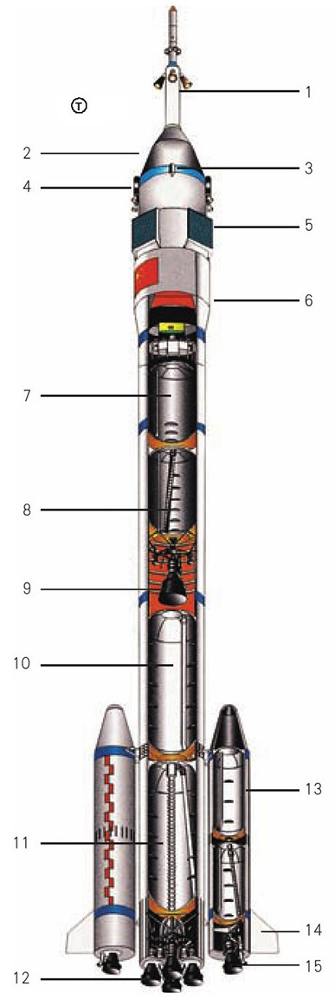
1.逃逸塔　2.整流罩　3.高空分离发动机　4.高空逃逸发动机　5.栅格翼　6.飞船　7.二级氧化剂箱　8.二级燃烧剂箱　9.二级主发动机　10.一级氧化剂箱　11.一级燃烧剂箱　12.一级发动机　13.助推器　14.稳定尾翼　15.助推器发动机

“长征二号F”火箭结构示意图

航天员进舱是发射程序中一项重要工作。进舱时间非常讲究，过早不行，过晚也不行。航天员进舱一般是在各系统状态稳定、主要功能检查完成后，要尽可能接近火箭点火时间，以降低航天员风险。进舱时间早了，航天员等待时间过久，心理上可能产生紧张情绪，排便、排尿、饮水需求也将随时间延长而增加；但也不能过晚进舱，免得影响发射塔飞船舱段工作平台的撤收，且进舱后，航天员还要完成各种准备工作，时间仓促容易忙中出错。因此，航天员进舱一般选择在点火前2～3小时。

航天员进舱的时候，操作人员先把火箭上的航天员进出舱口（大约1.2米宽、1.2米高）打开，再把里面飞船上正对着舱口的返回舱口打开，让航天员在操作人员的协助下进入舱内。进舱后，航天员首先要入座，检查舱内状态，而后连接通信和数据传输插头，连接航天服的通风、供氧软管等，再检查航天服气密性，还要给座舱配气、检查天地通话、飞船仪表板显示等，最后调节束缚带的松紧度，关闭面窗，等待发射。当所有状态确认正常以后，操作人员依次关闭返回舱口盖和整流罩上的舱口，并锁上。（周武）

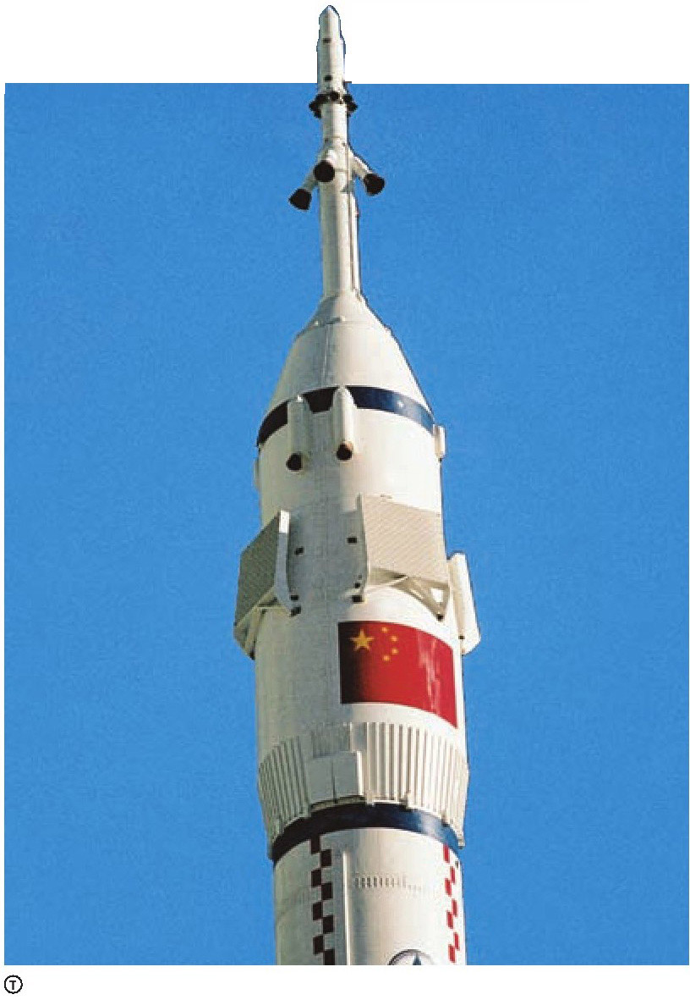
逃逸系统是载人火箭独有的

## 为什么载人火箭顶部有一个尖尖的塔

与发射卫星的火箭不同，发射载人飞船的运载火箭顶端都有一个像避雷针的尖顶——逃逸塔，它被誉为是保障航天员安全的“生命之塔”。

运载火箭一般由箭体结构、推进系统、控制系统、飞行测量系统、安全系统和附加系统组成。而载人火箭需要增加一个独具的逃逸系统，它是由逃逸塔和可分离的头部整流罩组成的逃逸飞行器。以“长征二号F”火箭为例，逃逸系统的动力装置由1台逃逸主发动机、1台分离发动机、4台偏航俯仰发动机、4台高空逃逸发动机和2台高空分离发动机组成。这些发动机的安全可靠性指标要求达到99.99%。逃逸主发动机负责提供逃逸的动力，整流罩里有1个上支撑机构和1个下支撑机构，整流罩外面有4个像支架一样的栅格翼。逃逸的时候，栅格翼按照指令展开，上支撑结构和下支撑结构紧紧抓住飞船的返回舱，实施逃逸。

火箭发射后120秒内（即高度在0～39千米），一旦发生意外情况，逃逸系统主发动机将点火工作，产生高达70余吨的推力，能在3秒内把飞船返回舱“拽”到1500米开外，帮助航天员逃生。如果飞行顺利，火箭会在飞行120秒时抛掉逃逸塔。

若火箭在发射后120～200秒（即高度在39～110千米）再遇不测，4台高空逃逸发动机将同时点火工作，带航天员脱离险境。（周武）

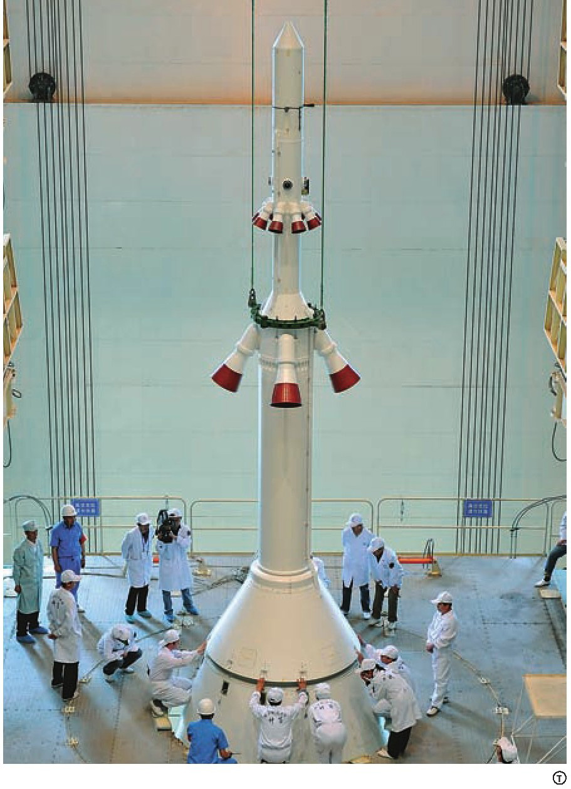
安装逃逸塔

## 为什么火箭不怕热

要把航天器送入太空，火箭要以几千米每秒的高速穿越大气层。在这么高的速度下，火箭外壳与大气摩擦将会导致高温，尤其是火箭头部的温度会高达上千摄氏度。火箭为何能承受如此高的温度呢？

这得益于高科技特种涂料。它为火箭穿上了一层薄而坚韧的防护衣。火箭外壳是用钛合金、铍合金、铝合金和玻璃钢等材料做成的，这些材料传热很快。如果火箭外壳直接接触高温，那么火箭外壳的强度会大大削弱。同时，高温会很快传到火箭内部，烧坏各种控制仪器和电子元件。

科学家经过试验，在耐高温的有机合成树脂中，添加一些无机填料（如二氧化硅、云母粉、碳硼纤维等）和升华物质（如氧化硒、硫化汞等），发明了一种既耐高温又有良好隔热性能的耐烧蚀隔热涂料。把这种涂料喷涂在火箭的外壳上，就形成了一个保护层。当火箭在大气中高速飞行时，涂层中的升华物质会因受热而挥发，而耐高温有机树脂则形成微孔的碳化层。升华物质在挥发过程中带走部分热量，而留下的碳化层就像一道隔热的樊篱，把外界大部分热量与火箭外壳隔开。涂层有一定的厚度，依据火箭飞行时间、涂料烧蚀速度和涂层的隔热效果设计，即使气流把表面的碳化层冲走，下面的碳化层还能“接班”，直到火箭完成飞行任务为止。

这种耐烧蚀隔热涂料，除了用于火箭和飞船等航天器，还可用在飞机发动机的隔热、玻璃钢火箭发射筒的隔热和抗激光穿透等方面。（周武）

  

【微问题】航天员在进舱前，要做哪些准备工作？

【关键词】航天员进舱　逃逸系统　耐烧蚀隔热涂料

## 火箭都采用哪些推进剂

现代火箭之所以能够上天，首先是因为现代火箭发动机和高效的推进剂。古代火箭的推进剂是能量密度很小的黑火药，提供的推力远远不足，燃烧过程也无法控制。

从物理形态上讲，火箭发动机使用的推进剂有液态和固态两种形式。液体推进剂又分可贮存和低温两种。由于推进剂占火箭起飞质量的85%～90%，推进剂选择的共同要求是：尽可能大的热值，高比冲；尽可能大的密度，以减轻火箭的自重；腐蚀小，无毒；价格低廉。

液体火箭推进剂由燃烧剂和帮助燃烧的氧化剂组成。其种类很多，燃烧剂有煤油、甲醇、乙醇、偏二甲肼、甲烷、液态氢等，氧化剂有液态氧、液态臭氧、过氧化氢、四氧化二氮等。

最早被世界各国广泛使用的液体火箭推进剂是四氧化二氮/肼类，使用这种推进剂的火箭有美国的“大力神号”，苏联/俄罗斯的“质子号”，欧洲的“阿里安4号”，中国的“长征二号”、“长征三号”、“长征四号”等火箭。四氧化二氮是强氧化剂，可贮存，偏二甲肼是强还原剂，它们接触后可以自燃，可靠性高。但它们的毒性大、污染严重。随着全世界对环境保护的日益重视，这种推进剂逐渐被弃用，很可能在不久的将来在全世界禁止生产。

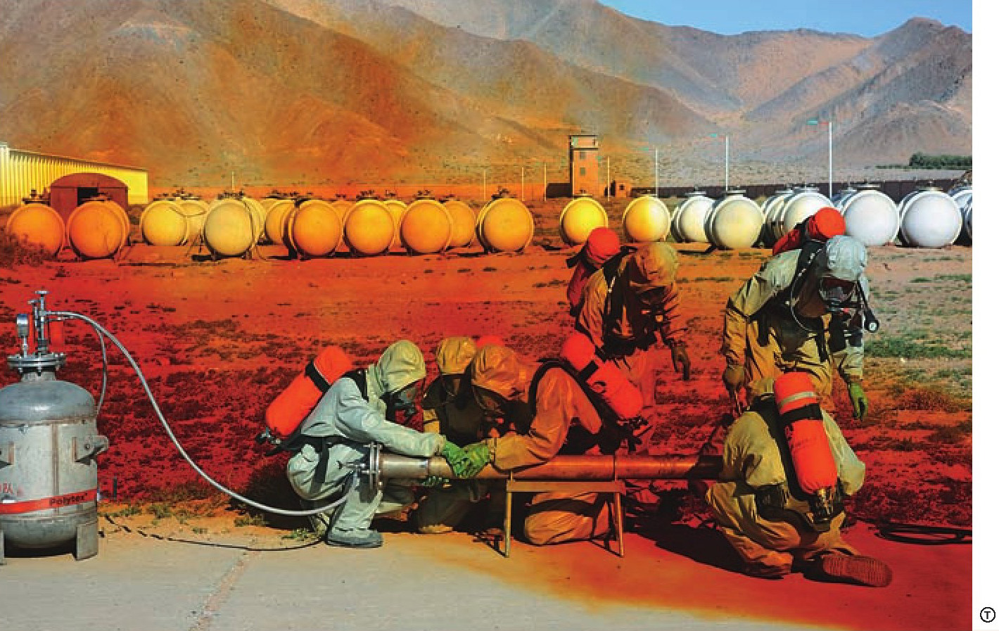
酒泉卫星发射中心特种燃料保障分队，在“天宫一号”目标飞行器加注前，进行应急救援演练

“长征三号”系列运载火箭的第三级和美国航天飞机的主发动机都采用液氢和液氧作为推进剂，这种燃料的突出优点是比冲高、无污染。但液氢作为火箭燃烧剂有4个缺点：（1）密度低，贮箱要做得特别大；（2）不同的温度会分层，导致推进剂因性能不合格而不能使用，或者发动机提前关闭；（3）液氢为低温液体，不好贮存，很容易蒸发泄漏，发生相应的损失和危险，因此加注后12小时内必须发射；（4）液氢在贮箱中晃动会引起火箭飞行状态不稳定。

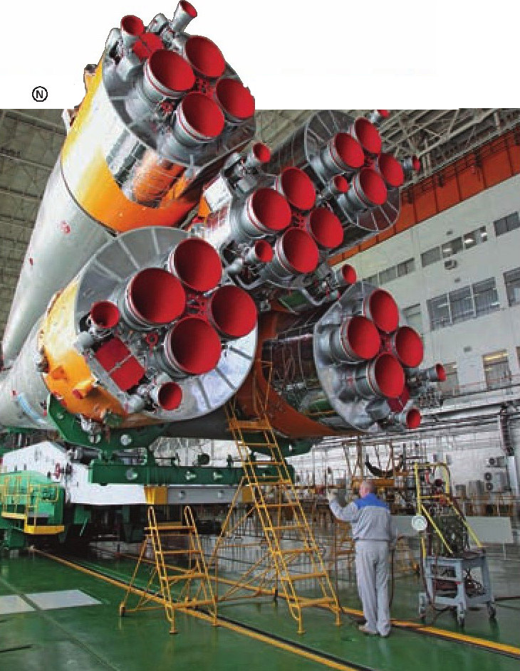
俄罗斯“联盟号”运载火箭的发动机喷管

俄罗斯的“联盟号”火箭采用煤油和液氧作为推进剂。这种推进剂有3个优点：（1）煤油是常温推进剂，使用极为方便，安全性好；（2）煤油价格便宜，每千克煤油的价格只有液氢的1/100和偏二甲肼的1/30，可以较大幅度地降低发射成本；（3）煤油和液氧组合密度比冲高。不过，煤油和液氧配方也有一个弱点，就是在低温的情况下不稳定，在高温的情况下容易挥发，所以推进剂加注的时候有危险。

固体推进剂有聚氨酯、聚丁二烯、端羟基聚丁二烯、硝酸酯增塑聚醚等。固体燃料燃烧产物中通常会形成更有害的物质，会导致人体先天性缺陷或引发癌症。例如，美国航天飞机固体助推器产生的三氯乙烯严重污染了肯尼迪航天中心周围的土壤和地下水，该地区的三氯乙烯含量比美国政府规定的饮用水标准要高数千倍。在2011年航天飞机项目终结后，美国航空航天局和空军分别投入9600万美元和5000万美元，准备持续30年，联合治理发射中心周围大约5.2平方千米内的土壤和水污染。（周武）

## 固体火箭和液体火箭哪一种更好

液体火箭发动机的优点是：比冲高，最高能达到500秒；推力范围大；能多次起动；能控制推力大小；工作时间较长等。液体火箭发动机主要用于航天器发射、姿态控制、轨道控制等。

固体火箭发动机与液体火箭发动机相比较，具有结构简单、推进剂密度大、混合好的推进剂可贮存在燃烧室、机动性能强以及操作方便等优点，缺点是比冲小。固体火箭发动机比冲在250～300秒，工作时间短，加速度大，推力不易控制，也难以重复起动，一般用作火箭弹、导弹和探空火箭的发动机，以及火箭发射和航天飞机起飞的助推发动机。（周武）

这是美国正在研制的DM-2发动机，它是当前推力最大的固体燃料火箭发动机

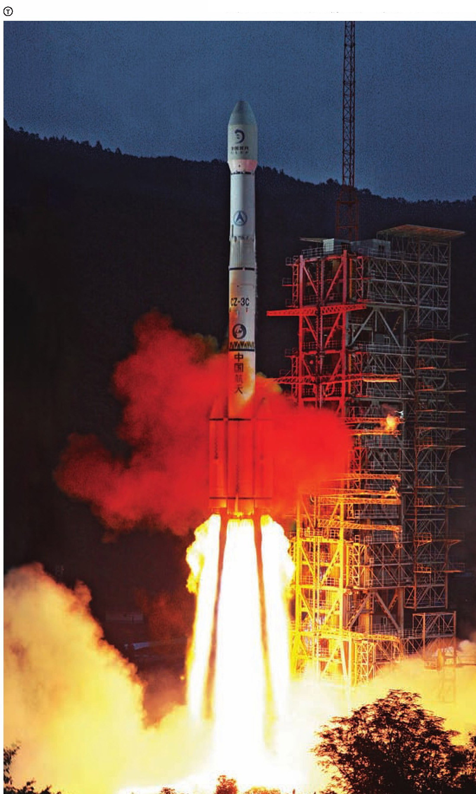
“长征三号丙”运载火箭发射“嫦娥二号”卫星

  

**【微博士】**火箭起飞后为何会冒出一股红棕色的烟

中国的“长征”系列运载火箭发射起飞后，经常会冒出一股股红棕色的烟，这是燃料泄漏吗？不是的，其实这是很正常的现象。目前，“长征”系列运载火箭的第一级和第二级液体发动机均采用偏二甲肼作为燃烧剂，四氧化二氮为氧化剂。火箭推进剂贮箱必须保证一定的压力，才能将推进剂送到发动机，让发动机正常工作。但贮箱压力又不能太大，以免影响结构安全。因此，推进剂贮箱都装有安全溢出阀门，当贮箱内压力大于规定的压力时，安全溢出阀门打开，释放掉一部分气化的推进剂。红棕色的烟就是氧化剂贮箱的安全溢出阀门释放出来的气态四氧化二氮。纯净的四氧化二氮是无色的，但它容易分解成二氧化氮，这种气体是红棕色的。所以大家会看到火箭起飞时，有红棕色烟冒出来。

【微问题】火箭贮箱采取了哪些措施保证加注的液体推进剂的安全？

【关键词】火箭推进剂　固体火箭　液体火箭

## 为什么火箭发射时会往下掉东西

观看运载火箭发射时，我们经常会发现，火箭腾空而起时不断地掉落一些碎片。事后新闻中也常报道有火箭残骸从天而降，被各地政府部门回收保护起来。那么，火箭发射时为什么会往下掉东西？那些都是什么呢？

运载火箭发射一般包括发射起飞、弹道飞行、各子级和整流罩的坠落及回收等阶段。在各个阶段火箭分离掉落的东西是不一样的。下面，我们以中国用于载人航天的“长征二号F”为例，来具体了解一下相关情况。

在发射时，火箭第一级发动机及4个助推器同时点火。从火箭上首先掉落的是用于保温的泡沫塑料。酒泉和太原发射场冬天夜间温度可能达到-20℃以下，昼夜温差也很大；低温可能会导致某些产品出现低温效应，如密封件失效、电缆插头接触不良、输送管道堵塞等故障；火箭本身的低温推进剂贮箱也需要放热，保持低温。所以，为了尽可能减小温度变化的影响，往往需要采取一些保温措施，在火箭箭体上贴泡沫塑料是最常用也最简便的一种办法。点火升空后，火箭的振动及大气的剧烈摩擦会使这些泡沫塑料从箭体上剥离下来。

火箭升空后，过了程序转弯阶段之后，先抛弃逃逸塔，稍后又会抛弃助推器。接下来，火箭的第一级、第二级分离，紧接着，整流罩分离。最后，二级发动机关机，飞船与火箭分离，飞船进入轨道。至此，运载火箭完成历史使命，所有结构都肢解。在地球引力作用下，火箭的大部分残体会回归地球。

运载火箭的航区，包括轨道飞行空域和各子级火箭、整流罩工作结束后的坠落场区。最初，在选择发射场地址、设定运载火箭射向时，都会考虑到航区的安全问题，尽量使航区避开人口稠密区、重要工业区及军事要地等。每次运载火箭发射前，发射场还会提前通知航区的政府部门及时疏散当地居民。（任复茂）

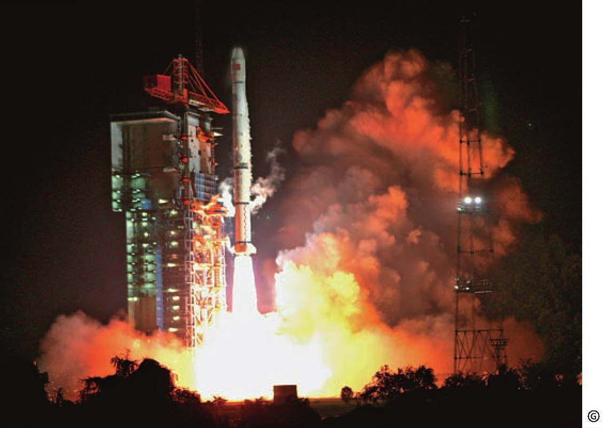
2010年8月1日，“长征三号甲”运载火箭成功发射第五颗“北斗”导航卫星

## 为什么火箭发射时会形成大量白色烟雾

当火箭载着卫星或飞船腾空而起时，一股巨大的白烟随之升起。这股白烟是火箭喷出的吗？不是。实际上这是发射架下方导流槽内产生的水蒸气，是火箭腾空时喷出的尾焰使水汽化的结果。

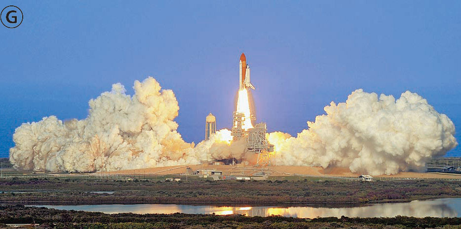
美国“发现号”航天飞机发射时产生的大量白色烟雾

发射场导流槽距离地面约有20米深，正对火箭发射处。每次发射前，导流槽内会注满400吨水。火箭起飞时，会引起相当于6～8级地震的震动，并产生长达25～30米长的尾焰，尾焰的温度高达3000℃。导流槽内的水可防止高温尾焰伤及箭体，还能降温、降噪，并吸收、稀释燃料燃烧时产生的毒气。

导流槽是火箭发射必需的地下工程，用以承受火箭发射时高温、高速、高压燃气流的冲刷和有毒气体的排放，其质量好坏直接影响到火箭和发射场的安全。酒泉卫星发射中心为确保载人火箭发射的可靠性，首次采用了双面导流槽，由高铝水泥、耐火骨料（颗粒状的耐火原料）等材料建成，可迅速将火箭助推器点火产生的烈焰引导到塔架外面，快速消除高温火焰对周围设施的损坏。

苏联拜科努尔发射场火箭发射塔下采用了大型水冷式钢板导流槽。其形状酷似人造峡谷，在5～10千米之外开凿深水井，提供水源，工程十分浩大而艰巨。美国航空航天局的爱德华兹空军基地也采用钢板导流槽，冷却水由约10千米外的几口深水井供给，并建有一个储水约11000立方米的水库。工程投资之巨大，可想而知。（周武）

## 为什么火箭发射怕雷雨和刮风

火箭发射对气象和环境有一定的要求，航天部门规定有三种情况不能进行发射。

第一种情况是雷电天气。在强对流的雷电天气发射火箭，如果火箭不幸被雷电击中，就会直接损害火箭和卫星的电子设备，致使其无法正常工作，严重时还可能导致星箭俱毁。

第二种情况是强降雨天气。火箭的上万个元器件都有适宜工作的温度和湿度范围，温度过高或过低，都可能失效。强降雨时，如果火箭箭体长时间处于雨水浸泡状态，也可能造成电子设备损坏或线路短路，从而损坏火箭。

第三种情况是刮大风。大风会使火箭箭体在飞行过程中发生飘移，从而偏离弹道。对飞行器影响较大的是5～15千米高度的风，尤其是8～12千米高空的飓风急流带。由于风速很大，同时伴随着强风切变，火箭通过飓风急流带时易遭受较大的横向剪切力，影响安全。

因此，从火箭进发射场以后，发射场的气象人员就会一直严密跟踪天气变化，并在关键节点进行综合预报，每小时预报一次高空风场。为减少高空风的影响，一般在发射前2小时，要根据高空风场的变化对预先设计的火箭飞行弹道进行修正，必要时需推迟发射。

火箭发射不用像飞机起飞那样担心“鸟撞”事件发生，因为火箭发射时产生的高温、高亮火焰和震耳欲聋的轰鸣声，会使飞鸟受到惊吓而纷纷飞逃。因此，火箭发射场并不需要设置驱鸟设备。（周武）

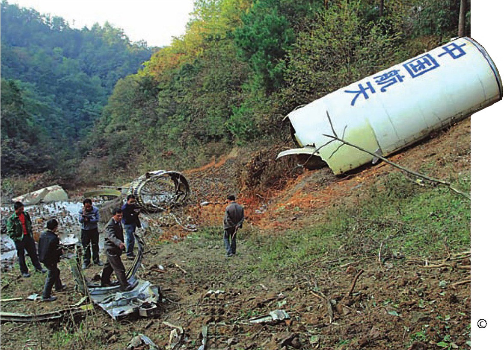
2010年11月1日，“长征三号丙”发射数分钟后，一级火箭残骸坠落在贵州省施秉县马溪乡九龙村

  

【微问题】火箭发射时，要疏散多大范围内的人员？

【关键词】泡沫塑料保温层　导流槽　火箭发射的气象要求

## 火箭为什么能“指哪打哪”

骑马时要让马乖乖地听话，通常给它套上缰绳，指挥它的行动。对于运载火箭而言，这条“缰绳”就是它的控制系统。如果将发动机比喻为火箭的“心脏”，控制系统则起着类似人体“神经中枢”的作用，它控制并支配着火箭上天后的一举一动。

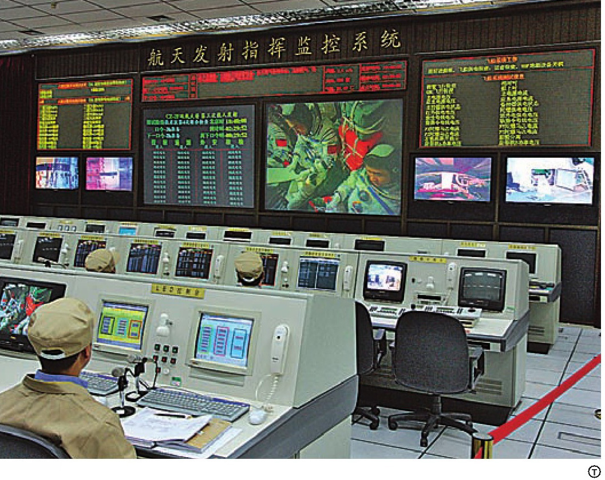
酒泉航天指挥控制中心的技术人员正在观察飞船的技术状态

火箭的控制系统由箭上系统和地面系统两部分组成，箭上系统叫作飞行控制系统（常简称飞控系统），地面系统称测试发射控制系统（常简称测控系统）。

测控系统是火箭发射前人机对话的主要接口，通过火箭与地面间的通信可掌握箭上设备的工作情况和各种参数，也可将飞行参数向箭上设备装订，最后控制火箭发射。

飞控系统由制导与导航系统、姿态控制系统、电源供配电和时序控制系统三部分及相应的软件组成。制导与导航系统是火箭飞行控制系统的核心，它控制火箭的质心按预定的轨迹运动，保证所运载的航天器准确入轨。姿态控制系统的任务是克服种种干扰的影响，保证火箭的飞行姿态稳定。电源供配电和时序系统除完成地面到箭上电源供电的转换外，主要是向各种控制仪器设备提供各自需要的电源，并按飞行程序发出指令，控制火箭工作状态的变化。软件的作用是完成各种功能计算，把三个部分按功能和工作程序结合起来完成飞行控制任务。

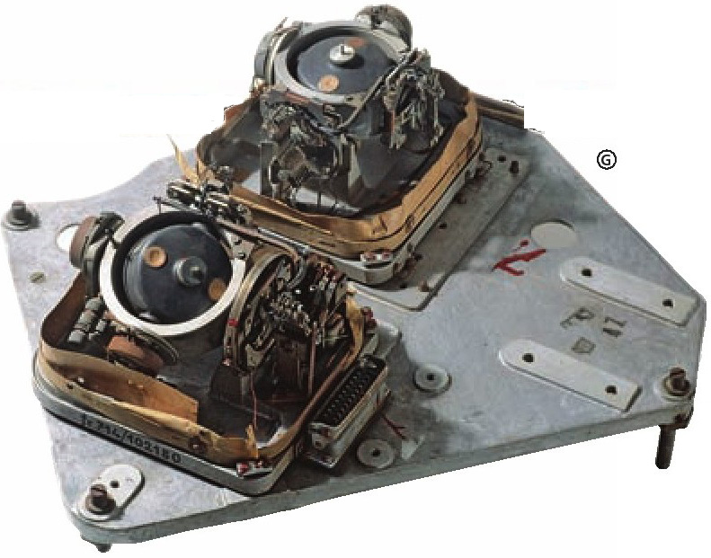
V-2火箭上的陀螺仪

火箭飞行状态可以分解为两种运动：一是火箭质心的运动，二是火箭绕质心的转动。在实际飞行中，火箭常受到各种因素影响而偏离预定的飞行状态。其中，来自火箭本身的因素有3个：（1）由于箭体结构制造偏差造成的结构不对称、结构轴线偏移和质心偏移；（2）发动机制造和安装偏差造成的推力轴线偏斜；（3）多台发动机工作不同步，液体推进剂在贮箱内晃动，以及控制设备制造误差等引发的干扰力和干扰力矩。外部环境的影响主要是风的干扰。

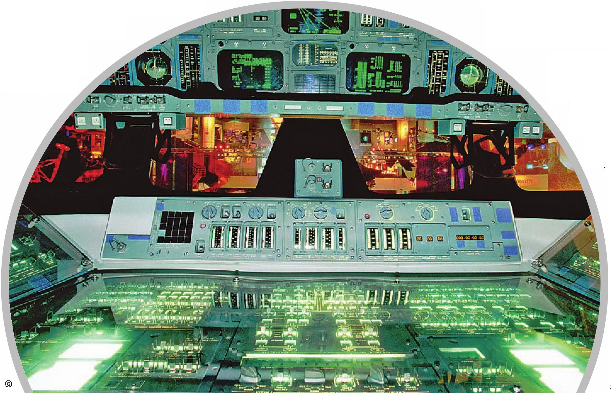
航天飞机驾驶舱

飞控系统的仪器设备由测量仪表、中间装置、执行机构和电源配电装置等组成。

根据导航方式不同，测量仪表的种类有所不同，但都离不开陀螺和加速度表。高速旋转的陀螺能始终保持自身的方向不变，并能觉察到火箭姿态的任何变化。利用陀螺原理制造的加速度表，则能感受火箭速度的变化。

中间装置主要是指电子计算机。一旦接到测量仪表发来的火箭飞行路线和姿态变化的信号，计算机就立即进行计算，随后进行综合处理，将信号放大，传给执行机构，并控制执行机构进行工作。

执行机构包括电磁阀门、电爆器件、舵机、姿态喷管、摇摆发动机，以及控制摇摆发动机运动的伺服机构等。它们严格执行中间装置传来的信号命令，使发动机点火、关机，纠正飞行路线和姿态的偏差，使火箭级间分离和卫星、飞船等有效载荷分离。（周武）

## 为什么火箭上天后不会偏离弹道

如果没有任何干扰因素，火箭将沿着预定的标准弹道飞行，将卫星或飞船送入预定的轨道。但实际上，飞行过程中的干扰因素有很多。火箭之所以不偏离弹道，是因为有制导系统在实施控制。

“神舟八号”以前的飞船发射，采用的是摄动制导。摄动制导是指预先设计理论弹道，火箭按照理论弹道飞行，当位置、速度与理论弹道存在偏差时，根据偏差进行修正。在这种制导方式下，火箭始终瞄着一个固定的入轨点，所以它的适应性和入轨精度相对较差。

“长征二号F”火箭在发射“神舟八号”时首次使用了迭代制导方式，相当于给火箭置换了一个全新的“神经系统”。迭代制导是一种自适应制导技术，火箭在飞行过程中会自行根据速度、位置及预估的入轨点，不断调整飞行轨迹。因此，迭代制导被形象地比喻为边走边“算”。简单地说，摄动制导给火箭规定好了具体路径，而迭代制导只告诉火箭目的地，而具体路径由火箭自行选择。

按照程序，“长征二号F”火箭飞行到210秒，抛掉整流罩以后，迭代制导的控制方式正式启动。此时，火箭上的计算机每秒都要计算50次，也就是说每0.02秒火箭就要确定一次自己的位置和入轨点之间的关系。采用迭代制导后，“神舟八号”的入轨精度是“神舟五号”入轨精度的100多倍。（周武）

  

**【微博士】**陀螺仪

高速旋转的陀螺具有保持其转轴在空间不变的定向性（也称惯性）。火箭上的陀螺仪就是根据这个原理制造出来的，它能够作为一种基准，精确地确定物体运动的方位，并自动将数据信号传给控制系统。陀螺仪是用一系列旋转的平衡环制成。当携带着陀螺仪的飞行器在空间旋转时，与飞行器固定的平衡环随之旋转，由于陀螺仪的转轴在空间是恒定的，陀螺仪就能测量出平衡环也就是飞行器的旋转数值，从而得到方向变化的信息。所以，陀螺仪又称为“惯性测量部件”。目前光纤陀螺仪在很多领域已经完全取代了机械式的传统陀螺仪，成为现代导航仪器中的关键部件。

【微问题】为什么转动的陀螺能竖直不倒？

【关键词】火箭的控制系统　摄动制导　迭代制导

## 火箭上天后怎么跟它联系

当我们观看火箭发射时，能听到指挥员们高声喊出“飞行正常”“跟踪正常”“遥测信号正常”的指令。指挥员之所以做出这样的判断，正是基于火箭遥测系统所接收到的各种数据。

顾名思义，“遥”是指远距离，“测”是指测量。火箭遥测系统就是将天地之间联络起来的远距离测量装置。遥测系统中的传感器、变换器就像火箭的神经末梢，遍布于火箭的每一个部位。它们负责感应火箭的每一个状态，并将火箭的工作状态与参数变为电信号，再通过遥测系统的调制器和发射机等装置将信号传递出去。分布在世界各地的遥测和数传设备将信号接收下来后，源源不断汇集到航天指挥控制中心。

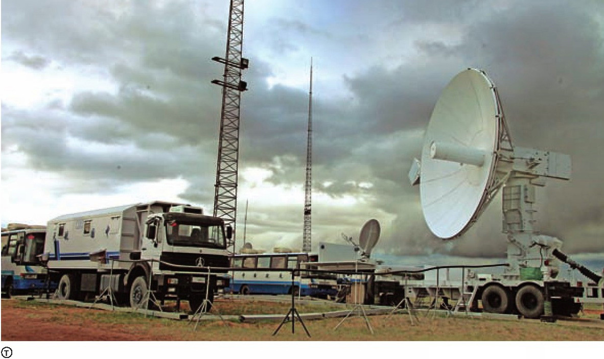
地面遥测站

车载遥测站是一种便携式遥测系统。它们分布在酒泉、渭南、青岛三地，主要负责运载火箭发射飞行全过程中的遥测任务，其中包括获取火箭飞行的各类物理量、数字参数，以及逃逸、船箭分离、飞船入轨等数据。这些数据，可以使地面指挥人员随时掌握火箭的飞行状态，实现对火箭的实时监控。从“神舟六号”飞行任务起，遥测系统新增加了图像传输设备，用来将发射过程的图像实时传送到地面，使地面人员更加直观地观测到火箭飞行全过程的实时状态。这和以前只能通过三维动画来模拟火箭的飞行状态相比，是一个大的飞跃。

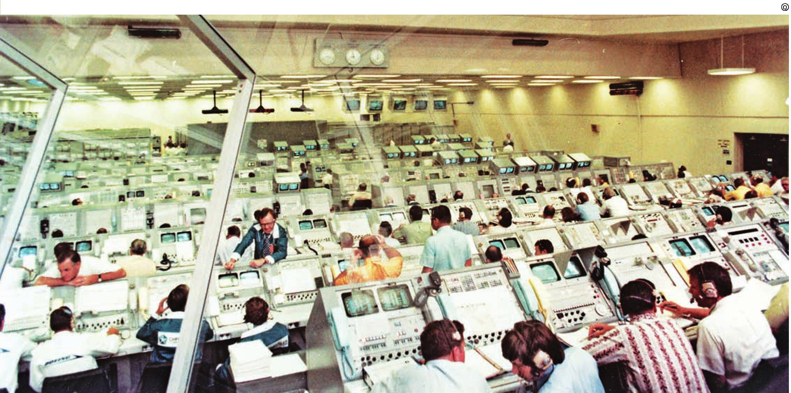
欧洲空间操作中心

中国已构建陆基、海基、天基三位一体的航天测控网。从酒泉到青岛，从喀什到厦门，从亚洲到非洲，数十套具有国际先进水平的载人航天测控网中的地面遥测、数据传输、记录等设备，忠实地履行着光荣的使命。（周武）

## 火箭发射窗口是怎么确定的

火箭本身对发射时间基本没有特殊要求，只是当火箭用来发射航天器时，航天器对发射时间有诸多要求。航天器允许发射的时间范围被称为发射窗口，这个时间范围的长短就叫作发射窗口的宽度。发射窗口的宽度有宽有窄，宽的以小时甚至以天计，窄的只有几十秒，甚至要求零时差发射（零窗口）。

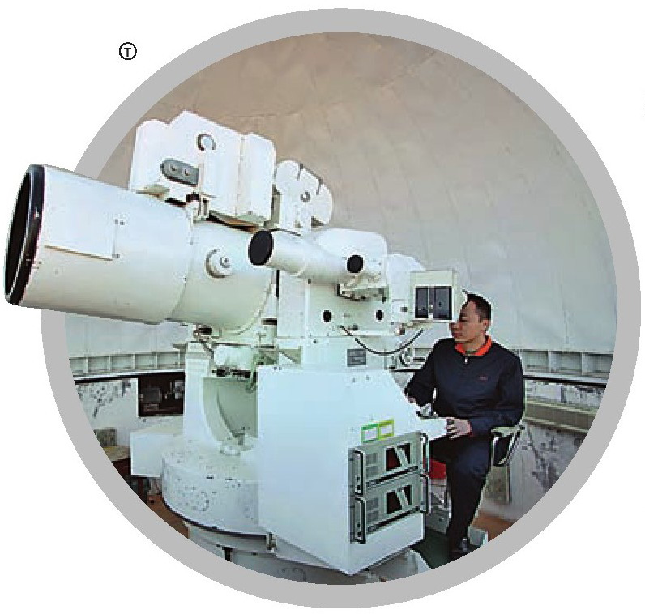
光学雷达测量站的技术人员正在跟踪火箭飞行

在发射航天器时，必须将所有对发射有限制的条件逐项加以计算，综合分析，确定发射窗口，为航天器和地面设备的准备及发射程序的安排提供依据。具体要考虑的限制条件主要有7条。

（1）气象条件的要求。航天器发射需避开雷雨、暴风等恶劣天气。

（2）地面观测的要求。当天空与航天器的亮度相差较大时，地面的跟踪测控较为容易。因此许多航天器的发射都选择在天色暗黑的时候，方便地面的光学跟踪设备观测到航天器的飞行。

（3）地面目标光照条件的要求。航天器运行轨道下方的地面目标光照要好，以便航天器上的遥感器能很好地拍摄到地面目标的图像。

（4）航天器的工作条件要求。航天器进入轨道后，其上的太阳能电池板要能被太阳光照射到，以便立即发电供航天器使用。

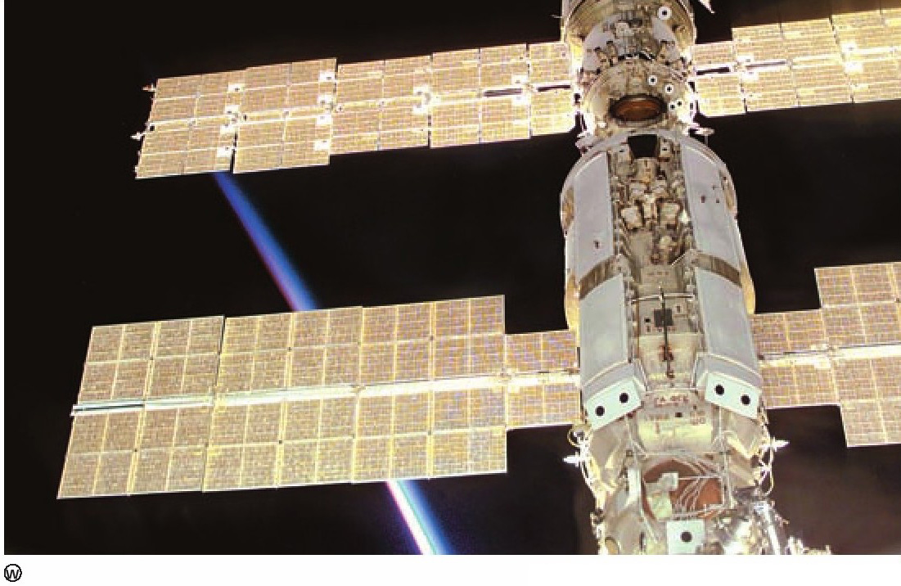
“国际空间站”上的太阳能电池板

（5）航天器上姿态测量设备的要求。航天器入轨后，要与地球、太阳处在一个较好的相对位置上，以便姿态测量设备正常工作，保证航天器进入稳定的飞行状态。

（6）目标天体的位置要求。在向其他天体发射探测器时，需要保证地球与被探测的目标天体处在一个有利的相对位置上，以便探测器精确省力地进入预定轨道。

（7）对于返回型航天器，还要考虑它返回时的光照和气象条件要求。为便于寻找航天器的落点，航天器返回地面时最好是在白天。同时希望气象条件良好，没有大风等恶劣天气，以便降落伞顺利张开并在预定着陆地点回收。

“神舟九号”发射时，因为有交会对接任务，要求在零窗口发射。所谓零窗口发射就是指在预先计算好的发射时刻，分秒不差地将火箭点火升空，不允许有任何提前或推迟，即零时差发射。“神舟九号”发射的零窗口是根据发射前几小时“天宫一号”的轨道参数来确定的，目的是将“神舟九号”发射到与“天宫一号”同一个轨道平面上。（周武）

  

**【微博士】**轨道参数

运载火箭的任务是将卫星、飞船、空间站或探测器送入预定的轨道。按照行星绕太阳的椭圆运动，德国天文学家开普勒提出了一种描述轨道的方法，可以直观地想象轨道的尺寸、形状和方位。开普勒将卫星在空间的运动用6个轨道参数来描述，即半长轴、偏心率、倾角、升交点赤经、近地点幅角和过近地点时刻。

【微问题】中国航天的海上测控任务主要由谁来承担？

【关键词】遥测系统　发射窗口

## 哪一种火箭威力最大

在全世界已经投入使用的运载火箭中，哪一种威力最大？目前的看法是：“土星5号”，或者“能源号”。

“土星5号”是美国专为阿波罗计划研制的运载火箭，先后将12名航天员送上月球。其直径约10米，高约110米。它能把119吨有效载荷送入200千米的近地轨道，能把45吨的“阿波罗”飞船送入奔月轨道。“土星5号”的第一级火箭有5台煤油液氧F-1发动机，装有2075吨煤油和液氧，一旦发动机点火，这些推进剂仅2分34秒就可以消耗掉，产生的高温气体以2900米/秒的速度喷射，可产生3500吨推力；第二级火箭有5台液氢液氧J-2发动机，装了450吨液氢和液氧，能产生500吨的推力；第三级火箭使用1台J-2发动机，可产生100吨的推力。

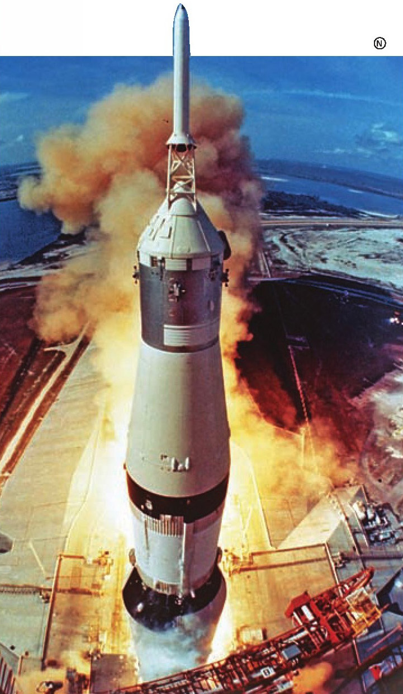
发射中的“土星5号”

“土星5号”的零部件约有560万个，而且还净是一些“大家伙”。例如，最粗的一根燃料管可以爬进一个人。每当“土星5号”巨大的发动机试车时，都会产生巨大的噪声，如果风向不对或云层较低，附近建筑的窗户玻璃就可能会被震碎。为此，每次试验时都不得不进行周密的气象预报，以免带来不必要的损失和引发周围居民的抱怨。

从1967年到1973年，“土星5号”共发射了13次。此后，由于在航天飞机系统中“竞聘”失败，“土星5号”被弃用。不过，“土星5号”的血脉以另一种方式延续，正在研制的“战神”系列重型火箭直径为10米，并采用了“土星5号”J-2发动机的改进型J-2X。

也有专家认为，苏联研制的“能源号”运载火箭才是迄今世界上推力最大的运载火箭。“能源号”火箭于1987年5月15日首次发射成功，1988年11月15日，它将105吨的“暴风雪号”航天飞机成功送上天。但后来由于苏联解体，“能源号”再也没有发射过。

“能源号”火箭采用积木式系统，可根据需要组合设计。“能源号”芯级长约60米，通过在芯级周围捆绑2个、4个、6个或8个液体助推器，或者以一组助推器为基础，增加不同的上面级，可组成多种运载火箭，具有向低地球轨道发射10～200吨有效载荷的能力。“能源号”的巨大储箱配置有推进系统，起着上面级的作用。储箱长42米，直径6.7米，内部有效容积达1000立方米，净质量约15吨，可装70吨推进剂。（周武）

## 火箭发射后下次还能用吗

目前使用的火箭，基本都是一次性使用的。这是因为飞行时箭体所受的各种压力、发动机燃烧后的烧蚀、抛弃后重返大气层时摩擦焚烧，已使得各种部件在一次飞行后就基本报废。虽然这样似乎很浪费，但建造与维护可重复使用火箭所需的费用并不比多次建造一次性火箭的费用低。

发展可重复使用运载器，实现“快速、廉价、可靠”地进出太空，一直是人类的梦想，因为这意味着低成本大规模应用。但是，这方面面临的问题很多，成功的经验较少。美国航天飞机已实现了部分重复使用，从技术角度来讲是非常杰出的成就，但从经济上来看并没有达到重复使用所期望的效果，而在安全上又带来严重的灾难：5架中有2架出事，带走了14名航天员的生命。

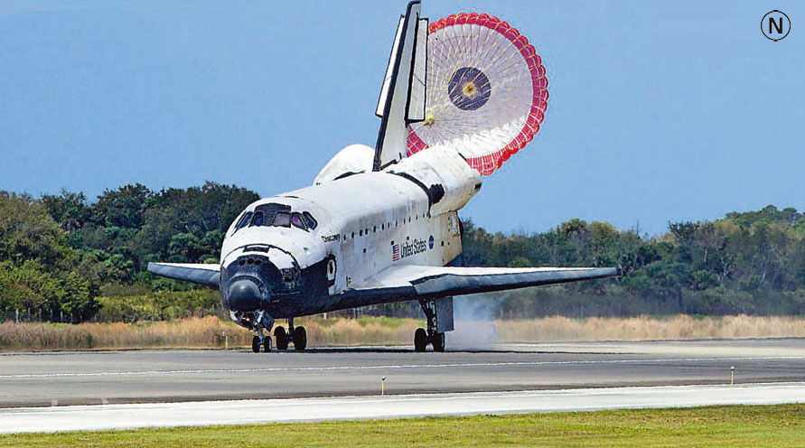
可重复使用的美国航天飞机的轨道器

目前，航天大国都在研究可重复使用运载火箭，其中发动机技术是关键技术之一。研发融合航空、航天技术为一体的水平起降空天飞行器，是实现航天运输系统完全可重复使用的终极目标。吸气式组合循环动力技术是空天飞行器的关键技术，它有机融合了火箭发动机、冲压发动机等动力技术，通过工作模式转换，为飞行器起飞、穿越大气层、入轨、轨道机动、轨道再入、降落等不同飞行阶段提供动力，将会实现飞行器完全可重复使用。（周武）

## 为什么研制火箭既要有总设计师又要有总指挥

运载火箭的研究、设计、制造和试验等过程是一个涉及方方面面、复杂的综合性工程。运载火箭系统由多个分系统组成，如箭体结构、动力装置和控制系统等。它们之间既相互关联，又相互制约。例如，采用什么形式的动力装置必然涉及箭体结构如何安排，而什么样的箭体结构与动力装置又涉及如何控制；反过来，不同的控制系统方案又对箭体结构、动力装置提出不同的要求。在研制过程中，各分系统的技术方案必须反复互相协调，最终满足运载火箭总体性能的要求。

另外，参与运载火箭研制的单位成百上千。以“长征二号”运载火箭为例，当时参与研制的单位遍及中国的25个省市，总数达1300多个。他们之中有设计部、研究所、制造厂、试验站、火箭发射中心和地面测控中心等，还有元器件、原材料等物资供应部门和基本建设部门。每个单位的工作、计划必须步调一致，按统一的程序、统一的进度有计划地进行。

因此，运载火箭的研制必须按系统工程的原则来进行组织和管理。在组织管理过程中，不但需要总设计师负责整个火箭系统技术方案的统筹协调，而且要有总指挥负责整个工程任务的指挥调度。两者紧密配合，协同指挥，加强责任制，提高工作效率，使各系统、各单位紧张有序地工作，才能保证运载火箭的研制顺利进行。

另外，卫星和飞船的研制也是既要有总设计师又要有总指挥。不过，这是中国的特色。其他国家航天器的研制有总设计师，但不一定有总指挥，有的是项目经理。（周武）

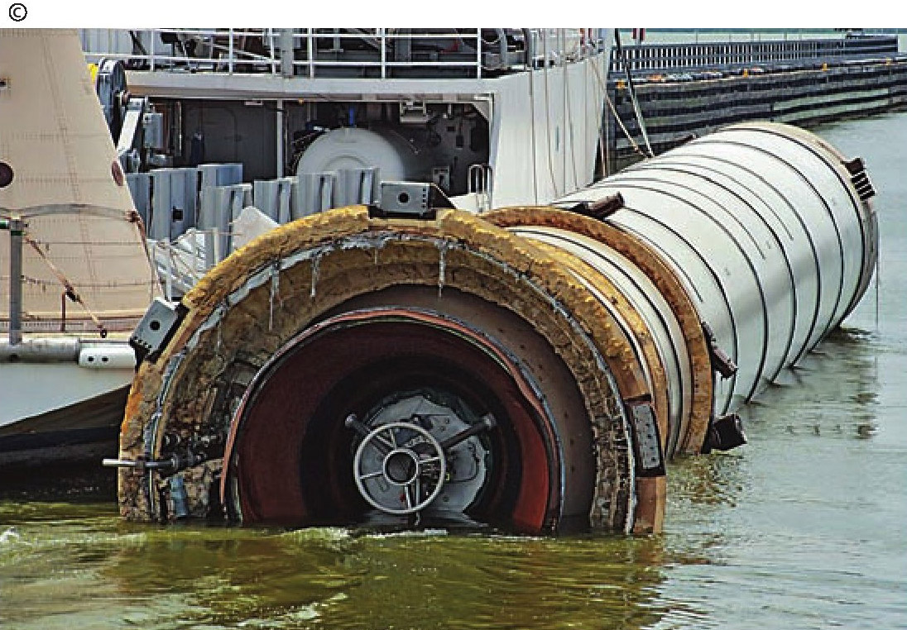
可重复使用的美国航天飞机的助推火箭

  

【微问题】你认为，火箭要重复使用，关键在哪里？

【关键词】“土星5号”　“能源号”　空天飞行器　火箭总设计师　火箭总指挥

## 世界论箭，中国“长征”火箭实力如何

一个国家进入太空的能力决定了其空间活动范围和空间应用水平。截至2012年，有13个国家发射过火箭。中国“长征”系列运载火箭凭借其高可靠的性能在国际航天领域一直享有较高的声誉，近年来在年度发射次数上超过了欧美，仅次于俄罗斯。“长征二号F”火箭已经和俄罗斯的“联盟号”火箭成为全球仅有的两种载人火箭。但是，“长征”系列火箭目前的运载能力还属于中等水平。其中，最强的“长征三号乙”增强型火箭，地球同步转移轨道运载能力为5.5吨，近地轨道运载能力理论上为12吨，与欧美俄超过20吨级的火箭相比，存在相当大的差距。

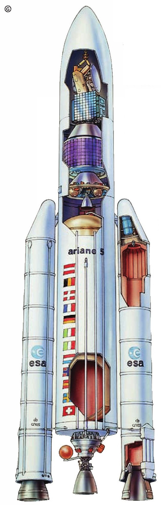
“阿里安5号”重型火箭

20世纪90年代，世界各国掀起了研制重型火箭的浪潮，欧洲率先研制成功“阿里安5号”重型火箭，并于1997年投入使用。美国通过渐进性运载火箭技术推出了“德尔塔4号”、“宇宙神5号”新型火箭。日本成功研制了H-2系列运载火箭。这些运载火箭全部采用了“系列化、标准化、模块化”的设计方案和环保高性能的发动机，适应性强，拓展空间大。

目前国际上运载火箭的发展，已经进入了一个多元时代。美国和俄罗斯依靠雄厚的技术积累，仍然占据着明显的领先优势，尤其是美国在放弃了航天飞机之后，出于商业发展和深空探测的需求，重新发展运载火箭。

现在，美国、俄罗斯等国把载人航天的目标都瞄准了月球、小行星和火星。为此，首先要研制出能发射深空载人飞船的重型运载火箭。载人登月飞船的质量一般在50吨以上，其奔月时的速度要求达到10.9千米/秒，因此必须用近地轨道运载能力为60～120吨的重型运载火箭发射。发射载人小行星或火星飞船则需要运载能力更大的重型运载火箭。2011年9月，美国航空航天局公布了新一代重型运载火箭——“太空发射系统”的方案。该火箭的研制采取了一种渐进式发展模式，其初始方案的近地轨道运载能力为70吨，改进后将达到130吨。

为了满足未来载人登月和深空探测的需求，中国正在大力发展新一代运载火箭和运载火箭上面级，不断完善运载火箭型谱，提升进入太空的能力。“长征五号”、“长征六号”、“长征七号”有望在未来几年实现首飞。其中，“长征五号”运载火箭将采用无毒无污染推进剂，起飞推力1100吨，具备近地轨道25吨、地球同步转移轨道13～14吨的运载能力。“长征六号”为新型快速发射运载火箭，具备700千米高度太阳同步轨道不小于1吨的运载能力。“长征七号”具备近地轨道13.5吨，700千米太阳同步轨道5.5吨的运载能力。

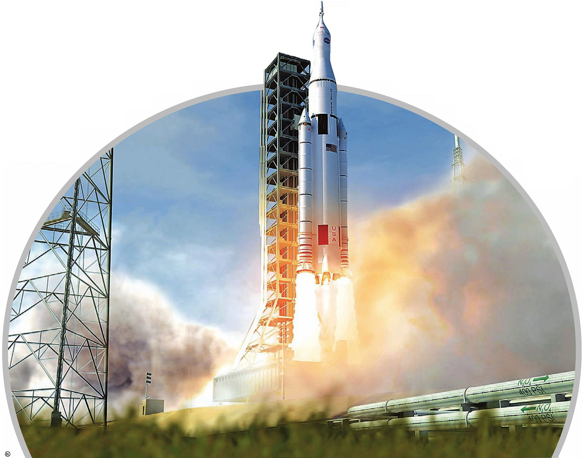
美国航空航天局的“太空发射系统”示意图

根据中国发展重型运载火箭的初步总体方案，“长征九号”的近地轨道运载能力130吨，具备一次发射将3人以上有效载荷送上月球，并从月球安全返回的能力。据推测，“长征九号”将高达85米左右，芯级直径8米，助推器直径3.35米，地月转移轨道运载能力40多吨，并可发射数吨质量的大型火星探测器，甚至火星取样返回探测器。其8米甚至更大直径的整流罩可提供更大的内部空间，发射大尺寸的载荷，如超大直径的光学空间望远镜、超大直径的空间站舱段等，为人类探索太空做出更大的贡献。（周武）

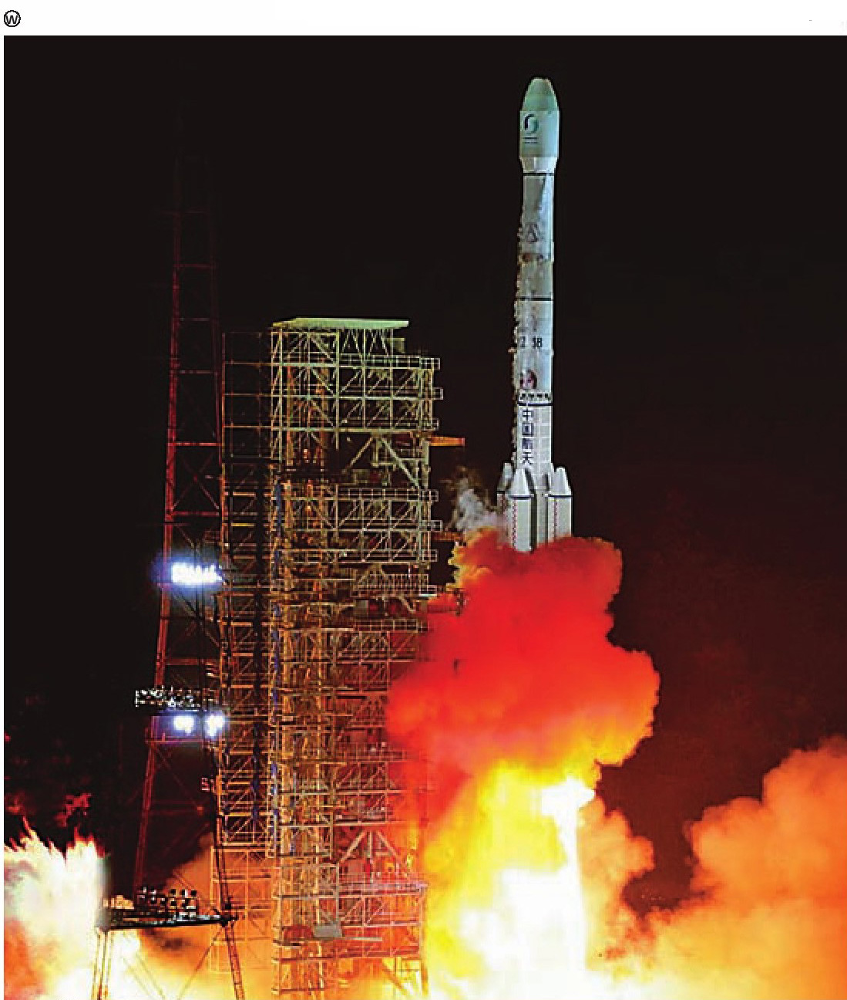
“长征三号乙”运载火箭在西昌卫星发射中心发射升空

  

**【微博士】**中国新一代火箭

中国新一代火箭将采用两种新型液体火箭发动机。其中，120吨级的煤油液氧发动机YF-100已通过国家验收，中国成为继俄罗斯后第二个掌握煤油液氧高压补燃发动机技术的国家。另一种是50吨级的液氢液氧发动机，即采用燃气发生器循环的YF-77。

**【微博士】**运载能力超过“长征三号乙”的国外现役火箭

“阿里安5号”是世界上首次采用“少级数、大直径”箭体结构的火箭。火箭芯级直径5米，箭体采用两级，拥有大直径整流罩和多种灵活的多星发射支架，近地轨道运载能力最大为25吨，地球同步转移轨道运载能力为7.5～15吨。

日本的H-2B火箭于2009年将日本首架“无人太空补给机空间站转运飞船”发射升空，标志着日本运载火箭技术的最新成就。H-2B近地轨道运载能力为19吨，地球同步转移轨道运载能力为8吨。

“德尔塔4号”重型火箭高约72米，是美国现役最高的运载火箭。其近地轨道运载能力为25吨，地球同步转移轨道运载能力为11吨。

美国的“宇宙神5号”火箭分400、500和重型3个系列，其中重型火箭近地轨道运载能力为29吨，地球同步转移轨道运载能力为13.15吨。

俄罗斯的“质子号”火箭曾发射过“礼炮号”空间站、“和平号”空间站各舱段和其他大型低地轨道有效载荷。“质子号M”近地轨道运载能力为24吨，地球同步转移轨道运载能力为6.2吨。

美国太空探索技术公司的“猎鹰9号”火箭近地轨道运载能力为24.75吨，“超级载重火箭”近地轨道运载能力预计将达到170吨。

【微问题】目前已经使用的各种火箭发动机中，哪一种最经济？

【关键词】“长征”系列运载火箭　重型运载火箭

# 人造卫星

## 为什么需要造卫星

人造地球卫星指在环绕地球的轨道运行一圈以上的无人航天器，简称人造卫星。人造卫星是发射数量最多、用途最广、发展最快的航天器。俗话说，“站得高、看得远”，这句话可以十分简要地概括人造卫星的优势。

1972年，美国发射了世界上第一颗资源卫星“陆地1号”

首先，人造卫星在轨道上飞行，对地球来说，它站得高、视场大，是名副其实的“千里眼”和“顺风耳”，用它来进行观察是非常有利的。根据观测对象和用途的不同，人造卫星可分成几大类：气象卫星、资源卫星、海洋卫星、侦察卫星等属于遥感卫星，空间探测卫星和天文卫星等属于科学实验卫星，还有通信卫星、技术试验卫星等。由于在地球大气层以外，天文卫星不受大气的各种干扰和影响，用它来观测遥远天体，要远比地面上看到的清晰。气象卫星和人们的生活休戚相关，主要用于观察大气、云团的分布和运动规律，并进行天气预报。地球表面70%的面积是海洋，通过海洋卫星观察海洋中的岛屿、鱼群、污染、潮汐等信息，也有很大的用途。资源卫星主要用于观察陆地上的森林、沙漠、农田、村庄、城市、河流等信息，也可用于资源普查、城市规划、防灾减灾等。譬如，在四川汶川大地震中，中国国家领导人就利用遥感卫星的观测来评估灾情。军事侦察卫星则主要用于观测战场或敌情、侦察对方军事目标等。

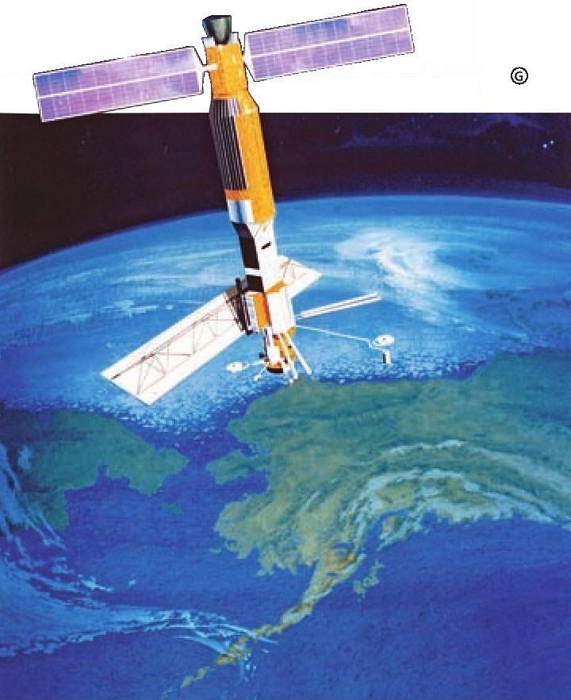
美国1978年发射的世界上第一颗海洋卫星

其次，卫星还可以用于通信。与平常的地面通信相比，利用卫星进行通信具有通信容量大、覆盖面积广、通信距离远、可靠性高、灵活性好和成本低等优点。通信卫星一般采用地球静止轨道，所以始终位于地球赤道上空的某一位置。目前，通信卫星已进入相当成熟的应用阶段，使用日益广泛，例如，传输电话、电报、电视、报纸、图文传真、语音广播、时标、数据、视频会议等。通信卫星也已用于国际、国内和军事等通信业务，同时开展了区域性通信和卫星对卫星的通信。卫星通信技术有很浓的军事色彩，它在战略通信和战术通信中占有绝对的优势。

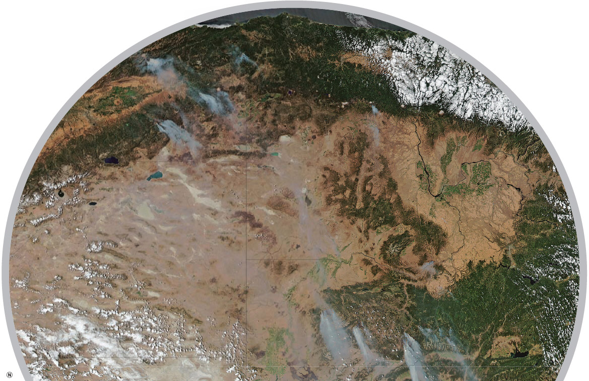
如果把轨道上的人造卫星用作一个主动发射信号的平台，就像地面无线电导航台一样，就可以用来导航。导航卫星通常发出一对频率非常稳定的无线电波，海上的船只、水下的潜艇和陆地上的运动物体等都可以通过接收卫星发射的电波信号来确定自己的位置。利用导航卫星进行导航是导航史上的一次重大技术突破，卫星导航可以覆盖全球，进行全天时、全天候导航，而且导航精度高。

此外，人造卫星所处的太空环境是一个微重力、高辐射的特殊环境，与地球上的环境迥然不同。因此，可以利用这种差异进行生物育种、材料加工等科学实验，往往会收到奇效。

人造卫星还可用于战场监视、导弹预警、国家安全等任务。（温跃杰）

## 中国的第一颗人造卫星是什么时候发射的

中国第一颗人造卫星“东方红一号”是于1970年4月24日发射的。当天北京时间21时35分，它从中国西北的酒泉卫星发射中心发射升空，13分钟后进入预定轨道。“东方红一号”的成功，使中国成为世界上继苏、美、法、日之后第五个用自制火箭发射国产卫星的国家。

1958年，毛泽东发出“我们也要搞人造卫星”的号召，由此揭开了中国向太空进军的序幕。以钱学森为首任院长的中国空间技术研究院负责“东方红一号”卫星的研制，当时共做了5颗样星，结果第一颗卫星就发射成功。

“东方红一号”卫星上安装了一台模拟演奏《东方红》乐曲的音乐仪器，在地面上可以通过电波收听到这段音乐，这颗卫星也由此得名。由于这颗卫星运行的轨道较高，确保了它能长期不坠落，所以目前仍在太空中飞行。

“东方红一号”卫星反映中国当时的经济、科技和社会发展达到了一定的水平，提升了中国的综合国力，极大增强了民族自豪感和凝聚力，在国际上也引起了强烈反响，赢得了一片赞誉。国外媒体纷纷发表评论：这颗卫星发射成功，“表明中国的科学技术和工业水平达到了新的高度”，“体现了中国一直在依靠自己的力量为人类的幸福和进步进行宇宙开发”。（温跃杰）

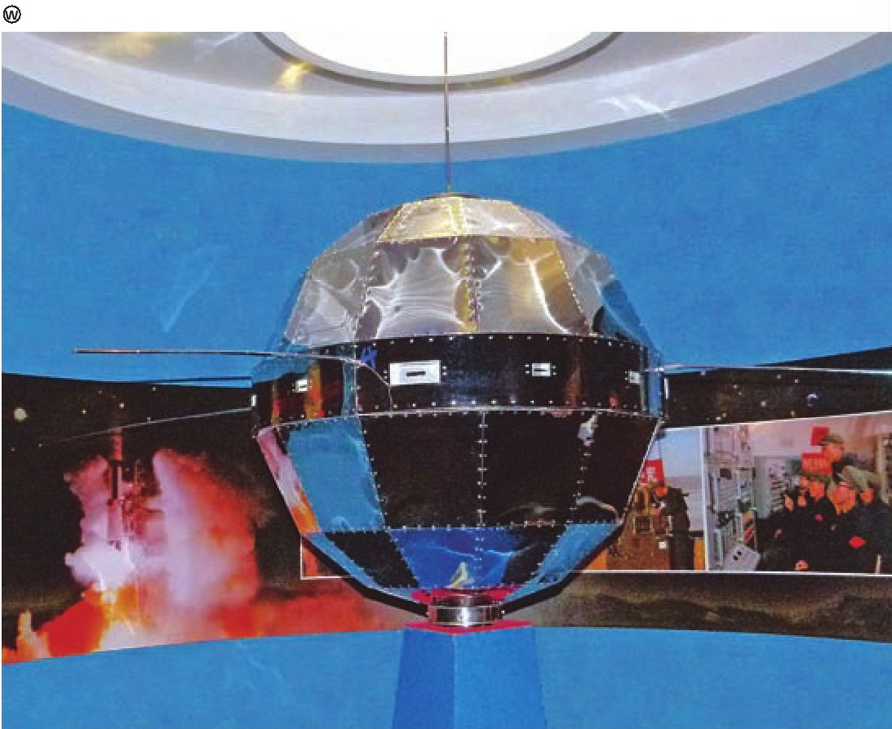
“东方红一号”卫星

  

**【科学人】**赵九章

赵九章（1907—1968），气象学家、空间物理学家，中国人造卫星事业的倡导者和奠基人之一，中科院院士。从20世纪50年代后期开始，他以极大热情投入中国空间事业的创建工作，主持了中国第一颗人造卫星的总体方案制定与实施，及时组织解决了测轨、选轨问题，还对返回式卫星等总体方案的确定和关键技术的研制，起了重要作用，1999年获中共中央、国务院、中央军委追授的“两弹一星”功勋奖章。

【微问题】至少需要几颗人造地球卫星才能使信号覆盖全球？

【关键词】人造地球卫星　“东方红一号”

## 为什么人造卫星能按预定的轨道运行

人造卫星是一种无人航天器，所以无法像载人飞船那样由航天员操纵来控制其飞行轨道。因此，我们主要靠跟踪遥控或自动控制的方式来使人造卫星按预定的轨道运行。

要想使人造卫星在预定的轨道运行，首先要用运载火箭把人造卫星尽可能精确地送入预定的轨道，使它获得较高的速度，然后靠惯性飞行。其关键是要掌握好卫星和火箭分离并开始进入轨道那一瞬时的速度和方向。

人造卫星速度的大小主要取决于运载火箭的推力。另外，因为用途和功能的不同，各种卫星的运行轨道高度也有很大差别，有的卫星需要运行在低轨道，有的则需要运行在中轨道或高轨道。这就要求火箭把卫星发射到所要求的轨道高度。对入轨精度的要求也随卫星轨道高度的不同而不同。例如，要使卫星在250千米高的轨道上运行，若要求轨道高度误差不超过10千米，那么卫星进入轨道时的速度误差需小于2/10 000，角度误差需小于2.3°。

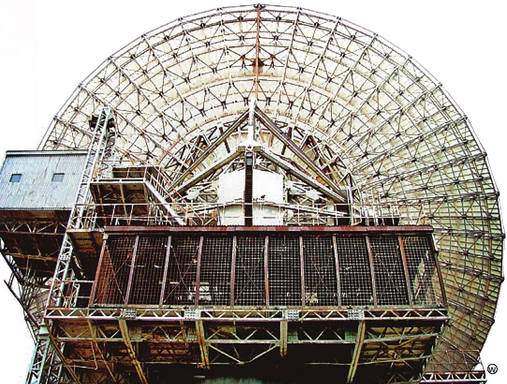
卫星跟踪站

人造卫星进入轨道的方向实际上就是卫星与火箭分离时的飞行方向。火箭与卫星分离后，由于惯性和地心引力的作用，卫星会按一定的轨道继续运行。这时，通过卫星的跟踪测轨系统，地面就可以知道卫星是否沿预定的轨道飞行。

对卫星进行跟踪测量主要有两种方法。一种是用光学的方式进行测量，即在地面利用望远镜、光学经纬仪、电影经纬仪、高速摄影机和激光测距仪等光学仪器，对卫星进行跟踪测量。这种方法不需要卫星太多的配合，只是观测、记录它的运动情况。但光学方法会受到卫星的大小和表面反射特性、观测时间天气的好坏等因素的影响和限制，现已很少使用。另一种是用无线电信号进行跟踪导航。它是指地面利用卫星发出的无线电信号跟踪卫星，并利用接收到的无线电信号延迟时间和多普勒频率变化来确定卫星距离地面的距离和相对于地面的速度。有了这些数据，就可以确定卫星的位置和飞行速度，计算出卫星实际轨道与预定轨道的偏差，引导卫星沿着正确的轨道飞行。由于无线电波不受天气影响，所以可以实现全天候跟踪测量，进行远距离定位。

人造卫星的轨道是在发射前就设计好的理论轨道。但卫星上天后的实际轨道往往和理论轨道不太一样。为此，在卫星与火箭分离后刚刚进入轨道时，要及时对卫星进行跟踪测量，掌握卫星的初始轨道参数，计算出卫星整个的运行轨道，知道它下一圈在什么地方，以及任何一个时刻会飞到什么地点上空。这样，就能尽早通过卫星的控制系统与推进系统调整卫星轨道，使卫星进入预定的轨道运行。当然，实际轨道与理论轨道的误差越小，卫星的轨道调整量就越小，这样可以节省卫星的燃料，延长卫星寿命。

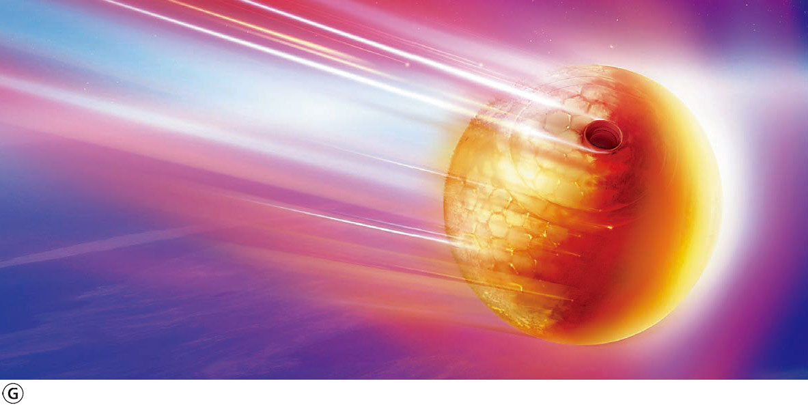
航天器再入大气层示意图

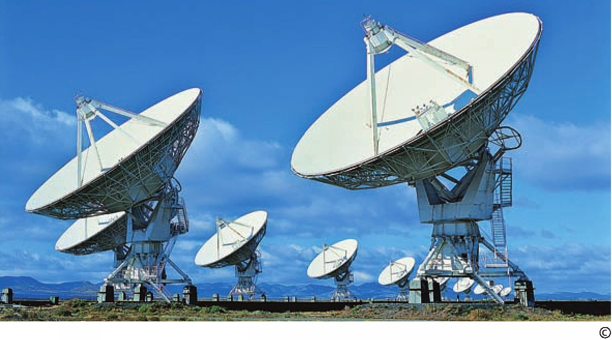
卫星地面测控站

另外，卫星在长期运行的过程中，因为受到地球引力、大气阻力、太阳和月球引力等的影响，轨道会产生微小的变化。所以，要不断地跟踪测量卫星轨道，必要时对卫星轨道进行修正和保持。（庞之浩）

## 为什么有的人造卫星会掉下来

人造卫星之所以能够绕地球运行而不掉下来，是因为发射它的运载火箭给了它较高的飞行速度，从而可以产生能够抵消地球引力的惯性力而绕地飞行。换句话说就是，如果人造卫星具有的惯性力与地球引力大小相等、方向相反，卫星就可以绕地球在圆轨道上运行。这时，卫星的飞行速度称为环绕速度。由于人造卫星在不同轨道高度所受到的地球引力大小是不一样的，因此它所需的环绕速度也是不一样的。例如，离地面200千米时，环绕速度为7.79千米/秒；离地面1000千米时，环绕速度为7.36千米/秒；离地面5000千米时，环绕速度为5.92千米/秒；离地面35800千米时，环绕速度为3.08千米/秒。

如果人造卫星在某一高度上的速度低于其相应的环绕速度，就会往下掉。在低轨道上飞行的卫星会受到少量残存大气的阻力，速度逐渐降低。速度降低意味着惯性力减小，如果不适时利用卫星上的发动机提升卫星的速度，卫星的轨道高度就会不断降低。最终，卫星会在地球引力作用下，沿螺旋线轨迹落入地球大气层烧毁。在低轨道上运行的卫星失效后经常会掉下来，而在高轨道上运行的卫星因不会受到残存大气的影响，所以即使失效也可以靠惯性在轨道上继续飞行多年。（庞之浩）

  

**【微博士】**多普勒频移

多普勒测速系统是利用多普勒频移现象来测量卫星轨道的。要解释多普勒测速，就要首先介绍多普勒频移。例如，当火车向我们驶来时，我们听到的火车鸣笛声音变得尖细（也就是声音的频率变高），而当火车离我们远去时，火车鸣笛声变得低沉（声音的频率变低），这是由于发射机（火车鸣笛）和接收机（我们的耳朵）之间存在相对运动，接收机接收到的信号频率与发射机发出的信号频率之间出现差值，即频率偏移。因为这一现象是由奥地利物理学家多普勒首先发现的，故叫作多普勒频移。多普勒频移的大小是与相对运动速度成正比的。所以，通过测量所接收的卫星信号的频移，就能计算出卫星的高度、速度和方位。

【微问题】人造卫星的轨道有多少条？都有哪些形状？

【关键词】卫星轨道　卫星跟踪测轨系统　轨道高度

## 为什么人造卫星的轨道有各种形状

要回答人造卫星轨道的形状问题，应先了解三个宇宙速度才行。众所周知，航天器（包括人造卫星、载人航天器和空间探测器）要离开地面进入太空需达到一定速度，才能克服地球的引力。理论和实践都已证明，在航天器的飞行速度达到7.9千米/秒时，它可以环绕地球运转。7.9千米/秒被称为第一宇宙速度，是零高度上的环绕速度。当航天器的飞行速度达11.2千米/秒时，它就可以脱离地球，成为围绕太阳运行的人造行星。11.2千米/秒被称为第二宇宙速度，是零高度上的逃逸速度。如果航天器的飞行速度达16.6千米/秒，它就可以脱离太阳系，到其他恒星世界去。16.6千米/秒就是第三宇宙速度。

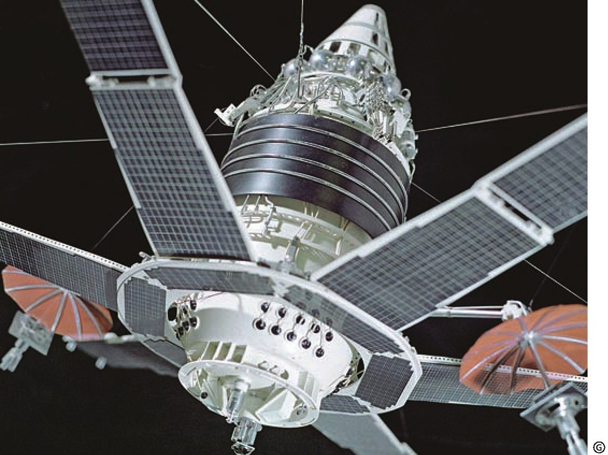
“闪电1号”通信卫星

卫星与发射它的运载火箭分离时所在的位置称为入轨点，其在入轨点时的速度称为入轨速度。入轨位置、入轨速度的大小和方向就决定了人造卫星的轨道形状。不同高度上的环绕速度和逃逸速度是不同的。如果卫星入轨速度在当地环绕速度和逃逸速度之间时，轨道为椭圆形；当入轨速度等于当地环绕速度而且是水平方向时，轨道为圆形；当入轨速度等于当地逃逸速度时，轨道为抛物线形；当入轨速度大于当地逃逸速度时，轨道为双曲线形。另外，入轨速度大小相同而方向不同时，卫星的轨道形状也会有很大差异。

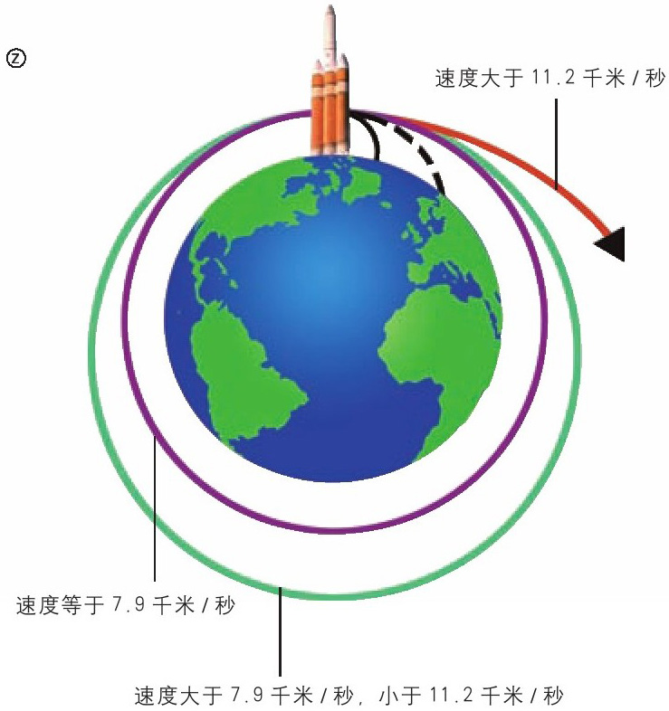
人造卫星的轨道还有高低之分：以圆形轨道来说，距地面200～2000千米称为低轨道；距地面2000～20000千米称为中轨道；距地面20000千米以上称为高轨道。根据不同的任务要求，卫星轨道采用不同的形状和高度。

若采用圆形轨道，卫星能同地球表面保持等距离，用于观察地球、通信广播、导航定位和大地测量的卫星常采用这种轨道。也有一些通信卫星采用椭圆形轨道。例如，俄罗斯的“闪电”通信卫星就运行在大椭圆形轨道上，因为俄罗斯国土纬度较高，如果使用地球静止轨道卫星不能覆盖高纬度地区。“闪电”通信卫星轨道的远地点高度为4万千米，近地点在470千米，倾角63°。它的远地点在北半球上空，卫星在远地点附近的轨道上速度变小。这样，卫星可缓慢经过俄罗斯境内高纬度地区，延长与地面控制站的联系时间。不过，为了保证提供俄罗斯境内不间断通信，需要多颗“闪电”卫星协作。如果是为了科学研究（研究地球不同高度上磁场的强度、大气压力、温度、密度，以及外层空间辐射的强度分布等），使探测范围更大些，科学卫星也常运行在椭圆形轨道上。例如，中国1971年3月3日发射的“实践一号”科学卫星，其轨道的近地点是266千米，远地点是l826千米。（庞之浩）

## 卫星升空之后多久才算进入最终的工作轨道

因为不同种类的人造卫星运行在不同的轨道上，所以它们在升空后进入最终的工作轨道所花的时间有很大差异，有的能马上进入最终的工作轨道，有的则需要几十天甚至几个月。一般情况下，运载火箭发射人造卫星时，其入轨点的速度和方向与预定的轨道会有偏差，因而常常不能一下子就把卫星送入预定的轨道。例如，运行在距地面250千米高的卫星，如果速度大小有1/1000的误差，或方向角有0.5°误差，都会使卫星的轨道高度偏离50千米。因此，卫星入轨需要对轨道进行修正，但时间不长，就能进入预定轨道。

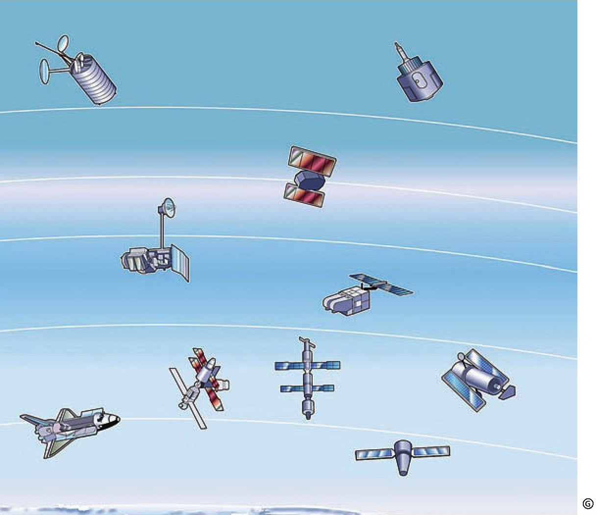
不同用途的人造卫星运行在不同高度的轨道上

而发射地球静止轨道卫星必须分两步：第一步是用火箭把人造卫星送入一个远地点在赤道上空35786千米、近地点为几百千米的大椭圆轨道，它叫地球同步转移轨道；第二步是在卫星运行到远地点时，启动卫星上的远地点发动机3次或4次，逐渐提高卫星飞行速度，同时改变飞行方向，使轨道倾角变为0°，最终把卫星的近地点高度提升到35786千米，速度的方向朝正东的水平线，从而使卫星进入地球静止轨道。

2010年8月14日，美国首颗“先进极高频”军用通信卫星升空。但上天后卫星远地点发动机出现异常，不得不使用卫星上的氙离子霍尔推进器执行了500多次点火来变轨，历时约14个月，直到2011年10月24日，才进入了预定的地球静止轨道。（庞之浩）

地球同步轨道

  

**【微博士】**地球同步轨道和地球静止轨道

按运行方向分，人造卫星的轨道可分为顺行轨道（与地球自转方向相同）、逆行轨道（与地球自转方向相反）、赤道轨道（在赤道上空绕地球飞行）和极轨道（经过地球南北极上空）等。

人造卫星在顺行轨道上运行时，若其运行周期（绕地球一圈的时间）与地球的自转周期相同，它的轨道就是地球同步轨道。如果卫星在地球赤道上空35786千米的圆轨道上运行，从地面看去它就是静止的，这条卫星轨道就是地球静止轨道。地球静止轨道是地球同步轨道的特例，轨道倾角为0°，偏心率为0，它只有一条。大多数通信卫星都采用这种轨道，以便地面与卫星能连续通信。

**【微博士】**太阳同步轨道

地球是个扁椭球体，地面上的各点对卫星的引力不等，使得卫星的轨道平面会绕地球自转轴旋转。如果卫星轨道平面绕地球自转轴的旋转方向和角速度与地球绕太阳公转的方向相同，平均角速度相等，这种卫星轨道就叫太阳同步轨道。这种轨道基本上是极轨道（沿此轨道运行的卫星每次环绕地球运行一圈都会经过两极上空），卫星能够俯瞰整个地球表面。

在太阳同步轨道运行的卫星总是在同一当地时间经过地球上某一纬度的地区，也就是卫星每次经过该地区上空时，太阳在同一高度，对地面的光照条件是相同的，这对于从卫星上观察地面十分有利。所以，气象卫星、资源卫星等对地观测卫星都采用这种轨道。

【微问题】卫星上哪个系统的职责是保证卫星在预定的轨道上运行？

【关键词】卫星轨道　卫星入轨

## 卫星通信是如何实现的

1945年，克拉克在美国《无线电世界》10月号上发表了《地外中继——卫星可以实现全球无线电覆盖吗》。在这篇论文中，克拉克认为：一颗24小时环绕地球一周的人造地球卫星（它相对于地面静止不动），将可以“看到”大约半个地球；3颗间隔120°排列的这种卫星，可以实现电视和微波的全球覆盖。

目前使用的国际通信卫星系统，就是按照上述原理建立起来的。3颗卫星分别位于大西洋、太平洋和印度洋上空，它们在地球赤道上空，距地面35786千米的圆形轨道上绕地球旋转，旋转的方向和地球自转的方向相同。卫星的轨道平面与地球赤道平面的夹角为0°，绕地球旋转一周的时间和地球自转一周所需时间相同，为24小时。不论在地球的什么地方观察，它们始终是相对静止不动的。我们把这种卫星称为地球静止轨道卫星，又称静止卫星。

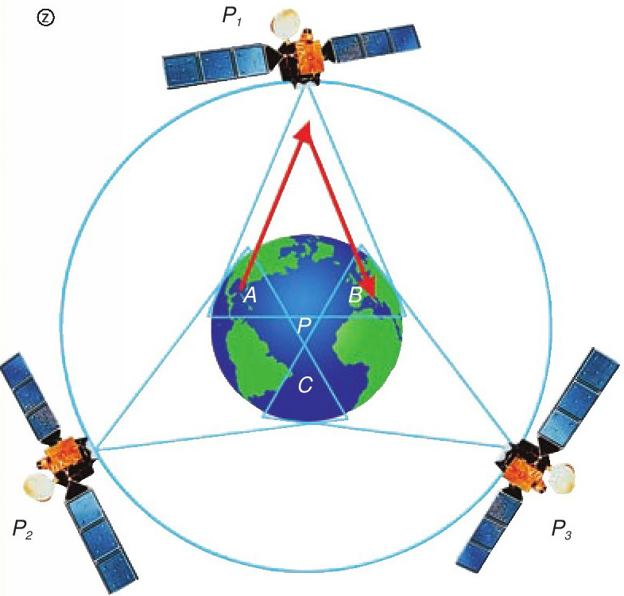
在静止卫星轨道上等间距地放置3颗静止卫星，在卫星覆盖区的重叠部分建立转发站，则经过1次跳变（即通过1颗卫星）或经过2次跳变和转发站便可实现两个地球站间的通信联络，并可基本实现全球通信。例如，地球站A通过定向天线朝着通信卫星P1方向发射的无线电信号，首先被通信卫星天线所接收，经过卫星转发器放大和变换后，由卫星天线转发到地球站B。当地球站B接收到信号后，就完成了从A站到B站的信息传递过程。同样，地球站B也可以通过卫星向地球站A发射信号来传递信息。每一个卫星覆盖区可建立若干个地面站，其中一个地面站兼做网络协调站，在4颗卫星的情况下，全球最多可建60个地面站。

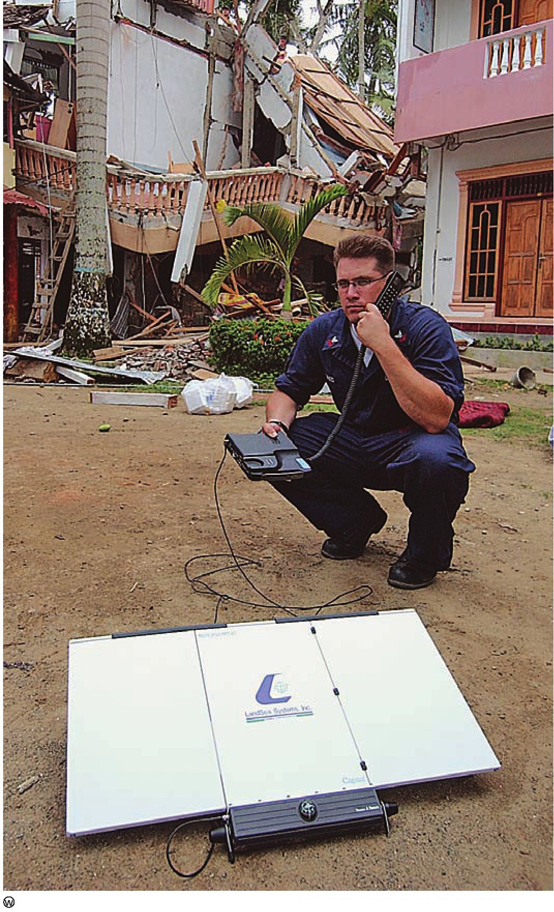
卫星电话能实现无死角的全球通信

随着航天技术日新月异的发展，通信卫星的种类也越来越多。按服务区域划分，有全球、区域和国内通信卫星。按用途分，有一般通信卫星、广播卫星、海事卫星、跟踪和数据中继卫星，以及各种军用通信卫星。（周武）

## 什么人常用卫星电话

2008年，四川汶川大地震发生后，各行各业支援灾区。首先到达灾区的通信设备是中国卫星通信集团公司的350部卫星电话，从重灾区映秀镇打出第一个电话，为抗震救灾统一指挥提供了有力支持。如今，真正能实现无死角全球通的只有卫星电话。无论在高山丛林、广阔海洋、荒芜沙漠、灾难现场和偏远地区，最佳的通信工具便是方便携带的海事卫星电话。它可以使我们随时随地拨接电话。

2010年6月推出的全球覆盖的卫星手机IsatPhone Pro提供了带蓝牙免提功能的卫星电话、语音信箱、短信和电子邮件服务，改变了大家一贯认为卫星电话体积笨重和费用昂贵的印象。

新闻记者通过使用高度紧凑的便携式终端可在任何地方发送最快速的视频流。约1～3.5千克重的各种终端设备能提供最高达492千字节/秒的高速互联网接入、话音、传真、综合业务数字网（ISDN）、短信、语音信箱等多种业务应用，从而带来全球无所不在的移动办公能力、数据应用平台和综合应急通信方案。（周武）

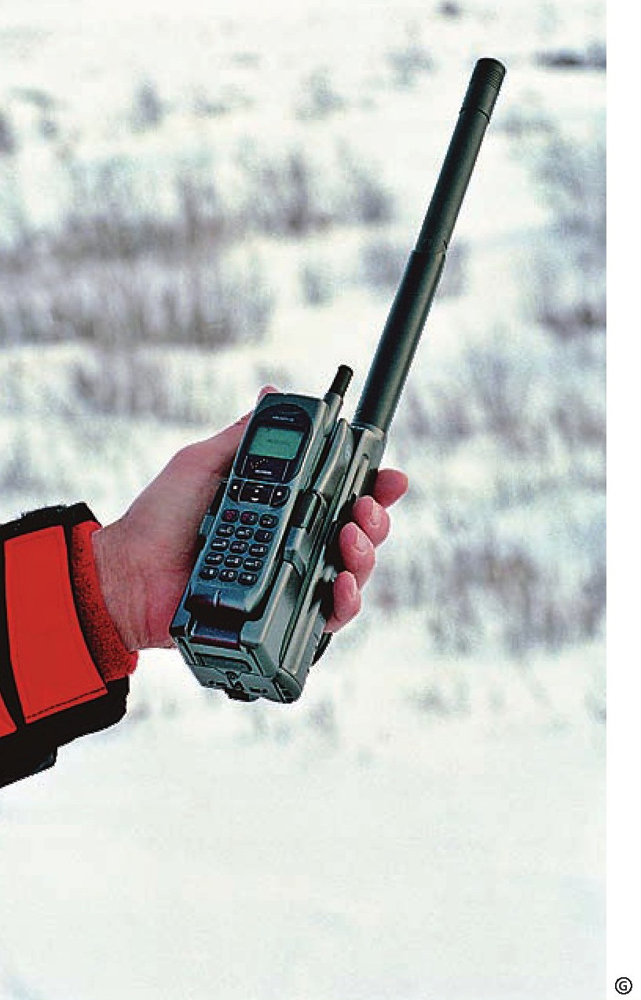
## 为什么支个“锅”，就能看到丰富多彩的电视节目

所谓的“锅”，其实就是卫星接收天线。电视台通过卫星地面发射站，用定向天线向太空中的卫星发射电视节目信号（上行频率为*f*1）。卫星转发器将接收到的电视节目信号经过放大、变换等一系列处理，再用下行频率*f*2向地面服务区转发。各地用户使用锅形的卫星天线就可以接收到上述广播电视节目了。

截至2012年，中国网民数量超过5.38亿，有线电视用户超过2亿，但还有几亿的农村人口收听、收看广播电视难。中国国家新闻出版广电总局组织实施的“户户通”直播卫星服务利用“中星九号”直播卫星，计划在2015年前彻底解决这一难题。

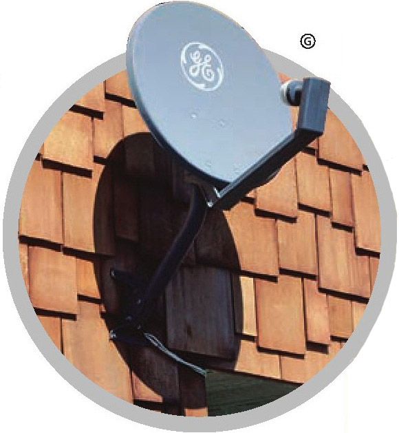
用于接收广播电视的卫星天线

直播卫星“户户通”以最低成本、最快速度、最有效方式，从根本上解决中国广大农村家家、户户、人人听广播和看电视的问题。“户户通”服务区域范围内的群众，可通过自愿购买“户户通”接收设施（卫星接收“锅”），免费收看中央电视台第1至第16套节目、本省1套卫视节目、中国教育电视台第1套和7套少数民族电视节目，以及13套中央人民广播电台节目、3套中国国际广播电台节目和本省1套广播节目。（周武）

  

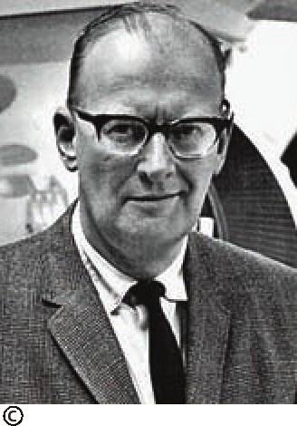
**【科学人】**克拉克

亚瑟·查尔斯·克拉克（1917——2008），英国科幻作家，也是一位将科学专业和诗意想象有机结合的作家，还是一位热情洋溢的“人类的命运可以摆脱地球束缚”这一观念的推广者。1945年，他提出了地球同步轨道卫星实现国际通信的概念，这在20世纪60年代成功实现。他提出的空间站的梦想也早已实现，他还提出了太空电梯、月球基地等梦想，人类也在将这些梦想逐步变成现实。

【微问题】你知道目前世界上共有多少个卫星导航系统？

【关键词】卫星通信　卫星电话　户户通

## 为什么导航卫星能够指路

我们的日常生活离不开导航，一出门，眼睛就在为我们导航，它和脑海里记忆的地图一起匹配来指路。出远门怎么办呢？古人最初依靠太阳、北极星等天体来辨别方向，后来依靠指南针和罗盘。进入20世纪后，无线电信标的问世，开创了海洋船舶和航空器导航的新篇章。

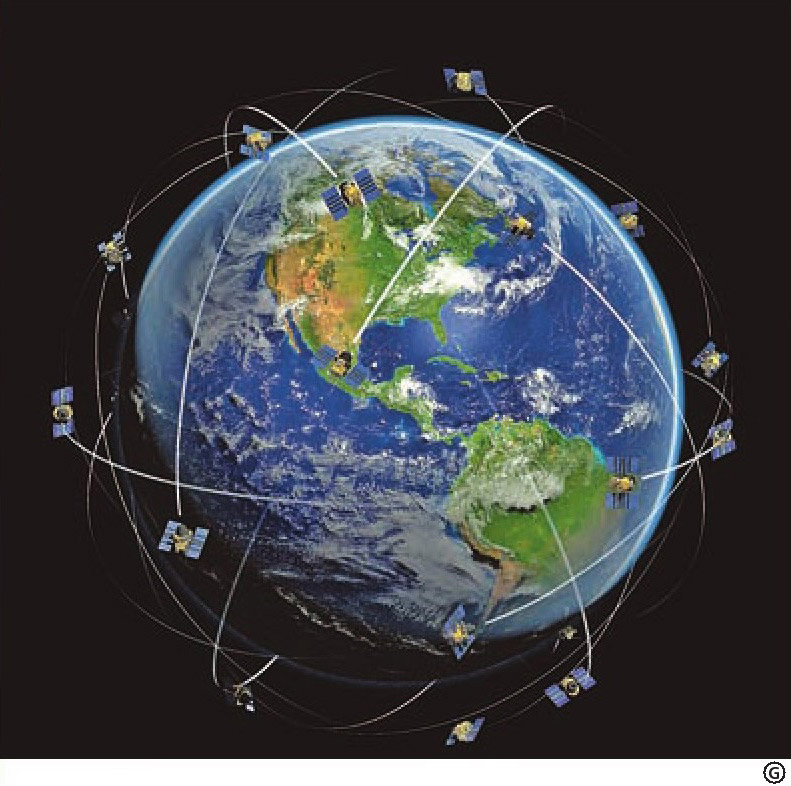
组成GPS的32颗卫星分布于6条轨道

1957年10月4日，苏联发射了第一颗人造地球卫星。此后，美国科学家在跟踪它的过程中，观察到了多普勒效应：卫星飞向地面接收机时，收到的信号频率升高；而飞离时，频率就降低。一高一低之差就是频率的偏移，简称频移。他们认识到，卫星的运行轨迹可以由卫星通过时所测得的多普勒频移来确定。知道了卫星的轨迹，就能够反推出接收机所在的位置。正是由于这一有趣而科学的发现，揭开了人类利用人造卫星进行高精度、全天候导航定位的新纪元。

现在大家提起导航，脑海中就会浮现“GPS”这三个字母。其实GPS（Global Positioning System的缩写）是由美国军方建造的全球定位系统，由于先入为主的关系，人们常把它当作卫星导航系统的代名词。那什么是卫星导航系统呢？

卫星导航系统由三部分组成，分别是导航卫星、地面台站和用户定位设备。我们以GPS为例，来说明卫星定位的基本原理。

GPS由32颗中高轨道卫星组成，它们均匀地分布在距离地面约20200千米的6个倾斜轨道上，以12小时的周期环绕地球运行。这些卫星与地面台站组成网络，每隔1～3秒向全球用户播报信息，使地球上任何地方的用户在任何时候均可以利用接收机同时接收到至少4颗卫星的信号。

为何要接收4颗卫星的信号？按照初等几何学原理：若一个点与另一个（固定的）已知点*P*的距离是一个常值*R*时，则这个点一定位于以点*P*为球心，*R*为半径的球面上。由于卫星的位置精确可知，可得到卫星到接收机的距离，利用三维坐标中的距离公式，利用3颗卫星，就可以组成3个方程式，求解观测点的位置（经度、纬度和高度分别以*X*、*Y*、*Z*来表示）。考虑到卫星的时钟与接收机时钟之间的误差，实际上有4个未知数，*X*、*Y*、*Z*和时钟偏差，因而需要引入第4颗卫星，建立4个方程式进行求解。接收机往往可以锁住4颗以上的卫星，这时，接收机可按卫星的星座分布分成若干组，每组4颗，然后通过算法挑选出误差最小的一组用作定位，从而提高精度。GPS最新的实际定位精度已经达到5米以内。（周武）

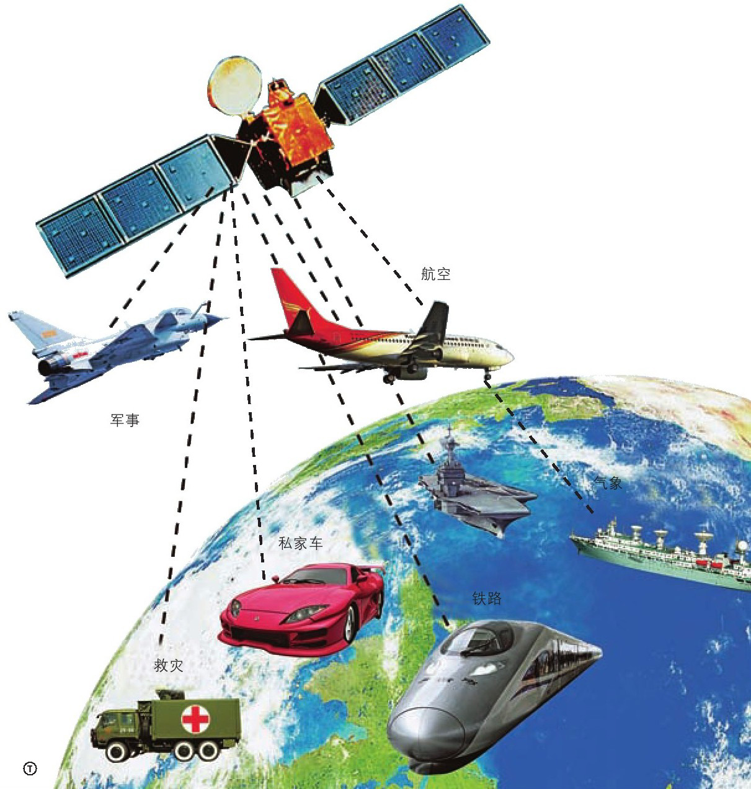
“北斗”卫星导航系统应用示意图

4颗卫星的信号就能实现精确定位

## 为什么中国要建立自己的“北斗”卫星导航系统

卫星导航系统能够为地表和近地空间的广大用户提供全天时、全天候、高精度的导航、定位和授时服务，是拓展人类活动和促进社会发展的重要基础设施。全球卫星导航已成为名副其实的跨学科、跨行业、广用途、高效益的综合性高新技术。

作为独立自主的大国，建立中国的卫星导航、定位和授时系统对保障国民经济的正常运行和国防安全都至关重要。一个国家必须有自己独立的坐标系统，要确定这个坐标系统，全球卫星导航是最重要的手段之一。如果没有自己的导航系统，势必要用国外的，这样可靠性和安全性方面都没有保证。此外，建立卫星导航系统也能显示综合国力，并在世界上争取更多话语权。

因此，中国从20世纪80年代开始积极探索适合国情的卫星导航系统。2000年，中国初步建成“北斗”卫星导航试验系统，成为继美国、俄罗斯之后世界上第三个拥有独立自主卫星导航系统的国家。目前，中国正在自主建设、独立运行与世界其他卫星导航系统兼容共用的“北斗”全球卫星导航系统。北斗全球星座由35颗卫星构成，其中5颗是地球静止轨道卫星，3颗是地球同步倾斜轨道卫星，还有27颗地球中轨道卫星。截至2012年10月，“北斗”卫星导航系统已发射了16颗卫星。2012年12月27日，“北斗”卫星导航系统开始向亚太大部分地区正式提供连续天源定位、导航、授时等服务。

“北斗”系统的高精度授时分为单向和双向，单向授时的精度为100纳秒，双向授时的精度为20纳秒。这在公开使用的高精度授时领域是精度最高的。与其他三大卫星导航系统不相同的是，“北斗”卫星导航系统还提供“源定位”和“短报文”特色服务，短报文服务与微博类似，每条可以发120字。

“北斗”，既是中国的，也是世界的。“北斗”卫星导航系统预计到2020年完全建成，它将为全球用户提供稳定、可靠、优质的导航服务，并与世界其他导航系统携手，共同促进人类文明和社会发展。（周武）

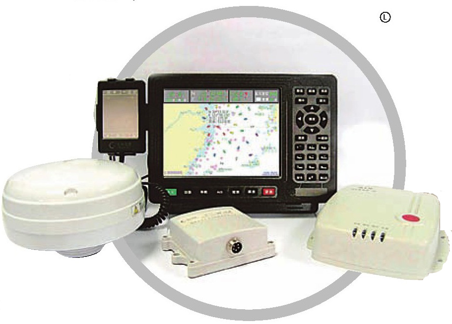
BDG-MF-07型“北斗”/GPS定位通信终端

  

**【微博士】**全球导航卫星系统

全球导航卫星系统是个复杂的组合系统，包括美国的“全球定位系统”（GPS）、欧洲的“伽利略”（Galileo）系统、俄罗斯的“全球导航卫星系统”（GLONASS）以及中国的“北斗”（BeiDou）四大全球卫星导航系统，日本和印度两大区域卫星导航系统，以及相关的增强系统。增强系统就是通过一些地面、空中或卫星设施，使卫星导航系统的总体性能得以提高，如美国的广域增强系统（WAAS）、欧洲的静地导航重叠系统（EGNOS）和日本的多功能运输卫星增强系统（MSAS）等。为了克服单一卫星导航系统在某些条件下的失效和可靠性问题，应用设备经常采用与其他导航系统相结合的组合导航技术。

【微问题】目前，“伽利略”系统能够提供的定位精度是多少米？

【关键词】导航卫星　“北斗”卫星导航系统

## 为什么人造卫星能够看清地面上的人和汽车

在古代神话故事《封神演义》中，“千里眼”和“顺风耳”是最让神机妙算的姜子牙感到头疼的对手。如今，人们常把各种遥感卫星比喻成“千里眼”。遥感卫星远在距离地球几百甚至上千千米上空，为什么能看清地面上的人和汽车？

因为卫星上也装备了各种“千里眼”——高分辨率相机和各种遥感设备。

卫星上的可见光学遥感相机，其原理和我们日常生活中使用的照相机没有本质区别，只是焦距长达几米到十几米，通光口径很大，1米粗的主镜头就像大炮筒子。但是一味加大镜头会受到材料和制造工艺的限制，科学家研制出了用电荷耦合器件模拟合成孔径的相机（常称CCD相机），并用计算机处理数据，将多张数码照片叠加得到高清晰图像。

拍出好照片的另一重要因素是光照条件。光学遥感卫星要在有最佳日照时拍照，最佳轨道是高度在300千米到900千米之间的圆形太阳同步轨道。因为在这样的轨道上，卫星距离地面的高度不变，而且卫星经过的所有地域都是白天最佳光照时刻。

卫星图像传回地面后，还要经过光学校正、地形匹配等后期处理，才能生成我们能看懂的照片。比如，谷歌地球就是通过虚拟地球仪软件，把卫星影像、航空照片和地图布置在一个地球的三维模型上。用户可以通过一个下载到自己电脑上的客户端软件，免费浏览全球各地的高分辨率卫星图片。

地面分辨率是指在卫星遥感图像中能够将两个物体分开的最小距离。如果一幅卫星图片的分辨率为1米，就表示地面平面尺寸为1米见方的区域，在遥感图像上是一个像点，不管把这个图像放大多少倍，它都只是一个点。一般说来，地面上可识别的物体和尺寸，应为卫星地面分辨率的3～5倍。目前，在轨运行的美国“快鸟”等成像卫星，分辨率小于1米，可以发现天安门广场上垂直投影小于1米的游人，光照和天气条件良好时，甚至可以看见细细的高压线。在它们拍摄的上海东方明珠区域遥感照片上，可以分辨出马路上的分道线。目前，民用遥感卫星的最高分辨率是“地球之眼1号”卫星的0.41米，这个分辨率可以区分出马路上行驶的是卡车、大巴还是小轿车，但是要想区别是奔驰还是宝马，就得靠世界上最先进的成像卫星——美国“高级锁眼”侦察卫星，其最高分辨率可达到0.1米。

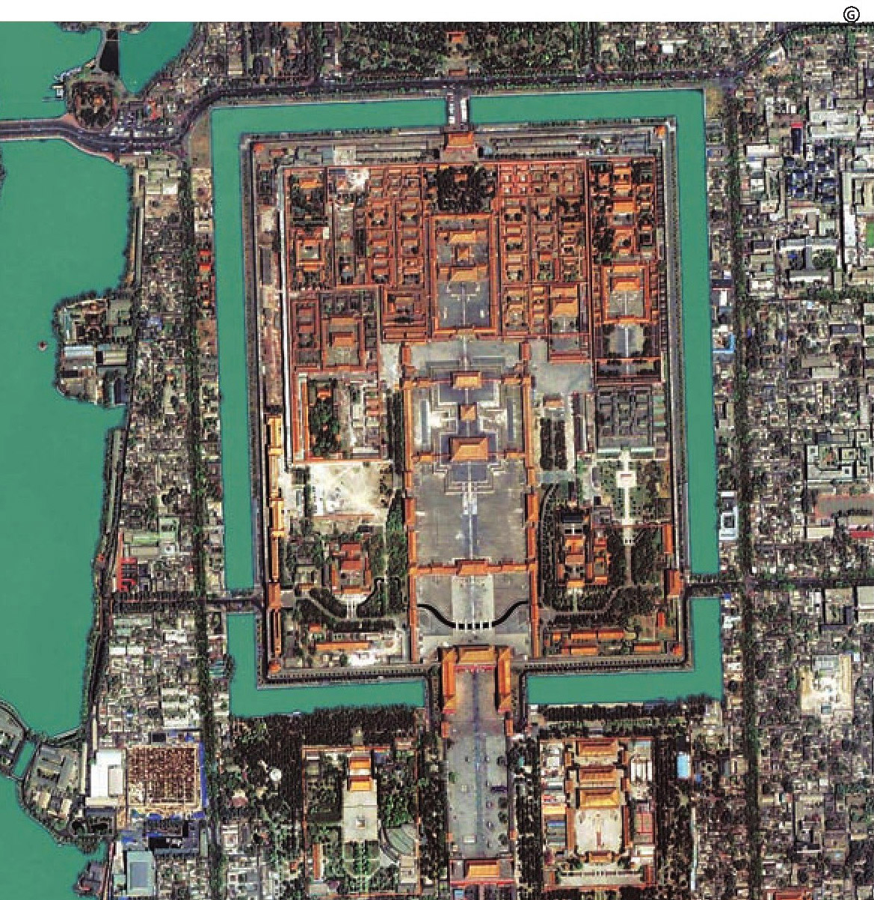
北京紫禁城的卫星图片

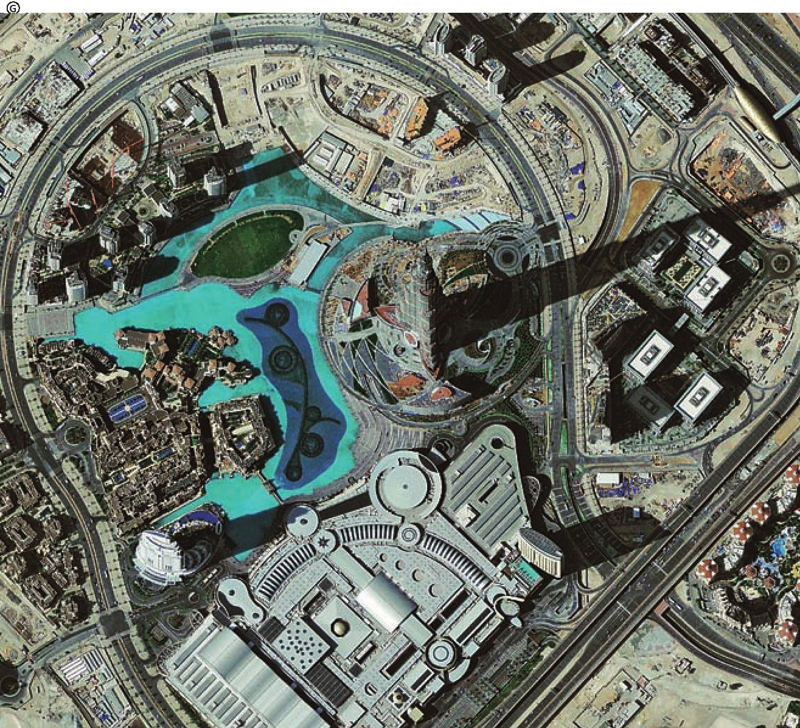
美国“地球之眼1号”卫星拍摄的迪拜

这些光学成像卫星虽是“千里眼”，但还有看不到的“盲区”。比如说，被观测目标处在阴暗处，被云、雾、伪装物遮挡，由于没有光照或光照不足，卫星上的可见光相机就看不到。其实，真正能够像神话人物“千里眼”一样，站在空中就能看到“姜子牙案头”的，是多光谱遥感和微波遥感技术，那才是入木三分的“千里眼”。一台多光谱探测器能够对几个、几十个甚至数百个感兴趣的单独谱段或连续谱段进行成像探测，以获取更丰富的物体信息。在处理这些信息时，可以针对某项特殊用途，单独提取一个谱段的信息，也可以把多个波段的信息叠合起来综合分析或成像。根据需要，多光谱遥感既可以用来对汽车进行精细探测，也可监测全球气候变化。（周武）

## 为什么有的人造卫星要返回地球

发射返回式卫星主要有3个用途：（1）作为观测地球的空间平台，返回式卫星所获取的各种对地观测信息资料，可以带回地面进行分析处理和详细研究；（2）作为微重力试验平台，利用微重力条件，在空间进行各种科学实验，生产和制造地面难以获得的材料和物品；（3）作为发展载人航天技术的先导，因为航天员必须采取与返回式卫星相似的方法返回地面，只有掌握了卫星返回技术，才能为载人航天打下基础。因此，返回式卫星在世界各类航天器中占有重要地位。目前，全世界只有美国、俄罗斯和中国掌握了卫星回收技术。

中国返回式卫星

目前，中国共发射了20多颗返回式卫星，进行了各种对地观测、空间生命科学实验、空间材料加工实验和应用技术试验等。（周武）

  

**【微博士】**什么叫遥感

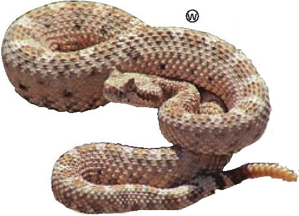
响尾蛇

“遥感”就是“遥远地感知”。世界上所有温度在-273℃以上的物体都会有辐射，它们辐射的就是电磁能量，按照波长的不同分别有紫外线、可见光、红外线等波段。比如人的眼睛就是一个很好的可见光遥感器，但是它只能对可见光敏感，对红外线不敏感，作用距离很有限。响尾蛇头部的颊窝对红外线十分灵敏，它可以在5米内感觉出千分之一摄氏度的温度变化，灵敏地捉住老鼠。蝙蝠的耳朵则对超声波十分灵敏。卫星遥感就是使用像人眼、响尾蛇颊窝、蝙蝠耳朵等的传感器来探测地表物体大小和性质，它通过探测物体辐射或反射的电磁波强度及其在空间和时间上的分布，以获取大气、陆地、海洋各个层面的各种信息。

【微问题】导航卫星之间必须相隔多少距离，才能保证相互不干扰？

【关键词】遥感　返回式卫星

## 人造卫星上能做什么实验

自1957年第一颗人造卫星上天以来，世界各国已经发射了6000多颗人造卫星。这些千姿百态的卫星按用途来划分，可分为科学卫星、技术试验卫星和应用卫星三个大类。我们平时熟知的通信卫星、导航卫星和遥感卫星等都是直接为国民经济和军事服务的应用卫星。科学卫星指用于科学探测和研究的卫星，主要包括空间物理探测卫星、天文卫星和生物卫星。那么，技术试验卫星是用来干什么的呢？

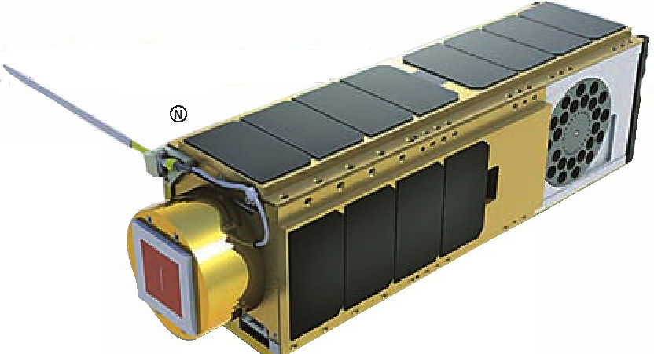
2010年11月，美国发射了一颗名叫“生物体/有机物暴露装置”的纳型卫星，试验生命和生命成分对太空复杂环境的反应

技术试验卫星往往起到“先行官”和“试飞员”的作用，航天技术中的新原理、新技术、新方案、新仪器设备和新材料往往需要先在太空进行试验，试验成功后才投入使用。中国“实践”系列科学探测与技术试验卫星的发展，充分展示了空间技术从试验走向应用的发展道路。

1971年3月3日，中国成功发射“实践一号”卫星。这颗卫星在太空正常运行了8年多，卫星上的长期电源系统、长期温控系统、长期遥测系统获得全国科学大会成果奖，为中国研制长寿命卫星提供了宝贵的经验。

1981年9月20日，中国首次用一枚运载火箭成功发射“实践二号”、“实践二号甲”和“实践二号乙”3颗卫星。这3颗卫星首次采用太阳能电池帆板为卫星仪器设备供电，首次采用自旋稳定及对日定向的姿态控制方式，首次采用磁芯存储器和延时遥测技术，首次采用超短波统一系统来跟踪和遥测，首次使用多扇百叶窗调节整星温度。这些技术和设备的成功应用奠定了如今百星灿烂的基础。

“实践四号”卫星第一次测到了热等离子体与卫星表面电位之间的关系；“实践五号”上开展了12项试验，进一步为中国卫星探测仪器和卫星平台技术的不断进步奠定了基础；“实践八号”卫星上开展了精密重力测量等试验……

技术试验卫星虽然数量较少，但试验内容广泛，可用来进行重力梯度稳定试验、电火箭试验、生物对空间环境适应性的试验、载人飞船生命保障系统和返回系统的验证试验、交会对接试验、无线电新频段的传输试验、新遥感器的飞行试验和轨道上截击试验等。随着电子技术的小型化和芯片化发展，相对低成本的小卫星开始活跃在空间技术试验的舞台，许多大学生也开始研制和发射小卫星。如果你有兴趣，也可以通过放飞小卫星，验证自己的奇思妙想。（周武）

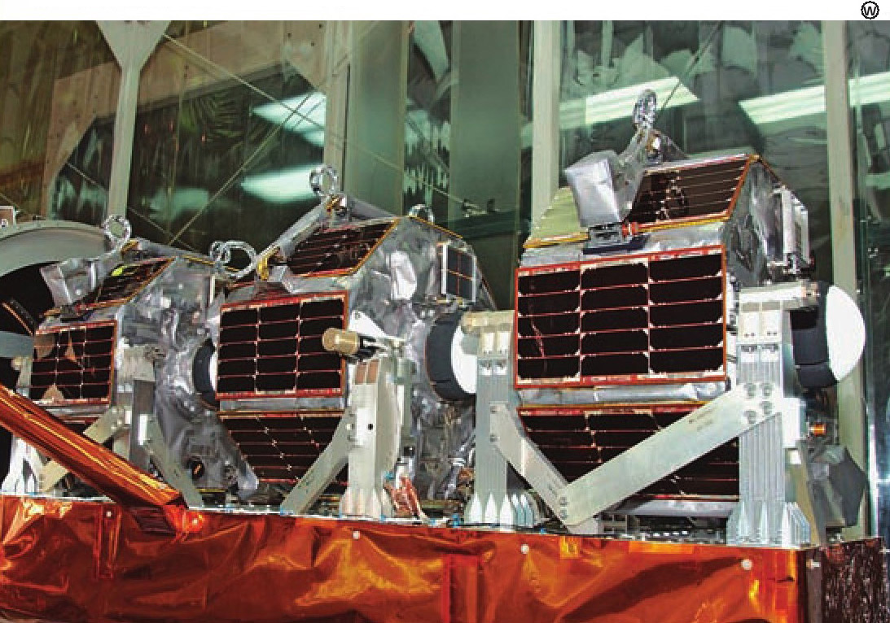
微型卫星的质量为10～100千克

## 人造卫星如何测地球重力场

在地球表面不同地点，你所称量到的体重都差不多。因为地球基本是一颗均匀的球体，表面重力在各处几乎相同。其实，地球各处的重力还是有很细微差别的，但一般性测量是测不出来的，需要依靠卫星的灵敏度。

2002年3月，美国航空航天局和德国空间中心联合研制的“重力测量和气候试验卫星”发射升空，开展了一项高精度全球重力场观测与气候变化试验。它由两颗完全相同的卫星组成，在距离地面500千米的同一圆轨道上相距约220千米运行，通过精确测量两颗卫星之间的距离和速率变化来反演地球重力场，测量误差不超过人头发的直径。它所运用的原理是：质量的运动会引起重力场的变化。例如，地势较低的四川盆地被水淹了，此地的质量增加，路过的卫星速度就会增加，两个卫星间的距离就会变大。然后，在质量拉扯下两个卫星之间的距离又会缩短。这样，通过测量两个卫星之间的距离，就可以获得地表任何指定区域的表面质量。

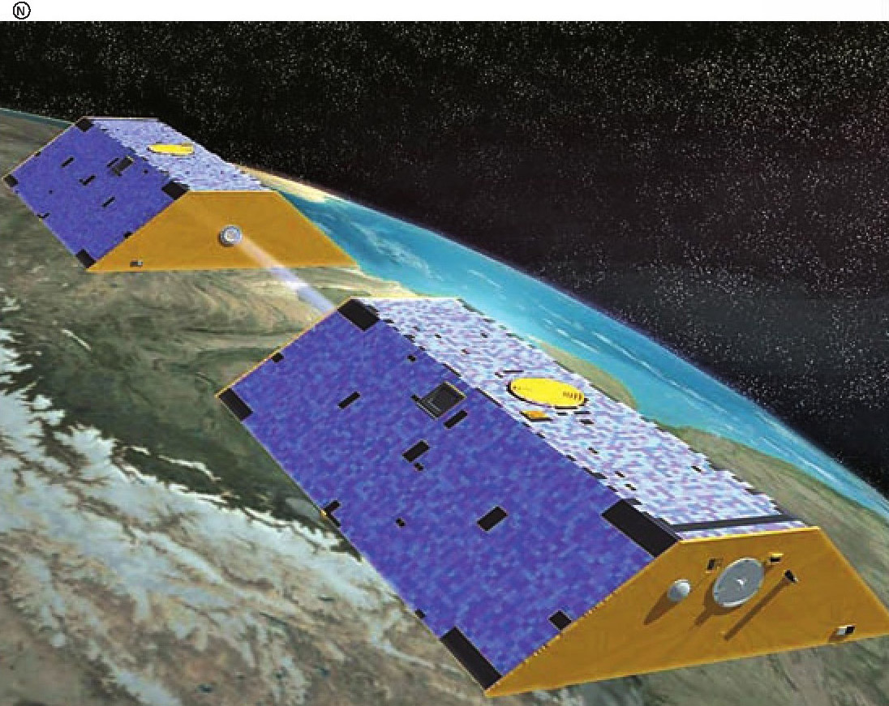
大小与小汽车相仿的“重力测量和气候试验卫星”在轨运行示意图

这两颗双胞胎卫星除了能够精确测量地球大小、形状、旋转轴和重力场的变化外，还是监测陆地冰川消融、海平面与环流变化、陆地水量变化、强地震等全球环境变化的有力工具。地球内部一些极为缓慢的变化会造成重力场发生变化。例如，地球极区的冰在过去比较多，这些冰的质量让地球在两极的方向较为扁平。现在由于部分冰融化，原本被重压的陆地反弹而上升，加拿大北部就正在上升中。这使得地球变成更接近完美的球体。通过这两颗双胞胎卫星精确地测量重力的微小变化，科学家还发现许多地方的地下水正在以不可持续的方式大量消耗。（周武）

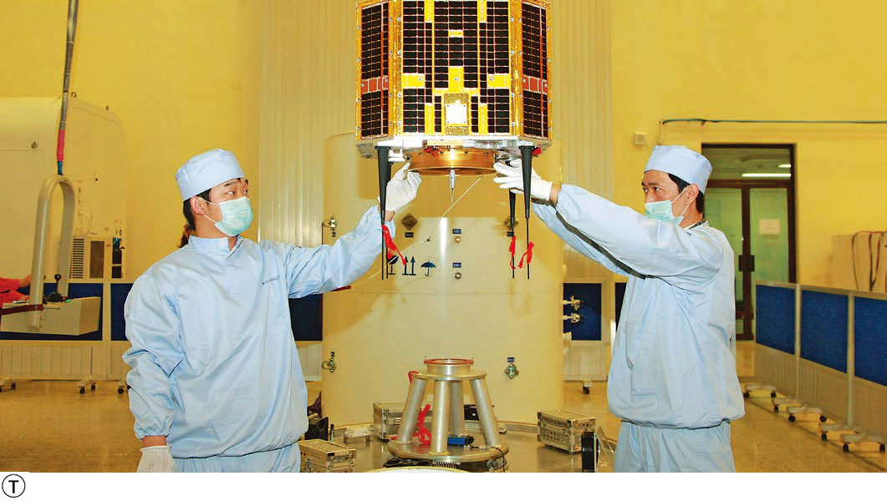
“希望一号”试验卫星

  

**【微博士】**“希望一号”

2009年12月15日，中国发射首颗为青少年量身定做的科普试验卫星——“希望一号”。“希望一号”卫星的太空之旅有科普“三大件”随行：一是搭载了北京一名小学生设计的“天圆地方”科学实验方案的实验设备，用于观察微重力条件下五种颜色颗粒的状态；二是采用宽视场彩色CMOS相机在测光仪的配合下进行太空摄影；三是建立业余无线电空间电台，为中国和全球的业余无线电爱好者提供信标、语言和数据转发等空间通信试验服务。

【微问题】卫星上的电源主要来自哪些方面？

【关键词】技术试验卫星　地球重力场

## 为什么人造卫星在太空还能听从地面的指挥

人造卫星上天后必须对它进行测量与控制，使地面控制人员及时了解卫星的运行轨道、卫星各系统的工作情况和各种工程参数，控制卫星上有关仪器的工作，否则卫星难以正常运行。这些都是通过卫星上的测控系统来完成的，主要包括遥测、遥控和跟踪测轨等装置。

卫星上的遥测装置用于采集卫星上各种设备的工作参数，并实时或延时发送给地面测控站，从而实现地面对卫星的监测。这是一套无线电信息传输系统，发信者是各种被测对象，信息是各种被测对象呈现出来的物理特性。温度传感器和压力传感器等遥测传感器，把卫星上的温度、压力等各种信息变成电信号，然后把这些信号送入调制和发射设备，最终以无线电波的形式传到地面测控站。地面测控站经过接收、解调处理后还原成各种信息，就可了解飞行中卫星的各部分状态。

在测量卫星参数的同时就把测量的参数传输到测控站的方式称为实时遥测。但如果卫星运行在地面测控站能接收到的范围以外，遥测数据就无法实时传送给地面测控站。此时，需用卫星上的记录器把所测得的参数存储起来，在卫星飞入地面测控站接收区时，再把存储的数据传送下来，这种方式称为延时遥测。

卫星上遥控装置的功能与遥测装置相反，用于接收地面的遥控指令，然后传送给卫星上的有关设备来执行。它与在空中受控飞行的航空模型一样，能接收地面发来的控制信息。这些控制信息是以电信号的形式调制在无线电载波上，卫星在接收后从无线电载波中解调出控制信号，用来对卫星有关分系统进行控制。

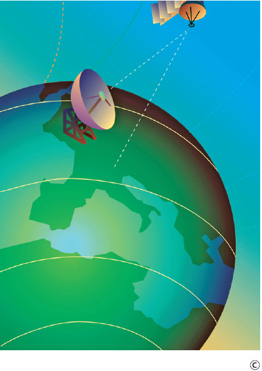
卫星在天上飞行时经常需要完成某些动作，例如，让星上记录器记录或下传数据，让采用自旋稳定的卫星起旋等，这些都是通过地面发送遥控指令给卫星来实施的。其过程如下：地面用指令产生器把需发向卫星的各项指令变成电信号；用编码器把这些信号编成不同的码组，以区别各种指令和保密；接着，把它们调制到无线电载波上，由发射天线发向卫星；卫星在接收到遥控信号后，用解调器从载波中取出码信号，再由译码器译出所要执行的指令，最后通过放大变换器去指挥相应的执行机构动作。（庞之浩）

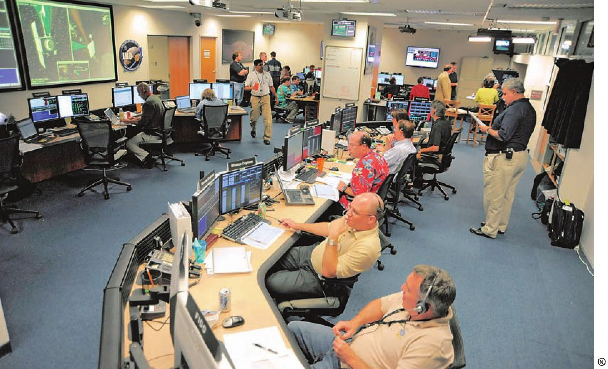
美国的一个卫星测控中心

## 为什么人造卫星在太空不会随意翻滚

人造卫星在太空中飞行，会受到残余空气动力、微流星撞击力、地球扁圆度引起的不均匀引力、太阳辐射压力，以及卫星内部的运动机构（如弹簧、发动机）等干扰力的影响，导致卫星的姿态甚至轨道发生变化。另外，每种卫星都有自己特定的任务，在飞行时对它的飞行姿态都有一定的要求。比如，通信卫星上的抛物面天线和对地观测卫星上的相机要始终对准地面，太阳观测卫星上的望远镜要一直对准太阳。为此，卫星上装有姿态控制和轨道控制分系统。

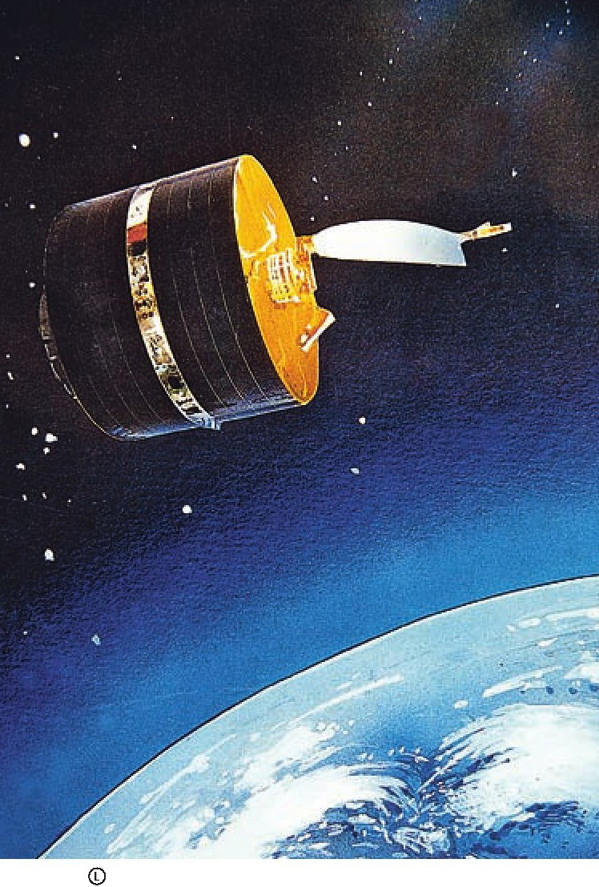
“东方红二号甲”通信卫星采用自旋稳定方式

所谓卫星的姿态控制就是控制卫星的飞行姿态，保持姿态轴的稳定，并根据需要改变姿态轴的方向。由于各种干扰，卫星在空间的姿态角和姿态角速度往往会偏离设计值，这时就要进行控制和调整。

卫星的姿态控制分系统有被动和主动两种。其中，被动控制系统的控制力不需要消耗卫星上的能源，而是用卫星的动力特性或空间环境力矩来提供，主要有自旋稳定等方式。主动控制系统是根据姿态误差（测量值与标称值之差）形成控制指令，产生控制力矩，实现姿态控制。它主要采取飞轮控制和喷气控制等方式，可对卫星进行三轴稳定控制，这种方式被目前多数卫星采用。

自旋稳定方式是通过卫星绕一个轴自旋来保持稳定。简单地说，其原理与旋转的陀螺类似：高速旋转可以保持物体的转轴方向不变。早期的卫星大多采用这种简单的控制方式。在卫星表面沿切线方向对称地装上小火箭发动机，需要时就点燃小发动机，产生力矩，使卫星旋转起来，也可由末级运载火箭起旋。高速旋转的卫星，其自转轴在空间的指向就会保持不变。

三轴稳定方式是对卫星相互垂直的三个轴都进行控制，不允许任何一个轴产生超出规定值的转动和摆动。实现卫星三轴姿态控制的系统一般包括姿态敏感器、姿态控制器和姿态执行机构三部分。姿态敏感器有惯性敏感器、地球敏感器、太阳敏感器、星敏感器等，用于察觉和测量卫星的姿态变化，即卫星沿各个轴的转动角度、转动角速度有多大，是否超出规定的范围。姿态控制器用于把姿态敏感器送来的卫星姿态角变化值的信号，经过一系列比较、处理，产生控制信号输送到姿态执行机构。姿态执行机构则根据姿态控制器送来的控制信号产生力矩，使卫星姿态恢复到正确的位置，常用的执行机构有反作用飞轮和推力器。当卫星的姿态处于所要求的姿态时，飞轮保持匀速旋转；如果卫星偏离了某一位置，飞轮加速或减速，产生一个相反方向的力矩，使卫星回复到所要求的姿态位置。卫星三个轴向各设置一个这样的飞轮，就能控制卫星三个轴方向的姿态。也可以在卫星三个轴的方向安置若干个小的推力器，一旦卫星偏离所要求的姿态，相应方向的推力器就会喷出气体，产生推力，使卫星回到所要求的姿态位置。（庞之浩）

美国的“陆地7号”资源卫星采用三轴稳定方式

  

【微问题】你知道卫星的推进系统主要有哪两项任务？

【关键词】卫星的测量与控制　卫星的姿态控制

## 人造卫星在太空会不会被冻“感冒”

人造卫星在太空运行时，会遇到高温和低温两种环境。在太阳直接照射卫星时，如果不加防护，温度可达100℃以上；但当卫星进入地球阴影区时，温度又会低于-100℃。显而易见，卫星内的各种仪器设备不可能在温差如此大的环境中正常工作。另外，地球反射的太阳光和地球本身的红外辐射也会影响卫星的温度，卫星内的仪器设备工作时还要向外散发热量。为此，卫星要有热控制（或称为温度控制）分系统，把卫星内的温度控制在仪器设备可以正常工作的范围内。卫星内的温度一般要保持在5～45℃，个别的部分要求保持在恒定的温度，只允许1～2℃的变化。

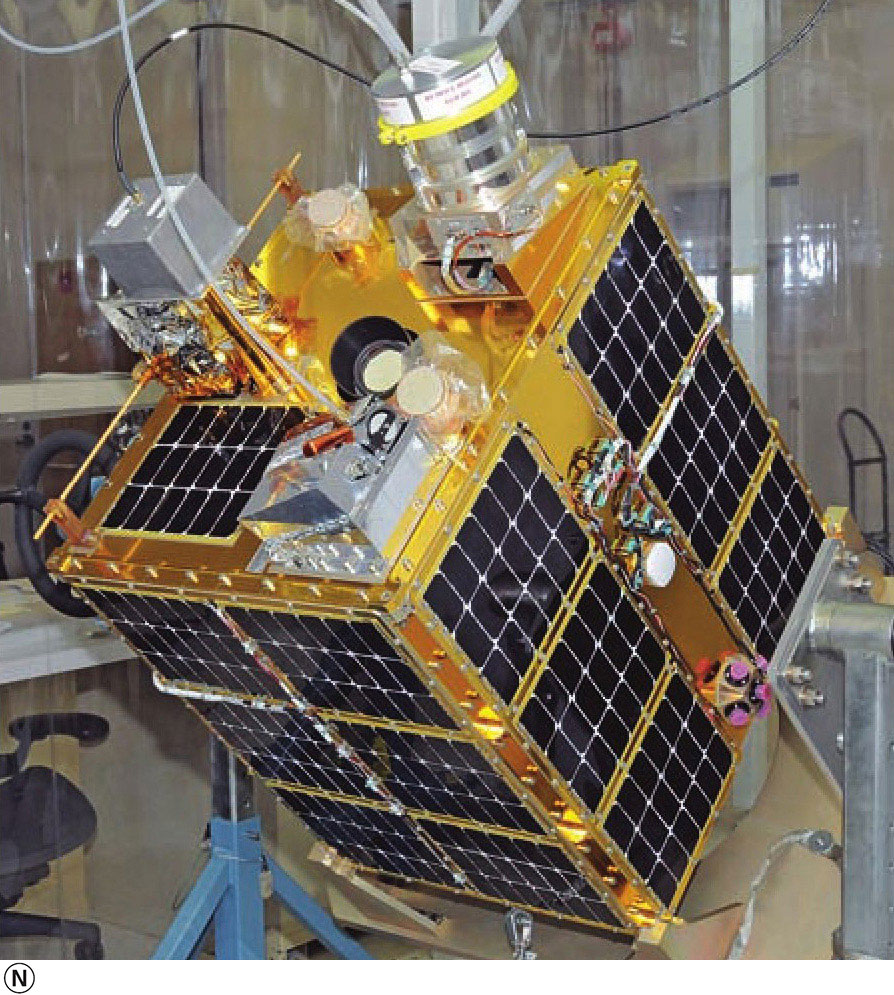
卫星星体外面的金银外衣是用于保温的

卫星的热控制方法有被动式和主动式两种。被动式热控制可采用多层隔热、涂层和热管等方法，主动式热控制可采用百叶窗、电加热器、流体循环换热等方法。

被动式热控制是依靠选取不同的热控材料，合理地组织卫星内外的热量交换过程。其优点是不需要消耗能量，只要在卫星的内外表面及仪器设备上采取相应的措施就能达到热控制的目的。

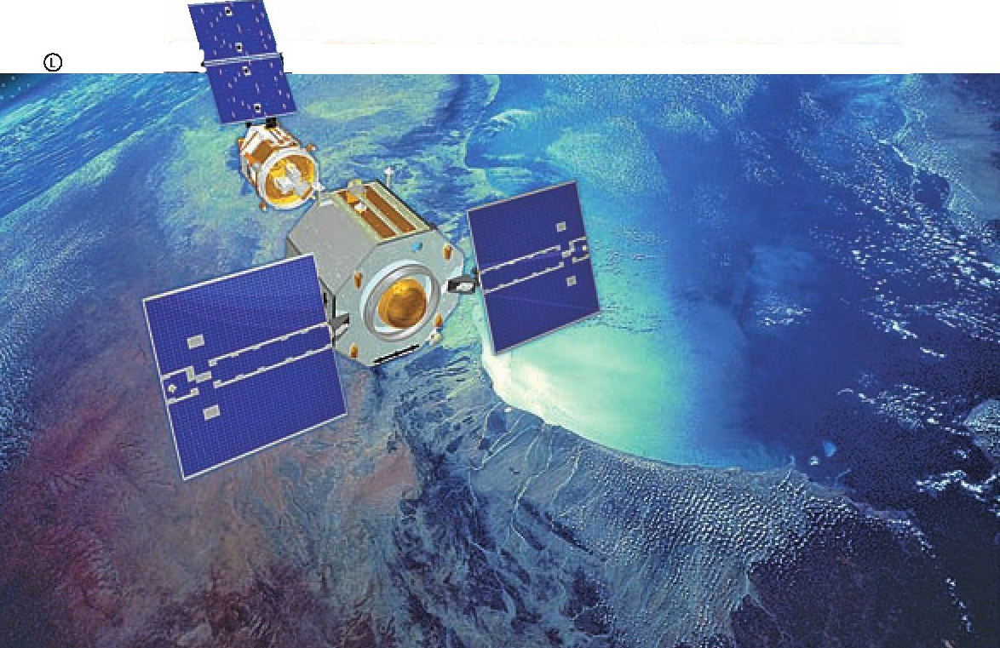
美国已经开始试验，发送低成本航天器对更昂贵的故障卫星进行修复和燃料补给

用多层隔热材料把需要保温的仪器包扎起来是最简单的被动式热控方法。这种材料由多层镀铝聚酯薄膜构成。喷涂法是在卫星外表的不同方位喷涂上白漆、三氧化二铝等低吸收辐射比的涂层，使卫星吸收太阳的热量与向外辐射的热量达到平衡，以降低蒙皮温度。也可在卫星表面采取抛光或电镀的办法，来提高它的辐射率。在卫星壳体的内表面通常喷上高辐射率涂层，以增强各部位之间辐射热的交换，改善壳体温度的均匀性。热管能用于把发热量大的仪器的热量传导到不发热的仪器上。

尽管被动式热控制简单、经济、可靠，但其控制精度较低，控制的温度范围有限，本身没有自动调节温度的能力，只适用于一些对温度调节要求比较低、仪器设备发热量不大的卫星。一些对温度调节要求比较高的卫星，还需在被动式热控制的基础上采用主动式热控制。

主动式热控制是用主动加温或降温来达到热量的平衡。例如，在卫星的表面安装能活动的百叶窗。这种百叶窗主要由热敏动作器、叶片和底板组成。当卫星内的温度超过要求的范围时，热敏动作器会受热膨胀，使叶片打开，露出表面涂有高辐射率涂层的底板将热量散出。当卫星内的温度回落到适宜程度时，热敏动作器冷缩，百叶窗又关闭，保持内部热量。

卫星内部用的电加热器结构简单、使用方便、控制精度高，它既可以用于整舱的主动热控制，也能用于个别仪器的温度调节，但它要消耗卫星上的宝贵电能，所以只限用于能源比较充裕的卫星和温控要求高的仪器上。

流体循环换热主要用于发热量大的卫星和载人航天器。它采用一套复杂的流体循环换热装置。其工作原理是在卫星的各个部位和仪器上用热收集器收集热量，然后把收集的热量通过导管中液体的流动带到一个热交换器上，再由热交换器把热量传给热辐射器，最终通过辐射器把热量辐射到空间。

由于卫星上采用了被动、主动，或被动和主动联合工作等温度控制措施，所以保证卫星不会因冷热交替变化而“感冒”。（庞之浩）

## 人造卫星“生病”了怎么办

人造卫星在九霄云外飞行，如果出了故障很难修理，所以要以预防为主。为此，要精心设计，精心施工，始终把可靠性放在第一位，采用科学合理的方案和高质量的航天级元器件，制定多项故障预案和相关对策。比如，对卫星上的关键仪器采用备份设计，当一台关键仪器“生病”时立即自动或由地面通过遥控切换到备份仪器以继续运作。这虽然增加了卫星的质量和复杂性，但是总比整个卫星不能工作而报废要好。卫星的一些重要指令也要采取多种手段发出，以确保执行。

卫星在上天前要进行各种严格的空间环境模拟试验，以发现和排除卫星的隐患和故障。这些试验从挑选元件开始，一直到最后总装成整个卫星都要层层把关，以保证卫星在发射前做到零缺陷、零疑点和零故障。

然而，就像汽车、轮船和飞机甚至家用电器等其他任何产品一样，谁都不可能保证100%不出现故障，何况卫星是由成千上万个零部件组成的复杂系统，需要经受运载火箭发射的严酷环境，还要在恶劣的太空环境中运行，任何一个环节或零部件甚至软件出现故障，都可能导致卫星“瘫痪”，甚至报废。

卫星的“常见病”通常有4种：（1）卫星入轨后太阳翼没有展开；（2）卫星的控制分系统、推进分系统、结构分系统等出现故障；（3）操作失误与软件故障；（4）由于辐射、撞击等空间环境而引发故障。

一般卫星在轨“生病”是很难“治疗”的，尤其是硬件出现问题后，是不可能更换和维修的。不过，也不能一概而论。如果卫星入轨后某一部件出现故障，有时可用其他系统来代替其功效。个别价值连城的低轨道卫星还能进行在轨维修，但代价非常高昂，技术要求也很高。比如，美国曾5次用航天飞机把出现故障的“哈勃”太空望远镜抓回到航天飞机舱内进行在轨修理，然后再释放出去继续工作。美国还曾经用航天飞机把故障卫星带回地面进行大修，然后重新发射。（庞之浩）

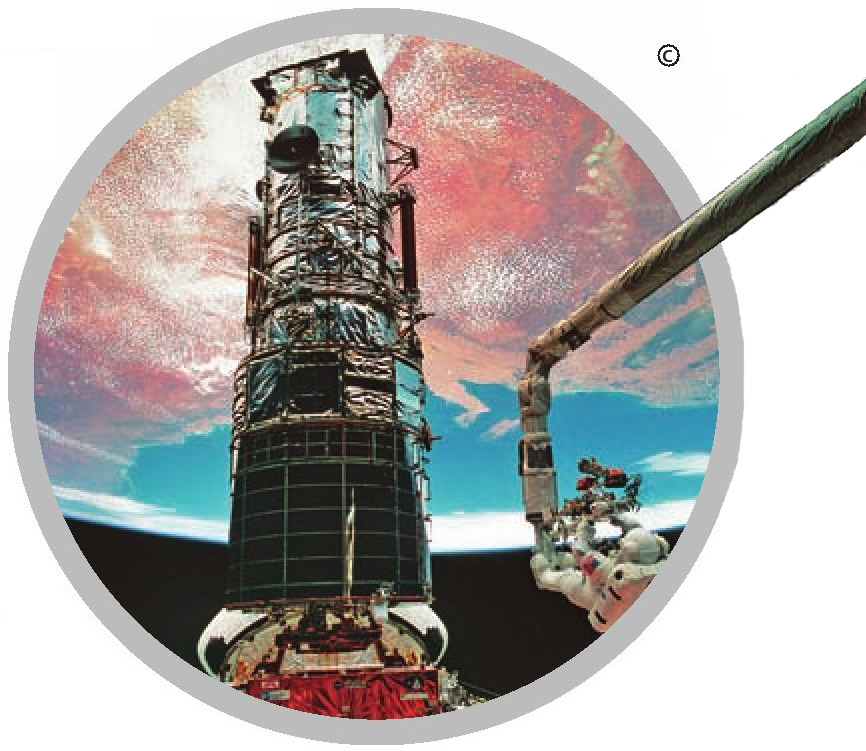
航天员在航天飞机的舱外修理“哈勃”太空望远镜

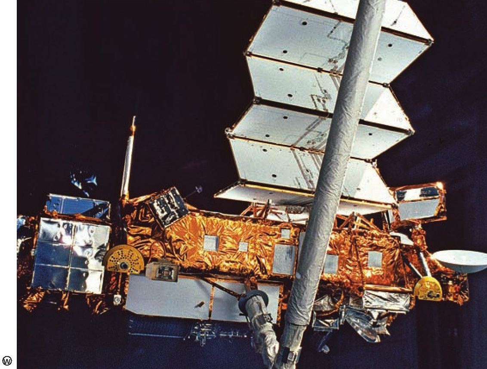
美国“高层大气研究”卫星展开太阳翼

  

【微问题】卫星内的温度一般要保持在什么范围内？

【关键词】卫星的温度控制　卫星故障

## 人造卫星上主要采用什么电源

人造卫星上有许多电子设备，它们都需要用电，所以电源对于卫星来讲必不可少。在出现故障的卫星中，不少是因为电源失灵而造成的。

卫星电源用于产生、存储和变换电能，由发电、电能存储、电源功率调节、电源电压变换等装置组成。随着卫星技术的发展，其电源功率也在不断提高，已从最初的几十瓦增加到十几千瓦。

卫星上的电源有太阳能电池电源、化学电源和核电源等多种。太阳能是一种取之不尽、用之不竭的能源。因此，目前绝大多数卫星都采用太阳能电池。这种电池利用半导体材料的光电效应将太阳能直接转换成电能，能工作几年甚至几十年。早期的卫星是把太阳能电池贴在卫星星体表面，但由于面积较小，所以发电功率不高。现在大多数卫星都把数以万计的太阳能电池片贴在面积很大的板上，然后把整块太阳能电池板安装在卫星星体外面，大大提高了发电功率。

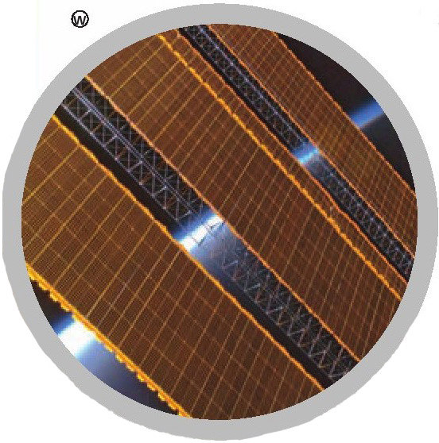
“国际空间站”上的太阳翼

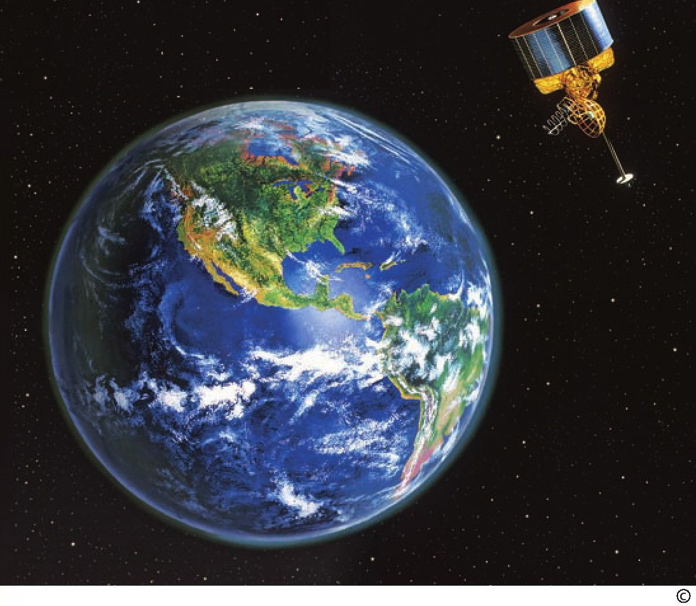
表面贴满了太阳能电池的卫星

早期的太阳能电池片是用半导体硅做成的，现在开始广泛采用砷化镓材料，因为它的光电转换效率高，能达到20%以上。另外，为了进一步增加太阳能电池片数量，中大型卫星多采用由数块太阳能电池板连接而成的太阳翼。由于太大，火箭装不下，所以在发射时太阳翼处于折叠状态，待卫星与火箭分离后再展开。为了使卫星上的太阳翼总是朝向太阳，以获取最大的电能，不少卫星上的太阳翼采用了一些先进技术：一是装有驱动机构，带着太阳翼转动；二是用太阳敏感器来捕获太阳的方位，从而控制驱动机构转动太阳翼，使太阳光尽可能垂直于太阳翼，为卫星提供充足的能源。（庞之浩）

## 人造卫星上有化学电池吗

人造卫星的太阳能电池阵具有寿命长、重量轻的优点。但太阳能电池阵必须在太阳光的照射下才能有效，那么当卫星进入地球的阴影区，太阳照不到卫星上的太阳能电池阵时怎么办呢？可以把太阳能电池阵与蓄电池组一起组成太阳能电池阵-蓄电池组电源。当卫星飞到日照区时，太阳能电池阵一方面给卫星上的设备供电，另一方面向蓄电池组充电，把电能储存起来；当卫星飞到阴影区时，由蓄电池给卫星上的设备供电。

这些蓄电池都是化学电池，有不少种类，如镉镍电池和锂电池，其性能主要用比能量的大小来衡量。所谓比能量就是单位重量的电池能够产生的电能。电池的比能量越高性能就越好。镉镍电池的比能量为55瓦时/千克，锂电池的比能量为200～500瓦时/千克，因此锂电池前景更广阔。

卫星上有时也用燃料电池，即把贮存在燃料中的化学能经过化学反应转变成电能。比如，利用氢和氧的“燃烧”来产生热能发电的氢氧燃料电池。

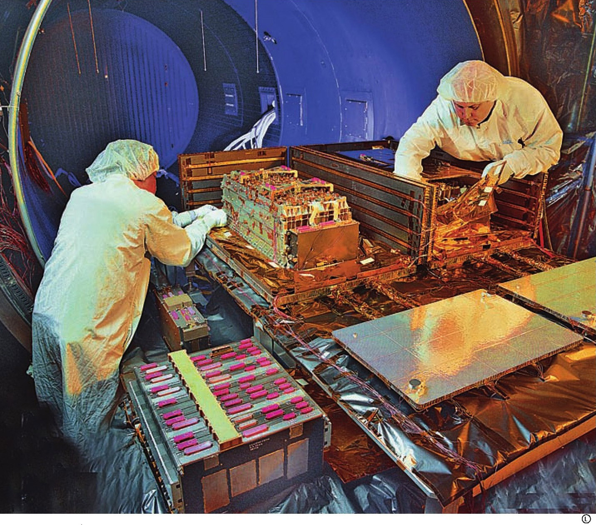
卫星锂电池

总的来讲，不管使用何种蓄电池，它们的比能量都比较低，且寿命受到重量的限制，不能太长。（庞之浩）

## 为什么目前人造卫星很少使用核电源

目前，全球已建立了多座核电站。那么，在人造卫星上能否使用核电源呢？按理说是可以的。核电源是一种将放射性同位素蜕变或核裂变时所释放的热能，通过热电转换器件转换成电能的发电装置。使用核电源能克服太阳能电池、化学电池各自的不足。与太阳能电池阵-蓄电池组电源相比，空间核电源的主要优势是：单位质量功率大、成本低；不依赖太阳能；不受尘埃、高温和辐射等因素影响，环境适应能力和生存能力强。由于采用核电源的卫星外部没有大面积太阳能电池阵，所以卫星在低轨道飞行时受太空中残存大气阻力影响也较小。

卫星上用的核电源，主要由热源、热电转换装置和散热器等组成。其中，热源有放射性同位素源和核反应堆两种，热电转换装置有温差热电偶和热离子二极管等多种，用不同的热源、热电转换装置能组成不同种类的核电源。目前，已进入实用阶段的有放射性同位素温差发电器、核反应堆热离子发电器两种。前者发电功率为几十瓦至几百瓦，后者发电功率为几千瓦至数十千瓦。

俗话说，人无完人，金无足赤。核电源也不例外，它有一些明显的缺陷。比如，在卫星上使用核电源时，要求对卫星上的仪器设备采用辐射屏蔽措施，这样就增大了卫星质量。另外，核电源价格昂贵。最大的障碍是不安全，如果采用核电源的卫星发生故障而坠毁，会对大气和地面造成污染。1978年1月24日，苏联“宇宙954号”核动力卫星发生故障而自然陨落，结果未燃尽的带有放射性的卫星碎片散落在加拿大境内，造成严重的污染和巨大的恐慌。所以，目前核电源已不再用于人造卫星，因为现代化的太阳能电池阵-蓄电池组电源已能满足各种人造卫星的需求。核电源目前主要用在远离地球的火星、木星、土星等深空探测器上。（庞之浩）

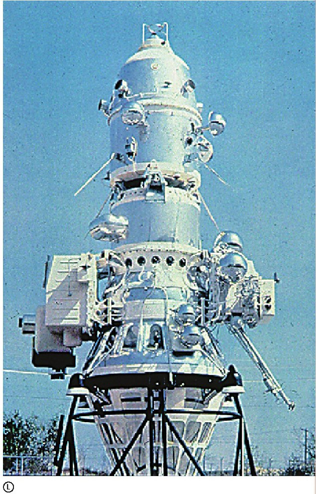
苏联“宇宙954号”核动力卫星

  

【微问题】日常生活中，哪些电器用的是锂电池？

【关键词】卫星电源系统　太阳能电池　化学电池　核电源

## 航天器的研制过程是怎样的

目前，人类已发明了3种用于探索开发和利用太空的航天器，即人造地球卫星、载人航天器和空间探测器。它们虽然千姿百态，各不相同，但研制过程和结构都很复杂。不过，其研制过程大致相同，一般需经历技术研究（又称概念研究）、方案论证、初样研制和正样研制4个阶段。

技术研究是在航天器正式开展工程研制前进行的，主要是根据航天器用户的需求并预测航天器的发展趋势，提出所要研制航天器的总体技术性能指标。

方案论证是在航天器研制任务正式下达或立项之后进入工程研制的第一步。这个阶段的主要工作是根据研制任务书确定的航天器性能指标和使用要求，结合材料、元器件和工艺技术水平等条件，选出一个整体优化的总体方案。

初样研制是指研制出能进行地面试验的航天器工程样机，包括电性航天器、温控航天器和结构航天器等。其主要工作是根据方案设计确定的总体方案及分系统初样设计任务书的要求，对各系统进行设计、计算。航天器制造厂要编制出正规的工艺生产文件，装备保证产品制造质量必需的工装夹具，并组织试制生产，生产出可以进行各项地面试验的工程样机。

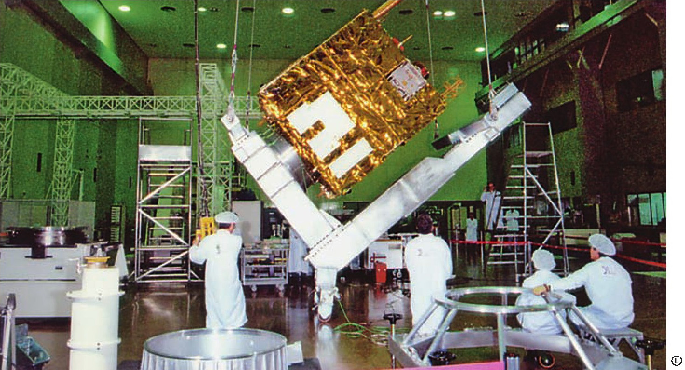
研制中的“资源一号”正样卫星

正样研制是指研制出最终上天的航天器（常称为“正样”）。当制造出正式的产品后，要进行一系列鉴定试验和验收试验等。当一切达到正样研制任务的要求后就可以准备发射了。（庞之浩）

## 为什么航天器在上天前要进行环境模拟试验

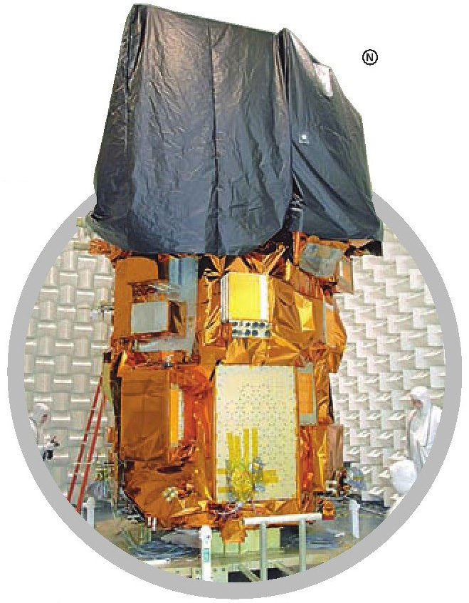
电磁兼容性试验

航天器出厂后要经过运输、发射、入轨和轨道运行等阶段，经受各种不利甚至严酷环境的影响和作用。例如，在发射过程中，在强大推力作用下航天器会受到剧烈的冲击、振动噪声和气动加热；进入轨道后，航天器又要经受严酷的高真空、高低温度交变、失重、空间粒子辐射甚至微流星体撞击。

另外，由于研制成本高、研制周期长、生产数量少，而且上天后如果出现了问题极难补救，所以要求航天器有很高的可靠性。因此，航天器发射前一定要进行地面环境模拟试验，以此检验航天器的性能，看它在严酷的发射环境和轨道运行环境条件下能否可靠地工作。航天器的环境模拟试验主要有5个方面。

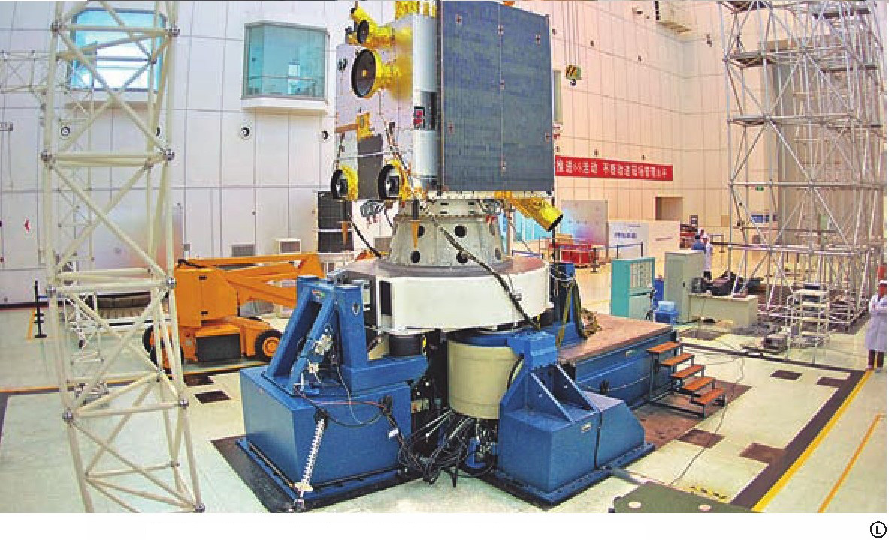
“嫦娥一号”月球探测卫星进行振动试验

（1）振动试验　它主要模拟航天器在发射阶段和返回阶段所经受的振动环境。它是把航天器固定在巨大的振动试验台上，航天器的各个典型部位都安装传感器，用来测量航天器各点的振动量级的大小。一旦加电工作，振动台就带动航天器一起振动，发出的声音像一头雄狮在怒吼，振动的频率由低向高不断地增加。通过这样的考验，不管是设计问题，还是工艺问题，或者是装配质量问题，哪怕是一个焊点松动或一个螺丝钉没有拧紧，都会在这种振动面前原形毕露。

（2）冲击试验　它主要模拟运载火箭发动机和航天器发动机点火工作、航天器与火箭分离或火箭级间分离对航天器产生的冲击。这种试验常用跌落式或撞击式冲击台进行，冲击加速度常达到地面重力加速度的几百倍甚至上千倍；也可用爆炸产生振荡型冲击，用真实火工品模拟爆炸螺栓分离解锁时的冲击；还可用振动台模拟合成冲击谱或瞬态冲击波。

（3）噪声试验　它是模拟航天器发射时运载火箭发动机工作时产生的噪声和与大气的摩擦而产生的气动噪声。

（4）加速度试验　它是模拟航天器发射时航天器经受的过载，即承受的加速度。这种试验大多在离心机上完成。

（5）真空试验　它是模拟航天器在轨道上的运行环境，包括空间的高真空、深冷温度和高低温度交变。在地面创造出真空的环境需用真空罐。真空罐内壁铺设了通液氮的管子，管内充以液氮后，可使真空罐内的温度降低到-100℃。在其外部有由各种真空泵组成的抽真空系统和测量控制系统。在罐子的一端或侧面有一个既能保证密封又可以开关的盖子，航天器就从这里被放入罐内。同时，在罐内还设有模拟太阳照射的光源。试验一开始，罐子被抽成真空并开始降温，还进行高低温度的交变。航天器在这样的环境中按照工作程序进行连续几天甚至十几天的试验，从而考验航天器及其各种仪器设备在这样的环境条件下能否可靠地工作，达到预期的性能。

此外，还有电磁兼容性试验、空间粒子辐照试验等。不过，随着科技的不断发展，现在很多环境模拟试验可以用计算机模拟进行，从而大大节省了人力、物力和财力。（庞之浩）

## 航天器总装时对厂房有什么特殊要求

航天器总装就是把航天器所有的仪器设备可靠地固定到所要求的星上位置，通过电缆和导管将它们连接起来，形成满足上天后要求的整体，保证航天器在发射进入轨道后可以正常工作。

在航天器总装中，对总装厂房有较高的要求。例如，为了保证航天器质量，一般航天器总装大厅操作区的环境要求为：温度15～25℃，相对湿度40%～60%，空气洁净度优于100 000级，照明度100～300勒，噪声小于60分贝。（庞之浩）

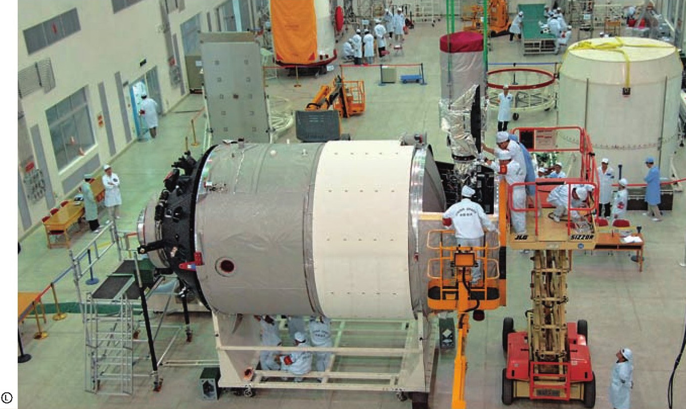
装配“天宫一号”目标飞行器实验舱

  

【微问题】除了航天器，还有哪些我们熟悉的交通工具也会面临气动噪声的问题？

【关键词】航天器　环境模拟试验　总装厂房

## 为什么太空中存在垃圾

太空垃圾，技术上称为空间碎片，是人类太空活动的废弃物，也是太空环境的主要污染源。机构间空间碎片协调委员会对空间碎片的定义是：“空间碎片是指轨道上的或重返大气层的无功能人造物体，包括其残块和组件。”

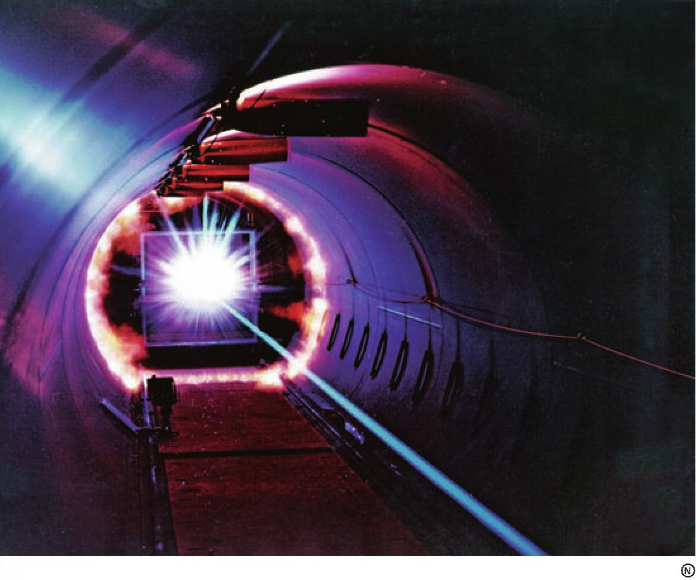
研究航天器被太空垃圾击中的地面模拟实验

太空垃圾的来源多样。1957年，人类第一颗人造卫星进入太空以来，世界各国已经发射了6000多个人造地球卫星、载人航天器、空间探测器等航天器。有些航天器（主要是部分人造卫星）在完成任务后继续滞留在绕地轨道，变成了太空垃圾，威胁着其他航天器的安全。载人航天活动也会产生一些垃圾，如丢弃的摄像机、工具、航天服手套等。

与航天器数目增加相对应的是，太空垃圾的数量以每年2%～5%的速度递增。据美国太空监控网络分析，直径大于10厘米的太空垃圾中有17%是火箭助推器，31%是已经废弃的卫星，38%是撞击留下的碎片，还有13%来自其他各种太空任务的残存物，它们总质量达5500吨。

大部分的太空垃圾来自燃料箱爆炸：留在轨道中的火箭上面级或卫星的液体燃料箱常常会因为内部压力而炸成碎片。2009年2月，美国通信卫星“铱星33号”与俄罗斯一颗已报废的军事通信卫星在太空中相撞。这是人类历史上首次卫星相撞事故，产生了数千块碎片。那颗1吨的俄罗斯报废卫星，也可以看作是一块巨大的太空垃圾。

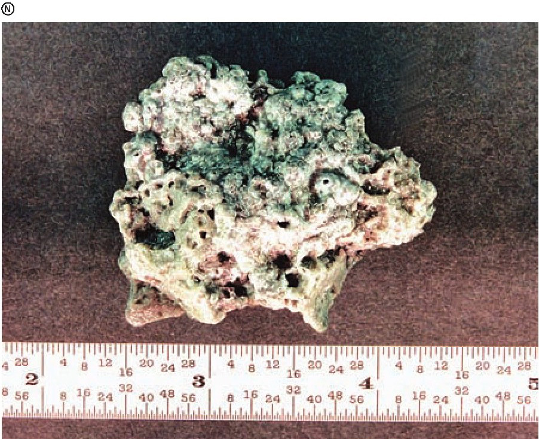
厘米级的太空垃圾

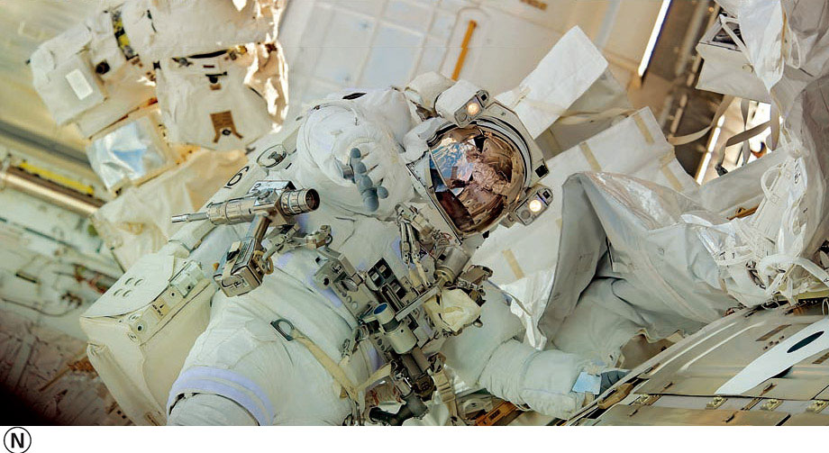
舱外航天服能保护航天员免受太空碎片的伤害

技术试验也曾造成太空垃圾。美国曾于1963年5月实施“西福特计划”，把3.5亿枚细小铜针散播在3650千米高的轨道上，形成人工的环状针云并进行了无线电反射通信试验。美国原以为在太阳辐射压力的作用下，这些铜针会在3年内离开轨道。但事实上直到现在仍有相当数目的铜针残留在轨道上，偶然才会返回大气层，这对航天器形成了不小的威胁。由于“针雾”影响了天文观测，当时英国皇家天文学会为此进行了抗议；苏联的《真理报》也以“美国玷污了宇宙”为题进行了批评。这次事件最终被提交到联合国，并对1967年的联合国《外层空间条约》有关条款的制定造成了影响。

太空垃圾的数量不是一成不变的。它们在不断落入大气层的同时，也会互相撞击、分裂成更多碎片。计算机模拟显示，即使人类从现在开始不发射任何航天器，太空垃圾的数量在2055年之前会保持稳定，但之后则呈上升趋势，在未来两个世纪里，直径大于10厘米的太空垃圾数量也将从目前的9000块增加到11 000块。（赵洋）

## 太空垃圾有什么危害

在航天史上，太空垃圾已经造成了一些事故。虽然后果不严重，但引起了人们的高度重视。

1983年，“挑战者号”航天飞机与一块直径0.2毫米的涂料碎片相撞，导致舷窗划伤，只好提前返回地球。1986年，欧洲航天局的“阿里安”火箭进入轨道之后不久便爆炸，形成了564块约10厘米大小的残骸和2300块小碎片。这些垃圾后来直接造成两颗日本通信卫星失灵。1991年9月15日，美国“发现号”航天飞机与苏联的火箭残骸之间距离一度仅为2.74千米。为避免可能的碰撞，地面指挥系统警告让航天飞机拉开与残骸的距离。

太空垃圾在太空中以6～7千米/秒的速度运行，航天器同样也在高速运动，它们之间相对速度可能达到10千米/秒。因此，很小的一块太空垃圾都足以给人造卫星或者载人飞船造成巨大损伤。一块质量10克的太空垃圾与人造卫星相撞，卫星会在瞬间被打穿或击毁。如果撞上的是载人飞船，后果更是不堪设想。

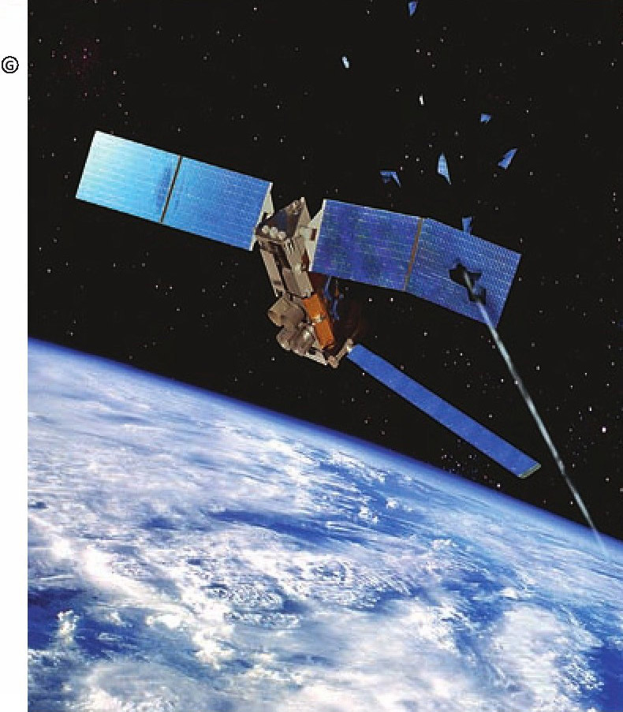
太空垃圾会损坏卫星

为了研究太空中的微流星体和太空垃圾可能对航天器造成的危害，1984年4月，“挑战者号”航天飞机将圆柱形的“长期暴露装置”释放到近地轨道，其用途之一是检测微流星体和太空垃圾撞击的影响。1990年1月，该装置被回收。检查发现，其表面仅肉眼可见的撞击凹痕就超过32 000个，最大凹痕直径达0.5厘米，相当于每天被撞击15次，每绕地球一周就被撞击一次。（赵洋）

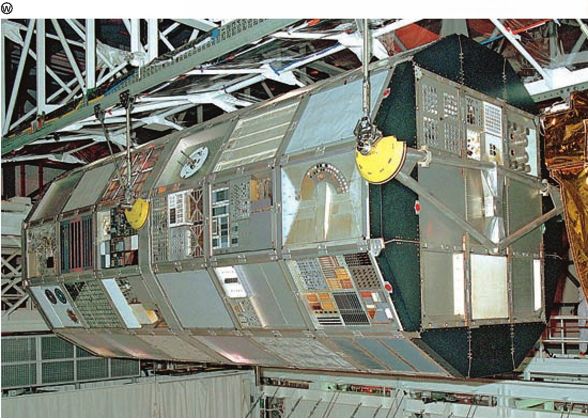
“长期暴露装置”

  

【微问题】那些毫米级、微米级的太空垃圾，会对航天器造成什么危害？

【关键词】太空垃圾的来源　太空垃圾的危害

## 怎样发现太空垃圾

“发现”太空垃圾，意味着要查明其轨道，并预测其将来所处的位置。这个工作可以由地面上的光学望远镜或雷达配合计算机完成。

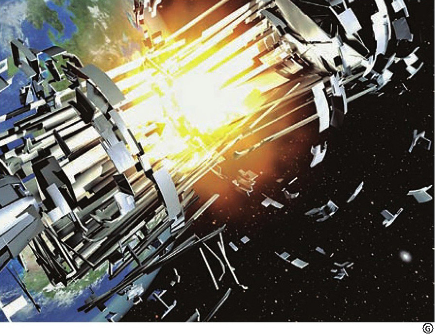
废弃卫星形成的碎片会成为太空垃圾

首先，测量出太空垃圾当前的位置和速度参数，然后根据这些数据推算出它的轨道参数，再计算出太空垃圾以后各个时刻所处的位置。将这个位置与需躲避航天器的轨道位置进行比较，计算碰撞概率。如果碰撞概率足够大，就需要采取措施，改变航天器轨道了。

1961年，美国的“太空篱笆”太空物体跟踪系统投入使用。这个系统包括3个雷达发射站和6个接收站，它发射的持续无线电波能像篱笆一样梳理地球轨道上体积大于篮球的物体。该系统每月进行500万次探测，每天可以探测1万个太空物体，并同时跟踪200个近地目标。所有的监测数据都由美国空军太空司令部首先处理，不保密部分才通过美国航空航天局的网站公开发布。只要直径在10厘米以上的太空物体，美国空军太空司令部就把它们编号监控。但百密一疏，仍有“漏网之鱼”存在。例如，对于美俄卫星相撞事故，美国国防部发言人就承认，是计算“铱星”轨道时的错误导致了事故的发生。

2005年，中国也成立了中国科学院空间目标与碎片观测研究中心。该中心的任务包括：建立太空碎片数据库；对已发现的太空垃圾进行实时跟踪监测；搜索尚未被发现的太空垃圾；对航天器发射和在轨运行时可能碰撞的太空碎片进行预警技术研究，并建立风险评估体系。中国在执行载人航天、“嫦娥一号”以及多个应用卫星任务时，都根据太空垃圾情况安排了稳妥的发射窗口和在轨碰撞预警。（赵洋）

## 如何应对微小太空垃圾的威胁

轨道上还存在大量毫米级和微米级的太空垃圾，用现有手段很难监控。但它们对高速飞行的航天器造成的威胁也不可小觑。毫米级太空垃圾有可能穿透数毫米厚的舱壁，微米级太空垃圾会降低光学镜头成像质量。

对于这些难以观测到的太空垃圾，可采取加固航天器的办法进行防护，使航天器“增强体质”：可以通过优选表面材料、改变表面结构和增加厚度来提高抵御碎片撞击的能力；也可以给航天器“穿防弹衣”，在航天器外增加屏障，降低太空垃圾的撞击损害；还可以让航天器“深藏不露”，把脆弱怕撞击的关键部件安置在航天器内部。通过这几种手段的综合运用，可大大提高航天器抵抗微小太空垃圾撞击的能力。（赵洋）

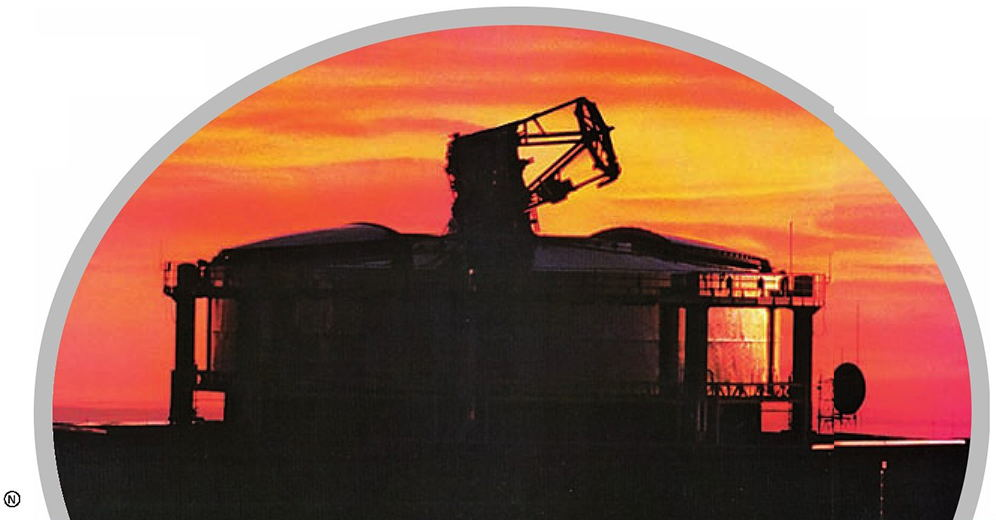
位于美国夏威夷毛伊岛的用于监测太空垃圾的望远镜

## 如何清理太空垃圾

为保护太空环境，减少太空垃圾对航天器的威胁，有识之士一直在研究清理太空垃圾的办法。

对于仍能控制的报废航天器，焚烧处理是一种比较常用的解决方案。例如，“国际空间站”上的航天员曾特意将废弃氨水罐抛入大气层焚毁。这种技术同样适用于寿命已尽的人造卫星。人造卫星工作寿命终止后，可以用推力器使其减速，降低轨道高度，最后重新进入大气层自行焚毁。另一种解决办法是让即将报废的人造卫星利用自身推力器飞到一条更高的轨道上，那里运行的航天器寥寥无几，因此发生撞击的可能性也大大降低。

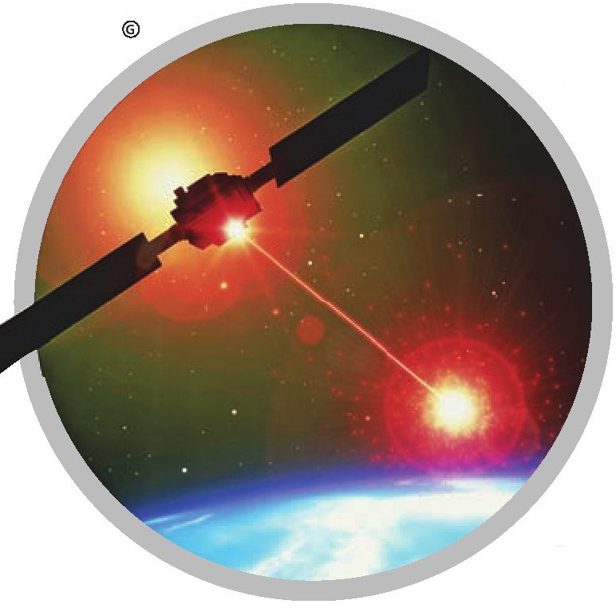
“激光扫帚”示意图

对于太空垃圾，清除与回收的方法有多种：“激光扫帚”是用激光产生的光压推开微小碎片，或用热量气化太空碎片，适合清除直径1～10厘米的太空垃圾；“太空垃圾网”是用高强度纤维编织的网络拦截太空碎片；“机器清洁工”则是用带有机械臂的卫星机动到大块太空碎片附近，然后抓住该碎片；“自杀式清扫”就是发射航天器与大块太空碎片“对接”，使其速度降低，变轨至低轨道，进入大气层焚毁。

美国一家公司曾建议开发一种名为“太空牧羊犬”的装置，把太空垃圾逐个清出轨道：太阳能飞船上装备有数个“牧羊犬”般的小型飞船，小飞船围绕太空垃圾飞行并寻找合适的对接点，一旦与太空垃圾连接就将其拖回大气层。每次小飞船都可以捕捉相当于自身质量数倍的太空垃圾。这听起来就像用牧羊犬围拢羊群一样简单，但目前技术尚难达到。

还有一种办法是给太空垃圾插上“翅膀”，让它们自己飞回地球。英国萨里大学的科学家公布过一种“立方帆”设计，可以使较大的太空垃圾脱离轨道。立方帆展开后成为一块5米×5米的塑料薄膜，近地轨道上的稀薄空气分子作用在这层薄膜上，可使其缓缓减速。立方帆将单独发射并且在地面的引导下使用自身的动力来靠近太空垃圾。一旦和太空垃圾对接，它就会张开帆，把太空垃圾拖离轨道，坠向地面。

但以上这些方法大都停留在设想阶段。眼下防范太空垃圾还是以“躲”为主，或者等待它们自己进入大气层烧毁。

当然，所有这些事后处理办法都比不上杜绝制造太空垃圾来得彻底。中国很注重通过技术手段保护太空环境。“长征四号乙”运载火箭的末级火箭加装了剩余推进剂排放系统，使用完毕后不会发生爆炸产生碎片。这成了国际公认的成功案例。“鑫诺二号”卫星和“风云二号”卫星都装有离轨系统，在卫星退役后能依靠剩余动力，飞入离开地球静止轨道300千米的“公墓轨道”，避免干扰其他地球静止轨道卫星的运行。（赵洋）

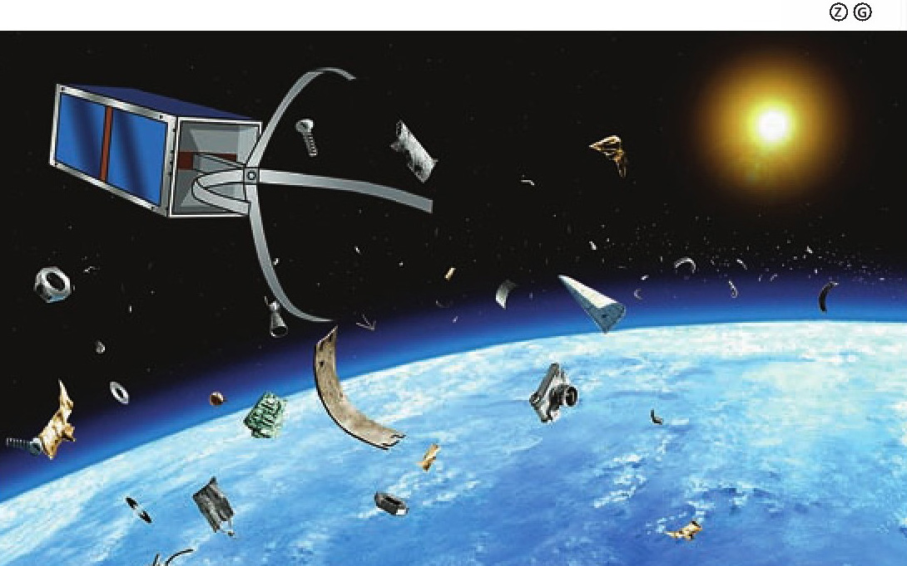
  

**【微博士】**月球周围的太空垃圾

有专家认为，人类探测月球也应该考虑月球周围的太空垃圾问题。这些围绕月球运转的碎片会对未来的无人探月计划和载人登月计划构成威胁。它们都是人类月球探测的副产品，由各种航天器的碎片构成。因为月球引力场不均匀，这些碎片有可能冲出本来的轨道，高速撞向月球表面。这不但会对登月航天员的安全构成威胁，也可能破坏具有历史纪念意义的“阿波罗”飞船着陆点。留在月球表面的探测器残骸越来越多，也会破坏月面的真实环境。

【微问题】你有什么好方法，可以去除太空垃圾？

【关键词】太空垃圾监测　太空垃圾清理

# 载人航天器

## 苏联的“航天之父”是谁

1957年10月4日，苏联发射了第一颗人造卫星，人类从此进入了太空时代。1961年4月12日，苏联航天员加加林乘坐“东方1号”飞船进入地球轨道，成为第一个进入太空的航天员。为什么苏联能够在与美国的太空竞赛中屡屡领先？这离不开苏联“航天之父”——科罗廖夫的巨大贡献。

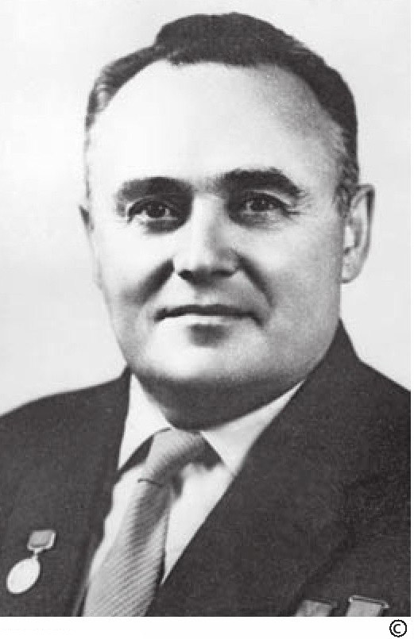
科罗廖夫

科罗廖夫是苏联航天的总设计师，20世纪航天事业先驱之一。他1907年1月出生于乌克兰古城日托米尔，16岁时加入了飞行协会，后来又考入基辅工学院机械系，学习滑翔机制造，成为苏联最优秀的设计师。1929年，科罗廖夫见到航天奠基人齐奥尔科夫斯基，构建了乘坐火箭遨游太空的梦想。

1930年，科罗廖夫开始研制火箭发动机，两年后成为反作用运动研究小组的负责人，他成功地把从事喷气发动机研究和愿意为星际飞行做准备的人组织在一起。1933年，他发射成功了第一枚液体燃料火箭。1938年，科罗廖夫受大清洗牵连被判重刑，押赴西伯利亚服刑。在同样身为囚犯的导师图波列夫求情下，他们得以在监狱中设计了苏联第一代导弹和中程导弹，直到1944年获释。第二次世界大战中，科罗廖夫萌生了在飞机上安装喷气发动机作为推进器的想法，设计成功了火箭飞机。著名的“喀秋莎”火箭炮也是科罗廖夫领导设计的。

第二次世界大战后，美国通过“回形针行动”抢走了德国V-2火箭的大批资料和技术专家，苏联仅得到了些“残羹剩饭”。科罗廖夫随军队到德国接收了V-2火箭的相关资料，了解到德国在火箭研究方面已经领先。

1954年，科罗廖夫当选为苏联科学院通讯院士。他提出了利用运载火箭飞向太空的必要性，指出发射人造卫星是可行的。第二年，他又提出了进行宇宙飞行的设想，指出“制造人造地球卫星和进行载人高空飞行研究星际空间的宇宙飞船日趋现实”。当时，苏联已经获悉美国也正在准备发射人造卫星。科罗廖夫根据齐奥尔科夫斯基的理论，知道必须利用多级火箭才能升入太空。

1957年8月，科罗廖夫主持研究成功了R-7洲际弹道导弹，它利用的是捆绑式二级火箭。同年10月4日，苏联利用R-7成功发射了第一颗人造卫星，震惊了整个世界。（付中梁）

  

**【科学人】**科罗廖夫

谢尔盖·科罗廖夫（1907—1966）是苏联著名航天专家，火箭和卫星工程的主要负责人。第一艘载人飞船、第一个月球探测器、第一个金星探测器、第一个火星探测器和第一次太空行走等工程都和科罗廖夫有关，他被公认为是苏联的“航天之父”。在他去世后，苏联政府把加里宁格勒改名为科罗廖夫，以纪念这位伟大的航天专家。

## 第一位航天员是怎么飞上太空的

成功发射第一颗人造卫星之后，在科罗廖夫领导下，苏联航天继续取得骄人的成就。1959年1月2日，苏联发射了“月球1号”探测器。它飞越月球后，成了太阳系第一颗人造行星。1959年10月，苏联的“月球3号”拍摄了月球背面照片，清晰地记录下月球表面498个撞击坑，其中有400个是从地球上用望远镜看不到的。人类第一次看到了月球背面的情形。

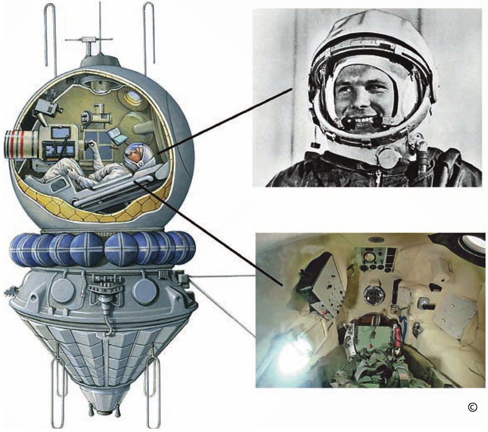
加加林和他乘坐的“东方1号”

科罗廖夫还建议成立国家宇航委员会，训练航天员，准备将载人飞船送入地球卫星轨道。在载人飞行之前，苏联先进行了几次动物搭载实验。

1960年春季的一天，科罗廖夫第一次会见未来航天员——全体20名队员。他并没有过多地描述人在太空中漫步的惬意，而是讲到工作的复杂性和种种困难。他说：“我同你们从事了一项重要的，也可以说是勇敢的事业。第一颗人造地球卫星已经叩开了宇宙之门。现在是实现人飞向宇宙的问题。正如你们所知，我从单座宇宙飞船起步。你们中间将有人成为第一个飞向宇宙的人，去准备吧！不要吝惜气力和时间……你们是最新技术的实验者。命运的安排正是如此，我们将有幸成为未知的宇宙世界的第一批行人。”

“东方号”系列飞船由科罗廖夫和克里莫夫共同完成，是苏联最早的载人飞船系列。“东方号”飞船只能乘坐一名航天员，其座舱里面安装了弹射座椅、无线电、导航等仪器设备。座舱后面是仪器舱，安装了化学电池、返回反推火箭和其他辅助设备。最后面的圆柱体，就是末级运载火箭。在座舱上面，有3个舷窗，可以用来观察外面的景物。座舱里还有氧气、水等航天员生活必需品。“东方号”携带的物品可供航天员10昼夜生活使用。

1961年4月12日，莫斯科时间上午9时07分，加加林乘坐“东方1号”飞船从拜科努尔发射场起飞，在轨道上绕地球一周，历时1小时48分钟，于上午10时55分安全返回，完成了世界上首次载人航天飞行，实现了人类进入太空的愿望。（付中梁）

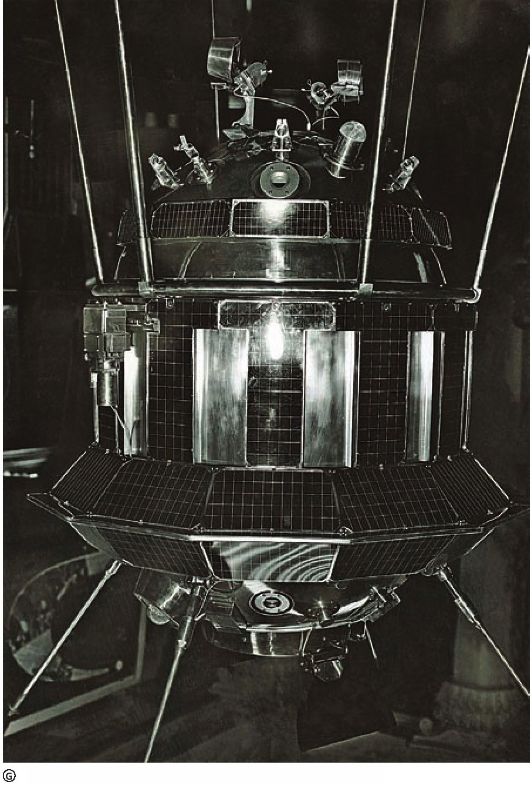
“月球3号”探测器

  

**【微博士】**第一颗人造卫星

第一颗人造卫星由苏联科学家科罗廖夫担任总设计师研制，它的本体是一只用铝合金做成的圆球，直径58厘米，质量83.6千克。它的轨道距离地面最远时为939千米，最近时为215千米，96.2分钟绕地球一周。这颗人造卫星在天空中运行了92天后，坠入大气层焚毁。

【微问题】美国的第一艘载人飞船是什么时候进入太空的？

【关键词】科罗廖夫　“东方号”　加加林

## 为什么飞船要在太空进行交会对接

“神舟八号”“神舟九号”“神舟十号”相继与“天宫一号”成功交会对接后，交会对接一时成为很多人关注的话题。为什么航天器要在太空中进行交会对接呢？

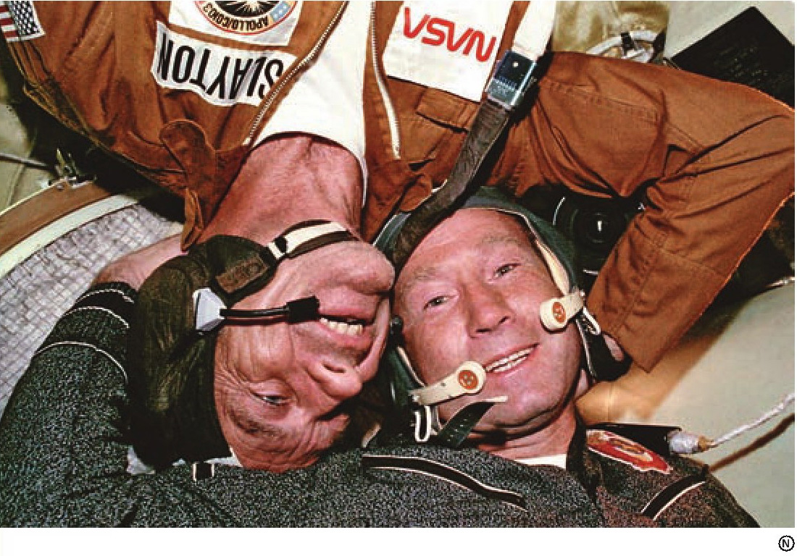
“阿波罗”飞船和“联盟”飞船对接后，两国航天员在太空握手

由于科学研究的需要，空间站的尺寸十分巨大。例如，“国际空间站”由航天员居住舱、实验舱、服务舱、对接过渡舱、桁架、太阳翼等部分组成，长109米，宽（含翼展）73米，总质量约420吨。无论是什么型号的运载火箭，都不可能一次把数百吨的空间站运送到轨道上，所以只能将各舱段分批发射，然后在太空利用交会对接技术搭建起来。所以交会对接技术是建设空间站的基础。

在其他太空活动中，比如为长期在轨道上运行的空间站运送航天员和提供物资补给，或在轨航天器之间的互访、物资转运或紧急救生等，也要用到交会对接技术。在未来的深空探测等航天活动中，交会对接技术同样是不可或缺的。

航天器的交会对接是指两个航天器在空间轨道上会合并在结构上连成一个整体的技术，是实现空间站、航天飞机、太空平台和空间运输系统等的空间装配、回收、补给、维修、航天员交换及营救等在轨服务的先决条件。

在空间交会与对接的两个航天器中，一个称目标飞行器，一般是空间站或其他大型航天器，是准备对接的目标；另一个称追踪飞行器，一般是地面发射的宇宙飞船、航天飞机等，是与目标飞行器对接的航天器。例如“天宫一号”就是目标飞行器，而“神舟十号”就是追踪飞行器。

交会对接时，最主要的困难在于两个航天器都在以7千米每秒以上的速度运行，它们的相对位置和速度都必须精确控制，否则可能会彼此错过甚至追尾碰撞。

航天器执行交会对接，可分成四个步骤：远程导引段、近程导引段、最终逼近段和对接停靠段。在开始的远程导引段，在地面测控的支持下，追踪飞行器经过若干次变轨机动，进入到追踪飞行器上的敏感器能捕获目标飞行器的范围（一般为15～100千米）。在近程导引段，追踪飞行器根据自身的微波和激光敏感器测得的与目标飞行器的相对运动参数，自动引导到目标飞行器附近的初始瞄准点（距目标飞行器0.5～1千米）。进入最终逼近段，追踪飞行器首先捕获目标飞行器的对接轴，对接轴线不沿轨道飞行方向，要求追踪飞行器在轨道平面外进行绕飞机动，以进入对接走廊。此时，两个飞行器之间的距离约100米，相对速度约1～3米/秒。最后的对接停靠段，追踪飞行器利用由摄像敏感器和接近敏感器组成的测量系统精确测量两个飞行器的距离、相对速度和姿态，同时启动小发动机进行机动，使之沿对接走廊向目标最后逼近。在对接前关闭发动机，以0.15～0.18米/秒的停靠速度与目标相撞，最后利用栓-锥式或异体同构周边式对接装置，使两个飞行器在结构上实现硬连接，完成信息传输总线、电源线和流体管线的连接。

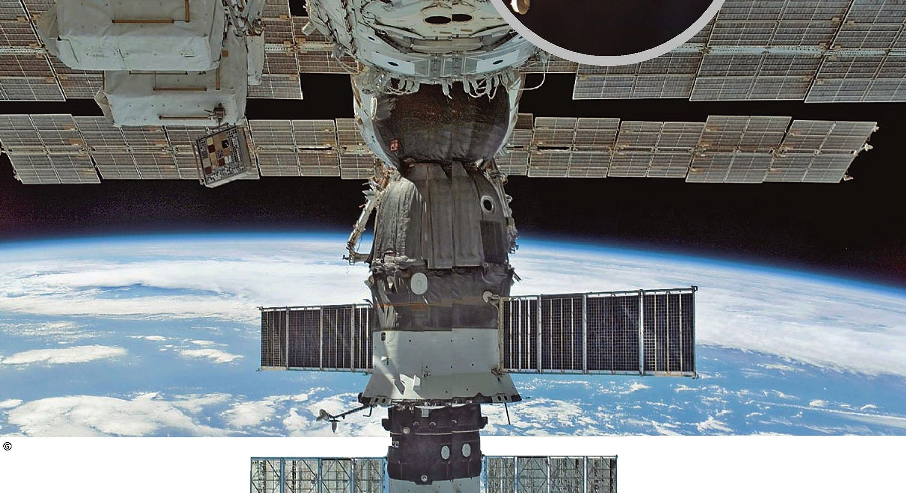
“联盟TMA”飞船与“国际空间站”对接

自20世纪60年代以来，美国、俄罗斯（苏联）、中国、日本等国总共实施了300多次航天器交会对接，其中俄罗斯（苏联）进行的次数最多。目前，完全独立拥有空间交会对接技术的国家有美国、俄罗斯和中国。

1966年3月，美国航天员阿姆斯特朗和斯科特驾驶“双子星座8号”飞船，与经过改装的一个火箭第三级无人舱体，进行了人类历史上首次载人空间交会对接。从1964年到1966年，“双子星座号”系列飞船通过了2次无人和10次载人飞行，验证了多种交会对接方式和技术，为阿波罗探月活动的顺利进行做好了充分准备。美国航天器的交会对接多采用手动方式，这主要全面考虑技术的把握性、安全可靠性和成本经济性等诸多因素。

俄罗斯（苏联）是进行航天器交会对接最多的国家，多采用自动对接技术。1967年，第一次无人航天器自动交会对接就是由苏联的两艘“联盟”飞船完成的。“联盟”飞船至今仍在服役，它和“进步号”货运飞船已经执行过200多次交会对接任务。

与其他任务一样，交会对接也不能保证每次都获得成功。美国交会对接发生过两次故障：一次是“双子星座9号”与“阿金纳”目标飞行器对接时发生故障；另一次是“阿波罗14号”飞往月球过程中，在指令舱与登月舱对接时，由于对接机构材料原因，出现多次对接失败，直到第六次试接才获得成功。俄罗斯交会对接的失败给人们留下深刻印象。1997年6月24日，“进步M-34号”货运飞船脱离“和平号”空间站对接口，飞离了空间站一段距离，次日该飞船飞回来再次逼近空间站时，由于制动控制部件失灵，飞船没有及时对航天员指令做出响应，直接撞到“和平号”的“晶体”舱上。2010年，俄罗斯两艘“进步M号”货运飞船与“国际空间站”进行自动对接时也先后失败，后来采取了改进措施才获得成功。（高云峰）

  

**【微博士】**阿波罗-联盟试验计划

1975年7月，美国和苏联共同执行了阿波罗-联盟试验计划，实现了两国航天器的太空对接。3名美国航天员和2名苏联航天员在太空握手，交换礼物，互访并合作进行科学实验。其间，两艘航天器还曾短暂分离，互换位置并再次对接。这也是历史上第一次由两个国家合作的载人航天任务。

【微问题】连接两个航天器的对接装置主要有哪些类型？

【关键词】交会对接　对接装置

## 为什么飞船能够从太空安全回家

2003年10月15日，中国第一位航天员杨利伟乘坐“神舟五号”载人飞船，在太空飞行了21小时23分钟之后顺利返回地球。飞船返回舱在内蒙古四子王旗着陆。

为什么在太空中高速飞行的载人飞船还能够回到地面呢？这个过程可不像我们坐飞机降落，只要系紧安全带那么简单。飞船返回地面要经历一系列复杂的过程，需要应对与大气高速摩擦产生的高温和振动等一系列问题。

“神舟”飞船在轨道上运行的速度高达7.9千米/秒，要想进入大气层，首先要做的就是制动：制动发动机开始工作，使飞船的轨道高度不断降低，降低到一定高度后，飞船调姿，进入返回姿态，然后返回舱与轨道舱、推进舱分离，开始进入大气层。飞船的减速过程和进入大气层的轨道是经过精确计算的，要求非常精确，必须在特定高度以合适的“再入角”进入大气层。如果再入角过陡，会导致返回舱进入大气层的速度过快，发生剧烈摩擦而烧毁；如果再入角过于平缓，又会像打水漂的瓦片一样被大气层“弹”回外层空间，很可能再也无法返回地面。1965年，首次实现太空行走的苏联航天员列昂诺夫在返航时，就险些错过最佳再入角，幸好及时调整到位，避免了危险。

你一定看到过闪光的流星划过夜空吧！流星之所以闪光，是因为它以很大的角度高速飞入大气层时，和空气摩擦生热而燃烧起来。同样的道理，当飞船进入大气层时，其速度仍达几千米每秒。与越来越稠密的大气层摩擦，会使得飞船外壳的温度达到1000℃以上，普通材料难以承受这样的高温。

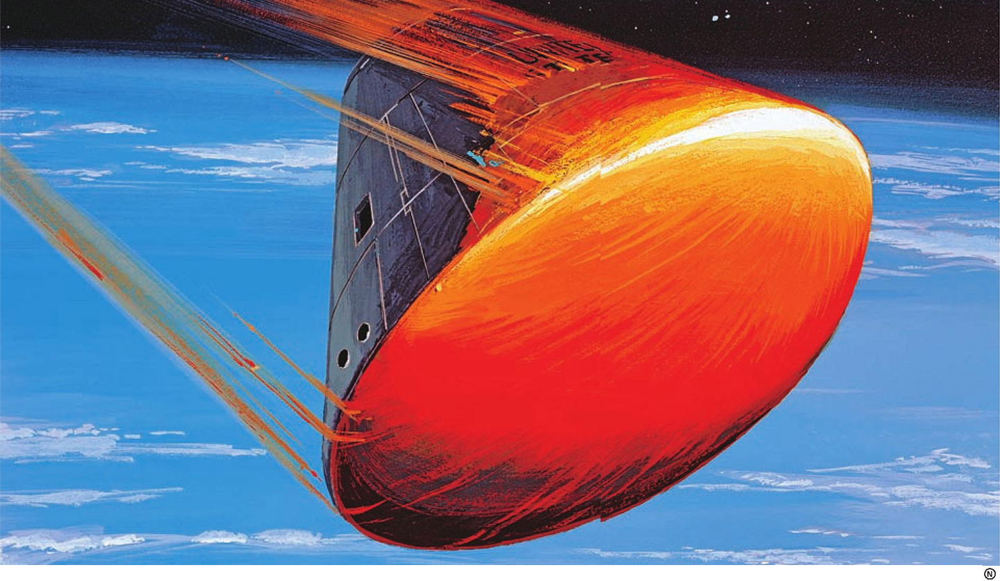
“阿波罗”飞船的指令舱返回地球进入大气层示意图

为了解决这个问题，载人飞船的设计师们采取了一系列的措施。1920年，航天先驱戈达德就提出了双层隔热板的概念。他认为“返回物的表面覆盖一层抗高温（不易变质及难熔解）的物质后盖上一层不太导热的耐高温物质，这样返回物的表面就不会受到太多的侵蚀”。比如，航天飞机机身各处就根据所处环境的不同，配置了4种防热瓦，保护机身温度不致太高。“神舟”系列飞船和俄罗斯的“联盟”系列飞船都是一次性飞船，它们采用的是在返回舱的表面涂上特殊烧蚀材料做成防热层的方法。防热层用的是高分子材料，能在短时间内耐高温。“神舟”飞船采用的是石棉、玻璃与酚醛掺和形成的复合材料，其返回舱表面积有22.4平方米，防热材料总质量约500千克。飞船进入大气层时，防热层表面部分在热流作用下会发生分解、熔化、蒸发、升华等物理和化学变化，带走大量的热，以减少传入飞行器内部的热流。多种防热层可以使返回舱内部最高温度不超过30℃，从而保证航天员平安穿过大气层。

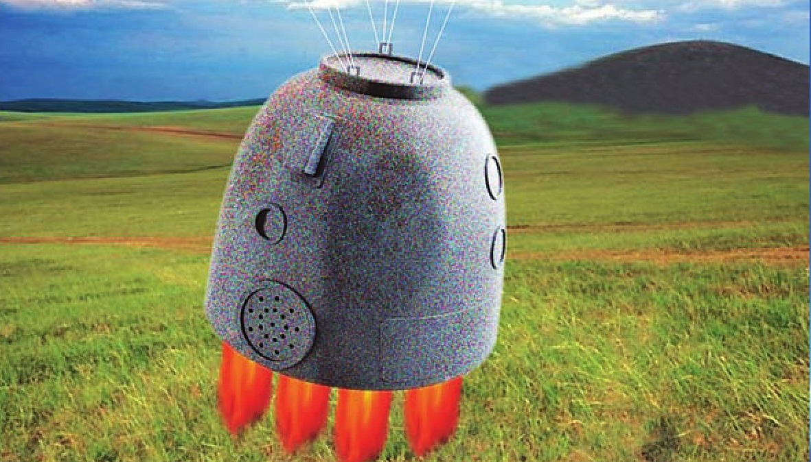
“神舟八号”返回舱即将着陆的瞬间，安装在返回舱底部的4台反推火箭点火工作

控制着陆速度是载人飞船安全回家面对的又一难题。一些科幻电影里陨石撞击地球的场面大家都看过，陨石以极快的速度撞击到地球表面，往往会砸出特别深的一个坑。飞船到了距离地面10千米左右高空时，速度虽然已经降到330米/秒以下，但以这样的速度与地面撞击，飞船和航天员还是承受不了的。

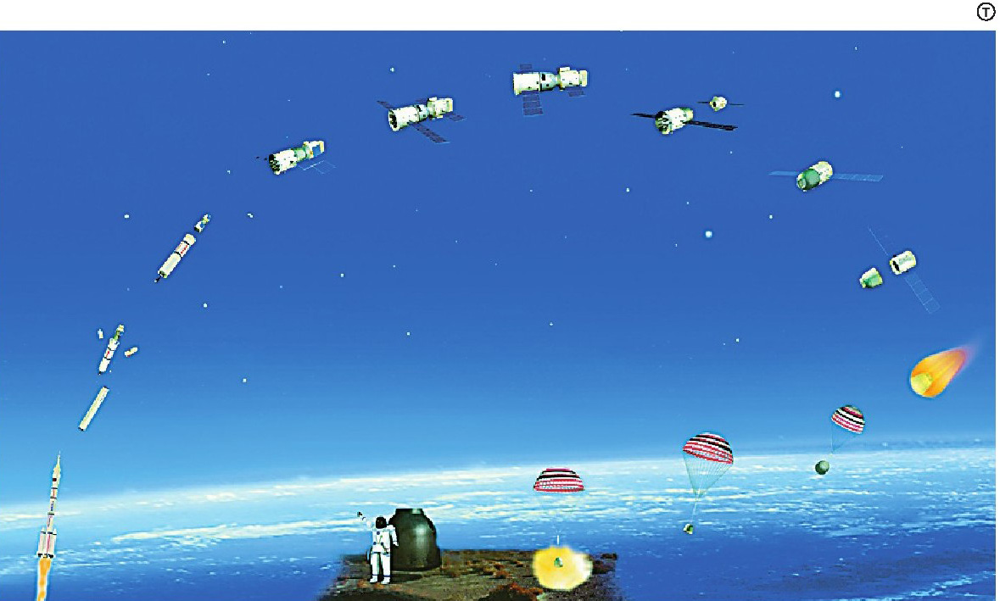
“神舟”飞船飞行全程示意图

怎么办呢？聪明的你一定想到了：采用降落伞。“神舟”飞船是“打着3把伞”回家的，它们分别是引导伞、减速伞和主伞。为什么要设计这么多的伞而不是只有一个主伞呢？这是为了避免“刹车”太急，速度降得太快，产生过高的过载，航天员受不了。返回舱上的静压高度控制器会通过测量大气压力判断高度，自动弹开伞舱盖，3把伞渐次打开，将飞船的速度逐步降下来。“神舟”飞船返回舱的主伞面积有1200平方米，打开后返回舱的降落速度会降到8～10米/秒。

即使这样，“神舟”飞船返回舱在着地时，所产生的冲击力还可能使航天员的脊柱受损。这时就要靠飞船的另一个法宝了。它就是安装在返回舱底部的4台着陆反推火箭。它们会在飞船马上要降落到地面时点火工作，再给返回舱一些向上的推力，使得返回舱落地的速度不超过2米/秒。为了确保航天员的安全，航天员座椅安装了缓冲装置，还量身定做了缓冲坐垫。

有了上述“十八般武艺”，就可以保证返回舱和航天员一起顺利从太空安全返回地球了。

由直升机和车队组成的搜救小组会早早地在预计的着陆地点就位，等待返回舱。返回舱降落伞打开后，直升机会迅速赶过去。万一着陆位置偏差较大，返回舱会向外发射救援信号，通知搜救小组确切位置。返回舱落地后，其顶端的闪光灯不断发出白色的闪光，它能连续闪光25小时呢。假如落在海里，飞船上配备的染色剂会把周围的海域染成绿色荧光区，便于飞机搜索。（闫洁　田坤黉）

  

**【微博士】** 进入大气层

人造或自然的物体从外层空间进入天体的大气层的过程被称作进入大气层。在地球上，进入大气层的标志就是航天器从上往下越过距离地面100千米高度的过程。由于在目前的技术条件下，航天器返回大气层时的速度极高，所以非破坏性返回一般需要有特殊的措施来保护航天器避免受到气动力加热、振动、冲击等损害。这一过程也成为载人航天中风险较高的环节之一。

**【微博士】**黑障

飞船返回舱表面达到很高的温度时，气体和被烧蚀的防热材料均发生电离，形成等离子区包裹着返回舱，对返回舱内部造成了电磁屏蔽，无线电通信便中断了，这被称为“黑障”。在这一阶段，地面和飞船之间失去无线电联系，不能通过任何遥控方式对飞船进行控制，所有的操控都必须通过自动装置或航天员自己完成。由于高空、高温、高速、高过载和无法通信，这一阶段就成了飞船返回大气层的关键阶段，也是事故易发阶段。

【微问题】飞船返回舱返回地球进入大气层时，为什么角度过于平缓就会被“弹”回太空？

【关键词】进入大气层　再入角

## 在飞船上遇到紧急情况如何逃生

只要是机器就可能会坏，这是工程学的铁则，即使是经过严谨设计和精密加工生产出来的载人飞船和运载火箭也不例外。和一般的卫星不一样，载人飞船不能任其在意外中和火箭一起损毁，它必须设法保证航天员在危机中的生命安全。因此，在载人飞船的研制中，如何保证航天员在紧急情况下安全逃生是最重要的课题之一。

苏联设计“东方号”飞船时，使用的是和战斗机上类似的弹射座椅。当逃逸系统感应到火箭或者飞船即将爆炸时，航天员座椅下方的小火箭会启动，将其和座椅一起抛出飞船外。之后，航天员用座椅上的降落伞安全落到地面。经过多次试验，弹射座椅技术变得更成熟，以至于“东方号”飞船每次飞回地面的路上，在半空中就将航天员弹射出来独自着陆，免得和笨重的飞船一起砸在地上磕着。

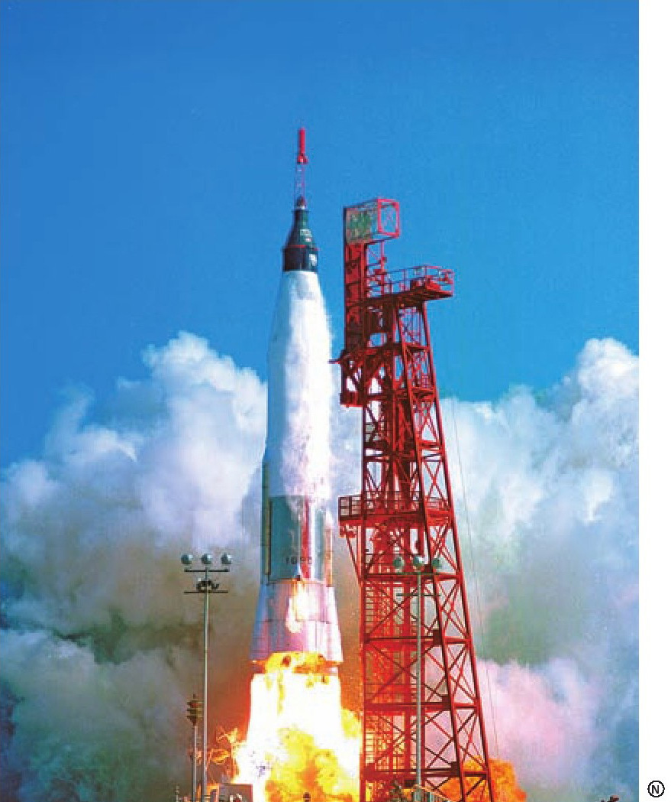
美国的“水星号”系列载人飞船最早使用逃逸火箭

不过弹射座椅有个很大的问题，就是不能确保航天员的绝对安全。它只适用于从发射台到30千米高空的这一小段飞行过程。航天员的压力服没有按抵御超声速狂风或者真空低温环境设计。因此，在这些情况下弹射逃生近乎自杀。

同一时间，美国人觉得没有理由让航天员从安全的飞船里面弹射出来，因为最可能发生的意外是装满数百吨燃料的火箭爆炸，而不是飞船出问题。航天员躲在飞船里一起逃离火箭，飞船外壳和生命保障系统可以时刻保护他们，飞船硕大的降落伞可以确保安全着陆。就算掉到大海里，飞船还可以充当救生筏，一举数得。因此，美国人决定在飞船顶部安装一组小火箭，一旦发生意外，飞船和火箭之间的连接机构就会断开，同时小火箭点燃，将航天员连飞船一起拽到远离火箭的地方。

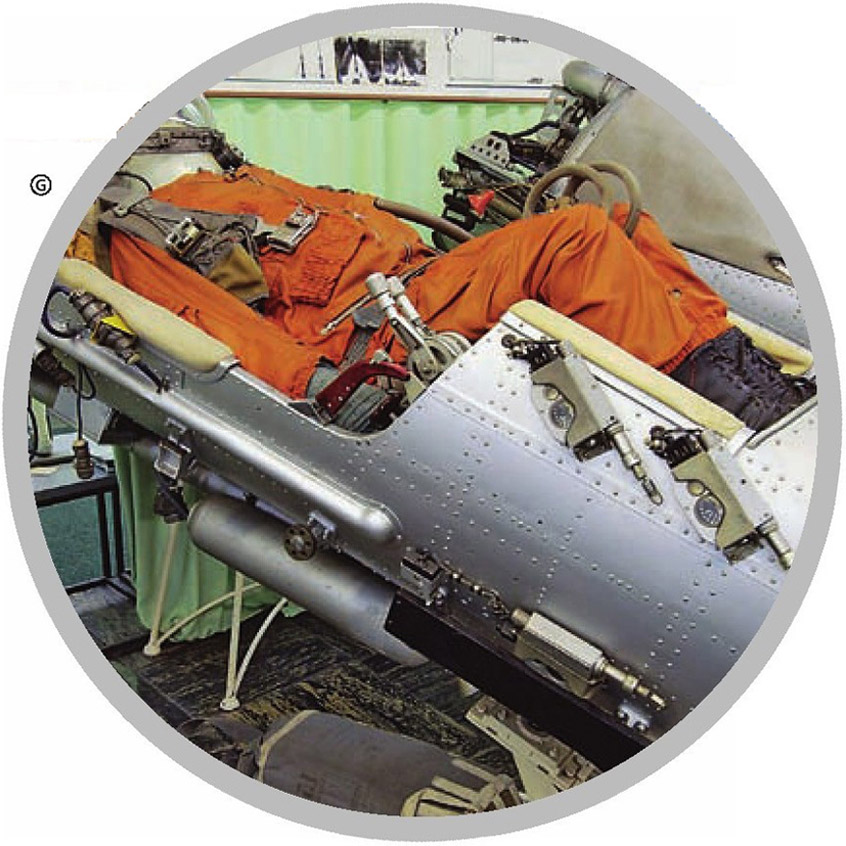
“东方号”飞船的弹射座椅

最早使用这种逃逸火箭的载人飞船是美国的“水星号”。接着，“双子星座号”和“阿波罗”飞船都使用了原理一样但结构更先进的逃逸火箭。苏联在设计“联盟”飞船时也决定向美国人学习，使用逃逸火箭，它在一次发射失败中挽救了两名航天员的生命。由于逃逸火箭优良的性能和使用记录，中国在设计“神舟”载人飞船时运用的也是这一方案——火箭顶部的那根细杆就是“神舟”飞船的“逃逸火箭”。

飞船和火箭脱离并进入轨道后，最危险的时刻已经过去。不过，飞船和其他载人航天器一样也可能出现故障。如果是绕地球轨道飞行，出问题的飞船可以考虑立即返回地面，但是空间站没有返回地面的能力，在里面的航天员如果要撤离，必须依赖其他航天器。从第一个空间站“礼炮1号”到现在的“国际空间站”，航天员逃离空间站的唯一选择是利用运送他们到空间站来的飞船，脱离空间站。美国和苏联曾经多次打算设计空间站使用的简易逃逸飞船，甚至设计一种让航天员独自从轨道上回到地面的充气防护壳，都因技术和成本原因作罢。苏联在“和平号”空间站的第一次飞行时曾展示利用飞船在“和平号”与荒废了的“礼炮7号”空间站之间穿梭运载物资和人员的能力。以后如果多个空间站都有合适的飞船对接舱口，一旦遇到紧急情况就可以由其他空间站派出的飞船营救航天员脱险。

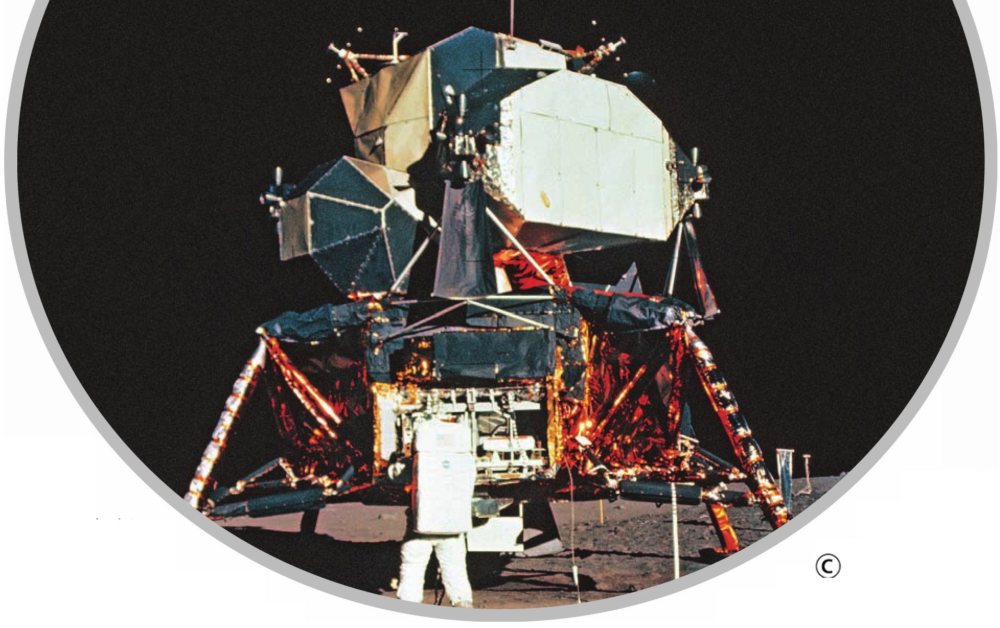
“阿波罗”登月舱

航天史上最惊险的事故莫过于“阿波罗13号”飞船的胜利大逃亡，美国人还将其拍成了电影。那是在飞船即将到达月球之前，服务舱的氧气罐爆炸并摧毁了电力系统。3名航天员只能逃到拥有独立生命保障和电力系统的登月舱里，登月舱成了“救生艇”。原定的登月任务自然被取消了，登月舱的降落火箭帮助航天员转入正确的返回轨道。3名航天员在登月舱里熬过了从月球到地球数十万千米的漫长旅程，终于安全返回了地球。其中1名航天员由于饮用水缺少和排尿困难，患上了尿道感染而住院治疗。但要知道，登月舱共为3名航天员提供了90小时的生命保障，而它原本仅仅为2位航天员使用45小时而设计。

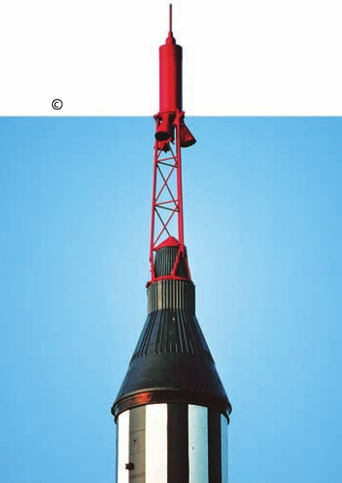
“水星号”飞船的顶端有一个高约5米的逃逸火箭

尽管事故本身非常不幸，但幸运的是爆炸发生在去月球的途中，而不是登上月球后返回的途中。否则，航天员可调动的资源、设备和电力都会大大减少，那3位航天员的生存几率就会变得很低。

事后的研究分析表明，只要飞船设计恰当，结构坚固，拥有各式备用系统和足够多的资源，航天员就有希望依靠它逃出险境。（迢柳娟）

  

**【微博士】**“　阿波罗”登月舱

“阿波罗”登月舱是美国的阿波罗计划为登月并成功返回而建，是“阿波罗”飞船直接登月的部分。登月舱高6.4米，宽4.3米，有4个支撑脚，分上升级和下降级两大部分。上升级里主要是乘员室，也就是航天员待的地方。下降级中包括了登月装备、雷达天线、降落火箭以及燃料。下降级上还带有几个装载其他货物的隔间，里面放着月面摄像机、月面工具和月面样品采集箱等。当航天员从月球返回时，登月舱上升级和下降级分开，上升级起飞，下降级则充当了“发射架”，遗留于月球表面。

【微问题】目前，月球上有多少个美国登月舱的下降级？

【关键词】逃逸系统　逃逸火箭

## 地面控制中心怎样用无线电波控制飞船

宇宙飞船即使装备了先进的定位导航和控制系统，还是需要地面控制中心定期照看。同时，飞船收集的各种科学数据也需要从太空发送到地球上进行分析研究。因此，飞船和地面之间需要用快捷且方便的方法交换信息、传输数据。以光速穿越外层空间的无线电波就成了非常自然的选择。

无线电波在传播的过程中会随着距离的增加变得越来越微弱，就像在街上看汽车的大灯，远处的灯光一定比近处来得暗。即使宇宙飞船运行在离地面很近的轨道上，距离地面也有近200千米，所以地面需要功率很大的无线电发射机才能保证飞船能够接收到足够强的信号。这种无线电设备的发射能量是家用微波炉的几十倍甚至几百倍。不过，飞船上的发射设备自然不能这么庞大复杂，只能安装小型的无线电发射机，发射的信号强度也弱得多。所以，地面要接收从太空中飞船上发出的无线电信号，需要使用巨大的碟形天线和灵敏度极高的接收设备，以及各种降低宇宙和地面噪声影响的技术。

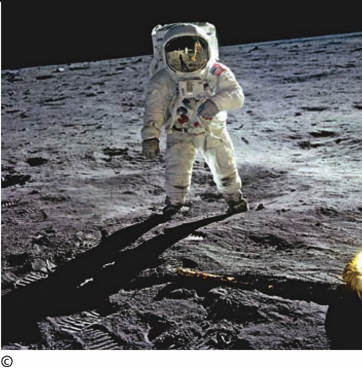
能够接收和发射信号只是完成了使用无线电遥控飞船和发送信号的第一步，如何将所需要的信息通过无线电波上传下达也十分重要。世界上第一个人造卫星只有一个无线电发射机，它发出著名的连续“嘀——嘀”响声。在这单调的声音里就编入了关于卫星内温度和气压的资料，使地面测控人员可以了解卫星的运转情况，以及它是否已被小流星打穿了。后来出现的人造卫星和宇宙飞船越来越复杂，由数十个用途不同的系统构成。如果每个系统都配一个专用的无线电收发机，那么所需的电力太多，所占的体积太大，飞船容纳不了。众多无线电设备的天线还会相互干扰。为了减少互相干扰和简化设计，飞船往往只使用一个主要频道和少数的辅助频道，使用一套无线电系统处理所有和地面之间的无线电联系，所有需要发送的信息都只能使用同一个频道发送。

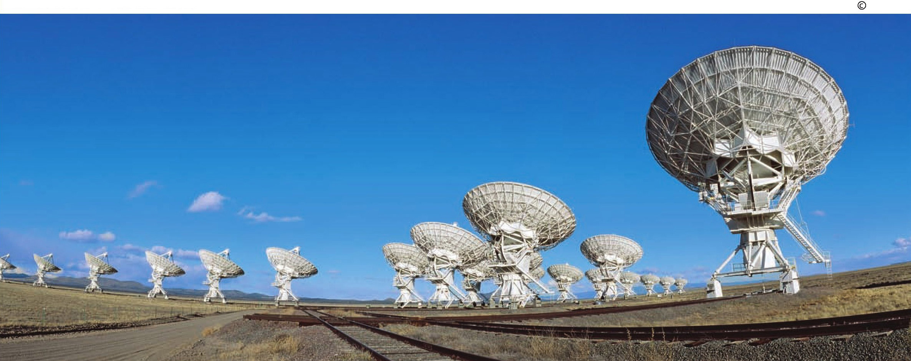
艾伦望远镜阵列（巨大的碟形天线阵列）

将多种信息填塞到一个单独的无线电频道的技术其实并不新鲜，电视就是将图像和声音一起通过同一个无线电频道发送的。早期由于技术限制，宇宙飞船使用的短波信号只能同时传输声音和飞船各系统使用的电码，发送图片信息的速度很慢也不可靠。所以，第一艘载人飞船“东方1号”只能断断续续地将加加林在飞船里活动的粗糙图像送回地面。“阿波罗”飞船登月的时候使用了一套先进的微波系统，这就像从普通宽带网络换到了光纤上网，可以在地球和飞船之间传送更多的信息，即使发送电视直播信号也不会干扰数据传输。地球上约6亿人在电视里看着阿姆斯特朗在月球上踏出了第一步。现在，包括“神舟”飞船在内的飞船都普遍使用了新一代的数字微波系统，和飞船里的航天员进行即时的视频通话，就像在地面上打电话一样方便。

解决了电波的发送接收，以及如何让电波携带信息的问题后，地面就可以用无线电控制宇宙飞船了。地面控制中心的电子设备把需要发出的指令编成电码，用电码调制副载波或载波，无线电载波通过地面的无线电发射机，发射到太空。飞船上的无线电设备接收到无线电载波，从中解调出电码后就将电码转换成各个系统可以识别的指令。飞船需要发送数据回地球的时候，也通过类似的步骤将各种数据转成电码调制在无线电载波上发送回来，经过地面处理后转换成原始数据供地面控制中心使用。

早期的飞船因为电子系统不够先进，只能由地面发出指令告诉飞船上的系统如何运作。如果飞船飞到月球轨道或其他行星，以光速传播的无线电波都不够快，发送指令并等待飞船回答的过程漫长得令人无法接受。现在的飞船都装备有电脑，储存了完成复杂任务所需的各种步骤，地面只要提前发送诸如“在某个时间点火减速”或者“在某个时间朝着哪儿打开摄像机拍照”的任务，飞船上的电脑就会在预定的时间执行内置的一连串指令完成相应的任务，再把任务执行结果发回地球，减少来回通信上浪费的时间。

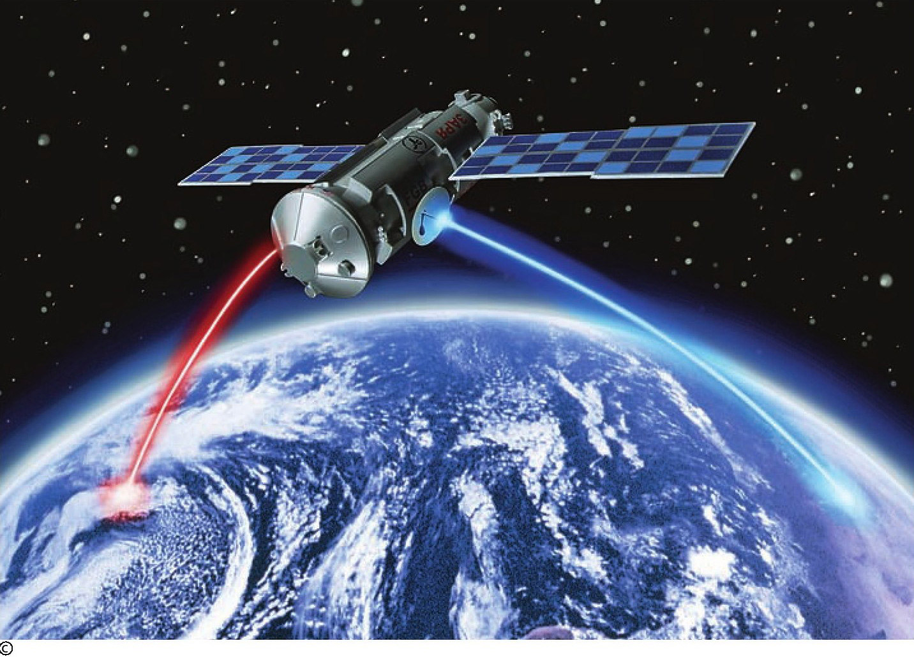
天地激光通信示意图

那如何保障飞船收到了正确的信号，地面也收到了正确的数据？飞船和地面的通信内容每一部分都会加上用于“验算”的数字标记，飞船或者地面的计算机收到通信内容首先会进行检查内容正确性的计算，一出差错就会丢弃那部分内容，并指示对方重新发送一次。另外，为了防止其他人利用无线电发送错误指令损坏飞船，地面控制中心在对飞船发出指令的同时必须附带一组密码，就像去银行取钱需要密码那样，飞船在确认密码正确后才会读取指令并执行。（迢柳娟）

  

**【微博士】**激光通信

你知道吗，除了无线电波，激光也开始被用于天地信息传输了。激光通信的优点是信息容量大、保密性强、不怕电磁干扰和通信质量好。“国际空间站”就已经尝试利用激光将电子数据传送到地面了。这个太空激光通信系统由俄罗斯制造，它从太空发射激光，再由地面接收站从激光中解调出所传信号，从而实现信息传输。

【微问题】未来，航天员抵达遥远的火星时，地面将通过什么方法与他们互通信息？

【关键词】无线电波　航天器数据上传下行

## 为什么要建造航天飞机

航天飞机是人类航天史上具有标志意义也是颇有争议的载人航天器。在航天飞机诞生之前，把人送上太空的载人航天器只有宇宙飞船。比如第一位航天员苏联的加加林乘坐的“东方号”飞船，比如美国第一位航天员谢泼德乘坐的“水星号”飞船，再比如登月航天员阿姆斯特朗乘坐的“阿波罗”飞船……那时，航天员都是坐在飞船里，用火箭把他们发射到太空，等执行完任务后，再返回地球。当然，这些飞船都不是船的模样，而是锥体形状（苏联早期飞船是圆球形，后来改进为更符合空气动力学的锥体形状）。

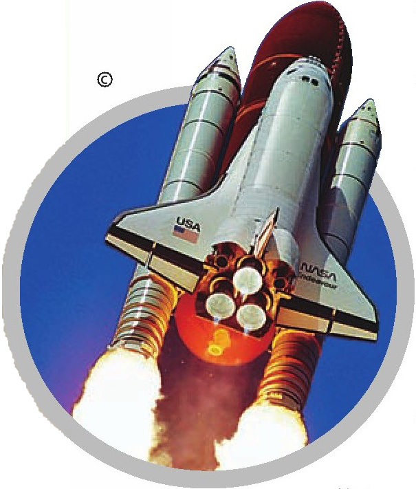
“奋进号”航天飞机

那为什么有飞船了，还要研制航天飞机呢？相比飞船，航天飞机有什么优点，最终让美国和苏联决策要研制这种新型航天器呢？

这事说来话长，也颇曲折。根据早前的认识，飞船和火箭组合飞行似乎有一个缺点，那就是不能重复使用，飞船和火箭都只能用一次，这好像不太划算。为什么飞船只能用一次呢？原来飞船发射时会遭遇各种严重振动，返回地球时，高速坠落，又被大气层严重烧蚀，不能再度使用。此外，发射飞船的多级液体火箭也是一次性的，一级一级脱落后，箭体坠落地面，都被摔得面目全非，不可能重复使用。早期的航天工程师们认为，这是一种浪费。

本着重复利用、不浪费的美好初衷，航天工程师们开始构思能重复利用，载客、载货更多（比如可以载7名航天员、30吨货物，远远超过飞船的运力），像飞机一样着陆的载人航天器，这就是航天飞机诞生的初衷。这种新型的载人航天器绑在火箭上，通过火箭发射，着陆时却可以像飞机一样，利用空气的升力，轻盈地滑翔而落，实在是很美好。

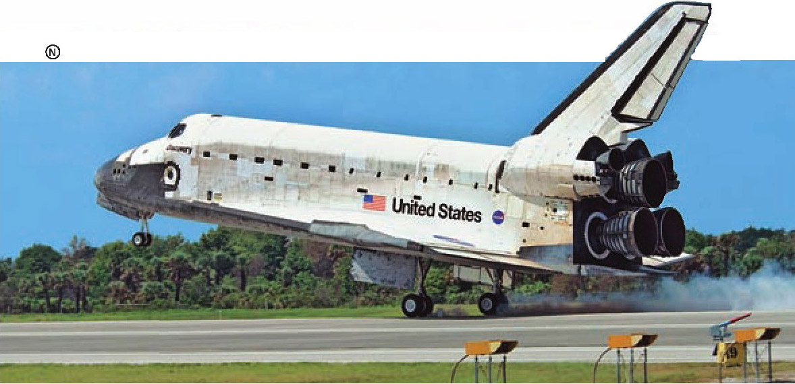
“发现号”航天飞机

航天飞机的构想打动了很多人，美国和苏联的工程师们先后开始研制这种新型的航天器。1981年4月12日，第一架航天飞机——“哥伦比亚号”发射升空。美国率先研制出了能重复利用的航天飞机。

航天飞机的结构分为3部分：2支固体助推火箭、1个燃料外储箱、1架轨道器。其中，固体助推火箭助推航天飞机发射后，会被航天飞机抛离，然后打开降落伞，降落在预定区域，打捞维护之后，可以继续用；燃料外储箱则不能重复利用；轨道器是载人装货的航天器，是航天飞机的主体，它类似一架小型飞机，也是可以重复利用的。

航天飞机是在冷战期间激烈的太空竞赛中诞生的，美国和苏联两个航天强国都花费巨资，研制出了真正执行太空任务的航天飞机。两个国家的航天飞机外形和结构也非常类似。其中，美国共研制出了5架，分别是“哥伦比亚号”、“挑战者号”、“发现号”、“亚特兰蒂斯号”和“奋进号”。它们总共执行了135次航天任务。苏联只研制出了1架航天飞机，那就是“暴风雪号”。

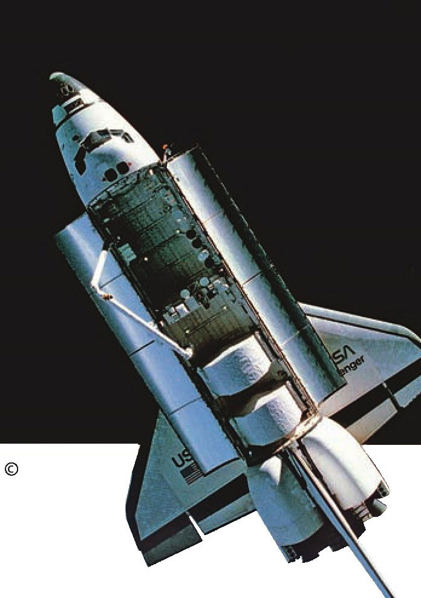
“挑战者号”航天飞机

美国航天飞机研制出来之后，先后执行了很多种以前飞船不能完成的工作，比如，运送了很多体积庞大的军事侦察卫星，释放了“哈勃”太空望远镜在内的很多大型科学观测航天器，参与组装了“国际空间站”等。航天飞机的舒适性也比飞船要好，对航天员的要求也不再像以前那么苛刻。比如，1998年10月，77岁的美国航天员格伦（第一位进入轨道的美国人），乘坐“发现号”航天飞机飞上太空，创造了老人上太空的纪录。

不过，航天飞机并没有风光多少年，很快就暴露出了天生的严重缺陷。1986年1月，美国“挑战者号”航天飞机在发射后73秒时发生爆炸，7名航天员根本没有办法逃生，全部牺牲，遭遇了严重的航天灾难。2003年2月，同样的灾难再次上演，“哥伦比亚号”航天飞机在返回地球时失事，再次验证了航天飞机的不安全性。此外，还有大大小小的关于航天飞机的问题。从那以后，航天飞机的每一次飞行，都让人提心吊胆。航天飞机不仅发射费用远超一次性火箭，而且安全性也远不如火箭和飞船组合。美国开始反省航天飞机工程。

2011年7月，“亚特兰蒂斯号”航天飞机执行了美国航天飞机的最后一次飞行任务。此后，飞了30年的航天飞机全部退役，一个时代就此终结。3架航天飞机现在已经成了博物馆的展品，见证着一段充满争议的航天时代的结束。

美国的航天飞机都成了博物馆的展品，那么苏联的航天飞机现在又在哪里呢？

和美国你追我赶进行太空竞赛的苏联，在航天飞机方面自然不甘落后，完整地制造出了“暴风雪号”航天飞机，其外形和美国的航天飞机几乎一模一样。另外，苏联还有几架航天飞机建造过半，有的已接近完工。

如今，这些苏联的航天飞机有的已经被拆解，有的被变卖，流落他国，命运悲惨。

在航天飞机流行的时代，除了美国和苏联制造出了航天飞机，也有一些国家动过念头，要制造自己的航天飞机，甚至都开始了完整的论证工作。不过，因为种种原因，这些国家都没有制造出成型的航天飞机。（龚钴尔）

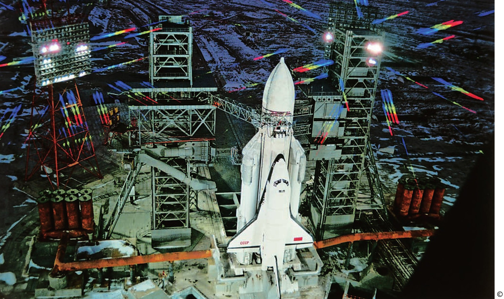
“暴风雪号”航天飞机

  

【微问题】你认为，与载人飞船相比，航天飞机有哪些优劣？

【关键词】载人航天器　航天飞机

## 为什么航天飞机要垂直发射

航天飞机虽然名字里有飞机两字，却不能像飞机那样在跑道上起飞，而着陆时倒是与飞机类似。那么，航天飞机发射为什么都采用垂直的姿态呢？

原来，航天飞机也是依靠大型运载火箭的巨大推力送上太空的。大型运载火箭发射的特性决定了航天飞机发射时也必须是垂直姿态。我们知道，大型火箭体形庞大，满肚子都是危险的燃料，为了保证它发射时的稳定性，一般都采用垂直的姿态发射。体积庞大的火箭，如果倾斜着发射，起飞时会有很多困难，比如箭体的姿态不好控制、发射场不好建设等，箭体本身还会有断裂的危险，还有燃料加注时的困难和泄漏的风险等。这些因素决定了大型运载火箭不可能倾斜着发射，因此航天飞机也不能像普通飞机那样起飞。此外，火箭和它背上的航天飞机垂直发射，直刺苍穹，可以最快地突破大气层，到达太空。

航天飞机轨道器返回地面时，经过高速进入大气层，受到空气阻力减速后，基本就和飞机着陆差不多了，可以借助它的“翅膀”滑翔，平稳地降落在机场。（龚钴尔）

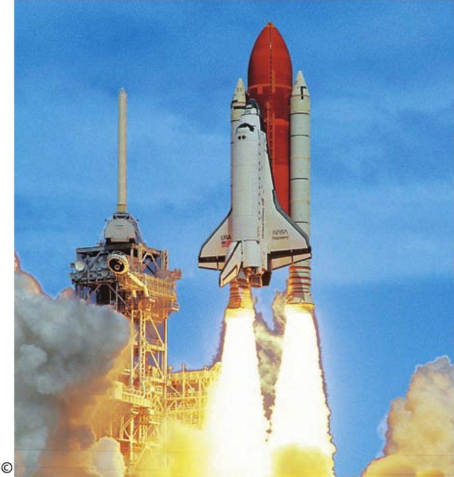
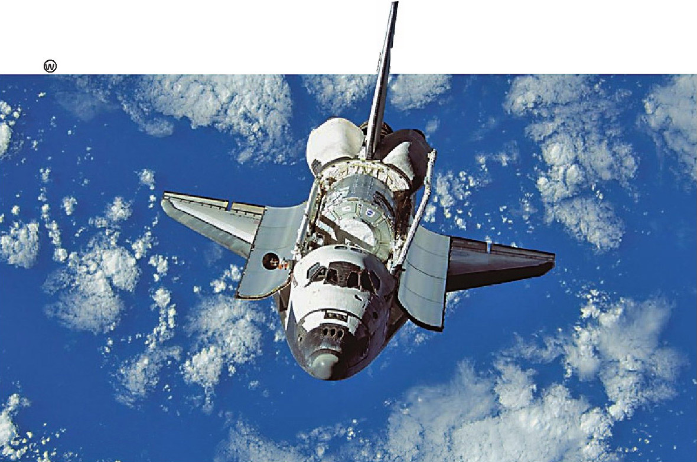
## 为什么航天飞机被淘汰了

2011年7月21日，伴随着美国“亚特兰蒂斯号”航天飞机的着陆，人类航天史上最恢弘壮丽、争议很大的航天器——航天飞机，彻底退役。

那么美国为什么不研制新的航天飞机、继续航天飞机时代呢？原因就是航天飞机有致命的缺点。人们普遍认为，它可能不是很符合时代需求。用美国航天人的话来说，它可能是一个代价高昂的战略性错误。

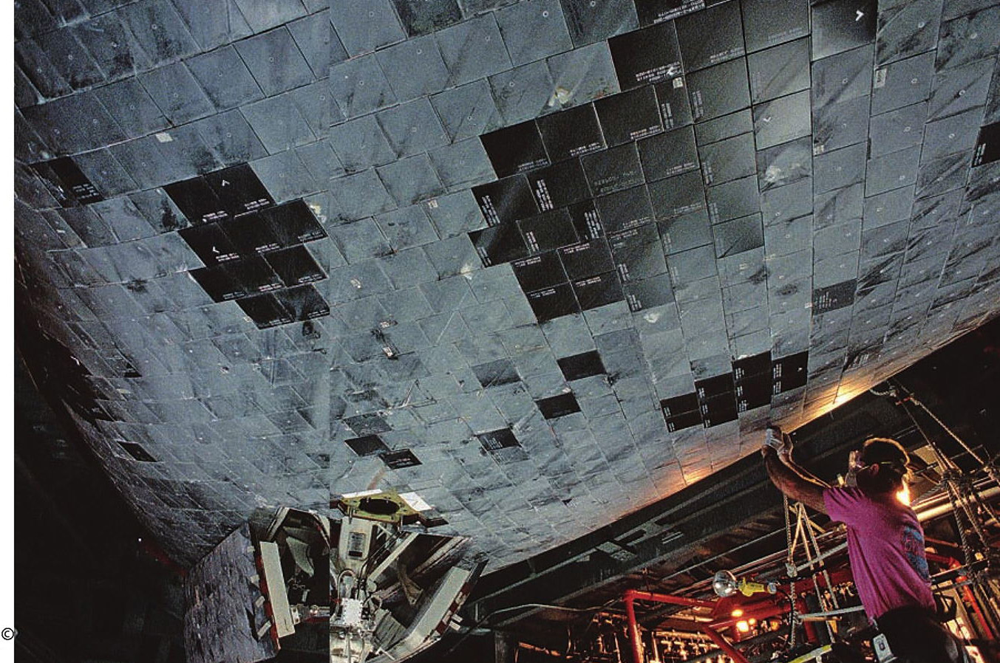
航天飞机隔热瓦

首先，航天飞机构想的初衷很美妙，可是在研制过程中，预算不断超支；在实际飞行过程中，费用更是不断暴涨，不符合预期。虽然航天飞机可以重复利用，但每次飞行的耗费还是十分巨大，远比火箭和飞船要昂贵得多。航天飞机轨道器每次发射着陆后，隔热瓦基本都得全部更换，其他的部件也要重新更换或耗费人力、物力进行维修。特别是“挑战者号”和“哥伦比亚号”航天飞机发生事故之后，航天飞机每次的维修更细致、全面，花费更惊人，飞行次数也被迫严重压缩。原计划一架航天飞机要飞100多次，可实际上5架航天飞机加起来总共才飞了135次。航天飞机完全违背了其设计初衷。

其次，航天飞机的零部件有250万个左右，构造极其复杂，几乎是人类有史以来最复杂的航天器。这种情况下，就难以确保航天飞机每个零部件都是最优化的。1986年，“挑战者号”航天飞机就因为一个“O”形橡胶圈被冻坏，导致发射时爆炸，牺牲了7名航天员。而2003年，“哥伦比亚号”航天飞机则因为隔热瓦被掉落的泡沫塑料块砸坏，返航时高热空气进入机体，导致航天飞机爆炸解体，再次牺牲7名航天员……此外，航天飞机这种所谓可重复利用的航天器，竟然不像载人火箭那样有逃逸系统，供航天员紧急逃生。航天飞机只要发生爆炸，航天员基本上只有死路一条。这完全不符合航天的安全设计，存在着致命缺陷。航天飞机的每一次发射，都令人捏一把汗。美国总共制造了5架航天飞机，损失了2架，造成了严重的损失和糟糕的世界影响，进一步暴露了这种复杂航天器的问题。

再次，美国航天飞机计划后期的花费占到美国全部民用航天经费的1/3，严重影响了美国其他航天计划的开展。航天飞机飞行费用的日渐昂贵，耽误了其他航天计划的制订和执行，阻碍了航天事业的进一步发展。无奈之下，美国只好让航天飞机退役，以继续其他的航天计划，比如“国际空间站”、深空探测等航天工程。（龚钴尔）

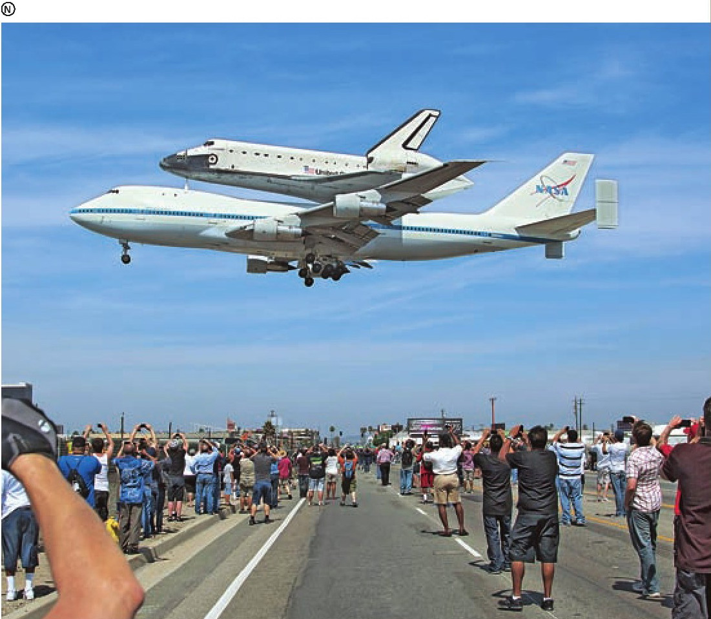
结束了最后一次飞行的“奋进号”航天飞机前往它的归属地美国加利福尼亚州科学中心

  

**【微博士】**“猎户座”飞船和“龙”飞船

“猎户座”飞船是美国航空航天局为“星座计划”研发的新一代载人航天器。它可以乘坐4～6名航天员，用“战神1号”火箭发射。按照计划，它将在2015年开始载人到达“国际空间站”，2020年将人再次送往月球，并接着征服火星等太阳系内目标。但2010年，美国总统奥巴马提议取消该计划，因为它“超预算、进度落后而且缺乏新意”。由于受到公众的非议，奥巴马后来同意调整“星座计划”：“猎户座”飞船进行低轨道飞行，作为“国际空间站”的救生艇。2013年，奥巴马又决定将“星座计划”的目标改为登陆火星及深空探测。

目前，除俄罗斯的飞船外，美国方面向“国际空间站”运送物资所能依靠的就是美国太空探索技术公司的“猎鹰9号”火箭和“龙”飞船了。2013年3月，就在“龙”飞船执行首次“国际空间站”任务不到一年的时间里，它第三次踏上征程，与“国际空间站”成功交会对接，给空间站带去了包括实验种子、老鼠干细胞、电脑设备、空气净化器、太空行走的工具和电池，以及空间站上6人必不可少的食物和衣服。3月底，它返回地球时带回了约1吨的试验样本。

【微问题】航天飞机退役了，你知道美国目前正在研制的替代品是什么？

【关键词】垂直发射　航天飞机

## 为什么要建设空间站

载人飞船无法进行大规模和长时间的空间实验和对地观测，航天工程师们于是产生了发射大型载人航天器的想法，并最终提出了空间站的设想。

空间站这个概念至少可以追溯到1897年。当时，德国科幻小说家拉塞维茨认为空间站是太空旅行的关键。德国航天先驱奥伯特受此启发，在《飞向星际空间的火箭》一书中提出空间站可用于对地观测、通信，还可作为燃料补给站，并组装飞向其他行星的火箭。1929年，署名“诺丹”的奥地利工程师提出一种轮式空间站设计。1946年，冯·布劳恩提出了可容纳80人持续进行太空工作的空间站设想。

美国空军曾计划发射载人轨道实验室，但拔得头筹的倒是苏联人。1971年4月19日，人类历史上第一个空间站“礼炮1号”发射升空，它可供多名航天员进行较长时间的生活和工作。早期的空间站相当简单，但到今天它已经发展成为包含多个功能舱段的大型航天器，可供多人长期驻留，并开展大规模长时间的空间实验和空间应用。

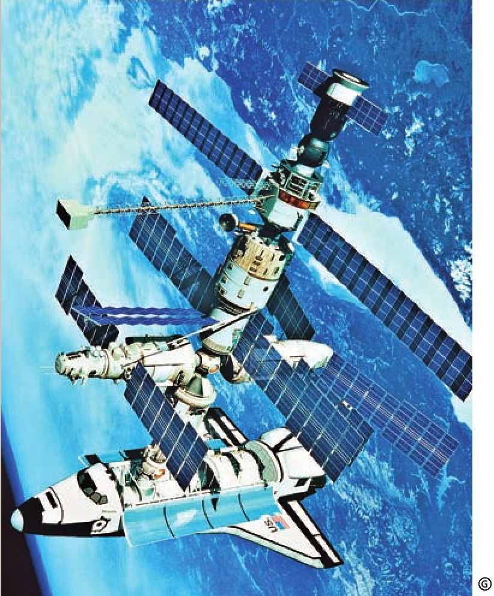
美国航天飞机与苏联“和平号”空间站对接

令人尴尬的是，当初发展空间站的需求已经不存在了。人们本以为从太空进行对地侦察、气象观测、天文观测、通信和微重力研究等活动要依赖航天员才能进行。但随着微电子和自动化技术的发展，空间站在出生前就已经过时了，如载人轨道实验室就被侦察卫星“锁眼9号”淘汰，而传输型的“锁眼11号”侦察卫星更是彻底宣判了载人侦察空间站的死刑。

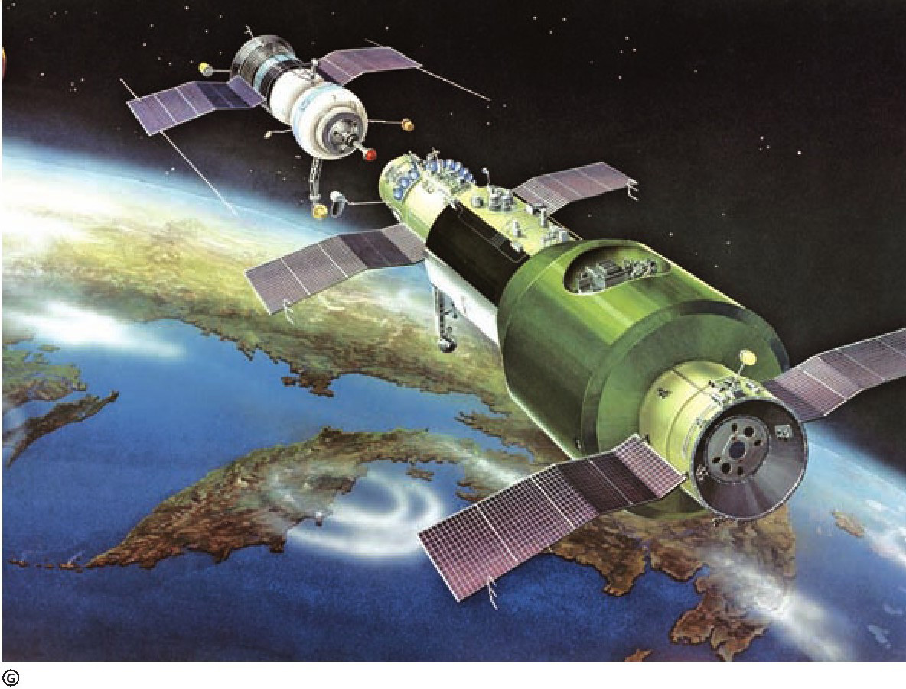
“联盟11号”飞船与“礼炮1号”空间站对接

太空活动很有价值，但是有价值的尤其是有商业价值的太空活动，可以完全依赖不载人的航天器，以至于20世纪80年代美国辩论是否建设空间站时，美国总统里根的科学顾问基沃思表示：人们想搞空间站的主要理由是送人进入太空。他还认为苏联发展“礼炮号”空间站是因为他们缺乏先进的电子技术。

目前，空间站最主要的作用是为人类积累建设大型航天器和长时间太空生活与工作的经验。随着太空旅游的兴起，空间站也将具备更多的经济价值。我们建设空间站，不仅是为遥远的太空生活积累技术，也可获得不菲的经济回报，正如从来没人问起为什么要发射通信卫星。此外，空间站也是进行太空技术实验和应用的良好平台，可在生物、材料等领域发挥重要作用。（张雪松）

## 空间站怎么进行补给

空间站发展到今天，已经成为人类在太空的“航天母舰”。它的体积和质量都很庞大，可容纳多名航天员长期驻留，进行各种空间实验和空间应用。已经坠落的“和平号”空间站曾飞行15年，现在正在运行的“国际空间站”也已飞行了13年之久。漫长的时间里，空间站的环境控制与生命保障、航天员的日常生活和太空实验所需的载荷，都需要从地面运送补给，载人飞船可携带少量物品上行或是下行，但补给主要是通过货运飞船和航天飞机实现的。

最早用于补给的飞船其实就是载人飞船。载人飞船除了运送人员外，也留有部分空间可用于运载少量货物。在专用的货运飞船出现后，载人飞船的上行运货能力已经可以忽略不计了，但载人飞船的返回舱可用于从空间站携带部分实验载荷返回地面，仍具有很大的实用价值。货运飞船是人类太空活动扩大、空间站日益复杂的产物，用来为空间站补给推进剂、实验载荷、食品、水，以及其他太空工作生活的消耗品。

最早投入使用的货运飞船“进步号”是从“联盟”载人飞船改进而成，是一次性使用的消耗品，会在返回时彻底烧毁，不能携带货物返回地面。1978年，苏联使用“联盟号”火箭将“进步1号”货运飞船发射升空，并成功与“礼炮6号”空间站对接，为其运去了约2.3吨物资，包括1吨的推进剂和总计1.3吨的食物、替换部件、科学载荷和其他物资。“进步号”货运飞船还具备提升空间站轨道的能力。“进步号”飞船到今天已经发展了三代，虽然受到原始设计的制约，其货运能力提高有限，但仍是“国际空间站”的主力货运飞船之一。

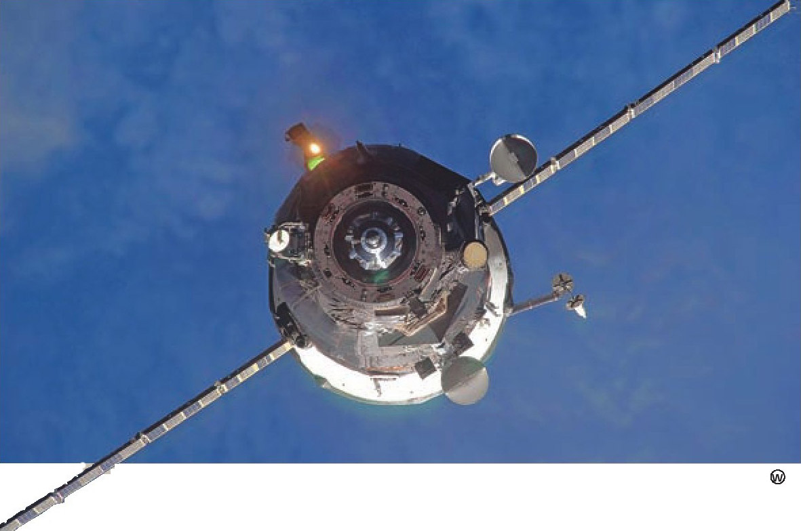
“进步号”货运飞船

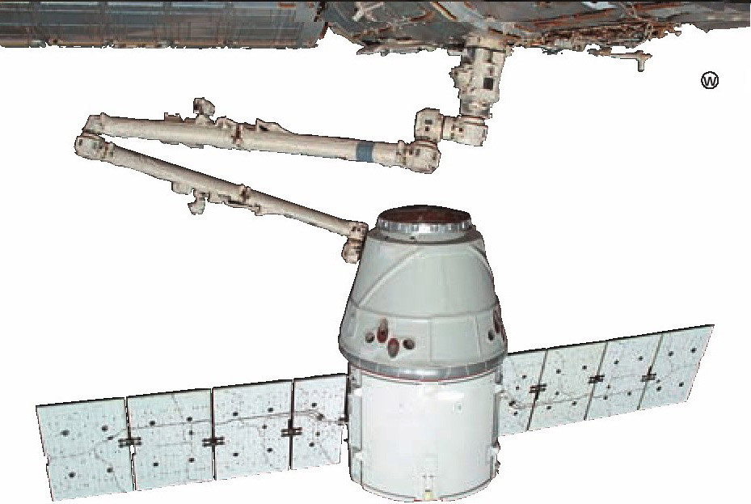
“龙”飞船准备与“国际空间站”对接

目前担任“国际空间站”货运任务的，还有欧洲航天局的自动货运飞船和日本的H-Ⅱ转移飞行器，以及美国太空探索技术公司的“龙”飞船。未来，美国轨道科学公司的“天鹅座”飞船也将加入其中。欧洲航天局的自动货运飞船还具备提升空间站轨道的能力，它和日本的H-Ⅱ转移飞行器一样，是一次性使用的，不能将空间站的物资带回地面。

与俄罗斯的飞船相比，欧、美、日的飞船设计更先进，运载能力也更大。欧洲航天局的自动货运飞船具备运输7.6吨货物的能力，日本的H-Ⅱ转移飞行器的运输能力约6吨，美国的“龙”飞船也具备比“进步号”飞船更强的货运能力。目前，日本的H-Ⅱ转移飞行器和美国的“龙”飞船，除设计了加压货舱外，还有独立的非加压货舱，可直接为“国际空间站”运输暴露在外部的实验载荷或是空间站设备，这是美国航天飞机退役后仅有的两种具备非加压货物运输能力的飞船。

谈到空间站补给，航天飞机功不可没。它拥有长约18.3米、直径约4.57米的大型货舱，可携带最大约25吨载荷进入轨道。“国际空间站”建设过程中，是它将空间站的巨型桁架、太阳翼、实验舱和节点舱送入轨道，是空间站建设的头号功臣。航天飞机货舱除了携带大量非加压货物对空间站进行补给外，货舱内还可携带最多运输9吨货物的多功能后勤舱。它们为“国际空间站”运去了大量加压货物，有力地支持了“国际空间站”的正常运行和空间实验与应用。（张雪松）

  

【微问题】除了空间站，人类很早就有太空城的构想。那么，你认为太空城将如何营造地面一样的重力？

【关键词】空间站　物资补给　货运飞船

## 为什么“国际空间站”要多个国家联合建设

“国际空间站”是一个由美国航空航天局主导、5个航天机构联合建造的大型近地轨道空间站，它的建设方包括了美国和俄罗斯两个航天强国，也有加拿大、日本和欧洲航天局等航天新秀，是世界上第一个由多个航天国家联合建设的空间站，而此前的空间站，如苏联的“礼炮号”与“和平号”空间站，美国的“天空实验室”，都是一个国家独立建设的产物。

主要航天国家合作建设“国际空间站”，有着政治、经济和技术等多方面的原因，这一切要从“国际空间站”的起源说起。“国际空间站”计划的源头，可以追溯到美国航空航天局的“自由号”空间站计划。1981年，美国航天飞机首飞成功后，美国航空航天局就开始重提10年前被航天飞机挤掉的大型空间站计划，并称之为“顺理成章的下一步”。美国的“自由号”空间站也是对苏联“和平号”大型空间站针锋相对的回应，美国还大力邀请盟国参加，欧洲航天局、日本宇宙航空研究开发机构和加拿大航天局也都积极响应，决定参加“自由号”空间站以发展载人航天技术。“自由号”空间站从一开始就是多国联合的产物，不过这更多是政治因素导致的，而不是美国需要盟国的技术或是资金。按照最初的设计，“自由号”大型空间站将具备在轨组装、维修和中转、微重力实验室和工厂等诸多功能，是人类开发太空的里程碑。

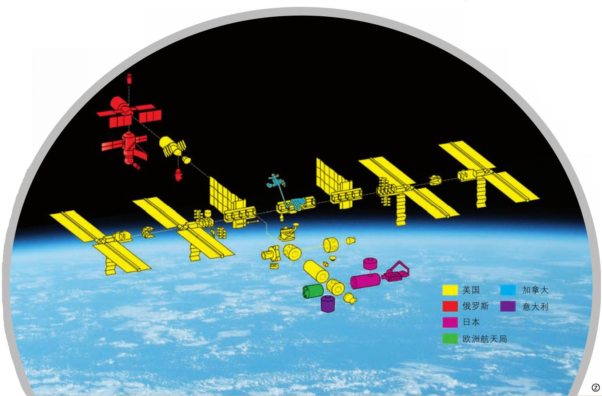
“国际空间站”由多个国家联合建造

美国航空航天局对空间站的估计过于乐观了，“自由号”空间站的巨额费用让美国不堪重负。1984年，美国总统里根批准空间站计划时预计建成需投资80亿美元，而1985年的双龙骨空间站方案已经膨胀到160亿美元。1987年美国航空航天局提出缩小为单龙骨空间站的方案得到批准，但1990年时“自由号”空间站的预算已经高涨到370亿美元。1991年美国总审计署发布报告，认为“自由号”空间站研制和30年运行的总费用可能达到1180亿美元。“自由号”空间站不得不再次缩小规模。冷战结束后，美国航天工业面临着巨大的压力。1992年，美国众议院审议美国航空航天局1993财年预算时，仅以一票之差惊险过关。

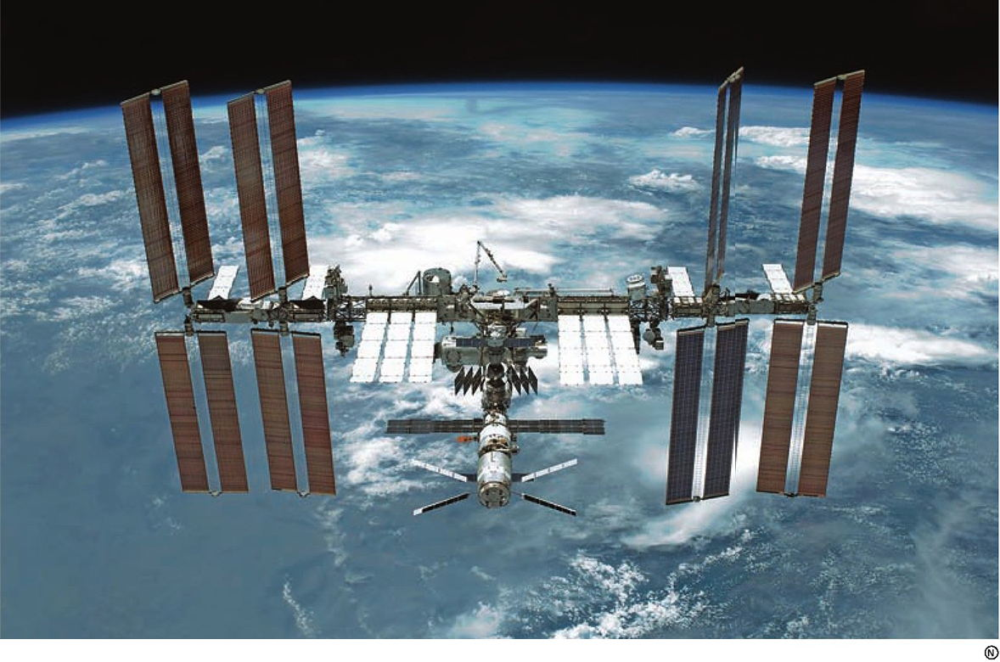
“国际空间站”的质量约419455千克，超过320辆汽车的总质量，长109米，宽73米，比一个足球场稍大一点

此时，冷战后的俄罗斯航天工业也面临着生死存亡的问题，共同的寒冬使两个昨日的对手开始合作。1993年9月，美俄两国签署协议共同建造空间站。自此，今天参与“国际空间站”建设的国家全部登场。美俄两国的合作，可以说是政治和经济因素共同作用的结果。新的空间站定名为“国际空间站”，它一改“自由号”自双龙骨设计后越改越小的趋势，总质量增加到“自由号”空间站的两倍，有效载荷机柜数量、电力供应能力和通信能力都有很大提高。尤其重要的是，俄罗斯的加入带来了丰富的空间站建造和运作经验，解决了“国际空间站”建设过程中的主要技术难题。（张雪松）

## 为什么中国要建设自己的空间站

中国载人航天工程启动以后，按照三步走的发展战略，最终将在2020年左右建成较大规模的、长期有人照料的大型空间站。届时，它将和“国际空间站”共同成为人类载人航天的标志。“国际空间站”由多个航天国家共同参与建设，而中国的空间站将独立建设，那中国为什么要建设自己的空间站呢？

载人飞船虽然可以将航天员送入太空，但由于飞船性能的限制，无法携带较大的载荷进行空间实验，飞船电力供应也无法满足大型载荷或是大规模空间实验的需求，更不要说飞船的持续飞行时间很有限，无法进行长时间的空间实验。对比载人飞船的劣势，可以部署大量实验载荷并提供充足能源开展实验，并且长期有人照料的空间站，是航天发展的必然趋势。苏美两国的空间站实践表明了它是人类最好的太空技术实验和应用平台，并在生物、材料等领域发挥了重要作用。造船为建站，建站为应用。中国发展载人航天技术，最终也必然要建设空间站，开展各种实验和应用。

“国际空间站”由多国联合建设，在技术和规模上都是空前的，也将是很多年内最大、最复杂的航天器。欧洲航天局诸国和日本通过参与“国际空间站”的建设，较早开展了大规模空间实验，而且通过有选择的开发，针对性地掌握了大量载人航天技术，并在相关领域达到世界先进水平。出于各方面的原因，中国没有参与“国际空间站”的工作，中国需要自力更生开展空间站建设。这样的发展路线在费效比（投入费用和产出效益的比值）上差一些，但空间站建成后将具备完全自主的载人航天能力，为后续航天事业的发展打下更好的基础。

载人航天三步走战略中，中国已经突破了发射载人飞船的第一步，也突破了第二步第一阶段的交会对接技术，正在进行下一阶段空间实验室的研制工作。已经发射的“天宫一号”目标飞行器虽然主要用于交会对接试验，但也将进行部分空间实验，为空间实验室运行积累经验。2020年左右中国空间站建成后，将全面掌握载人航天技术，开展大规模空间实验，为中国航天书写更加辉煌的一页。（张雪松）

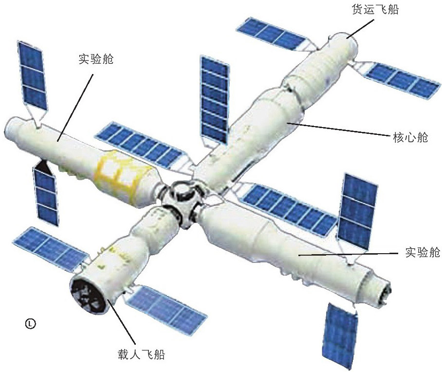
中国未来空间站示意图

  

【微问题】利用空间站特殊的环境，你有什么实验想做？

【关键词】“国际空间站”　中国的空间站

## 未来我们可以坐电梯上太空吗

太空电梯源自一个古老的梦想——用天梯连接地面与天空，人可以通过此梯往返天地之间。这个梦想可以追溯至《圣经》上的描述。《圣经·创世记》中有这样一个故事：雅各布做梦沿着登天的梯子取得了“圣火”。后人便把这梦想中的梯子称为雅各布天梯。

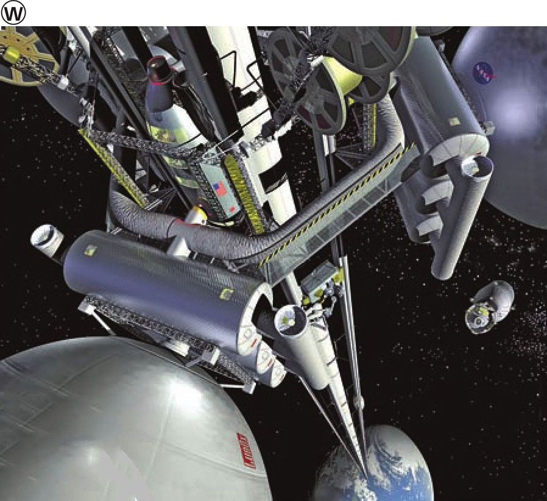
太空电梯（想象图）

1979年，英国科幻作家克拉克出版了《天堂的喷泉》一书，讲述了人类靠一种强度极大但质量极轻的碳纤维材料把地球和同步轨道卫星连接起来的故事。书中的主人公为了这一工程耗尽心血，终于殉职于太空电梯上。在小说的结尾，人类将所有的人造卫星都横向相连并将它们与地球纵向连接，这个巨大的人造环带好似给地球围上一条项链。这听起来更像天方夜谭而非务实的太空计划。所以，当美国科学家皮尔逊于1975年提出太空电梯的概念时，人们对他的建议就是“改行写科幻小说去吧”。

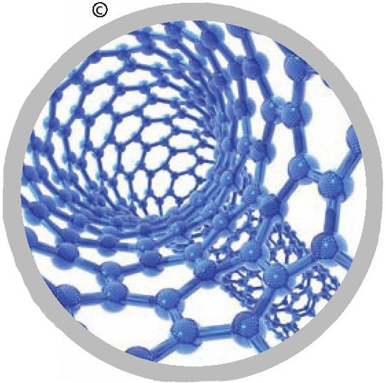
碳纳米管

但工程师们经过论证发现，以现有技术为基础，太空电梯的梦想是有可能实现的。太空电梯的本质是建设一座永久性的“缆绳”式建筑，将地面与地球静止轨道上的某一点连接起来，并允许运输工具沿着这条缆绳行驶。听起来这和我们常见的电梯确实大同小异，问题在于我们要连接哪两个点和怎样连接。

地球静止轨道上的卫星比较特殊，它相对于地球是静止不动的。但是这种卫星都必须定点于赤道上空35786千米处。要保证太空电梯相对于地面不发生飘移，只能一端建在赤道上，另一端连接地球静止轨道卫星。

如果从地球静止轨道卫星上垂下一根35786千米长的绳梯，整个地球静止轨道卫星连同绳梯就会因重力的作用，一起掉到地面上来。为了保持平衡，就必须从地球静止轨道卫星向上伸出平衡用的缆绳和平衡重物（锤）。平衡锤以地球静止轨道卫星的速度与缆绳一起绕地球运转产生的离心力可以与卫星下方绳梯的重力相抵消。

在现实中，要实现太空电梯的梦想则比神话和小说中困难得多。我们把一根2米长、1毫米粗的细铁丝直立在地上，铁丝本身的重量就会使它弯曲。但如果把这根铁丝垂吊起来，就能吊起很重的东西。这说明，细长物体承受拉力的本领比承受压力的本领大得多。虽然如此，但长达35786千米的太空电梯自身的重量仍有可能把它拉断。建造太空电梯最大的挑战在于找到制造电梯缆绳的材料。缆绳应该是一根高强度的长索。普通的钢丝如果从9千米的高空中垂下来，就会被自己的重量拉断。碳纳米管的发明使人们看到了一线希望。用碳纳米管制造的缆绳强度可与金刚石媲美。理论上说，宽1米、厚度像纸一样薄的碳纳米管缆带就可以支撑13吨的重量。但它也不见得能承受天梯的自重，还有在天梯中上下的载荷重量。

与大多数公共交通一样，目前航天工程师设计的太空电梯舱也是双向对开的，并在适当的高度安装“站台”以方便乘客和货物上下。这些站台实际是固定在太空电梯上的空间站，它们的重量应该从最初设计时就考虑在内，甚至电梯舱的载重和行驶位置也需要精确计算，以保证缆绳的平稳。（赵洋）

## 怎样保证太空电梯的稳定

几乎所有摩天大楼都会随风摇摆。如果不采取措施，超过100米的高楼在摇摆时，楼顶的人会感到眩晕。远比任何摩天大楼都高的太空电梯同样会遇到摇摆问题。除了电梯自身的扰动，月球和太阳的引力作用，以及太阳风的冲击，都会使缆绳不断摇晃，而且有可能使太空电梯撞上附近的人造卫星或太空垃圾。

导致太空电梯无法保持稳定状态的另一个原因是科里奥利力，这种力会使在旋转物体表面运动的物体发生偏移。地球自转产生的科里奥利力，使地球上的气流和水体发生偏转。比如，我们熟悉的台风形成就受到科里奥利力的影响。

电梯舱上升或下降的速度越快，科里奥利力的影响就越大。因此，最简单的方法是放慢它的爬升速度，缓慢攀爬可以使太空电梯达到稳定状态。然而，这样会使进入太空的电梯之旅变得非常缓慢。

也可以同时启用多个电梯舱，通过合理安排，让它们彼此交错上下，抵消它们对缆绳造成的影响。将几个电梯舱并排连接在一起或设立单行道等其他方法，对增加太空电梯的稳定性也有一定帮助。（赵洋）

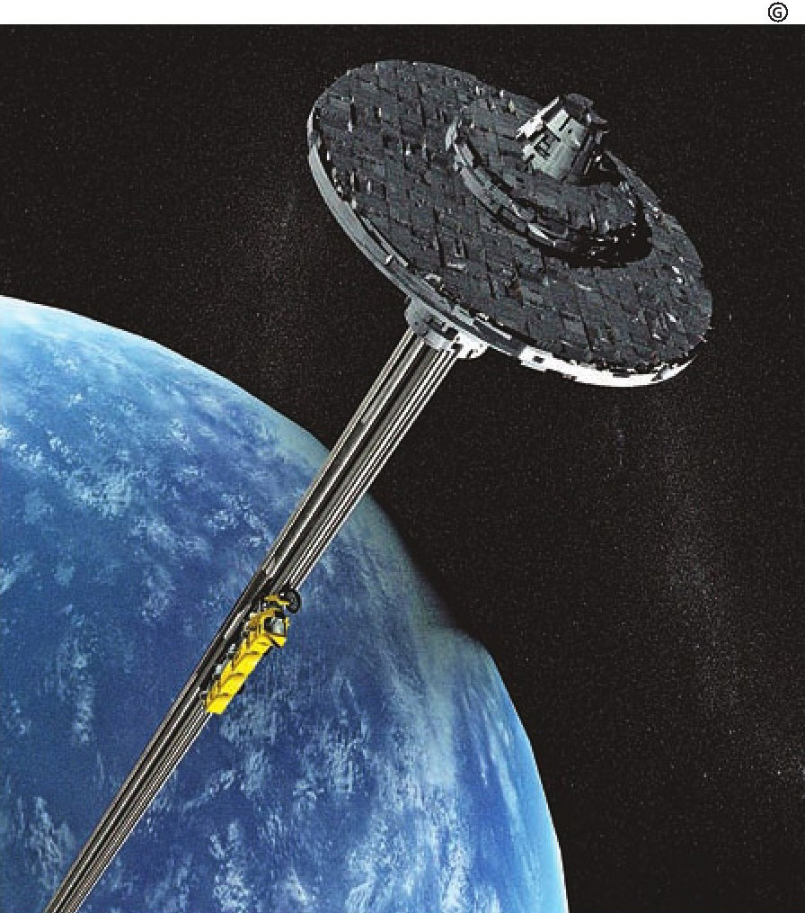
太空电梯（想象图）

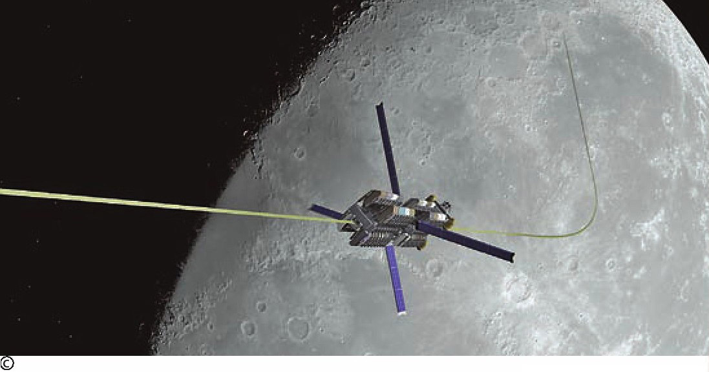
太空电梯（想象图）

## 太空电梯的前景如何

据美国科学家爱德华兹估算，太空电梯的建造成本不会低于100亿美元，维护费用也不是小数目。虽然太空电梯的建造与维护耗资巨大，但投入运行后，它与传统航天器相比在运输成本上有巨大优势。尽管电梯舱上升速度比火箭慢，但它却能将每千克货物的发射成本从现在的22 000～44 000美元降到900美元左右。最先拥有太空电梯的国家将率先获取太空资源，享受“电梯红利”。

未来，当太空电梯这道通往宇宙的桥梁造好之后，地球上的居民将大规模向太空移民，在地球的外围建立起大大小小的空间城。届时，在空间城之间又会连接索道，就像把地面城市连接起来的公路和铁路一样。

有科学家认为，随着太空电梯的广泛建设，在遥远的未来，地球周围将布满蛛丝般的网络，赤道上空耀眼的光环是连成一体的空间站。这个超级环形空间站由多台太空电梯与地球相连，仿佛自行车的辐条。与地球类似，未来太阳系中其他有人居住的星球——月球、火星、土卫六，也可以在自己的赤道上安装太空电梯，这将是太空居民点之间往来的桥梁。（赵洋）

  

【微问题】太空电梯地面端的选址，除了要在赤道上，还有什么要求？

【关键词】太空电梯　碳纳米管

## 为什么很多民用技术来自航天工程

有专家分析，从美国、俄罗斯等国家的经验数据来看，航天产业的直接投入产出比约为1：2，而相关产业的带动最终可以达到1：8至1：14。也就是在航天产业上投入1元，最终可以产出10元左右。美国航空航天局是全世界最大的政府航天机构，它积极推动航天技术转向私营部门和民用领域，以增强美国产业竞争力，提高人们生活质量。每年的《衍生技术》会刊登40～50项由美国航空航天局技术衍生并商业化的技术，现已累计刊登了1500多项。在航天飞机计划运行的30年（1981—2011年）中，仅由航天飞机计划发展而来的衍生技术就达到100多项。

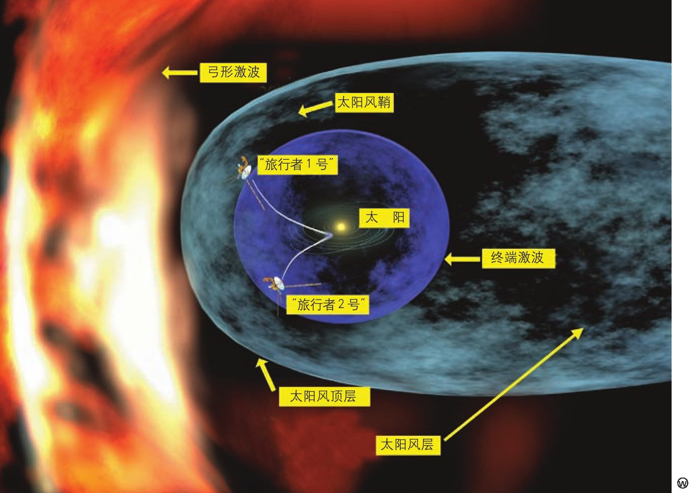
“旅行者号”探测器目前所处的位置

航天工程需要解决许多正常情况下很难碰到，或者暂时不很迫切的技术问题，自然成为了各种高新技术的试验场。例如，在太空中运行的航天器，外部向阳面的温度超过100℃，比热带沙漠还热，背阴面又低于-100℃，比南北极还冷，而内部又必须保持恒温，其环境控制系统显然要比任何民用空调更先进。又如，人类制造的飞得最远的航天器——美国的两个“旅行者号”探测器，与地球的距离已经超过180亿千米。以光速运行的无线电波，从地球出发抵达“旅行者号”也需要16小时之多。可见，其遥测的作用距离，超过了地球上任何系统。

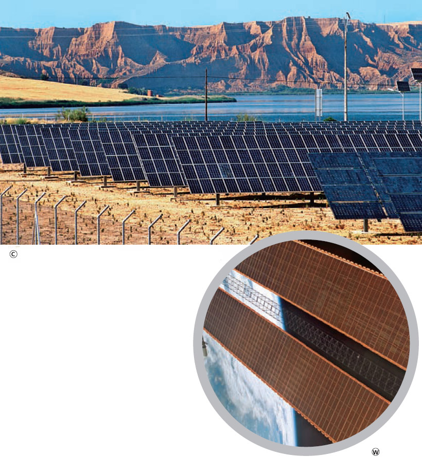
太阳能电池在航天器上的应用推动了其在地面的发展

许多高科技产品在诞生初期都面临乏人问津的窘境，由于航天活动具有高投入的鲜明特点，因此可以很好地扮演“第一个吃螃蟹者”的角色。尽管航天应用的规模不可能非常大，但在技术和产品推广的初期，依然能够起到孵育和推动作用，这对于商业化进程是相当有意义的。例如，现在很热门的太阳能电池和燃料电池技术都首先在航天领域应用。

航天技术的跨学科特征使其应用外延甚为广大，技术扩散效应突出，许多技术和产品追根溯源来自于航天。但应当明确指出的是，航天应用和常规民用之间存在着许多差别，其应用途径往往不是直接移植，更多的是参考借鉴。例如医学界开发的一种新型人工心脏，其微型辅助泵采用了航天飞机燃料泵的工作原理。这种微型心室辅助泵长度约5厘米，直径约2.5厘米，质量不到113.4克，已经在欧洲投入了临床试验。（周小康）

## 哪些民用产品上可以看到航天技术

航天技术在民用产品上的应用已取得显著效果。

在材料科学领域，由于每一克物资进入太空都需要付出高昂的代价，因此运载工具、航天器、任务载荷等都力求轻便。航天活动对所采用的各种材料有非常高的性能要求，简单概括就是需要又轻又好，这极大地刺激了材料科学的发展。

在节能环保领域，航天器要求载荷的能耗尽可能低，载人航天器要求宝贵的水能够循环使用，相关的低能耗技术、水处理技术显然都有很好的民用前景。类似这样的例子不胜枚举。

近年来很火的液态金属（非晶态金属）就是一种应用在航天飞机上的材料。它被应用在iPhone智能手机开启SIM卡插槽的插针上。这种材料是一种强度比钛强两倍多的合金，现在还被应用于棒球棒、珠宝首饰、医学仪器等产品上。

一谈到航天技术在日常生活中的应用，人们更多地想到各种实体产品。其实，航天技术应用更多地体现在服务业上。例如，电视转播、移动通信、气象预报、卫星导航这些基于航天技术的服务，已经成为普通人日常生活不可分割的组成部分。有更多的航天服务虽然不与普通人直接联系，但通过与各产业部门紧密融合在一起，发挥着生产性服务业的积极作用，也对人们生活产生着重要影响。例如，利用遥感卫星进行地质和矿产勘探、监控农业生产，利用导航卫星提供精密授时服务等。（周小康）

## 航天产品都是最新最好的产品吗

航天产品时常顶着神奇光环，但它们并不都是最新最好的，太空食品就有很多例子。早期航天员食用铝管包装的膏糊状食品，这个主意19世纪末的航天先驱们就提出过。后来航天员又开始吃复水蔬菜，真空脱水冻干制作工艺20世纪初就有了，许多不明就里者至今还以为方便面的脱水蔬菜料包来自航天技术。连自诩为太空时代饮品的果珍，其实不过是一种最初卖得很不好的饮料冲剂，被美国航空航天局拿来解决了冻干橙汁的复水难题。

航天对于所用的零部件及材料的性能和可靠性要求都很高，为此常常仅需小批量研制，甚至专项生产，因此成本很高。例如，航天电子系统配备的电脑芯片，其绝对运算性能不但不领先于市售主流产品，反而经常要至少落后一代甚至若干代，但是在环境适应性、可靠性、容错性等方面却是一般商业化的现货产品所无法替代的。反过来，只有当现货产品能够通过严苛的专项和综合可靠性试验，并得到相关认证之后，才能应用到航天工程中去。（周小康）

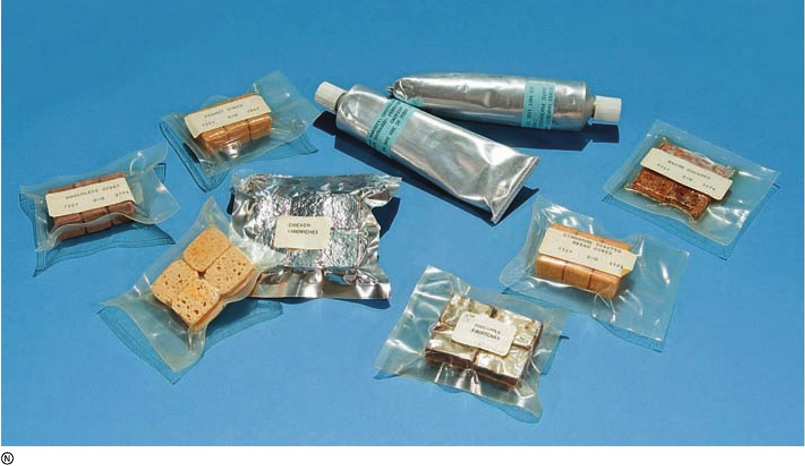
美国水星计划和双子星座计划的太空食品

  

【微问题】我们平常家里使用的哪些产品源自航天技术？

【关键词】航天技术　民用技术

# 航天员

## 航天员的门槛有多高

航天员是一个令人分外着迷又充满挑战的特殊职业，长大后当航天员是无数青少年朋友的理想。然而，自人类首位航天员加加林遨游太空50多年来，全世界仅有500多人有幸亲身领略浩渺星空的神奇风光。赢得“航天员精英俱乐部”的门票，是一件相当困难的事情。那么，当航天员要具备什么样的条件，符合什么样的标准呢？

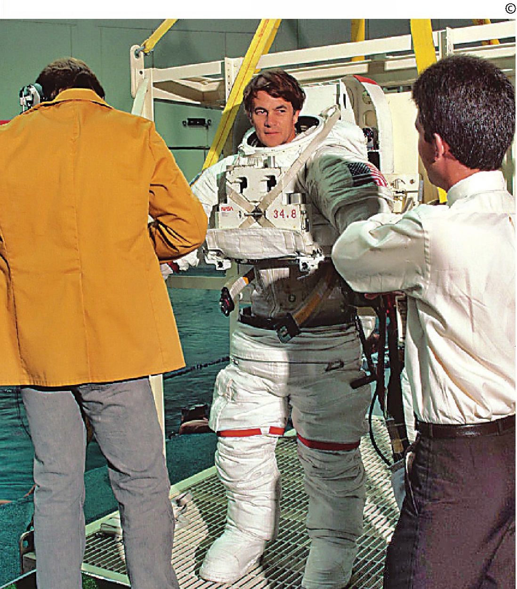
美国航天员在进行模拟失重训练

这要从航天员的工作环境说起。航天员在执行航天飞行任务过程中会经历火箭发射过程中的超重和振动，航天器进入轨道后的失重，航天器内狭小的工作空间，以及返回过程中的超重过载和着陆冲击等特殊环境。因此，航天员首先要能够很好地耐受和适应这些特殊的航天环境。用专业术语来说，对这种能力的选拔就是“特因耐力选拔”。例如，利用离心机旋转产生向心加速度，考察航天员候选人对超重的耐受能力；利用秋千和转椅来测试候选人的前庭功能。前庭是人体感受运动的器官，前庭功能不好的人在地面很容易发生晕车和晕船，在太空失重环境则容易患空间运动病。空间运动病的症状与晕车类似，它会影响航天员完成任务。科学家还会利用低压氧舱，测试候选人对低压缺氧的耐受能力等。

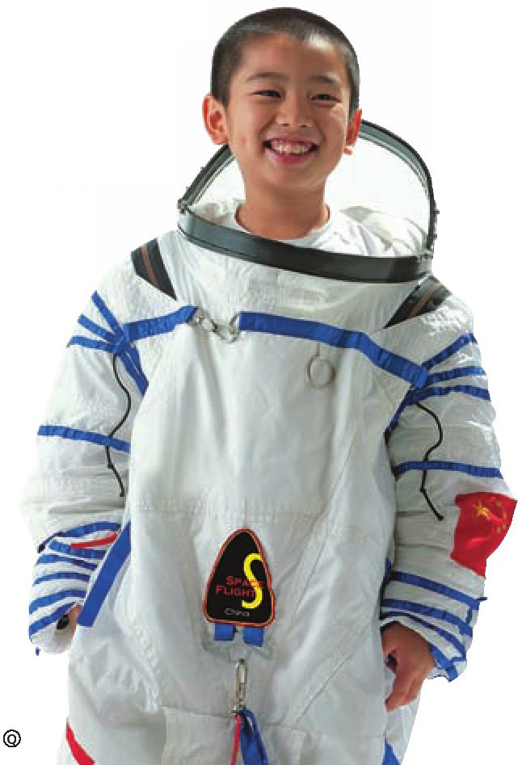
对生命体来说，深邃而美丽的太空却是异常严酷的环境：真空、失重、高低温、强辐射……航天之路充满危险。因此，航天员必须具备过硬的心理素质，当遇到紧急情况时，能够沉着冷静地去应对。所以，心理选拔是航天员选拔中的一项重要内容。这项选拔不仅要考察候选人的心理素质，还要测试他与其他人的合作能力，即心理相容性。

此外，对航天员身体的一般要求与飞行员相似。有的国家选拔航天员时，甚至直接要求报名参选人员持有航空飞行员等级的体检证明。这种做法不仅体现了对航天员身体条件的一般要求，同时也大大提高了选拔效率。因为不合标准的候选人提前被排除在外了。

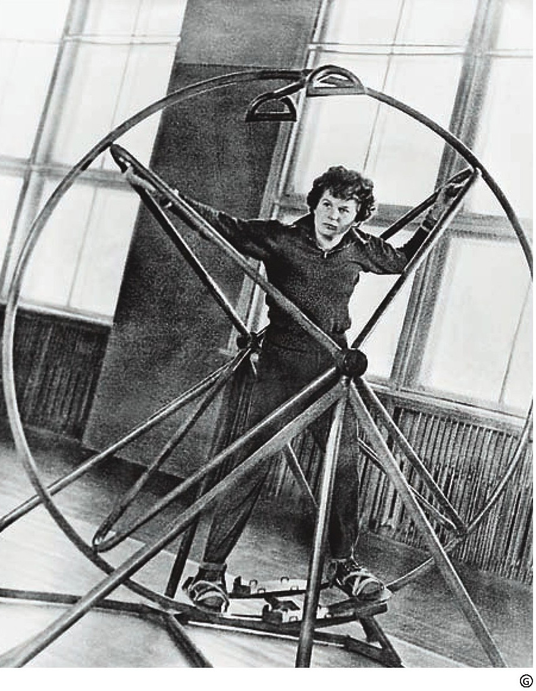
第一位女航天员苏联的捷列什科娃在训练

以上是对航天员候选人生理和心理方面的基本要求。随着航天技术的发展，航天器越来越“舒适”，对航天员的身体要求也越来越放宽，开展空间科学实验成为航天员飞行任务中的主要工作。航天员选拔过程中，对身体方面的要求越来越放宽，但是对学历和教育背景的要求却越来越高。例如，俄罗斯改进后的“联盟TMA”载人飞船，内部空间增大，放宽了对航天员身高的要求，甚至1.80米的高个航天员也可以乘坐。美国选拔航天员对视力也放宽了标准，近视眼经过矫正达到一定标准，同样可以飞天，这在过去是不可想象的。俄美早期航天员大都是从空军试飞员中选拔出来的驾驶技术精湛的“超人”，他们一般是大学本科学历。俄美现在的航天员中，博士占了相当比重，更多的则是科学家。总之，如果你立志当航天员，除了好好锻炼身体外，还必须努力学习科学知识。

航天员选拔一般会经过发布航天员招募通知、个人申请、初选、复选、面试和确认几个环节。航天员的选拔机会并不是每年都有，各国根据航天员队伍的实际情况，不定期进行，美国大约每两年招募一次。航天员的选拔人数少，报名人数众多，竞争十分激烈。经过层层选拔，幸运地被选中的人还不是真正的航天员，他们的准确名称是“预备航天员”。预备航天员经过大约4年左右的系统学习和训练，经考试合格，具备执行航天飞行任务的能力时，才算成长为真正的航天员。

并不是所有的航天员都能遨游太空，各国都有一辈子无缘航天飞行的航天员。因为飞行机会有限，每次飞行任务都会进行乘组选拔，从现役航天员中选拔适合的飞行主乘组和备份乘组，经过有针对性的特定任务训练后，主乘组就可以上天执行任务了。如果主乘组中有人状态不佳，备份乘组就会替代执行任务。可见，能够“上九天揽月”，确实非常不容易。（肖志军）

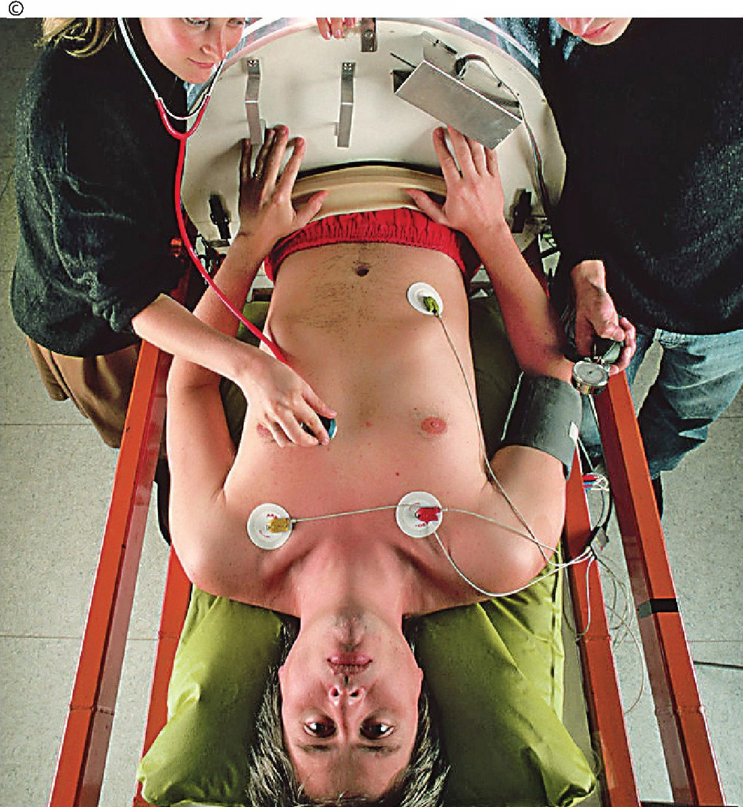
航天员选拔有许多严格的测试

  

**【微博士】**中国飞天第一人杨利伟

杨利伟，辽宁绥中县人，1965年6月出生，原空军某部领航主任，一级飞行员。1998年1月，入选中国首批航天员。2003年10月15日，执行“神舟五号”载人航天飞行任务，成为中国首飞航天员，2003年获“航天英雄”荣誉称号和“航天功勋奖章”。

**【微博士】**太空游客

太空游客是指不以执行任务为目的，通过支付费用，搭乘载人航天器进入太空的人。太空游是超级富豪的游戏，昂贵的船票令普通老百姓望而却步。2001年4月28日，来自美国加利福尼亚州的商人丹尼斯·蒂托，乘坐俄罗斯“联盟TM-32号”载人飞船前往“国际空间站”，成为世界上第一位太空游客。为了这次为期7天多的太空之旅，他支付了约2000万美元。事实上，并不是所有付得起钱的人都能成为太空游客。他们必须经过严格的体检、训练，检验合格后才能有幸成为太空游客。当然，对太空游客的要求比对航天员的要求低很多。用一个比喻来说，航天员就相当于飞机的飞行员，太空游客相当于飞机的乘客，要求标准自然不同。

【微问题】航天员必须具备过硬的心理素质。那如何才能锻炼、提升一个人的心理素质呢？

【关键词】航天员选拔　预备航天员

## 航天员考试有几门课

应当说，航天员开设多少门训练课程，就会有多少门考试。一般来说，预备航天员要经过大约4年的学习和训练，才能真正毕业，从身体、心理、知识储备和操作技能上具备执行航天飞行任务的能力。由于航天器的不同，任务的差异，以及航天员的具体情况有别，各个国家具体的考试课程会有所不同。一般来说，训练考试课程可分成八大类，约几十门课程。

第一类是帮助航天员建立载人航天飞行基本概念的基础理论训练，如载人航天工程基础、天文学、航天医学基础等。第二类是体质训练，目的是使航天员有健康的体魄，能更好地完成训练任务和飞行任务。第三类是心理训练，分为结合性心理训练和专项心理训练。结合性心理训练是指将心理训练糅合到其他训练中去，教员进行心理观察并提供必要的心理支持和指导，帮助提高心理稳定性。专项心理训练包括航天心理学基础与心理健康教育、心理放松训练、心理表象训练、心理相容训练、狭小环境中的隔离训练、针对错觉的心理训练等。第四类是航天环境适应性训练，如超重耐力适应性训练、前庭功能训练、失重适应性训练、航空飞行训练等。这类训练的目的是提高航天员对航天飞行特殊环境因素的耐力与适应能力，以及返回地面后的再适应能力。第五类是救生与生存训练，包括发射前紧急撤离训练、飞行中的救生训练、着陆后出舱训练、生存训练和营救训练等。第六类是使航天员掌握载人飞行所必须具备的各种技能及相关知识的专业技术训练。它包括对航天器的操纵、控制，对应急状态和故障的识别、判断和处理，各种装备的使用和操作等。第七类是飞行程序与任务训练。这项综合性训练目的是使航天员掌握飞行程序，知道什么时候该做什么。第八类是大型联合演练。这类训练的目的是使飞行乘组在飞行前能够在真实的航天器中和地面支持人员一起按实际程序进行模拟飞行，进一步增强乘组与地面支持人员之间的配合，使航天员有更加充分的准备。（肖志军）

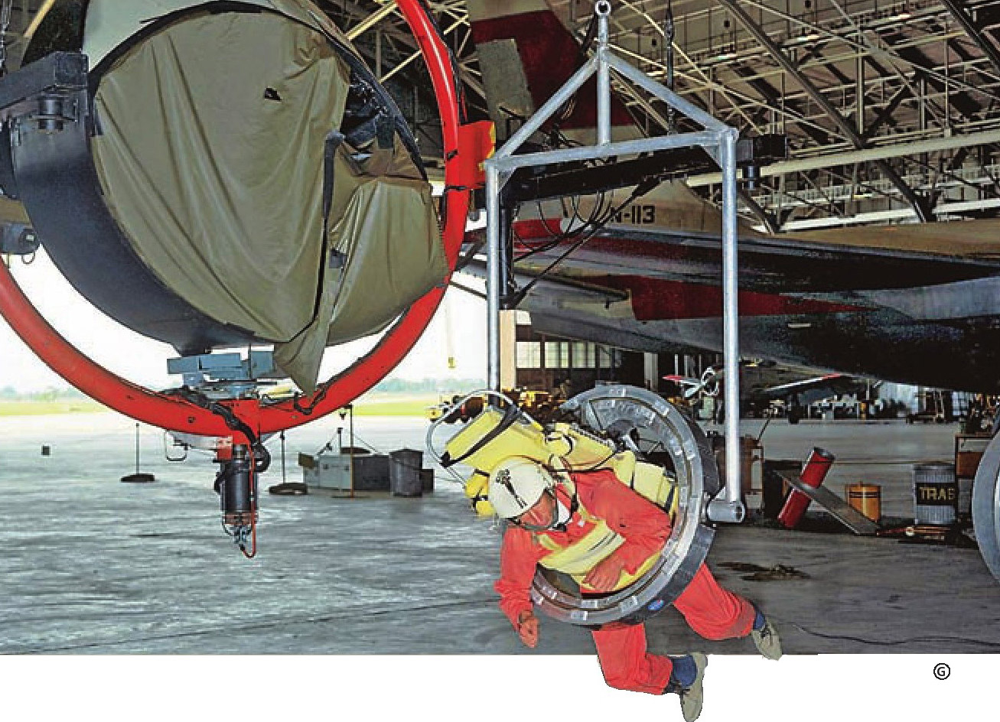
阿波罗计划的航天员在进行训练

## 为什么航天员的太空行走训练要在水下进行

航天员在太空出舱活动，俗称太空行走。太空行走与航天员天地往返、航天器交会对接并称载人航天的三大基本技术。在轨道上组装航天器，开展太空维修等工作，都需要通过航天员太空行走来完成。但是，太空行走是一项难度很大、要求很高的工作，航天员必须穿着笨重的舱外航天服，在身体飘浮的状态下，完成各种精细的操作。在失重状态下开展各种空间作业，与地面的情形迥然不同，航天员必须掌握复杂的、全新的失重操作技能。

训练航天员掌握在太空失重环境下的操作技能，就必须在地面创造一个人工的失重环境，即模拟失重环境。利用大型飞机通过抛物线飞行，每次可以创造几十秒的失重。这种失重环境非常接近太空的失重环境，但是由于持续时间太短，远远不能满足动辄数小时的太空行走训练。为了解决这个问题，水下训练应运而生。航天员穿着类似舱外航天服的水下训练服，利用配平技术，使自己在水中的浮力和重力相等，重心和浮心重叠，以特定的角度和姿势悬浮在水中。在模拟失重的大型水槽内，放入开展空间作业所用的航天器模型及工具，航天员在蛙人的协助下，全程练习太空中的作业。这种训练对航天员来说非常辛苦，因为水下训练航天服要模拟在太空中鼓胀的舱外航天服的工作状态，水下训练航天服里面也同样有气体的压力，每个操作动作都要克服压力作用，几小时的训练结束后，航天员都会精疲力竭，甚至吃饭时筷子都拿不稳。

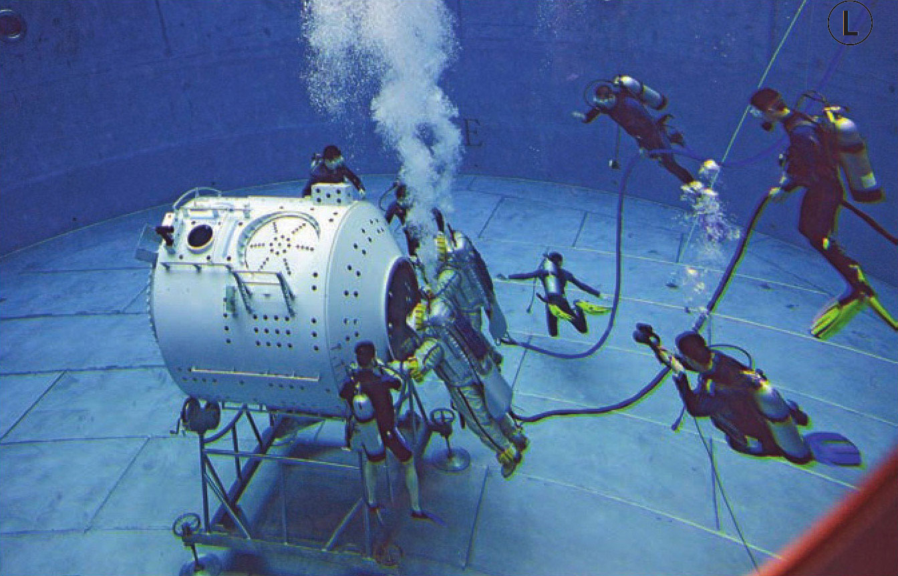
中国航天员在失重水槽中训练

尽管这种悬浮状态与真正的失重环境还有很大差别，水下训练时还存在水的黏滞力，但进行过太空行走的航天员普遍反映，水下训练的感觉和太空还是很相似的。通过水下训练，航天员能够很好地掌握太空中的操作技巧，是航天员进行太空行走必不可少的训练项目。（肖志军）

## 什么是航天员最发怵的训练

每位航天员都有自己的优势和劣势，一位航天员不擅长的项目可能对另一位航天员来说却很容易。但无论对哪一类航天员，有关身体方面的训练项目要比理论学习方面的训练挑战性更大些。

超重耐力训练（俗称离心机训练）是很多航天员都感到很具挑战性的训练项目。进行离心机训练时，航天员坐在离心机末端吊舱的座椅内，控制室的工作人员实时监测航天员的各项生理指标（如心跳和血压等），一旦出现异常情况，立刻终止训练。在座舱内，航天员手边也有红色的紧急停车按钮，一按下就可以立刻停车。离心机训练是对航天员生理极限的一种挑战，航天员要通过做特定的抗荷动作，才能“顶过去”。到目前为止，中国航天员大队的航天员们都经得起耐力训练，还没有一个人按过紧急停车按钮。（肖志军）

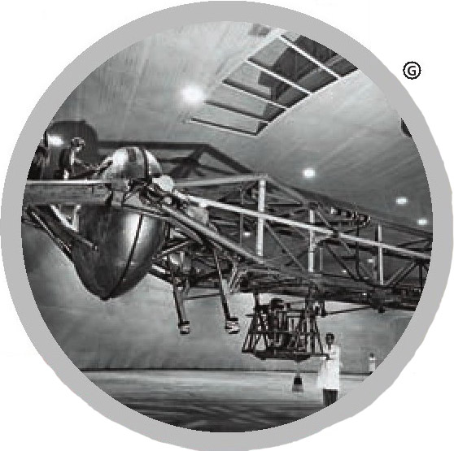

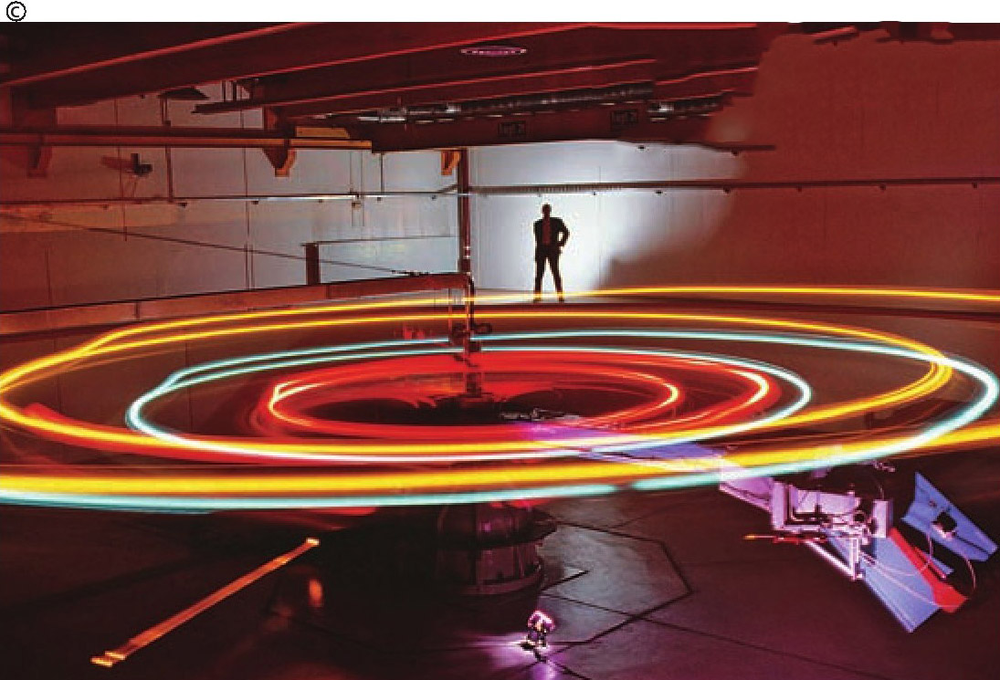
离心机训练是很多航天员都感觉挑战很大的训练项目

  

**【微博士】**世界上的航天员中心

到目前为止，世界上能独立开展载人航天活动的只有俄罗斯、美国和中国，能独立开展航天员选拔训练的世界三大航天员中心分别是俄罗斯的加加林航天员训练中心、美国的约翰逊航天中心和中国航天员科研训练中心。此外，欧洲航天局在德国科隆也建有自己的航天员中心，但是该中心主要负责“国际空间站”欧洲舱段和有效载荷的训练，欧洲航天员乘坐俄罗斯“联盟”飞船就必须到加加林航天员训练中心接受相应训练，使用美国的设施则要到美国接受相应培训。

【微问题】大型飞机通过抛物线飞行可以创造短暂的失重环境。那么，除了训练航天员，这种失重环境还有什么用途？

【关键词】航天员训练　水下训练　超重耐力训练

## 航天员上班时都做哪些工作

航天员在很多人眼里是一个略显神秘的职业，那么航天员上班时具体从事哪些工作呢？航天员的上班时间可以分成两块来说：在地面上班和在天上上班。

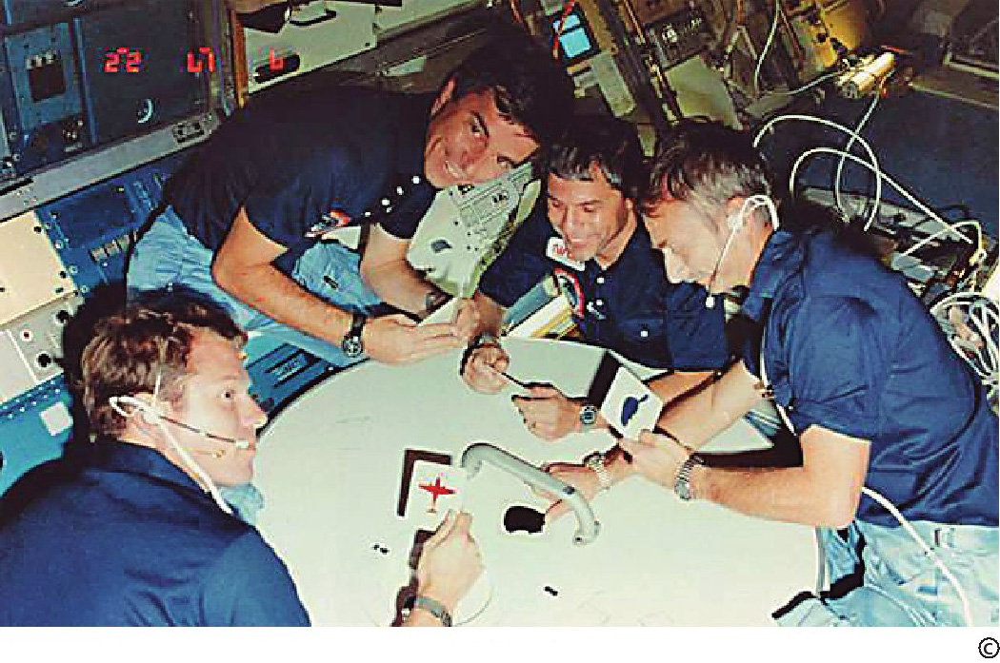
航天员在“哥伦比亚号”航天飞机上玩扑克牌游戏

在地面上班时，航天员工作的主要内容是训练。预备航天员一进入航天员大队，就开始了漫长的训练生活。首先开始的是半年多的基础训练和为期一年半左右的航天专业技术训练。经过两个阶段的训练，如果能顺利通过考试，预备航天员就转变成为正式航天员。对于正式航天员来说，如果没有明确飞行任务，他们将主要接受维持性训练。一旦入选飞行乘组，航天员将针对具体飞行任务，进行为期一年半左右的航天飞行任务训练和半年左右的乘组强化训练。执行完飞行任务后，航天员会进行恢复性训练。可见，航天员随时准备着执行航天飞行任务，训练是地面上班的主要工作。当然，航天员也会承担一些其他工作，如对航天器的设备和装置的设计提出建议，参与这些设备和装置性能的评价，参加社会活动等。

在天上上班时，航天员的角色不同，承担的具体工作也不一样。《飞行手册》就是航天员的工作安排表，它详细规定了每位航天员在不同的时间需完成的每一项工作。尽管在太空每90分钟会迎来一次日出和日落，但是天上仍然按照地面的时间安排工作和休息。航天员在太空中的时间划分为工作时间、睡眠时间和娱乐休息时间三大块，上班就安排在工作时间。

实际上，航天员是一个笼统的称呼，航天员分为指令长、驾驶员、飞行工程师、载荷专家等不同类别，每类航天员的工作侧重也不一样。指令长是航天乘组的最高指挥官，驾驶员主要负责对载人航天器的操纵和控制，飞行工程师负责载人航天器的设备管理与维修，载荷专家主要负责有效载荷的操作、管理、维修、空间科学实验等。但是，有一项内容既是工作又是休闲，每个人都要完成，那就是体育锻炼。因为失重飞行会导致航天员肌肉萎缩和骨量丢失，必须通过体育锻炼等方法维持航天员的健康。（肖志军）

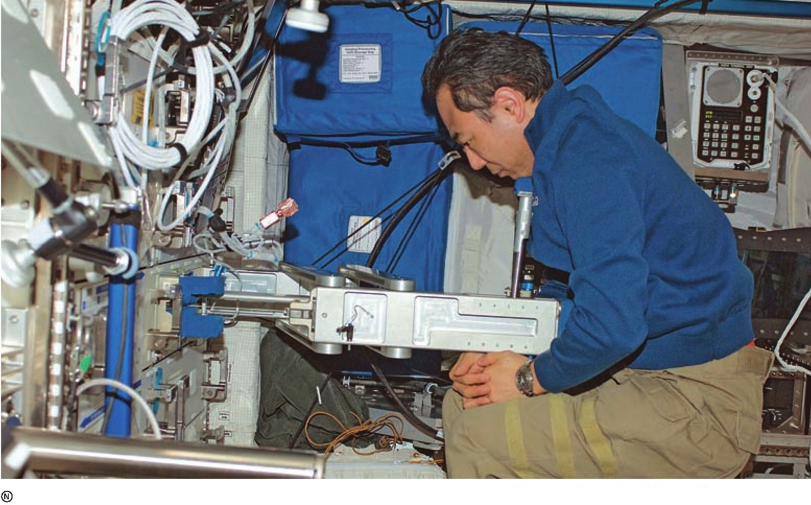
航天员在“国际空间站”上工作

## 航天员在太空怎样吃饭

看似潇洒浪漫的太空进餐，其实并不是一件容易的事情。由于没有重力，航天员在太空要使用特殊的餐具吃饭，防止美食不小心飘走。在空间站等宽敞的航天器内，一般会配备特制的餐桌。对于长期飞行的航天员来说，与同伴们在餐桌旁共同进餐，有利于加强沟通和缓解心理压力。这种餐桌具有磁性，能吸住刀、叉、勺、碗、盘等餐具。吃饭时，航天员可以把身体固定，以免飘动。在飞船等狭小的航天器上，则配备由磁性材料制作的餐盘，能紧紧吸住餐盘上的餐具，保证餐具不会乱飞。在太空，餐具除了传统的刀、叉和勺子外，还要配备一把剪刀，用来剪断或打开食品包装。餐盘上的粗糙凹槽可以把特定形状的航天食品固定住。航天员可以手持餐盘，或者把餐盘绑在腿上或固定在某处，自由地进餐。航天员吃东西时，要注意送食物、张嘴、咀嚼一连串动作的协调，因为在失重的情况下手不太灵活，嘴里的食物一不小心也会脱口而出。但是在这样的环境下吃饭也很有趣，悬浮着的块状食品，只要稍用力一吸就会“饼从口入”。

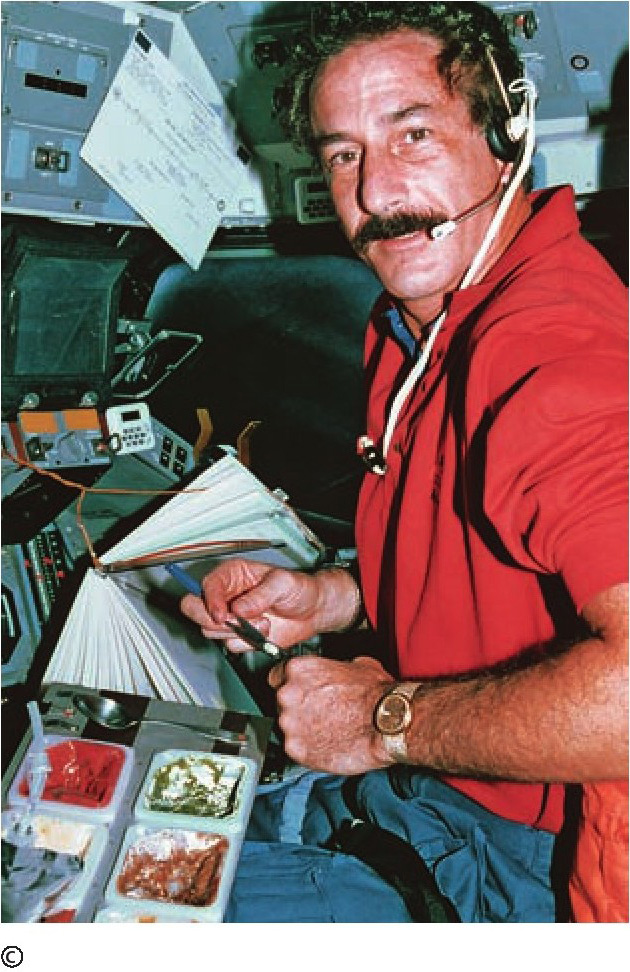
吃饭时，航天员可以把身体固定，以免飘动

如果你还以为航天食品是一类“牙膏状的、味道不怎么样的食物”，那么你早已经落伍了。事实上，现在的航天员可以享用品种众多的美味航天食品。不仅有各种鱼类、肉类罐头，还有丰盛的主食及各式菜肴，甚至还能吃上口感不错的冻干水果和冻干冰淇淋。现在的航天食品不仅讲究营养，更讲究口感。“国际空间站”甚至允许航天员携带从普通超市购买的食品上天。当然，它们要符合相关标准，如不能散发出太浓的气味，能常温保存，要有较长的保质期等。短期飞行时，航天食品随航天器一次带足，而长期飞行的“国际空间站”，则需由地面发射货运飞船定期补给。

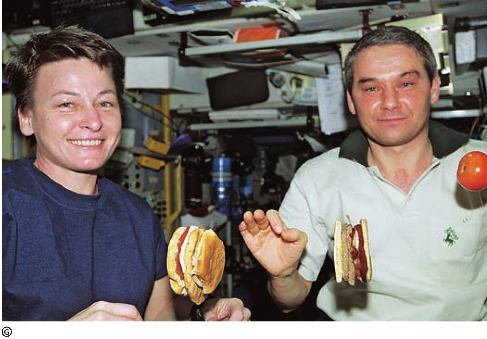
航天员在“国际空间站”上吃汉堡包

太空中航天员吃饭的地方叫作“太空厨房”，它既可以用来进行食品加工，也是食品的贮存仓库。太空厨房配有餐具箱、加热器、便携式水分配器、废物箱等。当然，天上的太空厨房只能进行简单的食品加热，不能像地面厨房那样煎、炒、烹、炸，但足以保证航天员吃上热乎乎的饭菜。

在中国的载人航天飞行任务中，航天员每人都有专用的食品包，每包内含一人一日三餐食品，分别标识“早餐”、“中餐”、“晚餐”。需要加热的食品可以通过食品加热装置进行加热处理，脱水食品要进行复水操作。进餐时，航天员从餐具包中取出餐盘，打开餐具包上个人专用的餐具袋，取出餐勺、餐叉和剪刀，束缚在餐盘上，再将餐盘平放固定在大腿上，撕开或剪开软包装袋口，利用勺和叉取用食品。进餐完毕后，航天员要取出纸巾清洁餐盘和餐具，收回餐具包，拉上拉链。每次用餐后，如发现有食品残渣飘落时，需启动风机收集食品残渣。用过的纸巾、食品包装、吃剩的残留食品等都要放入压缩袋。（张玉梅　杨利伟）

  

【微问题】有一些食品吃后容易引起放屁。航天员能否吃这类食品？

【关键词】航天员　太空食品

## 航天员在太空怎样喝水

喝水是再平常不过的事，每个人都无师自通。但是，在失重环境下喝水就不平常了。水是不流动的，一个装满水的杯子口朝下，杯子里的水不会自己流出来。因此，在太空中喝水是一件颇费周折的事，航天员在地面要专门学习在太空中如何喝水。

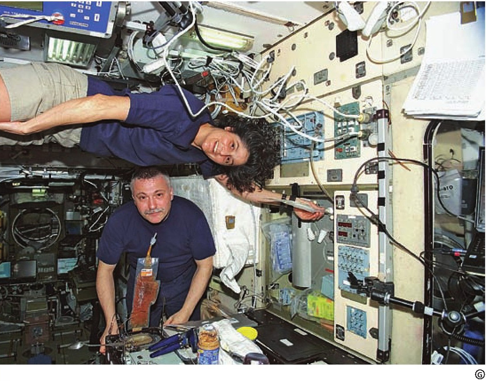
航天员饮用袋装水

太空中没有水，为了满足航天员的饮水需求，载人航天器通常都会配有袋装水和贮水箱。袋装水可直接饮用，相当于“瓶装水”；贮水箱相当于“桶装水”，使用时要先将水灌到特定的容器中。

袋装水配有一根铅笔般粗细的吸管与水袋连接，吸管上有一个止水夹。航天员喝水时，先将吸管放入口中，然后松开止水夹，通过揉捏水袋，清凉的纯净水就会被“吸”或“挤”进嘴里。喝完水后，要先压紧止水夹，再将吸管从嘴里拿出。

航天员要想通过航天器上携带的贮水箱饮水，同样要按照一定的步骤进行。首先，航天员要把贮水箱中的水灌到“水壶”中，水壶的专业名称为储水组件。灌水时，航天员利用增压装置给贮水箱加压，排空水壶内的空气，向水壶注水。灌水完毕后，将水壶与一个供水器连接。航天员需要饮水时，只需取出个人饮水嘴，安装在供水器上，再将饮水嘴放入口中，按下按钮开关就可以喝到水了。（张玉梅　杨利伟）

## 航天员在太空如何处理个人卫生

日常生活中，每人都要刷牙、洗脸、洗澡等，以保持个人卫生。那么在太空中，怎么处理这些事呢？

先说刷牙吧。中国的载人飞船上，通常配备有口腔清洁剂和口腔清洁指套。口腔清洁剂类似于口香糖，航天员餐后咀嚼，可以达到清洁口腔的目的。口腔清洁指套是一种纱布指套，上面附有抑制细菌的清洁剂，可以直接戴在手指上，伸入口腔擦拭牙齿，按摩牙根。此外，飞船上也提供牙刷和免冲洗牙膏，让航天员体验。

再来说说洗脸和洗澡。航天员在太空比在地面更容易出汗，因此在太空清洁皮肤是十分必要的。由于水在失重环境中形成水滴后会飞起来，在太空洗脸和洗澡不是很容易。

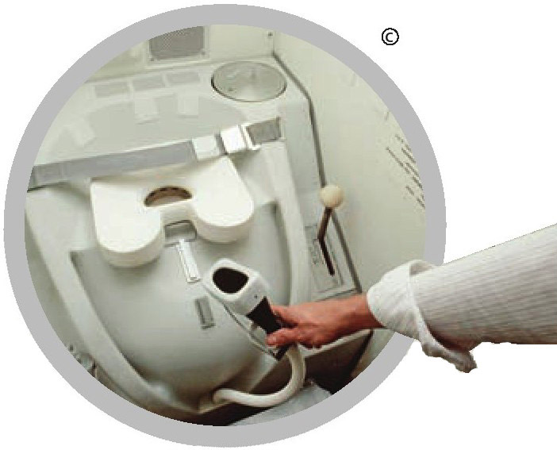
“国际空间站”上的厕所

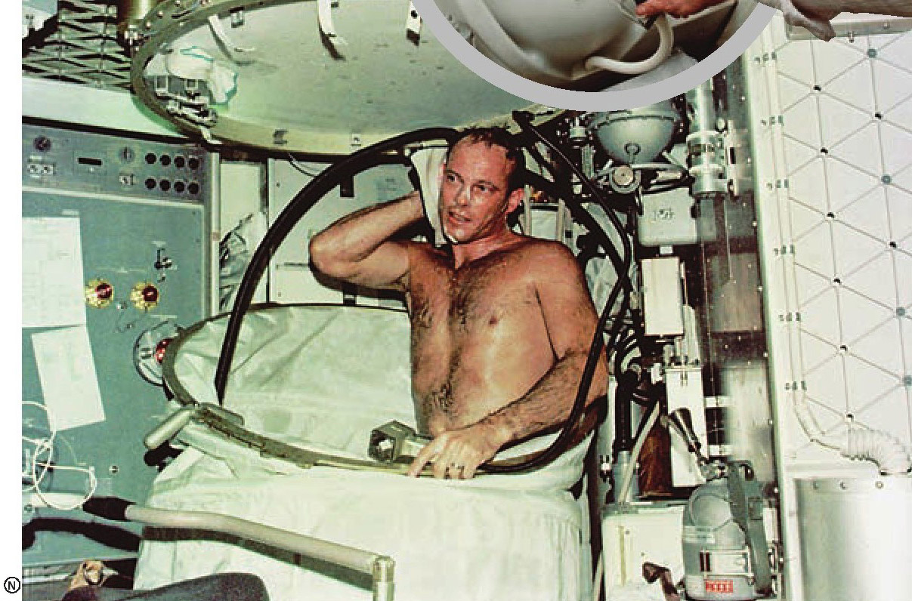
航天员在“天空实验室”上洗澡

如果太空飞行时间短，座舱内的容积狭小，水电资源有限，那航天员一般采用比较简单的方法，如用干的或湿的毛巾擦洗，或干湿并用擦洗。全身或局部擦洗要用专用的毛巾或海绵等，毛巾或海绵中一般含有杀菌止痒剂。航天员可根据需要，定期或不定期擦洗皮肤，以保持皮肤的清洁和舒适。

对于长期载人航天飞行来说，航天器设有专门的生活舱段，设施设备比较齐全。美、俄都曾经使用过“太空浴室”，如美国的“天空实验室”和俄罗斯的“礼炮号”空间站都安装了淋浴设备。不过，载人航天器中的沐浴系统不仅结构复杂，又笨又重，能耗也高，而且实际使用效果不是很理想，航天员并不喜欢使用。他们大都愿意使用湿毛巾清洁皮肤。因此，“国际空间站”上没有安装淋浴设备。

中国“天宫一号”的舱内配备有专用洗澡巾和洗发巾。航天员每三天洗一次澡，洗澡时用洗澡巾清洁全身，然后用干毛巾擦拭，洗发时使用专用的洗发巾。

说到上厕所，航天员在太空中大小便，那可不是简单的事。他们使用的是“抽气马桶”，要靠气流将大小便带走。太空厕所配备了小型坐便器和喇叭口状的小便器，男性航天员的小便器是漏斗状的，女性航天员的小便器是一根软管上接一个特殊的橡皮容器，它可压在女性航天员的皮肤上。大小便经过高压风机抽吸，尿进入尿液贮箱，粪便脱水进入大便收集器内。经过除臭处理后，大便袋由航天员取出，将其密封后投入废物收集桶。（张玉梅　杨利伟）

## 航天员在太空会做梦吗

航天员在太空中睡觉与在地面上有很大不同。因为失重的原因，在太空中睡觉无所谓站着还是躺着，可以任自己飘在空中睡。航天员一般会睡在专门的睡袋中。睡觉时，航天员把手脚都放入袋中，只露出头部。睡袋可以随处固定，墙上、顶上或舱底都可以，但更多的时候，睡袋会固定在专门的睡眠区。

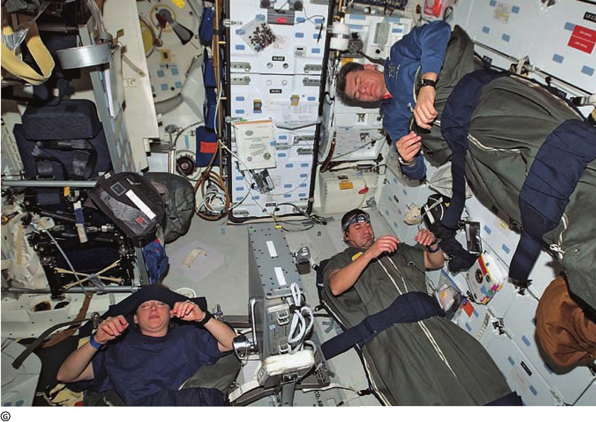
航天员在“发现号”航天飞机舱内睡觉

在太空中做梦和地面没有什么两样，基本上是属于“日有所思，夜有所梦”。许多航天员都谈到他们在太空中做梦的经历，“国际空间站”首位华裔指令长焦立中说：“有时我会梦见在太空中工作，有时会梦见自己回到了地球，在地面上做事情，所以与地面上做梦一样。”苏联航天员克里穆克说，他在太空中梦见了与妻子、儿子在林间采蘑菇。还有的航天员梦见了自己的家乡、亲人和朋友，内容五花八门。执行“神舟五号”首飞任务的航天员杨利伟，只是在返回舱里有过短暂的休息。当有人问他有没有做梦时，他笑答还没来得及做。（张玉梅　杨利伟）

  

**【微博士】**穿在身上的太空厕所

日本宇宙航空研究开发机构正在研发一种可以穿在身上的太空厕所，航天员可以像穿内裤一样穿上它。当航天员需要“上厕所”时，传感器会探测到，并自动开启相关设备，将排泄物通过管道吸入后部的容器中，随后启动的是冲洗和干燥程序。对于这个穿在身上的厕所，航天员最关心的恐怕是异味和噪声了。放心，这些都不是问题，研究人员都考虑到了。

【微问题】航天员在太空中睡觉，为什么手脚一定要尽量放进睡袋里？

【关键词】航天员　太空生活

## 航天员在太空会生病吗

太空是一个与地面环境迥异的新环境，尤其是失重，会引起人体一系列生理改变。在飞行初期，航天员很可能会患上航天运动病。这种病的典型症状包括头晕、恶心、无力、出冷汗、呕吐等。航天运动病的发病率较高，在航天飞行的前3天为高发期。航天员一旦发病，其身体健康和工作效率会受到不同程度的影响。要克服这一病症，通常的做法是加强航天员的选拔和地面训练，在太空中辅之以预防用药，并避免头的活动幅度过大、次数过多等。

在出舱活动中，航天员可能会面临减压病。因为舱外航天服内的压力一般是0.4或0.29个大气压，而座舱内通常为1个大气压。在常压下，我们的血液中溶有氮气，而在减压时，氮气很容易在血液中形成气泡，使人产生疼痛等感觉，严重时甚至危及人的生命。因此，航天员出舱活动前要“吸氧排氮”，预防减压病发生。

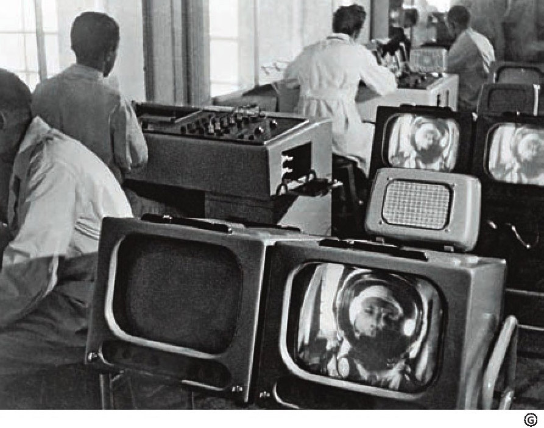
加加林进入太空后，地面人员通过监视器查看他的身体情况

在太空，航天员还可能会出现一些常见的病症，如口腔溃疡、牙痛、眼结膜炎、感冒等。航天员随行的物品包中都带有相应的药品，以备需要时服用。航天员在太空飞行中，地面的航天医学专家会利用生物遥测设备测量其呼吸、血压和心脏情况，还会通过与航天员直接通话和观察视频画面，实时监测和判断他们的身体状况。如果航天员生病，航天医学专家可指导用药，一旦航天员病情加重，可根据飞行前确定的医学标准而中止飞行，并做好返回地面的急救准备，待航天员着陆后及时进行抢救。

载人航天飞行任务执行过程中曾出现过因航天员生病导致中止飞行并提前返回的情况。如在“联盟21号”与“礼炮5号”对接任务中，因航天员出现头痛提前返回；在“联盟T-14号”与“礼炮7号”对接任务中，因航天员出现焦虑、食欲下降和失眠提前返回；在“联盟TM-2号”与“和平号”空间站对接任务中，因航天员出现心率失常提前返回。（张玉梅　杨利伟）

  

**【微博士】**减压病

减压病是环境压力迅速降低，使体液内溶解的氮气游离形成气泡而引起的病症。得了减压病的，轻者会出现瘙痒、冷热感、屈肢疼痛，重者会出现咳嗽、呼吸困难、头痛、视功能障碍、虚脱等。如果体内氮气没有充分排除，从事出舱活动时间过长，运动过度，或反复进行出舱活动等，都会诱导减压病的发生。

## 为什么航天员在太空要每天锻炼身体

航天员进入太空后，身体会发生一系列的适应性变化，最主要的变化有心血管系统的改变、肌肉萎缩和骨量丢失。随着飞行时间的延长，情况会越来越严重。如果航天员永远生活在太空中，这种适应性变化不是什么问题。问题是，航天员最终要返回地球生活，如果不采取措施防止或减少这些变化，航天员返回地面后就不能再适应地面上的重力环境。在轨锻炼就是帮助航天员减少肌肉萎缩和骨量丢失的不可或缺的方法。因此，太空中的航天员，每天都要进行科学的体育锻炼。

航天员在轨锻炼使用的典型器械及对抗失重的措施有：自行车功量计、隔振跑台、拉力器、企鹅服、下体负压筒和套带等。自行车功量计用于失重环境下提高航天员的有氧运动能力，锻炼其下肢肌肉。隔振跑台类似于地面的跑步机。“太空跑步机”配有弹性束缚带，将航天员“压”在跑步机上，否则航天员跑不起来。另外，“太空跑步机”必须采取隔振措施，以防止航天员的锻炼影响航天器上的其他设备和科学实验。此外，航天员还可用拉力器锻炼上肢和肩部肌肉。企鹅服内有弹性束带系统，能向航天员全身施加纵向力，以对抗失重导致的肌肉萎缩。下体负压筒能为航天员下肢提供负压环境，促使航天员体内的血液向下肢流动，从而更好对抗和适应失重环境。航天员还可在大腿处戴上套带，以部分阻滞下肢静脉回流。（张玉梅　杨利伟）

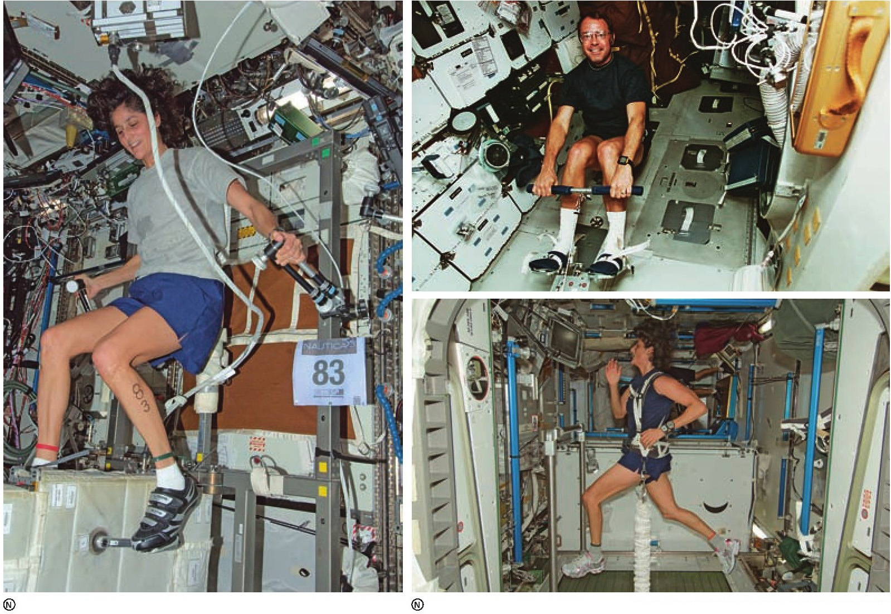
航天员可用各种器械在太空中进行锻炼

## 为什么航天员在飞行前和返回后要进行隔离

通常在飞行前两周，航天员开始执行严格的隔离制度。控制的严格程度如同对非典患者的管控，但隔离目的截然相反，不是为了防止传染给别人，而是为了防止别人将疾病传染给航天员。因为航天员一旦患病，就会影响航天任务的执行。在隔离期间，航天医学专家会对航天员实施严格的健康管理，如加强营养供给、适当体能训练、严格作息制度等。航天医学专家还会通过对航天员健康监测和健康检查，维护和增进航天员的健康，确保他们以最佳身体状态去执行飞天任务。

航天员飞行返回后的7～14天，也要执行严格的隔离恢复制度。航天员经过长时间的太空飞行，返回地面后，会有一个再适应过程。他们通常会出现头晕、心慌、心率加快，不能承受站立姿势，运动能力降低等情况。此时，航天员的体质比较虚弱，地面上常见的病毒、细菌侵入他们的体内，很容易对他们形成伤害。所以，进行科学的医学隔离十分必要。同时，这也有利于航天医学专家对航天员实施医学评价和制定恢复措施，还能避免航天员受外界打扰，以便充分休息和尽快恢复。（张玉梅　杨利伟）

  

**【微博士】**航天员在太空会变高

在太空失重的环境中，由于没有重力对人体骨架施加纵向压力，各骨关节之间的间隙，特别是脊椎骨间的间隙会增大，人的身高就会增加。航天员在太空一般会长高2～4厘米。返回地面后，由于重力的作用，航天员又会回到原来的身高。

【微问题】为什么太空飞行会导致航天员的肌肉萎缩?

【关键词】航天运动病　减压病　太空锻炼

## 为什么航天员要穿那么臃肿的航天服

航天员在执行航天任务中，会穿着各种不同式样的衣服。从地球出发时，航天员会身穿白色或橘色，带有头盔的服装，手提一个通过管道与身体相连的小箱子，走向飞船或航天飞机；在轨道舱内工作时，他们会穿着与地面服装相似的工作服；在舱外工作时，他们会穿着背后有一个方形大背包，看起来非常笨重的白色服装。航天员在舱内工作时穿着的普通服装称为舱内工作服，这类服装并不属于航天服。他们出发时和在舱外工作时穿着的服装才是航天服，分别是舱内航天服和舱外航天服。

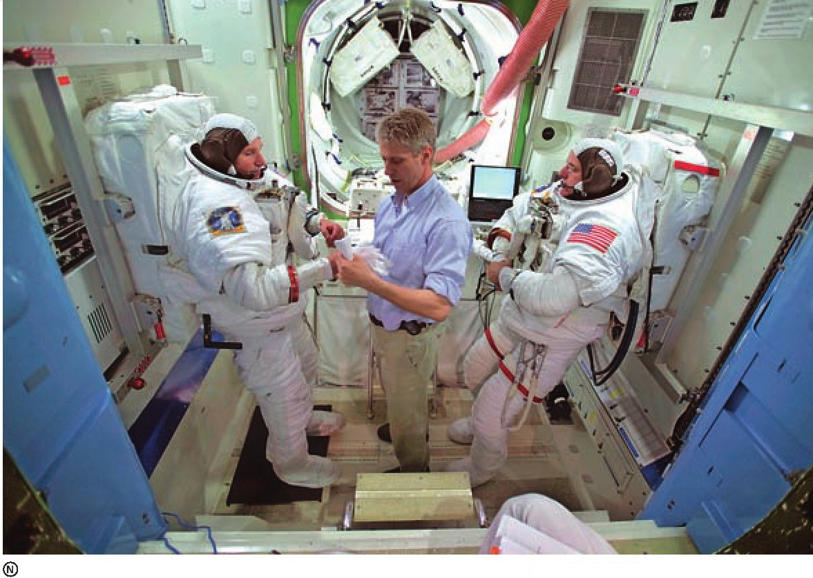
美国的舱外航天服

舱内航天服一般由压力服、头盔、压力调节器、应急供氧与通风管路，可穿脱的手套、靴子，以及一些附件组成。压力服是舱内航天服的核心主体，其内层是气密层，可确保服装不漏气；外层为限制层，可承受相当压力，确保航天服不会因为内部的压力而膨胀变形。舱内航天服是一种在应急情况下保障航天员安全的个人防护装置，具有充气加压和应急供氧的功能，一旦航天器发生座舱泄漏等紧急情况，可保障航天员的生命安全。在航天器发射、返回、变轨和交会对接时，航天员必须穿着舱内航天服，因为这些阶段最容易发生危险，这是航天员以生命的代价换来的宝贵经验。1971年6月30日，苏联的“联盟11号”飞船返回时，因平衡阀门意外震开，返回舱内迅速减压，致使3名未穿航天服的航天员死亡。尽管返回程序都是正常的，返回舱也在降落伞减速下安然着陆，但当人们打开舱门时，看到的却是已经停止呼吸的3名航天员的遗体。此后，航天员在发射、返回等风险高的阶段穿舱内航天服就成了一条必须执行的规定。

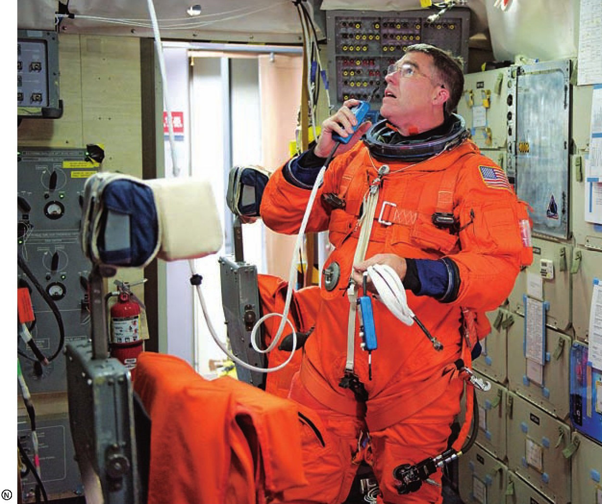
美国的舱内航天服

太空是一个生命体无法生存的恶劣环境。所以，航天员在舱外开展工作时，必须要使用确保生命安全的装备——舱外航天服。舱外航天服比舱内航天服更复杂，功能更完备。它相当于一个微型载人航天器，能将服装内的压力维持在正常的范围内，能耐受太空的真空环境和高低温交变环境，能防护辐射和微流星体对人体的危害，能提供氧气，并去除人呼吸产生的二氧化碳。在太空工作时，航天员的体力消耗很大。为了给航天员降温，舱外航天服里面还配备了一件网状的液冷服。

舱外航天服能够完全脱离载人航天器母体，独立支持航天员长达8小时的工作，这要归功于舱外航天服背包中的便携式生命保障系统。（孙梦婕）

  

**【微博士】**便携式航天服通风装置

航天员出发时拎着的小箱子，就是便携式航天服通风装置。当航天员穿着航天服在飞船或航天飞机内时，环境控制与生命保障系统可以通过管路将服装内的温度控制在舒适的范围。但是，当航天员穿着航天服前往载人航天器时，如果没有调节航天服内温度的措施，航天员可能很快就会汗流浃背。便携式航天服通风装置就是用来在航天员行走或转场时调节航天服内温度的，它通过舱内航天服胸前左下方的一根软管对航天服进行通风，使航天员即使在炎热的夏天也能保持舒适。

**【微博士】**液冷服

液冷服是航天员进行出舱活动时穿用，能够在航天员体表创建适宜温度的个体防护装备。液冷服的外形与长内衣相似，表面还布满网状管路。管路里面流动的液体介质能有效带走航天员出舱活动时人体产生的热量。

## 航天服怎么穿

对普通人来说，穿衣服是件很容易的事情，但是穿航天服就不那么简单了。航天服穿脱的操作难度高，要经过反复训练才能掌握好要领。

航天服分舱内航天服（以下简称“舱内服”）和舱外航天服（以下简称“舱外服”）两大类。美国的舱内服与俄罗斯和中国的舱内服有较大差异。美国的舱内服从背后进入，俄罗斯和中国的舱内服则从胸前进入；美国的舱内服头盔是分体结构，俄罗斯和中国的舱内服头盔为软盔壳模式。尽管存在差异，但这两类航天服的穿着过程大体相似。航天员穿舱内服前，首先要先穿好棉质内衣，并穿上尿不湿，以备不时之需，之后戴上通信装备等。准备完毕，航天员就可以通过胸前或背后的入口穿航天服了，穿好后要将穿脱口密封，并拉好拉链，然后戴上手套，关闭面窗，进行舱内服气密性检查。如果气密性良好，舱内服就穿好了。在前往飞船或航天飞机的过程中，舱内服通过软管与便携式通风装置相连，确保服装通风；进入航天器后，则通过管路与航天器的环境控制与生命保障系统连接起来。

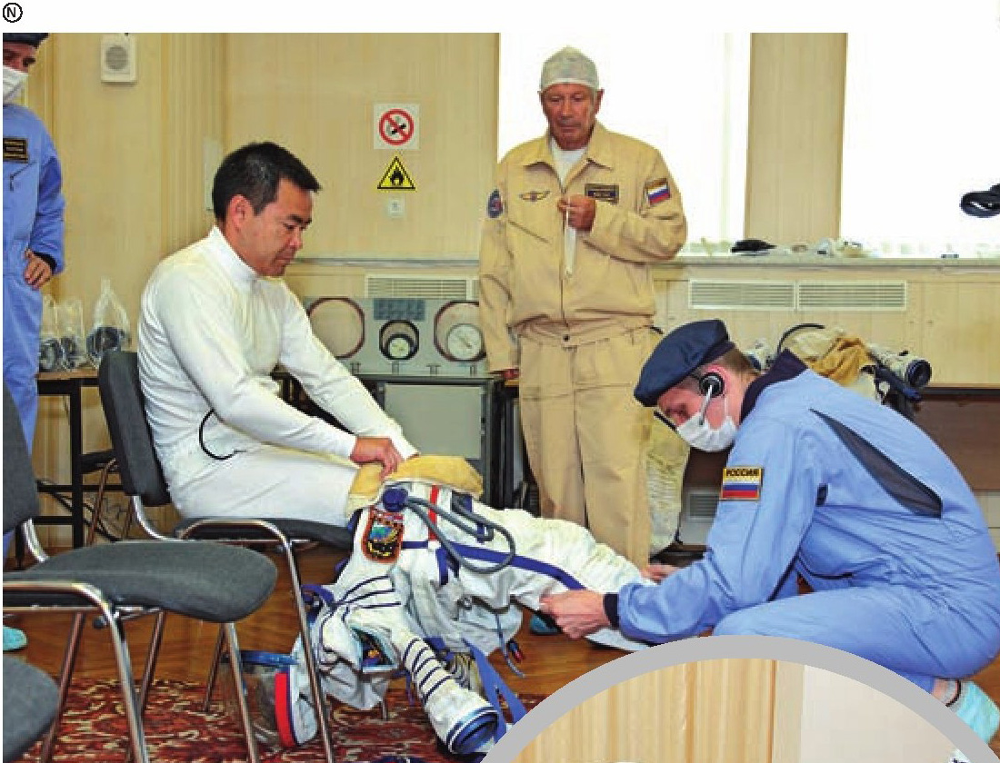
俄罗斯的舱内航天服

舱内服重20～30千克，而舱外服则重达120千克，且舱外服比舱内服更为复杂，所以穿起来更困难些。穿之前要先完成一项非常重要的准备工作——吸氧排氮。在载人航天器舱内航天员呼吸的是一个大气压的氮氧混合气体，而舱外服内为低压纯氧环境。因此穿舱外服前，航天员必须通过呼吸纯氧并辅以运动，排除溶解在体内的氮气，防止发生减压病。航天员正式穿舱外服前，除了像穿舱内服那样，穿贴身内衣、穿戴生理信息测量装备、戴上通信装备外，还要穿上一件给航天员降温的液冷服。

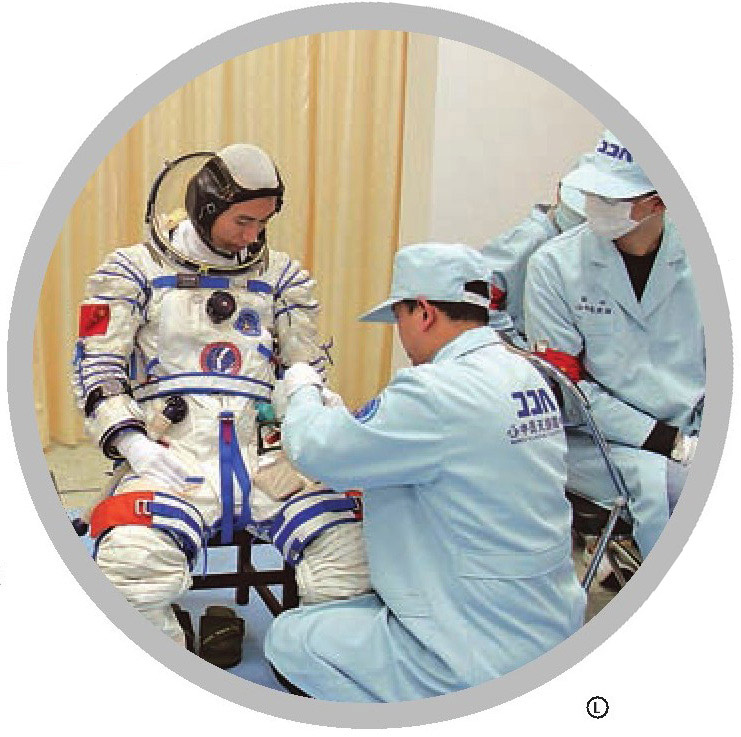
中国的舱内航天服

美国的舱外服分上下两截，从腰部分开；俄罗斯和中国的舱外服则是背入式。穿美国的舱外服，先穿下身，再穿上身，在腰部连接。穿俄罗斯和中国的舱外服，则从背后进入：航天员先把双腿伸进航天服的下肢，臀部放在航天服的背包沿上，进入后关闭背包门，把自己裹在庞大的航天服中。

航天员穿好舱外服后，要对服装进行气密性检查测试。一切正常后，气闸舱泄压，航天员打开舱门后，就可以进入浩渺的太空工作了。（孙梦婕）

  

【微问题】舱内航天服和舱外航天服各由几层组成？

【关键词】舱外航天服　舱内航天服

## 为什么航天员要到舱外工作

太空神秘而浪漫，但它又是一个真空、高低温、失重和强辐射的致命环境，对脆弱的生命体来说，它是实实在在的禁区。如果没有适当的防护措施，我们一分钟也不能在那生存。那么，航天员为什么要离开载人航天器，进入充满危险的舱外空间呢？

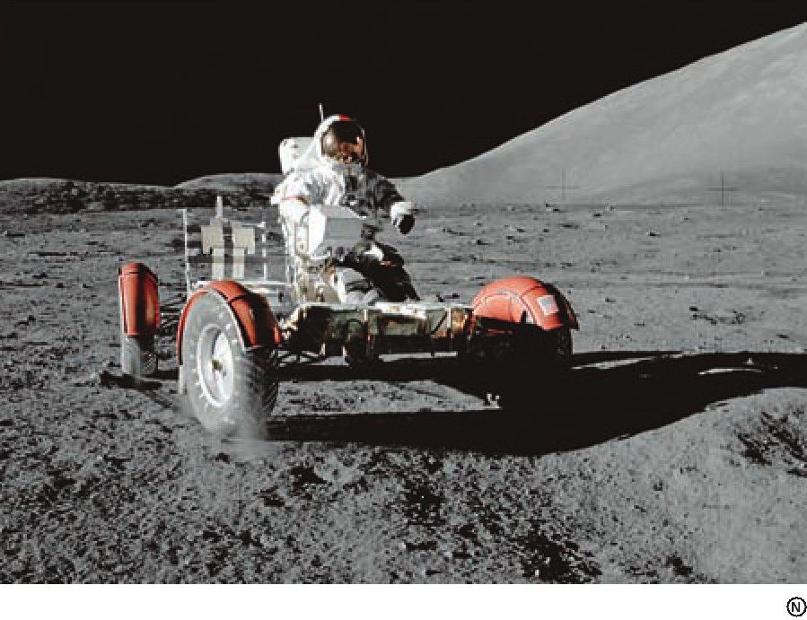
航天员在月球上工作

人和机器各有自身的优势，人具有主观能动性和创造性，能够灵活处置各种意外情况。但是，人的操作稳定性和耐受性不如机器，出现差错的概率较高。相反，机器可以不知疲倦地进行重复性的工作，发生差错的概率较低，并且不怕危险、恶劣的工作环境。但是，机器没有创造性，只能按照指令工作。尽管随着技术的发展，机器的智能化程度越来越高，承担的工作越来越多，但是人的作用机器始终无法完全替代。在太空也是如此，很多复杂度高的工作，如果全部由机器自动完成，设备将变得异常复杂，工程上很难实现。人和机器的合理分工，可以使整个系统优化，大大提高整体效率。事实上，舱外有很多工作离不开航天员的参与。

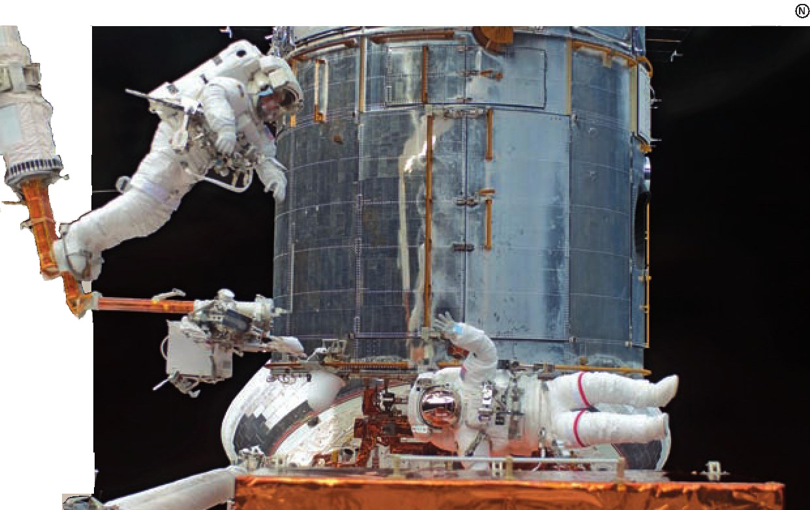
航天员在机械臂的帮助下，维修“哈勃”太空望远镜

航天员出舱活动可以分为两大类，一类是在轨道失重环境下的出舱，例如，从空间站出舱活动；一类是在其他天体表面的出舱，例如，在月球表面出舱活动或在火星表面出舱活动。航天员的舱外工作主要有四类。第一是大型空间设施的组装。由于受火箭运载能力的限制，大型空间设施不能一次发射入轨，需要拆分成多个模块，逐个发射到太空，然后由航天员在轨道上进行组装。“国际空间站”建设过程中，欧洲的“哥伦布”实验舱、日本的“希望号”实验舱等舱段都是分别发射入轨，再由航天员出舱，将它们组装到“国际空间站”上的。第二是空间设施的维修。在空间极端冷热、辐射、空间碎片等环境因素作用下，航天器发生故障的可能性很大。其中机械类设施更容易发生故障。通过空间维修，可以大大延长航天器的使用寿命。但是，维修工作精细度较高，机器人很难胜任，必须由航天员来完成。第三是进行空间救援。如果航天员在太空发生意外，可通过出舱活动进行救援。第四是开展相关科研工作，如在开放的太空开展的一些科学实验，在天体表面采集岩石和土壤样本等。（肖志军）

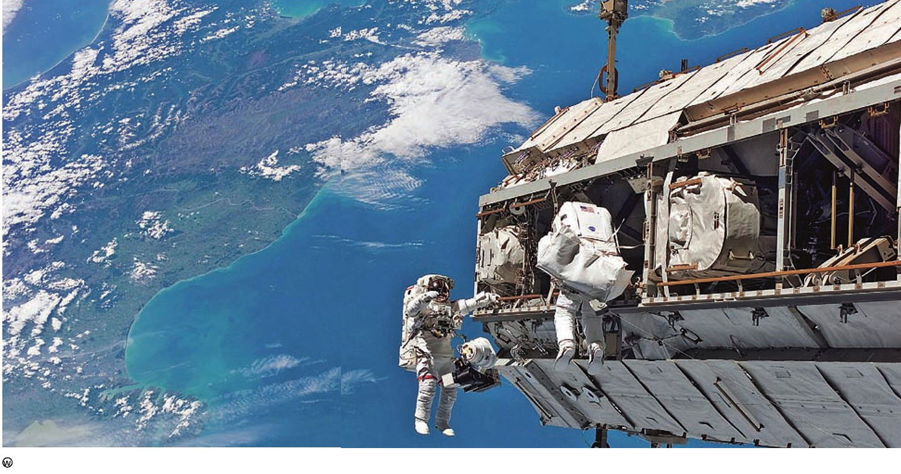
航天员为“国际空间站”安装新的桁架段

## 航天员在太空如何“行走”

太空行走是出舱活动的通俗说法，指航天员离开载人航天器，进入开放的太空进行活动。航天员在轨道上安装大型设备、进行科学实验、释放卫星、检查和维修航天器，都要通过太空行走来进行。美国人曾经通过太空行走修复了“天空实验室”、“太阳峰年”卫星和“哈勃”太空望远镜。苏联航天员则通过太空行走修复过“礼炮号”空间站，组装并维修了“和平号”空间站。“国际空间站”也是通过航天员进行多次出舱活动，在轨组装完成的。

那航天员在太空是如何“行走”的呢？航天员进行太空行走主要有两种方式：脐带式和自由式。采用脐带式进行太空行走，航天员基本是在用手抓住航天器外面的扶手进行挪动，更像是在“爬”，或者是在“飘”。而用自由式太空行走的航天员，则更像是在太空中“飞”。航天员在月球等其他天体上完成各种任务的过程，也是一种太空行走，这才更像在“走”。

顾名思义，脐带式太空行走就是航天员通过一根“脐带”与航天器相连，进行出舱活动。航天员所需要的氧气、压力、电源和通信等都是通过“脐带”由航天器提供的。为了避免缠绕，“脐带”长度一般不超过5米。所以，航天员只能在航天器附近活动。

采用自由式太空行走，航天员通过背负的载人机动装置可以在太空自由飞行。载人机动装置就像一个背包，由压缩氮气箱、供气系统、喷气推力器、电子控制设备、温度控制装置和蓄电池等组成。它以高压氮气作为飞行动力，使航天员可以到距离航天器100米远的地方活动。航天员可以通过载人机动装置左右机械手臂上的控制器，控制高压氮气从安装在不同部位的喷管喷出，从而控制飞行姿态和速度。（庞之浩）

航天员进行太空行走（脐带式）

  

**【微博士】**太空行走的纪录

1965年3月，苏联航天员列昂诺夫进行了人类第一次太空行走，他采用的是脐带式。1984年2月，美国航天员麦克坎德利斯和斯图尔特使用载人机动装置，进行了第一次自由式太空行走。俄罗斯的索络维约夫保持了人类太空行走次数最多和累计时间最长的纪录。他总共进行过16次太空行走，在太空停留时间总共为77小时41分钟。而在一次太空行走中，在太空停留时间最长的是美国航天员赫尔姆斯和沃斯。他们于2001年3月创造了在太空停留8小时56分钟的纪录。

**【微博士】**航天员翟志刚

翟志刚，黑龙江龙江县人，1966年10月出生，原空军飞行试训中心飞行教员，一级飞行员。1998年1月，入选中国首批航天员。2008年9月，执行“神舟七号”载人航天飞行任务，圆满完成中国首次空间出舱活动，2008年获“航天英雄”荣誉称号和“航天功勋奖章”。

【微问题】太空作业的航天员边上常有巨型的机械臂，它是干什么的？

【关键词】航天员　出舱活动

## 在太空发生火灾怎么办

地球上发生火灾时，我们可以拨打119。但是，如果太空中发生火灾，就不能指望消防员了，航天员只能靠自己。在应对火灾过程中，预警是一个非常重要的环节，它可以让航天员有一定的反应时间和提前量，控制火情，从而降低火灾的发生率。目前，载人航天器主要依靠能探测烟、光或热的传感器进行火情探测。此外，一些舱载设备所配置的能感知局部过热的温度传感器，也会提供辅助信息，帮助对火情进行综合判断。

火灾发生过程中会产生大量烟雾和有害气体，其中烟是最致命的因素。所以，航天器舱内配备了特制的呼吸防护面具。航天器内发生火灾时，航天员首先要戴上呼吸防护面具，确保自身安全，然后再灭火。在太空中，燃烧的规律与地面不同：由于没有重力作用，空气无法形成对流，燃烧会局限在一个较小的区域，或者呈现阴燃（没有火焰的缓慢燃烧）现象。所以，从某种程度上来说，微重力环境对救火是有利的。

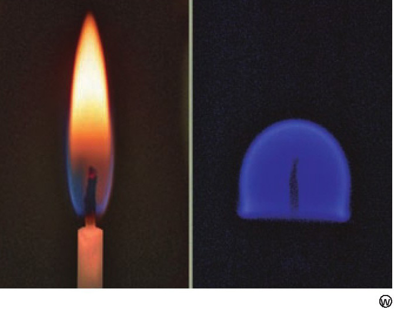
燃烧的蜡烛（左：地面，右：微重力环境中）

灭火的机理就是阻断氧气，没有氧气助燃，就不会有燃烧了。太空中不能用水来灭火，因为水在太空中不会像地球上那样落下和流动，而会飘浮在舱内，造成舱内仪器设备短路，甚至导致航天器不能正常工作。座舱是非常狭小的密闭空间，灭火措施既要保证及时控制火势，又不能因灭火而恶化舱内空气环境。发生小火灾时，航天员可以用灭火手套扑灭火焰；如果火情严重，可使用特殊灭火剂来灭火。对于多舱段的大型载人航天器（如空间站），可临时将出现火情的舱段隔离，采用二氧化碳管路向该舱排放二氧化碳来抑制和消灭火情。座舱紧急减压也是一种灭火方案。减压后没有了氧气，自然就不会燃烧了。但这必须与舱内航天服及座舱压力应急系统等协同工作。灭火后，舱内一般会留有少量有毒物质，因此还必须进行排放和消毒处理。（孙梦婕）

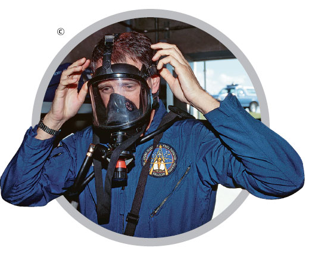
航天员在紧急情况下可以使用氧气面罩

## 航天史上多少位航天员牺牲了

航天员是高风险的职业。在人类探索太空的征程中，先后有18位航天员在执行航天飞行任务时献出了宝贵的生命。他们用鲜血和生命，为载人航天的后来者铺平了道路。

苏联共发生过两起导致航天员死亡的航天飞行事故。1967年4月24日，“联盟1号”飞船返回时，因降落伞未打开，飞船硬着陆，航天员科马罗夫被活活摔死。1971年6月30日，“联盟11号”再入大气时，平衡阀意外震开，座舱失压，航天员因缺氧而死亡。尽管后面的程序很完美，飞船“正常”着陆，但多布罗沃斯基、帕萨耶夫和沃尔科夫3名航天员全部殉职。

美国的航天飞机发生过两次造成航天员死亡的事故，但是由于航天飞机载人数量多，因此牺牲的航天员要远远多于俄罗斯。

1986年1月28日，“挑战者号”航天飞机在低温条件下发射，由于助推器密封圈失效，升空不久就发生了爆炸，贾维斯、麦考利夫、麦克奈尔、奥尼祖卡、雷斯尼克、斯科比和史密斯7名航天员牺牲。2003年2月1日，“哥伦比亚号”航天飞机返回时，因机翼上的隔热瓦在发射时被保温泡沫塑料块撞坏，返回时高温气体从裂缝吹进机体，导致飞机解体，7名航天员遇难，他们分别是赫斯本德、麦库尔、安德森、布朗、乔拉、克拉克和拉蒙（以色列人）。此次灾难后，美国政府最终下定决心让航天飞机全部退役，从此，人类进入到后航天飞机时代。

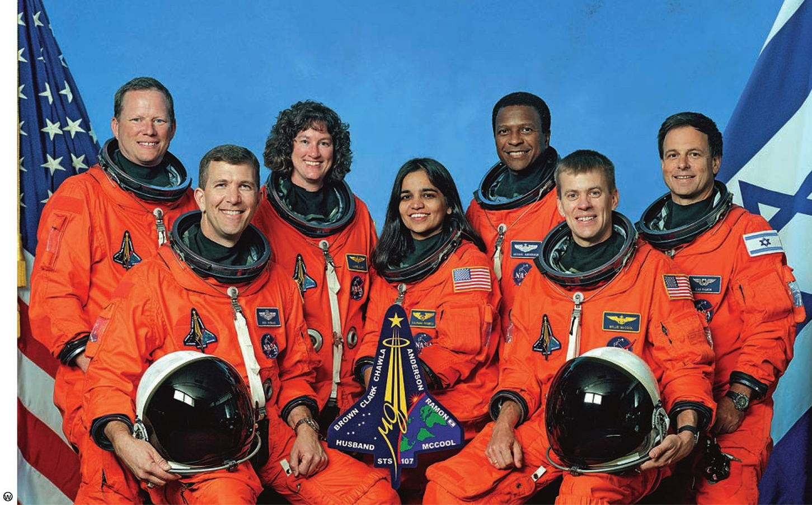
“哥伦比亚号”航天飞机最后的乘组

此外，还有很多航天员在地面进行训练时，因飞机飞行事故、火灾、水上救生事故等原因牺牲。1967年1月27日，格里索姆、怀特和查菲3名航天员在美国佛罗里达州卡纳维拉尔角发射场火箭顶部的“阿波罗”飞船里训练。突然，查菲呼喊道：“驾驶舱内发生了火灾……”随后，舱内的大火迅速蔓延并失去控制，航天员的航天服及连接到舱内维生系统的管道都被大火烧融……3名航天员都牺牲了。为了纪念这3名航天员，人们用他们的名字命名了月球表面的环形山及火星上的山。

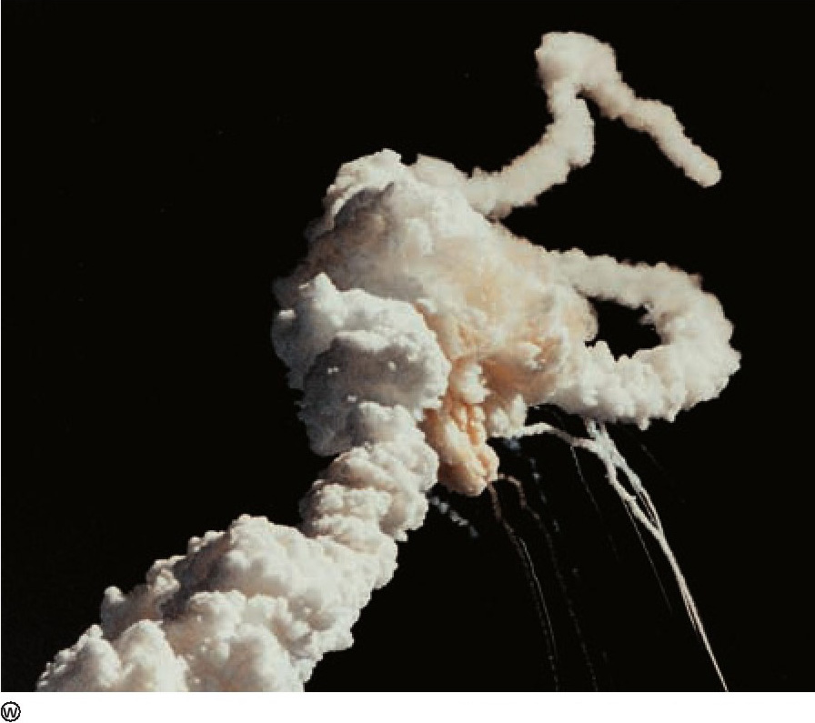
“挑战者号”航天飞机爆炸的瞬间

尽管太空探索充满了挑战和风险，但是人类探寻的脚步并没有停止，反而在不断向前迈进。相信在不久的将来，人类可以自由往返于地球和其他星球，甚至移民其他星球也不再是遥远的梦想。（孙梦婕）

  

**【微博士】**“天宫一号”里的灭火演习

“天宫一号”内配置有消防器材和灭火装置，主要有消防面具、空气分析仪、灭火器等，可以帮助航天员演练在空间站密闭空间内的灭火技巧，同时也对将来中国空间站灭火设备及疏散通道的设计提供技术参数。为了进行灭火演习，“天宫一号”会按照预定程序，模拟“火灾”发生。此时，“天宫一号”的烟雾探测器会监测到烟雾并发出警报，向航天员提示报警传感器的位置。航天员据此确定起火的具体位置，然后赶到着火点，检测燃烧产生的有害烟雾在空气中的含量。此时，地面飞行控制中心的专家会根据分析指标指示航天员是否需要戴上消防面具来灭火。进行模拟灭火时，航天员还要根据操作规程，及时切断“天宫一号”里面的通风系统，免得通风系统将“起火”地点的有害烟雾带向全舱。

【微问题】太空灭火器里的灭火剂有什么独特之处？

【关键词】航天事故　太空火灾

## 航天员在太空中能看见长城吗

至今还有一些导游手册上写着“长城是唯一在太空看得见的人工建筑”，有的甚至说是从月球上都能看到。类似的“佐证”也有不少，如曾经和阿姆斯特朗一起登上月球的航天员奥尔德林接受新加坡一家报纸采访时曾说：“在高度为160～320千米的地球轨道上，中国的长城的确是肉眼看得见的。”这是真的吗？

简单地说，太空中是看不到长城的。但若要深究，情况又有些复杂。

要否定“看得见”的观点其实很简单。长城的宽度可供4匹马并骑，也就四五米宽，最多不超过10米。今天四通八达的高速公路和机场大都超过了这个宽度，它们比长城更宽也更整齐。如果从太空能看到长城的话，那就也能看到这些建筑，还有更为庞大的城市建筑群。“唯一的人工建筑”这个说法是无法成立的。中国首位航天员杨利伟接受记者采访时也说：“地球景色非常美丽，但是我没有看到我们的长城。”后来的中国航天员也没有看到长城。

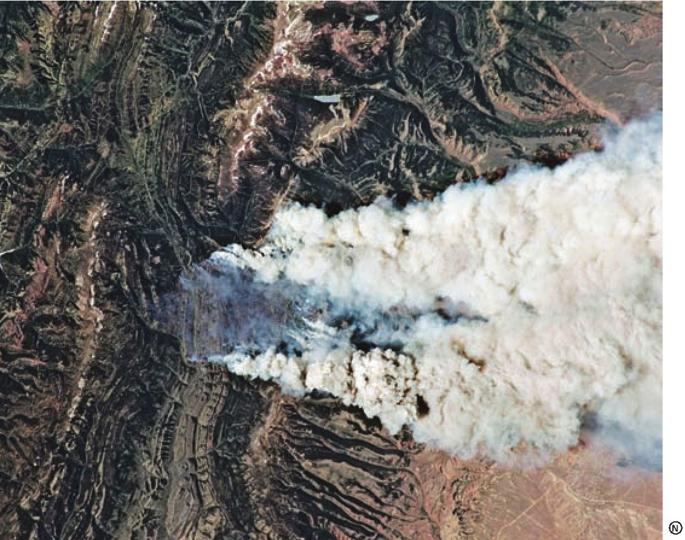
2012年6月，“国际空间站”上的航天员在地球上空约386千米处，发现了美国怀俄明州的一处山火

专业航天机构也不免会被某些错误说法误导。2004年5月，欧洲航天局曾发布了一张高分辨率卫星照片，并认为图像中一条蜿蜒的细线条是长城。这个消息很快受到了国内外学者的质疑。北京测绘设计研究院用航拍地图和1：10000的地形图进行对照分析，确认那其实只是一条山间公路。

航天员上天的目的并不是为了看长城，他们所搭乘的航天器轨道也不一定会经过长城上空，即使经过，天气、光线等条件也未必适合观测。那么，如果条件都合适，航天员是否就可以看见长城了呢？

我们眼睛的空间分辨率大约为0.1°。所以，两个点的距离相对于观测者眼睛的夹角必须大于0.1°，我们才能辨认出来这是两个点而不是一个点。也就是说，即使一个物体的宽度达到10米，在20千米的高度看已经模糊不清了，在36千米以上的高度，它就会在我们的视线内消失。在300千米左右的太空，物体宽度得达到500米以上才能被看见。

不过长城具有长度优势。你可能看不清地板上头发丝粗细的小点儿，却很容易看到一根头发。裸眼观察一个点和一条线的极限距离是截然不同的。在万米高空的飞机上，我们还能看到地上的河流和公路，条件合适的话也可能看到长城。所以在军事上，为了不被敌人发现，经常使用迷彩装饰，把人和武器甚至战舰涂上不同色块。

从太空看到的夜晚的地球

但长城也有劣势，它的走向并不规则，而是沿着山脊自然走向延伸的，所有的石料和山体类似，沿途有植被遮掩，几百年来风吹雨打也对它造成了一些破坏，这些因素都降低了长城的可辨识度。

对于我们的眼睛来说，物体的亮度，尤其是它相对于背景的对比度最重要。只要一个物体能发出足够亮的光，就可以被看见，最典型的就是夜晚的繁星。这些星星大多数距离地球非常遥远，连光都得“走”好多年，但我们能够轻易看到它们。

但利用颜色的差别看到群山中的长城，将是很困难的，因为自然状态下长城与背景过于接近。也有人提出利用明暗的差别看长城会容易些。比如，雪后长城城墙的影子与周围的白雪可以形成明显的对比，在合适的光线条件下可以利用明暗的差别看出长城。但相对于长城所处的自然环境，这样的对比仍然不够强烈，影子的宽度也太细了。还有人提出，如果把几千米跨度的长城用很强的灯光照亮，或者铺上反光材料，或者在长城上施放焰火，都可以让长城“被看见”。将来“神舟”飞船再次飞行或中国航天员长驻空间站时，或许能够做这样的试验。

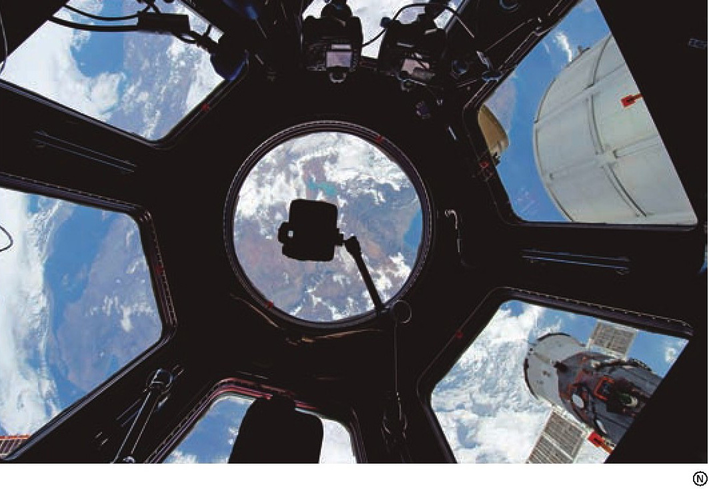
从“国际空间站”上遥看地球

2004年，“国际空间站”上的航天员用高分辨率的镜头拍摄了长城。这可不是随便拍的，需要合适的天气、光线条件才能拍摄清楚。要是用上雷达，那就更有可能发现被掩埋几百年的长城残迹。尽管它们经过风吹雨打甚至被人为破坏，在地面上都无法分辨，而雷达却可以发现它们。（潘厚任　高云峰）

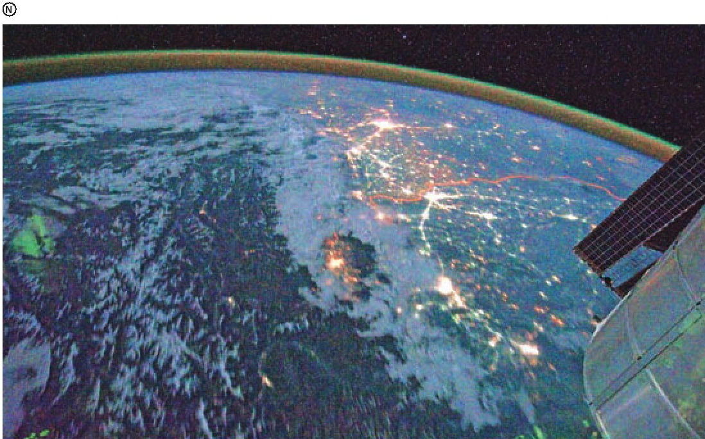
“国际空间站”上拍到的印度和巴基斯坦的边境线（图中橙色的线）

  

**【微博士】**被照亮的印度边境线

太空中用肉眼是看不到万里长城的，这是一个已验证的事实。但在太空中却可能看到边境线呢。2011年8月，“国际空间站”上的航天员拍摄到了印度和巴基斯坦的边境线。自2003年起，为了防止军火贩子的走私和恐怖分子的渗透，印度一侧用强光灯照亮了这条边境线。

**【微博士】**太空中看到的城市灯光

你有没有想过，从太空看夜晚的地球是什么样的？“国际空间站”上的航天员拍摄了照片，让我们看到美洲、欧洲和亚洲的城市，尼罗河的夜景，人口密集的海岸线，以及黑色的沙漠。

【微问题】在300千米左右的太空，能看到天安门广场吗？

【关键词】长城　太空

## 为什么月球探测的方式多种多样

人造地球卫星所受的作用力主要是地球的引力，而月球探测器从地球飞到月球的过程是从只有地球引力场转移到同时有月球引力场的飞行，有很多新的问题需要解决。因此，迢迢天路并非笔直的康庄大道，只有循序渐进，才能到达胜利的彼岸。

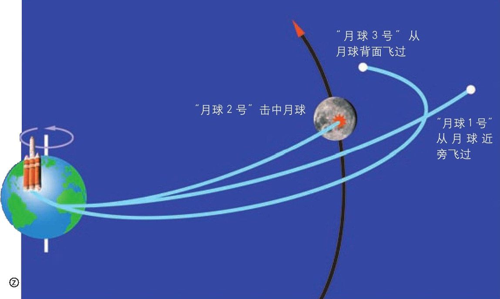
自从1959年1月苏联发射世界上第一个月球探测器“月球1号”以来，人类探测月球使用了多种方式。依据月球探测目的、运载火箭能力和测控技术等的不同，人类月球探测的方式大致经历了6种方式。

（1）飞越　探测器沿椭圆轨道或抛物线轨道飞行，在月球附近越过月球，利用越过的时间对其进行观测。如苏联“月球1号”探测器从月球近旁飞过，“月球3号”探测器则从月球背面飞过。

（2）硬着陆　探测器沿椭圆轨道或抛物线、双曲线轨道飞向月球，着陆过程中不减速地击中月球表面，比如苏联“月球2号”探测器。

（3）环月飞行　探测器沿椭圆轨道飞向月球，经中途轨道修正，进入以月球为主的引力范围，并在适当的位置经过一系列制动、减速和速度修正，被月球俘获后环月飞行，成为月球的卫星。

（4）软着陆　探测器成为月球卫星后，环月飞行一段时间，利用反推火箭减速，下降实施软着陆，进行实地探测。

（5）探测器着陆月球并返回地球　探测器在月球软着陆并完成探测工作后，从月面垂直起飞，在相对月球的速度达到大于月球的脱离速度（2.36千米/秒）时关闭发动机，摆脱月球引力场后，直接奔向地球。

（6）载人登月后返回地球　载人飞船由指令舱、服务舱和登月舱组成。飞船先环月飞行，然后登月舱与指令舱、服务舱组合体分离，在月面软着陆。航天员出舱完成考察或采样等任务后，回到登月舱从月面上垂直起飞，进入环月轨道与组合体对接，摆脱月球引力场后，载人飞船的指令舱返回地球。（石磊）

## 无人月球探测器有哪些代表作

在无人月球探测领域，苏联和美国都先后发展了三代无人月球探测器，它们代表了不同阶段无人月球探测器的技术水平。

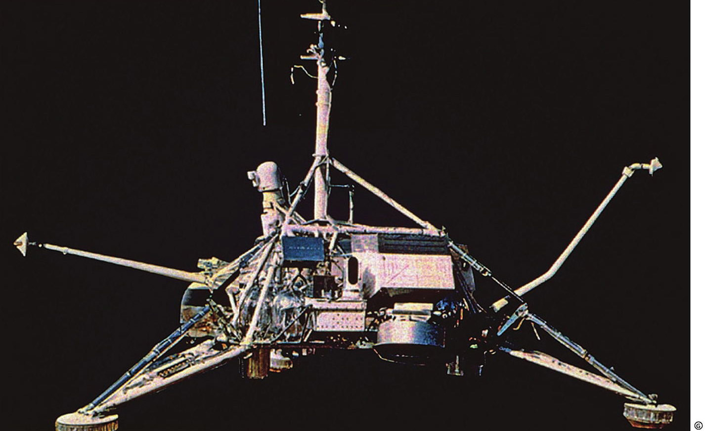
“勘测者号”月球探测器

苏联的第一代月球探测器是“月球1号”到“月球3号”。它们都是小型探测器，质量280～390千克。它们的任务是从月球近旁飞越，或硬着陆在月球上。“月球3号”首次绕到月球背面，传回了那里的图片，使人类第一次看到了月球背面的模样。苏联的第二代月球探测器是“月球4号”到“月球14号”，质量1420～1660千克。它们承担了在月面软着陆的复杂任务，其中最著名的是“月球9号”和“月球10号”，分别首次实现了在月球软着陆和环绕月球飞行。苏联的第三代月球探测器包括自动采集月球样品并返回地球、环月飞行探测及月球车考察三种类型。其中，“月球16号”首次取回了月球样品，“月球17号”携带的首辆无人月球车“月球车1号”在月球上工作了10个月。

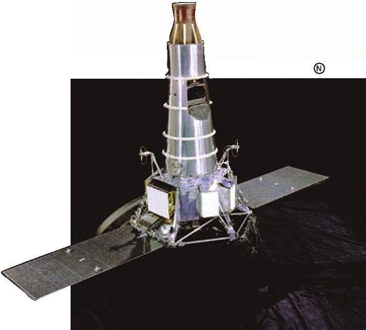
“徘徊者6号”月球探测器

美国的第一代月球探测器是“徘徊者号”，从1961年至1965年共发射了9个，前6个失败，最后3个才获得成功。“徘徊者号”的质量为306～369千克，其任务是在月面硬着陆前近距离拍摄月面地形地貌。美国的第二代月球探测器是“勘测者号”。从1966年至1968年，“勘测者号”先后发射了7次，它的任务是攻克月面软着陆技术，探测月面地形地貌和月球物质的各种特征，为载人登月打前站。“勘测者号”的成功率较高，只有2号和4号失败，其他均实现了软着陆，共传回了87000多幅月面图片，还对月球表面进行了挖掘试验，为载人登月完成了技术准备。美国的第三代月球探测器是“月球轨道器”，从1966年至1967年，共发射5次，全部成功。“月球轨道器”对“阿波罗”载人飞船的20个候选登陆地点进行了详细勘察，并选出了其中5个适宜的降落点。它的成功，加快了阿波罗登月的步伐。（石磊）

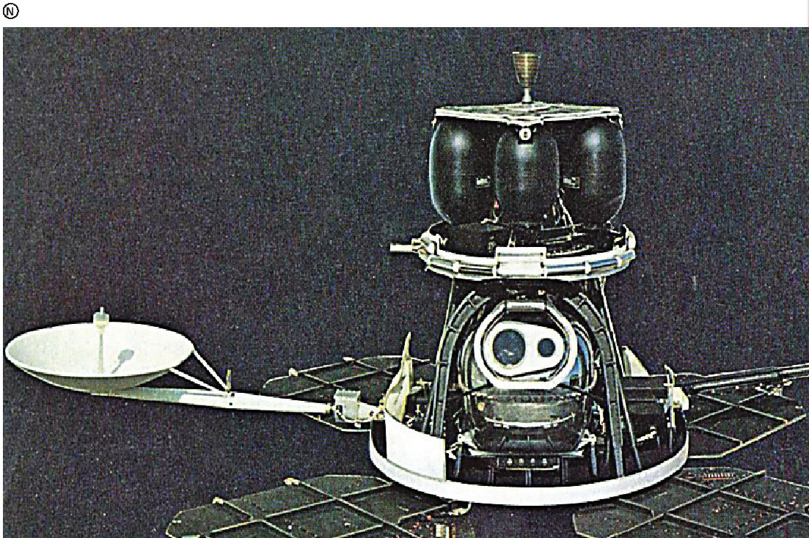
“月球轨道器”

  

**【微博士】**人类探月史的三个阶段

第一阶段：探月的第一次高潮（1959—1976年）20世纪60～70年代，美苏空间竞赛引发了人类第一次大规模的月球探测活动。20世纪60年代初完成了以飞越和硬着陆为主要方式的近距离探测；20世纪60年代中期完成软着陆与环月飞行，实现对月球的普查与详查；1969年后完成了月球车、自动采样返回探测和航天员登月探测。自1969年以后，有6批次共12名美国航天员登上月球，这是人类第一阶段探测活动最高成就。

第二阶段：探月的宁静期（1976—1994年）

从1976年到1994年，人类的月球探测活动进入了长达近20年的宁静期。这一时期，世界各国的有关实验室对月球样品开展了系统的研究，整理、消化和分析了浩瀚的月球资料，将月球研究提高到理性认识的阶段。1989年，美国首次提出重返月球，拉开了人类重返月球的序幕。

第三阶段：探月的第二次高潮（1994年以后）

1994年发现月球撞击坑永久阴影区土壤内存在少量水冰的证据，将人类重返月球的活动引入探月的第二次高潮。21世纪初，中国、美国、欧洲航天局、印度、日本等国家和组织相继提出了新的月球计划，人类月球探测活动进入了新的高潮。

【微问题】中国的月球探测计划分哪几个阶段？

【关键词】月球探测方式　无人月球探测器

# 月球探测

## 为什么要探测月球

月球是一颗充满神奇的星球。月球上的每一块砂石、每一道山谷都隐藏着难解的密码。

人类天生不安分，总想知道天上的秘密，特别是自己的近邻月球。古往今来，地球人对这个白天隐身、夜晚亮相，距离自己最近的尤物充满了好奇。人类在远古时期，便有了关于月球的遐想和神话，有了情感寄托的宿体和对象。直到近代，确切地说是在1609年，意大利人伽利略受荷兰人的启发，制作了一台折射式天文望远镜，籍此比较清楚地观察月球起，人类才开始了理性意义上对月球的科学探索。

伽利略用自制的望远镜观测月球

世界各国对月球探测的目的大同小异，基本分为两个方面。

一方面是科学目标。比如，对月面进行全球性的遥感调查，获取月球表面的三维影像；进行月面形貌和地质构造的研究；分析月球表面元素含量和物质类型的分布特点；调查月表物质成分和可利用资源等。其目的都是探索如何开发月球资源和从新的平台上研究太阳系的起源与演化。

另一方面是工程目标。比如，研制和发射大推力运载火箭及月球探测器，突破地月飞行技术，远距离航天器测控和通信技术，环月飞行技术，月球遥感技术，月面软着陆和巡视勘察技术，月面自动采样和返回技术，以及月球基地建设技术等。（石磊）

## 为什么月球上的地名与地球上的地名如出一辙

1609年，伽利略使用32倍望远镜，看到了一个起伏跌宕的月球世界：高的地方像地球上的山脉，低的地方像地球上的海洋。他首先以其家乡的“亚平宁山脉”为月球上最明显的一座山脉命名，开创了为月球地理实体命名的先河。

40多年后的1651年，意大利天文学家里乔利在其出版的一本书中发布了一幅月面图。在这幅图中，里乔利把月面的暗区称为“海”，将撞击坑以科学家、哲学家的名字命名。他的这种命名方式很快被人们接受，迄今里乔利命名的200多个名称还在使用，如“雨海”、“风暴洋”、“第谷撞击坑”等。

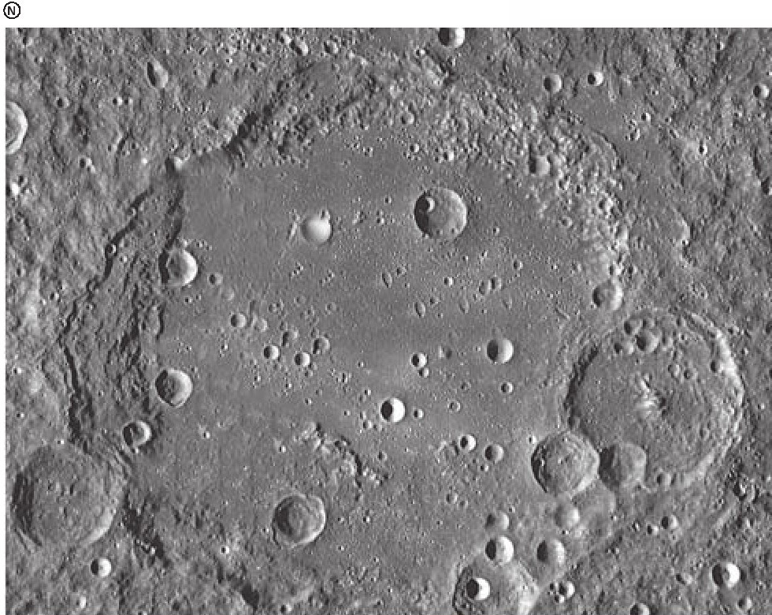
门捷列夫撞击坑（月球）

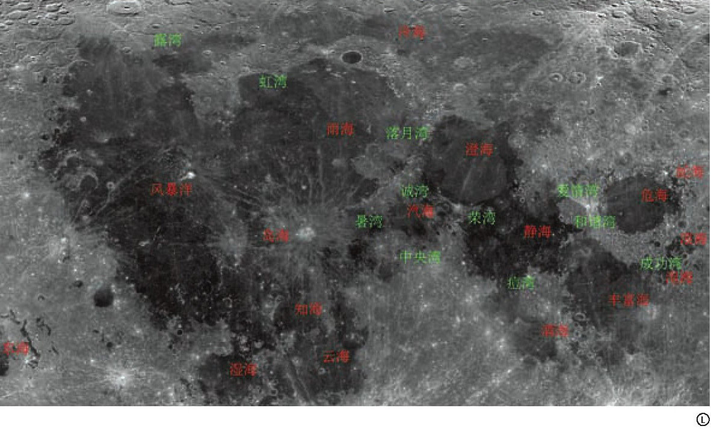
月球正面的月海影像图

1922年，国际月球地理实体命名委员会成立。经过一段时间的整理和确认，1935年，该委员会公布了第一批规范化的月球地理实体名称，共确认了641个名称。1973年，国际天文学联合会制定了规范的月球地理实体名称申报审批程序。

按照规定，被命名的实体，其直径或长度必须大于100米，必须具有特殊的科学价值。新的命名规则充分尊重传统名称体系，依然规定将相关形貌命名为“海、湖、湾、沼”，月球上的山脉或山峰以地球上山脉或山峰的名字命名，撞击坑以杰出的科学家或为人类航天事业做过突出贡献的人命名，卫星坑以附近撞击坑名称加后缀字母命名。

截至2010年，国际天文学联合会共审查了9000多个月球地理实体名称，其中撞击坑1595个，卫星坑7065个。（石磊）

  

**【微博士】**指南针在月球上找不着北

月球没有全球性的磁场。从对月岩的研究中，科学家发现，月岩中的剩磁形成的磁场强度不及地球磁场强度的1/1000。如此弱的磁场强度，使得指南针根本没有“感觉”。如果航天员在月球上需要辨别方向，可以通过太阳的方向简单判断自己所在的方位。

## 人类探测月球走过了怎样的历程

人类探索月球、开发和利用月球的活动，可以形象地概括为“探”、“登”、“驻（住）”三级跳。

第一跳是去“敲门”，也就是“探”，指无人探月阶段，是人类派出无人月球探测器访问月球、认识月球。它好比是探路，去试着敲开广寒宫的大门。

第二跳是去“串门”，也就是“登”——载人登月。载人登月是指航天员登上月球，相当于地球人到月球上去“串串门”，在月球上考察、取样、放置科学仪器并很快返回地球。1969年7月，美国首先实现的阿波罗载人登月计划，完成了三级跳中的第二跳。

第三跳是去月球上“小住”一段，也就是“驻（住）”。“驻（住）月”包括两层含义：第一层的“驻”是指航天员带着设备降落到月球上，短期驻留在月球上开展科学考察活动，并安置好自动科学设备，然后返回地球，而自动科学设备就“驻”留在月球上，进行长期探测和研究；第二层的“住”是指在月球上建设短期的有人月球前哨站或永久性的月球基地，人类可以住在月球上生活和工作，全面开发、利用月球资源。

纵观人类探月活动的发展，各国都离不开“探”、“登”、“驻（住）”这三个阶段。美国已经走完了“探”、“登”阶段，俄罗斯对“探”做得非常充分，中国、欧洲、日本和印度等国家正处在“探”的阶段。（石磊）

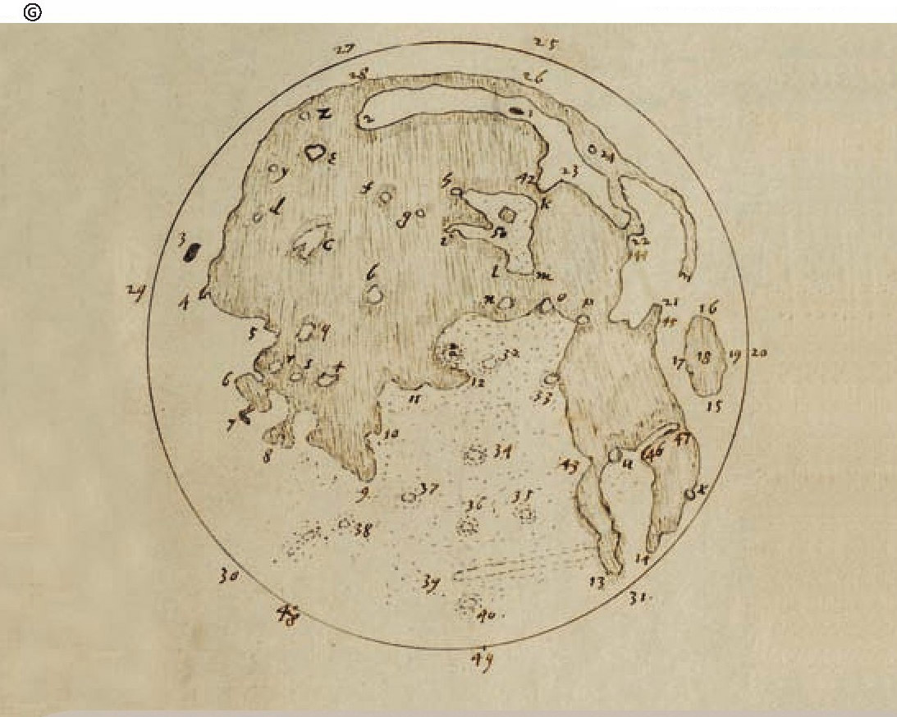
哈利奥特绘制的月面图

  

**【微博士】**谁绘制了第一张月面图

17世纪初，望远镜还是一种比较稀有的工具。1609年初，英国数学家、天文学家哈里奥特买了一架望远镜，放大倍率仅为6倍。当年7月26日夜晚，哈里奥特用望远镜观测月球，画出了目前可考证的第一幅月球表面素描图。该图尽管粗糙，却比伽利略绘制的首张月面图早诞生4个月。

哈里奥特一共留下了12幅月球表面素描图。它们描绘了月球正面比较明显的月海和撞击坑，所标记位置很准确，还反映出了一些重要细节。

【微问题】人类第一个月球探测器是哪一年发射的？

【关键词】月球探测　月球地名

## 为什么先有月面软着陆后有载人登月

纵观人类的探月历程，月球探测器与月球接触的方式有两种。

第一种是“硬着陆”，即探测器在飞向月球的过程中以较大速度直接冲撞着陆的方式。由于着陆速度过大，这种着陆方式会使探测器完全或大部损坏。苏联的“月球2号”、“月球5号”、“月球7号”、“月球8号”探测器，以及美国的“徘徊者7号”、“徘徊者8号”、“徘徊者9号”探测器都在月球上硬着陆后“壮烈牺牲”。

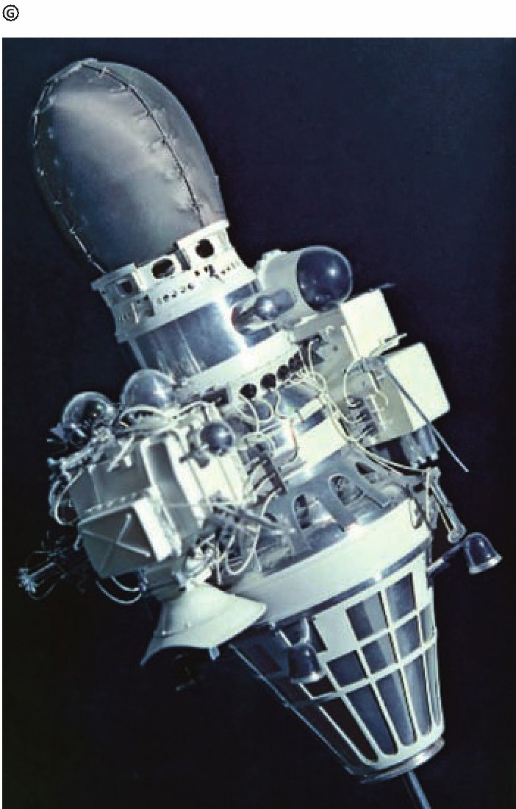
“月球9号”探测器的顶部是约100千克的卵形着陆舱

第二种是“软着陆”，即要求探测器经专门减速装置减速后降到足够低的速度，在预计的地点安全着陆。从技术发展角度看，月面软着陆是探月历程上的一个大台阶，其中的关键技术是“太空刹车减速”。如果刹车减速过猛，探测器会一头扎向月球，变成硬着陆；如果刹车减速不足，探测器会与月球擦肩而过，进入环绕太阳飞行的轨道。

苏联和美国为了实现这个里程碑技术都吃足了苦头，损失了很多探测器。1966年2月，在经历了多次月面软着陆尝试失败后，苏联的“月球9号”终于率先取得了成功。“月球9号”携带的卵形着陆舱以不到6米/秒的速度落在了月球表面，缓冲装置令着陆舱内的仪器安全无虞。稳定后，着陆舱从顶部展开4个花瓣形的天线，开始拍照，并向地球传送数据。它的成功，不仅使人类第一次得到了月球表面的全景照片和局部区域的立体照片，还告诉人们：月球表面月壤层的结构和物理力学性质是硬的，完全不必担心登月航天员会陷进月壤之中。而此前，科学家一直担心月表的浮尘会像地面的沼泽一样，使人陷入灭顶之灾。

在掌握了月面软着陆技术后，包括月球车在内的各种月球探测器随之纷至沓来，降落在月球表面。有了上述基础，载人登月任务才得以实施。（石磊）

## 为什么月球车的设计有许多特殊要求

月球车是一种能够在月球表面行驶并完成月球探测、考察、收集和分析样品等复杂任务的专用车辆。它的学名是“月面巡视器”，俗称“月球车”。月球车可分为无人驾驶和有人驾驶两大类。

无人驾驶月球车由轮式底盘和仪器舱组成，用太阳能电池和蓄电池联合供电，靠地面遥控指令行驶或自主导航选择路径行驶。有人驾驶月球车是由航天员驾驶在月面上行走的车。它为四轮驱动，靠蓄电池提供动力，最大速度为10～12千米/时，主要用于扩大航天员的活动范围和减少体力消耗，便于随时存放航天员采集的岩石和土壤标本。

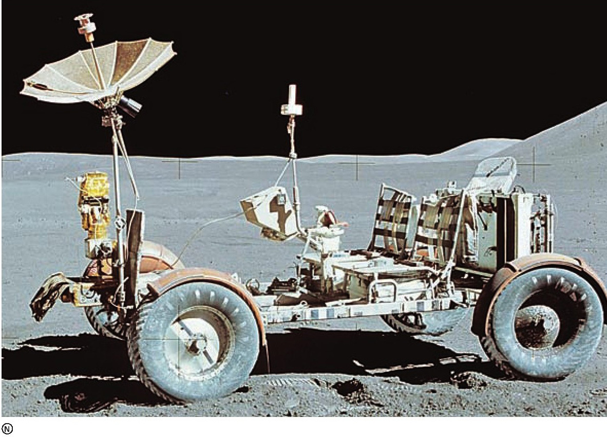
第一辆有人驾驶月球车——“阿波罗15号”的月球车

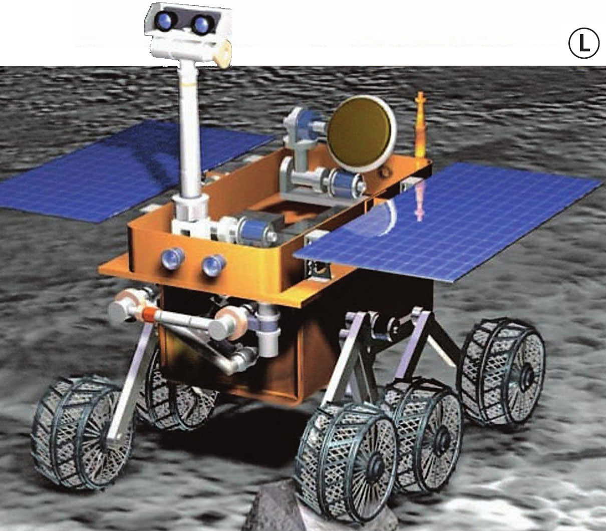
“嫦娥三号”携带的月球车（模型）

相对于我们常见的汽车来说，月球车有许多的特殊要求。

首先，月球车面临航天特殊环境，包括力学环境和空间环境的考验。力学环境指在发射过程中运载火箭产生的冲击、振动、过载和噪声，在月面降落过程中制动火箭产生的冲击、过载等。月球车必须经得起这些“摔、打、滚、爬”等折腾。

其次，月球车还面临极为严峻的月球环境的5个考验。

（1）路况复杂　月球表面的地面崎岖不平，有石块，有撞击坑，还有斜坡。在这种情况下，月球车的轮子便需要克服重重障碍，既不能打滑，也不能翻车，必须做到前进、后退、转弯、爬坡，样样在行。

（2）温差大　在月球的一个自转周期内，温度相差可以达到300℃左右。月面上如此急剧变化的温度环境，要求月球车必须自备“空调”，随时给自己调节温度。极端的温度变化会使车轮的橡胶迅速老化，因此月球车轮胎要使用特殊材料。

（3）辐射强烈　地月空间和月球表面空间辐射的类型、能量和强度都与地球附近大不相同，月球车所使用的电子部件，特别是对辐射尤为敏感的高集成度微电子器件，不采取严格的抗辐射加固措施，是无法工作或达不到设计寿命的。

（4）智能控制　由于地月距离较远，月球车不能通过遥控实时处理反馈信息，应尽可能自主感知周围环境，自主规划行进路径，自主跨越或者避开障碍，具备较强的独立处理问题的能力。

（5）自动休眠和复苏　月球上的一天，大约相当于地球上的27天略多。因此，月球昼与夜各相当于地球上的14天。也就是说，月球车白天最多可以连续工作14天；进入月夜以后，它不能发电，就进入休眠状态。14天后，它要能自动醒来继续工作。

你看，有这么多苛刻的环境要求，月球车的设计绝对是个真正的难题！（石磊）

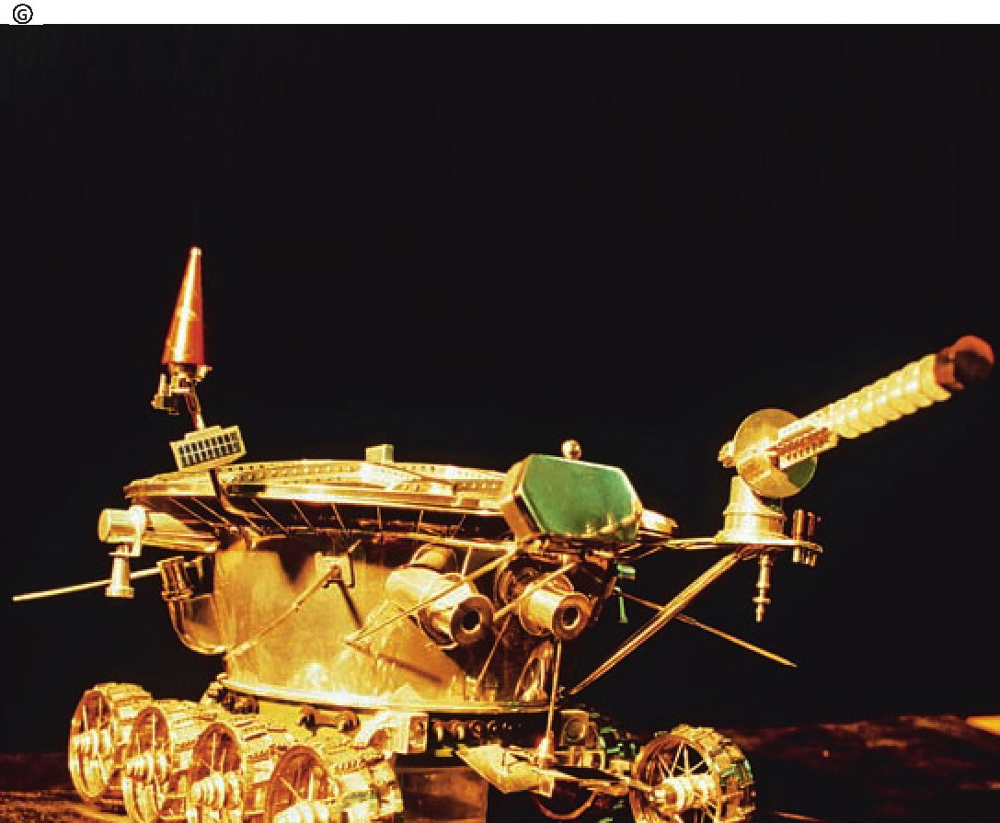
“月球车1号”

  

**【微博士】**第一辆月球车

1970年11月，苏联发射的“月球17号”探测器将“月球车1号”送上了月球。这是世界上第一辆无人驾驶月球车。它重约756千克，在月面上行驶了10.5千米，考察了约8万平方米的月面。第一辆有人驾驶月球车，1971年7月由美国“阿波罗15号”飞船带上月球，两名航天员驾车行驶了27.9千米。

【微问题】设计一辆月球车，最关键的要素是什么？

【关键词】软着陆　硬着陆　月球车

## 为什么说阿波罗登月是人类历史上的伟大创举

在人类探索月球的征程中，阿波罗计划可谓最辉煌的顶峰。1961年，美国提出了该计划。经过8年的艰苦努力，在发射了10艘“阿波罗”飞船之后，1969年7月20日，“阿波罗11号”飞船终于降落在月球上。

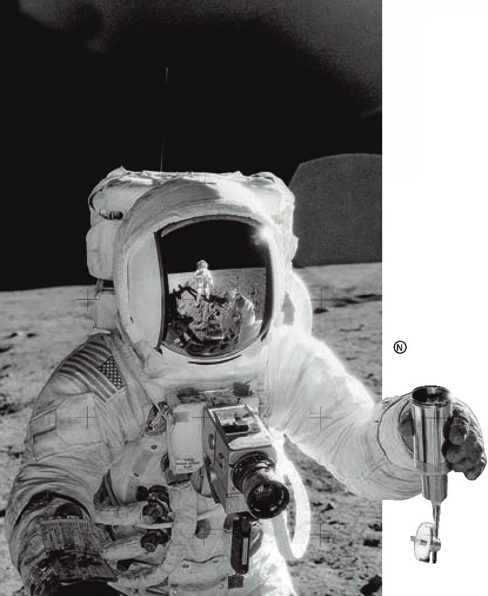
整个阿波罗计划共执行了7次载人登月任务。其中，6次任务取得了巨大成功，先后有12名航天员成为月宫嘉宾。“阿波罗13号”因服务舱的液氧箱发生爆炸，登月计划被迫取消，但航天员安全返回地球。12名航天员在月球上共逗留了298小时45分钟，进行了110多小时的月面活动，移动距离近100千米。他们进行了几十项科学试验和勘测，拍摄了15000张月球近距照片、长达12千米的电影胶卷和许多录像带，共收集带回了381.7千克的月球岩石和土壤标本。同时，还在月球上安置了6个月震仪、5座核动力科学实验站等20多种自动测试仪器。科学家利用这些仪器进行了大量的、多方面的科学实验，取得了前所未有的科学成果。例如，航天员在月球上安装了激光反射器，地球上的科学家把激光束射向月球，激光反射器就把激光反射回地球。根据激光的往返时间，就可以精确地测量出地球和月球之间的距离，误差不超过15厘米。

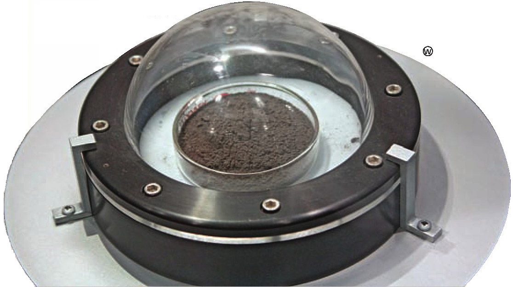
“阿波罗17号”飞船带回的月球土壤

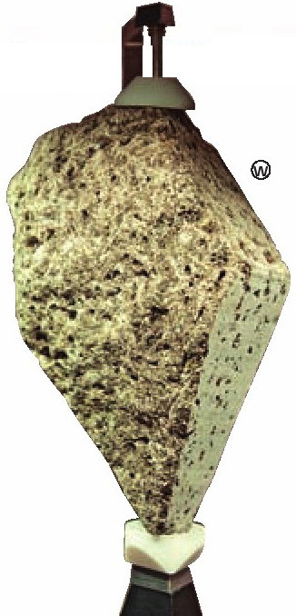
“阿波罗15号”飞船带回的月球岩石

历时10年的阿波罗计划，动员了上百个科研机构、120所大学、2万多家企业，先后有40万人参加，耗资约250多亿美元。它体现了人类的探索精神和克服一切困难的勇气，是20世纪最伟大的创举。它在月球探测方面取得了丰硕的科学成果，使人类第一次对我们居住的地球之外的天体有了比较系统的了解。它为美国带来了巨大的技术和经济利益，不仅建立和完善了庞大的航天工业和技术体系，还有力地带动和促进了通信、计算机、电子、自动控制、材料、系统工程等一系列高新技术的快速发展。据不完全统计，从阿波罗计划派生出大约3000种应用技术成果，短短几年内这些应用技术就取得了巨大的效益。

阿波罗计划因大大扩展了人类的活动空间和对太阳系的认识而永垂青史。（石磊）

## 为什么苏联人没能登上月球

苏联的载人登月计划始于1964年，原计划用4年时间让航天员踏上月球。

1966年9月，苏联研制了一艘巨大的飞船。它由三个部分组成：一是环月飞行的载人飞船，这是母船，它被命名为“联盟LOK”；二是可载一名航天员在月球着陆的登月舱，称为“LK登月舱”；三是主要用来“刹车”的D级火箭助推器。由这三个部分及救生逃逸塔组成的装置被称作L3复合体，它由N1火箭送往月球。所以，苏联载人登月计划的代号是N1-L3。

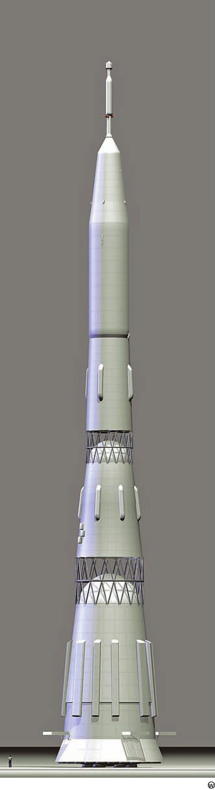
N1运载火箭

N1火箭高约105米，底部直径17米，起飞质量2800吨，它能将95吨重的有效载荷送到低地球轨道。N1火箭共有5级，前3级可以将登月飞船送到低地球轨道，第四级可将飞船送入奔月轨道。第五级（也称作D级）的作用有三个方面：首先，在飞往月球的长途旅行中提供调整飞行路线的动力；其次，在接近月球时作为反推火箭起“刹车”作用，使飞船/登月舱进入环绕月球的轨道；第三，在随后下降过程中，它将随登月舱一同与飞船分离，并继续工作以减低登月舱的下降速度，最终在离月球表面4千米时被抛掉。在研制飞船和火箭的同时，苏联开始训练登月航天员，至少有18位航天员接受了相关训练。

N1运载火箭的研制非常艰辛。1969年2月21日，火箭首次升空，飞行至12000米时突然爆炸。四个半月后，火箭第二次发射。但是，火箭点火才6秒，一台主发动机爆裂，随之火箭倾倒引发大爆炸，严重摧毁了发射场。经过两年准备，1971年6月，火箭再次发射。这次携带模拟飞船的火箭在发射51秒时坠毁在地面。在1972年11月的试飞中，火箭飞行到40千米时又发生故障而自毁。8年中，N1运载火箭4次发射均以坠落爆炸告终，对苏联载人登月计划造成了灾难性的沉重打击。

1974年，N1火箭黯然出局。由于火箭不争气，苏联载人登月的大戏无可奈何地落下了帷幕，登月计划被取消，因为美国人已经在1969年登上了月球。（石磊）

  

**【微博士】**阿波罗计划的尾声

“阿波罗17号”执行完任务后，登月计划宣告结束。1973年5月，美国利用剩余的“土星5号”火箭发射了一座空间站——“天空实验室”。当年，美国又发射了3艘“阿波罗”指挥舱与其对接。1975年7月，美国发射了阿波罗计划剩余的“阿波罗18号”飞船，与苏联的“联盟19号”飞船进行了太空对接和互访。

**【微博士】**月球上的“人类遗迹”

自从1959年人类发射首个月球探测器以来，月球上的“人类遗迹”已有40多个。其中有苏联的8个“月球号”探测器和美国的5个“勘测者号”探测器，还有6个“阿波罗”登月舱的下降级，以及航天员安装的大量科学仪器设备等。月球上留有6辆特制的“月球车”，其中有5辆是机动车，将来的登月者也许只要装上新的电源，仍可驾驶它们在月面上行驶。苏联、美国、欧洲航天局、日本、中国、印度等发射了多个月球环绕探测器，它们环绕月球飞行完成探测任务后，由于月球引力，最终也投入了月球的怀抱。

【微问题】人类总共从月球带回了多少千克月球岩石？

【关键词】阿波罗计划　苏联载人登月计划

## 为什么阿波罗计划不是骗局

自20世纪70年代起，每过一段时间，关于“登月是骗局”的论调就兴起一阵喧嚣。出于各种目的，有些人说美国阿波罗登月是伪造的，人类根本没有去过月球，相关情景是用电影特技在地球上拍摄的，照片也是假的。他们还煞有介事地拿出了很多所谓的“证据”。然而这些“证据”根本站不住脚，每一条都已经被科学家和专业人士彻底粉碎。

“登月计划阴谋论”在国内外都很盛行，这些所谓“证据”大多来自人们对月球真空、低重力的环境缺少了解，机械地照搬地球上的情况而产生的误解。实际上，在月球上基本的物理化学等规律同样成立，只是具体环境条件不同，表现也会大不一样。科学家对此也给出了很多相应的分析，美国《国家地理》杂志还专门刊登过辟谣文章。

阴谋论者提出的所谓证据，主要有以下几条：月球上没有空气也没有风，录像中美国国旗不应该飘动；登月照片中不应该看不见星星；登月舱降落时吹走了附近的尘土，因此航天员不可能在登月舱附近踩出脚印；月球上无法踩出如此清晰的脚印。

其实，旗帜的飘动（表面起伏）并非被风吹动，而是因为两个原因：一是使用了倒L型旗杆，使国旗呈悬挂状，看起来像在飘动；二是惯性所致——由于月球上缺少空气阻力，一开始产生的起伏运动会持续很久，这跟我们平时的经验是不一样的。这一点已经在地球上真空环境实验中得到证实，而且当旗帜停止飘动时，它会定格在“飘动”时的状态。

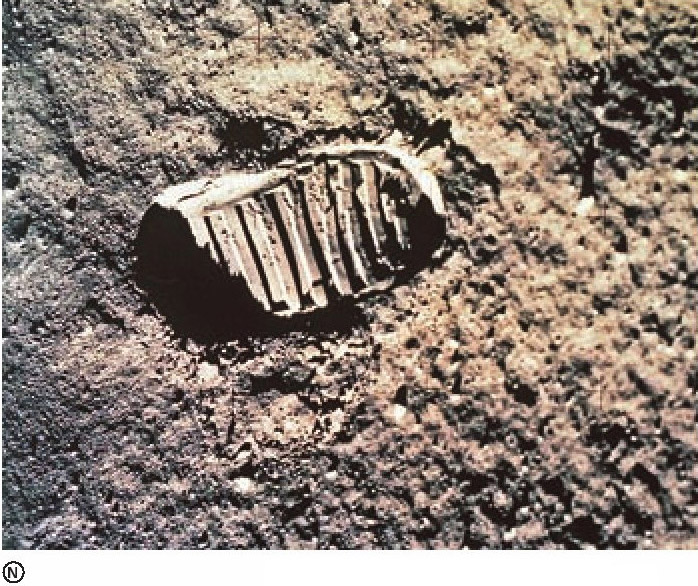
航天员在月球上留下的脚印

跟我们的“常识”也相反，登月照片中是不可能有星星的。阿波罗登月主要活动都是在月球的白天进行的。由于日照和反光强烈，在月面活动的照片中不可能拍摄到相对很黯淡的星星。在太空中要拍摄星星，需要避开强光，以及延长曝光时间，所以“哈勃”太空望远镜等都要避开强光（太阳、月亮或者白天地球的光线）。“神舟”飞船历次飞行活动也为我们带回了太空中真实的场景，从视频和照片中可以看出，在正常拍摄被阳光照亮的物体时，不可能拍摄到星星。

“月球脚印”是阿波罗登月重要的见证和纪念，也是阴谋论者攻击的重点。登月舱降落时确实会激起大量尘土，但与地球上的情况不同：由于月球上没有空气，不会形成强大的气流，因此只有登月舱正下方的尘土会被激起，登月舱周围的尘土则不会被扰动，所以航天员出舱时当然会踩出脚印。而且月球上的尘土（月壤）和地球上的尘土不一样。地球上潮湿的沙地或泥土不容易踩出线条分明的脚印。但月球上没有空气，也就没有风化磨损过程，土壤保留了棱角分明的粗糙形状，踩出脚印来是很清晰的。

以上只是对反面意见的分析，那有没有独立的第三方证据，或客观存在的“物证”，能证实阿波罗登月确实发生过呢？当然是有的。

苏联对探月的构想始于1951年，后来在无人探月领域接连取得数次“历史第一”，然而载人登月计划的梦想却随着N1登月火箭接连发射失败化为泡影。尽管如此，在“阿波罗11号”飞船即将启程之时，苏联依然想做最后一次努力——将一个无人自动取样返回探测器“月球15号”送上月球，试图抢在美国“阿波罗”飞船之前取回月球土壤样本。1969年7月13日，“月球15号”赶在“阿波罗11号”3天前发射。不幸的是，它在7月21日着陆时坠毁。而7月16日“阿波罗11号”发射升空，7月20日成功着陆在月球表面。“阿波罗11号”在“月球15号”坠毁后2小时从月球起飞返回地球。

“月球勘测轨道器”拍摄的“月球24号”着陆舱

这场角逐被西方航天史学界看作是冷战期间美苏“太空竞赛”最富戏剧性的高潮。2009年7月，英国焦德雷尔班克天文台首次公开了对“月球15号”的跟踪记录，其中可以分辨出“阿波罗11号”航天员与地面的通话。此外，为了避免两个月球飞行器发生相撞，苏联应美国的要求透露了“月球15号”的轨道参数。这些都证明半个世纪前那场太空中的赛跑实实在在地发生过。

而且，阿波罗计划带回了约382千克月岩和月壤。其中有少量作为礼物赠送给包括中国在内的多个国家，中国科学家利用0.5克月岩成功地分析出了它的成分和在月球上的位置。这些岩石样本有力地证实了阿波罗登月的真实性。苏联利用无人取样器也获得了326克月壤和岩芯样本，并和美国进行了部分交换。

另外，“阿波罗11号”、“阿波罗14号”、“阿波罗15号”在月面上安放了3台激光反射镜。世界各地的天文台都一直使用这些反射镜测量地月距离，精确度达到厘米级别。当激光对准反射镜所在位置发射时，有相当一部分光会集中在同一瞬间返回，从而证明这些由阿波罗航天员安置在月面的激光反射镜确实存在。

进入21世纪，随着美国、欧洲航天局、中国、日本、印度等月球探测器的成功发射，“阿波罗”留在月球上的遗迹被直接拍摄到了。美国“月球勘测轨道器”拍摄了“阿波罗”各个登月点附近的照片，上面能清晰地看到登月舱下降级、放置在月面的仪器以及航天员和月球车留下的印迹等。除了“阿波罗11号”，各个登月舱附近都能看到美国国旗投下的影子，这也与事实相符。因为“阿波罗11号”的任务录像显示，美国国旗在登月舱上升级起飞时被吹倒了。它还拍摄到了苏联多个取样器的下降级，并找到了失踪已久的苏联自动月球车“月球车1号”和倾倒在月面上的“月球23号”取样器。

“嫦娥二号”也拍摄到了“阿波罗17号”着陆点的痕迹。尽管照片分辨率不及“月球勘测轨道器”，但依然可以分辨出3个像素大小的登月舱下降级，以及着陆点附近的众多地貌特征。日本通过处理“辉夜姬号”探测器的照片得到了“阿波罗15号”着陆点附近的地形分布，这与“阿波罗15号”实拍的照片一致。印度的“月船1号”也拍下了“阿波罗15号”着陆点附近被月球车搅动过的土壤印迹。

其实阿波罗登月这一事实并不需要像考古学一样用证据才能证明其存在。半世纪前，有成千上万的科学家和工程师参与到相关项目中，见证了人类这一伟大成就。因此，怀疑登月的真实性既没有理由，也没有依据。（麻钧涵）

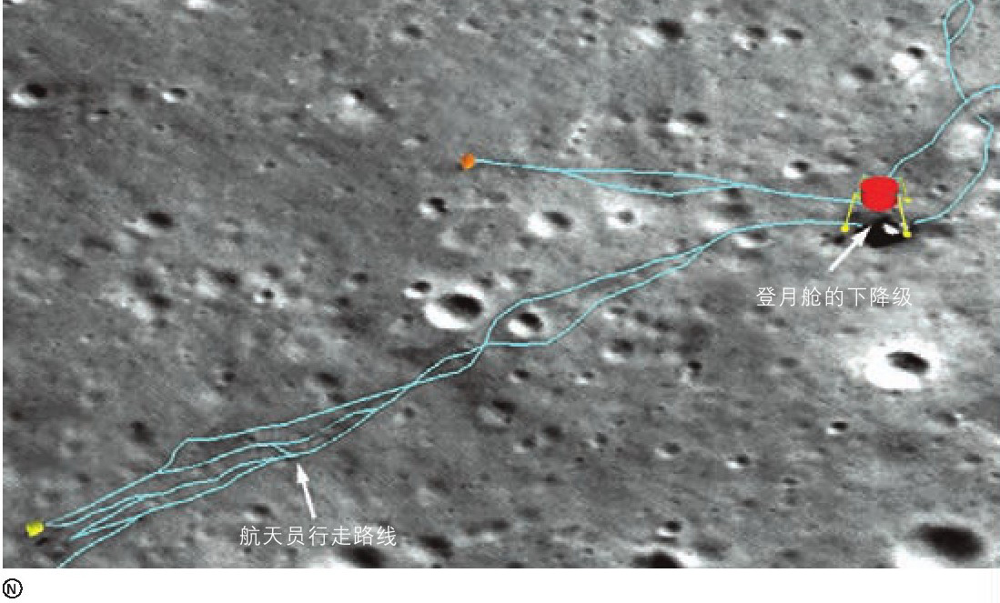
“月球勘测轨道器”拍摄的“阿波罗14号”着陆点

  

【微问题】在太空飞船上，航天员能看到满天的繁星吗？

【关键词】阿波罗计划　阿波罗登月

## 中国探月工程的具体计划是什么

中国探月工程分“绕”“落”“回”三期工程，计划用15年的时间分三步完成。

“绕”，就是发射环绕月球南北极飞行的探测器，对月球进行全球性遥感探测。2007年10月发射的“嫦娥一号”，对月球进行了1年4个月的探测，圆满完成了绕月探测的任务。

“落”，就是探测器（包括着陆器与月球车）在月球表面软着陆并进行巡视考察。此阶段共实施3次发射任务，分别命名为“嫦娥二号”、“嫦娥三号”、“嫦娥四号”。“嫦娥二号”为技术先导星，2010年10月发射，已成功完成任务。“嫦娥三号”将于2013年下半年发射。它将释放月球软着陆探测器，实现着陆器原位探测与月球车自动巡视考察，开展月球区域性的精细联合探测。“嫦娥四号”为“嫦娥三号”的备份。

“回”，就是2017年前后发射可以自动返回地球的月球采样着陆器，开展月面原位探测，并携带自动钻孔取样机和样品收集器，采样后携带月球样品返回地面，供科学家研究。此阶段计划实施2次发射任务，分别命名为“嫦娥五号”和“嫦娥六号”，它们的研制工作已全面启动。（石磊）

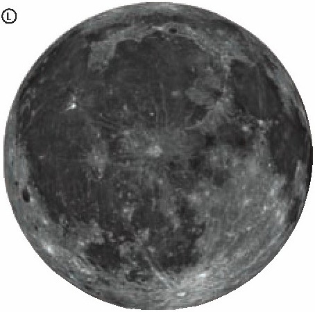
月球正面

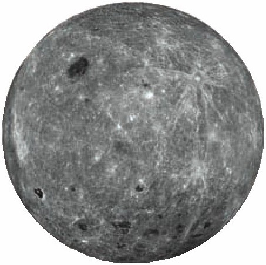
月球背面

“嫦娥二号”全月球7米分辨率影像图

  

**【微博士】**月球为何没有彩照

物质的颜色是电磁波照射到物质表面后经透射、吸收后反射到我们眼中，在我们脑中产生的一种视觉效应。太阳光由红、橙、黄、绿、蓝、靛、紫七种颜色组成。物体受太阳光照射后，若只反射其中一种颜色的光，例如黄色，而将其他光吸收，人们看到的就是黄色；如果被全部反射回来了，我们看上去就是白色的；如果光被全部透射或吸收了，我们看上去就是黑色的；如果被均匀地吸收或透射，那么就是灰色的。

月球表面的物质对可见光范围各波段的吸收都比较均匀，在太阳光的照射下呈现为不同深度的灰色。因此，对月球照相也就只能得到黑白的照片了。

为了表示月球表面地形的高低起伏，让它具有“三维”的信息，科技人员也制作了一些彩色照片。比如：以白色表示海平面；月面隆起的地方，由低向高，颜色从浅黄色上升为土黄色；反之，地势越低的地方颜色越偏蓝。

## 为什么“嫦娥”探测器要拍摄全月图

月球的表面积约为3800万平方千米，大约是中国陆地面积的4倍。全月图相当于将我们的视力延伸到几十万千米之外。它是科学家分析月表形貌、研究月球物质特性与成因，勾绘月球地质构造，进而研究月球的起源和演化最直接、最重要的材料。对月球的研究还可以对太阳系的起源与演化提供重要科学信息。全月图还能为月球探测器软着陆区和载人登月着陆区的优选，提供可靠的地形地貌依据。

2012年2月6日，中国发布了“嫦娥二号”月球探测卫星7米分辨率全月球数字影像图（简称全月图）。中国这一最新版的全月图是由384轨（1轨指卫星环绕月球一圈所拍摄的影像图）“嫦娥二号”CCD立体相机影像数据“镶嵌拼接”而成的。

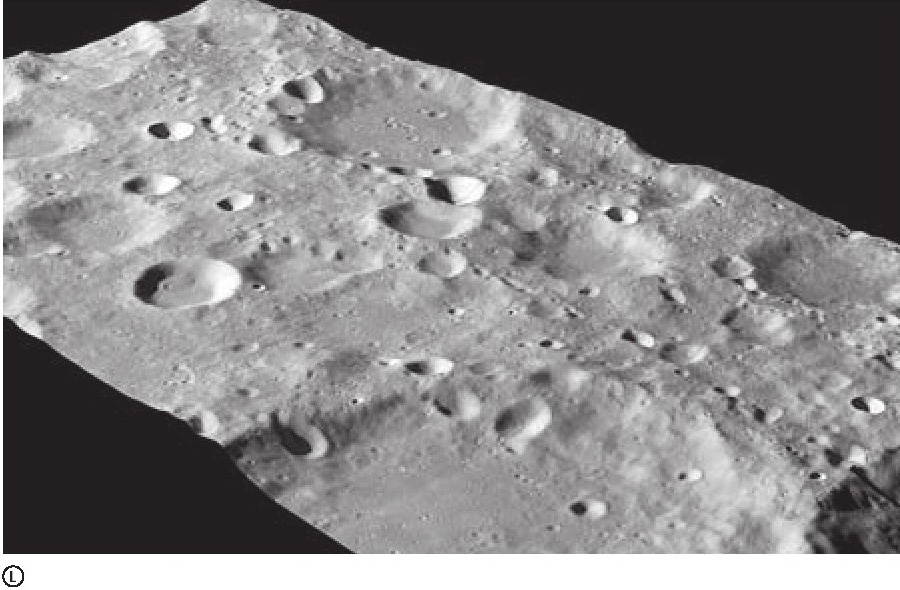
“嫦娥一号”月球探测卫星拍摄的第一幅月面图（三维立体图）

每一轨数据图有多大呢？大约长11000千米、宽43千米。若将384轨图镶嵌拼接起来，再按照300dpi印刷质量标准打印，在7米分辨率、比例尺1：80000的情况下，这幅月球“巨照”相当于一个标准足球场大小。

中国拍摄的全月图，实现了全月球影像的“无缝”镶嵌，在分辨率、影像质量、数据一致性和完整性、镶嵌精度等方面，都达到了目前国际最高水平。（石磊）

## “嫦娥一号”和“嫦娥二号”现在何处

“嫦娥一号”月球探测卫星于2007年10月24日发射。在超额完成预定任务后，在地面人员精确控制下，它于北京时间2009年3月1日16时13分成功撞击月球，落点位于月球东经52.36°、南纬1.50°的丰富海地区。

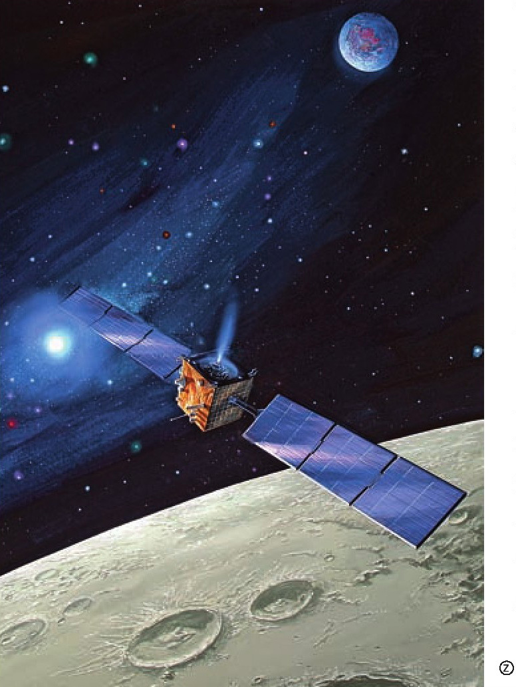
“嫦娥一号”月球探测卫星

“嫦娥二号”月球探测卫星于2010年10月1日发射，10月27日至29日完成了对“嫦娥三号”探测器预选着陆区虹湾1米分辨率成像、全月球7米分辨率影像图和其他科学探测的预定任务。2011年4月1日，“嫦娥二号”完成了预定的飞行任务和科学探测，又在月球轨道超期工作了两个多月，进行了一些试验，获得了许多科学数据。

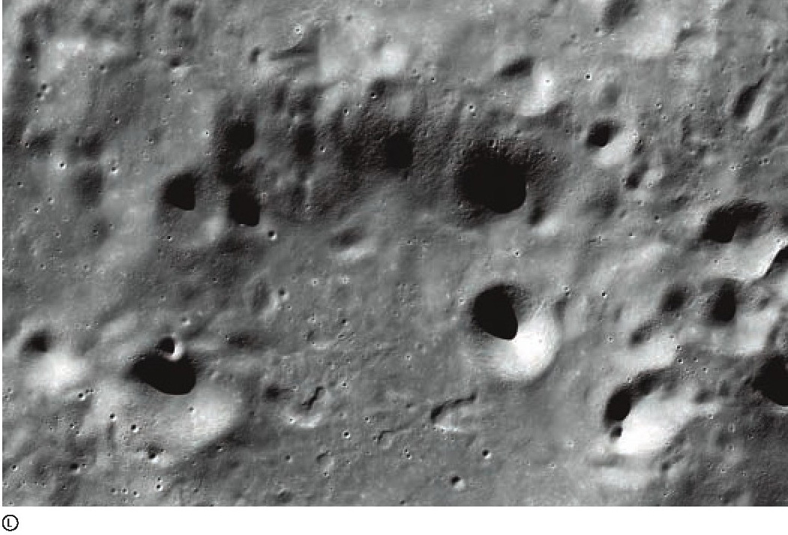
张钰哲撞击坑（月球）

2011年6月9日，“嫦娥二号”飞离月球，执行拓展性试验任务。8月下旬，它成功飞抵距地球150万千米的第二拉格朗日点稳定环绕运行。

“嫦娥二号”在第二拉格朗日点开展科学探测235天，出色地完成了观察太阳的任务后，于2012年4月15日受控飞向行星际空间。2012年12月13日，“嫦娥二号”成功飞抵距地球约700万千米远的深空，以10.73千米/秒的相对速度，与国际编号4179的图塔蒂斯小行星擦身而过，最近相对距离3.2千米，首次实现中国对小行星的飞越探测。“嫦娥二号”星载监视相机还对图塔蒂斯进行了光学成像，这是国际上首次实现对该小行星近距离探测。至此，“嫦娥二号”再拓展试验圆满成功。技术人员预计，2014年7月，“嫦娥二号”与地球的距离可达到1亿千米，此后最远可达到约3亿千米。（石磊）

  

**【微博士】**月球上“住”着多少中国人

由于月球地理实体命名体系起源于欧洲，月球表面的大部分撞击坑都被来自欧洲的杰出人物“注册”，美国和苏联因在20世纪月球探测活动中成绩斐然，很多名人也“住”进了“月宫”。月球几乎成为欧美名人的“独家别墅”。1960年，苏联天文学家巴拉巴舍夫第一次以中国古代数学家祖冲之的名字命名了月球背面的一个小撞击坑，得到了国际天文学联合会的批准。此后，月球上相继出现郭守敬、石申、张衡、万户、嫦娥、景德、宋梅、万玉、高平子等中国人的名字。2010年，中国从“嫦娥一号”卫星影像图中选择了3个撞击坑，分别命名为蔡伦、毕昇和张钰哲，获得了国际天文学联合会的核准。

截至2012年，经国际天文学联合会核准的以中国人名或地名命名的月球表面实体共19个，其中撞击坑12个、月溪2条、卫星坑5个。

【微问题】第二拉格朗日点是什么意思？

【关键词】中国探月工程　全月图　“嫦娥”卫星

## 为什么“嫦娥”远在天边仍可与地面联络

千万不要以为“嫦娥”奔月可以天马行空随心所欲。事实上，无论“嫦娥”飞得多远，它的行踪和作为，始终牢牢地被地面掌控。掌控“嫦娥”的秘密武器，叫作测控系统。“嫦娥”升空后，测控系统便成为天地联络的唯一手段。

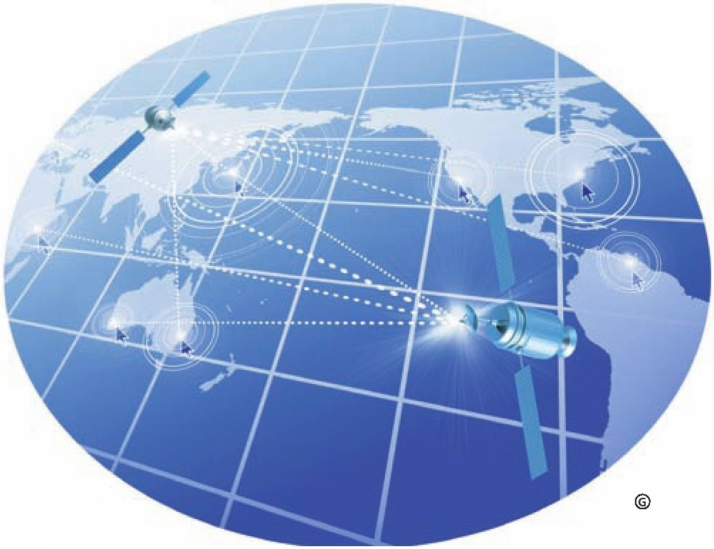
依靠测控系统，卫星的行踪始终被地面掌握

测控系统具有四大功能：跟踪测量、遥测、遥控和信息传输。跟踪测量指的是用地面天线，瞄准“嫦娥”的轨道，实时测量出“嫦娥”轨道的位置、速度和方位角等参数。遥测是将“嫦娥”上各种仪器设备的工作状况报告给地面。遥控是指地面根据遥测发回地面的数据，经分析、判断后，发送相应的命令，指挥“嫦娥”的行动。信息传输是将“嫦娥”在天上探测到的科学数据传给地面。

“嫦娥”的测控系统由中国航天测控网加上天文台的甚长基线射电干涉网组成。在中国尚未建成深空探测网的条件下，航天测控网联合甚长基线射电干涉网的综合测量方案解决了测控距离远、测量精度高的技术难题。

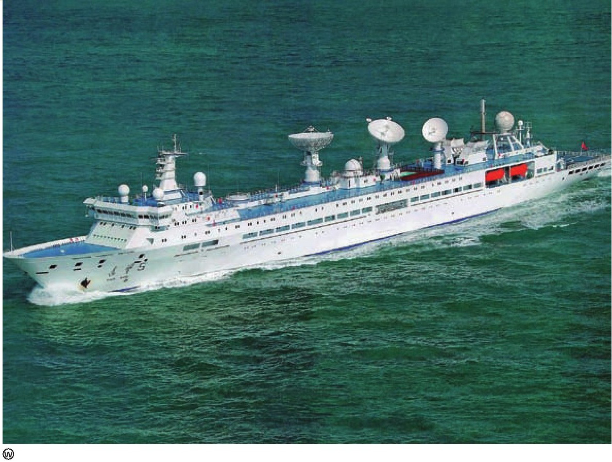
“远望号”测量船

中国的绕月探测工程测控网主要由北京航天飞行控制中心、西安卫星测控中心、西昌卫星发射中心、青岛站、喀什站、厦门站，以及“远望二号”和“远望三号”测量船组成。为了解决“嫦娥”远距离测控，又分别在喀什站和青岛站新建了18米直径天线，提高了测量精度，增强了系统可靠性。

中国的甚长基线射电干涉网则由北京密云站50米口径射电望远镜、乌鲁木齐南山站25米口径射电望远镜、昆明凤凰山站40米口径射电望远镜、上海佘山站25米口径射电望远镜、新建成的佳木斯66米直径天线、上海天文台65米直径天线和位于上海天文台的数据处理中心组成。（石磊）

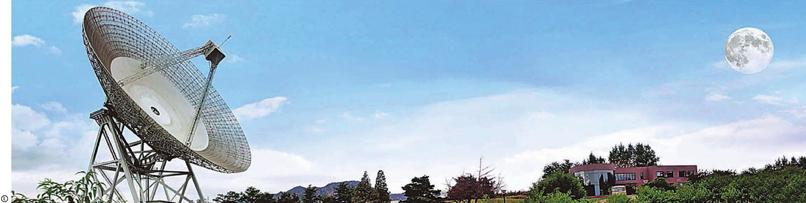
北京密云站50米口径射电望远镜

## “嫦娥”探月取得了哪些科学成果

截至2008年10月，“嫦娥一号”月球探测卫星完成绕月飞行及探测任务，获得了超过1.37太字节的数据。之后，它又开展了一系列任务扩展试验，于2009年3月1日，按照预定程序受控撞击在月球正面丰富海的平坦区域，圆满结束嫦娥一期工程任务。

“嫦娥一号”任务获得了丰硕的科学成果，主要有4个方面。

（1）全月球影像图　获取了包括南北极在内的全月球图像，在几何配准精度、数据完整性与一致性、图像色调等方面均达到国际先进水平。

（2）物质成分与分布探测　通过伽马谱仪探测，获得了铀、钍、钾三种元素的全月球含量分布图，通过干涉成像光谱仪探测获得了镁、铝、硅、铁、钛、钙六种元素含量的全月球分布图。

（3）月壤特性探测　在国际上首次利用微波遥感技术探测月壤特性，获得了全月球亮度温度分布图，并反演了月壤厚度。

（4）空间环境探测　获得了太阳高能粒子时空变化图，太阳风离子能谱图和时空变化图、特征量时空变化图等。

“嫦娥二号”月球探测卫星是二期工程的技术先导星，其主要目的是为“嫦娥三号”探测器实现月球软着陆进行部分关键技术试验，并对“嫦娥三号”着陆区——月球虹湾地区进行高精度成像。“嫦娥二号”于2010年10月1日成功发射，顺利开展了直接入轨技术、月球捕获技术、X频段测控技术、轨道机动技术、数据传输技术和高分辨率成像技术等六大关键技术试验。同年10月28日，它获取了月球虹湾局部地区1米分辨率影像图，标志“嫦娥二号”圆满完成工程目标，并开始逐步开展科学探测任务。与“嫦娥一号”相比，“嫦娥二号”有很多优点：飞得更快，仅用5天就到达目的地，比“嫦娥一号”少用7天；靠得更近，距月面100千米，比“嫦娥一号”距月面近了100千米；看得更清，数次降入100×15千米轨道，细看虹湾。“嫦娥一号”获取的全月图分辨率为120米，只能发现直径大于360米的撞击坑；而“嫦娥二号”获取的虹湾局部地区影像图，可以看到直径4米的月坑和3米左右的石块。

根据“嫦娥二号”的探测数据，中国已制作完成包括南北纬90°在内的7米分辨率全月球影像图和虹湾局部地区分辨率为1米的影像图，达到了世界先进水平。2011年6月9日，“嫦娥二号”飞离月球，飞向距离地球150万千米的深空，开展地球远磁尾带电粒子探测、捕捉太阳X射线爆和宇宙伽马爆等拓展性试验任务。（石磊）

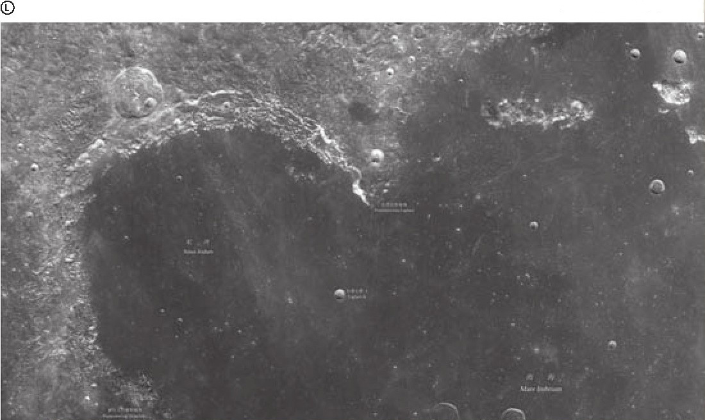
虹湾局部地区1.3米分辨率影像图

  

**【微博士】**怎样读取“嫦娥”的情报

“嫦娥”传回的情报相当于密码的二进制数据，并不能直接洗成照片，还要依靠月球与深空探测科学应用中心的一套大型计算机，把二进制数据转换成国际标准格式的数据产品。根据需要，科学家再把数据产品加工成直观反映月球表面各种特征的图片，例如月球立体地图、岩石类型和有用矿藏分布图等。

【微问题】嫦娥工程之后，探月还能做什么？

【关键词】嫦娥工程　测控系统

## 为什么21世纪“探月俱乐部”那么热闹

2004年11月，欧洲航天局建造的首个月球探测器“智慧1号”成功发射。“智慧1号”使用了太阳能离子发动机，并利用搭载的多个先进仪器收集了大量有关月球地质、地貌、矿物等方面的信息，帮助地球科学家描绘出了当时最详细的月球矿物分布图。

2007年9月，日本发射了“月亮女神”（后改名“辉夜姬号”）月球探测器，对月球表面环境和重力场等展开了全面的考察。同年10月，它先后在月球轨道上释放了两颗小卫星，其中一颗实现了首次对月球背面磁场的探测。

2009年8月，印度的首个月球探测器“月球初航1号”执行了9个月任务后，顺利完成了绝大多数既定目标。印度跨入“探月俱乐部”的首演成功了。

美国正积极研制可以飞到地球以外目标天体的载人探测器。俄罗斯希望继承苏联光荣的探月传统，在21世纪重返月球。欧洲航天局下一步将继续对月球进行考察，并为在月球表面着陆做准备。中国计划在2013年下半年发射月球软着陆探测器，实现着陆器就位探测与月球车自动巡视考察的联合探测。2017年前后，中国计划发射可以自动返回地球的月球采样着陆器，在月面开展区域性精细探测、自动钻取和机械手采集月球样品后，携带月球样品返回地面。日本则希望到2025年能够研发出建造永久性月球基地的技术，以使航天员能够长期在月球驻留。印度也继续向着其航天大国的梦想进发，“月球初航1号”的姊妹探测器“月球初航2号”也即将升空。英国、德国、乌克兰、奥地利、巴西等10多个国家也已经公开宣布要开展月球探测。以色列一个由青年科学家组成的团体也计划将探测器送上月球。此外，国际合作探月的呼声甚高，各国携手势必成为未来人类探月活动的主流。（石磊）

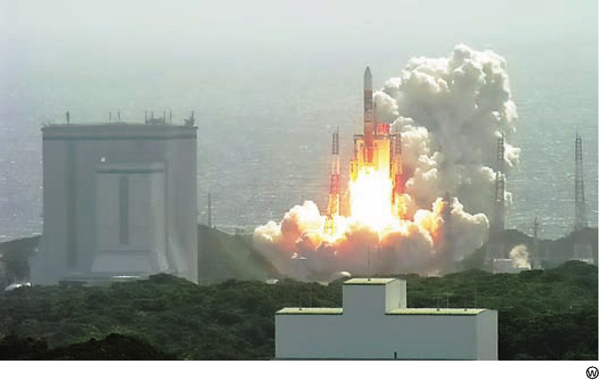
“月球初航1号”月球探测器发射

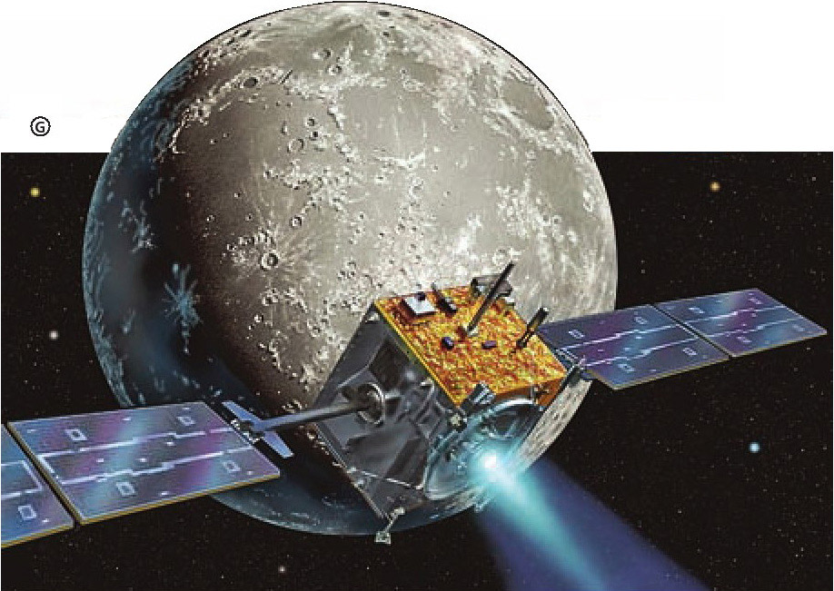
“智慧1号”月球探测器

## 月球基地何时建成

根据目前的航天运载能力和航天技术水平，科学家认为月球基地建设必须按照难易程度循序渐进，逐步发展。据初步估算，从临时性月球前哨站、永久性月球前哨站到可容纳120人的月球基地的建成时间，约需要30年；而真正要形成一个集科学研究、产品开发、发射平台等于一体的综合性月球基地则需要约50年或更长时间。

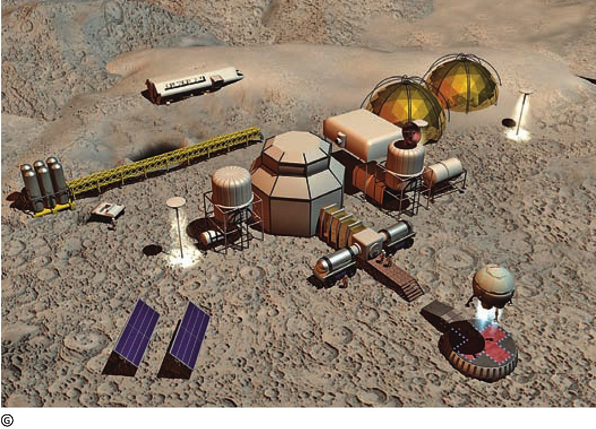
月球基地（想象图）

为建成月球基地，人类必须解决许许多多难题，特别是月球基地位置的选择，月球基地的设计与工程建设，能源、氧、水、食品供应和废物循环利用，地—月之间的运输、通信与导航、辐射防护、温度控制、低重力环境的生理与医学等。因此，月球基地的建设势必是一个漫长的过程。（石磊）

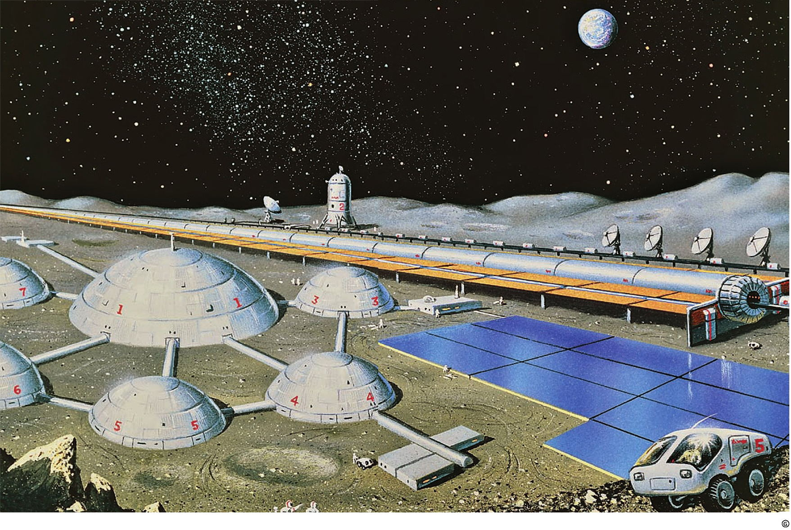
月球基地上的太阳能发电厂（想象图）

  

**【微博士】**国际《月球协定》关于在月球上活动的规定

《月球协定》的全称是《关于各国在月球和其他天体上活动的协定》。它于1979年12月5日在联合国大会通过，同月18日在联合国总部签署，1984年7月11日生效。

该协定共21条，关于月球资源的条款包括：月球探索和利用应为全人类谋福利；不管其经济或科学发展程度，各国都应平等地、不受歧视地按照国际法自由探索和利用月球；各国可在月球的表面或表面之下的任何地点进行探索和利用；月球及其自然资源均为人类共同继承财产，任何国家不得依据主权要求或通过利用、占领或其他任何方式据为己有；将建立国际制度，以便有序、合理地开发、利用和管理月球资源；各国应公平分享资源所带来的惠益，并对发展中国家和为开发月球做出贡献的国家给予特别照顾。

《月球协定》涉及月球资源的开发、利用和分享等与各国切身利益密切相关的问题，各国均持慎重态度，至今批准的国家甚少，只有智利、墨西哥、摩洛哥、澳大利亚、奥地利、荷兰、菲律宾、乌拉圭和巴基斯坦等9个国家批准加入，美、俄等主要空间国家未加入，中国也未加入。

【微问题】建立长期有人居住的月球基地，最关键是要解决什么问题？

【关键词】月球探测　月球基地

# 深空探测

## 火星探测取得了哪些成果

迄今为止，在各种深空探测中，地球人对火星探测情有独钟。火星的环境非常接近地球，那里已经发现了水、冰、河流与海洋的遗迹，人类更希望发现火星生命。

1965年7月，人类的第一个火星探测器——美国的“水手4号”抵达火星。它在距离火星表面不到9800千米的地方拍摄了21张火星照片，还探测到火星大气压不到地球的1%。随后，数个“水手”探测器前往火星，取得了关于金星、火星、水星的大量资料。1975年8月和9月，“海盗1号”和“海盗2号”探测器相继发射，在火星表面成功着陆。它们的任务是探测火星表面环境，并研究是否有生命活动的信息。

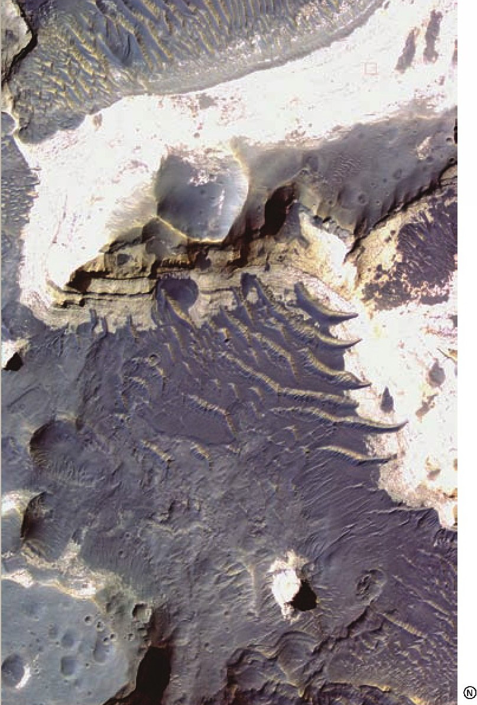
火星上曾发生过的洪水形成的河道在环形山侧面侵蚀出深深的沟壑

1996年，美国航空航天局发射了“火星全球勘探者”和“火星探路者”探测器。“火星全球勘探者”传回的数据显示火星两极存在大量的干冰和少量水冰，甚至可能有液态的水。这预示着生命存在的可能性。“火星探路者”经过7个月的飞行，于1997年7月在火星表面成功着陆。它携带的漫游车成为第一辆在火星表面成功漫游的火星车。这个小机器人边移动边观察周围景物，并对岩石做分析，发现了水成矿物的结晶。这表明火星在远古时代曾经有过丰沛的水量。

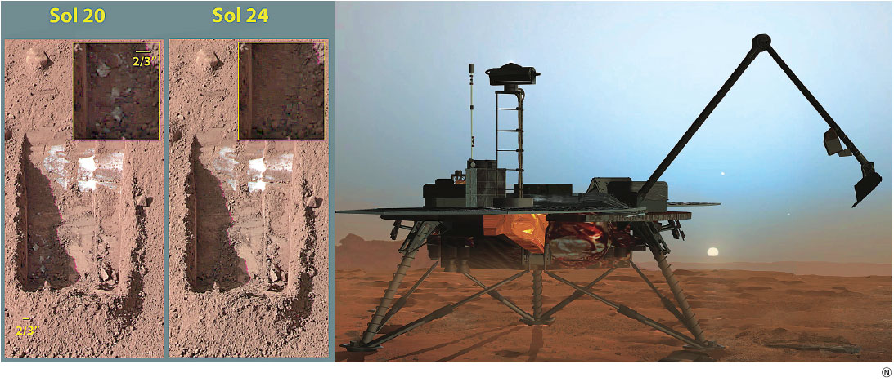
“凤凰号”探测器在火星土壤中铲出了水冰

在2001年4月，美国又发射了“2001火星奥德赛”探测器。它传回的火星南极图像和数据表明，火星上有大量的水冰……美国航空航天局随即掀起了对火星探索的新热潮。

2003年6月和7月，美国航空航天局执行了火星漫游者计划，发射了“勇气号”和“机遇号”火星车。成功着陆火星后，两辆火星车开始寻找火星存在水的证据。它们铲起泥土，开凿岩石，分析样本，不断向地面发回岩石、土壤和大气的信息，并拍摄大量照片。它们发现了火星曾经有水体活动的证据。2005年8月发射的“火星勘测轨道器”探测到火星局部的地下水分布。

美国“凤凰号”火星探测器的任务是寻找适合微生物生存的环境并研究火星水的历史。它于2008年5月降落在火星北极的一处平原上，成功地在火星土壤中铲出了水冰。

2012年8月，美国的最新火星探测器“好奇号”成功登陆火星。在未来，美国航空航天局还将陆续向火星发射探测器。欧洲航天局的火星计划也在进行中，他们希望在2030——2035年实现欧洲航天员登上火星。俄罗斯和中国也制定并公开过自己的火星探测计划。

无论派出多少火星探测器，似乎都不能满足人类对火星直接研究的需要。因此，美国和欧洲的科学家一直希望能够从火星上取回样本，直接在地球分析和研究。在此背景下，美国和欧洲构想了一个“火星样本取回任务”联合计划，打算从火星收集岩石及尘埃样本并取回地球分析。这将会是第一个从另一个行星收集岩石样本的任务。该计划将在今后的5～15年实施。（陈昌亚李金岳）

## 是谁在开火星车

地球到火星最近距离约5500万千米，最远有4亿千米，来回通信延时最长可达40多分钟，那科学家是如何操控那些火星车的呢？当然，这绝对不会像我们在电脑上用手柄玩赛车游戏那么简单，也不会像开汽车那样有方向盘和油门。

就拿“好奇号”火星车来说，主要可以通过两种方式控制其在火星表面工作：一是传输一系列特定的指令，然后火星车执行；二是为“好奇号”选定一个目标，然后靠“好奇号”自己计算、寻找一条最为合适的道路。但无论是哪种方式，指令都得靠工作人员把程序编好，通过美国航空航天局的深空探测网络才能送达“好奇号”。工作人员可以通过一种漫游车可视化程序，知道“好奇号”在火星的当前位置，以及火星地表地形和障碍物（岩石）等。然后向“好奇号”发号施令，如向前10米，右转30°，再前进3米。或者选择一个目的地，让“好奇号”自主导航达到终点。

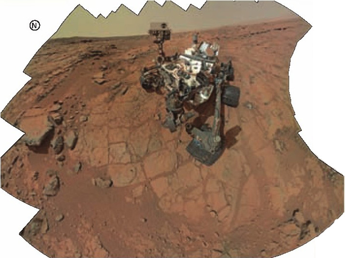
“好奇号”火星车自拍照片

为了能在火星安全驾驶，“好奇号”使用了一种避险相机来构建周围环境的立体地图，识别出哪些是跨不过去的大物体，然后选择一条路直达终点。当“好奇号”完成行进任务后，它会传回一批车载相机所拍下照片的缩略图，工作人员便可通过这些图片定位“好奇号”所处的位置。这些数据再反馈给可视化程序，用来安排第二天的行程。而这些“驾驶”任务都是由美国航空航天局喷气推进实验室“好奇号”团队的电脑程序员来完成。另外，他们不是实时“驾驶”，而是在火星的晚上，团队会计划将“好奇号”送往什么地方；火星的白昼开始时，他们才通过无线电传输发送指令。

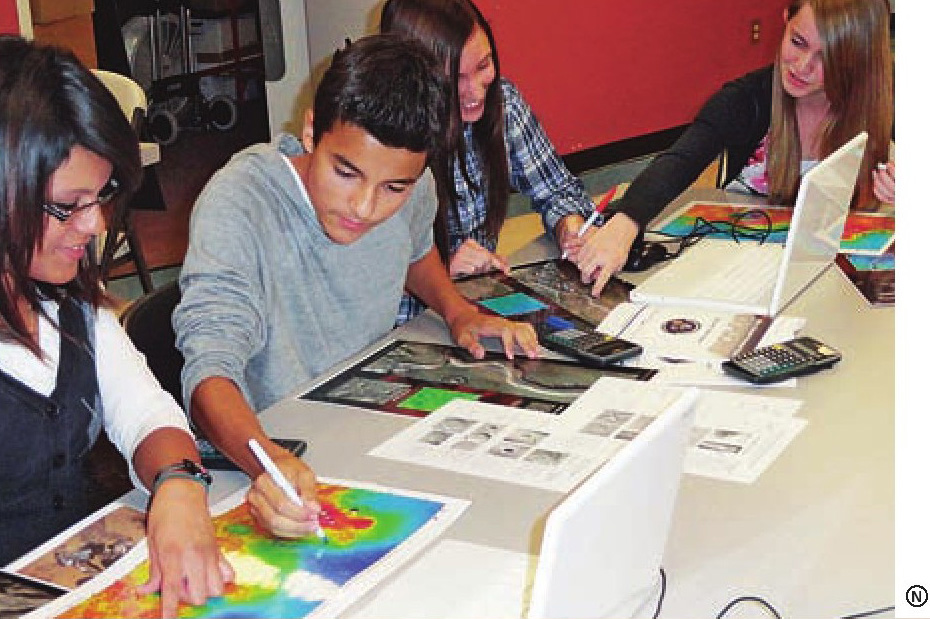
美国高中生在体验分析火星车传回的数据

这份工作很辛苦。“好奇号”的探索计划长达几年，至少在工作的头三个月中，“驾驶员”将会按照火星时间生活和工作。1个火星日比1个地球日要长39分钟35秒。这种时差累积很快就会特别明显：两周的时间里，地球的上午就变成了火星的夜晚。对于火星“驾驶员”来说，按照这样的时间工作就像是每三天向西跨越两个时区，长期处在倒不过时差的状态。（刘相）

  

**【微博士】**“机遇号”的惊险一幕

“机遇号”火星车曾发生过惊险的一幕。一天，科学家决定让它倒退。根据输入的命令，“机遇号”知道它需要退到身后几米远的地方。可是，它没有简单地向后倒退，而是“决定”向前绕整个星球行驶一圈到达那个地方。幸运的是，一个自动安全功能启动，在漫游车还没走太远的时候把它停住了。真可谓是“差之毫厘，失之千里”！

【微问题】火星探测需要克服哪些困难？

【关键词】火星探测　火星车控制

## 为什么要模拟飞往火星

按目前人类所掌握的技术，要载人往返火星，至少需要500天左右的时间，航天员长期处在密闭环境下，是相对无助和孤立的，这样漫长的过程对人类的耐受能力提出挑战。从生理上来说，人体免疫力可能下降；从心理上说，随着任务推进，加上乘组成员的文化背景不同，航天员可能出现焦虑、紧张情绪等。

所以，很有必要在地球上进行相关的模拟试验，从而提出合理的对策。这是系统地认识载人登陆火星任务，完成这类庞大且复杂的航天工程必不可少的步骤。

中国志愿者王跃进行身体测试

2010年，俄罗斯组织多国参与了一项国际大型试验——“火星500”。这项试验的主要任务是探索“人与环境”相互作用，了解长期密闭环境下乘组健康及工作能力状况，特别是获取超长飞行时间、完全自主控制、资源有限、无法实施身体及心理特殊治疗、完成火星表面出舱活动等条件下的相关数据。

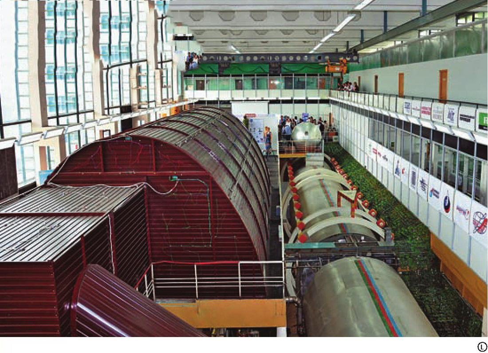
志愿者在这个密闭系统中完成了“火星500”试验

520天密闭试验是“火星500”试验的主要阶段：北京时间2010年6月3日17时开始，第二年11月4日18时结束。这是人类历史上首次模拟火星往返飞行全过程，包括飞船发射、飞向火星、着陆及返回地球等各个环节。试验分为三个部分，前250天飞往火星，中间30天登陆火星，最后240天返回地球。飞船完全自主控制，医学救助通过遥测技术实现，同时使用自主心理支持手段。通信方式模拟真实火星飞行状态，天地通话有20分钟时间滞后。试验要求一次性携带全部装船产品，其间不进行任何补给。

“火星500”试验的任务之一是观察航天员长期与世隔绝状态下面临的心理困境，简单地说就是“幽闭恐怖症”。与世隔绝状态带来的负面影响将让航天员面临送命的危险，飞往火星的旅程可能将以失败告终，所以必须在执行火星任务前对此问题加以研究。

2011年11月，中国志愿者王跃和来自其他国家的5名同伴结束长达520天的往返火星与地球模拟试验，走出模拟飞船“返回地球”。至此，由来自中国、俄罗斯、法国和意大利的志愿者共同参与的人类首次模拟火星载人飞行试验——“火星500”获得圆满成功。这个试验项目“把人类对于火星乃至对于人类自身的探索大大向前推进了一步”。（刘相）

## 人类什么时候能够登上火星

被誉为“火星狂人”的航空航天工程师、美国火星协会主席祖布林曾写过《赶往火星》一书，描绘了人类登陆火星及在火星上工作、繁衍的蓝图。他认为只需要10年，就能利用现有技术把人类送上火星，然后利用当地资源，逐步实现火星定居。第一批航天员登陆火星后，开始探索定居点，寻找永久基地。一旦确定了定居点，此后所有的新队员都将在这一选定位点降落飞船。他们使用的飞船会当作居住舱留在火星上。每次新飞船到达都将在基地结构中增加一个居住舱。降落在基地的居住舱起落架上有轮子，在电缆和绞盘的帮助下，各居住舱可以移动到一起，直接连接或用充气隧道进行连接……

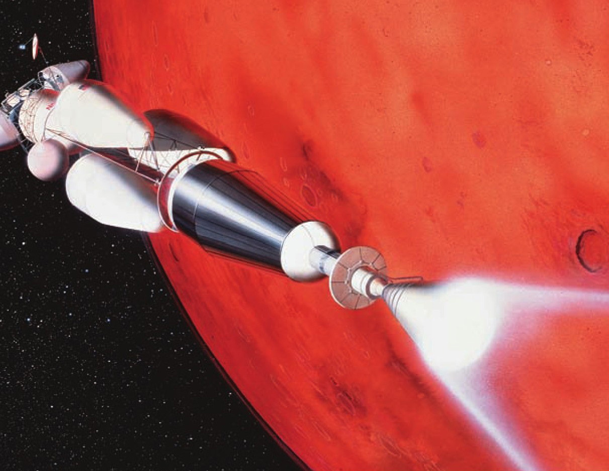
美国航空航天局规划的一种火星飞船

但书本之外的现状是，美国阿波罗计划结束以后的40多年里，人类的脚步仍停留在地球上空数百千米的轨道上。但是，人类依旧梦想着有朝一日能飞向更遥远的深空，第一步就是登陆小行星、踏足火星。而且这一梦想现在正逐渐转化成动力，并付诸行动。

美国航空航天局规划的未来人类火星基地

2010年，美国总统奥巴马中止了重返月球计划，而是把目光放在更遥远、更具挑战，也更有意义的火星上。为此，美国航空航天局计划在21世纪30年代将人类送往火星，而他们正在研制的新的太空发射系统及“猎户座”飞船就是前往火星的运载工具。

除此之外，“灵感火星”计划也备受瞩目。“灵感火星”是美国亿万富翁丹尼斯·蒂托发起的耗资10亿美元的火星游计划。蒂托曾是美国航空航天局的一名科学家，后在金融投资领域发家致富。2001年，年届60的蒂托成功登陆“国际空间站”，成为全世界第一位太空游客。

蒂托准备挑选一对50多岁的夫妇踏上火星——地球往返之旅，但仅是飞掠火星，不会进入火星环绕轨道。旅途中，这对夫妇要在狭窄的太空舱内度过501天。按计划，此次火星之旅的发射日期定在2018年1月5日。

“灵感火星”计划把美国太空探索技术公司生产的“猎鹰”火箭和“龙”飞船作为飞往火星的运载工具。而太空探索技术公司的创始人马斯克也计划在未来15年后，将8万名地球人送往火星移民。这些“火星移民先驱”将永远留在火星上，他们将像“火种”一样，让地球生命能在另一个星球上生息和繁衍！

最终，是实力雄厚的美国航空航天局，还是私人的太空探索技术公司，或是其他国家或组织来完成人类最为伟大的“火星一小步，人类一大步”呢？我们拭目以待。（刘相）

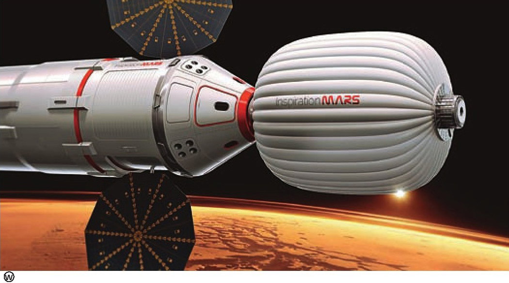
为了增加空间，“灵感火星”计划给“龙”飞船增加一个充气的居住舱

  

【微问题】你觉得成为“火星人”需要什么条件？

【关键词】“火星500”试验　登陆火星　火星基地

## 有哪些探测器拜访过巨行星

太阳系中，木星、土星、天王星和海王星被归类为巨行星，又称类木行星。它们的体积十分巨大，星体的绝大部分都由气液两相的氢和氦组成。其中，木星和土星的核可能是熔融的岩石核，被液态氢组成的幔所包围，外壳和大气层主要由氢和氦组成；天王星和海王星拥有由岩石、水、氨和甲烷组成的冰混合物构成的内核，核外被水、氨和甲烷构成的冰混合物所包围，所以有时又被单独归类为“冰巨星”。

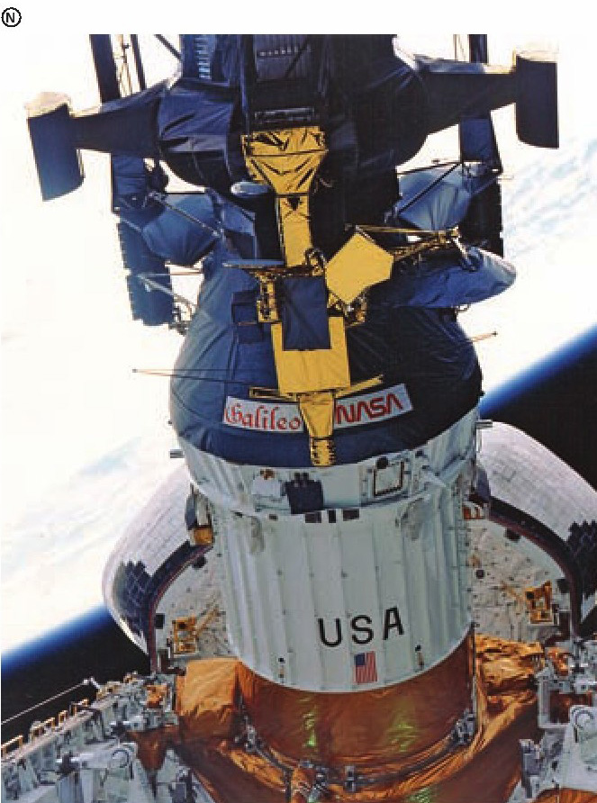
“伽利略号”探测器由“亚特兰蒂斯号”航天飞机运送升空

巨行星离地球十分遥远，最近的木星距离太阳约5个天文单位，而最远的海王星则距离太阳约30个天文单位。前去遥远的巨行星探险，不仅要穿越小行星带，遭受巨行星附近的强电磁辐射，一路上还要克服或利用太阳的强大引力。迄今为止，所有前往巨行星的探测器都是利用从行星近旁飞掠产生的弹弓效应飞到目的地的。

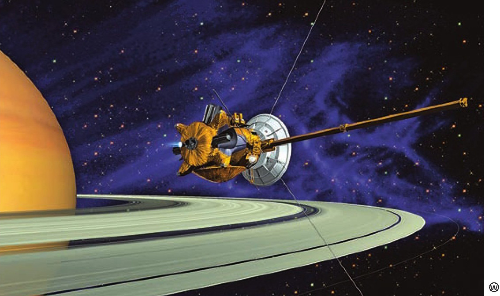
“卡西尼号”探测器进入土星轨道示意图

20世纪70年代，美国航空航天局的科学家发现4颗巨行星即将排成一长串，这无疑是一个实现“一箭四雕”的千载难逢的机会。为此，他们研制并发射了“旅行者1号”和“旅行者2号”两个探测器，为它们先行探路的则是“先驱者10号”和“先驱者11号”。“先驱者10号”和“先驱者11号”分别是第一个飞掠木星和土星的探测器，“旅行者号”探测器则对这两个行星进行了更为深入的考察。“旅行者1号”在考察土卫六后离开了原定轨道，“旅行者2号”则继续前行，成为至今唯一拜访过天王星和海王星的探测器。

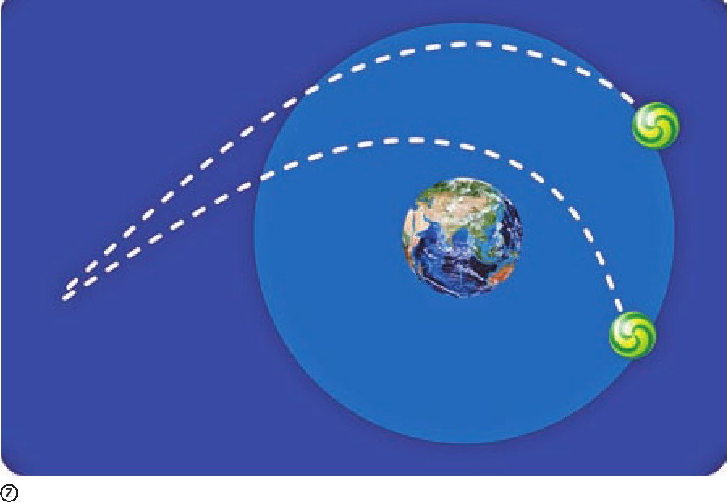
弹弓效应示意图

此后，对木星和土星的考察进入到环绕飞行阶段。1995年，第一个环绕木星的探测器“伽利略号”进入木星轨道。命途多舛的“伽利略号”在升空后，其主天线和磁带记录机相继出现故障，性能大打折扣。幸好它不负众望，在百病缠身的状态下依旧环绕木星辛勤工作了8年。“伽利略号”还携带了一个子探测器，子探测器冲入木星大气，获得大量宝贵数据。为了避免未经消毒的探测器坠落在木卫二表面引起生物污染，“伽利略号”于2003年9月受控坠入木星大气层烧毁。

与“伽利略号”相类似，“卡西尼号”进行了环绕土星的考察。它于2004年7月进入土星轨道，同年圣诞节释放了一个降落在土卫六的子探测器——“惠更斯号”。2005年1月，“惠更斯号”成功降落在土卫六表面，发回大量有关土卫六表面以及液态烷烃构成的江河湖海的照片。此后，“卡西尼号”继续环绕土星运行至今，传回了无数张土星光环、大气环流和卫星的详细照片。它从土卫二附近经过时还发现了正在剧烈喷发的冰火山。

“惠更斯号”探测器登陆土卫六示意图

为了持续对木星系的观测，2011年8月，新一代木星探测器“朱诺号”发射升空，它将在2016年8月进入木星轨道。与“伽利略号”相比，“朱诺号”将主要考察木星的引力场、磁场和大气环流。（麻钧涵）

## 人类今后还会继续探测巨行星吗

在进行了如前所述的拜访之后，人类对巨行星有了初步的了解，也有了更多等待解答的谜团。因此，许多行星科学家希望继续发射探测器，进一步对巨行星，特别是它们的某些引人注目的卫星进行探测。

对木星系统进行环绕探测之后，下一步应该对木星的4颗大卫星，特别是可能具有地下海洋的木卫二和木卫三进行详察。美国航空航天局曾提出过雄心勃勃的“木星冰月轨道器”计划，设想制造一个以核裂变发动机推进的大型探测器，环绕木卫四、木卫三和木卫二分别运行60天、120天和30天。这个计划被取消后，美国航空航天局开始与欧洲航天局讨论合作实施名为“拉普拉斯”的木卫二-木星系统探测计划：美国航空航天局负责制造一个装有核电池的木卫二轨道器，欧洲航天局则制造一个带有太阳能电池的木卫三轨道器。因美国航空航天局的经费问题，欧洲航天局于2012年5月宣布将独立实施原计划欧洲部分的改进版——“木星冰月探测器”。它将在2022年发射，2030年抵达木星，数次飞掠木卫二和木卫四，于2033年环绕木卫三运行。“木星冰月探测器”最终能否实施将在2014年决定。俄罗斯也有相关的计划：在木卫二部署着陆器，钻探冰层，探测冰下海洋。不过这一计划显得更为遥不可及。

美国航空航天局也曾与欧洲航天局商讨探索土星的下一步计划——土卫六-土星系统探测计划。该计划包含一个土卫六轨道器，一个投入到土卫六大气中环绕土卫六飞行至少一圈的热气球，还有一艘降落在土卫六液态烷烃海洋里的探测船。探测船以同位素斯特林热机作为动力，预计将被投放至土卫六北纬79°附近的丽姬亚海，并借助轨道器向地球回传数据。轨道器在环绕土卫六之前还将对土卫二和土星进行飞掠式探测。单独的土卫六探测船计划称作“土卫六海洋探险者”，曾在2012年8月参加美国航空航天局项目竞标，但未能胜出。不过，这个计划本来就排在探测木星的拉普拉斯计划之后。因此，该项计划能否有机会实现还要打一个大大的问号。

尽管人类只对天王星和海王星进行过一次近距离考察，它们的研究价值也很高，但目前并没有任何具体针对天王星和海王星的新探测计划。可以预料，在未来的计划中，天王星和海王星的环带和大气现象，以及海王星的奇特“伴侣”——海卫一将成为令人瞩目的研究重点。（麻钧涵）

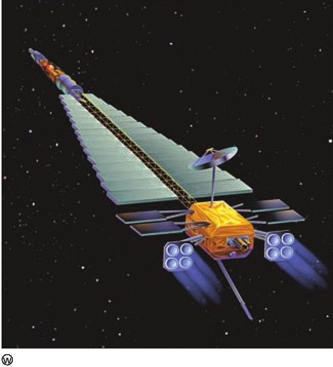
“木星冰月轨道器”示意图

  

【微问题】目前，两个“旅行者号”探测器还在工作吗？它们已经飞到了哪里？

【关键词】巨行星　无人探测器

## 人类能阻止小行星撞击地球吗

小行星是太阳系空间的小碎块，是由石质和铁质构成的布满尘埃的小天体。大多数已知小行星位于火星和木星之间的小行星带上，它们沿着近于圆形的轨道围绕太阳转动，彼此也会发生碰撞。目前，已经发现的小行星有近30万颗，没发现的预计还有10亿颗甚至更多。小行星的质量都很小，所有已发现的小行星的质量加起来也只是月球的一小部分。最大的小行星谷神星呈球形，直径950千米，小的小行星则只有几百米甚至几米。在地球附近分布着大量近地小行星，对地球造成了潜在的威胁。

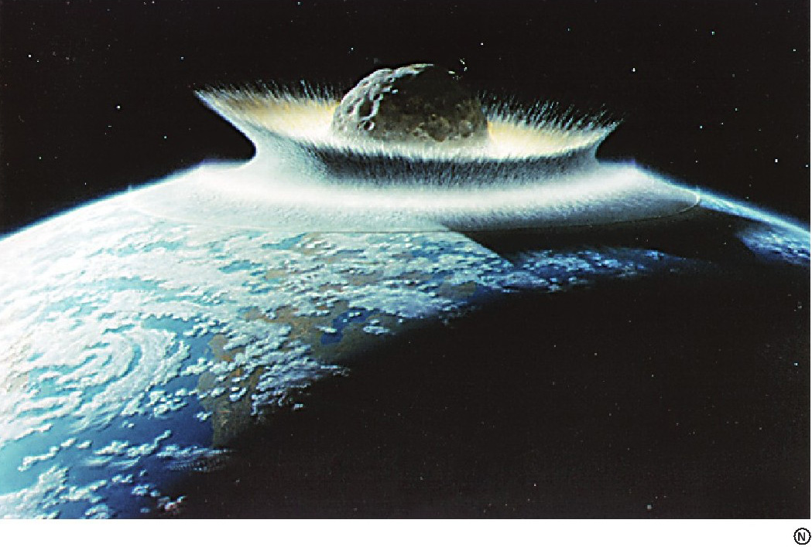
一颗直径500千米的小行星撞击早期地球示意图

小行星撞击地球并不是危言耸听，地球上至今还保存有160多个小行星撞击地球形成的撞击坑。据科学家分析，6500万年前恐龙灭绝事件就可能是由一颗直径约10千米、质量约12亿吨的小行星撞击地球造成的。那次撞击形成的希克苏鲁伯撞击坑就位于墨西哥湾的尤卡坦半岛岸边，直径达200千米。这样的小行星撞击地球会产生极高温和超高压的冲击波，导致森林大火，甚至全球大火、强烈地震和大范围的海啸。所产生的尘埃会笼罩全球、遮蔽阳光，造成全球气温在撞击前期极高，而后又迅速降低，形成长达数年甚至更长时期的“黑暗冬天”，导致绿色植物停止光合作用而死亡，动物由于气候环境灾变和食物链中断而大批死亡，形成全球性物种大灭绝。

可能会撞击地球的小行星主要是近地小行星。穿越或接近地球轨道的小行星数以千计，已经登记在案的具有潜在威胁的这种近地小行星有近1000颗，它们的直径都大于150米，轨道距离地球轨道750万千米以内。科学家希望对它们进行监视，从而给地球提供撞击威胁的预警。

由于小行星存在撞击地球的可能性，世界各地的科学家都对如何防御小行星撞击地球展开了研究。在过去10年中，科学家提出了数种防御小行星的方案。较典型的方案有：发射核弹炸毁小行星、在小行星上安装推进装置将其推离撞击地球的轨道、在小行星上安装太阳帆使其向远离地球的方向运动等。不过，目前这些关于如何防御小行星撞击地球的方案仍处在想象阶段。

形状大小各异的小行星

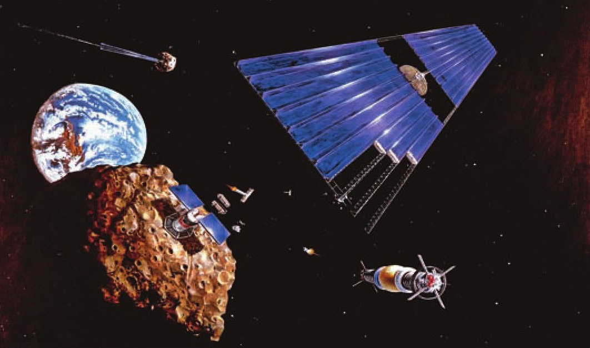
未来，人类可能到近地小行星上去采矿

小行星撞击地球的事件未来可能还会发生，人类迟早需要开展防御小行星撞击地球的技术研究。而开展小行星探测活动，加强人类对小行星的认知，将为规避小行星撞击地球的防御技术研究提供必需的基础数据。（陈昌亚　周必磊）

## 人类能利用小行星上的资源吗

按照光谱类型，小行星可分为C类、S类、M类等。其中，M类小行星主要由金属组成。据估计，太阳系的小行星中，约有5%是M类的，这些小行星富含地球上稀缺的各类金属。例如，第16号小行星“灵神星”，其直径约250千米，科学家通过观测估计它含有5亿亿吨铁、5000万亿吨镍，还有其他多种稀有金属数亿吨。

过去，到小行星上去“采矿”只是一种幻想，但随着深空探测能力的不断加强，人类将具备去小行星采矿的能力。美国和日本都已发射了探测器对小行星开展无人近距离探测。美国正在策划于2025年对近地小行星开展载人登陆探测。可以相信，随着人类深空探测能力的加强，开发和利用小行星上的丰富资源将不再是幻想。

目前，已经或计划发射的无人航天器探测小行星的方式主要有飞越、绕飞、附着、采样返回等。飞越探测是指探测器以较大速度（通常大于1千米/秒）近距离（数千米至数千千米）掠过小行星，并对其进行光学成像的探测。绕飞探测是指探测器以环绕小行星运行对小行星进行探测的形式。对于一些质量较小的小行星，没有足够大的引力使探测器环绕其飞行，则采取伴飞的形式对它进行探测。附着探测是指探测器降落到小行星表面对其进行近距离探测。由于小行星通常质量较小，引力也非常小，探测器降落在其表面的过程只能称为“附着”而不能称为“着陆”。采样返回是指探测器采集小行星表面的物质样品并将其送回地球的探测形式。

截至2011年，人类已发射8个探测器对小行星进行了飞越、绕飞、附着、采样返回等形式的探测。其中5次成功，3次仍在飞行途中。早期任务以飞越为主，后期逐渐过渡到伴飞、附着和采样返回。

2012年12月，“嫦娥二号”对小行星图塔蒂斯进行了长达25分钟的连续拍摄，这是人类第一次近距离“观察”这颗小行星。这次拍摄所得的照片分辨率达10米。（陈昌亚　周必磊）

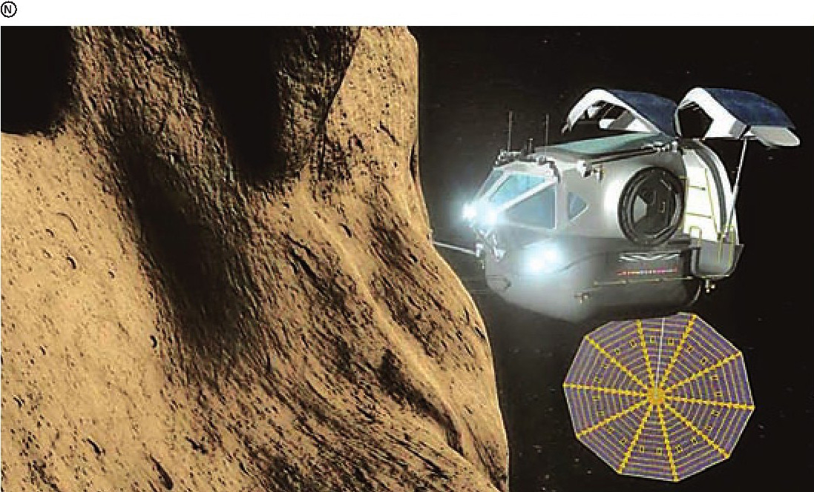
美国航空航天局正在研制用于小行星表面任务的多功能探测器

  

**【微博士】**“黎明号”小行星探测器

美国航空航天局的“黎明号”无人探测器正在执行一项为期8年的探测任务。它于2007年发射升空，2011年与小行星灶神星会合，对它开展研究，2015年将与谷神星会合。这两颗小行星是小行星带中最大的两颗。“黎明号”的使命是研究它们的形状、地质史和化学成分，包括其中是否存在含水矿物。天文学家认为小行星可能是行星形成的“种子”，这项研究将帮助科学家更深入地了解行星的形成和太阳系的起源。

【微问题】你有什么办法来阻止小行星撞击地球吗？

【关键词】小行星撞击　小行星采矿

## 怎样飞出太阳系

太阳系的半径为10万～20万个天文单位，也就是15万亿～30万亿千米。若飞船的飞行速度大于第三宇宙速度，假设能达到20千米/秒，那么，飞船飞出太阳系边界的时间，约需2.4万～4.8万年。因此，人类一直在探索飞出太阳系的新技术。

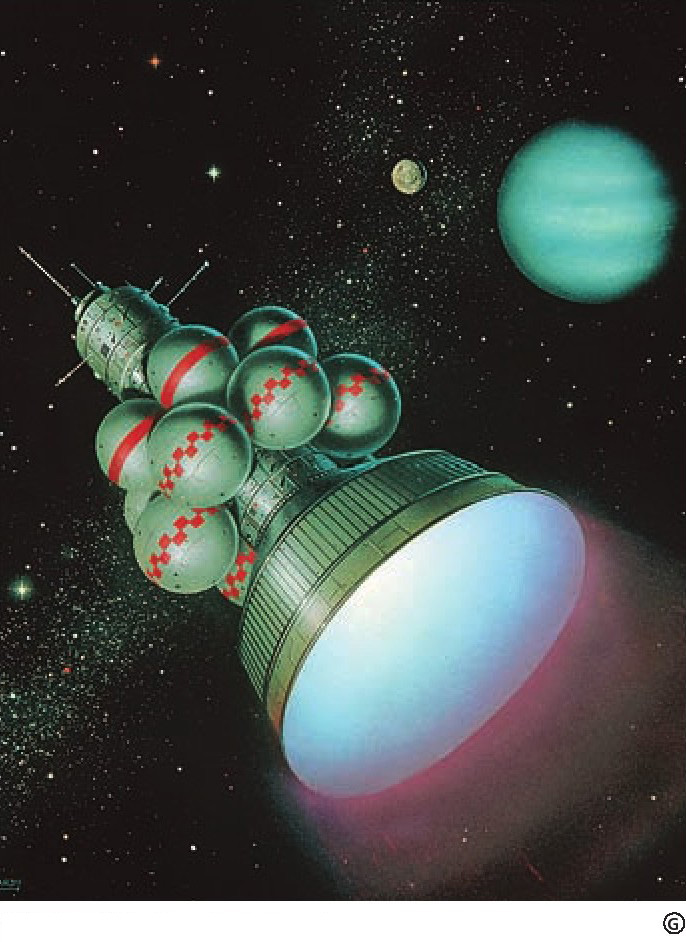
“代达罗斯”核聚变火箭示意图

常规火箭使用化学燃料推进，能量密度低，用于太阳系空间八大行星的飞行尚可，飞出太阳系则不现实。因为飞船即使抵达了海王星，也只飞到了太阳系半径的1/1000。所以，要想挣脱太阳系的引力束缚，得使用更强大而持久的推进能源才行。

早在20世纪初，得知居里夫人提炼出放射性元素镭之后，俄国科学家齐奥尔科夫斯基就预言：“一吨重的火箭只要用一小撮镭，就足以挣断与太阳系的一切引力联系。”

20世纪50年代，核动力船舶、核动力飞机等技术设想层出不穷。大胆的科学家把目光投向了大国逐渐膨胀的核武库，他们设想以核弹为动力，推动火箭飞向深空。

核火箭的技术论证最早出自参与美国曼哈顿工程的乌拉姆和霍夫曼。其原理是使一颗颗小型原子弹在火箭尾部相继爆炸，产生的反作用力可推动火箭前进。1958年，美国核科学家泰勒在此基础上提出了猎户座计划。按照泰勒的计算，在大气层外连续爆炸50颗2000吨TNT当量的原子弹，可将火箭速度提升至70千米/秒。这种火箭可以用来发射大型载人行星际飞船，用125天飞到火星，用3年时间飞到土星。1963年签署的《禁止在大气层和外层空间进行核试验条约》从法理上禁止了任何在大气层内点燃的核火箭。1965年，猎户座计划终止。科学家的兴趣转向了能量更大、辐射更少的核聚变火箭。

代达罗斯计划是最著名的核聚变火箭方案。这是英国星际学会在1973—1978年开展的研究计划。该计划设想使用核聚变火箭推进无人飞船，在一代人的有生之年内抵达另一个恒星系统，进行快速探测。距地球5.9光年的巴纳德星被选为该计划的目的地。

“代达罗斯”核聚变飞船的核心构造是被磁场约束的燃烧室。按照设计，每秒钟向燃烧室注入250颗由氘和氦-3构成的核燃料小球。在第一颗核燃料小球射入的时候，分布于燃烧室内腔的几十个电子束发生器射出电子束，轰击核燃料小球，使其发生聚变反应，瞬间产生高温等离子体，被磁场导出的等离子体可推动火箭高速向前飞行。第一级火箭工作2年后会自动脱落，第二级火箭继续工作1.8年，把飞船加速到36000千米/秒的最终速度（相当于光速的12%）。然后飞船将在茫茫太空中依靠惯性飞行46年，最后到达目的地。

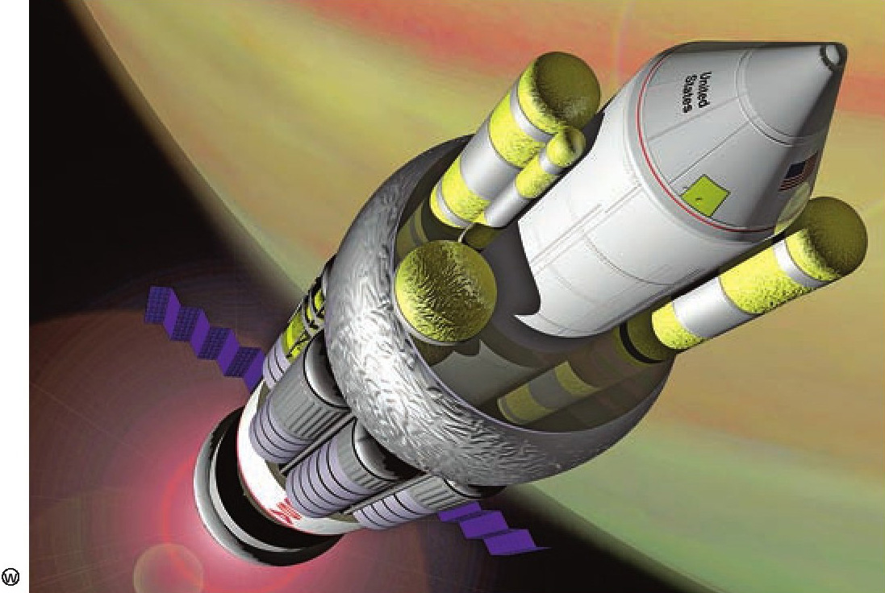
“猎户座”核火箭示意图

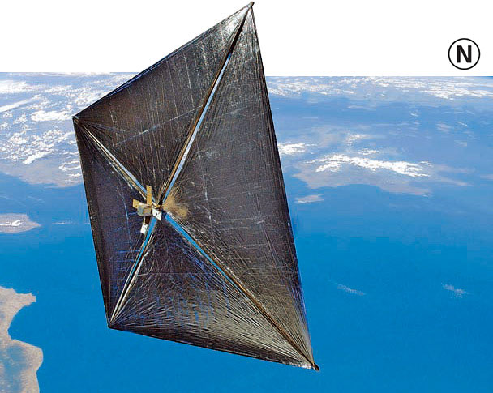
靠太阳光推动的光帆示意图

设计中的“代达罗斯”飞船质量达5.5万吨，相当于“尼米兹”级核动力航空母舰的一半，长度达到190米。因为过于庞大，无法一次发射入太空，只能在近地轨道上利用微重力环境组装。

直到今天，“代达罗斯”飞船所需要的大量核心技术仍是纸上谈兵。目前尚未造出可控核聚变发动机，在近地轨道上建造组装几万吨的航天器也近乎天方夜谭。与之相比，只有400多吨的“国际空间站”就花费了十几年时间进行组装建设。

太阳无时无刻不在释放光和热，它是太阳系中最大的能量宝库。可否借助太阳的力量进行航天飞行呢？

400多年前，开普勒就提出了利用帆船来探索星空的设想。他认为彗星尾部受到微弱“太阳风”的吹拂，于是设想可以利用这种风来推进带帆的飞行器，就像海风推动帆船一样。尽管开普勒关于太阳风的见解后来被证实是错误的，但后世的科学家却由此受到启发，思考用太阳光推动物体的可行性。

太阳光的力量十分微弱，在地球绕日轨道上，每平方千米表面接受的太阳光压才4.55牛。虽然力量微弱，但太阳光提供的推力贵在持久。只要有阳光照耀，太阳帆就可以一直工作，在太阳光的压力下缓慢加速，并通过调整帆面相对太阳的角度来控制速度及方向。日复一日，太阳帆总有一天会达到惊人的高速度。

太阳帆飞船已不再是停留在蓝图上的构想，不少国家都在进行太阳帆飞船的实验。其中，日本2010年发射的“伊卡洛斯号”试验太阳帆最为成功。2011年1月，完全依靠太阳光能驱动的“伊卡洛斯号”已完成全部实验项目，包括利用太阳光实现加速和改变轨道等。

太阳帆飞船距太阳越远，加速度越低。如果可以用人工光照射太阳帆，它就可以持续加速并飞出太阳系了。激光是最强的人造光源，激光帆飞船不但能在太阳系内飞行，还可作恒星际航行。1984年，美国物理学家罗伯特·福沃德做出的工程分析表明，进行恒星际太空飞行的可行办法是向一个大型薄帆飞船发射大功率激光。当激光帆采用圆盘布局并搭载1吨的有效载荷时，最大速度能达到光速的1/10，飞抵4.22光年外的半人马座α星约需40年。

虽然光帆面积庞大，帆面支撑等技术要求较高，但较其他形式的恒星际飞船而言，光帆仍是技术和经济上最容易实现的方案。据估算，如使用金属铍作为帆面材料，上述飞行的总费用为66.3亿美元。这只相当于阿波罗计划投资的1/4。因为地球大气会使激光衰减，理想的发射站应当位于月球等无大气的天体。如果未来能够开采月球上的氦-3资源并实现受控核聚变，发自月球的激光就可以射向宇宙深处的一叶孤帆。届时，人类就真正地向深空跨出了一大步。（赵洋）

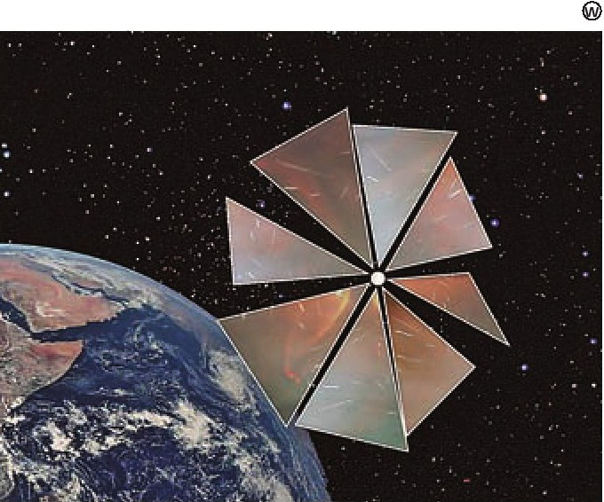
俄罗斯先后发射过两个“宇宙1号”太阳帆，都失败了

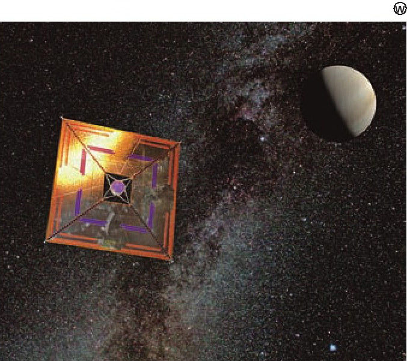
“伊卡洛斯号”有一面对角线长度为20米的方形帆，由聚酰亚胺制成，厚度仅0.0075毫米

  

【微问题】除了核动力火箭和光帆，还有哪些新技术可以用于星际飞行？

【关键词】核裂变　核聚变　太阳光　激光

## 怎样才能让航天器飞得更远

太空是一个充满未知和挑战的领域，面对人类的雄心，当前的化学火箭早已力不从心。因为，化学火箭所携带的燃料要占总重的90%以上，能量密度较低，工作时间也不长，像“长征二号F”飞行时间不到10分钟！若要飞向更远的深空和开展星际旅行，必须另辟蹊径，寻找新的“登天之梯”。

在科幻小说和电影中，出现了各种更先进的推进器，比如核动力发动机、反物质发动机和光子发动机，甚至有人想到了利用太阳的光压和太阳风在宇宙中扬帆航行。

从核弹头到核反应堆，科学家已经积累了丰富的核动力知识。因此，核动力火箭看起来是离现实最近的一种。核动力火箭主要有3种形式。

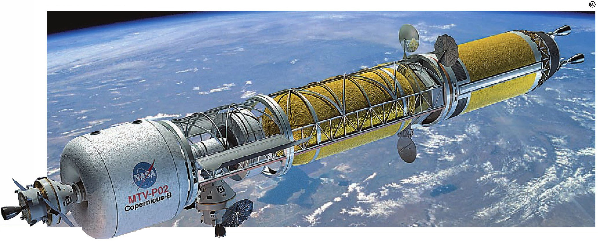
核动力火星飞船示意图

（1）利用核反应堆的热能。核动力航空母舰和核潜艇都是利用核裂变反应堆的动力来转动螺旋桨，推动水和空气产生反作用力。但是，太空没有水也没有空气，必须利用喷气方式产生推力。反应堆中核子的裂变或者聚变产生大量热能，使推进剂受热迅速膨胀，然后从发动机尾部高速喷出，产生推力。这种办法必须携带许多液体推进剂，但是推重比不高。推重比是发动机推力与发动机重量的比值。好的推进系统应该是产生大推力，同时推进系统的重量小。核热推进系统的推重比不高。

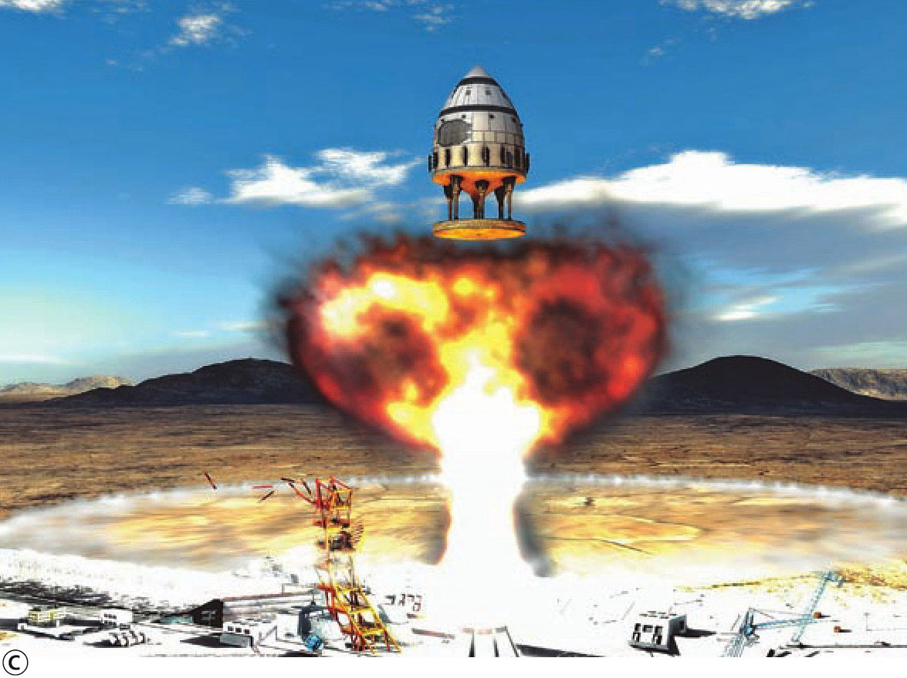
“猎户座”核火箭示意图

（2）直接利用核反应堆的高能粒子。核反应产生许多高能粒子，这些高能粒子处于离子状态，移动速度非常快，可以利用磁场来控制它们的喷射方向，比冲可达到100万秒。不过，这种发动机需要一个很大很重的反应装置，造价也非常昂贵。

（3）利用核爆炸产生的脉冲来推动飞船，也称为核脉冲火箭。这种火箭将携带大量的低当量原子弹，一颗颗地抛在身后引爆，飞船后面安装一个推进盘，吸收爆炸的冲击波推动飞船前进。这种推进方式不仅要解决推进盘的设计制造，还需要解决如何消除核爆炸对太空环境造成核污染等难题。

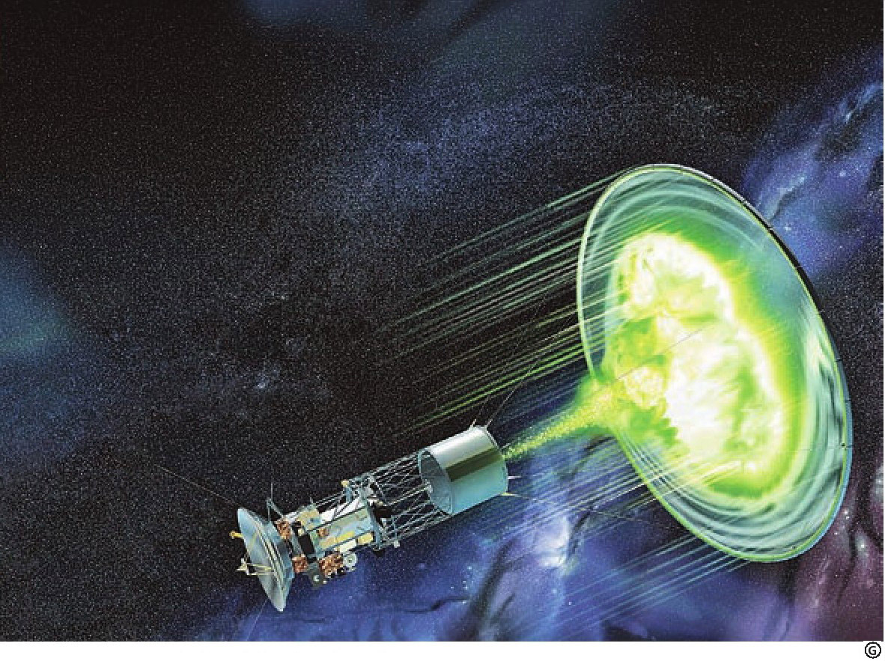
反物质驱动的宇宙飞船示意图

1928年，英国物理学家狄拉克首先提出存在反物质的假说。他认为存在与构成普通物质的基本粒子质量相等但电荷相反的基本粒子，并存在由这样的基本粒子构成的反物质。4年后，这个假说不断得到验证。

反物质和物质相遇将会湮灭，正反物质的质量将全部转化为能量。这是效率最高的燃料。目前使用化学火箭发动机，飞船从地球飞到火星需要1～2年。若采用反物质发动机，飞船飞到火星只需要24小时到2个星期（取决于地球和火星在公转中的相对位置）。按每千克燃料产生的效果进行比较，化学反应最多可以产生1×107焦的能量，核裂变产生8×1013焦，核聚变产生3×1014焦，而反物质的湮灭能产生9×1016焦，这是氢氧化学反应的100亿倍，太阳核心热核反应的300倍。

制造反物质需要消耗极其庞大的能量，用什么来装反物质才确保不会与正物质湮灭爆炸，这些都需要未来的科学家开动脑筋。

早在400多年前，德国天文学家开普勒就提出利用帆船来探索星空的设想。他认为彗星尾部背离太阳的原因是受到太阳风的吹拂，可以利用这种风来推进带帆的飞行器，就像海风推动帆船一样。尽管开普勒关于太阳风的解释后来被证实是错误的（太阳风是一种高能粒子流，不能产生力），但后世的科学家由此受到启发，发现太阳光可以对物体表面施加一定的作用力。

光射到物体表面时，将对这一表面施加压力，这称为光压。彗星尾巴背着太阳就是太阳的光压造成的。于是，就有科学家想到了利用这种压力。

德国的火箭科学家桑格尔在1953年提出了光子火箭的设想。这个由光子发动机推动的宇宙飞船由三部分组成。最后面的是动力部分，主要部件是巨大的凹面反射镜，面积可达几十平方千米。在凹面反射镜的焦点处有光子发射器，它产生的光子由凹面反射镜反射，并形成向后喷射的光子流，推动飞船高速飞行。中间是燃料贮存箱。最前面的是航天员工作和生活的密封座舱。

这个设想听起来非常美好，问题是需要多少光子才能产生合适的推力来推动火箭飞行呢？如果要用光子发动机推动火箭从地面直接起飞，那么每千克的质量需要30亿瓦能量的光。如果我们想利用太阳能来获得这些能量，就要有500平方千米的太阳能电池板。此外，为了在光子源中获得足够大的光压，需要有50000～250000开的高温。反射镜如何承受这样的高温？我们只有期待未来科技的发展提供答案了。（周武）

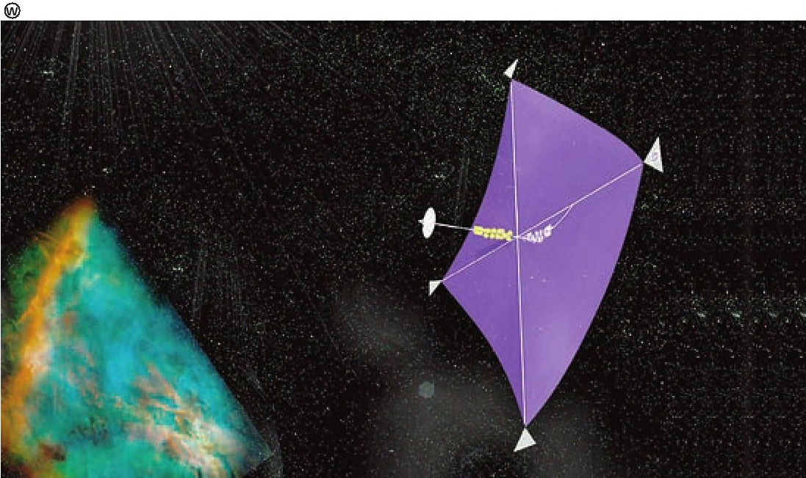
利用太阳光来推动的航天器——光帆（示意图）

  

**【微博士】**星际冲压发动机

1960年，美国物理家巴萨德提出星际冲压发动机的设想。他认为除了使用光帆外，任何飞船都需要携带大量燃料，同时必须花费许多能量来运送这些燃料。核聚变所需的燃料氢在星际空间中到处都是，只要在飞行的途中把它们搜集起来送进反应炉中就可以了。这样，飞船将拥有无限的燃料补给。那么，如何收集和提纯星际中含量非常稀少的氢？如何用氢来进行热核反应？未来的科学家将给我们答案。

【微问题】如果你是星际战舰的舰长，会选择哪种推进器？

【关键词】推进器　核动力　反物质　光子

## 为什么美国商业公司也能发射飞船

说到太空飞行，人们首先想到的就是美国航空航天局的航天飞机，或者俄罗斯联邦航天局的“联盟”飞船。而2003年，杨利伟乘坐“神舟五号”飞船实现中国人的飞天梦后，中国人也会自豪地提起自己的“神舟”飞船。

由于太空探索一直被各国政府垄断，长期以来人们普遍认为这是政府机构的专属领域，商业机构无论是技术还是资金都无力涉足这样的高精尖领域。不过，成见就是用来打破的。2010年12月，美国太空探索技术公司使用“猎鹰9号”火箭成功发射了“龙”飞船。“龙”飞船进入300千米高度的地球轨道后，又成功进入大气层返回地面。太空探索技术公司是美籍南非裔人马斯克的私人公司。为什么私人所有的商业公司，也具备了发射飞船的能力呢？

1986年“挑战者号”航天飞机升空爆炸后，美国总统里根签署命令，航天飞机不再用于商业发射，这为美国公司开展商业发射奠定了基础。经过美国航空航天局和军队数十年坚持不懈的投入，美国具备了世界上最雄厚的航天工业基础，为商业性航天技术公司的创建发展提供了依托。通过科研人员的流动、租用航天测试设施和发射场地，购买现成的火箭零部件及其生产设备，美国的商业公司有可能解决其他国家研制运载火箭的大部分难题。

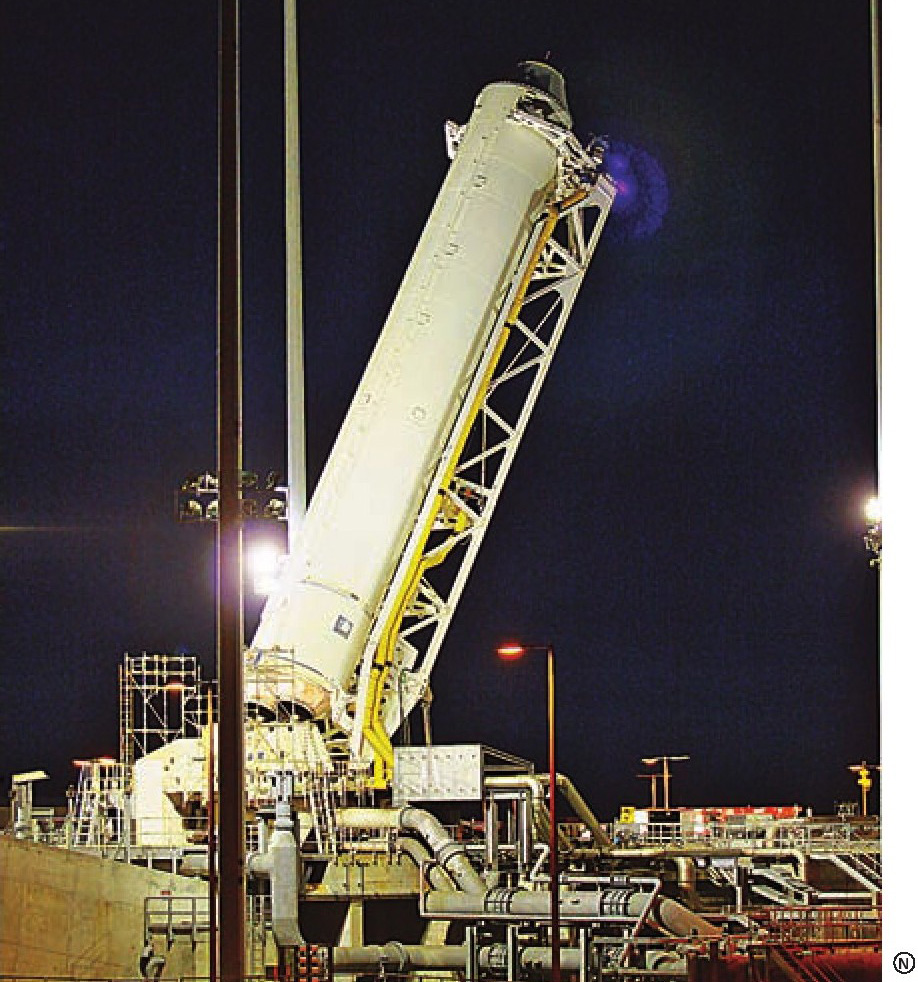
测试中的“心宿星”运载火箭

由于航天发射的复杂和技术难度，即使可以站在巨人的肩膀上，美国商业公司成功发射火箭和飞船也不是一蹴而就的。在“挑战者号”航天飞机发生事故后，商业公司不断进行航天发射的尝试，但由于资金、技术和运气等诸多因素，很多公司出师未捷身先死。1996年，美籍伊朗裔女企业家安萨里创立了安萨里X大奖，用于奖励第一个研制载人飞行器飞到100千米高度以上的太空并安全返回地球，并可在两周内重复上述飞行的非政府组织。在爱好者和商业公司屡战屡败的形势下，安萨里X大奖大大激励了人们太空飞行的热情，鲁坦的“太空船1号”拔得头筹，在2004年成功达到要求并获得了安萨里X大奖。

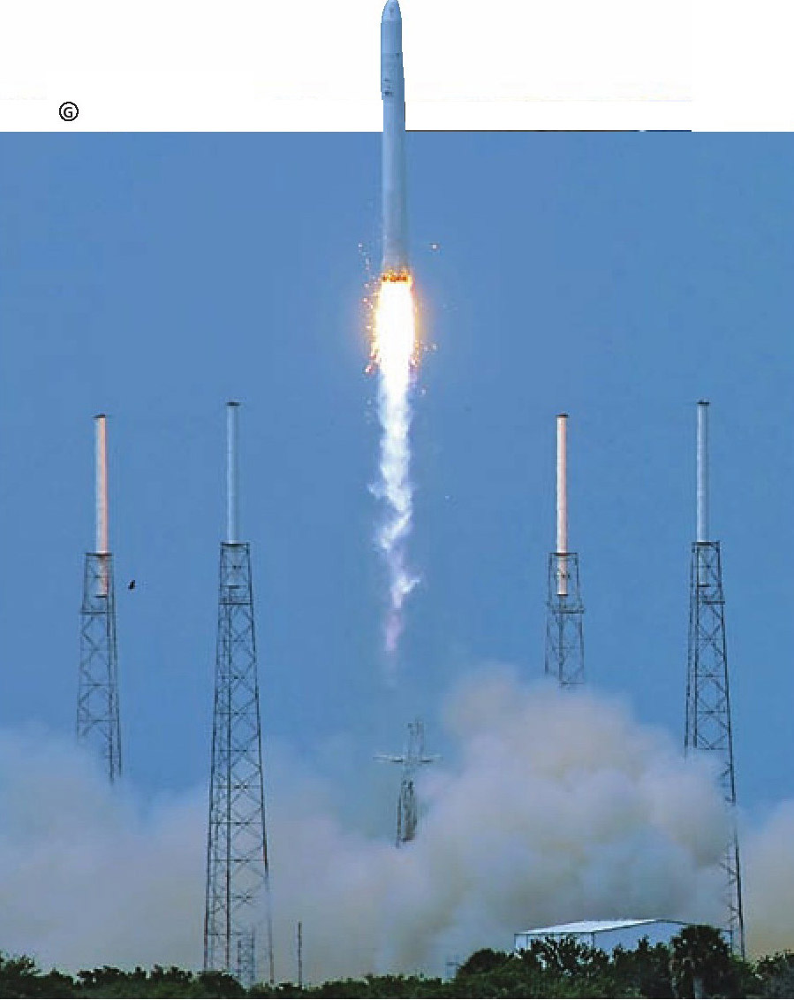
“猎鹰9号”运载火箭发射“龙”飞船

美国轨道科学公司以美国固体洲际导弹的技术为基础，研制了空中发射的“飞马座”和陆上发射的“金牛座”固体运载火箭。这两种火箭虽然运力有限无法发射飞船，但过去20年里成功进行了数十次发射，发射了大量小型卫星。轨道科学公司也是美国航空航天局商业轨道运输服务的承包商之一，它研制了“心宿星”中型运载火箭用于发射“天鹅座”货运飞船。著名的美国洛克希德·马丁公司也自筹资金研制了“雅典娜”小型固体火箭用于商业发射。“雅典娜”火箭的地球轨道最大运力达到了约1.9吨，足以发射美国载人航天早期的“水星”系列飞船。（张雪松）

## 为什么太空旅游的船票那么贵

2001年，美国人丹尼斯·蒂托乘坐俄罗斯的“联盟TM-32号”飞船飞往“国际空间站”，成为商业太空旅游的第一人。蒂托的太空旅行只有7天22小时4分钟，但花费高达约2000万美元。蒂托之后又有多人乘坐俄罗斯的“联盟”飞船进行了太空旅游，他们的太空之行花费也都在2000万美元上下。太空旅游的巨额花费完全超出了一般富翁的承受能力，更不要说普通人了。在这个航空旅行价格低廉的时代，为什么太空旅游的船票那么贵呢？

在人类航空史的早期，航空旅行也曾是奢侈的象征。但1903年莱特兄弟的第一架飞机飞上天空后不过二三十年，对于西方发达国家的普通人来说，乘坐飞机旅行已经不是遥不可及的梦想。载人航天的发展则要慢得多。1957年人类发射第一颗人造地球卫星，1961年航天员加加林完成人类历史上第一次载人太空飞行，但直到今天，太空旅游仍然是超级富豪们显示财富和勇气的舞台。对比航空和航天的异同，对我们理解太空旅游的高昂费用，无疑是大有裨益的。

在航天领域，发射一个物体进入地球轨道，需要火箭累计提供超过约9千米/秒的速度。研制生产这样的多级火箭，不是私人凭借兴趣爱好所能实现的工程。换句话说，进入地球轨道的难度远高于飞上天空。

太空旅游的另一个难点在于返回地面，以7.9千米/秒的高速再入大气层，无论是飞船的气动控制还是防热，难度都比飞机降落高一个档次。即使是航天技术最发达的美国，也曾出现航天飞机防热瓦脱落导致机毁人亡的悲剧。太空旅游仅仅是飞船起降的难度就远远高于飞机的起降，这是太空旅游比航空旅行昂贵得多的根本原因之一。

此外，造价数千万美元的火箭和同样昂贵的飞船目前只能一次性使用，而且现有载人飞船只能运3人进入太空，研制中的新一代飞船也只能运4～6人，太空旅游的船票自然极其昂贵了。

以蒂托为代表的超级富豪们所支付的旅费高达2000万美元左右，但相对于载人航天任务的总花费，不过是一个零头，甚至无法保本。他们只是属于搭便车。为了实现更多人太空旅游的梦想，目前国外不少公司正在开辟亚轨道飞行的业务。亚轨道飞行虽然缓解了进入轨道和高速再入的巨大技术难题，但高速飞行在技术上仍极具挑战性。因此乘客们体验太空飞行的时间仅有几分钟，票价却仍超过20万美元。可以说，高速飞行尤其是进入环绕地球轨道的超高速飞行与再入大气层的难度，是人类太空旅游费用高昂的根本原因。（张雪松）

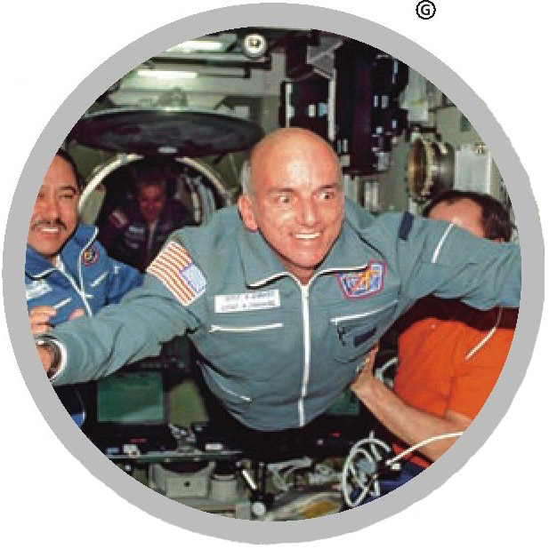
丹尼斯·蒂托在太空体验失重

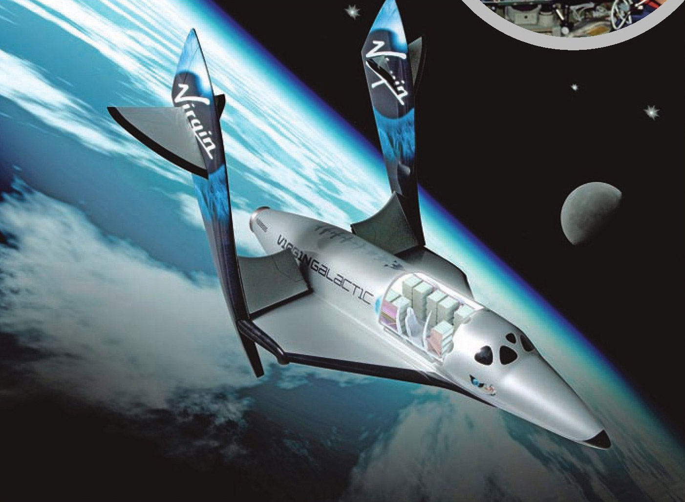
“太空船2号”将载着旅客进行亚轨道之旅

  

【微问题】什么是亚轨道飞行？

【关键词】商业发射　太空旅游

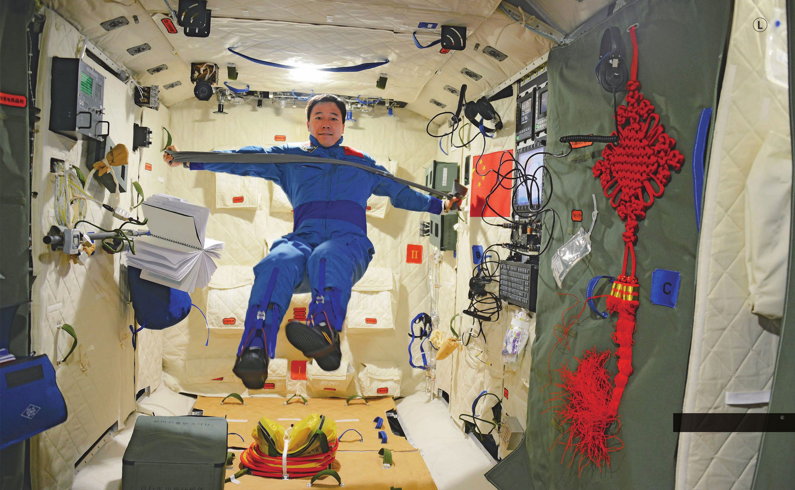
中国航天员景海鹏在“天宫一号”中锻炼身体

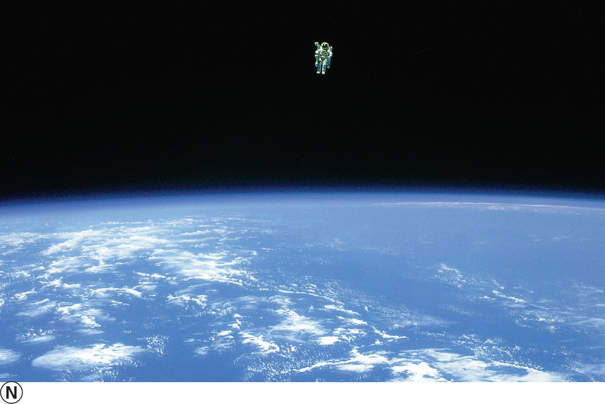
航天员进行自由式太空行走

## 为什么探测器去水星那么难

水星是距离太阳最近的行星。由于它总是依偎在太阳附近，多数时间都掩藏在太阳的光辉之中，我们只有在清晨或傍晚，水星与太阳分处在地平线上下的短暂时间内，才有可能见上水星一面。等待水星“赏脸”实在不容易，著名天文学家哥白尼就遗憾自己一辈子没见过水星。

20世纪后半叶，掌握了航天技术的人类想派出机器人充当耳目，对水星看个究竟。然而，探测器要想飞向水星却不是一件容易的事。水星的直径只有地球直径的约1/3，到太阳的距离约占日地距离的1/20，太阳风强烈。这就对航天技术提出了许多要求。

离太阳越近的天体，公转的速度越快。当我们的探测器出发前往水星时，如果不在适当的时机减慢速度，可能无法进入水星轨道，而是一头栽进太阳的火海中。

那如何减慢速度呢？常规方法是在探测器上安装小型火箭，在适当时机沿前进方向反向点火，像“踩刹车”一般把速度降下来。聪明的科学家利用大行星的引力来踩“免费刹车”。当探测器掠过大行星时，在大行星引力的作用下，探测器的飞行速度和方向都可以改变。探测器掠过行星时，选择从行星的“面前”或“背后”掠过，就可以做到给探测器“踩刹车”或“踩油门”，从而节省需要的燃料和时间。去水星，为避免进入太阳引力场，需要“踩刹车”；而去木星或土星，那就需要“踩油门”啦。不过，“免费”也是有代价的——需要耐心等待这种加力行星正好出现在相应的位置上，这样的机会有时非常难得。

此外，水星的位置极为靠近太阳，探测水星的航天器不得不承受强烈的太阳辐射和高温炙烤。在那里，每平方米面积会受到1.4万瓦热量的侵袭，是地球轨道上的10倍。这对探测器的温度控制、姿态控制和辐射防护提出了非常苛刻的要求。

截至2012年，去过水星的探测器只有两个。1973年，美国的“水手10号”从地球出发，途经金星“踩刹车”，并观测了金星的云层。随后，它3次掠过水星，拍下了45%水星表面的照片。它发现水星有微弱磁场和巨大的铁质核心；水星表面布满了撞击坑，非常像月球；水星大气层的密度只有地球的0.3%，主要由氦组成；由于离太阳很近又缺少足够的大气，水星的表面温差很大，被太阳直射时高达430℃，而两极陨石坑深处则低到-180℃。

2004年8月，美国的“信使号”出发。为了充分利用金星和地球的“刹车”功能使其速度减到足够小，最终能环绕水星运行，科学家为它设计了复杂而漫长的轨道。“信使号”一次飞越地球，两度飞越金星，三度飞越水星，最终在2011年3月进入水星轨道成为一颗“人造水星卫星”，进行高分辨率的地形地貌、表面物质成分、磁场、大气成分和近空环境勘测任务。“信使号”证实了水星具有液态铁核，且比以往认为的更大。截至2013年3月，“信使号”仍在继续观测，以回答关于水星的疑问。（麻钧涵）

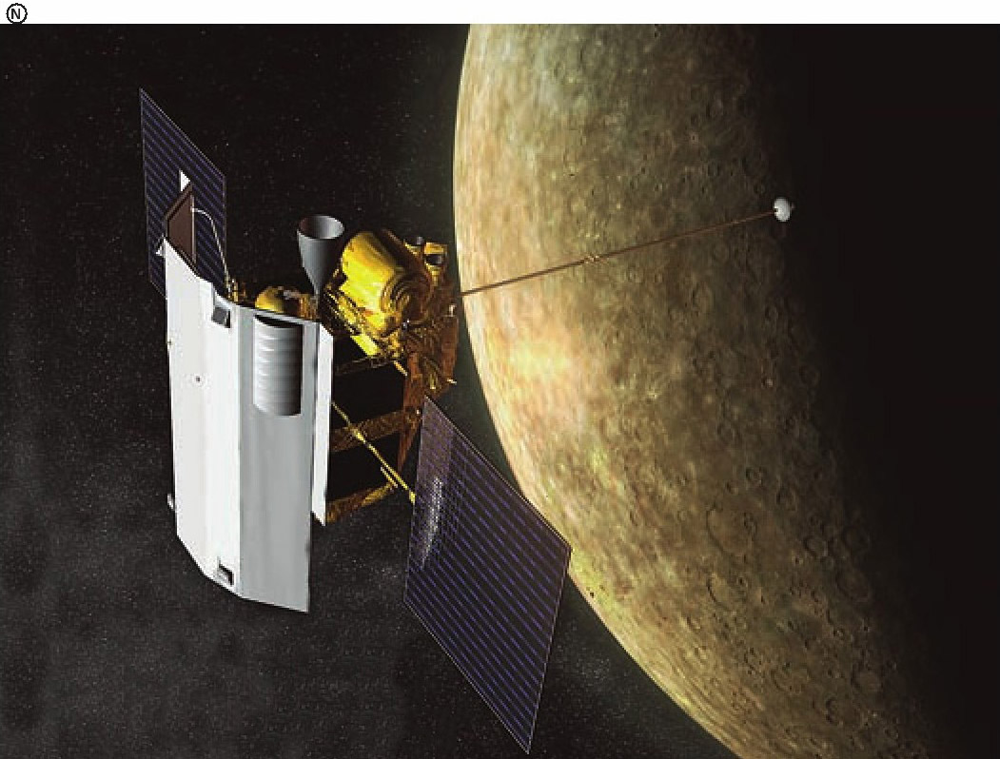
“信使号”探测器围绕水星运转示意图

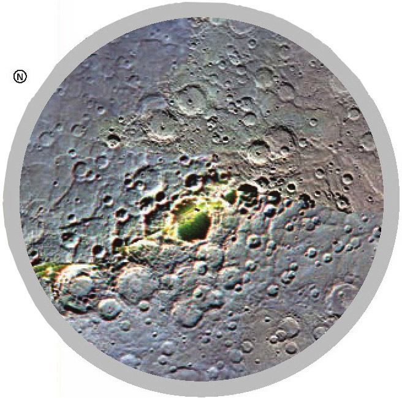
“信使号”探测器拍摄的水星南极

## 金星的“迷雾”是如何揭开的

金星，中国古代称为启明星、长庚星或太白金星，是夜空中最明亮的星，也是地球最近的近邻。千百年来，人类以崇敬的目光注视这颗璀璨夺目的亮星，将它比作象征爱与美的“维纳斯”女神。望远镜发明之后，天文学家发现金星有着月球一样的圆缺变化，而且有着“迷雾”一般厚密的大气层，厚达100多千米，70%的阳光都被反射回太空。进入20世纪以后，人类借助雷达描绘出金星表面的部分特征，然而金星“面纱”彻底揭开还是要归功于航天时代的来临。

1961年，苏联的“金星1号”从距离金星10万千米的地方飞过。4年后，“金星2号”从金星附近24000千米处掠过，“金星3号”则第一次成功撞击金星表面，但它们都在到达金星之前就与地面失去了联系。与此同时，美国也派出“水手2号”、“水手5号”和路过的“水手10号”进行了3次成功的金星探测。

饱尝了一连串的挫折之后，苏联发射的“金星4号”终于成功地从金星大气中传回数据。它探测到金星大气的情形：大量的二氧化碳和少量的氮气、硫酸组成的云层，以及极高的温度和气压。1970年，“金星7号”第一次实现软着陆。5年后，“金星9号”第一次用摄像机拍下了布满尖利岩石的金星表面。

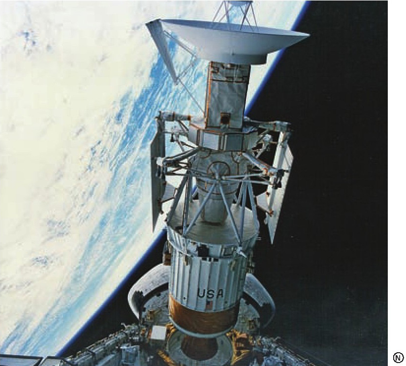
“麦哲伦号”金星探测器

接下来苏联又发射了“金星11号”至“金星14号”，这是4个空间舱加着陆器形式的联合探测器。它们的着陆器可以拍摄彩色照片，并能对金星表面物质进行挖掘采样和现场分析。“金星15号”和“金星16号”则是单独的轨道卫星，它们使用雷达来勘测金星的全球地形。最有意思的是1985年到达金星的“维加1号”和“维加2号”，它们分别由1个空间舱、1个着陆器和1个探空气球组成，空间舱在掠过金星之后还继续飞向哈雷彗星考察。“维加1号”和“维加2号”都释放了金星气球，但只有“维加2号”着陆器降落成功。

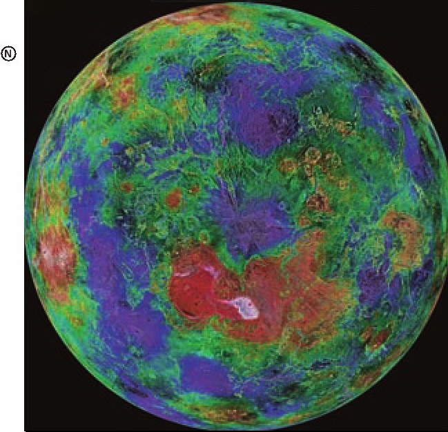
通过“麦哲伦号”探测器，人类得以清晰地看见金星

相比苏联对金星探测的“狂热”，其他国家显得“低调”许多，但取得的成果却并不逊色。1978年，美国航空航天局发射了两个“先驱者——金星号”探测器，它们分别是1颗轨道卫星和1个组合型探测器，后者带有1大3小，共4个探测器，分别冲入金星大气进行观测，其中一个在落地后还继续工作了1小时。1989年，由航天飞机发射，次年8月抵达金星的“麦哲伦号”是美国最为成功的金星探测器：它测绘了99%的金星地表形貌，分辨率达到300米；它还发现金星没有海洋和板块活动，地壳也比原来认为的更厚更坚固。

迄今为止仍在环绕金星运行的是2006年由欧洲航天局发射的“金星快车”，它对金星的大气运动进行了持久的跟踪观测。“金星快车”发现了金星南极的两个大型大气旋涡，还研究了金星云层结构和大气活动情况。

日本于2010年5月发射了“黎明号”金星探测器，但未能成功入轨，需要等到2016年才有机会进行第二次尝试。此外，探测木星的“伽利略号”，探测土星的“卡西尼号”和前往水星的“信使号”都曾飞掠金星，它们也获得过一些关于金星的宝贵资料。

浓密、强酸性的金星大气层使得金星表面高温、高压，温室效应肆虐，是一个严酷、死寂的世界。令人忧虑的是，随着地球的人口增长、环境破坏和全球变暖，地球会不会变成另外一个金星？（麻钧涵）

  

【微问题】前往水星的探测器需要有哪些特殊装备，以应对高温炙烤？

【关键词】水星探测器　金星探测器

## 为什么机翼要由很多块板组成

如果飞机座位的舷窗正好对着机翼，你会发现起飞和降落的时候，机翼往往会“分裂”成很多块活动的板。为什么机翼要由这么多块板组成呢？它们分别有什么用呢？

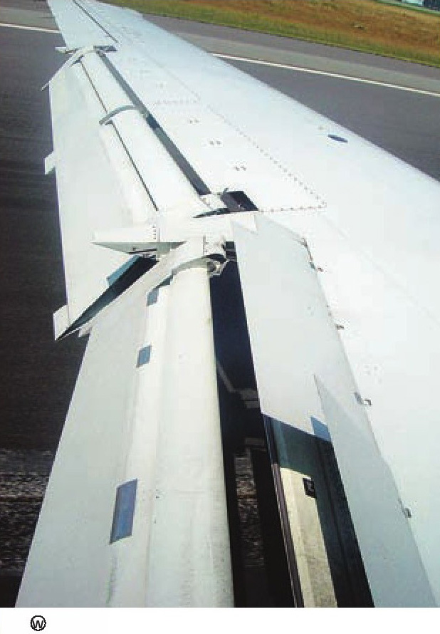
机翼上活动的板，主要由副翼、襟翼、缝翼和扰流板等组成。

副翼往往安装在机翼的后缘外侧，它的上下运动会对机翼产生下压或上抬的力。左右机翼的副翼往往是反方向运动的：一侧的副翼往上运动时，另一侧的副翼就往下运动。这样，可使两侧机翼升力不对称，导致飞机滚转。

襟翼一般在机翼后缘内侧，它就像衣襟一样，可以交叠在一起，又可以展开。展开的襟翼可以增大机翼的面积和弯度，以增加机翼的升力。飞机两侧的襟翼都是同时伸出，同时缩进的。

缝翼往往在机翼的前缘。它伸出后，和机翼之间形成一条细缝，可以引导前方的气流从机翼的上表面吹过。这可以避免机翼在迎角过大的时候出现失速。机翼两侧的缝翼也是同时动作的。

扰流板升起可以增大飞机的阻力。这往往只在飞机降落的时候使用，以减少飞机的滑行距离，使它尽快停下来。

机翼之所以要由这么多块板组成，是因为飞机的起飞、降落、转弯等动作需要不同的机翼特性。除了副翼以外，大部分机翼上的板都只在起飞和降落的时候使用。所以当看到机翼“裂开”的时候，你就可以知道，飞机要准备降落或起飞了。（于哲峰）

## 为什么老式飞机有好几对机翼，而现在的战斗机只有一对

在飞机刚发明的时候，人们对空气动力学还不是很了解，机翼翼型的设计手段也较为落后，如何才能获得更大的升力成了飞机设计师最头痛的问题。由于当时的飞机发动机功率都很小，飞机的速度很低，如果只采用单层机翼就会造成升力不足，因此有一些飞机设计师采用双层机翼或者三层机翼的方式来增加升力。

多层机翼虽然提高了升力，但也增大了阻力。随着机翼翼型设计能力的提高和飞机发动机功率的增加，大部分飞机都放弃了双层或多层机翼的设计，而采用了单层机翼的设计。至第二次世界大战后期，大部分战斗机都已经是单层机翼了。

不过，虽然上下并列的双翼设计在今天的飞机上已经不采用，但前后串列双翼的设计却依然在不少飞机上使用。串列双翼的机翼分别位于机身的前后，上下错开。这种设计使飞机在低速时阻力的增加不大，升力却可以提高不少。著名航空航天设计师鲁坦设计的巡航时间长达18小时的“海神之子”飞机，使用的就是串列双翼。（张首智）

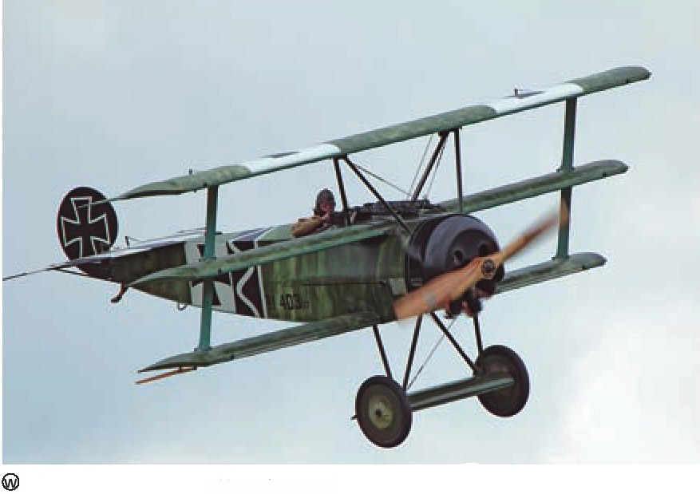
第一次世界大战时期的福克三翼机

“海神之子”飞机

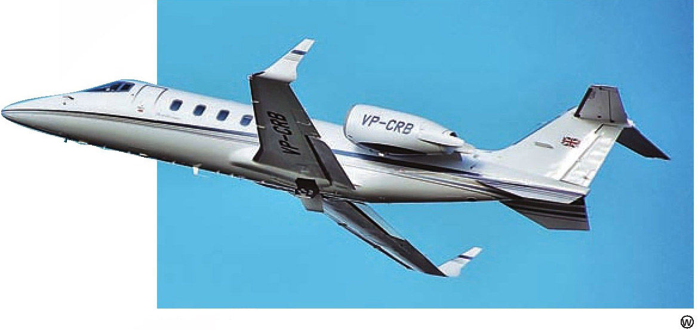
带有翼梢小翼的里尔60飞机

## 为什么有的飞机机翼两端要伸出两只“小手”

飞机能飞，是因为流过机翼上下表面的空气速度不同而造成的压力差。因为存在这个压力差和速度差，当流过机翼下表面的高压低速气流在机翼的末端和流过机翼上表面的低压高速气流相遇时，下方的气流就会绕到上表面，形成旋涡。这种旋涡不仅降低机翼的升力，而且产生一种阻碍飞机前进的阻力。由于这种阻力是被升力诱导出来的，因此被称为诱导阻力。为了减小这种阻力，有的飞机就在翼梢上加了一个小翼，来阻碍下表面的气流绕到上表面。这样可以减小阻力，提高升力。今天很多民航客机的机翼末端都装有这样的小翼，就像两只“小手”。

那么，如果我们把小翼加长，是不是诱导阻力就能更小呢？没错，正是出于这样的考虑，有了C形、方形乃至环形的机翼。不过这几类机翼设计和生产难度大，气动性能也未必好于普通机翼，因此没有得到广泛的应用。（张首智）

## 为什么有的机翼在机身上方，有的机翼在机身下方

根据机翼相对于机身的垂直位置，可分为上单翼、中单翼和下单翼。这几种布置形式各有优缺点，要根据具体用途进行选择。上单翼可使机身贴近地面，有利于装卸货物，可提高飞机的稳定性，缺点是起落架必须安装到机身上，主起落架轮距较小，滑跑稳定性差，因此多用于军用运输机。中单翼的气动干扰阻力最小，但如果直接穿过机身会影响载货空间，如果不直接穿过机身则需要增加较多的结构重量，多用于战斗机。下单翼在应急着陆时对机身能起到保护作用，在水上迫降时，能使机身露在水面之上，利于疏散旅客，因此多用于客运飞机。（张首智）

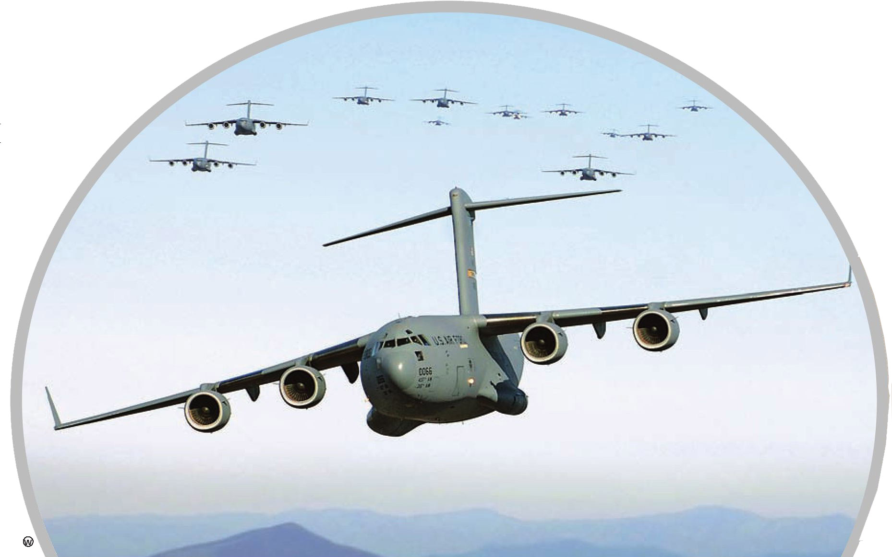
上单翼的C-17运输机

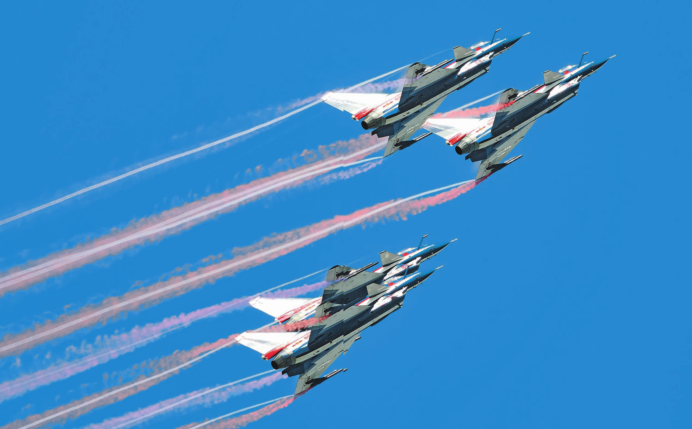
2010年珠海航展上，换装歼-10超声速战斗机的中国空军“八一”表演队首次亮相，劲舞苍穹

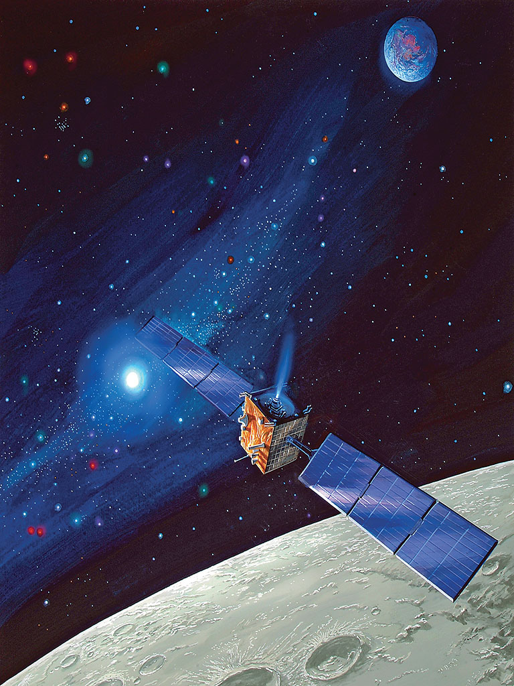
